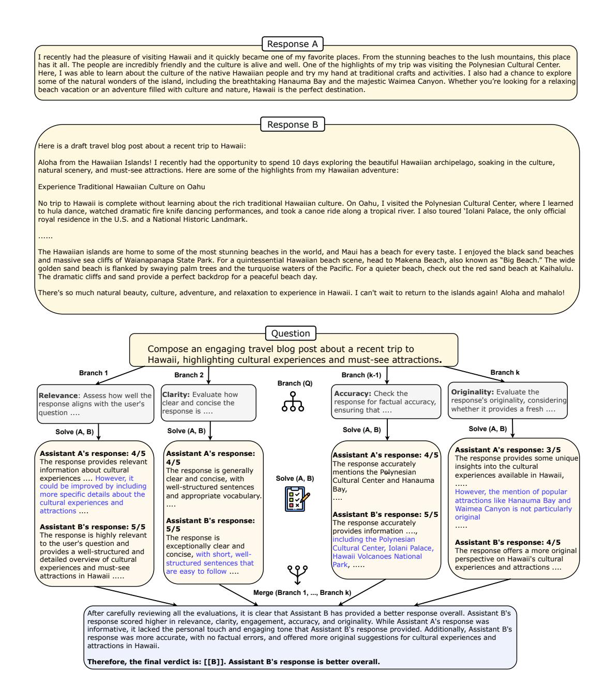
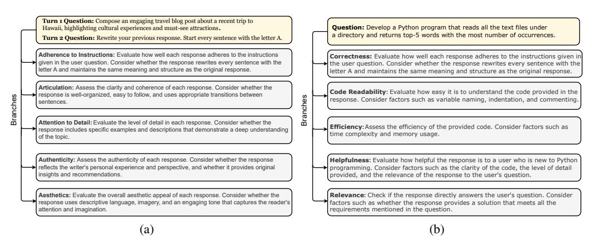
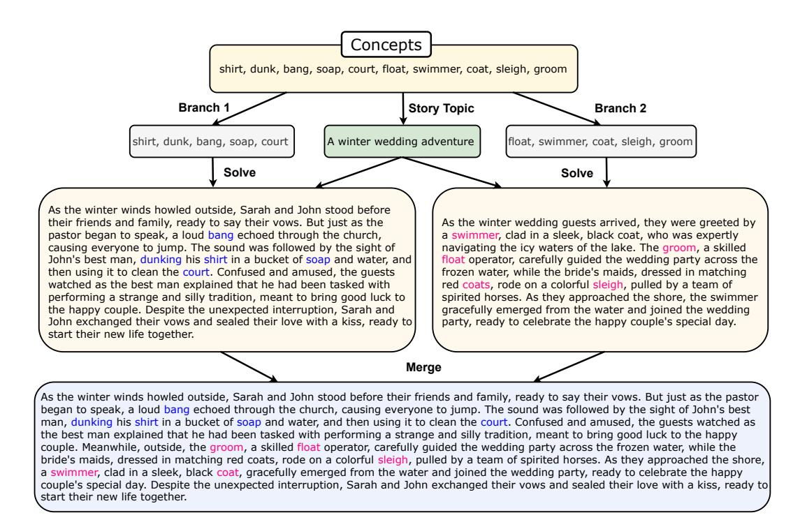

# BRANCH-SOLVE-MERGE IMPROVES LARGE LANGUAGE MODEL EVALUATION AND GENERATION

Anonymous authors Paper under double-blind review

## ABSTRACT

Being able to iteratively improve Large Language Model (LLM) generations necessitates designing a robust and reliable LLM-based evaluator that correlates well with humans, minimizes critical biases like position and length bias, and scales well across tasks and domains. We propose BRANCH-SOLVE-MERGE (BSM), a Large Language Model program capable of evaluating LLM responses. The branch module decomposes the evaluation task along multiple aspects by generating an evaluation plan, the solve module evaluates the responses for each of these criteria independently, and the merge module aggregates the results of sub-evaluations to generate the final verdict. We show that BRANCH-SOLVE-MERGE improves both correctness and consistency of LLM-based evaluators (e.g., LLaMA-2-7B-chat, Vicuna-33B, LLaMA-2-70B-chat, and GPT-4) by enhancing human-LLM agreement up to 26%, reducing position and length biases up to 50%, and generalizing well across multiple domains including writing, coding, reasoning, and math. We also demonstrate the general applicability of BSM in improving language generation capabilities of LLMs. We experiment with a constrained story generation task and show that BSM leads to the generation of more coherent stories, while improving constraint satisfaction by absolute 12%.

## 1 INTRODUCTION

Large Language Models (LLM) are getting increasingly deployed as general-purpose chat assistants [\(Radford et al.,](#page-14-0) [2019;](#page-14-0) [Brown et al.,](#page-12-0) [2020;](#page-12-0) [OpenAI,](#page-14-1) [2023b;](#page-14-1) [Chowdhery et al.,](#page-13-0) [2022;](#page-13-0) [Touvron](#page-15-0) [et al.,](#page-15-0) [2023\)](#page-15-0). However, they still struggle with user tasks or questions that have intricate requirements like satisfying a set of constraints or meeting objectives that are, in general, multi-dimensional. It primarily stems from the model's general lack of ability to plan [\(Yao et al.,](#page-15-1) [2023b;](#page-15-1) [Bubeck et al.,](#page-12-1) [2023\)](#page-12-1). As potential solutions, recent work has developed iterative methods, involving planning and refinement [\(Madaan et al.,](#page-14-2) [2023;](#page-14-2) [Yao et al.,](#page-15-2) [2023c;](#page-15-2) [Chen et al.,](#page-12-2) [2023;](#page-12-2) [Li et al.,](#page-14-3) [2023\)](#page-14-3) by leveraging LLM-based evaluators to provide feedback at each step.

LLM-based evaluators like GPT-4 have been the the de-facto standard for evaluating LLM generations [\(Liu et al.,](#page-14-4) [2023;](#page-14-4) [Zheng et al.,](#page-15-3) [2023;](#page-15-3) [Bubeck et al.,](#page-12-1) [2023\)](#page-12-1). However, several challenges have also been identified with this approach. First, evaluating general-purpose LLMs is challenging due to their ability to generate long-form answers to arbitrary and open-ended questions [\(Zheng et al.,](#page-15-3) [2023\)](#page-15-3). Second, LLM-based evaluators are not reliable and are prone to different kinds of biases including (a) Position Bias: evaluation changes based on the encoding order of the responses, (b) Length Bias: tendency to favor longer responses, (c) Self-enhancement Bias: the LLM-evaluator favoring its own responses [\(Zheng et al.,](#page-15-3) [2023;](#page-15-3) [Wu & Aji,](#page-15-4) [2023;](#page-15-4) [Wang et al.,](#page-15-5) [2023b\)](#page-15-5). Third, while API-based models like GPT-4 are fairly good evaluators, this is still an expensive option. Cheaper open-source alternatives do not correlate well with humans and are much more susceptible to the aforementioned biases [\(Zheng et al.,](#page-15-3) [2023\)](#page-15-3). Last but not least, a robust evaluator should generalize well, capable of evaluating responses to arbitrary questions and hence, hand-designing the evaluation plan for every task is not a scalable approach [\(Liu et al.,](#page-14-4) [2023;](#page-14-4) [Wu & Aji,](#page-15-4) [2023\)](#page-15-4). For example, see Figure [1,](#page-1-0) where evaluating responses to a 'writing' question requires considering factors like 'Relevance', 'Clarity' etc whereas if the question is a 'coding' question (see Figure [2\(b\)\)](#page-2-0), one should evaluate for 'Code Correctness', 'Code Readability', etc.



<span id="page-1-0"></span>Figure 1: An illustration of BRANCH-SOLVE-MERGE with LLaMA-2-70B-chat for evaluating LLM responses. Given a question and two responses from two LLMs A and B, BSM judges which one is better. The branch module conditions on the question to generate an evaluation plan, consisting of different criteria like relevance, clarity, etc. The solve module evaluates the responses for each of these and the merge module combines the individual solutions to obtain the final judgment.

We propose BRANCH-SOLVE-MERGE (BSM), a Large Language Model program (Schlag et al., 2023; Dohan et al., 2022) for comparatively evaluating LLM responses. See Figure 1 for an illustrative example. It consists of three neural modules: *branch*, *solve*, and *merge* that are parameterized with specific prompts to an underlying LLM. Given an arbitrary user question, the branch module generates an evaluation plan consisting of different criteria to evaluate the response against. Each evaluation criterion defines a sub-problem of the overall evaluation task. The solve module then solves each of these sub-problems by evaluating the responses for the corresponding criterion only. These sub-problems have the advantage of being solved in parallel, resulting in improved efficiency because of batched decoding (Ning et al., 2023). Finally, the merge module merges the solutions to the sub-problems i.e., combines the per-criterion evaluation to arrive at a global judgement.

<span id="page-2-2"></span>

<span id="page-2-1"></span><span id="page-2-0"></span>Figure 2: Different branches (evaluation plans) generated by BSM with a LLaMA-2-70B-chat model for different kinds of questions: (a) a turn-2 writing question and (b) a coding question. The more important branches (e.g., 'Adherence to Instructions' for the first question and 'Code Correctness' for the second question) are generated first by the model, suggesting a priority order among the aspects (while all are executed equally in parallel).

We develop BSM on top of multiple open-source and API-based LLMs of varying sizes and strengths including LLaMA-2-7B-chat (Touvron et al., 2023), Vicuna-33B (Chiang et al., 2023), LLaMA-2-70B-chat (Touvron et al., 2023), and GPT-4 (OpenAI, 2023b). We demonstrate significant findings that address the aforementioned challenges with LLM evaluation. BSM improves both correctness and consistency of LLM evaluation. In particular, it improves agreement with humans for evaluating multi-turn questions belonging to different domains including writing, coding, reasoning, and mathematics, thus pointing to its generalizability and capability to evaluate responses to arbitrary user queries. It can also be effectively applied on top of different language models, ranging from a comparatively weaker LLaMA-2-7B-chat model to a stronger GPT-4 model and leads to consistent gains across all models. For example, compared to direct prompting, BSM with LLaMA-2-70B-chat improves LLM-human agreement by up to absolute 26%, reduces position bias and length bias by up to absolute 50%, and even matches or outperforms GPT-4 on most domains. BSM with GPT-4 improves the agreement scores further. BSM also outperforms Self-consistency (Wang et al., 2022), that uses the same amount of compute as BSM and can be seen as a simple special case of BSM. Finally, we conduct detailed analysis of the individual components of BSM, including the role of branching factor and our method's robustness to different solving methods.

We also demonstrate that BSM can be generally applied to improve language generation capabilities from LLMs. Specifically, we experiment with a constrained text generation task that requires generating a coherent story consisting of a set of random concepts. BSM generates more coherent stories, while also improving constraint satisfaction by an absolute 12%. In summary, BSM emphasizes the importance of task decomposition for multi-faceted tasks like Large Language Model evaluation and constrained generation, leading to significant gains in both correctness and consistency.

#### 2 RELATED WORK

LLM Programs and Decomposing Complex Tasks. BRANCH-SOLVE-MERGE is an instance of a Large Language Model (LLM) program (Schlag et al., 2023; Dohan et al., 2022; Creswell & Shanahan, 2022). LLM programs solve complex problems with the help of an algorithm that breaks the problem down into multiple steps and each step is then parameterized with a different prompt to an underlying LLM. Complex tasks, in general, require task decomposition (Khot et al., 2022) and planning (Yao et al., 2022; Huang et al., 2022; Yao et al., 2023b; Ning et al., 2023). This has motivated a lot of recent work on advanced prompting methods across both vision and language domains. A few representative methods include decomposed prompting (Khot et al., 2022), least-to-most prompting (Zhou et al., 2022), plan and solve prompting (Wang et al., 2023a), successive prompting (Dua et al., 2022), decomposed summarization (Saha et al., 2022; 2023), text modular networks (Khot et al., 2021), and visual programming (Gupta & Kembhavi, 2023; Cho et al., 2023). However, most of these works typically focus on reasoning problems (like commonsense,

symbolic, or mathematical reasoning) that benefit from *sequential* decompositions. We, on the other hand, study challenging language tasks like LLM Evaluation or constrained text generation that benefit from branching into *parallel* decompositions. Closest to our work is Graph-of-Thoughts prompting (Lei et al., 2023; Besta et al., 2023) because the execution trace of BRANCH-SOLVE-MERGE takes the shape of a graph through the process of branching. However, past explorations of Graph-of-Thoughts have been limited to simple proof-of-concept tasks like sorting numbers, keyword counting or general problem solving like Game of 24, solving polynomial equations, none of which deal with the intricacies or challenges of evaluating or improving language models.

Large Language Model Evaluation. A fundamental challenge with the rapid progress of LLMs is evaluating their capabilities holistically (Chang et al., 2023; Liang et al., 2022). Human evaluation is difficult and expensive (Smith et al., 2022). On the other hand, LLMs, by virtue of being trained with RLHF, are shown to exhibit alignment with humans (Ouyang et al., 2022; Bai et al., 2022). Hence, a standard procedure for comparing and evaluating LLM generations is by utilizing a strong LLM like GPT-4 (Bubeck et al., 2023; OpenAI, 2023a; Dubois et al., 2023; Zhou et al., 2023; Chiang & Lee, 2023; Wang et al., 2023c; Hada et al., 2023; Liu et al., 2023). This has also led to the development of a number of evaluation benchmarks (Zhong et al., 2023; Köpf et al., 2023; Zheng et al., 2023). Recent studies have shown that LLM-based evaluators are not fair evaluators (Wang et al., 2023b; Wu & Aji, 2023). In response, there have been proposals of using multi-agent debate frameworks (Chan et al., 2023) or developing wider and deeper LLMs (Zhang et al., 2023). BRANCH-SOLVE-MERGE takes a comprehensive step towards improving LLM evaluation by proposing an intuitive and general decomposition-based approach that can be applied on top of any LLM, and used to evaluate responses for a wide range of tasks.

Constrained Generation. Large Language Models are increasingly capable of generating coherent and fluent text. This has shifted the focus to evaluating LLMs for their capabilities in the more difficult setting of controllable and constrained text generation (Keskar et al., 2019; Dathathri et al., 2019; Lu et al., 2021; 2022; Lin et al., 2020; Li et al., 2022). Recent works have shown that GPT-4 struggles with constrained and planning-based text generation tasks (Bubeck et al., 2023; Madaan et al., 2023; Yao et al., 2023a). In this work, we experiment with such a constrained story generation task and show the promise of BRANCH-SOLVE-MERGE in improving text generation capabilities.

#### 3 Branch-Solve-Merge

We first introduce some notation to formally describe our method. Let  $p_{\theta}$  denote an LLM with parameters  $\theta$ . We also denote  $x=(x[1],\cdots,x[n])$  as a language sequence, where each x[i] is a token, such that  $p_{\theta}(x)=\prod_{i=1}^n p_{\theta}(x[i]|x[1...i])$ . Branch-Solve-Merge is an LLM program (Schlag et al., 2023; Dohan et al., 2022) that aims to solve complex planning-based tasks with three neural modules: a branch module, a solve module, and a merge module. Each module is parameterized with the help of unique prompts to the LLM  $p_{\theta}$ . The LLM program further defines an algorithm on top of these modules, acting as a controller and invoking a module at each step of the algorithm. Below, we describe each of these components in detail.

#### 3.1 COMPONENTS OF BRANCH-SOLVE-MERGE

Branch Module. Given a task, the branch module generates multiple sub-tasks and each subtask is represented by a unique branch. Branching into sub-problems is analogous to generating a multi-step parallel plan, where each step can be solved independently. Formally, given a task input x, we define a 'branch' prompt  $\mathtt{prompt_{branch}}(x)$  that can be wrapped around x with branching instructions and some demonstrations (if available). Conditioning on the prompt, the LLM  $p_{\theta}$  generates a set of k sub-problems  $X = \{x^{(1)}, x^{(2)}, \cdots, x^{(k)}\}$ , where k is referred to as the branching factor. The sub-problems are generated auto-regressively as a sequence of tokens:  $X \sim p_{\theta}(X|\mathtt{prompt_{branch}}(x))$ . Then the generated token sequence may additionally go through some post-processing to textually represent the sub-problems. Importantly, the flexibility of our method comes from the fact that for a given problem, the LLM decides (generates) the sub-problems and the corresponding branching factor.

**Solve Module.** The solve module solves the task at hand by generating an output y for a task input x. We define a 'solve' prompt  $prompt_{solve}(x)$  that wraps around the input x with solving instructions and some input-output demonstrations (if available). The language model conditions on the solve prompt to generate a solution y such that  $y \sim p_{\theta}(y|prompt_{solve}(x))$ .

Merge Module. The merge module fuses together the solutions to the sub-problems to generate a global solution to the top-level problem. Similar to the branch and solve prompts, we define a 'merge' prompt  $\operatorname{prompt}_{\operatorname{merge}}(Y)$  that wraps around a set of sub-solutions  $Y=\{y^{(1)},y^{(2)},\cdots,y^{(k)}\}$  with merging instructions and optional demonstrations. The language model conditions on it to generate a merged solution  $y\colon y\sim p_\theta(y|\operatorname{prompt}_{\operatorname{merge}}(Y))$ . Conceptually, the merge module learns an aggregator function that could aggregate a set of values (using an aggregation operator) or fuse pieces of text. Henceforth, for simplicity, let us denote the three modules with their functional forms:  $\operatorname{branch}(\cdot)$ ,  $\operatorname{solve}(\cdot)$ , and  $\operatorname{merge}(\cdot)$ .

**Large Language Model Program.** For a given task, BRANCH-SOLVE-MERGE defines a controller in the form of an algorithm that lays out the transition logic between the modules. Let us define this program as  $P:(x, \mathtt{branch}(\cdot), \mathtt{solve}(\cdot), \mathtt{merge}(\cdot)) \to y$ , taking as input a task instance x, along with the implementations of the modules and generating an output y. The program decides when and how to invoke each of the three modules. In the following two sub-sections, we motivate and conduct case studies of our method with two challenging NLP tasks, that of LLM evaluation and constrained generation.

#### 3.2 Branch-Solve-Merge: Case Study with LLM Evaluation

**Task Description.** We first consider the task of evaluating LLM-based chat assistants. Formally, given an open-ended question (that evaluates an LLM's multi-turn conversational and instruction-following ability) and a pair of responses from two LLM agents, the task requires producing a preference judgement of which response is better or if it is a tie (see Figure 1 for an example). Evaluating LLM responses is challenging because of multiple reasons. First, due to the widespread applicability of these LLMs as general-purpose assistants, the user could ask arbitrary questions pertaining to any domain and based on the initial response, there could be follow-up questions as well. Moreover, the LLM responses are typically long-form and based on the type of question, the evaluation process should consider the intent of the question, what is expected from an ideal response, and what criteria to evaluate the generated response against. For the purpose of this study, we focus on evaluating two-turn conversational questions although the method is generally applicable for any number of turns. Let us denote the first question as  $q_1$  and the follow-up question as  $q_2$ . Let the responses from the two assistants a and b be  $r_1^{(a)}$  and  $r_2^{(b)}$  for  $q_1$ , and  $r_2^{(a)}$  and  $r_2^{(b)}$  for  $q_2$ . Given the multi-faceted nature of this evaluation task, we develop a version of BRANCH-SOLVE-MERGE, as described below.

Branch Module for LLM Evaluation. The branch module generates an evaluation plan. The plan is a set of evaluation criteria that the response will be evaluated against. To ensure that the plan is not biased by the model responses, the branch module only conditions on the input question. In particular, we define the branch module for turn 1 question as branch  $(q_1)$ , while for turn 2 question, it conditions on both turn 1 and turn 2 questions, represented as branch  $(q_1, q_2)$ . The language model generates a set of evaluation criteria, branch $(q) \rightarrow \{c_i\}_{i=1}^k$ , where each  $c_i$  is a one word title of the criterion (e.g., 'relevance') and a short description of how to evaluate for it (e.g., 'Assess how well the response aligns with the user's question and whether it provides relevant information about cultural experiences and must-see attractions in Hawaii.'). See Figure 4 for the branch prompt. Figure 2 shows examples of evluation plans generated by the branch module with a LLaMA-2-70B-chat model.

**Solve Module for LLM Evaluation.** The solve module compares and evaluates the responses based on a specific evaluation criterion. The output of the evaluation is a pair of scores (within a specified range, according to the solving instruction) for each of the responses. Given an evaluation criterion c, we define the solve module for a turn 1 question  $q_1$  and turn 2 question  $q_2$  as:

#### Algorithm 1 BRANCH-SOLVE-MERGE: LLM Program for LLM Evaluation

```
Require: Question q, LLM Responses \{r^{(a)}, r^{(b)}\}, Modules m = \{\text{branch}(\cdot), \text{solve}(\cdot), \text{merge}(\cdot)\}
function BSM(q, r^{(a)}, r^{(b)}, m, swap)
    C \leftarrow \text{branch}(q)
                                                                                        > Branch to different evaluation criteria.
    S^{(a)} \leftarrow 0, S^{(b)} \leftarrow 0
                                                                                        ▷ Initialize overall scores for each agent.
    for each c_i \in C do
         if swap = False then
              s^{(\bar{a})}, s^{(b)} \leftarrow \mathtt{solve}(q, r^{(a)}, r^{(b)}, c_i)
                                                                                                    ⊳ Solve for each of the criteria.
              s^{(a)}, s^{(b)} \leftarrow \mathtt{solve}(q, r^{(b)}, r^{(a)}, c_i)
         S^{(a)} \leftarrow S^{(a)} + s^{(a)}
                                                                                              ▶ Merge the individual evaluations.
          S^{(b)} \leftarrow S^{(b)} + s^{(b)}
    end for
     \begin{array}{c} \overrightarrow{\text{if }} S^{(a)} > S^{(b)} \text{ then } \\ y^{(a,b)} \leftarrow a \end{array} 

    else if S^{(a)} < S^{(b)} then
         y^{(a,b)} \leftarrow b
         y^{(a,b)} \leftarrow tie
    end if
    return y^{(a,b)}
end function
function Branch-Solve-Merge(q, r^{(a)}, r^{(b)}, m)
    y^{(a,b)} = BSM(q, r^{(a)}, r^{(b)}, m, swap = False)
                                                                           ▶ Get verdict by not swapping the response order.
    y^{(b,a)} = BSM(q, r^{(a)}, r^{(b)}, m, swap = True)
                                                                                ▶ Get verdict by swapping the response order.
    if y^{(a,b)} = a \& y^{(b,a)} = b then
                                                ▷ Choose an assistant only if the individual evaluations are consistent.
     else if y^{(a,b)} = b \& y^{(b,a)} = a then
         y \leftarrow b
    else
         y \leftarrow tie
    end if
    return y
end function
```

$$\operatorname{solve}(q_1, r_1^{(a)}, r_1^{(b)}, c) \to (s_1^{(a)}, s_1^{(b)})$$
$$\operatorname{solve}(q_1, q_2, r_2^{(a)}, r_2^{(b)}, c) \to (s_2^{(a)}, s_2^{(b)})$$

where  $s_1^{(a)}$  and  $s_1^{(b)}$  are the evaluation scores assigned to the two assistants for  $q_1$  while  $s_2^{(b)}$  and  $s_2^{(b)}$  are those for  $q_2$ . Note that the solve module is not symmetric i.e., the order in which the two responses are encoded in the LLM is important due to its auto-regressive nature (and we address this below in our LLM program). The module additionally generates explanations along with the scores. See Figure 5 for the solve prompt. Figure 1 shows example generations from the solve module with a LLaMA-2-70B-chat model.

**Merge Module for LLM Evaluation.** We develop two variants of the Merge Module. A symbolic variant aggregates the scores across all branches by summing them up. We also develop a neural LLM variant that conditions on the individual scores and generates the final verdict with a model-decided aggregation strategy. Formally, this is defined as

$$\mathsf{merge}(q,\{c_i\}_{i=1}^k,\{s_i^{(a)}\}_{i=1}^k,\{s_i^{(b)}\}_{i=1}^k) \to y$$

where the evaluation criteria  $\{c_i\}_{i=1}^k$  is the output of the branch module and  $s_i^{(a)}$  and  $s_i^{(b)}$  are the criterion-wise evaluations (scores and explanations) of the two assistants generated from the solve modules. The final verdict is  $y \in \{a, b, tie\}$ .



<span id="page-6-0"></span>Figure 3: An illustration of BRANCH-SOLVE-MERGE with LLaMA-2-70B-chat for constrained story generation. Given a set of random concepts, BSM first branches into two sets of concepts and generates a story topic. It then generates an intermediate story for each of the branches and then merges them to create a coherent story, while ensuring that all concepts are still present.

Large Language Model Program for LLM Evaluation. The LLM program is outlined in Algorithm [1.](#page-5-0) For brevity, the algorithm is shown for a random-turn question. For example, if it is a t-turn question, we assume that q encodes all the questions up to that turn in order. We refer to the program as static BRANCH-SOLVE-MERGE because the execution trace of the modules is pre-defined: all samples first branch to sub-problems, followed by an independent solving of each sub-problem, and finally, the solutions to the sub-problems are merged to arrive at the final verdict. To alleviate position bias, the program generates two judgements by swapping the encoding order of the responses (in the 'solve' module). The final judgment is either model 'a' or 'b' if and only if the judgement is consistent for both orders, otherwise we consider the evaluation to be a 'tie'.

#### 3.3 BRANCH-SOLVE-MERGE: CASE STUDY WITH CONSTRAINED GENERATION

Task Description. Our next case study aims to show the general applicability of BSM for improving LLM generation. We consider a constrained story generation task. Specifically, given a set of random concepts (10 in our studies), the task is to generate a coherent story such that all concepts are also included in it. Figure [3](#page-6-0) shows an example. Recent work has shown that constrained text generation poses significant challenges even for GPT-4 [\(Madaan et al.,](#page-14-2) [2023;](#page-14-2) [Yao et al.,](#page-15-14) [2023a;](#page-15-14) [Bubeck et al.,](#page-12-1) [2023\)](#page-12-1) – when the number of concepts is large, LLMs tend to either leave out a lot of concepts or generate text that is incoherent. The task requires planning capabilities and when the model has already generated part of the text without including certain concepts, it is unable to roll back, in which case it either misses these concepts completely or includes them in a manner that the final generation is incoherent.

Branch Module for Constrained Generation. The branch module proposes a story generation plan. The plan consists of (1) a story topic and (2) two subsets of concepts. The two subsets represent sub-problems of the original story generation task but with lesser number of concepts. The story topic ensures that all sub-stories generated as part of BSM belong to the same topic. While we limit the branching factor to two for the purpose of this study, the concepts could be divided into an arbitrary number of subsets. See Figure [3](#page-6-0) for examples of branches.

Solve Module for Constrained Generation. The solve module conditions on a set of concepts and the story topic and generates a story on that topic, while also including all concepts. Intuitively, when the number of concepts is small, 'solving' the constrained generation task is much easier.

Merge Module for Constrained Generation. The merge module conditions on two pieces of text (i.e., solutions to the two sub-problems) and fuses them together. Since both sub-stories belong to the same high-level topic, BSM ensures that the fusion is seamless and the final story is coherent. See Figure [3](#page-6-0) for a real example, in which the final story contains all major parts of the two sub-stories, while undergoing some sentence restructuring and reordering and including phrases like 'Meanwhile, outside' to better connect the stories. Overall, BSM ensures more constraint satisfaction by solving sub-problems and maintains coherency through the use of a top-level plan that includes a story topic.

## 4 EXPERIMENTS: LARGE LANGUAGE MODEL EVALUATION

## 4.1 EXPERIMENTAL SETUP

Dataset Details. We experiment with the MT-Bench dataset, which evaluates LLMs as judge for other LLMs as helpful AI Assistants in multi-turn conversations [\(Zheng et al.,](#page-15-3) [2023\)](#page-15-3). It consists of 2400 LLM responses and 3000 expert human judgements. LLM outputs are responses to 80 representative instructions from 8 diverse domains: writing, roleplay, extraction, reasoning, math, coding, knowledge I (STEM), and knowledge II (humanities/social science). Each question is a conversational question, consisting of two turns, in which the second-turn question is a follow-up to the first-turn question. For each question, the dataset consists of responses from 6 different LLMs (Alpaca-13B, Vicuna-13b, LLaMA-13B, Claude-v1, GPT-3.5-turbo, and GPT-4), thus resulting in 15 possible response pairs. Hence, the entire evaluation set consists of 300 response-pair samples per category. The 3000 human (expert) preference judgments for these samples allow computing agreement of LLM-evaluators with expert human evaluators.

Evaluation Metrics. We evaluate BSM using the following three metrics.

- LLM-Human Agreement (Ag). Our primary metric of interest is LLM-human agreement. We report agreement scores ∈ [0, 1], individually for turn-1 and turn-2 questions, and their combination. Each sample (question and two model responses) has a variable number of human judgments. Hence, following past work, we compute agreement by independently matching each human judgment for each sample with the model judgment [\(Zheng et al.,](#page-15-3) [2023\)](#page-15-3). Table [9](#page-17-1) in the Appendix shows that even if the agreement is computed with a majority vote of the individual human judgments, our conclusions (as discussed below) do not change.
- Position Bias (PB). To evaluate whether BSM helps reduce the consistency problem with LLMbased evaluators, we report Position Bias. It refers to the fraction of samples where the judgment changes based on the encoding order of the responses.
- Length Bias (LB). We measure length bias as the fraction of samples where humans prefer the shorter response but the evaluator model does not. Note that measuring length bias in isolation is challenging because knowing whether the model prefers the longer response because of its length (and not for another reason) is an interpretability question and humans also tend to prefer longer responses, especially for open-ended questions.

Conceptually, the human agreement metric evaluates *correctness* while position bias evaluates *consistency* of LLM-based evaluators. Note that both are complementary aspects and an ideal evaluator should ensure both (i.e., high agreement scores and low biases) for it to be reliably used.

Implementation Details. We develop our method on top of multiple state-of-the-art open-source and API-based LLMs of varying scales and capabilities: LLaMA-2-7B-chat [\(Touvron et al.,](#page-15-0) [2023\)](#page-15-0), Vicuna-33B [\(Chiang et al.,](#page-13-2) [2023\)](#page-13-2), LLaMA-2-70B-chat [\(Touvron et al.,](#page-15-0) [2023\)](#page-15-0), and GPT-4 [\(OpenAI,](#page-14-1) [2023b\)](#page-14-1). We implement all modules zero-shot, providing only module-specific instructions and assuming no access to demonstrations of how to branch, solve, or merge. For better reproducibility, all modules generate text using greedy decoding. For the branch module, the LLM is prompted to generate a plan consisting of a maximum of five evaluation criteria (which it always adheres to). Refer to our prompts in the Appendix for additional implementation details.

| Method                    |      | Overall |       |      | Turn 1 |       | Turn 2 |       |       |
|---------------------------|------|---------|-------|------|--------|-------|--------|-------|-------|
|                           | Ag↑  | PB↓     | LB↓   | Ag↑  | PB↓    | LB↓   | Ag↑    | PB↓   | LB↓   |
| Vicuna-33B                | 0.51 | 30.66   | 48.12 | 0.55 | 22.66  | 48.43 | 0.47   | 38.66 | 47.82 |
| SC (w/ Vicuna-33B)        | 0.51 | 25.66   | 45.11 | 0.53 | 18.00  | 46.87 | 0.49   | 33.33 | 43.47 |
| BSM (w/ Vicuna-33B)       | 0.56 | 20.00   | 42.85 | 0.57 | 18.00  | 42.18 | 0.56   | 22.00 | 43.47 |
| LLaMA-2-70B-chat          | 0.43 | 51.66   | 54.88 | 0.53 | 42.66  | 50.00 | 0.34   | 60.66 | 59.42 |
| SC (w/ LLaMA-2-70B-chat)  | 0.52 | 35.66   | 48.12 | 0.57 | 32.00  | 45.31 | 0.47   | 39.33 | 50.72 |
| BSM (w/ LLaMA-2-70B-chat) | 0.55 | 17.33   | 39.09 | 0.60 | 14.66  | 39.46 | 0.50   | 20.00 | 39.13 |
| GPT-4                     | 0.59 | 17.33   | 39.09 | 0.57 | 18.66  | 39.06 | 0.60   | 16.00 | 39.13 |
| BSM (w/ GPT-4)            | 0.62 | 17.00   | 36.84 | 0.63 | 21.33  | 43.75 | 0.61   | 12.66 | 30.43 |

<span id="page-8-0"></span>Table 1: Comparison of zero-shot LLM evaluators with Self-Consistency (SC) and BRANCH-SOLVE-MERGE (BSM) on the 'writing' questions in the MT-Bench dataset. We report Human Agreement (Ag), Position Bias (PB), and Length Bias (LB) for turn 1 and turn 2 question overall, and individually. BRANCH-SOLVE-MERGE improves agreement scores and for open-source models, leads to a significant reduction of position and length bias.

Baselines. We compare our method, BSM, to zero-shot prompting with the same LLM, using the same evaluation prompt as used in prior work [\(Zheng et al.,](#page-15-3) [2023\)](#page-15-3). We also compare with Self-Consistency [\(Wang et al.,](#page-15-7) [2022\)](#page-15-7), which samples multiple evaluations from the prompted LLM (with temperature 0.7) and chooses the majority vote as the final judgment. All methods, including BSM, account for position bias in the same manner, generating a verdict for each encoding order and choosing the final verdict based on the individual verdicts where applicable. In particular, Self-Consistency computes majority vote independently for each encoding order. To ensure fair comparisons, Self-Consistency samples the same number of generations as the branching factor in BSM (five, in our experiments). We also note that Self-Consistency is a simple special case of BSM, where the branch module spawns multiple instances of the *same* underlying problem (instead of sub-problems), solves them by sampling different solutions, and the merging operator is a majority vote.

#### 4.2 MAIN RESULTS

BRANCH-SOLVE-MERGE improves human agreement and reduces biases. Table [1](#page-8-0) evaluates the efficacy of BRANCH-SOLVE-MERGE, specifically focusing on the 'writing' category of questions from the MT-Bench benchmark. We report our main findings below.

- Overall agreement. We first demonstrate that BSM improves human agreement for both turn-1 and turn-2 questions, when applied to all three base LLMs. For LLaMA-2, compared to the zero-shot baseline, BSM obtains an overall absolute improvement of 12% in agreement score, making LLaMA-2 competitive with GPT-4 for turn 1 (but still lags behind for turn 2). Even though zero-shot GPT-4 is the state-of-the-art LLM-based evaluator, applying BSM obtains a further improvement of 3%.
- Turn-1 versus Turn-2 questions. Evaluating turn-2 (follow-up) questions is harder because it requires additional contextualization of the responses for the turn-1 question. This is also reflected in all zero-shot models, exhibiting lower turn-2 agreement scores (e.g., LLaMA-2 results drop from 0.53 in turn 1 to 0.34 in turn 2). BSM shows that a decomposition approach and generating an evaluation plan are particularly helpful for evaluating long context questions, resulting in more improvements for turn-2 questions (e.g., a 16% improvement with LLaMA-2). An illustration of this is shown in Figure [2\(a\),](#page-2-2) in which for the turn-2 question, the model generates 'Adherence to Instructions' as the first criterion to evaluate.
- Self-Consistency versus BSM. BSM also outperforms Self-Consistency (e.g., by up to 5% with Vicuna). As noted earlier, Self-Consistency is a special case of BSM. Moreover, Self-Consistency with comparatively weaker models like Vicuna may not always be effective because of the model's inability to generate vastly different solutions [\(Wang et al.,](#page-15-7) [2022\)](#page-15-7). BSM, on the other hand, works well across all models. This result is also noteworthy because both approaches leverage similar amount of compute in generating multiple solutions but branching and solving the sub-problems is superior to solving the same problem multiple times.

| Method                   | Overall |       |       |      | Turn 1 |       | Turn 2 |       |       |
|--------------------------|---------|-------|-------|------|--------|-------|--------|-------|-------|
|                          | Ag↑     | PB↓   | LB↓   | Ag↑  | PB↓    | LB↓   | Ag↑    | PB↓   | LB↓   |
| LLaMA-2-7B-chat          | 0.39    | 62.33 | 54.88 | 0.42 | 59.33  | 51.56 | 0.35   | 65.33 | 57.97 |
| SC (w/ LLaMA-2-7B-chat)  | 0.38    | 54.00 | 57.89 | 0.39 | 54.00  | 57.81 | 0.36   | 54.00 | 57.97 |
| BSM (w/ LLaMA-2-7B-chat) | 0.41    | 48.33 | 53.38 | 0.43 | 44.66  | 51.56 | 0.39   | 52.00 | 55.07 |

<span id="page-9-0"></span>Table 2: LLM Evaluation with weaker and smaller LLMs like LLaMA-2-7B-chat on the 'writing' questions of the MT-Bench dataset. BSM leads to moderate gain in human agreement but a significant reduction in position bias.

| Domain     | Method                 | Overall |       |       | Turn 1 |       |       | Turn 2 |       |       |
|------------|------------------------|---------|-------|-------|--------|-------|-------|--------|-------|-------|
|            |                        | Ag↑     | PB↓   | LB↓   | Ag↑    | PB↓   | LB↓   | Ag↑    | PB↓   | LB↓   |
| Roleplay   | LLaMA-2-70B-c          | 0.55    | 29.66 | 51.67 | 0.61   | 30.00 | 48.14 | 0.50   | 29.33 | 55.88 |
|            | BSM (w/ LLaMA-2-70B-c) | 0.61    | 11.00 | 40.26 | 0.66   | 10.66 | 38.27 | 0.56   | 11.33 | 42.64 |
|            | GPT-4                  | 0.64    | 13.66 | 43.62 | 0.65   | 16.00 | 45.67 | 0.63   | 11.33 | 41.17 |
| Extraction | LLaMA-2-70B-c          | 0.40    | 70.66 | 51.82 | 0.46   | 61.33 | 51.47 | 0.33   | 80.00 | 52.08 |
|            | BSM (w/ LLaMA-2-70B-c) | 0.55    | 31.33 | 40.24 | 0.55   | 32.00 | 45.58 | 0.44   | 30.66 | 36.45 |
|            | GPT-4                  | 0.71    | 15.00 | 33.53 | 0.68   | 13.33 | 35.29 | 0.75   | 16.66 | 32.29 |
| Stem       | LLaMA-2-70B-c          | 0.46    | 59.33 | 55.31 | 0.50   | 52.66 | 51.19 | 0.43   | 66.00 | 61.40 |
|            | BSM (w/ LLaMA-2-70B-c) | 0.72    | 10.33 | 44.68 | 0.70   | 10.66 | 40.47 | 0.73   | 10.00 | 50.87 |
|            | GPT-4                  | 0.72    | 13.66 | 46.80 | 0.68   | 16.66 | 44.04 | 0.75   | 10.66 | 50.87 |
| Humanities | LLaMA-2-70B-c          | 0.46    | 59.00 | 45.69 | 0.51   | 52.00 | 49.18 | 0.41   | 66.00 | 43.33 |
|            | BSM (w/ LLaMA-2-70B-c) | 0.67    | 18.00 | 36.42 | 0.63   | 18.00 | 39.34 | 0.71   | 18.00 | 34.44 |
|            | GPT-4                  | 0.73    | 14.00 | 37.08 | 0.70   | 19.33 | 42.62 | 0.76   | 8.66  | 33.33 |

<span id="page-9-1"></span>Table 3: LLM evaluation for 'Roleplay', 'Extraction', 'Stem', and 'Humanities' question categories. We compare LLaMA-2-70B-chat BSM with the baseline zero-shot method, and also report GPT-4. BSM obtains significant improvements over the LLaMA baseline, and matches or is close to GPT-4 agreement in three of the four domains, while sometimes outperforming GPT-4 in reducing biases.

- Bias Reduction. On top of improving LLM-human agreement, BSM helps reduce critical biases with LLM-based evaluators. Weaker models exhibit biases far more frequently e.g., LLaMA-2 suffers from position bias almost half the time. However, BSM obtains a significant 34% reduction in position bias, matching that of GPT-4. We also observe a significant reduction in length bias. BSM with GPT-4 does not impact position bias much, perhaps because it is already quite consistent. Nevertheless, BSM opens up the possibility of using weaker open-source models also as evaluators, closing the gap to GPT-4.
- BSM with comparatively smaller models. We also investigate whether smaller models like LLaMA-2-7B-chat can benefit from BSM. Table [2](#page-9-0) shows that smaller models are, in general, weak evaluators. Even then, BSM leads to a moderate 2% improvement in agreement scores, while self-consistency proves to be ineffective. More encouragingly, BSM reduces the position bias by a significant 14%. This is a direct consequence of the decomposition-based approach – albeit the underlying model is weak and may not be best suited for LLM evaluation, branching into sub-problems makes its evaluations much more consistent (but not necessarily correct to such an extent).

In summary, our results suggest that BSM is a generic method that can be applied to any LLM for evaluating generations from language models. It improves both *correctness* (by improving human agreement) and *consistency* (by reducing biases) of LLM-based evaluators.

BRANCH-SOLVE-MERGE generalizes well across domains. We observe that BSM shows the promise of being a robust evaluator. In Table [3,](#page-9-1) we evaluate BSM's ability to evaluate generations for questions in the categories of 'Roleplay', 'Extraction', 'Stem', and 'Humanities'. BSM demonstrates robustness across domains in terms of improvement over the LLaMa-2-70B-chat baseline. In particular, on the Stem domain, it is able to improve agreement scores by up to absolute 26%, match

| Domain    | Method                 |      | Overall |       |      | Turn 1 |       |      | Turn 2 |       |  |
|-----------|------------------------|------|---------|-------|------|--------|-------|------|--------|-------|--|
|           |                        | Ag↑  | PB↓     | LB↓   | Ag↑  | PB↓    | LB↓   | Ag↑  | PB↓    | LB↓   |  |
| Coding    | LLaMA-2-70B-c          | 0.47 | 52.33   | 51.32 | 0.50 | 47.33  | 46.77 | 0.44 | 57.33  | 56.86 |  |
|           | BSM (w/ LLaMA-2-70B-c) | 0.61 | 25.66   | 42.47 | 0.60 | 24.66  | 40.32 | 0.63 | 26.66  | 45.09 |  |
|           | GPT-4                  | 0.61 | 19.66   | 38.93 | 0.60 | 21.33  | 35.48 | 0.62 | 18.00  | 43.13 |  |
| Reasoning | LLaMA-2-70B-c          | 0.47 | 38.00   | 48.75 | 0.48 | 33.33  | 40.81 | 0.46 | 42.66  | 61.29 |  |
|           | BSM (w/ LLaMA-2-70B-c) | 0.57 | 20.33   | 46.25 | 0.60 | 19.33  | 44.89 | 0.55 | 21.33  | 48.38 |  |
|           | GPT-4                  | 0.64 | 22.66   | 53.75 | 0.69 | 12.00  | 51.02 | 0.59 | 33.33  | 58.06 |  |
| Math      | LLaMA-2-70B-c          | 0.52 | 45.66   | 50.56 | 0.56 | 48.00  | 54.76 | 0.48 | 43.33  | 46.80 |  |
|           | BSM (w/ LLaMA-2-70B-c) | 0.64 | 17.66   | 34.83 | 0.69 | 16.00  | 33.33 | 0.59 | 19.33  | 36.17 |  |
|           | GPT-4                  | 0.62 | 19.00   | 39.32 | 0.67 | 17.33  | 40.47 | 0.58 | 20.66  | 38.29 |  |

Table 4: Reference-based LLM evaluation for 'Coding', 'Reasoning', and 'Math' question categories. We compare LLaMA-2-70B-chat BSM with the baseline zero-shot method and also report GPT-4. LLMs generally struggle with questions in these domains. BSM improves reference-based evaluations and for math, outperforms GPT-4.

<span id="page-10-1"></span><span id="page-10-0"></span>

|                 |              | Overall        |                |              | Turn 1         |                | Turn 2       |                |                |  |
|-----------------|--------------|----------------|----------------|--------------|----------------|----------------|--------------|----------------|----------------|--|
|                 | Ag↑          | PB↓            | LB↓            | Ag↑          | PB↓            | LB↓            | Ag↑          | PB↓            | LB↓            |  |
| BSM<br>BSM + SC | 0.55<br>0.55 | 17.33<br>15.33 | 39.09<br>39.09 | 0.60<br>0.61 | 14.66<br>10.66 | 39.46<br>39.06 | 0.50<br>0.49 | 20.00<br>20.00 | 39.13<br>39.13 |  |

Table 5: Effect of using Self-Consistency within each branch of BRANCH-SOLVE-MERGE (BSM+SC). Results are with the LLaMA-2-70B-chat model. While the overall agreement scores do not improve further, we obtain a further 2% reduction in position bias.

GPT-4, and even outperform it in terms of position and length biases. All domains exhibit similar phenomena, except for Extraction.

BRANCH-SOLVE-MERGE is equally performant in grading reference-based questions. So far, we have applied BSM in reference-free evaluations for more open-ended questions like writing, roleplay, etc. However, LLMs generally struggle with complex tasks like in math, reasoning, and coding [\(Cobbe et al.,](#page-13-15) [2021;](#page-13-15) [Chen et al.,](#page-12-8) [2021;](#page-12-8) [Wei et al.,](#page-15-15) [2022\)](#page-15-15). More so, even when LLMs are able to successfully answer these questions, they may not be able to evaluate them correctly. [Zheng et al.](#page-15-3) [\(2023\)](#page-15-3) suggest alleviating this issue by first generating an answer using GPT-4 and then appending it to the evaluation prompt. For fair comparisons, we also follow prior work for grading these categories of questions by conditioning the 'solve' module on the GPT-4 generated answers. The key assumption here is that these answers are curated once and have limited variations unlike openended questions, thus allowing us to evaluate BSM in reference-based settings. Table [4](#page-10-0) shows the results. BSM significantly outperforms LLaMA-2 in all categories (by up to 14% better agreement scores and 27% better position bias in coding questions). On Math, it even outperforms the state-ofthe-art GPT-4 evaluator, outperforming on all metrics.

<span id="page-10-2"></span>

|    |      | Overall |       |      | Turn 1 |       |      | Turn 2 |       |  |  |
|----|------|---------|-------|------|--------|-------|------|--------|-------|--|--|
| BF | Ag↑  | PB↓     | LB↓   | Ag↑  | PB↓    | LB↓   | Ag↑  | PB↓    | LB↓   |  |  |
| 2  | 0.50 | 22.00   | 49.20 | 0.49 | 24.00  | 45.00 | 0.50 | 22.00  | 56.52 |  |  |
| 3  | 0.52 | 19.00   | 38.09 | 0.53 | 14.00  | 35.00 | 0.51 | 24.00  | 43.47 |  |  |
| 4  | 0.53 | 19.00   | 38.09 | 0.51 | 16.00  | 35.00 | 0.55 | 22.00  | 43.47 |  |  |
| 5  | 0.52 | 12.00   | 34.92 | 0.51 | 12.00  | 35.00 | 0.54 | 12.00  | 34.78 |  |  |

Table 6: Impact of maximum Branching Factor (BF) on 100 samples of 'writing' category with BSM on LLaMA-2-70B-chat.

<span id="page-11-0"></span>

| Solving Technique                       | Overall      |                |                                | Turn 1         |                |              | Turn 2         |                |  |
|-----------------------------------------|--------------|----------------|--------------------------------|----------------|----------------|--------------|----------------|----------------|--|
|                                         | Ag↑          | PB↓            | LB↓<br>Ag↑                     | PB↓            | LB↓            | Ag↑          | PB↓            | LB↓            |  |
| Score Scale (1-5)<br>Score Scale (1-10) | 0.52<br>0.50 | 12.00<br>18.00 | 34.92<br>0.51<br>36.50<br>0.51 | 12.00<br>18.00 | 35.00<br>40.00 | 0.54<br>0.50 | 12.00<br>18.00 | 34.78<br>30.43 |  |

Table 7: Analysis of evaluation scale with 100 samples of 'writing' category. BSM (with LLaMA-2-70B-chat) is fairly robust to such variations.

#### 4.3 ANALYSIS AND ABLATIONS OF BRANCH-SOLVE-MERGE

Combining BSM and SC reduces position bias further. BSM generates a single solution for each sub-problem (in a branch). A possible enhancement is combining BSM with self-consistency i.e., sampling multiple solutions for each sub-problem. In particular, we implement BSM+SC by sampling five evaluations per branch (with temperature 0.7) and then the score for each subevaluation in that branch is given by the average score. We compare BSM with BSM+SC in Table [5.](#page-10-1) While agreement scores do not improve further, we observe 2% reduction in position bias. This points to two take-aways. First, BSM, through its decomposition-based approach, already constructs sub-problems that are granular enough and hence, the variance reduction that one obtains through self-consistency within each sub-problem is limited. However, the moderate reduction in position bias still reflects its usefulness, which is a direct effect of making evaluations more consistent.

Effect of Branching Factor. BSM has the benefit of relying on the underlying LLM for deciding what sub-problems to branch to, while the prompt controls the maximum branching factor (see the phrase 'list of up to five factors' in the branch prompt in Fig. [4\)](#page-17-0). We vary this maximum branching factor from 2 to 5 and study its effect on 100 samples from the 'writing' category of questions. Table [6](#page-10-2) reports our findings. We observe highest agreement at a branching factor of 4, after which the result mostly saturates. In general, the optimal branching factor should depend on the specific question under consideration and unlike past work where users specify what factors to evaluate on [\(Liu et al.,](#page-14-4) [2023;](#page-14-4) [Zheng et al.,](#page-15-3) [2023\)](#page-15-3), BSM generates that plan on its own. Position bias continues to decrease with increasing branching factor, because more branches help reduce variance in the final judgment.

BSM is robust to evaluation scale. In Table [7,](#page-11-0) we compare the performance of BSM by varying the evaluation scale, specified in the 'solve' prompt. We observe that BSM is fairly robust to such variations, obtaining comparable agreement scores. The position bias, however, increases slightly with a larger scale. Based on this, we run all our experiments with a scale of 1-5. In general, we think that BSM should work well in practice with any reasonable scale that is neither too small nor too large.

## 5 EXPERIMENTS: CONSTRAINED TEXT GENERATION

#### 5.1 EXPERIMENTAL SETUP

Evaluation Metrics. We evaluate the story generation task along two axes: (1) coherency, and (2) constraints satisfied. We compare the coherency of two stories, with humans and GPT-4 as judges. For constraints satisfied, we report average fraction of missing concepts in the entire test corpus.

## 5.2 MAIN RESULTS

Table [8](#page-12-9) shows the results. We observe that BSM with LLaMA-2-70B-chat improves constraints satisfaction by including 12% more concepts in the generated stories, compared to direct prompting with the same model.

<span id="page-12-9"></span>

|                                                                                                                          | Vicuna-33B |           | LLaMA2-70B-chat |              |  |
|--------------------------------------------------------------------------------------------------------------------------|------------|-----------|-----------------|--------------|--|
|                                                                                                                          | Model Eval | User Eval | Model Eval      | User Eval    |  |
| LLaMA-2-70B-chat<br>Non-adaptive BSM (d=1)<br>Non-adaptive BSM (d=2)<br>Non-adaptive BSM (d=3)<br>Adaptive BSM (max d=3) | 16.5       | 16.5      | 26.6<br>14.9    | 26.6<br>14.9 |  |

Table 8: BSM with LLaMA-2-70B-chat improves constraints satisfaction by reducing the average number of missing concepts in the generated story.

## 6 CONCLUSION

We presented BRANCH-SOLVE-MERGE, an Large Language Model program for improving LLM evaluation and generation. We conducted two case studies with different implementations of branch, solve, and merge modules, showcasing the effectiveness and generalizability of BSM. On the LLM evaluation task, BSM substantially improves correctness and consistency of evaluation by demonstrating better LLM-Human agreement and reducing position bias respectively. BSM also improves a constrained story generation, enhancing its coherency and satisfying more constraints.

### REFERENCES

<span id="page-12-5"></span>Yuntao Bai, Andy Jones, Kamal Ndousse, Amanda Askell, Anna Chen, Nova DasSarma, Dawn Drain, Stanislav Fort, Deep Ganguli, Tom Henighan, et al. Training a helpful and harmless assistant with reinforcement learning from human feedback. *arXiv preprint arXiv:2204.05862*, 2022.

<span id="page-12-3"></span>Maciej Besta, Nils Blach, Ales Kubicek, Robert Gerstenberger, Lukas Gianinazzi, Joanna Gajda, Tomasz Lehmann, Michal Podstawski, Hubert Niewiadomski, Piotr Nyczyk, et al. Graph of thoughts: Solving elaborate problems with large language models. *arXiv preprint arXiv:2308.09687*, 2023.

<span id="page-12-0"></span>Tom Brown, Benjamin Mann, Nick Ryder, Melanie Subbiah, Jared D Kaplan, Prafulla Dhariwal, Arvind Neelakantan, Pranav Shyam, Girish Sastry, Amanda Askell, et al. Language models are few-shot learners. *Advances in neural information processing systems*, 33:1877–1901, 2020.

<span id="page-12-1"></span>Sebastien Bubeck, Varun Chandrasekaran, Ronen Eldan, Johannes Gehrke, Eric Horvitz, Ece Ka- ´ mar, Peter Lee, Yin Tat Lee, Yuanzhi Li, Scott Lundberg, et al. Sparks of artificial general intelligence: Early experiments with gpt-4. *arXiv preprint arXiv:2303.12712*, 2023.

<span id="page-12-7"></span>Chi-Min Chan, Weize Chen, Yusheng Su, Jianxuan Yu, Wei Xue, Shanghang Zhang, Jie Fu, and Zhiyuan Liu. Chateval: Towards better llm-based evaluators through multi-agent debate. *arXiv preprint arXiv:2308.07201*, 2023.

<span id="page-12-4"></span>Yupeng Chang, Xu Wang, Jindong Wang, Yuan Wu, Kaijie Zhu, Hao Chen, Linyi Yang, Xiaoyuan Yi, Cunxiang Wang, Yidong Wang, et al. A survey on evaluation of large language models. *arXiv preprint arXiv:2307.03109*, 2023.

<span id="page-12-8"></span>Mark Chen, Jerry Tworek, Heewoo Jun, Qiming Yuan, Henrique Ponde de Oliveira Pinto, Jared Kaplan, Harri Edwards, Yuri Burda, Nicholas Joseph, Greg Brockman, et al. Evaluating large language models trained on code. *arXiv preprint arXiv:2107.03374*, 2021.

<span id="page-12-2"></span>Xinyun Chen, Maxwell Lin, Nathanael Scharli, and Denny Zhou. Teaching large language models ¨ to self-debug. *arXiv preprint arXiv:2304.05128*, 2023.

<span id="page-12-6"></span>Cheng-Han Chiang and Hung-yi Lee. Can large language models be an alternative to human evaluations? *arXiv preprint arXiv:2305.01937*, 2023.

- <span id="page-13-2"></span>Wei-Lin Chiang, Zhuohan Li, Zi Lin, Ying Sheng, Zhanghao Wu, Hao Zhang, Lianmin Zheng, Siyuan Zhuang, Yonghao Zhuang, Joseph E. Gonzalez, Ion Stoica, and Eric P. Xing. Vicuna: An open-source chatbot impressing gpt-4 with 90%\* chatgpt quality, March 2023. URL [https:](https://lmsys.org/blog/2023-03-30-vicuna/) [//lmsys.org/blog/2023-03-30-vicuna/](https://lmsys.org/blog/2023-03-30-vicuna/).
- <span id="page-13-9"></span>Jaemin Cho, Abhay Zala, and Mohit Bansal. Visual programming for text-to-image generation and evaluation. In *NeurIPS*, 2023.
- <span id="page-13-0"></span>Aakanksha Chowdhery, Sharan Narang, Jacob Devlin, Maarten Bosma, Gaurav Mishra, Adam Roberts, Paul Barham, Hyung Won Chung, Charles Sutton, Sebastian Gehrmann, et al. Palm: Scaling language modeling with pathways. *arXiv preprint arXiv:2204.02311*, 2022.
- <span id="page-13-15"></span>Karl Cobbe, Vineet Kosaraju, Mohammad Bavarian, Mark Chen, Heewoo Jun, Lukasz Kaiser, Matthias Plappert, Jerry Tworek, Jacob Hilton, Reiichiro Nakano, et al. Training verifiers to solve math word problems. *arXiv preprint arXiv:2110.14168*, 2021.
- <span id="page-13-3"></span>Antonia Creswell and Murray Shanahan. Faithful reasoning using large language models. *arXiv preprint arXiv:2208.14271*, 2022.
- <span id="page-13-14"></span>Sumanth Dathathri, Andrea Madotto, Janice Lan, Jane Hung, Eric Frank, Piero Molino, Jason Yosinski, and Rosanne Liu. Plug and play language models: A simple approach to controlled text generation. In *International Conference on Learning Representations*, 2019.
- <span id="page-13-1"></span>David Dohan, Winnie Xu, Aitor Lewkowycz, Jacob Austin, David Bieber, Raphael Gontijo Lopes, Yuhuai Wu, Henryk Michalewski, Rif A Saurous, Jascha Sohl-Dickstein, et al. Language model cascades. *arXiv preprint arXiv:2207.10342*, 2022.
- <span id="page-13-6"></span>Dheeru Dua, Shivanshu Gupta, Sameer Singh, and Matt Gardner. Successive prompting for decomposing complex questions. In *Proceedings of the 2022 Conference on Empirical Methods in Natural Language Processing*, pp. 1251–1265, 2022.
- <span id="page-13-10"></span>Yann Dubois, Xuechen Li, Rohan Taori, Tianyi Zhang, Ishaan Gulrajani, Jimmy Ba, Carlos Guestrin, Percy Liang, and Tatsunori B Hashimoto. Alpacafarm: A simulation framework for methods that learn from human feedback. *arXiv preprint arXiv:2305.14387*, 2023.
- <span id="page-13-8"></span>Tanmay Gupta and Aniruddha Kembhavi. Visual programming: Compositional visual reasoning without training. In *Proceedings of the IEEE/CVF Conference on Computer Vision and Pattern Recognition*, pp. 14953–14962, 2023.
- <span id="page-13-11"></span>Rishav Hada, Varun Gumma, Adrian de Wynter, Harshita Diddee, Mohamed Ahmed, Monojit Choudhury, Kalika Bali, and Sunayana Sitaram. Are large language model-based evaluators the solution to scaling up multilingual evaluation? *arXiv preprint arXiv:2309.07462*, 2023.
- <span id="page-13-5"></span>Wenlong Huang, Pieter Abbeel, Deepak Pathak, and Igor Mordatch. Language models as zero-shot planners: Extracting actionable knowledge for embodied agents. In *International Conference on Machine Learning*, pp. 9118–9147. PMLR, 2022.
- <span id="page-13-13"></span>Nitish Shirish Keskar, Bryan McCann, Lav R Varshney, Caiming Xiong, and Richard Socher. Ctrl: A conditional transformer language model for controllable generation. *arXiv preprint arXiv:1909.05858*, 2019.
- <span id="page-13-7"></span>Tushar Khot, Daniel Khashabi, Kyle Richardson, Peter Clark, and Ashish Sabharwal. Text modular networks: Learning to decompose tasks in the language of existing models. In *Proceedings of the 2021 Conference of the North American Chapter of the Association for Computational Linguistics: Human Language Technologies*, pp. 1264–1279, 2021.
- <span id="page-13-4"></span>Tushar Khot, Harsh Trivedi, Matthew Finlayson, Yao Fu, Kyle Richardson, Peter Clark, and Ashish Sabharwal. Decomposed prompting: A modular approach for solving complex tasks. In *The Eleventh International Conference on Learning Representations*, 2022.
- <span id="page-13-12"></span>Andreas Kopf, Yannic Kilcher, Dimitri von R ¨ utte, Sotiris Anagnostidis, Zhi-Rui Tam, Keith Stevens, ¨ Abdullah Barhoum, Nguyen Minh Duc, Oliver Stanley, Richard Nagyfi, et al. Openassistant ´ conversations–democratizing large language model alignment. *arXiv preprint arXiv:2304.07327*, 2023.

- <span id="page-14-8"></span>Bin Lei, Chunhua Liao, Caiwen Ding, et al. Boosting logical reasoning in large language models through a new framework: The graph of thought. *arXiv preprint arXiv:2308.08614*, 2023.
- <span id="page-14-3"></span>Xian Li, Ping Yu, Chunting Zhou, Timo Schick, Luke Zettlemoyer, Omer Levy, Jason Weston, and Mike Lewis. Self-alignment with instruction backtranslation. *arXiv preprint arXiv:2308.06259*, 2023.
- <span id="page-14-15"></span>Xiang Li, John Thickstun, Ishaan Gulrajani, Percy S Liang, and Tatsunori B Hashimoto. Diffusionlm improves controllable text generation. *Advances in Neural Information Processing Systems*, 35:4328–4343, 2022.
- <span id="page-14-9"></span>Percy Liang, Rishi Bommasani, Tony Lee, Dimitris Tsipras, Dilara Soylu, Michihiro Yasunaga, Yian Zhang, Deepak Narayanan, Yuhuai Wu, Ananya Kumar, et al. Holistic evaluation of language models. *arXiv preprint arXiv:2211.09110*, 2022.
- <span id="page-14-14"></span>Bill Yuchen Lin, Wangchunshu Zhou, Ming Shen, Pei Zhou, Chandra Bhagavatula, Yejin Choi, and Xiang Ren. Commongen: A constrained text generation challenge for generative commonsense reasoning. In *Findings of the Association for Computational Linguistics: EMNLP 2020*, pp. 1823–1840, 2020.
- <span id="page-14-4"></span>Yang Liu, Dan Iter, Yichong Xu, Shuohang Wang, Ruochen Xu, and Chenguang Zhu. Gpteval: Nlg evaluation using gpt-4 with better human alignment. *arXiv preprint arXiv:2303.16634*, 2023.
- <span id="page-14-12"></span>Ximing Lu, Peter West, Rowan Zellers, Ronan Le Bras, Chandra Bhagavatula, and Yejin Choi. Neurologic decoding:(un) supervised neural text generation with predicate logic constraints. In *Proceedings of the 2021 Conference of the North American Chapter of the Association for Computational Linguistics: Human Language Technologies*, pp. 4288–4299, 2021.
- <span id="page-14-13"></span>Ximing Lu, Sean Welleck, Peter West, Liwei Jiang, Jungo Kasai, Daniel Khashabi, Ronan Le Bras, Lianhui Qin, Youngjae Yu, Rowan Zellers, et al. Neurologic a\* esque decoding: Constrained text generation with lookahead heuristics. In *Proceedings of the 2022 Conference of the North American Chapter of the Association for Computational Linguistics: Human Language Technologies*, pp. 780–799, 2022.
- <span id="page-14-2"></span>Aman Madaan, Niket Tandon, Prakhar Gupta, Skyler Hallinan, Luyu Gao, Sarah Wiegreffe, Uri Alon, Nouha Dziri, Shrimai Prabhumoye, Yiming Yang, et al. Self-refine: Iterative refinement with self-feedback. *arXiv preprint arXiv:2303.17651*, 2023.
- <span id="page-14-5"></span>Xuefei Ning, Zinan Lin, Zixuan Zhou, Huazhong Yang, and Yu Wang. Skeleton-of-thought: Large language models can do parallel decoding. *arXiv preprint arXiv:2307.15337*, 2023.
- <span id="page-14-11"></span>OpenAI. Evals is a framework for evaluating llms and llm systems, and an open-source registry of benchmarks, 2023a. URL <https://github.com/openai/evals>.
- <span id="page-14-1"></span>OpenAI. Gpt-4 technical report, 2023b.
- <span id="page-14-10"></span>Long Ouyang, Jeffrey Wu, Xu Jiang, Diogo Almeida, Carroll Wainwright, Pamela Mishkin, Chong Zhang, Sandhini Agarwal, Katarina Slama, Alex Ray, et al. Training language models to follow instructions with human feedback. *Advances in Neural Information Processing Systems*, 35: 27730–27744, 2022.
- <span id="page-14-0"></span>Alec Radford, Jeffrey Wu, Rewon Child, David Luan, Dario Amodei, Ilya Sutskever, et al. Language models are unsupervised multitask learners. *OpenAI blog*, 1(8):9, 2019.
- <span id="page-14-6"></span>Swarnadeep Saha, Shiyue Zhang, Peter Hase, and Mohit Bansal. Summarization programs: Interpretable abstractive summarization with neural modular trees. In *The Eleventh International Conference on Learning Representations*, 2022.
- <span id="page-14-7"></span>Swarnadeep Saha, Xinyan Yu, Mohit Bansal, Ramakanth Pasunuru, and Asli Celikyilmaz. MUR-MUR: Modular multi-step reasoning for semi-structured data-to-text generation. In *Findings of the Association for Computational Linguistics: ACL 2023*, pp. 11069–11090, Toronto, Canada, July 2023. Association for Computational Linguistics. doi: 10.18653/v1/2023.findings-acl.704. URL <https://aclanthology.org/2023.findings-acl.704>.

- <span id="page-15-6"></span>Imanol Schlag, Sainbayar Sukhbaatar, Asli Celikyilmaz, Wen-tau Yih, Jason Weston, Jurgen ¨ Schmidhuber, and Xian Li. Large language model programs. *arXiv preprint arXiv:2305.05364*, 2023.
- <span id="page-15-10"></span>Eric Smith, Orion Hsu, Rebecca Qian, Stephen Roller, Y-Lan Boureau, and Jason Weston. Human evaluation of conversations is an open problem: comparing the sensitivity of various methods for evaluating dialogue agents. In *Proceedings of the 4th Workshop on NLP for Conversational AI*, pp. 77–97, 2022.
- <span id="page-15-0"></span>Hugo Touvron, Louis Martin, Kevin Stone, Peter Albert, Amjad Almahairi, Yasmine Babaei, Nikolay Bashlykov, Soumya Batra, Prajjwal Bhargava, Shruti Bhosale, et al. Llama 2: Open foundation and fine-tuned chat models. *arXiv preprint arXiv:2307.09288*, 2023.
- <span id="page-15-9"></span>Lei Wang, Wanyu Xu, Yihuai Lan, Zhiqiang Hu, Yunshi Lan, Roy Ka-Wei Lee, and Ee-Peng Lim. Plan-and-solve prompting: Improving zero-shot chain-of-thought reasoning by large language models. *arXiv preprint arXiv:2305.04091*, 2023a.
- <span id="page-15-5"></span>Peiyi Wang, Lei Li, Liang Chen, Dawei Zhu, Binghuai Lin, Yunbo Cao, Qi Liu, Tianyu Liu, and Zhifang Sui. Large language models are not fair evaluators. *arXiv preprint arXiv:2305.17926*, 2023b.
- <span id="page-15-7"></span>Xuezhi Wang, Jason Wei, Dale Schuurmans, Quoc V Le, Ed H Chi, Sharan Narang, Aakanksha Chowdhery, and Denny Zhou. Self-consistency improves chain of thought reasoning in language models. In *The Eleventh International Conference on Learning Representations*, 2022.
- <span id="page-15-11"></span>Yizhong Wang, Hamish Ivison, Pradeep Dasigi, Jack Hessel, Tushar Khot, Khyathi Raghavi Chandu, David Wadden, Kelsey MacMillan, Noah A Smith, Iz Beltagy, et al. How far can camels go? exploring the state of instruction tuning on open resources. *arXiv preprint arXiv:2306.04751*, 2023c.
- <span id="page-15-15"></span>Jason Wei, Xuezhi Wang, Dale Schuurmans, Maarten Bosma, Fei Xia, Ed Chi, Quoc V Le, Denny Zhou, et al. Chain-of-thought prompting elicits reasoning in large language models. *Advances in Neural Information Processing Systems*, 35:24824–24837, 2022.
- <span id="page-15-4"></span>Minghao Wu and Alham Fikri Aji. Style over substance: Evaluation biases for large language models. *arXiv preprint arXiv:2307.03025*, 2023.
- <span id="page-15-8"></span>Shunyu Yao, Jeffrey Zhao, Dian Yu, Nan Du, Izhak Shafran, Karthik R Narasimhan, and Yuan Cao. React: Synergizing reasoning and acting in language models. In *The Eleventh International Conference on Learning Representations*, 2022.
- <span id="page-15-14"></span>Shunyu Yao, Howard Chen, Austin W Hanjie, Runzhe Yang, and Karthik Narasimhan. Collie: Systematic construction of constrained text generation tasks. *arXiv preprint arXiv:2307.08689*, 2023a.
- <span id="page-15-1"></span>Shunyu Yao, Dian Yu, Jeffrey Zhao, Izhak Shafran, Thomas L Griffiths, Yuan Cao, and Karthik Narasimhan. Tree of thoughts: Deliberate problem solving with large language models. *arXiv preprint arXiv:2305.10601*, 2023b.
- <span id="page-15-2"></span>Yao Yao, Zuchao Li, and Hai Zhao. Beyond chain-of-thought, effective graph-of-thought reasoning in large language models. *arXiv preprint arXiv:2305.16582*, 2023c.
- <span id="page-15-13"></span>Xinghua Zhang, Bowen Yu, Haiyang Yu, Yangyu Lv, Tingwen Liu, Fei Huang, Hongbo Xu, and Yongbin Li. Wider and deeper llm networks are fairer llm evaluators. *arXiv preprint arXiv:2308.01862*, 2023.
- <span id="page-15-3"></span>Lianmin Zheng, Wei-Lin Chiang, Ying Sheng, Siyuan Zhuang, Zhanghao Wu, Yonghao Zhuang, Zi Lin, Zhuohan Li, Dacheng Li, Eric Xing, et al. Judging llm-as-a-judge with mt-bench and chatbot arena. *arXiv preprint arXiv:2306.05685*, 2023.
- <span id="page-15-12"></span>Wanjun Zhong, Ruixiang Cui, Yiduo Guo, Yaobo Liang, Shuai Lu, Yanlin Wang, Amin Saied, Weizhu Chen, and Nan Duan. Agieval: A human-centric benchmark for evaluating foundation models. *arXiv preprint arXiv:2304.06364*, 2023.

<span id="page-16-1"></span>Chunting Zhou, Pengfei Liu, Puxin Xu, Srini Iyer, Jiao Sun, Yuning Mao, Xuezhe Ma, Avia Efrat, Ping Yu, Lili Yu, et al. Lima: Less is more for alignment. *arXiv preprint arXiv:2305.11206*, 2023.

<span id="page-16-0"></span>Denny Zhou, Nathanael Scharli, Le Hou, Jason Wei, Nathan Scales, Xuezhi Wang, Dale Schuur- ¨ mans, Claire Cui, Olivier Bousquet, Quoc V Le, et al. Least-to-most prompting enables complex reasoning in large language models. In *The Eleventh International Conference on Learning Representations*, 2022.

## A APPENDIX

<span id="page-17-1"></span>

|                                      | Turn 1       |     |     | Turn 2       |     |     |  |
|--------------------------------------|--------------|-----|-----|--------------|-----|-----|--|
|                                      | Ag↑          | PB↓ | LB↓ | Ag↑          | PB↓ | LB↓ |  |
| Vicuna-33B<br>BSM (w/ Vicuna-33B)    | 0.53<br>0.56 |     |     | 0.51<br>0.54 |     |     |  |
| LLaMA-2-70B<br>BSM (w/ LLaMA-2-70B)  | 0.58<br>0.59 |     |     | 0.37<br>0.47 |     |     |  |
| GPT-4 (reproduced)<br>BSM (w/ GPT-4) | 0.59<br>0.63 |     |     | 0.63<br>0.62 |     |     |  |

Table 9: Results for LLM Evaluation with majority voting instead of treating each human vote per sample independently.

## Branch Prompt for Turn-1 Question

We want to evaluate the quality of the responses provided by two AI assistants to the user question displayed below. Your task is to propose an evaluation plan that can be executed to compare the two responses. The evaluation plan should consist of a list of up to five factors that one should consider such as helpfulness, relevance, accuracy, etc. In each line, write an evaluation criterion along with a short descrition of how we should evaluate that criterion.

User Question: **{question1}**

Evaluation Plan:

## Branch Prompt for Turn-2 Question

We want to evaluate the quality of the responses provided by two AI assistants. Focus specifically on the second user question displayed below. Your task is to propose an evaluation plan that can be executed to compare the two responses. The evaluation plan should consist of a list of up to five factors that one should consider such as helpfulness, relevance, accuracy, etc. In each line, write an evaluation criterion along with a short descrition of how we should evaluate that criterion.

First User Question: **{question1}** Second User Question: **{question2}**

Evaluation Plan:

<span id="page-17-0"></span>Figure 4: Branch prompts for LLM Evaluation.

### Solve Prompt for Turn-1 Question

You are given a user question and responses provided by two AI assistants. Your task is to evaluate and score the quality of the responses based on a single evaluation criterion displayed below. Make sure to evaluate only based on the criterion specified and none other. In the first line, provide a score between 1 to 5 for Assistant A's response. In the second line, provide a score between 1 to 5 for Assistant B's response.

[User Question]

**{question1}**

[The Start of Assistant A's Answer]

**{answer\_a}**

[The End of Assistant A's Answer]

[The Start of Assistant B's Answer]

**{answer\_b}**

[The End of Assistant B's Answer]

[Evaluation Criterion]

**{eval\_criterion}**

[End of Evaluation Criterion]

Evaluation of **{criterion\_name}**:

#### Solve Prompt for Turn-2 Question

You are given two user questions and responses provided by two AI assistants for the second question. Your task is to evaluate and score the quality of the responses based on a single evaluation criterion displayed below. Make sure to evaluate only based on the criterion specified and none other. In the first line, provide a score between 1 to 5 for Assistant A's response. In the second line, provide a score between 1 to 5 for Assistant B's response.

[First User Question]

**{question1}**

[Second User Question]

**{question2}**

[The Start of Assistant A's Answer]

**{answer\_a}**

[The End of Assistant A's Answer]

[The Start of Assistant B's Answer]

**{answer\_b}**

[The End of Assistant B's Answer]

[Evaluation Criterion]

**{eval\_criterion}**

[End of Evaluation Criterion]

Evaluation of **{criterion\_name}**:

<span id="page-18-0"></span>Figure 5: Solve prompts for LLM Evaluation.