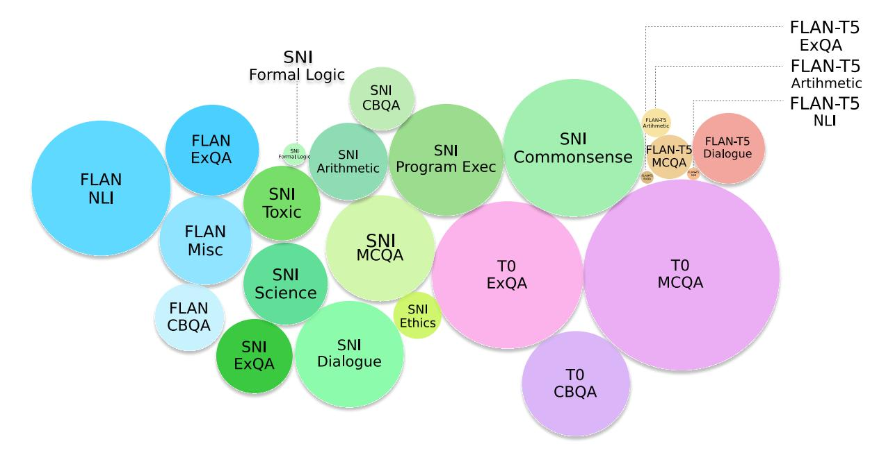
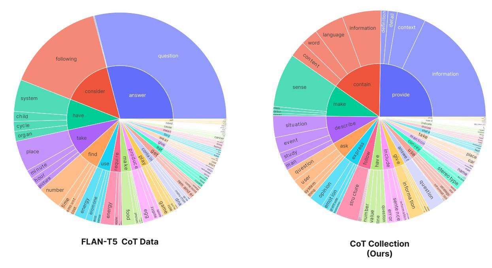
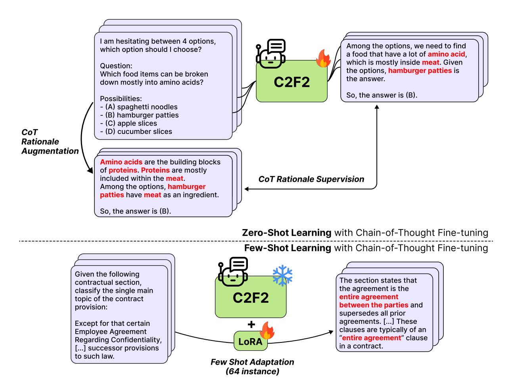
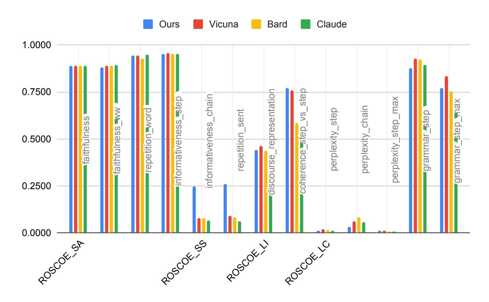

# The CoT Collection: Improving Zero-shot and Few-shot Learning of Language Models via Chain-of-Thought Fine-Tuning

Seungone Kim<sup>1</sup><sup>∗</sup> Se June Joo<sup>1</sup>,2<sup>∗</sup> Doyoung Kim<sup>1</sup> Joel Jang<sup>1</sup> Seonghyeon Ye<sup>1</sup> Jamin Shin<sup>3</sup> Minjoon Seo<sup>1</sup>

KAIST<sup>1</sup> Yonsei University<sup>2</sup> NAVER AI Lab<sup>3</sup>

{seungone, doyoungkim, joeljang, seonghyeon.ye, minjoon}@kaist.ac.kr sejune@lklab.io jayshin.nlp@gmail.com

# Abstract

Large Language Models (LLMs) have shown enhanced capabilities of solving novel tasks by reasoning step-by-step known as Chainof-Thought (CoT) reasoning; how can we instill the same capability of reasoning step-bystep on unseen tasks into LMs that possess less than <100B parameters? To address this question, we first introduce the COT COLLEC-TION, a new instruction-tuning dataset that augments 1.88 million CoT rationales across 1,060 tasks. We show that continually finetuning Flan-T5 (3B & 11B) with the COT COL-LECTION enables the 3B & 11B LMs to perform CoT better on unseen tasks, leading to an improvement in the average zero-shot accuracy on 27 datasets of the BIG-Bench-Hard benchmark by +4.34% and +2.44%, respectively. Furthermore, we show that instruction tuning with CoT allows LMs to possess stronger few-shot learning capabilities, resulting in an improvement of +2.97% and +2.37% on 4 domain-specific tasks over Flan-T5 (3B & 11B), respectively. We make our COT COL-LECTION data and our trained models publicly available at [https://github.com/kaist-lklab/CoT-](https://github.com/kaist-lklab/CoT-Collection)[Collection.](https://github.com/kaist-lklab/CoT-Collection)

# 1 Introduction

Recent works show that Large Language Models (LLMs) pre-trained on extensive text corpora, can adapt to downstream tasks in both few-shot and zero-shot learning settings by incorporating task instructions and demonstrations [\(Raffel et al.,](#page-9-0) [2020;](#page-9-0) [Brown et al.,](#page-8-0) [2020;](#page-8-0) [Zhang et al.,](#page-10-0) [2022;](#page-10-0) [Chowdhery](#page-8-1) [et al.,](#page-8-1) [2022;](#page-8-1) [Lampinen et al.,](#page-9-1) [2022;](#page-9-1) [Ye et al.,](#page-10-1) [2023\)](#page-10-1). One approach that has been particularly effective in enabling these LLMs to excel at a multitude of tasks is Chain-of-Thought (CoT) prompting, generating a CoT rationale to derive the answer [\(Wei](#page-10-2) [et al.,](#page-10-2) [2022b;](#page-10-2) [Kojima et al.,](#page-9-2) [2022\)](#page-9-2).

However, these advancements present two main challenges: LLMs typically require more than 100 billion parameters, leading to significant computational cost, scalability, and accessibility issues [\(Ka](#page-9-3)[plan et al.,](#page-9-3) [2020;](#page-9-3) [Liu et al.,](#page-9-4) [2022b;](#page-9-4) [Min et al.,](#page-9-5) [2022;](#page-9-5) [Mhlanga,](#page-9-6) [2023;](#page-9-6) [Li et al.,](#page-9-7) [2023\)](#page-9-7). Moreover, while CoT prompting proves to be powerful for LLMs, it does not necessarily confer the same benefits to smaller models as well [\(Tay et al.,](#page-10-3) [2022;](#page-10-3) [Suzgun](#page-10-4) [et al.,](#page-10-4) [2022;](#page-10-4) [Wei et al.,](#page-10-5) [2022a;](#page-10-5) [Chung et al.,](#page-8-2) [2022\)](#page-8-2).

Addressing these challenges, subsequent research has focused on empowering relatively smaller LMs to effectively solve novel tasks as well, primarily through improving zero-shot generalization capabilities with instruction tuning [\(Wei et al.,](#page-10-6) [2021;](#page-10-6) [Sanh et al.,](#page-10-7) [2021;](#page-10-7) [Mishra et al.,](#page-9-8) [2022;](#page-9-8) [Wang](#page-10-8) [et al.,](#page-10-8) [2022b;](#page-10-8) [Chung et al.,](#page-8-2) [2022;](#page-8-2) [Longpre et al.,](#page-9-9) [2023\)](#page-9-9). Nevertheless, the community still lacks a comprehensive strategy to fully leverage CoT prompting to solve multiple unseen tasks in the context of smaller language models. While some attempts have been made towards this goal such as CoT fine-tuning for single target tasks [\(Shridhar](#page-10-9) [et al.,](#page-10-9) [2022;](#page-10-9) [Ho et al.,](#page-8-3) [2022;](#page-8-3) [Fu et al.,](#page-8-4) [2023\)](#page-8-4), these approaches do not adequately address the issue of generalization to a broad range of unseen tasks.

To bridge this gap, we present the COT COLLEC-TION, an instruction tuning dataset that augments 1.88 million CoT rationales across 1,060 tasks extracted from the FLAN Collection [\(Longpre et al.,](#page-9-9) [2023\)](#page-9-9). Each instance is composed of an instruction appended to the input instance, the ground truth output, and a supporting CoT rationale. By leveraging CoT fine-tuning with instruction tuning, we aim to endow smaller LMs with enhanced reasoning capabilities to effectively solve novel tasks.

We first conduct a comprehensive examination of the quality, diversity, and reproducibility inherent in the COT COLLECTION. The findings suggest that our CoT rationale data stands out as being reliable, less redundant, logical, and notably informative when contrasted with nine instances of human-authored CoT rationale data used in the

<sup>∗</sup>Equal contribution

training of FLAN-T5 [\(Chung et al.,](#page-8-2) [2022\)](#page-8-2). This is achieved while maintaining a varied grammatical syntax. Moreover, while we deploy in-context learning (ICL) through LLMs for our dataset generation, we show that the assembly of our dataset is not anchored solely to a single API service.

Our model, C2F2, is obtained by continually fine-tuning FLAN-T5 with COT COLLECTION, exhibiting significant improvements in their zero-shot ability to perform CoT prompting on unseen tasks, thereby leading to a +4.34% and +2.44% improvement in average across 3B and 11B models on the Big Bench Hard (BBH) benchmark [\(Suzgun et al.,](#page-10-4) [2022\)](#page-10-4). Moreover, we also show that our approach of continually fine-tuning instruction-tuned models with COT COLLECTION, holds effective on smaller data scale (P3 evaluation benchmark [\(Sanh](#page-10-7) [et al.,](#page-10-7) [2021\)](#page-10-7)) and on multilingual settings (MGSM benchmark [\(Shi et al.,](#page-10-10) [2022\)](#page-10-10)) as well.

Further to the enhancements observed in zeroshot performance, we also find that our C2F2 model also serves as a better base model in a fewshot learning setting, where LMs must quickly adapt to new tasks based on a minimal number of instances [\(Liu et al.,](#page-9-4) [2022b\)](#page-9-4). To explore this, we apply Lora [\(Hu et al.,](#page-8-5) [2021\)](#page-8-5), a prominent parameterefficient fine-tuning (PEFT) method, to C2F2 for CoT fine-tuning on the target task. This process involves the initial generation CoT rationale data for the target task, followed by CoT fine-tuning of C2F2 using the generated CoT rationale data.

We assess the efficacy of our approach on 4 domain-specific datasets, two each from legal and medical fields, namely including LEDGAR [\(Tuggener et al.,](#page-10-11) [2020\)](#page-10-11), Case Hold [\(Zheng et al.,](#page-10-12) [2021\)](#page-10-12), MedNLI [\(Romanov and](#page-10-13) [Shivade,](#page-10-13) [2018\)](#page-10-13), and PubMedQA [\(Jin et al.,](#page-9-10) [2019\)](#page-9-10). Each dataset is represented by 64 randomly chosen instances. Interestingly, C2F2 exhibits a +2.37% performance improvement compared to full direct fine-tuning using FLAN-T5, while concurrently updating 2,352x fewer parameters. Moreover, it demonstrates a +13.98% improvement over ChatGPT [\(OpenAI,](#page-9-11) [2022\)](#page-9-11) leveraging ICL with demonstrations up to the maximum input length.

The empirical results of C2F2 suggest that a synergy between CoT fine-tuning and instruction tuning could potentially result in improvements of smaller models. Whereas previous work demonstrated that CoT prompting and CoT fine-tuning work effectively on reasoning tasks [\(Wei et al.,](#page-10-2)

[2022b;](#page-10-2) [Chung et al.,](#page-8-2) [2022\)](#page-8-2), our results indicate that it could also benefit smaller models in the context of zero-shot and few-shot learning. Especially in the context of zero-shot and few-shot learning, our analysis indicates that a simple recipe of extracting rich supervision from existing datasets (CoT rationale data) and inducing CoT abilities with CoT fine-tuning could further enhance existing LMs. Through COT COLLECTION, we hope to illustrate the potential of utilizing CoT rationales in improving task generalization and provide benefits to future research.

# 2 Related Works

# 2.1 Chain-of-Thought (CoT) Prompting

[Wei et al.](#page-10-2) [\(2022b\)](#page-10-2) proposed Chain of Thought (CoT) Prompting, a technique that triggers the model to generate a rationale before the answer. By generating a rationale, LLMs could improve their reasoning abilities to solve challenging tasks such as arithmetic reasoning, commonsense reasoning, and symbolic reasoning. [Wang et al.](#page-10-14) [\(2022a\)](#page-10-14) show that taking a majority vote with multiple rationales makes up the weakness of an LLM generating a single incomplete rationale. [Kojima et al.](#page-9-2) [\(2022\)](#page-9-2) shows that by appending the phrase 'Let's think step by step', LLMs could perform CoT in a zeroshot setting. While LLMs could solve novel tasks with CoT Prompting, the effectiveness does not hold for smaller LMs as well [\(Chung et al.,](#page-8-2) [2022\)](#page-8-2).

## 2.2 Instruction Tuning & CoT Fine-tuning

Previous work show that instruction tuning enables generalization to unseen tasks [\(Wei et al.,](#page-10-6) [2021;](#page-10-6) [Sanh et al.,](#page-10-7) [2021;](#page-10-7) [Aribandi et al.,](#page-8-6) [2021;](#page-8-6) [Ouyang](#page-9-12) [et al.,](#page-9-12) [2022;](#page-9-12) [Wang et al.,](#page-10-8) [2022b;](#page-10-8) [Xu et al.,](#page-10-15) [2022\)](#page-10-15). Different works tried to improve Instruction Tuning by enabling cross-lingual generalization [\(Muen](#page-9-13)[nighoff et al.,](#page-9-13) [2022\)](#page-9-13), improving label generalization capability [\(Ye et al.,](#page-10-16) [2022\)](#page-10-16), showing models could be lifelong learners via continual learning [\(Scialom et al.,](#page-10-17) [2022\)](#page-10-17), and training modular expert LMs [\(Jang et al.,](#page-8-7) [2023\)](#page-8-7). Meanwhile, a line of works shows that CoT fine-tuning could improve the reasoning abilities of LMs on a single-seen task [\(Zelikman et al.,](#page-10-18) [2022;](#page-10-18) [Shridhar et al.,](#page-10-9) [2022;](#page-10-9) [Ho et al.,](#page-8-3) [2022;](#page-8-3) [Huang et al.,](#page-8-8) [2022;](#page-8-8) [Fu et al.,](#page-8-4) [2023\)](#page-8-4).

As a follow-up study, we continually CoT finetune 1,060 instruction tasks from our COT COL-LECTION and observe a significant improvement in terms of zero-shot generalization on multiple tasks.

<span id="page-2-1"></span>

Figure 1: An illustration of the overall task group and dataset source of where we obtained the instance to augment CoT rationales in COT COLLECTION. Compared to the 9 datasets that provide publicly available CoT rationales (namely 'FLAN-T5 MCQA', 'FLAN-T5 ExQA', 'FLAN-T5 NLI', 'FLAN-T5 Arithmetic'), we generate x52.36 more rationales (1.88 million rationales) and x177.78 more task variants (1,060 tasks).

# 3 The CoT Collection

While previous work has demonstrated that CoT fine-tuning is effective for improving both smaller LMs and LLMs [\(Zelikman et al.,](#page-10-18) [2022;](#page-10-18) [Shridhar](#page-10-9) [et al.,](#page-10-9) [2022;](#page-10-9) [Chung et al.,](#page-8-2) [2022;](#page-8-2) [Ho et al.,](#page-8-3) [2022;](#page-8-3) [Wang et al.,](#page-10-14) [2022a;](#page-10-14) [Huang et al.,](#page-8-8) [2022;](#page-8-8) [Fu et al.,](#page-8-4) [2023\)](#page-8-4), CoT rationale data still remains scarce up to this day. This is mainly due to the difficulty in gathering human-authored explanations [\(Kim](#page-9-14) [et al.,](#page-9-14) [2023\)](#page-9-14). Specifically, to the best of our knowledge, most of the work investigating CoT finetuning use the 9 publicly available NLP datasets as CoT rationales, namely QASC [\(Khot et al.,](#page-9-15) [2020\)](#page-9-15), AQuA [\(Amini et al.,](#page-8-9) [2019\)](#page-8-9), GSM8K [\(Cobbe](#page-8-10) [et al.,](#page-8-10) [2021\)](#page-8-10), QED [\(Lamm et al.,](#page-9-16) [2021\)](#page-9-16), StrategyQA [\(Geva et al.,](#page-8-11) [2021\)](#page-8-11), SenseMaking [\(Wang](#page-10-19) [et al.,](#page-10-19) [2019\)](#page-10-19), CREAK [\(Onoe et al.,](#page-9-17) [2021\)](#page-9-17), e-SNLI [\(Camburu et al.,](#page-8-12) [2018\)](#page-8-12), ECQA [\(Aggarwal](#page-8-13) [et al.,](#page-8-13) [2021\)](#page-8-13).

COT COLLECTION is an instruction-tuning dataset including 1.88 million CoT rationales obtained across 1,060 NLP tasks[1](#page-2-0) . Figure [1](#page-2-1) illustrates how COT COLLECTION consists. Throughout the section, we first explain our process of augmenting

CoT rationales (Section [3.1\)](#page-2-2). Then, we perform an analysis regarding the quality, diversity, and reproducibility of COT COLLECTION (Section [3.2\)](#page-3-0).

## <span id="page-2-2"></span>3.1 CoT Rationale Augmentation

Given an input X = [I, z] composed of an instruction I, and an instance z along with the answer y, we obtain a CoT rationale r by applying ICL with LLMs. Note that this differs from previous works which mostly focused on generating new instances using LLMs [\(West et al.,](#page-10-20) [2022;](#page-10-20) [Liu et al.,](#page-9-18) [2022a;](#page-9-18) [Honovich et al.,](#page-8-14) [2022;](#page-8-14) [Wang et al.,](#page-10-14) [2022a\)](#page-10-14).

Source Dataset Selection As a source dataset to extract CoT Rationales, we choose the FLAN Collection [\(Longpre et al.,](#page-9-9) [2023\)](#page-9-9), consisting of 1,836 tasks from P3 [\(Sanh et al.,](#page-10-7) [2021\)](#page-10-7), SuperNaturalInstructions [\(Wang et al.,](#page-10-8) [2022b\)](#page-10-8), FLAN [\(Wei et al.,](#page-10-6) [2021\)](#page-10-6), some additional dialogue and code datasets. Then we choose 1,060 tasks, narrowing our focus following the criteria as follows:

• We exclude multilingual datasets including translation tasks as our base model, T5 [\(Raf](#page-9-0)[fel et al.,](#page-9-0) [2020\)](#page-9-0) has a lower coverage for some tokens in under-represented languages. Therefore, we focus on English datasets only.

<span id="page-2-0"></span><sup>1</sup> Following [Sanh et al.](#page-10-7) [\(2021\)](#page-10-7), we use the notion of 'task' referring to each prompt applied to a dataset.

- We exclude a subset of generation tasks with long-form outputs since the total sum of generated CoT rationales and the ground truth answer exceeds the output token length during our experiments.
- We exclude some datasets that are not publicly currently available, but plan to update as soon as they become available.
- We exclude some datasets where the input and output do not correspond to each other, but plan to update as soon as it is resolved.
- When there is an dataset overlap across P3, SuperNaturalInstructions (SNI), and FLAN, we choose to use the tasks from one of them.
- During preliminary experiments, we find that the CoT rationale generated by LLMs remains either uninformative and very short (e.g., 'It's obvious') for some tasks such as sentiment analysis, sentence completion, coreference resolution, word disambiguation. In order to prevent negative task transfer abundant during multitask learning [\(Aribandi et al.,](#page-8-6) [2021;](#page-8-6) [Jang](#page-8-7) [et al.,](#page-8-7) [2023\)](#page-8-7), we exclude these datasets.

Prompt Creation To create a prompt to apply ICL with LLMs, preparing demonstrations D<sup>t</sup> for each task t is most straightforward, but it becomes unfeasible to prepare demonstrations for every task as the number of tasks gets larger. Instead, we use a more efficient approach, by assigning each task t to Tk, a family of tasks using a similar task format. Each family of tasks share DT<sup>k</sup> , a 6 ∼ 8 shot demonstration. To create DT<sup>k</sup> , 3 of the authors manually go through multiple rounds of creation and revision. Specifically, given multiple instances sampled from FLAN Collection, two people are assigned to generate a CoT rationale explaining how the answer could be derived given the instruction and instance. Then, the other person gets to conduct an A/B testing, choosing the better CoT rationale. With this process, we manually create 135 CoT rationales across 26 task groups. We include our prompts for different task groups in Appendix [C.](#page-12-0)

CoT Rationale Augmentation The main consideration of the augmentation process is to generate consistent CoT rationales. To do this, we use the OpenAI Codex model. Formally, given

<span id="page-3-1"></span>

|            | Metrics                  | Human  | CoT Collection |
|------------|--------------------------|--------|----------------|
|            | faithfulness             | 0.8836 | 0.8914         |
| Semantic   | faithfulness_ww          | 0.8756 | 0.8793         |
| Alignment  | repetition_word          | 0.9376 | 0.9419         |
|            | informativeness_step     | 0.9519 | 0.9521         |
| Semantic   | informativeness_chain    | 0.2295 | 0.2797         |
| Similarity | repetition_sent          | 0.2453 | 0.2910         |
| Logical    | discourse_representation | 0.4855 | 0.4687         |
| Inference  | coherence_step_vs_step   | 0.7763 | 0.7813         |
|            | perplexity_step          | 0.0198 | 0.0122         |
|            | perplexity_chain         | 0.0475 | 0.0255         |
| Language   | perplexity_step_max      | 0.0144 | 0.0088         |
| Coherence  | grammar_step             | 0.8883 | 0.8721         |
|            | grammar_step_max         | 0.8013 | 0.7724         |

Table 1: Comparison of the quality between human-authored rationales and machine-generated rationales. 13 label-free metrics from ROSCOE [\(Golovneva et al.,](#page-8-15) [2022\)](#page-8-15) is used.

(x t i , y t i ), the i th instance and label of a task t, the goal is to generate corresponding CoT rationale r t i . Note that during preliminary experiments, we found that ordering the label y ki in front of the rationale r <sup>k</sup><sup>i</sup> within the demonstration DT<sup>k</sup> was crucial to generate good quality rationales. We conjecture this is because providing the label y ki in front of the rationale r ki loosens the need for the LLM to solve the underlying task. However, we also found that in some tasks such as arithmetic reasoning, LLMs fail to generate good quality CoT rationales, which we provide in Appendix [A.](#page-12-1)

Filtering After generating multiple CoT rationales, we filter to ensure high quality. We apply the following criteria:

- We exclude CoT rationales that do not include the ground truth answer at least once. While a CoT rationale that doesn't include the answer isn't necessarily a bad rationale, we found it is effective to exclude inconsistent CoT rationales.
- We exclude CoT rationales that have too long token length, where we constrain with a number of 256 tokens.
- We exclude CoT rationales that are identical to previously augmented ones.

## <span id="page-3-0"></span>3.2 Analysis of CoT Collections

Quality of Rationales To ensure the quality of COT COLLECTIONS, we use ROSCOE [\(Golovneva](#page-8-15) [et al.,](#page-8-15) [2022\)](#page-8-15), a suite of metrics designed to evaluate rationales under different criteria within semantic alignment, semantic similarity, logical inference, language coherence. Since we do not have a

<span id="page-4-0"></span>

Figure 2: The top 20 common root verbs (inner circle) and their top 4 noun objects (outer circle) within the rationales of the 9 CoT tasks used in Chung et al. (2022) (left side) and our rationale training data (right side).

ground truth CoT rationale label, we exclude metrics that require a label. We compare with the 165 CoT rationales manually handcrafted for prompting LLMs. The 13 ROSCOE scores are shown in Table 1. The results show that CoT COLLECTION include CoT rationales that are faithful, less repetitive, informative and logical even when compared to human-authored CoT rationales.

Diversity of Rationales To take a look into the diversity of our CoT rationale data, we use Berkeley Neural Parser (Kitaev and Klein, 2018; Kitaev et al., 2019) to parse the CoT rationales. More specifically, the verb which is closest to the root of the parse tree along the noun object is extracted. We compare with the rationales from the 9 CoT datasets used in Chung et al. (2022). As shown in Figure 2, the 9 CoT data has a high proportion assigned to 'answer question' and 'consider following' whereas the CoT rationales in our data have diverse textual formats included.

**Is CoT Rationale Bootstrapping Over-reliant on OpenAI API?** One could doubt reproducibility of CoTCollection due to usage of a OpenAI model in the process of CoT rationale augmentation. Nevertheless, we open-source a *fixed* rationale dataset we generated. Also, we emphasize that our choice of OpenAI's Codex was due to limited academic budget. Moreover, we also provide an analysis of the rationales generated by other

LLMs besides OpenAI's Codex similar quality at Appendix B, ensuring that our overall pipeline and model are not over-reliant on OpenAI.

### <span id="page-4-1"></span>4 Zero-shot Generalization

In this section, we show how CoT fine-tuning on CoT COLLECTION could effectively improve the LM's ability to solve unseen tasks.

Experiment #1: FLAN-T5 Setting We continually fine-tune FLAN-T5 (Chung et al., 2022) with CoT Collection, obtaining our proposing model, C2F2, which we evaluate on the BBH benchmark (Suzgun et al., 2022). In addition to FLAN-T5, we compare the performance with different baselines such as (1) T5-LM (Raffel et al., 2020): the original base model of FLAN-T5, (2) T0 (Sanh et al., 2021): an instructiontuned LM trained with P3 instruction dataset, (3) Tk-Instruct (Wang et al., 2022b), an instructiontuned LM trained with SNI dataset, and (4) GPT-3 (Brown et al., 2020): a pre-trained LLM with 175 billion parameters. Moreover, to ablate if using CoT fine-tuning is more data efficient compared to conventional instruction tuning, we train T5-LM with CoT Collection (denoted as 'T5 + CoT Fine-tuning'). Note that FLAN Collection includes 15M instances, hence x7.98 larger compared to our COT COLLECTION.

The results are shown in Table 2. When continu-



Figure 3: The overall illustration of the zero-shot and few-shot experiments held out with our model **C2F2**. **C2F2** is trained with the CoT rationales from CoT Collection, hence obtaining zero-shot generalization capabilities to solve unseen tasks with CoT prompting (Section 4). Then, **C2F2** serves as a better base model when adapting to novel tasks with few instances via CoT fine-tuning (Section 5.

ally training FLAN-T5-3B and FLAN-T5-11B with COT COLLECTION, **C2F2**(3B & 11B) achieves a +4.34% and +2.44% improvement over FLAN-T5 in terms of CoT evaluation performance. Surprisingly, even if COT COLLECTION doesn't include any direct instruction data, **C2F2-11B**'s direct performance slightly improves, resulting in a +1.98% total average improvement. This further supports that continually training an instruction-tuned model with additional CoT instruction data could LMs to adapt to unseen tasks.

In terms of data efficiency, T5-11B + CoT FINE-TUNING and T5-3B + CoT FINE-TUNING outperforms FLAN-T5-11B and FLAN-T5-3B by a +3.89% and +1.45% margin, respectively, when evaluated with CoT prompting. Also, T5-3B + CoT FINE-TUNING outperforms 4x larger models such as T0-11B and Tk-Instruct-11B in both direct and CoT evaluation. We conclude that CoT fine-tuning enables to achieve superior

<span id="page-5-0"></span>

| Method                               | CoT   | Direct | Total Avg |
|--------------------------------------|-------|--------|-----------|
| T5-LM-3B (RAFFEL ET AL., 2020)       | 26.68 | 26.96  | 26.82     |
| T0-3B (SANH ET AL., 2021)            | 26.64 | 27.45  | 27.05     |
| TK-INSTRUCT-3B (WANG ET AL., 2022B)  | 29.86 | 29.90  | 29.88     |
| TK-INSTRUCT-11B (WANG ET AL., 2022B) | 33.60 | 30.71  | 32.16     |
| T0-11B (SANH ET AL., 2021)           | 31.83 | 33.57  | 32.70     |
| FLAN-T5-3B (CHUNG ET AL., 2022)      | 34.06 | 37.14  | 35.60     |
| GPT-3 (175B) (BROWN ET AL., 2020)    | 38.30 | 33.60  | 38.30     |
| FLAN-T5-11B (CHUNG ET AL., 2022)     | 38.57 | 40.99  | 39.78     |
| T5-3B + CoT Fine-tuning              | 37.95 | 35.52  | 36.74     |
| C2F2-3B                              | 38.40 | 36.18  | 37.29     |
| T5-11B + COT FINE-TUNING             | 40.02 | 38.76  | 39.54     |
| C2F2-11B                             | 41.01 | 42.50  | 41.76     |

Table 2: Evaluation performance on 27 unseen datasets from BBH benchmark. All evaluations are held in a zero-shot setting. The best comparable performances are **bolded** and second best <u>underlined</u>. Our proposing model **C2F2** is equivalent to FLAN-T5 + COT INSTRUCTION TUNING.

performance even when utilizing a small amount of data compared to direct instruction tuning.

**Experiment #2: T0 Setting** To test if CoT Finetuning using CoT COLLECTION holds effective with less amount of tasks, we choose use the P3

<span id="page-6-0"></span>

| Method                                          |       | Natural Language Inference |        |              |        | Sentence Completion |          | Coreference Resolut. |              | WSD   Total Avg |              |       |
|-------------------------------------------------|-------|----------------------------|--------|--------------|--------|---------------------|----------|----------------------|--------------|-----------------|--------------|-------|
|                                                 |       | CB                         | AN. R1 | AN. R2       | AN. R3 | COPA                | Hellasw. | StoryC.              | Winogr.      | WSC             | WiC          |       |
| T5-3B (Raffel et al., 2020)                     | 53.03 | 34.34                      | 32.89  | 33.76        | 33.82  | 54.88               | 27.00    | 48.16                | 50.64        | 54.09           | 50.30        | 42.99 |
| T0-3B (SANH ET AL., 2021)                       | 60.61 | 48.81                      | 35.10  | 33.27        | 33.52  | 75.13               | 27.18    | 84.91                | 50.91        | 65.00           | 51.27        | 51.43 |
| RoE-3B (JANG ET AL., 2023)                      | 64.01 | 43.57                      | 35.49  | 34.64        | 31.22  | 79.25               | 34.60    | 86.33                | 61.60        | 62.21           | 52.97        | 53.48 |
| KIC-770M + MEMORY (PAN ET AL., 2022)            | 74.00 | 67.90                      | 36.30  | 35.00        | 37.60  | 85.30               | 29.60    | 94.40                | 55.30        | 65.40           | 52.40        | 57.56 |
| FLIPPED-3B (YE ET AL., 2022)                    | 71.05 | 57.74                      | 39.99  | <u>37.05</u> | 37.73  | 89.88               | 41.64    | 95.88                | <u>58.56</u> | 58.37           | 50.42        | 58.03 |
| T5-3B + COT INSTRUCTION TUNING - EVAL W/ DIRECT | 69.96 | 58.69                      | 37.58  | 36.00        | 37.44  | 84.59               | 40.92    | 90.47                | 55.40        | 64.33           | 51.53        | 56.99 |
| T0-3B + COT INSTRUCTION TUNING - EVAL W/ DIRECT | 80.79 | 65.00                      | 39.49  | 35.13        | 38.58  | 88.27               | 41.04    | 92.13                | 56.40        | 65.96           | 53.60        | 59.67 |
| T5-3B + CoT Instruction Tuning - Eval w/ CoT    | 80.61 | 69.17                      | 40.24  | 36.67        | 40.13  | 90.10               | 41.08    | 93.00                | 56.47        | 55.10           | 56.73        | 59.94 |
| T0-3B + CoT Instruction Tuning - Eval w/ CoT    | 80.25 | 72.62                      | 41.71  | 37.22        | 41.89  | 90.88               | 39.50    | 94.47                | 57.47        | 50.58           | <u>54.27</u> | 60.08 |
| T0-11B (SANH ET AL., 2021)                      | 80.83 | 70.12                      | 43.56  | 38.68        | 41.26  | 90.02               | 33.58    | 92.40                | 59.94        | 61.45           | 56.58        | 60.76 |
| GPT-3 (175B) (BROWN ET AL., 2020)               | 63.50 | 46.40                      | 34.60  | 35.40        | 34.50  | 91.00               | 78.90    | 83.20                | 70.20        | 65.40           | 45.92        | 59.00 |

Table 3: Evaluation performance on 11 different unseen P3 dataset (Sanh et al., 2021) categorized into 4 task categories. We report the direct performance of the baselines since they were only trained with direct instruction tuning. The best comparable performances are **bolded** and second best <u>underlined</u> among  $770M \sim 3B$  models. We exclude FLAN-T5 and **C2F2** since they were trained on the unseen tasks, breaking unseen task assumption.

subset of the COT COLLECTION and apply CoT fine-tuning to T5 and T0 models. In addition to T0, we include different baselines such as (1) T5-LM (Raffel et al., 2020): the original base model of T0, (2) RoE (Jang et al., 2023): a modular expert LM that retrieves different expert models depending on the unseen task, (3) KiC (Pan et al., 2022): an instruction-tuned retrieval-augmented model that is trained to retrieve knowledge from a KB memory, and (4) Flipped (Ye et al., 2022): an instruction-tuned model that is trained to generate the instruction in order to resolve the LM over-fitting to the output label. As an upper-bound oracle, we also use T0-11B and GPT-3 (175B).

The results are shown in Table 3. T0-3B + COT FINE-TUNING further improves T0-3B by a +8.65% margin. This shows that continually training an instruction-tuned model with additional CoT instruction data further unlocks the generalization capabilities of LMs on unseen tasks. More surprisingly, T5-3B + CoT FINE-TUNING outperforms T0-3B by a +8.24% margin by generating a rationale during evaluation (denoted as EVAL W/ COT), while using only 3.22% of training data compared to T0. Even compared to T0-11B, it achieves better performance at sentence completion, and word sense disambiguation (WSD), and obtains similar performance at natural language inference and coreference resolution. Compared to T0-3B, which is a direct instructiontuned model, these results indicate that training to generate rationales enables 3B-sized LMs to efficiently generalize more efficientely.

**Experiment #3: Multilingual Setting** To test if CoT Fine-tuning could hold effective in a multilingual setting as well, we use the experimental setting from Shi et al. (2022) with MGSM benchmark as a test bed. Instead of performing an apple-to-apple

<span id="page-6-1"></span>

| Method                                                                 | ko           | ru            | fr                   | zh            | ja            |
|------------------------------------------------------------------------|--------------|---------------|----------------------|---------------|---------------|
| FLAN-T5-3B (CHUNG ET AL., 2022)                                        | 0.00         | 2.80          | 7.20                 | 0.00          | 0.00          |
| FLAN-T5-11B (CHUNG ET AL., 2022)                                       | 0.00         | 5.20          | 13.20                | 0.00          | 0.00          |
| MT5-3.7B (XUE ET AL., 2021)                                            | 0.00         | 1.19          | 1.95                 | 0.79          | 0.79          |
| MT0-3.7B (MUENNIGHOFF ET AL., 2022)                                    | 0.00         | 4.74          | 7.14                 | 1.59          | 2.37          |
| GPT-3 (175B) (BROWN ET AL., 2020)                                      | /            | 4.40          | 10.80                | 6.80          | 0.80          |
| MT5-3.7B + COT INSTRUCTION TUNING<br>MT0-3.7B + COT INSTRUCTION TUNING | 3.18<br>7.54 | 6.64<br>10.32 | 9.52<br><b>15.48</b> | 5.86<br>11.11 | 7.54<br>10.94 |

Table 4: Evaluation performance on MGSM benchmark (Shi et al., 2022) across 5 languages (Korean, Russian, French, Chinese, Japanese, respectively). All evaluations are held in a zero-shot setting except GPT-3 using a 6-Shot prompt for ICL. The best comparable performances are **bolded** and second best <u>underlined</u>. Note that our models were trained on a single target language instead of training with all the 46 languages used in mT0. Nonetheless, we use 0.001% of data compared to mT0 (Muennighoff et al., 2022).

comparison with baselines as in the previous experiments, the purpose of this experiment is to show how CoT Fine-tuning could effectively enable LMs to adapt to different languages and solve unseen tasks. Specifically, we use about 0.001% amount of CoT instruction data on a single target language compared to the direct instruction data used to train the mT0 model (Muennighoff et al., 2022). To obtain CoT instruction data on the target language, we use ChatGPT API (OpenAI, 2022) for translation.

The results are shown in Table 4. Across all the 5 different languages, MT5-3.7B + COT FINE-TUNING outperforms MT0-3.7B. Especially in resource-poor languages such as Korean, Japanese, and Chinese, training on a single target language with CoT instruction data holds an advantage over training with multiple languages which results in forgetting. This could be seen as a trade-off between training an expert LM on a single language versus training one generalist model that shows overall lower performance (Jang et al., 2023). Moreover, MT0-3.7B + COT FINE-TUNING successfully further improves over the base model mT0, even surpassing GPT-3 in every language.

<span id="page-7-1"></span>

| Method                               | #Train Param | Ledgar | Case Hold | MedNLI | PubmedQA | Total Avg |  |
|--------------------------------------|--------------|--------|-----------|--------|----------|-----------|--|
| Claude (Anthropic, 2023) + ICL       | 0            | 55.70  | 57.20     | 75.94  | 54.58    | 60.85     |  |
| Claude (Anthropic, 2023) + CoT Prom. | 0            | 34.80  | 43.60     | 76.51  | 52.06    | 51.74     |  |
| ChatGPT (OpenAI, 2022) + ICL         | 0            | 51.70  | 32.10     | 70.53  | 65.59    | 54.98     |  |
| ChatGPT (OpenAI, 2022) + CoT Prom.   | 0            | 51.00  | 18.90     | 63.71  | 25.22    | 39.70     |  |
| FLAN-T5-3B + Full FT.                | 2.8B         | 52.60  | 61.40     | 66.82  | 66.28    | 61.78     |  |
| FLAN-T5-3B + Full CoT FT.            | 2.8B         | 53.60  | 58.80     | 65.89  | 65.89    | 61.05     |  |
| C2F2-3B + Full CoT FT. (Ours)        | 2.8B         | 51.90  | 60.60     | 67.16  | 68.12    | 61.95     |  |
| FLAN-T5-3B + LoRA                    | 2.35M        | 53.20  | 58.80     | 61.60  | 67.18    | 60.19     |  |
| FLAN-T5-3B + LoRA CoT FT.            | 2.35M        | 51.20  | 61.60     | 62.59  | 66.06    | 60.36     |  |
| C2F2-3B + LoRA CoT FT. (Ours)        | 2.35M        | 54.80  | 63.60     | 68.00  | 69.66    | 64.02     |  |
| FLAN-T5-11B + LoRA                   | 4.72M        | 55.30  | 64.90     | 75.91  | 70.25    | 66.59     |  |
| FLAN-T5-11B + LoRA CoT FT.           | 4.72M        | 52.10  | 65.50     | 71.63  | 71.60    | 65.21     |  |
| C2F2-11B + LoRA CoT FT. (Ours)       | 4.72M        | 56.10  | 68.30     | 78.02  | 73.42    | 68.96     |  |

Table 5: Evaluation performance on 4 domain-specific datasets. COT PROM. denotes CoT Prompting and FT. denotes Fine-tuning. The best comparable performances are bolded and second best underlined. For a few-shot adaptation, we use 64 randomly sampled instances from each dataset.

# <span id="page-7-0"></span>5 Few-shot Generalization

Dataset Setup In this section, we show how applying CoT fine-tuning over C2F2 could effectively eanble LMs to adapt in a few-shot setting. We choose 4 domain-specific datasets from legal and medical domains including LEDGAR [\(Tuggener](#page-10-11) [et al.,](#page-10-11) [2020\)](#page-10-11), Case Hold [\(Zheng et al.,](#page-10-12) [2021\)](#page-10-12), MedNLI [\(Romanov and Shivade,](#page-10-13) [2018\)](#page-10-13), and PubMedQA [\(Jin et al.,](#page-9-10) [2019\)](#page-9-10), each with 64 randomly sampled instances. Since the choice of training instances might highly affect the performance on each task, we conduct 3 runs with different random seeds for every setting and report the average score. Note that we prepare rationale data for the 64 instances using the same procedure as in CoT Instruction Tuning, utilizing the MCQA prompt from P3 dataset. In an applied setting, practitioners could obtain 64 rationales written by human experts, which could provide rich supervision when adapting to new tasks.

Training Setup For training LMs, we use 2 different baselines models (FLAN-T5, C2F2) across 3B and 11B scale and apply either (1) full-Finetuning, (2) CoT Fine-tuning, (3) LoRA Fine-tuning, and (4) LoRA CoT Fine-tuning. For applying Lora, we use a rank of 4 and train for 1K steps following [Liu et al.](#page-9-4) [\(2022b\)](#page-9-4). This results in training 2.35M parameters for 3B scale models and 4.72M parameters for 11B scale models. Also, we include ICL baselines using Claude API [\(Anthropic,](#page-8-16) [2023\)](#page-8-16) and ChatGPT API [\(OpenAI,](#page-9-11) [2022\)](#page-9-11) and append demonstrations up to the full context length. For CoT prompting with LLMs,

we use the CoT demonstrations obtained from the augmented CoT rationale data used for fine-tuning.

Experimental Results The results are shown in Table [5.](#page-7-1) Overall, CoT fine-tuning C2F2 integrated with LoRA obtains the best results overall for all 4 datasets. Surprisingly, when training FLAN-T5, applying full fine-tuning obtains better performance compared to its counterpart using LoRA fine-tuning. Nonetheless, in C2F2, LoRA achieves higher performance compared to full finetuning. One possible way to interpret this is that introducing only a few parameters enables the LM to maintain the CoT ability acquired from COT COLLECTION. Examining when LoRA is effective over full-finetuning in few-shot settings is relatively unexplored in literature, and we leave the additional analysis to future work.

While CoT fine-tuning obtains similar or lower performance compared to direct fine-tuning in FLAN-T5, C2F2 achieves higher performance with CoT fine-tuning compared to FLAN-T5 direct finetuning. This also supports the idea that CoT Finetuning in combination with instruction tuning empowers the few-shot adaptation of LMs.

Lastly, fine-tuning methods obtain overall better results compared to ICL methods with LLMs. We conjecture this due to the long input length of legal and medical datasets, hindering to append all possible demonstrations. While increasing the context length could serve as a temporary solution, it becomes infeasible as the inference time increases quadratically in proportion to the input length.

# 6 Conclusion

In this work, we construct a large-scale instructiontuning dataset consisting of 1.88M CoT rationales extracted across 1,060 NLP tasks. With our dataset, we demonstrated that CoT fine-tuning can enhance the zero-shot and few-shot learning capabilities of smaller LMs to solve novel tasks. We hope our data and model could further facilitate future work towards general-purpose LMs.

# References

- <span id="page-8-13"></span>Shourya Aggarwal, Divyanshu Mandowara, Vishwajeet Agrawal, Dinesh Khandelwal, Parag Singla, and Dinesh Garg. 2021. Explanations for commonsenseqa: New dataset and models. In *Proceedings of the 59th Annual Meeting of the Association for Computational Linguistics and the 11th International Joint Conference on Natural Language Processing (Volume 1: Long Papers)*, pages 3050–3065.
- <span id="page-8-9"></span>Aida Amini, Saadia Gabriel, Shanchuan Lin, Rik Koncel-Kedziorski, Yejin Choi, and Hannaneh Hajishirzi. 2019. Mathqa: Towards interpretable math word problem solving with operation-based formalisms. In *Proceedings of the 2019 Conference of the North American Chapter of the Association for Computational Linguistics: Human Language Technologies, Volume 1 (Long and Short Papers)*, pages 2357–2367.
- <span id="page-8-16"></span>Anthropic. 2023. Claude. [https:](https://www.anthropic.com/index/introducing-claude) [//www.anthropic.com/index/](https://www.anthropic.com/index/introducing-claude) [introducing-claude](https://www.anthropic.com/index/introducing-claude).
- <span id="page-8-6"></span>Vamsi Aribandi, Yi Tay, Tal Schuster, Jinfeng Rao, Huaixiu Steven Zheng, Sanket Vaibhav Mehta, Honglei Zhuang, Vinh Q Tran, Dara Bahri, Jianmo Ni, et al. 2021. Ext5: Towards extreme multitask scaling for transfer learning. *arXiv preprint arXiv:2111.10952*.
- <span id="page-8-0"></span>Tom Brown, Benjamin Mann, Nick Ryder, Melanie Subbiah, Jared D Kaplan, Prafulla Dhariwal, Arvind Neelakantan, Pranav Shyam, Girish Sastry, Amanda Askell, et al. 2020. Language models are few-shot learners. *Advances in neural information processing systems*, 33:1877–1901.
- <span id="page-8-12"></span>Oana-Maria Camburu, Tim Rocktäschel, Thomas Lukasiewicz, and Phil Blunsom. 2018. e-snli: Natural language inference with natural language explanations. *Advances in Neural Information Processing Systems*, 31.
- <span id="page-8-18"></span>Wei-Lin Chiang, Zhuohan Li, Zi Lin, Ying Sheng, Zhanghao Wu, Hao Zhang, Lianmin Zheng, Siyuan Zhuang, Yonghao Zhuang, Joseph E. Gonzalez, Ion Stoica, and Eric P. Xing. 2023. [Vicuna: An open](https://lmsys.org/blog/2023-03-30-vicuna/)[source chatbot impressing gpt-4 with 90%\\* chatgpt](https://lmsys.org/blog/2023-03-30-vicuna/) [quality.](https://lmsys.org/blog/2023-03-30-vicuna/)

- <span id="page-8-1"></span>Aakanksha Chowdhery, Sharan Narang, Jacob Devlin, Maarten Bosma, Gaurav Mishra, Adam Roberts, Paul Barham, Hyung Won Chung, Charles Sutton, Sebastian Gehrmann, et al. 2022. Palm: Scaling language modeling with pathways. *arXiv preprint arXiv:2204.02311*.
- <span id="page-8-2"></span>Hyung Won Chung, Le Hou, Shayne Longpre, Barret Zoph, Yi Tay, William Fedus, Eric Li, Xuezhi Wang, Mostafa Dehghani, Siddhartha Brahma, et al. 2022. Scaling instruction-finetuned language models. *arXiv preprint arXiv:2210.11416*.
- <span id="page-8-10"></span>Karl Cobbe, Vineet Kosaraju, Mohammad Bavarian, Jacob Hilton, Reiichiro Nakano, Christopher Hesse, and John Schulman. 2021. Training verifiers to solve math word problems. *arXiv preprint arXiv:2110.14168*.
- <span id="page-8-4"></span>Yao Fu, Hao Peng, Litu Ou, Ashish Sabharwal, and Tushar Khot. 2023. Specializing smaller language models towards multi-step reasoning. *arXiv preprint arXiv:2301.12726*.
- <span id="page-8-11"></span>Mor Geva, Daniel Khashabi, Elad Segal, Tushar Khot, Dan Roth, and Jonathan Berant. 2021. Did aristotle use a laptop? a question answering benchmark with implicit reasoning strategies. *Transactions of the Association for Computational Linguistics*, 9:346– 361.
- <span id="page-8-15"></span>Olga Golovneva, Moya Chen, Spencer Poff, Martin Corredor, Luke Zettlemoyer, Maryam Fazel-Zarandi, and Asli Celikyilmaz. 2022. Roscoe: A suite of metrics for scoring step-by-step reasoning. *arXiv preprint arXiv:2212.07919*.
- <span id="page-8-17"></span>Google. 2023. Bard. [https://](https://blog.google/technology/ai/bard-google-ai-search-updates/) [blog.google/technology/ai/](https://blog.google/technology/ai/bard-google-ai-search-updates/) [bard-google-ai-search-updates/](https://blog.google/technology/ai/bard-google-ai-search-updates/).
- <span id="page-8-3"></span>Namgyu Ho, Laura Schmid, and Se-Young Yun. 2022. Large language models are reasoning teachers. *arXiv preprint arXiv:2212.10071*.
- <span id="page-8-14"></span>Or Honovich, Thomas Scialom, Omer Levy, and Timo Schick. 2022. Unnatural instructions: Tuning language models with (almost) no human labor. *arXiv preprint arXiv:2212.09689*.
- <span id="page-8-5"></span>Edward J Hu, Yelong Shen, Phillip Wallis, Zeyuan Allen-Zhu, Yuanzhi Li, Shean Wang, Lu Wang, and Weizhu Chen. 2021. Lora: Low-rank adaptation of large language models. *arXiv preprint arXiv:2106.09685*.
- <span id="page-8-8"></span>Jiaxin Huang, Shixiang Shane Gu, Le Hou, Yuexin Wu, Xuezhi Wang, Hongkun Yu, and Jiawei Han. 2022. Large language models can self-improve. *arXiv preprint arXiv:2210.11610*.
- <span id="page-8-7"></span>Joel Jang, Seungone Kim, Seonghyeon Ye, Doyoung Kim, Lajanugen Logeswaran, Moontae Lee, Kyungjae Lee, and Minjoon Seo. 2023. Exploring the benefits of training expert language models over instruction tuning. *arXiv preprint arXiv:2302.03202*.

- <span id="page-9-10"></span>Qiao Jin, Bhuwan Dhingra, Zhengping Liu, William Cohen, and Xinghua Lu. 2019. Pubmedqa: A dataset for biomedical research question answering. In *Proceedings of the 2019 Conference on Empirical Methods in Natural Language Processing and the 9th International Joint Conference on Natural Language Processing (EMNLP-IJCNLP)*, pages 2567–2577.
- <span id="page-9-3"></span>Jared Kaplan, Sam McCandlish, Tom Henighan, Tom B Brown, Benjamin Chess, Rewon Child, Scott Gray, Alec Radford, Jeffrey Wu, and Dario Amodei. 2020. Scaling laws for neural language models. *arXiv preprint arXiv:2001.08361*.
- <span id="page-9-15"></span>Tushar Khot, Peter Clark, Michal Guerquin, Peter Jansen, and Ashish Sabharwal. 2020. Qasc: A dataset for question answering via sentence composition. In *Proceedings of the AAAI Conference on Artificial Intelligence*, volume 34, pages 8082–8090.
- <span id="page-9-14"></span>Seungone Kim, Se June Joo, Yul Jang, Hyungjoo Chae, and Jinyoung Yeo. 2023. Cotever: Chain of thought prompting annotation toolkit for explanation verification. *arXiv preprint arXiv:2303.03628*.
- <span id="page-9-20"></span>Nikita Kitaev, Steven Cao, and Dan Klein. 2019. Multilingual constituency parsing with self-attention and pre-training. In *Proceedings of the 57th Annual Meeting of the Association for Computational Linguistics*, pages 3499–3505.
- <span id="page-9-19"></span>Nikita Kitaev and Dan Klein. 2018. Constituency parsing with a self-attentive encoder. In *Proceedings of the 56th Annual Meeting of the Association for Computational Linguistics (Volume 1: Long Papers)*, pages 2676–2686.
- <span id="page-9-2"></span>Takeshi Kojima, Shixiang Shane Gu, Machel Reid, Yutaka Matsuo, and Yusuke Iwasawa. 2022. Large language models are zero-shot reasoners. *arXiv preprint arXiv:2205.11916*.
- <span id="page-9-16"></span>Matthew Lamm, Jennimaria Palomaki, Chris Alberti, Daniel Andor, Eunsol Choi, Livio Baldini Soares, and Michael Collins. 2021. Qed: A framework and dataset for explanations in question answering. *Transactions of the Association for computational Linguistics*, 9:790–806.
- <span id="page-9-1"></span>Andrew K Lampinen, Ishita Dasgupta, Stephanie CY Chan, Kory Matthewson, Michael Henry Tessler, Antonia Creswell, James L McClelland, Jane X Wang, and Felix Hill. 2022. Can language models learn from explanations in context? *arXiv preprint arXiv:2204.02329*.
- <span id="page-9-7"></span>Haoran Li, Dadi Guo, Wei Fan, Mingshi Xu, and Yangqiu Song. 2023. Multi-step jailbreaking privacy attacks on chatgpt. *arXiv preprint arXiv:2304.05197*.
- <span id="page-9-18"></span>Alisa Liu, Swabha Swayamdipta, Noah A Smith, and Yejin Choi. 2022a. Wanli: Worker and ai collaboration for natural language inference dataset creation. *arXiv preprint arXiv:2201.05955*.

- <span id="page-9-4"></span>Haokun Liu, Derek Tam, Mohammed Muqeeth, Jay Mohta, Tenghao Huang, Mohit Bansal, and Colin A Raffel. 2022b. Few-shot parameter-efficient fine-tuning is better and cheaper than in-context learning. *Advances in Neural Information Processing Systems*, 35:1950–1965.
- <span id="page-9-9"></span>Shayne Longpre, Le Hou, Tu Vu, Albert Webson, Hyung Won Chung, Yi Tay, Denny Zhou, Quoc V Le, Barret Zoph, Jason Wei, et al. 2023. The flan collection: Designing data and methods for effective instruction tuning. *arXiv preprint arXiv:2301.13688*.
- <span id="page-9-6"></span>David Mhlanga. 2023. Open ai in education, the responsible and ethical use of chatgpt towards lifelong learning. *Education, the Responsible and Ethical Use of ChatGPT Towards Lifelong Learning (February 11, 2023)*.
- <span id="page-9-5"></span>Sewon Min, Mike Lewis, Luke Zettlemoyer, and Hannaneh Hajishirzi. 2022. Metaicl: Learning to learn in context. In *Proceedings of the 2022 Conference of the North American Chapter of the Association for Computational Linguistics: Human Language Technologies*, pages 2791–2809.
- <span id="page-9-8"></span>Swaroop Mishra, Daniel Khashabi, Chitta Baral, and Hannaneh Hajishirzi. 2022. Cross-task generalization via natural language crowdsourcing instructions. In *Proceedings of the 60th Annual Meeting of the Association for Computational Linguistics (Volume 1: Long Papers)*, pages 3470–3487.
- <span id="page-9-13"></span>Niklas Muennighoff, Thomas Wang, Lintang Sutawika, Adam Roberts, Stella Biderman, Teven Le Scao, M Saiful Bari, Sheng Shen, Zheng-Xin Yong, Hailey Schoelkopf, et al. 2022. Crosslingual generalization through multitask finetuning. *arXiv preprint arXiv:2211.01786*.
- <span id="page-9-17"></span>Yasumasa Onoe, Michael JQ Zhang, Eunsol Choi, and Greg Durrett. 2021. Creak: A dataset for commonsense reasoning over entity knowledge. *arXiv preprint arXiv:2109.01653*.
- <span id="page-9-11"></span>OpenAI. 2022. ChatGPT. [https://openai.com/](https://openai.com/blog/chatgpt) [blog/chatgpt](https://openai.com/blog/chatgpt).
- <span id="page-9-12"></span>Long Ouyang, Jeff Wu, Xu Jiang, Diogo Almeida, Carroll L Wainwright, Pamela Mishkin, Chong Zhang, Sandhini Agarwal, Katarina Slama, Alex Ray, et al. 2022. Training language models to follow instructions with human feedback. *arXiv preprint arXiv:2203.02155*.
- <span id="page-9-21"></span>Xiaoman Pan, Wenlin Yao, Hongming Zhang, Dian Yu, Dong Yu, and Jianshu Chen. 2022. Knowledge-incontext: Towards knowledgeable semi-parametric language models. *arXiv preprint arXiv:2210.16433*.
- <span id="page-9-0"></span>Colin Raffel, Noam Shazeer, Adam Roberts, Katherine Lee, Sharan Narang, Michael Matena, Yanqi Zhou, Wei Li, Peter J Liu, et al. 2020. Exploring the limits of transfer learning with a unified text-to-text transformer. *J. Mach. Learn. Res.*, 21(140):1–67.

- <span id="page-10-13"></span>Alexey Romanov and Chaitanya Shivade. 2018. Lessons from natural language inference in the clinical domain. In *Proceedings of the 2018 Conference on Empirical Methods in Natural Language Processing*, pages 1586–1596.
- <span id="page-10-7"></span>Victor Sanh, Albert Webson, Colin Raffel, Stephen H Bach, Lintang Sutawika, Zaid Alyafeai, Antoine Chaffin, Arnaud Stiegler, Teven Le Scao, Arun Raja, et al. 2021. Multitask prompted training enables zero-shot task generalization. *arXiv preprint arXiv:2110.08207*.
- <span id="page-10-17"></span>Thomas Scialom, Tuhin Chakrabarty, and Smaranda Muresan. 2022. Continual-t0: Progressively instructing 50+ tasks to language models without forgetting. *arXiv preprint arXiv:2205.12393*.
- <span id="page-10-10"></span>Freda Shi, Mirac Suzgun, Markus Freitag, Xuezhi Wang, Suraj Srivats, Soroush Vosoughi, Hyung Won Chung, Yi Tay, Sebastian Ruder, Denny Zhou, et al. 2022. Language models are multilingual chain-of-thought reasoners. *arXiv preprint arXiv:2210.03057*.
- <span id="page-10-9"></span>Kumar Shridhar, Alessandro Stolfo, and Mrinmaya Sachan. 2022. Distilling multi-step reasoning capabilities of large language models into smaller models via semantic decompositions. *arXiv preprint arXiv:2212.00193*.
- <span id="page-10-4"></span>Mirac Suzgun, Nathan Scales, Nathanael Schärli, Sebastian Gehrmann, Yi Tay, Hyung Won Chung, Aakanksha Chowdhery, Quoc V Le, Ed H Chi, Denny Zhou, et al. 2022. Challenging big-bench tasks and whether chain-of-thought can solve them. *arXiv preprint arXiv:2210.09261*.
- <span id="page-10-3"></span>Yi Tay, Mostafa Dehghani, Vinh Q Tran, Xavier Garcia, Dara Bahri, Tal Schuster, Huaixiu Steven Zheng, Neil Houlsby, and Donald Metzler. 2022. Unifying language learning paradigms. *arXiv preprint arXiv:2205.05131*.
- <span id="page-10-11"></span>Don Tuggener, Pius Von Däniken, Thomas Peetz, and Mark Cieliebak. 2020. Ledgar: a large-scale multilabel corpus for text classification of legal provisions in contracts. In *Proceedings of the Twelfth Language Resources and Evaluation Conference*, pages 1235– 1241.
- <span id="page-10-19"></span>Cunxiang Wang, Shuailong Liang, Yue Zhang, Xiaonan Li, and Tian Gao. 2019. Does it make sense? and why? a pilot study for sense making and explanation. In *Proceedings of the 57th Annual Meeting of the Association for Computational Linguistics*, pages 4020–4026.
- <span id="page-10-14"></span>Xuezhi Wang, Jason Wei, Dale Schuurmans, Quoc Le, Ed Chi, and Denny Zhou. 2022a. Self-consistency improves chain of thought reasoning in language models. *arXiv preprint arXiv:2203.11171*.
- <span id="page-10-8"></span>Yizhong Wang, Swaroop Mishra, Pegah Alipoormolabashi, Yeganeh Kordi, Amirreza Mirzaei, Anjana Arunkumar, Arjun Ashok, Arut Selvan Dhanasekaran, Atharva Naik, David Stap, et al.

- 2022b. Super-naturalinstructions: Generalization via declarative instructions on 1600+ nlp tasks. *URL https://arxiv. org/abs/2204.07705*.
- <span id="page-10-6"></span>Jason Wei, Maarten Bosma, Vincent Y Zhao, Kelvin Guu, Adams Wei Yu, Brian Lester, Nan Du, Andrew M Dai, and Quoc V Le. 2021. Finetuned language models are zero-shot learners. *arXiv preprint arXiv:2109.01652*.
- <span id="page-10-5"></span>Jason Wei, Yi Tay, and Quoc V Le. 2022a. Inverse scaling can become u-shaped. *arXiv preprint arXiv:2211.02011*.
- <span id="page-10-2"></span>Jason Wei, Xuezhi Wang, Dale Schuurmans, Maarten Bosma, Ed Chi, Quoc Le, and Denny Zhou. 2022b. Chain of thought prompting elicits reasoning in large language models. *arXiv preprint arXiv:2201.11903*.
- <span id="page-10-20"></span>Peter West, Chandra Bhagavatula, Jack Hessel, Jena Hwang, Liwei Jiang, Ronan Le Bras, Ximing Lu, Sean Welleck, and Yejin Choi. 2022. Symbolic knowledge distillation: from general language models to commonsense models. In *Proceedings of the 2022 Conference of the North American Chapter of the Association for Computational Linguistics: Human Language Technologies*, pages 4602–4625.
- <span id="page-10-15"></span>Haike Xu, Zongyu Lin, Jing Zhou, Yanan Zheng, and Zhilin Yang. 2022. A universal discriminator for zero-shot generalization. *arXiv preprint arXiv:2211.08099*.
- <span id="page-10-21"></span>Linting Xue, Noah Constant, Adam Roberts, Mihir Kale, Rami Al-Rfou, Aditya Siddhant, Aditya Barua, and Colin Raffel. 2021. mt5: A massively multilingual pre-trained text-to-text transformer. In *Proceedings of the 2021 Conference of the North American Chapter of the Association for Computational Linguistics: Human Language Technologies*, pages 483–498.
- <span id="page-10-1"></span>Seonghyeon Ye, Hyeonbin Hwang, Sohee Yang, Hyeongu Yun, Yireun Kim, and Minjoon Seo. 2023. In-context instruction learning. *arXiv preprint arXiv:2302.14691*.
- <span id="page-10-16"></span>Seonghyeon Ye, Doyoung Kim, Joel Jang, Joongbo Shin, and Minjoon Seo. 2022. Guess the instruction! making language models stronger zero-shot learners. *arXiv preprint arXiv:2210.02969*.
- <span id="page-10-18"></span>Eric Zelikman, Yuhuai Wu, and Noah D Goodman. 2022. Star: Bootstrapping reasoning with reasoning. *arXiv preprint arXiv:2203.14465*.
- <span id="page-10-0"></span>Susan Zhang, Stephen Roller, Naman Goyal, Mikel Artetxe, Moya Chen, Shuohui Chen, Christopher Dewan, Mona Diab, Xian Li, Xi Victoria Lin, et al. 2022. Opt: Open pre-trained transformer language models. *arXiv preprint arXiv:2205.01068*.
- <span id="page-10-12"></span>Lucia Zheng, Neel Guha, Brandon R Anderson, Peter Henderson, and Daniel E Ho. 2021. When does pretraining help? assessing self-supervised learning for law and the casehold dataset of 53,000+ legal holdings. In *Proceedings of the eighteenth international*

*conference on artificial intelligence and law*, pages 159–168.

# <span id="page-12-1"></span>A Failure Cases of LLMs during Rationale Augmentation

| Question                                                                                                                                                                                                                                                                                                                                                                                                                                                                                                                                                                                                                                                                                    | Answer | CoT Rationale                                                                  |
|---------------------------------------------------------------------------------------------------------------------------------------------------------------------------------------------------------------------------------------------------------------------------------------------------------------------------------------------------------------------------------------------------------------------------------------------------------------------------------------------------------------------------------------------------------------------------------------------------------------------------------------------------------------------------------------------|--------|--------------------------------------------------------------------------------|
| In this task, you need to answer the given multiple-choice<br>question on geometry. Classify your answers into 'a', 'b',<br>'c', 'd', and 'e'.<br>Problem: rectangular tile each of size 25 cm by 65 cm must<br>be laid horizontally on a rectangular floor of size 150 cm by<br>390 cm, such that the tiles do not overlap and they are<br>placed with edges jutting against each other on all edges.<br>A tile can be placed in any orientation so long as its edges<br>are parallel to the edges of the floor. No tile should overshoot<br>any edge of the floor. The maximum number of tiles that can<br>be accommodated on the floor is:<br>Options: a) 50, b) 40, c) 25, d) 36, e) 45 | d      | The maximum number of tiles<br>that can be accommodated<br>on the floor is 36. |
| In this task, you need to answer the given multiple-choice<br>question on geometry. Classify your answers into 'a', 'b',<br>'c', 'd', and 'e'.<br>Problem: what should be added to 5021 so that it may<br>become a perfect square?<br>Options: a) 20, b) 23, c) 26, d) 27, e) 29                                                                                                                                                                                                                                                                                                                                                                                                            | a      | 5021 = 50 * 101.<br>If we add 20, we get:<br>5021 + 20 = 5041 = 712.           |
| In this task, you need to output 'Yes' if the given number is<br>a prime number otherwise output 'No'. A 'prime number' is<br>a whole number above 1 that cannot be made by<br>multiplying other whole numbers.<br>6149                                                                                                                                                                                                                                                                                                                                                                                                                                                                     | No     | 6149 is divisible by 79,<br>so it is not a prime number.                       |

Table 6: Failure cases

## <span id="page-12-2"></span>B Comparison of Rationale Quality Generated by Different LLMs

To test if our COT COLLECTION dataset is reproducible, we test different LLMs and compare the ROSCOE score [\(Golovneva et al.,](#page-8-15) [2022\)](#page-8-15) in order to assess the quality. We use Bard [\(Google,](#page-8-17) [2023\)](#page-8-17), Claude [\(Anthropic,](#page-8-16) [2023\)](#page-8-16), Vicuna [\(Chiang et al.,](#page-8-18) [2023\)](#page-8-18) along with COT COLLECTION generated by OpenAI Codex. The comparison of quality is shown in Figure [4.](#page-13-0)

## <span id="page-12-0"></span>C Prompts used for Rationale Augmentation

Among the 26 prompts that we used to augment CoT rationales, we include 4 examples, and include the other prompts at [https://github.com/kaist-lklab/CoT-Collection.](https://github.com/kaist-lklab/CoT-Collection)

<span id="page-13-0"></span>

Figure 4: Comparison of the quality of augmenting CoT rationales using different LLMs.

## [Example 1] [Instruction and Question] Skylar had stopped breathing but Lee held Skylar's arms anyway, in vain. Given the context: Lee want to do what next? Possible answers: beg the doctors to try again, get her up and walking home, bring Skylar back [Options] − beg the doctors to try again − get her up and walking home − bring Skylar back [Answer] beg the doctors to try again [Rationale] The context of the situation is that Skylar has stopped breathing and Lee is holding Skylar's arms. This suggests that Skylar has received medical attention and is no longer alive. Based on this, Lee would want to beg the doctors to try again, as this would be the best way to potentially save Skylar's life. The options of getting Skylar up and walking home or bringing Skylar back do not align with the context, as they would not address the immediate medical emergency at hand. So the answer is to beg the doctors to try again. [Example 2] [Instruction and Question] Do you think the right answer to the question "what can run on alcoholic fermentation of the glucose in corn or other plants?" is "bicycles"? [Options] − No − Yes [Answer] No [Rationale] Alcoholic fermentation is a process that occurs in living organisms, most commonly yeast, to convert glucose into energy. This process does not produce enough energy to power something like a bicycle. So the answer is No. [Example 3] [Instruction and Question] Eventually , the cyst can get so large that part of the wall weakens and fluid begins to leak out ; that is , the cyst ruptures . It is similar to popping a water balloon . When this happens , the fluid may irritate the pelvic lining and cause pain , often severe . Most of the time the pain begins to gradually subside over the course of the next few days . What type of doctor might the person have had to see ? − A paediatrician − A heart surgeon − a gynecologist − None of the above choices

### [Options]

- − A paediatrician
- − A heart surgeon
- − a gynecologist
- − None of the above choices

### [Answer]

a gynecologist

### [Rationale]

The context mentions a cyst in the pelvic region and the symptoms of the cyst rupturing, including pain and fluid leakage. This suggests that the issue is related to the reproductive or urinary system. Given that the issue is related to the reproductive or urinary system, it is likely that the person would have had to see a specialist in these areas.

Out of the given options, "a gynecologist" is the most likely specialist that the person would have had to see, as gynecologists specialize in female reproductive health, including issues related to the uterus, ovaries, and other reproductive organs.

In conclusion, based on the given context, the most likely answer is a gynecologist.

#### [Example 4]

[Instruction and Question]

Process:

- − Get some seeds
- − Pick a spot to plant them
- − Dig a hole in the dirt
- − Put the seed in the hole
- − Pour some water on the seed and hole
- − Cover up the hole
- − Press down on it
- − Spray some plant food on it.

### Question:

suppose if no water is available happens, how will it affect vegetables?

- − A: more
- − B: less

### [Options]

− A − B

[Answer]

B

### [Rationale]

The process of planting seeds requires water, which is essential for the growth of plants. Water helps transport nutrients, regulate temperature, and absorb minerals from the soil. If no water is available, the seed will not germinate and the plant will not grow properly, leading to fewer vegetables. Hence, the absence of water will result in "less" vegetables, making the answer "B".

```
[Example 5]
[Instruction and Question]
Read the following conversation and answer the question.
M: I'm worried about my sister, Lucy.
W: Why is that?
M: She thinks she's too fat.
W: Is she?
M: No, but she keeps skipping meals. Then, she only eats chips and drinks cola.
W: I used to do that. It's called binge. It was no fun!
M: Why did you stop doing it?
W: Well, my doctor told me to eat when I'm hungry. She said, "Eat till you're full or you'll eat too much later." She said a lot of girls ruin their health this way.
M: Did she say what to eat?
W: She said, "Eat fruit, vegetables, meats and grains. Have regular meals and snacks. Get exercise, too."
Question: What's the relationship between the speakers?
− Doctor and patient.
− Friends.
− Brother and sister.
[Options]
− Doctor and patient
− Friends
− Brother and sister
[Answer]
Friends
[Rationale]
The conversation between two people, a man(M) and a woman(W), is discussing the man's sister who has a negative view of her own body and is skipping meals. The woman shares that
she used to engage in similar behavior, and explains that her doctor advised her to eat a balanced diet and exercise.
Among the three options,
− First, since the woman is sharing her experience of what the doctor told her, it is unlikely she would be a medical professional. So the answer couldn't be doctor and patient.
− Second, given that the man is talking about his sister, the woman is unlikely to be the man's sister.
− Lastly, because the conversation is informal and the speakers are discussing a personal matter it is likely that the relationship between the speakers is that of friends.
Therefore, the answer is Friends.
[Example 6]
[Instruction and Question]
Question: The best place for the troublemaker to sneak a smoke while he was in where, was in the bathroom?
Choices:
− playground
− school
− at hotel
− theater
− convenience store
The rationale to choose ""school"" as the answer is that:
[Options]
Not Given
[Answer]
smokers traditionally use school bathrooms
[Rationale]
Here's the rationale: "smokers traditionally use school bathrooms".
[Example 7]
[Instruction and Question]
So I was looking at quotes for our tshirts for ice hockey , and I came across one that sums up how I ' m feeling right now . When you talk about an injury and the kind of depression you go
through , it 's not just because you 're out of shape and you can't go out and play . You 're missing a part of you .
Why is the narrator so down in the dumps ?
Pick the best answer from the following options:
A. They are unable to play ice curling .
B. They are hurt .
C. They are unable to play ice skating .
D. They are unable to play in the yard .
[Options]
− A
− B
− C
− D
[Answer]
B
[Rationale]
The quote in the question mentions the narrator's feelings about an injury and the depression that follows. The narrator says that it's not just about being out of shape and unable to play, but
rather they feel like they are missing a part of themselves. This implies that the reason for their depression is linked to their physical inability to participate in a sport or activity they enjoy.
Based on the context, it can be inferred that the narrator is upset because they are hurt and unable to play ice hockey.
So, the answer is B.
[Example 8]
[Instruction and Question]
```

Q: What does the ubiquitous generator use to generate currents?

Choices: − inertia − water − gravity − magnetism [Options] − inertia − water − gravity − magnetism [Answer] magnetism [Rationale] A generator is a device that converts mechanical energy into electrical energy. This is done by using a magnetic field to induce a current in the generator's windings. This current is then sent to an external circuit, where it can be used to power electrical devices. The generator uses magnetism to generate currents, so the answer is magnetism. [Example 9] [Instruction and Question]

## Prompts 1: Demonstration used for mcqa

#### [Example 1]

[Instruction and Question]

Skylar had stopped breathing but Lee held Skylar's arms anyway, in vain. Given the context: Lee want to do what next? Possible answers: beg the doctors to try again, get her up and walking home, bring Skylar back

#### [Options]

- − beg the doctors to try again
- − get her up and walking home
- − bring Skylar back

#### [Answer]

beg the doctors to try again

#### [Rationale]

The context of the situation is that Skylar has stopped breathing and Lee is holding Skylar's arms. This suggests that Skylar has received medical attention and is no longer alive. Based on this, Lee would want to beg the doctors to try again, as this would be the best way to potentially save Skylar's life.

The options of getting Skylar up and walking home or bringing Skylar back do not align with the context, as they would not address the immediate medical emergency at hand.

So the answer is to beg the doctors to try again.

#### [Example 2]

[Instruction and Question]

Do you think the right answer to the question "what can run on alcoholic fermentation of the glucose in corn or other plants?" is "bicycles"?

### [Options]

− No

− Yes

[Answer] No

### [Rationale]

Alcoholic fermentation is a process that occurs in living organisms, most commonly yeast, to convert glucose into energy. This process does not produce enough energy to power something like a bicycle.

So the answer is No.

### [Example 3]

[Instruction and Question]

Eventually , the cyst can get so large that part of the wall weakens and fluid begins to leak out ; that is , the cyst ruptures . It is similar to popping a water balloon . When this happens , the fluid may irritate the pelvic lining and cause pain , often severe . Most of the time the pain begins to gradually subside over the course of the next few days . What type of doctor might the person have had to see ?

− A paediatrician − A heart surgeon − a gynecologist − None of the above choices

### [Options]

- − A paediatrician
- − A heart surgeon
- − a gynecologist
- − None of the above choices

### [Answer]

a gynecologist

### [Rationale]

The context mentions a cyst in the pelvic region and the symptoms of the cyst rupturing, including pain and fluid leakage. This suggests that the issue is related to the reproductive or urinary system. Given that the issue is related to the reproductive or urinary system, it is likely that the person would have had to see a specialist in these areas. Out of the given options, "a gynecologist" is the most likely specialist that the person would have had to see, as gynecologists specialize in female reproductive health, including issues related to the uterus, ovaries, and other reproductive organs.

In conclusion, based on the given context, the most likely answer is a gynecologist.

### [Example 4]

[Instruction and Question]

Process:

- − Get some seeds
- − Pick a spot to plant them − Dig a hole in the dirt

| − Put the seed in the hole<br>− Pour some water on the seed and hole<br>− Cover up the hole<br>− Press down on it<br>− Spray some plant food on it.                                                                                                                                                                                                                                                                                                                                                                                                                                                                                                                                                                 |
|---------------------------------------------------------------------------------------------------------------------------------------------------------------------------------------------------------------------------------------------------------------------------------------------------------------------------------------------------------------------------------------------------------------------------------------------------------------------------------------------------------------------------------------------------------------------------------------------------------------------------------------------------------------------------------------------------------------------|
| Question:<br>suppose if no water is available happens, how will it affect vegetables?                                                                                                                                                                                                                                                                                                                                                                                                                                                                                                                                                                                                                               |
| − A: more<br>− B: less                                                                                                                                                                                                                                                                                                                                                                                                                                                                                                                                                                                                                                                                                              |
| [Options]<br>− A                                                                                                                                                                                                                                                                                                                                                                                                                                                                                                                                                                                                                                                                                                    |
| − B<br>[Answer]                                                                                                                                                                                                                                                                                                                                                                                                                                                                                                                                                                                                                                                                                                     |
| B<br>[Rationale]                                                                                                                                                                                                                                                                                                                                                                                                                                                                                                                                                                                                                                                                                                    |
| The process of planting seeds requires water, which is essential for the growth of plants. Water helps transport nutrients, regulate temperature, and absorb minerals from the soil. If no water<br>is available, the seed will not germinate and the plant will not grow properly, leading to fewer vegetables. Hence, the absence of water will result in "less" vegetables, making the answer "B".                                                                                                                                                                                                                                                                                                               |
| [Example 5]<br>[Instruction and Question]<br>Read the following conversation and answer the question.<br>M: I'm worried about my sister, Lucy.<br>W: Why is that?<br>M: She thinks she's too fat.<br>W: Is she?<br>M: No, but she keeps skipping meals. Then, she only eats chips and drinks cola.<br>W: I used to do that. It's called binge. It was no fun!<br>M: Why did you stop doing it?<br>W: Well, my doctor told me to eat when I'm hungry. She said, "Eat till you're full or you'll eat too much later." She said a lot of girls ruin their health this way.<br>M: Did she say what to eat?<br>W: She said, "Eat fruit, vegetables, meats and grains. Have regular meals and snacks. Get exercise, too." |
| Question: What's the relationship between the speakers?                                                                                                                                                                                                                                                                                                                                                                                                                                                                                                                                                                                                                                                             |
| − Doctor and patient.<br>− Friends.<br>− Brother and sister.                                                                                                                                                                                                                                                                                                                                                                                                                                                                                                                                                                                                                                                        |
| [Options]<br>− Doctor and patient<br>− Friends<br>− Brother and sister                                                                                                                                                                                                                                                                                                                                                                                                                                                                                                                                                                                                                                              |
| [Answer]<br>Friends                                                                                                                                                                                                                                                                                                                                                                                                                                                                                                                                                                                                                                                                                                 |
| [Rationale]<br>The conversation between two people, a man(M) and a woman(W), is discussing the man's sister who has a negative view of her own body and is skipping meals. The woman shares that<br>she used to engage in similar behavior, and explains that her doctor advised her to eat a balanced diet and exercise.                                                                                                                                                                                                                                                                                                                                                                                           |
| Among the three options,<br>− First, since the woman is sharing her experience of what the doctor told her, it is unlikely she would be a medical professional. So the answer couldn't be doctor and patient.<br>− Second, given that the man is talking about his sister, the woman is unlikely to be the man's sister.<br>− Lastly, because the conversation is informal and the speakers are discussing a personal matter it is likely that the relationship between the speakers is that of friends.                                                                                                                                                                                                            |
| Therefore, the answer is Friends.                                                                                                                                                                                                                                                                                                                                                                                                                                                                                                                                                                                                                                                                                   |
| [Example 6]<br>[Instruction and Question]<br>Question: The best place for the troublemaker to sneak a smoke while he was in where, was in the bathroom?                                                                                                                                                                                                                                                                                                                                                                                                                                                                                                                                                             |
| Choices:<br>− playground<br>− school<br>− at hotel<br>− theater<br>− convenience store                                                                                                                                                                                                                                                                                                                                                                                                                                                                                                                                                                                                                              |
| The rationale to choose ""school"" as the answer is that:                                                                                                                                                                                                                                                                                                                                                                                                                                                                                                                                                                                                                                                           |
| [Options]<br>Not Given                                                                                                                                                                                                                                                                                                                                                                                                                                                                                                                                                                                                                                                                                              |
| [Answer]<br>smokers traditionally use school bathrooms                                                                                                                                                                                                                                                                                                                                                                                                                                                                                                                                                                                                                                                              |
| [Rationale]<br>Here's the rationale: "smokers traditionally use school bathrooms".                                                                                                                                                                                                                                                                                                                                                                                                                                                                                                                                                                                                                                  |
| [Example 7]<br>[Instruction and Question]<br>So I was looking at quotes for our tshirts for ice hockey , and I came across one that sums up how I ' m feeling right now . When you talk about an injury and the kind of depression you go<br>through , it 's not just because you 're out of shape and you can't go out and play . You 're missing a part of you .<br>Why is the narrator so down in the dumps ?                                                                                                                                                                                                                                                                                                    |

Pick the best answer from the following options: A. They are unable to play ice curling .

B. They are hurt . C. They are unable to play ice skating . D. They are unable to play in the yard . [Options] − A − B − C − D [Answer] B [Rationale] The quote in the question mentions the narrator's feelings about an injury and the depression that follows. The narrator says that it's not just about being out of shape and unable to play, but rather they feel like they are missing a part of themselves. This implies that the reason for their depression is linked to their physical inability to participate in a sport or activity they enjoy. Based on the context, it can be inferred that the narrator is upset because they are hurt and unable to play ice hockey. So, the answer is B. [Example 8] [Instruction and Question] Q: What does the ubiquitous generator use to generate currents? Choices: − inertia − water − gravity − magnetism [Options] − inertia − water − gravity − magnetism [Answer] magnetism [Rationale] A generator is a device that converts mechanical energy into electrical energy. This is done by using a magnetic field to induce a current in the generator's windings. This current is then sent to an external circuit, where it can be used to power electrical devices. The generator uses magnetism to generate currents, so the answer is magnetism. [Example 9] [Instruction and Question]

### Prompts 2: Demonstration used for commonsense

### [Example 1]

[Instruction and Question]

Problem: Context: Anorexia in males accounted for approximately six percent of cases seen in an eating disorder clinic.\nAnorexia becomes common in males.\nOPTIONS:\n− yes\n− no\ nA:

[Answer] no

[Rationale]

The information given only pertains to cases seen in this particular eating disorder clinic and may not be representative of the entire population. To determine whether anorexia is becoming common in males, we would need to look at data from a larger sample size or population, as well as data from multiple sources to verify the trend. So the answer is "no".

[Example 2]

[Instruction and Question]

Generate a context and a hypothesis.\n\nAnswer:

[Answer]

He also liked swimming and cycling. He said that he wrote stories, though he had to admit that he had never got further than the first two pages. Willie meanwhile not only remained silent during these conversations but picked his berries slowly so that they might forget that he was there but he reckoned without Zach.\n\nHypothesis: Willie was there

[Rationale]

Here's a context and an example for natural language inference task:\nHe also liked swimming and cycling. He said that he wrote stories, though he had to admit that he had never got further than the first two pages. Willie meanwhile not only remained silent during these conversations but picked his berries slowly so that they might forget that he was there but he reckoned without Zach.\n\nHypothesis: Willie was there

[Example 3]

[Instruction and Question]

Q: Brock was a popular English writer and director.\nJeremy Brock MBE (born 1959) is an English writer and director whose works include the screenplays "Mrs Brown", "Driving Lessons ", "The Last King of Scotland", "Charlotte Gray", and "The Eagle". Brock has also written two plays for the Hampstead downstairs theatre.\nOPTIONS:\n− Yes\n− It's impossible to say\n− No\nA:

[Answer]

It's impossible to say

[Rationale]

While the information provided in the options about Jeremy Brock suggests that he is indeed an English writer and director with a number of successful works under his belt, there is not enough information to determine whether he is actually "popular" or not. The term "popular" is subjective and can vary depending on different factors, such as time period, genre, and audience. So the answer is "It's impossible to say".

[Example 4]

[Instruction and Question]

Biff Burger (Best In Fast Food) was a burger fast food franchise that originated in Clearwater, Florida. Early success in the late 1950s and early 1960s led the franchise to spread to many parts of the Southeastern United States. However, financial woes in the 1970s sent the chain on a decline and most of its restaurants out of business by the 1980s. Today, two Biff Burger

restaurants remain.\nBiff Burger came about in Clearwater Florida. OPTIONS:\n− Yes\n− It's impossible to say\n− No\nA:

#### [Answer]

Yes

#### [Rationale]

To validate the claim "Biff Burger came about in Clearwater Florida", we should find a supporting evidence within the context. We could see that "Biff Burger (Best In Fast Food) was a burger fast food franchise that originated in Clearwater, Florida." supports the claim we are trying to validate. So the answer is "Yes".

#### [Example 5]

#### [Instruction and Question]

input hypothesis: In the decade before the 1950s, the United States FBI began to maintain a public list of the people it regarded as the Ten Most Wanted Fugitives\nContext: In the 1950s, the United States FBI began to maintain a public list of the people it regarded as the Ten Most Wanted Fugitives. Following is a brief review of FBI people and events that place the 1950s decade in context, and then an historical list of individual fugitives whose names first appeared on the 10 Most Wanted list during the decade of the 1950s, under FBI Director J. Edgar Hoover.\nOPTIONS:\n− Yes\n− It's impossible to say\n− No\ntrue or false:

#### [Answer]

No

#### [Rationale]

The context provided contradicts this hypothesis by stating that the FBI began to maintain this public list in the 1950s, under the direction of J. Edgar Hoover. The context goes on to list individuals who were first placed on the 10 Most Wanted list during the 1950s, further supporting the notion that the list was not in existence prior to that decade. So the answer is "No".

#### [Example 6]

#### [Instruction and Question]

Q: If The plaintiffs claim Penrose's design is distinguished by its aperiodicity (the pattern almost but never quite repeats itself) and its five−fold symmetry (a trait that at the time was thought not to exist in nature but has since been identified in certain crystal formations)., can we say that "The design has no identified traits that would distinguish it."?\nOPTIONS:\n− yes\n− it is not possible to tell\n− no\n\nA:

#### [Answer]

no

#### [Rationale]

The plaintiffs are stating that the design has unique characteristics that set it apart, which directly contradicts the statement that the design has no identified traits that would distinguish it. Therefore, the answer is "no".

#### [Example 7]

#### [Instruction and Question]

Does "The first docking of Soviet spacecraft was finally realised in January 1969 by the Soyuz 4 and Soyuz 5 missions." contain the correct answer to "When was the first successful docking of a two man space crew?"\nOPTIONS:\n− yes\n− no\n\nA:

#### [Answer]

yes

### [Rationale]

The passage talks about the first successful docking of a two−man space crew, as both Soyuz 4 and Soyuz 5 had two cosmonauts on board at the time of their docking. Therefore, the statement contains the correct answer to the question. So, the answer is "yes".

#### [Example 8]

#### [Instruction and Question]

input question: Is it true that "I shall have to guard The foxes." if "The foxes are getting in at night and attacking the chickens. I shall have to guard them." is true? OPTIONS:\n− no\n− yes\ noutput answer:

### [Answer]

no

### [Rationale]

The statement "I shall have to guard The foxes" does not accurately reflect the situation described in the second sentence "I shall have to guard them". In this context, "them" refers to the foxes, so the correct statement would be "I shall have to guard them", not "I shall have to guard the foxes". So, the answer is "no".

### [Example 9]

#### [Instruction and Question]

Question:\nPremise: A man in a blue shirt and orange shorts looks on at a small child wearing a yellow shirt and blue shorts with trees comprising the backdrop.\n\nHypothesis: There are a lot of trees behind the small child.\nIs the hypothesis true?\nOPTIONS:\n− yes\n− it is not possible to tell\n− no\n\nAnswer:\n

### [Answer]

it is not possible to tell

### [Rationale]

While it is mentioned that trees make up the backdrop, it is not specified whether there are a lot of trees or not. Additionally, the focus of the premise is on the man and child and not on the trees in the background. Hence, it is not possible to determine whether the hypothesis is true or not.

### [Example 10]

[Instruction and Question]

# Prompts 3: Demonstration used for nli

### [Example 1]

### [Instruction and Question]

There are 15 trees in the grove. Grove workers will plant trees in the grove today. After they are done, there will be 21 trees. How many trees did the grove workers plant today?

### [Answer]

6

### [Rationale]

We start with 15 trees. Later we have 21 trees. The difference must be the number of trees they planted. So, they must have planted 21 − 15 = 6 trees.

```
[Example 2]
[Instruction and Question]
If there are 3 cars in the parking lot and 2 more cars arrive, how many cars are in the parking lot?
[Answer]
5
[Rationale]
There are 3 cars in the parking lot already. 2 more arrive. Now there are 3 + 2 = 5 cars.
[Example 3]
[Instruction and Question]
Leah had 32 chocolates and her sister had 42. If they ate 35, how many pieces do they have left in total?
[Answer]
39
[Rationale]
Leah had 32 chocolates and Leah's sister had 42. That means there were originally 32 + 42 = 74 chocolates. 35 have been eaten. So in total they still have 74 − 35 = 39 chocolates.
[Example 4]
[Instruction and Question]
Jason had 20 lollipops. He gave Denny some lollipops. Now Jason has 12 lollipops. How many lollipops did Jason give to Denny?
[Answer]
8
[Rationale]
Jason had 20 lollipops. Since he only has 12 now, he must have given the rest to Denny. The number of lollipops he has given to Denny must have been 20 − 12 = 8 lollipops.
[Example 5]
[Instruction and Question]
Shawn has five toys. For Christmas, he got two toys each from his mom and dad. How many toys does he have now?
[Answer]
9
[Rationale]
He has 5 toys. He got 2 from mom, so after that he has 5 + 2 = 7 toys. Then he got 2 more from dad, so in total he has 7 + 2 = 9 toys.
[Example 6]
[Instruction and Question]
There were nine computers in the server room. Five more computers were installed each day, from monday to thursday. How many computers are now in the server room?
[Answer]
29
[Rationale]
There are 4 days from monday to thursday. 5 computers were added each day. That means in total 4 * 5 = 20 computers were added. There were 9 computers in the beginning, so now there
are 9 + 20 = 29 computers.
[Example 7]
[Instruction and Question]
Michael had 58 golf balls. On tuesday, he lost 23 golf balls. On wednesday, he lost 2 more. How many golf balls did he have at the end of wednesday?
[Answer]
33
[Rationale]
Michael initially had 58 balls. He lost 23 on Tuesday, so after that he has 58 − 23 = 35 balls. On Wednesday he lost 2 more so now he has 35 − 2 = 33 balls.
[Example 8]
[Instruction and Question]
Olivia has $23. She bought five bagels for $3 each. How much money does she have left?
[Answer]
8
[Rationale]
She bought 5 bagels for $3 each. This means she spent 5 * $3 = $15 on the bagels. She had $23 in beginning, so now she has $23 − $15 = $8.
[Example 9]
[Instruction and Question]
```

Prompts 4: Demonstration used for math