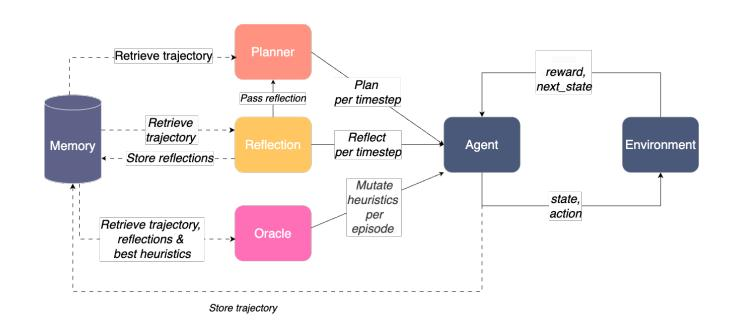
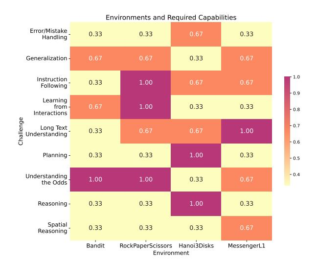
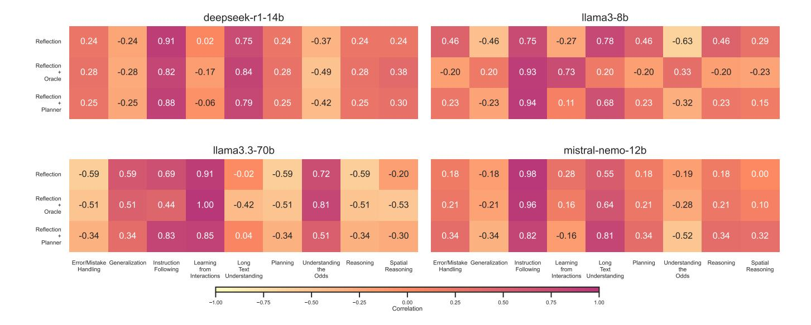

# Towards a Deeper Understanding of Reasoning Capabilities in Large Language Models

Annie Wong ,\*, Thomas Bäck, Aske Plaat, Niki van Stein and Anna V. Kononova

Leiden Institute of Advanced Computer Science

**Abstract.** While large language models demonstrate impressive performance on static benchmarks, the true potential of large language models as self-learning and reasoning agents in dynamic environments remains unclear. This study systematically evaluates the efficacy of self-reflection, heuristic mutation, and planning as prompting techniques to test the adaptive capabilities of agents. We conduct experiments with various open-source language models in dynamic environments and find that larger models generally outperform smaller ones, but that strategic prompting can close this performance gap. Second, a too-long prompt can negatively impact smaller models on basic reactive tasks, while larger models show more robust behaviour. Third, advanced prompting techniques primarily benefit smaller models on complex games, but offer less improvement for already high-performing large language models. Yet, we find that advanced reasoning methods yield highly variable outcomes: while capable of significantly improving performance when reasoning and decision-making align, they also introduce instability and can lead to big performance drops. Compared to human performance, our findings reveal little evidence of true emergent reasoning. Instead, large language model performance exhibits persistent limitations in crucial areas such as planning, reasoning, and spatial coordination, suggesting that current-generation large language models still suffer fundamental shortcomings that may not be fully overcome through self-reflective prompting alone. Reasoning is a multi-faceted task, and while reasoning methods like Chain of thought improves multistep reasoning on math word problems, our findings using dynamic benchmarks highlight important shortcomings in general reasoning capabilities, indicating a need to move beyond static benchmarks to capture the complexity of reasoning.

#### 1 Introduction

A key objective of artificial intelligence has been the development of intelligent agents that can perceive the environment and make autonomous decisions [31]. The emergence of large language models (LLMs) has significantly advanced this objective, showing strong capabilities in the solution of various natural language processing tasks, such as solving mathematical problems, coding, reading comprehension, translation, summarizing and answering questions [1, 4, 20]. These findings show a promising direction towards autonomous agents, and recent studies have begun to explore methods for enabling agents to learn dynamically. For instance, investigations into self-reflection mechanisms allow agents to evaluate their past actions and refine future strategies [22], while work on iterative prompting

and environmental feedback aims to facilitate continuous learning from experience [35]. LLMs have also been investigated to serve as a controller to solve environmental tasks through reasoning and planning [33, 36, 19, 13]. The ability of LLM agents to learn and adapt in dynamic environments has yet to be definitively proven. While these models excel at in-context learning—generalizing from minimal examples—their reliance on statistical prediction and lack of long-term memory often limit their effectiveness in dynamic settings [25]. Furthermore, achieving optimal performance on specialised tasks typically requires either fine-tuning with human-annotated data [16] or reliance on careful prompt engineering [21]. These processes are resource-intensive, reducing the flexibility of deploying LLMs in real-world, constantly evolving applications. This study aims to understand the following question: "To what extent can LLM agents autonomously learn and adapt to novels tasks in dynamic environments?" Specifically, we investigate whether in-context mechanisms can improve continuous learning and multi-step reasoning across various challenge levels. Our contributions are as follows 1:

- We present a systematic comparison of open-souce LLMs on dynamic decision-making tasks. We quantify three prompting strategies—reflection, heuristic mutation, and planning—across SMARTPLAY [32]: a benchmark to evaluate capabilities of intelligent agents. For simple reactive task, we find that excessive reasoning harm performance for smaller models, while larger models are more robust. Larger models generally achieve higher scores in line with scaling laws [7], but carefully designed prompts can let small models match or surpass the baseline performance of larger models. Advanced prompting techniques primarily benefit smaller models on complex planning and reasoning tasks, and offer less value to already high-performing large language models.
- We find that advanced reasoning techniques yield highly variable outcomes: while capable of significantly improving performance when reasoning and decision-making align, they also introduce instability and can lead to big performance drops.
- By transforming a sparse reward into a dense, task-aligned quantitative reward, we demonstrate improvement in the learning effectiveness of LLM agents within complex environments, offering a simpler alternative to the often labour-intensive process of prompt engineering.
- We find little evidence for self-learning or emergent reasoning in dynamic tasks that require planning and spatial coordination.
  These observations highlight the limitations of current, static

\* Corresponding author. Email: a.s.w.wong@liacs.leidenuniv.nl

Code available at https://github.com/ann-w/towards-a-deeperunderstanding-of-reasoning-capabilities-in-large-language-models

benchmarks such as question-answer pairs or math word problems, in capturing the complexities of reasoning and revealing inherent deficits.

The paper proceeds as follows: Section 2 provides the background, Section 3 details the methodology, Section 4 presents the results, and Section 5 concludes with a discussion of the findings.

#### 2 Background

Recent studies have increasingly focused on LLM capabilities as agents in complex, interactive text-based games. These environments present unique challenges requiring puzzle-solving and planning that stretch beyond the inherent statistical prediction capabilities of LLMs. In response, a spectrum of prompt-level techniques has emerged to improve LLM reasoning capabilities without the need for fine-tuning of the parameters. Chain-of-Thought (CoT) encourages the decomposition of complex tasks into sequential steps [30], while Self-Refine leverages iterative feedback to improve output quality [14]. ReAct [35] and Reflexion [36] integrate reasoning with action and self-reflection, enabling agents to continuously assess and adjust their strategies as they interact with the environment.

Others emphasise iterative plan refinement: AutoPlan [17] revises a natural-language plan while solving household tasks and multi-hop questions; DEPS [29] iteratively refines plans by summarizing situations, diagnosing errors, and selecting sub-goals in open worlds; RCI [8] refines plans on computer tasks. Others predict future states and rewards from the interaction history to steer their plan in short-horizon puzzles [12].

Finally, inspired by the successes of evolutionary approaches in other domains, researchers have begun to apply evolutionary strategies to self-optimise LLM performance. EvoPrompt [6] uses genetic algorithms and differential evolution to iteratively refine prompts, while metaheuristic methods in frameworks like PLUM [18] and LLaMEA [27] generate, mutate, and select effective algorithms based on performance feedback. This line of research underscores the potential for evolutionary algorithms to minimize manual tuning.

Despite the proposal of diverse prompt techniques, methods have usually been studied in isolation. This study offers a more comprehensive evaluation by systematically testing different prompting strategies on the SmartPlay suite to test agent capabilities on nine different challenges, making it a more comprehensive benchmark than most studies that focus on a single domain, such as text-based household tasks [23] or grid-world instructions [3].

## 3 Methodology

Our framework is presented in Figure 1. At each timestep, the agent interacts with the environment by taking an action, receives a reward and moves to the next state. Reflection performs a retrospective analysis of the agent's trajectory at each timestep. Oracle evolves heuristics after each episode by mutating them based on past reflections and trajectory to capture the generic episode dynamics. The Planner simulates future states and the cumulative reward based on the trajectory and reflection. The prompts for all modules described below can be found in the Supplementary Material.

For our experiments, we use open source LLMs, including LLAMA3-8B, MISTRAL-NEMO-12B, DEEPSEEK-R1-14B and LLAMA3.3-70B to investigate how size and architecture influence performance. We ran experiments for the largest model, LLAMA-3.3-70B, on two A100 machines. The smaller models were run on

Figure 1. High-level representation of the agent framework. At each timestep, the agent takes an action, receives a reward and moves to the next state. The agent can receive additional guidance from three modules. Reflection performs retrospective analysis based on the past trajectory per timestep. The Oracle evolves heuristics via mutation to uncover environment dynamics based on past reflections and trajectory after each episode. The Planner simulates future states and rewards to recommend the best action based on the past trajectory and current reflection per timestep.

NVIDIA RTX 4090, RTX 3060, or A40 GPUs. We cover each module in more detail below.

#### 3.1 Agent

At each time step t, the agent selects an action  $a_t$  to maximize the sum of rewards across episodes:  $\max_{\pi} \sum_{k=1}^{T} r_k$ . Using only the information within the prompt (game manual, task, history, current state, possible actions), the agent adjusts its policy  $\pi$ .

We evaluate the agent where the following module combinations are enabled: In the first strategy, only Reflection is enabled, where at each timestep, the agent receives a reflection on its past actions in the current episode, and the agent is prompted to take the next best action. In the second strategy, Reflection and Oracle are enabled, where the agent receives both heuristics (generated by the Oracle and kept consistent within an episode but mutated between episodes) and the aforementioned reflection over past episode trajectory per timestep, and the agent is prompted to take the next best action. In the third strategy, Reflection and Planner are enabled, where at each timestep the agent receives a reflection, and the Planner suggests a subsequent action, which the agent executes.

#### 3.2 Reflection

Inspired by Reflexion [36], we add a reflection module so that the agent can reflect on the past trajectory within each episode. The reflection module reviews the agent's past sequence of *state*, *action*, *reward*, *and next state*. This process involves comparing the sequence of actions taken against the game's objectives and identifying adjustments that could lead to higher cumulative rewards. Reflections are generated at each time step within an episode, they are reset between episodes because the game's dynamics may change.

#### 3.3 Oracle

The Oracle generate heuristics from past reflections to optimize the agent's policy, continuously refining these rules through a (1+1) evolutionary strategy over successive episodes. This process minimizes the need for manual prompt engineering while enabling the agent to adapt to a dynamic environment. The Oracle's task is to identify general patterns across episodes; consequently, the generated heuristics

Figure 2. Heatmap illustrating the relative importance of skills for success in each environment (numbers from SmartPlay [32] and normalized). For Bandit, understanding odds and learning from past data is important. Rock, Paper, Scissors requires instruction following, opponent-based learning, and long-text comprehension. Hanoi emphasizes planning, reasoning, and careful instruction following. Messenger requires long-text interpretation, spatial reasoning, probabilistic thinking, and generalization.

remain consistent within a single episode. Specifically, in the first episode, the agent explores the environment, and the Oracle uses the resulting trajectory and reflections to create initial heuristics (the parent). Following each subsequent episode, the Oracle generates and evaluates a single offspring by mutating the parent heuristics. If the offspring's performance is better than the parent's, the offspring replaces the parent; otherwise, the parent heuristics are retained. This "mutation" process enables the LLM to iteratively refine the heuristics by adding, modifying, or removing rules to better align with observed data.

# *3.4 Planner*

While the Reflection and Oracle modules analyze past trajectories and feedback to refine the agent's strategy, the Planner is forwardlooking. The planner's objective is to simulate possible action sequences up to three steps ahead and select the action with the highest expected cumulative reward, based on the game manual, objectives, trajectory, reflection and current observation. We explored but did not proceed with adding heuristics as input to the planner because it led to a deviation from the response format, possibly because the instructions became obscured within the lengthy context.

### *3.5 Memory*

The Memory maintains both episodic and persistent data. The episodic memory tracks the current episode's trajectory. The persistent memory stores the best heuristic to be mutated across episodes. The episodic memory is limited to the trajectory of the current episode due to the varying dynamics that can occur within each episode.

# 4 Results

## *4.1 Test Environments*

We evaluate our framework on four Smartplay environments2 . The challenges are shown in Figure 2. In Bandit, the agent must balance exploration and exploitation to discover which bandit yields higher payoff. Rock Paper Scissors (RPS) tests probabilistic reasoning against an opponent whose move distribution is biased and randomly shuffled. In Tower of Hanoi, the agent must plan and reason spatially to move three disks across rods, with the rule that a larger disk can never rest on a smaller one. Messenger challenges the agent's ability to understand text with synonyms and to use that understanding to move around, avoid an enemy, and deliver a message to the goal. Task horizons and episode counts follow Wu et al. [32] (See also Supplementary Material), except for Messenger, where the rollout is extended from 4 to 10 steps, because the initial placement of the enemy and goal made it often impossible to complete the task within the original four steps. We also reduced training to 20 episodes after observing no further performance improvements beyond that point.

## *4.2 Results and Analysis*

Table 1 shows the minimum, median and maximum average scores over 3 runs for each strategy.3 Scoring varies by environment: for Bandit and RPS, it's the number of optimal actions; for Hanoi, it's the count of successfully moved discs; and for Messenger, score equals reward (with -1 for errors and +1 for successful message actions). Human baselines are taken from [32]. A ranking with statistical tests of all model-strategy pairs can be found in the Supplementary Material. In the next sections, we report results as *median score [min, max]*.

## *4.2.1 Model Size and Performance*

Larger parameter counts generally achieve higher scores (see Table 1). For instance, on Bandit, LLAMA3.3-70B 41.70 [40.90 − 41.90] outperforms DEEPSEEK-R1-14B 41.00 [40.55 − 41.40], MISTRAL-NEMO-12B 34.20 [30.95 − 36.30] and LLAMA3-8B 40.35 [37.45−41.65]. Model performance increases with size across all game baselines. This performance gap widens as the games become more challenging. For example, LLAMA3.3-70B achieves a score of 2.00 [2.00 − 2.00] in Hanoi, significantly outperforming LLAMA3-8B's median score of 0.20 [0.20 − 0.30]. Overall, LLAMA3.3-70B leads, closely followed by DEEPSEEK-R1-14B. Only LLAMA3-8B attains higher baseline median scores than the larger MISTRAL-NEMO-12B.

Prompting techniques can close the gap between smaller and larger models on specific tasks. For example, LLAMA3-8B with Reflection + Oracle 26.00 [12.00 − 36.00] outperforms LLAMA3.3- 70B's baseline of 22.20 [21.55 − 25.05] on RPS. In Messenger, MISTRAL-NEMO-12B with *Reflection + Planner* 1.00 [−1.00 − 1.00] exceeds LLAMA3.3-70B's baseline 0.10 [−0.10 − 0.10], as does DEEPSEEK-R1-14B with Reflection + Oracle 1.00 [0.00, 1.00] and Reflection + Planner 1.00 [0.40 − 1.00], matching LLAMA3.3- 70B's maximum score. However, these improvements are inconsistent. For instance, MISTRAL-NEMO-12B's Reflection + Planner score in RPS ranges from 10.00 to 33.00, and DEEPSEEK-R1-14B's

2 https://github.com/microsoft/SmartPlay

3 All results are averaged over three independent runs; the budget is capped at three because of the computational cost imposed by LLAMA3.3-70B.

Table 1. The table shows the minimum, median and maximum average scores over three runs. The top row shows the human baseline for each game, taken from [32]. Darker colours indicate closer performance to human baseline. For Bandit, the score improves almost linearly with model size. For simple reactive tasks, excessive reasoning harms small models' performance. Rock Paper Scissors demands adaptation to opponent behaviour in which model size is the main driver of better performance. Reflection + Oracle and Reflection + Planner benefits mostly smaller models in the more complicated Hanoi and Messenger tasks. Yet we observe large variability in runs. † Note that the human baseline is not directly comparable with our results, because it was obtained under a 4-step, 100-episode setting, whereas our evaluation uses a 10-step horizon and 20 episodes.

| Model            | Method               |       | Bandit |       | Rock Paper Scissors |       |       | Hanoi |      |      | Messenger |       |       |
|------------------|----------------------|-------|--------|-------|---------------------|-------|-------|-------|------|------|-----------|-------|-------|
| HUMAN BASELINE   | -                    |       |        |       | 43                  |       |       | 3     |      |      | † 1    |       |       |
|                  |                      | min   | med    | max   | min                 | med   | max   | min   | med  | max  | min       | med   | max   |
| LLAMA3-8B        | Base                 | 37.45 | 40.35  | 41.65 | 16.00               | 17.15 | 17.85 | 0.20  | 0.20 | 0.30 | -0.45     | -0.15 | -0.15 |
| LLAMA3-8B        | Reflection           | 36.40 | 37.40  | 38.50 | 15.05               | 16.40 | 19.80 | 0.40  | 0.90 | 1.00 | -0.35     | 0.05  | 0.10  |
| LLAMA3-8B        | Reflection + Oracle  | 36.00 | 37.00  | 40.00 | 12.00               | 26.00 | 36.00 | 0.00  | 0.00 | 1.00 | -1.00     | 0.00  | 0.00  |
| LLAMA3-8B        | Reflection + Planner | 30.00 | 34.00  | 35.00 | 15.00               | 17.00 | 28.00 | 0.00  | 1.00 | 2.00 | 0.00      | 0.00  | 0.00  |
| MISTRAL-NEMO-12B | Base                 | 30.95 | 34.20  | 36.30 | 16.40               | 16.50 | 19.05 | 0.00  | 0.00 | 0.10 | -0.20     | -0.20 | -0.15 |
| MISTRAL-NEMO-12B | Reflection           | 28.50 | 31.50  | 32.15 | 18.30               | 19.70 | 20.50 | 0.30  | 0.50 | 0.60 | -0.40     | -0.35 | -0.25 |
| MISTRAL-NEMO-12B | Reflection + Oracle  | 21.00 | 29.00  | 39.00 | 15.00               | 18.00 | 26.00 | 0.00  | 1.00 | 1.00 | -1.00     | 0.00  | 1.00  |
| MISTRAL-NEMO-12B | Reflection + Planner | 23.00 | 27.00  | 28.00 | 10.00               | 11.00 | 33.00 | 0.00  | 1.00 | 1.00 | -1.00     | 1.00  | 1.00  |
| DEEPSEEK-R1-14B  | Base                 | 40.55 | 41.00  | 41.40 | 17.50               | 18.80 | 19.15 | 0.60  | 1.00 | 1.20 | 0.25      | 0.40  | 0.55  |
| DEEPSEEK-R1-14B  | Reflection           | 33.30 | 34.55  | 35.00 | 19.25               | 20.05 | 20.15 | 0.50  | 0.70 | 1.20 | 0.15      | 0.25  | 0.40  |
| DEEPSEEK-R1-14B  | Reflection + Oracle  | 37.00 | 38.00  | 40.00 | 15.00               | 20.00 | 21.00 | 1.00  | 1.00 | 1.00 | 0.00      | 1.00  | 1.00  |
| DEEPSEEK-R1-14B  | Reflection + Planner | 29.00 | 32.05  | 33.00 | 19.50               | 20.05 | 20.25 | 0.00  | 0.90 | 2.00 | 0.40      | 1.00  | 1.00  |
| LLAMA3.3-70B     | Base                 | 40.90 | 41.70  | 41.90 | 21.55               | 22.20 | 25.05 | 2.00  | 2.00 | 2.00 | -0.10     | 0.10  | 0.10  |
| LLAMA3.3-70B     | Reflection           | 41.50 | 41.50  | 42.80 | 25.95               | 26.80 | 27.55 | 0.70  | 1.00 | 1.80 | 0.35      | 0.40  | 0.40  |
| LLAMA3.3-70B     | Reflection + Oracle  | 39.00 | 44.00  | 44.00 | 15.00               | 29.00 | 30.00 | 2.00  | 2.00 | 2.00 | -1.00     | 0.00  | 1.00  |
| LLAMA3.3-70B     | Reflection + Planner | 34.00 | 40.00  | 48.00 | 27.00               | 30.00 | 37.00 | 1.00  | 1.00 | 2.00 | -1.00     | -1.00 | 1.00  |

Reflection + Oracle ranges from 0.00 to 1.00, indicating unreliable success.

In conclusion, model size has the highest impact on overall performance. While prompting strategies can enable mid-sized models to match or close the gap with large models, their effectiveness is inconsistent, and the performance gain by increased model parameters is difficult to overcome by in-context learning alone.

## *4.2.2 Strategies versus Challenge Type*

Figure 3 displays Pearson correlations between each prompting strategy's gain over the Base prompt and nine challenge dimensions, calculated over three runs. For LLAMA3-8B the strategies benefit most on *Instruction-Following* (r = 0.75–0.94); Reflection correlates most with *Long-Text Understanding* (r = 0.78), whereas Reflection + Oracle correlates strongest with *Learning-from-Interactions* (r = 0.73). Reflection + Planner has a small positive correlation to *Planning* (r = 0.23). MISTRAL-NEMO-12B shows high correlations for *Instruction-Following* (r = 0.82–0.98) and moderate to high correlations for *Long-Text Understanding* (r = 0.55–0.81), while improvements elsewhere are modest, small negative correlations appear for *Understanding the Odds* and *Generalization*. DEEPSEEK-R1- 14B strongly aligns with *Instruction-Following* (r = 0.87−0.94) and *Long-Text Understanding* (r = 0.69 − 0.79), while showing small negative correlations for *Generalisation* and *Understanding the Odds*. LLAMA3.3-70B achieves the biggest gains on *Learningfrom-Interactions* (r = 0.85–1.00) and *Understanding the Odds* (r = 0.51–0.81), and moderate positive effects on *Instruction-Following* and *Generalisation*. There are small negative correlations with *Error Handling*, *Planning*, *Reasoning* and *Spatial Reasoning*, while *Long Text Understanding* shows correlations near 0, except for Reflection + Oracle with a negative correlation of (r=-0.42).

Overall, strategies improve Instruction Following across all models. For smaller and mid-sized models, these strategies also contribute to better long-text understanding, a benefit less pronounced in the already capable LLAMA3.3-70B. Conversely, for the larger LLAMA3.3-70B, the strategies improve generalization, an area where smaller models still face challenges.

Next, we provide an analysis of the results per environment.

#### *4.2.3 TwoArmedBandit*

The optimal strategy in the two-armed bandit task relies on a basic count of past rewards from both machines. We observe that incorporating more complex prompting led to performance degradation compared to the baseline. For instance, LLAMA3-8B's score drops from 40.35 [37.45 − 41.65] to 34.00 [30.00 − 35.00] with Reflection + Planner. Similarly, DEEPSEEK-R1-14B score drops from 41 [40.55, 41.40] to 32.05 [29.00, 33.00] with Reflection + Planner. LLAMA-70B's is the only exception, which achieves a higher maximum score of 48.00 when Reflection + Planner is enabled compared to the maximum Baseline score 41.90. Performance relies on rapid identification of the higher-paying bandit. The Base agent, exemplified by LLAMA3-8B, quickly exploits positive rewards, in contrast to other strategies that have lower performance by prolonged, oscillating exploration despite negative feedback (Example 1). Further inspection shows that Reflection, Oracle, and Planner discourage completely ignoring any single arm in favour of sustained exploration. Reflection points out to *"avoid pulling the same machine too frequently without exploring the other option"*, while the Planner recommends alternating sequences like *"Pull slot machine 2* → *Pull slot machine 1* → *Pull slot machine 2"*. This analysis reveals two complementary failure modes. First, Reflection, Oracle and Planner increase the agent prompt extensively, diluting important information and decreasing performance in smaller models. This is consistent with the idea that extraneous context reduces signal-to-noise ratio and adds *distraction* [26, 11]. Second, advanced reasoning methods encourage the agent to keep testing both arms even when one arm is clearly superior. We often observe the model *overthinks* [2, 24, 5] and reasons itself away from exploiting a profitable streak, leading to slower convergence.

Figure 3. Heat-map of Pearson correlation coefficients between each strategy's performance gain over the Base prompt and challenge dimensions over three evaluation runs per environment. DEEPSEEK-R1-14B benefits most on *Instruction-Following* (r = 0.87−0.94) and *Long-Text Understanding* (r = 0.69−0.79), while slightly harming *Generalisation* and *Understanding the Odds*. LLAMA3-8B shows its largest lift on *Instruction Following* (r = 0.93−0.94) and on *Learning from Interactions* when an Oracle is present (r = 0.73). For LLAMA3.3-70B, all strategies yield near-perfect alignment with *Learning from Interactions* and gains for *Understanding the Odds*, *Generalization* and *Instruction Following*. MISTRAL-NEMO-12B consistently improves *Instruction-Following* (r = 0.82−0.98) and moderately boost *Long-Text Understanding* (r = 0.55−0.81), with little impact on other challenges. Overall, strategies improve *Instruction Following* across all models. For smaller and mid-sized models, these strategies also contribute to better long-text understanding, a benefit less pronounced in the already capable LLAMA3.3-70B. Conversely, for the larger LLAMA3.3-70B, the strategies improve generalization, an area where smaller models still face challenges. While no specific strategy type strongly correlates with a particular challenge, the application of strategies is associated with performance gains in specific challenge types.

Example 1: The LLAMA3-8B agent, with Reflection and Oracle, keeps exploring both bandits despite negative reward from slot machine 1.

Player Observation Step 1: A new round begins.

Player Observation Step 2: You pulled slot machine 1, you received reward -1.

Player Observation Step 3: You pulled slot machine 2, you received reward 1.

Player Observation Step 4: You pulled slot machine 1, you received reward -1.

Player Observation Step 5: You pulled slot machine 2, you received reward 1.

Player Observation Step 6: You pulled slot machine 1, you received reward -1.

#### *4.2.4 Rock Paper Scissors*

The highest gain appears for LLAMA3.3-70B: improving from 22.20 [21.55, 25.05] to 30.00 [27.00 − 37.00] with Reflection + Planner. LLAMA3-8B improves from 16.50 [16.40 − 19.05] to 26.00 [12.00 − 36.00] with Reflection + Oracle. MISTRAL-NEMO-12B and DEEPSEEK-R1-14B do not see much improvement. Smaller models, especially LLAMA3-8B and MISTRAL-NEMO-12B, show occasional high-scoring runs but inconsistent overall play. Thus, only LLAMA3.3-70B benefits from prompting strategies here; other models see little reliable benefit.

Qualitative inspections show that the larger model demonstrates better planning capabilities and adaptation to opponent patterns. For instance, LLAMA3.3-70B with Reflection + Planner reasoned that *"choosing Paper has led to wins against Rock, which is a common choice"*, while *"being prepared to adapt with Scissor if the opponent chooses Paper, and then switch to Rock if the pattern suggests an upcoming Scissor."*. This ability to vary moves and execute planned sequences highlights a strong connection between its reasoning and actions. DEEPSEEK-R1-14B reflection shows a similar pattern, mentioning *Track what has worked against the opponent and adjust your strategy dynamically, especially after losses or when the opponent changes their move*. However, we note that DEEPSEEK-R1-14B often deviates from the answer template where the action line was missing, forcing random fallback. Smaller models often fell into repetitive loops. In one episode, LLAMA-8B agent opens with *Paper* and then continues to play *Paper* in most rounds, even while the opponent frequently plays *Scissors*. The agent incurs a string of losses but does not switch strategy. These cases show the smaller models failing to adjust even when a pattern clearly is not working, leading to predictable and exploitable behaviour.

#### *4.2.5 Tower of Hanoi*

LLAMA3.3-70B achieves the best performance in Tower of Hanoi, with a score of 2.00 [2.00-2.00], matched by Reflection + Oracle. However, its score drops to 1.00 [1.00-2.00] with Reflection + Planner, and to 0.70 [1.00-1.80] with Reflection alone. We observe a trend Example 2: MISTRAL-NEMO-12B made an invalid move in Towers of Hanoi by attempting to place a larger disk (size 2 from rod B) onto a smaller one (size 0 on rod C). The game requires moving disks from A to C without placing a larger disk on a smaller one.

#### State (Before Action):

- A: |bottom, [], top|
- B: |bottom, [2], top|
- C: |bottom, [1, 0], top|

Attempted Action: Move the top disk from rod B to rod C.

Reward: -1 (Indicates an invalid move)

Next State (Unchanged due to invalid action):

- A: |bottom, [], top|
- B: |bottom, [2], top|
- C: |bottom, [1, 0], top|

in smaller models: while advanced prompting can significantly improve performance, this improvement is brittle, as it can also lead to substantial drops in scores. For instance, DEEPSEEK-R1-14B has a baseline score of 1.00 [0.60-1.20]. With Reflection + Planner, its score fluctuates, reaching as high as 2.00 but also dropping to 1.00. Similarly, for LLAMA3-8B, the baseline score of 0.20 [0.20- 0.30] has lower variability, yet Reflection and Planner can achieve a maximum score of 2.00, though it may also drop to a minimum of 0.00. MISTRAL-NEMO-12B moves from 0.00 [0.00 − 0.00] to 1.00 [0.00 − 1.00] with both Reflection + Oracle and Reflection + Planner. However, the minimum score of 0.00 is lower than that achieved with Reflection alone. Compared with the other games, agents using Planner struggle more to interpret the disk-placement state (see Supplementary Material for an ablation study on plan generation and accuracy). Hanoi failures frequently resulted from invalid moves, such as placing a larger disk onto a smaller one (Example 2). The agent's reflection identified this recurring problem: *"Based on the trajectory observed, there's a common pitfall that has been repeatedly encountered: attempting to place a bigger disk on top of a smaller one."*. While some models correctly state that Hanoi can be solved in 7 moves and can even list the sequence, our agents averaged around 30 moves without success, indicating significant inefficiency and a lack of true understanding and planning. Agents regularly made redundant actions such as moving a disk to a rod and then reversing that move or repeating failed actions. Adding to this difficulty was the sparse reward function: 0 for valid moves, -1 for invalid moves, and +100 for solving the puzzle, which provides little positive reinforcement while constantly being penalized for mistakes.

#### *4.2.6 Messenger*

The biggest gain for smaller models comes from Reflection + Planner in Messenger. LLAMA3-8B's score improves from −0.15 [−0.45 − −0.15) to 0.00 [0.00−0.00], MISTRAL-NEMO-12B improves from −0.20 [−0.20 − −0.15) to 1.00 [−1.00 − 1.00], and DEEPSEEK-R1-14B improves from 0.40[0.25 − 0.55] to 1.00[0.40 − 1.00). By contrast, the same Reflection + Planner collapses LLAMA3.3- 70B from 0.10 [−0.10−0.10] to −1.00 [−1.00−1.00]. Qualitative analysis shows that this decline can be attributed to the planner's strategy leading to overly cautious enemy avoidance, resulting in inefficient detours and failure to complete the task within ten steps. Object misidentification and poor spatial awareness frequently led to agent failures in Messenger. For example, LLAMA3-8B's heuristics fail to adapt to the changing positions of enemy, message, and goal, often referring to objects that are not present and thereby confusing the agent. MISTRAL-NEMO-12B once incorrectly identified an *airplane* as the goal in one episode. Although the agent later attempted self-correction, stating, *"the airplane, which is the enemy, is one step away and not moving. To avoid losing immediately, we should move towards the message (dog) located three steps southwest"*, its subsequent eastward move resulted in an enemy encounter. Even when the Oracle advises the agent *"to navigate around the environment and avoid enemies while trying to reach the message"*, agents consistently struggled to move effectively. DEEPSEEK-R1- 14B and LLAMA-70B demonstrate better synonym comprehension, and the latter is also better in creating generalizable heuristics: *"Identify and move towards objects that match the description of a "message" (e.g., "classified report", "restricted document"), as obtaining the message is crucial to winning the game," and "Exercise caution around objects described with synonyms of "danger" or "enemy."*. Similar to Hanoi, the reward function is not very informative. Positive outcomes only occur upon picking up the message or reaching the goal, events which happen infrequently. Most of the agent's actions, such as wandering, offer no reward, and colliding with enemies ends the episode prematurely.

## *4.3 Additional Analysis*

We modify the setups for HANOI3DISKS and MESSENGERL1 to investigate failure modes and explore potential learning enhancements in additional experiments. We conduct the experiments with MISTRAL-NEMO-12B to balance speed and performance.

#### *4.3.1 Hanoi*

We implement the following modifications: simplifying the puzzle to two disks, mentioning the valid actions in the observation, and introducing reward shaping (-2 for invalid, +1 for valid moves, +100 for goal), to provide more explicit feedback. These modifications aim to isolate the factors hindering the agent's capabilities. The results over five runs are summarized in Table 2.

Under the baseline 3-disk setting, the agent never completes the puzzle and makes frequent illegal moves, typically ending episodes with only one disk on the target peg. Reward shaping provides some improvements. The agent places slightly more disks correctly and commits fewer illegal moves, but this does not lead to more goal achievements. Interestingly, showing valid actions reduces illegal moves but does not completely eliminate them, likely because these hints get lost in the lengthy prompt. The Planner strategy should map out correct steps, but often becomes confused by the puzzle's intermediate states and stops choosing valid moves altogether. Combining reward shaping with valid-action hints yields no additional benefit beyond showing valid actions alone. MISTRAL-NEMO-12B underperforms even a uniform-random policy on success rate, correct placements, and move legality, revealing a fundamental ability to internalise the 3-disk Tower-of-Hanoi rules.

Under the two-disk scenario, all methods achieve much higher goal completion rates than in the three-disk setting. Without additional modifications, *Reflection + Oracle* attains 42 per cent goal success. Reward shaping generally boosts performance for most methods, with the exception of the Planner, while showing valid actions further reduces illegal moves and raises completion rates. However, combining reward shaping with showing valid actions does not consistently produce better outcomes like in the 3-disk setting, suggest-

Table 2. MISTRAL-NEMO-12B performance over five runs on Hanoi across four conditions and a random-action baseline. Values show the percentage of episodes where agents achieved the goal (G), average disks placed on target peg (D), and percentage of invalid moves (I). Darker colours mean better performance across the column. In the 3-disk task, showing valid actions proved more beneficial than reward shaping for disk placement and reducing invalid moves; combining them offered a minor boost to goal achievement. Surprisingly, the random policy outperforms all methods in the no adjustments setting across goal, disk placement, and invalid-move metrics. For 2 disks, all methods achieve substantially higher success than in the 3-disk scenario, with valid-action hints most effective at achieving the goal and reducing invalid moves. Combining shaping and showing valid actions yields no consistent advantage, indicating the main challenge is not the reward signal but identifying valid moves.

| Method               | No adjustments |     |       | Reward Shaping |     |       | Show  | Valid A | actions |       | Show Valid Actions + Reward Shaping |       |  |
|----------------------|----------------|-----|-------|----------------|-----|-------|-------|---------|---------|-------|----------------------------------------|-------|--|
|                      | G              | D   | I     | G              | D   | I     | G     | D       | I       | G     | D                                      | I     |  |
| 3 Disks              |                |     |       |                |     |       |       |         |         |       |                                        |       |  |
| Base                 | 0.0%           | 0.2 | 79.4% | 0.0%           | 0.4 | 79.0% | 2.0%  | 1.1     | 56.3%   | 0.0%  | 0.9                                    | 57.6% |  |
| Reflection           | 0.0%           | 0.6 | 74.1% | 2.0%           | 0.9 | 70.5% | 0.0%  | 0.8     | 61.3%   | 2.0%  | 0.8                                    | 62.0% |  |
| Reflection + Oracle  | 0.0%           | 0.7 | 74.1% | 0.0%           | 0.8 | 70.5% | 4.0%  | 1.0     | 62.8%   | 2.0%  | 0.9                                    | 62.0% |  |
| Reflection + Planner | 0.0%           | 0.4 | 76.3% | 0.0%           | 0.4 | 76.8% | 0.0%  | 0.9     | 77.4%   | 0.0%  | 0.9                                    | 77.2% |  |
| Random               | 2.0%           | 0.9 | 69.7% | 0.0%           | 0.8 | 70.1% | 0.0%  | 0.9     | 68.9%   | 6.0%  | 0.9                                    | 69.2% |  |
| 2 Disks              |                |     |       |                |     |       |       |         |         |       |                                        |       |  |
| Base                 | 2.0%           | 0.5 | 72.0% | 16.0%          | 0.8 | 71.6% | 44.0% | 1.2     | 50.1%   | 44.0% | 1.3                                    | 49.1% |  |
| Reflection           | 20.0%          | 0.8 | 69.9% | 30.0%          | 1.0 | 69.4% | 66.0% | 1.5     | 44.3%   | 70.0% | 1.6                                    | 40.2% |  |
| Reflection + Oracle  | 42.0%          | 1.0 | 66.9% | 42.0%          | 1.0 | 66.9% | 68.0% | 1.5     | 42.6%   | 52.0% | 1.2                                    | 52.1% |  |
| Planner              | 26.0%          | 1.0 | 74.7% | 10.0%          | 0.9 | 77.8% | 52.0% | 1.5     | 63.7%   | 25.0% | 1.1                                    | 72.5% |  |
| Random               | 32.0%          | 0.8 | 68.5% | 34.0%          | 1.0 | 69.1% | 56.0% | 1.4     | 63.2%   | 42.0% | 1.2                                    | 66.5% |  |

Table 3. MISTRAL-NEMO-12B performance over five runs on Messenger across four conditions and a random-action baseline. Values show the percentage of episodes where agents successfully picked up messages (P), achieved goals (G), or collided with enemies (C). Darker colours mean better performance across the column. Removing synonyms only slightly improves the pickup rates and the goal achievement. Reward shaping has a strong positive effect on the pickup rate but not on goal achievement. Combining both does not yield significant better results than reward shaping alone.

| Method               | No adjustments |      |       | No Synonyms |      |       | Re    | ward Sha | ping  | Reward Shaping + No synonyms |      |       |
|----------------------|----------------|------|-------|-------------|------|-------|-------|----------|-------|---------------------------------|------|-------|
|                      | P              | G    | С     | P           | G    | C     | P     | G        | С     | P                               | G    | C     |
| Base                 | 7.0%           | 7.0% | 32.0% | 8.0%        | 8.0% | 36.0% | 21.5% | 4.0%     | 35.5% | 15.0%                           | 5.0% | 37.0% |
| Reflection           | 2.0%           | 2.0% | 37.0% | 4.0%        | 4.0% | 35.5% | 16.5% | 6.5%     | 27.5% | 21.0%                           | 3.0% | 27.0% |
| Reflection + Oracle  | 5.1%           | 5.1% | 25.6% | 4.9%        | 4.9% | 30.8% | 16.4% | 1.8%     | 32.3% | 18.5%                           | 2.5% | 25.5% |
| Reflection + Planner | 7.8%           | 7.8% | 34.4% | 9.5%        | 9.5% | 32.5% | 27.5% | 5.5%     | 43.5% | 47.0%                           | 8.5% | 27.5% |
| Random               | 5.0%           | 5.0% | 24.0% | 2.0%        | 2.0% | 33.0% | 19.0% | 3.0%     | 27.0% | 12.0%                           | 4.0% | 20.0% |

ing the main obstacle remains understanding the core constraint of the game.

## 4.3.2 Messenger

Messenger modifications include reward shaping: providing incremental rewards for moving closer to the message or goal, and larger bonuses for message pickup (increased from 1.0 to 10.0) and final delivery (from 1.0 to 50.0). We introduce small distance-based rewards (+0.50 per step closer to the message or goal while carrying it), producing a denser reward signal to guide the agent. Second, we remove object synonyms to isolate the impact of language complexity on agent performance. The results over five runs are summarized in Table 3. Synonyms removal yields marginal gains in both goal completion and pickup rate for all methods, except for Reflection + Planner, where the pickup rate and goal achievement drop from 5.1 per cent to 4.9 per cent. Reward shaping consistently boosts pickup rates across all methods, but does not improve goal attainment, indicating that the agent either collides with the enemy or cannot attain the goal by the end of the episode. When reward shaping and synonym removal are combined, the pickup rate is higher and the collision is lower compared to the condition with no adjustments (except for the baseline). Reflection + Planner with reward shaping and synonym removal gives the best result overall (P = 47 percent, G = 8.5percent, collisions = 27 percent). Despite reward shaping and synonym removal, high collision rates persist, indicating a fundamental limitation in spatial awareness and navigation.

## 5 Conclusion and Discussion

Our evaluation of open-source LLMs on the SmartPlay benchmark reveals both the potential and limitations of advanced prompting strategies, including self-reflection, heuristic mutation, and planning We find that excessive reasoning harms the performance of smaller models on simple tasks, as it forces the model to filter through more content and increase the signal-to-noise-ratio [26, 11, 9]. This reasoning not only distracts [26, 11] but also causes the models to overthink [2, 24, 5], leading the model to overcomplicate the process and disregard simpler, more effective solutions. In addition, we find that larger models perform better, but that strategic prompting can close this gap, and that having a dense, task-aligned reward signal can improve an agent's decision-making, offering a simpler alternative compared to the significant effort needed to find optimal prompts. While smaller models particularly benefit from advanced prompting in complex tasks, our results demonstrate significant variability: the same prompt can produce substantial gains or, conversely, lead to worse performance than the baseline. This highlights the brittleness of current techniques and the need for more robust solutions. Moreover, the common practice in reasoning studies of reporting aggregate performance metrics, such as accuracy [30, 1, 10] or F1 scores [34] without including variability measures can be misleading and obscure the sensitivity of results to prompt variations caused by randomness or instability, affecting the generalization and reproducibility of findings.

Finally, while LLMs might exhibit proficiency on in-distribution data, we find little evidence for emergent reasoning or self-learning. Frequent failure modes include hallucinating invalid action trajectories and getting stuck in loops. Our findings support the growing

evidence necessitating a critical examination of prompting methods claiming emergent LLM abilities [28] and highlight the need to reevaluate current benchmarks like question-answer pairs or math word problems, which inadequately capture the complexity of reasoning and fail to reveal inherent deficits [15]. Future work could benefit from combining in-context learning with external memory to improve recall, symbolic abstractions to ensure verifiable reasoning, and multimodal perception to ground the agent's understanding in the physical world.

# References

- [1] T. Brown, B. Mann, N. Ryder, M. Subbiah, J. D. Kaplan, P. Dhariwal, A. Neelakantan, P. Shyam, G. Sastry, A. Askell, et al. Language models are few-shot learners. *Advances in neural information processing systems*, 33:1877–1901, 2020.
- [2] X. Chen, J. Xu, T. Liang, Z. He, J. Pang, D. Yu, L. Song, Q. Liu, M. Zhou, Z. Zhang, R. Wang, Z. Tu, H. Mi, and D. Yu. Do not think that much for 2+3=? on the overthinking of o1-like llms. *arXiv preprint arXiv:2412.21187*, 2024.
- [3] M. Chevalier-Boisvert, D. Bahdanau, S. Lahlou, L. Willems, C. Saharia, T. H. Nguyen, and Y. Bengio. Babyai: A platform to study the sample efficiency of grounded language learning. *arXiv preprint arXiv:1810.08272*, 2018.
- [4] J. Devlin, M.-W. Chang, K. Lee, and K. Toutanova. Bert: Pre-training of deep bidirectional transformers for language understanding. *arXiv preprint arXiv:1810.04805*, 2018.
- [5] C. Fan, M. Li, L. Sun, and T. Zhou. Missing premise exacerbates overthinking: Are reasoning models losing critical thinking skill? *arXiv preprint arXiv:2504.06514*, 2025.
- [6] Q. Guo, R. Wang, J. Guo, B. Li, K. Song, X. Tan, G. Liu, J. Bian, and Y. Yang. Connecting large language models with evolutionary algorithms yields powerful prompt optimizers. *arXiv preprint arXiv:2309.08532*, 2023.
- [7] J. Kaplan, S. McCandlish, T. Henighan, T. B. Brown, B. Chess, R. Child, S. Gray, A. Radford, J. Wu, and D. Amodei. Scaling laws for neural language models. *arXiv preprint arXiv:2001.08361*, 2020.
- [8] G. Kim, P. Baldi, and S. McAleer. Language models can solve computer tasks. *Advances in Neural Information Processing Systems*, 36:39648– 39677, 2023.
- [9] M. Levy, A. Jacoby, and Y. Goldberg. Same task, more tokens: the impact of input length on the reasoning performance of large language models. *arXiv preprint arXiv:2402.14848*, 2024.
- [10] A. Lewkowycz, A. Andreassen, D. Dohan, E. Dyer, H. Michalewski, V. Ramasesh, A. Slone, C. Anil, I. Schlag, T. Gutman-Solo, et al. Solving quantitative reasoning problems with language models. *Advances in Neural Information Processing Systems*, 35:3843–3857, 2022.
- [11] N. F. Liu, K. Lin, J. Hewitt, A. Paranjape, M. Bevilacqua, F. Petroni, and P. Liang. Lost in the middle: How language models use long contexts. *arXiv preprint arXiv:2307.03172*, 2023.
- [12] W. Lu, X. Zhao, J. Spisak, J. H. Lee, and S. Wermter. Mental modeling of reinforcement learning agents by language models. *arXiv preprint arXiv:2406.18505*, 2024.
- [13] W. Ma, Q. Mi, Y. Zeng, X. Yan, Y. Wu, R. Lin, H. Zhang, and J. Wang. Large language models play starcraft ii: Benchmarks and a chain of summarization approach. *arXiv preprint arXiv:2312.11865*, 2023.
- [14] A. Madaan, N. Tandon, P. Gupta, S. Hallinan, L. Gao, S. Wiegreffe, U. Alon, N. Dziri, S. Prabhumoye, Y. Yang, et al. Self-refine: Iterative refinement with self-feedback. *Advances in Neural Information Processing Systems*, 36, 2024.
- [15] M. Nezhurina, L. Cipolina-Kun, M. Cherti, and J. Jitsev. Alice in wonderland: Simple tasks showing complete reasoning breakdown in stateof-the-art large language models. *arXiv preprint arXiv:2406.02061*, 2024.
- [16] L. Ouyang, J. Wu, X. Jiang, D. Almeida, C. Wainwright, P. Mishkin, C. Zhang, S. Agarwal, K. Slama, A. Ray, et al. Training language models to follow instructions with human feedback. *Advances in neural information processing systems*, 35:27730–27744, 2022.
- [17] S. Ouyang and L. Li. Autoplan: Automatic planning of interactive decision-making tasks with large language models. *arXiv preprint arXiv:2305.15064*, 2023.
- [18] R. Pan, S. Xing, S. Diao, W. Sun, X. Liu, K. Shum, R. Pi, J. Zhang, and T. Zhang. Plum: Prompt learning using metaheuristic. *arXiv preprint arXiv:2311.08364*, 2023.

- [19] C. Park, X. Liu, A. Ozdaglar, and K. Zhang. Do llm agents have regret? a case study in online learning and games. *arXiv preprint arXiv:2403.16843*, 2024.
- [20] A. Radford, J. Wu, R. Child, D. Luan, D. Amodei, I. Sutskever, et al. Language models are unsupervised multitask learners. *OpenAI blog*, 1 (8):9, 2019.
- [21] L. Reynolds and K. McDonell. Prompt programming for large language models: Beyond the few-shot paradigm. In *Extended Abstracts of the 2021 CHI Conference on Human Factors in Computing Systems*, pages 1–7, 2021.
- [22] N. Shinn, F. Cassano, A. Gopinath, K. Narasimhan, and S. Yao. Reflexion: Language agents with verbal reinforcement learning. *Advances in Neural Information Processing Systems*, 36:8634–8652, 2023.
- [23] M. Shridhar, J. Thomason, D. Gordon, Y. Bisk, W. Han, R. Mottaghi, L. Zettlemoyer, and D. Fox. Alfred: A benchmark for interpreting grounded instructions for everyday tasks. In *Proceedings of the IEEE/CVF conference on computer vision and pattern recognition*, pages 10740–10749, 2020.
- [24] K. Stechly, K. Valmeekam, and S. Kambhampati. Chain of thoughtlessness? an analysis of cot in planning. In *The Thirty-eighth Annual Conference on Neural Information Processing Systems*, 2024.
- [25] Q. Tan, A. Kazemi, and R. Mihalcea. Text-based games as a challenging benchmark for large language models, 2023. URL https://openreview. net/forum?id=2g4m5S\_knF.
- [26] S. Tworkowski, K. Staniszewski, M. Pacek, Y. Wu, H. Michalewski, and P. Miłos. Focused transformer: Contrastive training for context scaling. ´ *Advances in neural information processing systems*, 36:42661–42688, 2023.
- [27] N. van Stein and T. Bäck. Llamea: A large language model evolutionary algorithm for automatically generating metaheuristics. *IEEE Transactions on Evolutionary Computation*, 2024.
- [28] M. Verma, S. Bhambri, and S. Kambhampati. On the brittle foundations of react prompting for agentic large language models. *arXiv preprint arXiv:2405.13966*, 2024.
- [29] Z. Wang, S. Cai, G. Chen, A. Liu, X. Ma, and Y. Liang. Describe, explain, plan and select: Interactive planning with large language models enables open-world multi-task agents. *arXiv preprint arXiv:2302.01560*, 2023.
- [30] J. Wei, X. Wang, D. Schuurmans, M. Bosma, F. Xia, E. Chi, Q. V. Le, D. Zhou, et al. Chain-of-thought prompting elicits reasoning in large language models. *Advances in neural information processing systems*, 35:24824–24837, 2022.
- [31] M. Wooldridge and N. R. Jennings. Intelligent agents: Theory and practice. *The knowledge engineering review*, 10(2):115–152, 1995.
- [32] Y. Wu, X. Tang, T. M. Mitchell, and Y. Li. Smartplay: A benchmark for llms as intelligent agents. *arXiv preprint arXiv:2310.01557*, 2023.
- [33] Z. Xi, W. Chen, X. Guo, W. He, Y. Ding, B. Hong, M. Zhang, J. Wang, S. Jin, E. Zhou, et al. The rise and potential of large language model based agents: A survey. *arXiv preprint arXiv:2309.07864*, 2023.
- [34] Z. Yang, P. Qi, S. Zhang, Y. Bengio, W. W. Cohen, R. Salakhutdinov, and C. D. Manning. Hotpotqa: A dataset for diverse, explainable multihop question answering. *arXiv preprint arXiv:1809.09600*, 2018.
- [35] S. Yao, J. Zhao, D. Yu, N. Du, I. Shafran, K. Narasimhan, and Y. Cao. React: Synergizing reasoning and acting in language models. *arXiv preprint arXiv:2210.03629*, 2022.
- [36] W. Zhang, K. Tang, H. Wu, M. Wang, Y. Shen, G. Hou, Z. Tan, P. Li, Y. Zhuang, and W. Lu. Agent-pro: Learning to evolve via policy-level reflection and optimization. *arXiv preprint arXiv:2402.17574*, 2024.