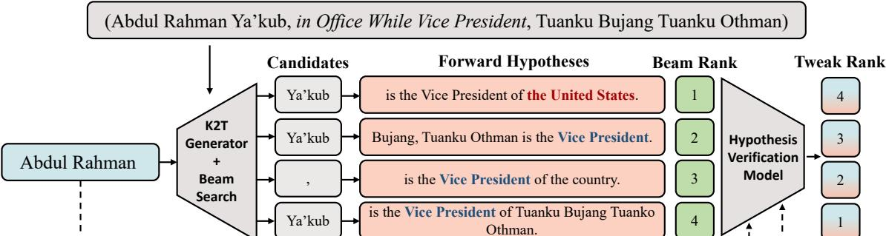
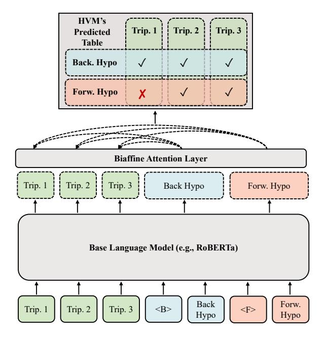
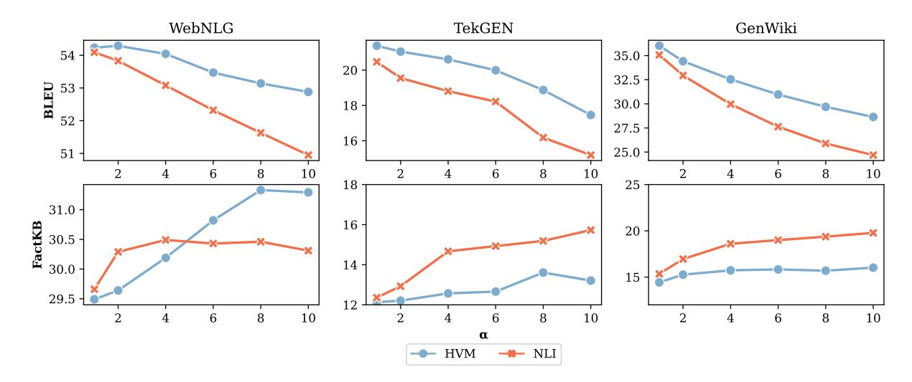
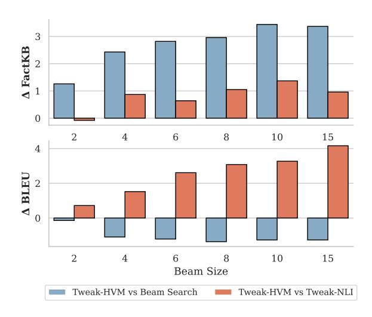
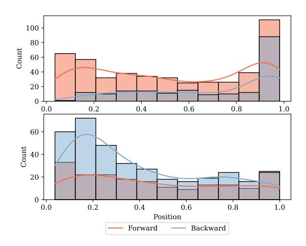
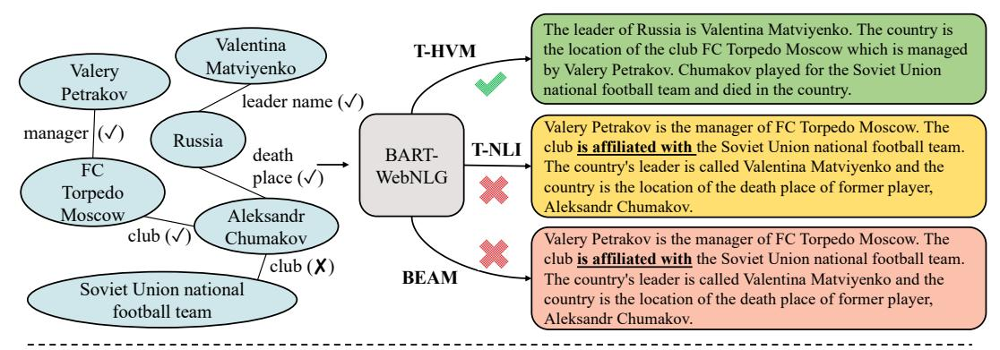

# Think While You Write Hypothesis Verification Promotes Faithful Knowledge-to-Text Generation

Yifu Qiu1∗ , Varun Embar2 , Shay B. Cohen1 , Benjamin Han2 University of Edinburgh1 , Apple2 {yifu.qiu, scohen}@ed.ac.uk, {v\_embar, ben.b.han}@apple.com

# Abstract

Neural knowledge-to-text generation models often struggle to faithfully generate descriptions for the input facts: they may produce *hallucinations* that contradict the given facts, or describe facts not present in the input. To reduce hallucinations, we propose a novel decoding method, TWEAK (Think While Effectively Articulating Knowledge). TWEAK treats the generated sequences at each decoding step and its future sequences as *hypotheses*, and ranks each generation candidate based on how well their corresponding hypotheses support the input facts using a Hypothesis Verification Model (HVM). We first demonstrate the effectiveness of TWEAK by using a Natural Language Inference (NLI) model as the HVM and report improved faithfulness with minimal impact on the quality. We then replace the NLI model with our task-specific HVM trained with a first-of-a-kind dataset, FATE (Fact-Aligned Textual Entailment), which pairs input facts with their faithful and hallucinated descriptions with the hallucinated spans marked. The new HVM improves the faithfulness and the quality further and runs faster. Overall the best TWEAK variants improve on average 2.22/7.17 points on faithfulness measured by FactKB over WebNLG and TekGen/GenWiki, respectively, with only 0.14/0.32 points degradation on quality measured by BERTScore over the same datasets. Since TWEAK is a decodingonly approach, it can be integrated with any neural generative model without retraining.[1](#page-0-0)

# 1 Introduction

Knowledge-to-text generation (K2T) aims to generate precise, informative, and fluent textual descriptions which are consistent with the input facts [\(Gar](#page-11-0)[dent et al.,](#page-11-0) [2017;](#page-11-0) [Perez-Beltrachini and Lapata,](#page-12-0) [2018;](#page-12-0) [Agarwal et al.,](#page-11-1) [2021;](#page-11-1) [Colas et al.,](#page-11-2) [2021\)](#page-11-2). Although neural generative models are capable of

generating fluent and high-quality texts on various tasks [\(Ribeiro et al.,](#page-13-0) [2021;](#page-13-0) [Zhou et al.,](#page-14-0) [2021;](#page-14-0) [Liu](#page-12-1) [et al.,](#page-12-1) [2022;](#page-12-1) [Chen et al.,](#page-11-3) [2022;](#page-11-3) [Qiu and Cohen,](#page-13-1) [2022\)](#page-13-1), one major challenge remains to be *hallucination* [\(Zhao et al.,](#page-14-1) [2020;](#page-14-1) [Maynez et al.,](#page-12-2) [2020;](#page-12-2) [Dziri et al.,](#page-11-4) [2022;](#page-11-4) [Daheim et al.,](#page-11-5) [2023;](#page-11-5) [Xu et al.,](#page-14-2) [2023\)](#page-14-2), i.e., the tendency of the models to produce outputs that contradict or are not supported by the inputs. Hallucination greatly hinders the application of neural K2T models because of the potential misinformation produced.

In this paper, we address this hallucination problem through a *model-agnostic* decoding method, TWEAK (Think While Effectively Articulating Knowledge). Different from previous work [\(Hashem et al.,](#page-11-6) [2023\)](#page-11-6), we tweak only the decoding process without requiring re-training of the generative models, thus making our approach easily integratable with any K2T generator. The existing decoding methods of a generative model, such as beam search, sample candidates only from the predicted likelihood, without any consideration on the faithfulness implication of these candidates. The problem of *exposure bias* of autoregressive generation only makes the matter worse once any deviation from a faithful generation occurs, since these errors accumulate and become unrecoverable [\(Schmidt,](#page-13-2) [2019;](#page-13-2) [Zhang et al.,](#page-14-3) [2023\)](#page-14-3). TWEAK mitigates this problem by verifying the faithfulness of the candidates at each decoding step to reduce hallucinations.

More specifically, as illustrated in Fig. [1,](#page-1-0) for each candidate at a decoding step, TWEAK treats the sequence generated so far and its possible future sequence as the *backward* and the *forward hypothesis* (inspired by [Lu et al.\)](#page-12-3), respectively, and feeds them into a Hypothesis Verification Model (HVM) to estimate the candidate's *faithfulness score*, a measure indicating how well the candidate supports the input facts. The candidates are then ranked considering both their generation scores and faithful-

∗Work done while the author was an intern at Apple.

1Our code, dataset and models will be available soon.

# Input Knowledge Triples

Figure 1: Our proposed TWEAK approach. Compared with beam search which solely ranks the candidates based on generative model's predicted likelihood, TWEAK incorporates *faithfulness*, which is estimated by assessing the backward and forward hypotheses of each generation candidate with a Hypothesis Verification Model (HVM). In the 4th decoding step of this example, the beam search promotes the candidate leading to hallucinations (e.g., "United States"), but TWEAK demotes it using signals from HVM.

ness scores.

We first deploy a natural language inference (NLI) model (Nie et al., 2020) as the HVM for experimentation, and observe that this approach, TWEAK-NLI, indeed improves the faithfulness of the output compared to the baseline (beam search) by a significant margin. However, TWEAK-NLI 1) requires a separate consideration for each of the two hypotheses, leading to increased inference cost, and 2) the distribution shift between NLI and faithfulness assessment tasks might results in potentially sub-optimal performance (Kryscinski et al., 2020; Laban et al., 2022; Qiu et al., 2023). We therefore experiment with a second variation, TWEAK-HVM, where we propose a task-specific HVM trained with a first-of-a-kind dataset, FATE (Fact-Aligned Textual Entailment). This dataset pairs and aligns input facts with their original and counterfactual descriptions. We mimic the autoregressive decoding process where we expand the generation one token at a time until completing the whole description to synthesize the triple-hypothesis pairs with their faithfulness labels. Finally, HVM is trained to predict all triple-hypothesis labels in a tabular form (Wang et al., 2021; Fatahi Bayat et al., 2022). Experimental results on WebNLG (Gardent et al., 2017) and two out-of-distribution datasets, TekGen (Agarwal et al., 2021) and GenWiki (Perez-Beltrachini and Lapata, 2018), confirm the advantages of TWEAK-HVM over the TWEAK-NLI. TWEAK-HVM also greatly reduces computation cost as it encodes both input facts and hypotheses simultaneously.

We summarize our contributions as follows,

- We propose a model-agnostic decoding strategy, TWEAK, which incorporates an HVM for candidate ranking, and show that the approach improves faithfulness of K2T generation when using an NLI model as the HVM.
- We propose a new dataset, FATE, which pairs and aligns input facts with their original and counterfactual descriptions at the word level.
- We train a task-specific HVM with FATE and demonstrate its advantages over the NLI-based method in output quality and faithfulness.
- Overall the best TWEAK variants improve on average 2.22/7.17 points on faithfulness measured by FactKB over WebNLG and TekGen/GenWiki, respectively, with only 0.14/0.32 points decrease as measured by BERTScore.

#### 2 Related Work

K2T tasks involve the transformation of structured data or knowledge into natural language texts (Gardent et al., 2017; Perez-Beltrachini and Lapata, 2018; Agarwal et al., 2021; Colas et al., 2021). Previous work encodes the structured input explicitly as models' representations (Marcheggiani and Perez-Beltrachini, 2018; Guo et al., 2019; Koncel-Kedziorski et al., 2019; Rebuffel et al., 2020; Schmitt et al., 2021). A promising direction is to serialize structured input first and use a pre-trained model to directly generate its verbalization (Ribeiro et al., 2021; Li et al., 2021; Su et al., 2021).

A notable challenge for natural language generation in general is hallucinations – models synthesizing claims that are not stated in the input (Yang

et al., 2022; Hashem et al., 2023; Wang et al., 2023). Previous work addressing the problem has explored methods including plan-before-generate pipelines (Puduppully et al., 2019; Puduppully and Lapata, 2021; Puduppully et al., 2022), building models to explicitly be fact-aware (Wang et al., 2022; Ji et al., 2023), and augmenting the training data with self-supervised learning (Han and Shareghi, 2022; Wang et al., 2023; Hashem et al., 2023). Mitigating hallucinations in decoding, however, has received relatively less attention, despite its advantages in model-agnostic applications (Xiao and Wang, 2021; Lu et al., 2022). Comparing to a recent work (Wan et al., 2023), where the effect of different decoding strategies on faithfulness of abstractive summarization is investigated, and a faithfulness re-ranking method is proposed to improve output, our work is unique in that we target a different task (K2T), use hypothesis verification instead of a faithfulness composite metric to guide the ranking process, and train a task-specific HVM based on our novel dataset to bring further improvement on both faithfulness and quality.

NLI is a task that aims to classifying a pair of sentences, premise (P) and hypothesis (H), into entailment (P entails H), contradiction (P contradicts H), or neutral classes (Storks et al., 2019). Nie et al. (2020) construct a large-scale NLI dataset using adversarial human-and-model-in-the-loop procedure. Their model achieved state-of-the-art performance over standard benchmarks. When NLI is used to detect factual inconsistency for the task of abstractive summarization, however, it often performs sub-optimally due to its generalization difficulty. Utama et al. (2022) propose a data generation pipeline to augment NLI training with task-oriented examples to improve generalization, much in the same spirit as how we construct our dataset, FATE, to train a task-specific HVM.

The development of automatic metrics is a key research topic in improving faithfulness of natural language generation. Li et al. (2022) categorize the methodologies into meta evaluation (Pagnoni et al., 2021; Laban et al., 2022), entailment-based metrics (Kryscinski et al., 2020; Goyal and Durrett, 2021; Aharoni et al., 2022; Qiu et al., 2023), QA-based metrics (Durmus et al., 2020; Fabbri et al., 2022), fact-based metrics (Feng et al., 2023), and others. In particular Feng et al. design a fact-based metric, FactKB, to focus on assessing the hallucinations in entities and relations through factuality-aware pre-

training, and the metric achieves state-of-the-art performance across domains. We report faithfulness scores using FactKB.

# 3 Knowledge-to-Text: Task Definition

The task of K2T concerns generating a natural language description y for a list of input facts  $\mathbf{x} = \langle \dots, x_i, \dots \rangle$ , where  $x_i$  is a fact triple represented as <subj, rel, obj> indicating a relation, rel, holds between the subject entity, subj, and the object entity, obj. Two complementary requirements exist for an ideal generation: a high-quality generation should describe all of the input facts in a grammatical and readable fashion, while a faithful generation should not add any additional claim or contradict any input fact. For example, given the fact triples, (Joe\_Biden, birth\_place, Scranton,\_PA) and (Joe\_Biden, date\_of\_birth, 1942-11-20), "Joe Biden was born in Scranton, PA on November 20, 1942" is a high-quality and faithful description.

Following Lu et al., we use an autoregressive language model  $p_{\theta}$  with parameters  $\theta$  to estimate the probability of the token sequence  $\mathbf{y} = \langle \dots, y_t, \dots \rangle$  using  $p_{\theta}(\mathbf{y} \mid \mathbf{x}) = \prod_{t=1}^{|\mathbf{y}|} p_{\theta}(y_t \mid \mathbf{y}_{< t}, \mathbf{x})$ . To decide on the final output, a *decoding* process finds the optimal sequence by solving  $\mathbf{y}^* = \arg\max_{\mathbf{y} \in Y} F(\mathbf{y})$ , where Y is the set of all possible sequences, and F is an objective function. This can be accomplished by selecting the top k candidates generated from vocabulary  $\mathcal V$  using a F-approximating scoring function f, one token  $y_t$  at a time:

$$Y'_{t} = \{ \mathbf{y}_{< t} \circ y_{t} \mid \mathbf{y}_{< t} \in Y_{t-1}, y_{t} \in \mathcal{V} \},$$

$$Y_{t} = \underset{(\mathbf{y}_{< t} \circ y_{t}) \in Y'_{t}}{\operatorname{arg topk}} \{ f(\mathbf{y}_{< t}, y_{t}, \mathbf{x}) \}.$$

$$(1)$$

Common decoding strategies, such as greedy and beam search, set  $f(\cdot)$  to  $\log p_{\theta}(\mathbf{y}_{\leq t} \mid \mathbf{x})$ , and greedy search set k to  $1.^2$  In Section 4.1 we describe our scoring function that promotes faithful generation via hypothesis verification.

#### 4 TWEAK

We now describe our approach in Section 4.1, the FATE dataset in Section 4.2, and our task-specific HVM trained with the dataset in Section 4.3.

#### 4.1 Decoding with Hypothesis Verification

TWEAK is a model-agnostic decoding method that incorporates faithfulness objective into the

&lt;sup>2We omit function arguments as '.' if context is clear.

decoding process. As shown in Fig. [1,](#page-1-0) at each decoding step, we rank a candidate not only by its predicted likelihood from the generator, i.e., log pθ(y≤t | x), but also by its *faithfulness scores*. To assess the faithfulness for a single candidate, we ask the model to look ahead and generate the future sequence until the end [\(Lu et al.,](#page-12-3) [2022\)](#page-12-3), and we approximate the candidate's faithfulness based on the sequence generated to the current step, the *backward hypothesis*, and the future sequence, the *forward hypothesis*, using a HVM.

More specifically, we instantiate the scoring function f(y<t, yt , x) in Equ. [\(1\)](#page-2-0) as follows:

$$f(\cdot) = \log p_{\theta}(\mathbf{y}_{\leq t} \mid \mathbf{x}) + \alpha \cdot f_{\text{faith}}(\cdot),$$
  
$$f_{\text{faith}}(\cdot) = w_t \cdot h(\mathbf{x}, \mathbf{y}_{\leq t}) + (1 - w_t)h(\mathbf{x}, \mathbf{y}_f).$$
 (2)

The overall score f is thus a weighted sum of the generator's predicted likelihood, log pθ(y≤t | x), and faithfulness ffaith(·). Weight α is placed on the faithfulness score, which essentially scores how likely a backward and forward hypothesis, y≤t and yf , respectively, supports the input facts via the hypothesis scoring function h, and returns a weighted sum of the two hypotheses' faithfulness scores. Depending on the implementation of h, we have different instantiation for yf and the weight wt , as described below.

# 4.1.1 Hypothesis Verification via NLI

One simple way to implement HVM is to treat the concatenated input facts as a premise and the (possibly partial) generated sequence as the hypothesis, then use a NLI model's prediction as the faithfulness assessment. We thus instantiate Equ. [\(2\)](#page-3-1) as:

$$h(\mathbf{x}, \mathbf{y}) = \text{NLI}(x_1 \circ \dots \circ x_m, \mathbf{y}),$$

$$\mathbf{y}_f = \mathbf{y}_{\leq t} \circ g(\mathbf{y}_{\leq t}, \mathbf{x}),$$

$$g(\mathbf{y}_{\leq t}, \mathbf{x}) = \underset{\mathbf{y} \in \{\mathbf{y}_{>t}\}}{\text{arg max}} (\prod_{t'=t+1}^{|\mathbf{y}|} p_{\theta}(y'_t | \mathbf{y}_{

$$w_t = \begin{cases} 1 & \text{for TWEAK-NLI-B} \\ 0 & \text{for TWEAK-NLI-F} \\ \frac{t}{t+|\mathbf{y}_f|} & \text{for TWEAK-NLI-B+F.} \end{cases}$$
(3)$$

In the above, the hypothesis scoring function is simply an NLI model returning a score indicating how likely the hypothesis is supported by the

| FATE           | Subj | Rel  | Obj  | Triples | Entity Avg. |       |  |
|----------------|------|------|------|---------|-------------|-------|--|
|                |      |      |      |         | Triples     | Words |  |
| Original       | 423  | 235  | 1499 | 922     | 4.54        | 19.8  |  |
| Counterfactual | 432  | 1666 | 3118 | 7368    | 17.05       | 20.0  |  |

Table 1: FATE dataset stats. Both the original and the counterfactual sets contain 18,102 instances. All numbers are counts of unique instances.

premise.[3](#page-3-2) The forward hypothesis yf is a *complete* sequence concatenating the sequence generated so far and a possible future sequence. Function g(·) is a *greedy* generator producing a future sequence from time step (t+1) on. We experiment with three NLI-based variants: TWEAK-NLI-B uses only the backward hypothesis with wt set to 1, TWEAK-NLI-F uses only the forward hypothesis with wt set to 0, and TWEAK-NLI-B+F uses both, with wt dynamically set to the ratio of the lengths of the backward and the forward hypotheses at time step t. We call this last weighing scheme *dynamic aggregation* (DA), and the intuition is to place less weight on the relatively incomplete backward hypothesis at the early stage of decoding.

# 4.1.2 Hypothesis Verification via HVM

Alternatively, we train a task-specific HVM to score hypotheses, and instantiate Equ. [\(2\)](#page-3-1) as:

$$h(\mathbf{x}, \mathbf{y}) = \text{HVM}(\mathbf{x}, \mathbf{y}),$$

$$\mathbf{y}_{f} = g(\mathbf{y}_{\leq t}, \mathbf{x}),$$

$$w_{t} = \frac{t}{t + |\mathbf{y}_{f}|}.$$
(4)

Comparing to the NLI-based hypothesis scoring function in Equ. [\(3\)](#page-3-3), here we use HVM to compute a score indicating how well sequence y supports input facts x. We also consider only the future sequence as yf , and the weight wt is computed entirely dynamically, same as TWEAK-NLI-B+F. More details of HVM are discussed in Section [4.3.](#page-4-0)

# 4.2 Fact-Aligned Textual Entailment Dataset

To train the task-specific HVM to be described in Section [4.3,](#page-4-0) we construct a novel dataset called FATE. Each instance in FATE is a tuple (F+, F−, T +, T−) where F +, F− are fact triples and their *counterfactual* version, and T +, T− are their respective descriptions. We take F + and T + from

3Out of the three prediction scores entailment, neutral, and contradiction, we use only the entailment score.

Figure 2: Our task-specific hypothesis verification model. It takes fact triples and backward/forward hypotheses as input, and predicts pair-wise faithfulness relations for each triple-hypothesis pair in a 2D table.

WebNLG (Gardent et al., 2017), and employ a large language model (LLM)  $^4$  to perturb one triple in  $\mathbb{F}^+$  to construct  $\mathbb{F}^-$ . The perturbation may happen in any position in a fact triple, i.e., subject, object, or relation. We then ask the LLM to generate description  $\mathbb{T}^-$  for  $\mathbb{F}^-$  that is as close to  $\mathbb{T}^+$  as possible. The perturbed span is then identified and clearly marked with tag "<S i>" in both  $\mathbb{T}^+$  and  $\mathbb{T}^-$ , where i indicates the perturbed triple corresponding to the span. An example is shown below:

$$F^+ = (Ireland, largest\_city, Dublin)$$
 $F^- = (Ireland, national\_capital, Dublin)$ 
 $T^+ = "Dublin is Ireland's < S0> largest city "$ 
 $T^- = "Dublin is Ireland's < S0> national capital "
(5)$ 

Table 1 describes the basic stats of the FATE dataset. We describe how FATE is used to train a task-specific HVM in Section 4.3.

#### 4.3 A Task-specific HVM

There are three disadvantages when using an NLI model as the HVM in TWEAK: 1) verifying one candidate requires inference with both forward and backward hypotheses, leading to *double* inference cost, 2) the NLI model concatenates all triples into

| Synthesized Hypotheses       | Туре     | Label |
|------------------------------|----------|-------|
| Dublin is Ireland's largest  | Backward |       |
| largest city.                | Forward  | ✓     |
| Dublin is Ireland's national | Backward | X     |
| national capital.            | Forward  | X     |

Table 2: Examples of synthesized hypotheses using FATE, following Example (5). The top/bottom two hypotheses are derived from  $T^+/T^-$ , respectively.  $\checkmark$  and  $\checkmark$  indicate *supported* and *unsupported*, respectively.

a single premise, losing the entailment relationship between each individual triple and an hypothesis, and 3) NLI models often perform poorly in faithfulness classification due to their inability to generalize to a different target task (Utama et al., 2022; Kryscinski et al., 2020; Qiu et al., 2023).

To address these problems, we train a taskspecific HVM using our dataset FATE described in Section 4.2. As depicted in Fig. 2, we first assemble fact triples and the corresponding pair of backward and forward hypotheses as input. We then encode the input via a language model (RoBERTa; Liu et al. 2019) and use average pooling over all tokens to obtain the representations of each triple and hypothesis. A biaffine attention layer is then used to predict a 2D table representing the pair-wise faithfulness relations (unsupported/supported) between each triple-hypothesis pair. By encoding all this information in the input, and jointly predicting all triple-hypothesis relations, we reduced the computation cost significantly compared to using NLI for hypothesis verification.

Our model is trained to minimize the following 2D table objective (Wang et al., 2021; Fatahi Bayat et al., 2022),

$$L = -\frac{1}{2|\mathbf{x}|} \sum_{x \in \mathbf{x}} \sum_{\mathbf{y} \in \{\mathbf{y}_{\leq t}, \mathbf{y}_{\mathrm{f}}\}} \log P(\hat{B}_{x,\mathbf{y}} = B_{x,\mathbf{y}} \mid x, \mathbf{y}),$$

where  $\mathbf{x}$  is the set of fact triples in an instance,  $\mathbf{y}_{\leq t}$  and  $\mathbf{y}_{\rm f}$  are a corresponding backward and forward hypotheses, and  $B_{x,y}$  and  $\hat{B}_{x,y}$  are the ground-truth label and the biaffine model prediction for the triple-hypothesis pair, respectively. For inference, we instantiate the function HVM in Equ. (4) as:5

$$HVM(\mathbf{x}, \mathbf{y}) = \frac{1}{|\mathbf{x}|} \sum_{x \in \mathbf{x}} \log P(\hat{B}_{x, \mathbf{y}} = \mathbf{1} \mid x, \mathbf{y}).$$

To train the task-specific HVM with our FATE dataset, for each training instance we randomly

&lt;sup>4We use *text-davinci-003*, to be specific.

&lt;sup>51 is the supported label.

| Dataset |       | Subj | Rel  | Obj  | Triples | Entity Avg. |       |  |
|---------|-------|------|------|------|---------|-------------|-------|--|
|         |       | Subj | 1101 | Obj  | Triples | Triples     | Words |  |
| WebNLG  | Train | 430  | 246  | 1613 | 2090    | 4.8         | 19.8  |  |
|         | Test  | 575  | 300  | 1882 | 2331    | 4.0         | 19.5  |  |
| TekGen  | Train | 20K  | 1K   | 13K  | 34K     | 1.7         | 21.0  |  |
|         | Test  | 1000 | 200  | 1176 | 1783    | 1.7         | 21.4  |  |
| GenWiki | Train | 713K | 287  | 273K | 1754K   | 2.4         | 29.2  |  |
|         | Test  | 817  | 157  | 2150 | 1783    | 3.9         | 18.6  |  |

Table 3: Dataset statistics for WebNLG, TekGen, and GenWiki. All numbers are counts of unique instances.

set a decoding position and break its faithful and counterfactual descriptions in two parts to simulate possible backward and forward hypotheses. A hypothesis derived from a *counterfactual* description that overlaps with the marked perturbed span receives *unsupported* label as the ground truth, and all others receive *supported*. Table 2 gives some examples following Example (5). Finally, we upsample the supported hypotheses to ensure the balance between the two labels.

# 5 Experiments and Results

## 5.1 Experiment Setup

**Datasets and Models.** We evaluate our decoding strategy on the standard K2T generation datasets WebNLG (Gardent et al., 2017), TekGen (Agarwal et al., 2021), and GenWiki (Jin et al., 2020) (see Table 3 for the dataset statistics). We train two base generation models BART-large (Lewis et al., 2020) and T5-large (Raffel et al., 2020), 6 following the hyperparameter settings of Ribeiro et al. (2021).

Metrics. Two aspects of model output are measured: faithfulness and quality. Faithfulness metrics measure how much semantic distortion the output contains with respect to the input, while quality metrics measure how close a model output is with respect to the reference text. For the faithfulness metric we employ FactKB (Feng et al., 2023), a state-of-the-art reference-free metric constructed via factuality pre-training. For the quality metric we employ the three metrics previously used by Ribeiro et al. (2021): BLEU (Papineni et al., 2002), METEOR (Banerjee and Lavie, 2005), and BERTScore (Zhang\* et al., 2020).

**Baseline Decoding Strategies.** As baselines we test two basic decoding strategies: greedy search and beam search (Section 3). For our TWEAK decoding strategy, we first test it with an off-the-shelf

|            | Decoding      | FKB   | BLEU  | MET   | BS    |
|------------|---------------|-------|-------|-------|-------|
|            | Greedy        | 27.74 | 51.3  | 66.79 | 94.2  |
| BART-large | Beam          | 28.91 | 54.23 | 67.55 | 94.35 |
| Π         | TWEAK-NLI-F   | 30.46 | 52.02 | 67.17 | 94.2  |
| AF         | TWEAK-NLI-B   | 30.59 | 49.68 | 65.88 | 94.12 |
| В          | TWEAK-NLI-B+F | 30.47 | 51.62 | 66.84 | 94.19 |
|            | TWEAK-HVM     | 31.34 | 53.14 | 67.38 | 94.25 |
|            | Greedy        | 30.14 | 57.71 | 68.71 | 94.84 |
| e          | Beam          | 31.29 | 58.93 | 69.38 | 94.86 |
| T5-large   | TWEAK-NLI-F   | 33.03 | 53.51 | 67.8  | 94.39 |
| T5         | TWEAK-NLI-B   | 31.49 | 44.96 | 65.02 | 93.93 |
|            | TWEAK-NLI-B+F | 32.71 | 51.71 | 66.73 | 94.19 |
|            | TWEAK-HVM     | 33.34 | 57.31 | 69.02 | 94.68 |

Table 4: Results of decoding baselines and our TWEAK decoding variants measured by faithfulness metric (**FKB** = FactKB) and quality metrics (**BLEU**, **MET** = METEOR, **BS** = BERTScore) on WebNLG dataset. Numbers in **bold** are the highest scores among the baselines (greedy and beam) or among the TWEAK variants.

NLI model (Nie et al., 2020) for hypothesis verification. Three variations are tested: TWEAK-NLI-B, TWEAK-NLI-F, and TWEAK-NLI-B+F, each uses only backward, only forward, and both hypotheses, respectively. We then replace the NLI model with our task-specific HVM trained with FATE dataset (Section 4.2 & 4.3) as TWEAK-HVM variant. More experimentation details are described in Appendix A.1.

#### 5.2 Main Results

We now discuss the main results shown in Table 4. Overall the best TWEAK variants improve on average +2.22 points on faithfulness (FactKB), with only -0.14 points degradation in quality (BERTScore).

Baseline Decoding Results. We first look at the results of the two baseline decoding strategies. We observe that beam search consistently outperforms greedy search on both quality and faithfulness metrics. This suggests that increasing the beam size during decoding widens the exploration and generates a more faithful and higher quality output.

TWEAK Decoding with NLI. We then compare the baselines above to our TWEAK-NLI variants, and find that all of the variants outperform beam search on faithfulness measured by FactKB, with TWEAK-NLI-B on BART-large improving +1.68 points, and TWEAK-NLI-F on T5-large improving +1.74 points over beam search. This demonstrates the effectiveness of performing hypothesis verifica-

&lt;sup>6BART-large and T5-large has 406M and 770M parameters, respectively.

tion during decoding to improve output faithfulness. For each base language model, however, a different variant achieves the best faithfulness result, while the combo approach, TWEAK-NLI-B+F, is always in the middle. This indicates that simply combining the scores obtained from both hypotheses does not guarantee an optimal gain in faithfulness.

On the generative quality front, all TWEAK-NLI variants obtain lower scores on all metrics, with TWEAK-NLI-F showing the least degree of regression. A manual analysis reveals a higher divergence (from the reference text) of the faithful generation in comparison to the less faithful one (see Appendix [A.2](#page-15-0) for an example). This is also consistent with the observation made by [Wan et al.](#page-13-13) [\(2023\)](#page-13-13) who show that optimizing faithfulness can lead to lower textual similarity with reference, because the two objectives are distinct. We also note that since all quality metrics require reference text while the faithful metric does not, any noise present in the reference texts may lead to lower scores even if the model output is of good quality.

TWEAK Decoding with HVM. We consider the results of TWEAK-HVM, where we replace the NLI model with our task-specific HVM (Section [4.3\)](#page-4-0). TWEAK-HVM significantly surpasses all baselines in faithfulness: its FactKB score reaches 31.34 (+2.43 points improvement) and 33.34 (+2.05 points) on BART-large and T5-large over beam search, respectively. TWEAK-HVM is also more faithful than the most faithful TWEAK-NLI variant, demonstrating the advantage of a taskspecific HVM and the benefits of performing triplespecific entailment classification.

On the generative quality front, TWEAK-HVM still fares lower than beam search, but it scores higher than all TWEAK-NLI variants on all quality metrics (especially on BLEU and METEOR), therefore significantly closing the gaps to be almost on par with beam search. In summary, TWEAK-HVM is able to achieve significantly better faithfulness without sacrificing much quality over the baselines.

## 5.3 Generalization of HVM

We have demonstrated that harnessing the taskspecific HVM can significantly enhance faithfulness without losing much of the overall quality on an *in-distribution* (ID) test set.[7](#page-6-0) To evaluate the *out-of-distribution* (OOD) effectiveness of our

approach, we conducted experiments on two additional datasets that HVM is not trained on: Tek-Gen [\(Agarwal et al.,](#page-11-1) [2021\)](#page-11-1) and GenWiki [\(Jin et al.,](#page-12-14) [2020\)](#page-12-14). The results are shown in Table [5.](#page-7-0)

Overall the best TWEAK variants improve on average +7.17 points on faithfulness (FactKB), with only -0.32 points degradation on quality (BERTScore). TWEAK-HVM still outperforms the best baseline strategy (beam search) on faithfulness, yielding a relative improvement of 14.43% and 15.46% on TekGen, and 10.39% and 19.56% on GenWiki, on BART-large and T5-large, respectively. However, comparing TWEAK-HVM to TWEAK-NLI variants, the best of the NLI variants does outperform TWEAK-HVM on faithfulness by a relative margine 14.80% and 22.84% on TekGen, and 24.11% and 68.59% on GenWiki, respectively. Since the NLI model is trained with OOD datasets, it appears to be more generalizable than our taskspecific HVM in the OOD setup, as expected.

On the generative quality front, similar to the ID results, the TWEAK variants also score lower than the baseline approaches, albeit with slightly larger differences than in the ID results, especially on GenWiki, which appears to be the noisier of the two OOD datasets. Interestingly, if we compare NLI vs HVM by picking first the most faithful TWEAK-NLI variant, *it always performs worse on quality than the TWEAK-HVM variant*. For example, on TekGen with BART-large, comparing TWEAK-NLI-B+F (which has the highest FactKB score among the NLI variants) to TWEAK-HVM on BLEU, the latter outperforms by 1.69 absolute points. Similarly, on TekGen with T5-large, the HVM variant has 12.94 absolute points advantage in quality with only 3.07 absolute points disadvantage in faithfulness. Although the scales of different metrics are not comparable, TWEAK-HVM appears to be able to strike a more balanced approach between faithfulness and quality.

# 6 Analysis

In this section, we perform additional experiments and analysis of our proposed methods.

### 6.1 Dynamic Aggregation

As observed in Table [4,](#page-5-2) TWEAK-NLI-B using only backward hypotheses is the most faithful variant on BART-large, while TWEAK-NLI-F using only forward hypotheses is the most faithful one on T5 large. This indicates both hypotheses can be useful

7Recall our task-specific HVM is trained on FATE which is based on WebNLG. The results in Section [5.2](#page-5-3) are obtained on WebNLG test set.

| Model      | Decoding      | TekGen |       |        |       | GenWiki |       |        |       |
|------------|---------------|--------|-------|--------|-------|---------|-------|--------|-------|
|            | Decouning     | FactKB | BLEU  | METEOR | BS    | FactKB  | BLEU  | METEOR | BS    |
|            | Greedy        | 9.44   | 22.42 | 44.21  | 90.32 | 13.69   | 30.31 | 60.53  | 90.71 |
| ırge       | Beam          | 11.57  | 21.34 | 43.86  | 90.52 | 14.24   | 37.48 | 63.16  | 91.67 |
| BART-large | TWEAK-NLI-F   | 14.77  | 15.92 | 38.48  | 88.25 | 18.97   | 24.61 | 55     | 90.13 |
| AR         | TWEAK-NLI-B   | 12.8   | 20.22 | 42.62  | 90.51 | 16.48   | 31.08 | 58.53  | 91.37 |
| Д          | TWEAK-NLI-B+F | 15.2   | 17.57 | 38.79  | 88.57 | 19.51   | 25.54 | 56.02  | 90.29 |
|            | TWEAK-HVM     | 13.24  | 19.26 | 40.48  | 88.65 | 15.72   | 29.52 | 56.17  | 90.54 |
| T5-large   | Greedy        | 9.12   | 21.09 | 43.09  | 90.52 | 14.22   | 30.45 | 58.89  | 90.54 |
|            | Beam          | 11.64  | 21.35 | 42.97  | 90.61 | 14.67   | 37.25 | 61.4   | 91.57 |
|            | TWEAK-NLI-F   | 16.51  | 8.57  | 37.48  | 87.88 | 25.22   | 12.65 | 50.47  | 88.8  |
|            | TWEAK-NLI-B   | 12.12  | 19.98 | 41.32  | 90.33 | 23.78   | 18.25 | 54.11  | 90.31 |
|            | TWEAK-NLI-B+F | 15.86  | 10.66 | 38.44  | 88.55 | 29.57   | 11.53 | 49.58  | 88.49 |
|            | TWEAK-HVM     | 13.44  | 21.51 | 41.61  | 89.56 | 17.54   | 30.62 | 57.54  | 90.88 |

Table 5: Generalization results on *out-of-distribution* (OOD) test sets TekGen and GenWiki. **BS** = BERTScore. Numbers in **bold** are the highest scores among the baselines (greedy and beam) or among the TWEAK variants.

|                | FactKB | BLEU  | MET   | BS    |
|----------------|--------|-------|-------|-------|
| BART w/o DA | 30.47  | l     | 66.84 |       |
| T5 w/o DA   | 32.71  | 51.71 | 66.73 | 94.19 |

Table 6: Effect of dynamic aggregation (DA) with TWEAK-NLI-B+F on WebNLG and BART-large. **MET** and **BS** stand for METEOR and BERTScore.

in improving faithfulness of the output, which is borne out again by the OOD results reported in Table 5 where we observe that TWEAK-NLI-B+F, using both backward and forward hypotheses via dynamic aggregation (DA; see Section 4.1.1), becomes the most faithful variant on almost all combinations, except for T5 tested on TekGen. This prompts us to investigate if removing DA would hurt the performance. We therefore test TWEAK-NLI-B+F variant on WebNLG without DA, and report results in Table 6, which clearly demonstrate a performance drop on both faithfulness and quality without DA. This supports our intuition: TWEAK should put more trust on forward/backward hypotheses during the early/late stage of decoding, respectively, because verifying incomplete hypotheses can be noisy and less reliable.

## **6.2** Weighting Effects

As described in Equ. (2), we combine the generative score and the faithfulness score weighted by  $\alpha$  to rank the candidates. We are therefore interested in the effect of choosing  $\alpha$ . In Fig. 3 we plot

| #Triples |            | Short          | Medium         | Long           |
|----------|------------|----------------|----------------|----------------|
| #Sample  |            | 908            | 2196           | 620            |
| BLEU     | HVM NLI | 64.18 63.48 | 50.22 48.59 | 46.26 45.23 |
|          | $\Delta$   | +1.09%         | +3.25%         | +2.23%         |
| FactKB   | HVM NLI | 18.11 18.06 | 33.47 32.67 | 43.17 40.81 |
|          | Δ          | +0.28%         | +2.39%         | +5.47%         |

Table 7: TWEAK decoding performance on WebNLG with increasing number of input triples. We split the WebNLG test set into three groups: Short (1 triples), Medium (2-4 triples) and Long (5-7 triples).

the resulting quality score (BLEU) and faithfulness score (FactKB) with different  $\alpha$ , with 0 being equivalent to beam search. The experiments are done with WebNLG test set and BART-large, using TWEAK-NLI-B+F and TWEAK-HVM variants.

We observe that increasing the weight on faithfulness score improves faithfulness in almost all settings at the cost of reduced quality. On WebNLG, HVM outperforms NLI on quality at  $all~\alpha$  values, and on faithfulness when  $\alpha \geq 6$ . This clearly demonstrates the advantages of HVM in the ID setting (see Section 5.3). On the two other datasets, HVM underperforms NLI on faithfulness due to distribution shift, but maintains higher quality scores than NLI at all  $\alpha$  values. This shows HVM maintains the quality edge over NLI even in the OOD settings.

Figure 3: The effect on quality (BLEU) and faithfulness (FactKB) from choosing different  $\alpha$  in Equ. (2), with  $\alpha=0$  being equivalent to beam search. The results are obtained using TWEAK-NLI-B+F and TWEAK-HVM variants on WebNLG test set and BART-large base model.

# 6.3 Number of Input Facts

The number of input fact triples is an important factor in determining K2T output quality: the more triples in the input, the more challenging for a model to generate a faithful and high-quality output. To investigate the correlation, we split the WebNLG test set into three groups: Short (one input triple), Medium (2-4 triples), and Long (5-7 triples). We then test both TWEAK-NLI-B+F and TWEAK-HVM variants with BART-large on these three groups. The results are shown in Table 7.

On generative quality (BLEU) we observe that TWEAK-HVM outperforms TWEAK-NLI-B+F by a similar amount across the three groups. On faithfulness (FactKB), however, TWEAK-HVM's improvement over TWEAK-NLI-B+F is positively correlated with the number of input triples, climbing from +0.28%, +2.39%, to +5.47% from Short, Medium, to Long. We attribute this growing advantage to HVM's ability to model each triple-hypothesis relation, whereas TWEAK-NLI-B+F concatenates all triples into a single premise and may misclassify with more triples in the input.

## 6.4 Exploring Larger Beam Size

If our TWEAK decoding strategy can promote a lower-ranked candidate based on its faithfulness score, can we further improve its effectiveness by increasing the beam size, i.e., letting in more candidates to be evaluated by TWEAK? To answer this question, we run beam search, TWEAK-NLI-B+F, and TWEAK-HVM side-by-side on WebNLG test

Figure 4: Performance differences ( $\Delta$ ) on quality (BLEU) and faithfulness (FactKB) between TWEAK-HVM, TWEAK-NLI-B+F and beam search on various beam sizes  $\{2,4,6,8,10,15\}$ . All experiments are done on WebNLG with BART-large.

set and BART-large, and plot their quality (BLEU) and faithfulness (FactKB) *differences* in Fig. 4.

Comparing TWEAK-HVM with beam search (blue bars), we observe that TWEAK-HVM improves on faithfulness, with improvement growing with beam size. This growth is *in addition* to beam search's own faithfulness improvement with increasing beam size reported in (Wan et al., 2023). In terms of quality, however, TWEAK-HVM underperforms beam search, but the drop stabilizes after beam size = 4.

Comparing TWEAK-HVM with TWEAK-NLI-

Figure 5: The distributions of the relative positions where negative predictions (i.e., possible hallucination) happen during the decoding process. 0 and 1 along the horizontal axis represent the start and end of the decoding. The upper and bottom panel represent TWEAK-HVM and TWEAK-NLI-B+F running on WebNLG with BART-large, respectively.

B+F (red bars), we observe that on quality, TWEAK-HVM steadily becomes better than TWEAK-NLI-B+F as beam size increases. On faithfulness, TWEAK-HVM starts out being slightly worse at beam size = 2, but then steadily becomes better over TWEAK-NLI-B+F with increasing beam size until it reaches 10. This result shows TWEAK-HVM has a greater capacity in taking advantage of a bigger beam size.

# 6.5 Where is Hallucination Found?

The power of TWEAK lies in its ability to detect possible hallucination at *any* decoding step and demote the hallucinating candidates immediately. It is therefore interesting to investigate where the hallucinations are usually predicted. We run TWEAK-NLI-B+F and TWEAK-HVM on WebNLG and BART-large, and plot the distribution of the relative positions, normalized between 0 (beginning) and 1 (end), where a negative prediction is made for a backward or forward hypothesis. The results are shown in Fig[.5,](#page-9-0) where the top panel is for TWEAK-HVM and the bottom is for TWEAK-NLI-B+F.

We observe that during the entire decoding process, TWEAK-HVM (top) predicts more hallucinating *forward* hypotheses, while TWEAK-NLI-B+F (bottom) predicts more hallucinating *backward* hypotheses. For NLI, one possible reason is that it is trained with *complete* hypotheses, thus given incomplete sentences such as those backward hypotheses, the NLI model tends to return low entailment score, causing NLI(·) function in Equ. [\(3\)](#page-3-3) to return low values, leading to a negative prediction.

For HVM, however, the reason may lie in the uneven distribution of the perturbation done to produce its training dataset, FATE (Section [4.2\)](#page-3-0). From Table [1](#page-3-4) we observe that most perturbations happen with the object, and followed by relations. To a left-to-right Subject-Verb-Object language such as English, this means most perturbed spans are located towards the end of the sentences. This explains why HVM detects more hallucinating forward hypotheses, because they are more likely to contain perturbations in the training dataset. This effect can also be further magnified by dynamic aggregation (Equs. [\(3\)](#page-3-3) and [\(4\)](#page-3-5)), which places higher weight on the forward hypotheses at the early stage of the decoding, leading to an earlier detection of faithfulness errors to stop them in their tracks.

The same reasons above also explain why TWEAK-HVM detects almost *no* hallucinating backward hypothesis at the beginning (because it is almost impossible for short sentence prefixes to contain perturbations that tend to appear later in sentences in FATE), and why TWEAK-NLI-B+F shows an initial bump in hallucination detection (because the backward hypotheses are extra incomplete at the beginning). These observations suggest at least one future work: we should strive for a more balanced distribution in triple perturbation when constructing the FATE dataset.

# 6.6 Qualitative Case

To conclude our analysis, we offer an example that shows how TWEAK-HVM successfully directs the decoding process away from a potential hallucination. In Fig. [6](#page-10-0) we show an actual example from WebNLG featuring five input fact triples describing the professional relationships around footballer Aleksandr Chumakov. Both beam search and TWEAK-NLI produced hallucinating output, describing that "*FC Torpedo Moscow*" is affiliated with "*the Soviet Union national football team*", which is *not* stated in the input facts. The hallucination stems from the wrong interpretation of triple (Aleksandr Chumakov, club Soviet Union national football team), which TWEAK-HVM correctly concludes is not supported by the forward hypothesis "*affiliated with...*" at the 40th decoding step.

#### **TWEAK-HVM 42th Decoding Step:**

[**Backward**] … The country is the location of the club FC Torpedo Moscow, managed by Valery Petrakov. The club is [**Forward**] *affiliated* with…

Figure 6: Output from beam search, TWEAK-NLI-B+F (T-NLI), and TWEAK-HVM (T-HVM) on an example taken from WebNLG test set, using BART-large. Tweak-HVM benefits from the more fine-grained modeling of hypothesis-triple relation and correctly capture the contradiction between forward hypothesis *affiliated with...* and triple (Aleksandr Chumakov, club, Soviet Union national football team). We use ✓and ✗to indicate HVM's predictions for triple-hypothesis pairs at the 40th decoding step.

# 7 Conclusions

In this paper we address the hallucination problem in the task of K2T generation. One key weakness of autoregressive generation is that candidates are ranked only by their predicted likelihood without any consideration of their faithfulness implication. Exposure bias makes the problem even worse since any deviation from a faithful generation can lead to compounding and unrecoverable errors.

To address the problems, we proposed a modelagnostic decoding-only strategy named TWEAK, which incorporates a hypothesis verification model (HVM) to rank candidates based on how well they support the input facts. We first instantiated the design with an off-the-shelf NLI model, and demonstrated its effectiveness in improving output faithfulness. We then constructed a novel dataset FATE, which pairs input facts with their perturbed descriptions word by word. This dataset enabled us to train our task-specific HVM, which is capable of predicting fine-grained triple-hypothesis pairwise entailment relations at a much lower inference cost compared to NLI.

Finally, we demonstrated the advantages of HVM over the baselines and the NLI approaches both on faithfulness and quality of the output. We also performed extensive analyses to examine the effect of dynamic aggregation of both backward and forward hypotheses, the faithfulness score weighting, the number of input facts, the beam sizes, and the relative positions where hallucinations are predicted.

For the future work, we have noted in Section [6.5](#page-9-1) that a more balanced way to perform perturbation across subjects, relations, and objects is desirable. More targeted perturbation, such as swapping subjects and objects, motivated by the semantic frame errors described by [Feng et al.](#page-11-15) [\(2023\)](#page-11-15), should also be explored. On the modeling front, the effectiveness in OOD settings can be further improved, and the inference cost can be further reduced with knowledge distillation [\(Wan et al.,](#page-13-13) [2023\)](#page-13-13) or the other techniques.

# Limitations

The authors wish to note the following limitations:

- The proposed TWEAK decoding strategy imposes additional cost at inference time compared to the baseline approaches such as beam search.
- The reported results indicate while all TWEAK variants outperform the baseline in ID settings, in OOD settings the results are more nuanced. On faithfulness, our main approach, TWEAK-HVM, still outperforms the baselines in OOD settings, but it underperforms the more costly variant TWEAK-NLI in some settings. See Section [5.3.](#page-6-1)
- Our proposed approach has only been tested in English language. The authors expect the approach to work reasonably well in non-English languages, provided adequate datasets and base models are available.

# References

- Oshin Agarwal, Heming Ge, Siamak Shakeri, and Rami Al-Rfou. 2021. [Knowledge graph based synthetic](https://doi.org/10.18653/v1/2021.naacl-main.278) [corpus generation for knowledge-enhanced language](https://doi.org/10.18653/v1/2021.naacl-main.278) [model pre-training.](https://doi.org/10.18653/v1/2021.naacl-main.278) In *Proceedings of the 2021 Conference of the North American Chapter of the Association for Computational Linguistics: Human Language Technologies*, pages 3554–3565, Online. Association for Computational Linguistics.
- Roee Aharoni, Shashi Narayan, Joshua Maynez, Jonathan Herzig, Elizabeth Clark, and Mirella Lapata. 2022. [mface: Multilingual summarization with](http://arxiv.org/abs/2212.10622) [factual consistency evaluation.](http://arxiv.org/abs/2212.10622)
- Satanjeev Banerjee and Alon Lavie. 2005. [METEOR:](https://aclanthology.org/W05-0909) [An automatic metric for MT evaluation with im](https://aclanthology.org/W05-0909)[proved correlation with human judgments.](https://aclanthology.org/W05-0909) In *Proceedings of the ACL Workshop on Intrinsic and Extrinsic Evaluation Measures for Machine Translation and/or Summarization*, pages 65–72, Ann Arbor, Michigan. Association for Computational Linguistics.
- Miao Chen, Xinjiang Lu, Tong Xu, Yanyan Li, Zhou Jingbo, Dejing Dou, and Hui Xiong. 2022. [To](https://doi.org/10.18653/v1/2022.emnlp-main.562)[wards table-to-text generation with pretrained lan](https://doi.org/10.18653/v1/2022.emnlp-main.562)[guage model: A table structure understanding and](https://doi.org/10.18653/v1/2022.emnlp-main.562) [text deliberating approach.](https://doi.org/10.18653/v1/2022.emnlp-main.562) In *Proceedings of the 2022 Conference on Empirical Methods in Natural Language Processing*, pages 8199–8210, Abu Dhabi, United Arab Emirates. Association for Computational Linguistics.
- Anthony Colas, Ali Sadeghian, Yue Wang, and Daisy Zhe Wang. 2021. Eventnarrative: A largescale event-centric dataset for knowledge graph-totext generation. In *Thirty-fifth Conference on Neural Information Processing Systems Datasets and Benchmarks Track (Round 1)*.
- Nico Daheim, Nouha Dziri, Mrinmaya Sachan, Iryna Gurevych, and Edoardo M. Ponti. 2023. [Elastic](http://arxiv.org/abs/2303.17574) [weight removal for faithful and abstractive dialogue](http://arxiv.org/abs/2303.17574) [generation.](http://arxiv.org/abs/2303.17574)
- Esin Durmus, He He, and Mona Diab. 2020. [FEQA: A](https://doi.org/10.18653/v1/2020.acl-main.454) [question answering evaluation framework for faith](https://doi.org/10.18653/v1/2020.acl-main.454)[fulness assessment in abstractive summarization.](https://doi.org/10.18653/v1/2020.acl-main.454) In *Proceedings of the 58th Annual Meeting of the Association for Computational Linguistics*, pages 5055– 5070, Online. Association for Computational Linguistics.
- Nouha Dziri, Ehsan Kamalloo, Sivan Milton, Osmar Zaiane, Mo Yu, Edoardo M. Ponti, and Siva Reddy. 2022. [FaithDial: A faithful benchmark for](https://doi.org/10.1162/tacl_a_00529) [information-seeking dialogue.](https://doi.org/10.1162/tacl_a_00529) *Transactions of the Association for Computational Linguistics*, 10:1473– 1490.
- Alexander Fabbri, Chien-Sheng Wu, Wenhao Liu, and Caiming Xiong. 2022. [QAFactEval: Improved QA](https://doi.org/10.18653/v1/2022.naacl-main.187)[based factual consistency evaluation for summariza](https://doi.org/10.18653/v1/2022.naacl-main.187)[tion.](https://doi.org/10.18653/v1/2022.naacl-main.187) In *Proceedings of the 2022 Conference of the*

- *North American Chapter of the Association for Computational Linguistics: Human Language Technologies*, pages 2587–2601, Seattle, United States. Association for Computational Linguistics.
- Farima Fatahi Bayat, Nikita Bhutani, and H. Jagadish. 2022. [CompactIE: Compact facts in open informa](https://doi.org/10.18653/v1/2022.naacl-main.65)[tion extraction.](https://doi.org/10.18653/v1/2022.naacl-main.65) In *Proceedings of the 2022 Conference of the North American Chapter of the Association for Computational Linguistics: Human Language Technologies*, pages 900–910, Seattle, United States. Association for Computational Linguistics.
- Shangbin Feng, Vidhisha Balachandran, Yuyang Bai, and Yulia Tsvetkov. 2023. Factkb: Generalizable factuality evaluation using language models enhanced with factual knowledge. *arXiv preprint arXiv:2305.08281*.
- Claire Gardent, Anastasia Shimorina, Shashi Narayan, and Laura Perez-Beltrachini. 2017. [The WebNLG](https://doi.org/10.18653/v1/W17-3518) [challenge: Generating text from RDF data.](https://doi.org/10.18653/v1/W17-3518) In *Proceedings of the 10th International Conference on Natural Language Generation*, pages 124–133, Santiago de Compostela, Spain. Association for Computational Linguistics.
- Tanya Goyal and Greg Durrett. 2021. [Annotating and](https://doi.org/10.18653/v1/2021.naacl-main.114) [modeling fine-grained factuality in summarization.](https://doi.org/10.18653/v1/2021.naacl-main.114) In *Proceedings of the 2021 Conference of the North American Chapter of the Association for Computational Linguistics: Human Language Technologies*, pages 1449–1462, Online. Association for Computational Linguistics.
- Zhijiang Guo, Yan Zhang, Zhiyang Teng, and Wei Lu. 2019. [Densely connected graph convolutional net](https://doi.org/10.1162/tacl_a_00269)[works for graph-to-sequence learning.](https://doi.org/10.1162/tacl_a_00269) *Transactions of the Association for Computational Linguistics*, 7:297–312.
- Jiuzhou Han and Ehsan Shareghi. 2022. [Self-supervised](https://aclanthology.org/2022.emnlp-main.321) [graph masking pre-training for graph-to-text gener](https://aclanthology.org/2022.emnlp-main.321)[ation.](https://aclanthology.org/2022.emnlp-main.321) In *Proceedings of the 2022 Conference on Empirical Methods in Natural Language Processing*, pages 4845–4853, Abu Dhabi, United Arab Emirates. Association for Computational Linguistics.
- Tahsina Hashem, Weiqing Wang, Derry Tanti Wijaya, Mohammed Eunus Ali, and Yuan-Fang Li. 2023. [Generating faithful text from a knowledge graph with](https://aclanthology.org/2023.inlg-main.8) [noisy reference text.](https://aclanthology.org/2023.inlg-main.8) In *Proceedings of the 16th International Natural Language Generation Conference*, pages 106–122, Prague, Czechia. Association for Computational Linguistics.
- Ziwei Ji, Zihan Liu, Nayeon Lee, Tiezheng Yu, Bryan Wilie, Min Zeng, and Pascale Fung. 2023. [RHO:](https://aclanthology.org/2023.findings-acl.275) [Reducing hallucination in open-domain dialogues](https://aclanthology.org/2023.findings-acl.275) [with knowledge grounding.](https://aclanthology.org/2023.findings-acl.275) In *Findings of the Association for Computational Linguistics: ACL 2023*, pages 4504–4522, Toronto, Canada. Association for Computational Linguistics.

- Zhijing Jin, Qipeng Guo, Xipeng Qiu, and Zheng Zhang. 2020. [GenWiki: A dataset of 1.3 million content](https://doi.org/10.18653/v1/2020.coling-main.217)[sharing text and graphs for unsupervised graph-to](https://doi.org/10.18653/v1/2020.coling-main.217)[text generation.](https://doi.org/10.18653/v1/2020.coling-main.217) In *Proceedings of the 28th International Conference on Computational Linguistics*, pages 2398–2409, Barcelona, Spain (Online). International Committee on Computational Linguistics.
- Rik Koncel-Kedziorski, Dhanush Bekal, Yi Luan, Mirella Lapata, and Hannaneh Hajishirzi. 2019. [Text](https://doi.org/10.18653/v1/N19-1238) [Generation from Knowledge Graphs with Graph](https://doi.org/10.18653/v1/N19-1238) [Transformers.](https://doi.org/10.18653/v1/N19-1238) In *Proceedings of the 2019 Conference of the North American Chapter of the Association for Computational Linguistics: Human Language Technologies, Volume 1 (Long and Short Papers)*, pages 2284–2293, Minneapolis, Minnesota. Association for Computational Linguistics.
- Wojciech Kryscinski, Bryan McCann, Caiming Xiong, and Richard Socher. 2020. [Evaluating the factual](https://doi.org/10.18653/v1/2020.emnlp-main.750) [consistency of abstractive text summarization.](https://doi.org/10.18653/v1/2020.emnlp-main.750) In *Proceedings of the 2020 Conference on Empirical Methods in Natural Language Processing (EMNLP)*, pages 9332–9346, Online. Association for Computational Linguistics.
- Philippe Laban, Tobias Schnabel, Paul N. Bennett, and Marti A. Hearst. 2022. [SummaC: Re-visiting NLI](https://doi.org/10.1162/tacl_a_00453)[based models for inconsistency detection in summa](https://doi.org/10.1162/tacl_a_00453)[rization.](https://doi.org/10.1162/tacl_a_00453) *Transactions of the Association for Computational Linguistics*, 10:163–177.
- Mike Lewis, Yinhan Liu, Naman Goyal, Marjan Ghazvininejad, Abdelrahman Mohamed, Omer Levy, Veselin Stoyanov, and Luke Zettlemoyer. 2020. [BART: Denoising sequence-to-sequence pre-training](https://doi.org/10.18653/v1/2020.acl-main.703) [for natural language generation, translation, and com](https://doi.org/10.18653/v1/2020.acl-main.703)[prehension.](https://doi.org/10.18653/v1/2020.acl-main.703) In *Proceedings of the 58th Annual Meeting of the Association for Computational Linguistics*, pages 7871–7880, Online. Association for Computational Linguistics.
- Junyi Li, Tianyi Tang, Wayne Xin Zhao, Zhicheng Wei, Nicholas Jing Yuan, and Ji-Rong Wen. 2021. [Few](https://doi.org/10.18653/v1/2021.findings-acl.136)[shot knowledge graph-to-text generation with pre](https://doi.org/10.18653/v1/2021.findings-acl.136)[trained language models.](https://doi.org/10.18653/v1/2021.findings-acl.136) In *Findings of the Association for Computational Linguistics: ACL-IJCNLP 2021*, pages 1558–1568, Online. Association for Computational Linguistics.
- Wei Li, Wenhao Wu, Moye Chen, Jiachen Liu, Xinyan Xiao, and Hua Wu. 2022. [Faithfulness in natural](http://arxiv.org/abs/2203.05227) [language generation: A systematic survey of analysis,](http://arxiv.org/abs/2203.05227) [evaluation and optimization methods.](http://arxiv.org/abs/2203.05227)
- Yinhan Liu, Myle Ott, Naman Goyal, Jingfei Du, Mandar Joshi, Danqi Chen, Omer Levy, Mike Lewis, Luke Zettlemoyer, and Veselin Stoyanov. 2019. [Roberta: A robustly optimized bert pretraining ap](http://arxiv.org/abs/1907.11692)[proach.](http://arxiv.org/abs/1907.11692)
- Yixin Liu, Pengfei Liu, Dragomir Radev, and Graham Neubig. 2022. [BRIO: Bringing order to abstractive](https://doi.org/10.18653/v1/2022.acl-long.207) [summarization.](https://doi.org/10.18653/v1/2022.acl-long.207) In *Proceedings of the 60th Annual Meeting of the Association for Computational Linguistics (Volume 1: Long Papers)*, pages 2890–2903,

- Dublin, Ireland. Association for Computational Linguistics.
- Ximing Lu, Sean Welleck, Peter West, Liwei Jiang, Jungo Kasai, Daniel Khashabi, Ronan Le Bras, Lianhui Qin, Youngjae Yu, Rowan Zellers, Noah A. Smith, and Yejin Choi. 2022. [NeuroLogic a\\*esque decoding:](https://doi.org/10.18653/v1/2022.naacl-main.57) [Constrained text generation with lookahead heuris](https://doi.org/10.18653/v1/2022.naacl-main.57)[tics.](https://doi.org/10.18653/v1/2022.naacl-main.57) In *Proceedings of the 2022 Conference of the North American Chapter of the Association for Computational Linguistics: Human Language Technologies*, pages 780–799, Seattle, United States. Association for Computational Linguistics.
- Diego Marcheggiani and Laura Perez-Beltrachini. 2018. [Deep graph convolutional encoders for structured](https://doi.org/10.18653/v1/W18-6501) [data to text generation.](https://doi.org/10.18653/v1/W18-6501) In *Proceedings of the 11th International Conference on Natural Language Generation*, pages 1–9, Tilburg University, The Netherlands. Association for Computational Linguistics.
- Joshua Maynez, Shashi Narayan, Bernd Bohnet, and Ryan McDonald. 2020. [On faithfulness and factu](https://doi.org/10.18653/v1/2020.acl-main.173)[ality in abstractive summarization.](https://doi.org/10.18653/v1/2020.acl-main.173) In *Proceedings of the 58th Annual Meeting of the Association for Computational Linguistics*, pages 1906–1919, Online. Association for Computational Linguistics.
- Yixin Nie, Adina Williams, Emily Dinan, Mohit Bansal, Jason Weston, and Douwe Kiela. 2020. Adversarial NLI: A new benchmark for natural language understanding. In *Proceedings of the 58th Annual Meeting of the Association for Computational Linguistics*. Association for Computational Linguistics.
- Artidoro Pagnoni, Vidhisha Balachandran, and Yulia Tsvetkov. 2021. [Understanding factuality in abstrac](https://doi.org/10.18653/v1/2021.naacl-main.383)[tive summarization with FRANK: A benchmark for](https://doi.org/10.18653/v1/2021.naacl-main.383) [factuality metrics.](https://doi.org/10.18653/v1/2021.naacl-main.383) In *Proceedings of the 2021 Conference of the North American Chapter of the Association for Computational Linguistics: Human Language Technologies*, pages 4812–4829, Online. Association for Computational Linguistics.
- Kishore Papineni, Salim Roukos, Todd Ward, and Wei-Jing Zhu. 2002. [Bleu: a method for automatic evalu](https://doi.org/10.3115/1073083.1073135)[ation of machine translation.](https://doi.org/10.3115/1073083.1073135) In *Proceedings of the 40th Annual Meeting of the Association for Computational Linguistics*, pages 311–318, Philadelphia, Pennsylvania, USA. Association for Computational Linguistics.
- Laura Perez-Beltrachini and Mirella Lapata. 2018. Bootstrapping generators from noisy data. In *North American Chapter of the Association for Computational Linguistics*, New Orleans, Louisiana. Association for Computational Linguistics. (NAACL 2018).
- Ratish Puduppully, Li Dong, and Mirella Lapata. 2019. [Data-to-text generation with content selec](https://doi.org/10.1609/aaai.v33i01.33016908)[tion and planning.](https://doi.org/10.1609/aaai.v33i01.33016908) In *Proceedings of the Thirty-Third AAAI Conference on Artificial Intelligence and Thirty-First Innovative Applications of Artificial Intelligence Conference and Ninth AAAI Symposium on Educational Advances in Artificial Intelligence*, AAAI'19/IAAI'19/EAAI'19. AAAI Press.

- Ratish Puduppully, Yao Fu, and Mirella Lapata. 2022. [Data-to-text Generation with Variational Sequential](https://doi.org/10.1162/tacl_a_00484) [Planning.](https://doi.org/10.1162/tacl_a_00484) *Transactions of the Association for Computational Linguistics*, 10:697–715.
- Ratish Puduppully and Mirella Lapata. 2021. [Data](https://doi.org/10.1162/tacl_a_00381)[to-text Generation with Macro Planning.](https://doi.org/10.1162/tacl_a_00381) *Transactions of the Association for Computational Linguistics*, 9:510–527.
- Yifu Qiu and Shay B. Cohen. 2022. [Abstractive sum](https://doi.org/10.18653/v1/2022.emnlp-main.355)[marization guided by latent hierarchical document](https://doi.org/10.18653/v1/2022.emnlp-main.355) [structure.](https://doi.org/10.18653/v1/2022.emnlp-main.355) In *Proceedings of the 2022 Conference on Empirical Methods in Natural Language Processing*, pages 5303–5317, Abu Dhabi, United Arab Emirates. Association for Computational Linguistics.
- Yifu Qiu, Yftah Ziser, Anna Korhonen, Edoardo M. Ponti, and Shay B. Cohen. 2023. [Detecting and miti](http://arxiv.org/abs/2305.13632)[gating hallucinations in multilingual summarisation.](http://arxiv.org/abs/2305.13632)
- Colin Raffel, Noam Shazeer, Adam Roberts, Katherine Lee, Sharan Narang, Michael Matena, Yanqi Zhou, Wei Li, and Peter J. Liu. 2020. [Exploring the](http://jmlr.org/papers/v21/20-074.html) [limits of transfer learning with a unified text-to-text](http://jmlr.org/papers/v21/20-074.html) [transformer.](http://jmlr.org/papers/v21/20-074.html) *Journal of Machine Learning Research*, 21(140):1–67.
- Clément Rebuffel, Laure Soulier, Geoffrey Scoutheeten, and Patrick Gallinari. 2020. A hierarchical model for data-to-text generation. In *Advances in Information Retrieval: 42nd European Conference on IR Research, ECIR 2020, Lisbon, Portugal, April 14–17, 2020, Proceedings, Part I 42*, pages 65–80. Springer.
- Leonardo F. R. Ribeiro, Martin Schmitt, Hinrich Schütze, and Iryna Gurevych. 2021. [Investigating](https://doi.org/10.18653/v1/2021.nlp4convai-1.20) [pretrained language models for graph-to-text genera](https://doi.org/10.18653/v1/2021.nlp4convai-1.20)[tion.](https://doi.org/10.18653/v1/2021.nlp4convai-1.20) In *Proceedings of the 3rd Workshop on Natural Language Processing for Conversational AI*, pages 211–227, Online. Association for Computational Linguistics.
- Florian Schmidt. 2019. [Generalization in generation:](https://doi.org/10.18653/v1/D19-5616) [A closer look at exposure bias.](https://doi.org/10.18653/v1/D19-5616) In *Proceedings of the 3rd Workshop on Neural Generation and Translation*, pages 157–167, Hong Kong. Association for Computational Linguistics.
- Martin Schmitt, Leonardo F. R. Ribeiro, Philipp Dufter, Iryna Gurevych, and Hinrich Schütze. 2021. [Mod](https://doi.org/10.18653/v1/2021.textgraphs-1.2)[eling graph structure via relative position for text](https://doi.org/10.18653/v1/2021.textgraphs-1.2) [generation from knowledge graphs.](https://doi.org/10.18653/v1/2021.textgraphs-1.2) In *Proceedings of the Fifteenth Workshop on Graph-Based Methods for Natural Language Processing (TextGraphs-15)*, pages 10–21, Mexico City, Mexico. Association for Computational Linguistics.
- Shane Storks, Qiaozi Gao, and Joyce Y. Chai. 2019. [Commonsense reasoning for natural language under](http://arxiv.org/abs/1904.01172)[standing: A survey of benchmarks, resources, and](http://arxiv.org/abs/1904.01172) [approaches.](http://arxiv.org/abs/1904.01172) *CoRR*, abs/1904.01172.
- Yixuan Su, Zaiqiao Meng, Simon Baker, and Nigel Collier. 2021. [Few-shot table-to-text generation with](https://doi.org/10.18653/v1/2021.findings-emnlp.77) [prototype memory.](https://doi.org/10.18653/v1/2021.findings-emnlp.77) In *Findings of the Association*

- *for Computational Linguistics: EMNLP 2021*, pages 910–917, Punta Cana, Dominican Republic. Association for Computational Linguistics.
- Prasetya Utama, Joshua Bambrick, Nafise Moosavi, and Iryna Gurevych. 2022. [Falsesum: Generating](https://doi.org/10.18653/v1/2022.naacl-main.199) [document-level NLI examples for recognizing fac](https://doi.org/10.18653/v1/2022.naacl-main.199)[tual inconsistency in summarization.](https://doi.org/10.18653/v1/2022.naacl-main.199) In *Proceedings of the 2022 Conference of the North American Chapter of the Association for Computational Linguistics: Human Language Technologies*, pages 2763–2776, Seattle, United States. Association for Computational Linguistics.
- David Wan, Mengwen Liu, Kathleen McKeown, Markus Dreyer, and Mohit Bansal. 2023. [Faithfulness-aware decoding strategies for ab](https://aclanthology.org/2023.eacl-main.210)[stractive summarization.](https://aclanthology.org/2023.eacl-main.210) In *Proceedings of the 17th Conference of the European Chapter of the Association for Computational Linguistics*, pages 2864–2880, Dubrovnik, Croatia. Association for Computational Linguistics.
- Fei Wang, Zhewei Xu, Pedro Szekely, and Muhao Chen. 2022. [Robust \(controlled\) table-to-text generation](https://doi.org/10.18653/v1/2022.naacl-main.371) [with structure-aware equivariance learning.](https://doi.org/10.18653/v1/2022.naacl-main.371) In *Proceedings of the 2022 Conference of the North American Chapter of the Association for Computational Linguistics: Human Language Technologies*, pages 5037–5048, Seattle, United States. Association for Computational Linguistics.
- Yijun Wang, Changzhi Sun, Yuanbin Wu, Hao Zhou, Lei Li, and Junchi Yan. 2021. [UniRE: A unified label](https://doi.org/10.18653/v1/2021.acl-long.19) [space for entity relation extraction.](https://doi.org/10.18653/v1/2021.acl-long.19) In *Proceedings of the 59th Annual Meeting of the Association for Computational Linguistics and the 11th International Joint Conference on Natural Language Processing (Volume 1: Long Papers)*, pages 220–231, Online. Association for Computational Linguistics.
- Zhuoer Wang, Marcus Collins, Nikhita Vedula, Simone Filice, Shervin Malmasi, and Oleg Rokhlenko. 2023. [Faithful low-resource data-to-text generation through](https://aclanthology.org/2023.acl-long.160) [cycle training.](https://aclanthology.org/2023.acl-long.160) In *Proceedings of the 61st Annual Meeting of the Association for Computational Linguistics (Volume 1: Long Papers)*, pages 2847–2867, Toronto, Canada. Association for Computational Linguistics.
- Thomas Wolf, Lysandre Debut, Victor Sanh, Julien Chaumond, Clement Delangue, Anthony Moi, Pierric Cistac, Tim Rault, Remi Louf, Morgan Funtowicz, Joe Davison, Sam Shleifer, Patrick von Platen, Clara Ma, Yacine Jernite, Julien Plu, Canwen Xu, Teven Le Scao, Sylvain Gugger, Mariama Drame, Quentin Lhoest, and Alexander Rush. 2020. [Trans](https://doi.org/10.18653/v1/2020.emnlp-demos.6)[formers: State-of-the-art natural language processing.](https://doi.org/10.18653/v1/2020.emnlp-demos.6) In *Proceedings of the 2020 Conference on Empirical Methods in Natural Language Processing: System Demonstrations*, pages 38–45, Online. Association for Computational Linguistics.
- Yijun Xiao and William Yang Wang. 2021. [On hal](https://doi.org/10.18653/v1/2021.eacl-main.236)[lucination and predictive uncertainty in conditional](https://doi.org/10.18653/v1/2021.eacl-main.236)

[language generation.](https://doi.org/10.18653/v1/2021.eacl-main.236) In *Proceedings of the 16th Conference of the European Chapter of the Association for Computational Linguistics: Main Volume*, pages 2734–2744, Online. Association for Computational Linguistics.

Weijia Xu, Sweta Agrawal, Eleftheria Briakou, Marianna J. Martindale, and Marine Carpuat. 2023. [Un](https://doi.org/10.1162/tacl_a_00563)[derstanding and Detecting Hallucinations in Neural](https://doi.org/10.1162/tacl_a_00563) [Machine Translation via Model Introspection.](https://doi.org/10.1162/tacl_a_00563) *Transactions of the Association for Computational Linguistics*, 11:546–564.

Jingfeng Yang, Aditya Gupta, Shyam Upadhyay, Luheng He, Rahul Goel, and Shachi Paul. 2022. [TableFormer: Robust transformer modeling for table](https://doi.org/10.18653/v1/2022.acl-long.40)[text encoding.](https://doi.org/10.18653/v1/2022.acl-long.40) In *Proceedings of the 60th Annual Meeting of the Association for Computational Linguistics (Volume 1: Long Papers)*, pages 528–537, Dublin, Ireland. Association for Computational Linguistics.

Muru Zhang, Ofir Press, William Merrill, Alisa Liu, and Noah A Smith. 2023. How language model hallucinations can snowball. *arXiv preprint arXiv:2305.13534*.

Tianyi Zhang\*, Varsha Kishore\*, Felix Wu\*, Kilian Q. Weinberger, and Yoav Artzi. 2020. [Bertscore: Eval](https://openreview.net/forum?id=SkeHuCVFDr)[uating text generation with bert.](https://openreview.net/forum?id=SkeHuCVFDr) In *International Conference on Learning Representations*.

Zheng Zhao, Shay B Cohen, and Bonnie Webber. 2020. Reducing quantity hallucinations in abstractive summarization. In *Findings of the Association for Computational Linguistics: EMNLP 2020*, pages 2237– 2249.

Pei Zhou, Karthik Gopalakrishnan, Behnam Hedayatnia, Seokhwan Kim, Jay Pujara, Xiang Ren, Yang Liu, and Dilek Hakkani-Tür. 2021. [Commonsense](https://www.amazon.science/publications/commonsense-focused-dialogues-for-response-generation-an-empirical-study)[focused dialogues for response generation: An em](https://www.amazon.science/publications/commonsense-focused-dialogues-for-response-generation-an-empirical-study)[pirical study.](https://www.amazon.science/publications/commonsense-focused-dialogues-for-response-generation-an-empirical-study) In *SIGDIAL 2021*.

# A Appendix

# A.1 Implementation Details.

We implement all of our models with the transformers package [\(Wolf et al.,](#page-13-17) [2020\)](#page-13-17). We mainly follow [Ribeiro et al.](#page-13-0) to train and test our models on all experiments. In this section we describe all hyperparameters used for reproducibility.

# A.1.1 WebNLG

BART. Following [\(Ribeiro et al.,](#page-13-0) [2021\)](#page-13-0), we add the special tokens <H>, <R>, and <T> to the models' vocabulary, insert them before the subject, relation, and object, respectively, before concatenating them all into a triple string. We then concatenate all triple strings within an instance to form the input. We train a BART-large model [\(Lewis et al.,](#page-12-15) [2020\)](#page-12-15) as our generator with 2 epochs and a batch size 4. We set the learning rate to be 3 · 10−5 . Similar to [\(Ribeiro et al.,](#page-13-0) [2021\)](#page-13-0), we employ a linearly decreasing learning rate schedule without warmup. We use beam search as the baseline and set the beam search size to 5. The best checkpoint is selected based on the validation BLEU score [\(Pa](#page-12-16)[pineni et al.,](#page-12-16) [2002\)](#page-12-16). We set the max generation length to 384.

T5. We perform the same preprocessing as above for T5's input. We additionally append a prefix, "*translate from Graph to Text:*" at the beginning of an input. We train a T5-large generator with 10 epochs and batch size 4. We use the same learning rate as suggested in [\(Ribeiro et al.,](#page-13-0) [2021\)](#page-13-0) at 3 · 10−5 . We also use a linearly decreasing learning rate schedule without warm-up. Again, the beam search is used as the baseline but the beam size is set to 3. The best checkpoint is again selected based on the validation BLEU score [\(Papineni et al.,](#page-12-16) [2002\)](#page-12-16). We set the max generation length also to 384.

TWEAK Decoding For both models, when applying TWEAK decoding, we set the beam size to 4, and generate forward hypotheses using greedy decoding for efficiency. The weighting parameter α is set to 8. We also set the max generation length to 384.

# A.1.2 TekGen

We use the same hyperparameters as we do for WebNLG to train and test for both BART-large and T5-large generators. When applying TWEAK decoding, we set α to 8 and 1 for BART and T5, respectively. We use the same beam size as the

beam search baseline, where beam size is 5 and 3 for BART-large and T5-large, respectively. Max generation length is also set to 384.

# A.1.3 GenWiki

We use the same hyperparameters as we do for WebNLG to train and test for both BART-large and T5-large generators, except we set a larger batch size at 32. We also raise the batch size for training T5-large to 16, and keep the other hyperparameters the same as when we train T5-large on WebNLG.

When applying TWEAK decoding, we set α to 8 and 2 for BART-large and T5-large, respectively. We use the same beam size as the beam search baseline, where the beam size is 5 and 3 for BARTlarge and T5-large, respectively. Max generation length is also set to 384.

# A.2 Example: Faithful Output is Worded Differently

The following shows the output from BART-large using the baseline beam search decoding and the TWEAK-NLI-B+F variant decoding strategy. Although TEAK-NLI-B+F obtains a higher faithful score (FactKB) than beam search, its output is worded more differently compared to the reference, resulting in a lower quality score.

# • Facts:

- (Aston Martin V8, related Mean Of Transportation, Aston Martin DBS)
- (Aston Martin V8, engine, 5.3 litres)
- (Aston Martin V8, assembly, United Kingdom)
- Reference: *The Aston Martin V8 is assembled in the United Kingdom and has an engine volume of 5.3 litres. The Aston Martin V8 and Aston Martin DBS are a related means of transport.*
- Beam search: *Aston Martin V8, which is 5.3 litres and made in the United Kingdom, is related to the Aston Martin DBS.*
- TWEAK-NLI-B+F: *The United Kingdom is the location of the assembly of the Aston Martin V8 which has a 5.3 litres engine and is related to the DBS.*