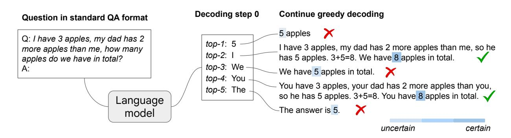
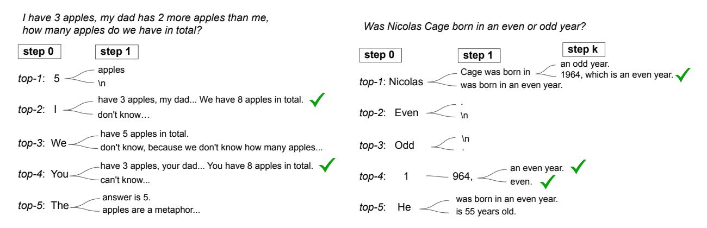
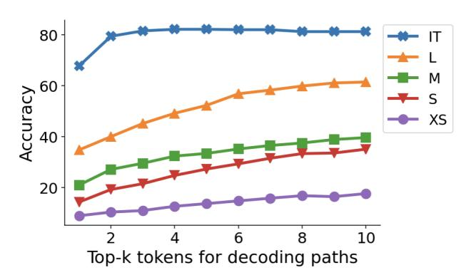
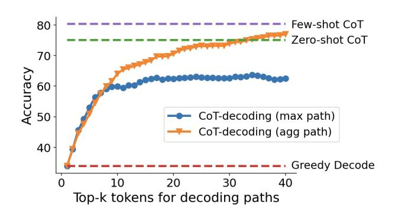
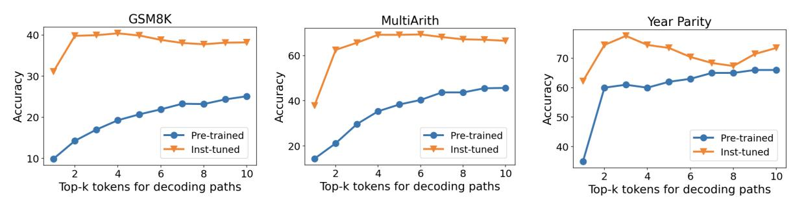
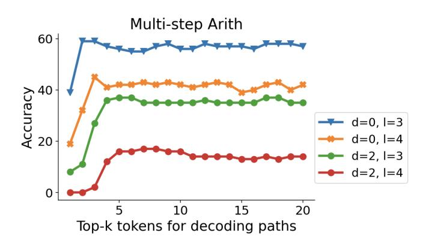

# **Chain-of-Thought Reasoning Without Prompting**

**Xuezhi Wang**<sup>1</sup> **and Denny Zhou**<sup>1</sup>

<sup>1</sup>Google DeepMind, <sup>1</sup>{xuezhiw, dennyzhou}@google.com

**In enhancing the reasoning capabilities of large language models (LLMs), prior research primarily focuses on specific prompting techniques such as few-shot or zero-shot chain-of-thought (CoT) prompting. These methods, while effective, often involve manually intensive prompt engineering. Our study takes a novel approach by asking: Can LLMs reason effectively without prompting? Our findings reveal that, intriguingly, CoT reasoning paths can be elicited from pre-trained LLMs by simply altering the** *decoding* **process. Rather than conventional greedy decoding, we investigate the top- alternative tokens, uncovering that CoT paths are frequently inherent in these sequences. This approach not only bypasses the confounders of prompting but also allows us to assess the LLMs'** *intrinsic* **reasoning abilities. Moreover, we observe that the presence of a CoT in the decoding path correlates with a higher confidence in the model's decoded answer. This confidence metric effectively differentiates between CoT and non-CoT paths. Extensive empirical studies on various reasoning benchmarks show that the proposed CoT-decoding substantially outperforms the standard greedy decoding.**

### **1. Introduction**

Large language models (LLMs) have demonstrated remarkable performance on various complicated reasoning benchmarks [\(Anil et al.,](#page-12-0) [2023;](#page-12-0) [Brown et al.,](#page-13-0) [2020;](#page-13-0) [Chowdhery et al.,](#page-13-1) [2023;](#page-13-1) [Gemini,](#page-14-0) [2023;](#page-14-0) [OpenAI,](#page-15-0) [2023;](#page-15-0) [Romera-Paredes et al.,](#page-15-1) [2023\)](#page-15-1). These reasoning capabilities of LLMs are typically elicited by prompting techniques [\(Brown et al.,](#page-13-0) [2020\)](#page-13-0), which can be few-shot prompting with intermediate steps augmented demonstration exemplars [\(Chen et al.,](#page-13-2) [2023b;](#page-13-2) [Gao et al.,](#page-14-1) [2022;](#page-14-1) [Nye et al.,](#page-15-2) [2021;](#page-15-2) [Wei](#page-16-0) [et al.,](#page-16-0) [2022;](#page-16-0) [Yao et al.,](#page-17-0) [2023;](#page-17-0) [Zhou et al.,](#page-17-1) [2023a\)](#page-17-1), or zero-shot prompting with specific instructions which ask for showing certain intermediate steps [\(Kojima et al.,](#page-14-2) [2022;](#page-14-2) [Yasunaga et al.,](#page-17-2) [2023\)](#page-17-2). The other prevalent strategy for eliciting LLM reasoning is through model training or instruction tuning using a substantial amount of chain-of-thought (CoT) reasoning data [\(Chung et al.,](#page-13-3) [2022;](#page-13-3) [Cobbe](#page-13-4) [et al.,](#page-13-4) [2021b;](#page-13-4) [Ling et al.,](#page-15-3) [2017;](#page-15-3) [Nye et al.,](#page-15-2) [2021\)](#page-15-2).

In this work, we aim to elicit the reasoning ability of LLMs by exploring a different perspective and ask: *Can LLMs reason effectively without prompting? And to what extent can they reason?* We find that, perhaps surprisingly, there exists a *task-agnostic* way to elicit CoT reasoning from pre-trained LLMs by simply altering the *decoding* procedure. Figure [1](#page-1-0) illustrates our new decoding approach: given a reasoning question, the LLM generates a wrong answer via the standard greedy decoding path, yet alternative top- token inspection unveiled inherent CoT paths (e.g., decoding paths 2 and 4), which accurately resolved the query. This decoding modification bypasses CoT prompting and is entirely unsupervised without the need for model tuning.

In more details, we formulate the input using the standard question-answer (QA) format: "Q: [question]\nA:".[1](#page-0-0) While most existing work suggest that LLMs falter in such direct-QA scenarios on reasoning [\(Cobbe et al.,](#page-13-5) [2021a;](#page-13-5) [Kojima et al.,](#page-14-2) [2022;](#page-14-2) [Nye et al.,](#page-15-2) [2021;](#page-15-2) [Wei et al.,](#page-16-0) [2022\)](#page-16-0), our findings reveal a nuanced picture. We observe that LLMs indeed struggle with reasoning when relying solely on greedily decoded paths. However, when we consider alternative paths among the top- tokens, CoT reasoning patterns *emerge naturally* within the decoding trajectories of LLMs. In addition, we

<span id="page-0-0"></span><sup>1</sup>The QA format is only needed because without it a pre-trained language model will continue the question instead of answering. It is also the most basic formatting employed in existing works for pre-trained language models.

<span id="page-1-0"></span>

Figure 1 | **Illustration of CoT-decoding**. Pre-trained LLMs are capable of inherent reasoning without prompting by considering alternative top- tokens, rather than solely relying on the top-1 greedy decoding path. Moreover, these models tend to display higher confidence in decoding the final answer (indicated by a darker shaded color) when a CoT reasoning path is present.

have observed an interesting pattern: the model demonstrates increased confidence in the final answer when a CoT reasoning path is present in the decoding process. As illustrated in Figure [1,](#page-1-0) this is evident where paths 2 and 4 show heightened certainty in arriving at the correct answer "8", contrasting sharply with the high uncertainty in paths that lead to the incorrect "5". Leveraging this phenomenon, we develop a method to sift through the top- decoding paths, which we refer to as **CoT-decoding**, thereby isolating the most reliable paths for model output.

CoT-decoding offers an alternative way to elicit reasoning capabilities from pre-trained LLMs without explicit prompting. Moreover, it bypasses the confounders introduced by prompting, enabling a more accurate assessment of the models' intrinsic reasoning abilities. In our experiments, we demonstrate that CoT-decoding spontaneously reveals CoT reasoning paths during decoding, significantly enhancing models' reasoning capabilities over greedy decoding across various benchmarks. We also observe that, these paths are more prevalent in tasks frequently represented in the pre-training data and less so in complex, synthetic tasks, where advanced prompting might still be necessary to trigger those reasoning paths. This aligns with findings in [\(McCoy et al.,](#page-15-4) [2023;](#page-15-4) [Prystawski et al.,](#page-15-5) [2023;](#page-15-5) [Razeghi et al.,](#page-15-6) [2022\)](#page-15-6). We also observe that in such scenarios, few-shot CoT demonstrations play a larger "teaching" role in guiding how models solve a task, with models primarily mimicing the format of these prompts to generate accurate reasoning paths.

### Our contributions are summarized as follows:

- Our study reveals that pre-trained language models *inherently possess reasoning capabilities*, as evidenced by their generation of CoT reasoning paths when examining alternative top tokens during decoding, rather than relying on greedy decoding. This finding contrasts with prior research focused on improved prompting for reasoning, highlighting that a mere change in decoding strategy can effectively elicit model reasoning.
- We find that the language model's confidence in its final answers increases when a CoT is present in its decoding path. Leveraging this increased confidence, we propose **CoT-decoding** to select more reliable decoding paths, demonstrating significant improvements over greedy decoding across various reasoning benchmarks.

### **2. Chain-of-Thought (CoT) Decoding**

### **2.1. The Presence of CoT Paths during Decoding**

We investigate whether pre-trained language models inherently exhibit CoT reasoning during decoding, without explicit prompts. In Table [1,](#page-2-0) we show example decoding paths across a diverse set of reasoning tasks, including math (GSM8K, [Cobbe et al.](#page-13-5) [\(2021a\)](#page-13-5)), commonsense (year parity, [Allen-Zhu and Li](#page-12-1) [\(2023\)](#page-12-1)), and symbolic reasoning (coin flip, [Wei et al.](#page-16-0) [\(2022\)](#page-16-0)). We employ the *pre-trained* PaLM-2 large model [\(Anil et al.,](#page-12-0) [2023\)](#page-12-0) to compare its standard greedy decoding path ( = 0), predominantly used in state-of-the-art LLMs for reasoning tasks, with alternative decoding paths ( > 0), where represents the choice of the -th token at the *first decoding step*.

```
[GSM8K] Kylar went to the store to buy glasses for his new apartment. One glass costs $5, but every second
glass costs only 60% of the price. Kylar wants to buy 16 glasses. How much does he need to pay for them?
Greedy path:
 = 0: $60.00 (0.029)
Alternative top- paths:
 = 1: 60 (0.058)
 = 2: Kylar needs to pay $60 for 16 glasses. (0.058)
. . .
 = 7: If Kylar buys 16 glasses, he will pay $60. (0.032)
 = 9: We can calculate the price of 16 glasses by multiplying the price of one glass by 16. However, we
need to remember that every second glass costs only 60% of the price. Therefore, we need to multiply the
price of one glass by 16 and then subtract 40% of the price of 8 glasses. 16 x 5 = 80 8 x 5 = 40 40 x 0.4 =
16 80 – 16 = 64 Kylar needs to pay $64 for 16 glasses. (0.994)
[Year Parity] Was Nicolas Cage born in an even or odd year?
Greedy path:
 = 0: Nicolas Cage was born in an odd year. (0.117)
Alternative top- paths:
 = 1: Even (0.207)
 = 2: Odd (0.198)
 = 3: 1964, an even year. (0.949)
 = 4: He was born in an even year. (0.0)
. . .
 = 7: Cage was born in 1964, an even year. (0.978)
[Coin Flip] A coin is heads up. Fletcher flips the coin. Conception flips the coin. Is the coin still heads up?
Greedy path:
 = 0: No. (0.056)
Alternative top- paths:
 = 1: Yes. (0.029)
 = 2: The coin is heads up. → yes (0.340)
 = 3: 100% chance that the coin is heads up. → yes (0.427)
 = 4: Fletcher flips the coin. The coin is now tails up. Conception flips the coin. The coin is now heads up.
→ yes (0.507)
 = 5: It is not. → no (0.183)
```

Table 1 | Examples of greedy decoded paths and alternative top- paths across various tasks, over the PaLM-2 Large model. The model's confidence scores are highlighted in blue (See [§2.2](#page-3-0) for details).

In examining reasoning problems, we observe that models employing greedy decoding often does not contain a CoT path, opting to solve problems directly. This tendency may stem from the model's skewed perception of problem difficulty, shaped by its pre-training on predominantly simpler questions. Consequently, the model is predisposed to immediate problem-solving. This observation aligns with findings in [\(Cobbe et al.,](#page-13-5) [2021a;](#page-13-5) [Kojima et al.,](#page-14-2) [2022;](#page-14-2) [Nye et al.,](#page-15-2) [2021;](#page-15-2) [Wei et al.,](#page-16-0) [2022\)](#page-16-0), which show that direct-answer prompts generally result in low accuracy on reasoning tasks.

Contrastingly, an intriguing phenomenon emerges when exploring alternative top- ( > 0) tokens at the *first decoding step*. Continuing with greedy decoding from this point reveals natural CoT reasoning in many cases. For instance, in the GSM8K question (Table [1\)](#page-2-0), a valid CoT emerges at = 9. Similarly, in the year parity task, greedy decoding attempts to directly answer the parity question at = 0, leading to a random choice between "even" and "odd" which often results in an incorrect answer. However, when exploring > 0, the model naturally generates CoT paths at = 3 and = 7, where it first determines the year before resolving the parity.

### <span id="page-3-0"></span>**2.2. CoT-Decoding for Extracting CoT Paths**

Despite the natural occurrence of chain-of-thought paths, extracting them from the top- decoded paths is still an unresolved challenge. Table [1](#page-2-0) illustrates that CoT paths do not consistently outrank non-CoT ones in the model's probability assessment. Moreover, they often do not represent the predominant answer among all paths, rendering methods like self-consistency [\(Wang et al.,](#page-16-1) [2023a\)](#page-16-1) inapplicable. For instance, in the GSM8K question, the prevalent answer "60", which aligns with the greedy decoding result, fails to serve as a reliable indicator for identifying the correct path.

Interestingly, upon examining the model's logits, we found that the presence of a CoT path typically leads to a more *confident* decoding of the final answer, characterized by a significant probability disparity between the top and secondary tokens:

$$\Delta_{k,\text{answer}} = \frac{1}{n} \sum_{x_t \in \text{answer}} p(x_t^1 \mid x_{< t}) - p(x_t^2 \mid x_{< t}),$$

where 1 and 2 represent the top two tokens at each decoding step in the -th decoding path, chosen for their maximum post-softmax probabilities from the vocabulary, given being part of the answer tokens. The model's overall confidence in decoding the final answer is approximated by averaging these probability differences for all relevant tokens, where is the total number of answer tokens. For example, for the GSM8K question in Table [1,](#page-2-0) given the answer "60", we average the probability differences for all tokens in that answer, i.e., "6" and "0".

This method, referred to as **CoT-decoding**, aims to extract such CoT paths among the various decoded paths from the language models. As illustrated in Table [1,](#page-2-0) each decoding path is marked with its corresponding Δ value in blue (the answer tokens are bolded). It is evident that paths with a CoT component exhibit a significantly higher Δ, highlighting the model's increased confidence, as opposed to paths without CoT.

An additional heuristic involves selecting the decoding path based on its length, with the intuition that longer decoding paths more likely contain CoTs. We empirically find this heuristic works to a certain degree for math reasoning questions, but its general applicability across reasoning tasks, such as the year parity task, is limited (refer to the example in Table [1](#page-2-0) where the model's decoding paths exhibit comparable lengths). Alternatively, one can employ the model's probability score normalized by length. This approach similarly introduces a length bias, favoring longer decoding paths when the probabilities are closely aligned. Consequently, its effectiveness diminishes in reasoning tasks where the decoding paths are of similar lengths.

**Identify the answer spans.** There are multiple ways to identify the answer span in a model's response. One straightforward approach is to extract the last numerical value in math reasoning tasks, or the final option in set-based reasoning tasks, as the answer, following the Tülu evaluation [\(Ivison](#page-14-3) [et al.,](#page-14-3) [2023;](#page-14-3) [Liu et al.,](#page-15-7) [2024;](#page-15-7) [Wang et al.,](#page-16-2) [2023b\)](#page-16-2). This simple method works in most cases but can be

less precise when there are distractive numbers/options following the correct answer in open-ended responses.

A slightly more principled approach, proposed in [Kojima et al.](#page-14-2) [\(2022\)](#page-14-2), involves extending the model's output with the prompt "So the answer is", and then we can align these continuations with spans in the model's decoding path. This alignment can be done with the token ids directly, without decoding those ids into strings. This technique is versatile, suitable for tasks encompassing mathematical and natural language reasoning. Note it is crucial to calculate the Δ over the answer spans from the original decoding path, not those following "So the answer is", to avoid reinforcing incorrect probabilities due to flawed reasoning. Intuitively, the Δ in the original decoding path represents the confidence of the model generating the answer based on the reasoning path, while the Δ in the answer following "So the answer is" only represents the confidence of retrieving that answer from the original decoded path.

In cases where the answers are more open-ended, utilizing the probability differences of the top two tokens as an indicator of how models prefer one answer over another could be less precise. If the answer options are explicitly defined, like "yes" or "no", we could modify the calculation of Δ slightly by aggregating the probability mass over "yes" (and equivalent options like "Yes/YES"), then compute the probability differences between the aggregated mass on "yes" and "no". While existing work [\(Burns et al.,](#page-13-6) [2023\)](#page-13-6) leverages the model's activation space to uncover latent knowledge, its applicability is restricted to answering yes-no questions. We hope that future research can address this limitation by delving deeper into the model's internal representation across a broader, more open-ended answer space.

**Branching at other decoding steps.** CoT-decoding considers alternative tokens at the first decoding step. This leads to a natural question: is branching viable at later decoding stages? In Figure [2,](#page-4-0) we present a qualitative analysis of decoding paths, highlighting the impact of alternative token consideration in subsequent decoding steps. It is evident that early branching, e.g., at the first decoding step, significantly enhances the diversity of potential paths. Conversely, later-stage branching is significantly influenced by previously generated tokens. For instance, initiating with the token "5" greatly decreases the likelihood of rectifying an erroneous path. Nonetheless, the optimal branching point may vary with the task; in the year parity task, for instance, mid-path branching can effectively yield correct CoT paths.

<span id="page-4-0"></span>

Figure 2 | We present an analysis of the decoded paths by considering alternative tokens at various decoding steps. Task-dependent challenges arise: at times, the model encounters difficulty recovering from incorrect paths when branching at later tokens. For certain tasks, multiple branching positions may exist, all leading to the correct reasoning path.

**Aggregation of the decoding paths.** Since we consider the top- decoding paths, one natural extension is to aggregate the answers over all those paths, similar to self-consistency [\(Wang et al.,](#page-16-1) [2023a\)](#page-16-1) but without CoT prompting. The rationale behind this aggregation is to mitigate sensitivity to small differences in the model's logits, particularly when relying solely on the path with the maximum Δ. The examples in Table [1](#page-2-0) show that the majority answer is unlikely to be the correct one. Instead, we propose a weighted aggregation method, i.e., we take the answer that maximizes Δ˜ = Í Δ, where Δ, is the -th decoding path whose answer = . We found that adopting this approach enhances the stability of the results, and further analysis is presented in Section [§3.3.](#page-8-0)

**Sampling under the standard QA format.** CoT-decoding adopts greedy decoding for the entire decoding path except branching on the first token. A natural question arises: can sampling achieve a similar effect and unveil the CoT reasoning paths? We found that, although sampling works well under few-shot CoT prompting [\(Wang et al.,](#page-16-1) [2023a\)](#page-16-1), it does not exhibit the desired behaviour when the model is queried with the standard QA format. We conduct a study over the first 50 questions over GSM8K and apply temperature sampling [\(Ackley et al.,](#page-12-2) [1985;](#page-12-2) [Ficler and Goldberg,](#page-14-4) [2017\)](#page-14-4) with a temperature of 0.7 to sample 10 responses for each question, and found that it is much less sampleefficient compared to our CoT-decoding procedure: less than 30% of the sampled responses contain a correct CoT path. In most cases, the model tends to provide a direct answer because the first token is sampled based on the model's probability distribution, heavily influenced by the model's tendency to output a direct answer rather than taking a less-direct route. In addition, the rest of the tokens are sampled, leading to more frequent incorrect final answers. For instance, for our question in Table [1,](#page-1-0) temperature sampling yields responses like "10 apples", "5 apples", "5", none of which contains the correct CoT paths.

# **3. Experiments**

We evaluate the CoT-decoding approach across a range of reasoning benchmarks, demonstrating its capability to successfully recover CoT reasoning paths during decoding, all without the need for specialized prompting.

**Experiment Setup.** For all experiments, the default input to the model is the standard QA format of *Q: [question]\nA:*, where *[question]* is filled with the actual question depending on the task, and we ask the model to continue the generation given that prefix. During decoding, we use = 10 as default for the alternative top- tokens at the first decoding position. We show ablation studies with respect to the different choice of in Section [§3.1.](#page-6-0)

**Models.** We investigate our method using both (1) the PaLM-2 pre-trained model families [\(Anil](#page-12-0) [et al.,](#page-12-0) [2023\)](#page-12-0) with different scales, ranging from X-Small, Small, Medium, and Large; and (2) the open-sourced model Mistral-7B [\(Jiang et al.,](#page-14-5) [2023\)](#page-14-5). Our experiments primarily focus on pre-trained models, but we also include experiments with instruction-tuned models (denoted as "inst-tuned", or "IT").

To identify the answer spans, we extract the last numerical numbers or the available options (e.g., "even" or "odd" for the year parity task) over the Mistral model. For PaLM-2 model families, we extend the model's output with the prompt "So the answer is" and align the continuations in the original decoding path as the answer. Please refer to Appendix [§C](#page-19-0) for more details on experiment settings and answer parsing.

#### **3.1. Mathematical Reasoning Tasks**

We use the following datasets for math reasoning: Grade-school math problems (GSM8K; [Cobbe](#page-13-5) [et al.,](#page-13-5) [2021a\)](#page-13-5), and the multi-step arithmetic dataset from (MultiArith; [Roy and Roth,](#page-16-3) [2015\)](#page-16-3). The results over the PaLM-2 models are shown in Table [2,](#page-6-0) demonstrating that CoT-decoding significantly enhances models' reasoning ability over the greedy decoding approach, consistently across all model scales. For example, over GSM8K, CoT-decoding achieves +26.7% absolute accuracy compared to greedy decoding over the PaLM-2 Large model. In addition, we observe that CoT-decoding partially closes the gap between the pre-trained model and the instruction-tuned model (e.g., on the large model size), demonstrating that instruction-tuning with sufficient CoT data [\(Chung et al.,](#page-13-3) [2022\)](#page-13-3) can also be partially achieved by modifying the decoding procedure within pre-trained models.

Notably, we observe that CoT-decoding can further improve the instruction-tuned model. The instruction-tuning procedure [\(Chung et al.,](#page-13-3) [2022\)](#page-13-3) has already incorporated abundant CoT annotations during the fine-tuning process. Consequently, the model is expected to inherently generate CoT paths when addressing reasoning tasks. However, upon analyzing specific examples, we found that even after instruction-tuning, the model occasionally persists in attempting to directly address a question. In contrast, CoT-decoding can enhance the exploration of alternative paths by triggering a CoT first, consequently leading to more accurate question resolution.

<span id="page-6-0"></span>

|            |              |              | PaLM-2 Inst-tuned |              |              |              |
|------------|--------------|--------------|-------------------|--------------|--------------|--------------|
|            |              | X-Small      | Small             | Medium       | Large        | Large        |
| GSM8K      | greedy       | 9.0          | 14.3              | 21.0         | 34.8         | 67.8         |
|            | CoT-decoding | 17.7 (+8.7)  | 35.1 (+20.8)      | 39.7 (+18.7) | 61.5 (+26.7) | 81.3 (+13.5) |
| MultiArith | greedy       | 7.5          | 15.8              | 36.8         | 75.0         | 93.7         |
|            | CoT-decoding | 34.8 (+27.3) | 43.5 (+27.7)      | 52.5 (+15.7) | 86.7 (+11.7) | 98.7 (+5.0)  |

Table 2 | Accuracy on math reasoning tasks across the PaLM-2 model family with varying sizes.

<span id="page-6-1"></span>**Scaling results and choice of** In Figure [3,](#page-6-1) we illustrate how the choice of , representing the number of top alternative tokens considered, influences the overall accuracy. Overall we found that higher values of typically result in improved model performance, suggesting that in many cases, the correct CoT paths may indeed exist but are often ranked lower during model's decoding. For instruction-tuned models, the effect of is less significant, indicating that the process of instructiontuning effectively brings forth the majority of CoT-paths to the first few decoding paths.



Figure 3 | Accuracy on the GSM8K dataset for the PaLM-2 model families, with respect to how many top- tokens in decoding are used.

### **3.2. Natural Language Reasoning Tasks**

We investigate the "year parity" task where recent literature finds large language models still struggle with. The task is to query the model with "Was [person] born in an even or odd year?" where "[person]" is filled by a random celebrity name. Existing work [\(Allen-Zhu and Li,](#page-12-1) [2023;](#page-12-1) [Berglund](#page-13-7) [et al.,](#page-13-7) [2023\)](#page-13-7) shows that even SoTA models like GPT-4 struggle with such tasks, achieving at-chance accuracy (∼50%) when prompted directly. [Allen-Zhu and Li](#page-12-1) [\(2023\)](#page-12-1) also show that SoTA LLMs achieve almost perfect accuracy in retrieving the year or judging the parity given the correct year, hence the limitation mostly lies in the model's ability in knowledge manipulation. In this section, we show that CoT-decoding can effectively elicit the correct CoT reasoning from LLMs to solve this task.

**Task setup.** We curated a list of the top 100 celebrity names from [\(Berglund et al.,](#page-13-7) [2023\)](#page-13-7).[2](#page-7-0) We manually extracted and verified their birth years through web searches to establish the ground truth algorithmically. We evaluate models' responses against the ground truth ("even" or "odd") to compute the final accuracy for this task.

The results on PaLM-2 are shown in Table [3.](#page-7-1) Notably, when the language model is directly prompted with the question, it demonstrates a chance-level accuracy (57%, even for the largest model). However, when equipped with CoT-decoding, the model can recover the CoT paths in most cases and achieve an accuracy over 90%. Further error analysis shows that most of the errors stem from the model retrieving an incorrect birth year, while the generated CoT paths remain highly consistent between the parity and the model's retrieved year. Note that for this task, when the model size is smaller, the model becomes incapable to determine the parity even given the correct year. Consequently, the performance does not vary significantly for model sizes equal to or below the "Small" scale.

|                        | PaLM-2 Pre-trained  |                      |                      |  |  |  |
|------------------------|---------------------|----------------------|----------------------|--|--|--|
|                        | Small               | Medium               | Large                |  |  |  |
| greedy<br>CoT-decoding | 61.0<br>65.0 (+4.0) | 55.0<br>89.0 (+34.0) | 57.0<br>95.0 (+38.0) |  |  |  |

<span id="page-7-1"></span>Table 3 | Accuracy of the year parity task on PaLM-2 pre-trained models with varying sizes.

#### **3.3. Symbolic Reasoning Tasks**

We consider the following symbolic reasoning tasks: (1) the Coin Flip task from [\(Wei et al.,](#page-16-0) [2022\)](#page-16-0), with 2, 3, 4 rounds of potential flips; and two tasks from Big-Bench-Hard [\(bench authors,](#page-12-3) [2023;](#page-12-3) [Suzgun et al.,](#page-16-4) [2022\)](#page-16-4): (2) Web of lies, with 3, 4, 5 truth/lie statements, and (3) Multi-step arithmetic with various depth level and length . These tasks, designed with rules through human intervention, allow us to generate task data with diverse difficulty levels, enabling a thorough assessment of the model's problem-solving capabilities. For each task, we produce 100 examples for each difficulty level, except for Web-of-Lies (5) we use the existing dataset from [\(Suzgun et al.,](#page-16-4) [2022\)](#page-16-4). For Multi-step arithmetic we directly query the model with the original input (e.g., "3+5-6=") without the QA format. We also include two natural-language-based but synthetic tasks from Big-Bench, Sports Understanding and Object Counting, to probe model's intrinsic abilities in solving synthetic tasks.

**The presence of correct CoT paths depends on the task prominence in the pre-training distribution** The results are shown in Table [4.](#page-8-1) We see that the gains of CoT-decoding become smaller

<span id="page-7-0"></span><sup>2</sup>[https://github.com/lukasberglund/reversal\\_curse/blob/main/data/celebrity\\_relations/top\\_](https://github.com/lukasberglund/reversal_curse/blob/main/data/celebrity_relations/top_celebrities.txt) [celebrities.txt](https://github.com/lukasberglund/reversal_curse/blob/main/data/celebrity_relations/top_celebrities.txt)

<span id="page-8-1"></span>

|                        | Coin Flip    |              | Web of lies  |              | Multi-step Arithmetic |              |              | Sports<br>Und. | Object<br>Count |             |              |              |
|------------------------|--------------|--------------|--------------|--------------|-----------------------|--------------|--------------|----------------|-----------------|-------------|--------------|--------------|
|                        | 2            | 3            | 4            | 3            | 4                     | 5            | 𝑑0, 𝑙3       | 𝑑0, 𝑙4         | 𝑑2, 𝑙3          | 𝑑2, 𝑙4      |              |              |
| greedy<br>CoT-decoding | 70.0<br>94.0 | 53.0<br>57.0 | 48.0<br>55.0 | 76.0<br>87.0 | 58.0<br>63.0          | 53.6<br>57.6 | 39.0<br>56.0 | 19.0<br>42.0   | 8.0<br>35.0     | 0.0<br>16.0 | 58.8<br>58.0 | 41.2<br>62.0 |

Table 4 | Accuracy on symbolic reasoning tasks and additional Big-Bench tasks, on the PaLM-2 Pretrained Large model.

when the task complexity increases. Additionally, we observe that models cannot generate accurate CoT paths when the task is highly synthetic, i.e., tasks that lack significant representation in the pre-training distribution. This mirrors the finding in [\(McCoy et al.,](#page-15-4) [2023\)](#page-15-4), where the authors show language models are highly influenced by the distribution they have been trained on. We also found in these tasks, CoT prompting based techniques play a larger "teaching" role in helping the model learn how to solve such tasks. Example of such tasks include:

- Tasks that require accurate state tracking, e.g., Coin-Flip and Web-of-Lies. We observe that the model can generate CoT paths that simulate the process step-by-step, but it can easily lose track of the states, especially when the task becomes more complex (e.g., Coin-Flip with >= 3 coins, and Web-of-Lies with >= 4 statements). This reveals model's intrinsic vulnerability in performing accurate state tracking. The hand-crafted few-shot CoTs in [Suzgun et al.](#page-16-4) [\(2022\)](#page-16-4), on the other hand, teach the model to perform *explicit* state tracking in each step to better help the model solve this task.
- Multi-step Arithmetic: We observe that the model tends to perform calculations from left to right in the CoT-decoding paths. Correspondingly, [Suzgun et al.](#page-16-4) [\(2022\)](#page-16-4) crafted few-shot CoTs that explicitly instruct the model on the correct order of operations during few-shot demonstrations.
- <span id="page-8-0"></span>• Object counting: During CoT-decoding the model exhibits a tendency to conduct straightforward addition to all mentioned objects. Conversely, the few-shot CoT used in [\(Suzgun et al.,](#page-16-4) [2022\)](#page-16-4) teaches the model to exclude the objects that do not fit the question before performing the counting.



Figure 4 | Accuracy of CoT-decoding (by taking the max path and the aggregated path) on the GSM8K dataset for the PaLM-2 Large model, with respect to how many top- tokens in decoding are used. We also compare with the results from few-shot CoT prompting and zero-shot prompting.

**Compared to CoT Prompting** In Figure [4,](#page-8-0) we compare CoT-decoding with existing CoT prompting methods, e.g., few-shot CoT prompting [\(Wei et al.,](#page-16-0) [2022\)](#page-16-0) and zero-shot CoT prompting [\(Kojima et al.,](#page-14-2) [2022\)](#page-14-2). First, the aggregated path approach significantly improves the accuracy compare to taking the maximum path only, showing that it can indeed stabilize the results by mitigating the sensitivity to small differences in the model's logits. Second, the aggregated path results in a performance similar to few-shot CoT prompting, indicating that on this task, the model possesses intrinsic abilities in solving this task effectively. The results suggest that few-shot CoT prompting may serve the purpose of surfacing model's intrinsic CoT paths to be closer to the top-1 path.

<span id="page-9-0"></span>**[GSM8K]** *Claire makes a 3 egg omelet every morning for breakfast. How many dozens of eggs will she eat in 4 weeks?*

**Greedy**: 3

**CoT-decoding**: A dozen is 12. 3 eggs per day for 4 weeks is 84 eggs. 84/12 = 7. 7 dozen eggs.

**Few-shot CoT**: There are 7 days in a week. 4 weeks is 4 \* 7 = 28 days. She eats 3 eggs each day, so in 28 days she eats 28 \* 3 = 84 eggs. 1 dozen is 12 eggs. 84 eggs is 84 / 12 = 7 dozen eggs. The answer is 7. **Zero-shot CoT**: First, how many eggs does she eat in a week? 7 days in a week, 3 eggs per day, so 7 x 3 = 21 eggs per week. Now, how many eggs does she eat in 4 weeks? 4 x 21 = 84 eggs. Now, how many dozens of eggs is that? 84 / 12 = 7 dozens.

**[Year Parity]** *Was Nicolas Cage born in an even or odd year?*

**Greedy**: Nicolas Cage was born in an odd year. **CoT-decoding**: Cage was born in 1964, an even year. **Zero-shot CoT**: 1. Nicolas Cage was born in 1964.

2. 1964 is an even number.

3. Therefore, Nicolas Cage was born in an even year.

**[Sports Understanding]** *Is the following sentence plausible? "Walker Buehler earned a trip to the penalty box."* **Greedy**: No.

**CoT-decoding** (the top few paths):

- Sure, if he's playing hockey.
- In the context of a baseball game, no.
- I'm not sure what you mean by "plausible". It's a perfectly grammatical sentence, and it's a perfectly reasonable thing to say.

**Few-shot CoT**: Walker Buehler is a baseball player. Penalty box is part of ice hockey. So the answer is no.

Table 5 | Example of generated CoTs using different approaches.

In Table [5,](#page-9-0) we present qualitative examples illustrating the distinctions in the generated CoTs for each method. Overall we observe that CoT-decoding exhibits a more "free-form" CoT generation in comparison to alternative CoT prompting methods. This divergence may be attributed to two factors: (1) we encourage the diversity at the initial decoding step, and (2) the absence of explicit constraints imposed by prompting.

Another noteworthy observation is that CoT-decoding can better reveal what LLMs' intrinsic strategy in solving a problem, without being influenced by the external prompts which could be biased by the prompt designers. Take the last example in Table [5,](#page-9-0) we see that the few-shot CoT path is heavily influenced by the few-shot prompts. Specifically, the few-shot prompts, sourced from [\(Suzgun et al.,](#page-16-4) [2022\)](#page-16-4), consistently follow a standard analytical approach – first assessing the person's profession, followed by an evaluation of whether the profession aligns with the action. This aligns with the standard method of solving this particular task.[3](#page-9-1) In contrast, CoT-decoding reveals paths that deviate from the conventional problem-solving approach. Despite yielding an incorrect final answer according to the ground truth in some cases, the CoT paths remain to be valid.

<span id="page-9-1"></span><sup>3</sup>[https://github.com/google/BIG-bench/tree/main/bigbench/benchmark\\_tasks/sports\\_understanding](https://github.com/google/BIG-bench/tree/main/bigbench/benchmark_tasks/sports_understanding)

```
I have 3 apples, my dad has 2 more apples than me, how many apples do we have in total?
Top- paths:
 = 0: 5 (0.227)
 = 1: I have 3 apples, my dad has 2 more apples than me, how many apples do we have in total? (0.722)
 = 2: We have 5 apples. (0.317)
 = 3: My dad has 5 apples and I have 3 apples, so we have 8 apples in total. (0.956)
. . .
 = 8: You have 3 apples, your dad has 2 more apples than you, so he has 3+2=5 apples. Together you have
3+5=8 apples. (0.931)
```

Table 6 | Example of the top- paths from the Mistral-7B pretrained-model showing a similar behaviour where CoT paths again exist but are ranked lower during decoding.

### **3.4. Results across Model Families**

We also conduct experiments on other model families, specifically, the open-sourced Mistral-7B model [\(Jiang et al.,](#page-14-5) [2023\)](#page-14-5). We evaluate both the pre-trained model ("Mistral-7B-v0.1") and the instructiontuned variant ("Mistral-7B-Instruct-v0.1"). Table [6](#page-10-0) provides an example where the Mistral-7B model attempts to directly solve the question with greedy decoding. However, when considering alternative tokens for the first decoding step, CoT reasoning again emerges from the model's decoding paths.

<span id="page-10-1"></span>The results are shown Table [7,](#page-10-1) demonstrating consistent improvements across model families. CoTdecoding significantly improves over greedy decoding without specialized prompting, encompassing tasks such as math reasoning (GSM8K and MultiArith) and natural language reasoning (year parity).

|        |              | Pre-trained  | Inst-tuned   |
|--------|--------------|--------------|--------------|
| GSM8K  | greedy       | 9.9          | 31.2         |
|        | CoT-decoding | 25.1 (+15.2) | 38.2 (+7.0)  |
| Multi  | greedy       | 14.3         | 37.8         |
| Arith  | CoT-decoding | 45.7 (+31.4) | 66.5 (+28.7) |
| Year   | greedy       | 35.0         | 62.2         |
| Parity | CoT-decoding | 66.0 (+31.0) | 73.5 (+11.3) |

Table 7 | Reasoning performance on Mistral-7B pre-trained and instruction-tuned model.

### **4. Related Work**

**Chain-of-thought reasoning in large language models.** In recent literature, many works have sought to enhance the reasoning abilities in large language models. These works predominantly involve proposing better prompting techniques to better elicit CoT reasoning paths from the model [\(Kojima et al.,](#page-14-2) [2022;](#page-14-2) [Nye et al.,](#page-15-2) [2021;](#page-15-2) [Wei et al.,](#page-16-0) [2022;](#page-16-0) [Yao et al.,](#page-17-0) [2023;](#page-17-0) [Yasunaga et al.,](#page-17-2) [2023;](#page-17-2) [Zhou et al.,](#page-17-1) [2023a\)](#page-17-1). Despite achieving high performance, few-shot prompting techniques are often *task-specific*, requiring prompt designs tailored to each task. This limits their generalizability across tasks. Advanced prompting techniques often require manually intensive prompting engineering, and their effectiveness varies depending on the choice of prompts, resulting in inconsistent performance outcomes [\(Wang et al.,](#page-16-5) [2022;](#page-16-5) [Ye and Durrett,](#page-17-3) [2022;](#page-17-3) [Zhou et al.,](#page-17-4) [2023b\)](#page-17-4). Efforts to discover improved prompts [\(Yang et al.,](#page-16-6) [2024;](#page-16-6) [Zhou et al.,](#page-17-4) [2023b\)](#page-17-4) further entail model-specific and task-specific tuning.

In addition, these prompting techniques can subtly alter the vocabulary's posterior distribution

in ways that remain largely elusive [\(Min et al.,](#page-15-8) [2022;](#page-15-8) [Webson and Pavlick,](#page-16-7) [2022\)](#page-16-7). Specifically, prompts may assist in task decomposition, induce the model to generate additional tokens, or directly "teach" the model the exact underlying procedure to solve particular problems via manually crafted few-shot demonstrations. Dissecting the distinct influence of each aspect, however, presents a significant challenge. In contrast, our work explores a different perspective within the decoding stage, demonstrating that, even without explicit prompting, the model inherently holds the capability to generate chain-of-thought reasoning paths across a wide set of tasks.

Several recent works propose to improve the CoT generation process via better controlling and verifying the steps generated, e.g., step-by-step verification [\(Lightman et al.,](#page-15-9) [2023\)](#page-15-9), process-based feedback [\(Uesato et al.,](#page-16-8) [2022\)](#page-16-8), self-evaluation guided beam search [\(Xie et al.,](#page-16-9) [2023\)](#page-16-9), and PathFinder [\(Golovneva et al.,](#page-14-6) [2023\)](#page-14-6). Note all these works still require CoT prompting in order to generate the CoT reasoning paths, while our work completely removes CoT prompting. In addition, these existing works focus on searching and verifying the "steps" produced by the language model, while our work purely searches in the decoding space on the token-level and utilizes the confidence scores when decoding the answer.

Additionally, recent works aim to better understand how chain-of-thought emerges in language models [\(Feng et al.,](#page-14-7) [2023;](#page-14-7) [Li et al.,](#page-15-10) [2023b;](#page-15-10) [Prystawski et al.,](#page-15-5) [2023\)](#page-15-5). [McCoy et al.](#page-15-4) [\(2023\)](#page-15-4); [Razeghi](#page-15-6) [et al.](#page-15-6) [\(2022\)](#page-15-6) demonstrate a similar phenomenon where the pretraining distribution heavily influences the model's performance in few-shot reasoning.

**Instruction-tuning to elicit CoTs in language models.** When supervision is allowed, techniques such as instruction-tuning or distillation offer another way to elicit reasoning paths from language models without explicit prompting [\(Chung et al.,](#page-13-3) [2022;](#page-13-3) [Huang et al.,](#page-14-8) [2023;](#page-14-8) [Magister et al.,](#page-15-11) [2023\)](#page-15-11). However, these approaches typically involve resource-intensive fine-tuning over large language models and require a large set of examples annotated with CoTs, which may not be readily available.

[Liu et al.](#page-15-7) [\(2024\)](#page-15-7) show that a large language model can be tuned by a proxy using the logits differences between a pair of tuned and untuned small models, and achieves improved performance over some reasoning benchmarks as well. [Liu et al.](#page-15-7) [\(2024\)](#page-15-7) require a few additional models, and implicitly assume that the tuned model is well-optimized, e.g., on reasoning benchmarks the model needs to be tuned with CoT paths to enable contrasting logits with respect to the base untuned model. In contrast, our approach is entirely unsupervised and examines a model's intrinsic ability in generating CoT paths, without resorting to fine-tuning or any additional models.

**Decoding algorithms for language models.** The predominant focus in existing literature on decoding for language models revolves around aspects such as fluency, coherence, reduction of repetitiveness, and diversity in responses. Popular decoding algorithms used for language models include greedy decoding, temperature sampling [\(Ackley et al.,](#page-12-2) [1985;](#page-12-2) [Ficler and Goldberg,](#page-14-4) [2017\)](#page-14-4), top- sampling [\(Fan et al.,](#page-13-8) [2018;](#page-13-8) [Holtzman et al.,](#page-14-9) [2018;](#page-14-9) [Radford et al.,](#page-15-12) [2019\)](#page-15-12), and nucleus sampling [\(Holtzman et al.,](#page-14-10) [2020\)](#page-14-10). Additionally, there exist refined algorithms such as minimum Bayes risk decoding [\(Eikema and Aziz,](#page-13-9) [2020\)](#page-13-9), and typical decoding [\(Meister et al.,](#page-15-13) [2022\)](#page-15-13). Diverse beam search [\(Vijayakumar et al.,](#page-16-10) [2018\)](#page-16-10) is another way to explore alternative paths in a model's generation. However, it emphasizes generation diversity rather than accuracy.

There is relatively little research dedicated to enhancing decoding algorithms specifically for reasoning tasks. [Wang et al.](#page-16-1) [\(2023a\)](#page-16-1) improves upon CoT prompting by sampling and aggregating over multiple generated responses to improve reasoning. Contrastive decoding [\(Li et al.,](#page-14-11) [2023a\)](#page-14-11) is another way to improve model's generation quality by penalizing the logits from smaller models, and recent work [\(O'Brien and Lewis,](#page-15-14) [2023\)](#page-15-14) shows that contrastive decoding can contribute to enhancing

reasoning performance. [Shi et al.](#page-16-11) [\(2023\)](#page-16-11) propose context-aware decoding to improves the faithfulness of language models. These approaches typically require additional information, such as employing additional models to generate contrasting logits or incorporating additional contexts. In contrast, our work relies solely on a single model without the need for supplementary knowledge.

**Decoding algorithms for efficiency.** In addition to decoding algorithms for improving quality, there is a substantial body of research dedicated to improving decoding efficiency, e.g., speculative decoding [\(Chen et al.,](#page-13-10) [2023a;](#page-13-10) [Leviathan et al.,](#page-14-12) [2022;](#page-14-12) [Zhou et al.,](#page-17-5) [2024\)](#page-17-5). This line of work is orthogonal to our work as their primary focus is not on improving a model's reasoning performance. However, these techniques could potentially be leveraged to improve the efficiency of CoT-decoding.

### **5. Conclusion and Discussion**

We investigate the inherent capabilities of large language models in generating CoT reasoning paths during decoding, abstaining from any specialized prompting. Our findings indicate that, contrary to the prevalent practice of exclusively employing greedy decoding, exploring alternative top- tokens in the decoding space reveals the natural existence of reasoning paths within these models. Furthermore, our empirical observations highlight that the presence of a CoT reasoning path correlates with increased model confidence in decoding its final answer. Based on this observation, we introduce CoT-decoding to extract more reliable decoding paths from language models, thereby enhancing overall reasoning performance.

The exploration of alternative decoding paths incurs additional computational costs. Future work may leverage the CoT-decoding paths to fine-tune the model to enhance its reasoning capabilities. In addition, our current exploration focuses on branching at the first token because it yields a high diversity in the decoding paths, but for future work one can explore branching at any token and searching for the best possible paths during the decoding phase. The computational cost will be substantially higher though, and how to reliably identify the best token during the search will be an interesting direction to explore.

# **Acknowledgements**

We would like to thank Yongchao Zhou, Yifeng Lu, Dale Schuurmans, and Ed Chi for helpful discussion and feedback on this work.

### **References**

- <span id="page-12-2"></span>D. H. Ackley, G. E. Hinton, and T. J. Sejnowski. A learning algorithm for boltzmann machines. *Cognitive Science*, 9(1):147–169, 1985. ISSN 0364-0213. URL [https://www.sciencedirect.](https://www.sciencedirect.com/science/article/pii/S0364021385800124) [com/science/article/pii/S0364021385800124](https://www.sciencedirect.com/science/article/pii/S0364021385800124).
- <span id="page-12-1"></span>Z. Allen-Zhu and Y. Li. Physics of language models: Part 3.2, knowledge manipulation, 2023.
- <span id="page-12-0"></span>R. Anil, A. M. Dai, O. Firat, M. Johnson, D. Lepikhin, A. Passos, S. Shakeri, E. Taropa, P. Bailey, Z. Chen, et al. Palm 2 technical report. *arXiv preprint arXiv:2305.10403*, 2023.
- <span id="page-12-3"></span>B. bench authors. Beyond the imitation game: Quantifying and extrapolating the capabilities of language models. *Transactions on Machine Learning Research*, 2023. ISSN 2835-8856. URL <https://openreview.net/forum?id=uyTL5Bvosj>.

- <span id="page-13-7"></span>L. Berglund, M. Tong, M. Kaufmann, M. Balesni, A. C. Stickland, T. Korbak, and O. Evans. The reversal curse: Llms trained on "a is b" fail to learn "b is a", 2023.
- <span id="page-13-0"></span>T. Brown, B. Mann, N. Ryder, M. Subbiah, J. D. Kaplan, P. Dhariwal, A. Neelakantan, P. Shyam, G. Sastry, A. Askell, et al. Language models are few-shot learners. *Advances in neural information processing systems*, 33:1877–1901, 2020.
- <span id="page-13-6"></span>C. Burns, H. Ye, D. Klein, and J. Steinhardt. Discovering latent knowledge in language models without supervision. In *The Eleventh International Conference on Learning Representations*, 2023. URL <https://openreview.net/forum?id=ETKGuby0hcs>.
- <span id="page-13-10"></span>C. Chen, S. Borgeaud, G. Irving, J.-B. Lespiau, L. Sifre, and J. M. Jumper. Accelerating large language model decoding with speculative sampling. *ArXiv*, abs/2302.01318, 2023a. URL [https:](https://api.semanticscholar.org/CorpusID:256503945) [//api.semanticscholar.org/CorpusID:256503945](https://api.semanticscholar.org/CorpusID:256503945).
- <span id="page-13-2"></span>W. Chen, X. Ma, X. Wang, and W. W. Cohen. Program of thoughts prompting: Disentangling computation from reasoning for numerical reasoning tasks. *Transactions on Machine Learning Research*, 2023b. ISSN 2835-8856. URL <https://openreview.net/forum?id=YfZ4ZPt8zd>.
- <span id="page-13-1"></span>A. Chowdhery, S. Narang, J. Devlin, M. Bosma, G. Mishra, A. Roberts, P. Barham, H. W. Chung, C. Sutton, S. Gehrmann, P. Schuh, K. Shi, S. Tsvyashchenko, J. Maynez, A. Rao, P. Barnes, Y. Tay, N. Shazeer, V. Prabhakaran, E. Reif, N. Du, B. Hutchinson, R. Pope, J. Bradbury, J. Austin, M. Isard, G. Gur-Ari, P. Yin, T. Duke, A. Levskaya, S. Ghemawat, S. Dev, H. Michalewski, X. Garcia, V. Misra, K. Robinson, L. Fedus, D. Zhou, D. Ippolito, D. Luan, H. Lim, B. Zoph, A. Spiridonov, R. Sepassi, D. Dohan, S. Agrawal, M. Omernick, A. M. Dai, T. S. Pillai, M. Pellat, A. Lewkowycz, E. Moreira, R. Child, O. Polozov, K. Lee, Z. Zhou, X. Wang, B. Saeta, M. Diaz, O. Firat, M. Catasta, J. Wei, K. Meier-Hellstern, D. Eck, J. Dean, S. Petrov, and N. Fiedel. Palm: Scaling language modeling with pathways. *Journal of Machine Learning Research*, 24(240):1–113, 2023. URL [http://jmlr.org/](http://jmlr.org/papers/v24/22-1144.html) [papers/v24/22-1144.html](http://jmlr.org/papers/v24/22-1144.html).
- <span id="page-13-3"></span>H. W. Chung, L. Hou, S. Longpre, B. Zoph, Y. Tay, W. Fedus, Y. Li, X. Wang, M. Dehghani, S. Brahma, A. Webson, S. S. Gu, Z. Dai, M. Suzgun, X. Chen, A. Chowdhery, A. Castro-Ros, M. Pellat, K. Robinson, D. Valter, S. Narang, G. Mishra, A. Yu, V. Zhao, Y. Huang, A. Dai, H. Yu, S. Petrov, E. H. Chi, J. Dean, J. Devlin, A. Roberts, D. Zhou, Q. V. Le, and J. Wei. Scaling instruction-finetuned language models, 2022.
- <span id="page-13-5"></span>K. Cobbe, V. Kosaraju, M. Bavarian, M. Chen, H. Jun, L. Kaiser, M. Plappert, J. Tworek, J. Hilton, R. Nakano, C. Hesse, and J. Schulman. Training verifiers to solve math word problems. *arXiv preprint arXiv:2110.14168*, 2021a.
- <span id="page-13-4"></span>K. Cobbe, V. Kosaraju, M. Bavarian, M. Chen, H. Jun, L. Kaiser, M. Plappert, J. Tworek, J. Hilton, R. Nakano, et al. Training verifiers to solve math word problems. *arXiv preprint arXiv:2110.14168*, 2021b.
- <span id="page-13-9"></span>B. Eikema and W. Aziz. Is MAP decoding all you need? the inadequacy of the mode in neural machine translation. In *Proceedings of the 28th International Conference on Computational Linguistics*, pages 4506–4520, Barcelona, Spain (Online), Dec. 2020. International Committee on Computational Linguistics. URL <https://aclanthology.org/2020.coling-main.398>.
- <span id="page-13-8"></span>A. Fan, M. Lewis, and Y. Dauphin. Hierarchical neural story generation. In *Proceedings of the 56th Annual Meeting of the Association for Computational Linguistics (Volume 1: Long Papers)*, pages 889–898, Melbourne, Australia, July 2018. Association for Computational Linguistics. doi: 10.18653/v1/P18-1082. URL <https://aclanthology.org/P18-1082>.

- <span id="page-14-7"></span>G. Feng, B. Zhang, Y. Gu, H. Ye, D. He, and L. Wang. Towards revealing the mystery behind chain of thought: A theoretical perspective. In *Thirty-seventh Conference on Neural Information Processing Systems*, 2023. URL <https://openreview.net/forum?id=qHrADgAdYu>.
- <span id="page-14-4"></span>J. Ficler and Y. Goldberg. Controlling linguistic style aspects in neural language generation. In *Proceedings of the Workshop on Stylistic Variation*, pages 94–104, Copenhagen, Denmark, Sept. 2017. Association for Computational Linguistics. doi: 10.18653/v1/W17-4912. URL [https:](https://aclanthology.org/W17-4912) [//aclanthology.org/W17-4912](https://aclanthology.org/W17-4912).
- <span id="page-14-1"></span>L. Gao, A. Madaan, S. Zhou, U. Alon, P. Liu, Y. Yang, J. Callan, and G. Neubig. Pal: Program-aided language models. *arXiv preprint arXiv:2211.10435*, 2022.
- <span id="page-14-0"></span>Gemini. Gemini: a family of highly capable multimodal models. *arXiv preprint arXiv:2312.11805*, 2023.
- <span id="page-14-6"></span>O. Golovneva, S. O'Brien, R. Pasunuru, T. Wang, L. Zettlemoyer, M. Fazel-Zarandi, and A. Celikyilmaz. Pathfinder: Guided search over multi-step reasoning paths, 2023.
- <span id="page-14-9"></span>A. Holtzman, J. Buys, M. Forbes, A. Bosselut, D. Golub, and Y. Choi. Learning to write with cooperative discriminators. In *Proceedings of the 56th Annual Meeting of the Association for Computational Linguistics (Volume 1: Long Papers)*, pages 1638–1649, Melbourne, Australia, July 2018. Association for Computational Linguistics. doi: 10.18653/v1/P18-1152. URL [https://aclanthology.org/](https://aclanthology.org/P18-1152) [P18-1152](https://aclanthology.org/P18-1152).
- <span id="page-14-10"></span>A. Holtzman, J. Buys, L. Du, M. Forbes, and Y. Choi. The curious case of neural text degeneration. In *International Conference on Learning Representations*, 2020. URL [https://openreview.net/](https://openreview.net/forum?id=rygGQyrFvH) [forum?id=rygGQyrFvH](https://openreview.net/forum?id=rygGQyrFvH).
- <span id="page-14-8"></span>J. Huang, S. Gu, L. Hou, Y. Wu, X. Wang, H. Yu, and J. Han. Large language models can self-improve. In H. Bouamor, J. Pino, and K. Bali, editors, *Proceedings of the 2023 Conference on Empirical Methods in Natural Language Processing*, pages 1051–1068, Singapore, Dec. 2023. Association for Computational Linguistics. URL <https://aclanthology.org/2023.emnlp-main.67>.
- <span id="page-14-3"></span>H. Ivison, Y. Wang, V. Pyatkin, N. Lambert, M. Peters, P. Dasigi, J. Jang, D. Wadden, N. A. Smith, I. Beltagy, and H. Hajishirzi. Camels in a changing climate: Enhancing lm adaptation with tulu 2, 2023.
- <span id="page-14-5"></span>A. Q. Jiang, A. Sablayrolles, A. Mensch, C. Bamford, D. S. Chaplot, D. de las Casas, F. Bressand, G. Lengyel, G. Lample, L. Saulnier, L. R. Lavaud, M.-A. Lachaux, P. Stock, T. L. Scao, T. Lavril, T. Wang, T. Lacroix, and W. E. Sayed. Mistral 7b, 2023.
- <span id="page-14-2"></span>T. Kojima, S. S. Gu, M. Reid, Y. Matsuo, and Y. Iwasawa. Large language models are zero-shot reasoners. In *Advances in Neural Information Processing Systems*, volume 35, pages 22199–22213, 2022.
- <span id="page-14-12"></span>Y. Leviathan, M. Kalman, and Y. Matias. Fast inference from transformers via speculative decoding. In *International Conference on Machine Learning*, 2022. URL [https://api.semanticscholar.](https://api.semanticscholar.org/CorpusID:254096365) [org/CorpusID:254096365](https://api.semanticscholar.org/CorpusID:254096365).
- <span id="page-14-11"></span>X. L. Li, A. Holtzman, D. Fried, P. Liang, J. Eisner, T. Hashimoto, L. Zettlemoyer, and M. Lewis. Contrastive decoding: Open-ended text generation as optimization. In A. Rogers, J. Boyd-Graber, and N. Okazaki, editors, *Proceedings of the 61st Annual Meeting of the Association for Computational Linguistics (Volume 1: Long Papers)*, pages 12286–12312, Toronto, Canada, July 2023a. Association for Computational Linguistics. doi: 10.18653/v1/2023.acl-long.687. URL <https://aclanthology.org/2023.acl-long.687>.

- <span id="page-15-10"></span>Y. Li, K. Sreenivasan, A. Giannou, D. Papailiopoulos, and S. Oymak. Dissecting chain-of-thought: Compositionality through in-context filtering and learning. In *Thirty-seventh Conference on Neural Information Processing Systems*, 2023b. URL <https://openreview.net/forum?id=xEhKwsqxMa>.
- <span id="page-15-9"></span>H. Lightman, V. Kosaraju, Y. Burda, H. Edwards, B. Baker, T. Lee, J. Leike, J. Schulman, I. Sutskever, and K. Cobbe. Let's verify step by step, 2023.
- <span id="page-15-3"></span>W. Ling, D. Yogatama, C. Dyer, and P. Blunsom. Program induction by rationale generation: Learning to solve and explain algebraic word problems. *arXiv preprint arXiv:1705.04146*, 2017.
- <span id="page-15-7"></span>A. Liu, X. Han, Y. Wang, Y. Tsvetkov, Y. Choi, and N. A. Smith. Tuning language models by proxy, 2024.
- <span id="page-15-11"></span>L. C. Magister, J. Mallinson, J. Adamek, E. Malmi, and A. Severyn. Teaching small language models to reason, 2023.
- <span id="page-15-4"></span>R. T. McCoy, S. Yao, D. Friedman, M. Hardy, and T. L. Griffiths. Embers of autoregression: Understanding large language models through the problem they are trained to solve, 2023.
- <span id="page-15-13"></span>C. Meister, T. Pimentel, G. Wiher, and R. Cotterell. Typical decoding for natural language generation. *arXiv preprint arXiv:2202.00666*, 2022.
- <span id="page-15-8"></span>S. Min, X. Lyu, A. Holtzman, M. Artetxe, M. Lewis, H. Hajishirzi, and L. Zettlemoyer. Rethinking the role of demonstrations: What makes in-context learning work? In *EMNLP*, 2022.
- <span id="page-15-15"></span>M. Nasr, N. Carlini, J. Hayase, M. Jagielski, A. F. Cooper, D. Ippolito, C. A. Choquette-Choo, E. Wallace, F. Tramèr, and K. Lee. Scalable extraction of training data from (production) language models, 2023.
- <span id="page-15-2"></span>M. Nye, A. J. Andreassen, G. Gur-Ari, H. Michalewski, J. Austin, D. Bieber, D. Dohan, A. Lewkowycz, M. Bosma, D. Luan, et al. Show your work: Scratchpads for intermediate computation with language models. *arXiv preprint arXiv:2112.00114*, 2021.
- <span id="page-15-14"></span><span id="page-15-0"></span>S. O'Brien and M. Lewis. Contrastive decoding improves reasoning in large language models, 2023. OpenAI. Gpt-4 technical report. *arXiv preprint arXiv:2303.08774*, 2023.
- <span id="page-15-5"></span>B. Prystawski, M. Y. Li, and N. Goodman. Why think step by step? reasoning emerges from the locality of experience. In *Thirty-seventh Conference on Neural Information Processing Systems*, 2023. URL <https://openreview.net/forum?id=rcXXNFVlEn>.
- <span id="page-15-12"></span>A. Radford, J. Wu, R. Child, D. Luan, D. Amodei, and I. Sutskever. Language models are unsupervised multitask learners. 2019.
- <span id="page-15-6"></span>Y. Razeghi, R. L. Logan IV, M. Gardner, and S. Singh. Impact of pretraining term frequencies on few-shot numerical reasoning. In Y. Goldberg, Z. Kozareva, and Y. Zhang, editors, *Findings of the Association for Computational Linguistics: EMNLP 2022*, pages 840–854, Abu Dhabi, United Arab Emirates, Dec. 2022. Association for Computational Linguistics. doi: 10.18653/v1/2022.findings-emnlp.59. URL <https://aclanthology.org/2022.findings-emnlp.59>.
- <span id="page-15-1"></span>B. Romera-Paredes, M. Barekatain, A. Novikov, M. Balog, M. P. Kumar, E. Dupont, F. J. R. Ruiz, J. Ellenberg, P. Wang, O. Fawzi, P. Kohli, and A. Fawzi. Mathematical discoveries from program search with large language models. *Nature*, 2023. doi: 10.1038/s41586-023-06924-6.

- <span id="page-16-3"></span>S. Roy and D. Roth. Solving general arithmetic word problems. In *Proceedings of the 2015 Conference on Empirical Methods in Natural Language Processing*, 2015. doi: 10.18653/v1/D15-1202. URL <https://aclanthology.org/D15-1202>.
- <span id="page-16-11"></span>W. Shi, X. Han, M. Lewis, Y. Tsvetkov, L. Zettlemoyer, and S. W. tau Yih. Trusting your evidence: Hallucinate less with context-aware decoding, 2023.
- <span id="page-16-4"></span>M. Suzgun, N. Scales, N. Schärli, S. Gehrmann, Y. Tay, H. W. Chung, A. Chowdhery, Q. V. Le, E. H. Chi, D. Zhou, , and J. Wei. Challenging big-bench tasks and whether chain-of-thought can solve them. *arXiv preprint arXiv:2210.09261*, 2022.
- <span id="page-16-8"></span>J. Uesato, N. Kushman, R. Kumar, F. Song, N. Siegel, L. Wang, A. Creswell, G. Irving, and I. Higgins. Solving math word problems with process- and outcome-based feedback, 2022.
- <span id="page-16-10"></span>A. K. Vijayakumar, M. Cogswell, R. R. Selvaraju, Q. Sun, S. Lee, D. J. Crandall, and D. Batra. Diverse beam search for improved description of complex scenes. In S. A. McIlraith and K. Q. Weinberger, editors, *Proceedings of the Thirty-Second AAAI Conference on Artificial Intelligence, (AAAI-18), the 30th innovative Applications of Artificial Intelligence (IAAI-18), and the 8th AAAI Symposium on Educational Advances in Artificial Intelligence (EAAI-18), New Orleans, Louisiana, USA, February 2-7, 2018*, pages 7371–7379. AAAI Press, 2018. doi: 10.1609/AAAI.V32I1.12340. URL [https:](https://doi.org/10.1609/aaai.v32i1.12340) [//doi.org/10.1609/aaai.v32i1.12340](https://doi.org/10.1609/aaai.v32i1.12340).
- <span id="page-16-5"></span>X. Wang, J. Wei, D. Schuurmans, Q. Le, E. Chi, and D. Zhou. Rationale-augmented ensembles in language models, 2022.
- <span id="page-16-1"></span>X. Wang, J. Wei, D. Schuurmans, Q. V. Le, E. H. Chi, S. Narang, A. Chowdhery, and D. Zhou. Selfconsistency improves chain of thought reasoning in language models. In *The Eleventh International Conference on Learning Representations*, 2023a. URL [https://openreview.net/forum?id=](https://openreview.net/forum?id=1PL1NIMMrw) [1PL1NIMMrw](https://openreview.net/forum?id=1PL1NIMMrw).
- <span id="page-16-2"></span>Y. Wang, H. Ivison, P. Dasigi, J. Hessel, T. Khot, K. R. Chandu, D. Wadden, K. MacMillan, N. A. Smith, I. Beltagy, and H. Hajishirzi. How far can camels go? exploring the state of instruction tuning on open resources, 2023b.
- <span id="page-16-7"></span>A. Webson and E. Pavlick. Do prompt-based models really understand the meaning of their prompts? In M. Carpuat, M.-C. de Marneffe, and I. V. Meza Ruiz, editors, *Proceedings of the 2022 Conference of the North American Chapter of the Association for Computational Linguistics: Human Language Technologies*, pages 2300–2344, Seattle, United States, July 2022. Association for Computational Linguistics. doi: 10.18653/v1/2022.naacl-main.167. URL [https://aclanthology.org/2022.](https://aclanthology.org/2022.naacl-main.167) [naacl-main.167](https://aclanthology.org/2022.naacl-main.167).
- <span id="page-16-0"></span>J. Wei, X. Wang, D. Schuurmans, M. Bosma, brian ichter, F. Xia, E. H. Chi, Q. V. Le, and D. Zhou. Chain of thought prompting elicits reasoning in large language models. In A. H. Oh, A. Agarwal, D. Belgrave, and K. Cho, editors, *Advances in Neural Information Processing Systems*, 2022. URL [https://openreview.net/forum?id=\\_VjQlMeSB\\_J](https://openreview.net/forum?id=_VjQlMeSB_J).
- <span id="page-16-9"></span>Y. Xie, K. Kawaguchi, Y. Zhao, X. Zhao, M.-Y. Kan, J. He, and Q. Xie. Self-evaluation guided beam search for reasoning. In *Thirty-seventh Conference on Neural Information Processing Systems*, 2023. URL <https://openreview.net/forum?id=Bw82hwg5Q3>.
- <span id="page-16-6"></span>C. Yang, X. Wang, Y. Lu, H. Liu, Q. V. Le, D. Zhou, and X. Chen. Large language models as optimizers. In *The Twelfth International Conference on Learning Representations*, 2024. URL <https://openreview.net/forum?id=Bb4VGOWELI>.

- <span id="page-17-0"></span>S. Yao, D. Yu, J. Zhao, I. Shafran, T. L. Griffiths, Y. Cao, and K. R. Narasimhan. Tree of thoughts: Deliberate problem solving with large language models. In *Thirty-seventh Conference on Neural Information Processing Systems*, 2023. URL <https://openreview.net/forum?id=5Xc1ecxO1h>.
- <span id="page-17-2"></span>M. Yasunaga, X. Chen, Y. Li, P. Pasupat, J. Leskovec, P. Liang, E. H. Chi, and D. Zhou. Large language models as analogical reasoners. *arXiv preprint arXiv:2310.01714*, 2023.
- <span id="page-17-3"></span>X. Ye and G. Durrett. The unreliability of explanations in few-shot prompting for textual reasoning. In S. Koyejo, S. Mohamed, A. Agarwal, D. Belgrave, K. Cho, and A. Oh, editors, *Advances in Neural Information Processing Systems*, volume 35, pages 30378–30392. Curran Associates, Inc., 2022. URL [https://proceedings.neurips.cc/paper\\_files/paper/2022/file/](https://proceedings.neurips.cc/paper_files/paper/2022/file/c402501846f9fe03e2cac015b3f0e6b1-Paper-Conference.pdf) [c402501846f9fe03e2cac015b3f0e6b1-Paper-Conference.pdf](https://proceedings.neurips.cc/paper_files/paper/2022/file/c402501846f9fe03e2cac015b3f0e6b1-Paper-Conference.pdf).
- <span id="page-17-1"></span>D. Zhou, N. Schärli, L. Hou, J. Wei, N. Scales, X. Wang, D. Schuurmans, C. Cui, O. Bousquet, Q. V. Le, and E. H. Chi. Least-to-most prompting enables complex reasoning in large language models. In *The Eleventh International Conference on Learning Representations*, 2023a. URL [https:](https://openreview.net/forum?id=WZH7099tgfM) [//openreview.net/forum?id=WZH7099tgfM](https://openreview.net/forum?id=WZH7099tgfM).
- <span id="page-17-4"></span>Y. Zhou, A. I. Muresanu, Z. Han, K. Paster, S. Pitis, H. Chan, and J. Ba. Large language models are human-level prompt engineers. In *The Eleventh International Conference on Learning Representations*, 2023b. URL <https://openreview.net/forum?id=92gvk82DE->.
- <span id="page-17-5"></span>Y. Zhou, K. Lyu, A. S. Rawat, A. K. Menon, A. Rostamizadeh, S. Kumar, J.-F. Kagy, and R. Agarwal. Distillspec: Improving speculative decoding via knowledge distillation. In *The Twelfth International Conference on Learning Representations*, 2024. URL [https://openreview.net/forum?id=](https://openreview.net/forum?id=rsY6J3ZaTF) [rsY6J3ZaTF](https://openreview.net/forum?id=rsY6J3ZaTF).

# **A. Examples of CoT-decoding Paths on Additional Tasks**

We show additional examples comparing greedy decoding with CoT-decoding on various reasoning tasks in Table [8.](#page-18-0)

### <span id="page-18-0"></span>**[Sports Understanding]**

*Is the following sentence plausible? "Kawhi Leonard took a turnaround jumper."*

**Greedy**: No.

**CoT-decoding**: Kawhi Leonard is a basketball player. → yes

*Is the following sentence plausible? "Neymar took a backhand shot in the Stanley Cup."*

**Greedy**: No.

**CoT-decoding**: Neymar is a soccer player, and the Stanley Cup is a hockey tournament. → no

*Is the following sentence plausible? "Carson Wentz took to the ice."*

**Greedy**: No.

**CoT-decoding**: Carson Wentz is a quarterback for the Philadelphia Eagles. He is not a hockey player. → no

#### **[Coin Flip]**

*A coin is heads up. Raymond flips the coin. Conception flips the coin. Is the coin still heads up?*

**Greedy**: No.

**CoT-decoding**: Raymond flips the coin. The coin is now tails up. Conception flips the coin. The coin is now heads up. (correct state tracking)

*A coin is heads up. Millie does not flip the coin. Teressa does not flip the coin. Conception flips the coin. Is the coin still heads up?*

**Greedy**: No.

**CoT-decoding**: Millie does not flip the coin. Teressa does not flip the coin. Conception flips the coin. The coin is still heads up. (failed state tracking)

*A coin is heads up. Inga flips the coin. Jamey does not flip the coin. Shalonda does not flip the coin. Shaunda flips the coin. Is the coin still heads up?*

**Greedy**: No. The coin is tails up.

**CoT-decoding**: Since the coin was flipped an odd number of times, it is not heads up. (flawed alternative reasoning)

#### **[Multi-step Arithmetic]**

```
(3 + -3 + -9 * 1) =
```

**Greedy**: 0.

**CoT-decoding**: (((3 + -3) + -9) \* 1) = ((0 + -9) \* 1) = (-9 \* 1) = -9. (correct)

```
(6 + 8 * 3 + 5) =
```

**Greedy**: 100

**CoT-decoding**: ((6 + 8) \* 3) + 5 = 14 \* 3 + 5 = 42 + 5 = 47 (incorrect, the model does calculation from left to right rather than following the order of operations in math.)

```
((0 - 9 * -7 + 3) - (-2 + -1 * -9 * 3)) =
```

**Greedy**: -1

**CoT-decoding**: ((0 - 9 \* -7 + 3) - (-2 + 9 \* 3)) = ((0 - 9 \* -7 + 3) - (-2 + 27)) = ((0 - 9 \* -7 + 3) - 25) = (0 - 9 \* -7 + 3 - 25) = (0 - -63 + 3 - 25) = (63 + 3 - 25) = 41 (correct)

Table 8 | Example of generated CoTs by CoT-decoding without explicit prompting.

In Table [9,](#page-19-1) we further show an example where CoT-decoding improves over the Mistral-7B instruction-tuned model. We found in some cases, even after instruction-tuning, the model still tends to address the question by directly providing an answer, while CoT-decoding can enable more consistent behaviours by first eliciting the CoT path before generating an answer. For this example, another interesting observation is that, the model generates a CoT after an initial answer "16" is generated. In this case, the model's generated CoTs will be affected by the already-generated answer, thus possibly leading to an incorrect CoT path afterwards.

In Table [10,](#page-20-0) we show the top- paths for two tasks (math and year parity) on the Mistral-7B model, along with their Δ values in each decoding path. We see a similar behaviour as the PaLM-2 family models, where the CoT paths exist but are generally ranked lower in the decoding space.

<span id="page-19-1"></span>**[GSM8K]** *John invited 20 people to a birthday party. Each guest will eat 2 hot dogs. He already has 4 hot dogs left over from a previous party. If a pack of hot dogs contains 6 hot dogs and costs \$2, how much does he need to spend on hot dogs?*

#### **Greedy (** = 0, Δ = 0.56**)**:

John needs to spend **\$16** on hot dogs.

Here's the reasoning:

- 1. First, we need to determine how many hot dogs John has in total. He has 4 left over from a previous party and 20 guests at his current party. So, he has 4 + 20 = 24 hot dogs.
- 2. Next, we need to figure out how many packs of hot dogs he needs to buy. Each pack contains 6 hot dogs, so he'll need 24 / 6 = 4 packs.
- 3. Finally, we need to calculate the cost of buying these packs. Each pack costs \$2, so 4 packs will cost 4 \* \$2 = \$8.

Therefore, John needs to spend **\$16** on hot dogs for his party.

### **CoT-Decoding (** = 1, Δ = 1.0**)**:

Let's break down the problem:

- 1. John has 4 hot dogs left over.
- 2. He needs to provide 2 hot dogs for each of the 20 guests.
- 3. That means he needs to provide a total of 20 x 2 = ⟨⟨20\*2=40⟩⟩40 hot dogs.
- 4. Since he already has 4 hot dogs, he needs to buy 40 4 = ⟨⟨40-4=36⟩⟩36 hot dogs.
- 5. A pack of hot dogs contains 6 hot dogs, so he needs to buy 36 / 6 = ⟨⟨36/6=6⟩⟩6 packs of hot dogs.
- 6. Each pack of hot dogs costs \$2, so he needs to spend 6 x \$2 = \$⟨⟨6\*2=12⟩⟩12 on hot dogs.

Final answer: John needs to spend **\$12** on hot dogs.

Table 9 | Example responses to a GSM8K question from the Mistral-7B instruction-tuned model using greedy decoding vs CoT-decoding.

### **B. Choice of on Additional Models and Tasks**

In Figure [5,](#page-21-0) we further show how the choice of affects the performance over the Mistral-7B model. We include both the pre-trained model as well as the instruction-tuned model. Overall we found the improvement is highly consistent for the pre-trained model with a higher value of . However, for the instruction-tuned model, since the model is already fine-tuned with CoT data to generate CoTs for the first few decoding paths, exploring more tokens towards a larger does not necessarily result in further gains.

We also show how the choice of affects performance on Big-Bench tasks with CoT-decoding in Figure [6.](#page-21-1) Depending on the task complexity, valid CoT paths emerge at different 's. For example, on Multi-step Arithmetic, when the task is relatively simpler ( = 0, = 3), a valid CoT path emerges early around = 2 improving the accuracy from 40% to 60%. But when the task gets more complex (e.g., = 2, = 4), CoT paths emerge at later decoding paths (around = 4 or = 5).

<span id="page-19-0"></span>In Table [11,](#page-20-1) we illustrate with a concrete example of how the path aggregation algorithm works and why it could identify the correct answer more reliably. For the correct answer 18, we see it appears 4 times, each with Δ = 0.994 ( = 0), Δ = 0.911 ( = 6), Δ = 0.584 ( = 8), and Δ = 0.999 ( = 9), so overall its Í Δ, = 3.5; while all other incorrect answer options 14, 16, 20, 10 have a much lower sum of Δ.

```
I have 3 apples, my dad has 2 more apples than me, how many apples do we have in total?
Top-k paths:
k = 0:5(0.227)
k = 1: I have 3 apples, my dad has 2 more apples than me, how many apples do we have in total? (0.722)
k = 2: We have 5 apples. (0.317)
k = 3: My dad has 5 apples and I have 3 apples, so we have 8 apples in total. (0.956)
k = 4: A: 5 (0.211)
k = 5: The answer is 5. (0.313)
k = 6: Five
k = 7: Three apples.
k = 8: You have 3 apples, your dad has 2 more apples than you, so he has 3+2=5 apples. Together you have
3+5=8 apples. (0.931)
k = 9: $3+2=5$ (0.902)
Was Daniel Portman born in an even or odd year?
Top-k paths:
k = 0: 1992
k = 1: Even (0.146)
k = 2: He was born in an even year. (0.431)
k = 3: Odd. (0.146)
k = 4: Daniel Portman was born in an even year. (0.434)
k = 5: His birthday is on the 25th of March, 1992. That means he was born in an even year. (0.968)
k = 6: An even year. (0.281)
k = 7: The year Daniel Portman was born was an even year. (0.498)
k = 8: I don't know.
k = 9: In an even year. (0.426)
```

Table  $10 \mid \text{Example of the top-}k$  paths from the Mistral-7B pretrained-model (Mistral-7B-v0.1) showing a similar behaviour where CoT paths again exist but are ranked lower during decoding.

<span id="page-20-1"></span>Janet's ducks lay 16 eggs per day. She eats three for breakfast every morning and bakes muffins for her friends every day with four. She sells the remainder at the farmers' market daily for \$2 per fresh duck egg. How much in dollars does she make every day at the farmers' market?

```
Top-k paths: k = 0: 16 - 3 - 4 = 9 eggs per day. 9 eggs per day x $2 per egg = $18 per day. (0.994) k = 1: $14 (0.095) k = 2: Janet makes $14 per day at the farmers' market. (0.064) k = 3: The answer is 16. (0.162) k = 4: She makes $14 per day. (0.083) k = 5: (16 - 3 - 4) x 2 = $20 (0.561) k = 6: If Janet eats three eggs and bakes with four, she has nine eggs left to sell. If she sells them for $2 each, she makes $18 per day. (0.911) k = 7: \frac{16 - 3 - 4}{1} \times 2 = 10 (0.424) k = 8: This is a simple subtraction problem. 16 - 3 - 4 = 9. Janet makes $18 per day at the farmers' market. (0.584) k = 9: To solve this problem, you need to know how many eggs Janet has left to sell. She starts with 16 eggs, eats 3, and uses 4 for baking. That means she has 16 - 3 - 4 = 9 eggs left to sell. She sells each egg for $2, so she makes 9 \times 2 = 18. (0.999)
```

Table 11 | Example of the path aggregation algorithm on a GSM8K question.

<span id="page-21-0"></span>

<span id="page-21-1"></span>Figure 5 | Accuracy with respect to the choice of over the Mistral-7B model.



Figure 6 | Accuracy with respect to the choice of over the PaLM-2 Large model on Big-Bench Task with varying levels of difficulty.

# **C. Details on Experimental Settings**

**Experiment settings for the PaLM-2 Model family.** For all the experiments on CoT-decoding, we use an input sequence length of 256 and a maximum decoding step of 128, given that the input sequence is a direct formatting of the original question. For few-shot CoT prompting, the input sequence length needs to be extended to 1024 given a set of few-shot exemplars is used [\(Wei et al.,](#page-16-0) [2022\)](#page-16-0). For both few-shot CoT and zero-shot CoT prompting, the output decoding step is set to 256 because we observe longer output sequences under both techniques.

For input format, by default we use "Q: [question]\nA:" for all the tasks. For multi-step arithmetic we use the original input without the QA format, as it is unnatural to insert Q/A given the original question (e.g., "3+5-6="). For some tasks, we notice that a slight format change could also cause some differences in model's behaviour. For example, for object counting we used "[question] =" as we observe higher accuracy for all approaches in this format (models more likely to perform counting); we also experimented with the default format "Q: [question]\nA:" which results in 36.0% accuracy for greedy decoding and 39.2% for CoT-decoding.

**Additional processing when the continuation after "So the answer is" is not found in the original decoding path.** For math reasoning tasks we simply ignore that decoding path; for other reasoning tasks, we compute Δ over the continuation (again averaged over all tokens) to handle more open-ended generation cases. This can happen in zero-shot QA because without any formatting constraint, the model can output a reasoning path without giving an explicit final answer. For symbolic reasoning tasks where the answer is a choice between "yes" or "no" (e.g., Coin Flip, Web of Lies), we compute the difference between the probabilities masses over "yes/true" and "no/false" (cases ignored). We found when the answer choices are fixed, processing the continuation in this way is slightly more accurate than computing Δ over the continuation directly, since sometimes the model might output invalid options like "We don't know" with high confidence. Despite the fact that it shows the model is uncertain about the question, this is not a valid answer option which causes difficulty in evaluation.

**Remove ill-formed responses.** Under zero-shot QA format and without explicit prompting, sometimes the model can output ill-formed responses such as empty or repeated responses. Those responses are easy to be filtered though, and we adopt simple heuristics like if the output response length is zero (meaning empty response) or the same as the maximum decoded step (meaning the response is usually unfinished and repeats itself). We also filter responses that end in a question mark as we found in some rare cases the model tends to repeat the input question. For Mistral models we found in some cases the model outputs texts similar to the training data in alternative decoded paths (similar to the findings in [Nasr et al.](#page-15-15) [\(2023\)](#page-15-15)), and we filter those as well since they do not directly address the input question.

**Experiment settings for the Mistral Model.** For the Mistral pre-trained model, we format the question similarly as "Q: question\nA:". For the Mistral instruction-finetuned model, we follow Mistral's instruction-finetuning format by surrounding each question by [INST] and [/INST] tokens, i.e., "[INST] question [/INST]".[4](#page-22-0) As hyperparameters, on math tasks we generate 200 new tokens for the pre-trained model and 400 new tokens for the instruction-tuned model, to make sure the responses do not get truncated in the middle. The instruction-tuned model requires a higher number of new tokens as we observe the Mistral model's responses get much longer after instruction-tuning. For the year parity task, we generate 50 new tokens for the pre-trained model and 100 new tokens for the instruction-tuned model.

Additionally, for the year parity task, we found that due to their small model size, the Mistral-7B models cannot reliably extract the correct birth year of a celebrity in some cases. Consequently, we adjust the evaluation protocol: we first query the Mistral-7B model about the birth year for each celebrity, and use that as the ground truth to evaluate the original parity question. Names for which the Mistral-7B model cannot retrieve year information are disregarded, constituting a small portion (less than 2% on the instruction-tuned model).

<span id="page-22-0"></span><sup>4</sup><https://huggingface.co/mistralai/Mistral-7B-Instruct-v0.1>