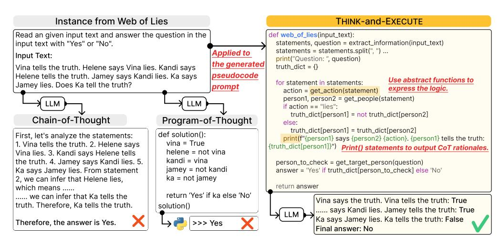
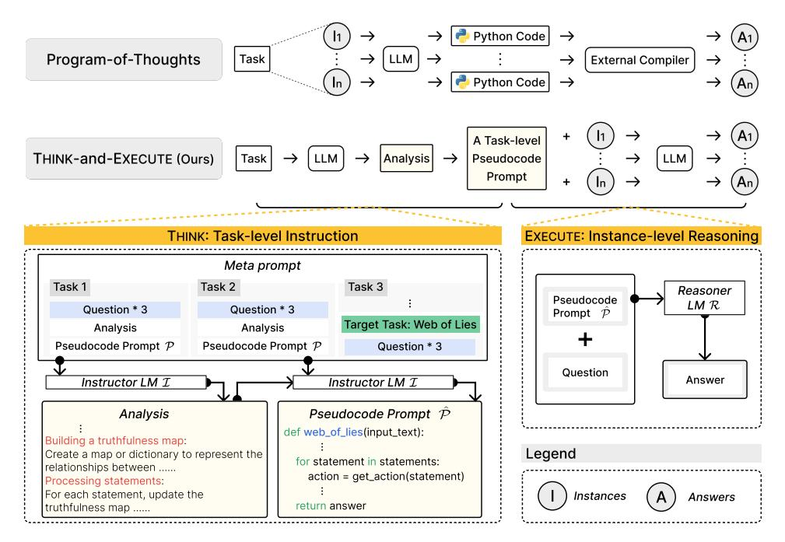
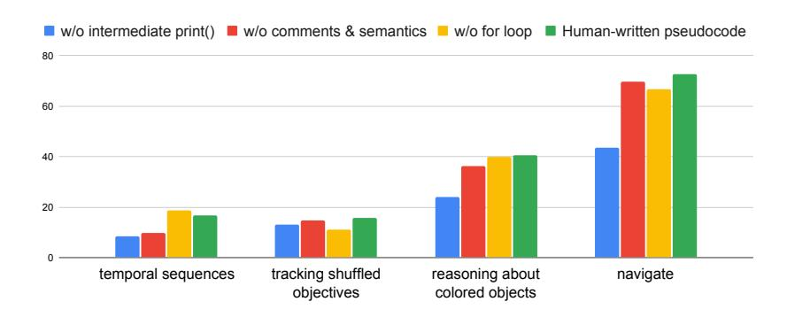
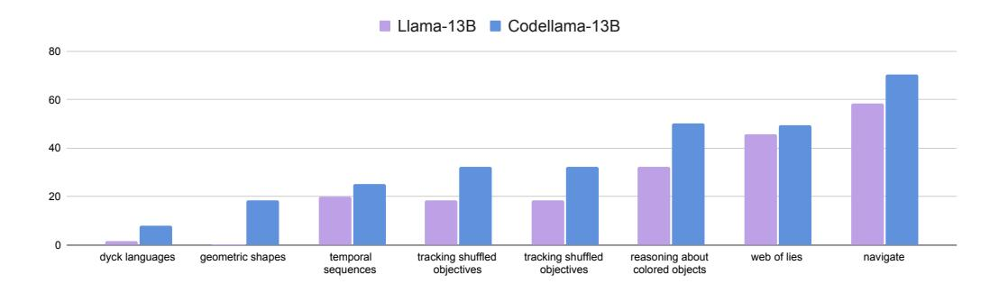

# **Language Models as Compilers: Simulating Pseudocode Execution Improves Algorithmic Reasoning in Language Models**

**Hyungjoo Chae**<sup>1</sup> **, Yeonghyeon Kim**<sup>1</sup> **, Seungone Kim**<sup>2</sup> **, Kai Tzu-iunn Ong**<sup>1</sup> **, Beong-woo Kwak**<sup>1</sup> **, Moohyeon Kim**<sup>1</sup> **, Seonghwan Kim**<sup>1</sup> **, Taeyoon Kwon**<sup>1</sup> **, Jiwan Chung**<sup>1</sup> **, Youngjae Yu**<sup>1</sup> **, Jinyoung Yeo**<sup>1</sup>

<sup>1</sup>**Yonsei University** <sup>2</sup>**KAIST AI** {mapoout, jinyeo}@yonsei.ac.kr

## **Abstract**

Algorithmic reasoning refers to the ability to understand the complex patterns behind the problem and decompose them into a sequence of reasoning steps towards the solution. Such nature of algorithmic reasoning makes it a challenge for large language models (LLMs), even though they have demonstrated promising performance in other reasoning tasks. Within this context, some recent studies use programming languages (*e.g.*, Python) to express the necessary logic for solving a given instance/question (*e.g.*, Programof-Thought) as inspired by their strict and precise syntaxes. However, it is non-trivial to write an executable code that expresses the correct logic on the fly within a single inference call. Also, the code generated specifically for an instance cannot be reused for others, even if they are from the same task and might require identical logic to solve. This paper presents THINK-AND-EXECUTE, a novel framework that decomposes the reasoning process of language models into two steps. (1) In THINK, we discover a task-level logic that is shared across all instances for solving a given task and then express the logic with *pseudocode*; (2) In EXECUTE, we further tailor the generated pseudocode to each instance and simulate the execution of the code. With extensive experiments on seven algorithmic reasoning tasks, we demonstrate the effectiveness of THINK-AND-EXECUTE. Our approach better improves LMs' reasoning compared to several strong baselines performing instance-specific reasoning (*e.g.*, CoT and PoT), suggesting the helpfulness of discovering task-level logic. Also, we show that compared to natural language, pseudocode can better guide the reasoning of LMs, even though they are trained to follow natural language instructions.

## **1 Introduction**

Reasoning in large language models (LLMs) typically entails analyzing the logical structure underlying a problem and realizing the logic into a sequence of reasoning steps to derive the final answer [\(Zhou et al., 2022a;](#page-10-0)[b;](#page-10-1) [Hao et al., 2023\)](#page-9-0). In particular, algorithmic reasoning has long been a formidable challenge for LLMs, as it requires to scrutinize a complicated reasoning pattern and to translate it into a long sequence of reasoning steps [\(Suzgun et al.,](#page-10-2) [2022;](#page-10-2) [Valmeekam et al., 2022;](#page-10-3) [Pan et al., 2023\)](#page-9-1).

To improve the reasoning capabilities of LLMs, prior works have primarily pursued two directions. The first direction includes enhancing the reasoning execution step by generating a rationale in natural language (*e.g.*, Chain-of-Thought [\(Wei et al., 2022;](#page-10-4) [Kojima et al., 2022\)](#page-9-2)) or a piece of code (*e.g.*, Program-of-Thought [\(Chen et al., 2023\)](#page-9-3), Program-Aided LMs [\(Gao](#page-9-4) [et al., 2023\)](#page-9-4)). However, such approaches perform step-by-step reasoning on-the-fly, without a dedicated phase for planning. This necessitates that the LLM analyze the logic and execute it within a single inference call, which constrains its expressiveness. Moreover,



Figure 1: An illustration of THINK-AND-EXECUTE, compared with Zero-shot Chain-of-Thought (Kojima et al., 2022) and Program-of-Thoughts (Chen et al., 2023).

when encountering a similar problem, the LLM should solve it without being able to reuse the logic previously understood.

The second direction involves explicitly generating a plan described in natural language with LLMs. The plan describes the logic of the task and the LLM would subsequently concretize it into a sequence of reasoning steps (e.g., Least-to-Most (Zhou et al., 2022b), Planand-Solve (Wang et al., 2023)). Yet, as prior works have mentioned, during our preliminary experiments, we find that natural language might not be the optimal medium to describe the logic of the problem (Li et al., 2023). In addition, prior works mostly rely on generating a plan by observing a single instance, which hinders analyzing the core reasoning pattern shared across similar instances within a single task (Zhou et al., 2024).

To address these issues, we introduce THINK-AND-EXECUTE, an algorithmic framework that discovers a logic that reflects the shared reasoning pattern behind a given task, and conducts reasoning by tailoring the logic into each instance. THINK-AND-EXECUTE consists of three distinctive steps; We first ask an LLM to THINK about common reasoning patterns of a task by providing it with a few example questions. Then, the LLM translates the natural language description of the logic in a pseudocode format. The pseudocode format allows more flexibility in applying the logic to each instance compared to programming language such as Python. Finally, in EXECUTE step, the LLM simulates the execution of the task-level pseudocode to follow the logic in it and predicts the output result of the pseudocode.

Through extensive experiments on 7 algorithmic reasoning tasks from Big-Bench Hard (Suzgun et al., 2022), we show the effectiveness of THINK-AND-EXECUTE over the challenging baselines. The superior performance of THINK-AND-EXECUTE over PoT suggests that discovering the common logic for a given task and applying it to each instance would be more helpful than writing instance-specific code for every instance. Noteworthily, simulating the execution of pseudocode is shown to improve LMs' reasoning more than planning with natural language (NL), even though they are trained to follow NL instructions. Furthermore, we empirically show that the pseudocode prompt discovered by an LLM can be applied to small LMs (SLMs), such as CodeLlama-7B, to boost their reasoning ability. This indicates the efficiency of THINK-AND-EXECUTE over other code prompting methods that require the LLM to generate instance-specific code every time (*e.g.*, PoT).

To summarize, our contributions are as follows:

• We introduce THINK-AND-EXECUTE, a framework that performs reasoning with a pseudocode that contains the common logical structure of a given task.

<span id="page-2-0"></span>

Figure 2: An overview of THINK-AND-EXECUTE. In THINK (Top), an LLM analyzes the given task provided in the meta prompt and generates a pseudocode prompt that describes the necessary logic for solving the task. Then, in EXECUTE (Bottom), the LLM conducts reasoning for each instance by simulating the execution of the pseudocode prompt.

- We show that THINK-AND-EXECUTE achieves notable improvements over strong baselines, including Chain-of-Thought and Program-of-Thought prompting, across various algorithmic tasks in Big-Bench Hard.
- We demonstrate that the pseudocode written by an LLM can be transferred to SLMs, showing the efficiency of our approach.

#### 2 THINK-AND-EXECUTE

In this section, we introduce THINK-AND-EXECUTE and provide a detailed explanation of how LLMs perform reasoning with it. We incorporate an Instructor LM  $\mathcal I$  and a Reasoner LM  $\mathcal R$ , for THINK and EXECUTE, respectively. Figure 2 shows the overview of our framework.

#### 2.1 THINK: Describing the Underlying Logic of a Task in a Pseudocode Format

The goal for the Instructor LM  $\mathcal{I}$  in this phase is to discover the underlying logic for solving a given task t, and generate a prompt describing the logic, which will be further applied to all instances of the task (in EXECUTE). This prompt is constructed with **pseudocode** rather than natural language, which is used in prior work to guide the LM to perform step-by-step reasoning (Kojima et al., 2022; Wang et al., 2023).

**Step 1:** Constructing a meta prompt. To prompt the Instructor LM  $\mathcal{I}$  to generate a task-level pseudocode for the given target task t, we provide  $\mathcal{P}$  of other tasks as demonstrations in a meta prompt. In practice, we construct the meta prompt with 3 randomly sampled tasks (3 example questions, analysis, and  $\mathcal{P}$  for each task) from  $\mathcal{T}$  as demonstrations and the target task t (3 example questions without the answers).

<span id="page-2-1"></span> $<sup>^1</sup>$ We manually annotate  $\mathcal P$  for each task in  $\mathcal T$  in advance. See Appendix B.1 for examples.

<span id="page-2-2"></span><sup>&</sup>lt;sup>2</sup>We use the questions of the examples instances in the few-shot prompt in Big-Bench Hard.

**Step 2: Analyzing the target task.** Given the meta prompt,  $\mathcal{I}$  generates an analysis containing key reasoning logic that is required to solve the target task regardless of the instances (questions). For example, in Figure 2 (Top), the generated analysis points out that *building a truthfulness map* and updating it by *processing statements* are needed to solve the task, *i.e.*, Web of Lies. This step guides  $\mathcal{I}$  to focus on the reasoning process shared among all the instances, which would be crucial in making a task-level prompt.

Step 3: Generating a pseudocode prompt based on the analysis. Next, based on the analysis,  $\mathcal{I}$  writes a prompt  $\mathcal{P}$  in the form of pseudocode, which breaks down the necessary reasoning steps for solving the target task. We choose to use the pseudocode format over the form of natural language plan (Kojima et al., 2022; Wang et al., 2023) for two main reasons: (1) the efficiency of it in describing the logic behind a task (e.g., avoid using repetitive instructions via for loop), and (2) the guidance of what and when to generate rationales via the argument in print() statement and the location within the execution of code. For example, in Figure 2, the  $\mathcal{P}$  contains the statement, print(f"{person1} says {person2} {action}. {person1} tells the truth: {truth\_dict[person1]}"), which instructs the Reasoner LM to generate a rationale that is helpful in keep tracking of the truth map containing the truthfulness of each person, during the execution of  $\mathcal{P}$ . We provide more examples of meta prompt, analysis, and pseudocode prompt in Appendix G.

### 2.2 EXECUTE: Simulating the Execution of Pseudocode Prompt for an Instance

The reasoner LM  $\mathcal R$  then conducts reasoning with the generated pseudocode prompt  $\mathcal P$ , tailoring the logic in  $\mathcal P$  for the given instance. Following Wei et al. (2022), we aim to maximize the reasoning abilities of the LM by instructing them to explicitly generate intermediate reasoning steps, known as chain-of-thought (CoT) reasoning.  $\mathcal R$  is instructed to predict not only the final output result of the code, but also the intermediate execution outputs as rationales. Specifically,  $\mathcal R$  predicts a list of outputs  $O = \{o_1, o_2, ..., o_k\}$  of the pseudocode by simulating the execution process of  $\mathcal P$ , where  $o_i$  denotes the i-th system output from print() statements, and  $\{o_1\}_1^{k-1}$  are CoT rationales toward the final answer  $o_k$ . We assume that tracking intermediate execution results would benefit  $\mathcal R$  to keep track of the state of variables while they change over the execution of the code. We enable  $\mathcal R$  to mimic the behavior of a compiler with a system message "Generate the expected outputs (from all print() functions) of the code.". The final answer for a given question is outputted with "print("Final answer: {answer}")" command as the last system output  $o_k$ .

## 3 Experimental Setup

#### 3.1 Datasets

We curate seven algorithmic reasoning tasks from Big-Bench Hard (Suzgun et al., 2022), including: dyck languages; geometric shapes; navigate; reasoning about colored objects; temporal sequence; tracking shuffled objectives; web of lies. These are specifically designed to measure the step-by-step reasoning capability of LLMs. Model performance on evaluated in **zero-shot** settings, where we do not provide demonstrations in the prompt. We provide detailed explanations in Appendix A.4.

#### 3.2 Baselines

We consider the following baselines: (1) **Direct prompting**: Directly predicting the answer without generating any rationales. (2) **Zero-shot CoT** (Kojima et al., 2022): A setting where LLMs are evoked to generate the reasoning steps with "Let's think step by step", before the answer. (3) **Zero-shot PoT** (Chen et al., 2023): A setting where an LLM generates an instance-specific Python code that can be executed with a Python interpreter. Then, the execution result is used as the final answer. (4) **NL planning**: A variation of THINK-AND-EXECUTE, where the task-level instruction is generated in *natural language*, instead of pseudocode.

<span id="page-4-0"></span>

| Reasoner/Method   | DL  | GS   | Nav  | CO   | TS   | SO   | WL   | Avg  |
|-------------------|-----|------|------|------|------|------|------|------|
| CodeLlama-7B      |     |      |      |      |      |      |      |      |
| Direct Prompting  | 0.0 | 9.0  | 39.0 | 24.4 | 4.4  | 11.2 | 47.6 | 19.4 |
| Zero-shot CoT     | 0.0 | 16.8 | 26.0 | 10.8 | 20.0 | 10.4 | 44.8 | 18.4 |
| NL Planning       | 0.0 | 10.0 | 52.0 | 0.4  | 7.6  | 18.8 | 50.4 | 19.9 |
| Zero-shot PoT     | 0.0 | 10.0 | 47.2 | 23.6 | 4.4  | 3.2  | 45.2 | 19.1 |
| THINK-AND-EXECUTE | 2.0 | 13.2 | 70.8 | 49.6 | 19.2 | 22.0 | 38.8 | 30.8 |
| CodeLlama-13B     |     |      |      |      |      |      |      |      |
| Direct prompting  | 0.0 | 3.2  | 39.0 | 28.8 | 0.0  | 6.8  | 37.2 | 16.4 |
| Zero-shot CoT     | 0.0 | 24.8 | 62.4 | 28.0 | 21.6 | 15.6 | 44.8 | 28.2 |
| NL Planning       | 1.2 | 8.8  | 24.8 | 28.8 | 7.2  | 17.6 | 53.6 | 20.3 |
| Zero-shot PoT     | 1.2 | 16.4 | 45.6 | 38.8 | 10.8 | 35.6 | 20.4 | 24.1 |
| THINK-AND-EXECUTE | 8.0 | 18.4 | 70.4 | 50.4 | 25.2 | 32.4 | 49.6 | 36.3 |
| GPT-3.5-Turbo     |     |      |      |      |      |      |      |      |
| Direct prompting  | 1.0 | 33.0 | 57.0 | 52.4 | 41.2 | 20.0 | 54.0 | 36.9 |
| Zero-shot CoT     | 4.4 | 46.8 | 73.2 | 70.4 | 44.4 | 37.6 | 59.2 | 48.0 |
| NL Planning       | 1.2 | 35.6 | 58.8 | 46.8 | 32.0 | 40.0 | 50.4 | 37.8 |
| Zero-shot PoT     | 0.4 | 21.2 | 77.2 | 45.6 | 0.4  | 28.0 | 54.0 | 32.4 |
| THINK-AND-EXECUTE | 6.0 | 41.6 | 96.8 | 72.0 | 68.0 | 65.6 | 72.8 | 60.4 |

Table 1: Zero-shot performance of THINK-AND-EXECUTE and baselines on seven algorithmic reasoning tasks, including Dyck Languages (DL), Geometric Shapes (GS), Navigate (Nav), Reasoning about Colored Objects (CO), Temporal Sequences (TS), Tracking Shuffled Objectives (SO), and Web of Lies (WL) from Big-Bench Hard [\(Suzgun et al., 2022\)](#page-10-2).

### 3.3 Models

For the Reasoner LM R, we adopt GPT-3.5-Turbo [\(OpenAI, 2023\)](#page-9-6), which shows strong performance in various reasoning benchmarks and code generation tasks [\(Zellers et al.,](#page-10-7) [2019;](#page-10-7) [Cobbe et al., 2021;](#page-9-7) [Muennighoff et al., 2024\)](#page-9-8), as well as the 7B and 13B versions of CodeLlama [\(Roziere et al., 2023\)](#page-9-9), which are trained on both code and natural language corpora and further fine-tuned to follow natural language instructions. As for the Instructor LM I, we choose GPT-3.5-Turbo.

### <span id="page-4-1"></span>**4 Results**

### 4.1 THINK-AND-EXECUTE Improves Algorithmic Reasoning

We start by comparing our framework with direct prompting and zero-shot CoT [Kojima et al.](#page-9-2) [\(2022\)](#page-9-2) in Table [1.](#page-4-0) We find that zero-shot CoT performs better than direct prompting with average improvements of 11.1% with GPT-3.5-Turbo, respectively, suggesting zero-shot CoT to be a strong baseline. Our THINK-AND-EXECUTE, however, further outperforms both of them significantly regardless of model sizes, which indicates that explicitly generating a plan is an effective way to improve the LLM's reasoning capabilities than simply encouraging LLMs to generate their intermediate reasoning steps.

### 4.2 Task-level Pseudocode Prompts Benefits a Wider Range of Algorithmic Reasoning Tasks than Instance-specific Python Code

In Table [1,](#page-4-0) PoT shows performance gains in some tasks over direct prompting (*e.g.*, Navigate; Tracking Shuffled Objects) with Python code generated specifically for each instance and the corresponding interpreter output as the answer. However, such improvement is difficult to generalize to all tasks, *e.g.*, 0.4% accuracy in both Dyck Language and Temporal Sequences, with GPT-3.5-Turbo. By contrast, THINK-AND-EXECUTE outperforms PoT and direct prompting in all tasks with GPT-3.5-Turbo. This suggests that making the task-level

<span id="page-5-0"></span>

<span id="page-5-1"></span>Figure 3: Ablation study of the components of pseudocode prompt using GPT-3.5-Turbo.

| Method            | Avg  |
|-------------------|------|
| w/o Analysis      | 21.8 |
| THINK-AND-EXECUTE | 60.4 |

Table 2: Ablation on Step2 of THINK phase.

strategy with pseudocode and applying it to each instance can benefit LLM's reasoning in a wider range of algorithmic reasoning tasks than generating instance-specific Python codes.

### 4.3 The Logic Discovered by an LLM can be Transferred to SLMs

We further explore if the pseudocode prompt written by an LLM (*i.e.*, GPT-3.5-Turbo as the instructor) can be applied to smaller LMs: the CodeLlama family in Table [1.](#page-4-0) When applying the pseudocode prompts generated by GPT-3.5-Turbo, CodeLlama-7B and -13B significantly outperform direct prompting. Moreover, THINK-AND-EXECUTE with CodeLlama-13B shows comparable performance with GPT-3.5-Turbo with PoT and direct prompting.

### 4.4 Pseudocode Better Describes the Logic for Solving a Task than Natural Language

We also compare our approach with NL planning, a variant of ours that utilizes natural language to write the task-level instruction, instead of pseudocode. In practice, we provide human-written NL plans that contain a similar amount of information to P in the meta prompt and use it to generate the task-level NL plan for the given task. Surprisingly, although the LMs are fine-tuned to follow natural language instructions, we find that task-level pseudocode prompts can boost their performance more than NL plans (Table [1\)](#page-4-0).

### 4.5 Ablation Studies

**Components of the pseudocode prompt.** We conduct an ablation study on each component of the pseudocode prompt. For that, we prepare four types of pseudocode prompts: (1) **Human-written pseudocode**; (2) Human-written prompt **w/o comments and semantics** by removing the comments that explain the code and replacing variable names with meaningless alphabets, such as X, Y, and Z; (3) Human-written prompt **w/ for loop** and (4) **w/ intermediate print()** statements. The results are in Figure [3.](#page-5-0) Model performance decreases significantly when applying prompts w/o comments and semantics, especially in Temporal Sequences. This implies that semantics play an important role in guiding the LLMs to apply the discovered logic and reasoning with it accordingly. Also, we find that printing out the intermediate execution steps with print() is crucial in reasoning, which is consistent with the finding from [Wei et al.](#page-10-4) [\(2022\)](#page-10-4).

**Generating the analysis before the pseudocode prompt.** Table [2](#page-5-1) shows a notable decrease in model performance when generating pseudocode prompts without conducting the

<span id="page-6-0"></span>

| Method            | Avg  |
|-------------------|------|
| Chain-of-Code     | 28.1 |
| Plan-and-Solve    | 50.3 |
| THINK-AND-EXECUTE | 60.4 |

| Method                     | Avg  |
|----------------------------|------|
| Self-Discover w/ GPT-4     | 77.9 |
| THINK-AND-EXECUTE w/ GPT-4 | 81.7 |

Table 3: **Left**: Comparison of THINK-AND-EXECUTE, Chain-of-Code [\(Li et al., 2023\)](#page-9-5), and Plan-and-Solve [\(Wang et al., 2023\)](#page-10-5) using GPT-3.5-Turbo. **Right**: Comparison of THINK-AND-EXECUTE and Self-Discover [\(Zhou et al., 2024\)](#page-10-6) using GPT-4. The results of Self-Discover are obtained from the original paper, as the code and prompts are not provided.

analysis first. This suggests that explicitly generating analysis on the task can elicit a better pseudocode prompt that contains the necessary logic for solving the task.

### 4.6 Comparison with other Baselines

We further compare THINK-AND-EXECUTE with another three baselines: (1) Plan-and-Solve [\(Wang et al., 2023\)](#page-10-5), where an LLM sequentially generates a natural language plan for solving the given instance, step-by-step reasoning according to the plan, and the final answer; (2) Chain-of-Code [\(Li et al., 2023\)](#page-9-5), where Python code is generated as a part of intermediate reasoning steps specifically for a given instance; (3) Self-Discover [\(Zhou et al., 2024\)](#page-10-6), a concurrent work that devises a task-level reasoning structure in a JSON format before inferencing the instance. First, as presented in Table [3](#page-6-0) (Left), we find THINK-AND-EXECUTE largely outperforms Plan-and-Solve and Chain-of-Code by 10.9 and 32.3 percentage points in terms of accuracy, respectively. Second, while Self-Discover also incorporate task-level instruction, in Table [3](#page-6-0) (Right), our THINK-AND-EXECUTE with pseudocode prompts shows better performance when using GPT-4 [\(Achiam et al., 2023\)](#page-9-10).[3](#page-6-1) These findings indicate that generating (1) task-level instruction with (2) pseudocode can better represent the necessary logic for solving a task and benefit LLM's algorithmic ability.

## <span id="page-6-2"></span>**5 Analysis**

We conduct experiments to address the following research questions:

- **RQ1**: Is task-level pseudocode more helpful than instance-specific pseudocode?
- **RQ2**: Does pre-training on code corpora improve reasoning?
- **RQ3**: How is the quality of the logic discovered by THINK-AND-EXECUTE compared to human-written logic?

### 5.1 Implementing the Underlying Logic is more Effective than Instance-specific Logic in Pseudocode (RQ1)

We conduct an analysis to check if the improvement of THINK-AND-EXECUTE is contributed by our chosen format for the task-level instruction, *i.e.*, pseudocode. We compare THINK-AND-EXECUTE with a concurrent work, Chain-of-Code (CoC) [\(Li et al., 2023\)](#page-9-5). In Table [3,](#page-6-0) THINK-AND-EXECUTE outperforms CoC, showing about 2x improvement in the average score. The main difference between THINK-AND-EXECUTE and CoC is that we use pseudocodes which are generated to express logic shared among the tasks instances, while CoC incorporates pseudocode as part of the intermediate reasoning steps towards the solution of a given instance. Hence, the results indicate the advantages of applying pseudocode for the generation of task-level instruction over solely using them as a part of rationales.

<span id="page-6-1"></span><sup>3</sup>We use gpt-4-0613 for GPT-4.

<span id="page-7-0"></span>

Figure 4: Analysis on the effect of code pre-training on the reasoning capability in applying THINK-AND-EXECUTE. Without pre-training on code corpora the accuracies drop notably.

<span id="page-7-1"></span>

| Reasoner/Method                                       | DL          | GS           | Nav          | CO           | TS           | SO           | WL<br>Avg                    |  |
|-------------------------------------------------------|-------------|--------------|--------------|--------------|--------------|--------------|------------------------------|--|
| CodeLlama-7B<br>Human-written P<br>THINK-AND-EXECUTE  | 2.4<br>2.0  | 0.0<br>13.2  | 40.4<br>70.8 | 29.6<br>49.6 | 12.0<br>19.2 | 18.0<br>22.0 | 52.8<br>22.2<br>38.8<br>30.8 |  |
| CodeLlama-13B<br>Human-written P<br>THINK-AND-EXECUTE | 2.8<br>8.0  | 14.8<br>18.4 | 72.8<br>70.4 | 40.4<br>50.4 | 16.8<br>25.2 | 15.6<br>32.4 | 49.6<br>30.4<br>49.6<br>36.3 |  |
| GPT-3.5-Turbo<br>Human-written P<br>THINK-AND-EXECUTE | 12.4<br>6.0 | 50.0<br>41.6 | 86.0<br>96.8 | 50.8<br>72.0 | 84.0<br>68.0 | 32.4<br>65.6 | 74.4<br>55.7<br>72.8<br>60.4 |  |

Table 4: Comparison between THINK-AND-EXECUTE and Human-written P.

### 5.2 THINK-AND-EXECUTE Requires Knowledge in Code (RQ2)

To understand whether SLMs acquire the ability to understand the task-level logic written in pseudocode during pre-training on code corpora, we compare the performance of CodeLlama-13B with Llama-13B using THINK-AND-EXECUTE. In Figure [4,](#page-7-0) CodeLlama-13B shows better reasoning capabilities compared to Llama-13B in all tasks. These results suggest that the improvement from using THINK-AND-EXECUTE could depend on the knowledge of code, which is usually obtained by pre-training with code corpora. Writing code usually involves understanding the logic behind the given problem and expecting the execution results of a code, which resemble the same reasoning process of THINK-AND-EXECUTE.

## 5.3 THINK-AND-EXECUTE can Generate a Logic Comparable to Human's (RQ3)

To gauge LLMs' capabilities in discerning the underlying logic of a task, we compare THINK-AND-EXECUTE (using GPT-3.5-Turbo as the Instructor) with human-written pseudocode prompts. The results are shown in Table [4.](#page-7-1) Using the GPT-3.5-Turbo the Reasoner, THINK-AND-EXECUTE scores 60.4% in terms of accuracy, which is superior to the human-written P (with an accuracy of 55.7%). Especially, in the tasks of Navigate and Tracking Shuffled Objectives, pseudocode prompts generated by THINK-AND-EXECUTE elicit better performance. This also holds true when adopting CodeLlama-7B and -13B as the Reasoner, further suggesting the effectiveness of our THINK step over human writers.

### 5.4 Impact of LLMs' Capability on THINK-AND-EXECUTE

In examining the impact of LLMs' capabilities within our framework, we investigate the influence of both the Reasoner and Instructor components on performance, as depicted in Table [5.](#page-8-0) Notably, higher accuracy scores are observed when utilizing GPT-3.5-Turbo as Reasoners compared to CodeLlama-13B and CodeLlama-34B. Additionally, the effectiveness

<span id="page-8-0"></span>

| Reasoner      | Instructor    |               |               |  |  |  |
|---------------|---------------|---------------|---------------|--|--|--|
|               | CodeLlama-13B | CodeLlama-34B | GPT-3.5-Turbo |  |  |  |
| CodeLlama-13B | 30.9          | 33.0          | 36.4          |  |  |  |
| CodeLlama-34B | 32.5          | 34.2          | 39.1          |  |  |  |
| GPT-3.5-Turbo | 33.9          | 35.9          | 60.4          |  |  |  |

Table 5: Analysis of the effect of the capability of Reasoner and Instructor on the performance. We report the average performance on the 7 tasks.

of the Instructor also plays a crucial role, with GPT-3.5-Turbo exhibiting the highest accuracy scores across all configurations. These results underscore the significance of both the Reasoner and Instructor components in enhancing the performance of THINK-AND-EXECUTE.

## **6 Related Work**

**Chain-of-Thought prompting.** Chain-of-thought (CoT) prompting evokes LMs to generate intermediate reasoning steps that guide and explain the solution [\(Wei et al., 2022;](#page-10-4) [Wang](#page-10-8) [et al., 2022;](#page-10-8) [Wu et al., 2023\)](#page-10-9). One common paradigm of this is zero-shot CoT prompting [\(Ko](#page-9-2)[jima et al., 2022\)](#page-9-2). Without specifically designed question-explanation-answer triplets as demonstrations, zero-shot CoT prompting elicits a plausible reasoning path towards the final answer with simple instruction, such as *"Let's think step-by-step"*, eliciting better model performance in tasks that require multi-step reasoning.

In the context of improving zero-shot CoT, [Wang et al.](#page-10-5) [\(2023\)](#page-10-5) propose to first generate a plan breaking down the target task into smaller subtasks, and then solve each subtask according to the plan. Similar to our approach, a concurrent work [\(Zhou et al., 2024\)](#page-10-6) devises a task-level reasoning structure that can be applied to each instance (question) of the target task. The most significant distinction between these prior studies and ours is that our THINK-AND-EXECUTE adopts **pseudocode** (as opposed to natural language) to express the necessary logic for solving the task. We demonstrate that our task-level pseudocode prompt empowers LMs with better ability of zero-shot reasoning than natural language plans under various settings in Section [5.](#page-6-2)

**Incorporation of code in reasoning.** With unambiguous syntaxe and strict structure, programming languages such as Python have been applied to LLM-based systems to improve system performance in solving tasks. For instance, [Gao et al.](#page-9-4) [\(2023\)](#page-9-4) and [\(Chen](#page-9-3) [et al., 2023\)](#page-9-3) use LLMs to generate Python code for given mathematical questions, and run the generated code on external compilers to obtain/calculate the answers. Concurrently with our work, [Li et al.](#page-9-5) [\(2023\)](#page-9-5) present chain-of-code (CoC), where pseudocode is also incorporated along with the Python code for solving a given question (instance). While this approach generates instance-specific code as intermediate reasoning steps for each individual instance, our THINK-AND-EXECUTE, by contrast, focus on the task-level pseudocode prompt that can be applied to all instances. We compare CoC and THINK-AND-EXECUTE in Section [4.](#page-4-1)

## **7 Limitations and Discussion**

A possible limitation of our approach is that we focus on algorithmic reasoning, as we believe it is the best setting to assess LLMs' capabilities in understanding a complex logic and carrying out a sequence of reasoning step, following the logic. However, we believe that THINK-AND-EXECUTE can be applied to other domains of reasoning that require following a long sequence of reasoning steps, such as multi-hop reasoning [\(Ji et al., 2020\)](#page-9-11) and symbolic reasoning [\(Madaan & Yazdanbakhsh, 2022\)](#page-9-12).

# **8 Conclusion**

In this paper, we present THINK-AND-EXECUTE, an algorithmic reasoning framework that generates a logic for solving the given task into a pseudocode and performs reasoning by simulating the execution of the pseudocode with language models. Through extensive experiments, we show the effectiveness of THINK-AND-EXECUTE, over the strong baselines. These results underscore not only the usefulness of pseudocode in eliciting language models' reasoning capabilities but also the efficiency of our framework in discovering the highquality logic behind a given task.

## **References**

- <span id="page-9-10"></span>Josh Achiam, Steven Adler, Sandhini Agarwal, Lama Ahmad, Ilge Akkaya, Florencia Leoni Aleman, Diogo Almeida, Janko Altenschmidt, Sam Altman, Shyamal Anadkat, et al. Gpt-4 technical report. *arXiv preprint arXiv:2303.08774*, 2023.
- <span id="page-9-3"></span>Wenhu Chen, Xueguang Ma, Xinyi Wang, and William W Cohen. Program of thoughts prompting: Disentangling computation from reasoning for numerical reasoning tasks. *Transactions on Machine Learning Research*, 2023.
- <span id="page-9-7"></span>Karl Cobbe, Vineet Kosaraju, Mohammad Bavarian, Mark Chen, Heewoo Jun, Lukasz Kaiser, Matthias Plappert, Jerry Tworek, Jacob Hilton, Reiichiro Nakano, et al. Training verifiers to solve math word problems. *arXiv preprint arXiv:2110.14168*, 2021.
- <span id="page-9-4"></span>Luyu Gao, Aman Madaan, Shuyan Zhou, Uri Alon, Pengfei Liu, Yiming Yang, Jamie Callan, and Graham Neubig. Pal: Program-aided language models. In *International Conference on Machine Learning*, pp. 10764–10799. PMLR, 2023.
- <span id="page-9-0"></span>Shibo Hao, Yi Gu, Haodi Ma, Joshua Jiahua Hong, Zhen Wang, Daisy Zhe Wang, and Zhiting Hu. Reasoning with language model is planning with world model. *ArXiv*, abs/2305.14992, 2023. URL <https://api.semanticscholar.org/CorpusID:258865812>.
- <span id="page-9-11"></span>Haozhe Ji, Pei Ke, Shaohan Huang, Furu Wei, Xiaoyan Zhu, and Minlie Huang. Language generation with multi-hop reasoning on commonsense knowledge graph. In *Conference on Empirical Methods in Natural Language Processing*, 2020. URL [https:](https://api.semanticscholar.org/CorpusID:221879025) [//api.semanticscholar.org/CorpusID:221879025](https://api.semanticscholar.org/CorpusID:221879025).
- <span id="page-9-2"></span>Takeshi Kojima, Shixiang Shane Gu, Machel Reid, Yutaka Matsuo, and Yusuke Iwasawa. Large language models are zero-shot reasoners. *Advances in neural information processing systems*, 35:22199–22213, 2022.
- <span id="page-9-5"></span>Chengshu Li, Jacky Liang, Fei Xia, Andy Zeng, Sergey Levine, Dorsa Sadigh, Karol Hausman, Xinyun Chen, Li Fei-Fei, and brian ichter. Chain of code: Reasoning with a language model-augmented code interpreter. In *NeurIPS 2023 Foundation Models for Decision Making Workshop*, 2023. URL <https://openreview.net/forum?id=tlRUbI0Yf3>.
- <span id="page-9-12"></span>Aman Madaan and Amir Yazdanbakhsh. Text and patterns: For effective chain of thought, it takes two to tango. *arXiv preprint arXiv:2209.07686*, 2022.
- <span id="page-9-8"></span>Niklas Muennighoff, Qian Liu, Armel Randy Zebaze, Qinkai Zheng, Binyuan Hui, Terry Yue Zhuo, Swayam Singh, Xiangru Tang, Leandro Von Werra, and Shayne Longpre. Octopack: Instruction tuning code large language models. In *The Twelfth International Conference on Learning Representations*, 2024. URL <https://openreview.net/forum?id=mw1PWNSWZP>.
- <span id="page-9-6"></span>OpenAI. Chatgpt, 2023. <https://openai.com/blog/chatgpt>.
- <span id="page-9-1"></span>Liangming Pan, Alon Albalak, Xinyi Wang, and William Yang Wang. Logic-lm: Empowering large language models with symbolic solvers for faithful logical reasoning. *ArXiv*, abs/2305.12295, 2023. URL <https://api.semanticscholar.org/CorpusID:258833332>.
- <span id="page-9-9"></span>Baptiste Roziere, Jonas Gehring, Fabian Gloeckle, Sten Sootla, Itai Gat, Xiaoqing Ellen Tan, Yossi Adi, Jingyu Liu, Tal Remez, Jer´ emy Rapin, et al. Code llama: Open foundation ´ models for code. *arXiv preprint arXiv:2308.12950*, 2023.

- <span id="page-10-2"></span>Mirac Suzgun, Nathan Scales, Nathanael Scharli, Sebastian Gehrmann, Yi Tay, Hyung Won ¨ Chung, Aakanksha Chowdhery, Quoc V Le, Ed H Chi, Denny Zhou, et al. Challenging bigbench tasks and whether chain-of-thought can solve them. *arXiv preprint arXiv:2210.09261*, 2022.
- <span id="page-10-3"></span>Karthik Valmeekam, Alberto Olmo, Sarath Sreedharan, and Subbarao Kambhampati. Large language models still can't plan (a benchmark for LLMs on planning and reasoning about change). In *NeurIPS 2022 Foundation Models for Decision Making Workshop*, 2022. URL <https://openreview.net/forum?id=wUU-7XTL5XO>.
- <span id="page-10-5"></span>Lei Wang, Wanyu Xu, Yihuai Lan, Zhiqiang Hu, Yunshi Lan, Roy Ka-Wei Lee, and Ee-Peng Lim. Plan-and-solve prompting: Improving zero-shot chain-of-thought reasoning by large language models. In *Proceedings of the 61st Annual Meeting of the Association for Computational Linguistics (Volume 1: Long Papers)*, pp. 2609–2634, Toronto, Canada, July 2023. Association for Computational Linguistics. URL [https://aclanthology.org/2023.](https://aclanthology.org/2023.acl-long.147) [acl-long.147](https://aclanthology.org/2023.acl-long.147).
- <span id="page-10-8"></span>Xuezhi Wang, Jason Wei, Dale Schuurmans, Quoc Le, Ed Chi, Sharan Narang, Aakanksha Chowdhery, and Denny Zhou. Self-consistency improves chain of thought reasoning in language models. *arXiv preprint arXiv:2203.11171*, 2022.
- <span id="page-10-4"></span>Jason Wei, Xuezhi Wang, Dale Schuurmans, Maarten Bosma, brian ichter, Fei Xia, Ed H. Chi, Quoc V Le, and Denny Zhou. Chain of thought prompting elicits reasoning in large language models. In Alice H. Oh, Alekh Agarwal, Danielle Belgrave, and Kyunghyun Cho (eds.), *Advances in Neural Information Processing Systems*, 2022. URL [https://openreview.](https://openreview.net/forum?id=_VjQlMeSB_J) [net/forum?id=\\_VjQlMeSB\\_J](https://openreview.net/forum?id=_VjQlMeSB_J).
- <span id="page-10-9"></span>Dingjun Wu, Jing Zhang, and Xinmei Huang. Chain of thought prompting elicits knowledge augmentation. In *Findings of the Association for Computational Linguistics: ACL 2023*, pp. 6519–6534, Toronto, Canada, July 2023. Association for Computational Linguistics. URL <https://aclanthology.org/2023.findings-acl.408>.
- <span id="page-10-7"></span>Rowan Zellers, Ari Holtzman, Yonatan Bisk, Ali Farhadi, and Yejin Choi. HellaSwag: Can a machine really finish your sentence? In *Proceedings of the 57th Annual Meeting of the Association for Computational Linguistics*, pp. 4791–4800, Florence, Italy, July 2019. Association for Computational Linguistics. doi: 10.18653/v1/P19-1472. URL [https:](https://aclanthology.org/P19-1472) [//aclanthology.org/P19-1472](https://aclanthology.org/P19-1472).
- <span id="page-10-0"></span>Denny Zhou, Nathanael Scharli, Le Hou, Jason Wei, Nathan Scales, Xuezhi Wang, Dale ¨ Schuurmans, Claire Cui, Olivier Bousquet, Quoc Le, et al. Least-to-most prompting enables complex reasoning in large language models. *arXiv preprint arXiv:2205.10625*, 2022a.
- <span id="page-10-1"></span>Hattie Zhou, Azade Nova, Hugo Larochelle, Aaron Courville, Behnam Neyshabur, and Hanie Sedghi. Teaching algorithmic reasoning via in-context learning. *arXiv preprint arXiv:2211.09066*, 2022b.
- <span id="page-10-6"></span>Pei Zhou, Jay Pujara, Xiang Ren, Xinyun Chen, Heng-Tze Cheng, Quoc V Le, Ed H Chi, Denny Zhou, Swaroop Mishra, and Huaixiu Steven Zheng. Self-discover: Large language models self-compose reasoning structures. *arXiv preprint arXiv:2402.03620*, 2024.

### A Experimental Details

#### A.1 Models

We use several LLMs, including GPT-3.5-Turbo (OpenAI, 2023) and GPT-4 (Achiam et al., 2023), which are available via OpenAI API<sup>4</sup>, and open-source LLM, CodeLlama (Roziere et al., 2023) as the Instructor LM  $\mathcal I$  and the Reasoner LM  $\mathcal R$ .

- **GPT-3.5-Turbo**: gpt-3.5-turbo-0125
- **GPT-4**: gpt-4-0613
- **CodeLlama**: CodeLlama encompasses variations of LLaMA2 fine-tuned for code domains using code corpus. This comprehensive collection features models of various sizes (7B, 13B, 34B, and 70B) and diverse types, including the foundation model, Python-focused model, and instruction-following model. In our study, we employ the CodeLlama-Instruct model (7B<sup>5</sup>, 13B<sup>6</sup>).

#### A.2 Inference

We use vLLM to improve inference throughput.<sup>7</sup> During our experiments, we adopt temperature sampling with T=0.0 (*i.e.*, greedy decoding) to efficiently generate outputs. For a task comprising 250 instances, GPT-3.5-Turbo achieves an inference time of 30 seconds. Additionally, utilizing 2 A100 GPUs, CodeLlama achieves inference times of approximately 2 and 5 minutes for 7B and 13B models, respectively.

#### A.3 Evaluation

To extract answers for evaluation, LLMs generate the final answer triggered by the phrase "Final answer: ". Following Suzgun et al. (2022), we provide all multiple-choice options to LLMs as input, then measure accuracy using exact match (EM), which compares the generated output with the ground-truth label. To ensure fair comparison between PoT and other baselines, we also admit the prediction that includes the text of correct choice, *e.g.*, blue, but without a choice tag, *e.g.*, "(A)".

#### <span id="page-11-0"></span>A.4 Datasets

We take 7 algorithmic benchmarks from Big-Bench Hard (Suzgun et al., 2022) dataset. All datasets contain 250 examples respectively. We provide the descriptions of each dataset regarding the goals and contexts.

- **Dyck Languages (DL)**: Complete a partially given Dyck-4 sequence by predicting the necessary sequence of closing brackets that are missing at the end.
- **Geometric Shapes (GS)**: Determine the geometric figure formed by following all the instructions in a specified SVG path element containing several commands.
- Navigate (Nav): Evaluate whether a set of directional commands will return a navigator to the starting point.
- **Reasoning about Colored Objects (CO)**: Given a scenario, deduce the color of a specific object placed on a surface, using the provided context for guidance.
- **Temporal Sequences (TS)**: Examine a chronology of a person's daily activities to find when they could fit an additional activity into their schedule.
- **Tracking Shuffled Objectives (SO)**: Ascertain the final positions of several objects after they have been moved from their original locations through a sequence of exchanges. We use the version of the task with 5 objectives.

<span id="page-11-1"></span><sup>4</sup>https://openai.com/blog/openai-api

<span id="page-11-2"></span><sup>&</sup>lt;sup>5</sup>https://huggingface.co/codellama/CodeLlama-7b-Instruct-hf

<span id="page-11-3"></span><sup>&</sup>lt;sup>6</sup>https://huggingface.co/codellama/CodeLlama-13b-Instruct-hf

<span id="page-11-4"></span><sup>&</sup>lt;sup>7</sup>https://github.com/vllm-project/vllm

• **Web of Lies (WL)**: Assess the veracity of a Boolean function presented within a narrative problem to establish its truthfulness.

#### **B** Details of THINK-AND-EXECUTE

#### <span id="page-12-0"></span>B.1 Human-annotation on the Tasks in the Task Pool

Please see Appendix D for human-written pseudocode prompts.

### B.2 Components of a Pseudocode Prompt

We highlight some components of code prompt that would be helpful in describing the underlying reasoning logic.

- **Conditional branch**: To allow the reasoning model to take different reasoning paths based on the condition, we use if and else statement to describe the logic.
- **Loop**: We can efficiently present repetitive instructions that iterate over a list of items by using loops, such as for and while loop.
- **Abstraction**: In programming, we can encapsulate a complex logic into a single function. Focusing on this, we adopt modular design in constructing pseudocode prompts by encapsulating complex and repetitive process into an abstract function.
- Variables: Variables are essential in programming languages as they store data values to execute instructions. Similarly, in reasoning, keeping track of variables is crucial for maintaining state, passing data, and for general data manipulation tasks.
- Comments and docstrings: As human programmers can rely on the assistance of comments to better understand codes, we provide more detailed explanations on the intent of code via comments. Also, comments and docstrings can compensate the limitation when some semantics cannot be directly expressed with programming language.

#### B.3 Comparison to Related Work

Table 6 summarizes some related approaches to ours.

<span id="page-12-1"></span>

| Method                             | Granularity of plan/logic | Use of pseudocode       | Transferability to SLMs |
|------------------------------------|---------------------------|-------------------------|-------------------------|
| Plan-and-Solve (Wang et al., 2023) | Instance-level            | ×                       | ×                       |
| Self-Discover (Zhou et al., 2024)  | Task-level                | X                       | ×                       |
| Chain-of-Code (Li et al., 2023)    | Intance-level             | <b>~</b>                | ×                       |
| THINK-AND-EXECUTE (this work)      | Task-level                | $\overline{\checkmark}$ | V                       |

Table 6: A comparison of THINK-AND-EXECUTE to closely related prior approaches.

# C Prompts Used in Our Experiments

C.1 Meta Prompt for generating an analysis (THINK: Step 2).

Generate an explanation, analyzation, and plan to generate code prompt for the last task considering the example task instances. Your plan should show enough intermediate reasoning steps towards the answer. Construct the plan as much as you can and describe the logic specifically. When constructing the plan for the code prompt, actively use 'if else statement' to take different reasoning paths based on the condition, 'loop' to efficiently process the repititive instructions, 'dictionary' to keep track of connections between important variables.

```
[Example 1]
Example task instances:
{example_instances_of_task1}
Output format:
{output_format_of_task1}
Explanation:
{analysis_of_task1}
...
[Example 4]
Example task instances:
{example_instances_of_target_task}
Output format:
{output_format_of_target_task}
Explanation:
```

## C.2 Meta Prompt for pseudocode prompt genration (THINK: Step 3).

Generate the code prompt for the last task using the similar style of the example codes. Add enough print() functions following the provided steps in the provided explanation to output intermediate reasoning steps towards the answer and keep track of important variables. Implement the code prompt as much as you can and describe the logic in code following the provided explanation but do not make a code that is biased toward a single task example instance. For example, do not use hard-coded variables that are obtained from task instances (e.g., using specific name of person in the question). The code prompt must be able to be applied to various instances of same task. When returning the final answer, carefully consider the output format. Especially, for the multiple choice questions, the final answer should be one of the given options. The main function name should be '{function\_name}'. Along with the main function, you may want to define some helper functions that might be helpful for implementing the '{function\_name}'. But you don't have to explicitly implement the helper functions, but just define them with function name and a single-line explanation in comment. When constructing the main function, ... [Example 1] Task description: {description\_of\_task1} Example task instances and the code usage: {example\_task\_instances\_and\_code\_usages\_of\_target\_task} Format of the Final answer: {output\_format\_of\_task1} Explanation: {analysis\_of\_task1} Code prompt: {code\_prompt\_of\_task1} ... [Example 4] Task description:

```
{description_of_target_task}
Example task instances and the code usage:
{example_task_instances_and_code_usages_of_target_task}
Format of the Final answer:
{output_format_of_target_task}
Explanation:
{analysis_of_target_task}
Code prompt:
```

### C.3 Prompt for NL Planning

```
Generate a plan for the last task considering the example task instances. Your plan
should show enough intermediate reasoning steps towards the answer. Construct the plan
 as much as you can and describe the logic specifically.
[Example 1]
Task description:
{description_of_task1}
[Example 1]
Example task instances:
{example_instances_of_task1}
Output format:
{output_format_of_task1}
Plan:
{analysis_of_task1}
...
[Example 4]
Example task instances: {example_instances_of_target_task}
Output format:
{output_format_of_target_task}
Plan:
```

#### C.4 Prompt for EXECUTE phase

```
{prompt}
input_text = "{input_text}"
final_answer = {function_name}(input_text)
print("Final answer:"+ final_answer)
Generate the expected execution output (output from all print() functions) of the code
. You don't have to actually run the code and do not care about 'not implemented error
'.
```

## C.5 Prompt for evaluating **Direct Prompting**

```
{prompt}
text for the task: {input_text}
Final answer should be at the end of your answer and its format should be like "Final
answer: your_answer".
Generate output following the task description above.
Output:
```

## C.6 Prompt for evaluating **Zero-shot CoT**

```
{prompt}
text for the task: {input_text}
Final answer should be at the end of your answer and its format should be like "Final
answer: your_answer".
Generate output following the task description above.
Output:
Let's think step by step.
```

#### C.7 Prompt for evaluating **Zero-shot PoT**

```
You will write python program to solve the below problem. You will only write code
blocks. Your python promgram must be executable and returns the right answer for the
problem.
Q: {question}
# solution using Python:
def solution():
    """{question}"""
```

### C.8 Prompt for evaluating **Plan-and-Solve**

```
{prompt}
text for the task: {input_text}
Final answer should be at the end of your answer and its format should be like "Final
answer: your_answer".
Generate output following the task description above.
Output:
Let's first understand the problem and devise a plan to solve the problem. Then, let's
 carry out the plan and solve the problem step by step.
```

## <span id="page-16-0"></span>**D Human-written Pseudocode Prompts**

### D.1 Human-written P of Dyck Languages

```
def complete_dyck_languages(input_text):
    # Step 1: Initialize a stack to keep track of open parentheses and split the input
 text to identify and define all types of open parentheses in the text.
    stack = []
    character_list = input_text.split()
    open_to_close_parenthesis_dict = {"(": ")", "<": ">", "{": "}", "[": "]"}
    opening_parenthesis = ["(", "<", "{", "["]
    print(f"Parse characters in the input and initialize a stack to track of open
parentheses. \nCurrent stack: {stack}. Parsed characters: {character_list}")
    # Step 2: Through iteration over the input characters, identify opening
parentheses among the input characters and add them to the stack.
    print("Check if a character is an opening parenthesis while iterating over the
input characters.")
    for char in character_list:
        if char in opening_parenthesis:
                        print(f"Iteration {i+1}: Current character {char} is an
opening parenthesis.")
            stack.append(char)
            print(f"Thus, we append {char} to the stack. Current stack after insertion
: {', '.join(stack)}")
        # Step 3: For each open parentheses, find the corresponding closing
parentheses and close the open parentheses.
        else:
            print(f"Iteration {i+1}: Current character {char} is not an opening
parenthesis.\n Thus we delete the last item {stack[-1]} from the stack\n current stack
 before deletion: {" ".join(stack)} -> updated stack after deletion: {' '.join(stack
[:-1]) if stack else 'empty'}")
            stack.pop() # Remove the last added open parentheses assuming a correct
match.
    # Step 4: Generate the sequence of closing parentheses based on remaining open
parentheses in the stack.
    print(f"The resulting stack is {' '.join(stack)}.")
    print(f"We will need to pop out {' '.join(stack[::-1])} one by one in that order."
)
    closing_list = [parentheses_pairs[opening] for opening in stack[::-1]]
    # Step 5: Output the completed sequence. Generate the input sequence concatenated
with the generated closing sequence of parentheses, ensuring a well-formed structure.
    return " ".join(closing_list)
```

### D.2 Human-written P of Geometric Shapes

```
def recognize_shape_from_svg(input_text):
    # Step 1: Get the SVG path data from the input text and generate the extracted SVG
 path.
    paths = parse_path(input_text)
    print("SVG paths:\n ", paths)
    # Step 2: Initialize a coordinate map that maps each coordinate with the other
connected coordinates and the connection type.
```

```
coordinate_map = dict()
    # Step 3: Update the coordinate map referring to the each SVG path.
    for i, path in enumerate(paths):
      coordinate_map = update_coordinate_map(coordinate_map, path)
      print(f"Step {i} - path: {path}, updated coordinate map: {coordinate_map}")
    # Step 4: Conduct calculation to analyze each characteristic of the shape.
    analysis_results_dict = analyze_characteristics(coordinate_map)
    print(f"Anlysis results: {analysis_results_dict}")
    # Step 5: Identify a geometric shape with reasons using the completed coordinates
map and the analysis results.
    reason_for_the_decision, name_of_the_shape = identify_shape_with_explanation(
coordinate_map, analysis_results_dict)
    print(f"Reason for the decision: {reason_for_the_decision}")
    print(f"Thus, the shape of the path is {name_of_the_shape}.")
    # Step 6: Find the corresponding option from the given options and only output the
 label of the option as the final answer to the question.
    options = parse_options(input_text)
    print(f"Options: {options}")
    answer = None
    for option in options:
      if name_of_the_shape in option:
        answer = option[:3]
    return answer
```

### D.3 Human-written P of Navigate

```
def ends_up_at_start(input_text):
    # Step 1: Initialize coordinates and direction by setting the starting point at
(0, 0) and face north.
    cur_x, cur_y = 0, 0
    cur_direction = 0
    # Step 2: Identify and list up instructions from the input text.
    instructions = parse_instructions(input_text)
    # Step 3: Process each instruction and update the current coordinates and
direction. In order to keep track of changes, output the instruction, current and
updated coordinates and direction.
    for i, instruction in enumerate(instructions):
        new_x, new_y, new_direction = process_instruction(instruction, cur_x, cur_y,
cur_direction) # process instruction to calculate new position and direction
        print(f"Step {i}: {instruction} - current coordinates: ({cur_x}, {cur_y}),
current direction: {cur_direction} -> updated coordinates: ({new_x}, {new_y}), updated
 direction: {new_direction}")
        cur_x, cur_y, cur_direction = new_x, new_y, new_direction
    # Step 4: Return "yes" if the final coordinates are (0, 0). Otherwise, return "no"
 as the final answer.
    return 'yes' if cur_x == 0 and cur_y == 0 else 'no'
```

### D.4 Human-written P of Reasoning about Colored Objects

```
def solve_colored_objects(input_text):
    # Step 1: Start by identifying the objects along with their associated properties,
 such as color and spatial positioning from the input text. Show the list of objects.
    objects_list = extract_objects(input_text)
    print("Objects and their properties:", objects_list)
    # Step 2: Identify the specific question asked. Determine whether the question is
about identifying the color of a specific object, counting objects of a certain color,
 or reasoning about the spatial arrangement of objects and output the question type.
    question = extract_question(input_text)
    print("Question specifics:", question)
    # Step 3: Identify and list up available options provided in the input text.
    options = input_text.split("\n")[-5:]
    # Step 4: Process according to the question type and show what the question type
is:
    # If the question is about identifying color, identify and ouput the target object
 the question is asking for the color of. Determine and output its color.
    if question['type'] == 'identify_color':
        print("Question type is = identify_color")
        print(f"Identifying color for: {question['details']}")
        target_object = target(objects_list, question['details'])
        print(f"The question is asking for the color of : {target_object}")
        pre_answer = extract_color(target_object, question['details'])
        print(f"Identified color: {pre_answer}")
    # If the question is about counting objects, identify and ouput the objects the
question is asking for the number of. Go through each object in the list in steps and
count each object. Show the counting steps. Output the final number of objects that
meet the specified criteria (e.g., a specific color).
    elif question['type'] == 'count_objects':
        print("Question type is = count_objects")
        print(f"Counting objects for: {question['details']}")
        print("Total iterations:", len(objects_list))
        for i, object in enumerate(objects_list):
            single_object_count = count_single_object(object, question['details'])
            intermediate_count += single_object_count
            print(f"Step ({i}) - {object}: {single_object_count}, Intermediate count:
{intermediate_count}")
        pre_answer = count_objects(objects_list, question['details'])
        print(f"Objects count: {pre_answer}")
    # If the question is about spatial reasoning, identify and ouput the relative
positions the question is asking for. Arrange the objects from left to right and
output the order. Determine the relative positions of objects and output the result.
    elif question['type'] == 'spatial_reasoning':
        print("Question type is = spatial_reasoning")
        print(f"Applying spatial reasoning for: {question['details']}")
        arranged_object = arrange_from_left_to_right(objects_list)
        print(f"Arraged objects: {arranged_object})
        pre_answer = spatial_reasoning(arranged_object, question['details'])
        print(f"Spatial reasoning result: {pre_answer}")
    # Step 5: Recall the identified options and match the outcome of Step 4 (the
identified color, the count of objects, or the result of spatial reasoning) with the
provided options to determine the correct answer.
    answer = find_correct_option(pre_answer, options)
    # Step 6: Return the final answer chosen at Step 5.
```

```
return answer
```

### D.5 Human-written P of Temporal Sequences

```
def solve_temporal_sequences_quiz(input_text):
    # Step 1: Identify statements and options from the input_text and output the
statements.
    statement_text, option_text = input_text.split("\nOptions:\n")
    parts = statement_text.split("\n")
    statements = parts[1:-2]
    options = option_text.split("\n")
    print("Statements:", statements)
    # Step 2: Check the start and end of the possible time.
    print("Start of the possible time: ", parts[0])
    print("End of the possible time: ", parts[-2])
    # Step 3: Initialize an available time map with the time slots in the options and
output it. The time slots are marked as 'free' initially.
    available_time_map = {option[4:]: "free" for option in options}
    print(f"Initial available time dictionary: {available_time_map}")
    # Step 4: Sequentially go through each statement, marking the times when the
individual was seen or known to be engaged in specific activities. In this step, you
should generate the target time slots and the updated available time map according to
the statement.
    for i, statement in enumerate(statements):
        event, time_span = extract_information(statement)
        print(f"\nStep {i}: {statement}")
        print(f"current time occupation: {available_time_map}")
        print(f"Time span to be occupied: {time_span}")
        available_time_map[time_span] = "not available"
        print(f"updated time occupation: {available_time_map}")
    # Step 5: By checking the available time map, identify which time slot is marked
as 'free'. For each time slot, output the time slot is free or not available.
    for key in available_time_map:
        if available_time_map[key] == "free":
            print(f"{key} is free.")
            free_time = key
        else:
            print(f"{key} is not available.")
    # Step 6: Review the provided options and return the one that matches the
identified free time slot in Step 5.
    print(f"Options:\n{option_text}")
    for option in options:
        if free_time in option:
            return option
```

### D.6 Human-written P of Tracking Shuffled Objectives

```
def track_swaps(input_text):
    # Step 1: Identify Initial State. Begin by identifying and outputing the initial
state of all objectives (e.g., who holds which ball or who is dancing with whom) from
the input text before any swaps happen.
```

```
state_dict = find_initial_state(input_text)
    print(f"Initial state: {state_dict}")
    # Step 2: Identify and output the sequences of swaps from the input text. Each
swap should be understood in terms of who exchanges with whom.
    swap_sequences_list = find_swap_sequences(input_text)
    print("Swap sequences: ", swap_sequences_list)
    print("Total iterations: ", len(swap_sequences_list))
    # Step 3: Carry out the swaps. For each swap in swap sequences, sequentially
update and output the current status of objectives by exchanging them between the two
participants involved in the swap.
    for i, sequence in enumerate(swap_sequences_list):
        player1, player2 = extract_player(sequence)
        state_dict[player1], state_dict[player2] = state_dict[player2], state_dict[
player1]
        print(f"({i}) {sequence} -> {state_dict}")
    Step 4: Understand the Question. After processing all swaps, identify what the
question is asking for in the input text and output the question.
    question = extract_question(input_text)
    print("Question:", question)
    Step 5: Analyze Options. Examine and output the provided options in the input text
.
    options = input_text.split("\n")[-5:]
    print("Options:", options)
    Step 6: Determine the Correct Option. Using the updated state after all swaps,
determine which option correctly answers the question and output the answer.
    answer = find_correct_option(question, options, state_dict)
    return answer
```

### D.7 Human-written P of Web of Lies

```
def evaluate_boolean_word_problem(input_text):
    # Step 1: Divide the input text into individual statements and the final question.
 Output each statements.
    statements = input_text.split("")[:-1]
    question = input_text.split("")[-1]
    print("Parsed statements:", statements)
    # Step 2: Create a Truth Map to keep track of the assumed truthfulness of each
person mentioned in the statements. No truth values are assigned initially.
    truth_map = {statement.split()[0]: None for statement in statements}
    # Step 3: Analyze Each Statement. For each statement, first output the statement
number and the statement. identify the subject person (who makes the statement), the
object person (who the statement is about), and the expected truth value (whether the
object person is said to tell the truth or lie). Output the current statement under
analysis along with the object person and the expected truth value for clarity.
    for i, statement in enumerate(statements):
        print(f"({i}): {statement}")
        speaker, target_person, expected_truth_value_of_target_person =
extract_person_and_truth_value(statement) # speaker - says - target_person -
expected_truth_value_of_target_person
```

```
print(f"{speaker} says : {target_person} - {
expected_truth_value_of_target_person}")
        print(f"Truth value of {target_person}: {truth_map[target_person]}")
        # Step 4: Update the Truth Map based on the analysis of each statement. If the
 statement's claim aligns with the current assumption about the object person's
truthfulness, mark the subject person as truthful. Otherwise, mark them as untruthful.
 After each update, print the name of the person being updated, their determined truth
 value, and the updated truth map to track changes.
        if truth_map[target_person] == None: # if the statement does not need to be
checked
            print(f"{expected_truth_value_of_target_person} matches {truth_map[
target_person]}")
            truth_map[target_person] = expected_truth_value_of_target_person
        else:
            print(f"{expected_truth_value_of_target_person} does not match {truth_map[
target_person]}")
            if truth_map[target_person] == expected_truth_value_of_target_person: #
the speaker tells the truth
                truth_map[speaker] = True
            else: # the speaker lies
                truth_map[speaker] = False
        print(f"Person to update: {speaker} - {truth_map[speaker]}")
        print(f"updated truth_map: {truth_map}")
        print("\n\n")
    # Step 5: Using the completed truth map, determine the truthfulness of the person
in the final question. Output the question for reference before making the
determination.
    print("question:", question)
    target_person_in_question = extract_target_person_from_question(question)
    target_truth_value = truth_map[target_person_in_question]
    print(f"{target_person_in_question}: {target_truth_value})
    # Step 6: Based on the evaluation, output "Yes" if the person in the final
question is determined to tell the truth, otherwise output "No".
    answer = "Yes" if target_truth_value else "No"
    return answer
```

## **E Generated Analyses**

## E.1 Generated Analysis of Dyck Languages

# Explanation: This task involves completing a sequence of parentheses to ensure they are closed properly. The challenge is to understand the nesting structure of the parentheses and add the appropriate closing brackets to match each opening bracket. Analyzing the Task: 1. Parentheses Matching: Each opening parenthesis should have a corresponding closing parenthesis to ensure the sequence is valid. 2. Nested Parentheses: The parentheses can be nested within each other, so it's crucial to maintain the correct nesting structure.

3. Proper Closure: The goal is to add the necessary closing brackets to complete the sequence and make sure all parentheses are closed properly.

Constructing the Code Prompt:

- 1. Parsing Input: Extract the sequence of parentheses from the input text.
- 2. Stack Implementation: Use a stack data structure to keep track of the opening parentheses that need closing.
- 3. Iterating Over the Sequence: Iterate over each character in the sequence and push opening parentheses onto the stack.
- 4. [Important] Closing Parentheses: When encountering a closing parenthesis, pop the corresponding opening parenthesis from the stack to ensure proper closure.
- 5. Generating Output: After processing the entire sequence, the stack should be empty if all parentheses are closed properly. If not, add the necessary closing brackets to match the remaining opening brackets.
- 6. Returning the Result: Output the generated closing brackets as a string, separated by spaces, to complete the sequence.

## E.2 Generated Analysis of Geometric Shapes

#### Explanation:

This task involves analyzing SVG path elements to determine the shape that is being drawn. The path elements consist of a series of commands that define the movements and curves in the SVG image. By understanding these commands and their implications, we can identify the shape being drawn.

#### Analyzing the Task:

- 1. SVG Path Commands: The SVG path element contains commands like M (move to), L (line to), A (arc), etc., each of which contributes to the overall shape being drawn.
- 2. Interpreting Path Commands: Each command in the path element corresponds to a specific action, such as moving to a point, drawing a line, or creating an arc. Understanding these commands is crucial to identifying the shape.
- 3. Recognizing Geometric Shapes: Different combinations of path commands result in different geometric shapes like circles, triangles, rectangles, etc. We need to match the commands to the shapes they represent.

Constructing the Code Prompt:

- 1. Parsing SVG Path Element: Extract the path commands from the SVG path element provided in the task. This involves splitting the string and identifying each command.
- 2. Processing Path Commands: Iterate over each command in the path element and execute the corresponding action. This involves:
- Moving to a new point (M command).
- Drawing a line to a point (L command).
- Drawing an arc (A command).
- Other commands as necessary.
- 3. [Important] Tracking Coordinates: Keep track of the coordinates as the path commands are executed. This involves updating the current position based on the commands.

- 4. Determining the Shape: After processing all commands, analyze the resulting path to determine the shape being drawn. This can be done by comparing the final path with the characteristics of known shapes.
- 5. Matching with Provided Options: Compare the identified shape with the options provided in the task to select the correct answer.
- 6. Returning the Result: Return the identified shape as the output in the specified format ('(A)', '(B)', '(C)', ...).
- By following these steps and accurately interpreting the SVG path commands, we can determine the shape being drawn and select the correct option from the given choices.

## E.3 Generated Analysis of Navigate

#### Explanation:

This task involves following a series of instructions related to movement and direction to determine if the final position is the same as the starting point. The challenge lies in accurately tracking the movements and rotations to deduce the final position.

#### Analyzing the Task:

- 1. Movement Tracking: Keep track of the steps taken in each direction (forward, backward, left, right) to determine the final position.
- 2. Directional Changes: Account for any rotations (turning left or right) that may alter the orientation during movement.
- 3. Spatial Reasoning: Apply logical reasoning to calculate the final position based on the cumulative effect of the movements and rotations.

#### Constructing the Code Prompt:

- 1. Extracting Instructions: Parse the input text to extract the sequence of movements and rotations.
- 2. Processing Movements:
- Initialize variables to track the current position (x, y coordinates) and orientation (direction faced).
  - Iterate over each instruction, updating the position and orientation accordingly.
- 3. [Important] Determining the Final Position:
- Calculate the final position based on the cumulative effect of movements and rotations.
- Check if the final position matches the starting point to determine if the participant returns to the starting point.
- 4. Matching with Options: Compare the final position with the starting point to determine if the participant returns to the starting point.
- 5. Returning the Final Answer: Output 'Yes' if the participant returns to the starting point, 'No' otherwise.

### E.4 Generated Analysis for Reasoning about Colored Objects

#### Explanation:

This task involves identifying specific attributes of items based on their descriptions and positions relative to each other. The task requires careful reading of the descriptions and analyzing the spatial relationships between the items.

#### Analyzing the Task:

The task involves interpreting the descriptions of items and their spatial relationships to answer specific questions. This task does not require variable tracking but rather a free format reasoning approach to extract the necessary information and make logical deductions.

#### Constructing the Code Prompt:

- 1. Parse the descriptions: Extract the descriptions of items and their colors from the input text.
- 2. Identify the spatial relationships: Determine the positions of items relative to each other based on the descriptions provided.
- 3. [Free format reasoning] Derive the answer with explanation: Analyze the descriptions and spatial relationships to answer the specific question posed in the task. Use a function like 'derive\_answer\_with\_explanation' to provide both the reasoning and the correct answer.
- 4. Match the answer with the options: Compare the derived answer with the given options and select the correct one.
- 5. Return the final answer: Output the final answer in the specified format.
- By following these steps, the task can be effectively solved by reasoning through the descriptions and spatial relationships of the items provided in the task instances.

### E.5 Generated Analysis of Temporal Sequences

#### Explanation:

This task involves determining the possible time intervals during which a person could have visited a specific location based on the given schedule of events throughout the day. The goal is to identify the time frames that are not conflicting with other activities.

#### Analyzing the Task:

- 1. Establishing the Timeline: Understanding the sequence of events and the times at which they occurred is crucial for determining the available time slots.
- 2. Identifying Conflicting Activities: Recognizing the time intervals during which the person was engaged in other activities that would prevent them from visiting the specified location.
- 3. Determining Possible Visitation Times: By eliminating conflicting time intervals, the remaining time slots represent the possible visitation times.

#### Constructing the Code Prompt:

1. Extracting Event Information: Parse the given schedule of events to extract the times at which each activity occurred. This may involve creating a data structure to store this information.

- 2. Identifying Conflicting Time Intervals: Determine the time intervals during which the person was occupied with other activities that would prevent them from visiting the specified location.
- 3. [Important] Calculating Available Time Slots: By subtracting the conflicting time intervals from the total day duration, identify the time frames during which the person could have visited the specified location.
- 4. Matching with Options: Compare the possible visitation times with the provided options to determine the correct answer.
- 5. Returning the Correct Option: Return the letter corresponding to the time interval that matches the calculated possible visitation times.

This task involves a logical deduction process based on the given schedule of events to determine the feasible time intervals for visiting the specified location. By systematically analyzing the timeline and eliminating conflicting activities, the correct answer can be identified. The solution should provide a clear and accurate assessment of the available time slots for the visitation.

### E.6 Generated Analysis of Tracking Shuffled Objectives

#### Explanation:

This task involves tracking the positions or gifts of individuals as they swap with each other in a sequence of exchanges. The challenge is to keep track of the swaps accurately and determine the final position or gift of a specific individual at the end of the sequence.

#### Analyzing the Task:

- 1. Initial Assignments: Understanding the starting positions or gifts of each individual is crucial for tracking the swaps accurately.
- 2. Pairwise Swaps: Identifying the pairs of individuals who swap positions or gifts at each step in the sequence.
- 3. Tracking Changes: Keeping a record of the swaps and updating the positions or gifts of individuals accordingly.

#### Constructing the Code Prompt:

- 1. Initialize Positions or Gifts: Set up a dictionary mapping each individual to their initial position or gift.
- 2. Define Swap Pairs: Create a list of tuples representing the pairs of individuals who swap positions or gifts at each step.
- 3. [Important] Process Swaps: Iterate over the swap pairs, update the positions or gifts of the individuals involved in each swap. Use an if-else statement to handle different swap scenarios.
- 4. Determine the Final Position or Gift: After processing all swaps, identify the final position or gift of the specified individual.
- 5. Match and Output the Answer: Parse the options from the input text, find the corresponding option from the given options, and only output the label of the option as the final answer to the question.

## E.7 Generated Analysis of Web of Lies

#### Explanation:

This task involves determining the truthfulness of a statement made by one individual based on the statements made by others in a chain. The task requires understanding the relationships between truth-tellers and liars and applying logical reasoning to determine the final answer.

#### Analyzing the Task:

- 1. Establishing Truth Relationships: Each person's statement about another person can be categorized as either true or false. This forms the basis of determining who tells the truth and who lies.
- 2. Propagating Truthfulness: By analyzing the statements in a sequential manner, the truthfulness of each person can be deduced based on the statements made by others.
- 3. Identifying the Final Question: The task usually asks whether a specific person tells the truth or not based on the chain of statements.

#### Constructing the Code Prompt:

- 1. Parsing Statements: Extract the statements made by each person from the input text. This involves identifying who is talking about whom and whether they are telling the truth or lying.
- 2. Establishing Truth Relationships: Create a dictionary to store the truthfulness of each person based on the statements made by others. This dictionary will be updated as the statements are processed.
- 3. [Important] Analyzing Statements: Iterate over each statement and update the truthfulness of the individuals involved based on the logic that if A says B lies, then A is telling the truth if B is a liar, and vice versa. This step involves logical reasoning and updating the truth dictionary.
- 4. Extracting the Final Question: Identify the specific question asked in the input text regarding the truthfulness of a particular person.
- 5. Determining the Answer: Based on the final truthfulness of the person in question as determined by the logic and the statements provided, select 'Yes' if the person tells the truth and 'No' if they do not.

By following these steps and applying logical reasoning to the statements provided, the code can accurately determine whether the specified individual tells the truth or not.

## **F Generated Pseudocode Prompts**

### F.1 Generated P of Dyck Languages

```
def complete_dyck_languages(input_text):
    # Step 1: Parse the input text to extract the sequence of parentheses.
    parentheses_sequence = extract_parentheses(input_text)
    print("Parentheses sequence:", parentheses_sequence)
    # Step 2: Initialize a stack to keep track of opening parentheses that need
closing.
    stack = []
```

```
# Step 3: Iterate over each character in the sequence to handle opening and
closing parentheses.
    for i, char in enumerate(parentheses_sequence):
        if char in ['(', '[', '{', '<']:
            stack.append(char)
            print(f"Step ({i}) - Pushed {char} to stack")
        elif char in [')', ']', '}', '>']:
            if len(stack) == 0:
                print(f"Step ({i}) - No matching opening bracket for {char}")
            else:
                opening_bracket = stack.pop()
                print(f"Step ({i}) - Matched {opening_bracket} with {char}")
    # Step 4: Check if the stack is empty after processing the entire sequence.
    if len(stack) > 0:
        print("Remaining unmatched brackets in stack:", stack)
        # Step 5: Generate the necessary closing brackets to match the remaining
opening brackets.
        closing_brackets = generate_closing_brackets(stack)
        print("Generated closing brackets:", closing_brackets)
    else:
        print("All brackets are properly matched.")
    # Step 6: Return the generated closing brackets as the final answer.
    return closing_brackets
```

### F.2 Generated P of Geometric Shapes

```
def recognize_shape_from_svg(svg_path_element):
    # Step 1: Parse the SVG path element to extract the path commands. Output the
extracted path commands.
    path_commands = extract_path_commands(svg_path_element)
    print("Extracted path commands:", path_commands)
    # Step 2: Process each path command to execute the corresponding action. Keep
track of the coordinates as the commands are executed.
    current_position = (0, 0)
    for command in path_commands:
        action, coordinates = process_path_command(command, current_position)
        print(f"Executing command: {command} - Action: {action} - New coordinates: {
coordinates}")
        current_position = coordinates
    # Step 3: Determine the shape based on the processed path commands. This involves
analyzing the final path drawn.
    identified_shape = identify_shape(path_commands)
    print("Identified shape:", identified_shape)
    # Step 4: Match the identified shape with the provided options to select the
correct answer.
    options = extract_options(svg_path_element)
    answer = match_shape_with_options(identified_shape, options)
    # Step 5: Return the identified shape as the final answer.
    return answer
```

### F.3 Generated P of Navigate

```
def ends_up_at_start(input_text):
    # Step 1: Extract the sequence of movements and rotations from the input text.
    instructions = extract_instructions(input_text)
    print("Instructions:", instructions)
    # Step 2: Initialize variables to track the current position and orientation.
    x, y = 0, 0
    orientation = "N"
    print(f"Initial position: ({x}, {y}), Orientation: {orientation}")
    # Step 3: Process each instruction to update the position and orientation
accordingly.
    for instruction in instructions:
        x, y, orientation = process_instruction(instruction, x, y, orientation)
        print(f"Instruction: {instruction} -> Position: ({x}, {y}), Orientation: {
orientation}")
    # Step 4: Determine the final position after following all instructions.
    final_position = (x, y)
    print("Final Position:", final_position)
    # Step 5: Check if the final position matches the starting point to determine if
the participant returns to the starting point.
    if final_position == (0, 0):
        return 'Yes'
    else:
        return 'No'
```

### F.4 Generated P for Reasoning about Colored Objects

```
def solve_colored_objects(input_text):
    # Step 1: Extract the descriptions of items and their colors from the input text.
    items = parse_items(input_text)
    print("Items on the surface:\n", items)
    # Step 2: Determine the positions of items relative to each other based on the
descriptions provided.
    spatial_relationships = analyze_spatial_relationships(items)
    print("Spatial relationships between items:\n", spatial_relationships)
    # Step 3: Derive the answer with explanation by analyzing the descriptions and
spatial relationships.
    question = identify_question(input_text)
    print("The question is:", question)
    reason, answer = derive_answer_with_explanation(items, spatial_relationships,
question)
    print("Reasoning for the answer:", reason)
    # Step 4: Compare the derived answer with the given options and select the correct
 one.
    options = extract_options(input_text)
    print("Answer options:\n", options)
    final_answer = None
    for option in options:
        if answer in option:
            final_answer = option[:3]
```

```
break
# Step 5: Return the final answer.
return final_answer
```

## F.5 Generated P of Temporal Sequences

```
def solve_temporal_sequences_quiz(input_text):
    # Step 1: Extract event information from the input text to understand the timeline
 of activities throughout the day.
    events_list = extract_events(input_text)
    print("Events and their timings:", events_list)
    # Step 2: Identify conflicting time intervals when the person was engaged in other
 activities that would prevent them from visiting the specified location.
    conflicting_intervals = find_conflicting_intervals(events_list)
    print("Conflicting time intervals:", conflicting_intervals)
    # Step 3: Calculate the available time slots by subtracting conflicting intervals
from the total day duration.
    available_intervals = calculate_available_intervals(conflicting_intervals)
    print("Available time intervals for visitation:", available_intervals)
    # Step 4: Match the available time slots with the provided options to determine
the correct answer.
    options = input_text.split("\n")[-5:]
    # Step 5: Return the correct option corresponding to the time interval that aligns
 with the calculated possible visitation times.
    answer = find_correct_option(available_intervals, options)
    return answer
```

### F.6 Generated P of Tracking Shuffled Objectives

```
def track_swaps(input_text):
    # Step 1: Initialize Positions or Gifts
    initial_assignments = extract_initial_assignments(input_text)
    print("Initial assignments:", initial_assignments)
    # Step 2: Define Swap Pairs
    swap_pairs = extract_swap_pairs(input_text)
    print("Swap pairs:", swap_pairs)
    # Step 3: Process Swaps
    final_assignments = initial_assignments.copy()
    for pair in swap_pairs:
        if pair[0] in final_assignments and pair[1] in final_assignments:
            temp = final_assignments[pair[0]]
            final_assignments[pair[0]] = final_assignments[pair[1]]
            final_assignments[pair[1]] = temp
        print(f"After swapping {pair[0]} and {pair[1]}: {final_assignments}")
    # Step 4: Determine the Final Position or Gift
    final_person = identify_final_person(input_text)
    final_position = final_assignments[final_person]
```

```
print(f"The final position or gift of {final_person} is: {final_position}")
# Step 5: Match and Output the Answer
options = extract_options(input_text)
print("Options:", options)
answer = None
for option in options:
    if final_position in option:
        answer = option[:3]
return answer
```

## F.7 Generated P of Web of Lies

```
def evaluate_boolean_word_problem(input_text):
    # Step 1: Identify the statements and the question from the input text.
    statements, question = input_text.split("?")
    statements = statements.split(". ")
    print("Statements:", statements)
    print("Question:", question)
    # Step 2: Initialize a truth dictionary to keep track of who tells the truth and
who lies.
    truth_dict = {}
    # Step 3: Process each statement to update the truth dictionary based on the logic
 provided.
    for statement in statements:
        person1, action, person2 = statement.split(" ")
        if action == "lies":
            truth_dict[person1] = not truth_dict[person2]
        else:
            truth_dict[person1] = truth_dict[person2]
        print(f"{person1} says {person2} {action}. {person1} tells the truth: {
truth_dict[person1]}")
    # Step 4: Determine the truthfulness of the person in question based on the truth
dictionary.
    person_to_check = question.split(" ")[-2]
    answer = 'Yes' if truth_dict[person_to_check] else 'No'
    return answer
```

# <span id="page-30-0"></span>**G Qualitative Analysis**

We conduct a qualitative analysis by comparing the outputs of our approach (THINK-AND-EXECUTE) with those of the baseline methods. This comparison is presented across Table[s7,](#page-31-0)[8,](#page-32-0)[9,](#page-33-0)[10,](#page-34-0)[11,](#page-35-0)[12,](#page-36-0) and [13.](#page-37-0)

<span id="page-31-0"></span>

| Example Instance    | Complete the rest of the sequence, making sure that the parentheses are<br>closed properly. Input: ( { { } }                                                                                                                                                                                                                                                                                                                 |  |
|---------------------|------------------------------------------------------------------------------------------------------------------------------------------------------------------------------------------------------------------------------------------------------------------------------------------------------------------------------------------------------------------------------------------------------------------------------|--|
| Ground truth Answer | )                                                                                                                                                                                                                                                                                                                                                                                                                            |  |
| Method              | Output                                                                                                                                                                                                                                                                                                                                                                                                                       |  |
| Direct Prompting    | Final answer: { } ) (Wrong)                                                                                                                                                                                                                                                                                                                                                                                                  |  |
| Zero-shot Prompting | Step 1: ( { { } } )<br>Step 2: ( { { } } )<br>Therefore, the answer is } (Wrong)                                                                                                                                                                                                                                                                                                                                             |  |
| PoT                 | def solution():<br>stack = []<br>sequence = "( { { } }"                                                                                                                                                                                                                                                                                                                                                                      |  |
|                     | for char in sequence:<br>if char == "(" or char == "{":<br>stack.append(char)<br>elif char == ")" and stack[-1] == "(":<br>stack.pop()<br>elif char == "}" and stack[-1] == "{":<br>stack.pop()                                                                                                                                                                                                                              |  |
|                     | for char in stack:<br>if char == "(":<br>sequence += ")"<br>elif char == "{":<br>sequence += "}"                                                                                                                                                                                                                                                                                                                             |  |
|                     | return sequence                                                                                                                                                                                                                                                                                                                                                                                                              |  |
|                     | solution()<br>>>> ( { { } }) (Wrong)                                                                                                                                                                                                                                                                                                                                                                                         |  |
| NL Planning         | Step 1: Opening brackets in the input sequence: ( { {<br>Step 2: Corresponding closing brackets:<br>( -> )<br>{ -> }<br>{ -> }<br>Step 3: Closing brackets in order: ) } }                                                                                                                                                                                                                                                   |  |
|                     | Final answer: ) } } (Wrong)                                                                                                                                                                                                                                                                                                                                                                                                  |  |
| Ours                | Bracket sequence: ['(', '{', '{', '}', '}']<br>Step 0 - bracket: (<br>Updated stack: ['(']<br>Step 1 - bracket: {<br>Updated stack: ['(', '{']<br>Step 2 - bracket: {<br>Updated stack: ['(', '{', '{']<br>Step 3 - bracket: }<br>Updated stack: ['(', '{']<br>Step 4 - bracket: }<br>Updated stack: ['(']<br>Rest of sequence: )<br>Stack is not empty. The sequence is not properly balanced.<br>Final answer: ) (Correct) |  |

Table 7: A comparison of results for Dyck Languages between the baseline methods and THINK-AND-EXECUTE.

<span id="page-32-0"></span>

| Example Instance    | This SVG path element <path d="M 38.00,62.00 L 48.00,60.00 L 51.00,49.00&lt;br&gt;L 54.00,60.00 L 65.00,62.00 L 54.00,64.00 L 51.00,74.00 L 48.00,64.00 L&lt;br&gt;38.00,62.00"></path> draws a Options: (A) circle (B) heptagon (C) hexagon (D)<br>kite (E) line (F) octagon (G) pentagon (H) rectangle (I) sector (J) triangle |  |  |
|---------------------|----------------------------------------------------------------------------------------------------------------------------------------------------------------------------------------------------------------------------------------------------------------------------------------------------------------------------------|--|--|
| Ground truth Answer | (F) octagon                                                                                                                                                                                                                                                                                                                      |  |  |
| Method              | Output                                                                                                                                                                                                                                                                                                                           |  |  |
| Direct Prompting    | Final answer: (C) hexagon (Wrong)                                                                                                                                                                                                                                                                                                |  |  |
| Zero-shot Prompting | The given SVG path forms a shape with 8 sides, which is a hexagon.<br>Therefore, the answer is (C) hexagon. (Wrong)                                                                                                                                                                                                              |  |  |
| PoT                 | def solution():<br>return "C) hexagon"                                                                                                                                                                                                                                                                                           |  |  |
|                     | solution()<br>>>> C) hexagon (Wrong)                                                                                                                                                                                                                                                                                             |  |  |
| NL Planning         | Step 1: Identify the SVG Path Element. The given SVG path element is<br><path d="M 38.00,62.00 L 48.00,60.00 L 51.00,49.00 L 54.00,60.00 L 65.00,&lt;br&gt;62.00 L 54.00,64.00 L 51.00,74.00 L 48.00,64.00 L 38.00,62.00"></path>                                                                                                |  |  |
|                     | Step 2: Analyze the Path Data. The path data commands used are 'M'<br>for move to and 'L' for line to. The sequence of points mentioned are<br>(38.00,62.00), (48.00,60.00), (51.00,49.00), (54.00,60.00), (65.00,62.00),<br>(54.00,64.00), (51.00,74.00), (48.00,64.00), (38.00,62.00).                                         |  |  |
|                     | Step 3: Determine the Shape. Based on the sequence of points and<br>movements, the shape drawn appears to be a kite.                                                                                                                                                                                                             |  |  |
|                     | Step 4: Match with Options. The shape drawn matches with option (D) kite.                                                                                                                                                                                                                                                        |  |  |
|                     | Step 5: Output the Correct Option.<br>Final answer: (D) kite (Wrong)                                                                                                                                                                                                                                                             |  |  |
| Ours                | Extracted path commands: ['M 38.00,62.00', 'L 48.00,60.00', 'L 51.00,49.00',<br>'L 54.00,60.00', 'L 65.00,62.00', 'L 54.00,64.00', 'L 51.00,74.00', 'L 48.00,64.00',<br>'L 38.00,62.00']                                                                                                                                         |  |  |
|                     | Executing command: M 38.00,62.00 - Action: Move to (38.00, 62.00)                                                                                                                                                                                                                                                                |  |  |
|                     | - New coordinates: (38.00, 62.00)<br>Executing command: L 48.00,60.00 - Action: Draw line to (48.00, 60.00)<br>- New coordinates: (48.00, 60.00)                                                                                                                                                                                 |  |  |
|                     | Executing command: L 51.00,49.00 - Action: Draw line to (51.00, 49.00)<br>- New coordinates: (51.00, 49.00)                                                                                                                                                                                                                      |  |  |
|                     | Executing command: L 54.00,60.00 - Action: Draw line to (54.00, 60.00)<br>- New coordinates: (54.00, 60.00)                                                                                                                                                                                                                      |  |  |
|                     | Executing command: L 65.00,62.00 - Action: Draw line to (65.00, 62.00)<br>- New coordinates: (65.00, 62.00)                                                                                                                                                                                                                      |  |  |
|                     | Executing command: L 54.00,64.00 - Action: Draw line to (54.00, 64.00)<br>- New coordinates: (54.00, 64.00)                                                                                                                                                                                                                      |  |  |
|                     | Executing command: L 51.00,74.00 - Action: Draw line to (51.00, 74.00)<br>- New coordinates: (51.00, 74.00)                                                                                                                                                                                                                      |  |  |
|                     | Executing command: L 48.00,64.00 - Action: Draw line to (48.00, 64.00)<br>- New coordinates: (48.00, 64.00)                                                                                                                                                                                                                      |  |  |
|                     | Executing command: L 38.00,62.00 - Action: Draw line to (38.00, 62.00)<br>- New coordinates: (38.00, 62.00)<br>Identified shape: octagon                                                                                                                                                                                         |  |  |
|                     | Final answer: (F) octagon (Correct)                                                                                                                                                                                                                                                                                              |  |  |

Table 8: A comparison of results for Geometric Shapes between the baseline methods and THINK-AND-EXECUTE.

<span id="page-33-0"></span>

| Example Instance    | If you follow these instructions, do you return to the starting point? Take<br>3 steps. Turn around. Take 5 steps. Turn right. Turn right. Take 1 step.<br>Take 1 step.                                                                                                                                                                                                                                                                                                                                                                                                                                                                                                                             |  |
|---------------------|-----------------------------------------------------------------------------------------------------------------------------------------------------------------------------------------------------------------------------------------------------------------------------------------------------------------------------------------------------------------------------------------------------------------------------------------------------------------------------------------------------------------------------------------------------------------------------------------------------------------------------------------------------------------------------------------------------|--|
| Ground truth Answer | Yes                                                                                                                                                                                                                                                                                                                                                                                                                                                                                                                                                                                                                                                                                                 |  |
| Method              | Output                                                                                                                                                                                                                                                                                                                                                                                                                                                                                                                                                                                                                                                                                              |  |
| Direct Prompting    | Final answer: no (Wrong)                                                                                                                                                                                                                                                                                                                                                                                                                                                                                                                                                                                                                                                                            |  |
| Zero-shot Prompting | First, take 3 steps. Then, turn around and take 5 steps in the opposite<br>direction. After that, turn right twice and take 1 step followed by<br>another step.<br>Therefore, the answer is no. (Wrong)                                                                                                                                                                                                                                                                                                                                                                                                                                                                                             |  |
| PoT                 | def solution():<br>x = 0<br>y = 0<br>direction = 0 # 0: North, 1: East, 2: South, 3: West<br># Take 3 steps<br>for<br>in range(3):<br>if direction == 0:<br>y += 1<br>elif direction == 1:<br>x += 1<br>elif direction == 2:<br>y -= 1<br>else:<br>x -= 1<br># Turn around<br>direction = (direction + 2) % 4<br># Take 5 steps                                                                                                                                                                                                                                                                                                                                                                     |  |
|                     | <br>return x == 0 and y == 0<br>solution()<br>>>> True (Wrong)                                                                                                                                                                                                                                                                                                                                                                                                                                                                                                                                                                                                                                      |  |
| NL Planning         | Final answer: No (Wrong)                                                                                                                                                                                                                                                                                                                                                                                                                                                                                                                                                                                                                                                                            |  |
| Ours                | Instructions: ['Take 3 steps', 'Turn around', 'Take 5 steps',<br>'Turn right', 'Turn right', 'Take 1 step', 'Take 1 step']<br>Initial position: (0, 0), Orientation: N<br>Instruction: Take 3 steps -> Position: (0, 3), Orientation: N<br>Instruction: Turn around -> Position: (0, 3), Orientation: S<br>Instruction: Take 5 steps -> Position: (0, -2), Orientation: S<br>Instruction: Turn right -> Position: (0, -2), Orientation: W<br>Instruction: Turn right -> Position: (0, -2), Orientation: N<br>Instruction: Take 1 step -> Position: (0, -1), Orientation: N<br>Instruction: Take 1 step -> Position: (0, 0), Orientation: N<br>Final Position: (0, 0)<br>Final answer: Yes (Correct) |  |

Table 9: A comparison of results for Navigate between the baseline methods and THINK-AND-EXECUTE.

<span id="page-34-0"></span>

| Example Instance    | On the floor, there is one mauve cat toy, two purple cat toys, three grey cat toys, two mauve notebooks, three grey<br>notebooks, three burgundy cat toys, and one purple notebook. If I remove all the notebooks from the floor, how many<br>grey objects remain on it? Options: (A) zero (B) one (C) two (D) three (E) four (F) five (G) six (H) seven (I) eight (J) nine<br>(K) ten (L) eleven (M) twelve (N) thirteen (O) fourteen (P) fifteen (Q) sixteen                                                                                                                                                                                                                                                                                                                                                                                                                       |
|---------------------|--------------------------------------------------------------------------------------------------------------------------------------------------------------------------------------------------------------------------------------------------------------------------------------------------------------------------------------------------------------------------------------------------------------------------------------------------------------------------------------------------------------------------------------------------------------------------------------------------------------------------------------------------------------------------------------------------------------------------------------------------------------------------------------------------------------------------------------------------------------------------------------|
| Ground truth Answer | (D) three                                                                                                                                                                                                                                                                                                                                                                                                                                                                                                                                                                                                                                                                                                                                                                                                                                                                            |
| Method              | Output                                                                                                                                                                                                                                                                                                                                                                                                                                                                                                                                                                                                                                                                                                                                                                                                                                                                               |
| Direct Prompting    | Final answer: (C) two (Wrong)                                                                                                                                                                                                                                                                                                                                                                                                                                                                                                                                                                                                                                                                                                                                                                                                                                                        |
| Zero-shot Prompting | First, let's count the number of grey objects on the floor before removing the notebooks: - Three grey cat toys - Three<br>grey notebooks Total grey objects before removing notebooks: 3 (grey cat toys) + 3 (grey notebooks) = 6 grey objects<br>Now, let's remove the notebooks from the floor: - Two mauve notebooks - Three grey notebooks - One purple notebook<br>Total notebooks removed: 2 (mauve notebooks) + 3 (grey notebooks) + 1 (purple notebook) = 6 notebooks Now, let's<br>calculate how many grey objects remain on the floor after removing the notebooks: Total grey objects before removing<br>notebooks: 6 grey objects Total notebooks removed: 6 notebooks Grey objects remaining on the floor: 6 (total grey objects)<br>- 6 (notebooks removed) = 0 grey objects Therefore, the answer is (A) zero (Wrong)                                                |
| PoT                 | def solution():<br># Total number of grey objects on the floor<br>total grey objects = 3 + 3<br># Removing notebooks from the floor<br>removed notebooks = 2 + 3<br># Number of grey objects remaining on the floor<br>remaining grey objects = total grey objects - removed notebooks<br>return remaining grey objects<br>solution()<br>>>> 1 (Wrong)                                                                                                                                                                                                                                                                                                                                                                                                                                                                                                                               |
| NL Planning         | Step 1: - Mauve cat toy - Purple cat toys - Grey cat toys - Mauve notebooks - Grey notebooks - Burgundy cat toys - Purple<br>notebook Step 2: - The question asks about the number of grey objects remaining on the floor after removing all the<br>notebooks. Step 3: - There are three grey cat toys and three grey notebooks on the floor. Step 4: - After removing all the<br>notebooks, there are three grey cat toys remaining. Step 5: - The answer to the question is (C) two. Final answer: (C) two<br>(Wrong)                                                                                                                                                                                                                                                                                                                                                              |
| Ours                | Items on the surface: 'mauve cat toy': 1, 'purple cat toy': 2, 'grey cat toy': 3, 'mauve notebook': 2, 'grey notebook': 3,<br>'burgundy cat toy': 3, 'purple notebook': 1 Spatial relationships between items: 'mauve cat toy': ['floor'], 'purple cat toy':<br>['floor'], 'grey cat toy': ['floor'], 'mauve notebook': ['floor'], 'grey notebook': ['floor'], 'burgundy cat toy': ['floor'], 'purple<br>notebook': ['floor'] The question is: how many grey objects remain on it? Reasoning for the answer: After removing all<br>the notebooks, only the grey cat toys remain on the floor. Answer options: [ '(A) zero', '(B) one', '(C) two', '(D) three', '(E)<br>four', '(F) five', '(G) six', '(H) seven', '(I) eight', '(J) nine', '(K) ten', '(L) eleven', '(M) twelve', '(N) thirteen', '(O) fourteen',<br>'(P) fifteen', '(Q) sixteen'] Final answer: (D) three (Correct) |

Table 10: A comparison of results for Reasoning about Colored Objects Shapes between the baseline methods and ours.

<span id="page-35-0"></span>

| Example Instance    | Today, Jason went to the movies. Between what times could they have gone? We know that: Jason woke up at 10am.<br>Linda saw Jason getting a coffee at the cafe from 10am to 3pm. Jennifer saw Jason walking towards the Statue of Liberty<br>from 6pm to 7pm. Sean saw Jason buying a phone at the electronics store from 7pm to 10pm. The movies was closed after<br>10pm. Between what times could Jason have gone to the movies? Options: (A) 3pm to 6pm (B) 10am to 3pm (C) 7pm to<br>10pm (D) 6pm to 7pm                                                                                                                                                                                                                                                                                                                                                                                                                                                                                                                                                                          |  |
|---------------------|----------------------------------------------------------------------------------------------------------------------------------------------------------------------------------------------------------------------------------------------------------------------------------------------------------------------------------------------------------------------------------------------------------------------------------------------------------------------------------------------------------------------------------------------------------------------------------------------------------------------------------------------------------------------------------------------------------------------------------------------------------------------------------------------------------------------------------------------------------------------------------------------------------------------------------------------------------------------------------------------------------------------------------------------------------------------------------------|--|
| Ground truth Answer | (A) 3pm to 6pm                                                                                                                                                                                                                                                                                                                                                                                                                                                                                                                                                                                                                                                                                                                                                                                                                                                                                                                                                                                                                                                                         |  |
| Method              | Output                                                                                                                                                                                                                                                                                                                                                                                                                                                                                                                                                                                                                                                                                                                                                                                                                                                                                                                                                                                                                                                                                 |  |
| Direct Prompting    | Final answer: (C) 7pm to 10pm (Wrong)                                                                                                                                                                                                                                                                                                                                                                                                                                                                                                                                                                                                                                                                                                                                                                                                                                                                                                                                                                                                                                                  |  |
| Zero-shot Prompting | Jason could have gone to the movies between 7pm to 10pm, as the<br>movies were closed after 10pm.<br>Therefore, the answer is (C) 7pm to 10pm (Wrong)                                                                                                                                                                                                                                                                                                                                                                                                                                                                                                                                                                                                                                                                                                                                                                                                                                                                                                                                  |  |
| PoT                 | def solution():<br>possible times = []                                                                                                                                                                                                                                                                                                                                                                                                                                                                                                                                                                                                                                                                                                                                                                                                                                                                                                                                                                                                                                                 |  |
|                     | # Jason could have gone to the movies between 3pm to 6pm<br>if 3 ¡= 6:<br>possible times.append("3pm to 6pm")                                                                                                                                                                                                                                                                                                                                                                                                                                                                                                                                                                                                                                                                                                                                                                                                                                                                                                                                                                          |  |
|                     | # Jason could have gone to the movies between 10am to 3pm<br>if 10 ¡= 3:                                                                                                                                                                                                                                                                                                                                                                                                                                                                                                                                                                                                                                                                                                                                                                                                                                                                                                                                                                                                               |  |
|                     | possible times.append("10am to 3pm")                                                                                                                                                                                                                                                                                                                                                                                                                                                                                                                                                                                                                                                                                                                                                                                                                                                                                                                                                                                                                                                   |  |
|                     | # Jason could have gone to the movies between 7pm to 10pm<br>if 7 ¡= 10:<br>possible times.append("7pm to 10pm")                                                                                                                                                                                                                                                                                                                                                                                                                                                                                                                                                                                                                                                                                                                                                                                                                                                                                                                                                                       |  |
|                     | # Jason could have gone to the movies between 6pm to 7pm<br>if 6 ¡= 7:<br>possible times.append("6pm to 7pm")                                                                                                                                                                                                                                                                                                                                                                                                                                                                                                                                                                                                                                                                                                                                                                                                                                                                                                                                                                          |  |
|                     | return possible times                                                                                                                                                                                                                                                                                                                                                                                                                                                                                                                                                                                                                                                                                                                                                                                                                                                                                                                                                                                                                                                                  |  |
|                     | solution()<br>>>> ['3pm to 6pm', '7pm to 10pm', '6pm to 7pm'] (Wrong)                                                                                                                                                                                                                                                                                                                                                                                                                                                                                                                                                                                                                                                                                                                                                                                                                                                                                                                                                                                                                  |  |
| NL Planning         | Step 1:<br>- Jason woke up at 10am.<br>- Linda saw Jason at the cafe from 10am to 3pm.<br>- Jennifer saw Jason walking towards the Statue of Liberty from 6pm to 7pm.<br>- Sean saw Jason at the electronics store from 7pm to 10pm.<br>- The movies was closed after 10pm.<br>Step 2:<br>- The specific question is about the time range for Jason to have gone to the movies.<br>Step 3:<br>- Timeline:<br>- 10am: Jason woke up<br>- 10am to 3pm: Jason at the cafe<br>- 6pm to 7pm: Jason walking towards the Statue of Liberty<br>- 7pm to 10pm: Jason at the electronics store<br>- After 10pm: Movies closed<br>Step 4:<br>- Events placed on the timeline accordingly.<br>Step 5:<br>- Possible time range for Jason to have gone to the movies is after 10pm.<br>Step 6:<br>- Comparison results:<br>- Option (A) 3pm to 6pm: Not possible<br>- Option (B) 10am to 3pm: Not possible<br>- Option (C) 7pm to 10pm: Possible<br>- Option (D) 6pm to 7pm: Not possible<br>Step 7:<br>- Final answer: Jason could have gone to the movies between 7pm to 10pm. (Option C) (Wrong) |  |
| Ours                | Events and their timings: [('Jason woke up', '10am'), ('Linda saw Jason getting a coffee at the cafe', '10am to 3pm'),<br>('Jennifer saw Jason walking towards the Statue of Liberty', '6pm to 7pm'),<br>('Sean saw Jason buying a phone at the electronics store', '7pm to 10pm')]<br>Conflicting time intervals: [('10am', '3pm'), ('6pm', '7pm'), ('7pm', '10pm')]<br>Available time intervals for visitation: [('3pm', '6pm')]<br>Final answer: (A) 3pm to 6pm (Correct)                                                                                                                                                                                                                                                                                                                                                                                                                                                                                                                                                                                                           |  |

Table 11: A comparison of results for Temporal Sequences between the baseline methods and THINK-AND-EXECUTE.

<span id="page-36-0"></span>

| Example Instance    | Alice, Bob, Claire, Dave, and Eve are playing a game. At the start of the game, they are each holding a ball: Alice has<br>a orange ball, Bob has a black ball, Claire has a pink ball, Dave has a white ball, and Eve has a red ball. As the game<br>progresses, pairs of players trade balls. First, Alice and Dave swap balls. Then, Bob and Claire swap balls. Then, Claire<br>and Dave swap balls. Then, Dave and Bob swap balls. Finally, Alice and Eve swap balls. At the end of the game, Claire<br>has the Options: (A) orange ball (B) black ball (C) pink ball (D) white ball (E) red ball |
|---------------------|-------------------------------------------------------------------------------------------------------------------------------------------------------------------------------------------------------------------------------------------------------------------------------------------------------------------------------------------------------------------------------------------------------------------------------------------------------------------------------------------------------------------------------------------------------------------------------------------------------|
| Ground truth Answer | (A) orange ball                                                                                                                                                                                                                                                                                                                                                                                                                                                                                                                                                                                       |
| Method              | Output                                                                                                                                                                                                                                                                                                                                                                                                                                                                                                                                                                                                |
| Direct Prompting    | Final answer: (D) white ball (Wrong)                                                                                                                                                                                                                                                                                                                                                                                                                                                                                                                                                                  |
| Zero-shot Prompting | 1. After Alice and Dave swap balls:<br>Alice has a white ball,<br>Bob has a black ball,<br>Claire has a pink ball,<br>Dave has an orange ball,<br>Eve has a red ball.                                                                                                                                                                                                                                                                                                                                                                                                                                 |
|                     | 2. After Bob and Claire swap balls:<br>                                                                                                                                                                                                                                                                                                                                                                                                                                                                                                                                                               |
|                     | 5. After Alice and Eve swap balls:<br>Alice has a red ball,<br>Bob has an orange ball,<br>Claire has a black ball,<br>Dave has a pink ball,<br>Eve has a white ball.                                                                                                                                                                                                                                                                                                                                                                                                                                  |
|                     | Therefore, the answer is (B) black ball (Wrong)                                                                                                                                                                                                                                                                                                                                                                                                                                                                                                                                                       |
| PoT                 | def solution():<br>balls = {"Alice": "orange", "Bob": "black", "Claire": "pink",<br>"Dave": "white", "Eve": "red"}                                                                                                                                                                                                                                                                                                                                                                                                                                                                                    |
|                     | # Define the swaps<br>swaps = [("Alice", "Dave"), ("Bob", "Claire"), ("Claire", "Dave"),<br>("Dave", "Bob"), ("Alice", "Eve")]                                                                                                                                                                                                                                                                                                                                                                                                                                                                        |
|                     | # Perform the swaps<br>for swap in swaps:<br>temp = balls[swap[0]]<br>balls[swap[0]] = balls[swap[1]]<br>balls[swap[1]] = temp                                                                                                                                                                                                                                                                                                                                                                                                                                                                        |
|                     | # Return the ball color Claire has at the end<br>return [key for key, value in balls.items() if value == "pink"][0]                                                                                                                                                                                                                                                                                                                                                                                                                                                                                   |
|                     | solution()<br>>>> Dave (Wrong)                                                                                                                                                                                                                                                                                                                                                                                                                                                                                                                                                                        |
| NL Planning         | Step 1:<br>Alice - orange ball<br>Bob - black ball<br>Claire - pink ball<br>Dave - white ball<br>Eve - red ball<br>Step 2:<br>1. Alice and Dave swap balls<br>2. Bob and Claire swap balls<br>3. Claire and Dave swap balls<br>4. Dave and Bob swap balls<br>5. Alice and Eve swap balls                                                                                                                                                                                                                                                                                                              |
|                     | Step 3:<br>Alice - white ball<br>Bob - pink ball<br>Claire - black ball<br>Dave - black ball<br>Eve - orange ball                                                                                                                                                                                                                                                                                                                                                                                                                                                                                     |
|                     | Step 4:<br>Final book assignment for Claire: black ball<br>Step 5:                                                                                                                                                                                                                                                                                                                                                                                                                                                                                                                                    |
|                     | Options:<br>Step 6: Final answer: (B) black ball (Wrong)                                                                                                                                                                                                                                                                                                                                                                                                                                                                                                                                              |
| Ours                | Initial assignments: 'Alice': 'orange ball', 'Bob': 'black ball', 'Claire': 'pink ball', 'Dave': 'white ball', 'Eve': 'red ball'<br>Swap pairs: [('Alice', 'Dave'), ('Bob', 'Claire'), ('Claire', 'Dave'), ('Dave', 'Bob'), ('Alice', 'Eve')]<br>After swapping Alice and Dave: 'Alice': 'white ball', 'Bob': 'black ball', 'Claire': 'pink ball', 'Dave': 'orange ball', 'Eve': 'red ball'                                                                                                                                                                                                           |
|                     | <br>After swapping Alice and Eve: 'Alice': 'red ball', 'Bob': 'black ball', 'Claire': 'orange ball', 'Dave': 'pink ball', 'Eve': 'white ball'<br>The final position or gift of Claire is: orange ball<br>Options: [('(A) orange ball', '(B) black ball', '(C) pink ball', '(D) white ball', '(E) red ball']<br>Final answer:(A) (Correct)                                                                                                                                                                                                                                                             |

Table 12: A comparison of results for Tracking Shuffled Objectives between the baseline methods and THINK-AND-EXECUTE.

<span id="page-37-0"></span>

| Example Instance    | Vina tells the truth. Helene says Vina lies. Kandi says Helene tells the truth.<br>Jamey says Kandi lies. Ka says Jamey lies. Does Ka tell the truth?                                                                                                                                                                                                                                                                                                                                                                                                                                                                                                                                                                                                                                                                                                                                           |
|---------------------|-------------------------------------------------------------------------------------------------------------------------------------------------------------------------------------------------------------------------------------------------------------------------------------------------------------------------------------------------------------------------------------------------------------------------------------------------------------------------------------------------------------------------------------------------------------------------------------------------------------------------------------------------------------------------------------------------------------------------------------------------------------------------------------------------------------------------------------------------------------------------------------------------|
| Ground truth Answer | No                                                                                                                                                                                                                                                                                                                                                                                                                                                                                                                                                                                                                                                                                                                                                                                                                                                                                              |
| Method              | Output                                                                                                                                                                                                                                                                                                                                                                                                                                                                                                                                                                                                                                                                                                                                                                                                                                                                                          |
| Direct Prompting    | Final answer: Yes (Wrong)                                                                                                                                                                                                                                                                                                                                                                                                                                                                                                                                                                                                                                                                                                                                                                                                                                                                       |
| Zero-shot Prompting | First, let's analyze the statements:<br>1. Vina tells the truth.<br>2. Helene says Vina lies.<br>3. Kandi says Helene tells the truth.<br>4. Jamey says Kandi lies.<br>5. Ka says Jamey lies.                                                                                                                                                                                                                                                                                                                                                                                                                                                                                                                                                                                                                                                                                                   |
|                     | From statement 2, we can infer that Helene lies, which means Vina<br>actually tells the truth.<br>From statement 3, we can infer that Kandi tells the truth.<br>From statement 4, we can infer that Jamey lies.<br>From statement 5, we can infer that Ka tells the truth.                                                                                                                                                                                                                                                                                                                                                                                                                                                                                                                                                                                                                      |
|                     | Therefore, Ka tells the truth.<br>Therefore, the answer is Yes (Wrong)                                                                                                                                                                                                                                                                                                                                                                                                                                                                                                                                                                                                                                                                                                                                                                                                                          |
| PoT                 | def solution():<br>vina = True<br>helene = not vina<br>kandi = vina<br>jamey = not kandi<br>ka = not jamey<br>return ka                                                                                                                                                                                                                                                                                                                                                                                                                                                                                                                                                                                                                                                                                                                                                                         |
|                     | solution()<br>>>> True (Wrong)                                                                                                                                                                                                                                                                                                                                                                                                                                                                                                                                                                                                                                                                                                                                                                                                                                                                  |
| NL Planning         | Step 1:<br>- Vina tells the truth.<br>- Helene says Vina lies.<br>- Kandi says Helene tells the truth.<br>- Jamey says Kandi lies.<br>- Ka says Jamey lies.<br>Step 2:<br>Person<br>Truth-telling status<br>Vina<br>True<br>Helene<br>False<br>Kandi<br>True<br>Jamey<br>False<br>Ka<br>False<br>Step 3:<br>- Based on Helene's statement, Vina is lying. Since Vina tells the truth,<br>Helene is lying.<br>- Based on Kandi's statement, Helene tells the truth. Since Helene lies,<br>Kandi is lying.<br>- Based on Jamey's statement, Kandi lies. Since Kandi tells the truth,<br>Jamey is lying.<br>- Based on Ka's statement, Jamey lies. Since Jamey lies, Ka is telling<br>the truth.<br>Step 4:<br>Person<br>Truth-telling status<br>Vina<br>True<br>Helene<br>False<br>Kandi<br>True<br>Jamey<br>False<br>Ka<br>True<br>Step 5:<br>- Ka tells the truth.<br>Final answer: Yes (Wrong) |
| Ours                | Statements: ['Vina tells the truth', 'Helene says Vina lies',<br>'Kandi says Helene tells the truth',<br>'Jamey says Kandi lies', 'Ka says Jamey lies']<br>Question: Does Ka tell the truth<br>Vina says the truth. Vina tells the truth: True<br>Helene says Vina lies. Helene tells the truth: False<br>Kandi says Helene tells the truth. Kandi tells the truth: False<br>Jamey says Kandi lies. Jamey tells the truth: True<br>Ka says Jamey lies. Ka tells the truth: False<br>Final answer: No (Correct)                                                                                                                                                                                                                                                                                                                                                                                  |

Table 13: A comparison of results for Web of lies between the baseline methods and THINK-AND-EXECUTE.

38