# INTERPRETABLE CONTRASTIVE MONTE CARLO TREE SEARCH REASONING

Zitian Gao<sup>1</sup> , Boye Niu<sup>1</sup> , Xuzheng He<sup>2</sup> , Haotian Xu<sup>3</sup> , Hongzhang Liu1,4 , Aiwei Liu<sup>5</sup> , Xuming Hu6, 7, Lijie Wen<sup>5</sup>

<sup>1</sup>The University of Sydney <sup>2</sup>Peking University <sup>3</sup>Xiaohongshu Inc. <sup>4</sup>Shanghai AI Laboratory

{zgao3186,bniu6645,hliu0581}@uni.sydney.edu.au, cyclekiller@pku.edu.cn,htxu91@gmail.com,wenlj@tsinghua.edu.cn

# ABSTRACT

We propose (S)peculative (C)ontrastive MCTS<sup>∗</sup> : a novel Monte Carlo Tree Search (MCTS) reasoning algorithm for Large Language Models (LLMs), significantly improves both reasoning accuracy and speed. Our motivation comes from: 1. Previous MCTS LLM reasoning works often overlooked its biggest drawback—slower speed compared to CoT; 2. Previous research mainly used MCTS as a tool for LLM reasoning on various tasks with limited quantitative analysis or ablation studies of its components from reasoning interpretability perspective. 3. The reward model is the most crucial component in MCTS, however previous work has rarely conducted in-depth study or improvement of MCTS's reward models. Thus, we conducted extensive ablation studies and quantitative analysis on components of MCTS, revealing the impact of each component on the MCTS reasoning performance of LLMs. Building on this, (i) we designed a highly interpretable reward model based on the principle of contrastive decoding and (ii) achieved an average speed improvement of 51.9% per node using speculative decoding. Additionally, (iii) we improved UCT node selection strategy and backpropagation used in previous works, resulting in significant performance improvement. We outperformed o1-mini by an average of 17.4% on the Blocksworld multi-step reasoning dataset using Llama-3.1-70B with SC-MCTS<sup>∗</sup> . Our code is available at <https://github.com/zitian-gao/SC-MCTS>.

# 1 INTRODUCTION

With the remarkable development of Large Language Models (LLMs), models such as o1 [\(OpenAI,](#page-11-0) [2024a\)](#page-11-0) have now gained strong ability to multi-step reasoning across complex tasks and solve problems that are more difficult than previous scientific, code, and mathematical problems. The reasoning task has long been considered challenging for LLMs. These tasks require converting a problem into a series of reasoning steps and then executing those steps to arrive at the correct answer. Recently, LLMs have shown great potential in addressing such problems. A key approach is using Chain of Thought (CoT) [\(Wei et al., 2024\)](#page-11-1), where LLMs break down the solution into a series of reasoning steps before arriving at the final answer. Despite the impressive capabilities of CoT-based LLMs, they still face challenges when solving problems with an increasing number of reasoning steps due to the curse of autoregressive decoding [\(Sprague et al., 2024\)](#page-11-2). Previous work has explored reasoning through the use of heuristic reasoning algorithms. For example, [Yao et al.](#page-12-0) [\(2024\)](#page-12-0) applied heuristic-based search, such as Depth-First Search (DFS) to derive better reasoning paths. Similarly, [Hao et al.](#page-10-0) [\(2023\)](#page-10-0) employed MCTS to iteratively enhance reasoning step by step toward the goal.

The tremendous success of AlphaGo [\(Silver et al., 2016\)](#page-11-3) has demonstrated the effectiveness of the heuristic MCTS algorithm, showcasing its exceptional performance across various domains [\(Jumper](#page-10-1) [et al., 2021;](#page-10-1) [Silver et al., 2017\)](#page-11-4). Building on this, MCTS has also made notable progress in the field of LLMs through multi-step heuristic reasoning. Previous work has highlighted the potential of heuristic MCTS to significantly enhance LLM reasoning capabilities. Despite these advancements, substantial challenges remain in fully realizing the benefits of heuristic MCTS in LLM reasoning.

<sup>5</sup>Tsinghua University <sup>6</sup>The Hong Kong University of Science and Technology

<sup>7</sup>The Hong Kong University of Science and Technology (Guangzhou)

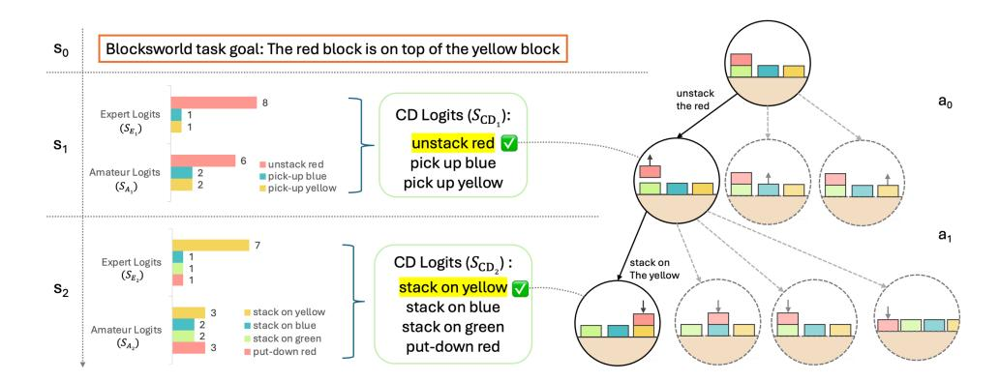

Figure 1: An overview of SC-MCTS<sup>∗</sup> . We employ a novel reward model based on the principle of contrastive decoding to guide MCTS Reasoning on Blocksworld multi-step reasoning dataset.

The first key challenge is that MCTS's general reasoning ability is almost entirely dependent on the reward model's performance (as demonstrated by our ablation experiments in Section [5.5\)](#page-8-0), making it highly challenging to design dense, general yet efficient rewards to guide MCTS reasoning. Previous works either require two or more LLMs [\(Tian et al., 2024\)](#page-11-5) or training epochs [\(Zhang et al., 2024a\)](#page-12-1), escalating the VRAM and computational demand, or they rely on domain-specific tools [\(Xin et al.,](#page-12-2) [2024a](#page-12-2)[;b\)](#page-12-3) or datasets [\(Qi et al., 2024\)](#page-11-6), making it difficult to generalize to other tasks or datasets.

The second key challenge is that MCTS is significantly slower than Chain of Thoughts (CoT). CoT only requires designing a prompt of multi-turn chats [\(Wei et al., 2024\)](#page-11-1). In contrast, MCTS builds a reasoning tree with 2–10 layers depending on the difficulty of the task, where each node in the tree represents a chat round with LLM which may need to be visited one or multiple times. Moreover, to obtain better performance, we typically perform 2–10 MCTS iterations, which greatly increases the number of nodes, leading to much higher computational costs and slower reasoning speed.

To address the these challenges, we first went beyond previous LLM reasoning works who primarily treated MCTS as an tool rather than analyzing and improving its components, to study each component of MCTS related to the reward model. We redesigned the reward model for MCTS reasoning based on the principle of contrastive decoding: specifically, we first combined multiple highly interpretable reward functions in contrast with a small model, then identified their modes by clustering the prior distributions, and normalized the rewards separately for each mode. We found the Upper Confidence Bound applied on Trees (UCT) strategy that is often set *a priori* in most previous works failed to function in our experiments, and the performance is sensitive to choices of the exploration constant. We also refined the backpropagation of MCTS to prefer more steadily improving paths. These changes boost the performance of our MCTS system. Finally, we incorporated speculative decoding into MCTS to address the speed challenge.

The contributions of our new method, SC-MCTS<sup>∗</sup> , are summarized as follows:

- 1. We went beyond previous works who primarily treated MCTS as an tool rather than analyzing and improving its components. Specifically, we found the UCT strategy in most previous works may failed to function from our experiment. We also refined the backpropagation of MCTS to prefer more steadily improving paths, boosting performance.
- 2. To fully study the interpretability of MCTS multi-step reasoning, we conducted extensive quantitative analysis and ablation studies on every component. We carried out numerous experiments from both the numerical and distributional perspectives of the reward models, as well as its own interpretability, providing better interpretability for MCTS multi-step reasoning.
- 3. We designed a novel, general action-level reward model for MCTS multi-step reasoning based on the principle of contrastive decoding, which requires no external tools, training, or datasets. Additionally, we found that previous works often failed to effectively harness multiple reward models, thus we proposed a statistical linear combination method. At the same time, we introduced token-level speculative decoding which incurs no additional cost and speeds up MCTS reasoning by an average of 52%, as contrastive decoding also requires a smaller language model.

We demonstrated the effectiveness of our approach by outperforming OpenAI's flagship o1-mini model by an average of 17.4% using Llama-3.1-70B on the Blocksworld multi-step reasoning dataset.

# 2 RELATED WORK

Large Language Models Multi-Step Reasoning One of the key focus areas for LLMs is understanding and enhancing their reasoning capabilities. Recent advancements in this area focused on developing methods that improve LLMs' ability to handle complex tasks in domains like code generation and mathematical problem-solving. Chain-of-Thought (CoT) [\(Wei et al., 2024\)](#page-11-1) reasoning has been instrumental in helping LLMs break down intricate problems into a sequence of manageable steps, making them more adept at handling tasks that require logical reasoning. Building upon this, Tree-of-Thought (ToT) [\(Yao et al., 2024\)](#page-12-0) reasoning extends CoT by allowing models to explore multiple reasoning paths concurrently, thereby enhancing their ability to evaluate different solutions simultaneously. Complementing these approaches, Monte Carlo Tree Search (MCTS) has emerged as a powerful reasoning method for decision-making in LLMs. Originally successful in AlphaGo's victory [\(Silver et al., 2016\)](#page-11-3), MCTS has been adapted to guide model-based planning by balancing exploration and exploitation through tree-based search and random sampling, and later to large language model reasoning [\(Hao et al., 2023\)](#page-10-0), showing great results. This adaptation has proven particularly effective in areas requiring strategic planning. Notable implementations like ReST-MCTS<sup>∗</sup> [\(Zhang](#page-12-1) [et al., 2024a\)](#page-12-1), rStar [\(Qi et al., 2024\)](#page-11-6), MCTSr [\(Zhang et al., 2024b\)](#page-12-4) and [Xie et al.](#page-12-5) [\(2024\)](#page-12-5) have shown that integrating MCTS with reinforced self-training, self-play mutual reasoning or Direct Preference Optimization [\(Rafailov et al., 2023\)](#page-11-7) can significantly improve reasoning capabilities in LLMs. Furthermore, recent advancements such as Deepseek Prover [\(Xin et al., 2024a](#page-12-2)[;b\)](#page-12-3) demonstrates the potential of these models to understand complex instructions such as formal mathematical proof.

Decoding Strategies Contrastive decoding and speculative decoding both require Smaller Language Models (SLMs), yet few have realized that these two clever decoding methods can be seamlessly combined without any additional cost. The only work that noticed this was [Yuan et al.](#page-12-6) [\(2024a\)](#page-12-6), but their proposed speculative contrastive decoding focused on token-level decoding. In contrast, we designed a new action-level contrastive decoding to guide MCTS reasoning, the distinction will be discussed further in Section [4.1.](#page-4-0) For more detailed related work please refer to Appendix [B.](#page-13-0)

# 3 PRELIMINARIES

# 3.1 MULTI-STEP REASONING

A multi-step reasoning problem can be modeled as a Markov Decision Process [\(Bellman, 1957\)](#page-10-2) M = (S, A, P, r, γ). S is the state space containing all possible states, A the action space, P(s ′ |s, a) the state transition function, r(s, a) the reward function, and γ the discount factor. The goal is to learn *and* to use a policy π to maximize the discounted cumulative reward Eτ∼<sup>π</sup> hP<sup>T</sup> <sup>t</sup>=0 γ t rt i . For reasoning with LLMs, we are more focused on using an existing LLM to achieve the best reasoning.

# 3.2 MONTE CARLO TREE SEARCH

Monte Carlo Tree Search (MCTS) is a decision-making algorithm involving a search tree to simulate and evaluate actions. The algorithm operates in the following four phases:

Node Selection: The selection process begins at the root, selecting nodes hierarchically using strategies like UCT as the criterion to favor a child node based on its quality and novelty.

Expansion: New child nodes are added to the selected leaf node by sampling d possible actions, predicting the next state. If the leaf node is fully explored or terminal, expansion is skipped.

Simulation: During simulation or "rollout", the algorithm plays out the "game" randomly from that node to a terminal state using a default policy.

Backpropagation: Once a terminal state is reached, the reward is propagated up the tree, and each node visited during the selection phase updates its value based on the simulation result.

Through iterative application of its four phases, MCTS efficiently improves reasoning through trials and heuristics, converging on the optimal solution.

#### 3.3 Contrastive Decoding

We discuss vanilla Contrastive Decoding (CD) from Li et al. (2023), which improves text generation in LLMs by reducing errors like repetition and self-contradiction. CD uses the differences between an expert model and an amateur model, enhancing the expert's strengths and suppressing the amateur's weaknesses. The CD objective is defined as:

$$\mathcal{L}_{\text{CD}}(x_{\text{cont}}, x_{\text{pre}}) = \log p_{\text{EXP}}(x_{\text{cont}}|x_{\text{pre}}) - \log p_{\text{AMA}}(x_{\text{cont}}|x_{\text{pre}})$$

where  $p_{\text{EXP}}$  and  $p_{\text{AMA}}$  are the expert and amateur probability distributions.

To avoid penalizing correct behavior of the amateur or promoting implausible tokens, CD applies an adaptive plausibility constraint using an  $\alpha$ -mask, which filters tokens by their logits against a threshold:

$$V_{\text{valid}} = \{i \mid s_{\text{EXP}}^{(i)} \ge \log \alpha + \max_{k} s_{\text{EXP}}^{(k)}\}$$

Final logits are adjusted with a coefficient  $(1 + \beta)$ , modifying the contrastive effect on output scores (Liu et al., 2021):

$$s_{\text{CD}}^{(i)} = (1+\beta)s_{\text{EXP}}^{(i)} - s_{\text{AMA}}^{(i)}$$

However, our proposed CD is at action level, averaging over the whole action, instead of token level in vanilla CD. Our novel action-level CD reward more robustly captures the differences in confidence between the expert and amateur models in the generated answers compared to vanilla CD. The distinction will be illustrated in Section 4.1 and explained further in Appendix A.

#### 3.4 SPECULATIVE DECODING

Based on vanilla Speculative Decoding (Leviathan et al., 2023), the process can be summarized as follows: Let  $M_p$  be the target model we aim to accelerate, with  $p(x_t|x_{< t})$  representing its distribution for a given prefix  $x_{< t}$ . Let  $M_q$  be a smaller, more efficient approximation model, with  $q(x_t|x_{< t})$  representing its distribution. The key idea is to generate  $\gamma$  new tokens using  $M_q$  and evaluate them against  $M_p$ , accepting those that align with  $M_p$ 's distribution. Each evaluation of  $M_p$  on the new tokens which is parallel can produce at least one new token according to p(x) in the end, with potentially many more tokens if they get accepted.

Specifically, speculative decoding first samples  $x \sim q(x)$  autoregressively  $\gamma$  times and keep them as long as  $q(x) \leq p(x)$ . If q(x) > p(x) at some point, that sample is rejected with probability  $1 - \frac{p(x)}{q(x)}$ , and a new sample is drawn from an adjusted distribution:

$$p'(x) = \text{norm}(\max(0, p(x) - q(x)))$$

This ensures that the final sample distribution always follows p(x). Since contrastive decoding and speculative decoding both require smaller language model, after employing our proposed action level contrastive decoding, we can achieve the acceleration effect of speculative decoding without additional cost (Yuan et al., 2024a).

### 4 METHOD

The SC-MCTS\* reasoning methodology is outlined as follows: In Section 4.1 details the multi-reward design; Section 4.2 discusses the UCT strategy for node selection; and Section 4.3 proposes the refinement of backpropagation.

#### <span id="page-3-0"></span>4.1 Multi-Reward Design

SC-MCTS\* is guided by three highly interpretable reward models: contrastive JS divergence, log-likelihood and self evaluation. Previous work such as (Hao et al., 2023) often directly adds reward functions with mismatched numerical magnitudes without any prior statistical analysis or linear combination. As a result, their combined reward models may fail to demonstrate full performance.

Moreover, combining multiple rewards online presents numerous challenges such as distributional shifts in the values. Thus, we propose a statistically-informed reward combination method: **Multi-RM method**. Each reward model is normalized contextually by the fine-grained prior statistics of its empirical distribution. The pseudocode for reward model construction is shown in Algorithm 1. Please refer to Appendix D for a complete version of SC-MCTS\* that includes other improvements such as dealing with distribution shift when combining reward functions online.

# Algorithm 1 SC-MCTS\*, reward model construction

```
Input: Expert LLM \pi_e, Amateur SLM \pi_a, Problem set D; M selected problems for prior statistics, N pre-generated solutions per problem, K clusters

1: \tilde{A} \leftarrow \text{Sample-solutions}(\pi_e, D, M, N) \Rightarrow Pre-generate M \times N solutions

2: p_e, p_a \leftarrow \text{Evaluate}(\pi_e, \pi_a, \tilde{A}) \Rightarrow Get policy distributions

3: \mathbf{for} \ r \in \{\text{JSD, LL, SE}\}\ \mathbf{do}

4: \mu_r, \sigma_r \leftarrow \text{Cluster-stats}(r(\tilde{A}), K) \Rightarrow Prior statistics (Equation 1)

5: R_r \leftarrow x \mapsto (r(x) - \mu_r^{k^*})/\sigma_r^{k^*} \Rightarrow Reward normalization (Equation 2)

6: \mathbf{end} \ \mathbf{for}

7: R \leftarrow \sum_{r \in \{\text{JSD,LL,SE}\}} w_r R_r \Rightarrow Composite reward

8: A_D \leftarrow \text{MCTS-Reasoning}(\pi_e, R, D, \pi_a) \Rightarrow Search solutions guided by R

Output: A_D
```

<span id="page-4-0"></span>**Jensen-Shannon Divergence** Inspired by contrastive decoding, we propose a novel reward model: average Jensen-Shannon divergence between the expert model's logits and the amateur model's logits. Unlike vanilla contrastive decoding (Li et al., 2023), which operates at the token level, our novel reward is computed at the action level, treating a sequence of action tokens as a whole:

$$R_{\text{JSD}} = \frac{1}{n} \sum_{i=T_{\text{prefix}}+1}^{n} \left[ \text{JSD}(p_{\text{e}}(x_i|x_{\leq i}) \parallel p_{\text{a}}(x_i|x_{\leq i})) \right]$$

where  $p_{\rm e}$  and  $p_{\rm a}$  represent the softmax probabilities of the expert model and the amateur model, respectively. This approach ensures that the reward captures model behavior at the action level, as the entire sequence of tokens is taken into account at once. This contrasts with token-level methods like vanilla contrastive decoding, where each token is treated serially.

**Loglikelihood** Inspired by Hao et al. (2023), we use a loglikelihood reward model to evaluate the quality of generated answers based on a given question prefix. The model computes logits for the full sequence (prefix + answer) and accumulates the log-probabilities over the answer part tokens.

Let the full sequence  $x=(x_1,x_2,\ldots,x_{T_{\text{total}}})$  consist of a prefix and a generated answer. The loglikelihood reward  $R_{\text{LL}}$  is calculated over the answer portion:

$$R_{\text{LL}} = \sum_{i=T_{\text{prefix}}+1}^{T_{\text{total}}} \log \left( \frac{\exp(z_{\theta}(x_i))}{\sum_{x' \in V} \exp(z_{\theta}(x'))} \right)$$

where  $z_{\theta}(x_i)$  represents the unnormalized logit for token  $x_i$ . After calculating logits for the entire sequence, we discard the prefix and focus on the answer tokens to form the loglikelihood reward.

**Self Evaluation** Large language models' token-level self evaluation can effectively quantify the model's uncertainty, thereby improving the quality of selective generation (Ren et al., 2023). We instruct the LLM to perform self evaluation on its answers, using a action level evaluation method, including a self evaluation prompt to explicitly indicate the model's uncertainty.

After generating the answer, we prompt the model to evaluate the quality of its response by asking "Is this answer correct/good?" This serves to capture the model's confidence in its own output, leading to more informed decision-making. The self evaluation prompt's logits are then used to calculate a reward function. Similar to the loglikelihood reward model, we calculate the self evaluation reward  $R_{\rm SE}$  by summing the log-probabilities over the self-evaluation tokens or obtaining the log-probability of a single 'good' token in between.

Harnessing Multiple Reward Models and Modes We collected prior distributions for the reward factors and found some of them span multiple regions. Therefore, we compute the fine-grained prior statistics as mean and standard deviation of modes of the prior distribution R ∈ {RJSD, RLL, RSE}:

<span id="page-5-2"></span>
$$\mu^{(k)} = \frac{1}{c_k} \sum_{R_i \in [b_k, b_{k+1})} R_i \quad \text{and} \quad \sigma^{(k)} = \sqrt{\frac{1}{c_k} \sum_{R_i \in [b_k, b_{k+1})} (R_i - \mu^{(k)})^2}$$
 (1)

where b<sup>1</sup> < b<sup>2</sup> < · · · < bK+1 are the region boundaries in R, R<sup>i</sup> ∈ R, and c<sup>k</sup> is the number of Ris in [bk, bk+1). Instead of using formal clustering algorithms like k-means, we manually define the regions based on the clear boundaries in the reward's empirical distribution.

After we computed the fine-grained prior statistics, the reward factors are normalized separately for each region (which degenerates to standard normalization if only a single region is found):

<span id="page-5-3"></span>
$$R_{\text{norm}}(x) = (R(x) - \mu^{(k^*)})/\sigma^{(k^*)}, \text{ where } k^* = \arg\max\{k : b_k \le R(x)\}$$
 (2)

This reward design, which we call Multi-RM method, has some caveats: first, to prevent distribution shift during reasoning, we update the mean and standard deviation of the reward functions online for each mode (see Appendix [D](#page-14-0) for pseudocode); second, we focus only on cases with clearly distinct reward modes, leaving general cases for future work. For the correlation heatmap, see Appendix [E.](#page-15-0)

# <span id="page-5-0"></span>4.2 NODE SELECTION STRATEGY

Upper Confidence Bound applied on Trees Algorithm (UCT) [\(Coquelin & Munos, 2007\)](#page-10-6) is crucial for the selection phase, balancing exploration and exploitation by choosing actions that maximize:

$$UCT_j = \bar{X}_j + C\sqrt{\frac{\ln N}{N_j}}$$

where X¯ <sup>j</sup> is the average reward of taking action j, N is the number of times the parent has been visited, and N<sup>j</sup> is the number of times node j has been visited for simulation, C is a constant to balance exploitation and exploration.

However, C is a crucial part of UCT. Previous work [\(Hao et al., 2023;](#page-10-0) [Zhang et al., 2024b\)](#page-12-4) had limited thoroughly investigating its components, leading to potential failures of the UCT strategy. This is because they often used the default value of 1 from the original proposed UCT [\(Coquelin &](#page-10-6) [Munos, 2007\)](#page-10-6) without conducting sufficient quantitative experiments to find the optimal C. This will be discussed in detail in Section [5.4.](#page-8-1)

### <span id="page-5-1"></span>4.3 BACKPROPAGATION

After each MCTS iteration, multiple paths from the root to terminal nodes are generated. By backpropagating along these paths, we update the value of each state-action pair. Previous MCTS approaches often use simple averaging during backpropagation, but this can overlook paths where the *goal achieved* metric G(p) progresses smoothly (e.g., G(p1) = 0 → 0.25 → 0.5 → 0.75). These paths just few step away from the final goal G(p) = 1, are often more valuable than less stable ones.

To improve value propagation, we propose an algorithm that better captures value progression along a path. Given a path P = {p1, p2, . . . , pn} with n nodes, where each p<sup>i</sup> represents the value at node i, the total value is calculated by summing the increments between consecutive nodes with a length penalty. The increment between nodes p<sup>i</sup> and pi−<sup>1</sup> is ∆<sup>i</sup> = p<sup>i</sup> − pi−1. Negative increments are clipped at −0.1 and downweighted by 0.5. The final path value Vfinal is:

<span id="page-5-4"></span>
$$V_{\text{final}} = \sum_{i=2}^{n} \left\{ \begin{array}{l} \Delta_i, & \text{if } \Delta_i \ge 0\\ 0.5 \times \max(\Delta_i, -0.1), & \text{if } \Delta_i < 0 \end{array} \right\} - \lambda \times n \tag{3}$$

where n is the number of nodes in the path and λ = 0.1 is the penalty factor to discourage long paths.

### 5 EXPERIMENTS

#### 5.1 Dataset

Blocksworld (Valmeekam et al., 2024; 2023) is a classic domain in AI research for reasoning and planning, where the goal is to rearrange blocks into a specified configuration using actions like 'pick-up,' 'put-down,' 'stack,' and 'unstack. Blocks can be moved only if no block on top, and only one block at a time. The reasoning process in Blocksworld is a MDP. At time step t, the LLM agent selects an action  $a_t \sim p(a \mid s_t, c)$ , where  $s_t$  is the current block configuration, c is the prompt template. The state transition  $s_{t+1} = P(s_t, a_t)$  is deterministic and is computed by rules. This forms a trajectory of interleaved states and actions  $(s_0, a_0, s_1, a_1, \ldots, s_T)$  towards the goal state.

One key feature of Blocksworld is its built-in verifier, which tracks progress toward the goal at each step. This makes Blocksworld ideal for studying heuristic LLM multi-step reasoning. However, we deliberately avoid using the verifier as part of the reward model as it is task-specific. More details of Blocksworld can be found in Appendix F.

#### 5.2 MAIN RESULTS

To evaluate the SC-MCTS\* algorithm in LLM multi-step reasoning, we implemented CoT, RAP-MCTS, and SC-MCTS\* using Llama-3-70B and Llama-3.1-70B. For comparison, we used Llama-3.1-405B and GPT-40 for CoT, and applied 0 and 4 shot single turn for o1-mini, as OpenAI (2024b) suggests avoiding CoT prompting. The experiment was conducted on Blocksworld dataset across all steps and difficulties. For LLM settings, GPU and OpenAI API usage data, see Appendix C and G.

| Mode | Models                         | Method                                    | Steps                      |                            |                            |                            |                            |                            |                            |
|------|--------------------------------|-------------------------------------------|----------------------------|----------------------------|----------------------------|----------------------------|----------------------------|----------------------------|----------------------------|
| Mode |                                |                                           | Step 2                     | Step 4                     | Step 6                     | Step 8                     | Step 10                    | Step 12                    | Avg.                       |
| Easy | Llama-3-70B<br>~Llama-3.2-1B   | 4-shot CoT<br>RAP-MCTS<br>SC-MCTS* (Ours) | 0.2973<br>0.9459<br>0.9730 | 0.4405<br>0.9474<br>0.9737 | 0.3882<br>0.8138<br>0.8224 | 0.2517<br>0.4196<br>0.4336 | 0.1696<br>0.2136<br>0.2136 | 0.1087<br>0.1389<br>0.2222 | 0.2929<br>0.5778<br>0.5949 |
|      | Llama-3.1-70B<br>~Llama-3.2-1B | 4-shot CoT<br>RAP-MCTS<br>SC-MCTS* (Ours) | 0.5405<br>1.0000<br>1.0000 | 0.4868<br>0.9605<br>0.9737 | 0.4069<br>0.8000<br>0.7724 | 0.2238<br>0.4336<br>0.4503 | 0.2913<br>0.2039<br>0.3010 | 0.2174<br>0.1111<br>0.1944 | 0.3441<br>0.5796<br>0.6026 |
|      | Llama-3.1-405B                 | 0-shot CoT<br>4-shot CoT                  | $0.8108 \\ 0.7838$         | 0.6579<br>0.8553           | 0.5931<br>0.6483           | 0.5105<br>0.4266           | 0.4272<br>0.5049           | 0.3611<br>0.4167           | 0.5482<br>0.5852           |
|      | o1-mini                        | 0-shot<br>4-shot                          | 0.9730<br>0.9459           | 0.7368<br>0.8026           | 0.5103<br>0.6276           | 0.3846<br>0.3497           | 0.3883<br>0.3301           | 0.1944<br>0.2222           | 0.4463<br>0.5167           |
|      | GPT-40                         | 0-shot CoT<br>4-shot CoT                  | 0.5405<br>0.5135           | 0.4868<br>0.6579           | 0.3241<br>0.6000           | 0.1818<br>0.2797           | 0.1165<br>0.3010           | 0.0556<br>0.3611           | 0.2666<br>0.4444           |
| Hard | Llama-3-70B<br>~Llama-3.2-1B   | 4-shot CoT<br>RAP-MCTS<br>SC-MCTS* (Ours) | 0.5556<br>1.0000<br>0.9778 | 0.4405<br>0.8929<br>0.8929 | 0.3882<br>0.7368<br>0.7566 | 0.2517<br>0.4503<br>0.5298 | 0.1696<br>0.1696<br>0.2232 | 0.1087<br>0.1087<br>0.1304 | 0.3102<br>0.5491<br>0.5848 |
|      | Llama-3.1-70B<br>~Llama-3.2-1B | 4-shot CoT<br>RAP-MCTS<br>SC-MCTS* (Ours) | 0.6222<br>0.9778<br>0.9778 | 0.2857<br>0.9048<br>0.9405 | 0.3421<br>0.7829<br>0.8092 | 0.1722<br>0.4702<br>0.4702 | 0.1875<br>0.1875<br>0.1696 | 0.2174<br>0.1087<br>0.2174 | 0.2729<br>0.5695<br>0.5864 |
|      | Llama-3.1-405B                 | 0-shot CoT<br>4-shot CoT                  | 0.7838<br>0.8889           | 0.6667<br>0.6667           | 0.6053<br>0.6579           | 0.3684<br>0.4238           | 0.2679<br>0.5804           | 0.2609<br>0.5217           | 0.4761<br>0.5915           |
|      | o1-mini                        | 0-shot<br>4-shot                          | 0.6889<br>0.9556           | 0.4286<br>0.8452           | 0.1776<br>0.5263           | 0.0993<br>0.3907           | 0.0982<br>0.2857           | 0.0000<br>0.1739           | 0.2034<br>0.4966           |
|      | GPT-40                         | 0-shot CoT<br>4-shot CoT                  | 0.6222<br>0.6222           | 0.3929<br>0.4167           | 0.3026<br>0.5197           | 0.1523<br>0.3642           | 0.0714<br>0.3304           | 0.0000<br>0.1739           | 0.2339<br>0.4102           |

<span id="page-6-0"></span>Table 1: Accuracy of various reasoning methods and models across steps and difficulty modes on the Blocksworld multi-step reasoning dataset.

From Table 1, it can be observed that SC-MCTS\* significantly outperforms RAP-MCTS and 4-shot CoT across both easy and hard modes, and in easy mode, Llama-3.1-70B model using SC-MCTS\* outperforms the 4-shot CoT Llama-3.1-405B model.

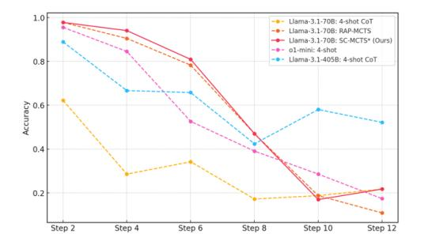

<span id="page-7-0"></span>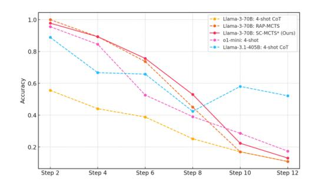

Figure 2: Accuracy comparison of various models and reasoning methods on the Blocksworld multi-step reasoning dataset across increasing reasoning steps.

From Figure [2,](#page-7-0) we observe that as the reasoning path lengthens, the performance advantage of two MCTS reasoning algorithms over themselves, GPT-4o, and Llama-3.1-405B's CoT explicit multiturn chats and o1-mini implicit multi-turn chats [\(OpenAI, 2024b\)](#page-11-11) in terms of accuracy diminishes, becoming particularly evident after Step 6. The accuracy decline for CoT is more gradual as the reasoning path extends, whereas models employing MCTS reasoning exhibits a steeper decline. This trend could be due to the fixed iteration limit of 10 across different reasoning path lengths, which might be unfair to longer paths. Future work could explore dynamically adjusting the iteration limit based on reasoning path length. It may also be attributed to our use of a custom EOS token to ensure output format stability in the MCTS reasoning process, which operates in completion mode. As the number of steps and prompt prefix lengths increases, the limitations of completion mode may become more pronounced compared to the chat mode used in multi-turn chats. Additionally, we observe that Llama-3.1-405B benefits significantly from its huge parameter size, although underperforming at fewer steps, experiences the slowest accuracy decline as the reasoning path grows longer.

# 5.3 REASONING SPEED

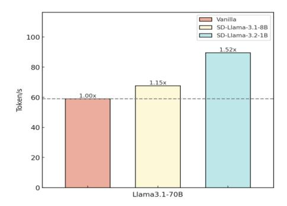

<span id="page-7-1"></span>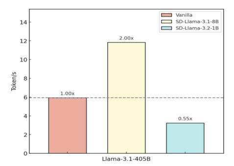

Figure 3: Speedup comparison of different model combinations. For speculative decoding, we use Llama-3.2-1B and Llama-3.1.8B as amateur models with Llama-3.1-70B and Llama-3.1-405B as expert models, based on average node-level reasoning speed in MCTS for Blocksworld multi-step reasoning dataset.

As shown in Figure [3,](#page-7-1) we can observe that the combination of Llama-3.1-405B with Llama-3.1- 8B achieves the highest speedup, improving inference speed by approximately 100% compared to vanilla decoding. Similarly, pairing Llama-3.1-70B with Llama-3.2-1B results in a 51.9% increase in reasoning speed. These two combinations provide the most significant gains, demonstrating that speculative decoding with SLMs can substantially enhance node level reasoning speed. However, we can also observe from the combination of Llama-3.1-405B with Llama-3.2-1B that the parameters of SLMs in speculative decoding should not be too small, since the threshold for accepting draft tokens during the decoding process remains fixed to prevent speculative decoding from affecting performance [\(Leviathan et al., 2023\)](#page-10-5), as overly small parameters may have a negative impact on decoding speed, which is consistent with the findings in [Zhao et al.](#page-12-8) [\(2024\)](#page-12-8); [Chen et al.](#page-10-7) [\(2023\)](#page-10-7).

#### <span id="page-8-1"></span>5.4 PARAMETERS

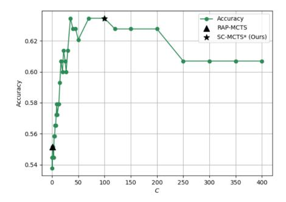

<span id="page-8-2"></span>Figure 4: Accuracy comparison of different constant C of UCT on Blocksworld multi-step reasoning dataset.

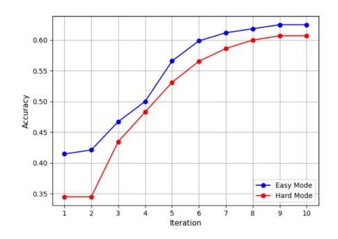

<span id="page-8-3"></span>Figure 5: Accuracy comparison of different numbers of iteration on Blocksworld multistep reasoning dataset.

As discussed in Section 4.2, the constant C is a crucial part of UCT strategy, which completely determines whether the exploration term takes effect. Therefore, we conducted quantitative experiments on the constant C, to eliminate interference from other factors, we only use MCTS base with the common reward model  $R_{\rm LL}$  for both RAP-MCTS and SC-MCTS\*. From Figure 4 we can observe that the constant C of RAP-MCTS is too small to function effectively, while the constant C of SC-MCTS\* is the value most suited to the values of reward model derived from extensive experimental data.

From Figure 5, it can be observed that the accuracy of SC-MCTS\* on multi-step reasoning increases steadily with the number of iterations. During the first 1-7 iterations, the accuracy rises consistently. After the 7th iteration, the improvement in accuracy becomes relatively smaller, indicating that under the experimental setting with depth limitations, the exponentially growing exploration nodes in later iterations bring diminishing returns in accuracy.

#### <span id="page-8-0"></span>5.5 ABLATION STUDY

| Parts of SC-MCTS*   | Accuracy (%) | Improvement (%) |
|---------------------|--------------|-----------------|
| MCTS base           | 55.92        | _               |
| $+R_{\rm JSD}$      | 62.50        | +6.58           |
| + $R_{\rm LL}$      | 67.76        | +5.26           |
| + $R_{\rm SE}$      | 70.39        | +2.63           |
| + Multi-RM Method   | 73.68        | +3.29           |
| + Improved C of UCT | 78.95        | +5.27           |
| + BP Refinement     | 80.92        | +1.97           |
| SC-MCTS*            | 80.92        | Overall +25.00  |

<span id="page-8-4"></span>Table 2: Ablation Study on the Blocksworld dataset at Step 6 under difficult mode. For a more thorough ablation study, the reward model for the MCTS base was set to pseudo-random numbers.

As shown in Table 2, the results of the ablation study demonstrate that each component of SC-MCTS\* contributes significantly to performance improvements. Starting from a base MCTS accuracy of 55.92%, adding  $R_{\rm JSD}$ ,  $R_{\rm LL}$ , and  $R_{\rm SE}$  yields a combined improvement of 14.47%. Multi-RM method further boosts performance by 3.29%, while optimizing the C parameter in UCT adds 5.27%, and the backpropagation refinement increases accuracy by 1.97%. Overall, SC-MCTS\* achieves an accuracy of 80.92%, a 25% improvement over the base, demonstrating the effectiveness of these enhancements for complex reasoning tasks.

### <span id="page-9-0"></span>5.6 Interpretability Study

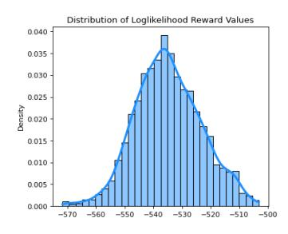

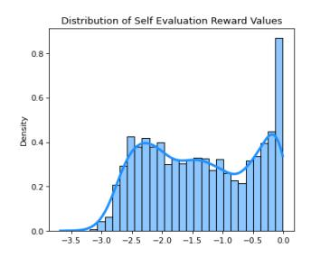

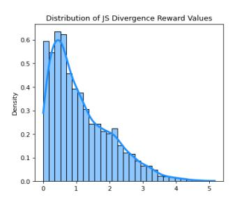

Figure 6: Distribution of reward functions of SC-MCTS\* on the Blocksworld multi-step reasoning dataset using Llama-3.1-70B as expert model and Llama-3.2-1B as amateur model.

We observe two distinct types of reward value distributions: normal distribution and half-normal distribution (truncated normal distribution).

**Normal distribution** is represented by  $R_{\rm LL}$  which is computed by accumulating the log probabilities over the token indices of the answer portion from the logits. This accumulation captures the probability trends of the entire answer generation, with a symmetric and concentrated distribution, resulting in a normal distribution. This distribution reflects the balance in the reasoning process and provides a stable and interpretable guide to MCTS multi-step reasoning.

**Half-normal distribution** includes  $R_{\rm JSD}$  and  $R_{\rm SE}$ .  $R_{\rm JSD}$  quantifies the difference in confidence between the expert model and the amateur model over the logits of the answer part. The motivation for designing this reward function stems from the principle of contrastive decoding where constraining the expert model with the amateur model significantly reduces the low-quality outputs of the expert (Li et al., 2023).  $R_{\rm JSD}$  introduces symmetry by averaging distributions defined as  $M=\frac{1}{2}({\rm Logits_{Expert}}+{\rm Logits_{Amateur}})$ , which differs from KL divergence. This symmetry combined with the non-negative nature of JS divergence also leads to a half-normal distribution.  $R_{\rm JSD}$  guide MCTS reasoning by measuring the discrepancy between the models' logits. Our ablation experiments in Section 5.5 demonstrate that  $R_{\rm JSD}$  is highly effective as a reward function, significantly improving the performance of multi-step reasoning.

The self-evaluation reward function computes the log probability of a single self evaluation token such as "good" to measure the model's confidence in generated answer (Ren et al., 2023). Since it only focuses on the log probability of single specific token and relies on the model's confidence in particular outputs, its distribution also takes the form of a half-normal distribution. This distribution reflects the uncertainty in the reasoning process especially at decision points with lower confidence.

By combining the observations from ablation experiments in Table 2 and Figure 5.6, we also find that reward functions whose distributions more closely resemble a normal or half-normal distribution tend to perform better. For example,  $R_{\rm JSD}$ , whose shape is more aligned with a half-normal distribution compared to  $R_{\rm SE}$ , also demonstrates better performance than  $R_{\rm SE}$ .

From the ablation study results in Table 5.5, it can be seen that the reward model is the most critical factor for MCTS reasoning performance. Having well-interpretable reward models implies better interpretability of MCTS reasoning. By studying these highly interpretable rewards, we can gain a clearer and more explainable understanding of MCTS reasoning.

#### 6 Conclusion

In this paper, we present SC-MCTS\*, a novel and effective algorithm to enhancing the reasoning capabilities of LLMs. With extensive improvements in reward modeling, node selection strategy and backpropagation, SC-MCTS\* boosts both accuracy and speed, outperforming OpenAI's o1-mini model by 17.4% on average using Llama-3.1-70B on the Blocksworld dataset. Experiments demonstrate its strong performance, making it a promising approach for multi-step reasoning tasks. For future work please refer to Appendix I. The synthesis of interpretability, efficiency and generalizability positions SC-MCTS\* as a valuable contribution to advancing LLMs multi-step reasoning.

# REFERENCES

- <span id="page-10-2"></span>Richard Bellman. A markovian decision process. *Journal of Mathematics and Mechanics*, 6(5): 679–684, 1957. ISSN 00959057, 19435274. URL [http://www.jstor.org/stable/](http://www.jstor.org/stable/24900506) [24900506](http://www.jstor.org/stable/24900506).
- <span id="page-10-7"></span>Charlie Chen, Sebastian Borgeaud, Geoffrey Irving, Jean-Baptiste Lespiau, Laurent Sifre, and John Jumper. Accelerating large language model decoding with speculative sampling, 2023. URL <https://arxiv.org/abs/2302.01318>.
- <span id="page-10-11"></span>Qiguang Chen, Libo Qin, Jiaqi Wang, Jinxuan Zhou, and Wanxiang Che. Unlocking the boundaries of thought: A reasoning granularity framework to quantify and optimize chain-of-thought, 2024. URL <https://arxiv.org/abs/2410.05695>.
- <span id="page-10-6"></span>Pierre-Arnaud Coquelin and Rémi Munos. Bandit algorithms for tree search. In *Proceedings of the Twenty-Third Conference on Uncertainty in Artificial Intelligence*, UAI'07, pp. 67–74, Arlington, Virginia, USA, 2007. AUAI Press. ISBN 0974903930.
- <span id="page-10-8"></span>Elias Frantar, Saleh Ashkboos, Torsten Hoefler, and Dan Alistarh. Gptq: Accurate post-training quantization for generative pre-trained transformers, 2022.
- <span id="page-10-0"></span>Shibo Hao, Yi Gu, Haodi Ma, Joshua Hong, Zhen Wang, Daisy Wang, and Zhiting Hu. Reasoning with language model is planning with world model. In Houda Bouamor, Juan Pino, and Kalika Bali (eds.), *Proceedings of the 2023 Conference on Empirical Methods in Natural Language Processing*, pp. 8154–8173, Singapore, December 2023. Association for Computational Linguistics. doi: 10.18653/v1/2023.emnlp-main.507. URL [https://aclanthology.org/2023.](https://aclanthology.org/2023.emnlp-main.507) [emnlp-main.507](https://aclanthology.org/2023.emnlp-main.507).
- <span id="page-10-9"></span>Shibo Hao, Yi Gu, Haotian Luo, Tianyang Liu, Xiyan Shao, Xinyuan Wang, Shuhua Xie, Haodi Ma, Adithya Samavedhi, Qiyue Gao, Zhen Wang, and Zhiting Hu. LLM reasoners: New evaluation, library, and analysis of step-by-step reasoning with large language models. In *ICLR 2024 Workshop on Large Language Model (LLM) Agents*, 2024. URL [https://openreview.net/forum?](https://openreview.net/forum?id=h1mvwbQiXR) [id=h1mvwbQiXR](https://openreview.net/forum?id=h1mvwbQiXR).
- <span id="page-10-1"></span>John Jumper, Richard Evans, Alexander Pritzel, Tim Green, Michael Figurnov, Olaf Ronneberger, Kathryn Tunyasuvunakool, Russ Bates, Augustin Žídek, Anna Potapenko, Alex Bridgland, Clemens Meyer, Simon A. A. Kohl, Andrew J. Ballard, Andrew Cowie, Bernardino Romera-Paredes, Stanislav Nikolov, Rishub Jain, Jonas Adler, and Trevor Back. Highly accurate protein structure prediction with alphafold. *Nature*, 596(7873):583–589, Jul 2021. doi: https: //doi.org/10.1038/s41586-021-03819-2. URL [https://www.nature.com/articles/](https://www.nature.com/articles/s41586-021-03819-2) [s41586-021-03819-2](https://www.nature.com/articles/s41586-021-03819-2).
- <span id="page-10-5"></span>Yaniv Leviathan, Matan Kalman, and Yossi Matias. Fast inference from transformers via speculative decoding. In *Proceedings of the 40th International Conference on Machine Learning*, ICML'23. JMLR.org, 2023.
- <span id="page-10-3"></span>Xiang Lisa Li, Ari Holtzman, Daniel Fried, Percy Liang, Jason Eisner, Tatsunori Hashimoto, Luke Zettlemoyer, and Mike Lewis. Contrastive decoding: Open-ended text generation as optimization. In Anna Rogers, Jordan Boyd-Graber, and Naoaki Okazaki (eds.), *Proceedings of the 61st Annual Meeting of the Association for Computational Linguistics (Volume 1: Long Papers)*, pp. 12286– 12312, Toronto, Canada, July 2023. Association for Computational Linguistics. doi: 10.18653/v1/ 2023.acl-long.687. URL <https://aclanthology.org/2023.acl-long.687>.
- <span id="page-10-4"></span>Alisa Liu, Maarten Sap, Ximing Lu, Swabha Swayamdipta, Chandra Bhagavatula, Noah A. Smith, and Yejin Choi. DExperts: Decoding-time controlled text generation with experts and anti-experts. In *Proceedings of the 59th Annual Meeting of the Association for Computational Linguistics and the 11th International Joint Conference on Natural Language Processing (Volume 1: Long Papers)*, pp. 6691–6706, Online, August 2021. Association for Computational Linguistics. doi: 10.18653/ v1/2021.acl-long.522. URL <https://aclanthology.org/2021.acl-long.522>.
- <span id="page-10-10"></span>Nat McAleese, Rai Michael Pokorny, Juan Felipe Ceron Uribe, Evgenia Nitishinskaya, Maja Trebacz, and Jan Leike. Llm critics help catch llm bugs, 2024.

- <span id="page-11-12"></span>Sean O'Brien and Mike Lewis. Contrastive decoding improves reasoning in large language models, 2023. URL <https://arxiv.org/abs/2309.09117>.
- <span id="page-11-0"></span>OpenAI. Introducing openai o1. <https://openai.com/o1/>, 2024a. Accessed: 2024-10-02.
- <span id="page-11-11"></span>OpenAI. How reasoning works. [https://platform.openai.com/docs/guides/](https://platform.openai.com/docs/guides/reasoning/how-reasoning-works) [reasoning/how-reasoning-works](https://platform.openai.com/docs/guides/reasoning/how-reasoning-works), 2024b. Accessed: 2024-10-02.
- <span id="page-11-6"></span>Zhenting Qi, Mingyuan Ma, Jiahang Xu, Li Lyna Zhang, Fan Yang, and Mao Yang. Mutual reasoning makes smaller llms stronger problem-solvers, 2024. URL [https://arxiv.org/abs/2408.](https://arxiv.org/abs/2408.06195) [06195](https://arxiv.org/abs/2408.06195).
- <span id="page-11-7"></span>Rafael Rafailov, Archit Sharma, Eric Mitchell, Christopher D Manning, Stefano Ermon, and Chelsea Finn. Direct preference optimization: Your language model is secretly a reward model. In A. Oh, T. Naumann, A. Globerson, K. Saenko, M. Hardt, and S. Levine (eds.), *Advances in Neural Information Processing Systems*, volume 36, pp. 53728–53741. Curran Associates, Inc., 2023. URL [https://proceedings.neurips.cc/paper\\_files/paper/](https://proceedings.neurips.cc/paper_files/paper/2023/file/a85b405ed65c6477a4fe8302b5e06ce7-Paper-Conference.pdf) [2023/file/a85b405ed65c6477a4fe8302b5e06ce7-Paper-Conference.pdf](https://proceedings.neurips.cc/paper_files/paper/2023/file/a85b405ed65c6477a4fe8302b5e06ce7-Paper-Conference.pdf).
- <span id="page-11-8"></span>Jie Ren, Yao Zhao, Tu Vu, Peter J. Liu, and Balaji Lakshminarayanan. Self-evaluation improves selective generation in large language models. In Javier Antorán, Arno Blaas, Kelly Buchanan, Fan Feng, Vincent Fortuin, Sahra Ghalebikesabi, Andreas Kriegler, Ian Mason, David Rohde, Francisco J. R. Ruiz, Tobias Uelwer, Yubin Xie, and Rui Yang (eds.), *Proceedings on "I Can't Believe It's Not Better: Failure Modes in the Age of Foundation Models" at NeurIPS 2023 Workshops*, volume 239 of *Proceedings of Machine Learning Research*, pp. 49–64. PMLR, 16 Dec 2023. URL <https://proceedings.mlr.press/v239/ren23a.html>.
- <span id="page-11-3"></span>David Silver, Aja Huang, Chris J. Maddison, Arthur Guez, Laurent Sifre, George van den Driessche, Julian Schrittwieser, Ioannis Antonoglou, Veda Panneershelvam, Marc Lanctot, Sander Dieleman, Dominik Grewe, John Nham, Nal Kalchbrenner, Ilya Sutskever, Timothy Lillicrap, Madeleine Leach, Koray Kavukcuoglu, Thore Graepel, and Demis Hassabis. Mastering the game of go with deep neural networks and tree search. *Nature*, 529(7587):484–489, Jan 2016. doi: https: //doi.org/10.1038/nature16961.
- <span id="page-11-4"></span>David Silver, Thomas Hubert, Julian Schrittwieser, Ioannis Antonoglou, Matthew Lai, Arthur Guez, Marc Lanctot, Laurent Sifre, Dharshan Kumaran, Thore Graepel, Timothy Lillicrap, Karen Simonyan, and Demis Hassabis. Mastering chess and shogi by self-play with a general reinforcement learning algorithm, 2017. URL <https://arxiv.org/abs/1712.01815>.
- <span id="page-11-2"></span>Zayne Sprague, Fangcong Yin, Juan Diego Rodriguez, Dongwei Jiang, Manya Wadhwa, Prasann Singhal, Xinyu Zhao, Xi Ye, Kyle Mahowald, and Greg Durrett. To cot or not to cot? chain-ofthought helps mainly on math and symbolic reasoning, 2024. URL [https://arxiv.org/](https://arxiv.org/abs/2409.12183) [abs/2409.12183](https://arxiv.org/abs/2409.12183).
- <span id="page-11-5"></span>Ye Tian, Baolin Peng, Linfeng Song, Lifeng Jin, Dian Yu, Haitao Mi, and Dong Yu. Toward selfimprovement of llms via imagination, searching, and criticizing. *ArXiv*, abs/2404.12253, 2024. URL <https://api.semanticscholar.org/CorpusID:269214525>.
- <span id="page-11-10"></span>Karthik Valmeekam, Matthew Marquez, Sarath Sreedharan, and Subbarao Kambhampati. On the planning abilities of large language models - a critical investigation. In *Thirty-seventh Conference on Neural Information Processing Systems*, 2023. URL [https://openreview.net/](https://openreview.net/forum?id=X6dEqXIsEW) [forum?id=X6dEqXIsEW](https://openreview.net/forum?id=X6dEqXIsEW).
- <span id="page-11-9"></span>Karthik Valmeekam, Matthew Marquez, Alberto Olmo, Sarath Sreedharan, and Subbarao Kambhampati. Planbench: an extensible benchmark for evaluating large language models on planning and reasoning about change. In *Proceedings of the 37th International Conference on Neural Information Processing Systems*, NIPS '23, Red Hook, NY, USA, 2024. Curran Associates Inc.
- <span id="page-11-1"></span>Jason Wei, Xuezhi Wang, Dale Schuurmans, Maarten Bosma, Brian Ichter, Fei Xia, Ed H. Chi, Quoc V. Le, and Denny Zhou. Chain-of-thought prompting elicits reasoning in large language models. In *Proceedings of the 36th International Conference on Neural Information Processing Systems*, NIPS '22, Red Hook, NY, USA, 2024. Curran Associates Inc. ISBN 9781713871088.

- <span id="page-12-5"></span>Yuxi Xie, Anirudh Goyal, Wenyue Zheng, Min-Yen Kan, Timothy P. Lillicrap, Kenji Kawaguchi, and Michael Shieh. Monte carlo tree search boosts reasoning via iterative preference learning, 2024. URL <https://arxiv.org/abs/2405.00451>.
- <span id="page-12-2"></span>Huajian Xin, Daya Guo, Zhihong Shao, Zhizhou Ren, Qihao Zhu, Bo Liu (Benjamin Liu), Chong Ruan, Wenda Li, and Xiaodan Liang. Deepseek-prover: Advancing theorem proving in llms through large-scale synthetic data. *ArXiv*, abs/2405.14333, 2024a. URL [https:](https://api.semanticscholar.org/CorpusID:269983755) [//api.semanticscholar.org/CorpusID:269983755](https://api.semanticscholar.org/CorpusID:269983755).
- <span id="page-12-3"></span>Huajian Xin, Z. Z. Ren, Junxiao Song, Zhihong Shao, Wanjia Zhao, Haocheng Wang, Bo Liu, Liyue Zhang, Xuan Lu, Qiushi Du, Wenjun Gao, Qihao Zhu, Dejian Yang, Zhibin Gou, Z. F. Wu, Fuli Luo, and Chong Ruan. Deepseek-prover-v1.5: Harnessing proof assistant feedback for reinforcement learning and monte-carlo tree search, 2024b. URL [https://arxiv.org/abs/](https://arxiv.org/abs/2408.08152) [2408.08152](https://arxiv.org/abs/2408.08152).
- <span id="page-12-9"></span>Haotian Xu. No train still gain. unleash mathematical reasoning of large language models with monte carlo tree search guided by energy function, 2023. URL [https://arxiv.org/abs/2309.](https://arxiv.org/abs/2309.03224) [03224](https://arxiv.org/abs/2309.03224).
- <span id="page-12-0"></span>Shunyu Yao, Dian Yu, Jeffrey Zhao, Izhak Shafran, Thomas L. Griffiths, Yuan Cao, and Karthik Narasimhan. Tree of thoughts: deliberate problem solving with large language models. In *Proceedings of the 37th International Conference on Neural Information Processing Systems*, NIPS '23, Red Hook, NY, USA, 2024. Curran Associates Inc.
- <span id="page-12-6"></span>Hongyi Yuan, Keming Lu, Fei Huang, Zheng Yuan, and Chang Zhou. Speculative contrastive decoding. In Lun-Wei Ku, Andre Martins, and Vivek Srikumar (eds.), *Proceedings of the 62nd Annual Meeting of the Association for Computational Linguistics (Volume 2: Short Papers)*, pp. 56–64, Bangkok, Thailand, August 2024a. Association for Computational Linguistics. URL <https://aclanthology.org/2024.acl-short.5>.
- <span id="page-12-10"></span>Lifan Yuan, Ganqu Cui, Hanbin Wang, Ning Ding, Xingyao Wang, Jia Deng, Boji Shan, Huimin Chen, Ruobing Xie, Yankai Lin, Zhenghao Liu, Bowen Zhou, Hao Peng, Zhiyuan Liu, and Maosong Sun. Advancing llm reasoning generalists with preference trees, 2024b.
- <span id="page-12-1"></span>Dan Zhang, Sining Zhoubian, Ziniu Hu, Yisong Yue, Yuxiao Dong, and Jie Tang. Rest-mcts\*: Llm self-training via process reward guided tree search, 2024a. URL [https://arxiv.org/abs/](https://arxiv.org/abs/2406.03816) [2406.03816](https://arxiv.org/abs/2406.03816).
- <span id="page-12-4"></span>Di Zhang, Xiaoshui Huang, Dongzhan Zhou, Yuqiang Li, and Wanli Ouyang. Accessing gpt-4 level mathematical olympiad solutions via monte carlo tree self-refine with llama-3 8b, 2024b. URL <https://arxiv.org/abs/2406.07394>.
- <span id="page-12-8"></span>Weilin Zhao, Yuxiang Huang, Xu Han, Wang Xu, Chaojun Xiao, Xinrong Zhang, Yewei Fang, Kaihuo Zhang, Zhiyuan Liu, and Maosong Sun. Ouroboros: Generating longer drafts phrase by phrase for faster speculative decoding, 2024. URL <https://arxiv.org/abs/2402.13720>.

# <span id="page-12-7"></span>A ACTION-LEVEL CONTRASTIVE REWARD

We made the distinction between action-level variables and token-level variables: action-level (or step-level) variables are those that aggregate over all tokens in a reasoning step, and is typically utilized by the reasoning algorithm directly; token-level variables, by contrast, operates in a more microscopic and low-level environment, such as speculative decoding.

We found that the traditional contrastive decoding using the difference in logits, when aggregated over the sequence gives a unstable reward signal compared to JS divergence. We suspected this is due to the unbounded nature of logit difference, and the potential failure modes associated with it that needs extra care and more hyperparameter tuning.

# <span id="page-13-0"></span>B MORE RELATED WORK

Large Language Models Multi-Step Reasoning Deepseek Prover [\(Xin et al., 2024a](#page-12-2)[;b\)](#page-12-3) relied on Lean4 as an external verification tool to provide dense reward signals in the RL stage. ReST-MCTS<sup>∗</sup> [\(Zhang et al., 2024a\)](#page-12-1) employed self-training to collect high-quality reasoning trajectories for iteratively improving the value model. AlphaLLM [\(Tian et al., 2024\)](#page-11-5) used critic models initialized from the policy model as the MCTS reward model. rStar [\(Qi et al., 2024\)](#page-11-6) utilized mutual consistency of SLMs and an additional math-specific action space. [Xu](#page-12-9) [\(2023\)](#page-12-9) proposed reconstructing fine-tuned LLMs into residual-based energy models to guide MCTS.

Speculative Decoding Speculative decoding was first introduced in [Leviathan et al.](#page-10-5) [\(2023\)](#page-10-5), as a method to accelerate sampling from large autoregressive models by computing multiple tokens in parallel without retraining or changing the model structure. It enhances computational efficiency, especially in large-scale generation tasks, by recognizing that hard language-modeling tasks often include easier subtasks that can be approximated well by more efficient models. Similarly, DeepMind introduced speculative sampling [\(Chen et al., 2023\)](#page-10-7), which expands on this idea by generating a short draft sequence using a faster draft model and then scoring this draft with a larger target model.

Contrastive Decoding Contrastive decoding, as proposed by [Li et al.](#page-10-3) [\(2023\)](#page-10-3), is a simple, computationally light, and training-free method for text generation that can enhancethe quality and quantity by identifying strings that highlight potential differences between strong models and weak models. In this context, the weak models typically employ conventional greedy decoding techniques such as basic sampling methods, while the strong models are often well-trained large language models. This approach has demonstrated notable performance improvements in various inference tasks, including arithmetic reasoning and multiple-choice ranking tasks, thereby increasing the accuracy of language models. According to experiments conducted by [O'Brien & Lewis](#page-11-12) [\(2023\)](#page-11-12), applying contrastive decoding across various tasks has proven effective in enhancing the reasoning capabilities of LLMs.

# <span id="page-13-1"></span>C EXPERIMENTAL SETTINGS

For reproducibility, you can download the checkpoints from the Huggingface repository below and use the hyperparameters below. We utilized 4-bit quantized checkpoints in all experiments, as they only result in around 2% performance loss while providing several-fold reductions in memory usage and significantly improving inference speed [\(Frantar et al., 2022\)](#page-10-8). For better output formatting to capture a single step and convert it into an MCTS node, we used the LLM's completion mode so we set LLM to greedy sampling, and we don't have to set an additional system prompt, simply apply prompts in Appendix [F.](#page-16-0) Our experiments were all conducted on exllamav2 inference framework.

# C.1 CHECKPOINTS

| Usage                       | Models         | Links                                                                                        |  |  |
|-----------------------------|----------------|----------------------------------------------------------------------------------------------|--|--|
|                             | Llama-3.1-405B | https://huggingface.co/hugging-quants/Meta-Llama-3.<br>1-405B-Instruct-GPTQ-INT4             |  |  |
| Expert                      | Llama-3.1-70B  | https://huggingface.co/hugging-quants/Meta-Llama-3.<br>1-70B-Instruct-GPTQ-INT4              |  |  |
|                             | Llama-3-70B    | https://huggingface.co/TechxGenus/<br>Meta-Llama-3-70B-Instruct-GPTQ                         |  |  |
|                             | Llama-3.1-8B   | https://huggingface.co/hugging-quants/Meta-Llama-3.<br>1-8B-Instruct-GPTQ-INT4               |  |  |
| Amateur                     | Llama-3-8B     | https://huggingface.co/astronomer/<br>Llama-3-8B-Instruct-GPTQ-4-Bit                         |  |  |
|                             | Llama-3.2-1B   | https://huggingface.co/meta-llama/Llama-3.2-1B                                               |  |  |
| GPT-4o<br>OpenAI<br>o1-mini |                | https://platform.openai.com/docs/models/gpt-4o<br>https://platform.openai.com/docs/models/o1 |  |  |

Table 3: Checkpoints used in experiments and their links.

### C.2 HYPERPARAMETERS

| Hyperparameter           | Value               |
|--------------------------|---------------------|
| temperature              | 1.0                 |
| top-k                    | 1.0                 |
| top-p                    | 1.0                 |
| repetition_penalty       | 1.0                 |
| max_new_tokens           | 200                 |
| max_seq_len              | 32768               |
| MCTS EOS: Llama-3 family | "\\n["              |
| CoT EOS: Llama-3 family  | "\\n", "< eot_id >" |

Table 4: LLM Hyperparameters and EOS tokens used in experiments.

### <span id="page-14-0"></span>D ALGORITHM DETAILS OF SC-MCTS\*

The pseudocode inside MCTS reasoning of SC-MCTS\* is shown in Algorithm 2, based on Zhang et al. (2024a). The complete version of SC-MCTS\* is: first sample a subset of problems to obtain the prior data for reward values (Algorithm 1), then use it and two SLMs, one for providing contrastive reward signals, another for speculative decoding speedup, to perform MCTS reasoning. The changes of SC-MCTS\* compared to previous works are highlighted in teal.

### Algorithm 2 SC-MCTS\*, reasoning

```
Input: expert LLM \pi_e, amatuer SLM \pi_a, speculative SLM \pi_s, problem q, reward model R, reward
            factor statistics S, max iterations T, threshold l, branch b, rollout steps m, roll branch d, weight
            parameter \alpha, exploration constant C
   1: T_q \leftarrow \text{Initialize-tree}(q)
   2: for i = 1 ... T do
   3:
                     n \leftarrow \text{Root}(T_a)
   4:
                      while n is not leaf node do
                                                                                                                                                                                                                                          ▶ Node selection
                                 n \leftarrow \arg\max_{n' \in \mathsf{children}(n)} (v_{n'} + C\sqrt{\frac{\ln N_n}{N_{n'}}})
   5:

⊳ Select child node based on UCT

                      end while
   6:
                      if v_n \geq l then break
   7:

    Output solution
    Output solution
    Output solution
    Output solution
    Output solution
    Output solution
    Output solution
    Output solution
    Output solution
    Output solution
    Output solution
    Output solution
    Output solution
    Output solution
    Output solution
    Output solution
    Output solution
    Output solution
    Output solution
    Output solution
    Output solution
    Output solution
    Output solution
    Output solution
    Output solution
    Output solution
    Output solution
    Output solution
    Output solution
    Output solution
    Output solution
    Output solution
    Output solution
    Output solution
    Output solution
    Output solution
    Output solution
    Output solution
    Output solution
    Output solution
    Output solution
    Output solution
    Output solution
    Output solution
    Output solution
    Output solution
    Output solution
    Output solution
    Output solution
    Output solution
    Output solution
    Output solution
    Output solution
    Output solution
    Output solution
    Output solution
    Output solution
    Output solution
    Output solution
    Output solution
    Output solution
    Output solution
    Output solution
    Output solution
    Output solution
    Output solution
    Output solution
    Output solution
    Output solution
    Output solution
    Output solution
    Output solution
    Output solution
    Output solution
    Output solution
    Output solution
    Output solution
    Output solution
    Output solution
    Output solution
    Output solution
    Output solution
    Output solution
    Output solution
    Output solution
    Output solution
    Output solution
    Output solution
    Output solution
    Output solution
    Output solution
    Output solution
    Output solution
    Output solution
    Output solution
    Output solution
    Output solution
    Output solution
    Output solution
    Output solution
    Output solution
    Output solution

   8:
                      end if
   9:
                      if n is not End of Inference then
10:
                                 for j = 1 \dots b do

    ▷ Thought expansion

                                           n_j \leftarrow \text{Get-new-child}(A_n, q, \pi_e)
11:
                                                                                                                                                                                          ▶ Expand based on previous steps
                                            v_{n_i}, \mathcal{S} \leftarrow R(A_{n_i}, q, \pi_{\mathsf{e}}, \pi_{\mathsf{a}}, \mathcal{S})
                                                                                                                                                ▶ Evaluate contrastive reward and update reward
12:
            factor statistics
                                 end for
13:
                                 n' \leftarrow \arg\max_{n' \in \text{children}(n)}(v_{n'})
14:
                                 v_{\text{max}} \leftarrow 0
15:
                                 for k = 1 \dots m do
16:

    □ Greedy MC rollout

17:
                                            A, v_{\text{max}} \leftarrow \text{Get-next-step-with-best-value}(A, q, \pi_{\text{e}}, \pi_{\text{s}}, d)

    Sample new children

            using speculative decoding and record the best observed value
18:
                                 end for
19:
                                 v_{n'} \leftarrow \alpha v_{n'} + (1 - \alpha) v_{\text{max}}
20:
                                  N_{n'} \leftarrow N_{n'} + 1
                                                                                                                                             ▶ Update value and visit count of the rollout node
21:
22:
                      Back-propagate(n)
                                                                                                                                                             ▶ Update value of parent nodes (Equation 3)
23: end for
                                                                                                                        ⊳ Fetch the node with the highest value in the search tree
24: n \leftarrow \text{Get-best-node}(T_a)
Output: A_n
```

Although we sampled a small portion of the dataset as prior data for reward values, distribution shift may still occur when normalizing reward values during reasoning. Therefore, we use the following algorithm to incrementally update the mean and standard deviation of the online reward distribution:

# Algorithm 3 Online incremental update of reward factor statistics

```
Input: reward factors \mathcal{R}(=\{\text{JSD}, \text{LL}, \text{SE}\}), statistics \{\mu_r^{(k)}, \sigma_r^{(k)}, n_r^{(k)}\}_{r \in \mathcal{R}, k \in \{1, ..., K\}}, cluster as-
        signment function f
  1: for r \in \mathcal{R} do
               k^* \leftarrow f(x)

  2:
              v_r \leftarrow r(x)
n_r^{(k^*)} \leftarrow n_r^{(k^*)} + 1

  4:
             n_r \leftarrow n_r + 1
\delta \leftarrow v_r - \mu_r^{(k^*)}
\mu_r^{(k^*)} \leftarrow \mu_r^{(k^*)} + \delta/n_r^{(k^*)}
M_2 \leftarrow (n_r^{(k^*)} - 1)(\sigma_r^{(k^*)})^2 + \delta(v_r - \mu_r^{(k^*)})
\sigma_r^{(k^*)} \leftarrow \sqrt{M_2/n_r^{(k^*)}}
                                                                                                                                                     ▶ Update sample count
  5:

  8:
                                                                                                                                           ▶ Update standard deviation
  9: end for
Output: updated statistics \{\mu_r^{(k)}, \sigma_r^{(k)}, n_r^{(k)}\}_{r \in \mathcal{R}, k \in \{1, \dots, K\}}
```

# <span id="page-15-0"></span>E REWARD FUNCTIONS CORRELATION

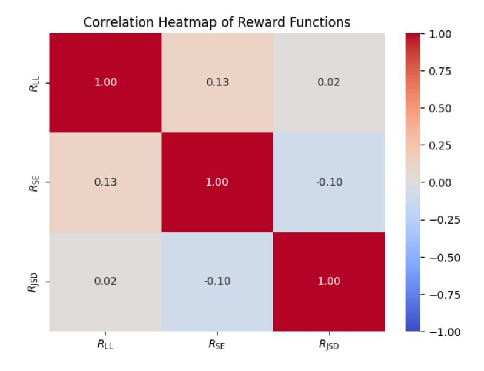

<span id="page-15-1"></span>Figure 7: Reward Functions Correlation Heatmap.

It can be seen from Figure 7 that the correlations between the three reward functions are relatively low, absolute values all below 0.15. These low correlations of reward functions make them ideal for Multi-RM method.

# <span id="page-16-0"></span>F BLOCKSWORLD DATASET

The Blocksworld dataset comprises 600 instances with varying block numbers and plan lengths. Simpler instances have 3-5 blocks, while more complex cases involve up to 25 blocks, introducing additional goals and obstacles. This setup covers a range of problem difficulties for evaluating planning algorithms.

# F.1 DIFFICULTY SETTINGS

According to settings of LLM Reasoners [\(Hao et al., 2024\)](#page-10-9), we divide the original 600 instances of Blocksworld [\(Valmeekam et al., 2024\)](#page-11-9) into two parts, Easy and Hard settings.

In the Easy Blocksworld setting, we use more friendly demonstration cases. If a problem requires a specific minimum number of steps to solve, we select other problems that require the same number of steps as demonstration cases in the context. For example, if a problem requires at least 4 steps to solve, we use other 4-step problems as demonstration examples. For each group of problems, we randomly select 10 cases to create a pool of demonstration cases, while the remaining cases form the test set (a total of 540 cases). During inference, we randomly sample 4-shot demonstration cases from this pool to construct the prompts.

In the Hard Blocksworld setting, we randomly select 10 cases from the entire dataset to create the demonstration pool. These selected cases are then excluded from the test set, leaving a total of 590 cases for testing. During inference, we randomly sample 4-shot demonstration cases from this global pool, without considering the minimum number of actions required for the test case. For example, if a problem requires at least 4 steps to solve, we may still use demonstration cases that require a different number of steps, such as 2 or 12, as there is no restriction based on the number of actions.

### domain\_intro:

### I am playing with a set of objects. Here are the actions I can do:

pick up a block unstack a block from on top of another block put down a block stack a block on top of another block

#### I have the following restrictions on my actions:

To perform the Pick Up action, the block must be clear, on the table, and my hand must be empty. Once the Pick Up action is performed, I am holding the block, and my hand is no longer empty.

To perform the Unstack action, the block must be clear, on top of another block, and my hand must be empty. Once the Unstack action is performed, I am holding the block, and my hand is no longer empty.

To perform the Put Down action, I must be holding a block. Once the Put Down action is performed, the block is on the table, my hand is empty, and the block becomes clear.

To perform the Stack action, I must be holding a block, and the block I want to stack it on must be clear. Once the Stack action is performed, the block is on top of another block, my hand is empty, and the block on top is no longer clear.

Table 5: Normal Blocksworld Task Setting

# F.2 PROMPTS SETTINGS OF EASY BLOCKSWORLD

#### Input Instructions:

I am playing with a set of blocks where I need to arrange the blocks into stacks. Here are the actions I can do:

- 1. Pick up a block
- 2. Unstack a block from on top of another block
- 3. Put down a block
- 4. Stack a block on top of another block

I have the following restrictions on my actions:

- 1. I can only pick up or unstack one block at a time.
- 2. I can only pick up or unstack a block if my hand is empty.
- 3. I can only pick up a block if the block is on the table and the block is clear. A block is clear if the block has no other blocks on top of it and if the block is not picked up.
- 4. I can only unstack a block from on top of another block if the block I am unstacking was really on top of the other block.
- 5. I can only unstack a block from on top of another block if the block I am unstacking is clear.

Once I pick up or unstack a block, I am holding the block.

- 1. I can only put down a block that I am holding.
- 2. I can only stack a block on top of another block if I am holding the block being stacked.
- 3. I can only stack a block on top of another block if the block onto which I am stacking the block is clear.

Once I put down or stack a block, my hand becomes empty.

#### [STATEMENT]

As initial conditions I have that, the red block is clear, the hand is empty, the blue block is on top of the orange block, the red block is on the table, the orange block is on the table and the yellow block is on the table.

My goal is to have that the orange block is on top of the blue block. My plan is as follows: [End Of STATEMENT]

# [PLAN]

unstack the blue block from on top of the orange block put down the blue block pick up the orange block stack the orange block on top of the blue block [PLAN END]

# [STATEMENT]

As initial conditions I have that, the red block is clear, the yellow block is clear, the hand is empty, the red block is on top of the blue block, the yellow block is on top of the orange block, the blue block is on the table and the orange block is on the table.

My goal is to have that the orange block is on top of the red block. My plan is as follows: [End Of STATEMENT]

#### Output format:

[PLAN] [LLM Completion] [PLAN\_END]

Table 6: The Prompt Settings for Easy Blocksworld

# F.3 PROMPTS SETTINGS OF HARD BLOCKSWORLD

#### Input Instructions:

I am playing with a set of blocks where I need to arrange the blocks into stacks. Here are the actions I can do:

- 1. Pick up a block
- 2. Unstack a block from on top of another block
- 3. Put down a block
- 4. Stack a block on top of another block

I have the following restrictions on my actions:

- 1. I can only pick up or unstack one block at a time.
- 2. I can only pick up or unstack a block if my hand is empty.
- 3. I can only pick up a block if the block is on the table and the block is clear. A block is clear if the block has no other blocks on top of it and if the block is not picked up.
- 4. I can only unstack a block from on top of another block if the block I am unstacking was really on top of the other block.
- 5. I can only unstack a block from on top of another block if the block I am unstacking is clear.

Once I pick up or unstack a block, I am holding the block.

- 1. I can only put down a block that I am holding.
- 2. I can only stack a block on top of another block if I am holding the block being stacked.
- 3. I can only stack a block on top of another block if the block onto which I am stacking the block is clear.

Once I put down or stack a block, my hand becomes empty.

#### [STATEMENT]

As initial conditions I have that, the blue block is clear, the hand is empty, the blue block is on top of the red block, the red block is on the table, the orange block is on the table and the yellow block is on the table.

My goal is to have that the blue block is on top of the orange block. My plan is as follows: [End Of STATEMENT]

### [PLAN]

unstack the blue block from on top of the red block stack the blue block on top of the orange block [PLAN END]

# [STATEMENT]

As initial conditions I have that, the red block is clear, the yellow block is clear, the hand is empty, the red block is on top of the blue block, the yellow block is on top of the orange block, the blue block is on the table and the orange block is on the table.

My goal is to have that the orange block is on top of the red block. My plan is as follows: [End Of STATEMENT]

#### Output format:

[PLAN] [LLM Completion] [PLAN\_END]

Table 7: The Prompt Settings for Hard Blocksworld

# <span id="page-19-0"></span>G OPENAI API DATA

| Difficulty    | Model   | USD per instance | Total Experiment Cost (USD) |  |  |
|---------------|---------|------------------|-----------------------------|--|--|
|               | GPT-4o  | \$0.0032         | \$1.73                      |  |  |
| Easy (0-shot) | o1-mini | \$0.0136         | \$7.34                      |  |  |
|               | GPT-4o  | \$0.0062         | \$3.35                      |  |  |
| Easy (4-shot) | o1-mini | \$0.0171         | \$9.23                      |  |  |
|               | GPT-4o  | \$0.0032         | \$1.89                      |  |  |
| Hard (0-shot) | o1-mini | \$0.0177         | \$10.44                     |  |  |
|               | GPT-4o  | \$0.0063         | \$3.70                      |  |  |
| Hard (4-shot) | o1-mini | \$0.0172         | \$10.15                     |  |  |

Table 8: OpenAI API cost of experiments on the Blocksworld dataset.

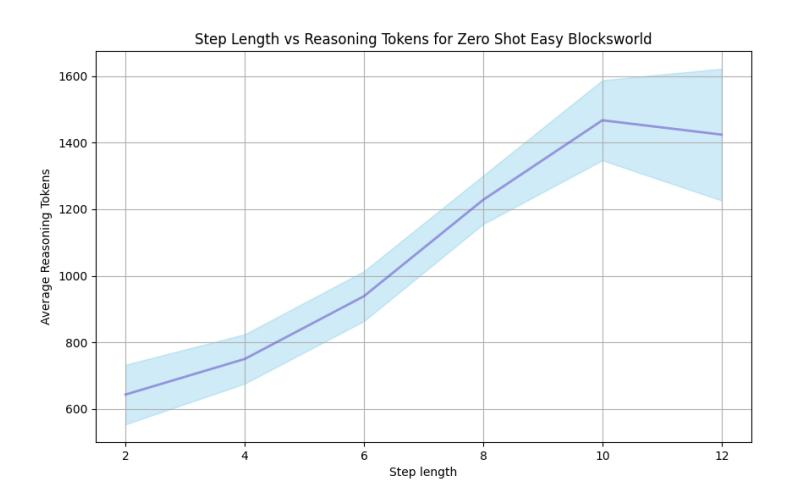

Figure 8: o1-mini Step Length vs Reasoning Tokens for Zero Shot in Easy Blocksworld

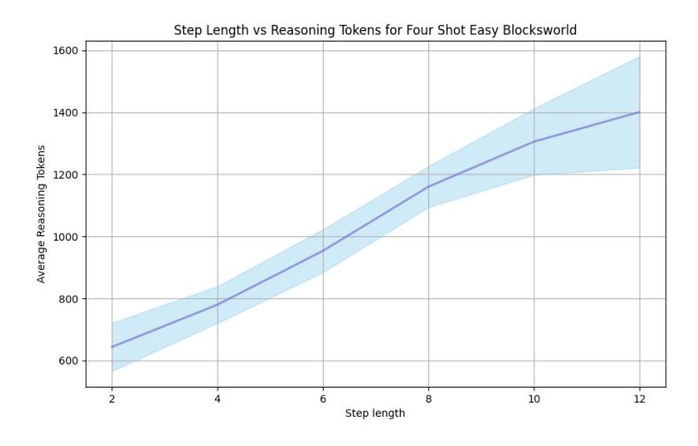

Figure 9: o1-mini Step Length vs Reasoning Tokens for Four Shot in Easy Blocksworld

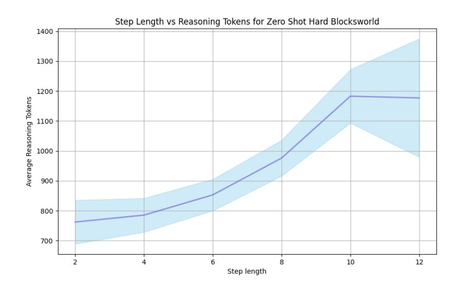

Figure 10: o1-mini Step Length vs Reasoning Tokens for Zero Shot in Hard Blocksworld

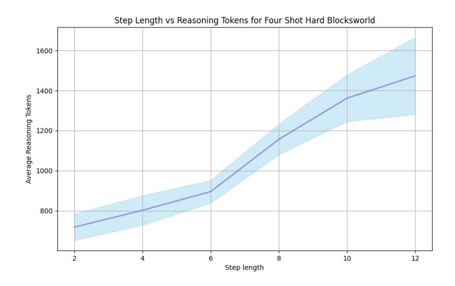

Figure 11: o1-mini Step Length vs Reasoning Tokens for Four Shot in Hard Blocksworld

# H GPU USAGE

In the main experiments, the total GPU usage (measured in GPU hours) for different models on NVIDIA H800 SXM5 80GB GPUs shows a clear progression with model size. For RAP-MCTS, Llama-3 70B requires approximately 420 GPU hours across all steps and difficulty modes, Llama-3.1 70B model requires approximately 450 GPU hours. For SC-MCTS<sup>∗</sup> , Llama-3 70B requires approximately 280 GPU hours across all steps and difficulty modes and difficulty modes, Llama-3.1 70B model requires approximately 300 GPU hours. For CoT, Llama-3-70B and Llama-3.1-70B both takes approximately 7 GPU hours across all steps and difficulty modes, while Llama-3.1 405B model exhibits significantly higher GPU usage, amounting to approximately 75 GPU hours. In the parameter research and algorithm development phase before main experiments, we consumed a total of around 800 GPU hours on NVIDIA A100 SXM4 80GB GPUs.

# <span id="page-21-0"></span>I FUTURE WORK

In future work, we can explore utilizing more metrics-based reward models (such as the three reward models discussed in this paper) with LM-based reward models (such as Critic LLM [\(McAleese et al.,](#page-10-10) [2024\)](#page-10-10) and Eurus [\(Yuan et al., 2024b\)](#page-12-10)). Additionally, there is potential to design more general methods for splitting steps in other tasks and datasets. Since step-splitting is the most challenging part of MCTS multi-step reasoning generalization, although we conducted extensive experiments on the Blocksworld multi-step reasoning dataset, which is the most suitable dataset for studying MCTS multi-step reasoning as far as we know. Some previous works have attempted to use datasets like GSM8K and MATH through extensive adaptation efforts on the datasets themselves, however, we aim to design a more general method from the perspective of step-splitting. We hope that MCTS multistep reasoning will achieve the same level of generalization as CoT, which remains a fundamental area for future research. Future work can also attempt to combine this approach with the fine-grained compositional reasoning framework [\(Chen et al., 2024\)](#page-10-11) to further explore the boundaries of MCTS multi-step reasoning capabilities.