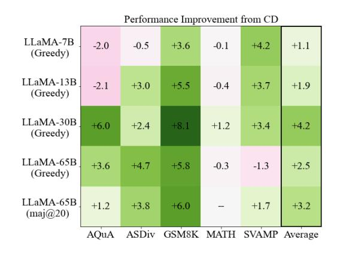
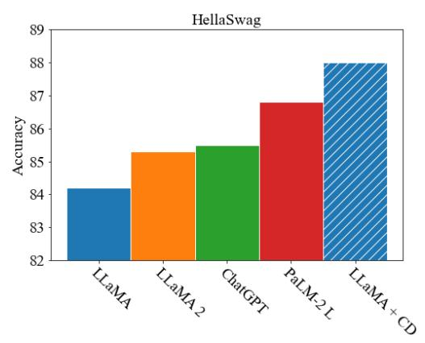
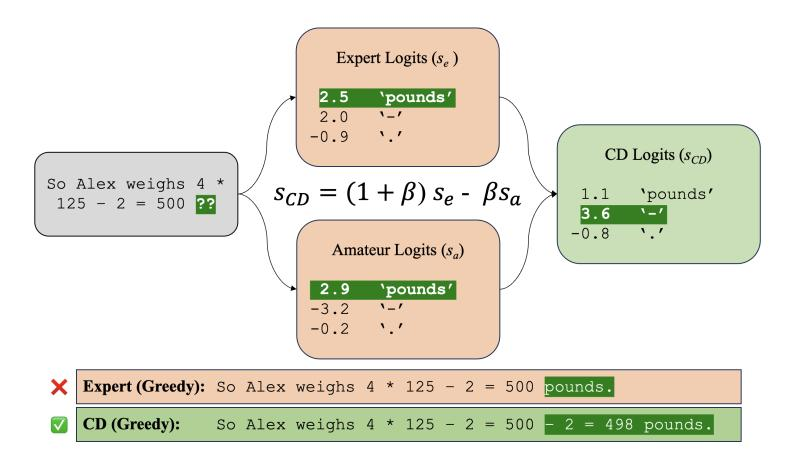
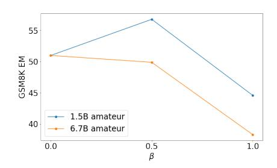
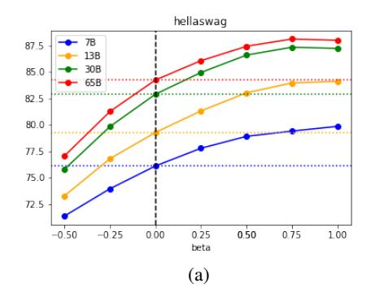
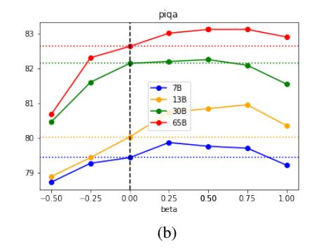
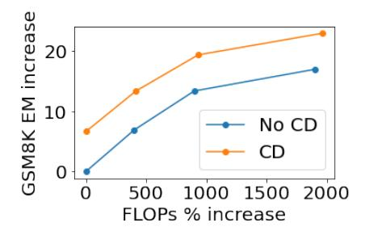
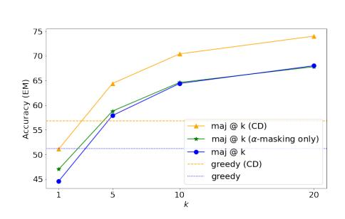
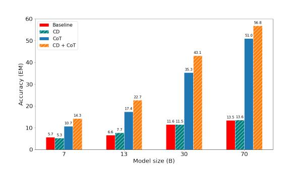
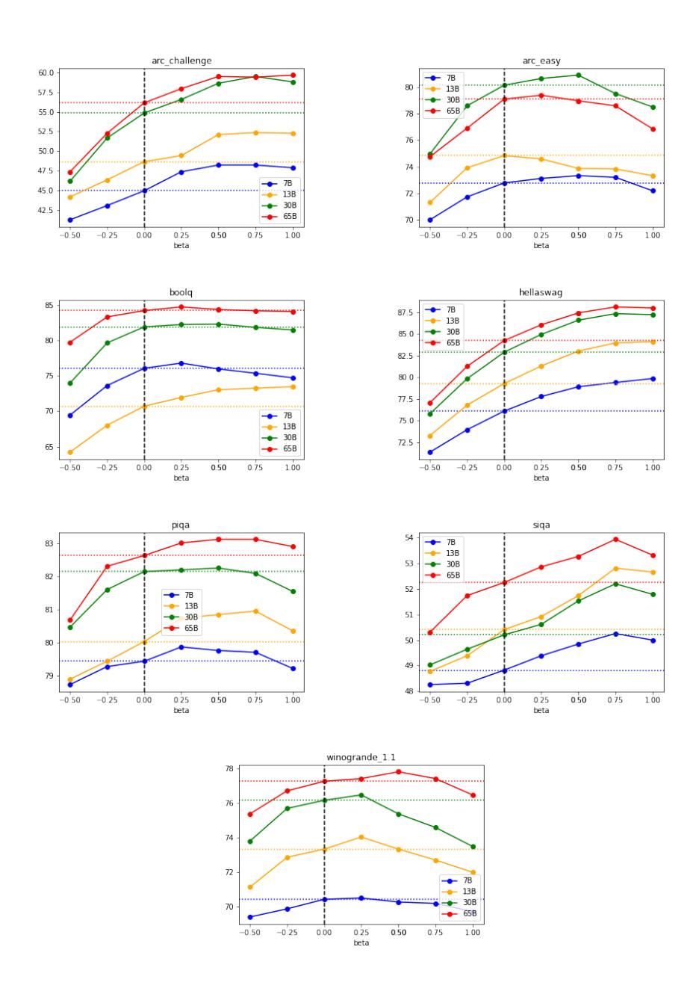

# <span id="page-0-0"></span>CONTRASTIVE DECODING IMPROVES REASONING IN LARGE LANGUAGE MODELS

Sean O'Brien1, 2 <sup>∗</sup> Mike Lewis<sup>2</sup> <sup>1</sup>University of California, San Diego <sup>2</sup>Meta AI seobrien@ucsd.edu, mikelewis@meta.com

### ABSTRACT

We demonstrate that Contrastive Decoding [\(Li et al., 2022\)](#page-10-0) – a simple, computationally light, and training-free text generation method – achieves large out-of-thebox improvements over greedy decoding on a variety of reasoning tasks. Originally shown to improve the quality of open-ended text generation, Contrastive Decoding searches for strings that maximize a weighted difference in likelihood between strong and weak models. We show that Contrastive Decoding allows LLaMA-65B to outperform LLaMA 2, GPT-3.5 and PaLM 2-L on the HellaSwag commonsense reasoning task, and to outperform LLaMA 2, GPT-3.5 and PaLM-540B on the GSM8K math word reasoning benchmark. Analysis suggests that Contrastive Decoding improves over existing methods by avoiding simpler modes such as copying sections of the input during chain-of-thought, instead performing more abstract reasoning. Overall, Contrastive Decoding outperforms nucleus sampling for long-form generation, and greedy decoding for reasoning tasks, making it a powerful general purpose method for generating text from language models.





Figure 1: Contrastive decoding improves reasoning across model scales and reasoning tasks.

Figure 2: Contrastive decoding significantly improves performance on HellaSwag, a standard commonsense reasoning benchmark.

# 1 INTRODUCTION

Text is generated from large language models (LLMs) in different ways for different tasks. For openended text generation tasks, truncated sampling is normally used, as the most likely strings under a model tend to be short and uninteresting [Holtzman et al.](#page-10-1) [\(2020\)](#page-10-1). For reasoning problems, greedy decoding is normally preferred, to avoid risking sampling errors. This bifurcation is undesirable; for example it increases the likelihood of reasoning errors during open-ended generation.

<sup>∗</sup>Work done as an AI resident at Meta.

We explore the use of Contrastive Decoding [\(Li et al., 2022\)](#page-10-0) for solving reasoning problems with LLMs. Contrastive Decoding attempts to find strings that maximize a weighted difference in likelihood between a stronger *expert* and a weaker *amateur* model, and was shown by Li et al. to outperform existing methods for open-ended text generation. It achieves this by avoiding undesirable modes of the expert model's distributions, such as short or generic strings, which tend to be the most likely under any model, including the amateur.

We show that Contrastive Decoding outperforms greedy decoding on reasoning problems by a wide margin. On GSM8K, a widely used benchmark consisting of grade-school word math problems, contrastive decoding improves the performance of various LLaMA models by up to 8 absolute percentage points. This outperforms LLaMA 2, which has 5 billion more parameters and is trained on 40% more data. On HellaSwag, LLaMA with contrastive ranking not only beats LLaMA 2 but outperforms all models other than GPT-4, including PaLM-2 Large. We find general improvement on arithmetic reasoning and multiple-choice ranking tasks, including on models as large as LLaMA-65B, suggesting that Contrastive Decoding could bring such widespread improvements to much larger models.

This improvement can be interpreted in a number of ways. If the amateur and expert models have roughly the same distribution of scores, then scaling the contrastive penalty by a factor β < 1 will usually preserve the expert's greedy prediction. Thus, Contrastive Decoding only changes the greedy prediction when when the expert's assigned scores differ significantly from the amateur's. In this case, we can reasonably assume that the expert predictions are more trustworthy than the amateur predictions, and thus safely boost the tokens that the expert prefers relative to the amateur. Empirically, we find that Contrastive Decoding performs less surface-level copying from the prompt than greedy decoding and misses fewer reasoning steps. Our current method yields mixed results for commonsense reasoning tasks and slightly degrades factual retrieval, both trends that encourage further examination and improvement of the method.

Overall, we show that Contrastive Decoding not only substantially improves LLM accuracies on a range of benchmarks, but is also the first generation algorithm to achieve state-of-the-art results in both reasoning and text generation problems. These results allow a more unified method for improving generation from language models across tasks.



Figure 3: CD accentuates what the expert model has learned that the amateur model has not.

# 2 CONTRASTIVE DECODING

### 2.1 SIMPLIFIED FORMULATION

The original formulation from [Li et al.](#page-10-0) [\(2022\)](#page-10-0) explicitly chooses two parameters: α and the intermediate temperature of the amateur distribution τa, with the intermediate temperature of the expert fixed at τ<sup>e</sup> = 1. We slightly refactor the hyperparameter choice to be more interpretable and simplify the algorithm by working directly in logit space.

Let  $s_a^{(i)}$  and  $s_e^{(i)}$  be the unnormalized scores (logits) assigned to token i by the amateur and expert models, respectively.  $\alpha$  is the same hyperparameter in the original paper: a proportion of the maximum probability assigned by the expert model, with any tokens assigned a lower probability masked out.  $\beta$  is a hyperparameter corresponding to the strength of the amateur penalty. We include a leading  $(1+\beta)$  coefficient to the expert logits to decouple the strength of the contrastive penalty from the expected scale of the output logits, cleanly delineating between the contrastive tradeoff from a temperature we use for sampling. This matches the formulation of DExperts work (Liu et al., 2021), with our expert model serving both as the base prior and steering expert.

A PyTorch implementation for this formulation, as well as the original, can be found in subsection A.1 of the appendix. Our implementation takes three lines of readable code.

#### 2.2 PROBABILISTIC INTERPRETATION

Our version of  $\alpha$ -masking has the same interpretation as the original, given that the expert temperature is fixed to  $\tau_e = 1$ . If we let  $p_e^{(i)}$  correspond to the post-softmax probability that the expert assigns to token i, the valid set is equivalently:

$$V_{valid} = \left\{ j \in V, p_e^{(j)} \ge \frac{1}{\alpha} \max_{k \in V} p_e^{(k)} \right\}$$

Further, we can consider the post-softmax probabilities produced by CD as a perturbation of the probabilities predicted by the expert model. Not including alpha-masking, the probability assigned to token i by CD can be expressed as a normalized adjustment of the probability assigned by the expert model:

$$p_{CD}^{(i)} \propto p_e^{(i)} \left(\frac{p_e^{(i)}}{p_a^{(i)}}\right)^{\beta} \tag{1}$$

From this interpretation it is also clear that as  $\beta \to 0$  the contrastive penalty disappears, and as  $\beta \to \infty$  the distribution collapses to the argmax of  $\frac{p_e^{(i)}}{p_a^{(i)}}$ , which is the original formulation of contrastive decoding from Li et al. (2022).

#### 3 EXPERIMENTS

#### 3.1 EXPERIMENTAL SETUP

**Models.** We use untuned models from the LLaMA family (Touvron et al., 2023) at all scales. Unless otherwise stated, we use an untuned LLaMA-65B as the expert and an untuned, LLaMA-architecture model with 1.5B parameters trained on the same data as the other LLaMA models as an amateur. For one ablation study, we use models from the FLAN-T5 family (Chung et al., 2022).

**Decoding Parameters.** We set  $\beta=0.5$  and  $\alpha=0.1$  for all experiments unless otherwise stated. We use greedy decoding, except for self-consistency experiments for which we sample at  $\tau=0.7$  following Touvron et al. (2023).

Prompting. For generation tasks, we use 8-shot chain-of-thought prompting, in line with [Tou](#page-11-2)[vron et al.](#page-11-2) [\(2023\)](#page-11-2). The examples are the same as in LLaMA for tasks contained in that paper, and taken from [Wei et al.](#page-11-3) [\(2023\)](#page-11-3) for other mathematical tasks.

Datasets. Following prior works, we evaluate on a number of datasets. The following tasks measure performance on algebraic word problems: AQuA [\(Ling et al., 2017\)](#page-11-4), ASDiv [\(Miao et al.,](#page-11-5) [2021\)](#page-11-5), GSM8K [\(Cobbe et al., 2021\)](#page-10-3), and SVAMP [\(Patel et al., 2021\)](#page-11-6). We also evaluate on MATH [\(Hendrycks et al., 2021b\)](#page-10-4), a larger and more challenging benchmark.

For commonsense reasoning, we measure open-ended performance on CommonsenseQA [\(Talmor](#page-11-7) [et al., 2019\)](#page-11-7) and StrategyQA [\(Geva et al., 2021\)](#page-10-5). We also evaluate on a battery of multiple-choice benchmarks: both the easy and challenge splits of the AI2 Reasoning Challenge dataset [\(Clark](#page-10-6) [et al., 2018\)](#page-10-6), BoolQ [\(Clark et al., 2019\)](#page-10-7), HellaSwag [\(Zellers et al., 2019\)](#page-11-8), MMLU [\(Hendrycks](#page-10-8) [et al., 2021a\)](#page-10-8), PIQA [\(Bisk et al., 2019\)](#page-10-9), SIQA [\(Sap et al., 2019\)](#page-11-9), and WinoGrande [\(Sakaguchi](#page-11-10) [et al., 2019\)](#page-11-10).

### 3.2 HYPERPARAMETER SELECTION

The size of the amateur model relative to the expert model should strongly affect performance. If the amateur model is too weak, it may not effectively model the failure modes of the expert and thus will fail to help. If the amateur model is too strong, then contrastive decoding will penalize the good behavior that it exhibits. [Li et al.](#page-10-0) [\(2022\)](#page-10-0) conduct a similar study for open-ended text generation and find that a larger gap between the amateur and expert model is strongest, up to a point; replacing the amateur with an n-gram model harms performance.

We find a similar pattern. Performance on GSM8K improves with the 1.5B amateur, but is slightly harmed when using a 7B amateur. Performance degrades further when setting β = 1, following the trends we found in the more extensive hyperparameter sweeps. See Table [4.](#page-3-0) We find that for reasonable values of β, performance is fairly insensitive to α; we use α = 0.05 for our experiments.

The best result on GSM8K, with 8-shot LLaMA-65B and β = 0.25, is 57.7 (Table [1\)](#page-3-0), outperforming 8-shot PaLM-540B (56.5), LLaMA-2 (56.8) and 5-shot GPT-3.5 (57.1). [\(Anil et al., 2023;](#page-10-10) [OpenAI,](#page-11-11) [2023\)](#page-11-11)

<span id="page-3-0"></span>

| β = 0 | β = 0.25 |      | β = 1   |
|-------|----------|------|---------|
| 10.7  | 11.5     | 13.6 | 11.0    |
| 17.0  | 21.0     | 22.9 | 20.4    |
| 35.2  | 40.0     | 43.4 | 42.0    |
| 51.0  | 57.7     | 56.8 | 44.6    |
|       |          |      | β = 0.5 |

Figure 4: While a small amateur helps performance, a large amateur can harm performance.

Table 1: Results on GSM8K. β = 0.5 tends to give good results across expert sizes.

We perform an extensive hyperparameter sweep for the multiple-choice ranking tasks, finding an optimal value of roughly β = 0.5. This value did vary from task to task, with some tasks benefiting from higher β values. A full accounting of performance across multiple-choice tasks and beta values is shown in [Appendix B.](#page-14-0)

### 3.3 ARITHMETIC REASONING

We find that contrastive decoding tends to help across the board on arithmetic reasoning tasks. One exception to this is the MATH dataset, which proves to be challenging for both standard and contrastive decoding. We conjecture that because contrastive decoding amplifies skills that the expert has learned better than the amateur, it cannot help on tasks that are well beyond the expert's abil-





Figure 5: Two examples of sweeping through  $\beta$  values on multiple-choice reasoning tasks across model scales. Dashed horizontal lines mark performance without contrastive decoding.

ity. The most consistent gains are found when sampling and taking the majority vote (Wang et al., 2023b).

| Model             | CD       | AQuA               | ASDiv              | GSM8K              | MATH              | SVAMP              | Average            |
|-------------------|----------|--------------------|--------------------|--------------------|-------------------|--------------------|--------------------|
| 7B                | X        | 21.0*              | 40.2               | 10.7               | 3.0               | 27.3               | 20.4               |
| 13B               | X        | 18.1*              | 49.0               | 17.4               | 4.2               | 39.4               | 25.6               |
| 30B               | X        | 23.8               | 60.1               | 35.3               | 6.9               | 55.9               | 36.4               |
| 65B               | X        | 33.3               | 67.2               | 51.0               | 10.6              | 69.1               | 46.2               |
| <b>65B</b> maj@20 | X        | 38.2               | 73.6               | 68.0               | _†                | 77.3               | 64.3               |
| 7B                | <b>✓</b> | 19.0* (-2.0)       | 39.7 (-0.5)        | <b>14.3</b> (+3.6) | 2.9 (-0.1)        | <b>31.5</b> (+4.2) | <b>21.5</b> (+1.1) |
| 13B               | ✓        | 16.0* (-2.1)       | <b>52.0</b> (+3.0) | <b>22.7</b> (+5.5) | 3.8 (-0.4)        | <b>43.1</b> (+3.7) | <b>27.5</b> (+1.9) |
| 30B               | ✓        | <b>29.8</b> (+6.0) | <b>62.5</b> (+2.4) | <b>43.1</b> (+8.1) | <b>8.1</b> (+1.2) | <b>59.3</b> (+3.4) | <b>40.6</b> (+4.2) |
| 65B               | ✓        | <b>36.9</b> (+3.6) | <b>71.9</b> (+4.7) | <b>56.8</b> (+5.8) | 10.3 (-0.3)       | 67.8 (-1.3)        | <b>48.7</b> (+2.5) |
| <b>65B</b> maj@20 | ✓        | <b>39.4</b> (+1.2) | <b>77.4</b> (+3.8) | <b>74.0</b> (+6.0) | _†                | <b>79.0</b> (+1.7) | <b>67.5</b> (+3.2) |

Table 2: Results on math generation tasks. Contrastive decoding generally improves performance.

### 3.4 COMMONSENSE REASONING

Results are more mixed for CommonsenseQA and StrategyQA. For both of these tasks, we 8-shot prompt our model and compute the exact match score against the ground-truth answers. We find that contrastive decoding harms performance for smaller models, but that this harm equalizes somewhat for the 65B model and evens out when using self-consistency. See Table 3 for full results.

#### 3.5 Contrastive Ranking

We further evaluate a contrastive objective as a scoring function to rank answers to multiple-choice questions. These tasks are performed zero-shot, and instead of open-ended generation the model scores each potential completion, length-normalizing following Touvron et al. (2023). We find comparable performance across most tasks, with more substantive gains on HellaSwag and ARC-Challenge. Notably, on HellaSwag CD leads LLaMA-65B to score 88.0, which outperforms LLaMA-2 (85.3), GPT-3.5 (85.5) (OpenAI, 2023) and PALM 2-Large (86.8) (Anil et al., 2023).

 $<sup>^*</sup>$ In the AQuA task, the model selects one out of five given options. Thus the random baseline is 20%, and results below that threshold are not meaningful.

<sup>&</sup>lt;sup>†</sup>Given the size of the dataset and length of generations, we do not evaluate maj @ 20 on MATH.

<span id="page-5-0"></span>

| Model             | CD | CSQA               | StrategyQA         | Average            |
|-------------------|----|--------------------|--------------------|--------------------|
| 7B                | Х  | 40.0               | 59.2               | 49.6               |
| 13B               | X  | 60.4               | 64.5               | 62.5               |
| 30B               | X  | 66.4               | <b>68.7</b>        | 67.6               |
| 65B               | X  | 77.5               | 69.5               | 73.5               |
| <b>65B</b> maj@20 | X  | 77.0               | 79.3               | 78.2               |
| 7B                | /  | 37.3 (-2.7)        | 58.3 (-0.9)        | 47.8 (-1.8)        |
| 13B               | 1  | 58.5 (-1.9)        | <b>65.5</b> (+1.0) | 62.0 (-0.5)        |
| 30B               | 1  | 62.8 (-3.6)        | 67.6 (-1.1)        | 65.2 (-2.4)        |
| 65B               | 1  | 77.1 (-0.4)        | <b>71.5</b> (+2.0) | <b>74.3</b> (+0.8) |
| <b>65B</b> maj@20 | ✓  | <b>77.9</b> (+0.9) | <b>79.3</b> (+0.0) | <b>78.6</b> (+0.4) |

Table 3: Results for commonsense generation tasks. CD harms performance with smaller experts, but evens out somewhat with larger experts.

| β   | CD       | ARC-E | ARC-C | BoolQ | HSwag | PIQA | SIQA | WGrande | MMLU | Average            |
|-----|----------|-------|-------|-------|-------|------|------|---------|------|--------------------|
| 0.0 | Х        | 79.1  | 56.1  | 84.2  | 84.2  | 82.6 | 52.3 | 77.3    | 63.5 | 72.4               |
| 0.5 | <b>√</b> | 79.0  | 59.5  | 84.3  | 87.4  | 83.1 | 53.3 | 77.8    | 63.4 | <b>74.9</b> (+1.2) |
| 1.0 | ✓        | 76.9  | 59.7  | 84.1  | 88.0  | 82.9 | 53.3 | 76.5    | 63.2 | 74.5 (+0.8)        |

Table 4: Results on multiple-choice reasoning tasks. CD generally provides a modest boost.

### 4 Additional Studies

#### 4.1 Effects of CD

CD is worse at arithmetic but better at logical reasoning. We conduct a manual error analysis of 100 randomly selected examples from the GSM8K set between continuations from greedy decoding and CD-greedy decoding ( $\beta=0.5, \alpha=0.05$ ). We follow Wang et al. (2023a) and categorize wrong answers as primarily being due to an arithmetic error, a missing step or a semantic misunderstanding. We add one category of "degeneration," chosen when the model lapses into excessive repetition. Our small-scale analysis finds that CD makes more arithmetic errors, but that this is offset by better semantic reasoning and fewer missing steps (see Table 5).

<span id="page-5-1"></span>

| CD       | Arithmetic | Missing Step | Semantic | Degeneration | Total Errors |
|----------|------------|--------------|----------|--------------|--------------|
| X        | 4%         | 22%          | 24%      | 4%           | 54%          |
| <b>√</b> | 8%         | 20%          | 21%      | 3%           | 52%          |

Table 5: Proportion of errors out of the same 100 random, manually-analyzed GSM8K examples. CD makes more errors evaluating arithmetic, but omits fewer steps and avoids semantic misunderstandings.

To further explore the claim that the benefit of CD does not stem from arithmetic evaluation, we generate a toy dataset of 1,0000 multiplication and subtraction equations with operands up to four digits and then 8-shot prompt models to complete the expression, measuring exact match accuracy. We find that CD does not improve performance on this task, and in fact may degrade it slightly. Results are shown in Table 8.

**CD reduces copying from the prompt.** We analyze 26,000 sampled generations from CD-sampling on GSM8K against the corresponding set from temperature sampling; both of these sets of generations are used in our self-consistency study. We find that responses are roughly the same length and follow the few-shot template roughly the same proportion of the time. This rules out the hypothesis that contrastive decoding simply leads the model to follow the template better, prevents degeneration or induces longer answers with more reasoning steps. Further, we run an automatic evaluation of greedy generations using ROSCOE (Golovneva et al., 2022) but do not find significant differences in any of these metrics. Motivated by manual examinations of outputs, we measure the precision and recall of the tokens in the prompt by the sampled generations. We find that CD system-

atically reduces token-level copying from the prompt. This may be related to increased reasoning ability, as surface-level copying from the prompt does not provide new information to the problem.

|                 | Standard | CD    |
|-----------------|----------|-------|
| Correct %       | 44.6     | 51.1  |
| Parseable %     | 95.2     | 95.6  |
| Average # chars | 215.2    | 217.2 |

Standard CD 0.2 0.1

from sampled generations on GSM8K. Responses are similar lengths, despite the performance improvement from CD.

Table 6: High-level generation statistics Figure 6: CD reduces copying from the prompt in the generation, as measured by n-gram overlap on GSM8K generations.

CD harms factual recall. Our primary claim is that contrastive decoding improves chain-ofthought reasoning. However, we also test results on two pure factual-recall tests that do not utilize chain-of-thought: OpenBookQA (Mihaylov et al., 2018) and TriviaQA (Joshi et al., 2017). Open-BookQA ("OBQA"), is a multiple-choice completion task, while TriviaQA is a 5-shot generation task.

<span id="page-6-0"></span>Table 7: CD harms performance on factual recall tasks.

57.8 (-2.4)

 $\overline{\text{CD}}$ 

| dai recan tasks. |      | prove     |  |    |
|------------------|------|-----------|--|----|
|                  | OBQA | TriviaQA* |  | CI |
|                  | 60.0 | 72.2      |  | Х  |

69.9 (-2.1)

Table 8: Scores on evaluating pure arithmetic expressions without chainof-thought. CD does not yield improved results.

| CD | 7B   | 13B  | 30B  | 65B  |
|----|------|------|------|------|
| X  | 31.0 | 36.3 | 52.3 | 58.4 |
| 1  | 30.9 | 35.6 | 52.2 | 57.6 |

CD outperforms other reasoning enhancements in FLOP efficiency. We note that contrastive decoding introduces relatively little overhead in comparison to other reasoning-enhancing methods. We estimate that with a 1.5B amateur and 65.2B expert, contrastive decoding increases the total number of FLOPs by 3.25% (see section  $\,$  C of the appendix).

This compares favorably to self-consistency, which requires several extra full generation loops. Even chain-of-thought increases computation drastically; on GSM8K, responses with chain-of-thought prompts were on average seven times longer than those with no chain-of-thought prompts (215.0 characters vs. 30.7).

To measure the efficiency of improvement, we define an efficiency ratio r equal to the ratio increase in performance over the ratio increase in FLOPs. That is, if for two methods that require  $f_1, f_2$  flops and achieve  $p_1, p_2$  performance, we have

<span id="page-6-1"></span>
$$r := \left(\frac{p_2}{p_1}\right) \left(\frac{f_1}{f_2}\right) \tag{2}$$

We show in Figure 7 and Table 9 that CD is significantly more efficient than self-consistency.

### 4.2 ABLATION STUDIES

 $\alpha$ -masking alone is not enough. For greedy decoding, we have shown that results are not sensitive to  $\alpha$ . However, when sampling and performing in self-consistency  $\alpha$ -masking may play a larger

<sup>\*</sup>On manual examination, we find the set of correct answers provided by TriviaOA to be insufficient. Randomly sampling 100 supposedly incorrect answers generated by CD and standard decoding, we find roughly half are in fact correct (46/100 with CD and 49/100 without). A rough linear extrapolation gives us estimates for non-CD and CD scores of 85.8 and 83.7, respectively.

<span id="page-7-0"></span>

| Augmentation | r     |
|--------------|-------|
| maj @ 5      | 0.227 |
| maj @ 10     | 0.126 |
| maj @ 20     | 0.067 |
| CD           | 1.096 |

Figure 7: FLOP increases from CD and selfconsistency. CD achieves similar or better performances with a smaller increase in FLOPs.

Table 9: CD outperforms self-consistency in FLOPefficiency (see eq. [2\)](#page-6-1).

role. A natural question arises: could it be the case that some portion of the gain comes purely from α-masking and not the contrastive objective?

To answer this, we set β = 0 but α = 0.1; that is, we mask out candidates based on the expert but do not apply the contrastive objective. When sampling one path, we expect α-masking to improve over temperature sampling alone as it eliminates unlikely results and thus provides a closer approximation to greedy sampling. This holds, but as we increase the number of paths we find no benefit from αmasking alone. This suggests that the contrastive objective, and not α-masking, is the primary source of improved self-consistency results. See Figure [8](#page-7-1) for results of this ablation.

<span id="page-7-1"></span>



Figure 8: GSM8K scores via temperature sampling and maj @ k with various values of k. α-masking alone does not yield significant improvement, while full CD does.

Figure 9: Comparison of GSM8K scores with LLaMA-65B, both with and without chain-ofthought prompts. CD only helps when using CoT.

CD requires chain-of-thought prompting to improve results. We next study whether there are contrastive decoding provides an advantage in the absence of chain-of-thought prompting.

We remove the chains of thought from the GSM8K fewshot prompt, and find that as expected performance drops for both standard and contrastive decoding. Without chains of thought, there is no consistent improvement from contrastive decoding. As with the problems from the MATH dataset, answering arithmetic problems without explicit reasoning steps may be too challenging of a task for the expert model, and thus leave too small a gap between the expert and amateur to contrastively exploit. See Figure [9](#page-7-1) for full results.

CD can benefit non-LLaMA models. We conduct one small proof-of-concept study to show that CD can benefit models outside of the LLaMA family. For this study, we choose the FLAN-T5 family as it is open-source, has a wide range of model sizes that share a single tokenizer, and obtains good performance on chain-of-thought reasoning tasks. We use FLAN-T5-XXL (11B) as the expert model and FLAN-T5-Small (80M) as amateur. We evaluate on GSM8K using prompts from [Fu](#page-10-13) [et al.](#page-10-13) [\(2023\)](#page-10-13); note that GSM8K is within the set of tasks that FLAN-T5 is finetuned on.

CD provides a slight boost in performance, as seen in Table [Table 11.](#page-8-0) We leave more extensive experiments on other families of models, including the establishing of a scaling law for contrastive decoding, to future work.

<span id="page-8-0"></span>Table 10: Performance on a synthetic dataset of arithmetic expressions. CD slightly harms performance.

| Table 11: FLAN-T5 performance  |
|--------------------------------|
| on GSM8K. β = 0 corresponds    |
| to greedy decoding without CD. |

|          | 7B   | 13B  | 30B  | 65B  |
|----------|------|------|------|------|
| Standard | 31.0 | 36.3 | 52.3 | 58.4 |
| CD       | 30.9 | 35.6 | 52.2 | 57.6 |

| β = 0 | β = 0.5 | β = 1.0 |
|-------|---------|---------|
| 16.4  | 17.1    | 17.4    |

Low-parameter amateurs beat "negative prompting." We experiment to determine if there is a more effective weak amateur model to use for contrastive decoding. We define a set of "negative prompts" by sampling 7B model outputs on the few shot prompts and collecting the incorrect responses. We use these responses as few shot prompts to mimic the failure modes of the family of models. These negative prompts should harm the performance of models they are prompted with, and specifically bias models towards the error distribution of the 65B model.

We find that contrasting with a negative prompt does not harm performance, but does not improve it as much as contrasting with a small amateur. We experiment with a combination of the two methods, prompting a smaller amateur model with the negative prompts in an attempt to weaken it further. However, we find that this combination is outperformed by standard CD (see Table [12\)](#page-8-1).

In an ablation study, we find that negative prompting does not harm performance that much – for example, prompting a 65B model with incorrect fewshot examples on GSM8K gives a score of 41.3, which underperforms prompting with correct examples (51.2) but significantly beats non-chain-ofthought prompting (13.5). This supports the finding from [Wang et al.](#page-11-13) [\(2023a\)](#page-11-13) that even incorrect chain-of-thought rationales help performance a great bit. This suggests that a prompting strategy which better incapacitates the expert model might yield better results from negative prompting.

Mid-training checkpoints make for good amateurs. We experiment with checkpoints of a midtraining 7B-parameter LLaMA model. Even while a fully-trained 7B amateur harms performance on GSM8K, we find that a partially-trained amateur improves performance. We do not perform extensive hyperparameter sweeps here, instead reusing α = 0.1, β = 0.5 as before. We do not pursue partially-trained amateurs for our main results as results may vary based on the order of training data, but this result allows us to interpret contrastive decoding as a first-order optimization step over the output of a model, highlighting the high-level behaviors that it learns later on in the course of training. See Table [13](#page-8-1) for full results.

<span id="page-8-1"></span>Table 12: Negative prompting results on GSM8K. Negative prompting outperforms greedy decoding but weakens CD.

Table 13: Early-training checkpoints can be good amateurs, even when late-stage checkpoints harm performance.

| Expert | Greedy | NP   | CD   | CD + NP |
|--------|--------|------|------|---------|
| 7B     | 10.7   | 11.4 | 14.3 | 12.7    |
| 13B    | 17.4   | 17.5 | 22.7 | 20.7    |
| 30B    | 35.3   | 36.9 | 43.1 | 42.9    |
| 65B    | 51.0   | 52.0 | 56.8 | 54.7    |

| Amateur | Amateur Tokens | GSM8K |
|---------|----------------|-------|
| 7B      | 130B           | 57.0  |
| 7B      | 300B           | 56.8  |
| 7B      | 1.3T           | 49.9  |

CD is not more effective than perplexity as a global-level scorer. It is reasonable to ask whether optimizing more directly for CD scores would lead to better results than greedy and sampling approaches (for example, by running beam search on CD scores). We test this hypothesis by using CD to rerank twenty generations from temperature sampling on each question from a number of datasets. We find no consistent benefit from ranking by the aggregate or normalized CD scores as opposed to simpler measures like normalized expert perplexity. This suggests that the contrastive objective does not provide benefit across every token over the course of generation, with the benefit is diluted when aggregating across all tokens. Thus more global search methods to optimize the CD objective would likely fail to yield significantly better results.

# 5 RELATED WORK

Steering methods for reasoning. Other works more explicitly model the error distribution of reasoning steps and use this to steer decoding. For example GRACE [\(Khalifa et al., 2023\)](#page-10-14) uses a contrastive loss to train an external step-level discriminator, which it then uses to select between candidate steps sampled from a base model. By comparison, we do not train any model on the datasets that we evaluate here – while some datasets benefit more than others, the method itself is completely task-agnostic. Using the interpretation of contrastive decoding as mutual distinguishability between amateur and expert, we see that our method is equivalent to FUDGE [\(Yang & Klein, 2021\)](#page-11-15) where the binary predictor is an estimate of the probability that the generated token has come from the expert rather than the amateur.

Prompting Methods for Reasoning. Recent works have sought to improve reasoning in language models by various prompting strategies. (See [Qiao et al.](#page-11-16) [\(2023\)](#page-11-16) for a survey). Our initial exploration of negative prompting falls within this category, using prompting alone without the use of a separate amateur model to improve results. We work heavily with chain-of-thought prompting [\(Wei et al., 2023\)](#page-11-3) and self-consistency [\(Wang et al., 2023b\)](#page-11-12) throughout our experiments.

Sampling methods Several decoding methods exist to improve the quality of generations from large language models. For open-ended generation, truncated sampling schemes like top-k sampling [\(Fan et al., 2018\)](#page-10-15), nucleus sampling [\(Holtzman et al., 2020\)](#page-10-1) and typical sampling [\(Meister et al.,](#page-11-17) [2023\)](#page-11-17) have been shown to reduce repetition in comparison to greedy decoding and beam search while producing more coherent generations than standard temperature sampling. For reasoning tasks, greedy decoding is typically used for maj @ 1 results, with various temperature sampling methods used for maj @ k. [\(Wei et al., 2023;](#page-11-3) [Wang et al., 2023b;](#page-11-12) [Anil et al., 2023\)](#page-10-10)

Contrastive Generation Methods. The works most similar to ours are DExperts [\(Liu et al.,](#page-11-0) [2021\)](#page-11-0), and the original contrastive decoding work [\(Li et al., 2022\)](#page-10-0). Our formulation's objective can be interpreted as a special case of DExperts, using the larger model as both an expert and base LM prior; the original CD paper employs a uniform base LM prior for the objective, although some semblance of a prior is enforced via expert-based α-masking. Our paper differentiates itself primarily by showing that training-free contrastive decoding can improve reasoning capability, while the other works focus on anti-toxicity and human judgments of open-ended generations.

# 6 DISCUSSION

Our study shows that contrastive decoding can improve chain-of-thought reasoning in large language models. Several areas remain to explore; for example, establishing scaling laws for contrastive decoding performance, distilling contrastive performance, contrasting between finetuned experts and anti-experts, creating a better contrastive verifier, or exploring methods that can contrast between models that use different tokenizers. Our hope is that this work increases interest in the general paradigm of contrastive decoding, encouraging further exploration into the use of amateur models to accentuate desired behavior.

# LIMITATIONS

Our investigation is also limited mainly to the LLaMA family of models. While the method continues to provide benefit to larger LLaMA models, further work is required to definitively establish the effect of contrastive decoding on larger, tuned models.

# ETHICS STATEMENT

To the best of our knowledge, contrastive decoding does not introduce any new ethical concerns not already present in other decoding methods. We caution that models are still prone to hallucination, degeneration and faulty rationales, and that further research is required to mitigate these risks.

# REFERENCES

- <span id="page-10-10"></span>Rohan Anil, Andrew M. Dai, Orhan Firat, Melvin Johnson, Dmitry Lepikhin, Alexandre Passos, Siamak Shakeri, Emanuel Taropa, Paige Bailey, and Zhifeng Chen et al. Palm 2 technical report, 2023.
- <span id="page-10-9"></span>Yonatan Bisk, Rowan Zellers, Ronan Le Bras, Jianfeng Gao, and Yejin Choi. Piqa: Reasoning about physical commonsense in natural language, 2019.
- <span id="page-10-2"></span>Hyung Won Chung, Le Hou, Shayne Longpre, Barret Zoph, Yi Tay, William Fedus, Yunxuan Li, Xuezhi Wang, Mostafa Dehghani, Siddhartha Brahma, Albert Webson, Shixiang Shane Gu, Zhuyun Dai, Mirac Suzgun, Xinyun Chen, Aakanksha Chowdhery, Alex Castro-Ros, Marie Pellat, Kevin Robinson, Dasha Valter, Sharan Narang, Gaurav Mishra, Adams Yu, Vincent Zhao, Yanping Huang, Andrew Dai, Hongkun Yu, Slav Petrov, Ed H. Chi, Jeff Dean, Jacob Devlin, Adam Roberts, Denny Zhou, Quoc V. Le, and Jason Wei. Scaling instruction-finetuned language models, 2022.
- <span id="page-10-7"></span>Christopher Clark, Kenton Lee, Ming-Wei Chang, Tom Kwiatkowski, Michael Collins, and Kristina Toutanova. Boolq: Exploring the surprising difficulty of natural yes/no questions, 2019.
- <span id="page-10-6"></span>Peter Clark, Isaac Cowhey, Oren Etzioni, Tushar Khot, Ashish Sabharwal, Carissa Schoenick, and Oyvind Tafjord. Think you have solved question answering? try arc, the ai2 reasoning challenge, 2018.
- <span id="page-10-3"></span>Karl Cobbe, Vineet Kosaraju, Mohammad Bavarian, Mark Chen, Heewoo Jun, Lukasz Kaiser, Matthias Plappert, Jerry Tworek, Jacob Hilton, Reiichiro Nakano, Christopher Hesse, and John Schulman. Training verifiers to solve math word problems, 2021.
- <span id="page-10-15"></span>Angela Fan, Mike Lewis, and Yann Dauphin. Hierarchical neural story generation, 2018.
- <span id="page-10-13"></span>Yao Fu, Litu Ou, Mingyu Chen, Yuhao Wan, Hao Peng, and Tushar Khot. Chain-of-thought hub: A continuous effort to measure large language models' reasoning performance, 2023.
- <span id="page-10-5"></span>Mor Geva, Daniel Khashabi, Elad Segal, Tushar Khot, Dan Roth, and Jonathan Berant. Did aristotle use a laptop? a question answering benchmark with implicit reasoning strategies, 2021.
- <span id="page-10-11"></span>Olga Golovneva, Moya Chen, Spencer Poff, Martin Corredor, Luke Zettlemoyer, Maryam Fazel-Zarandi, and Asli Celikyilmaz. Roscoe: A suite of metrics for scoring step-by-step reasoning, 2022.
- <span id="page-10-8"></span>Dan Hendrycks, Collin Burns, Steven Basart, Andy Zou, Mantas Mazeika, Dawn Song, and Jacob Steinhardt. Measuring massive multitask language understanding, 2021a.
- <span id="page-10-4"></span>Dan Hendrycks, Collin Burns, Saurav Kadavath, Akul Arora, Steven Basart, Eric Tang, Dawn Song, and Jacob Steinhardt. Measuring mathematical problem solving with the math dataset, 2021b.
- <span id="page-10-1"></span>Ari Holtzman, Jan Buys, Li Du, Maxwell Forbes, and Yejin Choi. The curious case of neural text degeneration, 2020.
- <span id="page-10-12"></span>Mandar Joshi, Eunsol Choi, Daniel S. Weld, and Luke Zettlemoyer. Triviaqa: A large scale distantly supervised challenge dataset for reading comprehension, 2017.
- <span id="page-10-16"></span>Jared Kaplan, Sam McCandlish, Tom Henighan, Tom B. Brown, Benjamin Chess, Rewon Child, Scott Gray, Alec Radford, Jeffrey Wu, and Dario Amodei. Scaling laws for neural language models, 2020.
- <span id="page-10-14"></span>Muhammad Khalifa, Lajanugen Logeswaran, Moontae Lee, Honglak Lee, and Lu Wang. Discriminator-guided multi-step reasoning with language models, 2023.
- <span id="page-10-0"></span>Xiang Lisa Li, Ari Holtzman, Daniel Fried, Percy Liang, Jason Eisner, Tatsunori Hashimoto, Luke Zettlemoyer, and Mike Lewis. Contrastive decoding: Open-ended text generation as optimization, 2022.

- <span id="page-11-4"></span>Wang Ling, Dani Yogatama, Chris Dyer, and Phil Blunsom. Program induction by rationale generation: Learning to solve and explain algebraic word problems. In *Proceedings of the 55th Annual Meeting of the Association for Computational Linguistics (Volume 1: Long Papers)*, pp. 158–167, Vancouver, Canada, July 2017. Association for Computational Linguistics. doi: 10.18653/v1/P17-1015.
- <span id="page-11-0"></span>Alisa Liu, Maarten Sap, Ximing Lu, Swabha Swayamdipta, Chandra Bhagavatula, Noah A. Smith, and Yejin Choi. Dexperts: Decoding-time controlled text generation with experts and anti-experts, 2021.
- <span id="page-11-17"></span>Clara Meister, Tiago Pimentel, Gian Wiher, and Ryan Cotterell. Locally typical sampling, 2023.
- <span id="page-11-5"></span>Shen-Yun Miao, Chao-Chun Liang, and Keh-Yih Su. A diverse corpus for evaluating and developing english math word problem solvers, 2021.
- <span id="page-11-14"></span>Todor Mihaylov, Peter Clark, Tushar Khot, and Ashish Sabharwal. Can a suit of armor conduct electricity? a new dataset for open book question answering, 2018.
- <span id="page-11-11"></span>OpenAI. Gpt-4 technical report, 2023.
- <span id="page-11-6"></span>Arkil Patel, Satwik Bhattamishra, and Navin Goyal. Are nlp models really able to solve simple math word problems?, 2021.
- <span id="page-11-16"></span>Shuofei Qiao, Yixin Ou, Ningyu Zhang, Xiang Chen, Yunzhi Yao, Shumin Deng, Chuanqi Tan, Fei Huang, and Huajun Chen. Reasoning with language model prompting: A survey, 2023.
- <span id="page-11-10"></span>Keisuke Sakaguchi, Ronan Le Bras, Chandra Bhagavatula, and Yejin Choi. Winogrande: An adversarial winograd schema challenge at scale, 2019.
- <span id="page-11-9"></span>Maarten Sap, Hannah Rashkin, Derek Chen, Ronan LeBras, and Yejin Choi. Socialiqa: Commonsense reasoning about social interactions, 2019.
- <span id="page-11-7"></span>Alon Talmor, Jonathan Herzig, Nicholas Lourie, and Jonathan Berant. Commonsenseqa: A question answering challenge targeting commonsense knowledge, 2019.
- <span id="page-11-2"></span>Hugo Touvron, Thibaut Lavril, Gautier Izacard, Xavier Martinet, Marie-Anne Lachaux, Timothee´ Lacroix, Baptiste Roziere, Naman Goyal, Eric Hambro, Faisal Azhar, Aurelien Rodriguez, Ar- ` mand Joulin, Edouard Grave, and Guillaume Lample. Llama: Open and efficient foundation language models, 2023.
- <span id="page-11-13"></span>Boshi Wang, Sewon Min, Xiang Deng, Jiaming Shen, You Wu, Luke Zettlemoyer, and Huan Sun. Towards understanding chain-of-thought prompting: An empirical study of what matters, 2023a.
- <span id="page-11-12"></span>Xuezhi Wang, Jason Wei, Dale Schuurmans, Quoc Le, Ed Chi, Sharan Narang, Aakanksha Chowdhery, and Denny Zhou. Self-consistency improves chain of thought reasoning in language models, 2023b.
- <span id="page-11-3"></span>Jason Wei, Xuezhi Wang, Dale Schuurmans, Maarten Bosma, Brian Ichter, Fei Xia, Ed Chi, Quoc Le, and Denny Zhou. Chain-of-thought prompting elicits reasoning in large language models, 2023.
- <span id="page-11-15"></span>Kevin Yang and Dan Klein. FUDGE: Controlled text generation with future discriminators. In *Proceedings of the 2021 Conference of the North American Chapter of the Association for Computational Linguistics: Human Language Technologies*. Association for Computational Linguistics, 2021. doi: 10.18653/v1/2021.naacl-main.276. URL [https://doi.org/10.18653%](https://doi.org/10.18653%2Fv1%2F2021.naacl-main.276) [2Fv1%2F2021.naacl-main.276](https://doi.org/10.18653%2Fv1%2F2021.naacl-main.276).
- <span id="page-11-8"></span>Rowan Zellers, Ari Holtzman, Yonatan Bisk, Ali Farhadi, and Yejin Choi. Hellaswag: Can a machine really finish your sentence?, 2019.

# A APPENDIX

### <span id="page-11-1"></span>A.1 CODE IMPLEMENTATION

We include PyTorch implementations of contrastive decoding in Algorithm [1](#page-12-0) and Algorithm [2](#page-12-1)

### Algorithm 1: Original formulation

```
# expert_logits - unnormalized scores from the expert model
# amateur_logits - unnormalized scores from the amateur model
# amateur_temp - temperature to normalize amateur distribution
# alpha - masking threshold
\nexpert_probs = softmax(expert_logits, dim=-1)
amateur_probs = softmax(amateur_logits / amateur_temp, dim=-1)
cutoff = alpha*expert_probs.max(dim=-1, keepdim=True).values
diffs = log(expert_probs) - log(amateur_probs)
cd_logits = diffs.masked_fill(expert_probs < cutoff, -float('inf'))</pre>
```

### <span id="page-12-0"></span>Algorithm 2: Our formulation

```
# expert_logits - unnormalized scores from the expert model
# amateur_logits - unnormalized scores from the amateur model
# alpha - masking threshold
# beta - expert_amateur tradeoff parameter

cutoff = log(alpha) + expert_logits.max(dim=-1, keepdim=True).values
diffs = (1 + beta) *expert_logits - beta*amateur_logits
cd_logits = diffs.masked_fill(expert_logits < cutoff, -float('inf'))</pre>
```

### <span id="page-12-1"></span>A.2 EQUIVALENCE - MASKING

For the sake of completeness, we show the equivalency between the two masking schemes. We restrict our consideration to the generation of a single token. Let

- V be the vocabulary size of each model
- $\{e_i\}_{i=1}^V$  be the logits produced by the expert model
- $\{a_i\}_{i=1}^{V}$  be the logits produced by the amateur model
- $N_e$  and  $N_a$  be the normalization terms of the softmax function; for example,  $N_e = \sum_{i=1}^V \exp(e_i)$

The probability that the expert assigns to token i after the softmax is by definition  $p_e(i) = \frac{\exp(s_i)}{N_a}$ 

Now consider any token that is masked out. We have that  $p_e(i) < \alpha * p_e(i_{max})$ , where  $i_{max}$  is the the token that maximizes  $p_e$ .

Because  $e^x$  and  $\log x$  are both strictly increasing functions, we obtain:

$$s_i - \log N_e < \log \alpha + s_{max} - \log N_e$$
$$s_i < \log \alpha + s_{max}$$

These two conditions are equivalent, and so we can mask tokens by thresholding their logits against  $\log \alpha + s_{max}$ .

Further, let us introduce an expert temperature parameter  $\tau \in (0, \infty)$  that scales the logits arbitrarily. Then we obtain a new set of logits  $c_i = \frac{s_i}{\tau}$ 

By then substituting  $\alpha_{\tau}=\alpha^{1/\tau}$ , we obtain the same mask. Thus the mask is a function that depends only on the quantity  $\tau\log\alpha$ , or equivalently  $\alpha\exp(\tau)$ . As we later show, we can fix  $\tau=1$  by introducing a new hyperparameter  $\beta$ . So if we fix  $\tau=1$ , then our mask depends solely on  $\alpha$ .

### A.3 EQUIVALENCE - LOGIT COMBINATION

To be concise, first define  $q(i) = \frac{p_e(i)}{p_a(i)}$  be the ratio of the probability assigned by the expert model over the probability from the amateur model, both on token i.

Further, let s<sup>i</sup> denote the value of the logit that CD assigns to token i. Then

$$s_i = (1 + \beta) \log p_e(i) - \beta \log p_a(i)$$
$$\exp(s_i) = p_e(i)q(i)^{\beta}$$
$$p_{cd}(i) \propto p_e(i)q(i)^{\beta}$$

Expanding this, we obtain:

$$p_{cd}(i) \propto \exp\left((1+\beta)e_i - \beta a_i\right)$$

which is equivalent to simply linearly combining the expert and amateur logits.

When we introduce temperatures, the equation becomes

$$\begin{aligned} p_{cd}(i) \propto \exp\left(\frac{1+\beta}{\tau_e}e_i - \frac{\beta}{\tau_a}a_i\right) \\ \operatorname{mask}(i) &= f(\tau_e\log\alpha) \end{aligned}$$

When sampling, the temperature with which we sample from the CD logits is introduced as τout

$$p_{cd}(i) \propto \exp\left(\frac{1}{\tau_{out}} \left(\frac{1+\beta}{\tau_e} e_i - \frac{\beta}{\tau_a} a_i\right)\right)$$

These four parameters τout, τe, τ<sup>a</sup> combine into only two coefficients – one for e<sup>i</sup> and one for e<sup>i</sup> .

$$p_{cd}(i) \propto \exp\left(\kappa_e e_i - \kappa_a a_i\right)$$

We can safely fix τ<sup>a</sup> and τ<sup>e</sup> to 1, as they are both redundant. Now we can obtain almost the same range of values with the τout, β formulation as with the κe, κ<sup>a</sup> formulation. The only exception is the case for which κ<sup>e</sup> = κa, which we find obtains worse results. Despite this exception, we prefer the β, τout formulation because it decouples the scale of the final logits from the β parameter: in expectation β does not scale the logits up or down, and so when sampling τ will affect generation diversity and β will affect the expert-amateur tradeoff.

# <span id="page-14-0"></span>B MULTIPLE-CHOICE BETA SWEEP RESULTS

Here we include the plots for all beta sweeps through the multiple-choice tasks.



# <span id="page-15-0"></span>C FLOP ESTIMATES

We follow Kaplan et al. (2020) and estimate the number of flops for one forward pass of a Transformer model with N non-embedding parameters as roughly 2N. For the purposes of this analysis, we drop the negligibly small  $2n_{layer}n_{ctx}d_{attn}$  term. This allows us to consider the cost of generating one token to be constant regardless of the context length.

With this approximation, we find that contrastive decoding adds  $\frac{1.5}{65.2} \approx 2.30\%$  to the number of FLOPs per forward pass for a 65B expert model. To ensure a fair comparison, we also include the proportional increase in generated characters induced by CD into our analysis, bringing its total percent increase up to 3.25%.