# Anonymous Authors<sup>1</sup>

# Abstract

Large language models (LLMs) with hundreds of billions of parameters have sparked an exciting wave of new AI applications, but deploying them at inference time is still very computationally expensive. Sparsity is a natural approach to reduce this cost, but existing methods either require costly retraining, have to forgo LLM's in-context learning ability, or do not yield wall-clock time speedup on modern hardware. We hypothesize that *contextual sparsity*, which are small, input-dependent sets of attention heads and MLP parameters that yield approximately the same output as the dense model for a given input, can address these issues. We show that contextual sparsity exists, that it can be accurately predicted, and that we can exploit it to speed up LLM inference in wall-clock time without compromising LLM's quality and in-context learning ability. Based on these insights, we propose DE-JAVU, a system that uses a low-cost algorithm to predict sparsity on the fly given inputs to each layer, along with an asynchronous and hardware-aware implementation that speeds up LLM inference. We validate that DEJAVU can reduce the inference latency of OPT-175B by up to 2.5× compared to the state-of-the-art FasterTransformer, and up to 6.8× compared to the widely used Hugging Face implementation, without compromising model quality.

# <span id="page-0-0"></span>1 Introduction

024

034

036

038

054

Large language models (LLM), such as GPT3, PaLM, and ChatGPT have demonstrated that the immense number of parameters unleashes their impressive performance and emergent in-context-learning abilities – they can perform a task by conditioning on input-output examples, without updating their parameters [\(Bommasani et al.,](#page-8-0) [2021;](#page-8-0) [Liang](#page-10-0) [et al.,](#page-10-0) [2022;](#page-10-0) [Brown et al.,](#page-8-1) [2020;](#page-8-1) [Min et al.,](#page-11-0) [2022;](#page-11-0) [Chan et al.,](#page-8-2) [2022\)](#page-8-2). However, they are very expensive at inference-time

Preliminary work. Under review by the International Conference on Machine Learning (ICML). Do not distribute.

deployment. An ideal inference-time model should use less compute and memory while retaining the performance and special abilities of pre-trained LLMs. The most natural and simplest approach is sparsification or pruning, which has a long history before LLM era [\(LeCun et al.,](#page-10-1) [1989\)](#page-10-1). Unfortunately, speeding up inference-time sparse LLMs in wall-clock time while maintaining quality and in-context learning abilities remains a challenging problem.

While sparsity or pruning has been well-studied, they have not seen wide adoption on LLMs due to the poor quality and efficiency trade-offs on modern hardware. First, it is infeasible to retrain or iteratively prune models at the scale of hundreds of billion parameters. Methods in iterative pruning and lottery ticket hypothesis [\(Lee et al.,](#page-10-2) [2018;](#page-10-2) [Frankle &](#page-9-0) [Carbin,](#page-9-0) [2018\)](#page-9-0) can only be applied to smaller-scale models. Second, it is challenging to find the sparsity that preserves the in-context learning ability of the LLMs. Many works have shown the effectiveness of task-dependent pruning [\(Michel](#page-11-1) [et al.,](#page-11-1) [2019;](#page-11-1) [Bansal et al.,](#page-8-3) [2022\)](#page-8-3), but maintaining different models for each task defeats the special ability of LLMs. Last, it is hard to achieve wall-clock time speed-up with unstructured sparsity due to its well-known difficulty with modern hardware [\(Hooker,](#page-10-3) [2021\)](#page-10-3). For example, recent development in zero-shot pruning like SparseGPT [\(Frantar](#page-9-1) [& Alistarh,](#page-9-1) [2023\)](#page-9-1) finds 60% unstructured sparsity but does not yet lead to any wall-clock time speedup.

An ideal sparsity for LLMs should (i) not require model retraining, (ii) preserve quality and in-context learning ability, and (iii) lead to speed-up in wall-clock time on modern hardware. To achieve such demanding requirements, we go beyond *static* sparsity in previous works (e.g., structured/unstructured weight pruning). We instead envision *contexual sparsity*, which are small, input-dependent sets of attention heads and MLP parameters that lead to (approximately) the same output as the full model for an input. Inspired by the connections between LLMs and Hidden Markov Model [\(Xie et al.,](#page-12-0) [2022;](#page-12-0) [Baum & Petrie,](#page-8-4) [1966\)](#page-8-4) and classic Viterbi algorithm [\(Viterbi,](#page-12-1) [1967\)](#page-12-1), we hypothesize that for pre-trained LLMs,

#### *contextual sparsity exists given any input.*

The hypothesis, if true, will enable us to cut off specific attention heads and MLP parameters (structured sparsity) on the fly for inference-time LLM inference, without modifying pre-trained models. However, there are three challenges.

<sup>1</sup>Anonymous Institution, Anonymous City, Anonymous Region, Anonymous Country. Correspondence to: Anonymous Author <anon.email@domain.com>.

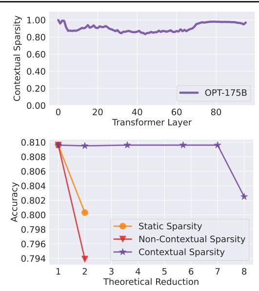

Figure 1. (1) LLMs have up to 85% contextual sparsity for a given input. (2) Contextual sparsity has much better efficiency-accuracy trade-offs (up to  $7\times$ ) than non-contextual sparsity or static sparsity.

<u>Existence</u>: it is nontrivial to verify if such contextual sparsity exists, and naive verification can be prohibitively expensive.

<u>Prediction</u>: even if they exist, it is challenging to predict the contextual sparsity for a given input in advance.

<u>Efficiency</u>: even if the sparsity can be predicted, it might be difficult to achieve end-to-end wall-clock time speedup. Taking OPT-175B as an example, the latency of one MLP block is only 0.2 ms on an 8×A100 80GB machine. Without a fast prediction and optimized implementation, the overhead can easily increase the LLM latency rather than reduce it.

In this work, we address these challenges as follows:

**Existence**: Fortunately, we verify the existence of contextual sparsity with a surprisingly simple approach. To achieve essentially the same output, contextual sparsity is on average 85% structured sparse and thereby potentially leads to a  $7\times$  parameter reduction for each specific input while maintaining accuracy (Figure 3). During explorations of contextual sparsity, we made important empirical observations and build a theoretical understanding of major components in LLMs that help address the prediction and efficiency challenge.

**Prediction**: We discover that such contextual sparsity depends not only on individual input tokens (*non-contextual dynamic* sparsity) but also on their interactions (*contextual dynamic* sparsity). Figure 1 shows that with pure dynamic information, the prediction is unusable; only with token embeddings that contain sufficient contextual information, the prediction can be performed accurately. Another finding is that *contextual dynamic* sparsity for every layer can be predicted based on the "similarity" between layer parameters (head-s/MLP) and the output from the previous layer, which carries the immediate contextual mixture of token embeddings.

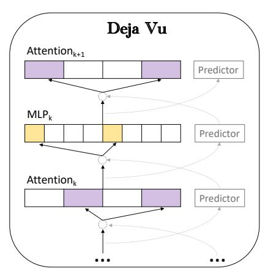

<span id="page-1-2"></span>Figure 2. DEJAVU uses lookahead predictors to side-step prediction cost: given the input to the attention layer at block k, they (asynchronously) predict the contextual sparsity for the MLP at block k, and given the input to the MLP at block k, they predict the sparsity for the attention head at the next layer.

<span id="page-1-0"></span>Efficiency: Since at inference time, model parameters are static, inspired by the classical near-neighbor search (NNS) literature and its applications in efficient deep learning, it is possible to formulate the above similarity-based prediction as an NNS problem (Indyk & Motwani, 1998b; Zhang et al., 2018; Chen et al., 2020a). However, as mentioned, the overhead might be difficult to overcome as we would need to perform such an on-the-fly prediction before every layer. Luckily, we rediscover a phenomenon in LLMs that token embeddings change slowly across layers due to the residual connection, which is well-known in computer vision (He et al., 2016). Since the inputs to a few consecutive layers are very similar, we can design an asynchronous lookahead predictor.

Based on our finding, we present a system, DEJAVU, that exploits contextual sparsity and realizes efficient LLMs.

- In section 4.1 and section 4.2, we present a low-cost learning-based algorithm to predict sparsity on the fly. Given the input to a specific layer, it predicts a relevant subset of attention (heads) or MLP parameters in the next layer and only loads them for the computation.
- In section 4.3, we propose an asynchronous predictor (similar to classic branch predictor (Smith, 1998)) to avoid the sequential overhead. A theoretical guarantee justifies that the cross-layer design suffices for accurate sparsity prediction.

<span id="page-1-1"></span>After integrating hardware-aware implementation of sparse matrix multiply (section 4.4), DEJAVU (written mostly in Python) can reduce latency of open-source LLMs such as OPT-175B by up to  $2.5\times$  end-to-end without quality degradation compared to the state-of-the-art library Faster-Transformer from Nvidia (written entirely in C++/CUDA), and up  $6.8\times$  latency reduction compared to the widely used Hugging Face implementation. Furthermore, we show several ablations on different components of DEJAVU and its compatibility with quantization techniques.

# 2 Problem Description and Related Work

We first introduce the LLM inference bottlenecks and the problem we aim to solve in this paper. Then we briefly discuss the rich literature on efficient inference.

**Problem description:** The generative procedure of LLMs consists of two phases: (i) the prompt phase takes an input sequence to generate the key and value cache (KV cache) for each transformer block of LLMs, which is similar to the forwarding pass of LLMs training; and (ii) the token generation phase utilizes and updates the KV cache to generate tokens step by step, where the current token generation sequentially depends on previously generated tokens. In many settings, the token generation phase could easily dominate the end-toend inference time due to I/O latency of loading model parameters (An example is shown in Table 1). In addition, Table 2 shows that attention and MLP are both bottlenecks in LLMs, e.g., in 175B models, loading MLP parameters takes around  $\frac{2}{3}$  of the total I/O and attention heads take the other  $\frac{1}{3}$ . Therefore, the problem we tackle in this paper is reducing the I/O in both attention and MLP during the token generation phase to speed up LLM inference. We present the details in G.

<span id="page-2-1"></span>*Table 1.* Inference breakdown for prompting versus token generation. We focus on the transformer blocks since it is the bottleneck.

|                      | TFLOPs I/O |        | Compute Latency (ms) | I/O Latency (ms) |  |
|----------------------|------------|--------|----------------------|------------------|--|
| Prompting 1          | 0.34       | 324 GB | 23.82                | 27.5             |  |
| Prompting 128        | 44.6       | 330 GB | 23.82                | 27.5             |  |
| Token Generation 1   | 0.34       | 324 GB | 0.18                 | 27               |  |
| Token Generation 128 | 44.6       | 41 TB  | 23.82                | 3500             |  |

<span id="page-2-2"></span>*Table 2.* Inference breakdown for Attention block versus MLP block for generating a single token.

|                 | GFLOPs | I/O (GB) | Compute Latency (ms) | I/O Latency (ms) |
|-----------------|--------|----------|----------------------|------------------|
| Attention Block | 1.21   | 1.12     | 0.00064              | 0.093            |
| MLP Block       | 2.41   | 2.25     | 0.00128              | 0.1875           |

#### **Quantization**, pruning, distillation for LLM inference.

Various relaxations have been studied for decades for model inference in machine learning. There are three main techniques: quantization (Han et al., 2015; Jacob et al., 2018; Nagel et al., 2019; Zhao et al., 2019), pruning or sparsity (Molchanov et al., 2016; Liu et al., 2018; He et al., 2019; Hoefler et al., 2021), and distillation (Hinton et al., 2015; Cho & Hariharan, 2019; Tang et al., 2019; Touvron et al., 2021). They are orthogonal areas and usually excel in different settings. Recently, there are active research attempting to apply one or a combination of such techniques in LLM inference (Yao et al., 2022; Park et al., 2022; Dettmers et al., 2022; Frantar et al., 2022; Frantar & Alistarh, 2023; Bansal et al., 2022).

### <span id="page-2-5"></span>3 Pre-trained LLMs are Contextual Sparse

In this section, we present several key observations and theoretical understandings of sparsity in LLMs, which DEJAVU design is based on. We first test the contextual sparsity hypothesis and verify that contextual sparsity exists in pre-trained LLMs in section 3.1. Then we build an

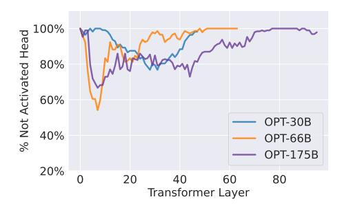

(a) Contextual sparsity in Attention Head

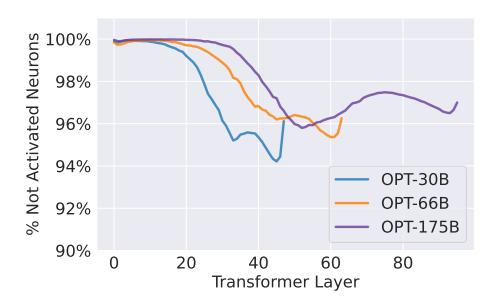

<span id="page-2-4"></span><span id="page-2-0"></span>(b) Contextual sparsity in MLP Block

Figure 3. In Figure (a), we plot the percentage of not-activated attention heads. By only keeping heads that yield large output norms, we can silence over 80% attention heads for a given token. In Figure (b), we plot the average sparsity we impose on MLP layers. We can zero out over 95% of MLP parameters for a given token.

understanding of why that happens naturally even when LLMs are densely trained in 3.2. Finally, we present an observation on residue connection and explain its connection to contextual sparsity analytically in 3.3.

### <span id="page-2-3"></span>3.1 Contextual Sparsity Hypothesis

Inspired by the study in pruning literature (Molchanov et al., 2016), we find a surprisingly simple method is sufficient to verify our hypothesis. In the following, we describe the testing procedure, observation details, and insights.

**Verification:** Our test is performed on OPT-175B, 66B, and 30B models and various different downstream datasets such as OpenBookQA (Mihaylov et al., 2018) and Wiki-Text (Merity et al., 2016). We find the contextual sparsity for every input example with two forward passes of the model. In the first pass, we record a subset of parameters, attention heads, and MLP neurons that yield large output norms for the input. In the second pass, each input example only uses the recorded subset of parameters for the computation. Surprisingly, these two forward passes lead to similar prediction or performance on all in-context learning and language modeling tasks.

**Observation:** Figure 3 shows that on average, we can impose up to 80% sparsity on attention heads and 95% sparsity on MLP neurons. As mentioned in Section2, OPT-175B model has  $2 \times$  MLP parameters than those of attention blocks. Therefore total sparsity here is around 85%. Since these are all structured sparsity (heads and neurons), predicting them

accurately could potentially lead to  $7\times$  speedup.

Insights: It is intuitive that we can find contextual sparsity in MLP blocks at inference time because of the activation function like ReLU or GeLU (Kurtz et al., 2020). Similar observations were made by (Li et al., 2022). However, it is also surprising that we can find contextual sparsity in attention layers. Note that, finding contextual sparsity in attention is not the same as head pruning. We cross-check that different examples have different contextual sparsity. Therefore, although 80% of the parameters are not included in the paths for a given example, they might be used by other examples. Next, we will try to understand why contextual sparsity exists in attention blocks.

### <span id="page-3-0"></span>3.2 Token Clustering in Attention Layers

In the previous section, we have verified that there exist contextual sparsity for a given input in LLMs. In this section, we try to understand the reason for such phenomena, especially in attention layers. We first show an in-depth observation of attention. Then we present a hypothesis that self-attentions are conceptually clustering algorithms. Last we show analytical evidence to support this hypothesis.

**Observation:** Figure 4 shows the attention map of three different heads from the same layer for an example input. The next token it should be predicting is "Truck". Darker color represents higher attention scores. We observe that the middle one is rather a uniform token mixing head while the top and bottom ones are heavy hitter attention heads (attending to "like" and "shipping"). Not surprisingly, only selecting heavy hitter heads but not uniform heads like the middle ones does not affect the prediction since they are not modeling or encoding important token interactions. In the next section, we will also explain in detail how the criteria for selecting uniform attention heads and heads with small output norms are highly correlated.

**Hypothesis:** We hypothesize that the attention head is performing mean-shift clustering (Derpanis, 2005).

For an attention head at layer l, suppose  $x_j$  is an input token embedding,  $k_j = W_k x_j$  and  $v_j = W_v x_j$  are key & value computed by projection matrices  $W_k$  &  $W_v$ . Then for an input embedding  $x^l$ , and its query  $q^l = W_q x^l$ , we have its output value  $v^l$ :

$$v^{l} = \sum_{j} p_{j} v_{j} = \frac{\sum_{j} \exp(\boldsymbol{x}_{j}^{\mathsf{T}} W_{k}^{\mathsf{T}} W_{q} \boldsymbol{x}^{l}) W_{v} \boldsymbol{x}_{j}}{\sum_{j} \exp(\boldsymbol{x}_{j}^{\mathsf{T}} W_{k}^{\mathsf{T}} W_{q} \boldsymbol{x}^{l})}$$
$$= W_{v} \frac{\sum_{j} \exp(\boldsymbol{x}_{j}^{\mathsf{T}} W_{k}^{\mathsf{T}} W_{q} \boldsymbol{x}^{l}) \boldsymbol{x}_{j}}{\sum_{j} \exp(\boldsymbol{x}_{j}^{\mathsf{T}} W_{k}^{\mathsf{T}} W_{q} \boldsymbol{x}^{l})}$$

If we let  $W_v = I$ ,  $K(\boldsymbol{x}_j, \boldsymbol{x}^l) := \exp(\boldsymbol{x}_j^\intercal W_k^\intercal W_q \boldsymbol{x}^l)$  that measures the similarity between  $\boldsymbol{x}_j$  and  $\boldsymbol{x}^l$ ,  $\mathbf{m}(\boldsymbol{x}^l) := \frac{\sum_j K(\boldsymbol{x}_j, \boldsymbol{x}^l) \boldsymbol{x}_j}{\sum_j K(\boldsymbol{x}_j, \boldsymbol{x}^l)}$ , and consider the residue connection followed by layer norm, then for the next layer

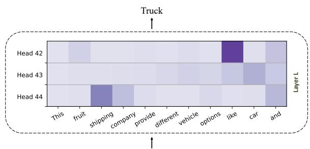

<span id="page-3-2"></span>This fruit shipping company provide different vehicle options like car and [MASK]

Figure 4. We visualize the attention scores of three different heads for an exemplary sentence. Head 42 and Head 44 give heavy attention scores on particular tokens while Head 43 is more uniform.

l+1, we have  $\boldsymbol{x}^{l+1} = \text{Normalize}(\boldsymbol{x}^l + \mathbf{m}(\boldsymbol{x}^l))$ , which has a fixed point  $\boldsymbol{x} = \gamma \mathbf{m}(\boldsymbol{x})$  for any scalar  $\gamma$ .

This iteration bears a resemblance to mean-shift clustering, which simply performs iteration  $x^{l+1} = \mathbf{m}(x^l)$  until convergence. This has an obvious fixed point  $x = \mathbf{m}(x)$ .

Therefore, the self-attention head can be regarded as *one mean-shift step* to push input embeddings of different tokens together, if they are already neighbors in a projection space specified by  $W_k^\top W_q$ . Different heads learn different projection spaces to perform clustering. This dynamic explains the precise reason why token embeddings tend to cluster after going through more layers, resulting in high attention scores among cluster members, and low scores for non-members. Furthermore, the cluster patterns are different at different heads. (More details in H)

The above analysis not only provides an understanding of why contextual sparsity exist naturally in pre-trained LLMs, but also inspired a later design on "similarity"-based sparsity prediction in DEJAVU.

### <span id="page-3-1"></span>3.3 Slowly Changing Embeddings across Layers

We first present our observation that embeddings change slowly across consecutive layers, which is a well-known "side effect" of residual connections in convolutional neural network training. Then we provide an analysis and calculate how it happens in the LLM inference. Finally, we demonstrate that it is closely connected with contextual sparsity.

High similar embeddings in consecutive layers: In Figure 8(c), we show that for the same given input, the cosine similarity between embeddings or activations in two consecutive layers is exceptionally high on 7 different sizes of OPT models. Specifically, we collect activations from each layer while performing OPT model inference on C4 validation set (Raffel et al., 2019). Taking OPT-175B as an example, starting from the second layer, the similarity between any two consecutive layers is around 0.99, which indicates that when an input is passed through the model, the direction of its embedding changes slowly. Interestingly, the most drastic change happens in the first layer. Further, we increase the

274

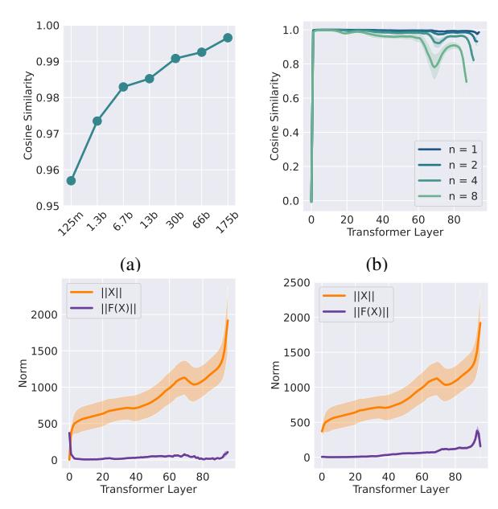

(c) Residual Around Attention

(d) Residual Around MLP

Figure 5. Slowly Changing Embedding. Figure (a) shows the median cosine similarity between representations at two consecutive layers across all layers for different OPT models. All models show a similarity greater than 95%. Figure (b) shows cosine similarity stays high even a few layers apart. For the residual connection X' = X + F(X) inside each block, we plot the L2 norm of X and F(X).  $\|X\|$  is significantly higher than  $\|F(X)\|$ , which explains the slowly changing embedding.

gap and investigate the similarity between the embedding at layer i and at layer i+n shown in Figure 8(d). As we increase the gap, the similarity decreases as expected while the differences in cosine similarity between various choices of n are smaller at the shallower layer. We plot the mean similarity, and the standard deviation is indicated by the shading. Similar plots on more models are presented in Appendix A.

Connection to residuals: We verify that the high similarity in embeddings in LLM inference is due to the residual connection. We first dissect the computation graph inside each transformer layer to understand the cause behind this phenomenon. There are two residual connections inside a transformer layer, one around the attention block, and the other one around the MLP block. The residual connection can be written as X+F(X), where F is either the Multi-Head Attention or two MLP Layers. In Figure 8(e) and Figure 7(f), indeed we can see that  $\|X\|$  is significantly greater than  $\|F(X)\|$ , confirming that embeddings are changing slowly because the residual norm is large.

Connection to Contextual Sparsity: We take a step deeper trying to understand the reason behind the large residual norm with mathematical modeling. We discover that one possible reason for small ||F(X)|| is due to high sparsity. For the MLP Block, high sparsity may contribute to the small norm of F(X) because a large portion of outputs has

small norms. Similar reason for the Attention Block, a large number of attention heads yield small norm output.

**Residual Two Sides Bound:** Besides empirical reasoning, we formally define the computation of LLMs in a mathematical way. Under our computation model, we can show that a shrinking property which is observed by our practical experiments. Proofs are in Section C, D, E.

**Lemma 3.1** (Informal). Let  $0 < \epsilon_1 < \epsilon_2 < 1$  be the lower and upper bound of shrinking factor. Let x be the y be the output. We have the residual connection y = x + F(x). For the MLP block F(x), we have  $\epsilon_1 \le \|y - x\|_2 \le \epsilon_2$ . For the attention block F(x), we have  $\epsilon_1 \le \|y - x\|_2 \le \epsilon_2$ .

#### 4 DEJAVU

This section presents our framework for inference-time contextual sparsity search for LLMs. We introduce the sparsity predictor for MLP in Sec. 4.1 and for attention heads in Sec. 4.2. DEJAVU's workflow is shown in Figure 2. In Sec. 4.3, we discuss how we exploit our observation on LLMs to avoid the sparse prediction overhead with theoretical guarantees. In Sec. 4.4, we present our optimized implementation that enables end-to-end latency speed up.

# <span id="page-4-0"></span>4.1 Contextual Sparsity Prediction in MLP Block

As explained in 2, for LLMs inference, the MLP blocks dominates the inference process with up to  $\frac{2}{3}$  of FLOPs and IO access. Here, we describe how we achieve linear speed-up with contextual sparsity.

Challenge: Figure 3(b) indicates that for a given token, a contextual sparsity of 95% is possible. We verify that the contextual sparsity in the MLP block can be identified using the activation if dense computation is allowed. However, this only demonstrates the existence but brings no benefits in terms of efficiency. To exploit the high contextual sparsity for end-to-end efficiency, a fast and accurate sparse prediction is needed.

The naive way is randomly select a subset of neurons. With no surprise, random selection fails to recover the accurate contextual sparsity, resulting in model collapse. Sparsity prediction of an MLP layer can be formulated as the classical near-neighbor search problem under the inner product metric. We use  $x \in \mathbb{R}^d$  to denote the input to Expand-MLP,  $w \in \mathbb{R}^{4d \times d}$  to denote the weights of Expand-MLP and each row  $w_i \in \mathbb{R}^d$   $(i \in [4d])$  corresponds to the weight of the *i*-th neuron.  $w_i, i \in [4d]$  is considered as the data, and for a query x, near-neighbor search methods can be adopted to search for a set of  $S^w$  of  $w_i$  that is close to x under inner product metric. However, the standard state-of-art near-neighbor search methods fail in the LLMs setting. The search time is longer than the MLP computation because of the high dimensionality. Consider OPT-175b where d is 12277, HNSW requires more than 10ms, and FAISS requires more than 4ms, while the MLP computation is only 0.2ms.

Approach: LLM inference is conducted on modern hard-

286

287

288

289

290

291

292

293

294

295

296

297

298

299 300

301

302

303

304

305

306

307

308

309

311

312

313

314

315

316

317

318

319

321

322

323

324

325

326

327

328

329

ware and the latency is not bounded by actual computation but by memory access. We design our MLP sparse predictor as a low-rank linear near-neighbor classifier. One classifier is trained at each MLP block to predict contextual sparsity. The sparsified computation process can be summarized in two steps: (1) Given x, the sparsity predictor  $SP^M$  predicts a set  $S_w$  of neurons  $w_i$  that is important to a test sample x. (2) Compute the MLP block by multiplying x with  $w_i \in S$ .

Collecting training data is straightforward because we know the contextual sparsity given dense computation. For an inputx, we label the parameter on the sparsity path as positive and the rest as negative. Taking OPT family as an example, all non-zero parameters are labeled as positive. The training algorithm is summarized in Alg. 1.

# **Algorithm 1** Sparse Predictor Training

<span id="page-5-3"></span>**Input**: A trained LLM block with parameter set M, token embedding set at block M  $D_M = \{x_i\}_{i \in [N]}$ , threshold tSparse Predictor SP $\mathcal{P}_{+} \leftarrow \emptyset, \mathcal{P}_{-} \leftarrow \emptyset$ for  $i=1 \rightarrow N$  do

$$\begin{array}{l} \textbf{for } i = 1 \rightarrow N \textbf{ do} \\ \mathcal{P}_{+} \leftarrow \mathcal{P}_{+} \cup \{(x_{i}, m_{r}) \mid m_{r} \in M, m_{r}(x_{i}) > t\} \\ \mathcal{P}_{-} \leftarrow \mathcal{P}_{-} \cup \{(x_{i}, m_{r}) \mid m_{r} \in M, m_{r}(x_{i}) < t\} \\ \textbf{end for} \end{array}$$

 $SP \leftarrow TRAIN(P_+, P_-, \mathcal{L})$  $\triangleright \mathcal{L}$  is a loss function

# <span id="page-5-0"></span>4.2 Contextual Sparsity Prediction in Attention Block

In this section, we describe how DEJAVU performs contextual sparsity search in the Attention block.

**Challenge:** As discussed in Section 3.1, only a few heads perform heavy attending for a given input. Similar to the MLP Block, a fast selection of attention heads without dense computation is required to achieve end-to-end latency reduction. Further, one particular challenge of sparse prediction in attention blocks is attention's dependence on previous tokens. On the one hand, it is unclear whether the past token's key and value are needed for sparse prediction. On the other hand, it is unclear how to handle the missing key/value of past tokens for the current token at the selected head.

**Approach:** Let  $x \in \mathbb{R}^d$  to denote the input to the Multi-Head-Attention (MHA). There are N self-attention heads, and  $H_n(x)$  corresponds to the *n*-th head. The attention sparsity predictor  $SP^A$  selects a set  $S^h$  of heads  $H_n$ . Formally,

$$MHA(x) = [H_1(x), H_2(x), ...; H_n(x)]W_o$$
 with  $H_n(x) = \vec{0}$  for  $H_n(x) \notin S_h$  and output projection  $W_o$ .

Head selection can also be formulated as a near-neighbor search problem based on our understanding in Section 3.2. Given that each attention head is a clustering algorithm, the sparse prediction can be based on the similarity between xand head parameters. Thus, we design our attention sparse predictor to be the same architecture as the MLP sparse predictor. Each head is regarded as one class and a similar training process is used. Thanks to the token-mixing nature

of the transformer layer, after the first few layers, the current token embedding is sufficient for sparse prediction.

To address the missing key/value for a past token, we exploit the fact that latency is IO bounded while computation is essentially free. Specifically, at token x, in the selected attention, computed key projection and value projection are stored in the cache. In the non-selected attention, we store token x. Later, at token  $x_n$ , if there is a missing key/value in the cache, we load stored x and compute the key projection and value projection on the fly. Note that this mechanism requires no extra memory access.

# <span id="page-5-1"></span>4.3 Reducing Overhead with Asynchronous Execution

Sparse prediction overhead may easily increase the endto-end latency despite the reduction in FLOPs. Therefore, we present look-ahead sparse prediction unlocked by our observation in 3.3 to avoid sequential overhead.

**Challenge:** We use  $x_i \in \mathbb{R}^d$  to denote the input to transformer layer i, and we can write the computation at transformer layer i as  $x' \leftarrow MHA_i(x), x'' \leftarrow MLP_i(x')$ . With the sparse predictors  $SP_i^A$  and  $SP_i^M$ , the computation at the transformer layer i can be re-written as

$$S_h \leftarrow SP_i^A(x), \quad x' \leftarrow MHA_i(x, S_h),$$
  
 $S_w \leftarrow SP_i^M(x'), \quad x'' \leftarrow MLP_i(x', S_w)$ 

where  $S_h$  is the contextual sparsity for the Attention block, and  $S_w$  is the contextual sparsity for MLP block. Note that the computation at Attention and MLP blocks has to wait for the sparse predictor decision. This overhead potentially backfires the flops saving from Attention and MLP blocks in terms of latency.

**Approach:** In Section 3.3, we present the slowing evolving embedding phenomena, which opens opportunities to relax the sequential computation to parallel computation. Along with the observation of low computation intensity, we parallel the sparse prediction with layer computation( See Figure 2). The computation can be organized as follows:

$$x' \leftarrow MHA_i(x, S_i^h), \quad x'' \leftarrow MLP_i(x', S_i^w),$$
 
$$S_{i+1}^h \leftarrow SP_i^A(x), \quad S_{i+1}^w \leftarrow SP_i^M(x),$$

with no sequential dependency at layer i.

**Theoretical guarantee:** The sparse predictor can make further cross-layer decisions because of the residual connection. We state a lemma regarding cross-layer prediction. It is well-known that MaxIP is equivalent to  $\ell_2$  nearest neighbor search. For convenient, we use MaxIP here. We include more discussions and proofs in Section F.

<span id="page-5-2"></span>**Lemma 4.1** (Informal). Let  $\epsilon \in (0,1)$ . Let  $x_i$  be input at *i-th layer. Let*  $x_{i-1}$  *be the input at* (i-1)*-th layer. Suppose* that  $||x_i - x_{i-1}||_2 \le \epsilon$ . For any parameters  $c, \tau$  such that  $\epsilon < O(c\tau)$ . Then we can show that, solving MaxIP $(c,\tau)$  is sufficient to solve  $MaxIP(0.99c,\tau)$ .

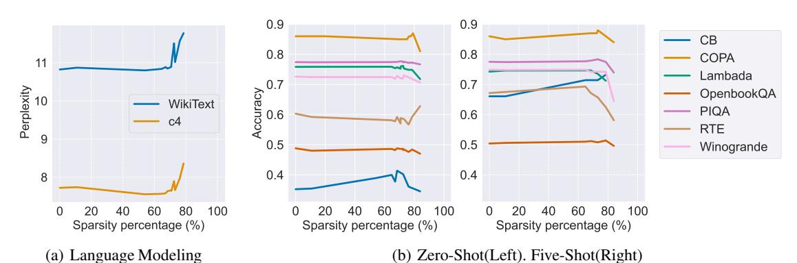

Figure 6. Accuracy Trend for DEJAVU-OPT-175B. This figure shows the accuracy of DEJAVU-OPT-175B on language modeling datasets and downstream tasks when we set different sparsity at test time. In general, DEJAVU-OPT-175B incurs no accuracy drop until 75% sparsity.

# 4.4 Hardware-efficient Implementation

We describe how DEJAVU is implemented in a hardware-efficient manner to realize the theoretical speedup of contextual sparsity. Taking into account hardware characteristics leads to  $2.5\times$  speedup compared to an optimized dense model, and  $4\times$  faster than a standard sparse implementation.

Contextual sparsity requires us to multiply the feature vector x with a sparse subset of the weight matrices. For the attention QKV projection with projection matrix  $W_{\rm qkv}$  where we only need the outputs of a few heads, we need to multiply  $W_{\rm qkv}[{\rm idx},:]x_{\rm attn}$ , where idx is a list of indices corresponding to the heads whose outputs we need. The output projection of the attention layer requires  $W_{\rm out}[:,{\rm idx}]x_{\rm outproj}$ . Sparsifying MLPs is similar.

We highlight some hardware characteristics of GPUs:

- Small-batch generation is bottlenecked by GPU memory reads/writes (IOs) (NVIDIA, 2022; Ivanov et al., 2021; Dao et al., 2022). This is because of low arithmetic intensity (for each element loaded from GPU memory, only a small number of floating point operations are performed).
- GPU are block-oriented devices: loading a single byte of memory takes the same time as loading a block of memory around that same address (Harris, 2013). The block size is usually 128 bytes for Nvidia GPUs (Cook, 2012).

These characteristics present some challenges in implementing contextual sparsity. However, they can be addressed with classical techniques in GPU programming.

**Kernel fusion:** A standard implementation of sparse matrix-vector multiply (e.g., in PyTorch) that separately indexes a subset of the matrix  $W[\mathrm{idx},:]$  before multiplying with input x would incur  $3\times$  the amount of memory IOs. We instead fuse the indexing and the multiplication step: we load a subset of  $W[\mathrm{idx},:]$  to memory, along with x, perform the multiply, then write down the result. This fused implementation (in Triton (Tillet et al., 2019)) yields up to  $4\times$  speedup compared to a standard PyTorch implementation (Section K).

Memory coalescing: the weight matrices are conventionally

<span id="page-6-1"></span>stored in row-major format. This allows us to load  $W[\mathrm{idx},:]$  optimally (the second dim. is contiguous in memory). However, for cases where we need to load  $W[:,\mathrm{idx}]$  (attention output projection, 2nd weight matrix in the MLP) this format significantly slows down memory loading, as indices in idx point to non-contiguous memory. We simple store these matrices in column-major format (i.e., store  $W^{\top}$  in row-major format), then use the same fused kernel above.

These two techniques (kernel fusion and memory-coalescing) makes DEJAVU hardware-efficient, yielding up to  $2.5\times$  speedup end-to-end compared to the state-of-the-art FasterTransformer(Section 5.1).

# 5 Empirical Evaluation

In Section 5.1, we present the end-to-end results that demonstrate DEJAVU achieves  $2.5\times$  reduction in token generation latency compared to the state-of-the-art FasterTransformer and  $6.8\times$  compared to Hugging Face with no accuracy loss. In Section 5.2, we perform a list of ablation studies such as independent evaluation on the test-time contextual sparsity of the MLP block and the Attention block. At last, we present the additional results to demonstrate the future possibility of sparsifying the entire LLMs via layer skipping in Section L.

#### <span id="page-6-0"></span>5.1 End-to-End Result

Experiment Setting: We compare the accuracy of DE-JAVU-OPT against the original OPT model on two language modeling datasets Wiki-Text (Merity et al., 2016) and C4 (Raffel et al., 2019) and ten few-shot downstream tasks: CB (de Marneffe et al., 2019), COPA (Gordon et al., 2012), Hellaswag (Zellers et al., 2019), Lambada (Radford et al., 2019), OpenBookQA (Mihaylov et al., 2018), PIQA (Bisk et al., 2020), RTE (Giampiccolo et al., 2007), Winogrande (ai2, 2019). We use lm-eval-harness (Gao et al., 2021) to evaluate zero-shot and five-shot tasks. We collect training data for the sparsity predictor using 500 random data from C4 training dataset. Our experiments are conducted on NVIDIA A100 80GB GPU servers.

No accuracy drop until 75% sparsity: In Figure 6, we

<span id="page-7-4"></span>*Table 3.* This table summarizes the accuracy of zero-shot tasks and language modeling when sparsifying the MLP block and the Attention block separately. Sparsity is set at 85% for MLP-block and 50% for Attention-block. DEJAVU incurs no accuracy drop across the boards.

| Model                     | СВ     | COPA | Hellaswag | Lambada | OpenBookQA | PIQA   | RTE    | Winogrande | Wikitext | C4     |
|---------------------------|--------|------|-----------|---------|------------|--------|--------|------------|----------|--------|
| OPT-175B                  | 0.3523 | 0.86 | 0.7814    | 0.7584  | 0.446      | 0.8096 | 0.6029 | 0.7261     | 10.8221  | 7.7224 |
| DEJAVU-MLP-OPT-175B       | 0.3544 | 0.85 | 0.7806    | 0.7619  | 0.446      | 0.8096 | 0.6065 | 0.7206     | 10.7988  | 7.7393 |
| DEJAVU-Attention-OPT-175B | 0.3544 | 0.86 | 0.7819    | 0.7586  | 0.4460     | 0.8063 | 0.5921 | 0.7245     | 10.8696  | 7.7393 |

present DEJAVU-OPT-175B's accuracy trend. In a zero-shot setting, the average accuracy across tasks does not drop until 75% sparsity. A similar trend can be observed for the five-shot setting, which verifies the model's ability for in-context learning. This result is exceptionally encouraging given our observation in Section 3, where we could impose 85% sparsity when allowed full computation.

2.5  $\times$  latency reduction at 75% sparsity: In Table 4, we present the latency for token generation. Across prompt lengths, DEJAVU-OPT-175B achieves significant speed up compared to our baselines. At around 75% sparsity, DEJAVU speeds up generation by 1.8-2.5 $\times$  compared to the state-of-the-art FasterTransformers and by 4.8-6.8 $\times$  compared to the widely used Hugging Face implementation.

<span id="page-7-1"></span>Table 4. Token Generation Latency Average per-token latency (ms) with batch size 1 on 8xA100 80GB with NVLink when generating sequences with prompt length 128, 256, 512, and 1024, using fp16 precision. For DEJAVU-OPT-175B, we set the MLP density to 10% and attention density to 42% (i.e., for each token, each GPU has on average 5 non-zero heads out of 12). Across the board, DEJAVU speeds up generation by  $1.8-2.5\times$  compared to the state-of-the-art FasterTransformer and by  $4.8-6.8\times$  compared to the widely used Hugging Face implementation.

| Sequence length             | 128   | 256   | 512   | 1024  |
|-----------------------------|-------|-------|-------|-------|
| OPT-175B Hugging Face       | 107.9 | 108.0 | 110.4 | 112.7 |
| OPT-175B Faster Transformer | 40.5  | 40.9  | 41.7  | 43.4  |
| DejaVu-OPT-175B (ours)      | 15.9  | 17.1  | 19.8  | 23.6  |

#### <span id="page-7-0"></span>**5.2** Ablation Results

Contextual sparsity on MLP blocks: We study the contextual sparsification of MLP block in OPT-175B. We leave the Attention Block as dense computation. Table 3 shows the model performance at 85% sparsity. MLP sparse predictor introduces no accuracy loss on both zero-shot tasks and language modeling. In the training of MLP sparse predictor, we observe that sparse predictor achieves high validation accuracy. The shallow layer seems easier to model because the predictor has validation accuracy over 99% in the shallow layers and drops to around 93% in the ending layers.

**Contextual sparsity on attention blocks:** In this section, we study the sparse predictor for the Attention block on OPT-175B and leave the MLP Block as dense computation. Table 3 displays the test accuracy on zero-shot tasks and perplexity

<span id="page-7-5"></span>Table 5. Result on DEJAVU-OPT66b on zero-shot downstream task.

| Model          | СВ     | COPA | Hellaswag | Lambada | OpenBookQA | PIQA   | RTE    | Winogrande |
|----------------|--------|------|-----------|---------|------------|--------|--------|------------|
| OPT-66B        | 0.3928 | 0.87 | 0.7400    | 0.7508  | 0.426      | 0.7921 | 0.6028 | 0.6890     |
| DEJAVU-OPT-66B | 0.4285 | 0.87 | 0.7416    | 0.7458  | 0.434      | 0.7933 | 0.5884 | 0.6898     |

on the language modeling datasets. In summary, the Attention sparse predictor introduces no accuracy loss at around 50% sparsity. During the training of the Attention sparse predictor, we observe different trends compared to MLP sparse predictor. The validation accuracy is around 93% in the middle layers and near 99% in the shallow and deep layers.

**Contextual Sparsity on Smaller Models:** Our main experiments focus on OPT-175B, here, we DEJAVU's effective on smaller model, specifically OPT-66B. In Table 5, we summarize the accuracy on zero-shot task at 50% sparsity. Similar to DEJAVU-OPT-175B, we notice no accuracy loss.

Compatibility with Quantization: Following similar setting in (Frantar & Alistarh, 2023), we test the compatibility of two orthogonal lines of efficient inference. We observe similar results when combined with 4-bit quantization, contextual sparsity can still preserve similar downstream task accuracy.

Non-Contextual Sparsity: As we mentioned in Section 1, one could predict sparsity without contextual information. For non-contextual sparsity, we rely on the original embedding at the input layer. At every block, we first pass the original embedding to record a subset of parameters yielding a large norm. In the second pass, the embedding at every layer only uses the recorded subset. As shown in Figure 1, non-contextual prediction is not sufficient and leads to accuracy losses even at 50% sparsity. This result verifies our design choices of relying on the activation at every layer as input to make contextual sparsity predictions.

### 6 Conclusion

Our main goal is to make LLM inference efficient so that their powerful in-context learning abilities can be used in more application domains. We observe that contextual sparsity can be accurately predicted with light-weight learning-based algorithms. This motivated us to design DEJAVU that uses asynchronous lookahead predictors and hardware-efficient sparsity to speed up LLM inference in wall-clock time. Our encouraging empirical results validate that contextual sparsity can decrease inference latency by up to  $2.5 \times$  compared to the state-of-the-art FasterTransformer without model quality drop. Our method is a step towards making LLMs more accessible to the general community, which could unlock exciting new AI applications.

<span id="page-7-2"></span><sup>&</sup>lt;sup>1</sup>http://github.com/NVIDIA/FasterTransformer

<span id="page-7-3"></span><sup>&</sup>lt;sup>2</sup>http://github.com/huggingface/transformers

# References

- <span id="page-8-6"></span>Winogrande: An adversarial winograd schema challenge at scale. 2019.
- <span id="page-8-20"></span>Allen-Zhu, Z. and Li, Y. What can resnet learn efficiently, going beyond kernels? *Advances in Neural Information Processing Systems*, 32, 2019.
- <span id="page-8-10"></span>Alon, N., Matias, Y., and Szegedy, M. The space complexity of approximating the frequency moments. In *Proceedings of the twenty-eighth annual ACM symposium on Theory of computing*, pp. 20–29, 1996.
- <span id="page-8-17"></span>Aminabadi, R. Y., Rajbhandari, S., Awan, A. A., Li, C., Li, D., Zheng, E., Ruwase, O., Smith, S., Zhang, M., Rasley, J., et al. Deepspeed-inference: Enabling efficient inference of transformer models at unprecedented scale. In *2022 SC22: International Conference for High Performance Computing, Networking, Storage and Analysis (SC)*, pp. 646–660. IEEE Computer Society, 2022.
- <span id="page-8-14"></span>Andoni, A. and Razenshteyn, I. Optimal data-dependent hashing for approximate near neighbors. In *Proceedings of the forty-seventh annual ACM symposium on Theory of computing (STOC)*, pp. 793–801, 2015.
- <span id="page-8-12"></span>Andoni, A., Indyk, P., Nguyen, H. L., and Razenshteyn, I. Beyond locality-sensitive hashing. In *Proceedings of the twenty-fifth annual ACM-SIAM symposium on Discrete algorithms*, pp. 1018–1028. SIAM, 2014.
- <span id="page-8-13"></span>Andoni, A., Indyk, P., Laarhoven, T., Razenshteyn, I., and Schmidt, L. Practical and optimal lsh for angular distance. In *Advances in Neural Information Processing Systems (NIPS)*, pp. 1225–1233. Curran Associates, 2015.
- <span id="page-8-15"></span>Andoni, A., Laarhoven, T., Razenshteyn, I., and Waingarten, E. Optimal hashing-based time-space trade-offs for approximate near neighbors. In *Proceedings of the Twenty-Eighth Annual ACM-SIAM Symposium on Discrete Algorithms (SODA)*, pp. 47–66. SIAM, 2017.
- <span id="page-8-16"></span>Andoni, A., Indyk, P., and Razenshteyn, I. Approximate nearest neighbor search in high dimensions. *arXiv preprint arXiv:1806.09823*, 7, 2018.
- <span id="page-8-11"></span>Arya, S. and Mount, D. M. Approximate nearest neighbor queries in fixed dimensions. In *SODA*, volume 93, pp. 271–280. Citeseer, 1993.
- <span id="page-8-18"></span>Balduzzi, D., Frean, M., Leary, L., Lewis, J., Ma, K. W.-D., and McWilliams, B. The shattered gradients problem: If resnets are the answer, then what is the question? In *International Conference on Machine Learning*, pp. 342–350. PMLR, 2017.
- <span id="page-8-3"></span>Bansal, H., Gopalakrishnan, K., Dingliwal, S., Bodapati, S., Kirchhoff, K., and Roth, D. Rethinking the role of scale for

- in-context learning: An interpretability-based case study at 66 billion scale. *arXiv preprint arXiv:2212.09095*, 2022.
- <span id="page-8-4"></span>Baum, L. E. and Petrie, T. Statistical inference for probabilistic functions of finite state markov chains. *The annals of mathematical statistics*, 37(6):1554–1563, 1966.
- <span id="page-8-19"></span>Bello, I., Fedus, W., Du, X., Cubuk, E. D., Srinivas, A., Lin, T.-Y., Shlens, J., and Zoph, B. Revisiting resnets: Improved training and scaling strategies. *Advances in Neural Information Processing Systems*, 34:22614–22627, 2021.
- <span id="page-8-5"></span>Bisk, Y., Zellers, R., Bras, R. L., Gao, J., and Choi, Y. Piqa: Reasoning about physical commonsense in natural language. In *Thirty-Fourth AAAI Conference on Artificial Intelligence*, 2020.
- <span id="page-8-21"></span>Black, S., Biderman, S., Hallahan, E., Anthony, Q., Gao, L., Golding, L., He, H., Leahy, C., McDonell, K., Phang, J., Pieler, M., Prashanth, U. S., Purohit, S., Reynolds, L., Tow, J., Wang, B., and Weinbach, S. GPT-NeoX-20B: An open-source autoregressive language model. In *Proceedings of the ACL Workshop on Challenges & Perspectives in Creating Large Language Models*, 2022. URL <https://arxiv.org/abs/2204.06745>.
- <span id="page-8-0"></span>Bommasani, R., Hudson, D. A., Adeli, E., Altman, R., Arora, S., von Arx, S., Bernstein, M. S., Bohg, J., Bosselut, A., Brunskill, E., et al. On the opportunities and risks of foundation models. *arXiv preprint arXiv:2108.07258*, 2021.
- <span id="page-8-7"></span>Boutsidis, C., Woodruff, D. P., and Zhong, P. Optimal principal component analysis in distributed and streaming models. In *STOC'16—Proceedings of the 48th Annual ACM SIGACT Symposium on Theory of Computing*, 2016.
- <span id="page-8-8"></span>Brinkman, B. and Charikar, M. On the impossibility of dimension reduction in l1. *Journal of the ACM (JACM)*, 52(5):766–788, 2005.
- <span id="page-8-1"></span>Brown, T., Mann, B., Ryder, N., Subbiah, M., Kaplan, J. D., Dhariwal, P., Neelakantan, A., Shyam, P., Sastry, G., Askell, A., et al. Language models are few-shot learners. *Advances in neural information processing systems*, 33: 1877–1901, 2020.
- <span id="page-8-2"></span>Chan, S. C., Santoro, A., Lampinen, A. K., Wang, J. X., Singh, A. K., Richemond, P. H., McClelland, J., and Hill, F. Data distributional properties drive emergent in-context learning in transformers. In *Advances in Neural Information Processing Systems*, 2022.
- <span id="page-8-9"></span>Charikar, M. and Sahai, A. Dimension reduction in the/spl lscr//sub 1/norm. In *The 43rd Annual IEEE Symposium on Foundations of Computer Science, 2002. Proceedings.*, pp. 551–560. IEEE, 2002.

<span id="page-9-16"></span>495 496 497 498 Charikar, M., Chen, K., and Farach-Colton, M. Finding frequent items in data streams. In *International Colloquium on Automata, Languages, and Programming*, pp. 693–703. Springer, 2002.

<span id="page-9-2"></span>499 500

<span id="page-9-19"></span>504

506

<span id="page-9-3"></span>514 515 516

<span id="page-9-14"></span>524 525 526

<span id="page-9-15"></span>528

530 531

534

<span id="page-9-23"></span>536

538

- Chen, B., Medini, T., Farwell, J., Tai, C., Shrivastava, A., et al. Slide: In defense of smart algorithms over hardware acceleration for large-scale deep learning systems. *Proceedings of Machine Learning and Systems*, 2:291–306, 2020a.
- Chen, H., Chillotti, I., Dong, Y., Poburinnaya, O., Razenshteyn, I., and Riazi, M. S. {SANNS}: Scaling up secure approximate k-nearest neighbors search. In *29th* {*USENIX*} *Security Symposium (*{*USENIX*} *Security 20)*, pp. 2111–2128, 2020b.
- <span id="page-9-20"></span>Chen, L. On the hardness of approximate and exact (bichromatic) maximum inner product. In *33rd Computational Complexity Conference (CCC)*, 2018.
- Cho, J. H. and Hariharan, B. On the efficacy of knowledge distillation. In *Proceedings of the IEEE/CVF international conference on computer vision*, pp. 4794–4802, 2019.
- <span id="page-9-24"></span>Chowdhery, A., Narang, S., Devlin, J., Bosma, M., Mishra, G., Roberts, A., Barham, P., Chung, H. W., Sutton, C., Gehrmann, S., et al. PaLM: Scaling language modeling with pathways. *arXiv preprint arXiv:2204.02311*, 2022.
- <span id="page-9-13"></span>Clarkson, K. L. and Woodruff, D. P. Low-rank approximation and regression in input sparsity time. In *STOC*, 2013.
- Cohen, M. B. Nearly tight oblivious subspace embeddings by trace inequalities. In *Proceedings of the twenty-seventh annual ACM-SIAM symposium on Discrete algorithms*, pp. 278–287. SIAM, 2016.
- Cohen, M. B. and Peng, R. Lp row sampling by lewis weights. In *Proceedings of the forty-seventh annual ACM symposium on Theory of computing*, pp. 183–192, 2015.
- <span id="page-9-8"></span>Cook, S. *CUDA Programming: A Developer's Guide to Parallel Computing with GPUs*. Morgan Kaufmann Publishers Inc., San Francisco, CA, USA, 1st edition, 2012. ISBN 9780124159334.
- Cox, M. and Cox, T. Multidimensional scaling, 315–347. *Handbook of data visualization. Springer, Berlin, Germany*, 2008.
- <span id="page-9-7"></span>Dao, T., Fu, D. Y., Ermon, S., Rudra, A., and Ré, C. Flashattention: Fast and memory-efficient exact attention with io-awareness. In *Advances in Neural Information Processing Systems*, 2022.
- <span id="page-9-17"></span>Datar, M., Immorlica, N., Indyk, P., and Mirrokni, V. S. Locality-sensitive hashing scheme based on p-stable distributions. In*Proceedings of the twentieth annual symposium on Computational geometry (SoCG)*, pp. 253–262, 2004.

- <span id="page-9-9"></span>de Marneffe, M.-C., Simons, M., and Tonhauser, J. The commitmentbank: Investigating projection in naturally occurring discourse. 2019.
- <span id="page-9-6"></span>Derpanis, K. G. Mean shift clustering. *Lecture Notes*, 32: 1–4, 2005.
- <span id="page-9-4"></span>Dettmers, T., Lewis, M., Belkada, Y., and Zettlemoyer, L. Llm. int8 (): 8-bit matrix multiplication for transformers at scale. *arXiv preprint arXiv:2208.07339*, 2022.
- <span id="page-9-18"></span>Dong, Y., Indyk, P., Razenshteyn, I., and Wagner, T. Learning space partitions for nearest neighbor search. In *International Conference on Learning Representations*, 2019.
- <span id="page-9-21"></span>Fang, J., Yu, Y., Zhao, C., and Zhou, J. Turbotransformers: an efficient gpu serving system for transformer models. In *Proceedings of the 26th ACM SIGPLAN Symposium on Principles and Practice of Parallel Programming*, pp. 389–402, 2021.
- <span id="page-9-0"></span>Frankle, J. and Carbin, M. The lottery ticket hypothesis: Finding sparse, trainable neural networks. *arXiv preprint arXiv:1803.03635*, 2018.
- <span id="page-9-1"></span>Frantar, E. and Alistarh, D. Massive language models can be accurately pruned in one-shot. *arXiv preprint arXiv:2301.00774*, 2023.
- <span id="page-9-5"></span>Frantar, E., Ashkboos, S., Hoefler, T., and Alistarh, D. Gptq: Accurate post-training quantization for generative pretrained transformers. *arXiv preprint arXiv:2210.17323*, 2022.
- <span id="page-9-22"></span>Frei, S., Cao, Y., and Gu, Q. Algorithm-dependent generalization bounds for overparameterized deep residual networks. *Advances in neural information processing systems*, 32, 2019.
- <span id="page-9-12"></span>Gao, L., Tow, J., Biderman, S., Black, S., DiPofi, A., Foster, C., Golding, L., Hsu, J., McDonell, K., Muennighoff, N., Phang, J., Reynolds, L., Tang, E., Thite, A., Wang, B., Wang, K., and Zou, A. A framework for few-shot language model evaluation, September 2021. URL [https:](https://doi.org/10.5281/zenodo.5371628) [//doi.org/10.5281/zenodo.5371628](https://doi.org/10.5281/zenodo.5371628).
- <span id="page-9-11"></span>Giampiccolo, D., Magnini, B., Dagan, I., and Dolan, B. The third PASCAL recognizing textual entailment challenge. In *Proceedings of the ACL-PASCAL Workshop on Textual Entailment and Paraphrasing*, pp. 1–9, Prague, June 2007. Association for Computational Linguistics. URL <https://aclanthology.org/W07-1401>.
- <span id="page-9-10"></span>Gordon, A., Kozareva, Z., and Roemmele, M. SemEval-2012 task 7: Choice of plausible alternatives: An evaluation of commonsense causal reasoning. In *\*SEM 2012: The First Joint Conference on Lexical and Computational Semantics – Volume 1: Proceedings of the main conference and the shared task, and Volume 2: Proceedings of the*

556

<span id="page-10-15"></span>558

560 561

570 571

574

<span id="page-10-10"></span>576

594

- *Sixth International Workshop on Semantic Evaluation (SemEval 2012)*, pp. 394–398, Montréal, Canada, 7-8 June 2012. Association for Computational Linguistics. URL <https://aclanthology.org/S12-1052>.
- <span id="page-10-6"></span>Han, S., Mao, H., and Dally, W. J. Deep compression: Compressing deep neural networks with pruning, trained quantization and huffman coding. *arXiv preprint arXiv:1510.00149*, 2015.
- Harris, M. How to access global memory efficiently in CUDA C/C++ kernels. *NVIDIA, Jan*, 2013.
- <span id="page-10-5"></span>He, K., Zhang, X., Ren, S., and Sun, J. Deep residual learning for image recognition. In *Proceedings of the IEEE conference on computer vision and pattern recognition*, pp. 770–778, 2016.
- <span id="page-10-9"></span>He, Y., Liu, P., Wang, Z., Hu, Z., and Yang, Y. Filter pruning via geometric median for deep convolutional neural networks acceleration. In *Proceedings of the IEEE/CVF conference on computer vision and pattern recognition*, pp. 4340–4349, 2019.
- <span id="page-10-11"></span>Hinton, G., Vinyals, O., Dean, J., et al. Distilling the knowledge in a neural network. *arXiv preprint arXiv:1503.02531*, 2(7), 2015.
- Hoefler, T., Alistarh, D., Ben-Nun, T., Dryden, N., and Peste, A. Sparsity in deep learning: Pruning and growth for efficient inference and training in neural networks. *J. Mach. Learn. Res.*, 22(241):1–124, 2021.
- <span id="page-10-3"></span>Hooker, S. The hardware lottery. *Communications of the ACM*, 64(12):58–65, 2021.
- <span id="page-10-20"></span>Indyk, P. and Motwani, R. Approximate nearest neighbors: towards removing the curse of dimensionality. In *Proceedings of the thirtieth annual ACM symposium on Theory of computing (STOC)*, pp. 604–613, 1998a.
- <span id="page-10-4"></span>Indyk, P. and Motwani, R. Approximate nearest neighbors: towards removing the curse of dimensionality. In *Proceedings of the thirtieth annual ACM symposium on Theory of computing*, pp. 604–613, 1998b.
- <span id="page-10-21"></span>Indyk, P. and Wagner, T. Approximate nearest neighbors in limited space. In *Conference On Learning Theory*, pp. 2012–2036. PMLR, 2018.
- <span id="page-10-14"></span>Ivanov, A., Dryden, N., Ben-Nun, T., Li, S., and Hoefler, T. Data movement is all you need: A case study on optimizing transformers. *Proceedings of Machine Learning and Systems*, 3:711–732, 2021.
- <span id="page-10-7"></span>Jacob, B., Kligys, S., Chen, B., Zhu, M., Tang, M., Howard, A., Adam, H., and Kalenichenko, D. Quantization and training of neural networks for efficient integer-arithmeticonly inference. In *Proceedings of the IEEE conference on*

- *computer vision and pattern recognition*, pp. 2704–2713, 2018.
- <span id="page-10-17"></span>Jiang, S., Song, Z., Weinstein, O., and Zhang, H. A faster algorithm for solving general lps. In *Proceedings of the 53rd Annual ACM SIGACT Symposium on Theory of Computing*, pp. 823–832, 2021.
- <span id="page-10-22"></span>Johnson, W. B. and Lindenstrauss, J. Extensions of lipschitz mappings into a hilbert space. *Contemporary mathematics*, 26(189-206):1, 1984.
- <span id="page-10-12"></span>Kurtz, M., Kopinsky, J., Gelashvili, R., Matveev, A., Carr, J., Goin, M., Leiserson, W., Moore, S., Shavit, N., and Alistarh, D. Inducing and exploiting activation sparsity for fast inference on deep neural networks. In III, H. D. and Singh, A. (eds.), *Proceedings of the 37th International Conference on Machine Learning*, volume 119 of *Proceedings of Machine Learning Research*, pp. 5533–5543. PMLR, 13–18 Jul 2020. URL [https://proceedings.mlr.](https://proceedings.mlr.press/v119/kurtz20a.html) [press/v119/kurtz20a.html](https://proceedings.mlr.press/v119/kurtz20a.html).
- <span id="page-10-16"></span>Laurent, B. and Massart, P. Adaptive estimation of a quadratic functional by model selection. *Annals of Statistics*, pp. 1302–1338, 2000.
- <span id="page-10-1"></span>LeCun, Y., Denker, J., and Solla, S. Optimal brain damage. *Advances in neural information processing systems*, 2, 1989.
- <span id="page-10-19"></span>Lee, J. R. and Naor, A. Embedding the diamond graph in l p and dimension reduction in l 1. *Geometric & Functional Analysis GAFA*, 14(4):745–747, 2004.
- <span id="page-10-2"></span>Lee, N., Ajanthan, T., and Torr, P. H. Snip: Single-shot network pruning based on connection sensitivity. *arXiv preprint arXiv:1810.02340*, 2018.
- <span id="page-10-18"></span>Lee, Y. T., Song, Z., and Zhang, Q. Solving empirical risk minimization in the current matrix multiplication time. In *Conference on Learning Theory*, pp. 2140–2157. PMLR, 2019.
- <span id="page-10-13"></span>Li, Z., You, C., Bhojanapalli, S., Li, D., Rawat, A. S., Reddi, S. J., Ye, K., Chern, F., Yu, F., Guo, R., and Kumar, S. Large models are parsimonious learners: Activation sparsity in trained transformers, 2022. URL <https://arxiv.org/abs/2210.06313>.
- <span id="page-10-0"></span>Liang, P., Bommasani, R., Lee, T., Tsipras, D., Soylu, D., Yasunaga, M., Zhang, Y., Narayanan, D., Wu, Y., Kumar, A., et al. Holistic evaluation of language models. *arXiv preprint arXiv:2211.09110*, 2022.
- <span id="page-10-8"></span>Liu, Z., Sun, M., Zhou, T., Huang, G., and Darrell, T. Rethinking the value of network pruning. *arXiv preprint arXiv:1810.05270*, 2018.

<span id="page-11-14"></span>605 606 607 608 Lu, Y., Dhillon, P., Foster, D. P., and Ungar, L. Faster ridge regression via the subsampled randomized hadamard transform. In *Advances in neural information processing systems (NIPS)*, pp. 369–377, 2013.

- <span id="page-11-21"></span>Meng, X. and Mahoney, M. W. Low-distortion subspace embeddings in input-sparsity time and applications to robust linear regression. In *Proceedings of the forty-fifth annual ACM symposium on Theory of computing*, pp. 91–100, 2013.
- <span id="page-11-8"></span>Merity, S., Xiong, C., Bradbury, J., and Socher, R. Pointer sentinel mixture models, 2016.
- <span id="page-11-1"></span>Michel, P., Levy, O., and Neubig, G. Are sixteen heads really better than one? *Advances in neural information processing systems*, 32, 2019.
- <span id="page-11-7"></span>Mihaylov, T., Clark, P., Khot, T., and Sabharwal, A. Can a suit of armor conduct electricity? a new dataset for open book question answering. In *EMNLP*, 2018.
- <span id="page-11-0"></span>Min, S., Lyu, X., Holtzman, A., Artetxe, M., Lewis, M., Hajishirzi, H., and Zettlemoyer, L. Rethinking the role of demonstrations: What makes in-context learning work? *arXiv preprint arXiv:2202.12837*, 2022.
- <span id="page-11-4"></span>Molchanov, P., Tyree, S., Karras, T., Aila, T., and Kautz, J. Pruning convolutional neural networks for resource efficient inference. *arXiv preprint arXiv:1611.06440*, 2016.
- <span id="page-11-3"></span>Nagel, M., Baalen, M. v., Blankevoort, T., and Welling, M. Data-free quantization through weight equalization and bias correction. In *Proceedings of the IEEE/CVF International Conference on Computer Vision*, pp. 1325–1334, 2019.
- <span id="page-11-13"></span>Nelson, J. and Nguyên, H. L. Osnap: Faster numerical linear algebra algorithms via sparser subspace embeddings. In *2013 ieee 54th annual symposium on foundations of computer science*, pp. 117–126. IEEE, 2013.
- <span id="page-11-22"></span>Neyshabur, B. and Srebro, N. On symmetric and asymmetric lshs for inner product search. In *International Conference on Machine Learning (ICML)*, pp. 1926–1934. PMLR, 2015.
- <span id="page-11-24"></span>NVIDIA. Fastertransformer. [https://github.com/](https://github.com/NVIDIA/FasterTransformer) [NVIDIA/FasterTransformer](https://github.com/NVIDIA/FasterTransformer).
- <span id="page-11-10"></span>NVIDIA. Gpu performance background user's guide, 2022. URL [https://docs.nvidia.](https://docs.nvidia.com/deeplearning/performance/dl-performance-gpu-background/index.html) [com/deeplearning/performance/](https://docs.nvidia.com/deeplearning/performance/dl-performance-gpu-background/index.html) [dl-performance-gpu-background/index.](https://docs.nvidia.com/deeplearning/performance/dl-performance-gpu-background/index.html) [html](https://docs.nvidia.com/deeplearning/performance/dl-performance-gpu-background/index.html).
- <span id="page-11-6"></span>Park, G., Park, B., Kwon, S. J., Kim, B., Lee, Y., and Lee, D. nuqmm: Quantized matmul for efficient inference of large-scale generative language models. *arXiv preprint arXiv:2206.09557*, 2022.

- <span id="page-11-25"></span>Pope, R., Douglas, S., Chowdhery, A., Devlin, J., Bradbury, J., Levskaya, A., Heek, J., Xiao, K., Agrawal, S., and Dean, J. Efficiently scaling transformer inference. *arXiv preprint arXiv:2211.05102*, 2022.
- <span id="page-11-12"></span>Radford, A., Wu, J., Child, R., Luan, D., Amodei, D., and Sutskever, I. Language models are unsupervised multitask learners. 2019.
- <span id="page-11-9"></span>Raffel, C., Shazeer, N., Roberts, A., Lee, K., Narang, S., Matena, M., Zhou, Y., Li, W., and Liu, P. J. Exploring the limits of transfer learning with a unified text-to-text transformer. *arXiv e-prints*, 2019.
- <span id="page-11-15"></span>Razenshteyn, I., Song, Z., and Woodruff, D. P. Weighted low rank approximations with provable guarantees. In *Proceedings of the forty-eighth annual ACM symposium on Theory of Computing*, pp. 250–263, 2016.
- <span id="page-11-19"></span>Sarlos, T. Improved approximation algorithms for large matrices via random projections. In *2006 47th annual IEEE symposium on foundations of computer science (FOCS)*, pp. 143–152. IEEE, 2006.
- <span id="page-11-23"></span>Shrivastava, A., Song, Z., and Xu, Z. Sublinear least-squares value iteration via locality sensitive hashing. *arXiv preprint arXiv:2105.08285*, 2021.
- <span id="page-11-2"></span>Smith, J. E. A study of branch prediction strategies. In *25 years of the international symposia on Computer architecture (selected papers)*, pp. 202–215, 1998.
- <span id="page-11-20"></span>Sohler, C. and Woodruff, D. P. Subspace embeddings for the l1-norm with applications. In *Proceedings of the forty-third annual ACM symposium on Theory of computing*, pp. 755–764, 2011.
- <span id="page-11-18"></span>Song, Z. and Yu, Z. Oblivious sketching-based central path method for linear programming. In *International Conference on Machine Learning*, pp. 9835–9847. PMLR, 2021.
- <span id="page-11-16"></span>Song, Z., Woodruff, D. P., and Zhong, P. Low rank approximation with entrywise l1-norm error. In *Proceedings of the 49th Annual ACM SIGACT Symposium on Theory of Computing*, pp. 688–701, 2017.
- <span id="page-11-17"></span>Song, Z., Woodruff, D. P., and Zhong, P. Relative error tensor low rank approximation. In *Proceedings of the Thirtieth Annual ACM-SIAM Symposium on Discrete Algorithms (SODA)*, pp. 2772–2789. SIAM, 2019.
- <span id="page-11-5"></span>Tang, R., Lu, Y., Liu, L., Mou, L., Vechtomova, O., and Lin, J. Distilling task-specific knowledge from bert into simple neural networks. *arXiv preprint arXiv:1903.12136*, 2019.
- <span id="page-11-11"></span>Tillet, P., Kung, H.-T., and Cox, D. Triton: an intermediate language and compiler for tiled neural network computations. In *Proceedings of the 3rd ACM SIGPLAN International Workshop on Machine Learning and Programming Languages*, pp. 10–19, 2019.

<span id="page-12-4"></span>660 661 662 663 664 Touvron, H., Cord, M., Douze, M., Massa, F., Sablayrolles, A., and Jégou, H. Training data-efficient image transformers & distillation through attention. In *International Conference on Machine Learning*, pp. 10347–10357. PMLR, 2021.

704

<span id="page-12-6"></span>706

714

- <span id="page-12-11"></span>Veit, A., Wilber, M. J., and Belongie, S. Residual networks behave like ensembles of relatively shallow networks. *Advances in neural information processing systems*, 29, 2016.
- <span id="page-12-1"></span>Viterbi, A. Error bounds for convolutional codes and an asymptotically optimum decoding algorithm. *IEEE transactions on Information Theory*, 13(2):260–269, 1967.
- <span id="page-12-12"></span>Wang, B. and Komatsuzaki, A. GPT-J-6B: A 6 billion parameter autoregressive language model. [https://github.com/kingoflolz/](https://github.com/kingoflolz/mesh-transformer-jax) [mesh-transformer-jax](https://github.com/kingoflolz/mesh-transformer-jax), May 2021.
- <span id="page-12-8"></span>Wang, R. and Woodruff, D. P. Tight bounds for lp oblivious subspace embeddings. 2018.
- <span id="page-12-10"></span>Wang, X., Xiong, Y., Wei, Y., Wang, M., and Li, L. Lightseq: A high performance inference library for transformers. In *Proceedings of the 2021 Conference of the North American Chapter of the Association for Computational Linguistics: Human Language Technologies: Industry Papers*, pp. 113–120, 2021.
- <span id="page-12-7"></span>Woodruff, D. P. et al. Sketching as a tool for numerical linear algebra. *Foundations and Trends® in Theoretical Computer Science*, 10(1–2):1–157, 2014.
- <span id="page-12-0"></span>Xie, S. M., Raghunathan, A., Liang, P., and Ma, T. An explanation of in-context learning as implicit bayesian inference. In *International Conference on Learning Representations*, 2022. URL [https:](https://openreview.net/forum?id=RdJVFCHjUMI) [//openreview.net/forum?id=RdJVFCHjUMI](https://openreview.net/forum?id=RdJVFCHjUMI).
- <span id="page-12-5"></span>Yao, Z., Aminabadi, R. Y., Zhang, M., Wu, X., Li, C., and He, Y. Zeroquant: Efficient and affordable post-training quantization for large-scale transformers. *arXiv preprint arXiv:2206.01861*, 2022.
- <span id="page-12-9"></span>Yu, G.-I., Jeong, J. S., Kim, G.-W., Kim, S., and Chun, B.-G. Orca: A distributed serving system for {Transformer-Based} generative models. In *16th USENIX Symposium on Operating Systems Design and Implementation (OSDI 22)*, pp. 521–538, 2022.
- Zellers, R., Holtzman, A., Bisk, Y., Farhadi, A., and Choi, Y. Hellaswag: Can a machine really finish your sentence? In *Proceedings of the 57th Annual Meeting of the Association for Computational Linguistics*, 2019.
- <span id="page-12-2"></span>Zhang, M., Wang, W., Liu, X., Gao, J., and He, Y. Navigating with graph representations for fast and scalable decoding of neural language models. *Advances in neural information processing systems*, 31, 2018.

<span id="page-12-3"></span>Zhao, R., Hu, Y., Dotzel, J., De Sa, C., and Zhang, Z. Improving neural network quantization without retraining using outlier channel splitting. In *International conference on machine learning*, pp. 7543–7552. PMLR, 2019.

# Appendix

In Section [A,](#page-14-0) we provide some plots for the cosine similarity between representations. In Section [B,](#page-14-2) we define some basic notations and definitions. In Section [C,](#page-16-0) we define subspace embedding and show the norm preserving. In Section [D,](#page-20-0) we introduce distances, angles and inner product. In Section [E,](#page-23-0) we provide the distance between different functions. In Section [F,](#page-28-0) we provide the nearest neighbor search data structure. In Section [G,](#page-31-0) we provide more discussion on LLM inference background and related works. In Section [H,](#page-31-1) we discuss self-attention as a clustering algorithm in depth. In Section [K,](#page-35-0) we provide detailed benchmarks regarding to implementation. At last, in section [L,](#page-36-0) we provide further observation on sparsifying LLM via layer skipping

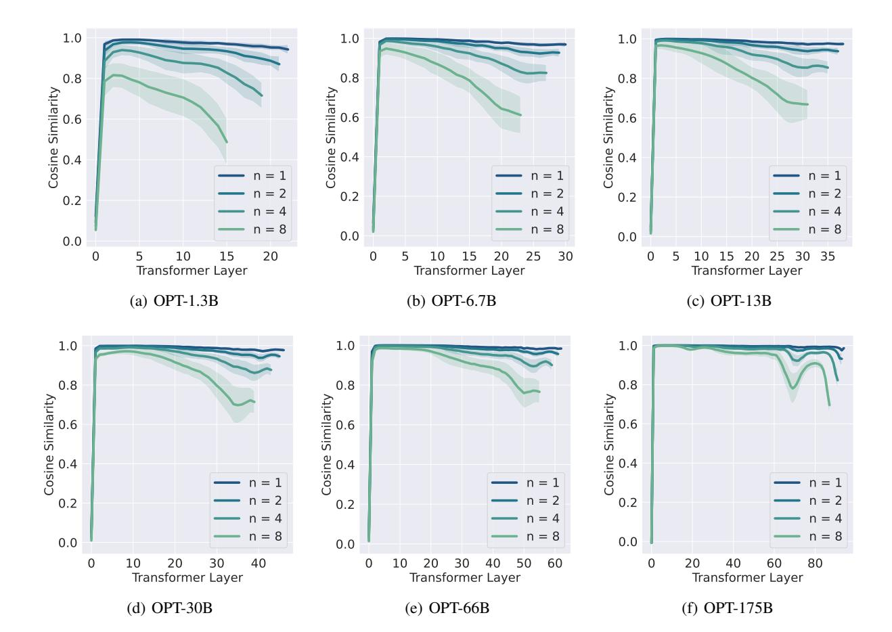

<span id="page-14-1"></span>Figure 7. Cosine similarity between layer i and layer i+1 for various model

#### <span id="page-14-0"></span>**A** Additional Observation Plot

Here, we present more plots on the cosine similarity between representations. We dissect the computation graph inside each transformer layer to understand the cause behind this phenomenon. There are two residual connections inside a transformer layer, one around the attention block, and the other one around the MLP block. The residual connection can be written as X+F(X), where F is either the Multi-Head Attention or two MLP Layer.

Figure 8(f) plots the cosine similarity between X and X+F(X), which is close to 1.0, and the cosine similarity between X and F(X), which is close to 0.0. This happens because  $\|X\|$  is significantly greater than  $\|F(X)\|$ , shown in the purple in Figure 8(f). At the first layer,  $\|F(X)\|$  is larger, which explains the low cosine similarity. The magnitude of L2 norm is different across models, however, the we observe a similar trend with models of different sizes. There exists a normalization layer before F(X), as shown in Figure 8(f), layer normalization scale  $\|X\|$  to a consistent magnitude across layers (e.g. 85 for OPT-30B, 110 for OPT175B), but not necessarily scale down  $\|X\|$ 

### <span id="page-14-2"></span>**B** Notations and Basic Definitions

For a positive integer n, let  $[n]:=\{1,2,\cdots,n\}$ . For a matrix  $A\in\mathbb{R}^{n\times n}$ , let  $A_{i,:}$  and  $A_{:,j}$  be two column vectors corresponding to the i-th row and the j-th column of A respectively, and  $A_{i,j}$  be the entry at the i-th row and the j-th column. For a vector  $x\in\mathbb{R}^n$ , let  $\sqrt{x}\in\mathbb{R}^n$  denote the vector with the i-th entry being  $\sqrt{x_i}$  and  $\mathrm{diag}(x)\in\mathbb{R}^{n\times n}$  denote the diagonal matrix with the i-th digonal entry being  $x_i$ . For two matrices  $A,W\in\mathbb{R}^{n\times n}$ , let  $\|A\|_W:=(\sum_{i=1}^n\sum_{j=1}^nW_{i,j}A_{i,j}^2)^{1/2}$  and  $W\circ A$  denote the matrix where  $(W\circ A)_{i,j}=W_{i,j}A_{i,j}$ . For matrix  $W\in\mathbb{R}^{n\times n}$ , let  $D_{W_i}:=\mathrm{diag}(W_{i,:})$  with  $i\in[n]$ .

For two vectors  $x \in \mathbb{R}^n$  and  $w \in \mathbb{R}^n_{\geq 0}$ , let  $\|x\|_w := (\sum_{i=1}^n w_i x_i^2)^{1/2}$ . For a vector x, we denote  $\|x\|_2 := (\sum_{i=1}^n x_i^2)^{1/2}$  as its  $\ell_2$  norm. We denote  $\|x\|_p := (\sum_{i=1}^n |x_i|^p)^{1/p}$  as its  $\ell_p$  norm. For a square matrix A, we denote  $\operatorname{tr}[A]$  as the trace of matrix A. For a matrix  $A \in \mathbb{R}^{n \times k}$  (suppose  $n \geq k$ ), we use  $\|A\|$  to denote its spectral norm, i.e.,  $\|A\| = \sup_x \|Ax\|_2 / \|x\|_2$ . We use  $\|A\|_F$ 

<span id="page-15-0"></span>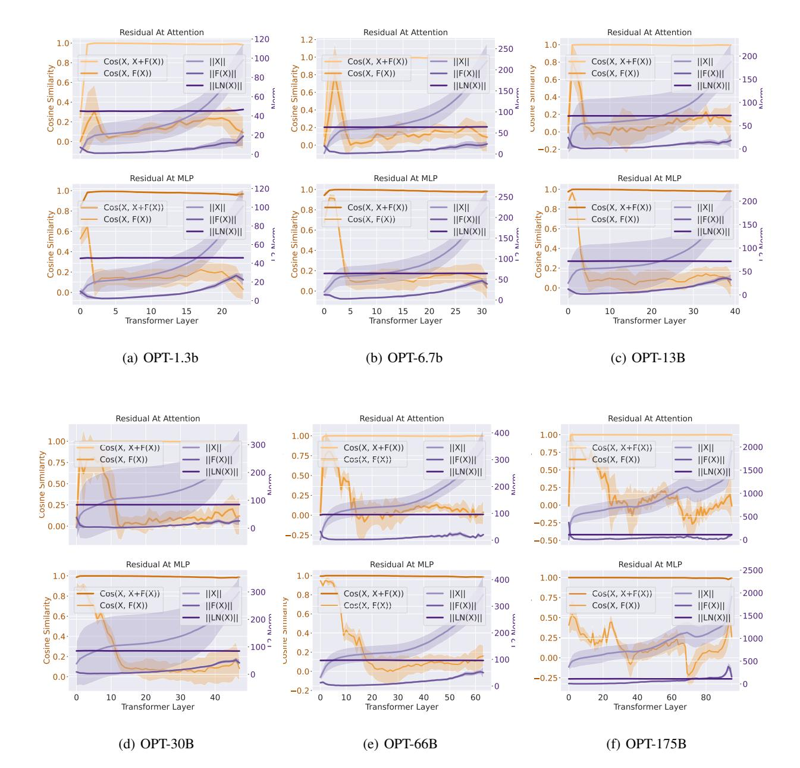

<span id="page-15-3"></span><span id="page-15-2"></span><span id="page-15-1"></span>Figure 8. Cosine similarity between X and F(X), and the cosine similarity between X and X' in orange color. L2 norm of X and F(X) and X after layer normalization in purple on the right. Except on the first layer,  $\|X\|$  is significantly higher than  $\|F(X)\|$  is higher at the first layer, which corresponds to the low cosine similarity at the first layer.

to denote its Frobenius norm  $\|A\|_F := (\sum_{i=1}^n \sum_{j=1}^k A_{i,j}^2)^{1/2}$ .

Suppose matrix  $A \in \mathbb{R}^{n \times k}$  has SVD decomposition  $U\Sigma V^{\top}$  where  $U \in \mathbb{R}^{n \times k}$  (this matrix has orthonormal columns),  $\Sigma \in \mathbb{R}^{k \times k}$  is a diagonal matrix, and  $V \in \mathbb{R}^{k \times k}$ . We call columns of U are singular vectors. We use  $A^{\dagger} \in \mathbb{R}^{k \times n}$  to denote the Moore-Penrose pseudoinverse, then  $A^{\dagger} = V\Sigma^{-1}U^{\top}$ . Suppose  $\Sigma \in \mathbb{R}^{k \times k}$  is sorted diagonal matrix, let  $\sigma_1, \dots, \sigma_k$  denote the diagonal entries of  $\Sigma$ . Then we call  $\sigma_i$  is the i-th singular value of matrix, we write it as  $\sigma_i(A)$ .

For any symmetric matrix  $B \in \mathbb{R}^{k \times k}$ , we define its eigenvalue decomposition as  $U\Lambda U^{\top}$ , where  $\Lambda$  is a diagonal matrix. Let  $\lambda_1, \dots, \lambda_k$  denote the entries on diagonal of  $\Lambda \in \mathbb{R}^{k \times k}$ . We say  $\lambda_i$  is the *i*-th eigenvalue. Usually we write it as  $\lambda_i(B)$ .

*880* The connection between eigenvalues and singular values is

$$\sigma_i^2(A) = \lambda_i(A^\top A)$$

We use notation A⪰0 to denote that matrix A is positive semidefinite (psd). Mathematically, A⪰0 means for all vectors x, we have x <sup>⊤</sup>Ax≥0.

Similarly, for two squarer matrices A and B, we use A⪰B to denote the case where for all vectors x, x <sup>⊤</sup>Ax≥x <sup>⊤</sup>Bx.

We use Pr[] and E[] for probability and expectation. We denote max{a,b} as the maximum between a and b. We denote min{a,b} (resp. max{a,b}) as the minimum (reps. maximum) between a and b.

Throughout, for non-negative real numbers a and b, we use the notation a= (1±ϵ)b if a∈[(1−ϵ)b,(1+ϵ)b].

# <span id="page-16-0"></span>C Subspace Embeddings and Norm Preserving

In Section [C.1,](#page-16-1) we show the norm preserving of the soft-max functions. In Section [C.2,](#page-17-0) we show the norm preserving of the ReLU function. In Section [C.3,](#page-18-0) we introduce the folded Guassian distribution. In Section [C.4,](#page-18-1) we introduce the ℓ<sup>2</sup> subspace embedding. In Section [C.5,](#page-19-0) we introduce the ℓ<sup>1</sup> subspace embedding. In Section [C.6,](#page-19-1) we introduce different sketching matrices for subspace embedding.

# <span id="page-16-1"></span>C.1 Soft-Max Functions

*881*

*883 884*

*893 894*

*896 897*

*914*

*929 930*

*934*

Let K ∈R s×d and V ∈R d×s .

We define σ<sup>1</sup> :R <sup>s</sup>→R s to be a softmax function, i.e., for any vector y∈R s , the σ(y) can be written as

$$\sigma_1(y)_i = \frac{\exp(y_i)}{\sum_{j=1}^d \exp(y_j)}, \ \forall i \in [d]$$

We define σ<sup>2</sup> :R <sup>s</sup>→R s to be a softmax function (ℓ<sup>2</sup> version), i.e., for any vector y∈R s , the σ(y) can be written as

$$\sigma_2(y)_i = \frac{\exp(y_i)}{(\sum_{j=1}^d \exp(2y_j))^{1/2}}, \ \forall i \in [d]$$

We define function f :R <sup>d</sup>→R d

$$f(x) = V \cdot (\sigma(K \cdot x)) \tag{1}$$

Definition C.1. We say X ⊂R d is a rank-k subspace, if there is an orthonormal basis U ∈R d×k , for any x∈X , there is y∈R k such that

$$x = Uy$$
.

We can have

Lemma C.2. *Let* τ ∈ (0,1)*. Let* X ⊂ R <sup>d</sup> *denote a subspace with rank* k*. Let* f *be defined based on* σ<sup>2</sup> *function. Let* V *is a random Gaussian matrices with* d≥Ω(ϵ −2 (k+log(1/δ))) *rows. Let* V =τV *, then we have with probability* 1−δ (1−ϵ)τ∥x∥<sup>2</sup> ≤ ∥f(x)∥≤(1+ϵ)τ∥x∥2.

*for all unit vectors* x∈X *.*

*Further, if* d=O(k+log(1/δ))*, then we have*

$$0.5\tau ||x||_2 \le ||f(x)|| \le 2\tau ||x||_2.$$

*Remark* C.3*.* The above condition implies that f is a shrinking operator but also not shrinking arbitrarily small.

*Proof.* Given d≥Ω(ϵ −2 (k+log(1/δ))), by using Lemma [C.11](#page-19-2) , we have

$$(1-\epsilon)\|y\|_2 \le \|\overline{V}y\|_2 \le (1+\epsilon)\|y\|_2$$

As the input of the function f here is the output of a softmax function (ℓ<sup>2</sup> version), we know that ∥y∥<sup>2</sup> = 1.

Thus, we have

$$(1-\epsilon) \le ||\overline{V}y||_2 \le (1+\epsilon)$$

By rescaling V , we have

$$(1-\epsilon)||x||_2 \le ||Vy||_2 \le (1+\epsilon)||x||_2.$$

936 Lemma C.4. *Let* τ ∈ (0,1)*. Let* X ⊂ R <sup>d</sup> *denote a subspace with rank* k*. Let* f *be defined based on* σ<sup>1</sup> *function. Suppose* V *is a random Gaussian matrix with* d≥Ω((k+log(1/δ))) *rows. Let* V = 1 2 τV *.*

*Then we have*

938

954

956

958

974

976

978

$$\frac{1}{4\sqrt{s}}\tau\!\cdot\!\|x\|_2\!\leq\!\|f(x)\|_2\!\leq\!\tau\!\cdot\!\|x\|_2$$

*for all unit vectors* x*.*

*Proof.* By property of subspace embedding, we know that if d≥Ω(ϵ −2 (s+log(1/δ))),

$$(1-\epsilon)\|y\|_2 \le \|\overline{V}y\|_2 \le (1+\epsilon)\|y\|_2$$

By property of function of f, we know we only need to care ∥y∥<sup>1</sup> = 1, this implies that

$$\frac{1}{\sqrt{s}} \|y\|_1 \le \|y\|_2 \le \|y\|_1$$

On one hand, we have

<span id="page-17-2"></span>
$$\|\overline{V}y\|_{2} \leq (1+\epsilon) \cdot \|y\|_{2}$$

$$\leq (1+\epsilon) \cdot \|y\|_{1}$$

$$= (1+\epsilon),$$
(2)

where the first step follows from ∥V y∥<sup>2</sup> ≤(1+ϵ)∥y∥2, the second step follows from ∥y∥<sup>2</sup> ≤ ∥y∥<sup>1</sup> and the last step follows from ∥y∥<sup>1</sup> = 1.

On the other hand, we have

<span id="page-17-1"></span>
$$\|\overline{V}y\|_{2} \ge (1-\epsilon)\|y\|_{2}$$

$$\ge \frac{1}{\sqrt{s}}(1-\epsilon)\|y\|_{1}$$

$$= \frac{1}{\sqrt{s}}(1-\epsilon),$$
(3)

where the first step follows from (1−ϵ)∥y∥<sup>2</sup> ≤ ∥V y∥2, the second step follows from <sup>√</sup> s ∥y∥<sup>1</sup> ≤ ∥y∥<sup>2</sup> and the last step follows from ∥y∥<sup>1</sup> = 1.

Combining Eq. [\(3\)](#page-17-1)and Eq. [\(2\)](#page-17-2) together, we have

$$(1-\epsilon)\frac{1}{\sqrt{s}} \le ||\overline{V}y||_2 \le (1+\epsilon)$$

Choosing ϵ= 1/2, we have

$$\frac{1}{2\sqrt{s}} \le ||\overline{V}y||_2 \le 2.$$

By V = 2 τV and ∥x∥<sup>2</sup> = 1, we have

$$\frac{1}{4\sqrt{s}}\tau\|x\|_2\!\leq\!\|Vy\|_2\!\leq\!\tau\|x\|_2.$$

### <span id="page-17-0"></span>C.2 ReLU Functions

We use ϕ:R→R to denote ReLU function, i.e., ϕ(z)=max{z,0}.

We define function g :R <sup>d</sup>→R d

$$g(x) = V \cdot (\phi(K \cdot x)) \tag{4}$$

Let K ∈R s×d and V ∈R d×s .

Lemma C.5. *Let* X ⊂ R <sup>d</sup> *denote a rank-*k *subspace. Let* K *denote a random Gaussian matrix. Let* V *denote a random Gaussian matrix. Let* s ≥ Ω(ϵ <sup>−</sup><sup>2</sup>klog(1/(δϵ)))*. Let* d ≥ Ω(ϵ −2 (k+log(1/δ)))*. Then we know with high probability* 1−δ*, for all unit vector* x∈X

$$(1-\epsilon)\|x\|_2 \le \|f(x)\|_2 \le (1+\epsilon)\|x\|_2$$

*Proof.* Suppose  $s \ge \Omega(\epsilon^{-2}\log(1/\delta))$ . 990

Using Lemma C.6, Fact C.7, we can show that for each fixed

$$(1-\epsilon)\|x\|_2 \le \|\phi(Kx)\|_2 \le (1+\epsilon)\|x\|_2$$

holds with probability  $1-\delta$ .

991

992

993

994

995 996

997

998

999

1000

1001

1002 1003

1004

1005

1006

1007 1008

1009

1014 1015

1016

1018

1024

1027 1028

1029

1032

1034

1039

1040

1041

1042

By a standard  $\epsilon$ -net argument (Lemma C.9), the net points in  $\mathcal{X}$  is at most  $(10/\epsilon)^{O(k)}$ .

Taking a union bound over all the net points, we can show that for all  $x \in \mathcal{X}$ 

$$(1\!-\!\epsilon)\|x\|_2\!\leq\!\|\phi(Kx)\|_2\!\leq\!(1\!+\!\epsilon)\|x\|_2$$

holds with probability  $1 - \delta/2$  and  $s \ge \Omega(\epsilon^{-2}k\log(1/(\delta\epsilon)))$ .

Further, we using Lemma C.11, we can show that

$$(1-\epsilon)\|\phi(Kx)\|_2 \le \|f(x)\|_2 \le (1+\epsilon)\|\phi(Kx)\|_2$$

holds with probability  $1-\delta/2$ .

Combining together,

$$(1-\epsilon)^2 ||x||_2 \le ||f(x)||_2 \le (1+\epsilon)^2 ||x||_2$$

holds with probability  $1-\delta$ .

Rescaling the  $\epsilon$ , we complete the proof.

### <span id="page-18-0"></span>**C.3** Folded Gaussian Distribution

We state a standard tool from literature,

<span id="page-18-2"></span>**Lemma C.6** (Lemma 1 on page 1325 of Laurent and Massart (Laurent & Massart, 2000)). Let  $X \sim \mathcal{X}_k^2$  be a chi-squared distributed random variable with k degrees of freedom. Each one has zero means and  $\sigma^2$  variance.

Then,

$$\Pr[X - k\sigma^2 \ge (2\sqrt{kt} + 2t)\sigma^2] \le \exp(-t)$$

$$\Pr[k\sigma^2 - X \ge 2\sqrt{kt}\sigma^2] \le \exp(-t)$$

 $\Pr[k\sigma^2 - X \geq 2\sqrt{kt}\sigma^2] \leq \exp(-t)$  Further if  $k \geq \Omega(\epsilon^{-2}t)$  and  $t \geq \Omega(\log(1/\delta))$ , then we have  $\Pr[|X - k\sigma^2| \leq \epsilon k\sigma^2] \leq \delta.$ 

$$\Pr[|X - k\sigma^2| \le \epsilon k\sigma^2] \le \delta.$$

We prove the following property,

<span id="page-18-3"></span>**Fact C.7.** Let  $h,q \in \mathbb{R}^p$  be fixed vectors and  $h \neq 0, W \in \mathbb{R}^{m \times p}$  be random matrix with i.i.d. entries  $W_{i,j} \sim \mathcal{N}(0,\frac{2}{m})$ , and vector  $v \in \mathbb{R}^m$  defined as  $v_i = \phi((Wh)_i) = \mathbf{1}_{(W(h+q))_i \geq 0}(Wh)_i$ . Then,

- $|v_i|$  follows i.i.d. from the following distribution: with half probability  $|v_i| = 0$ , and with the other half probability  $|v_i|$ follows from folded Gaussian distributions  $|\mathcal{N}(0,\frac{2||h||^2}{m})|$ .
- $\frac{m\|v\|^2}{2\|h\|^2}$  is in distribution identical to  $\chi^2_{\omega}$  (chi-square distribution of order  $\omega$ ) where  $\omega$  follows from binomial distribution  $\mathcal{B}(m,1/2)$ .

*Proof.* We assume each vector  $W_i$  is generated by first generating a gaussian vector  $g \sim \mathcal{N}(0, \frac{2I}{m})$  and then setting  $W_i = \pm g$  where the sign is chosen with half-half probability. Now,  $|\langle W_i, h \rangle| = |\langle g, h \rangle|$  only depends on g, and is in distribution identical to  $|\mathcal{N}(0,\frac{2\|h\|^2}{m})|$ . Next, after the sign is determined, the indicator  $\mathbf{1}_{\langle W_i,h+q\rangle\geq 0}$  is 1 with half probability and 0 with another half. Therefore,  $|v_i|$  satisfies the aforementioned distribution. As for  $||v||^2$ , letting  $\omega\in\{0,1,...,m\}$  be the variable indicator how many indicators are 1 , then  $\omega\!\sim\!\mathcal{B}(m,\!1/2)$  and  $\frac{m\|v\|^2}{2\|h\|^2}\!\sim\!\chi^2_\omega.$ 

#### <span id="page-18-1"></span>C.4 $\ell_2$ subspace embedding

We define a standard notion in the area of numerical linear algebra. It has widely applied to many applications such as linear regression, low-rank approximation (Clarkson & Woodruff, 2013; Nelson & Nguyên, 2013; Lu et al., 2013; Boutsidis et al., 2016; Cohen, 2016; Razenshteyn et al., 2016; Song et al., 2017; 2019), linear programming (Song & Yu, 2021; Jiang et al., 2021), empirical risk minimization(Lee et al., 2019).

**Definition C.8** ( $\ell_2$  subspace embedding (Sarlos, 2006)). A  $(\epsilon, \delta, \ell_2)$ -subspace embedding for the column space of an  $n \times d$  matrix A is a matrix S for which

$$\Pr[\forall x \in \mathbb{R}^d, ||SAx||_2^2 = (1 \pm \epsilon)||Ax||_2^2] \ge 1 - \delta.$$

The above condition is equivalent to

<span id="page-19-2"></span>

$$\Pr[\|\boldsymbol{U}^{\top}\boldsymbol{U} - \boldsymbol{U}^{\top}\boldsymbol{S}^{\top}\boldsymbol{S}\boldsymbol{U}\| \leq \epsilon] \geq 1 - \delta.$$

where the U is the orthonormal basis of A.

For the reason of above conditions are equivalent, we refer the readers to the survey (Woodruff et al., 2014).

We state a standard tool in literature,

<span id="page-19-3"></span>**Lemma C.9** (Lemma 5 in (Woodruff et al., 2014)). Let  $\mathcal{X} \subset \mathbb{R}^d$  be rank k. For any  $\gamma \in (0,1)$ , there is a  $\gamma$ -net N of  $\mathcal{X}$  for which  $|N| \leq (1+4/\gamma)^k$ .

# <span id="page-19-0"></span>C.5 $\ell_1$ subspace embedding

When p=1, using Cauchy random variables, Sohler and Woodruff (Sohler & Woodruff, 2011) showed there exist  $\ell_1$  oblivious subspace embeddings with  $O(d\log d)$  rows and  $\kappa = O(d\log d)$ . This approach was generalized by using p-stable random variables in work of Meng and Mahoney (Meng & Mahoney, 2013) to  $\ell_p$ -norms when  $1 , where they showed there exist <math>\ell_p$  oblivious subspace embeddings with  $O(d\log d)$  rows and  $\kappa = O((d\log d)^{1/p})$ . Unlike the case when p=2, due to the large distortion

Previous impossibility results for dimension reduction in  $\ell_1$  (Lee & Naor, 2004; Brinkman & Charikar, 2005; Charikar & Sahai, 2002) are established by creating a set of O(n) points in  $\mathbb{R}^n$  and showing that any (non-oblivious) embedding on them incurs a large distortion. In this paper, we focus on embedding a d-dimensional subspace of  $\mathbb{R}^n$  into  $\mathbb{R}^{\text{poly}\,(d)}$  using oblivious embeddings. We stress that O(n) points in a d-dimensional subspace have a very different structure from O(n) arbitrary points in  $\mathbb{R}^n$ . Previous results (Cohen & Peng, 2015) showed that any d-dimensional subspace in  $\mathbb{R}^n$  can be embedded into  $\mathbb{R}^{O(d(\log d)\epsilon^{-2})}$  with  $(1+\epsilon)$  distortion in  $\ell_1$  using non-oblivious linear embeddings, where  $\epsilon>0$  is an arbitrarily small constant. Here the subspace structure is critically used, since Charikar and Sahai (Charikar & Sahai, 2002) showed that there exist O(n) points such that any linear embedding  $\mathbb{R}^n \to \mathbb{R}^d$  must incur a distortion of  $\Omega(\sqrt{n/d})$ , even for non-oblivious linear embeddings.

In (Wang & Woodruff, 2018), they show for every  $1 \le p < 2$ , any oblivious subspace embedding with dimension r has distortion  $\kappa = \Omega(\frac{1}{(\frac{1}{d})^{1/p} \cdot \log^{2/p} r + (\frac{r}{n})^{1/p-1/2}})$ . They also give sparse oblivious subspace embeddings for every  $1 \le p < 2$  which are optimal in dimension and distortion, up to poly  $(\log d)$  factors. Importantly for p = 1, they achieve  $r = O(d \log d)$ ,  $\kappa = O(d \log d)$  and  $s = O(\log d)$  non-zero entries per column.

**Definition C.10** ( $\ell_1$  subspace embedding). Let  $0 < \alpha < \beta$  be parameters. We will say a matrix S is an  $\ell_1$  subspace embedding for an  $n \times d$  matrix A if there are constants  $c_1, c_2 > 0$  so that for all  $x \in \mathbb{R}^d$ ,

$$||Ax|| \le ||SAx||_1 \le d^{c_1} ||Ax||_1$$

and S has at most  $d^{c_2}$  rows.

#### <span id="page-19-1"></span>C.6 Random Matrices

| Matrices         | b                                                         | Time for $R \cdot A$                                      | Reference                              |
|------------------|-----------------------------------------------------------|-----------------------------------------------------------|----------------------------------------|
| Random Gaussian  | $\epsilon^{-2}(d + \log(1/\delta))$                       | $\mathcal{T}_{\mathrm{mat}}(b,n,d)$                       | Thm. 6 of (Woodruff et al., 2014)      |
| SRHT             | $\epsilon^{-2}(\sqrt{d}+\sqrt{\log n})^2\log(d/\delta)$   | $nd\log(\epsilon^{-1}d(\log n))$                          | Thm. 7 of (Woodruff et al., 2014)      |
| AMS              | $\epsilon^{-2}(d + \log(1/\delta))$                       | $\mathcal{T}_{\mathrm{mat}}(b,n,d)$                       | Follow from JL guarantee               |
| Count-sketch     | $\epsilon^{-2}\delta^{-1}d^2$                             | nnz(A)                                                    | Thm. 9 of (Woodruff et al., 2014)      |
| Sparse embedding | $e^{-2}d\cdot\operatorname{poly}\log(d/(\epsilon\delta))$ | $\epsilon^{-1}$ nnz $(A)$ poly $\log(d/(\epsilon\delta))$ | Thm. 10 (2) of (Woodruff et al., 2014) |
| Sparse embedding | $\epsilon^{-2}d^{1+\gamma}$                               | $\epsilon^{-1}$ nnz(A)poly(1/ $\gamma$ )                  | Thm. 10 (1) of (Woodruff et al., 2014) |

Table 6. Summary for different sketching matrices for subspace embedding. The sketching matrix R has size  $b \times n$ . The vectors are from the column subspace of matrix A with size  $n \times d$ .  $\epsilon \in (0,1)$  is the error parameter, and  $\delta \in (0,1)$  is the probability parameter.  $\mathcal{T}_{\text{mat}}\left(a,b,c\right)$  denotes the running time of fast matrix multiplication of two matrices with size  $a \times b$  and  $b \times c$ . In the first sparse embedding matrix, each column has  $s \ge \epsilon^{-1}$  poly  $\log(d/(\epsilon\delta))$  non-zero entries; In the second sparse embedding matrix, each column has  $s \ge \epsilon^{-1}$  poly  $(1/\gamma)$  non-zero entries,  $\gamma > 0$  is a tunable parameter that gives different trade-offs, and  $\delta$  can be as small as  $1/\gamma$  poly  $1/\gamma$ 0. For count-sketch matrices, the subspace embedding guarantee is proved from JL moment property, instead of directly from JL guarantee.

Lemma C.11 (Theorem 6 of (Woodruff et al., 2014)). Let  $0 < \epsilon, \delta < 1$  and  $S = \frac{1}{\sqrt{k}}R \in \mathbb{R}^{k \times n}$  where the entries  $R_{i,j}$  of R are independent standard normal random variables. Then if  $k = \Theta(\epsilon^{-2}(d + \log(1/\delta)))$ , then for any fixed  $n \times d$  matrix A, with probability  $1 - \delta, S$  is a  $(1 \pm \epsilon)\ell_2$ -subspace embedding for A, that is, simultaneously for all  $x \in \mathbb{R}^d, \|SAx\|_2 = (1 \pm \epsilon)\|Ax\|_2$ . Here C > 0 is an absolute constant.

We consider several standard sketching matrices:

1. Random Gaussian matrices.

- 2. Subsampled randomized Hadamard/Fourier transform (SRHT) matrices (Lu et al., 2013).
- 3. AMS sketch matrices (Alon et al., 1996), random  $\{-1,+1\}$  per entry.
- 4. Count-Sketch matrices (Charikar et al., 2002), each column only has one non-zero entry, and is -1,+1 half probability each.
- 5. Sparse embedding matrices (Nelson & Nguyên, 2013), each column only has s non-zero entries, and each entry is  $-\frac{1}{\sqrt{s}}, +\frac{1}{\sqrt{s}}$  half probability each.
- 6. Uniform sampling matrices.

**Definition C.12** (Random Gaussian matrix). We say  $R \in \mathbb{R}^{b \times n}$  is a random Gaussian matrix if all entries are sampled from  $\mathcal{N}(0,1/b)$  independently.

**Definition C.13** (Subsampled randomized Hadamard/Fourier transform matrix (Lu et al., 2013)). We say  $R \in \mathbb{R}^{b \times n}$  is a subsampled randomized Hadamard transform (SRHT) matrix  $^3$  if it is of the form  $R = \sqrt{n/b}SHD$ , where  $S \in \mathbb{R}^{b \times n}$  is a random matrix whose rows are b uniform samples (without replacement) from the standard basis of  $\mathbb{R}^n$ ,  $H \in \mathbb{R}^{n \times n}$  is a normalized Walsh-Hadamard matrix, and  $D \in \mathbb{R}^{n \times n}$  is a diagonal matrix whose diagonal elements are i.i.d. Rademacher random variables.

**Definition C.14** (AMS sketch matrix (Alon et al., 1996)). Let  $h_1, h_2, \dots, h_b$  be b random hash functions picking from a 4-wise independent hash family  $\mathcal{H} = \{h : [n] \to \{-\frac{1}{\sqrt{b}}, +\frac{1}{\sqrt{b}}\}\}$ . Then  $R \in \mathbb{R}^{b \times n}$  is a AMS sketch matrix if we set  $R_{i,j} = h_i(j)$ 

Definition C.15 (Count-sketch matrix (Charikar et al., 2002)). Let  $h:[n] \to [b]$  be a random 2-wise independent hash function and  $\sigma:[n] \to \{-1,+1\}$  be a random 4-wise independent hash function. Then  $R \in \mathbb{R}^{b \times n}$  is a count-sketch matrix if we set  $R_{h(i),i} = \sigma(i)$  for all  $i \in [n]$  and other entries to zero.

**Definition C.16** (Sparse embedding matrix I (Nelson & Nguyên, 2013)). We say  $R \in \mathbb{R}^{b \times n}$  is a sparse embedding matrix with parameter s if each column has exactly s non-zero elements being  $\pm 1/\sqrt{s}$  uniformly at random, whose locations are picked uniformly at random without replacement (and independent across columns)  $^4$ .

**Definition C.17** (Sparse embedding matrix II (Nelson & Nguyên, 2013)). Let  $h:[n] \times [s] \to [b/s]$  be a random 2-wise independent hash function and  $\sigma:[n] \times [s] \to \{-1,1\}$  be a 4-wise independent. Then  $R \in \mathbb{R}^{b \times n}$  is a sparse embedding matrix II with parameter s if we set  $R_{(j-1)b/s+h(i,j),i} = \sigma(i,j)/\sqrt{s}$  for all  $(i,j) \in [n] \times [s]$  and all other entries to zero s.

**Definition C.18** (Uniform sampling matrix). We say  $R \in \mathbb{R}^{b \times n}$  is a uniform sampling matrix if it is of the form  $R = \sqrt{n/b}SD$ , where  $S \in \mathbb{R}^{b \times n}$  is a random matrix whose rows are b uniform samples (without replacement) from the standard basis of  $\mathbb{R}^n$ , and  $D \in \mathbb{R}^{n \times n}$  is a diagonal matrix whose diagonal elements are i.i.d. Rademacher random variables.

# <span id="page-20-0"></span>D Distances, Angles, and Inner Product

Let  $U \in \mathbb{R}^{n \times k}$  denote an orthonormal basis, we use  $U_{\perp} \in \mathbb{R}^{n \times (n-k)}$  denote the matrix such that  $UU^{\top} + U_{\perp}U_{\perp}^{\top} = I_n$ .

1145 1146 **Definition D.1.** Let  $X \in \mathbb{R}^{n \times k}$  and  $Y \in \mathbb{R}^{n \times k}$ .

For any matrix X, and for orthogonal matrix  $Y(Y^{\top}Y = I_k)$  we define

• 
$$\tan\theta(Y,X) := ||Y_{\perp}^{\top}X(Y^{\top}X)^{-1}||$$

<span id="page-20-2"></span><span id="page-20-1"></span> $<sup>^{3}</sup>$ In this case, we require  $\log n$  o be an integer.

<sup>&</sup>lt;sup>4</sup>For our purposes the signs need only be  $O(\log d)$ -wise independent, and each column can be specified by a  $O(\log d)$ -wise independent permutation, and the seeds specifying the permutations in different columns need only be  $O(\log d)$ -wise independent.

<span id="page-20-3"></span><sup>&</sup>lt;sup>5</sup>This definition has the same behavior as sparse embedding matrix I for our purpose

For orthogonal matrices Y and X ( $Y^{\top}Y = I_k$  and  $X^{\top}X = I_k$ ), we define

• 
$$\cos\theta(Y,X) := \sigma_{\min}(Y^{\top}X)$$
.

– It is obvious that  $\cos(Y,X) = 1/\|(Y^\top X)^{-1}\|$  and  $\cos(Y,X) \le 1$ .

• 
$$\sin\theta(Y,X) := \|(I - YY^\top)X\|.$$

– It is obvious that 
$$\sin\!\theta(Y,\!X) = \|Y_\perp Y_\perp^\top X\| = \|Y_\perp^\top X\|$$
 and  $\sin\!\theta(Y,\!X) \leq 1$ .

• 
$$\operatorname{dist}(Y,X) := \min_{Q \in O_k} ||YQ - X||$$

where  $O_k$  is the set of  $k \times k$  orthogonal matrices.

<span id="page-21-0"></span>**Lemma D.2** (Structural lemma for orthogonal matrices). Let 
$$X,Y \in \mathbb{R}^{n \times k}$$
 be orthogonal matrices. Then  $(Y^{\top}X)_{\perp} = Y_{\perp}^{\top}X$ .

*Proof.* Let us first compute the Gram of 
$$Y^{\top}X$$
, which is

$$X^{\top}YY^{\top}X = X^{\top}(I - Y_{\perp}Y_{\perp}^{\top})X$$

$$= X^{\top}X - X^{\top}Y_{\perp}Y_{\perp}^{\top}X$$

$$= I_{k} - X^{\top}Y_{\perp}Y_{\perp}^{\top}X,$$

where the first step follows from  $Y_{\perp}Y_{\perp}^{\top} + YY^{\top} = I$ , the second step follows from simple algebra, and the last step follows from X is an orthogonal matrix, so  $X^{\top} = X^{-1}$ .

This means that 
$$(Y^{\top}X)_{\perp} = Y_{\perp}^{\top}X$$
.

 <span id="page-21-1"></span>**Lemma D.3** (Orthogonal and inverse share singular vectors). Let  $A \in \mathbb{R}^{k \times k}$  be non-singular, then  $A_{\perp}$  and  $A^{-1}$  have the same set of singular vectors. Consequently,  $||A_{\perp}A^{-1}|| = ||A_{\perp}|| ||A^{-1}||$ .

*Proof.* Let  $A \in \mathbb{R}^{k \times k}$  and  $A^{\top}A + A_{\perp}^{\top}A_{\perp} = I_k$ , we will show that  $||A_{\perp}A^{-1}|| = ||A_{\perp}|| ||A^{-1}||$ . Let  $x \in \mathbb{R}^k$  be the unit eigenvector of A that realizes the spectral norm, note that

$$||A_{\perp}x||_2^2 = 1 - ||A||^2$$
,

we argue that x corresponds to the smallest singular value of  $A_{\perp}$  via contradiction. Suppose there exists some unit vector y with  $\|A_{\perp}y\|_2 < \|A_{\perp}x\|_2$ , by definition, we know that  $\|A_{\perp}y\|_2^2 + \|Ay\|_2^2 = 1$ , this means that  $\|Ay\|_2 > \|Ax\|_2 = \|A\|$ , contradicts the definition of spectral norm. Similarly, if z is the unit vector that realizes the spectral norm of  $A_{\perp}$ , then it is also singular vector corresponds to the smallest singular value of A, or equivalently, the spectral norm of  $A^{-1}$ . Our above argument essentially implies that  $A_{\perp}$  and  $A^{-1}$  have the same set of singular vectors. The proof is then straightforward: suppose  $A_{\perp}z = \lambda z$  and  $A^{-1}z = \mu z$ , then

$$A_{\perp}A^{-1}z = A_{\perp}\mu z$$
$$= \mu(A_{\perp}z)$$
$$= \lambda \mu z,$$

where the first step follows from our assumption, the second step follows from  $\mu$  is a real number and a real number multiplying a matrix is commutative and follows from the associative property, and the third step follows from our assumption.

Thus, we have 
$$\|A_{\perp}A^{-1}\| = \|A_{\perp}\| \|A^{-1}\|$$
, and we have proved the assertion.

**Lemma D.4.** Let 
$$X,Y \in \mathbb{R}^{n \times k}$$
 be orthogonal matrices, then

$$\tan\theta(Y,X) = \frac{\sin\theta(Y,X)}{\cos\theta(Y,X)}.$$

*Proof.* Due to Lemma D.2, we have  $(Y^\top X)_\perp = Y_\perp^\top X$ . Thus,  $\tan\theta(Y,X) = \|(Y^\top X)_\perp (Y^\top X)^{-1}\|$ . The proof then follows straightforwardly from Lemma D.3.

**Lemma D.5.** Let 
$$X,Y \in \mathbb{R}^{n \times k}$$
 be orthogonal matrices, then  $\sin^2 \theta(Y,X) + \cos^2 \theta(Y,X) = 1$ .

*Proof.* Recall that  $\cos\theta(Y,X) = \frac{1}{\|(Y^\top X)^{-1}\|}$  and  $\sin\theta(Y,X) = \|Y_\bot^\top X\|$ , by Lemma D.2, we know that  $(Y^\top X)_\bot = Y_\bot^\top X$ , therefore  $\sin\theta(Y,X) = \|(Y^\top X)_\bot\|$ . Let  $A := Y^\top X$ , by Lemma D.3, we know that  $A_\bot$  and  $A^{-1}$  have the same singular vectors, or equivalently, the singular vector realizing  $\|A_\bot\|$  corresponds to the smallest singular value of A. Let  $z \in \mathbb{R}^k$  be the unit singular vector with singular value  $\|A_\bot\|$ , then

$$z^{\top} A^{\top} A z + z^{\top} A_{\perp}^{\top} A_{\perp} z = 1,$$
$$\|A_{\perp}\|^2 + \sigma_{\min}^2(A) = 1,$$
$$\cos^2 \theta(Y, X) + \sin^2 \theta(Y, X) = 1.$$

 $\begin{array}{c} 1219 \\ 1220 \end{array}$  This completes the proof.

# D.1 Angle is close

**Lemma D.6.** Let  $\epsilon \in (0,0.1)$  Let x denote a unit vector, i.e.,  $||x||_2 = 1$ .

1226 Let 
$$z = (x+y)/\|x+y\|_2$$
.

If  $||y||_2 \le \epsilon \cdot ||x||_2$ , then

$$\sqrt{1-\langle x,z\rangle^2} \le 2\sqrt{\epsilon}$$

Proof. We have

$$||x+y||_2 \ge ||x||_2 - ||y||_2 \\ \ge 1 - \epsilon$$

1239 where the first step follows from triangle inequality.

We also have

$$||x+y||_2 \le ||x||_2 + ||y||_2$$
  
  $\le 1 + \epsilon$  (5)

We have

<span id="page-22-2"></span><span id="page-22-0"></span>
$$(1-\epsilon)^2 \ge 1 - 2\epsilon \tag{6}$$

We also have

<span id="page-22-3"></span><span id="page-22-1"></span>
$$\frac{1}{(1+\epsilon)^2} \ge 1 - 3\epsilon \tag{7}$$

1254 where  $\epsilon \in (0,0.1)$ .

1255 Combining Eq. (6) and Eq. (7), we have

$$\frac{1}{(1+\epsilon)^2} \cdot (1-\epsilon)^2 \ge (1-2\epsilon) \cdot (1-3\epsilon)$$

$$= 1 - 5\epsilon + 6\epsilon^2$$

$$\ge 1 - 5\epsilon + \epsilon$$

$$= 1 - 4\epsilon$$
(8)

where the first step follows from Eq. (6) and Eq. (7) and the rest of them follow from simple algebra.

Finally, we have

*1266*

*1269*

*1279*

*1299 1300*

$$\begin{split} 1 - \langle x, z \rangle^2 &= 1 - \langle x, \frac{x+y}{\|x+y\|_2} \rangle^2 \\ &= 1 - \frac{1}{\|x+y\|_2^2} \langle x, x+y \rangle^2 \\ &= 1 - \frac{1}{\|x+y\|_2^2} \cdot (\|x\|_2^2 + \langle x, y \rangle)^2 \\ &= 1 - \frac{1}{\|x+y\|_2^2} \cdot (1 + \langle x, y \rangle)^2 \\ &\leq 1 - \frac{1}{(1+\epsilon)^2} \cdot (1 + \langle x, y \rangle)^2 \\ &\leq 1 - \frac{1}{(1+\epsilon)^2} \cdot (1-\epsilon)^2 \\ &\leq 1 - (1-4\epsilon) \\ &= 4\epsilon, \end{split}$$

where the first step follow the definition of z, the second step follows from the reorganization, the third step follows from the definition of inner product, the fourth step follows from ∥x∥<sup>2</sup> = 1, the fifth step follows from Eq. [\(5\)](#page-22-2), the sixth step follows from 1+ ⟨x,y⟩≥1−|⟨x,y⟩|≥1−∥x∥<sup>2</sup> ·∥y∥<sup>2</sup> ≥1−ϵ, the seventh step follows from Eq. [\(8\)](#page-22-3) and the last step follows from simple algebra.

# <span id="page-23-0"></span>E Function Approximations

We first we show the function approximation for two operators in Section [E.1,](#page-23-1) which means that there are two functions. Then we show the function approximations for four operators in Section [E.2.](#page-25-0)

# <span id="page-23-1"></span>E.1 Function Approximations for Two Operators

Lemma E.1. *Let* f<sup>1</sup> :R <sup>d</sup>→R <sup>d</sup> *and let* f<sup>2</sup> :R <sup>d</sup>→R d *.*

*Assume the the following conditions*

- *Condition 1a.* f<sup>1</sup> *is a linear function*
- *Condition 1b.* ∥f1(x)∥<sup>2</sup> ≤ϵ1∥x∥<sup>2</sup> *(*f<sup>1</sup> *is shrinking)*
- *Condition 1c.* ∥f1(x)−f1(y)∥<sup>2</sup> ≤L1∥x−y∥<sup>2</sup> *(*f<sup>1</sup> *is Lipschitz)*
- *Condition 2a.* f<sup>2</sup> *is a linear function*
- *Condition 2b.* ∥f2(x)∥<sup>2</sup> ≤ϵ2∥x∥<sup>2</sup> *(*f<sup>2</sup> *is shrinking)*
- *Condition 2c.* ∥f2(x)−f2(y)∥<sup>2</sup> ≤L2∥x−y∥<sup>2</sup> *(*f<sup>2</sup> *is Lipschitz)*

*We define three functions*

•

•

•

$$g_1(x) =: (I+f_1) \cdot (I+f_2)(x)$$
  
=  $x+f_2(x)+f_1(x+f_2(x))$ 

$$g_2(x) =: (I+f_2) \cdot (I+f_1)(x)$$
  
=  $x+f_1(x)+f_2(x+f_1(x))$ 

*1316*

*1314*

$$g_3(x) =: (I + f_1 + f_2)(x)$$
  
=  $x + f_1(x) + f_2(x)$ 

1320 *Then we can show that*

• *Part 1.* ∥g1(x)−g2(x)∥<sup>2</sup> ≤2ϵ1ϵ2∥x∥2*(if* f<sup>1</sup> *and* f<sup>2</sup> *are linear functions)*

• *Part 2.* ∥g1(x)−g2(x)∥<sup>2</sup> ≤(ϵ<sup>2</sup> ·L1+ϵ<sup>1</sup> ·L2)∥x∥<sup>2</sup> *(if* f<sup>1</sup> *and* f<sup>2</sup> *are Lipschitz functions)*

1324

• *Part 3.* ∥g1(x)−g3(x)∥<sup>2</sup> ≤ϵ1ϵ2∥x∥<sup>2</sup> *(if* f<sup>1</sup> *is a linear function)*

1326

• *Part 4.* ∥g1(x)−g3(x)∥<sup>2</sup> ≤ϵ<sup>2</sup> ·L1∥x∥<sup>2</sup> *(if* f<sup>1</sup> *is a Lipschitz function)*

1328 1329

• *Part 5.* ∥g2(x)−g3(x)∥<sup>2</sup> ≤ϵ1ϵ2∥x∥<sup>2</sup> *(if* f<sup>2</sup> *is a linear function)*

1330

• *Part 6.* ∥g2(x)−g3(x)∥<sup>2</sup> ≤ϵ<sup>1</sup> ·L2∥x∥<sup>2</sup> *(if* f<sup>2</sup> *is a Lipschitz function)*

1333

*Proof.* Part 1.

1334

We have

1336 1338

∥g1(x)−g2(x)∥<sup>2</sup> ≤ ∥g1(x)−g3(x)∥2+∥g3(x)−g2(x)∥<sup>2</sup> ≤ ϵ1ϵ2∥x∥2+ϵ1ϵ2∥x∥<sup>2</sup> = 2ϵ1ϵ2∥x∥<sup>2</sup>

1339 1340 1341

where the first step follows from triangular inequality, the second step follows from Part 3 and Part 5 and the last step follows from simple algebra.

1342 1343

1344 Part 2. We have

1345 1346 1347

∥g1(x)−g2(x)∥<sup>2</sup> ≤ ∥g1(x)−g3(x)∥2+∥g3(x)−g2(x)∥<sup>2</sup> ≤ ϵ<sup>2</sup> ·L1∥x∥2+ϵ<sup>1</sup> ·L2∥x∥<sup>2</sup> = (ϵ<sup>2</sup> ·L1+ϵ<sup>1</sup> ·L2)∥x∥<sup>2</sup>

1348 1349

where the first step follows from triangular inequality, the second step follows from Part 4 and Part 6 and the last step follows from simple algebra.

1350 1351

We have

Part 3.

1354 1356 ∥g1(x)−g3(x)∥<sup>2</sup> = ∥f1(x+f2(x))−f1(x)∥<sup>2</sup> = ∥f1(x+f2(x)−x)∥<sup>2</sup> = ∥f1(f2(x))∥<sup>2</sup> ≤ ϵ<sup>1</sup> ·∥f2(x)∥<sup>2</sup> ≤ ϵ<sup>1</sup> ·ϵ<sup>2</sup> ·∥x∥2,

1358 1359 1360

where the first step follows from the definition of g<sup>1</sup> and g3, the second step follows from the fact that f<sup>1</sup> is a linear function, the third step follows from simple algebra, the fourth step follows from Condition 1b and the last step follows from Condition 2b.

1361 1362

Part 4.

1363 1364

1365 1366 1367 1368 1369 ∥g1(x)−g3(x)∥<sup>2</sup> = ∥f1(x+f2(x))−f1(x)∥<sup>2</sup> ≤ L<sup>1</sup> ·∥x+f2(x)−x∥<sup>2</sup> = L<sup>1</sup> ·∥f2(x)∥<sup>2</sup> ≤ L<sup>1</sup> ·ϵ2∥x∥2,

1370

where the first step follows from definition of g<sup>1</sup> and g3, the second step follows from Condition 1c, the third step follows from simple algebra and the last step follows from Condition 2b.

1371

1374

Part 5.

We have

1376  
1377  
1378  
1379  
1380  

$$||g_{2}(x) - g_{3}(x)||_{2} = ||f_{2}(x + f_{1}(x)) - f_{2}(x)||_{2}$$

$$= ||f_{2}(x + f_{1}(x) - x)||_{2}$$

$$= ||f_{2}(f_{1}(x))||_{2}$$

$$\leq \epsilon_{2} \cdot ||f_{1}(x)||_{2}$$

$$\leq \epsilon_{2} \cdot \epsilon_{1} \cdot ||x||_{2},$$

where the first step follows from the definition of g<sup>2</sup> and g3, the second step follows from the fact that f<sup>2</sup> is a linear function, the third step follows from simple algebra, the fourth step follows from Condition 2b and the last step follows from Condition 1b.

# Part 6.

1394

1396

$$||g_2(x) - g_3(x)||_2 = ||f_2(x + f_1(x)) - f_2(x)||_2$$

$$\leq L_2 \cdot ||x + f_1(x) - x||_2$$

$$= L_2 \cdot ||f_1(x)||_2$$

$$\leq L_2 \cdot \epsilon_1 ||x||_2,$$

where the first step follows from definition of g<sup>1</sup> and g3, the second step follows from Condition 2c, the third step follows from simple algebra and the last step follows from Condition 1b.

# <span id="page-25-0"></span>E.2 Function Approximations for Four Operators

Lemma E.2. *For each* i∈[4]*, we assume the following conditions*

- *i(a)* f<sup>i</sup> *is a linear function*
- *i(b)* ∥fi(x)∥<sup>2</sup> ≤ϵi∥x∥<sup>2</sup> *(*f<sup>i</sup> *is shriking)*
- *i(c)* ∥fi(x)−fi(y)∥<sup>2</sup> ≤Li∥x−y∥<sup>2</sup> *(*f<sup>i</sup> *is Lipschitz)*

### *We define three functions*

- g1(x):= (I+f1)·(I+f2)·(I+f3)·(I+f4)(x)
- g2(x):= (I+f1)·(I+f3)·(I+f2)·(I+f4)(x)
- g3(x):= (I+f1+f2+f3+f4)(x)

### *Then, we can show that*

- *Part 1.* ∥g1(x)−g2(x)∥<sup>2</sup> ≤2(ϵ1ϵ2+ϵ1ϵ3+ϵ1ϵ4+ϵ2ϵ3+ϵ2ϵ4+ϵ3ϵ4+ϵ1ϵ2ϵ3+ϵ1ϵ2ϵ4+ϵ1ϵ3ϵ4+ϵ2ϵ3ϵ4+ϵ1ϵ2ϵ3ϵ4)∥x∥<sup>2</sup> *(if* f<sup>i</sup> , ∀i∈[4] *are linear functions)*
- *Part 2.* ∥g1(x) − g2(x)∥<sup>2</sup> ≤ (2L1ϵ<sup>2</sup> + 2L1ϵ<sup>3</sup> + 2L1ϵ<sup>4</sup> + L2ϵ<sup>3</sup> + 2L2ϵ<sup>4</sup> + 2L3ϵ<sup>4</sup> + 2L1ϵ2ϵ<sup>3</sup> + 2L1ϵ2ϵ<sup>4</sup> + 2L1ϵ3ϵ<sup>4</sup> + L2ϵ3ϵ4+2L1ϵ2ϵ3ϵ4+L3ϵ2+L3ϵ2ϵ4)∥x∥<sup>2</sup> *(if* f<sup>i</sup> , ∀i∈[4] *are Lipschitz functions)*
- *Part 3.* ∥g1(x)−g3(x)∥<sup>2</sup> ≤(ϵ1ϵ2+ϵ1ϵ3+ϵ1ϵ4+ϵ2ϵ3+ϵ2ϵ4+ϵ3ϵ4+ϵ1ϵ2ϵ3+ϵ1ϵ2ϵ4+ϵ1ϵ3ϵ4+ϵ2ϵ3ϵ4+ϵ1ϵ2ϵ3ϵ4)∥x∥<sup>2</sup> *(if* f<sup>i</sup> , ∀i∈[4] *are linear functions)*
- *Part 4.* ∥g1(x) − g3(x)∥<sup>2</sup> ≤ (L1ϵ<sup>2</sup> + L1ϵ<sup>3</sup> + L1ϵ<sup>4</sup> + L2ϵ<sup>3</sup> + L2ϵ<sup>4</sup> + L3ϵ<sup>4</sup> + L1ϵ2ϵ<sup>3</sup> + L1ϵ2ϵ<sup>4</sup> + L1ϵ3ϵ<sup>4</sup> + L2ϵ3ϵ<sup>4</sup> + L1ϵ2ϵ3ϵ4)∥x∥<sup>2</sup> *(if* f<sup>i</sup> , ∀i∈[4] *are Lipschitz functions)*
- *Part 5.* ∥g2(x)−g3(x)∥<sup>2</sup> ≤(ϵ1ϵ2+ϵ1ϵ3+ϵ1ϵ4+ϵ2ϵ3+ϵ2ϵ4+ϵ3ϵ4+ϵ1ϵ2ϵ3+ϵ1ϵ2ϵ4+ϵ1ϵ3ϵ4+ϵ2ϵ3ϵ4+ϵ1ϵ2ϵ3ϵ4)∥x∥<sup>2</sup> *(if* f<sup>i</sup> , ∀i∈[4] *are linear functions)*
- 1426 1427 1428 1429 • *Part 6.*∥g2(x) − g3(x)∥<sup>2</sup> ≤ (L1ϵ<sup>2</sup> + L1ϵ<sup>3</sup> + L1ϵ<sup>4</sup> + L2ϵ<sup>4</sup> + L3ϵ<sup>2</sup> + L3ϵ<sup>4</sup> + L1ϵ2ϵ<sup>3</sup> + L1ϵ2ϵ<sup>4</sup> + L1ϵ3ϵ<sup>4</sup> + L3ϵ2ϵ<sup>4</sup> + L1ϵ2ϵ3ϵ4)∥x∥<sup>2</sup> *(if* f<sup>i</sup> , ∀i∈[4] *are Lipschitz functions)*

*Proof.* Part 1.

 We have

$$||g_1(x) - g_2(x)||_2 \le ||g_1(x) - g_3(x)||_2 + ||g_3(x) - g_2(x)||_2$$

$$\le 2(\epsilon_1 \epsilon_2 + \epsilon_1 \epsilon_3 + \epsilon_1 \epsilon_4 + \epsilon_2 \epsilon_3 + \epsilon_2 \epsilon_4 + \epsilon_3 \epsilon_4 + \epsilon_1 \epsilon_2 \epsilon_3 + \epsilon_1 \epsilon_2 \epsilon_4 + \epsilon_1 \epsilon_3 \epsilon_4 + \epsilon_2 \epsilon_3 \epsilon_4 + \epsilon_1 \epsilon_2 \epsilon_3 \epsilon_4)||x||_2$$

where the first step follows from triangular inequality and the last step follows from Part 3 and Part 5.

 Part 2.

 We have

```
∥g1(x)−g2(x)∥2 ≤ ∥g1(x)−g3(x)∥2+∥g3(x)−g2(x)∥2
             ≤ (2L1ϵ2+2L1ϵ3+2L1ϵ4+L2ϵ3+2L2ϵ4+2L3ϵ4+2L1ϵ2ϵ3+2L1ϵ2ϵ4+2L1ϵ3ϵ4+
               L2ϵ3ϵ4+2L1ϵ2ϵ3ϵ4+L3ϵ2+L3ϵ2ϵ4)∥x∥2
```

where the first step follows from triangular inequality and the last step follows from Part 4 and Part 6.

 Part 3. We have

```
1462
1463
1464
1465
1466
1467
1468
1469
1470
1471
1472
1473
1474
1475
1476
1477
      ∥g1(x)−g3(x)∥2 = ∥(I+f1)·(I+f2)·(I+f3)·(x+f4(x))−(I+f1+f2+f3+f4)(x))∥2
                    = ∥(x+f4(x)+f3(x+f4(x))+f2(x+f4(x)+
                      f3(x+f4(x)))+f1(x+f4(x)+f3(x+f4(x))+f2(x+f4(x)+f3(x+f4(x))))
                       −(I+f1+f2+f3+f4)(x)))∥2
                    = ∥f3(f4(x))+f2(f4(x)+f3(x+f4(x)))+f1(f4(x)+f3(x+f4(x))+f2(x+f4(x)+f3(x+f4(x)))))∥2
                    = ∥f3(f4(x))+f2(f4(x))+f2(f3(x))+f2(f3(f4(x)))+
                      f1(f4(x))+f1(f3(x))+f1(f3(f4(x)))+f1(f2(x))+f1(f2(f4(x)))+f1(f2(f3(x)))+f1(f2(f3(f4(x)))))∥2
                    ≤ ∥f3(f4(x))∥2+∥f2(f4(x))∥2+∥f2(f3(x))∥2+∥f2(f3(f4(x)))∥2+
                      ∥f1(f4(x))∥2+∥f1(f3(x))∥2+∥f1(f3(f4(x)))∥2+∥f1(f2(x))∥2+∥f1(f2(f4(x)))∥2+
                      ∥f1(f2(f3(x)))∥2+∥f1(f2(f3(f4(x))))∥2
                    ≤ (ϵ3ϵ4+ϵ2ϵ4+ϵ2ϵ3+ϵ2ϵ3ϵ4+ϵ1ϵ4+ϵ1ϵ3+ϵ1ϵ3ϵ4+ϵ1ϵ2+ϵ1ϵ2ϵ4+ϵ1ϵ2ϵ3+ϵ1ϵ2ϵ3ϵ4)∥x∥2
                    = (ϵ1ϵ2+ϵ1ϵ3+ϵ1ϵ4+ϵ2ϵ3+ϵ2ϵ4+ϵ3ϵ4+ϵ1ϵ2ϵ3+ϵ1ϵ2ϵ4+ϵ1ϵ3ϵ4+ϵ2ϵ3ϵ4+ϵ1ϵ2ϵ3ϵ4)∥x∥2,
```

where the first step follows from the definition of g<sup>1</sup> and g3, the second step follows from simple algebra, the third step follows from reorganization, the fourth step follows from the fact that all f<sup>i</sup> ,∀i∈[4] are linear function, the fifth step follows from triangular inequality, the sixth step follows from i(b) and the last step follows from reorganization.

```
Part 4. We have
```

```
1487
1488
1489
1490
1491
1492
1493
1494
1495
1496
1497
1498
1499
1500
1501
1502
1503
1504
1505
1506
1507
1508
1509
1510
1511
1512
1513
1514
        ∥g1(x)−g3(x)∥2 = ∥(I+f1)·(I+f2)·(I+f3)·(x+f4(x))−(I+f1+f2+f3+f4)(x))∥2
                     = ∥x+f4(x)+f3(x+f4(x))+f2(x+f4(x)+
                       f3(x+f4(x)))+f1(x+f4(x)+f3(x+f4(x))+f2(x+f4(x)+f3(x+f4(x))))
                       −(I+f1+f2+f3+f4)(x))∥2
                     = ∥f3(x+f4(x))+f2(x+f4(x)+f3(x+f4(x)))
                       +f1(x+f4(x)+f3(x+f4(x))+f2(x+f4(x)+f3(x+f4(x))))
                       −f1(x)−f2(x)−f3(x))∥2
                     = ∥f3(x+f4(x))−f3(x)+f2(x+f4(x)+f3(x+f4(x)))−f2(x)
                       +f1(x+f4(x)+f3(x+f4(x))+f2(x+f4(x)+f3(x+f4(x))))−f1(x)∥
                     ≤ L3∥x+f4(x)−x∥2+L2∥x+f4(x)+f3(x+f4(x))−x∥2
                       +L1∥x+f4(x)+f3(x+f4(x))+f2(x+f4(x)+f3(x+f4(x)))−x∥2
                     ≤ L3∥f4(x)∥2+L2∥f4(x)+f3(x+f4(x))∥2
                       +L1∥f4(x)+f3(x+f4(x))+f2(x+f4(x)+f3(x+f4(x)))∥2
                     ≤ L3ϵ4∥x∥2+L2ϵ4∥x∥2+L2ϵ3∥x+f4(x)∥2
                       +L1ϵ4∥x∥2+L1ϵ3∥x+f4(x)∥2+L1ϵ2∥x+f4(x)+f3(x+f4(x))∥2
                     ≤ L3ϵ4∥x∥2+L2ϵ4∥x∥2+L2ϵ3∥x∥+L2ϵ3ϵ4∥x∥2
                       +L1ϵ4∥x∥2+L1ϵ3∥x∥2+L1ϵ3ϵ4∥x∥2+L1ϵ2∥x∥2+L1ϵ2ϵ4∥x∥2+L1ϵ2ϵ3∥x+f4(x)∥2
                     ≤ L3ϵ4∥x∥2+L2ϵ4∥x∥2+L2ϵ3∥x∥+L2ϵ3ϵ4∥x∥2
                       +L1ϵ4∥x∥2+L1ϵ3∥x∥2+L1ϵ3ϵ4∥x∥2+L1ϵ2∥x∥2+L1ϵ2ϵ4∥x∥2+L1ϵ2ϵ4∥x∥2+L1ϵ2ϵ3ϵ4∥x∥2
                     = (L3ϵ4+L2ϵ4+L2ϵ3+L2ϵ3ϵ4+L1ϵ4+L1ϵ3+L1ϵ3ϵ4+L1ϵ2+L1ϵ2ϵ4+L1ϵ2ϵ3+L1ϵ2ϵ3ϵ4)∥x∥2
                     = (L1ϵ2+L1ϵ3+L1ϵ4+L2ϵ3+L2ϵ4+L3ϵ4+L1ϵ2ϵ3+L1ϵ2ϵ4+L1ϵ3ϵ4+L2ϵ3ϵ4+L1ϵ2ϵ3ϵ4)∥x∥2
```

where the first step follows from the definition of g<sup>1</sup> and g3, the second step follows from simple algebra, the third step follows from simple algebra, the fourth step follows from reorganization, the fifth step follows from the fact that all f<sup>i</sup> ,∀i∈[4] are Lipschitz functions, the sixth step follows from simple algebra, the seventh step follows from i(b), the eighth step follows from triangular inequality, the ninth step follows from i(b), the tenth step follows from i(b) and the last step follows from reorganization.

### Part 5. We have

1524

1526

```
∥g2(x)−g3(x)∥2 = ∥(I+f1)·(I+f3)·(I+f2)·(x+f4(x))−(I+f1+f2+f3+f4)(x))∥2
              = ∥(x+f4(x)+f2(x+f4(x))+f3(x+f4(x)+
                f2(x+f4(x)))+f1(x+f4(x)+f2(x+f4(x))+f3(x+f4(x)+f2(x+f4(x))))
                −(I+f1+f2+f3+f4)(x)))∥2
              = ∥f2(f4(x))+f3(f4(x))+
                f3(f2(x+f4(x)))+f1(f4(x))+f1(f2(x+f4(x)))+f1(f3(x+f4(x)+f2(x+f4(x)))))∥2
              ≤ (ϵ2ϵ4+ϵ3ϵ4+ϵ3ϵ2+ϵ3ϵ2ϵ4+ϵ1ϵ4+ϵ1ϵ2+ϵ1ϵ2ϵ4+ϵ1ϵ3+ϵ1ϵ3ϵ4+ϵ1ϵ3ϵ2+ϵ1ϵ3ϵ2ϵ4)∥x∥2
              = (ϵ1ϵ2+ϵ1ϵ3+ϵ1ϵ4+ϵ2ϵ3+ϵ2ϵ4+ϵ3ϵ4+ϵ1ϵ2ϵ3+ϵ1ϵ2ϵ4+ϵ1ϵ3ϵ4+ϵ2ϵ3ϵ4+ϵ1ϵ2ϵ3ϵ4)∥x∥2,
```

where the first step follows from the definition of g<sup>2</sup> and g3, the second step follows from simple algebra, the third step follows from the fact that all f<sup>i</sup> ,∀i∈[4] are linear function, the fourth step follows from triangular inequality and i(b), and the last step follows from reorganization.

#### **Part 6.** We have

```
1541
             ||g_2(x)-g_3(x)||_2 = ||(I+f_1)\cdot(I+f_3)\cdot(I+f_2)\cdot(x+f_4(x))-(I+f_1+f_2+f_3+f_4)(x))||_2
1542
                                    = \|(x+f_4(x)+f_2(x+f_4(x))+f_3(x+f_4(x)+f_2(x+f_4(x)))\|
1543
                                        +f_1(x+f_4(x)+f_2(x+f_4(x))+f_3(x+f_4(x)+f_2(x+f_4(x))))
1544
                                        -(I+f_1+f_2+f_3+f_4)(x))\|_2
1545
1546
                                    = \|f_2(x+f_4(x)) - f_2(x) + f_3(x+f_4(x)) + f_2(x+f_4(x)) - f_3(x)
1547
                                        +f_1(x+f_4(x)+f_2(x+f_4(x))+f_3(x+f_4(x)+f_2(x+f_4(x))))-f_1(x)||_2
1548
                                    \leq \|f_2(x+f_4(x))-f_2(x)\|_2 + \|f_3(x+f_4(x)+f_2(x+f_4(x)))-f_3(x)\|_2
1549
                                        +||f_1(x+f_4(x)+f_2(x+f_4(x))+f_3(x+f_4(x)+f_2(x+f_4(x))))-f_1(x)||_2
1550
                                    < L_2 \epsilon_4 ||x||_2 + L_3 \epsilon_4 ||x||_2 + L_3 \epsilon_2 ||x + f_4(x)||_2
1551
1552
                                        +L_1\epsilon_4||x||_2+L_1\epsilon_2||x+f_4(x)||_2+L_1\epsilon_3||x+f_4(x)+f_2(x+f_4(x))||_2
1553
                                    \leq L_2\epsilon_4||x||_2+L_3\epsilon_4||x||_2+L_3\epsilon_2||x||_2+L_3\epsilon_2\epsilon_4||x||_2
1554
                                        +L_1\epsilon_4||x||_2+L_1\epsilon_2||x||_2+L_1\epsilon_2\epsilon_4||x||_2+L_1\epsilon_3||x||_2+L_1\epsilon_3\epsilon_4||x||_2+L_1\epsilon_3\epsilon_2||x||_2+L_1\epsilon_3\epsilon_2\epsilon_4||x||_2
1555
                                    = (L_1\epsilon_2 + L_1\epsilon_3 + L_1\epsilon_4 + L_2\epsilon_4 + L_3\epsilon_2 + L_3\epsilon_4 + L_1\epsilon_2\epsilon_3 + L_1\epsilon_2\epsilon_4 + L_1\epsilon_3\epsilon_4 + L_3\epsilon_2\epsilon_4 + L_1\epsilon_2\epsilon_3\epsilon_4) \|x\|_2
1556
1557
```

where the first step follows from the definition of  $g_2$  and  $g_3$ , the second step follows from simple algebra, the third step follows from reorganization, the fourth step follows from triangular inequality, the fifth step follows from the fact that all  $f_i, \forall i \in [4]$  are Lipschitz functions and i(b), the sixth step follows from triangular inequality, and the last step follows from reorganization.

# <span id="page-28-0"></span>F Nearest Neighbor Search Data Structure

We use the reduction-based approximate MaxIP method with LSH data-structure to achieve sublinear iteration cost. Note that we choose this method due to its clear theoretical guarantee on the retrieval results. It is well-known that an LSH data-structures is used for approximate nearest neighbor problem. The following definition of approximate nearest neighbor search is very standard in literature (Arya & Mount, 1993; Indyk & Motwani, 1998a; Datar et al., 2004; Andoni et al., 2014; 2015; Andoni & Razenshteyn, 2015; Indyk & Wagner, 2018; Andoni et al., 2017; 2018; Dong et al., 2019; Chen et al., 2020b).

### F.1 LSH and MaxIP

We start with the defining the Approximate Nearest Neighbor (ANN) problem (Arya & Mount, 1993; Indyk & Motwani, 1998a; Datar et al., 2004; Andoni et al., 2014; 2015; Andoni & Razenshteyn, 2015; Indyk & Wagner, 2018; Andoni et al., 2017; 2018; Dong et al., 2019; Chen et al., 2020b) as:

**Definition F.1** (Approximate Nearest Neighbor (ANN)). Let  $\overline{c} > 1$  and  $r \in (0,2)$  denote two parameters. Given an n-vector set  $Y \subset \mathbb{S}^{d-1}$  on a unit sphere, the objective of the  $(\overline{c},r)$ -Approximate Nearest Neighbor (ANN) is to construct a data structure that, for any query  $x \in \mathbb{S}^{d-1}$  such that  $\min_{y \in Y} \|y - x\|_2 \le r$ , it returns a vector z from Y that satisfies  $\|z - x\|_2 \le \overline{c} \cdot r$ .

The ANN problem can be solved via locality sensitive hashing (LSH) (Indyk & Motwani, 1998a; Datar et al., 2004; Indyk & Wagner, 2018). In this paper, we use the standard definitions of LSH (see Indyk and Motwani (Indyk & Motwani, 1998a)).

**Definition F.2** (Locality Sensitive Hashing). Let  $\bar{c} > 1$  denote a parameter. Let  $p_1, p_2 \in (0,1)$  denote two parameters and  $p_1 > p_2$ . We say a function family  $\mathcal{H}$  is  $(r, \bar{c} \cdot r, p_1, p_2)$ -sensitive if and only if, for any vectors  $x, y \in \mathbb{R}^d$ , for any h chosen uniformly at random from  $\mathcal{H}$ , we have:

- if  $||x-y||_2 \le r$ , then  $\Pr_{h \sim \mathcal{H}}[h(x) = h(y)] \ge p_1$ ,
- if  $||x-y||_2 \ge \overline{c} \cdot r$ , then  $\Pr_{h \sim \mathcal{H}}[h(x) = h(y)] \le p_2$ .

Next, we show that LSH solves ANN problem with sublinear query time complexity.

<span id="page-28-1"></span>**Theorem F.3** (Andoni, Laarhoven, Razenshteyn and Waingarten (Andoni et al., 2017)). Let  $\overline{c} > 1$  and  $r \in (0,2)$  denote two parameters. One can solve  $(\overline{c},r)$ -ANN on a unit sphere in query time  $O(d \cdot n^{\rho})$  using preprocessing time  $O(dn^{1+o(1)})$  and space  $O(n^{1+o(1)}+dn)$ , where  $\rho = \frac{2}{\overline{c}^2} - \frac{1}{\overline{c}^4} + o(1)$ .

Here we write o(1) is equivalent to  $O(1/\sqrt{\log n})$ . Note that we could reduce d to  $n^{o(1)}$  with Johnson–Lindenstrauss Lemma (Johnson & Lindenstrauss, 1984). Besides, we could achieve better  $\rho$  using LSH in (Andoni & Razenshteyn, 2015) if we allowed to have more proprocessing time.

In this work, we focus on a well-known problem in computational complexity: approximate MaxIP. In this work, we follow the standard notation in (Chen, 2018) and define the approximate MaxIP problem as follows:

**Definition F.4** (Approximate MaxIP). Let  $c \in (0,1)$  and  $\tau \in (0,1)$  denote two parameters. Given an n-vector dataset  $Y \subset \mathbb{S}^{d-1}$  on a unit sphere, the objective of the  $(c,\tau)$ -MaxIP is to construct a data structure that, given a query  $x \in \mathbb{S}^{d-1}$  such that  $\max_{y \in Y} \langle x, y \rangle \geq \tau$ , it retrieves a vector z from Y that satisfies  $\langle x, z \rangle \geq c \cdot \max_{y \in Y} \langle x, y \rangle$ .

In many applications, it is more convenient to doing inner product search in a transformed/projected space compared to doing inner product search in the original space. Thus, we propose the following definitions (Definition F.5 and Definition F.6)

<span id="page-29-0"></span>**Definition F.5** (Projected MaxIP). Let  $\phi, \psi : \mathbb{R}^d \to \mathbb{R}^k$  denote two transforms. Given a data set  $Y \subseteq \mathbb{R}^d$  and a point  $x \in \mathbb{R}^d$ , we define  $(\phi, \psi)$ -MaxIP as follows:

$$(\phi,\!\psi)\text{-}\mathsf{MaxIP}(x,\!Y)\!:=\!\max_{y\in Y}\langle\phi(x),\!\psi(y)\rangle$$

<span id="page-29-1"></span>**Definition F.6** (Projected approximate MaxIP). Let  $\phi, \psi : \mathbb{R}^d \to \mathbb{R}^k$  denote two transforms. Given an n-vector dataset  $Y \subset \mathbb{R}^d$  so that  $\psi(Y) \subset \mathbb{S}^{k-1}$ , the goal of the  $(c,\phi,\psi,\tau)$ -MaxIP is to construct a data structure that, given a query  $x \in \mathbb{R}^d$  and  $\phi(x) \in \mathbb{S}^{k-1}$  such that  $\max_{y \in Y} \langle \phi(x), \psi(y) \rangle \geq \tau$ , it retrieves a vector  $z \in Y$  that satisfies  $\langle \phi(x), \psi(z) \rangle \geq c \cdot (\phi, \psi)$ -MaxIP(x,Y).

#### F.2 Connections

<span id="page-29-2"></span>**Fact F.7.** Let  $\widetilde{x}$  denote the vector that  $\langle \widetilde{x}, x \rangle \ge 1 - \frac{1}{2} \epsilon^2$ , where both  $\widetilde{x}$  and x are unit vectors. We have  $\|\widetilde{x} - x\|_2 \le \epsilon$ 

Proof.

$$\|\widetilde{x} - x\|_{2} = (\|\widetilde{x}\|_{2}^{2} + \|x\|_{2}^{2} - 2\langle x, \widetilde{x} \rangle)^{1/2}$$

$$= (2 - 2\langle x, \widetilde{x} \rangle)^{1/2}$$

$$\leq (2 - 2(1 - \frac{1}{2}\epsilon^{2}))^{1/2}$$

$$= \epsilon$$

Now, we complete the proof.

**Lemma F.8.** Let  $\widetilde{x}$  denote the vector that  $\langle \widetilde{x}, x \rangle \ge 1 - \frac{1}{2} \epsilon^2$ , where both  $\widetilde{x}$  and x are unit vectors. Let  $0.01c \cdot \tau > \epsilon$ .

Suppose there is a  $z \in Y$ , where  $||z||_2 = 1$ , such that

$$\langle x, z \rangle \ge c \cdot \max_{y \in Y} \langle x, y \rangle$$

*Note that*  $\max_{y \in Y} \langle x, y \rangle \ge \tau$ . *Then, we can find a*  $z \in Y$  *such that* 

$$\langle \widetilde{x}, z \rangle \ge \frac{1}{2} c \cdot \max_{y \in Y} \langle x, y \rangle$$

Proof. We have

$$\begin{split} \langle \widetilde{x}, z \rangle &= \langle x, z \rangle + \langle \widetilde{x} - x, z \rangle \\ &\geq \langle x, z \rangle - |\langle \widetilde{x} - x, z \rangle| \\ &\geq \langle x, z \rangle - |\widetilde{x} - x||_2 \cdot ||z||_2 \\ &\geq \langle x, z \rangle - \epsilon \\ &\geq c \cdot \max_{y \in Y} \langle x, y \rangle - \epsilon \\ &\geq 0.99 \cdot c \cdot \max_{x \in Y} \langle x, y \rangle \end{split}$$

where the first step follows from simple algebra, the second step follows from the fact that  $\langle x,y\rangle \geq -|\langle x,y\rangle|$ , the third step follows from the property of inner product, the fourth step follows from Fact F.7, the fifth step follows from  $\langle x,z\rangle \geq c \cdot \max_{y \in Y} \langle x,y\rangle$  and the final step follows from the fact that  $0.01c \cdot \tau > \epsilon$ .

#### F.3 Efficient Transformations

1650

1651

1652

1653

1654

1655 1656

1657 1658

1659 1660

1662

1663

1665

1670

1672

1673

1674

1675

1676

1677

1678

1679

1681

1682

1683

1684

1687

1688

1695 1696

1699

1700

1702

We have learned from that  $(c,\tau)$ -MaxIP on a unit sphere  $\mathcal{S}^{d-1}$  using LSH for ANN. Therefore, the next step is to transform the direction search procedure in iterative optimization algorithm into a MaxIP on a unit sphere. To achieve this, we formulate the direction search as a projected approximate MaxIP (see Definition F.5). We start with presenting a pair of transformation  $\phi_0, \psi_0 : \mathbb{R}^d \to \mathbb{R}^{d+1}$  such that, given a function  $g : \mathbb{R}^d \to \mathbb{R}$ , for any x, y in a convex set  $\mathcal{K}$ , we have

$$\phi_0(x) := [\nabla g(x)^\top, x^\top \nabla g(x)]^\top, \ \psi_0(y) := [-y^\top, 1]^\top.$$
(9)

In this way, we show that

<span id="page-30-2"></span><span id="page-30-0"></span>
$$\langle y - x, \nabla g(x) \rangle = -\langle \phi_0(x), \psi_0(y) \rangle,$$

$$\underset{y \in Y}{\operatorname{argmin}} \langle y - x, \nabla g(x) \rangle = \underset{y \in Y}{\operatorname{argmax}} \langle \phi_0(x), \psi_0(y) \rangle$$
(10)

Therefore, we could transform the direction search problem into a MaxIP problem.

Next, we present a standard transformations (Neyshabur & Srebro, 2015) that connects the MaxIP to ANN in unit sphere. For any  $x,y \in \mathbb{R}^d$ , we propose transformation  $\phi_1,\psi_1:\mathbb{R}^d \to \mathbb{R}^{d+2}$  such that

<span id="page-30-1"></span>
$$\phi_{1}(x) = \begin{bmatrix} (D_{x}^{-1}x)^{\top} & 0 & \sqrt{1 - \|xD_{x}^{-1}\|_{2}^{2}} \end{bmatrix}^{\top}$$

$$\psi_{1}(y) = \begin{bmatrix} (D_{y}^{-1}y)^{\top} & \sqrt{1 - \|yD_{y}^{-1}\|_{2}^{2}} & 0 \end{bmatrix}^{\top}$$
(11)

Here  $D_x$ ,  $D_y$  are some constant that make sure both  $x/D_x$  and  $y/D_y$  have norms less than 1. Under these transformations, both  $\phi_1(x)$  and  $\psi_1(y)$  have norm 1 and  $\operatorname{argmax}_{y \in Y} \langle \phi_1(x), \psi_1(y) \rangle = \operatorname{argmax}_{y \in Y} \langle x, y \rangle$ .

Combining transformations in Eq. (9) and Eq. (11), we obtain query transform  $\phi: \mathbb{R}^d \to \mathbb{R}^{d+3}$  with form  $\phi(x) = \phi_1(\phi_0(x))$ and data transform  $\phi: \mathbb{R}^d \to \mathbb{R}^{d+3}$  with form  $\psi(y) = \psi_1(\psi_0(y))$ . Using  $\phi$  and  $\psi$ , we transform the direction search problem in optimization into a MaxIP in unit sphere. Moreover, given a set  $Y \subset \mathbb{R}^d$  and a query  $x \in \mathbb{R}^d$ , the solution z of  $(c, \phi, \psi, \tau)$ -MaxIP over (x,Y) has the propriety that  $\langle z-x,\nabla g(x)\rangle \leq c \cdot \min_{y\in Y} \langle y-x,\nabla g(x)\rangle$ . Thus, we could approximate the direction search with LSH based MaxIP data-structure.

Note that only MaxIP problem with positive inner product values could be solved by LSH. We found the direction search problem naturally satisfies this condition. We show that if q is convex, given a set  $S \subset \mathbb{R}^d$ , we have  $\min_{s \in S} \langle \nabla q(x), s - x \rangle \leq 0$ for any  $x \in \mathcal{B}(S)$ , where  $\mathcal{B}$  is the convex hull of S. Thus,  $\max_{y \in Y} \langle \phi_0(x), \psi_0(y) \rangle$  is non-negative following Eq. (10).

#### F.4 Data Structures

In this section, we present a formal statement that solves  $(c,\tau)$ -MaxIP problem on unit sphere using LSH for  $(\bar{c},r)$ -ANN.

<span id="page-30-4"></span>**Theorem F.9.** Let  $c \in (0,1)$  and  $\tau \in (0,1)$ . Given a set of n-vector set  $Y \subset \mathcal{S}^{d-1}$  on the unit sphere, there exists a data structure with  $O(dn^{1+o(1)})$  preprocessing time and  $O(n^{1+o(1)}+dn)$  space so that for any query  $x \in \mathcal{S}^{d-1}$ , we take  $O(d \cdot n^{\rho})$  query time to retrieve the  $(c,\tau)$ -MaxIP of x in Y with probability at least  $0.9^6$ , where  $\rho := \frac{2(1-\tau)^2}{(1-c\tau)^2} - \frac{(1-\tau)^4}{(1-c\tau)^4} + o(1)$ 

*Proof.* We know that  $||x-y||_2^2 = 2 - 2\langle x,y \rangle$  for all  $x,y \in \mathcal{S}^{d-1}$ . In this way, if we have a LSH data-structure for  $(\overline{c},r)$ -ANN. It could be used to solve  $(c,\tau)$ -MaxIP with  $\tau=1-0.5r^2$  and  $c=\frac{1-0.5\overline{c}^2r^2}{1-0.5r^2}$ . Next, we write  $\overline{c}^2$  as  $\overline{c}^2=\frac{1-c(1-0.5r^2)}{0.5r^2}=\frac{1-c\tau}{1-\tau}.$ 

$$\overline{c}^2 = \frac{1 - c(1 - 0.5r^2)}{0.5r^2} = \frac{1 - c\tau}{1 - \tau}.$$

Next, we show that if the LSH is initialized following Theorem F.3, it takes query time  $O(d \cdot n^{\rho})$ , space  $O(n^{1+o(1)} + dn)$  and preprocessing time  $O(dn^{1+o(1)})$  to solve  $(c,\tau)$ -MaxIP through solving  $(\overline{c},r)$ -ANN, where  $\rho = \frac{2}{\overline{c}^2} - \frac{1}{\overline{c}^4} + o(1) = \frac{2(1-\tau)^2}{(1-c\tau)^2} - \frac{(1-\tau)^4}{(1-c\tau)^4} + o(1).$ 

$$\rho = \frac{2}{\overline{c}^2} - \frac{1}{\overline{c}^4} + o(1) = \frac{2(1-\tau)^2}{(1-c\tau)^2} - \frac{(1-\tau)^4}{(1-c\tau)^4} + o(1).$$

In practice, c is increasing as we set parameter  $\tau$  close to MaxIP(x,Y). There is also another LSH data structure (Andoni & Razenshteyn, 2015) with longer preprocessing time and larger space that could solve the  $(c,\tau)$ -MaxIP with similar query time complexity. We refer readers to Section 8.2 in (Shrivastava et al., 2021) for more details. Moreover, Corrolary F.9 could be applied to projected MaxIP problem.

<span id="page-30-3"></span><sup>&</sup>lt;sup>6</sup>It is obvious to boost probability from constant to  $\delta$  by repeating the data structure  $\log(1/\delta)$  times.

**Theorem F.10.** Let  $c \in (0,1)$  and  $\tau \in (0,1)$ . Let  $\phi, \psi : \mathbb{R}^d \to \mathbb{R}^k$  denote two transforms. Let  $\mathcal{T}_\phi$  denote the time to compute  $\phi(x)$  and  $\mathcal{T}_\psi$  denote the time to compute  $\psi(y)$ . Given a set of n-points  $Y \in \mathbb{R}^d$  with  $\psi(Y) \subset \mathcal{S}^{k-1}$  on the sphere, one can construct a data structure with  $O(dn^{1+o(1)} + \mathcal{T}_\psi n)$  preprocessing time and  $O(n^{1+o(1)} + dn)$  space so that for any query  $x \in \mathbb{R}^d$  with  $\phi(x) \in \mathcal{S}^{k-1}$ , we take query time complexity  $O(d \cdot n^\rho + \mathcal{T}_\phi)$  to solve  $(c, \phi, \psi, \tau)$ -MaxIP with respect to (x, Y) with probability at least 0.9, where  $\rho := \frac{2(1-\tau)^2}{(1-c\tau)^2} - \frac{(1-\tau)^4}{(1-c\tau)^4} + o(1)$ .

*Proof.* The preprocessing phase can be decomposed in two parts.

- It takes  $O(\mathcal{T}_{\psi}n)$  time to transform every  $y \in Y$  into  $\psi(y)$ .
- It takes  $O(O(dn^{1+o(1)})$  time and  $O(dn^{1+o(1)}+dn)$  to index every  $\psi(y)$  into LSH using Theorem F.9.

The query phase can be decomposed in two parts.

- It takes  $O(\mathcal{T}_{\phi})$  time to transform every  $x \in \mathbb{R}^d$  into  $\phi(x)$ .
- It takes  $O(d \cdot n^{\rho})$  time perform query for  $\phi(x)$  in LSH using Theorem F.9.

### <span id="page-31-0"></span>**G** Related Work

<span id="page-31-1"></span>

Generative LLM inference. Taking OPT-175B as an example, assume 6 A100 80GB PCIe, based on the hardware specifications, we compare two main phases of inference time LLM, namely prompting and token generation in Table 1, and two major components, namely Multi-Head-Attention block and MLP block in Table 2. In practice, the token generation phase usually dominates the end-to-end test latency due to IO latency. Generating only two tokens is about the same latency as prompting. Further, during token generation, the MLP block is  $2 \times \text{more}$  expensive in both FLOPs and IO access. The hardware is often at low utilization because memory reads and writes are more limited on modern hardware than tensor core computation.

Generative LLM inference. Given the rapid development of LLM, there is an emergence of systems that are specialized for LLM inference, such as Faster Transformer (NVIDIA), Orca (Yu et al., 2022), LightSeq (Wang et al., 2021), PaLM inference (Pope et al., 2022), TurboTransformers (Fang et al., 2021), and Deepspeed-Inference (Aminabadi et al., 2022). In general, the generative inference procedure of LLM consists of two phases: i) the *prompt* phase takes an input sequence to generate the key and value cache (KV cache) for each transformer block of LLM; and ii) the *token generation* phase utilizes and updates the KV cache to generate tokens step by step, where the current token generation sequentially depends on previously generated tokens. In practice, the token generation phase usually dominates the end-to-end inference time. Although the state-of-the-art systems introduce some helpful system optimizations for speedup, there is a lack of careful algorithm and system co-design to unleash the full potential of hardware efficiency during the LLM inference computation.

Quantization, pruning, distillation for LLM inference. Various system relaxations have been studied for decades for model inference in machine learning. For example, quantization (Han et al., 2015; Jacob et al., 2018; Nagel et al., 2019; Zhao et al., 2019), pruning (Molchanov et al., 2016; Liu et al., 2018; He et al., 2019; Hoefler et al., 2021), and distillation (Hinton et al., 2015; Cho & Hariharan, 2019; Tang et al., 2019; Touvron et al., 2021) have been applied to speed up the inference of the machine learning model. Recently, there are active researches attempting to apply such techniques in LLM inference. For example, zeroQuant (Yao et al., 2022) and nuQmm (Park et al., 2022) implement customized CUDA kernels to support tenor-wise or group-wise quantization for LLM inference; LLM.int8 (Dettmers et al., 2022) adopts a mixed INT8/FP16 computation to diminish the influence of activation outliers; SmoothQuant enables efficient 8-bit weight and activation for LLM inference; GPTQ (Frantar et al., 2022) adopts a one-shot weight quantization method based on approximate second-order information for accuracy and efficiency; SparseGPT (Frantar & Alistarh, 2023) introduces an approximate sparse regression solver to enable the sparsity in LLM inference; (Bansal et al., 2022) has reported that a small set of attention heads can perform primitive induction operations associated with in-context learning, and use this property to prune LLM for acceleration.

Residual connections in neural networks. Residual connection shows great advantages for neural network generalization, it provides additional paths for activations to reach the latter parts of the neural network by skipping some layers (He et al., 2016). The advancement of residual connections can be viewed as ensembles of multiple shallow neural networks (Veit et al., 2016). Plenty of active research has discussed the effectiveness of residual connections (Balduzzi et al., 2017; Bello et al., 2021; Allen-Zhu & Li, 2019; Frei et al., 2019). However, as far as we know, there is no former work that leverages the property of residual connections to improve the efficient of LLM inference.

# H Self-attention layer as a clustering algorithm

The self-attention layer in the Transformer looks like mean-shift clustering. Suppose  $\{(x_j, v_j)\}$  are a bunch of key and value pairs and q is the query. Note that  $q = W_q x$ ,  $k = W_k x$  and  $v = W_v x$  are computed by three projection matrices  $W_k$ ,  $W_q$  and  $W_v$  from a common x. Then from self-attention we have:

$$\boldsymbol{v} = \sum_{j} p_{j} \boldsymbol{v}_{j} = \frac{\sum_{j} \exp(\boldsymbol{x}^{\mathsf{T}} W_{q}^{\mathsf{T}} W_{k} \boldsymbol{x}_{j}) W_{v} \boldsymbol{x}_{j}}{\sum_{j} \exp(\boldsymbol{x}^{\mathsf{T}} W_{q}^{\mathsf{T}} W_{k} \boldsymbol{x}_{j})} = W_{v} \frac{\sum_{j} \exp(\boldsymbol{x}^{\mathsf{T}} W_{q}^{\mathsf{T}} W_{k} \boldsymbol{x}_{j}) \boldsymbol{x}_{j}}{\sum_{j} \exp(\boldsymbol{x}^{\mathsf{T}} W_{q}^{\mathsf{T}} W_{k} \boldsymbol{x}_{j})}$$
(12)

where  $\sim (\boldsymbol{q}, \boldsymbol{k}_j) := \exp(\boldsymbol{q}^\intercal \boldsymbol{k}_j) = \exp(\boldsymbol{x}^\intercal W_q^\intercal W_k \boldsymbol{x}_j)$  and  $p_j = \sim (\boldsymbol{q}, \boldsymbol{k}_j) / \sum_j \sim (\boldsymbol{q}, \boldsymbol{k}_j)$ .

On the other hand, mean-shift clustering looks like the following:

$$m(\mathbf{x}) = \frac{\sum_{j} K(\mathbf{x}_{j}, \mathbf{x}) \mathbf{x}_{j}}{\sum_{j} K(\mathbf{x}_{j}, \mathbf{x})}$$
(13)

where  $K(x_j, x)$  is a kernel matrix that measure the similarity between  $x_j$  and x. According to the mean-shift algorithm, in the next iteration, we will simply replace x with m(x).

So in some sense, self-attention is just to do some kind of clustering for the input embedding q and k, plus a transformation of the embedding to another place. The term "projection" is due to the fact that there is a projection matrix  $W_v$  on x for the next level.

**Residue connection and LayerNorm**. Compared to mean-shift, Transformer layer has residue connection. Therefore, for single-headed attention, what you actually get is v + x, followed by a LayerNorm.

Then why we need residue connection if the mean-shift analog already shows the output m(x) contains x+ part? In this case, the self-attention part might only model the "change" of x in the mean-shift picture, rather than the full update of x. As a result, maybe we don't need the similarity (or the kernel) to be positive-definite in the self-attention layer?

### I The role of self-attention

Consider we have a vocabulary of size m and d dimensional embedding space. In practice, many papers in NLP have reported clustering behaviors of word embeddings: such a clustering of word embedding naturally occurs after training.

Why that's the case? Why these embedding needs to be clustered towards each other? An explanation is that, by grouping these word embedding together, we might generalize better, since similarity in word now can transfer (e.g., A linked to B, B linked to C, then A might link to C as well) and generalization follows.

Let's treat it as a fact and focus on how this is achieved and how self-attention plays a role here.

#### I.1 The capacity of embedding layer

First let us take a look at the following pairwise distance constraints between word embedding (e.g., some words should be close to each other, some should be far away from each other) as the following:

<span id="page-32-0"></span>
$$\|\boldsymbol{x}_i - \boldsymbol{x}_i\| = D(i,j) \tag{14}$$

where D(i,j) is large for i and j that should be far apart and D(i,j) is small for i and j that are close to each other. In visualization, this is called Multidimensional Scaling (MDS) (Cox & Cox, 2008).

Note that in neural network training, the constraint (Eqn. 14) is not directly enforced during training, but the clustering naturally happens. Since we talk about capacity, how we achieve Eqn. 14 doesn't matter for now.

In general we cannot find a *fixed* low-dimensional embedding  $(d \ll m)$  to satisfy these constraints, since we only have md parameters (m vectors, each has d entries), but  $m^2$  constraint. So two vectors that are supposed to be close may not be close enough (but hopefully they remain close to each other).

#### I.2 The role of self-attention

For this, the self-attention mechanism comes to the rescue, trading model-size with additional computation. It fulfills what (static) embedding cannot achieve: to further group the embedding vectors together in a multi-layer structure.

Note that one sentence never covers all d vocabularies. Once the words in the sentence are picked, they are grouped together via self-attention layers to collectively represent a concept that can be useful for the task.

### I.3 How the clustering happens through self-attention?

Now one fundamental questions arise: How the static clustering of embedding happens during end-to-end training? In practice, no one explicitly enforces the MDS constraint (Eqn. 14).

Let's start with a simple example, we have two unit embedding: x and y with the normalization condition that  $||x||_2 = 1$ and  $\|y\|_2 = 1$ , and a simple self-attention layer (without projection) which output z:

(15)

Where the attention map is:

$$p = \frac{e^{\boldsymbol{x}^{\mathsf{T}}\boldsymbol{y}}}{e^{\boldsymbol{x}^{\mathsf{T}}\boldsymbol{x}} + e^{\boldsymbol{x}^{\mathsf{T}}\boldsymbol{y}}} = \frac{1}{1 + e^{1 - \boldsymbol{x}^{\mathsf{T}}\boldsymbol{y}}}$$
 (16) Note that here we attend to  $\boldsymbol{x}$  so  $0 always. The last two is due to normalization condition.$ 

- Now we consider a loss function  $L = -\frac{1}{2} ||z||_2^2$ . The intuition behind is that "for some reason, we found that z is a good representation for our task, and want to make sure its length is as long as possible".
- Under this context, what would be the gradient rule for x and y? Will they cluster together?
- The answer is yes! We could compute

$$\frac{\partial z}{\partial x} = (1-p)I + \frac{\partial p}{\partial x}(y-x)^{\mathsf{T}}$$
(17)

$$\frac{\partial z}{\partial y} = pI + \frac{\partial p}{\partial y} (y - x)^{\mathsf{T}}$$
(18)

Let  $t := 1 - x^{\mathsf{T}}y$  and define the following function with respect to t

$$f(t) := (\boldsymbol{x} - \boldsymbol{y})^{\mathsf{T}} \boldsymbol{z} = (1 - 2p)(1 - \boldsymbol{x}^{\mathsf{T}} \boldsymbol{y}) > 0$$
(19)

Therefore, we can compute the gradient for x and gradient for y:

$$-\mathbf{g}_{x} := -\frac{\partial L}{\partial x} = -\frac{\partial z}{\partial x} \frac{\partial L}{\partial z} = (1-p)^{2} \mathbf{x} + p(1-p)(1-f(t))\mathbf{y}$$

$$-\mathbf{g}_{y} := -\frac{\partial L}{\partial y} = -\frac{\partial z}{\partial y} \frac{\partial L}{\partial z} = p^{2} \mathbf{y} + p(1-p)(1-f(t))\mathbf{x}$$
(20)

$$-g_{y} := -\frac{\partial L}{\partial y} = -\frac{\partial z}{\partial y} \frac{\partial L}{\partial z} = p^{2}y + p(1-p)(1-f(t))x$$
(21)

Note that since x and y are kept to be normalized, the term  $(1-p)^2x$  in  $\partial L/\partial x$  is gone (and similarly  $p^2y$  for  $g_y$ ). So how  $\boldsymbol{x}$  and  $\boldsymbol{y}$  move depends on the sign of 1-f(t).

With some computation, we could see 0 < f(t) < 1 when t < 1.5424. In summary, if  $x^T y > -0.4576$ , then the (negative) gradient of x pushes it towards y and pushes x towards y, and the clustering of static embedding happens during training. Note that since both x and y are normalized,  $-1 \le x^{\mathsf{T}} y \le 1$ , so this is a quite loose condition and can be easily satisfied.

### I.4 Multiple embeddings

People might wonder what happen to multiple unit embeddings  $x, y_1, y_2, ..., y_K$ ? In this case, we can similarly define self-attention probability  $p_i$  (note that here we consider the case that every embedding attends to x):

$$p_i := \frac{e^{\mathbf{x}^{\mathsf{T}} \mathbf{y}_i}}{e^{\mathbf{x}^{\mathsf{T}} \mathbf{x}} + \sum_j e^{\mathbf{x}^{\mathsf{T}} \mathbf{y}_j}} = \frac{e^{\mathbf{x}^{\mathsf{T}} \mathbf{y}_i}}{1 + \sum_j e^{\mathbf{x}^{\mathsf{T}} \mathbf{y}_j}}$$
(22)

Define  $p_S := \sum_{i=1}^K p_i = 1 - \frac{1}{1 + \sum_i e^{\mathbf{x}^\intercal \mathbf{y}_j}} < 1$  and we have:

$$z = (1 - p_S)x + \sum_{i} p_i y_i \tag{23}$$

Let  $\tilde{p}_i := p_i/p_S$  be the (normalized) probability on  $y_i$  and  $\bar{y} := \frac{1}{p_S} \sum_i p_i y_i = \sum_i \tilde{p}_i y_i$  be the weighted mean of  $\{y_i\}$  other than x, then we have:

$$\boldsymbol{z} = (1 - p_S)\boldsymbol{x} + p_S \bar{\boldsymbol{y}} \tag{24}$$

Now we can still compute the partial derivative:

$$\frac{\partial p_j}{\partial \boldsymbol{x}} = p_j[-p_S\bar{\boldsymbol{y}} + \boldsymbol{y}_j] \tag{25}$$

$$\frac{\partial p_j}{\partial \mathbf{y}_i} = p_i[-p_j + \mathbb{I}(i=j)]\mathbf{x}$$
 (26)

which gives 

$$\frac{\partial z}{\partial x} = (1 - p_S)I + \sum_{j} \frac{\partial p_j}{\partial x} (y_j - x)^{\mathsf{T}}$$
(27)

$$\frac{\partial \boldsymbol{z}}{\partial \boldsymbol{y}_i} = p_i I + \sum_j \frac{\partial p_j}{\partial \boldsymbol{y}_i} (\boldsymbol{y}_j - \boldsymbol{x})^{\mathsf{T}}$$
(28)

After some manipulation, we have: 

$$\frac{\partial z}{\partial x} = (1 - p_S)[I + p_S \bar{y}(\bar{y} - x)^{\mathsf{T}}] + p_S Q \tag{29}$$

where  $Q := \sum_{j} \tilde{p}_{j} (y_{j} - \bar{y}) (y_{j} - \bar{y})^{\mathsf{T}}$  is the weighted covariance matrix of data points  $\{y_{j}\}$ .

1871 Similar to the two unit case, we want to check  $-g_x$  to see how the embedding x changes over time. 1872

$$-g_{x} = -\frac{\partial L}{\partial x} = -\frac{\partial z}{\partial x} \frac{\partial L}{\partial z}$$
(30)

 $= (1-p_S)^2 x + p_S [(1-2p_S)x^{\mathsf{T}} \bar{y} - (1-p_S) + p_S \|\bar{y}\|^2] \bar{y} + p_S Qz$ 

If things are already quite clustered, then  $\|\bar{y}\| \approx 1$  (usually  $\|\bar{y}\|_2 < 1$  since sphere is a convex set),  $Qz \approx 0$  (since Q spans on the tangent space of z at the sphere and z is perpendicular to it), and we have:

$$-g_{\boldsymbol{x}} \approx (1-p_S)^2 \boldsymbol{x} + p_S (1-2p_S) (\boldsymbol{x}^{\mathsf{T}} \bar{\boldsymbol{y}} - 1) \bar{\boldsymbol{y}}$$
(31)

It is clear that  $x^{\mathsf{T}}\bar{y} < 1$ . When  $p_S > 1/2$ , which is high likely for large K, then  $-g_x$  has positive component of  $\bar{y}$  and x will move towards  $\bar{y}$ .

On the other hand, we could also check

$$\frac{\partial \boldsymbol{z}}{\partial \boldsymbol{y}_i} = p_i [I + (1 - p_S) \boldsymbol{x} (\bar{\boldsymbol{y}} - \boldsymbol{x})^{\mathsf{T}}] + p_i \boldsymbol{x} (\boldsymbol{y}_i - \bar{\boldsymbol{y}})^{\mathsf{T}}$$
(32)

which gives an expression of  $-g_u$ 

With the same argument, it moves towards  $\bar{y}$  (so all  $y_i$  will cluster together) and towards x.

When there is a  $W_k$  and  $W_q$  before the embedding, following the same logic, only the column subspace of  $W_k$  (or  $W_q$ ) will be clustered together. On the other hand, the value part will be different in order to enable encoding of more complicated concepts based on co-occurrence of multiple tokens.

# Link self-attention with generative models.

Consider the following self-attention structure. Consider an embedding matrix  $X \in \mathbb{R}^{n \times d}$  and for embedding  $x_i$  and  $x_j$ , let

$$\mathbf{y}_{ij} = \phi(\mathbf{x}_i; \mathbf{x}_j) := (1 - \beta_{ij}) \mathbf{x}_i + \beta_{ij} \mathbf{x}_j, \quad \beta_{ij} := \frac{e^{\mathbf{x}_i^{\mathsf{T}} \mathbf{x}_j}}{e^{\mathbf{x}_i^{\mathsf{T}} \mathbf{x}_i} + e^{\mathbf{x}_i^{\mathsf{T}} \mathbf{x}_j}}$$
(34)

Here  $\phi(x_i;x_j) := x_i + \beta_{ij}(x_j - x_i)$  is the self-attention operation. More properties of this operator  $\phi$  need to be explored. Then we want to maximize the following objective:

$$\max_{X, \|\boldsymbol{x}_i\|_2 = 1} \sum_{ijk} \mathbb{P}(k|i,j) \boldsymbol{y}_{ij}^{\mathsf{T}} \boldsymbol{x}_k \tag{35}$$

or more formally, using a softmax to avoid trivial solution  $x_i \equiv x$ , we have:

$$\max_{X, \|\boldsymbol{x}_i\|_2 = 1} J := \max_{X, \|\boldsymbol{x}_i\|_2 = 1} \sum_{ijk} \mathbb{P}(k|i,j) \log \delta_{ijk}, \quad \delta_{ijk} := \frac{e^{\boldsymbol{y}_{ij}^{\mathsf{T}} \boldsymbol{x}_k}}{\sum_k e^{\boldsymbol{y}_{ij}^{\mathsf{T}} \boldsymbol{x}_k}}$$
(36)

which is:

1873

1874

1875

1876

1877

1878

1879

1880

1882

1883

1884

1885

1889

1890 1891

1892

1893

1894

1895

1896

1897

1898 1899

1900 1901

1902 1903

1904

1905

1906 1907

1908

1909

1912

1913

1914 1915

1916 1917

1918

1919

1922

1924

$$\max_{X, \|\boldsymbol{x}_i\|_2 = 1} \sum_{ijk} \mathbb{P}(k|i,j) \left[ \boldsymbol{y}_{ij}^{\mathsf{T}} \boldsymbol{x}_k - \log \sum_k e^{\boldsymbol{y}_{ij}^{\mathsf{T}} \boldsymbol{x}_k} \right]$$
(37)

We can compute its gradient update. Here we assume the index k never appears in index i and j (encoding and decoding matrices are decoupled), then by gradient rule, we have:

$$\dot{\boldsymbol{x}}_{k} = \frac{\partial L}{\partial \boldsymbol{x}_{k}} = P_{\boldsymbol{x}_{k}}^{\perp} \sum_{ij} \mathbb{P}(k|i,j) (1 - \delta_{ijk}) \boldsymbol{y}_{ij}$$
(38)

where  $P_{x_k}^{\perp}$  is the projection matrix that projects a vector to the orthogonal complement space of  $x_k$ . The projection is due to the constraint  $\|\boldsymbol{x}_k\|_2 = 1$ . If the training converges  $(\dot{\boldsymbol{x}}_k = 0)$ , then we know that  $\sum_{ij} \mathbb{P}(k|i,j)(1 - \delta_{ijk})\boldsymbol{y}_{ij} = \gamma \boldsymbol{x}_k$ 

$$\sum_{ij} \mathbb{P}(k|i,j) (1 - \delta_{ijk}) \boldsymbol{y}_{ij} = \gamma \boldsymbol{x}_k$$
(39)

for some  $\gamma > 0$  (note that  $\gamma < 0$  will be an unstable stationary point).

Depending on different structure of the generative model specified by P(k|i,j), we might end up learning different embedding matrix X.

The first thing we want to check is independency. Assume that for some specific token k and i, we have  $\mathbb{P}(k|i,j) = \mathbb{P}(k|i)$ for any j, which means that the frequency of token k has nothing to do with the second entry j. Furthermore, token k is not connected with other token  $i' \neq i$ , i.e,  $\mathbb{P}(k|i',j) \equiv 0$ . If we just let  $\delta_{ijk} = \delta > 0$ , then we have:

$$\mathbb{P}(k|i)\sum_{j} y_{ij} = \gamma' x_k \tag{40}$$

1925 which yields

$$\mathbb{P}(k|i)n\boldsymbol{x}_i + \sum_{j} \beta_{ij}(\boldsymbol{x}_j - \boldsymbol{x}_i) = \gamma' \boldsymbol{x}_k$$
(41)

And we could possibly show that  $\sum_{j} \beta_{ij}(\boldsymbol{x}_{j} - \boldsymbol{x}_{i}) \approx 0$  since  $\beta_{ij} = 1/(1 + e^{1-\boldsymbol{x}_{i}^{\mathsf{T}}\boldsymbol{x}_{j}})$  applies equal weights for embeddings around  $\boldsymbol{x}_{i}$  and they cancel out. Therefore,  $\boldsymbol{x}_{k}$  is aligned with  $\boldsymbol{x}_{i}$ .

Another thing we might want to check is identification of two tokens. Assume that there exists two tokens  $j_1$  and  $j_2$  and specific k and i, so that  $\mathbb{P}(k|i,j_1) = \mathbb{P}(k|i,j_2)$ . For other k,i,j combination  $\mathbb{P}(k|i,j) \equiv 0$ , then we have:

$$\mathbb{P}(k|i,j_1)\boldsymbol{y}_{ij_1} = \gamma_1 \boldsymbol{x}_k \tag{42}$$

(not sure how to continue).

If we have  $W_q$ ,  $W_k$  and  $W_v$ , then the formulation doesn't change that much. The only difference here is that now

$$\beta_{ij} := \frac{e^{\boldsymbol{x}_i^{\mathsf{T}} W_{pq} \boldsymbol{x}_j}}{e^{\boldsymbol{x}_i^{\mathsf{T}} W_{pq} \boldsymbol{x}_i + e^{\boldsymbol{x}_i^{\mathsf{T}} W_{pq} \boldsymbol{x}_j}}} \tag{43}$$

and  $\boldsymbol{y}_{ij}^{\mathsf{T}} \boldsymbol{x}_k$  now becomes  $\boldsymbol{y}_{ij}^{\mathsf{T}} W_v \boldsymbol{x}_k$ .

# <span id="page-35-0"></span>K Benchmarking Sparse MLP and Sparse Attention

We validate that our hardware-aware implementation of sparse MLP and sparse attention (Section 4.4) yields wall-clock speed up compared to both dense MLP/attention and compared to the standard implementation in PyTorch.

Recall that our implementation fuses the sparse indexing and the multiplication  $W[\mathrm{idx},:]x$  for weight matrices W and input vector x. In cases where we need to index  $W[:,\mathrm{idx}]$ , we store the transpose of W to ensure memory coalescing. For the baseline implementation in PyTorch, we index  $W[\mathrm{idx},:]$  as a separate operation before multiplying with x, which incurs more memory reads/writes.

In Figure 9 and Figure 10, our sparse MLP and attention implementations are  $4-5 \times$  faster than the baseline implementation in Pytorch, and remains faster than the dense version for density up to 0.8.

# <span id="page-35-1"></span>Sparse MLP benchmark

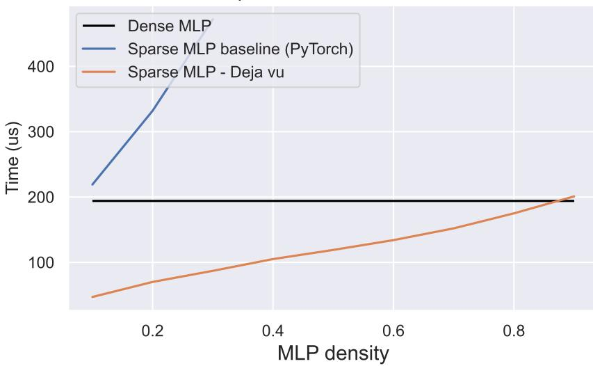

Figure 9. Speed benchmarking of the MLP layer of OPT-175B on 8xA100s. Our sparse implementation is up to  $4.5 \times faster$  than the baseline implementation in PyTorch. Our sparse MLP implementation remains faster than dense MLP for density up to 0.8.

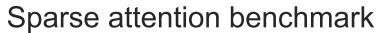

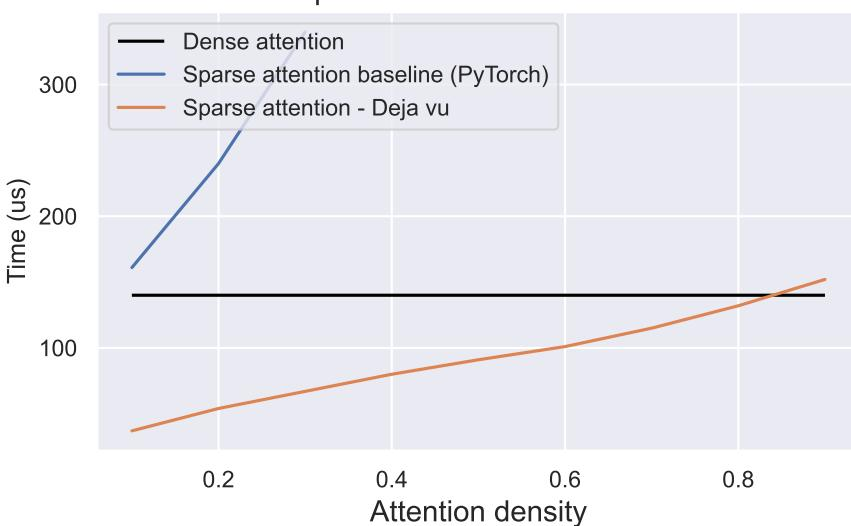

Figure 10. Speed benchmarking of the attention layer of OPT-175B on 8xA100s. Our sparse implementation is up to  $5 \times$  faster than the baseline implementation in PyTorch. Our sparse attention implementation remains faster than dense MLP for density up to 0.8.

<span id="page-36-1"></span>Table 7. Sparsify from the Depth

| Model        | COPA   | Hellaswag | Lambada | OpenBookQA | PIQA   | Winogrande |
|--------------|--------|-----------|---------|------------|--------|------------|
| OPT-175B     | 0.8600 | 0.7814    | 0.7584  | 0.4460     | 0.8096 | 0.7261     |
| - Parallel 2 | 0.8300 | 0.7737    | 0.7762  | 0.4520     | 0.8030 | 0.7096     |
| - Parallel 4 | 0.5200 | 0.2519    | 0       | 0.2720     | 0.5092 | 0.4870     |
| - Skip 2/8   | 0.8000 | 0.7112    | 0.6387  | 0.4220     | 0.7840 | 0.6630     |
| - Skip 2/4   | 0.6900 | 0.4409    | 0.0240  | 0.3400     | 0.6882 | 0.5383     |
| Bloom        | 0.8000 | 0.7460    | 0.6771  | 0.4480     | 0.7949 | 0.7040     |
| - Parallel 2 | 0.8100 | 0.7404    | 0.6992  | 0.4360     | 0.7813 | 0.7048     |
| - Parallel 4 | 0.6200 | 0.3176    | 0.1325  | 0.2720     | 0.5593 | 0.5217     |
| - Skip 2/8   | 0.7900 | 0.6829    | 0.5936  | 0.4120     | 0.7699 | 0.6614     |
| - Skip 2/4   | 0.6600 | 0.5538    | 0.3023  | 0.3580     | 0.7046 | 0.5549     |

| Setting             | Wiki(ppl) | C4(ppl) |
|---------------------|-----------|---------|
| Baseline            | 11.57     | 10.17   |
| Skip every 2 layers | 21.16     | 16.58   |
| Skip every 4 layers | 13.45     | 11.37   |

# <span id="page-36-0"></span>L Future Possibility: Sparsify by layer

Deja Vu currently sparsifies from the perspective of model width. Here, we explore the possibility of sparsifies from model depth. As observed in Section 3, we show that the activation of large language models changes slowly across blocks. This property can be leveraged to increase the efficiency of a trained model by parallelizing, reordering or skipping certain intermediate sub-blocks without significantly impacting the overall accuracy.

Improving the inference efficiency of Transformer models is a challenging task due to their sequential execution of Transformer layers. Each sub-block depends on the output of the previous one, leading to low hardware efficiency, particularly during the token generation phase where each forward pass is computed for only one token. However, the sequential execution of blocks and sub-blocks yields computation bubbles, and the latter one involves a large amount of communication overhead. Here, we present an interesting observation that can potentially alleviate these challenges. We found that the activation of the model changes slowly across blocks. Specifically, the cosine similarity of activations between adjacent blocks is often above 0.99.

This suggests that the blocks might take the previous activation as input – parallelize or reorder the blocks – without significantly affecting the output. Slowly changing activations suggest that it may be possible to parallelize, reorder, or even skip blocks while maintaining a similar output. Some existing models, such as GPT-J [\(Wang & Komatsuzaki,](#page-12-12) [2021\)](#page-12-12), GPT-NeoX [\(Black](#page-8-21) [et al.,](#page-8-21) [2022\)](#page-8-21), and PaLM [\(Chowdhery et al.,](#page-9-24) [2022\)](#page-9-24) already placed the Attention block and MLP block in parallel in training to facilitate parallel computation and reduce the communication overhead. Here we investigate the possibility at inference time.

Given the activation x and Transformer layer i, we have:

$$x \leftarrow x + MHA_i(x)$$
$$x \leftarrow x + MLP_i(x)$$

Parallelizing two blocks refers to placing the Attention and MLP blocks in parallel, i.e.:

$$x \leftarrow x + MHA_i(x) + MLP_i(x)$$

Parallelizing four blocks then parallize the blocks of two Transformer layers, defined as follows:

$$x \leftarrow x + MHA_i(x) + MLP_i(x) + MHA_{i+1}(x) + MLP_{i+1}(x)$$

Skipping layers is straightforward, which drops an entire Transformer layer for every n layers.

We are surprised to find that parallel two layers preserve accuracy on a series of tasks across model. Besides, randomly skipping 25% layer doesn't lead to catastrophic quality. Our findings suggest from the downstream task perspective, the activation patterns within the model are relatively consistent across different blocks, providing a potential avenue for future research on model compression and optimization.