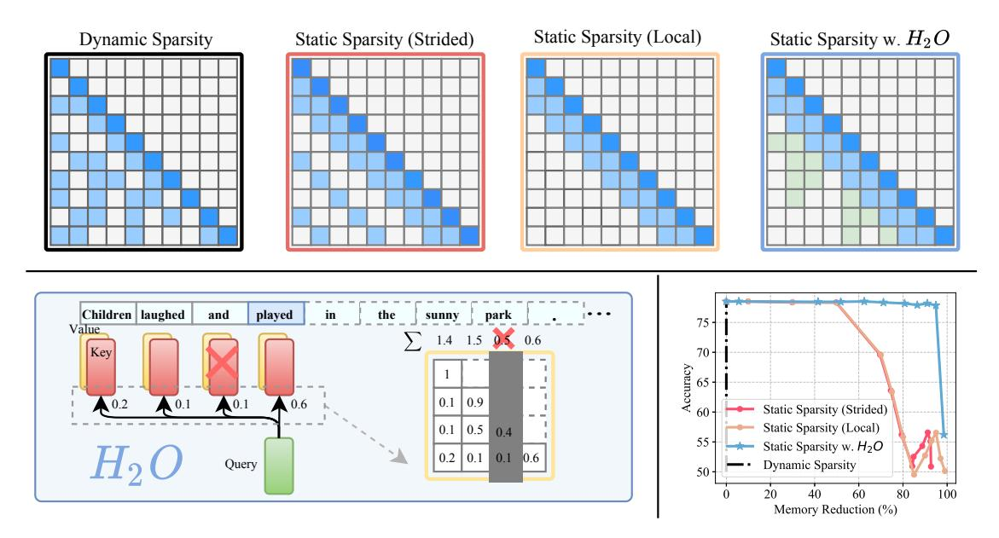
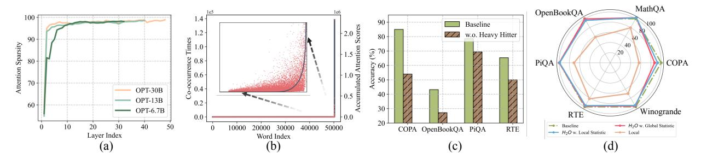
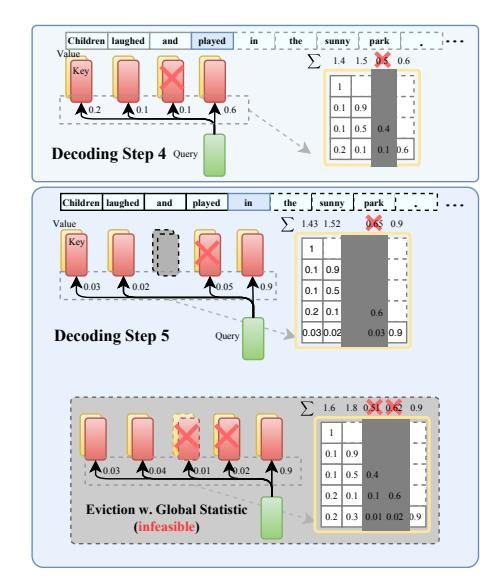
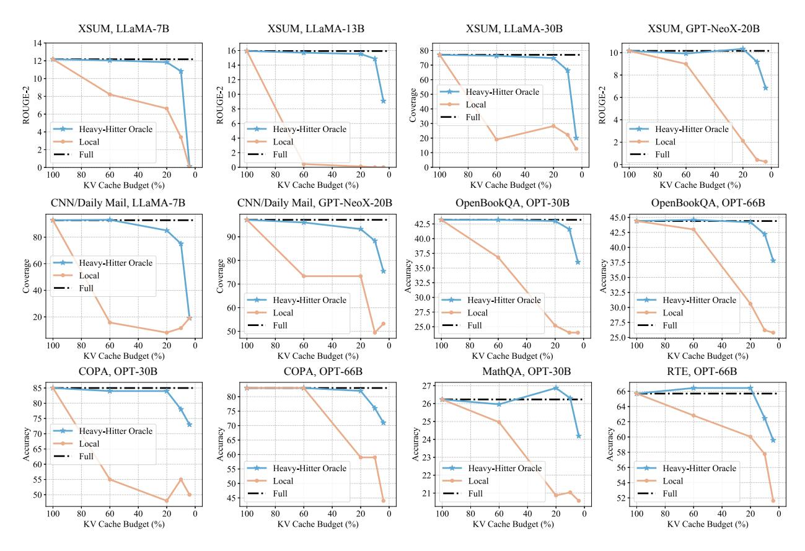
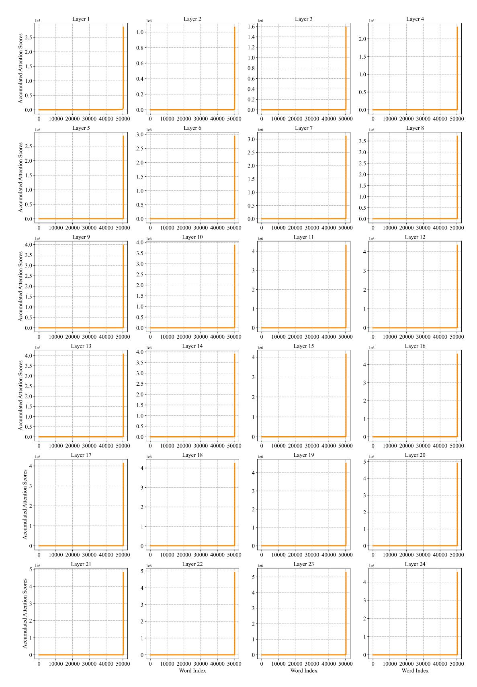
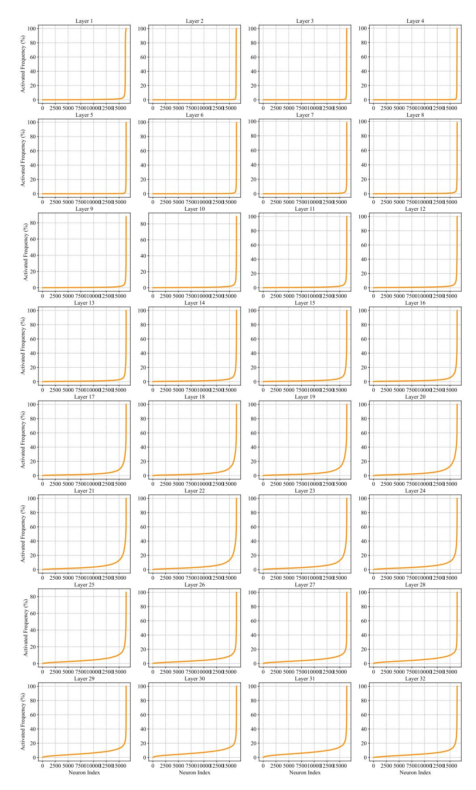
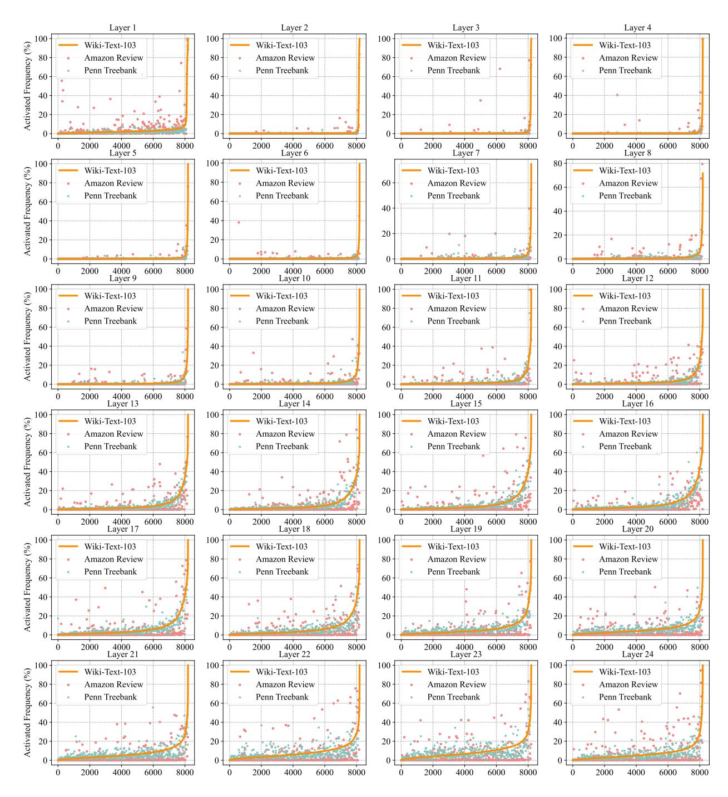
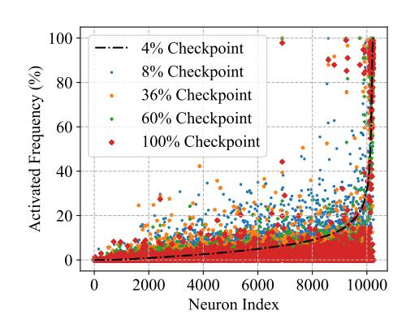
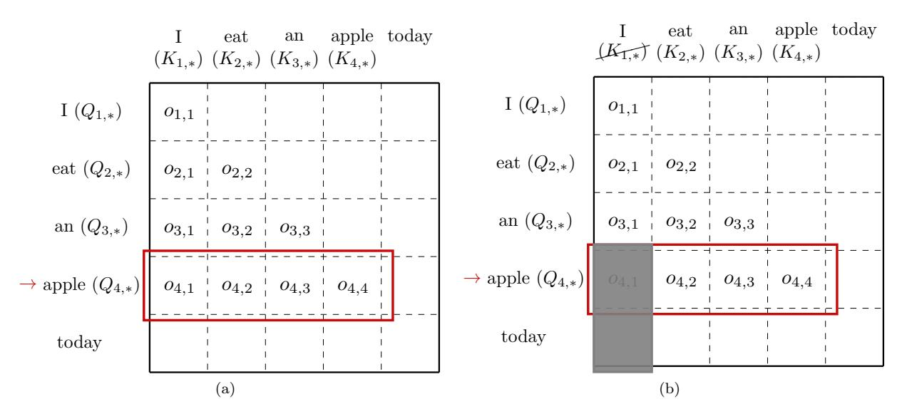

# H2O: Heavy-Hitter Oracle for Efficient Generative Inference of Large Language Models

Zhenyu Zhang<sup>1</sup> , Ying Sheng<sup>2</sup> , Tianyi Zhou<sup>3</sup> , Tianlong Chen<sup>1</sup> , Lianmin Zheng<sup>4</sup> , Ruisi Cai<sup>1</sup> , Zhao Song<sup>5</sup> , Yuandong Tian<sup>6</sup> , Christopher Ré<sup>2</sup> , Clark Barrett<sup>2</sup> , Zhangyang Wang<sup>1</sup> , Beidi Chen<sup>6</sup>,<sup>7</sup> <sup>1</sup>University of Texas at Austin, <sup>2</sup>Stanford University, <sup>3</sup>University of California, San Diego, <sup>4</sup>University of California, Berkeley, <sup>5</sup>Adobe Research, <sup>6</sup>Meta AI (FAIR), <sup>7</sup>Carnegie Mellon University {zhenyu.zhang,tianlong.chen,ruisi.cai,atlaswang}@utexas.edu, ying1123@stanford.edu, {chrismre,barrett}@cs.stanford.edu, t8zhou@ucsd.edu, lianminzheng@gmail.com, zsong@adobe.com, yuandong@meta.com, beidic@andrew.cmu.edu

June 27, 2023

#### Abstract

Large Language Models (LLMs), despite their recent impressive accomplishments, are notably costprohibitive to deploy, particularly for applications involving long-content generation, such as dialogue systems and story writing. Often, a large amount of transient state information, referred to as the KV cache, is stored in GPU memory in addition to model parameters, scaling linearly with the sequence length and batch size. In this paper, we introduce a novel approach for implementing the KV cache which significantly reduces its memory footprint. Our approach is based on the noteworthy observation that a small portion of tokens contributes most of the value when computing attention scores. We call these tokens Heavy Hitters (H2). Through a comprehensive investigation, we find that (i) the emergence of H<sup>2</sup> is natural and strongly correlates with the frequent co-occurrence of tokens in the text, and (ii) removing them results in significant performance degradation. Based on these insights, we propose Heavy Hitter Oracle (H2O), a KV cache eviction policy that dynamically retains a balance of recent and H<sup>2</sup> tokens. We formulate the KV cache eviction as a dynamic submodular problem and prove (under mild assumptions) a theoretical guarantee for our novel eviction algorithm which could help guide future work. We validate the accuracy of our algorithm with OPT, LLaMA, and GPT-NeoX across a wide range of tasks. Our implementation of H2O with 20% heavy hitters improves the throughput over three leading inference systems DeepSpeed Zero-Inference, Hugging Face Accelerate, and FlexGen by up to 29×, 29×, and 3× on OPT-6.7B and OPT-30B. With the same batch size, H2O can reduce the latency by up to 1.9×. The code is available at <https://github.com/FMInference/H2O>.

### 1 Introduction

Large Language Models (LLMs) have demonstrated remarkable proficiency in a wide range of natural language processing applications such as content creation, summarization, and dialogue systems [\[1,](#page-10-0) [2,](#page-10-1) [3,](#page-10-2) [4\]](#page-10-3). However, their deployment is very costly. In addition to the widely-studied bottlenecks of model size and the quadratic cost of attention layers, the problem of the size of the KV cache, which stores the intermediate attention key and values during generation to avoid re-computation, is becoming increasingly prominent [\[5\]](#page-10-4). For instance, a 30 billion-parameter model with an input batch size of 128 and a sequence length of 1024 results in 180GB of KV cache. A natural approach is to limit its maximum size as is done in classical software or hardware caches [\[6\]](#page-10-5). However, it is challenging to reduce KV cache memory footprints in LLMs without accuracy drops.

While there exists substantial literature on sparse attention approximation in training, they have not seen wide adoption for alleviating KV cache bottleneck. First, most existing methods, e.g., Reformer [\[7\]](#page-10-6), Flash Attention [\[8\]](#page-10-7), and Performer [\[9\]](#page-10-8), are designed to overcome the quadratic memory required by attention mechanisms when modeling long sequences but still require a large cache size. Second, variants like sparse transformers [\[10\]](#page-10-9) or multi-query attention [\[11,](#page-10-10) [12,](#page-10-11) [5\]](#page-10-4) can reduce the cache size, but directly applying them on

<span id="page-1-0"></span>

Figure 1: Upper plots illustrate symbolic plots of an attention map deploying different KV cache policies in LLM generation. Lower right: contrasts their accuracy-memory trade-off. Left: the overview of H2O framework.

pre-trained LLMs for generation results in high miss rates and degrades the accuracy as shown in Figure [1.](#page-1-0) Finally, some recent advances such as gisting tokens [\[13\]](#page-10-12) can learn to compress the KV cache for documents, but their expensive eviction policies are difficult to deploy during generation.

Therefore, an ideal KV cache should have (i) a small cache size to reduce memory footprint, (ii) a low miss rate to maintain the performance and long-content generation ability of LLMs, and (iii) a low-cost eviction policy to reduce the wall-clock time during generation. However, there are three technical challenges. First, it is not immediately clear whether the size of the KV cache can be restricted—each decoding step might, in principle, require access to all previous attention keys and values. Second, identifying an optimal eviction policy that maintains generation accuracy is a combinatorial problem[1](#page-1-1) . Finally, even if an optimal policy can be brute-forced, it is infeasible for deployment on real-world applications.

Fortunately, our preliminary exploration has yielded intriguing observations about the empirical properties of LLMs. These findings pave the way for the potential design of an efficient KV cache.

Sparsity for small cache size: We observe that even when trained densely, the attention matrices of LLMs are over 95% sparse at inference time (shown in Figure [2\)](#page-3-0). This holds for a wide range of pre-trained LLMs. Therefore, only 5% of the KV cache is sufficient for decoding the same output token at each generation step, which suggests it may be possible to have up to a 20× reduction in KV cache size without an accuracy drop.

Heavy-Hitters for low miss rate: We discover that the accumulated attention scores of all tokens in attention blocks adhere to a power-law distribution. It suggests that there exists a small set of influential tokens that are critical during generation, named heavy-hitters (H2). H<sup>2</sup> provides an opportunity to step away from the combinatorial search problem and identify an eviction policy that maintains accuracy.

Greedy algorithm for low-cost policy: we surprisingly find that retaining the H<sup>2</sup> based on local statistics at each decoding step—summing the attention scores of only the preceding tokens—is as effective as considering the attention of future tokens (shown in Figure [2\)](#page-3-0).

Based on the above, we first rigorously define the generative process of LLMs operating with a sizeconstrained KV cache in Section [2.1.](#page-2-0) Then we propose Heavy-Hitter Oracle (H2O), a framework that exploits the properties of LLMs and uses simple, low-cost eviction policies that retrain the quality of LLMs throughout the generation process. Specifically,

- In Section [3,](#page-3-1) we explore the emergence of H<sup>2</sup> in attention, revealing their fundamental and critical roles: (i) H<sup>2</sup> exhibit a strong correlation of frequently co-occurring words in textual data; and (ii) removing H<sup>2</sup> completely damages the model's functionality. We demonstrate that H<sup>2</sup> can largely lower the cache miss rate of the existing policies mentioned above. Theoretically, assuming the attention scheme is submodular, H<sup>2</sup> corresponds to a greedy algorithm and is therefore near-optimal.
- In Section [4,](#page-4-0) we present a greedy but low-cost variant of H<sup>2</sup> which is dynamically determined by the

<span id="page-1-1"></span><sup>1</sup>Belady's Algorithm is optimal for standard cache, but not necessarily for KV cache.

accumulated attention score at each decoding step. We formulate the eviction policy with greedy  $H_2$  as a variant of dynamic submodular maximization. The analysis shows that it results in a similar generative process as the one using the  $H_2$  eviction policy.

We perform extensive experiments on OPT, LLaMA, and GPT-NeoX on a single NVIDIA A100 (80GB) GPU to evaluate  $H_2O$  across a range of tasks from lm-eval-harness [14] and HELM [15]. We implement  $H_2O$  on top of FlexGen that can easily adapt different cache eviction techniques to produce a system with high-throughput inference. Performance experiments show our framework achieves  $29\times$ ,  $29\times$ ,  $3\times$  higher throughputs compared to three leading inference systems, DeepSpeed Zero-Inference [16], Hugging Face Accelerate [17], and FlexGen [18] respectively. With the same batch size,  $H_2O$  achieves up to  $1.9\times$  lower latency compare to FlexGen.

### <span id="page-2-2"></span>2 Related Work and Problem Setting

Quantization, Pruning, Distillation for Inference. To mitigate the resource cost of model inference, various model compression algorithms have been investigated for decades. This big family roughly lies into three groups: (1) quantization [19, 20, 21, 22]; (2) pruning or sparsity [23, 24, 25, 26]; (3) and distillation [27, 28, 29, 30]. They pursue efficient inference from orthogonal perspectives and can also be organically integrated. The techniques studied in this paper are closely related to sparsity but focus on a different inference bottleneck, KV cache.

**Sparse, Low-rank Attention Approx.** The quadratic computational complexity of attention modules is one of the major bottlenecks of transformer inference [31]. Various efforts are devoted to addressing this challenge like Reformer [7], Performer [9], Sparse Transformer [10], etc. The most relevant works that design algorithms to reduce KV cache memory footprint, are considered as our baselines in this paper.

Caching. Caching, which plays a pivotal role in optimizing system performance, entails the development of effective eviction policies to handle frequently accessed data. Conventional approaches such as Least Recently Used and Least Frequently Used [32, 33] prioritize the recency and frequency of data access. And the design of KV cache encounters many similar challenges as traditional caching.

**LLM Inference Breakdown.** The generative procedure of LLMs encompasses two distinct phases: (i) the *prompt* phase, in which an input sequence is utilized to produce the KV cache (consisting of the key and value embeddings), similar to the forward pass employed during LLM training; and (ii) the *token generation* phase, which leverages and updates the KV cache to generate new tokens incrementally. Each generation step relies on the previously generated tokens. The primary focus of this paper is to enhance the efficiency of the KV cache in attention during the token generation phase, thereby accelerating LLM inference.

#### <span id="page-2-0"></span>2.1 Problem Formulation

We formally define the generative process with limited KV cache size. Denote attention query matrix as  $Q \in \mathbb{R}^{n \times d}$  and key matrix as  $K \in \mathbb{R}^{n \times d}$ .  $Q_{i,*}$  represents the *i*-th row of Q and  $K_{\leq i,*}$  represents the first i rows of K. Let k denote the budget of space and k < n. For simplicity,  $K_{S_i,*}$  denotes a sub-matrix of K which selects  $S_i$  rows from K. Eviction policy is defined as:

<span id="page-2-1"></span>**Definition 2.1** (Eviction Policy, informal). Let  $S_{i-1}$  denote the source set. Let  $S_i$  denote the target set. We defined the eviction policy  $g: S_{i-1} \to S_i$  such that

- $|S_i| = k$  (KV cache size is not changing over the time)
- $|S_i \setminus S_{i-1}| \le 1$  or equivalently  $|S_i \cap S_{i-1}| \ge k-1$  (we can evict at most 1 KV in the KV cache)

Then, we define the generative process with our eviction policy.

**Definition 2.2** (The generative process with eviction policy, informal). Let k denote the size of the KV cache. For each  $i \in [n]$ , for the i-th token, we have

- Let  $S_i \subset [n]$  denote the tokens in KV cache when predicting the i-th token.
- The information we have is a length-i vector  $o_i := D_i^{-1} \cdot \exp(Q_{i,*}(K_{S_i,*})^\top)$  (normalized attention)

<span id="page-3-0"></span>

Figure 2: (a) Attention Sparsity in pre-trained OPT models. (b) The distribution of accumulated attention scores with respect to the corresponding word (red scatter) and the co-occurrence times of words in the data (gray curve). The x-axis represents the word index in the vocabulary. (c) The performance comparison between the baseline model with full KV and the model w.o. heavy hitter. (d) Comparison between the baseline model with full KV,  $H_2O$  with the local statistic,  $H_2O$  with the global statistic, and the model with only the most recent KV (Local). Apart from the baseline model, each model is evaluated with 20% KV cache budget.

- scalar  $D_i := (\exp(Q_{i,*}(K_{S_i,*})^\top) 1_{[i]\setminus S_i}) \cdot \mathbf{1}_i$  (the evicted KV is set to 0, and we need to subtract them when computing the normalization)
- Replacing  $S_i$  by [i] in the above definition of  $o_i$  and  $D_i$  leads to standard generative process.
- The eviction policy (Definition 2.1) updates  $S_i$  based on  $S_{i-1}$  and their corresponding information.

**Remark 2.3.** Our goal is to find a KV cache eviction policy such that the output of the generative process is similar or comparable to the original one without limiting the cache size.

### <span id="page-3-1"></span>3 Observations

We present two key empirical insights of LLMs that inspire the design of H<sub>2</sub>O, as follows.

### 3.1 Sparsity for Small Cache Size

We first show an observation on the sparsity of attention in pre-trained LLMs. Then we discuss how it can potentially unlock the possibility of reducing KV cache size without an accuracy drop. Given the normalized attention score Softmax( $QK^{\top}$ ) matrix that is calculated by the query matrix Q and the key matrix K, we set the threshold as one percent of the maximum value in each row and calculates the corresponding sparsity.

**Observation.** We conduct zero-shot inference with the pre-trained OPT model on the validation set of Wiki-Text-103. We plot the layer-wise sparsity within attention blocks and visualize the normalized attention score matrix. The results are presented in Figure 2 (a). We observe that although the LLMs are densely trained, the resulting attention score matrices are highly sparse, with a sparsity over 95% in almost all layers.

**Insights.** The attention blocks' sparsity suggests that access to all previous key and value embeddings is unnecessary for generating the next token. This suggests it is possible to evict unessential KV embeddings and reduce the requirement of KV cache during generation.

### 3.2 Heavy-Hitters for Low Miss Rate

The previous section showed the sparse nature of attention blocks in pre-trained LLMs, which provides the opportunity for designing small KV cache size while still maintaining the performance of LLMs. However, determining the best eviction policy that preserves generation accuracy presents a combinatorial challenge. Although Belady's Algorithm [34] is optimal and easy to compute for standard cache (offline), it is not applicable for KV cache design. Because once evicting important KVs, it could destroy the performance of LLMs due to the sequential dependency of LLM generation.

**Observation.** Fortunately, in the early stage of our exploration, we find that the accumulated attention scores of all the tokens within attention blocks follow a power-law distribution, as shown in Figure 2. This suggests the existence of a small set of tokens that are critical during generation. We denote those tokens as heavy-hitters  $(H_2)$ . In order to verify the importance of these tokens, we compare the quality of LLM

generation after masking heavy hitters with that of the original model. Not surprisingly, as shown in Figure 2, the accuracy drops drastically, confirming the importance of those tokens. Additionally, we can see the accumulated attention score of each word (in red dots) have a high correlation with their co-occurrences in the data (gray curve).

Analysis. First, based on  $H_2$ , we see an opportunity to side-step from the combinatorial search problem and design a KV cache eviction policy that preserves the LLM generation quality. We conduct an empirical study implementing a KV cache eviction policy that retains only the  $H_2$  and the recent KV embeddings in the cache. The intuition is that recent words typically exhibit stronger correlations with current tokens. We assess the effectiveness of this eviction policy through pre-trained OPT-30B and six downstream tasks. The outcomes of these evaluations are illustrated in Figure 2. It is obvious that the  $H_2$  based eviction policy can largely reduce the KV cache size without degrading the performance of OPT-30B.

Moreover, during the post analysis, inspired by [35], we find that  $H_2$  based policy is related to the classical greedy algorithm (a polynomial-time algorithm with provable guarantees) under the assumption that the attention schema is submodular. We present details in Appendix D.

<span id="page-4-4"></span>**Lemma 3.1** (informal). Assuming the attention scheme is submodular, then greedily constructing the set  $S_i$  (without cache size limitation) satisfies the near-optimal property in terms of submodular.

### <span id="page-4-0"></span>4 Heavy-Hitter Oracle

The goal of this section is to propose the greedy algorithm using the  $H_2$ -based policy and to show the provable guarantees. We first present the  $H_2$ -based policy called  $H_2O$  cache eviction policy and formulate its deployment in LLM generation as a variant of submodular maximization problem, named *dynamic submodular*. Then we present  $H_2O$  in the generative process, followed by a practical example of deploying our proposal. Finally, we provide theoretical guarantees for  $H_2O$  and show our efficient system implementation.

### <span id="page-4-2"></span>4.1 Greedy Algorithm for Low-Cost Policy

We have shown a simple yet effective KV cache policy based on  $H_2$ . However, it is impractical to deploy such an algorithm because we do not have access to the future-generated tokens. Fortunately, we empirically observe that local  $H_2$ , which is calculated using local statistics at every decoding step by summing up the attention scores of the previous tokens, is equally effective as taking into account the attention of future tokens (Figure 2). In the following, we formally define this dynamic attention score computation (with space limitation) as a novel dynamic submodular type problem.

<span id="page-4-1"></span>**Definition 4.1** (Dynamic submodular framework, informal). Define function  $F: 2^{[n]} \times 2^{[n]} \to \mathbb{R}$ , then for any set  $Z \subset [n]$ , we assume that  $F(Z, \cdot): 2^{[n]} \to \mathbb{R}$  is a submodular function w.r.t. to Z, i.e.,

- For all sets  $X, Y \subset [n]$  satisfy that  $Z \subset X \subset Y$ ,
- For all element  $x \in [n]$  satisfy that  $x \in [n] \setminus Y$ , we have  $f(X \cup \{x\}) f(X) \ge f(Y \cup \{x\}) f(Y)$ , where  $f(\cdot) := F(Z, \cdot)$ .

**Remark 4.2.** We provide practical insights of Definition 4.1. X denotes the existing words in the KV cache. Y is any superset of X. x can be viewed as a "word" which is either newly added to KV cache or existing deleted from KV cache. An example f can be attention score, i.e., see Algorithm 1.

If we load the sequence of  $S_1, S_2, \dots, S_n$  (we promise that  $|S_i| \le k$  and  $|S_i \setminus S_{i-1}| \le 1$ ) into Definition 4.1, i.e., for each  $i \in [n]$ , we choose  $Z = S_i$ , then it becomes a particular instance of the dynamic submodular problem.

Next, we provide a formal description of our algorithm, followed by an example.

<span id="page-4-3"></span>**Definition 4.3** (H<sub>2</sub>O Eviction Policy). Let  $F_{\text{score}}: 2^{[n]} \to \mathbb{R}$  denote certain score function. Let  $S_{i-1}$  denote the source set. Let  $S_i$  denote the target set. We defined the eviction policy  $g: S_{i-1} \to S_i$  s.t.

- $|S_i| = k$  (KV cache size is not changing over the time)
- $|S_i \setminus S_{i-1}| \le 1$  or equivalently  $|S_i \cap S_{i-1}| \ge k-1$  (we can evict at most 1 KV in the KV cache)
- We construct  $S_i \leftarrow (S_{i-1} \cup \{i\}) \setminus \{u\}$  as  $u \leftarrow \arg\max_{v \in (S_{i-1} \cup \{i\})} F_{\text{score}}(S_{i-1} \cup \{i\} \setminus \{v\})$

To describe our algorithm (Algorithm 1), we choose a particular instantiation of the function  $F_{\text{score}}$ , *i.e.*, the summation of that sets in the attention matrix.

#### <span id="page-5-0"></span>Algorithm 1 $H_2$ Eviction Algorithm

```
1: procedure H<sub>2</sub> EVICTION(Q, K \in \mathbb{R}^{n \times d}, k \in \mathbb{N})
            Let k denote the budget size of cache
 3:
            S_0 \leftarrow \emptyset
            for i = 1 \rightarrow n \ \mathbf{do}
 4:
                  if i \leq k then
 5:
                         S_i \leftarrow S_{i-1} \cup \{i\}
 6:
 7:
                  else
                         D_i \leftarrow (\exp(Q_{i,*}(K_{S_i,*})^\top) - 1_{[i] \setminus S_i}) \cdot \mathbf{1}_i
 8:
                        o_i \leftarrow D_i^{-1} \cdot \exp(Q_{i,*}(K_{S_i,*})^{\perp})
 9:
                         F_{\text{score}}(T) := \sum_{s \in T} o_s
10:
                        G_i \leftarrow S_{i-1} \cup \{i\}
11:
                         u \leftarrow \arg \max F_{\text{score}}(S_{i-1} \cup \{i\} \setminus \{v\})
12:
                         S_i \leftarrow (S_{i-1} \cup \{i\}) \setminus \{u\}
13:
                  end if
14:
            end for
15:
16: end procedure
```

<span id="page-5-1"></span>

Figure 3: Illustration of Algorithm 1 during two consecutive decoding steps.

Figure 3 presents an illustrative example of our  $H_2$  Eviction Algorithm. We assume that the budget size of KV cache is 3. Following the completion of the fourth decoding step, the KV embeddings associated with the third token are evicted based on the accumulated attention score. Consequently, these evicted KV embeddings become inaccessible in the subsequent decoding steps.

### 4.2 Theoretical Guarantee and System Implementation

We state a theoretical result as follows. The proofs and more details are provided in Appendix D.

<span id="page-5-4"></span>**Theorem 4.4** (informal). Under the mild assumption, let k denote the budget of space limitation. If for each token, we greedily compute the attention score based on top-k choice, then we can show the set  $\widetilde{S}_i$  we generate each for token i satisfy that  $f(\widetilde{S}_i) \geq (1-\alpha)(1-1/e) \max_{|S|=k} f(S) - \beta$ , where  $\alpha, \beta > 0$  are parameters.

<span id="page-5-2"></span>**Remark 4.5.** We remark the above theorem provides a theoretical explanation of why can we hope our greedy algorithm (with cache limitation) can provide a good solution to the problem.

Implementation Details. We provide a general framework that can support any KV cache eviction algorithm and enhance throughput and reduce the latency of LLM generation with careful implementation. For example, to ensure I/O efficiency, we do not swap memory when stored KV is evicted, but directly fill with newly-added KV. More details are included in Appendix A.

## <span id="page-5-3"></span>5 Empirical Evaluation

In this section, our goal is to demonstrate that  $H_2O$ , a remarkably simple KV cache eviction policy is capable of enhancing end-to-end throughput and reducing latency in wall-clock while maintaining generation quality across a broad spectrum of domains and tasks.

 $\bullet$  In Section 5.1, we show that  $H_2O$  can reduce the memory footprint of KV cache by up to  $5\times$  without accuracy degradation on a wide range of model architectures (OPT, LLaMA, GPT-NeoX), sizes (from 6.7B to 175B) and evaluation benchmarks (HELM and lm-eval-harness). More importantly, can enhance the performance of existing KV cache sparsification techniques.

<span id="page-6-1"></span>

Figure 4: Comparsion results between the baseline model with full cache, our H2O, and the "Local" strategy that utilizes the most recent KV embeddings.

- In Section [5.2,](#page-7-0) we demonstrate that H2O can increase the inference throughput by up to 3×, 29×, 29× compared to the state-of-the-art inference engine FlexGen, DeepSpeed and the widely used Hugging Face Accelerate without compromising model quality.
- In Section [5.3,](#page-8-0) we present extensive ablation studies to show the effectiveness of H2O under different sequence lengths, and its compatibility with quantization.

All details (hyperparameters, data splits, etc.), along with additional experiments, are in Appendix [A.](#page-17-0)

### <span id="page-6-0"></span>5.1 End-to-End Results

We demonstrate that H2O can reduce KV cache memory footprint by 5-10× while achieving comparable accuracy on a majority of tasks.

Setup. Our experiments are based on three representative model families of LLMs, including the OPT [\[36\]](#page-12-2) with model sizes ranging from 6.7 billion to 175 billion, LLaMA [\[37\]](#page-12-3), and GPT-NeoX-20B [\[38\]](#page-12-4). We sample eight tasks from two popular evaluation frameworks (HELM [\[15\]](#page-10-14) and lm-eval-harness [\[14\]](#page-10-13)): COPA [\[39\]](#page-12-5), MathQA [\[40\]](#page-12-6), OpenBookQA [\[41\]](#page-12-7), PiQA [\[42\]](#page-12-8), RTE [\[43\]](#page-12-9), Winogrande [\[44\]](#page-12-10), XSUM [\[45\]](#page-12-11), CNN/Daily Mail [\[46\]](#page-12-12). We use NVIDIA A100 80GB GPU.

Baselines. Since H2O evenly assigns the caching budget to H<sup>2</sup> and the most recent KV, except for full KV cache, we consider the "Local" strategy as a baseline method. In addition, we also provide two different variants of Sparse Transformers (strided and fixed) as strong baselines.

Main Results. We evaluate LLMs with KV cache budget ranging from 4% to 100% on 5-shot downstream tasks. Results are summarized in Figure [4](#page-6-1) and Table [1.](#page-7-1) The following observations can be drawn: (1) With different KV cache budgets, our  $H_2O$  demonstrates consistent and significant improvements against the "Local" strategy across various model sizes, model types, and downstream tasks. We can draw similar conclusions comparing  $H_2O$  with other baselines like Sparse Transformer. Meanwhile, with less than 20% KV cache budget (i.e., more than  $5 \times$  memory reduction),  $H_2O$  achieves comparable performance as the model with full KV embeddings. Our  $H_2O$  shows consistent effectiveness in the more challenging long sequence generation tasks, XSUM, and CNN/Daily Mail.

Analysis. Since the evicted KV will not be seen in the future steps, dropping certain critical KV embeddings can cause a severe functional collapse, resulting in significant performance degradation, e.g., in {LLaMA-13B, XSUM} {LLaMA-7B, CNN/Daily Mail}, the "Local" strategy collapses at 60% budgets while our  $H_2O$  can still match the full cache performance with 20% budgets. In some tasks, our methods even surpass the baseline models, which demonstrates a regularization

<span id="page-7-1"></span>Table 1: Results of different sparsification methods w. or w.o. H<sub>2</sub>. Experiments are conducted with OPT-30B with 20% KV cache budget.

| Models                                           | COPA  | OpenBookQA | PiQA  | Winogrande |
|--------------------------------------------------|-------|------------|-------|------------|
| Full                                             | 85.00 | 43.20      | 78.51 | 70.24      |
| Local w.o. H <sub>2</sub>                        | 48.00 | 25.20      | 55.82 | 49.17      |
| Local w. H <sub>2</sub>                          | 84.00 | 43.00      | 78.45 | 69.06      |
| Sparse Transformer (strided) w.o. H <sub>2</sub> | 50.00 | 24.60      | 56.20 | 47.59      |
| Sparse Transformer (strided) $w$ . $H_2$         | 83.00 | 42.60      | 78.24 | 69.61      |
| Sparse Transformer (fixed) w.o. H <sub>2</sub>   | 61.00 | 23.80      | 58.60 | 49.88      |
| Sparse Transformer (fixed) $w$ . $H_2$           | 76.00 | 41.40      | 77.80 | 64.96      |

effect of our  $H_2O$ . For example, in {OPT-66B, RTE}, {OPT-30B, MathQA} and {GPT-NeoX-20B, XSUM}, our  $H_2O$  achieves an extra performance improvement of 0.73%, 0.64% and 0.18 with 20% KV cache budget, respectively. These consistent results validate the effectiveness of our  $H_2O$  framework.

Enhancing Baseline Techniques. Importantly, we observe other sparsification baselines fail under an extremely low cache budget while combining the most recent KV embeddings with the ones of heavy hitters successfully achieves comparable performance as using full KV embeddings. From Table 1, we can observe that both "strided" and "fixed" sparse attention fail under 20% KV cache budgets, encountering a significant performance drop (up to 35% compared with the full cache). After combining with  $H_2$ , both approaches reach a similar performance as using full KV embeddings.

### <span id="page-7-0"></span>5.2 Heavy Hitter for High-Throughput Generative Inference

We implement our KV cache eviction policy in a state-of-the-art inference engine, FlexGen [18], and report the throughput and latency improvements.  $H_2O$  is orthogonal to existing optimizations in FlexGen, such as offloading and quantization, so they can be combined to achieve better performance.

<span id="page-7-2"></span>Table 2: Generation throughput (token/s) on a T4 GPU with different systems. In the sequence length row, we use "512 + 32" to denote a prompt length of 512 and a generation length of 32. "OOM" means out-of-memory. The gray text in the bracket denotes the effective batch size and the lowest level of the memory hierarchy that the system needs for offloading, where "C" means CPU and "G" means GPU.

| Seq. length                        | 512+32                                     |                                          | 512 + 512                                 |                                         | 512+1024                                   |                                         |
|------------------------------------|--------------------------------------------|------------------------------------------|-------------------------------------------|-----------------------------------------|--------------------------------------------|-----------------------------------------|
| Model size                         | 6.7B                                       | 30B                                      | 6.7B                                      | 30B                                     | 6.7B                                       | 30B                                     |
| Accelerate<br>DeepSpeed<br>FlexGen | 20.4 (2, G)<br>10.2 (16, C)<br>20.2 (2, G) | 0.6 (8, C)<br>0.6 (4, C)<br>8.1 (144, C) | 15.5 (1, G)<br>9.6 (16, C)<br>16.8 (1, G) | 0.6 (8, C)<br>0.6 (4, C)<br>8.5 (80, C) | 5.6 (16, C)<br>10.1 (16, C)<br>16.9 (1, G) | 0.6 (8, C)<br>0.6 (4, C)<br>7.1 (48, C) |
| H <sub>2</sub> O (20%)             | 35.1 (4, G)                                | 12.7 (728, C)                            | 51.7 (4, G)                               | 18.83 (416, C)                          | <b>52.1</b> (4, G)                         | 13.82 (264, C)                          |

Setup We conducted experiments on two GPUs: an NVIDIA T4 (16GB) GPU and an NVIDIA A100 (80GB) GPU. On the T4 GPU, we evaluate the generation throughput following the settings in the Flex-Gen paper. The evaluated models are OPT-6.7B and OPT-30B. When the model and KV cache do not fit

<span id="page-7-3"></span>Table 3: Generation throughput and latency on an A100 GPU. In the sequence length row, we use "7000 + 1024" to denote a prompt length of 7000 and a generation length of 1024. "OOM" means out-of-memory.

| Seq. length                                                      | Model size | Batch size | Metric               | FlexGen | H <sub>2</sub> O (20%) |
|------------------------------------------------------------------|------------|------------|----------------------|---------|------------------------|
| 7000+1024                                                        | 30B        | 1          | latency (s)          | 57.0    | 50.4                   |
| 5000+5000                                                        | 13B        | 4          | latency (s)          | 214.2   | 155.4                  |
| 2048+2048                                                        | 6.7B       | 24         | latency (s)          | 99.5    | 53.5                   |
| $\begin{array}{r} \hline 2048 + 2048 \\ 2048 + 2048 \end{array}$ | 6.7B       | 24         | throughput (token/s) | 494.1   | 918.9                  |
|                                                                  | 6.7B       | 64         | throughput (token/s) | OOM     | 1161.0                 |

into a single GPU, we turn on CPU offloading. We use synthetic datasets where all prompts are padded to the same length. The system is then required to generate the same number of tokens for each prompt. We test different combinations of prompt and generation lengths. The evaluation metric is generation throughput, which is the number of generated tokens / (prompt time + decoding time). We use DeepSpeed ZeRO-Inference [16], Hugging Face Accelerate [17], and FlexGen [18] as baselines. On the A100 GPU, with more GPU memory, we evaluate the performance of the systems with sequence lengths up to 10K. Although OPT is only trained on 2K sequence length, we benchmark the throughput and latency performance to show the potential of  $H_2O$  for better models in the future.

Results. Table 2 shows the generation throughput of all systems on the T4 GPU. With our KV cache eviction policy, the memory usage is reduced, which brings two advantages: 1) we can use a much larger batch size; 2) we can make a setting from requiring offloading to not requiring offloading. As shown in Table 2,  $H_2O$  with a 20% budget improves the generation throughput over FlexGen, DeepSpeed, and Accelerate by up to  $3\times$ ,  $29\times$ , and  $29\times$ , respectively. The results on the A100 GPU with sequence lengths from 4K to 10K are listed in Table 3. With the same batch size,  $H_2O$  can reduce the latency by  $1.1-1.9\times$  compared to FlexGen. Additionally,  $H_2O$  saves memory so it allows a larger batch size, which brings  $2.3\times$  improvement on generation throughput for OPT-6.7B.

#### <span id="page-8-0"></span>5.3 Ablation Results

We present extensive ablation studies of  $H_2O$  on (1) different sequence lengths, (2) compatibility with quantization methods on KV cache, and (3) dissecting the effectiveness of different components. Moreover, we find a surprising property of  $H_2O$  – it not only improves the efficiency of LLMs, but also increases the diversity of the generated text.

Q1: Does the number of shots during inference effects the effectiveness of  $H_2O$ ? A1: Effective under both 5 and 10 shots inference. We further examine  $H_2O$  under different numbers of shots during inference, and the results are reported

<span id="page-8-1"></span>Table 4: Results under different sequence length of OPT-30B with 20% KV cache budget.

| Tasks      | Methods          | 5-sh    | nots                               | 10-shots |         |
|------------|------------------|---------|------------------------------------|----------|---------|
|            |                  | OPT-30B | $\mathrm{OPT}\text{-}66\mathrm{B}$ | OPT-30B  | OPT-66B |
|            | Full             | 43.20   | 44.40                              | 43.00    | 44.80   |
| OpenBookQA | Local            | 25.20   | 30.60                              | 26.60    | 38.80   |
|            | H <sub>2</sub> O | 43.00   | 44.20                              | 42.80    | 44.80   |
| COPA       | Full             | 85.00   | 83.00                              | 86.00    | 85.00   |
|            | Local            | 48.00   | 59.00                              | 60.00    | 76.00   |
|            | H <sub>2</sub> O | 84.00   | 82.00                              | 85.00    | 86.00   |
| MathQA     | Full             | 26.23   | 27.87                              | 26.67    | 27.00   |
|            | Local            | 20.87   | 25.49                              | 21.11    | 23.08   |
|            | H <sub>2</sub> O | 26.87   | 27.67                              | 26.47    | 27.30   |

in Table 4. Both with 5 and 10 shots inference, our  $H_2O$  achieves matching performance (difference less than 1.00%) as the full model across different downstream tasks. And the "Local" strategy encounters significant performance degradation (up to 37.00%. Such results demonstrate the effectiveness of our  $H_2O$  under different inference scenarios.

Q2: Compatible with Quatization? A2: Yes. To pursue further efficiency, we show the compatibility of  $H_2O$  with another orthogonal approach, *i.e.*, quantization in Table 5. We use OPT-30B as our base model and COPA, OpenBookWA, and PiQA as evaluation tasks. Intuitively sparsity and quantization are highly related so combining them might introduce larger errors. Surprisingly the combination almost always achieves better accuracy than  $H_2O$  or quantization alone. Experiments about throughput improvement of  $H_2O$  combining with quantization see Appendix C.

<span id="page-8-2"></span>Table 5: Compatibility with Quantization.

| Models                         | COPA  | ${\rm OpenBookQA}$ | PiQA  |
|--------------------------------|-------|--------------------|-------|
| Full                           | 85.00 | 43.20              | 78.51 |
| H <sub>2</sub> O               | 84.00 | 43.00              | 78.45 |
| Quant-4bit                     | 84.00 | 43.28              | 78.67 |
| H <sub>2</sub> O w. Quant-4bit | 84.00 | 43.20              | 78.80 |
|                                |       |                    |       |

Q3: When does  $H_2O$  match the baseline with full KV embeddings? A3: With both  $H_2$  and the recent tokens. We investigate the separate effects of KV embeddings of  $H_2$  and the local tokens. We conduct experiments on 4 tasks with OPT-13B and OPT-30B. For each task, we compare the performance of three KV cache eviction policies, including only the KV embeddings of  $H_2$ , only the ones of local tokens, and our  $H_2O$  that keep both. As shown in Table 6, only retaining the embeddings of  $H_2$  or local tokens can't maintain a similar performance as the model using full embeddings, with a performance degradation from 2.85% to 22.75%. Incorporating both components, our  $H_2O$  successfully retains the baseline performance with full embeddings. Besides, the model with only  $H_2$  shows a consistent improvement against the one with only local tokens, which indicates that  $H_2$  might contribute more to maintaining the performance of networks.

Q4: Extra benefits from H2O? A4: Increased diversity of generated text. Besides all the benefits of our H2O, we also observe an bonus introduced by H2O, i.e., the improved diversity of generated content. The results are reported in Appendix [C.](#page-20-0) Given the same prompts, we visualize the generated text of the models with different KV cache budgets. Compared with the model of full KV cache, our H2O can generate sentences with fewer repeated words and more creativity.

<span id="page-9-0"></span>Table 6: Ablation study of H2O across different tasks.

| Tasks      | Models  | Full  | w. Local | w. H2 | w. Local + H2 |
|------------|---------|-------|----------|-------|---------------|
| PiQA       | OPT-13B | 77.37 | 54.62    | 76.12 | 77.26         |
|            | OPT-30B | 78.51 | 55.82    | 67.25 | 78.45         |
| OpenBookQA | OPT-13B | 41.40 | 25.60    | 30.40 | 41.20         |
|            | OPT-30B | 43.20 | 25.20    | 26.60 | 43.00         |
| MathQA     | OPT-13B | 26.67 | 22.04    | 23.82 | 26.93         |
|            | OPT-30B | 26.23 | 20.87    | 21.98 | 26.87         |
| Winogrande | OPT-13B | 68.59 | 49.96    | 51.85 | 67.32         |
|            | OPT-30B | 70.24 | 49.17    | 47.36 | 69.06         |

## 6 Conclusion and Discussion

In this paper, we study one of the key bottlenecks of LLM deployment, KV cache, particularly for long-content and large-batch generation applications. We propose H2O, a simple KV cache eviction policy for significantly reducing its memory footprint. The main insight of our approach is the recognition of a subset of tokens, known as Heavy Hitters, which contribute the most value when computing attention scores. We formulate the KV cache eviction as a dynamic submodular problem and provide the theoretical guarantees for our algorithm. Through extensive evaluations, we demonstrate that H2O can significantly improve end-to-end throughput and decrease latency in wall-clock time, without compromising the generation quality of LLMs across a variety of tasks.

### References

- <span id="page-10-0"></span>[1] Romal Thoppilan, Daniel De Freitas, Jamie Hall, Noam Shazeer, Apoorv Kulshreshtha, Heng-Tze Cheng, Alicia Jin, Taylor Bos, Leslie Baker, Yu Du, et al. Lamda: Language models for dialog applications. arXiv preprint arXiv:2201.08239, 2022.
- <span id="page-10-1"></span>[2] Ann Yuan, Andy Coenen, Emily Reif, and Daphne Ippolito. Wordcraft: story writing with large language models. In 27th International Conference on Intelligent User Interfaces, pages 841–852, 2022.
- <span id="page-10-2"></span>[3] Jason Wei, Yi Tay, Rishi Bommasani, Colin Raffel, Barret Zoph, Sebastian Borgeaud, Dani Yogatama, Maarten Bosma, Denny Zhou, Donald Metzler, et al. Emergent abilities of large language models. arXiv preprint arXiv:2206.07682, 2022.
- <span id="page-10-3"></span>[4] Tianyi Zhang, Faisal Ladhak, Esin Durmus, Percy Liang, Kathleen McKeown, and Tatsunori B Hashimoto. Benchmarking large language models for news summarization. arXiv preprint arXiv:2301.13848, 2023.
- <span id="page-10-4"></span>[5] Reiner Pope, Sholto Douglas, Aakanksha Chowdhery, Jacob Devlin, James Bradbury, Anselm Levskaya, Jonathan Heek, Kefan Xiao, Shivani Agrawal, and Jeff Dean. Efficiently scaling transformer inference. arXiv preprint arXiv:2211.05102, 2022.
- <span id="page-10-5"></span>[6] Laszlo A Belady, Robert A Nelson, and Gerald S Shedler. An anomaly in space-time characteristics of certain programs running in a paging machine. Communications of the ACM, 12(6):349–353, 1969.
- <span id="page-10-6"></span>[7] Nikita Kitaev, Łukasz Kaiser, and Anselm Levskaya. Reformer: The efficient transformer. arXiv preprint arXiv:2001.04451, 2020.
- <span id="page-10-7"></span>[8] Tri Dao, Dan Fu, Stefano Ermon, Atri Rudra, and Christopher Ré. Flashattention: Fast and memoryefficient exact attention with io-awareness. Advances in Neural Information Processing Systems, 35:16344–16359, 2022.
- <span id="page-10-8"></span>[9] Krzysztof Choromanski, Valerii Likhosherstov, David Dohan, Xingyou Song, Andreea Gane, Tamas Sarlos, Peter Hawkins, Jared Davis, Afroz Mohiuddin, Lukasz Kaiser, et al. Rethinking attention with performers. arXiv preprint arXiv:2009.14794, 2020.
- <span id="page-10-9"></span>[10] Rewon Child, Scott Gray, Alec Radford, and Ilya Sutskever. Generating long sequences with sparse transformers. arXiv preprint arXiv:1904.10509, 2019.
- <span id="page-10-10"></span>[11] Noam Shazeer. Fast transformer decoding: One write-head is all you need. arXiv preprint arXiv:1911.02150, 2019.
- <span id="page-10-11"></span>[12] Aakanksha Chowdhery, Sharan Narang, Jacob Devlin, Maarten Bosma, Gaurav Mishra, Adam Roberts, Paul Barham, Hyung Won Chung, Charles Sutton, Sebastian Gehrmann, et al. Palm: Scaling language modeling with pathways. arXiv preprint arXiv:2204.02311, 2022.
- <span id="page-10-12"></span>[13] Jesse Mu, Xiang Lisa Li, and Noah Goodman. Learning to compress prompts with gist tokens. arXiv preprint arXiv:2304.08467, 2023.
- <span id="page-10-13"></span>[14] Leo Gao, Jonathan Tow, Stella Biderman, Sid Black, Anthony DiPofi, Charles Foster, Laurence Golding, Jeffrey Hsu, Kyle McDonell, Niklas Muennighoff, Jason Phang, Laria Reynolds, Eric Tang, Anish Thite, Ben Wang, Kevin Wang, and Andy Zou. A framework for few-shot language model evaluation. In Zenodo. https://doi.org/10.5281/zenodo.5371628, September 2021.
- <span id="page-10-14"></span>[15] Percy Liang, Rishi Bommasani, Tony Lee, Dimitris Tsipras, Dilara Soylu, Michihiro Yasunaga, Yian Zhang, Deepak Narayanan, Yuhuai Wu, Ananya Kumar, et al. Holistic evaluation of language models. arXiv preprint arXiv:2211.09110, 2022.
- <span id="page-10-15"></span>[16] Reza Yazdani Aminabadi, Samyam Rajbhandari, Minjia Zhang, Ammar Ahmad Awan, Cheng Li, Du Li, Elton Zheng, Jeff Rasley, Shaden Smith, Olatunji Ruwase, et al. Deepspeed inference: Enabling efficient inference of transformer models at unprecedented scale. arXiv preprint arXiv:2207.00032, 2022.

- <span id="page-11-0"></span>[17] HuggingFace. Hugging face accelerate. <https://huggingface.co/docs/accelerate/index>.
- <span id="page-11-1"></span>[18] Ying Sheng, Lianmin Zheng, Binhang Yuan, Zhuohan Li, Max Ryabinin, Daniel Y Fu, Zhiqiang Xie, Beidi Chen, Clark Barrett, Joseph E Gonzalez, et al. High-throughput generative inference of large language models with a single gpu. arXiv preprint arXiv:2303.06865, 2023.
- <span id="page-11-2"></span>[19] Song Han, Huizi Mao, and William J Dally. Deep compression: Compressing deep neural networks with pruning, trained quantization and huffman coding. arXiv preprint arXiv:1510.00149, 2015.
- <span id="page-11-3"></span>[20] Benoit Jacob, Skirmantas Kligys, Bo Chen, Menglong Zhu, Matthew Tang, Andrew Howard, Hartwig Adam, and Dmitry Kalenichenko. Quantization and training of neural networks for efficient integerarithmetic-only inference. In Proceedings of the IEEE conference on computer vision and pattern recognition, pages 2704–2713, 2018.
- <span id="page-11-4"></span>[21] Markus Nagel, Mart van Baalen, Tijmen Blankevoort, and Max Welling. Data-free quantization through weight equalization and bias correction. In Proceedings of the IEEE/CVF International Conference on Computer Vision, pages 1325–1334, 2019.
- <span id="page-11-5"></span>[22] Ritchie Zhao, Yuwei Hu, Jordan Dotzel, Chris De Sa, and Zhiru Zhang. Improving neural network quantization without retraining using outlier channel splitting. In International conference on machine learning, pages 7543–7552. PMLR, 2019.
- <span id="page-11-6"></span>[23] Pavlo Molchanov, Stephen Tyree, Tero Karras, Timo Aila, and Jan Kautz. Pruning convolutional neural networks for resource efficient inference. arXiv preprint arXiv:1611.06440, 2016.
- <span id="page-11-7"></span>[24] Zhuang Liu, Mingjie Sun, Tinghui Zhou, Gao Huang, and Trevor Darrell. Rethinking the value of network pruning. arXiv preprint arXiv:1810.05270, 2018.
- <span id="page-11-8"></span>[25] Yang He, Ping Liu, Ziwei Wang, Zhilan Hu, and Yi Yang. Filter pruning via geometric median for deep convolutional neural networks acceleration. In Proceedings of the IEEE/CVF conference on computer vision and pattern recognition, pages 4340–4349, 2019.
- <span id="page-11-9"></span>[26] Torsten Hoefler, Dan Alistarh, Tal Ben-Nun, Nikoli Dryden, and Alexandra Peste. Sparsity in deep learning: Pruning and growth for efficient inference and training in neural networks. J. Mach. Learn. Res., 22(241):1–124, 2021.
- <span id="page-11-10"></span>[27] Geoffrey Hinton, Oriol Vinyals, Jeff Dean, et al. Distilling the knowledge in a neural network. arXiv preprint arXiv:1503.02531, 2(7), 2015.
- <span id="page-11-11"></span>[28] Jang Hyun Cho and Bharath Hariharan. On the efficacy of knowledge distillation. In Proceedings of the IEEE/CVF international conference on computer vision, pages 4794–4802, 2019.
- <span id="page-11-12"></span>[29] Raphael Tang, Yao Lu, Linqing Liu, Lili Mou, Olga Vechtomova, and Jimmy Lin. Distilling task-specific knowledge from bert into simple neural networks. arXiv preprint arXiv:1903.12136, 2019.
- <span id="page-11-13"></span>[30] Hugo Touvron, Matthieu Cord, Matthijs Douze, Francisco Massa, Alexandre Sablayrolles, and Hervé Jégou. Training data-efficient image transformers & distillation through attention. In International Conference on Machine Learning, pages 10347–10357. PMLR, 2021.
- <span id="page-11-14"></span>[31] Yi Tay, Mostafa Dehghani, Dara Bahri, and Donald Metzler. Efficient transformers: A survey. arXiv preprint arXiv:2009.06732, 2020.
- <span id="page-11-15"></span>[32] Elizabeth J O'neil, Patrick E O'neil, and Gerhard Weikum. The lru-k page replacement algorithm for database disk buffering. Acm Sigmod Record, 22(2):297–306, 1993.
- <span id="page-11-16"></span>[33] Donghee Lee, Jongmoo Choi, Jong-Hun Kim, Sam H Noh, Sang Lyul Min, Yookun Cho, and Chong Sang Kim. Lrfu: A spectrum of policies that subsumes the least recently used and least frequently used policies. IEEE transactions on Computers, 50(12):1352–1361, 2001.

- <span id="page-12-0"></span>[34] Laszlo A. Belady. A study of replacement algorithms for a virtual-storage computer. IBM Systems journal, 5(2):78–101, 1966.
- <span id="page-12-1"></span>[35] Simeng Han, Xiang Lin, and Shafiq Joty. Resurrecting submodularity for neural text generation. arXiv preprint arXiv:1911.03014, 2019.
- <span id="page-12-2"></span>[36] Susan Zhang, Stephen Roller, Naman Goyal, Mikel Artetxe, Moya Chen, Shuohui Chen, Christopher Dewan, Mona Diab, Xian Li, Xi Victoria Lin, et al. Opt: Open pre-trained transformer language models. arXiv preprint arXiv:2205.01068, 2022.
- <span id="page-12-3"></span>[37] Hugo Touvron, Thibaut Lavril, Gautier Izacard, Xavier Martinet, Marie-Anne Lachaux, Timothée Lacroix, Baptiste Rozière, Naman Goyal, Eric Hambro, Faisal Azhar, et al. Llama: Open and efficient foundation language models. arXiv preprint arXiv:2302.13971, 2023.
- <span id="page-12-4"></span>[38] Sid Black, Stella Biderman, Eric Hallahan, Quentin Anthony, Leo Gao, Laurence Golding, Horace He, Connor Leahy, Kyle McDonell, Jason Phang, Michael Pieler, USVSN Sai Prashanth, Shivanshu Purohit, Laria Reynolds, Jonathan Tow, Ben Wang, and Samuel Weinbach. GPT-NeoX-20B: An open-source autoregressive language model. In Proceedings of the ACL Workshop on Challenges & Perspectives in Creating Large Language Models, 2022.
- <span id="page-12-5"></span>[39] Melissa Roemmele, Cosmin Adrian Bejan, and Andrew S Gordon. Choice of plausible alternatives: An evaluation of commonsense causal reasoning. In AAAI spring symposium: logical formalizations of commonsense reasoning, pages 90–95, 2011.
- <span id="page-12-6"></span>[40] Aida Amini, Saadia Gabriel, Shanchuan Lin, Rik Koncel-Kedziorski, Yejin Choi, and Hannaneh Hajishirzi. MathQA: Towards interpretable math word problem solving with operation-based formalisms. In Proceedings of the 2019 Conference of the North American Chapter of the Association for Computational Linguistics: Human Language Technologies, Volume 1 (Long and Short Papers), pages 2357–2367, Minneapolis, Minnesota, June 2019. Association for Computational Linguistics.
- <span id="page-12-7"></span>[41] Todor Mihaylov, Peter Clark, Tushar Khot, and Ashish Sabharwal. Can a suit of armor conduct electricity? a new dataset for open book question answering. In EMNLP, 2018.
- <span id="page-12-8"></span>[42] Yonatan Bisk, Rowan Zellers, Ronan Le Bras, Jianfeng Gao, and Yejin Choi. Piqa: Reasoning about physical commonsense in natural language. In Thirty-Fourth AAAI Conference on Artificial Intelligence, 2020.
- <span id="page-12-9"></span>[43] Alex Wang, Amanpreet Singh, Julian Michael, Felix Hill, Omer Levy, and Samuel R Bowman. Glue: A multi-task benchmark and analysis platform for natural language understanding. arXiv preprint arXiv:1804.07461, 2018.
- <span id="page-12-10"></span>[44] Keisuke Sakaguchi, Ronan Le Bras, Chandra Bhagavatula, and Yejin Choi. Winogrande: An adversarial winograd schema challenge at scale. Communications of the ACM, 64(9):99–106, 2021.
- <span id="page-12-11"></span>[45] Shashi Narayan, Shay B Cohen, and Mirella Lapata. Don't give me the details, just the summary! topic-aware convolutional neural networks for extreme summarization. arXiv preprint arXiv:1808.08745, 2018.
- <span id="page-12-12"></span>[46] Ramesh Nallapati, Bowen Zhou, Caglar Gulcehre, Bing Xiang, et al. Abstractive text summarization using sequence-to-sequence rnns and beyond. arXiv preprint arXiv:1602.06023, 2016.
- <span id="page-12-13"></span>[47] Elias Frantar and Dan Alistarh. Massive language models can be accurately pruned in one-shot. arXiv preprint arXiv:2301.00774, 2023.
- <span id="page-12-14"></span>[48] Elias Frantar, Saleh Ashkboos, Torsten Hoefler, and Dan Alistarh. Gptq: Accurate post-training quantization for generative pre-trained transformers. arXiv preprint arXiv:2210.17323, 2022.
- <span id="page-12-15"></span>[49] Guangxuan Xiao, Ji Lin, Mickael Seznec, Julien Demouth, and Song Han. Smoothquant: Accurate and efficient post-training quantization for large language models. arXiv preprint arXiv:2211.10438, 2022.

- <span id="page-13-0"></span>[50] Zhewei Yao, Reza Yazdani Aminabadi, Minjia Zhang, Xiaoxia Wu, Conglong Li, and Yuxiong He. Zeroquant: Efficient and affordable post-training quantization for large-scale transformers. arXiv preprint arXiv:2206.01861, 2022.
- <span id="page-13-1"></span>[51] Tim Dettmers, Mike Lewis, Younes Belkada, and Luke Zettlemoyer. Gpt3. int8 (): 8-bit matrix multiplication for transformers at scale. In Advances in Neural Information Processing Systems, 2022.
- <span id="page-13-2"></span>[52] Tim Dettmers, Mike Lewis, Younes Belkada, and Luke Zettlemoyer. Llm. int8 (): 8-bit matrix multiplication for transformers at scale. arXiv preprint arXiv:2208.07339, 2022.
- <span id="page-13-3"></span>[53] Sotiris Anagnostidis, Dario Pavllo, Luca Biggio, Lorenzo Noci, Aurelien Lucchi, and Thomas Hoffmann. Dynamic context pruning for efficient and interpretable autoregressive transformers. arXiv preprint arXiv:2305.15805, 2023.
- <span id="page-13-4"></span>[54] Ashish Vaswani, Noam M. Shazeer, Niki Parmar, Jakob Uszkoreit, Llion Jones, Aidan N. Gomez, Lukasz Kaiser, and Illia Polosukhin. Attention is all you need. In NIPS, 2017.
- <span id="page-13-5"></span>[55] Zhilin Yang, Zihang Dai, Yiming Yang, Jaime Carbonell, Russ R Salakhutdinov, and Quoc V Le. Xlnet: Generalized autoregressive pretraining for language understanding. Advances in neural information processing systems, 32, 2019.
- <span id="page-13-6"></span>[56] Yinhan Liu, Myle Ott, Naman Goyal, Jingfei Du, Mandar Joshi, Danqi Chen, Omer Levy, Mike Lewis, Luke Zettlemoyer, and Veselin Stoyanov. Roberta: A robustly optimized bert pretraining approach. arXiv preprint arXiv:1907.11692, 2019.
- <span id="page-13-7"></span>[57] Alon Talmor, Jonathan Herzig, Nicholas Lourie, and Jonathan Berant. Commonsenseqa: A question answering challenge targeting commonsense knowledge. arXiv preprint arXiv:1811.00937, 2018.
- <span id="page-13-8"></span>[58] Ajay Jaiswal, Liyan Tang, Meheli Ghosh, Justin Rousseau, Yifan Peng, and Ying Ding. Radbert-cl: Factually-aware contrastive learning for radiology report classification. Proceedings of machine learning research, 158:196–208, 2021.
- <span id="page-13-9"></span>[59] Wei Yang, Yuqing Xie, Aileen Lin, Xingyu Li, Luchen Tan, Kun Xiong, Ming Li, and Jimmy Lin. End-to-end open-domain question answering with bertserini. arXiv preprint arXiv:1902.01718, 2019.
- <span id="page-13-10"></span>[60] Ming Ding, Chang Zhou, Qibin Chen, Hongxia Yang, and Jie Tang. Cognitive graph for multi-hop reading comprehension at scale. arXiv preprint arXiv:1905.05460, 2019.
- <span id="page-13-11"></span>[61] Jason Wei, Xuezhi Wang, Dale Schuurmans, Maarten Bosma, Ed Chi, Quoc Le, and Denny Zhou. Chain of thought prompting elicits reasoning in large language models. arXiv preprint arXiv:2201.11903, 2022.
- <span id="page-13-12"></span>[62] Jingfeng Yang, Hongye Jin, Ruixiang Tang, Xiaotian Han, Qizhang Feng, Haoming Jiang, Bing Yin, and Xia Hu. Harnessing the power of llms in practice: A survey on chatgpt and beyond. arXiv preprint arXiv:2304.13712, 2023.
- <span id="page-13-13"></span>[63] Jacob Devlin, Ming-Wei Chang, Kenton Lee, and Kristina Toutanova. Bert: Pre-training of deep bidirectional transformers for language understanding. arXiv preprint arXiv:1810.04805, 2018.
- <span id="page-13-14"></span>[64] Colin Raffel, Noam Shazeer, Adam Roberts, Katherine Lee, Sharan Narang, Michael Matena, Yanqi Zhou, Wei Li, and Peter J Liu. Exploring the limits of transfer learning with a unified text-to-text transformer. The Journal of Machine Learning Research, 21(1):5485–5551, 2020.
- <span id="page-13-15"></span>[65] Alec Radford, Jeffrey Wu, Rewon Child, David Luan, Dario Amodei, Ilya Sutskever, et al. Language models are unsupervised multitask learners. OpenAI blog, 1(8):9, 2019.
- <span id="page-13-16"></span>[66] Tom B Brown, Benjamin Mann, Nick Ryder, Melanie Subbiah, Jared Kaplan, Prafulla Dhariwal, Arvind Neelakantan, Pranav Shyam, Girish Sastry, Amanda Askell, et al. Language models are few-shot learners. arXiv preprint arXiv:2005.14165, 2020.

- <span id="page-14-0"></span>[67] Teven Le Scao, Angela Fan, Christopher Akiki, Ellie Pavlick, Suzana Ilić, Daniel Hesslow, Roman Castagné, Alexandra Sasha Luccioni, François Yvon, Matthias Gallé, et al. Bloom: A 176b-parameter open-access multilingual language model. arXiv preprint arXiv:2211.05100, 2022.
- <span id="page-14-1"></span>[68] Jingzhao Zhang, Sai Praneeth Karimireddy, Andreas Veit, Seungyeon Kim, Sashank J Reddi, Sanjiv Kumar, and Suvrit Sra. Why {adam} beats {sgd} for attention models, 2020.
- <span id="page-14-2"></span>[69] Liyuan Liu, Haoming Jiang, Pengcheng He, Weizhu Chen, Xiaodong Liu, Jianfeng Gao, and Jiawei Han. On the variance of the adaptive learning rate and beyond. arXiv preprint arXiv:1908.03265, 2019.
- <span id="page-14-3"></span>[70] Liyuan Liu, Xiaodong Liu, Jianfeng Gao, Weizhu Chen, and Jiawei Han. Understanding the difficulty of training transformers. arXiv preprint arXiv:2004.08249, 2020.
- <span id="page-14-4"></span>[71] Dušan Variš and Ondřej Bojar. Sequence length is a domain: Length-based overfitting in transformer models. arXiv preprint arXiv:2109.07276, 2021.
- <span id="page-14-5"></span>[72] Wancong Zhang and Ieshan Vaidya. Mixup training leads to reduced overfitting and improved calibration for the transformer architecture. arXiv preprint arXiv:2102.11402, 2021.
- <span id="page-14-6"></span>[73] Xiaodong Liu, Kevin Duh, Liyuan Liu, and Jianfeng Gao. Very deep transformers for neural machine translation. arXiv preprint arXiv:2008.07772, 2020.
- <span id="page-14-7"></span>[74] Peng Xu, Dhruv Kumar, Wei Yang, Wenjie Zi, Keyi Tang, Chenyang Huang, Jackie Chi Kit Cheung, Simon JD Prince, and Yanshuai Cao. Optimizing deeper transformers on small datasets. arXiv preprint arXiv:2012.15355, 2020.
- <span id="page-14-8"></span>[75] Chen Zhu, Renkun Ni, Zheng Xu, Kezhi Kong, W Ronny Huang, and Tom Goldstein. Gradinit: Learning to initialize neural networks for stable and efficient training. Advances in Neural Information Processing Systems, 34:16410–16422, 2021.
- <span id="page-14-9"></span>[76] Jeremy M Cohen, Behrooz Ghorbani, Shankar Krishnan, Naman Agarwal, Sourabh Medapati, Michal Badura, Daniel Suo, David Cardoze, Zachary Nado, George E Dahl, et al. Adaptive gradient methods at the edge of stability. arXiv preprint arXiv:2207.14484, 2022.
- <span id="page-14-10"></span>[77] Hongyu Wang, Shuming Ma, Li Dong, Shaohan Huang, Dongdong Zhang, and Furu Wei. Deepnet: Scaling transformers to 1,000 layers. arXiv preprint arXiv:2203.00555, 2022.
- <span id="page-14-11"></span>[78] Qiming Yang, Kai Zhang, Chaoxiang Lan, Zhi Yang, Zheyang Li, Wenming Tan, Jun Xiao, and Shiliang Pu. Unified normalization for accelerating and stabilizing transformers. arXiv preprint arXiv:2208.01313, 2022.
- <span id="page-14-12"></span>[79] Ilya Loshchilov and Frank Hutter. Decoupled weight decay regularization. arXiv preprint arXiv:1711.05101, 2017.
- <span id="page-14-13"></span>[80] Tim Dettmers and Luke Zettlemoyer. The case for 4-bit precision: k-bit inference scaling laws. arXiv preprint arXiv:2212.09720, 2022.
- <span id="page-14-14"></span>[81] Amir Zandieh, Insu Han, Majid Daliri, and Amin Karbasi. Kdeformer: Accelerating transformers via kernel density estimation. arXiv preprint arXiv:2302.02451, 2023.
- <span id="page-14-15"></span>[82] Josh Alman and Zhao Song. Fast attention requires bounded entries. arXiv preprint arXiv:2302.13214, 2023.
- <span id="page-14-16"></span>[83] Jan van den Brand, Zhao Song, and Tianyi Zhou. Algorithm and hardness for dynamic attention maintenance in large language models. arXiv preprint arXiv:2304.02207, 2023.
- <span id="page-14-17"></span>[84] Yeqi Gao, Zhao Song, and Xin Yang. Differentially private attention computation. arXiv preprint arXiv:2305.04701, 2023.

- <span id="page-15-0"></span>[85] Yichuan Deng, Sridhar Mahadevan, and Zhao Song. Randomized and deterministic attention sparsification algorithms for over-parameterized feature dimension. arxiv preprint: arxiv 2304.03426, 2023.
- <span id="page-15-1"></span>[86] Zhihang Li, Zhao Song, and Tianyi Zhou. Solving regularized exp, cosh and sinh regression problems. arXiv preprint, 2303.15725, 2023.
- <span id="page-15-2"></span>[87] Yichuan Deng, Zhihang Li, and Zhao Song. Attention scheme inspired softmax regression. arXiv preprint arXiv:2304.10411, 2023.
- <span id="page-15-3"></span>[88] Yeqi Gao, Zhao Song, and Junze Yin. An iterative algorithm for rescaled hyperbolic functions regression. arXiv preprint arXiv:2305.00660, 2023.
- <span id="page-15-4"></span>[89] Ritwik Sinha, Zhao Song, and Tianyi Zhou. A mathematical abstraction for balancing the trade-off between creativity and reality in large language models. arXiv preprint arXiv:2306.02295, 2023.
- <span id="page-15-5"></span>[90] Alexander Schrijver. Combinatorial optimization: polyhedra and efficiency, volume 24. Springer, 2003.
- <span id="page-15-6"></span>[91] Kasper Green Larsen, Jelani Nelson, Huy L Nguyen, and Mikkel Thorup. Heavy hitters via clusterpreserving clustering. In 2016 IEEE 57th Annual Symposium on Foundations of Computer Science (FOCS), pages 61–70. IEEE, 2016.
- <span id="page-15-7"></span>[92] Vasileios Nakos and Zhao Song. Stronger l2/l2 compressed sensing; without iterating. In Proceedings of the 51st Annual ACM SIGACT Symposium on Theory of Computing, pages 289–297, 2019.
- <span id="page-15-8"></span>[93] Vasileios Nakos, Zhao Song, and Zhengyu Wang. (nearly) sample-optimal sparse fourier transform in any dimension; ripless and filterless. In 2019 IEEE 60th Annual Symposium on Foundations of Computer Science (FOCS), pages 1568–1577. IEEE, 2019.
- <span id="page-15-9"></span>[94] Andreas Krause and Carlos Guestrin. Beyond convexity: Submodularity in machine learning. ICML Tutorials, 2008.
- <span id="page-15-10"></span>[95] Jeff Bilmes. Submodularity in machine learning applications. In Twenty-Ninth Conference on Artificial Intelligence, AAAI-15 Tutorial Forum, 2015.
- <span id="page-15-11"></span>[96] Simeng Han, Xiang Lin, and Shafiq Joty. Resurrecting submodularity for neural text generation. arXiv preprint arXiv:1911.03014, 2019.
- <span id="page-15-12"></span>[97] George L Nemhauser, Laurence A Wolsey, and Marshall L Fisher. An analysis of approximations for maximizing submodular set functions—i. Mathematical programming, 14(1):265–294, 1978.
- <span id="page-15-13"></span>[98] Lianke Qin, Zhao Song, and Yitan Wang. Fast submodular function maximization. arXiv preprint arXiv:2305.08367, 2023.
- <span id="page-15-14"></span>[99] Junda Wu, Tong Yu, Rui Wang, Zhao Song, Ruiyi Zhang, Handong Zhao, Chaochao Lu, Shuai Li, and Ricardo Henao. Infoprompt: Information-theoretic soft prompt tuning for natural language understanding. arXiv preprint arXiv:2306.04933, 2023.
- <span id="page-15-15"></span>[100] Shuai Li, Zhao Song, Yu Xia, Tong Yu, and Tianyi Zhou. The closeness of in-context learning and weight shifting for softmax regression. arXiv preprint, 2023.

# Appendix

### Table of Contents

| A | More Implementation Details                                                      | 18 |
|---|----------------------------------------------------------------------------------|----|
| B | Extended Related Works, Discussions, and Limitations                             | 19 |
|   | B.1<br>Extended Related Works                                                    | 19 |
|   | B.2<br>Discussions and Limitations                                               | 20 |
| C | Extended Experiments                                                             | 21 |
|   | C.1<br>Increased Diversity of Generated Text<br>                                 | 21 |
|   | C.2<br>Throughput Improvement of H2O Combining with Quantization                 | 22 |
|   | C.3<br>Enhancing the "Top-K" Baseline<br>                                        | 22 |
|   | C.4<br>Heavy-Hitter in Attention Blocks                                          | 23 |
|   | C.5<br>Heavy-Hitter in MLP Blocks<br>                                            | 23 |
| D | Theoretical Analysis                                                             | 28 |
|   | D.1<br>Notations<br>                                                             | 28 |
|   | D.2<br>Submodular                                                                | 29 |
|   | D.3<br>Dynamic Submodular<br>                                                    | 30 |
|   | D.4<br>Static Attention                                                          | 30 |
|   | D.5<br>Recursive Attention Definition<br>                                        | 31 |
|   | D.6<br>Eviction Policy<br>                                                       | 32 |
|   | D.7<br>Explaining Submodular Diminishing Return Property in Attention Scheme<br> | 33 |
|   | D.8<br>Submodular: High Level Ideas<br>                                          | 34 |
|   | D.9<br>Robust Greedy with Error Propagation<br>                                  | 35 |
|   | D.10 Robust Submodular and Adding Items                                          | 35 |
|   | D.11 Universal Conditions                                                        | 36 |
|   | D.12 Induction Lemma for Exact Function                                          | 37 |
|   | D.13 Induction Lemma for Approximate Function                                    | 38 |
|   | D.14 Theoretical Result<br>                                                      | 38 |
|   | D.15 Extended Related Work for Theoretical Attention Problems                    | 39 |
|   | D.16 Sparsity Preserving                                                         | 39 |
|   | D.17 Definition of Loss Function<br>                                             | 40 |
|   | D.18 Gradient                                                                    | 41 |
|   | D.19 Hessian<br>                                                                 | 42 |
|   | D.20 Hessian is Positive Definite<br>                                            | 43 |
|   | D.21 Hessian is Lipschitz                                                        | 44 |
|   | D.22 Greedy Type Algorithm<br>                                                   | 44 |
|   |                                                                                  |    |

### <span id="page-17-0"></span>A More Implementation Details

In this section, our goal is to provide the details of system implementation (mentioned in Section [4.2\)](#page-5-2) and experiment settings (mentioned in Section [5\)](#page-5-3), as well as the pseudocode.

System Details. We implement H2O on top of FlexGen. FlexGen is a white-box implementation of OPT models, and we have done some surgery on handling the KV cache. Specifically, for the given parameter k, we always maintain a list of KV cache with the first k entries as heavy hitters, and the last k entries as most recent tokens. In order to avoid data movement in memory, the memory for KV cache is preallocated. We use a circular queue to efficiently update the last k entries.

Experiment Details. Our study involves the evaluation with varying sizes of KV cache that encompass 4%, 10%, 20%, and 60% of the prompt's length. We select two tasks (XSUM and CNN/Daily Mail) from the HELM framework [\[15\]](#page-10-14) and present the performance based on 1000 test samples. Additionally, we employ the lm-eval-harness framework [\[14\]](#page-10-13) for six other tasks (COPA, MathQA, OpenBookQA, PiQA, RTE, and Winogrande). For the tasks derived from the HELM framework, we report the performance for zero-shot inference, while for the tasks from lm-eval-harness, we default to conduct five-shot inference.

Pseudocode. We show some pseudocode to demonstrate our implementation skeleton. The function generation\_loop() is the base loop in FlexGen that controls prefetch and overlap the I/O streams and computation. Then in function compute\_layer(), the function attention\_forward() will be called for attention layers. The function compute\_attention() will return new KV cache and the indices for evicted entries during decoding iterations, which would be the place to implement a customized evict strategy. During each decoding iteration, the oldest one among the last k tokens will be removed from the reserved last k entries, one heavy hitter will be evicted for each head, and the newest token will be added to the KV cache with a position in the last k entries. This happens in the function store\_cache().

```
def generation_loop (...) :
  # Prologue
  ...
  # Generate
  for i in range ( gen_len ) :
    for j in range ( num_layers ):
      for k in range ( num_gpu_batches ) :
         load_weight (i , j +1 , k)
         load_cache (i , j , k +1)
         store_hidden (i , j , k -1)
         load_hidden (i , j , k +1)
         compute_layer (i , j , k)
         store_cache (i , j , k -1)
         sync ()
  # Epilogue
  ...
# h is the hidden states ( activations )
def attention_forward (h , ...) :
  # The read / write buffer are intermediate stops for prefetching
  if prefill :
    h , new_k_cache , new_v_cache = compute_attention (h , ...)
    cache_write_buffer . store ( new_k_cache , new_v_cache )
  else :
    k_cache , v_cache = cache_read_buf . pop ()
    # evict_ids track the entries that will be evicted
    h , new_k_cache , new_v_cache , evict_ids =
             compute_attention (h , k_cache , v_cache , ...)
    cache_write_buffer . store ( new_k_cache , new_v_cache , evict_ids )
  return h
def store_cache (...) :
  if prefill :
    # store cache directly
```

```
...
else :
  k_new , v_new , evict_ids = cache_write_buffer . pop ()
  # circular queue for the last K entries
  # extract the index for the oldest token at i-th iteration
  oldest = (( i - 1) % K) - K
  # update the KV cache ( k_home and v_home )
  cache_replace ( k_home , evict_ids , k_new , K , oldest )
  cache_replace ( v_home , evict_ids , v_new , K , oldest )
```

### <span id="page-18-0"></span>B Extended Related Works, Discussions, and Limitations

The goal of this section is to first introduce more background and related works for Section [2,](#page-2-2) then describe some previous attempts in our experiments as well as discuss the social impact and limitations of this work.

### <span id="page-18-1"></span>B.1 Extended Related Works

Efficient Inference of LLMs. The substantial parameter counts of large language models (LLMs) present significant challenges for inference. To overcome this limitation, previous efforts have employed model compression techniques with specific designs to achieve efficient LLM inference, such as the method described in [\[47\]](#page-12-13), which employs one-shot pruning on LLMs (e.g., OPT-175B and BLOOM-176B), resulting in negligible performance degradation even without retraining. Additionally, alternative approaches explore quantization methods specifically tailored to LLMs, as discussed in [\[48,](#page-12-14) [49,](#page-12-15) [50,](#page-13-0) [51,](#page-13-1) [52\]](#page-13-2). These methods address efficient inference from orthogonal perspectives and can be organically integrated. The techniques investigated in this study are closely associated with pruning or sparsity but focus on a distinct inference bottleneck, namely, KV cache. One closely related work[\[53\]](#page-13-3) utilizes a learnable mechanism that determines necessary tokens during inference but requires an extra fine-tuning process, which makes it less practical.

Quantization, Pruning, Distillation for Inference. Previously, model compression algorithms have been extensively investigated as a viable approach for mitigating the computational resource requirements of model inference. These algorithms can be broadly categorized into three groups: (1) quantization [\[19,](#page-11-2) [20,](#page-11-3) [21,](#page-11-4) [22\]](#page-11-5), which involves mapping model parameters or activations from high-precision data types to low-precision counterparts, such as using 8-bit integers instead of the commonly employed 32-bit floating point format; (2) pruning or sparsity [\[23,](#page-11-6) [24,](#page-11-7) [25,](#page-11-8) [26\]](#page-11-9), which aims to eliminate unnecessary neurons or weights within the models; (3) and distillation [\[27,](#page-11-10) [28,](#page-11-11) [29,](#page-11-12) [30\]](#page-11-13) where predictions from larger models are utilized as supervised information to train smaller models.

Transformer in NLP. Transformers [\[54\]](#page-13-4) as a popular option have been frequently adopted by plenty of natural language processing (NLP) applications with prevailing successes [\[55,](#page-13-5) [56,](#page-13-6) [57,](#page-13-7) [58,](#page-13-8) [59,](#page-13-9) [43,](#page-12-9) [60,](#page-13-10) [12,](#page-10-11) [61,](#page-13-11) [62\]](#page-13-12). Roughly, modern transformer-based networks can be categorized into two groups: (1) Encoder-Decoder or Encoder-only (i.e., BERT-style models [\[63\]](#page-13-13)). This type of transformers commonly leverages the Masked Language Modeling task which encourages models to capture the intrinsic relationship between words and their context. Notable examples include BERT [\[63\]](#page-13-13), RoBBERTa [\[56\]](#page-13-6) and T5 [\[64\]](#page-13-14). (2) Decoder-only (i.e., GPT-style models [\[65\]](#page-13-15)). Usually, this group of transformers adopts the Casual Language Modeling task, which is optimized to generate the next word/token in a sequence based on the preceding words/tokens. Such an autoregressive manner is highly preferred by downstream tasks like text generation and question answering. GPT-3 [\[66\]](#page-13-16), OPT [\[36\]](#page-12-2), PaLM [\[12\]](#page-10-11), and BLOOM [\[67\]](#page-14-0) are representative architectures within this huge family.

Training of Transformer. Training a gigantic transformer-based model is not trivial. It notoriously suffers from various issues such as overfitting, instability, etc. [\[68,](#page-14-1) [69,](#page-14-2) [70\]](#page-14-3) analyze these bottlenecks from the optimization perspective. To address the issues, a great amount of pioneering effort is devoted, including data augmentations [\[71,](#page-14-4) [72\]](#page-14-5), a better initialization [\[73,](#page-14-6) [70,](#page-14-3) [74,](#page-14-7) [75\]](#page-14-8), customized optimizers [\[76\]](#page-14-9), improved normalization [\[77,](#page-14-10) [78\]](#page-14-11), weight decay [\[79\]](#page-14-12), and early stopping. However, there is still a long way to go before we can fully clarify the mystery of transformer training.

Sparse, Low-rank Attention Approx. The quadratic computational complexity of attention modules is one of the major bottlenecks of transformer inference [\[31\]](#page-11-14). Various efforts are devoted to addressing this challenge [\[7,](#page-10-6) [10,](#page-10-9) [9\]](#page-10-8). For example, Reformer [\[7\]](#page-10-6) reduces the computational cost from quadratic to superlinear complexity via locality-sensitive hashing. Performer [\[9\]](#page-10-8) employs positive orthogonal random features to approximate attention kernels. The most relevant work, Sparse Transformer [\[10\]](#page-10-9), introduces sparsity to reduce KV cache memory footprint and achieve an efficient attention mechanism, considered as our baseline in this paper.

### <span id="page-19-0"></span>B.2 Discussions and Limitations

Previous Attempts. During our experiments, we find several noteworthy observations. In H2O, employing the accumulated attention score to evict KV embeddings can lead to a potential bias favoring the least recent tokens. This bias arises because most previous tokens have a higher number of attention scores, resulting in a higher accumulated attention score and, consequently, a greater likelihood of being retained. To address this concern, we conducted an additional experiment utilizing the averaged attention score to determine which KV embeddings should be retained. However, this alternative approach resulted in performance degradation. Additionally, we observed a significant proportion of H<sup>2</sup> occurrences at the beginning of sentences. This finding suggests that the initial tokens play a substantial role in subsequent generation tasks.

Social Impact. Our work represents an initial effort in designing a KV Cache policy, a realm that has been relatively unexplored and yet is a significant bottleneck in LLMs. The proposed Heavy Hitter Oracle (H2O) provide a solution to improve the efficiency of LLM generation, which can save energy cost and contribute to green AI. Besides, our approach also serves as a source of inspiration for future advanced algorithm designs. We envision H2O as a foundational framework that could facilitate further innovation in this area. Moreover, long content generation is an area of growing importance that currently grapples with several efficiency issues. We hope our work that supports the generation of very long sequences will support further research in this direction, particularly in terms of enhancing consistency, devising superior evaluation methods, and establishing robust benchmarks.

Furthermore, another contribution of this study is the formulation of a dynamic submodular framework. We believe that this theoretical framework possesses the potential to be applicable beyond specific domains of interest. For instance, there may exist numerous other dynamic problems where the task involves solving a submodular problem with slight variations at each time.

Limitations. Furthermore, despite the notable advancements in throughput of our H2O, implementing LLMs for generative inference remains challenging due to the immense parameter count. As a substantial portion of these parameters is encompassed within the MLP blocks, building upon our observations of H<sup>2</sup> occurrences in the MLP blocks, future research efforts can be directed towards leveraging the characteristics of H<sup>2</sup> to devise an offloading policy. Such a policy can potentially enhance the efficiency of LLM inference even further.

### <span id="page-20-0"></span>C Extended Experiments

In this section, our goal is to demonstrate that H2O can improve the diversity of generated text (mentioned in Section [5.3\)](#page-9-0) and throughput is further improved when combined with quantization (mentioned in Section [5.3\)](#page-8-2). Moreover, additional investigations about H<sup>2</sup> are reported, including H2O can also enhance the "Top-K" baseline; extra results of H<sup>2</sup> in attention blocks; the emergence of H<sup>2</sup> in MLP blocks as well as its properties.

### <span id="page-20-1"></span>C.1 Increased Diversity of Generated Text

### <span id="page-20-2"></span>*Model Input*

In the year 2087, humanity has achieved remarkable technological advancements and established colonies on multiple planets within the Milky Way galaxy. Interstellar travel has become commonplace, with faster-than-light spacecraft enabling people to explore distant star systems. Earth has undergone significant changes due to sustainable development efforts, such as harnessing renewable energy sources and implementing widespread ecological restoration projects. However, alongside these triumphs, new challenges have emerged, including the rise of artificial intelligence, ethical dilemmas surrounding genetic engineering, and interplanetary political tensions. Against this backdrop, a team of intrepid scientists embarks on a mission to uncover the secrets of an ancient alien civilization, hidden deep within an uncharted exoplanet. As they navigate treacherous terrains and encounter otherworldly phenomena, they must confront their own fears and reconcile humanity's thirst for knowledge with the potential consequences of uncovering secrets that were better left buried. The fate of both their mission and the future of humanity hang in the balance.

### *OPT-6.7B Full Cache Output*

The game is set in 2087, a few years after the events of the first game. The player takes the role of a team of scientists who are sent to an uncharted planet to investigate a mysterious signal. The team is composed of a pilot, a scientist, a mechanic, and a technician.

#### *OPT-6.7B Local 20% Cache Output*

#### *OPT-6.7B 20% Cache Output*

........................................,,,,,,,,,,,,,,,,,,,,,,,

The game is set in the year 2087, and is a first-person exploration game. The player takes on the role of a scientist who has been sent to a distant planet to investigate a mysterious signal. The planet is inhabited by a race of intelligent beings known as the "Titans," who have been

Figure 5: Visualization of one generation example with OPT-6.7B. Results are compared between the baseline model with full cache, our H2O, and the "Local" strategy that utilizes the most recent KV embeddings.

Given the same prompt text, we visualize the generated text with OPT-6.7B and LLaMA-7B across different methods, including the baseline model with full cache, our H2O, and the "Local" strategy. Results are reported in Figure [5](#page-20-2) and [6.](#page-21-2) Even with less KV cache budget, our H2O can generate more diverse content. Specifically, with the OPT-6.7B, the full model generates some redundant works, like "a few years after the events of the first game" while our H2O describes "the game is a first-person exploration game". As a comparison, when all KV cache budget is assigned to the most recent tokens, the model fails to generate meaningful text and only repeats the word "." and ",". Similar observations can also be drawn from the results of LLaMA-7B, in which the full model repeatedly says "so moving that", "so moved that", and "began to cry" while our H2O describes both the people and the environment.

### <span id="page-21-2"></span>*Model Input*

In a small, bustling cafe nestled in the heart of a vibrant city, a serendipitous event unfolded, leaving a lasting impression on all who witnessed it. As the patrons sat sipping their coffees and engaging in animated conversations, a talented street musician entered the cafe, carrying a weathered guitar and radiating an aura of creativity.

#### *LLaMA-7B Full Cache Output*

He began to play, and the patrons were captivated. The musician's performance was so moving that the patrons began to applaud, and the musician was so moved that he began to cry. The patrons were so moved that they began to cry, and the musician was so

### *LLaMA-7B Local 20% Cache Output*

He ( ( ( ( ( ( ( ( ( ( ( ( ( (, [)), 1999, 2000, 2001, 1, and, and, and, and, and, and, and, and, and, and, and,

### *LLaMA-7B 20% Cache Output*

He began to play, and the room was filled with the sound of his music. The patrons of the cafe were enthralled by the music, and the atmosphere was electric. The cafe was packed with people, all of whom were enjoying the music. The musician was a young

Figure 6: Visualization of one generation example with LLaMA-7B. Results are compared between the baseline model with full cache, our H2O, and the "Local" strategy that utilizes the most recent KV embeddings.

### <span id="page-21-0"></span>C.2 Throughput Improvement of H2O Combining with Quantization

To further explore the compatibility of our H2O with quantization with respect to throughput improvement, we conduct an additional evaluation with the quantization method implemented in FlexGen (Note that [\[80\]](#page-14-13) employed a different 4-bit quantization method). The corresponding results are presented in Table [7.](#page-21-3) Notably, for OPT-6.7B, we observed extra performance enhancements in H2O when utilizing quantization compared to the vanilla version. This improvement results from the GPU memory freed by weight quantization, which allows for a significant increase in batch size. However, it should be emphasized that the quantization method employed in FlexGen is not implemented most efficiently, resulting in considerable computational overhead. Despite the batch size being enlarged by 20 times, the actual throughput improvement is less than 2 times. Nevertheless, it is important to acknowledge the potential benefits of combining H2O with quantization, as exemplified by the ability to increase the batch size further. For instance, the implementation of 4-bit quantization could be accelerated by an optimized CUDA kernel.

<span id="page-21-3"></span>Table 7: Generation throughput (token/s) with different systems without offloading. We use H2O-c denotes the H2O with 4-bit weights compression. In the sequence length row, we use "512 + 32" to denote a prompt length of 512 and a generation length of 32. "OOM" means out-of-memory. The gray text in the bracket denotes the batch size. We run OPT-6.7B on a single T4 GPU.

| Seq. length | 512+32    | 512+512   | 512+1024  |
|-------------|-----------|-----------|-----------|
| Model size  | 6.7B      | 6.7B      | 6.7B      |
| Accelerate  | 20.4 (2)  | 15.5 (1)  | OOM       |
| DeepSpeed   | OOM       | OOM       | OOM       |
| FlexGen     | 20.2 (2)  | 16.8 (1)  | 16.9 (1)  |
| H2O (20%)   | 35.1 (4)  | 51.7 (4)  | 52.1 (4)  |
| H2O-c (20%) | 50.5 (70) | 72.5 (52) | 62.3 (44) |

### <span id="page-21-1"></span>C.3 Enhancing the "Top-K" Baseline

We find H<sup>2</sup> can further enhance another strong baseline with a "Top-K" strategy. The results are reported in Table [8.](#page-22-2) After combing with H2, the "Top-K" method achieves an extra improvement with up to 2.00% accuracy across 4 different tasks.

<span id="page-22-2"></span>Table 8: Results of the "Top-K" method w. or w.o. H2. Experiments are conducted with OPT-30B with 20% KV cache budget.

| Models             | COPA  | OpenBookQA | PiQA  | Winogrande |
|--------------------|-------|------------|-------|------------|
| Full               | 85.00 | 43.20      | 78.51 | 70.24      |
| TopK<br>w.o.<br>H2 | 80.00 | 41.40      | 76.96 | 65.35      |
| TopK<br>w.<br>H2   | 82.00 | 42.80      | 77.96 | 66.48      |

### <span id="page-22-0"></span>C.4 Heavy-Hitter in Attention Blocks

The distribution of accumulated attention scores of all the tokens within attentions blocks is illustrated in Figure [7.](#page-23-0) We can observe that H<sup>2</sup> broadly exists in each layer.

### <span id="page-22-1"></span>C.5 Heavy-Hitter in MLP Blocks

Besides the attention blocks, the presence of Heavy-Hitters (H2) is observed within the MLP blocks of LLMs. We utilize the Wiki-Text-103 dataset as the input and record the activated frequency of neurons in the hidden layer of MLP blocks. As depicted in Figure [8,](#page-24-0) the activated frequency of neurons follows a power-law distribution, wherein a small number of neurons are activated by nearly all input tokens (with a 100% frequency) while the majority of other neurons are rarely activated.

Subsequently, a thorough examination of various characteristics pertaining to H<sup>2</sup> in MLP blocks is conducted, encompassing the following aspects: (1) The elimination of H<sup>2</sup> leads to a substantial decline in performance, although such degradation can be easily recovered even with a mere 1% of the training data; (2) H<sup>2</sup> exhibits a significant degree of overlap across different type of input content; (3) The emergence of H<sup>2</sup> occurs early in the training process, thus exhibiting an "early-bird" characteristic, and their positions undergo gradual changes during subsequent training phases.

Elimination of H2. We first train a GPT-2 using Wiki-Text-103 dataset and subsequently identify and prune the neurons exhibiting an activation frequency exceeding 20% (i.e., H2). This pruning operation leads to a substantial decline in performance, as evidenced by an increase in perplexity from 19.32 to 31.78. The results emphasize the criticality of H<sup>2</sup> in preserving the functionality of the model. To assess the recoverability of the discarded information, we conduct a few-shot fine-tuning experiment, and the results are summarized in Table [9.](#page-22-3) The pruned model is fine-tuned with varying ratios of training data for 500 iterations, and it successfully regains performance levels equivalent to those of the pre-trained model. In contrast, when training the model from scratch using only 1% of the training data, the resulting model achieves a perplexity of 554.12 only. These findings demonstrate that the knowledge encoded in H<sup>2</sup> can be easily restored.

<span id="page-22-3"></span>Table 9: . Perplexity on the test-set of Wiki-Text-3 with GPT-2.

| Settings                      | 1%             | 10%   | 40%   | 100%  |
|-------------------------------|----------------|-------|-------|-------|
| Pretrained Model<br>Remove H2 | 19.32<br>31.78 |       |       |       |
| Fine-tuning                   | 19.86          | 19.84 | 19.76 | 19.83 |

Overlap across Diverse Input Contents. Moreover, we conduct a comparative analysis of the activation frequencies acquired from various input contents. Specifically, utilizing the pretrained OPT-1.3B model, we evaluate three datasets, namely Wiki-Text-103, Penn Treebank, and Amazon Review. The positioning of H<sup>2</sup> is depicted in Figure [9,](#page-25-0) revealing significant concurrence across multiple datasets.

<span id="page-23-0"></span>

Figure 7: The distribution of accumulated attention scores with respect to the corresponding word. The x-axis represents the word index in the vocabulary, and the y-axis represents the accumulated attention score. Results are obtained from OPT-1.3B.

<span id="page-24-0"></span>

Figure 8: The emergence of  $H_2$  in MLP blocks of OPT-6.7B. The x-axis represents the index of neurons in the hidden layers of MLP blocks, and the y-axis represents the activated frequency.

<span id="page-25-0"></span>

Figure 9: The distribution of activated frequency across diverse input content. The x-axis represents the index of neurons, which is ordered by the activated frequency from Wiki-Text-103.

Early-Bird Property. Furthermore, our investigation reveals that H<sup>2</sup> displays an "early-bird" characteristic, as illustrated in Figure [10.](#page-26-0) By visualizing the distribution of activation frequencies across various checkpoints throughout the training process, we observe the emergence of a power-law behavior at an initial stage, specifically as early as a training budget of 4%. Subsequently, the positions of H<sup>2</sup> exhibit gradual and minimal changes.

<span id="page-26-0"></span>

Figure 10: The distribution of activated frequency during training. Experiments are conducted with different checkpoints of OPT-2.7B during training.

#### <span id="page-27-0"></span>D Theoretical Analysis

Recently, a number of works have studied the attention scheme in LLMs from a theoretical perspective [81, 82, 83, 84, 85, 86, 87, 88, 89]. In this work, we provide a different and novel angle compared to the previous work. We present the concept of the submodular property and propose an eviction policy, known as greedy H<sub>2</sub>, which is a modification of dynamic submodular maximization. Furthermore, assuming the attention scheme to be submodular, we establish that constructing the set  $S_i$  without any cache size limitation satisfies the near-optimal property in terms of submodularity. We provide theoretical guarantees for our robust and approximate greedy eviction policy algorithm (Algorithm 2). Due to space limitation, we only give informal description of algorithm (Algorithm 2) in Section 4.1 In Section D.6, we give an algorithm (Algorithm 2) which has full and complete implementation details for Algorithm 1. We also offer a mathematical formulation for sparsity preservation that is observed in Section 3 and proposed an algorithm (Algorithm 4) to solve the problem.

Specifically, in Section D.1, we provide several basic definitions and notations. In Section D.2, we briefly the definition of submodular function. In Section D.3, we define the dynamic submodular framework, which gives the formal version of Definition 4.1. In Section D.4, we briefly review the static attention computation problem. In Section D.5, we formulate the attention computation in recursive fashion. In Section D.6, we briefly review our eviction policy, which gives the formal version of Definition 4.3. In Section D.7, we discuss the diminishing return for submodular. In Section D.8, we discuss the high-level ideas for submodular. In Section D.9, we analyze the robust greedy algorithm error propagation. In Section D.10, we explain how to add items into sets via approximate function. In Section D.11, we provide several definitions related to dynamic properties. In Section D.12, we prove an induction lemma for the exact function. In Section D.13, we prove an induction lemma for the approximation function. In Section D.14, we provide theoretical guarantees for both the full-knowledge version (formal version of Lemma 3.1) and the limited-cache-size version (formal version of Theorem 4.4). In Section D.15, we provide a more detailed discussion of theoretical work about attention computation and regression-related problems. In Section D.16, we provide a mathematical formulation for sparsity preserving. In Section D.17, we provide the definition of loss function which can potentially generate sparse (heavy hitter type attention sore). In Section D.18, we explain how to compute the gradient of the loss function. In Section D.19, we show how to compute the Hessian of the loss function. In Section D.20, we show that Hessian is positive definite. In Section D.21, we prove the Lipschitz property for the Hessian matrix. In Section D.22, we show that using a gradient-type algorithm is sufficient to optimize that (heavy hitter type) loss function.

#### <span id="page-27-1"></span>D.1**Notations**

For a positive integer n, let  $[n] := \{1, 2, \dots, n\}$ .

For a vector  $x \in \mathbb{R}^n$ , let  $\sqrt{x} \in \mathbb{R}^n$  denote the vector with the *i*-th entry being  $\sqrt{x_i}$  and diag $(x) \in \mathbb{R}^{n \times n}$ denote the diagonal matrix with the i-th digonal entry being  $x_i$ . For two matrices  $A, W \in \mathbb{R}^{n \times n}$ , let  $\|A\|_W := (\sum_{i=1}^n \sum_{j=1}^n W_{i,j} A_{i,j}^2)^{1/2}$  and  $W \circ A$  denote the matrix where  $(W \circ A)_{i,j} = W_{i,j} A_{i,j}$ . For matrix  $W \in \mathbb{R}^{n \times n}$ , let  $D_{W_i} := \operatorname{diag}(W_{i,:})$  with  $i \in [n]$ .

For two vectors  $x \in \mathbb{R}^n$  and  $w \in \mathbb{R}^n_{\geq 0}$ , let  $\|x\|_w := (\sum_{i=1}^n w_i x_i^2)^{1/2}$ . For a vector x, its  $\ell_2$  norm is defined as  $\|x\|_2 := (\sum_{i=1}^n x_i^2)^{1/2}$  and its  $\ell_p$  norm is defined as  $\|x\|_p := (\sum_{i=1}^n |x_i|^p)^{1/p}$ . For a square matrix A, we denote tr[A] as the trace of matrix A.

For a matrix  $A \in \mathbb{R}^{n \times k}$  (suppose  $n \geq k$ ), we use ||A|| to denote its spectral norm, i.e., ||A|| =

 $\sup_x \|Ax\|_2/\|x\|_2$ . We use  $\|A\|_F$  to denote its Frobenius norm  $\|A\|_F := (\sum_{i=1}^n \sum_{j=1}^k A_{i,j}^2)^{1/2}$ . Suppose matrix  $A \in \mathbb{R}^{n \times k}$  has SVD decomposition  $U\Sigma V^\top$  where  $U \in \mathbb{R}^{n \times k}$  (this matrix has orthonormal columns),  $\Sigma \in \mathbb{R}^{k \times k}$  is a diagonal matrix, and  $V \in \mathbb{R}^{k \times k}$ . We call columns of U singular vectors. We use  $A^{\dagger} \in \mathbb{R}^{k \times n}$  to denote the Moore-Penrose pseudoinverse, then  $A^{\dagger} = V \Sigma^{-1} U^{\top}$ . Suppose  $\Sigma \in \mathbb{R}^{k \times k}$  is sorted diagonal matrix, let  $\sigma_1, \dots, \sigma_k$  denote the diagonal entries of  $\Sigma$ . Then we call  $\sigma_i$  the *i*-th singular value of the matrix, and we write it as  $\sigma_i(A)$ .

For any symmetric matrix  $B \in \mathbb{R}^{k \times k}$ , we denote its eigenvalue decomposition as  $U\Lambda U^{\top}$ , where  $\Lambda$  is a diagonal matrix. Let  $\lambda_1, \dots, \lambda_k$  denote the entries on diagonal of  $\Lambda \in \mathbb{R}^{k \times k}$ . We say  $\lambda_i$  is the *i*-th eigenvalue. Usually, we write it as  $\lambda_i(B)$ .

The connection between eigenvalues and singular values is

$$\sigma_i^2(A) = \lambda_i(A^\top A)$$

We use the notation  $A \succeq 0$  to denote that matrix A is positive semidefinite (psd). Mathematically,  $A \succeq 0$  means for all vectors x, we have  $x^{\top}Ax \geq 0$ .

Similarly, for two squarer matrices A and B, we use  $A \succeq B$  to denote the case where for all vectors x,  $x^{\top}Ax \geq x^{\top}Bx$ .

Let  $\Pr[]$  and  $\mathbb{E}[]$  denote the probability and expectation. We define the maximum between a and b as  $\max\{a,b\}$ . We denote  $\min\{a,b\}$  (resp.  $\max\{a,b\}$ ) as the minimum (reps. maximum) between a and b.

Throughout, for non-negative real numbers a and b, we use the notation  $a = (1 \pm \epsilon)b$  if  $a \in [(1 - \epsilon)b, (1 + \epsilon)b]$ .

#### <span id="page-28-0"></span>D.2 Submodular

We provide the standard definition of the submodular function.

<span id="page-28-1"></span>**Definition D.1** (Submodular function [90]). For a finite set  $\Omega$ , a submodular function is defined as  $f: 2^{\Omega} \to \mathbb{R}$ , where  $2^{\Omega}$  denotes the power set of  $\Omega$ . It is characterized by the fulfillment of any of the following equivalent criteria:

- Condition 1.
  - $\ For \ S, T, \subseteq \Omega \ \ with \ S \subseteq T \ \ and \ \ every \ \ a \in \Omega \setminus T \ \ we \ \ have \ \ that \ \ f(S \cup \{a\}) f(S) \ge f(T \cup \{a\}) f(T)$
- Condition 2.
  - For every  $S, T \subseteq \Omega$  we have that  $f(S) + f(T) \ge f(S \cup T) + f(S \cap T)$ .
- Condition 3.
  - For every  $S \subseteq \Omega$  and  $a_1, a_2 \in \Omega \setminus S$  such that  $a_1 \neq a_2$  we have that  $f(S \cup \{a_1\}) + f(S \cup \{a_2\}) \geq f(S \cup \{a_1, a_2\}) + f(S)$ .

For convenience of discussion, in this paper, we always choose  $\Omega = [n]$  when we want to discuss the submodular function.

Next, we provide some examples/types of submodular functions. One important class is called monotone,

**Definition D.2** (Monotone). A set function f is monotone if for every  $T \subseteq S$  we have  $f(T) \leq f(S)$ .

Here are a number of monotone submodular functions

- Linear (Modular) functions
  - A linear function can be represented as  $f(S) = \sum_{i \in S} w_i$ . If all the weights  $w_i$  are nonnegative, then the function f is considered monotone.
- Budget-additive functions
  - A budget-additive function has the form  $f(S) = \min B$ ,  $\sum_{i \in S} w_i$  where each weight  $w_i$  and the budget B are nonnegative.
- Coverage functions
  - We have a set  $\Omega = \{E_1, E_2, \dots, E_n\}$  where each  $E_i$  is a subset of a broader set  $\Omega'$ . The coverage function can be expressed as  $f(S) = |\cup_{E_i \in S} E_i|$  for any  $S \subset \Omega$ . This function can be generalized by assigning non-negative weights to the elements.

### <span id="page-29-0"></span>D.3 Dynamic Submodular

The standard submodular function is mapping  $2^{[n]}$  to real. Here we need a more general definition that maps  $2^{[n]} \times 2^{[n]}$  to real.

<span id="page-29-3"></span>**Definition D.3** (Strong submodular). We define function  $F: 2^{[n]} \times 2^{[n]} \to \mathbb{R}$ , then for any set  $Z \subset [n]$ , we assume that  $F(Z, \cdot): 2^{[n]} \to \mathbb{R}$  is a submodular function.

In fact, the above definition is stronger than we want, what we really need can be written as follows. We remark that in Definition 4.1 we provide an informal definition. Here we provide a more detailed version of the definition.

<span id="page-29-2"></span>**Definition D.4** (Dynamic submodular framework, formal version of Definition 4.1). Define function

$$F: 2^{[n]} \times [n] \times 2^{[n]} \to \mathbb{R}.$$

Then for any index  $i \in [n]$ , any set  $Z \subseteq [i-1]$ , we assume that

$$F(Z,i,\cdot):2^{[n]}\to\mathbb{R}$$

is a submodular function w.r.t. to Z, i.e.,

- For all sets  $X,Y \subset [n]$  satisfy that  $Z \subset X \subset Y$ ,
- For all element  $x \in [n]$  satisfy that  $x \in [n] \setminus Y$ ,

we have

$$f_{Z,i}(X \cup \{x\}) - f_{Z,i}(X) \ge f_{Z,i}(Y \cup \{x\}) - f_{Z,i}(Y),$$

where  $f_{Z,i}(\cdot) := F(Z,i,\cdot)$ .

**Remark D.5.** We remark that Definition D.4 is a weaker version of Definition D.3. We also like to mention that the informal definition (see Definition 4.1) only contains two input parameters, but in fact we need three input parameters (see Definition D.4).

In the later, when we use  $f_{Z,i}(\cdot)$ , we will replace Z by  $S_i$  for convenient of analysis, for example see Definition D.23, Definition D.24, Definition D.25 and Definition D.26.

#### <span id="page-29-1"></span>D.4 Static Attention

Before we describe the recursive attention computation, we will first describe the static version of attention computation as follows (for examples, see Definition 1.1 in [82] and others [81, 83, 84, 85]):

**Definition D.6.** Given three matrices  $Q, K, V \in \mathbb{R}^{d \times d}$ , the goal is to compute

$$\mathsf{Att}(Q,K,V) := D^{-1}A \cdot V$$

where square matrix  $A \in \mathbb{R}^{n \times n}$  can be rewritten as follows

$$A = \exp(QK^{\top})$$

and diagonal matrix  $D \in \mathbb{R}^{n \times n}$  can be written as follows

$$D = \operatorname{diag}(A\mathbf{1}_n)$$

Here we apply  $\exp()$  to a matrix entry-wisely to a matrix.  $\mathbf{1}_n$  is a length-n vector where all the entries are ones. The operator  $\operatorname{diag}()$  is turning a vector into a diagonal matrix.



Figure 11: (a) Exact version of the attention computation. Here, our example is about the language modeling task. At this stage, the model predicts the word 'apple' and computes the exact attention vector  $o_4$ . (b) Approximate version of the attention computation. Let the budget of the number of tokens we can track be 3. We truncate the key matrix for the first token  $K_{1,*}$  and only keep  $K_{2,*}$ ,  $K_{3,*}$  and  $K_{4,*}$  in the memory. Compared with the exact version, we don't compute  $o_{4,1}$ .

### <span id="page-30-0"></span>D.5 Recursive Attention Definition

We first provide some definitions.

**Definition D.7.** Given a query matrix  $Q \in \mathbb{R}^{n \times d}$ , we use  $Q_{i,*}$  to denote a length-d row vector that represents the *i*-th row of Q for each  $i \in [n]$ .

**Definition D.8.** Given a key matrix  $K \in \mathbb{R}^{n \times d}$ , we use  $K_{\leq i,*}$  to denote a  $i \times d$  matrix that selects the first i rows from K.

Next, we show the exact version of computing attention.

**Definition D.9** (Exact Version). Given  $Q, K \in \mathbb{R}^{n \times d}$ 

- For each  $i \in [n]$ , we use  $o_i \in \mathbb{R}^i$  to denote a length-i vector.
  - For each  $j \in [i]$ , we use  $o_{i,j}$  to denote the j-th coordinate of vector  $o_i \in \mathbb{R}^i$

For the first layer, we have

•  $o_{1,1} = 1$ .

For the second layer, we have

- length-2 vector  $o_2 := \underbrace{D_2^{-1}}_{\text{scalar}} \cdot \exp(\underbrace{Q_{2,*}}_{1 \times d} \underbrace{(K_{\leq 2,*})^{\top}}_{d \times 2})$
- $scalar\ D_2 := \underbrace{\exp(Q_{2,*}(K_{\leq 2,*})^\top)}_{1 \times 2} \cdot \underbrace{\mathbf{1}_2}_{2 \times 1}$

For each  $i \in [n]$ , for the i-th layer, we have

• length-i vector 
$$o_i := \underbrace{D_i^{-1}}_{\text{scalar}} \cdot \exp(\underbrace{Q_{i,*}}_{1 \times d} \underbrace{(K_{\leq i,*})^{\top}}_{d \times i})$$

• 
$$scalar D_i := \underbrace{\exp(Q_{i,*}(K_{\leq i,*})^\top)}_{1 \times i} \cdot \underbrace{\mathbf{1}_i}_{i \times 1}$$

Now, we show the approximate version of computing attention. Instead of computing the entire attention  $o_i$ , we only compute the attention of the tokens that are being tracked.

**Definition D.10** (Approximate Version). Given  $Q, K \in \mathbb{R}^{n \times d}$ 

- For each  $i \in [n]$ , we use  $o_i \in \mathbb{R}^i$  to denote a length-i vector.
  - For each  $j \in [i]$ , we use  $o_{i,j}$  to denote the j-th coordinate of vector  $o_i \in \mathbb{R}^i$
- Let  $k \in [n]$  be the budget of the number of tokens we can track (due to the memory issue).

For the first layer, we have

•  $o_{1,1} = 1$ .

For the second layer, we have

• length-2 vector 
$$o_2 := \underbrace{D_2^{-1}}_{\text{scalar}} \cdot \exp(\underbrace{Q_{2,*}}_{1 \times d} \underbrace{(K_{\leq 2,*})^{\top}}_{d \times 2})$$

• 
$$scalar D_2 := \underbrace{\exp(Q_{2,*}(K_{\leq 2,*})^\top)}_{1\times 2} \cdot \underbrace{\mathbf{1}_2}_{2\times 1}$$

For each  $i \in [n]$ , for the i-th token, we have

- Let  $S_i \subset [n]$  denote the tokens we're tracking when we are predicting the i-th token.
- $\bullet |S_i| = k$
- $|S_i \setminus S_{i-1}| \le 1$  or equivalently  $|S_i \cap S_{i-1}| \ge k-1$
- length-i vector  $o_i := \underbrace{D_i^{-1}}_{\text{scalar}} \cdot \exp(\underbrace{Q_{i,*}}_{1 \times d} \underbrace{(K_{S_i,*})^{\top}}_{d \times i})$

• 
$$scalar D_i := \underbrace{\left(\exp(Q_{i,*}(K_{S_i,*})^\top) - 1_{[i]\backslash S_i}\right)}_{1\times i} \cdot \underbrace{1_i}_{i\times 1}$$

In a certain sense, the above definition is related to finding heavy hitters in compressive sensing (for more background on compressive sensing, we refer readers to [91, 92, 93]).

### <span id="page-31-0"></span>D.6 Eviction Policy

The goal of this section is to our eviction policy under space limitation. We start by giving a process without having space limitations. We denote the attention query matrix as  $Q \in \mathbb{R}^{n \times d}$  and the key matrix as  $K \in \mathbb{R}^{n \times d}$ .  $Q_{i,*}$  represents the *i*-th row of Q and  $K_{\leq i,*}$  represents the first *i* rows of K. For simplicity,  $K_{S_i,*}$  denotes a sub-matrix of K which selects  $S_i$  rows from K.

**Definition D.11** (The generative process with Full knowledge). For each  $i \in [n]$ , for the i-th token, we have

- length-i vector  $o_i := D_i^{-1} \cdot \exp(Q_{i,*}(K_{\leq i,*})^\top)$ , which denotes the attention of the i-th word.
- scalar  $D_i := \exp(Q_{i,*}(K_{\leq i,*})^\top) \cdot \mathbf{1}_i$ , which denotes the normalization factor.

In the above process, since we have no space limitation, then we can keep all the scores. In the following process, we show how to handle things when there is a space limitation. In this case, we need to dynamically maintain set  $S_i$  such that  $|S_i| \leq k$  (Compared to the full knowledge case, we can think of  $|S_i| = i$ ).

<span id="page-32-4"></span>**Definition D.12** (H<sub>2</sub>O Eviction Policy, Formal version of Definition 4.3). Let k denote the budget of space and k < n. Let  $F_{\text{score}} : 2^{[n]} \to \mathbb{R}$  denote certain score function. Let  $S_{i-1}$  denote the source set. Let  $S_i$  denote the target set. We defined the eviction policy  $g: S_{i-1} \to S_i$  s.t.

- $|S_i| \leq k$  (KV cache size is not changing over the time)
- $|S_i \setminus S_{i-1}| \le 1$  (we can evict at most 1 KV in the KV cache)
- We construct  $S_i \leftarrow (S_{i-1} \cup \{i\}) \setminus \{u\}$  as  $u \leftarrow \arg\max_{v \in (S_{i-1} \cup \{i\})} F_{\text{score}}(S_{i-1} \cup \{i\} \setminus \{v\})$

<span id="page-32-1"></span>**Algorithm 2** H<sub>2</sub> Eviction Algorithm, Query matrix  $Q \in \mathbb{R}^{n \times d}$ , key matrix  $K \in \mathbb{R}^{n \times d}$ , budget size of KV cache  $k \in \mathbb{N}$ . Formal and detailed version of Algorithm 1.

```
1: procedure \mathsf{H}_2 EVICTION(Q \in \mathbb{R}^{n \times d}, K \in \mathbb{R}^{n \times d}, k \in \mathbb{N})
           S_0 \leftarrow \emptyset, \ \widetilde{o}_0 \leftarrow 0
 2:
                                                                                                                                ▶ Initialization the algorithm
           for i = 1 \rightarrow n do
                                                                                                                                       ▷ Linear scan each token
 3:
                 if i \le k then
 4:
                                                                                                                                  ▶ If the KV cache is not full
                      S_i \leftarrow S_{i-1} \cup \{i\}
                                                                                                                                      \triangleright Expand the set directly
 5:
                 else
                                                                                                                                        ▶ If the KV cache is full
 6:
                      D_i \leftarrow (\exp(Q_{i,*}(K_{S_i,*})^\top) - 1_{[i] \setminus S_i}) \cdot \mathbf{1}_i
o_i \leftarrow D_i^{-1} \cdot \exp(Q_{i,*}(K_{S_i,*})^\top)
                                                                                                                    ▷ Compute the normalization factor
 7:
                                                                                                                                         ▷ Compute score vector
 8:
 9:
                                                                                                              ▶ Accumulate the scores (Remark D.15)
                      Let score function be F_{\text{score}}(T) := h(\sum_{s \in T} \widetilde{o}_{i,s})
                                                                                                                         ▷ Score function (Remark D.14)
10:
                      u \leftarrow \operatorname{arg} \max_{v \in (S_{i-1} \cup \{i\})} F_{\operatorname{score}}(S_{i-1} \cup \{i\} \setminus \{v\})
                                                                                                                                       ▶ Find an entry to swap
11:
                      S_i \leftarrow (S_{i-1} \cup \{i\}) \setminus \{u\}
12:
                                                                                                                                                       \triangleright Construct S_i
                 end if
13:
           end for
14:
15: end procedure
```

**Remark D.13.** We remake that, in Definition 4.3, we introduce a simplified notation where we state that  $|S_i| = k$  in the first bullet point, but in general, we consider the case where  $|S_i| \le k$  for the first k tokens. To accommodate this more general scenario, we present Definition D.12, which provides a broader definition that handles the situation where  $|S_i| \le k$ .

<span id="page-32-3"></span>Remark D.14. We remark the above function  $F_{\text{score}}$  can have multiple choices. In the later analysis, we provide two choices. If we use the exact function, then  $F_{\text{score}}$  is  $f_{S_i,i}$  (see Definition D.23 and Definition D.25). If we use the approximate function, then  $F_{\text{score}}$  if  $\widetilde{f}_{S_i,i}$  (see Definition D.24 and Definition D.26). Let  $h: \mathbb{R} \to \mathbb{R}$  (the h being used Line 10 in Algorithm 2) denote function. We hope to choose h such that it gives the submodular property for the function  $F_{\text{score}}$  in the sense of our dynamic framework. For example, h(z) is usually chosen to be some non-decreasing concave function such as  $\sqrt{z+1}$  and  $\log(z+1)$ . For simplicity, in Algorithm 1 (which is the informal version of Algorithm 2), we choose h(z) = z for the purpose of providing readers with an intuitive understanding and due to space limitation.

<span id="page-32-2"></span>**Remark D.15.** We remark that, in Line 10 in Algorithm 2, the  $\tilde{o}_{i,s}$  is the accumulation of attention score for the token s in set T. In our Algorithm 1, we only use  $o_s$  in Line 10 (see Algorithm 1) to represent that accumulation of the attention score for simplicity.

In Algorithm 2, for simplicity of the presentation, we can create multiple vectors  $\widetilde{o}_0, \cdots \widetilde{o}_n$  (see Line 2, Line 9, Line 10). However, every time at i-th, we only need to use the information for  $\widetilde{o}_i$  which has at most length n size. Thus, a straightforward and better implementation for only using one length-n to store accumulative score can reduce  $n^2$  usage to n.

### <span id="page-32-0"></span>D.7 Explaining Submodular Diminishing Return Property in Attention Scheme

In the standard submodular problem [90], we are given a ground set [n] and a function  $f: 2^{[n]} \to \mathbb{R}$ . The goal is to find a set of elements S such that f(S) is maximized.

We say function f is submodular (Recall the formal definition in Definition D.1), if for every  $X,Y \subset [n]$  with  $X \subseteq Y$  and every  $x \in [n] \setminus Y$  we have

$$f(X \cup \{x\}) - f(X) \ge f(Y \cup \{x\}) - f(Y)$$

Submodular functions can represent the cost of items, due to their diminishing returns property [94, 95]. It suggests that the increase in information obtained from selecting a candidate object, such as a word or sentence, becomes smaller as more objects have already been chosen for the summary.

For instance, we introduce a new token, denoted as "w", into two sets, S and  $S_0$ , where the concepts covered by  $S_0$  are a subset of those covered by S. By intuition, the information added to  $S_0$  by "w" should be larger compared to adding it to S, as the new concepts carried by "w" might have already been covered by the concepts present in S but not in  $S_0$ . This property is known as the diminishing return property. Hence, we propose that the neural coverage function [96] should exhibit a desirable characteristic called submodularity.

### <span id="page-33-0"></span>D.8 Submodular: High Level Ideas

We formalize the submodular function maximization problem with cardinality constraint in this section. Informally, a set function is submodular if it has decreasing marginal increment.

**Definition D.16** (Submodular function). We denote  $f: 2^{[n]} \to \mathbb{R}$  as a set function. The discrete derivative  $\Delta_f$  is defined as follows:

$$\Delta_f(i \mid S) := f(S \cup \{i\}) - f(S).$$

A function f is submodular if, for any  $S \subseteq T$  and  $i \in [n] \backslash T$ , the following inequality holds:

$$\Delta_f(i \mid T) \leq \Delta_f(i \mid S).$$

For simplicity, we present the problem of maximizing a submodular function with a cardinality constraint (1). Our goal is to solve the optimization problem efficiently.

<span id="page-33-2"></span><span id="page-33-1"></span>
$$\max_{S\subseteq[n]} f(S)$$
s.t.  $|S| \le k$  (1)

**Representation of** f(S) One challenge in designing the algorithm is determining the representation of input instances. Since the constraint in optimization problem (1) is straightforward, we need to decide how to represent f(S). Suppose  $S = i_1, i_2, \dots, i_m \subseteq [n]$ , we can decompose f(S) into a sum of increments as follows:

$$f(S) = f(S_0) + \sum_{j=1}^{m} (f(S_j) - f(S_{j-1})),$$
(2)

where  $S_0 = \emptyset$  and  $S_j = S_{j-1} + i_j$ . Without loss of generality, we assume  $f(\emptyset) = 0$ . By the definition of  $\Delta_f(i|S)$ , we have  $f(S_j) - f(S_{j-1}) = \Delta_f(i_j|S_{j-1})$ . Therefore, the decomposition (2) can be simplified as follows:

$$f(S) = \sum_{j=1}^{m} \Delta_f(i_j | S_{j-1})$$
(3)

To introduce our advanced data structure later, we further represent  $\Delta_f(i|S)$  in the form of

$$\Delta_f(i|S) = u_i^{\mathsf{T}} h(S) u_i \tag{4}$$

where  $u_i \in \mathbb{R}^d$  is a d-dimensional vector and  $h(S) \in \mathbb{R}^{d \times d}$  is a d-by-d matrix.

In practice, a significant subclass of submodular functions is the monotone submodular functions, i.e. functions f satisfying  $f(A) \leq f(B)$  for all  $A \subseteq B \subseteq [n]$ . When f is monotone, we could restrict all h(S) to be positive semidefinite (PSD) matrixes. When the matrix h(S) is positive semidefinite (PSD), it makes us achieve a faster acceleration.

#### <span id="page-34-0"></span>D.9 Robust Greedy with Error Propagation

The procedure for the greedy selection algorithm initiates with empty set  $S_0 = \emptyset$ . For each iteration in the main loop, the algorithm chooses the element that maximizes the marginal increment to add to the set. When the size of the set eventually reaches k, the algorithm return that set S. Specifically, for iteration  $t \in \{1, 2, \dots, k\}$ , we let

$$S_t \leftarrow S_{t-1} \cup \{j_t\}$$

where the element in the singleton is  $j_t = \arg\max_{j \in \overline{S}_{t-1}} f(S_{t-1} \cup \{j\})$ . The greedy strategy is effective in the sense that the approximation error of it is 1 - 1/e.

<span id="page-34-4"></span>**Theorem D.17** ([97]). For a monotone submodular function f, the greedy algorithm (Algorithm 3) guarantees to output a set S satisfying

$$f(S) \ge (1 - 1/e) \max_{|T| = k} \{f(T)\}.$$

### <span id="page-34-2"></span>Algorithm 3 Greedy algorithm benchmark

```
1: procedure GreedyAlgorithm(submodular function f)
2:
        S_0 \leftarrow \emptyset
                                                                                                            \triangleright Initialize an empty set S_0
        for t = 0 \rightarrow k - 1 do
3:
             j \leftarrow \arg\max_{i} \{ f(S_t \cup \{i\}) \}
                                                                         \triangleright Find the element i \in [n] that maximize f(S_t \cup \{i\})
4:
             S_{t+1} \leftarrow S_t \cup \{j\}
                                                                                          \triangleright Append element i to set S_t to get S_{t+1}
5:
        end for
6:
        return S_k
7:
8: end procedure
```

### <span id="page-34-3"></span>**Corollary D.18** ([98]). *Given*

- $accuracy\ parameter\ \epsilon > 0$ .
- $integer k \ge 1$
- Let O denote an oracle that takes an arbitrary set  $S \subseteq [n]$  and  $i \in [n] \setminus S$ , returns a value O(S,i) with guarantee that  $\Delta(i|S) \epsilon \leq O(S,i) \leq \Delta(i|S) + \epsilon$ .
- Let A denote an algorithm that each time step  $t = 1, 2, \dots, k$ , it selects  $j_t = \arg\max_j \{O(S_{t-1}, j)\}$  and lets  $S_t \leftarrow S_{t-1} \cup \{j_t\}$ .

Then this algorithm A

- returns a set  $S_k$
- the  $S_k$  satisfy that

$$f(S_k) \ge (1 - 1/e) \max_{|T| = k} \{f(T)\} - k(2 - 1/e)\epsilon.$$

#### <span id="page-34-1"></span>D.10 Robust Submodular and Adding Items

We first propose a lemma that shows the robustness of the submodular.

**Lemma D.19.** Suppose that for each  $i \in [n]$ , we have

- for all  $S_i \subset [n]$  with  $|S_i| \leq k$
- for all  $X \subset [n]$ ,  $X \subseteq S_i \cup \{i\}$  and  $|X \cap S_i| \leq |S_i|$ ,

$$|(\widetilde{f}_{S_i,i}(X)) - \widetilde{f}_{S_i,i}(S_i) - (f_{S_i,i}(X) - f_{S_i,i}(S_i))| \le \epsilon/(2n)$$

Let  $\operatorname{opt}_i$  denote the optimal cost that can be achieved by using f in i-th iteration. If the greedy algorithm use f to find the solution has performance at least  $(1-1/e) \cdot \operatorname{opt}_i$ , then using  $\widetilde{f}$ , we can obtain a solution that has performance at least  $(1-1/e) \cdot \operatorname{opt}_i - \epsilon$ 

Proof. The proof follows from Lemma D.18.

Next, we explain how to add items into sets based on exact values.

<span id="page-35-5"></span>Definition D.20 (Expanding items based on exact value). If the following conditions hold

- Let  $S_i \subseteq [i-1]$ .
- Let  $f_{S_i,i}: 2^{[i]} \to \mathbb{R}$ .

Then, we can define  $S_{i+1}$  as follows

- If  $|S_i| = k$  then  $S_{i+1} = S_i \cup \{i\} \setminus u$  where  $u = \arg\max_{v \in S_i \cup \{i\}} f_{S_i,i}(S_i \cup \{i\} \setminus v) f_{S_i,i}(S_i)$
- If  $|S_i| < k$ , then  $S_{i+1} = S_i \cup \{i\}$ .

**Remark D.21.** We remark that  $u = \arg\max_{v \in S_i \cup \{i\}} f_{S_i,i}(S_i \cup \{i\} \setminus v) - f_{S_i,i}(S_i)$  is the same as  $u = \arg\max_{v \in S_i \cup \{i\}} f_{S_i,i}(S_i \cup \{i\} \setminus v)$ . For the convenience of discussion and analysis, we will switch to using both cases in different places.

Here, we explain how to add items into sets via approximate values.

<span id="page-35-6"></span>Definition D.22 (Expanding items based on approximate value). If the following conditions hold

- Let  $S_i \subseteq [i-1]$ .
- Let  $\widetilde{f}_{S_i,i}: 2^{[i]} \to \mathbb{R}$ .

Then, we can define  $S_{i+1}$  as follows

- If  $|S_i| = k$  then  $S_{i+1} = S_i \cup \{i\} \setminus u$  where  $u = \arg\max_{v \in S_i \cup \{i\}} \widetilde{f}_{S_i,i}(S_i \cup \{i\} \setminus v) \widetilde{f}_{S_i,i}(S_i)$
- If  $|S_i| < k$ , then  $S_{i+1} = S_i \cup \{i\}$ .

#### <span id="page-35-0"></span>D.11 Universal Conditions

We state several definitions for both the exact function and approximation function.

<span id="page-35-1"></span>**Definition D.23** (Universal Monotone Condition (for exact function)). We say f has universal monotone condition, if for all  $i \in [n]$  for all  $S_i \subseteq [i-1]$ , we have

$$f_{S_i,i}(X) \ge f_{S_i,i}(Y), \quad \forall Y \subset X$$

<span id="page-35-2"></span>**Definition D.24** (Universal Monotone Condition (for approximate function)). We say  $\tilde{f}$  has universal monotone condition, if for all  $i \in [n]$  for all  $S_i \subseteq [i-1]$ , we have

$$\widetilde{f}_{S_i,i}(X) \ge \widetilde{f}_{S_i,i}(Y), \quad \forall Y \subset X$$

<span id="page-35-3"></span>**Definition D.25** (Universal Dynamic Condition 1(for exact function)). We say f has universal dynamic condition 1(for exact function), if for all  $i \in [n]$  for all  $S_i \subseteq [i-1]$ ,  $S_{i-1} \subseteq [i-2]$ ,  $|S_i \setminus S_{i-1}| \le 1$ , we have

$$f_{S_i,i}(S_i) \ge (1-\theta) \cdot f_{S_{i-1},i-1}(S_i)$$

<span id="page-35-4"></span>**Definition D.26** (Universal Dynamic Condition 1 (for approximate function)). We say  $\widetilde{f}$  has universal dynamic condition 1(for approximate function), if for all  $i \in [n]$  for all  $S_i \subseteq [i-1]$ ,  $S_{i-1} \subseteq [i-2]$ ,  $|S_i \setminus S_{i-1}| \le 1$ , we have

$$\widetilde{f}_{S_i,i}(S_i) \ge (1-\theta) \cdot \widetilde{f}_{S_{i-1},i-1}(S_i)$$

We define  $opt_i$  as follows:

<span id="page-36-1"></span>**Definition D.27.** Let k denote the budget length. For each  $i \in [n]$ , we define  $opt_i$  as

$$\max\{f_{X,i}(Y) \mid X \subseteq [i-1], Y \subseteq [i], |X| \le k, |Y| \le k, |Y \setminus X| \le 1\}.$$

<span id="page-36-3"></span>**Definition D.28** (Universal Dynamic Condition 2). For  $i \in [n]$ , we define  $\mathsf{opt}_i$  as Definition D.27. We say it has universal dynamic condition if for each  $i \in [n]$ , we have

$$\mathsf{opt}_i \geq (1 - \gamma) \cdot \mathsf{opt}_{i-1}.$$

#### <span id="page-36-0"></span>D.12 Induction Lemma for Exact Function

The goal of this section is to prove Lemma D.29

<span id="page-36-2"></span>Lemma D.29 (Induction Lemma). For a fixed i, suppose the following conditions hold

- Set Condition.  $S_i \subseteq [i-1]$
- Budget Condition.  $|S_i| \leq k$
- Value Condition.  $f_{S_{i-1},i-1}(S_i) \ge (1-1/e) \cdot (1-\theta)^i (1-\gamma)^i \text{opt}_i$
- Universal Dynamic Condition 1 (for exact function). (See Definition D.25)  $f_{S_i,i}(S_i) \ge (1-\theta) \cdot f_{S_{i-1},i-1}(S_i)$
- Universal Dynamic Condition 2. (See Definition D.28)  $\operatorname{opt}_i \geq (1-\gamma) \cdot \operatorname{opt}_{i+1}$
- Universal Monotone Condition (for exact function). (See Definition D.23)  $f_{S_i,i}(X) \ge f_{S_i,i}(Y)$  for all  $Y \subset X$

Then if we construct  $S_{i+1}$  as Definition D.20, then we have

- Set Condition.  $S_{i+1} \subseteq [i]$
- Budget Condition.  $|S_{i+1}| \leq k$
- Value Condition.  $f_{S_{i},i}(S_{i+1}) \ge (1-1/e) \cdot (1-\theta)^{i+1} (1-\gamma)^{i+1} \operatorname{opt}_{i+1}$

Proof. Proof of Set Condition.

Note that  $S_i \subseteq [i-1]$ , by using the way we construct  $S_{i+1}$ , then it is obvious that  $S_{i+1} \subseteq [i]$ .

Proof of Budget Condition.

Note that  $|S_i| \leq k$ , by using the way we construct  $S_{i+1}$ , then it is straightforward that  $|S_{i+1}| \leq k$ .

Proof of Value Condition.

We can show that

$$\begin{split} f_{S_i,i}(S_{i+1}) &\geq f_{S_i,i}(S_i) \\ &\geq (1-\theta) \cdot f_{S_{i-1},i-1}(S_i) \\ &\geq (1-\theta) \cdot ((1-1/e)(1-\theta)^i (1-\gamma)^i \mathsf{opt}_i - i \cdot \epsilon_0) \\ &\geq (1-\theta) \cdot ((1-1/e)(1-\theta)^i (1-\gamma)^{i+1} \mathsf{opt}_{i+1}) \\ &\geq (1-1/e) \cdot (1-\theta)^{i+1} (1-\gamma)^{i+1} \mathsf{opt}_{i+1}. \end{split}$$

where the first step follows from Universal Monotone Condition, the second step follows from Universal Dynamic Condition 1, the third step follows from Value Condition, the forth step follows from Universal Dynamic Condition 2, and the last step follows from simple algebra.

Thus, we complete the proof.

#### <span id="page-37-0"></span>D.13 Induction Lemma for Approximate Function

The goal of this section is to prove Lemma D.30

<span id="page-37-2"></span>Lemma D.30 (Induction Lemma). For a fixed i, suppose the following conditions hold

- Set Condition.  $S_i \subseteq [i-1]$
- Budget Condition.  $|S_i| \leq k$
- Value Condition.  $f_{S_{i-1},i-1}(S_i) \ge (1-1/e) \cdot (1-\theta)^i (1-\gamma)^i \text{opt}_i i \cdot \epsilon_0$
- Universal Dynamic Condition 1 (for approximate function). (see Definition D.26)  $\widetilde{f}_{S_i,i}(S_i) \ge (1-\theta) \cdot \widetilde{f}_{S_{i-1},i-1}(S_i)$
- $\bullet$  Universal Dynamic Condition 2.  $\mathsf{opt}_i \geq (1-\gamma) \cdot \mathsf{opt}_{i+1}$
- Universal Approximate Condition. (See Definition D.28)  $f_{S_i,i}(X) \geq \widetilde{f}_{S_i,i}(X) \epsilon_0$  for all X
- Universal Monotone Condition (for approximate function). (see Definition D.24)  $\widetilde{f}_{S_i,i}(X) \ge \widetilde{f}_{S_i,i}(Y)$  for all  $Y \subset X$

Then if we construct  $S_{i+1}$  as Definition D.22, then we have

- Set Condition.  $S_{i+1} \subseteq [i]$
- Budget Condition.  $|S_{i+1}| \leq k$
- Value Condition.  $f_{S_i,i}(S_{i+1}) \ge (1-1/e) \cdot (1-\theta)^{i+1} (1-\gamma)^{i+1} \operatorname{opt}_{i+1} (i+1) \cdot \epsilon_0$

Proof. Proof of Set Condition.

Note that  $S_i \subseteq [i-1]$ , by using the way we construct  $S_{i+1}$ , then it is obvious that  $S_{i+1} \subseteq [i]$ .

Proof of Budget Condition.

Note that  $|S_i| \leq k$ , by using the way we construct  $S_{i+1}$ , then it is straightforward that  $|S_{i+1}| \leq k$ .

Proof of Value Condition.

We can show that

$$\begin{split} f_{S_{i},i}(S_{i+1}) & \geq \widetilde{f}_{S_{i},i}(S_{i+1}) - \epsilon_{0} \\ & \geq \widetilde{f}_{S_{i},i}(S_{i}) - \epsilon_{0} \\ & \geq (1-\theta) \cdot \widetilde{f}_{S_{i-1},i-1}(S_{i}) - \epsilon_{0} \\ & \geq (1-\theta) \cdot ((1-1/e)(1-\theta)^{i}(1-\gamma)^{i} \mathsf{opt}_{i} - i \cdot \epsilon_{0}) - \epsilon_{0} \\ & \geq (1-\theta) \cdot ((1-1/e)(1-\theta)^{i}(1-\gamma)^{i+1} \mathsf{opt}_{i+1} - i \cdot \epsilon_{0}) - \epsilon_{0} \\ & \geq (1-1/e) \cdot (1-\theta)^{i+1}(1-\gamma)^{i+1} \mathsf{opt}_{i+1} - (i+1) \cdot \epsilon_{0}. \end{split}$$

where the first step follows from Universal Approximate Condition, the second step follows from Universal Monotone Condition, the third step follows from Universal Dynamic Condition 1, the forth step follows from Value Condition, the fifth step follows from Universal Dynamic Condition 2, and the last step follows from simple algebra.

Thus, we complete the proof.

#### <span id="page-37-1"></span>D.14 Theoretical Result

We first give the guarantee of our full-knowledge version (without cache size limitation).

**Lemma D.31** (Formal version of Lemma 3.1). Under the mild assumption, let k denote any target size. If we greedily compute the attention score based on full information, then we can find the set  $S_i$  such that

$$f(S_i) \geq (1 - 1/e) \cdot (1 - \alpha) \mathsf{opt}_i$$

where  $\alpha \in (0,1)$  are parameters.

*Proof.* The proof follows from using Theorem D.17, Corollary D.18, Lemma D.29 with choosing  $\theta = \gamma = \alpha/(10n)$ .

Next, we show the guarantee for our robust and approximate greedy eviction policy algorithm (Algorithm 2).

**Theorem D.32** (Formal version of Theorem 4.4). Under the mild assumption, let k denote the budget of space limitation. If for each token, we greedily compute the attention score based on top-k choice, then we can show the set  $\widetilde{S}_i$  we generate each for token  $i \in [n]$  satisfy that

$$f(\widetilde{S}_i) \ge (1 - 1/e) \cdot (1 - \alpha) \mathsf{opt}_i - \beta,$$

where  $\alpha \in (0,1), \beta > 0$  are parameters.

*Proof.* The proof follows from using Theorem D.17, Corollary D.18, Lemma D.30 with choosing  $\epsilon_0 = \beta/(10n)$  and  $\theta = \gamma = \alpha/(10n)$ .

### <span id="page-38-0"></span>D.15 Extended Related Work for Theoretical Attention Problems

The static attention computation is asking the following question that given  $Q, K, V \in \mathbb{R}^{n \times d}$ , the goal is to  $D^{-1}\exp(QK^{\top})V$  where  $D=\operatorname{diag}(\exp(QK^{\top})\mathbf{1}_n)$ . [82] studied the static attention computation from both algorithm and hardness. On the positive, they provide an almost linear time algorithm to approximately compute the attention matrix. On the negative side, assuming a strong exponential time hypothesis (SETH), they prove a hardness result. Their hardness result is, unless SETH fails, there is no algorithm that runs in truly subquadratic time to approximately compute the attention matrix. Further, [83] considers the dynamic of attention computation problem. They also provide both algorithmic results and hardness results. In the work of [85], they consider the sparsification of attention matrix construction. In particular, they assume that situation that  $d \gg n$ , and show how to sparsify the columns of matrix Q. [85] provides two algorithms, one is a randomized algorithm, and the other is a deterministic algorithm. Differential privacy is a famous and textbook topic in graduate school, recently the work of [84] shows how to give a differentially private algorithm for computing the attention matrix. For a given  $A \in \mathbb{R}^{n \times d}$ and vector  $b \in \mathbb{R}^n$ , [86] formulates and studies exponential regression  $\min_x \| \exp(Ax) - b \|_2$ . Then [87] considers the normalization factor in exponential regression and defines the softmax regression problem  $\min_{x} \| \langle \exp(Ax), \mathbf{1}_n \rangle^{-1} \exp(Ax) - b \|_2$ . [88] moves the scaling factor from  $\exp(Ax)$  to b and defines a rescaled softmax regression problem  $\min_x \| \exp(Ax) - \langle \exp(Ax), \mathbf{1}_n \rangle \cdot b \|_2$ .

#### <span id="page-38-1"></span>D.16 Sparsity Preserving

Recall that in Figure 2, we observe that even when trained densely, the attention matrices of LLMs are over 95% sparse at inference time. Only 5% of the KV cache is sufficient for decoding the same output token at each generation step. Here, we provide some formal formulations for sparsity.

**Definition D.33.** Suppose the following conditions

- Let  $S_0 \subset [m]$ .
- Let  $k = |S_0|$ .
- Let  $\tau \in (0,1)$  denote a threshold for truncating the value.
- Let  $\alpha \in (0,1)$  denote a fraction of mass (larger than  $\tau$ ) outside  $S_0$ .
- Let mapping  $\mathcal{D}: \mathbb{R}^d \to \mathbb{R}^m_{>0}$ .
- For each  $x \in \mathbb{R}^d$ ,  $\mathcal{D}(x) \in \mathbb{R}^m$  is a vector that has length m.

We say the distribution  $\mathcal{D}$  is  $(\alpha, \tau, k)$ -good if the following conditions hold

• For all  $x \in \mathbb{R}^d$ ,  $S_0 \subset \operatorname{supp}_{\tau}(\mathcal{D}(x))$ 

• For all  $x \in \mathbb{R}^d$ ,  $|\operatorname{supp}_{\tau}(\mathcal{D}(x)) \setminus S_0| < \alpha \cdot k$ 

**Claim D.34.** Suppose we sample n points  $\{x_1, x_2, \dots, x_n\} \subset \mathbb{R}^d$  from  $(\alpha, \tau, k)$ -good distribution uniformly at random, then we have

- $S_0 \subseteq \bigcap_{i \in [n]} \operatorname{supp}_{\tau}(x_i)$
- $|(\bigcup_{i \in [n]} \operatorname{supp}_{\tau}(\mathcal{D}(x))) \setminus S_0| \le \alpha kn$

*Proof.* Since for all  $i \in [n]$ , we have  $S_0 \subseteq \operatorname{supp}_{\tau}(\mathcal{D}(x_i))$ , thus

$$S_0 \subseteq \bigcap_{i \in [n]} \operatorname{supp}_{\tau}(x_i).$$

Therefore we proved the first property.

We know that for all  $i \in [n]$ , we have  $|\sup_{\tau}(\mathcal{D}(x)) \setminus S_0| \leq \alpha kn$ . Thus

$$|(\bigcup_{i\in[n]}\operatorname{supp}_{\tau}(\mathcal{D}(x_i)))\backslash S_0| \leq \sum_{i=1}^n |\operatorname{supp}_{\tau}(\mathcal{D}(x_i)))\backslash S_0| \leq n \cdot \alpha k$$

Therefore, we finish the proof for the second property.

### <span id="page-39-0"></span>D.17 Definition of Loss Function

In this section, we follow the theoretical softmax regression literature [87] and define a number of functions to make the calculations of gradient and Hessian convenient. We also proposed a new penalty term ( $\ell_1$  type sparsity penalty, see Definition D.41) into the final loss function, which is not studied in previous work [86, 87, 88, 89, 99, 100]. We first provide some function definitions.

<span id="page-39-1"></span>**Definition D.35** (Function u, [87]). Given matrix  $A \in \mathbb{R}^{n \times d}$ , let function  $u : \mathbb{R}^d \to \mathbb{R}^n$  be defined as follows

$$u(x) := \exp(Ax)$$

<span id="page-39-2"></span>**Definition D.36** (Function  $\alpha$ , see Definition 5.4 in [87] as an example). We define u(x) as Definition D.35. Then we define  $\alpha : \mathbb{R}^d \to \mathbb{R}$  as follows

$$\alpha(x) := \langle u(x), \mathbf{1}_n \rangle$$

<span id="page-39-5"></span>**Definition D.37** (Function f, see Definition 5.1 in [87] as an example). Provided that the following conditions are true

- We define u(x) as Definition D.35.
- We define  $\alpha(x)$  as Definition D.36

Let function  $f: \mathbb{R}^d \to \mathbb{R}^n$  be defined as follows

$$f(x) := \alpha(x)^{-1}u(x).$$

<span id="page-39-3"></span>**Definition D.38** (Function c, see Definition 5.5 in [87] as an example). Provided that the following conditions are true

- Given a vector  $b \in \mathbb{R}^n$ .
- Let f(x) be defined as Definition D.38.

Then, let function  $c: \mathbb{R}^d \to \mathbb{R}^n$  defined as follows

• c(x) := f(x) - b.

<span id="page-39-4"></span>**Definition D.39** (Loss function  $L_{\text{exp}}$ , see Definition 5.3 in [87] as an example). We define  $L_{\text{exp}}: \mathbb{R}^d \to \mathbb{R}$ 

$$L_{\text{exp}}(x) := 0.5 \cdot ||c(x)||_2^2$$

<span id="page-40-2"></span>**Definition D.40** (Loss function  $L_{\text{reg}}$ ). Given  $A \in \mathbb{R}^{n \times d}$ .

Let function  $L_{\text{reg}}: \mathbb{R}^d \to \mathbb{R}$  be defined as follows

$$L_{\text{reg}}(x) := 0.5 \cdot \|\operatorname{diag}(w)Ax\|_2^2$$

We define a novel penalty function

<span id="page-40-1"></span>**Definition D.41** (Implicitly controlling the sparsity). Given  $A \in \mathbb{R}^{n \times d}$ . We define

$$L_{\text{sparse}}(x) := \|\exp(Ax)\|_1.$$

Then it is obvious that we have

Claim D.42. Given  $A \in \mathbb{R}^{n \times d}$ . Let u be defined as Definition D.35. Let  $\alpha$  be defined as Definition D.36. We have

- $L_{\text{sparse}}(x) = \langle \exp(Ax), \mathbf{1}_n \rangle$
- $L_{\text{sparse}}(x) = \langle u(x), \mathbf{1}_n \rangle$
- $L_{\text{sparse}}(x) = \alpha(x)$

*Proof.* The proof is trivially following from the definition of u(x) (see Definition D.35) and  $\alpha(x)$  (see Definition D.36).

The final loss function can be defined as follows. Intuitively, we can write attention  $D^{-1} \exp(QK^{\top})$  into n subproblems where each subproblem can be viewed as one softmax problem.

**Definition D.43.** If the following conditions hold

- We define  $L_{\text{exp}}$  as Definition D.39.
- We define  $L_{\text{reg}}$  as Definition D.40.
- We define  $L_{\text{sparse}}$  as Definition D.41.

Then we define L function

$$L(x) := L_{\exp}(x) + L_{\operatorname{sparse}}(x) + L_{\operatorname{reg}}(x).$$

#### <span id="page-40-0"></span>D.18 Gradient

Next, we show the gradient of  $L_{\text{exp}}$ .

Lemma D.44 (Gradient, Lemma 5.6 in [87]). Provided that the following conditions are true

- Given matrix  $A \in \mathbb{R}^{n \times d}$  and a vector  $b \in \mathbb{R}^n$ .
- Let  $A_{*,i} \in \mathbb{R}^n$  denote the *i*-th column of matrix A, for every  $i \in [d]$ .
- We define  $\alpha(x)$  as Definition D.36.
- We define f(x) as Definition D.37.
- We define c(x) as Definition D.38.
- We define  $L_{\exp}(x)$  as Definition D.39.
- Let o denote hadamard product.

For every  $i \in [d]$ , we have

• Part 1.

$$\frac{\mathrm{d}\exp(Ax)}{\mathrm{d}x_i} = \exp(Ax) \circ A_{*,i}$$

• Part 2.

$$\frac{\mathrm{d}\langle \exp(Ax), \mathbf{1}_n \rangle}{\mathrm{d}x_i} = \langle \exp(Ax), A_{*,i} \rangle$$

• Part 3.

$$\frac{\mathrm{d}\alpha(x)^{-1}}{\mathrm{d}x_i} = -\alpha(x)^{-1} \cdot \langle f(x), A_{*,i} \rangle$$

• Part 4.

$$\frac{\mathrm{d}f(x)}{\mathrm{d}x_i} = \frac{\mathrm{d}c(x)}{\mathrm{d}x_i} = -\langle f(x), A_{*,i} \rangle \cdot f(x) + f(x) \circ A_{*,i}$$

• Part 5.

$$\frac{\mathrm{d}L_{\exp}(x)}{\mathrm{d}x_i} = A_{*,i}^{\top} \cdot (f(x)(f(x) - b)^{\top} f(x) + \mathrm{diag}(f(x))(f(x) - b))$$

### <span id="page-41-0"></span>D.19 Hessian

Here, we compute the Hessian for several functions.

Lemma D.45 (Hessian of u(x), Lemma 5.9 in [\[87\]](#page-15-2)). Provided that the following conditions are true

- Given a matrix <sup>A</sup> <sup>∈</sup> <sup>R</sup> n×d .
- For every <sup>i</sup> <sup>∈</sup> [d], let <sup>A</sup>∗,i <sup>∈</sup> <sup>R</sup> <sup>n</sup> denote the i-th column of matrix A.
- Let denote hadamard product.

Then, we have, for each i ∈ [d]

• Part 1.

$$\frac{\mathrm{d}^2 \exp(Ax)}{\mathrm{d}x_i^2} = A_{*,i} \circ u(x) \circ A_{*,i}$$

• Part 2.

$$\frac{\mathrm{d}^2 \exp(Ax)}{\mathrm{d}x_i \mathrm{d}x_j} = A_{*,j} \circ u(x) \circ A_{*,i}$$

Lemma D.46 (Lemma 5.10 in [\[87\]](#page-15-2)). Provided that the following conditions are true

- We define α(x) as Definition [D.36.](#page-39-2)
- For every <sup>i</sup> <sup>∈</sup> [d], let <sup>A</sup>∗,i <sup>∈</sup> <sup>R</sup> <sup>n</sup> denote the i-th column of matrix A.
- Let denote hadamard product.

Then, we have

• Part 1.

$$\frac{\mathrm{d}^2 \alpha(x)}{\mathrm{d}x_i^2} = \langle u(x), A_{*,i} \circ A_{*,i} \rangle$$

• Part 2.

$$\frac{\mathrm{d}^2 \alpha(x)}{\mathrm{d} x_i \mathrm{d} x_j} = \langle u(x), A_{*,i} \circ A_{*,j} \rangle$$

• Part 3.

$$\frac{\mathrm{d}^2 \alpha(x)}{\mathrm{d}x^2} = A^{\top} \operatorname{diag}(u(x))A$$

### <span id="page-42-0"></span>D.20 Hessian is Positive Definite

It is well known that in literature [86, 87, 88], the Hessian H of loss function can be written as  $A^{\top}(B(x)+W^2)A$  for some matrix function  $B(x) \in \mathbb{R}^{n \times n}$  (for example see explanation in Section 5.10 in [87]). In this section, we show that Hessian is positive definite.

### <span id="page-42-1"></span>Lemma D.47. If the following conditions hold

- Given matrix  $A \in \mathbb{R}^{n \times d}$ .
- We define  $L_{\text{sparse}}(x)$  as Definition D.41.
- We define  $L_{\text{sparse}}(x)$  Definition D.40.
- We define  $L_{\text{sparse}}(x)$  Definition D.39.
- Let  $L(x) = L_{\text{exp}}(x) + L_{\text{sparse}}(x) + L_{\text{reg}}(x)$ .
- Let  $A^{\top}(B(x) + W^2)A$  be the Hessian of L(x)
- Let  $W = \operatorname{diag}(w) \in \mathbb{R}^{n \times n}$ . Let  $W^2 \in \mathbb{R}^{n \times n}$  denote the matrix that i-th diagonal entry is  $w_{i,i}^2$ .
- Let  $\sigma_{\min}(A)$  denote the minimum singular value of A.
- Let l > 0 denote a scalar.

Then, we have

• Part 1. If all  $i \in [n], w_i^2 \ge 20 + l/\sigma_{\min}(A)^2$ , then

$$\frac{\mathrm{d}^2 L}{\mathrm{d}x^2} \succeq l \cdot I_d$$

• Part 2 If all  $i \in [n], w_i^2 \ge 200 \cdot \exp(R^2) + l/\sigma_{\min}(A)^2$ , then

$$(1 - 1/10) \cdot (B(x) + W^2) \leq W^2 \leq (1 + 1/10) \cdot (B(x) + W^2)$$

*Proof.* The entire proof framework follows from [86, 87, 88], in the next few paragraphs, we mainly explain the difference.

The B(x) based on  $L_{\text{sparse}}$  is diag(u(x)). Note that it is obvious that

$$\operatorname{diag}(u(x)) \succeq 0.$$

From the upper bound size, we know that

$$\operatorname{diag}(u(x)) \leq ||u(x)||_{\infty} \cdot I_n$$
$$\leq \exp(R^2)$$

where the last step follows from Proof of Part 0 in Lemma 7.2 in [87].

To prove Part 1, following from [86, 87], we only use the lower bound of diag(u(x)). By putting things together, we get our results.

To prove Part 2, we follow from [88] and use both the upper bound and lower bound of  $\operatorname{diag}(u(x))$ .

### <span id="page-43-0"></span>D.21 Hessian is Lipschitz

In this section, we show Hessian is Lipschitz.

<span id="page-43-3"></span>**Lemma D.48.** If the following conditions hold

• Let  $H(x) = A^{\top}(B(x) + W^2)A$  denote the Hessian of L.

Then, we have

• 
$$||H(x) - H(y)|| \le n^2 \exp(40R^2) ||x - y||_2$$

*Proof.* The entire proof framework follows from [86, 87, 88], in the next few paragraphs, we mainly explain the difference.

Note that the B(x) based on  $L_{\rm exp} + L_{\rm reg}$  have been proved by [87] We only need to prove B(x) based on  $L_{\rm sparse}$  and add them together. Note that B(x) based on  $L_{\rm sparse}$  is in fact diag(u(x)). Using Lemma 7.2 in [87], we know that

$$\|\operatorname{diag}(u(x)) - \operatorname{diag}(u(y))\| \le \|u(x) - u(y)\|_2$$
  
  $\le 2\sqrt{n}R\exp(R^2)\|x - y\|_2$ 

where the last step follows from Part 1 in Lemma 7.2 in [87].

Thus, putting things together, we complete the proof.

### <span id="page-43-1"></span>D.22 Greedy Type Algorithm

In this section, we propose a greedy-type algorithm (based on the approximate Newton method) to solve the optimization problem.

#### <span id="page-43-2"></span>Algorithm 4 A greedy type algorithm.

```
1: procedure OurIterativeMethod(A \in \mathbb{R}^{n \times d}, b \in \mathbb{R}^n, w \in \mathbb{R}^n, \epsilon, \delta)
          Initialize x_0
 2:
          T \leftarrow \log(\|x_0 - x^*\|_2/\epsilon)
                                                                                                      \triangleright Let T denote the number of iterations.
 3:
          for t = 0 \rightarrow T do
 4:
                D \leftarrow B_{\text{diag}}(x_t) + \text{diag}(w \circ w)
 5:
                \widetilde{D} \leftarrow \text{SubSample}(D, A, \epsilon_1 = \Theta(1), \delta_1 = \delta/T)
 6:
 7:
                Compute gradient g exactly
                Get the approximate Hessian \widetilde{H} by computing A^{\top}\widetilde{D}A
 8:
                Update x_{t+1} by using the Newton step x_t + H^{-1}g
 9:
          end for
10:
          \widetilde{x} \leftarrow x_{T+1}
11:
          return \tilde{x}
12:
13: end procedure
```

**Theorem D.49.** Given matrix  $A \in \mathbb{R}^{n \times d}$ ,  $b \in \mathbb{R}^n$ , and  $w \in \mathbb{R}^n$ .

 $\bullet$  We use  $x^*$  to denote the optimal solution of

$$\min_{x \in \mathbb{R}^d} L_{\exp} + L_{\text{sparse}} + L_{\text{reg}}$$

that

- $-g(x^*) = \mathbf{0}_d$ , where g denotes the gradient function.
- $\|x^*\|_2 \le R.$

- Suppose that  $R \ge 10$ ,  $M = \exp(\Theta(R^2 + \log n))$ , and l > 0.
- Assume that  $||A|| \leq R$ . Here ||A|| denotes the spectral norm of matrix A.
- Suppose that  $b \ge \mathbf{0}_n$  and  $||b||_1 \le 1$ . Here  $\mathbf{0}_n$  denotes a length-n vector where all the entries are zeros. (Here  $b \ge \mathbf{0}_n$  denotes  $b_i \ge 0$  for all  $i \in [n]$ )
- Assume that  $w_i^2 \ge 200 \cdot \exp(R^2) + l/\sigma_{\min}(A)^2$  for all  $i \in [n]$ . Here  $\sigma_{\min}(A)$  denotes the smallest singular value of matrix A.
- Let  $x_0$  denote an starting/initial point such that  $M||x_0 x^*||_2 \le 0.1l$ .
- We use to  $\epsilon \in (0, 0.1)$  represent our accuracy parameter.
- We use  $\delta \in (0, 0.1)$  to represent failure probability.

There is a randomized algorithm that

- runs  $\log(\|x_0 x^*\|_2/\epsilon)$  iterations
- spend

$$O((\operatorname{nnz}(A) + d^{\omega}) \cdot \operatorname{poly}(\log(n/\delta))$$

 $time\ per\ iteration,$ 

• and finally outputs a vector  $\widetilde{x} \in \mathbb{R}^d$  such that

$$\Pr[\|\widetilde{x} - x^*\|_2 \le \epsilon] \ge 1 - \delta.$$

*Proof.* The proof framework follows from [86, 87, 88, 89].

Following from Lemma D.47, we know the Hessian of the loss function is positive definite.

Following from Lemma D.48, we know the Hessian of L is Lipschitz.

Following Section 9 in [87], by running Algorithm 4, we complete the proof.

We remark that  $\omega$  denotes the exponent of matrix multiplication (i.e.,  $n^{\omega}$  is the time of multiplying an  $n \times n$  matrix with another  $n \times n$  matrix). The most naive algorithm gives  $\omega = 3$ . Currently, the state-of-the-art algorithm gives  $\omega = 2.373$ .