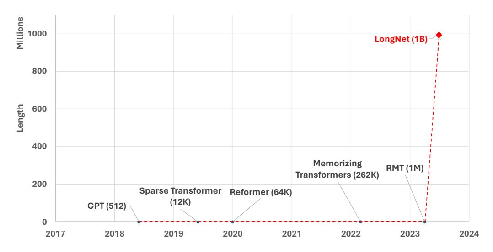
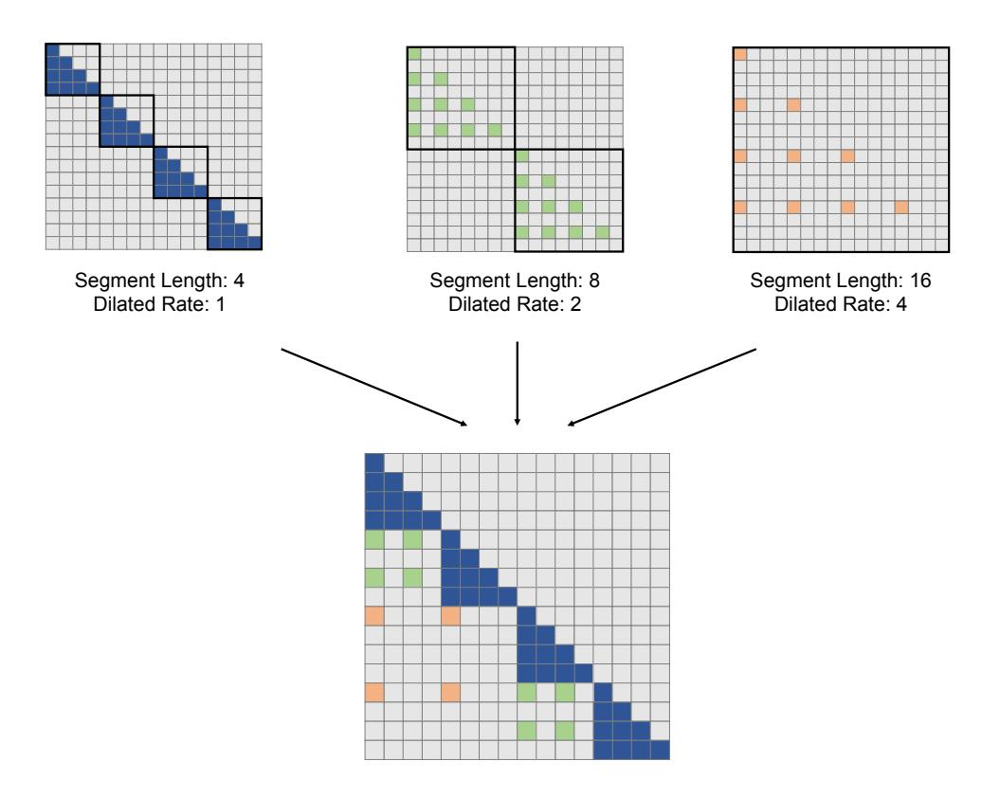
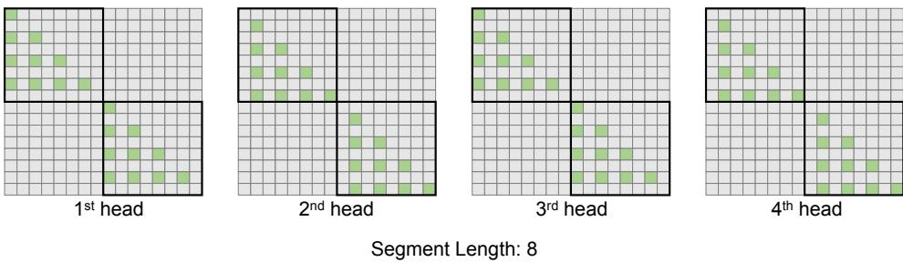
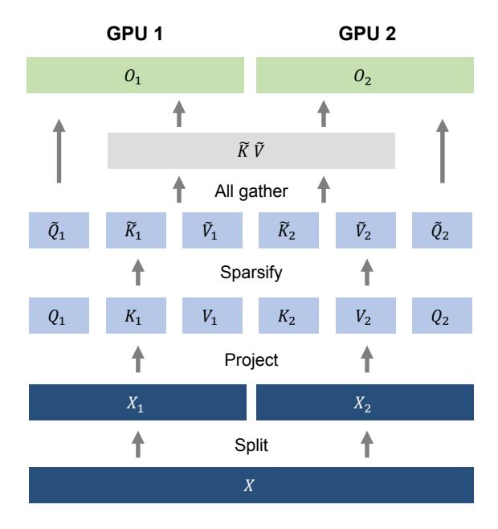
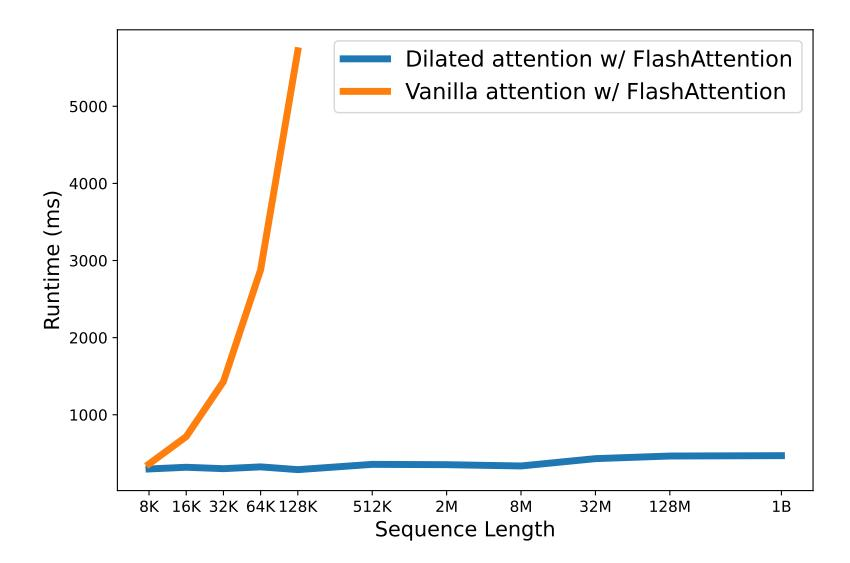
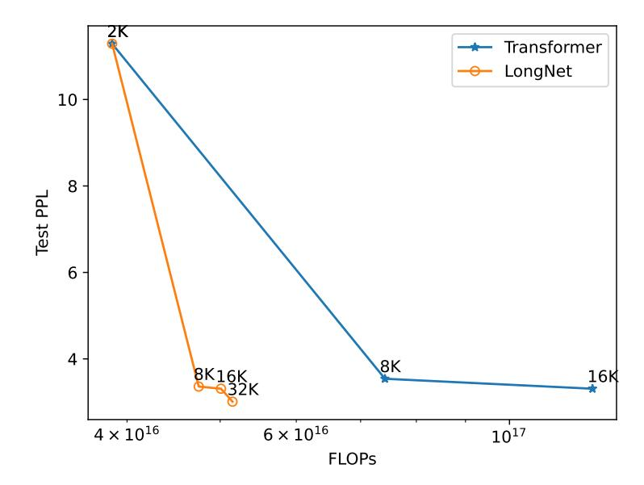
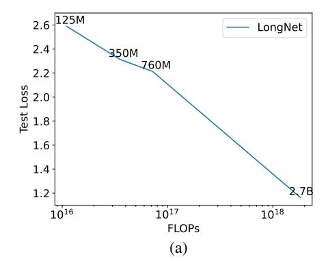
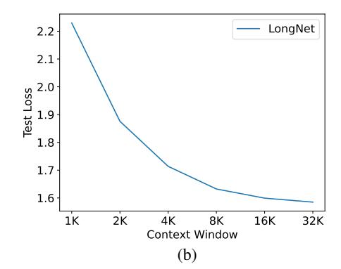

# LONGNET: Scaling Transformers to 1,000,000,000 Tokens

Jiayu Ding \*\* Shuming Ma \*\* Li Dong \* Xingxing Zhang \*
Shaohan Huang \* Wenhui Wang \* Nanning Zheng \* Furu Wei \* 

\* Microsoft Research \* Xi'an Jiaotong University https://aka.ms/GeneralAI

#### **Abstract**

Scaling sequence length has become a critical demand in the era of large language models. However, existing methods struggle with either computational complexity or model expressivity, rendering the maximum sequence length restricted. To address this issue, we introduce LONGNET, a Transformer variant that can scale sequence length to more than 1 billion tokens, without sacrificing the performance on shorter sequences. Specifically, we propose dilated attention, which expands the attentive field exponentially as the distance grows. LONGNET has significant advantages: 1) it has a linear computation complexity and a logarithm dependency between any two tokens in a sequence; 2) it can be served as a distributed trainer for extremely long sequences; 3) its dilated attention is a drop-in replacement for standard attention, which can be seamlessly integrated with the existing Transformer-based optimization. Experiments results demonstrate that LONGNET yields strong performance on both long-sequence modeling and general language tasks. Our work opens up new possibilities for modeling very long sequences, e.g., treating a whole corpus or even the entire Internet as a sequence. Code is available at https://aka.ms/LongNet.

Figure 1: Trend of Transformer sequence lengths over time.

\* Equal contribution. † Corresponding author.

# 1 Introduction

Recent years have witnessed a trend toward scaling neural networks [BMR+20, KMH+20, ZKHB22, CND+22, DDM+23]. The depth is primarily scaled up for exponential expressivity, producing many powerful deep networks [HZRS16, HCB+19, WMD+22]. Then, the sparse MoE models [LLX+21, FZS21, ZBK+22] and model parallelism approaches [SPP+19, KCL+22] efficiently enlarge the hidden dimension. **Sequence length, as the last atomic dimension of the neural network, is desirable to be unlimited**. Breaking the limitation of sequence length introduces significant advantages. First, it provides large memory and receptive field for models, which is practical for them to interact with human and the world. Second, a longer context contains more complex causality and reasoning paths that models can exploit in training data. In contrast, short dependency has more spurious correlations, which is harmful to generalization. Third, it enables to explore the limits of in-context learning, which has the potential to be a paradigm shift for many-shot learning, as an extremely long context may help the models alleviate catastrophic forgetting.

The major challenge of scaling up sequence length is striking the right balance between the computational complexity and the model expressivity. RNN-style models are primarily implemented to increase the length. However, its sequential nature limits the parallelization during training, which is essential in long-sequence modeling. More recently, state space models [GGR22, SWL23, FDS+23, PMN+23] are appealing to sequence modeling. It can operate as a CNN during training, and transform to an efficient RNN at test time. While they perform well at long-range benchmarks [TDA+21], their performance on regular lengths is not as good as Transformers, limited mainly by the model expressivity [FPB+23].

Another strand of scaling the sequence length is to decrease the complexity of Transformers, i.e., the quadratic complexity of self-attention. Implementing sliding windows or convolution modules over the attention is a straightforward way to make the complexity nearly linear. Nevertheless, this sacrifices the ability to recall the early tokens, forgetting the prompts at the very beginning of the sequence. Sparse attention reduces the computation by sparsifying the attention matrix, preserving the possibility of recalling long-distant information. For example, [CGRS19] obtains  $\mathcal{O}(N\sqrt{N}d)$  time complexity with a fixed sparse pattern. Besides the heuristic patterns [ZGD $^+$ 20, BPC20], the learnable patterns prove to be useful for sparse attention [KKL20, ALdJ $^+$ 23]. There are also some other efficient Transformer-based variants, including low-rank attention [WLK $^+$ 20, WCL $^+$ 20], kernel-based methods [KVPF20, CLD $^+$ 21, QHS $^+$ 22], downsampling approaches [LLK $^+$ 19, JGB $^+$ 21, MKW $^+$ 21], recurrent models [DYY $^+$ 19, BKB23], and retrieval-based methods [WRHS22, WDC $^+$ 23]. Yet, none has been scaled to 1 billion tokens (see Figure 1).

| Method                        | <b>Computation Complexity</b> |  |
|-------------------------------|-------------------------------|--|
| Recurrent                     | $\mathcal{O}(Nd^2)$           |  |
| Vanilla Attention             | $\mathcal{O}(N^2d)$           |  |
| Sparse Attention              | $\mathcal{O}(N\sqrt{N}d)$     |  |
| Dilated Attention (This Work) | $\mathcal{O}(Nd)$             |  |

Table 1: Comparison of computation complexity among different methods. N is the sequence length and d is the hidden dimension.

In this work, we successfully scale the sequence length to 1 billion tokens. Our solution is LONGNET, which replaces the attention of vanilla Transformers with a novel component named dilated attention. The general design principle is - attention allocation decreases exponentially as the distance between tokens grows. We prove that it obtains a linear computation complexity and a logarithm dependency between tokens. This deals with the contradiction between limited attention resources and the accessibility to every token. In the implementation, LONGNET can be transformed into a dense Transformer, which seamlessly supports the off-the-shelf optimization for Transformers (e.g., kernel fusion, quantization, and distributed training). Taking advantage of the linear complexity, LONGNET can parallelize the training across nodes, breaking the constraint of both computation and memory with a distributed algorithm. This allows us to efficiently scale up the sequence length to 1B

tokens with nearly constant runtime (see Figure 5), while vanilla Transformer suffers from quadratic complexity.

# 2 LONGNET

# 2.1 Preliminary

The core of Transformers  $[VSP^+17]$  is self-attention, which maps a query and a set of keys and values to output. Given the inputs  $Q, K, V \in \mathbb{R}^{N \times d}$ , it computes the outputs Q with

$$O = \operatorname{softmax}(QK^{T})V \tag{1}$$

Self-attention struggles with long sequences, due to its quadratic dependency on the sequence length. One query would attend to all keys and values, leading to computational inefficiencies.

Sparse attention alleviates this issue by restricting the query's access to a subset of keys and values. The key of sparse attention is the sparse attention pattern  $S \in \{0,1\}^{N \times N}$ , which determines specific keys and values that the query Q can attend to.

$$O = \operatorname{softmax}(QK^T \odot \mathbb{1}_S)V \tag{2}$$

For example, the fixed pattern of sparse Transformer [CGRS19] is composed of a local pattern and a strided pattern. The sequence is divided into blocks of length l. The local pattern allows one query to attend to tokens within the same block, while strided pattern allows one query to attend to the last c tokens of each block. Formally, the local pattern  $S_i^{(1)} = \{j \mid \lfloor j/l \rfloor = \lfloor i/l \rfloor \}$ , and the strided pattern  $S_i^{(2)} = \{j \mid j \bmod l \in \{t, t+1, ..., l\} \}$ .

#### 2.2 Dilated Attention

Figure 2 illustrates the overview of dilated attention. Dilated attention splits the input (Q,K,V) into segments  $\{(\widetilde{Q}_i,\widetilde{K}_i,\widetilde{V}_i)\}^{\frac{N}{w}}$  equally with a segment length w. Each segment is then sparsified along the sequence dimension by selecting the rows with an interval r. The computation can be written as:

$$\widetilde{Q}_i = [Q_{iw}, Q_{iw+r}, Q_{iw+2r}, ..., Q_{(i+1)w-1}]$$
(3)

$$\widetilde{K}_{i} = [K_{iw}, K_{iw+r}, K_{iw+2r}, ..., K_{(i+1)w-1}]$$
 (4)

$$\widetilde{V}_{i} = \left[ V_{iw}, V_{iw+r}, V_{iw+2r}, ..., V_{(i+1)w-1} \right] \tag{5}$$

The sparsified segments  $\{(\widetilde{Q}_i, \widetilde{K}_i, \widetilde{V}_i)\}^{\frac{N}{w}}$  are fed into the attention in parallel, after which are scattered and concatenated as the output O:

$$\widetilde{O}_i = \operatorname{softmax}(\widetilde{Q}_i \widetilde{K}_i^T) \widetilde{V}_i$$
 (6)

$$\hat{O}_i = \{ \widetilde{O}_{i,j} | j \bmod r = 0; 0 | j \bmod r \neq 0 \}$$
 (7)

$$O = [\hat{O}_0, \hat{O}_1, ..., \hat{O}_{\frac{N}{m}-1}]$$
 (8)

In the implementation, the dilated attention can be transformed into dense attention between a gathering operation over the input (Q, K, V) and a scattering operation over the output  $\widetilde{O}_i$ , so it can directly reuse any optimization for vanilla attention (e.g., flash attention [DFE+22]). Dilated attention can significantly reduce the computation cost by a factor of  $\frac{N}{w}r^2$  over the vanilla attention.

Figure 2: Building blocks of dilated attention used in LONGNET. It consists of a series of attention patterns for modeling both short-range and long-range dependency. The number of attention patterns can be extended according to the sequence length.

In practice, the segment size w trades the globality of attention for efficiency, while the dilation with a size r reduces the computation cost by approximating the attention matrix. To capture both long-range and short-range information efficiently, we implement a mixture of dilated attentions with different segment sizes and dilation rates  $\{r_i, w_i\}^k$ :

$$O = \sum_{i=1}^{k} \alpha_i O|_{r_i, w_i} \tag{9}$$

$$\alpha_i = \frac{s_i}{\sum_j s_j} \tag{10}$$

where  $s_i$  denotes the denominator of the attention softmax for  $O|_{r_i,w_i}$ . Note that the computations for  $\{O|_{r_i,w_i}\}^k$  are in parallel because there is no computation dependency among them. Experiments show that dynamic weights calculated by the denominator of the attention softmax are better than learnable fixed weights. For a query attends to keys in different dilated attentions, our method to mix dilated attentions is equivalent to gather keys in different parts and calculate softmax together.

Intuitively, the local attention should be precisely computed, while the global attention can be approximate. Therefore, we set a larger  $w_i$  with a bigger  $r_i$ . Moreover, we gradually increase the  $w_i$  for each attention until it reaches the maximum length N or the number of attention patterns k:

$$w = \{w_0, w_1, w_2, ..., N\}^k \quad (w_i < w_{i+1} < N)$$
(11)

Segment Length: 8 Dilated Rate: 2 Heads: 4

Figure 3: Dilated attention with multiple heads. The attention patterns differ among heads by shifting the position successively.

$$r = \{1, r_1, r_2, ..., r_k\}^k \quad (1 < r_i < r_{i+1})$$
(12)

In practice, we set w and r to geometric sequences for an exponential attentive field.

## 2.3 Multi-Head Dilated Attention

As shown in Figure 3, we differ in the computation among different heads by sparsifying different parts of the query-key-value pairs. Specifically, for the j-th head, we have an offset  $s_j = j \mod r$  when selecting the (Q, K, V):

$$\widetilde{Q}_i = \left[ Q_{iw+s_i}, Q_{iw+s_i+r}, Q_{iw+s_i+2r}, ..., Q_{(i+1)w+s_i-1} \right] \tag{13}$$

$$\widetilde{K}_{i} = \left[K_{iw+s_{j}}, K_{iw+s_{j}+r}, K_{iw+s_{j}+2r}, ..., K_{(i+1)w+s_{j}-1}\right] \tag{14}$$

$$\widetilde{V}_{i} = [V_{iw+s_{i}}, V_{iw+s_{i}+r}, V_{iw+s_{i}+2r}, ..., V_{(i+1)w+s_{i}-1}]$$
(15)

Following the vanilla multi-head attention, the outputs of different heads are concatenated into a final output. The rest of the computation remains the same as the single-head counterpart in Section 2.2.

## 2.4 Computational Complexity and Token Dependency

Given dilated attention with a segment size and dilation rate of (r, w), each query-key-value pair is sparsified from  $(Q, K, V) \in \mathbb{R}^{N \times d}$  to  $(Q, K, V) \in \mathbb{R}^{\frac{w}{r} \times d}$ , so the flops of the attention computation are estimated as:

$$FLOPs = \frac{2N}{w} \left(\frac{w}{r}\right)^2 d = \frac{2Nwd}{r^2}$$
 (16)

We further extend it to dilated attention with multiple segment sizes and dilation rates. The flops can be written as:

$$FLOPs = 2Nd\sum_{i=1}^{k} \frac{w_i}{r_i^2}$$
(17)

With the segment sizes and dilation rates in Equation (11) and Equation (12), the flops are given by

$$FLOPs = 2w_0Nd\sum_{i=0}^{k-1} \frac{1}{\alpha^i} \le \frac{2\alpha}{\alpha - 1}w_0Nd \quad (\alpha > 1)$$
 (18)

where  $w_0$  is a predefined constant and  $\alpha$  is the common ratio for geometric sequences w and r. Therefore, the computation complexity of dilated attention is approximate to  $\mathcal{O}(Nd)$ .

Figure 4: Distributed training of LONGNET on two GPU devices. It parallelizes the training by partitioning the sequence dimension. The computation and communication costs are nearly constant as the number of devices grows.

Moreover, the information of each tokens can be propagated to a maximum distance of D:

$$D = \sum_{i=0}^{l-1} w_i = w_0 \sum_{i=0}^{l-1} \alpha^i \approx \frac{w_0}{\alpha - 1} \alpha^l$$
 (19)

where l is the length of the propagated path. Therefore, the maximum path length of a sequence with N tokens can be estimated as:

$$L \approx \log_{\alpha} \frac{N(\alpha - 1)}{w_0} \quad (\alpha > 1)$$
 (20)

This proves that the token dependency is approximate to  $\mathcal{O}(\log N)$ .

# 3 LONGNET as a Distributed Trainer: Scaling up to 1B Tokens

Although the computation complexity of dilated attention has been greatly reduced to  $\mathcal{O}(Nd)$ , it is infeasible to scale the sequence length to the million level on a single GPU device due to the computation and memory constraints. There are some distributed training algorithms for large-scale model training, such as model parallelism [SPP $^+$ 19], sequence parallelism [LXLY21, KCL $^+$ 22], and pipeline parallelism [HCB $^+$ 19]. However, they are insufficient for LONGNET especially when the sequence dimension is extremely large.

#### 3.1 Distributed Algorithm

We take advantage of the linear computation complexity of LONGNET for the distributed training of sequence dimension. Without loss of generality, Figure 4 presents our distributed algorithm on two GPUs, which can be further scaled to an arbitrary number of devices. We start by splitting the input sequence along the sequence dimension. Each sequence is put on one device separately:

$$X = [X_1, X_2] \tag{21}$$

Then, they are projected into queries, keys, and values on the two devices:

Figure 5: Runtime of our dilated attention and vanilla attention. Both are equipped with FlashAttention [DFE+22].

$$[Q_1, K_1, V_1] = [W_Q, W_K, W_V]X_1, \quad [Q_2, K_2, V_2] = [W_Q, W_K, W_V]X_2$$
 (22)

For the segment length  $w_i \leq l$  (where l is the sequence length on the local device), we compute the attention locally with Equation (3) to Equation (8). For the segment length  $w_i > l$ , the keys and values are distributed across different devices. Therefore, we collect the key-value pairs before computing the attention. We use Equation (3) to Equation (5) to sparsify the  $\{Q,K,V\}$  into  $\{\widetilde{Q},\widetilde{K},\widetilde{V}\}$ . An all-gather operation is implemented to collect the key-value pairs:

$$\widetilde{K} = [\widetilde{K_1}, \widetilde{K_2}], \quad \widetilde{V} = [\widetilde{V_1}, \widetilde{V_2}]$$
 (23)

Note that the all-gather operation in the backward becomes a reduce-scatter operation. Different from vanilla attention, both sizes of  $\widetilde{K_i}$  and  $\widetilde{V_i}$  are independent of the sequence length N, making the communication cost constant.

Finally, we compute the cross-attention with the local queries  $\widetilde{Q}_i$  and the global key-value pairs  $\{\widetilde{K},\widetilde{V}\}$ . The formulation is written as:

$$\widetilde{O}_1 = \operatorname{softmax}(\widetilde{Q}_1 \widetilde{K}^T) \widetilde{V}, \quad \widetilde{O}_2 = \operatorname{softmax}(\widetilde{Q}_2 \widetilde{K}^T) \widetilde{V}$$
 (24)

The concatenation of the outputs across different devices becomes the final attention output:

$$\widetilde{O} = \left[\widetilde{O_1}, \widetilde{O_2}\right] \tag{25}$$

The distributed algorithm described above is orthogonal to other parallelisms, including data parallelism which partitions the batch dimension, model parallelism which partitions the hidden dimension, and pipeline parallelism which partitions the layers.

#### 3.2 Scaling up to 1B Tokens

We verify the feasibility of scaling to 1B tokens with the modern distributed systems. Starting from 8K, we gradually scale the sequence length until the limit of GPU memory. We reduce the batch size accordingly to keep the number of tokens per batch at 1 billion. Each model of different sequence

| Model                                      | Length | Batch | 2K           | Github 8K | 32K           |
|--------------------------------------------|--------|-------|--------------|--------------|---------------|
| Transformer [VSP + 17]          | 2K     | 256   | 4.24         | 5.07         | 11.29         |
| Sparse Transformer [CGRS19] LONGNET (ours) | 8K     | 64    | 4.39 4.23 | 3.35 3.24 | 8.79 3.36  |
| Sparse Transformer [CGRS19] LONGNET (ours) | 16K    | 32    | 4.85 4.27 | 3.73 3.26 | 19.77 3.31 |
| Sparse Transformer [CGRS19] LONGNET (ours) | 32K    | 16    | 5.15 4.37 | 4.00 3.33 | 3.64 3.01  |

Table 2: Perplexity of language models for LONGNET and the baselines.

lengths has up to 3 segment lengths, which are 2,048, the number of tokens per device, and the sequence length. We compute the average speed in the forward propagation for 10 different runs.

Figure 5 reports the runtime of vanilla attention and our dilated attention. Both of them are implemented with FlashAttention Kernel for saving memory and improving speed. It shows that dilated attention can successfully scale up the sequence length with almost constant latency. By partitioning the sequence dimension, it can leverage the distributed systems to scale the sequence length to 1 billion tokens. In contrast, vanilla attention suffers from the quadratic dependency on the sequence length. Its latency dramatically increases as the length grows. Moreover, there is no distributed algorithm for vanilla attention to break sequence length limitation. This proves the advantage of the linear complexity as well as the distributed algorithm for LONGNET.

# 4 Experiments on Language Modeling

#### 4.1 Setup

We implement LONGNET on language modeling. The backbone architecture is MAGNETO [WMH+22] with xPos [SDP+22] relative position encoding, except that we replace the standard attention with our dilated attention. We use the base-size configuration of MAGNETO, which has a hidden dimension of 768, 12 attention heads, and 12 decoder layers. We pre-train the model with The Stack dataset [KLA+22], a source code collection in over 300 programming languages. The data is preprocessed with the tiktoken tokenizer2 with cl100k\_base encoding. The models are trained with a batch size of 0.5M tokens for 300K steps. More details regarding the hyperparameters can be found in the appendix. All experiments are conducted based on the *torchscale* [MWH+22] codebase.

#### 4.2 Results

We compare LONGNET with both vanilla Transformer and sparse Transformers. The differences among the architectures are the attention layers, while the others remain the same. We scale the sequence length of these models from 2K to 32K, while reducing the batch size to keep the number of tokens per batch constant. For LONGNET, we use segment lengths of  $w = \{2048, 4096, 8192, 16384, 32768\}$ , and the dilated ratios are  $r = \{1, 2, 4, 6, 12\}$ . We implement the fixed pattern for sparse attention as in [CGRS19] with multiple heads attending to distinct subblocks. The block size is set to 2048. We adjust their sparse ratios to match the computation flops with LONGNET so that the comparison is fair. The attention layers in vanilla Transformers are dense and fully connected, so the computation cost is much higher. Due to the computation constraints, we only scale it up to 32K sequence length. All of our implementations of attention variants are based on FlashAttention for training efficiency. We customize the flash attention kernels for both sparse attention and dilated attention.

&lt;sup>2https://github.com/openai/tiktoken

3https://github.com/HazyResearch/flash-attention/tree/main

Figure 6: Test perplexity of LONGNET and dense Transformers using different sequence lengths during training. LONGNET outperforms dense Transformers with a lower perplexity and a significantly smaller amount of computation.

Table 2 summarizes the results of these models on the Stack dataset. We use perplexity as the evaluation metric. The models are tested with different sequence lengths, ranging from 2K to 32K. When the input is longer than the maximum length that the models support, we implement blockwise causal attention (BCA) [SDP+22], a state-of-the-art extrapolation method for language model inference. Besides, we remove the absolute position encoding. Primarily, the results demonstrate that increasing the sequence length during training generally leads to a better language model. Secondly, the extrapolation of sequence length in inference does not apply to the case when the length is much larger than the model supports. Finally, LONGNET consistently outperforms the baseline models, proving its effectiveness in language modeling.

#### 4.3 Scaling Curves of Sequence Length

Previous work [KMH+20] has shown that language models follow some scaling laws by increasing parameters or training tokens. We are interested in the performance of language models when the context length is scaled up during training. We test the losses with inputs of a mixture of different lengths, from 1K to 32K. We use blockwise causal attention during inference to improve the generalization of sequence lengths.

Figure 6 plots the scaling curves of sequence length for both vanilla Transformers and LONGNET. We estimate the amount of compute by calculating the total flops of matrix multiplication. The results show that both vanilla Transformers and LONGNET benefit from a larger context length during training. However, LONGNET can scale up the context length more efficiently, achieving a lower test loss with a smaller amount of computing. This demonstrates the advantage of longer training input over extrapolation. In conclusion, our experiments show that LONGNET is a more efficient way to scale up the context length in language models. This is because LONGNET can learn longer-range dependencies more effectively.

#### 4.4 Scaling up Model Size

An important property of large language models is that the loss scales as a power law with compute. To verify whether LONGNET still follows the similar scaling law, we train a series of models with different model sizes, from 125 million to 2.7 billion parameters. The 2.7B model is trained with

Figure 7: **Left:** Test loss of LONGNET with an increasing model size. The scaling curve follows a similar law to the vanilla Transformers. **Right:** Test loss of LONGNET using different context windows. A longer context window yields better language modeling.

300B tokens, while the rest digest about 40B tokens. Figure 7(a) plots the scaling curve of LONGNET regarding the compute. We compute the perplexity on the same test set. The amount of compute is estimated by calculating the total flops of matrix multiplication during training. It proves that LONGNET can still follow the power law. This implies that the dense Transformer is not a prerequisite for scaling the language models. Additionally, the scalability and the efficiency are both obtained by LONGNET.

# 4.5 Long Context Prompting

Prompting is an essential method to guide and provide additional information to the language models. We conduct experiments to verify whether LONGNET can benefit from a longer context window for prompting. Specifically, we reserve a piece of prefixes as the prompt and test the perplexity of its suffixes. We gradually scale the length of the prompt from 2K to 32K. For a fair comparison, we keep the suffixes the same, while increasing the length of the prefixes to the maximum lengths of the models. The results on the test set are reported in Figure 7(b). It shows that the test loss of LONGNET gradually decreases as the context window grows. This demonstrates the superiority of LONGNET in fully leveraging the long context to improve the language model.

# 5 Conclusion and Future Work

We present LONGNET, a Transformer variant that can scale the sequence length to 1 billion tokens and beyond, with no loss in shorter sequences. The core of LONGNET is dilated attention, which reduces the computation complexity from quadratic to linear. LONGNET can be served as a distributed trainer that parallelizes the training of a sequence across multiple GPU devices. Experiments show that LONGNET has superior performance over the strong baselines on modeling both long and short sequences. In the future, we will extend LONGNET to support more tasks, e.g., multimodal large language modeling [HDW+23, PWD+23], BEiT pretraining [BDPW22, PDB+22, WBD+23], and genomic data modeling.

**Acknowledgement** We would like to acknowledge Yuqing Xia and Jilong Xue for the early exploration of the flash attention kernel.

### References

[ALdJ+23] Joshua Ainslie, Tao Lei, Michiel de Jong, Santiago Ontañón, Siddhartha Brahma, Yury Zemlyanskiy, David C. Uthus, Mandy Guo, James Lee-Thorp, Yi Tay, Yun-Hsuan Sung, and Sumit Sanghai. CoLT5: Faster long-range transformers with conditional computation. *CoRR*, abs/2303.09752, 2023.

- [BDPW22] Hangbo Bao, Li Dong, Songhao Piao, and Furu Wei. BEiT: BERT pre-training of image transformers. In *International Conference on Learning Representations*, 2022.
  - [BKB23] Aydar Bulatov, Yuri Kuratov, and Mikhail S. Burtsev. Scaling transformer to 1m tokens and beyond with RMT. *CoRR*, abs/2304.11062, 2023.
- [BMR+ 20] Tom B. Brown, Benjamin Mann, Nick Ryder, Melanie Subbiah, Jared Kaplan, Prafulla Dhariwal, Arvind Neelakantan, Pranav Shyam, Girish Sastry, Amanda Askell, Sandhini Agarwal, Ariel Herbert-Voss, Gretchen Krueger, Tom Henighan, Rewon Child, Aditya Ramesh, Daniel M. Ziegler, Jeffrey Wu, Clemens Winter, Christopher Hesse, Mark Chen, Eric Sigler, Mateusz Litwin, Scott Gray, Benjamin Chess, Jack Clark, Christopher Berner, Sam McCandlish, Alec Radford, Ilya Sutskever, and Dario Amodei. Language models are few-shot learners. In *NeurIPS 2020*, 2020.
  - [BPC20] Iz Beltagy, Matthew E. Peters, and Arman Cohan. Longformer: The long-document transformer. *CoRR*, abs/2004.05150, 2020.
- [CGRS19] Rewon Child, Scott Gray, Alec Radford, and Ilya Sutskever. Generating long sequences with sparse transformers. *ArXiv*, abs/1904.10509, 2019.
- [CLD+ 21] Krzysztof Marcin Choromanski, Valerii Likhosherstov, David Dohan, Xingyou Song, Andreea Gane, Tamás Sarlós, Peter Hawkins, Jared Quincy Davis, Afroz Mohiuddin, Lukasz Kaiser, David Benjamin Belanger, Lucy J. Colwell, and Adrian Weller. Rethinking attention with performers. In *9th International Conference on Learning Representations, ICLR 2021, Virtual Event, Austria, May 3-7, 2021*. OpenReview.net, 2021.
- [CND+ 22] Aakanksha Chowdhery, Sharan Narang, Jacob Devlin, Many Others, Jeff Dean, Slav Petrov, and Noah Fiedel. PaLM: Scaling language modeling with Pathways. *ArXiv*, abs/2204.02311, 2022.
- [DDM+ 23] Mostafa Dehghani, Josip Djolonga, Basil Mustafa, Piotr Padlewski, Jonathan Heek, Justin Gilmer, Many Others, Xiaohua Zhai, Daniel Keysers, Jeremiah Harmsen, and Neil Houlsby. Scaling vision transformers to 22 billion parameters. *CoRR*, abs/2302.05442, 2023.
- [DFE+ 22] Tri Dao, Daniel Y. Fu, Stefano Ermon, Atri Rudra, and Christopher Ré. Flashattention: Fast and memory-efficient exact attention with io-awareness. In *NeurIPS*, 2022.
- [DYY+ 19] Zihang Dai, Zhilin Yang, Yiming Yang, Jaime G. Carbonell, Quoc Viet Le, and Ruslan Salakhutdinov. Transformer-xl: Attentive language models beyond a fixed-length context. In Anna Korhonen, David R. Traum, and Lluís Màrquez, editors, *Proceedings of the 57th Conference of the Association for Computational Linguistics, ACL 2019, Florence, Italy, July 28- August 2, 2019, Volume 1: Long Papers*, pages 2978–2988. Association for Computational Linguistics, 2019.
- [FDS+ 23] Daniel Y. Fu, Tri Dao, Khaled Kamal Saab, Armin W. Thomas, Atri Rudra, and Christopher Ré. Hungry hungry hippos: Towards language modeling with state space models. In *The Eleventh International Conference on Learning Representations, ICLR 2023, Kigali, Rwanda, May 1-5, 2023*. OpenReview.net, 2023.
- [FPB+ 23] Mahan Fathi, Jonathan Pilault, Pierre-Luc Bacon, Christopher Pal, Orhan Firat, and Ross Goroshin. Block-state transformer. *CoRR*, abs/2306.09539, 2023.
- [FZS21] William Fedus, Barret Zoph, and Noam Shazeer. Switch transformers: Scaling to trillion parameter models with simple and efficient sparsity. *CoRR*, abs/2101.03961, 2021.
- [GGR22] Albert Gu, Karan Goel, and Christopher Ré. Efficiently modeling long sequences with structured state spaces. In *The Tenth International Conference on Learning Representations, ICLR 2022, Virtual Event, April 25-29, 2022*. OpenReview.net, 2022.

- [HCB+ 19] Yanping Huang, Youlong Cheng, Ankur Bapna, Orhan Firat, Dehao Chen, Mia Xu Chen, HyoukJoong Lee, Jiquan Ngiam, Quoc V. Le, Yonghui Wu, and Zhifeng Chen. Gpipe: Efficient training of giant neural networks using pipeline parallelism. In *NeurIPS 2019*, pages 103–112, 2019.
- [HDW+ 23] Shaohan Huang, Li Dong, Wenhui Wang, Yaru Hao, Saksham Singhal, Shuming Ma, Tengchao Lv, Lei Cui, Owais Khan Mohammed, Qiang Liu, Kriti Aggarwal, Zewen Chi, Johan Bjorck, Vishrav Chaudhary, Subhojit Som, Xia Song, and Furu Wei. Language is not all you need: Aligning perception with language models. *ArXiv*, abs/2302.14045, 2023.
- [HZRS16] Kaiming He, Xiangyu Zhang, Shaoqing Ren, and Jian Sun. Deep residual learning for image recognition. In *2016 IEEE Conference on Computer Vision and Pattern Recognition (CVPR)*, pages 770–778, 2016.
- [JGB+ 21] Andrew Jaegle, Felix Gimeno, Andy Brock, Oriol Vinyals, Andrew Zisserman, and João Carreira. Perceiver: General perception with iterative attention. In Marina Meila and Tong Zhang, editors, *Proceedings of the 38th International Conference on Machine Learning, ICML 2021, 18-24 July 2021, Virtual Event*, volume 139 of *Proceedings of Machine Learning Research*, pages 4651–4664. PMLR, 2021.
- [KCL+ 22] Vijay Korthikanti, Jared Casper, Sangkug Lym, Lawrence McAfee, Michael Andersch, Mohammad Shoeybi, and Bryan Catanzaro. Reducing activation recomputation in large transformer models. *CoRR*, abs/2205.05198, 2022.
- [KKL20] Nikita Kitaev, Lukasz Kaiser, and Anselm Levskaya. Reformer: The efficient transformer. In *8th International Conference on Learning Representations, ICLR 2020, Addis Ababa, Ethiopia, April 26-30, 2020*. OpenReview.net, 2020.
- [KLA+ 22] Denis Kocetkov, Raymond Li, Loubna Ben Allal, Jia Li, Chenghao Mou, Carlos Muñoz Ferrandis, Yacine Jernite, Margaret Mitchell, Sean Hughes, Thomas Wolf, Dzmitry Bahdanau, Leandro von Werra, and Harm de Vries. The stack: 3 TB of permissively licensed source code. *CoRR*, abs/2211.15533, 2022.
- [KMH+ 20] Jared Kaplan, Sam McCandlish, Tom Henighan, Tom B. Brown, Benjamin Chess, Rewon Child, Scott Gray, Alec Radford, Jeffrey Wu, and Dario Amodei. Scaling laws for neural language models. *CoRR*, abs/2001.08361, 2020.
- [KVPF20] Angelos Katharopoulos, Apoorv Vyas, Nikolaos Pappas, and François Fleuret. Transformers are rnns: Fast autoregressive transformers with linear attention. In *Proceedings of the 37th International Conference on Machine Learning, ICML 2020, 13-18 July 2020, Virtual Event*, volume 119 of *Proceedings of Machine Learning Research*, pages 5156–5165. PMLR, 2020.
- [LJX+ 19] Shiyang Li, Xiaoyong Jin, Yao Xuan, Xiyou Zhou, Wenhu Chen, Yu-Xiang Wang, and Xifeng Yan. Enhancing the locality and breaking the memory bottleneck of transformer on time series forecasting. *ArXiv*, abs/1907.00235, 2019.
- [LLK+ 19] Juho Lee, Yoonho Lee, Jungtaek Kim, Adam R. Kosiorek, Seungjin Choi, and Yee Whye Teh. Set transformer: A framework for attention-based permutation-invariant neural networks. In Kamalika Chaudhuri and Ruslan Salakhutdinov, editors, *Proceedings of the 36th International Conference on Machine Learning, ICML 2019, 9-15 June 2019, Long Beach, California, USA*, volume 97 of *Proceedings of Machine Learning Research*, pages 3744–3753. PMLR, 2019.
- [LLX+ 21] Dmitry Lepikhin, HyoukJoong Lee, Yuanzhong Xu, Dehao Chen, Orhan Firat, Yanping Huang, Maxim Krikun, Noam Shazeer, and Zhifeng Chen. Gshard: Scaling giant models with conditional computation and automatic sharding. In *ICLR 2021*, 2021.
- [LXLY21] Shenggui Li, Fuzhao Xue, Yongbin Li, and Yang You. Sequence parallelism: Making 4d parallelism possible. *CoRR*, abs/2105.13120, 2021.

- [MKW+ 21] Xuezhe Ma, Xiang Kong, Sinong Wang, Chunting Zhou, Jonathan May, Hao Ma, and Luke Zettlemoyer. Luna: Linear unified nested attention. In Marc'Aurelio Ranzato, Alina Beygelzimer, Yann N. Dauphin, Percy Liang, and Jennifer Wortman Vaughan, editors, *Advances in Neural Information Processing Systems 34: Annual Conference on Neural Information Processing Systems 2021, NeurIPS 2021, December 6-14, 2021, virtual*, pages 2441–2453, 2021.
- [MWH+ 22] Shuming Ma, Hongyu Wang, Shaohan Huang, Wenhui Wang, Zewen Chi, Li Dong, Alon Benhaim, Barun Patra, Vishrav Chaudhary, Xia Song, and Furu Wei. TorchScale: Transformers at scale. *CoRR*, abs/2211.13184, 2022.
- [PDB+ 22] Zhiliang Peng, Li Dong, Hangbo Bao, Qixiang Ye, and Furu Wei. BEiT v2: Masked image modeling with vector-quantized visual tokenizers. 2022.
- [PMN+ 23] Michael Poli, Stefano Massaroli, Eric Nguyen, Daniel Y. Fu, Tri Dao, Stephen Baccus, Yoshua Bengio, Stefano Ermon, and Christopher Ré. Hyena hierarchy: Towards larger convolutional language models. *CoRR*, abs/2302.10866, 2023.
- [PWD+ 23] Zhiliang Peng, Wenhui Wang, Li Dong, Yaru Hao, Shaohan Huang, Shuming Ma, and Furu Wei. Kosmos-2: Grounding multimodal large language models to the world. *ArXiv*, abs/2306, 2023.
- [QHS+ 22] Zhen Qin, Xiaodong Han, Weixuan Sun, Dongxu Li, Lingpeng Kong, Nick Barnes, and Yiran Zhong. The devil in linear transformer. In Yoav Goldberg, Zornitsa Kozareva, and Yue Zhang, editors, *Proceedings of the 2022 Conference on Empirical Methods in Natural Language Processing, EMNLP 2022, Abu Dhabi, United Arab Emirates, December 7-11, 2022*, pages 7025–7041. Association for Computational Linguistics, 2022.
- [SDP+ 22] Yutao Sun, Li Dong, Barun Patra, Shuming Ma, Shaohan Huang, Alon Benhaim, Vishrav Chaudhary, Xia Song, and Furu Wei. A length-extrapolatable transformer. *CoRR*, abs/2212.10554, 2022.
- [SPP+ 19] Mohammad Shoeybi, Mostofa Patwary, Raul Puri, Patrick LeGresley, Jared Casper, and Bryan Catanzaro. Megatron-lm: Training multi-billion parameter language models using model parallelism. *CoRR*, abs/1909.08053, 2019.
- [SWL23] Jimmy T. H. Smith, Andrew Warrington, and Scott W. Linderman. Simplified state space layers for sequence modeling. In *The Eleventh International Conference on Learning Representations, ICLR 2023, Kigali, Rwanda, May 1-5, 2023*. OpenReview.net, 2023.
- [TDA+ 21] Yi Tay, Mostafa Dehghani, Samira Abnar, Yikang Shen, Dara Bahri, Philip Pham, Jinfeng Rao, Liu Yang, Sebastian Ruder, and Donald Metzler. Long range arena : A benchmark for efficient transformers. In *9th International Conference on Learning Representations, ICLR 2021, Virtual Event, Austria, May 3-7, 2021*. OpenReview.net, 2021.
- [VSP+ 17] Ashish Vaswani, Noam Shazeer, Niki Parmar, Jakob Uszkoreit, Llion Jones, Aidan N. Gomez, Lukasz Kaiser, and Illia Polosukhin. Attention is all you need. In *NeurIPS 2017*, pages 5998–6008, 2017.
- [WBD+ 23] Wenhui Wang, Hangbo Bao, Li Dong, Johan Bjorck, Zhiliang Peng, Qiang Liu, Kriti Aggarwal, Owais Khan Mohammed, Saksham Singhal, Subhojit Som, and Furu Wei. Image as a foreign language: BEiT pretraining for vision and vision-language tasks. In *Proceedings of the IEEE/CVF Conference on Computer Vision and Pattern Recognition*, 2023.
- [WCL+ 20] Genta Indra Winata, Samuel Cahyawijaya, Zhaojiang Lin, Zihan Liu, and Pascale Fung. Lightweight and efficient end-to-end speech recognition using low-rank transformer. In *2020 IEEE International Conference on Acoustics, Speech and Signal Processing, ICASSP 2020, Barcelona, Spain, May 4-8, 2020*, pages 6144–6148. IEEE, 2020.

- [WDC+ 23] Weizhi Wang, Li Dong, Hao Cheng, Xiaodong Liu, Xifeng Yan, Jianfeng Gao, and Furu Wei. Augmenting language models with long-term memory. *CoRR*, abs/2306.07174, 2023.
- [WLK+ 20] Sinong Wang, Belinda Z. Li, Madian Khabsa, Han Fang, and Hao Ma. Linformer: Self-attention with linear complexity. *CoRR*, abs/2006.04768, 2020.
- [WMD+ 22] Hongyu Wang, Shuming Ma, Li Dong, Shaohan Huang, Dongdong Zhang, and Furu Wei. DeepNet: Scaling transformers to 1,000 layers. *CoRR*, abs/2203.00555, 2022.
- [WMH+ 22] Hongyu Wang, Shuming Ma, Shaohan Huang, Li Dong, Wenhui Wang, Zhiliang Peng, Yu Wu, Payal Bajaj, Saksham Singhal, Alon Benhaim, Barun Patra, Zhun Liu, Vishrav Chaudhary, Xia Song, and Furu Wei. Foundation transformers. *CoRR*, abs/2210.06423, 2022.
- [WRHS22] Yuhuai Wu, Markus Norman Rabe, DeLesley Hutchins, and Christian Szegedy. Memorizing transformers. In *The Tenth International Conference on Learning Representations, ICLR 2022, Virtual Event, April 25-29, 2022*. OpenReview.net, 2022.
- [ZBK+ 22] Barret Zoph, Irwan Bello, Sameer Kumar, Nan Du, Yanping Huang, Jeff Dean, Noam Shazeer, and William Fedus. Designing effective sparse expert models. *CoRR*, abs/2202.08906, 2022.
- [ZGD+ 20] Manzil Zaheer, Guru Guruganesh, Kumar Avinava Dubey, Joshua Ainslie, Chris Alberti, Santiago Ontañón, Philip Pham, Anirudh Ravula, Qifan Wang, Li Yang, and Amr Ahmed. Big bird: Transformers for longer sequences. In Hugo Larochelle, Marc'Aurelio Ranzato, Raia Hadsell, Maria-Florina Balcan, and Hsuan-Tien Lin, editors, *Advances in Neural Information Processing Systems 33: Annual Conference on Neural Information Processing Systems 2020, NeurIPS 2020, December 6-12, 2020, virtual*, 2020.
- [ZKHB22] Xiaohua Zhai, Alexander Kolesnikov, Neil Houlsby, and Lucas Beyer. Scaling vision transformers. In *IEEE/CVF Conference on Computer Vision and Pattern Recognition, CVPR 2022, New Orleans, LA, USA, June 18-24, 2022*, pages 1204–1213. IEEE, 2022.

# A Hyperparameters

| Hyperparameters   | Value            |  |  |
|-------------------|------------------|--|--|
| Layers            | 12               |  |  |
| Hidden size       | 768              |  |  |
| FFN size          | 3072             |  |  |
| Heads             | 12               |  |  |
| Learning rate     | 6e-4             |  |  |
| LR scheduler      | Polynomial decay |  |  |
| Warm-up steps     | 750              |  |  |
| Tokens per batch  | 500K             |  |  |
| Adam β            | (0.9, 0.98)      |  |  |
| Training steps    | 300K             |  |  |
| Gradient clipping | 2.0              |  |  |
| Dropout           | 0.0              |  |  |
| Weight decay      | 0.01             |  |  |

Table 3: Hyperparamters used for the models in Table [2.](#page-7-2)

| Parameters | Layers | Hidden | Heads | Learning Rate | Batch Size |
|------------|--------|--------|-------|---------------|------------|
| 125M       | 12     | 768    | 12    | 6e-4          | 500K       |
| 350M       | 24     | 1024   | 16    | 6e-4          | 500K       |
| 760M       | 24     | 1536   | 16    | 6e-4          | 500K       |
| 2.7B       | 32     | 2560   | 32    | 2e-4          | 4M         |

Table 4: Hyperparamters used for the experiments in Figure [7\(a\).](#page-9-1)