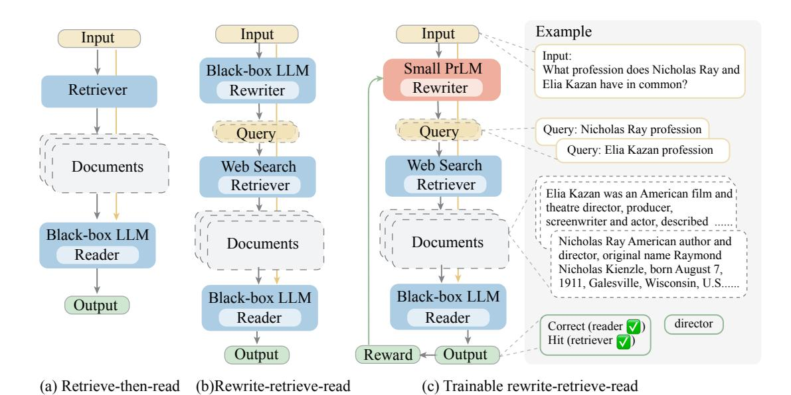
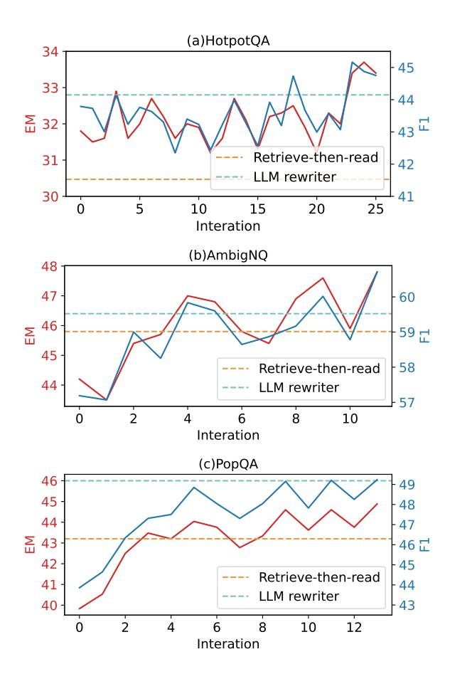
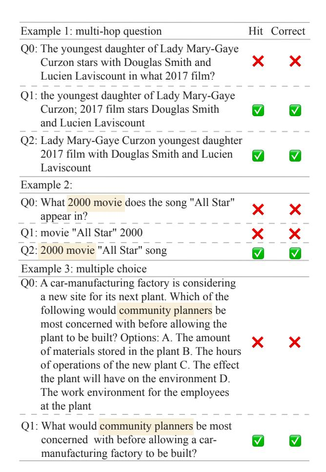

# Query Rewriting for Retrieval-Augmented Large Language Models

Xinbei Ma1,2,∗ , Yeyun Gong3, #, †, Pengcheng He4, #, Hai Zhao1,2,†, Nan Duan3 1Department of Computer Science and Engineering, Shanghai Jiao Tong University 2Key Laboratory of Shanghai Education Commission for Intelligent Interaction and Cognitive Engineering, Shanghai Jiao Tong University 3Microsoft Research Asia 4Microsoft Azure AI sjtumaxb@sjtu.edu.cn, zhaohai@cs.sjtu.edu.cn, {yegong, nanduan}@microsoft.com, Herbert.he@gmail.com

# Abstract

Large Language Models (LLMs) play powerful, black-box readers in the *retrieve-thenread* pipeline, making remarkable progress in knowledge-intensive tasks. This work introduces a new framework, *Rewrite-Retrieve-Read* instead of the previous *retrieve-then-read* for the retrieval-augmented LLMs from the perspective of the query rewriting. Unlike prior studies focusing on adapting either the retriever or the reader, our approach pays attention to the adaptation of the search query itself, for there is inevitably a gap between the input text and the needed knowledge in retrieval. We first prompt an LLM to generate the query, then use a web search engine to retrieve contexts. Furthermore, to better align the query to the frozen modules, we propose a trainable scheme for our pipeline. A small language model is adopted as a trainable rewriter to cater to the black-box LLM reader. The rewriter is trained using the feedback of the LLM reader by reinforcement learning. Evaluation is conducted on downstream tasks, open-domain QA and multiple-choice QA. Experiments results show consistent performance improvement, indicating that our framework is proven effective and scalable, and brings a new framework for retrieval-augmented LLM [1](#page-0-0) .

## 1 Introduction

Large Language Models (LLMs) have shown remarkable abilities for human language processing and extraordinary scalability and adaptability in few- or zero-shot settings.[\(Ouyang et al.,](#page-10-0) [2022;](#page-10-0) [Brown et al.,](#page-8-0) [2020;](#page-8-0) [Chowdhery et al.,](#page-8-1) [2022\)](#page-8-1). However, the training process depends on large-scale high-quality corpora but without the perception

of the real world. Thus, LLMs still have to face the issue of hallucination [\(Yao et al.,](#page-11-0) [2023;](#page-11-0) [Bang](#page-8-2) [et al.,](#page-8-2) [2023\)](#page-8-2) and temporal misalignment [\(Röttger](#page-10-1) [and Pierrehumbert,](#page-10-1) [2021;](#page-10-1) [Luu et al.,](#page-9-0) [2022;](#page-9-0) [Jang](#page-9-1) [et al.,](#page-9-1) [2022\)](#page-9-1). This affects the reliability of LLMs and hinders wider practical application, because the consistency between the LLM responses with the real world needs further validation. Existing work has proved that incorporating external knowledge (i.e., non-parametric knowledge) with internal knowledge (i.e., parametric knowledge) can effectively alleviate hallucination, especially for knowledge-intensive tasks. In fact, retrievalaugmented LLMs have been shown so effective that they have been regarded as a standard solution to alleviate the factuality drawbacks in naive LLM generations. Retrieval augmentation is applied to select relative passages as external contexts for the language model, which is *retrieve-then-read* framework [\(Lewis et al.,](#page-9-2) [2020b;](#page-9-2) [Karpukhin et al.,](#page-9-3) [2020;](#page-9-3) [Izacard et al.,](#page-9-4) [2022\)](#page-9-4). Take the open-domain Question-Answering task (open-domain QA) as an example, a retriever first searches for related documents for a question. Then the LLM receives the question and the documents, then predicts an answer.

As most LLMs are only accessible through inference APIs, they play the part of black-box frozen readers in the pipeline. This makes previous retrieval augmentation methods that require complete access [\(Lewis et al.,](#page-9-2) [2020b;](#page-9-2) [Guu et al.,](#page-9-5) [2020;](#page-9-5) [Izac](#page-9-4)[ard et al.,](#page-9-4) [2022\)](#page-9-4) no longer feasible. Recent studies on retrieval-augmented language models lean more on the LLM-oriented adaptation. An idea is to train a dense retrieval model to cater to the frozen language model [\(Shi et al.,](#page-10-2) [2023\)](#page-10-2). By using feedback from the LLM as a training objective, the retrieval model is tuned for better LLM input contexts. Another research line focuses on the design of interactions between the retriever and the reader [\(Yao](#page-11-0) [et al.,](#page-11-0) [2023;](#page-11-0) [Khattab et al.,](#page-9-6) [2022\)](#page-9-6), where both the

∗ Work done during an internship at 3Microsoft Research Asia. # Equal contribution. †Corresponding author.

This paper was partially supported by Joint Research Project of Yangtze River Delta Science and Technology Innovation Community (No. 2022CSJGG1400).

1 https://github.com/xbmxb/RAG-query-rewriting

retriever and the reader are usually frozen. The idea is to trigger the emergent ability through carefully crafted prompts or a sophisticated prompt pipeline. Multiple interactions with external knowledge allow the LLM to approach the correct answer step by step.

However, there are still problems remaining to be solved. Existing approaches overlook the adaptation of the query, i.e., the input of the *retrievethen-read* pipeline. The retrieval query is either original from datasets or directly determined by the black-box generation, thus is always fixed. However, there is inevitably a gap between the input text and the knowledge that is really needed to query. This limits performance and places a burden on retrieval capability enhancement and prompt engineering.

In consideration of this issue, this paper proposes *Rewrite-Retrieve-Read*, a new framework for retrieval augmentation, which can be further tuned for adapting to LLMs. In front of the retriever, a step of *rewriting the input* is added, filling the gap between the given input and retrieval need, as is shown in Figure [1.](#page-2-0) We adopt the off-the-shelf tool, an internet search engine, as the retriever, which avoids the maintenance of the search index and can access up-to-date knowledge [\(Lazaridou et al.,](#page-9-7) [2022\)](#page-9-7). Different from previous studies [\(Khattab](#page-9-6) [et al.,](#page-9-6) [2022;](#page-9-6) [Yao et al.,](#page-11-0) [2023\)](#page-11-0) that require the memory of multiple interaction rounds between the retriever and the LLM for each sample, the motivation of our rewriting step is to clarify the retrieval need from the input text.

We also propose a trainable scheme for our *rewrite-retrieve-read* framework (Figure [1](#page-2-0) (c)). The black-box retriever and the reader form a frozen system. To further smooth the steps of our pipeline, we apply a small, trainable language model to perform the rewriting step, denoted as the *rewriter*. The rewriter is trained by reinforcement learning using the LLM performance as a reward, learning to adapt the retrieval query to improve the reader on downstream tasks.

Our proposed methods are evaluated on knowledge-intensive downstream tasks including open-domain QA (HotpoQA [\(Yang et al.,](#page-10-3) [2018\)](#page-10-3), AmbigNQ [\(Min et al.,](#page-10-4) [2020\)](#page-10-4), PopQA [\(Mallen](#page-10-5) [et al.,](#page-10-5) [2022\)](#page-10-5)) and multiple choice QA (MMLU [\(Hendrycks et al.,](#page-9-8) [2021\)](#page-9-8)). The experiments are implemented on T5-large [\(Raffel et al.,](#page-10-6) [2020\)](#page-10-6) as the rewriter, ChatGPT [\(Ouyang et al.,](#page-10-0) [2022\)](#page-10-0) and

Vicuna-13B [\(Chiang et al.,](#page-8-3) [2023\)](#page-8-3) as the LLM reader. The results show that query rewriting consistently improves the retrieve-augmented LLM performance. The results also indicate that the smaller language model can be competent for query rewriting.

To sum up, our proposed novel retrievalaugmentation method, *rewrite-retrieve-read* is the first framework where the input text is adapted for the frozen retriever and LLM reader. We introduce a tuneable scheme with a small, trainable model, achieving performance gains with less resource consumption.

# 2 Related Work

### 2.1 Retrieval Augmentation

Language models require external knowledge to alleviate the factuality drawbacks. Retrieval augmentation has been regarded as the standard effective solution. With a retrieval module, related passages are provided to the language model as the context of the original input. Thus factual information like common sense or real-time news helps with output prediction through contextualized reading comprehension.

Earlier studies use sparse retriever [\(Chen et al.,](#page-8-4) [2017\)](#page-8-4) or dense retriever [\(Karpukhin et al.,](#page-9-3) [2020\)](#page-9-3) in front of a pre-trained language model (PrLM). The neural retriever and reader are both PrLMs of trainable size like BERT [\(Devlin et al.,](#page-8-5) [2019\)](#page-8-5) or BART [\(Lewis et al.,](#page-9-9) [2020a\)](#page-9-9). Hence, the whole *retrieve-then-reader* framework is a tuneable endto-end system, where the retrieved contexts can be regarded as the intermediate results [\(Karpukhin](#page-9-3) [et al.,](#page-9-3) [2020;](#page-9-3) [Lewis et al.,](#page-9-2) [2020b\)](#page-9-2). Approaches to smooth the two-step framework are proposed to optimize the retrieval and the reading comprehension [\(Sachan et al.,](#page-10-7) [2021;](#page-10-7) [Lee et al.,](#page-9-10) [2022;](#page-9-10) [Jiang et al.,](#page-9-11) [2022\)](#page-9-11). More recently, retrieval remains a powerful enhancement as the size of models and data scales rapidly [\(Mallen et al.,](#page-10-5) [2022;](#page-10-5) [Shi et al.,](#page-10-2) [2023;](#page-10-2) [Brown](#page-8-0) [et al.,](#page-8-0) [2020\)](#page-8-0). On the other hand, retrieval enhancement can compensate for the shortfall in parameter size, compared to large-scale language models. For example, by jointly training the retriever and the reader, Atlas [\(Izacard et al.,](#page-9-4) [2022\)](#page-9-4) shows few-shot performance on par with 540B PalM [\(Chowdhery](#page-8-1) [et al.,](#page-8-1) [2022\)](#page-8-1) but be of 50× smaller size.

The Internet as a knowledge base More related to our work, the search engine can assume the role of the retriever and use the Internet as the source of

Figure 1: Overview of our proposed pipeline. From left to right, we show (a) standard *retrieve-then-read* method, (b) LLM as a query rewriter for our *rewrite-retrieve-read* pipeline, and (c) our pipeline with a trainable rewriter.

external knowledge. [Komeili et al.](#page-9-12) [\(2022\)](#page-9-12) use an internet search for relevant information based on the dialogue history to perform dialogue response generation. SeeKeR [\(Shuster et al.,](#page-10-8) [2022\)](#page-10-8) use a single Transformer to iteratively perform search query generation, then knowledge extraction for dialogue generation and sentence completion. For large-scale models, web search still shows effective for knowledge augmentation [\(Lazaridou et al.,](#page-9-7) [2022\)](#page-9-7), fact-checking [\(Menick et al.,](#page-10-9) [2022\)](#page-10-9), and LLM agent enhancement [\(Yao et al.,](#page-11-0) [2023\)](#page-11-0).

## 2.2 Cooperation with Black-box LLMs

Large Language Models, such as ChatGPT [\(Ouyang et al.,](#page-10-0) [2022\)](#page-10-0), Codex [\(Chen et al.,](#page-8-6) [2021\)](#page-8-6), PaLM [\(Chowdhery et al.,](#page-8-1) [2022\)](#page-8-1), emerge impressive natural language processing ability as well as remarkable scalability. This leads to a tendency to embrace LLMs on a wide range of NLP tasks. However, LLMs are only accessible as a black box in most cases, which is because (i) Some like Chat-GPT are not open-source and kept private; (ii) The large parameter scale requires computational resources that are not always affordable to users. This constraint means nothing is available except input and output texts.

Existing studies have proved that LLMs' abilities can be better leveraged by carefully designed interaction methods. GenRead [\(Yu et al.,](#page-11-1) [2023\)](#page-11-1) prompts an LLM to generate context instead of deploying a retriever, showing that LLMs can retrieve internal knowledge by prompting. ReAct

[\(Yao et al.,](#page-11-0) [2023\)](#page-11-0) and Self-Ask [\(Press et al.,](#page-10-10) [2022\)](#page-10-10) combines the Chain-of-Thought (CoT) [\(Wei et al.,](#page-10-11) [2022;](#page-10-11) [Wang et al.,](#page-10-12) [2022\)](#page-10-12) and inter-actions with web APIs. Only relying on prompt construction, Re-Act provides novel baselines for interactive tasks. Demonstrate–Search–Predict (DSP) [\(Khattab et al.,](#page-9-6) [2022\)](#page-9-6) defines a sophisticated pipeline between an LLM and a retriever. Unlike ReAct, DSP integrates prompts for demonstration bootstrap besides multihop breakdown and retrieval.

Despite the promising performance in the zero or few-shot setting, the behavior of LLMs sometimes needs adjustments. A feasible approach is to append trainable small models in front of or after the LLM. The small models, as a part of the parameters of the system, can be fine-tuned for optimization. RePlug [\(Shi et al.,](#page-10-2) [2023\)](#page-10-2) is proposed to fine-tune a dense retriever for the frozen LLM in the *retrievethen-read* pipeline. The retriever is trained under the LLM's supervision to retrieve documents that are suitable for the LLM. With the same purpose, Directional Stimulus Prompting [\(Li et al.,](#page-9-13) [2023\)](#page-9-13) deploys a small model to provide the LLM with stimulus (e.g., keywords for summarization, or dialogue actions for response generation), which is updated according to the LLM reward.

Different from the inspiring work mentioned above, our proposed pipeline contains a query rewriting step in front of the *retrieve-then-read* module. We further propose a trainable scheme with a small rewriting model, which is a novel enhancement for retrieval-augmented LLM by reconstructing the search query.

# 3 Methodology

We present *Rewrite-Retrieve-Read*, a pipeline that improves the retrieval-augmented LLM from the perspective of query rewriting. Figure 1 shows an overview. This section first introduces the pipeline framework in section 3.1, then the trainable scheme in section 3.2.

#### 3.1 Rewrite-Retrieve-Read

A task with retrieval augmentation can be denoted as follows. Given a dataset of a knowledge-intensive task (e.g., open-domain QA),  $D = \{(x,y)_i\}, i=0,1,2,\ldots,N, x$  (e.g., a question) is the input to the pipeline, y is the expected output (e.g., the correct answer). Our pipeline consists of three steps. (i) Query rewrite: generate a query  $\tilde{x}$  for required knowledge based on the original input x. (ii) Retrieve: search for related context, doc. (iii) Read: comprehend the input along with contexts [doc, x] and predict the output  $\hat{y}$ .

A straightforward but effective method is to ask an LLM to rewrite queries to search for information that is potentially needed. We use a few-shot prompt to encourage the LLM to think, and the output can be none, one or more queries to search.

#### 3.2 Trainable Scheme

Besides, total reliance on a frozen LLM has shown some drawbacks. Reasoning errors or invalid search hinders the performance (Yao et al., 2023; BehnamGhader et al., 2022). On the other hand, retrieved knowledge may sometimes mislead and compromise the language model (Mallen et al., 2022). To better align to the frozen modules, it is feasible to add a trainable model and adapt it by taking the LLM reader feedback as a reward.

Based on our framework, we further propose to utilize a trainable small language model to take over the rewriting step, as is shown in the right part of Figure 1. The trainable model is initialized with the pre-trained T5-large (770M) (Raffel et al., 2020), denoted as *trainable rewriter*,  $G_{\theta}$ . The rewriter is first trained on pseudo data to warm up (§3.2.1), then continually trained by reinforcement learning (§3.2.2).

### 3.2.1 Rewriter Warm-up

The task, query rewriting, is quite different from the pre-training objective of sequence-to-sequence generative models like T5. First, we construct a pseudo dataset for the query rewriting task. Inspired by recent distillation methods (Hsieh et al., 2023; Ho et al., 2022), we prompt the LLM to rewrite the original questions x in the training set and collect the generated queries  $\tilde{x}$  as pseudo labels. The collected samples are then filtered: Those that get correct predictions from the LLM reader are selected into the warm-up dataset, denoted as  $D_{Train} = \{(x, \tilde{x}) | \hat{y} = y\}$ . The rewriter  $G_{\theta}$  is finetuned on  $D_{Train}$  with the standard log-likelihood as the training objective, denoted as

$$\mathcal{L}_{warm} = -\sum_{t} log p_{\theta}(\hat{x}_{t} \mid \tilde{x}_{< t}, x).$$
 (1)

The rewriter model after warm-up shows modest performance, which depends on the pseudo data quality and rewriter capability. Highly relying on the human-written prompt line,  $\tilde{x}$  can be suboptimal. The relatively small scale of the rewriter size is also a limitation of the performance after the warm-up. Then we turn to reinforcement learning to align the rewriter to the following retriever and LLM reader.

# 3.2.2 Reinforcement Learning

To further fine-tune the rewriter to cater to the LLM reader, we adopt a policy gradient reinforcement learning framework.

**Task Formulation** In the context of reinforcement learning, the rewriter optimization is formulated as a Markov Decision Process 5-tuple  $\langle \mathcal{S}, \mathcal{A}, P, R, \gamma \rangle$ . (i) The state space  $\mathcal{S}$  is a finite set limited by the vocabulary and the sequence length. (ii) The action space A is equals to the vocabulary. (iii) The transition probability P is determined by the policy network, which is the rewriter model  $G_{\theta}$ . (iv) The reward function R gives a reward value that depends on the current state. The policy gradient is derived from rewards, used as the training objective. (v)  $\gamma$  denotes the discount factor. More specifically, the rewriter  $G_{\theta}$  after the warm-up is the initial policy model  $\pi_0$ . At each step t, the action  $a_t$  is to generate the next token  $\tilde{x}_t$  based on the observation of the present state,  $s_t = [x, \hat{x}_{< t}]$ . When the generation is stopped by the End-Of-Sentence token, one episode is ended. After finishing the retrieval and reading, a reward is computed by evaluating the final output, i.e., a score for the LLM reader prediction.

**Policy Optimization** We adopt Proximal Policy Optimization (PPO) (Schulman et al., 2017), following (Ramamurthy et al., 2022). Maximization

of the expectation of the reward R is formulated as

$$\max_{\theta} \mathbb{E}_{\hat{x} \sim p_{\theta}(\cdot \mid x)}[R(x, \hat{x})],$$

$$\max_{\theta} \mathbb{E}_{(s_{t}, a_{t}) \sim \pi_{\theta'}}[\min\{k_{t, \theta} A^{\theta'}(s_{t}, a_{t});$$

$$\operatorname{clip}(k_{t, \theta}, 1 - \varepsilon, 1 + \varepsilon) A^{\theta'}(s_{t}, a_{t})\}],$$

$$k_{t, \theta} = \frac{p_{\theta}(a_{t} \mid s_{t})}{p_{\theta'}(a_{t} \mid s_{t})},$$

$$(2)$$

where θ ′ is the temporarily fixed policy for sampling and θ is updated. A denotes the advantage function, which is formulated based on the estimation of value network Vϕ. The value network Vϕ is initialized from the policy network π0. The formulation follows Generalized Advantage Estimation (GAE) [\(Schulman et al.,](#page-10-15) [2015\)](#page-10-15).

$$\delta_{t} = R\left(s_{t}, a_{t}\right) + V_{\phi}\left(s_{t+1}\right) - V_{\phi}\left(s_{t}\right),$$

$$\hat{A}_{t}^{\theta}\left(s_{t}, a_{t}\right) = \sum_{t'=0}^{\infty} \lambda^{t'} \delta_{t+t'},$$
(3)

where λ is the bias-variance trade-off parameter.

The reward function R reflects the quality of the generated queries, which needs to be consistent with the final evaluation of the task. xˆ˜ is fed to the retriever and the reader for a final prediction yˆ. A part of the reward function is the measures of yˆ compared to the golden label y (e.g., exact match and F1 of the predicted answers), denoted as Rlm. Besides, a KL-divergence regularization is added to prevent the model from deviating too far from the initialization [\(Ramamurthy et al.,](#page-10-14) [2022;](#page-10-14) [Ziegler](#page-11-2) [et al.,](#page-11-2) [2019\)](#page-11-2).

$$R(s_t, a_t) = R_{lm}(\hat{\tilde{x}}, y) - \beta KL(\pi_{\theta} || \pi_0).$$
 (4)

The final loss function is composed of policy loss and value loss.

$$\mathcal{L}_{\theta} = -\frac{1}{|\mathcal{S}| T} \sum_{\tau \in \mathcal{S}} \sum_{t=0}^{T} \min(k_{t,\theta} A^{\theta'}, \operatorname{clip} A^{\theta'}),$$

$$\mathcal{L}_{\phi} = \frac{1}{|\mathcal{S}| T} \sum_{\tau \in \mathcal{S}} \sum_{t=0}^{T} (V_{\phi}(s_t) - R_t)^2,$$

$$\mathcal{L}_{ppo} = \mathcal{L}_{\theta} + \lambda_v \mathcal{L}_{\phi}.$$
(5)

Here, S denotes the sampled set, and T is for step numbers.

# 4 Implementation

Rewriter For the frozen pipeline in [§3.1,](#page-3-0) we prompt an LLM to rewrite the query with few-shot

in-context learning [\(Brown et al.,](#page-8-0) [2020;](#page-8-0) [Min et al.,](#page-10-16) [2022\)](#page-10-16). Our prompt follows the formulation of *[instruction, demonstrations, input]*, where the input is x. The instruction is straightforward and demonstrations are 1-3 random examples from training sets and are kept constant across all runs, mainly for the task-specific output format illustration, i.e., a short phrase as an answer for HotpotQA, and an option as an answer for MMLU. For the training scheme in [§3.2,](#page-3-1) we fine-tuning a T5 as the rewriter. Retriever We use the Bing search engine as the retriever. It requires no candidate index construction like a dense retriever, nor candidates like a textbook. But it allows for a wide knowledge scope and up-to-time factuality. With Bing API, the retrieval is performed in two approaches. (i) For all retrieved web pages, we concatenate the snippets that are related sentences selected by Bing. This method is similar to using a search engine in a browser, input a query and press Enter, then collect the texts shown on the search result page. (ii) For retrieved web pages, we request the URLs and parser to get all the texts. This is similar to clicking on items on the search result page. Then we use BM25 to keep those with higher relevance scores with the query, reducing the document length.

Reader The reader is a frozen LLM, where we adopt ChatGPT (gpt-3.5-turbo) and Vicuna-13B. It performs reading comprehension and prediction with few-shot in-context learning. In our prompt, following the brief instruction and the demonstrations, the input is x or [doc, xˆ˜] with retrieval augmentation.

It has been proved that both the phrasing of prompt lines [\(Zhang et al.,](#page-11-3) [2023a\)](#page-11-3) and the selection of demonstrations show effects on the in-context learning performance [\(Su et al.,](#page-10-17) [2022;](#page-10-17) [Zhang et al.,](#page-11-4) [2023b\)](#page-11-4). As it is not the focus of this work, we pay no more attention to prompt editing.

# 5 Experiments

#### 5.1 Task Settings

#### 5.1.1 Open-domain QA

Three open-domain QA datasets are used for evaluation. (i) HotPotQA [\(Yang et al.,](#page-10-3) [2018\)](#page-10-3) consists of complex questions that require multi-hop reasoning. We evaluate the full test set. (ii) AmbigNQ [\(Min et al.,](#page-10-4) [2020\)](#page-10-4) provides a disambiguated version of Natural Questions (NQ) [\(Kwiatkowski et al.,](#page-9-16) [2019\)](#page-9-16). For ambiguous questions in NQ, minimal constraints are added to break it into several similar

#### Direct prompt

Answer the question in the following format, end the answer with '\*\*'. {demonstration} Question: {x} Answer:

#### Reader prompt in retrieval-augment pipelines

Answer the question in the following format, end the answer with '\*\*'. {demonstration} Question: {doc} {x} Answer:

## Prompts for LLM as a frozen rewriter

*Open-domain QA:* Think step by step to answer this question, and provide search engine queries for knowledge that you need. Split the queries with ';' and end the queries with '\*\*'. {demonstration} Question: {x} Answer: *Multiple choice QA:* Provide a better search query for web search engine to answer the given question, end the queries with '\*\*'. {demonstration} Question: {x} Answer:

Table 1: Prompt lines used for the LLMs.

but specific questions. The first 1000 samples are evaluated in the test set. (iii) PopQA [\(Mallen et al.,](#page-10-5) [2022\)](#page-10-5) includes long-tail distributions as it contains more low-popularity knowledge than other popular QA tasks. We split the dataset into 13k for training and 714 for testing.

Open-domain QA benchmarks are sets of question-answer pairs denoted as {(q, a)i}. We use ChatGPT for both the reader and the frozen rewriter. The evaluation metrics are Exact Match (EM) and F1 scores. For the reward function in RL, we use an indicator to reward if the retrieved content hits the answer and penalize if misses the answer, denoted as Hit. The total reward is a weighted sum of EM, F1, and Hit.

$$Hit = \begin{cases} 1 & a \text{ in } doc, \\ -1 & else \end{cases}$$

$$R_{lm} = EM + \lambda_f F_1 + \lambda_h Hit.$$
(6)

### 5.1.2 Multiple-choice QA

For multiple-choice QA, our evaluation is conducted on Massive Multi-task Language Understanding (MMLU) [\(Hendrycks et al.,](#page-9-8) [2021\)](#page-9-8), an exam question dataset including 4 categories: Humanities, STEM, Social Sciences, and Other. Each category is split into 80% for the training set and 20% for the test set.

Multiple-choice QA can be formulated as {(q ′ , a)i}, where q ′ = [q, c0, c1, c2, c3]. c denotes the options, generally there are four for each question. The retrieved documents that are included in the officially provided contaminated lists are ignored. The questions with options are rewritten into search queries. The answer is one option. EM is reported as metrics and used for the reward.

$$R_{lm} = EM. (7)$$

We use ChatGPT as a frozen rewriter and the reader.

We also use Vicuna-13B as the reader for evaluation due to the rate limit issue of ChatGPT. More information on datasets and training setup are presented in the appendix.

# 5.2 Baselines

The following settings are implemented to evaluate and support our methods. (i) Direct: The standard in-context learning without any augmentations. (ii) Retrieve-then-read: The standard retrieval-augmented method. Retrieved documents are concatenated with the question. (iii) LLM as a frozen rewriter: As is introduced in [§3.1,](#page-3-0) we prompt a frozen LLM to reason and generate queries by few-shot in-context learning. (iv) Trainable rewriter: Applying the fine-tuned rewriter, the output queries are used by the retriever and the reader. Table [1](#page-5-0) presents prompt line forms. Please note that the prompts for prediction are kept the same for each task.

## 5.3 Results

Experimental results on open-domain QA are reported in Table [2.](#page-6-0) For the three datasets, query rewriting consistently brings performance gain with both a frozen rewriter and a trainable rewriter. On AmbigNQ and PopQA, the standard retrieval augments the reader, indicating useful external knowledge is retrieved. On HotpotQA, the standard retrieval hurts the reader. This shows that using complex questions as queries cannot compensate for the parametric knowledge, but bring noises instead [\(Mallen et al.,](#page-10-5) [2022\)](#page-10-5). This suggests that multi-hop questions are not suitable queries for the web search engine. The scores increase by adding the rewriting step. On PopQA, our trainable rewriter surpasses standard retrieval while being inferior to the LLM rewriter. This indicates that the

distillation of query rewriting is sub-optimal.

The scores on multiple-choice QA are presented in Table [3.](#page-6-1) With ChatGPT as a reader, it can be observed that query rewriting improves the scores in most of the settings, except for the social sciences category. With Vicuna as a reader, our method achieves more gains on the four categories compared to ChatGPT. This agrees with the intuition that a more powerful reader has more parametric memories, thus more difficult to compensate with external knowledge.

| Model              |          | EM    | F1    |  |  |
|--------------------|----------|-------|-------|--|--|
|                    | HotpotQA |       |       |  |  |
| Direct             |          | 32.36 | 43.05 |  |  |
| Retrieve-then-read |          | 30.47 | 41.34 |  |  |
| LLM rewriter       |          | 32.80 | 43.85 |  |  |
| Trainable rewriter |          | 34.38 | 45.97 |  |  |
|                    | AmbigNQ  |       |       |  |  |
| Direct             |          | 42.10 | 53.05 |  |  |
| Retrieve-then-read |          | 45.80 | 58.50 |  |  |
| LLM rewriter       |          | 46.40 | 58.74 |  |  |
| Trainable rewriter |          | 47.80 | 60.71 |  |  |
| PopQA              |          |       |       |  |  |
| Direct             |          | 41.94 | 44.61 |  |  |
| Retrieve-then-read |          | 43.20 | 47.53 |  |  |
| LLM rewriter       |          | 46.00 | 49.74 |  |  |
| Trainable rewriter |          | 45.72 | 49.51 |  |  |

Table 2: Metrics of open-domain QA.

| MMLU               | EM                |      |      |        |
|--------------------|-------------------|------|------|--------|
|                    | Human. STEM Other |      |      | Social |
|                    | ChatGPT           |      |      |        |
| Direct             | 75.6              | 58.8 | 69.0 | 71.6   |
| Retrieve-then-read | 76.7              | 63.3 | 70.0 | 78.2   |
| LLM rewriter       | 77.0              | 63.5 | 72.6 | 76.4   |
|                    | Vicuna-13B        |      |      |        |
| Direct             | 39.8              | 34.9 | 50.2 | 46.6   |
| Retrieve-then-read | 40.2              | 39.8 | 55.2 | 50.6   |
| LLM rewriter       | 42.0              | 41.5 | 57.1 | 52.2   |
| Trainable rewriter | 43.2              | 40.9 | 59.3 | 51.2   |

Table 3: Metrics of multiple choice QA.

# 6 Analysis

# 6.1 Training Process

The training process includes two stages, warm-up and reinforcement learning. This section shows the validation scores of the three open-domain QA datasets for further analysis. Figure [2](#page-6-2) presents the metric scores through training iterations in the process of reinforcement learning. As the rewriting models have been warmed up on the pseudo data before RL, scores at "0 iteration" denote the ability acquired from the warm-up training.

Figure 2: Reinforcement learning validation scores of (a)HotpotQA, (b)AmbigNQ, and (c)PopQA. The solid lines show EM (red) and F1 (blue) numbers through training iterations. The dashed lines are EM scores of the standard retrieve-then-read method (orange) and retrieval with an LLM as the rewriter (green).

It can be observed that the curves show upward trends with some fluctuations on all the datasets. (i) For multi-hop questions in HotpotQA, the standard retrieval is relatively weaker. Complex questions can be not specific search queries and show a larger gap from rewritten queries, i.e., the green and red lines. (ii) On AmbigNQ and PopQA, our method surpasses the baselines after several iterations (3 or 4). This indicates that the RL training stage can compensate for the insufficiency of the distillation on the pseudo data during warm-up training. (iii) In particular, on PopQA, the trainable rewriter remains inferior to the LLM rewriter. This can be explained as the dataset is constructed for adaptive retrieval [\(Mallen et al.,](#page-10-5) [2022\)](#page-10-5), which only uses retrieval where it helps to avoid harmful redundant retrieval. Thus, *"None"* is a possible query that means no retrieval. This causes more complexity and uncertainty. LLM rewriter knows better when the retrieval is needed for itself as a reader, although the rewriting step is not concatenated as

the input context of the reader.

We calculate the performance of query *"None"*. The questions that can be correctly answered without retrieval (i.e., the "Direct" method) are those samples that need no more context. Comparing this retrieval-free set with those that are rewritten to be*"None"* query, the F1 score of the LLM rewriter is 71.9% and the T5 rewriter score is 67.1%. If we consider the questions that can be correctly answered without retrieval but go wrong with retrieval as the retrieval-free set, the F1 scores are 78.7% for LLM rewriter and 77.4% for T5.

| Model        | EM                 | F1    | Hit ratio |
|--------------|--------------------|-------|-----------|
| No retrieval | 42.10              | 53.05 | –         |
| Upper bound  | 58.40              | 69.45 | 100       |
|              | Retrieve-then-read |       |           |
| w/ snippet   | 38.70              | 50.50 | 61.1      |
| w/ BM25      | 45.80              | 58.50 | 76.4      |
|              | LLM rewriter       |       |           |
| w/ snippet   | 39.80              | 52.64 | 63.5      |
| w/ BM25      | 46.40              | 58.74 | 77.5      |
|              | Trainable rewriter |       |           |
| w/ BM252     | 47.80              | 60.71 | 82.2      |

Table 4: Retrieval analysis on AmbigNQ.

# 6.2 Retrieval Result

Our proposed method is a pipeline framework, instead of an end-to-end system. The query rewriting first affects the retrieved context, then the context makes a difference to the output of the reader. Hence, QA metrics are indirect measurements. We take a closer look at the retrieved context and the reader capability through the retrieval metric, hit ratio. After text normalization, the hit rate is computed to measure whether the retrieved context contains the correct answers.

Table [4](#page-7-1) shows the scores on AmbigNQ. The scores in the second line are computed on a selection of the samples whose retrieved contexts hit correct answers (under the standard retrieve-thenread setting). The scores show the approximate upper bound ability of the reader with retrieval augmentation, abbreviated as the "upper bound" score. The effectiveness of retrieval is proved compared to the no retrieval setting (the first line). For each retrieval method, two settings are presented: (i) collecting Bing snippets, (ii) selecting from URLs by BM25. The metrics show that content selection with BM25 recalls better documents than snippets,

Figure 3: Examples for intuitive illustration. Q0 denotes original input, Q1 is from the LLM rewriter, and Q2 is from the trained T5 rewriter. Hit means retriever recall the answer, while Correct is for the reader output.

while query rewriting makes progress on both settings. We also observed that the improvement in the hit rate of the retriever is more significant than the improvement in the reader. This is consistent with the findings in related search [\(Mallen et al.,](#page-10-5) [2022;](#page-10-5) [Liu et al.,](#page-9-17) [2023\)](#page-9-17).

## 6.3 Case Study

To intuitively show how the query rewriting makes a difference in the retrieved contexts and prediction performance, we present examples in Figure [3](#page-7-2) to compare the original questions and the queries. In example 1, the original question asks for a film that *the youngest daughter of Lady Mary-Gaye Curzon* co-stars with two certain actors. Both query 1 and query 2 put the keyword *film* forward, closely following *the youngest daughter of Lady Mary-Gaye Curzon*. With both, the actress *Charlotte Calthorpe* and her movie information can be retrieved and the answer is included. The second is an example where the query from the LLM rewriter failed but

2Our trainable rewriter is adapted to the retriever using BM25 during RL training. Using the output queries of the test set after training, the snippet hit rate is 73.4%.

the query from T5 gets the correct answer. The number *2000* is misunderstood in query 1, while query 2 keeps *200 movie* together, avoiding meaningless retrieval. Example 3 is for multiple choice. The query simplifies the background and enhances the keyword *community planner*. The retrieve contexts are mainly about *Introduction to Community Planning* where the answer *environment* appears several times.

# 7 Conclusion

This paper introduces the *Rewrite-Retrieve-Read* pipeline, where a query rewriting step is added for the retrieval-augmented LLM. This approach is applicable for adopting a frozen large language model as the reader and a real-time web search engine as the retriever. Further, we propose to apply a tuneable small language model the rewriter, which can be trained to cater to the frozen retriever and reader. The training implementation consists of two stages, warm-up and reinforcement learning. Evaluation and analyses on open-domain QA and multiple-choice QA show the effectiveness of query rewriting. Our work proposes a novel retrieval-augmented black-box LLM framework, proves that the retrieval augmentation can be enhanced from the aspect of query rewriting, and provides a new method for integrating trainable modules into black-box LLMs.

# Limitations

We acknowledge the limitations of this work. (i) There is still a trade-off between generalization and specialization among downstream tasks. Adding a training process, the scalability to direct transfer is compromised, compared to few-shot in-context learning. (ii) The research line of *LLM agent* has shown impressive performance but relies on multiple calls to the LLM for each sample [\(Khattab](#page-9-6) [et al.,](#page-9-6) [2022;](#page-9-6) [Yao et al.,](#page-11-0) [2023\)](#page-11-0), where the LLM plays as an agent to flexibly call the retriever multiple times, reads the context in earlier hops, and generates follow-up questions. Different from these studies, our motivation is to enhance the oneturn retriever-then-read framework with a trainable query rewriter. (iii) Using a web search engine as the retriever also leads to some limitations. Neural dense retrievers that are based on professional, filtered knowledge bases may potentially achieve better and controllable retrieval. More discussion is included in the appendix.

# References

Yejin Bang, Samuel Cahyawijaya, Nayeon Lee, Wenliang Dai, Dan Su, Bryan Wilie, Holy Lovenia, Ziwei Ji, Tiezheng Yu, Willy Chung, Quyet V. Do, Yan Xu, and Pascale Fung. 2023. A multitask, multilingual, multimodal evaluation of chatgpt on reasoning, hallucination, and interactivity. *arXiv preprint arXiv:2302.04023*.

Parishad BehnamGhader, Santiago Miret, and Siva Reddy. 2022. Can retriever-augmented language models reason? the blame game between the retriever and the language model. *arXiv preprint arXiv:2212.09146*.

Tom Brown, Benjamin Mann, Nick Ryder, Melanie Subbiah, Jared D Kaplan, Prafulla Dhariwal, Arvind Neelakantan, Pranav Shyam, Girish Sastry, Amanda Askell, et al. 2020. Language models are few-shot learners. *Advances in neural information processing systems*, 33:1877–1901.

Danqi Chen, Adam Fisch, Jason Weston, and Antoine Bordes. 2017. Reading Wikipedia to answer opendomain questions. In *Association for Computational Linguistics (ACL)*.

Mark Chen, Jerry Tworek, Heewoo Jun, Qiming Yuan, Henrique Pondé de Oliveira Pinto, Jared Kaplan, Harrison Edwards, Yuri Burda, Nicholas Joseph, Greg Brockman, Alex Ray, Raul Puri, Gretchen Krueger, Michael Petrov, Heidy Khlaaf, Girish Sastry, Pamela Mishkin, Brooke Chan, Scott Gray, Nick Ryder, Mikhail Pavlov, Alethea Power, Lukasz Kaiser, Mohammad Bavarian, Clemens Winter, Philippe Tillet, Felipe Petroski Such, Dave Cummings, Matthias Plappert, Fotios Chantzis, Elizabeth Barnes, Ariel Herbert-Voss, William Hebgen Guss, Alex Nichol, Alex Paino, Nikolas Tezak, Jie Tang, Igor Babuschkin, Suchir Balaji, Shantanu Jain, William Saunders, Christopher Hesse, Andrew N. Carr, Jan Leike, Joshua Achiam, Vedant Misra, Evan Morikawa, Alec Radford, Matthew Knight, Miles Brundage, Mira Murati, Katie Mayer, Peter Welinder, Bob McGrew, Dario Amodei, Sam McCandlish, Ilya Sutskever, and Wojciech Zaremba. 2021. [Evaluat](http://arxiv.org/abs/2107.03374)[ing large language models trained on code.](http://arxiv.org/abs/2107.03374) *CoRR*, abs/2107.03374.

Wei-Lin Chiang, Zhuohan Li, Zi Lin, Ying Sheng, Zhanghao Wu, Hao Zhang, Lianmin Zheng, Siyuan Zhuang, Yonghao Zhuang, Joseph E. Gonzalez, Ion Stoica, and Eric P. Xing. 2023. [Vicuna: An open](https://lmsys.org/blog/2023-03-30-vicuna/)[source chatbot impressing gpt-4 with 90%\\* chatgpt](https://lmsys.org/blog/2023-03-30-vicuna/) [quality.](https://lmsys.org/blog/2023-03-30-vicuna/)

Aakanksha Chowdhery, Sharan Narang, Jacob Devlin, Maarten Bosma, Gaurav Mishra, Adam Roberts, Paul Barham, Hyung Won Chung, Charles Sutton, Sebastian Gehrmann, et al. 2022. Palm: Scaling language modeling with pathways. *arXiv preprint arXiv:2204.02311*.

Jacob Devlin, Ming-Wei Chang, Kenton Lee, and Kristina Toutanova. 2019. [BERT: pre-training of](https://doi.org/10.18653/v1/n19-1423)

- [deep bidirectional transformers for language under](https://doi.org/10.18653/v1/n19-1423)[standing.](https://doi.org/10.18653/v1/n19-1423) In *Proceedings of the 2019 Conference of the North American Chapter of the Association for Computational Linguistics: Human Language Technologies, NAACL-HLT 2019, Minneapolis, MN, USA, June 2-7, 2019, Volume 1 (Long and Short Papers)*, pages 4171–4186. Association for Computational Linguistics.
- Kelvin Guu, Kenton Lee, Zora Tung, Panupong Pasupat, and Mingwei Chang. 2020. Retrieval augmented language model pre-training. In *International conference on machine learning*, pages 3929–3938. PMLR.
- Dan Hendrycks, Collin Burns, Steven Basart, Andy Zou, Mantas Mazeika, Dawn Song, and Jacob Steinhardt. 2021. Measuring massive multitask language understanding. *Proceedings of the International Conference on Learning Representations (ICLR)*.
- Namgyu Ho, Laura Schmid, and Se-Young Yun. 2022. Large language models are reasoning teachers. *arXiv preprint arXiv:2212.10071*.
- Cheng-Yu Hsieh, Chun-Liang Li, Chih-Kuan Yeh, Hootan Nakhost, Yasuhisa Fujii, Alexander J. Ratner, Ranjay Krishna, Chen-Yu Lee, and Tomas Pfister. 2023. Distilling step-by-step! outperforming larger language models with less training data and smaller model sizes. *ArXiv*, abs/2305.02301.
- Gautier Izacard, Patrick Lewis, Maria Lomeli, Lucas Hosseini, Fabio Petroni, Timo Schick, Jane Dwivedi-Yu, Armand Joulin, Sebastian Riedel, and Edouard Grave. 2022. [Few-shot Learning with Retrieval Aug](http://arxiv.org/abs/2208.03299)[mented Language Models.](http://arxiv.org/abs/2208.03299)
- Joel Jang, Seonghyeon Ye, Changho Lee, Sohee Yang, Joongbo Shin, Janghoon Han, Gyeonghun Kim, and Minjoon Seo. 2022. Temporalwiki: A lifelong benchmark for training and evaluating ever-evolving language models.
- Zhengbao Jiang, Luyu Gao, Jun Araki, Haibo Ding, Zhiruo Wang, Jamie Callan, and Graham Neubig. 2022. Retrieval as attention: End-to-end learning of retrieval and reading within a single transformer. In *Conference on Empirical Methods in Natural Language Processing (EMNLP)*, Abu Dhabi, UAE.
- Vladimir Karpukhin, Barlas Oguz, Sewon Min, Patrick Lewis, Ledell Wu, Sergey Edunov, Danqi Chen, and Wen-tau Yih. 2020. [Dense passage retrieval for open](https://doi.org/10.18653/v1/2020.emnlp-main.550)[domain question answering.](https://doi.org/10.18653/v1/2020.emnlp-main.550) In *Proceedings of the 2020 Conference on Empirical Methods in Natural Language Processing (EMNLP)*, pages 6769–6781, Online. Association for Computational Linguistics.
- Omar Khattab, Keshav Santhanam, Xiang Lisa Li, David Hall, Percy Liang, Christopher Potts, and Matei Zaharia. 2022. Demonstrate-searchpredict: Composing retrieval and language models for knowledge-intensive NLP. *arXiv preprint arXiv:2212.14024*.

- Mojtaba Komeili, Kurt Shuster, and Jason Weston. 2022. [Internet-augmented dialogue generation.](https://doi.org/10.18653/v1/2022.acl-long.579) In *Proceedings of the 60th Annual Meeting of the Association for Computational Linguistics (Volume 1: Long Papers)*, pages 8460–8478, Dublin, Ireland. Association for Computational Linguistics.
- Tom Kwiatkowski, Jennimaria Palomaki, Olivia Redfield, Michael Collins, Ankur Parikh, Chris Alberti, Danielle Epstein, Illia Polosukhin, Jacob Devlin, Kenton Lee, et al. 2019. Natural questions: a benchmark for question answering research. *Transactions of the Association for Computational Linguistics*.
- Angeliki Lazaridou, Elena Gribovskaya, Wojciech Stokowiec, and Nikolai Grigorev. 2022. Internetaugmented language models through few-shot prompting for open-domain question answering. *arXiv preprint arXiv:2203.05115*.
- Haejun Lee, Akhil Kedia, Jongwon Lee, Ashwin Paranjape, Christopher Manning, and Kyoung-Gu Woo. 2022. [You only need one model for open-domain](https://aclanthology.org/2022.emnlp-main.198) [question answering.](https://aclanthology.org/2022.emnlp-main.198) In *Proceedings of the 2022 Conference on Empirical Methods in Natural Language Processing*, pages 3047–3060, Abu Dhabi, United Arab Emirates. Association for Computational Linguistics.
- Mike Lewis, Yinhan Liu, Naman Goyal, Marjan Ghazvininejad, Abdelrahman Mohamed, Omer Levy, Veselin Stoyanov, and Luke Zettlemoyer. 2020a. [BART: denoising sequence-to-sequence pre-training](https://doi.org/10.18653/v1/2020.acl-main.703) [for natural language generation, translation, and com](https://doi.org/10.18653/v1/2020.acl-main.703)[prehension.](https://doi.org/10.18653/v1/2020.acl-main.703) In *Proceedings of the 58th Annual Meeting of the Association for Computational Linguistics, ACL 2020, Online, July 5-10, 2020*, pages 7871–7880. Association for Computational Linguistics.
- Patrick Lewis, Ethan Perez, Aleksandra Piktus, Fabio Petroni, Vladimir Karpukhin, Naman Goyal, Heinrich Küttler, Mike Lewis, Wen-tau Yih, Tim Rocktäschel, et al. 2020b. Retrieval-augmented generation for knowledge-intensive nlp tasks. *Advances in Neural Information Processing Systems*, 33:9459–9474.
- Zekun Li, Baolin Peng, Pengcheng He, Michel Galley, Jianfeng Gao, and Xifeng Yan. 2023. Guiding large language models via directional stimulus prompting. *arXiv preprint arXiv:2302.11520*.
- Nelson F Liu, Kevin Lin, John Hewitt, Ashwin Paranjape, Michele Bevilacqua, Fabio Petroni, and Percy Liang. 2023. Lost in the middle: How language models use long contexts. *arXiv preprint arXiv:2307.03172*.
- Kelvin Luu, Daniel Khashabi, Suchin Gururangan, Karishma Mandyam, and Noah A. Smith. 2022. [Time](https://doi.org/10.18653/v1/2022.naacl-main.435) [waits for no one! analysis and challenges of tem](https://doi.org/10.18653/v1/2022.naacl-main.435)[poral misalignment.](https://doi.org/10.18653/v1/2022.naacl-main.435) In *Proceedings of the 2022 Conference of the North American Chapter of the Association for Computational Linguistics: Human Language Technologies*, pages 5944–5958, Seattle, United States. Association for Computational Linguistics.

- Alex Mallen, Akari Asai, Victor Zhong, Rajarshi Das, Hannaneh Hajishirzi, and Daniel Khashabi. 2022. When not to trust language models: Investigating effectiveness and limitations of parametric and nonparametric memories. *arXiv preprint*.
- Jacob Menick, Maja Trebacz, Vladimir Mikulik, John Aslanides, Francis Song, Martin Chadwick, Mia Glaese, Susannah Young, Lucy Campbell-Gillingham, Geoffrey Irving, et al. 2022. Teaching language models to support answers with verified quotes. *arXiv preprint arXiv:2203.11147*.
- Sewon Min, Xinxi Lyu, Ari Holtzman, Mikel Artetxe, Mike Lewis, Hannaneh Hajishirzi, and Luke Zettlemoyer. 2022. [Rethinking the role of demonstrations:](https://aclanthology.org/2022.emnlp-main.759) [What makes in-context learning work?](https://aclanthology.org/2022.emnlp-main.759) In *Proceedings of the 2022 Conference on Empirical Methods in Natural Language Processing*, pages 11048–11064, Abu Dhabi, United Arab Emirates. Association for Computational Linguistics.
- Sewon Min, Julian Michael, Hannaneh Hajishirzi, and Luke Zettlemoyer. 2020. AmbigQA: Answering ambiguous open-domain questions. In *EMNLP*.
- Long Ouyang, Jeffrey Wu, Xu Jiang, Diogo Almeida, Carroll Wainwright, Pamela Mishkin, Chong Zhang, Sandhini Agarwal, Katarina Slama, Alex Ray, et al. 2022. Training language models to follow instructions with human feedback. *Advances in Neural Information Processing Systems*, 35:27730–27744.
- Ofir Press, Muru Zhang, Sewon Min, Ludwig Schmidt, Noah A Smith, and Mike Lewis. 2022. Measuring and narrowing the compositionality gap in language models. *arXiv preprint arXiv:2210.03350*.
- Yujia Qin, Shihao Liang, Yining Ye, Kunlun Zhu, Lan Yan, Yaxi Lu, Yankai Lin, Xin Cong, Xiangru Tang, Bill Qian, et al. 2023. [Toolllm: Facilitating large](https://arxiv.org/abs/2307.16789) [language models to master 16000+ real-world apis.](https://arxiv.org/abs/2307.16789) *ArXiv preprint*, abs/2307.16789.
- Colin Raffel, Noam Shazeer, Adam Roberts, Katherine Lee, Sharan Narang, Michael Matena, Yanqi Zhou, Wei Li, and Peter J. Liu. 2020. [Exploring the](http://jmlr.org/papers/v21/20-074.html) [limits of transfer learning with a unified text-to-text](http://jmlr.org/papers/v21/20-074.html) [transformer.](http://jmlr.org/papers/v21/20-074.html) *Journal of Machine Learning Research*, 21(140):1–67.
- Rajkumar Ramamurthy, Prithviraj Ammanabrolu, Kianté Brantley, Jack Hessel, Rafet Sifa, Christian Bauckhage, Hannaneh Hajishirzi, and Yejin Choi. 2022. [Is reinforcement learning \(not\) for natural](https://arxiv.org/abs/2210.01241) [language processing?: Benchmarks, baselines, and](https://arxiv.org/abs/2210.01241) [building blocks for natural language policy optimiza](https://arxiv.org/abs/2210.01241)[tion.](https://arxiv.org/abs/2210.01241)
- Paul Röttger and Janet Pierrehumbert. 2021. [Temporal](https://doi.org/10.18653/v1/2021.findings-emnlp.206) [adaptation of BERT and performance on downstream](https://doi.org/10.18653/v1/2021.findings-emnlp.206) [document classification: Insights from social media.](https://doi.org/10.18653/v1/2021.findings-emnlp.206) In *Findings of the Association for Computational Linguistics: EMNLP 2021*, pages 2400–2412, Punta Cana, Dominican Republic. Association for Computational Linguistics.

- Devendra Singh Sachan, Siva Reddy, William L. Hamilton, Chris Dyer, and Dani Yogatama. 2021. [End-to](https://proceedings.neurips.cc/paper/2021/hash/da3fde159d754a2555eaa198d2d105b2-Abstract.html)[end training of multi-document reader and retriever](https://proceedings.neurips.cc/paper/2021/hash/da3fde159d754a2555eaa198d2d105b2-Abstract.html) [for open-domain question answering.](https://proceedings.neurips.cc/paper/2021/hash/da3fde159d754a2555eaa198d2d105b2-Abstract.html) In *Advances in Neural Information Processing Systems 34: Annual Conference on Neural Information Processing Systems 2021, NeurIPS 2021, December 6-14, 2021, virtual*, pages 25968–25981.
- Timo Schick, Jane Dwivedi-Yu, Roberto Dessì, Roberta Raileanu, Maria Lomeli, Luke Zettlemoyer, Nicola Cancedda, and Thomas Scialom. 2023. Toolformer: Language models can teach themselves to use tools. *arXiv preprint arXiv:2302.04761*.
- John Schulman, Philipp Moritz, Sergey Levine, Michael Jordan, and Pieter Abbeel. 2015. High-dimensional continuous control using generalized advantage estimation. *arXiv preprint arXiv:1506.02438*.
- John Schulman, Filip Wolski, Prafulla Dhariwal, Alec Radford, and Oleg Klimov. 2017. Proximal policy optimization algorithms. *arXiv preprint arXiv:1707.06347*.
- Yongliang Shen, Kaitao Song, Xu Tan, Dongsheng Li, Weiming Lu, and Yueting Zhuang. 2023. Hugginggpt: Solving ai tasks with chatgpt and its friends in huggingface. *arXiv preprint arXiv:2303.17580*.
- Weijia Shi, Sewon Min, Michihiro Yasunaga, Minjoon Seo, Rich James, Mike Lewis, Luke Zettlemoyer, and Wen-tau Yih. 2023. Replug: Retrievalaugmented black-box language models. *arXiv preprint arXiv:2301.12652*.
- Kurt Shuster, Mojtaba Komeili, Leonard Adolphs, Stephen Roller, Arthur Szlam, and Jason Weston. 2022. [Language models that seek for knowledge:](https://aclanthology.org/2022.findings-emnlp.27) [Modular search & generation for dialogue and](https://aclanthology.org/2022.findings-emnlp.27) [prompt completion.](https://aclanthology.org/2022.findings-emnlp.27) In *Findings of the Association for Computational Linguistics: EMNLP 2022, Abu Dhabi, United Arab Emirates, December 7-11, 2022*, pages 373–393. Association for Computational Linguistics.
- Hongjin Su, Jungo Kasai, Chen Henry Wu, Weijia Shi, Tianlu Wang, Jiayi Xin, Rui Zhang, Mari Ostendorf, Luke Zettlemoyer, Noah A Smith, et al. 2022. Selective annotation makes language models better fewshot learners. *arXiv preprint arXiv:2209.01975*.
- Xuezhi Wang, Jason Wei, Dale Schuurmans, Quoc V. Le, Ed H. Chi, and Denny Zhou. 2022. [Self](https://doi.org/10.48550/arXiv.2203.11171)[consistency improves chain of thought reasoning in](https://doi.org/10.48550/arXiv.2203.11171) [language models.](https://doi.org/10.48550/arXiv.2203.11171) *CoRR*, abs/2203.11171.
- Jason Wei, Xuezhi Wang, Dale Schuurmans, Maarten Bosma, Brian Ichter, Fei Xia, Ed H. Chi, Quoc V. Le, and Denny Zhou. 2022. [Chain-of-thought prompt](http://papers.nips.cc/paper_files/paper/2022/hash/9d5609613524ecf4f15af0f7b31abca4-Abstract-Conference.html)[ing elicits reasoning in large language models.](http://papers.nips.cc/paper_files/paper/2022/hash/9d5609613524ecf4f15af0f7b31abca4-Abstract-Conference.html) In *NeurIPS*.
- Zhilin Yang, Peng Qi, Saizheng Zhang, Yoshua Bengio, William Cohen, Ruslan Salakhutdinov, and Christopher D. Manning. 2018. [HotpotQA: A dataset for](https://doi.org/10.18653/v1/D18-1259)

[diverse, explainable multi-hop question answering.](https://doi.org/10.18653/v1/D18-1259) In *Proceedings of the 2018 Conference on Empirical Methods in Natural Language Processing*, pages 2369–2380, Brussels, Belgium. Association for Computational Linguistics.

Shunyu Yao, Jeffrey Zhao, Dian Yu, Nan Du, Izhak Shafran, Karthik Narasimhan, and Yuan Cao. 2023. ReAct: Synergizing reasoning and acting in language models. In *International Conference on Learning Representations (ICLR)*.

Wenhao Yu, Dan Iter, Shuohang Wang, Yichong Xu, Mingxuan Ju, Soumya Sanyal, Chenguang Zhu, Michael Zeng, and Meng Jiang. 2023. Generate rather than retrieve: Large language models are strong context generators. In *International Conference for Learning Representation (ICLR)*.

Tianjun Zhang, Xuezhi Wang, Denny Zhou, Dale Schuurmans, and Joseph E Gonzalez. 2023a. Tempera: Test-time prompt editing via reinforcement learning. In *The Eleventh International Conference on Learning Representations*.

Zhuosheng Zhang, Aston Zhang, Mu Li, and Alex Smola. 2023b. Automatic chain of thought prompting in large language models. In *The Eleventh International Conference on Learning Representations (ICLR 2023)*.

Daniel M Ziegler, Nisan Stiennon, Jeffrey Wu, Tom B Brown, Alec Radford, Dario Amodei, Paul Christiano, and Geoffrey Irving. 2019. Fine-tuning language models from human preferences. *arXiv preprint arXiv:1909.08593*.

# A Warm-up Dataset

For the warm-up training of the tuneable rewriter, we construct a pseudo dataset for the query rewriting task. For benchmarks that provide official training and test splits (HotpotQA and AmbigNQ), we use the whole training set. For those that have no official splits (PopQA and MMLU), we randomly split the full dataset. In detail, PopQA contains 16 types of questions, thus split into 13k for training and 714 for testing following stratified sampling. For MMLU, each of the 4 categories is randomly split into 80% for the training set and 20% for the test set. Then the training sets of each benchmark are used to derive the pseudo dataset for the query rewriting, i.e., DT rain = {(x, x˜)|yˆ = y}. We present the statistics of the splits and warm-up dataset in Table [5.](#page-11-5)

# B Setup Details

For warm-up, we train the T5-large with 3e-5 learning rate, {16, 20} batch size, for {6,8,12} epochs. For reinforcement learning, we set the sampling

| Task           | Training Set | Warm-up | Test Set |
|----------------|--------------|---------|----------|
| HotpotQA       | 90.4k        | 37.5k   | 7.4k     |
| AmbigNQ        | 19.4k        | 8.6k    | 1k       |
| PopQA          | 13.0k        | 6.0k    | 0.7k     |
| Humanities     | 3.8k         | 1.5k    | 0.9k     |
| STEM           | 2.4k         | 0.9k    | 0.6k     |
| Other          | 2.6k         | 1.3k    | 0.6k     |
| Social Science | 2.4k         | 1.3k    | 0.6k     |

Table 5: Metrics of multiple choice QA.

steps to 5120, 10 threads, 512 steps for each. After sampling, the policy network is trained for {2,3,4} epochs, with learning rate as 2e-6 and batch size as {8,16}. λf and λh are 1.0. β in Eq. [4](#page-4-0) is dynamically adapted according to [Ramamurthy et al.](#page-10-14) [\(2022\)](#page-10-14); [Ziegler et al.](#page-11-2) [\(2019\)](#page-11-2),

$$\begin{split} e_t &= \operatorname{clip}\left(\frac{\operatorname{KL}\left(\pi \| \pi_0\right) - \operatorname{KL}_{\text{target}}}{\operatorname{KL}_{\text{target}}}, -0.2, 0.2\right), \\ \beta_{t+1} &= \beta_t \left(1 + \operatorname{K}_{\beta} e_t\right), \end{split}$$

where KLtarget is set to 0.2, Kβ is set to 0.1. β0 is initialized to be 0.001. The generation strategy follows the 4-beam search and returns the one sequence. In the implementation of the BM25 based retriever, the textboxes from searched URLs are parsed from HTML code. We compute BM25 scores between the paragraph from each textbox and the query following the scikit-learn package, then keep those with higher scores until the reserved context reaches a max length. In reinforcement learning, the results of AmbigNQ are with the BM25 method, while others use snippets as context.

# C Web Search: Tool Use

Our proposed pipeline integrates an externally built web search engine as the retriever module. We present more discussion on the advantages and disadvantages here.

The usage of external tools expands the ability boundary of language models, compensating for the parametric knowledge, and grounding the capabilities of language models to interact with environments [\(Qin et al.,](#page-10-18) [2023;](#page-10-18) [Schick et al.,](#page-10-19) [2023\)](#page-10-19). Recent studies show a trend to leverage plug-andplay tools like search engines to enhance language agents [\(Lazaridou et al.,](#page-9-7) [2022;](#page-9-7) [Menick et al.,](#page-10-9) [2022;](#page-10-9) [Shuster et al.,](#page-10-8) [2022;](#page-10-8) [Shen et al.,](#page-10-20) [2023\)](#page-10-20). Search engine APIs are well-developed retrievers, saving efforts to build and maintain another retriever, like a Contriever. Accessible to the whole Internet, the web search retrieves from a wide-range, up-to-date

knowledge base. The temporal misalignment problem on a fixed candidate database can be alleviated.

On the other hand, web search APIs are commercial products requiring subscriptions. Also, the vast amount of knowledge on the web can be difficult to control. The retrieved context from the Internet can be occasionally inconsistent, redundant, and toxic, which hinders the LLM reader.

Beyond retrieval augmentation, in a general scope, other tools called by LLMs, like code interpreters, online models, and expert applications, are all similar to search engines, without trainable parameters to optimize. There could be a gap between the LM and these tools. This paper proposes an idea to align them through a trainable small model.