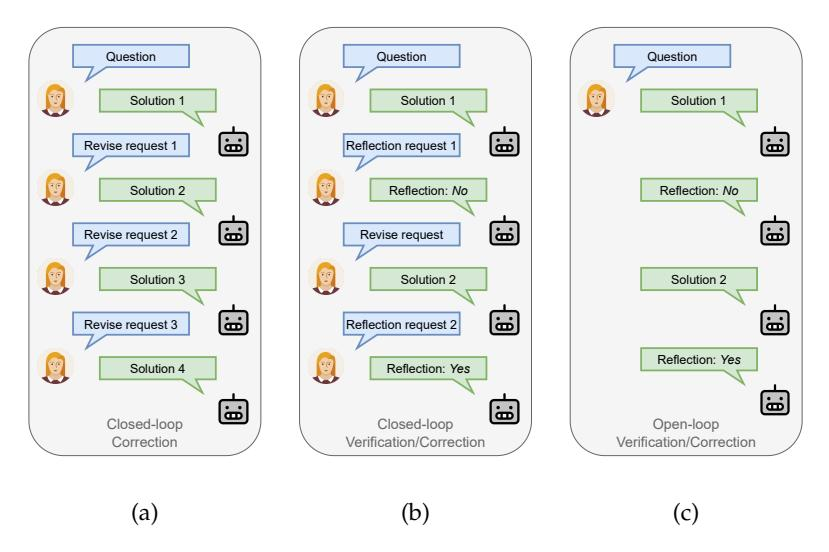
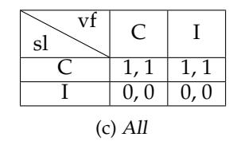

# **Boosting LLM Reasoning via Spontaneous Self-Correction**

**Xutong Zhao**1,2,3 <sup>∗</sup> **Tengyu Xu**<sup>1</sup> **Xuewei Wang**<sup>1</sup> **Zhengxing Chen**<sup>1</sup> **Di Jin**<sup>1</sup> **Liang Tan**<sup>1</sup> **Yen-Ting Lin**<sup>1</sup> **Zishun Yu**<sup>1</sup> **Zhuokai Zhao**<sup>1</sup> **Yun He**<sup>1</sup> **Sinong Wang**<sup>1</sup> **Han Fang**<sup>1</sup> **Sarath Chandar**2,4 **Chen Zhu**<sup>1</sup>

# **Abstract**

While large language models (LLMs) have demonstrated remarkable success on a broad range of tasks, math reasoning remains a challenging one. One of the approaches for improving math reasoning is self-correction, which designs self-improving loops to let the model correct its own mistakes. However, existing self-correction approaches treat corrections as standalone post-generation refinements, relying on extra prompt and system designs to elicit self-corrections, instead of performing real-time, spontaneous self-corrections in a single pass. To address this, we propose **SPOC**, a *spontaneous self-correction* approach that enables LLMs to generate interleaved solutions and verifications in a *single inference pass*, with generation dynamically terminated based on verification outcomes, thereby effectively scaling inference time compute. SPOC considers a multi-agent perspective by assigning dual roles – solution proposer and verifier – to the same model. We adopt a simple yet effective approach to generate synthetic data for finetuning, enabling the model to develop capabilities for self-verification and multi-agent collaboration. We further improve its solution proposal and verification accuracy through online reinforcement learning. Experiments on mathematical reasoning benchmarks show that SPOC significantly improves performance. Notably, SPOC boosts the accuracy of Llama-3.1-8B and 70B Instruct models, achieving gains of 8.8% and 11.6% on MATH500, 10.0% and 20.0% on AMC23, and 3.3% and 6.7% on AIME24, respectively.

# **1 Introduction**

Large Language Models (LLMs) have showcased promising results across a broad spectrum of text generation tasks. Among the various domains of LLM applications, mathematical reasoning remains particularly challenging due to its symbolic and structured nature [\(Shao](#page-11-0) [et al.,](#page-11-0) [2024;](#page-11-0) [Chen et al.,](#page-10-0) [2024\)](#page-10-0). Recent advances in self-correction [\(Shinn et al.,](#page-11-1) [2023;](#page-11-1) [Madaan](#page-11-2) [et al.,](#page-11-2) [2023\)](#page-11-2) have emerged as a promising paradigm towards self-improvement through iterative critique and refinement of model's own responses.

However, the effectiveness and practicality of existing self-correction approaches remain unclear. Naive prompting methods may lead to minimal improvement or performance degradation without access to external feedback [\(Huang et al.,](#page-10-1) [2023;](#page-10-1) [Qu et al.,](#page-11-3) [2024\)](#page-11-3). Finetuningbased methods seek to address such issues by post-training the LLM on refinement data collected from oracles [\(Saunders et al.,](#page-11-4) [2022;](#page-11-4) [Qu et al.,](#page-11-3) [2024\)](#page-11-3) or the learner model itself [\(Ku](#page-10-2)[mar et al.,](#page-10-2) [2024\)](#page-10-2). Nonetheless, these approaches typically rely on a specific prompt after each model response to trigger self-reflection or correction (Figures [1a](#page-1-0) and [1b\)](#page-1-0), necessitating additional system design to inject these prompts during inference. In other words, existing approaches lack the ability to spontaneously and adaptively self reflect and correct, resulting in ineffective test-time compute scaling and inflexible deployment in practice.

<sup>∗</sup>1Meta GenAI, <sup>2</sup>Mila - Quebec AI Institute, <sup>3</sup>Polytechnique Montréal, <sup>4</sup>Université de Montréal. This work was done when Xutong interned at Meta.

<span id="page-1-0"></span>

Figure 1: Multi-turn generation formalisms. (a)&(b) Sample closed-loop paradigms that require extra system designs and prompting to trigger and terminate correction; (c) Sample open-loop paradigm that spontaneously performs correction when needed.

To address these challenges, we introduce SPOC, a *spontaneous self-correction* approach that enables LLMs to spontaneously generate interleaved solutions and verifications in a *single inference pass*. SPOC employs an open-loop inference paradigm, which triggers self-correction only when the self-verification identifies errors, and iteratively revises the solution until it passes self-verification, without requiring any external interventions during response generation. It dynamically elicits and terminates generations on-the-fly using solely the model's inherent capabilities, thereby effectively scaling inference time compute. We consider a multi-agent formalism that models the alternating solutions and verifications as the interaction between a solution proposer and a verifier, and adopt a self-play training strategy by assigning dual roles to the same model. We adopt a simple yet effective approach to generate synthetic data from the initial model for supervised fine-tuning [\(Welleck](#page-12-0) [et al.,](#page-12-0) [2022\)](#page-12-0), enabling the model to adhere to the multi-turn generation style, meanwhile developing capabilities for self-verification and inter-agent collaboration without distilling from a stronger teacher. We further boost the model's accuracy in its solution proposal and verification via online reinforcement learning, using the correctness of solutions and verifications as the reward.

Our main contributions are threefold:

- We demonstrate that generating self-verification and correction trajectories from the initial model's correct and incorrect outputs effectively bootstraps its spontaneous self-verification and correction behavior. We call out the importance of data balancing in achieving high verification accuracy in this stage, which in turn benefits the subsequent RL phase.
- We propose the message-wise online RL framework for SPOC, and present the formulation of RAFT [\(Dong et al.,](#page-10-3) [2023\)](#page-10-3) and RLOO [\(Ahmadian et al.,](#page-10-4) [2024\)](#page-10-4) as the RL stage of SPOC for enhancing self-verification and correction accuracies. Our results show that RLOO, augmented with process rewards for each solution or verification step, yields stronger results.
- We achieve significant improvements on math reasoning tasks across model sizes and task difficulties using our pipeline without distilling from stronger models. SPOC boosts the pass@1 accuracy of Llama-3.1-8B and 70B Instruct models—improving performance by 8.8% and 11.6% on MATH500, by 10.0% and 20.0% on AMC23, and by 3.3% and 6.7% on AIME24.

### 2 Related work

**Self-correction.** Given that high-quality external feedback is often unavailable across various realistic circumstances, it is beneficial to enable an LLM to correct its initial responses based on solely on its inherent capabilities. Prior works on such intrinsic self-correction (Huang et al., 2023) or self-refinement can be categorized into two groups based on the problem settings and correction mechanisms: prompting and finetuning. Recent works (Huang et al., 2023; Qu et al., 2024) show that prior prompting methods lead to minimal improvement or degrading performance without strong assumptions on problem settings. For instance, Shinn et al. (2023) rely on oracle labels which are often unavailable in real-world applications; Madaan et al. (2023) use less informative prompts for initial responses, resulting in overestimation of correction performance. Finetuning methods seek to improve correction performance via finetuning the LLM on refinement data, collected from human annotators (Saunders et al., 2022), stronger models (Qu et al., 2024), or the learner model itself (Kumar et al., 2024). However, these works lack the mechanisms that correct errors while generating solutions in a single inference pass (Ye et al., 2024). Our work is akin to concurrent works on self-correction (Ma et al., 2025; Xiong et al., 2025). Differently, Xiong et al. (2023) re-attempts a solution within the verification instead of evaluating the previous one; moreover, they only apply RAFT in their learning framework, while we also conduct experiments on RLOO. Ma et al. (2025) uses the more complex GRPO as their RL algorithm, while we show that better performance can be achieved in the same setting (Llama 3.1 8B) by using simpler RL algorithms like RAFT for SPOC.

**Multi-agent frameworks.** By introducing multiple roles into problem-solving, multiagent formalisms serve as a different perspective to address complex reasoning tasks. AutoGen (Wu et al., 2023) and debate-based frameworks (Du et al., 2023; Liang et al., 2023) solve math problems through customized inter-agent conversations. Despite increased test-time computation, these works lack post-training for different agent roles, which may result in suboptimal performance or distribution shifts at inference time (Xiang et al., 2025). While other works train separate models to perform correction (Motwani et al., 2024; Havrilla et al., 2024; Akyürek et al., 2023; Paul et al., 2023), models do not perform spontaneous corrections during solution generations; instead, they require extra system designs to trigger and stop corrections at deployment. In contrast, our method enables dynamic inference-time scaling by improving the model's own *inherent* deliberation capabilities.

### 3 Method

In this section, we first introduce the multi-turn formalism, in which the agent performs interleaved solution and verification turns. We then discuss how we finetune the agent to ensure it consistently adheres to the multi-turn response style. We finally describe our online reinforcement learning scheme which further boosts the final accuracy of the policy. Figure 2 illustrates the two stages, fine-tuning and online RL, of SPOC.

### 3.1 Multi-turn formalism

**Problem setup.** Let  $\mathcal{D} \equiv \mathcal{X} \times \mathcal{Y} = \{(x_i, y_i^*)\}_{i=1}^N$  be a dataset of N math problems, where each pair  $(x, y^*)$  contains a question  $x_i$  and the corresponding solution  $y_i^*$  with ground-truth final answer. An LLM agent is defined by the policy  $\pi_{\theta}(\cdot|x)$ , parameterized by  $\theta$ , that generates the solution y to solve the given problem x.

**Alternated-turn generation.** Suppose given a question x, the LLM generates a trajectory consisting of L interleaved solutions and verifications  $\tau = (y_1, v_1, \ldots, y_L, v_L)$ , where a solution  $y_l$  indicating the model's l-th complete solution attempt that reaches a final answer, and a verification  $v_l$  indicating the l-th self-verification validating correctness of the solution  $y_l$ . For clarity, message or turn refers to each single solution  $y_l$  or verification  $v_l$ , and response or generation  $\tau$  refers to the entire trajectory until the end. For brevity, we denote

# <span id="page-3-0"></span>Pair Supervised Fine-Tuning Online Reinforcement Learning Question VVVVVVV VV VV VV VV VV VV VV

Figure 2: SPOC Training Overview. Left: PairSFT for enabling adherence to multi-turn generation. Right: Online RL for policy optimization.

previous l turns by:  $\tau_l = (y_{1:l}, v_{1:l})$  and  $\tau_l^{\text{vf}} = (y_{1:l}, v_{1:l-1})$ . The timestep  $t \in \mathbb{N}_0$  indicates a single decoding step where the LLM outputs one token from its policy distribution.

**Multi-agent formulation.** We model the reasoning task as an extensive-form game (EFG) (Osborne, 1994; Shoham & Leyton-Brown, 2008), which generalizes the Markov Decision Process (MDP) (Sutton, 2018) to a turn-taking interaction between solution proposer and verifier. At each turn, the proposer outputs a solution to the given math problem, and the verifier assesses its correctness. In this context, the EFG is a tuple  $\langle \mathcal{N}, \mathcal{A}, \mathcal{S}, \mathcal{T}, r, \mathcal{I}, \gamma \rangle$ , where  $\mathcal{N} = \{1, \ldots, n\}$  is the set of n = 2 players (i.e. the proposer and verifier),  $\mathcal{A}$  is a finite set of actions (i.e. the LLM's token space),  $\mathcal{S}$  is a finite set of states (i.e. each state is a question and a sequence of reasoning/verification steps in context),  $\mathcal{T} \subset \mathcal{S}$  is a subset of terminal states (i.e. complete response trajectories  $\tau = (y_1, v_1, \ldots, y_L, v_L)$ ),  $r: \mathcal{T} \times \mathbb{N}_0 \to \Delta_r^n \subset \mathbb{R}^n$  is the reward function assigning each player a scalar utility at terminal states (i.e.  $\Delta_r = \{0,1\}$  characterizes binary outcome feedback),  $\mathcal{I}: \mathcal{S} \to \mathcal{N}$  is a player identity function identifing which player acts at s (i.e.  $\mathcal{I}(\tau_l) = 1$  and  $\mathcal{I}(\tau_l^{vf}) = 2$ ), and  $\gamma \in [0,1]$  is the discount factor.

Unlike the general definition of EFGs, we do not distinguish between histories and states due to the deterministic dynamics and perfect-information nature in mathematical reasoning (i.e.  $\tau_{l+1} = \tau_l \cup \{y_{l+1}, v_{l+1}\}$ ). We denote the proposer's and the verifier's action spaces as  $\mathcal{A}^{\mathrm{sl}} \subset \mathcal{A}$  and  $\mathcal{A}^{\mathrm{vf}} \subset \mathcal{A}$ , representing the set of solution and verification messages, respectively. We define a per-step reward function for a transition as r(s,a) representing a vector of reward to both agents. The return for player  $i \in \mathcal{N}$  is defined as  $G_{t,i} = \sum_{k=0}^{\infty} \gamma^k r_i(s_{t+k}, a_{t+k})$ . The corresponding state-action value function under policy  $\pi$  is  $Q_{\pi_i}(s,a) = \mathbb{E}_{\pi}[G_{t,i}|s_t = s, a_t = a]$ .

To improve reasoning capabilities by learning from both solution and verification experiences, we adopt the commonly-used self-play strategy with parameter sharing (Albrecht et al., 2024), where the proposer policy  $\pi^{sl}: \mathcal{S} \to \Delta(\mathcal{A}^{sl})$  and the verifier policy  $\pi^{vf}: \mathcal{S} \to \Delta(\mathcal{A}^{vf})$  share the same set of parameters  $\theta$ . The policy  $\pi_{\theta}$  outputs alternated solution and verification messages depending on the context<sup>1</sup>.

**Policy optimization.** We optimize the policy  $\pi_{\theta}$  by maximizing the KL-regularized learning objective

$$J(\theta) = \mathbb{E}_{s \sim \rho, a \sim \pi(\cdot|s)}[Q_{\pi}(s, a)] - \eta \cdot \mathbb{E}_{s \sim \rho}[D_{\text{KL}}(\pi_{\theta}(\cdot|s)|\pi_{\theta_0}(\cdot|s))]$$
(1)

<span id="page-3-1"></span><sup>&</sup>lt;sup>1</sup>Different from the classic self-play in zero-sum games (e.g., AlphaZero (Silver et al., 2017)), ours involves non-symmetrical roles in the sense that two policies are different conditioned on the context.

<span id="page-4-0"></span>

| sl       | С    | I    |  |  |
|----------|------|------|--|--|
| С        | 1, 1 | 1, 0 |  |  |
| I        | 0, 1 | 0,0  |  |  |
| (a) Corr |      |      |  |  |

| sl vf    | С    | I    |  |  |
|----------|------|------|--|--|
| С        | 1, 0 | 1, 0 |  |  |
| I        | 0, 0 | 0,0  |  |  |
| (b) Last |      |      |  |  |

<span id="page-4-2"></span><span id="page-4-1"></span>

Figure 3: Reward configurations for policy optimization, where sl, vf, C, I indicate solution, verification, correct, and incorrect, respectively. For *Last* and *All*, SPOC optimizes solution-correct messages (first row in each table) only when the last solution turn is correct.

where  $\rho$  indicates the discounted state distribution,  $\eta>0$  is the KL-regularization coefficient, and  $\pi_{\theta_0}$  is the reference policy parameterized by the initial parameters  $\theta_0$ . This objective has a close-form solution for the optimal policy  $\pi^*(a|s)=\frac{1}{Z(s)}\pi_{\theta_0}(a|s)\exp(\frac{1}{\eta}Q(s,a))$ , where  $Z(s)=\mathbb{E}_{a\sim\pi_{\theta_0}(\cdot|s)}[\exp(\frac{1}{\eta}Q(s,a))]$ . Given our multi-agent formulation, this objective introduces an individual objective for each role, namely

$$J^{\text{sl}}(\theta) = \mathbb{E}[Q_{\pi}^{\text{sl}}(s, a)] - \eta^{\text{sl}} \cdot \mathbb{E}[D_{\text{KL}}(\pi_{\theta}^{\text{sl}}(\cdot|s)|\pi_{\theta_0}^{\text{sl}}(\cdot|s))]$$
 (2)

$$J^{\text{vf}}(\theta) = \mathbb{E}[Q_{\pi}^{\text{vf}}(s, a)] - \eta^{\text{vf}} \cdot \mathbb{E}[D_{\text{KL}}(\pi_{\theta}^{\text{vf}}(\cdot|s)|\pi_{\theta_0}^{\text{vf}}(\cdot|s))]$$
(3)

Due to shared parameters across both roles, we jointly optimize both objectives using common generated trajectory experiences. Hence the optimal proposer and verifier policies satisfy  $\pi^{\rm sl*}(a|s) \propto \pi_{\theta_0}^{\rm sl}(a|s) \exp(\frac{1}{\eta}Q^{\rm sl}(s,a))$  and  $\pi^{\rm vf*}(a|s) \propto \pi_{\theta_0}^{\rm vf}(a|s) \exp(\frac{1}{\eta}Q^{\rm vf}(s,a))$ , respectively, implying the optimal shared policy increases the probability of outputting high-rewarding solutions/verifications. Note that the optimal policy for the unregularized learning objective  $(\eta=0)$  results in the maximizer of the action-value function:  $\pi^*(\cdot|s)=\arg\max_{\pi(\cdot|s)\in\Delta(\mathcal{A})}\mathbb{E}_{a\sim\pi(\cdot|s)}[Q_\pi(s,a)]$ , which also leads to high probablity of generating high-rewarding solutions/verifications.

**Reward setting.** To obtain a reward signal for each token in each message, we evaluate the outcome correctness of each message. In particular, we assume access to a rule-based checker for the final answer in the solution, and provide a binary outcome reward denoted by  $r^{\rm sl}(y,y^*) \in \{0,1\}$ , where  $r^{\rm sl}(y,y^*) = 1$  when the model answer matches the ground-truth answer. Similarly, we parse the Yes/No conclusion in each verification, and denote the reward function by  $r^{\rm vf}(v,v^*) \in \{0,1\}$ , with  $v^* = r^{\rm sl}(y,y^*)$  indicating the ground-truth verification. Figure 3a shows the joint reward setting, denoted by Corr hereafter. To obtain maximal returns against each other role, our reward setting admits one unique Nash equilibrium (Shoham & Leyton-Brown, 2008) with the joint policy (i.e. the shared policy  $\pi$ ) generating both correct solutions and correct verifications.

### 3.2 Enabling multi-turn generation

Since off-the-shelf LLMs do not adhere to the response style of interleaved solution and verification turns by default, before conducting RL optimization, we first perform an initial finetuning with multi-turn data to enable such behaviour. To collect such data, we implement a variant of Pair-SFT (Kumar et al., 2024; Welleck et al., 2022) to construct synthetic correction responses.

In particular, we rollout the base policy  $\pi_{\theta_0}$  to collect single-turn responses for each question  $x_i \in \mathcal{X}$ , denoted by  $\{y_i^k\}_{k=1}^K \sim \pi_{\theta_0}(\cdot|x_i)$ . For each response, we record its binary correctness using the solution reward function  $r_i^k = r^{\mathrm{sl}}(y_i^k, y_i^*)$ . We obtain the verification message of one single-turn response by pairing it with a correct sampled response. To generate verification of one response, either correct or incorrect, we prompt the same base model  $\pi_{\theta_0}$  to identify the potential error, briefly explain it, and output a final binary conclusion indicating correctness of the given solution. The entire verification message is denoted as  $v_i \sim \pi_{\theta_0}(\cdot|x_i,y_i,y_i^*)$ , where  $y_i^*$  indicates the correct sample. We denote this synthetic multiturn correction dataset as the Pair-SFT dataset  $\mathcal{D}_{\mathrm{pair}} = \{(x_i,y_i^-,v_i^-,y_i^*)\} \cup \{(x_i,y_i^+,v_i^+)\}$ ,

## <span id="page-5-0"></span>Algorithm 1 SPOC Message-wise Online Reinforcement Learning

- 1: **Inputs:** Question-answer dataset  $\mathcal{D} = \mathcal{X} \times \mathcal{Y} = \{(x_j, y_j^*)\}_{j=1}^N$ , policy model  $\pi_\theta$  parameterized by  $\theta$ , number of questions N, number of steps T, number of rollouts per question K, batch size B, rule-based solution correctness reward function  $r^{\mathrm{sl}}(y, y^*) \in \{0, 1\}$ , verification correctness reward function  $r^{\mathrm{vf}}(v, v^*) \in \{0, 1\}$
- 2: **for** i = 1, ..., T **do**
- 3: Sample a batch  $\mathcal{D}_i \subset \mathcal{D}$  of size B
- 4: Sample *K* trajectories for each  $x_j \in \mathcal{X}_i$ :  $\{\tau_j^k\}_{k=1}^K \sim \pi_{\theta}(\cdot|x_j)$ , where  $\tau_j^k = (y_{1:L_k}^{j,k}, v_{1:L_k}^{j,k})$
- 5: Label binary rewards:  $r_{j,k,l}^{\rm sl} = r^{\rm sl}(y_l^{j,k}, y_j^*), r_{j,k,l}^{\rm vf} = r^{\rm vf}(v_l^{j,k}, v_{j,k,l}^*),$  where  $v_{j,k,l}^* = r_{j,k,l}^{\rm sl}$
- 6: Update policy with any policy optimization algorithm (e.g. Algorithm 3, Algorithm 4)
- 7: end for
- 8: return  $\pi_{\theta}$

where the +/- superscripts indicates correctness of the corresponding solution turn. We perform SFT finetuning on the base model, with tokens in incorrect messages masked out, and denote the finetuned model by  $\pi_{\theta_{\rm sft}}$ . In practice, we observe that reweighting the subsets  $\{(x_i, y_i^-, v_i^-, y_i^*)\}$  and  $\{(x_i, y_i^+, v_i^+)\}$  to approximately the same scale leads to a  $\pi_{\theta_{\rm sft}}$  with higher verification accuracy and more stable RL training afterwards. The complete training data collection procedure is detailed in Algorithm 2.

When generating the verification messages, we adapt the generative critic method (Zhang et al., 2024; Zheng et al., 2024) that prompts the model to respond with rationales before judging solution correctness, except that our variant concisely explains the error rather than performing a chain-of-thought (COT) analysis. Obtaining a strong COT verifier requires explicit training and it is out of scope of this work. Prompt templates for data construction are detailed in Appendix D.

### 3.3 Online reinforcement learning

With the multi-turn problem formulated and the agent adhering to the multi-turn responses style, we conduct online reinforcement learning to improve the policy performance. The overall message-level RL training procedure is described in Algorithm 1. While SPOC is compatible with any policy optimization method, we apply RAFT (Dong et al., 2023) unless otherwise specified. The RAFT policy optimization algorithm is presented in Algorithm 3.

Besides the RAFT policy optimizer, we also implement an RLOO (Ahmadian et al., 2024) variant, which replaces the leave-one-out procedure with subtraction of the mean reward across all messages, followed by division by the standard deviation. We refer to this approach as RLOO for brevity. Unlike the best-of-N (BoN) response selection strategy in RAFT, RLOO optimizes the policy using all generated responses, enjoying better sample efficiency. The RLOO policy optimization process is detailed in Algorithm 4.

## 4 Experiments

In this section we present empirical experiments on math reasoning benchmarks. We first overview the tasks we conduct experiments on. We then describe the experimental setup and evaluation protocols. Finally we discuss the results and provide ablation studies.

### 4.1 Experimental setup

**Tasks.** We perform experiments on established math reasoning benchmarks. To enable rule-based answer checking, all problems in selected benchmarks require a verifiable final output. We evaluate models on benchmarks: (1) MATH500 (Lightman et al., 2023), a curated dataset of 500 problems selected from the full MATH (Hendrycks et al., 2021) evaluation set;

<span id="page-6-0"></span>

| Approach                                         | MATH500             | AMC23               | AIME24              |
|--------------------------------------------------|---------------------|---------------------|---------------------|
| Llama-3.1-8B-Instruct (Dubey et al., 2024)       | 52.2                | 22.5                | 3.3                 |
| SFT                                              | 53.6                | 32.5                | 3.3                 |
| RAFT                                             | 55.2                | 27.5                | 6.7                 |
| PairSFT                                          | 53.8                | 22.5                | 10.0                |
| Self-Refine (w/o oracle)                         | 39.4                | 20.0                | 3.3                 |
| Self-Refine (w/ oracle)                          | 57.0                | 35.0                | 3.3                 |
| S <sup>2</sup> R-BI* (Ma et al., 2025)           | 49.6                | 20.0                | 10.0                |
| S <sup>2</sup> R-PRL*                            | 53.6                | 25.0                | 6.7                 |
| S <sup>2</sup> R-ORL*                            | 55.0                | 32.5                | 6.7                 |
| SPOC                                             | 61.0                | 32.5                | 6.7                 |
| Llama-3.1-70B-Instruct (Dubey et al., 2024)      | 65.8                | 32.5                | 16.7                |
| SFT                                              | 70.4                | 45.0                | 13.3                |
| RAFT                                             | 74.2                | 52.5                | 20.0                |
| PairSFT                                          | 74.8                | 47.5                | 23.3                |
| Self-Refine (w/o oracle)                         | 54.2                | 42.5                | 13.3                |
| Self-Refine (w / oracle)                         | 72.2                | 47.5                | 26.7                |
| SPOC                                             | 77.4                | 52.5                | 23.3                |
| Llama-3.3-70B-Instruct (AI, 2024)                | 75.6                | 57.5                | 26.7                |
| SFT                                              | 73.6                | 55.0                | 23.3                |
| RAFT                                             | 76.6                | 62.5                | 20.0                |
| PairSFT                                          | 75.0                | 62.5                | 23.3                |
| Self-Refine (w/o oracle)                         | 75.4<br>76.2        | 60.0                | 33.3                |
| Self-Refine (w / oracle)<br>SPOC                 | 76.2<br><b>77.8</b> | 65.0<br><b>70.0</b> | 26.7                |
|                                                  |                     |                     | 23.3                |
| DeepSeek-R1-Distill-Llama-8B (Guo et al., 2025)  | 62.6                | 62.5                | 26.7                |
| SFT                                              | 76.8                | 65.0                | 30.0                |
| RAFT                                             | 74.2                | 62.5                | 6.7                 |
| PairSFT                                          | 73.2                | 77.5                | 16.7                |
| Self-Refine (w/o oracle)                         | 67.4                | 75.0                | 10.0                |
| Self-Refine (w / oracle)                         | 71.2                | 65.0                | 40.0                |
| SPOC<br>SPOC-RLOO                                | 77.6<br><b>87.2</b> | 70.0<br><b>87.5</b> | 23.3<br><b>50.0</b> |
|                                                  |                     |                     |                     |
| DeepSeek-R1-Distill-Llama-70B (Guo et al., 2025) | 82.8                | 72.5                | 60.0                |
| SFT                                              | 90.6<br>87.4        | 80.0                | 40.0                |
| RAFT<br>PairSFT                                  | 87.4<br>92.6        | 85.0<br><b>95.0</b> | 50.0<br>63.3        |
| Self-Refine (w/o oracle)                         | 92.6<br>86.2        | 80.0                | 30.0                |
| Self-Refine (w/ o oracle)                        | 88.6                | 72.5                | 30.0                |
| SPOC                                             | 89.6                | 85.0                | 53.3                |
| SPOC-RLOO                                        | 94.6                | 92.5                | <b>76.7</b>         |
| Gemini-1.5-Flash (4-shot)* (Team et al., 2024)   | 54.9                | -                   | -                   |
| SCoRe* (Kumar et al., 2024)                      | 64.4                | -                   | -                   |
| Llama-3-8B-Instruct (4-shot)* (Meta, 2024)       | 30.0                | -                   | -                   |
| Self-rewarding IFT* (Xiong et al., 2025)         | 27.9                | -                   | -                   |
| Self-rewarding-IFT + Gold RM*                    | 33.9                | -                   | -                   |
| DeepSeek-R1-Distill-Llama-8B-R1tok-avg@4         | 88.9                | 92.5                | 48.3                |
| DeepSeek-R1-Distill-Llama-8B-R1tok               | 82.2                | 87.5                | 36.7                |
| DeepSeek-R1-Distill-Llama-8B*                    | 89.1                | -                   | 50.4                |
| DeepSeek-R1-Distill-Llama-70B-R1tok-avg@4        | 94.3                | 94.4                | 65.9                |
| DeepSeek-R1-Distill-Llama-70B-R1tok              | 91.2                | 80.0                | 56.7                |
| DeepSeek-R1-Distill-Llama-70B*                   | 94.5                | -                   | 70.0                |
| Qwen2.5-Math-7B-Instruct (Yang et al., 2024)     | 82.8                | 62.5                | 16.7                |
| Qwen2.5-Math-72B-Instruct                        | 84.8                | 72.5                | 26.7                |
| Õ1*                                              | 94.8                | -                   | 74.4                |
| CDT 4                                            | 60.3                | _                   | 9.3                 |
| GPT-40*<br>Claude 3.5 Sonnet*                    | 00.0                |                     |                     |

Table 1: Main evaluation results. Baselines that we directly use results from their reports are marked with \*. The best performance under each initial model is marked with bold text (omitted prompting-based Self-Refine for fair comparisons). "R1tok" indicates the model is evaluated using the R1 modified tokenizer and chat configs. "avg@4" indicates the model is evaluated using sampling, with the temperature of 0.6, the top-p value of 0.95, and 4 responses generated per question to compute the mean pass@1 (Guo et al., 2025). Blue indicates ours, and green indicates other RL based approaches.

<sup>(2)</sup> AMC23 (AI-MO, 2023), a dataset of 40 challenging competition questions; (3) AIME24 (AI-MO, 2024), a dataset of 30 more difficult competition problems.

<span id="page-7-0"></span>

| Base Model trained w/ SPOC | Base.Acc.    | Verif.Acc.@t1 | Acc.@t1      | Acc.@t2      | $\Delta(t1,t2)$ | $\Delta_{c \to i}$ | $\Delta_{i\to c}$ |
|----------------------------|--------------|---------------|--------------|--------------|-----------------|--------------------|-------------------|
| Llama-3.1-8B-Instruct      | 52.2<br>65.8 | 80.2<br>80.0  | 59.0<br>77.0 | 61.0<br>77.4 | 2.0<br>0.4      | 8/29<br>3/10       | 18/79<br>5/8      |
| Llama-3.3-70B-Instruct     | 75.6         | 81.8          | 77.8         | 77.8         | 0.0             | 1/4                | 1/20              |

Table 2: Performance across solution turns on MATH500.  $\Delta_{c \to i} \& \Delta_{i \to c}$  presents #correct/#all at turn2.

**Evaluation protocol.** Our primary evaluation metric is the final answer accuracy. We additionally report cross-solution correction accuracy serving as a complementary evaluation.

For all experiments, we finetune Llama-3-Instruct models (Dubey et al., 2024) (3.1-8B & 70B, 3.3-70B, DeepSeek-R1-Distill-Llama 8B & 70B) as the base models. We conduct training using the NuminaMath dataset (LI et al., 2024), which consists of training sets from various data sources, covering a wide range of mathematical topics and difficulty levels. We exclude the Orca-Math dataset (Mitra et al., 2024) and synthetic data subset since their correctness are not human-validated despite their large scale.

For evaluations, we report the pass@1 accuracy of the final answer. We use greedy decoding and zero-shot COT prompting unless otherwise specified. As mentioned in previous sections, we do not utilize additional external instructions to prompt the finetuned model to attempt another solution trial; instead the model spontaneously performs self-verification to determine whether another attempt is needed. Our prompt templates for evaluation are included in Appendix D.

Implementation details. All models are prompted with the original Llama tokenizer and chat configs (Dubey et al., 2024) unless otherwise specified. All models except the DeepSeek-R1-Distill-Llama based ones are evaluated using the maximum generation length of 6,144 tokens, while the DeepSeek-R1-Distill-Llama based models are evaluated using the maximum generation length of 32,768 tokens, as per Guo et al. (2025). To support training with multi-message responses, we utilize different special termination tokens for each model message. In particular, in each model response each message starts with assistant header tokens, indicating the source of message is the model. Besides, every assitant message except the last ends with an <|eom\_id|> termination token, representing the end of one message. The last assistant message ends with an <|eot\_id|> token, which concludes the entire model response. We implement RAFT (Dong et al., 2023) under the CGPO (Xu et al., 2024) framework, which allows for filtering out prompts whose all corresponding sampled responses contain no correct solutions or verifications.

### 4.2 Results

Table 1 presents the comprehensive evaluation results, showing the comparisons across different initial models and parameter scales. In general, SPOC consistently outperforms the base models on all initialization models across all benchmark tasks. Notably, SPOC enhances the accuracy of Llama3.1 8B and 70B, reaching gains of 8.8% and 11.6% on MATH500, 10.0% and 20.0% on AMC23, and 3.3% and 6.7% on AIME24, respectively. This result highlights the effectiveness of SPOC across different parameter scales and task difficulties.

SPOC also achieves consistent enhancement when fine-tuned with strong initial models. Despite marginal improvement on Llama3.3-70B model, SPOC obtains significant overall outperformance compared to the baselines after finetuning the DeepSeek-R1-Distill-Llama models. Respectively on MATH500/AMC23/AIME24, SPOC reaches 77.6%/70.0%/23.3% with the 8B model, and 89.9%/85.0%/53.3% with the 70B model. Furthermore, SPOC achieves more drastic performance improvement using the RLOO policy optimizer, obtaining 87.2%/87.5%/50.0% with the 8B model, and 94.6%/92.5%/76.7% with the 70B model. It is important to note that the gap between our evaluation of DeepSeek-R1-Distill-Llama base models for post-training and their corresponding R1tok results is attributed to different tokenizers and chat configurations.

<span id="page-8-0"></span>

| Approach               | MATH500 | AMC23 | AIME24 |
|------------------------|---------|-------|--------|
| Llama-3.1-8B-Instruct  | 52.2    | 22.5  | 3.3    |
| PairSFT (iter1)        | 53.8    | 22.5  | 10.0   |
| SPOC (iter1)           | 61.0    | 32.5  | 6.7    |
| PairSFT (iter2)        | 60.8    | 35.0  | 6.7    |
| SPOC (iter2)           | 62.0    | 32.5  | 10.0   |
| Llama-3.1-70B-Instruct | 65.8    | 32.5  | 16.7   |
| PairSFT (iter1)        | 74.8    | 47.5  | 23.3   |
| SPOC (iter1)           | 77.4    | 52.5  | 23.3   |
| PairSFT (iter2)        | 76.4    | 67.5  | 20.0   |
| SPOC (iter2)           | 77.6    | 62.5  | 30.0   |
| Llama-3.3-70B-Instruct | 75.6    | 57.5  | 26.7   |
| PairSFT (iter1)        | 75.0    | 62.5  | 23.3   |
| SPOC (iter1)           | 77.8    | 70.0  | 23.3   |
| PairSFT (iter2)        | 79.6    | 72.5  | 26.7   |
| SPOC (iter2)           | 79.8    | 70.0  | 30.0   |

Table 3: Iterative training performance.

Table [2](#page-7-0) shows performance across the solution turns on MATH500. Overall, SPOC achieves consistent improvement on the second solution turns over the first. With the smaller Llama3.1-8B model, SPOC shows more inclination to generate a second solution turn, resulting in a more significant improvement margin. With larger 70B models that achieve higher final accuracy, on the other hand, SPOC tends to get the first solution message correct in the first place, resulting in an already strong turn1 performance and a marginal ∆(*t*1, *t*2). Such behaviour is well aligned with our expected Nash equilibrium admitted by the Corr reward setting, where policy optimization encourages the joint policy to generate both correct solutions and correct verifications in the first place.

Table [3](#page-8-0) shows the performance of applying multiple iterations of PairSFT-RL training procedure. Results indicate that the second iteration still leads to overall consistent improvement over all models. Although the overall improvement is mainly marginal, the second iteration shows a larger gain in challenging competition benchmarks. For instance, with Llama3.1- 70B, iter2 improves over iter1 by 10% and 6.7% on AMC23 and AIME24, respectively.

## **4.3 Ablations**

We conduct ablation experiments on different reward configurations, as overviewed in Figure [3.](#page-4-0) We present comparisons with the default Corr reward setting in Table [4,](#page-8-1) using Llama-3.1-8B-Instruct as the base model. Compared to Corr, the ablation variants Last and All do not yield a unique Nash equilibrium; instead, they promote generating correct solutions regardless of the correctness of verifications. Results show that both variants still improve performance over the baseline; however, they

<span id="page-8-1"></span>

| Model     | MATH500 | AMC23 | AIME24 |
|-----------|---------|-------|--------|
| Base      | 52.2    | 22.5  | 3.3    |
| SPOC-Corr | 61.0    | 32.5  | 6.7    |
| SPOC-Last | 59.8    | 27.5  | 10.0   |
| SPOC-All  | 58.4    | 35.0  | 6.7    |

Table 4: Ablation experiments under different reward settings. Experiments are conducted on the Llama-3.1-8B-Instruct model.

both underperform Corr on two out of three tasks. Last and All obtains only one more correct answer than Corr in AIME24 and AMC23, respectively, while the performance discrepancy on MATH500 dominates the overall gap. The ablation highlights the importance of jointly optimizing the correctness of both solutions and verifications.

# **5 Conclusions**

In this work, we tackle the mathematical reasoning challenge for Large Language Models by promoting intrinsic self-corrections. We propose SPOC, a novel approach that enables spontaneous, real-time solution proposal and verification within a single inference pass. SPOC frames the reasoning process as a multi-agent collaboration, where the model assumes both the roles of a solution proposer and verifier. SPOC dynamically elicits and terminates reasoning generations based on verification results, which flexibly and efficiently scales inferencetime compute while improving accuracy. SPOC leverages synthetic data for fine-tuning and further enhances performance via online reinforcement learning, without requiring human or oracle input. Comprehensive empirical evaluations on challenging math reasoning benchmarks showcase SPOC's efficacy, yielding substantial performance improvement.

Our results highlight the potential of spontaneous self-correction as an effective strategy for advancing LLM reasoning capabilities. Future work could explore extending SPOC to partial solutions with long reasoning chains, which detects mistakes and revises responses before arriving at a final answer. It would also be interesting to adopt SPOC to broader reasoning domains beyond mathematics, further enhancing its applicability.

# **References**

- <span id="page-10-4"></span>Arash Ahmadian, Chris Cremer, Matthias Gallé, Marzieh Fadaee, Julia Kreutzer, Olivier Pietquin, Ahmet Üstün, and Sara Hooker. Back to basics: Revisiting reinforce style optimization for learning from human feedback in llms. *arXiv preprint arXiv:2402.14740*, 2024.
- <span id="page-10-11"></span>Meta AI. Llama-3.3-70b-instruct. [https://huggingface.co/meta-llama/Llama-3.](https://huggingface.co/meta-llama/Llama-3.3-70B-Instruct) [3-70B-Instruct](https://huggingface.co/meta-llama/Llama-3.3-70B-Instruct), 2024.
- <span id="page-10-13"></span>AI-MO. American mathematics contest. [https://huggingface.co/datasets/AI-MO/](https://huggingface.co/datasets/AI-MO/aimo-validation-amc) [aimo-validation-amc](https://huggingface.co/datasets/AI-MO/aimo-validation-amc), 2023.
- <span id="page-10-14"></span>AI-MO. American invitational mathematics examination. [https://huggingface.co/](https://huggingface.co/datasets/AI-MO/aimo-validation-aime) [datasets/AI-MO/aimo-validation-aime](https://huggingface.co/datasets/AI-MO/aimo-validation-aime), 2024.
- <span id="page-10-7"></span>Afra Feyza Akyürek, Ekin Akyürek, Aman Madaan, Ashwin Kalyan, Peter Clark, Derry Wijaya, and Niket Tandon. Rl4f: Generating natural language feedback with reinforcement learning for repairing model outputs. *arXiv preprint arXiv:2305.08844*, 2023.
- <span id="page-10-8"></span>Stefano V Albrecht, Filippos Christianos, and Lukas Schäfer. *Multi-agent reinforcement learning: Foundations and modern approaches*. MIT Press, 2024.
- <span id="page-10-0"></span>Zhaorun Chen, Zhuokai Zhao, Zhihong Zhu, Ruiqi Zhang, Xiang Li, Bhiksha Raj, and Huaxiu Yao. Autoprm: Automating procedural supervision for multi-step reasoning via controllable question decomposition. *arXiv preprint arXiv:2402.11452*, 2024.
- <span id="page-10-3"></span>Hanze Dong, Wei Xiong, Deepanshu Goyal, Yihan Zhang, Winnie Chow, Rui Pan, Shizhe Diao, Jipeng Zhang, Kashun Shum, and Tong Zhang. Raft: Reward ranked finetuning for generative foundation model alignment. *arXiv preprint arXiv:2304.06767*, 2023.
- <span id="page-10-5"></span>Yilun Du, Shuang Li, Antonio Torralba, Joshua B Tenenbaum, and Igor Mordatch. Improving factuality and reasoning in language models through multiagent debate. In *Forty-first International Conference on Machine Learning*, 2023.
- <span id="page-10-10"></span>Abhimanyu Dubey, Abhinav Jauhri, Abhinav Pandey, Abhishek Kadian, Ahmad Al-Dahle, Aiesha Letman, Akhil Mathur, Alan Schelten, Amy Yang, Angela Fan, et al. The llama 3 herd of models. *arXiv preprint arXiv:2407.21783*, 2024.
- <span id="page-10-12"></span>Daya Guo, Dejian Yang, Haowei Zhang, Junxiao Song, Ruoyu Zhang, Runxin Xu, Qihao Zhu, Shirong Ma, Peiyi Wang, Xiao Bi, et al. Deepseek-r1: Incentivizing reasoning capability in llms via reinforcement learning. *arXiv preprint arXiv:2501.12948*, 2025.
- <span id="page-10-6"></span>Alex Havrilla, Sharath Raparthy, Christoforus Nalmpantis, Jane Dwivedi-Yu, Maksym Zhuravinskyi, Eric Hambro, and Roberta Raileanu. Glore: When, where, and how to improve llm reasoning via global and local refinements. *arXiv preprint arXiv:2402.10963*, 2024.
- <span id="page-10-9"></span>Dan Hendrycks, Collin Burns, Saurav Kadavath, Akul Arora, Steven Basart, Eric Tang, Dawn Song, and Jacob Steinhardt. Measuring mathematical problem solving with the math dataset. *arXiv preprint arXiv:2103.03874*, 2021.
- <span id="page-10-1"></span>Jie Huang, Xinyun Chen, Swaroop Mishra, Huaixiu Steven Zheng, Adams Wei Yu, Xinying Song, and Denny Zhou. Large language models cannot self-correct reasoning yet. *arXiv preprint arXiv:2310.01798*, 2023.
- <span id="page-10-2"></span>Aviral Kumar, Vincent Zhuang, Rishabh Agarwal, Yi Su, John D Co-Reyes, Avi Singh, Kate Baumli, Shariq Iqbal, Colton Bishop, Rebecca Roelofs, et al. Training language models to self-correct via reinforcement learning. *arXiv preprint arXiv:2409.12917*, 2024.
- <span id="page-10-15"></span>Jia LI, Edward Beeching, Lewis Tunstall, Ben Lipkin, Roman Soletskyi, Shengyi Costa Huang, Kashif Rasul, Longhui Yu, Albert Jiang, Ziju Shen, Zihan Qin, Bin Dong, Li Zhou, Yann Fleureau, Guillaume Lample, and Stanislas Polu. Numinamath. [\[https://huggingface.co/AI-MO/NuminaMath-CoT\]\(https://github.com/]([https://huggingface.co/AI-MO/NuminaMath-CoT](https://github.com/project-numina/aimo-progress-prize/blob/main/report/numina_dataset.pdf)) [project-numina/aimo-progress-prize/blob/main/report/numina\\_dataset.pdf\)]([https://huggingface.co/AI-MO/NuminaMath-CoT](https://github.com/project-numina/aimo-progress-prize/blob/main/report/numina_dataset.pdf)), 2024.

- <span id="page-11-6"></span>Tian Liang, Zhiwei He, Wenxiang Jiao, Xing Wang, Yan Wang, Rui Wang, Yujiu Yang, Shuming Shi, and Zhaopeng Tu. Encouraging divergent thinking in large language models through multi-agent debate. *arXiv preprint arXiv:2305.19118*, 2023.
- <span id="page-11-13"></span>Hunter Lightman, Vineet Kosaraju, Yura Burda, Harri Edwards, Bowen Baker, Teddy Lee, Jan Leike, John Schulman, Ilya Sutskever, and Karl Cobbe. Let's verify step by step. *arXiv preprint arXiv:2305.20050*, 2023.
- <span id="page-11-5"></span>Ruotian Ma, Peisong Wang, Cheng Liu, Xingyan Liu, Jiaqi Chen, Bang Zhang, Xin Zhou, Nan Du, and Jia Li. S <sup>2</sup> r: Teaching llms to self-verify and self-correct via reinforcement learning. *arXiv preprint arXiv:2502.12853*, 2025.
- <span id="page-11-2"></span>Aman Madaan, Niket Tandon, Prakhar Gupta, Skyler Hallinan, Luyu Gao, Sarah Wiegreffe, Uri Alon, Nouha Dziri, Shrimai Prabhumoye, Yiming Yang, et al. Self-refine: Iterative refinement with self-feedback. *Advances in Neural Information Processing Systems*, 36: 46534–46594, 2023.
- <span id="page-11-15"></span>AI Meta. Introducing meta llama 3: The most capable openly available llm to date. *Meta AI*, 2(5):6, 2024.
- <span id="page-11-16"></span>Arindam Mitra, Hamed Khanpour, Corby Rosset, and Ahmed Awadallah. Orca-math: Unlocking the potential of slms in grade school math. *arXiv preprint arXiv:2402.14830*, 2024.
- <span id="page-11-7"></span>Sumeet Ramesh Motwani, Chandler Smith, Rocktim Jyoti Das, Rafael Rafailov, Ivan Laptev, Philip HS Torr, Fabio Pizzati, Ronald Clark, and Christian Schroeder de Witt. Malt: Improving reasoning with multi-agent llm training. *arXiv preprint arXiv:2412.01928*, 2024.
- <span id="page-11-9"></span>Martin J Osborne. *A course in game theory*. MIT Press, 1994.
- <span id="page-11-8"></span>Debjit Paul, Mete Ismayilzada, Maxime Peyrard, Beatriz Borges, Antoine Bosselut, Robert West, and Boi Faltings. Refiner: Reasoning feedback on intermediate representations. *arXiv preprint arXiv:2304.01904*, 2023.
- <span id="page-11-3"></span>Yuxiao Qu, Tianjun Zhang, Naman Garg, and Aviral Kumar. Recursive introspection: Teaching language model agents how to self-improve. *arXiv preprint arXiv:2407.18219*, 2024.
- <span id="page-11-4"></span>William Saunders, Catherine Yeh, Jeff Wu, Steven Bills, Long Ouyang, Jonathan Ward, and Jan Leike. Self-critiquing models for assisting human evaluators. *arXiv preprint arXiv:2206.05802*, 2022.
- <span id="page-11-0"></span>Zhihong Shao, Peiyi Wang, Qihao Zhu, Runxin Xu, Junxiao Song, Xiao Bi, Haowei Zhang, Mingchuan Zhang, YK Li, Y Wu, et al. Deepseekmath: Pushing the limits of mathematical reasoning in open language models. *arXiv preprint arXiv:2402.03300*, 2024.
- <span id="page-11-1"></span>Noah Shinn, Federico Cassano, Ashwin Gopinath, Karthik Narasimhan, and Shunyu Yao. Reflexion: Language agents with verbal reinforcement learning. *Advances in Neural Information Processing Systems*, 36:8634–8652, 2023.
- <span id="page-11-10"></span>Yoav Shoham and Kevin Leyton-Brown. *Multiagent systems: Algorithmic, game-theoretic, and logical foundations*. Cambridge University Press, 2008.
- <span id="page-11-12"></span>David Silver, Thomas Hubert, Julian Schrittwieser, Ioannis Antonoglou, Matthew Lai, Arthur Guez, Marc Lanctot, Laurent Sifre, Dharshan Kumaran, Thore Graepel, et al. Mastering chess and shogi by self-play with a general reinforcement learning algorithm. *arXiv preprint arXiv:1712.01815*, 2017.
- <span id="page-11-11"></span>Richard S Sutton. Reinforcement learning: An introduction. *A Bradford Book*, 2018.
- <span id="page-11-14"></span>Gemini Team, Petko Georgiev, Ving Ian Lei, Ryan Burnell, Libin Bai, Anmol Gulati, Garrett Tanzer, Damien Vincent, Zhufeng Pan, Shibo Wang, et al. Gemini 1.5: Unlocking multimodal understanding across millions of tokens of context. *arXiv preprint arXiv:2403.05530*, 2024.

- <span id="page-12-0"></span>Sean Welleck, Ximing Lu, Peter West, Faeze Brahman, Tianxiao Shen, Daniel Khashabi, and Yejin Choi. Generating sequences by learning to self-correct. *arXiv preprint arXiv:2211.00053*, 2022.
- <span id="page-12-4"></span>Qingyun Wu, Gagan Bansal, Jieyu Zhang, Yiran Wu, Beibin Li, Erkang Zhu, Li Jiang, Xiaoyun Zhang, Shaokun Zhang, Jiale Liu, et al. Autogen: Enabling next-gen llm applications via multi-agent conversation. *arXiv preprint arXiv:2308.08155*, 2023.
- <span id="page-12-5"></span>Violet Xiang, Charlie Snell, Kanishk Gandhi, Alon Albalak, Anikait Singh, Chase Blagden, Duy Phung, Rafael Rafailov, Nathan Lile, Dakota Mahan, et al. Towards system 2 reasoning in llms: Learning how to think with meta chain-of-though. *arXiv preprint arXiv:2501.04682*, 2025.
- <span id="page-12-3"></span>Wei Xiong, Hanze Dong, Chenlu Ye, Ziqi Wang, Han Zhong, Heng Ji, Nan Jiang, and Tong Zhang. Iterative preference learning from human feedback: Bridging theory and practice for rlhf under kl-constraint. *arXiv preprint arXiv:2312.11456*, 2023.
- <span id="page-12-2"></span>Wei Xiong, Hanning Zhang, Chenlu Ye, Lichang Chen, Nan Jiang, and Tong Zhang. Selfrewarding correction for mathematical reasoning. *arXiv preprint arXiv:2502.19613*, 2025.
- <span id="page-12-9"></span>Tengyu Xu, Eryk Helenowski, Karthik Abinav Sankararaman, Di Jin, Kaiyan Peng, Eric Han, Shaoliang Nie, Chen Zhu, Hejia Zhang, Wenxuan Zhou, et al. The perfect blend: Redefining rlhf with mixture of judges. *arXiv preprint arXiv:2409.20370*, 2024.
- <span id="page-12-8"></span>An Yang, Beichen Zhang, Binyuan Hui, Bofei Gao, Bowen Yu, Chengpeng Li, Dayiheng Liu, Jianhong Tu, Jingren Zhou, Junyang Lin, et al. Qwen2. 5-math technical report: Toward mathematical expert model via self-improvement. *arXiv preprint arXiv:2409.12122*, 2024.
- <span id="page-12-1"></span>Tian Ye, Zicheng Xu, Yuanzhi Li, and Zeyuan Allen-Zhu. Physics of language models: Part 2.2, how to learn from mistakes on grade-school math problems. *arXiv preprint arXiv:2408.16293*, 2024.
- <span id="page-12-6"></span>Lunjun Zhang, Arian Hosseini, Hritik Bansal, Mehran Kazemi, Aviral Kumar, and Rishabh Agarwal. Generative verifiers: Reward modeling as next-token prediction. *arXiv preprint arXiv:2408.15240*, 2024.
- <span id="page-12-7"></span>Xin Zheng, Jie Lou, Boxi Cao, Xueru Wen, Yuqiu Ji, Hongyu Lin, Yaojie Lu, Xianpei Han, Debing Zhang, and Le Sun. Critic-cot: Boosting the reasoning abilities of large language model via chain-of-thoughts critic. *arXiv preprint arXiv:2408.16326*, 2024.

# A Algorithms

### <span id="page-13-0"></span>Algorithm 2 Pair-SFT Data Construction

```
1: Inputs: Question-answer dataset \mathcal{D} = \mathcal{X} \times \mathcal{Y} = \{(x_i, y_i^*)\}_{i=1}^N, policy model \pi_0, number
     of questions N, number of single-turn rollouts per question K, rule-based solution
     correctness reward function r^{\rm sl}(y,y^*) \in \{0,1\}, single-turn sampling set \mathcal{D}_{\rm rjs} \leftarrow \{\},
     multi-turn correction set \mathcal{D}_{pair} \leftarrow \{\}, verification message validator f^{vf}(v) \in \{0,1\}
 2: for i = 1, ..., N do
         // Solution rollout
         Sample K solutions for each question x_i \in \mathcal{X}: \{y_i^k\}_{k=1}^K \sim \pi_0(\cdot|x_i)
 4:
         Label binary reward for each solution y_i^k: r_i^k = r^{\text{sl}}(y_i^k, y_i^*)
         Append to rejection sampling set: \mathcal{D}_{rjs} \leftarrow \mathcal{D}_{rjs} \cup \{(x_i, y_i^k, r_i^k)\}
 6:
         // Obtain verifications
 7:
        Choose the best/worst-of-N samples: k^+ = \arg \max_k r_i^k, k^- = \arg \min_k r_i^k
        if r_i^{k^+} = 0 or r_i^{k^-} = 1 then continue // All correct or all incorrect solutions
 9:
10:
11:
            y_i^* \leftarrow y_i^{k^+}, c_flag \leftarrow false, i_flag \leftarrow false
12:
            for k = 1, \ldots, K do
13:
               if r_i^k = 0 then
14:
                   v_i^- \sim \pi_0(\cdot|x_i,y_i^k,y_i^*)
15:
                  \mathbf{if} \ f^{\mathrm{vf}}(v_i^-) = 1 \ \mathbf{then}
16:
                      i_{lag} \leftarrow 1
17:
                      \mathcal{D}_{\text{pair}} \leftarrow \mathcal{D}_{\text{pair}} \cup \{(x_i, y_i^k, v_i^-, y_i^*)\}
18:
19:
                else if r_i^k = 1 and k \neq k^+ then
20:
                   v_i^+ \sim \pi_0(\cdot|x_i,y_i^k,y_i^*)
21:
                   if f^{\text{vf}}(v_i^+) = 1 then
22:
                      c_{flag} \leftarrow 1
23:
                      \mathcal{D}_{\text{pair}} \leftarrow \mathcal{D}_{\text{pair}} \cup \{(x_i, y_i^k, v_i^+)\}
24:
                   end if
25:
26:
                end if
                if c_flag = 1 and i_flag = 1 then
27:
28:
                   break
29:
                end if
30:
            end for
31:
         end if
32: end for
33: return \mathcal{D}_{pair}
```

# <span id="page-14-0"></span>Algorithm 3 RAFT Message-wise Policy Optimization

- 1: **Inputs:** Question-answer batch  $\mathcal{D}_i = \mathcal{X}_i \times \mathcal{Y}_i = \{(x_j, y_i^*)\}_{i=1}^B$ , batch size B, policy model  $\pi_{\theta}$ , number of rollouts per question K, generated trajectory  $\{\tau_{i}^{k}\}_{k=1}^{K}$ , solution correctness rewards  $\{r_{j,k,l}^{\text{sl}}\}_{k\in[K],l\in[L_k]}$ , verification correctness rewards  $\{r_{j,k,l}^{\text{vf}}\}_{k\in[K],l\in[L_k]}$
- 2: Choose the best-of-N trajectory for each question  $x_i$  based on last solution message:  $k^+ = \arg\max_k r_{j,k,L_k}^{\rm sl}$
- 3: // Apply constraint
- 4: Filter out questions with no correct final solution or no correct verification, i.e. learning

$$\mathcal{D}_{\text{learn}} = \left\{x_j, \tau_j^{k^+}, \{r_{j,k^+,l}^{\text{sl}}\}_{l \in [L_k]}, \{r_{j,k^+,l}^{\text{vf}}\}_{l \in [L_k]} \mid r_{j,k^+,L_k}^{\text{sl}} = 1 \ \lor \ r_{j,k^+,l}^{\text{vf}} = 1\right\}_{j \in [B]}$$
 5: Perform one gradient update on  $\theta$  with Equations (2) and (3) using  $\mathcal{D}_{\text{learn}}$ 

## <span id="page-14-1"></span>Algorithm 4 RLOO Message-wise Policy Optimization

- 1: **Inputs:** Question-answer batch  $\mathcal{D}_i = \mathcal{X}_i \times \mathcal{Y}_i = \{(x_i, y_i^*)\}_{i=1}^B$ , batch size B, policy model  $\pi_{\theta}$ , number of rollouts per question K, generated trajectory  $\{\tau_i^k\}_{k=1}^K$ , solution correctness rewards  $\{r_{j,k,l}^{\text{sl}}\}_{k\in[K],l\in[L_k]}$ , verification correctness rewards  $\{r_{j,k,l}^{\text{vf}}\}_{k\in[K],l\in[L_k]}$
- 2: // Message-wise advantage
- 3: **for**  $l=1,\ldots,\max_k L_k; r=r^{\mathrm{sl}}, r^{\mathrm{vf}}$  **do**
- $\mu_{i,l} = \frac{1}{K} \sum_{k \in [K]} r_{i,k,l}$
- $\sigma_{j,l} = \left(\frac{1}{K} \sum_{k \in [K]} |r_{j,k,l} \mu_{j,l}|^2\right)^{\frac{1}{2}}$   $A_{j,k,l} = \frac{r_{j,k,l} \mu_{j,l}}{\sigma_{j,l}}$

- 8: Learning batch contains all *K* samples for each question:

$$\mathcal{D}_{\text{learn}} = \{x_j, \tau_j^k, \{A_{j,k,l}^{\text{sl}}\}_{l \in [L_k]}, \{A_{j,k,l}^{\text{vf}}\}_{l \in [L_k]}\}_{j \in [B], k \in [K]}$$

 $\mathcal{D}_{\text{learn}} = \left\{ x_j, \tau_j^k, \{A_{j,k,l}^{\text{sl}}\}_{l \in [L_k]}, \{A_{j,k,l}^{\text{vf}}\}_{l \in [L_k]} \right\}_{j \in [B], k \in [K]}$ 9: Perform one gradient update on  $\theta$  with Equations (2) and (3) using  $\mathcal{D}_{\text{learn}}$ 

# B Experimental setup details

**Tasks.** We evaluate model on test sets as follows:

- MATH500 (Lightman et al., 2023). A dataset of 500 problems selected from the full MATH (Hendrycks et al., 2021) evaluation set. This test set spans five difficulty levels and seven subjects, which promotes a comprehensive evaluation of reasoning capabilities.
- AMC23. A dataset of 40 problems from the American Mathematics Contest 12 (AMC12) 2023 (AI-MO, 2023). This test set consists of challenging competition questions intending to evaluate the model's capability to solve complex reasoning problems.
- AIME24. A dataset of 30 problems from the American Invitational Mathematics Examination (AIME) 2024 (AI-MO, 2024). This test set contains difficult questions, with few at AMC level and others drastically more difficult in comparison, aim to access the model's abiblity to perform more intricate math reasoning.

**Implementation details.** We use the AdamW optimizer with  $\beta_1 = 0.9$ ,  $\beta_2 = 0.95$ , weight decay = 0.1, and a constant learning rate  $1.0 \times 10^{-6}$ . We conduct all training runs on 32 NVIDIA H100 GPUs. We set the global batch size to 2048, and train for 256 steps.

### C Preliminaries

CGPO (Xu et al., 2024) is a constrained RL framework that allows for flexible applications of constraints on model generations. Denoting the contraints that the LLM generations need to satisfy as  $\{C_1, \ldots, C_M\}$ , the prompt-generation set that satisfies constraint  $C_m$  is defined as  $\Sigma_m = \{(x,y) \in \mathcal{X} \times \mathcal{Y} : (x,y) \text{ satisfies } C_m\}$ . The feasible region is defined as the prompt-generation set that satisfies all constraints, i.e.,  $\Sigma = \bigcap_{m=1}^M C_m$ . In the single-task setting, CGPO solves the constrained optimization problem as follows:

$$\begin{aligned} & \max_{\theta} & & \mathbb{E}_{x \sim \mathcal{X}, y \sim \pi_{\theta}(x)} \left[ r(x, y) \right] \\ & \text{s.t.} & & \mathbb{P}_{x \sim \mathcal{X}, y \sim \pi_{\theta}(x)} \left( (x, y) \in \Sigma \right) > 0, \\ & & & & D_{\text{KL}x \sim \mathcal{X}} \left( \pi_{\theta(x)} \| \pi_{\text{ref}}(x) \right) \leq D_{\text{KLmax}} \end{aligned}$$

where r(x, y) is the reward function. CGPO is compatible with a wide spectrum of policy optimizers. The RAFT (Dong et al., 2023) algorithm prompts the current policy to generate multiple responses for each prompt, and the best-of-N (BoN) response is used to perform a one-step SFT update on the policy.

# <span id="page-16-0"></span>**D Prompts**

# Llama 3.1 COT query template **User:** Solve the following math problem efficiently and clearly: - For simple problems (2 steps or fewer): Provide a concise solution with minimal explanation. - For complex problems (3 steps or more): Use this step-by-step format: ## Step 1: [Concise description] [Brief explanation and calculations] ## Step 2: [Concise description] [Brief explanation and calculations] ... Regardless of the approach, always conclude with: Therefore, the final answer is: \$\\boxed{answer}\$. I hope it is correct. Where [answer] is just the final number or expression that solves the problem. Problem: {{ Question }}

Figure 4: Llama 3.1 COT query template [\(Dubey et al.,](#page-10-10) [2024\)](#page-10-10).

```
Simple COT query template
User:
Please reason step by step, and put your final answer within \\boxed{}.
Question: {{ Question }}
```

Figure 5: Simple COT query template [\(Guo et al.,](#page-10-12) [2025\)](#page-10-12).

### Instance reflection query template

### **User:**

Compare a correct solution and a potential solution to the same math question, identify the error in the potential solution, if any, and briefly explain the error in two sentences or less in the <reflection> ... </reflection> tags, and then conclude with:

Verification: Is the previous solution correct? (Yes/No)

The explanation should be "I think the solution is correct." if the potential solution is correct.

DO NOT solve the question. DO NOT include phrases implying the comparison between the two solutions.

```
Question: {{ Question }}
Correct solution: {{ correct_solution }}
```

Potential solution: {{ potential\_solution }}

Figure 6: Instance reflection query template.

### SPOC simple COT query template

### **User:**

Please reason step by step, and put your final answer within \\boxed{}.

After each solution attempt, reflect on its correctness within <reflection> ... </reflection> tags.

Your reflection should first concisely evaluate the previous solution, and then conclude with:

Verification: Is the previous solution correct? (Yes/No)

If the verification is "No", rewrite the solution in a separate attempt, either correcting the error or choosing a different approach altogether.

Question: {{ Question }}

Figure 7: SPOC simple COT query template.

### Self-Refine w/o oracle query template

### **User:**

There might be an error in the solution above because of lack of understanding of the question.

Please correct the error, if any, and rewrite the solution.

Be sure to apply the given format and conclude with:

"Therefore, the final answer is: \$\\boxed{answer}\$."

Figure 8: Self-Refine w/o oracle query template [\(Madaan et al.,](#page-11-2) [2023\)](#page-11-2).

### Self-Refine w/ oracle query template

# **User:**

There is an error in the solution above because of lack of understanding of the question.

Please correct the error and rewrite the solution.

Ensure you use the information from past attempts.

If you arrive at a solution you have already had, the answer is incorrect once again, so take that into account and retry if necessary.

Be sure to apply the given format and conclude with:

"Therefore, the final answer is: \$\\boxed{answer}\$."

Figure 9: Self-Refine w/ oracle query template [\(Madaan et al.,](#page-11-2) [2023\)](#page-11-2).