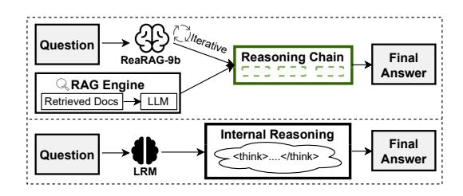
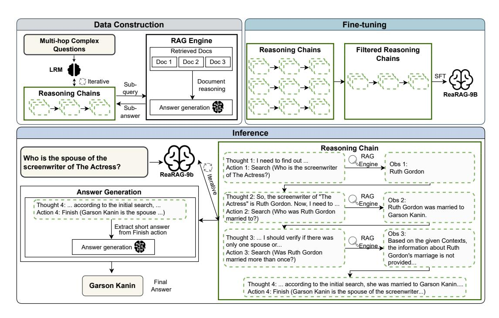
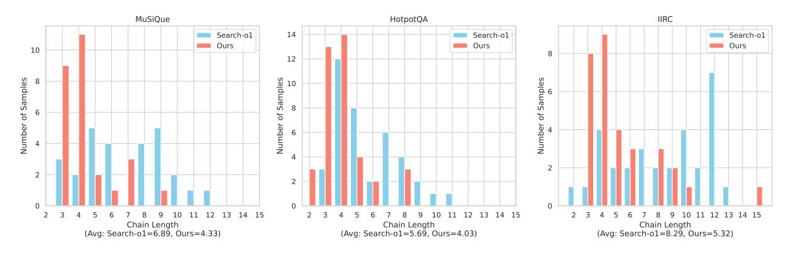

# ReaRAG: Knowledge-guided Reasoning Enhances Factuality of Large Reasoning Models with Iterative Retrieval Augmented Generation

Zhicheng Lee<sup>1</sup> , Shulin Cao<sup>1</sup> , Jinxin Liu<sup>1</sup> , Jiajie Zhang<sup>1</sup> , Weichuan Liu<sup>2</sup> , Xiaoyin Che<sup>2</sup> , Lei Hou<sup>1</sup> , Juanzi Li<sup>1</sup>

<sup>1</sup>Tsinghua University, <sup>2</sup>Siemens AG

<https://github.com/THU-KEG/ReaRAG>

# Abstract

Large Reasoning Models (LRMs) exhibit remarkable reasoning abilities but rely primarily on parametric knowledge, limiting factual accuracy. While recent works equip reinforcement learning (RL)-based LRMs with retrieval capabilities, they suffer from overthinking and lack robustness in reasoning, reducing their effectiveness in question answering (QA) tasks. To address this, we propose ReaRAG, a factualityenhanced reasoning model that explores diverse queries without excessive iterations. Our solution includes a novel data construction framework with an upper bound on the reasoning chain length. Specifically, we first leverage an LRM to generate deliberate thinking, then select an action from a predefined action space (Search and Finish). For Search action, a query is executed against the RAG engine, where the result is returned as observation to guide reasoning steps later. This process iterates until a Finish action is chosen. Benefiting from ReaRAG's strong reasoning capabilities, our approach outperforms existing baselines on multi-hop QA. Further analysis highlights its strong reflective ability to recognize errors and refine its reasoning trajectory. Our study enhances LRMs' factuality while effectively integrating robust reasoning for Retrieval-Augmented Generation (RAG).

# 1 Introduction

Large Reasoning Models (LRMs) such as OpenAI's o1 [\(Jaech et al.,](#page-9-0) [2024\)](#page-9-0), Qwen's QwQ-32B[1](#page-0-0) [\(Team,](#page-10-0) [2024\)](#page-10-0), GLM-Zero-Preview[2](#page-0-1) and DeepSeek-R1 [\(DeepSeek-AI et al.,](#page-8-0) [2025\)](#page-8-0) demonstrate impressive reasoning capabilities in complex tasks [\(Xu](#page-10-1) [et al.,](#page-10-1) [2025\)](#page-10-1). These models employ deliberate reasoning at test-time before generating an answer. However, their reliance on parametric knowledge



Figure 1: Unlike LRMs, ReaRAG iteratively constructs knowledge-guided reasoning chains for factual answers.

during reasoning limits their performance on multihop question answering (QA) tasks, where reasoning beyond memorized knowledge is required.

To enhance LRMs' factuality, Retrieval-Augmented Generation (RAG) [\(Lewis et al.,](#page-9-1) [2020;](#page-9-1) [Shi et al.,](#page-10-2) [2024a;](#page-10-2) [Guu et al.,](#page-9-2) [2020\)](#page-9-2) offers a promising solution by integrating external knowledge but faces challenges in retrieving relevant documents, which requires formulating precise search queries [\(Chan et al.,](#page-8-1) [2024\)](#page-8-1). Prior research has explored iterative retrieval strategies [\(Press et al.,](#page-9-3) [2023;](#page-9-3) [Shao et al.,](#page-10-3) [2023\)](#page-10-3), which construct reasoning chains of sub-queries and sub-answers to solve multi-hop QA. However, these methods suffer from error propagation, where mistakes in earlier steps mislead subsequent retrieval and reasoning, ultimately degrading the overall answer quality [\(Cao et al.,](#page-8-2) [2023\)](#page-8-2).

To address this challenge, Search-o1 [\(Li et al.,](#page-9-4) [2025\)](#page-9-4) adopts a prompt-based strategy that leverages LRM's reasoning to revise sub-queries iteratively. It also employs a Reason-in-Documents module that generates sub-answers for corresponding sub-queries. However, it faces several limitations: (1) Unreliable special token generation prevents retrieval, forcing a closed-book setting. (2) Information extraction failures and hallucinations in the Reason-in-Documents module mislead reasoning, reducing effectiveness and factuality. (3) Reinforcement learning (RL)-based LRMs tend to overthink [\(Chen et al.,](#page-8-3) [2024\)](#page-8-3), which is unneces-

<span id="page-0-0"></span><sup>1</sup> For simplicity, all mentions of QwQ-32B in this paper refer to QwQ-32B-Preview.

<span id="page-0-1"></span>[https://open.bigmodel.cn/dev/api/](https://open.bigmodel.cn/dev/api/normal-model/glm-zero-preview) [normal-model/glm-zero-preview](https://open.bigmodel.cn/dev/api/normal-model/glm-zero-preview)

sary for multi-hop QA. Our analysis shows that despite harnessing LRMs' strong reasoning, Searcho1 underperforms other baselines without strong reasoning, underscoring the challenge of integrating LRMs with external knowledge in RAG tasks.

In this paper, we propose ReaRAG, a factualityenhanced reasoning model for RAG that iteratively constructs knowledge-guided reasoning chains. To improve retrieval robustness and mitigate overthinking, we construct a dedicated dataset with a restricted maximum chain length and fine-tune ReaRAG using the Thought-Action-Observation paradigm, enabling reflective reasoning before action. During inference, ReaRAG iteratively performs the search action and strategically decides when to trigger the finish action, preventing excessive searching. Guided by external knowledge from the search action, ReaRAG continuously reflects on its reasoning trajectory, detects errors, and realigns its reasoning toward the correct path, leading to improved performance on QA tasks.

To validate our proposed method, we conduct experiments across four multi-hop QA benchmarks, demonstrating substantial performance improvements over existing methods. In summary, our contributions are as follows:

- Enhancing LRMs' factuality through knowledge-guided reasoning chain. We propose ReaRAG-9B, a model fine-tuned on a dedicated dataset containing knowledge-guided reasoning chains, enabling reliable interactions with external knowledge sources.
- Effectively combining strong reasoning with RAG. By harnessing LRMs' reasoning for deliberate thinking before deciding on an action, ReaRAG reflects on prior steps, uses external knowledge to identify mistakes and refine its reasoning, demonstrating robust reasoning capabilities. Compared to RL-based method, our fine-tuned model avoids excessive and redundant searches in multi-hop QA.
- Enhanced benchmark performance. Our approach achieves substantial improvements on multihop benchmarks: MuSiQue [\(Trivedi et al.,](#page-10-4) [2022\)](#page-10-4), HotpotQA [\(Yang et al.,](#page-10-5) [2018\)](#page-10-5) and IIRC [\(Ferguson](#page-9-5) [et al.,](#page-9-5) [2020\)](#page-9-5), as well as the single-hop Natural Questions (NQ) benchmark[\(Kwiatkowski et al.,](#page-9-6) [2019\)](#page-9-6).

# 2 Related Work

Reasoning-enhanced LLMs. Numerous works have investigated how to elicit the reasoning abil-

ities of LLMs. Early approaches, such as Chainof-Thought (COT) [\(Wei et al.,](#page-10-6) [2022\)](#page-10-6), ReAct [\(Yao](#page-11-0) [et al.,](#page-11-0) [2023b\)](#page-11-0), Chain-of-Verification (CoVE) [\(Dhu](#page-8-4)[liawala et al.,](#page-8-4) [2024\)](#page-8-4) and Tree of Thought (ToT) [\(Yao et al.,](#page-11-1) [2023a\)](#page-11-1) relies on prompting to generate human-like step by step reasoning chain. However, these approaches still face limitations with more complex reasoning. Recent advances of LRMs have scaled up CoT capabilities through RL [\(Kumar et al.,](#page-9-7) [2024\)](#page-9-7), enabling models to generate long CoT for self-reflection before providing a final answer. Notably, LRMs include OpenAI's o1 [\(Jaech et al.,](#page-9-0) [2024\)](#page-9-0), Qwen's QwQ-32B [\(Team,](#page-10-0) [2024\)](#page-10-0), GLM-Zero-Preview<sup>2</sup> and DeepSeek-R1[\(DeepSeek-AI et al.,](#page-8-0) [2025\)](#page-8-0) demonstrate impressive performance in complex reasoning task across domains such as mathematics, coding, and scientific problem-solving. Despite these advancements, most LRMs lack the ability to interact with external knowledge sources, limiting their capacity to generate up-to-date and factual responses.

Retrieval-Augmented Generation. RAG has emerged as a promising paradigm for improving LLMs' factuality. Early RAG methods rely on a single retrieval step [\(Lewis et al.,](#page-9-1) [2020;](#page-9-1) [Borgeaud](#page-8-5) [et al.,](#page-8-5) [2022;](#page-8-5) [Izacard et al.,](#page-9-8) [2023\)](#page-9-8), which is often insufficient for multi-hop QA tasks due to limitations in retrieval quality. To address noisy retrieval [\(Shi et al.,](#page-10-7) [2023\)](#page-10-7), Self-RAG [\(Asai et al.,](#page-8-6) [2024\)](#page-8-6) and CRAG [\(Yan et al.,](#page-10-8) [2024\)](#page-10-8) introduce reflection mechanisms on the retrieved documents. Nevertheless, single retrieval approaches still struggle with multi-hop QA. To address these limitations, iterative retrieval approaches such as Iter-RetGen [\(Shao et al.,](#page-10-3) [2023\)](#page-10-3) and Self-Ask [\(Press et al.,](#page-9-3) [2023\)](#page-9-3) progressively retrieve relevant documents to gather sufficient information for final answer. GenGround [\(Shi et al.,](#page-10-9) [2024b\)](#page-10-9) adopts a generate-then-ground method, generating and revising the intermediate sub-answers. Similarly, SearChain [\(Xu et al.,](#page-10-10) [2024\)](#page-10-10) first generates a complete reasoning chain, then verifies the answer of each node in the chain by retrieving information from external knowledge. However, these approaches lack a strong reflection mechanism to recover from mistakes made in earlier reasoning steps.

Reasoning-enhanced RAG. Recent studies in scaling token generation at test-time [\(OpenAI,](#page-9-9) [2024;](#page-9-9) [Muennighoff et al.,](#page-9-10) [2025;](#page-9-10) [Snell et al.,](#page-10-11) [2024\)](#page-10-11) to enhance LLMs' reasoning capabilities have spurred interest in reasoning-enhanced RAG. RAG-

<span id="page-2-0"></span>

Figure 2: Overview of our approach to develop a factuality-enhanced reasoning model ReaRAG. To equip ReaRAG with knowledge-guided reasoning ability, we propose an automated data construction approach (Algorithm [1\)](#page-3-0). Next, we fine-tune ReaRAG on the constructed dataset to conduct reasoning iteratively, following the Thought-Action-Observation Paradigm to solve complex queries. Pseudocode for the inference stage is provided in Algorithm [2.](#page-4-0)

Star [\(Jiang et al.,](#page-9-11) [2024\)](#page-9-11) leverages Monte Carlo Tree Search to iteratively decompose multi-hop questions, guided by a reward model during the tree expansion. Search-o1 [\(Li et al.,](#page-9-4) [2025\)](#page-9-4) introduces a document reasoning module, and adopts a prompting strategy that enables QwQ-32B to access external knowledge sources by generating specialized search tokens. However, it heavily depends on the base model's instruction-following and inherited reasoning capabilities, leading to three key challenges: robustness in generating specialized tokens, failure in extracting information from retrieved documents, and overthinks for multi-hop QA. Meanwhile, CoRAG [\(Wang et al.,](#page-10-12) [2025\)](#page-10-12) aims to propose an o1-like RAG model via various decoding strategies at test-time but lacks explicit reasoning during inference, thereby limiting its potential to integrate stronger reasoning capabilities.

### 3 Methodology

In this section, we first formalize the task, then present our novel approach for developing ReaRAG as illustrated in Figure [2.](#page-2-0)

### 3.1 Task formulation

We focus on the multi-hop QA task, where iterative reasoning improves answer accuracy. Given a

question x, our goal is to construct a knowledgeguided reasoning chain C to enhance the factual correctness of the generated answer yˆ. Specifically, the reasoning chain is formulated as a sequence of N steps, where each step consists of a reasoning thought τ<sup>t</sup> , an action α<sup>t</sup> , and an observation o<sup>t</sup> :

$$C = \{(\tau_t, \alpha_t, o_t)\}_{t=1}^N, \quad 1 \le t \le T_{max}$$
 (1)

The number of reasoning steps N is dynamically determined by the model but is constrained by an upper limit Tmax to prevent indefinite iterations, i.e., N ≤ Tmax. To guide the reasoning process with external knowledge, we define the action space as A = {search(), finish()} where search takes a search query as input, while the input to finish represents the derived answer. At each step t, the model refines a search query based on the reasoning thought τ<sup>t</sup> and executes the search action to retrieve relevant information from the RAG engine R. The process continues until the model selects the finish action, at which point the final answer yˆ is derived from all prior reasoning steps. This ensures that the answer is grounded in retrieved knowledge through an iterative and structured reasoning process, thereby enhancing the factual reliability of LRMs.

### <span id="page-3-0"></span>Algorithm 1 Data Construction

**Input:** Seed Dataset  $\mathcal{D}_{\text{seed}}$ , Large Reasoning Model  $\mathcal{M}_{LRM}$ , Instruction prompt  $\mathcal{P}_d$ , Max iterations  $T_{\text{max}}$ , RAG engine  $\mathcal{R}$ 

**Output:** Dataset  $\mathcal{D}_{reason}$  with reasoning chains

```
1: Initialize \mathcal{D}_{\text{reason}} \leftarrow \emptyset
 2: for each (x_i, doc_i) \sim \mathcal{D}_{seed} do
                  > Sample question and gold documents
             t \leftarrow 0
                                                       ▶ Iteration counter
 3:
             \mathcal{C}_i \leftarrow []
                                                       ▶ Reasoning chain
 4:
             while t < T_{\text{max}} do
 5:
                   y_t' \leftarrow \mathcal{M}_{LRM}([\mathcal{P}_d \oplus x_i \oplus \mathcal{C}_i])
 6:

                    (\tau_t, \alpha_t) \leftarrow \mathsf{parse}(y_t')
 7:
                           \triangleright Extract thought \tau_t and action \alpha_t
                    Get action type \alpha_{t_{\text{type}}} \leftarrow \alpha_t [\text{'type'}]
 8:
                   if finish \in \alpha_{t_{\mathrm{type}}} then
 9:
                           Append (\tau_t, \alpha_t) to C_i
10:
                           break
11:
                    else if \operatorname{search} \in \alpha_{t_{\operatorname{type}}} then
12:
                           q_s \leftarrow \alpha_t[\text{'query'}]
13.
14:
                           o_t \leftarrow \mathcal{R}(q_s, doc_i)
                                        \triangleright Get o_t from RAG engine
15:
                           Append (\tau_t, \alpha_t, o_t) to C_i
                    end if
16:
                   t \leftarrow t + 1
17:
18:
             end while
             Append C_i to \mathcal{D}_{\text{reason}}
19:
20: end for
21: return \mathcal{D}_{\text{reason}}
```

# 3.2 Knowledge-guided reasoning chain generation

While existing LRMs demonstrate strong reasoning capabilities, they often fail to ground their reasoning process in factual knowledge. To make external knowledge accessible, we design a structured reasoning step where each step consists of a reasoning thought  $\tau_t$ , an action  $\alpha_t$ , and an observation  $o_t$ .

- Reasoning thought  $\tau_t$ : Represents the model's thought process where it reflects on prior actions and observations before deciding an action and its input parameter.
- Action  $\alpha_t$ : A JSON dictionary containing an action sampled from the action space  $\mathcal{A}$  along with the corresponding input parameter.
- Observation  $o_t$ : Feedback received after executing action  $\alpha_t$ , guiding subsequent reasoning.

To equip ReaRAG with the ability to construct

reasoning chain guided by external knowledge, we propose an automated data construction approach, as detailed in Algorithm 1.

**Data construction.** Given a multi-hop question  $x_i$  sampled from the seed dataset, we prompt the LRM  $\mathcal{M}_{LRM}$  with instruction prompt  $\mathcal{P}_d$  (see Appendix B) to collect the reasoning thoughts and actions. Next, the search query is extracted and executed against RAG Engine  $\mathcal{R}$  to obtain an observation  $o_t$ . The process iterates until either model decides an finish action or the iteration count exceeds the maximum iterations  $T_{max}$ .

**Data filtering.** Previous work studies have shown that the performance of the LLMs heavily depends on the quality of fine-tuning data (Gunasekar et al., 2023). To ensure high-quality reasoning chains, we apply data filtering by comparing the final answer  $\hat{y}_i$  derived from the reasoning chain  $C_i$  against the ground truth answer  $y_i$  using the F1 metric. Reasoning chains with an F1 score of 0 are discarded to maintain data integrity.

# 3.3 Factuality-enhanced LRMs: ReaRAG

**Fine-tuning.** To incorporate knowledge-guided reasoning ability into the model, we perform supervised fine-tuning (SFT) on the constructed dataset discussed in the previous section, where each sample is a sequence of conversation chain  $\mathcal{S} = \{\mathcal{P}, x_i, \{(\tau_t, \alpha_t, o_t)\}_{t=1}^N\}$ , where  $\mathcal{P}$  is an instruction prompt (see Appendix B). We fine-tune our factuality-enhanced LRM, ReaRAG ( $\mathcal{M}_{ReaRAG}$ ) using loss function below:

$$L = -\sum_{j} \mathbf{1} \times \log \mathcal{M}_{ReaRAG}(s_j \mid s_{< j}) \quad (2)$$

where  $s_j$  represents the textual tokens of the input sequence  $\mathcal{S}$ ,  $\mathbf{1}(\cdot)$  is a loss mask indicator, which is set to True on thought  $\tau_t$  and action  $\alpha_t$  tokens, ensuring that the loss is only computed over the tokens contributed to the thought reasoning as well as action, rather than the entire sequence.

**Inference.** After fine-tuning, our model ReaRAG is equipped with advanced reasoning to solve multihop QA. Given an instruction prompt  $\mathcal{P}$  and a question x, the model first generates a reasoning thought  $\tau_0$  and an initial action  $\alpha_0$ , typically a search action. The search query is extracted and executed over the RAG engine  $\mathcal{R}$ , which returns an observation  $o_0$ . This process iterates meanwhile collecting thought  $\tau_i$ , action  $\alpha_i$  and observation  $o_i$ .

### <span id="page-4-0"></span>Algorithm 2 Inference

**Input:** Input question x, documents doc, ReaRAG  $\mathcal{M}_{ReaRAG}$ , Answer LLM  $\mathcal{M}_{Ans}$ , Instruction prompt  $\mathcal{P}$ , Answer Prompt  $\mathcal{P}_{ans}$ , Max iterations  $T_{\max}$ , RAG engine  $\mathcal{R}$ 

Output: Final answer,  $\hat{y}$ 1:  $t \leftarrow 0$ ,  $\mathcal{C} \leftarrow []$  > Initialization

2: while  $t < T_{\text{max}}$  do

3:  $y'_t \leftarrow \mathcal{M}_{ReaRAG}([\mathcal{P} \oplus x \oplus \mathcal{C}])$  > Generate response for iteration t4:  $(\tau_t, \alpha_t) \leftarrow \mathsf{parse}(y'_t)$  > Extract thought  $\tau_t$  and action  $\alpha_t$ 

Get action type  $\alpha_{t_{\text{type}}} \leftarrow \alpha_{t}$  ['type'] 5: if finish  $\in \alpha_{t_{\text{type}}}$  then 6: Append  $(\tau_t, \alpha_t)$  to  $\mathcal{C}$ 7:  $y_{ref} \leftarrow \alpha_t$  ['answer'] 8:  $\hat{y} \leftarrow \mathcal{M}_{Ans}([\mathcal{P}_{ans} \oplus x \oplus y_{ref}])$ 9: 10: **return** final answer  $\hat{y}$ else if search  $\in \alpha_{t_{\mathrm{type}}}$  then 11:  $q_s \leftarrow \alpha_t[\text{`query'}]$ 12: 13.  $o_t \leftarrow \mathcal{R}(q_s, doc_i)$ 

14: Append  $(\tau_t, \alpha_t, o_t)$  to  $\mathcal C$ 15: **end if**16:  $t \leftarrow t+1$ 17: **end while** 

 $\triangleright$  Get  $o_t$  from RAG engine

Ultimately, ReaRAG decides on a finish action at step N. We further extract the final answer from the finish action, denoted as  $y_{ref}$ , and generate a concise answer by prompting an answer model  $\mathcal{M}_{Ans}$  to generate final answer  $\hat{y}$  using the prompt  $\mathcal{P}_{ans}$  in Appendix B. The pseudocode for the inference stage is provided in Algorithm 2.

### 4 Experiments

### 4.1 Experimental setup

Dataset and metrics. To validate the effectiveness of our approach, we conduct experiments on multi-hop reasoning tasks that require multiple supporting documents per question, including MuSiQue (MQ) (Trivedi et al., 2022), HotpotQA (HoPo) (Yang et al., 2018) and IIRC (Ferguson et al., 2020). Additionally, to ensure the model retains its single-hop reasoning ability, we evaluate it on NQ (Kwiatkowski et al., 2019). Since these datasets require open-ended answers, traditional metric such as exact match (EM) may fail to account for variations in semantic equivalence (Yin et al., 2024; Xu et al., 2023). Hence, we utilize

the LLM-as-a-Judge metric (ACC $_L$ ) (Zheng et al., 2023) with GPT-40 for more accurate evaluation. We randomly sample 100 samples from the validation sets of MuSiQue, HotpotQA, and NQ, while selecting 200 samples from IIRC for evaluation.

**Baselines.** We compare our approach against multiple baselines, categorized based on their access to external knowledge. These include incontext retrieval, where the corpus is directly appended to the language model's context; vanilla RAG, which performs a single retrieval based on the original multi-hop question; and state-of-the-art advanced RAG methods proposed recently.

For the in-context and vanilla RAG baselines, we utilize long-context models, specifically GLM-4-9B(128k) and GLM-4-32B (128k) (Zeng et al., 2024) with context length 128k, and QwQ-32B (Team, 2024) with context length 32k as backbone. For advanced RAG baselines, we consider Self-RAG (Asai et al., 2024), which fine-tunes Llama2-7B to retrieve on demand and assess document relevance for filtering noisy information. In contrast, SearChain (Xu et al., 2024) constructs a Chain-of-Query (CoQ) to tackle multi-hop questions, where each node in the chain consists of a sub-query to the original question and its corresponding subanswer, facilitating multi-turn retrieval with verification against retrieved documents. Additionally, Search-o1 (Li et al., 2025) designs a framework for LRMs to perform iterative knowledge retrieval, representing a reasoning-enhanced RAG method.

### 4.2 Implementations details

**RAG engine.** Our RAG engine consists of two main components: retrieval and generation. For retrieval, we utilize the embedding model embedding-3 from Zhipu's API<sup>3</sup>, along with a reranker based on the GLM3 architecture to enhance the retrieval quality. For generation, we employ GLM-4-32B with a context length of 128k to generate responses based on the retrieved documents.

**Data construction and fine-tuning.** The seed dataset described in Algorithm 1 is derived from the training sets of MuSiQue, HotpotQA, and NQ, with QwQ-32B as the LRM. To ensure model's general capabilities, we fine-tune GLM-4-9B (Zeng et al., 2024) with the constructed dataset (roughly 20k filtered samples), as well as the general SFT dataset from GLM-4 (Zeng et al., 2024).

<span id="page-4-1"></span><sup>&</sup>lt;sup>3</sup>https://bigmodel.cn/dev/api/vector/embedding

<span id="page-5-0"></span>

|                 | Model               | Multi-hop |       |          |       |       |       | Single-hop |       |
|-----------------|---------------------|-----------|-------|----------|-------|-------|-------|------------|-------|
| Category        |                     | MuSiQue   |       | HotpotQA |       | IIRC  |       | NQ         |       |
|                 |                     | ACCL      | EM    | ACCL     | EM    | ACCL  | EM    | ACCL       | EM    |
| In-context      | GLM-4-9B(128k)      | 23.50     | 15.00 | 58.00    | 47.00 | 20.50 | 18.00 | 45.50      | 26.00 |
|                 | GLM-4-32B(128k)     | 33.50     | 17.00 | 65.50    | 50.00 | 25.00 | 16.00 | 52.50      | 24.00 |
| Vanilla<br>RAG  | GLM-4-9B(128k)      | 25.50     | 14.00 | 68.00    | 52.00 | 28.25 | 23.00 | 49.00      | 32.00 |
|                 | GLM-4-32B(128k)     | 29.00     | 17.00 | 67.50    | 52.00 | 28.25 | 17.00 | 53.00      | 39.00 |
|                 | QwQ-32B             | 36.00     | 20.00 | 67.00    | 47.00 | 38.25 | 32.00 | 48.00      | 26.00 |
| Advanced<br>RAG | Self-RAG(Llama2-7b) | 24.00     | 13.00 | 45.50    | 31.00 | 25.00 | 13.00 | 40.00      | 28.00 |
|                 | SearChain(GPT-4o)   | 51.50     | 33.00 | 69.00    | 49.00 | 40.50 | 20.50 | 54.00      | 25.00 |
|                 | Search-o1(QwQ-32B)  | 40.50     | 32.00 | 55.50    | 38.00 | 32.25 | 27.00 | 43.00      | 28.00 |
| Ours            | ReaRAG-9B           | 66.00     | 40.00 | 75.50    | 56.00 | 42.75 | 29.00 | 52.00      | 25.00 |

Table 1: Main experimental results compared to baselines on four benchmarks. Bold and underline indicates the best and second best results. We employ the traditional EM metric and the LLM-as-a-Judge framework with GPT-4o to evaluate predictions for each baseline, denoted as ACCL. Our model, ReaRAG-9B, achieves significant improvements across all baselines, except for the single-hop NQ benchmark, highlighting that strong reasoning is particularly beneficial for multi-hop QA.

Evaluation. For the MuSiQue, HotpotQA, and IIRC benchmarks, we use the original corpus provided by the respective authors. For the NQ dataset, we use the corpus following the setting of "Lost in the middle" [\(Liu et al.,](#page-9-13) [2024\)](#page-9-13). To further increase the challenge, particularly for comparisons with long-context models, we scale up the number of distractor documents, resulting in a corpus with token length ranging between 48k-58k. Specifically, to construct the corpus, we use the original gold and distractor documents and further expand it by randomly selecting additional distractor documents from other questions, or gold documents when distractors are not available. In addition to increasing the difficulty for long-context models, this approach demands high quality queries for other baseline approaches to the RAG engine to ensure the retrieval of relevant supporting documents.

For a fair comparison, we run the open-source implementations of all baselines in the advanced RAG category, evaluating them using our own RAG engine and corpus.

### 4.3 Main results

Table [1](#page-5-0) presents our main results across four benchmarks, showing that our approach outperforms all baselines except for the single-hop NQ benchmark. On this benchmark, ReaRAG performs comparably to SearChain (52.00 vs 54.00) and Vanilla RAG with the GLM-4-32B backbone (52.00 vs 53.00) in terms of the ACC<sup>L</sup> metric. This result is mainly attributed to two factors: SearChain uses GPT-4o as its backbone, while another baseline, Vanilla

RAG, uses the GLM-4-32B backbone, benefiting from its significantly larger scale compared to our 9B model. Additionally, ReaRAG's strong reasoning capabilities offer little advantage in single-hop settings, limiting its ability to surpass other baselines. However, when considering the EM metric, the gap between ReaRAG and Vanilla RAG with the GLM-4-32B backbone is much larger (25.00 vs. 39.00), though ReaRAG remains comparable to SearChain in terms of the ACC<sup>L</sup> metric. This discrepancy suggests that EM may fail to capture contextually valid answers generated by LLMs.

Comparing Vanilla RAG with in-context settings across different GLM-4 backbone scales, we find that the Vanilla RAG setting performs better, suggesting that long-context models struggle with distractor-heavy corpora. The only exception is MuSiQue with the GLM-4-32B backbone, where the long-context model slightly outperforms Vanilla RAG (33.50 vs. 29.00). Additionally, under the Vanilla RAG setting, QwQ-32B significantly outperforms GLM-4-32B on MuSiQue and IIRC, both of which feature particularly challenging multi-hop questions. This highlights the advantage of LRMs with strong reasoning capabilities.

Self-RAG, which aims to improve retrieval quality, lacks multi-turn retrieval strategies, an aspect that is crucial for multi-hop QA, performs poorly across all benchmarks. SearChain with GPT-4o performs competitively, achieving the second-best results on MuSiQue, HotpotQA, and IIRC, and the best results on the NQ dataset. This demonstrates the effectiveness of its proposed CoQ strategy and

verification mechanism. Despite leveraging the strong reasoning abilities of LRMs such as QwQ-32B, Search-o1 performs significantly worse than SearChain on multi-hop benchmarks, while consuming more computational resources. We further analyze these findings in Section [4.5.](#page-6-0)

Notably, our proposed method, ReaRAG-9B, significantly outperforms all baselines across three of the four benchmarks, showing the effectiveness of knowledge-guided reasoning chain generation. Compared to the best-performing baseline, SearChain, ReaRAG-9B achieves a significant 14.5% improvement on ACC<sup>L</sup> metric and 7% gain on EM metric for MuSiQue, along with 6.5% ACC<sup>L</sup> and 7% EM gain on HotpotQA, as well as 2.25% ACC<sup>L</sup> and 8.5% gain on EM for IIRC benchmark. These results suggest that ReaRAG exhibits strong multi-hop reasoning abilities, even when using a smaller-scale model.

### 4.4 Ablation

Closed-book performance. We conduct a closed-book experiment to evaluate the parametric knowledge of the language models. The results, presented in Table [3](#page-12-0) show that QwQ-32B outperforms GLM-4 on benchmarks requiring strong reasoning, such as MuSiQue and IIRC. This highlights the advantage of strong reasoning for complex tasks. Nevertheless, their parametric knowledge remains insufficient compared to results in Table [1.](#page-5-0)

Advantage of strong reasoning. To evaluate the impact of strong reasoning capabilities, we finetune a model that lacks such abilities while adhering to the same Thought-Action-Observation reasoning paradigm. This variant, denoted as w/o reasoning in Table [4,](#page-12-1) shares the same backbone architecture as ReaRAG-9B and follows the data construction process outlined in Algorithm [3.](#page-12-2) However, instead of leveraging a strong reasoning model like QwQ-32B for data generation, we employ GLM-4-9B, which lacks robust reasoning abilities. Unlike the previous data construction approach in Algorithm [1,](#page-3-0) which used only multihop questions as input, we now provide GLM-4-9B with additional information, including ground-truth decompositions and ground-truth answers. The instruction prompt Pablat used to generate its reasoning chain is detailed in Appendix [B.](#page-13-0)

Table [4](#page-12-1) shows that ReaRAG-9B with enhanced reasoning capabilities (w/ reasoning) consistently outperforms its counterpart without reasoning, achieving a notable gain of 6-11% ACC<sup>L</sup> gain on the multi-hop benchmarks and 7% gain on singlehop NQ. However, the improvement in EM on NQ is smaller, and on MuSiQue, EM decreases by 3% despite a 6% increase in ACCL. We attribute this to EM's limitations in capturing the variability of answers generated by the language model.

### <span id="page-6-0"></span>4.5 Analysis

<span id="page-6-1"></span>

|                                    | Multi-hop    | Single-hop |       |  |
|------------------------------------|--------------|------------|-------|--|
|                                    | MQ HoPo IIRC |            | NQ    |  |
| Invalid rate (%) 19.00 28.00 23.00 |              |            | 25.00 |  |

Table 2: Invalid generation rates of special tokens in QwQ-32B, leading to retrieval failures in Search-o1.

# 4.5.1 Performance against strong baseline

We conduct an in-depth analysis and compare our approach against the strong baseline Search-o1 [\(Li](#page-9-4) [et al.,](#page-9-4) [2025\)](#page-9-4), which relies solely on prompting and thus requires QwQ-32B to have strong instructionfollowing capabilities. Below, we highlight key limitations affecting its benchmark performance.

Token generation failure. QwQ-32B struggles to follow the instruction prompt, failing to generate special tokens (e.g., |begin\_search\_query|) essential for Search-o1 to retrieve external knowledge. This limitation forces Search-o1 into a closed-book setting, significantly impairing its performance. Table [2](#page-6-1) quantifies this issue, revealing invalid generation rates of 19–28%.

Information extraction failure. Search-o1 introduces the Reason-in-Documents module, leveraging QwQ-32B for in-depth reasoning over retrieved documents to generate responses as search results. However, this module has a key limitation: it may incorrectly conclude that no useful information is available (Table [5\)](#page-16-0). Our analysis identifies the primary cause: the module attempts to answer the original multi-hop question based on the search query, but the retrieved information is insufficient. For example, as shown in Table [5,](#page-16-0) the module searches for information related to "Hannibal and Scipio book" at first search, but the retrieved content only includes the book's author, lacking information about the place of education. This flaw weakens Search-o1, as it continuously searches for non-existent information, causing reasoning paths to diverge and ultimately hitting iteration limits.

<span id="page-7-0"></span>

Figure 3: Comparison of chain length between ReaRAG and Search-o1 across multi-hop QA tasks. We measure the reasoning steps needed for both models to achieve a full  $ACC_L$  score. Search-o1 consistently requires more steps than ReaRAG, highlighting the tendency of RL-based models to overthink in multi-hop QA tasks.

### Hallucination in Reason-in-Documents module.

The Reason-in-Documents module is prone to hallucination Table 6. For instance, when searching for the members of Bruce Lee Band, the module fails to find relevant information and fabricates "Less Than Records" based on parametric knowledge rather than the provided corpus. This hallucination propagates through subsequent reasoning steps, degrading the final answer quality.

Overthinking in multi-hop QA. Recent studies have identified overthinking in LRMs (Chen et al., 2024; Team et al., 2025), where RL-based models generate excessively long reasoning chains, leading to redundancy in multi-hop QA. To examine this, we compare ReaRAG with Search-o1, which uses QwQ-32B as backbone. Specifically, we analyze the number of reasoning steps required to achieve full ACC<sub>L</sub> score on multi-hop QA. Figure 3 shows that ReaRAG consistently requires fewer steps across the benchmarks, demonstrating efficiency in multi-hop reasoning while mitigating overthinking. To further illustrate this issue, case studies in Tables 7 and 8 compare the outputs of Search-o1 and ReaRAG. The results show that Search-o1 performs unnecessary redundant searches even when the correct answer has already been derived in earlier steps, highlighting the excessive search steps in multi-hop QA tasks.

### 4.5.2 Strength of ReaRAG

This section showcases ReaRAG's advanced reasoning capabilities. Table 9 shows that ReaRAG initially mistakenly identified "Anne of Austria" as the grandmother of "Philippe" rather than his mother. However, ReaRAG later detected this mistake, verified the information, and corrected

it. This self-correction mechanism helps prevent errors from propagating to later reasoning steps.

Table 10 demonstrates how ReaRAG resolves ambiguity in a multi-hop question through multiple searches. The question is about "The Hard Easy", which is both a film and a TV series. At the sixth reasoning step, ReaRAG also encounters knowledge conflicts. Despite these challenges, it successfully clarifies the information and arrives at the correct final answer.

Table 11 provides another example of ReaRAG handling ambiguity in a multi-hop question while resolving a knowledge conflict. Its parametric knowledge incorrectly states that Sonic is voiced by "Roger Craig Smith" instead of "Jim Cummings". ReaRAG detects and corrects this inconsistency, ultimately reaching the correct answer. This case further highlights its robust reasoning abilities.

These examples highlight ReaRAG's ability to iteratively perform knowledge-guided reasoning. Compared to existing baselines, our approach better integrates reasoning model with external knowledge, enhancing factual accuracy.

#### 5 Conclusion

In this study, we introduce **ReaRAG**, a factuality-enhanced reasoning model capable of performing knowledge-guided reasoning. ReaRAG plans reasoning steps iteratively and reflects on prior steps, leveraging external knowledge to ensure the correctness of the reasoning chain. Notably, ReaRAG achieves significant improvements compared to existing baselines. Further analysis highlights its robust reasoning capabilities, effectively tackling complex multi-hop questions while mitigating the issue of overthinking in RL-based LRMs.

# Limitations

Limited action space While ReaRAG demonstrates strong performance in the QA task, its action space is currently limited to only search and finish in this study. Consequently, it is restricted to processing local knowledge sources and cannot perform actions such as leveraging a code compiler for coding tasks, executing mathematical calculations, or conducting real-time web searches. Expanding its action space could enhance its adaptability across diverse problem domains.

Data construction efficiency To equip ReaRAG with a structured reasoning process, we fine-tune ReaRAG using structured responses generated by the LRM. However, this approach relies on the LRM's strong instruction-following ability, and a substantial portion of the data is discarded due to validity issues, leading to computational inefficiency and resource waste. Improving data augmentation techniques could mitigate this limitation.

Inference latency ReaRAG solves questions iteratively, requiring multiple reasoning steps to reach the final answer. While this enhances accuracy, it also increases inference time compared to models that generate answers in a single pass. This trade-off between reasoning depth and efficiency may limit its practicality in real-time applications or scenarios with strict latency constraints.

### Acknowledgments

This work is supported by National Natural Science Foundation of China (62476150), Beijing Natural Science Foundation (L243006), Tsinghua University Initiative Scientific Research Program and Tsinghua University (Department of Computer Science and Technology)-Siemens Ltd., China Joint Research Center for Industrial Intelligence and Internet of Things (JCIIOT).

# References

<span id="page-8-6"></span>Akari Asai, Zeqiu Wu, Yizhong Wang, Avirup Sil, and Hannaneh Hajishirzi. 2024. [Self-rag: Learning to](https://openreview.net/forum?id=hSyW5go0v8) [retrieve, generate, and critique through self-reflection.](https://openreview.net/forum?id=hSyW5go0v8) In *The Twelfth International Conference on Learning Representations, ICLR 2024, Vienna, Austria, May 7-11, 2024*. OpenReview.net.

<span id="page-8-5"></span>Sebastian Borgeaud, Arthur Mensch, Jordan Hoffmann, Trevor Cai, Eliza Rutherford, Katie Millican, George van den Driessche, Jean-Baptiste Lespiau, Bogdan Damoc, Aidan Clark, Diego de Las Casas, Aurelia

Guy, Jacob Menick, Roman Ring, Tom Hennigan, Saffron Huang, Loren Maggiore, Chris Jones, Albin Cassirer, Andy Brock, Michela Paganini, Geoffrey Irving, Oriol Vinyals, Simon Osindero, Karen Simonyan, Jack W. Rae, Erich Elsen, and Laurent Sifre. 2022. [Improving language models by retrieving from](https://proceedings.mlr.press/v162/borgeaud22a.html) [trillions of tokens.](https://proceedings.mlr.press/v162/borgeaud22a.html) In *International Conference on Machine Learning, ICML 2022, 17-23 July 2022, Baltimore, Maryland, USA*, volume 162 of *Proceedings of Machine Learning Research*, pages 2206–2240. PMLR.

<span id="page-8-2"></span>Shulin Cao, Jiajie Zhang, Jiaxin Shi, Xin Lv, Zijun Yao, Qi Tian, Lei Hou, and Juanzi Li. 2023. [Probabilistic](https://doi.org/10.18653/V1/2023.FINDINGS-EMNLP.835) [tree-of-thought reasoning for answering knowledge](https://doi.org/10.18653/V1/2023.FINDINGS-EMNLP.835)[intensive complex questions.](https://doi.org/10.18653/V1/2023.FINDINGS-EMNLP.835) In *Findings of the Association for Computational Linguistics: EMNLP 2023, Singapore, December 6-10, 2023*, pages 12541– 12560. Association for Computational Linguistics.

<span id="page-8-1"></span>Chi-Min Chan, Chunpu Xu, Ruibin Yuan, Hongyin Luo, Wei Xue, Yike Guo, and Jie Fu. 2024. [RQ-RAG:](https://doi.org/10.48550/ARXIV.2404.00610) [learning to refine queries for retrieval augmented](https://doi.org/10.48550/ARXIV.2404.00610) [generation.](https://doi.org/10.48550/ARXIV.2404.00610) *CoRR*, abs/2404.00610.

<span id="page-8-3"></span>Xingyu Chen, Jiahao Xu, Tian Liang, Zhiwei He, Jianhui Pang, Dian Yu, Linfeng Song, Qiuzhi Liu, Mengfei Zhou, Zhuosheng Zhang, Rui Wang, Zhaopeng Tu, Haitao Mi, and Dong Yu. 2024. [Do](https://doi.org/10.48550/ARXIV.2412.21187) [NOT think that much for 2+3=? on the overthinking](https://doi.org/10.48550/ARXIV.2412.21187) [of o1-like llms.](https://doi.org/10.48550/ARXIV.2412.21187) *CoRR*, abs/2412.21187.

<span id="page-8-0"></span>DeepSeek-AI, Daya Guo, Dejian Yang, Haowei Zhang, Junxiao Song, Ruoyu Zhang, Runxin Xu, Qihao Zhu, Shirong Ma, Peiyi Wang, Xiao Bi, Xiaokang Zhang, Xingkai Yu, Yu Wu, Z. F. Wu, Zhibin Gou, Zhihong Shao, Zhuoshu Li, Ziyi Gao, Aixin Liu, Bing Xue, Bingxuan Wang, Bochao Wu, Bei Feng, Chengda Lu, Chenggang Zhao, Chengqi Deng, Chenyu Zhang, Chong Ruan, Damai Dai, Deli Chen, Dongjie Ji, Erhang Li, Fangyun Lin, Fucong Dai, Fuli Luo, Guangbo Hao, Guanting Chen, Guowei Li, H. Zhang, Han Bao, Hanwei Xu, Haocheng Wang, Honghui Ding, Huajian Xin, Huazuo Gao, Hui Qu, Hui Li, Jianzhong Guo, Jiashi Li, Jiawei Wang, Jingchang Chen, Jingyang Yuan, Junjie Qiu, Junlong Li, J. L. Cai, Jiaqi Ni, Jian Liang, Jin Chen, Kai Dong, Kai Hu, Kaige Gao, Kang Guan, Kexin Huang, Kuai Yu, Lean Wang, Lecong Zhang, Liang Zhao, Litong Wang, Liyue Zhang, Lei Xu, Leyi Xia, Mingchuan Zhang, Minghua Zhang, Minghui Tang, Meng Li, Miaojun Wang, Mingming Li, Ning Tian, Panpan Huang, Peng Zhang, Qiancheng Wang, Qinyu Chen, Qiushi Du, Ruiqi Ge, Ruisong Zhang, Ruizhe Pan, Runji Wang, R. J. Chen, R. L. Jin, Ruyi Chen, Shanghao Lu, Shangyan Zhou, Shanhuang Chen, Shengfeng Ye, Shiyu Wang, Shuiping Yu, Shunfeng Zhou, Shuting Pan, and S. S. Li. 2025. [Deepseek-r1: Incentiviz](https://doi.org/10.48550/ARXIV.2501.12948)[ing reasoning capability in llms via reinforcement](https://doi.org/10.48550/ARXIV.2501.12948) [learning.](https://doi.org/10.48550/ARXIV.2501.12948) *CoRR*, abs/2501.12948.

<span id="page-8-4"></span>Shehzaad Dhuliawala, Mojtaba Komeili, Jing Xu, Roberta Raileanu, Xian Li, Asli Celikyilmaz, and Jason Weston. 2024. [Chain-of-verification reduces hal](https://doi.org/10.18653/V1/2024.FINDINGS-ACL.212)[lucination in large language models.](https://doi.org/10.18653/V1/2024.FINDINGS-ACL.212) In *Findings of*

- *the Association for Computational Linguistics, ACL 2024, Bangkok, Thailand and virtual meeting, August 11-16, 2024*, pages 3563–3578. Association for Computational Linguistics.
- <span id="page-9-5"></span>James Ferguson, Matt Gardner, Hannaneh Hajishirzi, Tushar Khot, and Pradeep Dasigi. 2020. [IIRC: A](https://doi.org/10.18653/V1/2020.EMNLP-MAIN.86) [dataset of incomplete information reading compre](https://doi.org/10.18653/V1/2020.EMNLP-MAIN.86)[hension questions.](https://doi.org/10.18653/V1/2020.EMNLP-MAIN.86) In *Proceedings of the 2020 Conference on Empirical Methods in Natural Language Processing, EMNLP 2020, Online, November 16-20, 2020*, pages 1137–1147. Association for Computational Linguistics.
- <span id="page-9-12"></span>Suriya Gunasekar, Yi Zhang, Jyoti Aneja, Caio César Teodoro Mendes, Allie Del Giorno, Sivakanth Gopi, Mojan Javaheripi, Piero Kauffmann, Gustavo de Rosa, Olli Saarikivi, Adil Salim, Shital Shah, Harkirat Singh Behl, Xin Wang, Sébastien Bubeck, Ronen Eldan, Adam Tauman Kalai, Yin Tat Lee, and Yuanzhi Li. 2023. [Textbooks are all you need.](https://doi.org/10.48550/ARXIV.2306.11644) *CoRR*, abs/2306.11644.
- <span id="page-9-2"></span>Kelvin Guu, Kenton Lee, Zora Tung, Panupong Pasupat, and Ming-Wei Chang. 2020. [Retrieval augmented](http://proceedings.mlr.press/v119/guu20a.html) [language model pre-training.](http://proceedings.mlr.press/v119/guu20a.html) In *Proceedings of the 37th International Conference on Machine Learning, ICML 2020, 13-18 July 2020, Virtual Event*, volume 119 of *Proceedings of Machine Learning Research*, pages 3929–3938. PMLR.
- <span id="page-9-8"></span>Gautier Izacard, Patrick S. H. Lewis, Maria Lomeli, Lucas Hosseini, Fabio Petroni, Timo Schick, Jane Dwivedi-Yu, Armand Joulin, Sebastian Riedel, and Edouard Grave. 2023. [Atlas: Few-shot learning](https://jmlr.org/papers/v24/23-0037.html) [with retrieval augmented language models.](https://jmlr.org/papers/v24/23-0037.html) *J. Mach. Learn. Res.*, 24:251:1–251:43.
- <span id="page-9-0"></span>Aaron Jaech, Adam Kalai, Adam Lerer, Adam Richardson, Ahmed El-Kishky, Aiden Low, Alec Helyar, Aleksander Madry, Alex Beutel, Alex Carney, Alex Iftimie, Alex Karpenko, Alex Tachard Passos, Alexander Neitz, Alexander Prokofiev, Alexander Wei, Allison Tam, Ally Bennett, Ananya Kumar, Andre Saraiva, Andrea Vallone, Andrew Duberstein, Andrew Kondrich, Andrey Mishchenko, Andy Applebaum, Angela Jiang, Ashvin Nair, Barret Zoph, Behrooz Ghorbani, Ben Rossen, Benjamin Sokolowsky, Boaz Barak, Bob McGrew, Borys Minaiev, Botao Hao, Bowen Baker, Brandon Houghton, Brandon McKinzie, Brydon Eastman, Camillo Lugaresi, Cary Bassin, Cary Hudson, Chak Ming Li, Charles de Bourcy, Chelsea Voss, Chen Shen, Chong Zhang, Chris Koch, Chris Orsinger, Christopher Hesse, Claudia Fischer, Clive Chan, Dan Roberts, Daniel Kappler, Daniel Levy, Daniel Selsam, David Dohan, David Farhi, David Mely, David Robinson, Dimitris Tsipras, Doug Li, Dragos Oprica, Eben Freeman, Eddie Zhang, Edmund Wong, Elizabeth Proehl, Enoch Cheung, Eric Mitchell, Eric Wallace, Erik Ritter, Evan Mays, Fan Wang, Felipe Petroski Such, Filippo Raso, Florencia Leoni, Foivos Tsimpourlas, Francis Song, Fred von Lohmann, Freddie Sulit, Geoff Salmon, Giambattista Parascandolo, Gildas Chabot, Grace Zhao, Greg Brockman, Guillaume

- Leclerc, Hadi Salman, Haiming Bao, Hao Sheng, Hart Andrin, Hessam Bagherinezhad, Hongyu Ren, Hunter Lightman, Hyung Won Chung, Ian Kivlichan, Ian O'Connell, Ian Osband, Ignasi Clavera Gilaberte, and Ilge Akkaya. 2024. [Openai o1 system card.](https://doi.org/10.48550/ARXIV.2412.16720) *CoRR*, abs/2412.16720.
- <span id="page-9-11"></span>Jinhao Jiang, Jiayi Chen, Junyi Li, Ruiyang Ren, Shijie Wang, Wayne Xin Zhao, Yang Song, and Tao Zhang. 2024. [Rag-star: Enhancing deliberative reasoning](https://doi.org/10.48550/ARXIV.2412.12881) [with retrieval augmented verification and refinement.](https://doi.org/10.48550/ARXIV.2412.12881) *CoRR*, abs/2412.12881.
- <span id="page-9-7"></span>Aviral Kumar, Vincent Zhuang, Rishabh Agarwal, Yi Su, John D Co-Reyes, Avi Singh, Kate Baumli, Shariq Iqbal, Colton Bishop, Rebecca Roelofs, et al. 2024. Training language models to selfcorrect via reinforcement learning. *arXiv preprint arXiv:2409.12917*.
- <span id="page-9-6"></span>Tom Kwiatkowski, Jennimaria Palomaki, Olivia Redfield, Michael Collins, Ankur P. Parikh, Chris Alberti, Danielle Epstein, Illia Polosukhin, Jacob Devlin, Kenton Lee, Kristina Toutanova, Llion Jones, Matthew Kelcey, Ming-Wei Chang, Andrew M. Dai, Jakob Uszkoreit, Quoc Le, and Slav Petrov. 2019. [Natu](https://doi.org/10.1162/TACL_A_00276)[ral questions: a benchmark for question answering](https://doi.org/10.1162/TACL_A_00276) [research.](https://doi.org/10.1162/TACL_A_00276) *Trans. Assoc. Comput. Linguistics*, 7:452– 466.
- <span id="page-9-1"></span>Patrick S. H. Lewis, Ethan Perez, Aleksandra Piktus, Fabio Petroni, Vladimir Karpukhin, Naman Goyal, Heinrich Küttler, Mike Lewis, Wen-tau Yih, Tim Rocktäschel, Sebastian Riedel, and Douwe Kiela. 2020. [Retrieval-augmented generation for](https://proceedings.neurips.cc/paper/2020/hash/6b493230205f780e1bc26945df7481e5-Abstract.html) [knowledge-intensive NLP tasks.](https://proceedings.neurips.cc/paper/2020/hash/6b493230205f780e1bc26945df7481e5-Abstract.html) In *Advances in Neural Information Processing Systems 33: Annual Conference on Neural Information Processing Systems 2020, NeurIPS 2020, December 6-12, 2020, virtual*.
- <span id="page-9-4"></span>Xiaoxi Li, Guanting Dong, Jiajie Jin, Yuyao Zhang, Yujia Zhou, Yutao Zhu, Peitian Zhang, and Zhicheng Dou. 2025. [Search-o1: Agentic search](https://doi.org/10.48550/ARXIV.2501.05366)[enhanced large reasoning models.](https://doi.org/10.48550/ARXIV.2501.05366) *arXiv preprint arXiv:2501.05366*.
- <span id="page-9-13"></span>Nelson F. Liu, Kevin Lin, John Hewitt, Ashwin Paranjape, Michele Bevilacqua, Fabio Petroni, and Percy Liang. 2024. [Lost in the middle: How language](https://doi.org/10.1162/TACL_A_00638) [models use long contexts.](https://doi.org/10.1162/TACL_A_00638) *Trans. Assoc. Comput. Linguistics*, 12:157–173.
- <span id="page-9-10"></span>Niklas Muennighoff, Zitong Yang, Weijia Shi, Xiang Lisa Li, Li Fei-Fei, Hannaneh Hajishirzi, Luke Zettlemoyer, Percy Liang, Emmanuel Candès, and Tatsunori Hashimoto. 2025. [s1: Simple test-time](https://arxiv.org/abs/2501.19393) [scaling.](https://arxiv.org/abs/2501.19393) *arXiv preprint arXiv:2501.19393*.
- <span id="page-9-9"></span>OpenAI. 2024. [Learning to reason with llms.](https://openai.com/index/learning-to-reason-with-llms/)
- <span id="page-9-3"></span>Ofir Press, Muru Zhang, Sewon Min, Ludwig Schmidt, Noah A. Smith, and Mike Lewis. 2023. [Measuring](https://doi.org/10.18653/V1/2023.FINDINGS-EMNLP.378) [and narrowing the compositionality gap in language](https://doi.org/10.18653/V1/2023.FINDINGS-EMNLP.378) [models.](https://doi.org/10.18653/V1/2023.FINDINGS-EMNLP.378) In *Findings of the Association for Computational Linguistics: EMNLP 2023, Singapore, December 6-10, 2023*, pages 5687–5711. Association for Computational Linguistics.

- <span id="page-10-3"></span>Zhihong Shao, Yeyun Gong, Yelong Shen, Minlie Huang, Nan Duan, and Weizhu Chen. 2023. [En](https://doi.org/10.18653/V1/2023.FINDINGS-EMNLP.620)[hancing retrieval-augmented large language models](https://doi.org/10.18653/V1/2023.FINDINGS-EMNLP.620) [with iterative retrieval-generation synergy.](https://doi.org/10.18653/V1/2023.FINDINGS-EMNLP.620) In *Findings of the Association for Computational Linguistics: EMNLP 2023, Singapore, December 6-10, 2023*, pages 9248–9274. Association for Computational Linguistics.
- <span id="page-10-7"></span>Freda Shi, Xinyun Chen, Kanishka Misra, Nathan Scales, David Dohan, Ed H. Chi, Nathanael Schärli, and Denny Zhou. 2023. [Large language models can](https://proceedings.mlr.press/v202/shi23a.html) [be easily distracted by irrelevant context.](https://proceedings.mlr.press/v202/shi23a.html) In *International Conference on Machine Learning, ICML 2023, 23-29 July 2023, Honolulu, Hawaii, USA*, volume 202 of *Proceedings of Machine Learning Research*, pages 31210–31227. PMLR.
- <span id="page-10-2"></span>Weijia Shi, Sewon Min, Michihiro Yasunaga, Minjoon Seo, Richard James, Mike Lewis, Luke Zettlemoyer, and Wen-tau Yih. 2024a. [REPLUG: retrieval](https://doi.org/10.18653/V1/2024.NAACL-LONG.463)[augmented black-box language models.](https://doi.org/10.18653/V1/2024.NAACL-LONG.463) In *Proceedings of the 2024 Conference of the North American Chapter of the Association for Computational Linguistics: Human Language Technologies (Volume 1: Long Papers), NAACL 2024, Mexico City, Mexico, June 16-21, 2024*, pages 8371–8384. Association for Computational Linguistics.
- <span id="page-10-9"></span>Zhengliang Shi, Shuo Zhang, Weiwei Sun, Shen Gao, Pengjie Ren, Zhumin Chen, and Zhaochun Ren. 2024b. [Generate-then-ground in retrieval-augmented](https://doi.org/10.18653/V1/2024.ACL-LONG.397) [generation for multi-hop question answering.](https://doi.org/10.18653/V1/2024.ACL-LONG.397) In *Proceedings of the 62nd Annual Meeting of the Association for Computational Linguistics (Volume 1: Long Papers), ACL 2024, Bangkok, Thailand, August 11- 16, 2024*, pages 7339–7353. Association for Computational Linguistics.
- <span id="page-10-11"></span>Charlie Snell, Jaehoon Lee, Kelvin Xu, and Aviral Kumar. 2024. [Scaling LLM test-time compute optimally](https://doi.org/10.48550/ARXIV.2408.03314) [can be more effective than scaling model parameters.](https://doi.org/10.48550/ARXIV.2408.03314) *CoRR*, abs/2408.03314.
- <span id="page-10-14"></span>Kimi Team, Angang Du, Bofei Gao, Bowei Xing, Changjiu Jiang, Cheng Chen, Cheng Li, Chenjun Xiao, Chenzhuang Du, Chonghua Liao, Chuning Tang, Congcong Wang, Dehao Zhang, Enming Yuan, Enzhe Lu, Fengxiang Tang, Flood Sung, Guangda Wei, Guokun Lai, Haiqing Guo, Han Zhu, Hao Ding, Hao Hu, Hao Yang, Hao Zhang, Haotian Yao, Haotian Zhao, Haoyu Lu, Haoze Li, Haozhen Yu, Hongcheng Gao, Huabin Zheng, Huan Yuan, Jia Chen, Jianhang Guo, Jianlin Su, Jianzhou Wang, Jie Zhao, Jin Zhang, Jingyuan Liu, Junjie Yan, Junyan Wu, Lidong Shi, Ling Ye, Longhui Yu, Mengnan Dong, Neo Zhang, Ningchen Ma, Qiwei Pan, Qucheng Gong, Shaowei Liu, Shengling Ma, Shupeng Wei, Sihan Cao, Siying Huang, Tao Jiang, Weihao Gao, Weimin Xiong, Weiran He, Weixiao Huang, Wenhao Wu, Wenyang He, Xianghui Wei, Xianqing Jia, Xingzhe Wu, Xinran Xu, Xinxing Zu, Xinyu Zhou, Xuehai Pan, Y. Charles, Yang Li, Yangyang Hu, Yangyang Liu, Yanru Chen, Yejie Wang, Yibo Liu, Yidao Qin, Yifeng Liu, Ying Yang,

- Yiping Bao, Yulun Du, Yuxin Wu, Yuzhi Wang, Zaida Zhou, Zhaoji Wang, Zhaowei Li, Zhen Zhu, Zheng Zhang, Zhexu Wang, Zhilin Yang, Zhiqi Huang, Zihao Huang, Ziyao Xu, and Zonghan Yang. 2025. [Kimi k1.5: Scaling reinforcement learning with llms.](https://doi.org/10.48550/ARXIV.2501.12599) *CoRR*, abs/2501.12599.
- <span id="page-10-0"></span>Qwen Team. 2024. [Qwq: Reflect deeply on the bound](https://qwenlm.github.io/blog/qwq-32b-preview/)[aries of the unknown.](https://qwenlm.github.io/blog/qwq-32b-preview/)
- <span id="page-10-4"></span>Harsh Trivedi, Niranjan Balasubramanian, Tushar Khot, and Ashish Sabharwal. 2022. [Musique: Multi](https://doi.org/10.1162/TACL_A_00475)[hop questions via single-hop question composition.](https://doi.org/10.1162/TACL_A_00475) *Trans. Assoc. Comput. Linguistics*, 10:539–554.
- <span id="page-10-12"></span>Liang Wang, Haonan Chen, Nan Yang, Xiaolong Huang, Zhicheng Dou, and Furu Wei. 2025. [Chain](https://arxiv.org/abs/2501.14342)[of-retrieval augmented generation.](https://arxiv.org/abs/2501.14342) *arXiv preprint arXiv:2501.14342*.
- <span id="page-10-6"></span>Jason Wei, Xuezhi Wang, Dale Schuurmans, Maarten Bosma, Brian Ichter, Fei Xia, Ed H. Chi, Quoc V. Le, and Denny Zhou. 2022. [Chain-of-thought prompting](http://papers.nips.cc/paper_files/paper/2022/hash/9d5609613524ecf4f15af0f7b31abca4-Abstract-Conference.html) [elicits reasoning in large language models.](http://papers.nips.cc/paper_files/paper/2022/hash/9d5609613524ecf4f15af0f7b31abca4-Abstract-Conference.html) In *Advances in Neural Information Processing Systems 35: Annual Conference on Neural Information Processing Systems 2022, NeurIPS 2022, New Orleans, LA, USA, November 28 - December 9, 2022*.
- <span id="page-10-13"></span>Binfeng Xu, Zhiyuan Peng, Bowen Lei, Subhabrata Mukherjee, Yuchen Liu, and Dongkuan Xu. 2023. [Rewoo: Decoupling reasoning from observations](https://doi.org/10.48550/ARXIV.2305.18323) [for efficient augmented language models.](https://doi.org/10.48550/ARXIV.2305.18323) *CoRR*, abs/2305.18323.
- <span id="page-10-1"></span>Fengli Xu, Qianyue Hao, Zefang Zong, Jingwei Wang, Yunke Zhang, Jingyi Wang, Xiaochong Lan, Jiahui Gong, Tianjian Ouyang, Fanjin Meng, Chenyang Shao, Yuwei Yan, Qinglong Yang, Yiwen Song, Sijian Ren, Xinyuan Hu, Yu Li, Jie Feng, Chen Gao, and Yong Li. 2025. [Towards large reasoning models:](https://doi.org/10.48550/ARXIV.2501.09686) [A survey of reinforced reasoning with large language](https://doi.org/10.48550/ARXIV.2501.09686) [models.](https://doi.org/10.48550/ARXIV.2501.09686) *CoRR*, abs/2501.09686.
- <span id="page-10-10"></span>Shicheng Xu, Liang Pang, Huawei Shen, Xueqi Cheng, and Tat-Seng Chua. 2024. [Search-in-the-chain: Inter](https://doi.org/10.1145/3589334.3645363)[actively enhancing large language models with search](https://doi.org/10.1145/3589334.3645363) [for knowledge-intensive tasks.](https://doi.org/10.1145/3589334.3645363) In *Proceedings of the ACM on Web Conference 2024, WWW 2024, Singapore, May 13-17, 2024*, pages 1362–1373. ACM.
- <span id="page-10-8"></span>Shi-Qi Yan, Jia-Chen Gu, Yun Zhu, and Zhen-Hua Ling. 2024. [Corrective retrieval augmented generation.](https://doi.org/10.48550/ARXIV.2401.15884) *CoRR*, abs/2401.15884.
- <span id="page-10-5"></span>Zhilin Yang, Peng Qi, Saizheng Zhang, Yoshua Bengio, William W. Cohen, Ruslan Salakhutdinov, and Christopher D. Manning. 2018. [Hotpotqa: A dataset](https://doi.org/10.18653/V1/D18-1259) [for diverse, explainable multi-hop question answer](https://doi.org/10.18653/V1/D18-1259)[ing.](https://doi.org/10.18653/V1/D18-1259) In *Proceedings of the 2018 Conference on Empirical Methods in Natural Language Processing, Brussels, Belgium, October 31 - November 4, 2018*, pages 2369–2380. Association for Computational Linguistics.

<span id="page-11-1"></span>Shunyu Yao, Dian Yu, Jeffrey Zhao, Izhak Shafran, Tom Griffiths, Yuan Cao, and Karthik Narasimhan. 2023a. [Tree of thoughts: Deliberate problem solving](http://papers.nips.cc/paper_files/paper/2023/hash/271db9922b8d1f4dd7aaef84ed5ac703-Abstract-Conference.html) [with large language models.](http://papers.nips.cc/paper_files/paper/2023/hash/271db9922b8d1f4dd7aaef84ed5ac703-Abstract-Conference.html) In *Advances in Neural Information Processing Systems 36: Annual Conference on Neural Information Processing Systems 2023, NeurIPS 2023, New Orleans, LA, USA, December 10 - 16, 2023*.

<span id="page-11-0"></span>Shunyu Yao, Jeffrey Zhao, Dian Yu, Nan Du, Izhak Shafran, Karthik R. Narasimhan, and Yuan Cao. 2023b. [React: Synergizing reasoning and acting](https://openreview.net/forum?id=WE_vluYUL-X) [in language models.](https://openreview.net/forum?id=WE_vluYUL-X) In *The Eleventh International Conference on Learning Representations, ICLR 2023, Kigali, Rwanda, May 1-5, 2023*. OpenReview.net.

<span id="page-11-2"></span>Da Yin, Faeze Brahman, Abhilasha Ravichander, Khyathi Raghavi Chandu, Kai-Wei Chang, Yejin Choi, and Bill Yuchen Lin. 2024. [Agent lumos: Uni](https://doi.org/10.18653/V1/2024.ACL-LONG.670)[fied and modular training for open-source language](https://doi.org/10.18653/V1/2024.ACL-LONG.670) [agents.](https://doi.org/10.18653/V1/2024.ACL-LONG.670) In *Proceedings of the 62nd Annual Meeting of the Association for Computational Linguistics (Volume 1: Long Papers), ACL 2024, Bangkok, Thailand, August 11-16, 2024*, pages 12380–12403. Association for Computational Linguistics.

<span id="page-11-4"></span>Aohan Zeng, Bin Xu, Bowen Wang, Chenhui Zhang, Da Yin, Diego Rojas, Guanyu Feng, Hanlin Zhao, Hanyu Lai, Hao Yu, Hongning Wang, Jiadai Sun, Jiajie Zhang, Jiale Cheng, Jiayi Gui, Jie Tang, Jing Zhang, Juanzi Li, Lei Zhao, Lindong Wu, Lucen Zhong, Mingdao Liu, Minlie Huang, Peng Zhang, Qinkai Zheng, Rui Lu, Shuaiqi Duan, Shudan Zhang, Shulin Cao, Shuxun Yang, Weng Lam Tam, Wenyi Zhao, Xiao Liu, Xiao Xia, Xiaohan Zhang, Xiaotao Gu, Xin Lv, Xinghan Liu, Xinyi Liu, Xinyue Yang, Xixuan Song, Xunkai Zhang, Yifan An, Yifan Xu, Yilin Niu, Yuantao Yang, Yueyan Li, Yushi Bai, Yuxiao Dong, Zehan Qi, Zhaoyu Wang, Zhen Yang, Zhengxiao Du, Zhenyu Hou, and Zihan Wang. 2024. [Chatglm: A family of large language mod](https://doi.org/10.48550/ARXIV.2406.12793)[els from GLM-130B to GLM-4 all tools.](https://doi.org/10.48550/ARXIV.2406.12793) *CoRR*, abs/2406.12793.

<span id="page-11-3"></span>Lianmin Zheng, Wei-Lin Chiang, Ying Sheng, Siyuan Zhuang, Zhanghao Wu, Yonghao Zhuang, Zi Lin, Zhuohan Li, Dacheng Li, Eric P. Xing, Hao Zhang, Joseph E. Gonzalez, and Ion Stoica. 2023. [Judging](http://papers.nips.cc/paper_files/paper/2023/hash/91f18a1287b398d378ef22505bf41832-Abstract-Datasets_and_Benchmarks.html) [llm-as-a-judge with mt-bench and chatbot arena.](http://papers.nips.cc/paper_files/paper/2023/hash/91f18a1287b398d378ef22505bf41832-Abstract-Datasets_and_Benchmarks.html) In *Advances in Neural Information Processing Systems 36: Annual Conference on Neural Information Processing Systems 2023, NeurIPS 2023, New Orleans, LA, USA, December 10 - 16, 2023*.

# Appendix

# A Ablation

<span id="page-12-0"></span>

|                 | Multi-hop |      |          |       |       |       |       | Single-hop |  |
|-----------------|-----------|------|----------|-------|-------|-------|-------|------------|--|
| Model           | MuSiQue   |      | HotpotQA |       | IIRC  |       | NQ    |            |  |
|                 | ACCL      | EM   | ACCL     | EM    | ACCL  | EM    | ACCL  | EM         |  |
| GLM-4-9B(128k)  | 3.50      | 0.00 | 29.50    | 23.00 | 17.00 | 15.00 | 27.50 | 16.00      |  |
| GLM-4-32B(128k) | 6.50      | 1.00 | 40.00    | 28.00 | 17.00 | 11.50 | 44.50 | 25.00      |  |
| QwQ-32B         | 11.00     | 2.00 | 35.00    | 10.00 | 21.25 | 14.50 | 37.50 | 12.00      |  |

Table 3: Closed-book performance of language models on multi-hop and single-hop benchmarks. These models perform better on single-hop benchmarks but score significantly lower on multi-hop benchmarks, highlighting the limitations of relying solely on parametric knowledge for these benchmarks.

<span id="page-12-1"></span>

|                 | Multi-hop |       |          |       |       |       |       | Single-hop |  |
|-----------------|-----------|-------|----------|-------|-------|-------|-------|------------|--|
| Model           | MuSiQue   |       | HotpotQA |       | IIRC  |       | NQ    |            |  |
|                 | ACCL      | EM    | ACCL     | EM    | ACCL  | EM    | ACCL  | EM         |  |
| ReaRAG-9B       |           |       |          |       |       |       |       |            |  |
| - w/o reasoning | 60.00     | 43.00 | 68.00    | 50.00 | 31.00 | 21.50 | 45.00 | 24.00      |  |
| - w/ reasoning  | 66.00     | 40.00 | 75.50    | 56.00 | 42.75 | 29.00 | 52.00 | 25.00      |  |

Table 4: Performance comparison of models with and without strong reasoning capabilities. *w/ reasoning* consistently outperforms *w/o reasoning* across all benchmarks, demonstrating the effectiveness of our fine-tuning process, which enables ReaRAG-9B to inherit the strong reasoning abilities of LRM.

### <span id="page-12-2"></span>Algorithm 3 Data Construction to fine-tune ReaRAG w/o reasoning

Input: Seed Dataset Dseed, Large Language Model MLLM , Instruction Prompt Pablat

Output: Dataset Dablat

1: Initialize Dablat ← ∅ 2: for each (x<sup>i</sup> , y<sup>i</sup> , decompi) ∼ Dseed do

▷ Sample question x<sup>i</sup> , ground truth answer y<sup>i</sup> and golden decomposition decomp<sup>i</sup>

3: r ′ <sup>i</sup> ← MLLM ([Pablat ⊕ x<sup>i</sup> ⊕ y<sup>i</sup> ⊕ decomp<sup>i</sup> ])

▷ Generate response

4: C<sup>i</sup> = [{τ<sup>t</sup> , α<sup>t</sup> , ot} N <sup>t</sup>=1] ← parse(r ′ i )

▷ Parse a list of thought τ<sup>t</sup> , action α<sup>t</sup> and observation o<sup>t</sup> into reasoning chain C<sup>i</sup>

5: Append C<sup>i</sup> to Dablat

6: end for

7: return Dablat

# <span id="page-13-0"></span>B Prompts

### Instruction prompts P<sup>d</sup> for data construction to fine-tune ReaRAG

Your task is to solve a question answering task. To improve your solving accuracy, please conduct reasoning processes following this sequence: Thought, Action, Observation steps. Thought can reason about the current situation, and Action is in the form of a function. There are two available function types:

```
Available Functions:
```

```
(1) Search
{
   "name": "search",
   "description": "It can help you find useful information through the internet or local
        knowledge base. You can use this tool to access external knowledge.",
   "parameters": {
       "type": "object",
       "properties": {
           "query": {
               "description": "what you want to search"
           }
       },
       "required": ["query"]
   }
}
(2) Finish
{
   "name": "finish",
   "description": "You can use this function to make a conclusion from the reasoning process
        and give the final answer. The reasoning process is completed after this 'finish'
        function is called",
   "parameters": {
       "type": "object",
       "properties": {
           "answer": {
               "description": "the final answer"
           }
       },
       "required": ["answer"]
   }
}
```

### Some important rules you must follow:

- (1) Please follow the function calling format above strictly.
- (2) A set of 'Thought', 'Action', and 'Observation' is considered as one reasoning step. Add numbering after each 'Thought', 'Action', and 'Observation' to indicate the sequence of the reasoning steps.
- (3) Please give your 'Thought' first, then the 'Action', and finally the 'Observation', follow the format as shown in the in-context examples below.
- (4) In your 'Thought', you should perform reflection when necessary to ensure the correctness of your reasoning process, such as: "Wait! Maybe I made some mistakes! I need to rethink from scratch", "Alternatively, we can...", "Hold on, let's try another approach", etc.
- (5) Give your 'Action' in the form of function call, as shown in in-context examples below.
- (6) You should not provide information based on your own knowledge, only use the information provided in the context.

### Some example of reflection text:

"There is no enough information from the previous steps. I need to plan my query again."

"No context found from observation. Let me restart the reasoning process."

"Missing information. Let me restructure my query."

"Wait! Maybe I made some mistakes! I need to rethink from scratch."

"I think I need to take a step back and reconsider my approach."

"I need to reevaluate my reasoning process. Let's start over."

"I need to reflect on my reasoning. Let's try a different approach."

{More examples of reflection text. Simplfied for readability}

### In-Context Example:

{Some in-context examples}

### Instruction prompt P for fine-tuning and inference with ReaRAG

Your task is to solve a question answering task. To improve your solving accuracy, please conduct reasoning process interleaving Thought, Action, Observation steps. Thought can reason about the current situation, and Action are in the form of function, there are two types:

```
Available Functions:
(1) Search
{
   "name": "search",
   "description": "It can help you find useful information through the internet or local
        knowledge base. You can use this tool to access external knowledge.",
   "parameters": {
       "type": "object",
       "properties": {
           "query": {
               "description": "what you want to search"
           }
       },
       "required": ["query"]
   }
}
(2) Finish
{
   "name": "finish",
   "description": "You can use this function to make a conclusion from the reasoning process
        and give the final answer. The reasoning process is completed after this 'finish'
        function is called",
   "parameters": {
       "type": "object",
       "properties": {
           "answer": {
               "description": "the final answer"
           }
       },
       "required": ["answer"]
   }
}
```

Please follow the format strictly.

# Answer prompt Pans to derive final answer

The Reference Answer is the final answer to the question. It's the final deterministic answer, your task is to give concise version of it. Only give me the short answer and do not output any other words.

[Question] {question} [Reference answer] {reference\_ans}

Only give me the short answer and do not output any other words. For yes, or no answer, only answer it short. Give the shortest answer possible.

### Instruction prompts Pablat for data construction to fine-tune ReaRAG w/o reasoning

You are given Question, Ground-truth answer, and Decompositions, your task is to give reasoning process interleaving Thought, Action, Observation steps. Thought can reason about the current situation, and Action are in the form of function, there are two types:

```
(1) search
{
   "name": "search",
   "description": "It can help you find useful information through the internet or local
        knowledge base. You can use this tool to access external knowledge.",
   "parameters": {
       "type": "object",
       "properties": {
           "query": {
               "description": "what you want to search"
           }
       },
       "required": ["query"]
   }
}
(2) finish
{
   "name": "finish",
   "description": "You can use this function to make a conclusion from the reasoning process
        and give the final answer. The reasoning process is completed after this 'finish'
        function is called",
   "parameters": {
       "type": "object",
       "properties": {
           "answer": {
               "description": "the final answer"
           }
       },
       "required": ["answer"]
   }
}
```

After 'finish' function being called, the reasoning process is completed, then marked with <|completed|>. Please follow the format strictly.

Here are in-context examples:

### Question:

What was the wettest year in the second largest city in the state where Yuma's Library District is located?

#### Ground-truth answer:

1905

#### Decompositions:

```
[
   {"question": "Yuma located in the administrative territorial entity",
       "answer": "Yuma County",
       "context": "Some context" # Simplified for readability},
   ... # Simplified for readability
   {"question": "Tucson's wettest year?",
       "answer": "1905",
       "context": "Some context" # Simplified for readability}
]
```

Reasoning process with function call:

{Reasoning process example}

## C Case study

```
Ground truth: Exeter College
Search-o1
Alright, I've got this question: ... Simplified here.
So, I'll do a search for "Hannibal and Scipio book."
<|begin_search_query|>Hannibal and Scipio book<|end_search_query|>
<|begin_search_result|>No helpful information found.<|end_search_result|>
Hmm, that didn't turn up anything. Maybe the book has a different title. Let me think differently.
... Simplified here. Search-o1 reasoning diverges and hence unable to find related information.
Only search queries and results are listed below for simplicity.
<|begin_search_query|>Punic Wars book<|end_search_query|>
<|begin_search_result|>No helpful information found.<|end_search_result|>
<|begin_search_query|>Hannibal vs. Scipio book<|end_search_query|>
<|begin_search_result|>No helpful information found.<|end_search_result|>
<|begin_search_query|>Adrian Goldsworthy books<|end_search_query|>
<|begin_search_result|>No helpful information found.**Thoughts**After carefully reviewing the three web pages
provided, it is evident that none of them ... Simplified here. <|end_search_result|>
<|begin_search_query|>Robert F. Pennell education<|end_search_query|>
<|begin_search_result|>No helpful information found.<|end_search_result|>
... Simplified here. Search-o1 tries many unrelated search queries, demonstrating divergent reasoning.
I've reached the maximum number of searches. Based on the information I have, I need to make an educated
guess. ... Simplified here. Maximum searches reaches
Search-o1 tries to make a guess when there is not enough information to answer the multi-hop question.
Considering that Oxford and Cambridge are traditional centers for classical studies in the UK, I'll go with Oxford.
Therefore, my answer is:
Oxford
ReaRAG-9B
Thought 1: So I need to find out where the author of "Hannibal" and "Scipio" was educated. First, I need to know who
the author is.
Action 1: {'function': 'search', 'parameters': {'query': 'Who is the author of Hannibal and Scipio?'}}
Observation 1: The author of "Hannibal and Scipio" is Thomas Nabbes.
Thought 2: Okay, now that I know the author is Thomas Nabbes, I need to find out where he was educated.
Action 2: {'function': 'search', 'parameters': {'query': 'Where was Thomas Nabbes educated?'}}
Observation 2: Thomas Nabbes was educated at Exeter College, Oxford.
Thought 3: Great, so Thomas Nabbes studied at Exeter College in Oxford. I should make sure that this the correct
information.
Action 3: {'function': 'search', 'parameters': {'query': 'Confirm the educational background of Thomas Nabbes'}}
Observation 3: Thomas Nabbes was educated at Exeter College, Oxford in 1621. He left the university without taking a
degree.
Thought 4: So, he studied at Exeter College in Oxford, but didn't finish his degree. That's interesting. I think this is the
information I need.
Action 4: {'function': 'finish', 'parameters': {'answer': 'Thomas Nabbes was educated at Exeter College, Oxford.'}}
Final Answer: Exeter College, Oxford
```

<span id="page-16-0"></span># Case Study 1: Where was the author of Hannibal and Scipio educated at?

Table 5: We compare the generations of Search-o1 and ReaRAG. During the initial searches, the Reason-in-Documents module of Search-o1 returns "No helpful information found" because it attempts to answer the multi-hop question using information retrieved based on the search query rather than the original question. Hence, the retrieved content lacks the full answer, misleading Search-o1's reasoning. Ultimately, it reaches its search limits and fails to provide the correct answer. In contrast, ReaRAG demonstrates logical reasoning and correctly answers the query.

# <span id="page-17-0"></span># Case Study 2: What record label did the person who is part of The Bruce Lee Band start? Ground truth: Asian Man Records Search-o1 Alright, so I need to find out what record label the person who is part of The Bruce Lee Band *... Simplified here.* So, I'll do a search for "The Bruce Lee Band." <|begin\_search\_query|>The Bruce Lee Band<|end\_search\_query|> <|begin\_search\_result|>No helpful information found.<|end\_search\_result|> Hmm, that's strange. Maybe the band name is different or not well-known. Perhaps I should try searching for "Bruce Lee tribute band" or something like that. *... Simplified here. Search-o1 tries different searches, but Reason-in-Documents returns "No helpful information" Only search queries and search results are listed here for simplicity* <|begin\_search\_query|>Bruce Lee tribute band<|end\_search\_query|> <|begin\_search\_result|>No helpful information found.<|end\_search\_result|> <|begin\_search\_query|>Bruce Lee band<|end\_search\_query|> <|begin\_search\_result|>No helpful information found.<|end\_search\_result|> *... Simplified here.* <|begin\_search\_query|>The Bruce Lee Band members<|end\_search\_query|> <|begin\_search\_result|>Less Than Records, started by a member of Less Than Jake, who is part of The Bruce Lee Band.\*\*Explanation\*\*Based on the information from Web Page 1, The Bruce Lee Band features Less Than Jake as part of its backing band. Less Than Jake is known for starting their own record label, Less Than Records. *... Simplified here. Search-o1 fabricates the name "Less Than Records"* <|begin\_search\_query|>Less Than Jake record label<|end\_search\_query|> <|begin\_search\_result|>No helpful information found.\*\*Explanation\*\*After reviewing the three web pages provided for the search query "Less Than Jake record label," none of them contained specific information about which member of Less Than Jake started Less Than Records. *... Simplified here.* <|end\_search\_result|> *... Simplified here.* Less Than Records was started by a member of Less Than Jake, who is also part of The Bruce Lee Band.Therefore, the record label started by the person who is part of The Bruce Lee Band is Less Than Records. Final Answer Less Than Records ReaRAG-9B Thought 1: I need to find out which record label the person who is part of The Bruce Lee Band started. First, I should figure out who is part of The Bruce Lee Band. Action 1: {'function': 'search', 'parameters': {'query': 'Who is part of The Bruce Lee Band?'}} Observation 1: Mike Park and his backing band, which has included Less Than Jake and the Rx Bandits, are part of The Bruce Lee Band. Thought 2: So, Mike Park is involved with The Bruce Lee Band. I need to find out if he started a record label. Action 2: {'function': 'search', 'parameters': {'query': 'Did Mike Park start a record label?'}} Observation 2: Yes, Mike Park started a record label.

Thought 3: Great, now I need to find out the name of the record label he started.

Action 3: {'function': 'search', 'parameters': {'query': 'What record label did Mike Park start?'}}

Observation 3: Mike Park started the record label Asian Man Records.

Thought 4: So, Asian Man Records is the label Mike Park started. But I should make sure that this is correct and see if there's any other relevant information.

Action 4: {'function': 'search', 'parameters': {'query': 'Confirm if Asian Man Records was started by Mike Park.'}}

Observation 4: Yes, Asian Man Records was started by Mike Park.

Thought 5: Alright, I have confirmed that Mike Park started Asian Man Records. Since he is part of The Bruce Lee Band, this should be the answer.

Action 5: {'function': 'finish', 'parameters': {'answer': 'Asian Man Records'}}

Final Answer: Asian Man Records

Table 6: We compare the generations of Search-o1 and ReaRAG. Search-o1's Reason-in-Documents module fabricates non-existent information ("Less Than Records", highlighted in red), compromising factual accuracy and leading to a hallucinated response. In contrast, ReaRAG successfully conduct knowledge-guided reasoning to generate a factual answer.

#### <span id="page-18-0"></span># Case Study 3: In what county is William W. Blair's birthplace located?

Ground truth: Orleans County

### Search-o1

*... Simplified here.* Maybe I can search for "Holley, New York county" to find out which county it's part of.

<|begin\_search\_query|>Holley, New York county<|end\_search\_query|>

<|begin\_search\_result|>Holley is located in Orleans County, New York.<|end\_search\_result|>

*... Simplified here.* But wait, let me double-check to make sure that Holley is indeed in Orleans County. Sometimes place names can be ambiguous, and there might be multiple Holleys in different counties or states.

Let me search for "Holley, New York county" again to confirm.

<|begin\_search\_query|>Holley, New York county<|end\_search\_query|>

<|begin\_search\_result|>You have searched this query. Please refer to previous results.<|end\_search\_result|>

Alright, since the previous search already indicated that Holley is in Orleans County, New York, and no other information contradicts that, I can confidently say that William W. Blair was born in Orleans County.

However, to be thorough, perhaps I should verify if there are any other places named Holley in New York or elsewhere that might be confused with the one where William W. Blair was born.

Let me search for "Holley, New York" to see if there's only one such place.

<|begin\_search\_query|>Holley, New York<|end\_search\_query|>

<|begin\_search\_result|>Holley is a village *... Simplified here.* <|end\_search\_result|>

But just to cover all bases, maybe there's another Holley in New York state that I should consider. Let me search for "New York state places named Holley" to see if there are multiple locations with that name.

<|begin\_search\_query|>New York state places named Holley<|end\_search\_query|>

<|begin\_search\_result|>Holley is a village *... Simplified here.* <|end\_search\_result|>

*Search-o1 continues to execute excessive and unnecessary searches. Only search queries are listed here for simplicity.*

<|begin\_search\_query|>William W. Blair historian<|end\_search\_query|>

<|begin\_search\_query|>William W. Blair Latter Day Saints<|end\_search\_query|>

<|begin\_search\_query|>William W. Blair birth certificate Orleans County<|end\_search\_query|>

<|begin\_search\_query|>William W. Blair biography<|end\_search\_query|>

Perfect, so this biography confirms that he was born in Holley, Orleans County, New York. This aligns with all the previous information I've found.

Therefore, I can confidently say that William W. Blair's birthplace is located in Orleans County. *... Simplified here.*

### Final Answer

Orleans County

### ReaRAG-9B

Thought 1: I need to find out in which county William W. Blair was born. First, I should figure out where he was born, meaning his birthplace city or town.

Action 1: {'function': 'search', 'parameters': {'query': 'Where was William W. Blair born? '}}

Observation 1: William W. Blair was born in Holley, New York.

Thought 2: Okay, so now I know that his birthplace is Holley, New York. Next, I need to determine which county Holley is located in.

Action 2: {'function': 'search', 'parameters': {'query': 'Which county is Holley, New York in?'}}

Observation 2: Holley, New York is in Orleans County.

Thought 3: So, if Holley is in Orleans County, then that should be the answer. But I should double-check if there's any ambiguity or if there are multiple places named Holley in New York.

Action 3: {'function': 'search', 'parameters': {'query': 'Are there multiple Holleys in New York State?'}}

Observation 3: Based on the provided context, there is only one Holley mentioned, which is in Orleans County, New York. The context does not provide information about other Holleys in New York State. Therefore, based on the given context, I cannot confirm whether there are multiple Holleys in New York State.

Thought 4: Given that, and considering the information I have, I think it's safe to conclude that William W. Blair's birthplace, Holley, is in Orleans County, New York.

```
Action 4: {'function': 'finish', 'parameters': {'answer': 'Orleans County'}}
```

Final Answer: Orleans County

Table 7: We compare the generations of Search-o1 and ReaRAG. Words highlighted in red indicate instances where Search-o1 overthinks and performs excessive verification. Words highlighted in green show that the correct answer was already found in earlier steps. ReaRAG finds the correct answer in just two searches, whereas Search-o1 requires eleven, generating overly redundant queries that introduce unnecessary computations to multi-hop QA.

# <span id="page-19-0"></span># Case Study 4: Where is Ulrich Walter's employer headquartered? Ground truth: Cologne Search-o1 Alright, I have this question: "Where is Ulrich Walter's employer *... Simplified here.* <|begin\_search\_query|>Who is Ulrich Walter?<|end\_search\_query|> <|begin\_search\_result|>Ulrich Walter is a German astronaut who was selected in 1987 to join the German astronaut team and trained at the German Aerospace Center (DLR). His employer, the German Aerospace Center, is headquartered in Cologne, Germany.<|end\_search\_result|> Hmm, according to this search result, Ulrich Walter is a German astronaut who was selected in 1987 and trained at the German Aerospace Center (DLR). It also says that his employer, the DLR, is headquartered in Cologne, Germany. *... Simplified here.* <|begin\_search\_query|>Headquarters of German Aerospace Center<|end\_search\_query|> <|begin\_search\_result|>The German Aerospace Center (DLR) is headquartered in Cologne, Germany.<|end\_search\_result|> So, according to this, the DLR is headquartered in Cologne, Germany. But just to be thorough, let me see if there is any other information about Ulrich Walter's employer. <|begin\_search\_query|>Ulrich Walter workplace<|end\_search\_query|> <|begin\_search\_result|>Ulrich Walter's employer is the German Aerospace Center (DLR), headquartered in Cologne, Germany.<|end\_search\_result|> *... Simplified here.* I should probably confirm if Ulrich Walter is still active or if he has retired. *... Simplified here.* <|begin\_search\_query|>Ulrich Walter retirement<|end\_search\_query|> <|begin\_search\_result|>No helpful information found.<|end\_search\_result|> *... Simplified here.* Alternatively, perhaps he has taken up an academic position at a university. <|begin\_search\_query|>Ulrich Walter university affiliation<|end\_search\_query|> <|begin\_search\_result|>Ulrich Walter's employer, the German Aerospace Center (DLR), is headquartered in Cologne, Germany.<|end\_search\_result|> *... Simplified here.* Maybe I should look for his professional profile or LinkedIn page to see his current employer.

### Final Answer

Cologne, Germany

#### ReaRAG-9B

Thought 1: I need to find out where Ulrich Walter's employer is headquartered. First, I should figure out who Ulrich Walter is and where he works.

*... Simplified here.* the answer to the question "Where is Ulrich Walter's employer headquartered?" is Cologne, Germany.

Action 1: {'function': 'search', 'parameters': {'query': 'Who is Ulrich Walter and where does he work?'}}

Observation 1: Ulrich Walter is a German astronaut who worked at the German Aerospace Center.

Thought 2: So, Ulrich Walter works at the German Aerospace Center. Now, I need to find out where this center is headquartered.

Action 2: {'function': 'search', 'parameters': {'query': 'Where is the German Aerospace Center headquartered?'}}

Observation 2: The German Aerospace Center (DLR) is headquartered in Cologne, Germany.

Thought 3: Alright, so if DLR is headquartered in Cologne, Germany, then that should be the answer. But maybe I should double-check if Ulrich Walter works there still or if there's any update.

Action 3: {'function': 'search', 'parameters': {'query': 'Is Ulrich Walter still working at DLR?'}}

Observation 3: I cannot provide real-time information or updates on whether Ulrich Walter is still working at the German Aerospace Center (DLR) since my training data only goes up until 2023. To get the most current information on Ulrich Walter's employment status, you would need to check the latest sources or contact the German Aerospace Center directly.

Thought 4: Given that, I should probably proceed with the information I have, which is that Ulrich Walter works at DLR, which is headquartered in Cologne, Germany.

Action 4: {'function': 'finish', 'parameters': {'answer': 'Cologne, Germany'}}

<|begin\_search\_query|>Ulrich Walter LinkedIn<|end\_search\_query|>

Final Answer: Cologne, Germany

Table 8: We compare the generations of Search-o1 and ReaRAG. Words highlighted in red indicate instances where Search-o1 overthinks and performs excessive verification. Words highlighted in green show that the correct answer was already found in earlier steps. As shown above, ReaRAG arrives at the correct answer in just three searches, while Search-o1 requires eight, producing excessive queries that are redundant in multi-hop QA.

#### <span id="page-20-0"></span># Case Study 5: Who is the grandmother of Philippe, Duke of Orléans?

Ground truth: Marie de' Medici

ReaRAG-9B

Thought 1: So I need to find out who the grandmother of Philippe, Duke of Orléans, is. I don't know much about French royalty, so I'll need to look this up.

Action 1: {'function': 'search', 'parameters': {'query': 'Who is the grandmother of Philippe, Duke of Orléans?'}}

Observation 1: The grandmother of Philippe, Duke of Orléans (Philippe I) is Anne of Austria. *Wrong answer!*

Thought 2: Wait, let me make sure about this. I have found that his grandmother is Anne of Austria, but I should verify this information from multiple sources to ensure accuracy.

Action 2: {'function': 'search', 'parameters': {'query': 'Philippe, Duke of Orléans family tree'}}

Observation 2: Philippe, Duke of Orléans, was the younger son of Louis XIII of France and Anne of Austria. His older brother was Louis XIV, famously known as the "Sun King." Philippe became Duke of Orléans upon the death of his uncle Gaston in 1660. In 1661, he also received the dukedoms of Valois and Chartres.

Thought 3: So, according to this, his grandmother is Anne of Austria. But let me see if there's any confusion here. Philippe's parents were Louis XIII and Anne of Austria, so she would be his mother, not grandmother. Wait, that doesn't make sense. Maybe I need to clarify the generational relationships. *ReaRAG notices the mistakes.*

Action 3: {'function': 'search', 'parameters': {'query': 'Genealogy of the House of Orléans '}}

Observation 3: The House of Orléans is a cadet branch of the House of Bourbon, which is one of the most prominent royal houses in European history. The Orléans branch originated with Philippe I, Duke of Orléans, who was the younger son of Louis XIII of France and Anne of Austria. Philippe I was the brother of Louis XIV, the "Sun King." The genealogy of the House of Orléans can be traced through various descendants of Philippe I, including: 1. Philippe II, Duke of Orléans, who was the father of Louise Élisabeth d'Orléans mentioned in Document 351. Philippe II was also known as Philippe I's grandson, as he was the son of Philippe I's son, Louis XIV. 2. Louis Philippe, Duke of Orléans, who became King of the French after the July Revolution of 1830. He was the father of François d'Orléans, Prince of Joinville, mentioned in Document 393. These are just a few examples of the descendants of Philippe I, Duke of Orléans, and the House of Orléans continues to have living members today.

Thought 4: Hmm, I think I'm getting confused here. Philippe I, Duke of Orléans, was the son of Louis XIII and Anne of Austria. So, Anne of Austria would be his mother, not his grandmother. His grandmother would be the mother of his parents, which would be Louis XIII's mother. Let me check who that was. *ReaRAG realigns its reasoning direction.*

Action 4: {'function': 'search', 'parameters': {'query': 'Who was the mother of Louis XIII of France? '}}

Observation 4: The mother of Louis XIII of France was Marie de' Medici.

Thought 5: So, if Marie de' Medici was the mother of Louis XIII, and Anne of Austria was his wife and the mother of Philippe I, then Anne of Austria would be Philippe I's mother, not grandmother. So, his grandmother would be Marie de' Medici. That makes more sense. But to be thorough, I should confirm the relationships again. Louis XIII married Anne of Austria, and they had children, including Philippe I and Louis XIV. So, Anne of Austria is Philippe I's mother, and Marie de' Medici is his grandmother. I think that's correct, but I'll double-check with another search.

Action 5: {'function': 'search', 'parameters': {'query': 'Philippe, Duke of Orléans family tree '}}

Observation 5: Philippe, Duke of Orléans (1640-1701) was the younger son of Louis XIII of France and Anne of Austria. His older brother was Louis XIV, the famous "Sun King." Philippe was styled Duke of Anjou from birth and became Duke of Orléans upon the death of his uncle Gaston in 1660. He also received the dukedoms of Valois and Chartres in 1661. Philippe had several children, including Louise Élisabeth d'Orléans, who was one of his seven daughters. Louise Élisabeth was known as Élisabeth and was a "princesse du sang" as a member of the reigning House of Bourbon.

Thought 6: Okay, so this confirms that Anne of Austria was Philippe I's mother. Therefore, his grandmother would be Marie de' Medici, who was Louis XIII's mother. I think that's the correct answer. But just to be absolutely sure, let's look up the genealogy again. Louis XIII was the son of Henry IV and Marie de' Medici, so Marie de' Medici would be his mother, and Anne of Austria would be his wife and Philippe I's mother. I think that's consistent across all the information I've found. So, the grandmother of Philippe, Duke of Orléans, is Marie de' Medici. I'll go ahead and provide that as the answer.

Action 6: {'function': 'finish', 'parameters': {'answer': 'Marie de' Medici'}}

Final Answer: Marie de' Medici

Table 9: In the first reasoning step, ReaRAG makes an incorrect deduction, mistakenly identifying Anne of Austria as Philippe's grandmother instead of his mother. However, it quickly recognizes the error, then verifies its previous reasoning steps, and recalibrates its logic. By refining its approach, ReaRAG ultimately arrives at the correct answer, demonstrating its adaptive reasoning ability.

#### <span id="page-21-0"></span># Case Study 6: who is the younger brother of The episode guest stars of The Hard Easy

Ground truth: Bill Murray

### ReaRAG-9B

Thought 1: I need to find out who the younger brother is of the episode guest stars of "The Hard Easy." First, I should figure out what "The Hard Easy" is. It sounds like a TV show or a movie.

Action 1: {'function': 'search', 'parameters': {'query': 'What is The Hard Easy?'}}

Observation 1: The Hard Easy is a 2006 American action crime drama film directed by Ari Ryan and written by Jon Lindstrom and Tom Schanley. It stars Henry Thomas, Vera Farmiga, David Boreanaz, Bruce Dern, Peter Weller, Gary Busey, and Nick Lachey. The film was released straight-to-DVD in the United States on May 22, 2007.

Thought 2: So, "The Hard Easy" is a 2006 film with several guest stars. I need to identify the guest stars and then find out who the younger brother of one of them is. But the question seems a bit unclear. Maybe it's asking for the younger brother of one of the guest stars in a specific episode, but since it's a film, not a TV series, perhaps there are multiple episodes.

Action 2: {'function': 'search', 'parameters': {'query': 'Are there multiple episodes of The Hard Easy?'}}

Observation 2: No, there is only one episode of "The Hard Easy" as part of the "Adventure Time" series.

Thought 3: Wait, now I'm getting confused. Earlier, I thought "The Hard Easy" was a 2006 film, but now it's saying it's an episode of "Adventure Time." Maybe there's some confusion here. I need to clarify what "The Hard Easy" refers to.

*ReaRAG actively performs searches to resolve the confusion.*

Action 3: {'function': 'search', 'parameters': {'query': 'Is The Hard Easy a film or an episode? '}}

Observation 3: The Hard Easy is both a film and an episode. The film version was released straight-to-DVD in 2007, while the episode is part of the animated television series "Adventure Time" and aired on Cartoon Network in 2012.

Thought 4: Okay, so there's a 2006 film called "The Hard Easy" and an episode with the same name in the "Adventure Time" series. The question might be referring to the episode in "Adventure Time." I need to find out the guest stars of that episode and then find out who the younger brother of one of them is.

Action 4: {'function': 'search', 'parameters': {'query': 'Who are the guest stars in the Adventure Time episode "The Hard Easy"? '}}

Observation 4: The guest stars in the Adventure Time episode "The Hard Easy" are Brian Doyle-Murray as Prince Huge and Jonathan Katz as the Mudscamp elder.

Thought 5: So, the guest stars are Brian Doyle-Murray and Jonathan Katz. Now, I need to find out who the younger brother of one of them is. But I don't know their family relationships off the top of my head. I'll need to look that up.

Action 5: {'function': 'search', 'parameters': {'query': 'Who is the younger brother of Brian Doyle-Murray? '}}

Observation 5: The younger brother of Brian Doyle-Murray is Bill Murray.

Thought 6: Wait, that can't be right. Bill Murray is a famous actor, but I don't think he's the younger brother of Brian Doyle-Murray. Maybe I need to check their relationship again.

*ReaRAG encounters conflicts with its parametric knowledge.*

Action 6: {'function': 'search', 'parameters': {'query': 'Are Bill Murray and Brian Doyle-Murray brothers? '}}

Observation 6: Yes, Bill Murray and Brian Doyle-Murray are brothers.

Thought 7: So, if the question is asking for the younger brother of one of the guest stars in the Adventure Time episode "The Hard Easy," and the guest stars are Brian Doyle-Murray and Jonathan Katz, and the younger brother of Brian Doyle-Murray is Bill Murray, then the answer should be Bill Murray.

Action 7: {'function': 'finish', 'parameters': {'answer': 'Bill Murray'}}

Final Answer: Bill Murray

Table 10: During the first three iterations, ReaRAG attempts to resolve ambiguity in the original multi-hop question, actively conducting searches to eliminate confusion. Additionally, at the sixth iteration, it encounters knowledge conflicts. Despite these challenges, ReaRAG successfully derives the correct answer, showcasing its robust reasoning abilities.

```
# Case Study 7: This singer of A Rather Blustery Day also voiced what hedgehog?
Ground truth: Sonic
ReaRAG-9B
Thought 1: I need to find out which singer performed "A Rather Blustery Day" and then find out what hedgehog they
voiced.
Action 1: {'function': 'search', 'parameters': {'query': 'Who sang "A Rather Blustery Day"?'}}
Observation 1: Jim Cummings sang "A Rather Blustery Day".
Thought 2: Now that I know Jim Cummings sang that song, I need to find out what hedgehog he voiced.
Action 2: {'function': 'search', 'parameters': {'query': 'What hedgehog did Jim Cummings voice?'}}
Observation 2: Jim Cummings voiced Dr. Robotnik from "Sonic the Hedgehog".
Thought 3: Wait, but Dr. Robotnik is a robot, not a hedgehog. Maybe I need to check again.
Action 3: {'function': 'search', 'parameters': {'query': 'What characters did Jim Cummings voice in Sonic the Hedgehog?
'}}
Observation 3: Jim Cummings voiced Dr. Robotnik in the "Sonic the Hedgehog" series.
Thought 4: It seems like there might be confusion here. Dr. Robotnik is a robot, but the question mentions a hedgehog.
Maybe the hedgehog is a different character.
The original question is confusing, but ReaRAG manages to resolve it.
Action 4: {'function': 'search', 'parameters': {'query': 'List of characters voiced by Jim Cummings in Sonic the Hedgehog.
'}}
Observation 4: Jim Cummings is known for voicing Dr. Robotnik in the "Sonic the Hedgehog" series.
Thought 5: Maybe I need to look for other hedgehog characters that Jim Cummings has voiced.
Action 5: {'function': 'search', 'parameters': {'query': 'Hedgehog characters voiced by Jim Cummings. '}}
Observation 5: Jim Cummings is known for voicing Dr. Robotnik from "Sonic the Hedgehog".
Thought 6: Perhaps the hedgehog in question is Sonic himself, who is a hedgehog, but I already know that Sonic is voiced
by Roger Craig Smith, not Jim Cummings.
ReaRAG encounters knowledge conflicts but mitigates them through verification.
Action 6: {'function': 'search', 'parameters': {'query': 'Who voices Sonic in the Sonic the Hedgehog series?'}}
Observation 6: Jim Cummings voices Sonic the Hedgehog in the Sonic the Hedgehog series.
Thought 7: Wait, that contradicts what I thought earlier. I might be confusing the voice actors.
Action 7: {'function': 'search', 'parameters': {'query': 'Voice actor for Sonic the Hedgehog. '}}
Observation 7: Jim Cummings
Thought 8: This is getting confusing. I need to verify the voice actor for Sonic the Hedgehog.
Action 8: {'function': 'search', 'parameters': {'query': 'Who voices Sonic in the Sonic the Hedgehog games and cartoons?
'}}
Observation 8: Jim Cummings voices Sonic the Hedgehog in the Sonic the Hedgehog games and cartoons.
Thought 9: So, Jim Cummings voices Sonic the Hedgehog, who is a hedgehog. Therefore, the answer should be Sonic
the Hedgehog.
Action 9: {'function': 'finish', 'parameters': {'answer': 'Sonic the Hedgehog'}}
Final Answer: Sonic the Hedgehog
```

Table 11: This example illustrates how ReaRAG successfully resolves ambiguity in the original question and addresses conflicts between retrieved knowledge and its parametric knowledge. Despite these challenges, ReaRAG effectively mitigates them and remains robust throughout the reasoning process.