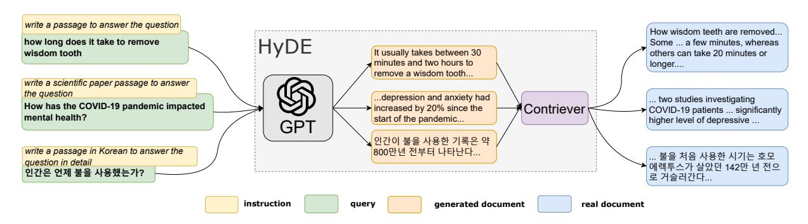

# Precise Zero-Shot Dense Retrieval without Relevance Labels

Luyu Gao∗ † Xueguang Ma∗ ‡ Jimmy Lin‡ Jamie Callan† †Language Technologies Institute, Carnegie Mellon University ‡David R. Cheriton School of Computer Science, University of Waterloo {luyug, callan}@cs.cmu.edu, {x93ma, jimmylin}@uwaterloo.ca

## Abstract

While dense retrieval has been shown effective and efficient across tasks and languages, it remains difficult to create effective fully zero-shot dense retrieval systems when no relevance label is available. In this paper, we recognize the difficulty of zero-shot learning and encoding relevance. Instead, we propose to pivot through Hypothetical Document Embeddings (HyDE). Given a query, HyDE first zero-shot instructs an instruction-following language model (e.g. InstructGPT) to generate a *hypothetical* document. The document captures relevance patterns but is unreal and may contain false details. Then, an unsupervised contrastively learned encoder (e.g. Contriever) encodes the document into an embedding vector. This vector identifies a neighborhood in the corpus embedding space, where similar *real* documents are retrieved based on vector similarity. This second step ground the generated document to the actual corpus, with the encoder's dense bottleneck filtering out the incorrect details. Our experiments show that HyDE significantly outperforms the state-of-the-art unsupervised dense retriever Contriever and shows strong performance comparable to fine-tuned retrievers, across various tasks (e.g. web search, QA, fact verification) and languages (e.g. sw, ko, ja).[1](#page-0-0)

## 1 Introduction

Dense retrieval [\(Lee et al.,](#page-7-0) [2019;](#page-7-0) [Karpukhin et al.,](#page-7-1) [2020\)](#page-7-1), the method of retrieving documents using semantic embedding similarities, has been shown successful across tasks like web search, question answering, and fact verification. A variety of methods such as negative mining [\(Xiong et al.,](#page-9-0) [2021;](#page-9-0) [Qu](#page-8-0) [et al.,](#page-8-0) [2021\)](#page-8-0), distillation [\(Qu et al.,](#page-8-0) [2021;](#page-8-0) [Lin et al.,](#page-7-2) [2021b;](#page-7-2) [Hofstätter et al.,](#page-7-3) [2021\)](#page-7-3) and task-specific

pre-training [\(Izacard et al.,](#page-7-4) [2021;](#page-7-4) [Gao and Callan,](#page-7-5) [2021;](#page-7-5) [Lu et al.,](#page-7-6) [2021;](#page-7-6) [Gao and Callan,](#page-7-7) [2022;](#page-7-7) [Liu](#page-7-8) [and Shao,](#page-7-8) [2022\)](#page-7-8) have been proposed to improve the effectiveness of supervised dense retrieval models.

On the other hand, zero-shot dense retrieval still remains difficult. Many recent works consider the alternative transfer learning setup, where the dense retrievers are trained on a high-resource dataset and then evaluated on queries from new tasks. The MS-MARCO collection [\(Bajaj et al.,](#page-6-0) [2016\)](#page-6-0), a massive judged dataset with a large number of judged querydocument pairs, is arguably the most commonly used. As argued by [Izacard et al.](#page-7-4) [\(2021\)](#page-7-4), in practice, however, the existence of such a large dataset cannot always be assumed. Even MS-MARCO restricts commercial use and cannot be adopted in a variety of real-world search scenarios.

In this paper, we aim to build effective fully zero-shot dense retrieval systems that require no relevance supervision, work out-of-box and generalize across tasks. As supervision is not available, we start by examining self-supervised representation learning methods. Modern deep learning enables two distinct learning algorithms. At the token level, generative large language models (LLM) pretrained on large corpus have demonstrated strong natural language understanding (NLU) and generation (NLG) capabilities [\(Brown et al.,](#page-6-1) [2020;](#page-6-1) [Chen et al.,](#page-6-2) [2021;](#page-6-2) [Rae et al.,](#page-8-1) [2021;](#page-8-1) [Hoffmann](#page-7-9) [et al.,](#page-7-9) [2022;](#page-7-9) [Thoppilan et al.,](#page-8-2) [2022;](#page-8-2) [Chowdhery](#page-6-3) [et al.,](#page-6-3) [2022\)](#page-6-3). At the document level, text (chunk) encoders pre-trained with contrastive objectives learn to encode document-document similarity into inner-product [\(Izacard et al.,](#page-7-4) [2021;](#page-7-4) [Gao and Callan,](#page-7-7) [2022\)](#page-7-7). On top of these, one extra insight into LLM is borrowed: the LLMs further trained to follow instructions can *zero-shot* generalize to diverse unseen instructions [\(Ouyang et al.,](#page-8-3) [2022;](#page-8-3) [Sanh et al.,](#page-8-4) [2022;](#page-8-4) [Min et al.,](#page-8-5) [2022;](#page-8-5) [Wei et al.,](#page-8-6) [2022\)](#page-8-6). [Ouyang](#page-8-3) [et al.](#page-8-3) [\(2022\)](#page-8-3) show that with a small amount of data, GPT-3 [\(Brown et al.,](#page-6-1) [2020\)](#page-6-1) models can be aligned

∗ Equal contribution.

1No models were trained or fine-tuned in making this preprint. Our open source code is available at [https://github.](https://github.com/texttron/hyde) [com/texttron/hyde](https://github.com/texttron/hyde).

Figure 1: An illustration of the HyDE model. Documents snippets are shown. HyDE serves all types of queries without changing the underlying GPT-3 and Contriever/mContriever models.

to human intent to follow instructions.

With these ingredients, we propose to pivot through Hypothetical Document Embeddings (HyDE), and decompose dense retrieval into two tasks, a generative task performed by an instruction-following language model and a document-document similarity task performed by a contrastive encoder [\(Figure 1\)](#page-1-0). First, we feed the query to the generative model and instruct it to "write a document that answers the question", i.e. a hypothetical document. We expect the generative process to capture "relevance" by giving an example; the generated document is not real, can contain factual errors but is like a relevant document. In the second step, we use an unsupervised contrastive encoder to encode this document into an embedding vector. Here, we expect the encoder's dense bottleneck to serve a lossy compressor, where the extra (hallucinated) details are filtered out from the embedding. We use this vector to search against the corpus embeddings. The most similar *real* documents are retrieved and returned. The retrieval leverages document-document similarity encoded in the inner-product during contrastive training. Note that, interestingly, with HyDE factorization, the query-document similarity score is no longer explicitly modeled nor computed. Instead, the retrieval task is cast into two NLU and NLG tasks.

HyDE appears unsupervised. No model is trained in HyDE: both the generative model and the contrastive encoder remain intact. Supervision signals were only involved in instruction learning of our backbone LLM.

In our experiments, we show HyDE using Instruct-GPT [\(Ouyang et al.,](#page-8-3) [2022\)](#page-8-3) and Contriever [\(Izacard](#page-7-4) [et al.,](#page-7-4) [2021\)](#page-7-4) as backbone models significantly outperforms the previous state-of-the-art Contrieveronly zero-shot no-relevance system on 11 queries

sets, covering tasks like Web Search, Question Answering, Fact Verification and languages like Swahili, Korean, Japanese.

# 2 Related Works

Dense Retrieval [\(Lee et al.,](#page-7-0) [2019;](#page-7-0) [Karpukhin](#page-7-1) [et al.,](#page-7-1) [2020\)](#page-7-1) has been extensively studied after the emergence of pre-trained Transformer language models [\(Devlin et al.,](#page-7-10) [2019\)](#page-7-10). Researchers studied the metric learning problems, such as training loss [\(Karpukhin et al.,](#page-7-1) [2020\)](#page-7-1) and negative sampling [\(Xiong et al.,](#page-9-0) [2021;](#page-9-0) [Qu et al.,](#page-8-0) [2021\)](#page-8-0), and also introduced distillation [\(Qu et al.,](#page-8-0) [2021;](#page-8-0) [Lin et al.,](#page-7-2) [2021b;](#page-7-2) [Hofstätter et al.,](#page-7-3) [2021\)](#page-7-3). Later works studied the second stage pre-training of language model specifically for retrieval [\(Izacard et al.,](#page-7-4) [2021;](#page-7-4) [Gao](#page-7-5) [and Callan,](#page-7-5) [2021;](#page-7-5) [Lu et al.,](#page-7-6) [2021;](#page-7-6) [Gao and Callan,](#page-7-7) [2022;](#page-7-7) [Liu and Shao,](#page-7-8) [2022\)](#page-7-8).

The popularity of dense retrieval can be partially attributed to the rich and successful research in very efficient minimum inner product search (MIPS) at very large (billion) scales [\(Johnson et al.,](#page-7-11) [2017\)](#page-7-11).

Instructions-Following Language Models Soon after the emergence of LLMs, several groups of researchers discover that LLMs trained on data consisting of instructions and their execution can zero-shot generalize to perform new tasks with new instructions [\(Ouyang et al.,](#page-8-3) [2022;](#page-8-3) [Sanh et al.,](#page-8-4) [2022;](#page-8-4) [Min et al.,](#page-8-5) [2022;](#page-8-5) [Wei et al.,](#page-8-6) [2022\)](#page-8-6). This can be done by standard supervised sequence-to-sequence learning or more effectively with reinforcement learning [\(Ouyang et al.,](#page-8-3) [2022\)](#page-8-3).

Concurrent to us, [Asai et al.](#page-6-4) [\(2022\)](#page-6-4) studied "Task-aware Retrieval with Instructions". They *fine-tuned dense encoders* that can also encode task-specific instruction prepended to query. In comparison, we use an unsupervised encoder and handle different tasks and their instruction with an instruction following generative LLM, as described above.

Zero-Shot Dense Retrieval The tasks of zeroshot (dense) retrieval are arguably empirically defined by [Thakur et al.](#page-8-7) [\(2021\)](#page-8-7) for the neural retrieval community. Their BEIR benchmark consists of diverse retrieval tasks. The paper and many follow-up research generally consider the Transfer Learning setup where the dense retriever is first learned using a diverse and richly supervised corpus and query collection, namely MS-MARCO [\(Thakur et al.,](#page-8-7) [2021;](#page-8-7) [Wang et al.,](#page-8-8) [2022;](#page-8-8) [Yu et al.,](#page-9-1) [2022\)](#page-9-1).

However, as stated by [Izacard et al.](#page-7-4) [\(2021\)](#page-7-4), such a large collection can rarely be assumed. In this paper, therefore, we study the problem of building effective dense retrieval systems without relevance labels. Similar to [Izacard et al.](#page-7-4) [\(2021\)](#page-7-4), we also do not assume access to the test time corpora for training. This is a more realistic setup and prevents over-engineering on the test corpora.

By the definition in [Sachan et al.](#page-8-9) [\(2022\)](#page-8-9), our setup can be roughly considered as "unsupervised". Strictly, as with [Sachan et al.](#page-8-9) [\(2022\)](#page-8-9), the only supervision resides in the LLM, in the processing of learning to follow instructions.

Generative Retrieval Generative search is a new class of retrieval methods that use neural generative models as search indices [\(Metzler et al.,](#page-7-12) [2021;](#page-7-12) [Tay](#page-8-10) [et al.,](#page-8-10) [2022;](#page-8-10) [Bevilacqua et al.,](#page-6-5) [2022;](#page-6-5) [Lee et al.,](#page-7-13) [2022\)](#page-7-13). These models use (constrained) decoding to generate document identifiers, such as id and sub-string, which map directly to *real* documents. They have to go through special training procedures over relevance data; effective search may also need to use novel forms of search indices [\(Bevilacqua](#page-6-5) [et al.,](#page-6-5) [2022;](#page-6-5) [Lee et al.,](#page-7-13) [2022\)](#page-7-13). In comparison, our method uses the standard MIPS index and requires no training or training data. Our generative model produces an intermediate hypothetical document to be fed into a dense encoder, instead of a real document.

## 3 Methodology

In this section, we first formally define the problem of (zero-shot) dense retrieval. Then we will introduce how HyDE is designed to solve it.

### 3.1 Preliminaries

Dense retrieval models similarity between query and document with inner product similarity. Given a query q and document d, it uses two encoder function encq and encd to map them into d dimension vectors vq, vd, whose inner product is used as similarity measurement.

$$sim(q, d) = \langle enc_q(q), enc_d(d) \rangle = \langle \mathbf{v_q}, \mathbf{v_d} \rangle$$
 (1)

For zero-shot retrieval, we consider L query sets Q1, Q2, ..., QL and their corresponding search corpus, document sets D1, D2, ..., DL. Denote the j-th query from i-th set query set Qi as qij . We need to fully define mapping *functions* encq and encd without access to any query set Qi , document set Di , or any relevance judgment rij .

The difficulty of zero-shot dense retrieval lies precisely in [Equation 1:](#page-2-0) it requires learning of two embedding functions (for query and document respectively) into the *same* embedding space where inner product captures *relevance*. Without relevance judgments/scores to fit, learning becomes intractable.

### 3.2 HyDE

HyDE circumvents the aforementioned learning problem by performing search in documentonly embedding space that captures documentdocument similarity. This can be easily learned using unsupervised contrastive learning [\(Izacard](#page-7-4) [et al.,](#page-7-4) [2021;](#page-7-4) [Gao et al.,](#page-7-14) [2021;](#page-7-14) [Gao and Callan,](#page-7-7) [2022\)](#page-7-7). We set document encoder encd directly as a contrastive encoder enccon.

$$f = \text{enc}_d = \text{enc}_{\text{con}} \tag{2}$$

This function is also denoted as f for simplicity. This unsupervised contrastive encoder will be shared by all incoming document corpus.

$$\mathbf{v_d} = f(d) \quad \forall d \in D_1 \cup D_2 \cup \dots \cup D_L$$
 (3)

To build the query vector, we consider in addition an instruction following LM, InstructLM. It takes a query q and a textual instruction INST and follows them to perform the task specified by INST. For simplicity, denote,

$$g(q, INST) = InstructLM(q, INST)$$
 (4)

Now we can use g to map queries to "hypothetical" documents by sampling from g, setting INST

to be "write a paragraph that answers the question". The generated document *is not* real, can and is likely to be ungrounded factually (Brown et al., 2020; Thoppilan et al., 2022). We *only* require it to capture relevance pattern. This is done by generating documents, i.e. providing examples. Critically, here we **offload** relevance modeling from representation learning model to an NLG model that generalizes significantly more easily, naturally, and effectively (Brown et al., 2020; Ouyang et al., 2022). Generating examples also replaces explicit modeling of relevance scores.

We can now encode the generated document using the document encoder f. Write,

$$\mathbb{E}[\mathbf{v}_{q_{ij}}] = \mathbb{E}[f(g(q_{ij}, \text{INST}_i))]$$
 (5)

Formally, g defines a probability distribution based on the chain rule. In this paper, we simply consider the expectation value, assuming the distribution of  $\mathbf{v}_{qij}$  is uni-modal, i.e. the query is not ambiguous. The study of ambiguous queries and diversity is left to future work. We estimate Equation 5 by sampling N documents from g,  $[\hat{d}_1, \hat{d}_2, ..., \hat{d}_N]$ .

$$\hat{\mathbf{v}}_{q_{ij}} = \frac{1}{N} \sum_{\hat{d_k} \sim g(q_{ij}, \text{INST}_i)} f(d_k)$$
 (6)

$$= \frac{1}{N} \sum_{k=1}^{N} f(\hat{d}_k)$$
 (7)

We also consider the query as a possible hypothesis,

$$\hat{\mathbf{v}}_{q_{ij}} = \frac{1}{N+1} \left[ \sum_{k=1}^{N} f(\hat{d}_k) + f(q_{ij}) \right]$$
 (8)

Inner product is computed between  $\hat{\mathbf{v}}_{q_{ij}}$  and the set of all document vectors  $\{f(d)|d\in D_i\}$ . The most similar documents are retrieved. Here the encoder function f serves as a lossy compressor that outputs dense vectors, where the extra details are filtered and left out from the vector. It further grounds the hypothetical vector to the actual corpus and the real documents. The full HyDE system is illustrated in Figure 1.

### 4 Experiments

#### 4.1 Setup

**Implementation** We implement HyDE using InstructGPT, a GPT-3 model from the instruct series (text-davinci-003; Ouyang et al. (2022)) and Contriever models (Izacard et al., 2021). We

sample from InstructGPT using the OpenAI play-ground default temperature of 0.7 for open-ended generations. We use the English-only Contriever model for English retrieval tasks and multilingual mContriever for non-English tasks. We conducted retrieval experiments with the Pyserini toolkit (Lin et al., 2021a).

**Datasets** We consider web search query sets TREC DL19 (Craswell et al., 2020a) and DL20 (Craswell et al., 2020b); they are based on the MS-MARCO dataset (Bajaj et al., 2016). We also use a diverse collection of 6 low-resource datasets from the BEIR dataset (Thakur et al., 2021). For non-English retrieval, we consider Swahili, Korean, Japanese, and Bengali from the Mr.Tydi dataset (Zhang et al., 2021).

We use different instructions for each dataset. They share a similar structure but have different quantifiers to control the exact form of the generated hypothetical documents. These instructions can be found in subsection A.1.

Compared Systems Contriever models, Contriever and mContriever, serve as our major baseline. They are trained using unsupervised contrastive learning. HyDE retrievers share the *exact* same embedding spaces with them. The only difference is how the query vector is built. These comparisons allow us to easily examine the effect of HyDE. The classical heuristic-based lexical retriever BM25 is also included.

Several systems that involve fine-tuning on massive relevance data are also included as references. We consider models fine-tuned on MS-MARCO and transferred, DPR and ANCE, from the BEIR paper. For multilingual, we include the mDPR model from Mr.Tydi paper and MS-MARCO fine-tuned mBERT and XLM-R from the Contriever paper. We also include the state-ofthe-art transfer learning models: Contriever and mContriever fine-tuned on MS-MARCO, denoted ContrieverFT and mContrieverFT. These models have run through the state-of-the-art retrieval model training pipeline that involves second-stage retrieval-specific pre-training (Lee et al., 2019) and a few rounds of fine-tuning (Qu et al., 2021); they should be considered empirical upper bounds.

#### 4.2 Web Search

In Table 1, we show retrieval results on TREC DL19 and TREC DL20. We see HyDE bring sizable improvements to Contriever across the board for

|                         | DL19 |         |           | DL20 |         |           |
|-------------------------|------|---------|-----------|------|---------|-----------|
|                         | map  | ndcg@10 | recall@1k | map  | ndcg@10 | recall@1k |
| w/o relevance judgement |      |         |           |      |         |           |
| BM25                    | 30.1 | 50.6    | 75.0      | 28.6 | 48.0    | 78.6      |
| Contriever              | 24.0 | 44.5    | 74.6      | 24.0 | 42.1    | 75.4      |
| HyDE                    | 41.8 | 61.3    | 88.0      | 38.2 | 57.9    | 84.4      |
| w/ relevance judgement  |      |         |           |      |         |           |
| DPR                     | 36.5 | 62.2    | 76.9      | 41.8 | 65.3    | 81.4      |
| ANCE                    | 37.1 | 64.5    | 75.5      | 40.8 | 64.6    | 77.6      |
| ContrieverFT            | 41.7 | 62.1    | 83.6      | 43.6 | 63.2    | 85.8      |

Table 1: Results for web search on DL19/20. Best performing w/o relevance and overall system(s) are marked bold. DPR, ANCE and ContrieverFT are in-domain *supervised* models that are finetuned on MS MARCO training data.

|                        | Scifact                 | Arguana | Trec-Covid | FiQA | DBPedia | TREC-NEWS |  |
|------------------------|-------------------------|---------|------------|------|---------|-----------|--|
| nDCG@10                |                         |         |            |      |         |           |  |
|                        | w/o relevance judgement |         |            |      |         |           |  |
| BM25                   | 67.9                    | 39.7    | 59.5       | 23.6 | 31.8    | 39.5      |  |
| Contriever             | 64.9                    | 37.9    | 27.3       | 24.5 | 29.2    | 34.8      |  |
| HyDE                   | 69.1                    | 46.6    | 59.3       | 27.3 | 36.8    | 44.0      |  |
|                        | w/ relevance judgement  |         |            |      |         |           |  |
| DPR                    | 31.8                    | 17.5    | 33.2       | 29.5 | 26.3    | 16.1      |  |
| ANCE                   | 50.7                    | 41.5    | 65.4       | 30.0 | 28.1    | 38.2      |  |
| ContrieverFT           | 67.7                    | 44.6    | 59.6       | 32.9 | 41.3    | 42.8      |  |
|                        | Recall@100              |         |            |      |         |           |  |
|                        | w/o relevance judgement |         |            |      |         |           |  |
| BM25                   | 92.5                    | 93.2    | 49.8       | 54.0 | 46.8    | 44.7      |  |
| Contriever             | 92.6                    | 90.1    | 17.2       | 56.2 | 45.3    | 42.3      |  |
| HyDE                   | 96.4                    | 97.9    | 41.4       | 62.1 | 47.2    | 50.9      |  |
| w/ relevance judgement |                         |         |            |      |         |           |  |
| DPR                    | 72.7                    | 75.1    | 21.2       | 34.2 | 34.9    | 21.5      |  |
| ANCE                   | 81.6                    | 93.7    | 45.7       | 58.1 | 31.9    | 39.8      |  |
| ContrieverFT           | 94.7                    | 97.7    | 40.7       | 65.6 | 54.1    | 49.2      |  |

Table 2: Low resource tasks from BEIR. Best performing w/o relevance and overall system(s) are marked bold.

both precision-oriented and recall metrics. While unsupervised Contriever can underperform the classical BM25 approach, HyDE outperforms BM25 by large margins.

HyDE remains competitive even when compared to fine-tuned models. Note that TREC DL19/20 are search tasks defined on MS-MARCO and there, all the fine-tuned models are richly *supervised*. On TREC DL19, HyDE shows comparable map and ndcg@10 to ContrieverFT and best recall@1k. On DL20, HyDE gets around 10% lower map and ndcg@10 than ContrieverFT and similar recall@1k. The ANCE model shows better ndcg@10 numbers than HyDE but lower recall, suggesting it may be biased to a subset of queries and/or relevant documents.

### 4.3 Low Resource Retrieval

In [Table 2,](#page-4-1) we show retrieval results on lowresource tasks from BEIR. Similar to web search, HyDE again brings sizable improvements to Contriever across the board in terms of both ndcg and recall. HyDE is only outperformed by BM25 on one dataset, TREC-Covid but with a tiny 0.2 margin; in comparison, the underlying Contriever underperforms by more than 50%.

We also observe HyDE demonstrates strong performance compared to fine-tuned models. HyDE generally shows better performance than ANCE and DPR, even though the two are fine-tuned on MS-MARCO and ANCE also involves some sophisticated hard negative techniques. ContrieverFT shows performance advantages on FiQA and DBPedia. These involve retrieval of financial posts or entities respectively. We believe the performance difference can be attributed to the

|                           | Swahili | Korean | Japanese | Bengali |  |  |  |
|---------------------------|---------|--------|----------|---------|--|--|--|
| w/o relevance judgement   |         |        |          |         |  |  |  |
| BM25                      | 38.9    | 28.5   | 21.2     | 41.8    |  |  |  |
| mContriever               | 38.3    | 22.3   | 19.5     | 35.3    |  |  |  |
| HyDE                      | 41.7    | 30.6   | 30.7     | 41.3    |  |  |  |
| w/ relevance judgement    |         |        |          |         |  |  |  |
| mDPR                      | 7.3     | 21.9   | 18.1     | 25.8    |  |  |  |
| mBERT                     | 37.4    | 28.1   | 27.1     | 35.1    |  |  |  |
| XLM-R                     | 35.1    | 32.2   | 24.8     | 41.7    |  |  |  |
| mContriever FT | 51.2    | 34.2   | 32.4     | 42.3    |  |  |  |

Table 3: MRR@100 on Mr.Tydi. Best performing w/o relevance and overall system(s) are marked **bold**.

under-specification of the instruction; more elaborative instructions may help.

#### 4.4 Multilingual Retrieval

Multilingual setup poses several additional challenges to HyDE. The small-sized contrastive encoder gets saturated as the number of languages scales (Conneau et al., 2020; Izacard et al., 2021). Meanwhile, our generative LLM faces an opposite issue: with languages of not as high resource as English or French, the high capacity LLM can get under-trained (Hoffmann et al., 2022).

Nevertheless, in Table 3, we still find HyDE able to improve the mContriever model. It can outperform non-Contriever models fine-tuned on and transferred from MS-MARCO. On the other hand, we do observe some margins between HyDE and fine-tuned mContrieverFT. Since HyDE and mContrieverFT use similar contrastive encoders, we hypothesize this is because the non-English languages we considered are under-trained in both pre-training and instruction learning stages.

### 5 Analysis

The generative LLM and contrastive encoder make up the backbone of HyDE. In this section, we study the effect of changing their realizations. In particular, we consider smaller language models (LM) and fine-tuned encoders. We conduct our studies on TREC DL19/20.

#### 5.1 Effect of Different Generative Models

In Table 4, we show HyDE using other instruction-following language models. In particular, we consider a 52-billion Cohere model (command-xlarge-20221108) and a 11-billion FLAN model (FLAN-T5-xx1; Wei et al. (2022)).2 Generally, we observe that all

| DL19 | DL20                                                        |
|------|-------------------------------------------------------------|
| 44.5 | 42.1                                                        |
| 62.1 | 63.2                                                        |
|      |                                                             |
|      |                                                             |
| 48.9 | 52.9                                                        |
| 53.8 | 53.8                                                        |
| 61.3 | 57.9                                                        |
|      |                                                             |
| 60.2 | 62.1                                                        |
| 61.4 | 63.1                                                        |
| 67.4 | 63.5                                                        |
|      | 44.5 62.1 48.9 53.8 <b>61.3</b> 60.2 61.4 |

Table 4: NDCG@10 on TREC DL19/20. Effect of changing different instruction LMs and using fine-tuned encoder. Best w/o relevance and overall models are marked **bold**.

models bring improvement to the unsupervised Contriever, with larger models bringing larger improvements. At the time when this paper is written, the Cohere model is still experimental without much detail disclosed. We can only tentatively hypothesize that training techniques may have also played some role in the performance difference.

### 5.2 HyDE with Fine-tuned Encoder

To begin with, HyDE with fine-tuned encoder is not the intended usage: HyDE is more powerful and irreplaceable when few relevance labels are present. Here we are interested to find out if and how HyDE embedding can affect fine-tuned encoders. In Table 4, we see that less powerful instruction LMs can negatively impact the overall performance of the fine-tuned retriever. (To remind our readers, ContrieverFT is in-domain supervisedly fine-tuned for TREC DL19/20). The performance degradations remain small. On the other hand, we also observe the InstructGPT model able to further bring up the performance, especially on DL19. This suggests that there may still exist certain factors not captured by the fine-tuned encoder but only by the generative model.

#### 6 Conclusion

At the end of the paper, we encourage the readers to take a moment and reflect on the HyDE model. Compare it to some of the other recently seen retrievers or re-ranker. These other models probably differ in their architecture, training method, and/or task, but probably all of them involve modeling relevance scores between a pair of query and docu-

&lt;sup>2Model sizes are from https://crfm.stanford.edu/helm/v1.0/?models

ment. Dense retrievers consider vector similarities while self-attentive re-rankers regression scores. In comparison, the concept of relevance in HyDE is captured by an NLG model and the language generation process. We demonstrate in many cases, HyDE can be as effective as dense retrievers that learn to model numerical relevance scores. So, is numerical relevance just a statistical artifact of language understanding? Will a weak retriever theoretically suffice as the NLU & NLG models rapidly become stronger? Rushing to conclusions is not smart; more works need to be done to get answers. With this paper, we just want to raise these questions.

Concretely in this paper, we introduce a new paradigm of interactions between LLM and dense encoder/retriever. We demonstrate (part of) relevance modeling and instruction understanding can be delegated to the more powerful and flexible LLM. As a consequence, the need for relevance labels is removed. We are excited to see how this can be generalized further to more sophisticated tasks like multi-hop retrieval/QA and conversational search.

We argue HyDE is also of practical use though not necessarily over the entire lifespan of a search system. At the very beginning of the life of the search system, serving queries using HyDE offers performance comparable to a fine-tuned model, which no other relevance-free model can offer. As the search log grows, a supervised dense retriever can be gradually rolled out. As the dense retriever grows stronger, more queries will be routed to it, with only less common and emerging ones going to HyDE backend.

### References

Akari Asai, Timo Schick, Patrick Lewis, Xilun Chen, Gautier Izacard, Sebastian Riedel, Hannaneh Hajishirzi, and Wen-tau Yih. 2022. [Task-aware re](https://doi.org/10.48550/ARXIV.2211.09260)[trieval with instructions.](https://doi.org/10.48550/ARXIV.2211.09260)

Payal Bajaj, Daniel Campos, Nick Craswell, Li Deng, Jianfeng Gao, Xiaodong Liu, Rangan Majumder, Andrew McNamara, Bhaskar Mitra, Tri Nguyen, Mir Rosenberg, Xia Song, Alina Stoica, Saurabh Tiwary, and Tong Wang. 2016. [Ms marco: A human](https://doi.org/10.48550/ARXIV.1611.09268) [generated machine reading comprehension dataset.](https://doi.org/10.48550/ARXIV.1611.09268)

Michele Bevilacqua, Giuseppe Ottaviano, Patrick Lewis, Wen-tau Yih, Sebastian Riedel, and Fabio Petroni. 2022. [Autoregressive search engines: Gen](https://doi.org/10.48550/arXiv.2204.10628)[erating substrings as document identifiers.](https://doi.org/10.48550/arXiv.2204.10628) *CoRR*, abs/2204.10628.

Tom B. Brown, Benjamin Mann, Nick Ryder, Melanie Subbiah, Jared Kaplan, Prafulla Dhariwal, Arvind Neelakantan, Pranav Shyam, Girish Sastry, Amanda Askell, Sandhini Agarwal, Ariel Herbert-Voss, Gretchen Krueger, Tom Henighan, Rewon Child, Aditya Ramesh, Daniel M. Ziegler, Jeffrey Wu, Clemens Winter, Christopher Hesse, Mark Chen, Eric Sigler, Mateusz Litwin, Scott Gray, Benjamin Chess, Jack Clark, Christopher Berner, Sam Mc-Candlish, Alec Radford, Ilya Sutskever, and Dario Amodei. 2020. [Language models are few-shot learn](https://proceedings.neurips.cc/paper/2020/hash/1457c0d6bfcb4967418bfb8ac142f64a-Abstract.html)[ers.](https://proceedings.neurips.cc/paper/2020/hash/1457c0d6bfcb4967418bfb8ac142f64a-Abstract.html) In *Advances in Neural Information Processing Systems 33: Annual Conference on Neural Information Processing Systems 2020, NeurIPS 2020, December 6-12, 2020, virtual*.

Mark Chen, Jerry Tworek, Heewoo Jun, Qiming Yuan, Henrique Ponde de Oliveira Pinto, Jared Kaplan, Harri Edwards, Yuri Burda, Nicholas Joseph, Greg Brockman, Alex Ray, Raul Puri, Gretchen Krueger, Michael Petrov, Heidy Khlaaf, Girish Sastry, Pamela Mishkin, Brooke Chan, Scott Gray, Nick Ryder, Mikhail Pavlov, Alethea Power, Lukasz Kaiser, Mohammad Bavarian, Clemens Winter, Philippe Tillet, Felipe Petroski Such, Dave Cummings, Matthias Plappert, Fotios Chantzis, Elizabeth Barnes, Ariel Herbert-Voss, William Hebgen Guss, Alex Nichol, Alex Paino, Nikolas Tezak, Jie Tang, Igor Babuschkin, Suchir Balaji, Shantanu Jain, William Saunders, Christopher Hesse, Andrew N. Carr, Jan Leike, Josh Achiam, Vedant Misra, Evan Morikawa, Alec Radford, Matthew Knight, Miles Brundage, Mira Murati, Katie Mayer, Peter Welinder, Bob McGrew, Dario Amodei, Sam McCandlish, Ilya Sutskever, and Wojciech Zaremba. 2021. [Eval](https://doi.org/10.48550/ARXIV.2107.03374)[uating large language models trained on code.](https://doi.org/10.48550/ARXIV.2107.03374)

Aakanksha Chowdhery, Sharan Narang, Jacob Devlin, Maarten Bosma, Gaurav Mishra, Adam Roberts, Paul Barham, Hyung Won Chung, Charles Sutton, Sebastian Gehrmann, Parker Schuh, Kensen Shi, Sasha Tsvyashchenko, Joshua Maynez, Abhishek Rao, Parker Barnes, Yi Tay, Noam Shazeer, Vinodkumar Prabhakaran, Emily Reif, Nan Du, Ben Hutchinson, Reiner Pope, James Bradbury, Jacob Austin, Michael Isard, Guy Gur-Ari, Pengcheng Yin, Toju Duke, Anselm Levskaya, Sanjay Ghemawat, Sunipa Dev, Henryk Michalewski, Xavier Garcia, Vedant Misra, Kevin Robinson, Liam Fedus, Denny Zhou, Daphne Ippolito, David Luan, Hyeontaek Lim, Barret Zoph, Alexander Spiridonov, Ryan Sepassi, David Dohan, Shivani Agrawal, Mark Omernick, Andrew M. Dai, Thanumalayan Sankaranarayana Pillai, Marie Pellat, Aitor Lewkowycz, Erica Moreira, Rewon Child, Oleksandr Polozov, Katherine Lee, Zongwei Zhou, Xuezhi Wang, Brennan Saeta, Mark Diaz, Orhan Firat, Michele Catasta, Jason Wei, Kathy Meier-Hellstern, Douglas Eck, Jeff Dean, Slav Petrov, and Noah Fiedel. 2022. [Palm: Scaling language modeling with pathways.](https://doi.org/10.48550/ARXIV.2204.02311)

Alexis Conneau, Kartikay Khandelwal, Naman Goyal, Vishrav Chaudhary, Guillaume Wenzek, Francisco Guzmán, Edouard Grave, Myle Ott, Luke Zettle-

- moyer, and Veselin Stoyanov. 2020. [Unsupervised](https://doi.org/10.18653/v1/2020.acl-main.747) [cross-lingual representation learning at scale.](https://doi.org/10.18653/v1/2020.acl-main.747) In *Proceedings of the 58th Annual Meeting of the Association for Computational Linguistics*, pages 8440– 8451, Online. Association for Computational Linguistics.
- Nick Craswell, Bhaskar Mitra, Emine Yilmaz, Daniel Campos, and Ellen M. Voorhees. 2020a. [Overview](https://doi.org/10.48550/ARXIV.2003.07820) [of the trec 2019 deep learning track.](https://doi.org/10.48550/ARXIV.2003.07820)
- Nick Craswell, Bhaskar Mitra, Emine Yilmaz, Daniel Fernando Campos, and Ellen M. Voorhees. 2020b. Overview of the trec 2020 deep learning track. *ArXiv*, abs/2003.07820.
- Jacob Devlin, Ming-Wei Chang, Kenton Lee, and Kristina Toutanova. 2019. [BERT: Pre-training of](https://doi.org/10.18653/v1/N19-1423) [deep bidirectional transformers for language under](https://doi.org/10.18653/v1/N19-1423)[standing.](https://doi.org/10.18653/v1/N19-1423) In *Proceedings of the 2019 Conference of the North American Chapter of the Association for Computational Linguistics: Human Language Technologies, Volume 1 (Long and Short Papers)*, pages 4171–4186, Minneapolis, Minnesota. Association for Computational Linguistics.
- Luyu Gao and Jamie Callan. 2021. [Condenser: a pre](https://doi.org/10.18653/v1/2021.emnlp-main.75)[training architecture for dense retrieval.](https://doi.org/10.18653/v1/2021.emnlp-main.75) In *Proceedings of the 2021 Conference on Empirical Methods in Natural Language Processing*, pages 981–993, Online and Punta Cana, Dominican Republic. Association for Computational Linguistics.
- Luyu Gao and Jamie Callan. 2022. [Unsupervised cor](https://doi.org/10.18653/v1/2022.acl-long.203)[pus aware language model pre-training for dense](https://doi.org/10.18653/v1/2022.acl-long.203) [passage retrieval.](https://doi.org/10.18653/v1/2022.acl-long.203) In *Proceedings of the 60th Annual Meeting of the Association for Computational Linguistics (Volume 1: Long Papers)*, pages 2843–2853, Dublin, Ireland. Association for Computational Linguistics.
- Tianyu Gao, Xingcheng Yao, and Danqi Chen. 2021. [SimCSE: Simple contrastive learning of sentence](https://doi.org/10.18653/v1/2021.emnlp-main.552) [embeddings.](https://doi.org/10.18653/v1/2021.emnlp-main.552) In *Proceedings of the 2021 Conference on Empirical Methods in Natural Language Processing*, pages 6894–6910, Online and Punta Cana, Dominican Republic. Association for Computational Linguistics.
- Jordan Hoffmann, Sebastian Borgeaud, Arthur Mensch, Elena Buchatskaya, Trevor Cai, Eliza Rutherford, Diego de Las Casas, Lisa Anne Hendricks, Johannes Welbl, Aidan Clark, Tom Hennigan, Eric Noland, Katie Millican, George van den Driessche, Bogdan Damoc, Aurelia Guy, Simon Osindero, Karen Simonyan, Erich Elsen, Jack W. Rae, Oriol Vinyals, and Laurent Sifre. 2022. [Training compute-optimal](https://doi.org/10.48550/ARXIV.2203.15556) [large language models.](https://doi.org/10.48550/ARXIV.2203.15556)
- Sebastian Hofstätter, Sheng-Chieh Lin, Jheng-Hong Yang, Jimmy Lin, and Allan Hanbury. 2021. [Ef](https://doi.org/10.1145/3404835.3462891)[ficiently teaching an effective dense retriever with](https://doi.org/10.1145/3404835.3462891) [balanced topic aware sampling.](https://doi.org/10.1145/3404835.3462891) In *Proceedings of the 44th International ACM SIGIR Conference on Research and Development in Information Retrieval*,

- SIGIR '21, page 113–122, New York, NY, USA. Association for Computing Machinery.
- Gautier Izacard, Mathilde Caron, Lucas Hosseini, Sebastian Riedel, Piotr Bojanowski, Armand Joulin, and Edouard Grave. 2021. [Towards unsupervised](http://arxiv.org/abs/2112.09118) [dense information retrieval with contrastive learning.](http://arxiv.org/abs/2112.09118) *CoRR*, abs/2112.09118.
- Jeff Johnson, Matthijs Douze, and Hervé Jégou. 2017. [Billion-scale similarity search with gpus.](http://arxiv.org/abs/1702.08734) *CoRR*, abs/1702.08734.
- Vladimir Karpukhin, Barlas Oguz, Sewon Min, Patrick Lewis, Ledell Wu, Sergey Edunov, Danqi Chen, and Wen-tau Yih. 2020. [Dense passage retrieval for](https://doi.org/10.18653/v1/2020.emnlp-main.550) [open-domain question answering.](https://doi.org/10.18653/v1/2020.emnlp-main.550) In *Proceedings of the 2020 Conference on Empirical Methods in Natural Language Processing (EMNLP)*, pages 6769– 6781, Online. Association for Computational Linguistics.
- Hyunji Lee, Sohee Yang, Hanseok Oh, and Minjoon Seo. 2022. [Generative multi-hop retrieval.](https://doi.org/10.48550/ARXIV.2204.13596)
- Kenton Lee, Ming-Wei Chang, and Kristina Toutanova. 2019. [Latent retrieval for weakly supervised open](https://doi.org/10.18653/v1/P19-1612) [domain question answering.](https://doi.org/10.18653/v1/P19-1612) In *Proceedings of the 57th Annual Meeting of the Association for Computational Linguistics*, pages 6086–6096, Florence, Italy. Association for Computational Linguistics.
- Jimmy Lin, Xueguang Ma, Sheng-Chieh Lin, Jheng-Hong Yang, Ronak Pradeep, and Rodrigo Nogueira. 2021a. Pyserini: A Python toolkit for reproducible information retrieval research with sparse and dense representations. In *Proceedings of the 44th Annual International ACM SIGIR Conference on Research and Development in Information Retrieval (SIGIR 2021)*, pages 2356–2362.
- Sheng-Chieh Lin, Jheng-Hong Yang, and Jimmy Lin. 2021b. [In-batch negatives for knowledge distillation](https://doi.org/10.18653/v1/2021.repl4nlp-1.17) [with tightly-coupled teachers for dense retrieval.](https://doi.org/10.18653/v1/2021.repl4nlp-1.17) In *Proceedings of the 6th Workshop on Representation Learning for NLP (RepL4NLP-2021)*, pages 163– 173, Online. Association for Computational Linguistics.
- Zheng Liu and Yingxia Shao. 2022. Retromae: Pretraining retrieval-oriented transformers via masked auto-encoder. *ArXiv*, abs/2205.12035.
- Shuqi Lu, Di He, Chenyan Xiong, Guolin Ke, Waleed Malik, Zhicheng Dou, Paul Bennett, Tie-Yan Liu, and Arnold Overwijk. 2021. [Less is more: Pre](https://doi.org/10.18653/v1/2021.emnlp-main.220)[train a strong Siamese encoder for dense text re](https://doi.org/10.18653/v1/2021.emnlp-main.220)[trieval using a weak decoder.](https://doi.org/10.18653/v1/2021.emnlp-main.220) In *Proceedings of the 2021 Conference on Empirical Methods in Natural Language Processing*, pages 2780–2791, Online and Punta Cana, Dominican Republic. Association for Computational Linguistics.
- Donald Metzler, Yi Tay, Dara Bahri, and Marc Najork. 2021. [Rethinking search: making domain experts](https://doi.org/10.1145/3476415.3476428) [out of dilettantes.](https://doi.org/10.1145/3476415.3476428) *SIGIR Forum*, 55(1):13:1–13:27.

- Sewon Min, Mike Lewis, Luke Zettlemoyer, and Hannaneh Hajishirzi. 2022. [MetaICL: Learning to learn](https://doi.org/10.18653/v1/2022.naacl-main.201) [in context.](https://doi.org/10.18653/v1/2022.naacl-main.201) In *Proceedings of the 2022 Conference of the North American Chapter of the Association for Computational Linguistics: Human Language Technologies*, pages 2791–2809, Seattle, United States. Association for Computational Linguistics.
- Long Ouyang, Jeff Wu, Xu Jiang, Diogo Almeida, Carroll L. Wainwright, Pamela Mishkin, Chong Zhang, Sandhini Agarwal, Katarina Slama, Alex Ray, John Schulman, Jacob Hilton, Fraser Kelton, Luke Miller, Maddie Simens, Amanda Askell, Peter Welinder, Paul Christiano, Jan Leike, and Ryan Lowe. 2022. [Training language models to follow in](https://doi.org/10.48550/ARXIV.2203.02155)[structions with human feedback.](https://doi.org/10.48550/ARXIV.2203.02155)
- Yingqi Qu, Yuchen Ding, Jing Liu, Kai Liu, Ruiyang Ren, Wayne Xin Zhao, Daxiang Dong, Hua Wu, and Haifeng Wang. 2021. [RocketQA: An opti](https://doi.org/10.18653/v1/2021.naacl-main.466)[mized training approach to dense passage retrieval](https://doi.org/10.18653/v1/2021.naacl-main.466) [for open-domain question answering.](https://doi.org/10.18653/v1/2021.naacl-main.466) In *Proceedings of the 2021 Conference of the North American Chapter of the Association for Computational Linguistics: Human Language Technologies*, pages 5835–5847, Online. Association for Computational Linguistics.
- Jack W. Rae, Sebastian Borgeaud, Trevor Cai, Katie Millican, Jordan Hoffmann, Francis Song, John Aslanides, Sarah Henderson, Roman Ring, Susannah Young, Eliza Rutherford, Tom Hennigan, Jacob Menick, Albin Cassirer, Richard Powell, George van den Driessche, Lisa Anne Hendricks, Maribeth Rauh, Po-Sen Huang, Amelia Glaese, Johannes Welbl, Sumanth Dathathri, Saffron Huang, Jonathan Uesato, John Mellor, Irina Higgins, Antonia Creswell, Nat McAleese, Amy Wu, Erich Elsen, Siddhant Jayakumar, Elena Buchatskaya, David Budden, Esme Sutherland, Karen Simonyan, Michela Paganini, Laurent Sifre, Lena Martens, Xiang Lorraine Li, Adhiguna Kuncoro, Aida Nematzadeh, Elena Gribovskaya, Domenic Donato, Angeliki Lazaridou, Arthur Mensch, Jean-Baptiste Lespiau, Maria Tsimpoukelli, Nikolai Grigorev, Doug Fritz, Thibault Sottiaux, Mantas Pajarskas, Toby Pohlen, Zhitao Gong, Daniel Toyama, Cyprien de Masson d'Autume, Yujia Li, Tayfun Terzi, Vladimir Mikulik, Igor Babuschkin, Aidan Clark, Diego de Las Casas, Aurelia Guy, Chris Jones, James Bradbury, Matthew Johnson, Blake Hechtman, Laura Weidinger, Iason Gabriel, William Isaac, Ed Lockhart, Simon Osindero, Laura Rimell, Chris Dyer, Oriol Vinyals, Kareem Ayoub, Jeff Stanway, Lorrayne Bennett, Demis Hassabis, Koray Kavukcuoglu, and Geoffrey Irving. 2021. [Scal](https://doi.org/10.48550/ARXIV.2112.11446)[ing language models: Methods, analysis & insights](https://doi.org/10.48550/ARXIV.2112.11446) [from training gopher.](https://doi.org/10.48550/ARXIV.2112.11446)
- Devendra Singh Sachan, Mike Lewis, Mandar Joshi, Armen Aghajanyan, Wen-tau Yih, Joelle Pineau, and Luke Zettlemoyer. 2022. [Improving passage re](https://arxiv.org/abs/2204.07496)[trieval with zero-shot question generation.](https://arxiv.org/abs/2204.07496)

- Victor Sanh, Albert Webson, Colin Raffel, Stephen Bach, Lintang Sutawika, Zaid Alyafeai, Antoine Chaffin, Arnaud Stiegler, Arun Raja, Manan Dey, M Saiful Bari, Canwen Xu, Urmish Thakker, Shanya Sharma Sharma, Eliza Szczechla, Taewoon Kim, Gunjan Chhablani, Nihal V. Nayak, Debajyoti Datta, Jonathan Chang, Mike Tian-Jian Jiang, Han Wang, Matteo Manica, Sheng Shen, Zheng Xin Yong, Harshit Pandey, Rachel Bawden, Thomas Wang, Trishala Neeraj, Jos Rozen, Abheesht Sharma, Andrea Santilli, Thibault Févry, Jason Alan Fries, Ryan Teehan, Teven Le Scao, Stella Biderman, Leo Gao, Thomas Wolf, and Alexander M. Rush. 2022. [Multitask prompted training](https://openreview.net/forum?id=9Vrb9D0WI4) [enables zero-shot task generalization.](https://openreview.net/forum?id=9Vrb9D0WI4) In *The Tenth International Conference on Learning Representations, ICLR 2022, Virtual Event, April 25-29, 2022*. OpenReview.net.
- Yi Tay, Vinh Q. Tran, Mostafa Dehghani, Jianmo Ni, Dara Bahri, Harsh Mehta, Zhen Qin, Kai Hui, Zhe Zhao, Jai Prakash Gupta, Tal Schuster, William W. Cohen, and Donald Metzler. 2022. [Transformer](http://arxiv.org/abs/2202.06991) [memory as a differentiable search index.](http://arxiv.org/abs/2202.06991) *CoRR*, abs/2202.06991.
- Nandan Thakur, Nils Reimers, Andreas Rücklé, Abhishek Srivastava, and Iryna Gurevych. 2021. [BEIR:](http://arxiv.org/abs/2104.08663) [A heterogenous benchmark for zero-shot evalu](http://arxiv.org/abs/2104.08663)[ation of information retrieval models.](http://arxiv.org/abs/2104.08663) *CoRR*, abs/2104.08663.
- Romal Thoppilan, Daniel De Freitas, Jamie Hall, Noam Shazeer, Apoorv Kulshreshtha, Heng-Tze Cheng, Alicia Jin, Taylor Bos, Leslie Baker, Yu Du, YaGuang Li, Hongrae Lee, Huaixiu Steven Zheng, Amin Ghafouri, Marcelo Menegali, Yanping Huang, Maxim Krikun, Dmitry Lepikhin, James Qin, Dehao Chen, Yuanzhong Xu, Zhifeng Chen, Adam Roberts, Maarten Bosma, Yanqi Zhou, Chung-Ching Chang, Igor Krivokon, Will Rusch, Marc Pickett, Kathleen S. Meier-Hellstern, Meredith Ringel Morris, Tulsee Doshi, Renelito Delos Santos, Toju Duke, Johnny Soraker, Ben Zevenbergen, Vinodkumar Prabhakaran, Mark Diaz, Ben Hutchinson, Kristen Olson, Alejandra Molina, Erin Hoffman-John, Josh Lee, Lora Aroyo, Ravi Rajakumar, Alena Butryna, Matthew Lamm, Viktoriya Kuzmina, Joe Fenton, Aaron Cohen, Rachel Bernstein, Ray Kurzweil, Blaise Aguera-Arcas, Claire Cui, Marian Croak, Ed H. Chi, and Quoc Le. 2022. [Lamda: Lan](http://arxiv.org/abs/2201.08239)[guage models for dialog applications.](http://arxiv.org/abs/2201.08239) *CoRR*, abs/2201.08239.
- Kexin Wang, Nandan Thakur, Nils Reimers, and Iryna Gurevych. 2022. [GPL: Generative pseudo label](https://doi.org/10.18653/v1/2022.naacl-main.168)[ing for unsupervised domain adaptation of dense re](https://doi.org/10.18653/v1/2022.naacl-main.168)[trieval.](https://doi.org/10.18653/v1/2022.naacl-main.168) In *Proceedings of the 2022 Conference of the North American Chapter of the Association for Computational Linguistics: Human Language Technologies*, pages 2345–2360, Seattle, United States. Association for Computational Linguistics.
- Jason Wei, Maarten Bosma, Vincent Y. Zhao, Kelvin Guu, Adams Wei Yu, Brian Lester, Nan Du, An-

- drew M. Dai, and Quoc V. Le. 2022. [Finetuned lan](https://openreview.net/forum?id=gEZrGCozdqR)[guage models are zero-shot learners.](https://openreview.net/forum?id=gEZrGCozdqR) In *The Tenth International Conference on Learning Representations, ICLR 2022, Virtual Event, April 25-29, 2022*. OpenReview.net.
- Lee Xiong, Chenyan Xiong, Ye Li, Kwok-Fung Tang, Jialin Liu, Paul N. Bennett, Junaid Ahmed, and Arnold Overwijk. 2021. [Approximate nearest neigh](https://openreview.net/forum?id=zeFrfgyZln)[bor negative contrastive learning for dense text re](https://openreview.net/forum?id=zeFrfgyZln)[trieval.](https://openreview.net/forum?id=zeFrfgyZln) In *9th International Conference on Learning Representations, ICLR 2021, Virtual Event, Austria, May 3-7, 2021*. OpenReview.net.
- Yue Yu, Chenyan Xiong, Si Sun, Chao Zhang, and Arnold Overwijk. 2022. Coco-dr: Combating distribution shifts in zero-shot dense retrieval with contrastive and distributionally robust learning. In *Proceedings of the 2022 Conference on Empirical Methods in Natural Language Processing*.
- Xinyu Zhang, Xueguang Ma, Peng Shi, and Jimmy Lin. 2021. Mr. TyDi: A multi-lingual benchmark for dense retrieval. *arXiv:2108.08787*.

### A Appendix

## A.1 Instructions

### A.1.1 Web Search

Please write a passage to answer the question

Question: [QUESTION]

Passage:

## A.1.2 SciFact

Please write a scientific paper passage to support/refute the claim

Claim: [Claim]

Passage:

## A.1.3 Arguana

Please write a counter argument for the passage

Passage: [PASSAGE] Counter Argument:

## A.1.4 TREC-COVID

Please write a scientific paper passage to answer the question

Question: [QUESTION]

Passage:

### A.1.5 FiQA

Please write a financial article passage to answer the question

Question: [QUESTION]

Passage:

## A.1.6 DBPedia-Entity

Please write a passage to answer the question.

Question: [QUESTION]

Passage:

### A.1.7 TREC-NEWS

Please write a news passage about the topic.

Topic: [TOPIC]

Passage:

### A.1.8 Mr.TyDi

Please write a passage in Swahili/Korean/Japanese/Bengali to answer the question in detail.

Question: [QUESTION]

Passage: