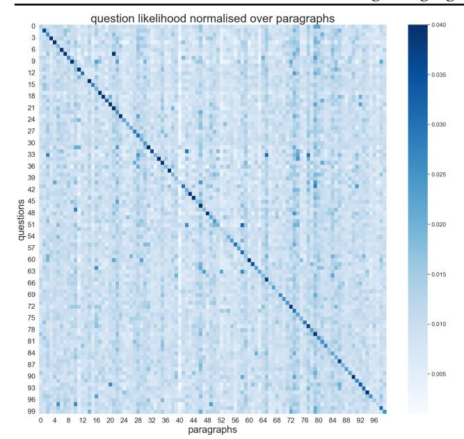
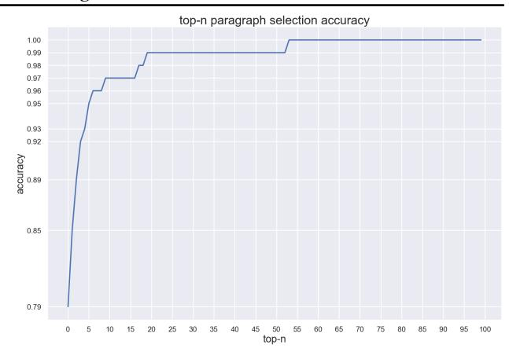

# Large Language Model Programs

#### Anonymous Authors<sup>1</sup>

# Abstract

In recent years, large pre-trained language models (LLMs) have demonstrated the ability to follow instructions and perform novel tasks from a few examples. The possibility to parameterise an LLM through such in-context examples widens their capability at a much lesser cost than finetuning. We extend this line of reasoning and present a method which further expands the capabilities of an LLM by embedding it within an algorithm or program. To demonstrate the benefits of this approach, we present an illustrative example of evidence-supported question-answering where we improve 6.4% over the chain of thought baseline through a more algorithmic approach without the need for finetuning. Furthermore, we highlight recent work from this perspective and discuss the advantages and disadvantages in comparison to the usual practice of finetuning.

## 1. Introduction

024

034

036

038

054

Scaling language models to hundreds of billions of parameters (LLMs) and training them on terabytes of text data has led to state-of-the-art performance on a large variety of natural language processing tasks. Additionally, it has also led to the emergent ability to learn a new skill merely from instructions or a few examples, as seen in GPT-3 [\(Brown](#page-8-0) [et al.,](#page-8-0) [2020\)](#page-8-0). Despite this, LLMs struggle to display algorithmic abilities, such as sorting or searching, even when finetuned on traces of such [\(Anil et al.,](#page-8-1) [2022;](#page-8-1) [Valmeekam](#page-11-0) [et al.,](#page-11-0) [2022;](#page-11-0) [Anonymous,](#page-8-2) [2023h](#page-8-2)[;d\)](#page-8-3).

Finetuning a model on human traces (i.e. imitation learning) is a common strategy to infuse a model with complex behaviours. For example, in the context of LLMs, recent work trains on expert demonstrations of interacting with a browser [\(Nakano et al.,](#page-10-0) [2021\)](#page-10-0) or a webshop [\(Yao et al.,](#page-12-0) [2022\)](#page-12-0) in order to improve their respective tasks. However,

Preliminary work. Under review by the International Conference on Machine Learning (ICML). Do not distribute.

there are reasons to question the faithfulness of the algorithms learned from such examples. First, the decoder-only Transformer language model [\(Vaswani et al.,](#page-11-1) [2017\)](#page-11-1) is not computationally universal because it can only condition on a finite length input. Second, previous work demonstrated that the decoder-only architecture struggles to learn even simple programs through gradient descent in a way that generalises out of distribution [\(Anil et al.,](#page-8-1) [2022;](#page-8-1) [Anonymous,](#page-8-3) [2023d\)](#page-8-3).

Besides finetuning, in-context learning may be leveraged to a certain extent to improve a model's ability to execute algorithms. E.g., recently [Anonymous](#page-8-4) [\(2023g\)](#page-8-4) introduce a prompt construction which improves the LLM's ability to perform arithmetic algorithms. A key characteristic of such approaches is the use of a single call to the model and the use of a single prompt. As a consequence, the authors are limited by the size of the input and the necessity of prompt engineering multiple steps within one prompt. They report that such a mix can lead to interferences between steps which hurts the final performance.

As an alternative, we propose to wrap LLMs within a program that maintains the context and, for each step of the program, only presents the step-specific prompt and necessary context information to the LLM. Hiding information which is irrelevant to the current step allows us to focus on isolated subproblems whose results are further combined in further calls to the LLM. This intuitive approach allows us to extend the ability of an LLM to more complex tasks which are currently too difficult either because of a lack of ability or an architectural constraint such as an insufficient large context. E.g., wrapping the LLM within a recurrent algorithm which allows the interaction with a memory component makes the system computationally universal [\(Schuurmans,](#page-11-2) [2023\)](#page-11-2).

Both approaches, wrapping and finetuning, incorporate domain-specific information and thus lead to a more biased model. Wrapping the model forces the LLM to follow a high-level procedure or program (whatever it may be) which may limit its flexibility and requires a high-level understanding of the correct procedure for a given task. On the other hand, finetuning requires the recognition, and possibly generation, of domain-specific training data which requires a similar level of understanding. We argue that there are situations where it may be more promising to wrap the LLM

<sup>1</sup>Anonymous Institution, Anonymous City, Anonymous Region, Anonymous Country. Correspondence to: Anonymous Author <anon.email@domain.com>.

in a program explicitly instead of training on traces of the desired program. In fact, due to the difficulty and cost of training LLMs we have already seen problem-specific LLM wrapping with no or very targeted training lead to better performance on reasoning [\(Kazemi et al.,](#page-9-0) [2022\)](#page-9-0), questionanswering [\(Anonymous,](#page-8-5) [2023c\)](#page-8-5), text-summarization [\(Wu](#page-11-3) [et al.,](#page-11-3) [2021a\)](#page-11-3), text-generation [\(Yang et al.,](#page-11-4) [2022b\)](#page-11-4), among other problems (see e.g. [Anonymous](#page-8-6) [\(2023f\)](#page-8-6); [Xu et al.](#page-11-5) [\(2021\)](#page-11-5); [Karpas et al.](#page-9-1) [\(2022\)](#page-9-1)). However, to the best of our knowledge, previous work did not describe this dichotomy in detail.

056

058

074

076

078

104

106

108 109 In this work, we highlight recent work from that perspective and go through an example of wrapping an LLM for the problem of evidence-supported question answering to demonstrate its advantages and disadvantages. This choice of problem is arbitrary as our method can be applied to various other settings (such as the examples listed in Section [4\)](#page-5-0). In this setting, to accurately answer a question, the model has to extract the important facts from the additional data and seamlessly incorporate them into the reasoning of its response. We present an LLM program which decomposes answering each question into two parts. The first part uses the question to filter the available paragraphs for relevancy, while the second part is a tree search that generates a reasoning chain by conditioning each reasoning step on a different paragraph. This program allows the system to construct a reasoning chain which *conditions individual reasoning steps on different contexts* which improves the model's reasoning ability and response accuracy without the need for finetuning.

The rest of this paper is organized as follows. In Section [2](#page-1-0) we introduce our method. In Section [3,](#page-2-0) we introduce our example problem. Section [3.1](#page-3-0) describes the filtering part and our isolated experiments, and Section [3.2](#page-3-1) introduces our tree search and presents our performance on question answering. In Section [4](#page-5-0) we present recent work from an LLM program perspective. Lastly, we discuss related work and the advantages of such programs over a black-box approach in Section [5.](#page-7-0)

# <span id="page-1-0"></span>2. Limitations of LLMs and the Benefit of Wrapping

LLMs are a product of three necessary ingredients: massive parallel compute, large amounts of data, and a highly parallelisable language modelling architecture. To this date, the architecture deployed by all LLMs of 175B parameters or more is the decoder-only Transformer [\(Vaswani et al.,](#page-11-1) [2017\)](#page-11-1). The ability to parallelise allows for efficient training of large models and the use of large amounts of data prevents it from overfitting. In fact, when training LLMs they rarely see any training data twice.

LLMs which were trained on internet-scale data are impressive text generators which can produce plausible paragraphs in the form of short stories, reviews, summaries, poems, etc. Such *raw* LLMs are trained on data which includes highquality texts such as those from Wikipedia or published books but also low-quality texts with toxic and biased content which then leads to LLMs that are to a certain degree toxic and biased themselves [\(Dev et al.,](#page-9-2) [2020;](#page-9-2) [Sheng et al.,](#page-11-6) [2021\)](#page-11-6).

Another drawback of training on random internet text is that such raw LLMs also struggle to be conversational, follow instructions, use tools, or interact with an environment. Although finetuning on examples of such behaviour has been shown to improve the model's ability [\(Ouyang et al.,](#page-10-1) [2022;](#page-10-1) [Wei et al.,](#page-11-7) [2022a;](#page-11-7) [Gupta et al.,](#page-9-3) [2022\)](#page-9-3), such an approach is difficult to scale due to the lack of such data and may not generalise systematically due to the implementation of algorithmic short-cuts instead of the optimal algorithm.

Another limitation of LLMs is the ubiquitous decoder-only Transformer architecture which has only a finite context and thus limits the capabilities of the model to anything that fits within that context. It also introduces biases that may be beneficial for translation or language modelling but has shown to struggle to learn certain classes of algorithms truthfully such that they generalize to examples which are out of distribution [\(Csordas et al.](#page-8-7) ´ , [2021\)](#page-8-7).

Such issues are likely going to be present also at a larger scale if an LLM is, either implicitly or explicitly, finetuned on traces of such algorithms. One example is presented by [Anil et al.](#page-8-1) [\(2022\)](#page-8-1) who finetune LLMs of up to 64B parameters on a variation of parity and report large drops in performance for just slightly longer (or shorter) sequences than it was trained on. It is worthwhile to mention that it has long been known that recurrent neural networks, such as the Long Short-Term Memory (LSTM), can generalise perfectly on parity and even on some counter-based contextsensitive languages [\(Hochreiter & Schmidhuber,](#page-9-4) [1997;](#page-9-4) [Gers](#page-9-5) [& Schmidhuber,](#page-9-5) [2001;](#page-9-5) [Anonymous,](#page-8-3) [2023d\)](#page-8-3).

To overcome such issues, we propose to deconstruct the expected behaviour of the model as much as needed but as little as necessary. Breaking down the expected result into individual steps allows us to call the LLM for each step separately. The results of one step then may influence the flow of the program or contribute to future prompts. We then develop a prompt and evaluate the LLM on each step separately and combine the steps into an entire system once they work as expected. The final result is a sequence of calls to the model with different prompts at each step. Since the model is only responsible for an individual step, we say that the LLM is *wrapped* within a program. Doing so can result in several advantages which can make the system as a whole more robust and generalise better:

1. Breaking down a complex problem into subproblems potentially simplifies one complex task into several simpler tasks.

110 111

114 115 116

124

126

128

130 131

134

136

153 154

156

158

- 2. Understanding the problem decomposition allows us to give more fine-grained input and output specifications for each subproblem or step of the program.
- 3. Given a specification, we can develop and test the model on that subproblem in isolation either through a test set or through manual inspection.
- 4. If tests demonstrate that the LLM is not capable of solving the subproblem to a sufficient degree, we can decide to either decompose it further into even simpler steps or improve a copy of the model by finetuning it on step-specific data or by designing a custom prompt.

Instead of finetuning, prompt engineering has shown to be a powerful approach to improving an LLM's performance [\(Reynolds & McDonell,](#page-10-2) [2021\)](#page-10-2). Wrapping our LLM within a program essentially breaks down the problem and increases the number of queries to the model. Each query may contain a step-specific prompt that improves the model's performance for that particular step. Prompt engineering in a setting with a single query to the LLM may find it much more challenging to provide an effective prompt because examples or descriptions for different steps may interfere with each other and the prompt overall will take up more space within its already limited context.

# <span id="page-2-0"></span>3. An Example Problem

Imagine using an LLM as an interface for a company's website. The LLM was not trained on that website, which means that it would not be able to answer questions about the company's newest products, such as its features, specifications, or availability, or about the opening hours of a new store. In this example of reading comprehension, an LLM would perform poorly because it has not been trained on the company's website nor can it fit the entire website into its context. Finetuning an LLM on the company's website may not be practical, as training these models is costly and websites often undergo changes (e.g. a product may unexpectedly become unavailable) which would require the model to be constantly retrained. Additionally, it is unclear to which extent the finetuned model would be faithful to the facts of the finetuning data.

A more practical approach is to use a frozen LLM that has exclusive access to the latest version of the website. However, it is not feasible for an LLM to attend to the entire content of a website due to the fixed-size context of the decoder-only Transformer architecture, which for current LLMs spans about 1500 words. An alternative would be to use a language model with document retrieval capabilities [\(Lewis et al.,](#page-10-3) [2020;](#page-10-3) [Borgeaud et al.,](#page-8-8) [2022\)](#page-8-8) or a novel architecture with a longer context [\(Hutchins et al.,](#page-9-6) [2022;](#page-9-6) [Schlag et al.,](#page-10-4) [2021\)](#page-10-4), but such models have not yet been scaled to the same extent although some have achieved competitive performance. That said, recent work still suggests that document-retrieval models still lack the ability to reason over retrieved documents [\(Behnamghader et al.,](#page-8-9) [2022\)](#page-8-9).

In order to expand the reasoning capability of our LLM through the use of external evidence we need a questionanswering dataset with sufficient reasoning complexity and with sufficient evidence in support of all reasoning steps For this purpose, we take advantage of a subset of the StrategyQA dataset since about half of its questions are fully supported by evidence paragraphs [\(Geva et al.,](#page-9-7) [2021\)](#page-9-7). We ignore the other half of the questions since they contain partially supported reasoning traces which would require the LLM to have learned the necessary facts from its pretraining data. Something we do not assume to be the case.

The reasoning traces in StrategyQA are significantly more complex than previous datasets due to the use of different strategies i.e. different forms of question decompositions which often require knowledge from different domains. The StrategyQA dataset is a binary classification benchmark for implicit multi-step question-answering. Despite sourcing the evidence of reasoning steps from Wikipedia, which is almost always included in the pre-training of LLMs, previous work on LLMs reported relatively low accuracies for the entire StrategyQA dataset. This might be because the facts used for individual reasoning steps are very rare and unlikely to be remembered or because the reasoning is too difficult to do for the LLM. While improved reasoning methods (such as chain of thought [\(Wei et al.,](#page-11-8) [2022b;](#page-11-8) [Nye et al.,](#page-10-5) [2022;](#page-10-5) [Kojima et al.,](#page-9-8) [2022;](#page-9-8) [Anonymous,](#page-8-10) [2023e\)](#page-8-10)) have shown little performance gain on this dataset with models of 175B parameters [\(Srivastava et al.,](#page-11-9) [2022;](#page-11-9) [Taylor et al.,](#page-11-10) [2022\)](#page-11-10), larger models and models which have been trained longer do seem to improve [\(Chowdhery et al.,](#page-8-11) [2022;](#page-8-11) [Hoffmann et al.,](#page-9-9) [2022\)](#page-9-9). This may indicate that on this dataset the lack of knowledge is more problematic than the ability to reason.

The StrategyQA dataset consists of 2780 questions annotated with their decomposition and per-step evidence paragraphs sourced from Wikipedia. The questions cover a wide range of reasoning strategies and knowledge domains. Consider e.g. the question *Can sunlight travel to the deepest part of the Black Sea?*. In order to answer this question the LLM needs to know that the deepest part of the Black Sea is about 2k meters whereas sunlight only penetrates water up to about 1k meters. Thus, the answer is no. About 918 questions come with evidence paragraphs supporting all reasoning steps. Naturally, we will focus on this subset to highlight the benefit of evidence-supported reasoning. In order to follow our motivation we construct a setting where

174

176

204

206

218 219 each question is supported by a set of paragraphs of which only a small minority are actually relevant to the question.

In our experiments, we use OPT-175B [\(Zhang et al.,](#page-12-1) [2022\)](#page-12-1), a raw language model of 175B parameters trained on 300B tokens from a large mix of news articles, books, Reddit, and the Pile [\(Gao et al.,](#page-9-10) [2020\)](#page-9-10). Because it has not been finetuned on high-quality instructional or conversational data, we classify it as a raw language model. As reported by the [Zhang et al.](#page-12-1) [\(2022\)](#page-12-1), we find OPT-175B struggles to follow instructions. Nevertheless, we demonstrate that we can achieve more complex behaviour by wrapping OPT with a program.

For the problem of evidence-supported question-answering, we decompose the problem into a filtering part and a tree search part. Given the question, the filtering part will loop over the provided paragraphs and select the most relevant ones. In the second part, we will search over reasoning chains by generating one reasoning step at a time. When generating a reasoning step we can choose which one of the filtered paragraphs we want to condition on. Similar to a tree search, we rank the reasoning chains according to our ranking metric and expand the highest-ranked one by generating n possible continuations given n evidence paragraphs. This process repeats until it produced an answer or until it reached the maximum number of steps at which point it will force the LLM to answer the question by evaluating the negative log-likelihood (NLL) of a fixed yes or no answer.

In the following two subsections, we go into more detail about each part of our LLM program.

### <span id="page-3-0"></span>3.1. Evidence Filtering Experiments

In this section, we describe our approaches to the paragraph filtering part of our program and their performance. Developing and evaluating each call to the LLM in isolation allows us to experiment, improve, and analyse the overall performance in a systematic way.

Blackbox prompting. Our first filtering approach did not achieve satisfactory performance but serves as an example of the limitations of LLMs. The initial approach centres around few-shot prompting where OPT is queried to output either yes or no when presented with a question and a paragraph. To test this, we create a binary classification dataset of 300 samples from the StrategyQA data. Each sample consists of a question and a paragraph. The objective is to classify if the paragraph is relevant to the question. We design the dataset such that half of the questions are paired with paragraphs sampled from the list of evidence paragraphs and the other half with a paragraph from an unrelated question. The random baseline is thus 50%. We present our initial results in Table [1.](#page-3-2)

For humans this classification task is simple: in virtually all

cases it is inconceivable how the randomly sampled paragraph could be relevant to the question. The real evidence paragraph and the question seem to often have a lexical overlap to the extent that a lexicographic analysis may work well. However, to our surprise, the tested LLMs and instructionfinetuned models fail to achieve satisfactory performance on this task.

Thanks to this brief and isolated experiment, we managed to identify an inability of OPT early in our process. We now may choose to finetune OPT on this particular step. This can be a reasonable approach but we do not have the data and resources available. After failing to improve performance further using prompt engineering, the alternative is to accept this limitation and try a different approach.

<span id="page-3-2"></span>Table 1. Top-1 binary classification accuracies for a single paragraph using prompt engineering techniques. Random guessing is at 50%. Note that using this method to classify from a large set of paragraphs will significantly reduce the accuracy.

| METHOD                               | ACCURACY |
|--------------------------------------|----------|
| OPT-175B FEW-SHOT PROMPT             | 53.33%   |
| TEXT-DAVINCI-002 (INSTRUCTGPT)       | 55.67%   |
| OPT-175B FEW-SHOT + CHAIN OF THOUGHT | 56.00%   |
| TK-INSTRUCT 11B                      | 61.60%   |

Likelihood evaluation. Our second approach does not treat the LLM as a black box anymore but instead directly uses the average negative log-likelihood (NLL) of the question when following each paragraph to create a ranking of all paragraphs. To evaluate this subproblem in isolation, we constructed a new dataset. Each question now consists of 100 paragraphs where one is sampled from the list of evidence paragraphs of that question and the other 99 are sampled from other questions. In this setting, random guessing only achieves 1% accuracy 100 paragraphs clearly exceed the context length of OPT. We present the pseudo-code in Algorithm [1.](#page-13-0)

We achieve good results without a description or few-shot examples. We plot accuracy over top-n in Figure [2.](#page-4-0) Top-1 accuracy is 0.79 and top-5 is already at 0.93 which shows that the ranking approach is vastly more effective than the blackbox prompting approach despite the simplicity of the task and the instruction-finetunining of other models. It also serves as another example of the advantage of wrapping an LLM within a program because the LLM does not have access to the NLL of its own outputs and, thus, this superior solution would have not been possible otherwise.

#### <span id="page-3-1"></span>3.2. Tree Search Experiment

In the previous section, we presented the filtering part of our program: measuring the relevancy of each paragraph, ordering them, and selecting the top n. It trivially generalises



Figure 1. Average likelihood of each question (row) given a paragraph (column) normalised over paragraphs.

in a systematic way to more paragraphs since the processing of the list of paragraphs is done by a Python for-loop and doesn't solely rely on an LLM's ability to implement it reliably. This is especially powerful if we know what the optimal algorithm or behaviour should be and if we want to have control over it.

In this section, we present a more systematic search over reasoning steps to ensure generalisation where we consider it most crucial. As in the filtering part, we develop and test the tree search in isolation using a dedicated dataset.

Raw LLMs do not have access to an external system when deducing answers to difficult questions. This means that the model can only rely on the noisy and inevitably incomplete and outdated knowledge that has been stored in its weights. The questions in the StrategyQA dataset seem to often require knowledge that is not present in LLMs. For this reason, we introduce an evidence-supported chain of thought where the reasoning chain is generated over multiple steps and each step has a different support paragraph within its context. This allows the model to use information from the paragraph to generate reasoning steps it would otherwise be unable to produce. For StrategyQA most questions rely on reasoning steps which draw from different knowledge domains. In order to find the most valuable paragraph for each reasoning step, we perform a tree search where the root node is the question and each level of the tree spans over the set of possible evidence paragraphs used as context to generate the next step. Every path through the tree is a (possibly incomplete) reasoning chain. Searching over all possible reasoning chains is infeasible which is why we rank all reasoning chains and continually expand the highest-ranked



<span id="page-4-0"></span>Figure 2. Top-n accuracy of selecting the true evidence paragraph from our likelihood ranking of 100 paragraphs. The random guessing baseline for top-1 is 1%. The ranking approach significantly outperforms the in-context approach from Table [1.](#page-3-2)

chain. We present pseudo-code in Algorithm [2.](#page-13-1)

We explore two ranking strategies. The first is the average NLL of the chain so far (where the average NLL of each step S is computed when conditioning on its respective paragraph). With this approach, the model will expand the reasoning chain which has been the most likely so far. This approach works reasonably well but can lead to issues. We find that if an LLM directly copies entire phrases from the evidence paragraph P, they will be given a very low NLL under that model. This can lead to repetitions or ongoing deductive steps which quickly end up in arguing about the universe or atoms in a way that is irrelevant to the question Q. Our second strategy is an approach which tries to mitigate such issues by ranking the generated reasoning steps by their average NLL *difference*: with and without the paragraph (∆<sup>P</sup> ), and with and without the question (∆<sup>Q</sup> ). Those length-normalised differences, ∆<sup>P</sup> and ∆<sup>Q</sup> , allow us to select reasoning chains which leverage the provided context (which reduces hallucinations) but remain on-topic (which reduces divergent reasoning).

$$\operatorname{nll}(x) = -\log(x)/\operatorname{len}(x) \tag{1}$$

$$\Delta_{\mathbf{P}} = \operatorname{nll}(p(S|Q, P)) - \operatorname{nll}(p(S|Q)) \tag{2}$$

$$\Delta_{\mathbf{Q}} = \operatorname{nll}(p(S|Q, P)) - \operatorname{nll}(p(S|P)) \tag{3}$$

Generated reasoning steps with a negative ∆<sup>P</sup> rely more strongly on the paragraph and are thus more likely to incorporate information from it. Generated reasoning steps with a negative ∆<sup>Q</sup> rely more strongly on the question which leads to less divergence and favours steps which remain on topic. We find that steps conditioned on paragraphs where ∆<sup>P</sup> + ∆<sup>Q</sup> is the smallest leads to better reasoning chains and improves accuracy.

To evaluate the tree search in isolation, we assume that the evidence paragraphs contain information about all reasoning

276

> 288 289 290

299 300

> 310 311

326

328

<span id="page-5-1"></span>Table 2. Binary classification accuracy on the StrategyQA subset with fully supported evidence. CoT stands for chain of thought.

| METHOD                                              | ACCURACY |
|-----------------------------------------------------|----------|
| OPT-175B, FEW-SHOT, NO-COT                          | 50.33%   |
| OPT-175B, FEW-SHOT, WITH-COT                        | 60.11%   |
| OPT-175B, FEW-SHOT, WITH-TREE-SEARCH, NLL RANKING   | 65.98%   |
| OPT-175B, FEW-SHOT, WITH-TREE-SEARCH, DELTA RANKING | 66.41%   |
| OPT-175B, FEW-SHOT, WITH-GOLDEN-FACTS               | 81.27%   |
| OPT-175B, FEW-SHOT, WITH-GOLDEN-FACTS, WITH-COT     | 81.12%   |

steps necessary to answer the question. This is not the case for all StrategyQA questions which is why we limit ourselves to the 918 StrategyQA questions which are fully supported.

Note that this technique is a variation of beam search [\(Medress et al.,](#page-10-6) [1977\)](#page-10-6), i.e. a heuristic search algorithm which explores a graph by expanding the highest-ranking node in a limited set. It is quite different from the usual use of beam search for generating text with language models where in order to generate the next token we select the k tokens with the highest probability given the same context. Instead, we always generate the most likely tokens but search over the limited set of k paragraphs to be used as context.

Our experimental results in Table [2](#page-5-1) demonstrate that the model's reasoning ability has improved over OPT chain of thought baseline. To better highlight the advantage of our tree search we include a baseline where we add the golden facts to the context of OPT using a custom prompt. Golden facts are statements provided by the authors of StrategyQA which should contain the factual knowledge necessary to deduce the correct answer. With the golden facts in its context, OPT achieves about 81.2%. This can be seen as a performance upper bound for the OPT model since it represents the setting where the model has all the necessary facts clearly within its context. Previous work reported the Human average and best to be 62.9% and 90% respectively [\(Chowdhery et al.,](#page-8-11) [2022\)](#page-8-11).

## <span id="page-5-0"></span>4. Further Examples

Training an LLM is a costly and complex engineering challenge. For this reason, training and research on such models is mostly done in well-funded industrial labs. However, in recent years, GPT-3 [\(Brown et al.,](#page-8-0) [2020\)](#page-8-0) has become easily accessible to the public through its API [\(Brockman et al.,](#page-8-12) [2018\)](#page-8-12) and the weights of LLMs from the OPT [\(Zhang et al.,](#page-12-1) [2022\)](#page-12-1) and BLOOM [\(Scao et al.,](#page-10-7) [2022\)](#page-10-7) family have been made publicly available, sparking a flurry of LLM research. This recent research has mainly focused on decomposing complex tasks in a way that does not require extensive training. Such work often has the characteristic that it describes stages or an algorithm and parameterises different steps with

different prompts or with minimal step-specific finetuning. In this section, we will highlight such recent works which will serve as additional examples of this methodology.

The first raw LLMs excelled at natural language processing tasks [\(Brown et al.,](#page-8-0) [2020\)](#page-8-0), which led to the development of much more general and difficult question-answering datasets (see e.g. [BIG-bench collaboration](#page-8-13) [\(2021\)](#page-8-13)). From those, we have learned that LLMs tend to struggle to answer questions which require a sophisticated level of reasoning, i.e. to derive an answer in a deductive way through the repeated application of an open set of rules or facts. Various works have decomposed the reasoning procedure into modules to be more faithful and accurate.

[Creswell & Shanahan](#page-8-14) [\(2022\)](#page-8-14) decompose the inference of an answer into a recurrent algorithm which consists of a selection and inference step, as well as a halting criterion. Each step then consists of a finetuned LLM which only has access to the information necessary in order to prevent the model from learning shortcuts, such as directly predicting the answer from the question instead of performing a deductive step. The final system's capability of finding proofs is increased by over 20% in comparison with baselines.

[Yang et al.](#page-12-2) [\(2022c\)](#page-12-2) present a modular approach to extract rules from natural language facts. To achieve this they use an LLM to generate many candidate rules based on input facts and the desired rule template. In four further steps, the same LLM with a different prompt is used to filter out rules which do not meet the necessary requirements for induction (e.g. triviality). The authors present experimental results for the entire system as well as each module in isolation which indicate the benefits of their 5-step program.

In a similar vein, various works propose the use of *verifiers* to improve the quality of the generated samples through some form of repeated verification [\(Cobbe et al.,](#page-8-15) [2021\)](#page-8-15). For example, [Anonymous](#page-8-16) [\(2023b\)](#page-8-16) leverages diverse prompts and verifies each individual step in a recurrent fashion, resulting in significant gains in accuracy without any finetuning (although each model may be further finetuned in a cooperative manner; see the work of [Zhu et al.](#page-12-3) [\(2022\)](#page-12-3) for an example of such).

[Kim et al.](#page-9-11) [\(2021\)](#page-9-11) present a 3-step program to identify un-

verifiable presuppositions in the question-answering setting. E.g., the question *Which linguist invented the lightbulb?* contains the false presupposition that a linguist has invented the lightbulb. The authors report that false presuppositions can make up a substantial share of the unanswerable questions in the popular Natural Questions [\(Kwiatkowski et al.,](#page-9-12) [2019\)](#page-9-12) dataset. Given a question, their program first generates presuppositions, verifies them, and finally, generates an explanation. The authors test different strategies where they use neural and rule-based models for different steps, testing each in isolation.

330 331

334

336

338

354

356

374

376

Current approaches to reasoning with language models are forward chaining, i.e. they start of with certain facts and search in the space of rules until they find a goal statement. This also includes our own method presented in Section [3.2,](#page-3-1) but [Kazemi et al.](#page-9-0) [\(2022\)](#page-9-0) argue that backwards chaining, i.e. decomposing the goal statement until the subgoals can be proven from the facts, is heavily favoured in the classic automated proof-finding literature. For this reason, they implement a backwards-chaining using four modules: fact check, rule selection, goal decomposition, and sign agreement. Each of the modules is implemented using a pre-trained LLM with a custom prompt and the modules are wrapped up in the *LAMBADA* program. Thanks to the ability of the LLM, the modules remain relatively high-level which results in a relatively simple program with two nested forloops. The LAMBADA approach significantly outperforms other methods such as chain of thought [\(Wei et al.,](#page-11-8) [2022b\)](#page-11-8) and selection-inference [\(Creswell & Shanahan,](#page-8-14) [2022\)](#page-8-14).

Another related line of works first decomposes the original question into simpler subquestions which should be easier to answer. With the answers to the subquestions, a final module answers the original question. [Patel et al.](#page-10-8) [\(2022\)](#page-10-8) use questions decomposed by humans which significantly improves performance. [Anonymous](#page-8-5) [\(2023c\)](#page-8-5) use an LLM to automatically decompose questions. Their empirical results indicate that they significantly outperform chain of thought prompting. However, different from previous approaches, the authors perform a question decomposition within a single call to an LLM instead of implementing a recurrent algorithm. As a result, their approaches may be more prone to mistakes on more complex examples which are out of distribution since the output specification of such a compact step includes many more possibilities than in a more broken down program like LAMBADA. For further decomposition examples see e.g. [Perez et al.](#page-10-9) [\(2020\)](#page-10-9); [Yang et al.](#page-11-11) [\(2022a\)](#page-11-11).

LLMs, which are not wrapped, are isolated systems that can only access the information that has been embedded in their weights. As we argued in Section [2,](#page-1-0) such systems may lack the necessary information to perform certain tasks. Leveraging an additional, possibly non-neural, system could be a viable alternative to an increase in model scale. E.g., [Anony-](#page-8-17) [mous](#page-8-17) [\(2023a\)](#page-8-17) generate a google search query whose result will be added as context to the question-answering prompt. The improvements in factuality and accuracy indicate the benefits of "inference-type" interventions, i.e. wrapping the model within a simple program which during inference allows the system to leverage results from a classic document retrieval system without the need for a dedicated retrieval-augmented model.

Interestingly, an LLM is not always able to use the knowledge that it has stored in its weights. This is shown by [Liu](#page-10-10) [et al.](#page-10-10) [\(2022b\)](#page-10-10) who demonstrate a simple 2-step program which first generates a question-specific set of facts before answering the question can result in better performance (for similar methods see [Paranjape et al.](#page-10-11) [\(2021\)](#page-10-11); [Li et al.](#page-10-12) [\(2022\)](#page-10-12)). [Liu et al.](#page-10-13) [\(2022a\)](#page-10-13) further improve such knowledge extraction using reinforcement learning based on increased question-answering performance.

Apart from question-answering, we also see the emergents of LLM programs for generative tasks. [Yang et al.](#page-11-4) [\(2022b\)](#page-11-4) recursively prompt an LLM with the story plan and the current story state to generate coherent stories of up to 2500 words. Similarly, [Wu et al.](#page-11-12) [\(2021b\)](#page-11-12) summarise entire books by recursively summarising previous summaries of fixedsize chunks. Both are great examples of recursive programs which overcome the finite-context limitation of the decoderonly Transformer.

In another line of work, LLMs are wrapped in an ongoing model-environment loop to plan and suggest actions to a robot given high-level goals [\(Ahn et al.,](#page-8-18) [2022;](#page-8-18) [Huang et al.,](#page-9-13) [2022\)](#page-9-13). However, current approaches require the LLM to maintain the context over time instead of maintaining it using the wrapping program. As a result, the input and output specification of the model is likely to exceed the current capabilities of LLMs for certain extreme examples.

A rapidly growing body of work further generalises the notion of the environment which the LLM interacts with. These approaches combine the strength of an LLM with the strength of another connectionist or classic system. Examples of such include the LLMs which repeatedly generate short executable programs as intermediate reasoning steps [\(Gao et al.,](#page-9-14) [2022\)](#page-9-14), which generate chess commentaries with the help of symbolic reasoning engines [\(Lee et al.,](#page-9-15) [2022\)](#page-9-15), or which use a variety of other tools such as a calculator [\(Karpas et al.,](#page-9-1) [2022\)](#page-9-1).

In the future, we will likely see more elaborate algorithms being developed which wrap several neural and symbolic modules to solve increasingly complex tasks. This calls for further innovation on the development site which could benefit from tools such as PromptChainer [\(Wu et al.,](#page-11-13) [2022\)](#page-11-13).

Another interesting line of research is going to centre around task-*independent* LLM programs which, so far, have received much less attention. [Shuster et al.](#page-11-14) [\(2022a\)](#page-11-14) present a system which augments a conversational agent with a knowledge retrieval step before responding to the user. Similarly, [Shuster et al.](#page-11-15) [\(2022b\)](#page-11-15) present BlenderBot 3, a conversational bot based on an LLM but which is augmented with a classic long-term storage such that it can remember information about the user across several sessions (which e.g. ChatGPT [\(Schulman et al.,](#page-10-14) [2022\)](#page-10-14) cannot). Another approach is presented by [Dalvi et al.](#page-9-16) [\(2022\)](#page-9-16), who use a simple program in form of a dialogue tree to learn facts from the user. Facts are stored in a dynamic memory which the LLM also updates. Crucially, the program includes an interaction loop with the user which allows the user to correct the model which then updates its dynamic memory with new or corrected facts. Hence, this LLM program may be considered an example of an LLM program which implements a crude learning algorithm. This opens up an exciting direction for future research which can benefit from symbolic learning algorithms such as e.g. the Optimal Ordered Problem Solver or the Godel Machine ( ¨ [Schmidhuber,](#page-10-15) [2004;](#page-10-15) [2007\)](#page-10-16).

# <span id="page-7-0"></span>5. Discussion and Related Work

393 394

The presented method of wrapping pre-trained models stands in opposition to the common deep-learning philosophy of training a single omniferous black-box model which only has to be scaled in terms of parameter count and training data. Although central to the current success of LLMs, such an approach comes with several drawbacks:

- The computation of deep connectionist models, such as a large pre-trained Transformer language model, is notoriously difficult to interpret (although there is ongoing research, see e.g. [Elhage et al.](#page-9-17) [\(2021\)](#page-9-17)). Breaking a problem down into multiple steps can not just improve performance but also increase the interpretability of its inference.
- LLMs are trained on large amounts of text which can contain toxic, biased, or otherwise undesired content. As a result, an LLM may also output undesired text. The language model itself does not provide any safety mechanisms to prevent such outputs. Wrapping an LLM within a program is a simple and effective way to include a safety mechanism which e.g. filters out unwanted LLM responses.
- Tuning an LLM on expert trajectories of complex behaviour requires large amounts of high-quality and behaviour-specific data which is difficult and expensive to acquire. Breaking the problem into subproblems may allow the identification of specific lower-level capabilities that are missing. Focusing the data collection on such *blindspots* is potentially a faster and more efficient approach and lower-level capabilities may be useful for a wide range of problems.

- It is difficult to give any guarantees for neural models due to the lack of interpretability. Furthermore, it is well-known that neural networks struggle to generalise out of distribution. However, wrapping one or several connectionist modules with a program allows us to give some trivial generalisation guarantees that do not hold otherwise. E.g., the filtering and search aspect of our program, as presented in Section [2,](#page-1-0) generalises trivially to a larger number of paragraphs.
- So far, all LLMs of 100B parameters or more are variations of the Transformer architecture. They thus inherit its limitations, such as a finite context of a few thousand tokens. Wrapping an LLM within a task-independent program that is responsible to select and load relevant documents into context or which summarises past text may serve as a way of overcoming such limitations.

We believe that wrapping LLMs as presented in this work can mitigate many drawbacks in settings where the expected processing of a query is well understood.

Recently, [Dohan et al.](#page-9-18) [\(2022\)](#page-9-18) have presented a similar perspective which describes compositions of pre-trained models as probabilistic programs. In so-called *language model cascades*, LLMs are random variables of type string within a probabilistic program. With such a perspective the authors present a unifying view of existing algorithms such as chain of thought [\(Wei et al.,](#page-11-8) [2022b\)](#page-11-8), scratchpads [\(Nye](#page-10-5) [et al.,](#page-10-5) [2022\)](#page-10-5), or STaR [\(Zelikman et al.,](#page-12-4) [2022\)](#page-12-4), which nicely complements our more algorithmic perspective.

Similarly, [Creswell & Shanahan](#page-8-14) [\(2022\)](#page-8-14) briefly describe their approach as *algorithmic prompting* where the response of a language model given the first prompt is integrated into future prompts. The authors argue that such prompt manipulations and constructions can be composed into entire algorithms to achieve more sophisticated behaviour. In follow-up work, [Shanahan](#page-11-16) [\(2022\)](#page-11-16) argues that such an approach is necessary to build a trustworthy reasoning system.

Our approach is inspired by the "learning to think" report [\(Schmidhuber,](#page-10-17) [2015\)](#page-10-17) (Sec. 5.3) where a controller network C learns to send sequences of activations into another network M after which C reads M's activations in order to exploit its knowledge. Our wrapper, however, does not learn.

## 6. Conclusion

We have presented LLM programs, the emerging methodology of wrapping pre-trained connectionist models, such as large language models, with a classic program to carry out more complex tasks. We describe an example of this method in the setting of evidence-supported question-answering and demonstrate an improvement in performance without any finetuning. We also list the advantages and disadvantages and highlight recent works from this perspective.

## References

- <span id="page-8-18"></span>Ahn, M., Brohan, A., Brown, N., Chebotar, Y., Cortes, O., David, B., Finn, C., Gopalakrishnan, K., Hausman, K., Herzog, A., et al. Do as i can, not as i say: Grounding language in robotic affordances. In *6th Annual Conference on Robot Learning*, 2022. URL [https:](https://openreview.net/forum?id=bdHkMjBJG_w) [//openreview.net/forum?id=bdHkMjBJG\\_w](https://openreview.net/forum?id=bdHkMjBJG_w).
- <span id="page-8-1"></span>Anil, C., Wu, Y., Andreassen, A. J., Lewkowycz, A., Misra, V., Ramasesh, V. V., Slone, A., Gur-Ari, G., Dyer, E., and Neyshabur, B. Exploring length generalization in large language models. In Oh, A. H., Agarwal, A., Belgrave, D., and Cho, K. (eds.), *Advances in Neural Information Processing Systems*, 2022. URL [https:](https://openreview.net/forum?id=zSkYVeX7bC4) [//openreview.net/forum?id=zSkYVeX7bC4](https://openreview.net/forum?id=zSkYVeX7bC4).
- <span id="page-8-17"></span>Anonymous. Internet-augmented language models through few-shot prompting for open-domain question answering. In *Submitted to The Eleventh International Conference on Learning Representations*, 2023a. URL [https://](https://openreview.net/forum?id=hFCUPkSSRE) [openreview.net/forum?id=hFCUPkSSRE](https://openreview.net/forum?id=hFCUPkSSRE). under review.
- <span id="page-8-16"></span>Anonymous. Language models can (kind of) reason: A systematic formal analysis of chain-ofthought. In *Submitted to The Eleventh International Conference on Learning Representations*, 2023b. URL [https://openreview.net/forum?](https://openreview.net/forum?id=qFVVBzXxR2V) [id=qFVVBzXxR2V](https://openreview.net/forum?id=qFVVBzXxR2V). under review.
- <span id="page-8-5"></span>Anonymous. Least-to-most prompting enables complex reasoning in large language models. In *Submitted to The Eleventh International Conference on Learning Representations*, 2023c. URL [https://openreview.net/](https://openreview.net/forum?id=WZH7099tgfM) [forum?id=WZH7099tgfM](https://openreview.net/forum?id=WZH7099tgfM). under review.
- <span id="page-8-3"></span>Anonymous. Neural networks and the chomsky hierarchy. In *Submitted to The Eleventh International Conference on Learning Representations*, 2023d. URL [https://openreview.net/forum?](https://openreview.net/forum?id=WbxHAzkeQcn) [id=WbxHAzkeQcn](https://openreview.net/forum?id=WbxHAzkeQcn). under review.
- <span id="page-8-10"></span>Anonymous. Self-consistency improves chain of thought reasoning in language models. In *Submitted to The Eleventh International Conference on Learning Representations*, 2023e. URL [https://openreview.net/](https://openreview.net/forum?id=1PL1NIMMrw) [forum?id=1PL1NIMMrw](https://openreview.net/forum?id=1PL1NIMMrw). under review.
- <span id="page-8-6"></span>Anonymous. Socratic models: Composing zero-shot multimodal reasoning with language. In *Submitted to The Eleventh International Conference on Learning Representations*, 2023f. URL [https://openreview.net/](https://openreview.net/forum?id=G2Q2Mh3avow) [forum?id=G2Q2Mh3avow](https://openreview.net/forum?id=G2Q2Mh3avow). under review.
- <span id="page-8-4"></span>Anonymous. Teaching algorithmic reasoning via incontext learning. In *Submitted to The Eleventh International Conference on Learning Representations*,

- 2023g. URL [https://openreview.net/forum?](https://openreview.net/forum?id=6dlC7E1H_9) [id=6dlC7E1H\\_9](https://openreview.net/forum?id=6dlC7E1H_9). under review.
- <span id="page-8-2"></span>Anonymous. Transformers learn shortcuts to automata. In *Submitted to The Eleventh International Conference on Learning Representations*, 2023h. URL [https://openreview.net/forum?](https://openreview.net/forum?id=De4FYqjFueZ) [id=De4FYqjFueZ](https://openreview.net/forum?id=De4FYqjFueZ). under review.
- <span id="page-8-9"></span>Behnamghader, P., Miret, S., and Reddy, S. Can retrieveraugmented language models reason? the blame game between the retriever and the language model. *arXiv preprint arXiv:2212.09146*, 2022.
- <span id="page-8-13"></span>BIG-bench collaboration. Beyond the imitation game: Measuring and extrapolating the capabilities of language models. *In preparation*, 2021. URL [https://github.](https://github.com/google/BIG-bench/) [com/google/BIG-bench/](https://github.com/google/BIG-bench/).
- <span id="page-8-8"></span>Borgeaud, S., Mensch, A., Hoffmann, J., Cai, T., Rutherford, E., Millican, K., Van Den Driessche, G. B., Lespiau, J.-B., Damoc, B., Clark, A., et al. Improving language models by retrieving from trillions of tokens. In *International conference on machine learning*, pp. 2206–2240. PMLR, 2022.
- <span id="page-8-12"></span>Brockman, G., Murati, M., and Welinder, P., Sept 2018. URL [https://openai.com/blog/](https://openai.com/blog/openai-api/) [openai-api/](https://openai.com/blog/openai-api/).
- <span id="page-8-0"></span>Brown, T. B. et al. Language models are few-shot learners. In *Proc. Advances in Neural Information Processing Systems (NeurIPS)*, Virtual only, December 2020.
- <span id="page-8-11"></span>Chowdhery, A., Narang, S., Devlin, J., Bosma, M., Mishra, G., Roberts, A., Barham, P., Chung, H. W., Sutton, C., Gehrmann, S., et al. Palm: Scaling language modeling with pathways. *arXiv preprint arXiv:2204.02311*, 2022.
- <span id="page-8-15"></span>Cobbe, K., Kosaraju, V., Bavarian, M., Chen, M., Jun, H., Kaiser, L., Plappert, M., Tworek, J., Hilton, J., Nakano, R., et al. Training verifiers to solve math word problems. *arXiv preprint arXiv:2110.14168*, 2021.
- <span id="page-8-14"></span>Creswell, A. and Shanahan, M. Faithful reasoning using large language models. *arXiv preprint arXiv:2208.14271*, 2022.
- <span id="page-8-7"></span>Csordas, R., Irie, K., and Schmidhuber, J. The devil is in ´ the detail: Simple tricks improve systematic generalization of transformers. In *Proceedings of the 2021 Conference on Empirical Methods in Natural Language Processing*, pp. 619–634, Online and Punta Cana, Dominican Republic, November 2021. Association for Computational Linguistics. doi: 10.18653/v1/2021.emnlp-main. 49. URL [https://aclanthology.org/2021.](https://aclanthology.org/2021.emnlp-main.49) [emnlp-main.49](https://aclanthology.org/2021.emnlp-main.49).

<span id="page-9-16"></span>495 496 497 Dalvi, B., Tafjord, O., and Clark, P. Towards teachable reasoning systems. *arXiv preprint arXiv:2204.13074*, 2022.

<span id="page-9-2"></span>498 499 500

504

506

514 515 516

<span id="page-9-14"></span>524 525 526

528

<span id="page-9-7"></span>530 531

534

<span id="page-9-3"></span>536

538

- Dev, S., Li, T., Phillips, J. M., and Srikumar, V. On measuring and mitigating biased inferences of word embeddings. In *Proceedings of the AAAI Conference on Artificial Intelligence*, volume 34, pp. 7659–7666, 2020.
- <span id="page-9-18"></span>Dohan, D., Xu, W., Lewkowycz, A., Austin, J., Bieber, D., Lopes, R. G., Wu, Y., Michalewski, H., Saurous, R. A., Sohl-Dickstein, J., et al. Language model cascades. *arXiv preprint arXiv:2207.10342*, 2022.
- <span id="page-9-17"></span>Elhage, N., Nanda, N., Olsson, C., Henighan, T., Joseph, N., Mann, B., Askell, A., Bai, Y., Chen, A., Conerly, T., DasSarma, N., Drain, D., Ganguli, D., Hatfield-Dodds, Z., Hernandez, D., Jones, A., Kernion, J., Lovitt, L., Ndousse, K., Amodei, D., Brown, T., Clark, J., Kaplan, J., McCandlish, S., and Olah, C. A mathematical framework for transformer circuits. *Transformer Circuits Thread*, 2021. https://transformercircuits.pub/2021/framework/index.html.
- <span id="page-9-10"></span>Gao, L., Biderman, S., Black, S., Golding, L., Hoppe, T., Foster, C., Phang, J., He, H., Thite, A., Nabeshima, N., et al. The pile: An 800gb dataset of diverse text for language modeling. *arXiv preprint arXiv:2101.00027*, 2020.
- Gao, L., Madaan, A., Zhou, S., Alon, U., Liu, P., Yang, Y., Callan, J., and Neubig, G. Pal: Program-aided language models. *arXiv preprint arXiv:2211.10435*, 2022.
- <span id="page-9-5"></span>Gers, F. A. and Schmidhuber, E. Lstm recurrent networks learn simple context-free and context-sensitive languages. *IEEE transactions on neural networks*, 12(6):1333–1340, 2001.
- Geva, M., Khashabi, D., Segal, E., Khot, T., Roth, D., and Berant, J. Did aristotle use a laptop? a question answering benchmark with implicit reasoning strategies. *Transactions of the Association for Computational Linguistics*, 9: 346–361, 2021.
- Gupta, P., Jiao, C., Yeh, Y.-T., Mehri, S., Eskenazi, M., and Bigham, J. P. Improving zero and few-shot generalization in dialogue through instruction tuning. *arXiv preprint arXiv:2205.12673*, 2022.
- <span id="page-9-4"></span>Hochreiter, S. and Schmidhuber, J. Long short-term memory. *Neural computation*, 9(8):1735–1780, 1997.
- <span id="page-9-9"></span>Hoffmann, J., Borgeaud, S., Mensch, A., Buchatskaya, E., Cai, T., Rutherford, E., de las Casas, D., Hendricks, L. A., Welbl, J., Clark, A., Hennigan, T., Noland, E., Millican, K., van den Driessche, G., Damoc, B., Guy, A., Osindero, S., Simonyan, K., Elsen, E., Vinyals, O., Rae, J. W., and

- Sifre, L. An empirical analysis of compute-optimal large language model training. In Oh, A. H., Agarwal, A., Belgrave, D., and Cho, K. (eds.), *Advances in Neural Information Processing Systems*, 2022. URL [https:](https://openreview.net/forum?id=iBBcRUlOAPR) [//openreview.net/forum?id=iBBcRUlOAPR](https://openreview.net/forum?id=iBBcRUlOAPR).
- <span id="page-9-13"></span>Huang, W., Xia, F., Xiao, T., Chan, H., Liang, J., Florence, P., Zeng, A., Tompson, J., Mordatch, I., Chebotar, Y., Sermanet, P., Jackson, T., Brown, N., Luu, L., Levine, S., Hausman, K., and brian ichter. Inner monologue: Embodied reasoning through planning with language models. In *6th Annual Conference on Robot Learning*, 2022. URL [https://openreview.net/forum?](https://openreview.net/forum?id=3R3Pz5i0tye) [id=3R3Pz5i0tye](https://openreview.net/forum?id=3R3Pz5i0tye).
- <span id="page-9-6"></span>Hutchins, D., Schlag, I., Wu, Y., Dyer, E., and Neyshabur, B. Block-recurrent transformers. In Oh, A. H., Agarwal, A., Belgrave, D., and Cho, K. (eds.), *Advances in Neural Information Processing Systems*, 2022. URL [https:](https://openreview.net/forum?id=uloenYmLCAo) [//openreview.net/forum?id=uloenYmLCAo](https://openreview.net/forum?id=uloenYmLCAo).
- <span id="page-9-1"></span>Karpas, E., Abend, O., Belinkov, Y., Lenz, B., Lieber, O., Ratner, N., Shoham, Y., Bata, H., Levine, Y., Leyton-Brown, K., et al. Mrkl systems: A modular, neurosymbolic architecture that combines large language models, external knowledge sources and discrete reasoning. *arXiv preprint arXiv:2205.00445*, 2022.
- <span id="page-9-0"></span>Kazemi, S. M., Kim, N., Bhatia, D., Xu, X., and Ramachandran, D. Lambada: Backward chaining for automated reasoning in natural language. *arXiv preprint arXiv:2212.13894*, 2022.
- <span id="page-9-11"></span>Kim, N., Pavlick, E., Ayan, B. K., and Ramachandran, D. Which linguist invented the lightbulb? presupposition verification for question-answering. In *Annual Meeting of the Association for Computational Linguistics*, 2021.
- <span id="page-9-8"></span>Kojima, T., Gu, S. S., Reid, M., Matsuo, Y., and Iwasawa, Y. Large language models are zero-shot reasoners. In *ICML 2022 Workshop on Knowledge Retrieval and Language Models*, 2022. URL [https://openreview.net/](https://openreview.net/forum?id=6p3AuaHAFiN) [forum?id=6p3AuaHAFiN](https://openreview.net/forum?id=6p3AuaHAFiN).
- <span id="page-9-12"></span>Kwiatkowski, T., Palomaki, J., Redfield, O., Collins, M., Parikh, A., Alberti, C., Epstein, D., Polosukhin, I., Devlin, J., Lee, K., Toutanova, K., Jones, L., Kelcey, M., Chang, M.-W., Dai, A. M., Uszkoreit, J., Le, Q., and Petrov, S. Natural questions: A benchmark for question answering research. *Transactions of the Association for Computational Linguistics*, 7:452–466, 2019. doi: 10. 1162/tacl a 00276. URL [https://aclanthology.](https://aclanthology.org/Q19-1026) [org/Q19-1026](https://aclanthology.org/Q19-1026).
- <span id="page-9-15"></span>Lee, A., Wu, D., Dinan, E., and Lewis, M. Improving chess commentaries by combining language models with symbolic reasoning engines. *arXiv preprint arXiv:2212.08195*, 2022.

- <span id="page-10-3"></span>550 551 554 556 558 560 Lewis, P., Perez, E., Piktus, A., Petroni, F., Karpukhin, V., Goyal, N., Kuttler, H., Lewis, M., Yih, W.-t., Rockt ¨ aschel, ¨ T., Riedel, S., and Kiela, D. Retrieval-augmented generation for knowledge-intensive nlp tasks. In Larochelle, H., Ranzato, M., Hadsell, R., Balcan, M., and Lin, H. (eds.), *Advances in Neural Information Processing Systems*, volume 33, pp. 9459–9474. Curran Associates, Inc., 2020. URL [https://proceedings.](https://proceedings.neurips.cc/paper/2020/file/6b493230205f780e1bc26945df7481e5-Paper.pdf) [neurips.cc/paper/2020/file/](https://proceedings.neurips.cc/paper/2020/file/6b493230205f780e1bc26945df7481e5-Paper.pdf) [6b493230205f780e1bc26945df7481e5-Paper](https://proceedings.neurips.cc/paper/2020/file/6b493230205f780e1bc26945df7481e5-Paper.pdf). [pdf](https://proceedings.neurips.cc/paper/2020/file/6b493230205f780e1bc26945df7481e5-Paper.pdf).
  - Li, J., Zhang, Z., and Zhao, H. Self-prompting large language models for open-domain qa. *arXiv preprint arXiv:2212.08635*, 2022.

<span id="page-10-10"></span>570 571

574

576

594

- <span id="page-10-13"></span><span id="page-10-12"></span>Liu, J., Hallinan, S., Lu, X., He, P., Welleck, S., Hajishirzi, H., and Choi, Y. Rainier: Reinforced knowledge introspector for commonsense question answering. *arXiv preprint arXiv:2210.03078*, 2022a.
- Liu, J., Liu, A., Lu, X., Welleck, S., West, P., Le Bras, R., Choi, Y., and Hajishirzi, H. Generated knowledge prompting for commonsense reasoning. In *Proceedings of the 60th Annual Meeting of the Association for Computational Linguistics (Volume 1: Long Papers)*, pp. 3154– 3169, Dublin, Ireland, May 2022b. Association for Computational Linguistics. doi: 10.18653/v1/2022.acl-long. 225. URL [https://aclanthology.org/2022.](https://aclanthology.org/2022.acl-long.225) [acl-long.225](https://aclanthology.org/2022.acl-long.225).
- <span id="page-10-6"></span>Medress, M. F., Cooper, F. S., Forgie, J. W., Green, C., Klatt, D. H., O'Malley, M. H., Neuburg, E. P., Newell, A., Reddy, D., Ritea, B., et al. Speech understanding systems: Report of a steering committee. *Artificial Intelligence*, 9 (3):307–316, 1977.
- <span id="page-10-0"></span>Nakano, R., Hilton, J., Balaji, S., Wu, J., Ouyang, L., Kim, C., Hesse, C., Jain, S., Kosaraju, V., Saunders, W., et al. Webgpt: Browser-assisted question-answering with human feedback. *arXiv preprint arXiv:2112.09332*, 2021.
- <span id="page-10-5"></span>Nye, M., Andreassen, A. J., Gur-Ari, G., Michalewski, H., Austin, J., Bieber, D., Dohan, D., Lewkowycz, A., Bosma, M., Luan, D., Sutton, C., and Odena, A. Show your work: Scratchpads for intermediate computation with language models, 2022. URL [https://openreview.net/](https://openreview.net/forum?id=iedYJm92o0a) [forum?id=iedYJm92o0a](https://openreview.net/forum?id=iedYJm92o0a).
- <span id="page-10-1"></span>Ouyang, L., Wu, J., Jiang, X., Almeida, D., Wainwright, C., Mishkin, P., Zhang, C., Agarwal, S., Slama, K., Gray, A., Schulman, J., Hilton, J., Kelton, F., Miller, L., Simens, M., Askell, A., Welinder, P., Christiano, P., Leike, J., and Lowe, R. Training language models to follow instructions with human feedback. In Oh, A. H., Agarwal, A., Belgrave, D., and Cho, K. (eds.), *Advances in Neural*

- *Information Processing Systems*, 2022. URL [https:](https://openreview.net/forum?id=TG8KACxEON) [//openreview.net/forum?id=TG8KACxEON](https://openreview.net/forum?id=TG8KACxEON).
- <span id="page-10-11"></span>Paranjape, B., Michael, J., Ghazvininejad, M., Hajishirzi, H., and Zettlemoyer, L. Prompting contrastive explanations for commonsense reasoning tasks. In *Workshop on Commonsense Reasoning and Knowledge Bases*, 2021. URL [https://openreview.net/forum?](https://openreview.net/forum?id=KFcjxSNdMBq) [id=KFcjxSNdMBq](https://openreview.net/forum?id=KFcjxSNdMBq).
- <span id="page-10-8"></span>Patel, P., Mishra, S., Parmar, M., and Baral, C. Is a question decomposition unit all we need? *arXiv preprint arXiv:2205.12538*, 2022.
- <span id="page-10-9"></span>Perez, E., Lewis, P., Yih, W.-t., Cho, K., and Kiela, D. Unsupervised question decomposition for question answering. In *Proceedings of the 2020 Conference on Empirical Methods in Natural Language Processing (EMNLP)*, pp. 8864–8880, Online, November 2020. Association for Computational Linguistics. doi: 10.18653/v1/2020. emnlp-main.713. URL [https://aclanthology.](https://aclanthology.org/2020.emnlp-main.713) [org/2020.emnlp-main.713](https://aclanthology.org/2020.emnlp-main.713).
- <span id="page-10-2"></span>Reynolds, L. and McDonell, K. Prompt programming for large language models: Beyond the few-shot paradigm. In *Extended Abstracts of the 2021 CHI Conference on Human Factors in Computing Systems*, pp. 1–7, 2021.
- <span id="page-10-7"></span>Scao, T. L., Fan, A., Akiki, C., Pavlick, E., Ilic, S., Hesslow, ´ D., Castagne, R., Luccioni, A. S., Yvon, F., Gall ´ e, M., ´ et al. Bloom: A 176b-parameter open-access multilingual language model. *arXiv preprint arXiv:2211.05100*, 2022.
- <span id="page-10-4"></span>Schlag, I., Irie, K., and Schmidhuber, J. Linear transformers are secretly fast weight programmers. In Meila, M. and Zhang, T. (eds.), *Proceedings of the 38th International Conference on Machine Learning*, volume 139 of *Proceedings of Machine Learning Research*, pp. 9355–9366. PMLR, 18–24 Jul 2021. URL [https://proceedings.mlr.press/](https://proceedings.mlr.press/v139/schlag21a.html) [v139/schlag21a.html](https://proceedings.mlr.press/v139/schlag21a.html).
- <span id="page-10-15"></span>Schmidhuber, J. Optimal ordered problem solver. *Machine Learning*, 54(3):211–254, 2004.
- <span id="page-10-16"></span>Schmidhuber, J. Godel machines: Fully self-referential ¨ optimal universal self-improvers. In *Artificial general intelligence*, pp. 199–226. Springer, 2007.
- <span id="page-10-17"></span>Schmidhuber, J. On learning to think: Algorithmic information theory for novel combinations of reinforcement learning controllers and recurrent neural world models. *arXiv preprint arXiv:1511.09249*, 2015.
- <span id="page-10-14"></span>Schulman, J., Zoph, B., Kim, C., Hilton, J., Menick, J., Weng, J., Ceron Uribe, J. F., Fedus, L., Metz, L., Pokorny, M., Gontijo Lopes, R., Zhao, S., Vijayvergiya, A., Sigler,

- 605 606 607 608 609 610 611 612 613 614 E., Perelman, A., Voss, C., Heaton, M., Parish, J., Cummings, D., Nayak, R., Balcom, V., Schnurr, D., Kaftan, T., Hallacy, C., Turley, N., Deutsch, N., Goel, V., Ward, J., Konstantinidis, A., Zaremba, W., Ouyang, L., Bogdonoff, L., Gross, J., Medina, D., Yoo, S., Lee, T., Lowe, R., Mossing, D., Huizinga, J., Jiang, R., Wainwright, C., Almeida, D., Lin, S., Zhang, M., Xiao, K., Slama, K., Bills, S., Gray, A., Leike, J., Pachocki, J., Tillet, P., Jain, S., Brockman, G., and Ryder, N., Nov 2022. URL <https://openai.com/blog/chatgpt/>.
  - Schuurmans, D. Memory augmented large language models are computationally universal. *arXiv preprint arXiv:2301.04589*, 2023.

- <span id="page-11-16"></span><span id="page-11-2"></span>Shanahan, M. Talking about large language models. *arXiv preprint arXiv:2212.03551*, 2022.
- <span id="page-11-6"></span>Sheng, E., Chang, K.-W., Natarajan, P., and Peng, N. Societal biases in language generation: Progress and challenges. In *Proceedings of the 59th Annual Meeting of the Association for Computational Linguistics and the 11th International Joint Conference on Natural Language Processing (Volume 1: Long Papers)*, pp. 4275–4293, Online, August 2021. Association for Computational Linguistics. doi: 10.18653/v1/2021.acl-long.330. URL [https:](https://aclanthology.org/2021.acl-long.330) [//aclanthology.org/2021.acl-long.330](https://aclanthology.org/2021.acl-long.330).
- <span id="page-11-14"></span>Shuster, K., Komeili, M., Adolphs, L., Roller, S., Szlam, A., and Weston, J. Language models that seek for knowledge: Modular search & generation for dialogue and prompt completion. *arXiv preprint arXiv:2203.13224*, 2022a.
- <span id="page-11-15"></span>Shuster, K., Xu, J., Komeili, M., Ju, D., Smith, E. M., Roller, S., Ung, M., Chen, M., Arora, K., Lane, J., et al. Blenderbot 3: a deployed conversational agent that continually learns to responsibly engage. *arXiv preprint arXiv:2208.03188*, 2022b.
- <span id="page-11-9"></span>Srivastava, A., Rastogi, A., Rao, A., Shoeb, A. A. M., Abid, A., Fisch, A., Brown, A. R., Santoro, A., Gupta, A., Garriga-Alonso, A., et al. Beyond the imitation game: Quantifying and extrapolating the capabilities of language models. *arXiv preprint arXiv:2206.04615*, 2022.
- <span id="page-11-10"></span>Taylor, R., Kardas, M., Cucurull, G., Scialom, T., Hartshorn, A., Saravia, E., Poulton, A., Kerkez, V., and Stojnic, R. Galactica: A large language model for science. *arXiv preprint arXiv:2211.09085*, 2022.
- <span id="page-11-0"></span>Valmeekam, K., Olmo, A., Sreedharan, S., and Kambhampati, S. Large language models still can't plan (a benchmark for LLMs on planning and reasoning about change). In *NeurIPS 2022 Foundation Models for Decision Making Workshop*, 2022. URL [https://openreview.](https://openreview.net/forum?id=wUU-7XTL5XO) [net/forum?id=wUU-7XTL5XO](https://openreview.net/forum?id=wUU-7XTL5XO).

- <span id="page-11-1"></span>Vaswani, A., Shazeer, N., Parmar, N., Uszkoreit, J., Jones, L., Gomez, A. N., Kaiser, Ł., and Polosukhin, I. Attention is all you need. In *Proc. Advances in Neural Information Processing Systems (NIPS)*, pp. 5998–6008, Long Beach, CA, USA, December 2017.
- <span id="page-11-7"></span>Wei, J., Bosma, M., Zhao, V., Guu, K., Yu, A. W., Lester, B., Du, N., Dai, A. M., and Le, Q. V. Finetuned language models are zero-shot learners. In *International Conference on Learning Representations*, 2022a. URL [https:](https://openreview.net/forum?id=gEZrGCozdqR) [//openreview.net/forum?id=gEZrGCozdqR](https://openreview.net/forum?id=gEZrGCozdqR).
- <span id="page-11-8"></span>Wei, J., Wang, X., Schuurmans, D., Bosma, M., brian ichter, Xia, F., Chi, E. H., Le, Q. V., and Zhou, D. Chain of thought prompting elicits reasoning in large language models. In Oh, A. H., Agarwal, A., Belgrave, D., and Cho, K. (eds.), *Advances in Neural Information Processing Systems*, 2022b. URL [https://openreview.net/](https://openreview.net/forum?id=_VjQlMeSB_J) [forum?id=\\_VjQlMeSB\\_J](https://openreview.net/forum?id=_VjQlMeSB_J).
- <span id="page-11-3"></span>Wu, J., Ouyang, L., Ziegler, D. M., Stiennon, N., Lowe, R., Leike, J., and Christiano, P. F. Recursively summarizing books with human feedback. *CoRR*, abs/2109.10862, 2021a. URL [https://arxiv.org/abs/2109.](https://arxiv.org/abs/2109.10862) [10862](https://arxiv.org/abs/2109.10862).
- <span id="page-11-12"></span>Wu, J., Ouyang, L., Ziegler, D. M., Stiennon, N., Lowe, R., Leike, J., and Christiano, P. F. Recursively summarizing books with human feedback. *CoRR*, abs/2109.10862, 2021b. URL [https://arxiv.org/abs/2109.](https://arxiv.org/abs/2109.10862) [10862](https://arxiv.org/abs/2109.10862).
- <span id="page-11-13"></span>Wu, T. S., Jiang, E., Donsbach, A., Gray, J., Molina, A., Terry, M., and Cai, C. J. Promptchainer: Chaining large language model prompts through visual programming. *CHI Conference on Human Factors in Computing Systems Extended Abstracts*, 2022.
- <span id="page-11-5"></span>Xu, J., Szlam, A. D., and Weston, J. Beyond goldfish memory: Long-term open-domain conversation. In *Annual Meeting of the Association for Computational Linguistics*, 2021.
- <span id="page-11-11"></span>Yang, J., Jiang, H., Yin, Q., Zhang, D., Yin, B., and Yang, D. SEQZERO: Few-shot compositional semantic parsing with sequential prompts and zero-shot models. In *Findings of the Association for Computational Linguistics: NAACL 2022*, pp. 49–60, Seattle, United States, July 2022a. Association for Computational Linguistics. doi: 10.18653/v1/2022.findings-naacl. 5. URL [https://aclanthology.org/2022.](https://aclanthology.org/2022.findings-naacl.5) [findings-naacl.5](https://aclanthology.org/2022.findings-naacl.5).
- <span id="page-11-4"></span>Yang, K., Peng, N., Tian, Y., and Klein, D. Re3: Generating longer stories with recursive reprompting and revision. *arXiv preprint arXiv:2210.06774*, 2022b.

<span id="page-12-2"></span>Yang, Z., Dong, L., Du, X., Cheng, H., Cambria, E., Liu, X., Gao, J., and Wei, F. Language models as inductive reasoners. *arXiv preprint arXiv:2212.10923*, 2022c.

- <span id="page-12-0"></span>Yao, S., Chen, H., Yang, J., and Narasimhan, K. R. Webshop: Towards scalable real-world web interaction with grounded language agents. In Oh, A. H., Agarwal, A., Belgrave, D., and Cho, K. (eds.), *Advances in Neural Information Processing Systems*, 2022. URL [https:](https://openreview.net/forum?id=R9KnuFlvnU) [//openreview.net/forum?id=R9KnuFlvnU](https://openreview.net/forum?id=R9KnuFlvnU).
- <span id="page-12-4"></span>Zelikman, E., Wu, Y., Mu, J., and Goodman, N. STar: Bootstrapping reasoning with reasoning. In Oh, A. H., Agarwal, A., Belgrave, D., and Cho, K. (eds.), *Advances in Neural Information Processing Systems*, 2022. URL [https://openreview.net/forum?](https://openreview.net/forum?id=_3ELRdg2sgI) [id=\\_3ELRdg2sgI](https://openreview.net/forum?id=_3ELRdg2sgI).
- <span id="page-12-1"></span>Zhang, S., Roller, S., Goyal, N., Artetxe, M., Chen, M., Chen, S., Dewan, C., Diab, M., Li, X., Lin, X. V., et al. Opt: Open pre-trained transformer language models. *arXiv preprint arXiv:2205.01068*, 2022.
- <span id="page-12-3"></span>Zhu, X., Wang, J., Zhang, L., Zhang, Y., Gan, R., Zhang, J., and Yang, Y. Solving math word problem via cooperative reasoning induced language models. *arXiv preprint arXiv:2210.16257*, 2022.

# A. Algorithms

715 716

724

726

728

730 731

734

736

738

754

756

758

### A.1. Ranking Algorithm

Algorithm 1 Ranking paragraphs by the average negative log-likelihood of the question and returning the top-n.

```
Input: question q, paragraphs P, n
initialise: nlls = [ ]
for paragraph p in P do
  avgnll = LLM(q, p)
  nlls.append((i, avgnll))
end for
return sorted(nlls)[:n]
```

### A.2. Tree Search Algorithm

Algorithm 2 Tree search over steps generated conditioned on different evidence paragraphs ranked by a ranking criteria

```
r.
  Input: question q, paragraphs P, criteria r
  initialise: chains = [[q]], complete = [ ]
  while len(complete) <= 3 do
     c = pop(rank(chains, criteria =r))
     for paragraph p in P do
       c
        ′ = add step(c, p)
       if gives answer(c
                         ′
                          ) then
          complete.append(c
                              ′
                              )
       else
          chains.append(c
                           ′
                           )
       end if
     end for
  end while
  return complete
```