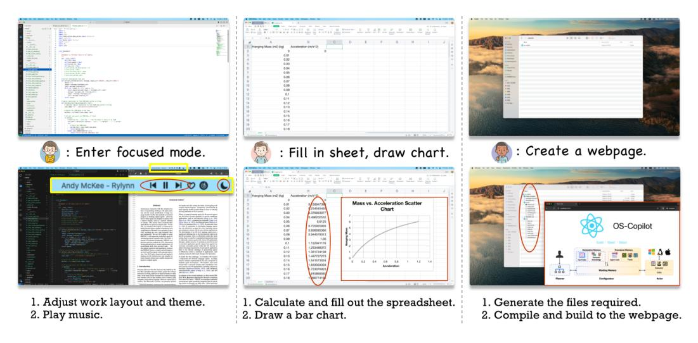
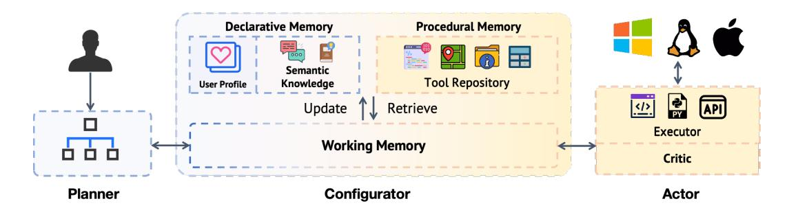
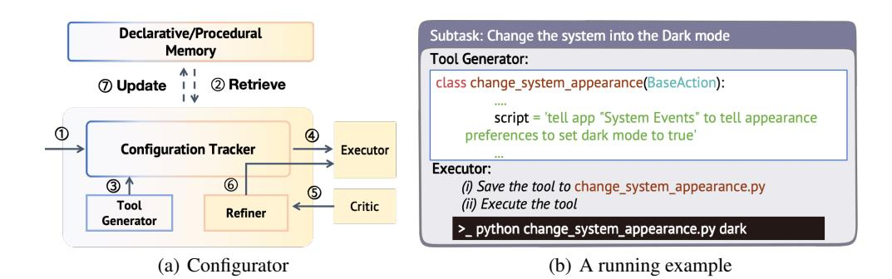
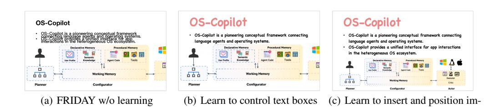
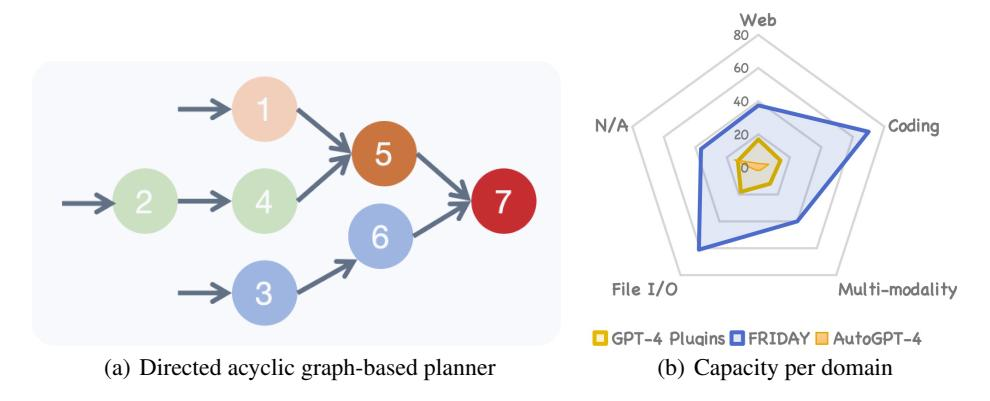

# OS-COPILOT: TOWARDS GENERALIST COMPUTER AGENTS WITH SELF-IMPROVEMENT

Zhiyong Wu<sup>\$\(\phi\)</sup>, Chengcheng Han<sup>\$\(\phi\)</sup>, Zichen Ding<sup>\$\(\phi\)</sup>, Zhenmin Weng<sup>\$\(\phi\)</sup>, Zhoumianze Liu<sup>\$\(\phi\)</sup>, Shunyu Yao<sup>\$\(\phi\)</sup>, Tao Yu<sup>\$\(\phi\)</sup>, Lingpeng Kong<sup>\$\(\phi\)</sup>
\$\(\phi\) Shanghai AI Laboratory <sup>\$\(\phi\)</sup> East China Normal University
\$\(\phi\) Princeton University <sup>\$\(\phi\)</sup> The University of Hong Kong
wuzhiyong@pjlab.org.cn
https://os-copilot.github.io/



<span id="page-0-0"></span>Figure 1: Running examples of FRIDAY when deployed on MacOS and tasked with (1) preparing a focused working environment, (2) Calculating and drawing a chart in Excel, and (3) creating a website for OS-Copilot. The text at the bottom illustrates the subtasks taken by FRIDAY. For each set of examples, the figure at the top represents the initial OS state, while the one at the bottom depicts the final state after execution. Boxes/Ovals highlight the changes made by FRIDAY.

#### **ABSTRACT**

Autonomous interaction with the computer has been a longstanding challenge with great potential, and the recent proliferation of large language models (LLMs) has markedly accelerated progress in building digital agents. However, most of these agents are designed to interact with a narrow domain, such as a specific software or website. This narrow focus constrains their applicability for general computer tasks. To this end, we introduce OS-Copilot, a framework to build generalist agents capable of interfacing with comprehensive elements in an operating system (OS), including the web, code terminals, files, multimedia, and various third-party applications. We use OS-Copilot to create FRIDAY, a self-improving embodied agent for automating general computer tasks. On GAIA, a general AI assistants benchmark, FRIDAY outperforms previous methods by 35%, showcasing strong generalization to unseen applications via accumulated skills from previous tasks. We also present numerical and quantitative evidence that FRIDAY learns to control and self-improve on Excel and Powerpoint with minimal supervision. Our OS-Copilot framework and empirical findings provide infrastructure and insights for future research toward more capable and general-purpose computer agents.

<sup>\*</sup> Equal Contribution.

# 1 INTRODUCTION

From the 1920 novel *R.U.R* to characters like JARVIS in *The Iron Man*, throughout the past century, people have dreamed of building digital agents to automate daily work. However, current digital agents, like Microsoft's Cortana, are primarily tailored for simple tasks like setting the alarm yet struggling with complex human requests. Fortunately, advancements in large language models (LLMs) bring us closer to realizing the next generation of digital assistants.

Efforts in building language agents (integrating LLMs into digital agents) have focused primarily on specific standalone applications, such as web browsers [\(Deng et al.,](#page-8-0) [2023;](#page-8-0) [Zhou et al.,](#page-10-0) [2023\)](#page-10-0), command-line terminals [\(Yang et al.,](#page-10-1) [2023a;](#page-10-1) [Qiao et al.,](#page-9-0) [2023\)](#page-9-0), the Minecraft game [\(Wang et al.,](#page-9-1) [2023a\)](#page-9-1), and database [\(Hu et al.,](#page-8-1) [2023\)](#page-8-1). In particular, there is a lack of exploration in developing language agents that can effectively interact with the entire operating system. Developing OS-level language agents presents a significant challenge due to the heterogeneity inherent in the OS ecosystem. First, a unified interface is required for agents to seamlessly interact with the operating system, be it through code, keyboard and mouse inputs, or APIs. Second, the vast array of distinct applications poses significant challenges to the generalization and scalability of language agents. With hundreds and thousands of applications in the OS, manually devising a nuanced control mechanism and customized tools and prompts for each of them, is evidently impractical.

To tackle the first challenge, we introduce OS-Copilot, a framework aimed at accelerating the construction of computer agents on Linux and MacOS by offering a universal interface for interaction. This universal interface consolidates common practices for OS manipulation, including Python code interpreter [\(Significant-Gravitas,](#page-9-2) [2023\)](#page-9-2), bash terminal, mouse/keyboard control [\(Cheng et al.,](#page-8-2) [2024\)](#page-8-2), and API calls [\(Qin et al.,](#page-9-3) [2023\)](#page-9-3). In Table [4,](#page-12-0) we present a broad spectrum of OS-Copilot's example use cases, empowered by these control methods.

In response to the second challenge, we then created FRIDAY (Fully Responsive Intelligence, Devoted to Assisting You) upon OS-Copilot.[1](#page-1-0) FRIDAY is a self-improving embodied agent seamlessly integrated into the OS to automate computer tasks. FRIDAY distinguishes itself from existing general-purpose agents like AutoGPT [\(Significant-Gravitas,](#page-9-2) [2023\)](#page-9-2) by featuring the ability to learn to control unfamiliar applications through self-directed learning. All made possible with a selfevolving configurator within FRIDAY. The configurator includes a self-directed learning module that autonomously proposes a curriculum of tasks regarding an unfamiliar application. FRIDAY then solves these tasks to learn to control this application by accumulating tools. In Figure [1,](#page-0-0) we provide three case studies and demonstrate that with self-directed learning, FRIDAY successfully learns to manipulate Excel and build a website using the frontend library React.

To systematically assess FRIDAY's problem-solving capabilities within the OS, we evaluate its performance on GAIA [\(Mialon et al.,](#page-9-4) [2023b\)](#page-9-4), a benchmark for general AI assistants. In the easiest level-1 tasks, FRIDAY achieves a success rate of 40.86%, marking a 35% relative improvement over the previous best system (30.3%), and significantly outperforming the popular AutoGPT-4 system (14.4%). Even in the most challenging level-3 tasks, previously unsolvable by any other systems, FRIDAY achieves a success rate of 6.12%. We further assess FRIDAY's self-directed learning ability on a spreadsheet manipulation dataset [\(Li et al.,](#page-9-5) [2023\)](#page-9-5), where initially FRIDAY fails to solve any task. Surprisingly, following self-directed learning, FRIDAY achieves a success rate of 60%, even surpassing a state-of-the-art model specifically designed for spreadsheet control.

We conclude the contributions of this paper as follows:

- OS-Copilot is a pioneering conceptual framework for building generalist computer agents on Linux and MacOS, diverging from previous endeavors that often focus on individual applications like web browsers. OS-Copilot provides a unified interface for app interactions in the heterogeneous OS ecosystem. Furthermore, OS-Copilot can serve as a foundational platform that supports future research in areas such as personalized digital assistants, multimodal agents, and agent learning in a situated environment.
- Leveraging OS-Copilot, we built FRIDAY, a self-improving AI assistant capable of solving general computer tasks. FRIDAY demonstrates outstanding performance on a leading benchmark and noteworthy generalization capabilities across unseen applications, attributed

<span id="page-1-0"></span><sup>1</sup> F.R.I.D.A.Y is also the name of an advanced AI Tony Stark used to replace JARVIS.



Figure 2: An overview of OS-Copilot framework.

<span id="page-2-0"></span>to its innovative configurator. The evaluation results and case studies underscore the potential of FRIDAY to serve as a helpful OS assistant.

### 2 THE OS-COPILOT FRAMEWORK

In this section, we first overview how OS-Copilot operates and then discuss its main components.

As shown in Figure [2,](#page-2-0) upon receiving a user request, a planner first constructs a plan that decomposes the request into subtasks. Given a subtask, the configurator maintains a working memory that is responsible for retrieving tools, knowledge, and any other relevant information needed for task completion. Based on the information provided by the configurator, the actor will iteratively perform operations of execution and criticism until the subtask is completed. In particular, the criticism operation involves collecting execution feedback for self-correction and improvement. Researchers and practitioners can readily tailor their own agents by implementing various designs on each component. Our customization in FRIDAY is in [§3.](#page-4-0)

# 2.1 PLANNER

The planner component will reason over user requests and decompose complex ones into simpler subtasks. Most importantly, the planner needs to comprehend the agent's capabilities to generate plans at the correct granularity. To achieve this, it must retrieve relevant information about the agent's capabilities, such as in-house tools and operating system information, to assist planning. OS-Copilot supports various planning methods, such as Plan-and-Solve [\(Wang et al.,](#page-10-2) [2023c\)](#page-10-2) and the directed acyclic graph-based planner that we propose.

Directed acyclic graph-based planner. Existing planners, whether they generate linear structured plans [\(Wang et al.,](#page-10-3) [2023d\)](#page-10-3) or non-linear ones [\(Besta et al.,](#page-8-3) [2023\)](#page-8-3), inherently necessitate agents to execute tasks sequentially. Nevertheless, in practical scenarios, numerous independent tasks can be parallelized to minimize execution time. For instance, a deep learning coding agent can simultaneously monitor model training progress while generating inference code. To achieve the aforementioned objective, we leverage LLMs to formalize the plan into a directed acyclic graph, where each node represents a task and arrows represent the interdependencies between tasks. As an illustration, we demonstrate how this planner works in § [A,](#page-10-4) and provide the prompt in Table [5.](#page-14-0)

#### 2.2 CONFIGURATOR

The configurator component takes a subtask from the planner and configures it to help the actor complete the subtask. Our design of the configurator is inspired by the biological nature of the human brain, which has working, declarative, and procedural memory [\(Baddeley,](#page-8-4) [2003;](#page-8-4) [Packard,](#page-9-6) [2009\)](#page-9-6).

### 2.2.1 DECLARATIVE MEMORY

Declarative or explicit memory is a subcategory of long-term memory and is used for storing facts and events. Our declarative memory contains two following components:

User Profile. It records user's preference regarding conversation style, tool-use habit, music/video preference, etc. Accurate user profiling is critical for personalized problem-solving and recommendation. Although it has been widely studied in the recommendation area, personalized language agents are rarely explored. The User Profile module is a conceptual design at the current stage due to the lack of corresponding benchmarks.

Semantic Knowledge. It stores agents' past trajectories or knowledge they acquired from the Internet, users, and OS (e.g., system version and current working directory). This module is crucial for agents to act correctly based on the current environment state and learn from past experiences.

#### 2.2.2 PROCEDURAL MEMORY

Procedural or implicit memory is another form of long-term memory mainly related to the skill development ability of an individual. Once learned, procedural memories automatically do functions that don't involve our conscious involvement. In OS-Copilot, the procedural memory primarily consists of a tool repository as the agent's skill set.

Tool Repository Although LLMs can read and write, they do not process the ability to interact with the operating system. As such, we need to equip agents with tools that translate natural language into executable actions within the OS. The tool repository is where these tools are stored and updated. We seed OS-Copilot with 4 manually created tools for basic computer functionalities, such as web browsing and speech-to-text translation (see Appendix [F](#page-13-0) for details of tools). In OS-Copilot, tools can exist in two forms: either deployed as API services to be invoked using POST requests or stored as a Python file (refer to Table [13](#page-20-0) for an example).

### 2.2.3 WORKING MEMORY

In contrast to declarative and procedural memory, working memory supports the short-term storage and processing of information. It serves as the core of OS-Copilot's design, connecting the planner, configurator, and actor components. Working memory exchanges information with other modules via internal (with long-term memory modules) and external (with the planner and actor) operations.

Internally, the working memory module is responsible for retrieving information from and updating the long-term memory. This includes tasks such as retrieving available tools to aid in planning and updating tool codes following self-correction.

Externally, the working memory module receives subtasks from the planner, adeptly gathers all relevant information from declarative (e.g., current working directory) and procedural memory (e.g., tool documentation), and subsequently feeds this information into the actor component. The execution feedback from the actor is then fed into the working memory for potential revisions.

### 2.3 ACTOR

The actor comprises two stages: execution and self-criticism. In the first stage, the executor proposes an executable action (e.g., a bash command "*mkdir new folder*") based on the configuration prompt and then executes the action in the operating system (through the Bash runtime environment in this example). The critic module will then access the outcomes of the execution and formulate feedback to refine execution errors and/or effect updates to the long-term memory.

Executor Given the configuration prompt, the executor completes the subtask by generating an executable command or function call with correct parameters. The prompt of executor can be found in Table [8.](#page-17-0) The proposed action will then be executed within the OS through the universal runtime environment provided by OS-Copilot. To elaborate, OS-Copilot provides an interface that encapsulates the Python runtime environment, bash runtime environment, API calls, and mouse/keyboard control. These four control methods cover a broad spectrum of OS use cases, as shown in Table [4,](#page-12-0) significantly facilitating the design of OS-level agents.

Critic Assessing the successful completion of a given subtask is challenging due to the absence of ground truth. For further discussion regarding the challenge in the evaluation, readers are directed to



<span id="page-4-2"></span><span id="page-4-1"></span>Figure 3: The architecture of the configurator with (a) a typical working flow and (b) a concrete running example.

Appendix D. To aid the Critic module in assessment, we gather comprehensive system information before and after execution and employ LLMs to automatically evaluate the completion state.

In particular, following each subtask execution, the Critic evaluates the following aspects (see Table 9 for the prompt): (1) Determining whether the current sub-task is completed through the analysis of execution results and the environmental state. (2) In the event of failed completion, offering a comprehensive error analysis and providing suggestions for correction of tools or actions (how tools are called). (3) Assessing the necessity for restructuring subtasks, including the addition of new subtasks or modifications to the content and dependencies of existing subtasks.

#### <span id="page-4-0"></span>3 THE FRIDAY AGENT

The design principle of FRIDAY aims to maximize generality by equipping the agent with the ability for self-refinement and self-directed learning. We first use an example to illustrate how FRIDAY operates and emphasize its capacity for self-refinement. Subsequently, we delve into how FRIDAY acquires the proficiency to control unfamiliar applications through self-directed learning.

#### 3.1 A RUNNING EXAMPLE

In Figure 3, we use a running example to demonstrate how FRIDAY functions within the OS.

Upon receiving the subtask "Change the system into the Dark mode" (step ①), the Configuration Tracker employs dense retrieval to recall relevant information from the long-term memory to construct a prompt (step ②). This prompt encompasses related tools, user profiles, OS system versions, and the agent's working directory.

In this example, no suitable tools are identified (similarities below a specified threshold), prompting activation of the Tool Generator to devise an application-tailored tool for the current subtask (step  $\Im$ ). As we can see from Figure  $\Im(b)$ , the generated tool manifests as a Python class utilizing AppleScript to change systems to dark mode.

Subsequently, with the tool created and the configuration prompt finalized, the Executor processes the prompt, generates an executable action, and executes it (step ④). As shown in the bottom of Figure 3(b), the executor first stores the tool code into a Python file and then executes the code in the command-line terminal.

After execution, the critic evaluates whether the subtask is successfully completed (step ⑤). Upon success, the critic assigns a score (using LLMs) ranging from 0 to 10 to the generated tool, with a higher score indicating greater potential for future reuse. In the current implementation, tools scoring above 8 are preserved by updating the tool repository in procedural memory (step ⑦).

However, in the event of a failed execution, the refiner collects feedback from the critic and initiates self-correction (step 6) of the responsible action, tool, or subtask (see Table 7 for the prompt). The FRIDAY will iterate through steps 4 to 6 until the subtask is considered completed or a maximum of three attempts is reached.

# 3.2 SELF-DIRECTED LEARNING

Self-directed learning is a crucial ability for humans to acquire information and learn new skills [\(Knowles,](#page-9-7) [1975\)](#page-9-7), and it has demonstrated promising results in embodied agents within Minecraft games [\(Wang et al.,](#page-9-1) [2023a\)](#page-9-1).

With a pre-defined learning objective, such as mastering spreadsheet manipulation, FRIDAY is prompted to propose a continuous stream of tasks related to the objective, spanning from easy to challenging. FRIDAY then follows this curriculum, resolving these tasks through trial and error, thereby accumulating valuable tools and semantic knowledge throughout the process. We provide more details in learning in § [4.2.](#page-6-0) Despite its simple design, our evaluation results indicate that self-directed learning is crucial for a general-purpose OS-level agent.

# 4 EXPERIMENTS

We evaluate FRIDAY on GAIA [\(Mialon et al.,](#page-9-4) [2023b\)](#page-9-4), a benchmark for general AI assistants featuring 466 challenging question-answering tasks. To answer questions in GAIA, computer agents need skills to calculate numbers, browse the web, process video and speech signal, and manipulate files, etc.

Settings. We initialize FRIDAY with four basic tools and facilitate its exploration of the dev set of GAIA to accumulate more tools (result in 9 more tools). For a complete list of the basic tools and the tools generated by FRIDAY in the development set, please refer to Appendix [F.1.](#page-13-1) Subsequently, we evaluated FRIDAY's performance on the test set by submitting our results to the official evaluation server[2](#page-5-0) . Due to the limited budget, we use GPT4-turbo-1106 in FRIDAY.

Baselines. We reports results of GPT-4 with and without manually set plugins, as well as AutoGPT with GPT4 as the backend (AutoGPT-4). GPT-4 Plugins rely on humans to browse and select proper plugins based on the task question. As a reference, we also include human performance sourced from [Mialon et al.](#page-9-4) [\(2023b\)](#page-9-4). We conduct a further ablation study on self-directed learning with FRIDAY (w/o learning) by disabling FRIDAY's learning on the development set.

#### 4.1 MAIN RESULTS

| Level                         | Level 1        | Level 2        | Level 3      |
|-------------------------------|----------------|----------------|--------------|
| Human*                        | 93.90          | 91.80          | 87.30        |
| GPT-4                         | 9.68           | 1.89           | 0            |
| GPT-4-Turbo                   | 9.68           | 6.92           | 0            |
| AutoGPT-4                     | 15.05          | 0.63           | 0            |
| GPT-4 Plugins                 | 30.30          | 9.70           | 0            |
| FRIDAY w/o learning<br>FRIDAY | 36.56<br>40.86 | 17.61<br>20.13 | 6.12<br>6.12 |

<span id="page-5-1"></span>Table 1: Evaluation Results. All results are reported on the private test set, except for the Human score, which is averaged across the dev and test sets.

From Table [1,](#page-5-1) FRIDAY demonstrates an impressive 40.86% success rate in level-1 tasks, a 35% relative improvement over the state-of-the-art. The improvement is even more evident in level-2 tasks. Even when confronted with the most challenging level-3 tasks, where none of the preceding baselines achieve success, FRIDAY correctly solves 6.12% problems.

Root of improvement. To discern the root of FRIDAY's effectiveness, we need to exam baselines more closely. AutoGPT-4 shares similarities with FRIDAY in that it also has a

memory module and tool repository, and process the ability to decompose tasks. The discrepancy between FRIDAY and AutoGPT-4 underscores the importance of self-criticism and refinement. GPT-4 Plugins outperforms AutoGPT-4 significantly, and we hypothesize that this is due to its access to an extensive tool library. Finally, FRIDAY's superiority over GPT-4 Plugins further validates that while the ability to utilize tools and access to a broad tool set is crucial for the success of general agents, the planner, critic, and refiner are what elevate them to the next level. Although none of these

<span id="page-5-0"></span><sup>2</sup><https://huggingface.co/spaces/gaia-benchmark/leaderboard>

components are first innovated in this paper, OS-Copilot organically combines them into a cohesive whole and demonstrates the effectiveness of this architecture through strong evaluation results. This serves as a valuable design guideline for future general computer agents.

By comparing FRIDAY against FRIDAY (w/o learning), we aim to isolate the contribution of selfdirected learning to the final performance. As we can see, even without self-directed learning, FRIDAY still significantly outperforms all baselines, further highlighting the effectiveness of the framework and our custom design. The gain of self-directed learning underscores that conventional approaches reliant on a pre-defined tool set encounter challenges in open environments like GAIA, emphasizing the pivotal role of FRIDAY's capacity to autonomously devise and employ tools in its notable success.

Extended Evaluation and Analysis. We provide an extended evaluation regarding FRIDAY's time efficiency and a breakdown of its capability per domain in Appendix [B.](#page-11-0)

#### <span id="page-6-0"></span>4.2 SELF-DIRECTED LEARNING

We perform quantitative and qualitative evaluations to analyze FRIDAY's self-directed learning capability.

| Agents                          | Models                           | Pass@1            |
|---------------------------------|----------------------------------|-------------------|
| SheetCopilot†                   | GPT-3.5-Turbo<br>Claude<br>GPT-4 | 40%<br>45%<br>55% |
| FRIDAY (w/o learning)<br>FRIDAY | GPT-4<br>GPT-4                   | 0%<br>60%         |

<span id="page-6-2"></span>Table 2: Comparison of different agents on the SheetCopilot-20 dataset. Pass@1 refers to the pass rate with each task being performed only once [\(Chen](#page-8-5) [et al.,](#page-8-5) [2021\)](#page-8-5). † denotes the results reported in [\(Li et al.,](#page-9-5) [2023\)](#page-9-5). We highlight the best results in bold.

Quantitative Analysis To showcase FRI-DAY's ability to master unfamiliar applications through self-learning, we conduct experiments on the SheetCopilot-20[3](#page-6-1) dataset [\(Li et al.,](#page-9-5) [2023\)](#page-9-5). This dataset includes 20 spreadsheet control tasks, covering various operations such as Formatting, Management, Charts, Pivot Tables, and Formulas, representing typical use cases of spreadsheets. FRIDAY is selfinstructed [\(Wang et al.,](#page-10-5) [2022\)](#page-10-5) to generate 10 tasks about manipulating Excel using the *propenyxl* package. FRIDAY then solves these 10 tasks and autonomously accumulates 8 tools, including operations such as counting elements and deleting

sheets by name (see Appendix [F.2](#page-13-2) for a complete tool list).

The experimental results are summarized in Table [2.](#page-6-2) Initially, FRIDAY, without self-directed learning, is unable to complete any tasks and tends to use the *pandas* and *matplotlib* packages for spreadsheet control, resulting in failures. When equipped with self-directed learning, FRIDAY's performance surpasses that of SheetCopilot [\(Li et al.,](#page-9-5) [2023\)](#page-9-5), an agent specifically designed for spreadsheet tasks. Notably, all the atomic operations and tools in SheetCopilot are manually crafted and verified, whereas FRIDAY autonomously generates all tools used. Also worth noting that FRIDAY achieves such a level of proficiency by solving and learning on just 10 tasks. This outcome signals a promising future where we can build general-purpose OS-level agents that can efficiently scale to support various applications without human intervention.

<span id="page-6-3"></span>Qualitative Analysis In our qualitative analysis, we design a task to create a PowerPoint slide to introduce OS-Copilot. The specific content, font, font size, and other details required for the slide are elaborately described in the task instruction, as detailed in Appendix [G.](#page-13-3) The experimental results, as shown in Figure [4\(a\),](#page-7-0) demonstrate that without self-directed learning, FRIDAY struggles to effectively control font types, sizes, and the positioning and sizing of inserted images. Nevertheless, following a period of self-directed learning, FRIDAY acquires various text box configuration tools, such as changing the text color, adjusting the font size of slide text, and modifying the line spacing of body text in PowerPoint presentations, as illustrated in Figure [4\(b\).](#page-7-1) Further exploration leads FRIDAY to learn how to adjust the size and position of inserted images, ultimately successfully

<span id="page-6-1"></span><sup>3</sup>The SheetCopilot dataset comprises 221 spreadsheet control tasks. [Li et al.](#page-9-5) [\(2023\)](#page-9-5) select 20 representative tasks from this set for extensive evaluation.

<span id="page-7-0"></span>

Figure 4: The illustration of FRIDAY executing the task of constructing a PowerPoint slide.

<span id="page-7-2"></span><span id="page-7-1"></span>ages

completing the task, as depicted in Figure [4\(c\).](#page-7-2) A complete list of tools acquired by FRIDAY can be found in Appendix [F.3.](#page-13-4) The demonstrated learning process compellingly establishes FRIDAY's proficiency in mastering unfamiliar applications through self-directed learning.

# 5 RELATED WORK

Autonomous agent powered by LLMs [\(Weng,](#page-10-6) [2023\)](#page-10-6), or language agents [\(Sumers et al.,](#page-9-8) [2023\)](#page-9-8), is a fast-growing research field that has attracted lots of attention recently [\(Wang et al.,](#page-9-9) [2023b\)](#page-9-9).

Language agents have been designed and applied in various domains, including robotics [\(Driess et al.,](#page-8-6) [2023;](#page-8-6) [Brohan et al.,](#page-8-7) [2023\)](#page-8-7), web manipulation [\(Yao et al.,](#page-10-7) [2022a;](#page-10-7) [Zhou et al.,](#page-10-0) [2023\)](#page-10-0), and games [\(Fan](#page-8-8) [et al.,](#page-8-8) [2022\)](#page-8-8). It is worth noting that the majority of these digital language agents are tailored to specific scenarios, such as web manipulation tasks [\(Deng et al.,](#page-8-0) [2023\)](#page-8-0), interactive command-line coding [\(Yang](#page-10-1) [et al.,](#page-10-1) [2023a\)](#page-10-1), automating spreadsheet control [\(Li et al.,](#page-9-5) [2023\)](#page-9-5), playing Minecraft [\(Wang et al.,](#page-9-1) [2023a\)](#page-9-1), and facilitating automated data analysis [\(Zhang et al.,](#page-10-8) [2023\)](#page-10-8). The open-source community continues to push the boundaries by introducing frameworks that address multiple scenarios within a single platform. Notable projects in this domain include AutoGPT [4](#page-7-3) and OpenAgents [\(Xie et al.,](#page-10-9) [2023\)](#page-10-9). But still, these language agents currently operate within the confines of either a terminal or a web browser and can hardly interact with other applications.

Language agents represent a complex system composed of a lengthy pipeline comprising various components, each representing a substantial body of research. For a comprehensive discussion on the methodology, we direct readers to recent surveys [\(Wang et al.,](#page-9-9) [2023b;](#page-9-9) [Mialon et al.,](#page-9-10) [2023a\)](#page-9-10). In this paragraph, we provide a brief overview of some related components. During the planning stage, researchers propose to decompose complex tasks into a sequential series of simpler subtasks [\(Yao](#page-10-10) [et al.,](#page-10-10) [2022b;](#page-10-10) [Xu et al.,](#page-10-11) [2023;](#page-10-11) [Wang et al.,](#page-10-2) [2023c\)](#page-10-2). Notably, recent advancements in this area include allowing LLMs to consider multiple reasoning paths [\(Sun et al.,](#page-9-11) [2023\)](#page-9-11), self-evaluation of choices to determine the subsequent course of action, and even backtracking when necessary to make global decisions [\(Yao et al.,](#page-10-12) [2023;](#page-10-12) [Besta et al.,](#page-8-3) [2023\)](#page-8-3). The memory module is also a common design in language agents. It can be categorized into short-term memory facilitated by in-context learning [\(Wu](#page-10-13) [et al.,](#page-10-13) [2022;](#page-10-13) [2023\)](#page-10-14), as well as long-term memory associated with information retrieval and lifelong learning [\(Wang et al.,](#page-9-1) [2023a\)](#page-9-1). The execution module grounds the output of LLMs into executable actions and executes them in the embodied environment [\(Schick et al.,](#page-9-12) [2023;](#page-9-12) [Cai et al.,](#page-8-9) [2023\)](#page-8-9). Finally, the *reflection module* processes the environmental state after execution and gathers feedback to rectify potential errors that may have occurred in the aforementioned two modules [\(Shinn et al.,](#page-9-13) [2023\)](#page-9-13).

# 6 CONCLUSION

In this paper, we present OS-Copilot, a framework designed for OS-level language agents. Leveraging OS-Copilot, we developed FRIDAY, an embodied computer agent. FRIDAY exhibits remarkable performance in solving open-environment computer tasks, and demonstrating its capability to effectively learn and control previously unseen applications by self-directed learning. More discussion about limitations and future work can be found in Appendix [D.](#page-12-1)

<span id="page-7-3"></span><sup>4</sup> https://github.com/Significant-Gravitas/AutoGPT

# REFERENCES

- <span id="page-8-4"></span>Alan Baddeley. Working memory: looking back and looking forward. *Nature reviews neuroscience*, 4(10):829–839, 2003.
- <span id="page-8-3"></span>Maciej Besta, Nils Blach, Ales Kubicek, Robert Gerstenberger, Lukas Gianinazzi, Joanna Gajda, Tomasz Lehmann, Michal Podstawski, Hubert Niewiadomski, Piotr Nyczyk, et al. Graph of thoughts: Solving elaborate problems with large language models. *arXiv preprint arXiv:2308.09687*, 2023.
- <span id="page-8-13"></span>Rishi Bommasani, Drew A Hudson, Ehsan Adeli, Russ Altman, Simran Arora, Sydney von Arx, Michael S Bernstein, Jeannette Bohg, Antoine Bosselut, Emma Brunskill, et al. On the opportunities and risks of foundation models. *arXiv preprint arXiv:2108.07258*, 2021.
- <span id="page-8-7"></span>Anthony Brohan, Noah Brown, Justice Carbajal, Yevgen Chebotar, Xi Chen, Krzysztof Choromanski, Tianli Ding, Danny Driess, Avinava Dubey, Chelsea Finn, et al. Rt-2: Vision-language-action models transfer web knowledge to robotic control. *arXiv preprint arXiv:2307.15818*, 2023.
- <span id="page-8-9"></span>Tianle Cai, Xuezhi Wang, Tengyu Ma, Xinyun Chen, and Denny Zhou. Large language models as tool makers. *arXiv preprint arXiv:2305.17126*, 2023.
- <span id="page-8-5"></span>Mark Chen, Jerry Tworek, Heewoo Jun, Qiming Yuan, Henrique Ponde de Oliveira Pinto, Jared Kaplan, Harri Edwards, Yuri Burda, Nicholas Joseph, Greg Brockman, et al. Evaluating large language models trained on code. *arXiv preprint arXiv:2107.03374*, 2021.
- <span id="page-8-2"></span>Kanzhi Cheng, Qiushi Sun, Yougang Chu, Fangzhi Xu, Yantao Li, Jianbing Zhang, and Zhiyong Wu. Seeclick: Harnessing gui grounding for advanced visual gui agents. *arXiv preprint arXiv:2401.10935*, 2024.
- <span id="page-8-12"></span>Sijie Cheng, Zhiyong Wu, Jiangjie Chen, Zhixing Li, Yang Liu, and Lingpeng Kong. Unsupervised explanation generation via correct instantiations. In *Proceedings of the AAAI Conference on Artificial Intelligence*, volume 37, pp. 12700–12708, 2023.
- <span id="page-8-0"></span>Xiang Deng, Yu Gu, Boyuan Zheng, Shijie Chen, Samuel Stevens, Boshi Wang, Huan Sun, and Yu Su. Mind2web: Towards a generalist agent for the web. *arXiv preprint arXiv:2306.06070*, 2023.
- <span id="page-8-6"></span>Danny Driess, Fei Xia, Mehdi SM Sajjadi, Corey Lynch, Aakanksha Chowdhery, Brian Ichter, Ayzaan Wahid, Jonathan Tompson, Quan Vuong, Tianhe Yu, et al. Palm-e: An embodied multimodal language model. *arXiv preprint arXiv:2303.03378*, 2023.
- <span id="page-8-8"></span>Linxi Fan, Guanzhi Wang, Yunfan Jiang, Ajay Mandlekar, Yuncong Yang, Haoyi Zhu, Andrew Tang, De-An Huang, Yuke Zhu, and Anima Anandkumar. Minedojo: Building open-ended embodied agents with internet-scale knowledge. *Advances in Neural Information Processing Systems*, 35: 18343–18362, 2022.
- <span id="page-8-11"></span>Difei Gao, Lei Ji, Zechen Bai, Mingyu Ouyang, Dongxing Li, Peiran 9and Mao, Qinchen Wu, Weichen Zhang, Peiyi Wang, Xiangwu Guo, et al. Assistgui: Task-oriented desktop graphical user interface automation. *arXiv preprint arXiv:2312.13108*, 2023.
- <span id="page-8-15"></span>Yiduo Guo, Zekai Zhang, Yaobo Liang, Dongyan Zhao, and Duan Nan. Pptc benchmark: Evaluating large language models for powerpoint task completion. *arXiv preprint arXiv:2311.01767*, 2023.
- <span id="page-8-10"></span>Wenyi Hong, Weihan Wang, Qingsong Lv, Jiazheng Xu, Wenmeng Yu, Junhui Ji, Yan Wang, Zihan Wang, Yuxiao Dong, Ming Ding, et al. Cogagent: A visual language model for gui agents. *arXiv preprint arXiv:2312.08914*, 2023.
- <span id="page-8-1"></span>Chenxu Hu, Jie Fu, Chenzhuang Du, Simian Luo, Junbo Zhao, and Hang Zhao. Chatdb: Augmenting llms with databases as their symbolic memory, 2023.
- <span id="page-8-14"></span>Jiaming Ji, Tianyi Qiu, Boyuan Chen, Borong Zhang, Hantao Lou, Kaile Wang, Yawen Duan, Zhonghao He, Jiayi Zhou, Zhaowei Zhang, et al. Ai alignment: A comprehensive survey. *arXiv preprint arXiv:2310.19852*, 2023.

- <span id="page-9-7"></span>Malcolm S Knowles. Self-directed learning: A guide for learners and teachers. *ERIC*, 1975.
- <span id="page-9-5"></span>Hongxin Li, Jingran Su, Yuntao Chen, Qing Li, and Zhaoxiang Zhang. Sheetcopilot: Bringing software productivity to the next level through large language models. *arXiv preprint arXiv:2305.19308*, 2023.
- <span id="page-9-17"></span>Qintong Li, Zhiyong Wu, Lingpeng Kong, and Wei Bi. Explanation regeneration via information bottleneck. *arXiv preprint arXiv:2212.09603*, 2022.
- <span id="page-9-16"></span>Chang Ma, Junlei Zhang, Zhihao Zhu, Cheng Yang, Yujiu Yang, Yaohui Jin, Zhenzhong Lan, Lingpeng Kong, and Junxian He. Agentboard: An analytical evaluation board of multi-turn llm agents. *arXiv preprint arXiv:2401.13178*, 2024.
- <span id="page-9-10"></span>Gregoire Mialon, Roberto Dess ´ `ı, Maria Lomeli, Christoforos Nalmpantis, Ram Pasunuru, Roberta Raileanu, Baptiste Roziere, Timo Schick, Jane Dwivedi-Yu, Asli Celikyilmaz, et al. Augmented ` language models: a survey. *arXiv preprint arXiv:2302.07842*, 2023a.
- <span id="page-9-4"></span>Gregoire Mialon, Cl ´ ementine Fourrier, Craig Swift, Thomas Wolf, Yann LeCun, and Thomas Scialom. ´ Gaia: a benchmark for general ai assistants. *arXiv preprint arXiv:2311.12983*, 2023b.
- <span id="page-9-6"></span>Mark G Packard. Anxiety, cognition, and habit: a multiple memory systems perspective. *Brain research*, 1293:121–128, 2009.
- <span id="page-9-0"></span>Bo Qiao, Liqun Li, Xu Zhang, Shilin He, Yu Kang, Chaoyun Zhang, Fangkai Yang, Hang Dong, Jue Zhang, Lu Wang, et al. Taskweaver: A code-first agent framework. *arXiv preprint arXiv:2311.17541*, 2023.
- <span id="page-9-3"></span>Yujia Qin, Shengding Hu, Yankai Lin, Weize Chen, Ning Ding, Ganqu Cui, Zheni Zeng, Yufei Huang, Chaojun Xiao, Chi Han, et al. Tool learning with foundation models. *arXiv preprint arXiv:2304.08354*, 2023.
- <span id="page-9-12"></span>Timo Schick, Jane Dwivedi-Yu, Roberto Dess`ı, Roberta Raileanu, Maria Lomeli, Luke Zettlemoyer, Nicola Cancedda, and Thomas Scialom. Toolformer: Language models can teach themselves to use tools. *arXiv preprint arXiv:2302.04761*, 2023.
- <span id="page-9-14"></span>Yongliang Shen, Kaitao Song, Xu Tan, Dongsheng Li, Weiming Lu, and Yueting Zhuang. Hugginggpt: Solving ai tasks with chatgpt and its friends in huggingface. *arXiv preprint arXiv:2303.17580*, 2023.
- <span id="page-9-13"></span>Noah Shinn, Beck Labash, and Ashwin Gopinath. Reflexion: an autonomous agent with dynamic memory and self-reflection. *arXiv preprint arXiv:2303.11366*, 2023.
- <span id="page-9-2"></span>Significant-Gravitas. Autogpt: build & use ai agents. *https://github.com/Significant-Gravitas/AutoGPT*, 2023.
- <span id="page-9-8"></span>Theodore R Sumers, Shunyu Yao, Karthik Narasimhan, and Thomas L Griffiths. Cognitive architectures for language agents. *arXiv preprint arXiv:2309.02427*, 2023.
- <span id="page-9-11"></span>Qiushi Sun, Zhangyue Yin, Xiang Li, Zhiyong Wu, Xipeng Qiu, and Lingpeng Kong. Corex: Pushing the boundaries of complex reasoning through multi-model collaboration. *arXiv preprint arXiv:2310.00280*, 2023.
- <span id="page-9-15"></span>Mark Towers, Jordan K. Terry, Ariel Kwiatkowski, John U. Balis, Gianluca de Cola, Tristan Deleu, Manuel Goulao, Andreas Kallinteris, Arjun KG, Markus Krimmel, Rodrigo Perez-Vicente, Andrea ˜ Pierre, Sander Schulhoff, Jun Jet Tai, Andrew Tan Jin Shen, and Omar G. Younis. Gymnasium. ´ *Github*, March 2023. URL <https://zenodo.org/record/8127025>.
- <span id="page-9-1"></span>Guanzhi Wang, Yuqi Xie, Yunfan Jiang, Ajay Mandlekar, Chaowei Xiao, Yuke Zhu, Linxi Fan, and Anima Anandkumar. Voyager: An open-ended embodied agent with large language models. *arXiv preprint arXiv:2305.16291*, 2023a.
- <span id="page-9-9"></span>Lei Wang, Chen Ma, Xueyang Feng, Zeyu Zhang, Hao Yang, Jingsen Zhang, Zhiyuan Chen, Jiakai Tang, Xu Chen, Yankai Lin, Wayne Xin Zhao, Zhewei Wei, and Ji-Rong Wen. A survey on large language model based autonomous agents. *http://arxiv.org/abs/2308.11432*, 2023b.

- <span id="page-10-2"></span>Lei Wang, Wanyu Xu, Yihuai Lan, Zhiqiang Hu, Yunshi Lan, Roy Ka-Wei Lee, and Ee-Peng Lim. Plan-and-solve prompting: Improving zero-shot chain-of-thought reasoning by large language models. *arXiv preprint arXiv:2305.04091*, 2023c.
- <span id="page-10-5"></span>Yizhong Wang, Yeganeh Kordi, Swaroop Mishra, Alisa Liu, Noah A Smith, Daniel Khashabi, and Hannaneh Hajishirzi. Self-instruct: Aligning language model with self generated instructions. *arXiv preprint arXiv:2212.10560*, 2022.
- <span id="page-10-3"></span>Zihao Wang, Shaofei Cai, Anji Liu, Xiaojian Ma, and Yitao Liang. Describe, explain, plan and select: Interactive planning with large language models enables open-world multi-task agents. *arXiv preprint arXiv:2302.01560*, 2023d.
- <span id="page-10-6"></span>Lilian Weng. Llm-powered autonomous agents. *lilianweng.github.io*, Jun 2023. URL [https:](https://lilianweng.github.io/posts/2023-06-23-agent/) [//lilianweng.github.io/posts/2023-06-23-agent/](https://lilianweng.github.io/posts/2023-06-23-agent/).
- <span id="page-10-14"></span>Zhenyu Wu, YaoXiang Wang, Jiacheng Ye, Jiangtao Feng, Jingjing Xu, Yu Qiao, and Zhiyong Wu. Openicl: An open-source framework for in-context learning. *arXiv preprint arXiv:2303.02913*, 2023.
- <span id="page-10-13"></span>Zhiyong Wu, Yaoxiang Wang, Jiacheng Ye, and Lingpeng Kong. Self-adaptive in-context learning. *arXiv preprint arXiv:2212.10375*, 2022.
- <span id="page-10-9"></span>Tianbao Xie, Fan Zhou, Zhoujun Cheng, Peng Shi, Luoxuan Weng, Yitao Liu, Toh Jing Hua, Junning Zhao, Qian Liu, Che Liu, et al. Openagents: An open platform for language agents in the wild. *arXiv preprint arXiv:2310.10634*, 2023.
- <span id="page-10-11"></span>Binfeng Xu, Zhiyuan Peng, Bowen Lei, Subhabrata Mukherjee, Yuchen Liu, and Dongkuan Xu. Rewoo: Decoupling reasoning from observations for efficient augmented language models. *arXiv preprint arXiv:2305.18323*, 2023.
- <span id="page-10-1"></span>John Yang, Akshara Prabhakar, Karthik Narasimhan, and Shunyu Yao. Intercode: Standardizing and benchmarking interactive coding with execution feedback. *arXiv preprint arXiv:2306.14898*, 2023a.
- <span id="page-10-15"></span>Zhao Yang, Jiaxuan Liu, Yucheng Han, Xin Chen, Zebiao Huang, Bin Fu, and Gang Yu. Appagent: Multimodal agents as smartphone users. *arXiv preprint arXiv:2312.13771*, 2023b.
- <span id="page-10-7"></span>Shunyu Yao, Howard Chen, John Yang, and Karthik Narasimhan. Webshop: Towards scalable real-world web interaction with grounded language agents. *Advances in Neural Information Processing Systems*, 35:20744–20757, 2022a.
- <span id="page-10-10"></span>Shunyu Yao, Jeffrey Zhao, Dian Yu, Nan Du, Izhak Shafran, Karthik Narasimhan, and Yuan Cao. React: Synergizing reasoning and acting in language models. *arXiv preprint arXiv:2210.03629*, 2022b.
- <span id="page-10-12"></span>Shunyu Yao, Dian Yu, Jeffrey Zhao, Izhak Shafran, Thomas L Griffiths, Yuan Cao, and Karthik Narasimhan. Tree of thoughts: Deliberate problem solving with large language models, may 2023. *arXiv preprint arXiv:2305.10601*, 2023.
- <span id="page-10-8"></span>Wenqi Zhang, Yongliang Shen, Weiming Lu, and Yueting Zhuang. Data-copilot: Bridging billions of data and humans with autonomous workflow. *arXiv preprint arXiv:2306.07209*, 2023.
- <span id="page-10-0"></span>Shuyan Zhou, Frank F Xu, Hao Zhu, Xuhui Zhou, Robert Lo, Abishek Sridhar, Xianyi Cheng, Yonatan Bisk, Daniel Fried, Uri Alon, et al. Webarena: A realistic web environment for building autonomous agents. *arXiv preprint arXiv:2307.13854*, 2023.

# <span id="page-10-4"></span>A GRAPH-BASED PLANNER

Compared to humans who can only execute tasks sequentially, computers are superior in their capacity to process multiple tasks concurrently. Current planners, which are designed to create either linear structured plans [\(Wang et al.,](#page-10-3) [2023d\)](#page-10-3) or non-linear ones [\(Besta et al.,](#page-8-3) [2023\)](#page-8-3), typically require that tasks be executed one after the other. However, in real-world applications, it's often possible and

<span id="page-11-1"></span>

<span id="page-11-3"></span>Figure 5: (a): A running example of the planner, where each node represents a subtask. The numbers are solely for illustrative purposes and do not signify the execution order of subtasks. (b): Scores (%) of FRIDAY on level-1 tasks per capability. Numbers except FRIDAY are sourced from GAIA paper. As confirmed by GAIA's authors, there are some numerical errors in GAIA's Figure 5, so we omit the comparison with baselines here.

more efficient to parallelize several independent tasks, thereby reducing the overall time required for execution. For instance, a machine learning coding agent can simultaneously conduct model training while generating inference code.

To achieve the aforementioned objective, we leverage LLMs to formalize the plan into a directed acyclic graph, where arrows represent the interdependencies between tasks. As an illustration, we provide a running example in Figure [5\(a\).](#page-11-1) Initially, tasks 1, 2, and 3 can be executed simultaneously by different subagents. Subsequently, upon the completion of task 2 (or 3), the subsequent task 4 (or 6) can be executed sequentially. However, task 5 must wait until both task 1 and 4 have been completed. In the scenario of parallel execution, each subtask will be accompanied by a subagent consisting of a distinct configurator and actor.

# <span id="page-11-0"></span>B EXTENDED EVALUATION

We include more evaluation and analysis here.

In terms of time efficiency(see Table [3\)](#page-11-2), FRIDAY significantly outperforms AutoGPT-4 on Level 1 tasks, executing in 105 seconds compared to more than 500 seconds in the case of AutoGPT-4. This marks a fourfold speed increase. Though slower than GPT-4 Plugins, FRIDAY's measurement includes tool retrieval and generation time, whereas GPT-4 Plugins exclude the time taken for manual plugin selection by humans. Compared to human performance, FRIDAY is also three times faster. This trend holds across various level tasks, highlighting FRIDAY's notable advancements in performance and time efficiency.

| Level               | Level 1 | Level 2 | Level 3 |
|---------------------|---------|---------|---------|
| GPT-4               | 11      | 9       | N/A     |
| GPT-4-Turbo         | 14      | 7       | N/A     |
| AutoGPT-4           | 456     | 702     | N/A     |
| GPT-4 Plugins       | 39      | 32      | N/A     |
| FRIDAY w/o learning | 124     | 239     | 234     |
| FRIDAY              | 118     | 221     | 234     |

<span id="page-11-2"></span>Table 3: Avg. time to answer in sec.

Further breakdown of scores obtained per capability is shown in Figure [5\(b\).](#page-11-3) Since the test data were not released, we manually verified the correctness of all 93 level-1 tasks and assigned capability labels.[5](#page-12-2) We can see that FRIDAY excels at processing coding and file I/O, while showing weaknesses in web browsing and handling multi-modality. Notably, the FRIDAY currently only supports retrieving information from a website and can not perform actions within the web, such as clicks. We anticipate a significant enhancement in the FRIDAY's web browsing capability by incorporating recent advancements in web agents [\(Deng et al.,](#page-8-0) [2023\)](#page-8-0). Additionally, challenges in multi-modal tasks arise from the need for downloading and deploying local models (e.g., speech-to-text). We believe that incorporating recent efforts like HuggingfaceGPT [\(Shen et al.,](#page-9-14) [2023\)](#page-9-14) can substantially enhance the FRIDAY's multi-modal capabilities.

# C POSSIBLE USE CASES OF OS-COPILOT

We provide some possible use cases of OS-Copilot within the OS in Table [4.](#page-12-0)

| Interaction Method         | Use Cases                                                                                                                                                    |
|----------------------------|--------------------------------------------------------------------------------------------------------------------------------------------------------------|
| Python Interpreter<br>Bash | data processing and analysis, control apps (e.g., Excel) using Python libraries.<br>anything possible within Bash, like file operation, package installation |
| API                        | online services, ML models services, third-party service integration                                                                                         |
| Mouse/Keyboard             | desktop applications control, user behavior simulation                                                                                                       |

<span id="page-12-0"></span>Table 4: Four OS interaction methods supported by OS-Copilot. For each method, we provide some exemplary use cases.

# <span id="page-12-1"></span>D DISCUSSION

Despite these notable achievements, it is also crucial to acknowledge the limitations of OS-Copilot and FRIDAY, particularly their reliance on prompt engineering and their incapacity when confronted with closed-source applications. Here we elaborate on some of these constraints, along with intriguing future research topics.

Prompting v.s Fine-tuning Build FRIDAY by prompting may suffer dramatic performance changes when the underlying LLMs change. To address this challenge, we have meticulously designed OS-Copilot to follow the interface design of OpenAI-Gymnasium [\(Towers et al.,](#page-9-15) [2023\)](#page-9-15). This design choice will facilitate future research in reinforcement learning and fine-tuning. However, achieving effective training for language agents poses a significant challenge due to the substantial demand for data. The primary obstacle in fine-tuning language agents lies in the effective and convenient collection of a large volume of trajectory data.

Multimodality. Controlling computers solely through code and language is infeasible due to the existence of close-sourced commercial software. In comparison, all software employ a similar graphical user interface logic. Therefore, it becomes imperative to expand the capabilities of OS-Copilot to support visual input and encompass screenshot-to-action generation. Although initial efforts have been made to develop visual language agents on web [\(Hong et al.,](#page-8-10) [2023\)](#page-8-10), mobile [\(Yang](#page-10-15) [et al.,](#page-10-15) [2023b\)](#page-10-15), and PC platforms [\(Gao et al.,](#page-8-11) [2023\)](#page-8-11), numerous challenges persist, including the visual grounding of elements [\(Cheng et al.,](#page-8-2) [2024\)](#page-8-2) and visual instruction following, among others.

Evaluation. Evaluating general computer agents presents substantial challenges which have been extensively discussed in recent works [\(Ma et al.,](#page-9-16) [2024\)](#page-9-16). Here we specifically discuss the challenges encountered when operating within the OS environment. Computer agents, such as FRIDAY, commonly approach problem-solving by decomposing tasks into subtasks. However, assessing the successful execution of these subtasks poses significant difficulties due to the absence of ground truth. Furthermore, unlike conventional NLP tasks, which can be evaluated through string matching, evaluating subtask completion entails comparing two system states using hard-coded rules or LLMs, presenting scalability challenges and can be potentially inaccurate.

Safety and Interpretability. Systems that interact with the OS must be transparent, interpretable, and safe to deploy. We must ensure that the outputs generated by these systems, and subsequently

<span id="page-12-2"></span><sup>5</sup>Our annotations results, however, slightly differ from those returned by the evaluation server.

acted upon, are not harmful in any way. This necessitates a new avenue of research, which emphasizes the generation of natural language explanations that are easily comprehensible [\(Li et al.,](#page-9-17) [2022;](#page-9-17) [Cheng](#page-8-12) [et al.,](#page-8-12) [2023\)](#page-8-12). Additionally, it is equally important to focus on safety alignment during the learning process [\(Bommasani et al.,](#page-8-13) [2021\)](#page-8-13), an aspect that has gained considerable attention in LLM training [\(Ji](#page-8-14) [et al.,](#page-8-14) [2023\)](#page-8-14) but remains largely understudied in the context of human-computer interaction.

# E PROMPTS

We provide the prompts for the core components of FRIDAY in Tables [5](#page-14-0) to [9.](#page-18-0)

# <span id="page-13-0"></span>F TOOLS

#### <span id="page-13-1"></span>F.1 TOOLS FOR GAIA

We provide FRIDAY with a series of basic tools to enable it to access the internet and to understand images and audio. These capabilities are crucial for completing tasks within the GAIA dataset. Additionally, while executing tasks in the GAIA development set, FRIDAY generates a set of tools that exhibit a degree of atomicity and universality. These tools are instrumental in enhancing FRIDAY's performance in subsequent testing. Detailed information about these tools can be found in Table [10.](#page-19-0)

#### <span id="page-13-2"></span>F.2 TOOLS FOR SHEETCOPILOT

FRIDAY explores the use of openyxl for solving spreadsheet control tasks through self-directed learning and accumulates many relevant tools, which significantly improves FRIDAY's performance on the SheetCopilot dataset. Detailed information about these tools can be found in Table [11.](#page-19-1)

#### <span id="page-13-4"></span>F.3 TOOLS FOR PPT

Through self-directed learning, FRIDAY learns to use *python-pptx* for slide generation and manipulation. The tools and their descriptions accumulated during the learning are shown in Table [12.](#page-20-1)

#### F.4 EXAMPLES OF TOOLS GENERATED BY FRIDAY

To more intuitively understand the tools generated by FRIDAY, we provide an example of a tool created by FRIDAY in Table [13.](#page-20-0) We strictly define the format of the tool code to match the Executor, with the specific requirements for the tool code format detailed in the Tool Generator prompts (as shown in Table [5\)](#page-14-0).

# <span id="page-13-3"></span>G TASK INSTRUCTION

We provide the task instruction used in Section [4.2,](#page-6-3) where the task involves asking FRIDAY to generate a PowerPoint slide to introduce OS-Copilot. Following [Guo et al.](#page-8-15) [\(2023\)](#page-8-15), we give detailed specifications regarding content, font, font size, and the positioning of text and images, as detailed in Table [14.](#page-21-0)

#### **Graph-based Planner**

You are an expert in making plans.

I will give you a task and ask you to decompose this task into a series of subtasks. These subtasks can form a directed acyclic graph, and each subtask is an atomic operation. Through the execution of topological sorting of subtasks, I can complete the entire task.

You should only respond with a reasoning process and a JSON result in the format as described

- 1. Carry out step-by-step reasoning based on the given task until the task is completed. Each step of reasoning is decomposed into sub-tasks. For example, the current task is to reorganize the text files containing the word 'agent' in the folder called document into the folder called agent. Then the reasoning process is as follows: According to Current Working Directiory and Files And Folders in Current Working Directiory information, the folders documernt and agent exist, so firstly, retrieve the txt text in the folder call document in the working directory. If the text contains the word "agent", save the path of the text file into the list, and return. Secondly, put the retrieved files into a folder named agent based on the file path list obtained by executing the previous task.
- 2. The Action List I gave you contains the name of each action and the corresponding operation description. These actions are all atomic code task. You can refer to these atomic operations to decompose the code task.
- 3. There are three types of subtasks (API, Code, QA), the first is a task that requires the use of APIs to access internet resources to obtain information, such as retrieving information from the Internet, this type of task is called 'API subtask', and all available APIs are only listed in the API List. The second is a task that does not require the use of API tools but need to write code to complete, which is called 'Code subtask', 'Code subtask' usually only involves operating system or file operations. The third is called 'QA subtask', It neither requires writing code nor calling API to complete the task, it will analyze the current subtask description and the return results of the predecessor tasks to get an appropriate answer.
- 4. Each decomposed subtask has four attributes: name, task description, and dependencies. 'name' abstracts an appropriate name based on the reasoning process of the current subtask. 'description' is the process of the current subtask. 'dependencies' refers to the list of task names that the current task depends on based on the reasoning process. These tasks must be executed before the current task. 'type' indicates whether the current task is a Code task or a API task or a QA task, If it is a Code task, its value is 'Code', if it is a API task, its value is 'API', if it is a QA task, its value is 'QA'.
- 5. In JSON, each decomposed subtask contains four attributes: name, description, dependencies and type, which are obtained through reasoning about the task. The key of each subtask is the 'name' attribute of the subtask.
- 6. Continuing with the example in 1, the format of the JSON data I want to get is as follows:

```
"retrieve files" : {
    "name": "retrieve_files",
    "description": "retrieve the txt text in the folder call document in the working
    \,\hookrightarrow\, directory. If the text contains the word 'agent', save the path of the text

    "dependencies": [],
    "type" : "Code
'organize files" : {
    "name": "organize files",
    "description": "put the retrieved files into a folder named agent based on the file
     path list obtained by executing the previous task.",
    "dependencies": ["retrieve_files"],
    "type": "Code"
```

```
User's information is as follows:
System Version: {system_version}
Task: {task}
Action List: {action_list}
API List: {api_list}
Current Working Directiory: {working_dir}
Files And Folders in Current Working Directiory: {files_and_folders}
```

<span id="page-14-0"></span>Table 5: The prompt for the Graph-based Planner. Blue/orange indicates information from the Declarative/Procedural Memory.

#### **Tool Generator**

You are a helpful assistant to assist in writing Python tool code for tasks completed on operating systems.

Your expertise lies in creating Python classes that perform specific tasks, adhering to a predefined format and structure. Your goal is to generate Python tool code in the form of a class. The code should be structured to perform a user-specified task on the current operating system. The class must be easy to use and understand, with clear instructions and comments. You should only respond with a python code and a invocation statement.

Python code in the format as described below:

- 1. **Code Structure:** Begin with the necessary import statement: from friday.action.base\_action import BaseAction. Then, define the class using the class name which is the same as the task name provided by the user.
- 2. **Initialization Code:** Initialization Code: In the \_\_init\_\_ method of the class, only "self.\_description" is initialized. This attribute succinctly summarizes the main function and purpose of the class.
- 3. Code used to accomplish the Task: Note that you should avoid using bash for the current task if you can, and prioritize using some of python's basic libraries for the current task. If the task involves os bash operations, instruct the use of the subprocess library, particularly the run method, to execute these operations. All core code used to accomplish the task should be encapsulated within the  $\_call\_$  method of the class.
- 4. **Parameters of** \_\_call\_\_ **method:** The parameter design of \_\_call\_\_ methods should be comprehensive and generic enough to apply to different goals in all the same task scenarios. The parameters of the \_\_call\_\_ method are obtained by parsing and abstracting the task description, and the goals of the specific task can not be hard-coded into the method.
- 5. **Detailed Comments:** Provide comprehensive comments throughout the code. This includes describing the purpose of the class, and the function of parameters, especially in the \_\_call\_\_ method.
- 6. The  $\_call\_$  method must allow flexible arguments (\*args, \*\*kwargs) for different user requirements. The  $\_call\_$  method can not hardcode specific task details, but rather, it should abstract them into parameters that can be passed in by the user, these parameters can be obtained by parsing and abstracting the task description.
- 7. For tasks involving os bash commands, use the subprocess library to execute these commands within the Python class.

Invocation statement in the format as described below:

- 1. **Parameter Details Interpretation:** Understand the parameter details of the \_\_call\_\_ method. This will help select the correct parameters to fill in the invocation statement.
- 2. **Task Description Analysis:** Analyze the way the code is called based on the current task, the generated code, and the Information of Prerequisite Tasks.
- 3. **Generating Invocation Statement:** Construct the  $\_call\_$  method invocation statement. This includes instantiating the class and passing the appropriate arguments to the  $\_call\_$  method based on the task description. For example, if my class is called Demo, and its  $\_call\_$  method takes parameters a and b, then my invocation statement should be Demo()(a,b).
- 4. **Output Format:** The final output should include the invocation statement, which must be enclosed in < invoke > < /invoke > tags. For example, < invoke > Demo()(a,b) < /invoke >.

Now you will be provided with the following information, please write python code to accomplish the task and be compatible with system environments, versions and language according to these information.

#### Other relevant information is as follows:

System Version: {system\_version} System language: {simplified\_chinese} Task Name: {task\_name}

Task Description: {task\_description}

Information of Prerequisite Tasks: {pre\_tasks\_info}

Relevant Code: {relevant\_code}

Current Working Directiory: {working\_dir}

Files And Folders in Current Working Directiory: {files\_and\_folders}

Table 6: The prompt for the Tool Generator.Blue/Orange indicates information from the Declarative/Procedural Memory. Red represents information from the Planner.

#### Refiner

You are an AI expert in Python programming, with a focus on diagnosing and resolving code issues.

Your goal is to precisely identify the reasons for failure in the existing Python code and implement effective modifications to ensure it accomplishes the intended task without errors. You should only respond with a python code and a invocation statement.

Python code in the format as described below:

- 1. **Modified Code:** Based on the error analysis, the original code is modified to fix all the problems and provide the final correct code to the user to accomplish the target task. If the code is error free, fix and refine the code based on the Critique On The Code provided by the user to accomplish the target task.
- 2. **Error Analysis:** Conduct a step-by-step analysis to identify why the code is generating errors or failing to complete the task. This involves checking for syntax errors, logical flaws, and any other issues that might hinder execution.
- 3. **Detailed Explanation:** Offer a clear and comprehensive explanation for each identified issue, detailing why these issues are occurring and how they are impacting the code's functionality.
- 4. You must keep the original code as formatted as possible, e.g. class name, methods, etc. You can only modify the relevant implementation of the  $\_call\_$  method in the code.
- 5. **Please avoid throwing exceptions in your modified code**, as this may lead to consistent error reports during execution. Instead, you should handle the caught exceptions appropriately!

Other relevant information is as follows:

```
Original Code: {original_code}
Task: {task}
```

Error Messages: {error}

Output: {output}
Current Working Directiory: {current\_working\_dir}

Current Working Directiory: {current\_working\_dir Working Directiory: {working\_dir}

Files And Folders in Current Working Directiory: {files\_and\_folders}

<span id="page-16-0"></span>Critique: {critique}

Table 7: The prompt for the Refiner. Blue/Orange indicates information from the Declarative/Procedural Memory. Purple text is from the Executor and Darkgreen text is from the Critic.

#### Executor

You are an AI trained to assist with Python programming tasks, with a focus on class and method usage.

Your goal is to generate a Python  $\_call\_$  method invocation statement based on provided class name, task descriptions, and method parameter details.

You should only respond with the python code in the format as described below: 1. **Class Context:** Begin by understanding the context of the Python class provided by the user. This includes grasping the class name and its intended functionality.

- 2. **Task Description Analysis:** Analyze the task description provided to determine the purpose of the class and how it is expected to operate. This will help in identifying the correct way to invoke the class.
- 3. **Parameter Details Interpretation:** Interpret the parameter details of the \_\_call\_\_ method. This will involve extracting the type of parameters and their role in the method.
- 4. **Generating Invocation Statement:** Construct the  $\_call\_$  method invocation statement. This includes instantiating the class and passing the appropriate arguments to the  $\_call\_$  method based on the task description. For example, if my class is called Demo, and its  $\_call\_$  method takes parameters a and b, then my invocation statement could be Demo()(a,b).
- 5. **Fake Parameter Identification:** If the required parameter information (like a URL or file path) is not provided and a placeholder or fake parameter is used, clearly identify and list these as not being actual or valid values. All the fake parameters you list should be separated by comma. If there are no fake parameters, you should give a None.
- 6. **Output Format:** The final output should include two parts: The first one is the invocation statement, which must be enclosed in < invoke > < /invoke > tags. The second one is all the fake parameters you identified, which will be enclosed in < fake-params > < /fake-params > tags.

And the response you write should also follow the following criteria:

- 1. The \_\_call\_\_ method invocation must be syntactically correct as per Python standards.
- 2. Clearly identify any fake or placeholder parameters used in the invocation.
- 3. If necessary, you can use the Working Directory provided by the user as a parameter passed into the  $\_call\_$  method.

Now you will be provided with the following information, please generate your response according to these information:

#### Other relevant information is as follows:

Class Name: {class\_name}
Task Description: {task\_description}
Relevant Code: {relevant\_code}

Information of Prerequisite Tasks: {pre\_tasks\_info}

<span id="page-17-0"></span>Working Directory: {working\_dir}

Table 8: The prompt for the Executor. The *Critique* is generated by the Critic, and other information is sourced from the Configuration Tracker. Blue/Orange indicates information from the Declarative/Procedural Memory.

#### Critic

You are an AI program expert to verify Python code against a user's task requirements.

Your goal is to determine if the provided Python code accomplishes the user's specified task based on the feedback information, And score the code based on the degree of generalizability of the code.

You should only respond with the JSON result in the format as described below:

- 1. **Analyze the provided code:** Examine the user's Python code to understand its functionality and structure.
- 2. **Compare the code with the task description:** Align the objectives stated in the user's task description with the capabilities of the code.
- 3. Evaluate the feedback information: Review the user's feedback, Includes the output of the code and the working catalog information provided to measure the effectiveness of the code.
- 4. **Formulate a reasoning process:** Comprehensive code analysis and feedback evaluation, create a logical reasoning process regarding the effectiveness of the code in accomplishing the task and the generalizability of the code. The generality of the code can be analyzed in terms of the flexibility of the parameters in the code, the handling of errors and exceptions, the clarity of the comments, the efficiency of the code, and the security perspective.
- 5. **Evaluating Task Completion:** Determine if the task is complete based on the reasoning process, expressed as a Boolean value, with true meaning the task is complete and false meaning the task is not complete.
- 6. Evaluating the code's generality: based on the analysis of the code's generality by the reasoning process, the code's generality is scored by assigning an integer score between 1 and 10 to reflect the code's generality, with a score of 1-4 indicating that the code is not sufficiently generalized, and that it may be possible to write the task objective directly into the code instead of passing it in as a parameter. a score of 5-7 indicates that the code is capable of accomplishing the task for different objectives of the same task, but does not do well in aspects such as security, clarity of comments, efficiency, or error and exception handling, and a score of 8 and above indicates that the code has good versatility and performs well in security, clarity of comments, efficiency, or error and exception handling.
- 7. **Output Format:** You should only return a JSON with no extra content. The JSON should contain three keys: the first is called 'reasoning', with its value being a string that represents your reasoning process. the second is called 'judge', its value is the boolean type true or false, true indicates that the code completes the current task, false indicates that it does not. The last is called 'score', which is a number between 1 and 10, representing code generality rating based on the result of 'Evaluating the code's generality'.

#### Other relevant information is as follows:

Current Code: {current\_code}
Task: {task}

Error Messages: {error}
Output: {output}

Current Working Directiory: {current\_working\_dir}

Working Directory: {working\_dir}

Files And Folders in Current Working Directiory: {files\_and\_folders}

Next Task: {next\_action}

<span id="page-18-0"></span>Table 9: The prompt for the Critic. Blue/Orange indicates information from the Declarative/Procedural Memory. Purple text is from the Executor and Red text is from the Planner.

| Type                  | Name                         | Description                                                                                                                   |
|-----------------------|------------------------------|-------------------------------------------------------------------------------------------------------------------------------|
| Basic Tools           | /tools/bing/searchv2         | Execute Bing Search - get top snippets for<br>queries. Avoid using complex filters. Use<br>web browser for more page details. |
|                       | /tools/bing/load pagev2      | Use web browser for detailed info from<br>URLs.                                                                               |
|                       | /tools/audio2text            | A tool that converts audio to natural lan<br>guage text.                                                                      |
|                       | /tools/image caption         | Use Image Caption tool for Q&A about lo<br>cal images. Provide image file and 'query'<br>with task details.                   |
| Self-generation Tools | create folder                | Create a folder under the default working<br>directory.                                                                       |
|                       | read csv file                | Read the content of a CSV file to extract<br>data.                                                                            |
|                       | read json file               | Read the content of the specified JSON<br>file.                                                                               |
|                       | read text file               | Read the full text content of a specified<br>text file.                                                                       |
|                       | read xml file                | Read the full text content of the specified<br>XML file.                                                                      |
|                       | calculate adjacent distances | Calculate the distances between each pair<br>of adjacent site using latitude and longi<br>tude.                               |
|                       | calculate audio duration     | Calculate the duration of the specified au<br>dio file and return the duration in seconds.                                    |
|                       | calculate ISBN10 digits      | Calculate the ISBN-10 check digits for the<br>provided 9-digit numbers.                                                       |
|                       | execute original python code | Execute the Python code read from a file<br>and get the original output.                                                      |

<span id="page-19-0"></span>Table 10: Basic tools and the tools generated by FRIDAY in the development set.

| Description                                                                           |  |
|---------------------------------------------------------------------------------------|--|
| Adds a new sheet with the specified name to an Excel work<br>book.                    |  |
| Counts the frequency of each element in an iterable.                                  |  |
| Create a horizontal bar chart in an Excel file.                                       |  |
| Creates a simulated pivot table in an Excel file using openyxl<br>and pandas.         |  |
| Deletes a sheet with the specified name from an Excel work<br>book.                   |  |
| Insert a line chart into an Excel sheet using the provided data<br>lists.             |  |
| Modify the style of specified cells in a column of an Excel<br>sheet.                 |  |
| Sorts an Excel sheet based on a specified column in ascending<br>or descending order. |  |
|                                                                                       |  |

<span id="page-19-1"></span>Table 11: Tools acquired by FRIDAY for spreadsheet control tasks during self-directed learning.

| Tools                                                                     | Description                                                                                                             |
|---------------------------------------------------------------------------|-------------------------------------------------------------------------------------------------------------------------|
| change ppt slide text color                                               | Change the color of the title or body text in a specified slide<br>of a PowerPoint file.                                |
| change ppt slide text font size                                           | Change the font size of the title or body text in a specified<br>slide of a PowerPoint file.                            |
| change ppt body text line spacing                                         | Change the line spacing of the body text in a specified slide<br>of a PowerPoint file.                                  |
| modify ppt slide font style                                               | Modify the font style (bold, italic, underline) of the title or<br>body text in a specified slide of a PowerPoint file. |
| insert image into ppt slide                                               | Insert an image into a specified position on a specified slide<br>of a PowerPoint file with a margin.                   |
| resize image in ppt slide<br>Published as a conference paper at ICLR 2024 | Resize an image to specified dimensions on a specified slide<br>of a PowerPoint file.                                   |
| rotate image in ppt slide                                                 | Rotate an image to a specified angle on a specified slide of a<br>PowerPoint file.                                      |

<span id="page-20-1"></span>Table 12: Tools acquired by FRIDAY for creating PowerPoint slides.

```
from friday.action.base_action import BaseAction
import subprocess
class change_system_appearance(BaseAction):
    def __init__(self):
        self._description = "Execute an AppleScript command using
            `osascript` to change the Mac system appearance to dark
            mode."
        ,→
        ,→
    def __call__(self, *args, **kwargs):
        """
        Changes the Mac system appearance to dark mode using an
        ,→ AppleScript command executed through `osascript`.
        Args:
            *args: Variable length argument list.
            **kwargs: Arbitrary keyword arguments.
        Returns:
            None
        """
        try:
            # AppleScript command to switch to dark mode
            script = 'tell app "System Events" to tell appearance
            ,→ preferences to set dark mode to true'
            # Execute the AppleScript command using `osascript`
            subprocess.run(['osascript', '-e', script], check=True)
            print("System appearance changed to dark mode
            ,→ successfully.")
        except subprocess.CalledProcessError as e:
            print(f"An error occurred while trying to change the system
            ,→ appearance: {e}")
# Example of how to use the class (this should not be executed here,
,→ it's just for reference):
change_system_appearance()()
```

<span id="page-20-0"></span>Table 13: An example of Tool Code Generated by FRIDAY. Table 13: An example of Tool Code Generated by FRIDAY.

Please create a PowerPoint file in the working directory, containing one slide to introduce OS-Copilot. The specific construction steps are as follows:

- 1. Move the title part into the top left corner and fill it with "OS-Copilot".
- 2. Make the color of the title to be rgb(242,131,131).
- 3. Make the font size of the title to be 80.
- 4. Add the text from "content.txt" into the slide.
- 5. Set the body content to 1.5 times the line spacing.
- 6. Set all text to the "Chalkboard" font.
- 7. Insert "framework.png" into the bottom center of the slide. The size of the picture should be 9.8 inches \* 2.6 inches.

<span id="page-21-0"></span>Table 14: Task instruction for creating a PowerPoint slide to introduce OS-Copilot.