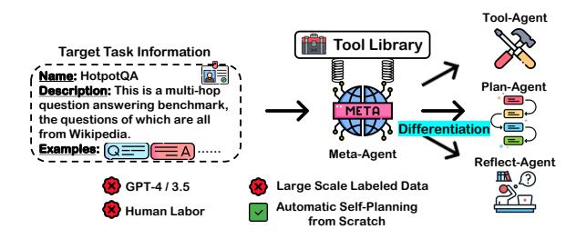
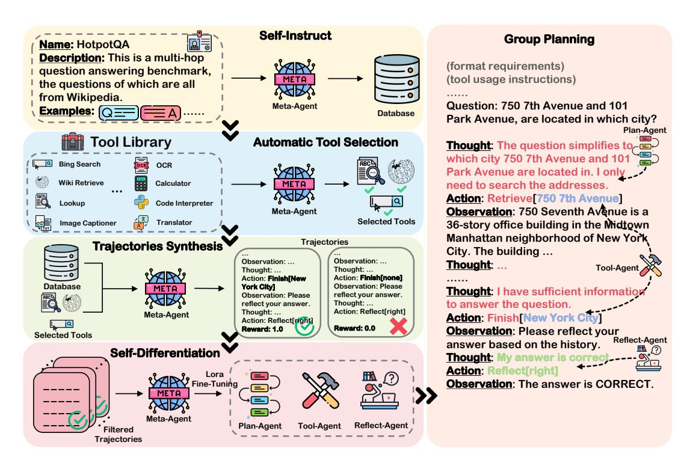
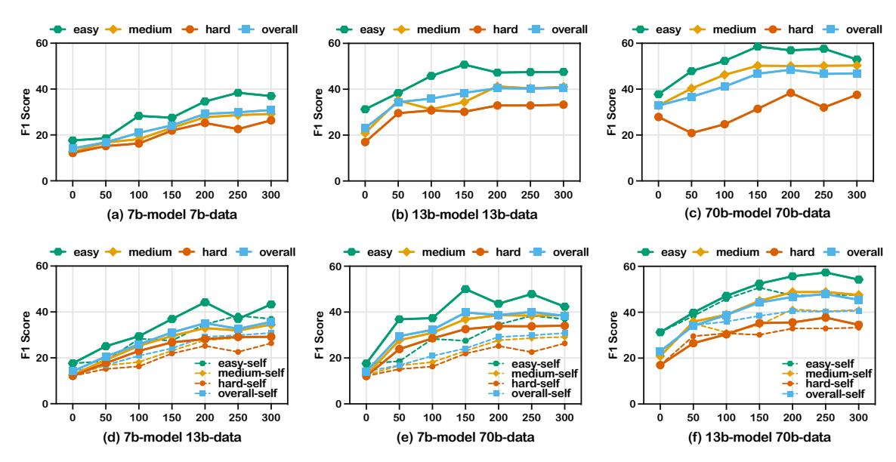
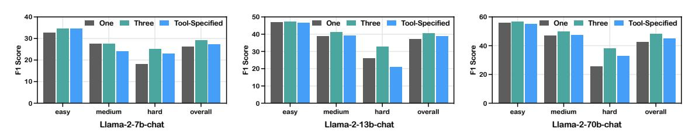
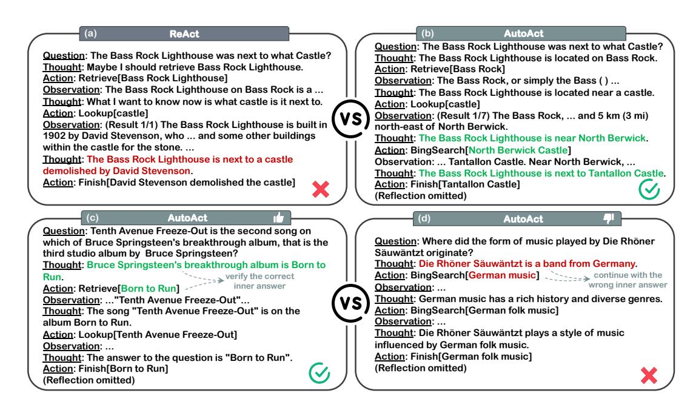
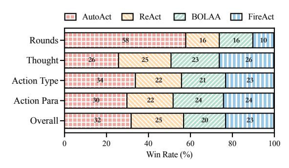

# AUTOACT: Automatic Agent Learning from Scratch via Self-Planning

Shuofei Qiao♠♡, Ningyu Zhang♠♡∗ , Runnan Fang♠♡, Yujie Luo♠♡, Wangchunshu Zhou♣, Yuchen Eleanor Jiang♣, Chengfei Lv♢, Huajun Chen♠♡∗ ♠Zhejiang University

♡Zhejiang University - Ant Group Joint Laboratory of Knowledge Graph ♣AIWaves Inc. ♢Alibaba Group {shuofei,zhangningyu}@zju.edu.cn

## Abstract

Language agents have achieved considerable performance on various complex questionanswering tasks. Despite the incessant exploration in this field, existing language agent systems still struggle with costly, non-reproducible data reliance and face the challenge of compelling a single model for multiple functions. To this end, we introduce AUTOACT, an automatic agent learning framework that does not rely on large-scale annotated data and synthetic trajectories from closed-source models (e.g., GPT-4). Given limited data with a tool library, AUTOACT first automatically synthesizes planning trajectories without any assistance from humans or strong closed-source models. Then, AUTOACT leverages a *division-of-labor* strategy to automatically differentiate based on the target task information and synthesized trajectories, producing a sub-agent group to complete the task. We conduct comprehensive experiments with different LLMs, which demonstrates that AUTOACT yields better or parallel performance compared to various strong baselines. Further analysis demonstrates the effectiveness of the *division-of-labor* strategy, with the trajectory quality generated by AUTOACT significantly outperforming that of others[1](#page-0-0) .

# 1 Introduction

Language agents [\(Wang et al.,](#page-10-0) [2023a;](#page-10-0) [Xi et al.,](#page-11-0) [2023;](#page-11-0) [Guo et al.,](#page-9-0) [2024\)](#page-9-0), which leverage the powerful reasoning capabilities [\(Qiao et al.,](#page-10-1) [2023b;](#page-10-1) [Zhang et al.,](#page-11-1) [2023\)](#page-11-1) of Large Language Models (LLMs) to generate executable actions for observing the external world, have emerged as essential components of AI systems designed to address intricate interactive tasks [\(Torantulino,](#page-10-2) [2023;](#page-10-2) [Osika,](#page-10-3) [2023;](#page-10-3) [Nakajima,](#page-9-1) [2023;](#page-9-1) [Tang et al.,](#page-10-4) [2023;](#page-10-4) [Xie et al.,](#page-11-2) [2023\)](#page-11-2). The process of endowing LLMs with such

Figure 1: The basic framework of AUTOACT. Armed with just one tool library, the META-AGENT can automatically differentiate based on the target task information and produce a sub-agent group that can collaborate to complete the task.

interactive capabilities is referred to as *Agent Learning* wherein *planning* [\(Huang et al.,](#page-9-2) [2024\)](#page-9-2) plays a pivotal role, which is responsible for decomposing complex tasks [\(Wei et al.,](#page-11-3) [2022;](#page-11-3) [Yao et al.,](#page-11-4) [2023;](#page-11-4) [Team,](#page-10-5) [2023;](#page-10-5) [Qian et al.,](#page-10-6) [2023\)](#page-10-6), invoking external tools [\(Shen et al.,](#page-10-7) [2023;](#page-10-7) [Lu et al.,](#page-9-3) [2023;](#page-9-3) [Qin et al.,](#page-10-8) [2023\)](#page-10-8), reflecting on past mistakes [\(Shinn et al.,](#page-10-9) [2023;](#page-10-9) [Madaan et al.,](#page-9-4) [2023\)](#page-9-4), and aggregating information from various sources to reach the final targets. There have been a lot of works [\(Li et al.,](#page-9-5) [2023;](#page-9-5) [Shen et al.,](#page-10-7) [2023;](#page-10-7) [Hong et al.,](#page-9-6) [2023;](#page-9-6) [Talebirad and](#page-10-10) [Nadiri,](#page-10-10) [2023;](#page-10-10) [Chen et al.,](#page-8-0) [2023d,](#page-8-0)[b\)](#page-8-1) that directly prompt closed-source off-the-shelf LLMs to plan on particular tasks. Despite their convenience and flexibility, closed-source LLMs inevitably suffer from unresolved issues, as their accessibility often comes at a steep price and their black-box nature makes the result reproduction difficult. In light of this, some recent endeavors have shifted their focus towards imbuing open-source models with planning capabilities through fine-tuning [\(Chen et al.,](#page-8-2) [2023a;](#page-8-2) [Zeng et al.,](#page-11-5) [2023;](#page-11-5) [Yin et al.,](#page-11-6) [2023\)](#page-11-6).

However, despite the achievements of the existing fine-tuning-based method, they are not without limitations. On the one hand, training open-source models necessitates a substantial amount of annotated task data and still relies on closed-source models to synthesize planning trajectories. However,

∗ Corresponding Author.

1Code will be available at [https://github.com/](https://github.com/zjunlp/AutoAct) [zjunlp/AutoAct](https://github.com/zjunlp/AutoAct).

fulfilling these requirements in many real-world scenarios, such as private personal bots or sensitive company business, often proves to be rocky. On the other hand, from the perspective of agent framework, fine-tuning-based methods compel one single language agent to learn all planning abilities, placing even greater pressure on them. These contradict Simon's principle of bounded rationality (Mintrom, 2015), which states that "precise social division-of-labor and clear individual tasks can compensate for the limited ability of individuals to process and utilize information".

To this end, we introduce AUTOACT, an automatic agent learning framework, which does not rely on large-scale annotated data and synthetic trajectories from closed-source models while incorporating explicit individual tasks with precise division-of-labor (see Fig. 1). Given a limited set of user-provided data examples, AUTOACT starts with a META-AGENT to obtain an augmented database through self-instruct (Wang et al., 2023b). Then, armed with a prepared tool library, the META-AGENT can automatically synthesize planning trajectories without any assistance from humans or strong closed-source models. Finally, we propose the division-of-labor strategy which resembles cell differentiation based on the self-synthesized trajectories (genes), where the META-AGENT acts as a stem cell (Colman, 2008) and differentiates into three sub-agents with distinct functions: task decomposition, tool invocation, and self-reflection, respectively. Our differentiation process is essentially a parameter-efficient training process on the self-synthesized trajectories with low-consumption resources. We list the differences between AU-TOACT and prior works in Tab. 3.

Experiments on complex question-answering tasks with different LLMs demonstrate that AU-TOACT yields better or parallel performance compared to various strong baselines. Extensive empirical analysis demonstrates the effectiveness of our appropriate *division-of-labor* strategy.

#### 2 AUTOACT

#### 2.1 Critical Components of AUTOACT

META-AGENT. The META-AGENT is responsible for all the preparatory work before self-differentiation and serves as the backbone model for all sub-agents. Given limited target task information and a pre-prepared tool library, the META-AGENT can differentiate into an agent group capa-

ble of collaborating to accomplish the target task. In AUTOACT, the META-AGENT can be initialized with any open-source model.

Target Task Information. In this paper, we mainly focus on agent learning from scratch, which means the task information at hand is quite limited, primarily encompassing three aspects: task name  $\mathcal{M}$ , task description  $\mathcal{P}$ , task data examples  $\mathcal{C}$ . Concretely,  $\mathcal{P}$  represents a detailed description of the task's characteristics.  $\mathcal{C} = \{q_i, a_i\}_{i=1}^{|\mathcal{C}|}$  indicates  $|\mathcal{C}|$  question-answer example pairs of the task, where  $|\mathcal{C}|$  is very small which users can effortlessly provide (e.g., a few demonstrations). For a more in-depth view of task information, please refer to Appx. D. Note that the task information serves as the only user-provided knowledge of the task for AUTOACT to conduct automatic agent learning.

**Tool Library.** To facilitate our agents in automatic task planning, we provide a comprehensive tool library at their disposal. The tool library can be denoted as  $\mathcal{T} = \{m_i, d_i, u_i\}_{i=1}^{|\mathcal{T}|}$ , where m represents the tool name, d defines the tool functionality, u details the tool usage instruction, and  $|\mathcal{T}|$  stands for the tools amount of the library. In our automatic procedure, the META-AGENT has the autonomy to select appropriate tools from the tool library based on the task information. Users also have the option to expand the tool library according to their specific needs, allowing for more flexible utilization. We list part of our tool library in Appx. E.

#### 2.2 Starting from Scratch via Self-Instruct

To acquire a sufficient amount of task data and provide an ample training resource, it is necessary to augment the data based on the examples at hand. We accomplish this process through selfinstruct. Initially, the database  $\mathcal{D}$  is set to be equal to the task data examples C, with C as the seed for data generation. In each round, the META-AGENT generates new question-answer pairs by few-shot prompting, and the few-shot prompt examples are randomly sampled from  $\mathcal{D}$ . The generated data will be added to  $\mathcal{D}$  followed by filtering, with the exclusion of format erroneous and duplicate data before its inclusion. Eventually, we obtain a database  $\mathcal{D} = \{q_i, a_i\}_{i=1}^{|\mathcal{D}|},$  where the number of data  $|\mathcal{D}|$ satisfies  $|\mathcal{D}| \gg |\mathcal{C}|$ . The prompt we use for selfinstruct can be seen in Appx. F.1 and we list some cases generated through self-instruct in Appx. G.

Figure 2: **The overview of our proposed framework AUTOACT.** We initiate with **self-instruct** to extend the task database from scratch. Then **self-planning** is applied to conduct automatic agent learning, including *automatic tool selection*, *trajectories synthesis*, *self-differentiation* and *group planning*. Our self-differentiation is a parameter-efficient fine-tuning process to achieve resource-efficient learning.

# 2.3 Automatic Agent Learning via Self-Planning

Automatic Tool Selection. With the tool library at hand, we ask the META-AGENT to select applicable tools for each task automatically. Specifically, we put  $\mathcal{T} = \{m_i, d_i, u_i\}_{i=1}^{|\mathcal{T}|}$  in the form of a tool list as part of the prompt. Along with  $\mathcal{T}$ , the prompt also includes the task's description  $\mathcal{C}$ . Finally, we instruct the META-AGENT to select an appropriate set of tools  $\mathcal{T}_s$  ( $\mathcal{T}_s \subset \mathcal{T}$ ) to wait for synthesizing trajectories. The prompt we use for automatic tool selection can be seen in Appx. F.2.

**Trajectories Synthesis.** Without depending on closed-source models, we enable the META-AGENT to synthesize planning trajectories on its own. Equipped with  $\mathcal{T}_s$ , we instruct the META-AGENT to synthesize trajectories in a zero-shot manner on the database  $\mathcal{D}$  adhering to the format of Thought-Action-Observation as defined in Yao et al. (2023). In order to obtain high-quality synthesized trajectories, we filter out all the trajectories with reward < 1 and collect trajectories with exactly correct answers (reward = 1) as the training source for self-differentiation. The prompt for trajectories synthesis can be seen in Appx. F.3.

**Self-Differentiation.** In order to establish a clear *division-of-labor*, we leverage synthesized planning trajectories to differentiate the META-AGENT into three sub-agents with distinct functionalities:

- $\not\equiv$  PLAN-AGENT  $\pi_{\text{plan}}$  undertakes task decomposition and determines which tool to invoke in each planning loop (Eq. 2).
- **X** TOOL-AGENT  $\pi_{\text{tool}}$  is responsible for how to invoke the tool (Eq. 3) by deciding the parameters for the tool invocation.
- **REFLECT-AGENT**  $\pi_{\text{reflect}}$  engages in reflection by considering all the historical trajectories and providing a reflection result (Eq. 4).

We assume that the planning loop at time t can be denoted as  $(\tau_t, \alpha_t, o_t)$ , where  $\tau$  denotes Thought,  $\alpha$  signifies Action, and o represents Observation.  $\alpha$  can be further expressed as  $(\alpha^m, \alpha^p)$ , where  $\alpha^m$  is the name of the action, and  $\alpha^p$  is the parameters required to perform the action. Then the historical trajectory at time t can be signaled as:

$$\mathcal{H}_t = (\tau_0, \alpha_0, o_0, \tau_1, ..., \tau_{t-1}, \alpha_{t-1}, o_{t-1}).$$
 (1)

Eventually, supposing that the prompts of target task information, planning format requirements,

and the question are all combined as S, the responsibilities of each sub-agent can be defined as:

$$\tau_t, \alpha_t^m = \pi_{\text{plan}}(\mathcal{S}, \mathcal{T}_s, \mathcal{H}_t),$$
 (2)

$$\alpha_t^p = \pi_{\text{tool}}(\mathcal{S}, \mathcal{T}_s, \mathcal{H}_t, \tau_t, \alpha_t^m),$$
 (3)

$$\tau^r, \alpha^r = \pi_{\text{reflect}}(\mathcal{S}, \mathcal{T}_s, \mathcal{H}),$$
 (4)

where τ r and α r represent the thought and action of the reflection process respectively, and H is the planning history after finishing the answer. The trajectories can be reorganized based on the responsibilities above and fed to the META-AGENT for selfdifferentiation. Our differentiation is a parameterefficient fine-tuning process to achieve resourceefficient learning. Particularly, for each sub-agent, we train a specific LoRA [\(Hu et al.,](#page-9-8) [2022\)](#page-9-8).

Group Planning. At inference time, once the tool name α m t generated by the PLAN-AGENT is triggered at time t, the TOOL-AGENT is roused to decide the parameters α p t transferred to the specific tool. The return result of the tool is treated as the observation ot and handed to the PLAN-AGENT. After the collaboration between the PLAN-AGENT and TOOL-AGENT reaches a prediction, the REFLECT-AGENT comes to reflect on the history and provide a reflection result contained in the reflection action α r . If the reflection result indicates that the prediction is correct, the whole planning process ends. Otherwise, the PLAN-AGENT and TOOL-AGENT will continue the planning based on the reflection information. The specific sequence of the group planning process can be found in the example on the right of Fig. [2.](#page-2-0)

#### 3 Experimental Setup

Tasks and Metrics. We evaluate AUTOACT on HotpotQA [\(Yang et al.,](#page-11-7) [2018\)](#page-11-7) and ScienceQA [\(Lu](#page-9-9) [et al.,](#page-9-9) [2022\)](#page-9-9). HotpotQA is a multi-hop QA task challenging for rich background knowledge, the answer of which is usually a short entity or yes/no. Following [Liu et al.](#page-9-10) [\(2023\)](#page-9-10), we randomly select 300 dev questions divided into three levels for evaluation, with 100 questions in each level. For HotpotQA, the reward ∈ [0, 1] is defined as the F1 score grading between the prediction and groundtruth answer. ScienceQA is a multi-modal QA task spanning various scientific topics. We also divide the test set into three levels based on the grade, with 120 randomly sampled data in each level. Since ScienceQA is a multi-choice task, the reward ∈ {0, 1} is exactly the accuracy. Note that

due to the limitations of LMs in generating images, for ScienceQA, during the self-instruct stage, we directly generate captions for the images instead.

Baselines. We choose the open-source Llama-2 models [\(Touvron et al.,](#page-10-12) [2023\)](#page-10-12) as the backbones of our META-AGENT and sub-agents. The compared baselines include CoT [\(Wei et al.,](#page-11-3) [2022\)](#page-11-3), REACT, Chameleon [\(Lu et al.,](#page-9-3) [2023\)](#page-9-3), Reflexion [\(Shinn et al.,](#page-10-9) [2023\)](#page-10-9), BOLAA [\(Liu et al.,](#page-9-10) [2023\)](#page-9-10), ReWOO [\(Xu et al.,](#page-11-8) [2023\)](#page-11-8), FIREACT [\(Chen et al.,](#page-8-2) [2023a\)](#page-8-2). We detail each baseline in Appx. [B.](#page-11-9) To ensure fairness, we maintain an equal training trajectory volume of 200 for FIREACT and AUTOACT (200 synthesized data). As Reflexion provides answer correctness labels during reflection but other methods including AUTOACT do not, we test all the other methods twice and choose the correct one for evaluation. For all the prompt-based baselines, we uniformly provide two examples in the prompt.

Training Setups. We fine-tune all our models with LoRA [\(Hu et al.,](#page-9-8) [2022\)](#page-9-8) in the format proposed in Alpaca [\(Taori et al.,](#page-10-13) [2023\)](#page-10-13). All the training and inference experiments are conducted on 8 V100 GPUs within 16 hours. We detail the hyperparameters for training in Appx. [B.](#page-12-2)

# 4 Results

Compare to Prompt-based Agent Learning Baselines. As shown in Table [1,](#page-4-0) the 13b and 70b models consistently outperform various promptbased baselines. The 70b model even surpasses the agent performance of GPT-3.5-Turbo, achieving a rise of ↑3.77% on HotpotQA and ↑6.39% on ScienceQA. The performance of the 7b model is comparable to other methods to some extent. Therefore, whether in a single-agent or multi-agent architecture, prompt-based methods relying on fewshot demonstrations fail to precisely customize the behavior of the agent, which is also supported by the fact that FIREACT widely outperforms REACT and BOLAA in the context of iterative planning. In addition, our investigation reveals a visible disparity in open-source models between the performance of many prompt-based planning baselines (relying on various external tools) and CoT (relying on the models' intrinsic reasoning abilities). This discrepancy underscores the formidable challenge of unlocking planning capabilities by prompting.

Compare to Fine-tuning-based Agent Learning Baselines. Further focusing on FIREACT in

|                     | Method               | HotpotQA |        |       | ScienceQA |       |       |       |       |
|---------------------|----------------------|----------|--------|-------|-----------|-------|-------|-------|-------|
| Backbone            |                      | Easy     | Medium | Hard  | All       | G1-4  | G5-8  | G9-12 | All   |
| GPT-3.5             | CoT u             | 48.21    | 44.52  | 34.22 | 42.32     | 60.83 | 55.83 | 65.00 | 60.56 |
| Turbo               | Zero-Shot Plan* u | 50.71    | 45.17  | 38.23 | 44.70     | 76.67 | 61.67 | 78.33 | 72.22 |
|                     | CoT u             | 35.80    | 26.69  | 18.20 | 26.90     | 59.17 | 50.00 | 59.17 | 56.11 |
|                     | ReAct u           | 25.14    | 19.87  | 17.39 | 20.80     | 52.50 | 47.50 | 54.17 | 51.39 |
|                     | Chameleon u       | 37.73    | 26.66  | 21.83 | 28.74     | 59.17 | 54.17 | 60.00 | 57.78 |
| Llama-2             | Reflexion u       | 35.55    | 28.73  | 24.35 | 29.54     | 60.83 | 57.50 | 59.17 | 58.06 |
| 7B-chat             | u ² BOLAA            | 27.55    | 21.47  | 21.03 | 23.35     | 58.33 | 53.33 | 52.50 | 54.72 |
|                     | u ² ReWOO            | 27.53    | 21.02  | 20.22 | 22.92     | 50.83 | 49.17 | 55.83 | 51.94 |
|                     | FireAct v         | 38.83    | 30.19  | 22.30 | 30.44     | 50.83 | 53.33 | 60.00 | 54.72 |
|                     | v ² AUTOACT          | 34.60    | 27.73  | 25.22 | 29.18     | 62.50 | 49.17 | 48.33 | 53.33 |
|                     | CoT u             | 37.90    | 25.28  | 21.64 | 28.27     | 61.67 | 52.50 | 69.17 | 61.11 |
|                     | ReAct u           | 28.68    | 22.15  | 21.69 | 24.17     | 57.50 | 51.67 | 65.00 | 58.06 |
|                     | Chameleon u       | 40.01    | 25.39  | 22.82 | 29.41     | 69.17 | 60.83 | 73.33 | 67.78 |
| Llama-2             | Reflexion u       | 44.43    | 37.50  | 28.17 | 36.70     | 67.50 | 64.17 | 73.33 | 68.33 |
| 13B-chat            | u ² BOLAA            | 33.23    | 25.46  | 25.23 | 27.97     | 60.00 | 54.17 | 65.83 | 60.00 |
|                     | u ² ReWOO            | 30.09    | 24.01  | 21.13 | 25.08     | 57.50 | 54.17 | 65.83 | 59.17 |
|                     | FireAct v         | 45.83    | 38.94  | 26.06 | 36.94     | 60.83 | 57.50 | 67.50 | 61.94 |
|                     | v ² AUTOACT          | 47.29    | 41.27  | 32.92 | 40.49     | 70.83 | 66.67 | 76.67 | 71.39 |
|                     | CoT u             | 45.37    | 36.33  | 32.27 | 37.99     | 74.17 | 64.17 | 75.83 | 71.39 |
| Llama-2 70B-chat | ReAct u           | 39.70    | 37.19  | 33.62 | 36.83     | 64.17 | 60.00 | 72.50 | 65.56 |
|                     | Chameleon u       | 46.86    | 38.79  | 34.43 | 40.03     | 77.83 | 69.17 | 76.67 | 74.56 |
|                     | Reflexion u       | 48.01    | 46.35  | 35.64 | 43.33     | 75.83 | 67.50 | 78.33 | 73.89 |
|                     | u ² BOLAA            | 46.44    | 37.29  | 33.49 | 39.07     | 70.00 | 67.50 | 75.00 | 70.83 |
|                     | u ² ReWOO            | 42.00    | 39.58  | 35.32 | 38.96     | 65.00 | 61.67 | 76.67 | 67.78 |
|                     | FireAct v         | 50.82    | 41.43  | 35.86 | 42.70     | 72.50 | 68.33 | 75.00 | 71.94 |
|                     | v ² AUTOACT          | 56.94    | 50.12  | 38.35 | 48.47     | 82.50 | 72.50 | 80.83 | 78.61 |

Table 1: Main results of AUTOACT compared to various baselines on HotpotQA and ScienceQA. The icon u indicates prompt-based agent learning without fine-tuning, while v means fine-tuning-based agent learning. denotes single-agent learning and ² symbolizes multi-agent learning. The best results of each model are marked in bold and the second-best results are marked with underline. \*We compare the zero-shot plan performance of GPT-3.5-Turbo to ensure fairness in our evaluation since our setup does not include annotated trajectory examples.

Tab. [1,](#page-4-0) despite the aid of GPT-4, FIREACT's approach of assigning the entire planning task to a single model proves to be burdensome. As a result, its performance on ScienceQA even falls short compared to the prompt-based global planning method, Chameleon. AUTOACT decouples the planning process and reaches a clear *divisionof-labor* among sub-agents for group planning, resulting in an improvement than FIREACT, with ↑5.77% on HotpotQA and ↑6.67% on ScienceQA with 70b model. Additionally, AUTOACT achieves self-planning without relying on closed-source models and large-scale labeled datasets, which paves the way for automatic agent learning with open-source models from scratch. In ablation study ([§4\)](#page-5-0) and human evaluation ([§5\)](#page-7-0), we will further validate that the quality of trajectories synthesized by AUTOACT is not inferior to FIREACT trained on trajectories synthesized using GPT-4.

|               | HotpotQA    | ScienceQA   |
|---------------|-------------|-------------|
| AUTOACT       | 48.47       | 78.61       |
| - reflection  | 45.66↓2.81  | 75.28↓3.33  |
| - multi       | 42.81↓5.66  | 69.72↓8.89  |
| - fine-tuning | 32.84↓15.63 | 61.94↓16.67 |
| - filtering   | 32.51↓15.96 | 59.17↓19.44 |

Table 2: Approach ablations of AUTOACT. *- reflection* symbolizes removing the reflect-agent in AU-TOACT. *- multi* denotes feeding all the differentiated data into one model for fine-tuning. *- fine-tuning* indicates zero-shot prompt planning with the three agents defined in AUTOACT. *- filtering* represents selfdifferentiation on all the trajectories generated in zeroshot planning without filtering wrong cases.

# Single-agent Learning vs. Multi-agent Learning. Under identical settings, multi-agent architectures generally exhibit better performance than single-agent (REACT vs. BOLAA, FIREACT vs.

Figure 3: **Performance of AUTOACT on HotpotQA with different training data scales.** (a-c) shows the results of the model trained on self-synthesized trajectories. (d-f) represents the results of the model trained on trajectories synthesized by a stronger model, where the dashed line is the baseline trained on self-synthesized trajectories.

Figure 4: **Performance of AUTOACT on HotpotQA based on different degrees of labor division.** *One* is training a single model with all the differentiated data. *Three* represents the differentiation into three agents: plan, tool, and reflect. *Tool Specified* indicates further differentiating the tool-agent with one tool, one agent.

AUTOACT), which aligns with Simon's theory of bounded rationality. Seemingly contrary to expectations, despite being a single-agent architecture, Chameleon outperforms BOLAA (even FIREACT on ScienceQA). However, we analyze that this can be attributed to the way it leverages tools. In Chameleon, the process of deciding tool parameters is considered a form of tool invocation, and specialized few-shot prompts are designed to guide the model through this process. From this aspect, Chameleon, despite nominally a single-agent architecture, exhibits features resembling a multi-agent one, which does not contradict our initial conclusion. Indeed, we can also explain from the perspective of optimizing objectives. Another well-known principle, Goodhart's Law (Goodhart, 1984), states that "When a measure becomes a target, it ceases to be a good measure". This implies that optimizing one objective on the same agent will inevitably harm other optimization objectives to some extent. Therefore, it is not optimal to optimize all objectives on a single agent, and a multi-agent architecture happens to address this issue. However, we analyze in §5 that excessive fine-grained *division-of-labor* is not the best approach.

**Approach Ablations.** Tab. 2 presents the performance of AUTOACT on the 70b model after removing certain key processes. It can be observed that the least impactful removal is the - reflect. We investigate that in the zero-shot scenario, the model tends to be over-confident in its answers. It typically only recognizes its errors when there are obvious formatting mistakes or significant repetitions in the planning process. Consistent with previous findings, the removal of the - multi agents leads to a noticeable decrease in performance. A more exciting discovery is that the results of - multi are comparable to those of FIREACT. This indirectly suggests that the trajectory quality generated by the 70b model may be no worse than that of GPT-4. As expected, the performance deteriorates after fine-tuning, which once again confirms the previ-

Figure 5: Case study on HotpotQA. AUTOACT (b) successfully addresses the failure in REACT (a) by employing a more scientific combination of tools and making more accurate tool invocations. With more planning rounds, AUTOACT (c) can validate its inner answers by continuing more rounds of self-verification. While this can also lead to a longer context, gradually deviating AUTOACT (d) from the original question.

Figure 6: Human evaluation of trajectories generated by Llama-2-70b-chat on HotpotQA. We compare the number of planning rounds, the logical correctness of thoughts, action types, action parameters, and the overall coherence of each trajectory. The figure above displays the Win Rate of each method in each aspect.

ous conclusion. To demonstrate the necessity of filtering out planning error data, we specifically remove the filtering process (*- filtering*) to examine the performance of AUTOACT. The results indicate that the damage caused by training on unfiltered data is even greater than that of *- fine-tuning*.

#### 5 Analysis

Larger training data scale does not necessarily mean better results. We evaluate the influence of different training data scales on the performance of self-planning on HotpotQA in Fig. [3](#page-5-1) (a-c). It can be observed that the overall perfor-

mance of different models goes to stability with minimal waves once the data scale exceeds 200. We speculate that this may be due to the limited ability of naive self-instruct to boost internal knowledge of the language model. As the training data increases, the knowledge which can be extracted through self-instruct decreases. Despite our efforts to filter out duplicate data, the mindless increase can inevitably lead to a significant surge in similar data, which undermines the benefits of increasing the data scale and makes it challenging to improve model performance or even leads to over-fitting. To further confirm the role of training data, we decouple the models from the training data and evaluate their training results on trajectories synthesized by stronger models. From Fig. [3](#page-5-1) (d-f), we can see consistent conclusions with previous findings. Therefore, maximizing the diversity of the synthesized data in the database may be a key improvement direction for AUTOACT and we leave this for our future work.

Moderate division-of-labor benefits group planning performance. To explore the impact of different granularity of self-differentiation, we further subdivide the tool agent, assigning dedicated agents to manipulate each specific tool. We compare the performance of *One* agent, *Three* agents (AUTOACT), and the *Tool-Specified* setting on HotpotQA in Fig. [4.](#page-5-2) It can be observed that excessive differentiation (*Tool-Specified*) not only fails to achieve better results but can sometimes even be less effective than not differentiating (*One*) at all. This is consistent with the findings in [Qiao](#page-10-14) [et al.](#page-10-14) [\(2023a\)](#page-10-14) which indicate that multi-tool joint learning often outperforms single-tool individual learning. Moreover, it appears that the performance loss of tool-specific agents compared to AUTOACT is more significant on harder problems. This is because challenging problems typically require more planning steps and higher levels of collaboration among tools. By unifying tool invocations under one agent, it becomes possible to effectively learn the interconnectedness between tools, thereby compensating for potential information gaps arising from using tool-specific agents. Note the difference from [Li et al.](#page-9-11) [\(2024\)](#page-9-11), here we are discussing the granularity of division-of-labor among agents with different responsibilities, rather than the voting quantity among mutually equal agents.

Human Evaluation. To get a deeper understanding of the capability of AUTOACT, we manually compare the quality of trajectories generated by different methods from the number of planning rounds, the logical correctness of thoughts, action types, action parameters, and overall coherence. The detailed human evaluation process can be found in Appx. [C.](#page-12-3) The evaluation results are depicted in Fig. [5](#page-6-1)[&6.](#page-6-2) We can observe a clear advantage for AUTOACT over other methods in the action type and action parameters. This indicates that decoupling the missions of planning and tool invocation can lead to better performance for both, alleviating the overwhelming pressure on a single agent. A more intuitive comparison can be observed in Fig. [5](#page-6-1) (a)(b). AUTOACT successfully addresses the failure in REACT by employing a more scientific combination of tools and making more accurate tool invocations. Furthermore, AUTOACT tends to consume more planning rounds than other methods. This allows AUTOACT to perform better on harder problems. However, this characteristic can be a double-edged sword when it comes to simple problems. A surprising aspect is that AUTOACT can validate its inner answers by continuing more rounds of verification (Fig. [5](#page-6-1) (c)). But this can also lead to a longer context, gradually deviating AUTOACT from the original question (Fig. [5](#page-6-1) (d)).

## 6 Related Work

LLM-Powered Agents. The rise of LLMs has positioned them as the most promising key to unlocking the door to Artificial General Intelligence (AGI), providing robust support for the development of LLM-centered AI agents [\(Wang et al.,](#page-10-0) [2023a;](#page-10-0) [Xi et al.,](#page-11-0) [2023;](#page-11-0) [Wang et al.,](#page-11-10) [2023c](#page-11-10)[,d\)](#page-11-11). Related works focus primarily on agent planning [\(Yao](#page-11-4) [et al.,](#page-11-4) [2023;](#page-11-4) [Song et al.,](#page-10-15) [2022;](#page-10-15) [Chen et al.,](#page-8-2) [2023a\)](#page-8-2), external tools harnessing [\(Patil et al.,](#page-10-16) [2023;](#page-10-16) [Qiao](#page-10-14) [et al.,](#page-10-14) [2023a;](#page-10-14) [Qin et al.,](#page-10-8) [2023\)](#page-10-8), collective intelligence among multi-agents [\(Liang et al.,](#page-9-12) [2023;](#page-9-12) [Liu](#page-9-10) [et al.,](#page-9-10) [2023;](#page-9-10) [Chen et al.,](#page-8-5) [2023c\)](#page-8-5), etc. However, despite their success, existing methods still face two major troubles. Firstly, most agents heavily rely on prompts for customization, which makes it difficult to precisely tailor the behavior of the agent, resulting in unexpected performance at times. Secondly, each agent is compelled to master all skills, making it challenging for the agent to achieve expertise in every domain. In response, our approach leverages a proper *division-of-labor* strategy and fine-tuning each sub-agent to equip different agents with distinct duties. These agents collaborate to accomplish tasks orderly and effectively.

Agent Fine-Tuning. Despite the vast interest in LLM-powered agents, the construction of agents through fine-tuning has received limited attention. Most early works concentrate on fine-tuning to optimize the model's reasoning capabilities [\(Liu et al.,](#page-9-13) [2022;](#page-9-13) [Fu et al.,](#page-8-6) [2023\)](#page-8-6) or tool proficiency [\(Patil](#page-10-16) [et al.,](#page-10-16) [2023;](#page-10-16) [Qiao et al.,](#page-10-14) [2023a;](#page-10-14) [Qin et al.,](#page-10-8) [2023\)](#page-10-8). Recently, more works have emphasized endowing open-source LLMs with agent capabilities through fine-tuning [\(Chen et al.,](#page-8-2) [2023a;](#page-8-2) [Zeng et al.,](#page-11-5) [2023;](#page-11-5) [Yin et al.,](#page-11-6) [2023;](#page-11-6) [Shen et al.,](#page-10-17) [2024\)](#page-10-17). However, these works suffer from at least one of the following issues: *i)* the requirement of one single model to be a generalist, *ii)* the need for a large amount of annotated data, *iii)* the need for trajectory annotation of closed-source models. Our approach enables the META-AGENT to synthesize trajectories and achieve a *division-of-labor* strategy in a zero-shot manner, without relying on closed-source models.

## 7 Conclusion and Future Work

In this paper, we propose AUTOACT, an automatic agent learning framework that does not rely on large-scale annotated data and synthetic trajectories from closed-source models, while alleviating

the pressure on individual agents by explicitly dividing the workload. Interesting future directions include: *i)* expanding AUTOACT to more realistic task scenarios [\(Puig et al.,](#page-10-18) [2018;](#page-10-18) [Zhou et al.,](#page-11-12) [2023a;](#page-11-12) [Xie et al.,](#page-11-13) [2024\)](#page-11-13), *ii)* boosting more knowledge via self-instruct (as analyzed in [§5\)](#page-6-3), *iii)* iteratively enhancing synthetic trajectories via self-improvement [\(Huang et al.,](#page-9-14) [2023;](#page-9-14) [Aksitov et al.,](#page-8-7) [2023\)](#page-8-7).

# Limitations

In this paper, we focus on constructing an automatic agent learning framework dubbed AUTOACT. Despite our best efforts, this paper may still have some remaining limitations.

Tasks and Backbones. For experimental convenience, we only evaluate our method on complex question-answering tasks with the Llama-2-chat model series. However, there are many other interactive scenarios and backbone models beyond these. Other complex tasks include web [\(Yao et al.,](#page-11-14) [2022;](#page-11-14) [Zhou et al.,](#page-11-12) [2023a\)](#page-11-12), household [\(Puig et al.,](#page-10-18) [2018;](#page-10-18) [Shridhar et al.,](#page-10-19) [2021\)](#page-10-19), traveling [\(Xie et al.,](#page-11-13) [2024\)](#page-11-13), robotics [\(Ichter et al.,](#page-9-15) [2022\)](#page-9-15), etc., and more backbone models include Vicuna [\(Zheng et al.,](#page-11-15) [2023\)](#page-11-15), ChatGLM [\(Du et al.,](#page-8-8) [2022\)](#page-8-8), Mistral [\(Jiang](#page-9-16) [et al.,](#page-9-16) [2023\)](#page-9-16), etc. We plan to conduct further research on applying AUTOACT to a wider range of tasks and backbones in the future.

Boosting Knowledge via Self-Instruct. As analyzed in [§5,](#page-6-4) the planning performance of AU-TOACT can be limited by the model's ability to access internal knowledge through self-instruct. While the current phenomenon allows us to achieve lightweight self-differentiation in terms of parameters and data, it is still necessary to research how to enrich knowledge as much as possible within the constraints of limited data.

Self-Improvement. Recent research has shed light on self-improvement techniques that enhance LLMs by iteratively training them on selfsynthesized data [\(Zelikman et al.,](#page-11-16) [2022;](#page-11-16) [Huang](#page-9-14) [et al.,](#page-9-14) [2023;](#page-9-14) [Gülçehre et al.,](#page-9-17) [2023;](#page-9-17) [Aksitov et al.,](#page-8-7) [2023\)](#page-8-7). This approach allows the model to continually learn and refine its performance on its own. Our approach also involves training on selfsynthesized data and we believe that further using the iterative thinking of self-improvement will significantly enhance the performance of our method.

## Ethics Statement

This research was conducted with the highest ethical standards and best practices in research. All our experiments use publicly available datasets (as detailed in [§3\)](#page-3-3), avoiding ethical concerns related to privacy, confidentiality, or misuse of personal biological information. The human evaluation process (as detailed in Appx. [C\)](#page-12-3) was carried out strictly with fairness and transparency. Consequently, this research is free from any ethical concerns.

## References

Renat Aksitov, Sobhan Miryoosefi, Zonglin Li, Daliang Li, Sheila Babayan, Kavya Kopparapu, Zachary Fisher, Ruiqi Guo, Sushant Prakash, Pranesh Srinivasan, Manzil Zaheer, Felix Yu, and Sanjiv Kumar. 2023. [Rest meets react: Self-improvement for multi](http://arxiv.org/abs/2312.10003)[step reasoning llm agent.](http://arxiv.org/abs/2312.10003)

Baian Chen, Chang Shu, Ehsan Shareghi, Nigel Collier, Karthik Narasimhan, and Shunyu Yao. 2023a. [Fireact: Toward language agent fine-tuning.](https://doi.org/10.48550/ARXIV.2310.05915) *CoRR*, abs/2310.05915.

Guangyao Chen, Siwei Dong, Yu Shu, Ge Zhang, Jaward Sesay, Börje F. Karlsson, Jie Fu, and Yemin Shi. 2023b. [Autoagents: A framework for automatic](https://doi.org/10.48550/ARXIV.2309.17288) [agent generation.](https://doi.org/10.48550/ARXIV.2309.17288) *CoRR*, abs/2309.17288.

Justin Chih-Yao Chen, Swarnadeep Saha, and Mohit Bansal. 2023c. [Reconcile: Round-table conference](https://doi.org/10.48550/ARXIV.2309.13007) [improves reasoning via consensus among diverse](https://doi.org/10.48550/ARXIV.2309.13007) [llms.](https://doi.org/10.48550/ARXIV.2309.13007) *CoRR*, abs/2309.13007.

Weize Chen, Yusheng Su, Jingwei Zuo, Cheng Yang, Chenfei Yuan, Chen Qian, Chi-Min Chan, Yujia Qin, Yaxi Lu, Ruobing Xie, Zhiyuan Liu, Maosong Sun, and Jie Zhou. 2023d. [Agentverse: Facilitating multi](https://doi.org/10.48550/ARXIV.2308.10848)[agent collaboration and exploring emergent behav](https://doi.org/10.48550/ARXIV.2308.10848)[iors in agents.](https://doi.org/10.48550/ARXIV.2308.10848) *CoRR*, abs/2308.10848.

Alan Colman. 2008. Human embryonic stem cells and clinical applications. *Cell Research*, 18(1):S171– S171.

Zhengxiao Du, Yujie Qian, Xiao Liu, Ming Ding, Jiezhong Qiu, Zhilin Yang, and Jie Tang. 2022. GLM: general language model pretraining with autoregressive blank infilling. pages 320–335.

Yao Fu, Hao Peng, Litu Ou, Ashish Sabharwal, and Tushar Khot. 2023. [Specializing smaller language](https://proceedings.mlr.press/v202/fu23d.html) [models towards multi-step reasoning.](https://proceedings.mlr.press/v202/fu23d.html) In *International Conference on Machine Learning, ICML 2023, 23-29 July 2023, Honolulu, Hawaii, USA*, volume 202 of *Proceedings of Machine Learning Research*, pages 10421–10430. PMLR.

C. A. E. Goodhart. 1984. *[Problems of Monetary](https://doi.org/10.1007/978-1-349-17295-5_4) [Management: The UK Experience](https://doi.org/10.1007/978-1-349-17295-5_4)*, pages 91–121. Macmillan Education UK, London.

- Çaglar Gülçehre, Tom Le Paine, Srivatsan Srinivasan, Ksenia Konyushkova, Lotte Weerts, Abhishek Sharma, Aditya Siddhant, Alex Ahern, Miaosen Wang, Chenjie Gu, Wolfgang Macherey, Arnaud Doucet, Orhan Firat, and Nando de Freitas. 2023. [Reinforced self-training \(rest\) for language modeling.](https://doi.org/10.48550/ARXIV.2308.08998) *CoRR*, abs/2308.08998.
- Taicheng Guo, Xiuying Chen, Yaqi Wang, Ruidi Chang, Shichao Pei, Nitesh V. Chawla, Olaf Wiest, and Xiangliang Zhang. 2024. [Large language model based](https://doi.org/10.48550/ARXIV.2402.01680) [multi-agents: A survey of progress and challenges.](https://doi.org/10.48550/ARXIV.2402.01680) *CoRR*, abs/2402.01680.
- Sirui Hong, Xiawu Zheng, Jonathan Chen, Yuheng Cheng, Jinlin Wang, Ceyao Zhang, Zili Wang, Steven Ka Shing Yau, Zijuan Lin, Liyang Zhou, Chenyu Ran, Lingfeng Xiao, and Chenglin Wu. 2023. [Metagpt:](https://doi.org/10.48550/ARXIV.2308.00352) [Meta programming for multi-agent collaborative](https://doi.org/10.48550/ARXIV.2308.00352) [framework.](https://doi.org/10.48550/ARXIV.2308.00352) *CoRR*, abs/2308.00352.
- Edward J. Hu, Yelong Shen, Phillip Wallis, Zeyuan Allen-Zhu, Yuanzhi Li, Shean Wang, Lu Wang, and Weizhu Chen. 2022. [Lora: Low-rank adaptation of](https://openreview.net/forum?id=nZeVKeeFYf9) [large language models.](https://openreview.net/forum?id=nZeVKeeFYf9) In *The Tenth International Conference on Learning Representations, ICLR 2022, Virtual Event, April 25-29, 2022*. OpenReview.net.
- Jiaxin Huang, Shixiang Gu, Le Hou, Yuexin Wu, Xuezhi Wang, Hongkun Yu, and Jiawei Han. 2023. [Large](https://aclanthology.org/2023.emnlp-main.67) [language models can self-improve.](https://aclanthology.org/2023.emnlp-main.67) In *Proceedings of the 2023 Conference on Empirical Methods in Natural Language Processing, EMNLP 2023, Singapore, December 6-10, 2023*, pages 1051–1068. Association for Computational Linguistics.
- Xu Huang, Weiwen Liu, Xiaolong Chen, Xingmei Wang, Hao Wang, Defu Lian, Yasheng Wang, Ruiming Tang, and Enhong Chen. 2024. [Understanding](http://arxiv.org/abs/2402.02716) [the planning of llm agents: A survey.](http://arxiv.org/abs/2402.02716)
- Brian Ichter, Anthony Brohan, Yevgen Chebotar, Chelsea Finn, Karol Hausman, Alexander Herzog, Daniel Ho, Julian Ibarz, Alex Irpan, Eric Jang, Ryan Julian, Dmitry Kalashnikov, Sergey Levine, Yao Lu, Carolina Parada, Kanishka Rao, Pierre Sermanet, Alexander Toshev, Vincent Vanhoucke, Fei Xia, Ted Xiao, Peng Xu, Mengyuan Yan, Noah Brown, Michael Ahn, Omar Cortes, Nicolas Sievers, Clayton Tan, Sichun Xu, Diego Reyes, Jarek Rettinghouse, Jornell Quiambao, Peter Pastor, Linda Luu, Kuang-Huei Lee, Yuheng Kuang, Sally Jesmonth, Nikhil J. Joshi, Kyle Jeffrey, Rosario Jauregui Ruano, Jasmine Hsu, Keerthana Gopalakrishnan, Byron David, Andy Zeng, and Chuyuan Kelly Fu. 2022. [Do as I can, not](https://proceedings.mlr.press/v205/ichter23a.html) [as I say: Grounding language in robotic affordances.](https://proceedings.mlr.press/v205/ichter23a.html) In *Conference on Robot Learning, CoRL 2022, 14-18 December 2022, Auckland, New Zealand*, volume 205 of *Proceedings of Machine Learning Research*, pages 287–318. PMLR.
- Albert Q. Jiang, Alexandre Sablayrolles, Arthur Mensch, Chris Bamford, Devendra Singh Chaplot, Diego de Las Casas, Florian Bressand, Gianna Lengyel,

- Guillaume Lample, Lucile Saulnier, Lélio Renard Lavaud, Marie-Anne Lachaux, Pierre Stock, Teven Le Scao, Thibaut Lavril, Thomas Wang, Timothée Lacroix, and William El Sayed. 2023. [Mistral](https://doi.org/10.48550/ARXIV.2310.06825) [7b.](https://doi.org/10.48550/ARXIV.2310.06825) *CoRR*, abs/2310.06825.
- Guohao Li, Hasan Abed Al Kader Hammoud, Hani Itani, Dmitrii Khizbullin, and Bernard Ghanem. 2023. [CAMEL: communicative agents for "mind" explo](https://doi.org/10.48550/ARXIV.2303.17760)[ration of large scale language model society.](https://doi.org/10.48550/ARXIV.2303.17760) *CoRR*, abs/2303.17760.
- Junyou Li, Qin Zhang, Yangbin Yu, Qiang Fu, and Deheng Ye. 2024. [More agents is all you need.](http://arxiv.org/abs/2402.05120)
- Tian Liang, Zhiwei He, Wenxiang Jiao, Xing Wang, Yan Wang, Rui Wang, Yujiu Yang, Zhaopeng Tu, and Shuming Shi. 2023. [Encouraging divergent thinking](https://doi.org/10.48550/ARXIV.2305.19118) [in large language models through multi-agent debate.](https://doi.org/10.48550/ARXIV.2305.19118) *CoRR*, abs/2305.19118.
- Jiacheng Liu, Alisa Liu, Ximing Lu, Sean Welleck, Peter West, Ronan Le Bras, Yejin Choi, and Hannaneh Hajishirzi. 2022. [Generated knowledge prompting](https://doi.org/10.18653/V1/2022.ACL-LONG.225) [for commonsense reasoning.](https://doi.org/10.18653/V1/2022.ACL-LONG.225) In *Proceedings of the 60th Annual Meeting of the Association for Computational Linguistics (Volume 1: Long Papers), ACL 2022, Dublin, Ireland, May 22-27, 2022*, pages 3154– 3169. Association for Computational Linguistics.
- Zhiwei Liu, Weiran Yao, Jianguo Zhang, Le Xue, Shelby Heinecke, Rithesh Murthy, Yihao Feng, Zeyuan Chen, Juan Carlos Niebles, Devansh Arpit, Ran Xu, Phil Mui, Huan Wang, Caiming Xiong, and Silvio Savarese. 2023. [BOLAA: benchmarking](https://doi.org/10.48550/ARXIV.2308.05960) [and orchestrating llm-augmented autonomous agents.](https://doi.org/10.48550/ARXIV.2308.05960) *CoRR*, abs/2308.05960.
- Pan Lu, Swaroop Mishra, Tanglin Xia, Liang Qiu, Kai-Wei Chang, Song-Chun Zhu, Oyvind Tafjord, Peter Clark, and Ashwin Kalyan. 2022. [Learn to explain:](http://papers.nips.cc/paper_files/paper/2022/hash/11332b6b6cf4485b84afadb1352d3a9a-Abstract-Conference.html) [Multimodal reasoning via thought chains for science](http://papers.nips.cc/paper_files/paper/2022/hash/11332b6b6cf4485b84afadb1352d3a9a-Abstract-Conference.html) [question answering.](http://papers.nips.cc/paper_files/paper/2022/hash/11332b6b6cf4485b84afadb1352d3a9a-Abstract-Conference.html) In *NeurIPS*.
- Pan Lu, Baolin Peng, Hao Cheng, Michel Galley, Kai-Wei Chang, Ying Nian Wu, Song-Chun Zhu, and Jianfeng Gao. 2023. [Chameleon: Plug-and-play compo](https://doi.org/10.48550/ARXIV.2304.09842)[sitional reasoning with large language models.](https://doi.org/10.48550/ARXIV.2304.09842) *CoRR*, abs/2304.09842.
- Aman Madaan, Niket Tandon, Prakhar Gupta, Skyler Hallinan, Luyu Gao, Sarah Wiegreffe, Uri Alon, Nouha Dziri, Shrimai Prabhumoye, Yiming Yang, Sean Welleck, Bodhisattwa Prasad Majumder, Shashank Gupta, Amir Yazdanbakhsh, and Peter Clark. 2023. [Self-refine: Iterative refinement with](https://doi.org/10.48550/ARXIV.2303.17651) [self-feedback.](https://doi.org/10.48550/ARXIV.2303.17651) *CoRR*, abs/2303.17651.
- Michael Mintrom. 2015. [12Herbert A. Simon, Admin](https://doi.org/10.1093/oxfordhb/9780199646135.013.22)[istrative Behavior: A Study of Decision-Making Pro](https://doi.org/10.1093/oxfordhb/9780199646135.013.22)[cesses in Administrative Organization.](https://doi.org/10.1093/oxfordhb/9780199646135.013.22) In *The Oxford Handbook of Classics in Public Policy and Administration*. Oxford University Press.
- Yohei Nakajima. 2023. Babyagi. [https://github.](https://github.com/yoheinakajima/babyagi) [com/yoheinakajima/babyagi](https://github.com/yoheinakajima/babyagi).

- OpenAI. 2022. Chatgpt: Optimizing language models for dialogue. [https://openai.com/blog/](https://openai.com/blog/chatgpt/) [chatgpt/](https://openai.com/blog/chatgpt/).
- OpenAI. 2023. [GPT-4 technical report.](https://doi.org/10.48550/arXiv.2303.08774) *CoRR*, abs/2303.08774.
- Anton Osika. 2023. Gpt-engineer. [https://github.]( https://github.com/AntonOsika/gpt-engineer) [com/AntonOsika/gpt-engineer]( https://github.com/AntonOsika/gpt-engineer).
- Shishir G. Patil, Tianjun Zhang, Xin Wang, and Joseph E. Gonzalez. 2023. [Gorilla: Large lan](https://doi.org/10.48550/ARXIV.2305.15334)[guage model connected with massive apis.](https://doi.org/10.48550/ARXIV.2305.15334) *CoRR*, abs/2305.15334.
- Xavier Puig, Kevin Ra, Marko Boben, Jiaman Li, Tingwu Wang, Sanja Fidler, and Antonio Torralba. 2018. [Virtualhome: Simulating household activities](https://doi.org/10.1109/CVPR.2018.00886) [via programs.](https://doi.org/10.1109/CVPR.2018.00886) In *2018 IEEE Conference on Computer Vision and Pattern Recognition, CVPR 2018, Salt Lake City, UT, USA, June 18-22, 2018*, pages 8494–8502. Computer Vision Foundation / IEEE Computer Society.
- Chen Qian, Xin Cong, Cheng Yang, Weize Chen, Yusheng Su, Juyuan Xu, Zhiyuan Liu, and Maosong Sun. 2023. [Communicative agents for software de](https://doi.org/10.48550/ARXIV.2307.07924)[velopment.](https://doi.org/10.48550/ARXIV.2307.07924) *CoRR*, abs/2307.07924.
- Shuofei Qiao, Honghao Gui, Huajun Chen, and Ningyu Zhang. 2023a. [Making language models better](https://doi.org/10.48550/ARXIV.2305.13068) [tool learners with execution feedback.](https://doi.org/10.48550/ARXIV.2305.13068) *CoRR*, abs/2305.13068.
- Shuofei Qiao, Yixin Ou, Ningyu Zhang, Xiang Chen, Yunzhi Yao, Shumin Deng, Chuanqi Tan, Fei Huang, and Huajun Chen. 2023b. [Reasoning with language](https://doi.org/10.18653/V1/2023.ACL-LONG.294) [model prompting: A survey.](https://doi.org/10.18653/V1/2023.ACL-LONG.294) In *Proceedings of the 61st Annual Meeting of the Association for Computational Linguistics (Volume 1: Long Papers), ACL 2023, Toronto, Canada, July 9-14, 2023*, pages 5368– 5393. Association for Computational Linguistics.
- Yujia Qin, Shihao Liang, Yining Ye, Kunlun Zhu, Lan Yan, Yaxi Lu, Yankai Lin, Xin Cong, Xiangru Tang, Bill Qian, Sihan Zhao, Runchu Tian, Ruobing Xie, Jie Zhou, Mark Gerstein, Dahai Li, Zhiyuan Liu, and Maosong Sun. 2023. [Toolllm: Facilitating large](https://doi.org/10.48550/ARXIV.2307.16789) [language models to master 16000+ real-world apis.](https://doi.org/10.48550/ARXIV.2307.16789) *CoRR*, abs/2307.16789.
- Jeff Rasley, Samyam Rajbhandari, Olatunji Ruwase, and Yuxiong He. 2020. [Deepspeed: System opti](https://doi.org/10.1145/3394486.3406703)[mizations enable training deep learning models with](https://doi.org/10.1145/3394486.3406703) [over 100 billion parameters.](https://doi.org/10.1145/3394486.3406703) In *KDD '20: The 26th ACM SIGKDD Conference on Knowledge Discovery and Data Mining, Virtual Event, CA, USA, August 23-27, 2020*, pages 3505–3506. ACM.
- Weizhou Shen, Chenliang Li, Hongzhan Chen, Ming Yan, Xiaojun Quan, Hehong Chen, Ji Zhang, and Fei Huang. 2024. [Small llms are weak tool learners: A](https://doi.org/10.48550/ARXIV.2401.07324) [multi-llm agent.](https://doi.org/10.48550/ARXIV.2401.07324) *CoRR*, abs/2401.07324.

- Yongliang Shen, Kaitao Song, Xu Tan, Dongsheng Li, Weiming Lu, and Yueting Zhuang. 2023. [Hugging](https://doi.org/10.48550/ARXIV.2303.17580)[gpt: Solving AI tasks with chatgpt and its friends in](https://doi.org/10.48550/ARXIV.2303.17580) [huggingface.](https://doi.org/10.48550/ARXIV.2303.17580) *CoRR*, abs/2303.17580.
- Noah Shinn, Beck Labash, and Ashwin Gopinath. 2023. [Reflexion: language agents with verbal reinforce](https://doi.org/10.48550/ARXIV.2303.11366)[ment learning.](https://doi.org/10.48550/ARXIV.2303.11366) *CoRR*, abs/2303.11366.
- Mohit Shridhar, Xingdi Yuan, Marc-Alexandre Côté, Yonatan Bisk, Adam Trischler, and Matthew J. Hausknecht. 2021. [Alfworld: Aligning text and em](https://openreview.net/forum?id=0IOX0YcCdTn)[bodied environments for interactive learning.](https://openreview.net/forum?id=0IOX0YcCdTn) In *9th International Conference on Learning Representations, ICLR 2021, Virtual Event, Austria, May 3-7, 2021*. OpenReview.net.
- Chan Hee Song, Jiaman Wu, Clayton Washington, Brian M. Sadler, Wei-Lun Chao, and Yu Su. 2022. [Llm-planner: Few-shot grounded planning for em](https://doi.org/10.48550/ARXIV.2212.04088)[bodied agents with large language models.](https://doi.org/10.48550/ARXIV.2212.04088) *CoRR*, abs/2212.04088.
- Yashar Talebirad and Amirhossein Nadiri. 2023. [Multi](https://doi.org/10.48550/ARXIV.2306.03314)[agent collaboration: Harnessing the power of intelli](https://doi.org/10.48550/ARXIV.2306.03314)[gent LLM agents.](https://doi.org/10.48550/ARXIV.2306.03314) *CoRR*, abs/2306.03314.
- Xiangru Tang, Anni Zou, Zhuosheng Zhang, Yilun Zhao, Xingyao Zhang, Arman Cohan, and Mark Gerstein. 2023. [Medagents: Large language models as](https://doi.org/10.48550/ARXIV.2311.10537) [collaborators for zero-shot medical reasoning.](https://doi.org/10.48550/ARXIV.2311.10537) *CoRR*, abs/2311.10537.
- Rohan Taori, Ishaan Gulrajani, Tianyi Zhang, Yann Dubois, Xuechen Li, Carlos Guestrin, Percy Liang, and Tatsunori B. Hashimoto. 2023. Stanford alpaca: An instruction-following llama model. [https://](https://github.com/tatsu-lab/stanford_alpaca) [github.com/tatsu-lab/stanford\\_alpaca](https://github.com/tatsu-lab/stanford_alpaca).
- XAgent Team. 2023. Xagent: An autonomous agent for complex task solving.
- Torantulino. 2023. Autogpt: build & use ai agents. <https://github.com/Significant-Gravitas>.
- Hugo Touvron, Louis Martin, Kevin Stone, Peter Albert, Amjad Almahairi, Yasmine Babaei, Nikolay Bashlykov, Soumya Batra, Prajjwal Bhargava, Shruti Bhosale, Dan Bikel, Lukas Blecher, and et. al. 2023. [Llama 2: Open foundation and fine-tuned chat mod](https://doi.org/10.48550/ARXIV.2307.09288)[els.](https://doi.org/10.48550/ARXIV.2307.09288) *CoRR*, abs/2307.09288.
- Lei Wang, Chen Ma, Xueyang Feng, Zeyu Zhang, Hao Yang, Jingsen Zhang, Zhiyuan Chen, Jiakai Tang, Xu Chen, Yankai Lin, Wayne Xin Zhao, Zhewei Wei, and Ji-Rong Wen. 2023a. [A survey on large](https://doi.org/10.48550/ARXIV.2308.11432) [language model based autonomous agents.](https://doi.org/10.48550/ARXIV.2308.11432) *CoRR*, abs/2308.11432.
- Yizhong Wang, Yeganeh Kordi, Swaroop Mishra, Alisa Liu, Noah A. Smith, Daniel Khashabi, and Hannaneh Hajishirzi. 2023b. [Self-instruct: Aligning language](https://doi.org/10.18653/V1/2023.ACL-LONG.754) [models with self-generated instructions.](https://doi.org/10.18653/V1/2023.ACL-LONG.754) In *Proceedings of the 61st Annual Meeting of the Association for Computational Linguistics (Volume 1: Long Papers), ACL 2023, Toronto, Canada, July 9-14, 2023*,

- pages 13484–13508. Association for Computational Linguistics.
- Zihao Wang, Shaofei Cai, Guanzhou Chen, Anji Liu, Xiaojian Ma, and Yitao Liang. 2023c. Describe, explain, plan and select: interactive planning with llms enables open-world multi-task agents. In *Thirtyseventh Conference on Neural Information Processing Systems*.
- Zihao Wang, Shaofei Cai, Anji Liu, Yonggang Jin, Jinbing Hou, Bowei Zhang, Haowei Lin, Zhaofeng He, Zilong Zheng, Yaodong Yang, et al. 2023d. Jarvis-1: Open-world multi-task agents with memoryaugmented multimodal language models. *arXiv preprint arXiv:2311.05997*.
- Jason Wei, Xuezhi Wang, Dale Schuurmans, Maarten Bosma, Brian Ichter, Fei Xia, Ed H. Chi, Quoc V. Le, and Denny Zhou. 2022. [Chain-of-thought prompt](http://papers.nips.cc/paper_files/paper/2022/hash/9d5609613524ecf4f15af0f7b31abca4-Abstract-Conference.html)[ing elicits reasoning in large language models.](http://papers.nips.cc/paper_files/paper/2022/hash/9d5609613524ecf4f15af0f7b31abca4-Abstract-Conference.html) In *NeurIPS*.
- Zhiheng Xi, Wenxiang Chen, Xin Guo, Wei He, Yiwen Ding, Boyang Hong, Ming Zhang, Junzhe Wang, Senjie Jin, Enyu Zhou, Rui Zheng, Xiaoran Fan, Xiao Wang, Limao Xiong, Yuhao Zhou, Weiran Wang, Changhao Jiang, Yicheng Zou, Xiangyang Liu, Zhangyue Yin, Shihan Dou, Rongxiang Weng, Wensen Cheng, Qi Zhang, Wenjuan Qin, Yongyan Zheng, Xipeng Qiu, Xuanjing Huan, and Tao Gui. 2023. [The rise and potential of large language model](https://doi.org/10.48550/ARXIV.2309.07864) [based agents: A survey.](https://doi.org/10.48550/ARXIV.2309.07864) *CoRR*, abs/2309.07864.
- Jian Xie, Kai Zhang, Jiangjie Chen, Tinghui Zhu, Renze Lou, Yuandong Tian, Yanghua Xiao, and Yu Su. 2024. [Travelplanner: A benchmark for real-world planning](https://doi.org/10.48550/ARXIV.2402.01622) [with language agents.](https://doi.org/10.48550/ARXIV.2402.01622) *CoRR*, abs/2402.01622.
- Tianbao Xie, Fan Zhou, Zhoujun Cheng, Peng Shi, Luoxuan Weng, Yitao Liu, Toh Jing Hua, Junning Zhao, Qian Liu, Che Liu, Leo Z. Liu, Yiheng Xu, Hongjin Su, Dongchan Shin, Caiming Xiong, and Tao Yu. 2023. [Openagents: An open platform for language](https://doi.org/10.48550/ARXIV.2310.10634) [agents in the wild.](https://doi.org/10.48550/ARXIV.2310.10634) *CoRR*, abs/2310.10634.
- Binfeng Xu, Zhiyuan Peng, Bowen Lei, Subhabrata Mukherjee, Yuchen Liu, and Dongkuan Xu. 2023. [Rewoo: Decoupling reasoning from observations](https://doi.org/10.48550/ARXIV.2305.18323) [for efficient augmented language models.](https://doi.org/10.48550/ARXIV.2305.18323) *CoRR*, abs/2305.18323.
- Zhilin Yang, Peng Qi, Saizheng Zhang, Yoshua Bengio, William W. Cohen, Ruslan Salakhutdinov, and Christopher D. Manning. 2018. [Hotpotqa: A dataset](https://doi.org/10.18653/V1/D18-1259) [for diverse, explainable multi-hop question answer](https://doi.org/10.18653/V1/D18-1259)[ing.](https://doi.org/10.18653/V1/D18-1259) In *Proceedings of the 2018 Conference on Empirical Methods in Natural Language Processing, Brussels, Belgium, October 31 - November 4, 2018*, pages 2369–2380. Association for Computational Linguistics.
- Shunyu Yao, Howard Chen, John Yang, and Karthik Narasimhan. 2022. [Webshop: Towards scalable real](http://papers.nips.cc/paper_files/paper/2022/hash/82ad13ec01f9fe44c01cb91814fd7b8c-Abstract-Conference.html)[world web interaction with grounded language agents.](http://papers.nips.cc/paper_files/paper/2022/hash/82ad13ec01f9fe44c01cb91814fd7b8c-Abstract-Conference.html) In *NeurIPS*.

- Shunyu Yao, Jeffrey Zhao, Dian Yu, Nan Du, Izhak Shafran, Karthik R. Narasimhan, and Yuan Cao. 2023. [React: Synergizing reasoning and acting in language](https://openreview.net/pdf?id=WE_vluYUL-X) [models.](https://openreview.net/pdf?id=WE_vluYUL-X) In *The Eleventh International Conference on Learning Representations, ICLR 2023, Kigali, Rwanda, May 1-5, 2023*. OpenReview.net.
- Da Yin, Faeze Brahman, Abhilasha Ravichander, Khyathi Chandu, Kai-Wei Chang, Yejin Choi, and Bill Yuchen Lin. 2023. [Lumos: Learning agents](https://doi.org/10.48550/ARXIV.2311.05657) [with unified data, modular design, and open-source](https://doi.org/10.48550/ARXIV.2311.05657) [llms.](https://doi.org/10.48550/ARXIV.2311.05657) *CoRR*, abs/2311.05657.
- Eric Zelikman, Yuhuai Wu, Jesse Mu, and Noah D. Goodman. 2022. [Star: Bootstrapping reasoning with](http://papers.nips.cc/paper_files/paper/2022/hash/639a9a172c044fbb64175b5fad42e9a5-Abstract-Conference.html) [reasoning.](http://papers.nips.cc/paper_files/paper/2022/hash/639a9a172c044fbb64175b5fad42e9a5-Abstract-Conference.html) In *NeurIPS*.
- Aohan Zeng, Mingdao Liu, Rui Lu, Bowen Wang, Xiao Liu, Yuxiao Dong, and Jie Tang. 2023. [Agenttuning:](https://doi.org/10.48550/ARXIV.2310.12823) [Enabling generalized agent abilities for llms.](https://doi.org/10.48550/ARXIV.2310.12823) *CoRR*, abs/2310.12823.
- Zhuosheng Zhang, Yao Yao, Aston Zhang, Xiangru Tang, Xinbei Ma, Zhiwei He, Yiming Wang, Mark Gerstein, Rui Wang, Gongshen Liu, and Hai Zhao. 2023. [Igniting language intelligence: The hitch](https://doi.org/10.48550/ARXIV.2311.11797)[hiker's guide from chain-of-thought reasoning to lan](https://doi.org/10.48550/ARXIV.2311.11797)[guage agents.](https://doi.org/10.48550/ARXIV.2311.11797) *CoRR*, abs/2311.11797.
- Lianmin Zheng, Wei-Lin Chiang, Ying Sheng, Siyuan Zhuang, Zhanghao Wu, Yonghao Zhuang, Zi Lin, Zhuohan Li, Dacheng Li, Eric. P Xing, Hao Zhang, Joseph E. Gonzalez, and Ion Stoica. 2023. [Judging](http://arxiv.org/abs/2306.05685) [llm-as-a-judge with mt-bench and chatbot arena.](http://arxiv.org/abs/2306.05685)
- Shuyan Zhou, Frank F. Xu, Hao Zhu, Xuhui Zhou, Robert Lo, Abishek Sridhar, Xianyi Cheng, Yonatan Bisk, Daniel Fried, Uri Alon, and Graham Neubig. 2023a. [Webarena: A realistic web environment for](https://doi.org/10.48550/ARXIV.2307.13854) [building autonomous agents.](https://doi.org/10.48550/ARXIV.2307.13854) *CoRR*, abs/2307.13854.
- Wangchunshu Zhou, Yuchen Eleanor Jiang, Long Li, Jialong Wu, Tiannan Wang, Shi Qiu, Jintian Zhang, Jing Chen, Ruipu Wu, Shuai Wang, Shiding Zhu, Jiyu Chen, Wentao Zhang, Ningyu Zhang, Huajun Chen, Peng Cui, and Mrinmaya Sachan. 2023b. [Agents:](https://doi.org/10.48550/ARXIV.2309.07870) [An open-source framework for autonomous language](https://doi.org/10.48550/ARXIV.2309.07870) [agents.](https://doi.org/10.48550/ARXIV.2309.07870) *CoRR*, abs/2309.07870.

## A Comparison with Related Works

See Table [3](#page-12-0)

#### B Baselines and Training Setups

Baselines. We choose the open-source Llama-2 models [\(Touvron et al.,](#page-10-12) [2023\)](#page-10-12) as the backbones of our META-AGENT and sub-agents. The compared baselines are as follows: 1) CoT [\(Wei](#page-11-3) [et al.,](#page-11-3) [2022\)](#page-11-3), the naive Chain-of-Thought reasoning method. 2) REACT [\(Yao et al.,](#page-11-4) [2023\)](#page-11-4), a wellknown single-agent framework based on few-shot

| Method                          | Data Acquisition  | Trajectory Acquisition | Planning  | Multi-Agent | Fine-Tuning | Generality | Reflection |
|---------------------------------|----------------------|---------------------------|-----------|-------------|-------------|------------|------------|
| REACT (Yao et al., 2023)        | User                 | Prompt                    | Iterative | Х           | Х           | V          | Х          |
| Reflexion (Shinn et al., 2023)  | User                 | Prompt                    | Iterative | X           | X           | ~          | ~          |
| Camel (Li et al., 2023)         | User                 | Prompt                    | Iterative | <b>✓</b>    | X           | ~          | ×          |
| Chameleon (Lu et al., 2023)     | User                 | Prompt                    | Global    | X           | X           | ~          | ×          |
| HuggingGPT (Shen et al., 2023)  | User                 | Prompt                    | Global    | X           | X           | ~          | ×          |
| AutoGPT (Torantulino, 2023)     | User                 | Prompt                    | Iterative | X           | X           | ~          | ~          |
| BOLAA (Liu et al., 2023)        | User                 | Prompt                    | Iterative | <b>✓</b>    | X           | ~          | ×          |
| AgentVerse (Chen et al., 2023d) | User                 | Prompt                    | Iterative | <b>✓</b>    | X           | ~          | ×          |
| Agents (Zhou et al., 2023b)     | User                 | Prompt                    | Iterative | <b>✓</b>    | X           | ~          | ×          |
| AgentTuning (Zeng et al., 2023) | Benchmark            | GPT-4                     | Iterative | X           | <b>✓</b>    | X          | ×          |
| FIREACT (Chen et al., 2023a)    | Benchmark            | GPT-4                     | Iterative | ×           | <b>✓</b>    | ×          | <b>V</b>   |
| Lumos (Yin et al., 2023)        | Benchmark            | Benchmark + GPT-4         | Both      | <b>✓</b>    | <b>✓</b>    | ×          | X          |
| AUTOACT (ours)                  | User + Self-Instruct | Self-Planning             | Iterative | ~           | ~           | <b>V</b>   | <b>~</b>   |

Table 3: **Comparison of related works. Data** and **Trajectory Acquisitions** refer to the way for obtaining training data and trajectories. **Planning** represents the way of planning, parted based on whether each step's action is determined globally or iteratively. **Multi-Agent** indicates whether the framework contains multi-agent. **Fine-Tuning** stands for whether the method is a fine-tuning-based agent learning framework. **Generality** signifies whether the method is applicable to various tasks. **Reflection** denotes whether the planning process incorporates reflection.

learning that performs planning and action iteratively. 3) Chameleon (Lu et al., 2023), another fewshot single-agent framework that performs planning before action. 4) Reflexion (Shinn et al., 2023), a single-agent framework to reinforce language agents through linguistic feedback. 5) BO-LAA (Liu et al., 2023), a multi-agent framework that customizes different agents through prompts. 6) ReWOO (Xu et al., 2023), a multi-agent framework that decouples reasoning from observations. 7) FIREACT (Chen et al., 2023a), a single-agent framework with fine-tuning on diverse kinds of trajectories generated by GPT-4 (OpenAI, 2023). 8) GPT-3.5-Turbo (OpenAI, 2022). To ensure fairness, we maintain an equal training trajectory volume of 200 for FIREACT and AUTOACT (200 synthesized data). As Reflexion provides answer correctness labels during reflection but other methods including AUTOACT do not, we test all the other methods twice and choose the correct one for evaluation. For all the prompt-based baselines, we uniformly provide two examples in the prompt.

**Training Setups.** We fine-tune all our models with LoRA (Hu et al., 2022) in the format proposed in Alpaca (Taori et al., 2023). Our fine-tuning framework leverages FastChat (Zheng et al., 2023) using DeepSpeed (Rasley et al., 2020). We detail the hyper-parameters for training in Table 4.

#### **C** Detailed Process of Human Evaluation

To get a deeper understanding of the capability of AUTOACT, we manually compare the quality of trajectories generated by different methods from five aspects. We ask five NLP volunteers to individ-

ually select the optimal trajectories generated by all methods in terms of the number of planning rounds, the logical correctness of thoughts, action types, action parameters, and overall coherence. The final results are determined based on major votes. During the evaluation, it is hidden for the evaluators of the correspondence between the trajectories and the methods. We delete the reflection-related parts from the trajectories generated by AUTOACT and randomly shuffle the order of trajectories of each method in each data to minimize the potential bias as much as possible.

#### D Task Information

#### Task Name: HotpotQA

**Task Description**: This is a question-answering task that includes high-quality multi-hop questions. It tests language modeling abilities for multi-step reasoning and covers a wide range of topics. Some questions are challenging, while others are easier, requiring multiple steps of reasoning to arrive at the final answer.

#### **Task Data Examples:**

Question: From 1969 to 1979, Arno Schmidt was the executive chef of a hotel located in which neighborhood in New York?

Answer: Manhattan

<u>Question:</u> Are both Shangri-La City and Ma'anshan cities in China?

Answer: yes

#### Task Name: ScienceQA

**Task Description**: This is a multimodal questionanswering task that necessitates a model to utilize

| Name                        | Llama-2-7b&13b-chat | Llama-2-70b-chat |
|-----------------------------|---------------------|------------------|
| lora_r                      | 8                   | 8                |
| lora_alpha                  | 16                  | 16               |
| lora_dropout                | 0.05                | 0.05             |
| lora_target_modules         | q_proj, v_proj      | q_proj, v_proj   |
| model_max_length            | 4096                | 4096             |
| per_device_batch_size       | 2                   | 2                |
| gradient_accumulation_steps | 1                   | 1                |
| warmup_ratio                | 0.03                | 0.03             |
| epochs                      | 5                   | 3                |
| batch size                  | 4                   | 1                |
| learning rate               | 1e-4                | 1e-4             |

Table 4: Detailed hyper-parameters we use for training.

tools for transforming image information into textual data. Simultaneously, this task incorporates substantial background knowledge, requiring the language model to acquire external information to enhance its comprehension of the task.

# Task Data Examples:

Question: Which of these states is the farthest north?

Options: (A) West Virginia (B) Louisiana (C) Arizona (D) Oklahoma

Caption: An aerial view of a painting of a forest.

Answer: A. West Virginia

Question: Identify the question that Tom and Justin's experiment can best answer.

Context: The passage below describes an experiment. Read the passage and then follow the instructions below. Tom placed a ping pong ball in a catapult, pulled the catapult's arm back to a 45 angle, and launched the ball. Then, Tom launched another ping pong ball, this time pulling the catapult's arm back to a 30 angle. With each launch, his friend Justin measured the distance between the catapult and the place where the ball hit the ground. Tom and Justin repeated the launches with ping pong balls in four more identical catapults. They compared the distances the balls traveled when launched from a 45 angle to the distances the balls traveled when launched from a 30 angle. Figure: a catapult for launching ping pong balls.

Options: (A) Do ping pong balls stop rolling along the ground sooner after being launched from a 30-angle or a 45-angle? (B) Do ping pong balls travel farther when launched from a 30-angle compared to a 45-angle?

Caption: A wooden board with a wooden head on top of it.

Answer: B. Do ping pong balls travel farther when launched from a 30 angle compared to a 45 angle?

# E Tool Library

See Table [5.](#page-14-0)

#### F Prompt

#### F.1 Prompt for Self-Instruct

See Table [6.](#page-15-0)

#### F.2 Prompt for Tool Selection

See Table [7.](#page-15-1)

## F.3 Prompt for Trajectories Synthesis

See Table [8.](#page-15-2)

# G Database Cases

#### HotpotQA:

Question: The deepest part of the ocean, is located

in which ocean?

Answer: The Pacific Ocean

Question: The famous scientist who discov-

ered gravity, lived in which century?

Answer: 17th century

Question: The first successful flight of a

power was made by which inventor?

Answer: The Wright brothers

Question: The highest mountain peak in the

| Name             | Definition                                                                                                                                                                                                                                                                       | Usage                                                                                                                                                                                                                                                                                                                                                        |
|------------------|----------------------------------------------------------------------------------------------------------------------------------------------------------------------------------------------------------------------------------------------------------------------------------|--------------------------------------------------------------------------------------------------------------------------------------------------------------------------------------------------------------------------------------------------------------------------------------------------------------------------------------------------------------|
| BingSearch       | BingSearch engine can search for rich knowledge on the internet based on keywords, which can compensate for knowledge fal lacy and knowledge outdated.                                                                                                               | BingSearch[query], which searches the exact detailed query on the Internet and returns the relevant information to the query. Be specific and precise with your query to increase the chances of getting relevant results. For example, Bingsearch[popular dog breeds in the United States]                                 |
| Retrieve         | Retrieve additional background knowledge crucial for tackling complex problems. It is espe cially beneficial for specialized domains like science and mathe matics, providing context for the task                                                          | Retrieve[entity], which retrieves the exact entity on Wikipedia and returns the first paragraph if it ex ists. If not, it will return some similar entities to retrieve. For example, Retrieve[Milhouse]                                                                                                                                |
| Lookup           | A Lookup Tool returns the next sentence containing the target string in the page from the search tool, simulating Ctrl+F function ality on the browser.                                                                                                              | Lookup[keyword], which returns the next sentence containing the keyword in the last passage successfully found by Retrieve or BingSearch. For example, Lookup[river].                                                                                                                                                          |
| Image2Text       | Image2Text is used to detect words in images convert them into text by OCR and generate captions for images. It is partic ularly valuable when understand ing an image semantically, like identifying objects and interac tions in a scene.     | Image2Text[image], which gen erates captions for the image and detects words in the image. You are recommended to use it first to get more information about the image to the question. If the ques tion contains an image, it will re turn the caption and OCR text, else, it will return None. For ex ample, Image2Text[image]. |
| Text2Image       | Text2Image Specializes in con verting textual information into visual representations, facilitat ing the incorporation of textual data into image-based formats within the task.                                                                                  | Text2Image[text], which generates an image for the text provided by using multi modal models. For example, Text2Image[blue sky]                                                                                                                                                                                    |
|                  |                                                                                                                                                                                                                                                                                  |                                                                                                                                                                                                                                                                                                                                                              |
| Code Interpreter | Code Interpreter is a tool or soft ware that interprets and executes code written in Python. It ana lyzes the source code line by line and translates it into machine readable instructions or directly executes the code and returns Ex ecution results | Code[python], which interprets and executes Python code, pro viding a line-by-line analysis of the source code and trans lating it into machine-readable instructions. For instance, Code[print("hello world!")]                                                                                                            |

Table 5: Part of our tool library.

# Prompt for Self-Instruct

I want you to be a QA pair generator to generate high-quality questions for use in Task described as follows:

Task Name: [task\_name]

Task Description: [task\_description]

Here are some Q&A pair examples from the Task:

# [QA\_pairs]

Modeled on all the information and examples above, I want you to generate new different [gen\_num\_per\_round] Question-Answer pairs that cover a wide range of topics, some of which are difficult, some of which are easy, and require multiple steps of reasoning to get to the final answer. The format is like below:

[one\_example]

Table 6: Prompt used for self-instruct.

# Prompt for Automatic Tool Selection

To successfully complete a complex task, the collaborative effort of three types of agents is typically required:

- 1. Plan Agent. This agent is used to plan the specific execution process of the benchmark, solving a given task by determining the order in which other expert language models are invoked;
- 2. Tool Agent. This agent is employed to decide how to use a specific tool when addressing a task. Tools encompass interactive tools within the task environment as well as external tools or models. The Tool Agent includes various tools that can be flexibly chosen;
- 3. Reflect Agent. This agent reflects on historical information and answers to assess whether the response aligns with the provided query.

Above all, the Tool Agent includes many tools that can be flexibly selected. Now your task is to select 3 tools from the Tool Library for solving a given task. Note that all tools are based on language models, and their inputs and outputs must be text. You only need to provide the names and descriptions of the tools in order, without any additional output.

## Task Prompt Template

The following is the given task name and description, and you need to choose 3 corresponding tools from the Tool Library according to the above rules in the format of one line, one tool.

Task Name: [task\_name]

Task Description: [task\_description]

Tool Library: [list\_of\_tools]

Table 7: Prompt used for automatic tool selection.

# Prompt for Trajectories Synthesis

I expect you to excel as a proficient question answerer in the task.

Task Name: [task\_name]

Task Description: [task\_description]

Solve a question-answering task with interleaving Thought, Action, and Observation steps.

Thought can reason about the current situation, and Action can be [action\_num] types:

list of action selected from automatic tool selection [name, definition , usage]

Question: [question][scratchpad]

solar system is located on which planet?

Answer: Mars

Question: In the novel "Pride and Prejudice", what is the name of Mr. Darcy's estate in Derbyshire,

England?

Answer: Pemberley

# ScienceQA:

Question: Which of the following is a type of

renewable energy?

Options: (A) Coal (B) Oil (C) Natural gas (D)

Solar power

Caption: A picture of a solar cell

Answer: D. Solar power

Question: Which of the following is the term for the process by which the Earth's weather patterns are influenced by the movement of air in the atmosphere?

Options: (A) Weathering (B) Erosion (C) Deposi-

tion (D) Atmospheric circulation

Caption: An image of air currents in the atmo-

sphere

Answer: D. Atmospheric circulation

Question: Which of the following is a type of chemical reaction that involves the transfer of electrons between atoms?

Options: (A) Combustion (B) Photosynthesis (C)

Respiration (D) Electrolysis Caption: An image of a battery Answer: D. Electrolysis

Question: Which of the following is an example of a type of weather phenomenon that occurs when warm air rises and cool air sinks? Options: (A) Thunderstorms (B) Hurricanes (C)

Fog (D) Fronts

Caption: An image of a front

Answer": D. Fronts

Question: Which of the following is the term for the process by which water is purified through the use of microorganisms that consume organic matter?

Options: (A) Filtration (B) Sedimentation (C)

Biodegradation (D) Disinfection

Caption: An image of a water treatment plant

Answer: C. Biodegradation