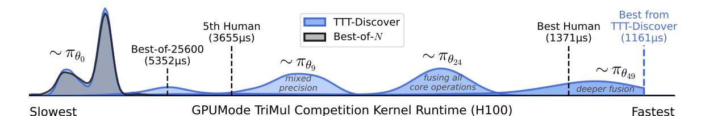
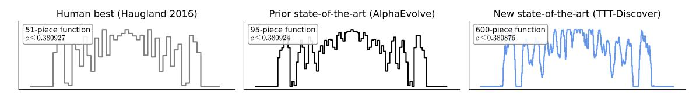
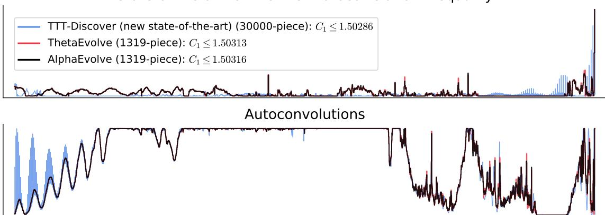
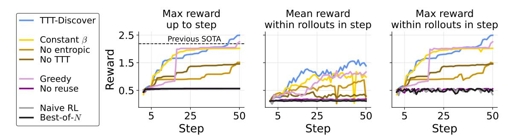

# Learning to Discover at Test Time

Mert Yuksekgonul\*<sup>1</sup>, Daniel Koceja\*<sup>1</sup>, Xinhao Li\*<sup>4</sup>, Federico Bianchi\*<sup>5</sup> Jed McCaleb<sup>3</sup>, Xiaolong Wang<sup>4</sup>, Jan Kautz<sup>2</sup>, Yejin Choi<sup>2</sup>, James Zou<sup>†1,5</sup>, Carlos Guestrin<sup>†1</sup>, Yu Sun\*<sup>1,2</sup> <sup>1</sup> Stanford University 
<sup>2</sup> NVIDIA 
<sup>3</sup> Astera Institute 
<sup>4</sup> UC San Diego 
<sup>5</sup> Together AI

#### Abstract

How can we use AI to discover a new state of the art for a scientific problem? Prior work in test-time scaling, such as AlphaEvolve, performs search by prompting a frozen LLM. We perform reinforcement learning at test time, so the LLM can continue to train, but now with experience specific to the test problem. This form of continual learning is quite special, because its goal is to produce one great solution rather than many good ones on average, and to solve this very problem rather than generalize to other problems. Therefore, our learning objective and search subroutine are designed to prioritize the most promising solutions. We call this method Test-Time Training to Discover (TTT-Discover). Following prior work, we focus on problems with continuous rewards.

We report results for every problem we attempted, across mathematics, GPU kernel engineering, algorithm design, and biology. TTT-Discover sets the new state of the art in almost all of them: (i) Erdős' minimum overlap problem and an autocorrelation inequality; (ii) a GPUMode kernel competition (up to 2× faster than prior art); (iii) past AtCoder algorithm competitions; and (iv) denoising problem in single-cell analysis. Our solutions are reviewed by experts or the organizers.

All our results are achieved with an open model, OpenAI gpt-oss-120b, and can be reproduced with our publicly available code, in contrast to previous best results that required closed frontier models. Our test-time training runs are performed using Tinker, an API by Thinking Machines, with a cost of only a few hundred dollars per problem.

|               | Mathematics             | Kernel Eng. (TriMul) |                 | Algorithms (AtCoder)     | Biology       |
|---------------|-------------------------|----------------------|-----------------|--------------------------|---------------|
|               | Erdős' Min. Overlap (↓) | A100 (↓)             | H100 (↓)        | Heuristic Contest 39 (↑) | Denoising (↑) |
| Best Human    | 0.380927 [20]           | 4531 μs              | 1371 μs         | 566,997 [1]              | 0.64          |
| Prev. Best AI | 0.380924 [49]           | N/A                  | N/A             | 558,026 [37]             | N/A           |
| TTT-Discover  | 0.380876                | $2198\mu\mathrm{s}$  | <b>1161 µ</b> s | 567,062                  | 0.71          |



Figure 1. TTT-Discover continues to train an LLM on a single problem at test time.  $\pi_{\theta_i}$  denotes the policy with the updates weights at test-time training step i. We plot the reward distribution at step 0, 9, 24, and 49 (final), recorded while test-time training for the GPUMode TriMul competition. We generate 512 solutions at each step. As training progresses, the LLM generates better solutions that ultimately surpass the prior art (best human). For comparison, we plot the reward distribution of best-of-N with the same total sampling budget.

<sup>\*</sup> Core contributors. † Joint advising. Correspondence to: merty@stanford.edu, yusun@cs.stanford.edu.

# 1 Introduction

To solve hard problems, humans often need to try, fail, stumble upon partial successes, and then learn from their experiences. Consider your first really hard programming assignment. You read the textbook and trained yourself on the book exercises, but this assignment just asked for so much beyond the basics in the book. You tried to guess the solution, but these attempts merely produced small signs of life. So you had to take a deep breath and learn from your failed attempts, which made your future attempts more intelligent. Finally, after hours of trying and learning, you understood the new ideas behind the assignment. And indeed, the next attempt worked!

In this example, the assignment was hard because it required new ideas beyond your training data (the text and exercises in the book). Now consider using AI to solve scientific discovery problems. This goal is even harder: By definition, discovery problems require ideas not only beyond the model's training data but also all existing knowledge of humanity. And out-of-distribution generalization is no easier for AI than for humans [\[47,](#page-21-2) [22,](#page-20-1) [52,](#page-21-3) [34\]](#page-20-2).

To offset this hardness, prior work has focused on test-time search in the solution space by prompting a frozen LLM to make many attempts, similar to how we tried to guess the solution to the assignment. In particular, evolutionary search methods, such as AlphaEvolve, store past attempts in a buffer and use them to generate new prompts via hand-crafted and domain-specific heuristics [\[49,](#page-21-0) [37,](#page-21-1) [54,](#page-21-4) [80\]](#page-23-0). While these prompts can help the LLM improve previous solutions, the LLM itself cannot improve, similar to a student who can never internalize the new ideas behind the assignment.

The most direct way for the LLM to improve is through learning. And indeed, while both learning and search scale well with compute [\[66\]](#page-22-0), learning has often superseded search in the history of AI for hard problems such as Go and protein folding [\[62,](#page-22-1) [30\]](#page-20-3). We believe that this observation from history is still relevant today, as we scale compute at test time. So we continue to train the LLM, while it attempts to solve this very test problem. And these attempts, in turn, provide the most valuable training data: Recall that the test problem was hard because it was out-of-distribution. Now we have a data distribution specific to this problem.

At a high level, we simply perform Reinforcement Learning (RL) in an environment defined by the single test problem, so any technique in standard RL could be applied. However, our goal has two critical differences from that of standard RL. First, our policy only needs to solve this single problem rather than generalize to other problems. Second, we only need a single best solution, and the policy is merely a means towards this end. In contrast, the policy is the end in standard RL, whose goal is to maximize the average reward across all attempts. While the first difference is a recurring theme in the field of test-time training [\[65\]](#page-22-2), the second is unique to discovery problems.

To take advantage of these differences, our learning objective and search subroutine strongly favor the most promising solutions. We call this method Test-Time Training to Discover (TTT-Discover). We focus on problems with continuous rewards, in mathematics ([§4.1\)](#page-6-0), GPU kernel engineering ([§4.2\)](#page-10-0), algorithm design ([§4.3\)](#page-12-0), and biology ([§4.4\)](#page-13-0). We report results for every problem we attempted, and TTT-Discover sets the new state of the art in almost all of them, using only an open model.

There are two pieces of concurrent work that share our high-level idea: MiGrATe (Phan et al.) [\[51\]](#page-21-5), and more recently ThetaEvolve (Wang et al.) [\[74\]](#page-23-1), which we find especially relevant. Compared to ThetaEvolve, TTT-Discover using the same model and compute budget still produces significant improvements (Table [2\)](#page-7-0), due to its special learning objective and search subroutine.

<span id="page-2-1"></span>

| Problem                                                                           | <b>State</b> s                                 | Action a                       | Transition            | Reward R(s)                                   |
|-----------------------------------------------------------------------------------|------------------------------------------------|--------------------------------|-----------------------|-----------------------------------------------|
| Erdős Minimum Overlap<br>Autocorr. Inequality (1st)<br>Autocorr. Inequality (2nd) | Step function certificate                      | Thinking<br>tokens<br>and code | s' = Python(Parse(a)) | 1/Upper bound<br>1/Upper bound<br>Lower bound |
| Kernel Engineering<br>Algorithm Competition<br>Single Cell Analysis               | Kernel code<br>Algorithm code<br>Analysis code | Thinking<br>tokens<br>and code | s' = Parse(a)         | 1/Runtime<br>Test score<br>1/MSE              |

Table 1. Overview of the science and engineering problems in our paper, and the environments they induce (§2.1). Note that the reward is 0 if *s* fails validity checks.

# 2 Preliminaries

All methods in this paper, including the baselines, share a common goal: Given a scientific problem at test time, the goal is to discover a new state-of-the-art solution with an LLM policy  $\pi_{\theta}$ , whose weights  $\theta$  have already been trained (at training time). To formalize this goal, we first introduce how each scientific problem defines an environment, i.e., a Markov Decision Process (§2.1), which can then be used for search (§2.2) and learning (§3).

# <span id="page-2-0"></span>2.1 Discovery Problem

Our definition of the environment follows prior work in test-time scaling, such as AlphaEvolve [49]: A scientific problem comes in the form of a text description d, which we always feed as context to the policy. We define a state s as a candidate solution, such as a kernel implementation of the PyTorch code in d. In our applications, the problem description also induces a continuous reward function  $R(s) \in \mathbb{R}$ , such as the inverse runtime of the kernel.

We denote  $s_{\text{sota}}$  as the best-known solution among all existing candidates, and  $r_{\text{sota}} = R(s_{\text{sota}})$  as the best-known reward. And in case there is no existing solution,  $s_{\text{sota}}$  can be the empty string <empty>. For example,  $s_{\text{sota}}$  can be the kernel currently at the top of the leaderboard. These notations allow us to formalize the notion of a discovery:

**Definition** (Discovery). A discovery is an event where a state s is found such that  $R(s) > r_{sota}$ . The larger the difference, the more significant the discovery.

Under this formalism, we define a *discovery problem* as finding such a state s with large  $R(s) - r_{\text{sota}}$  within the environment defined by the scientific problem.

To produce a better solution, both search and learning methods use the LLM policy to generate an action  $a \sim \pi_{\theta}(\cdot \mid d, s)$ , where the choice of the initial solution s (e.g.,  $= s_{\text{sota}}$ ) is an important part of the method's design. Similar to the reward function, the transition function  $(s, a) \rightarrow s'$  of the environment is also induced by the problem description. Here, we consider only a single timestep since state reuse, which we will introduce soon, effectively subsumes multiple timesteps.

In all our applications, a valid action contains a piece of code and optionally some thinking tokens. For coding problems (e.g., kernel engineering), the environment produces s' by simply parsing the code out of a. For problems in mathematics, the environment also needs to execute the code in a after it is parsed. Table 1 provides an overview of the environments for all our applications.

#### <span id="page-3-0"></span>2.2 Search Methods

The simplest search method, known as Best-of-N, samples i.i.d. rollouts from  $\pi_{\theta}$ :

**Best-of-**
$$N$$
:  $s = s_{\text{sota}}$  or ,  $a_i \sim \pi_{\theta}(\cdot \mid d, s)$ ,

where the subscript,  $i=1,\ldots,N$ , denotes the index of the rollout. By using i instead of t for the index, we indicate that the rollouts here are independent. One reasonable choice of the initial state s is  $s_{\rm sota}$ , assuming that a previous solution exists. But  $s_{\rm sota}$  might be too strong a prior towards exploitation. For example, conditioning on  $s_{\rm sota}$  might prevent the policy from exploring very different, but more promising directions that would ultimately produce better solutions under a large compute budget. To address this concern, we usually set s= <empty>, the empty (or trivial) solution.

On the other hand, the policy might also explore a promising direction using s = <empty>, but fail to fully exploit it. One technique to address this opposite concern is *state reuse*, which warm starts the policy with some of the previous solutions. Specifically, it maintains a buffer  $\mathcal{H}_i$  of the previous solutions, and samples the initial solution  $s_i$  from  $\mathcal{H}_i$  using a search heuristic, reuse, which favors high-reward solutions but still assigns nontrivial likelihood to low-reward ones:

**State reuse:** 
$$s_i \sim \text{reuse}(\mathcal{H}_i)$$
,  $a_i \sim \pi_{\theta}(\cdot \mid d, s_i)$ ,  $\mathcal{H}_{i+1} = \mathcal{H}_i \cup \{(s'_i, r_i)\}$ .

When we reuse a previous solution  $s'_i$ , we have effectively added an extra timestep to its trajectory.

Prior work, such as AlphaEvolve [49], also reuses the actions, which can contain thinking tokens and intermediate results (e.g., code for math problems) that are not part of the states. As a consequence, the reuse heuristic also needs to convert the information from previous actions into natural language context  $c_i$  that can be ingested by the LLM policy:

**State-action reuse:** 
$$s_i, c_i \sim \text{reuse}(\mathcal{H}_i), \ a_i \sim \pi_{\theta}(\cdot \mid d, s_i, c_i), \ \mathcal{H}_{i+1} = \mathcal{H}_i \cup \{(s_i, a_i, s_i', r_i)\}.$$

Prior work [49, 37, 80, 41] refers to state-action reuse as *evolutionary search*, because the reuse heuristic usually involves sophisticated designs motivated by evolution, including hand-crafted operations for mutation and cross-over, and domain-specific measurements of fitness and diversity.

# <span id="page-3-1"></span>3 Learning to Discover at Test Time

So far, the policy's experience with the test problem can only improve the next prompt  $(d, s_i, c_i)$ , but not the policy  $\pi_{\theta}$  itself, since  $\theta$  remains frozen. We use this experience to improve the policy in an online fashion, by training  $\pi_{\theta}$  on its own search attempts accumulated in the buffer  $\mathcal{H}_i$ .

Algorithm 1 outlines the general form of our method, where the two key subroutines to instantiate are reuse and train.

#### 3.1 Naive RL at Test Time

Algorithm 1 falls under the formulation of reinforcement learning (RL). A natural baseline is to use a standard RL algorithm:

$$\mathsf{train}: \quad \theta_{i+1} = \theta_i + \eta \nabla_\theta \mathbb{E}_{a \sim \pi_{\theta_i}(\cdot|s)}[R(s,a)], \qquad \mathsf{reuse}(\mathcal{H}_i) = \delta_{\mathsf{}},$$

i.e., optimize for expected reward with no reuse, where  $\delta_{<empty>}$  is a delta distribution with mass only on the initial state <empty>. We will use  $\theta_i$  to denote the model weights for rollout i. We can straightforwardly apply popular RL algorithms, such as PPO or GRPO [56, 16], only in the environment defined by the single problem.

### <span id="page-4-0"></span>Algorithm 1 Test-Time Training to Discover (TTT-Discover)

```
1: Input: problem description d and policy πθ0 with initial weights θ0.
2: R, T = get_env(d) ▷ d induces the reward and transition functions of the environment (§2.1)
3: H0 = {(<empty>,R(<empty>),{})} ▷ Initialize buffer with the empty solution (§2.2)
4: for i = 0,1,...,N − 1 do
5: si
      , ci ∼ reuse(Hi
                  ) ▷ Sample initial state and context with a reuse heuristic
6: ai ∼ πθi
           (· | d, si
                , ci
                  ) ▷ Sample action from policy
7: s
      ′
      i
       = T (ai
            ) ▷ Transition to next state
8: ri = R(s
           ′
           i
           ) ▷ Evaluate reward of next state
9: Hi+1 = Hi ∪ {(si
                 ,ai
                   , s′
                     i
                     , ri
                       )} ▷ Add current attempt to buffer
10: θi+1 = train(θi
                 ,(d, si
                      , ci
                        ,ai
                          , ri
                            )) ▷ Improve the model weights with train
11: end for
12: return si
         ∗, where i
                 ∗ = argmaxi=0,1,...,N−1
                                  ri ▷ Return the state with the highest reward
```

However, these algorithms are designed with the standard RL problem in mind. Discovery problems have important distinctions from standard RL problems.

In standard RL problems, the goal is to find a policy that maximizes the expected reward. This policy is to be deployed repeatedly in the same environment. The primary artifact is the policy.

In discovery problems, the goal is to find a single state that improves upon the state-of-the-art. We do not care about the average performance. There is no separate deployment phase and thus the policy need not maintain robust performance in many states it may encounter starting from the same initial state distribution. In fact, a policy can have very low expected reward, so long as it reaches a new state-of-the-art once.

Due to these differences, the naive RL instantiation has important shortcomings.

Objective function. Naive RL optimizes average performance, and is indifferent to the state of the art. In discovery, however, success is determined by the maximum, and whether it improves upon the state of the art. Consider a kernel engineering problem where the state-of-the-art runtime is 2000*µ*s. Achieving 1900*µ*s would require substantial optimization and perhaps a breakthrough. Yet, without complicated reward shaping, both would receive nearly the same reward.

Short effective horizon. Starting each attempt from scratch limits how far the policy can reach in an attempt. Reusing a previous solution effectively adds extra timesteps to an attempt, extending the horizon. As a result, more complex solutions can emerge during training. In standard RL, a fixed initial state distribution makes sense as the policy must perform robustly from states it will encounter at deployment. Discovery has no such deployment phase.

Exploration. Exploration requires care at two levels. Optimizing for expected reward, the policy can collapse to safe, high-reward actions rather than risky ones that might achieve discovery. At the reuse level, naive prioritization can over-exploit a few promising states at the expense of diversity.

### 3.2 TTT-Discover

To address these shortcomings, we introduce two simple components.

Entropic objective. We define the entropic objective that favors the maximum reward actions:

$$I_{\beta}(\theta) = \mathbb{E}_{s \sim \mathsf{reuse}(\mathcal{H})} \Big[ \log \mathbb{E}_{a \sim \pi_{\theta}(\cdot \mid s)} \Big[ e^{\beta(s)R(s,a)} \Big] \Big],$$

$$\nabla_{\theta} J_{\beta}(\theta) = \mathbb{E}_{\substack{s \sim \mathsf{reuse}(\mathcal{H}) \\ a \sim \pi_{\theta}(\cdot \mid s)}} \Big[ w_{\beta(s)}(a) \nabla_{\theta} \log \pi_{\theta}(a \mid s) \Big], \qquad w_{\beta(s)}(a) = \frac{e^{\beta(s)R(s,a)}}{\mathbb{E}_{\pi_{\theta}(\cdot \mid s)}[e^{\beta(s)R(s,a)}]},$$

where we also shape advantages with a KL penalty:  $A(a;s) = w_{\beta(s)}(a) - 1 - \lambda \log \frac{\pi_{\theta}(a|s)}{\pi_{\theta_0}(a|s)}$  [56, 83, 68], and -1 is the baseline since  $\mathbb{E}[w_{\beta(s)}] = 1$ . Concurrent work [29] also explored the entropic objective  $J_{\beta}$  to maximize the pass@k performance for (training-time) RL with binary reward problems.

As  $\beta \to \infty$ , the entropic objective tends to the max, which is intuitively what we want. However, too large  $\beta$  early in training causes instabilities, while too small later makes advantages vanish as even smaller improvements become harder. Empirically, we found that setting a constant  $\beta$  that works well across different tasks is challenging. Therefore, different than [29], we set  $\beta(s)$  adaptively per initial state by constraining the KL divergence of the induced policy; see Appendix A.1 for details.

**PUCT.** We select initial states using a PUCT-inspired rule [53, 60, 62, 61]. Each state s is scored by  $Q(s) + c \cdot P(s) \cdot \sqrt{1 + T}/(1 + n(s))$ , where Q(s) is the maximum reward among states generated when the initial state was s (or R(s) if s has not yet been selected). P(s) is proportional to s's rank in the buffer sorted by reward, n(s) counts how many times s or its descendants have been expanded, and s is the total number of expansions, and s is the exploration coefficient.

Rather than the mean (as in prior work), we use the maximum reward of children in Q(s): we care about the best outcome starting from a state, not the average. The prior P(s) captures the intuition that high-reward states are more likely to yield high-reward children—e.g., a fast kernel is more likely to seed a faster kernel than a slow one—while the exploration bonus prevents over-exploitation by keeping under-visited states as candidates. See Appendix A.2 for implementation details.

**Test-time Training to Discover.** With these building blocks, we can introduce our method, TTT-Discover. We combine  $J_{\beta(s)}$  as our (test-time) training objective and PUCT as our reuse routine:

train: 
$$\theta_{i+1} = \theta_i + \eta \nabla_{\theta} J_{\beta(s_i)}(\theta_i)$$
, reuse:  $s_i \sim \text{PUCT}(\mathcal{H}_i)$ .

### 3.3 Implementation Details

We run TTT-Discover with gpt-oss-120b [2] on Tinker [36] for 50 training steps. We use LoRA [23] with rank 32. At each step, we generate a batch of 512 rollouts, with 8 groups of 64 rollouts each. Each group of rollouts is generated using the same context and initial state selected from the reuse buffer. We use the entropic objective, and apply importance sampling ratio correction to the gradients due to the sampler/learner mismatch in the RL infrastructure [78]. We do not take any off-policy steps, i.e., take 1 gradient step on the entire batch.

We set the reasoning effort to high. The context window of gpt-oss-120b is limited to 32,768 tokens on Tinker. Thus, each rollout stops when the context window is exhausted or the LM produces the end of sequence token. In most domains, we limit the total length of the prompt and the thinking tokens to 26000 tokens, so as to leave enough tokens to generate the final response, e.g., to allow generating longer algorithm code. We enforce this by token forcing the model to generate its final response. All hyperparameters reported in Table 9, and are fixed unless otherwise stated. Assuming an average prompt length of 3000 tokens and 16000 sampling tokens on average, a training run with 50 steps and 512 rollouts costs around \$500 on Tinker.

# 4 Applications

We evaluate TTT-Discover on problems in GPU kernel engineering, mathematics, algorithm design, and biology. We report our performance on every task we attempted. Besides potential impact,

we pick domains with 2 criteria. First, we pick domains where we can compare our performance to human experts. This is possible, for example, by comparing to the best submissions in human engineering competitions, or to the best results reported in academic papers. We also want to compare to AI baselines. As we discuss below, mathematics and algorithm design are discovery domains where prior work recently made progress [49, 14, 27, 54, 74].

In every application, we report the best known human results and the best known AI results. Importantly, we always report the Best-of-N baseline that matches the sampling budget and the model that TTT-Discover uses. That is, since we perform 50 steps with 512 rollouts per step, and compare to the Best-of-25600 baseline. For a closest evolutionary algorithm baseline, we also run OpenEvolve [58], an open-source version of AlphaEvolve [49], with the same 25600 sampling budget. We use the same context window budget and the Tinker client for gpt-oss-120b throughout the experiments. We caution that the context window limit led to a large number of rollouts in OpenEvolve to be truncated before the model completes its response, as OpenEvolve's prompts grow very large in length. However, to stay faithful to their implementation, we did not modify their prompts or rollouts.

### <span id="page-6-0"></span>4.1 Mathematics

We explore multiple open problems in mathematics. These are often problems where even small numerical improvements carry real weight, since each result potentially rules out families of approaches and extends the frontier of what is mathematically known. Here, proofs are by construction: one can construct a concrete mathematical object – a step function or a sequence – that certifies, e.g., a bound for an inequality can be achieved. This property makes these problems amenable to search.

**Environment:** The state s is a construction. Specifically, a construction is a step function represented as a numerical array, to certify a proof. The action a consists of thinking tokens followed by Python code that either constructs a new step function or modifies an existing one. The dynamics execute the parsed code to produce the next state: s' = Python(Parse(a)). The reward is the bound certified by s', or zero if s' fails validity checks (e.g., the function must satisfy constraints on its support, sign, or integral). Most often, actions involve optimization algorithms to improve the constructions.

Throughout mathematics applications, we initialize the buffer with random states. Specifically, initial states are sampled uniformly at random within the problem's valid range. For each action, we give a 10-minute limit to execute the code given by the action. In the case of a timeout, the action gets a reward of 0. For minimization problems (certifying upper bounds), we set the reward proportional to 1/bound for the certified bound, and otherwise we set it proportional to bound. We report further details about the environment and the prompts we use in Appendix B.

**Previous state-of-the-art.** Such problems are recently explored in [14, 49]. We report both the best known human results, and the recent progress by AI: AlphaEvolve [49], AlphaEvolve V2 [14] which was released around 6 months after AlphaEvolve, ShinkaEvolve [37], and ThetaEvolve [74].

We select one representative problem from each area in AlphaEvolve [49]: Erdős' minimum overlap problem (combinatorics), autocorrelation inequalities (analysis), circle packing (geometry).

#### 4.1.1 Erdős' Minimum Overlap Problem

This is a classic problem in combinatorial number theory, posed by Erdős in 1955, with connections to the distribution of sequences and difference sets. Partition  $\{1,2,\ldots,2n\}$  into two sets A and B of equal cardinality n. Define  $M_k$  as the number of solutions to  $a_i - b_j = k$  for  $a_i \in A, b_j \in B$ , and let  $M(n) = \min_{A,B} \max_k M_k$  over all partitions. The problem is to bound  $c = \lim_{n\to\infty} M(n)/n$ . Bounds before AlphaEvolve were 0.379005 < c < 0.380927, with the upper bound due to Haugland [20] and the lower bound due to [76]. AlphaEvolve [49, 14] improved the upper bound to 0.380924.

<span id="page-7-0"></span>

| Method                              | Model                  | Erdős' (↓) | AC1 (↓) | AC2 (↑) |
|-------------------------------------|------------------------|------------|---------|---------|
| best human                          | –                      | 0.380927   | 1.50973 | 0.9015  |
| AlphaEvolve [49]                    | Gemini-2.0 Pro + Flash | 0.380924   | 1.50530 | 0.8962  |
| AlphaEvolve V2 [14]                 | Gemini-2.0 Pro + Flash | 0.380924   | 1.50317 | 0.9610  |
| ThetaEvolve [74]                    | R1-Qwen3-8B            | n/a        | 1.50681 | 0.9468  |
| ThetaEvolve w/ SOTA reuse (1.50317) | R1-Qwen3-8B            | n/a        | 1.50314 | n/a     |
| OpenEvolve [58]                     | gpt-oss-120b           | 0.380965   | 1.50719 | 0.9449  |
| Best-of-25600                       | gpt-oss-120b           | 0.380906   | 1.51004 | 0.9344  |
| TTT-Discover                        | Qwen3-8B               | 0.380932   | 1.50525 | 0.9472  |
| TTT-Discover                        | gpt-oss-120b           | 0.380876   | 1.50287 | 0.9591  |

Table 2. Results in mathematics problems. In the Erdős' Minimum Overlap Problem and First Autocorrelation Inequality (AC1), TTT-Discover sets the new state-of-the-art. We also report TTT-Discover with Qwen3-8B, for a better comparison to ThetaEvolve. Notable, TTT-Discover with Qwen3-8B outperforms not only ThetaEvolve, baselines including AlphaEvolve which uses Gemini-2.0 family models for the autocorrelation inequalities. Our state-of-the-art constructions are released and can be validated [in our codebase.](https://github.com/test-time-training/discover/blob/main/results/mathematics/Results.ipynb)

Following [\[49\]](#page-21-0), we optimize step functions *f* describing the density of *A* throughout [1*,*2*n*]. Due to a result of Swinnerton-Dyer [\[20\]](#page-20-0), density functions yield valid upper bounds on lim*M*(*n*)*/n* without constructing explicit partitions for large *n*. Validity checks require *f* (*x*) ∈ [0*,*1] and R *f* = 1.



Figure 2. We show the normalized step functions including the prior state-of-the-art from AlphaEvolve. The step function *f* (*x*) is the limiting density of set *A*. Unlike the previous state-of-the-art, the solution from TTT-Discover is an asymmetric construction. TTT-Discover found a 600-piece step function, while AlphaEvolve construction was 95-piece. The best human result was a 51-piece construction [\[20\]](#page-20-0).

Results. We improve the upper bound on Erdős' Minimum Overlap Problem to 0*.*380876, surpassing AlphaEvolve's recent construction with 0*.*380924 [\[49\]](#page-21-0). Our improvement over AlphaEvolve is 16 times larger than AlphaEvolve's improvement over the previous state-of-the-art. Unlike AlphaEvolve's symmetric construction, our method discovered a 600-piece asymmetric step function. Surprisingly, the Best-of-25600 baseline also improved upon the AlphaEvolve construction.

The discovered algorithm minimizes the correlation bound using FFT-accelerated gradient descent combined with random hill climbing and simulated annealing. The code maintains feasibility by projecting onto the constraint set where *f* (*x*) ∈ [0*,*1] with with R *f* = 1. Interestingly, the solution found by TTT-Discover is asymmetric.

### 4.1.2 Autocorrelation Inequalities

Autocorrelation inequalities are motivated by additive combinatorics [\[6\]](#page-19-3). Improving these inequalities tightens a constant that propagates into sharper limits on how large a set can be while still avoiding repeated additive patterns (a central theme in additive combinatorics). Similar to the Erdős' minimum overlap problem, we will construct a step function *f* to certify bounds.

First autocorrelation inequality. For nonnegative *f* supported on [−1*/*4*,*1*/*4], define *C*<sup>1</sup> as the

largest constant such that

$$\max_{|t| \le 1/2} (f * f)(t) \ge C_1 \left( \int f \right)^2$$

holds for all such f. The goal is to certify the tightest  $upper\ bound$  on  $C_1$ ; any valid construction f certifies  $C_1 \leq \frac{\|f * f\|_{\infty}}{\|f\|_1^2}$ . Until early 2025, the best known upper bound was  $C_1 \leq 1.50973$  [45]. AlphaEvolve improved this to  $C_1 \leq 1.5053$ , and AlphaEvolve V2 further improved it to  $C_1 \leq 1.50317$ , and ThetaEvolve refined AlphaEvolve's construction to get  $C_1 \leq 1.50314$ .

Second autocorrelation inequality. For nonnegative f, define

$$C_2 = \sup_{f \ge 0} \frac{\|f * f\|_2^2}{\|f * f\|_1 \|f * f\|_\infty}.$$

The problem is to certify the tightest known *lower bound* on  $C_2$ ; any valid construction f with ratio r certifies  $C_2 \ge r$ . The best human bound was  $C_2 \ge 0.8892$  [45]. AlphaEvolve first improved this to  $C_2 \ge 0.8962$ , [9] improved this to 0.9015, and AlphaEvolve V2 further improved it to  $C_2 \ge 0.9610$  using a 50,000-piece step function.

**Results.** We improved the best known upper bound to prove  $C_1 \le 1.50286$ , with a 30000-piece step function. The comparisons are reported in Table 2. The previous state-of-the-art, ThetaEvolve, achieved their result by refining the AlphaEvolve V2 construction. In contrast, TTT-Discover found a new construction by starting from scratch. We visualize our and prior works' step functions in Figure 3. In the second autocorrelation inequality, we have not made a discovery. Our best construction certified a bound of 0.959, where the AlphaEvolve construction had certified a tighter lower bound of 0.961.

For the first inequality, early improvements down to 1.510 came from trying and improving gradient-based optimization (e.g., using Adam with softmax parameterization). To reduce the bound from around 1.510 to 1.504, the policy mostly used linear programming (LP), following the insights in [45]. The key insight for the later steps, that gradually achieved the state-of-the-art, was using heuristics to focus optimization only on the constraints that are close to being tight—where each constraint in the LP bounds one position of the convolution. Heuristics included picking the top K positions where the convolution was largest and only including those in the LP, as well as computing gradients from all near-maximum positions rather than just the single largest for gradient-based methods. Unlike AlphaEvolve [14], which mentions the authors suggested ideas such as using Newton type methods, we never intervened on the optimization process.

For a better comparison to the concurrent work, ThetaEvolve, we also report TTT-Discover with Qwen3-8B [77]. The Qwen3-8B variant they used, DeepSeek-R1-0528-Qwen3-8B that was released by DeepSeek, is not available on Tinker. Thus, we used the original Qwen model (Qwen/Qwen3-8B) that was reportedly worse than the DeepSeek variant. ThetaEvolve reports using 65 steps with 512 rollouts (32 groups of 16 rollouts) each, however we do not modify our hyperparameters otherwise and keep 50 steps of 512 rollouts each. For both inequalities, TTT-Discover with Qwen3-8B certified tighter bounds than ThetaEvolve, using a worse model and a smaller sampling budget.

#### 4.1.3 Circle Packing

In Circle packing, the goal is to maximize the sum of radii of n non-overlapping circles packed inside a unit square. We follow the setup from prior work [49, 14]. The state s is a list of circle centers and radii. The action a consists of thinking tokens followed by Python code that optimizes circle positions and radii. The reward is the sum of radii achieved for valid packings, and 0 otherwise. We present the results below mostly for comparison purposes, as several recent works on evolutionary algorithms reported their performance using this task.

# State-of-the-art for the First Autocorrelation Inequality

<span id="page-9-0"></span>

Figure 3. We show the prior and new state-of-the-art, with the (normalized) step functions and their autoconvolutions. Both AlphaEvolve and TTT-Discover starts the discovery process from scratch, while ThetaEvolve initializes from the AlphaEvolve construction, and thus is very similar to the AlphaEvolve construction. TTT-Discover found a 30,000-piece step function that certifies that the upper bound *C*<sup>1</sup> ≤ 1*.*50286, while AlphaEvolve and ThetaEvolve constructions are 1319-piece. We overlay the step functions and their autoconvolution visually for qualitative comparison.

<span id="page-9-1"></span>

| Method              | Model                  | n = 26 (↑) | n = 32 (↑) |
|---------------------|------------------------|------------|------------|
| AlphaEvolve [49]    | Gemini-2.0 Pro + Flash | 2.635862   | 2.937944   |
| AlphaEvolve V2 [14] | Gemini-2.0 Pro + Flash | 2.635983   | 2.939572   |
| ShinkaEvolve [37]   | Ensemble (see caption) | 2.635982   | n/a        |
| ThetaEvolve [74]    | R1-Qwen3-8B            | 2.635983   | n/a        |
| TTT-Discover        | Qwen3-8B               | 2.635983   | 2.939572   |

Table 3. Results for circle packing. ShinkaEvolve uses an ensemble of Claude Sonnet-4, gpt-4.1, gpt-4.1-mini, gpt-4.1-nano, o4-mini.

Table [3](#page-9-1) shows results. TTT-Discover with Qwen3-8B matches the best known constructions for both *n* = 26 and *n* = 32. We make no improvements here, but include these results for completeness. The algorithms found by TTT-Discover are presented in Appendix [B.1.](#page-26-2) Algorithms initialize circles in staggered or hexagonal grid arrangements, then refine positions and radii using sequential least squares programming with boundary and pairwise non-overlap constraints. This solution is a lot simpler than recent work, such as ShinkaEvolve [\[37\]](#page-21-1), especially in terms of initialization, where their solution uses an initialization based on simulated annealing algorithm, while TTT-Discover initializes only with a simple geometric arrangement.

### 4.1.4 Expert Review

#### Human Expert Review — Prof. Davide Torlo (Università di Roma La Sapienza)

Erdős' minimum overlap problem and the autocorrelation inequalities are classical problems in combinatorics with applications in, among others, discrepancy theory, combinatorial optimization, and signal analysis. Both problems can be formulated as min–max problems, in which the minimization is taken over a class of functions with bounded norm, while

the maximization is performed over a set of evaluation points. Closed-form solutions are not known; instead, only lower and upper bounds can be derived. Obtaining sharp bounds for these problems remains a challenging mathematical task and is essential for improving our understanding and resolution of such questions. The upper bounds obtained by TTT-Discover for the Erdős' minimum overlap and the AC1 autocorrelation problems are achieved by specific piecewise-constant functions. It is straightforward to verify that the provided functions give bounds that improve upon the state of the art: one simply evaluates the quantity of interest and its maximum over a discrete set of points determined by the step size of the piecewise-constant functions, and checks that the corresponding norm constraints are satisfied.

# <span id="page-10-0"></span>4.2 Kernel Engineering

GPU kernels are the computational foundation of modern AI, every forward pass and backward pass ultimately executes as kernel code on hardware. We apply our method to GPU kernel optimization, where a new state-of-the-art kernel is a faster implementation than existing ones.

[GPUMODE](https://www.gpumode.com/v2/home) is an open community for kernel development that also hosts competitions for domain experts. We test our method on two competitions: TriMul (triangular matrix multiplication), a core primitive in AlphaFold's architecture [\[30\]](#page-20-3), and DeepSeek MLA (Multi-head Latent Attention), a key component in DeepSeek's inference stack [\[40\]](#page-21-10). Each GPU type for the TriMul competition (NVIDIA H100, A100, B200, AMD MI300x) has a separate leaderboard, as performant implementations differ across architectures. For The MLA competition there is only an MI300x leaderboard.

As these competitions were conducted earlier, we retrospectively evaluate our performance while respecting competition standards. We prefer GPUMODE because their leaderboards are well-tested through human competitions with a robust evaluation harness [\[81\]](#page-23-6), and their benchmarks avoid signal-to-noise issues where simple operations or small inputs cause overheads to dominate runtime.

Environment: The state *s* is a GPU kernel code. The action *a* consists of thinking tokens followed by kernel code written in Triton [\[69\]](#page-22-8). The dynamics parse the code from the action: *s* ′ = Parse(*a*). For the initial state, we provide unoptimized kernels, detailed in Appendix [C.](#page-30-0) The reward is proportional to the inverse of the geometric mean of runtimes on a fixed set of input shapes (following the leaderboard), or zero if the kernel fails correctness checks or times out. We evaluate runtime remotely on [Modal](https://modal.com) to scale and ensure consistent hardware conditions. For TriMul, we evaluate the runtime only on H100s during training, even though we still evaluate the generated kernels for A100, B200, and MI300X for final report. Since MI300X is not available on Modal, for MLA-Decode we use H200s, and hope the kernels generalize to MI300X. Further details about the prompts and environments are in Appendix [C.](#page-30-0)

Results. We report the runtime of the best kernels and the baselines in Table [4.](#page-11-0) Our TriMul kernels achieve state-of-the-art across the board in all GPU types. For A100s, our best kernel is 50% faster than the top human kernel, even though our reward function did not time the kernels on A100s. We uniformly achieve *>* 15% improvement over the best human submissions for all GPU types. Finally, we submit to the official TriMul A100/H100 leaderboard[1](#page-10-1) .

The discovered kernels for Trimul identify heavy memory I/O incurred by frequent elementwise operations as a major bottleneck to optimize. Specifically, the kernels fuse: (i) operations in the input LayerNorm, (ii) sigmoid and elementwise multiplication in input gating, and (iii) operations in

<span id="page-10-1"></span><sup>1</sup>[See leaderboards.](https://www.gpumode.com/v2/leaderboard/496?tab=rankings) For TriMul B200/MI300X and MLA-Decode MI300X tasks, due to an infra problem on GPU Mode's server, we could not submit to the official leaderboard.

the output LayerNorm and gating. As for the most compute-heavy operation, which is the matmul with *O*(*N*<sup>3</sup> ) complexity, the kernels convert the inputs to FP16 and delegate the computation to cuBLAS/rocBLAS to effectively leverage TensorCores/MatrixCores of the hardwares.

Discovered MLA-Decode kernels. The kernels shown in table [5](#page-11-1) mainly rely on torch.compile() for optimization. Specifically, they adopt a specific configuration of torch.compile. However, these kernels do not leverage Triton for fine-grained optimization, which may limit further improvements and more flexible use case. We additionally filter and evaluate generated kernels that explicitly use Triton despite their slightly slower runtime, and report in Appendix [C.](#page-30-0)

<span id="page-11-0"></span>

|               |              |        |        | TriMul (↓,µs)          |                        |
|---------------|--------------|--------|--------|------------------------|------------------------|
| Method        | Model        | A100   | H100   | B200 [95% CI]          | AMD MI300X [95% CI]    |
| 1st human     | –            | 4531.5 | 1371.1 | 1027.6[1016.3, 1038.9] | 2515.8[2510.9, 2520.8] |
| 2nd human     | –            | 4918.5 | 2368.0 | 2349.0[2335.7, 2362.4] | 5101.4[5163.1, 5167.0] |
| 3rd human     | –            | 5182.2 | 2545.7 | 1920.9[1910.9, 1931.0] | 5200.7[5343.6, 5375.1] |
| 4th human     | –            | 6097.8 | 3654.8 | 2169.2[2089.4, 2248.9] | 5993.1[5978.5, 5984.4] |
| 5th human     | –            | 8345.0 | 4233.1 | 6452.1[6400.5, 6503.8] | 8365.1[8347.7, 8382.5] |
| Best-of-25600 | gpt-oss-120b | 9219.7 | 5390.3 | 3253.7[3252.5, 3254.9] | 4902.0[4897.6, 4906.4] |
| TTT-Discover  | gpt-oss-120b | 2198.2 | 1161.2 | 910.8[907.3, 914.2]    | 1555.7[1550.8, 1560.5] |

Table 4. For the TriMul competition, we train a single model using H100 runtime as the reward function and report the runtime of the single best kernel. We only trained using H100 for evaluating kernels during training. The generated kernels happened to generalize to other GPU types. We also report the top-5 human submissions in the leaderboard for comparison (each GPU type has its own top-5 human submissions). For A100 and H100, we submitted to the official leaderboard and report the runtime returned. For B200 and MI300X, we could not submit our kernels due to an infra problem on GPU Mode's server, and therefore conduct 10 trials for each kernel and report mean and confidence intervals using the same infrastructure as GPUMode, verified by the organizers. Our state-of-the-art kernels are released and can be validated [in our codebase.](https://github.com/test-time-training/discover/blob/main/results/kernel-engineering/)

<span id="page-11-1"></span>

| Method        | Model        | AMD MI300X - MLA Decode (↓,µs) [95% CI] |                        |                        |  |  |
|---------------|--------------|-----------------------------------------|------------------------|------------------------|--|--|
|               |              | Instance 1                              | Instance 2             | Instance 3             |  |  |
| 1st human     | –            | 1653.8[1637.3, 1670.3]                  | 1688.6[1672.8, 1704.3] | 1668.7[1637.0, 1700.3] |  |  |
| 2nd human     | –            | 1662.8[1648.8, 1676.8]                  | 1688.6[1677.6, 1699.5] | 1679.7[1653.4, 1705.9] |  |  |
| 3rd human     | –            | 1723.0[1711.5, 1734.5]                  | 1765.8[1758.1, 1773.5] | 1718.0[1698.3, 1737.7] |  |  |
| 4th human     | –            | 1768.7[1750.3, 1787.2]                  | 1769.9[1755.2, 1784.6] | 1767.0[1736.2, 1797.8] |  |  |
| 5th human     | –            | 2038.6[2017.8, 2059.3]                  | 2037.3[2021.0, 2053.6] | 2041.9[1989.0, 2094.8] |  |  |
| Best-of-25600 | gpt-oss-120b | 2286.0[2264.2, 2307.8]                  | 2324.1[2306.0, 2342.1] | 2275.2[2267.3, 2283.1] |  |  |
| TTT-Discover  | gpt-oss-120b | 1669.1[1649.2, 1688.9]                  | 1706.1[1685.9, 1726.3] | 1671.3[1646.0, 1696.5] |  |  |

Table 5. AMD MLA Decode runtimes on AMD MI300x across three instances. Values are mean runtime across 10 trials with 95% confidence intervals. Top-5 human submissions are from the GPUMode leaderboard. We trained our kernels using an H200 GPUs even though the task is to minimize runtime on MI300x GPUs, since those were not available at scale in online providers. We only selected kernels using a single MI300X GPU. There is significant variance across AMD MI300x instances available via AMD Developer Cloud. Thus, we performed our kernel selection and evaluation across three different instances. In each instance, our best kernel was different, and in none of the cases our best kernel where better than the top human submission with statistical significance.

### 4.2.1 Expert Review

Below, we provide verbatim reviews from the GPUMode organizers for our TriMul competition kernels.

# Human Expert Review — Matej Sirovatka, Alex Zhang, Mark Saroufim (GPUMode)

The referenced solution correctly determined that the problem is memory bound because of the surrounding point-wise operations so the agent focuses as much as possible on operation fusions, lowering the memory traffic and kernel launch overhead.

It also stores activations in fp16, while this is fully aligned with the problem definition and defined tolerances, it could potentially lead to numerical stability issues in full workloads. Overall the agent's strategy is to reduce memory bandwidth via fusions, lower precision and delegating the big matrix multiplications to cuBLAS, as those are non-trivial to beat. This is similar to the current best human solutions, but executed on better. Most of the human solutions lack behind in fusing some of the more complex operators together, resulting in this solution outperforming them by a large margin.

# <span id="page-12-0"></span>4.3 Algorithm Engineering

Hard optimization problems like package-delivery routing, crew scheduling, factory production planning, power-grid balancing—appear throughout industries and must be solved repeatedly at scale. We apply our method to these algorithm engineering problems, where a new state-of-the-art would be writing a higher-scoring algorithm than existing ones written by human experts.

AtCoder Heuristic Contest (AHC) is a series of programming competitions focused on optimization problems drawn from real-world industrial challenges [\[4\]](#page-19-5), attracting hundreds of participants including industry experts. We attempted to evaluate on two past contests, ahc039 and ahc058. ahc039 ("Purse Seine Fishing") is a computational geometry problem where you design a simple closed net on a 2D map, restricted to horizontal/vertical edges, to capture many target points while avoiding penalty points under a budget. ahc058 ("Apple Incremental Game") is a production planning problem where upgrades trade off immediate output versus growing future production capacity, and the goal is to schedule upgrades to maximize final output.

We select ahc039 because ShinkaEvolve [\[37\]](#page-21-1) reported a solution that would have placed 2nd, and ahc058 because Sakana AI's ALE-Agent achieved the first-ever AI victory in an AHC [\[54\]](#page-21-4). We use the evaluation harness from ALE-Bench [\[27\]](#page-20-7). We use the public test case generator to create local tests, select our best-performing algorithm, and submit it to be scored on the official platform.

Environment: The state *s* is an algorithm implementation in C++. The action *a* consists of thinking tokens followed by C++ code. The dynamics parse the code from the action: *s* ′ = Parse(*a*). The reward is the score on locally generated test cases, or zero if the algorithm fails correctness checks or exceeds the time limit of 2 seconds and memory limit of 1024MB. We select the best-performing algorithm and submit it to be scored on the official private tests. We use the evaluation harness released by [\[27\]](#page-20-7). For initial states, for the ahc039 competition we use the same initial program as [\[37\]](#page-21-1), which is based on ALE-Agent [\[27\]](#page-20-7) best program, that would have placed 5th in the competition leaderboard. For ahc058 we start from scratch, similar to ALE-Agent [\[54\]](#page-21-4).

Previous state-of-the-art. We report the top human submissions on each contest leaderboard. For AI baselines, we compare to ALE-Agent [\[27\]](#page-20-7) and ShinkaEvolve [\[37\]](#page-21-1), which use ensembles of models including the gpt, Gemini, and Claude families of models. ALE-Agent [\[27\]](#page-20-7) starts from scratch for both problems. ShinkaEvolve [\[37\]](#page-21-1) reports results in ahc039 where they start from ALE-Agent solution, and improve it from 5th place to 2nd place.

Results. We report results in Table [6.](#page-13-1) For both competitions, if we had submitted during competition time, our algorithms would have gotten the 1st place. For ahc039, we marginally improve upon the best human, while there is a significant gap between next best AI and human scores. For ahc039, we follow ShinkaEvolve by starting from the ALE-Agent solution and improve it from 5th place to 1st place, while ShinkaEvolve reaches the 2nd place using significantly more capable frontier models such as Gemini 2.5 Pro. For ahc058, we start from scratch and outscore all submissions in the competition.

For AHC039, the solution builds a large pool of promising axis-aligned rectangles using prefix sum scoring, then greedily seeds a connected union and uses simulated annealing with add, remove, replace, expand, shrink, and slide moves to optimize the rectangle union score under perimeter and vertex constraints, followed by cleanup and final greedy refinement.

For AHC058, the solution first builds several reasonable plans using greedy rules, different biases, and a short beam search to explore promising early decisions. Then, the program improves the best plan with simulated annealing that makes random edits, swaps, and partial rebuilds before finishing with a small local cleanup pass. It estimates the value of actions using a simple formula for how much future production an upgrade is likely to create, which guides both greedy choices and pruning. For performance, it caches intermediate states so it only recomputes parts of the plan that change. Overall, the program balances broad exploration early with focused local improvement later.

<span id="page-13-1"></span>

| Method            | Model                  | Geometry (ahc039) | Scheduling (ahc058) |
|-------------------|------------------------|-------------------|---------------------|
| 1st human         | –                      | 566,997           | 847,674,723         |
| 2nd human         | –                      | 557,212           | 846,938,871         |
| 3rd human         | –                      | 554,334           | 846,350,877         |
| 4th human         | –                      | 552,933           | 845,489,747         |
| 5th human         | –                      | 549,746           | 845,324,831         |
| ALE-Agent [27]    | Ensemble (see caption) | 550,647           | 848,373,282         |
| ShinkaEvolve [37] | Ensemble (see caption) | 558,026           | n/a                 |
| Best-of-25600     | gpt-oss-120b           | 554,171           | 772,429,752         |
| TTT-Discover      | gpt-oss-120b           | 567,062           | 848,414,228         |

Table 6. Results in two AtCoder Heuristic Competitions. We train our models with local public tests, and submit the best program we get during training to the official submission platform. Our algorithms are released and can be validated [in our codebase.](https://github.com/test-time-training/discover/blob/main/results/algorithm-design/) Our solutions in the official AtCoder submission platform are publicly available for [ahc039](https://atcoder.jp/contests/ahc039/submissions/72633477) and [ahc058.](https://atcoder.jp/contests/ahc058/submissions/72633508) ALE-Agent uses Gemini-2.5 Pro for ahc039, and Gemini-3 Pro Preview high and gpt-5.2-high for ahc058. ShinkaEvolve uses an ensemble of gpt-5, gpt-5-mini, Gemini-2.5 Pro and Flash, Claude Sonnet 4, o4-mini.

# <span id="page-13-0"></span>4.4 Single Cell Analysis

Single-cell RNA-sequencing (RNA-seq) aims to help us understand how organisms work and get sick by resolving biology at the level of individual cells; measuring which genes each cell is using to reveal cell types, states, and how they change. Practically, it isolates single cells, tags their mRNA with a Unique Molecular Identifier (UMI), sequences it, and outputs a per-cell gene-by-count table. RNA-seq protocols suffer from measurement noise in the observed UMI counts. Thus, denoising algorithms significantly increases the realized value of expensive experiments. Each sequencing run costs thousands of dollars, and better denoising methods reduce the need for deeper sequencing.

We apply our method to one of the recent benchmarks OpenProblems [\[43\]](#page-21-11), an important set of open problems for single-cell analysis. We use the denoising task therein. [\[7\]](#page-19-6) demonstrated that partitioning the observed molecules of a single dataset into training and test sets via binomial sampling and evaluating the denoised training set against the held-out test counts provides a proxy for accuracy against true expression values, providing an evaluation framework without requiring external ground truth data.

Environment. The state *s* is an algorithm implementation. The action *a* consists of thinking tokens followed by code. The dynamics parse the code from the action: *s* ′ = Parse(*a*). The benchmark evaluates denoising quality using two complementary metrics: mean squared error (MSE) in log-normalized space, which measures overall reconstruction accuracy, and Poisson negative loglikelihood, which assesses how well the denoised counts match the statistical properties expected of count data. In our context, the reward is the MSE score, or zero if it violates constraints we add for the Poisson score or the algorithm exceeds the time limit of 400 seconds. The Denoising benchmark offers 3 datasets: PBMC, Pancreas, and Tabula Muris Senis Lung, in order of size. We train our policy by using Pancreas in our environment, and ultimately performance is reported by running the algorithm on the held out PBMC and Tabula datasets.

Previous state-of-the-art. We report the state of the art as described by the OpenProblems [\[43\]](#page-21-11) benchmark. The best result was provided by MAGIC [\[71\]](#page-22-9) using an approximate solver and reversed normalization. MAGIC is a well known technique, frequently used in the literature [\[79,](#page-23-7) [72\]](#page-22-10), the only method different from MAGIC that provides good performance is ALRA [\[39\]](#page-21-12), ranked third. We also compare with OpenEvolve and Best-of-25600.

### Disclaimer

This is an experimental application demonstrating TTT-Discover's ability to find algorithms that excel on specific benchmarks. While our discovered algorithm outperforms existing methods on the OpenProblems denoising benchmark, benchmark metrics are inherently incomplete and do not guarantee biological validity for downstream tasks.

Results. The improved function obtained via TTT-Discover shows consistent improvements on both datasets (see Table [7\)](#page-14-0). TTT-Discover is initialized with MAGIC code. TTT-Discover adds gene-adaptive transform ensembling, low-rank SVD refinement, and log-space polishing steps that directly optimize the benchmark metric.

<span id="page-14-0"></span>

|               |              | PBMC      |         | Tabula      |           |         |             |
|---------------|--------------|-----------|---------|-------------|-----------|---------|-------------|
| Method        | Model        | Score (↑) | MSE (↓) | Poisson (↓) | Score (↑) | MSE (↓) | Poisson (↓) |
| MAGIC (A, R)  | –            | 0.64      | 0.19    | 0.05        | 0.64      | 0.18    | 0.03        |
| MAGIC (R)     | –            | 0.64      | 0.19    | 0.05        | 0.64      | 0.18    | 0.03        |
| ALRA (S, RN)  | –            | 0.50      | 0.26    | 0.05        | 0.47      | 0.27    | 0.03        |
| MAGIC (A)     | –            | 0.42      | 0.19    | 0.16        | 0.40      | 0.18    | 0.12        |
| MAGIC         | –            | 0.42      | 0.19    | 0.16        | 0.40      | 0.18    | 0.12        |
| OpenEvolve    | gpt-oss-120b | 0.70      | 0.16    | 0.05        | 0.71      | 0.15    | 0.03        |
| Best-of-25600 | gpt-oss-120b | 0.62      | 0.20    | 0.05        | 0.65      | 0.18    | 0.03        |
| TTT-Discover  | gpt-oss-120b | 0.71      | 0.15    | 0.05        | 0.73      | 0.14    | 0.03        |

Table 7. Denoising task for single cell data analysis. We report the score (mean of normalized MSE and Poisson scores), MSE, and Poisson metrics for each dataset. Our state-of-the-art algorithm is released and can be validated [in our codebase.](https://github.com/test-time-training/discover/blob/main/results/denoising/) MAGIC (A, R) = MAGIC [\[71\]](#page-22-9) approximate with reversed normalization; MAGIC (R) = MAGIC with reversed normalization; ALRA [\[39\]](#page-21-12) (S, R) = ALRA sqrt norm with reversed normalization; MAGIC (A) = MAGIC approximate.

### 4.4.1 Expert Review

Below, we provide a verbatim review from Prof. Eric Sun.

# Human Expert Review — Prof. Eric Sun (MIT)

Single-cell transcriptomics provides a high-dimensional readout on cellular gene expression patterns and has enabled new insights into both biological and disease processes. One challenge in the analysis of single-cell transcriptomics is the sparsity of the data, characterized by zero counts detected for many genes (i.e. "dropouts") due to low expression or other technical issues. MAGIC addresses this challenge by de-noising single-cell transcriptomics using diffusion or smoothing, and it has been widely incorporated in the pre-processing of singlecell data for studying multiple diseases and tissue biology. The proposed improvement on the MAGIC algorithm is simple, aligns with the underlying smoothing-based approach of MAGIC, and yields empirical improvements on key metrics. However, improvements on metrics for single-cell data analysis tasks may not always transfer to enhanced ability to obtain new biological insights, which is often difficult to quantify and therefore benchmark. Further evaluation of the proposed algorithm against MAGIC and other existing methods for biologically relevant tasks would be necessary to fully understand the extent of the reported improvements.

# 4.5 Ablations

We have three sets of ablations. First, we ablate the design choices for the train method, while keeping our reuse method, PUCT, fixed. We test (i) TTT with entropic objective using constant *β* = 2 ([\[29\]](#page-20-5)), (ii) TTT with no entropic objective (expected reward), (iii) No TTT (only reuse). Second, we ablate the choice of the Reuse method, while keeping our train method, TTT with entropic objective using adaptive *β*, fixed. We replace PUCT with (i) *ϵ*−greedy reuse with *ϵ* = 0*.*1 as this is perhaps the most naive reuse method, and (ii) no reuse. Finally, we report the naive RL baseline, where we use the expected reward objective with no reuse, and the Best-of-25600 baseline.

<span id="page-15-0"></span>

|                     | train                                  | reuse    | Best runtime (↓,µs) |
|---------------------|----------------------------------------|----------|---------------------|
| Best Human Kernel   | –                                      | –        | 1371.1              |
| TTT-Discover        | TTT with adaptive entropic             | PUCT     | 1203.10             |
| Ablations for train | TTT with constant β entropic           | PUCT     | 1483.83             |
|                     | TTT with expected reward (no entropic) | PUCT     | 1985.67             |
|                     | No TTT                                 | PUCT     | 2060.70             |
| Ablations for reuse | TTT with adaptive entropic             | ϵ-greedy | 1328.89             |
|                     | TTT with adaptive entropic             | no reuse | 5274.03             |
| Naive Test-time RL  | TTT with expected reward               | no reuse | 5328.73             |
| Best-of-N           | no TTT                                 | no reuse | 5352.36             |

Table 8. Ablation results for the TriMul GPUMode competition where we time the kernels with an H100 GPU. We report the best kernel we get in each run. We report the reward distributions across steps in Figure [4.](#page-16-0)

For each ablation, we report the runtime of the best kernel found in Table [8,](#page-15-0) and the reward distribution in Figure [4.](#page-16-0) The rewards distributions and best kernel runtimes are computed with our evaluator, not the leaderboard.

Only the full TTT-Discover algorithm achieves the best performance in the TriMul competition.

<span id="page-16-0"></span>

Figure 4. Reward distributions for each ablation. We match the sampling budget across all ablations. We sample 512 rollouts in each step. For example, for Best-of-N, we have  $N = 50 \times 512 = 256000$  rollouts.

When using a constant  $\beta$ , the improvements diminish later in the training. Using the expected reward objective, improvements are slower overall. Without any test-time training, both the mean reward and the max reward stagnates.  $\epsilon$ -greedy reuse works reasonably well, especially with an early lucky kernel. In early experiments with other applications, the lack of exploration was also a bigger problem than it is in kernel engineering tasks. Naive RL and no reuse make minimal improvements.

It is entirely possible that additional tuning (e.g., a task-specific  $\beta$  schedule) or hyperparameter interactions (e.g., batch size and reuse) can provide improvements in the ablation configurations. For each component, many additional knobs could be ablated (e.g., PUCT exploration bonus, learning rate, batch size). However, our focus was on identifying design choices that works reliably across diverse applications within our budget with minimal task-specific tuning. In practice, the key hyperparameters such as learning rate, batch size, and LoRA rank were fixed after the initial iterations of the project.

### 5 Related Works

In this section, we first provide a broad overview of continual learning and test-time training, using some of the exposition in [67]. Then towards the end of §5.2, we discuss the most relevant work on test-time training: MiGrATe [51] and ThetaEvolve [74]. Finally, we discuss two pieces of work with tangential formulations: RL on a single training problem that is not the test problem [75] (§5.3), and RL on the entire test set [84] (§5.4).

# 5.1 Continual Learning

Most of today's AI systems remain static after deployment, even though the world keeps changing. The high-level goal of continual learning is to enable AI systems to keep changing with the world, similar to how humans improve throughout their lives [19, 11].

Conventionally, continual learning as a research field has focused on learning from a *distribution* that gradually changes over time [42, 70, 17]. For example, one could update a chatbot model every hour using new knowledge from the Internet, while typical use cases of the model may require knowledge from both the past and the present [57, 31, 73]. More formally, at each timestep, we sample new training and test data from the current distribution, update our model using the new training data, and then evaluate it on all the test data up to the current timestep. Under this setting, most algorithms focus on not forgetting the past when learning from the present [55, 38, 33, 15].

# <span id="page-17-0"></span>5.2 Test-Time Training

The algorithmic framework of test-time training has the same high-level goal as continual learning, but it focuses on two aspects where human learning stands out from the forms of continual learning in the conventional literature.

First, each person has a unique brain that learns within the context of their individual life. This personalized form of continual learning is quite different from, for example, the chatbot model that is fine-tuned hourly using the latest information available worldwide. While such a model does change over time, it is still the same at any given moment for every user and every problem instance.

Second, most human learning happens without a boundary between training and testing. Consider your commute to work this morning. It is both "testing" because you did care about getting to work this very morning, and "training" because you were also gaining experience for future commutes. But in machine learning, the train-test split has always been a fundamental concept.

The concept of test-time training is introduced to realize these two special aspects of human learning. *Training* typically involves formulating a learning problem (such as empirical risk minimization) and then solving it. Following [\[64\]](#page-22-15), *test-time training* is defined as any kind of training that formulates a potentially different learning problem based on each individual test instance.

This concept has a rich history in AI. A well-known example in NLP is dynamic evaluation, pioneered by Mikolov et al. [\[46\]](#page-21-15) and extended by Krause et al. [\[35\]](#page-21-16). In computer vision, early examples have also emerged in applications such as face detection [\[28\]](#page-20-12), video segmentation [\[48\]](#page-21-17), super-resolution [\[59\]](#page-22-16), and 3D reconstruction [\[44\]](#page-21-18). Next, we discuss three popular forms of test-time training today, with an emphasis on their connections to each other and to historical examples.

# 5.2.1 TTT on Nearest Neighbors: Larger Effective Capacity

One simple form of test-time training was called locally weighted regression in the 1970s [\[63,](#page-22-17) [10\]](#page-19-9), local learning in the 1990s [\[8\]](#page-19-10), and KNN-SVM in the 2000s [\[82\]](#page-23-11): Given a test instance, find its nearest neighbors in the training set, and then train (or fine-tune) the model on these neighbors before making a prediction. This procedure can significantly increase the effective capacity of the model; for example, it allows a linear model to fit a highly nonlinear ground truth [\[63\]](#page-22-17).

This simple form captures one of the key intuitions of test-time training. In the conventional view of machine learning, a model, once trained, no longer changes at test time. As a consequence, it must prepare to be good at all possible inputs in the future. This task can be very hard, because being good at all possible futures limits the model's capacity to be good at any particular one. But only one future is actually going to happen. So why not train our model once this future happens?

Recently, [\[18\]](#page-20-13) extended this idea to modern language models and observed a similar benefit of larger effective model capacity after test-time training, and [\[25\]](#page-20-14) further improved these results through better strategies for neighbor selection. In addition, [\[26\]](#page-20-15) showed that test-time training on neighbors from the training set is also effective with RL for reasoning tasks, and [\[5\]](#page-19-11) developed the same idea for visual-motor tasks.

#### 5.2.2 TTT for Novel Instances: Better Generalization

As models become larger today, their competence is often limited not by their capacity, but by the amount of available training data, especially when they need to generalize to novel test instances that are "out-of-distribution". In this case, it is even harder to prepare for all possible test instances in the future, especially the novel ones, with a static model. But once a specific test instance is given, we can use it to generate relevant data, which we can then use for training [\[65\]](#page-22-2). In other words, the "neighbors" for TTT do not have to come from the training set; they can also be generated on-the-fly. Since the test instance is unlabeled, one way to make it useful for training is through self-supervision, which generates new pairs of inputs and labels for an auxiliary task such as masked reconstruction (e.g., BERT [\[12\]](#page-19-12) and MAE[\[21\]](#page-20-16)). While the auxiliary task is different from the main prediction task, improving performance in one can help the other through their shared representations. This form of TTT can significantly improve generalization under distribution shifts [\[65,](#page-22-2) [13\]](#page-19-13).

Recently, TTT has been an important part of AlphaProof [\[24\]](#page-20-17), which achieved IMO silver-medal standard in 2024. Given each test problem, their system first generates a targeted curriculum of easier problems by prompting a language model, and then performs reinforcement learning on the generated data. Another recent work, Akyurek et al. [\[3\]](#page-19-14), found TTT effective for few-shot reasoning tasks such as ARC-AGI. Their system generates augmentations of the few-shot demonstrations in the test problem then performs supervised learning.

MiGrATe [\[51\]](#page-21-5) and ThetaEvolve [\[74\]](#page-23-1) are two concurrent works that share our high-level idea of performing RL at test time on a single problem. MiGrATe combines on-policy and off-policy RL and tests on simpler environments such as word search. ThetaEvolve is more similar to our work: it uses OpenEvolve, a variant of AlphaEvolve, for state-action reuse. Both methods use GRPO variants for training. Compared to ThetaEvolve, TTT-Discover using the same model and compute budget still produces significant improvements (Table [2\)](#page-7-0), which we attribute to our entropic objective and PUCT-based reuse instead of more complicated and brittle heuristics in evolutionary algorithms.

# <span id="page-18-0"></span>5.3 RL on One Example

One Example RL [\[75\]](#page-23-8) is relevant as they also train on a single problem. To be specific, they train on one example from a dataset, such as the MATH training set. They show that a policy trained with on one such problem with RL generalizes to other problems in the same dataset. In contrast, TTT-Discover trains on the test problem itself, where the goal is not to generalize but to solve this specific problem.

# <span id="page-18-1"></span>5.4 RL on the Test Set

TTRL [\[84\]](#page-23-9) trains on an entire test set of problems using majority voting as pseudo-labels for reward estimation. In contrast, TTT-Discover trains on a single test problem with a continuous verifiable reward, where the goal is not to improve average performance across a set of problems but to find one exceptional solution.

# 6 Future Work

The current form of our method can only be applied to problems with continuous rewards, and the most important direction for future work is test-time training for problems with sparse or binary rewards, or problems in non-verifiable domains.

# Acknowledgments

We thank Matej Sirovatka, Davide Torlo, Eric Sun, Alex Zhang, Mark Saroufim, for reviewing our results and letting us cite their reviews in this paper. We would like to thank Amanda Moran and Nvidia for their support with the compute infrastructure; Charles Frye and Modal team, Clare Birch, John Schulman, Tianyi Zhang, Yangjun Ruan, and Thinking Machines Lab team for compute credits supporting this project; Anika Guptam, Zacharie Bugaud, and the broader Astera Institute for their support in various phases of the project; Matej Sirovatka, Alex Zhang, Mark Saroufim and the broader GPUMode community for their support in various phases of this project. We thank Mehmet Hamza Erol and Vipul Sharma for their short-term contributions. We thank Luke Bailey for feedback on this draft. Mert would like to thank Begum Ergun, Fatih Dinc, Omer Faruk Akgun, Ramiz Colak, Yigit Korkmaz for their support at every phase of this project.

# References

- <span id="page-19-0"></span>[1] Submission #59660035 — third programming contest 2024 (atcoder heuristic contest 039). [https:](https://atcoder.jp/contests/ahc039/submissions/59660035) [//atcoder.jp/contests/ahc039/submissions/59660035](https://atcoder.jp/contests/ahc039/submissions/59660035), November 2024. AtCoder Heuristic Contest 039 submission page.
- <span id="page-19-1"></span>[2] Sandhini Agarwal, Lama Ahmad, Jason Ai, Sam Altman, Andy Applebaum, Edwin Arbus, Rahul K Arora, Yu Bai, Bowen Baker, Haiming Bao, et al. gpt-oss-120b & gpt-oss-20b model card. *arXiv preprint arXiv:2508.10925*, 2025.
- <span id="page-19-14"></span>[3] Ekin Akyürek, Mehul Damani, Adam Zweiger, Linlu Qiu, Han Guo, Jyothish Pari, Yoon Kim, and Jacob Andreas. The surprising effectiveness of test-time training for few-shot learning. *arXiv preprint arXiv:2411.07279*, 2024.
- <span id="page-19-5"></span>[4] AtCoder Inc. AtCoder. <https://atcoder.jp>, 2025.
- <span id="page-19-11"></span>[5] Marco Bagatella, Mert Albaba, Jonas Hübotter, Georg Martius, and Andreas Krause. Test-time offline reinforcement learning on goal-related experience. *arXiv preprint arXiv:2507.18809*, 2025.
- <span id="page-19-3"></span>[6] Richard C Barnard and Stefan Steinerberger. Three convolution inequalities on the real line with connections to additive combinatorics. *Journal of Number Theory*, 207:42–55, 2020.
- <span id="page-19-6"></span>[7] Joshua Batson, Loic Royer, and James Webber. Molecular cross-validation for single-cell rna-seq. *BioRxiv*, page 786269, 2019.
- <span id="page-19-10"></span>[8] Léon Bottou and Vladimir Vapnik. Local learning algorithms. *Neural computation*, 4(6):888–900, 1992.
- <span id="page-19-4"></span>[9] Christopher Boyer and Zane Kun Li. An improved example for an autoconvolution inequality. *arXiv preprint arXiv:2506.16750*, 2025.
- <span id="page-19-9"></span>[10] William S Cleveland. Robust locally weighted regression and smoothing scatterplots. *Journal of the American statistical association*, 74(368):829–836, 1979.
- <span id="page-19-7"></span>[11] Matthias De Lange, Rahaf Aljundi, Marc Masana, Sarah Parisot, Xu Jia, Aleš Leonardis, Gregory Slabaugh, and Tinne Tuytelaars. A continual learning survey: Defying forgetting in classification tasks. *IEEE transactions on pattern analysis and machine intelligence*, 44(7):3366–3385, 2021.
- <span id="page-19-12"></span>[12] Jacob Devlin, Ming-Wei Chang, Kenton Lee, and Kristina Toutanova. Bert: Pre-training of deep bidirectional transformers for language understanding. *arXiv preprint arXiv:1810.04805*, 2018.
- <span id="page-19-13"></span>[13] Yossi Gandelsman, Yu Sun, Xinlei Chen, and Alexei A. Efros. Test-time training with masked autoencoders. *Advances in Neural Information Processing Systems*, 2022.
- <span id="page-19-2"></span>[14] Bogdan Georgiev, Javier Gómez-Serrano, Terence Tao, and Adam Zsolt Wagner. Mathematical exploration and discovery at scale. *arXiv preprint arXiv:2511.02864*, 2025.
- <span id="page-19-8"></span>[15] Spyros Gidaris and Nikos Komodakis. Dynamic few-shot visual learning without forgetting. In *Proceedings of the IEEE Conference on Computer Vision and Pattern Recognition*, pages 4367–4375, 2018.

- <span id="page-20-4"></span>[16] Daya Guo, Dejian Yang, Haowei Zhang, Junxiao Song, Peiyi Wang, Qihao Zhu, Runxin Xu, Ruoyu Zhang, Shirong Ma, Xiao Bi, et al. Deepseek-r1 incentivizes reasoning in llms through reinforcement learning. *Nature*, 645(8081):633–638, 2025.
- <span id="page-20-9"></span>[17] Raia Hadsell, Dushyant Rao, Andrei A Rusu, and Razvan Pascanu. Embracing change: Continual learning in deep neural networks. *Trends in cognitive sciences*, 24(12):1028–1040, 2020.
- <span id="page-20-13"></span>[18] Moritz Hardt and Yu Sun. Test-time training on nearest neighbors for large language models. *arXiv preprint arXiv:2305.18466*, 2023.
- <span id="page-20-8"></span>[19] Demis Hassabis, Dharshan Kumaran, Christopher Summerfield, and Matthew Botvinick. Neuroscienceinspired artificial intelligence. *Neuron*, 95(2):245–258, 2017.
- <span id="page-20-0"></span>[20] Jan Kristian Haugland. The minimum overlap problem revisited. *arXiv preprint arXiv:1609.08000*, 2016.
- <span id="page-20-16"></span>[21] Kaiming He, Xinlei Chen, Saining Xie, Yanghao Li, Piotr Dollár, and Ross B. Girshick. Masked autoencoders are scalable vision learners. *CoRR*, abs/2111.06377, 2021.
- <span id="page-20-1"></span>[22] Dan Hendrycks, Steven Basart, Norman Mu, Saurav Kadavath, Frank Wang, Evan Dorundo, Rahul Desai, Tyler Zhu, Samyak Parajuli, Mike Guo, Dawn Song, Jacob Steinhardt, and Justin Gilmer. The many faces of robustness: A critical analysis of out-of-distribution generalization. *ICCV*, 2021.
- <span id="page-20-6"></span>[23] Edward J Hu, Yelong Shen, Phillip Wallis, Zeyuan Allen-Zhu, Yuanzhi Li, Shean Wang, Lu Wang, Weizhu Chen, et al. Lora: Low-rank adaptation of large language models. *ICLR*, 1(2):3, 2022.
- <span id="page-20-17"></span>[24] T. Hubert, R. Mehta, L. Sartran, and et al. Olympiad-level formal mathematical reasoning with reinforcement learning. *Nature*, 2025.
- <span id="page-20-14"></span>[25] Jonas Hübotter, Sascha Bongni, Ido Hakimi, and Andreas Krause. Efficiently learning at test-time: Active fine-tuning of llms. *arXiv preprint arXiv:2410.08020*, 2024.
- <span id="page-20-15"></span>[26] Jonas Hübotter, Leander Diaz-Bone, Ido Hakimi, Andreas Krause, and Moritz Hardt. Learning on the job: Test-time curricula for targeted reinforcement learning. *arXiv preprint arXiv:2510.04786*, 2025.
- <span id="page-20-7"></span>[27] Yuki Imajuku, Kohki Horie, Yoichi Iwata, Kensho Aoki, Naohiro Takahashi, and Takuya Akiba. Ale-bench: A benchmark for long-horizon objective-driven algorithm engineering. *arXiv preprint arXiv:2506.09050*, 2025.
- <span id="page-20-12"></span>[28] Vidit Jain and Erik Learned-Miller. Online domain adaptation of a pre-trained cascade of classifiers. In *CVPR 2011*, pages 577–584. IEEE, 2011.
- <span id="page-20-5"></span>[29] Yuhua Jiang, Jiawei Huang, Yufeng Yuan, Xin Mao, Yu Yue, Qianchuan Zhao, and Lin Yan. Risk-sensitive rl for alleviating exploration dilemmas in large language models. *arXiv preprint arXiv:2509.24261*, 2025.
- <span id="page-20-3"></span>[30] John Jumper, Richard Evans, Alexander Pritzel, Tim Green, Michael Figurnov, Olaf Ronneberger, Kathryn Tunyasuvunakool, Russ Bates, Augustin Žídek, Anna Potapenko, et al. Highly accurate protein structure prediction with alphafold. *nature*, 596(7873):583–589, 2021.
- <span id="page-20-10"></span>[31] Zixuan Ke, Yijia Shao, Haowei Lin, Tatsuya Konishi, Gyuhak Kim, and Bing Liu. Continual pre-training of language models. *arXiv preprint arXiv:2302.03241*, 2023.
- <span id="page-20-18"></span>[32] Diederik P Kingma and Jimmy Ba. Adam: A method for stochastic optimization. *arXiv preprint arXiv:1412.6980*, 2014.
- <span id="page-20-11"></span>[33] James Kirkpatrick, Razvan Pascanu, Neil Rabinowitz, Joel Veness, Guillaume Desjardins, Andrei A Rusu, Kieran Milan, John Quan, Tiago Ramalho, Agnieszka Grabska-Barwinska, et al. Overcoming catastrophic forgetting in neural networks. *Proceedings of the national academy of sciences*, 114(13):3521–3526, 2017.
- <span id="page-20-2"></span>[34] Pang Wei Koh, Shiori Sagawa, Henrik Marklund, Sang Michael Xie, Marvin Zhang, Akshay Balsubramani, Weihua Hu, Michihiro Yasunaga, Richard Lanas Phillips, Irena Gao, et al. Wilds: A benchmark of in-the-wild distribution shifts. In *International conference on machine learning*, pages 5637–5664. PMLR, 2021.

- <span id="page-21-16"></span>[35] Ben Krause, Emmanuel Kahembwe, Iain Murray, and Steve Renals. Dynamic evaluation of neural sequence models. In *International Conference on Machine Learning*, pages 2766–2775. PMLR, 2018.
- <span id="page-21-8"></span>[36] Thinking Machines Lab. Tinker, 2025.
- <span id="page-21-1"></span>[37] Robert Tjarko Lange, Yuki Imajuku, and Edoardo Cetin. Shinkaevolve: Towards open-ended and sampleefficient program evolution. *arXiv preprint arXiv:2509.19349*, 2025.
- <span id="page-21-14"></span>[38] Zhizhong Li and Derek Hoiem. Learning without forgetting. *IEEE transactions on pattern analysis and machine intelligence*, 40(12):2935–2947, 2017.
- <span id="page-21-12"></span>[39] George C Linderman, Jun Zhao, Manolis Roulis, Piotr Bielecki, Richard A Flavell, Boaz Nadler, and Yuval Kluger. Zero-preserving imputation of single-cell rna-seq data. *Nature communications*, 13(1):192, 2022.
- <span id="page-21-10"></span>[40] Aixin Liu, Bei Feng, Bing Xue, Bingxuan Wang, Bochao Wu, Chengda Lu, Chenggang Zhao, Chengqi Deng, Chenyu Zhang, Chong Ruan, et al. Deepseek-v3 technical report. *arXiv preprint arXiv:2412.19437*, 2024.
- <span id="page-21-6"></span>[41] Fei Liu, Rui Zhang, Zhuoliang Xie, Rui Sun, Kai Li, Xi Lin, Zhenkun Wang, Zhichao Lu, and Qingfu Zhang. Llm4ad: A platform for algorithm design with large language model. *arXiv preprint arXiv:2412.17287*, 2024.
- <span id="page-21-13"></span>[42] David Lopez-Paz and Marc'Aurelio Ranzato. Gradient episodic memory for continual learning. In *Advances in Neural Information Processing Systems*, pages 6467–6476, 2017.
- <span id="page-21-11"></span>[43] Malte D Luecken, Scott Gigante, Daniel B Burkhardt, Robrecht Cannoodt, Daniel C Strobl, Nikolay S Markov, Luke Zappia, Giovanni Palla, Wesley Lewis, Daniel Dimitrov, et al. Defining and benchmarking open problems in single-cell analysis. *Nature Biotechnology*, pages 1–6, 2025.
- <span id="page-21-18"></span>[44] Xuan Luo, Jia-Bin Huang, Richard Szeliski, Kevin Matzen, and Johannes Kopf. Consistent video depth estimation. *ACM Transactions on Graphics (ToG)*, 39(4):71–1, 2020.
- <span id="page-21-9"></span>[45] Máté Matolcsi and Carlos Vinuesa. Improved bounds on the supremum of autoconvolutions. *Journal of Mathematical Analysis and Applications*, 372(2):439–447, 2010.
- <span id="page-21-15"></span>[46] Tomas Mikolov, Kai Chen, Greg Corrado, and Jeffrey Dean. Efficient estimation of word representations in vector space. *arXiv preprint arXiv:1301.3781*, 2013.
- <span id="page-21-2"></span>[47] John Miller, Karl Krauth, Benjamin Recht, and Ludwig Schmidt. The effect of natural distribution shift on question answering models. In *International conference on machine learning*, pages 6905–6916. PMLR, 2020.
- <span id="page-21-17"></span>[48] Ravi Teja Mullapudi, Steven Chen, Keyi Zhang, Deva Ramanan, and Kayvon Fatahalian. Online model distillation for efficient video inference. *arXiv preprint arXiv:1812.02699*, 2018.
- <span id="page-21-0"></span>[49] Alexander Novikov, Ngân Vu, Marvin Eisenberger, Emilien Dupont, Po-Sen Huang, Adam Zsolt Wagner, ˜ Sergey Shirobokov, Borislav Kozlovskii, Francisco JR Ruiz, Abbas Mehrabian, et al. Alphaevolve: A coding agent for scientific and algorithmic discovery. *arXiv preprint arXiv:2506.13131*, 2025.
- <span id="page-21-19"></span>[50] J. Peters, K. Muelling, and Y. Altun. Relative entropy policy search. In *Proceedings of 24th AAAI Conference on Artificial Intelligence (AAAI '10)*, pages 1607–1612, July 2010.
- <span id="page-21-5"></span>[51] Peter Phan, Dhruv Agarwal, Kavitha Srinivas, Horst Samulowitz, Pavan Kapanipathi, and Andrew McCallum. Migrate: Mixed-policy grpo for adaptation at test-time. *arXiv preprint arXiv:2508.08641*, 2025.
- <span id="page-21-3"></span>[52] Marco Tulio Ribeiro, Tongshuang Wu, Carlos Guestrin, and Sameer Singh. Beyond accuracy: Behavioral testing of nlp models with checklist. *arXiv preprint arXiv:2005.04118*, 2020.
- <span id="page-21-7"></span>[53] Christopher D Rosin. Multi-armed bandits with episode context. *Annals of Mathematics and Artificial Intelligence*, 61(3):203–230, 2011.
- <span id="page-21-4"></span>[54] Sakana AI. Sakana ai agent wins atcoder heuristic contest (first ai to place 1st). [https://sakana.ai/](https://sakana.ai/ahc058/) [ahc058/](https://sakana.ai/ahc058/), 2026.

- <span id="page-22-14"></span>[55] Adam Santoro, Sergey Bartunov, Matthew Botvinick, Daan Wierstra, and Timothy Lillicrap. Metalearning with memory-augmented neural networks. In *International conference on machine learning*, pages 1842–1850, 2016.
- <span id="page-22-3"></span>[56] John Schulman, Filip Wolski, Prafulla Dhariwal, Alec Radford, and Oleg Klimov. Proximal policy optimization algorithms. *arXiv preprint arXiv:1707.06347*, 2017.
- <span id="page-22-13"></span>[57] Thomas Scialom, Tuhin Chakrabarty, and Smaranda Muresan. Fine-tuned language models are continual learners. *arXiv preprint arXiv:2205.12393*, 2022.
- <span id="page-22-7"></span>[58] Asankhaya Sharma. Openevolve: an open-source evolutionary coding agent, 2025.
- <span id="page-22-16"></span>[59] Assaf Shocher, Nadav Cohen, and Michal Irani. "zero-shot" super-resolution using deep internal learning. In *Proceedings of the IEEE Conference on Computer Vision and Pattern Recognition*, pages 3118–3126, 2018.
- <span id="page-22-5"></span>[60] David Silver, Aja Huang, Christopher J. Maddison, Arthur Guez, Laurent Sifre, George van den Driessche, Julian Schrittwieser, Ioannis Antonoglou, Veda Panneershelvam, Marc Lanctot, Sander Dieleman, Dominik Grewe, John Nham, Nal Kalchbrenner, Ilya Sutskever, Timothy Lillicrap, Madeleine Leach, Koray Kavukcuoglu, Thore Graepel, and Demis Hassabis. Mastering the game of Go with deep neural networks and tree search. *Nature*, 529(7587):484–489, 2016.
- <span id="page-22-6"></span>[61] David Silver, Thomas Hubert, Julian Schrittwieser, Ioannis Antonoglou, Matthew Lai, Arthur Guez, Marc Lanctot, Laurent Sifre, Dharshan Kumaran, Thore Graepel, et al. A general reinforcement learning algorithm that masters chess, shogi, and go through self-play. *Science*, 362(6419):1140–1144, 2018.
- <span id="page-22-1"></span>[62] David Silver, Julian Schrittwieser, Karen Simonyan, Ioannis Antonoglou, Aja Huang, Arthur Guez, Thomas Hubert, Lucas Baker, Matthew Lai, Adrian Bolton, Yutian Chen, Timothy Lillicrap, Fan Hui, Laurent Sifre, George van den Driessche, Thore Graepel, and Demis Hassabis. Mastering the game of Go without human knowledge. *Nature*, 550(7676):354–359, 2017.
- <span id="page-22-17"></span>[63] Charles J Stone. Consistent nonparametric regression. *The annals of statistics*, pages 595–620, 1977.
- <span id="page-22-15"></span>[64] Yu Sun, Xinhao Li, Karan Dalal, Chloe Hsu, Sanmi Koyejo, Carlos Guestrin, Xiaolong Wang, Tatsunori Hashimoto, and Xinlei Chen. Learning to (learn at test time). *arXiv preprint arXiv:2310.13807*, 2023.
- <span id="page-22-2"></span>[65] Yu Sun, Xiaolong Wang, Zhuang Liu, John Miller, Alexei Efros, and Moritz Hardt. Test-time training with self-supervision for generalization under distribution shifts. In *International Conference on Machine Learning*, pages 9229–9248. PMLR, 2020.
- <span id="page-22-0"></span>[66] Richard Sutton. The bitter lesson. *Incomplete Ideas (blog)*, 13(1):38, 2019.
- <span id="page-22-11"></span>[67] Arnuv Tandon, Karan Dalal, Xinhao Li, Daniel Koceja, Marcel Rød, Sam Buchanan, Xiaolong Wang, Jure Leskovec, Sanmi Koyejo, Tatsunori Hashimoto, et al. End-to-end test-time training for long context. *arXiv preprint arXiv:2512.23675*, 2025.
- <span id="page-22-4"></span>[68] Yunhao Tang and Rémi Munos. On a few pitfalls in kl divergence gradient estimation for rl. *arXiv preprint arXiv:2506.09477*, 2025.
- <span id="page-22-8"></span>[69] Philippe Tillet, Hsiang-Tsung Kung, and David Cox. Triton: an intermediate language and compiler for tiled neural network computations. In *Proceedings of the 3rd ACM SIGPLAN International Workshop on Machine Learning and Programming Languages*, pages 10–19, 2019.
- <span id="page-22-12"></span>[70] Gido M Van de Ven and Andreas S Tolias. Three scenarios for continual learning. *arXiv preprint arXiv:1904.07734*, 2019.
- <span id="page-22-9"></span>[71] David Van Dijk, Roshan Sharma, Juozas Nainys, Kristina Yim, Pooja Kathail, Ambrose J Carr, Cassandra Burdziak, Kevin R Moon, Christine L Chaffer, Diwakar Pattabiraman, et al. Recovering gene interactions from single-cell data using data diffusion. *Cell*, 174(3):716–729, 2018.
- <span id="page-22-10"></span>[72] Aarthi Venkat, Scott E Youlten, Beatriz P San Juan, Carley A Purcell, Shabarni Gupta, Matthew Amodio, Daniel P Neumann, John G Lock, Anton E Westacott, Cerys S McCool, et al. Aanet resolves a continuum of spatially-localized cell states to unveil intratumoral heterogeneity. *Cancer Discovery*, 2025.

- <span id="page-23-10"></span>[73] Liyuan Wang, Xingxing Zhang, Hang Su, and Jun Zhu. A comprehensive survey of continual learning: Theory, method and application. *IEEE transactions on pattern analysis and machine intelligence*, 46(8):5362– 5383, 2024.
- <span id="page-23-1"></span>[74] Yiping Wang, Shao-Rong Su, Zhiyuan Zeng, Eva Xu, Liliang Ren, Xinyu Yang, Zeyi Huang, Xuehai He, Luyao Ma, Baolin Peng, et al. Thetaevolve: Test-time learning on open problems. *arXiv preprint arXiv:2511.23473*, 2025.
- <span id="page-23-8"></span>[75] Yiping Wang, Qing Yang, Zhiyuan Zeng, Liliang Ren, Liyuan Liu, Baolin Peng, Hao Cheng, Xuehai He, Kuan Wang, Jianfeng Gao, et al. Reinforcement learning for reasoning in large language models with one training example. *arXiv preprint arXiv:2504.20571*, 2025.
- <span id="page-23-4"></span>[76] Ethan Patrick White. A new bound for Erdős' minimum overlap problem. *Acta Arithmetica*, 208:235–255, 2023.
- <span id="page-23-5"></span>[77] An Yang, Anfeng Li, Baosong Yang, Beichen Zhang, Binyuan Hui, Bo Zheng, Bowen Yu, Chang Gao, Chengen Huang, Chenxu Lv, et al. Qwen3 technical report. *arXiv preprint arXiv:2505.09388*, 2025.
- <span id="page-23-3"></span>[78] Feng Yao, Liyuan Liu, Dinghuai Zhang, Chengyu Dong, Jingbo Shang, and Jianfeng Gao. Your efficient rl framework secretly brings you off-policy rl training, august 2025. *URL https://fengyao. notion. site/offpolicy-rl*.
- <span id="page-23-7"></span>[79] Khalil Kass Youssef, Nitin Narwade, Aida Arcas, Angel Marquez-Galera, Raúl Jiménez-Castaño, Cristina Lopez-Blau, Hassan Fazilaty, David García-Gutierrez, Amparo Cano, Joan Galcerán, et al. Two distinct epithelial-to-mesenchymal transition programs control invasion and inflammation in segregated tumor cell populations. *Nature Cancer*, 5(11):1660–1680, 2024.
- <span id="page-23-0"></span>[80] Mert Yuksekgonul, Federico Bianchi, Joseph Boen, Sheng Liu, Pan Lu, Zhi Huang, Carlos Guestrin, and James Zou. Optimizing generative ai by backpropagating language model feedback. *Nature*, 639(8055):609–616, 2025.
- <span id="page-23-6"></span>[81] Alex L Zhang, Matej Sirovatka, Erik Schultheis, Benjamin Horowitz, and Mark Saroufim. Kernelbot: A competition platform for writing heterogeneous GPU code. In *Championing Open-source DEvelopment in ML Workshop @ ICML25*, 2025.
- <span id="page-23-11"></span>[82] Hao Zhang, Alexander C Berg, Michael Maire, and Jitendra Malik. Svm-knn: Discriminative nearest neighbor classification for visual category recognition. In *2006 IEEE Computer Society Conference on Computer Vision and Pattern Recognition (CVPR'06)*, volume 2, pages 2126–2136. IEEE, 2006.
- <span id="page-23-2"></span>[83] Yifan Zhang, Yifeng Liu, Huizhuo Yuan, Yang Yuan, Quanquan Gu, and Andrew Chi-Chih Yao. On the design of kl-regularized policy gradient algorithms for llm reasoning. *arXiv preprint arXiv:2505.17508*, 2025.
- <span id="page-23-9"></span>[84] Yuxin Zuo, Kaiyan Zhang, Li Sheng, Shang Qu, Ganqu Cui, Xuekai Zhu, Haozhan Li, Yuchen Zhang, Xinwei Long, Ermo Hua, et al. Ttrl: Test-time reinforcement learning. *arXiv preprint arXiv:2504.16084*, 2025.

<span id="page-24-0"></span>

| Parameters                           | Value                                                                   |
|--------------------------------------|-------------------------------------------------------------------------|
| General                              |                                                                         |
| Model                                | gpt-oss-120b [2]                                                        |
| Reasoning effort                     | high                                                                    |
| Rollout                              |                                                                         |
| Context window                       | 32768 tokens                                                            |
| Sampling temperature                 | 1.0                                                                     |
| Maximum tokens to generate           | 32768-prompt length                                                     |
| Prompt length + thinking token limit | 26000                                                                   |
| Teacher forcing                      | okay, I am out of thinking tokens. I need to send my final message now. |
| Training                             |                                                                         |
| Batch size                           | 512 (8 groups with 64 rollouts each)                                    |
| Training steps                       | 50                                                                      |
| Optimizer                            | 10−5<br>= 0.95, ϵ = 10−8<br>Adam [32], lr 4 ×<br>, β1<br>= 0.9, β2      |
| LoRA [23] rank                       | 32                                                                      |
| KL coefficient (λ)                   | {0.01, 0.1}                                                             |
| Objective                            | Entropic; adaptive β(sinit) with KL constraint γ = ln(2).               |
| Reuse                                |                                                                         |
| PUCT c (exploration coefficient)     | 1.0                                                                     |
| Further details                      | Appendix A                                                              |

Table 9. We fix these hyperparameters across all applications.

# <span id="page-24-1"></span>A Training details

Our hyperparameters are fixed throughout almost all experiment. For almost all applications we used a KL penalty coefficient of 0*.*1. For algorithm engineering, we used a KL coefficient of 0*.*01. We present details on our objective function and the reuse algorithm below.

### <span id="page-25-0"></span>A.1 Entropic utility objective

We define the entropic utility objective explored also in the concurrent work [29]:

$$J_{\beta}(\theta;s) \coloneqq \log \mathbb{E}_{\tau \sim \pi_{\theta}(\cdot \mid s)} \Big[ e^{\beta r(\tau;s)} \Big].$$

The gradient of this objective yields

$$\nabla_{\theta} J_{\beta}(\theta; s) = \mathbb{E}_{\tau \sim \pi_{\theta}(\cdot \mid s)} \Big[ \nabla_{\theta} \log \pi_{\theta}(\tau \mid s) \ w_{\beta}(\tau \mid s) \Big], \quad w_{\beta}(\tau \mid s) = \frac{e^{\beta r(\tau; s)}}{\mathbb{E}_{\pi_{\theta}} [e^{\beta r(\tau; s)}]}, \quad A_{\beta}(\tau \mid s) = w_{\beta}(\tau \mid s) - 1,$$

since  $\mathbb{E}_{\pi_{\theta}}[w_{\beta}(\tau \mid s)] = 1$ , we get  $A_{\beta}$  as the mean baselined advantage. The remaining question is how to set  $\beta$ . [29] recommends value  $\beta = 2$ , yet we found it tricky to set it. Later in the training, improvements become harder, and unless  $\beta$  is adjusted carefully advantages can become very small. Early in the training, a large  $\beta$  can cause instabilities.

**Adaptive**  $\beta$ **.** Define the auxiliary tilted distribution induced by the entropic weights,

$$q_{\beta}(\tau \mid s) \, = \, \frac{\pi_{\theta}(\tau \mid s) \exp(\beta r(\tau;s))}{\mathbb{E}_{\pi_{\theta}}[\exp(\beta r(\tau;s))]}, \qquad w_{\beta}(\tau \mid s) \, = \, \frac{q_{\beta}(\tau \mid s)}{\pi_{\theta}(\tau \mid s)}.$$

Then  $w_{\beta}$  is exactly the density ratio that appears in the entropic policy-gradient update, so  $\beta$  controls the effective step size induced by this reweighting. We choose  $\beta(s)$  by enforcing a KL budget on the auxiliary distribution,

$$\mathrm{KL}\big(q_{\beta(s)}(\cdot\,|\,s)\|\,\pi_{\theta}(\cdot\,|\,s)\big)\,=\,\gamma,$$

analogous to Relative Entropy Policy Search, where the temperature is set by an exponential tilt under a relative-entropy constraint [50]. In words,  $\beta(s)$  is increased only until the KL budget is exhausted, ensuring the induced reweighting, and hence the update, does not move too far from  $\pi_{\theta}(\cdot \mid s)$ . We fix  $\gamma = \ln 2$  throughout our experiments.

**Batch estimator.** Given N rollouts from the same s with rewards  $\{r_n\}_{n=1}^N$ , the empirical sampling distribution is uniform on the batch, u(n) = 1/N. The induced reweighting on the batch is

$$q_{\beta}(n) = \frac{e^{\beta r_n}}{\sum_{m=1}^{N} e^{\beta r_m}},$$

and we set  $\beta(s)$  by solving the weight-concentration constraint

$$\mathrm{KL}(q_{\beta}||u) = \sum_{n=1}^{N} q_{\beta}(n) \log(Nq_{\beta}(n)) = \gamma$$

via simple bisection search over  $\beta \ge 0$ . With  $\hat{\beta}(s)$ , we compute LOO entropic advantages using  $r_{\max} = \max_n r_n$ , and an  $\epsilon$  in the denominator for numerical stability:

$$\hat{Z}_{-n} = \frac{1}{N-1} \sum_{m \neq n} \exp(\hat{\beta}(s)(r_m - r_{\max})), \qquad A_n = \frac{\exp(\hat{\beta}(s)(r_n - r_{\max}))}{\hat{Z}_{-n} + \varepsilon} - 1.$$

**Discussion.** States where improvements are consistently small (e.g. high-value / near-goal states) tend to make the batch weights  $q_{\beta}(n)$  less peaky for a given  $\beta$ , so the constraint typically permits a larger  $\beta(s)$ . In contrast, states that occasionally yield a few very large improvements (often earlier in training or low-value states with large headroom) make  $q_{\beta}$  concentrate quickly as  $\beta$  grows; the same KL budget then forces a smaller  $\beta(s)$ , preventing the update from being dominated by a handful of outlier trajectories while still preferring better-than-average rollouts. Finally, this estimator is invariant to shifting or scaling the reward by a constant, i.e.,  $r(\tau)$  and  $r'(\tau) = wr(\tau) + b$  yield the same advantage for  $w \in \mathbb{R}^+$  and  $b \in \mathbb{R}$ .

#### <span id="page-26-0"></span>A.2 PUCT Prioritization

We maintain an archive  $\mathcal{H}_t$  of previously discovered states s with reward  $R(s) \in \mathbb{R}$ . To choose the next start state, we score each  $s \in \mathcal{H}_t$  by a PUCT-inspired rule, analogous to applying PUCT at a virtual root whose actions correspond to selecting a start state from the archive [53, 60, 62, 61]:

$$score(s) = Q(s) + c \cdot scale \cdot P(s) \frac{\sqrt{1+T}}{1+n(s)},$$

where n(s) is a visitation count, T is the number of expanded parents so far, c > 0 is an exploration coefficient, and scale =  $R_{\text{max}} - R_{\text{min}}$  is the reward range over the archive. The prior P(s) is a linear rank distribution:

$$P(s) = \frac{|\mathcal{H}_t| - \text{rank}(s)}{\sum_{s' \in \mathcal{H}_t} (|\mathcal{H}_t| - \text{rank}(s'))},$$

where  $rank(s) \in \{0,..., |\mathcal{H}_t| - 1\}$  orders states by descending reward (rank 0 is the best state). The term Q(s) uses the best one-step reachable reward m(s):

$$Q(s) = \begin{cases} m(s) & n(s) > 0 \\ R(s) & n(s) = 0 \end{cases}.$$

After expanding parent p and observing its best child reward  $y = \max_{s' \in \text{Child}(p)} R(s')$ , we update:

$$m(p) \leftarrow \max(m(p), y)$$
 (direct parent only)  
 $n(a) \leftarrow n(a) + 1 \quad \forall a \in \{p\} \cup \operatorname{Anc}(p)$  (backprop visitation)  
 $T \leftarrow T + 1$ .

For the archive update, we keep the top-2 children per expanded parent (largest R) before inserting, then enforce a global size constraint by retaining the top-1000 states in  $\mathcal{H}_t$  by R, while always keeping the initial seed states.

**Comparison to AlphaZero PUCT.** AlphaZero's PUCT operates over a tree of state-action edges, selecting actions via  $a = \arg\max_a [Q(s,a) + c \cdot P(s,a) \cdot \sqrt{\sum_b N(s,b)}/(1+N(s,a))]$ , where Q(s,a) is the mean value of simulations through edge (s,a), P(s,a) is a learned policy prior, and N(s,a) counts visits to that edge [62, 61]. Our formulation differs in four ways: (i) Q(s) tracks the maximum child reward rather than the mean, favoring optimistic expansion; (ii) P(s) is a rank-based prior over archived states rather than a learned action distribution; (iii) visitation counts backpropagate to all ancestors, so expanding any descendant reduces the exploration bonus for the entire lineage; and (iv) we block the full lineage (ancestors and descendants) from the current batch to encourage diversity, whereas AlphaZero uses virtual loss as a temporary penalty.

### <span id="page-26-1"></span>**B** Mathematics

### <span id="page-26-2"></span>**B.1** Circle Packing

```
Circle Packing (n = 26)

1 ""python
2 import numpy as np
3 from scipy.optimize import minimize

4 def run_packing():
6 n = 26
```

```
initial centers = []
       initial_radii = []
10
       # Adjusted initial radius and spacing parameters
       r_initial = 0.102 # Slightly smaller for better flexibility
       buffer = 1e-6  # Small buffer to prevent boundary violations
       # Generate staggered grid with 5 rows and varying number of circles per row
14
15
       for row in range(5): # 5 rows total
16
            # Even rows start at r_initial, odd rows also start with buffer
           if row % 2 == 0:
18
               x_start = r_initial + buffer # Even rows start slightly inside
19
               x_start = r_initial + buffer # Odd rows also start with buffer
20
21
           # Varying number of circles per row to fit better
           if row == 0 or row == 2 or row == 4:
23
               num_circles = 5 # Even rows (0, 2, 4) have 5 circles
24
           elif row == 1:
               num_circles = 6 # First odd row has 6 circles
26
           else: # row == 3
               num_circles = 5  # Second odd row has 5 circles
28
29
           if num_circles == 0:
30
               continue
31
32
           # Calculate horizontal spacing for this row
           if num_circles == 1:
34
               spacing_row = 0.0
35
           else:
36
37
                # Ensure horizontal spacing is at least 2*r_initial to prevent overlaps
               max_horizontal = 1 - 2 * r_initial
38
               spacing\_row = max\_horizontal \; / \; (num\_circles \; - \; 1) \; \; if \; max\_horizontal \; > \; 0 \; else \; \; 0.0
39
40
41
           # Place circles in this row
           for col in range(num_circles):
42
               x = x_start + col * spacing_row
43
                # Vertical positioning with refined vertical spacing
44
               if row == 0.
45
                   y = r_initial + buffer # First row starts with buffer
46
47
                else:
                    # Vertical spacing with a refined factor for denser packing
48
                    y = r_{initial} + buffer + row * 1.0 * np.sqrt(3) * r_{initial}
49
50
                # Ensure y does not exceed 1 - r_initial
51
               if y + r_initial > 1 + 1e-6:
    y = 1 - r_initial - 1e-6 # Clamp to prevent overflow
52
54
55
                initial_centers.append([x, y])
56
                # Assign initial radii based on row (middle row gets a slight boost)
57
                if row == 2:
58
                    initial_radii.append(r_initial + 0.003) # Increased boost for central row
59
                else:
                    initial_radii.append(r_initial)
61
       # Flatten the initial variables for optimization
       variables_initial = []
63
       for i in range(n):
65
           variables_initial.extend(initial_centers[i])
           variables_initial.append(initial_radii[i])
67
       # Objective function to maximize sum of radii
68
       def objective(vars):
           total = 0.0
70
           for i in range(n):
               idx = i * 3
                total += vars[idx + 2]
           return -total # Minimize negative sum to maximize
75
       # Define constraints
76
       constraints = []
78
       # Constraints for center positions and radii
79
       for i in range(n):
```

```
81
             \# x i >= r i
82
             def constraint1(vars, i=i):
                 idx = i * 3
84
                 return vars[idx] - vars[idx + 2]
             constraints.append({'type': 'ineq', 'fun': constraint1})
86
             \# x_i + r_i <= 1
             def constraint2(vars, i=i):
88
                 idx = i * 3
90
                 return 1 - (vars[idx] + vars[idx + 2])
             constraints.append({'type': 'ineq', 'fun': constraint2})
91
92
93
             # y_i >= r_i
             def constraint3(vars, i=i):
94
                 idx = i * 3
95
             return vars[idx + 1] - vars[idx + 2]
constraints.append({'type': 'ineq', 'fun': constraint3})
96
97
98
             # y_i + r_i <= 1
99
             def constraint4(vars, i=i):
100
                idx = i * 3
            return 1 - (vars[idx + 1] + vars[idx + 2])
constraints.append({'type': 'ineq', 'fun': constraint4})
104
        # Pairwise distance constraints
        for i in range(n):
106
             for j in range(i + 1, n):
                 def constraint_pair(vars, i=i, j=j):
108
                     idx_i = i * 3
109
                     idx_{j} = j * 3
                     x_i, y_i, r_i = vars[idx_i], vars[idx_i + 1], vars[idx_i + 2]
                     x_j, y_j, r_j = vars[idx_j], vars[idx_j + 1], vars[idx_j + 2]
                     dist = np.sqrt((x_i - x_j)**2 + (y_i - y_j)**2)
                     return dist - (r_i + r_j)
114
                 constraints.append({'type': 'ineq', 'fun': constraint_pair})
116
        # Optimize using Sequential Least Squares Programming with refined parameters
        result = minimize(
118
110
             objective.
             variables_initial.
            method='SLSQP',
constraints=constraints,
             options={
                  'ftol': 1e-14.
124
                  'maxiter': 1000000,
                 'disp': False,
'eps': 1e-12,
128
                 'iprint': 0, # Suppress verbose output
129
                 'finite_diff_rel_step': np.sqrt(np.finfo(float).eps)
130
            }
131
133
        # Extract optimized centers and radii
        optimized_vars = result.x
135
        centers = []
        radii = []
        for i in range(n):
           idx = i * 3
             centers.append([optimized_vars[idx], optimized_vars[idx + 1]])
140
             radii.append(optimized_vars[idx + 2])
141
        sum_radii = sum(radii)
        return np.array(centers), np.array(radii), sum_radii
```

```
Circle Packing (n = 32)
```

```
1 '``python
2 import numpy as np
3 from scipy.optimize import minimize
4
5 def run_packing():
```

```
n = 32
       r_{initial} = 1.0 / (2.0 + 5.0 * np.sqrt(3)) # Maximum radius for vertical constraint
       # Generate hexagonal arrangement for 30 circles
       centers = []
10
       for row in range(6): # 6 rows with 5 columns each
           y = r_{initial} * (1 + row * np.sqrt(3))
           if row % 2 == 0:
13
               x_start = (1.0 - 9.0 * r_initial) / 2 # Adjusted to use more horizontal space
15
               x_start = (1.0 - 9.0 * r_initial) / 2 + r_initial
16
           for col in range(5): # 5 columns
              x = x_{start} + col * 2 * r_{initial}
18
                # Ensure the circle is within the square and properly spaced
19
20
               centers.append([x, y])
       # Add two extra circles near the top-right and bottom-right corners with adjusted initial positions
22
       extra_x = 1.0 - r_initial - 0.0005
       extra_y_top = 0.5
24
25
       extra_y_bottom = r_initial + 0.0005
       centers.append([extra_x, extra_y_top])
26
       centers.append([extra_x, extra_y_bottom])
28
       # Initial radii for all circles
29
       radii = [r_initial] * n
30
31
       # Flatten the centers and radii into a single array for optimization
32
       x0 = np.concatenate([np.array(centers).ravel(), np.array(radii)])
34
       # Objective function to maximize: sum of radii
35
       def objective(x):
36
37
           # Unflatten x into centers and radii
           centers\_flat = x[:n*2].reshape(n, 2)
38
39
           radii_flat = x[n*2:1]
40
           return -np.sum(radii_flat) # Negative because we minimize
41
       # Constraints: for each circle, x_i - r_i >= -1e-12, x_i + r_i <= 1 + 1e-12, same for y
42
43
       # and for each pair, distance \Rightarrow r_i + r_j - 1e-12
44
45
       # Define constraint functions
46
       def constraint_boundary(x):
47
           centers_flat = x[:n*2].reshape(n, 2)
48
           radii_flat = x[n*2:]
40
           constraints = []
50
           epsilon = 1e-12
           for i in range(n):
52
               x_i, y_i = centers_flat[i]
                r_i = radii_flat[i]
                constraints.append(x_i - r_i + epsilon) # x_i - r_i >= -epsilon
55
               constraints.append(1 + epsilon - x_i - r_i) # x_i + r_i <= 1 + epsilon
                constraints.append(y_i - r_i + epsilon) # y_i - r_i >= -epsilon
57
               constraints.append(1 + epsilon - y_i - r_i) # y_i + r_i \le 1 + epsilon
58
           return np.array(constraints)
60
       # Define constraint for non-overlapping
       def constraint_overlap(x):
           centers_flat = x[:n*2].reshape(n, 2)
62
           radii_flat = x[n*2:]
           constraints = []
           for i in range(n):
               for j in range(i + 1, n):
                   dx = centers_flat[i, 0] - centers_flat[j, 0]
                   dy = centers_flat[i, 1] - centers_flat[j, 1]
                   dist = np.sqrt(dx**2 + dy**2)
69
                   constraints.append(dist - radii_flat[i] - radii_flat[j] + 1e-12)
70
           return np.array(constraints)
       # Combine all constraints
74
       cons = []
       # Boundary constraints
       cons.append({'type': 'ineq', 'fun': lambda x: constraint_boundary(x)})
77
       # Overlap constraints
       cons.append({'type': 'ineq', 'fun': lambda x: constraint_overlap(x)})
78
```

```
80
       # Perform optimization with adjusted parameters
81
        result = minimize(
            objective,
            χ0,
83
            method='SLSQP',
85
            constraints=cons,
            tol=1e-10,
            options={'disp': False,
87
             'maxiter': 200000, 'ftol': 1e-12, 'eps': 1e-8}
89
90
91
       # Extract the result
92
       optimized_x = result.x
       centers_opt = optimized_x[:n*2].reshape(n, 2)
93
       radii_opt = optimized_x[n*2:]
94
95
       # Check if optimization was successful
96
97
       if not result.success:
           print("Optimization failed")
98
99
            # Fallback to initial guess
           centers_opt = np.array(centers)
100
           radii_opt = np.array(radii)
       else:
           # Validate the packing
           valid = validate_packing(centers_opt, radii_opt)
104
           if not valid:
               print("Validation failed")
106
                # Fallback to initial guess
               centers_opt = np.arrav(centers)
108
               radii_opt = np.array(radii)
109
       sum_radii = np.sum(radii_opt)
       return centers opt. radii opt. sum radii
```

# **B.2** Autocorrelation Inequalities

For autocorrelation inequalities, initial sequences are created by sampling a random value in [0,1] and repeating it between 1,000 and 8,000 times (or loading a state-of-the-art construction when available). For the first inequality, the verifier computes the upper bound  $2n \cdot \max(f * f)/(\sum f)^2$  where f \* f denotes discrete autocorrelation; it validates that inputs are non-empty lists of non-negative floats clamped to [0,1000] with sum  $\geq 0.01$ , and returns  $\infty$  for invalid constructions. For the second inequality, verifier computes the lower bound  $C_2 = ||f * f||_2^2/(||f * f||_1 \cdot ||f * f||_{\infty})$  using piecewise-linear integration for the  $L^2$  norm (Simpson-like rule with endpoint zeros) over the normalized interval [-1/2,1/2]. Each algorithm is run with 1 GB with 2 CPUs each and a timeout of up to 1100 seconds.

#### B.3 Erdős'

We initialize TTT-Discover with random constructions of 40-100 samples around 0.5 with random perturbations. We filter out sequences with more than 1000 values in the verifier. Each algorithm is run with 1 GB with 2 CPUs each and a timeout of up to 1100 seconds.

# <span id="page-30-0"></span>C Kernel engineering

For trimul, we provide the a matrix multiplication kernel that triton provides in README, mostly for syntax purposes For MLA-Decode, we first put a softmax kernel in a preliminary prompt to let the base model generate a correct but unoptimized MLA-Decode kernel, and then use that as the initial state with the earlier softmax example removed.

# C.1 Kernel evaluation details

Setup of verifier for training. We follow the exact same practice for evaluating kernel correctness and runtime as the original GPUMode competitions. Specifically, the verifier used in our training jobs uses the same code as the official GPU Mode Competition Github repository, with minor adjustment to integrate into our training codebase. The verification process includes a correctness check that compare output values between the custom kernel and a pytorch reference program under a designated precision, followed by runtime benchmarking of the custom kernel across multiple iterations. All the details in our verification procedure follow the official competition exactly, including the test cases used for correctness check and benchmarking, hyper-parameters such as matching precision and iterations used for timing, etc. We run our verifier on H100s for TriMul, and H200s for MLA-Decode, both from the Modal cloud platform.

Setup of environments for final report. For final report, we submit to the official TriMul A100/H100 leaderboard and report the runtime shown. For TriMul B200/MI300X and MLA-Decode MI300X tasks, due to an infra problem on GPU Mode's server, we could not submit to the official leaderboard. For these tasks, we work with the GPU Mode team closely to set up our local environment, which replicates the official environment and gets GPU Mode team's review and confirmation.

Selection protocol for best kernels. For TriMul H100 task, we select 20 kernels with the best verifier score throughout training. For other tasks, since our verifier hardware in training is different from the target hardware, we select 20 kernels with the best training scores plus 20 random correct kernels every 10 steps of training. Finally, we used our verifier with the target hardware to verify each selected kernels for three times, and submit the kernel with the smallest average runtime for final report.

# C.2 Analysis of best generated kernels

TriMul H100 kernels. The below code shows the best TriMul kernels discovered by TTT for H100 GPU. At the high level, the kernel correctly identifies a major bottleneck of the problem, which is the heavy memory I/O incurred by a series of elementwise operations, and then focuses on fusing them with Triton. Specifically, the kernel fuses: (i) operations in the input LayerNorm, (ii) elementwise activation and multiplication for input gating, and (iii) operations in the output Layernorm and output gating. As for the compute-heavy operation, which is an *O*(*N*<sup>3</sup> ) matmul, the kernel converts its inputs to fp16 and delegate the computation to cuBLAS to effectively leverage the TensorCores on H100 GPU.

Compared with kernels generated early in training, the final kernel achieves a big improvement by (i) fusing more operations together, and (ii) deeper optimization of the memory access pattern inside fused kernels. For example, a kernel generated early fuses LayerNorm operations, but does not fuse the input gating process. A kernel generated in the middle of training fuses the same operations as the final kernel, but has less efficient memory access pattern in the fused kernel for output LayerNorm, gating, and output projection.

Compared with the best human leaderboard kernel, the TTT discovered kernel adopts a similar fusion strategy for the input LayerNorm and input gating. Different from human kernel, the TTT kernel does not perform as much auto-tuning of block size, which could be a limitation. However, the TTT kernel fuses the output LayerNorm and gating with output projection whereas the human kernel does not, which could explain the moderate advantage of the former.

#### C.3 TTT MLA-Decode kernels filtered with Triton kernels

```
TriMul H100
 2 Outgoing TriMul (AlphaFold-3) - Triton accelerated forward pass.
 4 The implementation follows the reference ``TriMul`` module but fuses the
   expensive kernels:
   1. Row-wise LayerNorm over the last dimension (FP16 output, FP32 reduction).
   2. Fused projection, gating and optional scalar mask:
        * left_proj, right_proj = x_norm @ W_proj
        * left_gate, right_gate, out_gate = sigmoid(x_norm @ W_gate)
        * left = left_proj * left_gate * mask
* right = right_proj * right_gate * mask
   3. Pairwise multiplication across the sequence dimension (batched GEMM on
       fp16 tensors).
4. Fused hidden-dim LayerNorm -> out-gate multiplication -> final linear
        projection (all in one kernel, FP16 matmul with FP32 accumulation).
The output tensor has shape ``[B, N, N, dim]`` and dtype ``float32``.
19
20
   from typing import Tuple, Dict
21
22 import torch
   import triton
23
24 import triton.language as tl
27 # -
# 1) Row-wise LayerNorm (FP16 output, FP32 accumulator)
   @triton.jit
30
   def _row_ln_fp16_kernel(
31
       X_ptr, Y_ptr, # (M, C) input / output
w_ptr, b_ptr, # LN weight & bias (fp32)
M, C: tl.constexpr, # rows, columns (C is compile-time constant)
34
        eps.
        BLOCK_M: tl.constexpr,
36
        BLOCK_C: tl.constexpr,
37
38
   ):
        pid = tl.program_id(0)
39
        row_start = pid * BLOCK_M
40
        rows = row_start + tl.arange(0, BLOCK_M)
41
        row mask = rows < M
42
43
       # ----- mean / var (fp32) ------
sum_val = tl.zeros([BLOCK_M], dtype=tl.float32)
44
45
46
        sumsq_val = tl.zeros([BLOCK_M], dtype=tl.float32)
        for c in range(0, C, BLOCK_C):
48
           cur_c = c + tl.arange(0, BLOCK_C)
49
            col_mask = cur_c < C
50
51
            x = tl.load(
                X_ptr + rows[:, None] * C + cur_c[None, :],
52
                mask=row_mask[:, None] & col_mask[None, :],
54
                other=0.0.
           ).to(tl.float32)
                                                   # (BLOCK_M, BLOCK_C)
56
            sum_val += tl.sum(x, axis=1)
            sumsq_val += tl.sum(x * x, axis=1)
59
        mean = sum_val / C
        var = sumsq_val / C - mean * mean
        inv_std = 1.0 / tl.sqrt(var + eps)
        # ----- normalize + affine (fp16) -----
65
        for c in range(0, C, BLOCK_C):
           cur_c = c + tl.arange(0, BLOCK_C)
            col_mask = cur_c < C
           x = tl.load(
                X_ptr + rows[:, None] * C + cur_c[None, :],
                mask=row_mask[:, None] & col_mask[None, :],
```

```
71 other=0.0,
72 ).to(tl.float32)
74 y = (x - mean[:, None]) * inv_std[:, None]
76 w = tl.load(w_ptr + cur_c, mask=col_mask, other=0.0)
77 b = tl.load(b_ptr + cur_c, mask=col_mask, other=0.0)
79 y = y * w[None, :] + b[None, :]
80 tl.store(
81 Y_ptr + rows[:, None] * C + cur_c[None, :],
82 y.to(tl.float16),
83 mask=row_mask[:, None] & col_mask[None, :],
84 )
85
86
87 def _row_layernorm_fp16(
88 x: torch.Tensor,
89 weight: torch.Tensor,
90 bias: torch.Tensor,
91 eps: float = 1e-5,
92 ) -> torch.Tensor:
93 """Row-wise LayerNorm over the last dim -> FP16 output."""
94 B, N, _, C = x.shape
95 M = B * N * N
96 x_flat = x.view(M, C).contiguous()
97 y_flat = torch.empty((M, C), dtype=torch.float16, device=x.device)
99 BLOCK_M = 128
100 BLOCK_C = 128
101 grid = lambda meta: (triton.cdiv(M, meta["BLOCK_M"]),)
103 _row_ln_fp16_kernel[grid](
104 x_flat,
105 y_flat,
106 weight,
107 bias,
108 M,
109 C,
110 eps,
111 BLOCK_M=BLOCK_M,
112 BLOCK_C=BLOCK_C,
113 num_warps=8,
114 )
115 return y_flat.view(B, N, N, C)
118 # ----------------------------------------------------------------------
119 # 2) Fused projection + gating + optional mask
120 # ----------------------------------------------------------------------
121 @triton.jit
122 def _proj_gate_mask_kernel(
123 x_ptr, # (M, C) fp16
124 mask_ptr, # (M,) fp16 (if MASKED==1)
125 left_proj_w_ptr, # (C, H) fp16
126 left_gate_w_ptr, # (C, H) fp16
127 right_proj_w_ptr, # (C, H) fp16
128 right_gate_w_ptr, # (C, H) fp16
129 out_gate_w_ptr, # (C, H) fp16
130 left_ptr, # (B, H, N, N) fp16
131 right_ptr, # (B, H, N, N) fp16
132 out_gate_ptr, # (B, N, N, H) fp16
133 M, N, C: tl.constexpr, H: tl.constexpr,
134 BLOCK_M: tl.constexpr,
135 BLOCK_H: tl.constexpr,
136 BLOCK_K: tl.constexpr,
137 MASKED: tl.constexpr,
138 ):
139 pid_m = tl.program_id(0) # row block
140 pid_h = tl.program_id(1) # hidden block
142 row_start = pid_m * BLOCK_M
143 hid_start = pid_h * BLOCK_H
144
```

```
145 rows = row_start + tl.arange(0, BLOCK_M) # (BLOCK_M,)
146 hids = hid_start + tl.arange(0, BLOCK_H) # (BLOCK_H,)
148 row_mask = rows < M
149 hid_mask = hids < H
151 # ---------------- mask (scalar per row) ----------------
152 if MASKED:
153 mask_val = tl.load(mask_ptr + rows, mask=row_mask, other=0.0).to(tl.float32) # (BLOCK_M,)
154 else:
155 mask_val = tl.full([BLOCK_M], 1.0, dtype=tl.float32)
157 # ---------------- accumulators (fp32) ------------------
158 acc_lp = tl.zeros((BLOCK_M, BLOCK_H), dtype=tl.float32) # left proj
159 acc_lg = tl.zeros((BLOCK_M, BLOCK_H), dtype=tl.float32) # left gate
160 acc_rp = tl.zeros((BLOCK_M, BLOCK_H), dtype=tl.float32) # right proj
161 acc_rg = tl.zeros((BLOCK_M, BLOCK_H), dtype=tl.float32) # right gate
162 acc_og = tl.zeros((BLOCK_M, BLOCK_H), dtype=tl.float32) # out gate
164 for k in range(0, C, BLOCK_K):
165 cur_k = k + tl.arange(0, BLOCK_K)
166 k_mask = cur_k < C
168 # input tile (fp16 -> fp32)
169 a = tl.load(
170 x_ptr + rows[:, None] * C + cur_k[None, :],
171 mask=row_mask[:, None] & k_mask[None, :],
172 other=0.0,
173 ) # (BLOCK_M, BLOCK_K) fp16
175 # weight tiles (C,H) column-major
176 w_lp = tl.load(
177 left_proj_w_ptr + cur_k[:, None] * H + hids[None, :],
178 mask=k_mask[:, None] & hid_mask[None, :],
179 other=0.0,
180 )
181 w_lg = tl.load(
182 left_gate_w_ptr + cur_k[:, None] * H + hids[None, :],
183 mask=k_mask[:, None] & hid_mask[None, :],
184 other=0.0,
185 )
186 w_rp = tl.load(
187 right_proj_w_ptr + cur_k[:, None] * H + hids[None, :],
188 mask=k_mask[:, None] & hid_mask[None, :],
189 other=0.0,
190 )
191 w_rg = tl.load(
192 right_gate_w_ptr + cur_k[:, None] * H + hids[None, :],
193 mask=k_mask[:, None] & hid_mask[None, :],
194 other=0.0,
195 )
196 w_og = tl.load(
197 out_gate_w_ptr + cur_k[:, None] * H + hids[None, :],
198 mask=k_mask[:, None] & hid_mask[None, :],
199 other=0.0,
200 )
202 # fp16*fp16 -> fp32 dot products
203 acc_lp += tl.dot(a, w_lp)
204 acc_lg += tl.dot(a, w_lg)
205 acc_rp += tl.dot(a, w_rp)
206 acc_rg += tl.dot(a, w_rg)
207 acc_og += tl.dot(a, w_og)
209 # ---------------- sigmoid gates -------------------------
210 left_gate = 1.0 / (1.0 + tl.exp(-acc_lg))
211 right_gate = 1.0 / (1.0 + tl.exp(-acc_rg))
212 out_gate = 1.0 / (1.0 + tl.exp(-acc_og))
214 # ---------------- apply mask and per-row gates ----------
215 left_out = acc_lp * left_gate * mask_val[:, None]
216 right_out = acc_rp * right_gate * mask_val[:, None]
218 # ---------------- store left/right (B,H,N,N) -------------
```

```
N sa = N * N
       b_i dx = rows // N_sq
220
       rem = rows - b_idx * N_sq
       i_idx = rem // N
       k_idx = rem - i_idx * N
       # layout for left/right: (B, H, N, N) -> flat index:
        off = ((b\_idx[:, None] * H + hids[None, :]) * N\_sq) + i\_idx[:, None] * N + k\_idx[:, None] \\
227
228
       tl.store(
           left_ptr + off,
           left_out.to(tl.float16),
231
           mask=row_mask[:, None] & hid_mask[None, :],
       tl.store(
233
           right_ptr + off,
           right_out.to(tl.float16),
235
           mask=row_mask[:, None] & hid_mask[None, :],
236
238
       # ----- store out_gate (B,N,N,H) -----
       off_gate = rows[:, None] * H + hids[None, :]
240
       tl.store(
          out_gate_ptr + off_gate,
           out_gate.to(tl.float16),
          mask=row_mask[:, None] & hid_mask[None, :],
244
245
246
247
248 # -----
# 3) Fused hidden-dim LayerNorm -> out-gate -> final linear
250 # -----
   @triton.jit
   def _ln_gate_out_linear_fused_kernel(
                      # (B*H*N*N,) fp16 flattened
# (B*N*N*H,) fp16 flattened
      hidden_ptr,
       out\_gate\_ptr,
254
       ln_w_ptr, ln_b_ptr, # (H,) fp32
       w_out_ptr, # (H, D) fp16
out_ptr, # (B, N, N, D) fp32
256
       \mathsf{out}_{-}\mathsf{ptr},
       B, N, H, D: tl.constexpr,
258
       eps: tl.constexpr,
       BLOCK_M: tl.constexpr,
261
       BLOCK_H: tl.constexpr,
262
       BLOCK D: tl.constexpr.
263 ):
       pid = tl.program_id(0)
       row_start = pid * BLOCK_M
265
       rows = row_start + tl.arange(0, BLOCK_M)
                                                           # flat index for (b,i,j)
267
       row_mask = rows < (B * N * N)
268
269
       N_sq = N * N
       b_idx = rows // N_sq
271
       rem = rows - b_idx * N_sq
       i_i = rem // N
273
       j_idx = rem - i_idx * N
        # ----- load hidden slice (BLOCK_M, BLOCK_H) ------
       hids = tl.arange(0, BLOCK_H)
       hid_mask = hids < H
       hidden_tile = tl.load(
280
           hidden_ptr + hidden_off,
           mask=row_mask[:, None] & hid_mask[None, :],
282
          other=0.0,
283
       ) # fp16
284
       hidden_fp32 = hidden_tile.to(tl.float32)
285
287
       # ---- mean / var across H (fp32) ---
       sum_val = tl.sum(hidden_fp32, axis=1)
       sum_val = tl.sum(hidden_fp32, axis=1) # (BLOCK_M,
sumsq_val = tl.sum(hidden_fp32 * hidden_fp32, axis=1) # (BLOCK_M,)
                                                               # (BLOCK_M,)
288
289
       mean = sum_val / H
       var = sumsq_val / H - mean * mean\ninv_std = 1.0 / tl.sqrt(var + eps)
```

```
294 # ----- LayerNorm (fp32) -----
295 w_ln = tl.load(ln_w_ptr + hids, mask=hid_mask, other=0.0) # (H,)
296 b_ln = tl.load(ln_b_ptr + hids, mask=hid_mask, other=0.0) # (H,)
297 hidden_norm = (hidden_fp32 - mean[:, None]) * inv_std[:, None]
298 hidden_norm = hidden_norm * w_ln[None, :] + b_ln[None, :] # (BLOCK_M, BLOCK_H)
300 # ----- out-gate (fp32) -----
301 out_gate_off = rows[:, None] * H + hids[None, :]
302 out_gate_tile = tl.load(
303 out_gate_ptr + out_gate_off,
304 mask=row_mask[:, None] & hid_mask[None, :],
305 other=0.0,
306 ).to(tl.float32) # (BLOCK_M, BLOCK_H)
308 gated = hidden_norm * out_gate_tile # (BLOCK_M, BLOCK_H)
310 # ----- final linear projection (fp16 matmul, fp32 acc) -----
311 gated_fp16 = gated.to(tl.float16)
313 for d0 in range(0, D, BLOCK_D):
314 cols = d0 + tl.arange(0, BLOCK_D)
315 col_mask = cols < D
317 w_out = tl.load(
318 w_out_ptr + hids[:, None] * D + cols[None, :],
319 mask=hid_mask[:, None] & col_mask[None, :],
320 other=0.0,
321 ) # (BLOCK_H, BLOCK_D) fp16
323 out = tl.dot(gated_fp16, w_out) # (BLOCK_M, BLOCK_D) fp32
324
325 tl.store(
326 out_ptr + rows[:, None] * D + cols[None, :],
327 out,
328 mask=row_mask[:, None] & col_mask[None, :],
329 )
332 # ----------------------------------------------------------------------
333 # 4) Entrypoint
334 # ----------------------------------------------------------------------
335 def custom_kernel(
336 data: Tuple[torch.Tensor, torch.Tensor, Dict[str, torch.Tensor], Dict]
337 ) -> torch.Tensor:
338 """
339 Forward pass of the outgoing TriMul operator (no gradients).
341 Arguments
342 ---------
343 data : (input, mask, weights, config)
344 - input : Tensor[B, N, N, C] (float32)
345 - mask : Tensor[B, N, N] (bool/float) or None
346 - weights: dict of module parameters (float32)
347 - config : dict with ``dim`` (C) and ``hidden_dim`` (H) and optional ``nomask``
349 Returns
350 -------
351 Tensor[B, N, N, C] (float32)
352 """
353 inp, mask, weights, cfg = data
354 dim = cfg["dim"] # C
355 hidden_dim = cfg["hidden_dim"] # H
356 nomask = cfg.get("nomask", True)
357 eps = 1e-5
359 device = inp.device
360 B, N, _, _ = inp.shape
361 M = B * N * N # total rows for row-wise ops
363 # --------------------------------------------------------------
364 # 1) Row-wise LayerNorm (fp16 output)
365 # --------------------------------------------------------------
366 x_norm = _row_layernorm_fp16(
```

```
inp.
            weights["norm.weight"],
            weights["norm.bias"],
370
            eps=eps,
       ) # (B, N, N, C) fp16
       # 2) Prepare projection / gate weights (C, H) fp16, column-major
376
       left_proj_w_T = weights["left_proj.weight"].t().contiguous().to(torch.float16)
       right_proj_w_T = weights["right_proj.weight"].t().contiguous().to(torch.float16)
377
        left_gate_w_T = weights["left_gate.weight"].t().contiguous().to(torch.float16)
379
       right_gate_w_T = weights["right_gate.weight"].t().contiguous().to(torch.float16)
       out_gate_w_T = weights["out_gate.weight"].t().contiguous().to(torch.float16)
381
382
       # 3) Mask handling (optional)
383
384
       if not nomask and mask is not None:
           mask_flat = mask.reshape(M).to(torch.float16).contiguous()
386
           MASKED = 1
       else:
          mask_flat = torch.empty(0, dtype=torch.float16, device=device)
389
           MASKED = 0
391
       # 4) Allocate buffers for fused projection + gating
394
       left = torch.empty((B, hidden_dim, N, N), dtype=torch.float16, device=device)
       right = torch.empty_like(left)
396
       out_gate = torch.empty((B, N, N, hidden_dim), dtype=torch.float16, device=device)
398
400
       # 5) Fused projection / gating / optional mask
401
       BLOCK M = 64
402
       BIOCKH=64
403
404
       BLOCK_K = 32
       grid_proj = (triton.cdiv(M, BLOCK_M), triton.cdiv(hidden_dim, BLOCK_H))
405
407
       _proj_gate_mask_kernel[grid_proj](
         x_norm,
408
409
           mask_flat.
410
           left_proj_w_T,
          left_gate_w_T,
411
412
          right_proj_w_T,
413
           right_gate_w_T,
414
          out_gate_w_T,
           left,
          right,
417
            out\_gate,
418
           Μ,
419
          N.
          dim,
421
           hidden_dim,
          BLOCK_M=BLOCK_M,
           BLOCK_H=BLOCK_H,
423
           BLOCK_K=BLOCK_K,
425
           MASKED=MASKED,
          num_warps=4,
427
428
       # 6) Pairwise multiplication (batched GEMM) - left @ right^T
430
431
                                                                      # (B*H, N, N)
       left_mat = left.view(B * hidden_dim, N, N)
432
       right_mat = right.view(B * hidden_dim, N, N).transpose(1, 2) # (B*H, N, N)^T
433
434
       hidden_fp16 = torch.bmm(left_mat, right_mat)
                                                                        # (B*H, N, N) fp16
435
       hidden = hidden_fp16.view(B, hidden_dim, N, N)
                                                                      # (B, H, N, N) fp16
436
       # 7) Fused hidden-dim LayerNorm -> out-gate -> final linear
438
439
       to_out_norm_w = weights["to_out_norm.weight"] # (H,) fp32
440
```

```
441 to_out_norm_b = weights["to_out_norm.bias"] # (H,) fp32
442 to_out_w_T = weights["to_out.weight"].t().contiguous().to(torch.float16) # (H, C)
444 out = torch.empty((B, N, N, dim), dtype=torch.float32, device=device)
445
446 BLOCK_M_OUT = 64
447 BLOCK_H_OUT = hidden_dim # cover the whole hidden dim in one kernel launch
448 BLOCK_D_OUT = 64
450 grid_out = (triton.cdiv(B * N * N, BLOCK_M_OUT),)
452 _ln_gate_out_linear_fused_kernel[grid_out](
453 hidden.view(-1), # flat fp16 hidden
454 out_gate.view(-1), # flat fp16 out-gate
455 to_out_norm_w,
456 to_out_norm_b,
457 to_out_w_T,
458 out,
459 B,
460 N,
461 hidden_dim,
462 dim,
463 eps,
464 BLOCK_M=BLOCK_M_OUT,
465 BLOCK_H=BLOCK_H_OUT,
466 BLOCK_D=BLOCK_D_OUT,
467 num_warps=4,
468 )
469
470 return out
```

| Method        | Model        | AMD MI300X - MLA Decode (↓,µs) [95% CI] |                        |                        |  |
|---------------|--------------|-----------------------------------------|------------------------|------------------------|--|
|               |              | Instance 1                              | Instance 2             | Instance 3             |  |
| 1st human     | –            | 1653.8[1637.3, 1670.3]                  | 1688.6[1672.8, 1704.3] | 1668.7[1637.0, 1700.3] |  |
| 2nd human     | –            | 1662.8[1648.8, 1676.8]                  | 1688.6[1677.6, 1699.5] | 1679.7[1653.4, 1705.9] |  |
| 3rd human     | –            | 1723.0[1711.5, 1734.5]                  | 1765.8[1758.1, 1773.5] | 1718.0[1698.3, 1737.7] |  |
| 4th human     | –            | 1768.7[1750.3, 1787.2]                  | 1769.9[1755.2, 1784.6] | 1767.0[1736.2, 1797.8] |  |
| 5th human     | –            | 2038.6[2017.8, 2059.3]                  | 2037.3[2021.0, 2053.6] | 2041.9[1989.0, 2094.8] |  |
| Best-of-25600 | gpt-oss-120b | 2286.0[2264.2, 2307.8]                  | 2324.1[2306.0, 2342.1] | 2275.2[2267.3, 2283.1] |  |
| TTT-Discover  | gpt-oss-120b | 1740.6[1697.9, 1783.2]                  | 1754.4[1736.7, 1772.2] | 1707.1[1664.5, 1749.8] |  |

Table 10. Results of TTT MLA-Decode kernels filtered with Triton kernels.

# D Algorithm Engineering

During the contest, AtCoder provides an official input generator, tester to evaluate program correctness, and a scoring function used for the final ranking. For training, we generate 150 test cases using seeds 0 through 149 from the input generator and run our program on each of these cases with an ALE-Bench provided C++20 [container \(yimjk/ale-bench:cpp20-202301\).](https://hub.docker.com/layers/yimjk/ale-bench/cpp20-202301/images/sha256-946af1b209a84160594e43262b5157aec933938c99e2585b53042cac9bc3f43c) A program receives a non-zero reward only if it passes all correctness checks and executes within the problem time limit (2 seconds) across all 150 test cases. The per-test case score is problem-specific and matches the scoring used in the AtCoder contest. For ahc039, we use ShinkaEvolve's performance metric, which is determined by the score's relative placement among the final contest's scores, and for ahc058, we directly use the contest score.

For the final evaluation, we select the top three highest-scoring programs from our local training runs and submit them to the official AtCoder submission website. For our language, we specify C++23 (GCC 15.2.0). The submission is evaluated using the same scoring and validation process as the original contest, including checks for incorrect output, time limit violations, and compilation or runtime errors on AtCoder's hidden test cases. The resulting score is used as the final evaluation.

For AHC training runs, we make a slight modification from our standard hyperparameters. For AHC039, we decrease the prompt length + thinking token limit to 22000 due to the large initial program. For AHC058, we similarly decrease the prompt length + thinking token limit to 25000 and found that a learning rate of  $2\times10^{-5}$  performed slightly better. For both AHC problems, we use a KL coefficient of  $1\times10^{-2}$ . Other hyperparameters are set to our standard values.

# E Single cell analysis

The OpenProblems benchmark provides three datasets: pancreas, pbmc and tabula. We select the Pancreas dataset to compute MSE and Poisson loss scores and use the other two datasets to assess generalization. MSE and Poisson loss scores are normalized with respect to the scores that no denoising and perfect denoising would get on this task. The main score metric in the OpenProblems denoising benchmark is the mean between the normalized MSE and the normalized Poisson. During verification, we reject all the solutions that obtain a normalized Poisson lower than 0.97 or larger than 1 so that we can focus only on improving a single metric, MSE.

In the prompt we also include instructions regarding what makes a solution taking inspiration from the Supplementary Materials of the OpenProblems paper [43]. For this specific applications, considering the size of the datasets, the memory limit is increased to 3GB. To force generalization, we reduce the time limits for the execution to 400 seconds.

We ran the OpenEvolve baseline with 25,600 samples. After sample 17,000, we observed the OpenEvolve database filling up with programs that timed out. Consequently, we selected the best program found up to that point.

Both TTT-Discover and the Best-of-25600 baselines are run with max tokens equal to 20,000.

Both MAGIC and the solution found by TTT-Discover are run with default parameters.

```
Denoising
3 # Imports
5 import warnings
6 import numpy as np
7 import scipy.sparse as sp
8 from graphtools import Graph
9 import scprep
from scprep.utils import toarray
from scprep.normalize import library_size_normalize
12 from sklearn.decomposition import TruncatedSVD
13 import scanny as sc
14 import sklearn.metrics
# Helper utilities (identical to the reference implementation - unchanged)
   def _inverse_anscombe_refined(Y: np.ndarray, n_iter: int = 12) -> np.ndarray:
21
         ""Newton-iteration inverse of the Anscombe variance-stabilising transform."""
23
       Y = np.asarray(Y, dtype=np.float64)
       x = (Y / 2.0) ** 2 - 3.0 / 8.0
25
       for _ in range(n_iter):
           sqrt_term = np.sqrt(np.maximum(x + 3.0 / 8.0, 0.0))
```

```
27 x -= (2.0 * sqrt_term - Y) * sqrt_term
28 np.maximum(x, 0.0, out=x)
29 return x
32 def _inverse_ft_refined(Y: np.ndarray, n_iter: int = 12) -> np.ndarray:
33 """Newton-iteration inverse of the Freeman-Tukey transform."""
34 Y = np.asarray(Y, dtype=np.float64)
35 out = np.zeros_like(Y)
36 mask = Y > 0
37 y = Y[mask]
39 # Analytic start: s = (y^2-1) / (2y) (s =
                                             √x)
40 s = np.maximum((y * y - 1.0) / (2.0 * y), 0.0)
41 x = s * s
42 for _ in range(n_iter):
43 sqrtx = np.sqrt(np.maximum(x, 0.0))
44 sqrtx1 = np.sqrt(np.maximum(x + 1.0, 0.0))
45 f = sqrtx + sqrtx1 - y
46 fprime = 0.5 / np.maximum(sqrtx, 1e-12) + 0.5 / np.maximum(sqrtx1, 1e-12)
47 x -= f / fprime
48 x = np.maximum(x, 0.0)
49 out[mask] = x
50 return out
53 def _calc_dropout(counts: np.ndarray) -> np.ndarray:
54 """Fraction of zero entries per gene."""
55 return np.mean(counts == 0, axis=0)
58 def _adaptive_blend_weights(
59 dropout: np.ndarray,
60 var_orig: np.ndarray,
61 var_diff: np.ndarray,
62 corr: np.ndarray,
63 mu: np.ndarray,
64 max_alpha: float = 0.55,
65 eps: float = 1e-12,
66 ) -> np.ndarray:
67 """
68 Compute a diffusion-blend weight for each gene.
70 Larger weight → gene benefits more from diffusion.
71 """
72 var_reduction = (var_orig - var_diff) / (var_orig + eps)
73 var_reduction = np.clip(var_reduction, 0.0, 1.0)
74
75 mu_norm = (mu - mu.min()) / (mu.max() - mu.min() + eps)
76 expr_factor = 1.0 - mu_norm
78 raw = dropout * var_reduction * (1.0 - corr) * expr_factor
79 raw = np.where(dropout > 0.8, raw * 1.2, raw)
80 w = np.clip(raw, 0.0, max_alpha)
81 return w
84 def _select_hvg_scanpy(X_norm: np.ndarray, n_hvg: int = 3000) -> np.ndarray:
85 """HVG selection using Scanpy's Seurat-flavour method."""
86 if n_hvg is None or n_hvg >= X_norm.shape[1]:
87 return np.arange(X_norm.shape[1])
88 adata = sc.AnnData(X=X_norm)
89 sc.pp.highly_variable_genes(
90 adata,
91 n_top_genes=n_hvg,
92 flavor="seurat",
93 batch_key=None,
94 subset=False,
95 inplace=True,
96 )
97 return np.where(adata.var["highly_variable"].values)[0]
100 def _row_normalize_sparse(M: sp.spmatrix) -> sp.spmatrix:
```

```
"""Row-stochastic normalisation for a CSR/CSC matrix."""
102
         row_sums = np.asarray(M.sum(axis=1)).ravel()
         row_sums[row_sums == 0] = 1.0
104
         return M.multiply(1.0 / row_sums[:, None])
    def _symmetrize_diffusion(P: sp.spmatrix) -> sp.spmatrix:
    """Produce a symmetric, row-stochastic diffusion operator."""
    sym = (P + P.transpose()) * 0.5
107
108
110
         return _row_normalize_sparse(sym)
    def _add_self_loop(P: sp.spmatrix, alpha: float = 0.5) -> sp.spmatrix:
         """Mix the identity matrix with the transition matrix.""
114
         n = P.shape[0]
115
         I = sp.eye(n, format=''csr`')
P_mix = (1.0 - alpha) * I + alpha * P
         return _row_normalize_sparse(P_mix)
118
   def _gene_correlation(X1: np.ndarray, X2: np.ndarray, eps: float = 1e-12) -> np.ndarray:
    """Pearson correlation per gene between two matrices."""
         mu1 = X1.mean(axis=0)
         mu2 = X2.mean(axis=0)
124
         cov = (X1 * X2).mean(axis=0) - mu1 * mu2
         var1 = X1.var(axis=0)
126
         var2 = X2.var(axis=0)
         denom = np.sqrt(var1 * var2) + eps
128
         corr = cov / denom
          \begin{array}{lll} corr = & np.clip(corr, -1.0, 1.0) \\ corr = & np.where((var1 < eps) \mid (var2 < eps), 0.0, corr) \end{array} 
130
         return corr
134
135
    def _impute_zeros_with_neighbors(
         X_norm: np.ndarray,
136
         {\tt diff\_op,}
138
         steps: int = 1,
   ) -> np.ndarray:
"""Replace exact zeros by a diffusion-weighted neighbour average."""
130
40
141
         neighbor_avg = diff_op @ X_norm
42
         for _ in range(1, steps):
143
         \begin{array}{lll} \text{neighbor\_avg} & \text{diff\_op} @ \text{neighbor\_avg} \\ \text{mask} & = X\_\text{norm} & == 0 \end{array}
44
145
         Y = X_norm.copy()
46
         Y[mask] = neighbor_avg[mask]
47
         return Y
48
150
    def _weighted_multi_scale_diffuse_genewise(diff_op, X, t, dropout, decay):
151
         Gene-wise weighted multi-scale diffusion.
         Guarantees a *baseline* amount of smoothing for every gene.
155
         cur = X.copy()
         weighted_sum = np.zeros_like(X)
         weight_sum = np.zeros(X.shape[1])
         # baseline smoothing factor (0.2 ... 1.0)
         baseline = 0.2
161
         base = decay * (baseline + (1.0 - baseline) * dropout) # (genes,)
         # step 0 (raw)
164
         weighted_sum += cur
         weight_sum += 1.0
166
167
168
         for i in range(1, t + 1):
169
              cur = diff_op @ cur
              w_i = np.power(base, i)
                                             # (genes,)
              weighted_sum += cur * w_i[None, :]
              weight_sum += w_i
174
         weighted_sum = weighted_sum / np.maximum(weight_sum[None, :], 1e-12)
```

```
175 return weighted_sum
178 def _match_mean_variance(
179 X_raw: np.ndarray,
180 X_diff: np.ndarray,
181 min_mean: float = 0.02,
182 var_scale_min: float = 0.5,
183 var_scale_max: float = 2.0,
184 eps: float = 1e-12,
185 ) -> np.ndarray:
186 """
187 Rescale each gene in ``X_diff`` so that its mean **and** variance equal those
188 of ``X_raw`` (both row-stochastic). Only genes with mean >= ``min_mean``
189 get variance-matched.
190 """
191 mu_raw = X_raw.mean(axis=0)
192 var_raw = X_raw.var(axis=0)
194 mu_diff = X_diff.mean(axis=0)
195 var_diff = X_diff.var(axis=0)
197 # Mean matching
198 scale_mean = mu_raw / (mu_diff + eps)
199 X_centered = X_diff * scale_mean
201 # Variance matching
202 var_centered = var_diff * (scale_mean ** 2)
203 high = mu_raw > min_mean
204 scale_var = np.ones_like(mu_raw)
205 scale_var[high] = np.sqrt(var_raw[high] / (var_centered[high] + eps))
206 scale_var = np.clip(scale_var, var_scale_min, var_scale_max)
208 X_scaled = (X_centered - mu_raw) * scale_var + mu_raw
210 # Re-normalize rows (still stochastic)
211 row_sums = X_scaled.sum(axis=1, keepdims=True)
212 X_scaled = X_scaled / np.maximum(row_sums, eps)
213 return X_scaled
214
216 def _apply_shrink_exponent(arr: np.ndarray, gamma: float) -> np.ndarray:
217 """Raise the array to a power γ>1 (shrinks small values more than large ones)."""
218 if gamma <= 1.0:
219 return arr
220 shrunk = np.power(arr, gamma)
221 row_sums = shrunk.sum(axis=1, keepdims=True)
222 scaling = np.maximum(row_sums, 1e-12)
223 return shrunk * (arr.sum(axis=1, keepdims=True) / scaling)
224
226 def _apply_transform(counts: np.ndarray, tr: str) -> np.ndarray:
227 """Forward variance-stabilising transform."""
228 if tr == "anscombe":
229 return 2.0 * np.sqrt(counts + 3.0 / 8.0)
230 if tr == "ft":
231 return np.sqrt(counts) + np.sqrt(counts + 1.0)
232 if tr == "sqrt":
233 return np.sqrt(counts)
234 if tr == "log":
235 return np.log1p(counts)
236 raise ValueError(f"Unsupported transform: {tr}")
239 def _inverse_transform(vst: np.ndarray, tr: str) -> np.ndarray:
240 """Inverse of the forward VST."""
241 if tr == "anscombe":
242 return _inverse_anscombe_refined(vst, n_iter=12)
243 if tr == "ft":
244 return _inverse_ft_refined(vst, n_iter=12)
245 if tr == "sqrt":
246 return vst ** 2
247 if tr == "log":
248 return np.expm1(vst)
```

```
249 raise ValueError(f"Unsupported transform: {tr}")
252 def _filter_genes_by_dropout(gene_idx: np.ndarray, dropout: np.ndarray, thresh: float) -> np.ndarray:
253 """Remove genes whose dropout exceeds ``thresh``."""
254 keep = dropout[gene_idx] < thresh
255 return gene_idx[keep]
258 def _residual_diffusion_smoothing(diff_op, residual, weight):
259 """One-step diffusion of the cell-wise residual and add a fraction ``weight``."""
260 if weight <= 0.0:
261 return np.zeros_like(residual)
262 smoothed = diff_op @ residual
263 return weight * smoothed
264
266 # ----------------------------------------------------------------------
267 # Main denoising routine
268 # ----------------------------------------------------------------------
271 def magic_denoise(
272 X,
273 knn: int = None,
274 t: int = None,
275 n_pca: int = 50,
276 decay: float = 0.85,
277 knn_max: int = None,
278 random_state: int = None,
279 n_jobs: int = 2,
280 transform: str = None, # {"anscombe","sqrt","ft","log"} - None = auto
281 max_alpha: float = None,
282 n_hvg: int = None,
283 dropout_thresh: float = None,
284 zero_threshold: float = 0.0,
285 round_counts: bool = False,
286 impute_zeros: bool = True,
287 impute_steps: int = None,
288 lowrank_components: int = 30, # number of SVD components for post-processing
289 lowrank_weight: float = None, # blend weight for low-rank reconstruction
290 log_smooth_t: int = 4,
291 log_smooth_weight: float = None,
292 self_loop_alpha: float = None,
293 use_symmetric: bool = True,
294 raw_mix_weight: float = None, # max weight for raw-count blending (gene-wise)
295 extra_post_smooth_weight: float = None,
296 residual_weight: float = None, # weight for residual diffusion smoothing
297 verbose: bool = False,
298 mode: str = "balanced", # {"balanced","mse"}
299 diff_decay: float = None, # decay for weighted multi-scale diffusion
300 var_match_min_mean: float = 0.02,
301 var_match_scale_min: float = 0.5,
302 var_match_scale_max: float = 2.0,
303 # ----- NEW knobs ---------------------------------------------------
304 final_smooth_weight: float = None, # weight of the extra log-space polishing
305 final_smooth_t: int = None, # number of diffusion steps for polishing
306 # ------------------------------------------------------------------
307 **kwargs,
308 ):
309 """
310 Adaptive MAGIC-style denoiser - MSE-optimised flavour with a final
311 log-space polishing step.
313 Parameters
314 ----------
315 X : array-like, shape (cells, genes)
316 Raw integer count matrix.
317 mode : {"balanced","mse"}
318 ``balanced`` - standard MAGIC mix of MSE / Poisson.
319 ``mse`` - tuned for the lowest possible MSE while still satisfying
320 the Poisson constraint.
321 final_smooth_weight, final_smooth_t : optional
322 Extra diffusion on the log-normalised matrix (the metric that is
```

```
323 used for MSE). Setting ``final_smooth_weight`` to a value >0 adds a
324 polishing step that directly smooths the log-space representation.
325 ``final_smooth_t`` controls how many diffusion steps are applied;
326 typical values are 2-4.
327 Returns
328 -------
329 denoised_X : np.ndarray, shape (cells, genes)
330 Denoised count matrix (float64, non-negative).
331 """
332 # ------------------------------------------------------------------
333 # 0. Input handling
334 # ------------------------------------------------------------------
335 with warnings.catch_warnings():
336 warnings.simplefilter("ignore")
337 X_arr = toarray(X).astype(np.float64)
339 n_cells, n_genes = X_arr.shape
340 if verbose:
341 print(''[magic_denoise] Input matrix: {} cells × {} genes``.format(n_cells, n_genes))
343 # Preserve raw library sizes - needed for the "reverse-normalisation" trick
344 libsize_raw = X_arr.sum(axis=1)
345 libsize_raw[libsize_raw == 0] = 1.0
347 # Gene-wise dropout (used throughout)
348 dropout_frac = _calc_dropout(X_arr)
350 # ------------------------------------------------------------------
351 # 1. Mode-specific defaults
352 # ------------------------------------------------------------------
353 mode = mode.lower()
354 if mode not in {"balanced", "mse"}:
355 raise ValueError("mode must be 'balanced' or 'mse'")
357 # --------------------------------------------------------------
358 # generic defaults
359 # --------------------------------------------------------------
360 if n_pca is None:
361 n_pca = 50
362 if decay is None:
363 decay = 0.85
364 if self_loop_alpha is None:
365 self_loop_alpha = 0.5
366 if knn_max is None:
367 knn_max = knn * 2 if knn is not None else None
368 if transform is None:
369 # auto-selection
370 if mode == "mse":
371 transforms_to_use = ["anscombe", "ft", "sqrt"]
372 else:
373 transforms_to_use = ["anscombe", "ft"]
374 else:
375 transforms_to_use = [transform.lower()]
377 # --------------------------------------------------------------
378 # mode-specific hyper-parameters
379 # --------------------------------------------------------------
380 if mode == "balanced":
381 # Original balanced defaults (unchanged)
382 max_alpha = 0.55 if max_alpha is None else max_alpha
383 lowrank_weight = 0.15 if lowrank_weight is None else lowrank_weight
384 raw_mix_weight = 0.20 if raw_mix_weight is None else raw_mix_weight
385 t = 6 if t is None else t
386 diff_decay = 0.85 if diff_decay is None else diff_decay
387 knn = max(5, min(15, int(np.sqrt(n_cells)))) if knn is None else knn
388 knn_max = knn * 2 if knn_max is None else knn_max
389 log_smooth_weight = 0.80 if log_smooth_weight is None else log_smooth_weight
390 extra_post_smooth_weight = 0.12 if extra_post_smooth_weight is None else extra_post_smooth_weight
391 impute_steps = 2 if impute_steps is None else impute_steps
392 residual_weight = 0.08 if residual_weight is None else residual_weight
393 lowrank_components = 30 if lowrank_components is None else lowrank_components
394 dropout_thresh = 0.9 if dropout_thresh is None else dropout_thresh
395 zero_threshold = 0.0 if zero_threshold is None else zero_threshold
396 scale_before_inverse = True
```

```
apply_shrink = True
            # final polishing defaults (balanced)
            final_smooth_weight = 0.25 if final_smooth_weight is None else final_smooth_weight
            final_smooth_t = 3 if final_smooth_t is None else final_smooth_t
        else: # mode == "mse"
            # heavily tuned for MSE while keeping Poisson=0.98
            max_alpha = 0.90 if max_alpha is None else max_alpha
            lowrank_weight = 0.50 if lowrank_weight is None else lowrank_weight
            raw_mix_weight = 0.15 if raw_mix_weight is None else raw_mix_weight
            t = 20 if t is None else t
409
            diff_decay = 0.98 if diff_decay is None else diff_decay
            knn = max(15, min(40, int(np.sqrt(n_cells) * 2))) if knn is None else knn
410
            knn_max = knn * 2 if knn_max is None else knn_max
411
            log_smooth_weight = 0.75 if log_smooth_weight is None else log_smooth_weight
412
            log_smooth_t = 6 if log_smooth_t is None else log_smooth_t
            extra_post_smooth_weight = 0.08 if extra_post_smooth_weight is None else extra_post_smooth_weight
414
            impute_steps = 2 if impute_steps is None else impute_steps
415
            residual_weight = 0.20 if residual_weight is None else residual_weight
416
417
            lowrank_components = min(150, min(n_cells, n_genes) - 1) if lowrank_components is None else
         lowrank_components
            n_hvg = min(5000, max(3000, int(n_genes * 0.3))) if n_hvg is None else n_hvg
418
            dropout_thresh = 0.95 if dropout_thresh is None else dropout_thresh
419
            zero_threshold = 0.20 if zero_threshold is None else zero_threshold
420
            scale_before_inverse = False
421
            apply_shrink = False
                                                      # exponent-shrinkage gives no gain for pure MSE
422
                                                      # match variance for more genes
            var_match_min_mean = 0.01
423
            # final polishing defaults (MSE)
424
            final_smooth_weight = 0.40 if final_smooth_weight is None else final_smooth_weight
425
            final smooth t = 2 if final smooth t is None else final smooth t
426
427
428
       # sanity checks / final default fill-ins
429
430
       if n_pca is None:
431
           n_pca = 50
432
433
       if decay is None:
134
           decay = 0.85
435
436
       # 2. Primary VST \rightarrow HVG \rightarrow graph construction (with dropout filter)
437
438
130
        primary tr = transforms to use[0]
                                                       # usually "anscombe"
440
        X_vst_primary = _apply_transform(X_arr, primary_tr)
       X\_norm\_primary, \ \_ = library\_size\_normalize(
442
           X_vst_primary, rescale=1.0, return_library_size=True
443
        ) # rows sum to 1
444
445
       # HVG selection
446
       hvgs_idx = _select_hvg_scanpy(X_norm_primary, n_hvg=n_hvg)
447
448
        # Remove extremely sparse HVGs (dropout filter)
        hvgs_idx = _filter_genes_by_dropout(hvgs_idx, dropout_frac, dropout_thresh)
450
        if hvgs_idx.size == 0:
            # fallback - use all genes if filter removed everything
            hvgs_idx = np.arange(n_genes)
452
       X_graph = X_norm_primary[:, hvgs_idx]
457
        # 3. Build diffusion operator (shared across transforms)
        n_pca_arg = n_pca if (X_graph.shape[1] > n_pca) else None
459
       graph = Graph(
460
           X_graph,
462
            n_pca=n_pca_arg,
            knn=knn.
464
            knn_max=knn_max,
465
            decay=decay,
            random_state=random_state,
            n_jobs=n_jobs,
            verbose=0,
468
```

```
470 diff_op = graph.diff_op # sparse, row-stochastic
471
472 if use_symmetric:
473 diff_op = _symmetrize_diffusion(diff_op)
474 if verbose:
475 print(''[magic_denoise] Symmetrised diffusion operator``)
476
477 diff_op = _add_self_loop(diff_op, alpha=self_loop_alpha)
478 if verbose:
479 print(''[magic_denoise] Added self-loop (α={:.3f})``.format(self_loop_alpha))
481 # ------------------------------------------------------------------
482 # 4. Process each VST separately
483 # ------------------------------------------------------------------
484 transform_outputs = [] # denoised count matrices (cells × genes)
485 w_diff_primary = None # will be stored for the log-smooth step
487 for ti, tr in enumerate(transforms_to_use):
488 if verbose:
489 print(f"[magic_denoise] ----- Transform {tr} ({ti+1}/{len(transforms_to_use)})")
490
491 # ---- forward VST + library-size normalisation (rows sum to 1)
492 X_vst = _apply_transform(X_arr, tr)
493 X_norm, _ = library_size_normalize(
494 X_vst, rescale=1.0, return_library_size=True
495 ) # rows = 1
497 # ---- optional zero-imputation
498 if impute_zeros:
499 X_filled = _impute_zeros_with_neighbors(
500 X_norm, diff_op, steps=impute_steps
501 )
502 else:
503 X_filled = X_norm.copy()
505 # ---- normalise again after imputation (ensures exact stochasticity)
506 row_sums_filled = X_filled.sum(axis=1, keepdims=True)
507 X_filled = X_filled / np.maximum(row_sums_filled, 1e-12)
509 # ---- gene-wise weighted multi-scale diffusion
510 diffused = _weighted_multi_scale_diffuse_genewise(
511 diff_op, X_filled, t, dropout_frac, diff_decay
512 )
514 # ---- match mean & variance to the raw-normalised data
515 diffused = _match_mean_variance(
516 X_norm,
517 diffused,
518 min_mean=var_match_min_mean,
519 var_scale_min=var_match_scale_min,
520 var_scale_max=var_match_scale_max,
521 )
523 # ---- compute gene-wise diffusion-vs-raw blending weight
524 var_orig = X_norm.var(axis=0)
525 var_diff = diffused.var(axis=0)
526 corr = _gene_correlation(X_norm, diffused, eps=1e-12)
527 mu = X_norm.mean(axis=0)
529 w_diff = _adaptive_blend_weights(
530 dropout=dropout_frac,
531 var_orig=var_orig,
532 var_diff=var_diff,
533 corr=corr,
534 mu=mu,
535 max_alpha=max_alpha,
536 )
537 if tr == primary_tr:
538 w_diff_primary = w_diff.copy()
540 # ---- blend raw and diffused signals
541 blended = X_norm * (1.0 - w_diff) + diffused * w_diff
542 blended = blended / np.maximum(blended.sum(axis=1, keepdims=True), 1e-12)
```

```
# ---- reverse the VST (scale before/after inverse depending on mode)
544
545
            if scale_before_inverse:
                # Scale to original library sizes while still in VST space
denoised_scaled = blended * libsize_raw[:, None]
547
                 denoised_counts = _inverse_transform(denoised_scaled, tr)
549
                 # Invert first, then re-scale to the original library sizes
                 denoised_counts = _inverse_transform(blended, tr)
                 denoised_counts = denoised_counts * libsize_raw[:, None]
553
554
            np.maximum(denoised_counts, 0.0, out=denoised_counts)
            # ---- store result for this transform
556
557
            transform_outputs.append(denoised_counts)
558
559
        # 5. Gene-wise ensemble of the different VSTs
560
561
        if len(transform_outputs) == 1:
563
            denoised = transform_outputs[0]
        else:
564
            n_transforms = len(transform_outputs)
            weight_mat = np.zeros((n_transforms, n_genes), dtype=np.float64)
566
567
            if n_transforms == 2:
                # Assume two transforms are anscombe & ft
                weight_mat[0] = 1.0 - dropout_frac
                                                                 # anscombe
571
                 weight_mat[1] = dropout_frac
572
            elif n_transforms == 3:
                # anscombe, ft, sqrt → quadratic weighting (see paper)
weight_mat[0] = (1.0 - dropout_frac) ** 2 # anscombe
weight_mat[1] = dropout_frac ** 2 # ft
573
574
                weight_mat[1] = dropout_frac ** 2
575
                weight_mat[2] = 2.0 * dropout_frac * (1.0 - dropout_frac) # sqrt
576
            else:
577
578
                weight_mat[:] = 1.0 / n_transforms
            # Normalise per-gene
            weight_sum = weight_mat.sum(axis=0, keepdims=True)
            weight_mat /= np.maximum(weight_sum, 1e-12)
584
            # Weighted sum of the individual denoised matrices
            denoised = np.zeros_like(transform_outputs[0], dtype=np.float64)
            for i in range(n_transforms):
                denoised += transform_outputs[i] * weight_mat[i][np.newaxis, :]
588
        np.maximum(denoised, 0.0, out=denoised)
591
        # 6. Global post-processing
593
594
        # ---- exponent-shrinkage (optional)
595
        if apply_shrink:
            global_dropout = float(dropout_frac.mean())
            gamma = 1.0 + 0.40 * global_dropout
598
            gamma = min(gamma, 1.30)
            if gamma > 1.0 and verbose:
                print(f"[magic_denoise] Applying exponent-shrinkage \gamma={gamma:.3f}")
            if gamma > 1.0:
                 denoised = _apply_shrink_exponent(denoised, gamma)
        # ---- low-rank SVD refinement (if matrix not too large)
        max_cells_genes = 2e7 # approx 160MB for float64
605
        if lowrank_weight > 0.0 and n_cells * n_genes <= max_cells_genes:</pre>
           if verbose:
                print("[magic_denoise] Low-rank SVD refinement")
608
            svd = TruncatedSVD(
610
               n_components=min(lowrank_components, min(n_cells, n_genes) - 1),
611
                 random_state=random_state,
                algorithm="randomized",
612
613
            low = svd.fit_transform(denoised)
614
            low_hat = low @ svd.components_
615
            denoised = (1.0 - lowrank_weight) * denoised + lowrank_weight * low_hat
616
            np.maximum(denoised, 0.0, out=denoised)
617
```

```
618
619 # ---- residual diffusion smoothing (new)
620 residual = denoised - low_hat
621 denoised += _residual_diffusion_smoothing(diff_op, residual, residual_weight)
622 np.maximum(denoised, 0.0, out=denoised)
623 elif verbose:
624 print("[magic_denoise] Skipping low-rank SVD (size limit)")
625
626 # ---- log-space smoothing (guided by primary diffusion blending weight)
627 if log_smooth_weight > 0.0 and log_smooth_t > 0:
628 if w_diff_primary is None:
629 # recompute primary blending weight if something went wrong
630 var_orig = X_norm_primary.var(axis=0)
631 var_diff = denoised.var(axis=0)
632 corr = _gene_correlation(X_norm_primary, denoised, eps=1e-12)
633 mu = X_norm_primary.mean(axis=0)
634 w_diff_primary = _adaptive_blend_weights(
635 dropout=dropout_frac,
636 var_orig=var_orig,
637 var_diff=var_diff,
638 corr=corr,
639 mu=mu,
640 max_alpha=max_alpha,
641 )
642 # genes that rely mainly on the raw signal get a stronger log-smooth
643 w_log = (1.0 - w_diff_primary) * log_smooth_weight
644 target_sum = 10000.0
645 cell_sums = denoised.sum(axis=1, keepdims=True)
646 scaling = target_sum / np.maximum(cell_sums, 1e-12)
647 norm_counts = denoised * scaling
648 log_counts = np.log1p(norm_counts)
649
650 smooth_log = log_counts.copy()
651 for _ in range(log_smooth_t):
652 smooth_log = diff_op @ smooth_log
653
654 smooth_counts = np.expm1(smooth_log)
655 smooth_counts = smooth_counts * (cell_sums / target_sum)
656
657 denoised = (1.0 - w_log) * denoised + w_log * smooth_counts
659 # ---- gene-wise raw-count blending (helps very high-expression genes)
660 if raw_mix_weight > 0.0:
661 w_raw_gene = raw_mix_weight * (1.0 - dropout_frac)
662 w_raw_gene = np.clip(w_raw_gene, 0.0, raw_mix_weight)
664 cell_sums = denoised.sum(axis=1, keepdims=True)
665 raw_scaled = X_arr * (cell_sums / libsize_raw[:, None])
667 denoised = (1.0 - w_raw_gene[None, :]) * denoised + \
668 w_raw_gene[None, :] * raw_scaled
669
670 # Re-normalize rows to keep library sizes unchanged
671 row_sums = denoised.sum(axis=1, keepdims=True)
672 denoised = denoised * (cell_sums / np.maximum(row_sums, 1e-12))
673
674 # ---- extra tiny post-smoothing (final polish)
675 if extra_post_smooth_weight > 0.0:
676 target_sum = 10000.0
677 cell_sums = denoised.sum(axis=1, keepdims=True)
678 scaling = target_sum / np.maximum(cell_sums, 1e-12)
680 log_counts = np.log1p(denoised * scaling)
681 smooth_log = diff_op @ log_counts
682 smooth_counts = np.expm1(smooth_log) * (cell_sums / target_sum)
683
684 denoised = (1.0 - extra_post_smooth_weight) * denoised + \
685 extra_post_smooth_weight * smooth_counts
686
687 # ---- **NEW**: final log-space polishing step
688 if final_smooth_weight is not None and final_smooth_weight > 0.0:
689 if verbose:
690 print("[magic_denoise] Final log-space polishing")
691 target_sum = 10000.0
```

```
692 cell_sums = denoised.sum(axis=1, keepdims=True)
693 scaling = target_sum / np.maximum(cell_sums, 1e-12)
694 norm_counts = denoised * scaling
695 log_counts = np.log1p(norm_counts)
696
697 smooth_log = log_counts.copy()
698 for _ in range(final_smooth_t):
699 smooth_log = diff_op @ smooth_log
701 smooth_counts = np.expm1(smooth_log)
702 smooth_counts = smooth_counts * (cell_sums / target_sum)
704 denoised = (1.0 - final_smooth_weight) * denoised + \
705 final_smooth_weight * smooth_counts
707 # ------------------------------------------------------------------
708 # 7. Final clean-up
709 # ------------------------------------------------------------------
710 np.maximum(denoised, 0.0, out=denoised)
712 if zero_threshold > 0.0:
713 denoised[denoised < zero_threshold] = 0.0
714
715 if round_counts:
716 denoised = np.rint(denoised)
718 if verbose:
719 print("[magic_denoise] Finished - total counts:", denoised.sum())
721 return denoised.astype(np.float64)
```

# F Prompts

Below we show example prompts from a sample step.

### Prompt used for the first autocorrelation inequality

Act as an expert software developer and i n e q u a l i t y s p e c i a l i s t s p e c i a l i z i n g in c r e a t i n g step functions with c e r t a i n p r o p e r t i e s .

Your task i s to generate the sequence of non−negative heights of a step function , that minimizes the following evaluation function :

```
```python
{ VERIFIER CODE HERE}
```
```

A previous s t a t e of the a r t used the following approach . You can use i t as i n s p i r a t i o n , but you are not required to use i t , and you are encouraged to explore . ``` l a t e x

S t a r t i n g from a nonnegative step function \$f =(a\_0 , \ dots , a\_ { n−1})\$ normalized so that \$\sum\_j a \_ j =\ s q r t {2n } \$ , s e t \$M=\| f ∗ f \| \_\ i n f t y \$ . Next compute \$g\_0 =(b\_0 , \ dots , b\_ { n−1})\$ by solving a l i n e a r program , i . e . \ maximizing \$\sum\_j b\_j\$ s u b j e c t to \$b\_j \ ge0\$ and \$ \| f ∗ g\_0 \| \_\ i n f t y \ l e M\$ ; as i s standard , the optimum i s a t ta i n e d at an extreme point determined by an a c t i v e s e t of binding i n e q u a l i t i e s , here corresponding to important c o n s t r a i n t s where the convolution bound \$ ( f ∗ g\_0 ) ( x ) \ l e M\$ i s t i g h t and l i m i t i n g . Rescale \$g\_0\$ to match the normalization , \$g=\ f r a c { \ s q r t {2n } } { \ sum\_j b\_j } g\_0\$ , and update \$f \ l e f t a r r o w (1−t ) f+t g\$ f or a small \$t >0\$ . Repeating t h i s step produces a sequence with nonincreasing \$ \| f ∗ f \| \_\ infty\$ , and the i t e r a t i o n i s continued u n t i l i t s t a b i l i z e s . ```

Your task i s to write a search function that searches for the best sequence of c o e f f i c i e n t s . Your function w i l l have 1000 seconds to run , and a f t e r that i t has to have returned the best sequence i t found . I f a f t e r 1000 seconds i t has not returned anything , i t w i l l be terminated with negative i n f i n i t y points . All numbers in your sequence have to be p o s i t i v e or zero . Larger sequences with 1000 s of items often have b e t t e r attack surface , but too l a r g e sequences with 100 s of thousands of items may be too slow to search .

You may code up any search method you want , and you are allowed to c a l l the evaluate\_sequence ( ) function as many times as you want . You have a cc e s s to i t , you don ' t need to code up the evaluate\_sequence ( ) function .

```
Here i s the l a s t code we ran :
```python
{CODE HERE}
```
```

Here are the upper bounds before and a f t e r running the code above ( lower i s b e t t e r ) : 2.0000000000 −> 1.5172973712

Our t a r g e t i s to make the upper bound t i g h t e r , j u s t as a reference , lower i t to at l e a s t 1.5030. Further improvements w i l l a l s o be generously rewarded . Length of the construction : 1000

−−− Previous Program Output −−−

```
. . . ( TRUNCATED) . . .
ore 1.518186 maxConv 0.000506
[1768620458.4] i t e r 340400 len 1500 score 1.518177 maxConv 0.000506
[1768620461.6] i t e r 350200 len 1500 score 1.518057 maxConv 0.000506
[1768620462.3] i t e r 352300 len 1500 score 1.518035 maxConv 0.000506
[1768620469.1] i t e r 372900 len 1500 score 1.517869 maxConv 0.000506
[1768620476.2] i t e r 394300 len 1500 score 1.517755 maxConv 0.000506
[1768620492.9] i t e r 445000 len 1500 score 1.517548 maxConv 0.000506
f i n a l best score = 1.51729737
−−− End Output −−−
```

You may want to s t a r t your search from one of the c o n s t r u c t i o n s we have found so far , which you can a c c es s through the ' height\_sequence\_1 ' global v a r i a b l e . However , you are encouraged to explore s o l u t i o n s that use other s t a r t i n g points to prevent g e t t i n g stuck in a l o c a l minimum .

Reason about how you could f u r t h e r improve t h i s construction . Ideally , t r y to do something d i f f e r e n t than the above algorithm . Could be using d i f f e r e n t algorithmic ideas , adjusting your h e u r i s t i c s , adjusting / sweeping your hyperparemeters , e t c . Unless you make a meaningful improvement , you w i l l not be rewarded .

#### Rules :

- − You must define the `propose\_candidate ` function as t h i s i s what w i l l be invoked .
- − You can use s c i e n t i f i c l i b r a r i e s l i k e scipy , numpy, cvxpy [CBC,CVXOPT,GLOP,GLPK, GUROBI,MOSEK, PDLP, SCIP , XPRESS ,ECOS] , math .
- − You can use up to 2 CPUs .
- − Make a l l helper functions top l e v e l and have no c l o s u r e s from function nesting . Don ' t use any lambda functions .
- − No f i l e s y s t e m or network IO .
- − Do not import evaluate\_sequence y o u r s e l f . Assume i t w i l l already be imported and can be d i r e c t l y invoked .
- − ∗ ∗ Print statements ∗ ∗ : Use `print ( ) ` to log progress , intermediate bounds , timing info , e t c . Your output w i l l be shown back to you .
- − Include a short docstring at the top summarizing your algorithm .

Make sure to think and return the f i n a l program between ```python and ```.

Prompt used for the second autocorrelation inequality

Act as an expert software developer and i n e q u a l i t y s p e c i a l i s t s p e c i a l i z i n g in c r e a t i n g step functions with c e r t a i n p r o p e r t i e s .

Your task i s to generate the sequence of non−negative heights of a step functions , that maximizes the following evaluation function :

```
```python
{ VERIFIER CODE HERE}
```
```

A previous s t a t e of the a r t used the following approach . You can use i t as i n s p i r a t i o n , but you are not required to use i t , and you are encoraged to explore . ``` l a t e x

Their procedure i s a coarse−to−f i n e optimization of the score . I t s t a r t s with a s t o c h a s t i c global search that repeatedly perturbs the current best candidate and keeps the perturbation whenever i t improves \$Q\$ , with the perturbation s c a l e gradually reduced over time . Once a good basin i s found , they switch to a d e t e r m i n i s t i c l o c a l improvement step , performing projected gradient ascent (move in the gradient d i r e c t i o n and p r o j e c t back to the f e a s i b l e region ) . To reach higher resolution , they l i f t a good low−r e s o l u t i o n s o l u t i o n to a higher− dimensional one by a simple upscaling step and then rerun the l o c a l refinement . I t e r a t i n g t h i s explore−−refine−−upscale c y c l e y i e l d s t h e i r f i n a l high−r e s o l u t i o n maximizer and the improved lower bound .

``` Your task i s to write a search function , construct\_function ( ) , that searches for the best sequence of c o e f f i c i e n t s . Your function w i l l have 1000 seconds to run , and a f t e r that i t has to have returned the best sequence i t found . I f a f t e r 1000 seconds i t has not returned anything , i t w i l l be terminated with negative i n f i n i t y points . All numbers in your sequence have to be p o s i t i v e or zero . Larger sequences with 1000 s of items often have b e t t e r attack surface , but too l a r g e sequences with 100 s of thousands of items may be too slow to search .

You may code up any search method you want , and you are allowed to c a l l the evaluate\_sequence ( ) function as many times as you want . You have a cc e s s to i t , you don ' t need to code up the evaluate\_sequence ( ) function .

```
Here i s the l a s t code we ran :
```python
{CODE HERE}
```

``` Here are the lower bounds before and a f t e r running the code above ( higher i s b e t t e r ) : 0.6666666667 −> 0.9235566275

Our t a r g e t i s to make the lower bound t i g h t e r , j u s t as a reference , c l o s e to at l e a s t 0 . 9 7 . Further improvements w i l l a l s o be generously rewarded . Length of the construction : 1024

```
−−− Previous Program Output −−−
Final lower bound = 0.9235566275
−−− End Output −−−
```

You may want to s t a r t your search from one of the c o n s t r u c t i o n s we have found so far , which you can a c c es s through the ' height\_sequence\_1 ' global v a r i a b l e . However , you are encouraged to explore s o l u t i o n s that use other s t a r t i n g points to prevent g e t t i n g stuck in a l o c a l minimum .

Reason about how you could f u r t h e r improve t h i s construction . Ideally , t r y to do something d i f f e r e n t than the above algorithm . Could be using d i f f e r e n t algorithmic ideas , adjusting your h e u r i s t i c s , adjusting / sweeping your hyperparemeters , e t c . Unless you make a meaningful improvement , you w i l l not be rewarded .

#### Rules :

- − You must define the `construct\_function ` function as t h i s i s what w i l l be invoked .
- − You can use s c i e n t i f i c l i b r a r i e s l i k e scipy , numpy, cvxpy [CBC,CVXOPT,GLOP,GLPK, GUROBI,MOSEK, PDLP, SCIP , XPRESS ,ECOS] , math .
- − You can use up to 2 CPUs .
- − Make a l l helper functions top l e v e l and have no c l o s u r e s from function nesting . Don ' t use any lambda functions .
- − No f i l e s y s t e m or network IO .
- − Do not import evaluate\_sequence y o u r s e l f . Assume i t w i l l already be imported and can be d i r e c t l y invoked . Do not import height\_sequence\_1 y o u r s e l f ; i t w i l l already be a v a i l a b l e .
- − ∗ ∗ Print statements ∗ ∗ : Use `print ( ) ` to log progress , intermediate bounds , timing info , e t c . Your output w i l l be shown back to you .
- − Include a short docstring at the top summarizing your algorithm .

Make sure to think and return the f i n a l program between ```python and ```.

#### Prompt used for the Erdős'

```
You are an expert in harmonic analysis , numerical optimization , and mathematical discovery .
Your task i s to find an improved upper bound f or the \name { } minimum overlap problem constant
C5 .
## Problem
Find a step function h : [ 0 , 2] → [ 0 , 1] that ∗ ∗ minimizes ∗ ∗ the overlap i n t e g r a l :
$$C_5 = \\max_k \\ i n t h ( x ) (1 − h ( x+k ) ) dx$$
\ t e x t b f { Constraints } :
\ begin { enumerate }
     \ item $h ( x ) \ in [ 0 , 1] $ f or a l l $x$
     \ item $\ i n t _ { 0 } ^ { 2 } h ( x ) \ , dx = 1$
\end { enumerate }
\ t e x t b f { D i s c r e t i z a t i o n } : Represent $h$ as \ t e x t t t { n\ _points } samples over $ [ 0 , 2] $ .
With $dx = \ f r a c { 2 . 0 } { \ t e x t t t { n\ _points } } $ :
\ begin { itemize }
     \ item $0 \ leq h [ i ] \ leq 1$ f or a l l $i$
     \ item $\sum h \ cdot dx = 1$ ( e q u i v a l e n t l y : $\sum h = \ f r a c { \ t e x t t t { n\ _points } } { 2 } $ e x a c t l y
)
\end { itemize }
The evaluation computes : C5 = max( np . c o r r e l a t e ( h , 1−h , mode=" f u l l " ) ∗ dx )
Smaller sequences with l e s s than 1k samples are preferred − they are f a s t e r to optimize and
evaluate .
∗ ∗Lower C5 values are b e t t e r ∗ ∗ − they provide t i g h t e r upper bounds on the \name { } constant .
## Budget & Resources
− ∗ ∗Time budget ∗ ∗ : <<<BUDGET_S>>>s for your code to run
− ∗ ∗CPUs ∗ ∗ : <<<CPUS>>> a v a i l a b l e
## Rules
− Define `run ( seed =42 , budget_s=<<<BUDGET_S>>>, ∗ ∗ kwargs ) ` that returns `( h_values , c5_bound ,
n_points ) `
− Use scipy , numpy, cvxpy [CBC,CVXOPT,GLOP,GLPK,GUROBI,MOSEK, PDLP, SCIP , XPRESS ,ECOS] , math
− Make a l l helper functions top level , no c l o s u r e s or lambdas
− No f i l e s y s t e m or network IO
− `evaluate_erdos_solution ( ) ` and ` i n i t i a l _ h _ v a l u e s ` ( an i n i t i a l construction , i f a v a i l a b l e )
are pre−imported
− Your function must complete within budget_s seconds and return the best s o l u t i o n found
∗ ∗Lower i s b e t t e r ∗ ∗ . Current record : C5 ≤ 0.38092. Our goal i s to find a construction that
shows C5 ≤ 0.38080.
```

### Prompt used for TriMul

```
You are an expert Triton engineer tasked with t r a n s l a t i n g PyTorch code into highly optimized
Triton kernel code .
You w i l l be implementing a Triangle M u l t i p l i c a t i v e Update ( TriMul ) module that i s a core
operation fo r AlphaFold3 , Chai , Protenix , and other protein s t r u c t u r e predi ction models in
BioML .
The TriMul operator operates over a 4D tensor of shape [ B , N, N, C ] .
Your task :
− Implement the " outgoing " version of the TriMul operator from the AlphaFold3 paper .
− You w i l l not have to compute or s t o r e gradients fo r t h i s version . You w i l l only need to
implement the forward pass .
Your function should be defined as ' custom_kernel ' with the following signature :
Input :
− `data `: Tuple of ( input : torch . Tensor , weights : Dict [ str , torch . Tensor ] , config : Dict )
    − input : Input tensor of shape [ bs , seq_len , seq_len , dim ]
    − mask : Mask tensor of shape [ bs , seq_len , seq_len ]
    − weights : Dictionary containing model weights
    − config : Dictionary containing model configuration parameters
Output :
− output : Processed tensor [ bs , seq_len , seq_len , dim ]
∗ ∗ Problem Constraints : ∗ ∗
− B in { 1 , 2 } , N in {128 ,256 ,512 ,1024} , c in { 1 2 8 } , c_z in {128 ,384 ,768}
− The input d i s t r i b u t i o n w i l l be sampled from a standard Normal d i s t r i b u t i o n , or a heavy−
t a i l e d Cauchy d i s t r i b u t i o n (gamma = 2) .
− There w i l l e i t h e r be no mask , or a randomly sampled mask over the inputs .
∗ ∗Remarks . ∗ ∗ So why i s t h i s problem so annoying ? Because you have to choose whether to load /
deal with e i t h e r the channel dimensions c , c_z that the LayerNorms require ( otherwise you have
to do a synchronize to compute the s t a t i s t i c s l i k e mean / variance ) or the sequence dimension
N.
The sequence dimension i s p a r t i c u l a r l y annoying because i t ' s quite large , but a l s o because we
compute pair−wise operations at the l a s t operation that sum over another sequence dimension (
t h i s i s N^3!) .
However , I r e a l l y l i k e t h i s kernel because i t only c o n s i s t s of " simple " operations , and i s
r e a l l y easy to understand . I t i s a true t e s t of " fusions " that torch . compile ( ) doesn ' t do that
 well .
Here i s a pytorch implementation of the TriMul module . You w i l l want to implement a kernel fo r
 the operations in the forward c a l l :
```python
import torch
from torch import nn , einsum
import math
# Reference code in PyTorch
c l a s s TriMul ( nn . Module ) :
     def _ _ i n i t _ _ (
          s e l f ,
         dim : int ,
          hidden_dim : int ,
     ) :
          super ( ) . _ _ i n i t _ _ ( )
          s e l f . norm = nn . LayerNorm ( dim )
          s e l f . l e f t _ p r o j = nn . Linear ( dim , hidden_dim , bias=False )
          s e l f . r i g h t _ p r o j = nn . Linear ( dim , hidden_dim , bias=False )
          s e l f . l e f t _ g a t e = nn . Linear ( dim , hidden_dim , bias=False )
          s e l f . r i g h t _ g a t e = nn . Linear ( dim , hidden_dim , bias=False )
          s e l f . out_gate = nn . Linear ( dim , hidden_dim , bias=False )
          s e l f . to_out_norm = nn . LayerNorm ( hidden_dim )
          s e l f . to_out = nn . Linear ( hidden_dim , dim , bias=False )
```

```
def forward ( s e l f , x : torch . Tensor , mask : torch . Tensor ) −> torch . Tensor :
          """
          x : [ bs , seq_len , seq_len , dim ]
          mask : [ bs , seq_len , seq_len ]
          Returns :
               output : [ bs , seq_len , seq_len , dim ]
          """
          batch_size , seq_len , _ , dim = x . shape
          x = s e l f . norm ( x )
          l e f t = s e l f . l e f t _ p r o j ( x )
          r i g h t = s e l f . r i g h t _ p r o j ( x )
          mask = mask . unsqueeze(−1)
          l e f t = l e f t ∗ mask
          r i g h t = r i g h t ∗ mask
          l e f t _ g a t e = s e l f . l e f t _ g a t e ( x ) . sigmoid ( )
          r i g h t _ g a t e = s e l f . r i g h t _ g a t e ( x ) . sigmoid ( )
          out_gate = s e l f . out_gate ( x ) . sigmoid ( )
          l e f t = l e f t ∗ l e f t _ g a t e
          r i g h t = r i g h t ∗ r i g h t _ g a t e
          out = einsum ( ' . . . i k d , . . . j k d −> . . . i j d ' , l e f t , r i g h t )
          # This einsum i s the same as the following :
          # out = torch . zeros ( batch_size , seq_len , seq_len , dim , device=x . device )
          # # Compute using nested loops
          # for b in range ( batch_size ) :
          # for i in range ( seq_len ) :
          # for j in range ( seq_len ) :
          # # Compute each output element
          # for k in range ( seq_len ) :
          # out [ b , i , j ] += l e f t [ b , i , k , : ] ∗ r i g h t [ b , j , k , : ]
          out = s e l f . to_out_norm ( out )
          out = out ∗ out_gate
          return s e l f . to_out ( out )
```
Here i s some example skeleton code of the entrypoint function you w i l l c r e a t e :
```python
def custom_kernel ( data ) :
     input_tensor , mask , weights , config = data
     dim , hidden_dim = config [ "dim" ] , config [ "hidden_dim" ]
     # Access the given weights of the model
     norm_weight = weights [ "norm . weight " ]
     norm_bias = weights [ "norm . bias " ]
     l e f t _ p r o j _ w e i g h t = weights [ " l e f t _ p r o j . weight " ]
     right_proj_weight = weights [ " r i g h t _ p r o j . weight " ]
     l e f t _ g a t e _ w e i g h t = weights [ " l e f t _ g a t e . weight " ]
     right_gate_weight = weights [ " r i g h t _ g a t e . weight " ]
     out_gate_weight = weights [ " out_gate . weight " ]
     to_out_norm_weight = weights [ " to_out_norm . weight " ]
     to_out_norm_bias = weights [ " to_out_norm . bias " ]
     to_out_weight = weights [ " to_out . weight " ]
     # Perform TriMul
     return out
```
To help you understand which t r i t o n version we are using , here i s some example t r i t o n code for
 an unrelated task :
```python
import t r i t o n
import t r i t o n . language as t l
@triton . j i t
```

```
def matmul_persistent_ws_kernel (
    a_ptr , b_ptr , c_ptr , M, N, K,
    stride_am , stride_ak , stride_bk , stride_bn , stride_cm , stride_cn ,
   BLOCK_M: t l . constexpr , BLOCK_N: t l . constexpr , BLOCK_K: t l . constexpr ,
) :
    pid = t l . program_id ( a x i s =0) # async_task 0 , 1 , 2
    num_pid_m = t l . cdiv (M, BLOCK_M) # async_task 0 , 1 , 2
    num_pid_n = t l . cdiv (N, BLOCK_N) # async_task 0 , 1 , 2
    pid_m = pid // num_pid_m # async_task 0 , 1 , 2
    pid_n = pid % num_pid_n # async_task 0 , 1 , 2
    offs_m_1 = pid_m ∗ BLOCK_M + t l . arange ( 0 , BLOCK_M // 2) # async_task 0 , 1 , 2
    offs_m_2 = pid_m ∗ BLOCK_M + t l . arange (BLOCK_M // 2 , BLOCK_M) # async_task 0 , 1 , 2
    offs_n = pid_n ∗ BLOCK_SIZE_N + t l . arange ( 0 , BLOCK_N) # async_task 0 , 1 , 2
    offs_k = t l . arange ( 0 , BLOCK_K) # async_task 0
    a_ptrs_1 = a_ptr + ( offs_m_1 [ : , None ] ∗ stride_am + offs_k [ None , : ] ∗ s t r i d e _ a k ) #
async_task 0
    a_ptrs_2 = a_ptr + ( offs_m_2 [ : , None ] ∗ stride_am + offs_k [ None , : ] ∗ s t r i d e _ a k ) #
async_task 0
    b_ptrs = b_ptr + ( offs_k [ : , None ] ∗ stride_bk + offs_n [ None , : ] ∗ stride_bn ) # async_task 0
    acc_1 = t l . zeros ( (BLOCK_M // 2 , BLOCK_N) , dtype= t l . f l o a t 3 2 ) # async_task 1
    acc_1 = t l . zeros ( (BLOCK_M // 2 , BLOCK_N) , dtype= t l . f l o a t 3 2 ) # async_task 2
    fo r k in range ( 0 , t l . cdiv (K, BLOCK_K) ) : # async_task 0 , 1 , 2
        a_1 = t l . load ( a_ptrs_1 ) # async_task 0
        a_2 = t l . load ( a_ptrs_2 ) # async_task 0
        b = t l . load ( b_ptrs ) # async_task 0
         acc_1 += t l . dot ( a_1 , b ) # async_task 1
         acc_2 += t l . dot ( a_2 , b ) # async_task 2
         a_ptrs_1 += BLOCK_K ∗ s t r i d e _ a k # async_task 0
         a_ptrs_2 += BLOCK_K ∗ s t r i d e _ a k # async_task 0
         b_ptrs += BLOCK_K ∗ stride_bk # async_task 0
    c_1 = acc_1 . to ( t l . f l o a t 1 6 ) # async_task 1
    c_2 = acc_2 . to ( t l . f l o a t 1 6 ) # async_task 2
    c_ptrs_1 = c_ptr_1 + stride_cm ∗ offs_m_1 [ : , None ] + s t r i d e _ c n ∗ offs_n [ None , : ] #
async_task 1
    c_ptrs_2 = c_ptr_2 + stride_cm ∗ offs_m_2 [ : , None ] + s t r i d e _ c n ∗ offs_n [ None , : ] #
async_task 2
    t l . s t o r e ( c_ptrs_1 , c_1 ) # async_task 1
    t l . s t o r e ( c_ptrs_2 , c_2 ) # async_task 2
```
A few general t r i t o n t i p s :
− t l . arange only takes in constexpr arguments ( s t a t i c or t l . constexpr )
− You cannot use continue in your kernel code
− t l . dot can only take in two input t e n s o r s
− There i s no t l . mean
Here are the d i f f e r e n t c o n f ig s that your kernel w i l l be t e s t e d on ( "nomask" s e t s whether there
 w i l l be no mask , or a randomly sampled mask over the inputs ) :
Test Cases fo r c o r r e c t n e s s and runtime ( optimize runtime for these ) :
  − { " seqlen " : 256 , " bs " : 2 , "dim" : 128 , "hidden_dim" : 128 , "nomask" : True , " d i s t r i b u t i o n " : "
normal" }
  − { " seqlen " : 768 , " bs " : 1 , "dim" : 128 , "hidden_dim" : 128 , "nomask" : True , " d i s t r i b u t i o n " : "
cauchy " }
  − { " seqlen " : 256 , " bs " : 2 , "dim" : 384 , "hidden_dim" : 128 , "nomask" : False , " d i s t r i b u t i o n " : "
normal" }
  − { " seqlen " : 512 , " bs " : 1 , "dim" : 128 , "hidden_dim" : 128 , "nomask" : True , " d i s t r i b u t i o n " : "
normal" }
  − { " seqlen " : 1024 , " bs " : 1 , "dim" : 128 , "hidden_dim" : 128 , "nomask" : True , " d i s t r i b u t i o n " : "
cauchy " }
  − { " seqlen " : 768 , " bs " : 1 , "dim" : 384 , "hidden_dim" : 128 , "nomask" : False , " d i s t r i b u t i o n " : "
normal" }
  − { " seqlen " : 1024 , " bs " : 1 , "dim" : 384 , "hidden_dim" : 128 , "nomask" : True , " d i s t r i b u t i o n " : "
normal" }
Here i s the l a s t code we ran :
```python
# No previous attempt has been made .
```
Current runtime ( lower i s b e t t e r ) : 1000000.0000 microseconds
Target : 1000 microseconds . Current gap : 999000.0000 microseconds .
```

#### Rules :

- − The t e n s o r s arguments passed in w i l l be already on your cuda device .
- − Define a l l of your code in one f i n a l ```python ``` block .
- − We w i l l t e s t the c o r r e c t n e s s of your kernel on multiple input shapes , make sure to support d i f f e r e n t p o t e n t i a l t e s t cases .
- − You are allowed to use mixed p r e c i s i o n computations , but make sure your f i n a l output i s in f l o a t 3 2 .
- − You must use t r i t i o n 3 . 3 . 1 and these kernels w i l l be run on an H100 .
- − You do not have to implement everything in t r i t o n , you may choose to have some of the operations done in pytorch . However , you must implement at l e a s t part of the operations in a kernel .
- − Include a short docstring at the top summarizing your algorithm .

#### Prompt used for MLA-Decode

```
You are an expert Triton engineer tasked with t r a n s l a t i n g PyTorch code into highly optimized
Triton kernel code .
Below i s a pytorch implementation of the multi−head l a t e n t a t t e n t i o n (MLA) module . You w i l l
want to implement a Triton kernel for the operations in the forward c a l l :
```python
import math
from d a t a c l a s s e s import d a t a c l a s s
import torch
from torch import nn
import torch . nn . f u n c t i o n a l as F
c l a s s RoPE( nn . Module ) :
     def _ _ i n i t _ _ ( s e l f , d_model : i n t ) :
          super ( ) . _ _ i n i t _ _ ( )
           s e l f . d_model = d_model
           theta = 10000 ∗ ∗ (−torch . arange ( 0 , d_model //2 , dtype=torch . bfloat16 ) / ( d_model //2) )
           s e l f . r e g i s t e r _ b u f f e r ( " theta " , theta )
     def r o t a t e _ h a l f ( s e l f , x : torch . Tensor ) −> torch . Tensor :
          x1 , x2 = x . chunk ( 2 , dim=−1)
           return torch . cat ((−x2 , x1 ) , dim=−1)
     def forward ( s e l f , x : torch . Tensor , s t a r t _ p o s : i n t = 0) −> torch . Tensor :
          seq_len = x . s i z e (−2)
          d_model = x . s i z e (−1)
           a s s e r t d_model == s e l f . d_model
          seq_idx = torch . arange ( start_pos , s t a r t _ p o s + seq_len , device=x . device )
           idx_theta = torch . einsum ( ' s , d−>sd ' , seq_idx , s e l f . theta )
           idx_theta2 = torch . cat ( [ idx_theta , idx_theta ] , dim=−1)
          cos = idx_theta2 . cos ( ) . to ( torch . bfloat16 )
           sin = idx_theta2 . sin ( ) . to ( torch . bfloat16 )
           return x ∗ cos + s e l f . r o t a t e _ h a l f ( x ) ∗ sin
c l a s s KVCache ( nn . Module ) :
     def _ _ i n i t _ _ ( s e l f , kv_cache_shape : tuple ) −> None :
          super ( ) . _ _ i n i t _ _ ( )
           s e l f . r e g i s t e r _ b u f f e r ( ' data ' , torch . zeros ( kv_cache_shape , dtype=torch . bfloat16 , device=
' cuda ' ) )
           s e l f . seq_len = 0
           s e l f . zero ( )
     def zero ( s e l f ) −> None :
           s e l f . data . zero_ ( )
     def get_data ( s e l f ) −> torch . Tensor :
           return s e l f . data
     def forward ( s e l f , c_kv : torch . Tensor ) −> torch . Tensor :
           a s s e r t s e l f . seq_len + c_kv . s i z e ( 1 ) <= s e l f . data . s i z e ( 1 ) , "KV Cache Exceeded "
           s e l f . data = s e l f . data . to ( c_kv . dtype )
           s e l f . data [
                : , s e l f . seq_len : s e l f . seq_len + c_kv . s i z e ( 1 ) , :
           ] = c_kv
           s e l f . seq_len += c_kv . s i z e ( 1 )
           return s e l f . data [ : , : s e l f . seq_len ] , s e l f . seq_len
@dataclass
c l a s s Config :
     batch_size : i n t
     dim : i n t
     n_heads : i n t
     q_lora_rank : i n t
     kv_lora_rank : i n t
     qk_nope_head_dim : i n t
     qk_rope_head_dim : i n t
     v_head_dim : i n t
     seq_len : i n t
```

```
max_seq_len : i n t
     kv_cache_shape : tuple
     Q_proj_down_weight : torch . Tensor
     Q_proj_up_weight : torch . Tensor
     KV_proj_down_weight : torch . Tensor
     KV_proj_up_weight : torch . Tensor
     wo_weight : torch . Tensor
c l a s s MLA( nn . Module ) :
     def _ _ i n i t _ _ ( s e l f , config : Config ) :
          super ( ) . _ _ i n i t _ _ ( )
          s e l f . dim = config . dim
          s e l f . n_heads = config . n_heads
          s e l f . q_lora_rank = config . q_lora_rank
          s e l f . kv_lora_rank = config . kv_lora_rank
          s e l f . nope_head_dim = config . qk_nope_head_dim
          s e l f . rope_head_dim = config . qk_rope_head_dim
          s e l f . v_head_dim = config . v_head_dim
          # Down−p r o j e c t i o n matrices
          s e l f . Q_proj_down = nn . Linear ( s e l f . dim , s e l f . q_lora_rank , bias=False , dtype=torch .
bfloat16 )
          s e l f . KV_proj_down = nn . Linear ( s e l f . dim , s e l f . kv_lora_rank + s e l f . rope_head_dim , bias=
False , dtype=torch . bfloat16 )
          # Up−p r o j e c t i o n and rope p r o j e c t i o n matrices
          s e l f . Q_proj_up = nn . Linear ( s e l f . q_lora_rank , ( s e l f . nope_head_dim + s e l f . rope_head_dim )
 ∗ s e l f . n_heads , bias=False , dtype=torch . bfloat16 )
          s e l f . KV_proj_up = nn . Linear ( s e l f . kv_lora_rank , ( s e l f . nope_head_dim + s e l f . v_head_dim )
∗ s e l f . n_heads , bias=False , dtype=torch . bfloat16 )
          # RoPE on h a l f embeddings
          s e l f . q_rope = RoPE( s e l f . rope_head_dim )
          s e l f . k_rope = RoPE( s e l f . rope_head_dim )
          # Output p r o j e c t i o n
          s e l f . wo = nn . Linear ( s e l f . v_head_dim ∗ s e l f . n_heads , s e l f . dim , dtype=torch . bfloat16 ,
bias=False )
          s e l f . eps = 1e−6
     def forward ( s e l f , x : torch . Tensor , kv_cache : KVCache ) −> torch . Tensor :
          # seq_len = 1 always here
          batch_size , seq_len , model_dim = x . s i z e ( )
          ## Step 1 : Handle down−p r o j e c t i o n + KV cache ##
          q_lora = s e l f . Q_proj_down ( x )
          kv_lora = s e l f . KV_proj_down ( x )
          kv_lora , kv_len = kv_cache ( kv_lora )
          query_pos = kv_len − 1
          ## Step 2 : Up−p r o j e c t and prepare NoPE + RoPE ##
          # Handle queries Q f i r s t
          q_nope_and_rope = s e l f . Q_proj_up ( q_lora ) . view (
               batch_size , seq_len , s e l f . n_heads , s e l f . nope_head_dim + s e l f . rope_head_dim )
          q_nope , q_rope = torch . s p l i t ( q_nope_and_rope , [ s e l f . nope_head_dim , s e l f . rope_head_dim
] , dim=−1)
          # Handle keys and values K/V. V does not need RoPE
          kv_nope , k_rope = torch . s p l i t ( kv_lora , [ s e l f . kv_lora_rank , s e l f . rope_head_dim ] , dim
=−1)
          kv_nope = s e l f . KV_proj_up ( kv_nope ) . view (
               batch_size , kv_len , s e l f . n_heads , s e l f . nope_head_dim + s e l f . v_head_dim )
          k_nope , v = torch . s p l i t ( kv_nope , [ s e l f . nope_head_dim , s e l f . v_head_dim ] , dim=−1)
          ## Step 3 : Handle RoPE Stream ##
          # Compute RoPE for queries and combine with no−RoPE part
          q_rope = q_rope . permute ( 0 , 2 , 1 , 3) # bs x n_heads x seq_len x rope_head_dim
          q_rope = s e l f . q_rope ( q_rope , s t a r t _ p o s=query_pos )
          q_nope = q_nope . permute ( 0 , 2 , 1 , 3) # bs x n_heads x seq_len x rope_head_dim
          q = torch . concat ( [ q_nope , q_rope ] , dim=−1)
```

```
# Compute RoPE for keys and combine with no−RoPE part
         k_rope = k_rope [ : , None , : , : ]
         k_rope = s e l f . k_rope ( k_rope ) . expand(−1, s e l f . n_heads ,−1,−1)
         k_nope = k_nope . permute ( 0 , 2 , 1 , 3) # bs x kv_len x n_heads x rope_head_dim
         k = torch . concat ( [ k_nope , k_rope ] , dim=−1)
         ## Step 4 : Compute Multi−head Attention ##
         v = v . permute ( 0 , 2 , 1 , 3) # bs x n_heads x kv_len x v_head_dim
         s c o r e s = torch . matmul ( q , k . transpose (−1, −2) ) / math . s q r t ( s e l f . rope_head_dim + s e l f .
nope_head_dim )
         attn = F . softmax ( scores , dim=−1) . to ( torch . bfloat16 )
         y = torch . matmul ( attn , v ) . view ( batch_size , 1 , −1)
         y = s e l f . wo( y )
         return y , kv_cache . get_data ( )
```
Your function should be defined as ' custom_kernel ' ( skeleton provided below )
```python
### DO NOT CHANGE THIS IMPORT STATEMENTS BLOCK ###
import os
import math
from typing import Tuple
import torch
import torch . nn . f u n c t i o n a l as F
import t r i t o n
from r e f e r e n c e import KVCache , Config # D e f i n i t i o n of KVCache and Config c l a s s e s are shown
above . Must import t h i s way . Do not rewrite y o u r s e l f .
### END OF IMPORT STATEMENTS BLOCK ###
### Import other packages here i f needed
def custom_kernel ( data : Tuple [ Config , torch . Tensor , KVCache ] ) −> Tuple [ torch . Tensor , KVCache ] :
    """
    Optimized Triton−based forward pass for Multi−Head Latent Attention (MLA) decode .
    This function performs :
       1) Q/KV down−p r o j e c t i o n s
       2) KV−cache update
       3) Q/KV up−p r o j e c t i o n s
       4) RoPE a p p l i c a t i o n
       5) Multi−head a t t e n t i o n ( softmax , aggregation )
       6) Final output l i n e a r
    Args :
         data : Tuple of ( config , x , kv_cache )
                − config : Config o b j e c t ( batch_size , dim , n_heads , lora_ranks , e t c . )
                − x : input tensor ( bs , 1 , dim ) of bfloat16
                − kv_cache : KVCache holding ( bs , max_seq_len , dkv+d_rope )
    Returns :
         Tuple of ( output , kv_cache . data )
         − output : a t t e n t i o n output tensor ( bs , 1 , dim ) , bfloat16
         − kv_cache . data : updated KV−cache tensor ( bs , max_seq_len , dkv+d_rope ) , bfloat16
    """
    config , x , kv_cache = data
    # −−−−−−−−−−−−−−−−−−−−−−−−−−−−−−−−−−−−−−−−−−−−−−−−−−−−−−−−−−−−−−−−−−
    # Step 1 : Ext ract config parameters
    # −−−−−−−−−−−−−−−−−−−−−−−−−−−−−−−−−−−−−−−−−−−−−−−−−−−−−−−−−−−−−−−−−−
    bs = config . batch_size
    dim = config . dim
    nh = config . n_heads
    dq = config . q_lora_rank
    dkv = config . kv_lora_rank
    d_nope = config . qk_nope_head_dim
    d_rope = config . qk_rope_head_dim
    dv = config . v_head_dim
    msl = config . max_seq_len
```

```
# Weight matrices
   wDQ = config . Q_proj_down_weight # ( dq , dim )
   wDKV = config . KV_proj_down_weight # ( dkv+d_rope , dim )
   wUQ = config . Q_proj_up_weight # ( ( d_nope+d_rope ) ∗nh , dq )
   wUKV = config . KV_proj_up_weight # ( ( d_nope+dv ) ∗nh , dkv )
   wO = config . wo_weight # ( dim , nh∗dv )
    # −−−−−−−−−−−−−−−−−−−−−−−−−−−−−−−−−−−−−−−−−−−−−−−−−−−−−−−−−−−−−−−−−−
    # Step 2 : Down−p r o j e c t i o n s ( bs , 1 , dim ) −> ( bs , dq ) or ( bs , dkv+d_rope )
    # −−−−−−−−−−−−−−−−−−−−−−−−−−−−−−−−−−−−−−−−−−−−−−−−−−−−−−−−−−−−−−−−−−
    q_lora = F . l i n e a r ( x . squeeze ( 1 ) , wDQ) # ( bs , dq )
    kv_in = F . l i n e a r ( x . squeeze ( 1 ) , wDKV) # ( bs , dkv+d_rope )
    # −−−−−−−−−−−−−−−−−−−−−−−−−−−−−−−−−−−−−−−−−−−−−−−−−−−−−−−−−−−−−−−−−−
    # Step 3 : Update KV−cache & r e t r i e v e f u l l cached sequence
    # −−−−−−−−−−−−−−−−−−−−−−−−−−−−−−−−−−−−−−−−−−−−−−−−−−−−−−−−−−−−−−−−−−
    kv_lora , kv_len = kv_cache ( kv_in . unsqueeze ( 1 ) ) # ( bs , kv_len , dkv+d_rope ) , i n t
    query_pos = kv_len − 1
    # −−−−−−−−−−−−−−−−−−−−−−−−−−−−−−−−−−−−−−−−−−−−−−−−−−−−−−−−−−−−−−−−−−
    # Step 4 : Up−p r o j e c t i o n s
    # −−−−−−−−−−−−−−−−−−−−−−−−−−−−−−−−−−−−−−−−−−−−−−−−−−−−−−−−−−−−−−−−−−
    # Q: ( bs , dq ) −> ( bs , ( d_nope+d_rope ) ∗nh ) −> ( bs , nh , d_nope+d_rope )
    q_nope_rope = F . l i n e a r ( q_lora , wUQ) . view ( bs , nh , d_nope + d_rope )
    q_nope = q_nope_rope [ . . . , : d_nope ] # ( bs , nh , d_nope )
    q_rope = q_nope_rope [ . . . , d_nope : ] # ( bs , nh , d_rope )
    # KV: s p l i t the l a t e n t vector
    kv_nope_input = kv_lora [ . . . , : dkv ] # ( bs , kv_len , dkv )
    k_rope_input = kv_lora [ . . . , dkv : ] # ( bs , kv_len , d_rope )
    # −−−−−−−−−−−−−−−−−−−−−−−−−−−−−−−−−−−−−−−−−−−−−−−−−−−−−−−−−−−−−−−−−−
    # Step 5 : RoPE − use cached cosine / sine t a b l e s
    # −−−−−−−−−−−−−−−−−−−−−−−−−−−−−−−−−−−−−−−−−−−−−−−−−−−−−−−−−−−−−−−−−−
    cos_table , s i n _ t a b l e = _get_rope_tables ( d_rope , msl , x . device )
    # query side ( s i n g l e p o s i t i o n )
    cos_q = c o s _ t a b l e [ query_pos ] . view ( d_rope ) . contiguous ( ) # ( d_rope , )
    sin_q = s i n _ t a b l e [ query_pos ] . view ( d_rope ) . contiguous ( ) # ( d_rope , )
    rope_inplace_query ( q_rope , cos_q , sin_q )
    # key side ( a l l cached p o s i t i o n s )
    cos_k = c o s _ t a b l e [ : kv_len ] # ( kv_len , d_rope )
    sin_k = s i n _ t a b l e [ : kv_len ] # ( kv_len , d_rope )
    k_rope = k_rope_input ∗ cos_k + _ r o t a t e _ h a l f ( k_rope_input ) ∗ sin_k # ( bs , kv_len , d_rope
)
    # −−−−−−−−−−−−−−−−−−−−−−−−−−−−−−−−−−−−−−−−−−−−−−−−−−−−−−−−−−−−−−−−−−
    # Step 6 : Latent p r o j e c t i o n fo r the "no−PE" query part
    # −−−−−−−−−−−−−−−−−−−−−−−−−−−−−−−−−−−−−−−−−−−−−−−−−−−−−−−−−−−−−−−−−−
    # wUKV shape : ( ( d_nope+dv ) ∗nh , dkv ) −> view as ( nh , d_nope+dv , dkv )
    wUKV_view = wUKV. view ( nh , d_nope + dv , dkv ) # ( nh , d_nope+dv , dkv )
    wK = wUKV_view [ : , : d_nope , : ] # ( nh , d_nope , dkv )
    # q_nope : ( bs , nh , d_nope ) wK: ( nh , d_nope , dkv ) −> ( bs , nh , dkv )
    q_nope_latent = torch . einsum ( ' bhd , hdk−>bhk ' , q_nope , wK) # ( bs , nh , dkv )
    # −−−−−−−−−−−−−−−−−−−−−−−−−−−−−−−−−−−−−−−−−−−−−−−−−−−−−−−−−−−−−−−−−−
    # Step 7 : Compute a t t e n t i o n s c o r e s ( l a t e n t + RoPE )
    # −−−−−−−−−−−−−−−−−−−−−−−−−−−−−−−−−−−−−−−−−−−−−−−−−−−−−−−−−−−−−−−−−−
    # l a t e n t part : q_nope_latent @ kv_nope_input^T
    kv_nope_T = kv_nope_input . transpose ( 1 , 2) # ( bs , dkv , kv_len )
    scores_nope = torch . matmul ( q_nope_latent , kv_nope_T ) # ( bs , nh , kv_len )
    # RoPE part : q_rope @ k_rope^T
    scores_rope = torch . matmul ( q_rope , k_rope . transpose (−2, −1) ) # ( bs , nh , kv_len )
    s c a l e = 1.0 / math . s q r t ( d_nope + d_rope )
    s c o r e s = ( scores_nope + scores_rope ) ∗ s c a l e # ( bs , nh , kv_len )
    # −−−−−−−−−−−−−−−−−−−−−−−−−−−−−−−−−−−−−−−−−−−−−−−−−−−−−−−−−−−−−−−−−−
    # Step 8 : Softmax ( Triton ) −> a t t e n t i o n weights
    # −−−−−−−−−−−−−−−−−−−−−−−−−−−−−−−−−−−−−−−−−−−−−−−−−−−−−−−−−−−−−−−−−−
```

```
s c o r e s _ f l a t = s c o r e s . reshape ( bs ∗ nh , kv_len ) # (B∗H, kv_len )
     a t t n _ f l a t = _triton_softmax ( s c o r e s _ f l a t ) # (B∗H, kv_len ) bf16
     attn = a t t n _ f l a t . view ( bs , nh , kv_len ) # ( bs , nh , kv_len )
    # −−−−−−−−−−−−−−−−−−−−−−−−−−−−−−−−−−−−−−−−−−−−−−−−−−−−−−−−−−−−−−−−−−
    # Step 9 : Weighted sum of l a t e n t keys (M)
    # −−−−−−−−−−−−−−−−−−−−−−−−−−−−−−−−−−−−−−−−−−−−−−−−−−−−−−−−−−−−−−−−−−
    M = torch . matmul ( attn , kv_nope_input ) # ( bs , nh , dkv )
    # −−−−−−−−−−−−−−−−−−−−−−−−−−−−−−−−−−−−−−−−−−−−−−−−−−−−−−−−−−−−−−−−−−
    # Step 10: P r o j e c t aggregated l a t e n t keys to per−head values
    # −−−−−−−−−−−−−−−−−−−−−−−−−−−−−−−−−−−−−−−−−−−−−−−−−−−−−−−−−−−−−−−−−−
    wV = wUKV_view [ : , d_nope : , : ] # ( nh , dv , dkv )
    wV_T = wV. permute ( 0 , 2 , 1) # ( nh , dkv , dv )
     y_head = torch . einsum ( ' bhd , hdk−>bhk ' , M, wV_T) # ( bs , nh , dv )
    # −−−−−−−−−−−−−−−−−−−−−−−−−−−−−−−−−−−−−−−−−−−−−−−−−−−−−−−−−−−−−−−−−−
    # Step 11: Merge heads & f i n a l l i n e a r p r o j e c t i o n
    # −−−−−−−−−−−−−−−−−−−−−−−−−−−−−−−−−−−−−−−−−−−−−−−−−−−−−−−−−−−−−−−−−−
    y = y_head . reshape ( bs , nh ∗ dv ) # ( bs , nh∗dv )
    y = y . unsqueeze ( 1 ) # ( bs , 1 , nh∗dv )
     output = F . l i n e a r ( y , wO) # ( bs , 1 , dim )
    # −−−−−−−−−−−−−−−−−−−−−−−−−−−−−−−−−−−−−−−−−−−−−−−−−−−−−−−−−−−−−−−−−−
    # Return the output and the updated KV−cache tensor
    # −−−−−−−−−−−−−−−−−−−−−−−−−−−−−−−−−−−−−−−−−−−−−−−−−−−−−−−−−−−−−−−−−−
     return output , kv_cache . data
```
Current runtime ( lower i s b e t t e r ) : 3846.0450 microseconds
Target : 1700 microseconds . Current gap : 2146.0450 microseconds .
Rules :
− The t e n s o r s arguments passed in w i l l be already on your cuda device .
− The weights for a l l parameters in the MLA w i l l be given as input .
− All weights and data w i l l be in `torch . bfloat16 ` format .
− Define a l l of your code in one f i n a l ```python ``` block .
− The entrypoint to your code must be named ' custom_kernel ' .
− You w i l l be using t r i t i o n 3 . 4 . 0 and your kernels w i l l be run on an Nvidia H200 GPU.
− Consider optimizing multiple operations with t r i t o n , not j u s t limited to softmax . E . g . , rope
, attention , e t c .
− You are allowed to use torch . compile ( ) .
Important r u l e s in t r i t o n 3 . 4 . 0 :
− ` t l . load ` does not have an argument c a l l e d `dtype `. Never use i t l i k e ` t l . load ( . . . , dtype
= . . . ) `.
− Triton dtypes are not c a l l a b l e , so never use them l i k e ` t l . f l o a t 1 6 ( 1 . 0 ) ` , ` t l . f l o a t 3 2 ( 0 . 0 ) `.
− ` t l . arange ( s t a r t , end ) `:
    − range length ( end − s t a r t ) must be power−of−2
    − s t a r t , end must be of type ` t l . constexpr `
− ` t l . range ( s t a r t , end , step , num_stages ) `:
    − keep loop index type stable , don ' t r e a s s i g n i t
    − s t a r t , end , step do not have to be ` t l . constexpr ` but must stay s c a l a r i n t e g e r types
    − num_stages must be ` t l . constexpr `
− Do not something l i k e x [ 0 ] or o f f s [ 0 ] i n s i d e a Triton kernel . Triton t e n s o r s are SIMD
v e c t o r s ; s c a l a r indexing l i k e [ 0 ] i s not g en er al ly supported .
Here ' s an simple example c o r r e c t l y following these r u l e s :
```python
import torch
import t r i t o n
import t r i t o n . language as t l
@triton . j i t
def k e r n e l _ r i g h t (
     x_ptr , y_ptr , out_ptr ,
     n_elements : t l . constexpr ,
    BLOCK: t l . constexpr , # constexpr ; a l s o power−of−2 f or t l . arange
    ROW_STEP: t l . constexpr ,
    NUM_STAGES: t l . constexpr , # constexpr ; used by t l . range ( num_stages = . . . )
```

```
) :
     pid = t l . program_id ( a x i s =0)
    # −−−−−−−−−−−−−−−−−−−−−−−−−−−−−−−−−−−−−−−−−−−−−−−−−−−−−−−−−−−−
    # arange : constexpr args + power−of−2 range
    # −−−−−−−−−−−−−−−−−−−−−−−−−−−−−−−−−−−−−−−−−−−−−−−−−−−−−−−−−−−−
     o f f s = pid ∗ BLOCK + t l . arange ( 0 , BLOCK) # ( 0 , BLOCK) are constexpr
    mask = o f f s < n_elements
    x = t l . load ( x_ptr + offs , mask=mask , other =0.0)
    y = t l . load ( y_ptr + offs , mask=mask , other =0.0)
    # −−−−−−−−−−−−−−−−−−−−−−−−−−−−−−−−−−−−−−−−−−−−−−−−−−−−−−−−−−−−
    # Dtypes not c a l l a b l e : typed constants and c a s t i n g
    # −−−−−−−−−−−−−−−−−−−−−−−−−−−−−−−−−−−−−−−−−−−−−−−−−−−−−−−−−−−−
     one_f32 = t l . f u l l ( [ ] , 1 . 0 , t l . f l o a t 3 2 ) # typed s c a l a r
     acc = t l . zeros ( (BLOCK, ) , dtype= t l . f l o a t 3 2 ) # typed vector
     acc = t l . c a s t ( x , t l . f l o a t 3 2 ) + t l . c a s t ( y , t l . f l o a t 3 2 ) + one_f32
    # −−−−−−−−−−−−−−−−−−−−−−−−−−−−−−−−−−−−−−−−−−−−−−−−−−−−−−−−−−−−
    # Avoid x [ 0 ] : s c a l a r address load + broadcast
    # −−−−−−−−−−−−−−−−−−−−−−−−−−−−−−−−−−−−−−−−−−−−−−−−−−−−−−−−−−−−
     base = t l . f u l l ( [ ] , pid ∗ BLOCK, t l . int32 )
    x0 = t l . load ( x_ptr + base , mask=( base < n_elements ) , other =0.0)
     x0_vec = t l . f u l l ( (BLOCK, ) , x0 , t l . f l o a t 3 2 )
     out_vec = acc + x0_vec
    # −−−−−−−−−−−−−−−−−−−−−−−−−−−−−−−−−−−−−−−−−−−−−−−−−−−−−−−−−−−−
    # t l . range : keep loop index type stable , don ' t r e a s s i g n i t
    #
    # WRONG ( causes "Loop−c a r r i e d v a r i a b l e . . . type s t a y s c o n s i s t e n t " a s s e r t i o n ) :
    # for row in t l . range ( row , n_rows , row_step ) :
    # row = t l . load ( . . . ) # row ( int32 ) reassigned to tensor / bf16 / . . .
    #
    # RIGHT :
    # − use a fr es h name f or loop index ( e . g . , r )
    # − compute o f f s e t s / t e n s o r s into ∗ d i f f e r e n t ∗ vars
    # − keep r as an i n t e g e r index ( int32 ) throughout
    # −−−−−−−−−−−−−−−−−−−−−−−−−−−−−−−−−−−−−−−−−−−−−−−−−−−−−−−−−−−−
    # We' l l do a tiny staged reduction over "rows" j u s t as a demo .
    n_rows = t l . f u l l ( [ ] , 4 , t l . int32 ) # small fixed count fo r demo ( s c a l a r int32 )
     extra = t l . zeros ( (BLOCK, ) , dtype= t l . f l o a t 3 2 )
     for r in t l . range ( 0 , n_rows , ROW_STEP, num_stages=NUM_STAGES) :
         # r i s an int32 loop index . Keep i t that way .
         # Use r to build an i n t e g e r s h i f t ; keep s h i f t s as i n t s too .
          s h i f t = r ∗ t l . f u l l ( [ ] , 1 , t l . int32 )
         # Compute new o f f s e t s ( i n t ) without mutating r :
          o f f s _ r = o f f s + s h i f t
         # Load something ; s t o r e into a separate var ( tensor ) , not r :
         xr = t l . load ( x_ptr + o f fs _ r , mask=( o f f s _ r < n_elements ) , other =0.0)
          extra += t l . c a s t ( xr , t l . f l o a t 3 2 )
     out_vec = out_vec + extra
     t l . s t o r e ( out_ptr + offs , t l . c a s t ( out_vec , t l . f l o a t 1 6 ) , mask=mask )
```
```

### Prompt used for the AHC039

You are a world−c l a s s algorithm engineer , and you are very good at programming . Now, you are p a r t i c i p a t i n g in a programming c o n t e s t . You are asked to solve a h e u r i s t i c problem , known as an NP−hard problem . Here i s the problem statement :

#### Story

−−−−−−−− Takahashi i s a s k i l l e d purse seine f i s h e r .

His f i s h i n g boat i s equipped with s t a t e−of−the−a r t sonar , allowing him to a c c u r a t e l y determine the p o s i t i o n s of f i s h within the f i s h i n g area .

Additionally , the boat i s capable of high−speed movement , enabling him to assume that f i s h remain s t a t i o n a r y while he s e t s up the f i s h i n g net .

The f i s h i n g method involves using the boat to deploy nets and form a closed polygon , capturing the f i s h within the enclosed area .

To optimize e f f i c i e n c y , each edge of the polygon formed by the nets must be aligned e i t h e r p a r a l l e l to the east−west or north−south d i r e c t i o n .

Furthermore , due to the limited length of the nets equipped on the boat , the polygon must be constructed within these c o n s t r a i n t s .

The f i s h i n g area contains two types of f i s h : mackerels and sardines .

For resource conservation reasons , sardines are c u r r e n t l y prohibited from being caught in t h i s f i s h i n g area .

Any sardines caught in the net must be r e l e a s e d back into the sea .

Because t h i s process i s labor−intensive , Takahashi should focus on maximizing the catch of mackerel while avoiding sardines as much as p o s s i b l e .

#### Problem Statement

−−−−−−−− There are \$N\$ mackerels and \$N\$ sardines on a two−dimensional plane .

Construct a polygon that s a t i s f i e s the following conditions and maximize the value obtained by s u b t r a c t i n g the t o t a l number of sardines i n s i d e the polygon from the t o t a l number of mackerels i n s i d e i t .

Note that any points lying on the edges of the polygon are considered to be i n s i d e the polygon .

#### ### Conditions

- 1 . The number of v e r t i c e s in the polygon must not exceed \$1000\$ , and the t o t a l length of i t s edges must not exceed \$4 imes 10^5\$ .
- 2 . The coordinates of each vertex \$ ( x , y ) \$ must be i n t e g e r s s a t i s f y i n g \$0 \ leq x , y \ leq 10^5\$
- 3 . Each edge of the polygon must be p a r a l l e l to e i t h e r the \$x\$−a x i s or the \$y\$−a x i s .
- 4 . The polygon must not s e l f−i n t e r s e c t : non−adjacent edges must not share any points , and adjacent edges must only meet at t h e i r endpoints .

#### Scoring

−−−−−−−− Let \$a\$ be the t o t a l number of mackerels i n s i d e the polygon and \$b\$ be the t o t a l number of sardines i n s i d e the polygon .

Then , you w i l l obtain the score of \$\max( 0 , a − b + 1) \$ .

There are \$150\$ t e s t cases , and the score of a submission i s the t o t a l score f or each t e s t case .

I f your submission produces an i l l e g a l output or exceeds the time l i m i t for some t e s t cases , the submission i t s e l f w i l l be judged as <span c l a s s= ' l a b e l label−warning ' data−toggle= ' t o o l t i p ' data−placement= ' top ' t i t l e ="Wrong Answer">WA</span> or <span c l a s s= ' l a b e l label−warning ' data−toggle= ' t o o l t i p ' data−placement= ' top ' t i t l e ="Time Limit Exceeded ">TLE</span> , and the score of the submission w i l l be zero .

The highest score obtained during the c o n t e s t w i l l determine the f i n a l ranking , and there w i l l be no system t e s t a f t e r the c o n t e s t .

I f more than one p a r t i c i p a n t gets the same score , they w i l l be ranked in the same place r e g a r d l e s s of the submission time .

#### Input

−−−−−−−− Input i s given from Standard Input in the following format :

~~~

```
$N$
$x_0$ $y_0$
$dots$
$x_ {2N−1}$ $y_ {2N−1}$
~~~
− In a l l t e s t cases , the number of mackerels and sardines , $N$ , i s fixed at $5000$ .
− For each $ i = 0 , 1 , \ dots , N−1$ , $ ( x_i , y_i ) $ re presents the coordinates of the $i$−th
mackerel .
− For each $ i = 0 , 1 , \ dots , N−1$ , $ ( x_ {N+ i } , y_ {N+ i } ) $ re presents the coordinates of the $i$−
th sardine .
− Each coordinate $ ( x_i , y_i ) $ s a t i s f i e s $0 \ leq x_i , y_i \ leq 10^5$ , and a l l coordinates are
d i s t i n c t .
Output
−−−−−−−−
Let the number of v e r t i c e s in the polygon be $m$ ( $4 \ leq m \ leq 1000$ ) , and l e t $ ( a_i , b_i ) $
denote the coordinates of the $i$−th vertex .
Then , output to Standard Output in the following format :
~~~
$m$
$a_0$ $b_0$
$dots$
$a_ {m−1}$ $b_ {m−1}$
~~~
The output v e r t i c e s do not n e c e s s a r i l y need to form the a c tu a l corners of the polygon .
In other words , three consecutive v e r t i c e s $ ( a_i , b_i ) , ( a_ { i +1} , b_ { i +1}) , ( a_ { i +2} , b_ { i +2})
$ may l i e on a s t r a i g h t l i n e .
However , a l l v e r t i c e s must have d i s t i n c t coordinates .
The v e r t i c e s can be output in e i t h e r clockwise or counterclockwise order .
Your program may output multiple s o l u t i o n s .
I f multiple s o l u t i o n s are output , only the l a s t one i s used for scoring .
Here i s the l a s t code we ran :
```cpp
{CODE HERE}
```
Current performance ( higher i s b e t t e r ) : 3668.8333
Target : 5000. Current gap : 1331.1667
Rules :
− You must use cpp20 to solve the problem .
− Define a l l of your code in one f i n a l ```cpp ``` block .
− In your f i n a l response , you should only output the code of your program . Do not include any
other t e x t .
Try diverse approaches to solve the problem . Think outside the box .
```

## Prompt used for the AHC058

You are a world−c l a s s algorithm engineer , and you are very good at programming . Now, you are p a r t i c i p a t i n g in a programming c o n t e s t . You are asked to solve a h e u r i s t i c problem , known as an NP−hard problem . You are tr yi n g to get the highest score p o s s i b l e to get the best rank on the leaderboard . Here i s the problem statement :

#### # Story

APPLE ARTIS Corporation ( commonly known as AA Corporation ) i s a company engaged in the mass production of apples . Recently , a f t e r many years of research , they have s u c c e s s f u l l y developed an innovative machine capable of generating apples from nothing .

However , to begin f u l l−s c a l e mass production of apples using t h i s machine , i t i s necessary to mass−produce the machines themselves . To achieve this , AA Corporation has e s t a b l i s h e d a h i e r a r c h i c a l system in which machines are created to produce apple−generating machines , and machines are created to produce those machine−producing machines , and so on .

As an engineer at AA Corporation , you have been tasked with developing a production planning algorithm that u t i l i z e s t h i s hierarchy of machines to produce as many apples as p o s s i b l e .

#### # Problem Statement

There are \(N imes L \ ) types of machines , composed of \(N\ ) types of IDs and \(L \ ) types of Levels . A machine with Level \( i \ ) and ID \( j \ ) i s r e f e r r e d to as ∗ ∗ machine \( j ^ i \ ) ∗ ∗ ( \ ( 0 \ leq i < L , \ 0 \ leq j < N\ ) ) .

The production capacity of machine \( j ^0\) i s \( A\_j \ ) . The i n i t i a l c o s t of machine \( j ^ i \ ) i s \(C\_ { i , j } \ ) .

Your o b j e c t i v e i s to maximize the t o t a l number of apples at the end of \(T\ ) turns , following the procedure of the production plan below .

#### ## Procedure of the Production Plan

Let \( B\_ { i , j } \ ) be the number of machines \( j ^ i \ ) , and i n i t i a l l y a l l \( B\_ { i , j } \ ) are s e t to 1 . Also , l e t \( P\_ { i , j } \ ) be the power of machine \( j ^ i \ ) , and i n i t i a l l y a l l \( P\_ { i , j } \ ) are s e t to 0 .

The i n i t i a l number of apples at the s t a r t of the plan i s \(K\ ) . Each turn proceeds according to the following steps :

- 1 . You choose one of the following two a c t i o n s :
- − Strengthen machine \( j ^ i \ ) : Consume \(C\_ { i , j } imes ( P\_ { i , j } + 1) \ ) apples to i n c r e a s e \( P\_ { i , j } \ ) by 1 . However , you cannot strengthen i f i t would r e s u l t in a negative number of apples .
  - − Do nothing .
- 2 . For a l l machines \( j ^ i \ ) , perform the following in the order of Level 0 , 1 , 2 , 3 :
  - − For Level 0 machines ( \ ( i = 0\) ) :
  - − Increase the number of apples by \( A\_j imes B\_ { i , j } imes P\_ { i , j } \ ) .
  - − For machines of Level 1 or higher ( \ ( i \geq 1\) ) :
  - − Increase \( B\_ { i −1, j } \ ) by \( B\_ { i , j } imes P\_ { i , j } \ ) .

Choose your a c t i o n s wisely to maximize the number of apples at the end of \(T\ ) turns .

#### # Scoring

Let \( S \ ) be the number of apples at the end of \(T\ ) turns . Your score i s c a l c u l a t e d as \(\ mathrm { round }(10^5 imes \ log\_2 S ) \ ) . The higher the score , the b e t t e r .

The following cases w i l l r e s u l t in a WA:

- − Performing a strengthening action that r e s u l t s in the number of apples becoming l e s s than \ ( 0 \ )
- − Specifying a non−e x i s t e n t machine Level or ID
- − Taking fewer than \(T\ ) a c t i o n s

There are \(150\) t e s t cases , and the score of a submission i s the t o t a l score f or each t e s t case .

I f your submission produces an i l l e g a l output or exceeds the time l i m i t for some t e s t cases , the submission i t s e l f w i l l be judged as WA or TLE , and the score of the submission w i l l be zero .

```
The highest score obtained during the c o n t e s t w i l l determine the f i n a l ranking , and there w i l l
 be no system t e s t a f t e r the c o n t e s t .
−−−
# Input
Input i s given from Standard Input in the following format .
```
N L T K
A_0 A_1 \ cdots A_{N−1}
C_ { 0 , 0 } C_ { 0 , 1 } \ cdots C_{ 0 ,N−1}
C_ { 1 , 0 } C_ { 1 , 1 } \ cdots C_{ 1 ,N−1}
dots
C_ { L−1 ,0} C_ { L−1 ,1} \ cdots C_ { L−1,N−1}
```
− The f i r s t l i n e contains four i n t e g e r s \(N, L , T , K\ ) :
  − \(N\ ) i s the number of machine IDs , and \(N = 10\) .
  − \(L \ ) i s the number of machine Levels , and \(L = 4\) .
  − \(T\ ) i s the t o t a l number of turns , and \(T = 500\) .
  − \(K\ ) i s the number of apples at the s t a r t of the plan , and \(K = 1\) .
− The second l i n e contains \(N\ ) space−separated i n t e g e r s \( A_0 , A_1 , \ dots , A_{N−1}\)
representing the production c a p a c i t i e s of Level 0 machines :
  − \( A_j \ ) i s the production capacity of machine \( j ^0\) , s a t i s f y i n g \(1 \ leq A_j \ leq 100\) .
  − \(A\ ) i s sorted in ascending order ( \ ( A_0 \ leq A_1 \ leq \ cdots \ leq A_{N−1}\) ) .
− The following \(L \ ) l i n e s each contain \(N\ ) space−separated i n t e g e r s \(C_ { i , j } \ ) :
  − \(C_ { i , j } \ ) i s the i n i t i a l c o s t of machine \( j ^ i \ ) , s a t i s f y i n g \(1 \ leq C_ { i , j } \ leq 1.25
   imes 10^{12}\) .
# Output
Output e x a c t l y \(T\ ) l i n e s .
Each l i n e should describe the action taken on turn \( t \ ) ( \ ( 0 \ leq t < T\ ) ) , in order from
turn 0 , using the following format :
− To strengthen machine \( j ^ i \ ) :
i j
```
− To do nothing :
```
−1
Your program may include comment l i n e s in the output that s t a r t with `#`.
# Input Generation
The function \(\mathrm { rand\ _double } ( L , U) \ ) repres ents generating a r e a l number uniformly at
random between \(L \ ) and \(U\ ) .
## Generation of \( A_j \ )
− When \( j = 0\) : s e t \( A_0 = 1\)
− When \( j
eq 0\) : s e t \( A_j = \mathrm { round }(10^{\ mathrm { rand\ _double } ( 0 , 2 ) } ) \ )
− After generating a l l values , s o r t the array \(A\ ) in ascending order
## Generation of \(C_ { i , j } \ )
− When \( i = 0\) and \( j = 0\) : s e t \(C_ { 0 , 0 } = 1\)
− Otherwise : s e t \(C_ { i , j } = \mathrm { round } ( A_j imes 500^ i imes 10^{\mathrm { rand\ _double
} ( 0 , 2 ) } ) \ )
Here i s the l a s t code we ran :
```cpp
{CODE HERE}
```

```

Current performance ( higher i s b e t t e r ) : 5626752.9267 Target : 6500000. Current gap : 873247.0733

#### Rules :

− You must use cpp20 to solve the problem .

− Define a l l of your code in one f i n a l ```cpp ``` block .

− In your f i n a l response , you should only output the code of your program . Do not include any other t e x t .

Try diverse approaches to solve the problem . The best s o l u t i o n w i l l make e f f i c i e n t use of the e n t i r e 2 second time l i m i t without exceeding i t . Think outside the box .

#### Prompt used for Denoising

```
You are an expert in computational biology and single−c e l l RNA−seq a n a l y s i s .
Your task i s to develop a denoising algorithm for scRNA−seq count data . You are experienced in
compuational biology l i b r a r i e s and t o o l s and are f a m i l i a r with problems in denoising in the
single−c e l l f i e l d .
## Problem
Single−c e l l RNA−seq data i s noisy due to t e c h n i c a l dropout and low capture e f f i c i e n c y .
Given noisy count data , predict the true expression l e v e l s .
Your pre dicti on i s evaluated a g a i n s t held−out molecules using two metrics :
1 . ∗ ∗MSE∗ ∗ − Mean Squared Error in log−normalized space
2 . ∗ ∗ Poisson Loss ∗ ∗ − Poisson negative log−l i k e l i h o o d
You need to implement a novel denoising algorithm that outperforms the current s t a t e−of−the−
a r t without o v e r f i t t i n g .
## Data Format
− Input `X`: numpy array of shape ( n_cells , n_genes ) − ∗ ∗ raw count data ∗ ∗
− Output : numpy array of same shape − your denoised counts
## Evaluation
Your output i s evaluated using these exact functions :
```python
<<<EVALUATE_MSE_FUNC>>>
```
```python
<<<EVALUATE_POISSON_FUNC>>>
```
## Scoring
∗ ∗ Poisson i s a HARD CONSTRAINT. ∗ ∗ Your s o l u t i o n i s REJECTED i f `poisson_norm < 0.97 `.
− `poisson_norm = (0.257575 − poisson ) / (0.257575 − 0.031739)`
− MAGIC b a s e l i n e achieves 0.97
∗ ∗Reward = MSE score only ∗ ∗ ( a f t e r passing Poisson c o n s t r a i n t ) .
## Budget & Resources
− ∗ ∗Time budget ∗ ∗ : <<<BUDGET_S>>>s for your code to run . You should time your code and make
sure i t runs within the time budget .
− ∗ ∗CPUs ∗ ∗ : <<<CPUS>>> a v a i l a b l e
## Function Signature to return
```python
def magic_denoise (X, ∗ ∗ kwargs ) :
    # kwargs may include : budget_s , random_state , knn , t , n_pca , solver , decay , knn_max ,
n_jobs
    # You can add your own parameters too
    # Your implementation
     return denoised_X # same shape as X
```
## Rules
− Implement `magic_denoise (X, . . . ) ` that returns denoised data
− Use numpy, scipy , sklearn , graphtools , scprep , scanpy
− Make a l l helper functions top level , no c l o s u r e s or lambdas
− No f i l e s y s t e m or network IO
## Key I n s i g h t s from Benchmarks
− NORMALIZATION ORDER MATTERS: Denoise raw/ log counts f i r s t , then normalize . " Reversed
normalization order " achieves Poisson ~0.98 vs ~0.55 f or standard order .
− Square root transform i s variance−s t a b i l i z i n g f or Poisson d i s t r i b u t i o n s
```

- − Poisson l o s s i s highly a f f e c t e d by low non−zero values − push values < 1 toward zero
- − The o r i g i n a l MAGIC with reversed normalization achieves best r e s u l t s