# R2E: Turning any GITHUB Repository into a Programming Agent Environment

Naman Jain \* 1 Manish Shetty \* 1 Tianjun Zhang <sup>1</sup> King Han <sup>1</sup> Koushik Sen <sup>1</sup> Ion Stoica <sup>1</sup>

## Abstract

While Large Language Models' (LLMS) coding capabilities have advanced rapidly, corresponding evaluation benchmarks on real-world programming setups are yet to catch up. Building a scalable and interactive testbed for evaluating general-purpose AI programming agents for real-world code has been challenging, particularly due to a lack of high-quality test suites available. In this paper, we present Repository to Environment (R2E), a framework that can turn any GITHUB repository into a test environment to evaluate the performance of code-generating systems, both static and interactive. R2E is powered by a synergistic combination of program analysis and LLMS to construct equivalence test harnesses for any GITHUB function. We instantiate our framework to build the first large-scale benchmark, R2E-Eval1, for building realistic environments for AI coding assistants. Our results demonstrate that even when SOTA models cannot generate correct solutions with advanced prompting techniques, they can effectively use environment feedback highlighting the need to move from static functional coding to interactive programming paradigm. We hope that our framework (and the instantiated benchmark) can motivate research directions by providing web-scale openended coding environments.

### 1. Introduction

The rapid improvement of LLMS' performance on coderelated tasks has enabled the development of coding assistants deployed in the real world.

However, evaluations on such real-world coding setups have

*Proceedings of the* 41 st *International Conference on Machine Learning*, Vienna, Austria. PMLR 235, 2024. Copyright 2024 by the author(s).

not kept pace. Prior benchmarks [\(Chen et al.,](#page-8-0) [2021;](#page-8-0) [Wang](#page-10-0) [et al.,](#page-10-0) [2022b\)](#page-10-0), used for evaluating coding capabilities of LLMS, only consist of *short and isolated* functional code completion problems. On the other hand, real-world software engineering requires more complex workflows involving integrating code with existing (large) codebases, using libraries, interacting with the interpreter, debugging errors, etc. In this work, to capture this interactive aspect (in contrast with single-shot code generation), we consider programming agents as AI systems that can similarly use interpreters and error feedback to improve their own outputs given a specification. *As such programming agents become more powerful, it urges the need to build real-world test environments to evaluate them.*

In this work, we propose Repository to Environment (R2E), a scalable framework for turning any GitHub repository into a test environment to evaluate the performance of code generation systems on real-world scenarios (Section [3\)](#page-2-0). *We build on a key insight that test suites if synthesized for real-world code, can act as checks as well as orchestrators for execution-guided programming environments.* R2E takes a function (from GITHUB), constructs an equivalence test harness – a scaffold consisting of test cases and a setup that establishes dependencies for executing the function. R2E further refines the docstring and uses the refined specification along with repository code and test harness as a problem instance for studying code generation. Figure [1](#page-1-0) provides an end-to-end diagram of our approach.

These environments serve two evaluation purposes: First, a code generation system can be evaluated via the environment in these real-world scenarios. Secondly, even for an interactive programming agent, our environment can provide feedback to the agent using the interpreter (Figure [1](#page-1-0) right). Notably, R2E framework is *scalable* and can be used to build web-scale open-domain coding datasets. Furthermore, R2E requires minimal human supervision and can be updated in a *live* manner for contamination-free evaluation.

Using this framework, we construct R2E-Eval1 (Section [4\)](#page-4-0), the first large-scale benchmark of real-world coding problems consisting of natural-language docstrings, repository contexts, and equivalence test harnesses. Figure [2](#page-1-1) shows an example of a function and corresponding synthesized

<sup>\*</sup>Equal contribution <sup>1</sup>University of California, Berkeley. Correspondence to: Naman Jain <naman\_jain@berkeley.edu>, Manish Shetty <manishs@berkeley.edu>.

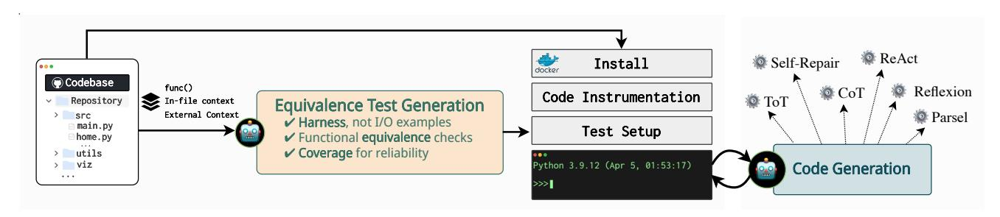

<span id="page-1-0"></span>Figure 1. An overview of our R2E framework that takes any GITHUB repository and converts it into a programming agent test environment. Given a repository, we first scan for *interesting* functions and collect corresponding in-file and external-file contexts from the repository. Next, we use our test generation approach to develop high-quality *equivalence test harnesses* for the function. Our key insight is decoupling the test outputs from inputs by relying on the ground truth implementation to get the expected outputs. Our framework yields problem instances comprising docstrings, test harnesses, and repository context (instantiated in the form of R2E-Eval1 benchmark). Next, we build the repository and set up an interactive environment with an interpreter. Via these environments, generated benchmarks can be used to evaluate code generation systems, either static ones that directly generate code or programming agents that interact with the test harness and interpreter to improve code generation performance for repository-level problems.

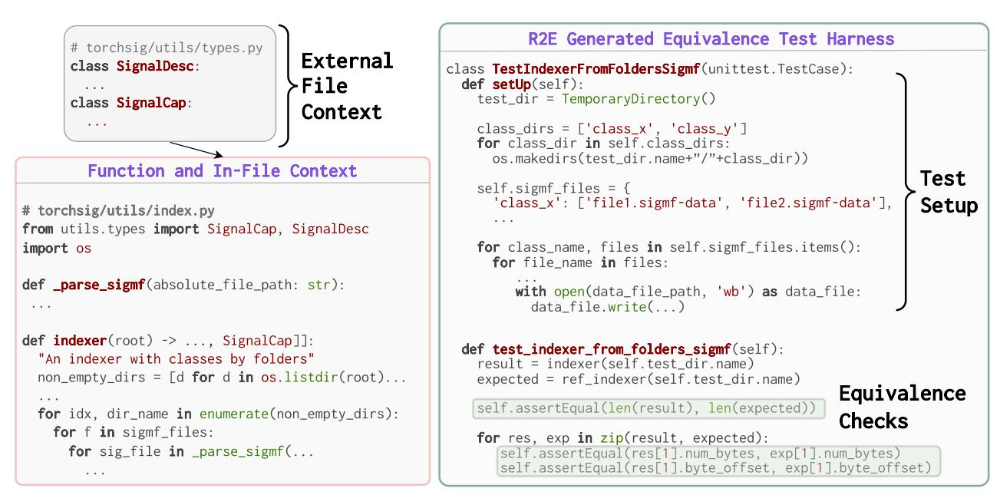

Figure 2. An example problem (left) in the R2E-Eval1 benchmark. The problem contains a function indexer from the Torchsig<sup>2</sup> GITHUB repository. TorchSig is an open-source signal processing machine learning toolkit based on the PyTorch data handling pipeline. The function indexer has dependencies within its file (\_parse\_sigmf) and from external files (SignalDesc and SignalCap from the file torchsig/utils/types.py). On the right is the generated equivalence test harness from our R2E framework. It contains a complex test setup where files expected by the function indexer are created and added to the file system. Then, the test harness performs functional equivalence checks for various granular properties of the returned output. Particularly, our harnesses test the functional behaviour of a given function directly against the ground truth program available on GITHUB, instrumented in the python namespace. Thus, we avoid predicting the expected output behaviour of a given function and only require constructing diverse inputs to test the function on.

test harness from our dataset. R2E-Eval1 comprises of 246 tasks extracted from 137 repositories containing 127.2 code tokens, 11.5 tests, and 3.7 dependencies per problem.

Finally, in Section 5, we evaluate current LLMs on real-world scenarios from our benchmark. We find that compared to HUMANEVAL models perform worse on these problems, highlighting the challenges of real-world program-

<span id="page-1-1"></span>ming. Popular techniques like Chain-of-Thought (COT) do not help with performance. On the other hand, LLM agents that interactively program using the test harness and execution feedback greatly improve their performance. We also provide insights into model behavior specific to real-world programs, such as challenges in understanding interfaces to existing functions and reasoning about complex objects.

Overall, we find that real-world programming is complicated, even for SOTA LLMs (GPT-4), motivating the use of better workflows that mimic a typical developer's programming process. This underscores the need to move from static functional coding to interactive programming, the evaluation of which our framework enables. Finally, R2E environments enable collecting interaction traces for code generation, optimization, repair which can help improve various code-related abilities of LLMs.

## <span id="page-2-5"></span>2. Background

Our R2E pipeline is powered by a synergy of program analysis and LLMs. Here, we provide background on some concepts used in the following sections.

**Testing.** Testing for functional correctness extends beyond mere input-output pairs, encompassing the broader dependencies that real-world software relies on. A **Test Harness** encapsulates this by combining *Test Cases* (defining inputs and expected outputs) and a *Setup* (establishing the operational conditions and dependencies like configuration files). The complexity of test harnesses, as illustrated in Figure 2, surpasses the simple input-output examples in previous benchmarks, like Humaneval (Chen et al., 2021). For instance, in Figure 2, the test harness contains the required setup of files in a directory (i.e., file system dependency) that the program expects to run successfully.

**Code Coverage.** The quality of tests is widely measured by its *coverage*—the fraction of code elements (e.g., statements or branches) it exercises (Ivanković et al., 2019). For example, a test that executes all lines of a function is said to have *line coverage* of 100%. A high coverage is desirable to ensure a function is tested thoroughly. We use **branch coverage** to evaluate the quality of our tests as it offers a more fine-grained measure than line coverage.

**Program Analysis for Slicing Context.** To effectively test repository code, we must grasp the function's operational context, which encompasses the functions and global variables it interacts with. We employ **dependency slicing** to construct this context, defining a slice  $D_f$  for function f as the set of functions F' called by f and global variables G' accessed by f, both directly and indirectly. The top-left of Figure 2 shows an example of a dependency slice extracted for a function indexer, that serves as a *minimal* context necessary to comprehend the function's behavior. The resulting slice  $D_f$  provides the minimal context for understanding f's behavior and indicates its *connectivity* within the repository, quantified by the slice size  $|D_f|$ . Details on computing the slice are in the Appendix A.

#### <span id="page-2-0"></span>3. The R2E Framework

GITHUB is a rich data source for *realistic* code problems, but repositories in the wild can be quite noisy, hard to run, and poorly maintained. We here propose R2E, an automated framework that turns any GITHUB repository into a test environment to evaluate the performance of code generation systems on real-world code.

Section 3.1 details our initial problem curation process. Section 3.2 describes our test harness synthesis approach. We evaluate the quality of our synthesized tests in Section 3.3. Finally, we describe how to refine problem specifications to build a high-quality benchmark in Section 3.4.

#### <span id="page-2-2"></span>3.1. Problem Curation

#### 3.1.1. REPOSITORY CURATION

We scraped Python repositories on GITHUB created after July'22 that are non-forks, have at least 40 stars, and contain either a toml or setup.py file. This date aligns with the reported cutoff data for OpenAI models GPT-3.5-TURBO and GPT-4, thus preventing contamination. Next, we filter out some failing repositories from an earlier iteration of this process. We saved each repository in a common Docker image. We built them using pdm³ and pip install commands with cross repository package-caching whenever possible to reduce the memory footprint. Further, we used pipreqs to add requirements missing in the toml, setup, or requirements files. Finally, we semi-manually installed uninstallable repositories when possible, resulting in a docker with 429 installed repositories sizing over 400 GB.

#### 3.1.2. Function Curation

We first extract all functions (and methods) from the collected repositories to identify problems suitable for natural-language-driven code generation and functional correctness evaluation. Particularly, we filter out functions lacking docstrings to ensure we have a natural language prompt equivalent. We then apply keyword-based filters to exclude functions associated with GPUs, cloud tasks, etc., since they are not conducive to standard functional correctness evaluations. We estimate the complexity of the functions using its *connectivity* (detailed in Section 2). We filter out functions that do not call other components in the repository. We provide a more comprehensive list of filters applied in the appendix. Through these stages of filtering, we collected candidate 9825 problems from our 429 repositories.

#### <span id="page-2-3"></span>3.2. Test Harness Generation: A Key to Environments

GITHUB repositories *lack high-quality tests* necessary for evaluating code generation, thus requiring automated test

<span id="page-2-1"></span><sup>&</sup>lt;sup>2</sup>https://github.com/TorchDSP/torchsig

<span id="page-2-4"></span><sup>3</sup>pdm-project.org

harness generation to collect problems scalably.

If generated, these tests can act as *checks* and *orchestrators* for execution-guided programming agents. As checks, they can evaluate the functional correctness of generated code. Tests also enable applications beyond code generation, such as refactoring, optimization, and transpilation, where tests can check if the transformed program is *equivalent* to the original. Finally, as orchestrators, they can run the generated code, capture compiler feedback, enable repair, and more.

To tackle this, R2E synthesizes tests for arbitrary GITHUB code using a novel synergy of *program analysis* with LLM prompting. Below, we summarize some of the key design choices of R2E's test generation approach.

Equivalence Tests, not Output Prediction. R2E decouples test outputs from inputs. Instead, it uses the original function as a reference implementation to generate expected outputs. This key insight dramatically simplifies test generation since it removes the need to predict outputs. Consequently, we generate *equivalence tests*—they check if the outputs of the original function and the generated function are equivalent against a given set of inputs.

Harnesses, not I/O pairs. R2E generates *equivalence test harnesses* (Section [2\)](#page-2-5) for each function, which contain the test cases and the required setup, such as database connections, external files, configurations, etc., that makes it possible to run functions in the wild. This is a departure from I/O examples with primitive types in traditional benchmarks such as HUMANEVAL [\(Chen et al.,](#page-8-0) [2021\)](#page-8-0). It is necessary because real-world code often requires more than simple input arguments. They may need several dependencies, such as access to files, environment variables, APIs, and user-defined functions or classes.

Sliced Context, not Entire Repositories. Test generation using LLMS has been effective in prior work like HU-MANEVAL+ [\(Liu et al.,](#page-9-1) [2023b\)](#page-9-1) for simple isolated functions. However, in a repository setting, prompting with the function alone is insufficient, and providing the entire repository is expensive. R2E uses a novel *dependency slicing based prompt* to extract the minimal repository context required to understand the functionality of the function under test. As described in Section [2,](#page-2-5) it finds functions and global variables on which the function directly or indirectly depends.

Execution and Coverage for Quality Control. Finally, recent studies have shown that execution-based benchmarks can be flawed due to low-quality tests [\(Liu et al.,](#page-9-1) [2023b\)](#page-9-1). To avoid this, we execute the generated test harnesses in the docker container built for the repository. Equivalence tests are run in "self-equivalence" mode, so the function under test and the reference implementation are the same. Inoperative harnesses due to issues like missing packages are excluded. An (equivalence) test harness is deemed *valid*

|              | In-File |        | Out-File |        |  |
|--------------|---------|--------|----------|--------|--|
| Strategy     | Val     | Cov    | Val      | Cov    |  |
| Output Pred. |         |        |          |        |  |
| Sliced       | 35.43%  | 87.59% | 30.68%   | 82.54% |  |
| Equivalence  |         |        |          |        |  |
| Naïve        | 44.25%  | 87.96% | 19.82%   | 76.59% |  |
| Full         | 51.73%  | 87.32% | 32.24%   | 77.23% |  |
| Sliced       | 52.37%  | 88.18% | 35.01%   | 79.65% |  |

<span id="page-3-1"></span>Table 1. Test generation evaluation results across 2 strategies – Output Prediction and Equivalence. Further, we vary prompt context creation across–Naïve, Full, and Sliced. The results are compared on 2 settings: In-File where the function under test only depends on the context within its file, and Out-File where it depends on external files in the repository. The metrics used are Validity (Val) and Coverage (Cov), for which higher is better. Our equivalence testing approach results in considerably more valid test harnesses than a direct output-prediction approach. Next, our dependency slicing-based prompt context offers a good balance of broader but focused context and fares better than naïve or full context settings.

if all the (equivalence) tests pass. We further emphasize the *quality* of test cases by using branch coverage (Section [2\)](#page-2-5). This check is critical to ensure that the generated tests cover the function's complete behavior and can be used to check functional equivalence.

We encode our design decisions as guidelines to prompt GPT-4-TURBO and use the sliced context to generate highquality test harnesses. Figure [2](#page-1-1) shows the resulting harnesses that handle complex data types and unique setups, depending on the function's requirements. We outline additional guidelines for test generation in the appendix.

#### <span id="page-3-0"></span>3.3. Test Harness Evaluation

#### 3.3.1. EXPERIMENT SETUP

We evaluate equivalence test harness generation on two fronts. First, measure *validity*, i.e., does it execute the original function while passing all equivalence tests? Then, we also evaluate the *quality* using branch coverage (Section [2\)](#page-2-5) to identify how well the tests cover the function's behavior–a critical property for equivalence checking.

We consider two broad test-generation strategies: **Output Pred.** and **Equivalence**. The **Equivalence** test generation approach uses the ground truth function implementation at runtime to get the expected output. On the other hand, **Output Pred.** approach attempts to generate both inputs and expected outputs for a given test, a much harder problem. Further, we study different context creation strategies in the repository context: **Naïve**, **Full**, and **Sliced**. The Naïve strategy prompt contains the function and no context. The Full strategy provides the file containing the function and all files it imports (until a 6000 token limit). Finally,

the Sliced strategy implements our proposed dependency slicing to provide the minimal context required for the function. We compare these strategies in 2 problem settings: (1) In-File: where the function under test depends only on the context within its file and (2) Out-File: where it depends on external files in the repository. We generate all tests using the state-of-the-art GPT-4-TURBO model. We elaborate further details such as prompts in Appendix B.

#### 3.3.2. VALIDITY AND QUALITY RESULTS

Table 1 shows the results of our evaluation.

Equivalence tests outperform output prediction. By design (Section 3.2), R2E generates equivalence tests that decouple test outputs from inputs by using the original function as a reference implementation to generate expected outputs. This significantly boosts the number of valid tests generated (by  $\approx 20\%$ ) when compared to generating tests with expected outputs predicted by the LLM.

Focussed context improves coverage. The Naïve strategy performs relatively poorly on validity (as low as 19%), but the valid test harnesses it generates have high coverage ( $\approx 88\%$ ). For example, naïvely generated tests often fail to generate correct input argument types (e.g., schemas or custom classes) due to the lack of necessary context.

**Broader context improves validity.** On the other hand, the Full strategy generates more valid tests (as high as 51.7%) but has lower coverage (77.2%). This indicates that a focused context can be more effective in covering corner cases in the function, but a broader context is necessary to understand the function's dependencies.

Our sliced strategy strikes a good balance between the two and achieves the best results in validity and coverage. Overall, we observe that R2E's dependency slicing-based strategy generates  $\approx 44\%$  valid test harnesses with a high  $\approx 83\%$  code coverage.

#### 3.3.3. FAILURE MODES

We collected and classified invalid equivalence test harnesses and study their failure modes. We discovered that 40% of errors were due to ValueErrors and TypeErrors, reflecting improper key, attribute, or type usage in tests. Additionally, 15% were DataFormatErrors, caused by incorrect data formats or schemas, highlighting the complexity of testing GITHUB code beyond primitive types.

AssertionErrors (expected and actual outputs don't match) accounted for a notable 25% of errors, showing a nuanced aspect of functional correctness in real-world code. Although R2E simplifies this to equivalence tests, assertions often need more granularity than simply checking for equality. For example, checking for class attributes, columns in

<span id="page-4-3"></span>

| Dataset       | Exec? | Repo? | Auto? | LOC  | #Tests |
|---------------|-------|-------|-------|------|--------|
| HUMANEVAL     | /     | Х     | Х     | 6.26 | 6.6    |
| ODEX          | /     | Х     | Х     | 3.05 | 1.9    |
| CROSSCODEEVAL | Х     | ✓     | ✓     | 1.0  | -      |
| REPOBENCH     | Х     | ✓     | ✓     | 1.0  | -      |
| REPOEVAL-FUNC | ✓     | ✓     | Х     | 10.8 | _4     |
| R2E-Eval1     | ✓     | ✓     | ✓     | 10.5 | 11.5   |

Table 2. Comparing R2E-Eval1 with other NL-to-code generation benchmarks, in terms of test execution-based support (Exec?), use of repository context (Repo?), and the number of lines in the ground truth function (LOC). R2E-Eval1 is the only executable benchmark, has repository context, and is automated, enabling scalability. Additionally, our benchmark contains more tests (harnesses) per function with diverse input types and quality assurance.

<span id="page-4-4"></span>

| Feature                 | Value        |  |
|-------------------------|--------------|--|
| # Problems (# Repos)    | 246 (137)    |  |
| Avg. # lines (# tokens) | 10.5 (127.2) |  |
| Avg. # tests (coverage) | 11.5(92.2)   |  |
| Avg. # dependencies     | 3.7          |  |
| # Unique APIs           | 70           |  |
| # Unique Arg Types      | 118          |  |

Table 3. Statistics for problems instances in our R2E-Eval1.

a dataframe, etc., requires a deeper understanding of code and repository context. Lastly, EnvironmentErrors (21%), like OS and File system errors, indicate challenges with test environment configuration.

#### <span id="page-4-1"></span>3.4. Refinement of Specifications

Natural language docstrings in GITHUB repositories might be ambiguous or under-specified to be used for code generation. Here, we propose an automated approach to refine the natural language docstring of a given function by asking the model to refine the docstring in a self-instruct-like fashion (Wang et al., 2022a). Distinctly, however, we provide the model with additional context in the form of the original docstring, test harness class, argument types, and serialized input-output arguments available via the test harness. Appendix C consists of more details.

We note that while we cannot evaluate the quality of refined specifications, we perform rigorous manual evaluations and filter problems with poor or ambiguous specifications.

#### <span id="page-4-0"></span>4. The R2E-Eval1 Benchmark

In Section 3, we showed that R2E enables a scalable framework for building execution-based test environments for programming agents. R2E takes a function from a codebase and converts it into a tuple  $\mathcal{I} = \{\mathcal{D}, \mathcal{R}, \mathcal{T}\}$ , where  $\mathcal{D}$  is a refined docstring for a function,  $\mathcal{R}$  is the remainder of the

<span id="page-4-2"></span><sup>&</sup>lt;sup>4</sup>Zhang et al. (2023d) did not release associated tests

codebase, and T is the generated test harness.

We instantiate this framework to construct R2E-Eval1, the first large-scale dataset of *real-world* code generation problems with functional correctness tests. Table [2](#page-4-3) compares R2E-Eval1 against several popular benchmarks used to evaluate code generation capabilities of LLMS. Prior work like HUMANEVAL [\(Chen et al.,](#page-8-0) [2021\)](#page-8-0) and ODEX [\(Wang et al.,](#page-10-0) [2022b\)](#page-10-0) support execution-based metrics but for isolated simple problems with no real-world repository setting. Recent work on repository-level code generation like CROSSCODEE-VAL [\(Ding et al.,](#page-8-1) [2023\)](#page-8-1), REPOBENCH [\(Liu et al.,](#page-9-2) [2023c\)](#page-9-2), and REPOEVAL [\(Zhang et al.,](#page-10-2) [2023d\)](#page-10-2) use repository context, but either forego execution-based evaluation or depend heavily on human-written tests, which are seldom available at scale on GITHUB. R2E-Eval1 is the only executable benchmark that has repository context and is automated, enabling scalability. Following, we describe the construction of R2E-Eval1 and analysis.

#### 4.1. Benchmark Construction

### 4.1.1. DATASET QUALITY

We emphasize heavily on the quality of problems in this work. Quality, here, means how well the function, docstring, and test cases are written. To ensure this, we only consider functions with high branch coverage. Our final benchmark problems have an average of 11.5 test cases with 92.2% average branch coverage. An additional round of manual inspection helps us select high-quality problems. Notably, in the manual inspection, we avoid very long or complex that is hard to specify precisely using docstrings (like functions with many peculiar corner cases).

#### 4.1.2. DATASET COMPOSITION

We also consider the diversity and interestingness of the problems in the benchmark. We identify several properties of code that calibrate interestingness, such as # of dependencies, argument types, lines, libraries used, etc.

Table [3](#page-4-4) showcases statistics of our benchmark. Our manual analysis also shows that R2E-Eval1 problems are diverse in terms of the domains they cover: pythonic operations (list, str, dict manipulations), data manipulation (JSON, files, pandas, numpy), algorithm and protocol implementations (networkx, statistics), domain-specific problems (programming languages, networks, quantum computing, formal verification, numerical computing), and more.

We also ensure that the benchmark is diverse in terms of the number of distinct repositories, preventing bias towards a codebase or domain. Overall this process leads to a curated set of 246 problems from 137 repositories in R2E-Eval1.

Each problem instance I can be used to evaluate a code

generation system by providing docstring D to the system and evaluating its response (in the context of the repository R) against the generated test harness T .

## <span id="page-5-0"></span>5. R2E: Towards Programming Agents

We conduct experiments to understand three important problems about LLM performance on real-world coding.

- Q1 How well can current LLMS solve the real-world code generation tasks statically? (Sec. [5.1\)](#page-5-1)
- Q2 What are the typical LLM failure modes? (Sec. [5.2\)](#page-6-0)
- Q3 How do programming agent paradigms (like selfrepair) perform against static programming? (Sec. [5.3\)](#page-7-0)

Our results show that the SOTA LLM model (GPT-4) can only achieve ∼ 50% performance in R2E-Eval1, despite high accuracy on HUMANEVAL. Throughout the analysis, we find that LLMS struggle at *understanding* interfaces to existing functions and reasoning about complex objects. Finally, we compare static coding approaches (e.g., COT) with the proposed interactive programming paradigm, demonstrating significant benefits from the latter.

### <span id="page-5-1"></span>5.1. Static Code Generation

First, we study direct code generation on the R2E-Eval1 dataset, i.e., using code generation without interaction. Owing to the test harnesses generation approach, we perform functional correctness evaluations for the generated code. This contrasts with prior works [\(Liu et al.,](#page-9-2) [2023c;](#page-9-2) [Ding](#page-8-1) [et al.,](#page-8-1) [2023\)](#page-8-1) that rely on execution-free exact-match metrics to evaluate code completion in the repository setting, which can be unreliable and restrict the scope of the evaluation.

We use PASS@1 to evaluate the functional correctness, computed by generating 5 candidate completions for each problem instance and computing the fraction that passes against the test harness. We consider a mixture of closed access and open access models for our experiments – GPT-4, GPT-3.5-TURBO, CODELLAMA-7B, CODELLAMA-13B, and CODELLAMA-34B[5](#page-5-2) . Since GPT-4 and GPT-3.5-TURBO are instruction-tuned models, we use the chat style prompt for them while using the code completion prompt from the CODELLAMA models. We elaborate further on our setup, models, and prompts in Appendix [E.](#page-16-0)

Contamination. GPT-4 and GPT-3.5-TURBO have a cutoff date of 2021 and are therefore not contaminated on our benchmark since we curate our problems from repositories created after August 2022 (see Section [3.1\)](#page-2-2).

Given a problem instance I = {D, R, T } in our benchmark, we need to use the remaining repository context to generate

<span id="page-5-2"></span><sup>5</sup>We use the Python variants of the CODELLAM<sup>A</sup> models.

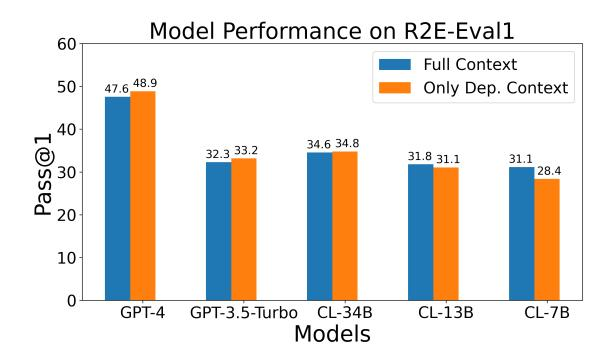

<span id="page-6-1"></span>Figure 3. Functional correctness (PASS@1) of various models (GPT and CODELLAMA families) on our R2E-Eval1. First, we note that, overall, models perform worse on our benchmark against HUMANEVAL, highlighting the challenging nature of realworld code generation tasks. GPT-4 performs particularly well, achieving a PASS@1 close to 50%, much better than other models. Next, we study two retrieval settings–dependency context and full context and find a trade-off between the two (discussed in Section [5.1\)](#page-5-1).

the code. Since the entire repository context can be very large, we retrieve content to provide the model (detailed ahead). We first evaluate how current models hold up on our benchmark and then study how the choice of retrieval impacts performance. Next, we study the effect of using chain-of-thought prompting (COT) [\(Wei et al.,](#page-10-3) [2022\)](#page-10-3) for improving model performance on harder tasks.

Model Performance. Figure [3](#page-6-1) compares the performance of various models on our benchmark using the PASS@1 (CL used for brevity in the figure instead of CODELLAMA). We find that the performance of various models is relatively lower than other benchmarks like HUMANEVAL. This is expected since our benchmark represents more challenging real-world problems collected from GITHUB, which require *understanding* existing context from the repository before generating the code. We find that GPT-4 performs significantly better than all other models with a PASS@1 close to 50% whereas other models only achieve PASS@1 in the vicinity of 30%.

Effect of retrieval. We study the effect of functiondefinition retrieval vs. function-usage retrieval using dependency slicing (Section [2\)](#page-2-5) on the ground-truth function. Specifically, dependency-only-context only provides the necessary definitions, while the full context setting adds the remainder of the file and other files until a 6000 token limit. Figure [3](#page-6-1) compares the two settings.

The two retrieval methods perform similarly, achieving ±1% of each other's performance across most models. On a closer look, we find non-overlapping problems with a Pearson correlation coefficient of 0.48. We find that dependencyonly-context vs full-context provides an interesting trade-off. On the one hand, dependencies provide a more focused view

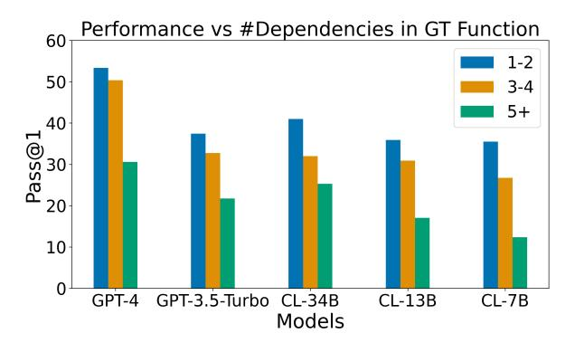

<span id="page-6-3"></span>Figure 4. PASS@1 of models as a function of the number of unique dependencies (functions and global variables) used in the original function. We find that models struggle to solve problems that require orchestrating multiple existing functionalities in the file and only perform well when a few dependencies are involved.

of relevant function implementations to the model. At the same time, function usage (present in full context) is often reused and enables models to *copy it directly*. See Appendix [F.1](#page-21-0) in the Appendix for a more detailed discussion and examples of this trade-off. Finally, we believe that R2E-Eval1 provides a unique opportunity to study this problem in the future with execution enabled.

Effect of COT. We study better-prompting strategies and look at both zero-shot and two-shot COT prompts that sketch a *plan* for the function implementation before generating the code. We study this for the instruct GPT-3.5-TURBO and GPT-4 models but find that COT like setup does not improve performance over direct prompt (Table [5](#page-27-0) in Appendix).

### <span id="page-6-0"></span>5.2. Model Behaviour & Failure Analysis

Performance with problem-complexity. We measure the complexity of a problem instance using (1) the number of tokens in the ground-truth implementation, (2) the number of dependencies used by the ground-truth implementation [6](#page-6-2) . We find that both these measures are (inversely) correlated with the PASS@1 of the models. In Figures [4](#page-6-3) and [12,](#page-27-1) we plot the PASS@1 of the models against the number of dependencies and the number of tokens used in the groundtruth implementation showing a downward trend.

Single File vs Multi-File Context. We compare how models perform on problems that require only a single file to be generated against problems that require multiple files to be generated. Model performance is significantly better on single-file problems than multi-file problems (Figure [13\)](#page-27-2). This suggests that a.) models struggle with multi-file contexts compared to single-file contexts and b.) problems in the multi-file category are more complex than single-file problems in our benchmark, also observed in practice.

<span id="page-6-2"></span><sup>6</sup> counted using the number of unique functions or global variables used in the function body.

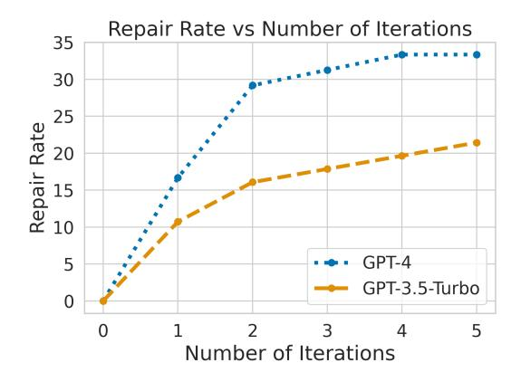

Figure 5. We measure whether self-repair using test harnesses and interpreter feedback can help the models correct mistakes and improve performance. We collect problems on which GPT-4 and GPT-3.5-TURBO fail and ask the models to iteratively correct by providing some error messages. We find that models improve performance from black-box feedback (33% and 21% respectively for GPT-4 and GPT-3.5-TURBO after 5 iterations.

#### Do not *understand* the interface to provided functions.

We find that when provided with complex functions in the context, LLMS do not understand the right input-output behavior of such functions and pass in wrong inputs or expect wrong outputs. Thus, even strong LLMS like GPT-4 make mistakes when provided with complex functions in the context. See Listings [8](#page-26-0) for reference. This motivates that if provided access to execution context, programming agents can *understand* such interfaces and perform better.

Repeat vs Reuse Code. Abstractions are an integral part of writing good code. LLMS, however, tend to duplicate code instead of using existing context. Specifically, when provided with some existing function in the context, models re-implement the same functionality instead of directly using it. Listings [2](#page-18-0) and [3](#page-19-0) provide examples. This aligns with findings on how copilot affects code quality [\(Blog.\)](#page-8-2).

### <span id="page-7-0"></span>5.3. Self-Repair Agent

So far, we described model evaluations on our benchmark using the direct code generation approach. However, testing harnesses and access to the interpreter allow us to evaluate programming agents that can interact with the interpreter and get feedback. Specifically, we instantiate a self-repair agent that uses the test harness

We study that when provided with feedback from (oracle) testing harnesses (present in our benchmark instances), can LLMS correct their own mistakes? We sample 56 and 48 instances from our benchmark for GPT-4 and GPT-3.5-TURBO on which the models do not generate a correct solution (detailed experiment setup in Section [E.2](#page-17-0) in the Appendix). We consider the incorrect programs generated by the models as the initial programs and then provide the models with error feedback using the harness iteratively for 5 iterations. Figure [5](#page-7-1) shows the self-repair rate of the models on our benchmark as a function of the number of iterations.

First note that since we subsample only the failing instances where models do not generate correct solutions, the 0-th iteration score is 0% for both models. Next, we find that GPT-4 attains a maximum self-repair rate of 33% while GPT-3.5-TURBO only attains a maximum self-repair rate of 20%. This highlights that using execution, interpreter, and test cases, programming *agents* can improve code generation. Note that while advanced prompting techniques do not improve performance (Table [5\)](#page-27-0), using an interpreter enables programming agents to achieve strong results.

### <span id="page-7-1"></span>6. Related Work

Code Generation Benchmarks. Code generation is primarily evaluated using functional-correctness and has been explored in multiple domains. HUMANEVAL [\(Chen et al.,](#page-8-0) [2021\)](#page-8-0) and MBPP [\(Austin et al.,](#page-8-3) [2021\)](#page-8-3) study code generation on isolated single-function problems. APPS [\(Hendrycks et al.,](#page-9-3) [2021\)](#page-9-3) and CODE-CONTESTS [\(Li et al.,](#page-9-4) [2022\)](#page-9-4) benchmarks are primarily used for evaluating algorithmic code generation capabilities. DS-1000 [\(Lai et al.,](#page-9-5) [2023\)](#page-9-5), ARCADE [\(Yin et al.,](#page-10-4) [2022\)](#page-10-4), NUMPYEVAL [\(Zhang et al.,](#page-10-5) [2023b\)](#page-10-5), and PANDASE-VAL [\(Jain et al.,](#page-9-6) [2022\)](#page-9-6) study data science API code generation. More recently, [Wang et al.](#page-10-0) [\(2022b\)](#page-10-0) proposed ODEX that evaluates coding on APIS with human-written inputoutput examples. These works evaluate code generation capabilities in isolated settings devoid of surrounding context or dependencies from other files. In contrast, R2E coding problems are curated directly from GITHUB thus more similar to real-world setups. INTERCODE and WEBARENA provide general environments for domain-specific interactive programming and web tasks respectively. We provide a framework and environments for interactive general-purpose programming tasks extract from GITHUB.

For the repository setting, prior works have primarily focused on execution-free evaluation metrics like exact-match and BLEU due to absence of test harnesses. CONALA [\(Yin](#page-10-6) [et al.,](#page-10-6) [2018\)](#page-10-6) curated a large dataset from STACKOVERFLOW with paired natural language and program snippets. [Shri](#page-10-7)[vastava et al.](#page-10-7) [\(2023b;](#page-10-7)[a\)](#page-10-8) study different context selection methods for prompting and training LLMS for repositorylevel code generation. REPOEVAL [\(Zhang et al.,](#page-10-9) [2023a\)](#page-10-9), REPOBENCH [\(Liu et al.,](#page-9-2) [2023c\)](#page-9-2), and CROSSCODEEVAL [\(Ding](#page-8-1) [et al.,](#page-8-1) [2023\)](#page-8-1) study repository-level code *completion*. However, these works only evaluate short context code generation capabilities without execution or functional correctness restriction to short completions. In contrast, we synthesize function-level test harnesses using our novel test generation approach and use them for performing function correctness checks on repository code. Recently, [Jimenez et al.](#page-9-7) [\(2023\)](#page-9-7) proposed SWEBENCH to evaluate whether LLMS can solve

GITHUB issues. However, they assume test cases availability from pull requests preventing scalable collection of problems. Our test harness synthesis in contrast allows collecting problems from diverse set of repositories (137 repositories vs 12 repositories). Finally, [Du et al.](#page-8-4) [\(2023\)](#page-8-4) proposed, CLASSEVAL, manually curated for evaluating LLMS.

Other code-related tasks. Beyond codegen, tasks like selfrepair [\(Chen et al.,](#page-8-5) [2023;](#page-8-5) [Olausson et al.,](#page-9-8) [2023;](#page-9-8) [Madaan](#page-9-9) [et al.,](#page-9-9) [2023b;](#page-9-9) [Peng et al.,](#page-9-10) [2023;](#page-9-10) [Zhang et al.,](#page-10-10) [2023c\)](#page-10-10), test generation [\(Tufano et al.,](#page-10-11) [2022;](#page-10-11) [Watson et al.,](#page-10-12) [2020\)](#page-10-12), execution [\(Austin et al.,](#page-8-3) [2021;](#page-8-3) [Liu et al.,](#page-9-11) [2023a;](#page-9-11) [Gu et al.,](#page-9-12) [2024\)](#page-9-12), and optimization [\(Madaan et al.,](#page-9-13) [2023a\)](#page-9-13) have been studied. These enable various *agentic* setups as CODET [\(Chen](#page-8-6) [et al.,](#page-8-6) [2022\)](#page-8-6), [Key et al.](#page-9-14) [\(2022\)](#page-9-14), PARSEL [\(Zelikman et al.,](#page-10-13) [2023\)](#page-10-13), FUNSEARCH [\(Romera-Paredes et al.,](#page-10-14) [2023\)](#page-10-14), REFLEX-ION [\(Shinn et al.,](#page-10-15) [2023\)](#page-10-15), LEVER [\(Ni et al.,](#page-9-15) [2023\)](#page-9-15), CODE-PLAN [\(Bairi et al.,](#page-8-7) [2023\)](#page-8-7), ALPHACODIUM [\(Ridnik et al.,](#page-9-16) [2024\)](#page-9-16), REACT [\(Yao et al.,](#page-10-16) [2022\)](#page-10-16), and TOT [\(Yao et al.,](#page-10-17) [2023\)](#page-10-17).

### 7. Discussion

Limitations. Natural language is inherently ambiguous and docstrings might not specify the corner cases properly. We tried to mitigate this effect with our specification refinement approach along with manual filtering. Future work study this ambiguity in more and also look into better interaction mechanisms. Next, we use observational equivalence to check whether the model-generated candidates are correct over a set of inputs. We use branch coverage as a metric for evaluating tests but it is still a softer check. Future work can apply mutation testing and oversampling to provide further confidence on generated tests.

Conclusion. We propose R2E, a scalable framework to convert GITHUB repositories to programming agent test environments. R2E-Eval1 constructed via this framework can evaluate both static and interactive code generation systems, offering valuable insights into model behaviors and the need for better programming workflows. Prior work has applied rejection sampling and reinforcement learning to improve coding capabilities of LLMS [\(Singh et al.,](#page-10-18) [2023;](#page-10-18) [Jain et al.,](#page-9-17) [2023;](#page-9-17) [Le et al.,](#page-9-18) [2022\)](#page-9-18). We believe R2E can enable such attempts for real-world programs.

### Impact Statement

This paper presents work whose goal is to advance the field of Machine Learning. There are many potential societal consequences of our work, none which we feel must be specifically highlighted here

## References

- <span id="page-8-3"></span>Austin, J., Odena, A., Nye, M., Bosma, M., Michalewski, H., Dohan, D., Jiang, E., Cai, C., Terry, M., Le, Q., et al. Program synthesis with large language models. *arXiv preprint arXiv:2108.07732*, 2021.
- <span id="page-8-7"></span>Bairi, R., Sonwane, A., Kanade, A., D C, V., Iyer, A., Parthasarathy, S., Rajamani, S., Ashok, B., and Shet, S. Codeplan: Repository-level coding using llms and planning. In *Neural Information Processing Systems Workshop on Foundation Models for Decision Making (FMDM-NeurIPS)*, November 2023.
- <span id="page-8-10"></span>Bareiß, P., Souza, B., d'Amorim, M., and Pradel, M. Code generation tools (almost) for free? a study of few-shot, pre-trained language models on code. *arXiv preprint arXiv:2206.01335*, 2022.
- <span id="page-8-2"></span>Blog., E. C. Quantifying github copilot's impact on code quality. [https://www.expresscomputer.in/news/](https://www.expresscomputer.in/news/quantifying-github-copilots-impact-on-code-quality-ai/104480/) [quantifying-github-copilots-impact-on-code-quali](https://www.expresscomputer.in/news/quantifying-github-copilots-impact-on-code-quality-ai/104480/)ty-ai/ [104480/](https://www.expresscomputer.in/news/quantifying-github-copilots-impact-on-code-quality-ai/104480/).
- <span id="page-8-6"></span>Chen, B., Zhang, F., Nguyen, A., Zan, D., Lin, Z., Lou, J.- G., and Chen, W. Codet: Code generation with generated tests. *arXiv preprint arXiv:2207.10397*, 2022.
- <span id="page-8-0"></span>Chen, M., Tworek, J., Jun, H., Yuan, Q., Pinto, H. P. d. O., Kaplan, J., Edwards, H., Burda, Y., Joseph, N., Brockman, G., et al. Evaluating large language models trained on code. *arXiv preprint arXiv:2107.03374*, 2021.
- <span id="page-8-5"></span>Chen, X., Lin, M., Schärli, N., and Zhou, D. Teaching large language models to self-debug. *arXiv preprint arXiv:2304.05128*, 2023.
- <span id="page-8-1"></span>Ding, Y., Wang, Z., Ahmad, W. U., Ding, H., Tan, M., Jain, N., Ramanathan, M. K., Nallapati, R., Bhatia, P., Roth, D., et al. Crosscodeeval: A diverse and multilingual benchmark for cross-file code completion. *arXiv preprint arXiv:2310.11248*, 2023.
- <span id="page-8-4"></span>Du, X., Liu, M., Wang, K., Wang, H., Liu, J., Chen, Y., Feng, J., Sha, C., Peng, X., and Lou, Y. Classeval: A manuallycrafted benchmark for evaluating llms on class-level code generation, 2023.
- <span id="page-8-8"></span>Fraser, G. and Arcuri, A. Evosuite: automatic test suite generation for object-oriented software. In *Proceedings of the 19th ACM SIGSOFT symposium and the 13th European conference on Foundations of software engineering*, pp. 416–419, 2011.
- <span id="page-8-9"></span>Fraser, G. and Arcuri, A. Whole test suite generation. *IEEE Transactions on Software Engineering*, 39(2):276–291, 2012.

- <span id="page-9-12"></span>Gu, A., Rozière, B., Leather, H., Solar-Lezama, A., Synnaeve, G., and Wang, S. I. Cruxeval: A benchmark for code reasoning, understanding and execution. *arXiv preprint arXiv:2401.03065*, 2024.
- <span id="page-9-3"></span>Hendrycks, D., Basart, S., Kadavath, S., Mazeika, M., Arora, A., Guo, E., Burns, C., Puranik, S., He, H., Song, D., et al. Measuring coding challenge competence with apps. *arXiv preprint arXiv:2105.09938*, 2021.
- <span id="page-9-0"></span>Ivankovic, M., Petrovi ´ c, G., Just, R., and Fraser, G. Code ´ coverage at google. In *Proceedings of the 2019 27th ACM Joint Meeting on European Software Engineering Conference and Symposium on the Foundations of Software Engineering*, pp. 955–963, 2019.
- <span id="page-9-6"></span>Jain, N., Vaidyanath, S., Iyer, A., Natarajan, N., Parthasarathy, S., Rajamani, S., and Sharma, R. Jigsaw: Large language models meet program synthesis. In *Proceedings of the 44th International Conference on Software Engineering*, pp. 1219–1231, 2022.
- <span id="page-9-17"></span>Jain, N., Zhang, T., Chiang, W.-L., Gonzalez, J. E., Sen, K., and Stoica, I. Llm-assisted code cleaning for training accurate code generators. *arXiv preprint arXiv:2311.14904*, 2023.
- <span id="page-9-7"></span>Jimenez, C. E., Yang, J., Wettig, A., Yao, S., Pei, K., Press, O., and Narasimhan, K. Swe-bench: Can language models resolve real-world github issues? *arXiv preprint arXiv:2310.06770*, 2023.
- <span id="page-9-14"></span>Key, D., Li, W.-D., and Ellis, K. I speak, you verify: Toward trustworthy neural program synthesis. *arXiv preprint arXiv:2210.00848*, 2022.
- <span id="page-9-22"></span>Lahiri, S. K., Naik, A., Sakkas, G., Choudhury, P., von Veh, C., Musuvathi, M., Inala, J. P., Wang, C., and Gao, J. Interactive code generation via test-driven user-intent formalization. *arXiv preprint arXiv:2208.05950*, 2022.
- <span id="page-9-5"></span>Lai, Y., Li, C., Wang, Y., Zhang, T., Zhong, R., Zettlemoyer, L., Yih, W.-t., Fried, D., Wang, S., and Yu, T. Ds-1000: A natural and reliable benchmark for data science code generation. In *International Conference on Machine Learning*, pp. 18319–18345. PMLR, 2023.
- <span id="page-9-18"></span>Le, H., Wang, Y., Gotmare, A. D., Savarese, S., and Hoi, S. C. H. Coderl: Mastering code generation through pretrained models and deep reinforcement learning. *Advances in Neural Information Processing Systems*, 35: 21314–21328, 2022.
- <span id="page-9-21"></span>Lemieux, C., Inala, J. P., Lahiri, S. K., and Sen, S. Codamosa: Escaping coverage plateaus in test generation with pre-trained large language models. In *International conference on software engineering (ICSE)*, 2023.

- <span id="page-9-4"></span>Li, Y., Choi, D., Chung, J., Kushman, N., Schrittwieser, J., Leblond, R., Eccles, T., Keeling, J., Gimeno, F., Dal Lago, A., et al. Competition-level code generation with alphacode. *Science*, 378(6624):1092–1097, 2022.
- <span id="page-9-11"></span>Liu, C., Lu, S., Chen, W., Jiang, D., Svyatkovskiy, A., Fu, S., Sundaresan, N., and Duan, N. Code execution with pre-trained language models. *arXiv preprint arXiv:2305.05383*, 2023a.
- <span id="page-9-1"></span>Liu, J., Xia, C. S., Wang, Y., and Zhang, L. Is your code generated by chatgpt really correct? rigorous evaluation of large language models for code generation. *arXiv preprint arXiv:2305.01210*, 2023b.
- <span id="page-9-2"></span>Liu, T., Xu, C., and McAuley, J. Repobench: Benchmarking repository-level code auto-completion systems. *arXiv preprint arXiv:2306.03091*, 2023c.
- <span id="page-9-13"></span>Madaan, A., Shypula, A., Alon, U., Hashemi, M., Ranganathan, P., Yang, Y., Neubig, G., and Yazdanbakhsh, A. Learning performance-improving code edits. *arXiv preprint arXiv:2302.07867*, 2023a.
- <span id="page-9-9"></span>Madaan, A., Tandon, N., Gupta, P., Hallinan, S., Gao, L., Wiegreffe, S., Alon, U., Dziri, N., Prabhumoye, S., Yang, Y., et al. Self-refine: Iterative refinement with self-feedback. *arXiv preprint arXiv:2303.17651*, 2023b.
- <span id="page-9-15"></span>Ni, A., Iyer, S., Radev, D., Stoyanov, V., Yih, W.-t., Wang, S., and Lin, X. V. Lever: Learning to verify languageto-code generation with execution. In *International Conference on Machine Learning*, pp. 26106–26128. PMLR, 2023.
- <span id="page-9-8"></span>Olausson, T. X., Inala, J. P., Wang, C., Gao, J., and Solar-Lezama, A. Demystifying gpt self-repair for code generation. *arXiv preprint arXiv:2306.09896*, 2023.
- <span id="page-9-20"></span>Pacheco, C. and Ernst, M. D. Randoop: feedback-directed random testing for java. In *Companion to the 22nd ACM SIGPLAN conference on Object-oriented programming systems and applications companion*, pp. 815–816, 2007.
- <span id="page-9-19"></span>Panichella, A., Kifetew, F. M., and Tonella, P. Automated test case generation as a many-objective optimisation problem with dynamic selection of the targets. *IEEE Transactions on Software Engineering*, 44(2):122–158, 2017.
- <span id="page-9-10"></span>Peng, B., Galley, M., He, P., Cheng, H., Xie, Y., Hu, Y., Huang, Q., Liden, L., Yu, Z., Chen, W., and Gao, J. Check your facts and try again: Improving large language models with external knowledge and automated feedback. *arXiv preprint arXiv:2302.12813*, 2023.
- <span id="page-9-16"></span>Ridnik, T., Kredo, D., and Friedman, I. Code generation with alphacodium: From prompt engineering to flow engineering. *arXiv preprint arXiv:2401.08500*, 2024.

- <span id="page-10-14"></span>Romera-Paredes, B., Barekatain, M., Novikov, A., Balog, M., Kumar, M. P., Dupont, E., Ruiz, F. J., Ellenberg, J. S., Wang, P., Fawzi, O., et al. Mathematical discoveries from program search with large language models. *Nature*, pp. 1–3, 2023.
- <span id="page-10-19"></span>Ryder, B. G. Constructing the call graph of a program. *IEEE Transactions on Software Engineering*, (3):216– 226, 1979.
- <span id="page-10-20"></span>Salis, V., Sotiropoulos, T., Louridas, P., Spinellis, D., and Mitropoulos, D. Pycg: Practical call graph generation in python. In *2021 IEEE/ACM 43rd International Conference on Software Engineering (ICSE)*, pp. 1646–1657. IEEE, 2021.
- <span id="page-10-15"></span>Shinn, N., Labash, B., and Gopinath, A. Reflexion: an autonomous agent with dynamic memory and self-reflection. *arXiv preprint arXiv:2303.11366*, 2023.
- <span id="page-10-8"></span>Shrivastava, D., Kocetkov, D., de Vries, H., Bahdanau, D., and Scholak, T. Repofusion: Training code models to understand your repository. *arXiv preprint arXiv:2306.10998*, 2023a.
- <span id="page-10-7"></span>Shrivastava, D., Larochelle, H., and Tarlow, D. Repositorylevel prompt generation for large language models of code. In *International Conference on Machine Learning*, pp. 31693–31715. PMLR, 2023b.
- <span id="page-10-18"></span>Singh, A., Co-Reyes, J. D., Agarwal, R., Anand, A., Patil, P., Liu, P. J., Harrison, J., Lee, J., Xu, K., Parisi, A., et al. Beyond human data: Scaling self-training for problem-solving with language models. *arXiv preprint arXiv:2312.06585*, 2023.
- <span id="page-10-21"></span>Tufano, M., Drain, D., Svyatkovskiy, A., Deng, S. K., and Sundaresan, N. Unit test case generation with transformers and focal context. *arXiv preprint arXiv:2009.05617*, 2020.
- <span id="page-10-11"></span>Tufano, M., Deng, S. K., Sundaresan, N., and Svyatkovskiy, A. Methods2test: A dataset of focal methods mapped to test cases. In *Proceedings of the 19th International Conference on Mining Software Repositories*, pp. 299– 303, 2022.
- <span id="page-10-1"></span>Wang, Y., Kordi, Y., Mishra, S., Liu, A., Smith, N. A., Khashabi, D., and Hajishirzi, H. Self-instruct: Aligning language model with self generated instructions. *arXiv preprint arXiv:2212.10560*, 2022a.
- <span id="page-10-0"></span>Wang, Z., Zhou, S., Fried, D., and Neubig, G. Executionbased evaluation for open-domain code generation. *arXiv preprint arXiv:2212.10481*, 2022b.
- <span id="page-10-12"></span>Watson, C., Tufano, M., Moran, K., Bavota, G., and Poshyvanyk, D. On learning meaningful assert statements for

- unit test cases. In *Proceedings of the ACM/IEEE 42nd International Conference on Software Engineering*, pp. 1398–1409, 2020.
- <span id="page-10-3"></span>Wei, J., Wang, X., Schuurmans, D., Bosma, M., Xia, F., Chi, E., Le, Q. V., Zhou, D., et al. Chain-of-thought prompting elicits reasoning in large language models. *Advances in Neural Information Processing Systems*, 35: 24824–24837, 2022.
- <span id="page-10-16"></span>Yao, S., Zhao, J., Yu, D., Du, N., Shafran, I., Narasimhan, K., and Cao, Y. React: Synergizing reasoning and acting in language models. *arXiv preprint arXiv:2210.03629*, 2022.
- <span id="page-10-17"></span>Yao, S., Yu, D., Zhao, J., Shafran, I., Griffiths, T. L., Cao, Y., and Narasimhan, K. Tree of thoughts: Deliberate problem solving with large language models. *arXiv preprint arXiv:2305.10601*, 2023.
- <span id="page-10-6"></span>Yin, P., Deng, B., Chen, E., Vasilescu, B., and Neubig, G. Learning to mine aligned code and natural language pairs from stack overflow. In *International Conference on Mining Software Repositories*, MSR, pp. 476–486. ACM, 2018. doi: https://doi.org/10.1145/3196398.3196408.
- <span id="page-10-4"></span>Yin, P., Li, W.-D., Xiao, K., Rao, A., Wen, Y., Shi, K., Howland, J., Bailey, P., Catasta, M., Michalewski, H., et al. Natural language to code generation in interactive data science notebooks. *arXiv preprint arXiv:2212.09248*, 2022.
- <span id="page-10-13"></span>Zelikman, E., Huang, Q., Poesia, G., Goodman, N. D., and Haber, N. Parsel: A (de-) compositional framework for algorithmic reasoning with language models. *arXiv preprint arXiv:2212.10561*, 2023.
- <span id="page-10-9"></span>Zhang, F., Chen, B., Zhang, Y., Liu, J., Zan, D., Mao, Y., Lou, J.-G., and Chen, W. Repocoder: Repository-level code completion through iterative retrieval and generation. *arXiv preprint arXiv:2303.12570*, 2023a.
- <span id="page-10-5"></span>Zhang, K., Li, G., Li, J., Li, Z., and Jin, Z. Toolcoder: Teach code generation models to use apis with search tools. *arXiv preprint arXiv:2305.04032*, 2023b.
- <span id="page-10-10"></span>Zhang, K., Li, Z., Li, J., Li, G., and Jin, Z. Self-edit: Faultaware code editor for code generation. In *Proceedings of the 61st Annual Meeting of the Association for Computational Linguistics (Volume 1: Long Papers)*, pp. 769–787, Toronto, Canada, July 2023c. Association for Computational Linguistics.
- <span id="page-10-2"></span>Zhang, T., Yu, T., Hashimoto, T., Lewis, M., Yih, W.-t., Fried, D., and Wang, S. Coder reviewer reranking for code generation. In *International Conference on Machine Learning*, pp. 41832–41846. PMLR, 2023d.

### <span id="page-11-0"></span>A. Program Analysis

### A.1. Callgraphs

A callgraph [\(Ryder,](#page-10-19) [1979\)](#page-10-19) is a directed graph where nodes represent subroutines (functions, methods, constructors, etc.), and edges denote the *calling* relationships between them. It is a directed graph G = (V, E) where V is a set of subroutines (functions, methods, constructors, etc.) and E is a set of edges representing the *calling* relationship between these subroutines. If a subroutine u invokes (i.e., calls) a subroutine v, then there is a directed edge from u to v in the callgraph. For instance, in Figure [2,](#page-1-1) the function indexer *calls* the function \_parse\_sigmf\_capture. This repository abstraction enables analyzing several properties of repository code.

For instance, we use it to extract the dependencies that a function relies on for its execution—a valuable property for test generation. In this work, we use the PYCG tool [\(Salis et al.,](#page-10-20) [2021\)](#page-10-20) to generate callgraphs for PYTHON repositories.

### A.2. Dependency Slicing

While callgraphs abstract direct interactions between functions, a PYTHON function can interact with parts of the repository through global variables, too–in the same file and imported from other files. We can summarize these interactions in a dependency slice D<sup>f</sup> for a function f, as the set of all functions F ′ that f calls, and all global variables G′ that f accesses, both directly and indirectly.

For a function f, we define a mapping called depends which identifies all functions F ′ that f calls, and all global variables G′ that f accesses.

Then a dependency slice D<sup>f</sup> is the transitive closure of all functions and global variables that f depends on, directly or indirectly.

$$D_f = \bigcup_{(F',G') \in depends^*(f)} (F' \cup G') \tag{1}$$

Computing this slice is generally an undecidable problem, but we make a few simplifying assumptions to make it tractable. We begin by utilizing the callgraph to identify the functions that f calls. We then use bytecode analysis to identify the set of global variables that f accesses. We add these functions and global variables to the slice and recursively repeat the process for each function in the slice. We utilize this context for test generation in Section [3.2.](#page-2-3)

### <span id="page-12-0"></span>B. Test Generation

Below, we list the prompt used for test harness generation.

You are a python programming expert who was hired to write tests for Python functions.

You will be given a python function in a python file and you will write a complete test that covers the function and all the different corner cases.

You can assume a compiled reference implementation of the function is available, and hence do not need to predict the expected output of the function.

That is, the test you write will use the reference implementation to generate the expected output.

Also, assume the function provided is correct and hence the test should focus on the behavior that is defined by the function ONLY.

Ensure that the tests align with the function's expected input types, avoiding scenarios that the function is not designed to handle.

Completely avoid testing with invalid input types or values, testing for error handling, and checking 'assertRaises'. Set a fixed random seed in tests involving randomness to ensure consistent and reproducible results when necessary. Avoid mocking calls to APIs or functions (e.g., builtins.open) when actual implementations are simple, accessible, and their use does not compromise the test's isolation or determinism.

Particularly, avoid mocking calls to any file I/O APIs, and instead try to create temporary files and directories for testing purposes.

You will return the test for that function and NOT return anything except for the test.

Put your fixed test program within code delimiters, for example:

```
"""python
# YOUR CODE HERE
"""
```

Write a test using the 'unittest' library for the function 'function\_name'. Assume the reference implementation is 'reference\_function\_name'. Both the function and the reference are in the module 'fut\_module'. Only return the test code and do NOT return anything else. Enclose your code within code delimiters, for example:

```
"""python
# YOUR CODE HERE
"""
```

### B.1. Related Work

Automated Testing. R2E motivates the use of automated test generation to build reliable and scalable code-related benchmarks to evaluate LLMS. Automated test generation has been rapidly adopted in the software engineering community. Several frameworks for test generation have been proposed, both traditional search-based [\(Fraser & Arcuri,](#page-8-8) [2011;](#page-8-8) [2012;](#page-8-9) [Panichella et al.,](#page-9-19) [2017\)](#page-9-19) and neural.

LLMs have also been used for test generation. [Bareiß et al.](#page-8-10) present an approach for test generation that follows a few-shot learning paradigm, outperforming traditional feedback-directed test generation [\(Pacheco & Ernst,](#page-9-20) [2007\)](#page-9-20). [Tufano et al.](#page-10-21) present an approach for test generation using a BART transformer model that is fine-tuned on a training set of functions and corresponding tests. CODAMOSA [\(Lemieux et al.,](#page-9-21) [2023\)](#page-9-21) presents an approach where tests generated by Codex are used to assist search-based testing techniques [\(Panichella et al.,](#page-9-19) [2017\)](#page-9-19) in situations where such techniques get "stuck" because the generated test cases diverge too far from expected uses of the code under test.

Test-Driven Development. Furthermore, research on test generation with LLMS has not just been limited to generating tests but using them for *test-driven development* [\(Chen et al.,](#page-8-6) [2022;](#page-8-6) [Lahiri et al.,](#page-9-22) [2022\)](#page-9-22).

#### B.2. Analysis of Equivalence Test Generation

Below is further analysis of the performance of R2E's equivalence test generation, as described in Section [3.2,](#page-2-3) on a subset of functions.

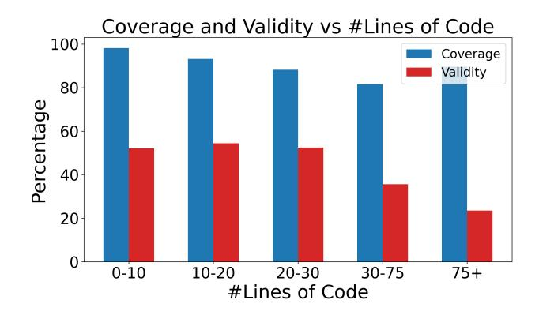

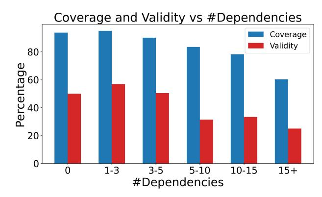

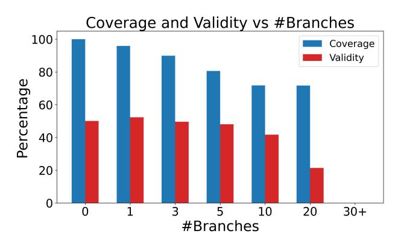

Figure 6. Varying number of lines Figure 7. Varying number of dependencies

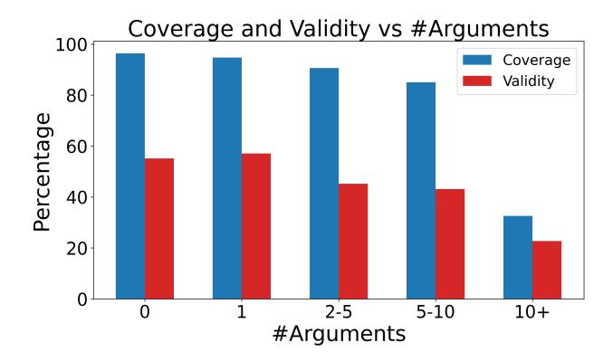

Figure 8. Varying number of branches Figure 9. Varying number of arguments

## <span id="page-14-0"></span>C. Specification Refinement

You are a python programming expert who is refining docstrings in existing programs. You will be given a python function in a python file with an existing (possibly underspecified) docstring with corresponding unit tests for the function and optionally some input-output examples extracted from the unittest in a serialized format. Your goal is to refine the associated docstring by making it more informative, precise and complete without adding verbosity or detailed programming logic to the docstring. The docstring should particularly describe the format and types of the expected inputs and output as well as the behavior of the function. You will return the function definition, docstring enclosed in markdown code delimiters. The docstrings must be formatted in the google docstring format and examples should be added if they clarify the function and look helpful without being very long. Do not guess outputs for functions but only copy the expected outputs as provided. Finally, do not throw away existing details from the docstrings and only insert content you are sure about. Do NOT have repeated content in the docstring and ONLY describe the high-level function behavior without going into implementation details

```
### Code Snippet:
{original_code_snippet}
### Unit Tests:
"""python
{test_code}
"""
### Argument Types: {argument_types}
### Output Types: {output_type}
### Examples: {examples_substring}
```

Refine the docstring for the function function\_name. Return only the updated function with docstring enclosed in markdown and ignore the remaining code. Remember to make the docstring precise and informative regarding global function behavior (input-output properties) without being too verbose. Do not specify detailed function logic or very domain-specific content in the docstring (unless already described in the docstring).

### D. Benchmark

The list of unique input and output data types is provided below. This highlights that problems in our benchmark are interesting.

```
{
    "__main__.ComplexDataClass", "__main__.ExampleDataClass", "__main__.MockTextDocument", "__main__.
    NestedDataClass", "__main__.PickleCoder", "__main__.SimpleDataClass", "ast.Attribute", "ast.Call", "astroid.
    nodes.scoped_nodes.scoped_nodes.FunctionDef", "builtins.bool", "builtins.builtin_function_or_method", "builtins
    .bytes", "builtins.dict", "builtins.EOFError", "builtins.float", "builtins.function", "builtins.generator", "
    builtins.int", "builtins.list", "builtins.list_reverseiterator", "builtins.method", "builtins.module", "
    builtins.NoneType", "builtins.property", "builtins.set", "builtins.slice", "builtins.str", "builtins.tuple", "
    builtins.type", "builtins.ValueError", "casadi.casadi.Function", "cascades._src.handlers.Record", "celpy.
    celtypes.BoolType", "collections.defaultdict", "collections.OrderedDict", "dacite.config.Config", "dis.
    Instruction", "diskcache.core.Cache", "docile.dataset.bbox.BBox", "dpkt.ethernet.Ethernet", "dynamicprompts.
    parser.config.ParserConfig", "fullcontrol.combinations.gcode_and_visualize.classes.Point", "fullcontrol.
    geometry.vector.Vector", "_Stats", "Compression", "Encoding", "Graph", "GroupedTensor", "Indicator", "KGFn", "
    LogSeverity", "LogTensor", "NamedList", "RangeSlotList", "RequestsCookieJar", "return_type_ptiva_linalg_eigh",
    "Sound", "SSH", "TextSlotList", "WildcardSlotList", "iamspy.iam.Document", "jaxlib.xla_extension.ArrayImpl", "
    klongpy.core.KGSym", "kork.ast.FunctionCall", "lgssl.evaluation.logistic_regression.LogisticRegression", "
    libcst._nodes.module.Module", "mypy.nodes.OpExpr", "networkx.classes.digraph.DiGraph", "networkx.classes.graph.
    Graph", "networkx.classes.multigraph.MultiGraph", "numpy._ArrayFunctionDispatcher", "numpy.bool_", "numpy.
    float64", "numpy.int64", "numpy.ndarray", "numpy.random.mtrand.RandomState", "numpyro.distributions.continuous.
    Normal", "open_rarity.models.collection.Collection", "open_rarity.models.token.Token", "ormdantic.models.models
    .Map", "pandas.core.frame.DataFrame", "pandas.core.series.Series", "pathlib.PosixPath", "pydantic.main.
    BaseModel", "pygame.surface.Surface", "pyparsing.core.Forward", "pywhy_graphs.classes.admg.ADMG", "pywhy_graphs
    .classes.pag.PAG", "pywhy_graphs.classes.timeseries.digraph.StationaryTimeSeriesDiGraph", "pywhy_graphs.classes
    .timeseries.pag.StationaryTimeSeriesPAG", "rdkit.Chem.rdchem.Mol", "scipy.sparse._csr.csr_matrix", "scipy.
    sparse._lil.lil_matrix", "sklearn.linear_model._logistic.LogisticRegression", "sklearn.neighbors._kde.
    KernelDensity", "sqlalchemy.sql.sqltypes.DateTime", "sympy.core.add.Add", "sympy.core.mul.Mul", "sympy.core.
    numbers.Integer", "sympy.core.numbers.NegativeOne", "sympy.core.numbers.One", "sympy.core.numbers.Pi", "sympy.
    core.numbers.Zero", "sympy.functions.elementary.exponential.log", "sympy.functions.elementary.trigonometric.cos
    ", "sympy.functions.elementary.trigonometric.sin", "torch.device", "torch.nn.modules.conv.Conv2d", "torch.nn.
    modules.linear.Linear", "torch.nn.parameter.Parameter", "torch.Tensor", "torchsig.utils.types.SignalCapture", "
    torchsig.utils.types.SignalData", "tracr.rasp.rasp.Aggregate", "tracr.rasp.rasp.Map", "tracr.rasp.rasp.
    SelectorWidth", "typing._AnnotatedAlias", "typing._GenericAlias", "typing._UnionGenericAlias", "unittest.mock.
    MagicMock", "uuid.UUID", "xarray.core.dataset.Dataset", "z3.z3.BoolRef", "z3.z3.SeqRef"
}
```

Listing 1. Unique input and output data types in our benchmark. We have over 100 unique data types arising from over 60 libraries.

### <span id="page-16-0"></span>E. Experiments

We list down the list of models considered for code generation experiments here.

| Model ID                          | Link                    |
|-----------------------------------|-------------------------|
| codellama/CodeLlama-34b-Python-hf | CodeLlama-34b-Python-hf |
| codellama/CodeLlama-13b-Python-hf | CodeLlama-13b-Python-hf |
| codellama/CodeLlama-7b-Python-hf  | CodeLlama-7b-Python-hf  |
| gpt-3.5-turbo-1106-16k            | OpenAI                  |
| gpt-4-1106                        | OpenAI                  |

Table 4. List of models

### E.1. Code Generation

To compute PASS@1, we generate 5 completions for each problem instance using each model. We use nucleus sampling with p = 0.95 and T = 0.2. Below we list the prompts used (inspired from [\(Olausson et al.,](#page-9-8) [2023\)](#page-9-8))

You are a Python programming expert who is going to generate a Python function in a file using the function docstring. You will use the existing context of relevant files provided for implementation and ONLY return the completed function. Enclose the completed function in markdown code delimiters and do NOT return anything else.

### Code Snippet {code\_snippet}

Complete the function {function\_name}. Only return the completed function enclosed in markdown code delimiters

#### <span id="page-17-0"></span>E.2. Self Repair

"""

We use GPT-4 and GPT-3.5-TURBO models for the self-repair task. We find problems from R2E where models fail to any generate correct completion and we can extract the failing scenario (since some of the tests are dynamic, it is not always possible to extract the failing scenario). Additionally, since our GPT-4 has a context length of 8k, we additionaly filter very long problems from the repair dataset We then use the failing scenario as the prompt for the self-repair task.

You are a Python programming expert who is going to generate a Python function in a file using the function docstring. You will use the existing context of relevant files provided for implementation and ONLY return the completed function. Enclose the completed function in markdown code delimiters and do NOT return anything else.

```
### Code Snippet:
{code_snippet}
### Inputs:
{captured_inputs}
### Expected Output:
{captured_output}
### Error Trace:
{output}
### Instruction
You will first reason using a concise (at most 2-3 sentences) textual explanation of what is wrong with
the function. After you have pointed out what is wrong with the code, you will then generate a fixed
version of the program. You will ONLY return the completed function. Follow the following format
which presents the reason for the failure followed by the repaired program enclosed in backticks.
### Reasoning
{function_name} is failing because of ...
### Repaired Function
"""python
def function_name(...): ...
```

### F. Code Generation Results

```
'''
## paco/evaluation/utils/paco_query_utils.py
import torch
def _product_attr(vision, text, alter):
    """
    Args:
        vision: N x D
        text: M x D
        alter: N x M, to replace results in some cases, see details in Returns
    Returns: N x M.
        For (n, m) element, set J_m = {j : text[m, j] == 1}.
        - if |J_m| > 0, it equals to (prod_{j in J_m} vision[n, j])**(1/|J_m|)
        - if |J_m| == 0, it equals to alter[n, m]
    """
    vision = vision.unsqueeze(1)
    text = text.unsqueeze(0)
    num_attr = text.sum(-1)
    queried_attr = vision * text
    queried_attr = queried_attr.masked_fill(text == 0, 1)
    queried_attr = torch.float_power(queried_attr.prod(dim=2), 1 / torch.max(num_attr, torch.ones_like(num_attr))).
    float()
    no_attr_queries = num_attr.squeeze(0) == 0
    queried_attr[:, no_attr_queries] = alter[:, no_attr_queries]
    return queried_attr
def obj_with_attributes(input_embeddings, query_embeddings, n_obj, n_part, n_attr):
    """Compute the similarity between object embeddings and query embeddings based on attributes.
    This function calculates the similarity score between each pair of object and query embeddings.
    Args:
    Returns:
    Example:
        >>> ..."""
'''
    ## CodeLLaMa-34B-Python completion
    obj_type = type(obj)
    if obj_type is property:
        obj = obj.fget
    if not hasattr(obj, '__module__') or not hasattr(obj, '__qualname__'):
        return None
    module = inspect.getmodule(obj)
    if module is None:
        return None
    if not hasattr(module, '__file__'):
        return None
    if obj_type is type:
        obj_source = obj.__qualname__
    elif obj_type is types.ModuleType:
        obj_source = obj.__name__
    else:
        obj_source = f'{obj.__module__}.{obj.__qualname__}'
    return f'File "{module.__file__}", line {inspect.getsourcelines(obj)[1]}'.replace('\\', '/')
```

Listing 2. CODELLAMA-34B repeats the code from its sibling functions.

```
'''
def standardize_and_get_inchi(mol: Mol, options: str='', log_level=None, warnings_as_errors=False) -> str:
    """Return InChI after standardising molecule and inferring stereo from coordinates."""
    mol = deepcopy(mol)
    mol = assert_sanity(mol)
    mol = remove_isotopic_info(mol)
    has_pose = mol.GetNumConformers() > 0
    if has_pose:
        RemoveStereochemistry(mol)
    mol = RemoveHs(mol)
    try:
        mol = neutralize_atoms(mol)
    except AtomValenceException:
        logger.warning('Failed to neutralize molecule. Using uncharger. InChI check might fail.')
        mol = Uncharger().uncharge(mol)
    mol = add_stereo_hydrogens(mol)
    if has_pose:
        AssignStereochemistryFrom3D(mol, replaceExistingTags=True)
    with CaptureLogger():
        inchi = MolToInchi(mol, options=options, logLevel=log_level, treatWarningAsError=warnings_as_errors)
    return inchi
...
def check_identity(mol_pred: Mol, mol_true: Mol, inchi_options: str='') -> dict[str, Any]:
    """Check if two molecules are identical in terms of their InChI representation.
    This function compares the InChI strings of two molecules after standardizing them and
    optionally applying InChI generation options. ...
    Args:
    Returns:
    Example:
        >>> ..."""
'''
    ## CodeLLaMa-13B-Python completion
    mol_pred = deepcopy(mol_pred)
    mol_true = deepcopy(mol_true)
    mol_pred = assert_sanity(mol_pred)
    mol_true = assert_sanity(mol_true)
    mol_pred = remove_isotopic_info(mol_pred)
    mol_true = remove_isotopic_info(mol_true)
    has_pose_pred = mol_pred.GetNumConformers() > 0
    has_pose_true = mol_true.GetNumConformers() > 0
    if has_pose_pred:
        RemoveStereochemistry(mol_pred)
    if has_pose_true:
        RemoveStereochemistry(mol_true)
    mol_pred = RemoveHs(mol_pred)
    mol_true = RemoveHs(mol_true)
    try:
        mol_pred = neutralize_atoms(mol_pred)
    except AtomValenceException:
        logger.warning('Failed to neutralize molecule. Using uncharger. InChI check might fail.')
        mol_pred = Uncharger().uncharge(mol_pred)
    try:
        mol_true = neutralize_atoms(mol_true)
    except AtomValenceException:
        logger.warning('Failed to neutralize molecule. Using uncharger. InChI check might fail.')
        mol_true = Uncharger().uncharge(mol_true)
    mol_pred = add_stereo_hydrogens(mol_pred)
    mol_true = add_stereo_hydrogens(mol_true)
```

```
if has_pose_pred:
    AssignStereochemistryFrom3D(mol_pred, replaceExistingTags=True)
if has_pose_true:
    AssignStereochemistryFrom3D(mol_true, replaceExistingTags=True)
inchi_pred = standardize_and_get_inchi(mol_pred, options=inchi_options)
inchi_true = standardize_and_get_inchi(mol_true, options=inchi_options)
results = _compare_inchis(inchi_true, inchi_pred)
results['inchi_crystal_valid'] = _is_valid_inchi(inchi_true)
results['inchi_docked_valid'] = _is_valid_inchi(inchi_pred)
results['inchi_crystal'] = inchi_true
results['inchi_docked'] = inchi_pred
return {'results': results}
```

Listing 3. Models struggle to understande the interface functions provided in context.

#### <span id="page-21-0"></span>F.1. Dependency vs Usage Tradeoff

The first example demonstrates dependency context vs full context for get\_2d\_sincos\_pos\_embed function. In the dependency context, only two functions which the oracle ground truth functions calls are provided and the task is to stitch them together. This becomes simpler in the full context case where how to call those functions is also provided (via other functions).

```
import torch
def get_2d_sincos_pos_embed_from_grid(embed_dim: int, grid: torch.Tensor) -> torch.Tensor:
    """Get 2D sine-cosine positional embedding from grid.
    Args:
        embed_dim: embedding dimension.
        grid: positions
    Returns:
        (torch.Tensor): [grid_size*grid_size, embed_dim] or [1+grid_size*grid_size, embed_dim]"""
    assert embed_dim % 2 == 0
    emb_h = get_1d_sincos_pos_embed_from_grid(embed_dim // 2, grid[0])
    emb_w = get_1d_sincos_pos_embed_from_grid(embed_dim // 2, grid[1])
    emb = torch.cat([emb_h, emb_w], dim=1)
    return emb
def get_1d_sincos_pos_embed_from_grid(embed_dim: int, pos: torch.Tensor) -> torch.Tensor:
    """Get 1D sine-cosine positional embedding.
    Args:
        embed_dim: output dimension for each position
        pos: a list of positions to be encoded: size (M,)
    Returns:
        (torch.Tensor): tensor of shape (M, D)"""
    assert embed_dim % 2 == 0
    omega = torch.arange(embed_dim // 2, dtype=torch.float)
    omega /= embed_dim / 2.0
    omega = 1.0 / 10000 ** omega
    pos = pos.reshape(-1)
    out = torch.einsum('m,d->md', pos, omega)
    emb_sin = torch.sin(out)
    emb_cos = torch.cos(out)
    emb = torch.cat([emb_sin, emb_cos], dim=1)
    return emb
def get_2d_sincos_pos_embed(embed_dim: int, grid_size: int, cls_token: bool=False) -> torch.Tensor:
    """Generates a 2D sine-cosine positional embedding tensor.
    This function creates a positional embedding for a 2D grid using sine and cosine functions.
    The embedding can optionally include a leading zero vector to represent a classification (CLS) token.
    Args:
        embed_dim (int): The dimensionality of the embedding for each position.
        grid_size (int): The height and width of the square grid for which embeddings are generated.
        cls_token (bool): If True, the output tensor will include an additional first row with zeros
                          to represent a CLS token. Defaults to False.
    Returns:
        torch.Tensor: A tensor of shape (grid_size * grid_size, embed_dim) without a CLS token, or
                      (1 + grid_size * grid_size, embed_dim) with a CLS token. The tensor contains
                      the positional embeddings for the grid and is of type 'torch.float32'."""
    grid = torch.stack(torch.meshgrid(torch.arange(grid_size), torch.arange(grid_size)), dim=-1)
    grid = grid.reshape(-1, 2).float()
    emb = get_2d_sincos_pos_embed_from_grid(embed_dim, grid)
    if cls_token:
        cls_emb = torch.zeros(1, embed_dim)
        emb = torch.cat([cls_emb, emb], dim=0)
    return emb
```

Listing 4. GPT4 code generation with a dependency only prompt. The model needs to understand the provided functions and stitch the solution together since no example usage of the required functions is provided

```
from typing import Tuple
import torch
def get_3d_sincos_pos_embed(embed_dim: int, tube_shape: Tuple[int, int, int], stride, offset, kernel_size,
    cls_token: bool=False) -> torch.Tensor:
    """Get 3D sine-cosine positional embedding.
    Args:
        tube_shape: (t_size,
        ...."""
    ...
    pos_embed_spatial = get_2d_sincos_pos_embed_from_grid(embed_dim_spatial, grid)
    ...
def get_2d_sincos_pos_embed(embed_dim: int, grid_size: int, cls_token: bool=False) -> torch.Tensor:
    """Get 2D sine-cosine positional embedding.
    Args:
        grid_size: int of the grid height and width
        cls_token: bool, whether to contain CLS token
    Returns:
        (torch.Tensor): [grid_size*grid_size, embed_dim] or [1+grid_size*grid_size, embed_dim]"""
    ...
    pos_embed = ...
def get_1d_sincos_pos_embed_from_grid(embed_dim: int, pos: torch.Tensor) -> torch.Tensor:
    """Get 1D sine-cosine positional embedding.
    Args:
        embed_dim: output dimension for each position
        pos: a list of positions to be encoded: size (M,)
    Returns:
        (torch.Tensor): tensor of shape (M, D)
    """
    assert embed_dim % 2 == 0
    omega = torch.arange(embed_dim // 2, dtype=torch.float)
    ...
    return emb
def get_2d_sincos_pos_embed(embed_dim: int, grid_size: int, cls_token: bool=False) -> torch.Tensor:
    """Generates a 2D sine-cosine positional embedding tensor.
    This function creates a positional embedding for a 2D grid using sine and cosine functions.
    The embedding can optionally include a leading zero vector to represent a classification (CLS) token.
    Args:
        embed_dim (int): The dimensionality of the embedding for each position.
        grid_size (int): The height and width of the square grid for which embeddings are generated.
        cls_token (bool): If True, the output tensor will include an additional first row with zeros
                          to represent a CLS token. Defaults to False.
    Returns:
        torch.Tensor: A tensor of shape (grid_size * grid_size, embed_dim) without a CLS token, or
                      (1 + grid_size * grid_size, embed_dim) with a CLS token. The tensor contains
                      the positional embeddings for the grid and is of type 'torch.float32'.
    """
    assert embed_dim % 2 == 0
    grid = torch.arange(grid_size, dtype=torch.float)
    grid = torch.meshgrid(grid, grid, indexing='ij')
    grid = torch.stack(grid, dim=0)
    pos_embed = get_2d_sincos_pos_embed_from_grid(embed_dim, grid)
    return pos_embed
```

Listing 5. The full context for this example provides example usage of the required functions making it an easier problem.

```
class Image(BaseImage):
        def gvec2rotmat(self):
                return qvec2rotmat(self.qvec)
def read_next_bytes(fid, num_bytes, format_char_sequence, endian_character='<'):</pre>
        data = fid.read(num_bytes)
        return struct.unpack(endian_character + format_char_sequence, data)
def read_images_binary(path_to_model_file):
        """Read camera images and their properties from a binary file. This function parses a binary file containing
         the properties of images used in 3D reconstruction
        and returns a dictionary of Image namedtuples, each containing the properties of an image.
        Args:
               path_to_model_file (str): The path to the binary model file to be read.
        Returns:
                dict: A dictionary where keys are image IDs (int) and values are Image namedtuples.
                            Each Image namedtuple has the following fields:
                            - id (int): The unique identifier of the image.
                             - qvec (numpy.ndarray): A 4-element array representing the quaternion vector.
                            - tvec (numpy.ndarray): A 3-element array representing the translation vector.
                             - camera_id (int): The identifier of the camera used to capture the image.
                            - name (str): The name of the image file.
                             - xys (numpy.ndarray): An Nx2 array of [x, y] coordinates of 2D points in the image.
                             - point3D_ids (numpy.ndarray): An N-element array of identifiers of corresponding 3D points"""
        ## GPT-4 Completion
        with open(path_to_model_file, 'rb') as fid:
                num_reg_images = read_next_bytes(fid, 4, 'I')[0]
                images = {}
                for _ in range(num_reg_images):
                        image_id = read_next_bytes(fid, 4, 'I')[0]
                        qvec = np.array(read_next_bytes(fid, 4 * 4, 'dddd'))
                        tvec = np.array(read_next_bytes(fid, 3 * 4, 'fff'))
                        camera_id = read_next_bytes(fid, 4, 'I')[0]
                        image_name = read_next_bytes(fid, 1, 'c')[0]
                        num_points2D = read_next_bytes(fid, 4, 'I')[0]
                        xys = np.array(read_next_bytes(fid, num_points2D * 2 * 4, 'ff' * num_points2D))
                        point3D_ids = np.array(read_next_bytes(fid, num_points2D * 4, 'I' * num_points2D))
                        images[image\_id] = Image(\underbrace{id} = image\_id, \ qvec = qvec, \ tvec = tvec, \ camera\_id = camera\_id, \ name = image\_name, \ xys = camera\_id = camera\_id, \ name = image\_name, \ xys = camera\_id = camera\_id = camera\_id = camera\_id = camera\_id = camera\_id = camera\_id = camera\_id = camera\_id = camera\_id = camera\_id = camera\_id = camera\_id = camera\_id = camera\_id = camera\_id = camera\_id = camera\_id = camera\_id = camera\_id = camera\_id = camera\_id = camera\_id = camera\_id = camera\_id = camera\_id = camera\_id = camera\_id = camera\_id = camera\_id = camera\_id = camera\_id = camera\_id = camera\_id = camera\_id = camera\_id = camera\_id = camera\_id = camera\_id = camera\_id = camera\_id = camera\_id = camera\_id = camera\_id = camera\_id = camera\_id = camera\_id = camera\_id = camera\_id = camera\_id = camera\_id = camera\_id = camera\_id = camera\_id = camera\_id = camera\_id = camera\_id = camera\_id = camera\_id = camera\_id = camera\_id = camera\_id = camera\_id = camera\_id = camera\_id = camera\_id = camera\_id = camera\_id = camera\_id = camera\_id = camera\_id = camera\_id = camera\_id = camera\_id = camera\_id = camera\_id = camera\_id = camera\_id = camera\_id = camera\_id = camera\_id = camera\_id = camera\_id = camera\_id = camera\_id = camera\_id = camera\_id = camera\_id = camera\_id = camera\_id = camera\_id = camera\_id = camera\_id = camera\_id = camera\_id = camera\_id = camera\_id = camera\_id = camera\_id = camera\_id = camera\_id = camera\_id = camera\_id = camera\_id = camera\_id = camera\_id = camera\_id = camera\_id = camera\_id = camera\_id = camera\_id = camera\_id = camera\_id = camera\_id = camera\_id = camera\_id = camera\_id = camera\_id = camera\_id = camera\_id = camera\_id = camera\_id = camera\_id = camera\_id = camera\_id = camera\_id = camera\_id = camera\_id = camera\_id = camera\_id = camera\_id = camera\_id = camera\_id = camera\_id = camera\_id = camera\_id = camera\_id = camera\_id = camera\_id = camera\_id = camera\_id = camera\_id = camera\_id = camera\_id = camera\_id = camera\_id = camera\_id = camera\_id = camera\_id = camera\_id = camera\_id = camera\_id = camera\_id = camera\_id = camera\_id = camer
         xys, point3D_ids=point3D_ids)
                 return images
```

Listing 6. The dependency context for the read images binary function only provides read next bytes in context and is challenging

```
# xrloc/map/read_write_model.py
def read_next_bytes(fid, num_bytes, format_char_sequence, endian_character='<'):
    ...
def write_next_bytes(fid, data, format_char_sequence, endian_character='<'):
    ...
def write_images_binary(images, path_to_model_file):
    """
    see: src/base/map.cc
        void Reconstruction::ReadImagesBinary(const std::string& path)
        void Reconstruction::WriteImagesBinary(const std::string& path)
    """
    with open(path_to_model_file, 'wb') as fid:
        write_next_bytes(fid, len(images), 'Q')
        for _, img in images.items():
            write_next_bytes(fid, img.id, 'i')
            write_next_bytes(fid, img.qvec.tolist(), 'dddd')
            write_next_bytes(fid, img.tvec.tolist(), 'ddd')
            write_next_bytes(fid, img.camera_id, 'i')
            for char in img.name:
                write_next_bytes(fid, char.encode('utf-8'), 'c')
            write_next_bytes(fid, b'\\x00', 'c')
            write_next_bytes(fid, len(img.point3D_ids), 'Q')
            for xy, p3d_id in zip(img.xys, img.point3D_ids):
                write_next_bytes(fid, [*xy, p3d_id], 'ddq')
def read_points3d_binary(path_to_model_file):
    ...
def write_points3d_binary(points3D, path_to_model_file):
    """
    see: src/base/map.cc
        void Reconstruction::ReadPoints3DBinary(const std::string& path)
        void Reconstruction::WritePoints3DBinary(const std::string& path)
    """
    with open(path_to_model_file, 'wb') as fid:
        write_next_bytes(fid, len(points3D), 'Q')
        for _, pt in points3D.items():
            write_next_bytes(fid, pt.id, 'Q')
            write_next_bytes(fid, pt.xyz.tolist(), 'ddd')
            write_next_bytes(fid, pt.rgb.tolist(), 'BBB')
            write_next_bytes(fid, pt.error, 'd')
            track_length = pt.image_ids.shape[0]
            write_next_bytes(fid, track_length, 'Q')
            for image_id, point2D_id in zip(pt.image_ids, pt.point2D_idxs):
                write_next_bytes(fid, [image_id, point2D_id], 'ii')
def read_point3d_feature_binary(path_to_feature_file):
    """Read 3D point features.
    Args:
        path_to_feature_file (str): Path to point feature file
    Returns:
        dict{int:np.array(dim)}: 3D point feature dict
    """
    point3d_features = {}
    with open(path_to_feature_file, 'rb') as file:
        num_points3d = struct.unpack('<Q', file.read(8))[0]
        dim_feature = struct.unpack('<Q', file.read(8))[0]
        for i in range(num_points3d):
            point3d_id = struct.unpack('<Q', file.read(8))[0]
            feature_num = struct.unpack('<I', file.read(4))[0]
```

```
fmat = '<{0}f'.format(dim_feature)</pre>
            descriptor = np.array(struct.unpack(fmat, file.read(4 * dim_feature)))
            point3d_features[point3d_id] = descriptor
    return point3d_features
def read_images_binary(path_to_model_file):
    Read camera images and their properties from a binary file.
    This function parses a binary file containing the properties of images used in 3D reconstruction
    and returns a dictionary of Image namedtuples, each containing the properties of an image.
    Args:
        path_to_model_file (str): The path to the binary model file to be read.
    Returns:
        dict: A dictionary where keys are image IDs (int) and values are Image namedtuples.
              Each Image namedtuple has the following fields:
              - id (int): The unique identifier of the image.
              - qvec (numpy.ndarray): A 4-element array representing the quaternion vector.
              - tvec (numpy.ndarray): A 3-element array representing the translation vector.
              - camera_id (int): The identifier of the camera used to capture the image.
              - name (str): The name of the image file.
              - xys (numpy.ndarray): An Nx2 array of [x, y] coordinates of 2D points in the image.
              - point3D_ids (numpy.ndarray): An N-element array of identifiers of 3D points corresponding to the 2D
     points.
    ## GPT-4 Completion
    images = {}
    with open(path_to_model_file, 'rb') as fid:
        num_reg_images = read_next_bytes(fid, 8, '0')[0]
        for _ in range(num_reg_images):
            reg_image_id = read_next_bytes(fid, 4, 'i')[0]
            qvec = np.array(read_next_bytes(fid, 8 * 4, 'dddd'))
            tvec = np.array(read_next_bytes(fid, 8 * 3, 'ddd'))
            camera_id = read_next_bytes(fid, 4, 'i')[0]
            image_name = ''
            while True:
                char = read_next_bytes(fid, 1, 'c')[0]
                if char == b' \times 00':
                    break
                image_name += char.decode('utf-8')
            num_points2D = read_next_bytes(fid, 8, 'Q')[0]
            xys = np.zeros((num_points2D, 2), dtype=np.float32)
            point3D_ids = np.zeros(num_points2D, dtype=np.int64)
            for i in range(num_points2D):
                xys[i] = read_next_bytes(fid, 8 * 2, 'dd')
                point3D_ids[i] = read_next_bytes(fid, 8, 'Q')[0]
            images[reg_image_id] = Image(id=reg_image_id, qvec=qvec, tvec=tvec, camera_id=camera_id, name=
    image_name, xys=xys, point3D_ids=point3D_ids)
    return images
```

Listing 7. The full context for the read images binary function provides various functions in context implementing similar functionality in write binary images

```
import torch
def _product_attr(vision, text, alter):
    """
    Args:
        vision: N x D
        text: M x D
        alter: N x M, to replace results in some cases, see details in Returns
    Returns: N x M.
        For (n, m) element, set J_m = {j : text[m, j] == 1}.
        - if |J_m| > 0, it equals to (prod_{j in J_m} vision[n, j])**(1/|J_m|)
        - if |J_m| == 0, it equals to alter[n, m]
    """
    vision = vision.unsqueeze(1)
    text = text.unsqueeze(0)
    num_attr = text.sum(-1)
    queried_attr = vision * text
    queried_attr = queried_attr.masked_fill(text == 0, 1)
    queried_attr = torch.float_power(queried_attr.prod(dim=2), 1 / torch.max(num_attr, torch.ones_like(num_attr))).
    float()
    no_attr_queries = num_attr.squeeze(0) == 0
    queried_attr[:, no_attr_queries] = alter[:, no_attr_queries]
    return queried_attr
def obj_with_attributes(input_embeddings, query_embeddings, n_obj, n_part, n_attr):
    """Compute the similarity between object embeddings and query embeddings based on attributes.
    This function calculates the similarity score between each pair of object and query embeddings.
    The score is computed as the square root of the product of the object score and the geometric
    mean of the queried attributes, if any attributes are queried. If no attributes are queried,
    the object score is returned as is.
    """
    vision = input_embeddings[:, :n_obj]
    text = query_embeddings[:, n_obj:n_obj + n_attr]
    alter = input_embeddings[:, n_obj + n_attr:]
    queried_attr = _product_attr(vision, text, alter)
    obj_score = (input_embeddings[:, :n_obj] * query_embeddings[:, :n_obj]).sum(dim=1, keepdim=True)
    scores = torch.sqrt(obj_score * queried_attr)
    return scores
Error
Traceback (most recent call last):
  File "<string>", line 17, in test_obj_with_attributes
  File "/capture_args.py", line 107, in wrapper
    output = func(*args, **kwargs)
             ^^^^^^^^^^^^^^^^^^^^^
  File "/tmp/tmptgi66m5s/paco_query_utils.py", line 62, in obj_with_attributes
    queried_attr = _product_attr(vision, text, alter)
                   ^^^^^^^^^^^^^^^^^^^^^^^^^^^^^^^^^^
  File "/tmp/tmptgi66m5s/paco_query_utils.py", line 22, in _product_attr
    queried_attr = vision * text
                   ~~~~~~~^~~~~~
RuntimeError: The size of tensor a (5) must match the size of tensor b (2) at non-singleton dimension 2
```

<span id="page-26-0"></span>Listing 8. GPT-4 failing to understand the \_product\_attr helper function used in its completion of obj\_with\_attributes.


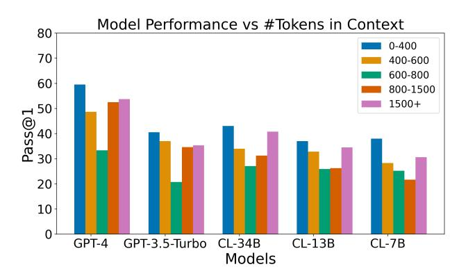

Figure 10. Varying number of dependencies Figure 11. Varying number of context tokens

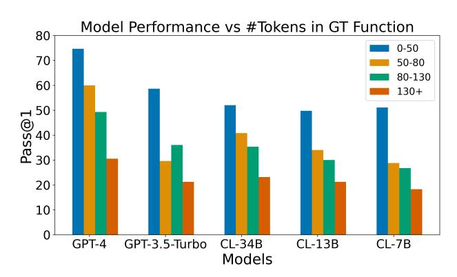

<span id="page-27-3"></span>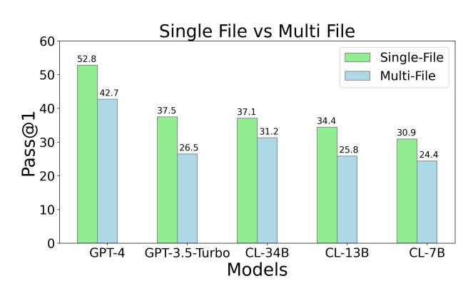

<span id="page-27-1"></span>Figure 12. Varying number of ground truth tokens Figure 13. Varying File usage

<span id="page-27-2"></span><span id="page-27-0"></span>

Length of retrieval. We compare how the performance of the models is impacted by the length (# tokens) of the retrieval context. Since we perform dependency-only-context retrieval, we only have the context required to understand the necessary functions for solving the problem instance. We find that the performance is not strongly correlated with the length of the retrieval context (Figure [11\)](#page-27-3). This suggests that the choice of the retrieved context is a bigger factor than the length.

COT on R2E-Eval1. We use 0-shot and 2-shot COT to evaluate more enhanced code generation approaches. The following table describes performance.

|               | Base | COT-0-shot | COT-2-shot |
|---------------|------|------------|------------|
| GPT-3.5-TURBO | 48.9 | 45.8       | -          |
| GPT-4         | 33.2 | 33         | 28.8       |

Table 5. Effect of COT on code generation on a subset of our R2E-Eval1 benchmark