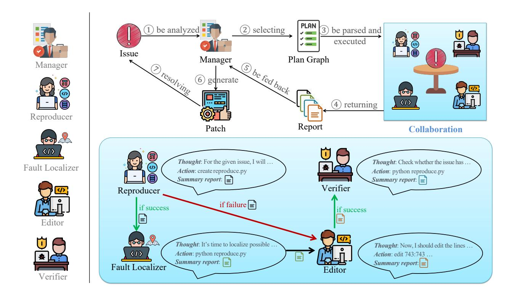
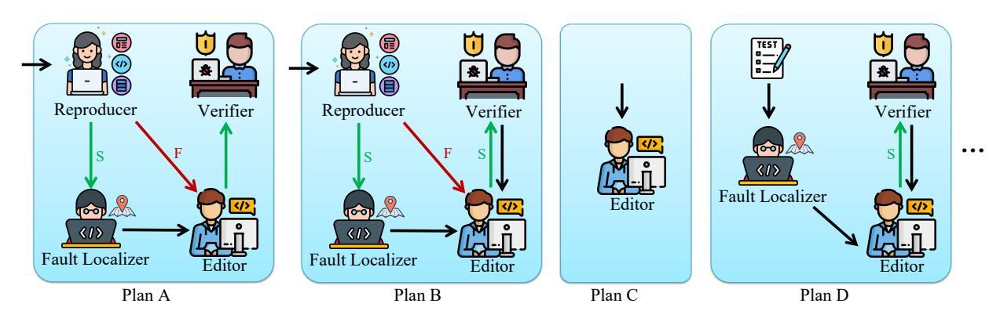

# CODER: ISSUE RESOLVING WITH MULTI-AGENT AND TASK GRAPHS

Dong Chen1<sup>∗</sup> Shaoxin Lin1\* Muhan Zeng1\* Daoguang Zan2\* Jian-Gang Wang<sup>1</sup> Anton Cheshkov<sup>1</sup> Jun Sun<sup>3</sup> Hao Yu<sup>4</sup> Guoliang Dong<sup>3</sup> Artem Aliev<sup>1</sup> Jie Wang<sup>1</sup> Xiao Cheng<sup>1</sup> Guangtai Liang<sup>1</sup> Yuchi Ma<sup>1</sup> Pan Bian<sup>1</sup> Tao Xie<sup>4</sup> Qianxiang Wang<sup>1</sup> 1 Huawei Co., Ltd. <sup>2</sup> Chinese Academy of Science <sup>3</sup> Singapore Management University <sup>4</sup> Peking University

# ABSTRACT

GitHub issue resolving recently has attracted significant attention from academia and industry. SWEbench [\[1\]](#page-9-0) is proposed to measure the performance in resolving issues. In this paper, we propose CODER, which adopts a multi-agent framework and pre-defined task graphs to Repair & Resolve reported bugs and add new features within code Repository. On SWE-bench lite, CODER is able to solve 28.00% of issues, in the case of submitting only once for each issue. We examine the performance impact of each design of CODER and offer insights to advance this research direction[2](#page-0-0) .

# 1 Introduction

The rapidly growing capability of Large Language Models (LLMs) is dramatically reshaping many industries [\[2,](#page-9-1) [3,](#page-9-2) [4\]](#page-9-3). The most recent release of GPT-4o [\[5\]](#page-9-4) demonstrates a significant leap in multi-modal capabilities and artificial intelligence (AI)-human interaction. In the meanwhile, it maintains the same level of text, reasoning, and code intelligence as GPT-4-Turbo [\[6\]](#page-10-0). LLMs can interact with humans and the world as humans do, it is the starting point that LLMs can take over tasks from humans or collaborate naturally with humans.

Issue resolving is one of the most recent and popular focuses on solving complex tasks with LLMs. SWE-bench [\[1\]](#page-9-0) collects 2,294 real-world issues from 12 popular Python libraries. The LLMs are tasked to resolve the issue by giving the issue description and the whole repository. This task is extremely challenging due to the need for deep reasoning about a huge amount of code and incomplete information for the task description. SWE-bench-lite [\[1\]](#page-9-0) removes the issue with low-quality descriptions to make the task more addressable.

Since SWE-bench was released, multiple approaches have been proposed. SWE-Llama [\[1\]](#page-9-0) adopts a pipeline with Retrieval-Augmented Generation (RAG) to generate the patch directly. Later, AutoCodeRover [\[7\]](#page-10-1) adds code contextual retrieval with keywords in the issue description into the pipeline. It iteratively collects code context by the keywords in the issues until LLMs have collected enough information to generate a correct patch. Instead of patch generation, another approach performs iterative edits in the repository. It then uses the "git diff" command to generate patches which avoids patch format errors.

An agent-based approach for solving complex software engineering tasks for code has shown its competitiveness. One uses the multi-agent approach to automate the software development process from scratch [\[8\]](#page-10-2). One uses the single-agent approach to address automatic GitHub issue resolving [\[7,](#page-10-1) [9,](#page-10-3) [10\]](#page-10-4).

To the best of our knowledge, in issue resolving scenarios, the agent-based approaches primarily focus on a single agent. Moreover, previous works perform task decomposition on-the-go, with each subsequent step being determined by the preceding one. Leveraging a multi-agent framework in issue resolving presents challenges such as: (1) Free communications between agents may lead to a non-progressing loop without termination [\[11\]](#page-10-5). (2) Information passed from one agent to another may incur information loss [\[12\]](#page-10-6). (3) Complex plans are hard to follow when multiple agents are involved. This paper aims to explore a multi-agent design called CODER that employs a graph data structure for planning, which could mitigate the above three problems.

CODER adopts a multi-agent framework and a task graph data structure for issue resolving tasks. Our design is based on the following intuitions:

<sup>∗</sup>Equal contribution

<span id="page-0-0"></span><https://github.com/NL2Code/CodeR>

- Less candidate actions, easier decision. We introduce a set of diverse actions for different purposes to the agents. The number of actions is much larger compared with SWE-agent. Retaining a single-agent framework may lead to less accurate decisions. A multi-agent framework reduces the complexity of making decisions for the next action by limiting its focus to a subtask and a subset of actions.
- Look before you leap. We believe that planning at the beginning of the pipeline is better than deciding the next steps on-the-go. Moreover, a good plan consists of small and manageable tasks that LLMs were trained to solve.
- Bypassing instruction-following and memorization. The conventional plan generated by LLM is in the form of plain text. It is usually placed in the prompt to guide the following steps in a LLM-centered system. It requires the LLM to have a strong instruction-following ability and to have a "good" memory to execute the plan precisely and iteratively. For complex tasks, like issue resolving with complex tools, task plans in pure-text prompts will be hard to follow.

### Our contributions are listed as follows:

- 1. We propose CODER, a multi-agent framework with task graphs for issue resolving. Inspired by the issue resolving process by humans in the real world, we design the roles and the actions. For plans, we design a graph data structure that can be parsed and strictly executed. It can ensure the exact execution of the plan and at the same time provide an easy-to-plug interface for plan injection from humans.
- 2. We leverage LLM-generated code for reproducing the issue and the tests in the repository (excluding the verification tests) to get code coverage information. Coverage information improves contextual retrieval based on the keywords in the issue text and does fault localization together with BM25.
- 3. We renew the state-of-the-art of SWE-bench lite to 28.00% (84/300) with only one submission per issue.

# 2 Framework

As Figure [1](#page-2-0) shows, our design contains five agents, which could collaboratively solve GitHub issues:

- Manager: The manager is an agent who interacts with the user directly and is in charge of the whole issue-resolving task. It has two responsibilities: (1) select a plan according to the issue description. The plan specifies the agents evolved and how they should interact to finish the task. (2) Interpret the execution summary of a plan. If the execution summary has indicated that the issue has been solved. It will summarize the changes and submit a patch. If not, it will come up with a new plan or give up.
- Reproducer: The reproducer is an agent that is responsible for generating a test to reproduce the issue. If the issue description contains a complete test, the reproducer only needs to copy the test into a new test file "reproduce.py", and execute and compare the output. But this is usually not the case for real-world issues, the reproducer often needs to adjust or generate test cases. We generate test cases by extracting test inputs from issues and using LLMs to generate test sequences.
- Fault Localizer: The fault localizer is an agent that identifies the code regions that could cause the issue. It is equipped with several fault localization tools in software engineering.
- Editor: The editor is the one who performs the actual code changes. It will utilize all information provided by other upstream agents and will gather contextual information with AutoCodeRover's search [\[7\]](#page-10-1). With enough information gathered, the iterative edits same as SWE-agent will be performed [\[13\]](#page-10-7).
- Verifier: The verifier is an agent that will run the reproduced or integration tests[3](#page-1-0) to check whether the modifications have resolved the issue or not.

For actions, we reuse the actions that are defined by SWE-agent and AutoCodeRover as Table [1](#page-3-0) shows. Besides, we also introduce new actions 0 and 18-21. Action 0 selects or generates feasible plans by analyzing the current issue. Action 18 retrieves the top-1 similar issue and its corresponding patch by description. Note that we prompt the agent to check whether the retrieved result is relevant to the current issue and analyze how its patch solves the retrieved issue. Action 19 performs fault localization described in Section [3.2.](#page-4-0) Action 20 runs the reproducer-generated test and the integration tests. Same as Aider, the integration tests do not contain the tests to verify the correctness of the generated patches [\[14\]](#page-10-8). Action 21 summarizes all actions performed and observations by each agent for a sub-task. Action 22 provides basic Linux shell commands such as "cd", "ls", "grep", and "cat".

<span id="page-1-0"></span><sup>3</sup> Integration tests refer to those built-in unit tests in the repository rather than official issue tests of SWE-bench lite.



<span id="page-2-0"></span>Figure 1: Multi-Agent framework of CODER with task graphs.

We assign a unique set of actions to each role, similar to how different roles in the real world possess distinct skills. For example, only the Manager has the permission to the "plan" and "submit" actions; All roles are granted permission to use the "basic shell commands" action.

### 3 Methodology

Repository-level tasks usually require processing a huge amount of information and taking many steps before reaching their desired solutions. Existing works show that dividing a repository-level task into a set of connected sub-tasks and conquering them one by one could be effective. Parsel [15] and CodeS [16] focus on generating a large piece of code for complex algorithms and simple repositories. Both of them utilize inherent program structures like call graphs or file structures for task decomposition. Issue resolving is also a repository-level task but is closer to a modification task rather than a generation task. In addition to generating code, a repository-level modification task requires identifying the correct locations before generating the correct code. It is unfeasible to use the whole repository as input context. This introduces additional steps and complexity which requires a more powerful framework for planning.

#### 3.1 Task Graphs for Planning

The description of GitHub issues is extremely diverse. Some issues only have one sentence in natural language (e.g. astropy\_astropy-7008<sup>4</sup>). Some may provide the test code, running results of the test code, and a possible solution (sympy\_sympy-14774<sup>5</sup>). Besides descriptions, the solutions of issues are also varied. Some could only require changing one or two lines to resolve, making the task similar to a line completion task with context (scikit-learn\_scikit-learn-13779<sup>6</sup>) while some could necessitate changing multiple files, requiring a deep understanding of the code semantics within the repository.

For simple issues with clear descriptions, their solutions are obvious and can be figured out at first glance. But for complex ones with ambiguous or inaccurate descriptions, executing tests and searching through the code base or web

<span id="page-2-1"></span><sup>4</sup>https://github.com/astropy/astropy/pull/7008

<span id="page-2-2"></span><sup>&</sup>lt;sup>5</sup>https://github.com/sympy/sympy/pull/14774

<span id="page-2-3"></span><sup>6</sup>https://github.com/scikit-learn/scikit-learn/pull/13779

<span id="page-3-0"></span>Table 1: Actions selected and designed for each agent. 1-10 are from SWE-agent and 11-17 are from AutoCoderRover. \* indicates that actions 11-17 are the enhancement versions of AutoCodeRover's original actions described in Section 3.2.

|                                 | Agent Roles  |              |                 |           |            |  |
|---------------------------------|--------------|--------------|-----------------|-----------|------------|--|
| Actions                         | Manager      | Reproducer   | Fault Localizer | _Editor_  | Verifier   |  |
| 0 plan                          |              |              |                 |           |            |  |
| 1 open                          | 1            | $\checkmark$ |                 | $\sqrt{}$ |            |  |
| 2 goto                          |              | $\checkmark$ |                 | $\sqrt{}$ |            |  |
| 3 scroll down                   |              | $\checkmark$ |                 | $\sqrt{}$ |            |  |
| 4 scroll up                     |              | $\sqrt{}$    |                 | $\sqrt{}$ |            |  |
| 5 create                        |              |              |                 |           |            |  |
| 6 edit                          |              |              | $\sqrt{}$       |           | $\sqrt{}$  |  |
| 7 submit                        |              |              |                 |           |            |  |
| 8 search dir                    |              | $\sqrt{}$    |                 | $\sqrt{}$ |            |  |
| 9 search file                   |              | $\sqrt{}$    |                 | $\sqrt{}$ |            |  |
| 10 find file                    |              | $\sqrt{}$    |                 | $\sqrt{}$ |            |  |
| 11 rover search file*           | $\downarrow$ | $\sqrt{}$    |                 | $\sqrt{}$ |            |  |
| 12 rover search class*          |              | $\sqrt{}$    |                 | $\sqrt{}$ |            |  |
| 13 rover search class in file*  | $\sqrt{}$    | $\sqrt{}$    |                 | $\sqrt{}$ |            |  |
| 14 rover search method*         | $\sqrt{}$    | $\sqrt{}$    |                 | $\sqrt{}$ |            |  |
| 15 rover search method in file* | √ ×          | $\sqrt{}$    |                 | $\sqrt{}$ |            |  |
| 16 rover search code*           | √ ×          | $\sqrt{}$    |                 | $\sqrt{}$ |            |  |
| 17 rover search code in file*   | <b>1</b>     | v/           |                 | v/        |            |  |
| 18 related issue retrieval      | 1 <b>`</b>   | v            | $\sqrt{}$       | v<br>√    |            |  |
| 19 fault localization           |              |              | <b>V</b>        | •         |            |  |
| 20 test                         |              |              | v               |           | 1/         |  |
| 21 report                       |              | 1/           | 1/              | 1/        | <b>v</b> / |  |
| 22 basic shell command          |              | v<br>√       | v<br>V          | v√        | v√         |  |

could be beneficial for solving them. To cope with different approaches to solving an issue, we design a task graph that can easily add new plans. It can also be strictly followed by multi-agent systems.

```
{
    "Plan A": {
        "entry": "Reproducer",
        "roles": [{
```

<span id="page-3-1"></span>Figure 2: Task graphs in JSON format.

Figure 2 shows a task graph plan in JSON format. It specifies a collection of plans in the top level with the name "Plan ID". For each plan, "entry" specifies which agent to start with. "roles" specifies a list of agents that are involved in this plan. Each selected agent will be given a subtask specified in "task". Once finished, all actions that the agent performed will be summarized and passed to its "downstream" according to the result of the current sub-task. Plan A in Figure 2 involves four agents: Reproducer, Fault Localizer, Editor, and Verifier. This plan starts with Reproducer as demonstrated in Figure 1.

This design of plans decouples agent design with the task decomposition. When designing the agents, one can only focus on the high-level goal of a sub-task without considering the details of the diverse approaches. The diversity of

approaches can be specified and adjusted in the field of "task" and "downstream". In this way, the plans can be added, deleted, and tuned without changing a single line of code for agents.

Plans in Figure [2](#page-3-1) will be parsed into a graph with an entry node specified by "entry". When starting to execute the plan, the entry node is activated and the specified agent will start to execute its sub-task using the ReAct framework [\[17\]](#page-10-11) iteratively. Once finished with its subtask, it will activate one of its specified "downstream" nodes. Agents in the plan may be activated multiple times if there is a cycle in the plan. The plan finishes when the Manager is activated or exceeds our budget.

We have designed four plans as Figure [3](#page-4-1) shows. Plan A is shown in Figure [1,](#page-2-0) which is a standard flow to resolve an issue. It has no loop for simplicity and robustness. Plan B adds a loop that allows the feedback from testing. This circle is also used by Aider [\[14\]](#page-10-8) with tests that are not related to the issue (which is also called "integration tests"). Plan C tries to resolve the issue directly for simple issues. Plan D takes a test-driven approach with a ground truth test for issues (such as "fail-to-pass" and "pass-to-pass" tests in SWE-bench). We can easily add new roles and new task plans under this framework.



<span id="page-4-1"></span>Figure 3: Plans in the form of structured graphs. They will be parsed into a graph when executed. The green and red arrows represent the reports passed to the next agent in cases of Success and Failure, respectively. The black arrows indicate the reports are passed to the next agent regardless of success or failure.

### <span id="page-4-0"></span>3.2 Fault Localization Specialized for Issue Resolving

We leverage fault localization techniques [\[18\]](#page-10-12) to provide precise location information. A previous work [\[7\]](#page-10-1) shows that the use of fault localization techniques leads to an increase in the efficacy of resolving GitHub issues.

We notice that the agent is allowed to run test suites but only the results are used while runtime information is not captured during the process. Test-based fault localization can provide precise location information based on runtime information and specifically, we use spectrum-based fault localization (SBFL) as the main fault localization method.

SBFL is a lightweight, test-based fault localization technique. Given a test suite that contains at least one failing test, SBFL collects statement coverage for the test suite. Suspiciousness score is then calculated based on coverage data, and all covered statements are ranked by their suspiciousness. Suspiciousness score can be calculated by different formulas such as Ochiai [\[19\]](#page-10-13) and Tarantula [\[20\]](#page-10-14). These formulas share the same motivation that the fault location should possibly be covered by more failing tests and fewer passing tests.

One main limitation of SBFL and many other test-based fault localization techniques is the need for failing tests. In practice, a failing test is often not available at the time when the issue is raised. Since the Reproducer can create reproduced test cases, we select the failing tests and collect their coverage data. This coverage data is also used to guide "THE SEARCH ACTION". Note that if Reproducer fails to generate any test script or its coverage data cannot be collected (e.g., test script uses system calls to invoke certain CLI), SBFL will not be used as no result can be produced by it.

Besides test information, issue descriptions can also be used to better localize the fault. The retrieval algorithm provides a simple yet effective way to combine text from an issue description and code from a repository. Jimenez et al. [\[1\]](#page-9-0) also use the BM25 retrieval algorithm to provide file-level localization. As the information source from the retrieval algorithm and test-based fault localization (say test coverage and issue description text) differs a lot, we notice that these methods could be combined to provide better fault localization results. A previous study[\[21\]](#page-10-15) shows that combining

multiple fault localization methods can achieve a better result than any standalone method. We use a simple linear combination here to calculate the final suspiciousness score from both methods.

$$Score = \lambda \cdot Score_{Ochiai} + (1 - \lambda) \cdot Score_{BM25}$$
 (1)

$$Score_{BM25}(F_i) = \frac{Relevance_{BM25}(F_i)}{\sum_{F_j \in Files} Relevance_{BM25}(F_j)}$$
(2)

where  $Score_{Ochiai}$  is the suspiciousness score from Ochiai formula and  $Relevance_{BM25}(F_i)$  is the BM25 relevance score for file  $F_i$ .

To choose a proper value for the combination factor  $\lambda$ , we experiment on a small subset containing 10 issues that can be successfully reproduced. The result shows that almost all values between 0 and 1 yield the same result and all are better than taking  $\lambda=1$  or  $\lambda=0$ . The reason for different  $\lambda$ s having the same result is that many locations can tie to the others with respect to a single metric. Statements that are covered by the same number of passing tests will have the same  $Score_{Ochiai}$  and statements in the same file will have the same  $Score_{BM25}$ . Both metrics could serve as a tiebreaker to each other, resulting in a better result than each standalone metric. We pick  $\lambda=0.99$  as our final setup in subsection 4.2.

We conducted an experiment on the issues that are:

- Successfully reproduced by Reproducer. This means a runnable Python script is generated for reproducing the issue. 140 issues remain after this filtering.
- Coverage data collected from the script is not empty. This means the reproduce script has at least covered one file in the project. 104 issues remain after this filtering.

The result of different  $\lambda$ s are listed in Table 2 and Table 3:

<span id="page-5-0"></span>Table 2: Top-k precision for function-level fault localization.  $\lambda=1$  means using SBFL only, and 0.4-0.999 means any value between them shares the same result. Golden locations of each issue are marked by authors.

| λ         | top-1  | top-3  | top-5  | top-10 | top-all |
|-----------|--------|--------|--------|--------|---------|
| 0         | 12.27% | 25.92% | 34.04% | 42.98% | 69.23%  |
| 0.001     | 17.46% | 31.21% | 38.32% | 44.50% | 69.23%  |
| 0.01      | 17.46% | 32.17% | 39.28% | 45.46% | 69.23%  |
| 0.1       | 18.42% | 30.25% | 37.84% | 45.07% | 69.23%  |
| 0.2       | 17.46% | 29.29% | 38.32% | 45.07% | 69.23%  |
| 0.3       | 16.49% | 28.33% | 36.39% | 43.15% | 69.23%  |
| 0.4-0.999 | 16.49% | 28.33% | 35.91% | 43.15% | 69.23%  |
| 1         | 6.63%  | 14.11% | 18.23% | 24.95% | 69.23%  |

Table 3: File-level fault localization.

<span id="page-5-1"></span>

| λ         | top-1  | top-3  | top-5  | top-10 | top-all |
|-----------|--------|--------|--------|--------|---------|
| 0         | 15.32% | 32.67% | 42.36% | 54.07% | 85.58%  |
| 0.001     | 23.49% | 38.25% | 46.85% | 55.59% | 85.58%  |
| 0.01      | 23.49% | 39.21% | 47.81% | 56.55% | 85.58%  |
| 0.1       | 23.49% | 38.25% | 46.37% | 56.16% | 85.58%  |
| 0.2       | 22.53% | 38.25% | 46.85% | 56.16% | 85.58%  |
| 0.3       | 20.60% | 37.29% | 45.89% | 55.20% | 85.58%  |
| 0.4-0.999 | 20.60% | 36.33% | 44.44% | 54.24% | 85.58%  |
| 1         | 8.12%  | 16.65% | 21.19% | 28.92% | 85.58%  |

From the result, we can see that combining BM25 score with SBFL can greatly improve precision by more than 10%. We use method-level fault localization as it provides enough information for the agent to edit the file while keeping good precision. The way of constructing a prompt for fault localization results is shown in the Appendix Figure 11.

### 3.3 Prompt Engineering

CODER includes five roles: manager, reproducer, fault localizer, editor, and verifier. To enable LLMs to play different roles, we set up system prompts and instance prompts for each agent role. The system prompt primarily describes the definition of role identity, role responsibilities, and corresponding actions. The instance prompt mainly includes the raw issue and important tips for resolving this issue. We have put system and instance prompts of five roles into Appendix Figure [4˜](#page-12-0) [13.](#page-21-0) We design these prompts inspired by SWE-agent [\[13\]](#page-10-7). When multiple agent roles communicate, they use the prompt template shown in Appendix Figure [6.](#page-22-0) Detailed prompt engineering designs for CODER can be found at <https://github.com/NL2Code/CodeR>.

# 4 Experiments

### 4.1 Experimental Setup

Benchmarks SWE-bench [\[1\]](#page-9-0) is a benchmark that can test systems' ability to solve GitHub issues automatically. The benchmark consists of 2,294 Issue-Pull Request (PR) pairs from 12 popular open-source Python repositories (e.g., flask, numpy, and matplotlib). SWE-bench's evaluation can be executed by providing unit test verification using post-PR behavior as the reference solution. SWE-bench lite [\[1\]](#page-9-0) is a subset of SWE-bench, which is curated to make evaluation less costly and more accessible. SWE-bench lite comprises 300 instances that have been sampled to be more self-contained, with a focus on evaluating functional bug fixes. More details of SWE-bench lite can be seen at <https://www.swebench.com/lite.html>. This paper focuses on SWE-bench lite for faster, easier, and more cost-effective evaluation.

Metrics We evaluate the issue resolving task using the following metrics: Resolved (%), Average Request, and Average Tokens/Cost. The Resolved (%) metric indicates the percentage of SWE-bench lite instances (300 in total) that are successfully resolved. Average Requests and Average Tokens/Cost represent the average number of API requests per issue, the average consumption of input&output tokens, and the corresponding cost.

CODER's Comparative Methods Recently, several commercial products have been released, but their technical details have not been disclosed. The following describes only their functionalities.

- *Devin*[7](#page-6-0) , from cognition.ai, is capable of planning and executing complex engineering tasks that require thousands of decisions. It can recall relevant context at every step, learn over time, and fix program bugs. Devin can operate common developer tools within a sandbox environment, including the shell, code editor, and browser. Additionally, Devin can actively collaborate with users, report progress in real-time, accept feedback, and assist with design choices as needed.
- *Amazon Q Developer Agent*[8](#page-6-1) , from Amazon, is a generative AI-powered coding assistant that can help you understand, build, extend, operate, and repair code.
- *OpenCSG StarShip*[9](#page-6-2) is committed to providing a complete model/data management and application-building platform for large model application development teams. Based on it, they developed CodeGenAgent which can resolve GitHub issues automatically.

SWE-bench lite requires generating patches to resolve GitHub issues. One possible approach for LLMs is to generate the patch directly(explicit patch generation).

- *Retrieval-Based Approach* [\[1\]](#page-9-0) first retrieves the files that require editing and then adds the retrieved content to LLMs' context. Finally, the LLMs generate the patch. In the experiments, LLMs used include GPT-3.5, GPT-4, Claude 2, Claude 3 Opus, and SWE-Llama [\[1\]](#page-9-0).
- *AutoCodeRover* [\[7\]](#page-10-1) leverages advanced code search capabilities in software engineering to extend the model's modeling context, thereby further improving the accuracy of patch generation.

Besides using LLMs to generate the patch directly to fix issues, another approach is to edit and modify the buggy code repository and then use "git diff" to automatically obtain the patch (implicit patch generation).

<span id="page-6-0"></span><sup>7</sup> <https://www.cognition.ai/blog/introducing-devin>

<span id="page-6-1"></span><sup>8</sup> <https://aws.amazon.com/cn/q/developer>

<span id="page-6-2"></span><sup>9</sup> <https://opencsg.com/product>

- *SWE-agent* [\[13\]](#page-10-7) is an automated software engineering system that utilizes LLMs as one agent to solve real-world software engineering tasks. It introduces a new concept of the agent-computer interface (ACI), which enables LLMs to effectively search, navigate, edit, and execute code commands in sandboxed computer environments.
- *Aider*[10](#page-7-1) is a command line tool that pairs with LLMs to edit code in your local git repository. Aider can directly edit the local source files and commit the changes with meaningful commit messages. Aider now works well with GPT-3.5, GPT-4o, Claude 3 Opus, and more.

### 4.1.1 Implementation Details

Hyper-Parameters of Inference In our multi-role framework, each role is considered a distinct agent with its own experimental settings, which include the model and history process window size. All roles are provided access to GPT4-preview-1106. The Manager role utilizes nucleus sampling during inference with the temperature parameter[11](#page-7-2) set to 0 and top\_p to 0.95. It employs full history with a file viewer's window size of 100. The Reproducer role similarly uses nucleus sampling, but only incorporates the last five histories. Both the Fault Localizer and Tester roles follow the same settings as the Reproducer. Finally, the Programmer role, while sharing the same nucleus sampling parameters, includes a demo in addition to the last five histories and a file viewer's window size of 100. This setup ensures a reduction in repetition and maintains the unique functionality of each role. In addition, we set the maximum cost to 8\$ per issue.

Other Details In fact, it is impossible to have a consistent evaluation environment for all currently proposed approaches. We make some adaptations to the evaluation environment released by AutoCodeRover [\[7\]](#page-10-1) and use it as our evaluation environment. We reproduce all other approaches with our environment for fairness. However, the evaluation on repository "astropy" and "request" still has some environmental problems remaining. In our inference environment, commands like "edit" occasionally trigger a "container crashed" error which interrupts the process. If this occurs, we restart from the beginning of the pipeline for this issue. We pre-construct an environment-completed docker image offline to avoid wasting time on real-time installation during inference. Additionally, we divide the SWE-bench lite into six processes for parallel inference to further accelerate this process. When Fault Localizer runs the repository's integration unit tests, it sometimes adds or modifies files within the repository, and we manually restore these files after the localization process.

### <span id="page-7-0"></span>4.2 Results

Table [4](#page-8-0) displays SWE-bench lite's results of CODER and its comparative methods. The results show that CODER establishes a new benchmark record on SWE-bench lite, achieving the best performance to date, compared with all other commercial products and methods. In SWE-bench lite, CODER resolves 28.00% issues at one attempt, addressing 84 of 300. In contrast, SWE-agent + GPT 4 and Aider solve 16.67% and 24.67% respectively. This proves that CODER's meticulously designed roles and actions are highly effective.

We notice that directly enabling LLMs to generate patches (explicit patch generation) for issues is inferior to having LLMs edit the code repository (implicit patch generation). Compared with CODER's 28.00% resolved rate, RAG+GPT 4 and AutoCodeRover solve 2.67% and 16.67% respectively. We also notice that existing LLMs may struggle to generate applicable and high-quality patches, as a correct patch requires a strict format and is sensitive to line numbers, which LLMs cannot perfectly handle.

The result also shows that CODER sends more requests, resulting in increased tokens and cost at an acceptable rate. This could be due to our fine-grained design of multi-role and actions. The 11.33% improvement over SWE-agent +GPT 4 (reproduced) demonstrates that pre-planning at the beginning of the pipeline is superior to deciding the next steps on-the-go. CODER preemptively devises multiple plans in the form of structured graphs, and all agent roles will execute the pre-defined plan strictly according to the graphs. CODER's leading performance also validates the effectiveness of this idea. Pre-planning also possesses a clear advantage of bypassing imperfect instruction-following and long-context memorizing abilities of LLMs. Although CODER has achieved impressive performance, we still believe that designing a more sophisticated plan will yield more significant improvements in the future.

We also conduct ablation studies on 50 issues of SWE-bench lite. The results in Table [5](#page-8-1) show that removing the multi-agent would reduce CODER's resolved rate from 22% to 10%. This further demonstrates that our carefully designed roles motivated by real-world company collaboration are highly useful for issue resolving tasks. Additionally, we observe a performance drop and a cost increase when we remove the fault localization action, which highlights

<span id="page-7-1"></span><sup>10</sup><https://aider.chat>

<span id="page-7-2"></span><sup>11</sup>For the same input, API requests with 0 temperature may still return different content each time when the input is multi-turn.

the significant potential of combining LLMs with traditional software engineering strategies for addressing complex downstream tasks.

<span id="page-8-0"></span>Table 4: Results of CODER and its comparative methods on SWE-bench lite (300 GitHub issues). Note that "reported" refers to the numbers from the SWE-bench Leaderboard (<https://www.swebench.com>), while "reproduced" refers to our results obtained in our unified evaluation environment using their open-sourced generated patches.

| Methods                                | Resolved (%)              | Avg. Req. | Avg. Tokens/Cost |  |  |
|----------------------------------------|---------------------------|-----------|------------------|--|--|
| Commercial Products                    |                           |           |                  |  |  |
| Devin (random 25% subset of SWE-bench) | 13.86 (-)                 | -         | -                |  |  |
| Amazon Q Developer Agent (reported)    | 20.33 (61)                | -         | -                |  |  |
| Amazon Q Developer Agent (reproduced)  | 17.00 (54)                | -         | -                |  |  |
| OpenCSG CodeGenAgent (reported)        | 23.67 (71)                | -         | -                |  |  |
| OpenCSG CodeGenAgent (reproduced)      | 20.67 (62)                | -         | -                |  |  |
|                                        | Explicit Patch Generation |           |                  |  |  |
| RAG + GPT 3.5                          | 0.33 (1)                  | -         | -                |  |  |
| RAG + SWE-Llama 13B                    | 1.00 (3)                  | -         | -                |  |  |
| RAG + SWE-Llama 7B                     | 1.33 (4)                  | -         | -                |  |  |
| RAG + GPT 4                            | 2.67 (8)                  | -         | -                |  |  |
| RAG + Claude 2                         | 3.00 (9)                  | -         | -                |  |  |
| RAG + Claude 3 Opus                    | 4.33 (13)                 | -         | -                |  |  |
| AutoCodeRover (reported)               | 16.67 (50)                | -         | 112k/\$1.30[7]   |  |  |
| AutoCodeRover (reproduced)             | 16.67 (50)                | -         | 112k/\$1.30[7]   |  |  |
| Implicit Patch Generation              |                           |           |                  |  |  |
| Aider (reported)                       | 26.33 (79)                | -         | -                |  |  |
| Aider (reproduced)                     | 24.67 (74)                | -         | -                |  |  |
| SWE-agent + Claude 3 Opus (reported)   | 11.67 (35)                | 17.10     | 221K/\$3.41      |  |  |
| SWE-agent + Claude 3 Opus (reproduced) | 9.66 (29)                 | 17.10     | 221K/\$3.41      |  |  |
| SWE-agent + GPT 4 (reported)           | 18.00 (54)                | 21.55     | 245K/\$2.51      |  |  |
| SWE-agent + GPT 4 (reproduced)         | 16.67 (50)                | 21.55     | 245K/\$2.51      |  |  |
| CODER (ours)                           | 28.00 (84)                | 30.39     | 299K/\$3.09      |  |  |

<span id="page-8-1"></span>Table 5: Ablation studies on 50 issues. We randomly select 50 from 300 issues of SWE-bench lite to conduct ablation studies for faster and more cost-effective experiments.

| Methods         | Resolved (%) | Avg. Req. | Avg. Tokens/Cost |
|-----------------|--------------|-----------|------------------|
| CODER           | 22.00 (11)   | 30.40     | 295K/\$3.09      |
| w/o Multi-Agent | 10.00 (5)    | 18.46     | 200K/\$2.05      |
| w/o FL          | 14.00 (7)    | 29.98     | 309K\$3.19       |

# 5 Related Works

Automatic Issue Resolving GitHub's issue can be resolved using the following solutions automatically: (1) Retrieval-Augmented Generation (RAG) [\[1\]](#page-9-0) is a straightforward approach, which first retrieves the relevant code snippets from the repository, and then prompts LLMs to generate a patch to fix the reported issue. To enhance LLMs' proficiency in generating program patches, SWE-Llama [\[1\]](#page-9-0) was proposed and it fine-tuned the Llama [\[22,](#page-10-16) [23\]](#page-10-17) model on well-crafted patch-generating instruction data. (2) Following this, SWE-agent [\[13\]](#page-10-7) was proposed, which used LLMs to interact with a computer to solve issue problems automatically. SWE-agent pre-defines a series of agent-computer interfaces (ACIs) to enable LLMs to interact more efficiently with the computer. (3) Additionally, AutoCodeRover [\[7\]](#page-10-1) expands the visible context information for LLMs by leveraging sophisticated code search tools in software engineering, achieving decent performance. (4) Another work [\[10\]](#page-10-4) proposes a multi-agent pipeline of two successive steps. In the first step, three types of role agents (Repository Custodian, Manager, Developer) collaborate on the plan; the plan is represented as code, and embedded into the main program for execution. After, two types of role agents (Developer, Quality Assurance Engineer) participate in the coding process. In this paper, we propose CODER, which defines fine-grained agent roles and corresponding actions and incorporates advanced software engineering tools.

Test-based Automated Program Repair Automated program repair has been an active topic in software engineering for years, and a majority of work can be categorized as test-based automated program repair. Given the presence of a test suite, generated patches can be validated against the test, making the result to be more trustworthy. However, a weak test suite allows test-passing patches to be incorrect, and a large search space makes it difficult to synthesize a correct patch. Therefore, various techniques have been proposed to guide the search process, including genetic programming [\[24\]](#page-10-18), manually defined fix patterns [\[25\]](#page-10-19), mined fix patterns [\[26,](#page-10-20) [27,](#page-11-0) [28\]](#page-11-1), heuristics [\[29\]](#page-11-2), learning from code or program synthesis [\[27,](#page-11-0) [30\]](#page-11-3),and semantic analysis [\[31,](#page-11-4) [32\]](#page-11-5). These works focus on code content, trying to find a patch that could satisfy all constraints(test, compiler, heuristics, etc.) while ignoring the issue description itself which may contain a lot of useful information. Apart from those approaches, many works adopt machine learning models to generate patches. SequenceR [\[33\]](#page-11-6) proposes a sequence-to-sequence NMT to generate the fixed code directly. CODIT [\[34\]](#page-11-7) uses the same model to predict the code edits for the faulty code. DLFix [\[35\]](#page-11-8), CoCoNuT [\[36\]](#page-11-9), and Cure [\[37\]](#page-11-10) take the context of the faulty statement as input and encode it via tree-based LSTM, CNN, GPT, respectively. Recoder [\[38\]](#page-11-11) proposes a syntax-guided decoder to generate edits with placeholders via the provider/decider architecture. RewardRepair [\[39\]](#page-11-12) uses an RL approach that integrates program compilation and test execution information. Tare [\[40\]](#page-11-13) directly learns the typing rules to guide the generation. These works treat APR problem as a neural translation task from the buggy code (with context) to the fixed code and most of them adopt encode-decoder models. Different from those approaches, CODER proposes a multi-turn framework that could collect necessary information on demand and generate the fixed code based on the information collected.

Artificial Intelligence (AI) Agents The development of AI agents has made substantial strides, introducing many advanced methodologies to automate tasks. AutoGPT [\[41\]](#page-11-14), AgentGPT [\[42\]](#page-11-15), and MetaGPT [\[8\]](#page-10-2) employ an assembly line paradigm, where diverse roles are assigned to various AI agents, efficiently decomposing complex tasks in simpler subtasks through collaborative work. Dify [\[43\]](#page-11-16) and FastGPT [\[44\]](#page-11-17) are LLM application development platforms, that combine the concepts of Backend-as-a-Service and LLMOps to enable developers to quickly build production-grade generative AI applications. Using these platforms, even non-technical personnel can participate in the definition and data operations of AI applications. SWE-agent [\[13\]](#page-10-7) enables LLMs to interact with the programming environment to automatically solve GitHub issues via pre-defining multiple ACIs. CODER defines detailed and decoupled agent roles (e.g., reproducer, programmer, and tester) along with their corresponding fine-grained actions (e.g., reproducing, editing code, and testing code). Such an approach will facilitate resolving complex issues through collaborative efforts between various agents.

# 6 Conclusion and Future Works

This paper proposes CODER which excels at resolving issues. It demonstrates the importance of providing plans that mimic humans' problem-solving procedures for issue resolving. CODER requires pre-specified task graphs that convert the planning task to a simpler decision task for LLMs and also provide a guarantee for the exact plan execution. With the idea of task graphs, some advanced software engineering skills like fault localization, mining similar issues, and web search can be seamlessly added to our pre-defined graph without any code changes by a JSON format text. CODER's pre-defined plans are experiences provided by human experts. We believe it is one of the key factors in resolving issues. In the future, we will build a comprehensive set of plans that may resolve more and more issues.

# References

- <span id="page-9-0"></span>[1] Carlos E Jimenez, John Yang, Alexander Wettig, Shunyu Yao, Kexin Pei, Ofir Press, and Karthik Narasimhan. Swe-bench: Can language models resolve real-world github issues? *arXiv preprint arXiv:2310.06770*, 2023.
- <span id="page-9-1"></span>[2] Daoguang Zan, Bei Chen, Fengji Zhang, Dianjie Lu, Bingchao Wu, Bei Guan, Wang Yongji, and Jian-Guang Lou. Large language models meet nl2code: A survey. In *Proceedings of the 61st Annual Meeting of the Association for Computational Linguistics (Volume 1: Long Papers)*, pages 7443–7464, 2023.
- <span id="page-9-2"></span>[3] Ziyin Zhang, Chaoyu Chen, Bingchang Liu, Cong Liao, Zi Gong, Hang Yu, Jianguo Li, and Rui Wang. A survey on language models for code. *arXiv preprint arXiv:2311.07989*, 2023.
- <span id="page-9-3"></span>[4] Zibin Zheng, Kaiwen Ning, Yanlin Wang, Jingwen Zhang, Dewu Zheng, Mingxi Ye, and Jiachi Chen. A survey of large language models for code: Evolution, benchmarking, and future trends. *arXiv preprint arXiv:2311.10372*, 2023.
- <span id="page-9-4"></span>[5] OpenAI. Hello gpt-4o. 2024. <https://openai.com/index/hello-gpt-4o>.

- <span id="page-10-0"></span>[6] Josh Achiam, Steven Adler, Sandhini Agarwal, Lama Ahmad, Ilge Akkaya, Florencia Leoni Aleman, Diogo Almeida, Janko Altenschmidt, Sam Altman, Shyamal Anadkat, et al. Gpt-4 technical report. *arXiv preprint arXiv:2303.08774*, 2023.
- <span id="page-10-1"></span>[7] Yuntong Zhang, Haifeng Ruan, Zhiyu Fan, and Abhik Roychoudhury. Autocoderover: Autonomous program improvement. *arXiv preprint arXiv:2404.05427*, 2024.
- <span id="page-10-2"></span>[8] Sirui Hong, Mingchen Zhuge, Jonathan Chen, Xiawu Zheng, Yuheng Cheng, Jinlin Wang, Ceyao Zhang, Zili Wang, Steven Ka Shing Yau, Zijuan Lin, et al. Metagpt: Meta programming for multi-agent collaborative framework. In *The Twelfth International Conference on Learning Representations*, 2023.
- <span id="page-10-3"></span>[9] John Yang, Carlos E. Jimenez, Alexander Wettig, Kilian Lieret, Shunyu Yao, Karthik Narasimhan, and Ofir Press. Swe-agent: Agent-computer interfaces enable automated software engineering, 2024.
- <span id="page-10-4"></span>[10] Wei Tao, Yucheng Zhou, Wenqiang Zhang, and Yu Cheng. Magis: Llm-based multi-agent framework for github issue resolution, 2024.
- <span id="page-10-5"></span>[11] Ying Wen, Yaodong Yang, Rui Luo, and Jun Wang. Modelling bounded rationality in multi-agent interactions by generalized recursive reasoning. *arXiv preprint arXiv:1901.09216*, 2019.
- <span id="page-10-6"></span>[12] Hui Su, Xiaoyu Shen, Rongzhi Zhang, Fei Sun, Pengwei Hu, Cheng Niu, and Jie Zhou. Improving multi-turn dialogue modelling with utterance rewriter. *arXiv preprint arXiv:1906.07004*, 2019.
- <span id="page-10-7"></span>[13] John Yang, Carlos E Jimenez, Alexander Wettig, Kilian Lieret, Shunyu Yao, Karthik Narasimhan, and Ofir Press. Swe-agent: Agent-computer interfaces enable automated software engineering.
- <span id="page-10-8"></span>[14] paul gauthier. Aider, ai pair programming in your terminal. *https://aider.chat*, 2024.
- <span id="page-10-9"></span>[15] Eric Zelikman, Qian Huang, Gabriel Poesia, Noah Goodman, and Nick Haber. Parsel: Algorithmic reasoning with language models by composing decompositions. *Advances in Neural Information Processing Systems*, 36:31466–31523, 2023.
- <span id="page-10-10"></span>[16] Daoguang Zan, Ailun Yu, Wei Liu, Dong Chen, Bo Shen, Wei Li, Yafen Yao, Yongshun Gong, Xiaolin Chen, Bei Guan, et al. Codes: Natural language to code repository via multi-layer sketch. *arXiv preprint arXiv:2403.16443*, 2024.
- <span id="page-10-11"></span>[17] Shunyu Yao, Jeffrey Zhao, Dian Yu, Nan Du, Izhak Shafran, Karthik Narasimhan, and Yuan Cao. React: Synergizing reasoning and acting in language models. *arXiv preprint arXiv:2210.03629*, 2022.
- <span id="page-10-12"></span>[18] W Eric Wong, Ruizhi Gao, Yihao Li, Rui Abreu, and Franz Wotawa. A survey on software fault localization. *IEEE Transactions on Software Engineering*, 42(8):707–740, 2016.
- <span id="page-10-13"></span>[19] Rui Abreu, Peter Zoeteweij, and Arjan JC Van Gemund. On the accuracy of spectrum-based fault localization. In *Testing: Academic and industrial conference practice and research techniques-MUTATION (TAICPART-MUTATION 2007)*, pages 89–98. IEEE, 2007.
- <span id="page-10-14"></span>[20] James A Jones, Mary Jean Harrold, and John Stasko. Visualization of test information to assist fault localization. In *Proceedings of the 24th international conference on Software engineering*, pages 467–477, 2002.
- <span id="page-10-15"></span>[21] Daming Zou, Jingjing Liang, Yingfei Xiong, Michael D Ernst, and Lu Zhang. An empirical study of fault localization families and their combinations. *IEEE Transactions on Software Engineering*, 47(2):332–347, 2019.
- <span id="page-10-16"></span>[22] Hugo Touvron, Thibaut Lavril, Gautier Izacard, Xavier Martinet, Marie-Anne Lachaux, Timothée Lacroix, Baptiste Rozière, Naman Goyal, Eric Hambro, Faisal Azhar, et al. Llama: Open and efficient foundation language models. *arXiv preprint arXiv:2302.13971*, 2023.
- <span id="page-10-17"></span>[23] Hugo Touvron, Louis Martin, Kevin Stone, Peter Albert, Amjad Almahairi, Yasmine Babaei, Nikolay Bashlykov, Soumya Batra, Prajjwal Bhargava, Shruti Bhosale, et al. Llama 2: Open foundation and fine-tuned chat models. *arXiv preprint arXiv:2307.09288*, 2023.
- <span id="page-10-18"></span>[24] Claire Le Goues, ThanhVu Nguyen, Stephanie Forrest, and Westley Weimer. Genprog: A generic method for automatic software repair. *Ieee transactions on software engineering*, 38(1):54–72, 2011.
- <span id="page-10-19"></span>[25] Kui Liu, Anil Koyuncu, Dongsun Kim, and Tegawendé F Bissyandé. Tbar: Revisiting template-based automated program repair. In *Proceedings of the 28th ACM SIGSOFT international symposium on software testing and analysis*, pages 31–42, 2019.
- <span id="page-10-20"></span>[26] Hoang Duong Thien Nguyen, Dawei Qi, Abhik Roychoudhury, and Satish Chandra. Semfix: Program repair via semantic analysis. In *2013 35th International Conference on Software Engineering (ICSE)*, pages 772–781. IEEE, 2013.

- <span id="page-11-0"></span>[27] Jiajun Jiang, Yingfei Xiong, Hongyu Zhang, Qing Gao, and Xiangqun Chen. Shaping program repair space with existing patches and similar code. In *Proceedings of the 27th ACM SIGSOFT international symposium on software testing and analysis*, pages 298–309, 2018.
- <span id="page-11-1"></span>[28] Anil Koyuncu, Kui Liu, Tegawendé F Bissyandé, Dongsun Kim, Jacques Klein, Martin Monperrus, and Yves Le Traon. Fixminer: Mining relevant fix patterns for automated program repair. *Empirical Software Engineering*, 25:1980–2024, 2020.
- <span id="page-11-2"></span>[29] Qi Xin and Steven P Reiss. Leveraging syntax-related code for automated program repair. In *2017 32nd IEEE/ACM International Conference on Automated Software Engineering (ASE)*, pages 660–670. IEEE, 2017.
- <span id="page-11-3"></span>[30] Ming Wen, Junjie Chen, Rongxin Wu, Dan Hao, and Shing-Chi Cheung. Context-aware patch generation for better automated program repair. In *Proceedings of the 40th international conference on software engineering*, pages 1–11, 2018.
- <span id="page-11-4"></span>[31] Jinru Hua, Mengshi Zhang, Kaiyuan Wang, and Sarfraz Khurshid. Sketchfix: a tool for automated program repair approach using lazy candidate generation. In *Proceedings of the 2018 26th ACM Joint Meeting on European Software Engineering Conference and Symposium on the Foundations of Software Engineering*, pages 888–891, 2018.
- <span id="page-11-5"></span>[32] Kui Liu, Anil Koyuncu, Dongsun Kim, and Tegawendé F Bissyandé. Avatar: Fixing semantic bugs with fix patterns of static analysis violations. In *2019 IEEE 26th International Conference on Software Analysis, Evolution and Reengineering (SANER)*, pages 1–12. IEEE, 2019.
- <span id="page-11-6"></span>[33] Michele Tufano, Cody Watson, Gabriele Bavota, Massimiliano Di Penta, Martin White, and Denys Poshyvanyk. An empirical investigation into learning bug-fixing patches in the wild via neural machine translation. In *Proceedings of the 33rd ACM/IEEE International Conference on Automated Software Engineering*, pages 832–837, 2018.
- <span id="page-11-7"></span>[34] Saikat Chakraborty, Miltiadis Allamanis, and Baishakhi Ray. Codit: Code editing with tree-based neural machine translation. *arXiv preprint arXiv:1810.00314*, 2018.
- <span id="page-11-8"></span>[35] Yi Li, Shaohua Wang, and Tien N Nguyen. Dlfix: Context-based code transformation learning for automated program repair. In *Proceedings of the ACM/IEEE 42nd international conference on software engineering*, pages 602–614, 2020.
- <span id="page-11-9"></span>[36] Thibaud Lutellier, Hung Viet Pham, Lawrence Pang, Yitong Li, Moshi Wei, and Lin Tan. Coconut: combining context-aware neural translation models using ensemble for program repair. In *Proceedings of the 29th ACM SIGSOFT international symposium on software testing and analysis*, pages 101–114, 2020.
- <span id="page-11-10"></span>[37] Nan Jiang, Thibaud Lutellier, and Lin Tan. Cure: Code-aware neural machine translation for automatic program repair. In *2021 IEEE/ACM 43rd International Conference on Software Engineering (ICSE)*, pages 1161–1173. IEEE, 2021.
- <span id="page-11-11"></span>[38] Qihao Zhu, Zeyu Sun, Yuan-an Xiao, Wenjie Zhang, Kang Yuan, Yingfei Xiong, and Lu Zhang. A syntax-guided edit decoder for neural program repair. In *Proceedings of the 29th ACM joint meeting on European software engineering conference and symposium on the foundations of software engineering*, pages 341–353, 2021.
- <span id="page-11-12"></span>[39] He Ye, Matias Martinez, and Martin Monperrus. Neural program repair with execution-based backpropagation. In *Proceedings of the 44th international conference on software engineering*, pages 1506–1518, 2022.
- <span id="page-11-13"></span>[40] Qihao Zhu, Zeyu Sun, Wenjie Zhang, Yingfei Xiong, and Lu Zhang. Tare: Type-aware neural program repair. In *2023 IEEE/ACM 45th International Conference on Software Engineering (ICSE)*, pages 1443–1455. IEEE, 2023.
- <span id="page-11-14"></span>[41] Hui Yang, Sifu Yue, and Yunzhong He. Auto-gpt for online decision making: Benchmarks and additional opinions. *arXiv preprint arXiv:2306.02224*, 2023.
- <span id="page-11-15"></span>[42] Assemble, configure, and deploy autonomous ai agents in your browser. *GitHub*, 2023. [https://github.com/](https://github.com/reworkd/AgentGPT) [reworkd/AgentGPT](https://github.com/reworkd/AgentGPT).
- <span id="page-11-16"></span>[43] The innovation engine for generative ai applications. *Dify.AI*, 2024. <https://dify.ai>.
- <span id="page-11-17"></span>[44] Empower ai with your expertise. *labring*, 2024. <https://fastgpt.run>.

SETTING: You are a Manager responsible for overseeing a software engineering team. Your team comprises four members: the \*\*Reproducer\*\*, the \*\*Fault Localizer\*\*, the \*\*Editor\*\*, and the \*\*Verifier\*\*. Your primary task is to efficiently solve GitHub issues and ensure smooth collaboration among team members.

you should analyze the given issue, and select a plan from predefined ones, that is, to organize a team, arrange team roles, and designate task processes.

Besides, you're working directly in the command line with a special interface.

The special interface consists of a file editor that shows you {WINDOW} lines of a file at a time. In addition to typical bash commands, you can also use the following commands to help you navigate and edit files.

#### COMMANDS:

{command\_docs}

### RESPONSE FORMAT:

Your shell prompt is formatted as follows:

(Open file: <path>) <cwd> \$

You need to format your output using two fields; discussion and command.

Your output should always include \_one\_ discussion and \_one\_ plan field EXACTLY as in the following example:

DISCUSSION

According the issue description and previous attempts, I'll try the following plan to solve this issue.

#### COMMAND

```

plan

<json of plan> end\_of\_plan

```

#### Another example:

### DISCUSSION

First I'll start by using ls to see what files are in the current directory. Then maybe we can look at some relevant files to see what they look like.

#### COMMAND

``` ls -a ```

Note, the content of the plan needs to be wrapped with `plan` and `end\_of\_plan`, enclosed by ```. You should only include a \*SINGLE\* command in the command section and then wait for a response with more discussions. Everything you include in the DISCUSSION section will be saved for future reference.

<span id="page-12-0"></span>If you'd like to issue two plans or commands at once, PLEASE DO NOT DO THAT!

IMPORTANT TIPS: your job is only to select a plan to resolve the issue and not to create a new plan yourself. DO NOT EDIT THE CODE IN THE REPOSITORY!!!

Figure 4: The system prompt of the 'manager' agent. {command\_docs} is obtained by parsing YAML files, which includes the command's signature, docstring, arguments, end\_name, etc.

```
We're currently solving the following issue within our repository. Here's the issue text:
ISSUE:
{issue}
INSTRUCTION:
When you're satisfied with all of the changes your plan teams have made, you can submit your changes 
to the code base by simply running the `submit` command.
Now, you have four plans listed as follows. You must choose one from them to solve the issue. PLEASE 
DO NOT MAKE A NEW PLAN.
All Plans:
```
{plans}
```
IMPORTANT TIPS:
1. If the issue description contains a user provided test but does not contain a set of developer tests, use 
**Plan A**.
2. If the issue description does not contain a user provided test and a set of developer tests, use **Plan 
B**.
3. Note, the content of the plan needs to be wrapped with `plan` and `end_of_plan`, enclosed by ```.
You should only include a *SINGLE* command in the command section and then wait for a response 
with more discussions. Everything you include in the DISCUSSION section will be saved for future 
reference.
If you'd like to issue two plans or commands at once, PLEASE DO NOT DO THAT!
4. If a plan does not produce an output or fails to execute, consider using another plan.
5. The plan command you have made must be under the COMMAND section, not in the DISCUSSION. 
Otherwise it will be difficult to extract.
6. You are required to select one of the two presented plans above, NOT DESIGNING A NEW PLAN.
(Open file: {open_file})
(Current directory: {working_dir})
bash-$
```

Figure 5: The instance prompt of the 'manager' agent. {plans} refers to all JSON-format plans in Figure [3.](#page-4-1)

SETTING: You are a helpful assistant tasked with writing tests to reproduce a specified issue, and you're working directly in the command line with a special interface.

The special interface consists of a file editor that shows you {WINDOW} lines of a file at a time.

In addition to typical bash commands, you can also use the following commands to help you navigate and edit files.

### COMMANDS:

{command\_docs}

Please note that THE EDIT COMMAND REQUIRES PROPER INDENTATION.

If you'd like to add the line ' print(x)' you must fully write that out, with all those spaces before the code! Indentation is important and code that is not indented correctly will fail and require fixing before it can be run.

#### RESPONSE FORMAT:

Your shell prompt is formatted as follows:

(Open file: <path>) <cwd> \$

You need to format your output using two fields; discussion and command.

Your output should always include \_one\_ discussion and \_one\_ command field EXACTLY as in the following example:

### DISCUSSION

First I'll start by using ls to see what files are in the current directory. Then maybe we can look at some relevant files to see what they look like.

``` ls -a ```

You should only include a \*SINGLE\* command in the command section and then wait for a response from the shell before continuing with more discussion and commands. Everything you include in the DISCUSSION section will be saved for future reference.

If you'd like to issue two commands at once, PLEASE DO NOT DO THAT! Please instead first submit just the first command, and then after receiving a response you'll be able to issue the second command.

You're free to use any other bash commands you want (e.g. find, grep, cat, ls, cd) in addition to the special commands listed above.

However, the environment does NOT support interactive session commands (e.g. vi, vim), so please do not invoke them.

Once you make \*NO PROGRESS\* on current task, you should stop generating next action. Instead, if current task is succeeded, you should output `succeed`. If failed, you should output `fail`.

### RESPONSE FORMAT:

Your output should always contains a SUMMARY OF ALL ACTIONS PERFORMED and the TASK STATUS (`succeed` or `fail`).

### DISCUSSION

Through the analysis of the issue and the search within the project, the issue has been reproduced in the `reproduce.py` file.

``` succeed

```

IMPORTANT TIPS: your job is reproduce the bug described in the issue USING A NEWLY CREATED FILE NAMED `reproduce.py`. DO NOT EDIT THE CODE IN THE REPOSITORY!!!

Figure 6: The system prompt of the 'reproducer' agent. {command\_docs} is obtained by parsing YAML files, which includes command's the signature, docstring, arguments, end\_name, etc.

We're currently solving the following issue within our repository. Here's the issue text: ISSUE: {issue}

#### INSTRUCTIONS:

You are now going to reproduce the provided issue. Begin your terminal session in the root directory of the repository. To assist you, use any bash commands or the special interface. Make sure to open and read all the files you need, and execute any tests necessary to reproduce the issue.

Remember, YOU SHOULD ENTER ONE COMMAND AT A TIME. Always wait for a response after each command before proceeding. Once you have successfully reproduced the issue and are ready to report it, you can record the steps you took. However, note that you cannot use any interactive session commands (e.g. python, vim) in this environment, but you can run scripts. For example, you can execute a python script with python <script\_name>.py.

Once the reproduction is complete, please output the address of the file containing the reproduction script in the following format.

NOTE ABOUT THE EDIT COMMAND: Indentation really matters! When editing a file, make sure to insert appropriate indentation before each line!

#### IMPORTANT TIPS:

1. Always start by trying to replicate the bug that the issues discusses.

If the issue includes code for reproducing the bug, we recommend that you re-implement that in your environment, and run it to make sure you can reproduce the bug.

Then start trying to fix it.

When you think you've fixed the bug, re-run the bug reproduction script to make sure that the bug has indeed been fixed.

If the bug reproduction script does not print anything when it successfully runs, we recommend adding a print("Script completed successfully, no errors.") command at the end of the file, so that you can be sure that the script indeed ran fine all the way through.

2. When reproducing the code, you should consider all the cases mentioned in the issue.

Before returning, check whether your reproduction of test is complete. The test should be consistent with the issue description. Do not miss the content to be tested. NOTE that the provided code in the issue description of test may be PARTIAL, please generate a complete version of the test code based on the description.

- 3. If the bug reproduction script requires inputting/reading a specific file, such as buggy-input.png, and you'd like to understand how to input that file, conduct a search in the existing repo code, to see whether someone else has already done that. Do this by running the command: find\_file "buggy-input.png" If that doensn't work, use the linux 'find' command.
- 4. If you are uncertain about the specific line number when searching for a snippet of code, a class, or a method within a file, prioritize using the `grep -nr <code/class/method>` command to retrieve the approximate location. Then, after opening the file, use the `goto` command to navigate to the snippet, preventing excessive use of the `scroll down` command. If the `grep -nr` command does not retrieve any relevant content, consider using the `scroll down` or `scroll up` commands to search for the code after opening the file.
- 5. During the reproduction process, if you cannot reproduce due to missing packages in the environment, you can use commands like pip, apt-get -y, etc. to install the corresponding packages.
- 6. You must execute and modify the `reproduce.py` file until you can reproduce the issue. Your `reproduce.py` code structure must be output in the following format:

``` import ...

# setup test environment here

# here is core test code, you MUST use 'test\_reproduce' as function name.

def test\_reproduce():

<core code>...

# you MUST call 'test\_reproduce' here.

test\_reproduce()

```

- 7. After editing the reproduce.py file, run the `python reproduce.py` to check whether the issue is reproduced.
- 8. Only return "succeed" command when the current task is truly completed. If the current task still cannot be completed after trying many different solutions, please return "fail" command. The final output format is as follows:

You MUST take into account all the cases mentioned in the issue and reproduce them in 'reproduce.py'

Figure 7: The instance prompt of the 'reproducer' agent. {issue} is the issue that needs to be resolved.

SETTING: You are a helpful assistant tasked to gather project contextual information related to the issue by search APIs, and then to locate the position of the edits in the issue. You're working directly in the command line with a special interface.

The project contextual information contains but not limited to, classes, methods, call chains, control and data flows.

Please do you best to collect enough information that could help understand the issue and propose a fix. The special interface consists of a file editor that shows you {WINDOW} lines of a file at a time.

In addition to typical bash commands, you can also use the following commands to help you navigate and edit files.

### COMMANDS:

{command\_docs}

### Please note that THE EDIT COMMAND REQUIRES PROPER INDENTATION.

If you'd like to add the line ' print(x)' you must fully write that out, with all those spaces before the code! Indentation is important and code that is not indented correctly will fail and require fixing before it can be run.

### RESPONSE FORMAT:

Your shell prompt is formatted as follows:

(Open file: <path>) <cwd> \$

You need to format your output using two fields; discussion and command.

Your output should always include \_one\_ discussion and \_one\_ command field EXACTLY as in the following example: DISCUSSION

First I'll start by using ls to see what files are in the current directory. Then maybe we can look at some relevant files to see what they look like.

``` ls -a ```

You should only include a \*SINGLE\* command in the command section and then wait for a response from the shell before continuing with more discussion and commands. Everything you include in the DISCUSSION section will be saved for future reference.

If you'd like to issue two commands at once, PLEASE DO NOT DO THAT! Please instead first submit just the first command, and then after receiving a response you'll be able to issue the second command.

You're free to use any other bash commands you want (e.g. find, grep, cat, ls, cd) in addition to the special commands listed above.

However, the environment does NOT support interactive session commands (e.g. vi, vim), so please do not invoke them.

Once you make \*NO PROGRESS\* on current task, you should stop generating next action. Instead, if current task is succeeded, you should output `succeed`. If failed, you should output `fail`. RESPONSE FORMAT:

Your output should always contains a SUMMARY OF ALL ACTIONS PERFORMED and the TASK STATUS (`succeed` or `fail`).

### DISCUSSION

- 1. After the issue analysis and context search, the <function\_name> function in the <path/to/file.py> file may cause the issue.
- 2. You may need to modify the following information: <path/to/file.py:function\_name:Line>....

``` succeed

```

IMPORTANT TIPS: your job is to locate the code leads to the bugs described in the issue. DO NOT EDIT THE CODE IN THE REPOSITORY except `reproduce.py`!!!

Before returning the results, you should reflect on two questions: Do we need more context? Where are the bug locations?

Figure 8: The system prompt of the 'fault localizer' agent. {command\_docs} is obtained by parsing YAML files, which includes command's the signature, docstring, arguments, end\_name, etc.

We're currently solving the following issue within our repository. Here's the issue text:

ISSUE:

{issue}

An external analysis tool has been deployed to identify the suspicious code to be fixed. You can choose to use the results from this tool if you think they are useful. The tool output is as follows:

FAULT\_LOCALIZATION:

{location}

We also searched for similar issues and their solutions, and extracted the following information that is helpful for issue resolution:

{refine\_rag}

#### INSTRUCTIONS:

You are now going to gather issue information and locate defects by running tests. Please ensure to open and examine all relevant files, and execute any necessary tests for defect localization. Begin your terminal session in the root directory of the repository. To assist you, use any bash commands or the special interface. Make sure to open and read all the files you need, and execute any tests necessary to reproduce the issue.

Remember, YOU SHOULD ENTER ONE COMMAND AT A TIME. Always wait for a response after each command before proceeding.

However, note that you cannot use any interactive session commands (e.g. python, vim) in this environment, but you can run scripts. For example, you can execute a python script with python <script\_name>.py.

NOTE ABOUT THE EDIT COMMAND: Indentation really matters! When editing a file, make sure to insert appropriate indentation before each line!

### IMPORTANT TIPS:

- 1. If you run a command and it doesn't work, try running a different command. For example, There was an error invoking search\_dir, you might consider using other tools to search for code, such as rover\_search\_code. the command `search\_dir` A command that did not work once will not work the second time unless you modify it!
- 2. If you open a file and need to get to an area around a specific line that is not in the first 100 lines, say line 583, don't just use the scroll\_down command multiple times. Instead, use the goto 583 command. It's much quicker.
- 3. If the bug reproduction script requires inputting/reading a specific file, such as buggy-input.png, and you'd like to understand how to input that file, conduct a search in the existing repo code, to see whether someone else has already done that. Do this by running the command: find\_file "buggy-input.png" If that doensn't work, use the linux 'find' command.
- 4. Always make sure to look at the currently open file and the current working directory (which appears right after the currently open file). The currently open file might be in a different directory than the working directory! Note that some commands, such as 'create', open files, so they might change the current open file.
- 5. If you are uncertain about the specific line number when searching for a snippet of code, a class, or a method within a file, prioritize using the `grep -nr <code/class/method>` command to retrieve the approximate location. Then, after opening the file, use the `goto` command to navigate to the snippet, preventing excessive use of the `scroll down` command. If the `grep -nr` command does not retrieve any relevant content, consider using the `scroll down` or `scroll up` commands to search for the code after opening the file.
- 6. Your task is to locate the issue and provide more context to the Programmer, making it easier for the Programmer to make repairs.
- 7. If you're unsure about the exact line number when searching for a code snippet, class, or method within a file, prioritize using the `grep -nr <code/class/method>` command. This will help you find the approximate location.
- 8. When analyzing an issue, you can focus on the parent classes and functions related to the library and locate the issue based on the call chain. The file `reproduce.py` must exist. You can read it directly from the location given by `Reproducer`. Don't make it your task to find `reproduce.py`.
- 9. Only return `succeed` command when the current task is truly completed. If the current task still cannot be completed after trying many different solutions, please return "fail" command.

Figure 9: The instance prompt of the 'fault localizer' agent. {location} refers to the top 5 function-level localization results of both fault localization and BM25.

You are an autonomous programmer, and you're working directly in the command line with a special interface.

The special interface consists of a file editor that shows you 100 lines of a file at a time.

In addition to typical bash commands, you can also use the following \*general\* and \*programmer-specific\* commands to help you navigate and edit files.

### COMMANDS:

{command\_docs}

Please note that THE EDIT COMMAND REQUIRES PROPER INDENTATION.

If you'd like to add the line ' print(x)' you must fully write that out, with all those spaces before the code! Indentation is important and code that is not indented correctly will fail and require fixing before it can be run.

### RESPONSE FORMAT:

Your shell prompt is formatted as follows:

(Open file: <path>) <cwd> \$

You need to format your output using one field: command.

Your output should always include \*one\* command field EXACTLY as in the following example:

First I'll start by using ls to see what files are in the current directory. Then maybe we can look at some relevant files to see what they look like.

``` ls -a ```

You should only include a \*SINGLE\* command in the command section and then wait for a response from the shell before continuing with more discussion and commands.

If you'd like to issue two commands at once, PLEASE DO NOT DO THAT! Please instead first submit just the first command, and then after receiving a response you'll be able to issue the second command.

You're free to use any other bash commands you want (e.g. find, grep, cat, ls, cd) in addition to the special commands listed above.

However, the environment does NOT support interactive session commands (e.g. python, vim), so please do not invoke them.

Once you make \*NO PROGRESS\* on current task, you should stop generating next action. Instead, if current task is succeeded, you should output `succeed`. If failed, you should output `fail`. RESPONSE FORMAT:

Your output should always contains a SUMMARY OF ALL ACTIONS PERFORMED and the TASK STATUS (`succeed` or `fail`).

### DISCUSSION

<path/to/file.py> and <path/to/file.py> has been edited to fix the issue.

``` succeed

```

IMPORTANT TIPS: Your job is to edit the repository code and resolve the issue. Don't offload code editing tasks to others.

DO NOT EDIT ANY TEST CODE IN THE REPOSITORY!!!

Figure 10: The system prompt of the 'editor' agent. {command\_docs} is obtained by parsing YAML files, which includes command's the signature, docstring, arguments, end\_name, etc.

We're currently solving the following issue within our repository. Here's the issue text:

ISSUE:

{issue}

An external analysis tool has been deployed to identify the suspicious code to be fixed. You can choose to use the results from this tool, if you think they are useful. The tool output is as follows:

FAULT\_LOCALIZATION:

{location}

We also searched for similar issues and their solutions, and extracted the following information that is helpful for issue resolution: {refine\_rag}

#### INSTRUCTIONS:

Now, you're going to solve this issue on your own from the perspective of a programmer. Your terminal session has started and you're in the repository's root directory. You can use any bash commands or the special interface to help you. Edit all the files you need.

Remember, YOU CAN ONLY ENTER ONE COMMAND AT A TIME. You should always wait for feedback after every command.

#### Command Usage:

- 1. Programmers have a multitude of commands at their disposal, which include not only general commands but also special ones. It's essential to carefully consider and select the most suitable command for each situation.
- 2. If a command doesn't work, attempt a different command. A command that didn't work once is unlikely to work a second time without any modification.
- 3. When you need to access a specific line in a file that's not within the first 100 lines, such as line 583, avoid using the scroll\_down command repeatedly. Use the `goto 583` command instead for efficiency.

#### Searching and Retrieving Information:

- 1. Use the `related issue retrieval` command to search for a reference patch from a comparable issue.
- 2. If you're unsure about the exact line number when searching for a code snippet, class, or method within a file, prioritize using the `grep -nr <code/class/method>` command. This will help you find the approximate location.

#### Editing and File Navigation:

- 1. When editing files, especially if you are executing the edit command multiple times on the same file, it's easy to run into syntax errors, such as incorrect indentation or specifying the wrong line number. Consider opening the file to view the surrounding code related to the error line and make modifications based on this context.
- 2. Ensure to observe the currently open file and the current working directory, which is displayed right after the open file. The open file might be in a different directory than the working directory. Remember, commands like 'create' open files and might alter the current open file.
- 3. When utilizing the `edit` command, ensure to remember that it operates within a closed range. This is crucial to prevent the accidental deletion of nontargeted code during the process of code replacement.
- 4. When editing files, it is easy to accidentally specify a wrong line number or to write code with incorrect indentation. Always check the code after you issue an edit to make sure that it reflects what you wanted to accomplish. If it didn't, issue another command to fix it.

#### Extracting Additional Project Context:

1. If you need additional project context, such as related classes, methods, or code snippets, you can utilize one of the following commands to extract the required information.

rover\_search\_file rover\_search\_class rover\_search\_class in file rover\_search\_method rover\_search\_method in file rover\_search\_code rover\_search\_code\_in\_file

#### General Guideline:

1. Always review your changes post-edit to ensure they accurately reflect your intentions. If the changes are not as desired, don't hesitate to issue another command to correct them.

### IMPORTANT TIPS:

- 1. When editing a variable name, a argument type or a function signature, you should also propagate the changes based on its data and control dependence.
- 2. When you use retrieval commands like `search\_file`, `rover\_search`, `search\_dir` and so on, for multiple results retrieved, you must go through each search result, not just focus on the first one.
- 3. Do not focus on the test files or files under the test directory of the project, especially the test files included in the search results. Also, do not execute the project's own tests other than 'reproduce.py'.
- 4. When `reproduce.py` passes, you should consider whether the current fix is a minimal change. Do not delete code that is incompatible with your current issue.
- 5. In addition, you should run the `reproduce.py` file after each successful modification if there is one. Do not modify the test code or `reproduce.py` code to avoid this issue. Your job is to edit the repository core code and resolve the issue. When analyzing an issue, you can focus on the parent classes and functions related to the library and locate the issue based on the call chain.
- 6. Only return "succeed" command when the current task is truly completed. If the current task still cannot be completed after trying many different solutions, please return "fail" command.

Please note that THE EDIT COMMAND REQUIRES PROPER INDENTATION. Pay attention to the original indentation when replacing the function. In addition, you should run the `reproduce.py` file after each successful modification if there is one.

<span id="page-19-0"></span>When `reproduce.py` passes, you should consider whether the current fix is a minimal change. Do not delete code that is incompatible with your current issue.

Figure 11: The instance prompt of the 'editor' agent. {issue} is the issue that needs to be resolved. {location} refers to the top 5 function-level localization results of both fault localization and BM25.

You are an autonomous tester working directly in the command line with a special interface designed for efficient and effective software testing.

In addition to typical bash commands, you can also use the following \*general\* and \*tester-specific\* commands to help you run test cases.

# COMMANDS:

{command\_docs}

### Please note that THE EDIT COMMAND REQUIRES PROPER INDENTATION.

If you'd like to add the line ' print(x)' you must fully write that out, with all those spaces before the code! Indentation is important and code that is not indented correctly will fail and require fixing before it can be run.

### RESPONSE FORMAT:

Your shell prompt is formatted as follows:

(Open file: <path>) <cwd> \$

You need to format your output using one field: command.

Your output should always include \*one\* command field EXACTLY as in the following example: First I'll start by using ls to see what files are in the current directory. Then maybe we can look at some relevant files to see what they look like.

``` ls -a ```

You should only include a \*SINGLE\* command in the command section and then wait for a response from the shell before continuing with more discussion and commands.

If you'd like to issue two commands at once, PLEASE DO NOT DO THAT! Please instead first submit just the first command, and then after receiving a response you'll be able to issue the second command. You're free to use any other bash commands you want (e.g. find, grep, cat, ls, cd) in addition to the special commands listed above.

However, the environment does NOT support interactive session commands (e.g. python, vim), so please do not invoke them.

Once you make \*NO PROGRESS\* on current task, you should stop generating next action. Instead, if current task is succeeded, you should output `succeed`. If failed, you should output `fail`. RESPONSE FORMAT:

Your output should always contains a SUMMARY OF ALL ACTIONS PERFORMED and the TASK STATUS (`succeed` or `fail`).

# DISCUSSION

Through the analysis of the issue and the search within the project, the issue has been reproduced in the <path/to.py> file.

``` succeed

```

IMPORTANT TIPS: your job is to verify the test `reproduce.py` does not incur any errors.

Figure 12: The system prompt of the 'verifier' agent. {command\_docs} is obtained by parsing YAML files, which includes command's the signature, docstring, arguments, end\_name, etc.

We're currently solving the following issue within our repository. Here's the issue text: ISSUE: {issue}

### INSTRUCTIONS:

Now, you're going to solve this issue on your own from the perspective of a tester. Your terminal session has started and you're in the repository's root directory. You can use any bash commands or the special interface to help you.

Remember, YOU CAN ONLY ENTER ONE COMMAND AT A TIME. You should always wait for feedback after every command.

### IMPORTANT TIPS:

- 1. Besides general commands, programmers also have special commands at their disposal. Carefully consider and select the appropriate command to use;
- 2. Based on your attempts to reproduce and solve the issue, it is necessary to run <reproduce.py>.
- 3. When you execute the edit command multiple times to modify the same file and encounter syntax errors, such as indentation issues, you should consider opening the file to review its content again, and then make modifications based on your previous analysis.
- 4. If you are uncertain about the specific line number when searching for a snippet of code, a class, or a method within a file, prioritize using the `grep -nr <code/class/method>` command to retrieve the approximate location. Then, after opening the file, use the `goto` command to navigate to the snippet, preventing excessive use of the `scroll down` command. If the `grep -nr` command does not retrieve any relevant content, consider using the `scroll down` or `scroll up` commands to search for the code after opening the file.
- 5. If you run a command and it doesn't work, try running a different command. A command that did not work once will not work the second time unless you modify it!
- 6. If you open a file and need to get to an area around a specific line that is not in the first 100 lines, say line 583, don't just use the scroll\_down command multiple times. Instead, use the goto 583 command. It's much quicker.
- 7. Always make sure to look at the currently open file and the current working directory (which appears right after the currently open file). The currently open file might be in a different directory than the working directory! Note that some commands, such as 'create', open files, so they might change the current open file.
- 8. When editing files, it is easy to accidentally specify a wrong line number or to write code with incorrect indentation. Always check the code after you issue an edit to make sure that it reflects what you wanted to accomplish. If it didn't, issue another command to fix it.
- 9. You can directly execute the <reproduce.py> file using `python` to check whether the issue has been resolved.
- 10. Only return "succeed" command when the current issue is truly resolved. If the current task still cannot be completed after trying many different solutions, please return "fail" command.

<span id="page-21-0"></span>Figure 13: The instance prompt of the 'verifier' agent. {issue} is the issue that needs to be resolved.

You are currently in a team organized by a manager, where each role has its own tasks. Everyone is working together to solve this issue. Here is some information about the team. History: {history conclusion} Below are the conclusions obtained by colleague named {current\_role} after some efforts: conclusions: {conclusion} CURRENT STATE

<span id="page-22-0"></span>(Open file: {open\_file}) (Current directory: {working\_dir}) bash-\$

Figure 14: Prompt template when communicating between multiple agents. {conclusion} and {history conclusion} refer to the summary report passed from the last agent and the reports from all other agents in history.