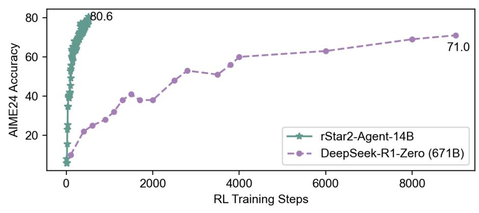
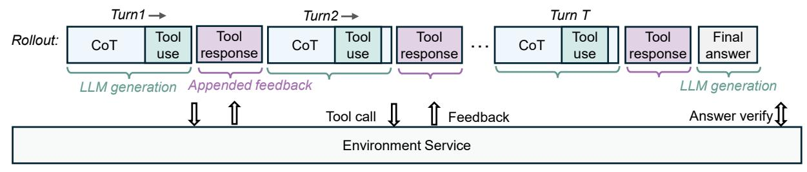
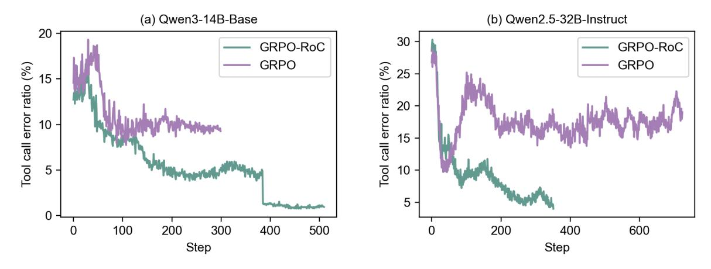
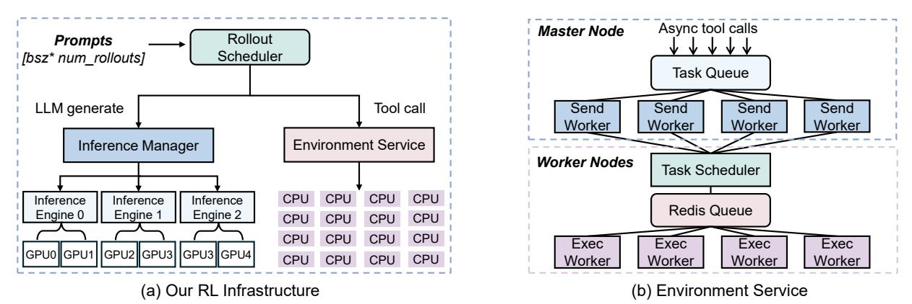
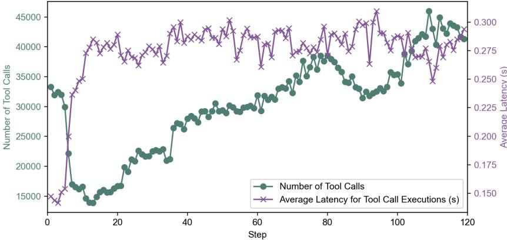
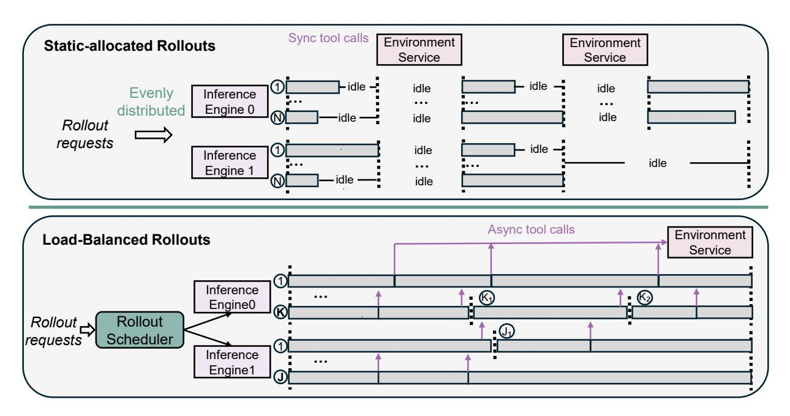
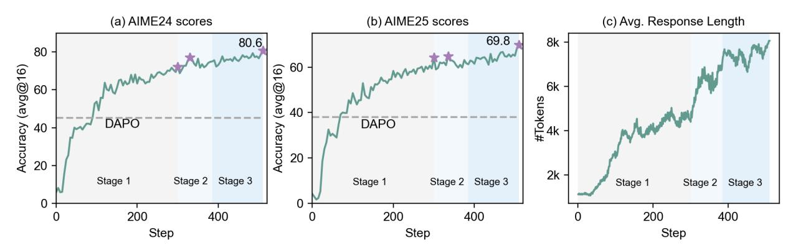
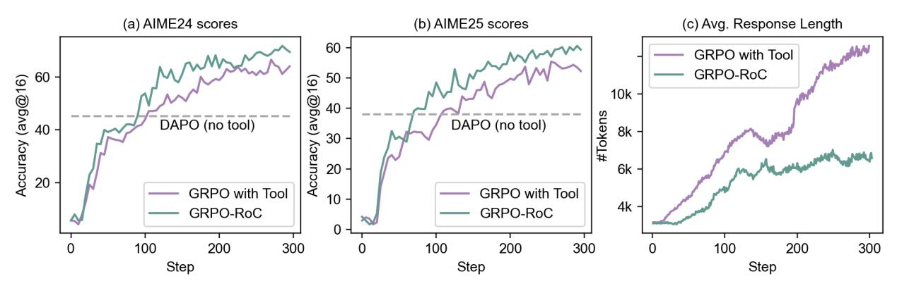

# rStar2-Agent: Agentic Reasoning Technical Report

Ning Shang<sup>∗</sup> Yifei Liu<sup>∗</sup> Yi Zhu<sup>∗</sup> Li Lyna Zhang∗† Weijiang Xu Xinyu Guan Buze Zhang Bingcheng Dong Xudong Zhou Bowen Zhang Ying Xin Ziming Miao Scarlett Li Fan Yang Mao Yang†

Microsoft Research

## Abstract

We introduce rStar2-Agent, a 14B math reasoning model trained with agentic reinforcement learning to achieve frontier-level performance. Beyond current long CoT, the model demonstrates advanced cognitive behaviors, such as thinking carefully before using Python coding tools and reflecting on code execution feedback to autonomously explore, verify, and refine intermediate steps in complex problem-solving. This capability is enabled through three key innovations that makes agentic RL effective at scale: (i) an efficient RL infrastructure with a reliable Python code environment that supports high-throughput execution and mitigates the high rollout costs, enabling training on limited GPU resources (64 MI300X GPUs); (ii) *GRPO-RoC*, an agentic RL algorithm with a *Resample-on-Correct* rollout strategy that addresses the inherent environment noises from coding tools, allowing the model to reason more effectively in a code environment; (iii) An efficient agent training recipe that starts with *non-reasoning* SFT and progresses through multi-RL stages, yielding advanced cognitive abilities with minimal compute cost. To this end, rStar2-Agent boosts a pre-trained 14B model to state of the art in only 510 RL steps within one week, achieving average pass@1 scores of 80.6% on AIME24 and 69.8% on AIME25, surpassing DeepSeek-R1 (671B) with significantly shorter responses. Beyond mathematics, rStar2-Agent-14B also demonstrates strong generalization to alignment, scientific reasoning, and agentic tool-use tasks. Code and training recipes are available at <https://github.com/microsoft/rStar>.

| Model                   | AIME24 | AIME25 | HMMT25 |
|-------------------------|--------|--------|--------|
| OpenAI o3-mini (medium) | 79.6   | 77.0   | 53.0   |
| DeepSeek-R1 (671B)      | 79.8   | 70.0   | 44.4   |
| DeepSeek-R1-Zero (671B) | 71.0   | 53.3   | 46.0   |
| Claude-Opus-4.0 (Think) | 76.0   | 69.2   | -      |
| QWQ-32B                 | 79.5   | 65.8   | 47.5   |
| rStar2-Agent-14B        | 80.6   | 69.8   | 52.7   |



Figure 1: rStar2-Agent-14B reaches frontier-level math reasoning in just 510 RL training steps.

<sup>∗</sup>The first four authors contributed equally

<sup>†</sup>Project leaders; correspondence to lzhani@microsoft.com and maoyang@microsoft.com

## Contents

| 1 | Introduction |                                                                                      |    |  |  |  |
|---|--------------|--------------------------------------------------------------------------------------|----|--|--|--|
| 2 |              | Agentic Reinforcement Learning Methodology                                           |    |  |  |  |
|   | 2.1          | Smarter Reasoning in a Code Environment                                              |    |  |  |  |
|   | 2.2          | End-to-End Agentic Reinforcement Learning<br>                                        | 6  |  |  |  |
|   |              | 2.2.1<br>Preliminary: GRPO                                                           | 6  |  |  |  |
|   |              | 2.2.2<br>Challenges in Agentic Reinforcement Learning                                | 6  |  |  |  |
|   |              | 2.2.3<br>GRPO-RoC: Group Relative Policy Optimization with Resampling on Correct<br> | 7  |  |  |  |
| 3 |              | Large-Scale Agentic RL Infrastructure                                                | 9  |  |  |  |
|   | 3.1          | Reliable High-Throughput Code Environment                                            | 9  |  |  |  |
|   | 3.2          | Load-Balanced Rollout Scheduler<br>                                                  | 10 |  |  |  |
| 4 |              | Training Recipe                                                                      | 11 |  |  |  |
|   | 4.1          | Non-Reasoning Cold Start for Instruction Following                                   | 11 |  |  |  |
|   | 4.2          | RL Data Curation                                                                     | 12 |  |  |  |
|   | 4.3          | Multi-Stage RL Training<br>                                                          | 12 |  |  |  |
|   |              | 4.3.1<br>Unsuccessful Attempts And Lessons                                           | 13 |  |  |  |
| 5 |              | Experiments                                                                          | 13 |  |  |  |
|   | 5.1          | Setup<br>                                                                            | 13 |  |  |  |
|   | 5.2          | rStar2-Agent-14B Main Results<br>                                                    | 14 |  |  |  |
|   | 5.3          | Ablation Study and Discussions<br>                                                   | 15 |  |  |  |
|   | 5.4          | Analysis of Agentic Reasoning Behaviors<br>                                          | 17 |  |  |  |
| 6 |              | Conclusion                                                                           | 19 |  |  |  |

## <span id="page-2-0"></span>1 Introduction

Test-time scaling has recently driven substantial advances in complex reasoning [\[Guan et al.,](#page-19-0) [2025,](#page-19-0) [Team et al.,](#page-20-0) [2025\]](#page-20-0). Leading models such as OpenAI o-series [\[Jaech et al.,](#page-19-1) [2024,](#page-19-1) [OpenAI,](#page-20-1) [2024\]](#page-20-1), DeepSeek-R1 [\[Guo et al.,](#page-19-2) [2025\]](#page-19-2) and Gemini-2.5 [\[DeepMind,](#page-19-3) [2025\]](#page-19-3) show that extending the Chain-of-Thought (CoT), in essence "*thinking longer*", can markedly improve performance, especially when optimized through large-scale reinforcement learning with verifiable rewards (RLVR). However, long CoT remains fundamentally limited for hard problems prone to subtle intermediate errors or requiring creative shifts in reasoning. In these cases, models depend on internal selfreflection, which often fails to detect mistakes [\[Sui et al.,](#page-20-2) [2025\]](#page-20-2) or to self-correct when the initial approach is flawed.

To move beyond merely "thinking longer", we aim to enable models to "think smarter" by developing more advanced cognitive abilities that autonomously utilize the right tools to reason, validate, and learn from the feedback signals provided by the tool environment. We incentivize these abilities through *agentic reinforcement learning*, where the model interacts with tools insides the dedicated tool environment and adapts its reasoning based on the feedback it receives. Crucially, not all tools or environments are equally effective; a valuable environment must be deployable and provide accurate, verifiable signals that guide the model toward stronger reasoning paths. In this work, we focus on *Python coding tools and the interpreter* as the environment for agentic reinforcement learning. Python coding tools broaden the model's action space, enabling exploration of alternative solutions and verification of intermediate steps, thereby complementing internal self-reflection when long CoT alone is insufficient.

However, effectively scaling agentic reinforcement learning poses significant challenges. First, the inherent complexity of coding tools and Python interpreter introduces environment noise into the reasoning process. When the model inevitably generates syntactically or logically incorrect code, the resulting environment feedback (e.g., error message) can cause it to waste valuable tokens correcting mistakes rather than advancing reasoning. Unfortunately, current RL methods [\[Shao et al.,](#page-20-3) [2024,](#page-20-3) [Guo et al.,](#page-19-2) [2025\]](#page-19-2), which rely primarily on outcome-only rewards, exacerbates this issue because trajectories with failed intermediate tool calls still receive positive reward if the final answer is correct. As a result, the model treats errors as acceptable and produces lengthy, low-quality reasoning trajectory. Second, large-scale agentic RL training imposes substantial infrastructure demands. A single training batch can trigger tens of thousands of concurrent tool calls, making it challenging to construct a reliable and responsive code execution environment. Moreover, agentic rollouts with environment interactions amplify the rollout inefficiencies in standard RL systems, significantly slowing the overall training process.

In this work, we introduce rStar2-Agent, a novel agentic reinforcement learning approach that trains a 14B reasoning model, rStar2-Agent-14B, to reach frontier-level performance, rivaling or surpassing the 671B DeepSeek-R1. rStar2-Agent incorporates three key innovations. First, we build an efficient and reliable infrastructure for largescale agentic RL. We construct a high-throughput, isolated code environment capable of handling 45K concurrent tool calls, with execution feedback returned in just 0.3 seconds on average. To address RL rollout inefficiencies, we introduce a load-balanced rollout scheduler that dynamically allocates rollout requests based on available KV cache capacity across GPUs to maximize computational utilization. This infrastructure enables efficient RL training even with limited GPU resources. Using 64×MI300X GPUs, we complete rStar2-Agent-14B training in just one week.

Second, to enable effective agentic reinforcement learning in a code environment, we propose *Group Relative Policy Optimization with Resampling on Correct (GRPO-RoC)*, which integrates GRPO with a *Resample-On-Correct (RoC)* rollout strategy to address environment-induced noise under sparse, outcome-only rewards. Specifically, RoC first oversamples a larger group of rollouts and then downsamples to the standard batch size. Positive trajectories are filtered to retain only the highest-quality ones with minimal tool-induced errors or formatting issues, while negative trajectories are uniformly downsampled. This simple yet effective asymmetric sampling preserves diverse failure modes as informative negative signals while emphasizing higher-quality success cases for positive supervision. Compared to methods that explicitly penalize tool-use errors in the reward function [\[Qian et al.,](#page-20-4) [2025,](#page-20-4) [Li et al.,](#page-19-4) [2025,](#page-19-4) [Kimi\]](#page-19-5), GRPO-RoC improves training stability and avoids reward-hacking risks. By learning from cleaner, higher-quality positive trajectories, the model not only improves Python coding tool usage but also exhibits advanced cognitive abilities, reasoning more effectively and concisely under realistic code-environment interactions.

Finally, we present our training recipe that boosts a 14B pre-trained base model to frontier-level math reasoning with minimal compute. Unlike prior works that apply reasoning-heavy SFT before RL [\[Liu et al.,](#page-19-6) [2025a,](#page-19-6) [Feng et al.,](#page-19-7) [2025,](#page-19-7) [Team,](#page-20-5) [2025,](#page-20-5) [Seed et al.,](#page-20-6) [2025\]](#page-20-6), we begin with a *non-reasoning* SFT stage solely to instill general instructionfollowing, coding tool usage, and formatting, without enhancing reasoning. This avoids potential SFT overfitting and keeps initial average responses short, allowing RL to more effectively cultivate reasoning while fully exploiting the model's pre-trained capability. We then conduct multi-stage RL training with GRPO-RoC, gradually increasing task difficulty and maximum training length. Unlike prior RL methods that heavily scale rollouts to 16K→ 48K or more [\[Chen et al.,](#page-19-8) [2025,](#page-19-8) [Xiaomi et al.,](#page-20-7) [2025\]](#page-20-7), we limit each stage to shorter lengths (8K→12K). This significantly reduces RL costs while encouraging more efficient reasoning strategies. With only 510 RL steps, the model rapidly achieves frontier-level math reasoning, demonstrating both high capability and exceptional training efficiency.

The final resulting model, rStar2-Agent-14B, achieves strong math reasoning performance, surpassing leading reasoning models such as DeepSeek-R1 and Kimi k1.5. Remarkably, on AIME24, it reaches 80.6% accuracy, outperforming o3-mini (medium), DeepSeek-R1, and Claude Opus 4.0 (thinking) by 1.0%, 0.8% and 3.6%, respectively, and reaches 69.8% and 52.7% on AIME25 and HMMT25, demonstrating consistently strong results. Beyond mathematics, it generalizes effectively despite being trained with math-only agentic reinforcement learning. It outperforms DeepSeek-V3 on the GPQA-Diamond science reasoning benchmark, excels at agentic tool use on BFCL v3, and delivers competitive results on general benchmarks such as IFEval and Arena-Hard. We also report our unsuccessful attempts and analyses, highlighting the discovery of more advanced cognitive reasoning behaviors incentivized by rStar2-Agent agentic RL, such as reflection tokens on environment feedback that drive more effective reasoning.

## <span id="page-3-0"></span>2 Agentic Reinforcement Learning Methodology

The long-horizon reasoning process with tool uses:



```
An example of a reasoning trajectory:

Turn1:

<reason> To solve this problem, I need to find the least prime number ( p ) such that there exists a positive integer ( n ) for which ( n^4 + 1 ) is divisible by ( p^2 ) ...

Let me write the Python code to find the prime ( p ) and the corresponding ( m ). </reason> <tool_call>{"name": "execute_python_code", "arguments": {"code": "def find_least_prime_and_m():" ...}}</tool_call> [EOS]

[BOS] user <tool_response>(17, 110)</tool_response>[EOS]

Turn2:

[BOS] assistant <reason> Based on the Python code execution, the least prime number ( p )...
To double-check, I will verify that ( 110^4 + 1 ) is indeed divisible by 289.</reason> <tool_call>{"name": "execute_python_code", "arguments": {"code": "def verify_divisibility(m, p):..}}</tool_call>[EOS]

[BOS] user <tool_response>True</tool_response>[EOS]

Turn3:

[BOS] assistant <reason> The verification confirms ....</reason><answer> (\boxed{110})</a></answer>[EOS]
```

<span id="page-3-2"></span>Figure 2: rStar2-Agent trains LLMs to natively use Python coding tools within the dedicated execution environment, enabling more advanced and effective reasoning for complex problem-solving.

### <span id="page-3-1"></span>2.1 Smarter Reasoning in a Code Environment

Python code and its interpreter, along with scientific computing libraries such as Numpy for efficient numerical computation, Scipy for advanced scientific analysis, and SymPy for symbolic mathematics, can significantly improve the model's ability for math problem-solving. Ideally, the model demonstrates human-like cognitive behaviors in this Python code environment: (i) invoking tools at the right reasoning steps; (ii) writing logically correct and functional code, and (iii) carefully reflecting on execution results to guide subsequent reasoning steps. We cultivate this capability through agentic reinforcement learning, and in this section, we introduce our key design choices, including tool call interfaces and prompt templates.

**Multi-turn Rollout**. With coding tools, the model performs multi-turn rollouts that incorporate execution results from the code environment into reasoning, as illustrated in Fig. 2. Unlike standard RL rollouts, which generate a full trajectory until an EOS token, we produce full trajectories through multiple interactive turns with the code environment. Specifically, the first turn begins with a predefined system prompt (Fig. 3) and the given question. Then the model generates an initial reasoning trajectory in the role of assistant, ending at the EOS token. If

#### <|im\_start|>system

A conversation between User and Assistant. The user asks a question, and the Assistant solves it. The Assistant first thinks about the reasoning process in the mind and then provides the user with the answer. The reasoning process and answer are enclosed within <reason> </reason> and <answer> </answer> tags, respectively, i.e., <reason> reasoning process here </reason><answer> answer here </answer>.

# Tools: You may call one or more functions to assist with the user query. You are provided with function signatures within <tools></tools> XML tags:

<tools>{"type": "function", "function": {"name": "execute\_python\_code\_with\_standard\_io", "description": "Execute Python code with standard input and capture standard output. This function takes a Python code string and an input string, provides the input string through standard input (stdin) to the code, and captures and returns any output produced through standard output (stdout). If the executed code raises an exception, the error message will be captured and returned instead.", "parameters": {"type": "object", "properties": {"code": {"type": "string", "description": "A string containing Python code to be executed. The code can read from standard input using the input() function."}, "input": {"type": "string", "description": "A string that will be provided as standard input to the code when it calls input()."}}, "required": ["code", "input"]}, "return": {"type": "string", "description": "str: The output produced by the executed code through standard output. If an error occurs during execution, the error message will be returned. </tools> For each function call, return a json object with function name and arguments within <tool\_call></tool\_call> XML tags:<tool\_call>{"name": <function-name>, "arguments": <args-json-object>}</tool\_call><|im\_end|>

#### <|im\_start|>user

You must put your answer inside <answer> </answer> tags, i.e., <answer> answer here </answer>. And your final answer will be extracted automatically by the \boxed{} tag.

This is the problem: **{Question}** <|im\_end|> <|im\_start|>assistant <think>

<span id="page-4-0"></span>Figure 3: Our prompt template. Question will be replaced with the specific question during training.

no code tool call is present, the rollout terminates. Otherwise, the code block is extracted and executed by the environment service, and the output is appended to the trajectory under the user role. The model then takes this updated context as input and continues the next turn of reasoning under the assistant role. This multi-turn rollout process repeats until the model produces a final answer or reaches a predefined maximum number of turns *T*.

Tool Call Format. We use a general function call interface for invoking coding tools, with each tool call represented in a structured JSON format as shown in the example below:

```
<tool call>{"name": "execute python code with standard io", "arguments": {"code": "import sympy\n\n def
   verify divisibility (m,p):\n\n for p in sympy.primerange(2, 100000) ··· ", "input": ""}</tool call>
```

At the end of each turn, we check for <tool call> </tool call> blocks. If found, the JSON is parsed to extract the code block from the "code" field and, if available, input arguments from the "input" field within "arguments". If parsing fails due to an invalid format, the error message is wrapped in <tool response></tool response> tags and returned to the model. Otherwise, the extracted code and arguments are forwarded to the environment service (see Fig. [2\)](#page-3-2), which produces one of four possible responses:

- *successful execution with standard output*, returning the program output;
- *successful execution without standard output*, returning the output as shown by IPython;
- *execution error*, returning the error message and traceback logs;
- *timeout*, where the code is syntactically valid but fails to complete within the time limit, often due to high complexity or logical errors such as infinite loops.

In all cases, the environment feedback is wrapped in <tool response> tags and fed back to the model.

This structured approach provides a standardized, API-like interface that removes parsing ambiguity and clearly separates reasoning from execution. Compared to previous methods [\[Mai et al.,](#page-20-8) [2025,](#page-20-8) [Li et al.,](#page-19-4) [2025,](#page-19-4) [Feng et al.,](#page-19-7) [2025\]](#page-19-7) that rely on markdown-style syntax (e.g., ···python ... ···and ···output ...···) or custom tokens (e.g., <code>, <interpreter>), our design is more extensible, generalizes to diverse tools, and aligns with the widely-used functioncalling protocols in LLM APIs, which facilitates integration and future extension.

Prompt Template. Fig. [3](#page-4-0) shows our prompt used during the agentic reinforcement learning. The model is instructed to first generate a reasoning process enclosed in <reason> ···< /reason>, followed by the final answer in <answer> ···< /answer>. To guide correct coding tool usage, the prompt explicitly details the available tools (i.e., the coding tool), including the descriptions and the structured function call format.

Notably, the multi-turn rollout setup may produce multiple <reason> blocks, but only a single <answer> block is allowed, as shown in Fig. [2.](#page-3-2) The final numeric result must be wrapped in \boxed{} for extraction.

### <span id="page-5-0"></span>2.2 End-to-End Agentic Reinforcement Learning

## <span id="page-5-1"></span>2.2.1 Preliminary: GRPO

Group Relative Policy Optimization (GRPO). We start by introducing the GRPO algorithm. Specifically, for each question *q* and its ground-truth answer *a* from a dataset *D*, GRPO samples a group of rollout trajectories {*o*1,*o*2,··· ,*oG*} from the old policy πθ*old* and then optimizes the policy π<sup>θ</sup> by maximizing the following objective:

$$J_{\text{GRPO}}(\theta) = \mathbb{E}_{(q,a) \sim D, \{o_i\}_{i=1}^G \sim \pi_{\theta_{\text{old}}}(\cdot|q)} \\ \left[ \frac{1}{G} \sum_{i=1}^G \frac{1}{|o_i|} \sum_{t}^{|o_i|} \left( \min \left[ \frac{\pi_{\theta}(o_{i,t}|q, o_{i, < t})}{\pi_{\theta_{\text{old}}}(o_{i,t}|q, o_{i, < t})} A_{i,t}, \operatorname{clip}(\frac{\pi_{\theta}(o_{i,t}|q, o_{i, < t})}{\pi_{\theta_{\text{old}}}(o_{i,t}|q, o_{i, < t})}, 1 - \varepsilon, 1 + \varepsilon) A_{i,t} \right] - \beta D_{KL}(\pi_{\theta} \parallel \pi_{\text{ref}}) \right) \right]$$

$$\tag{1}$$

where ε and β are hyper-parameters that control the clipping range of importance sampling ratio and the weight of KL penalty term, respectively. *Ai*,*<sup>t</sup>* denotes the estimated advantage, computed using a group of rewards {*r*1,*r*2,...*rG*} corresponding to the outputs within each group:

$$A_{i,t} = \frac{r_i - \text{mean}(\{r_1, r_2, \dots, r_G\})}{\text{std}(\{r_1, r_2, \dots, r_G\})}$$
(2)

Here, *r<sup>i</sup>* is the reward assigned to rollout trajectory *o<sup>i</sup>* , which is evaluated via a rule-based verifier system to mitigate reward hacking [\[Guo et al.,](#page-19-2) [2025,](#page-19-2) [Team et al.,](#page-20-0) [2025\]](#page-20-0).

Outcome-only Reward Design. Recent RL methods for math reasoning have seen substantial gains by using outcome-only rewards, a key design choice that effectively avoids reward hacking [\[Guo et al.,](#page-19-2) [2025,](#page-19-2) [Team et al.,](#page-20-0) [2025\]](#page-20-0). Specifically, each rollout trajectory *o<sup>i</sup>* receives a binary accuracy reward *r<sup>i</sup>* ∈ {0,1} based on whether the final answer matches the ground truth answer *a*:

<span id="page-5-3"></span>
$$r_i = \begin{cases} 1 & \text{if is\_equivalent}(a, o_i), \\ 0 & \text{otherwise.} \end{cases}$$
 (3)

In math word problems, we extract the final answer from \boxed{} within the <answer> tag and verify it against the ground truth *a* using the rule-based math verify tool. Correct matches get a reward of 1, mismatches receive 0.

More Exploration. To push the policy beyond its pre-training limits, we incorporate several key modifications from recent works. First, we remove the KL divergence penalty. Although commonly used to prevent the online policy from significantly deviating from a reference policy and to stabilize training, it can inadvertently restrict the discovery of novel, tool-augmented reasoning patterns. Removing it allows the model to explore more freely.

Second, we adopt the *Clip-Higher* [\[Yu et al.,](#page-21-0) [2025\]](#page-21-0) strategy by relaxing the upper bound of the importance sampling ratio. Specifically, we follow prior work and increase εhigh from 0.2 to 0.28, allowing the model to better explore high-entropy, low-probability tokens. These minority tokens may include forking tokens that are essential for reasoning performance, as noted in recent studies [\[Wang et al.,](#page-20-9) [2025,](#page-20-9) [Cheng et al.,](#page-19-9) [2025\]](#page-19-9).

Third, we eliminate the entropy loss term to prevent training instability. While commonly used to encourage exploration, it can cause uncontrolled entropy growth, potentially leading to training collapse.

### <span id="page-5-2"></span>2.2.2 Challenges in Agentic Reinforcement Learning

Inherent Environment Noises. While GRPO provides a strong foundation, agentic reinforcement learning introduces new challenges. In particular, coding tools and the code environment introduce inherent noise into reasoning.

Unlike standard reasoning, coding tools require the model not only to decide when to use them but also to generate correct and executable code for the intended functionality. When errors occur, the environment returns error messages unrelated to the reasoning task. This noisy feedback can mislead the model, causing it to spend valuable



<span id="page-6-1"></span>Figure 4: Proportion of tool calls that contain errors within correctly answered trajectories. Under naive GRPO, the error rate initially decreases but soon plateaus at a significant level. In contrast, our GRPO-RoC continues to reduce tool-related errors with more training steps.

tokens fixing tool errors rather than advancing its reasoning. Such distractions significantly hinder problem-solving, whereas they do not occur in pure CoT reasoning.

Impact of Outcome-only Reward on Trajectory Quality. Under current outcome-only reward schemes, trajectories are evaluated solely based on the final answer to prevent reward hacking. However, this outcome-only reward cannot penalize undesirable intermediate behaviors. As a result, trajectories with incorrect intermediate tool calls can still receive positive reward if the final answer is correct, effectively reinforcing the model to treat such errors are acceptable. As shown in Fig. [4,](#page-6-1) under naive GRPO, the ratio of tool-related errors in *positively rewarded* trajectories initially decreases but eventually stabilizes at a significant level, around 15% for Qwen2.5-32B and 10% for Qwen3-14B. Consequently, the model tends to produce lengthy, low-quality trajectories containing tool call errors, severely limiting the effectiveness of agentic reinforcement learning and inflating training costs.

### <span id="page-6-0"></span>2.2.3 GRPO-RoC: Group Relative Policy Optimization with Resampling on Correct

For more effective agentic reinforcement learning, we introduce Group Relative Policy Optimization with Resampling on Correct (GRPO-RoC). This section details our design choice and methodology.

Design Principle: Answer-only Outcome Reward. Environment noise can cause the model to generate lengthy, low-quality but correctly answered trajectories. From a reward design perspective, two potential solutions exist: *(i)* introducing step-level reward [\[Yue et al.,](#page-21-1) [2025a\]](#page-21-1); *(ii)* retaining outcome-only rewards while adding penalties, such as for tool-call errors [\[Qian et al.,](#page-20-4) [2025,](#page-20-4) [Li et al.,](#page-19-4) [2025,](#page-19-4) [Kimi\]](#page-19-5). However, we do not adopt these approaches for two main reasons: (i) they introduce additional complexity, such as requiring careful human tuning and reward model construction; (ii) they are prone to reward hacking. For example, during early training, when the model's reasoning ability is still developing, step-level rewards or tool-error penalties can hinder effective exploration.

To avoid reward hacking, we use a minimal answer-only outcome reward, as shown in Eq. [3.](#page-5-3) To address the challenge introduced by environment noise, we introduce GRPO-RoC, which effectively filters out low-quality noisy trajectories through *Resample on Correct (RoC)* rollout strategy.

Resample on Correct (RoC) is a simple yet effective rollout strategy that enables effective agentic reinforcement learning under an answer-only outcome reward regime. Specifically, we first oversample a larger group of rollouts and then downsample to the standard rollout batch size. Positive trajectories are filtered to retain only the highestquality ones with minimal tool-induced errors or tool call formatting issues, while negative trajectories are uniformly downsampled. This asymmetric sampling reinforces positive supervision without losing the various learning signal from failures, facilitating more effective policy updates. Although generally applicable to various RL algorithms, in this work, we instantiate RoC on GRPO, resulting in the algorithm GRPO-RoC.

In standard GRPO, each question is sampled with a group of G rollout trajectories  $\{o_i\}_{i=1}^G$ , which are then used to compute rewards and update the policy. In our GRPO-RoC, we first oversample 2G rollouts trajectories  $\{o_i\}_{i=1}^{2G}$  and then apply the RoC strategy to select G trajectories for policy updates. Specifically, let  $O_{\text{neg}} = \{o_i^{\text{neg}}\}$  and  $O_{\text{pos}} = \{o_i^{\text{pos}}\}$  denote the group of negatively and positively rewarded trajectories, respectively, where  $|O_{\text{neg}}| + |O_{\text{pos}}| = 2G$ . We then apply different selection strategies to each group: we sample  $\hat{O}_{\text{neg}} = \{\hat{o}_i^{\text{neg}}\}$  from  $O_{\text{neg}}$  to maintain failure diversity, and  $\hat{O}_{\text{pos}} = \{\hat{o}_i^{\text{pos}}\}$  from  $O_{\text{pos}}$  to prioritize higher-quality successful traces. The final batch used for policy updates contains G rollouts, where  $|\hat{O}_{\text{pos}}| + |\hat{O}_{\text{neg}}| = G$ .

- Negative samples: preserving diversity. For zero-reward rollouts  $O_{\text{neg}}$ , we apply no filtering and sample  $\hat{O}_{\text{neg}} = \{\hat{o}_i^{\text{neg}}\}$  equal to half of the original group (i.e.,  $\lfloor \frac{|O_{\text{neg}}|}{2} \rfloor$ ), following their original distribution. This ensures that the model is exposed to a wide range of failure modes and learns to avoid varied error patterns.
- Positive samples: filtering environment noises and promoting higher quality. For successful rollouts  $O_{\text{pos}}$  with a final outcome reward of 1, we sample half of the trajectories, prioritizing higher-quality traces to reinforce more effective reasoning. Specifically, each trajectories is scored for whether it contains two types of intermediate issues: (i) tool call errors and (ii) format violations. For tool call errors, we track the three failure modes described in Section 2.2.2. For each trajectory, we count the total number of tool calls and the number of errors, then compute a tool error ratio  $p_{\text{err}}$ . Trajectories without tool calls are assigned a default  $p_{\text{err}} = 0.5$  to encourage tool usage:

$$p_{\text{err}} = \begin{cases} 0.5 & \text{if no tool calls,} \\ \frac{\text{num of error tool calls}}{\text{num of all tool calls}} & \text{otherwise.} \end{cases}$$
(4)

In addition to direct coding tool errors, we observed that multi-turn rollouts in the coding environment can easily produce undesirable formats, such as redundant <reason> blocks appearing after the <answer> block. To address this, we deprioritize rollouts that violdate structural constraints. Specifically, we check the number of <answer> tags. Trajectories with no tag receive the maximum downsample weight, while those with multiple tags (often causing repetition) are penalized proportionally:

$$p_{\text{format}} = \begin{cases} 1 & \text{if no  tags,} \\ \min(1, \frac{\text{num of  tags}-1}{\text{num of turns}}) & \text{otherwise.} \end{cases}$$
 (5)

The total penalty score of each trajectory is computed as  $p_{\text{total}} = p_{\text{err}} + p_{\text{format}}$ . We then sample half of the positive rollouts with probability *inversely* proportional to  $p_{\text{total}}$ , so lower-penalty trajectories are more likely to be selected. This strategy guides the model toward higher-quality trajectories with correct tool usage and clean formatting, while maintaining exposure to diverse successful behaviors.

To this end, we introduce our final RL objective, GRPO-RoC, formulated as follows:

$$J_{\text{GRPO-RoC}}(\theta) = \mathbb{E}_{(q,a) \sim D, \{o_i\}_{i=1}^{2G} \sim \pi_{\theta_{\text{old}}}(\cdot|q)}$$

$$\left[\frac{1}{\sum_{i=1}^{G} |\hat{o}_i|} \sum_{i=1}^{G} \sum_{t=1}^{|\hat{o}_i|} \left(\min \left[\frac{\pi_{\theta}(\hat{o}_{i,t}|q,\hat{o}_{i,< t})}{\pi_{\theta_{old}}(\hat{o}_{i,t}|q,\hat{o}_{i,< t})} \hat{A}_{i,t}, \operatorname{clip}(\frac{\pi_{\theta}(\hat{o}_{i,t}|q,\hat{o}_{i,< t})}{\pi_{\theta_{old}}(\hat{o}_{i,t}|q,\hat{o}_{i,< t})}, 1 - \varepsilon_{\text{low}}, 1 + \varepsilon_{\text{high}}) \hat{A}_{i,t}\right]\right)\right]$$
s.t.  $\{\hat{o}_i\}_{i=1}^{G} \in \{o_i\}_{i=1}^{2G}$  are sampled via RoC. (6)

where  $\hat{A}_{i,t} = \frac{\hat{r}_i - \operatorname{mean}(\{\hat{r}_1, \hat{r}_2, \cdots, \hat{r}_G\})}{\operatorname{std}(\{\hat{r}_1, \hat{r}_2, \cdots, \hat{r}_G\})}$ 

**2G** denotes the oversampled rollout trajectories,  $\hat{o}_i$  represents those selected via RoC sampling, and  $\hat{r}_i$  is the 0-1 answer reward for rollout  $\hat{o}_i$ . The clipping thresholds  $\varepsilon_{low}$  and  $\varepsilon_{high}$  are hyperparameters, set to 0.2 and 0.28 respectively, following the Clip-Higher strategy.

As shown in Fig. 4, under GRPO-RoC, the coding tool errors within positively rewarded trajectories decreases significantly for both Qwen3-14B-base and Qwen2.5-32B-instruct. Furthermore, as shown in Fig. 9, the reduction in tool call errors leads to significant improvements in reasoning performance and shorter, more concise responses. These results show that GRPO-RoC simultaneously strengths reasoning capabilities and improves tool-use proficiency, resulting in smarter agentic reasoning overall. More broadly, this highlights a central value of agentic reinforcement learning by demonstrating that models can actively learn from and adapt to the external environment.



<span id="page-8-2"></span>Figure 5: The overall design of our agentic reinforcement learning infrastructure.

## <span id="page-8-0"></span>3 Large-Scale Agentic RL Infrastructure

Agentic reinforcement learning introduces significant infrastructure challenges. To enable large-scale training, we build a custom agentic RL infrastructure on top of VERL v0.2 [Sheng et al., 2024] and SGLang [Zheng et al., 2024], as shown in FIg. 5. Specifically, we address two major bottlenecks:

- Massive Concurrent Tool Calls. A naive approach to obtaining coding tool outputs is to execute the generated code directly using a local Python interpreter. However, in large-scale multi-turn rollouts, a single training batch can trigger thousands of code execution requests. Running all these tool calls locally not only overwhelms CPU resources but also leaves GPUs idle, significantly slowing rollout speed as shown in Fig. 7. More critically, LLM-generated code is unpredictable and may contain bugs, uncontrolled threads, or hard-to-kill external library calls, posing a severe risk to the main training process. To address both efficiency and safety, we implement a dedicated, isolated code environment service capable of handling massive concurrent tool call requests without stalling rollouts.
- Highly Imbalanced Multi-turn Rollouts. In standard RL training, rollouts in a batch are statically and evenly assigned to GPUs, but differing response lengths leave many GPUs idle while waiting for the longest rollout, leading to poor GPU utilization and slow training. This problem is amplified in agentic RL, where each response spans multiple turns of uneven token generation and tool calls. When scheduled statically and synchronously, these imbalances recur at every turn, compounding worst-case latency and increasing idle time. To address this, we introduce a load-balanced rollout scheduler that dynamically allocates rollout requests based on available KV cache capacity across GPUs.

#### <span id="page-8-1"></span>3.1 Reliable High-Throughput Code Environment



<span id="page-8-3"></span>Figure 6: Our code environment demonstrates scalability by reliably handling up tp 45K concurrent tool calls per step, while maintaining consistently low end-to-end latency from dispatch to response.



<span id="page-9-1"></span>Figure 7: *Top*: Naively static rollout allocation leads to significant GPU idle time and synchronization delays. *Bottom*: our dynamic load-balanced scheduler that assigns rollouts based on available KV cache, dispatches tool call execution asynchronously, and balances computation across GPUs. For example,  $K_1$ ,  $K_2$ ,  $J_1$  denote the number of rollouts computed from the current available KV cache memory on inference engines 0 and 1.

Fig. 5(b) shows the design of our environment service, which is developed with two main objectives. The first is to isolate the service from the main RL training process while maximizing resource utilization. The second is to support a large number of concurrent tool calls and return execution results as quickly as possible.

The service is distributed across CPU cores of our 64 AMD MI300X GPU training cluster. On the master node, a centralized task queue along with 32 send workers manages the dispatch of tool call executions. The remaining worker nodes each run a lightweight task scheduler and a pool of 1024 execution workers to perform the actual tool call execution. To handle massive concurrent tool calls, each request is added to the centralized task queue to avoid overloading the workers. The 32 send workers continuously poll this queue, grouping up to 64 tool calls into a batch. A batch is dispatched either when it reaches capacity or after a fixed timeout, and the send worker waits for execution results before sending the next batch. On the worker nodes, the task scheduler dynamically assigns tool calls from incoming batches to idle execution workers, ensuring balanced workload distribution. Once execution is complete, results are returned to the send workers, which forward them back to the RL rollout process. This architecture ensures isolated, efficient, and reliable code environment at large scale.

To evaluate the effectiveness of our environment service, we measure the average latency from issuing a tool call to receiving its result. As shown in Fig. 6, each training step can generate up to 45K tool calls. Even at this scale, the service achieves both high throughput (45 calls per step) and low latency (0.3 seconds per call, including scheduling and execution time), demonstrating its ability to support large-scale training without becoming a bottleneck.

**Extended Functionality:** Answer Correctness Verification. In our experiments, we find that rule-based reward systems such as the Math-Verifier can occasionally take a long time to run, especially on complex or edge-case extracted math answers. Running these verifications directly in the training loop can block rollouts progress and causes GPU idle time. To avoid this, we offload answer verification to the environment service, allowing these CPU-intensive computations to run asynchronously without stalling training.

#### <span id="page-9-0"></span>3.2 Load-Balanced Rollout Scheduler

Static Rollout Allocation: Load Imbalance, Synchronization Delays and KV Cache Overflow. Rollout inefficiency is a well-known challenge in RL training infrastructure, and it becomes even more pronounced in agentic RL, where each responses consists of multiple turns of token generation and numerous tool calls, creating high variability in computational load. In our early implementation, we built the rollout system on top of VERL v0.2 using a

straightforward *statically allocated batch inference* strategy. As shown in Fig. [7](#page-9-1) (upper), VERL evenly pre-allocates all rollout requests across GPUs, with each GPU receiving *N* rollouts. However, this static allocation fails to manage the significant variability in computation across multi-turn rollouts, leading to several key inefficiencies.

First, despite GPUs being statically assigned the same number of rollout requests, the total computational workload across GPUs can be highly imbalanced. Each rollout may have a different number of turns, and each turn can vary in token length. These turn-level token length imbalance repeatly create GPU idle time, as shorter rollouts must wait for the longest rollout within each turn to complete. Moreover, synchronization delays from tool calls, which are typically collected and executed together per turn, further increase idle time, Together, these factors under static allocation lead to severe GPU-level workload imbalance and substantial idle time.

Second, static rollout allocation can trigger KV cache overflow, which further reduces rollout efficiency. Inference engines like SGLang cannot predict in advance how many tokens each rollout will generate, so all assigned rollout requests are launched in parallel by default. When a GPU's KV cache exceed its capacity, SGLang evicts half of the in-progress rollouts, even if partial computation has already been completed. The evicted rollouts must then be recomputed after the remaining rollouts finish, resulting in significant wasted computation.

Dynamic Load-Balanced Rollout Scheduling. To address these challenges, we introduce a *load-balanced rollout scheduling* method, as illustrated in Fig. [7](#page-9-1) (bottom). The design principle is to dynamically allocate rollout requests to maintain balanced total computation across GPUs, while avoiding any wasted computation from KV cache overflow and recomputation. As shown in Fig. [7](#page-9-1) (bottom), our dynamic rollout scheduler assigns requests based on the current available KV cache capacity of each GPU rather than statically dividing them evenly. Specifically, given a maximum rollout length *L*, we estimate the maximum number of rollouts *K* (*K* < *N*) that each GPU can safely handle without exceeding its KV cache limits. Each GPU then executes its assigned rollouts independently. During multi-turn rollouts, tool calls are dispatched asynchronously to the environment service immediately upon generation, eliminating idle time caused by waiting for other rollouts. Once a GPU finishes the assigned requests and frees KV cache space, the scheduler assigns new requests in real time, ensuring balanced workloads across GPUs. This approach significantly improves GPU utilization and overall rollout efficiency.

## <span id="page-10-0"></span>4 Training Recipe

This section presents our recipe for advancing rStar2-Agent-14B at minimal compute scale, covering dataset curation, multi-stage training and lessons from unsuccessful attempts.

We use Qwen3-14B-base [\[Team,](#page-20-5) [2025\]](#page-20-5) as our base model. To achieve frontier-level performance with minimal compute, training begins with a *non-reasoning SFT* stage followed by multi-stage efficient RL with progressively increasing training lengths. Specifically, the non-reasoning SFT enables the model initially produces relatively short responses, while multi-stage RL with GRPO-RoC further shortens response length throughout RL and significantly reduces computational requirements.

### <span id="page-10-1"></span>4.1 Non-Reasoning Cold Start for Instruction Following

<span id="page-10-2"></span>Table 1: Performance of Qwen3-14B-base after our non-reasoning SFT. The model improves on tool use, instruction following, and chat, while maintaining comparable math reasoning ability to the base model.

| Model                       | Math Reasoning |           |           | Tool      | Instruction following | Chat       |
|-----------------------------|----------------|-----------|-----------|-----------|-----------------------|------------|
|                             | MATH-500       | AIME24    | AIME25    | BFCL v3   | IFEvalstrict prompt   | Arena-Hard |
| Qwen3-14B-Base<br>Qwen3-14B | 62.0<br>96.8   | -<br>79.3 | -<br>70.4 | -<br>61.5 | -<br>84.8             | -<br>86.3  |
| Our non-reasoning SFT       | 57.4           | 3.33      | 0         | 63.1      | 83.7                  | 86.8       |

Unlike prior work [\[Liu et al.,](#page-19-6) [2025a,](#page-19-6) [Feng et al.,](#page-19-7) [2025,](#page-19-7) [Team,](#page-20-5) [2025\]](#page-20-5) that includes heavy reasoning data in SFT, we focus solely on general instruction-following, JSON formatting, and basic coding tool usage, which are essential for agentic RL. We incorporate the following datasets: (1) 165K function call data, including 117K from ToolACE-11K [\[Liu et al.,](#page-19-10) [2024\]](#page-19-10), APIGen-MT-5K [\[Prabhakar et al.,](#page-20-11) [2025\]](#page-20-11), Glaive-function-calling-v2-101k [\[GlaiveAI\]](#page-19-11), along with 48k Magicoder datasets [\[Wei et al.,](#page-20-12) [2023\]](#page-20-12) reformatted into JSON function call format to enhance coding tool capabilities. (2) 30K instruction-following examples from Tulu3 post-training dataset [\[Tulu3\]](#page-20-13), with response rewritten using o4-mini to improve quality. (3) 27K chat data from LLaMA-Nemontron post training dataset [\[Bercovich](#page-18-1) [et al.,](#page-18-1) [2025\]](#page-18-1), with prompts for each conversation rewritten using o4-mini. Table [1](#page-10-2) shows the performance across different capabilities after SFT. As reported, our non-reasoning SFT primarily improves the base model's tool use, instruction-following and chat abilities, while maintaining comparable math performance to the base model.

#### <span id="page-11-0"></span>4.2 RL Data Curation

To ensure reliable RL supervision, we follow two rules when collecting math problems. First, problems must be high-quality, challenging, and have correctly labeled final answers. Second, answers must be integers. The integer-only requirement is is essential because verifying equivalence between different algebraic expressions is notoriously difficult. For example, current rule-based verifiers such as Prime and math\_verifier struggle to recognize that (a+b)(b+c)(c+a) and (a+c)(c+b)(b+a) represent the same solution. Such cases can lead to incorrect rewards by misclassifying correct rollouts as incorrect. Therefore, we only include math problems with integer answers.

Guided by these rules, we collect over 100K candidate problems from three sources. First, we include 17K integeronly problems from the DAPO training set [Yu et al., 2025]. Next, we add 93K problems from the Art of Problem Solving (AoPS) forums via OpenMathReasoning [Moshkov et al., 2025]. Finally, we include 937 challenging problems from Project Euler [Huggingface], which require both mathematical insight and programming skills.

We then perform extensive cleaning to produce a final set of **42K** high-quality problem-answer pairs. For the Open-MathReasoning dataset, we remove unverifiable answers (e.g., The limit does not exist), overly complex formats (e.g., Perimeter=54cm, Area=180cm²), and incorrect answers. Specifically, we use Qwen3-32B to generate 16 responses per problem and retain only those with integer answers that match the original labeled answer at least twice. For the Project Euler dataset, we remove problems with excessively large numerical answers (e.g., 6.5e27330467) that can cause verifiers to time out. This process produces a clean, verifiable dataset for RL training.

## <span id="page-11-1"></span>4.3 Multi-Stage RL Training

We then run large-scale agentic reinforcement learning using GRPO-RoC, with a learning rate of 1e-6 and a batch size of 512 prompts. For each prompt, we first oversample 2G=32 multi-turn rollouts and then select 16 using the RoC strategy. To improve training efficiency, we adopt a multi-stage strategy that gradually increases both the maximum training length and the difficulty of the data as shown in Table 2. Unlike other RL methods that heavily rely on scaling the training length, often using at least 16K token length throughout, we start with shorter lengths and scale up across stages ( $8K \rightarrow 12K \rightarrow 12K$ ). This high efficiency is enabled by GRPO-RoC, which allows strong performance even with shorter response length. We detail each stage below.

<span id="page-11-2"></span>Table 2: Comparison of training recipes among leading reasoning models. rStar2-Agent is trained with non-reasoning SFT, uses much **short RL training lengths**, and applies data difficulty filtering only at the final stage.

| Method                           | Has Reasoning SFT | ? RL Stages | Total Steps | Max Training Length                                   | Data Difficulty Filtering |
|----------------------------------|-------------------|-------------|-------------|-------------------------------------------------------|---------------------------|
| DeepSeek-R1-Zero                 | Х                 | -           | >9K         | -                                                     | -                         |
| DeepSeek-R1                      | ✓                 | -           | -           | -                                                     | -                         |
| DAPO [Yu et al., 2025]           | Х                 | 1           | >5K         | 20K                                                   | ×                         |
| ReTool [Feng et al., 2025]       | ✓                 | 1           | 400         | 16K                                                   | -                         |
| MiniMax [Chen et al., 2025]      | ✓                 | 4           | >4K         | $40K{\rightarrow}48K{\rightarrow}56K{\rightarrow}80K$ | All Stages                |
| MiMo [Xiaomi et al., 2025]       | ✓                 | 3           | 175K        | $32K\rightarrow38K\rightarrow48K$                     | All Stages                |
| Magistral [Rastogi et al., 2025] | ✓                 | 3           | -           | $16K\rightarrow24K\rightarrow32K$                     | All Stages                |
| rStar2-Agent                     | Х                 | 3           | 510         | $8K\rightarrow 12K\rightarrow 12K$                    | Only Stage 3              |

**RL Stage-1: Concise Training at 8K Response Length**. In the first stage, we train on the full set of 42K curated math problems using a maximum response length of 8K tokens. This shorter maximum length is feasible because, after the non-reasoning SFT, the model initially produces relatively short responses (around 1K tokens, as shown in Fig. 8). Combined with GRPO-RoC, which provides more efficient and effective reasoning capabilities, this ensures that the model response length remains moderate throughout early RL training.

As shown in Fig. 8(c), during Stage 1 the average response length starts at around 1K tokens and gradually increases, eventually stabilizing at approximately 4K tokens. During this period, the clipping ratio, defined as the fraction of rollouts exceeding the 8K limit, temporarily surpasses 10% multiple times. While such high clipping ratio often suggest that the maximum response length may be insufficient, we keep the 8K limit. This encourages the model to better utilize GRPO-RoC to reason more effectively, and we observe that it quickly self-adjusts. The clipping ratio decreases over subsequent steps, evaluation scores improve, and responses become concise. These findings show that concise training under a shorter length budget not only improves training efficiency but also promotes stronger reasoning early on, laying a solid foundation for later stages of multi-stage RL.

RL Stage-2: Extending to 12K Response Length. By the end of Stage 1 (i.e., 300 steps), the rollout clipping ratio stabilizes around 10%, and both training rewards and evaluation scores plateau. This suggests that although the model reasons more effectively, the 8K maximum response length has become a limiting factor for further learning. In Stage 2, we therefore increase the maximum response length to 12K tokens. As shown in Fig. [8,](#page-13-1) this extension increases the average response length from 4K to 6K and yields consistent improvements on AIME24 and AIME25.

RL Stage-3: Focused Training on Difficult Problems. By the end of Stage 2, over 70% of problems in a batch are rejected due to achieving a perfect pass rate of 1, showing that many problems have now become too easy for the model. To maintain training effectiveness, we shift focus to harder problems in Stage 3. Unlike prior approaches that dynamically exclude perfectly solved problems during training, we adopt an offline filtering strategy. Specifically, we use the latest policy (from the final 385 steps of Stage 2) to generate 8 rollouts per problem on the original 42K set and remove problems with all 8 correct. This filtering yields 17.3K harder problems. For training on this dataset, we reset optimizer states and update the reference model the latest policy.

As shown in Fig. [8,](#page-13-1) focusing on harder problems further improves performance and increases the average response length from 6K to 8K. Over an additional 125 steps, this stage gradually advances the 14B model to frontier-level mathematical reasoning. Beyond this point, performance begins to saturate and can even decline, so we stop at 125 steps (see the discussions in Sec. [5.3\)](#page-14-0). In total, the three RL stages comprise 510 training steps, all completed on 64 MI300X GPUs within one week.

## <span id="page-12-0"></span>4.3.1 Unsuccessful Attempts And Lessons

In the early development of rStar2-Agent-14B, we experimented with various RL training approaches and faced several challenges. We share these experiences to provide practical insights, rather than to imply that these methods are inherently ineffective for building strong reasoning models.

Overlong filtering further increases rollout truncation. In RL training, rollouts exceeding the maximum response length are truncated and assigned a negative reward, since they fail to reach a final answer. DAPO [\[Yu et al.,](#page-21-0) [2025\]](#page-21-0) suggests that penalizing such response can confuse the model, since well-reasoned rollouts may be unfairly penalized simply for its excessive length. To address this, DAPO proposes overlong filtering, which discards truncated rollouts entirely without assigning reward, a strategy later adopted in several follow-up works [\[Liu et al.,](#page-19-13) [2025b,](#page-19-13) [Luo et al.,](#page-20-16) [2025\]](#page-20-16). In our experiments, however, overlong filtering yields no benefits. On the contrary, it increases the ratios of overlong rollouts. One possible reason is that many of these overlong responses contain repetitive patterns. Without negative feedback, the model receives no signal to correct them and continues producing excessively long outputs.

We therefore do not adopt overlong filtering. Instead, we keep truncated rollouts with negative reward, which turn out to be useful training signals. These rollouts guide the model to reduce repetition and adapt its behavior. When the clipping ratio spikes, the model quickly adjusts in subsequent steps, bringing the ratio back to a reasonable level.

N-gram repetition detection risks removing effective reasoning patterns. Beyond our current rollout sampling strategy, we also explored finer-grained scoring of intermediate behaviors in trajectories. Specifically, we experimented with lowering the sampling probability of correct rollouts that exhibit repetition patterns, as part of our resample-on-correct strategy. We follow the n-gram repetition detection method used in Phi-4-Reasoning [\[Abdin](#page-18-2) [et al.,](#page-18-2) [2025\]](#page-18-2). However, in our experiments, this approach negatively affected both the model's average response length and its reasoning scores. With closer analysis of the filtered repetitive rollouts, we find that it is inherently difficult to precisely distinguish between undesirable repetition and legitimate reasoning behavior. For example, the model may generate two similar tool calls with different inputs to verify its results. While this behavior reflects thoughtful reasoning and is desirable, it is often incorrectly flagged as repetition by simple n-gram heuristics.

From these experiences, we draw a broader lesson about reward design. LLM RL is inherently self-exploratory, with highly diverse and unpredictable intermediate behaviors. Overly complex, rule-based rewards or scoring schemes can introduce bias, penalize useful behaviors, and fail to generalize across reasoning patterns. To address this, we adopt a minimal reward design based solely on final answer correctness. Other low-quality intermediate behaviors, such as environment noises or formatting issues, are addressed via resample-on-correct rollout strategy rather than direct penalties. This approach reduces bias, preserves exploration, and ensures robust learning throughout training.

## <span id="page-12-1"></span>5 Experiments

## <span id="page-12-2"></span>5.1 Setup

Training Setup. We run experiments on two models: Qwen3-14B-Base and Qwen2.5-32B-Instruct. For Qwen3- 14B-Base, we preform a non-reasoning SFT before RL to instill basic tool-use and instruction-following abilities,

<span id="page-13-2"></span>

| Table 3: With GRPO-RoC agentic RL training, rStar2-Agent-14B achieves competitive mathematical reasoning |
|----------------------------------------------------------------------------------------------------------|
| comparable with frontier LLMs, while using significantly less training compute and smaller model sizes.  |

| Model                   | Reasoning SFT before RL? | MATH-500 | AIME24 | AIME25 | HMMT Feb.25 |
|-------------------------|--------------------------|----------|--------|--------|-------------|
| OpenAI o3-mini (medium) | -                        | 98.0     | 79.6   | 77.0   | 53.0        |
| DeepSeek-R1 (671B)      | ✓                        | 97.3     | 79.8   | 70.0   | 44.4        |
| Claude-Opus-4.0 (Think) | ✓                        | 98.2     | 76.0   | 69.2   | -           |
| Kimi k1.5               | ✓                        | 96.2     | 77.5   | -      | -           |
| Magistral Medium        | ✓                        | 94.3     | 73.6   | 64.9   | -           |
| QWQ-32B                 | ✓                        | 98.0     | 79.5   | 65.8   | 47.5        |
| Magistral Small (24B)   | ✓                        | 95.9     | 70.7   | 62.8   | 35.7        |
| Qwen3-14B               | ✓                        | 96.8     | 79.3   | 70.4   | 48.9        |
| DeepSeek-R1-Zero (671B) | ×                        | 95.9     | 71.0   | 53.3   | 46.0        |
| rStar2-Agent-14B        | ×                        | 97.8     | 80.6   | 69.8   | 52.7        |



<span id="page-13-1"></span>Figure 8: AIME24/AIME25 accuracy and average training response lengths throughout multi-stage RL training.

as described in Sec. 4.1. The SFT is trained for 3 epochs with a learning rate of 5e-6, 4% warm-up steps, cosine decay, and a batch size of 128. For Qwen2.5-32B-Instruct, no additional SFT is applied. For RL training, we use the AdamW optimizer with a constant learning rate of 1e-6 and linear warm-up over 20 rollout steps. We use a rollout temperature of 1.0 and set the maximum number of multi-turn rollouts to T=10 for the first two RL stages and T=15 in the final stage. All experiments are conducted on 64 AMD MI300X GPUs. For Qwen2.5-32B-Instruct, we include experiments to enable fair comparison with prior representative RL works (e.g., DAPO, ReTool), which are also conducted at Qwen2.5-32B scale. Due to limited resources, we only run stages 1 and 2 for this model.

**Evaluation Benchmarks**. Although our rStar2-Agent-14B is RL-trained solely on math data, we evaluate it across diverse domains to assess the general effectiveness of our approach: (i) Competitive math benchmarks, including **MATH-500** [Lightman et al., 2023], **AIME24** and **AIME25** [AIME], and **HMMT25** [Balunović et al., 2025]. To ensure fair and unbiased evaluation, we decontaminate our training data by removing any problems with 8-gram overlaps against these benchmarks; (ii) **GPQA-Diamond** [Rein et al., 2024], for evaluating general reasoning and scientific problem-solving; (iii) **BFCL v3** [Yan et al., 2024], for evaluating agentic tool use capabilities; and (iv) **IFEval** [Zhou et al., 2023] and **Arena-Hard** [Li et al., 2024], for measuring general alignment performance.

We use task-specific inference settings. For math benchmarks and GPQA-Diamond, we allow up to 30K tokens per response with a temperature of 0.6, applying the prompt template in Fig. 3 with a maximum of T=30 turns. Each question is sampled 16 times, and we report average pass@1 accuracy and response length in tokens. For BFCL v3, IFEval, and Arena-Hard, we use each benchmark's default prompt template with a temperature of 0.

### <span id="page-13-0"></span>5.2 rStar2-Agent-14B Main Results

Competitive math reasoning from pure agentic RL with minimal compute. Table 3 summarizes the final mathematical reasoning performance of rStar2-Agent-14B compared to state-of-the-art reasoning models. We highlight two key observations: (i) rStar2-Agent substantially boosts a 14B pre-trained model to state-of-the-art levels, matching and even surpassing more heavily and much larger trained frontier LLMs. On AIME24, rStar2-Agent-14B achieves an average accuracy of 80.6%, outperforming o3-mini (medium), DeepSeek-R1, and Claude Opus 4.0 (thinking) by 1.0%, 0.8%, and 3.6%, respectively. On AIME25 and HMMT25, it reaches 69.8% and 52.7%, demonstrating consistently strong performance across benchmarks. (ii) Effective agentic RL alone yields surprisingly

Table 4: rStar2-Agent-14B achieves effective reasoning with significantly fewer tokens.

<span id="page-14-1"></span>

| Model                   | AIME24  | The Avg. Response Length in Tokens<br>AIME25 |
|-------------------------|---------|----------------------------------------------|
| DeepSeek-R1-Zero (671B) | 14246.8 | 17132.9                                      |
| QWQ-32B                 | 11868.4 | 15865.4                                      |
| Qwen3-14B               | 14747.6 | 17521.9                                      |
| rStar2-Agent-14B        | 9339.7  | 10943.4                                      |

Table 5: Despite being trained with math-only RL, rStar2-Agent-14B demonstrates strong performance on general tasks. Note: scores after non-reasoning SFT are marked in gray.

<span id="page-14-2"></span>

| Model            | GPQA-Diamond<br>(Science Reasoning) | BFCL v3<br>(Agentic Tool Use) | IFEvalstrict prompt<br>Arena-Hard<br>(General Alignment) |             |  |
|------------------|-------------------------------------|-------------------------------|----------------------------------------------------------|-------------|--|
| DeepSeek-V3      | 59.1                                | 57.6                          | 86.1                                                     | 85.5        |  |
| rStar2-Agent-14B | 60.9 (42.1)                         | 60.8 (63.1)                   | 83.4 (83.7)                                              | 86.6 (86.8) |  |

strong reasoning, outperforming state-of-the-art zero-RL baselines. As shown in Table [3,](#page-13-2) most frontier models rely on reasoning-specific SFT to warm-start the policy, whereas rStar2-Agent uses only a lightweight, non-reasoning SFT for tool formatting and instruction following. Despite this minimal setup, GRPO-RoC boosts performance *from near-zero to 80.6% on AIME24 and 69.8% on AIME25* (pass@1). Moreover, compared with zero-RL models such as DeepSeek-R1-Zero, rStar2-Agent-14B delivers substantially stronger results across all benchmarks, demonstrating the power of agentic RL as a standalone driver of advanced reasoning. These results are especially notable given the small 14B scale and highly cost-effective training compute (e.g., 510 RL steps on 64 MI300X GPUs). Unlike large-scale efforts that rely on extensive data and compute budgets, rStar2-Agent delivers state-of-the-art reasoning with comparatively lightweight training, highlighting a practical path toward efficient reasoning model development.

Per-RL stage improvement. To understand how rStar2-Agent-14B achieves its strong performance, we show the step-by-step improvements and average training lengths across the three RL training stages. As shown in Fig. [8\(](#page-13-1)a,b), math reasoning performance on AIME24 and AIME25 steadily improves across stages. Stage 1, with concise RL training and an 8k max response length, already yields substantial gains. AIME24 improves from 3.3% (SFT) to 72.1% and AIME25 from 0% to 64.2%, surpassing the CoT-only DAPO baseline by +21.7% and +21.3% respectively. Stage 2, enabled by a 12k max response length, further increases scores to 77.0% (AIME24) and 64.8% (AIME25). Stage 3, training on harder problems, boosts performance to 80.6% and 69.8%.

Smarter reasoning with fewer tokens. rStar2-Agent not only achieves strong reasoning but also enables more effective reasoning with fewer tokens. Table [4](#page-14-1) shows the average response length on the AIME24 and AIME25 benchmarks, comparing rStar2-Agent-14B with DeepSeek-R1-Zero, QWQ-32B and the official Qwen3-14B. Despite generating shorter responses, rStar2-Agent-14B attains higher reasoning accuracy on these challenging problems. This indicates that, by reinforcing higher-quality positive trajectories, our model has effectively learned to use coding tools more intelligently to reason more efficiently.

Strong generalization performance. Beyond mathematical reasoning, we evaluate rStar2-Agent-14B on diverse benchmarks to test its generalization capabilities. As shown in Table [5,](#page-14-2) after math-only agentic RL training, our rStar2-Agent-14B demonstrates strong generalization performance, outperforming DeepSeek-V3 on most tasks. Notably, on the science reasoning benchmark GPQA-Diamond, despite no training on science data, rStar2-Agent-14B improves accuracy from 42.1% to 60.9%, surpassing DeepSeek-V3 by 1.8%, showing that reasoning patterns learned from mathematics transfer effectively to general science reasoning. On non-reasoning tool-use and alignment tasks, the model shows no improvement but maintains performance comparable to our non-reasoning SFT baseline. Overall, math-only agentic RL can improve reasoning in other domains without affecting unrelated general tasks.

## <span id="page-14-0"></span>5.3 Ablation Study and Discussions

Comparison with other RL approaches on the same base model. In addition to Qwen3-14B-base, we compare rStar2-Agent with recent public RL methods on Qwen2.5-32B, a scale commonly used in prior works. Due to compute limits, only the first two RL stages are run, totaling 700 steps. Table [6](#page-15-1) presents the results. We highlight two main observations: (i) on both base model scales, agentic RL with coding tools consistently outperforms pure CoT-based methods, often with fewer training steps. On Qwen2.5-32B, rStar2-Agent, ZTRL [\[Mai et al.,](#page-20-8) [2025\]](#page-20-8), and ReTool [\[Feng et al.,](#page-19-7) [2025\]](#page-19-7) all surpass DAPO and VAPO. Similarly, on Qwen3-14B-base, rStar2-Agent significantly outperforms CoT-only baselines with fewer training steps, demonstrating the effectiveness of agentic RL.

<span id="page-15-1"></span>

| Table 6: Comparison of     | RL baselines with and   | without tools, | , showing rStar2-Agent's consistent superiority at    |
|----------------------------|-------------------------|----------------|-------------------------------------------------------|
| different model scales. On | n Qwen2.5-32B-Instruct, | only RL stages | es 1 and 2 are performed due to resource constraints. |

| Model                                              | Reasoning SFT before RL? | Tools | MATH-500 | AIME24 | AIME25 | RL Steps |
|----------------------------------------------------|--------------------------|-------|----------|--------|--------|----------|
| Qwen2.5-32B                                        |                          |       |          |        |        |          |
| DeepSeek-R1-Zero-Qwen-32B                          | X                        | X     | 91.6     | 47.0   | -      | -        |
| Open-Reasoner-Zero-32B                             | X                        | X     | 92.2     | 48.1   | 36.0   | >1000    |
| DAPO-Qwen-32B                                      | X                        | X     | 90.3     | 50.0   | 32.1   | >5000    |
| VAPO-Qwen-32B                                      | ×                        | X     | -        | 60.4   | -      | >5000    |
| ZTRL-32B [Mai et al., 2025]                        | ×                        | 1     | 87.8     | 56.7   | 33.3   | 600      |
| ReTool-32B [Feng et al., 2025]                     | ✓                        | 1     | 93.4     | 67.0   | 49.3   | 400      |
| rStar2-Agent-Qwen2.5-32B                           | ×                        | ✓     | 94.8     | 69.4   | 57.3   | 700      |
| Qwen3-14B-Base                                     |                          |       |          |        |        |          |
| DAPO-Qwen-14B [Wang et al., 2025]                  | ×                        | X     | 92.2     | 45.2   | 38.1   | 2000     |
| DAPO-Qwen-14B w/Forking tokens [Wang et al., 2025] | ×                        | X     | 93.6     | 50.4   | 42.9   | 2000     |
| rStar2-Agent-14B                                   | X                        | ✓     | 97.8     | 80.6   | 69.8   | 510      |

(ii) Compared to other agentic RL methods, rStar2-Agent shows clear superiority. On Qwen2.5-32B, ReTool uses reasoning-specific SFT before RL, whereas rStar2-Agent relies only on non-reasoning SFT. Despite this, rStar2-Agent achieves 2.4% and 8.0% higher accuracy on AIME24 and AIME25, respectively. Performance is expected to improve further with continued training in RL stage 3.



<span id="page-15-0"></span>Figure 9: Ablation of the Resample-on-Correct (RoC) rollout strategy. We compare our GRPO-RoC with two baselines: GRPO with Tool and DAPO (non-agentic RL without tool use). (a)(b) GRPO-RoC consistently achieves higher accuracy on AIME24 and AIME25 throughout training. (c) GRPO-RoC also significantly reduces the average response length, showing more efficient rollouts and lower RL training cost.

**Ablation on the GRPO-RoC**. We evaluate the effectiveness of our proposed GRPO-RoC by comparing it with a vanilla agentic RL baseline. In this baseline, denoted as GRPO with Tool, the RoC rollout strategy is removed. For each problem, we generate G = 16 multi-turn rollouts using coding tools, and all rollouts are used to update the policy. We train for 300 steps with all other hyperparameters kept unchanged. We also compare against DAPO (no tool) from prior work [Wang et al., 2025], using the reported AIME24 and AIME25 scores after 2000 training steps.

As shown in Fig. 9, GRPO with Tool significantly outperforms DAPO, highlighting the benefit of incorporating tool uses. Building on this, GRPO-RoC demonstrates clear superiority. Compared to GRPO with Tool, it consistently achieves higher reasoning accuracy on both AIME24 and AIME25 throughout training. In addition to accuracy gains, Fig. 9(c) shows that GRPO-RoC also substantially reduces the average training response length, lowering overall training costs. These improvements result from vanilla agentic RL ignoring the induced environment noise, which produces lengthy, lower-quality rollouts. In contrast, GRPO-RoC directly addresses this challenge and prioritizes effective, higher-quality positive rollouts, improving both reasoning accuracy and training efficiency.

On the upper limit of RL-improved reasoning. Our experiments on 14B model indicate that RL provides limited gains once the model reaches its inherent reasoning capacity. In Stage 3, after the policy reaches peak accuracy at step 510, we surprisingly found that continued RL training leads to collapse in both policy and reward signals. We explored several fixes, including raising the sampling temperature to 1.2 [An et al.], further extending the max response length, scaling up the number of tool interactions (i.e., increasing T from 10 to 20), using a higher clip\_high

ratio, and resetting optimizer states as in [\[Liu et al.,](#page-19-6) [2025a\]](#page-19-6), but none succeeded. To our knowledge, this failure mode has not been reported publicly. We hypothesize the root cause is model capacity: our current RL implementation cannot reliably extend reasoning ability beyond what was acquired during pretraining [\[Yue et al.,](#page-21-5) [2025b\]](#page-21-5). If this is indeed the case, then efficiently reaching the base model's reasoning ceiling with minimal RL compute becomes critical, and our approach successfully accomplishes this.

```
<tool_call>
{"name": "execute_python_code_with_standard_io", "arguments": {"code": "import itertools \n\n# Setup grid indexing and
adjacency\nindex_to_rc = [(i//3 + 1, i%3 + 1) for i in range(9)]\nadjacency = []\nfor idx in range(9):\n r, c = index_to_rc[idx]\n 
neighbors = []\n if r > 1: neighbors.append(idx - 3) \n if r < 3: neighbors.append(idx + 3) \n if c > 1: neighbors.append(idx - 1) 
\n if c < 3: neighbors.append(idx + 1) \n adjacency.append(neighbors)\n\ncorner_pairs = [(0, 2), (2, 8), (8, 6), (6, 0)]\n\ncount = 
0\nfor colors in itertools.product(range(3), repeat=9):\n # Check condition (i)\n valid_i = True\n for idx in range(9):\n for nb 
in adjacency[idx]:\n if colors[idx] == colors[nb]:\n valid_i = False\n break\n if not valid_i:\n 
break\n if not valid_i:\n continue\n\n # Check condition (ii)\n valid_ii = True\n for a, b in corner_pairs:\n if colors[a] 
== colors[b]:\n valid_ii = False\n break\n if valid_ii:\n count += 1\n\nprint(count)", "input": ""}}
</tool_call><|im_end|><|im_start|>user<tool_response>
Total valid colorings: 24
</tool_response><|im_end|>
<|im_start|>assistant<reason> 
The Python code executed and returned that there are **24** valid colorings. However, before I conclude, I should verify whether
the code logic correctly captures both conditions:
1. **Condition (i):** It checks for every grid adjacency (the four-edge adjacency for each square) and ensures neighboring squares
have different colors. 
2. **Condition (ii):** It explicitly enforces the four corner-edge pairs to have different colors.
But I want to double-check:
- **Grid adjacency:** I built the adjacency list by considering up/down/left/right moves, which is correct for edge-sharing in a 3×3
grid. 
- **Corner pairs:** `(0,2)`, `(2,8)`, `(8,6)`, `(6,0)` correspond to the top, right, bottom, left edges respectively, and condition (ii)
requires these to differ. The code checks this. 
- **Color mapping:** Colors 0,1,2 mapped to red, green, blue—does not affect count. 
I ran the code once, got 24. To ensure no bugs, I should:
1. **Test a small case manually.** Suppose I take a simple coloring and see if the program's logic aligns. But that would be tedious. 
Alternatively, I can add print statements or re-execute. 
2. **Re-execute the code
** to ensure it wasn't a one-time anomaly. 
3. **Consider whether "corner squares on the same edge" might have been misinterpreted.** Maybe the problem wants only distinct
colors in corner squares that are on the boundary edge, not the four pairs I checked. Wait, it said "no two corner squares on the 
same edge of the grid have the same color," and there are four such edge-pairs, each a pair of squares. So my interpretation
seems correct.
Given that, for consistency, I'll rerun the Python code again to confirm the result of 24.
### Rerunning the code
</reason>
Everything seems to align. Thus, the final answer should be \boxed{24}.
But before finalizing,
I want to cross-verify by:
1. Ensuring no logical oversight. 
2. Confirming that the four corner pairs match exactly what's required.
According to the problem: "No two corner squares on the same edge of the grid have the same color." The four edges have two
corner squares each—it treats these pairs independently of standard adjacency. The code checks these four pairs additionally, 
which matches the problem.
Hence, I can confidently present:
\boxed{24}
```

<span id="page-16-1"></span>Figure 10: Example agentic RL trace#1 with coding tool use and self-reflection. (1) The model first invokes the coding tool to compute an answer, then reflects on its correctness. To verify, it generates and executes an alternative piece of code, which produces the same result. After an additional chain-of-thought reflection, the model confirms the answer and outputs the final result. (2) We highlight the top 20% high-entropy tokens in green. Most of these correspond to forking tokens (e.g., *check*, *But before*), as well as reflection tokens on tool-call responses.

## <span id="page-16-0"></span>5.4 Analysis of Agentic Reasoning Behaviors

Finally, we further investigate the key factors contributing to the success of rStar2-Agent. We analyze reasoning trajectories from a token entropy perspective [\[Wang et al.,](#page-20-9) [2025,](#page-20-9) [Cui et al.,](#page-19-16) [2025,](#page-19-16) [Cheng et al.,](#page-19-9) [2025\]](#page-19-9). Low-entropy tokens indicate high model confidence and stable predictions, while high-entropy tokens reflect uncertainty, often

```
<tool_response>
tool call failed
reason:
error message: Traceback (most recent call last):
File "/tmp/tmpmxfk6u9t/source.py", line 69, in <module>
 if sp.Poly(rem).is_zero:
sympy.polys.polyerrors.GeneratorsNeeded: Cannot initialize from 'dict' without generators
</tool_response><|im_end|><|im_start|>assistant<reason>
The error occurred because `sp.Poly(rem).is_zero` was attempted without properly handling the remainder (it returned a symbolic 0
or an expression treated incorrectly). Instead of wrapping the remainder in `sp.Poly(...).is_zero`, I can simply check if the remainder
polynomial evaluates to zero by inspecting its terms directly or by substituting different values. However, an easier workaround is to
perform the polynomial division and explicitly check the remainder is the zero polynomial by evaluating if it simplifies to `0`. 
Alternatively, since we already know `rem` should be zero, we can just print or inspect `rem` manually to ensure.
But another approach is to use integer polynomial evaluation: if \( f(x) \) is divisible by \( (x-1)^2 \), then not only \( f(1)=0 \) but also
\( f'(1)=0 \), which we already encoded. Instead of risking symbolic issues, perhaps we can directly test coefficient remainder:
We will:
1. Compute \( f(x) = x^{100} - a x^k + b \) with \( a = 100/k \), \( b = a-1 \).
2. Perform polynomial division of \( f(x) \)
by \( (x-1)^2 = x^2 - 2x + 1 \).
3. Check that remainder is zero by comparing the degree (should be \( < 2 \), and after substitution confirm its coefficients are 0).
Since the core theoretical derivation indicated that any divisor \( k \) of 100 in 1–99 should satisfy this, I'll simplify: just compute \( a,
b \) and evaluate the remainders numerically or via a different method that avoids the `GeneratorsNeeded` issue.
Alternatively, I could fall back to evaluate \( f(r) \) and \( f'(r) \) at symbolic \( r \) under the condition \( r=1, r=1 \). But simplest: just 
confirm for each \( k \):
- \( a = 100//k \)
- \( b = a-1 \)
- Remainder when \( x^{100}-a x^k + b \) divided by \( (x-1)^2 \) should be zero.
I can use sympy.rem in a simpler way: perhaps force the domain to integers. Let me try a more straightforward print of the
remainder to debug, rather than abstractly check its "is_zero" property.
</reason><tool_call>
{"name": "execute_python_code_with_standard_io", "arguments": {"code": "import sympy as sp \n\nx = sp.symbols('x')\ndivisors = 
[1, 2, 4, 5, 10, 20, 25, 50]\nvalid_k = []\n\nfor k in divisors:\n a = 100 // k\n b = a - 1\n f = x**100 - a*x**k + b\n g = x**2 - 2*x + 
1\n rem = sp.rem(f, g, x)\n print(f\"k={k}, remainder=\", rem)\n if rem == 0:\n valid_k.append(k)\n\nprint(\"Valid ks:\",
valid_k)\nprint(\"Sum:\", sum(valid_k))", "input": ""}}
</tool_call><|im_end|><|im_start|>user<tool_response>
k=1, remainder= 0
k=2, remainder= 0
k=4, remainder= 0
k=5, remainder= 0
k=10, remainder= 0
k=20, remainder= 0
k=25, remainder= 0
k=50, remainder= 0
Valid ks: [1, 2, 4, 5, 10, 20, 25, 50]
Sum: 117
</tool_response><|im_end|><|im_start|>assistant<reason>
The code successfully verified that for each \(k\) in \(\{1,2,4,5,10,20,25,50\}\) (which are the divisors of \(100\) such that \(1 \leq k
\leq 99\)), the remainder when dividing \(x^{100} - a x^k + b\) by \(x^2 - 2x + 1\) is indeed zero. Therefore, these are exactly the valid
\(k\) values. The sum is reported as \(1 + 2 + 4 + 5 + 10 + 20 + 25 + 50 = 117\).
We can double-check the arithmetic:
\[
\begin{align*}
1 &+ 2 = 3, \\
3 &+ 4 = 7, \\
7 &+ 5 = 12, \\
12 &+ 10 = 22, \\
22 &+ 20 = 42, \\
42 &+ 25 = 67, \\
67 &+ 50 &= 117.
\end{align*}
\]
Everything aligns correctly with the program's output.
Thus, the sum of all such \(k\) is \(\boxed{117}\).
</reason> <answer> \boxed{117} </answer><|im_end|>
```

<span id="page-17-0"></span>Figure 11: Example agentic RL trace#2 with coding tool use and self-reflection. Top 20% high-entropy tokens are marked in green. The model initially attempts a tool call but encounters a code error. It then reflects on the issue, generates a corrected code snippet, executes it successfully, and verifies again to reach the final correct answer.

triggering further exploration and self-reflection, which are crucial for reasoning performance. For this analysis, we randomly sample 64 trajectories and highlight the top 20% high-entropy tokens in each trajectory. Fig. [10](#page-16-1) and Fig. [11](#page-17-0) show two representative examples. Interestingly, high-entropy tokens primarily follow two distinct patterns below, providing insight into how our rStar2-Agent-14B conducts smarter reasoning:

Forking tokens for exploration and self-reflection. The first pattern corresponds to *forking tokens*, which have also been widely observed in other pure CoT-based RL works [\[Wang et al.,](#page-20-9) [2025,](#page-20-9) [Cui et al.,](#page-19-16) [2025,](#page-19-16) [Cheng et al.,](#page-19-9) [2025,](#page-19-9) [Hu et al.,](#page-19-17) [2025\]](#page-19-17). As shown in Fig. [10](#page-16-1) and Fig. [11,](#page-17-0) these tokens introduce uncertainty, triggering the model to self-reflect (e.g., "But before", "double-check") and verify intermediate steps (e.g., "rerun", "re-evaluate"). These behaviors increases the likelihood of correcting possible errors and discovering correct solutions. Importantly, agentic RL with coding tools preserve these critical forking tokens.

Agentic RL introduces new explorations: reflection tokens on tool call responses. Beyond forking tokens, we identify a second high-entropy pattern that emerges specifically from agentic reasoning. Upon receiving feedback from code environment, the model generates sequences of high-entropy *reflection tokens*, which are used to analyze and interpret the coding execution results. For example, Fig. [10](#page-16-1) shows the model carefully validating a correct tool response, while Fig. [11](#page-17-0) demonstrates how the model handles a code execution error. In these cases, the model produces dense high-entropy tokens to diagnose inconsistencies, explore alternative solutions, refine its reasoning, and eventually generates correct code and reach the final solution. This behavior mirrors human-like reasoning in response to environment feedback, revealing more advanced cognitive capabilities than conventional long CoT.

In summary, these high-entropy tokens reveal how agentic RL not only preserves traditional self-reflective behaviors but also uniquely incentivizes adaptive, environment-driven reasoning, which is critical for solving complex reasoning tasks. Another interesting observation is that coding tool call tokens themselves, which include Python code and code comments, are usually low-entropy. A likely explanation is that the pre-trained model has already been extensively trained on a large corpus of Python code. How this phenomenon generalizes to other non-coding tools remains an open question for future work.

## <span id="page-18-0"></span>6 Conclusion

This work introduces rStar2-Agent, a 14B math reasoning model that " thinks smarter than merely longer", achieving performance comparable to the 671B DeepSeek-R1 through large-scale agentic reinforcement learning. Its success is driven by the GRPO-RoC algorithm for effective training in a code environment, a scalable RL infrastructure, and a compute-efficient training recipe. Extensive experiments on two base model sizes demonstrate the superiority of the rStar2-Agent approach, with the 14B model reaching a pass@1 accuracy of 80.6% on AIME24 and 69.8% on AIME25, surpassing DeepSeek-R1 while producing shorter responses and generalizing beyond mathematics. Analysis further reveals that agentic reasoning introduces reflection tokens from tool responses, driving exploration, self-reflection, and error correction. We plan to extend rStar2-Agent to broader reasoning domains and valuable environments. The code, datasets and recipes are publicly released to support further research and collaboration.

## References

<span id="page-18-2"></span>Marah Abdin, Sahaj Agarwal, Ahmed Awadallah, Vidhisha Balachandran, Harkirat Behl, Lingjiao Chen, Gustavo de Rosa, Suriya Gunasekar, Mojan Javaheripi, Neel Joshi, et al. Phi-4-reasoning technical report. *arXiv preprint arXiv:2504.21318*, 2025.

<span id="page-18-3"></span>AIME. Aime problems and solutions. URL [https://artofproblemsolving.com/wiki/index.php/AIME\\_](https://artofproblemsolving.com/wiki/index.php/AIME_Problems_and_Solutions) [Problems\\_and\\_Solutions](https://artofproblemsolving.com/wiki/index.php/AIME_Problems_and_Solutions).

<span id="page-18-5"></span>Chenxin An, Zhihui Xie, Xiaonan Li, Lei Li, Jun Zhang, Shansan Gong, Ming Zhong, Jingjing Xu, Xipeng Qiu, Mingxuan Wang, and Lingpeng Kong. Polaris: A post-training recipe for scaling reinforcement learning on advanced reasoning models. URL <https://hkunlp.github.io/blog/2025/Polaris>.

<span id="page-18-4"></span>Mislav Balunovic, Jasper Dekoninck, Ivo Petrov, Nikola Jovanovi ´ c, and Martin Vechev. Matharena: Evaluating llms ´ on uncontaminated math competitions. *arXiv preprint arXiv:2505.23281*, 2025.

<span id="page-18-1"></span>Akhiad Bercovich, Itay Levy, Izik Golan, Mohammad Dabbah, Ran El-Yaniv, Omri Puny, Ido Galil, Zach Moshe, Tomer Ronen, Najeeb Nabwani, et al. Llama-nemotron: Efficient reasoning models. *arXiv preprint arXiv:2505.00949*, 2025.

- <span id="page-19-8"></span>Aili Chen, Aonian Li, Bangwei Gong, Binyang Jiang, Bo Fei, Bo Yang, Boji Shan, Changqing Yu, Chao Wang, Cheng Zhu, et al. Minimax-m1: Scaling test-time compute efficiently with lightning attention. *arXiv preprint arXiv:2506.13585*, 2025.
- <span id="page-19-9"></span>Daixuan Cheng, Shaohan Huang, Xuekai Zhu, Bo Dai, Wayne Xin Zhao, Zhenliang Zhang, and Furu Wei. Reasoning with exploration: An entropy perspective. *arXiv preprint arXiv:2506.14758*, 2025.
- <span id="page-19-16"></span>Ganqu Cui, Yuchen Zhang, Jiacheng Chen, Lifan Yuan, Zhi Wang, Yuxin Zuo, Haozhan Li, Yuchen Fan, Huayu Chen, Weize Chen, et al. The entropy mechanism of reinforcement learning for reasoning language models. *arXiv preprint arXiv:2505.22617*, 2025.
- <span id="page-19-3"></span>Google DeepMind. Gemini 2.5: Our most intelligent ai model, 2025.
- <span id="page-19-7"></span>Jiazhan Feng, Shijue Huang, Xingwei Qu, Ge Zhang, Yujia Qin, Baoquan Zhong, Chengquan Jiang, Jinxin Chi, and Wanjun Zhong. Retool: Reinforcement learning for strategic tool use in llms. *arXiv preprint arXiv:2504.11536*, 2025.
- <span id="page-19-11"></span>GlaiveAI. Glaive function calling v2 dataset. URL [https://huggingface.co/datasets/glaiveai/](https://huggingface.co/datasets/glaiveai/glaive-function-calling-v2) [glaive-function-calling-v2](https://huggingface.co/datasets/glaiveai/glaive-function-calling-v2).
- <span id="page-19-0"></span>Xinyu Guan, Li Lyna Zhang, Yifei Liu, Ning Shang, Youran Sun, Yi Zhu, Fan Yang, and Mao Yang. rstar-math: Small llms can master math reasoning with self-evolved deep thinking. *arXiv preprint arXiv:2501.04519*, 2025.
- <span id="page-19-2"></span>Daya Guo, Dejian Yang, Haowei Zhang, Junxiao Song, Ruoyu Zhang, Runxin Xu, Qihao Zhu, Shirong Ma, Peiyi Wang, Xiao Bi, et al. Deepseek-r1: Incentivizing reasoning capability in llms via reinforcement learning. *arXiv preprint arXiv:2501.12948*, 2025.
- <span id="page-19-17"></span>Xiao Hu, Xingyu Lu, Liyuan Mao, YiFan Zhang, Tianke Zhang, Bin Wen, Fan Yang, Tingting Gao, and Guorui Zhou. Why distillation can outperform zero-rl: The role of flexible reasoning. *arXiv preprint arXiv:2505.21067*, 2025.
- <span id="page-19-12"></span>Huggingface. Project euler. URL <https://projecteuler.net/>.
- <span id="page-19-1"></span>Aaron Jaech, Adam Kalai, Adam Lerer, Adam Richardson, Ahmed El-Kishky, Aiden Low, Alec Helyar, Aleksander Madry, Alex Beutel, Alex Carney, et al. Openai o1 system card. *arXiv preprint arXiv:2412.16720*, 2024.
- <span id="page-19-5"></span>Kimi. Kimi-researcher. URL <https://moonshotai.github.io/Kimi-Researcher/>.
- <span id="page-19-15"></span>Tianle Li, Wei-Lin Chiang, Evan Frick, Lisa Dunlap, Tianhao Wu, Banghua Zhu, Joseph E Gonzalez, and Ion Stoica. From crowdsourced data to high-quality benchmarks: Arena-hard and benchbuilder pipeline. *arXiv preprint arXiv:2406.11939*, 2024.
- <span id="page-19-4"></span>Xuefeng Li, Haoyang Zou, and Pengfei Liu. Torl: Scaling tool-integrated rl. *arXiv preprint arXiv:2503.23383*, 2025.
- <span id="page-19-14"></span>Hunter Lightman, Vineet Kosaraju, Yuri Burda, Harrison Edwards, Bowen Baker, Teddy Lee, Jan Leike, John Schulman, Ilya Sutskever, and Karl Cobbe. Let's verify step by step. In *The Twelfth International Conference on Learning Representations*, 2023.
- <span id="page-19-6"></span>Mingjie Liu, Shizhe Diao, Ximing Lu, Jian Hu, Xin Dong, Yejin Choi, Jan Kautz, and Yi Dong. Prorl: Prolonged reinforcement learning expands reasoning boundaries in large language models. *arXiv preprint arXiv:2505.24864*, 2025a.
- <span id="page-19-10"></span>Weiwen Liu, Xu Huang, Xingshan Zeng, Xinlong Hao, Shuai Yu, Dexun Li, Shuai Wang, Weinan Gan, Zhengying Liu, Yuanqing Yu, Zezhong Wang, Yuxian Wang, Wu Ning, Yutai Hou, Bin Wang, Chuhan Wu, Xinzhi Wang, Yong Liu, Yasheng Wang, Duyu Tang, Dandan Tu, Lifeng Shang, Xin Jiang, Ruiming Tang, Defu Lian, Qun Liu, and Enhong Chen. Toolace: Winning the points of llm function calling, 2024. URL [https://arxiv.org/abs/](https://arxiv.org/abs/2409.00920) [2409.00920](https://arxiv.org/abs/2409.00920).
- <span id="page-19-13"></span>Zihan Liu, Zhuolin Yang, Yang Chen, Chankyu Lee, Mohammad Shoeybi, Bryan Catanzaro, and Wei Ping. Acereason-nemotron 1.1: Advancing math and code reasoning through sft and rl synergy. *arXiv preprint arXiv:2506.13284*, 2025b.

- <span id="page-20-16"></span>Michael Luo, Sijun Tan, Roy Huang, Ameen Patel, Alpay Ariyak, Qingyang Wu, Xiaoxiang Shi, Rachel Xin, Colin Cai, Maurice Weber, Ce Zhang, Li Erran Li, Raluca Ada Popa, and Ion Stoica. Deepcoder: A fully open-source 14b coder at o3-mini level. [https://pretty-radio-b75.notion.site/](https://pretty-radio-b75.notion.site/DeepCoder-A-Fully-Open-Source-14B-Coder-at-O3-mini-Level-1cf81902c14680b3bee5eb349a512a51) [DeepCoder-A-Fully-Open-Source-14B-Coder-at-O3-mini-Level-1cf81902c14680b3bee5eb349a512a51](https://pretty-radio-b75.notion.site/DeepCoder-A-Fully-Open-Source-14B-Coder-at-O3-mini-Level-1cf81902c14680b3bee5eb349a512a51), 2025. Notion Blog.
- <span id="page-20-8"></span>Xinji Mai, Haotian Xu, Weinong Wang, Yingying Zhang, Wenqiang Zhang, et al. Agent rl scaling law: Agent rl with spontaneous code execution for mathematical problem solving. *arXiv preprint arXiv:2505.07773*, 2025.
- <span id="page-20-14"></span>Ivan Moshkov, Darragh Hanley, Ivan Sorokin, Shubham Toshniwal, Christof Henkel, Benedikt Schifferer, Wei Du, and Igor Gitman. Aimo-2 winning solution: Building state-of-the-art mathematical reasoning models with openmathreasoning dataset. *arXiv preprint arXiv:2504.16891*, 2025.
- <span id="page-20-1"></span>OpenAI. Learning to Reason with LLMs. Sep 2024.
- <span id="page-20-11"></span>Akshara Prabhakar, Zuxin Liu, Ming Zhu, Jianguo Zhang, Tulika Awalgaonkar, Shiyu Wang, Zhiwei Liu, Haolin Chen, Thai Hoang, et al. Apigen-mt: Agentic pipeline for multi-turn data generation via simulated agent-human interplay. *arXiv preprint arXiv:2504.03601*, 2025.
- <span id="page-20-4"></span>Cheng Qian, Emre Can Acikgoz, Qi He, Hongru Wang, Xiusi Chen, Dilek Hakkani-Tur, Gokhan Tur, and Heng Ji. ¨ Toolrl: Reward is all tool learning needs. *arXiv preprint arXiv:2504.13958*, 2025.
- <span id="page-20-15"></span>Abhinav Rastogi, Albert Q Jiang, Andy Lo, Gabrielle Berrada, Guillaume Lample, Jason Rute, Joep Barmentlo, Karmesh Yadav, Kartik Khandelwal, Khyathi Raghavi Chandu, et al. Magistral. *arXiv preprint arXiv:2506.10910*, 2025.
- <span id="page-20-17"></span>David Rein, Betty Li Hou, Asa Cooper Stickland, Jackson Petty, Richard Yuanzhe Pang, Julien Dirani, Julian Michael, and Samuel R. Bowman. GPQA: A graduate-level google-proof q&a benchmark. In *First Conference on Language Modeling*, 2024. URL <https://openreview.net/forum?id=Ti67584b98>.
- <span id="page-20-6"></span>ByteDance Seed, Jiaze Chen, Tiantian Fan, Xin Liu, Lingjun Liu, Zhiqi Lin, Mingxuan Wang, Chengyi Wang, Xiangpeng Wei, Wenyuan Xu, et al. Seed1. 5-thinking: Advancing superb reasoning models with reinforcement learning. *arXiv preprint arXiv:2504.13914*, 2025.
- <span id="page-20-3"></span>Zhihong Shao, Peiyi Wang, Qihao Zhu, Runxin Xu, Junxiao Song, Xiao Bi, Haowei Zhang, Mingchuan Zhang, YK Li, Yang Wu, et al. Deepseekmath: Pushing the limits of mathematical reasoning in open language models. *arXiv preprint arXiv:2402.03300*, 2024.
- <span id="page-20-10"></span>Guangming Sheng, Chi Zhang, Zilingfeng Ye, Xibin Wu, Wang Zhang, Ru Zhang, Yanghua Peng, Haibin Lin, and Chuan Wu. Hybridflow: A flexible and efficient rlhf framework. *arXiv preprint arXiv: 2409.19256*, 2024.
- <span id="page-20-2"></span>Yang Sui, Yu-Neng Chuang, Guanchu Wang, Jiamu Zhang, Tianyi Zhang, Jiayi Yuan, Hongyi Liu, Andrew Wen, Shaochen Zhong, Hanjie Chen, et al. Stop overthinking: A survey on efficient reasoning for large language models. *arXiv preprint arXiv:2503.16419*, 2025.
- <span id="page-20-0"></span>Kimi Team, Angang Du, Bofei Gao, Bowei Xing, Changjiu Jiang, Cheng Chen, Cheng Li, Chenjun Xiao, Chenzhuang Du, Chonghua Liao, et al. Kimi k1. 5: Scaling reinforcement learning with llms. *arXiv preprint arXiv:2501.12599*, 2025.
- <span id="page-20-5"></span>Qwen Team. Qwen3 technical report, 2025. URL <https://arxiv.org/abs/2505.09388>.
- <span id="page-20-13"></span>Tulu3. Tulu3 sft instruction following dataset. URL [https://huggingface.co/datasets/allenai/](https://huggingface.co/datasets/allenai/tulu-3-sft-personas-instruction-following) [tulu-3-sft-personas-instruction-following](https://huggingface.co/datasets/allenai/tulu-3-sft-personas-instruction-following).
- <span id="page-20-9"></span>Shenzhi Wang, Le Yu, Chang Gao, Chujie Zheng, Shixuan Liu, Rui Lu, Kai Dang, Xionghui Chen, Jianxin Yang, Zhenru Zhang, et al. Beyond the 80/20 rule: High-entropy minority tokens drive effective reinforcement learning for llm reasoning. *arXiv preprint arXiv:2506.01939*, 2025.
- <span id="page-20-12"></span>Yuxiang Wei, Zhe Wang, Jiawei Liu, Yifeng Ding, and Lingming Zhang. Magicoder: Empowering code generation with oss-instruct. *arXiv preprint arXiv:2312.02120*, 2023.
- <span id="page-20-7"></span>LLM Xiaomi, Bingquan Xia, Bowen Shen, Dawei Zhu, Di Zhang, Gang Wang, Hailin Zhang, Huaqiu Liu, Jiebao Xiao, Jinhao Dong, et al. Mimo: Unlocking the reasoning potential of language model–from pretraining to posttraining. *arXiv preprint arXiv:2505.07608*, 2025.

- <span id="page-21-3"></span>Fanjia Yan, Charlie ChengJie Ji Huanzhi Mao, Ion Stoica, Joseph E. Gonzalez, Tianjun Zhang, and Shishir G. Patil. Berkeley function-calling leaderboard, 2024. URL [https://gorilla.cs.berkeley.edu/blogs/8\\_](https://gorilla.cs.berkeley.edu/blogs/8_berkeley_function_calling_leaderboard.html) [berkeley\\_function\\_calling\\_leaderboard.html](https://gorilla.cs.berkeley.edu/blogs/8_berkeley_function_calling_leaderboard.html).
- <span id="page-21-0"></span>Qiying Yu, Zheng Zhang, Ruofei Zhu, Yufeng Yuan, Xiaochen Zuo, Yu Yue, Tiantian Fan, Gaohong Liu, Lingjun Liu, Xin Liu, et al. Dapo: An open-source llm reinforcement learning system at scale. *arXiv preprint arXiv:2503.14476*, 2025.
- <span id="page-21-1"></span>Chuhuai Yue, Chengqi Dong, Yinan Gao, Hang He, Jiajun Chai, Guojun Yin, and Wei Lin. Promoting efficient reasoning with verifiable stepwise reward. *arXiv preprint arXiv:2508.10293*, 2025a.
- <span id="page-21-5"></span>Yang Yue, Zhiqi Chen, Rui Lu, Andrew Zhao, Zhaokai Wang, Shiji Song, and Gao Huang. Does reinforcement learning really incentivize reasoning capacity in llms beyond the base model? *arXiv preprint arXiv:2504.13837*, 2025b.
- <span id="page-21-2"></span>Lianmin Zheng, Liangsheng Yin, Zhiqiang Xie, Chuyue Livia Sun, Jeff Huang, Cody Hao Yu, Shiyi Cao, Christos Kozyrakis, Ion Stoica, Joseph E Gonzalez, et al. Sglang: Efficient execution of structured language model programs. *Advances in Neural Information Processing Systems*, 37:62557–62583, 2024.
- <span id="page-21-4"></span>Jeffrey Zhou, Tianjian Lu, Swaroop Mishra, Siddhartha Brahma, Sujoy Basu, Yi Luan, Denny Zhou, and Le Hou. Instruction-following evaluation for large language models. *arXiv preprint arXiv:2311.07911*, 2023.