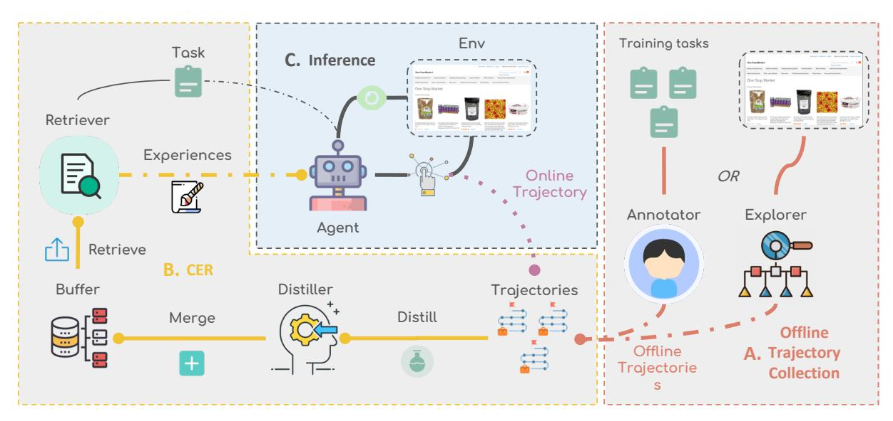
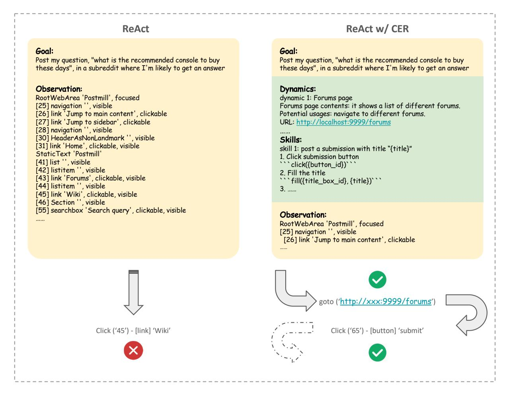

# Contextual Experience Replay for Continual Learning of Language Agents

Yitao Liu ♡♠ \* Chenglei Si ♢ Karthik Narasimhan ♡ Shunyu Yao ♡ ♡Princeton University ♠The University of Hong Kong ♢Stanford University lyitao17@gmail.com

## Abstract

Large language model (LLM) agents have been applied to sequential decision-making tasks such as web navigation, but without any environment-specific experiences, they often fail in these complex tasks. Moreover, current LLM agents are not designed to continually learn from past experiences during inference time, which could be crucial for them to gain these environment-specific experiences. To address this, we propose Contextual Experience Replay (CER), a training-free framework to enable efficient continual learning for language agents in their context window. Specifically, CER accumulates and synthesizes past experiences into a dynamic memory buffer. These experiences encompass environment dynamics and common decision-making patterns, allowing the agents to retrieve and augment themselves with relevant knowledge in new tasks, enhancing their adaptability in complex environments. We evaluate CER on the challenging WEBARENA and VISUALWEBARENA benchmarks. On VISUALWEBARENA, CER surpasses the tree search method with much fewer token costs and achieves state-of-the-art performance of 31.9%. On WEBARENA, CER also gets a competitive average success rate of 36.7%, relatively improving the success rate of the GPT-4o agent baseline by 51.0%. We also conduct a comprehensive analysis on it to prove its validity and understand it better.

#### 1 Introduction

Building an autonomous agent that can help with people's daily tasks has been a long-standing goal of artificial intelligence research [\(Russell and](#page-10-0) [Norvig,](#page-10-0) [1995;](#page-10-0) [Franklin and Graesser,](#page-9-0) [1996\)](#page-9-0). Recently, large language models [\(Achiam et al.,](#page-8-0) [2023;](#page-8-0) [Anthropic,](#page-8-1) [2024;](#page-8-1) [Gemini Team,](#page-9-1) [2023\)](#page-9-1) have shown impressive performance in text [\(Hendrycks et al.,](#page-10-1) [2021\)](#page-10-1) and code generation [\(Chen et al.,](#page-8-2) [2021;](#page-8-2) [Xie](#page-11-0)

[et al.,](#page-11-0) [2024a\)](#page-11-0), reasoning [\(Wei et al.,](#page-11-1) [2022;](#page-11-1) [Yao](#page-11-2) [et al.,](#page-11-2) [2023a\)](#page-11-2), and decision-making tasks [\(Yao et al.,](#page-11-3) [2023b;](#page-11-3) [Zhou et al.,](#page-11-4) [2024a;](#page-11-4) [Xu et al.,](#page-11-5) [2023;](#page-11-5) [Xie](#page-11-6) [et al.,](#page-11-6) [2024b\)](#page-11-6), which paves the way for building an agent to automate computer tasks. On two realistic web navigation benchmarks, WEBARENA [\(Zhou et al.,](#page-11-7) [2024b\)](#page-11-7) and VISUALWEBARENA [\(Koh](#page-10-2) [et al.,](#page-10-2) [2024a\)](#page-10-2), humans can achieve success rates of 78.24% and 88.70%, correspondingly. However, the current methods, with the most frontier models, can only achieve a success rate of around or less 20% without human involvement.

One important reason is the lack of prior knowledge of each environment, which is critical for such difficult multi-step task solving in the complex web environment. While training in each specific environment is costly, current language agents seldom have an efficient way to continually learn about the environment, so they need to explore the environment from scratch for every single task [\(Koh et al.,](#page-10-3) [2024b\)](#page-10-3).

In this work, we propose Contextual Experience Replay (CER), a simple and effective framework to enable the continual learning of language agents in complex environments. CER is loosely inspired by experience replay [\(Schaul et al.,](#page-10-4) [2016;](#page-10-4) [Rolnick](#page-10-5) [et al.,](#page-10-5) [2019\)](#page-10-5), an important algorithm in reinforcement learning which highlights storing past trajectories into a buffer and training the agent with these data.

Our approach allows agents to distill experience from trajectories, including environment dynamics and common decision-making patterns, from past trajectories, store them into a dynamic memory, retrieve them with the current task, and replay them in context when solving new tasks. Fig[.1](#page-1-0) shows how CER works under different settings. Online, offline, and hybrid settings are divided by the source of trajectories, i.e., the time to get the trajectories. As in Fig[.1,](#page-1-0) in the online setting, the agent will start from the inference stage (C) without

<sup>\*</sup>[Work mainly done at Princeton University.](#page-11-0)

<span id="page-1-0"></span>

Figure 1: Overview of Contextual Experience Replay including offline and online settings. (1) In the online setting, it will start from stage C and loop between stage C and B for each task, i.e. solve task i, learn experiences from it and solve task i + 1 with previous experiences, and so on. (2) In the offline setting, stage A is needed to get offline trajectories, then it goes from stage B to C and finally stays in stage C, i.e., learns experiences from offline trajectories and solves all tasks. (3) In the hybrid setting, it will begin from stage A and loop between B and C, conducting both offline and online learning.

any experience. After completing a task, CER gets the (online) trajectory from it, distills experiences from the trajectories, and merges it into the buffer. During the inference of the next task, the agent will be augmented with retrieved helpful experiences and so on. In the offline setting, a set of trajectories will be collected in advance (stage A), distilled into experiences, and stored. Then, the agent will solve tasks on the test set with retrieved experience from the fixed buffer. The hybrid setting is the combination of these two, i.e., going through the offline learning stage before online learning. Fig. [2](#page-3-0) also shows how the experience is utilized by the agent with an example.

We evaluated CER on two realistic web benchmarks WEBARENA [\(Zhou et al.,](#page-11-7) [2024b\)](#page-11-7) and VISU-ALWEBARENA [\(Koh et al.,](#page-10-2) [2024a\)](#page-10-2). CER improves the GPT-4o baseline by a large margin and achieves competitive results on these two benchmarks while orthogonal with most other methods. On WE-BARENA, CER shows a relative improvement of 51.0% over the GPT-4o baseline and achieves an overall success rate of 36.7%, competitive with other state-of-the-art (SOTA) methods. On VISU-ALWEBARENA, CER outperforms the tree searchbased method by 20.8% in relative performance with dozens of times fewer token costs and achieves a SOTA success rate of 31.9%.

We conducted further analysis to investigate the

improvements of CER with various metrics, such as cross-template success rate, stability (preservation of old knowledge), and plasticity (acquisition of new knowledge) [\(Grossberg,](#page-10-6) [1982;](#page-10-6) [Rolnick](#page-10-5) [et al.,](#page-10-5) [2019\)](#page-10-5) ([§5.1,](#page-6-0) [§5.2\)](#page-6-1), demonstrating its generalizability and effectiveness as a continual learning system. Also, we show that through the combination with a sampling-based method, CER pushes the boundary forward again, showing its compatibility with other methods ([§5.4\)](#page-7-0).

In summary, our contributions are as follows:

- We propose a simple but effective continual learning framework for language agents: CER. CER distills fine-grained skills and environment dynamics from both successful and failed trajectories. Importantly, it works for offline, online, and hybrid settings.
- CER shows state-of-the-art performance on multimodal web navigation tasks. It also shows excellent stability and plasticity [\(Gross](#page-10-6)[berg,](#page-10-6) [1982;](#page-10-6) [Rolnick et al.,](#page-10-5) [2019\)](#page-10-5), as well as good synergy with other off-the-shelf methods.
- We do a comprehensive analysis on CER to prove its validity and understand the improvements better.

## 2 Related work

LLM Agents The increasing capabilities of LLMs have enabled new applications where agents built with LLMs can take action and interact with external environments. To enable actiontaking, methods like ReAct [\(Yao et al.,](#page-11-3) [2023b\)](#page-11-3) prompt LLMs to interleave actions and reasoning in the output. Apart from action-taking, planning and search is also an important component for agents. Methods like Reflexion [\(Shinn et al.,](#page-10-7) [2023\)](#page-10-7), Self-Refine [\(Madaan et al.,](#page-10-8) [2023\)](#page-10-8), Tree-of-Thought [\(Yao et al.,](#page-11-2) [2023a\)](#page-11-2), and Tree Search [\(Koh](#page-10-3) [et al.,](#page-10-3) [2024b\)](#page-10-3) [\(Zhou et al.,](#page-11-4) [2024a\)](#page-11-4) enable LLMs to revise their reasoning and perform deliberate search among their action space.

Web Agent Environments LLM agents are increasingly being employed to perform various digital tasks on behalf of humans, with interacting with websites being a common application area supported by numerous benchmarks. For instance, WebShop [\(Yao et al.,](#page-11-8) [2022\)](#page-11-8) tasks agents with identifying products that meet specific user requirements by interacting with e-commerce platforms. Extensions such as WebArena [\(Zhou et al.,](#page-11-7) [2024b\)](#page-11-7) and Mind2Web [\(Deng et al.,](#page-8-3) [2023\)](#page-8-3) have broadened the scope of tasks to include a wider variety of websites and more realistic applications, encompassing activities like trip booking, information retrieval, website navigation, and social media management. VisualWebArena [\(Koh et al.,](#page-10-2) [2024a\)](#page-10-2) designs challenging multimodal web navigation tasks that require agents to leverage visual grounding and understand image inputs. Among these benchmarks, WebArena and VisualWebArena provide the most realistic, controllable, and interactable environments, which makes the tasks more challenging and the results reproducible. The interactive characteristics are also beneficial for our continual learning paradigm.

#### Learning from Memory or Past Experiences

Some previous works have investigated the storage of memories of past agent trajectories. Generative agents [\(Park et al.,](#page-10-9) [2023\)](#page-10-9) use similar strategies to investigate human behaviors with such a humanlike strategy. Voyager [\(Wang et al.,](#page-11-9) [2024a\)](#page-11-9) enables the agent to learn diverse skills in Minecraft.

Similarly, frameworks such as ExpeL [\(Zhao](#page-11-10) [et al.,](#page-11-10) [2023\)](#page-11-10) and Synapse [\(Zheng et al.,](#page-11-11) [2023\)](#page-11-11) leverage stored past task trajectories as memory, which are dynamically retrieved to support task execu-

tion. However, they either test on relatively simple web environments [\(Yao et al.,](#page-11-8) [2022\)](#page-11-8) or use raw and long observation-action pairs as exemplars directly, which limits their applicability to more complex environments. Besides, AutoGuide [\(Fu et al.,](#page-9-2) [2024\)](#page-9-2), AutoManual [\(Chen et al.,](#page-8-4) [2024\)](#page-8-4) and Agent Workflow Memory [\(Wang et al.,](#page-11-12) [2024b\)](#page-11-12) apply similar ideas. However, their mechanism requires them to obtain the ground truth reward before they can function, which significantly limits their applicability. Also, their mechanisms are relatively simple and not designed for continual learning in real-world scenarios. For example, Agent Workflow Memory does not have a retrieval module and updates the whole workflow memory in a rewriting style. In our work, we construct a well-designed, efficient, and scalable continual learning framework for autonomous language agents and test it in two challenging and realistic web environments. The experiences contain both environment dynamics and decision-making patterns. We also investigate it both qualitatively and quantitatively and demonstrate its advantage in terms of applicability in different learning paradigms and compatibility with other agent methods.

## 3 CER: Contextual Experience Replay

Consider a general setup for a language agent A, powered by a language model M with a context window C, to solve a sequential decision-making task in an environment. CER includes four separate modules: distillation module D, retrieval module R, dynamic experience buffer ϵ and the base decision-making agent itself A as shows in Fig[.1.](#page-1-0) CER can start working given a arbitrary set of trajectories T = {τ1, τ2, . . . , τn}. All modules here are implemented by prompting a visual language model (VLM), i.e. GPT-4o in our implementation. Details of prompts for each module can be found in [A.1.](#page-11-13)

#### 3.1 Distill experiences from trajectories

Given a trajectory set T, the distillation module will distill experiences E = {E1, E2, . . . , En} from them one by one where E<sup>i</sup> = (D<sup>i</sup> , Si). D<sup>i</sup> stands for environment dynamics, or dynamics in short, and S<sup>i</sup> represents useful decision-making patterns, or skills in short. The dynamics provide useful state information to help the agent make state-aware decisions or directly navigate to the state through its URL. These skills provide common decision-

<span id="page-3-0"></span>

Figure 2: Compare ReAct baseline with ReAct + CER. The experiences, including dynamics and skills, are obtained through multiple modules as in Fig[.1.](#page-1-0) They are "replayed" in the context window of the model, helping the agent to make correct decisions. For simplicity, the thinking process is neglected in the figure.

making patterns, inspiring agents to take better action. Fig. [2](#page-3-0) provides an example for them. We use two separate modules for the distillation of dynamics and skills due to their different characteristics. The detailed prompts are available in [A.1.](#page-11-13) The output format is similar to ReAct [\(Yao et al.,](#page-11-3) [2023b\)](#page-11-3), asking the model to issue a think action before outputting each distillation. The dynamics distillation module will distill a list of summaries of different web pages, their corresponding URL, and inferred possible usages. The skill distillation module is instructed to summarize a list of useful skills. Each of them includes a brief overall summary (e.g. Navigate to forum {forum name}) and the corresponding detailed step-by-step guidelines. Specifically, the guideline contains both natural language summaries and concrete action examples for each step, as the example in Fig. [2.](#page-3-0) While the natural language summaries provide flexible and general high-level instruction, the example helps the agent to understand the step and also format

its output better. The model is required to output the final distillation in an abstract and general way, i.e. navigate to forum {forum name} instead of navigate to forum "books", to ensure that the experiences can be broadly applied. The model is also provided with existing experiences in the buffer to avoid repetitive distillation, allowing the continual accumulation of the experiences across time.

#### 3.2 Retrieve experiences from buffer

After the distillation period, the buffer ϵ now includes a set of useful experiences E = {E1, E2, . . . , En}. Similar to the distillation module, we designed two separate modules to retrieve dynamics and skills correspondingly. Each module is implemented by prompting a VLM. We prompt the model with general instructions, the current task goal, the website descriptions, and all dynamics or skills available in the buffer. Then, the model will output the top-k useful and informative experiences and pass this to the language agent. The

prompts can be found in A.1. This module makes it possible for the distillation module to continuously merge new experiences and help the agent filter out useful experiences for the current task.

# 3.3 Decision-making with Contextual experience replay

To best utilize the in-context learning capability of language models, we transform the selected k experiences  $\mathbb{E}=\{E_1,E_2,\ldots,E_k\}$  into natural language experience descriptions  $E_{NL}=f(\mathbb{E})$  through a programmatic mapping f and integrate them into the model's context C, resulting in a new augmented context  $C'=g(C,E_{NL})$ . Therefore, the decision-making policy underneath will be influenced by the additional experiences, and the agent A can issue better actions with reference to the experiences. The context comparison between the baseline agent and CER is shown in Fig.2.

#### 3.4 Combination of offline and online learning

The source of the trajectories to learn from is important for CER. Depending on the source of trajectory data, CER can be divided into offline, online, and hybrid versions. Online data is collected from past task-solving trajectories in the environment during inference time. Specifically, in the online setting, there are no trajectories provided at the very beginning, but as the procedure goes on, there will be self-generated trajectories from past tasks. CER will run the distillation module after each task and run the retrieval and replay module in the next task. Different from an online setting, offline learning means there is a training set of trajectories at the beginning for CER to learn from but no further learning during inference. Additionally, these two settings can be combined to serve as a whole system, i.e., learn from a fixed training set first and then self-evolve in the environment with self-generated data.

#### 4 Experiments

We evaluate CER on the full set of WEBARENA (Zhou et al., 2024b) (WA) in offline, online, and hybrid settings. For VISUALWEBARENA (Koh et al., 2024a) (VWA), we only evaluate in an online setting for cost consideration. The reason we chose these two is that they provide interactive, realistic, and reproducible web environments that are better for applying continual learning and still close to real-world scenarios. WEBARENA have 812 tasks

across five different websites corresponding to different domains: shopping, shopping administration, online forum, map, and project collaboration (Gitlab). VISUALWEBARENA retains the shopping and forum website, adds another classifieds website, and designs 910 tasks on top of them. Although they share two websites, the focus of their tasks is different. Most of the tasks in WEBARENA only have text descriptions of task goals, while a large portion of tasks in VISUALWEBARENA involve visual input as part of task goals and require an understanding of the visual information of the current website. This also leads to their large variations of task types.

#### 4.1 Implementation Details

#### <span id="page-4-0"></span>4.1.1 WebArena

For WEBARENA, we evaluate all three settings of CER: offline, online and hybrid. In the offline setting, for training tasks, we first ask individuals unfamiliar with WEBARENA to navigate the website for three hours and design a few tasks they consider important. A filtering process is then applied to ensure that these tasks do not overlap with the test set. Finally, these tasks are annotated by humans to obtain gold trajectories for offline learning. The final tasks are listed in A.4. The data can also be annotated automatically by an LLM explorer. We discussed and compared these two offline data sources in A.6. We use GPT-4o-2024-0513 as the backbone language model with a temperature of 0.1. We use BrowserGym (Drouin et al., 2024) as the environment, which provides both text and visual observation for the agent and adds additional information for clickable and visible elements in the accessibility tree of the webpage. To fairly highlight the improvement of CER, we run GPT-40 w/ BrowserGym (Drouin et al., 2024) by ourselves as the baseline for comparison. CER is compatible with most off-the-shelf language model agents since it only needs the past trajectories. Here, we test it with a simple method by prompting GPT-40 directly and using ReAct (Yao et al., 2023b) as the output format as in BrowserGym (Drouin et al., 2024) and WEBARENA (Zhou et al., 2024b). We also combine it with another performant method and observe significant improvements(§5.4). We set the retrieval parameter to  $k_d = 5$  and  $k_s = 5$ , denoting the maximum number of dynamics/skills to retrieve and replay.

<span id="page-5-0"></span>Table 1: Success rates (SR) of published open-source methods and CER up to the completion of this work on WEBARENA, Bold represents the best result on the website while underline means the second best results. The results originate from the corresponding papers except BrowserGym which we reproduce the GPT-4o version by ourselves. \*: SteP [\(Sodhi et al.,](#page-11-15) [2024\)](#page-11-15) uses human-designed detailed policies for each website, so it is not comparable with other autonomous methods without human involvement and we set it apart just for references.

| Method                           | Shopping | CMS  | Forum | Gitlab | Map  | Average |
|----------------------------------|----------|------|-------|--------|------|---------|
| SteP* (Sodhi et al., 2024)       | 37.0     | 24.0 | 59.0  | 32.0   | 30.0 | 33.0    |
| WebArena (Zhou et al., 2024b)    | 24.0     | 11.0 | 7.9   | 10.2   | 21.1 | 15.0    |
| AutoEval (Pan et al., 2024)      | 25.5     | 18.1 | 25.4  | 28.6   | 31.9 | 20.2    |
| BrowserGym (Drouin et al., 2024) | 26.6     | 28   | 22.8  | 21.4   | 18.4 | 24.3    |
| CERof f line                     | 29.2     | 36.8 | 33.3  | 36.7   | 29.5 | 33.4    |
| CERonline                        | 29.2     | 36.3 | 37.7  | 34.2   | 28.6 | 33.2    |
| CERhybrid                        | 32.8     | 41.2 | 41.2  | 37.2   | 30.4 | 36.7    |

<span id="page-5-1"></span>Table 2: Success rates (SR) of published open-source methods and CER on VISUALWEBARENA, Bold represents the best result in the domain. Results are from the corresponding papers except BrowserGym. We implement the agent with BrowserGym by ourselves. Due to cost consideration, we evaluate CERonline only on VISUALWEBARENA

| Method                             | Classifieds | Shopping | Forum | Average |
|------------------------------------|-------------|----------|-------|---------|
| VisualWebArena (Koh et al., 2024a) | 18.4        | 20.0     | 17.1  | 18.9    |
| BrowserGym (Drouin et al., 2024)   | 26.2        | 28.2     | 21.1  | 26.2    |
| Tree Search (Koh et al., 2024b)    | 26.5        | 29.0     | 20.5  | 26.4    |
| CERonline                          | 27.0        | 38.1     | 24.4  | 31.9    |

#### 4.1.2 VisualWebArena

For VISUALWEBARENA, similar to WEBARENA, we still use BrowserGym [\(Drouin et al.,](#page-9-3) [2024\)](#page-9-3) as our environment. Since BrowserGym does not support visual evaluation, we implemented the environment by ourselves and built CER on top of that. We also run BrowserGym results as the baseline for comparison. Using the same setting as [\(Koh](#page-10-2) [et al.,](#page-10-2) [2024a\)](#page-10-2), we apply Set-of-Marks (SoM) [\(Yang](#page-11-16) [et al.,](#page-11-16) [2023\)](#page-11-16) to the original screenshot of the webpage. This method marks each interactable element of the webpage with a highlighted bounding box and the corresponding unique element ID on the corner of the box to enable grounding. Besides the screenshot, the agent is also provided with text observation of the environment for better grounding, where the ID of each element is consistent with the one in the SoM-processed screenshot.

## 4.2 Results

Our results on these two benchmarks are summarized in Table [1](#page-5-0) and Table [2.](#page-5-1) On WEBARENA and VISUALWEBARENA, while orthogonal to the other methods, CER achieves state-of-the-art performance and improves the baseline agent, GPT-4o w/ BrowserGym [\(Drouin et al.,](#page-9-3) [2024\)](#page-9-3), relatively by 51.0% (CERhybrid) and 21.8% (CERonline) respectively. It should be noted that SteP [\(Sodhi et al.,](#page-11-15) [2024\)](#page-11-15) uses human-designed policies, i.e., step-bystep instructions for each website split, and can need much extra human effort when encountering new cases or on new websites. So we do not consider it when comparing CER with other methods. On VISUALWEBARENA, CER achieves SOTA performance and outperforms the tree search method [\(Koh et al.,](#page-10-3) [2024b\)](#page-10-3), which is also built on GPT-4o, with much lower token costs. The result of the tree search is obtained through a search algorithm that uses 20 times sampling at each step, and a maximum of 5 steps, with extra costs of GPT-4o used as

a value function. In our implementation, we use a maximum of only 30 steps for each task, similar to the setting in [\(Zhou et al.,](#page-11-7) [2024b\)](#page-11-7) and [\(Koh et al.,](#page-10-2) [2024a\)](#page-10-2), thus using at least 3 times fewer tokens.

## 5 Analysis

In this section, we conduct extensive analysis to investigate and better understand CER's improvements through cross-template success rates and two interesting metrics for continual learning systems: stability and plasticity. Finally, we validate its compatibility and synergy with other performant methods, proving its wide applicability.

## <span id="page-6-0"></span>5.1 Investigating improvements of CER

In this section, we try to understand where the improvements of CER come from and get some intuitions about how CER works.

Intuitively, the state space and action space for the current step are extremely large. However, for human users, the states that we often navigate to and the actions that we usually take are only a small subset of the whole space. Experiences distilled from some goal-oriented trajectories tend to contain some informative and effective states and actions that are often navigated to or used. With the highlighted promising states, actions, and decision-making patterns, the agent can issue a correct action much more easily. Of course, some of the experiences can be noisy and misleading. We show in section [5.5](#page-7-1) that CER is still robust to the correctness of the trajectories. This intuition also aligns with the Recognition Primed Decision making Model proposed by [\(Klein,](#page-10-11) [1998\)](#page-10-11), where humans tend to recognize promising actions when encountering complex environments.

We also conduct quantitative comparisons between CER and baseline method to investigate the improvements. The tasks in WEBARENA are designed based on templates, and at most, five tasks share the same template. If the agent just memorizes the pattern of the whole task, it will be able to solve some other tasks in the same template more easily, thus improving the overall performance. So, we use the cross-template average success rate, calculated by the number of templates solved (at least one task is solved) divided by the total number of templates. We run experiments on Forum tasks of WEBARENA. The results are shown in Table [3.](#page-6-2) CER shows a significant improvement in crosstemplate success rates. This result validates that the

<span id="page-6-2"></span>Table 3: Cross-template success rates (ct-SR), stability and plasticity of CER and baseline on the Forum split of WEBARENA

| Method   | ct-SR | Stability (%) | Plasticity (%) |
|----------|-------|---------------|----------------|
| Baseline | 44.7  | 100           | 100            |
| CER      | 60.0  | 93            | 141            |

improvement of CER does not come from memorizing the whole trajectory of a task. Instead, it distills more fine-grained experiences, which allows for the generalization of different types of tasks.

## <span id="page-6-1"></span>5.2 Stability and Plasticity

A well-designed continual learning system should demonstrate both stability (preservation of old knowledge) and plasticity (acquisition of new knowledge) [\(Grossberg,](#page-10-6) [1982;](#page-10-6) [Rolnick et al.,](#page-10-5) [2019\)](#page-10-5). Since knowledge is hard to measure in our case, we measure the acquisition of new knowledge through problem-solving ability, i.e., success rates, in a specific environment. Therefore, we similarly measure the stability and plasticity of CER in crosstemplate success rate (ct-SR) since the success in new types of task demonstrates new problemsolving ability. Specifically, stability is measured through the percentage of tasks from the baseline that CER is able to solve, which reflects how well CER maintains the original capability of the baseline. Plasticity is measured by the improvement of CER on new cases, measuring how many additional tasks CER can solve compared to the baseline. Since CER can be understood as a continual learning system built on the baseline method agent. We set the stability and plasticity of the baseline to 100% and used the ct-SR to calculate the stability and plasticity of CER. The results are also shown in Table [3.](#page-6-2) With most of the original abilities retained, CER demonstrates 41% new problem types solved, proving the validity of CER as a continual learning framework. This also indicates the potential of the compatibility with other performant methods, which we discuss in detail in section [5.4.](#page-7-0)

## 5.3 Validity on open-source models

We also evaluate CER on a weaker open-source model: Llama-3.1-70B [\(Grattafiori et al.,](#page-9-4) [2024\)](#page-9-4). We evaluate the ReAct baseline and CER on Gitlab split (the largest split on WEBARENA). As

<span id="page-7-2"></span>Table 4: Comparison of success rates (SR) of ReAct and ReAct w/ CER with Llama-3.1-70B on the Gitlab split of WEBARENA

| Method           | SR   |
|------------------|------|
| Baseline (ReAct) | 17.3 |
| CERhybrid        | 22.0 |

shown in Fig. [4,](#page-7-2) CER still improves the baseline relatively by 26.53%, proving its validity on weaker open-source models. However, the improvement is smaller than it is with strong models like GPT-4o. We also analyzed the results and found that weaker models like llama3.1 do worse compared with GPT-4o at formatting their output when solving challenging tasks like WEBARENA with a larger action space. This also influence their robustness when distilling some multi-step, useful and well-formatted skills, which explains why the improvement is relatively smaller than it does on strong models like GPT-4o.

#### <span id="page-7-0"></span>5.4 Synergy with performant methods

We also analyze the compatibility of CER with other performant methods. Tree search [\(Koh et al.,](#page-10-3) [2024b\)](#page-10-3) is a computing-intensive method with more explorations and backtracking to search for better action to take. However, due to the high costs and the long time it takes, we chose another comparable method of it: trajectory sampling and reranking. We sampled 3 times for each task with max steps of 20 and prompted a language model with the trajectories to give a score and select the trajectory with the highest score as the final one. The procedure of applying CER to such method is similar to what we do with baseline agent. We conduct experiments in an online setting on the Forums split of WEBARENA. The results are in Table [5.](#page-7-3) CER with sampling method improves CER w/ ReAct performance by a relative success rate increase of 39.5%. This is because, firstly, such performant methods generally have better precision from start to end, so the experiences distilled from them are of higher quality. Additionally, high-quality experiences make performant methods more robust through the learned experiences and provide environment-specific knowledge to help better decision-making.

<span id="page-7-3"></span>Table 5: Comparison of success rates (SR) of CER and CER w/ trajectory sampling and reranking on the Forum split of WEBARENA

| Method          | SR   |
|-----------------|------|
| CER             | 37.7 |
| Sampling        | 43.1 |
| CER w/ sampling | 52.6 |

<span id="page-7-4"></span>Table 6: Success rates (SR) of CER and CERsuccess on WEBARENA. CERsuccess uses ground truth evaluators from the environment to filter out and learn from successful experiences only. Both method takes text observation for comparison

| Method     | Average |
|------------|---------|
| CER        | 31.4    |
| CERsuccess | 33.5    |

## <span id="page-7-1"></span>5.5 Access to ground truth rewards

Currently, CER distills experiences from both successful and failed cases. To investigate whether the distillation from failed cases is a bottleneck of CER, we run CER for only successful trajectories evaluated by ground truth evaluators. We conduct the experiments on the full set of WEBARENA. The results are summarized in Table [6.](#page-7-4) The results show that CER performs better with the access to ground truth reward. The possible reason could be that the successful trajectories have higher quality and are more informative, while the failed trajectories provide some misleading action sequences that will negatively influence the agent's decision-making.

Nevertheless, the acceptable gap and significant improvements over the baseline agent show the robustness of CER given noisy trajectories. This gives credit to the implicit reasoning ability and the flexible natural language representation of experiences. Although provided with a few noisy experiences, the agent can still filter out useful trajectories and issue reasonable action mostly.

#### 6 Conclusions

In this paper, we proposed a training-free framework for efficient and effective continual learning of language agents in complex web environments. Our framework enables language agents to learn from past experiences and replay during inference

time for better decision-making. We also conduct extensive analysis to investigate its improvements and validate its effectiveness as a continual learning system through stability and plasticity. We believe that learning from past experiences is crucial for building a helpful computer agent that can adapt to different environments and evolve autonomously.

## 7 Limitations

Despite the substantial progress achieved with CER, there are several limitations that will influence its applicability and could be addressed in future work. First, table [1](#page-5-0) shows that although CER performs even better in offline + online settings, it requires the trajectories to be goal-oriented to distill high-quality experiences. The performance is limited if trajectories from random explorations are provided. The more fine-grained utilization of low-quality trajectories could be explored in the future. Secondly, the environment dynamics help much in web environments, as shown in section [A.5,](#page-13-1) partially because the agent can directly navigate to a specific page with its URL. It would be interesting to investigate how we can utilize the environment dynamics in other agent tasks, such as real-world navigation [\(Shridhar et al.,](#page-11-17) [2021\)](#page-11-17) in future work.

## 8 Ethical and Broader Impacts

## 8.1 Real World Impacts

Advancing the capabilities of autonomous agents comes with many broader considerations and ethical implications. Strong autonomous agents have the potential to improve the accessibility of computer-based tasks, potentially aiding individuals with disabilities or those lacking technical skills. More broadly, agents have the potential to automate large portions of routine computer work. While the capabilities of existing autonomous agents are insufficient for even simple tasks (as shown in this paper), these impacts highlight the need to ensure that the broader economic and social implications on employment are carefully considered if/when autonomous agents are deployed in real world applications.

### 8.2 Bias and Safety

When developing autonomous agents, it is also imperative to ensure that these agents do not inadvertently exclude or disadvantage any group. Further analysis is essential to ensure that deployed

agents do not exhibit unintended biases. Agents also have the potential to cause more harm (than regular LLMs) in real world applications if careful safeguards are not in place. Further research is necessary to understand and mitigate possible harmful behaviors.

#### 8.3 Intended Uses

Our method is based on WEBARENA and VISU-ALWEBARENA which are research benchmarks to measure and evaluate the progress of multimodal agents. The models and methods we presented in this paper are research prototypes, and not intended for deployment in practical applications in their current state (especially in high risk domains).

## References

- <span id="page-8-0"></span>J. Achiam, S. Adler, S. Agarwal, L. Ahmad, I. Akkaya, F. L. Aleman, D. Almeida, J. Altenschmidt, S. Altman, S. Anadkat, et al. 2023. Gpt-4 technical report. *arXiv preprint arXiv:2303.08774*.
- <span id="page-8-1"></span>A. Anthropic. 2024. The claude 3 model family: Opus, sonnet, haiku. *Claude-3 Model Card*, 1.

<span id="page-8-2"></span>Mark Chen, Jerry Tworek, Heewoo Jun, Qiming Yuan, Henrique Ponde de Oliveira Pinto, Jared Kaplan, Harri Edwards, Yuri Burda, Nicholas Joseph, Greg Brockman, Alex Ray, Raul Puri, Gretchen Krueger, Michael Petrov, Heidy Khlaaf, Girish Sastry, Pamela Mishkin, Brooke Chan, Scott Gray, Nick Ryder, Mikhail Pavlov, Alethea Power, Lukasz Kaiser, Mohammad Bavarian, Clemens Winter, Philippe Tillet, Felipe Petroski Such, Dave Cummings, Matthias Plappert, Fotios Chantzis, Elizabeth Barnes, Ariel Herbert-Voss, William Hebgen Guss, Alex Nichol, Alex Paino, Nikolas Tezak, Jie Tang, Igor Babuschkin, Suchir Balaji, Shantanu Jain, William Saunders, Christopher Hesse, Andrew N. Carr, Jan Leike, Josh Achiam, Vedant Misra, Evan Morikawa, Alec Radford, Matthew Knight, Miles Brundage, Mira Murati, Katie Mayer, Peter Welinder, Bob McGrew, Dario Amodei, Sam McCandlish, Ilya Sutskever, and Wojciech Zaremba. 2021. [Evaluat](https://arxiv.org/abs/2107.03374)[ing large language models trained on code.](https://arxiv.org/abs/2107.03374) *Preprint*, arXiv:2107.03374.

<span id="page-8-4"></span>Minghao Chen, Yihang Li, Yanting Yang, Shiyu Yu, Binbin Lin, and Xiaofei He. 2024. [Automanual:](https://openreview.net/forum?id=Pwl9n4zlf5) [Generating instruction manuals by LLM agents via](https://openreview.net/forum?id=Pwl9n4zlf5) [interactive environmental learning.](https://openreview.net/forum?id=Pwl9n4zlf5) In *The Thirtyeighth Annual Conference on Neural Information Processing Systems*.

<span id="page-8-3"></span>Xiang Deng, Yu Gu, Boyuan Zheng, Shijie Chen, Samuel Stevens, Boshi Wang, Huan Sun, and Yu Su. 2023. Mind2web: Towards a generalist agent for the web. *Advances in neural information processing systems, Datasets and Benchmarks Track*, 36.

<span id="page-9-3"></span>Alexandre Drouin, Maxime Gasse, Massimo Caccia, Issam H. Laradji, Manuel Del Verme, Tom Marty, Léo Boisvert, Megh Thakkar, Quentin Cappart, David Vazquez, Nicolas Chapados, and Alexandre Lacoste. 2024. Workarena: How capable are web agents at solving common knowledge work tasks? *International Conference on Machine Learning*.

<span id="page-9-0"></span>Stan Franklin and Art Graesser. 1996. Is it an agent, or just a program? a taxonomy for autonomous agents. In *International Workshop on Agent Theories, Architectures, and Languages*, pages 21–35. Springer.

<span id="page-9-2"></span>Yao Fu, Dong-Ki Kim, Jaekyeom Kim, Sungryull Sohn, Lajanugen Logeswaran, Kyunghoon Bae, and Honglak Lee. 2024. [Autoguide: Automated gener](https://openreview.net/forum?id=Zu1MihB661)[ation and selection of context-aware guidelines for](https://openreview.net/forum?id=Zu1MihB661) [large language model agents.](https://openreview.net/forum?id=Zu1MihB661) In *ICML 2024 Workshop on LLMs and Cognition*.

<span id="page-9-1"></span>Google Gemini Team. 2023. Gemini: A family of highly capable multimodal models. *arXiv preprint arXiv:2312.11805*.

<span id="page-9-4"></span>Aaron Grattafiori, Abhimanyu Dubey, Abhinav Jauhri, Abhinav Pandey, Abhishek Kadian, Ahmad Al-Dahle, Aiesha Letman, Akhil Mathur, Alan Schelten, Alex Vaughan, Amy Yang, Angela Fan, Anirudh Goyal, Anthony Hartshorn, Aobo Yang, Archi Mitra, Archie Sravankumar, Artem Korenev, Arthur Hinsvark, Arun Rao, Aston Zhang, Aurelien Rodriguez, Austen Gregerson, Ava Spataru, Baptiste Roziere, Bethany Biron, Binh Tang, Bobbie Chern, Charlotte Caucheteux, Chaya Nayak, Chloe Bi, Chris Marra, Chris McConnell, Christian Keller, Christophe Touret, Chunyang Wu, Corinne Wong, Cristian Canton Ferrer, Cyrus Nikolaidis, Damien Allonsius, Daniel Song, Danielle Pintz, Danny Livshits, Danny Wyatt, David Esiobu, Dhruv Choudhary, Dhruv Mahajan, Diego Garcia-Olano, Diego Perino, Dieuwke Hupkes, Egor Lakomkin, Ehab AlBadawy, Elina Lobanova, Emily Dinan, Eric Michael Smith, Filip Radenovic, Francisco Guzmán, Frank Zhang, Gabriel Synnaeve, Gabrielle Lee, Georgia Lewis Anderson, Govind Thattai, Graeme Nail, Gregoire Mialon, Guan Pang, Guillem Cucurell, Hailey Nguyen, Hannah Korevaar, Hu Xu, Hugo Touvron, Iliyan Zarov, Imanol Arrieta Ibarra, Isabel Kloumann, Ishan Misra, Ivan Evtimov, Jack Zhang, Jade Copet, Jaewon Lee, Jan Geffert, Jana Vranes, Jason Park, Jay Mahadeokar, Jeet Shah, Jelmer van der Linde, Jennifer Billock, Jenny Hong, Jenya Lee, Jeremy Fu, Jianfeng Chi, Jianyu Huang, Jiawen Liu, Jie Wang, Jiecao Yu, Joanna Bitton, Joe Spisak, Jongsoo Park, Joseph Rocca, Joshua Johnstun, Joshua Saxe, Junteng Jia, Kalyan Vasuden Alwala, Karthik Prasad, Kartikeya Upasani, Kate Plawiak, Ke Li, Kenneth Heafield, Kevin Stone, Khalid El-Arini, Krithika Iyer, Kshitiz Malik, Kuenley Chiu, Kunal Bhalla, Kushal Lakhotia, Lauren Rantala-Yeary, Laurens van der Maaten, Lawrence Chen, Liang Tan, Liz Jenkins, Louis Martin, Lovish Madaan, Lubo Malo, Lukas Blecher, Lukas Landzaat, Luke de Oliveira, Madeline Muzzi, Mahesh Pasupuleti, Mannat Singh, Manohar Paluri, Marcin Kardas, Maria Tsimpoukelli, Mathew

Oldham, Mathieu Rita, Maya Pavlova, Melanie Kambadur, Mike Lewis, Min Si, Mitesh Kumar Singh, Mona Hassan, Naman Goyal, Narjes Torabi, Nikolay Bashlykov, Nikolay Bogoychev, Niladri Chatterji, Ning Zhang, Olivier Duchenne, Onur Çelebi, Patrick Alrassy, Pengchuan Zhang, Pengwei Li, Petar Vasic, Peter Weng, Prajjwal Bhargava, Pratik Dubal, Praveen Krishnan, Punit Singh Koura, Puxin Xu, Qing He, Qingxiao Dong, Ragavan Srinivasan, Raj Ganapathy, Ramon Calderer, Ricardo Silveira Cabral, Robert Stojnic, Roberta Raileanu, Rohan Maheswari, Rohit Girdhar, Rohit Patel, Romain Sauvestre, Ronnie Polidoro, Roshan Sumbaly, Ross Taylor, Ruan Silva, Rui Hou, Rui Wang, Saghar Hosseini, Sahana Chennabasappa, Sanjay Singh, Sean Bell, Seohyun Sonia Kim, Sergey Edunov, Shaoliang Nie, Sharan Narang, Sharath Raparthy, Sheng Shen, Shengye Wan, Shruti Bhosale, Shun Zhang, Simon Vandenhende, Soumya Batra, Spencer Whitman, Sten Sootla, Stephane Collot, Suchin Gururangan, Sydney Borodinsky, Tamar Herman, Tara Fowler, Tarek Sheasha, Thomas Georgiou, Thomas Scialom, Tobias Speckbacher, Todor Mihaylov, Tong Xiao, Ujjwal Karn, Vedanuj Goswami, Vibhor Gupta, Vignesh Ramanathan, Viktor Kerkez, Vincent Gonguet, Virginie Do, Vish Vogeti, Vítor Albiero, Vladan Petrovic, Weiwei Chu, Wenhan Xiong, Wenyin Fu, Whitney Meers, Xavier Martinet, Xiaodong Wang, Xiaofang Wang, Xiaoqing Ellen Tan, Xide Xia, Xinfeng Xie, Xuchao Jia, Xuewei Wang, Yaelle Goldschlag, Yashesh Gaur, Yasmine Babaei, Yi Wen, Yiwen Song, Yuchen Zhang, Yue Li, Yuning Mao, Zacharie Delpierre Coudert, Zheng Yan, Zhengxing Chen, Zoe Papakipos, Aaditya Singh, Aayushi Srivastava, Abha Jain, Adam Kelsey, Adam Shajnfeld, Adithya Gangidi, Adolfo Victoria, Ahuva Goldstand, Ajay Menon, Ajay Sharma, Alex Boesenberg, Alexei Baevski, Allie Feinstein, Amanda Kallet, Amit Sangani, Amos Teo, Anam Yunus, Andrei Lupu, Andres Alvarado, Andrew Caples, Andrew Gu, Andrew Ho, Andrew Poulton, Andrew Ryan, Ankit Ramchandani, Annie Dong, Annie Franco, Anuj Goyal, Aparajita Saraf, Arkabandhu Chowdhury, Ashley Gabriel, Ashwin Bharambe, Assaf Eisenman, Azadeh Yazdan, Beau James, Ben Maurer, Benjamin Leonhardi, Bernie Huang, Beth Loyd, Beto De Paola, Bhargavi Paranjape, Bing Liu, Bo Wu, Boyu Ni, Braden Hancock, Bram Wasti, Brandon Spence, Brani Stojkovic, Brian Gamido, Britt Montalvo, Carl Parker, Carly Burton, Catalina Mejia, Ce Liu, Changhan Wang, Changkyu Kim, Chao Zhou, Chester Hu, Ching-Hsiang Chu, Chris Cai, Chris Tindal, Christoph Feichtenhofer, Cynthia Gao, Damon Civin, Dana Beaty, Daniel Kreymer, Daniel Li, David Adkins, David Xu, Davide Testuggine, Delia David, Devi Parikh, Diana Liskovich, Didem Foss, Dingkang Wang, Duc Le, Dustin Holland, Edward Dowling, Eissa Jamil, Elaine Montgomery, Eleonora Presani, Emily Hahn, Emily Wood, Eric-Tuan Le, Erik Brinkman, Esteban Arcaute, Evan Dunbar, Evan Smothers, Fei Sun, Felix Kreuk, Feng Tian, Filippos Kokkinos, Firat Ozgenel, Francesco Caggioni, Frank Kanayet, Frank Seide, Gabriela Medina Florez, Gabriella Schwarz, Gada Badeer, Georgia Swee, Gil Halpern, Grant

Herman, Grigory Sizov, Guangyi, Zhang, Guna Lakshminarayanan, Hakan Inan, Hamid Shojanazeri, Han Zou, Hannah Wang, Hanwen Zha, Haroun Habeeb, Harrison Rudolph, Helen Suk, Henry Aspegren, Hunter Goldman, Hongyuan Zhan, Ibrahim Damlaj, Igor Molybog, Igor Tufanov, Ilias Leontiadis, Irina-Elena Veliche, Itai Gat, Jake Weissman, James Geboski, James Kohli, Janice Lam, Japhet Asher, Jean-Baptiste Gaya, Jeff Marcus, Jeff Tang, Jennifer Chan, Jenny Zhen, Jeremy Reizenstein, Jeremy Teboul, Jessica Zhong, Jian Jin, Jingyi Yang, Joe Cummings, Jon Carvill, Jon Shepard, Jonathan Mc-Phie, Jonathan Torres, Josh Ginsburg, Junjie Wang, Kai Wu, Kam Hou U, Karan Saxena, Kartikay Khandelwal, Katayoun Zand, Kathy Matosich, Kaushik Veeraraghavan, Kelly Michelena, Keqian Li, Kiran Jagadeesh, Kun Huang, Kunal Chawla, Kyle Huang, Lailin Chen, Lakshya Garg, Lavender A, Leandro Silva, Lee Bell, Lei Zhang, Liangpeng Guo, Licheng Yu, Liron Moshkovich, Luca Wehrstedt, Madian Khabsa, Manav Avalani, Manish Bhatt, Martynas Mankus, Matan Hasson, Matthew Lennie, Matthias Reso, Maxim Groshev, Maxim Naumov, Maya Lathi, Meghan Keneally, Miao Liu, Michael L. Seltzer, Michal Valko, Michelle Restrepo, Mihir Patel, Mik Vyatskov, Mikayel Samvelyan, Mike Clark, Mike Macey, Mike Wang, Miquel Jubert Hermoso, Mo Metanat, Mohammad Rastegari, Munish Bansal, Nandhini Santhanam, Natascha Parks, Natasha White, Navyata Bawa, Nayan Singhal, Nick Egebo, Nicolas Usunier, Nikhil Mehta, Nikolay Pavlovich Laptev, Ning Dong, Norman Cheng, Oleg Chernoguz, Olivia Hart, Omkar Salpekar, Ozlem Kalinli, Parkin Kent, Parth Parekh, Paul Saab, Pavan Balaji, Pedro Rittner, Philip Bontrager, Pierre Roux, Piotr Dollar, Polina Zvyagina, Prashant Ratanchandani, Pritish Yuvraj, Qian Liang, Rachad Alao, Rachel Rodriguez, Rafi Ayub, Raghotham Murthy, Raghu Nayani, Rahul Mitra, Rangaprabhu Parthasarathy, Raymond Li, Rebekkah Hogan, Robin Battey, Rocky Wang, Russ Howes, Ruty Rinott, Sachin Mehta, Sachin Siby, Sai Jayesh Bondu, Samyak Datta, Sara Chugh, Sara Hunt, Sargun Dhillon, Sasha Sidorov, Satadru Pan, Saurabh Mahajan, Saurabh Verma, Seiji Yamamoto, Sharadh Ramaswamy, Shaun Lindsay, Shaun Lindsay, Sheng Feng, Shenghao Lin, Shengxin Cindy Zha, Shishir Patil, Shiva Shankar, Shuqiang Zhang, Shuqiang Zhang, Sinong Wang, Sneha Agarwal, Soji Sajuyigbe, Soumith Chintala, Stephanie Max, Stephen Chen, Steve Kehoe, Steve Satterfield, Sudarshan Govindaprasad, Sumit Gupta, Summer Deng, Sungmin Cho, Sunny Virk, Suraj Subramanian, Sy Choudhury, Sydney Goldman, Tal Remez, Tamar Glaser, Tamara Best, Thilo Koehler, Thomas Robinson, Tianhe Li, Tianjun Zhang, Tim Matthews, Timothy Chou, Tzook Shaked, Varun Vontimitta, Victoria Ajayi, Victoria Montanez, Vijai Mohan, Vinay Satish Kumar, Vishal Mangla, Vlad Ionescu, Vlad Poenaru, Vlad Tiberiu Mihailescu, Vladimir Ivanov, Wei Li, Wenchen Wang, Wenwen Jiang, Wes Bouaziz, Will Constable, Xiaocheng Tang, Xiaojian Wu, Xiaolan Wang, Xilun Wu, Xinbo Gao, Yaniv Kleinman, Yanjun Chen, Ye Hu, Ye Jia, Ye Qi, Yenda Li, Yilin Zhang, Ying Zhang, Yossi Adi,

- Youngjin Nam, Yu, Wang, Yu Zhao, Yuchen Hao, Yundi Qian, Yunlu Li, Yuzi He, Zach Rait, Zachary DeVito, Zef Rosnbrick, Zhaoduo Wen, Zhenyu Yang, Zhiwei Zhao, and Zhiyu Ma. 2024. [The llama 3 herd](https://arxiv.org/abs/2407.21783) [of models.](https://arxiv.org/abs/2407.21783) *Preprint*, arXiv:2407.21783.
- <span id="page-10-6"></span>Stephen Grossberg. 1982. How does a brain build a cognitive code? In *Studies of Mind and Brain*, pages 1–52. Springer.
- <span id="page-10-1"></span>Dan Hendrycks, Collin Burns, Steven Basart, Andy Zou, Mantas Mazeika, Dawn Song, and Jacob Steinhardt. 2021. [Measuring massive multitask language under](https://openreview.net/forum?id=d7KBjmI3GmQ)[standing.](https://openreview.net/forum?id=d7KBjmI3GmQ) In *International Conference on Learning Representations*.
- <span id="page-10-11"></span>Gary Klein. 1998. *Sources of Power: How People Make Decisions*. MIT Press.
- <span id="page-10-2"></span>Jing Yu Koh, Robert Lo, Lawrence Jang, Vikram Duvvur, Ming Chong Lim, Po-Yu Huang, Graham Neubig, Shuyan Zhou, Ruslan Salakhutdinov, and Daniel Fried. 2024a. Visualwebarena: Evaluating multimodal agents on realistic visual web tasks. *Annual Meeting of the Association for Computational Linguistics*, 62.
- <span id="page-10-3"></span>Jing Yu Koh, Stephen McAleer, Daniel Fried, and Ruslan Salakhutdinov. 2024b. [Tree search for language](https://arxiv.org/abs/2407.01476) [model agents.](https://arxiv.org/abs/2407.01476)
- <span id="page-10-8"></span>Aman Madaan, Niket Tandon, Prakhar Gupta, Skyler Hallinan, Luyu Gao, Sarah Wiegreffe, Uri Alon, Nouha Dziri, Shrimai Prabhumoye, Yiming Yang, Sean Welleck, Bodhisattwa Prasad Majumder, Shashank Gupta, Amir Yazdanbakhsh, and Peter Clark. 2023. Self-refine: Iterative refinement with self-feedback. *ArXiv*, abs/2303.17651.
- <span id="page-10-10"></span>Jiayi Pan, Yichi Zhang, Nicholas Tomlin, Yifei Zhou, Sergey Levine, and Alane Suhr. 2024. Autonomous evaluation and refinement of digital agents. *Conference on Language Modeling*.
- <span id="page-10-9"></span>Joon Sung Park, Joseph C. O'Brien, Carrie J. Cai, Meredith Ringel Morris, Percy Liang, and Michael S. Bernstein. 2023. Generative agents: Interactive simulacra of human behavior. *Proceedings of the 36th Annual ACM Symposium on User Interface Software and Technology*.
- <span id="page-10-5"></span>David Rolnick, Arun Ahuja, Jonathan Schwarz, Timothy P. Lillicrap, and Greg Wayne. 2019. Experience replay for continual learning. *Advances in neural information processing systems*, 32.
- <span id="page-10-0"></span>Stuart J. Russell and Peter Norvig. 1995. *Artificial Intelligence: A Modern Approach*. Prentice Hall.
- <span id="page-10-4"></span>Tom Schaul, John Quan, Ioannis Antonoglou, and David Silver. 2016. Prioritized experience replay. *International Conference on Learning Representations*.
- <span id="page-10-7"></span>Noah Shinn, Federico Cassano, Beck Labash, Ashwin Gopinath, Karthik Narasimhan, and Shunyu Yao. 2023. Reflexion: language agents with verbal reinforcement learning. In *Neural Information Processing Systems*.

- <span id="page-11-17"></span>Mohit Shridhar, Xingdi Yuan, Marc-Alexandre Cote, Yonatan Bisk, Adam Trischler, and Matthew Hausknecht. 2021. [{ALFW}orld: Aligning text and](https://openreview.net/forum?id=0IOX0YcCdTn) [embodied environments for interactive learning.](https://openreview.net/forum?id=0IOX0YcCdTn) In *International Conference on Learning Representations*.
- <span id="page-11-15"></span>Paloma Sodhi, S. R. K. Branavan, Yoav Artzi, and Ryan McDonald. 2024. Step: Stacked llm policies for web actions. *Conference on Language Modeling*.
- <span id="page-11-9"></span>Guanzhi Wang, Yuqi Xie, Yunfan Jiang, Ajay Mandlekar, Chaowei Xiao, Yuke Zhu, Linxi Fan, and Anima Anandkumar. 2024a. [Voyager: An open-ended](https://openreview.net/forum?id=ehfRiF0R3a) [embodied agent with large language models.](https://openreview.net/forum?id=ehfRiF0R3a) *Transactions on Machine Learning Research*.
- <span id="page-11-12"></span>Zora Zhiruo Wang, Jiayuan Mao, Daniel Fried, and Graham Neubig. 2024b. Agent workflow memory. *ArXiv*.
- <span id="page-11-1"></span>Jason Wei, Xuezhi Wang, Dale Schuurmans, Maarten Bosma, brian ichter, Fei Xia, Ed H. Chi, Quoc V Le, and Denny Zhou. 2022. [Chain of thought prompt](https://openreview.net/forum?id=_VjQlMeSB_J)[ing elicits reasoning in large language models.](https://openreview.net/forum?id=_VjQlMeSB_J) In *Advances in Neural Information Processing Systems*.
- <span id="page-11-0"></span>Tianbao Xie, Siheng Zhao, Chen Henry Wu, Yitao Liu, Qian Luo, Victor Zhong, Yanchao Yang, and Tao Yu. 2024a. [Text2reward: Reward shaping with language](https://openreview.net/forum?id=tUM39YTRxH) [models for reinforcement learning.](https://openreview.net/forum?id=tUM39YTRxH) In *The Twelfth International Conference on Learning Representations*.
- <span id="page-11-6"></span>Tianbao Xie, Fan Zhou, Zhoujun Cheng, Peng Shi, Luoxuan Weng, Yitao Liu, Toh Jing Hua, Junning Zhao, Qian Liu, Che Liu, Zeyu Liu, Yiheng Xu, Hongjin SU, Dongchan Shin, Caiming Xiong, and Tao Yu. 2024b. [Openagents: An open platform for language](https://openreview.net/forum?id=sKATR2O1Y0) [agents in the wild.](https://openreview.net/forum?id=sKATR2O1Y0) In *First Conference on Language Modeling*.
- <span id="page-11-5"></span>Yiheng Xu, Hongjin Su, Chen Xing, Boyu Mi, Qian Liu, Weijia Shi, Binyuan Hui, Fan Zhou, Yitao Liu, Tianbao Xie, Zhoujun Cheng, Siheng Zhao, Lingpeng Kong, Bailin Wang, Caiming Xiong, and Tao Yu. 2023. Lemur: Harmonizing natural language and code for language agents. *International Conference on Learning Representations*.
- <span id="page-11-16"></span>Jianwei Yang, Hao Zhang, Feng Li, Xueyan Zou, Chunyuan Li, and Jianfeng Gao. 2023. [Set-of-mark](https://arxiv.org/abs/2310.11441) [prompting unleashes extraordinary visual grounding](https://arxiv.org/abs/2310.11441) [in gpt-4v.](https://arxiv.org/abs/2310.11441)
- <span id="page-11-8"></span>Shunyu Yao, Howard Chen, John Yang, and Karthik Narasimhan. 2022. Webshop: Towards scalable realworld web interaction with grounded language agents. *Advances in neural information processing systems, Datasets and Benchmarks Track*, 35.
- <span id="page-11-2"></span>Shunyu Yao, Dian Yu, Jeffrey Zhao, Izhak Shafran, Thomas L. Griffiths, Yuan Cao, and Karthik Narasimhan. 2023a. Tree of thoughts: Deliberate problem solving with large language models. *ArXiv*, abs/2305.10601.

- <span id="page-11-3"></span>Shunyu Yao, Jeffrey Zhao, Dian Yu, Nan Du, Izhak Shafran, Karthik Narasimhan, and Yuan Cao. 2023b. React: Synergizing reasoning and acting in language models. *International Conference on Learning Representations*.
- <span id="page-11-10"></span>Andrew Zhao, Daniel Huang, Quentin Xu, Matthieu Lin, Y. Liu, and Gao Huang. 2023. Expel: Llm agents are experiential learners. *ArXiv*, abs/2308.10144.
- <span id="page-11-11"></span>Longtao Zheng, R. Wang, and Bo An. 2023. Synapse: Trajectory-as-exemplar prompting with memory for computer control. In *International Conference on Learning Representations*.
- <span id="page-11-4"></span>Andy Zhou, Kai Yan, Michal Shlapentokh-Rothman, Haohan Wang, and Yu-Xiong Wang. 2024a. [Lan](https://openreview.net/forum?id=njwv9BsGHF)[guage agent tree search unifies reasoning, acting, and](https://openreview.net/forum?id=njwv9BsGHF) [planning in language models.](https://openreview.net/forum?id=njwv9BsGHF) In *Forty-first International Conference on Machine Learning*.
- <span id="page-11-7"></span>Shuyan Zhou, Frank F. Xu, Hao Zhu, Xuhui Zhou, Robert Lo, Abishek Sridhar, Xianyi Cheng, Tianyue Ou, Yonatan Bisk, Daniel Fried, Uri Alon, and Graham Neubig. 2024b. Webarena: A realistic web environment for building autonomous agents. *International Conference on Learning Representations*.

#### A Appendix

#### <span id="page-11-13"></span>A.1 CER prompts

Here we provide detailed prompts for each module in CER. Figure [3](#page-15-0) and [4](#page-16-0) show the system prompts for distillation modules, while Figure [5](#page-17-0) and [6](#page-18-0) are system prompts for retrieval modules.

## A.2 Experience examples

We provide experiences examples for WEBARENA and VISUALWEBARENA here. These natural language experiences are programmatically transformed from the structured experiences stored in the experience buffer and will be added to the system prompt of the model when solving tasks. The examples are shown in Figure [7](#page-19-0) and [8.](#page-19-1)

## <span id="page-11-18"></span>A.3 Self-guided exploration prompt

As mentioned in section [A.6,](#page-13-0) we prompt a language model, i.e., GPT-4o, here to explore diverse actions in the environment and collect the corresponding trajectories. We limit the max steps to 30 and sample 10 trajectories. The instruction part of the prompt is shown in Figure [9.](#page-19-2)

#### <span id="page-11-14"></span>A.4 Human annotated tasks for WEBARENA

As stated in section [4.1.1,](#page-4-0) we asked individuals unfamiliar with WEBARENA to design a few common tasks for each website in WEBARENA and asked them to annotate the oracle trajectory for each task. The number of training tasks varies across websites, ranging from five to ten, and accounts for approximately 5% of the test set. The full list of task instructions for each website is as follows:

### A.4.1 Shopping Admin

- *How many customers expressed they were impressed by the product*
- *Tell me the best-selling products each year from 2022 to now*
- *Change the street address of the order with ID 300 to 790 Harvard Square*
- *Tell me the number of canceled orders in total. Tell me the users who have canceled orders ever*
- *Tell me the customer who made the most orders during Jan 2022*
- *Tell me the month when there are the most orders in 2022*
- *Modify the product Atlas fitness tank L blue's stock quantity to 80*
- *Tell me Sophia Kim's email address*
- *Tell me the number of pending reviews in total*
- *How does Merrie feel about the Antonia tank?*

## A.4.2 Shopping

- *How many complete orders are there in August 2022*
- *How many items have I bought in total in Sep 2022*
- *What is the size of pancakes I bought on April 5, 2022*
- *What is the price of the most expensive toothpaste*
- *What is the price of the cheapest coffee*
- *I want to buy some energy drinks now, help me find the blueberry flavor ones and a pack of 24.*
- *Are there any out-of-stock orders there?*
- *Go to my first completed order in history*
- *Go to the bread & bakery page.*
- *Find the V8 energy drink and tell me the number of reviews of it about "good taste"*

#### A.4.3 Gitlab

- *Tell me the title of an issue with a label about bugs and the top priority in the repo "administrate"*
- *Directly type everything during filtering*
- *Who made the latest commit in repo "Arduino-Json"*
- *Tell me how many merge requests I need to review*
- *Maybe need to tell the agent I am ByteBlaze?*
- *Tell me what is the license of repo "chinesecolors"*
- *What is the number of members in repo "cssselector"*
- *Create a private project from iOS template with project name "abc"*
- *Create an issue with "Setup problems" as the title in repo "ArduinoJson"*
- *Who has the most contribution to project "xssor2"*
- *Assign "Support linking to an accessibility statement" issue inside my a11y-webring.club repo to Rohan*
- *What is the highest number of stars a repository has ever received on GitLab?*

#### A.4.4 Map

- *What is the walking time from Friend Center to Frist Campus Center at Princeton University?*
- *Tell me whether I should walk or drive to Frist Campus Center to get there faster from Friend Center at Princeton University?*
- *How long does it take to go from Princeton University to where Independence Hall lies by driving?*
- *Find details about the Independence Hall.*
- *Show me the list of hospitals close to Princeton University.*

<span id="page-13-2"></span>Table 7: Success rates (SR) of CER on the Forum split of WebArena with different ablation settings to the experiences.

| Method        | SR   |
|---------------|------|
| CER           | 37.7 |
| CER- skills   | 33.3 |
| CER- dynamics | 35.1 |

#### A.4.5 Forum

- *Find the title of the most commented post in forum 'history'.*
- *Find the title of the most controversial post of all time in forum 'Paterson'*
- *Go to the user's profile who made the comment "What are you doing in a deep learning sub?"*
- *Upvote the comment of the current user which replies to 'Maybe there's just something wrong with me.' by HedleyLamarrrr*
- *Reply to the first comment of the post titled 'It's the only logical explanation' with 'lol'*

## <span id="page-13-1"></span>A.5 Division of Dynamics and skills

We conduct an ablation experiment to investigate the necessity of the division of dynamics and skills. The experiment is run on the Forums split of WebArena. The results in Table [7](#page-13-2) show that both dynamics and skills are important for CER. Environment dynamics make the agent aware of the content of many pages and also provide the URL to navigate to. Skills inspire the agent and also provide promising actions to be taken in the current step. They provide heuristics in terms of states and actions correspondingly and synergize with each other.

#### <span id="page-13-0"></span>A.6 Offline data sources

In section [4.1.1,](#page-4-0) CER uses human annotated data for offline learning. We conduct offline and offline + online experiments on the Forum tasks split of WebArena with two sources of offline training trajectories: from human demonstrations or from self-guided explorations to investigate their effects.

For the human annotation data, We use the same tasks as in section [4.1.1.](#page-4-0) The details can be found in section [A.4.](#page-11-14) For the random exploration data,

<span id="page-13-3"></span>Table 8: Success rates (SR) of different settings with different offline data source on the Forum tasks split of the WebArena.

|                  | Offline data source      | SR   |
|------------------|--------------------------|------|
| Baseline         | -                        | 22.8 |
| Offline          | human annotations        | 33.3 |
|                  | self-guided explorations | 31.6 |
| Online           | -                        | 37.7 |
| Offline + Online | human annotations        | 41.2 |
|                  | self-guided explorations | 35.1 |

we prompt a language model to propose diverse actions at each step and collect the final exploration trajectories. The details of prompts and tasks can be found in [A.3](#page-11-18) and [A.4.](#page-11-14) The overall results are shown in Table [8.](#page-13-3) Both training sources improve the performance over the baseline in the offline setting. Notably, with five human annotations as the training set, the performance of offline + online learning surpasses the original online learning. To understand how offline and online learning synergize with each other, we take task 31 as an example: the agent is asked to get the count of comments that have received more downvotes than upvotes for the user who made the latest post on the photoshopbattles forum. In online settings, the agent does not know how to sort the posts on the Forum website either because this task is at the beginning, and it has not learned many experiences yet. However, from the training set, CER distilled the page summary of the forums page where all forums are displayed and also the skill of sorting the list of posts. Aware of the existence of the forums page, the agent knows to click the "forums" button to navigate to the list of forums. After that, it is inspired by the skill and sorts the posts correctly. It finishes the task successfully with dynamics and skills distilled from the training set.

Although in the offline setting, both training sources help the agent outperform the baseline, offline + online settings with self-guided explorations perform even worse than the online-only setting. We analyzed the results and found that the trajectories collected through such explorations are highly unstructured and noisy. The exploration agent can jump from one action to another unrelated one. So, the distillation module can hardly distill useful patterns from it. So, the distilled experiences may even mislead the agent sometimes.

In real-world scenarios, high-quality humanannotated training data is hard to collect, so online learning is still important and meaningful in most cases. It would be interesting to explore the potential of CER with more high-quality human-labelled trajectories. The negative impact of the training set derived from explorations also indicates that goaloriented trajectory matters for CER because it has more structured, continuous, and relatively meaningful action sequences rather than unordered small pieces.

```
You will be given the state-action trajectory of a user interacting with a webpage and the overall goal of the trajectory. You need
to summarize the useful pages and pair it up with the corresponding URLs.
Output format:
<URL>
the URL of page 1
</URL>
<think>
think step by step like in the examples and summarize the page
</think>
<page-summary>
the brief summary of page 1, following the format:
Name: name page
Description: descriptions
Usages: usages
</page-summary>
<URL>
the URL of page 2
</URL>
<think>
think step by step like in the examples and summarize the page
</think>
<page-summary>
the brief summary of page 2, following the format:
Name: name page
Description: descriptions
Usages: usages
</page-summary>
...
# Examples
## Example 1
Overall goal of the trajectory: Go to r/books forum.
Current website: Reddit
Existing summarized pages:
Page 1: Profile page
Description: it shows the user's profile information.
Usages: view or modify user's profile information.
URL: https://www.example.com/profile
Human user trajectory: [neglected here]
## Output:
<URL>
https://www.example.com/forums
</URL>
<think>
From the content of the page, it shows a list of forums, I can summarize it to Forum page. The website is Reddit so this page can
be used to navigate to different forums.
</think>
<page-summary>
Name: Forums page; Description: it shows a list of different forums.; Possible usages: navigate to different forums.
</page-summary>
IMPORTANT NOTES you should absolutely follow:
1. DO NOT include any other words except url, think and page summary as the format stated above.
2. Follow the example to think and summarize the page.
3. You should only summarize once for each unique URL.
4. Check existing pages before generating, do not summarize pages that have already been summarized, instead, use
"Summarized before" in the steps.
5. Focus on the main content of the page and may ignore the modifications made by the user when generating the summary.
```

Figure 3: System message for dynamics distillation module in CER

```
You need to summarize skills from the trajectory.
Skills are a subset of actions that the user takes to achieve a sub-goal.
You should break the overall goal into sub-goals and summarize each sub-goal as a skill.
Represent the non-fixed elements (input text, button strings) and non-fixed words (e.g. a specific forum name / user name; an
option) with descriptive variable names as shown in the example.
Output format:
<think>
think step by step
</think>
<skill>
skill1 name here.
</skill>
<steps>
The steps of the skill1 here.
</steps>
<think>
think step by step
</think>
<skill>
skill2 name here.
</skill>
<steps>
The steps of the skill2 here.
</steps>
...
# Examples
## Example 1
Overall goal: I want to get the cheapest product in the Cabinets, Racks & Shelves category
Current website: current website
Existing skills:
Skill 1: Sort products by sort criterion
1. To sort the products by sort criterion, I need to click on the "Sort by" dropdown menu.
"'click(sort by id)"'
2. To sort the products by sort criterion, I need to select the sort criterion option from the "Sort by" dropdown menu.
"'click(sort criterion id)"'
Human user trajectory: [neglected here for length]
##Output: [neglected here for length]
IMPORTANT NOTES you should absolutely follow:
1. DO NOT include any other words except skills and steps as the format stated above.
2. Check existing skills before generating; do not summarize skills that have already been summarized; instead, use "Summarized
before" in the steps.
3. You should break the overall goal into sub-goals and summarize each sub-goal as a skill.
```

<span id="page-16-0"></span>You will be given the state-action trajectory of a user interacting with a webpage and the overall goal of the trajectory.

Figure 4: System message for skills distillation module in CER

```
You will be given a goal of a task to be executed on a website and a list of urls and the corresponding page summary to choose
from.
You need to select the pages that most possibly need to be visited to achieve the goal.
You should break the task down into a few steps so that you can select the pages that can help most in each step.
IMPORTANT: You should select not more than max skills pages!
Output format:
<think>
think step by step. Break the task down into a few steps and then select pages
</think>
<selected-pages>
id: the id number (the number at the beginning) of page 1; name: page 1 name
id: the id number (the number at the beginning) of page 2; name: page 2 name
...
</selected-pages>
# Examples
## Example 1
Task goal: Upvote the hottest post in r/books
Current website: website descriptions
Shortcuts to choose from:
id: 1; name: Forums page; description: It shows a list of different forums; possible usages: navigate to different forums; url:
https://www.example.com/forums
id: 2; name: Profile page; description: It shows the information of current user; possible usages: Check or modify the information
of the current user; url: https://www.example.com/profile
id: 3; name: Submission page; description: It provides a few text boxes to fill in to submit a new post; possible usages: Submit
new posts; url: https://www.example.com/submission
id: 4: name: Subscribed forums page; description: It provides a list of subscribed forums; possible usages: check or navigate to
subscribed forums; url: https://www.example.com/subscribed
## Output 1:
<think>
The goal is to upvote the hottest post in r/books. The user needs to navigate to the r/books page first or go to forums to find the
r/books page. Then the user needs to find the hottest post in the r/books page. So the useful pages from the shortcuts are Forums
page
</think>
<selected-pages>
id: 1; name: Forums page
</selected-pages>
```

Figure 5: System message for dynamics retrieval module in CER

```
You will be given a goal of a task to be executed on a website and a list of skills to choose from.
You need to select the skills that can help most in achieving the goal.
You should break the task down into a few steps so that you can select the skills that can help most in each step.
IMPORTANT: You should select not more than max skills skills!
Output format:
<think>
think step by step. Break the task down into a few steps and then select skills
</think>
<selected-skills>
id: the id number (the number at the beginning) of skill 1; name: skill 1 name
id: the id number (the number at the beginning) of skill 2; name: skill 2 name
...
</selected-skills>
# Examples
## Example 1
Task goal: Upvote the hottest post in r/books
Current website: website descriptions
Skills to choose from:
Skill 1: Navigate to forums
1. Click on the "Forums" menu item.
"'click(forums id)"'
2. Click on the specific forum name.
"'click(forum name id)"'
Skill 2: Submit a new post
1. Type the post title in the title text box.
"'type(title text box id, "Post Title")"'
2. Type the post content in the content text box.
"'type(content text box id, "Post Content")"'
3. Click on the "Submit" button.'
"click(submit button id)"'
Skill 3: Sort posts by sort criterion
1. Click on the "Sort by" dropdown menu.
"'click(sort by dropdown id)"'
2. Select the sort criterion option from the "Sort by" dropdown menu.
"'click(sort criterion id)"'
Output:
<think>
The goal is to upvote the hottest post in r/books. The user needs to navigate to the r/books page first or go to forums to find the
r/books page. Then the user needs to find the hottest post in the r/books page. So the useful skills from the shortcuts are Navigate
to forums, Sort posts by hotness
</think>
<selected-skills>
id: 1; name: Navigate to forums
id: 3; name: Sort posts by hotness
</selected-skills>
Notes:
1. Some skills might not be consistent with the current task but it is still useful to refer to, e.g. write a post to express happiness
```

Figure 6: System message for skills retrieval module in CER

is useful in a task to write a post to express sadness.

```
# Environment dynamics (common pages to navigate to from previous experience):
## Dynamics 1: Forums page
### Forums page contents: it shows a list of different forums.
### Potential usages: navigate to different forums.
### URL: http://localhost:9999/
...
# Skills (common workflows summarized from previous experience):
## Skill 1: Edit profile biography
### Steps:
1. Navigate to the Edit Biography page.
"'goto('http://localhost:9999/user/username/edit biography')"'
2. Fill in the biography text area with the new biography content.
"'fill(biography text area id, 'new biography content')"'
3. Click on the save button to update the biography.
"'click(save button id)"'
...
```

Figure 7: Experience snippet example on WEBARENA

```
# Environment dynamics (common pages to navigate to from previous experience):
## Dynamics 1: Video Games category page
### Video Games category page contents: This page lists products that are within the "Video Games" category, including
accessories, consoles, and other related products
### Potential usages: Browse and purchase video game-related products.
### URL:http://localhost:7770/video-games.html
...
# Skills (common workflows summarized from previous experience):
## Skill 1: Sort search results by {sort criterion}
### Steps:
### 1. Open the sort dropdown menu by clicking on the sort dropdown button.
"'click({sort dropdown button id})"'
2. Select the "{sort criterion}" option from the sort dropdown menu.
"'selectoption({sortdropdownbuttonid}, {sortcriterion})"'
...
```

Figure 8: Experience snippet example on VISUALWEBARENA

<span id="page-19-2"></span># Instructions: Your objective is to discover diverse and interesting tasks (that a human might give to an agent) by interacting with the webpage through these actions. You've executed the following actions, and observed the following webpage states [observations and other information are neglected here]

Figure 9: The instruction part of prompt for random explore agent