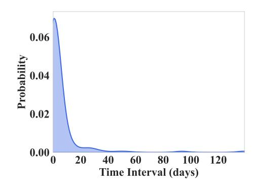
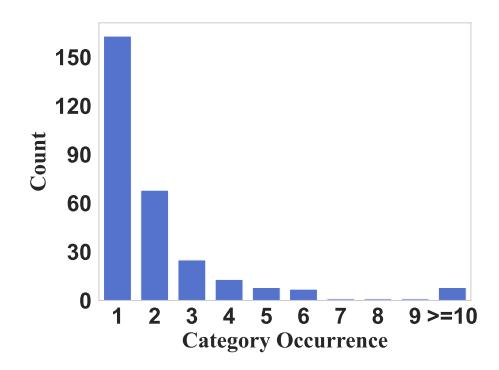
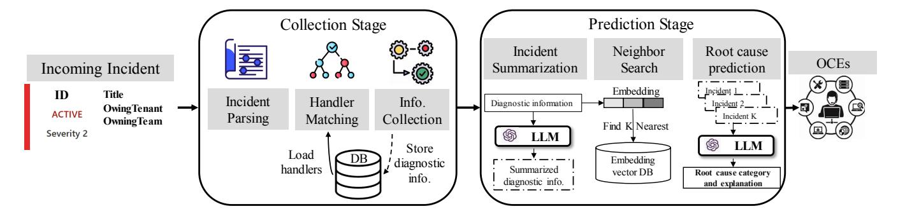
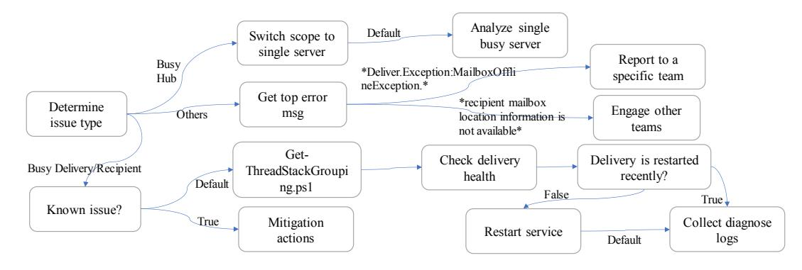
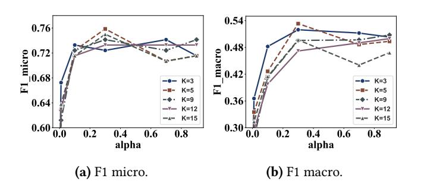
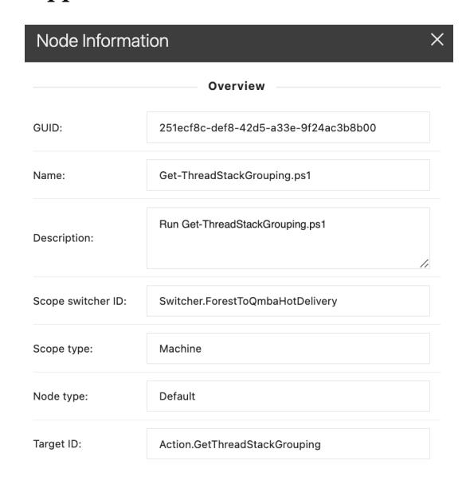

# **Empowering Practical Root Cause Analysis by Large Language Models for Cloud Incidents**

Yinfang Chen<sup>⋄§</sup>, Huaibing Xie<sup>⋄¶</sup>, Minghua Ma\*, Yu Kang\*, Xin Gao\*, Liu Shi\*, Yunjie Cao\* Xuedong Gao\*, Hao Fan\*, Ming Wen<sup>†</sup>, Jun Zeng<sup>‡</sup>, Supriyo Ghosh\*, Xuchao Zhang\* Chaoyun Zhang\*, Qingwei Lin\*, Saravan Rajmohan\*, and Dongmei Zhang\* Microsoft\*, UIUC<sup>§</sup>, PKU<sup>¶</sup>, HUST<sup>†</sup>, NUS<sup>‡</sup>

### **Abstract**

Ensuring the reliability and availability of cloud services necessitates efficient root cause analysis (RCA) for cloud incidents. Traditional RCA methods, which rely on manual investigations of data sources such as logs and traces, are often laborious, error-prone, and challenging for on-call engineers. In this paper, we introduce RCACOPILOT, an innovative on-call system empowered by the Large Language Model for automating RCA of cloud incidents. RCACOPILOT matches incoming incidents to corresponding handlers based on their alert types, aggregates the critical runtime diagnostic information, predicts the incident's root cause category, and provides an explanatory narrative. We evaluate RCA-COPILOT using a real-world dataset consisting of a year's worth of incidents from Transport service in Microsoft. Our evaluation demonstrates that RCACOPILOT achieves RCA accuracy up to 0.766. Furthermore, the diagnostic information collection component of RCACOPILOT has been successfully in use at Microsoft for over four years.

CCS Concepts: • Computer systems organization  $\rightarrow$  Cloud computing; • Software and its engineering  $\rightarrow$  Maintaining software.

**Keywords:** Root Cause Analysis, Large Language Models, Cloud Systems

#### 1 Introduction

Cloud computing serves as an indispensable infrastructure for numerous applications and services upon which people rely daily. As the adoption of cloud services continues to grow, ensuring their reliability, availability, and security becomes increasingly vital [12, 26, 30]. However, the complexity of cloud systems makes them vulnerable to a variety of incidents that could pose significant challenges to these crucial properties [43]. A typical incident life-cycle consists of four stages: (1) *Detection* [31, 41, 42]: When an anomalous system behavior is observed, an alert is raised by monitors

or users of the service (internal engineers or external customers). (2) *Triaging* [4, 8, 9]: After the detection, the incident is assigned to the appropriate engineering team after an initial assessment. (3) *Diagnosis* [28]: Assigned on-call engineers (OCEs) inspect different aspects of the incident and have several rounds of back-and-forth communication to identify the root cause. (4) *Mitigation* [1, 17]: Several actions are taken by OCEs to mitigate the incident and to restore service health.

Root cause analysis (RCA) is pivotal in promptly and effectively addressing these incidents. By accurately diagnosing the underlying problem and preventing its recurrence, RCA not only restores service availability swiftly but also fortifies the overall reliability of cloud services. However, identifying the root causes of these incidents often represents a daunting and time-consuming task that requires significant human expertise and intervention [30].

Traditional approaches to cloud incident RCA typically involve the manual collection and analysis of various types of data, such as logs [16, 22, 25, 46, 47], metrics [32], traces [45], and incident tickets [17, 36]. This manual process is not only laborious and error-prone, but can also be challenging due to varying levels of available information - what we term as the 'information spectrum'. The 'information spectrum' describes a continuum of information availability, ranging from situations with too little information to those inundated with an excess. At either end of this spectrum, root cause analysis can become particularly challenging. The relevant information for RCA might be buried within the voluminous data, leading to an information overload for OCEs. OCEs may find it challenging to quickly pinpoint the relevant information amidst the sea of data, hindering efficient incident resolution. Conversely, OCEs could also encounter situations where they lack the necessary information to understand and address the root causes of incidents accurately. Beyond these challenges, the collected data itself is often noisy, incomplete and inconsistent, further complicating the RCA process.

Specifically, the engineering team documents the frequent troubleshooting steps in the form of troubleshooting guides (TSGs) to facilitate the handling of future incidents. However, the volume of TSGs is overwhelming for OCEs, making the search for the most relevant guide a time-consuming task that might cause system downtime. Moreover, TSGs struggle

1

<sup>♦</sup> This research was primarily conducted during an internship at Microsoft

to keep pace with the ever-evolving nature of cloud systems, thus often falling short when new incident types emerge. Even when a relevant TSG is located, it may not cover all the intricacies of the specific incident. This could be due to variations in system configurations, the presence of multiple interacting root causes, or previously unknown issues.

At the heart of RCA lies the fundamental challenge of efficiently collecting and interpreting comprehensive, incidentspecific data within a limited time frame. OCEs must quickly discern the relevance of various data types to the incident at hand and interpret them correctly. However, the complexity and sheer volume of data generated by cloud systems often impede rapid decision-making. Furthermore, the expertise required to analyze various data types, along with the diverse range of possible incident causes, exacerbates the difficulty of the task. As a result, OCEs may spend an inordinate amount of time analyzing data and formulating hypotheses, detracting from time that could be better spent resolving the incident and restoring system functionality.

Data-driven and Artificial Intelligence (AI) techniques have been leveraged for automating the incident management [\[9,](#page-12-3) [10\]](#page-12-8). While there are existing techniques that recommends relevant TSGs [\[17\]](#page-12-5) and automates the workflows [\[36\]](#page-13-12) of TSGs, their utility is limited by the inherent challenges associated with TSGs. Despite these automated processes, OCEs still find themselves investing significant manual effort in sifting through the vast amounts of information, interpreting the data, and identifying the root causes of incidents.

The recent advent and success of Generative Pretrained Transformer (GPT) models in performing complex tasks [\[5,](#page-12-9) [38\]](#page-13-13), suggests a promising avenue for enhancing RCA. Specifically, GPT models can be used to parse through high-volume data, discern relevant information, and produce succinct, insightful outputs. This significantly alleviates the burden on OCEs to manually sift through vast amounts of data, helping them focus on resolving the incident more quickly and effectively. Additionally, GPT models can adapt to new and evolving types of incidents, learning from previous data to improve future predictions. While GPT models can process and generate text efficiently, they lack intrinsic domainspecific knowledge, especially in specialized areas such as cloud incident management. This lack of understanding of specific contexts, such as cloud incidents, can limit their accuracy in predicting incident root causes and generating appropriate explanations.

Recently, Ahmed et. al. [\[1\]](#page-12-4) proposed to finetune a pretrained GPT model with domain-specific dataset for generating root causes of an incident just by leveraging the title and summary information available at the time of incident creation. While they have demonstrated promises of GPT models in incident root causing, finetuning posses several limitations: (1) As accurate root cause analysis requires various sources of complex unstructured data (e.g., logs, telemetry, traces), just using generic title and initial

summary information might miss useful signals to reach to conclusive diagnosis details; (2) Finetuning is costly and requires a huge volume of training samples, whereas we only have access to a few hundred high-quality manually labeled category information; (3) It is challenging to continuously update a finetuned GPT model with evolving nature and scope of incidents; therefore such models are prone to generate more hallucinated results over time.

In this paper, we introduce RCACopilot, a novel approach to cloud incident root cause analysis that shifts away from the traditional reliance on TSGs. RCACopilot operates as an on-call system, empowering OCEs to construct 'handlers' - automated workflows tailored to each alert type defined by monitors, made up of reusable actions defined by their expertise. These predefined handlers automatically streamline the collection of incident-specific diagnostic information from multiple sources, thus ensuring a more focused and relevant data accumulation process to avoid issues on either end of the information spectrum. Subsequently, the large language model (LLM) component of RCACopilot processes this diagnostic data, autonomously identifying the categories and providing explanations of incident root causes. The combination of bespoke handlers and the analytical capabilities of the LLM allows RCACopilot to significantly enhance adaptability and scalability in incident response. As a result, RCACopilot can effectively handle a diverse array of incident types while reducing the need for extensive human intervention.

The diagnostic information collection component of RCA-Copilot has been in use at Microsoft for over four years. Recently, the root cause prediction component has been prototyped and tested by some incident teams at Microsoft before its final rolling in production.

Summary. This paper makes the following contributions:

- We propose RCACopilot, an automated tool for cloud incident RCA that enables on-call engineers to construct incident-specific automatic workflows for efficient data collection from multiple sources.
- We introduce the integration of a large language model within RCACopilot that autonomously analyzes the collected diagnostic data to predict incident root cause categories and generate explanations, demonstrating the potential of the large language model in enhancing RCA.
- We showcase the real-world applicability of RCACopilot by presenting its successful adoption within Microsoft. This illustrates its practical effectiveness in enhancing RCA efficiency, demonstrating the feasibility and benefits of our approach in real-world cloud computing scenarios.

## 2 Background and Motivation

In this section, we first introduce the concept and importance of incident root cause analysis. We then present real-world

#### <span id="page-2-0"></span>Troubleshooting Guide for Poisoned Messages

- 1. Go to the Poisoned Message Dashboard. This page gives a real-time, high-level view of the Poison Message feature. The charts should indicate whether the problem has resolved itself or is ongoing, as well as some sense of where it is occurring . . .
- 2. The Dashboard newly implements an Exception Table that has poisoned messages within a time frame. In most cases, whatever exception is causing an alert will rise to the top of the table . . .
- 3. You may also check the Poison Message Logs . . . . . .

Figure 1. A TSG for a poisoned message incident.

examples of troubleshooting guides and illustrate their inherent limitations. Lastly, we discuss the potential advantages of integrating a large language model into the RCA process, which motivates our work.

## 2.1 Incident Root Cause Analysis

In the realm of cloud services, an incident refers to any event that disrupts normal service operations or causes degradation in the quality of services. When such incidents occur, root cause analysis is performed to identify the underlying issue causing the disruption.

RCA in cloud services is a multi-faceted process:

- Data Collection: Gathering relevant data from various sources such as logs, metrics, traces, or alerts is the first step in RCA.
- Data Analysis: The collected data is then analyzed to identify patterns, anomalies, or correlations that can possibly provide clues about the root cause of the incident.
- Hypothesis Verification: Based on the data analysis, hypotheses about the possible root cause are formulated and then verified by OCEs.

Given the complexity and dynamism nature of cloud systems, along with the immense volume of data involved, conducting RCA is a challenging task, which requires substantial expertise and time. Take the scale of our corporation's email service as an example, which delivers over 150 billion messages daily. Ensuring the smooth operation of such a large-scale service demands an efficient and effective RCA approach. This is pivotal in maintaining a reliable and highperforming communication infrastructure, particularly for organizations that rely heavily on Microsoft's email server for their email communication.

## 2.2 The Opportunities and Challenges of Multi-Source Data in Incident Management

Managing incidents in the complex ecosystem of cloud services necessitates a comprehensive understanding of system states. This comprehension often stems from the consolidation of multi-source data, which includes traces, logs, and metrics. Traces represent tree-structured data detailing the flow of user requests, logs are semi-structured text recording hardware and software events, while metrics monitor service status or user-perceived metrics, forming time series data. While these individual data sources yield valuable insights, capitalizing on their potential has challenges. Traditional approaches such as TSGs, though useful, may fail to exploit the full wealth of multi-source data due to inherent limitations.

2.2.1 Opportunities of Multi-Source Data. Different data sources provide different perspectives on the system state. For instance, logs can offer detailed event sequences, metrics can reflect system performance over time, and traces can reveal the propagation of requests across services. Integrating these data sources can provide a more comprehensive view of the system, enabling more accurate and efficient incident diagnosis and resolution. Furthermore, multi-source data can facilitate correlation and causality analysis, which is crucial for root cause analysis. By analyzing the relationships between different data sources, we can identify patterns and anomalies that may indicate the root cause of an incident.

2.2.2 Challenges of Multi-Source Data. Despite its potential, effectively leveraging multi-source data in incident management is challenging. The sheer volume and complexity of data from various sources can be overwhelming, making it difficult to extract meaningful insights. Worse still, different data sources may provide inconsistent or conflicting information. Moreover, real-world data is often noisy, which can complicate analysis and lead to false conclusions.

- 2.2.3 Limitations of TSGs. Traditional TSGs represent an early attempt to leverage multi-source data for incident management. They guide OCEs to gather and analyze data from various sources to diagnose and resolve incidents. However, TSGs face several inherent limitations:
- Manual data integration: TSGs typically require OCEs to gather data from different sources manually. This process can be time-consuming and error-prone. Notwithstanding the existence of diverse troubleshooting guides and TSG recommendation techniques [\[17\]](#page-12-5), dependence on TSGs still remains a significant stress and burnout for OCEs due to the inherent limitations of the manual process.
- Outdated information: TSGs, as static documents, often struggle to stay up-to-date with the evolving system changes and new insights about incident root causes. This lag can lead OCEs to follow outdated or suboptimal troubleshooting steps. For example, a new feature ("Exception Table") to check Poison Message exceptions, mentioned as the

second step in Figure 1, was not immediately incorporated into the TSG upon its release, causing potential inefficiencies in incident resolution.

• Insufficient details and coverage: High-level instructions often appear in TSGs, lacking in detail and specific guidance, which forces OCEs into additional research and prolongs incident resolution. In the TSG example from Figure 1, the third step instructs to check the Poison Message Logs, leaving out crucial details and causing confusion for OCEs unfamiliar with this incident type. Additionally, TSGs may overlook common checks, such as disk space checks, leading to partial or inadequate incident resolutions.

## 2.3 The Promise of Large Language Models for Incident Management

The rapid advancements in natural language processing and machine learning have led to the development of powerful LLMs, which are reported to be effective at various downstream tasks with zero-shot and few-shot training [5, 11]. These models have shown exceptional performance in translation, summarization, and question-answering. Leveraging their potential for incident management in cloud computing systems could revolutionize the way OCEs identify and resolve incidents. By automating the interpretation aspect of incident management, LLMs can help alleviate the stress and cognitive load associated with complex on-call tasks for OCEs, which enables OCEs to focus more on higher-level jobs and decision-making.

#### 2.4 Our Motivation

The motivation for our work is rooted in the challenges faced when using manual TSGs to diagnose incidents and identify the underlying root causes. Recognizing the limitations of manual TSGs, our goal is to develop an automated diagnostic process that harnesses the capabilities of LLMs to address various cloud incidents more effectively.

Different from previous work [36], which employs AI techniques to generate automated workflow from existing TSGs, our goal is to enable experienced OCEs to construct an automated pipeline for incident diagnosis. This approach allows OCEs to be directly assisted in identifying the root cause without the need to investigate intermediate diagnostic information, though they still have the option to do so.

We envision a future in which root cause analysis is predominantly automated, requiring minimal manual verification only when necessary. Our approach seeks to provide OCEs with timely, relevant, and accurate information for specific incidents, leading to more efficient RCA.

By leveraging LLMs, our research aims to alleviate the stress and cognitive load associated with incident management, ultimately enhancing the efficiency and effectiveness of OCEs in addressing incidents.

## 3 Insights from Incidents

We conducted a comprehensive study of the one-year incidents from an email service from Microsoft, employing rigorous qualitative analysis methods. Specifically, each incident was carefully reviewed and categorized based on the characteristics of the problem, the source of the issue, and the impact on the system by our experienced OCEs. We paid particular attention to the root causes of the incidents, the effectiveness of the response, and the recurrence of similar issues. While our insights were indeed intuitively derived, they were firmly grounded in empirical data and analysis. Our study not only yielded valuable insights into incident patterns and challenges but also informed the development and refinement of our approach.

<span id="page-3-1"></span>Insight 1: determining the root cause based on a single data source can be challenging. As an illustration, consider Incident 2 in Table 1, where a single server failed to perform DNS resolution for incoming packets due to the exhaustion of UDP hub ports on a front door machine. This example highlights the difficulties in relying solely on a single source (monitor alert) to diagnose complex issues.

When a mailbox server sends mail to external email recipients, it uses specific front-door servers (proxies). However, each front-door server has a limited number of available SMTP outbound proxy connections. If a mailbox server's proxy connection request fails, it will be unable to send messages to external recipients. In this incident, the monitor first raises an alert indicating detected failures when connecting to the front door server. However, this alert only signifies a connection issue between the mail server and the front door server, without even suggesting a DNS resolution problem. Consequently, the root cause remains unclear.

<span id="page-3-0"></span>

Figure 2. Recurring incidents proportion vs. time interval.

<span id="page-3-2"></span>Insight 2: incidents stemming from similar or identical root causes often recur within a short period. We found that most recurring incidents (93.80%) tend to reappear within a brief span of 20 days, as shown in Figure 2. For instance, consider the category of Incident 9 from Table 1. This type of incident, triggered by invalid customer configuration,

<span id="page-4-0"></span>

| No. | Sev. | Scope   | Category                | Occur. | Symptom                                                                                                           | Cause                                                                                                     |
|-----|------|---------|-------------------------|--------|-------------------------------------------------------------------------------------------------------------------|-----------------------------------------------------------------------------------------------------------|
| 1   | 1    | Forest  | AuthCertIssue           | 3      | Tokens for requesting services were not able to be created. Several services reported users experiencing outages. | A previous invalid certificate overrided the existing one due to misconfiguration.                        |
| 2   | 2    | Machine | HubPortExhaustion       | 27     | A single server failed to do DNS resolution for the incoming packages.                                            | The UDP hub ports on the machine had been run out.                                                        |
| 3   | 2    | Forest  | DeliveryHang            | 6      | Mailbox delivery service hang for a long time.                                                                    | Number of messages queued for mailbox delivery exceeded the limit.                                        |
| 4   | 2    | Forest  | CodeRegression          | 15     | An SMTP authentication component's availability dropped.                                                          | Bug in the code.                                                                                          |
| 5   | 2    | Forest  | CertForBogusTenants     | 11     | The number of concurrent server connections exceeded a limit.                                                     | Spammers abused the system by creating a lot of bogus tenants with connectors using a certificate domain. |
| 6   | 1    | Forest  | MaliciousAttack         | 2      | Forest-wide processes crashed over threshold.                                                                     | Active exploit was launched<br>in remote PowerShell by seri-<br>alizing malicious binary blob.            |
| 7   | 2    | Forest  | UseRouteResolution      | 9      | Poisoned messages sent to the forest made the system unhealthy.                                                   | A configuration service was unable to update the settings leading to the crash.                           |
| 8   | 2    | Forest  | FullDisk                | 2      | Many processes crashed and threw IO exceptions.                                                                   | A specific disk was full.                                                                                 |
| 9   | 2    | Forest  | InvalidJournaling       | 11     | Messages stuck in submission queue for a long time.                                                               | The customer set an invalid value for the Transport config and caused TenantSettingsNotFoundException.    |
| 10  | 3    | Forest  | DispatcherTaskCancelled | 22     | Normal priority messages<br>across a forest had been<br>queued in submission queues<br>for a long time.           | Network problem caused the authentication service to be unreachable.                                      |

**Table 1.** Examples of cloud incidents in different root cause categories.

led to an accumulation of unprocessed messages in the queue, thereby significantly undermining its availability. Intriguingly, incidents of this category recurred 11 times in a span of merely 15 days. Likewise, the DispatcherTaskCancelled incidents (No. 10 in Table 1) and the DeliveryHang incidents (No. 3) reappeared 22 times and 6 times within a week and a single month, respectively. These can be attributed to several factors. Unresolved root causes from the initial response may lead to the same issue re-emerging, especially if the problem is complex or not fully understood. Secondly, systemic vulnerabilities, if not addressed, can be repeatedly exploited, causing similar incidents. Thirdly, external dependencies, such as reliance on a service that frequently experiences outages, can also lead to recurring incidents. These patterns suggest that by leveraging insights from previous incidents, we could swiftly identify the root cause of new occurrences with the same root cause.

<span id="page-4-1"></span>

**Figure 3.** Distribution of incident category frequency.

Insight 3: incidents with new root causes occur frequently and pose a greater challenge to analyze. TSGs can help OCEs diagnose issues by providing clear investigation guidance. However, when incidents arise from new,

previously unencountered root causes, OCEs face a set of challenges. For such incidents, no TSG exists, and OCEs may struggle to identify the underlying issues. For instance, Incident 1 is a high-severity (severity 1) incident caused by misconfiguration, which blocked the authentication token generation to lead to severe outages. Similarly, Incident 6 is a malicious attack caused by an attacker launching an exploit with a malicious blob. This type of attack had never been encountered before, leaving OCEs without an existing TSG to reference. Lower severity level (severity 2) incidents, such as Incident 5, are also susceptible to this challenge when the spammer first abuses the system. As Figure [3](#page-4-1) shows, incidents with a new root cause category account for 24.96% (163 among 653) of all incidents. If OCEs spend their time searching for nonexistent TSGs, the incident's impact could escalate further. Recognizing this challenge, it is necessary to propose a new approach that can effectively infer, categorize and explain the root causes for such unseen incidents, thereby reducing the time OCEs take to identify and address these unique incidents.

## 4 RCACopilot

RCACopilot has two stages: the diagnostic information collection stage and the root cause prediction stage as shown in Figure [4.](#page-6-0)

Diagnostic information collection stage: This is the initial stage, where the incident is parsed and matched to the pre-defined incident handler. Each handler is tailored to a specific alert type. Upon matching the incident with the appropriate handler, RCACopilot proceeds to collect relevant diagnostic data from a variety of sources.

Root cause prediction stage: Once the diagnostic information is collected, RCACopilot transitions into the root cause prediction stage. In this phase, RCACopilot applies its predictive module to determine the likely root cause category of the incident. This prediction is not a mere categorization, but it is also supplemented with an explanation detailing how RCACopilot arrived at the given prediction. Subsequently, the predicted category label is presented to experienced OCEs for review.

## 4.1 Diagnostic Information Collection Stage

Driven by Insight-1 in Section [3,](#page-3-1) RCACopilot aims to collect multi-source data for RCA. Specifically, for each alert type, an incident handler is constructed, comprising a series of actions to collect diagnostic information. Alert types are used to categorize alerts based on specific monitors and thresholds. Incidents sharing the same alert type exhibit similar symptoms, though they may stem from different root causes.

The RCACopilot incident handler is a workflow that consists of a series of actions. Each action is a function that can be executed to collect specific diagnostic information from a target data source. OCEs can build and modify these handlers based on their expertise. The handler includes three distinct actions: scope switching action, query action, and mitigation action, which will be explained in Section [4.1.2.](#page-5-0) Each action generates an output, guiding the control flow of the incident handler. We use a RCACopilot handler that diagnoses Incident 7 in Table [1](#page-4-0) as an example to illustrate the handler usage.

4.1.1 Incident handler. The decision-making process that OCEs employ when handling an incident resembles a decision tree's control flow. The root node in the incident handler is the incident alert type, which is gathered from the system monitor. We distilled OCE operations into three actions when constructing the incident handler. As OCE operations can be similar to different incident types (e.g., conducting a common disk check or query to a database), we designed RCACopilot handler actions to be reusable across all handlers. We also maintain the versions of the handlers in the database, which can be used to track their historical changes.

RCACopilot's incident handlers can be updated and modified dynamically by OCEs, allowing them to stay abreast with the most recent system changes and newly discovered root causes. For instance, when a new metric is introduced into the system, OCEs only need to construct a new action to collect the relevant data and incorporate it into the corresponding incident handler, which can ensure timely adaptation.

<span id="page-5-0"></span>4.1.2 Handler action. RCACopilot leverages the synergy of multi-source data. The system uses predefined actions in the incident handler to automatically collect relevant diagnostic information from diverse sources. The automated integration of data not only saves time but also reduces the likelihood of human error. It also provides a more comprehensive view of the system state, facilitating efficient and accurate incident resolution. This significantly lightens the workload of OCEs, reducing stress and burnout, and enhancing the effectiveness of the incident resolution process. The action in the handler could be one of the following:

Scope switching action: This action facilitates precision in RCA by allowing adjustments to the data collection scope based on the specific needs of each incident. For instance, as depicted in Figure [5,](#page-7-0) if an alert originates at the 'forest' level, signifying an issue within a specific forest, and the problem type is identified as 'Busy Hub', the scope switching action can adjust the scope to the 'machine' level. This modification allows for a more fine-grained investigation, specifically assessing if a singular hub server is overly taxed.

The implementation of this action ensures that we efficiently navigate the information spectrum. When the investigation requires a more targeted approach, this action can narrow the data collection scope. Conversely, if a more holistic view is necessary, it can widen the scope, say from a single machine to an entire forest. This flexibility contributes

<span id="page-6-0"></span>

Figure 4. RCACOPILOT architecture.

to a more balanced and effective diagnostic data collection process.

**Query action**: Query action can query data from different sources and output the query result as a key-value pair table. This type of action can also be hooked to executing a specific script with pre-defined parameters. Usually, scripts are internal automatic investigation tools for a service, and only the service team has access to the tools.

For instance, in Figure 5, the "Known issue?" action node queries the database to see whether the current incident is a known one or not based on its alert messages. If it is a known issue, execution flow will enter the "True" branch to give mitigation actions directly. Otherwise, a query script that can aggregate threads with the same stack traces will be executed. It will obtain an instantaneous list of the stacks on all the managed threads in the target process and then group common stacks together in order to identify potential deadlocks/blocking code paths in the process.

The query action can also output an enum value to decide the next action node to execute, e.g., after getting the top error message on the exception stack traces, i.e., "Get top error msg" node, the next action node to be run depends on the exception type. Based on the error messages, a specific team will be reported and engaged, as shown in Figure 5.

**Mitigation action**: This action refers to the strategic steps suggested to alleviate an incident, such as "restart service" or "engage other teams", as depicted in Figure 5. It's important to note that handlers do not always provide exact mitigation strategies for every incident, due to handlers' pre-defined nature, which may not cover all possible situations. For instance, Incident 4 in Table 1, categorized under code regression, presents a case where identification and rectification of such code issues can be challenging. In cases where the incident handler is uncertain, it will only offer intermediate diagnostic information to the OCEs without mitigation.

**4.1.3 Multi-source diagnostic information.** RCACOPILOT's diagnostic information collection stage serves as a valuable tool for OCEs by aggregating data from a myriad of sources. OCEs only need to customize the action in the

handler to acquire the diagnostic information from a target source. For instance, as illustrated in Figure 6, RCACOPILOT can assimilate diverse data such as error logs, exception stack traces, and socket metrics related to a specific incident. The error log and exception stack trace alone does not provide sufficient insight to identify the root cause of the incident. However, when supplemented with the socket metrics, a more comprehensive picture emerges. In this example, it is clear that the UDP socket is exhausted, which is the root cause.

In the case of new incidents, RCACOPILOT can perform a range of common checks, such as evaluating the provisioning status or analyzing thread stacks. This assists OCEs in gaining a holistic understanding of the situation. Note that the information collected is pre-defined in the actions of the RCACOPILOT handler, ensuring that only relevant data is gathered, thus avoiding overwhelming information that is unnecessary. By providing this comprehensive diagnostic information, RCACOPILOT empowers OCE teams to troubleshoot issues efficiently. They can use the gathered information as guidance to address incidents more effectively.

#### 4.2 LLMs for Incident Explanation

Upon thorough investigation, each incident within our service is manually assigned a root cause category by our seasoned OCEs. OCEs will use the categories to classify the historical incidents and guide the new incoming incidents' RCA. However, reasoning the incidents and inferring their categories are time-consuming and potentially overwhelming for OCEs, who have a tight time budget. Given this, we have identified the categorization of incident root causes as our primary downstream task.

Recently, LLMs have demonstrated remarkable capabilities in understanding the context of downstream tasks and generating relevant information from demonstrations, making them a possible choice for incident RCA. However, reasoning the incident root cause is not a simple task, and LLMs may not be able to achieve the optimal results on long-tail or domain-specific tasks without any guidance [6, 18]. Chain-of-Thoughts (CoT) prompting is a gradient-free technique that

<span id="page-7-0"></span>

Figure 5. A RCACopilot handler for too many messages stuck in the delivery queue alert.

```
DatacenterHubOutboundProxyProbe probe log result from
[MachineID].
Total Probes: 2, Failed Probes: 2
 Id Level Created Description
 – —– ——- ———–
 2 Error 11/21/2022 2:04:20 AM Probe result
 2 Error 11/21/2022 1:49:20 AM Probe result
Failed probe error:
Name: No such host is known.
A WinSock error: 11001 encountered when connecting to
host: [HOST NAME]
Count: 2
. . .
Exceptions:
InformativeSocketException: No such host is known.
A WinSock error: 11001 encountered when connecting to
host: [HOST NAME]
at TcpClientFactory.Create(...)
at SimpleSmtpClient.Connect(...)
. . .
Total UDP socket count: 15276
Total UDP socket count by process and processId (top
5 only):
14923: Transport.exe, 203736
15: w3wp.exe, 102296
8: svchost.exe, 4748
7: Microsoft.Transport.Store.Worker.exe, 74060
7: Microsoft.Transport.Store.Worker.exe, 87724
```

Figure 6. Diagnostic information for hub port exhaustion.

elicits LLMs to generate intermediate reasoning steps that lead to the final answer. In few-shots CoT prompting, a few manual demonstrations that are composed of a question and a reasoning chain that leads to an answer for each of them. Inspired by the above ideas, diagnostic information provided by RCACopilot handlers can be used as ingredients for the reasoning process of the incidents.

4.2.1 Embedding model. Our observation is that the semantics of incidents can be revealed from the context in which the diagnostic information is described. A common approach

to extracting such contextual semantics involves the use of embedding models. The objective is to map the diagnostic information into an embedding space (i.e., numeric vector space), where the distances between vectors represent the semantic similarity of incidents. Choosing a computationally efficient embedding model allows us to preserve accuracy while handling a large number of incidents.

We employ FastText as our embedding model, which is efficient, insensitive to text input length, and generates dense matrices, making it easy to calculate the Euclidean distance between similar vectors. Furthermore, since our downstream task is domain-specific to the incident root cause reasoning, and the incident-related information is internal to our company, we opt to train a FastText model on our historical incidents rather than using a pre-trained large language model as our embedding model, which is costly and inefficient. Additionally, we provide users with the flexibility to customize their embedding model if desired.

4.2.2 Diagnostic information summary. LLMs have shown potential for automatic summarization [\[34\]](#page-13-14). Nonetheless, the length of the diagnostic information collected from RCACopilot handlers is often too extensive. As shown in Figure [6,](#page-7-1) the diagnostic information of an incident can have more than 2000 tokens with low readability of the log messages. The considerable number of tokens in the incident description can pose challenges for the LLM to effectively process and may introduce noise. Therefore, feeding the diagnostic information of an incident directly into the LLM to make a prediction could not be an ideal choice, let alone using the information from multiple sources. In this regard, we add another layer to leverage the LLM's ability to summarization to summarize the diagnostic information first before making the diagnosis reasoning. We construct the prompt in the way of Figure [7.](#page-8-0) We ask LLM to summarize the diagnostic information into 120-140 words without outputting any unrelated information. This summarization process makes the diagnostic information more concise and informative, which forms the basis for the later CoT prompting. Figure [8](#page-8-1) illustrates a more readable and concise text generated by

RCACOPILOT, which is a summary (113 tokens) of the previous diagnostic information example in Figure 6, highlighting the key details such as the number of UDP ports used and the process utilizing the most. Specifically, we employ the tiktoken [35] tokenizer to count text tokens.

<span id="page-8-0"></span>"Please summarize the above input. Please note that the above input is incident diagnostic information. The summary results should be about 120 words, no more than 140 words, and should cover important information as much as possible. Just return the summary without any additional output."

Figure 7. Prompt to summarize diagnostic information.

<span id="page-8-1"></span>"The DatacenterHubOutboundProxyProbe has failed twice on the backend machine, with both failures due to a WinSock error 11001 indicating that the host is unknown. This error was encountered while attempting to connect to the host. The error is associated with the EOP service and has not been notified yet. The failure context suggests the same issue. The total UDP socket count is 15276, with the majority being used by the Transport.exe process. The issue seems to be related to the SMTP connection and requires further investigation."

Figure 8. The summarized diagnostic information.

**4.2.3** Nearest neighbor search. Incidents are heterogeneous, making it impractical to combine all past incidents' information for sampling due to the prompt length limitations, even after summarization. To selectively choose past cases as samples in the prompt, we design a new similarity formula:

$$Distance(a,b) = ||a-b||_2$$
 
$$Similarity(a,b) = \frac{1}{1+Distance(a,b)} * e^{-\alpha|T(a)-T(b)|}$$

to calculate the similarity between two incidents. It first computes the Euclidean distance for every pair of incident vectors. Importantly, it also takes into account the temporal distance between incidents, reflecting our Insight-2 in Section 3. Here, T(x) stands for the date of incident x. This consideration of temporal distance is crucial as it influences the relevance of past incidents to the current ones. After calculating similarities, we select the top K incidents as demonstrations for the LLM. This approach ensures a diverse and representative set of incidents for effective LLM reasoning. The values of  $\alpha$  and K have been determined as 0.3 and 5, respectively, through empirical evaluation, as will be presented in Section 5.4.

**4.2.4 Prediction prompt construction.** CoT prompting is a gradient-free technique that guides LLMs to produce intermediate reasoning steps leading to the final answer. In few-shot CoT prompting, several demonstrations include a question and a reasoning chain that directs the answer. Without hinging on the hand-crafting of demonstrations, Auto-CoT [50] has shown the power of automatically constructing the prompt to form the reasoning chains. By drawing inspiration from this concept, we can view the summarized diagnostic information and the labeled root cause categories as questions and reasoning, so finding the nearest incident neighbor is the automatic reasoning chain construction, aligning with the CoT prompting context well. We construct the prompt like Figure 9 to ask the LLM to choose the most likely incident that has the same root cause as the current incident, and also we explicitly push the LLM to reason by using "give your explanation" indications in the prompt.

<span id="page-8-2"></span>**Context:** The following description shows the error log information of an incident. Please select the incident information that is most likely to have the same root cause and **give your explanation** (just give one answer). If not, please select the first item "Unseen incident".

**Input:** The DatacenterHubOutboundProxyProbe probe result from [BackEndMachine] is a failure ... Options:

A: Unseen incident.

**B:** The DatacenterHubOutboundProxyProbe has failed twice ... *category: HubPortExhaustion*.

**C:** There are 62 managed threads in process TransportDelivery ... *category:* **AuthCertIssue**.

**Figure 9.** The prompt to predict incident category.

### 4.3 Implementation

We have developed and deployed RCACOPILOT using a combined total of 58,286 lines of code, consisting of 56,129 lines of C# and 2,157 lines of Python.

To facilitate the building of the RCACOPILOT incident handler, we have implemented RCACOPILOT's handler construction as a web application. To support a new type of alert in RCACOPILOT, OCEs only need to add a new handler in the handler construction GUI according to her expertise (see Appendix A). After the new handler has been constructed, it will be stored in the database, and OCEs can modify it by creating new action nodes or deleting old nodes.

#### 5 Evaluation

We aim to answer the following questions in our evaluation:

(1) How effective and efficient is RCACOPILOT as an on-call system when predicting root cause categories and assisting OCEs? RCACOPILOT achieves 0.766 and 0.533 for

Micro-F1 and Macro-F1 separately when predicting the root cause category of cloud incidents, outperforming all our baselines with a low running overhead (4.205 seconds). RCACOPILOT is also able to generate new root cause category labels for unseen incidents with explanations.

- (2) How do different components of RCACOPILOT facilitate its diagnosis and prediction? RCACOPILOT has proven that the diagnostic information collection component, GPT summarization, and chain-of-thoughts prompting all contribute to RCACOPILOT's prediction effectiveness.
- (3) Is RCACOPILOT suitable for deployment in real production services, and are RCACOPILOT's results trustworthy? RCACOPILOT's diagnostic information collection module has been deployed across 30 teams within Microsoft for over four years. To evaluate the trustworthiness of RCACOPILOT, each experiment was conducted over three rounds, and RCACOPILOT can consistently achieve a high Micro-F1 score of over 0.70 and a Macro-F1 score exceeding 0.50.

All experiments are performed on the server with Intel(R) Core(TM) i7-9700 CPU @ 3.00GHz, 32.0 GB physical memory, and Intel UHD Graphics 630. The OS of the server is Windows 11 Enterprise.

## 5.1 Target System and Dataset

We evaluate RCACOPILOT in a global email service system named Transport within the Microsoft. The Transport team focuses on developing and maintaining the components responsible for mail flow, routing, and delivery. This system interacts with various other services to ensure seamless integration with a multitude of products and services, including serviceA, serviceB, and serviceC. Hence, it is representative of complex, real-world systems that interact with multiple components. With around 150 billion messages being delivered daily, Transport operates at a colossal scale and caters to customers worldwide, adding another layer of diversity and complexity. The system ensures the secure and effective transmission of emails between users, utilizing various protocols such as SMTP, IMAP, and POP3. Given its crucial role in communications infrastructure, it is essential to have effective and efficient incident management capabilities.

We collect a one-year dataset of 653 incidents from Microsoft's Transport service to investigate RCACOPILOT's efficacy in practice. It is important to note that each of these incidents represents complex issues in a large-scale, globally distributed system, and thus each provides valuable insights. The dataset is manually labeled with root cause categories by experienced OCEs, which serves as our ground truth. We divide the incident cases into training (75%) and testing sets (25%).

We conduct experiments on two large language models in RCACOPILOT, *i.e.*, GPT-3.5-turbo, and GPT-4 (8K tokens),

which are the latest models from OpenAI. We choose GPT-4 as the default model in RCACOPILOT because it has the best performance.

## 5.2 Compared Approaches

We have selected XGBoost, FastText, and fine-tuned LLMs as our baselines to compare with RCACOPILOT. We have also made another two variants, i.e., GPT-4 Prompt and Embed. to evaluate the design of RCACOPILOT.

- **XGBoost** provides a parallel tree boosting that has been commonly used in the networking system diagnosis.
- **FastText** is a popular lightweight textual embedding approach, which has been adopted in testbed studies with fault injections for root cause diagnosis tasks.
- **Fine-tune GPT** is to fine-tune a pre-trained GPT-3.5 model with our training dataset and evaluate its performance on our testing dataset with the temperature parameter set to 0. Note that GPT-4 is currently not available for fine-tuning.
- **GPT-4 Prompt** is a variant of RCACOPILOT that directly predict category with RCACOPILOT's diagnosis information summaries.
- **GPT-4 Embed.** is a variant of RCACOPILOT that changes the embedding model from FastText to GPT embedding.

<span id="page-9-0"></span>

| Method               | F1-8  | score | Avg. Time (s) |        |
|----------------------|-------|-------|---------------|--------|
|                      | Micro | Macro | Train.        | Infer. |
| FastText [45]        | 0.076 | 0.004 | 10.592        | 0.524  |
| XGBoost [3]          | 0.022 | 0.009 | 11.581        | 1.211  |
| Fine-tune GPT [1]    | 0.103 | 0.144 | 3192          | 4.262  |
| GPT-4 Prompt         | 0.026 | 0.004 | _             | 3.251  |
| GPT-4 Embed.         | 0.257 | 0.122 | 1925          | 3.522  |
| RCACOPILOT (GPT-3.5) | 0.761 | 0.505 | 10.562        | 4.221  |
| RCACOPILOT (GPT-4)   | 0.766 | 0.533 | 10.562        | 4.205  |

Table 2. Effectiveness of different methods.

## 5.3 Effectiveness and Efficiency

We evaluate RCACOPILOT's effectiveness by predicting the root cause category of an incident based on the summarized diagnostic information using micro and macro F1-score metrics. These metrics calculate the harmonic mean of the precision and recall. The micro F1-score aggregates the performance of all classes, taking into account the contribution of each sample, while the macro F1-score focuses on the performance of each individual class. RCACOPILOT achieves a micro F1-score of 0.766 and a macro F1-score of 0.533 on our testing dataset.

As shown in Table 2, RCACOPILOT outperforms other approaches, and it tends to incur an acceptable higher runtime overhead. The performance of baseline approaches is poor,

since multiple root cause categories exhibit a long tail (imbalanced) distribution, as shown in Figure 3, and traditional machine learning models (FastText and XGBoost) and finetuning GPT model need a large amount of training data to produce accurate predictions. Directly employing GPT-4 prompt or GPT-4 embedding approach without our design lacks domain-specific knowledge for GPT-4 to make decisions. On the contrary, RCACOPILOT leverages the powerful LLM to learn the domain-specific knowledge from minimal cases, so that it can achieve the best performance. Results indicate that RCACOPILOT not only provides higher accuracy but also maintains a reasonable level of efficiency, making it a suitable choice for incident root cause analysis.

When facing incidents that RCACOPILOT has never seen before, RCACOPILOT is capable of generating a new category keyword to depict the new incident case. For example, Incident 8 in Table 1 is a new incident case that RCACOPILOT has never encountered. RCACOPILOT's prediction component is able to predict it as a new category "I/O Bottleneck". Although OCEs subsequently categorize it as "DiskFull" in post-investigation, the fundamental aspects of the problem identified by RCACOPILOT align closely with the humanderived label. The corresponding RCACOPILOT's explanation, illustrating how it arrived at the "I/O Bottleneck" categorization, is provided in Figure 10.

<span id="page-10-1"></span>The prediction of "I/O Bottleneck" was made based on the occurrence of System.IO.IOExceptions within crucial functions handling input/output operations, suggesting an issue with data processing. The nested exception within the DiagnosticsLog module reinforces this notion. These errors, combined with crashes on different backend machines, point to a system struggle with handling data flow.

Figure 10. RCACOPILOT's explanation of an incident.

<span id="page-10-3"></span>

Figure 11. Effectiveness of using different K and alpha.

<span id="page-10-2"></span>

|           | F1-score       |              |       |       |
|-----------|----------------|--------------|-------|-------|
| AlertInfo | DiagnosticInfo | ActionOutput | Micro | Macro |
|           | 1              |              | 0.689 | 0.510 |
|           | ✓sum.          |              | 0.766 | 0.533 |
| <b>√</b>  |                |              | 0.379 | 0.245 |
| ✓         | ✓              |              | 0.525 | 0.511 |
| ✓         |                | ✓            | 0.431 | 0.247 |
|           | ✓              | ✓            | 0.501 | 0.449 |
| ✓         | ✓              | ✓            | 0.440 | 0.349 |

**Table 3.** Effectiveness of different prompt context for RCACOPILOT. ✓ sum. stands for the summarized diagnostic information.

## <span id="page-10-0"></span>5.4 Comparison Analysis

To understand how different components of RCACOPILOT facilitate root cause analysis, we conduct an ablation study on the different RCACOPILOT's components.

Evaluation on diagnostic information. First, we evaluate the impact of diagnostic information on effectiveness. In particular, we compare diagnostic information collected from the collection stage with other different incident-related information, namely, incident alert information and RCA-COPILOT handler action output. AlertInfo includes the alert type and alert scope. Alert type is a pre-defined anomaly description from a monitor, which only reflects a symptom of the incident instead of the root cause, e.g., an exception type from external monitors. The alert scope is the scope of the incident, e.g., a single machine. ActionOutput is the output of a series of executed RCACOPILOT actions, which are hashed as key-value pairs. As shown in Table 3, using diagnostic information alone can outperform others in both Micro-F1 (0.689) and Macro-F1 scores (0.510). The interesting observation here is that mixing the diagnostic information with others will not enhance RCACOPILOT's predictive capabilities. This demonstrates that an excess of information can negatively impact the LLM's prediction performance.

**Evaluation on GPT summarization.** We evaluate the role of GPT summarization in enhancing RCACOPILOT's effectiveness. As depicted in Table 3, utilizing summarized diagnostic information leads to the highest Micro-F1 and Macro-F1 scores, marking improvements of 0.077 and 0.023, respectively, over the non-summarized diagnostic information. The results demonstrate that the summarization step effectively condenses the information, allowing for more efficient and accurate processing of incident data.

**Evaluation on few-shots CoT reasoning.** We assess how few-shots CoT reasoning contributes to improving effectiveness. GPT-4 Prompt approach in Table 2, which directly predicts the category without any sample, only achieves 0.026 and 0.004 for Micro-F1 and Macro-F1 respectively. As

shown in Figure [11a](#page-10-3) and Figure [11b,](#page-10-3) we compare the performance of RCACopilot with different numbers of samples in the Chain-of-thoughts reasoning. Our analysis reveals that the best combination of the number of samples and alpha values are 5 and 0.3, which achieves the highest F1 scores. Note that more samples in the CoT reasoning do not always incur an improvement for RCACopilot, and the value of the alpha plays an important role in deciding the effectiveness. When the alpha is appropriate, it allows RCACopilot to better capture the time relationships between different incidents, leading to more accurate predictions.

## 5.5 Deployment Status and Scale

We have successfully deployed RCACopilot's diagnostic information collection module across over 30 teams within Microsoft, where it has been in active use for over four years. The system is tailored to each team's specific requirements, with custom handlers built for each unique setting. Not all handlers are currently enabled in the production environment, as some are still under development and rigorous testing. We observe that the average running time for each incident ranges from 15 seconds to 841 seconds (see [Appen](#page-14-0)[dix A\)](#page-14-0). The highest running time is attributable to the team's large-scale and complex system infrastructure. As part of our commitment to continuous improvement and quality user experience, we have incorporated a feedback mechanism in emails to garner user perspectives from OCEs. According to our collected feedback, most OCEs expressed satisfaction with the diagnostic information provided by RCACopilot.

#### 5.6 Tustworthiness

While GPT has shown great potential and impressive results in various tasks, it is known to exhibit some instability in certain complex tasks such as question answering, as noted by Tan et al. [\[37\]](#page-13-17). These instabilities could potentially lead to variable results. In order to ensure the trustworthiness and stability of the GPT's predictive capabilities in RCACopilot, each experiment has been conducted three rounds. In each round, RCACopilot was able to maintain a high level of performance, with the Micro-F1 consistently above 0.70 and the Macro-F1 remaining above 0.50.

## 6 Discussion

RCACopilot's effectiveness depends on the ability of the LLM. Currently, RCACopilot is only integrated with OpenAI's GPT models, and we have not yet explored the potential effectiveness of other available LLMs. As such, the model's performance may vary depending on the strengths and weaknesses of the specific LLM employed.

We conducted our evaluation of RCACopilot's prediction module using the incident dataset from Transport. The dataset was prepared with the assistance of experts in Transport team, given their extensive experience and established

practice of incident labeling. Note that the effectiveness of RCACopilot is also influenced by the quality of the root cause categories. Currently, all root cause categories are manually labeled by our experienced OCEs. RCACopilot's diagnosis information collection has been deployed in over 30 teams. Consequently, a valuable future work would be to evaluate RCACopilot across different services to gain a more comprehensive understanding of its generalizability and adaptability.

RCACopilot's handler is designed to respond based on alerts generated by monitors. This implies that for incidents that the monitor does not detect, RCACopilot will not be able to match a handler, thereby limiting its applicability.

We conducted three rounds of experiments to evaluate RCACopilot's effectiveness. However, the occasional instability of LLMs can influence their effectiveness, causing variations across different rounds. Another potential threat to internal validity lies in the implementation of our approach and those we compared against. To mitigate this risk, two authors have carefully checked the code. In particular, we implemented the baselines based on the matured frameworks.

## 7 Related Work

Root cause analysis. Root cause analysis in large cloud services has become a popular topic of research in the system and software engineering communities [\[2,](#page-12-14) [7,](#page-12-15) [14,](#page-12-16) [15,](#page-12-17) [19,](#page-12-18) [24,](#page-13-18) [27,](#page-13-19) [30,](#page-13-1) [40,](#page-13-20) [49\]](#page-13-21). It aims to identify the root causes of failures and performance issues based on various data sources, such as metrics, logs, and traces. Previous studies have proposed different approaches for root cause analysis using one of these data sources. For example, some methods rely on metrics to extract failure patterns [\[30,](#page-13-1) [48\]](#page-13-22) or to construct service dependency graphs [\[20,](#page-12-19) [29\]](#page-13-23). Others use logs to analyze a subset of log messages [\[1,](#page-12-4) [47\]](#page-13-9) or to examine the details within each log message [\[22,](#page-12-7) [46\]](#page-13-8). Moreover, some techniques utilize trace to locate the faulty service [\[21,](#page-12-20) [23,](#page-13-24) [39,](#page-13-25) [43\]](#page-13-2). Different from prior work, we build a system that can automatically integrate metrics, logs, and traces for root cause analysis with state-of-the-art large language models.

Large Language Models. In recent years, the rise of LLM has brought new opportunities to the field of software systems by enabling various tasks such as code generation, summarization, repair, testing, and root cause analysis [\[1,](#page-12-4) [13,](#page-12-21) [33,](#page-13-26) [34,](#page-13-14) [44\]](#page-13-27). For example, Mastropaolo et al. [\[34\]](#page-13-14) studied the ability of fine-tuned T5 in the following tasks: automatic bug fixing, generation of assert statements, code summarization, and injection of code mutants. LANCE [\[33\]](#page-13-26) uses fine-tuned T5 to automatically generate logging statements for Java methods. VulRepair [\[13\]](#page-12-21) also fine-tune T5 on vulnerability repairs datasets to automatically propose vulnerability fixes. Zhang et al. [\[44\]](#page-13-27) proposes to use prompting for LLM to improve code version control. Ahmed et al. [\[1\]](#page-12-4) fine-tune GPT-x

models to recommend root causes and mitigation steps to facilitate cloud incident management. In contrast to previous studies, RCACopilot employs advanced LLMs to summarize diagnosis data and leverage the chain-of-thoughts ability to predict and explain root causes.

## 8 Conclusion

RCACopilot represents a pioneering tool in the realm of cloud incident management, facilitating efficient root cause analysis for OCEs. It introduces a unique approach to multisource data collection through its diagnostic information collection stage, utilizing predefined incident handlers. These handlers, constructed by OCEs, systematically gather multisource diagnostic information, which sets the foundation for the subsequent analysis. Furthermore, RCACopilot integrates a large language model in its root cause prediction stage. This model autonomously processes the collected diagnostic data, predicting and explaining the root cause category. This integration of AI techniques into cloud incident management demonstrates the potential of RCACopilot in enhancing the efficiency and accuracy of root cause analysis.

## References

- <span id="page-12-4"></span>[1] Toufique Ahmed, Supriyo Ghosh, Chetan Bansal, Thomas Zimmermann, Xuchao Zhang, and Saravan Rajmohan. 2023. Recommending Root-Cause and Mitigation Steps for Cloud Incidents using Large Language Models. arXiv preprint arXiv:2301.03797 (2023).
- <span id="page-12-14"></span>[2] Ahmed Alquraan, Hatem Takruri, Mohammed Alfatafta, and Samer Al-Kiswany. 2018. An analysis of network-partitioning failures in cloud systems. In 13th {USENIX} Symposium on Operating Systems Design and Implementation ({OSDI} 18). 51–68.
- <span id="page-12-13"></span>[3] Behnaz Arzani, Selim Ciraci, Boon Thau Loo, Assaf Schuster, and Geoff Outhred. 2016. Taking the blame game out of data centers operations with netpoirot. In Proceedings of the 2016 ACM SIGCOMM Conference. 440–453.
- <span id="page-12-1"></span>[4] Chetan Bansal, Sundararajan Renganathan, Ashima Asudani, Olivier Midy, and Mathru Janakiraman. 2020. Decaf: Diagnosing and triaging performance issues in large-scale cloud services. In Proceedings of the ACM/IEEE 42nd International Conference on Software Engineering: Software Engineering in Practice. 201–210.
- <span id="page-12-9"></span>[5] Tom Brown, Benjamin Mann, Nick Ryder, Melanie Subbiah, Jared D Kaplan, Prafulla Dhariwal, Arvind Neelakantan, Pranav Shyam, Girish Sastry, Amanda Askell, et al. 2020. Language models are few-shot learners. Advances in neural information processing systems 33 (2020), 1877–1901.
- <span id="page-12-11"></span>[6] Ilias Chalkidis. 2023. ChatGPT may Pass the Bar Exam soon, but has a Long Way to Go for the LexGLUE benchmark. arXiv[:2304.12202](https://arxiv.org/abs/2304.12202) [cs.CL]
- <span id="page-12-15"></span>[7] Haicheng Chen, Wensheng Dou, Yanyan Jiang, and Feng Qin. 2019. Understanding exception-related bugs in large-scale cloud systems. In 2019 34th IEEE/ACM International Conference on Automated Software Engineering (ASE). IEEE, 339–351.
- <span id="page-12-2"></span>[8] Junjie Chen, Xiaoting He, Qingwei Lin, Yong Xu, Hongyu Zhang, Dan Hao, Feng Gao, Zhangwei Xu, Yingnong Dang, and Dongmei Zhang. 2019. An empirical investigation of incident triage for online service systems. In 2019 IEEE/ACM 41st International Conference on Software Engineering: Software Engineering in Practice (ICSE-SEIP). IEEE, 111– 120.
- <span id="page-12-3"></span>[9] Junjie Chen, Xiaoting He, Qingwei Lin, Hongyu Zhang, Dan Hao, Feng Gao, Zhangwei Xu, Yingnong Dang, and Dongmei Zhang. 2019. Continuous incident triage for large-scale online service systems. In

- 2019 34th IEEE/ACM International Conference on Automated Software Engineering (ASE). IEEE, 364–375.
- <span id="page-12-8"></span>[10] Junjie Chen, Shu Zhang, Xiaoting He, Qingwei Lin, Hongyu Zhang, Dan Hao, Yu Kang, Feng Gao, Zhangwei Xu, Yingnong Dang, et al. 2020. How incidental are the incidents? characterizing and prioritizing incidents for large-scale online service systems. In Proceedings of the 35th IEEE/ACM International Conference on Automated Software Engineering. 373–384.
- <span id="page-12-10"></span>[11] Mark Chen, Jerry Tworek, Heewoo Jun, Qiming Yuan, Henrique Ponde de Oliveira Pinto, Jared Kaplan, Harri Edwards, Yuri Burda, Nicholas Joseph, Greg Brockman, et al. 2021. Evaluating large language models trained on code. arXiv preprint arXiv:2107.03374 (2021).
- <span id="page-12-0"></span>[12] Yinfang Chen, Xudong Sun, Suman Nath, Ze Yang, and Tianyin Xu. 2023. Push-Button Reliability Testing for Cloud-Backed Applications with Rainmaker. In Proceedings of the 20th USENIX Symposium on Networked Systems Design and Implementation (NSDI'23).
- <span id="page-12-21"></span>[13] Michael Fu, Chakkrit Tantithamthavorn, Trung Le, Van Nguyen, and Dinh Phung. 2022. VulRepair: a T5-based automated software vulnerability repair. In Proceedings of the 30th ACM Joint European Software Engineering Conference and Symposium on the Foundations of Software Engineering. 935–947.
- <span id="page-12-16"></span>[14] Yu Gao, Wensheng Dou, Feng Qin, Chushu Gao, Dong Wang, Jun Wei, Ruirui Huang, Li Zhou, and Yongming Wu. 2018. An empirical study on crash recovery bugs in large-scale distributed systems. In Proceedings of the 2018 26th ACM joint meeting on european software engineering conference and symposium on the foundations of software engineering. 539–550.
- <span id="page-12-17"></span>[15] Supriyo Ghosh, Manish Shetty, Chetan Bansal, and Suman Nath. 2022. How to fight production incidents? an empirical study on a largescale cloud service. In Proceedings of the 13th Symposium on Cloud Computing. 126–141.
- <span id="page-12-6"></span>[16] Muhammad Adil Inam, Yinfang Chen, Akul Goyal, Jason Liu, Jaron Mink, Noor Michael, Sneha Gaur, Adam Bates, and Wajih Ul Hassan. 2022. SoK: History is a Vast Early Warning System: Auditing the Provenance of System Intrusions. In 2023 IEEE Symposium on Security and Privacy (SP). IEEE Computer Society, 307–325.
- <span id="page-12-5"></span>[17] Jiajun Jiang, Weihai Lu, Junjie Chen, Qingwei Lin, Pu Zhao, Yu Kang, Hongyu Zhang, Yingfei Xiong, Feng Gao, Zhangwei Xu, et al. 2020. How to mitigate the incident? an effective troubleshooting guide recommendation technique for online service systems. In Proceedings of the 28th ACM Joint Meeting on European Software Engineering Conference and Symposium on the Foundations of Software Engineering. 1410–1420.
- <span id="page-12-12"></span>[18] Jungo Kasai, Yuhei Kasai, Keisuke Sakaguchi, Yutaro Yamada, and Dragomir Radev. 2023. Evaluating GPT-4 and ChatGPT on Japanese Medical Licensing Examinations. arXiv[:2303.18027](https://arxiv.org/abs/2303.18027) [cs.CL]
- <span id="page-12-18"></span>[19] Tanakorn Leesatapornwongsa, Cesar A Stuardo, Riza O Suminto, Huan Ke, Jeffrey F Lukman, and Haryadi S Gunawi. 2017. Scalability bugs: When 100-node testing is not enough. In Proceedings of the 16th Workshop on Hot Topics in Operating Systems. 24–29.
- <span id="page-12-19"></span>[20] Mingjie Li, Minghua Ma, Xiaohui Nie, Kanglin Yin, Li Cao, Xidao Wen, Zhiyun Yuan, Duogang Wu, Guoying Li, Wei Liu, et al. 2022. Mining Fluctuation Propagation Graph Among Time Series with Active Learning. In Database and Expert Systems Applications: 33rd International Conference, DEXA 2022, Vienna, Austria, August 22–24, 2022, Proceedings, Part I. Springer, 220–233.
- <span id="page-12-20"></span>[21] Zeyan Li, Junjie Chen, Rui Jiao, Nengwen Zhao, Zhijun Wang, Shuwei Zhang, Yanjun Wu, Long Jiang, Leiqin Yan, Zikai Wang, et al. 2021. Practical root cause localization for microservice systems via trace analysis. In 2021 IEEE/ACM 29th International Symposium on Quality of Service (IWQOS). IEEE, 1–10.
- <span id="page-12-7"></span>[22] Zhenhao Li, Chuan Luo, Tse-Hsun Chen, Weiyi Shang, Shilin He, Qingwei Lin, and Dongmei Zhang. 2023. Did We Miss Something Important? Studying and Exploring Variable-Aware Log Abstraction.

- arXiv preprint arXiv:2304.11391 (2023).
- <span id="page-13-24"></span>[23] Dewei Liu, Chuan He, Xin Peng, Fan Lin, Chenxi Zhang, Shengfang Gong, Ziang Li, Jiayu Ou, and Zheshun Wu. 2021. Microhecl: Highefficient root cause localization in large-scale microservice systems. In 2021 IEEE/ACM 43rd International Conference on Software Engineering: Software Engineering in Practice (ICSE-SEIP). IEEE, 338–347.
- <span id="page-13-18"></span>[24] Haopeng Liu, Shan Lu, Madan Musuvathi, and Suman Nath. 2019. What bugs cause production cloud incidents?. In Proceedings of the Workshop on Hot Topics in Operating Systems. 155–162.
- <span id="page-13-7"></span>[25] Yudong Liu, Xu Zhang, Shilin He, Hongyu Zhang, Liqun Li, Yu Kang, Yong Xu, Minghua Ma, Qingwei Lin, Yingnong Dang, et al. 2022. Uni-Parser: A Unified Log Parser for Heterogeneous Log Data. In Proceedings of the ACM Web Conference 2022. 1893–1901.
- <span id="page-13-0"></span>[26] Chang Lou, Cong Chen, Peng Huang, Yingnong Dang, Si Qin, Xinsheng Yang, Xukun Li, Qingwei Lin, and Murali Chintalapati. 2022. RESIN: A Holistic Service for Dealing with Memory Leaks in Production Cloud Infrastructure. In Proceedings of the 16th USENIX Symposium on Operating Systems Design and Implementation (OSDI '22). USENIX Association, Carlsbad, CA, USA, 109–125. [https://www](https://www.usenix.org/conference/osdi22/presentation/lou-resin).usenix.org/ [conference/osdi22/presentation/lou-resin](https://www.usenix.org/conference/osdi22/presentation/lou-resin)
- <span id="page-13-19"></span>[27] Chang Lou, Peng Huang, and Scott Smith. 2020. Understanding, Detecting and Localizing Partial Failures in Large System Software.. In NSDI, Vol. 20. 559–574.
- <span id="page-13-6"></span>[28] Chen Luo, Jian-Guang Lou, Qingwei Lin, Qiang Fu, Rui Ding, Dongmei Zhang, and Zhe Wang. 2014. Correlating events with time series for incident diagnosis. In Proceedings of the 20th ACM SIGKDD international conference on Knowledge discovery and data mining. 1583–1592.
- <span id="page-13-23"></span>[29] Meng Ma, Jingmin Xu, Yuan Wang, Pengfei Chen, Zonghua Zhang, and Ping Wang. 2020. Automap: Diagnose your microservice-based web applications automatically. In Proceedings of The Web Conference 2020. 246–258.
- <span id="page-13-1"></span>[30] Minghua Ma, Zheng Yin, Shenglin Zhang, Sheng Wang, Christopher Zheng, Xinhao Jiang, Hanwen Hu, Cheng Luo, Yilin Li, Nengjun Qiu, et al. 2020. Diagnosing root causes of intermittent slow queries in cloud databases. Proceedings of the VLDB Endowment 13, 8 (2020), 1176–1189.
- <span id="page-13-3"></span>[31] Minghua Ma, Shenglin Zhang, Junjie Chen, Jim Xu, Haozhe Li, Yongliang Lin, Xiaohui Nie, Bo Zhou, Yong Wang, and Dan Pei. 2021. Jump-Starting Multivariate Time Series Anomaly Detection for Online Service Systems. In 2021 USENIX Annual Technical Conference (USENIX ATC 21). 413–426.
- <span id="page-13-10"></span>[32] Minghua Ma, Shenglin Zhang, Dan Pei, Xin Huang, and Hongwei Dai. 2018. Robust and rapid adaption for concept drift in software system anomaly detection. In 2018 IEEE 29th International Symposium on Software Reliability Engineering (ISSRE). IEEE, 13–24.
- <span id="page-13-26"></span>[33] Antonio Mastropaolo, Luca Pascarella, and Gabriele Bavota. 2022. Using Deep Learning to Generate Complete Log Statements. In Proceedings of the 44th International Conference on Software Engineering (ICSE '22). 2279–2290.
- <span id="page-13-14"></span>[34] Antonio Mastropaolo, Simone Scalabrino, Nathan Cooper, David Nader Palacio, Denys Poshyvanyk, Rocco Oliveto, and Gabriele Bavota. 2021. Studying the usage of text-to-text transfer transformer to support code-related tasks. In 2021 IEEE/ACM 43rd International Conference on Software Engineering (ICSE). IEEE, 336–347.
- <span id="page-13-15"></span>[35] OpenAI. 2023. Tiktoken: A Python library for tokenizing text. [https:](https://github.com/openai/tiktoken) //github.[com/openai/tiktoken](https://github.com/openai/tiktoken). Available from: [https://github](https://github.com/openai/tiktoken).com/ [openai/tiktoken](https://github.com/openai/tiktoken).
- <span id="page-13-12"></span>[36] Manish Shetty, Chetan Bansal, Sai Pramod Upadhyayula, Arjun Radhakrishna, and Anurag Gupta. 2022. AutoTSG: learning and synthesis for incident troubleshooting. In Proceedings of the 30th ACM Joint

European Software Engineering Conference and Symposium on the Foundations of Software Engineering. 1477–1488.

- <span id="page-13-17"></span>[37] Yiming Tan, Dehai Min, Yu Li, Wenbo Li, Nan Hu, Yongrui Chen, and Guilin Qi. 2023. Evaluation of ChatGPT as a Question Answering System for Answering Complex Questions. arXiv preprint arXiv:2303.07992 (2023).
- <span id="page-13-13"></span>[38] Jason Wei, Xuezhi Wang, Dale Schuurmans, Maarten Bosma, Ed Chi, Quoc Le, and Denny Zhou. 2022. Chain of thought prompting elicits reasoning in large language models. arXiv preprint arXiv:2201.11903 (2022).
- <span id="page-13-25"></span>[39] Zhe Xie, Haowen Xu, Wenxiao Chen, Wanxue Li, Huai Jiang, Liangfei Su, Hanzhang Wang, and Dan Pei. 2023. Unsupervised Anomaly Detection on Microservice Traces through Graph VAE. In Proceedings of the ACM Web Conference 2023. 2874–2884.
- <span id="page-13-20"></span>[40] Ding Yuan, Yu Luo, Xin Zhuang, Guilherme Renna Rodrigues, Xu Zhao, Yongle Zhang, Pranay Jain, and Michael Stumm. 2014. Simple Testing Can Prevent Most Critical Failures: An Analysis of Production Failures in Distributed Data-Intensive Systems.. In OSDI, Vol. 10. 2685048– 2685068.
- <span id="page-13-4"></span>[41] Jun Zeng, Zheng Leong Chua, Yinfang Chen, Kaihang Ji, Zhenkai Liang, and Jian Mao. 2021. WATSON: Abstracting Behaviors from Audit Logs via Aggregation of Contextual Semantics.. In NDSS.
- <span id="page-13-5"></span>[42] Jun Zeng, Xiang Wang, Jiahao Liu, Yinfang Chen, Zhenkai Liang, Tat-Seng Chua, and Zheng Leong Chua. 2022. Shadewatcher: Recommendation-guided cyber threat analysis using system audit records. In 2022 IEEE Symposium on Security and Privacy (SP). IEEE, 489–506.
- <span id="page-13-2"></span>[43] Zhengran Zeng, Yuqun Zhang, Yong Xu, Minghua Ma, Bo Qiao, Wentao Zou, Qingjun Chen, Meng Zhang, Xu Zhang, Hongyu Zhang, Xuedong Gao, Hao Fan, Saravan Rajmohan, Qingwei Lin, and Dongmei Zhang. 2023. TraceArk: Towards Actionable Performance Anomaly Alerting for Online Service Systems. In To appear in Proc. of ICSE.
- <span id="page-13-27"></span>[44] Jialu Zhang, Todd Mytkowicz, Mike Kaufman, Ruzica Piskac, and Shuvendu K Lahiri. 2022. Using pre-trained language models to resolve textual and semantic merge conflicts (experience paper). In Proceedings of the 31st ACM SIGSOFT International Symposium on Software Testing and Analysis. 77–88.
- <span id="page-13-11"></span>[45] Shenglin Zhang, Pengxiang Jin, Zihan Lin, Yongqian Sun, Bicheng Zhang, Sibo Xia, Zhengdan Li, Zhenyu Zhong, Minghua Ma, Wa Jin, et al. 2023. Robust Failure Diagnosis of Microservice System through Multimodal Data. arXiv preprint arXiv:2302.10512 (2023).
- <span id="page-13-8"></span>[46] Tianzhu Zhang, Han Qiu, Gabriele Castellano, Myriana Rifai, Chung Shue Chen, and Fabio Pianese. 2023. System Log Parsing: A Survey. IEEE Transactions on Knowledge and Data Engineering (2023).
- <span id="page-13-9"></span>[47] Xu Zhang, Yong Xu, Si Qin, Shilin He, Bo Qiao, Ze Li, Hongyu Zhang, Xukun Li, Yingnong Dang, Qingwei Lin, et al. 2021. Onion: identifying incident-indicating logs for cloud systems. In Proceedings of the 29th ACM Joint Meeting on European Software Engineering Conference and Symposium on the Foundations of Software Engineering. 1253–1263.
- <span id="page-13-22"></span>[48] Yingying Zhang, Zhengxiong Guan, Huajie Qian, Leili Xu, Hengbo Liu, Qingsong Wen, Liang Sun, Junwei Jiang, Lunting Fan, and Min Ke. 2021. CloudRCA: a root cause analysis framework for cloud computing platforms. In Proceedings of the 30th ACM International Conference on Information & Knowledge Management. 4373–4382.
- <span id="page-13-21"></span>[49] Yongle Zhang, Junwen Yang, Zhuqi Jin, Utsav Sethi, Kirk Rodrigues, Shan Lu, and Ding Yuan. 2021. Understanding and detecting software upgrade failures in distributed systems. In Proceedings of the ACM SIGOPS 28th Symposium on Operating Systems Principles. 116–131.
- <span id="page-13-16"></span>[50] Zhuosheng Zhang, Aston Zhang, Mu Li, and Alex Smola. 2023. Automatic Chain of Thought Prompting in Large Language Models. In The Eleventh International Conference on Learning Representations (ICLR 2023).

# <span id="page-14-0"></span>A Appendix

<span id="page-14-1"></span>

Figure 12. Web-based UI of RCACopilot for handler construction.

To facilitate the building of the RCACopilot incident handler, we have implemented RCACopilot's handler construction as a web application, as shown in Figure [12.](#page-14-1)

We have successfully deployed RCACopilot's diagnostic information collection module across 30 teams within CompanyX. From these, we've selected the top 10 teams that utilize the most RCACopilot incident handlers. Table [4](#page-14-2) provides details about the average execution time and the count of active handlers for these selected teams.

<span id="page-14-2"></span>

| Team   | Avg. exec.<br>time(s) | Enabled<br>handler |
|--------|-----------------------|--------------------|
| Team1  | 841                   | 213                |
| Team2  | 378                   | 204                |
| Team3  | 106                   | 88                 |
| Team4  | 449                   | 42                 |
| Team5  | 136                   | 41                 |
| Team6  | 91                    | 34                 |
| Team7  | 449                   | 32                 |
| Team8  | 255                   | 32                 |
| Team9  | 323                   | 31                 |
| Team10 | 22                    | 18                 |

Table 4. Teams using RCACopilot to automatically collect diagnostic information.