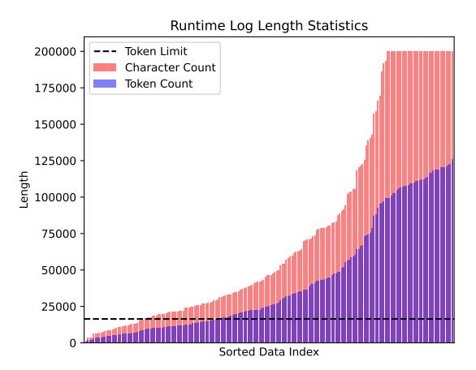
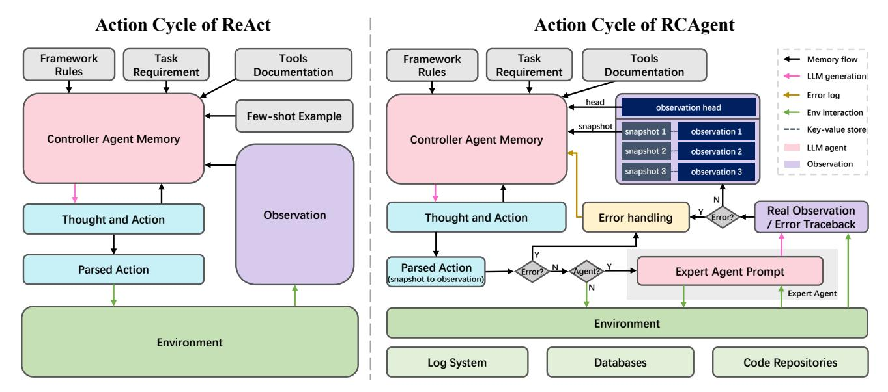
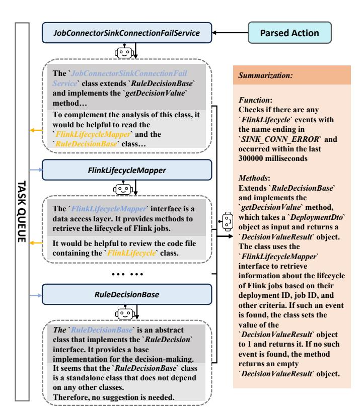
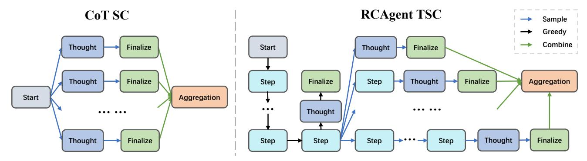
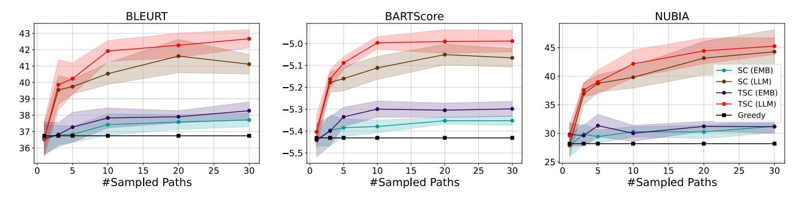

# RCAgent: Cloud Root Cause Analysis by Autonomous Agents with Tool-Augmented Large Language Models

Zefan Wang1,2,<sup>⋆</sup> , Zichuan Liu2,3,<sup>⋆</sup> , Yingying Zhang2,† , Aoxiao Zhong<sup>4</sup> , Lunting Fan<sup>2</sup> , Lingfei Wu<sup>5</sup> , Qingsong Wen6,† <sup>1</sup>Tsinghua University, Beijing, China, <sup>2</sup>Alibaba Group, Hangzhou, China, <sup>3</sup>Nanjing University, Nanjing, China <sup>4</sup>Harvard University, Cambridge, USA, <sup>5</sup>Anytime.AI Inc., New York, USA, <sup>6</sup>Alibaba Group, Bellevue, USA wang-zf20@mails.tsinghua.edu.cn, zichuanliu@smail.nju.edu.cn, congrong.zyy@alibaba-inc.com, aoxiaozhong@g.harvard.edu, lunting.fan@taobao.com, lwu@anytime-ai.com, qingsongedu@gmail.com

*Abstract*—Large language model (LLM) applications in cloud root cause analysis (RCA) have been actively explored recently. However, current methods are still reliant on manual workflow settings and do not unleash LLMs' decision-making and environment interaction capabilities. We present RCAgent, a toolaugmented LLM autonomous agent framework for practical and privacy-aware industrial RCA usage. Running on an internally deployed model rather than GPT families, RCAgent is capable of free-form data collection and comprehensive analysis with tools. Our framework combines a variety of enhancements, including a unique Self-Consistency for action trajectories, and a suite of methods for context management, stabilization, and importing domain knowledge. Our experiments show RCAgent's evident and consistent superiority over ReAct across all aspects of RCA—predicting root causes, solutions, evidence, and responsibilities—and tasks covered or uncovered by current rules, as validated by both automated metrics and human evaluations. Furthermore, RCAgent has already been integrated into the diagnosis and issue discovery workflow of the Real-time Compute Platform for Apache Flink of Alibaba Cloud.

*Index Terms*—Root Cause Analysis, Large Language Models, Cloud Systems

#### I. INTRODUCTION

Cloud computing platforms have been increasingly utilized for application and service deployment in recent years [\[1\]](#page-12-0), [\[2\]](#page-12-1). Anomalies in cloud computing systems, such as unrecoverable failures and hanged jobs, severely impact customer experience and can potentially violate service level agreements [\[3\]](#page-12-2), [\[4\]](#page-12-3). Root Cause Analysis (RCA) [\[5\]](#page-12-4)–[\[7\]](#page-12-5), a core component of site reliability engineering, is currently receiving ongoing attention from large cloud computing enterprises such as Amazon, Microsoft, Google, and Alibaba. However, due to the continuous scaling of computation deployments on the cloud, manual workflows for online anomaly RCA, such as creating troubleshooting tools, often overwhelm Site Reliability Engineers (SREs) [\[8\]](#page-12-6). To increase the efficiency of cloud service reliability enhancement, a series of Artificial Intelligence for Operations (AIOps) approaches [\[9\]](#page-12-7)–[\[11\]](#page-12-8) have been widely adopted in RCA to reduce the MTTR (mean time to resolve). These approaches grant the ability to handle large volumes of incident-related data in cloud systems and draw conclusions automatically. While these typical AIOps aid in automated processes, their application faces challenges such as poor data quality, shifting data distribution, laborious data annotation, and limited generalization for models [\[12\]](#page-12-9).

The advancements in Large Language Models (LLMs), especially within the GPT [\[13\]](#page-12-10)–[\[16\]](#page-12-11) and LLaMA [\[17\]](#page-12-12), [\[18\]](#page-12-13) families, indicate an intriguing future of solving intricate reasoning tasks. These developments hold significant promise for addressing challenges in AIOps. One notable strength of LLMs is their ability to generalize, allowing them to understand and accomplish unseen reasoning tasks in a zero-shot or fewshot way. This largely results from the extensive and extrapolatable process of pre-training and instruction tuning [\[13\]](#page-12-10), [\[19\]](#page-12-14). Such adaptability makes LLMs suitable for specialized and system-specific RCA tasks. Moreover, the performance of LLMs can be amplified by various prompting strategies. Techniques like Chain-of-Thought (CoT) [\[20\]](#page-12-15), [\[21\]](#page-12-16), Self-Consistency (SC) [\[22\]](#page-12-17), Reflexion [\[23\]](#page-12-18), Retrieval-Augmented Generation (RAG) [\[24\]](#page-12-19), enhance logical capability and Out-of-Domain (OoD) generalization. These techniques further reduce the necessity of high-quality, task-specific annotated training datasets, particularly in RCA applications. Considering these inherent advantages and the versatility of LLMs, they emerge as new fitting solutions for the RCA task.

Recent works demonstrate the use of LLMs in cloud RCA tasks. Specifically, [\[4\]](#page-12-3) fine-tunes a GPT model to generate text from incident summary to root causes and mitigations without collecting data in the production environment. Oasis [\[25\]](#page-12-20) proposes to fine-tune a GPT model using domain-specific data to predict outage summaries for root cause understanding and post hoc maintenance. However, these works rely heavily on the computationally expensive fine-tuning of an LLM to adapt to cloud system tasks and do not fully utilize the generalization and reasoning abilities of LLMs. One possible solution is to use few-shot RAG [\[24\]](#page-12-19) on LLMs, with representative methods such as RCACopilot [\[8\]](#page-12-6) and PACE-LM [\[26\]](#page-12-21). RCACopilot employs an LLM as a summarizer for information acquired by human-

<sup>⋆</sup> Work done during the internship at Alibaba Group.

<sup>†</sup> Corresponding authors.

written troubleshooting guides and as a root cause predictor prompted by recent relevant diagnoses, based on the assumption that incidents with similar root causes recur within a short period. PACE-LM enhances the outputs of RAG-based language models through confidence calibration to mitigate hallucinations and reduce false recommendations. However, these methods are all based on the GPT family and scenarios within Microsoft, not addressing the data privacy concerns associated with using LLMs with cloud system data. Specifically, potential security risks tied to transmitting data from cloud production environments to external APIs, such as ChatGPT [\[15\]](#page-12-22), could pose problems for many IT enterprises. Furthermore, none of the aforementioned methods fully leverage the autonomous capabilities of LLMs for information collection, decisionmaking, and environmental interaction [\[27\]](#page-12-23).

Tool-augmented autonomous agents, as demonstrated in early experiments [\[28\]](#page-12-24), further unlock the potential of LLMs in interactive environments. By equipping LLMs with defined tools and associated documentation, and by facilitating tool invocation through mechanisms like function calls or command line inputs, and then executing these tools and returning environmental feedback, LLMs can handle extensive tasks. These tasks might require expertise and abilities beyond what LLMs inherently possess, such as web interaction [\[29\]](#page-12-25), text-based games [\[30\]](#page-12-26), and operating system and database management [\[31\]](#page-12-27). A representative paradigm within the realm of autonomous agents is ReAct [\[27\]](#page-12-23), a workflow that embodies a thought-action-observation loop. This approach synergizes the reasoning and action capabilities of LLMs and offers flexibility for extensions [\[32\]](#page-12-28). Although tool-augmented autonomous agents based on LLM demonstrate significant potential in complex scenarios, their adoption in the AIOps field, especially with noisy and lengthy data, remains limited [\[33\]](#page-12-29), [\[34\]](#page-12-30). The primary challenges are action validity and context length, both of which significantly heighten the demands of LLM-as-agent capabilities [\[31\]](#page-12-27). Also, to the best of our knowledge, there is no interactive environment built upon realistic production-level RCA problems for LLM agents to operate on.

To this end, we introduce RCAgent, the first practical LLMbased RCA framework within the tool-augmented autonomous agent paradigm. We design an enhanced prompting cycle skeleton and an interactive environment enriched with external knowledge and stabilization techniques, tailored for LLM agents to handle diverse data types. This approach addresses several challenges, including context-length usage, unstable parsing, and insufficient domain knowledge. Additionally, we design aggregation methods for action trajectories and text output, combining suboptimal results from LLMs. Unlike ReAct, our approach to tool invocation operates in a trajectorylevel zero-shot way, eliminating the need for manual or auto-generated problem-solving trajectories. Furthermore, to facilitate general and secure industrial usage, we forgo the use of powerful external API models like ChatGPT as the base model for agents and implement this framework on a locally deployed model, further underscoring the efficacy of our stabilization method.

The analysis results from RCAgent are being utilized in the Real-time Compute Platform for Apache Flink of Alibaba Cloud to diagnose anomalous stream processing jobs uncovered by current methods. We have incorporated a feedback mechanism in the company to identify issues in the PaaS and IaaS layers of the cloud system, offering insights for development teams.

We summarize our contributions as follows:

- We propose RCAgent, the first tool-augmented autonomous agent based on LLM for privacy-aware realworld cloud RCA, unleashing the decision-making ability of LLMs in the AIOps field.
- We introduce a bag of methods to enhance the tool agent, including aspects of prompting framework, tool setting, stabilization, and aggregation methods. These make the agent based on locally deployed LLM a valid solution for complex environments like cloud systems.
- We present real-world experiments on the real-time computing jobs in Alibaba Cloud, demonstrating the practical usage of RCAgent.

## II. MOTIVATION AND CHALLENGE

## *A. Online Job Anomaly RCA with AIOps*

In cloud services, job anomalies indicate disruptions in submitted jobs that require human intervention. While big data systems have fault-tolerance mechanisms like failover and failback, they do not guarantee job stability. As the enhancement of reliability, AIOps has been transforming the cloud incident management workflow for years [\[12\]](#page-12-9). Equipped with AIOps approaches, a typical semi-automated troubleshooting lifecycle includes: (i) anomaly detection based on data-driven criteria, (ii) RCA using either human insight or AIOps, and (iii) mitigation measures for job recovery and prevention of similar anomalies. The RCA task, crucial for discerning job issues, demands thorough data inspection and up-to-date domain knowledge from either human experts or AIOps methods. Essential for cloud system governance and as a foundation for stability enhancement, RCA is now significantly automated by AIOps.

However, the intricate and dynamic nature of cloud systems combined with ever-growing data presents challenges for AIOps methods. These data-driven methods, relying on historical data, struggle as data and anomaly patterns evolve, prolonging RCA and mitigation processes.

#### *B. Benifit of Tool augmented LLM agents*

The paradigm of integrating tools into LLMs and instructing them to perform actions automatically has demonstrated impressive promise across various tasks [\[28\]](#page-12-24). While basic LLM usages are adept at generalizing to OoD data with proper instruction and few-shot samples, they remain dependent on humandesigned workflows of data collection and analysis [\[8\]](#page-12-6) which may periodically be outdated. In contrast, tool-augmented LLM agents can self-direct their data exploration and external ability invocation, making them extendable to heterogeneous tasks. By harnessing LLMs' power of decision-making, autonomous

<span id="page-2-0"></span>

Fig. 1: 5-minute runtime log length statistics for different realtime computing jobs on Alibaba Cloud. The token count is counted by the LLaMA 2 tokenizer. The token limit for vicuna-13b-v1.5-16k is marked as a dashed line. Runtime logs larger than 200k characters are trimmed in this figure.

agents possess significant potential for analyzing unprecedented and complex anomalies without laboriously annotated training data.

## *C. Challenges*

Though tool-augmented LLM agents provide new possibilities for the cloud RCA task, there are several critical challenges.

- *1) Privacy:* A general LLM method for RCA and other cloud AIOps tasks should be internally hosted for security concerns. Specifically, transmitting production-level confidential data to external API induces privacy risks. This means stronger models like ChatGPT cannot be used except for those close collaboration enterprises.
- *2) Context Length:* A fundamental problem for an autonomous agent to interact with realistic big data environments is context length because various kinds of data, such as logs, code, and database query results, tend to be enormous. The length distribution from our experiment data is shown in Fig. [1.](#page-2-0) Even if the LLMs can extrapolate to larger context length [\[35\]](#page-12-31), processing unnecessarily excessive tokens is highly inefficient.
- *3) Action Validity:* Open-ended action generation for LLMs is of great challenge because less sufficiently aligned LLMs have a larger possibility of generating invalid actions [\[31\]](#page-12-27). These errors severely damage the performance of autonomous agents on comprehensive tasks. Moreover, the model restriction from the privacy concern, and noisy data in cloud systems make this problem even more arduous.

#### III. METHODOLOGY

To systematically and reliably prompt the LLM as a toolaugmented autonomous agent for cloud RCA, we propose RCAgent, an enhanced reasoning and acting framework. An overview of our methodology at the decision-loop level and its comparison to the tool agent version of ReAct [\[27\]](#page-12-23) is shown in Fig. [2.](#page-3-0) For disambiguousity, the LLM agent with the prompt of thought-action-observation loop is named the *controller agent*, and RCAgent additionally employs the LLM as tools called the *expert agents*.

In concordance with the typical ReAct-style tool agent prompt framework [\[36\]](#page-12-32), the controller agent is injected with three basic prompts: (i) framework rules that describe the thought-action-observation loop, (ii) task requirements that contain instructions for the RCA tasks with basic cloud knowledge, and (iii) tools documentation that describes the description of all invokable tools. Because of its flexibility and readability, JSON is chosen as the data interchange format for all generations in the action step from LLM. We also define a tool named 'finalize' as an exit point that allows the model to freely decide when to report findings in a parsable format. Note that RCAgent discards the few-shot examples compared to the original ReAct because of limited context length.

Starting from the tool agent version of ReAct, we propose several enhancements to address the challenges of using toolaugmented LLM agents in cloud RCA. We will first introduce an observation management method for compressing context length usage in § [III-A.](#page-2-1) Then, we describe the design of tools, including LLM-augmented tools in § [III-B.](#page-2-2) The stabilizing methods for action validity are presented in § [III-C.](#page-4-0) Lastly, we detail the aggregation method of RCAgent in § [III-D.](#page-5-0)

#### <span id="page-2-1"></span>*A. Observation Snapshot Key*

One of the basic challenges of building autonomous agents in a comprehensive big data environment is context length [\[8\]](#page-12-6). The most inflating part of the agent prompt is the observation content in the action trajectories, containing a large amount of logs, table entries, etc. To overcome the information loss from truncating and summarizing observations, we propose OBservation Snapshot Key (OBSK), a new method to address the context length problem in realistic cloud tasks. As shown in Fig. [2,](#page-3-0) OBSK only shows the head of observation to the controller agent, leaving a hash ID (snapshot key) for further usage. A key-value store is built for mapping the snapshot key to real observation. Thus, when a snapshot key is found in a parsed action, RCAgent queries through the key-value store and returns the corresponding observation. This ensures necessary information with controlled length is provided for the controller agent as supportive information for decision-making.

An example of using the OBSK mechanism is shown in Fig. [3.](#page-4-1) With the *runtime log* function giving extensive error log as observation, its tail content is omitted for brevity, and the whole observation is mapped to a snapshot key. The usage of snapshot keys is to pass them as parameters to tools in the form of function calling, using external methods to handle the lengthy data, such as *log agent* in Fig. [3.](#page-4-1) These rules of OBSK are elaborated in the system prompt, instructing the LLM to use snapshots instead of directly handling long text as parameters if needed.

#### <span id="page-2-2"></span>*B. Tool Preperation*

In this subsection, we provide a general compound paradigm for tool design in root cause analysis tasks, which is extendable to different cloud systems and platforms. We employ data

<span id="page-3-0"></span>

Fig. 2: Overview of the different action cycles from ReAct (left) and RCAgent (right). Both action cycles involve generating verbal thoughts, taking actions, and receiving observation from the environment, all of which are recorded in the prompt alongside the initial memory to boost reasoning. Besides, our RCAgent includes the key-value store for observation retrieval, allowing the agent to operate on text data much larger than the context length constraint. After parsing the action, our RCAgent executes the action directly or invokes an expert agent, depending on the type of tool.

querying functions as *information-gathering tools* and LLMbased expert agents as *analytical tools*, similar to the data collection and analysis process done by human SREs.

*1) Information-gathering Tools:* Information-gathering tools are designed in an easy-to-use way, hiding all unrelated details in accessing data in cloud systems. For example, instead of giving SQL interface and Log query API to LLM, these tools only accept simple parameters like the ID of entities. This kind of semantically minimalist tool setting will significantly reduce the threshold for LLMs to take valid actions and prevent them from useless exploration in large data warehouses. Adhering to this design principle will result in shorter and less intricate tool documentation, preserving valuable context length for the controller agent. Also, to reduce the computational cost induced by meaningless repetitive data in logs and tables, and make it less likely for LLMs to fall in repetitive degeneration [\[37\]](#page-12-33), it's necessary to deduplicate retrieved information. We do so by fuzzy-matching all data entries returned by each tool and eliminating the duplicates.

*2) Analytical Tools:* Analytical tools are proposed to extend the domain knowledge and abilities of the controller agent. In cloud system tasks, most domain knowledge-dependent tasks, e.g., log analysis, often require analyzing a large amount of data. This naturally leads to an analyze-aggregate method. Additionally, the analytical tools can be augmented by LLMs with their reasoning ability. We name this kind of analytical tool the expert agent, which is shown in Fig. [2.](#page-3-0) We provide two expert agents for RCAgent as complementary knowledge tools, called the code analysis tool and the log analysis tool, which are described in detail below. Both generate analyses and aggregations prompted by the zero-shot CoT [\[20\]](#page-12-15) and

answer extraction instructions.

Code analysis tool. The code analysis tool works in a recursive manner, which is shown in Fig. [4.](#page-4-2) Given a class name, the code analysis tool searches the corresponding file in the code repository. After the LLM reading and analyzing the code file, it is prompted to suggest any other classes that would be helpful to analyze as supportive information. These suggestions from each code-reading round will be stored in a task queue, managing all pending tasks. With this exhaustive search, the code analysis tool stops parsing when no more code files of interest are recommended, or when all remaining recommended files are external dependencies. Then, we utilize an LLM to summarize all the code files, whose result is presented to the controller agent as the observation. This tool can extend domain knowledge such as the working mechanism of diagnose tools to the LLM control agent.

Log analysis tool. The log analysis tool operates in an in-context RAG paradigm with some adaptions to lengthy log data. The complete mechanism is shown in Algorithm [1.](#page-5-1) To reduce the context window requirement, we use a semantic partitioning method to split the log into shorter chunks while preserving its relative completeness. Specifically, we split the log L into lines S and built edges between lines with the cosine similarity of embeddings exponentially decayed by document distance as weights W. This yields a weighted undirected dense graph G regarding lines as vertices. Then the graph is clustered with Louvain community detection [\[38\]](#page-12-34). Since the clustering method is unaware of the requirement of log chunking that each cluster must be internally continuous, we remove overlaps by greedily switching the minimum amount of clustering labels. The partitioned log chunks P are then fed into the log agent one

#### <span id="page-4-1"></span>Example of OBSK Mechanism *Thought*: I will now proceed to examine the runtime logs of the taskmanager and jobmanager for the Flink job using the "runtime log" function. *Function*: { "function": "runtime log", "kwargs": { "job id": "\*\*\*\*\*\*\*\*\*\*" } } *Observation*: org.apache.flink.runtime.taskexecutor. TaskManagerRunner <::> - A fatal error occurred while executing the TaskManager. Shutting it down... stdout F org.apache.flink.util.FlinkRuntimeException: The task did not exit gracefully within 180 + seconds. ...53 lines omitted. [ snapshot: 2975241420 ] *Thought*: The "runtime log" function returned the runtime logs of the taskmanager and jobmanager for the Flink job. The logs indicate that the task did not exit gracefully within 180 seconds. I will now use the "log agent" function to analyze a long log with another agent and provide cause, solution, and evidence. *Function*: { "function": "log agent", "kwargs": { "snapshot": "2975241420" } } *Observation*: . . . . . .

Fig. 3: An example of OBSK usage in RCAgent to compress observation.

chunk per round. After the above semantic partitioning process, in-context learning with similarity retrieved samples ICP (In-Context Prompt) is performed, generating log analysis with related domain knowledge. Moreover, we instruct the expert agent to output evidence supporting its analysis by directly copying log content. This is based on our observation that LLM hallucinates occasionally and analyzes in-context examples rather than the partitioned chunk. Intuitively this phenomenon might result from long prompt content burying the delimiters between the example and target data. If the evidence listed by LLMs cannot be fuzzy-matched to the chunk p, the analysis result is discarded. Thus, we ensure reliable RAG analysis on lengthy non-natural language.

## <span id="page-4-0"></span>*C. Stablization*

To overcome the degradation of LLM action validity induced by noisy data and local LLMs with less capability, we introduce two stabilization methods for tool invocation: *JSON repairing* and *error handling*. We describe them in detail as follows.

<span id="page-4-6"></span>*1) JSON Repairing:* One of the vital problems in real-world applications of tool-augmented LLM autonomous agents is structured inference for parsable data. To our knowledge, there is no pain-free method to guarantee a specific data format

<span id="page-4-2"></span>

Fig. 4: Code analysis tool in RCAgent.

(e.g., JSON) for interactions between LLM agents and the environment. Even though there are some toolkits, such as JSONFormer[1](#page-4-3) and TypeChat[2](#page-4-4) , that help generate the correct JSON string, they either cannot generate free-form JSON with extensive escape characters while not impair generation quality, or solely rely on LLMs' capability of token-level error correction. When the structured output from LLM grows complex, containing information from noisy cloud system data, its insensitivity to token-level errors, including redundant or missing escape slashes and other control symbols, becomes problematic. These erroneous interchange data may lead to failures in both the controller and expert agents who rely on structured data for communication. To solve this issue, we employ an intuitive and effective method to generate structured interchange data named JsonRegen, as shown in Algorithm [2.](#page-5-2)

Before LLM inference, all sensitive characters that may correspond to control symbols in JSON, and do not belong to real JSON objects such as action history, are replaced with insensitive ones for a clean prompt. For example, double quotes are reduced to single quotes, and '[' and '{' are replaced by '<:' and '<%'[3](#page-4-5) . This reduces the risk of LLMs' quoting content as outputs without proper escaping. When trivial cleaning of wrong escape patterns fails to make the JSON-like string from LLM output parsable, which is extracted through curly bracket matching, a regeneration process is performed. To enforce the

<span id="page-4-5"></span><sup>3</sup> We borrowed digraphs from the C language standard.

<span id="page-4-4"></span><span id="page-4-3"></span><sup>1</sup> https://github.com/1rgs/jsonformer <sup>2</sup> https://github.com/microsoft/TypeChat

<span id="page-5-1"></span>Algorithm 1 Pseudo code for log expert agent.

```
Require: Log L, Max prompt length N
Ensure: Interpretations R, Evidences E
 1: S \leftarrow \text{split } L \text{ using delimiters (e.g., newline)}
 2: \mathbf{v}_s \leftarrow \text{EMBEDDINGMODEL}(s) for each s in S
 3: W = \{w_{ij}\} empty weight matrix
 4: for pairs (s_i, s_j) in S \times S where j - i \in (0, 200] do
         d_{ij} \leftarrow \text{position distance between } s_i \text{ and } s_j \text{ in } L
 6:
          sim_{ij} \leftarrow cosine similarity of \mathbf{v}_{s_i} and \mathbf{v}_{s_j}
          w_{ij} \leftarrow sim_{ij} \times exp(-d_{ij})
 7:
 8: end for
 9: G \leftarrow (S, W)
10: C \leftarrow \text{LouvainClustering}(G)
11: C' \leftarrow \mathsf{GREEDyOverlapRemoval}(C)
12: P \leftarrow partitions from L indicted by components C'
13: R', E' \leftarrow empty initialized filtered results
14: for each partition p in P do
          E, A \leftarrow retrieved sorted examples and answers
15:
          ICP \leftarrow \text{empty initialized in-context prompt}
16:
17:
         for (e,a) in (E,A) do
              if ICP not exceeding N then
18:
                   ICP \leftarrow ICP \cup (e, a)
19:
              end if
20:
21:
         end for
22:
          R, E \leftarrow \text{LLMANALYSIS}(ICP, p)
           ▶ Interpretations and evidence generated from LLM
23:
         for each (r, e) in R, E do
24:
              if Levenshtein(e, p) < L(p) - L(e) \times 0.9 then
25:
                   R' \leftarrow R' \cup r
26:
                   E' \leftarrow E' \cup e
27:

              end if
28.
         end for
30: end for
31: \tilde{R}, \tilde{E} \leftarrow \text{LLMSummary}(R', E')
32: return \tilde{R}, \tilde{E}
```

understanding of JSON structure for the LLM, we instruct it to convert the content to YAML. The LLM is then prompted to regenerate a JSON with the same structure and content. The regeneration proceeds for several rounds until a valid JSON is parsed or the retry count is exceeded.

<span id="page-5-3"></span>2) Error Handling: The previous work [36] demonstrates that LLMs in tool invocation tend to propagate errors, limiting exploratory actions. These issues are even more pronounced in less capable LLMs. Inspired by [23], we use pre-defined criteria to mark problematic actions or states as erroneous. As shown in Fig. 2, we provide error messages and suggestions to the controller agent, including these circumstances: (i) duplicate invocation of stateless tools with the same arguments, (ii) trivial input to expert agents, and (iii) early finalizing without thorough investigation. These error messages can reduce the frequency of meaningless actions taken by the control agent by alerting it to avoid repeating the same mistakes.

<span id="page-5-2"></span>Algorithm 2 JsonRegen procedure for a structured generation.

```
Require: Model for generation LLM, input prompt P
Ensure: Structured Output O
 1: Sensitive, Clean \leftarrow Control symbols and their substitute
 2: Escaped, Original \leftarrow Wrong escape patterns in JSON
 3: P_{clean} \leftarrow \text{Replace}(P, Sensitive, Clean)
                \triangleright This replacement ignores JSON objects in P
 5: J \leftarrow \text{LLM}(P_{clean})
 6:
    for retry count less than limit do
         J \leftarrow \text{Replace}(J, Escaped, Original)
 7:
                                                 ▶ Bracket matching
 8:
         J \leftarrow \text{FINDJson}(J)
         if J is parsable then
 9:
             break
10:
         end if
11.
12:
         Y \leftarrow \text{LLM}(\text{"Extract structure into YAML"},J)
         J \leftarrow \text{LLM}(\text{"Restore to correct JSON"}, Y)
13:
14: end for
15: if J is parsable then
         O \leftarrow \mathsf{JSONPARSE}(J)
16:
17: else
         O \leftarrow \text{EmptyObject}
18:
19: end if
20: return O
```

#### <span id="page-5-0"></span>D. Self-Consistency Aggregation

Self-Consistency (SC) [22] has proved its efficacy in various close-ended NLP tasks, including multi-choice and numerical problems. However, aggregating sampled open-ended multi-step generation like RCA with LLM agent, is underexplored. To our knowledge, utilizing SC on ReAct style traces is also not well-defined or rigorously investigated. Thus, we propose applying the SC paradigm to free-form generation on the topic of LLM autonomous agents, and introduce them in two aspects: SC for text data and SC for tool using trajectories.

- 1) Self-Consistency for Text Data.: SC is initially proposed to ensemble close-ended results with CoT and cannot aggregate open-ended text results from ReAct trajectories. To apply SC to text data, we utilize two methods in our experiments:
  - **Vote with embedding**. We directly generalize the idea of unweighted SC (majority vote), which performs best across all tasks [22]. The voting can be rewritten as

$$\arg\max_{i}(\text{similarity}(\mathbf{a}_{i}, \frac{1}{K}\sum_{j}^{K}(\mathbf{a}_{j}))),$$

where K is sample count, and  $\mathbf{a}_i$  is a one-hot vector representing sampled result i with each position as a candidate choice or numerical result. We simply replace  $\mathbf{a}$  as semantic embeddings for text output. This intuitively means the text result closest to the majority is chosen as an aggregated result.

• **Aggregate with LLMs**. Considering the possible diversity of generated content, we prompt LLM to aggregate the candidates and output in similar form and length.

<span id="page-6-0"></span>

Fig. 5: Trajectory-level Self-Consistency compared to vanilla Self-Consistency. Every Step in RCAgent means a sequential procedure of thought, action, and observation.

*2) Self-Consistency for Tool Using Trajectories:* SC has been comprehensively tested on CoT reasoning paths, and can naturally be utilized on ReAct style trajectories. However, directly sampling multiple cycles of thought-action-observation can be computationally expensive. This is even more costly while some actions, such as activating expert agents, have substantial consumption. Moreover, random sampling from the first step without history or few-shot examples leads to flooding erroneous actions, e.g. consecutive calling of non-existent tools.

Therefore, we propose a mid-way sampling method named Trajectory-level Self-Consistency (TSC) as shown in Fig. [5.](#page-6-0) Specifically, only when the controller agent is stepping into finalization does the sampling start from the second last step. This sampling strategy shares most preliminary steps between trajectory samples and reduces unnecessary consumption. Besides, the more stable action history from greedy decoding provides exemplification without additional context-length consumption from few-shot examples, thereby suppressing the validity drop from sampling. We don't constrain the steps of further actions, allowing for multiple or even zero steps of action sampling until either finalization is reached or a global upper bound is met. This method strikes a balance between full-process SC on agent trajectories and one-step CoT SC. It preserves stability at the initial phases of information collection while also promoting diversity in reasoning paths.

#### IV. EXPERIMENT

We develop and evaluate RCAgent on the Real-time Compute Platform in Alibaba Cloud, which is an enterprise-level, high-performance system capable of real-time stream data computation based on Apache Flink. This system is largely optimized on the community version and achieves a throughput of 100 million data records per second during peak hours. Hence, our experiment is based on complex, real-world, and crucial cloud systems.

As the key contribution of our work, we build a toolaugmented autonomous agent based on locally hosted LLM to accomplish the task of cloud RCA and demonstrate its efficacy on real-world cloud systems. We should ensure the stability of agent actions and the quality of the analysis result, enabling it

to work in the production environment. To achieve and verify this, we answer the following questions with experiments.

- RQ1: How effective is RCAgent as a comprehensive RCA agent on the real-world cloud system?
- RQ2: To what extent does each design component in RCAgent contribute?
- RQ3: Is RCAgent superior at generating efficient and stable decision trajectories?
- RQ4: Is RCAgent useful for real production services and does it cover anomalies beyond the scope of current troubleshooting rules?
- RQ5: How much does Self-Consistency improve agents of different methods and sampling scales?

In the following subsections, we discuss the configurations of our experiment.

#### *A. Model Configuration*

The base model in our implementation is Vicuna-13B-V1.5-16K [\[39\]](#page-12-35), one of the LLaMA 2 [\[18\]](#page-12-13) fine-tuned models with extended context length. We do model inference with vLLM [\[40\]](#page-12-36) backend on a single NVIDIA A100 SXM4 GPU (80 GB). To make most results reproducible and stable, we use the greedy decoding strategy by default. To reduce repetitive degeneration [\[37\]](#page-12-33) and prevent quality downgrade introduced by decoding penalty and sampling [\[22\]](#page-12-17), we use an adaptive penalty strategy to suppress repetition: whenever a generation exceeds a token threshold (e.g., 4096, suggesting a looping pattern), the generation is restarted with +0.5 repetition and frequency penalty. This penalty adjustment can be applied iteratively if repetition persists. During self-consistency where random sampling is required, we use the default configuration of Vicuna: 0.9 temperature and 0.6 nucleus sampling.

The embedding model we use is GTE-LARGE [\[41\]](#page-12-37), for its slightly better results on MTEB [\[42\]](#page-13-0) than text-embedding-ada-002 from OpenAI, providing an internally deployable substitute.

For Self-Consistency results, we use 10 output samples by default. The experiment about Self-Consistency sample count with 10 different runs is also provided. We employ a stepwise Self-Consistency denoted as SC in tables and figures, which only accepts samples that finalize synchronously with the greedy geocoding trajectory. This trajectory solely samples

<span id="page-7-0"></span>Platform responsibility refers to problems that can only be fixed by the platform maintainer. This includes but is not limited to: 1. **IaaS layer**: Issues such as hardware failures, network connection failures, and OS system upgrades.

- 2. **PaaS layer**: Actions like evicting a Flink job for higher priority jobs, overselling computational resources leading to resource release, anomalies in administrative services (API server, SQL server, etc.), and bugs or incompatibilities in the Ververica Runtime (VVR) and other associated cloud system components.
- 3. **Unspecified problems**: Problems that more investigation and diagnosis about the cloud system should be carried on to mitigate.

User responsibility refers to incorrect or intentional misuse of the Flink platform by the user and any kind of problems that could fixed by the user in self-service. This includes but is not limited to:

- 1. **User Deliberate Operations**: Actions like canceling the job through SDK/gRPC requests, or via the Ververica Platform control console.
- 2. **Configuration Errors**: Issues such as resource insufficiency (memory leaks, configuration mistakes, insufficient resource quota), or lack of proper HA (High Availability services like restart or checkpointing) settings.
- 3. **Code Issues**: Problems like syntactical errors, and issues that could be resolved by changing the code. This also includes exceptions thrown by the process or by upstream and downstream services.
- 4. **Best Practices Violations**: Any problem about which a practical mitigation suggestion is clearly given to the user to fix, including those problems somewhat related to the infrastructure or platform level.

Fig. 6: Responsibility determination rules for annotation. These rules are also presented to LLM as task instructions.

the thinking process which typically performs in CoT style before the finalizing function, without the chance of additional action steps.

#### *B. Dataset Preperation*

*1) Anomaly Selection:* For root cause analysis, we collect a dataset of 15, 616 anomalous jobs, either unrecoverable fail, or fail to start in 6 minutes. We filter the data and obtain about 5, 000 non-trivial anomalous jobs with substantial log content. We use the Flink Advisor knowledge base, which is a large rule set distilled from experienced SREs' domain knowledge, to create analysis results for these jobs. 2, 154 of these jobs are successfully analyzed by Flink Advisor, while the rest are mostly long-tailed problems or unresolved problems.

Due to the imbalance of anomalies, which means a large proportion of anomalies have the same root cause, we reduce the successfully analyzed jobs to an offline dataset of 161 jobs. The reduction is done with the class-balance constraint that no more than two jobs have identical root causes, making sure there are no prevalent easy RCA tasks. The required annotation of these jobs contains four items:

- root cause, the fundamental cause of the anomaly
- solution, the mitigation method to deal with the problem
- evidence, the direct supportive information for determining the result
- responsibility, who should care about the problem among users or platform according to rules in Fig. [6](#page-7-0)

#### <span id="page-7-1"></span>Example Annotations

Root cause: High pressure or anomalies in the Elasticsearch client, resulting in connection timeouts

Solution: If there are multiple timeouts, it is recommended to seek help from Elasticsearch's product ticket service or manual support.

Evidence: "SocketTimeoutException" problem in "org.apache.flink.elasticsearch"

Responsibility: Platform

Root cause: Bucket lacks lifecycle rules for version control Solution: Configure lifecycle rules on OSS to periodically clean up and delete unnecessary tagging and historical versions to avoid job failures caused by too many deletion tags

Evidence: "RequestTimeTooSkewed" and "The difference between the request time and the current time is too large" messages with exception stack ". . . osshadoop.shaded.com.alibaba.oss.OSSException"

Responsibility: User

Fig. 7: Example annotations for two jobs.

Examples of the label are shown in Fig. [7.](#page-7-1) To align with the annotation format, the controller agent is instructed in its documentation to return all the above items as arguments in their finalization function tool.

The annotation process for these jobs is LLM-assisted. We first use LLM to summarize the analysis result from Flink Advisor and output the above four items. Then human proofreading and correction are done by the SRE team.

The remaining jobs that are neither trivial nor analyzable by Flink Advisor are semantically clustered, resulting in 36 representative online cases. These potential OoD cases are beyond the capability of the current rules and are manually labeled by experienced SREs with two items: responsibility and root cause.

We guarantee that all of our annotations do not show similar but uninformative patterns like "The root cause of this anomaly is . . . " that cause some of the semantic scores untrustworthy, as is discovered in [\[4\]](#page-12-3), [\[25\]](#page-12-20).

- *2) Data Sources:* The available data sources, on which we build information-gathering tools for the LLM agent, of the above anomalous jobs include
  - Log data at three levels: platform, runtime, and infrastructure, stored and queried in SLS (Simple Log Service) of Alibaba Cloud.
  - Database containing the history of advisor services
  - Repositories containing the code of advisor services

For log and database entries, only data before the detection time of the anomaly can be retrieved, preventing the analysis of future information and adhering to real-world usage.

The retrieval log database for the log analysis agent is a history subset of Flink Advisor. We guarantee that no analysis rules for labeling are present in the log database by strict filtering.

V. RESULT

Besides semantic metric scores including METEOR [\[43\]](#page-13-1), BERTScore [\[44\]](#page-13-2) (deberta-large-mnli), NUBIA [\[45\]](#page-13-3) (6-dim), BLEURT [\[46\]](#page-13-4), and BARTScore [\[47\]](#page-13-5) (F-Score, CNNDM), we use additional embedding Score (EmbScore), the cosine similarity from the default embedding model in our experiment:

$$\operatorname{EmbScore} = \frac{1 + \cos < \operatorname{Emb}(p), \operatorname{Emb}(r) >}{2},$$

where p is the predicted result and r is the ground truth. Due to the narrow numerical range impairing the readability of some metrics when evaluating RCA results, also shown in [\[4\]](#page-12-3), we add a normalized score for BERTScore and EmbScore:

$$\operatorname{NormScore}(p,r) = \frac{\operatorname{Score}(p,r) - \operatorname{Score}(b,r)}{1 - \operatorname{Score}(b,r)},$$

where b is baseline content, being 'Unclear' in our experiments. The baseline content is also automatically filled for trajectories that either fail or return incomplete items in the results.

To evaluate the validness of action trajectories and stability of the autonomous agent, we add Pass Rate and Invalid Rate indicating how much proportion of trajectories successfully exit by calling the finalizing function within 15 steps, and how much proportion of actions are invalid, averaged across trajectories, respectively.

We also follow the common practice of using stronger models to estimate model prediction [\[36\]](#page-12-32), [\[39\]](#page-12-35), [\[48\]](#page-13-6). We use greedy decoding gpt-4-0613, a frozen version of GPT4 [\[16\]](#page-12-11) for better reproducibility. We prompt the model to judge the accuracy and helpfulness of root cause and solution predictions, marked as G-Correctness and G-Helpfulness, respectively, and give a score within 0 ∼ 10. The prompts we use are:

*Judge the correctness of the prediction,* 0 *is completely wrong and* 10 *is well-matched*

*Judge the helpfulness of the prediction,* 0 *is completely misleading and* 10 *is very helpful*

A Win Rate metric is calculated with GPT evaluation by judging if the result from each method is better than the one from ReAct.

For human evaluation, we present our results from trajectories to 7 members of the SRE team, instructing each of them to assign a 0 ∼ 5 H-Helpfulness score to every result. A thorough guideline is provided on each score for justified scoring, e.g., 0 for misleading, 3 for moderately helpful with related content, and 5 for exceptionally helpful and well-aligned. Each participant is required to evaluate the entirety of the presented results, ensuring comprehensive coverage.

Based on our observation, certain online jobs require investigation beyond the current agent's environment reachabilities, e.g., knowledge about underlying connections between different cloud systems. Accordingly, we identify these jobs based on human feedback and exempt their human evaluation scores.

*A. RQ1: How effective is RCAgent as a comprehensive RCA agent on the real-world cloud system?*

We present the effectiveness of RCAgent on the offline dataset in TABLE [I,](#page-9-0) [II,](#page-9-1) and [III.](#page-9-2) RCAgent outperforms the original ReAct in all aspects of comprehensive RCA encompassing root cause, solution, and evidence prediction. The performance superiority is evident and consistent across all LLM evaluation metrics, including a 72.67% and 69.25% Win Rate against ReAct in the root cause and solution prediction subtasks, respectively. Moreover, when it comes to semantic metrics, RCAgent generally leads by a significant margin. Especially in the task of predicting evidence supporting the RCA, RCAgent achieves a remarkable +16.28 METEOR score over ReAct, highlighting its ability of data collection and evidence synthesis.

Employing TSC aggregation using LLM summarization, the overall performance of RCAgent gains further enhancements, especially on solution prediction witnessing gains of +3.51 METEOR, +4.50 BLEURT, +7.18 NUBIA and +2.08% Win Rate. This boost can be explained by the broader diversity of solution sampling compared to other subtasks. Note that there is a slight dip in BERTScore after LLM aggregation, which might be influenced by LLM's paraphrasing tendencies affecting token-level pairing.

In summary, these results show RCAgent's superiority against vanilla ReAct.

*B. RQ2: To what extent does each design component in RCAgent contribute?*

To gauge the contribution of each component of RCAgent, we conduct an ablation study by successively removing enhancements introduced by RCAgent, including LLM expert agents, JsonRegen, and OBSK. The ablative result is shown in TABLE [I,](#page-9-0)[II,](#page-9-1) and [III.](#page-9-2)

- *1) w/o LLM Expert Agents:* When experts are removed, we see a drastic drop in all metrics, such as +8.71 to +3.16 METEOR on root cause prediction, with only marginal improvement over ReAct. This shows the power of building analytical tools for the LLM. Indeed, relieving the burden of the controller agent directly analyzing complex data greatly enhances the LLM agent.
- *2) w/o JsonRegen:* When JsonRegen is gone, meaning the controller and expert agents generate more malformed output, RCAgent also loses a large proportion of its performance, primarily due to erroneous decisions.
- *3) w/o OBSK:* After removing OBSK, marked as Re-Act+JsonRegen+LLM experts in tables, the controller agent cannot use snapshots anymore and has to operate on truncated data. The absence of snapshots impacts the overall metrics, including −1.90 BLEURT and −0.35 G-Correctness on root cause prediction, though not as dramatically as excluding the LLM experts. This indicates that the controller can still put analysis on the log with the expert. However, a large part of the environmental observation is lost.

Additionally, We experiment by removing the observation head and only showing a snapshot to the controller agent in

<span id="page-9-0"></span>TABLE I: Results of root cause prediction on Flink jobs. **Bold** denotes the best results. (Bracketed) mean normalized scores.

|                                       |                                                  |                                                                         | LLM Evaluation                                                                                       |                                                      |                                                  |                                               |                                                |                                                      |
|---------------------------------------|--------------------------------------------------|-------------------------------------------------------------------------|------------------------------------------------------------------------------------------------------|------------------------------------------------------|--------------------------------------------------|-----------------------------------------------|------------------------------------------------|------------------------------------------------------|
| Model                                 | METEOR                                           | BERTScore                                                               | EmbScore                                                                                             | NUBIA                                                | BLEURT                                           | BARTScore                                     | G-Correctness                                  | Win Rate                                             |
| RCAgent                               | 15.15                                            | 54.80(29.99)                                                            | 91.47(31.38)                                                                                         | 19.45                                                | 31.57                                            | -5.74                                         | 6.23                                           | 72.67                                                |
| RCAgent w/o LLM experts               | 9.60                                             | 51.48(24.89)                                                            | 90.33(22.32)                                                                                         | 15.04                                                | 27.77                                            | -6.02                                         | 5.55                                           | 61.49                                                |
| RCAgent w/o JsonRegen                 | 13.89                                            | 52.40(26.14)                                                            | 90.74(25.79)                                                                                         | 17.33                                                | 27.72                                            | -5.84                                         | 5.68                                           | 63.66                                                |
| RCAgent w/o Obs Head                  | 12.27                                            | 54.16(28.96)                                                            | 91.30(30.14)                                                                                         | 17.96                                                | 30.47                                            | -5.87                                         | 6.04                                           | 65.52                                                |
| ReAct+JsonRegen+LLM experts           | 12.37                                            | 52.61(26.53)                                                            | 90.97(27.48)                                                                                         | 18.76                                                | 29.67                                            | -5.77                                         | 5.88                                           | 64.28                                                |
| ReAct                                 | 6.44                                             | 49.14(21.29)                                                            | 89.64(16.88)                                                                                         | 12.03                                                | 25.17                                            | -6.20                                         | 4.88                                           | 50.00                                                |
| RCAgent+SC (LLM)<br>RCAgent+TSC (LLM) | 15.94 <sub>±0.44</sub><br>16.49 <sub>±0.09</sub> | $54.06_{\pm 0.04}(28.75_{\pm 0.05}) 53.90_{\pm 0.31}(28.57_{\pm 0.50})$ | 91.59 <sub>±0.06</sub> (32.40 <sub>±0.50</sub> )<br>91.67 <sub>±0.03</sub> (33.00 <sub>±0.26</sub> ) | 23.24 <sub>±0.87</sub> <b>25.14</b> <sub>±1.22</sub> | 33.74 <sub>±0.44</sub><br>34.43 <sub>±0.59</sub> | -5.48 <sub>±0.04</sub> -5.40 <sub>±0.01</sub> | 6.35 <sub>±0.01</sub><br>6.43 <sub>±0.02</sub> | 72.77 <sub>±1.28</sub> <b>74.53</b> <sub>±0.91</sub> |

<span id="page-9-1"></span>TABLE II: Results of solution generation on Flink jobs. Bold denotes the best results. (Bracketed) mean normalized scores.

| Model                                 |                                                  | Model Evaluation                                                                                     |                                                                                                      |                                               |                                                  |                                               |                                                |                                                         |
|---------------------------------------|--------------------------------------------------|------------------------------------------------------------------------------------------------------|------------------------------------------------------------------------------------------------------|-----------------------------------------------|--------------------------------------------------|-----------------------------------------------|------------------------------------------------|---------------------------------------------------------|
|                                       | METEOR                                           | BERTScore                                                                                            | EmbScore                                                                                             | NUBIA                                         | BLEURT                                           | BARTScore                                     | G-Helpfullness                                 | Win Rate                                                |
| RCAgent                               | 12.94                                            | 55.64(38.84)                                                                                         | 91.36(30.26)                                                                                         | 21.32                                         | 34.68                                            | -4.17                                         | 5.11                                           | 69.25                                                   |
| RCAgent w/o LLM experts               | 8.46                                             | 51.47(33.07)                                                                                         | 90.43(22.61)                                                                                         | 16.53                                         | 30.46                                            | -4.63                                         | 4.32                                           | 61.49                                                   |
| RCAgent w/o JsonRegen                 | 11.41                                            | 51.58(33.23)                                                                                         | 90.83(25.83)                                                                                         | 20.51                                         | 31.25                                            | -4.40                                         | 4.44                                           | 62.73                                                   |
| ReAct+JsonRegen+LLM experts           | 10.34                                            | 53.23(35.48)                                                                                         | 90.96(26.76)                                                                                         | 19.03                                         | 32.13                                            | -4.37                                         | 4.67                                           | 65.84                                                   |
| ReAct                                 | 6.42                                             | 48.05(28.33)                                                                                         | 89.92(18.61)                                                                                         | 14.19                                         | 26.97                                            | -4.90                                         | 3.56                                           | 50.00                                                   |
| RCAgent+SC (LLM)<br>RCAgent+TSC (LLM) | 15.27 <sub>±0.19</sub><br>16.45 <sub>±0.06</sub> | 55.17 <sub>±0.03</sub> (38.16 <sub>±0.04</sub> )<br>55.45 <sub>±0.33</sub> (38.53 <sub>±0.45</sub> ) | 91.74 <sub>±0.03</sub> (33.26 <sub>±0.23</sub> )<br>91.96 <sub>±0.06</sub> (35.04 <sub>±0.45</sub> ) | 27.56 <sub>±0.50</sub> 28.50 <sub>±0.38</sub> | 37.94 <sub>±0.03</sub><br>39.18 <sub>±0.13</sub> | -4.00 <sub>±0.00</sub> -3.94 <sub>±0.08</sub> | 5.24 <sub>±0.03</sub><br>5.32 <sub>±0.04</sub> | <b>71.43</b> <sub>±0.25</sub><br>71.33 <sub>±0.29</sub> |

<span id="page-9-2"></span>TABLE III: Semantic scores of evidence of methods with different observation exposure.

|                                       | Semantic Metrics                                 |                                                  |                                               |  |  |  |
|---------------------------------------|--------------------------------------------------|--------------------------------------------------|-----------------------------------------------|--|--|--|
| Model                                 | METEOR                                           | EmbScore                                         | BARTScore                                     |  |  |  |
| RCAgent                               | 28.10                                            | 92.14                                            | -4.62                                         |  |  |  |
| RCAgent w/o LLM experts               | 13.10                                            | 90.63                                            | -5.63                                         |  |  |  |
| ReAct+JsonRegen+LLM experts           | 17.79                                            | 91.12                                            | -5.13                                         |  |  |  |
| ReAct                                 | 11.82                                            | 90.03                                            | -5.74                                         |  |  |  |
| RCAgent+SC (LLM)<br>RCAgent+TSC (LLM) | 30.15 <sub>±0.83</sub><br>30.84 <sub>±0.43</sub> | 92.60 <sub>±0.06</sub><br>92.78 <sub>±0.02</sub> | -4.41 <sub>±0.05</sub> -4.29 <sub>±0.02</sub> |  |  |  |

<span id="page-9-3"></span>TABLE IV: Trajectory statistics of different settings. **Bold** denotes the best results.

| Model                       | Pass Rate | Trajectory Length | Invalid Rate |
|-----------------------------|-----------|-------------------|--------------|
| RCAgent                     | 99.38     | 6.78              | 7.93         |
| RCAgent w/o LLM experts     | 92.55     | 6.93              | 16.24        |
| RCAgent w/o JsonRegen       | 85.71     | 7.91              | 18.75        |
| ReAct+JsonRegen+LLM experts | 96.89     | 7.21              | 18.34        |
| ReAct                       | 86.33     | 7.48              | 22.82        |
| RCAgent+Sampling            | 70.19     | 10.66             | 44.80        |

the root cause prediction subtask. This removal incurs the least performance degradation, like -1.10 BLEURT and -0.19 G-Correctness, implying that the snapshot mechanism outweighs the benefit of the observation itself.

C. RQ3: Is RCAgent superior at generating efficient and stable decision trajectories?

We study the action trajectories of different settings in TABLE IV. With all enhancements, the RCAgent achieves a 99.38% Pass Rate and a 7.93% Invalid Rate, meaning nearly perfect stability and a significant edge over ReAct. With such a minuscule chance of generating problematic actions, RCAgent consistently delivers more accurate and helpful RCA results with shorter trajectories.

When the LLM expert or OBSK is removed, the controller agent still maintains a high Pass Rate exceeding 90%, thanks to the stabilization strategies. However, both absence leads to an error-prone exploration, diverting some of its actions toward redundant tool invocations, possibly due to a less efficient analytical process. The removal of JsonRegen significantly damages the stability due to the invalidness of the data interchange between agents and the environment. An interesting phenomenon is that ReAct exhibits a marginally lower Pass Rate than RCAgent without JsonRegen. This discrepancy can be attributed to an oversimplified analytical environment, making the agent opt for quitting with a finalization tool.

Moreover, when the default decoding strategy for the controller agent is changed to nucleus sampling, marked as RCAgent+Sampling, the stability collapses to 70.19% Pass Rate and 44.80% Invalid Rate. The trajectory with this condition contains many erroneous actions and hallucinations about the tool documentation. This is likely due to the absence of exemplifying action histories. Such results highlight the vitality of optimal decoding during initial steps and lead to the consideration of our mid-way TSC rather than a pure full-process SC.

D. RQ4: Is RCAgent useful for real production services and does it cover anomalies beyond the scope of current troubleshooting rules?

We thoroughly test RCAgent's performance on the online dataset with human evaluation shown in TABLE V. Consistent with all LLM and semantic metrics, the human evaluators in the SRE team express a positive estimation of 2.92 H-Helpfulness. The score indicates our best RCAgent result generally offers moderate support for RCA. This result substantially outperforms ReAct's 1.36 H-Helpfulness, the evaluation guideline of which means vague and lacking related content.

TABLE V: Evaluations on the online dataset.

<span id="page-10-0"></span>

|                   | Root Cause |            |            |            |               |            | Responsibility | Human         |
|-------------------|------------|------------|------------|------------|---------------|------------|----------------|---------------|
| Model             | METEOR     | NUBIA      | BLEURT     | BARTScore  | G-Correctness | Win Rate   | Precision      | H-Helpfulness |
| ReAct             | 5.21       | 10.38      | 20.33      | -6.25      | 4.47          | 50.00      | 58.82          | 1.36±0.03     |
| RCAgent           | 13.77      | 19.48      | 31.52      | -5.59      | 5.47          | 61.76      | 76.47          | 2.47±0.17     |
| RCAgent+TSC (LLM) | 15.72±0.61 | 26.79±2.54 | 35.72±0.58 | -5.29±0.03 | 5.77±0.01     | 67.65±1.20 | 81.37±1.39     | 2.92±0.21     |

<span id="page-10-2"></span>TABLE VI: Performance of RCAgent with different embedding models. The OpenAI model is presented for reference.

| Model                   | MTEB  | BLEURT | BARTScore |
|-------------------------|-------|--------|-----------|
| GTE-LARGE               | 63.13 | 36.74  | -5.43     |
| Text-Embedding-Ada-002  | 60.99 | -      | -         |
| MPNet                   | 57.78 | 37.48  | -5.44     |
| ST5-BASE                | 55.27 | 36.08  | -5.51     |
| MiniLM-L12-multilingual | 52.44 | 35.30  | -5.65     |

Notably, results on these potential OoD jobs are from an LLM agent neither fine-tuned on any AIOps field data nor taught by human-crafted diagnostic procedures, underscoring the capability of LLM's autonomous decision-making.

Furthermore, equipped with TSC (LLM), RCAgent demonstrates a precision of 81.37% in determining the responsibility. This facilitates RCAgent as a feedback mechanism in our company, aiding in the detection of potential platform-side errors and bugs.

# <span id="page-10-1"></span>*E. RQ5: How much does Self-Consistency improve agents of different methods and sampling scales?*

We study combinations of SC methods and sample counts on the online dataset, each for 10 different runs. The results are detailed in Fig. [8.](#page-11-0) Note that we join the predicted root causes and solutions to compare with the ground truth for more readable differences in scores. There exists a negligible variance between LLM aggregation and embedding voting with only one sampled path, resulting from LLM's inclination towards paraphrasing.

The statistics show that every SC method consistently augments the performance of RCAgent in terms of BLEURT, BARTScore, and NUBIA. This enhancement seems to plateau when the number of samples reaches 20. Interestingly, when limited to a single sample, the performance difference of all SC methods compared to greedy decoding is marginal rather than a substantial degradation as shown in [\[22\]](#page-12-17). Among different methods, TSC brings superiority due to its diverse action sampling. In all metrics, LLM aggregation outperforms embedding voting, and this gap broadens with an increasing number of samples, illustrating LLM aggregation's ability to offer more comprehensive results as the candidate pool grows.

#### VI. DISCUSSION AND LIMINATION

## *A. Sensitivity to the choice of embedding models*

We test RCAgent with different embedding models including MPNet [\[49\]](#page-13-7), SentenceT5 [\[50\]](#page-13-8), and MiniLM [\[51\]](#page-13-9) with the same experiment setting as § [V-E.](#page-10-1) We select checkpoints of these models based on their performance on the more general MTEB [\[42\]](#page-13-0) benchmark, to create a diversified spectrum of model capabilities. As presented in TABLE [VI,](#page-10-2) there is a marginal correlation between RCAgent's performance and the capability of the embedding models. While this observation indicates that embedding models can enhance RAG-style tools grasped by LLM autonomous agents, it's noteworthy that their impact appears secondary to strategies like SC. Given this understanding, one of the directions of further optimization is training a domain-specific embedding model tuned on realistic AIOps datasets, offering additional enhancements to RCAgent.

#### *B. Future Works*

We further discuss the limitations of the current autonomous agents based on non-API models that remain open problems.

*1) Trajectory Evaluation:* Backtracking and path-searching methods for agent action trajectories, such as Tree-of-Thought [\[52\]](#page-13-10), DFSDT [\[36\]](#page-12-32), and Reflexion [\[23\]](#page-12-18) are typical strategies to enhance agent performance without external intervention. However, we opt not to use these methods in our current approach, primarily because these techniques demand either well-defined heuristics or LLMs' evaluation of states and trajectories. As detailed in § [III-C2,](#page-5-3) our approach merely integrates error handling messages for only the most obvious subset of erroneous states.

When addressing complex real-world tasks, well-defined heuristics can be challenging, making LLM an intuitive solution for a flexible and comprehensive trajectory evaluation method. Yet, our empirical observation indicates a capability gap between local-hosted and API-based models when it comes to self-assessment. We conduct experiments to prompt our base model and other similar-sized models to gauge the confidence of a trajectory it generates. When asked to score, the model can only offer 1 and 9, exhibiting a lack of diversity in its assessments. When provided with descriptive criteria spanning different confidence levels, the model engages in flawed reasoning, conflating nuanced differences and delivering wholly unjustifiable results. Based on this observation, there seems a prevailing reliance on GPT's unique power at self-evaluating trajectories to perform backtracking and path-searching. Yet, how this specialized competence can be gained by other models remains underexplored.

*2) Constrained Inference:* LLMs are deployed as agents with a free-form generation approach. However, this unconstrained generation impairs the validity of actions such as tool invocation when the model is not perfectly aligned.

As discussed in § [III-C1,](#page-4-6) LLMs struggle to maintain consistent structured output. This issue is evident even when

<span id="page-11-0"></span>

Fig. 8: Performance of Self-Consistency at different scales and methods. The solid line is the mean score, and the shade represents the standard deviation. The score is calculated by comparing the solution and root cause with the ground truth.

the base model is ChatGPT, on which we observe the same wrong structures when the complexity of content increases. Our solution, although effective, is admittedly simplistic and may not be adaptable to models with lesser capabilities.

Another challenge we encounter revolves around documentation adjustments. A significant portion of our efforts to achieve an acceptable pass rate is spent grinding documentation to ensure utmost clarity. This often means simplifying intricate functionalities and logic, making them less extendable. Without such meticulous adjustments, the agent risks invoking nonexistent functions or incorrectly parameterizing function calls. Although GPT demonstrates proficiency in grasping a wide array of APIs [\[36\]](#page-12-32) and can even generate code as actions, other models stumble in understanding the correct formats.

Given these observations, we underscore the urgency for model-agnostic constrained inference with semantic constraints such as those in formal grammar. Methods like [\[53\]](#page-13-11), [\[54\]](#page-13-12) offer context-free grammar approaches by integrating the finite state machine during decoding. However, they work in a completely auto-regressively masking way, rendering them incapable of rectifying former token-level violations such as wrong escaping, and occasionally collapsing the generation due to enforcing prefixes. Addressing this limitation is crucial for practical applications of LLM agents and is a significant direction for future exploration.

#### VII. RELATED WORK

## *A. LLM as Autonomous Agents*

As LLMs demonstrate impressive capabilities [\[15\]](#page-12-22), [\[16\]](#page-12-11), [\[55\]](#page-13-13), some literatures [\[56\]](#page-13-14)–[\[58\]](#page-13-15) leverage these models to construct LLM-based agents. Specifically, they use LLMs as the main controllers for these agents, generatively utilizing multimodal perception and exploring action space [\[27\]](#page-12-23), [\[59\]](#page-13-16), [\[60\]](#page-13-17). A popular paradigm is autonomous agents [\[56\]](#page-13-14), [\[61\]](#page-13-18)–[\[64\]](#page-13-19), in which LLM agents explore self-directedly without human intervention and step-by-step instructions. They perform tasks with an action trajectory, adapting their intentions and outputs according to the environment [\[65\]](#page-13-20). While autonomous agents have been implemented and tested on a variety of toy tasks [\[31\]](#page-12-27) including database RCA in limited scenerios [\[66\]](#page-13-21), our RCAgent

is the first work to introduce autonomous LLM agents to the field of realistic cloud RCA tasks.

## *B. LLM Augmented by Tools*

Recent studies [\[36\]](#page-12-32), [\[59\]](#page-13-16), [\[67\]](#page-13-22), [\[68\]](#page-13-23) have showcased the proficiency of LLMs to invoke tools and make decisions across a wide range of tasks. The tools, in the form of simple functions or external APIs, extend LLM's knowledge and capability evidently [\[28\]](#page-12-24), [\[69\]](#page-13-24), [\[70\]](#page-13-25). While stronger LLM can easily grasp tools and accomplish tasks with documentation, others can be taught by generated and filtered trajectories [\[36\]](#page-12-32), [\[59\]](#page-13-16). In this paper, we aim to augment agents with a comprehensive toolset, extending the tool-using paradigm to the real-world cloud RCA field.

#### *C. Cloud RCA with LLMs*

RCA in large cloud services is a prominent subject of study within software engineering communities [\[71\]](#page-13-26), [\[72\]](#page-13-27). A large part of RCA is coupled with NLP due to subtasks like log analysis [\[33\]](#page-12-29), [\[34\]](#page-12-30), [\[73\]](#page-13-28). As LLMs advance, they are leveraged for cloud RCA tasks with fine-tuning [\[4\]](#page-12-3), [\[25\]](#page-12-20) or in-context learning [\[8\]](#page-12-6). Besides, researchers calibrate confidences for fewshot LLM-based RCA [\[26\]](#page-12-21). However, these models are not aware of the data collection and analysis workflow of cloud RCA, leaving them analytical tools in a sealed environment. We thus investigate tool-augmented LLM as autonomous agents for the complex and ever-changing environment of cloud RCA.

#### VIII. CONCLUSION

In this work, we introduce RCAgent, a tool-augmented LLM autonomous agent tailored for cloud root cause analysis. RCAgent ensures secure industrial usage of LLM agents in cloud systems by utilizing internally deployed models instead of powerful external ones like ChatGPT. Our methodology encompasses a spectrum of enhancements including unique Self-Consistency for action trajectories, a comprehensive prompting framework, expert agents, and stabilization methods. Furthermore, RCAgent's efficacy is demonstrated by its practical application in the Real-time Compute Platform for Apache Flink of Alibaba. In general, this work pioneers the real-world application of LLM agents in the cloud RCA field.

#### REFERENCES

- <span id="page-12-0"></span>[1] J. Chen, X. He, Q. Lin, Y. Xu, H. Zhang, D. Hao, F. Gao, Z. Xu, Y. Dang, and D. Zhang, "An empirical investigation of incident triage for online service systems," in *International Conference on Software Engineering: Software Engineering in Practice*, 2019, pp. 111–120.
- <span id="page-12-1"></span>[2] M. Ma, Y. Liu, Y. Tong, H. Li, P. Zhao, Y. Xu, H. Zhang, S. He, L. Wang, Y. Dang *et al.*, "An empirical investigation of missing data handling in cloud node failure prediction," in *ACM Joint European Software Engineering Conference and Symposium on the Foundations of Software Engineering*, 2022, pp. 1453–1464.
- <span id="page-12-2"></span>[3] C. Zhang, T. Zhou, Q. Wen, and L. Sun, "TFAD: A decomposition time series anomaly detection architecture with time-frequency analysis," in *Proceedings of the 31st ACM International Conference on Information & Knowledge Management*, 2022, pp. 2497–2507.
- <span id="page-12-3"></span>[4] T. Ahmed, S. Ghosh, C. Bansal, T. Zimmermann, X. Zhang, and S. Rajmohan, "Recommending root-cause and mitigation steps for cloud incidents using large language models," in *International Conference on Software Engineering*, 2023, p. 1737–1749.
- <span id="page-12-4"></span>[5] Y. Zhang, Z. Guan, H. Qian, L. Xu, H. Liu, Q. Wen, L. Sun, J. Jiang, L. Fan, and M. Ke, "CloudRCA: A root cause analysis framework for cloud computing platforms," in *ACM International Conference on Information & Knowledge Management*, 2021, pp. 4373–4382.
- [6] H. Nguyen, Z. Shen, Y. Tan, and X. Gu, "Fchain: Toward black-box online fault localization for cloud systems," in *2013 IEEE 33rd International Conference on Distributed Computing Systems*. IEEE, 2013, pp. 21–30.
- <span id="page-12-5"></span>[7] P. Aggarwal, A. Gupta, P. Mohapatra, S. Nagar, A. Mandal, Q. Wang, and A. Paradkar, "Localization of operational faults in cloud applications by mining causal dependencies in logs using golden signals," in *International Conference on Service-Oriented Computing*, 2020, pp. 137–149.
- <span id="page-12-6"></span>[8] Y. Chen, H. Xie, M. Ma, Y. Kang, X. Gao, L. Shi, Y. Cao, X. Gao, H. Fan, M. Wen *et al.*, "Empowering practical root cause analysis by large language models for cloud incidents," *arXiv preprint arXiv:2305.15778*, 2023.
- <span id="page-12-7"></span>[9] P. Chen, Y. Qi, and D. Hou, "CauseInfer: Automated end-to-end performance diagnosis with hierarchical causality graph in cloud environment," *IEEE Transactions on Services Computing*, vol. 12, no. 2, pp. 214–230, 2016.
- [10] L. Wang, N. Zhao, J. Chen, P. Li, W. Zhang, and K. Sui, "Root-cause metric location for microservice systems via log anomaly detection," in *International Conference on Web Services*, 2020, pp. 142–150.
- <span id="page-12-8"></span>[11] C. Zhang, Z. Zhou, Y. Zhang, L. Yang, K. He, Q. Wen, and L. Sun, "NetRCA: an effective network fault cause localization algorithm," in *IEEE International Conference on Acoustics, Speech and Signal Processing*, 2022, pp. 9316–9320.
- <span id="page-12-9"></span>[12] Q. Cheng, D. Sahoo, A. Saha, W. Yang, C. Liu, G. Woo, M. Singh, S. Saverese, and S. C. Hoi, "Ai for IT operations (AIOps) on cloud platforms: Reviews, opportunities and challenges," *arXiv preprint arXiv:2304.04661*, 2023.
- <span id="page-12-10"></span>[13] T. Brown, B. Mann, N. Ryder, M. Subbiah, J. D. Kaplan, P. Dhariwal, A. Neelakantan, P. Shyam, G. Sastry, A. Askell *et al.*, "Language models are few-shot learners," in *Advances in Neural Information Processing Systems*, 2020, pp. 1877–1901.
- [14] L. Ouyang, J. Wu, X. Jiang, D. Almeida, C. Wainwright, P. Mishkin, C. Zhang, S. Agarwal, K. Slama, A. Ray *et al.*, "Training language models to follow instructions with human feedback," in *Advances in Neural Information Processing Systems*, 2022, pp. 27 730–27 744.
- <span id="page-12-22"></span>[15] OpenAI, "OpenAI: Introducing ChatGPT," 2022. [Online]. Available: <https://openai.com/blog/chatgpt>
- <span id="page-12-11"></span>[16] ——, "Gpt-4 technical report," 2023.
- <span id="page-12-12"></span>[17] H. Touvron, T. Lavril, G. Izacard, X. Martinet, M.-A. Lachaux, T. Lacroix, B. Roziere, N. Goyal, E. Hambro, F. Azhar, A. Rodriguez, A. Joulin, ` E. Grave, and G. Lample, "LLaMA: Open and efficient foundation language models," 2023.
- <span id="page-12-13"></span>[18] H. Touvron, L. Martin, K. Stone, P. Albert, A. Almahairi, Y. Babaei, N. Bashlykov, S. Batra, P. Bhargava, S. Bhosale *et al.*, "LLaMA 2: Open foundation and fine-tuned chat models," *arXiv preprint arXiv:2307.09288*, 2023.
- <span id="page-12-14"></span>[19] H. W. Chung, L. Hou, S. Longpre, B. Zoph, Y. Tay, W. Fedus, E. Li, X. Wang, M. Dehghani, S. Brahma *et al.*, "Scaling instruction-finetuned language models," *arXiv preprint arXiv:2210.11416*, 2022.
- <span id="page-12-15"></span>[20] T. Kojima, S. S. Gu, M. Reid, Y. Matsuo, and Y. Iwasawa, "Large language models are zero-shot reasoners," in *Advances in Neural Information Processing Systems*, 2022, pp. 22 199–22 213.

- <span id="page-12-16"></span>[21] J. Wei, X. Wang, D. Schuurmans, M. Bosma, F. Xia, E. Chi, Q. V. Le, D. Zhou *et al.*, "Chain-of-thought prompting elicits reasoning in large language models," in *Advances in Neural Information Processing Systems*, 2022, pp. 24 824–24 837.
- <span id="page-12-17"></span>[22] X. Wang, J. Wei, D. Schuurmans, Q. V. Le, E. H. Chi, S. Narang, A. Chowdhery, and D. Zhou, "Self-consistency improves chain of thought reasoning in language models," in *International Conference on Learning Representations*, 2023, pp. 1–24.
- <span id="page-12-18"></span>[23] N. Shinn, F. Cassano, E. Berman, A. Gopinath, K. Narasimhan, and S. Yao, "Reflexion: Language agents with verbal reinforcement learning," in *Advances in Neural Information Processing Systems*, 2023.
- <span id="page-12-19"></span>[24] P. Lewis, E. Perez, A. Piktus, F. Petroni, V. Karpukhin, N. Goyal, H. Kuttler, M. Lewis, W.-t. Yih, T. Rockt ¨ aschel ¨ *et al.*, "Retrievalaugmented generation for knowledge-intensive nlp tasks," in *Advances in Neural Information Processing Systems*, 2020, pp. 9459–9474.
- <span id="page-12-20"></span>[25] P. Jin, S. Zhang, M. Ma, H. Li, Y. Kang, L. Li, Y. Liu, B. Qiao, C. Zhang, P. Zhao *et al.*, "Assess and summarize: Improve outage understanding with large language models," *arXiv preprint arXiv:2305.18084*, 2023.
- <span id="page-12-21"></span>[26] D. Zhang, X. Zhang, C. Bansal, P. Las-Casas, R. Fonseca, and S. Rajmohan, "Pace: Prompting and augmentation for calibrated confidence estimation with gpt-4 in cloud incident root cause analysis," *arXiv preprint arXiv:2309.05833*, 2023.
- <span id="page-12-23"></span>[27] S. Yao, J. Zhao, D. Yu, N. Du, I. Shafran, K. R. Narasimhan, and Y. Cao, "ReAct: Synergizing reasoning and acting in language models," in *International Conference on Learning Representations*, 2023, pp. 1–33.
- <span id="page-12-24"></span>[28] S. Bubeck, V. Chandrasekaran, R. Eldan, J. Gehrke, E. Horvitz, E. Kamar, P. Lee, Y. T. Lee, Y. Li, S. Lundberg *et al.*, "Sparks of artificial general intelligence: Early experiments with gpt-4," *arXiv preprint arXiv:2303.12712*, 2023.
- <span id="page-12-25"></span>[29] S. Yao, H. Chen, J. Yang, and K. Narasimhan, "Webshop: Towards scalable real-world web interaction with grounded language agents," in *Advances in Neural Information Processing Systems*, 2022, pp. 20 744– 20 757.
- <span id="page-12-26"></span>[30] M. Shridhar, X. Yuan, M.-A. Cote, Y. Bisk, A. Trischler, and M. Hausknecht, "Alfworld: Aligning text and embodied environments for interactive learning," in *International Conference on Learning Representations*, 2021, pp. 1–21.
- <span id="page-12-27"></span>[31] X. Liu, H. Yu, H. Zhang, Y. Xu, X. Lei, H. Lai, Y. Gu, H. Ding, K. Men, K. Yang *et al.*, "Agentbench: Evaluating llms as agents," *arXiv preprint arXiv:2308.03688*, 2023.
- <span id="page-12-28"></span>[32] Z. Liu, W. Yao, J. Zhang, L. Xue, S. Heinecke, R. Murthy, Y. Feng, Z. Chen, J. C. Niebles, D. Arpit *et al.*, "BOLAA: Benchmarking and orchestrating llm-augmented autonomous agents," *arXiv preprint arXiv:2308.05960*, 2023.
- <span id="page-12-29"></span>[33] V.-H. Le and H. Zhang, "Log-based anomaly detection with deep learning: How far are we?" in *International Conference on Software Engineering*, 2022, pp. 1356–1367.
- <span id="page-12-30"></span>[34] S. Locke, H. Li, T.-H. P. Chen, W. Shang, and W. Liu, "Logassist: Assisting log analysis through log summarization," *IEEE Transactions on Software Engineering*, vol. 48, no. 9, pp. 3227–3241, 2021.
- <span id="page-12-31"></span>[35] A. Pal, D. Karkhanis, M. Roberts, S. Dooley, A. Sundararajan, and S. Naidu, "Giraffe: Adventures in expanding context lengths in llms," *arXiv preprint arXiv:2308.10882*, 2023.
- <span id="page-12-32"></span>[36] Y. Qin, S. Liang, Y. Ye, K. Zhu, L. Yan, Y. Lu, Y. Lin, X. Cong, X. Tang, B. Qian *et al.*, "Toolllm: Facilitating large language models to master 16000+ real-world apis," *arXiv preprint arXiv:2307.16789*, 2023.
- <span id="page-12-33"></span>[37] A. Holtzman, J. Buys, L. Du, M. Forbes, and Y. Choi, "The curious case of neural text degeneration," in *International Conference on Learning Representations*, 2019, pp. 1–16.
- <span id="page-12-34"></span>[38] V. D. Blondel, J.-L. Guillaume, R. Lambiotte, and E. Lefebvre, "Fast unfolding of communities in large networks," *Journal of statistical mechanics: theory and experiment*, vol. 2008, no. 10, p. P10008, 2008.
- <span id="page-12-35"></span>[39] L. Zheng, W.-L. Chiang, Y. Sheng, S. Zhuang, Z. Wu, Y. Zhuang, Z. Lin, Z. Li, D. Li, E. Xing *et al.*, "Judging llm-as-a-judge with mt-bench and chatbot arena," *arXiv preprint arXiv:2306.05685*, 2023.
- <span id="page-12-36"></span>[40] W. Kwon, Z. Li, S. Zhuang, Y. Sheng, L. Zheng, C. H. Yu, J. Gonzalez, H. Zhang, and I. Stoica, "Efficient memory management for large language model serving with pagedattention," in *Symposium on Operating Systems Principles*, 2023, p. 611–626.
- <span id="page-12-37"></span>[41] Z. Li, X. Zhang, Y. Zhang, D. Long, P. Xie, and M. Zhang, "Towards general text embeddings with multi-stage contrastive learning," *arXiv preprint arXiv:2308.03281*, 2023.

- <span id="page-13-0"></span>[42] N. Muennighoff, N. Tazi, L. Magne, and N. Reimers, "MTEB: Massive text embedding benchmark," in *European Chapter of the Association for Computational Linguistics*, 2023, pp. 2006–2029.
- <span id="page-13-1"></span>[43] S. Banerjee and A. Lavie, "METEOR: An automatic metric for mt evaluation with improved correlation with human judgments," in *ACL workshop on Intrinsic and Extrinsic Evaluation Measures for Machine Translation and/or Summarization*, 2005, pp. 65–72.
- <span id="page-13-2"></span>[44] T. Zhang, V. Kishore, F. Wu, K. Q. Weinberger, and Y. Artzi, "BERTScore: Evaluating text generation with bert," in *International Conference on Learning Representations*, 2020, pp. 1–43.
- <span id="page-13-3"></span>[45] H. Kane, M. Y. Kocyigit, A. Abdalla, P. Ajanoh, and M. Coulibali, "NUBIA: Neural based interchangeability assessor for text generation," in *ACL Workshop on Evaluating NLG Evaluation*, 2020, pp. 28–37.
- <span id="page-13-4"></span>[46] T. Sellam, D. Das, and A. Parikh, "BLEURT: Learning robust metrics for text generation," in *Association for Computational Linguistics*, 2020, pp. 7881–7892.
- <span id="page-13-5"></span>[47] W. Yuan, G. Neubig, and P. Liu, "Bartscore: Evaluating generated text as text generation," in *Advances in Neural Information Processing Systems*, vol. 34, 2021, pp. 27 263–27 277.
- <span id="page-13-6"></span>[48] P. Gao, J. Han, R. Zhang, Z. Lin, S. Geng, A. Zhou, W. Zhang, P. Lu, C. He, X. Yue *et al.*, "Llama-adapter v2: Parameter-efficient visual instruction model," *arXiv preprint arXiv:2304.15010*, 2023.
- <span id="page-13-7"></span>[49] K. Song, X. Tan, T. Qin, J. Lu, and T.-Y. Liu, "Mpnet: Masked and permuted pre-training for language understanding," in *Advances in Neural Information Processing Systems*, 2020, pp. 16 857–16 867.
- <span id="page-13-8"></span>[50] J. Ni, G. H. Abrego, N. Constant, J. Ma, K. B. Hall, D. Cer, and Y. Yang, ´ "Sentence-T5: Scalable sentence encoders from pre-trained text-to-text models," in *Findings of the Association for Computational Linguistics*, 2022, pp. 1864–1874.
- <span id="page-13-9"></span>[51] W. Wang, F. Wei, L. Dong, H. Bao, N. Yang, and M. Zhou, "Minilm: Deep self-attention distillation for task-agnostic compression of pretrained transformers," in *Advances in Neural Information Processing Systems*, 2020, pp. 5776–5788.
- <span id="page-13-10"></span>[52] S. Yao, D. Yu, J. Zhao, I. Shafran, T. L. Griffiths, Y. Cao, and K. Narasimhan, "Tree of thoughts: Deliberate problem solving with large language models," *arXiv preprint arXiv:2305.10601*, 2023.
- <span id="page-13-11"></span>[53] S. Geng, M. Josifosky, M. Peyrard, and R. West, "Flexible grammarbased constrained decoding for language models," *arXiv preprint arXiv:2305.13971*, 2023.
- <span id="page-13-12"></span>[54] B. T. Willard and R. Louf, "Efficient guided generation for large language models," *arXiv e-prints*, pp. arXiv–2307, 2023.
- <span id="page-13-13"></span>[55] J. Wei, Y. Tay, R. Bommasani, C. Raffel, B. Zoph, S. Borgeaud, D. Yogatama, M. Bosma, D. Zhou, D. Metzler *et al.*, "Emergent abilities of large language models," *Transactions on Machine Learning Research*, pp. 1–30, 2022.
- <span id="page-13-14"></span>[56] J. S. Park, J. C. O'Brien, C. J. Cai, M. R. Morris, P. Liang, and M. S. Bernstein, "Generative agents: Interactive simulacra of human behavior," *arXiv preprint arXiv:2304.03442*, 2023.
- [57] T. Sumers, S. Yao, K. Narasimhan, and T. L. Griffiths, "Cognitive architectures for language agents," *arXiv preprint arXiv:2309.02427*, 2023.

- <span id="page-13-15"></span>[58] Z. Xi, W. Chen, X. Guo, W. He, Y. Ding, B. Hong, M. Zhang, J. Wang, S. Jin, E. Zhou *et al.*, "The rise and potential of large language model based agents: A survey," *arXiv preprint arXiv:2309.07864*, 2023.
- <span id="page-13-16"></span>[59] T. Schick, J. Dwivedi-Yu, R. Dess`ı, R. Raileanu, M. Lomeli, L. Zettlemoyer, N. Cancedda, and T. Scialom, "Toolformer: Language models can teach themselves to use tools," *arXiv preprint arXiv:2302.04761*, 2023.
- <span id="page-13-17"></span>[60] P. Lu, B. Peng, H. Cheng, M. Galley, K.-W. Chang, Y. N. Wu, S.-C. Zhu, and J. Gao, "Chameleon: Plug-and-play compositional reasoning with large language models," *arXiv preprint arXiv:2304.09842*, 2023.
- <span id="page-13-18"></span>[61] Z. Wang, G. Zhang, K. Yang, N. Shi, W. Zhou, S. Hao, G. Xiong, Y. Li, M. Y. Sim, X. Chen *et al.*, "Interactive natural language processing," *arXiv preprint arXiv:2305.13246*, 2023.
- [62] Significant-Gravitas, "Autogpt: the heart of the open-source agent ecosystem," [https://github.com/Significant-Gravitas/Auto-GPT,](https://github. com/Significant-Gravitas/Auto-GPT) 2023, gitHub repository.
- [63] L. Wang, C. Ma, X. Feng, Z. Zhang, H. Yang, J. Zhang, Z. Chen, J. Tang, X. Chen, Y. Lin *et al.*, "A survey on large language model based autonomous agents," *arXiv preprint arXiv:2308.11432*, 2023.
- <span id="page-13-19"></span>[64] yoheinakajima, "Babyagi," [https://github.com/yoheinakajima/babyagi,](https://github.com/yoheinakajima/babyagi) 2023, gitHub repository.
- <span id="page-13-20"></span>[65] R. Liu, R. Yang, C. Jia, G. Zhang, D. Zhou, A. M. Dai, D. Yang, and S. Vosoughi, "Training socially aligned language models in simulated human society," *arXiv preprint arXiv:2305.16960*, 2023.
- <span id="page-13-21"></span>[66] X. Zhou, G. Li, and Z. Liu, "Llm as dba," *arXiv preprint arXiv:2308.05481*, 2023.
- <span id="page-13-22"></span>[67] S. Vemprala, R. Bonatti, A. Bucker, and A. Kapoor, "Chatgpt for robotics: Design principles and model abilities," *Technical Report MSR-TR-2023-8, Microsoft*, vol. 2, p. 20, 2023.
- <span id="page-13-23"></span>[68] Y. Qin, S. Hu, Y. Lin, W. Chen, N. Ding, G. Cui, Z. Zeng, Y. Huang, C. Xiao, C. Han *et al.*, "Tool learning with foundation models," *arXiv preprint arXiv:2304.08354*, 2023.
- <span id="page-13-24"></span>[69] J. Ruan, Y. Chen, B. Zhang, Z. Xu, T. Bao, G. Du, S. Shi, H. Mao, X. Zeng, and R. Zhao, "TPTU: Task planning and tool usage of large language model-based AI agents," *arXiv preprint arXiv:2308.03427*, 2023.
- <span id="page-13-25"></span>[70] M. Li, F. Song, B. Yu, H. Yu, Z. Li, F. Huang, and Y. Li, "API-Bank: A benchmark for tool-augmented llms," *arXiv preprint arXiv:2304.08244*, 2023.
- <span id="page-13-26"></span>[71] H. Chen, W. Dou, Y. Jiang, and F. Qin, "Understanding exceptionrelated bugs in large-scale cloud systems," in *International Conference on Automated Software Engineering*, 2019, pp. 339–351.
- <span id="page-13-27"></span>[72] S. Ghosh, M. Shetty, C. Bansal, and S. Nath, "How to fight production incidents? an empirical study on a large-scale cloud service," in *Symposium on Cloud Computing*, 2022, pp. 126–141.
- <span id="page-13-28"></span>[73] H. Guo, S. Yuan, and X. Wu, "LogBERT: Log anomaly detection via bert," in *International Joint Conference on Neural Networks*, 2021, pp. 1–8.