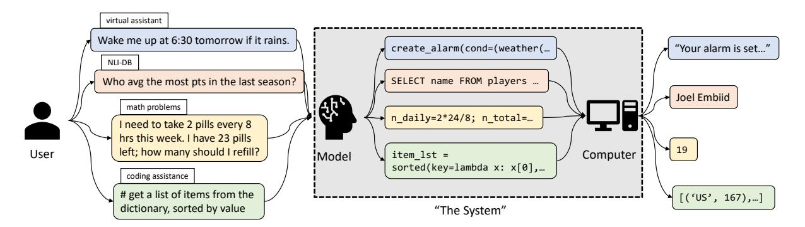
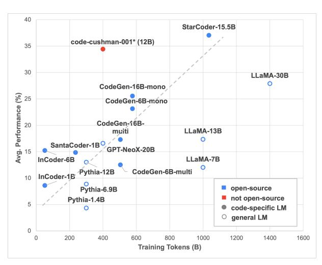
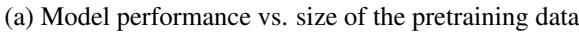
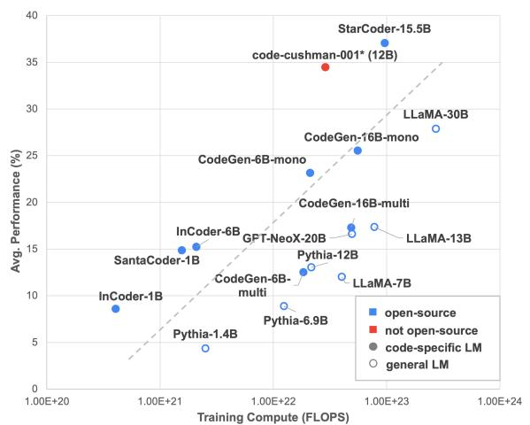
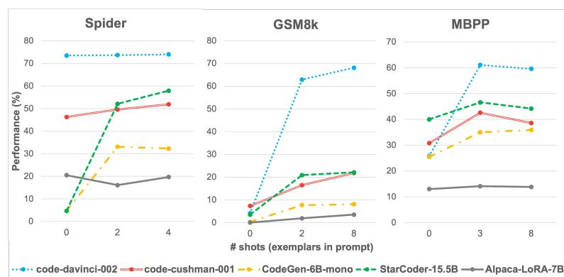
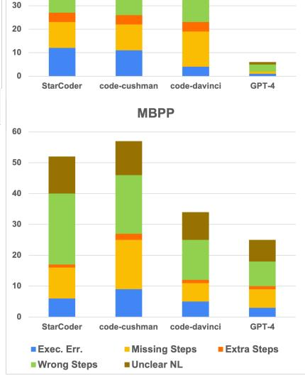
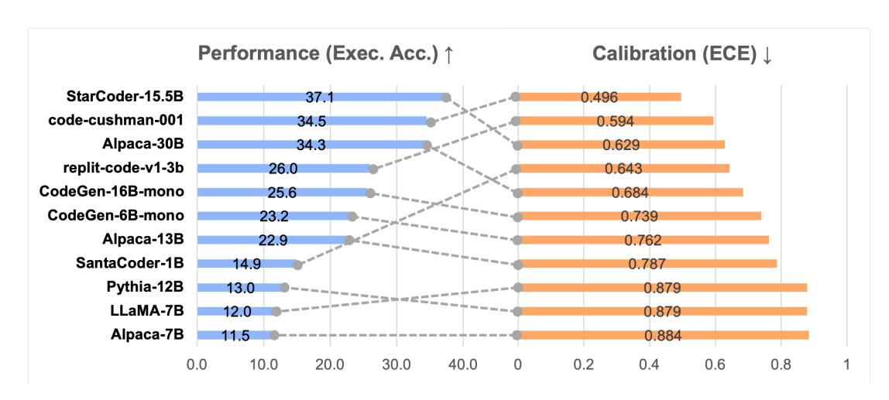
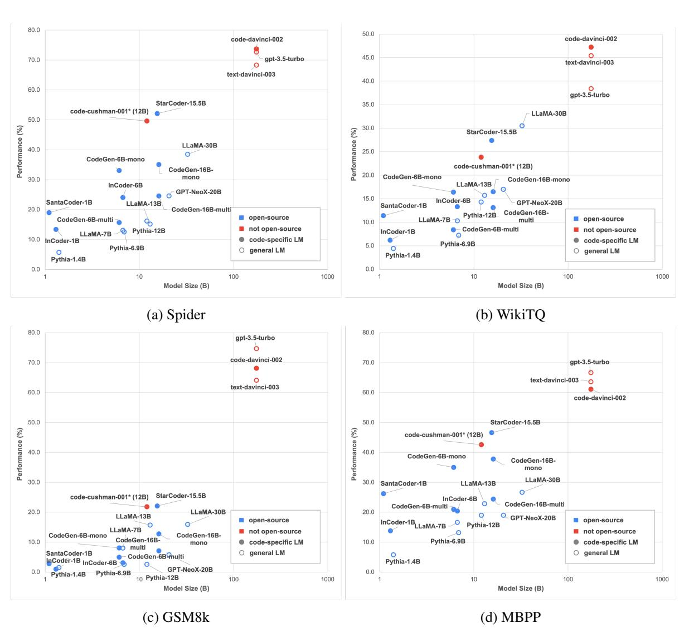

# **L2CEval**: Evaluating Language-to-Code Generation Capabilities of Large Language Models

Ansong Ni† Pengcheng Yin♣ Yilun Zhao† Martin Riddell† Troy Feng† Rui Shen† Stephen Yin† Ye Liu♢ Semih Yavuz♢ Caiming Xiong♢ Shafiq Joty♢ Yingbo Zhou♢ Dragomir Radev† Arman Cohan†‡

†Yale University ‡Allen Institute for AI ♣Google DeepMind ♢Salesforce Research

{ansong.ni, arman.cohan}@yale.edu

**<https://l2c-eval.github.io>**

# Abstract

Recently, large language models (LLMs), especially those that are pretrained on code, have demonstrated strong capabilities in generating programs from natural language inputs in a few-shot or even zero-shot manner. Despite promising results, there is a notable lack of a comprehensive evaluation of these models' language-to-code generation capabilities. Existing studies often focus on specific tasks, model architectures, or learning paradigms, leading to a fragmented understanding of the overall landscape. In this work, we present **L2CEval**, a systematic evaluation of the language-tocode generation capabilities of LLMs on 7 tasks across the domain spectrum of semantic parsing, math reasoning and Python programming, analyzing the factors that potentially affect their performance, such as model size, pretraining data, instruction tuning, and different prompting methods. In addition to assessing model performance, we measure confidence calibration for the models and conduct human evaluations of the output programs. This enables us to identify and analyze the typical failure modes across various tasks and models. **L2CEval** offers a comprehensive understanding of the capabilities and limitations of LLMs in language-to-code generation. We also release the evaluation framework[1](#page-0-0) and all model outputs, hoping to lay the groundwork for further future research in this domain.

## 1 Introduction

Language-to-code (**L2C**[2](#page-0-1) ) is a type of task that aims to automatically map natural language descriptions to programs, which are later executed to satisfy the user's demand [\(Yin and Neubig,](#page-14-0) [2017;](#page-14-0) [Austin et al.,](#page-10-0) [2021\)](#page-10-0). As illustrated in [Fig. 1,](#page-1-0) language-to-code is the foundation of many applications in AI, such as *task-oriented dialogue systems* [\(Andreas et al.,](#page-10-1) [2020\)](#page-10-1), *coding assistant* [\(Agashe et al.,](#page-10-2) [2019b;](#page-10-2) [Lai et al.,](#page-12-0) [2022\)](#page-12-0), *language interfaces to databases* [\(Pasupat and Liang,](#page-13-0) [2015;](#page-13-0) [Yu et al.,](#page-14-1) [2018\)](#page-14-1), and *robotic control* [\(Zhou et al.,](#page-14-2) [2021;](#page-14-2) [Shridhar et al.,](#page-13-1) [2020\)](#page-13-1). It has also served as a great testbed for evaluating various language understanding capabilities of NLP systems, such as *logical and math reasoning* [\(Gao et al.,](#page-11-0) [2022;](#page-11-0) [Han et al.,](#page-11-1) [2022\)](#page-11-1), *grounded language understanding* [\(Xie et al.,](#page-13-2) [2022;](#page-13-2) [Huang et al.,](#page-11-2) [2022\)](#page-11-2), and *tool use* [\(Schick et al.,](#page-13-3) [2023;](#page-13-3) [Paranjape et al.,](#page-13-4) [2023\)](#page-13-4).

Recent progress on large language models (LLMs) [\(OpenAI,](#page-12-1) [2023;](#page-12-1) [Chowdhery et al.,](#page-11-3) [2022;](#page-11-3) [Touvron et al.,](#page-13-5) [2023\)](#page-13-5), especially those that are specifically trained for coding [\(Fried et al.,](#page-11-4) [2022;](#page-11-4) [Nijkamp et al.,](#page-12-2) [2022;](#page-12-2) [Chen et al.,](#page-11-5) [2021;](#page-11-5) [Li et al.,](#page-12-3) [2023\)](#page-12-3), has shown that such LLMs that are trained on a mixture of text and code are able to perform language-to-code generation under few-shot or even zero-shot learning settings [\(Rajkumar et al.,](#page-13-6) [2022;](#page-13-6) [Ni et al.,](#page-12-4) [2023\)](#page-12-4). However, the modeling factors that affect the performance of LLMs for such **L2C** tasks, such as model size, training data mixture, prompting methods, and instruction tuning are poorly understood.In addition, there lacks a consistent evaluation of different LLMs on the same spectrum of language-to-code tasks, making it difficult for the users to decide which models to use for certain tasks or if they should resort to finetuning their own model. Beyond model performance, model properties such as robustness to prompt and confidence calibration are also crucial for understanding the reliability of the LLMs, but such properties have not been systematically studied for **L2C** tasks in previous work.

In this work, we present **L2CEval**, providing a systematic evaluation of the language-to-code

<span id="page-0-0"></span><sup>1</sup>All future releases will be updated on the project website: <https://l2c-eval.github.io/>

<span id="page-0-1"></span><sup>2</sup>We refer to "natural language" whenever we use the term "language" in this work.

<span id="page-1-0"></span>

Figure 1: Language-to-code (**L2C**) generation is the cornerstone for many applications in AI. It is also the key to enabling direct communication between the users and the computers with natural language.

generation capabilities of LLMs. L2CEval includes a wide range of state-of-the-art models, specifically 54 models from 13 different organizations, all evaluated on three core domains of language-to-code generation tasks. L2CEval includes extensive evaluations of models as small as 1 billion parameters, to significantly larger ones such as davinci and GPT-4 models from OpenAI, with estimated size of 170B+ parameters. We also benchmark models that are trained on different mixtures of data of varying sizes (35B  $\sim$  1T tokens), as well as models that are instruction-tuned, from both open-source and open-access proprietary categories. Our work is the first to conduct extensive and thorough comparisons of LLMs for language-to-code generation across multiple dimensions of variation. To summarize, we release **L2CEval** and its main contributions are as follows:

- We standardize the evaluation (*e.g.* prompts, metrics) of **7 L2C** tasks across domains of semantic parsing, math reasoning, and Python programming to allow controlled comparisons among **54** models from **13** organizations;
- We study the model size and training data scaling laws and measure the effects of several recent modeling contributions (*e.g.* instruction-tuning, zero/few-shot prompting) for **L2C** tasks;
- We analyze the robustness and calibration measurements of the model outputs, and identify the common error cases for models of different capabilities;
- We release the outputs (*i.e.* texts and logits) of all models on all datasets to facilitate future studies.

Through our work, we hope to provide insight into

applying LLMs to **L2C** applications, as well as building future LLMs.

### <span id="page-1-2"></span>2 Background

## 2.1 Language-to-Code Generation

While language-to-code generation covers a wide range of tasks as shown in Fig. 1, here we attempt to give a unified problem formulation. Given the user's intent described in natural language x (e.g. description of a Python function) and optionally some programming context c (e.g. existing function definitions, open test cases), an **L2C** model aims to automatically map the input to a program y (e.g. a Python function). This generation process can be directly modeled as:

$$\hat{y} = \arg\max_{y} P(y|x,c)$$

Such program  $\hat{y}$ , sometimes accompanied with additional execution context e (e.g. connection to DB) is later executed by an executor  $\mathcal{E}(\cdot)$  (e.g. Python interpreter). We can evaluate execution accuracy by checking if it matches the gold execution results  $z^*$  upon execution:

Acc. = 
$$\mathbb{1}(\hat{z}, z^*)$$
 where  $\hat{z} = \mathcal{E}(\hat{y}, e)$ 

We use execution accuracy as a proxy for whether the user's original intent is satisfied<sup>3</sup>.

### 2.2 Few-shot Prompting with LLMs

Recent works on **L2C** generation find that LLMs are capable of few-shot learning from a couple of exemplars presented in the prompt via in-context learning (Rajkumar et al., 2022; Xie et al., 2022;

<span id="page-1-1"></span><sup>&</sup>lt;sup>3</sup>Execution-based evaluation typically results in falsepositives thus an overestimate of the performance. See the limitation section § 6 for more details.

| Domain             | Dataset                                                                                   | Split              | Size                | Input                                                | Output                                       |
|--------------------|-------------------------------------------------------------------------------------------|--------------------|---------------------|------------------------------------------------------|----------------------------------------------|
| Semantic Parsing   | Spider (Yu et al., 2018)<br>WikiTQ (Pasupat and Liang, 2015)                              | Dev<br>Dev         | 1,000<br>2,828      | DB schema + NL<br>Table headers* + NL                | SQL Query<br>SQL Query                       |
| Math Reasoning     | GSM8k (Cobbe et al., 2021)<br>SVAMP (Patel et al., 2021)                                  | All<br>All         | 1,494<br>996        | Math problem in NL<br>Math problem in NL             | Python solution Python solution              |
| Python Programming | MBPP (Austin et al., 2021)<br>HumanEval (Chen et al., 2021)<br>DS-1000 (Lai et al., 2022) | Test<br>All<br>All | 500<br>164<br>1,000 | NL spec. + 1 test<br>NL spec. + 1-3 test<br>NL spec. | Python function Python function Python lines |

Table 1: A summary of all the datasets being evaluated. \*: the BRIDGE format (Lin et al., 2020) is used.

Ni et al., 2023). For **L2C** tasks, such few-shot exemplars can be represented as  $\{(x_i, y_i, c_i)\}_{i < m}$ , where m is the number of exemplars. Moreover, recent progress on instruction tuning (Ouyang et al., 2022) shows that adding a natural language instruction for the task improves the performance of LLMs, especially for the instruction-tuned models under the zero-shot setting where no exemplars are presented in the prompt. We therefore add a task-specific instruction I to the beginning of the prompt. Specifically, a prompt to an LLM is the concatnation of a task instruction, m few-shot exemplars, as well as the intent x and its programming context c of a test problem:

**prompt** = 
$$f(I, \{(x_i, y_i, c_i)\}_{i < m}, c, x)$$

where  $f(\cdot)$  is a "promptify" function that concatenates those inputs into a string. Examples of task-specific instructions and prompts are listed in § A.1. We can then prompt an LLM to draw predictions (programs)  $\hat{y} \sim P_{LM}(y|\mathbf{prompt})$ .

#### 3 Tasks

We evaluate the language-to-code capabilities of LLMs in three representative application scenarios shown in Fig. 1: semantic parsing, math reasoning, and Python programming. Particularly, these tasks collectively assess the capabilities of models in language-to-code generation to understand natural language in different contexts, reason about the steps for solving the problem, and convert it into executable code (see Fig. 1). Semantic parsing focuses on the transformation of natural language queries into structured, domain-specific languages; math reasoning challenges the models' numerical and logical reasoning abilities by requiring them to solve problems that involve multiple steps of calculation and reasoning; and

Python programming tests the models' proficiency in generating functional code that aligns with a user's intent, reflecting a real-world application of LLMs in software development. Below we discuss each of these tasks in detail.

Semantic parsing. Semantic parsing considers the task of translating a user's natural language utterance (e.g. who averaged the most pots in the last season? in Fig. 1) into machine-executable programs (e.g. an SQL database query), and has been a long-standing problem in NLP (Zettlemoyer and Collins, 2005; Berant et al., 2013). A prompt to an LLM consists of an NL utterance and descriptions of relevant structured context, such as the schema information of a database (e.g. columns in each table). The target output is a program defined in some domain-specific languages, such as SQL. Intuitively, semantic parsing challenges LLMs on grounded language understanding (Xie et al., 2022; Cheng et al., 2022), where a model needs to associate NL concepts in utterances (e.g. "last season") with relevant structured knowledge (e.g. superlative operation on column season) in order to synthesize the program (Yin et al., 2020; Yu et al., 2018; Pasupat and Liang, 2015). In this work, we choose to use textto-SQL as a representative task as it closely ties with applications such as natural language interface to databases (Affolter et al., 2019; Androutsopoulos et al., 1995). Recent work (Rajkumar et al., 2022; Ni et al., 2023) shows that LLMs are effective in performing text-to-SQL parsing. In this work, we use two widely-used text-to-SQL datasets, Spider (Yu et al., 2018) and WikiTQ (Pasupat and Liang, 2015), as our datasets for benchmarking semantic parsing capabilities of LLMs. We follow (Xie et al., 2022) and provide the database schema or the table headers as the extra input to an LLM in addition to the natural language utterance.

<span id="page-2-0"></span><sup>&</sup>lt;sup>4</sup>This also recoveres zero-shot prompting when m = 0.

<span id="page-3-0"></span>

| Organization | Model Name               | Release<br>Time | Sizes        | # All<br>Tokens | # Code<br>Tokens | Ctx.<br>Leng. | Code<br>Specific | Inst.<br>Tuned |
|--------------|--------------------------|-----------------|--------------|-----------------|------------------|---------------|------------------|----------------|
|              | CodeGen-multi            | 2022-3          | 6.1/16.1B    | 505B            | 119B             | 2,048         | ✓                | Х              |
|              | CodeGen-mono             | 2022-3          | 0.1/10.11    | 577B            | 191B             | 2,048         | ✓                | X              |
| Salesforce   | CodeGen-2.5-multi        |                 |              | 1.4T            | 1.4T             | 2,048         | ✓                | X              |
|              | CodeGen-2.5-mono         | 2023-7          | 7B           | -               | -                | 2,048         | ✓                | X              |
|              | CodeGen-2.5-instruct     |                 |              | -               | -                | 2,048         | ✓                | ✓              |
|              | GPT-J                    | 2021-5          | 6.1B         | 402B            | 46B              | 2,048         | Х                | Х              |
| Eleuther AI  | GPT-NeoX                 | 2022-4          | 20.6B        | 472B            | 54B              | 2,048         | X                | X              |
|              | Pythia                   | 2023-4          | 1.4/6.9/12B  | 300B            | 35B              | 2,048         | X                | X              |
| Databricks   | Dolly-v2                 | 2023-4          | 6.9/12B      | -               | -                | 2,048         | X                | <b>√</b>       |
|              | SantaCoder               | 2023-1          | 1.1B         | 236B            | 236B             | 2,048         | ✓                | Х              |
| BigCode      | StarCoder                | 2023-5          | 15.5B        | 1T              | 1T               | 8,192         | ✓                | X              |
|              | StarCoderPlus            | 2023-6          | 15.5B        | 1.6T            | 1T               | 8,192         | ✓                | X              |
|              | InCoder                  | 2022-4          | 1.3/6.7B     | 52B             | 52B              | 2,048         | <b>√</b>         | Х              |
|              | LLaMA                    | 2022.2          | 6.7/13B      | 1T              | 45B              | 2,048         | X                | X              |
| Meta AI      | LLaMA-30B                | 2023-2          | 32.5B        | 1.4T            | 63B              | 2,048         | X                | X              |
|              | LLaMA-2                  | 2023-7          | 7/13/70B     | 2T              | -                | 4,096         | X                | X              |
|              | CodeLLaMA                | 2023-7          | 7/13/34B     | 2.5T            | 435B             | 16,384        | ✓                | X              |
| Stanford     | Alpaca                   | 2023-3          | 6.7/13/32.5B | -               | -                | 2,048         | Х                | ✓              |
| LMSYS        | Vincuna                  | 2023-3          | 6.7/13/32.5B | -               | -                | 2,048         | Х                | Х              |
| Replit       | Replit-code-v1-3b        | 2023-5          | 2.7B         | 525B            | 525B             | 2,048         | <b>√</b>         | Х              |
| -            | MPT-7B                   | 2022 5          | 7D           | 1T              | 135B             | 2,048         | Х                | Х              |
| MosaicML     | MPT-7B-instruct          | 2023-5          | 7B           | -               | -                | 2,048         | X                | ✓              |
|              | MPT-30B                  | 2022 (          | 30B          | 1T              | 135B             | 8,192         | X                | X              |
|              | MPT-30B-instruct         | 2023-6          |              | -               | -                | 8,192         | X                | ✓              |
| MistralAI    | Mistral-7B-v0.1          | 2022.0          |              | -               | -                | 32,768        | Х                | Х              |
| MISTAIAI     | Mistral-7B-instruct-v0.1 | 2023-9          | 7B           | -               | -                | 32,768        | X                | ✓              |

Table 2: Information table for the open-source models evaluated in this work. -: no information on training data size is available, or the model is further tuned on top of other models.

Math reasoning. To solve a math word problem, a model needs to abstract the mathematical relations from the natural language description, and reason about the potential steps for solving it. Compared to semantic parsing where the target programs are table-lookup queries, programs for math reasoning tasks usually require multiple steps of calculation and numerical and logical reasoning. Because of this, math word problems are widely adopted as testbeds for evaluating the reasoning abilities of LLMs (Cobbe et al., 2021; Wei et al., 2022b; Ni et al., 2022; Welleck et al., 2022). In this paper, we choose the GSM8k dataset (Cobbe et al., 2021) for this evaluation, which contains ~8K grade-school level math problems and solutions described in natural language. In addition, we also evaluate the models on the **SVAMP** dataset (Patel et al., 2021) which contains 1k examples of math word problems. Following previous work, (Ni et al., 2022; Welleck et al., 2022; Gao et al., 2022), we prompt the models to answer math word problems by generating Python programs as solutions, which are later executed by a Python interpreter to output the

answer.

**Python programming.** One of the most important applications for LLMs trained on code is to assist programmers in developing software. Typically, a model is given a developer's natural language intent (*e.g. write a merge sort function*) with optional additional specifications such as input/output examples or unit tests (*e.g.* assert merge\_sort([5,7,3]) == [3,5,7]))

(Austin et al., 2021), in order to generate the code that implements the user's intent (*e.g.* a Python function). To evaluate the basic programming skills of the LLMs, we use the **MBPP** (Austin et al., 2021), **HumanEval** (Chen et al., 2021) and **DS-1000** (Lai et al., 2022) datasets.

More task-specific settings are described in § A.2, and example input outputs for different tasks are shown in § A.1.

#### 4 Models

We evaluate 54 models that vary in size, training data mixture, architecture context length, and training methods. Tab. 2 summarizes the open-

<span id="page-4-5"></span>

| Group                           | Model (Size)               | Code<br>LLM | Spider<br>(2-shot) | WikiTQ<br>(2-shot) | GSM8k<br>(8-shot) | MBPP (3-shot) | HumanEval<br>(0-shot) | MWR  |
|---------------------------------|----------------------------|-------------|--------------------|--------------------|-------------------|---------------|-----------------------|------|
|                                 | gpt-4 (unknown)            | Х           | 77.2               | 56.2               | 92.4              | 74.0          | 76.8                  | 100% |
| Other                           | text-davinci-003 (unknown) | X           | 68.3               | 45.4               | 64.1              | 63.6          | 52.4                  | 94%  |
|                                 | gpt-3.4-turbo (unknown)    | X           | 72.7               | 38.4               | 74.7              | 66.6          | 39.0                  | 91%  |
|                                 | CodeLLaMA-base (34B)       | <b>✓</b>    | 61.7               | 32.3               | 43.6              | 45.6          | 44.5                  | 88%  |
| $20\mathrm{B}\sim100\mathrm{B}$ | LLaMA-2 (70B)              | X           | 58.5               | 37.3               | 56.0              | 36.8          | 28.7                  | 81%  |
|                                 | Alpaca (30B)               | X           | 46.2               | 39.7               | 19.4              | 32.0          | 23.8                  | 70%  |
|                                 | WizardCoder (15.5B)        | <b>√</b>    | 58.6               | 29.4               | 25.8              | 47.4          | 51.2                  | 86%  |
| 10B ∼20B                        | CodeLLaMA (13B)            | ✓           | 58.5               | 35.6               | 30.7              | 44.0          | 34.2                  | 85%  |
|                                 | StarCoder-15.5B            | ✓           | 52.1               | 27.4               | 22.1              | 46.6          | 34.2                  | 78%  |
|                                 | Mistral-v0.1 (7B)          | Х           | 53.3               | 31.4               | 38.4              | 37.8          | 25.0                  | 79%  |
| $2B\sim \!\! 10B$               | CodeLLaMA-base (7B)        | ✓           | 54.3               | 29.5               | 25.5              | 40.0          | 31.1                  | 75%  |
|                                 | CodeGen2.5-multi (7B)      | ✓           | 53.8               | 29.6               | 14.9              | 38.2          | 31.1                  | 71%  |
|                                 | SantaCoder (1.3B)          | ✓           | 19.0               | 11.4               | 2.8               | 26.2          | 17.7                  | 33%  |
| <2B                             | InCoder (1.1B)             | ✓           | 13.4               | 6.2                | 1.0               | 13.8          | 8.5                   | 11%  |
|                                 | Pythia (1.4B)              | X           | 5.7                | 4.4                | 1.5               | 5.8           | 3.7                   | 5%   |

Table 3: Top-3 models at different size ranges. Evaluated with head-to-head performance comparison on each task, then the mean win rate (**MWR**) is computed across tasks.

source models we evaluated and several key properties.

#### 4.1 Model Selection

While it is not possible to evaluate every single LLM on these tasks, we strive to provide a comprehensive evaluation of the current LLMs in L2C generation, by covering a diversified selection of LLMs of varying sizes and are trained on different mixtures of data. For example, the size of the models we consider ranges from 1B (e.g. SantaCoder (Allal et al., 2023)) to 170B+ (e.g. davinci models from OpenAI). Though we prioritize the evaluation of code-specific models, which means that the majority of the training tokens are from code (e.g. CodeLLaMA (Rozière et al., 2023), StarCoder (Li et al., 2023)), we also include the most competitive general LLMs such as LLaMA2-70B (Touvron et al., 2023) and MPT-30B<sup>5</sup> for comparison. To evaluate the effect of instruction-tuning and its data mixtures on **L2C** tasks, we also include several instruct-tuned versions of the LLMs, such as Alpaca (Stanford), Dolly (Databricks), etc.

#### 4.2 Model Access

For all the open-source models, we access them through huggingface model hub<sup>6</sup> and run them locally on our machines with RTX Ada A6000

48GiB GPUs, using Lightning<sup>7</sup> as our underlying framework. For proprietary Open AI models we access them through the public API<sup>8</sup>. In this paper we primarly focus on evaluation and analysis of open-source models, as we are unclear about the technical details of proprietary models (*e.g.* model size, training data mixture).

### 4.3 Evaluation Details

When generating programs, we use greedy decoding for all models<sup>9</sup>. To optimize for a fair comparison, we standardize the prompting methods by following previous work (Ni et al., 2023; Ben Allal et al., 2022) and avoid prompts that are tailored for specific models. Using the formulation in § 2, we evaluate **execution accuracy** for all tasks with all models. This is also consistent with previous work on **L2C** (Xie et al., 2022; Yin and Neubig, 2017; Zhang et al., 2022).

### 5 Results and Analysis

We organize the experiment results and analysis as follows. We first discuss the scaling effects of model size, training data and compute in § 5.1,

<span id="page-4-0"></span><sup>&</sup>lt;sup>5</sup>https://www.mosaicml.com/blog/mpt-30b

<span id="page-4-1"></span><sup>6</sup>https://huggingface.co/models

<span id="page-4-3"></span><span id="page-4-2"></span>https://lightning.ai/

<sup>%</sup>https://platform.openai.com/docs/ api-reference

<span id="page-4-4"></span><sup>&</sup>lt;sup>9</sup>Previous work (Austin et al., 2021) has found that greedy decoding leads to degenerated outputs but we do not observe this upon human inspection of outputs. For other limitations of using greedy-decoding, see § 6.

then in [§ 5.2](#page-5-1) we analyze how the fraction of code data in the training mixture affects the performance of models for **L2C** tasks. In [§ 5.3,](#page-6-0) we compare the instruction-tuned models and their base models to study the effect of instruction-tuning, especially on zero-shot results. Lastly, we evaluate the sensitivity of the models on the prompts in [§ 5.4](#page-6-1) and confidence calibration in [§ 5.6.](#page-7-0)

## <span id="page-5-0"></span>5.1 Scaling

Here we study the correlation between model performance and the scales of the model parameter count as well as the size of training data. While most of the findings here are consistent with previous work on scaling laws, we focus on properties that are more related to **L2C** tasks.

Model size. We show the top-3 models at different size ranges based on mean win rate (MWR) in [Tab. 3.](#page-4-5) MWR is defined as the fraction of a model outperforming other models, averaged across the five tasks. From this table, we can observe a clear discrepancy between models of different size groups. However, such scaling effect also differs for different tasks. For tasks that are more similar to the pretraining data (*e.g.* MBPP), the scaling curves are much smoother, while for tasks that require more reasoning skills (*e.g.* GSM8k), the scaling curve appears to be more "emergent" [\(Wei](#page-13-12) [et al.,](#page-13-12) [2022a\)](#page-13-12). This can be better observed from [§ B.4](#page-17-0) as we plot the scaling curve independently for each task.

Training data and compute. We plot the average model performance with the number of tokens seen as well as the FLOPS of compute used during training in [Fig. 2a](#page-5-2) and [Fig. 2b,](#page-5-2) respectively. Comparing models of similar sizes (*e.g.* CodeGen-16B vs. StarCoder-15.5B, Pythia-6.9B vs. LLaMA-7B), those that are trained with more tokens generally have better performance for **L2C**, which is also consistent with previous findings [\(Kaplan](#page-12-8) [et al.,](#page-12-8) [2020\)](#page-12-8). It is also suggested in [Fig. 2b](#page-5-2) that some models are under-trained, such as InCoder-6B and CodeGen-16B models.

## <span id="page-5-1"></span>5.2 Data Mixture

Though all of the models we evaluated have seen code tokens during pretraining, the distributions of their training data mixture are quite different

<span id="page-5-2"></span>





(b) Model performance vs. pretraining compute[10](#page-5-3)

Figure 2: Pretraining data and compute scaling across selected models. Average execution accuracy is calculated across selected tasks (*i.e.* Spider, WikiTQ, GSM8k, and MBPP). More scaling curves are shown in [§ B.4.](#page-17-0)

as we can see from [Tab. 2.](#page-3-0) From [Tab. 3](#page-4-5) we can see that code-specific LLMs are typically better at **L2C** tasks, as most of the top models in every size category are code-specific LLMs. While it is less surprising that code LLMs register better performance on programming tasks such as MBPP, they are also better on tasks that focus more on logical reasoning (*e.g.* GSM8K) and grounded language understanding (*e.g.* WikiTQ, Spider). Notably, StarCoder-15.5B, which is only trained on coderelated tokens[11](#page-5-4), achieves far better performances than LLaMA-13B, which is a similar-sized model trained on a similar number of tokens but only

<span id="page-5-3"></span><sup>10</sup>Here we base our estimation on [\(Kaplan et al.,](#page-12-8) [2020\)](#page-12-8): FLOPS ≈ 6 \* model size (B) \* training tokens (B).

<span id="page-5-4"></span><sup>11</sup>Semi-text data, such as documentations are also included in the training data.

<span id="page-6-2"></span>

| Models      | Few-Shot    |             |             | Zero-Shot   |         |             |  |
|-------------|-------------|-------------|-------------|-------------|---------|-------------|--|
|             | Spider      | GSM8k       | MBPP        | Spider      | GSM8k   | MBPP        |  |
| Pythia-6.9B | 12.5 / 33.9 | 2.6 / 74.5  | 13.2 / 97.6 | 2.8 / 8.0   | 0 / 0   | 1.2 / 15.0  |  |
| Dolly-v2-7b | 13.1 / 31.7 | 2.6 / 52.3  | 12.0 / 97.2 | 5.2 / 15.0  | 0 / 0.1 | 9.4 / 62.6  |  |
| LLaMA-7B    | 13.1 / 36.1 | 8.0 / 71.3  | 16.6 / 96.6 | 5.7 / 22.2  | 0 / 0   | 5.0 / 29.8  |  |
| Alpaca-7B   | 16.1 / 37.8 | 3.5 / 37.1  | 14.4 / 98.4 | 20.5 / 45.2 | 0 / 0   | 13.2 / 58.4 |  |
| LLaMA-13B   | 15.2 / 41.5 | 15.7 / 72.7 | 22.8 / 97.6 | 15.2 / 41.6 | 0 / 0   | 2.2 / 7.0   |  |
| Alpaca-13B  | 24.3 / 51.9 | 18.5 / 80.3 | 23.4 / 97.6 | 26.1 / 55.5 | 0 / 0   | 6.8 / 20.6  |  |

Table 4: How instruction-tuning affects few- and zero-shot performances. Underlined models are instruction-tuned from the model above them. Performance shown as "exec. acc. / exec. rate".

4.5% of which is code.

From [Fig. 2b,](#page-5-2) we can also find that training on code tokens is more compute-efficient for **L2C** tasks, as the dashed line clearly separates the codespecific models (*e.g.* StarCoder, and CodeGen) and the general LLMs (*e.g.* Pythia and LLaMA). The only exceptions are CodeGen-multi models, as they are initialized from general LMs (*i.e.* CodeGen-nl) thus the majority of the compute is still spent on text tokens. This is expected as general LLMs are also optimized for many other natural language tasks that are not related to code. This shows that for **L2C** tasks, training on more code tokens instead of text tokens improves the compute efficiency during pretraining.

#### <span id="page-6-0"></span>5.3 Instruction-tuning

Instruction tuning [\(Ouyang et al.,](#page-12-6) [2022\)](#page-12-6) is a type of method that enhances the instruction following abilities of LLMs. Here we compare the few- and zero-shot performance of instruction-tuned models and their base models in [Tab. 4.](#page-6-2) To better understand the model performance, we also include the execution rate in [Tab. 4,](#page-6-2) defined as the percentage of programs that successfully produce an execution result, regardless of its correctness.[12](#page-6-3) From the results, we can see that instruction-tuned models achieve much higher execution rates, especially for zero-shot settings, which is likely to lead to better execution accuracy. This suggests that instruction-tuned models are better at following the instructions and generate less deformed (inexecutable) programs, when few-shot exemplars are not present in the prompt.

Though it was mentioned in [\(Ouyang et al.,](#page-12-6)

[2022\)](#page-12-6) that instruction-tuning generally decreases few-shot performance, as it shifts the attention of the model from the few-shot exemplars to the instructions, we do not observe similar effects consistently for **L2C** tasks in our experiments. From [Tab. 4,](#page-6-2) we observe improvements over noninstruction-tuned models for both few- and zeroshot settings for most scenarios. We also note that the zeros-shot performances for GSM8k are all zeros for the selected models. By inspecting the model outputs, we find that the models fail to follow the instructions and provide the answer by ending the Python solution with answer = x.

## <span id="page-6-1"></span>5.4 Sensitivity to Prompt

Here we perform several ablation studies on the few-shot prompting methods. By varying the number of exemplars or the exemplars themselves, we aim to test the sensitivity of different models to the few-shot prompts. In [Fig. 3,](#page-7-1) we plot the performance of the models as a function of the number of exemplars in the prompt. From the results, we can see that while increasing the number of few-shot exemplars in the prompt generally improves execution accuracy, such improvement is not consistent with different models and tasks. For example, on the MBPP dataset, increasing from 3 to 8 exemplars in the prompt actually decreases the performance for most of the selected models, *e.g.* by 4.0% for codex-cushman. We hypothesize that this is because the programs in the prompt will bias the model into generating similar programs and ignore the specification. This effect is also found in [\(Li et al.,](#page-12-9) [2022b\)](#page-12-9). Moreover, we also show the sensitivity of the models to different exemplars and present the results in [Tab. 5](#page-7-2) by showing the variance of model performance across different runs using different exemplars in the prompt. While the variances differ for

<span id="page-6-3"></span><sup>12</sup>For semantic parsing and MBPP tasks, this is simply defined as executability. For GSM8k, the program also needs to produce an "answer" variable for it to be considered as wellformed.



<span id="page-7-1"></span>Figure 3: Models performance with different numbers of exemplars in the prompt.

| Models           | Spider (2) | GSM8k (2) | MBPP (3) |
|------------------|------------|-----------|----------|
| code-davinci-002 | 73.7±0.3   | 66.4±1.0  | 59.0±1.9 |
| code-cushman-001 | 50.4±0.7   | 24.2±1.1  | 39.3±3.3 |
| CodeGen-6B-mono  | 32.4±0.6   | 13.8±0.2  | 35.5±0.5 |
| StarCoder-15.5B  | 54.9±2.7   | 32.3±0.8  | 44.1±2.2 |
| Alpaca-7B        | 20.1±3.5   | 7.3±1.2   | 13.6±0.6 |

Table 5: Mean and std for few-shot performance of different models over 3 runs, where random exemplars are chosen at each run.



<span id="page-7-3"></span><span id="page-7-2"></span>Figure 4: Error analysis for the best models on GSM8k and MBPP. y-axis denotes the percentage of all examples.

different models and tasks, none of them are significant enough to alter the ranking of the models, nor threaten the conclusions presented in this work.

### <span id="page-7-4"></span>5.5 Error Modes

In [Fig. 4,](#page-7-3) we present an error analysis on the four best models, by manually examining a fixed set of 100 examples from the GSM8k and MBPP datasets across selected models that are the best in its size group. More specifically, we categorize the errors into 5 cases:

- 1) *execution error*, where deformed programs are generated;
- 2/3) *missing/extra steps*, where some key steps are missing or extraneous lines are generated in predicted code;
- 2) *wrong steps*, where the model only makes subtle mistakes in certain steps in the code;
- 3) when the NL specification itself is ambiguous and *unclear*.

From the results shown in [Fig. 4,](#page-7-3) we can see that for GSM8k, compared with stronger models (*e.g.* code-davinci and GPT-4), while a similar number of errors are made for missing and generating extra steps for solving the math problem, StarCoder and code-cushman make more mistakes in predicting intermediate steps, or generating deformed programs. On MBPP however, weaker models are also prone to miss crucial steps in the implementation, which shows a lack of understanding of the problem as well as planning abilities. Though hallucination [\(Ji et al.,](#page-11-9) [2023\)](#page-11-9) is a common issue in natural language generation, we do not observe similar effects for code generation as shown in [Fig. 4,](#page-7-3) as it is quite rare for the models to generate lines of code that are extraneous in solving the problem.

#### <span id="page-7-0"></span>5.6 Model Calibration

A good model not only produces high-quality outputs, but also should be well-calibrated, meaning that it should be uncertain about its predictions when such predictions are wrong. Following recent work [\(Liang et al.,](#page-12-10) [2022\)](#page-12-10), we evaluate model calibration using *expected calibration error*

<span id="page-8-1"></span>

Figure 5: Average models performance across selected datasets (*i.e.* Spider, WikiTQ, GSM8k and MBPP) and their calibration score rankings.

[\(Naeini et al.,](#page-12-11) [2015;](#page-12-11) [Guo et al.,](#page-11-10) [2017\)](#page-11-10) and *selective classification* [\(El-Yaniv et al.,](#page-11-11) [2010\)](#page-11-11), with the results shown in [Fig. 5](#page-8-1) and [§ B.3,](#page-16-0) respectively. From [Fig. 5,](#page-8-1) we observe that while model calibration is generally correlated with model performance, the best-performing models are not the ones with the best calibration. Note that with a well-calibrated model, methods such as voting [\(Li](#page-12-12) [et al.,](#page-12-12) [2022a;](#page-12-12) [Wang et al.,](#page-13-13) [2022a\)](#page-13-13) and confidencebased reranking [\(Ni et al.,](#page-12-4) [2023\)](#page-12-4) may be used to further improve their performance. Moreover, a better-calibrated model is safer to use in practice, especially for applications as coding assistants, as its confidence can be used as an indicator of the generation quality.

# <span id="page-8-0"></span>6 Limitations

While we strive to provide a comprehensive and fair evaluation of the capabilities of LLMs on **L2C** tasks, here we also discuss several limitations of **L2CEval**.

Generation using greedy-decoding. In this work, we use greedy decoding to generate a single program for each example as the models' output. While this is the most efficient way of generation and ensures fair comparison for different models as it is not affected by factors like sampling temperature, it is also relatively noisy [\(Nijkamp et al.,](#page-12-2) [2022;](#page-12-2) [Chen et al.,](#page-11-5) [2021\)](#page-11-5). For tasks such as MBPP or Python programming in general, *pass@k* or *n@k* are better as they give the model k tries to generate the correct program. More specifically, *pass@k* measures if *any* of the k program samples is correct and *n@k* measures the number of correct programs in the k samples. For Python programming tasks, such methods are closer to practical use cases as we typically have test cases that can filter out some incorrect programs in the samples. For other tasks, having a better *pass@k* also provides opportunities for post-generation reranking methods such as [\(Shi et al.,](#page-13-14) [2022;](#page-13-14) [Zhang et al.,](#page-14-5) [2022;](#page-14-5) [Ni et al.,](#page-12-4) [2023\)](#page-12-4). However, the cost for evaluating *pass@k* or *n@k* is k times of the compute compared with greedy decoding, thus we choose to only evaluate greedy decoding results in this work and leave sampling-based evaluation to future work.

Execution-based evaluation. Moreover, we mainly rely on execution-based evaluation (*i.e.* execution accuracy) for this work. However, such evaluation may produce spurious programs, *i.e.* false-positive programs that achieve the correct execution result by chance [\(Zhong et al.,](#page-14-6) [2020;](#page-14-6) [Xie et al.,](#page-13-2) [2022\)](#page-13-2). In this work, we adopt human evaluation to measure the problem of spuriousness and found non-trivial portion of "correct" programs being spurious for Spider but not for other datasets. More details on this can be found in [§ B.2.](#page-16-1) In addition, execution may not always be straightforward in practice, especially when complex dependencies and potentially harmful programs are considered [\(Chen et al.,](#page-11-5) [2021\)](#page-11-5). Thus for future work, we would like to add a surface-form-based evaluation for code, such as [\(Zhou et al.,](#page-14-7) [2023\)](#page-14-7).

## Confounding factors during comparison. When comparing different models, especially models from different model series, there are typically multiple performance-impacting factors that are in effect at the same time, such as model

size, pretraining data, model architecture, pretraining objective, etc. Such confounding factors may limit the validity of the conclusions that we draw from model comparisons. In this work, we try to mitigate this by fixing as many variables about the models as possible during a comparison, such as making observations within the same model series. While the general trend can still be observed across different model series, we should also note that when interpreting the results, readers should be mindful of such confounding factors when comparing different models.

Lack of information for proprietary models.

For the open-access proprietary LLMs (*e.g.* OpenAI models), due to the lack of basic information and mismatches between the models described in the papers and the actual API engines, very few scientific conclusions can be drawn from their results. In this work, we evaluate such models with the open-access APIs and compare them with all other models, in the hope of helping practitioners in choosing models for their use cases. We also present human evaluations on codex-cushman, codex-davinci, and gpt-4, which are the three strongest models for code generation, to discuss differences in common error modes. However, when making our findings, we generally rely on open-source models instead, to avoid being misled by speculative model details of such closed-source models.

# 7 Related Work

Code generation evaluation. Several code generation benchmarks are collected from raw data from GitHub and StackOverflow, and involve professional annotators to enhance the quality of the data [\(Iyer et al.,](#page-11-12) [2018;](#page-11-12) [Agashe et al.,](#page-10-8) [2019a;](#page-10-8) [Yin et al.,](#page-13-15) [2018\)](#page-13-15). While such benchmarks focus more on lexical-based evaluation, ODEX [\(Wang](#page-13-16) [et al.,](#page-13-16) [2022b\)](#page-13-16) introduces execution-based evaluation, which has also been widely applied in recent code generation evaluation benchmarks, such as DS-1000 [\(Lai et al.,](#page-12-0) [2022\)](#page-12-0), HumanEval [\(Chen](#page-11-5) [et al.,](#page-11-5) [2021\)](#page-11-5), and MBPP [\(Austin et al.,](#page-10-0) [2021\)](#page-10-0). More recently, there has been an increasing focus on assessing the generalization capabilities of code generation models across multiple programming languages [\(Athiwaratkun et al.,](#page-10-9) [2023\)](#page-10-9), and benchmarks such as CodeGeeX [\(Zheng et al.,](#page-14-8) [2023\)](#page-14-8) and MultiPL-E[\(Cassano et al.,](#page-10-10) [2023\)](#page-10-10) are created.

Other code-related tasks. Large language models have also shown significant success in other code-related directions. One popular direction is code understanding. For example, CodeXGLUE [\(Lu et al.,](#page-12-13) [2021\)](#page-12-13) comprises three widely-used code understanding tasks including defect detection, clone detection, and code search. BigCloneBench [\(Krinke and Ragkhitwetsagul,](#page-12-14) [2022\)](#page-12-14) tasks to measure the similarity between code pairs to predict whether they have the same functionality. CodeSearchNet [\(Husain et al.,](#page-11-13) [2019\)](#page-11-13) is a benchmark of semantic code search given natural language queries. Besides code understanding, there have been other tasks such as code translation [\(Lachaux et al.,](#page-12-15) [2020\)](#page-12-15) and program repair [\(Gupta et al.,](#page-11-14) [2017\)](#page-11-14). We leave systematic evaluation of LLMs on those tasks as important future work.

## 8 Conclusions

In this paper, we present **L2CEval**, a comprehensive evaluation of LLMs for natural language to code generation, along a variety of axes such as model scale, training data, sensitivity to fewshot exemplars as well as the impact of instruction tuning, *etc*. We also present an analysis on the model calibration and conduct a human evaluation of common error modes across different models. We hope our study will provide useful insights for the community into applying LLMs for downstream code applications and future model development efforts.

### Acknowledgements

We would like to thank Rui Zhang and Tao Yu for the initial discussions of this project. Ansong would like to thank Hailey Schoelkopf and Zhangir Azerbayev for their suggestions for this work. This work is supported in part by a gift from Salesforce Research.

## References

- <span id="page-10-4"></span>Katrin Affolter, Kurt Stockinger, and Abraham Bernstein. 2019. A comparative survey of recent natural language interfaces for databases. *The VLDB Journal*, 28:793–819.
- <span id="page-10-8"></span>Rajas Agashe, Srini Iyer, and Luke Zettlemoyer. 2019a. Juice: A large scale distantly supervised dataset for open domain context-based code generation. *ArXiv*, abs/1910.02216.
- <span id="page-10-2"></span>Rajas Agashe, Srinivasan Iyer, and Luke Zettlemoyer. 2019b. [JuICe: A large scale distantly](https://doi.org/10.18653/v1/D19-1546) [supervised dataset for open domain context](https://doi.org/10.18653/v1/D19-1546)[based code generation.](https://doi.org/10.18653/v1/D19-1546) In *Proceedings of the 2019 Conference on Empirical Methods in Natural Language Processing and the 9th International Joint Conference on Natural Language Processing (EMNLP-IJCNLP)*, pages 5436– 5446, Hong Kong, China. Association for Computational Linguistics.
- <span id="page-10-6"></span>Loubna Ben Allal, Raymond Li, Denis Kocetkov, Chenghao Mou, Christopher Akiki, Carlos Munoz Ferrandis, Niklas Muennighoff, Mayank Mishra, Alex Gu, Manan Dey, et al. 2023. Santacoder: don't reach for the stars! *arXiv preprint arXiv:2301.03988*.
- <span id="page-10-1"></span>Jacob Andreas, John Bufe, David Burkett, Charles Chen, Josh Clausman, Jean Crawford, Kate Crim, Jordan DeLoach, Leah Dorner, Jason Eisner, et al. 2020. Task-oriented dialogue as dataflow synthesis. *Transactions of the Association for Computational Linguistics*, 8:556– 571.
- <span id="page-10-5"></span>Ion Androutsopoulos, Graeme D Ritchie, and Peter Thanisch. 1995. Natural language interfaces to databases–an introduction. *Natural language engineering*, 1(1):29–81.
- <span id="page-10-9"></span>Ben Athiwaratkun, Sanjay Krishna Gouda, Zijian Wang, Xiaopeng Li, Yuchen Tian, Ming Tan, Wasi Uddin Ahmad, Shiqi Wang, Qing Sun, Mingyue Shang, Sujan Kumar Gonugondla, Hantian Ding, Varun Kumar, Nathan Fulton, Arash Farahani, Siddhartha Jain, Robert Giaquinto, Haifeng Qian, Murali Krishna Ramanathan, Ramesh Nallapati, Baishakhi Ray, Parminder Bhatia, Sudipta Sengupta, Dan Roth, and Bing Xiang. 2023. [Multi-lingual evaluation](https://openreview.net/forum?id=Bo7eeXm6An8)

- [of code generation models.](https://openreview.net/forum?id=Bo7eeXm6An8) In *The Eleventh International Conference on Learning Representations*.
- <span id="page-10-0"></span>Jacob Austin, Augustus Odena, Maxwell Nye, Maarten Bosma, Henryk Michalewski, David Dohan, Ellen Jiang, Carrie Cai, Michael Terry, Quoc Le, et al. 2021. Program synthesis with large language models. *arXiv preprint arXiv:2108.07732*.
- <span id="page-10-7"></span>Loubna Ben Allal, Niklas Muennighoff, Logesh Kumar Umapathi, Ben Lipkin, and Leandro von Werra. 2022. A framework for the evaluation of code generation models. [https:](https://github.com/bigcode-project/bigcode-evaluation-harness) [//github.com/bigcode-project/](https://github.com/bigcode-project/bigcode-evaluation-harness) [bigcode-evaluation-harness](https://github.com/bigcode-project/bigcode-evaluation-harness).
- <span id="page-10-3"></span>Jonathan Berant, Andrew Chou, Roy Frostig, and Percy Liang. 2013. Semantic parsing on Freebase from question-answer pairs. In *Empirical Methods in Natural Language Processing (EMNLP)*.
- <span id="page-10-13"></span>Stella Biderman, Hailey Schoelkopf, Quentin Anthony, Herbie Bradley, Kyle O'Brien, Eric Hallahan, Mohammad Aflah Khan, Shivanshu Purohit, USVSN Sai Prashanth, Edward Raff, et al. 2023. Pythia: A suite for analyzing large language models across training and scaling. *arXiv preprint arXiv:2304.01373*.
- <span id="page-10-11"></span>Ekaba Bisong and Ekaba Bisong. 2019. Google bigquery. *Building Machine Learning and Deep Learning Models on Google Cloud Platform: A Comprehensive Guide for Beginners*, pages 485–517.
- <span id="page-10-12"></span>Sid Black, Stella Biderman, Eric Hallahan, Quentin Anthony, Leo Gao, Laurence Golding, Horace He, Connor Leahy, Kyle Mc-Donell, Jason Phang, et al. 2022. Gpt-neox-20b: An open-source autoregressive language model. *arXiv preprint arXiv:2204.06745*.
- <span id="page-10-10"></span>Federico Cassano, John Gouwar, Daniel Nguyen, Sydney Nguyen, Luna Phipps-Costin, Donald Pinckney, Ming-Ho Yee, Yangtian Zi, Carolyn Jane Anderson, Molly Q Feldman, Arjun Guha, Michael Greenberg, and Abhinav Jangda. 2023. [Multipl-e: A scalable and poly](https://doi.org/10.1109/TSE.2023.3267446)[glot approach to benchmarking neural code](https://doi.org/10.1109/TSE.2023.3267446) [generation.](https://doi.org/10.1109/TSE.2023.3267446) *IEEE Transactions on Software Engineering*, pages 1–17.

- <span id="page-11-5"></span>Mark Chen, Jerry Tworek, Heewoo Jun, Qiming Yuan, Henrique Ponde de Oliveira Pinto, Jared Kaplan, Harri Edwards, Yuri Burda, Nicholas Joseph, Greg Brockman, et al. 2021. Evaluating large language models trained on code. *arXiv preprint arXiv:2107.03374*.
- <span id="page-11-15"></span>Wenhu Chen, Xueguang Ma, Xinyi Wang, and William W Cohen. 2022. Program of thoughts prompting: Disentangling computation from reasoning for numerical reasoning tasks. *arXiv preprint arXiv:2211.12588*.
- <span id="page-11-7"></span>Zhoujun Cheng, Tianbao Xie, Peng Shi, Chengzu Li, Rahul Nadkarni, Yushi Hu, Caiming Xiong, Dragomir Radev, Mari Ostendorf, Luke Zettlemoyer, et al. 2022. Binding language models in symbolic languages. *arXiv preprint arXiv:2210.02875*.
- <span id="page-11-3"></span>Aakanksha Chowdhery, Sharan Narang, Jacob Devlin, Maarten Bosma, Gaurav Mishra, Adam Roberts, Paul Barham, Hyung Won Chung, Charles Sutton, Sebastian Gehrmann, et al. 2022. Palm: Scaling language modeling with pathways. *arXiv preprint arXiv:2204.02311*.
- <span id="page-11-6"></span>Karl Cobbe, Vineet Kosaraju, Mohammad Bavarian, Jacob Hilton, Reiichiro Nakano, Christopher Hesse, and John Schulman. 2021. Training verifiers to solve math word problems. *arXiv preprint arXiv:2110.14168*.
- <span id="page-11-8"></span>Databricks. Free dolly: Introducing the world's first truly open instruction-tuned llm. [https://www.](https://www.databricks.com/blog/2023/04/12/dolly-first-open-commercially-viable-instruction-tuned-llm) [databricks.com/blog/2023/04/12/](https://www.databricks.com/blog/2023/04/12/dolly-first-open-commercially-viable-instruction-tuned-llm) [dolly-first-open-commercially-viable-instruction-tuned-llm](https://www.databricks.com/blog/2023/04/12/dolly-first-open-commercially-viable-instruction-tuned-llm). Accessed: 2023-05-15.
- <span id="page-11-11"></span>Ran El-Yaniv et al. 2010. On the foundations of noise-free selective classification. *Journal of Machine Learning Research*, 11(5).
- <span id="page-11-4"></span>Daniel Fried, Armen Aghajanyan, Jessy Lin, Sida Wang, Eric Wallace, Freda Shi, Ruiqi Zhong, Wen-tau Yih, Luke Zettlemoyer, and Mike Lewis. 2022. Incoder: A generative model for code infilling and synthesis. *arXiv preprint arXiv:2204.05999*.
- <span id="page-11-16"></span>Leo Gao, Stella Biderman, Sid Black, Laurence Golding, Travis Hoppe, Charles Foster, Jason Phang, Horace He, Anish Thite, Noa

- Nabeshima, et al. 2020. The pile: An 800gb dataset of diverse text for language modeling. *arXiv preprint arXiv:2101.00027*.
- <span id="page-11-0"></span>Luyu Gao, Aman Madaan, Shuyan Zhou, Uri Alon, Pengfei Liu, Yiming Yang, Jamie Callan, and Graham Neubig. 2022. Pal: Programaided language models. *arXiv preprint arXiv:2211.10435*.
- <span id="page-11-10"></span>Chuan Guo, Geoff Pleiss, Yu Sun, and Kilian Q Weinberger. 2017. On calibration of modern neural networks. In *International conference on machine learning*, pages 1321–1330. PMLR.
- <span id="page-11-14"></span>Rahul Gupta, Soham Pal, Aditya Kanade, and Shirish K. Shevade. 2017. DeepFix: fixing common C language errors by deep learning. In *AAAI Conference on Artificial Intelligence*.
- <span id="page-11-1"></span>Simeng Han, Hailey Schoelkopf, Yilun Zhao, Zhenting Qi, Martin Riddell, Luke Benson, Lucy Sun, Ekaterina Zubova, Yujie Qiao, Matthew Burtell, et al. 2022. Folio: Natural language reasoning with first-order logic. *arXiv preprint arXiv:2209.00840*.
- <span id="page-11-2"></span>Wenlong Huang, Fei Xia, Ted Xiao, Harris Chan, Jacky Liang, Pete Florence, Andy Zeng, Jonathan Tompson, Igor Mordatch, Yevgen Chebotar, Pierre Sermanet, Noah Brown, Tomas Jackson, Linda Luu, Sergey Levine, Karol Hausman, and Brian Ichter. 2022. Inner monologue: Embodied reasoning through planning with language models. In *arXiv preprint arXiv:2207.05608*.
- <span id="page-11-13"></span>Hamel Husain, Hongqi Wu, Tiferet Gazit, Miltiadis Allamanis, and Marc Brockschmidt. 2019. Codesearchnet challenge: Evaluating the state of semantic code search. *ArXiv*, abs/1909.09436.
- <span id="page-11-12"></span>Srini Iyer, Ioannis Konstas, Alvin Cheung, and Luke Zettlemoyer. 2018. Mapping language to code in programmatic context. *ArXiv*, abs/1808.09588.
- <span id="page-11-9"></span>Ziwei Ji, Nayeon Lee, Rita Frieske, Tiezheng Yu, Dan Su, Yan Xu, Etsuko Ishii, Ye Jin Bang, Andrea Madotto, and Pascale Fung. 2023. Survey of hallucination in natural language generation. *ACM Computing Surveys*, 55(12):1–38.

- <span id="page-12-8"></span>Jared Kaplan, Sam McCandlish, Tom Henighan, Tom B Brown, Benjamin Chess, Rewon Child, Scott Gray, Alec Radford, Jeffrey Wu, and Dario Amodei. 2020. Scaling laws for neural language models. *arXiv preprint arXiv:2001.08361*.
- <span id="page-12-16"></span>Denis Kocetkov, Raymond Li, Loubna Ben Allal, Jia Li, Chenghao Mou, Carlos Muñoz Ferrandis, Yacine Jernite, Margaret Mitchell, Sean Hughes, Thomas Wolf, et al. 2022. The stack: 3 tb of permissively licensed source code. *arXiv preprint arXiv:2211.15533*.
- <span id="page-12-14"></span>Jens Krinke and Chaiyong Ragkhitwetsagul. 2022. Bigclonebench considered harmful for machine learning. *2022 IEEE 16th International Workshop on Software Clones (IWSC)*, pages 1–7.
- <span id="page-12-15"></span>Marie-Anne Lachaux, Baptiste Roziere, Lowik Chanussot, and Guillaume Lample. 2020. Unsupervised translation of programming languages. *arXiv preprint arXiv:2006.03511*.
- <span id="page-12-0"></span>Yuhang Lai, Chengxi Li, Yiming Wang, Tianyi Zhang, Ruiqi Zhong, Luke Zettlemoyer, Scott Wen-tau Yih, Daniel Fried, Sida Wang, and Tao Yu. 2022. Ds-1000: A natural and reliable benchmark for data science code generation. *arXiv preprint arXiv:2211.11501*.
- <span id="page-12-3"></span>Raymond Li, Loubna Ben Allal, Yangtian Zi, Niklas Muennighoff, Denis Kocetkov, Chenghao Mou, Marc Marone, Christopher Akiki, Jia Li, Jenny Chim, et al. 2023. Starcoder: may the source be with you! *arXiv preprint arXiv:2305.06161*.
- <span id="page-12-12"></span>Yifei Li, Zeqi Lin, Shizhuo Zhang, Qiang Fu, Bei Chen, Jian-Guang Lou, and Weizhu Chen. 2022a. On the advance of making language models better reasoners. *arXiv preprint arXiv:2206.02336*.
- <span id="page-12-9"></span>Yujia Li, David Choi, Junyoung Chung, Nate Kushman, Julian Schrittwieser, Rémi Leblond, Tom Eccles, James Keeling, Felix Gimeno, Agustin Dal Lago, et al. 2022b. Competitionlevel code generation with alphacode. *arXiv preprint arXiv:2203.07814*.
- <span id="page-12-10"></span>Percy Liang, Rishi Bommasani, Tony Lee, Dimitris Tsipras, Dilara Soylu, Michihiro Yasunaga, Yian Zhang, Deepak Narayanan, Yuhuai Wu,

- Ananya Kumar, et al. 2022. Holistic evaluation of language models. *arXiv preprint arXiv:2211.09110*.
- <span id="page-12-5"></span>Xi Victoria Lin, Richard Socher, and Caiming Xiong. 2020. Bridging textual and tabular data for cross-domain text-to-sql semantic parsing. *arXiv preprint arXiv:2012.12627*.
- <span id="page-12-13"></span>Shuai Lu, Daya Guo, Shuo Ren, Junjie Huang, Alexey Svyatkovskiy, Ambrosio Blanco, Colin B. Clement, Dawn Drain, Daxin Jiang, Duyu Tang, Ge Li, Lidong Zhou, Linjun Shou, Long Zhou, Michele Tufano, Ming Gong, Ming Zhou, Nan Duan, Neel Sundaresan, Shao Kun Deng, Shengyu Fu, and Shujie Liu. 2021. Codexglue: A machine learning benchmark dataset for code understanding and generation. *ArXiv*, abs/2102.04664.
- <span id="page-12-11"></span>Mahdi Pakdaman Naeini, Gregory Cooper, and Milos Hauskrecht. 2015. Obtaining well calibrated probabilities using bayesian binning. In *Proceedings of the AAAI conference on artificial intelligence*, volume 29.
- <span id="page-12-7"></span>Ansong Ni, Jeevana Priya Inala, Chenglong Wang, Oleksandr Polozov, Christopher Meek, Dragomir Radev, and Jianfeng Gao. 2022. Learning from self-sampled correct and partially-correct programs. *arXiv preprint arXiv:2205.14318*.
- <span id="page-12-4"></span>Ansong Ni, Srini Iyer, Dragomir Radev, Ves Stoyanov, Wen-tau Yih, Sida I Wang, and Xi Victoria Lin. 2023. Lever: Learning to verify language-to-code generation with execution. *arXiv preprint arXiv:2302.08468*.
- <span id="page-12-2"></span>Erik Nijkamp, Bo Pang, Hiroaki Hayashi, Lifu Tu, Huan Wang, Yingbo Zhou, Silvio Savarese, and Caiming Xiong. 2022. A conversational paradigm for program synthesis. *arXiv preprint arXiv:2203.13474*.
- <span id="page-12-1"></span>OpenAI. 2023. [Gpt-4 technical report.](http://arxiv.org/abs/2303.08774)
- <span id="page-12-6"></span>Long Ouyang, Jeffrey Wu, Xu Jiang, Diogo Almeida, Carroll Wainwright, Pamela Mishkin, Chong Zhang, Sandhini Agarwal, Katarina Slama, Alex Ray, et al. 2022. Training language models to follow instructions with human feedback. *Advances in Neural Information Processing Systems*, 35:27730–27744.

- <span id="page-13-4"></span>Bhargavi Paranjape, Scott Lundberg, Sameer Singh, Hannaneh Hajishirzi, Luke Zettlemoyer, and Marco Tulio Ribeiro. 2023. Art: Automatic multi-step reasoning and tool-use for large language models. *arXiv preprint arXiv:2303.09014*.
- <span id="page-13-0"></span>Panupong Pasupat and Percy Liang. 2015. [Com](https://doi.org/10.3115/v1/P15-1142)[positional semantic parsing on semi-structured](https://doi.org/10.3115/v1/P15-1142) [tables.](https://doi.org/10.3115/v1/P15-1142) In *Proceedings of the 53rd Annual Meeting of the Association for Computational Linguistics and the 7th International Joint Conference on Natural Language Processing (Volume 1: Long Papers)*, pages 1470–1480, Beijing, China. Association for Computational Linguistics.
- <span id="page-13-7"></span>Arkil Patel, Satwik Bhattamishra, and Navin Goyal. 2021. Are nlp models really able to solve simple math word problems? *arXiv preprint arXiv:2103.07191*.
- <span id="page-13-6"></span>Nitarshan Rajkumar, Raymond Li, and Dzmitry Bahdanau. 2022. Evaluating the text-to-sql capabilities of large language models. *arXiv preprint arXiv:2204.00498*.
- <span id="page-13-10"></span>Baptiste Rozière, Jonas Gehring, Fabian Gloeckle, Sten Sootla, Itai Gat, Xiaoqing Ellen Tan, Yossi Adi, Jingyu Liu, Tal Remez, Jérémy Rapin, et al. 2023. Code llama: Open foundation models for code. *arXiv preprint arXiv:2308.12950*.
- <span id="page-13-3"></span>Timo Schick, Jane Dwivedi-Yu, Roberto Dessì, Roberta Raileanu, Maria Lomeli, Luke Zettlemoyer, Nicola Cancedda, and Thomas Scialom. 2023. Toolformer: Language models can teach themselves to use tools. *arXiv preprint arXiv:2302.04761*.
- <span id="page-13-14"></span>Freda Shi, Daniel Fried, Marjan Ghazvininejad, Luke Zettlemoyer, and Sida I Wang. 2022. Natural language to code translation with execution. *arXiv preprint arXiv:2204.11454*.
- <span id="page-13-1"></span>Mohit Shridhar, Jesse Thomason, Daniel Gordon, Yonatan Bisk, Winson Han, Roozbeh Mottaghi, Luke Zettlemoyer, and Dieter Fox. 2020. Alfred: A benchmark for interpreting grounded instructions for everyday tasks. In *2020 IEEE/CVF Conference on Computer Vision and Pattern Recognition (CVPR)*, pages 10737–10746. IEEE.

- <span id="page-13-11"></span>Stanford. Alpaca: A strong, replicable instruction-following model. [https:](https://crfm.stanford.edu/2023/03/13/alpaca.html) [//crfm.stanford.edu/2023/03/13/](https://crfm.stanford.edu/2023/03/13/alpaca.html) [alpaca.html](https://crfm.stanford.edu/2023/03/13/alpaca.html). Accessed: 2023-05-15.
- <span id="page-13-5"></span>Hugo Touvron, Thibaut Lavril, Gautier Izacard, Xavier Martinet, Marie-Anne Lachaux, Timothée Lacroix, Baptiste Rozière, Naman Goyal, Eric Hambro, Faisal Azhar, et al. 2023. Llama: Open and efficient foundation language models. *arXiv preprint arXiv:2302.13971*.
- <span id="page-13-13"></span>Xuezhi Wang, Jason Wei, Dale Schuurmans, Quoc Le, Ed Chi, and Denny Zhou. 2022a. Selfconsistency improves chain of thought reasoning in language models. *arXiv preprint arXiv:2203.11171*.
- <span id="page-13-16"></span>Zhiruo Wang, Shuyan Zhou, Daniel Fried, and Graham Neubig. 2022b. Execution-based evaluation for open-domain code generation. *arXiv preprint arXiv:2212.10481*.
- <span id="page-13-12"></span>Jason Wei, Yi Tay, Rishi Bommasani, Colin Raffel, Barret Zoph, Sebastian Borgeaud, Dani Yogatama, Maarten Bosma, Denny Zhou, Donald Metzler, et al. 2022a. Emergent abilities of large language models. *arXiv preprint arXiv:2206.07682*.
- <span id="page-13-8"></span>Jason Wei, Xuezhi Wang, Dale Schuurmans, Maarten Bosma, Ed Chi, Quoc Le, and Denny Zhou. 2022b. Chain of thought prompting elicits reasoning in large language models. *arXiv preprint arXiv:2201.11903*.
- <span id="page-13-9"></span>Sean Welleck, Ximing Lu, Peter West, Faeze Brahman, Tianxiao Shen, Daniel Khashabi, and Yejin Choi. 2022. Generating sequences by learning to self-correct. *arXiv preprint arXiv:2211.00053*.
- <span id="page-13-2"></span>Tianbao Xie, Chen Henry Wu, Peng Shi, Ruiqi Zhong, Torsten Scholak, Michihiro Yasunaga, Chien-Sheng Wu, Ming Zhong, Pengcheng Yin, Sida I Wang, et al. 2022. Unifiedskg: Unifying and multi-tasking structured knowledge grounding with text-to-text language models. *arXiv preprint arXiv:2201.05966*.
- <span id="page-13-15"></span>Pengcheng Yin, Bowen Deng, Edgar Chen, Bogdan Vasilescu, and Graham Neubig. 2018. Learning to mine aligned code and natural language pairs from stack overflow. *2018*

- *IEEE/ACM 15th International Conference on Mining Software Repositories (MSR)*, pages 476–486.
- <span id="page-14-0"></span>Pengcheng Yin and Graham Neubig. 2017. [A](https://doi.org/10.18653/v1/P17-1041) [syntactic neural model for general-purpose code](https://doi.org/10.18653/v1/P17-1041) [generation.](https://doi.org/10.18653/v1/P17-1041) In *Proceedings of the 55th Annual Meeting of the Association for Computational Linguistics (Volume 1: Long Papers)*, pages 440–450, Vancouver, Canada. Association for Computational Linguistics.
- <span id="page-14-4"></span>Pengcheng Yin, Graham Neubig, Wen-tau Yih, and Sebastian Riedel. 2020. Tabert: Pretraining for joint understanding of textual and tabular data. *arXiv preprint arXiv:2005.08314*.
- <span id="page-14-1"></span>Tao Yu, Rui Zhang, Kai Yang, Michihiro Yasunaga, Dongxu Wang, Zifan Li, James Ma, Irene Li, Qingning Yao, Shanelle Roman, Zilin Zhang, and Dragomir Radev. 2018. [Spider: A](https://doi.org/10.18653/v1/D18-1425) [large-scale human-labeled dataset for complex](https://doi.org/10.18653/v1/D18-1425) [and cross-domain semantic parsing and text-to-](https://doi.org/10.18653/v1/D18-1425)[SQL task.](https://doi.org/10.18653/v1/D18-1425) In *Proceedings of the 2018 Conference on Empirical Methods in Natural Language Processing*, pages 3911–3921, Brussels, Belgium. Association for Computational Linguistics.
- <span id="page-14-3"></span>Luke S. Zettlemoyer and Michael Collins. 2005. [Learning to map sentences to logical form:](https://dslpitt.org/uai/displayArticleDetails.jsp?mmnu=1&smnu=2&article_id=1209&proceeding_id=21) [Structured classification with probabilistic cat](https://dslpitt.org/uai/displayArticleDetails.jsp?mmnu=1&smnu=2&article_id=1209&proceeding_id=21)[egorial grammars.](https://dslpitt.org/uai/displayArticleDetails.jsp?mmnu=1&smnu=2&article_id=1209&proceeding_id=21) In *UAI '05, Proceedings of the 21st Conference in Uncertainty in Artificial Intelligence, Edinburgh, Scotland, July 26-29, 2005*, pages 658–666. AUAI Press.
- <span id="page-14-5"></span>Tianyi Zhang, Tao Yu, Tatsunori B Hashimoto, Mike Lewis, Wen-tau Yih, Daniel Fried, and Sida I Wang. 2022. Coder reviewer reranking for code generation. *arXiv preprint arXiv:2211.16490*.
- <span id="page-14-8"></span>Qinkai Zheng, Xiao Xia, Xu Zou, Yuxiao Dong, Shanshan Wang, Yufei Xue, Zi-Yuan Wang, Lei Shen, Andi Wang, Yang Li, Teng Su, Zhilin Yang, and Jie Tang. 2023. Codegeex: A pretrained model for code generation with multilingual evaluations on humaneval-x. *ArXiv*, abs/2303.17568.
- <span id="page-14-6"></span>Ruiqi Zhong, Tao Yu, and Dan Klein. 2020. Semantic evaluation for text-to-sql with distilled test suites. *arXiv preprint arXiv:2010.02840*.

- <span id="page-14-7"></span>Shuyan Zhou, Uri Alon, Sumit Agarwal, and Graham Neubig. 2023. Codebertscore: Evaluating code generation with pretrained models of code. *arXiv preprint arXiv:2302.05527*.
- <span id="page-14-2"></span>Shuyan Zhou, Pengcheng Yin, and Graham Neubig. 2021. Hierarchical control of situated agents through natural language. *arXiv preprint arXiv:2109.08214*.

## A Detailed Experiment Settings

#### <span id="page-15-0"></span>A.1 Example Model Inputs and Outputs

To better understand the inputs and outputs of the models for different tasks, here we show how we unify different language-to-code generation tasks in [Tab. 6.](#page-18-0)

## <span id="page-15-1"></span>A.2 Task-specific Setups

Here we discuss the implementation details for each task.

Spider. For Spider, we follow previous work [\(Rajkumar et al.,](#page-13-6) [2022;](#page-13-6) [Ni et al.,](#page-12-4) [2023\)](#page-12-4) and add database schema as part of the prompt so that the LLMs are able to ground the language input onto the specific tables and columns. We use the official evaluation script[13](#page-15-2) to obtain the execution accuracy, by comparing the execution results of the predicted and gold SQL query;

WikiTQ. In addition to adding database schema, for WikiTQ, we also follow [\(Lin et al.,](#page-12-5) [2020\)](#page-12-5) and add a non-empty example value next to each column. This is because WikiTQ mostly consists of noisy web tables, thus adding example values will help the model better understand the semantics of the columns;

GSM8k and SVAMP. For GSM8k and SVAMP, we follow [\(Chen et al.,](#page-11-15) [2022;](#page-11-15) [Ni et al.,](#page-12-7) [2022\)](#page-12-7) and generate idiomatic programs (*i.e.* programs with meaningful variable names) as solutions. Those programs are later executed and the variable "answer" will be used as the final answer[14](#page-15-3);

MBPP. For MBPP, three assertions are given for each example to verify the correctness of the generated programs. Same as [\(Shi et al.,](#page-13-14) [2022;](#page-13-14) [Zhang et al.,](#page-14-5) [2022\)](#page-14-5), we use one of the assertions as the input (*i.e.* open test case) to prompt the model so it would have the information of the function signature, and only when the generated program passes all three assertions (including the rest two, which can be seen as hidden tests) do we count execution accuracy to be 1;

HumanEval. To allow direct comparison with previous work [\(Nijkamp et al.,](#page-12-2) [2022;](#page-12-2) [Li et al.,](#page-12-3) [2023;](#page-12-3) [Chen et al.,](#page-11-5) [2021\)](#page-11-5), we use the function header and docstrings as the context to prompt the model to generate a completion of the function;

DS-1000. We follow the original paper [\(Lai et al.,](#page-12-0) [2022\)](#page-12-0) to prompt the model and generate Python lines that complete the functionality described in natural language.

## A.3 Details for Selected Models

Here we provide more detailed descriptions of the models that we evaluate in this work.

OpenAI models. We directly use the engine name from OpenAI API documentation in this paper to avoid any confusion in naming. Though much information about those models is opaque, we do know that codex-cushman-001 corresponds to the 12B model described in [\(Chen et al.,](#page-11-5) [2021\)](#page-11-5) and that textdavinci-002 is an InstructGPT model based on code-davinci-002 [15](#page-15-4);

CodeGen models. CodeGen [\(Nijkamp et al.,](#page-12-2) [2022\)](#page-12-2) is a series of models that are trained through multiple stages, ranging from 2B to 16B sizes. The models are first trained on the Pile dataset [\(Gao et al.,](#page-11-16) [2020\)](#page-11-16) which contains mostly text data with some mixture of code, yielding the CodeGen-nl version. Then it is further pretrained on the BigQuery [\(Bisong and Bisong,](#page-10-11) [2019\)](#page-10-11) and BigPython [\(Nijkamp et al.,](#page-12-2) [2022\)](#page-12-2) data, obtaining the CodeGen-multi and CodeGen-mono versions, respectively;

<span id="page-15-2"></span><sup>13</sup><https://github.com/taoyds/spider>

<span id="page-15-3"></span><sup>14</sup>In zero-shot experiments, the instruction also clearly states this as in [Tab. 6](#page-18-0)

<span id="page-15-4"></span><sup>15</sup><https://platform.openai.com/docs/model-index-for-researchers>

EleutherAI models and Dolly. Based on the architecture of GPT-NeoX [\(Black et al.,](#page-10-12) [2022\)](#page-10-12), EleutherAI devotes to creating open-source replications of GPT-3 by training on the Pile [\(Gao et al.,](#page-11-16) [2020\)](#page-11-16). The latest model series, Pythia [\(Biderman et al.,](#page-10-13) [2023\)](#page-10-13), includes a set of models ranging from 1.4B to 12B, with 154 intermediate checkpoints also released. Dolly [\(Databricks\)](#page-11-8) is a series of models instruction-tuned from Pythia with the databricks-dolly-15k[16](#page-16-2) instructional data from Databricks;

BigCode and Replit models. BigCode is a project aiming to create open-source language models with strong code generation abilities. Trained on different versions of the Stack [\(Kocetkov et al.,](#page-12-16) [2022\)](#page-12-16), SantaCoder [\(Allal et al.,](#page-10-6) [2023\)](#page-10-6) and StarCoder [\(Li et al.,](#page-12-3) [2023\)](#page-12-3) are two models with different sizes (*i.e.* 1.1B and 15.5B), with StarCoder being comparable to the OpenAI's code-cushman-001 model;

LLaMA and Alpaca. LLaMA [\(Touvron et al.,](#page-13-5) [2023\)](#page-13-5) is a series of models pretrained to be computeoptimal during inference, with performance close to GPT-3.5 models on various academic NLP tasks. And Alpaca [\(Stanford\)](#page-13-11) is its instruction-tuned version with 52K instruction-following data distilled from OpenAI's text-davinci-003. We use the Alpaca-LoRA version[17](#page-16-3) in this paper.

# B Additional Results

## B.1 Full Few-shot Results

Here we show the full few-shot results for all 54 models across different tasks for reference. Following [\(Liang et al.,](#page-12-10) [2022\)](#page-12-10), per-dataset win rates are first computed by head-to-head model comparison on each dataset, then the mean win rates are calculated by taking the average of the per-dataset win rate. For the number of shots (*i.e.* exemplars) in the prompt, we use 2 for Spider and WikiTQ, 8 for GSM8k, and 3 for MBPP. This distinction is to be maximally comparable with previous work for each dataset, as well as accommodating models with smaller context lengths.

## <span id="page-16-1"></span>B.2 Full Quantitative Analysis

Additional error analysis for Spider. In [§ 5.5,](#page-7-4) we only discussed the common error modes for math reasoning and Python programming across different models. Here we also show the error analysis for text-to-SQL parsing, using Spider as the representative dataset in [Tab. 8a.](#page-20-0) From the results, we can see that for Spider, the main differentiating factor for different models lies in the execution errors. Upon inspection, this is not because the models are generating deformed SQL queries with grammatical errors, but because the models failed to understand the database schema.

Analysis when model produces correct programs. In [Tab. 8b,](#page-20-0) we also give an analysis of the correct programs that the model generates. More specifically, we categorize them into three cases: 1) when they are spurious, *i.e.* achieve the correct execution result by chance; 2) when they are the same as the reference program[18](#page-16-4); and 3) when the generated program explores a different path than the gold program. From the results, we can see that the spuriousness problem varies for different tasks, as there are nontrivial percentages (*i.e.* ∼7%) of spurious programs for Spider, but almost none observed for GSM8k and MBPP. We think this is because for Spider, the execution results are more generic numbers or cell values, which are easier for an incorrect program to execute to by chance. Moreover, we can also see that across all three tasks, the models are often able to generate correct programs that are different from the gold ones. This suggests that the models may benefit from self-bootstrapping methods such as [\(Ni](#page-12-7) [et al.,](#page-12-7) [2022\)](#page-12-7).

### <span id="page-16-0"></span>B.3 Full Calibration Evaluation Results

Following previous work [\(Liang et al.,](#page-12-10) [2022\)](#page-12-10), we measure model calibration based on two metrics, ECE (expected calibration error) and SCAA (selective coverage-accuracy area. In [§ 5.6](#page-7-0) we showed the calibration results with ECE and here we show both calibration metrics with the execution accuracy

<span id="page-16-2"></span><sup>16</sup><https://github.com/databrickslabs/dolly>

<span id="page-16-3"></span><sup>17</sup><https://github.com/tloen/alpaca-lora>

<span id="page-16-4"></span><sup>18</sup>Here we evaluate semantic equivalence by manual inspection and not exact string match.

and the model rankings with respect to all these three metrics. From the results, we can see that while ECE shows that a highly accurate model can also be poorly calibrated, SCAA is much more correlated with execution accuracy. This is because the calculation of ECE is independent of the model performance (*i.e.* accuracy), and SCAA, which is based on selective classification, is positively impacted by the model performance.

#### <span id="page-17-0"></span>B.4 Scaling Curves for Each Task

<span id="page-17-1"></span>

Figure 6: Model size scaling for each task.

Here in [Fig. 6,](#page-17-1) we show the performance of the models with respect to their sizes on each task. While the consistent trend is that larger models are generally better for all tasks, the scaling law slightly varies for different tasks. For tasks that are more demanding for programming skills (*e.g.* Spider, MBPP), the scaling is relatively smooth and for tasks that require more language understanding and reasoning (*e.g.* WikiTQ, GSM8k), the trend appears to be more emergent [\(Wei et al.,](#page-13-12) [2022a\)](#page-13-12).

## <span id="page-17-2"></span>C Full Prompts

Here we append the prompts that we use for few-shot experiments for Spider [\(Tab. 10\)](#page-21-0), WikiTQ [\(Tab. 11\)](#page-22-0), GSM8k [\(Tab. 12](#page-23-0) and [Tab. 13\)](#page-24-0), SVAMP [\(Tab. 14,](#page-25-0) MBPP [\(Tab. 15\)](#page-26-0), HumanEval [\(Tab. 16\)](#page-27-0), and DS-1000 [\(Tab. 17\)](#page-27-1).

<span id="page-18-0"></span>

| Instruction                                                                                                                      | Programming Context                                                                                                                                                                                                                                                                                                                        | Natural Language                                                                                                     | Code                                                                                                                                                                                                                                                   |
|----------------------------------------------------------------------------------------------------------------------------------|--------------------------------------------------------------------------------------------------------------------------------------------------------------------------------------------------------------------------------------------------------------------------------------------------------------------------------------------|----------------------------------------------------------------------------------------------------------------------|--------------------------------------------------------------------------------------------------------------------------------------------------------------------------------------------------------------------------------------------------------|
|                                                                                                                                  |                                                                                                                                                                                                                                                                                                                                            | Text-to-SQL Parsing (Spider, WikiTQ)                                                                                 |                                                                                                                                                                                                                                                        |
| Given database<br>schema and a<br>question in<br>natural language,<br>generate the<br>corresponding SQL<br>query.                | Database game_injury<br>:<br>Table stadium: id,<br>name, Home_Games,<br>Average_Attendance,<br>Total_Attendance,<br>Capacity_Percentage<br>Table game:<br>stadium_id, id, Season<br>, Date, Home_team,<br>Away_team, Score,<br>Competition<br>Table<br>injury_accident:<br>game_id, id, Player,<br>Injury,<br>Number_of_matches,<br>Source | How many distinct<br>kinds of injuries<br>happened after<br>season 2010?                                             | SELECT count(DISTINCT<br>T1.Injury) FROM<br>injury_accident AS T1<br>JOIN game AS T2 ON T1.<br>game_id = T2.id WHERE<br>T2.Season > 2010                                                                                                               |
|                                                                                                                                  |                                                                                                                                                                                                                                                                                                                                            | Math Reasoning (GSM8k, SVAMP)                                                                                        |                                                                                                                                                                                                                                                        |
| Given questions in<br>the comment, use<br>python programs<br>to produce the<br>correct answers<br>with the 'answer'<br>variable. | -                                                                                                                                                                                                                                                                                                                                          | James takes 2<br>Tylenol tablets<br>that are 375 mg<br>each, every 6<br>hours. How many<br>mg does he take a<br>day? | mg_tylenol_per_tablet =<br>375<br>mg_tylenol_taken_each_time<br>= 2 *<br>mg_tylenol_per_tablet<br>hours_per_day = 24<br>times_per_day =<br>hours_per_day / 6<br>mg_each_day =<br>mg_tylenol_taken_each_time<br>* times_per_day<br>answer = mg_each_day |
|                                                                                                                                  |                                                                                                                                                                                                                                                                                                                                            | Python Programming (MBPP)                                                                                            |                                                                                                                                                                                                                                                        |
| Given the natural<br>language<br>description and<br>example assertion<br>(s), write a<br>python function.                        | # These are the<br>assertions for your<br>function:<br>assert similar_elements<br>((3, 4, 5, 6),(5, 7,<br>4, 10)) == (4, 5)                                                                                                                                                                                                                | Write a function<br>to find the<br>similar elements<br>from the given<br>two tuple lists.                            | def similar_elements(<br>test_tup1, test_tup2):<br>res = tuple(set(<br>test_tup1) & set(<br>test_tup2))<br>return (res)                                                                                                                                |

Table 6: Example programming context, natural language input, and output code for all tasks. The instructions are fixed for different examples in the same task. Full prompts are shown in [Appendix C.](#page-17-2)

|            | Organization Model Name                      |              |              |              |              |              | Spider (2) WikiTQ (2) GSM8k (8) SVAMP (4) MBPP (3) HumanEval (0) DS-1000 (0) |              |
|------------|----------------------------------------------|--------------|--------------|--------------|--------------|--------------|------------------------------------------------------------------------------|--------------|
|            | code-cushman-001<br>code-davinci-002         | 49.6<br>73.7 | 23.8<br>47.2 | 21.8<br>68.1 | –<br>–       | 42.6<br>61.1 | –<br>–                                                                       |              |
| OpenAI     | text-davinci-002                             | 67.7         | 44.8         | 59.9         | 77.4         | 56.8         | 16.5                                                                         | 16.2         |
|            | text-davinci-003                             | 68.3         | 45.4         | 64.1         | 80.7         | 63.6         | 52.4                                                                         | 15.3         |
|            | gpt-3.5-turbo-0301                           | 72.7         | 38.4         | 74.7         | 80.9         | 66.6         | 24.4                                                                         | 15.9         |
|            | gpt-3.5-turbo-0613                           | 73.6         | 44.6         | 66.7         | 80.7         | 67.4         | 39.0                                                                         | 11.0         |
|            | gpt-4-0314                                   | 77.2         | 56.2         | 92.4         | 92.4         | 74.0         | 76.8                                                                         | 24.9         |
|            | gpt-4-0613                                   | 79.2         | 56.7         | 88.5         | 92.8         | 74.2         | 80.5                                                                         | 24.0         |
|            | InCoder-1B                                   | 13.4         | 6.2          | 1.0          | 3.5          | 13.8         | 8.5                                                                          | 2.9          |
|            | InCoder-6B                                   | 24.1         | 13.3         | 3.1          | 9.4          | 20.4         | 15.9                                                                         | 5.4          |
|            | LLaMA-7B                                     | 13.1         | 10.3         | 8.0          | 34.4         | 16.6         | 11.0                                                                         | 3.7          |
|            | LLaMA-2-7B                                   | 21.7         | 14.3         | 12.7         | 36.4         | 21.2         | 11.0                                                                         | 5.3          |
|            | CodeLLaMA-7B                                 | 54.3         | 29.5         | 25.5         | 52.8         | 40.0         | 31.1                                                                         | 16.0         |
| Meta AI    | LLaMA-13B                                    | 15.2         | 15.7         | 15.7         | 44.7         | 22.8         | 12.2                                                                         | 6.5          |
|            | LLaMA-2-13B                                  | 35.7         | 24.6         | 26.1         | 58.9         | 27.0         | 17.7                                                                         | 9.1          |
|            | CodeLLaMA-13B                                | 58.5         | 35.6         | 30.7         | 64.9         | 44.0         | 34.2                                                                         | 18.8         |
|            | LLaMA-30B                                    | 38.5         | 30.5         | 15.9         | 57.6         | 26.6         | 21.3                                                                         | 7.6          |
|            | CodeLLaMA-34B                                | 61.7         | 32.3         | 43.6         | 70.7         | 45.6         | 44.5                                                                         | 22.4         |
|            | LLaMA-65B                                    | 43.2         | 26.8         | 18.9         | 65.5         | 32.1         | 23.2                                                                         | 7.5          |
|            | LLaMA-2-70B                                  | 58.5         | 37.3         | 54.3         | 73.9         | 26.6         | 28.7                                                                         | 16.9         |
|            | CodeGen-6B-multi                             | 15.7         | 8.4          | 5.0          | 23.0         | 21.0         | 21.3                                                                         | 2.1          |
|            | CodeGen-6B-mono                              | 33.1         | 16.4         | 8.1          | 23.8         | 35.0         | 27.4                                                                         | 7.1          |
|            | CodeGen-16B-multi                            | 24.6         | 13.1         | 7.1          | 27.7         | 24.4         | 20.1                                                                         | 6.2<br>9.2   |
| Salesforce | CodeGen-16B-mono                             | 35.1         | 16.5         | 12.8         | 31.2         | 37.8         | 32.3                                                                         |              |
|            | CodeGen2.5-7B-multi                          | 53.8         | 29.6         | 14.9         | 43.1         | 38.2         | 31.1                                                                         | 16.9         |
|            | CodeGen2.5-7B-mono<br>CodeGen2.5-7B-instruct | 39.2<br>44.1 | 26.5<br>23.4 | 13.5<br>17.8 | 38.7<br>42.1 | 46.0<br>45.8 | 31.7<br>37.2                                                                 | 11.4<br>14.1 |
|            | XGen-7B-8k-base                              | 28.3         | 17.9         | 7.1          | 32.8         | 20.8         | 13.4                                                                         | 6.3          |
|            | Pythia-1.4B                                  | 5.7          | 4.4          | 1.5          | 9.3          | 5.8          | 3.7                                                                          | 1.8          |
|            | Pythia-6.9B                                  | 12.5         | 7.2          | 2.6          | 21.4         | 13.2         | 9.8                                                                          | 2.3          |
| EleutherAI | Pythia-12B                                   | 16.2         | 14.3         | 2.6          | 20.8         | 19.0         | 11.0                                                                         | 2.0          |
|            | GPT-J-6B                                     | 20.3         | 12.7         | 2.3          | 14.5         | 14.6         | 9.1                                                                          |              |
|            | GPT-NeoX-20B                                 | 24.6         | 17.0         | 5.8          | 28.8         | 19.0         | 14.0                                                                         | 3.1<br>4.2   |
|            | dolly-v2-7B                                  | 13.1         | 10.6         | 2.6          | 12.7         | 12.0         | 7.3                                                                          | 2.9          |
| DataBricks | dolly-v2-12B                                 | 13.0         | 6.8          | 2.6          | 12.7         | 3.8          | 9.7                                                                          | 1.8          |
|            | SantaCoder-1B                                | 19.0         | 11.4         | 2.8          | 0.0          | 26.2         | 17.7                                                                         | 1.1          |
| BigCode    | StarCoder-15.5B                              | 52.1         | 27.4         | 22.1         | 48.8         | 46.6         | 34.2                                                                         | 19.8         |
|            | StarChat-15.5B                               | 54.1         | 28.7         | 19.5         | 48.7         | 42.8         | 29.3                                                                         | 19.6         |
|            | StarCoderPlus                                | 47.9         | 27.7         | 25.1         | 54.1         | 36.6         | 25.6                                                                         | 16.1         |
|            | Alpaca-LoRA-7B                               | 16.1         | 12.0         | 3.5          | 23.7         | 14.4         | 8.5                                                                          | 4.5          |
| Stanford   | Alpaca-LoRA-13B                              | 24.3         | 25.4         | 18.5         | 47.8         | 23.4         | 15.9                                                                         | 8.0          |
|            | Alpaca-LoRA-30B                              | 46.2         | 39.7         | 19.4         | 64.8         | 32.0         | 23.8                                                                         | 11.3         |
| WizardLM   | WizardCoder-15B                              | 58.6         | 29.4         | 25.8         | 56.1         | 47.4         | 51.2                                                                         | 20.8         |
| Replit     | replit-code-v1-3b                            | 39.3         | 28.3         | 5.6          | 24.2         | 30.6         | 21.3                                                                         | 7.3          |
| LMSYS      | Vicuna-7B-v1.5                               | 9.3          | 11.2         | 10.8         | 39.3         | 17.6         | 17.7                                                                         | 5.9          |
|            | Vicuna-13B-v1.3                              | 29.3         | 13.6         | 18.1         | 46.9         | 20.8         | 18.9                                                                         | 8.5          |
|            | Vicuna-33B-v1.3                              | 37.9         | 24.7         | 4.8          | 57.0         | 27.8         | 20.1                                                                         | 5.6          |
|            | MPT-7B                                       | 27.3         | 16.4         | 10.9         | 34.8         | 21.0         | 14.0                                                                         | 7.6          |
| MosaicML   | MPT-7B-instruct                              | 25.5         | 18.4         | 10.4         | 36.9         | 24.0         | 12.8                                                                         | 7.2          |
|            | MPT-30B<br>MPT-30B-instruct                  | 43.3<br>42.8 | 24.6<br>20.0 | 30.7<br>29.1 | 57.9<br>57.9 | 29.2<br>28.4 | 22.0<br>22.6                                                                 | 12.5         |
|            |                                              |              |              |              |              |              |                                                                              | 9.3          |
| XLang      | Lemur-70b                                    | 68.0         | 44.9         | 57.5         | 47.9         | 51.4         | –                                                                            |              |
| Mistral AI | Mistral-7B-v0.1                              | 53.3         | 31.4         | 38.4         | 69.4         | 37.8         | 25.0                                                                         | 14.1         |
|            | Mistral-7B-v0.1-instruct                     | 39.0         | 40.5         | 34.0         | 27.4.3       | 58.3         | 27.4                                                                         | 8.8          |

Table 7: Full few/zero-shot learning results for all models. Number in "(·)" denotes the number of shots (*i.e.* exemplars) in the prompt. -: result not available yet.

<span id="page-20-0"></span>

| Dataset | Models           | Exec. Err. | Missing S. | Extra S. | Wrong S. | Unclear NL | Total |
|---------|------------------|------------|------------|----------|----------|------------|-------|
| Spider  | StarCoder-15.5B  | 17         | 2          | 5        | 15       | 3          | 42    |
|         | code-cushman-001 | 32         | 2          | 4        | 13       | 3          | 54    |
|         | code-davinci-002 | 7          | 4          | 4        | 8        | 3          | 26    |
|         | gpt-4            | 2          | 4          | 7        | 11       | 2          | 26    |
|         | StarCoder-15.5B  | 12         | 11         | 4        | 52       | 1          | 80    |
| GSM8k   | code-cushman-001 | 11         | 11         | 4        | 50       | 3          | 79    |
|         | code-davinci-002 | 4          | 15         | 4        | 13       | 5          | 41    |
|         | gpt-4            | 1          | 1          | 0        | 3        | 1          | 6     |
| MBPP    | StarCoder-15.5B  | 6          | 10         | 1        | 23       | 12         | 52    |
|         | code-cushman-001 | 9          | 19         | 2        | 25       | 11         | 57    |
|         | code-davinci-002 | 5          | 10         | 2        | 13       | 9          | 34    |
|         | gpt-4            | 3          | 8          | 1        | 8        | 8          | 25    |

(a) Error analysis when models fail to produce the correct programs.

| Dataset | Models           | Spurious | Same as Gold | Different from Gold | Total |
|---------|------------------|----------|--------------|---------------------|-------|
| Spider  | StarCoder-15.5B  | 7        | 36           | 15                  | 58    |
|         | code-cushman-001 | 6        | 23           | 17                  | 46    |
|         | code-davinci-002 | 7        | 43           | 24                  | 74    |
|         | gpt-4            | 7        | 35           | 32                  | 74    |
|         | StarCoder-15.5B  | 1        | 15           | 4                   | 20    |
|         | code-cushman-001 | 0        | 18           | 3                   | 21    |
| GSM8k   | code-davinci-002 | 1        | 45           | 13                  | 59    |
|         | gpt-4            | 0        | 78           | 16                  | 94    |
|         | StarCoder-15.5B  | 1        | 17           | 30                  | 48    |
| MBPP    | code-cushman-001 | 1        | 13           | 29                  | 43    |
|         | code-davinci-002 | 0        | 22           | 44                  | 66    |
|         | gpt-4            | 0        | 21           | 54                  | 75    |

<sup>(</sup>b) Analysis when models produce programs that are evaluated to be correct.

Table 8: Full quantitative analysis results via manual inspection of the model outputs. "Missing/Extra/Wrong S." denote Missing/Extra/Wrong Steps, respectively.

|                   | Exec. Acc. (↑) |      | ECE (↓) |      | SCAA (↑) |      |
|-------------------|----------------|------|---------|------|----------|------|
| Model Names       | Value          | Rank | Value   | Rank | Value    | Rank |
| StarCoder-15.5B   | 37.1           | 1    | 0.629   | 3    | 0.371    | 2    |
| code-cushman-001  | 34.5           | 2    | 0.496   | 1    | 0.431    | 1    |
| Alpaca-30B        | 34.3           | 3    | 0.684   | 5    | 0.324    | 3    |
| replit-code-v1-3b | 26.0           | 4    | 0.594   | 2    | 0.301    | 4    |
| CodeGen-16B-mono  | 25.6           | 5    | 0.739   | 6    | 0.284    | 5    |
| CodeGen-6B-mono   | 23.2           | 6    | 0.762   | 7    | 0.261    | 6    |
| Alpaca-13B        | 22.9           | 7    | 0.787   | 8    | 0.221    | 7    |
| SantaCoder-1B     | 14.9           | 8    | 0.643   | 4    | 0.201    | 8    |
| Pythia-12B        | 13.0           | 9    | 0.879   | 10   | 0.135    | 9    |
| LLaMA-7B          | 12.0           | 10   | 0.879   | 9    | 0.132    | 10   |
| Alpaca-7B         | 11.5           | 11   | 0.884   | 11   | 0.124    | 11   |

Table 9: Full calibration results. All metrics are average across all tasks. ECE denotes *expected calibration error* and SCAA denotes *selective coverage-accuracy area*. "↑ / ↓" means higher/lower is better.

```
-- Given database schema and a question in natural language, generate the corresponding SQL
 query.
-- Example:
-- Database game_injury:
-- Table stadium: id, name, Home_Games, Average_Attendance, Total_Attendance,
 Capacity_Percentage
-- Table game: stadium_id, id, Season, Date, Home_team, Away_team, Score, Competition
-- Table injury_accident: game_id, id, Player, Injury, Number_of_matches, Source
-- Question: How many distinct kinds of injuries happened after season 2010?
-- SQL:
SELECT count(DISTINCT T1.Injury) FROM injury_accident AS T1 JOIN game AS T2 ON T1.game_id = T2
 .id WHERE T2.Season > 2010
-- Example:
-- Database farm:
-- Table city: City_ID, Official_Name, Status, Area_km_2, Population, Census_Ranking
-- Table farm: Farm_ID, Year, Total_Horses, Working_Horses, Total_Cattle, Oxen, Bulls, Cows,
 Pigs, Sheep_and_Goats
-- Table farm_competition: Competition_ID, Year, Theme, Host_city_ID, Hosts
-- Table competition_record: Competition_ID, Farm_ID, Rank
-- Question: Return the hosts of competitions for which the theme is not Aliens?
-- SQL:
SELECT Hosts FROM farm_competition WHERE Theme != 'Aliens'
-- Example:
-- Database concert_singer:
-- Table stadium: Stadium_ID, Location, Name, Capacity, Highest, Lowest, Average
-- Table singer: Singer_ID, Name, Country, Song_Name, Song_release_year, Age, Is_male
-- Table concert: concert_ID, concert_Name, Theme, Stadium_ID, Year
-- Table singer_in_concert: concert_ID, Singer_ID
-- Question: Show name, country, age for all singers ordered by age from the oldest to the
 youngest.
-- SQL:
SELECT Name, Country, Age FROM singer ORDER BY Age DESC
```

Table 10: The prompt we use for the Spider dataset, with an example input and gold output.

```
-- Given database schema and a question in natural language, generate the corresponding SQL
 query.
-- Example:
-- Database 204_126:
-- Table main_table: id (1), agg (0), place (t1), place_number (1.0), player (larry nelson),
 country (united states), score (70-72-73-72=287), score_result (287), score_number (70),
 score_number1 (70), score_number2 (72), score_number3 (73), score_number4 (72), to_par (-1),
 to_par_number (-1.0), money_lrb_rrb (playoff), money_lrb_rrb_number (58750.0)
-- Question: what was first place 's difference to par ?
-- SQL:
select to_par from main_table where place_number = 1
-- Example:
-- Database 204_522:
-- Table main_table: id (1), agg (0), boat_count (4911), boat_count_number (4911),
 boat_count_minimum (4951), boat_count_maximum (4955), name (ha-201), builder (sasebo naval
 arsenal), laid_down (01-03-1945), laid_down_number (1), laid_down_parsed (1945-01-03),
 laid_down_year (1945), laid_down_month (1), laid_down_day (3), launched (23-04-1945),
 launched_number (23), launched_parsed (1945-04-23), launched_year (1945), launched_month (4),
  launched_day (23), completed (31-05-1945), completed_number (31), completed_parsed
 (1945-05-31), completed_year (1945), completed_month (5), completed_day (31), fate (
 decommissioned 30-11-1945. scuttled off goto islands 01-04-1946)
-- Question: when was a boat launched immediately before ha-206 ?
-- SQL:
select name from main_table where launched_parsed < ( select launched_parsed from main_table
 where name = 'ha-206' ) order by launched_parsed desc limit 1
-- Example:
-- Database 204_706:
-- Table main_table: id (1), agg (0), year (1996), year_number (1996), competition (world
 junior championships), venue (sydney, australia), position (15th (q)), position_first (15th),
  position_second (q), position_first_number (15.0), notes (7.43 m), notes_first (7.43 m),
 notes_second (w), notes_first_number (7.43), notes_second_result (w)
-- Table t_venue_address: m_id (1), venue_address (sydney)
-- Question: what was the venue when he placed first ?
-- SQL:
select venue from main_table where position_first = '1st'
```

Table 11: The prompt we use for the WikiTQ dataset, with an example input and gold output.

```
## Given questions in the comment, use python programs to produce the correct answers with the
  'answer' variable.
## Cristina, John, Clarissa and Sarah want to give their mother a photo album for her birthday
 . Cristina brings 7 photos, John brings 10 photos and Sarah brings 9 photos. If the photo
 album has 40 slots available, how many photos does Clarissa need to bring in order to
 complete the photo album?
n_photo_cristina = 7
n_photo_john = 10
n_photo_sarah = 9
n_photo_total = n_photo_cristina + n_photo_john + n_photo_sarah
n_slots = 40
n_slots_left = n_slots - n_photo_total
answer = n_slots_left
## Katy, Wendi, and Carrie went to a bread-making party. Katy brought three 5-pound bags of
 flour. Wendi brought twice as much flour as Katy, but Carrie brought 5 pounds less than the
 amount of flour Wendi brought. How much more flour, in ounces, did Carrie bring than Katy?
pound_flour_katy = 3 * 5
pound_flour_wendi = pound_flour_katy * 2
pound_flour_carrie = pound_flour_wendi - 5
pound_diff_carrie_katy = pound_flour_carrie - pound_flour_katy
ounce_diff_carrie_katy = pound_diff_carrie_katy * 16
answer = ounce_diff_carrie_katy
## James takes 2 Tylenol tablets that are 375 mg each, every 6 hours. How many mg does he take
  a day?
mg_tylenol_per_tablet = 375
mg_tylenol_taken_each_time = 2 * mg_tylenol_per_tablet
hours_per_day = 24
times_per_day = hours_per_day / 6
mg_each_day = mg_tylenol_taken_each_time * times_per_day
answer = mg_each_day
## Kyle bakes 60 cookies and 32 brownies. Kyle eats 2 cookies and 2 brownies. Kyle's mom eats
 1 cookie and 2 brownies. If Kyle sells a cookie for $1 and a brownie for $1.50, how much
 money will Kyle make if he sells all of his baked goods?
n_cookies = 60
n_brownies = 32
n_cookies_left_after_kyle = n_cookies - 2
n_brownies_left_after_kyle = n_brownies - 2
n_cookies_left_after_kyle_mom = n_cookies_left_after_kyle - 1
n_brownies_left_after_kyle_mom = n_brownies_left_after_kyle - 2
money_earned_kyle = n_cookies_left_after_kyle_mom * 1 + n_brownies_left_after_kyle_mom * 1.5
answer = money_earned_kyle
## There were 63 Easter eggs in the yard. Hannah found twice as many as Helen. How many Easter
  eggs did Hannah find?
n_easter_eggs = 63
unit_times = 2
total_units = unit_times + 1
n_easter_eggs_per_unit = n_easter_eggs / total_units
n_easter_eggs_helen = n_easter_eggs_per_unit * 1
n_easter_eggs_hannah = n_easter_eggs_per_unit * 2
answer = n_easter_eggs_hannah
## Ethan is reading a sci-fi book that has 360 pages. He read 40 pages on Saturday morning and
  another 10 pages at night. The next day he read twice the total pages as on Saturday. How
 many pages does he have left to read?
n_pages = 360
total_page_saturday = 40 + 10
total_page_next_day = total_page_saturday * 2
total_pages_read = total_page_saturday + total_page_next_day
n_pages_left = n_pages - total_pages_read
answer = n_pages_left
```

Table 12: The prompt we use for the GSM8k dataset, with an example input and gold output. (Part 1)

```
## A library has a number of books. 35%
percent_books_for_children = 0.35
percent_books_for_adults = 1.0 - percent_books_for_children
n_books_for_adults = 104
n_books_in_total = n_books_for_adults / percent_books_for_adults
answer = n_books_in_total
## Tyler has 21 CDs. He gives away a third of his CDs to his friend. Then he goes to the music
  store and buys 8 brand new CDs. How many CDs does Tyler have now?
n_cds_tyler = 21
percent_cds_given_away = 1.0 / 3.0
n_cds_left_after_giving_away = n_cds_tyler - n_cds_tyler * percent_cds_given_away
n_new_cds_purchased = 8
n_cds_now = n_cds_left_after_giving_away + n_new_cds_purchased
answer = n_cds_now
## Matt has six cats and half of them are female. If each female cat has 7 kittens, and Matt
 sells 9 of them, what percentage of his remaining cats are kittens (rounded to the nearest
 percent)?
n_cats_matt = 6
n_female_cats = n_cats_matt / 2
n_kittens_per_female_cat = 7
n_kittens_total = n_female_cats * n_kittens_per_female_cat
n_kittens_sold = 9
n_kittens_left = n_kittens_total - n_kittens_sold
n_cats_total = n_cats_matt + n_kittens_left
percent_kittens = (n_kittens_left / n_cats_total) * 100
answer = round(percent_kittens)
```

Table 13: The prompt we use for the GSM8k dataset, with an example input and expected output. (Part 2)

```
## Given questions in the comment, use python programs to produce the correct answers with the
  'answer' variable.
## A waiter had some customers. After 9 customers left he still had 12 customers. How many
 customers did he have at the start?
n_customers_left = 9
n_customers_now = 12
n_customers_start = n_customers_now + n_customers_left
answer = n_customers_start
## 3 birds were sitting on the fence. 6 more storks and 2 more birds came to join them. How
 many more storks than birds are sitting on the fence?
n_birds = 3
n_storks = 6
n_more_bird = 2
n_more_stork_than_bird = n_storks - (n_birds + n_more_bird)
answer = n_more_stork_than_bird
## They decided to hold the party in their backyard. If they have 11 sets of tables and each
 set has 13 chairs. How many chairs do they have in the backyard?
n_tables = 11
n_chairs_per_table = 13
n_chairs = n_tables * n_chairs_per_table
answer = n_chairs
## The bananas in Philip's collection are organized into groups of size 18. If there are a
 total of 180 bananas in Philip's banana collection. How many groups are there?
group_size = 18
n_total_bananas = 180
n_groups = n_total_bananas / group_size
answer = n_groups
## In a school there are 697 girls and the rest are boys. If there are 228 more girls than
 boys. How many boys are there in that school?
n_girls = 697
n_more_girls = 228
n_boys = n_girls - n_more_girls
answer = n_boys
```

Table 14: The prompt we use for the SVAMP dataset, with an example input and gold output.

```
## Given the natural language description and example assertion(s), write a python function.
### Task Start ###
# These are the assertions for your function:
assert similar_elements((3, 4, 5, 6),(5, 7, 4, 10)) == (4, 5)
""" Write a function to find the similar elements from the given two tuple lists. """
def similar_elements(test_tup1, test_tup2):
   res = tuple(set(test_tup1) & set(test_tup2))
   return (res)
### Task End ###
### Task Start ###
# These are the assertions for your function:
assert is_not_prime(2) == False
""" Write a python function to identify non-prime numbers. """
import math
def is_not_prime(n):
   result = False
   for i in range(2,int(math.sqrt(n)) + 1):
      if n %
         result = True
   return result
### Task End ###
### Task Start ###
# These are the assertions for your function:
assert heap_queue_largest( [25, 35, 22, 85, 14, 65, 75, 22, 58],3)==[85, 75, 65]
""" Write a function to find the largest integers from a given list of numbers using heap
 queue algorithm. """
import heapq as hq
def heap_queue_largest(nums,n):
   largest_nums = hq.nlargest(n, nums)
   return largest_nums
### Task End ###
### Task Start ###
# These are the assertions for your function:
assert find_Volume(10,8,6) == 240
""" Write a python function to find the volume of a triangular prism. """
def find_Volume(l,b,h) :
   return ((l * b * h) / 2)
### Task End ###
```

Table 15: The prompt we use for the MBPP dataset, with an example input and expected output.

```
from typing import List
def has_close_elements(numbers: List[float], threshold: float) -> bool:
   """ Check if in given list of numbers, are any two numbers closer to each other than
   given threshold.
   >>> has_close_elements([1.0, 2.0, 3.0], 0.5)
   False
   >>> has_close_elements([1.0, 2.8, 3.0, 4.0, 5.0, 2.0], 0.3)
   True
   """
   for idx, elem in enumerate(numbers):
      for idx2, elem2 in enumerate(numbers):
         if idx != idx2:
            distance = abs(elem - elem2)
            if distance < threshold:
               return True
   return False
```

Table 16: An example prompt we use for the HumanEval dataset with input and expected output.

```
Problem:
Can you give me any suggestion that transforms a sklearn Bunch object (from sklearn.datasets)
 to a dataframe? I'd like to do it to iris dataset.
Thanks!
from sklearn.datasets import load_iris
import pandas as pd
data = load_iris()
print(type(data))
data1 = pd. # May be you can give me a Pandas method?
A:
<code>
import numpy as np
from sklearn.datasets import load_iris
import pandas as pd
data = load_data()
</code>
data1 = ... # put solution in this variable
BEGIN SOLUTION
<code>
data1 = pd.DataFrame(data=np.c_[data['data'], data['target']], columns=data['feature_names'] +
  ['target'])
```

Table 17: An example prompt we use for the DS-1000 dataset with input and expected output.