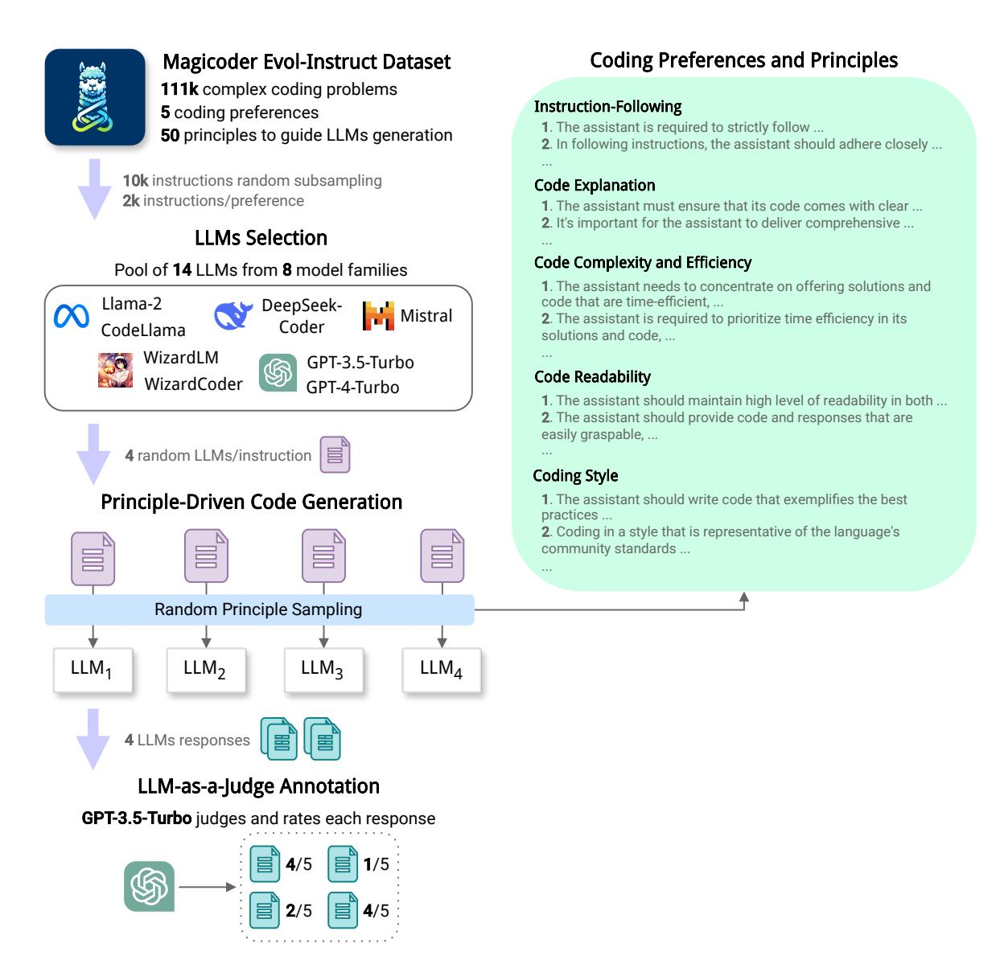
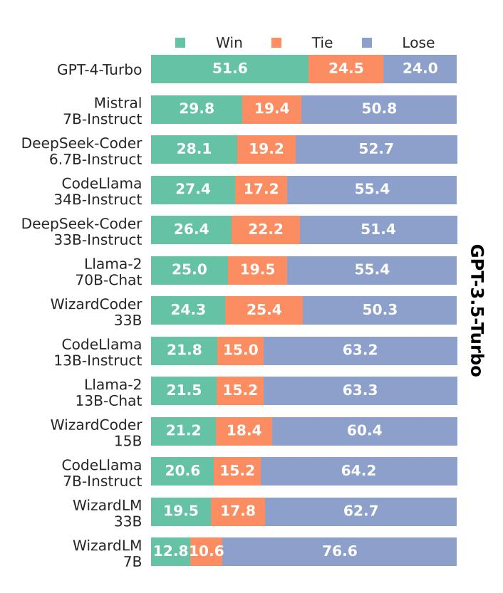
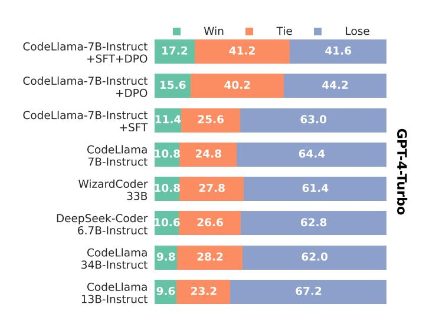

# CodeUltraFeedback: An LLM-as-a-Judge Dataset for Aligning Large Language Models to Coding Preferences

Martin Weyssow∗ , Aton Kamanda, and Houari Sahraoui DIRO, University of Montreal, Canada {martin.weyssow,aton.kamanda}@umontreal.ca, sahraouh@iro.umontreal.ca ∗Corresponding author

*Abstract*—Evaluating the alignment of large language models (LLMs) with user-defined coding preferences is a challenging endeavour that requires assessing intricate textual LLMs' outputs. By relying on automated metrics and static analysis tools, existing benchmarks fail to assess nuances in user instructions and LLM outputs, highlighting the need for large-scale datasets and benchmarks for LLM preference alignment. In this paper, we introduce CodeUltraFeedback, a preference dataset of 10,000 complex instructions to tune and align LLMs to coding preferences through AI feedback. We generate responses to the instructions using a pool of 14 diverse LLMs, which we then annotate according to their alignment with five coding preferences using the LLM-as-a-Judge approach with GPT-3.5, producing both numerical and textual feedback. We also present CODAL-Bench, a benchmark for assessing LLM alignment with these coding preferences. Our results show that CodeLlama-7B-Instruct, aligned through reinforcement learning from AI feedback (RLAIF) with direct preference optimization (DPO) using CodeUltraFeedback's AI feedback data, outperforms 34B LLMs on CODAL-Bench, validating the utility of CodeUltra-Feedback for preference tuning. Furthermore, we show our DPOaligned CodeLlama model improves functional correctness on HumanEval+ compared to the unaligned base model. Therefore, our contributions bridge the gap in preference tuning of LLMs for code and set the stage for further advancements in model alignment and RLAIF for code intelligence.

## I. INTRODUCTION

The advent of recent large language models (LLMs) has ushered in a new era of LLMs with high coding capabilities [\[1\]](#page-9-0)–[\[6\]](#page-10-0), showcasing remarkable performances across a wide range of downstream tasks including code generation [\[7\]](#page-10-1)–[\[10\]](#page-10-2), code translation [\[11\]](#page-10-3), [\[12\]](#page-10-4), bug fixing [\[6\]](#page-10-0), [\[13\]](#page-10-5), [\[14\]](#page-10-6), and more. As the coding abilities of LLMs continue to surge forward, a crucial question emerges: *how well do these capabilities align with the expectations of developers, particularly concerning non-functional requirements such as code readability, efficiency, and adherence to best practices?*

Current methodologies for fine-tuning and evaluating LLMs widely focus on core capabilities of LLMs, e.g., translating, summarizing, or reviewing code [\[15\]](#page-10-7)–[\[22\]](#page-10-8), and functional correctness in diverse code generation scenarios [\[1\]](#page-9-0), [\[6\]](#page-10-0), [\[7\]](#page-10-1), [\[23\]](#page-10-9)– [\[25\]](#page-10-10). Other works aim at assessing non-functional properties of LLM-generated code, including code quality [\[26\]](#page-10-11), runtime efficiency [\[27\]](#page-10-12) and others [\[28\]](#page-10-13), [\[29\]](#page-10-14). However, they generally consist of refining existing benchmarks to evaluate nonfunctional requirements, often without considering more open coding problems with intricate user instructions. Additionally, the evaluation often relies on automated metrics and external tools based on rigid standards and patterns, overlooking the nuanced complexity of users' instructions and LLMs' outputs. Finally, we underline a lack of large-scale datasets tailored for tuning and aligning LLMs to non-functional requirements.

The existing datasets and benchmarks in code intelligence collectively reveal a significant gap in both tuning LLMs and measuring their alignment to non-functional requirements through a more human-centric approach capable of discerning the intricacies of natural and programming languages. Addressing this gap requires a dual approach: developing datasets tailored to tune and align LLMs with non-functional requirements and benchmarks to evaluate their alignment.

In this paper, we introduce two novel contributions: *CodeUltraFeedback* and *CODAL-Bench* ("Code Alignment Benchmark"). CodeUltraFeedback is a preference dataset comprising 10,000 complex instructions with 40,000 meticulously curated LLMs responses aligned with five nonfunctional requirements (or *coding preferences*[1](#page-0-0) ): instruction following, code explanation, code complexity and efficiency, code readability, and coding style. The objective of CodeUltraFeedback is to serve as a dataset for preference tuning of LLMs, leveraging recent advancements in LLM alignment, including UltraFeedback [\[30\]](#page-10-15), reinforcement learning from AI feedback (RLAIF) [\[31\]](#page-10-16)–[\[33\]](#page-10-17) and LLM-as-a-Judge [\[34\]](#page-10-18), [\[35\]](#page-10-19), predicated upon the advanced judging capabilities of LLMs like GPT-3.5 or GPT-4. We adopt an approach auxiliary to UltraFeedback for building our dataset, and start by tagging each instruction with a coding preference. Then, we generate responses to the instructions using four LLMs randomly selected from a pool of 14 LLMs to achieve diversity and consider various writing styles. Finally, we use LLM-as-a-Judge with GPT-3.5 to rate the alignment of the LLMs' responses with respect to the instruction's coding preference, resulting in annotations comprising a numerical rating and a textual rationale for the rating. These AI feedbacks can

1 In the rest of this paper, we use the term "coding preferences" instead of "non-functional requirements" to more precisely capture the process of instructing LLMs with explicit preferences, although both terms have similar meanings.

then be leveraged to align LLMs to generate high-quality responses given a coding preference by tuning the LLM through RLAIF using techniques like direct preference optimization (DPO) [\[36\]](#page-10-20).

Subsequently, we construct CODAL-Bench by selecting a subset of 500 instructions from CodeUltraFeedback. CODAL-Bench serves a different purpose than CodeUltraFeedback and aims to comprehensively assess and compare the alignment of LLMs with coding preferences. We design a rigorous singleanswer grading scheme with LLM-as-a-Judge where GPT-3.5- Turbo or GPT-4-Turbo evaluates a single LLM response at a time in a consistent and objective manner. This approach offers a more nuanced evaluation strategy than previous methods that depend on automated metrics and external tools by leveraging the advanced reasoning capabilities of LLMs. Their ability to discern intricacies and nuances in language allows for a more refined and context-sensitive evaluation of how well code aligns with coding preferences in a human-centric fashion.

In the initial part of this paper, we conduct an exploratory analysis of CodeUltraFeedback's annotations and demonstrate the strong judging capabilities of GPT-3.5-Turbo. GPT-3.5- Turbo effectively recognizes GPT-4-Turbo as a superior model to itself, demonstrating impartiality and fairness in its judgement while also discerning between responses of different quality. Moreover, our initial exploration also reveals a lack of alignment of 12 LLMs, including strong LLMs such as WizardCoder-33B [\[37\]](#page-10-21) and DeepSeek-Coder-Instruct-33B [\[3\]](#page-10-22).

In the second part of this paper, we explore preference tuning of a small LLM, CodeLlama-7B-Instruct [\[2\]](#page-10-23) using CodeUltraFeedback with supervised fine-tuning (SFT) and RLAIF with DPO [\[36\]](#page-10-20), [\[38\]](#page-10-24). The method relies on using the AI feedback data from CodeUltraFeedback, where LLMs' responses with high and low ratings are selected for tuning and aligning CodeLlama-7B-Instruct to coding preferences with DPO. DPO encourages the LLM to favour highly rated LLMs' responses, enabling itself to generate more aligned content at inference. Moreover, we implement QLoRA [\[39\]](#page-10-25) for efficient fine-tuning and show SFT and DPO can be achieved on a single RTX A5000 GPU (24GB).

Our experiments validate the utility of CodeUltraFeedback for preference tuning. We demonstrate that tuning CodeLlama-7B-Instruct with SFT and DPO substantially improves LLM alignment across all coding preferences with high statistical significance on CODAL-Bench, surpassing all larger LLMs, including CodeLlama-34B-Instruct and WizardCoder-33B when using GPT-3.5-Turbo as a judge. Further, we explore LLM alignment on CODAL-Bench using GPT-4- Turbo as a judge, and highlight more mitigated effects of SFT and DPO, albeit CodeLlama-7B-Instruct still outperforms CodeLlama-13B-Instruct and CodeLlama-34B-instruct in this setup. Finally, we show that preference tuning does not hinder the capability of CodeLlama-7B-Instruct in generating functionally correct code. On the contrary, we highlight that CodeLlama-7B-Instruct tuned with SFT and DPO substantially improves Pass@k on HumanEval [\[1\]](#page-9-0) and HumanEval+ [\[7\]](#page-10-1). Therefore, our work establishes strong evidence of the benefits of SFT and DPO to enhance LLM alignment with humancentric coding preferences, demonstrating improvements in both preference alignment and functional correctness. Therefore, our work paves the way for future advancements in LLM training and evaluation, promising a closer alignment with the nuanced expectations of developers.

To summarize, our contributions are the following:

- We release CodeUltraFeedback, a preference dataset of 10,000 complex instructions and 40,000 responses generated using 14 diverse LLMs for aligning LLMs to coding preferences in a code generation scenario.
- We provide CODAL-Bench, a benchmark to evaluate and compare LLM alignment over five coding preferences: instruction following, code explanation, code complexity and efficiency, code readability, and coding style.
- We validate the utility of CodeUltraFeedback in facilitating LLM alignment of CodeLlama-7B-Instruct, a small LLM, using SFT and DPO.

Our models, dataset, benchmark, and prompt templates are available at [https://github.com/martin](https://github.com/martin-wey/CodeUltraFeedback)[wey/CodeUltraFeedback.](https://github.com/martin-wey/CodeUltraFeedback)

## II. CODEULTRAFEEDBACK

In this section, we introduce our new dataset, CodeUltraFeedback. Fig. [1](#page-2-0) depicts our methodology for building CodeUltraFeedback, which incorporates various components and ideas that we describe in the subsequent subsections.

## *A. Coding Preferences and Principles.*

We start by identifying five coding preferences to guide the creation of our dataset and which are essential to evaluate the broader capabilities of LLMs: (1) Instruction-Following is about the strict adherence of the LLM to the instructions provided by users. This preference is foundational for ensuring that LLMs truly follow the user intent and thus provide personalized responses to instructions. (2) Code Explanation emphasizes the generation of clear code with detailed explanations. It underscores the importance of understandable and adaptable code, serving as a bridge between potentially complex programming solutions and the users. (3) Code Complexity and Efficiency preference underlines the LLM capability to generate code optimized for performance in terms of speed and resource utilization. It is another crucial aspect requiring the LLM to carefully balance the speed and resource usage of the solution. (4) Code Readability serves a distinct purpose to the code explanation preference by emphasizing the clarity and understandability of the code itself through its structure, style, and the presence of meaningful documentation and in-line comments. (5) Coding Style preference focuses on the importance of writing code in a manner that not only meets syntactical correctness but also aligns with the idiomatic practices and stylistic norms of the programming language.

We generate 10 principles per preference using ChatGPT following prior work practices [\[30\]](#page-10-15), [\[41\]](#page-10-26), [\[42\]](#page-10-27). These principles shortly describe the essence of each preference and are leveraged in the *Principle-Driven Code Generation* step

**Fig. 1:** Overview of CodeUltraFeedback dataset construction procedure. (i) *Coding Preferences and Principles*: we define five coding preferences: Instruction-following, Code Explanation, Code Complexity and Efficiency, Code Readability, and Coding Style, and 10 principles for each preference to guide LLMs' generative process. (ii) *Magicoder Evol-Instruct Dataset*: CodeUltraFeedback is based on a 10k-instruction subset of Magicoder Evol-Instruct dataset [37], [40], where each instruction is tagged with a coding preference. (iii) *LLMs Selection*: for each instruction, four LLMs are randomly sampled from a diverse pool of 14 LLMs. (iv) *Principle-Driven Code Generation*: one principle is randomly selected per LLM to guide and align the code generation process with the assigned coding preference. (v) *LLM-as-a-Judge Annotation*: LLM-as-a-Judge with GPT-3.5-Turbo is used to judge LLMs' responses according to coding preferences evaluation criteria (see Table I).

to guide the LLMs generative process. The rationale for establishing 10 principles per preference is to achieve comprehensive and diverse outputs in this code generation step, which we further describe in Section II-D.

Altogether, these five preferences complement the functional correctness requirement of LLM-generated code. Assessing how well LLMs align with these preferences amounts to evaluating how the generated solutions are optimized for human comprehension, maintainability, performance, and collaborative work.

#### B. Initial Dataset.

To build CodeUltraFeedback, we rely on Magicoder Evol-Instruct dataset [40], an Evol-Instruct [37], [43] version of CodeAlpaca dataset comprising complex coding problem instructions. We select a random subset of Magicoder Evol-Instruct comprising 10,000 samples serving as an initial dataset for CodeUltraFeedback. We assign 2,000 samples per coding preference, ensuring a balanced representation of each preference in the dataset. The reason for subsampling the dataset

#### TABLE I: Code readability assessment template.

Evaluate the readability of code segments. Assess how comments and documentation contribute to understanding the code's logic, purpose, and operation.

#### Evaluation Criteria:

*Clarity*: How clear and understandable are the code and its accompanying comments/documentation?

*Conciseness*: Are the comments and documentation succinct yet informative?

*Relevance*: Do the comments and documentation directly contribute to explaining the code's logic, objectives, and functionality?

*Comprehensibility*: Can users of varying technical backgrounds easily grasp the code's purpose and how it works?

Scoring: Rate outputs on a scale of 1 to 5:

- 1. *Poor Readability*: The code is hard to follow, with little to no helpful comments/documentation.
- 2. *Basic Readability*: The code has minimal comments/documentation, offering limited clarity or insight.
- 3. *Good Readability*: The code is reasonably clear with comments/documentation that aid understanding, though some areas could be improved.
- 4. *Very Good Readability*: The code and comments/documentation are clear and concise, making the code's logic and purpose easily understandable.
- 5. *Excellent Readability*: The code exemplifies outstanding readability, with clear, concise, and comprehensive comments/documentation that make it accessible to all users.

to 10,000 samples is to lower costs related to OpenAI API needed to generate some of the responses and the annotations.

#### *C. LLMs Selection.*

In order to generate highly diverse solutions to the instructions, we select a diverse pool of 14 LLMs spanning eight model families. These include GPT-4-Turbo and GPT-3.5- Turbo as closed-source LLMs. We include Llama-2-13B-Chat and Llama-2-70B-Chat [\[5\]](#page-10-30), specialized for chat use cases. We choose CodeLlama-7/13/34B-Instruct models [\[2\]](#page-10-23), instructiontuned for code generation. We also include WizardLM-15/33B models [\[43\]](#page-10-29) and Mistral-7B-Instruct [\[4\]](#page-10-31), which are instructiontuned LLMs that can follow complex instructions. Finally, we include WizardCoder-15/33B [\[37\]](#page-10-21) and DeepSeek-Coder-6.7/33B-Instruct [\[3\]](#page-10-22), which are instruction-tuned LLMs that demonstrate state-of-the-art performance on code generation benchmarks such as HumanEval [\[1\]](#page-9-0) and HumanEval+ [\[7\]](#page-10-1). From this pool, we randomly select four LLMs for each instruction to generate responses, allowing for the representation of a variety of coding approaches and styles.

#### *D. Principle-Driven Code Generation.*

In this step, we leverage the concept of principle-driven generation [\[41\]](#page-10-26), [\[42\]](#page-10-27), [\[44\]](#page-10-32) for code. One principle, corresponding to the coding preference of the sample, is randomly chosen per LLM and appended to the instruction in an input prompt to guide the generation. This strategy helps the LLMs generate responses that potentially align with the requirements of the coding preferences. The output of this step is the four LLMs' responses to the principle-augmented instructions.

## *E. LLM-as-a-Judge Annotation.*

We apply the LLM-as-a-Judge methodology [\[34\]](#page-10-18) to annotate responses using GPT-3.5-Turbo. Drawing from practices established in previous work [\[30\]](#page-10-15), we implement a set of guidelines TABLE II: Excerpt of ratings and rationales generated by GPT-3.5-Turbo using LLM-as-a-Judge prompting. GPT-3.5- Turbo generates clear rationales for each rating demonstrating its strong judging capabilities.

Instruction: Devising a Python-based algorithm that utilizes the technique of ternary search, could you draw this up while also illustrating the functionality of each critical stage in the searching process?

Preference: Readability

GPT-4: [Response]

Rating: 5

Rationale: The code is accompanied by clear and concise comments that comprehensively explain each critical stage of the ternary search algorithm. The comments provide a thorough understanding of the algorithm's logic, purpose, and functionality, making it easily accessible to users of varying technical backgrounds. Additionally, the comments include a detailed explanation of the algorithm's relevance and efficiency compared to binary search, enhancing the overall comprehensibility of the code.

DeepSeek-Coder-6.7B-Instruct: [Response]

Rating: 4

Rationale: [Rationale]

Mistral-7B-Instruct: [Response]

Rating: 3

Rationale: [Rationale]

CodeLlama-13B-Instruct: [Response]

Rating: 2

Rationale: The code is clear, but the comments are minimal and lack sufficient detail to fully explain the ternary search algorithm and its critical stages. While the comments briefly describe the function's purpose, they do not provide a comprehensive explanation of the algorithm's logic and functionality. Additionally, the comments do not cover the relevance of ternary search in algorithmic strategies, making it less accessible to users with varying technical backgrounds.

ensuring GPT-3.5-Turbo delivers both consistent and objective feedback. Each annotation consists of (1) a score on a 1–5 scale offering a comprehensive assessment of the response's alignment, and (2) a rationale for the assigned score, highlighting the response's strengths and identifying any potential shortcomings. Tasking GPT-3.5-Turbo to provide a rationale for the scores encourages a chain-of-thought [\[45\]](#page-10-33) process during the annotation process, elucidating the reasons behind the scores and meaningful feedback. In addition, this process mitigates the risk of variability and subjectivity that might arise from purely quantitative assessments. Consequently, this reflective process guarantees that the scoring is not just a surfacelevel judgment but can be backed by thoughtful consideration of some well-defined coding preferences evaluation criteria.

Table [I](#page-3-0) illustrates the assessment template and evaluation criteria for code readability evaluation. It aims to provide precise and comprehensive criteria to the LLM judge for response assessment. We design analogous assessment templates, each tailored with specific evaluation criteria, for evaluating the other coding preferences. The annotation procedure entails constructing a prompt combining the coding preference assessment template and the four LLMs responses. GPT-3.5-Turbo is then tasked to generate the annotations for all four responses simultaneously, enhancing the consistency and reliability of the evaluation process over individual response assessments. Table [II](#page-3-2) presents an example of the output of the annotation process using GPT-3.5-Turbo, with the LLMs responses and some rationales omitted for brevity. This example showcases GPT-3.5-Turbo's capability to provide comprehensive justifications for each rating, demonstrating its effective evaluation capabilities. Furthermore, Table II illustrates an example of relatively intricate instructions included in CodeUltraFeedback, showcasing the complexity of the task. More details about CodeUltraFeedback and the prompt templates are included in our replication package: https://github.com/martin-wey/CodeUltraFeedback.

## III. EVALUATING LLMS ON CODEULTRAFEEDBACK

While CodeUltraFeedback has the potential to facilitate diverse downstream applications, including LLM alignment through RLAIF and DPO, we begin our experiments by analyzing the dataset itself. Specifically, the goal is to gauge GPT-3.5-Turbo's judging capabilities and the innate ability of LLMs to align to coding preferences without any tailored optimization involved.

## A. LLMs Scores Exploration

We start by exploring the ratings generated by GPT-3.5-Turbo in the LLM-as-a-Judge annotation phase. In Table III, we present a detailed analysis of the average scores across coding preferences for each LLM, offering initial insight into their baseline capabilities.

First, we observe that GPT-3.5-Turbo and GPT-4-Turbo score the highest across all preferences and on average. This result is expected considering both models have undergone extensive instruction and RLHF tunings, which help align the LLMs more closely with human preferences [33].

At first glance, the scores might suggest marginal score discrepancies given the 1-5 scoring range. However, these variations are substantial and carry statistical significance. To quantify this significance, we performed pairwise Welch's ttests with 100,000 permutations to mitigate the risk of type I error. These t-tests compare the score distributions for each LLM (and GPT-4-Turbo) against GPT-3.5-Turbo across each coding preference and consistently reveal highly significant statistical differences (with p < 0.0001 for most comparisons). Therefore, these results validate the discernible performance gaps between all models and GPT-3.5-Turbo. Moreover, the results also demonstrate a notably superior performance of GPT-4-Turbo relative to GPT-3.5-Turbo. This effectively illustrates GPT-3.5-Turbo's impartiality as a judge, rewarding higher scores to more proficient LLMs and equitably evaluating its own responses.

In summary, our findings indicate that all LLMs, including highly capable ones such as WizardCoder-33B and DeepSeek-Coder-33B-Instruct, underperform compared to GPT-3.5-Turbo. This underperformance is likely due to a lack of alignment of the LLMs, and we believe fine-tuning them using alignment techniques might enhance their performance.

#### B. LLMs vs GPT-3.5-Turbo

To gauge the relative performance of the LLMs against GPT-3.5-Turbo more in-depth, we analyze their performances

**Fig. 2:** Win-tie-lose ratios of LLMs against GPT-3.5-Turbo. An LLM wins/loses if it gets a greater/lower score than GPT-3.5-Turbo. A tie is when the LLM and GPT-3.5-Turbo get identical scores.

through a win-tie-lose plot depicted in Fig. 2. The idea is to pit each LLM (left-hand side of the figure, e.g., Mistral-7B-Instruct) against GPT-3.5-Turbo in a comparative matchup, where the model achieving the highest rating wins. The plot illustrates the percentage of ratings of an LLM that are higher/lower compared to those of GPT-3.5-Turbo, all preferences combined (a tie stands for ratings having identical values). This figure further demonstrates significant gaps between LLMs and GPT-3.5-Turbo, underscoring a consistent preference for GPT-3.5-Turbo and GPT-4-Turbo's responses over other LLMs. For instance, even Mistral-7B-Instruct, the second-best LLM, achieves a win rate of merely 29.8%. Additionally, the plot further validates the utilization of GPT-3.5-Turbo as a judge, showcasing its capability to discern between responses of differing quality. For example, it is proficient in recognizing higher-quality responses, as evidenced by its comparison with GPT-4-Turbo, which boasts a win rate of 51.6%.

In conclusion, these initial observations highlight a significant research opportunity and the necessity to delve deeper into aligning LLMs with coding preferences to make them more competitive with models like GPT-3.5 and GPT-4.

TABLE III: Average scores across coding preferences for each LLM. The statistical significance of differences in ratings between each LLM and GPT-3.5-Turbo was tested using pairwise Welch's t-tests with 100,000 permutations to control for type I error. Significance levels are denoted as follows: \* for p < 0.05, † for p < 0.01, and ‡ for p < 0.001. The results from almost all pairwise t-tests indicate highly significant differences (p < 0.001).

| Model                        | Instruction Following | Code Explanation | Code Complexity & Efficiency | Code Readability | Coding Style | Average |
|------------------------------|--------------------------|---------------------|---------------------------------|---------------------|-----------------|---------|
| GPT-4-Turbo                  | 3.79‡                    | 4.04‡               | 3.91†                           | 4.14‡               | 4.03‡           | 3.98    |
| GPT-3.5-Turbo                | 3.56                     | 3.76                | 3.76                            | 3.71                | 3.66            | 3.69    |
| WizardCoder-33B              | 3.29‡                    | 3.31‡               | 3.43‡                           | 3.44‡               | 3.49†           | 3.39    |
| DeepSeek-Coder-33B-Instruct  | 3.31‡                    | 3.30‡               | 3.32‡                           | 3.46‡               | 3.42‡           | 3.36    |
| DeepSeek-Coder-6.7B-Instruct | 3.23‡                    | 3.29‡               | 3.32‡                           | 3.45‡               | 3.48‡           | 3.36    |
| Mistral-7B-Instruct          | 3.20‡                    | 3.27‡               | 3.28‡                           | 3.42‡               | 3.40‡           | 3.31    |
| CodeLlama-34B-Instruct       | 3.11‡                    | 3.20‡               | 3.21‡                           | 3.35‡               | 3.23‡           | 3.22    |
| Llama-2-70B-Chat             | 3.11‡                    | 3.22‡               | 3.14‡                           | 3.38‡               | 3.22‡           | 3.21    |
| WizardCoder-15B              | 3.11‡                    | 3.03‡               | 3.12‡                           | 3.27‡               | 3.16‡           | 3.14    |
| CodeLlama-13B-Instruct       | 3.05‡                    | 2.99‡               | 3.15‡                           | 3.18‡               | 3.25‡           | 3.12    |
| CodeLlama-7B-Instruct        | 2.91‡                    | 3.11‡               | 3.01‡                           | 3.18‡               | 3.13‡           | 3.07    |
| WizardLM-33B                 | 3.07‡                    | 2.98‡               | 2.91‡                           | 3.11‡               | 3.10‡           | 3.03    |
| Llama-2-13B-Chat             | 2.88‡                    | 2.97‡               | 2.91‡                           | 3.18‡               | 2.99‡           | 2.98    |
| WizardLM-7B                  | 2.63‡                    | 2.61‡               | 2.51‡                           | 2.69‡               | 2.64‡           | 2.62    |

# IV. ALIGNING LLMS TO CODING PREFERENCES

In this section, we present our experimental setup to improve LLM alignment with coding preferences using CodeUltraFeedback as preference data, which features the utilization of SFT and DPO [\[7\]](#page-10-1), [\[38\]](#page-10-24). The purpose is twofold: validate the utility of CodeUltraFeedback for LLM alignment to coding preferences and show that a small LLM tuned using SFT and DPO can achieve greater alignment performance.

## *A. Supervised Fine-Tuning (SFT)*

As demonstrated in Zephyr's paper [\[38\]](#page-10-24), an instructiontuning phase is required prior to tuning an LLM using DPO as it facilitates tuning. This phase is achieved through supervised fine-tuning (SFT) using a dataset D = {(x1, y1), ...,(xn, yn)} of instruction-response pairs. Recent work leverages the Self-Instruct [\[46\]](#page-11-0) and Evol-Instruct [\[37\]](#page-10-21), [\[43\]](#page-10-29) frameworks to compose such a dataset by generating instructions and responses using a highly capable model such as GPT-3.5/4 [\[33\]](#page-10-17), [\[40\]](#page-10-28), [\[47\]](#page-11-1). In this context, SFT is a form of knowledge distillation [\[48\]](#page-11-2) that leverages a supervised signal from responses generated by a teacher LLM to tune a student LLM.

Formally, for each instruction-response pair (xi , yi) ∈ D, the learning objective is to minimize the cross-entropy loss LSF T , defined as:

$$\mathcal{L}_{SFT} = -\frac{1}{n} \sum_{i=1}^{n} \log P(y_i|x_i, \theta),$$

where P(yi |xi , θ) represents the probability of generating the response yi given the instruction xi , parameterized by θ, the LLM parameters.

## *B. Direct Preference Optimization (DPO)*

DPO is an efficient ranking optimization method to align LLMs to preference data, where a response yw is preferred over a rejected response yl . Unlike traditional reinforcement learning methods like RLHF, which require training a separate reward model, DPO enhances stability and performance by directly adjusting the LLM's policy towards higher-ranked responses (i.e., yw). Given a dataset P of triplets (x, yw, yl), a reference LLM policy πref , and an LLM policy πθ, the objective is to maximize the following expectation:

$$\mathbb{E}_{(x,y_w,y_l)\sim\mathcal{P}}\log\sigma\left(\beta\log\left(\frac{\pi_{\theta}(y_w|x)}{\pi_{ref}(y_w|x)}-\frac{\pi_{\theta}(y_l|x)}{\pi_{ref}(y_l|x)}\right)\right).$$

The expression πθ(yw|x) πref (yw|x) − πθ(yl|x) πref (yl|x) calculates the difference in probabilities that the model assigns to the preferred response yw and the response yl , relative to the reference policy πref . Intuitively, the difference indicates how much the preference alignment of πθ has improved for a given triplet (x, yw, yl) after applying DPO compared to the reference policy πref . β is a hyperparameter that adjusts the sensitivity to the reference policy πref . In our experiments, πref is a SFT-tuned LLM.

## *C. Experimental Details*

*Datasets.* We build "Code Alignment Benchmark" (CODAL-Bench), a new benchmark for assessing LLM alignment to coding preferences. CODAL-Bench consists of 500 randomly selected samples from CodeUltraFeedback, with a balanced representation of each preference. The benchmark aims to provide a rigorous and comprehensive framework to evaluate and compare LLM alignment to coding preferences, allowing researchers to evaluate the impact of new alignment methods.

For SFT, we use Magicoder Evol-Instruct [\[40\]](#page-10-28), which consists of complex instruction-response pairs generated by GPT-4. We filter out the 10,000 samples used to build CodeUltra-Feedback to mitigate data leakage between the SFT and DPO phases and avoid potential overfitting. The process results in 100,772 samples (95% for training, 5% for model evaluation).

We use the remaining 9,500 samples from CodeUltra-Feedback for DPO training. From each sample, we extract binary preferences (yw, yl), denoting the preferred and rejected response. These preferences are selected based on the highest and lowest ratings assigned by GPT-3.5-Turbo during the LLM-as-a-Judge annotation phase (see Section [II-E\)](#page-3-3). In instances where multiple responses have the highest/lowest ratings, we select one randomly to obtain yw / yl .

*LLMs.* We conduct our experiments on CodeLlama-7B-Instruct as it comprises 7B parameters, allowing for tuning on a modest computing infrastructure. Furthermore, the model lags behind more proficient LLMs on CodeUltraFeedback (see Table [III\)](#page-5-0), which makes it an ideal candidate for demonstrating the potential impact of SFT and DPO on improving LLM alignment. For comparison, we include the following LLMs: CodeLlama-13/34B-Instruct, DeepSeek-Coder-6.7B-Instruct, WizardCoder-33B, GPT-3.5-Turbo, and GPT-4- Turbo.

*Grading Procedure.* CODAL-Bench seeks to systematically compare LLM alignment, whereas CodeUltraFeedback's main purpose is to serve as a training dataset for preference tuning. Therefore, we designed a new grading procedure adapted for evaluating each LLM individually using LLM-as-a-Judge. We implement a reference-guided single-answer grading system that has proven efficient in alignment benchmarks such as MT-Bench [\[34\]](#page-10-18). Each LLM's response is individually evaluated against a reference response, providing a consistent basis for comparison and ensuring objective judgments across different LLMs. Additionally, we instruct the judge LLM to provide a rationale alongside the rating, enhancing the consistency of the evaluations. Ratings are assigned on a scale from 1 to 10, facilitating nuanced assessments of LLM alignment. We generate reference responses using GPT-3.5-Turbo and GPT-4-Turbo and use both models as judges.

*Training Details.* We use HuggingFace TRL [\[49\]](#page-11-3) to implement SFT and DPO with QLoRA [\[39\]](#page-10-25) for efficient fine-tuning. We use a cosine learning rate scheduler with a learning rate of 2e-04 for SFT and 5e-05 for DPO, and 10% warmup steps. We fine-tune CodeLlama-7B-Instruct for 3 and 5 epochs for SFT and DPO, respectively. All experiments were conducted on a single NVIDIA RTX A5000 GPU (24GB). We provide extensive training details in our replication package.

# V. RESULTS

# SFT and DPO Improve Alignment to Coding Preferences.

In Fig. [3,](#page-7-0) we report the average alignment scores of the LLMs on the five coding preferences using GPT-3.5-Turbo as a judge with its own responses to the instructions as references. We do not include GPT-3.5-Turbo in the results as references and responses would be identical, leading to biased and perfect alignment scores.

GPT-4-Turbo stands out by surpassing all other LLMs across every coding preference by a considerable margin. Interestingly, all LLMs demonstrate lower scores on the instruction following preference. This trend suggests a relative challenge in achieving high performance in this area, possibly due to the inherently less precise nature of the preference and potentially vague instructions. Conversely, LLMs tend to achieve higher scores on code explanation and readability preferences We hypothesize this trend can be attributed to the fact that all LLMs have undergone instruction tuning, which can encourage LLMs to output reasoning and explanations alongside generated code. We observe that scores substantially increase when tuning CodeLlama-7B-Instruct with SFT+DPO, highlighting the effectiveness of these methods in enhancing model alignment across all coding preferences. For instance, the model yields a 7.89 score on code complexity and efficiency preference, substantially surpassing CodeLlama-7B-Instruct (6.16) and larger models, including Wizard-33B (6.93) and CodeLlama-34B-Instruct (6.42).

Tuning CodeLlama-7B-Instruct with SFT shows an improvement in alignment scores compared to the base model, which are further elevated with the application of DPO independently or in conjunction with SFT. To quantify these observations, we conducted pairwise t-tests (not reported for brevety) comparing the baseline model, against its variants tuned with SFT, DPO, and SFT+DPO. Although SFT alone improves performance, we found no significant statistical difference with the baseline across preferences, except for code readability. However, we found highly significant statistical differences (p < 0.001) for DPO and SFT+DPO for all preferences with the exception of instruction following. After DPO and SFT+DPO tunings, CodeLlama-7B-Instruct achieves superior alignment compared to substantially larger models such as CodeLlama-34B-Instruct and WizardCoder-33B across all coding preferences.

## DPO Enhances Competitive Edge Against GPT-4-Turbo. Fig. [4](#page-7-1) illustrates the win-tie-lose ratios of the LLMs against GPT-4-Turbo for all preferences combined.

Non-aligned models achieve low win rates, with CodeLlama-7B-Instruct and WizardCoder-33B peaking at a 10.8% win rate. GPT-4-Turbo, on the other hand, consistently outperforms most LLMs with win rates exceeding 60%, underscoring its superiority. Tuning CodeLlama-7B-Instruct with DPO and SFT+DPO results in increases in win rates by 4.8% and 6.2%, respectively, and raises tie scores by 15.4% and 16.4%, respectively. These improvements underscore the effectiveness of alignment techniques in rendering LLM responses more competitive. Nonetheless, the remaining discernible gaps with GPT-4-Turbo suggest that there is still substantial room for improvement.

# Different Judges and References Impact Alignment Scores. We investigate the effect of judges and references on the LLMs alignment scores in Table [IV.](#page-8-0)

|                                   | Instruction Following |      |      |      | Coding Style | Average |                           |
|-----------------------------------|--------------------------|------|------|------|-----------------|---------|---------------------------|
| CodeLlama-13B-Instruct            | 5.11                     | 7.06 | 6.17 | 6.86 | 6.52            | 6.34    | - 8.5                     |
| CodeLlama-34B-Instruct            | 5.19                     | 7.09 | 6.42 | 7.06 | 6.67            | 6.49    | - 8.0                     |
| DeepSeek-Coder-6.7B-Instruct      | 5.31                     | 7.15 | 6.89 | 7.33 | 6.83            | 6.70    | - 7.5                     |
| WizardCoder-33B                   | 5.74                     | 7.00 | 6.93 | 7.62 | 6.95            | 6.85    | 7.0                       |
| GPT-4-Turbo                       | 7.33                     | 8.35 | 8.58 | 8.71 | 8.42            | 8.28    | - 7.0 a SCOLe - 6.5 |
| CodeLlama7B-Instruct              | 4.86                     | 6.30 | 6.16 | 6.42 | 6.27            | 6.00    | - 6.5                     |
| CodeLlama-7B-Instruct +SFT     | 5.33                     | 6.61 | 6.55 | 7.31 | 6.76            | 6.51    | - 6.0                     |
| CodeLlama-7B-Instruct +DPO     | 5.25                     | 7.59 | 7.60 | 7.93 | 7.37            | 7.15    | - 5.5                     |
| CodeLlama-7B-Instruct +SFT+DPO | 5.32                     | 7.83 | 7.89 | 7.99 | 7.78            | 7.36    | - 5.0                     |

**Fig. 3:** Average alignment scores for LLMs across coding preferences on CODAL-Bench, evaluated using GPT-3.5-Turbo as a judge with reference-guided single-answer grading.

**Fig. 4:** Win-tie-lose ratios of LLMs against GPT-4-Turbo. DPO and SFT+DPO substantially increase the percentage of won and tie matches.

Using GPT-3.5-Turbo as a judge, alignment scores are compared against its own (left values) and GPT-4-Turbo's responses (right values), revealing a decrease against the latter due to GPT-4-Turbo's higher response standards. Additionally, CodeLlama-7B-Instruct+SFT+DPO achieves an alignment score of 7.08, nearing GPT-3.5-Turbo's average of 7.18.

Interestingly, divergent trends emerge under GPT-4-Turbo's judgment, with all CodeLlama models scoring lower, while other LLMs see score increases. For instance, CodeLlama-13B-Instruct's score falls from 5.58 to 4.83, while WizardCoder-33B's increases from 6.26 to 6.75. Despite this, SFT, DPO, and SFT+DPO alignment techniques boost CodeLlama-7B-Instruct's performance, still exceeding the 34B variant of CodeLlama, albeit with varying impact with DPO.

These observations hint at GPT-4-Turbo's potential preference for certain response styles and variability in judgment compared to GPT-3.5-Turbo, underscoring the need for further investigation to fully understand the implications of judge selection on LLM alignment scores.

**SFT and DPO Improve Functional Correctness.** While our findings highlight the positive impact of SFT and DPO on aligning LLMs with coding preferences, ensuring the functional correctness of the generated code remains a pivotal concern. In Table V, we report CodeLlama-7B-Instruct's Pass@k on HumanEval [1] and HumanEval+ [7].

Firstly, SFT substantially enhances Pass@k on both benchmarks, with Pass@1 rising from 37.9 to 51.2 and 33.2 to 45.6 for HumanEval and HumanEval+, respectively. This result aligns with Magicoder [40] and WizardCoder [37] findings, showing that knowledge distillation through SFT substantially enhances the LLM's effectiveness on these benchmarks. Secondly, while DPO and SFT+DPO variants exhibit a slight reduction in Pass@k relative to SFT alone, they still maintain substantially higher Pass@k compared to the baseline.

These results show that LLM alignment through SFT and DPO also improves functional correctness, mostly due to the SFT phase, further demonstrating the usefulness of aligning LLMs. The lesser improvements in Pass@k with DPO can be attributed to DPO's learning objective, focusing on favouring preferred responses with respect to coding preferences rather than based on their functional correctness. Therefore, we underscore the need for more investigations into the design of learning objectives and methods that can prioritize both functional correctness and alignment to coding preferences.

#### VI. DISCUSSION

In this paper, we have demonstrated how LLM-as-a-Judge enables the creation of new datasets and benchmarks like CodeUltraFeedback and CODAL-Bench to facilitate the tuning

TABLE IV: Average alignment scores of LLMs on CODAL-Bench. G-3.5 and G-4 refer to utilizing GPT-3.5-Turbo and GPT-4-Turbo responses as references, respectively.

|                              | Judge                     |      |      |  |
|------------------------------|---------------------------|------|------|--|
|                              | GPT-3.5-TURBO GPT-4-TURBO |      |      |  |
| Reference:                   | G-3.5                     | G-4  | G-4  |  |
| CodeLlama-13B-Instruct       | 6.34                      | 5.58 | 4.83 |  |
| CodeLlama-34B-Instruct       | 6.49                      | 5.84 | 5.36 |  |
| DeepSeek-Coder-6.7B-Instruct | 6.70                      | 6.07 | 6.32 |  |
| WizardCoder-33B              | 6.85                      | 6.26 | 6.75 |  |
| GPT-3.5-Turbo                | -                         | 7.18 | 7.35 |  |
| GPT-4-Turbo                  | 8.28                      | -    | -    |  |
| CodeLlama-7B-Instruct        | 6.00                      | 5.46 | 4.72 |  |
| +SFT                         | 6.51                      | 5.83 | 5.84 |  |
| +DPO                         | 7.15                      | 6.79 | 5.08 |  |
| +SFT+DPO                     | 7.36                      | 7.08 | 5.85 |  |

of LLMs for better alignment with coding preferences and assess their performance. This section offers further insights from our experiments, potential improvements for LLM alignment, and the significance of exploring varied LLM-as-a-Judge configurations. Additionally, we outline some limitations of CodeUltraFeedback and CODAL-Bench.

# *A. LLM Alignment and LLM-as-a-Judge*

Balancing Learning Objectives. A crucial area requiring deeper investigation is the balance between functional correctness and non-functional requirements. In our experiments, we demonstrate that CodeLlama-7B-Instruct+SFT+DPO shows higher performance on HumanEval/HumanEval+ compared to the base model. Understanding how to integrate functional and non-functional learning objectives could significantly advance the tuning process of LLMs and further enhance their performance across a broad range of benchmarks.

CodeUltraFeedback for Critic LLM Training. In this work, we demonstrate the utility of CodeUltraFeedback for LLM preference tuning using RLAIF and DPO. One of the drawbacks of CODAL-Bench is the need to leverage models like GPT-4 to evaluate other LLMs, which might turn out to be cost-prohibitive. Nonetheless, we believe the AI feedback data in CodeUltraFeedback, e.g., ratings and rationales, can be leveraged to fine-tune a small critic LLM trained to evaluate other LLMs. Prior work including Shepherd [\[50\]](#page-11-4) and Prometheus [\[51\]](#page-11-5) have been proposed around that idea and showed promising results.

Parallel Findings with Zephyr Our findings draw parallels with Zephyr 's [\[38\]](#page-10-24) insights on DPO, with models beginning to overfit after a few epochs, achieving 100% training set accuracy. In our case, overfitting after five DPO training epochs correlated with improved performance. Although the model overfits, the gap between chosen and rejected rewards continued to grow, suggesting that monitoring reward accuracy might not be relevant for model selection. Therefore, more

TABLE V: Pass@k of CodeLlama-7B-Instruct variants on HumanEval and HumanEval+.

|                       |      | HumanEval | HumanEval+ |      |  |
|-----------------------|------|-----------|------------|------|--|
|                       | k=1  | k=10      | k=1        | k=10 |  |
| CodeLlama-7B-Instruct | 37.9 | 60.4      | 33.2       | 54.9 |  |
| +SFT                  | 51.2 | 82.9      | 45.6       | 79.3 |  |
| +DPO                  | 42.3 | 80.5      | 35.8       | 70.1 |  |
| +SFT+DPO              | 43.1 | 75.6      | 36.7       | 69.5 |  |

experimentation on DPO could illuminate better model tuning and selection approaches for improved model alignment.

Potential Judgment Biases. We highlight GPT-3.5-Turbo's impartiality and robustness in judgment in both our dataset and benchmark. The performance ranking of LLMs remained consistent, underscoring the reliability of GPT-3.5-Turbo's evaluations. Despite this, there remains the possibility of inherent biases in LLM judgments, such as a preference for lengthy or verbose responses. The grading procedures employed for CodeUltraFeedback and CODAL-Bench were carefully designed, drawing on established practices to preclude such biases [\[34\]](#page-10-18), [\[52\]](#page-11-6). Single-answer grading with a reference response to the instruction and chain-of-thought prompting enables both GPT-3.5-Turbo and GPT-4-Turbo to produce consistent judgements. However, further exploration into the potential biases influencing LLM judgments is warranted.

Exploring Alternative Judges. Future studies could benefit from incorporating a wider range of judges to understand how different LLMs' evaluative perspectives might influence the judgment process and outcomes. Additionally, the reliance on closed-source models can be mitigated by tuning small and open-source critic LLMs.

# *B. Limitations*

Our methodology presupposes the existence of a highly capable model, such as GPT-3.5 or GPT-4, as a proxy to humans to accurately evaluate other LLMs. This reliance on these models is based on previous findings indicating that GPT-3.5 and GPT-4 align closely with human judgments [\[34\]](#page-10-18), [\[52\]](#page-11-6), achieving agreement rates on par with those between humans themselves on MT-Bench [\[34\]](#page-10-18). Such evidence supports their utilization in an LLM-as-a-Judge framework. Although our work does not include a comparison between GPT-3.5/4 and human judgements, we hypothesize LLM judgments could match human judgments on CODAL-Bench and leave the comparison for future work.

Our current iteration of CODAL-Bench relies on randomly selected samples. Future versions aim to employ a more rigorous filtering process, possibly incorporating human annotations, to enhance the representativeness and quality of selected samples.

Lastly, our grading procedure in CODAL-Bench necessitates reference responses for judgment. This usage of reference responses gives the judge LLMs a consistent point of comparison, enabling fair and consistent judgements across LLMs outputs. Future work might explore ways to reduce this dependency.

# VII. RELATED WORK

We explore and differentiate our work from the existing landscape of datasets and benchmarks in code intelligence, with a particular focus on execution-based benchmarks, closed-solutions datasets, and benchmarks, as well as those assessing non-functional aspects of generated code.

## *A. Execution-based Benchmarks*

This category of benchmarks emphasizes the functional correctness of generated code by evaluating whether it passes a set of unit tests. Execution-based benchmarks include HumanEval [\[1\]](#page-9-0), MBPP [\[24\]](#page-10-34), APPS [\[23\]](#page-10-9), and DS-1000 [\[53\]](#page-11-7), which have extensively been used to compare LLMs in code generation scenarios [\[2\]](#page-10-23), [\[6\]](#page-10-0), [\[37\]](#page-10-21), [\[40\]](#page-10-28). Subsequent work has expanded HumanEval and MBPP benchmarks to multiple programming languages [\[8\]](#page-10-35), [\[10\]](#page-10-2), [\[54\]](#page-11-8), more unit tests [\[7\]](#page-10-1), and more tasks including code summarization [\[8\]](#page-10-35), code repair [\[6\]](#page-10-0), code explanation [\[6\]](#page-10-0), and code translation [\[10\]](#page-10-2). This category also encompasses benchmarks designed around specific use cases, such as Odex [\[55\]](#page-11-9), which deals with Python opendomain problems and includes manual annotations of user intents, and StudentEval [\[56\]](#page-11-10), which utilizes student-defined prompts for Python code generation. xCodeEval [\[25\]](#page-10-10) benchmark extends the scope to code understanding, generation, and retrieval across numerous tasks. Lastly, benchmarks like ClassEval [\[57\]](#page-11-11) and CoderEval [\[58\]](#page-11-12) shift the focus towards evaluating LLMs' proficiency in generating functionally correct code across various programming abstractions, such as class, file, and project levels.

Our work differs from this category of benchmarks and focuses on aligning LLMs to coding preferences and measuring their alignment using an LLM as a proxy for human evaluation without relying on unit tests or automated metrics. Nonetheless, we believe evaluating the functional correctness of LLMgenerated code remains a pivotal concern complementary to the aim of CodeUltraFeedback and CODAL-Bench.

## *B. General Datasets and Closed-Solutions Benchmarks*

Initial datasets like GitHub Java Corpus [\[59\]](#page-11-13), Py150/Js150 [\[60\]](#page-11-14), [\[61\]](#page-11-15), and CodeSearchNet [\[62\]](#page-11-16) laid the groundwork for evaluating language models in coderelated tasks, including modelling, summarization, and search. Subsequent developments introduced benchmarks like CodeXGlue [\[15\]](#page-10-7), CodeNet [\[16\]](#page-10-36), XLCoST [\[17\]](#page-10-37), ReCode [\[63\]](#page-11-17), and CrossCodeBench [\[18\]](#page-10-38), each expanding the evaluation scope to include code understanding, generation, and robustness against perturbations across various coding tasks and languages. Recently, CrossCodeEval [\[64\]](#page-11-18) broadened this scope by assessing generative capabilities and the use of cross-file information for project-wide coding tasks.

These datasets and benchmarks evaluate language models' core capabilities, mainly through task-specific transfer learning, relying on ground truth solutions which may overlook valid code variations. In contrast, CodeUltraFeedback and CODAL-Bench focus on aligning LLMs with human coding preferences. Additionally, the LLM-as-a-Judge approach serves as an alternative to automated evaluations, prioritizing nuanced assessment of natural and programming languages over strict adherence to ground truth.

#### *C. Non-Functional Evaluation of LLM-Generated Code*

Recent advancements have expanded LLM evaluation to include non-functional requirements [\[65\]](#page-11-19), an aspect overlooked in earlier studies. Examples include efforts to assess the quality of AI-generated code [\[26\]](#page-10-11), [\[66\]](#page-11-20) by using static analysis tools. In contrast, our work adopts a broader strategy, employing LLMs' advanced reasoning to tune and assess their alignment with human coding preferences. Furthermore, Yetis¸tiren et al. [\[28\]](#page-10-13) evaluated LLM-generated code using quality metrics such as security, reliability, and maintainability on the HumanEval benchmark. Our work encompasses a broader evaluation scope, including more complex instructions, and CodeUltraFeedback to tune and align LLMs to coding preferences. In contrast to CyberSecEval [\[67\]](#page-11-21) and EffiBench [\[27\]](#page-10-12), which concentrate on particular code aspects like security and efficiency, our methodology based on LLM-as-a-Judge provides a holistic evaluation across several dimensions, offering a framework that can be adapted to assess an array of coding preferences. NoFunEval [\[29\]](#page-10-14) stands as the most closely related benchmark to our work, evaluating LLM-generated code's non-functional properties across 958 coding problems using functional specifications and static analysis tools. In contrast, we leverage LLMs' evaluative capabilities for LLM evaluation, overcoming static analysis tools' limitations in capturing language nuances. Additionally, we introduce a comprehensive dataset for tuning LLM preferences, distinguishing our work as a unique contribution to the field of code LLM evaluation.

# VIII. CONCLUSION AND FUTURE WORK

In this paper, we introduce CodeUltraFeedback and CODAL-Bench, a preference dataset and benchmark of complex instructions for LLM alignment to five coding preferences. Our analysis reveals significant alignment disparities among various LLMs compared to GPT-3.5 and GPT-4. Furthermore, we demonstrate how CodeUltraFeedback facilitates preference tuning using SFT, RLAIF and DPO. Our experiments conclude that CodeLlama-7B-Instruct tuned with SFT and DPO outperforms 34B LLMs on CODAL-Bench and enhances functional correctness on HumanEval+. We hope CodeUltraFeedback and CODAL-Bench can further support research related to LLM alignment in code intelligence. In future work, we plan to explore more judges to assess LLMs on CODAL-Bench and use CodeUltraFeedback to fine-tune our own judge LLM, thereby reducing our dependence on closed-source models like GPT-4.

## REFERENCES

[1] M. Chen and others., "Evaluating large language models trained on code," 2021.

- [2] B. Roziere, J. Gehring, F. Gloeckle, S. Sootla, I. Gat, X. E. Tan, Y. Adi, J. Liu, T. Remez, J. Rapin *et al.*, "Code llama: Open foundation models for code," *arXiv preprint arXiv:2308.12950*, 2023.
- [3] D. Guo, Q. Zhu, D. Yang, Z. Xie, K. Dong, W. Zhang, G. Chen, X. Bi, Y. Wu, Y. Li *et al.*, "Deepseek-coder: When the large language model meets programming–the rise of code intelligence," *arXiv preprint arXiv:2401.14196*, 2024.
- [4] A. Q. Jiang, A. Sablayrolles, A. Mensch, C. Bamford, D. S. Chaplot, D. d. l. Casas, F. Bressand, G. Lengyel, G. Lample, L. Saulnier *et al.*, "Mistral 7b," *arXiv preprint arXiv:2310.06825*, 2023.
- [5] H. Touvron, L. Martin, K. Stone, P. Albert, A. Almahairi, Y. Babaei, N. Bashlykov, S. Batra, P. Bhargava, S. Bhosale *et al.*, "Llama 2: Open foundation and fine-tuned chat models," *arXiv preprint arXiv:2307.09288*, 2023.
- [6] N. Muennighoff, Q. Liu, A. Zebaze, Q. Zheng, B. Hui, T. Y. Zhuo, S. Singh, X. Tang, L. Von Werra, and S. Longpre, "Octopack: Instruction tuning code large language models," *arXiv preprint arXiv:2308.07124*, 2023.
- [7] J. Liu, C. S. Xia, Y. Wang, and L. Zhang, "Is your code generated by chatgpt really correct? rigorous evaluation of large language models for code generation," *arXiv preprint arXiv:2305.01210*, 2023.
- [8] B. Athiwaratkun, S. K. Gouda, Z. Wang, X. Li, Y. Tian, M. Tan, W. U. Ahmad, S. Wang, Q. Sun, M. Shang *et al.*, "Multi-lingual evaluation of code generation models," *arXiv preprint arXiv:2210.14868*, 2022.
- [9] M. Weyssow, X. Zhou, K. Kim, D. Lo, and H. Sahraoui, "Exploring parameter-efficient fine-tuning techniques for code generation with large language models," *arXiv preprint arXiv:2308.10462*, 2023.
- [10] Q. Zheng, X. Xia, X. Zou, Y. Dong, S. Wang, Y. Xue, Z. Wang, L. Shen, A. Wang, Y. Li *et al.*, "Codegeex: A pre-trained model for code generation with multilingual evaluations on humaneval-x," *arXiv preprint arXiv:2303.17568*, 2023.
- [11] M. Jiao, T. Yu, X. Li, G. Qiu, X. Gu, and B. Shen, "On the evaluation of neural code translation: Taxonomy and benchmark," in *2023 38th IEEE/ACM International Conference on Automated Software Engineering (ASE)*. IEEE, 2023, pp. 1529–1541.
- [12] R. Pan, A. R. Ibrahimzada, R. Krishna, D. Sankar, L. P. Wassi, M. Merler, B. Sobolev, R. Pavuluri, S. Sinha, and R. Jabbarvand, "Understanding the effectiveness of large language models in code translation," *arXiv preprint arXiv:2308.03109*, 2023.
- [13] A. Silva, S. Fang, and M. Monperrus, "Repairllama: Efficient representations and fine-tuned adapters for program repair," *arXiv preprint arXiv:2312.15698*, 2023.
- [14] H. Ye, M. Martinez, T. Durieux, and M. Monperrus, "A comprehensive study of automatic program repair on the quixbugs benchmark," *Journal of Systems and Software*, vol. 171, p. 110825, 2021.
- [15] S. Lu, D. Guo, S. Ren, J. Huang, A. Svyatkovskiy, A. Blanco, C. Clement, D. Drain, D. Jiang, D. Tang *et al.*, "Codexglue: A machine learning benchmark dataset for code understanding and generation," *arXiv preprint arXiv:2102.04664*, 2021.
- [16] R. Puri, D. S. Kung, G. Janssen, W. Zhang, G. Domeniconi, V. Zolotov, J. Dolby, J. Chen, M. Choudhury, L. Decker *et al.*, "Codenet: A largescale ai for code dataset for learning a diversity of coding tasks," *arXiv preprint arXiv:2105.12655*, 2021.
- [17] M. Zhu, A. Jain, K. Suresh, R. Ravindran, S. Tipirneni, and C. K. Reddy, "Xlcost: A benchmark dataset for cross-lingual code intelligence," *arXiv preprint arXiv:2206.08474*, 2022.
- [18] C. Niu, C. Li, V. Ng, and B. Luo, "Crosscodebench: Benchmarking cross-task generalization of source code models," *arXiv preprint arXiv:2302.04030*, 2023.
- [19] X. Zhou, K. Kim, B. Xu, D. Han, J. He, and D. Lo, "Generationbased code review automation: How far are we?" *arXiv preprint arXiv:2303.07221*, 2023.
- [20] O. B. Sghaier and H. Sahraoui, "Improving the learning of code review successive tasks with cross-task knowledge distillation," *arXiv preprint arXiv:2402.02063*, 2024.
- [21] O. B. Sghaier, L. Maes, and H. Sahraoui, "Unity is strength: Crosstask knowledge distillation to improve code review generation," *arXiv preprint arXiv:2309.03362*, 2023.
- [22] O. B. Sghaier and H. Sahraoui, "A multi-step learning approach to assist code review," in *2023 IEEE International Conference on Software Analysis, Evolution and Reengineering (SANER)*. IEEE, 2023, pp. 450– 460.

- [23] D. Hendrycks, S. Basart, S. Kadavath, M. Mazeika, A. Arora, E. Guo, C. Burns, S. Puranik, H. He, D. Song, and J. Steinhardt, "Measuring coding challenge competence with apps," *NeurIPS*, 2021.
- [24] J. Austin, A. Odena, M. Nye, M. Bosma, H. Michalewski, D. Dohan, E. Jiang, C. Cai, M. Terry, Q. Le *et al.*, "Program synthesis with large language models," *arXiv preprint arXiv:2108.07732*, 2021.
- [25] M. A. M. Khan, M. S. Bari, X. L. Do, W. Wang, M. R. Parvez, and S. Joty, "xcodeeval: A large scale multilingual multitask benchmark for code understanding, generation, translation and retrieval," *arXiv preprint arXiv:2303.03004*, 2023.
- [26] M. L. Siddiq, B. Casey, and J. Santos, "A lightweight framework for high-quality code generation," *arXiv preprint arXiv:2307.08220*, 2023.
- [27] D. Huang, J. M. Zhang, Y. Qing, and H. Cui, "Effibench: Benchmarking the efficiency of automatically generated code," *arXiv preprint arXiv:2402.02037*, 2024.
- [28] B. Yetis¸tiren, I. Ozsoy, M. Ayerdem, and E. T ¨ uz¨ un, "Evaluating the ¨ code quality of ai-assisted code generation tools: An empirical study on github copilot, amazon codewhisperer, and chatgpt," *arXiv preprint arXiv:2304.10778*, 2023.
- [29] M. Singhal, T. Aggarwal, A. Awasthi, N. Natarajan, and A. Kanade, "Nofuneval: Funny how code lms falter on requirements beyond functional correctness," *arXiv preprint arXiv:2401.15963*, 2024.
- [30] G. Cui, L. Yuan, N. Ding, G. Yao, W. Zhu, Y. Ni, G. Xie, Z. Liu, and M. Sun, "Ultrafeedback: Boosting language models with high-quality feedback," *arXiv preprint arXiv:2310.01377*, 2023.
- [31] Y. Bai, S. Kadavath, S. Kundu, A. Askell, J. Kernion, A. Jones, A. Chen, A. Goldie, A. Mirhoseini, C. McKinnon *et al.*, "Constitutional ai: Harmlessness from ai feedback," *arXiv preprint arXiv:2212.08073*, 2022.
- [32] H. Lee, S. Phatale, H. Mansoor, K. Lu, T. Mesnard, C. Bishop, V. Carbune, and A. Rastogi, "Rlaif: Scaling reinforcement learning from human feedback with ai feedback," *arXiv preprint arXiv:2309.00267*, 2023.
- [33] L. Ouyang, J. Wu, X. Jiang, D. Almeida, C. L. Wainwright, P. Mishkin, C. Zhang, S. Agarwal, K. Slama, A. Ray *et al.*, "Training language models to follow instructions with human feedback, 2022," *URL https://arxiv. org/abs/2203.02155*, vol. 13, 2022.
- [34] L. Zheng, W.-L. Chiang, Y. Sheng, S. Zhuang, Z. Wu, Y. Zhuang, Z. Lin, Z. Li, D. Li, E. Xing *et al.*, "Judging llm-as-a-judge with mt-bench and chatbot arena," *arXiv preprint arXiv:2306.05685*, 2023.
- [35] X. Li, T. Zhang, Y. Dubois, R. Taori, I. Gulrajani, C. Guestrin, P. Liang, and T. B. Hashimoto, "Alpacaeval: An automatic evaluator of instruction-following models," [https://github.com/tatsu-lab/alpaca](https://github.com/tatsu-lab/alpaca_eval) eval, 2023.
- [36] R. Rafailov, A. Sharma, E. Mitchell, S. Ermon, C. D. Manning, and C. Finn, "Direct preference optimization: Your language model is secretly a reward model," *arXiv preprint arXiv:2305.18290*, 2023.
- [37] Z. Luo, C. Xu, P. Zhao, Q. Sun, X. Geng, W. Hu, C. Tao, J. Ma, Q. Lin, and D. Jiang, "Wizardcoder: Empowering code large language models with evol-instruct," *arXiv preprint arXiv:2306.08568*, 2023.
- [38] L. Tunstall, E. Beeching, N. Lambert, N. Rajani, K. Rasul, Y. Belkada, S. Huang, L. von Werra, C. Fourrier, N. Habib *et al.*, "Zephyr: Direct distillation of lm alignment," *arXiv preprint arXiv:2310.16944*, 2023.
- [39] T. Dettmers, A. Pagnoni, A. Holtzman, and L. Zettlemoyer, "Qlora: Efficient finetuning of quantized llms," *arXiv preprint arXiv:2305.14314*, 2023.
- [40] Y. Wei, Z. Wang, J. Liu, Y. Ding, and L. Zhang, "Magicoder: Source code is all you need," *arXiv preprint arXiv:2312.02120*, 2023.
- [41] Z. Sun, Y. Shen, Q. Zhou, H. Zhang, Z. Chen, D. Cox, Y. Yang, and C. Gan, "Principle-driven self-alignment of language models from scratch with minimal human supervision," *arXiv preprint arXiv:2305.03047*, 2023.
- [42] S. Mukherjee, A. Mitra, G. Jawahar, S. Agarwal, H. Palangi, and A. Awadallah, "Orca: Progressive learning from complex explanation traces of gpt-4," *arXiv preprint arXiv:2306.02707*, 2023.
- [43] C. Xu, Q. Sun, K. Zheng, X. Geng, P. Zhao, J. Feng, C. Tao, and D. Jiang, "Wizardlm: Empowering large language models to follow complex instructions," *arXiv preprint arXiv:2304.12244*, 2023.
- [44] S. M. Bsharat, A. Myrzakhan, and Z. Shen, "Principled instructions are all you need for questioning llama-1/2, gpt-3.5/4," *arXiv preprint arXiv:2312.16171*, 2023.
- [45] J. Wei, X. Wang, D. Schuurmans, M. Bosma, F. Xia, E. Chi, Q. V. Le, D. Zhou *et al.*, "Chain-of-thought prompting elicits reasoning in large

- language models," *Advances in neural information processing systems*, vol. 35, pp. 24 824–24 837, 2022.
- [46] Y. Wang, Y. Kordi, S. Mishra, A. Liu, N. A. Smith, D. Khashabi, and H. Hajishirzi, "Self-instruct: Aligning language model with self generated instructions," *arXiv preprint arXiv:2212.10560*, 2022.
- [47] R. Taori, I. Gulrajani, T. Zhang, Y. Dubois, X. Li, C. Guestrin, P. Liang, and T. B. Hashimoto, "Alpaca: A strong, replicable instructionfollowing model," *Stanford Center for Research on Foundation Models. https://crfm. stanford. edu/2023/03/13/alpaca. html*, vol. 3, no. 6, p. 7, 2023.
- [48] X. Xu, M. Li, C. Tao, T. Shen, R. Cheng, J. Li, C. Xu, D. Tao, and T. Zhou, "A survey on knowledge distillation of large language models," 2024.
- [49] v. W. Leandro, B. Younes, T. Lewis, B. Edward, T. Tristan, L. Nathan, and H. Shengyi, "Trl: Transformer reinforcement learning," [https://](https://huggingface.co/docs/trl/en/index) [huggingface.co/docs/trl/en/index,](https://huggingface.co/docs/trl/en/index) 2020.
- [50] T. Wang, P. Yu, X. E. Tan, S. O'Brien, R. Pasunuru, J. Dwivedi-Yu, O. Golovneva, L. Zettlemoyer, M. Fazel-Zarandi, and A. Celikyilmaz, "Shepherd: A critic for language model generation," *arXiv preprint arXiv:2308.04592*, 2023.
- [51] S. Kim, J. Shin, Y. Cho, J. Jang, S. Longpre, H. Lee, S. Yun, S. Shin, S. Kim, J. Thorne *et al.*, "Prometheus: Inducing fine-grained evaluation capability in language models," *arXiv preprint arXiv:2310.08491*, 2023.
- [52] X. Li, T. Zhang, Y. Dubois, R. Taori, I. Gulrajani, C. Guestrin, P. Liang, and T. B. Hashimoto, "Alpacaeval: An automatic evaluator of instruction-following models," *GitHub repository*, 2023.
- [53] Y. Lai, C. Li, Y. Wang, T. Zhang, R. Zhong, L. Zettlemoyer, W. t. Yih, D. Fried, S. Wang, and T. Yu, "Ds-1000: A natural and reliable benchmark for data science code generation," in *International Conference on Machine Learning*. PMLR, 2023, pp. 18 319–18 345.
- [54] F. Cassano, J. Gouwar, D. Nguyen, S. Nguyen, L. Phipps-Costin, D. Pinckney, M.-H. Yee, Y. Zi, C. J. Anderson, M. Q. Feldman *et al.*, "Multipl-e: a scalable and polyglot approach to benchmarking neural code generation," *IEEE Transactions on Software Engineering*, 2023.
- [55] S. Zhou, U. Alon, F. F. Xu, Z. Jiang, and G. Neubig, "Docprompting: Generating code by retrieving the docs," in *The Eleventh International Conference on Learning Representations*, 2022.
- [56] H. M. Babe, S. Nguyen, Y. Zi, A. Guha, M. Q. Feldman, and C. J. Anderson, "Studenteval: A benchmark of student-written prompts for large language models of code," 2023.
- [57] X. Du, M. Liu, K. Wang, H. Wang, J. Liu, Y. Chen, J. Feng, C. Sha, X. Peng, and Y. Lou, "Classeval: A manually-crafted benchmark for evaluating llms on class-level code generation," *arXiv preprint arXiv:2308.01861*, 2023.
- [58] H. Yu, B. Shen, D. Ran, J. Zhang, Q. Zhang, Y. Ma, G. Liang, Y. Li, Q. Wang, and T. Xie, "Codereval: A benchmark of pragmatic code generation with generative pre-trained models," in *Proceedings of the 46th IEEE/ACM International Conference on Software Engineering*, 2024, pp. 1–12.
- [59] M. Allamanis and C. Sutton, "Mining source code repositories at massive scale using language modeling," in *2013 10th working conference on mining software repositories (MSR)*. IEEE, 2013, pp. 207–216.
- [60] V. Raychev, P. Bielik, and M. Vechev, "Probabilistic model for code with decision trees," *ACM SIGPLAN Notices*, vol. 51, no. 10, pp. 731–747, 2016.
- [61] V. Raychev, P. Bielik, M. Vechev, and A. Krause, "Learning programs from noisy data," *ACM Sigplan Notices*, vol. 51, no. 1, pp. 761–774, 2016.
- [62] H. Husain, H.-H. Wu, T. Gazit, M. Allamanis, and M. Brockschmidt, "Codesearchnet challenge: Evaluating the state of semantic code search," *arXiv preprint arXiv:1909.09436*, 2019.
- [63] S. Wang, Z. Li, H. Qian, C. Yang, Z. Wang, M. Shang, V. Kumar, S. Tan, B. Ray, P. Bhatia *et al.*, "Recode: Robustness evaluation of code generation models," *arXiv preprint arXiv:2212.10264*, 2022.
- [64] Y. Ding, Z. Wang, W. U. Ahmad, H. Ding, M. Tan, N. Jain, M. K. Ramanathan, R. Nallapati, P. Bhatia, D. Roth *et al.*, "Crosscodeeval: A diverse and multilingual benchmark for cross-file code completion," *arXiv preprint arXiv:2310.11248*, 2023.
- [65] Z. Yang, Z. Sun, T. Z. Yue, P. Devanbu, and D. Lo, "Robustness, security, privacy, explainability, efficiency, and usability of large language models for code," 2024.
- [66] Y. Liu, T. Le-Cong, R. Widyasari, C. Tantithamthavorn, L. Li, X.- B. D. Le, and D. Lo, "Refining chatgpt-generated code: Characterizing

- and mitigating code quality issues," *ACM Transactions on Software Engineering and Methodology*, 2023.
- [67] M. Bhatt, S. Chennabasappa, C. Nikolaidis, S. Wan, I. Evtimov, D. Gabi, D. Song, F. Ahmad, C. Aschermann, L. Fontana *et al.*, "Purple llama cyberseceval: A secure coding benchmark for language models," *arXiv preprint arXiv:2312.04724*, 2023.