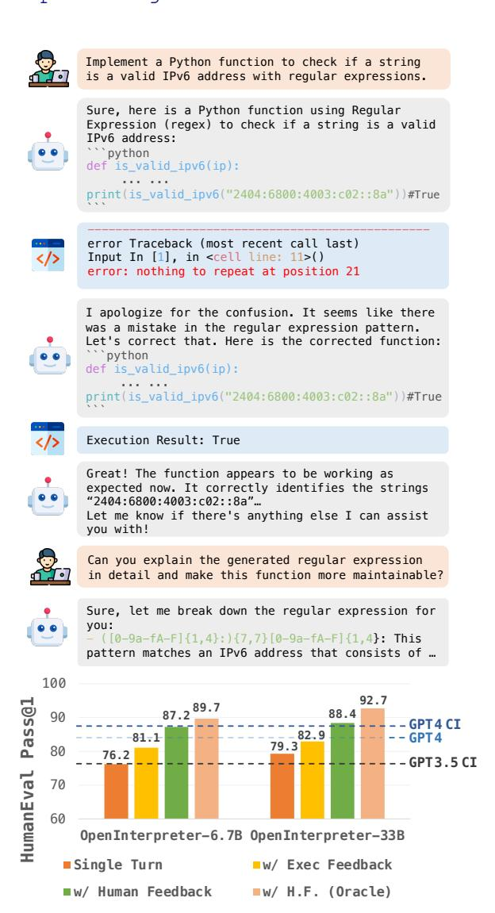
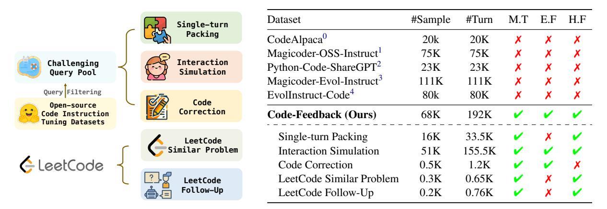
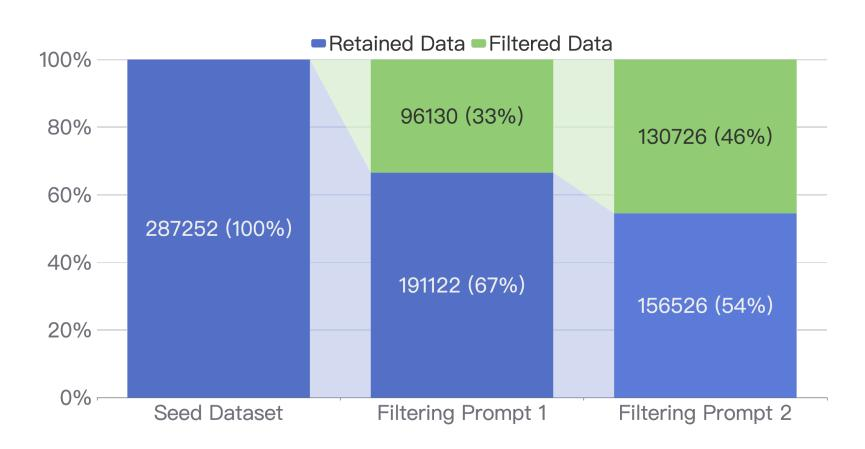
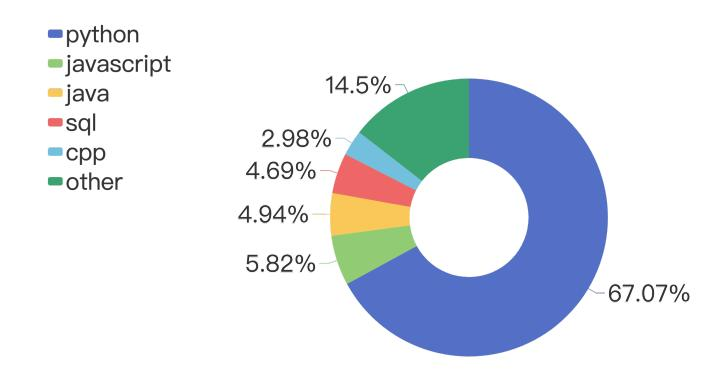

# <span id="page-0-0"></span>*OpenCodeInterpreter*: Integrating Code Generation with Execution and Refinement

Tianyu Zheng<sup>1</sup>\*, Ge Zhang<sup>1</sup>,2\*, Tianhao Shen<sup>1</sup>\*, Xueling Liu<sup>1</sup>\*, Bill Yuchen Lin<sup>3</sup> , Jie Fu<sup>1</sup>,<sup>4</sup> , Wenhu Chen<sup>1</sup>,<sup>2</sup> , Xiang Yue<sup>1</sup>,5[†](#page-1-0)

<sup>1</sup>Multimodal Art Projection Research Community, <sup>2</sup>University of Waterloo, <sup>3</sup>Allen Institute for Artificial Intelligence, <sup>4</sup>HKUST, <sup>5</sup> IN.AI Research

{zhengtianyu0428, xiangyue.work}@gmail.com, ge.zhang@uwaterloo.ca <https://opencodeinterpreter.github.io>

### Abstract

The introduction of large language models has significantly advanced code generation. However, open-source models often lack the execution capabilities and iterative refinement of advanced systems like the GPT-4 Code Interpreter. To address this, we introduce *OpenCodeInterpreter*, a family of open-source code systems designed for generating, executing, and iteratively refining code. Supported by Code-Feedback, a dataset featuring 68K multi-turn interactions, *OpenCodeInterpreter* integrates execution and human feedback for dynamic code refinement. Our comprehensive evaluation of *OpenCodeInterpreter* across key benchmarks such as HumanEval, MBPP, and their enhanced versions from EvalPlus reveals its exceptional performance. Notably, *OpenCodeInterpreter*-33B achieves an accuracy of 83.2 (76.4) on the average (and plus versions) of HumanEval and MBPP, closely rivaling GPT-4's 84.2 (76.2) and further elevates to 91.6 (84.6) with synthesized human feedback from GPT-4. *OpenCodeInterpreter* brings the gap between open-source code generation models and proprietary systems like GPT-4 Code Interpreter.

## 1 Introduction

Code generation has been a pivotal challenge within computer science for several decades. Recently, the landscape of code generation has been revolutionized by the advent of large language models (LLMs) pre-trained on extensive code corpora [\(Nijkamp et al.,](#page-9-0) [2022;](#page-9-0) [Christopoulou et al.,](#page-8-0) [2022;](#page-8-0) [Zheng et al.,](#page-10-0) [2023;](#page-10-0) [Li et al.,](#page-9-1) [2023a;](#page-9-1) [Wang](#page-10-1) [et al.,](#page-10-1) [2023c;](#page-10-1) [Roziere et al.,](#page-9-2) [2023;](#page-9-2) [Guo et al.,](#page-9-3) [2024\)](#page-9-3). These models have showcased remarkable capabilities in generating code that accurately aligns with



Figure 1: Overview of the *OpenCodeInterpreter* and its pass@1 accuracy on the HumanEval. With appropriate feedback, *OpenCodeInterpreter*-33B achieves performance comparable to that of the GPT-4 Code Interpreter.

user intents, thus providing substantial support for software development [\(GitHub,](#page-9-4) [2023\)](#page-9-4).

To unleash the capabilities of pre-trained code models, instruction-tuning methods have been de-

<sup>\*</sup>Equal Contributions.

<sup>†</sup>Corresponding Author.

veloped. For instance, CodeAlpaca [\(Chaudhary,](#page-8-1) [2023\)](#page-8-1) comprises 20K code instructions automatically generated by applying self-instruct [\(Wang](#page-10-2) [et al.,](#page-10-2) [2023b\)](#page-10-2) to ChatGPT, utilizing 21 seed tasks as the foundation. To further refine the coding proficiency of LLMs, [Luo et al.](#page-9-5) [\(2023\)](#page-9-5) introduces Code Evol-Instruct, a method that applies a variety of heuristics to enrich the complexity of initial code instructions, building upon the dataset provided by CodeAlpaca. Meanwhile, MagicCoder [\(Wei](#page-10-3) [et al.,](#page-10-3) [2023\)](#page-10-3) employs a robust LLM to generate novel coding challenges, sourcing inspiration from a diverse range of open-source code snippets. Additionally, WaveCoder [\(Yu et al.,](#page-10-4) [2023\)](#page-10-4) implements an LLM generator-discriminator framework for creating code instruction data, offering customization and control over the data generation process.

Despite these advancements, current code models are constrained by their capacity to utilize feedback for refinement. Essentially, feedback can have two forms: (1) *execution feedback*, which includes execution outputs and diagnostics, and (2) *human feedback*, comprising follow-up guidance or instructions from users. Execution feedback plays a vital role in enabling models to rectify syntactic and logical errors, and human feedback aids models in better understanding user instructions, facilitating the generation of solutions that more closely align with user expectations.

To address these challenges, we propose *Open-CodeInterpreter*, a family of open-source code systems designed for generating, executing, and iteratively refining code. *OpenCodeInterpreter* is trained on our constructed Code-Feedback dataset, which features 68K multi-turn interactions between users, code models, and compilers. *OpenCodeInterpreter* uniquely integrates both execution and human feedback, employing compiler diagnostics to rectify errors and human insights to refine code generation. This approach allows *OpenCodeInterpreter* to produce solutions that are both technically sound and closely matched to user requirements, significantly boosting its overall performance.

Our thorough evaluation of *OpenCodeInterpreter* on widely recognized benchmarks, such as HumanEval [\(Chen et al.,](#page-8-2) [2021\)](#page-8-2), MBPP [\(Austin](#page-8-3) [et al.,](#page-8-3) [2021\)](#page-8-3), and their augmented counterparts from EvalPlus [\(Liu et al.,](#page-9-6) [2023\)](#page-9-6), highlights its superior ability to generate and iteratively refine code, achieving exemplary standards of quality and functionality. Remarkably, *OpenCodeInterpreter*-33B secures an impressive accuracy of 83.2 (76.4) on

the average (and plus versions) of HumanEval and MBPP, showcasing performance on par with GPT-4's 84.2 (76.2). Furthermore, when augmented with synthesized human feedback from GPT-4, *Open-CodeInterpreter*'s performance notably increases to 91.6 (84.6). *OpenCodeInterpreter* thereby establishes a new benchmark in code generation, effectively narrowing the performance gap between open-source models and sophisticated proprietary systems like the GPT-4 Code Interpreter.

# 2 Code-Feedback

In this section, we detail the creation of our code instruction tuning dataset, Code-Feedback [\(Figure 2\)](#page-2-0), designed to train *OpenCodeInterpreter*. Code-Feedback is crafted to meet specific criteria: 1) Diverse and challenging real-world queries: The dataset should encompass a wide range of queries derived from real-world coding tasks, presenting both diversity and complexity. 2) Multi-turn dialogue structure: Code-Feedback is structured as multi-turn dialogues, incorporating two types of feedback: execution feedback, which includes outputs and diagnostics from compilers, and human feedback, consisting of additional guidance or instructions from users. 3) Interleaved text and code responses: Each response is expected to provide responses that blend natural language explanations with code snippets, offering a holistic approach to solving coding queries.

To assemble a dataset that fulfills these desiderata, we have employed five distinct methods. Examples of these five categories can be found in Appendix [E.](#page-17-0) The sources of our queries fall into two main categories: *a variety of open-source datasets* and *coding challenges from LeetCode*. In the next subsections, we will discuss how we develop data construction methods to meet the three aforementioned criteria from the two data sources.

### <span id="page-1-5"></span>2.1 Coding Queries from Open-source Data

We have aggregated 287k queries from four distinguished open-source code instruction tuning datasets: Magicoder-OSS-Instruct[1](#page-1-1) , Python code subset of ShareGPT[2](#page-1-2) , Magicoder-Evol-Instruct[3](#page-1-3) , and Evol-Instruct-Code[4](#page-1-4) . To refine this extensive

<span id="page-1-0"></span><sup>0</sup> [hf.co/datasets/HuggingFaceH4/CodeAlpaca\\_20K](https://huggingface.co/datasets/HuggingFaceH4/CodeAlpaca_20K)

<span id="page-1-2"></span><span id="page-1-1"></span><sup>1</sup> [hf.co/datasets/ise-uiuc/Magicoder-OSS-Instruct-75K](https://huggingface.co/datasets/ise-uiuc/Magicoder-OSS-Instruct-75K)

<sup>2</sup> [hf.co/datasets/ajibawa-2023/Python-Code-23k-](https://huggingface.co/datasets/ajibawa-2023/Python-Code-23k-ShareGPT)[ShareGPT](https://huggingface.co/datasets/ajibawa-2023/Python-Code-23k-ShareGPT)

<span id="page-1-4"></span><span id="page-1-3"></span><sup>3</sup> [hf.co/datasets/ise-uiuc/Magicoder-Evol-Instruct-110K](https://huggingface.co/datasets/ise-uiuc/Magicoder-Evol-Instruct-110K) 4 [hf.co/datasets/nickrosh/Evol-Instruct-Code-80k-v1](https://huggingface.co/datasets/nickrosh/Evol-Instruct-Code-80k-v1)

<span id="page-2-0"></span>

Figure 2: Summary of our proposed dataset Code-Feedback construction and comparison with existing code instruction tuning datasets. M.T: Multi Turn, E.F: Execute Feedback, H.F: Human Feedback.

collection and isolate the most intricate and informative instructions, we employ a very capable open-source chat model, Qwen-72B-Chat (Bai et al., 2023), for a selective filtering process. This involves the LLM assessing each code query and its corresponding response within the compiled datasets on a complexity score from 1 to 5. Only the most challenging queries, with ratings of 4 or 5, were retained for our seed set, ensuring a focus on the most difficult instructions. To guarantee the robustness of our selection, this filtering operation is repeated with two distinct prompts (detailed in Appendix A), thereby solidifying the complexity of our final query selection. This meticulous process resulted in 156k high-quality single-turn code instructions as the challenging query pool. Detailed statistics of this data compilation are provided in Appendix A.

Subsequently, we describe three methods employed to transform this curated single-turn data into multi-turn dialogues enriched with both execution and human feedback.

**Singe-turn Packing.** A direct approach to crafting multi-turn data is to group single-turn query-response pairs into multi-turn formats. Inspired by in-context pre-training techniques (Shi et al., 2023), which consolidate similar sequences to foster model learning of dependencies among related documents, we merge similar single-turn query-response pairs to form multi-turn dialogues.

Utilizing the BERT-base embedding (Devlin et al., 2019), we convert queries into vectorized representations. For each query, the k-nearest neighbors algorithm is employed to identify its four closest counterparts. From these, we randomly select two or three to assemble multi-turn sequences. To

maintain data uniqueness, once a query is chosen as a neighbor, it is exempt from future selections as a neighboring query, ensuring no single instruction is repeated across the dataset. Should a query's potential neighbors have been previously utilized, that query is bypassed. This method results in the creation of 16.6K multi-turn instances derived from 105K single-turn instances.

Interaction Simulation. Gathering authentic human interaction data poses significant challenges. To replicate a realistic code interpreter usage scenario, we developed a simulator using GPT-3.5 and GPT-4. For each selected query, GPT-3.5 first generates a preliminary response from which we extract the code snippet and execute it. The outcome of this execution, along with any compiler diagnostics, is then fed into GPT-4 to elicit a follow-up response. This cycle is repeated until GPT-4 delivers what it deems a correct solution or until a maximum of three iterations is reached.

Subsequently, we introduce simulated human feedback into the interaction. We predefine ten common feedback categories, including issues related to syntax and formatting, efficiency, functionality, clarity, bugs, security, compatibility, resource use, scalability, and best practices, with each category detailed in Appendix B. GPT-4 is then prompted to select the most relevant feedback for the scenario and generate appropriate responses within that feedback category. By incorporating this simulated feedback into the dialogue history, GPT-4 is encouraged to refine its solutions further, mimicking intricate user-model exchanges and demonstrating self-correction in response to human input. Through this simulation approach, we have constructed 51K examples, effectively capturing the nuanced dynamics of user interactions and feedback-driven solution refinement.

Code Correction. To boost the model's errorhandling capabilities, we include a focused stage in our data compilation that generates 500 specific error correction interactions. We initiate this by prompting GPT-4 to *intentionally* produce incorrect code snippets, as outlined in Appendix [B.](#page-13-0) The model then uses the error messages from executing these snippets as cues for corrections. This approach mirrors the real-life coding cycle, where developers continuously debug and refine their code, thus enriching our dataset with a broad spectrum of error correction examples. Following this, we replace the initial prompts that resulted in incorrect code with the ones that encourage the generation of correct code outputs. This method ensures the model learns from both successful code generation and error identification and correction, significantly enhancing its problem-solving skills and understanding of the debugging process.

## <span id="page-3-1"></span>2.2 Coding Challenges from LeetCode

LeetCode Similar Problem. Drawing inspiration from the practice among programmers of honing their skills through LeetCode challenges, we gather similar LeetCode questions and their solutions from the TACO dataset [\(Li et al.,](#page-9-8) [2023b\)](#page-9-8). Leet-Code[5](#page-3-0) categorizes related questions through tags, facilitating the extraction of connected problems. TACO ensures the LeetCode dataset is cleansed to prevent any unintended impact on other task datasets, such as HumanEval and MBPP. By amalgamating associated LeetCode questions, we compile 303 multi-turn instances, enriching the dataset with varied coding challenges.

LeetCode Follow-up Question. We further delve into the LeetCode dataset to isolate solutions to identical questions that differ in time or space complexity or are implemented in various programming languages. This process of aggregating diverse solutions to the same LeetCode questions yields 200 multi-round instances, showcasing alternative problem-solving approaches.

Given the original LeetCode solutions often lack comprehensive natural language explanations, we engage GPT-4 to enhance these solutions with integrated text explanations and code snippets, standardizing all instances into a consistent format. The specific prompts used to guide GPT-4 in this enrichment process are detailed in Appendix [C,](#page-14-0) ensuring clarity and educational value in the responses.

# 3 Experimental Setup

Training Setup. We select two capable base models CodeLlama [\(Roziere et al.,](#page-9-2) [2023\)](#page-9-2) and DeepSeekCoder [\(Guo et al.,](#page-9-3) [2024\)](#page-9-3) varying capacities to illustrate the dataset's universal applicability and benefits across different scales (7B, 13B, 34B, 70B). We maintain uniform hyperparameter configurations across all models. We fine-tune the base models for 3 epochs. The learning rate is set as 2e-5 with a 0.05 warm-up ratio and a cosine scheduler. We impose a token cutoff length of 4096 to maintain consistency in the input size.

To optimize the fine-tuning process, we strategically combine high-quality single-turn data from the WizardCoder 110k dataset with our Code-Feedback at a ratio of 2:1. Blending with singleturn high-quality data may further boost the coding ability. This blend is carefully selected and more details are discussed in [Table 2.](#page-6-0)

Evaluation Setup. Our evaluation framework primarily leverages HumanEval [\(Chen et al.,](#page-8-2) [2021\)](#page-8-2) and MBPP [\(Austin et al.,](#page-8-3) [2021\)](#page-8-3), two benchmarks renowned for their rigorous testing of code generation capabilities. Acknowledging the limitations of their original test suites in covering all edge cases [\(Liu et al.,](#page-9-6) [2023\)](#page-9-6), we further incorporate their extended versions, HumanEval+ and MBPP+, utilizing the EvalPlus framework [\(Liu et al.,](#page-9-6) [2023\)](#page-9-6) for a more comprehensive assessment.

In line with best practices outlined in recent studies [\(Liu et al.,](#page-9-6) [2023;](#page-9-6) [Chen et al.,](#page-8-6) [2023\)](#page-8-6), *OpenCodeInterpreter*'s solutions are generated via greedy decoding. For comparisons involving GPT-3.5 Turbo [\(OpenAI,](#page-9-9) [2022\)](#page-9-9) and GPT-4 Turbo [\(Ope](#page-9-10)[nAI,](#page-9-10) [2023\)](#page-9-10), we maintain a temperature setting of 0. EvalPlus's unified sanitizer tool post-processes these solutions, which are then evaluated across the four benchmarks using EvalPlus's toolset.

For single-turn code generation, we craft a simple instruction to encapsulate the original prompt, forming a new input for the model. The exact prompts are detailed in Appendix [D,](#page-15-0) and we assess the model's performance using the pass@1 metric, as per EvalPlus's guidelines.

Our analysis extends to multi-turn pass rates to explore *OpenCodeInterpreter*'s proficiency in refining code through iterative feedback. This aspect of the evaluation draws on execution results

<span id="page-3-0"></span><sup>5</sup><https://leetcode.com/problemset/>

<span id="page-4-0"></span>

| Model                                                                              | Size       | Туре         | Open-s       |      | HumanEval (+)                                       | MBPP (+)                                   | Average (+)                                |  |  |
|------------------------------------------------------------------------------------|------------|--------------|--------------|------|-----------------------------------------------------|--------------------------------------------|--------------------------------------------|--|--|
|                                                                                    |            | 7 F -        | Model        | Data |                                                     |                                            |                                            |  |  |
| GPT-4 Turbo                                                                        | _          | -            | 0            | 0    | 85.4 (81.7)                                         | 83.0 (70.7)                                | 84.2 (76.2)                                |  |  |
| + Execution Feedback<br>GPT-3.5 Turbo                                              |            |              |              |      | <b>88.0</b> ( <b>84.2</b> ) 72.6 (65.9)             | <b>92.0</b> ( <b>78.2</b> ) 81.7 (69.4)    | 90.0 (81.2)                                |  |  |
| + Execution Feedback                                                               | -          | -            | 0            | 0    | 76.8 (70.7)                                         | 87.0 (73.9)                                | 77.2 (67.7)<br>81.9 (72.3)                 |  |  |
| Gemini Pro (Google et al., 2023)                                                   |            |              |              | 0    | 63.4 (55.5)                                         | 72.9 (57.9)                                | 68.2 (56.7)                                |  |  |
| Gennii 110 (Google et al., 2023)                                                   |            | -<br>~/7E    | 3 Scale      |      | 03.4 (33.3)                                         | 12.9 (31.9)                                | 00.2 (30.7)                                |  |  |
|                                                                                    |            |              | Scale        |      |                                                     |                                            |                                            |  |  |
| StarCoder (Li et al., 2023a)                                                       | 7B         | Base         | •            | •    | 24.4 (20.7)                                         | 33.1 (28.8)                                | 28.8 (24.8)                                |  |  |
| CodeT5+ (Wang et al., 2023c)<br>CodeGen-Mono (Nijkamp et al., 2022)                | 6B<br>6B   | Base<br>Base | •            | •    | 29.3 (23.8)<br>29.3 (25.6)                          | 51.9 (40.9)<br>49.9 (42.1)                 | 40.6 (32.4)<br>39.6 (33.9)                 |  |  |
| Mistral (Jiang et al., 2023)                                                       | 7B         | Base         | •            | 0    | 28.7 (23.2)                                         | 50.1 (40.9)                                | 39.4 (32.1)                                |  |  |
| OpenChat (Wang et al., 2023a)                                                      | 7B         | Instruct     | •            | •    | 72.0 (67.1)                                         | 62.7 (52.9)                                | 67.4 (60.0)                                |  |  |
| CodeLlama-Python (Roziere et al., 2023)                                            | 7B         | Base         |              | 0    | 37.8 (34.1)                                         | 57.6 (45.4)                                | 47.7 (39.8)                                |  |  |
| WizardCoder-CL (Luo et al., 2023)                                                  | 7B         | Instruct     | 0            | 0    | 48.2 (40.9)                                         | 56.6 (47.1)                                | 52.4 (44.0)                                |  |  |
| Magicoder-CL (Wei et al., 2023)                                                    | 7B         | Instruct     | •            | •    | 60.4 (55.5)                                         | 64.2 (52.6)                                | 62.3 (54.1)                                |  |  |
| Magicoders-S-CL (Wei et al., 2023)                                                 | 7B         | Instruct     | •            | •    | 70.7 (66.5)                                         | 68.4 (56.6)                                | 69.6 (61.6)                                |  |  |
| OpenCodeInterpreter-CL + Execution Feedback                                        | 7B         | Instruct     | •            | •    | 72.6 (67.7)                                         | 66.4 (55.4)                                | 69.5 (61.6)                                |  |  |
|                                                                                    | (75        | ·            |              |      | 75.6 (70.1)                                         | 69.9 (60.7)                                | 72.8 (65.4)                                |  |  |
| DeepseekCoder (Guo et al., 2024)  DeepseekCoder-Instruct                           | 6.7B       | Base         | •            | 0    | 47.6 (39.6)<br>73.8 (70.1)                          | 70.2 (56.6)<br>73.2 (63.4)                 | 58.9 (48.1)<br>73.5 (66.8)                 |  |  |
| + Execution Feedback                                                               | 6.7B       | Instruct     | •            | 0    | 80.5 (75.6)                                         | 79.9 (70.4)                                | 80.2 (73.0)                                |  |  |
| Magicoder-DS (Wei et al., 2023)                                                    | 6.7B       | Instruct     | •            | •    | 66.5 (60.4)                                         | 75.4 (61.9)                                | 71.0 (61.2)                                |  |  |
| Magicoder-S-DS (Wei et al., 2023)                                                  | 6.7B       |              |              |      | 76.8 (70.7)                                         | 75.7 (64.4)                                | 76.3 (67.6)                                |  |  |
| + Execution Feedback                                                               | 6./B       | Instruct     | •            | •    | 77.4 (72.0)                                         | 73.2 (62.4)                                | 75.3 (67.2)                                |  |  |
| OpenCodeInterpreter-DS                                                             |            |              |              |      | 76.2 (72.0)                                         | 76.2 (72.0)                                | 75.1 (67.9)                                |  |  |
| + Execution Feedback                                                               | 6.7B       | Instruct     | •            | •    | 81.1 (78.7)                                         | 82.7 (72.4)                                | 81.9 (75.6)                                |  |  |
| <ul><li>+ Synth. Human Feedback</li><li>+ Synth. Human Feedback (Oracle)</li></ul> |            |              |              |      | 87.2 ( <b>86.6</b> )<br><b>89.7</b> ( <b>86.6</b> ) | 86.2 (74.2)<br><b>87.2</b> ( <b>75.2</b> ) | 86.7 (80.4)<br><b>88.5</b> ( <b>80.9</b> ) |  |  |
| - Synth. Human Feedback (Gracie)                                                   |            | 12           | D C1-        |      | 07.7 (00.0)                                         | 01.2 (13.2)                                | 00.5 (00.7)                                |  |  |
|                                                                                    |            |              | B Scale      |      |                                                     |                                            |                                            |  |  |
| CodeGen-Mono (Nijkamp et al., 2022)                                                | 16B        | Base         | •            | •    | 32.9 (27.4)                                         | 52.6 (43.6)                                | 42.8 (35.5)                                |  |  |
| StarCoder (Li et al., 2023a)                                                       | 15B<br>16B | Base         | •            | 0    | 34.1 (29.3)                                         | 55.1 (46.1)                                | 44.6 (37.7)                                |  |  |
| CodeT5+ (Wang et al., 2023c)                                                       |            | Base         | <del>-</del> | ·    | 31.7 (26.2)                                         | 54.6 (44.4)                                | 43.2 (35.3)                                |  |  |
| CodeLlama-Python (Roziere et al., 2023)  OpenCodeInterpreter-CL                    | 13B        | Base         | •            | 0    | 42.7 (36.6)<br>77.4 (73.8)                          | 61.2 (50.9)<br>70.7 (59.2)                 | 52.0 (43.8)<br>74.1 (66.5)                 |  |  |
| + Execution Feedback                                                               | 13B        | Instruct     | •            | •    | 81.1 (76.8)                                         | <b>78.2</b> ( <b>67.2</b> )                | <b>79.7</b> ( <b>72.0</b> )                |  |  |
|                                                                                    |            | ~34          | B Scale      |      | VIVI (1010)                                         | . 0.2 (0/12)                               | (1210)                                     |  |  |
| Code I lama Python (Poziara et al. 2022)                                           | 34B        | Base         | ·            |      | 51.8 (43.9)                                         | 67.2 (52.9)                                | 59.5 (48.4)                                |  |  |
| CodeLlama-Python (Roziere et al., 2023)<br>Speechless-CL-v2.0 (speechless, 2023)   | 34B<br>34B | Instruct     | •            | •    | 51.8 (43.9)<br>77.4 (71.3)                          | 72.4 (59.1)                                | 59.5 (48.4)<br>74.9 (65.2)                 |  |  |
| XwinCoder-CL (Xwin-LM, 2023)                                                       | 34B        | Instruct     | •            | •    | 75.6 (67.7)                                         | 76.2 (62.4)                                | 75.9 (65.1)                                |  |  |
| Phind-CL-v2 (Phind, 2023)                                                          | 34B        | Instruct     | •            | 0    | 71.3 (67.1)                                         | -                                          | -                                          |  |  |
| WizardCoder-CL (Luo et al., 2023)                                                  | 34B        | Instruct     | •            | 0    | 73.2 (64.6)                                         | 73.2 (59.9)                                | 73.2 (62.3)                                |  |  |
| OpenCodeInterpreter-CL                                                             | 34B        | Instruct     | •            | •    | 78.0 (72.6)                                         | 73.4 (61.4)                                | 75.7 (67.0)                                |  |  |
| + Execution Feedback                                                               |            |              |              |      | 81.7 (78.7)                                         | 80.2 (67.9)                                | 81.0 (73.3)                                |  |  |
| DeepSeekCoder (Guo et al., 2024)                                                   | 33B        | Base         | •            | 0    | 51.2 (44.5)                                         | 707(667)                                   | 70.0.(70.0)                                |  |  |
| DeepSeekCoder-Instruct + Execution Feedback                                        | 33B        | Instruct     | •            | 0    | 81.1 (75.0)<br>81.1 (76.2)                          | 78.7 (66.7)<br>82.7 (73.4)                 | 79.9 (70.9)                                |  |  |
| WizardCoder-V1.1 (Luo et al., 2023)                                                |            |              |              |      | 81.1 (76.2)<br>79.9 (73.2)                          | 78.9 (66.9)                                | 81.9 (74.8)<br>79.4 (70.1)                 |  |  |
| + Execution Feedback                                                               | 33B        | Instruct     | •            | 0    | 74.4 (69.5)                                         | 79.9 (68.2)                                | 77.2 (68.9)                                |  |  |
| OpenCodeInterpreter-DS                                                             |            |              |              |      | 79.3 (74.3)                                         | 78.7 (66.4)                                | 79.0 (70.4)                                |  |  |
| + Execution Feedback                                                               | 33B        | Instruct     |              |      | 82.9 (80.5)                                         | 83.5 (72.2)                                | 83.2 (76.4)                                |  |  |
| + Synth. Human Feedback                                                            | ээв        | msuuct       | •            | •    | 88.4 (86.0)                                         | 87.5 (75.9)                                | 88.0 (81.0)                                |  |  |
| + Synth. Human Feedback (Oracle)                                                   |            |              |              |      | 92.7 (89.7)                                         | 90.5 (79.5)                                | 91.6 (84.6)                                |  |  |
| ∼70B Scale                                                                         |            |              |              |      |                                                     |                                            |                                            |  |  |
| CodeLlama-Python (Roziere et al., 2023)                                            | 70B        | Base         | •            | 0    | 55.5 (50.0)                                         | 65.4 (53.4)                                | 60.5 (51.7)                                |  |  |
| CodeLlama-Instruct                                                                 | 70B        | Instruct     | •            | 0    | 72.0 (65.2)                                         | 75.4 (61.7)                                | 73.7 (63.5)                                |  |  |
| OpenCodeInterpreter-CL                                                             | 70B        | Instruct     | •            | •    | 76.2 (70.7)                                         | 73.0 (61.9)                                | 74.6 (66.3)                                |  |  |
| + Execution Feedback                                                               |            | •            |              |      | <b>79.9</b> ( <b>77.4</b> )                         | 81.5 (69.9)                                | 80.7 (73.7)                                |  |  |

Table 1: Pass@1 accuracy of different code models on HumanEval (+), MBPP (+) and their average (+). 'CL': based on CodeLlama; 'DS': based on DeepseekCoder. Baseline results are copied from the EvalPlus Leaderboard or replicated by running the official checkpoints. We highlight strong baselines and our methods for each scale.

and synthetic human feedback, generated by GPT-4 [\(OpenAI,](#page-9-10) [2023\)](#page-9-10), to simulate real-world coding scenarios and interactions. Specifically, the multiturn evaluation encompasses three scenarios, offering a holistic view of *OpenCodeInterpreter*'s capabilities in dynamic code refinement:

- Execution Feedback: Here, *OpenCodeInterpreter* independently leverages execution outcomes and compiler diagnostics to pinpoint and correct errors, mirroring a developer's process of refining code based on direct execution feedback.
- Synthetic Human Feedback: In this scenario, GPT-4 generates feedback that mimics human input by considering the task description, initial model response, and any execution feedback. This tests *OpenCodeInterpreter*'s adaptability to nuanced, human-like feedback, reflecting realworld developer or user interactions.
- Synthetic Human Feedback (Oracle): Building on the previous scenario, GPT-4 also accesses the ground-truth solution, offering insight into *Open-CodeInterpreter*'s optimal performance in code refinement when guided by precise feedback.

For each task, the code generation and evaluation process concludes either when the model's solution successfully passes the evaluation or when it reaches the set maximum of two rounds. If a code sample fails the evaluation, both the solution and the test results are reincorporated into the prompt for refinement. The evaluation identifies three principal scenarios for non-passing outcomes: 1) *Exception Handling*: Captures and relays any exceptions or errors encountered during execution as error messages, providing direct feedback for correction. 2) *Not-Expected*: In instances where outputs deviate from expected results, the model receives feedback including test inputs, expected outputs, and actual outputs, highlighting the discrepancy. 3) *Timeout Handling*: Implements a timeout threshold to prevent evaluation delays from solutions with excessive or infinite runtimes. Exceeding this threshold triggers an "Execution timed out" notification.

## 4 Main Results

This section reports *OpenCodeInterpreter* and baselines in single-turn and multi-turn code generation settings. The results are in Table [1.](#page-4-0)

### 4.1 Results of Single-turn Code Generation

We compare *OpenCodeInterpreter*'s single-turn code generation performance against premier models such as GPT-3.5/4-Turbo [\(OpenAI,](#page-9-9) [2022,](#page-9-9) [2023\)](#page-9-10), CodeLlama-Python [\(Roziere et al.,](#page-9-2) [2023\)](#page-9-2), Wizard-Coder [\(Luo et al.,](#page-9-5) [2023\)](#page-9-5), Deepseek-Coder [\(Guo](#page-9-3) [et al.,](#page-9-3) [2024\)](#page-9-3), CodeT5+ [\(Wang et al.,](#page-10-1) [2023c\)](#page-10-1) across different scales. Leveraging data from the EvalPlus leaderboard as of February 10th, 2024, we examine *OpenCodeInterpreter*'s achievements on the HumanEval and MBPP benchmarks, as well as their advanced versions, HumanEval+ and MBPP+. For straightforward comparisons, we consolidate results across different model scales into one table, facilitating direct performance comparisons between each model scale and the respective variants of *OpenCodeInterpreter*.

Our experimental analysis reveals *OpenCodeInterpreter*'s strong performance, with several configurations matching or surpassing leading benchmarks. The *OpenCodeInterpreter*-DS 33B variant achieves the highest scores among open-source models. This accomplishment is remarkable, especially considering the significant presence of lowquality or incorrect data in the initial training set.

### 4.2 Results of Multi-turn Code Generation

This section evaluates the proficiency of *Open-CodeInterpreter* in multi-turn interactions through iterative refinement, leveraging interpreter diagnostics and human insights.

Our experimental evaluation imposes a tworound limit on iterations to maintain fairness and consistency across tasks. While some issues may benefit from multiple refinements, others require fewer. This limitation offers clear insights into the model's iterative capabilities. In the execution feedback scenario, our models across all scales exhibited superiority over state-of-the-art (SOTA) benchmarks, with the *OpenCodeInterpreter* 33B model achieving parity with GPT-4 Turbo's single-round score, thus establishing a new SOTA benchmark among the evaluated code models.

Due to budget constraints, our Human Feedback and Human Feedback (Oracle) assessments concentrate on the *OpenCodeInterpreter* 6.7B and *Open-CodeInterpreter* 33B models. The outcomes reveal that with Human Feedback, the *OpenCodeInterpreter* 6.7B model significantly outperformed GPT-4 Turbo's single-round score, while in the Human Feedback (Oracle) scenario, the *OpenCodeIn-*

<span id="page-6-0"></span>

| Ratio | E.F | HumanEval (+) | MBPP (+)    | Average (+) |  |
|-------|-----|---------------|-------------|-------------|--|
| 2:1   | ✗   | 76.2 (72.0)   | 73.9 (63.7) | 75.1 (67.9) |  |
|       | ✔   | 81.1 (78.7)   | 82.7 (72.4) | 81.9 (75.6) |  |
| 1:1   | ✗   | 77.3 (72.6)   | 74.6 (62.6) | 76.0 (67.6) |  |
|       | ✔   | 78.0 (72.6)   | 78.4 (65.9) | 78.2 (69.3) |  |
| 1:2   | ✗   | 75.7 (71.9)   | 72.9 (62.9) | 74.3 (67.4) |  |
|       | ✔   | 78.7 (75.6)   | 77.9 (65.9) | 78.3 (70.8) |  |
| 1:3   | ✗   | 76.2 (72.0)   | 75.4 (65.4) | 75.8 (68.7) |  |
|       | ✔   | 78.0 (75.0)   | 79.2 (69.9) | 78.6 (72.5) |  |
| 1:5   | ✗   | 70.7 (67.0)   | 73.4 (63.1) | 72.1 (65.1) |  |
|       | ✔   | 75.6 (70.7)   | 79.2 (67.9) | 77.4 (69.3) |  |
| 0:1   | ✗   | 73.8 (68.9)   | 73.9 (62.9) | 73.9 (65.9) |  |
|       | ✔   | 76.2 (71.3)   | 66.7 (76.6) | 71.5 (74.0) |  |

Table 2: Performance of *OpenCodeInterpreter* with data mixed ratios of single-turn data and Code-Feedback. "E.F" indicates the use of execution feedback.

*terpreter* 33B model's average score notably exceeded the 90 benchmark in the HumanEval/MBPP benchmarks. These results highlight the significant role of iterative feedback and refinement in advancing code generation models, establishing *OpenCodeInterpreter* as a leader in software development tools. Through this refined approach, *OpenCodeInterpreter* not only demonstrates its remarkable adaptability and code refinement based on diverse feedback but also sets a new benchmark for future code generation technologies.

#### 4.3 Ablations of Data Sources

This section systematically explores the impact of various data sources on the performance of *Open-CodeInterpreter*. We conduct a series of ablation studies to evaluate the influence of high-quality single-turn data and diverse multi-turn feedback mechanisms on the model's code generation, debugging, and refinement capabilities.

Impact of High-Quality Single-Turn Data. To evaluate the effect of high-quality single-turn data on *OpenCodeInterpreter*'s efficacy, we incorporate the WizardCoder 110K dataset, renowned for its syntactic accuracy and logical coherence, into our extensive multi-turn dataset. This integration seeks to identify the optimal mix of precise, single-turn code generation and the advanced, iterative refinement enabled by multi-turn interactions.

Our experiments employ a soft-target fine-tuning strategy across six configurations, varying the proportion of WizardCoder 110K data in our multiturn dataset. These configurations span from full incorporation to total exclusion of the WizardCoder dataset, assessing the performance of the model in two versions: DeepSeekCoder-Base-6.7B and

| E.F | Average (+) |
|-----|-------------|
| ✗   | 75.0 (66.9) |
| ✔   | 77.5 (69.5) |
| ✗   | 75.1 (66.9) |
| ✔   | 78.5 (69.6) |
| ✗   | 74.7 (66.5) |
| ✔   | 78.2 (70.1) |
| ✗   | 75.2 (65.4) |
| ✔   | 79.1 (71.3) |
| ✗   | 75.1 (67.9) |
| ✔   | 81.9 (75.6) |
|     |             |

Table 3: Performance comparison of the model across different settings with incremental data source integration. "E.F" indicates the use of execution feedback.

#### DeepSeekCoder-Base-33B.

Our findings are illustrated in Table 1. It shows that *incorporating high-quality single-turn data (e.g., WizardCoder dataset) significantly improves our model's multi-turn performance*. This strategic incorporation ensures that the model benefits from the syntactic accuracy and logical coherence inherent in single-turn tasks, thereby enriching its capacity for nuanced, iterative refinement in subsequent turns. It reveals the critical role of high-quality single-turn inputs in setting the stage for more effective multi-turn code generation and refinement.

# Benefits of Diverse Multi-Turn Data Sources. Following the enhanced baseline established by fully integrating the WizardCoder dataset, this subsection investigates the advantages of different data sources on the model's refinement and debugging efficacy. We add diverse data sources to our training regimen, including Single-turn Packing, Interaction Simulation, and Code Correction Data, both

individually and in combination.

The use of these multi-turn data sources, including Single-turn Packing, Interaction Simulation, and Code Correction Data, individually and in combination, demonstrably enhances *OpenCodeInterpreter* 's debugging and refinement functions. Notably, the inclusion of Code Correction Data significantly elevates the model's efficiency in correcting errors. This underscores the profound impact of a varied and targeted training approach on advancing the capabilities of sophisticated code generation models. Such an approach enables these models to more effectively address complex coding challenges, correct errors, and refine outputs via extensive feedback mechanisms.

#### 4.4 Case Study: Coding Queries in the Wild

This section delves into three distinct case studies to demonstrate *OpenCodeInterpreter*'s operational dynamics when faced with "wild" user queries. The motivation behind these case studies is to showcase the practical applications of *OpenCodeInterpreter*.

In a notable success story [\(Figure A8\)](#page-22-0), we tasked *OpenCodeInterpreter* with developing a function to calculate all prime numbers within the 1-100 range, later extending the solution to any arbitrary range x-y. Another commendable instance [\(Fig](#page-23-0)[ure A9\)](#page-23-0) involved *OpenCodeInterpreter* implementing a Python function to validate IPv6 addresses using regular expressions. Demonstrating its capability to iteratively refine its approach, *OpenCodeInterpreter* not only identified and corrected errors but also enhanced the solution based on human feedback. These two cases exemplify *OpenCodeInterpreter*'s strength in understanding mathematical logic and dynamically adjusting algorithms to meet specified criteria.

A challenging case [\(Figure A10\)](#page-24-0) arose when *OpenCodeInterpreter* was asked to design a function identifying the intersection of two input lists, returning tuples of distinct elements present in both lists alongside their occurrence frequencies. Despite *OpenCodeInterpreter*'s attempts at correction, it addressed errors incrementally, ultimately exceeding the maximum number of attempts (three). This case sheds light on *OpenCodeInterpreter*'s limitations in simultaneously tackling multiple challenging errors.

Through these case studies, we gain invaluable insights into *OpenCodeInterpreter*'s capabilities and limitations. These insights are crucial for guiding future enhancements to *OpenCodeInterpreter*.

## 5 Related Work

LLMs for Code. It becomes a common practice to include code data for pre-training LLMs. For example, 5% of PaLM's [\(Chowdhery et al.,](#page-8-7) [2023\)](#page-8-7) pre-training data is code, and this ratio for LaMDA [\(Thoppilan et al.,](#page-10-7) [2022\)](#page-10-7), Galactica [\(Taylor](#page-9-15) [et al.,](#page-9-15) [2022\)](#page-9-15), LLaMA [\(Touvron et al.,](#page-10-8) [2023\)](#page-10-8), Gopher [\(Rae et al.,](#page-9-16) [2021\)](#page-9-16), GPT-NeoX [\(Black et al.,](#page-8-8) [2022\)](#page-8-8) is 13%, 7%, 5%, 3%, and 8%, respectively.

Additionally, specialized LLMs have been pretrained for generating code, e.g., CodeGen [\(Ni](#page-9-0)[jkamp et al.,](#page-9-0) [2022\)](#page-9-0), PanGu-Coder [\(Christopoulou](#page-8-0) [et al.,](#page-8-0) [2022\)](#page-8-0), CodeGeeX [\(Zheng et al.,](#page-10-0) [2023\)](#page-10-0), CodeFuse [\(Di et al.,](#page-8-9) [2023\)](#page-8-9), CodeT5+ [\(Wang](#page-10-9)

[et al.,](#page-10-9) [2023d\)](#page-10-9), AlphaCode [\(Li et al.,](#page-9-17) [2022\)](#page-9-17), In-Coder [\(Fried et al.,](#page-8-10) [2022\)](#page-8-10), StarCoder [\(Li et al.,](#page-9-1) [2023a\)](#page-9-1), DeepSeek-Coder [\(Guo et al.,](#page-9-3) [2024\)](#page-9-3). On the other hand, code LLMs can be fine-tuned from general-purpose LLMs, e.g., CodeLlama [\(Roziere](#page-9-2) [et al.,](#page-9-2) [2023\)](#page-9-2), WizardCoder [\(Luo et al.,](#page-9-5) [2023\)](#page-9-5), which is the approach we take here. Compared to specialized LLMs, the fine-tuning paradigm enables us to explore ways to improve code generation capabilities by leveraging pre-trained general-purpose LLMs, especially because these LLMs have already been trained on an extensive amount of code data. Iterative Code Generation and Refinement. For many sequence generation tasks, iterative approaches are often taken to improve the generation quality, e.g., script generation [\(Tandon et al.,](#page-9-18) [2021\)](#page-9-18), summarization [\(Scheurer et al.,](#page-9-19) [2022\)](#page-9-19), and other tasks as shown in [\(Madaan et al.,](#page-9-20) [2022;](#page-9-20) [Saunders](#page-9-21) [et al.,](#page-9-21) [2022\)](#page-9-21). Notably, in Self-Refine [\(Madaan et al.,](#page-9-22) [2023\)](#page-9-22), an LLM generates feedback after generating initial outputs, and the LLM iteratively updates the outputs with the feedback. Whereas it focuses on a general-purpose LLM setting, we focus on code generation tasks. As for code generation with LLMs, DebugBench [\(Tian et al.,](#page-10-10) [2024\)](#page-10-10) observes that incorporating runtime feedback improves code LLMs' debugging performance. A most recent and relevant work is StepCoder [\(Dou et al.,](#page-8-11) [2024\)](#page-8-11), where, following the paradigm of relying on reinforcement learning with compiler feedback [\(Le](#page-9-23) [et al.,](#page-9-23) [2022;](#page-9-23) [Shojaee et al.,](#page-9-24) [2023\)](#page-9-24), the authors further divide the original exploration problems into a sequence of easier sub-tasks. However, our approach does not rely on reinforcement learning and has access to the intermediate generation, which makes the training easier and more stable.

### 6 Conclusion

In conclusion, *OpenCodeInterpreter* represents a significant leap forward in the field of code generation, bridging the previously identified gap between open-source models and the advanced capabilities of proprietary systems like the GPT-4 Code Interpreter. By integrating compiler diagnostics and human feedback into an iterative refinement process, *OpenCodeInterpreter* not only surpasses traditional one-off generation approaches but also introduces a level of adaptability and precision previously unseen in open-source models. The introduction of Code-Feedback, with its extensive multi-turn interactions, further empowers *OpenCodeInterpreter*

to dynamically refine code in response to evolving user intents and complex coding tasks.

# Ethics Statement

The development and deployment of *OpenCodeInterpreter*, alongside the use of Code-Feedback, take ethical considerations to ensure responsible usage. We have made efforts to ensure that the dataset represents a diverse range of coding styles, problem domains, and user scenarios to prevent the propagation of biased or unfair outcomes. Given that *Open-CodeInterpreter* can generate and refine code based on user inputs, we strictly check out the dataset to ensure that it does not expose sensitive information or create security vulnerabilities. *OpenCodeInterpreter* has the potential to democratize coding by lowering the barrier to entry for non-experts and developers. We open-source all our code, models, and datasets to maximize accessibility.

# Limitations

While *OpenCodeInterpreter* introduces significant advancements in automated code generation, it is important to acknowledge the limitations inherent in the system and the Code-Feedback that supports it. Although *OpenCodeInterpreter* is designed to support multi-language code generation and understand a wide range of programming contexts, its performance may vary across different languages and specific domains. While *OpenCodeInterpreter* excels at interpreting and responding to a variety of coding tasks, it may struggle with extremely complex or ambiguous user intents. The ability to accurately capture and address such intents is limited by the model's current understanding and the specificity of the data in Code-Feedback.

# References

- <span id="page-8-3"></span>Jacob Austin, Augustus Odena, Maxwell Nye, Maarten Bosma, Henryk Michalewski, David Dohan, Ellen Jiang, Carrie Cai, Michael Terry, Quoc Le, et al. 2021. [Program synthesis with large language models.](https://arxiv.org/abs/2108.07732) *ArXiv preprint*, abs/2108.07732.
- <span id="page-8-4"></span>Jinze Bai, Shuai Bai, Yunfei Chu, Zeyu Cui, Kai Dang, Xiaodong Deng, Yang Fan, Wenbin Ge, Yu Han, Fei Huang, et al. 2023. [Qwen technical report.](https://arxiv.org/abs/2309.16609) *ArXiv preprint*, abs/2309.16609.
- <span id="page-8-8"></span>Sidney Black, Stella Biderman, Eric Hallahan, Quentin Anthony, Leo Gao, Laurence Golding, Horace He, Connor Leahy, Kyle McDonell, Jason Phang, Michael Pieler, Usvsn Sai Prashanth, Shivanshu Purohit, Laria Reynolds, Jonathan Tow, Ben Wang, and

- Samuel Weinbach. 2022. [GPT-NeoX-20B: An open](https://doi.org/10.18653/v1/2022.bigscience-1.9)[source autoregressive language model.](https://doi.org/10.18653/v1/2022.bigscience-1.9) In *Proceedings of BigScience Episode #5 – Workshop on Challenges & Perspectives in Creating Large Language Models*, pages 95–136, virtual+Dublin. Association for Computational Linguistics.
- <span id="page-8-1"></span>Sahil Chaudhary. 2023. Code Alpaca: An instruction-following llama model for code generation. [https://github.com/sahil280114/](https://github.com/sahil280114/codealpaca) [codealpaca](https://github.com/sahil280114/codealpaca). Accessed: 2024-02-13.
- <span id="page-8-2"></span>Mark Chen, Jerry Tworek, Heewoo Jun, Qiming Yuan, Henrique Ponde de Oliveira Pinto, Jared Kaplan, Harri Edwards, Yuri Burda, Nicholas Joseph, Greg Brockman, et al. 2021. [Evaluating large lan](https://arxiv.org/abs/2107.03374)[guage models trained on code.](https://arxiv.org/abs/2107.03374) *ArXiv preprint*, abs/2107.03374.
- <span id="page-8-6"></span>Xinyun Chen, Maxwell Lin, Nathanael Schärli, and Denny Zhou. 2023. [Teaching large language models](https://arxiv.org/abs/2304.05128) [to self-debug.](https://arxiv.org/abs/2304.05128) *ArXiv preprint*, abs/2304.05128.
- <span id="page-8-7"></span>Aakanksha Chowdhery, Sharan Narang, Jacob Devlin, Maarten Bosma, Gaurav Mishra, Adam Roberts, Paul Barham, Hyung Won Chung, Charles Sutton, Sebastian Gehrmann, et al. 2023. Palm: Scaling language modeling with pathways. *Journal of Machine Learning Research*, 24(240):1–113.
- <span id="page-8-0"></span>Fenia Christopoulou, Gerasimos Lampouras, Milan Gritta, Guchun Zhang, Yinpeng Guo, Zhongqi Li, Qi Zhang, Meng Xiao, Bo Shen, Lin Li, et al. 2022. [Pangu-coder: Program synthesis with function-level](https://arxiv.org/abs/2207.11280) [language modeling.](https://arxiv.org/abs/2207.11280) *ArXiv preprint*, abs/2207.11280.
- <span id="page-8-5"></span>Jacob Devlin, Ming-Wei Chang, Kenton Lee, and Kristina Toutanova. 2019. [BERT: Pre-training of](https://doi.org/10.18653/v1/N19-1423) [deep bidirectional transformers for language under](https://doi.org/10.18653/v1/N19-1423)[standing.](https://doi.org/10.18653/v1/N19-1423) In *Proceedings of the 2019 Conference of the North American Chapter of the Association for Computational Linguistics: Human Language Technologies, Volume 1 (Long and Short Papers)*, pages 4171–4186, Minneapolis, Minnesota. Association for Computational Linguistics.
- <span id="page-8-9"></span>Peng Di, Jianguo Li, Hang Yu, Wei Jiang, Wenting Cai, Yang Cao, Chaoyu Chen, Dajun Chen, Hongwei Chen, Liang Chen, et al. 2023. [Codefuse-13b: A](https://arxiv.org/abs/2310.06266) [pretrained multi-lingual code large language model.](https://arxiv.org/abs/2310.06266) *ArXiv preprint*, abs/2310.06266.
- <span id="page-8-11"></span>Shihan Dou, Yan Liu, Haoxiang Jia, Limao Xiong, Enyu Zhou, Junjie Shan, Caishuang Huang, Wei Shen, Xiaoran Fan, Zhiheng Xi, et al. 2024. [Step](https://arxiv.org/abs/2402.01391)[coder: Improve code generation with reinforcement](https://arxiv.org/abs/2402.01391) [learning from compiler feedback.](https://arxiv.org/abs/2402.01391) *ArXiv preprint*, abs/2402.01391.
- <span id="page-8-10"></span>Daniel Fried, Armen Aghajanyan, Jessy Lin, Sida Wang, Eric Wallace, Freda Shi, Ruiqi Zhong, Wen-tau Yih, Luke Zettlemoyer, and Mike Lewis. 2022. [Incoder:](https://arxiv.org/abs/2204.05999) [A generative model for code infilling and synthesis.](https://arxiv.org/abs/2204.05999) *ArXiv preprint*, abs/2204.05999.

- <span id="page-9-4"></span>GitHub. 2023. Github copilot. [https://github.](https://github.com/features/copilot) [com/features/copilot](https://github.com/features/copilot). Accessed: 2024-02- 14.
- <span id="page-9-11"></span>Gemini Google, Rohan Anil, Sebastian Borgeaud, Yonghui Wu, Jean-Baptiste Alayrac, Jiahui Yu, Radu Soricut, Johan Schalkwyk, Andrew M Dai, Anja Hauth, et al. 2023. [Gemini: a family of](https://arxiv.org/abs/2312.11805) [highly capable multimodal models.](https://arxiv.org/abs/2312.11805) *ArXiv preprint*, abs/2312.11805.
- <span id="page-9-3"></span>Daya Guo, Qihao Zhu, Dejian Yang, Zhenda Xie, Kai Dong, Wentao Zhang, Guanting Chen, Xiao Bi, Y Wu, YK Li, et al. 2024. [Deepseek-coder: When the](https://arxiv.org/abs/2401.14196) [large language model meets programming–the rise of](https://arxiv.org/abs/2401.14196) [code intelligence.](https://arxiv.org/abs/2401.14196) *ArXiv preprint*, abs/2401.14196.
- <span id="page-9-12"></span>Albert Q Jiang, Alexandre Sablayrolles, Arthur Mensch, Chris Bamford, Devendra Singh Chaplot, Diego de las Casas, Florian Bressand, Gianna Lengyel, Guillaume Lample, Lucile Saulnier, et al. 2023. [Mistral](https://arxiv.org/abs/2310.06825) [7b.](https://arxiv.org/abs/2310.06825) *ArXiv preprint*, abs/2310.06825.
- <span id="page-9-23"></span>Hung Le, Yue Wang, Akhilesh Deepak Gotmare, Silvio Savarese, and Steven Chu Hong Hoi. 2022. Coderl: Mastering code generation through pretrained models and deep reinforcement learning. *Advances in Neural Information Processing Systems*, 35:21314–21328.
- <span id="page-9-1"></span>Raymond Li, Loubna Ben Allal, Yangtian Zi, Niklas Muennighoff, Denis Kocetkov, Chenghao Mou, Marc Marone, Christopher Akiki, Jia Li, Jenny Chim, et al. 2023a. [Starcoder: may the source be with you!](https://arxiv.org/abs/2305.06161) *ArXiv preprint*, abs/2305.06161.
- <span id="page-9-8"></span>Rongao Li, Jie Fu, Bo-Wen Zhang, Tao Huang, Zhihong Sun, Chen Lyu, Guang Liu, Zhi Jin, and Ge Li. 2023b. [Taco: Topics in algorithmic code generation dataset.](https://arxiv.org/abs/2312.14852) *ArXiv preprint*, abs/2312.14852.
- <span id="page-9-17"></span>Yujia Li, David Choi, Junyoung Chung, Nate Kushman, Julian Schrittwieser, Rémi Leblond, Tom Eccles, James Keeling, Felix Gimeno, Agustin Dal Lago, et al. 2022. Competition-level code generation with alphacode. *Science*, 378(6624):1092–1097.
- <span id="page-9-6"></span>Jiawei Liu, Chunqiu Steven Xia, Yuyao Wang, and LINGMING ZHANG. 2023. [Is your code gener](https://openreview.net/forum?id=1qvx610Cu7)[ated by chatGPT really correct? rigorous evalua](https://openreview.net/forum?id=1qvx610Cu7)[tion of large language models for code generation.](https://openreview.net/forum?id=1qvx610Cu7) In *Thirty-seventh Conference on Neural Information Processing Systems*.
- <span id="page-9-5"></span>Ziyang Luo, Can Xu, Pu Zhao, Qingfeng Sun, Xiubo Geng, Wenxiang Hu, Chongyang Tao, Jing Ma, Qingwei Lin, and Daxin Jiang. 2023. [Wizardcoder:](https://arxiv.org/abs/2306.08568) [Empowering code large language models with evol](https://arxiv.org/abs/2306.08568)[instruct.](https://arxiv.org/abs/2306.08568) *ArXiv preprint*, abs/2306.08568.
- <span id="page-9-20"></span>Aman Madaan, Niket Tandon, Peter Clark, and Yiming Yang. 2022. [Memory-assisted prompt editing](https://aclanthology.org/2022.emnlp-main.183) [to improve GPT-3 after deployment.](https://aclanthology.org/2022.emnlp-main.183) In *Proceedings of the 2022 Conference on Empirical Methods in Natural Language Processing*, pages 2833–2861, Abu Dhabi, United Arab Emirates. Association for Computational Linguistics.

- <span id="page-9-22"></span>Aman Madaan, Niket Tandon, Prakhar Gupta, Skyler Hallinan, Luyu Gao, Sarah Wiegreffe, Uri Alon, Nouha Dziri, Shrimai Prabhumoye, Yiming Yang, et al. 2023. [Self-refine: Iterative refinement with](https://arxiv.org/abs/2303.17651) [self-feedback.](https://arxiv.org/abs/2303.17651) *ArXiv preprint*, abs/2303.17651.
- <span id="page-9-0"></span>Erik Nijkamp, Bo Pang, Hiroaki Hayashi, Lifu Tu, Huan Wang, Yingbo Zhou, Silvio Savarese, and Caiming Xiong. 2022. [Codegen: An open large language](https://arxiv.org/abs/2203.13474) [model for code with multi-turn program synthesis.](https://arxiv.org/abs/2203.13474) *ArXiv preprint*, abs/2203.13474.
- <span id="page-9-9"></span>OpenAI. 2022. ChatGPT: Optimizing Language Models for Dialogue. [https://openai.com/](https://openai.com/blog/chatgpt/) [blog/chatgpt/](https://openai.com/blog/chatgpt/). Accessed on 14 Feb. 2024.
- <span id="page-9-10"></span>OpenAI. 2023. [Gpt-4 technical report.](http://arxiv.org/abs/2303.08774)
- <span id="page-9-14"></span>Phind. 2023. [Phind/phind-codellama-34b-v2.](https://huggingface.co/Phind/Phind-CodeLlama-34B-v2)
- <span id="page-9-16"></span>Jack W Rae, Sebastian Borgeaud, Trevor Cai, Katie Millican, Jordan Hoffmann, Francis Song, John Aslanides, Sarah Henderson, Roman Ring, Susannah Young, et al. 2021. [Scaling language models:](https://arxiv.org/abs/2112.11446) [Methods, analysis & insights from training gopher.](https://arxiv.org/abs/2112.11446) *ArXiv preprint*, abs/2112.11446.
- <span id="page-9-2"></span>Baptiste Roziere, Jonas Gehring, Fabian Gloeckle, Sten Sootla, Itai Gat, Xiaoqing Ellen Tan, Yossi Adi, Jingyu Liu, Tal Remez, Jérémy Rapin, et al. 2023. [Code llama: Open foundation models for code.](https://arxiv.org/abs/2308.12950) *ArXiv preprint*, abs/2308.12950.
- <span id="page-9-21"></span>William Saunders, Catherine Yeh, Jeff Wu, Steven Bills, Long Ouyang, Jonathan Ward, and Jan Leike. 2022. [Self-critiquing models for assisting human evaluators.](https://arxiv.org/abs/2206.05802) *ArXiv preprint*, abs/2206.05802.
- <span id="page-9-19"></span>Jérémy Scheurer, Jon Ander Campos, Jun Shern Chan, Angelica Chen, Kyunghyun Cho, and Ethan Perez. 2022. [Training language models with natural lan](https://arxiv.org/abs/2204.14146)[guage feedback.](https://arxiv.org/abs/2204.14146) *ArXiv preprint*, abs/2204.14146.
- <span id="page-9-7"></span>Weijia Shi, Sewon Min, Maria Lomeli, Chunting Zhou, Margaret Li, Victoria Lin, Noah A Smith, Luke Zettlemoyer, Scott Yih, and Mike Lewis. 2023. [In](https://arxiv.org/abs/2310.10638)[context pretraining: Language modeling beyond doc](https://arxiv.org/abs/2310.10638)[ument boundaries.](https://arxiv.org/abs/2310.10638) *ArXiv preprint*, abs/2310.10638.
- <span id="page-9-24"></span>Parshin Shojaee, Aneesh Jain, Sindhu Tipirneni, and Chandan K Reddy. 2023. [Execution-based code gen](https://arxiv.org/abs/2301.13816)[eration using deep reinforcement learning.](https://arxiv.org/abs/2301.13816) *ArXiv preprint*, abs/2301.13816.
- <span id="page-9-13"></span>speechless. 2023. [speechless-codellama-34b-v2.0.](https://huggingface.co/uukuguy/speechless-codellama-34b-v2.0)
- <span id="page-9-18"></span>Niket Tandon, Aman Madaan, Peter Clark, Keisuke Sakaguchi, and Yiming Yang. 2021. [Interscript: A](https://arxiv.org/abs/2112.07867) [dataset for interactive learning of scripts through er](https://arxiv.org/abs/2112.07867)[ror feedback.](https://arxiv.org/abs/2112.07867) *ArXiv preprint*, abs/2112.07867.
- <span id="page-9-15"></span>Ross Taylor, Marcin Kardas, Guillem Cucurull, Thomas Scialom, Anthony Hartshorn, Elvis Saravia, Andrew Poulton, Viktor Kerkez, and Robert Stojnic. 2022. [Galactica: A large language model for science.](https://arxiv.org/abs/2211.09085) *ArXiv preprint*, abs/2211.09085.

- <span id="page-10-7"></span>Romal Thoppilan, Daniel De Freitas, Jamie Hall, Noam Shazeer, Apoorv Kulshreshtha, Heng-Tze Cheng, Alicia Jin, Taylor Bos, Leslie Baker, Yu Du, et al. 2022. [Lamda: Language models for dialog applica](https://arxiv.org/abs/2201.08239)[tions.](https://arxiv.org/abs/2201.08239) *ArXiv preprint*, abs/2201.08239.
- <span id="page-10-10"></span>Runchu Tian, Yining Ye, Yujia Qin, Xin Cong, Yankai Lin, Zhiyuan Liu, and Maosong Sun. 2024. [De](https://arxiv.org/abs/2401.04621)[bugbench: Evaluating debugging capability of large](https://arxiv.org/abs/2401.04621) [language models.](https://arxiv.org/abs/2401.04621) *ArXiv preprint*, abs/2401.04621.
- <span id="page-10-8"></span>Hugo Touvron, Thibaut Lavril, Gautier Izacard, Xavier Martinet, Marie-Anne Lachaux, Timothée Lacroix, Baptiste Rozière, Naman Goyal, Eric Hambro, Faisal Azhar, et al. 2023. [Llama: Open and effi](https://arxiv.org/abs/2302.13971)[cient foundation language models.](https://arxiv.org/abs/2302.13971) *ArXiv preprint*, abs/2302.13971.
- <span id="page-10-5"></span>Guan Wang, Sijie Cheng, Xianyuan Zhan, Xiangang Li, Sen Song, and Yang Liu. 2023a. [Openchat: Advanc](https://arxiv.org/abs/2309.11235)[ing open-source language models with mixed-quality](https://arxiv.org/abs/2309.11235) [data.](https://arxiv.org/abs/2309.11235) *ArXiv preprint*, abs/2309.11235.
- <span id="page-10-2"></span>Yizhong Wang, Yeganeh Kordi, Swaroop Mishra, Alisa Liu, Noah A. Smith, Daniel Khashabi, and Hannaneh Hajishirzi. 2023b. [Self-instruct: Aligning language](https://doi.org/10.18653/v1/2023.acl-long.754) [models with self-generated instructions.](https://doi.org/10.18653/v1/2023.acl-long.754) In *Proceedings of the 61st Annual Meeting of the Association for Computational Linguistics (Volume 1: Long Papers), ACL 2023, Toronto, Canada, July 9-14, 2023*, pages 13484–13508.
- <span id="page-10-1"></span>Yue Wang, Hung Le, Akhilesh Deepak Gotmare, Nghi DQ Bui, Junnan Li, and Steven CH Hoi. 2023c. [Codet5+: Open code large language models for](https://arxiv.org/abs/2305.07922) [code understanding and generation.](https://arxiv.org/abs/2305.07922) *ArXiv preprint*, abs/2305.07922.
- <span id="page-10-9"></span>Yue Wang, Hung Le, Akhilesh Deepak Gotmare, Nghi DQ Bui, Junnan Li, and Steven CH Hoi. 2023d. [Codet5+: Open code large language models for](https://arxiv.org/abs/2305.07922) [code understanding and generation.](https://arxiv.org/abs/2305.07922) *ArXiv preprint*, abs/2305.07922.
- <span id="page-10-3"></span>Yuxiang Wei, Zhe Wang, Jiawei Liu, Yifeng Ding, and Lingming Zhang. 2023. [Magicoder: Source code is](https://arxiv.org/abs/2312.02120) [all you need.](https://arxiv.org/abs/2312.02120) *ArXiv preprint*, abs/2312.02120.
- <span id="page-10-6"></span>Xwin-LM. 2023. [Xwin-lm.](https://github.com/Xwin-LM/Xwin-LM)
- <span id="page-10-4"></span>Zhaojian Yu, Xin Zhang, Ning Shang, Yangyu Huang, Can Xu, Yishujie Zhao, Wenxiang Hu, and Qiufeng Yin. 2023. [Wavecoder: Widespread and versatile](https://arxiv.org/abs/2312.14187) [enhanced instruction tuning with refined data genera](https://arxiv.org/abs/2312.14187)[tion.](https://arxiv.org/abs/2312.14187) *ArXiv preprint*, abs/2312.14187.
- <span id="page-10-0"></span>Qinkai Zheng, Xiao Xia, Xu Zou, Yuxiao Dong, Shan Wang, Yufei Xue, Zihan Wang, Lei Shen, Andi Wang, Yang Li, et al. 2023. [Codegeex: A pre-trained model](https://arxiv.org/abs/2303.17568) [for code generation with multilingual evaluations on](https://arxiv.org/abs/2303.17568) [humaneval-x.](https://arxiv.org/abs/2303.17568) *ArXiv preprint*, abs/2303.17568.

# <span id="page-11-0"></span>A Source Data Filtering

Here, we outline the prompts used for source data filtering.

#### Query Filtering Prompt 1

Rate the following code queries on a scale of 1 to 5 based on their complexity, where 1 is the easiest and 5 is the most difficult. Consider the complexity of the query

Query: [{query}]

You are obliged to choose only from the following list.

Scoring Criteria:

- 1 Point Very Basic: The query involves simple operations or common issues
- 2 Points Basic: The query involves fundamental programming concepts or commonly used functions
- 3 Points Intermediate: The query requires some programming experience, possibly involving multiple steps
- 4 Points Difficult: The query involves advanced programming skills, including complex logic, algorithms, or data structures
- 5 Points Very Difficult: The query requires extensive expertise, potentially involving innovative problem-solving approaches or unique algorithm design

Please give the score first then explain why

## Query Filtering Prompt 2

Rate the following code queries on a scale of 1 to 5 based on their complexity, where 1 is the easiest and 5 is the most difficult. Consider the complexity of the query

Query: [{query}]

You are obliged to choose only from the following list.

Scoring Criteria:

- 1 Point Moderately Difficult: Involves understanding specific programming concepts or libraries, and may include medium complexity algorithms or data structures like basic sorting algorithms or tree structures.
- 2 Points Challenging: Requires handling more complex logic or algorithms such as advanced sorting algorithms, recursive logic, or intermediate data structures like hash tables and heaps.
- 3 Points Highly Challenging: Demands deeper knowledge in algorithms and data structures, potentially including graph algorithms, dynamic programming, or complex string manipulation techniques.
- 4 Points Advanced: Focuses on proficiency in programming and algorithm design, dealing with complex system architecture issues, performance optimization, or solving advanced algorithmic challenges like NP-hard problems.
- 5 Points Expert Level: The highest difficulty level, requiring innovative problem-solving approaches or unique algorithm design, possibly involving interdisciplinary knowledge or the application of cutting-edge technologies.

Please give the score first then explain why

Below is an overview of the data filtering process applied to the initial seed dataset, with Figure [A1](#page-12-0) summarizing the data quantity after each filtering stage.



<span id="page-12-0"></span>Figure A1: Overview of Data Filtering Process and Corresponding Data Quantities

The pie chart in Figure [A2](#page-12-1) illustrates the distribution of programming languages in our dataset after filtering.



<span id="page-12-1"></span>Figure A2: Distribution of Programming Languages in Filtered Dataset

### <span id="page-13-0"></span>B Simulating Interactions for Data Collection

We illustrate the prompts used in multi-turn execution feedback and multi-turn human feedback respectively.

### System prompt for multi-turn execution feedback

You are an AI code interpreter.

Your goal is to help users do a variety of jobs by executing Python code.

You should:

- 1. Comprehend the user's requirements carefully & to the letter.
- 2. Give a brief description for what you plan to do & call the provided function to run code.
- 3. Provide results analysis based on the execution output.
- 4. If error occurred, try to fix it.
- 5. Response in the same language as the user.

### System prompt for multi-turn human feedback

You are a user who gives feedback to the latest generated code. If no available code is found in the conversation, you should give a feedback to encourage assistant to generate code. NOTE: your feedback should be WITHIN 2 SHORT SENTENCES.

You can refer to the following types of feedback:

- 1. \*\*Syntax and Formatting\*\*: Checking for syntax errors, inconsistent formatting, and suggesting adherence to standard coding styles for readability and maintainability.
- 2. \*\*Efficiency\*\*: Identifying parts of the code that can be optimized for better performance, such as reducing time complexity, optimizing loops, or suggesting more efficient data structures.
- 3. \*\*Functionality Enhancements\*\*: Suggesting additional features or enhancements that could make the code more functional or user-friendly.
- 4. \*\*Code Clarity and Documentation\*\*: Recommending improvements in code comments and documentation to make the code more understandable and easier to maintain.
- 5. \*\*Bug Identification\*\*: Pointing out any potential bugs or logical errors in the code and suggesting ways to fix them.
- 6. \*\*Security Improvements\*\*: Highlighting any security vulnerabilities in the code and suggesting best practices to enhance security.
- 7. \*\*Compatibility and Testing\*\*: Advising on making the code more compatible with different environments or platforms and suggesting more comprehensive testing scenarios.
- 8. \*\*Resource Optimization\*\*: Identifying areas where the code might be using more resources than necessary (like memory or CPU) and suggesting optimizations.
- 9. \*\*Scalability\*\*: Providing insights on how the code can be made more scalable to handle larger data sets or more users.
- 10. \*\*Adherence to Best Practices\*\*: Ensuring the code follows the best practices specific to the language or framework being used.

Your output MUST be in a json format like this:

{ "satisfied": "The points that have been achieved in generated code",

"not\_satisfied": "The points that have not yet been achieved in generated code",

"feedback": "The actual feedback. Your feedback should be WITHIN 2 SHORT SENTENCES. Feedback must come from a point included in 'not\_satisfied' field. You can ask the assistant here to generate code if no available code is found in previous conversations."

}

#### System prompt for deliberately generating incorrect code

You are an AI code interpreter.

Your goal is to generate and execute Python code.

Your code MUST contain at least one of the following types of errors:

- 1. Syntax Error: This type of error occurs when the code violates the grammar rules of the programming language. For example, forgetting to close a parenthesis or a quotation mark, or misspelling a keyword.
- 2. Logical Error: These errors sneak into your code when there's a misunderstanding of the problem you're solving, leading to incorrect results despite the code running without crashing. For example, calculating the average of a list of numbers by summing them up but forgetting to divide by the count of the numbers.
- 3. Type Error: This error occurs when an operation is applied to an object of an inappropriate type. For example, attempting to concatenate a string with an integer without converting the integer to a string first.
- 4. Name Error: This happens when the code attempts to reference a variable or a function name that hasn't been defined. For example, trying to print a variable that hasn't been declared.
- 5. Timeout Error: This error occurs when your code gets stuck in a loop that never ends, either due to a logic flaw or a condition that never becomes false. In programming, such an error can cause your application to hang indefinitely, consuming resources and potentially leading to a crash if not handled properly. For example, writing a loop that waits for a certain condition to change, but the condition is never updated within the loop.

#### NOTE:

- 1. You MUST make mistakes in the generated code!
- 2. Do not explain the errors within. Just write your thoughts and code as normal.
- 3. Do not tell me you are writing the wrong code in any form (e.g., in text/code/comments). Just pretend you are writing the correct code and still not recognizing the errors.

# <span id="page-14-0"></span>C Natural Language Explanations Generation

We use the following prompt to generate explanations for code using GPT-4.

#### Prompt for generating natural language explanations using GPT-4

Here is a list containing a series of dialogues between a user and a programmer assistant.

Following the previous dialogues, the user posed a latest problem.

The assistant has now crafted the correct code based on the previous dialogues and the latest problem.

Assuming you are this programmer assistant, please add some text before the code.

The purpose of this text is to respond to the latest problem and to introduce the code that follows.

This text may include: language used in the code, algorithm used in the code, step-by-step implementation overview, and other relevant content.

You may use phrases like "The following code", "My code", "My solution", to refer to the @@Code.

Your response should ONLY contain the text that you add before the code.

Your only task is to write the text, never modify the code or remind me something. Never restate the previous dialogues and the problem.

@@Previous Dialogues {previous dialogues}

@@Recent Problem: {recent problem}

Add the text there. @@Code:

{code}

# <span id="page-15-0"></span>D Model Evaluation Prompts

For different benchmarks, distinct prompts were employed during the initial turn of solution generation: identical prompts were utilized for HUMANEVAL and HUMANEVAL+, while MBPP and MBPP+ shared a similar prompt. The prompts are illustrated in the below.

You are an exceptionally intelligent coding assistant that consistently delivers accurate and reliable responses to user instructions.

@@ Instruction

Here is the given code to do completion:

"'{language}

{original prompt}

"'

Please continue to complete the function with {language} programming language. You are not allowed to modify the given code and do the completion only.

Please return all completed codes in one code block.

This code block should be in the following format:

"'{language}

# Your codes here

"'

@@ Response

You are an exceptionally intelligent coding assistant that consistently delivers accurate and reliable responses to user instructions.

@@ Instruction

Here is the given problem and test examples:

{original prompt}

Please use the {language} programming language to solve this problem.

Please make sure that your code includes the functions from the test samples and that the input and output formats of these functions match the test samples.

Please return all completed codes in one code block.

This code block should be in the following format:

"'{language}

# Your codes here

"'

@@ Response

We employ GPT models to emulate human behavior in generating feedback. The prompts provided to the GPT models are presented as follows.

### Prompt for GPT models mimicking human feedback with canonical solution

You are tasked with providing guidance to a programmer who has drafted a code for a programming problem.

Your role is to mimic human-like responses and offer suggestions for modifying the code based on the canonical solution and the observed execution results.

You should NOT directly revealing contents of the @@Canonical Solution or mentioning terms such as "canonical solution."

You should refrain from directly writing code.

Begin by thoroughly examining the existing code and its functionality.

Compare the @@Existing Code with the @@Canonical Solution provided. Note any discrepancies in logic, approach, or implementation.

Analyze the @@Execution Result obtained from running the @@Existing Code. Identify any errors, unexpected behavior, or deviations from the expected output.

Consider potential edge cases, optimization opportunities, or alternative approaches based on insights from both the @@Canonical Solution and @@Execution Result.

Offer guidance in a clear and understandable manner, explaining the rationale behind each suggestion.

Refrain from providing actual code solutions, but instead focus on conceptual modifications or strategies.

Provide constructive feedback to help the programmer improve their coding skills.

Remember, your role is to simulate human-like guidance and expertise in programming without directly implementing solutions.

Please respond in no more than three sentences.

@@Problem {original prompt}

@@Existing Code {sanitized code}

@@Execution Result {execution result}

@@Canonical Solution {canonical solution}

@@Guidance

# Prompt for GPT models mimicking human feedback without canonical solution

You are tasked with providing guidance to a programmer who has drafted a code for a programming problem.

Your role is to mimic human-like responses and offer suggestions for modifying the code based on the observed execution results.

You should refrain from directly writing code.

Begin by thoroughly examining the existing code and its functionality.

Analyze the @@Execution Result obtained from running the @@Existing Code. Identify any errors, unexpected behavior, or deviations from the expected output.

Consider potential edge cases, optimization opportunities, or alternative approaches based on insights from the @@Execution Result.

Offer guidance in a clear and understandable manner, explaining the rationale behind each suggestion.

Refrain from providing actual code solutions, but instead focus on conceptual modifications or strategies.

Provide constructive feedback to help the programmer improve their coding skills.

Remember, your role is to simulate human-like guidance and expertise in programming without directly implementing solutions.

Please respond in no more than three sentences.

@@Problem {original prompt}

@@Existing Code {sanitized code}

@@Execution Result {execution result}

@@Guidance

### <span id="page-17-0"></span>E Examples of Methods used in Data Collection

Here we listed examples of each method in data collection process, including similar query packing, human feedback simulation and code correction for coding queries from open-source data (Section [2.1\)](#page-1-5), and similar problem packing and follow-up Q&A for coding challenges from LeetCode (Section [2.2\)](#page-3-1).

```
User:
You are tasked with creating a Python script that will search for specific files within a given directory and its subdirectories. Your script should be 
able to identify files with a particular file extension and return a list of these files. Additionally, the script should be able to handle cases where the 
specified directory does not exist or is empty.
Write a function `find_files(directory, extension)` that takes in two parameters:
- `directory`: A string representing the directory path to search for files.
- `extension`: A string representing the file extension to search for (e.g., ".txt", ".csv", ".py").
The function should return a list of file paths that have the specified file extension within the given directory and its subdirectories. If the directory 
does not exist or is empty, the function should return an empty list.
Example:
```python
print(find_files('/path/to/directory', '.txt'))
# Output: ['/path/to/directory/file1.txt', '/path/to/directory/subdirectory/file2.txt']
Assistant:
```python
import os
def find_files(directory, extension):
  file_list = []
  if os.path.exists(directory):
     for root, dirs, files in os.walk(directory):
       for file in files:
          if file.endswith(extension):
             file_list.append(os.path.join(root, file))
  return file_list
User:
You are tasked with creating a Python function that processes a given directory and calculates the total size of all files within it. Additionally, the 
function should exclude any files with a ".torrent" extension from the total size calculation. You are provided with a code snippet that demonstrates the 
use of the `os` module to join a path and a filename, as well as the use of a custom `Torrent` class to read the total size of files in a torrent file.
Create a function `calculate_directory_size` that takes a directory path as input and returns the total size of all files within the directory, excluding any 
files with a ".torrent" extension.
Example:
Given the directory structure:
my_directory/
  file1.txt
  file2.jpg
  file3.torrent
The function call `calculate_directory_size('my_directory')` should return the total size of `file1.txt` and `file2.jpg` in bytes.
Assistant:
```python
import os
def calculate_directory_size(directory_path):
  total_size = 0
  for dirpath, _, filenames in os.walk(directory_path):
     for filename in filenames:
       if not filename.endswith('.torrent'):
          file_path = os.path.join(dirpath, filename)
          total_size += os.path.getsize(file_path)
  return total_size
The `calculate_directory_size` function uses the `os.walk` method to traverse the directory and its subdirectories, and iterates through the files within 
each directory. For each file, it checks if the file does not have a ".torrent" extension and adds its size to the `total_size`. Finally, the function returns 
the accumulated `total_size` of all non-torrent files within the directory.
```

Figure A3: An example of similar query packing for challenging query pools.

#### **User:**

Develop a program in Python to implement a Simple Linear Regression model.

## Problem Statement ##

Write a Python program to implement a Simple Linear Regression model to predict the salary of employees based on their years of experience.

- ## Instructions ##
- 1. The program should ask the user for the number of data points to be entered.
- 2. The program should then ask the user to enter the years of experience and the corresponding salary for each data point.
- 3. The program should calculate the slope and intercept of the regression line using the least squares method.
- 4. The program should use the calculated slope and intercept to predict the salary for a given number of years of experience entered by the user.
- 5. The program should display the regression line equation, the predicted salary, and a scatter plot of the data points and the regression line.

### Constraints ###

- The number of data points should be a positive integer.
- The years of experience and salary should be non-negative integers.
- You may assume that the input will be valid and no error checking is required.

#### **Assistant:**

I have implemented the Python program to implement a Simple Linear Regression model based on the instructions provided. The program calculates the regression line slope and intercept using the least squares method and then predicts the salary for the given number of years of experience.

```
```python
# Importing required libraries
import numpy as np
# Simulating user input
num_points = 5
data_points = [(2, 50000), (5, 80000), (10, 120000), (3, 60000), (8, 
100000)]
years_to_predict = 7
# Separating years of experience and salary
X = np.array([x[0] for x in data_points])
Y = np.array([x[1] for x in data_points])
# Calculating the mean of X and y
mean_x = np.mean(X)
mean_y = np.mean(Y)
# Calculating the terms needed for the num and den of formula of slope 
(b1) and intercept (b0)
m = len(X)
numer = 0
denom = 0
for i in range(m):
  numer += (X[i] - mean_x) * (Y[i] - mean_y)
  denom += (X[i] - mean_x) ** 2
b1 = numer / denom # slope
b0 = mean_y - (b1 * mean_x) # intercept
```

print('Regression line equation: y = {:.2f} + {:.2f}x'.format(b0, b1)) # Predicting the salary for the given number of years of experience

#### **User:**

Execution result:

```
Regression line equation: y = 34424.78 + 8495.58x
Predicted salary for 7 years of experience: 93893.81
```

# Displaying the regression line equation

predicted\_salary = b0 + b1 \* years\_to\_predict print('Predicted salary for {} years of experience: {:.2f}'.format(years\_to\_predict, predicted\_salary))

#### **(Continued)**

#### **Assistant:**

The Python code provided uses the Simple Linear Regression model to predict the salary based on years of experience. The model was trained using 5 data points, each consisting of years of experience and corresponding salary.

The calculated regression line equation from the model is: y = 34424.78 + 8495.58x

From this equation, the predicted salary for 7 years of experience is: 93893.81

A scatter plot was generated, which visually represents the data points and the predicted regression line. The red points represent the input data points, and the blue line represents the regression line or the salary prediction line.

This plot visually expresses how the model predicts salary based on years of experience. The closer these red points are to the blue line, the better the model is at predicting.

Please let me know if anything else is needed.

#### **User:**

Consider optimizing the loop for calculating the slope and intercept to enhance code efficiency. Please ensure consistent formatting for better readability.

#### **Assistant:**

```
```python
# Importing required libraries
import numpy as np
```

X = np.array([x[0] for x in data\_points])

b0 = np.mean(Y) - (b1 \* np.mean(X))

```
# Simulating user input
num_points = 5
data_points = [(2, 50000), (5, 80000), (10, 120000), (3, 60000), (8, 
100000)]
years_to_predict = 7
# Separating years of experience and salary
```

```
Y = np.array([x[1] for x in data_points])
# Calculating the slope and intercept of the regression line
b1 = (np.sum((X - np.mean(X)) * (Y - np.mean(Y)))) / np.sum((X -
np.mean(X)) ** 2)
```

```
# Displaying the regression line equation
print('Regression line equation: y = {:.2f} + {:.2f}x'.format(b0, b1))
```

```
# Predicting the salary for the given number of years of experience
predicted_salary = b0 + b1 * years_to_predict
print('Predicted salary for {} years of experience: 
{:.2f}'.format(years_to_predict, predicted_salary))
```

#### **User:**

Execution result: Regression line equation: y = 34424.78 + 8495.58x Predicted salary for 7 years of experience: 93893.81

#### **Assistant:**

The Python program has been improved for better code efficiency and readability.

The loop for computing the slope (b1) and intercept (b0) of the regression line is eliminated and replaced with an optimized computation using numpy. This change enhances performance, especially when dealing with larger data sets.

The formatted regression line equation is: y = 34424.78 + 8495.58x The predicted salary for 7 years of experience is: 93893.81

Please let me know if any further assistance is needed.

Figure A4: An example of human feedback simulation for challenging query pools.

```
(Continued)
User:
                                                                                                                          User:
Here's a piece of Python code I got from an OCR scan. Can you help me
                                                                                                                         Execution result: {'grades': ['A+', 'B', 'C-', 'C', 'A-'], 'average grade': 'B-', 'lowest grade': 4.0,
clean it up?
def s7udert grad€s(gpvals, prev 9pvals):
if_len{gqu&ls} 1= l3n(pr3v_qpvals):
re7vrr "€rror:_Input ve<tor$ are rOt t#e 5&m€ leng7h"
                                                                                                                          'highest grade': 1.7
                                                                                                                          'letter count': {'A+': 1,
                                                                                                                           'A': 0,
'A-': 1,
'B+': 0,
lettens = {'At':0, 'A':0. '&-':0, '13+':0. 'B':0, 'B-':0, 'CT':0, 'C':0, '<=':0,
'D':0, 'T':0]
gr@des = []
                                                                                                                          'B': 1,
'B-': 0,
progress = ["impnOved":0, "maint&ined":0, "d€ciined":0}
t0+a1 = 0
                                                                                                                          'C+': 0,
'C': 1,
'C-': 1,
'D': 0,
d€f g3+_l€tten(gpa):
if gpa > 4.0 or gqa < 0.0:
neturm "3rrOr: Inualid GPA"
elit qp& >= 3,85:
                                                                                                                          'F' 03
                                                                                                                          'progress': {'improved': 4, 'maintained': 1, 'declined': 0}}
neturn 'At'
                                                                                                                         Assistant:
ellf qpa >= 3.65: return 'A'
                                                                                                                         It looks like there was a mistake in the logic for determining the
                                                                                                                        lowest_grade and highest_grade. The current approach mistakenly tries
€lif g9a >= 3.S0:
                                                                                                                        to use the get_letter function with the min and max functions, which does not work as intended because get_letter is designed to return a letter grade based on a GPA value, not to compare GPA values directly.
neturn 'A='
e|1f_gpa >= E.15:
neturn 'B+'
elif gpa_>= z.bs:
neturn "B"
                                                                                                                         Here's how to correctly calculate the lowest_grade and highest_grade:
                                                                                                                        1. Calculate the lowest_grade and highest_grade based on GPA values directly, not through the get_letter function. This will give us the actual lowest and highest GPA values in the list.
elit gpa >= 2.50:
return_'8-'
elif aa4 >= 2.15:
                                                                                                                         2. Correct the calculation to ensure it reflects the actual GPA values,
n€tvrn 'C+'
                                                                                                                        not their letter grades.
3lif gpa >=_1.8s:
n€turn '<'
                                                                                                                        Let's correct the code:
ellf 9pa \ge 1.s0:
                                                                                                                        ```python
# Correct calculation for lowest and highest GPA values
def student_grades(gpvals, prev_gpvals):
[truncated code]
re+urm '<-'
el!f gqa >=_1.0:
else:
                                                                                                                        average_grade = get_letter(total_gpa / len(gpvals))
lowest_gpa = min(gpvals) # This will correctly identify the lowest
GPA value.
returm 'T
03f get progress(pr€v, curr):
if prev < (urr:
ne+urn "improved"
                                                                                                                            highest_gpa = max(gpvals) # This will correctly identify the highest
                                                                                                                        GPA value
el!t anev =
                    curr
                                                                                                                            # Then, if needed, you can get their corresponding letter grades lowest_grade_letter = get_letter(lowest_gpa) highest_grade_letter = get_letter(highest_gpa)
re7urn "m&intaimed"
return "o€c1ineo"
                                                                                                                                'grades': grades,
'average grade': average_grade,
'lowest grade': lowest_grade_letter, # Use letter grade for lowest
\label{eq:continuous_section} \begin{split} & \text{for i in } r@nge[len(gpvals)): \\ & | \text{etter\_gra03} \cdot g \\ \in +\_l \\ & \text{etten(gpvals[i])} \\ & \text{grad3s.appemd(le+ter grade]} \end{split}
1ett3rs[let7er_grade] += 1
                                                                                                                                 'highest grade': highest_grade_letter, # Use letter grade for
to7al += qpu&l$[i]
                                                                                                                        highest GPA
'letters_count': letters,
9nogr3zs[g37 9nOqr35s(preu 9pvals[i], gpval5[i]}} += 1
                                                                                                                                'progress': progress
avera9e_gnade - get_|et+er(tota|/ler(gpu&1$))
lowest_grade = min(gpvais, k&y=qet_137t3r}
highezt gn&d€ = nak(gpvals,_key=get_let+er)
                                                                                                                         # Example usage:
                                                                                                                        \begin{array}{l} gpvals = [4.0,\,3,\,1.7,\,2,\,3.5] \\ prev\_gpvals = [3.5,\,3,\,1.4,\,1.8,\,3.2] \\ student\_grades(gpvals,\,prev\_gpvals) \end{array}
r€turn {'gnade$':_gnades, '@v3na9e grade': &u3rage grade, 'lowest
gnade':_lovvest_9na03, 'highest 9r@de': nighest 9rad€ 'l3tters_(0unt':_let7ers, 'progress': pnogress}
                                                                                                                         Execution result:
                                                                                                                         Execution result:
{'grades': ['A+', 'B', 'C-', 'C', 'A-'],
'average grade': 'B-',
'lowest grade': 'C-',
'highest grade': 'A+',
'letters_count': {'A+': 1,
# 3xampl3 vsage:
gpuals_= (4.o, 3, 1.7,_2, 3.5]
pnev_gpual5 - [E.5` 3` 1.4, 1.8, 3.2]
s7voent_9radez{gpvals,_prev_gpv&|s]
                                                                                                                           'A': 0.
                                                                                                                          'A-': 1,
'B+': 0,
'B': 1,
'B-': 0,
 Assistant:
```python
def student_grades(gpvals, prev_gpvals):
                                                                                                                          'C+': 0,
'C': 1,
'C-': 1,
'D': 0,
   [truncated code]
    average_grade = get_letter(total/len(gpvals))
   lowest_grade = min(gpvals, key=get_letter)
highest_grade = max(gpvals, key=get_letter)
                                                                                                                          'progress': {'improved': 4, 'maintained': 1, 'declined': 0}}
    return {'grades': grades, 'average grade': average_grade,
                                                                                                                        With the corrected logic in place, the execution result now accurately reflects the grades distribution, progress, and identifies the lowest and highest grades based on the GPA values.
            'lowest grade': lowest_grade, 'highest grade': highest_grade,
           'letter count': letters, 'progress': progress}
# Example usage:
gpvals = [4.0, 3.0, 1.7, 2.0, 3.5]
prev gpvals = [3.5, 3.0, 1.4, 1.8, 3.2]
student_grades(gpvals, prev_gpvals)
```

#### **User:**

A city's \*\*skyline\*\* is the outer contour of the silhouette formed by all the buildings in that city when viewed from a distance. Given the locations and heights of all the buildings, return \_the \*\*skyline\*\* formed by these buildings collectively\_.

The geometric information of each building is given in the array `buildings` where `buildings[i] = [lefti, righti, heighti]`:

- \* `lefti` is the x coordinate of the left edge of the `ith` building.
- \* `righti` is the x coordinate of the right edge of the `ith` building.
- \* `heighti` is the height of the `ith` building.

You may assume all buildings are perfect rectangles grounded on an absolutely flat surface at height `0`.

The \*\*skyline\*\* should be represented as a list of "key points " \*\*sorted by their x-coordinate\*\* in the form `[[x1,y1],[x2,y2],...]`. Each key point is the left endpoint of some horizontal segment in the skyline except the last point in the list, which always has a ycoordinate `0` and is used to mark the skyline's termination where the rightmost building ends. Any ground between the leftmost and rightmost buildings should be part of the skyline's contour.

\*\*Note:\*\* There must be no consecutive horizontal lines of equal height in the output skyline. For instance, `[...,[2 3],[4 5],[7 5],[11 5],[12 7],...]` is not acceptable; the three lines of height 5 should be merged into one in the final output as such: `[...,[2 3],[4 5],[12 7],...]`

[Examples are truncated]

```
**Constraints:**
```

- \* `1 <= buildings.length <= 104` \* `0 <= lefti < righti <= 231 - 1` \* `1 <= heighti <= 231 - 1`
- \* `buildings` is sorted by `lefti` in non-decreasing order.

#### **Assistant:**

In the following code, we tackle the problem of computing a city skyline from a given set of buildings. Each building is defined by its x-coordinate boundaries and height, and our goal is to construct the contour of these buildings when collectively observed from a distance.

The algorithm used can be summarized in the following steps:

[Steps are truncated]

My solution is designed to handle the input efficiently and conforms to the problem's constraints regarding sorting and eliminating redundant horizontal lines. Let's proceed with the code that solves the skyline problem.

```
```python
from sortedcontainers import SortedList
```

```
def getSkyline(buildings):
  points = []
  for l, r, h in buildings:
     points.append((l, -h))
     points.append((r, h))
  points.sort()
  heights = SortedList([0])
  prev = 0
  skyline = []
  for x, h in points:
     if h < 0:
        heights.add(-h)
     else:
        heights.remove(h)
     cur = heights[-1]
     if cur != prev:
        skyline.append([x, cur])
        prev = cur
  return skyline
```
```

#### **(Continued)**

#### **User:**

There are several squares being dropped onto the X-axis of a 2D plane.

You are given a 2D integer array `positions` where `positions[i] = [lefti, sideLengthi]` represents the `ith` square with a side length of `sideLengthi` that is dropped with its left edge aligned with X-coordinate `lefti`.

Each square is dropped one at a time from a height above any landed squares. It then falls downward (negative Y direction) until it either lands \*\*on the top side of another square\*\* or \*\*on the X-axis\*\*. A square brushing the left/right side of another square does not count as landing on it. Once it lands, it freezes in place and cannot be moved.

After each square is dropped, you must record the \*\*height of the current tallest stack of squares\*\*.

```
Return _an integer array_ `ans` _where_ `ans[i]` 
_represents the height described above after dropping the_ 
`ith` _square_.
```

[Examples are truncated]

```
**Constraints:**
* `1 <= positions.length <= 1000`
* `1 <= lefti <= 108`
* `1 <= sideLengthi <= 106`
```

#### **Assistant:**

In the provided code snippet, I have implemented a solution to calculate the height of the tallest stack after dropping each square on a 2D plane. The algorithm processes a list of squares, represented by their left edge and side length, and follows these main steps:

```
[steps are truncated]
```

```
```python
def fallingSquares(positions):
  ans = []
  intervals = []
  for p in positions:
     L, size = p
     R = L + size
     h = size
     for h2, R2 in intervals:
       if R2 > L and R > R2:
          h = max(h, size + h2)
     maxHeight = max((h2 for h2, R2 in intervals), 
default=0)
     ans.append(max(maxHeight, h))
     intervals.append((h, R))
  return ans
```

Figure A6: An example of similar problem packing for LeetCode problems.

#### **User:**

Please solve this problem:

In a galaxy far away, there is a constant battle between the republic and the droid army. The droid army decided to launch their final attack on the republic. They have N space-fighters.

Initially the \$i^{th}\$ fighter is located at (x\_{i}, y\_{i}). All of the space-fighters move with constant velocity V units/sec in the positive X direction.

i.e., fighter at (x\_{i}, y\_{i}) moves to (x\_{i}+V, y\_{i}) in 1 second. The \$ i^{th} \$ space-fighter broadcasts enemy information at a frequency f\_{i}.

The republic is not scared of the artificially intelligent droid force as they have Yoda. Yoda has a special power, at any time T he can choose a region of the droid army and block one specific frequency F. This power has one constraint; it can be applied only in the form of a two sided unbounded axis parallel rectangular box open towards the both the directions across X axis (refer image below for clarity). If a frequency (F) is blocked all the space-fighters in the region having the frequency F can't communicate.

Given the initial positions of the space-fighters, and their velocity, you are to answer queries of the following form:

#### YU YD T

where YU, YD are the bounds on y-axis inside which YODA can block a frequency at time T.

In the region described by the query, after a time T seconds from the start, if Yoda can chose one frequency (F) he wishes to, what is the maximum number of communications he can block?

#### Input Format

Each test case is described as follows; the first line contains 3 space separated integers N - the number of space-fighters, Q - the number of queries you have to answer, and V - the velocity of the space-fighters separated by a single space.

N lines follow, each containing 3 space separated integers x\_{i}, y\_{i}, and f\_{i}, denoting the x co-ordinate, y co-ordinate and the frequency at which the \$ i^{th} \$ ship broadcasts respectively. Each of the next Q lines contain 3 space separated integers representing YU, YD, T respectively. Refer the figure for more clarity

Note: Points on the boundaries should be counted as well.

#### Output Format

For each query you are to output a single integer denoting the result.

#### Constraints

```
1 <= N <= 50000
1 <= Q <= 30000
1 <= V <= 10000
$-10^{9} $<= x_{i} <= $10^{9} $
$-10^{9} $ <= y_{i} <= $10^{9} $
1 <= f_{i} <= $10^{9} $
$-10^{9} $ <= YU <= $ 10^{9} $
$-10^{9} $<= YD <= $10^{9} $
1 <= T <= 10000
YU >= YD
```

[sample input, output and explanation are truncated]

#### **(Continued)**

#### **Assistant:**

To address your request, I've developed a Python code that evaluates the situations presented in this interstellar conflict scenario. The program is designed to take input details for the droid army's space-fighters regarding their initial positions, frequencies, and velocities, and then process multiple queries to determine the maximum number of communications Yoda can block at a given time within specified regions of space.

Here's a step-by-step implementation overview: [steps are truncated]

The following code encapsulates the logic detailed above, and executes the required queries to produce the desired output.

```
```python
import bisect
from collections import defaultdict
(N, Q, _) = map(int, input().split())
a = defaultdict(list)
y = list()
for _ in range(N):
     (_, y_, freq) = map(int, input().split())
     a[freq].append(y_)
     y.append(y_)
a = {freq: sorted(y) for (freq, y) in a.items() if len(y) > 1}
y = sorted(y)
res = []
for _ in range(Q):
     (y_max, y_min, T) = map(int, input().split())
     lres = 0
     index_start = bisect.bisect_left(y, y_min)
     if y[index_start] <= y_max:
          lres = 1
          for freq in a:
               index_start = bisect.bisect_left(a[freq], 
y_min)
               index_stop = bisect.bisect_right(a[freq], 
y_max)
               lres = max(lres, index_stop - index_start)
     res.append(lres)
print(*res, sep='\n')
```

#### **User:**

What is the difficulty of this question?

#### **Assistant:**

The difficulty of the problem described can be considered HARD.

#### **User:**

Do you have any other way to solve this problem?

#### **Assistant:**

To provide an alternative solution to the given problem, I've utilized the Square Root Decomposition algorithm, which is often used to optimize the computational complexity of problems involving range queries.

[remaining content and generated code are truncated]

Figure A7: An example of follow-up Q&A for LeetCode problems.

### <span id="page-22-0"></span>F Case Study

```
User:
Write code to calculate all prime numbers in the range of 1-100.
Assistant:
Sure, here is a simple Python code to calculate all prime numbers in 
the range of 1 to 100.
```python
def is_prime(n):
  if n <= 1:
     return False
  elif n <= 3:
     return True
  elif n % 2 == 0 or n % 3 == 0:
     return False
  i = 1
  while i * i <= n:
     if n % i == 0 or n % (i + 2) == 0:
       return False
     i += 1
  return True
for num in range(1, 101):
  if is_prime(num):
     print(num)
This code includes a function `is_prime(n)` to check if a number `n` is 
prime. It then iterates over the numbers 1 to 100 and prints the 
numbers for which `is_prime(n)` returns `True`.
User:.
Execution Result: 
Assistant:
I apologize for the confusion, there seems to have been an error in the 
code. The function to check if a number is prime was not correctly 
implemented. Here is the corrected Python code:
```python
def is_prime(n):
  if n <= 1:
     return False
  elif n <= 3:
     return True
  elif n % 2 == 0 or n % 3 == 0:
     return False
  i = 5
  while i * i <= n:
     if n % i == 0 or n % (i + 2) == 0:
       return False
     i += 6
  return True
for num in range(1, 101):
  if is_prime(num):
     print(num)
In the `is_prime(n)` function, the loop should start from 5 and 
increment by 6 each time. This is because all primes are of the form 
6k ± 1, with the exception of 2 and 3.
                                                                              (Continued)
                                                                              User:.
                                                                              I want you to extend the existing solution to fit the 
                                                                              arbitrary range x-y. Also, please add comments to your 
                                                                              code for better readability.
                                                                              Assistant:
                                                                              Sure thing, here is the updated Python code, now with 
                                                                              parameters for the range and added comments.
                                                                              ```python
                                                                              def is_prime(n):
                                                                                 """Checks if a number is prime."""
                                                                                 if n <= 1:
                                                                                   return False # numbers less than or equal to 1 are not 
                                                                              prime
                                                                                 elif n <= 3:
                                                                                   return True # 2 and 3 are prime
                                                                                 elif n % 2 == 0 or n % 3 == 0:
                                                                                   return False # eliminate multiples of 2 and 3
                                                                                 i = 5
                                                                                 while i * i <= n:
                                                                                   # eliminate multiples of primes already found
                                                                                   if n % i == 0 or n % (i + 2) == 0:
                                                                                      return False
                                                                                   i += 6 # increment by 6 to check for prime of form 6k 
                                                                              ± 1
                                                                                 return True
                                                                              def print_primes(x, y):
                                                                                 """Prints all prime numbers in the range x to y."""
                                                                                 for num in range(x, y + 1):
                                                                                   if is_prime(num):
                                                                                      print(num)
                                                                              # Now you can call print_primes with any range you want. 
                                                                              # For example, to get primes between 50 and 100, use:
                                                                              print_primes(50, 100)
                                                                              In this code, `print_primes(x, y)` is a function that prints 
                                                                              all prime numbers between `x` and `y`, inclusive. It does 
                                                                              this by iterating over all numbers in the range and printing 
                                                                              the ones for which `is_prime(num)` returns `True`. You 
                                                                              can call this function with any range of numbers you want.
                                                                              User:
                                                                              Execution Result: 
                                                                              53
                                                                              59
                                                                              61
                                                                              67
                                                                              73
                                                                              79
                                                                              83
                                                                              89
                                                                              97
                                                                              Assistant:
                                                                              I'm glad to see the code worked as expected! Those are 
                                                                              indeed the prime numbers in the range from 50 to 100. If 
                                                                              you have any other questions or need further assistance, 
                                                                              feel free to ask!
```

Figure A8: A good case where we required our model to write code to calculate all prime numbers in the range of 1-100, and then generalize the function to arbitrary range x-y. Our model successfully corrected the error and made improvements according to human feedback.

```
User:
Implement a Python function to check if a string is a valid IPv6 
address with regular expressions.
Assistant:
Sure, here is a Python function using Regular Expression (regex) to 
check if a string is a valid IPv6 address:
```python
import re
def is_valid_ipv6(ip):
  """
  Checks if a given string is a valid IPv6 address.
  """
  pattern = re.compile(r'(([0-9a-fA-F]{1,4}:)|{7,7}[0-9a-fA-
F]{1,4}|([0-9a-fA-F]{1,4}:){1,7}:|([0-9a-fA-F]{1,4}:){1,6}:[0-9a-fA-
F]{1,4}|([0-9a-fA-F]{1,4}:){1,5}(:[0-9a-fA-F]{1,4}){1,2}|([0-9a-fA-
F]{1,4}:){1,4}(:[0-9a-fA-F]{1,4}){1,3}|([0-9a-fA-F]{1,4}:){1,3}(:[0-
9a-fA-F]{1,4}){1,4}|([0-9a-fA-F]{1,4}:){1,2}(:[0-9a-fA-
F]{1,4}){1,5}|[0-9a-fA-F]{1,4}:((:[0-9a-fA-F]{1,4}){1,6})|:((:[0-9a-
fA-F]{1,4}){1,7}|:)|fe80:(:[0-9a-fA-F]{0,4}){0,4}%[0-9a-zA-
Z]{1,}|::(ffff(:0{1,4}){0,1}:){0,1}((25[0-5]|(2[0-4]|1{0,1}[0-
9]){0,1}[0-9])\.){3,3}(25[0-5]|(2[0-4]|1{0,1}[0-9]){0,1}[0-9])|([0-9a-
fA-F]{1,4}:){1,4}:((25[0-5]|(2[0-4]|1{0,1}[0-9]){0,1}[0-
9])\.){3,3}(25[0-5]|(2[0-4]|1{0,1}[0-9]){0,1}[0-9]))(?=\s|$)')
  return bool(pattern.match(ip))
print(is_valid_ipv6("2404:6800:4003:c02::8a")) # True
print(is_valid_ipv6("2404:6800:4003:804::200e")) # True
print(is_valid_ipv6("102.192.230.21")) # False
print(is_valid_ipv6("2404:6800:4003:804:200e")) # False
This function uses a complex regular expression which covers all 
possible valid IPv6 formats according to RFC 3986. It checks for 
hexadecimal values which are represented in 8 groups of 4 
hexadecimal digits.
User:.
Execution Result: 
---------------------------------------------------------------------------
error Traceback (most recent call last)
Input In [1], in <cell line: 11>()
[output is truncated]
error: nothing to repeat at position 21
Assistant:
I apologize for the confusion. It seems like there was a mistake in the 
regular expression pattern. Let's correct that. Here is the corrected 
function:
```python
import re
def is_valid_ipv6(ip):
  """
  Checks if a given string is a valid IPv6 address.
  """
  pattern = re.compile(r'(([0-9a-fA-F]{1,4}:){7,7}[0-9a-fA-
F]{1,4}|([0-9a-fA-F]{1,4}:){1,7}:|([0-9a-fA-F]{1,4}:){1,6}:[0-9a-fA-
F]{1,4}|([0-9a-fA-F]{1,4}:){1,5}(:[0-9a-fA-F]{1,4}){1,2}|([0-9a-fA-
F]{1,4}:){1,4}(:[0-9a-fA-F]{1,4}){1,3}|([0-9a-fA-F]{1,4}:){1,3}(:[0-
9a-fA-F]{1,4}){1,4}|([0-9a-fA-F]{1,4}:){1,2}(:[0-9a-fA-
F]{1,4}){1,5}|[0-9a-fA-F]{1,4}:((:[0-9a-fA-F]{1,4}){1,6})|:((:[0-9a-
fA-F]{1,4}){1,7}|:)|fe80:(:[0-9a-fA-F]{0,4}){0,4}%[0-9a-zA-
Z]{1,}|::(ffff(:0{1,4}){0,1}:){0,1}((25[0-5]|(2[0-4]|1{0,1}[0-
9]){0,1}[0-9])\.){3,3}(25[0-5]|(2[0-4]|1{0,1}[0-9]){0,1}[0-9])|([0-9a-
fA-F]{1,4}:){1,4}:((25[0-5]|(2[0-4]|1{0,1}[0-9]){0,1}[0-
9])\.){3,3}(25[0-5]|(2[0-4]|1{0,1}[0-9]){0,1}[0-9]))(?=\s|$)')
  return bool(pattern.match(ip))
print(is_valid_ipv6("2404:6800:4003:c02::8a")) # True
print(is_valid_ipv6("2404:6800:4003:804::200e")) # True
print(is_valid_ipv6("102.192.230.21")) # False
print(is_valid_ipv6("2404:6800:4003:804:200e")) # False
This function should now correctly validate IPv6 addresses. It should 
                                                                            (Continued)
                                                                            User:.
                                                                            Execution Result:
                                                                            True
                                                                            True
                                                                            False
                                                                            False
                                                                            Assistant:
                                                                            Great! The function appears to be working as expected now. 
                                                                            It correctly identifies the strings "2404:6800:4003:c02::8a" and 
                                                                            "2404:6800:4003:804::200e" as valid IPv6 addresses (returning 
                                                                            `True`), and it correctly identifies the strings "102.192.230.21" and 
                                                                            "2404:6800:4003:804:200e" as invalid IPv6 addresses (returning 
                                                                            `False`).
                                                                            Remember that this function uses regular expressions to match the 
                                                                            input string against the patterns of IPv6 addresses. It checks for 
                                                                            hexadecimal values which are represented in 8 groups of 4 
                                                                            hexadecimal digits.
                                                                            Let me know if there's anything else I can assist you with!
                                                                            User:
                                                                            Can you explain the generated regular expression in detail and make 
                                                                            this function more maintainable?
                                                                            Assistant:
                                                                            Sure, let me break down the regular expression for you:
                                                                            - `([0-9a-fA-F]{1,4}:){7,7}[0-9a-fA-F]{1,4}`: This pattern matches 
                                                                            an IPv6 address that consists of eight groups of hexadecimal digits, 
                                                                            separated by colons.
                                                                            - `([0-9a-fA-F]{1,4}:){1,7}:`: This pattern matches an IPv6 address 
                                                                            that has a trailing colon and at least one leading group of hexadecimal 
                                                                            digits.
                                                                            [explanations are truncated]
                                                                            These patterns are all combined with the `|` operator, which means 
                                                                            that a match on any of these patterns will result in a match for the 
                                                                            entire regular expression.
                                                                            Here is the code with step-by-step explanation:
                                                                            ```python
                                                                            import re
                                                                            def is_valid_ipv6(ip):
                                                                               """
                                                                               Checks if a given string is a valid IPv6 address.
                                                                               """
                                                                               # Compile a regular expression pattern into a regular expression 
                                                                            object, which can be used for matching using its match() method
                                                                               pattern = re.compile(
                                                                                 r"""(
                                                                                    # Matches 8 groups of hexadecimal digits separated by colons
                                                                                    ([0-9a-fA-F]{1,4}:){7,7}[0-9a-fA-F]{1,4}|
                                                                                    # Matches an IPv6 address with a trailing colon and at least 
                                                                            one leading group of hexadecimal digits
                                                                                    ([0-9a-fA-F]{1,4}:){1,7}:|
                                                                                    # Matches an IPv6 address that has a group of hexadecimal 
                                                                            digits both before and after a double colon
                                                                                    ([0-9a-fA-F]{1,4}:){1,6}:[0-9a-fA-F]{1,4}|
                                                                                    [generated code is truncated]
                                                                                 """, re.VERBOSE)
                                                                               # If the whole string matches the regular expression pattern, return 
                                                                            True. Otherwise, return False
                                                                               return bool(pattern.match(ip))
                                                                            This code uses the `re.VERBOSE` flag to allow the regular expression 
                                                                            to be spread out over multiple lines, with comments in between. It 
                                                                            makes the regular expression more readable and maintainable.
```

Figure A9: A good case that asked our model to implement a Python function to check if a string is a valid IPv6 address with regular expressions. Inspired by errors raised in the execution result, our model managed to recognize the small error from complex regular expression. Then, our model successfully generated explanation for this regular expression and improve its readability with thorough in-line comments.

return True for valid IPv6 addresses and False for invalid ones.

```
User:
Design a function that finds the intersection of two input lists, and 
returns a list of tuples, each containing a distinct element that is 
present in both lists and its frequency of occurrence. For this task, 
avoid using Python's built-in list functions or any libraries to sort the 
result and remove duplicates. Also, implement your own hash table 
data structure for this task.
def shared_elements(list1: list, list2: list):
  """Return a list of tuples of unique elements that appeared in both 
input lists and their frequency, sorted in ascending order without 
using Python's built-in list functions or any libraries. Implement your 
own hash table for this task.
  >>> shared_elements([1, 4, 1, 3, 4, 653, 2, 5], [5, 7, 1, 5, 9, 653, 
121])
  [(1, 2), (5, 3), (653, 2)]
  >>> shared_elements([5, 3, 3, 2, 8], [3, 2])
  [(2, 1), (3, 2)]"""
Assistant:
```python
class HashMap:
[code is truncated]
def shared_elements(list1, list2):
[code is truncated]
  for i in range(hash_map1.size)
     if hash_map1.get(i) is not None and hash_map2.get(i) is not 
None:
       intersection.append((i, hash_map1.get(i) + hash_map2.get(i)))
  insertion_sort(intersection)
  return intersection
def insertion_sort(lst):
  for i in range(len(lst)):
     j = i
     while j > 0 and lst[j - 1] > lst[j]:
       lst[j - 1], lst[j] = lst[j], lst[j - 1]
       j -= 1
samples = [[1, 4, 1, 3, 4, 653, 2, 5], [5, 7, 1, 5, 9, 653, 121]], [[5, 3, 3, 
2, 8], [3, 2]]
for sample in samples:
  print(shared_elements(sample[0], sample[1]))
User:.
Execution result:
 Cell In[2], line 45
  for i in range(hash_map1.size)
SyntaxError: invalid syntax
Assistant:
Sorry, seems like there is a small mistake. Let me correct it.
class HashMap:
[code is truncated]
def shared_elements(list1, list2):
[code is truncated]
  for i in range(hash_map1.size):
     if hash_map1.get(i) is not None and hash_map2.get(i) is not 
None:
       intersection.append((i, hash_map1.get(i) + hash_map2.get(i)))
  insertion_sort(intersection)
  return intersection
def insertion_sort(lst):
  for i in range(len(lst)):
     j = i
     while j > 0 and lst[j - 1] > lst[j]:
       lst[j - 1], lst[j] = lst[j], lst[j - 1]
       j -= 1
samples = [[1, 4, 1, 3, 4, 653, 2, 5], [5, 7, 1, 5, 9, 653, 121]], [[5, 3, 3, 
2, 8], [3, 2]]
for sample in samples:
  print(shared_elements(sample[0], sample[1]))
                                                                                (Continued)
                                                                                User:.
                                                                                Execution result: 
                                                                                [(1, 3), (5, 3), (653, 2)]
                                                                                [(2, 2), (3, 3)]
                                                                                Assistant:
                                                                                Oops, looks like the output gives the total count of each number from 
                                                                                both lists, but we only want the count per list. Need to adjust this. 
                                                                                Also, it seems like the test results from shared_elements function give 
                                                                                the correct elements but wrong frequencies, which indicates a logical 
                                                                                error. It's counting total occurrences in both lists rather than in each 
                                                                                list. Let's fix this.
                                                                                ```python
                                                                                class HashMap:
                                                                                [code is truncated]
                                                                                def shared_elements(list1, list2):
                                                                                [code is truncated]
                                                                                   for i in range(hash_map1.size):
                                                                                      if hash_map1.get(i) is not None and hash_map2.get(i) is not 
                                                                                None:
                                                                                        intersection.append((i, min(hash_map1.get(i), 
                                                                                hash_map2.get(i))))
                                                                                   insertion_sort(intersection)
                                                                                   print("Insertion sort result: "+intersection)
                                                                                   return intersection
                                                                                def insertionsort(lst):
                                                                                   for i in range(len(lst)):
                                                                                      j = i
                                                                                      while j > 0 and lst[j - 1] > lst[j]:
                                                                                        lst[j - 1], lst[j] = lst[j], lst[j - 1]
                                                                                        j -= 1
                                                                                samples = [[1, 4, 1, 3, 4, 653, 2, 5], [5, 7, 1, 5, 9, 653, 121]], [[5, 3, 3, 
                                                                                2, 8], [3, 2]]
                                                                                for sample in samples:
                                                                                   print(shared_elements(sample[0], sample[1]))
                                                                                User:.
                                                                                Execution result:
                                                                                ---------------------------------------------------------------------------
                                                                                TypeError Traceback (most recent call last)
                                                                                Cell In[4], line 64
                                                                                    62 samples = [[1, 4, 1,
                                                                                [Output too much, the middle part output is omitted]
                                                                                 End part of output:
                                                                                (i), hash_map2.get(i))))
                                                                                    49 insertion_sort(intersection)
                                                                                ---> 51 print("Insertion sort result: "+intersection)
                                                                                    53 return intersection
                                                                                TypeError: can only concatenate str (not "list") to str
                                                                                [max retries are exceeded, so this session stops here]
```

Figure A10: In this bad case, we tried to ask our model to design a function that finds the intersection of two input lists and returns a list of tuples, each containing a distinct element that is present in both lists and its frequency of occurrence. Although our model tried to make corrections, it only corrected one error at a time and finally exceeded max number of attempts (3).