## Natural Language to Code Translation with Execution

<sup>1</sup>Meta AI <sup>2</sup>Toyota Technological Institute at Chicago <sup>3</sup>Carnegie Mellon University <sup>4</sup>University of Washington freda@ttic.edu dfried@cs.cmu.edu {ghazvini,lsz,sida}@fb.com

#### **Abstract**

Generative models of code, pretrained on large corpora of programs, have shown great success in translating natural language to code (Chen et al., 2021; Austin et al., 2021; Li et al., 2022, *inter alia*). While these models do not explicitly incorporate program semantics (i.e., execution results) during training, they are able to generate correct solutions for many problems. However, choosing a *single* correct program from a generated set for each problem remains challenging.

In this work, we introduce execution resultbased minimum Bayes risk decoding (MBR-EXEC) for program selection and show that it improves the few-shot performance of pretrained code models on natural-language-tocode tasks. We select output programs from a generated candidate set by marginalizing over program implementations that share the same semantics. Because exact equivalence is intractable, we execute each program on a small number of test inputs to approximate semantic equivalence. Across datasets, execution or simulated execution significantly outperforms the methods that do not involve program se-We find that MBR-EXEC consistently improves over all execution-unaware selection methods, suggesting it as an effective approach for natural language to code translation.1

#### 1 Introduction

The recent success of large pretrained language models (Radford et al., 2019; Brown et al., 2020) has extended to translating natural language descriptions into executable code (Chen et al., 2021; Austin et al., 2021; Li et al., 2022, *inter alia*). After pretraining on large corpora of code with a simple language modeling objective, the models demonstrate the ability to follow few-shot prompts (Rad-

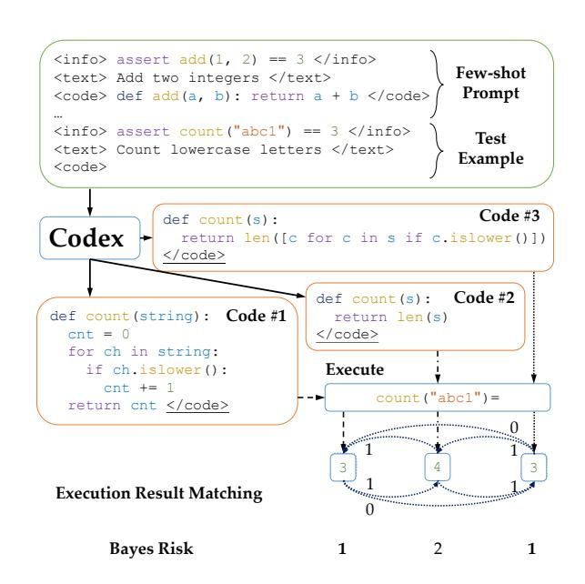

Figure 1: Illustration of MBR-EXEC on translating natural language to Python code: we (1) sample programs from Codex (Chen et al., 2021), (2) execute each program on one test case, and (3) select the example with the minimal execution result—based Bayes risk. Numbers around dotted lines denote the 0/1 matching loss between execution results, while the Bayes risk of a program is defined by the sum of the loss between itself and other examples. In the figure, either Code #1 or Code #3 can be selected. Ground-truth program output is not needed for selection.

ford et al., 2019; Brown et al., 2020) to translate natural language to various programming languages. While code sampled from such models obtains surprisingly good BLEU scores against ground-truth programs and relatively high execution accuracies, it often includes obvious mistakes, and is of much lower quality than the code written by intermediatelevel human programmers (Li et al., 2022). In addition, choosing a *single* correct one from a set of generated programs remains challenging.

In this work, we translate natural language to executable code with awareness of execution re-

<span id="page-0-0"></span><sup>\*</sup>Work done while interning at Meta AI.

<sup>&</sup>lt;sup>1</sup>We open source our code at [this URL] and our data at [this URL].

sults on a limited number of test case inputs, which we require only at inference time. Our approach is built on the hypothesis that a pretrained code model spreads probability mass over multiple semantically-equivalent code forms that implement the same functionality. Given a text description of a desired program function, we (1) sample a set of programs from a pretrained code model ([§3.1\)](#page-2-0) and (2) select a single candidate program using execution-result-based minimum Bayes risk (MBR) decoding ([§3.2\)](#page-2-1). Intuitively, we score each sampled program using its agreement to other samples in terms of execution results, and select a program with maximal overall agreement.

Our evaluation focuses on a challenging setting where only a single program can be submitted as the solution to a given problem. We show that the execution result–based selection method (i.e., MBR-EXEC) significantly outperforms all noexecution baselines across all considered datasets, despite having never executed any code during training and even when it has no access to groundtruth outputs. In addition, we show that MBR decoding with a BLEU-based risk function performs consistently well across datasets, and can be considered as a promising alternative when we are not able to execute.

# 2 Related Work

## 2.1 Language to Code with Neural Networks

With the progress of neural network–based language modeling and conditioned text generation, there has been much work exploring natural language to code generation with end-to-end neural model architectures [\(Xiao et al.,](#page-10-0) [2016;](#page-10-0) [Ling](#page-9-1) [et al.,](#page-9-1) [2016;](#page-9-1) [Rabinovich et al.,](#page-9-2) [2017;](#page-9-2) [Dong and](#page-8-1) [Lapata,](#page-8-1) [2018;](#page-8-1) [Suhr et al.,](#page-9-3) [2018;](#page-9-3) [Xu et al.,](#page-10-1) [2020;](#page-10-1) [Lachaux et al.,](#page-8-2) [2021,](#page-8-2) *inter alia*). Recently, large Transformer-based [\(Vaswani et al.,](#page-9-4) [2017\)](#page-9-4) pretrained code models have shown surprisingly strong generation performance across programming languages [\(Chen et al.,](#page-7-0) [2021;](#page-7-0) [Austin et al.,](#page-7-1) [2021;](#page-7-1) [Li et al.,](#page-8-0) [2022,](#page-8-0) *inter alia*). In this work, we explore selection (i.e., inference) methods to apply to these pretrained models, showing that selecting programs using their execution results can greatly improve program generation.

Multiple benchmarks have been proposed to evaluate code model performance [\(Miceli Barone](#page-9-5) [and Sennrich,](#page-9-5) [2017;](#page-9-5) [Yin et al.,](#page-10-2) [2018;](#page-10-2) [Hendrycks](#page-8-3) [et al.,](#page-8-3) [2021;](#page-8-3) [Lu et al.,](#page-9-6) [2021,](#page-9-6) *inter alia*). In this work, we evaluate on three text-to-code datasets: MBPP (Python; [Austin et al.,](#page-7-1) [2021\)](#page-7-1), Spider (SQL; [Yu et al.,](#page-10-3) [2018\)](#page-10-3) and NL2Bash (Bash; [Lin et al.,](#page-8-4) [2018\)](#page-8-4), covering a range of programming languages.

## 2.2 Prompting Pretrained Language Models

The GPT-2 [\(Radford et al.,](#page-9-0) [2019\)](#page-9-0) and GPT-3 [\(Brown et al.,](#page-7-2) [2020\)](#page-7-2) models have shown strong prompting performance: after conditioning on a task-related prompt, the language models are often able to make accurate output predictions for unseen inputs. These results lead to prompt-based approaches for few-shot or zero-shot text classification [\(Shin et al.,](#page-9-7) [2020;](#page-9-7) [Gao et al.,](#page-8-5) [2021;](#page-8-5) [Min et al.,](#page-9-8) [2021,](#page-9-8) *inter alia*), question answering [\(Khashabi](#page-8-6) [et al.,](#page-8-6) [2020\)](#page-8-6), machine translation [\(Radford et al.,](#page-9-0) [2019\)](#page-9-0), and evaluation of generated text [\(Yuan et al.,](#page-10-4) [2021\)](#page-10-4), where no more than a few examples are used to construct the prompts. Few-shot examples are usually formatted into natural language prompts and continuations generated by the models for these prompts are then converted to taskspecific predictions. The prompt formatting can be either manually designed [\(Jiang et al.,](#page-8-7) [2020\)](#page-8-7) or automatically learned [\(Li and Liang,](#page-8-8) [2021;](#page-8-8) [Lester](#page-8-9) [et al.,](#page-8-9) [2021\)](#page-8-9). Recently, [Wang et al.](#page-9-9) [\(2022\)](#page-9-9) find that self-consistency based decoding improves chainof-thought prompting [\(Wei et al.,](#page-9-10) [2022\)](#page-9-10). We refer the readers to [Liu et al.](#page-9-11) [\(2021\)](#page-9-11) for a more comprehensive survey.

In this work, we prompt a pretrained code model (Codex; [Chen et al.,](#page-7-0) [2021\)](#page-7-0) in a few-shot setting ([§3.1\)](#page-2-0) and perform execution-based selection over the samples. We also find that the Codex model performs well with a fairly programming-languageagnostic prompt formatting (Table [1\)](#page-2-2).

## 2.3 Minimum Bayes Risk Decoding

In structured prediction, Minimum Bayes risk (MBR) decoding [\(Bickel and Doksum,](#page-7-3) [1977\)](#page-7-3) selects a structured output that minimizes the expected errors in the structure by introducing an explicit loss function to the decision criterion. This method has outperformed the maximum a posteriori (MAP) method on many tasks, including syntactic parsing [\(Titov and Henderson,](#page-9-12) [2006;](#page-9-12) [Shi et al.,](#page-9-13) [2019;](#page-9-13) [Zhang et al.,](#page-10-5) [2020\)](#page-10-5), statistical machine translation [\(Kumar and Byrne,](#page-8-10) [2004;](#page-8-10) [Zhang and Gildea,](#page-10-6) [2008\)](#page-10-6), and neural machine translation [\(Eikema and](#page-8-11) [Aziz,](#page-8-11) [2020,](#page-8-11) [2021\)](#page-8-12).

In machine translation, MBR decoding is usually implemented by reranking candidates [\(Goel](#page-8-13)

<span id="page-2-2"></span>

| General Template                            | <pre><info>[INF0]</info> (optional) <text>[TEXT]</text> <code>[CODE]</code></pre>                                       |  |
|---------------------------------------------|-------------------------------------------------------------------------------------------------------------------------|--|
| Instantiation 1: Python<br>One-Shot Example | <pre></pre>                                                                                                             |  |
| Query                                       | <pre><info>assert cat() == "cat"</info> <text>Write a function that outputs the string "cat"</text> <code></code></pre> |  |
| Instantiation 2: Bash<br>One-Shot Example   | <pre><text>show the files in the current directory</text> <code>ls</code></pre>                                         |  |
| Query                                       | <pre><text>show the first 5 lines of a.txt</text> <code></code></pre>                                                   |  |

Table 1: Prompt formatting template for queries to pretrained code models. For instantiation, we substitute [TEXT] and [CODE] with natural language descriptions and corresponding code snippets respectively. We also provide compatibility for an optional [INFO] section to provide the model extra information (e.g., the desired function identifier and example function calls) that helps code generation. In general, we expect the pretrained code models to generate a </code> token at the end of each code snippet given its pattern following ability (Brown et al., 2020; Chen et al., 2021), otherwise we truncate the generated code to a maximum of 1024 tokens.

and Byrne, 2000; Kumar and Byrne, 2004; Tromble et al., 2008, *inter alia*). Let F denote the input, and E denote the corresponding ground-truth translation. Given a loss function  $\ell(\cdot,\cdot)$  between translations and a probability model  $P(E\mid F)$ , MBR decoding can be formulated as

$$\hat{E} = \arg\min_{E' \in \mathcal{E}_h} \sum_{E \in \mathcal{E}_e} \ell(E, E') P(E \mid F), \quad (1)$$

where  $\mathcal{E}_h$  is the *hypothesis space*, and  $\mathcal{E}_e$  is the *evidence space*: both are sets of possible translations.

We define execution based MBR loss functions, and show that they are crucial in the sample selection processes for natural language to code with a pretrained large language model.

## 3 Proposed Approach: MBR-EXEC

Our execution-based framework consists of two parts: (1) collecting samples from a pretrained code model (§3.1) and (2) selecting the best candidate using minimum Bayes risk decoding (§3.2).

### <span id="page-2-0"></span>3.1 Sample Collection

To obtain the corresponding code, we query the pretrained code model with few-shot prompts followed by the text description, using a unified mark-up style few-shot prompting template (Table 1).<sup>2</sup> In addition to the generated programs themselves, most existing models also allow us

to have the associated probability of generating each generated token  $w_i$  conditioned on the prompt tokens  $C = \langle c_1, \ldots, c_n \rangle$  and all the previously generated tokens  $w_1, \ldots, w_{i-1}$ , denoted by  $P(w_i \mid C, w_1, \ldots, w_{i-1})$ .

### <span id="page-2-4"></span><span id="page-2-1"></span>3.2 Execution-Based MBR Decoding

Given a problem in its natural language description C, we sample a set of programs  $\mathcal{P} = \{p_i\}_{i=1}^N$  using the method in §3.1. We formulate the execution-based MBR (MBR-EXEC) decoding by selecting

$$\hat{p} = \arg\min_{p \in \mathcal{P}} \mathcal{L}_{MBR}(p; \mathcal{P})$$

$$= \arg\min_{p \in \mathcal{P}} \sum_{p_{ref} \in \mathcal{P}} \ell(p, p_{ref})$$
(2)

as the best candidate, where  $\mathcal{L}_{MBR}(\cdot;\cdot)$  denotes the MBR loss of a program conditioned on a set of references and  $\ell$  is a predefined, execution-based loss function that examines the discrepancy between two programs. Intuitively, this finds a consensus candidate which has a low loss relative to all other candidates. The above implementation is an unbiased estimation of Eq (1).

We introduce the following execution result—based loss function:

$$\ell(p_i, p_j) = \max_{t \in \mathcal{T}} \mathbb{1} \left[ p_i(t) \neq p_j(t) \right],$$

that a fairly general pattern (Table 1), which does not involve any programming language–specific information, works well across programming languages on Codex.

<span id="page-2-3"></span><sup>&</sup>lt;sup>2</sup>While existing work on prompting language models usually requires a task-specific design of prompts (Shin et al., 2020; Zhong et al., 2021; Gao et al., 2021, *inter alia*), we find

<span id="page-3-6"></span>

| Method                             | MBPP                     | Spider                   | NL2Bash                  |
|------------------------------------|--------------------------|--------------------------|--------------------------|
| Greedy (3-shot)<br>Sample (3-shot) | 47.3 ± 2.5<br>47.7 ± 1.5 | 50.8 ± 2.6<br>48.5 ± 2.6 | 52.8 ± 2.9<br>53.0 ± 2.9 |
| MBR-EXEC                           | 58.2 ± 0.3               | 63.6 ± 0.8               | 58.5 ± 0.3               |

Table 2: Comparison between MBR-EXEC and baselines without selection process. For both MBR-EXEC and Sample (3-shot), we collected samples with temperature 0.3. All numbers involve the same set of 125 samples for each case: for greedy and sample baselines, we report average performance of them all; for MBR-EXEC, we report the result with 25 examples, averaged across 5 experiments.

where <sup>T</sup> is the set of available test inputs,[3](#page-3-0) and pi(t) denotes the execution result of program p<sup>i</sup> when having t as the input. When a program fails to execute on a test case, it is considered not equivalent to any other programs, even if they fail to execute as well. Intuitively, ` assigns equivalence (0 loss) if and only if two programs have the same output on all considered test cases.

There may be multiple programs receiving the same MBR loss L*MBR*(·;P), which are all minima. We break any ties by selecting the program with the largest likelihood among them.

## 4 Experiments

We evaluate ([§4.3\)](#page-4-0) and analyze ([§4.4\)](#page-5-0) the performance of MBR-EXEC, starting with introducing the datasets and evaluation metrics ([§4.1\)](#page-3-1), as well as non-execution-based baselines ([§4.2\)](#page-4-1) for MBR-EXEC. Finally, we show and discuss oracle performances on the considered tasks ([§4.5\)](#page-6-0).

## <span id="page-3-1"></span>4.1 Datasets and Evaluation Metrics

We consider three datasets that cover a range of programming languages: MBPP (Python; [Austin](#page-7-1) [et al.,](#page-7-1) [2021\)](#page-7-1), Spider (SQL; [Yu et al.,](#page-10-3) [2018\)](#page-10-3), and NL2Bash (Bash; [Lin et al.,](#page-8-4) [2018\)](#page-8-4).

MBPP. The MBPP dataset [\(Austin et al.,](#page-7-1) [2021\)](#page-7-1) [4](#page-3-2) consists of 974 basic Python programming problems, with 500 of them used for testing and the rest for training or few-shot prompting. There are ground-truth program and three assertions (i.e., test

cases with input and ground-truth output) associated with the description of each problem. When collecting the samples, we use one assertion as the extra information ([INFO]; Table [1\)](#page-2-2).[5](#page-3-3) Programs are evaluated with execution accuracy, where a program is considered as passing if all three test cases are correct.

Spider. The Spider dataset [\(Yu et al.,](#page-10-3) [2018\)](#page-10-3) [6](#page-3-4) is a text-to-SQL dataset, which requires a model to translate text descriptions into SQL commands. There are 7,000 examples for training and 1,034 for development. When prompting models to produce candidate commands, we concatenate the corresponding SQL table and column names as the [INFO]. Commands are evaluated with the execution accuracy, where a command is considered as passing if it returns the same result as the groundtruth command when being executed on the same database.

NL2Bash. The NL2Bash dataset [\(Lin et al.,](#page-8-4) [2018\)](#page-8-4) aims to translate natural language to bash commands. We do not include [INFO] in the sample collection process. Because it is difficult to execute bash commands in a sandbox, we split a bash command with bashlex, [7](#page-3-5) a rule-based bash parser, and use the token-level BLEU-4 score between commands as the estimation of execution result similarity. We consider a command to be unexecutable when bashlex fails to parse it. Following [Lin et al.](#page-8-4) [\(2018\)](#page-8-4), commands are evaluated with character-level BLEU-4 score.

Across datasets, we use 15 examples from the training set for few-shot prompting. A detailed example showing prompt formatting can be found in Appendix [A.](#page-10-8) Unless otherwise specified, we collect samples by querying Codex with five different prompts, each containing 3 examples, using temperature 0.3. We combine the candidates sampled across the five prompts to get a set of candidate samples to use in our selection methods. For execution on MBPP and Spider, we apply a memory limit of 128GB and a time limit of 10 seconds on a single Intel(R) Xeon(R) CPU E5-2698 v4 @ 2.20GHz CPU, and consider the programs that exceed these limits as inexecutable; unless otherwise specified,

<span id="page-3-0"></span><sup>3</sup>Our MBR-EXEC decoding process does not involve any ground-truth test case output, nor the ground-truth programs. This is compatible with many real scenarios, e.g., in a programming competition, where valid test input are easier to access than ground-truth output.

<span id="page-3-2"></span><sup>4</sup> [https://github.com/google-research/](https://github.com/google-research/google-research/tree/master/mbpp) [google-research/tree/master/mbpp](https://github.com/google-research/google-research/tree/master/mbpp)

<span id="page-3-3"></span><sup>5</sup>The main goal of [INFO] in MBPP is to inform Codex about the desired function name for easier evaluation – while the assertions are not a necessary part of prompt, we use them as [INFO] for simplicity and compatibility with past work [\(Austin et al.,](#page-7-1) [2021\)](#page-7-1).

<span id="page-3-5"></span><span id="page-3-4"></span><sup>6</sup> <https://yale-lily.github.io/spider> 7 <https://pypi.org/project/bashlex/>

<span id="page-4-3"></span>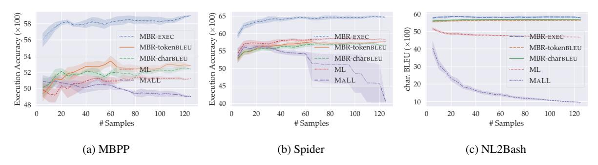

Figure 2: **Primary evaluation results:** performance of the evaluated selection criteria (best viewed in color). For each sample size, we evaluate the methods on 5 different groups of samples and report the average performance (lines) and the standard deviations (shaded regions). All samples are collected from Codex with temperature 0.3.

we only execute each program on the first test input provided for the example, and use the output for calculating the Bayes risk in the inference process.

#### <span id="page-4-1"></span>4.2 Baselines

We compare the most basic baselines with no selection, prompting Codex with three examples in Table 1 format:<sup>8</sup>

- **Greedy decoding.** We perform token by token greedy decoding to generate the output.
- **Sampling.** We sample the output token by token with a fixed temperature, where we set the temperature as 0.3 in all of our experiments.

In addition, we consider the following baseline sample selection methods:

• Maximizing likelihood (ML). Given a set of sampled candidate programs, we select the one with the largest log likelihood. Formally, we select

$$\hat{p} = \arg \max_{p \in \mathcal{P}} \prod_{i=1}^{n_p} P(w_{p,i} \mid C, w_{p,1}, \dots, w_{p,i-1}),$$

where  $n_p$  denotes the number of tokens in a generated program p, and  $w_{p,i}$  denotes its i-th token.

• Maximizing average log likelihood (MALL) across tokens. In order to address the practical issue that ML typically favors shorter sequences, we follow Chen et al. (2021) and propose another baseline that uses the average log likelihood across tokens as the selection criterion, where we

select

$$\hat{p} = \arg \max_{p \in \mathcal{P}}$$

$$\frac{1}{n_p} \sum_{i=1}^{n_p} \log P(w_{p,i} \mid C, w_{p,1}, \dots, w_{p,i-1}).$$

• BLEU score based MBR (MBR-BLEU). To study the effect of execution based MBR in sample selection, we consider BLEU score based MBR, where the Bayes risk is calculated using the following risk function:

$$\ell_{BLEU}(p_i, p_j) = -BLEU(p_i, p_j),$$

where  $\mathrm{BLEU}(p_i, p_j)$  is the BLEU score of the two programs. We use character-level (MBR-charBLEU) or token-level (MBR-tokenBLEU) BLEU-4 in all of our experiments.

### <span id="page-4-0"></span>4.3 Primary Results

We evaluate MBR-EXEC on the three datasets (§4.1) with dataset-specific metric, where we use one test case for each problem. MBR-EXEC outperforms all baselines without a selection process by a significant margin (Table 2). In addition, we find that MBR-EXEC outperforms all baseline selection methods (Figure 2), and is especially effective on the two datasets (MBPP and Spider) that use execution-based evaluation. In addition, the MBR-BLEU metrics are also strong and robust across datasets, suggesting the effectiveness of finding a consensus candidate that has generally low discrepancy with other samples.

While more samples lead to better performance for most methods, MALL consistently performs worse with a larger sample size, as we find that MALL generally favors programs with unneces-

<span id="page-4-2"></span> $<sup>^8\</sup>mbox{We}$  use the code-davinci-001 engine throughout this work.

<span id="page-5-5"></span>

| Dataset | Greedy ( $\tau = 0$ ) | Sample ( $\tau=0.3$ ) |
|---------|-----------------------|-----------------------|
| MBPP    | 56.0                  | $58.2 \pm 0.3$        |
| Spider  | 62.1                  | $63.6 \pm 0.8$        |
| NL2Bash | 58.4                  | $58.5 \pm 0.3$        |

Table 3: MBR-EXEC performance on greedily decoded and sampled programs: for each problem, we use 25 groups of 3-shot prompts, decode or sample one program with each prompt, and use MBR-EXEC to select the best program. For sampling with temperature 0.3, we repeat the process for 5 times and report the average performance and standard deviations. The dataset-specific metric can be found at §4.1. The best number in each row is in boldface. Note that the greedy performances are different from those reported in Table 2, as we perform MBR-EXEC here over greedy decoding outputs, while report the average performance in Table 2.

sary repetitions,<sup>9</sup> and a larger sample size generally leads to a larger chance to have such a sample.

#### <span id="page-5-0"></span>4.4 Analysis

We analyze the performance of MBR-EXEC from the following perspectives: the effectiveness across different sample collection temperatures (§4.4.1), the effectiveness of using groups of 3-shot prompts (§4.4.2) and the contribution of using execution results instead of simply checking the executability of programs (§4.4.3).

### <span id="page-5-2"></span>**4.4.1** Effect of Sample Temperature

We first compare sampling with temperature 0.3 to greedy decoding (i.e., temperature  $\tau=0$ ) from the Codex model (Table 3). When having the same number of examples, MBR-EXEC on sampled candidates with temperature 0.3 consistently reaches competitive or better performance than that on greedy decoded candidates.

We plot the performance of MBR-EXEC for various sampling temperatures (Figure 3). Across datasets, we find that MBR-EXEC with a decoding temperature lower than 0.5 usually leads to reasonably good performance. When the temperature approaches 1.0, the results rapidly drop for all considered selection methods on MBPP and Spider; however, MALL generally achieves higher performance on NL2bash with a higher temperature.

According to the evidences discussed above, we recommend to use sampling with a low temperature (specifically, lower than 0.5) for candidate sample collection, and perform MBR-EXEC for final program selection for better results.

## <span id="page-5-3"></span>4.4.2 Effect of Different 3-shot Prompts

We analyze the necessity of choosing multiple groups of 3-shot instead of simply concatenating the available 15 examples as the prompt (Figure 4). We allow different orders of the 15 examples when collecting samples. On both MBPP and NL2Bash datasets, we find that using different groups of 3-shot prompts clearly outperforms concatenating all 15 examples, suggesting that different groups of fewer-shot prompts followed by post-hoc decoding may be more effective than using all available examples for all time.

## <span id="page-5-4"></span>4.4.3 Executability vs. Execution Results

We perform an ablation study to identify the contribution of execution results vs. program executability (Figure 5) on the MBPP and Spider datasets. <sup>11</sup> We try to execute all candidates on the test cases, and perform baseline candidate methods only on the candidates that successfully execute within the time limit. On both datasets, we find that simply involving executability checking significantly helps improve the performance of all non-semantic feature—based selection methods; on Spider, applying ML over executable commands even outperforms MBR-EXEC across sample sizes.

### 4.4.4 Soft Loss as the Bayes Risk Function

While all the above evaluations are based on executing one test case per problem, more test cases can lead to more accurate judgments of semantic equivalence between programs (Zhong et al., 2020). Therefore, we introduce more test cases, and compare  $\ell$  (§3.2) with  $\ell_{soft}$ , a soft version of the loss function, as the Bayes risk function in MBR-EXEC. We define  $\ell_{soft}$  as follows:

$$\ell_{\textit{soft}}(p_i, p_j) = \frac{1}{|\mathcal{T}|} \sum_{t \in \mathcal{T}} \mathbb{1}\left[p_i(t) \neq p_j(t)\right],$$

<span id="page-5-1"></span><sup>&</sup>lt;sup>9</sup>This issue has been found in existing open-ended text generation models, while methods such as unlikelihood training (Welleck et al., 2020) may help reduce degeneration (i.e., the generation of unnecessarily repetitive output).

<span id="page-5-6"></span><sup>&</sup>lt;sup>10</sup>We only include MBPP and NL2Bash results here as concatenating 15 Spider examples usually results in exceeding the token number limit of the pretrained models.

<span id="page-5-7"></span><sup>&</sup>lt;sup>11</sup>We did not include NL2bash since MBR-EXEC does not really execute the commands. However, the comparison between MBR-EXEC and MBR-tokenBLEU in Figure 3(c) shows that using an external bash parser as an executability estimator leads to more consistent and generally better performance.

<span id="page-6-1"></span>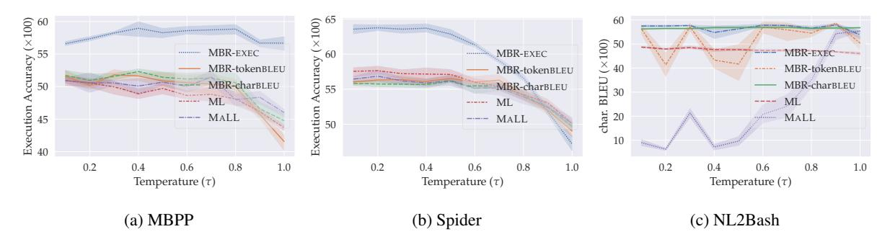

Figure 3: Performance of the evaluated selection criteria across temperatures (best viewed in color). For each temperature, we perform the methods on 5 different groups of 25 examples and report the average performance (lines) and the standard deviations (shaded regions).

120

<span id="page-6-2"></span>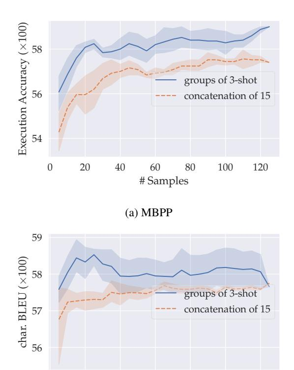

Figure 4: Performance with different types of prompts, where *groups of 3-shot* denotes the prompt formatting in Table 1, while *concatenation of 15* denotes concatenating all available 15 examples as prompts for data collection.

(b) NL2Bash

80

#Samples

100

0

20

which assesses equivalence based on the number of test cases that receive the same output. If there is only one test case available,  $\ell$  and  $\ell_{soft}$  are equivalent.

We experiment with the MBPP dataset (Figure 6) as it provides three test cases per problem. While multiple test cases clearly outperforms

MBR-EXEC with one test case across sample sizes, we did not find significant difference between  $\ell_{hard}$  and  $\ell_{soft}$ , nor between using two or three test cases.

#### <span id="page-6-0"></span>4.5 Oracle Performance

We report the upper bound performance of all inference methods (Figure 7). Here, we define the expected Pass@K on one problem q by

$$\begin{split} & \textit{ExPass}@\textit{K}(q) \\ = & \mathbb{E}_{|\mathcal{P}| = K} \left[ \max_{p \in \mathcal{P}} \min_{t \in \mathcal{T}_q} \mathbb{1} \left[ p(t) = G(t) \right] \right], \end{split}$$

where G(t) denotes the ground-truth output for test case input t. Intuitively, to calculate the performance upper bound, a problem q is considered to be solved if there exists one program in the candidate sample set P that passes all associated test cases  $\mathcal{T}_q$ . The dataset-level expected Pass@K is defined as the average expected Pass@K over all problems.

In addition, we report the supervised performance on these datasets, where all available training data are used for model training or finetuning: for MBPP, the results are from Austin et al. (2021), where they use all 374 training examples to finetune their pretrained code model; for Spider, we compare to the current state-of-the-art result (Scholak et al., 2021); for NL2Bash, we finetune GPT-2 (Radford et al., 2019) with all training examples with the same prompting set up as Table 1.

However, it is worth noting that the upper bounds already outperform the state-of-the-art supervised performances on all datasets by a significant margin, when a reasonable amount of sample is given. This further demonstrates the effectiveness of the pretrained code models, and points out a potential next step in the direction: while such models are

<span id="page-7-4"></span>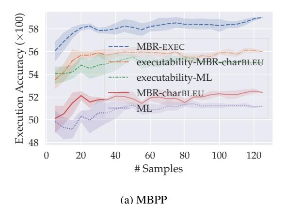

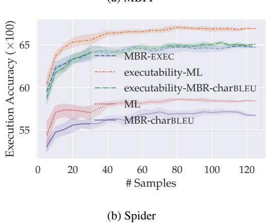

Figure 5: Comparison between applying methods to all possible candidates vs. applying methods to only executable candidates (best viewed in color), where executability-X denotes applying selection criteria X on executable candidates only. We did not include MBR-tokenBLEU and MALL and their combination with executability check in this figure for clarity – full analysis on execution vs. executability can be found in appendix B.

able to generate correct programs, designing effective inference algorithm may be a promising way towards translating natural language to code in real world applications.

#### 5 Discussion

We presented and systematically analyzed MBR-EXEC, an execution—based inference algorithm for pretrained language to code models, on datasets that cover three representative programming languages. Our results showed that doing execution, even with access only to inputs (not outputs) for test cases, or with only access to an executability checker, substantially helps improve the quality of generated programs especially in the settings that use execution accuracy as the evaluation metric (MBPP and Spider). Given the consistently strong

<span id="page-7-5"></span>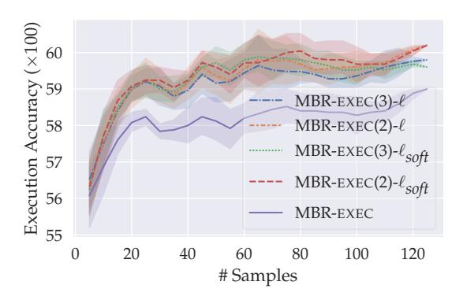

Figure 6: Execution accuracies with respect to sample size on the MBPP dataset, where the number in the parentheses denotes the number of test cases per problem used for MBR-EXEC. Best viewed in color.

performance, we suggest future work on program synthesis with large pretrained models consider MBR-EXEC as an effective selection algorithm. When we are not able to execute programs, or there are no test inputs available, our results suggest considering an alternative MBR metric (e.g., MBR-BLEU) as the selection algorithm.

#### Limitations

In this work, all selection methods are performed on top of a frozen pretrained code model (Codex; Chen et al., 2021). We note that incorporating execution information into the training or finetuning process of pretrained models may further help improve the performance. We leave the exploration of joint execution and training to future work.

#### References

<span id="page-7-1"></span>Jacob Austin, Augustus Odena, Maxwell Nye, Maarten Bosma, Henryk Michalewski, David Dohan, Ellen Jiang, Carrie Cai, Michael Terry, Quoc Le, et al. 2021. Program synthesis with large language models. *arXiv preprint arXiv:2108.07732*.

<span id="page-7-3"></span>Peter J Bickel and Kjell A Doksum. 1977. *Mathematical statistics: basic ideas and selected topics, volumes I-II package*. HoldenDay Inc., Oakland, CA, USA.

<span id="page-7-2"></span>Tom Brown, Benjamin Mann, Nick Ryder, Melanie Subbiah, Jared D Kaplan, Prafulla Dhariwal, Arvind Neelakantan, Pranav Shyam, Girish Sastry, Amanda Askell, et al. 2020. Language models are few-shot learners. *Advances in neural information processing systems*, 33:1877–1901.

<span id="page-7-0"></span>Mark Chen, Jerry Tworek, Heewoo Jun, Qiming Yuan, Henrique Ponde de Oliveira Pinto, Jared Kaplan,

<span id="page-8-14"></span>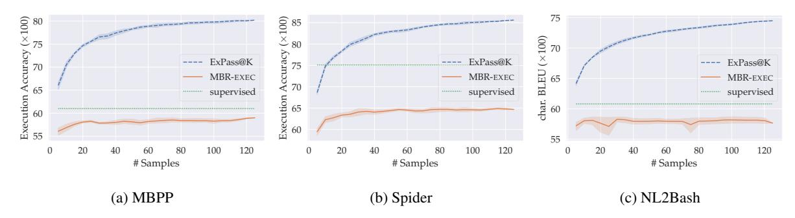

Figure 7: Sample size—oracle performance curves on the considered datasets. We calculate each expected Pass@K with 5 different sets of candidates for each sample size, while using the same sets to perform MBR-EXEC for fair comparison.

Harri Edwards, Yuri Burda, Nicholas Joseph, Greg Brockman, et al. 2021. Evaluating large language models trained on code. *arXiv preprint arXiv:2107.03374*.

<span id="page-8-1"></span>Li Dong and Mirella Lapata. 2018. Coarse-to-fine decoding for neural semantic parsing. In *Proceedings* of the 56th Annual Meeting of the Association for Computational Linguistics (Volume 1: Long Papers), pages 731–742, Melbourne, Australia. Association for Computational Linguistics.

<span id="page-8-11"></span>Bryan Eikema and Wilker Aziz. 2020. Is MAP decoding all you need? the inadequacy of the mode in neural machine translation. In *Proceedings of the 28th International Conference on Computational Linguistics*, pages 4506–4520, Barcelona, Spain (Online). International Committee on Computational Linguistics.

<span id="page-8-12"></span>Bryan Eikema and Wilker Aziz. 2021. Sampling-based minimum bayes risk decoding for neural machine translation. *arXiv preprint arXiv:2108.04718*.

<span id="page-8-5"></span>Tianyu Gao, Adam Fisch, and Danqi Chen. 2021. Making pre-trained language models better few-shot learners. In *Proceedings of the 59th Annual Meeting of the Association for Computational Linguistics and the 11th International Joint Conference on Natural Language Processing (Volume 1: Long Papers)*, pages 3816–3830, Online. Association for Computational Linguistics.

<span id="page-8-13"></span>Vaibhava Goel and William J Byrne. 2000. Minimum bayes-risk automatic speech recognition. *Computer Speech & Language*, 14(2):115–135.

<span id="page-8-3"></span>Dan Hendrycks, Steven Basart, Saurav Kadavath, Mantas Mazeika, Akul Arora, Ethan Guo, Collin Burns, Samir Puranik, Horace He, Dawn Song, and Jacob Steinhardt. 2021. Measuring coding challenge competence with APPS. In *Thirty-fifth Conference on Neural Information Processing Systems Datasets and Benchmarks Track (Round 2)*.

<span id="page-8-7"></span>Zhengbao Jiang, Frank F. Xu, Jun Araki, and Graham Neubig. 2020. How can we know what language models know? *Transactions of the Association for Computational Linguistics*, 8:423–438.

<span id="page-8-6"></span>Daniel Khashabi, Sewon Min, Tushar Khot, Ashish Sabharwal, Oyvind Tafjord, Peter Clark, and Hannaneh Hajishirzi. 2020. UNIFIEDQA: Crossing format boundaries with a single QA system. In *Findings of the Association for Computational Linguistics: EMNLP 2020*, pages 1896–1907, Online. Association for Computational Linguistics.

<span id="page-8-10"></span>Shankar Kumar and William Byrne. 2004. Minimum Bayes-risk decoding for statistical machine translation. In *Proceedings of the Human Language Technology Conference of the North American Chapter of the Association for Computational Linguistics: HLT-NAACL 2004*, pages 169–176, Boston, Massachusetts, USA. Association for Computational Linguistics.

<span id="page-8-2"></span>Marie-Anne Lachaux, Baptiste Roziere, Marc Szafraniec, and Guillaume Lample. 2021. Dobf: A deobfuscation pre-training objective for programming languages. *Advances in Neural Information Processing Systems*, 34.

<span id="page-8-9"></span>Brian Lester, Rami Al-Rfou, and Noah Constant. 2021. The power of scale for parameter-efficient prompt tuning. In *Proceedings of the 2021 Conference on Empirical Methods in Natural Language Processing*, pages 3045–3059, Online and Punta Cana, Dominican Republic. Association for Computational Linguistics.

<span id="page-8-8"></span>Xiang Lisa Li and Percy Liang. 2021. Prefix-tuning: Optimizing continuous prompts for generation. In Proceedings of the 59th Annual Meeting of the Association for Computational Linguistics and the 11th International Joint Conference on Natural Language Processing (Volume 1: Long Papers), pages 4582–4597, Online. Association for Computational Linguistics.

<span id="page-8-0"></span>Yujia Li, David Choi, Junyoung Chung, Nate Kushman, Julian Schrittwieser, Rémi Leblond, Tom Eccles, James Keeling, Felix Gimeno, Agustin Dal Lago, et al. 2022. Competition-level code generation with alphacode. *arXiv preprint arXiv:2203.07814*.

<span id="page-8-4"></span>Xi Victoria Lin, Chenglong Wang, Luke Zettlemoyer, and Michael D. Ernst. 2018. NL2Bash: A corpus

- [and semantic parser for natural language interface](https://aclanthology.org/L18-1491) [to the linux operating system.](https://aclanthology.org/L18-1491) In *Proceedings of the Eleventh International Conference on Language Resources and Evaluation (LREC 2018)*, Miyazaki, Japan. European Language Resources Association (ELRA).
- <span id="page-9-1"></span>Wang Ling, Phil Blunsom, Edward Grefenstette, Karl Moritz Hermann, Tomáš Kociský, Fumin ˇ Wang, and Andrew Senior. 2016. [Latent predictor](https://doi.org/10.18653/v1/P16-1057) [networks for code generation.](https://doi.org/10.18653/v1/P16-1057) In *Proceedings of the 54th Annual Meeting of the Association for Computational Linguistics (Volume 1: Long Papers)*, pages 599–609, Berlin, Germany. Association for Computational Linguistics.
- <span id="page-9-11"></span>Pengfei Liu, Weizhe Yuan, Jinlan Fu, Zhengbao Jiang, Hiroaki Hayashi, and Graham Neubig. 2021. [Pre](https://arxiv.org/pdf/2107.13586.pdf)[train, prompt, and predict: A systematic survey of](https://arxiv.org/pdf/2107.13586.pdf) [prompting methods in natural language processing.](https://arxiv.org/pdf/2107.13586.pdf) *arXiv preprint arXiv:2107.13586*.
- <span id="page-9-6"></span>Shuai Lu, Daya Guo, Shuo Ren, Junjie Huang, Alexey Svyatkovskiy, Ambrosio Blanco, Colin Clement, Dawn Drain, Daxin Jiang, Duyu Tang, Ge Li, Lidong Zhou, Linjun Shou, Long Zhou, Michele Tufano, MING GONG, Ming Zhou, Nan Duan, Neel Sundaresan, Shao Kun Deng, Shengyu Fu, and Shujie LIU. 2021. [CodeXGLUE: A machine learning](https://openreview.net/forum?id=6lE4dQXaUcb) [benchmark dataset for code understanding and gen](https://openreview.net/forum?id=6lE4dQXaUcb)[eration.](https://openreview.net/forum?id=6lE4dQXaUcb) In *Thirty-fifth Conference on Neural Information Processing Systems Datasets and Benchmarks Track (Round 1)*.
- <span id="page-9-5"></span>Antonio Valerio Miceli Barone and Rico Sennrich. 2017. [A parallel corpus of python functions and](https://aclanthology.org/I17-2053) [documentation strings for automated code documen](https://aclanthology.org/I17-2053)[tation and code generation.](https://aclanthology.org/I17-2053) In *Proceedings of the Eighth International Joint Conference on Natural Language Processing (Volume 2: Short Papers)*, pages 314–319, Taipei, Taiwan. Asian Federation of Natural Language Processing.
- <span id="page-9-8"></span>Sewon Min, Mike Lewis, Hannaneh Hajishirzi, and Luke Zettlemoyer. 2021. Noisy channel language model prompting for few-shot text classification. *arXiv preprint arXiv:2108.04106*.
- <span id="page-9-2"></span>Maxim Rabinovich, Mitchell Stern, and Dan Klein. 2017. [Abstract syntax networks for code generation](https://doi.org/10.18653/v1/P17-1105) [and semantic parsing.](https://doi.org/10.18653/v1/P17-1105) In *Proceedings of the 55th Annual Meeting of the Association for Computational Linguistics (Volume 1: Long Papers)*, pages 1139– 1149, Vancouver, Canada. Association for Computational Linguistics.
- <span id="page-9-0"></span>Alec Radford, Jeffrey Wu, Rewon Child, David Luan, Dario Amodei, Ilya Sutskever, et al. 2019. Language models are unsupervised multitask learners. *OpenAI blog*, 1(8):9.
- <span id="page-9-16"></span>Torsten Scholak, Nathan Schucher, and Dzmitry Bahdanau. 2021. [PICARD: Parsing incrementally for](https://doi.org/10.18653/v1/2021.emnlp-main.779) [constrained auto-regressive decoding from language](https://doi.org/10.18653/v1/2021.emnlp-main.779) [models.](https://doi.org/10.18653/v1/2021.emnlp-main.779) In *Proceedings of the 2021 Conference on*

- *Empirical Methods in Natural Language Processing*, pages 9895–9901, Online and Punta Cana, Dominican Republic. Association for Computational Linguistics.
- <span id="page-9-13"></span>Haoyue Shi, Jiayuan Mao, Kevin Gimpel, and Karen Livescu. 2019. [Visually grounded neural syntax ac](https://doi.org/10.18653/v1/P19-1180)[quisition.](https://doi.org/10.18653/v1/P19-1180) In *Proceedings of the 57th Annual Meeting of the Association for Computational Linguistics*, pages 1842–1861, Florence, Italy. Association for Computational Linguistics.
- <span id="page-9-7"></span>Taylor Shin, Yasaman Razeghi, Robert L. Logan IV, Eric Wallace, and Sameer Singh. 2020. [AutoPrompt:](https://doi.org/10.18653/v1/2020.emnlp-main.346) [Eliciting Knowledge from Language Models with](https://doi.org/10.18653/v1/2020.emnlp-main.346) [Automatically Generated Prompts.](https://doi.org/10.18653/v1/2020.emnlp-main.346) In *Proceedings of the 2020 Conference on Empirical Methods in Natural Language Processing (EMNLP)*, pages 4222–4235, Online. Association for Computational Linguistics.
- <span id="page-9-3"></span>Alane Suhr, Srinivasan Iyer, and Yoav Artzi. 2018. [Learning to map context-dependent sentences to ex](https://doi.org/10.18653/v1/N18-1203)[ecutable formal queries.](https://doi.org/10.18653/v1/N18-1203) In *Proceedings of the 2018 Conference of the North American Chapter of the Association for Computational Linguistics: Human Language Technologies, Volume 1 (Long Papers)*, pages 2238–2249, New Orleans, Louisiana. Association for Computational Linguistics.
- <span id="page-9-12"></span>Ivan Titov and James Henderson. 2006. Bayes risk minimization in natural language parsing. *University of Geneva technical report*.
- <span id="page-9-14"></span>Roy Tromble, Shankar Kumar, Franz Och, and Wolfgang Macherey. 2008. [Lattice Minimum Bayes-](https://aclanthology.org/D08-1065)[Risk decoding for statistical machine translation.](https://aclanthology.org/D08-1065) In *Proceedings of the 2008 Conference on Empirical Methods in Natural Language Processing*, pages 620–629, Honolulu, Hawaii. Association for Computational Linguistics.
- <span id="page-9-4"></span>Ashish Vaswani, Noam Shazeer, Niki Parmar, Jakob Uszkoreit, Llion Jones, Aidan N Gomez, Łukasz Kaiser, and Illia Polosukhin. 2017. Attention is all you need. *Advances in neural information processing systems*, 30.
- <span id="page-9-9"></span>Xuezhi Wang, Jason Wei, Dale Schuurmans, Quoc Le, Ed Chi, and Denny Zhou. 2022. Self-consistency improves chain of thought reasoning in language models. *arXiv preprint arXiv:2203.11171*.
- <span id="page-9-10"></span>Jason Wei, Xuezhi Wang, Dale Schuurmans, Maarten Bosma, Ed Chi, Quoc Le, and Denny Zhou. 2022. Chain of thought prompting elicits reasoning in large language models. *arXiv preprint arXiv:2201.11903*.
- <span id="page-9-15"></span>Sean Welleck, Ilia Kulikov, Stephen Roller, Emily Dinan, Kyunghyun Cho, and Jason Weston. 2020. [Neu](https://openreview.net/forum?id=SJeYe0NtvH)[ral text generation with unlikelihood training.](https://openreview.net/forum?id=SJeYe0NtvH) In *International Conference on Learning Representations*.

<span id="page-10-0"></span>Chunyang Xiao, Marc Dymetman, and Claire Gardent. 2016. [Sequence-based structured prediction for se](https://doi.org/10.18653/v1/P16-1127)[mantic parsing.](https://doi.org/10.18653/v1/P16-1127) In *Proceedings of the 54th Annual Meeting of the Association for Computational Linguistics (Volume 1: Long Papers)*, pages 1341– 1350, Berlin, Germany. Association for Computational Linguistics.

<span id="page-10-11"></span>Tianbao Xie, Chen Henry Wu, Peng Shi, Ruiqi Zhong, Torsten Scholak, Michihiro Yasunaga, Chien-Sheng Wu, Ming Zhong, Pengcheng Yin, Sida I Wang, et al. 2022. Unifiedskg: Unifying and multi-tasking structured knowledge grounding with text-to-text language models. *arXiv preprint arXiv:2201.05966*.

<span id="page-10-1"></span>Frank F. Xu, Zhengbao Jiang, Pengcheng Yin, Bogdan Vasilescu, and Graham Neubig. 2020. [Incorporating](https://doi.org/10.18653/v1/2020.acl-main.538) [external knowledge through pre-training for natural](https://doi.org/10.18653/v1/2020.acl-main.538) [language to code generation.](https://doi.org/10.18653/v1/2020.acl-main.538) In *Proceedings of the 58th Annual Meeting of the Association for Computational Linguistics*, pages 6045–6052, Online. Association for Computational Linguistics.

<span id="page-10-2"></span>Pengcheng Yin, Bowen Deng, Edgar Chen, Bogdan Vasilescu, and Graham Neubig. 2018. Learning to mine aligned code and natural language pairs from stack overflow. In *2018 IEEE/ACM 15th international conference on mining software repositories (MSR)*, pages 476–486. IEEE.

<span id="page-10-3"></span>Tao Yu, Rui Zhang, Kai Yang, Michihiro Yasunaga, Dongxu Wang, Zifan Li, James Ma, Irene Li, Qingning Yao, Shanelle Roman, Zilin Zhang, and Dragomir Radev. 2018. [Spider: A large](https://doi.org/10.18653/v1/D18-1425)[scale human-labeled dataset for complex and cross](https://doi.org/10.18653/v1/D18-1425)[domain semantic parsing and text-to-SQL task.](https://doi.org/10.18653/v1/D18-1425) In *Proceedings of the 2018 Conference on Empirical Methods in Natural Language Processing*, pages 3911–3921, Brussels, Belgium. Association for Computational Linguistics.

<span id="page-10-4"></span>Weizhe Yuan, Graham Neubig, and Pengfei Liu. 2021. [BARTScore: Evaluating generated text as text gen](https://openreview.net/forum?id=5Ya8PbvpZ9)[eration.](https://openreview.net/forum?id=5Ya8PbvpZ9) In *Advances in Neural Information Processing Systems*.

<span id="page-10-6"></span>Hao Zhang and Daniel Gildea. 2008. [Efficient multi](https://aclanthology.org/P08-1025)[pass decoding for synchronous context free gram](https://aclanthology.org/P08-1025)[mars.](https://aclanthology.org/P08-1025) In *Proceedings of ACL-08: HLT*, pages 209– 217, Columbus, Ohio. Association for Computational Linguistics.

<span id="page-10-5"></span>Yu Zhang, Zhenghua Li, and Min Zhang. 2020. [Effi](https://doi.org/10.18653/v1/2020.acl-main.302)[cient second-order TreeCRF for neural dependency](https://doi.org/10.18653/v1/2020.acl-main.302) [parsing.](https://doi.org/10.18653/v1/2020.acl-main.302) In *Proceedings of the 58th Annual Meeting of the Association for Computational Linguistics*, pages 3295–3305, Online. Association for Computational Linguistics.

<span id="page-10-9"></span>Ruiqi Zhong, Tao Yu, and Dan Klein. 2020. [Semantic](https://doi.org/10.18653/v1/2020.emnlp-main.29) [evaluation for text-to-SQL with distilled test suites.](https://doi.org/10.18653/v1/2020.emnlp-main.29) In *Proceedings of the 2020 Conference on Empirical Methods in Natural Language Processing (EMNLP)*, pages 396–411, Online. Association for Computational Linguistics.

<span id="page-10-7"></span>Zexuan Zhong, Dan Friedman, and Danqi Chen. 2021. [Factual probing is \[MASK\]: Learning vs. learning](https://doi.org/10.18653/v1/2021.naacl-main.398) [to recall.](https://doi.org/10.18653/v1/2021.naacl-main.398) In *Proceedings of the 2021 Conference of the North American Chapter of the Association for Computational Linguistics: Human Language Technologies*, pages 5017–5033, Online. Association for Computational Linguistics.

# Appendices

# <span id="page-10-8"></span>A Example Prompts and Codex API Responses

We include example 3-shot prompts and corresponding Codex responses that we used in our experiments, on the three datasets (Tables [4,](#page-11-0) [5,](#page-12-0) [6\)](#page-12-1), where we format the prompts following the patterns presented in Table [1.](#page-2-2) Data shown in the tables are collected with the greedy decoding strategy (i.e., temperature = 0), and can be found in the first line of seed 0 in our released data for each test dataset.

# <span id="page-10-10"></span>B Full Analysis on Executability vs. Execution Result

We report the comparison between MBRtokenBLEU and MALL vs. their combination with executability check (Figure [8;](#page-13-0) in complementary to Figure [5\)](#page-7-4), where we observe that an executability checker is an effective filter to improve execution accuracies for both datasets (MBPP and Spider).

#### <span id="page-11-0"></span>MBPP: Prompt

```
<info>assert camel_to_snake('GoogleAssistant') == 'google_assistant'</info>
<text>Write a function to convert camel case string to snake case string by using regex.</text>
<code>import re
def camel_to_snake(text):
 str1 = re.sub('(.)([A-Z][a-z]+)', r'\\1_\\2', text)
 return re.sub('([a-z0-9])([A-Z])', r'\\1_\\2', str1).lower()</code>
<info>assert sort_dict_item({(5, 6) : 3, (2, 3) : 9, (8, 4): 10, (6, 4): 12} ) == {(2, 3): 9, (6,
     4): 12, (5, 6): 3, (8, 4): 10}</info>
<text>Write a function to sort dictionary items by tuple product of keys for the given dictionary
     with tuple keys.</text>
<code>def sort_dict_item(test_dict):
 res = {key: test_dict[key] for key in sorted(test_dict.keys(), key = lambda ele: ele[1] * ele
      [0])}
 return (res)
</code>
<info>assert reverse_list_lists([[1, 2, 3, 4], [5, 6, 7, 8], [9, 10, 11, 12], [13, 14, 15, 16]])
    ==[[4, 3, 2, 1], [8, 7, 6, 5], [12, 11, 10, 9], [16, 15, 14, 13]]</info>
<text>Write a function to reverse each list in a given list of lists.</text>
<code>def reverse_list_lists(lists):
   for l in lists:
       l.sort(reverse = True)
   return lists </code>
<info>assert remove_Occ(\"hello\",\"l\") == \"heo\"</info>
<text>Write a python function to remove first and last occurrence of a given character from the
    string.</text>
<code>
```

#### MBPP: Response

```
def remove_Occ(str1,ch):
   return str1[:str1.index(ch)] + str1[str1.rindex(ch)+1:]</code>
```

Table 4: MBPP example prompt and response from Codex: we use the first assertion in the dataset as the extra information (i.e., [INFO] in Table [1\)](#page-2-2). The content in the last <info>...</info> and <text>...</text> marks in the prompt corresponds to the test problem.

#### <span id="page-12-0"></span>Spider: Prompt

```
<info>e_learning | * | Course_Authors_and_Tutors : author_id , author_tutor_ATB , login_name ,
    password , personal_name , middle_name , family_name , gender_mf , address_line_1 | Students
     : student_id , date_of_registration , date_of_latest_logon , login_name , password ,
    personal_name , middle_name , family_name | Subjects : subject_id , subject_name | Courses :
     course_id , author_id , subject_id , course_name , course_description |
    Student_Course_Enrolment : registration_id , student_id , course_id , date_of_enrolment ,
    date_of_completion | Student_Tests_Taken : registration_id , date_test_taken , test_result</
    info>
<text>Which course authors teach two or more courses? Give me their addresses and author IDs.</
    text>
<code>SELECT T1.address_line_1 , T2.author_id FROM Course_Authors_and_Tutors AS T1 JOIN Courses
    AS T2 ON T1.author_id = T2.author_id GROUP BY T2.author_id HAVING Count(*) >= 2</code>
<info>flight_1 | * | flight : flno , origin , destination , distance , departure_date ,
    arrival_date , price , aid | aircraft : aid , name , distance | employee : eid , name ,
    salary | certificate : eid , aid</info>
<text>Show origin and destination for flights with price higher than 300.</text>
<code>SELECT origin , destination FROM Flight WHERE price > 300</code>
<info>driving_school | * | Addresses : address_id , line_1_number_building , city , zip_postcode
    , state_province_county , country | Staff : staff_id , staff_address_id , nickname ,
    first_name , middle_name , last_name , date_of_birth , date_joined_staff , date_left_staff |
     Vehicles : vehicle_id , vehicle_details | Customers : customer_id , customer_address_id ,
    customer_status_code , date_became_customer , date_of_birth , first_name , last_name ,
    amount_outstanding , email_address , phone_number , cell_mobile_phone_number |
    Customer_Payments : customer_id , datetime_payment , payment_method_code , amount_payment |
    Lessons : lesson_id , customer_id , lesson_status_code , staff_id , vehicle_id , lesson_date
     , lesson_time , price</info>
<text>When did the staff member with first name as Janessa and last name as Sawayn leave the
    company?</text>
<code>SELECT date_left_staff FROM Staff WHERE first_name = \"Janessa\" AND last_name = \"Sawayn
    \";</code>
<info>concert_singer | * | stadium : Stadium_ID , Location , Name , Capacity , Highest , Lowest ,
     Average | singer : Singer_ID , Name , Country , Song_Name , Song_release_year , Age ,
    Is_male | concert : concert_ID , concert_Name , Theme , Stadium_ID , Year |
    singer_in_concert : concert_ID , Singer_ID</info>
<text>How many singers do we have?</text>
<code>
```

#### Spider: Response

SELECT COUNT(\*) FROM singer;</code>

Table 5: Spider example prompt and response from Codex: following [Xie et al.](#page-10-11) [\(2022\)](#page-10-11), we use the concatenation of corresponding table and column names in the dataset as the extra information (i.e., [INFO] in Table [1\)](#page-2-2).. The content in the last <info>...</info> and <text>...</text> marks in the prompt corresponds to the test problem.

#### <span id="page-12-1"></span>NL2Bash: Prompt

```
<text>Print file information of command \"bash\"</text>
<code>echo $(ls -l $(which bash))</code>
<text>Recursively change the owner and group of all files in \"/your/directory/to/fuel/\" to \"
    nginx\"</text>
<code>chown nginx:nginx /your/directory/to/fuel/ -R</code>
<text>Copy \"src/prog.js\" and \"images/icon.jpg\" to \"/tmp/package\" keeping relative path
    names</text>
<code>rsync -R src/prog.js images/icon.jpg /tmp/package</code>
<text>Adds execution permissions on a script ./etc/bash_completion within Homebrew home folder
    path.</text>
<code>
```

#### NL2Bash: Response

chmod +x /usr/local/etc/bash\_completion</code>

Table 6: NL2Bash example prompt and response from Codex: we did not use any extra information. The content in the last <text>...</text> marks in the prompt corresponds to the test problem.

<span id="page-13-0"></span>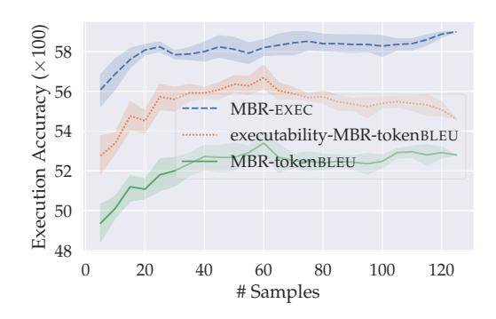

### (a) MBPP (MBR-tokenBLEU)

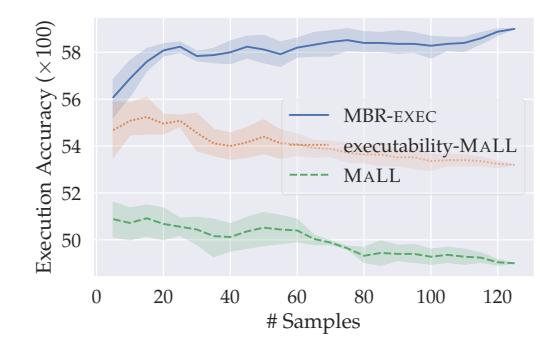

# (b) MBPP (MALL)

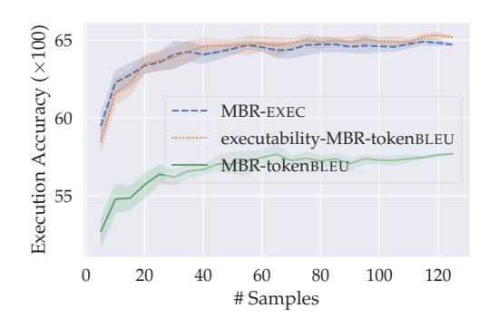

### (c) Spider (MBR-tokenBLEU)

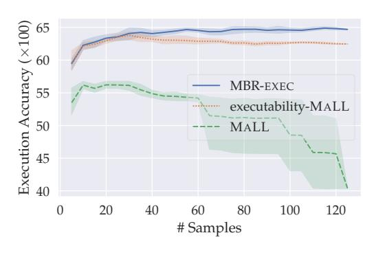

(d) Spider (MALL)

Figure 8: Comparison between applying methods to all possible candidates vs. applying methods to only executable candidates (best viewed in color), where executability-X denotes applying selection criteria X on executable candidates only. We also include the curves of MBR-EXEC for comparison.