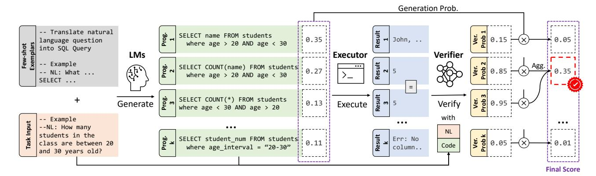
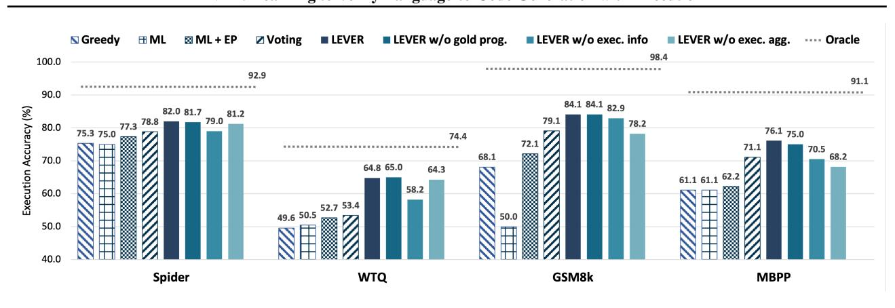
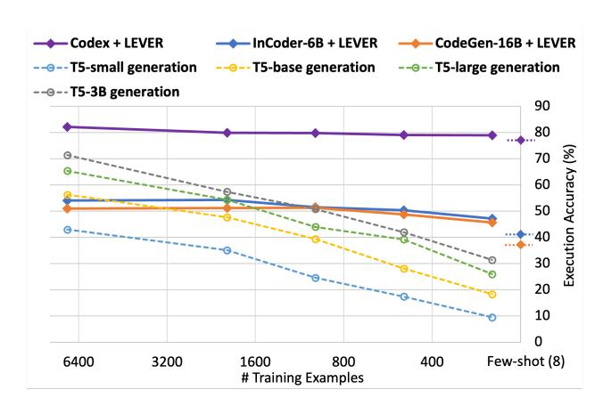
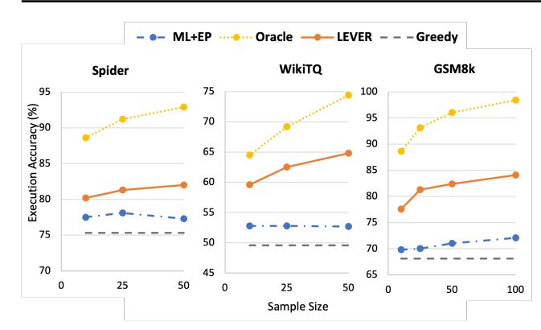
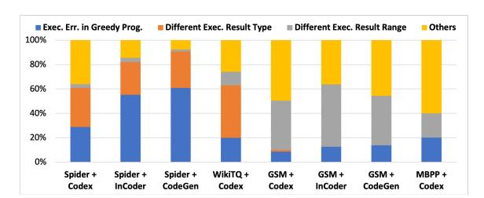
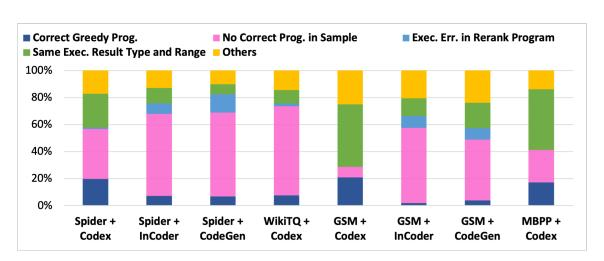
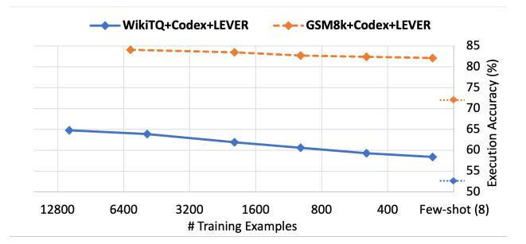

### Anonymous Authors<sup>1</sup>

## Abstract

The advent of pre-trained code language models (CodeLMs) has lead to significant progress in language-to-code generation. State-of-the-art approaches in this area combine CodeLM decoding with sample pruning and reranking using test cases or heuristics based on the execution results. However, it is challenging to obtain test cases for many real-world language-to-code applications, and heuristics cannot well capture the semantic features of the execution results, such as data type and value range, which often indicates the correctness of the program. In this work, we propose LEVER, a simple approach to improve language-to-code generation by learning to verify the generated programs with their execution results. Specifically, we train verifiers to determine whether a program sampled from the CodeLM is correct or not based on the natural language input, the program itself and its execution results. The sampled programs are reranked by combining the verification score with the CodeLM generation probability, and marginalizing over programs with the same execution results. On four datasets across the domains of table QA, math QA and basic Python programming, LEVER consistently improves over the base CodeLMs (4.6% to 10.9% with code-davinci-002) and achieves new state-of-the-art results on all of them.

## 1. Introduction

024

034

036

038

054

The ability of mapping natural language to executable code is the cornerstone of a variety AI applications such as database interfaces [\(Pasupat & Liang,](#page-9-0) [2015;](#page-9-0) [Yu et al.,](#page-11-0) [2018;](#page-11-0) [Shi et al.,](#page-10-0) [2020\)](#page-10-0), robotics control [\(Zhou et al.,](#page-11-1) [2021;](#page-11-1) [Shrid](#page-10-1)[har et al.,](#page-10-1) [2020\)](#page-10-1) and virtual assistants [\(Agashe et al.,](#page-8-0) [2019;](#page-8-0) [Lai et al.,](#page-9-1) [2022\)](#page-9-1). Recent advances on large language mod-

Preliminary work. Under review by the International Conference on Machine Learning (ICML). Do not distribute.

els (LLMs) [\(Brown et al.,](#page-8-1) [2020;](#page-8-1) [Wei et al.,](#page-10-2) [2021;](#page-10-2) [Chowd](#page-8-2)[hery et al.,](#page-8-2) [2022\)](#page-8-2), especially those pre-trained on code (CodeLMs) [\(Chen et al.,](#page-8-3) [2021a;](#page-8-3) [Fried et al.,](#page-8-4) [2022;](#page-8-4) [Nijkamp](#page-9-2) [et al.,](#page-9-2) [2022;](#page-9-2) [Li et al.,](#page-9-3) [2022a\)](#page-9-3), have shown great promise in such tasks with in-context few-shot learning [\(Shi et al.,](#page-10-3) [2022;](#page-10-3) [Chen et al.,](#page-8-5) [2022a;](#page-8-5) [Zhang et al.,](#page-11-2) [2022\)](#page-11-2). Yet their performance is still far from perfect [\(Chen et al.,](#page-8-3) [2021a\)](#page-8-3). Considering the computation cost to finetune such models, it is appealing to explore ways to improve them without changing their parameters.

A key observation is that while CodeLMs struggles with precision in the few-shot setting, it often produces the correct output when enough samples are drawn. Previous work have shown that majority voting and filtering by test cases can significantly boost their performance when samples are drawn at scale [\(Chen et al.,](#page-8-3) [2021a;](#page-8-3) [Austin et al.,](#page-8-6) [2021;](#page-8-6) [Li](#page-9-3) [et al.,](#page-9-3) [2022a\)](#page-9-3). [Shen et al.](#page-10-4) [\(2021\)](#page-10-4) and [Cobbe et al.](#page-8-7) [\(2021\)](#page-8-7) further demonstrated the effectiveness of training a verifier and using the verification scores to rerank the candidate solutions for math world problems. Comparing to approaches that solely rely on execution consistency and error pruning, trained verifiers can make use of the rich semantic features in the model solutions, such as data types, value range, and variable attributes, which can be strong indicators of correctness of the programs. While [Cobbe et al.](#page-8-7) [\(2021\)](#page-8-7) and subsequent work [\(Li et al.,](#page-9-4) [2022b;](#page-9-4) [Kadavath et al.,](#page-9-5) [2022\)](#page-9-5) focus on verifying natural language solutions by LMs, a natural question is whether the same approach can be applied to program solutions.

In this work, we propose learning to verify (LEVER ) language-to-code generation by CodeLMs, with the help of execution. More specifically, we train a verifier that learns to distinguish and reject incorrect programs based on the joint representation of the natural language description, the program surface form and its execution result. We further combine the verification probability with the CodeLM generation probability and marginalize over programs with the same execution results. We use this aggregated probability as the reranking score and output the programs that execute to the most probable result.

We conduct extensive experiments on four different language-to-code benchmarks across domains of text-to-SQL semantic parsing, table QA, math reasoning and basic

<sup>1</sup>Anonymous Institution, Anonymous City, Anonymous Region, Anonymous Country. Correspondence to: Anonymous Author <anon.email@domain.com>.

<span id="page-1-0"></span>

Figure 1: The illustration of LEVER using text-to-SQL as an example. It consists of three steps: 1) *Generation*: sample programs from CodeLMs based on the task input and few-shot exemplars; 2) *Execution*: obtain the execution results with program executors; 3) *Verification*: using a learned verifier to output the probability of the program being correct based on the NL, program and execution results.

Python programming. Experiment results with three different CodeLMs show that LEVER consistently improves the execution accuracy of the generated programs. Notably, LEVER coupled with code-davinci-002 improves over strong baselines that use execution error pruning by 4.6% to 10.9%, and achieves the new state-of-the-art results on all four benchmarks, without using task-specific model architecture or prompting methods. Ablation studies show that execution information is crucial for the verification and LEVER also yields non-trivial improvements in low-resource and weakly-supervised settings.

#### 2. Approach

The key steps of LEVER is illustrated in Fig. 1. We now introduce the detailed formulation and learning of LEVER.

#### 2.1. Language-to-Code Generation with CodeLMs

The input for the language-to-code tasks typically consists of natural language (NL) description and optionally some programming context (e.g., databases, assertions, etc). Given this task input x, a generation model P(y|x) attempts to generate a program y which is later executed by an executor  $\mathcal{E}(\cdot)$  to obtain the desired execution result  $\mathcal{E}(y)$ . For few-shot learning with large LMs, the generation is also often conditioned on a prompt $(x, \{(x_i, y_i)\}_{i < m})$ , which is a function of the input x and a fixed set of m exemplars,  $\{(x_i, y_i)\}_{i < m}$ . Thus the few-shot language-to-code generation with CodeLMs can be formulated as:

$$P_{\mathbf{LM}}(y|x) = P(y|\operatorname{prompt}(x, \{(x_i, y_i)\}_{i < m})) \quad (1)$$

Given input x, greedy search is typically used to output program with the (approximated) highest generation probability, i.e.,  $\hat{y}_{\text{greedy}} \approx \arg\max_{y} P_{\text{LM}}(y|x)$ .

### 2.2. Reranking of Program Candidates

The key observation of our method is that while correct programs can often be found in the samples from  $P_{LM}(y|x)$ , they are not always given the highest probabilities by the CodeLM. The idea of discriminative reranking (Shen et al., 2004; Collins & Koo, 2005) is to learn a scoring function  $R(x,\hat{y})$  that measures how likely  $\hat{y}$  is the best output for input x. Thus given  $R(\cdot)$ , the reranker outputs the program with the highest reranking score among the set of candidates S:

$$\hat{y}_{\text{rerank}} = \arg \max_{\hat{y} \in S} R(x, \hat{y}) \tag{2}$$

Next we introduce how we adopt a trained verifier to verify and rerank program candidates sampled from CodeLMs such that  $\hat{y}_{\text{rerank}}$  is better than  $\hat{y}_{\text{greedy}}$ .

**Program Sampling from CodeLM.** Given input x, instead of performing greedy search, we obtain k programs from  $P_{\mathbf{LM}}(y|x)$  with temperature sampling, i.e.,  $\{\hat{y}_i\}_{i=1}^k \sim P_{\mathbf{LM}}(y|x)$ . As the same programs may be sampled more than once, we perform deduplication to form a set of n unique program candidates  $S = \{\hat{y}_i\}_{i=1}^n$ , where  $n \leq k$ . We choose to do sampling instead of beam search mainly for two reasons: 1) recent work suggests that beam search for code generation typically results in worse performance due to degenerated programs (Austin et al., 2021; Zhang et al., 2022); and 2) beam search is not available or efficiently implemented for all CodeLMs (e.g., Codex) that we test on.

**Verification with Execution.** Traditionally, feature engineering is required to provide rich information as the input to the reranker (Shen et al., 2004; Collins & Koo, 2005; Yin & Neubig, 2019). But crafting such features is time-consuming and they typically do not generalize across different domains. On the other hand, it is also challeng-

ing to rerank programs based on surface form as similar programs can have very different semantics. In this work, we use a simple concatenation of NL description x, candidate program  $\hat{y}$  and a representation of its execution results  $\mathcal{E}(\hat{y})$  as the input to the reranker, without the need for any feature engineering. Inspired by recent work (Cobbe et al., 2021; Li et al., 2022b), we parameterize our discriminative reranker as a verification (i.e., binary classification) model  $P_{\theta}(v|x,\hat{y},\mathcal{E}(\hat{y}))$ , where  $v \in \{0,1\}$ . Thus given an NL input x and a candidate program  $\hat{y} \in S$ , we can obtain the reranking probability as the joint probability of generation and passing verification:

<span id="page-2-2"></span>
$$P_R(\hat{y}, v_{=1}|x) = P_{LM}(\hat{y}|x) \cdot P_{\theta}(v_{=1}|x, \hat{y}, \mathcal{E}(\hat{y}))$$
 (3)

**Execution Result Aggregation.** Since programs with the same semantics can have different surface forms, we further aggregate the reranking probability of programs in S that executes to the same result. In this way, we can relax the dependency on individual programs and replace with their execution results, yielding the final scoring function for reranking as:

$$R(x, \hat{y}) = P_R(\mathcal{E}(\hat{y}), v_{=1}|x) = \sum_{y \in S, \mathcal{E}(y) = \mathcal{E}(\hat{y})} P_R(y, v_{=1}|x)$$

Since there might be several programs that share the same execution result of the highest probability, we break tie randomly in this case when outputting the programs.

#### 2.3. Learning the Verifiers

The previous sections described how to use a verifier to rerank the program candidates at inference time, here we introduce the learning of these verifiers.

**Training Data Creation.** For language-to-code datasets, each example is typically a triplet of  $(x, y^*, z^*)$ , where  $z^* = \mathcal{E}(y^*)$  is the gold execution result and  $y^*$  is the gold program. As annotating the programs may require domain experts, for some datasets, only  $z^*$  and no  $y^*$  is provided for learning. This is known as weakly-supervised learning (Artzi & Zettlemoyer, 2013; Cheng & Lapata, 2018; Goldman et al., 2018), and we show that LEVER applies to this setting as well. To gather training data, we obtain a set of n unique programs candidates  $\hat{S} = \{\hat{y}_i\}_{i=1}^n$  for each language input x in the training set, by first sampling k programs from  $P_{LM}(\hat{y}|x)$  and then remove all the duplicated programs, similar as inference time. Then for each program candidate  $\hat{y} \in S$ , we obtain its binary verification label by comparing the execution result  $\hat{z} = \mathcal{E}(\hat{y})$  with the gold execution result  $z^*$ , i.e.,  $v = \mathbb{1}(\hat{z} = z^*)^{1}$  For the

<span id="page-2-1"></span>

|             | Spider      | WikiTQ      | GSM8k      | MBPP            |
|-------------|-------------|-------------|------------|-----------------|
| Domain      | Table<br>QA | Table<br>QA | Math<br>QA | Basic<br>Coding |
| Has program | Ì           | <b>*</b>    | X          | ✓               |
| Target      | SQL         | SQL         | Python     | Python          |
| # Train     | 7,000       | 11,321      | 5,968      | 378             |
| # Dev       | 1,032       | 2,831       | 1,448      | 90              |
| # Test      | -           | 4,336       | 1,312      | 500             |

Table 1: Summary of the datasets used in this work. \*: About 80% examples in WikiTableQuestions are annotated with SQL by Shi et al. (2020).

datasets equipped with the gold program  $y^*$ , we append  $(x, y^*, z^*, v_{=1})$  as an additional verification training example, and this step is skipped for weakly-supervised datasets. In this way, for each NL input x, we have created a set of verification training examples  $\{(x, \hat{y}_i, \hat{z}_i, v_i) \mid \hat{y}_i \in S\}$ .

**Learning Objective.** Given this set of verification training examples, we formulate the loss for input x with the negative log-likelihood function, normalized by the number of program candidates

<span id="page-2-3"></span>
$$\mathcal{L}_{\theta}(x,S) = -\frac{1}{|S|} \cdot \sum_{\hat{y}_i \in S} \log P_{\theta}(v_i|x,\hat{y}_i,\hat{z}_i)$$
 (4)

As result of this normalization, each x and each distinct  $\hat{y}$  have equal weight.

#### 3. Experimental Setup

#### 3.1. Datasets

We conduct experiments on four language-to-code datasets across domains of semantic parsing, table QA, math reasoning and basic python programming. Detailed statistics and dataset-specific setups for these four datasets are shown in Tab. 1.

⊳ **Spider** (Yu et al., 2018) is a semantic parsing dataset on generating SQL queries from natural language questions. With 7k parallel training data, it is also ideal for finetuning generators;

Description Number > WikiTableQuestions (WikiTQ) (Pasupat & Liang, 2015) is a table question answering dataset, for which we attempt to solve by generating and executing SQL queries over the source tables. We use the preprocessed tables from Shi et al. (2020) and adopt their annotated SQL queries for adding gold programs for the originally weakly-supervised dataset; Description School-level math word problems. Following grade-school-level math word problems. Following previous work (Chowdhery et al., 2022; Chen et al., 2022b; Gao et al., 2022), we approach this benchmark by generating Python programs from questions in NL, which should

<span id="page-2-0"></span><sup>&</sup>lt;sup>1</sup>Some tasks use test cases to check correctness, but we keep this notation for simplification.

176

178 179 180

187

188 189 190

191 192

193 194

195

196 197 198

200

204

210 211 212

214 215 216

218 219 dataset only has natural language and not program solutions, thus it is weakly-supervised for language-to-code;

▷ MBPP [\(Austin et al.,](#page-8-6) [2021\)](#page-8-6) contains basic Python programming programs stated in natural language. Each example is equipped with 3 test cases to check the correctness of the programs. Following previous work [\(Shi](#page-10-3) [et al.,](#page-10-3) [2022;](#page-10-3) [Zhang et al.,](#page-11-2) [2022\)](#page-11-2), we use the first test case as part of the prompt for the model to generate correct function signatures and reserve the rest two to test for correctness;

#### 3.2. CodeLMs

We evaluate LEVER with three different CodeLMs:

- ▷ Codex [\(Chen et al.,](#page-8-3) [2021a\)](#page-8-3) is a series of CodeLMs developed by OpenAI, we use the code-davinci-002 engine accessed through the provided API;
- ▷ InCoder [\(Fried et al.,](#page-8-4) [2022\)](#page-8-4) is a series CodeLM trained on programming languages as Python and SQL. We mainly evaluate on the InCoder-6B version and use left-to-right generation though it also supports code infilling;
- ▷ CodeGen [\(Nijkamp et al.,](#page-9-2) [2022\)](#page-9-2) is a series of CodeLMs up to 16B and we mainly evaluate the CodeGen-16B-multi version. Though CodeGen is not trained on SQL files, it still has non-trivial SQL generation ability since it may see SQL in the source files of other programming languages as comments, etc.

# <span id="page-3-3"></span>3.3. Baselines and Evaluation Metric

Baselines. We consider the following heuristics for generating and ranking the program candidates from CodeLMs as baselines to improve upon:

- ▷ Greedy: Greedy decoding is used to generate a single program by selecting the most likely token at every step;
- ▷ Maximum Likelihood (ML): Select the program with the highest generation probability (or normalized generation probability) from the program candidates [2](#page-3-0) ;
- ▷ ML + Error Pruning (EP): First prune out the programs with execution errors in the candidates, then select the program with the maximum likelihood;
- ▷ Voting: Take the majority vote on the execution results among the error-free programs, and select the most-voted execution result and its corresponding programs.

Evaluation metric. Following previous work, we use *execution accuracy* as the main evaluation metric, which measures the percentage of examples that yields the gold execution result or pass all test cases.

<span id="page-3-1"></span>

| Methods                             | Dev      |
|-------------------------------------|----------|
| Previous Work without Finetuning    |          |
| Rajkumar et al. (2022)              | 67.0     |
| MBR-Exec (Shi et al., 2022)         | 75.2     |
| Coder-Reviewer (Zhang et al., 2022) | 74.5     |
| Previous Work with Finetuning       |          |
| T5-3B (Xie et al., 2022)            | 71.8     |
| PICARD (Scholak et al., 2021)       | 75.5     |
| RASAT (Qi et al., 2022)             | 80.5     |
| This Work with code-davinci-002     |          |
| Greedy                              | 75.3     |
| ML + EP                             | 77.3     |
| LEVER<br>� �                        | 81.9±0.1 |

Table 2: Execution accuracy on the Spider dataset. Standard deviation is calculated over three runs with different random seeds (same for the following tables when std is presented).

<span id="page-3-2"></span>

| Methods                               | Dev      | Test     |
|---------------------------------------|----------|----------|
| Previous Work without Finetuning      |          |          |
| Codex QA∗<br>(Cheng et al., 2022)     | 50.5     | 48.7     |
| Codex SQL†<br>(Cheng et al., 2022)    | 60.2     | 61.1     |
| Codex Binder†<br>(Cheng et al., 2022) | 65.0     | 64.6     |
| Previous Work with Finetuning         |          |          |
| TaPEX∗<br>(Liu et al., 2021)          | 60.4     | 59.1     |
| TaCube (Zhou et al., 2022)            | 61.1     | 61.3     |
| OmniTab∗<br>(Jiang et al., 2022)      | -        | 63.3     |
| This Work with code-davinci-002       |          |          |
| Greedy                                | 49.6     | 53.0     |
| ML + EP                               | 52.7     | 54.9     |
| LEVER<br>� �                          | 64.6±0.2 | 65.8±0.2 |

Table 3: Execution accuracy on the WikiTQ dataset. <sup>∗</sup> : modeled as end-to-end QA without using programs; † : an LM-enhanced version SQL/Python programs are used.

## 3.4. Implementation details.

We use the development set to choose the best verifier model. We use T5-base for Spider, T5-large for WikiTQ and MBPP, and RoBERTa-large for GSM8k as the base LM for the verifiers, unless specified otherwise. More discussion and results with different base models can be found in § [B.1.](#page-12-0) Given the verification input, we train T5 models to output token "yes" or "no" representing the positive/negative label, and we take the probability of generating the "yes" token as the verification probability during inference. For RoBERTa, we add a linear layer on top as standard practice for sequence classification with encoder-only models. More detailed implementation details can be found in [Appendix A.](#page-11-4)

## 4. Main Results

Here we present our main results by comparing LEVER with aforementioned baselines as well as previous work on the

<span id="page-3-0"></span><sup>2</sup>Whether to use normalized probability or not is determined empirically. This distinction is also consistent with how generation probability is used in verification in [Eq. 3.](#page-2-2)

253 254

256

258

260 261

264

266

268

270 271

274

<span id="page-4-0"></span>

| Methods                              | Dev      | Test     |
|--------------------------------------|----------|----------|
| Previous Work without Finetuning     |          |          |
| PAL (Gao et al., 2022)               | -        | 72.0     |
| Codex + SC†<br>(Wang et al., 2022)   | -        | 78.0     |
| PoT-SC (Chen et al., 2022b)          | -        | 80.0     |
| Previous Work with Finetuning        |          |          |
| Neo-2.7B + SS (Ni et al., 2022)      | 20.7     | 19.5     |
| Neo-1.3B + SC (Welleck et al., 2022) | -        | 24.2     |
| DiVeRSe∗† (Li et al.,<br>2022b)      | -        | 83.2     |
| This Work with codex-davinci-002     |          |          |
| Greedy                               | 68.1     | 67.2     |
| ML + EP                              | 72.1     | 72.6     |
| LEVER<br>� �                         | 84.1±0.2 | 84.5±0.3 |

Table 4: Execution accuracy on the GSM8k dataset. <sup>∗</sup> : model finetuned on top of codex (similar to LEVER); † : natural language solutions are used instead of programs.

four datasets we study. We also perform ablation study on LEVER in this section.

#### 4.1. Effectiveness of LEVER.

Here we show the performance of LEVER coupled with Codex and compare with the best finetuning and few-shot performances from previous work for Spider [\(Tab. 2\)](#page-3-1), WikiTQ [\(Tab. 3\)](#page-3-2), GSM8k [\(Tab. 4\)](#page-4-0) and MBPP [\(Tab. 5\)](#page-4-1). In addition, we also evaluate LEVER with InCoder and CodeGen models on the Spider and GSM8k datasets, and the results are shown in [Tab. 6.](#page-5-0) From the results, we can see that LEVER consistently improves the performance of CodeLMs on all tasks, yielding improvements of 6.6% (Spider) to 17.3% (WikiTQ) over the greedy decoding baselines for Codex. For weaker models as InCoder and CodeGen, such improvements can be up to 30.0% for Spider and 15.0% for GSM8k. Moreover, LEVER combined with Codex also achieves new state-of-the-art results on all four benchmarks, with improvements from 1.2% (WikiTQ) to 2.0% (MBPP). On the challenging text-to-SQL dataset Spider, where the previous best method is by finetuning a 3B parameter model with tasks-specific architecture [\(Qi et al.,](#page-9-7) [2022\)](#page-9-7), with Codex + LEVER, best results are achieved by finetuning only a T5 base model on top of the Codex few-shot outputs. LEVER also improves the previous best results on Spider for In-Coder and CodeGen, by 13.2% and 20.6%, respectively. As LEVER is a simple method that combines the power of fewshot CodeLMs and finetuned verifiers, it can also potentially benefit from better prompting methods [\(Li et al.,](#page-9-4) [2022b;](#page-9-4) [Cheng et al.,](#page-8-14) [2022\)](#page-8-14) or model architectures [\(Qi et al.,](#page-9-7) [2022;](#page-9-7) [Wang et al.,](#page-10-11) [2020\)](#page-10-11) from previous work, for which we will leave as future work.

<span id="page-4-1"></span>

| Methods                          | Dev      | Test     |
|----------------------------------|----------|----------|
| Previous Work without Finetuning |          |          |
| MBR-Exec (Shi et al., 2022)      | -        | 63.0     |
| Reviewer (Zhang et al., 2022)    | -        | 66.9     |
| This Work with codex-davinci-002 |          |          |
| Greedy                           | 61.1     | 62.0     |
| ML + EP                          | 62.2     | 60.2     |
| LEVER<br>� �                     | 75.4±0.7 | 68.9±0.4 |

Table 5: Execution accuracy on the MBPP dataset. No previous finetuning work we found is comparable.[3](#page-4-2)

### <span id="page-4-3"></span>4.2. Ablations with LEVER

We perform ablation study for LEVER with Codex and compare with the baselines mentioned in § [3.3,](#page-3-3) and the results are shown in [Fig. 2.](#page-5-1) The same ablations are conducted for InCoder and CodeGen with results in [Tab. 6.](#page-5-0)

Execution information. From [Fig. 2,](#page-5-1) we can notice that the performance drops considerably on all four benchmarks when execution information is removed from the input of the verifiers, proving that execution information is essential to the success of learning these verifiers for reranking. Moreover, we can also observe that the effect of execution information varies for different CodeLMs and datasets, as the performance gaps are larger for weaker CodeLMs and harder domains without execution information. This suggests that the verifiers heavily rely on the execution information to make decisions in these more difficult settings. Moreover, we find that LEVER typically outperforms the ML+EP baseline, indicating what the verifiers are able to learn from the execution results are beyond simply execution errors. More detailed analysis of this is in [Fig. 5.](#page-7-0)

Execution aggregation. Aggregating the programs with the same execution result is a simply and popular method [\(Chen et al.,](#page-8-12) [2022b;](#page-8-12) [Cheng et al.,](#page-8-14) [2022\)](#page-8-14). In our experiments, we find execution aggregating works well with LEVER on the benchmarks that uses Python as programs, and no benefit is observed for SQL datasets. We think this is expected as Python grammar is much more flexible, which is more likely to produce semantically equivalent programs in different surface forms. However, for the less-flexible SQL, enable execution aggregation makes it more susceptible to spurious programs [\(Cheng & Lapata,](#page-8-10) [2018;](#page-8-10) [Misra et al.,](#page-9-11) [2018\)](#page-9-11).

Weakly-supervised settings. Here we compare the performance of LEVER under fully- and weakly-supervised settings. From [Fig. 2](#page-5-1) and [Tab. 6,](#page-5-0) we can see that the performance of LEVER is generally preserved when gold programs are not available for learning, with the performance gap up to 1.1%. This suggests that LEVER also works well under weakly-supervised settings, and it is a nice property as do-

<span id="page-4-2"></span><sup>3</sup> For reference purposes, [Austin et al.](#page-8-6) [\(2021\)](#page-8-6) reports pass@80 and acc@80 to be around 61% and 13% when finetuning a 137B LaMDA model, which is not pretrained on code.

290 291

314 315

<span id="page-5-1"></span>

Figure 2: Comparison of LEVER with Codex002 baseline methods. All LEVER results are in solid bars.

<span id="page-5-0"></span>

| Methods        | InCoder-6B |       | CodeGen-16B |       |
|----------------|------------|-------|-------------|-------|
|                | Spider     | GSM8k | Spider      | GSM8k |
| Previous work: |            |       |             |       |
| MBR-EXEC       | 38.2       | -     | 30.6        | -     |
| Reviewer       | 41.5       | -     | 31.7        | -     |
| Baselines:     |            |       |             |       |
| Greedy         | 24.1       | 3.1   | 24.6        | 7.1   |
| ML             | 33.7       | 3.8   | 31.2        | 9.6   |
| ML + EP        | 41.2       | 4.4   | 37.7        | 11.4  |
| Voting         | 37.4       | 5.9   | 37.1        | 14.2  |
| LEVER<br>� �   | 54.1       | 11.9  | 51.0        | 22.1  |
| − gold prog.   | 53.4       | -     | 52.3        | -     |
| − exec. info   | 48.5       | 5.6   | 43.0        | 13.4  |
| − exec. agg.   | 54.7       | 10.6  | 51.6        | 18.3  |
| Oracle         | 71.6       | 48.0  | 68.6        | 61.4  |

Table 6: Results with more CodeLMs, evaluated on the dev set with T5-base as the verifier. Previous work numbers taken from [Zhang et al.](#page-11-2) [\(2022\)](#page-11-2).

main experts are typically required to write gold programs which can be very expensive [\(Cheng & Lapata,](#page-8-10) [2018\)](#page-8-10).

### 5. Analysis

Here we present more analysis on LEVER to better understand: 1) How data efficient is the learning of verification (§ [5.1\)](#page-5-2); 2) What are the most common reasons for LEVER to succeed or fail [\(§ 5.2\)](#page-6-0).

#### <span id="page-5-2"></span>5.1. Data Efficiency

The amount of training data for LEVER is dominated by two factors: the number of training examples in the original language-to-code dataset, and sample size per example when sampling from CodeLMs, the later of which is also relevant during inference. Here we study how data efficient is the learning of LEVER.

<span id="page-5-3"></span>

Figure 3: Verification vs. generation performance when decreasing the number of training examples for Spider. Data markers on the y-axis denote the ML+EP baseline. WikiTQ and GSM8k results can be found in [Fig. 6](#page-12-1) in the Appendix.

Training data scaling. We show how the performance of LEVER changes when less training data is available in [Fig. 3.](#page-5-3) The improvements with LEVER over CodeLMs are still consistent even when only 250 examples are given, with improvements ranging from 1.7% to 10.0% over different datasets and CodeLMs. This suggests that LEVER can work under few-resource settings. Moreover, the trend also varies for different datasets and CodeLMs, for example, when using Codex as the CodeLM, the performance of LEVER drops by 6.4% for WikiTQ and only 3.2% for Spider. However, also on Spider, the performance is lowered by 6.9% and 5.3% for InCoder and Codegen. This suggests that having more training examples for LEVER has larger effect for harder datasets and weaker CodeLMs.

Finetuning for generation. Since Spider have enough parallel training data, most previous work, including previous SoTA, performs finetuning on Spider. With [Fig. 3,](#page-5-3) we compare the performance of LEVER with the T5 models be-

<span id="page-6-1"></span>

(a) Ablation on sample size at inference time for LEVER, while sample size at training time is fixed as in [Tab. 1.](#page-2-1)

| 75 70 95 95 90 85 85 86 80 55 75 75 76 70 45 65 |    | Spider |           |   | WikiTQ |   |     | GSM8 | k |
|-------------------------------------------------|----|--------|-----------|---|--------|---|-----|------|---|
| 75 50 70                                        | 95 |        | <b>75</b> | _ |        |   | 100 |      |   |
| 75 50 70                                        |    |        | 70        |   |        |   | 95  |      |   |
| 75 50 70                                        | 90 |        | 65        |   |        | _ | 90  |      |   |
| 75 50 70                                        | 85 |        |           | • |        |   | 85  | •    |   |
| 75 50 70                                        | 80 | •      |           |   |        |   | 80  |      |   |
| 70                                              |    |        | 55        |   |        |   | 75  |      |   |
| 45                                              | 75 |        | 50        | - |        |   | 70  |      |   |
|                                                 | 70 |        | 45        |   |        |   |     |      |   |

(b) Performance with different number of programs to sample per example for training the verifiers. Sample size at inference time is fixed as in [Tab. 1,](#page-2-1) thus baseline performances do not change.

Figure 4: How sample size during training and inference time affects the performance, using Codex as the CodeLM.

ing directly finetuned for generation given the same number of training examples. While verification can be learned with only hundreds of examples, the performance of finetuned T5 models drastically drops when less training examples are available. As an example, for 500 examples, a T5-base verifier on InCoder/CodeGen outperforms a finetuned T5-3B generator by ∼ 7%.

Sample Size. Since drawing samples from CodeLMs in may be costly computational-wise, here we study the how sample size during training and inference time affects the performance. As we can see from [Fig. 4a,](#page-6-1) during inference time, when lowering the sample size from 50 to 10 programs per example, the performance of LEVER drops by 1.8% (Spider) to 5.2% (WikiTQ). This indicates that the LEVER is sensitive to the sample size at inference time, which is expected as it also greatly affects oracle results (*i.e.,* the upper-bound for reranking). In comparison, [Fig. 4b](#page-6-1) shows that LEVER is highly insensitive to the sample size for providing training data, with the performance gap all below 1% for the three datasets. Overall, the results show that a higher sampling budget helps more at test time.

<span id="page-6-2"></span>

| Target CodeLM<br>& |      | Source CodeLM<br>(% Positive Labels) |              |              |  |
|--------------------|------|--------------------------------------|--------------|--------------|--|
| ML+EP              |      | Codex                                | InCoder      | CodeGen      |  |
| Baseline           |      | (64.0%)                              | (9.2%)       | (8.6%)       |  |
| Codex              | 77.3 | 82.0 (+4.7)                          | 81.7 (+4.4)  | 80.8 (+3.5)  |  |
| InCoder            | 41.2 | 46.4 (+5.2)                          | 54.1 (+12.9) | 47.6 (+6.4)  |  |
| CodeGen            | 37.7 | 44.7 (+7.0)                          | 48.9 (+11.2) | 51.0 (+13.3) |  |

(a) Between the CodeLMs transfer results on Spider.

| Target CodeLM<br>& |                            | Source CodeLM                   |                                            |
|--------------------|----------------------------|---------------------------------|--------------------------------------------|
| ML+EP<br>Baseline  |                            | InCoder<br>(2.3%)               | CodeGen<br>(5.0%)                          |
| 72.1<br>4.3        | 83.7 (+11.6)<br>8.3 (+4.0) | 70.0 (-2.1)<br>11.9 (+7.6)      | 71.9 (-0.2)<br>12.3 (+8.0)<br>22.1 (+12.5) |
|                    | 9.6                        | Codex<br>(53.4%)<br>18.4 (+8.8) | (% Positive Labels)<br>20.7 (+11.1)        |

(b) Between the CodeLMs transfer results on GSM8k.

Table 7: Execution accuracy of training verifiers on the programs sampled from source CodeLM and apply to the target CodeLM. The best and second best performance per row is highlighted accordingly.

Transfer Learning between CodeLMs. One other way to avoid the cost of sampling from CodeLMs is to train verifiers using samples from one CodeLM and directly apply to the programs sampled from a different CodeLM, *i.e.,* between CodeLM transfer, and we show the results of such on Spider and GSM8k in [Tab. 7.](#page-6-2) From the results, we can first observe that LEVER still non-trivially improves the baseline performance most of the time, with the exception of transferring from InCoder and CodeGen to Codex on the GSM8k dataset. This suggests that the knowledge learned by the verifiers are generalizable to different CodeLM outputs. Moreover, we can see that the transfer typically works better when the percentage of positive labels are closer, as the transfer is more successful between the InCoder and CodeGen models than that with Codex. These results show between-CodeLM transfer as an interesting way to reduce the training data need for LEVER.

### <span id="page-6-0"></span>5.2. Quantitative Analysis

In [Fig. 5,](#page-7-0) we present a quantitative analysis on the type of reasons of why LEVER successfully or failed to improve the performance of CodeLMs. From the results, we can see that when LEVER reranks a correct program to replace the greedy decoding output, it is likely that the execution results provide crucial information such as execution errors, variable type and range. This is consistent with our findings in § [4.2](#page-4-3) about the importance of execution information for LEVER. It is also worth noticing that there are cases when LEVER is still able to rerank the correct program when the error-free execution results are of the same type and range with the greedy program, *i.e.,* in "others" category. Our hypothesis is that this is when the program itself becomes the main feature for the verifiers to exploit. In addition,

401 402 403

<span id="page-7-0"></span>

(a) When LEVER reranks a correct program first when the greedy decoded program is incorrect.



(b) When LEVER fails to rank correct programs to the top.

Figure 5: Quantitative analysis on when LEVER succeeds and fails to improve CodeLMs over the greedy decoding.

when LEVER fails to rank correct programs to the top, the most common reason is that no correct program can be found in the samples (*i.e.,* upper-bound is reached), which is especially the case for weaker CodeLMs. The second most common reason for LEVER to fail is that the execution results of the incorrect program upon reranking has the same type and range as the correct program in the samples. In this case, execution results do not provide rich information for the verifiers thus LEVER fails to improve CodeLMs.

### 6. Related Work

Language-to-Code Generation. Translating natural language to code is a long-standing challenge through all eras of artificial intelligence, including rule-based systems [\(Woods,](#page-10-12) [1973;](#page-10-12) [Templeton & Burger,](#page-10-13) [1983\)](#page-10-13), structured prediction [\(Zelle & Mooney,](#page-11-5) [1996;](#page-11-5) [Zettlemoyer & Collins,](#page-11-6) [2005;](#page-11-6) [Gulwani & Marron,](#page-8-15) [2014\)](#page-8-15) and deep learning [\(Xiao](#page-10-14) [et al.,](#page-10-14) [2016;](#page-10-14) [Dong & Lapata,](#page-8-16) [2016;](#page-8-16) [Rabinovich et al.,](#page-9-12) [2017;](#page-9-12) [Zhong et al.,](#page-11-7) [2017;](#page-11-7) [Lin et al.,](#page-9-13) [2017\)](#page-9-13). Recently, pre-trained code language models [\(Chen et al.,](#page-8-3) [2021a;](#page-8-3) [Wang et al.,](#page-10-15) [2021;](#page-10-15) [Fried et al.,](#page-8-4) [2022;](#page-8-4) [Nijkamp et al.,](#page-9-2) [2022;](#page-9-2) [OpenAI,](#page-9-14) [2022\)](#page-9-14) have demonstrated surprisingly strong performance in this problem across programming languages [\(Lin et al.,](#page-9-15) [2018;](#page-9-15) [Yu](#page-11-0) [et al.,](#page-11-0) [2018;](#page-11-0) [Austin et al.,](#page-8-6) [2021;](#page-8-6) [Cobbe et al.,](#page-8-7) [2021;](#page-8-7) [Li et al.,](#page-9-3) [2022a\)](#page-9-3). A number of approaches were proposed to refine CodeLM sample selection, including test case execution [\(Li](#page-9-3) [et al.,](#page-9-3) [2022a\)](#page-9-3), cross-sample similarity [\(Chen et al.,](#page-8-3) [2021a;](#page-8-3) [Li et al.,](#page-9-3) [2022a;](#page-9-3) [Shi et al.,](#page-10-3) [2022\)](#page-10-3) and maximum mutual information [\(Zhang et al.,](#page-11-2) [2022\)](#page-11-2) based filtering. Our work

proposes a learnable verification module to judge the sample output of CodeLMs to further improve their performance.

Code Generation with Execution. Previous code generation work have exploited execution results in different ways. Weakly-supervised learning approaches [\(Berant et al.,](#page-8-17) [2013;](#page-8-17) [Pasupat & Liang,](#page-9-0) [2015;](#page-9-0) [Guu et al.,](#page-9-16) [2017\)](#page-9-16) model programs as latent variables and use execution results to derive the supervision signal. Intermediate execution results were used to guide program search at both training [\(Chen et al.,](#page-8-18) [2019;](#page-8-18) [2021b\)](#page-8-19) and inference time [\(Wang et al.,](#page-10-16) [2018\)](#page-10-16). When sampling at scale, majority voting based on the execution results has been shown effective for candidate selection [\(Li et al.,](#page-9-3) [2022a;](#page-9-3) [Cobbe et al.,](#page-8-7) [2021\)](#page-8-7). [Shi et al.](#page-10-3) [\(2022\)](#page-10-3) generalizes this principle by selecting samples that have the maximum concensus with other samples in the execution results. We propose to train a verification model to judge the correctness of code generation taking the execution results into account.

Learning to Verify. Previous work have shown the effectiveness of learned verifiers for candidate filtering in domains such as math QA [\(Shen et al.,](#page-10-4) [2021;](#page-10-4) [Cobbe et al.,](#page-8-7) [2021\)](#page-8-7) and commonsense QA [\(Li et al.,](#page-9-4) [2022b\)](#page-9-4), where the solution is mostly described in natural language. Although it is more common to train the verifiers independently from the generator [\(Cobbe et al.,](#page-8-7) [2021;](#page-8-7) [Li et al.,](#page-9-4) [2022b\)](#page-9-4), [Shen](#page-10-4) [et al.](#page-10-4) [\(2021\)](#page-10-4) jointly fine-tuned both at the same time. Different base LMs were used as the verifiers. [Cobbe et al.](#page-8-7) [\(2021\)](#page-8-7) uses GPT-3 [\(Brown et al.,](#page-8-1) [2020\)](#page-8-1) while [Li et al.](#page-9-4) [\(2022b\)](#page-9-4) uses DeBERTa [\(He et al.,](#page-9-17) [2020\)](#page-9-17). In addition, [Kadavath et al.](#page-9-5) [\(2022\)](#page-9-5) shows that large LMs can self-verify their output in a few-shot setting. In comparison, the setting of LEVER is closer to [Li et al.](#page-9-4) [\(2022b\)](#page-9-4) as we train the verifier separately and use a much smaller LM for it (approximately 0.5% of the generator parameter size). We report the first set of comprehensive evaluation on language-to-code tasks, making use of the program execution results. [Kadavath et al.](#page-9-5) [\(2022\)](#page-9-5) also reported self-verification results on HumanEval. However, their approach does not leverage execution results.

### 7. Conclusion

We propose LEVER, a simple approach for improving CodeLMs on language-to-code tasks, by learning to verify the generated programs with their execution results. Experiments on four language-to-code tasks show that LEVER consistently improves the performance of CodeLMs, and achieves the new state-of-the-art results on all benchmarks. Ablation studies suggest that execution information is crucial for verification, and further analysis shows that the learning of LEVER is data efficient and the learnt knowledge is generalizable across different CodeLMs.

### References

- <span id="page-8-0"></span>Agashe, R., Iyer, S., and Zettlemoyer, L. JuICe: A large scale distantly supervised dataset for open domain context-based code generation. In *Proceedings of the 2019 Conference on Empirical Methods in Natural Language Processing and the 9th International Joint Conference on Natural Language Processing (EMNLP-IJCNLP)*, pp. 5436–5446, Hong Kong, China, November 2019. Association for Computational Linguistics. doi: 10.18653/v1/D19-1546. URL [https:](https://aclanthology.org/D19-1546) [//aclanthology.org/D19-1546](https://aclanthology.org/D19-1546).
- <span id="page-8-9"></span>Artzi, Y. and Zettlemoyer, L. Weakly supervised learning of semantic parsers for mapping instructions to actions. *Transactions of the Association for Computational Linguistics*, 1:49–62, 2013.
- <span id="page-8-17"></span><span id="page-8-6"></span>Austin, J., Odena, A., Nye, M., Bosma, M., Michalewski, H., Dohan, D., Jiang, E., Cai, C., Terry, M., Le, Q., et al. Program synthesis with large language models. *arXiv preprint arXiv:2108.07732*, 2021.
  - Berant, J., Chou, A., Frostig, R., and Liang, P. Semantic parsing on Freebase from question-answer pairs. In *Empirical Methods in Natural Language Processing (EMNLP)*, 2013.
  - Brown, T., Mann, B., Ryder, N., Subbiah, M., Kaplan, J. D., Dhariwal, P., Neelakantan, A., Shyam, P., Sastry, G., Askell, A., et al. Language models are few-shot learners. *Advances in neural information processing systems*, 33: 1877–1901, 2020.
- <span id="page-8-5"></span><span id="page-8-1"></span>Chen, B., Zhang, F., Nguyen, A., Zan, D., Lin, Z., Lou, J.-G., and Chen, W. Codet: Code generation with generated tests, 2022a. URL [https://arxiv.org/abs/](https://arxiv.org/abs/2207.10397) [2207.10397](https://arxiv.org/abs/2207.10397).
- <span id="page-8-3"></span>Chen, M., Tworek, J., Jun, H., Yuan, Q., Pinto, H. P. d. O., Kaplan, J., Edwards, H., Burda, Y., Joseph, N., Brockman, G., et al. Evaluating large language models trained on code. *arXiv preprint arXiv:2107.03374*, 2021a.
- <span id="page-8-12"></span>Chen, W., Ma, X., Wang, X., and Cohen, W. W. Program of thoughts prompting: Disentangling computation from reasoning for numerical reasoning tasks. *arXiv preprint arXiv:2211.12588*, 2022b.
- <span id="page-8-18"></span>Chen, X., Liu, C., and Song, D. Execution-guided neural program synthesis. In *International Conference on Learning Representations*, 2019. URL [https://](https://openreview.net/forum?id=H1gfOiAqYm) [openreview.net/forum?id=H1gfOiAqYm](https://openreview.net/forum?id=H1gfOiAqYm).
- <span id="page-8-19"></span>Chen, X., Song, D., and Tian, Y. Latent execution for neural program synthesis beyond domain-specific languages. In Ranzato, M., Beygelzimer, A., Dauphin, Y. N., Liang, P., and Vaughan, J. W. (eds.), *Advances in Neural*

- *Information Processing Systems 34: Annual Conference on Neural Information Processing Systems 2021, NeurIPS 2021, December 6-14, 2021, virtual*, pp. 22196– 22208, 2021b. URL [https://proceedings.](https://proceedings.neurips.cc/paper/2021/hash/ba3c95c2962d3aab2f6e667932daa3c5-Abstract.html) [neurips.cc/paper/2021/hash/](https://proceedings.neurips.cc/paper/2021/hash/ba3c95c2962d3aab2f6e667932daa3c5-Abstract.html) [ba3c95c2962d3aab2f6e667932daa3c5-Abstr](https://proceedings.neurips.cc/paper/2021/hash/ba3c95c2962d3aab2f6e667932daa3c5-Abstract.html)act. [html](https://proceedings.neurips.cc/paper/2021/hash/ba3c95c2962d3aab2f6e667932daa3c5-Abstract.html).
- <span id="page-8-10"></span>Cheng, J. and Lapata, M. Weakly-supervised neural semantic parsing with a generative ranker. In *Proceedings of the 22nd Conference on Computational Natural Language Learning*, pp. 356–367, 2018.
- <span id="page-8-14"></span>Cheng, Z., Xie, T., Shi, P., Li, C., Nadkarni, R., Hu, Y., Xiong, C., Radev, D., Ostendorf, M., Zettlemoyer, L., et al. Binding language models in symbolic languages. *arXiv preprint arXiv:2210.02875*, 2022.
- <span id="page-8-2"></span>Chowdhery, A., Narang, S., Devlin, J., Bosma, M., Mishra, G., Roberts, A., Barham, P., Chung, H. W., Sutton, C., Gehrmann, S., et al. Palm: Scaling language modeling with pathways. *arXiv preprint arXiv:2204.02311*, 2022.
- <span id="page-8-7"></span>Cobbe, K., Kosaraju, V., Bavarian, M., Hilton, J., Nakano, R., Hesse, C., and Schulman, J. Training verifiers to solve math word problems. *arXiv preprint arXiv:2110.14168*, 2021.
- <span id="page-8-8"></span>Collins, M. and Koo, T. Discriminative reranking for natural language parsing. *Computational Linguistics*, 31(1):25– 70, 2005.
- <span id="page-8-16"></span>Dong, L. and Lapata, M. Language to logical form with neural attention. In *Proceedings of the 54th Annual Meeting of the Association for Computational Linguistics, ACL 2016, August 7-12, 2016, Berlin, Germany, Volume 1: Long Papers*. The Association for Computer Linguistics, 2016. doi: 10.18653/v1/p16-1004. URL <https://doi.org/10.18653/v1/p16-1004>.
- <span id="page-8-4"></span>Fried, D., Aghajanyan, A., Lin, J., Wang, S., Wallace, E., Shi, F., Zhong, R., Yih, W.-t., Zettlemoyer, L., and Lewis, M. Incoder: A generative model for code infilling and synthesis. *arXiv preprint arXiv:2204.05999*, 2022.
- <span id="page-8-13"></span>Gao, L., Madaan, A., Zhou, S., Alon, U., Liu, P., Yang, Y., Callan, J., and Neubig, G. Pal: Program-aided language models. *arXiv preprint arXiv:2211.10435*, 2022.
- <span id="page-8-11"></span>Goldman, O., Latcinnik, V., Nave, E., Globerson, A., and Berant, J. Weakly supervised semantic parsing with abstract examples. In *Proceedings of the 56th Annual Meeting of the Association for Computational Linguistics (Volume 1: Long Papers)*, pp. 1809–1819, 2018.
- <span id="page-8-15"></span>Gulwani, S. and Marron, M. Nlyze: interactive programming by natural language for spreadsheet data analysis and manipulation. In Dyreson, C. E., Li, F., and

495 496 497 498 499 Ozsu, M. T. (eds.), ¨ *International Conference on Management of Data, SIGMOD 2014, Snowbird, UT, USA, June 22-27, 2014*, pp. 803–814. ACM, 2014. doi: 10. 1145/2588555.2612177. URL [https://doi.org/](https://doi.org/10.1145/2588555.2612177) [10.1145/2588555.2612177](https://doi.org/10.1145/2588555.2612177).

<span id="page-9-16"></span>500

504

<span id="page-9-17"></span>506

514 515 516

524 525 526

<span id="page-9-1"></span>528

530 531

<span id="page-9-3"></span>534

536

<span id="page-9-4"></span>538

- Guu, K., Pasupat, P., Liu, E. Z., and Liang, P. From language to programs: Bridging reinforcement learning and maximum marginal likelihood. In *Association for Computational Linguistics (ACL)*, 2017.
- He, P., Liu, X., Gao, J., and Chen, W. Deberta: Decodingenhanced bert with disentangled attention, 2020. URL <https://arxiv.org/abs/2006.03654>.
- <span id="page-9-9"></span>Jiang, Z., Mao, Y., He, P., Neubig, G., and Chen, W. Omnitab: Pretraining with natural and synthetic data for few-shot table-based question answering. In *Proceedings of the 2022 Conference of the North American Chapter of the Association for Computational Linguistics: Human Language Technologies*, pp. 932–942, 2022.
- <span id="page-9-5"></span>Kadavath, S., Conerly, T., Askell, A., Henighan, T., Drain, D., Perez, E., Schiefer, N., Hatfield-Dodds, Z., DasSarma, N., Tran-Johnson, E., Johnston, S., El-Showk, S., Jones, A., Elhage, N., Hume, T., Chen, A., Bai, Y., Bowman, S., Fort, S., Ganguli, D., Hernandez, D., Jacobson, J., Kernion, J., Kravec, S., Lovitt, L., Ndousse, K., Olsson, C., Ringer, S., Amodei, D., Brown, T., Clark, J., Joseph, N., Mann, B., McCandlish, S., Olah, C., and Kaplan, J. Language models (mostly) know what they know, 2022. URL <https://arxiv.org/abs/2207.05221>.
- Lai, Y., Li, C., Wang, Y., Zhang, T., Zhong, R., Zettlemoyer, L., Yih, S. W.-t., Fried, D., Wang, S., and Yu, T. Ds-1000: A natural and reliable benchmark for data science code generation. *arXiv preprint arXiv:2211.11501*, 2022.
- Li, Y., Choi, D., Chung, J., Kushman, N., Schrittwieser, J., Leblond, R., Eccles, T., Keeling, J., Gimeno, F., Lago, A. D., et al. Competition-level code generation with alphacode. *arXiv preprint arXiv:2203.07814*, 2022a.
- Li, Y., Lin, Z., Zhang, S., Fu, Q., Chen, B., Lou, J.-G., and Chen, W. On the advance of making language models better reasoners. *arXiv preprint arXiv:2206.02336*, 2022b.
- <span id="page-9-13"></span>Lin, X. V., Wang, C., Pang, D., Vu, K., Zettlemoyer, L., and Ernst, M. D. Program synthesis from natural language using recurrent neural networks. Technical Report UW-CSE-17-03-01, University of Washington Department of Computer Science and Engineering, Seattle, WA, USA, March 2017.

- <span id="page-9-15"></span>Lin, X. V., Wang, C., Zettlemoyer, L., and Ernst, M. D. Nl2bash: A corpus and semantic parser for natural language interface to the linux operating system. In *Proceedings of the Eleventh International Conference on Language Resources and Evaluation LREC 2018, Miyazaki (Japan), 7-12 May, 2018.*, 2018.
- <span id="page-9-8"></span>Liu, Q., Chen, B., Guo, J., Ziyadi, M., Lin, Z., Chen, W., and Lou, J.-G. Tapex: Table pre-training via learning a neural sql executor. In *International Conference on Learning Representations*, 2021.
- <span id="page-9-11"></span>Misra, D., Chang, M.-W., He, X., and Yih, W.-t. Policy shaping and generalized update equations for semantic parsing from denotations. In *Proceedings of the 2018 Conference on Empirical Methods in Natural Language Processing*, pp. 2442–2452, 2018.
- <span id="page-9-10"></span>Ni, A., Inala, J. P., Wang, C., Polozov, O., Meek, C., Radev, D., and Gao, J. Learning from self-sampled correct and partially-correct programs. *arXiv preprint arXiv:2205.14318*, 2022.
- <span id="page-9-2"></span>Nijkamp, E., Pang, B., Hayashi, H., Tu, L., Wang, H., Zhou, Y., Savarese, S., and Xiong, C. A conversational paradigm for program synthesis. *arXiv preprint arXiv:2203.13474*, 2022.
- <span id="page-9-14"></span>OpenAI. Chatgpt: Optimizing language models for dialogue, November 2022. URL [https://openai.](https://openai.com/blog/chatgpt/) [com/blog/chatgpt/](https://openai.com/blog/chatgpt/).
- <span id="page-9-0"></span>Pasupat, P. and Liang, P. Compositional semantic parsing on semi-structured tables. In *Proceedings of the 53rd Annual Meeting of the Association for Computational Linguistics and the 7th International Joint Conference on Natural Language Processing (Volume 1: Long Papers)*, pp. 1470–1480, Beijing, China, July 2015. Association for Computational Linguistics. doi: 10.3115/v1/P15-1142. URL <https://aclanthology.org/P15-1142>.
- <span id="page-9-7"></span>Qi, J., Tang, J., He, Z., Wan, X., Zhou, C., Wang, X., Zhang, Q., and Lin, Z. Rasat: Integrating relational structures into pretrained seq2seq model for text-to-sql. *arXiv preprint arXiv:2205.06983*, 2022.
- <span id="page-9-12"></span>Rabinovich, M., Stern, M., and Klein, D. Abstract syntax networks for code generation and semantic parsing. In *Proceedings of the 55th Annual Meeting of the Association for Computational Linguistics (Volume 1: Long Papers)*, pp. 1139–1149, Vancouver, Canada, July 2017. Association for Computational Linguistics. doi: 10.18653/v1/P17-1105. URL [https:](https://aclanthology.org/P17-1105) [//aclanthology.org/P17-1105](https://aclanthology.org/P17-1105).
- <span id="page-9-6"></span>Rajkumar, N., Li, R., and Bahdanau, D. Evaluating the text-to-sql capabilities of large language models. *arXiv preprint arXiv:2204.00498*, 2022.

<span id="page-10-8"></span>550 551 554 Scholak, T., Schucher, N., and Bahdanau, D. Picard: Parsing incrementally for constrained auto-regressive decoding from language models. In *Proceedings of the 2021 Conference on Empirical Methods in Natural Language Processing*, pp. 9895–9901, 2021.

<span id="page-10-4"></span>556

558

560 561

<span id="page-10-3"></span>570 571

<span id="page-10-0"></span>574

576

594

- Shen, J., Yin, Y., Li, L., Shang, L., Jiang, X., Zhang, M., and Liu, Q. Generate & rank: A multi-task framework for math word problems. In *Findings of the Association for Computational Linguistics: EMNLP 2021*, pp. 2269–2279, Punta Cana, Dominican Republic, November 2021. Association for Computational Linguistics. doi: 10.18653/v1/2021.findings-emnlp. 195. URL [https://aclanthology.org/2021.](https://aclanthology.org/2021.findings-emnlp.195) [findings-emnlp.195](https://aclanthology.org/2021.findings-emnlp.195).
- <span id="page-10-5"></span>Shen, L., Sarkar, A., and Och, F. J. Discriminative reranking for machine translation. In *Proceedings of the Human Language Technology Conference of the North American Chapter of the Association for Computational Linguistics: HLT-NAACL 2004*, pp. 177–184, 2004.
- Shi, F., Fried, D., Ghazvininejad, M., Zettlemoyer, L., and Wang, S. I. Natural language to code translation with execution. *arXiv preprint arXiv:2204.11454*, 2022.
- Shi, T., Zhao, C., Boyd-Graber, J., Daume III, H., ´ and Lee, L. On the potential of lexico-logical alignments for semantic parsing to SQL queries. In *Findings of the Association for Computational Linguistics: EMNLP 2020*, pp. 1849–1864, Online, November 2020. Association for Computational Linguistics. doi: 10.18653/v1/2020.findings-emnlp. 167. URL [https://aclanthology.org/2020.](https://aclanthology.org/2020.findings-emnlp.167) [findings-emnlp.167](https://aclanthology.org/2020.findings-emnlp.167).
- <span id="page-10-1"></span>Shridhar, M., Thomason, J., Gordon, D., Bisk, Y., Han, W., Mottaghi, R., Zettlemoyer, L., and Fox, D. Alfred: A benchmark for interpreting grounded instructions for everyday tasks. In *2020 IEEE/CVF Conference on Computer Vision and Pattern Recognition (CVPR)*, pp. 10737– 10746. IEEE, 2020.
- <span id="page-10-13"></span>Templeton, M. and Burger, J. D. Problems in naturallanguage interface to DSMS with examples from EU-FID. In *1st Applied Natural Language Processing Conference, ANLP 1983, Miramar-Sheraton Hotel, Santa Monica, California, USA, February 1-3, 1983*, pp. 3– 16. ACL, 1983. doi: 10.3115/974194.974197. URL <https://aclanthology.org/A83-1002/>.
- <span id="page-10-11"></span>Wang, B., Shin, R., Liu, X., Polozov, O., and Richardson, M. Rat-sql: Relation-aware schema encoding and linking for text-to-sql parsers. In *Proceedings of the 58th Annual Meeting of the Association for Computational Linguistics*, pp. 7567–7578, 2020.

- <span id="page-10-16"></span>Wang, C., Tatwawadi, K., Brockschmidt, M., Huang, P.-S., Mao, Y., Polozov, O., and Singh, R. Robust text-to-sql generation with execution-guided decoding, 2018. URL <https://arxiv.org/abs/1807.03100>.
- <span id="page-10-9"></span>Wang, X., Wei, J., Schuurmans, D., Le, Q., Chi, E., and Zhou, D. Self-consistency improves chain of thought reasoning in language models. *arXiv preprint arXiv:2203.11171*, 2022.
- <span id="page-10-15"></span>Wang, Y., Wang, W., Joty, S., and Hoi, S. C. CodeT5: Identifier-aware unified pre-trained encoder-decoder models for code understanding and generation. In *Proceedings of the 2021 Conference on Empirical Methods in Natural Language Processing*, pp. 8696–8708, Online and Punta Cana, Dominican Republic, November 2021. Association for Computational Linguistics. doi: 10.18653/v1/2021.emnlp-main.685. URL [https://](https://aclanthology.org/2021.emnlp-main.685) [aclanthology.org/2021.emnlp-main.685](https://aclanthology.org/2021.emnlp-main.685).
- <span id="page-10-2"></span>Wei, J., Bosma, M., Zhao, V., Guu, K., Yu, A. W., Lester, B., Du, N., Dai, A. M., and Le, Q. V. Finetuned language models are zero-shot learners. In *International Conference on Learning Representations*, 2021.
- <span id="page-10-10"></span>Welleck, S., Lu, X., West, P., Brahman, F., Shen, T., Khashabi, D., and Choi, Y. Generating sequences by learning to self-correct. *arXiv preprint arXiv:2211.00053*, 2022.
- <span id="page-10-12"></span>Woods, W. A. Progress in natural language understanding: an application to lunar geology. In *American Federation of Information Processing Societies: 1973 National Computer Conference, 4-8 June 1973, New York, NY, USA*, volume 42 of *AFIPS Conference Proceedings*, pp. 441–450. AFIPS Press/ACM, 1973. doi: 10. 1145/1499586.1499695. URL [https://doi.org/](https://doi.org/10.1145/1499586.1499695) [10.1145/1499586.1499695](https://doi.org/10.1145/1499586.1499695).
- <span id="page-10-14"></span>Xiao, C., Dymetman, M., and Gardent, C. Sequence-based structured prediction for semantic parsing. In *Proceedings of the 54th Annual Meeting of the Association for Computational Linguistics (Volume 1: Long Papers)*, pp. 1341–1350, Berlin, Germany, August 2016. Association for Computational Linguistics. doi: 10.18653/v1/ P16-1127. URL [https://aclanthology.org/](https://aclanthology.org/P16-1127) [P16-1127](https://aclanthology.org/P16-1127).
- <span id="page-10-7"></span>Xie, T., Wu, C. H., Shi, P., Zhong, R., Scholak, T., Yasunaga, M., Wu, C.-S., Zhong, M., Yin, P., Wang, S. I., et al. Unifiedskg: Unifying and multi-tasking structured knowledge grounding with text-to-text language models. *arXiv preprint arXiv:2201.05966*, 2022.
- <span id="page-10-6"></span>Yin, P. and Neubig, G. Reranking for neural semantic parsing. In *Proceedings of the 57th Annual Meeting of*

*the Association for Computational Linguistics*, pp. 4553– 4559, Florence, Italy, July 2019. Association for Computational Linguistics. doi: 10.18653/v1/P19-1447. URL <https://aclanthology.org/P19-1447>.

<span id="page-11-0"></span>Yu, T., Zhang, R., Yang, K., Yasunaga, M., Wang, D., Li, Z., Ma, J., Li, I., Yao, Q., Roman, S., Zhang, Z., and Radev, D. Spider: A large-scale human-labeled dataset for complex and cross-domain semantic parsing and text-to-SQL task. In *Proceedings of the 2018 Conference on Empirical Methods in Natural Language Processing*, pp. 3911–3921, Brussels, Belgium, October-November 2018. Association for Computational Linguistics. doi: 10.18653/v1/D18-1425. URL [https:](https://aclanthology.org/D18-1425) [//aclanthology.org/D18-1425](https://aclanthology.org/D18-1425).

<span id="page-11-5"></span>Zelle, J. M. and Mooney, R. J. Learning to parse database queries using inductive logic programming. In Clancey, W. J. and Weld, D. S. (eds.), *Proceedings of the Thirteenth National Conference on Artificial Intelligence and Eighth Innovative Applications of Artificial Intelligence Conference, AAAI 96, IAAI 96, Portland, Oregon, USA, August 4-8, 1996, Volume 2*, pp. 1050–1055. AAAI Press / The MIT Press, 1996. URL [http://www.aaai.org/](http://www.aaai.org/Library/AAAI/1996/aaai96-156.php) [Library/AAAI/1996/aaai96-156.php](http://www.aaai.org/Library/AAAI/1996/aaai96-156.php).

<span id="page-11-6"></span>Zettlemoyer, L. S. and Collins, M. Learning to map sentences to logical form: Structured classification with probabilistic categorial grammars. In *UAI '05, Proceedings of the 21st Conference in Uncertainty in Artificial Intelligence, Edinburgh, Scotland, July 26-29, 2005*, pp. 658–666. AUAI Press, 2005. URL [https://](https://dslpitt.org/uai/displayArticleDetails.jsp?mmnu=1&smnu=2&article_id=1209&proceeding_id=21) [dslpitt.org/uai/displayArticleDetails.](https://dslpitt.org/uai/displayArticleDetails.jsp?mmnu=1&smnu=2&article_id=1209&proceeding_id=21) [jsp?mmnu=1&smnu=2&article\\_id=1209&](https://dslpitt.org/uai/displayArticleDetails.jsp?mmnu=1&smnu=2&article_id=1209&proceeding_id=21) [proceeding\\_id=21](https://dslpitt.org/uai/displayArticleDetails.jsp?mmnu=1&smnu=2&article_id=1209&proceeding_id=21).

<span id="page-11-2"></span>Zhang, T., Yu, T., Hashimoto, T. B., Lewis, M., Yih, W.-t., Fried, D., and Wang, S. I. Coder reviewer reranking for code generation. *arXiv preprint arXiv:2211.16490*, 2022.

<span id="page-11-7"></span>Zhong, V., Xiong, C., and Socher, R. Seq2sql: Generating structured queries from natural language using reinforcement learning. *CoRR*, abs/1709.00103, 2017. URL <http://arxiv.org/abs/1709.00103>.

<span id="page-11-3"></span>Zhou, F., Hu, M., Dong, H., Cheng, Z., Han, S., and Zhang, D. Tacube: Pre-computing data cubes for answering numerical-reasoning questions over tabular data. *arXiv preprint arXiv:2205.12682*, 2022.

<span id="page-11-1"></span>Zhou, S., Yin, P., and Neubig, G. Hierarchical control of situated agents through natural language. *arXiv preprint arXiv:2109.08214*, 2021.

<span id="page-11-8"></span>

|                             | Spider               | WTQ                          | GSM8k                  | MBPP                   |  |
|-----------------------------|----------------------|------------------------------|------------------------|------------------------|--|
|                             |                      | Few-shot Generation Settings |                        |                        |  |
| Input<br>Format             | Schema<br>+ NL       | Schema<br>+ NL               | NL                     | Assertion<br>+ NL      |  |
| # Shots                     | 8‡                   | 8                            | 8                      | 3                      |  |
| # Samples<br>(train / test) | 20/50†               | 50/50                        | 50/100                 | 100/100                |  |
| Generation<br>Length        | 128                  | 128                          | 256                    | 256                    |  |
| Verification Settings       |                      |                              |                        |                        |  |
| Input<br>Format             | NL+<br>SQL+<br>Exec. | NL+<br>SQL+<br>Exec.         | NL+<br>Prog.+<br>Exec. | NL+<br>Prog.+<br>Exec. |  |
| Normalize<br>Gen. Prob.     | No                   | No                           | Yes                    | Yes                    |  |

Table 8: Hyperparameters for few-shot generation and learning the verifiers. † : 50/100 for InCoder and CodeGen for improving the upper-bound; ‡ : only the first 2 of the 8 exemplars are used for InCoder and CodeGen due to limits of context length and hardware.

## <span id="page-11-4"></span>A. Detailed Experiment Setup

Down-sampling during training. As shown in [Eq. 4,](#page-2-3) the training loss per example is computed by averaging over all the program samples for that example. However, this could be problematic when sample size gets large (up to 100 in our experiments) as they may not be able to fit into the GPU memory at once. Thus during implementation, we down-sample the programs used for learning per example in each iteration. The down-sampling happens at the beginning of every epoch of training so the verifiers are able to see different programs each epoch.

Few-shot exemplars. The numbers of few-shot exemplars to include in the prompt for different datasets are shown in [Tab. 1.](#page-2-1) All the exemplars are randomly sampled from the training set, with the exception of MBPP, where we use the 3 examples designated as few-shot exemplars in the original dataset. Full prompts used for each dataset are shown in [Appendix C.](#page-12-2)

Sampling details. We use temperature sampling to obtain program candidates given the different input formats and sampling budgets as described in [Tab. 8.](#page-11-8) We set the temperature as T = 0.6 for Codex and T = 0.8 for InCoder and CodeGen by referring to the original papers for optimal sampling temperatures of higher pass@k given the sample sizes. Ablation studies on sampling budget is shown in [Fig. 4.](#page-6-1)

Presenting execution information. The input to the verifier is a concatenation of the natural language input, the candidate program and its execution information. For Spider

|  | 683 |
|--|-----|
|  | 684 |
|  | 685 |
|  | 686 |
|  | 687 |
|  | 688 |
|  | 689 |
|  | 690 |
|  | 691 |
|  | 692 |
|  | 693 |
|  | 694 |
|  | 695 |
|  | 696 |
|  | 697 |
|  | 698 |
|  | 699 |
|  | 700 |
|  | 701 |
|  | 702 |
|  | 703 |
|  | 704 |
|  | 705 |
|  | 706 |
|  | 707 |
|  | 708 |
|  | 709 |
|  | 710 |
|  | 711 |
|  | 712 |
|  | 713 |
|  | 714 |
|  |     |

<span id="page-12-3"></span>

| Base LMs      | Spider | WTQ  | GSM8k | MBPP |
|---------------|--------|------|-------|------|
| T5-base       | 82.0   | 64.8 | 82.4  | 76.8 |
| T5-large      | 81.9   | 65.0 | 82.5  | 77.3 |
| T5-3B         | 83.1   | 64.7 | 84.4  | -    |
| RoBERTa-large | -      | 64.3 | 84.4  | -    |

Table 9: Ablations on using different base models for the verifiers. -: base LM not tested on this dataset.

<span id="page-12-1"></span>

Figure 6: Ablation on number of training examples for Codex+LEVER on the WTQ and GSM8k datasets. Data markers on the y-axis denote the ML+EP performances as baselines. T5-base is used for LEVER.

and WikiTQ, we present the execution information simply as the linearized resulting table of the SQL execution. For GSM8k, the execution information is presented as the value of the "answer" variable after executing the program. For MBPP, we use the type and value (casted to string) returned by the function as the execution information. All execution errors will be represented as "ERROR: [reason]", such as "ERROR: Time out". Examples of these verifier inputs for different datasets can be found in [Tab. 12.](#page-14-0)

Dataset-specific setups. The detailed experiment setups for specific datasets are shown as [Tab. 8.](#page-11-8)

## B. Additional Results

#### <span id="page-12-0"></span>B.1. Ablation on Base LMs for Verification

In this work, we treat the choice of base models for the verifiers as a hyperparameter and use the best performing model for further experiments. Here we show the performance of all the base models we attempted on the four datasets, with results in [Tab. 9.](#page-12-3)

### B.2. Training Example Scaling for WTQ and GSM8k

Due to space limit, we are only able to show the ablation in number of training example for Spider. Here in [Fig. 6,](#page-12-1) we show the results for WikiTQ and GSM8k as well. From the results, we can see that the learning of LEVER is also very data efficient on those two benchmarks, as non-trivial

<span id="page-12-4"></span>

| Methods                               | Dev      | Test     |
|---------------------------------------|----------|----------|
| Previous Work without Finetuning      |          |          |
| Codex QA‡<br>(Cheng et al., 2022)     | 49.3     | 47.6     |
| Codex SQL‡<br>(Cheng et al., 2022)    | 57.6     | 55.1     |
| Codex Binder‡<br>(Cheng et al., 2022) | 62.6     | 61.9     |
| Previous Work with Finetuning         |          |          |
| TaPEX∗<br>(Liu et al., 2021)          | 57.0     | 57.5     |
| TaCube (Zhou et al., 2022)            | 59.7     | 59.6     |
| OmniTab (Jiang et al., 2022)          | -        | 62.8     |
| This Work Using code-davinci-002      |          |          |
| Greedy                                | 47.2     | 50.9     |
| ML                                    | 48.3     | 50.9     |
| ML + EP                               | 50.1     | 52.5     |
| Voting                                | 50.6     | 53.6     |
| LEVER<br>� �                          | 61.1±0.2 | 62.9±0.2 |
| Oracle                                | 70.9     | 74.6     |

Table 10: Execution accuracy on the WTQ dataset with the official WTQ executor. ‡ : a normalizer to recognize date is added to the official executor.

improvements can be observed even when only 250 training examples are given.

## B.3. WikiTQ Results with the Official Evaluator

Following [Cheng et al.](#page-8-14) [\(2022\)](#page-8-14), we fix the official evaluator of WikiTQ by normalizing units, Boolean values, etc. Here we also report the performance of LEVER with previous work based on the official WikiTQ evaluator in [Tab. 10.](#page-12-4) From the results, we can see that LEVER still presents the state-of-the-art result under this setting.

### B.4. Case Study

Here we give some concrete examples to illustrate how LEVER work and when does it fail in [Tab. 11.](#page-13-0) In the first example from the Spider dataset, we can see that program candidate yˆ<sup>2</sup> selects from the wrong table, which results in an execution error. This is easily detected by the verifier thus put a low verification probability on such program. Meanwhile, the execution result zˆ<sup>1</sup> from program yˆ<sup>1</sup> seems much more likely to be the answer of the question to the verifier. In the second example from WikiTQ, however, the execution results zˆ<sup>1</sup> and zˆ<sup>2</sup> do not provide clear information as they are both county names. In this case, the verifier does not possess much more meaningful information than the generator, thus not able to identify the incorrect program.

### <span id="page-12-2"></span>C. Prompts for Few-shot Generation

Finally, we append the full prompts we used for few-shot prompting the CodeLMs for Spider [\(Tab. 13,](#page-15-0) [Tab. 14,](#page-16-0) [Tab. 15\)](#page-17-0), WikiTQ [\(Tab. 16,](#page-18-0) [Tab. 17\)](#page-19-0), GSM8k [\(Tab. 18\)](#page-20-0),

```
715
716
718
719
720
721
724
726
728
730
731
        SPIDER EXAMPLE
        Question x: Find the total ranking points for each player and their first name.
        Program yˆ1 (correct):
        select first name, sum(ranking points) from players join rankings on player.player id =
          rankings.player id group by first name
        Program yˆ2 (incorrect):
        select first name, sum(ranking points) from rankings join players on rankings.player id
          = players.player id group by player id
        Execution info zˆ1:
        Aastha | 68; Abbi | 304; Abbie | ...
        Execution info zˆ2:
        ERROR: not column named ...
        WTQ EXAMPLE
        Question x: When ranking the counties from first to last in terms of median family income, the first would be?
        Program yˆ1 (incorrect):
        select county from main table order by median family income number limit 1
        Program yˆ2 (correct):
        select county from main table order by median family income number desc limit 1
        Execution info zˆ1: county | jefferson
        Execution info zˆ2: county | sanders
```

Table 11: Case study for the WikiTQ and Spider datasets. Program yˆ<sup>1</sup> is ranked above program yˆ<sup>2</sup> in both examples. The main differences in the SQL programs that lead to error are highlighted.

and MBPP [\(Tab. 19\)](#page-21-0).

```
770
771
774
776
778
780
781
782
783
784
785
786
787
788
789
790
791
792
793
794
796
797
798
799
800
801
804
806
808
809
810
811
812
      SPIDER/WIKITQ: question + SQL + linearized result table
      Input:
      -- question: List the name, born state and age of the heads of departments ordered by
      age.|
      -- SQL:|select name, born state, age from head join management on head.head id =
      management.head id order by age|
      -- exec result:|/*| name born state age| Dudley Hart California 52.0| Jeff Maggert
      Delaware 53.0|Franklin Langham Connecticut 67.0| Billy Mayfair California 69.0| K. J. Choi
      Alabama 69.0|*/
      Output: no
      GSM8K: question + idiomatic program + answer variable
      Input:
      Carly recently graduated and is looking for work in a field she studied for. She sent 200
      job applications to companies in her state, and twice that number to companies in other
      states. Calculate the total number of job applications she has sent so far. |
      n job apps in state = 200
      n job apps out of state = n job apps in state * 2
      answer = n job apps in state + n job apps out of state |
      'answer': 600
      Output: yes
      MBPP: task description + function + return type & value
      Input:
      # description
      Write a function to find the n-th power of individual elements in a list using lambda
      function.
      # program
      def nth nums(nums,n):
          result list = list(map(lambda x: x ** n, nums))
          return (result list)
      # execution
      # return: (list)=[1, 4, 9, 16, 25, 36, 49, 64, 81, 100]
      # return: (list)=[1000, 8000, 27000]
      # return: (list)=[248832, 759375]
      Output: yes
```

Table 12: Examples of verifier inputs on the datasets. Newlines are manually inserted for better display.

```
836
837
838
839
840
841
842
843
844
845
846
847
848
849
850
851
852
853
854
855
856
857
858
859
860
        -- Translate natural language questions into SQL queries.
        -- Example:
        -- Database game_injury:
        -- Table stadium: id, name, Home_Games, Average_Attendance, Total_Attendance, Capacity_Percentage
        -- Table game: stadium_id, id, Season, Date, Home_team, Away_team, Score, Competition
        -- Table injury_accident: game_id, id, Player, Injury, Number_of_matches, Source
        -- Question: How many distinct kinds of injuries happened after season 2010?
        -- SQL:
        SELECT count(DISTINCT T1.Injury) FROM injury_accident AS T1 JOIN game AS T2 ON T1.game_id = T2.id WHERE T2.Season >
             2010
        -- Example:
        -- Database farm:
        -- Table city: City_ID, Official_Name, Status, Area_km_2, Population, Census_Ranking
        -- Table farm: Farm_ID, Year, Total_Horses, Working_Horses, Total_Cattle, Oxen, Bulls, Cows, Pigs, Sheep_and_Goats
        -- Table farm_competition: Competition_ID, Year, Theme, Host_city_ID, Hosts
        -- Table competition_record: Competition_ID, Farm_ID, Rank
        -- Question: Return the hosts of competitions for which the theme is not Aliens?
        -- SQL:
        SELECT Hosts FROM farm_competition WHERE Theme != 'Aliens'
```

Table 13: The prompt we use for the Spider dataset for few-shot generation with CodeLMs. Only the first 2 exemplars are shown here, which is also the only two used for InCoder/CodeGen due to limits of model length and computation. 8 total exemplars are used for Codex, and the rest are shown in [Tab. 14](#page-16-0) and [Tab. 15.](#page-17-0)

928

930 931

```
883
884
885
886
887
888
889
890
891
892
893
894
895
896
897
898
899
900
901
902
903
904
905
906
907
908
909
910
911
914
915
916
918
919
920
921
924
926
        -- Example:
        -- Database school_finance:
        -- Table School: School_id, School_name, Location, Mascot, Enrollment, IHSAA_Class, IHSAA_Football_Class, County
        -- Table budget: School_id, Year, Budgeted, total_budget_percent_budgeted, Invested, total_budget_percent_invested,
             Budget_invested_percent
        -- Table endowment: endowment_id, School_id, donator_name, amount
        -- Question: Show the average, maximum, minimum enrollment of all schools.
        -- SQL:
        SELECT avg(Enrollment) , max(Enrollment) , min(Enrollment) FROM School
        -- Example:
        -- Database cre_Docs_and_Epenses:
        -- Table Ref_Document_Types: Document_Type_Code, Document_Type_Name, Document_Type_Description
        -- Table Ref_Budget_Codes: Budget_Type_Code, Budget_Type_Description
        -- Table Projects: Project_ID, Project_Details
        -- Table Documents: Document_ID, Document_Type_Code, Project_ID, Document_Date, Document_Name, Document_Description,
              Other_Details
        -- Table Statements: Statement_ID, Statement_Details
        -- Table Documents_with_Expenses: Document_ID, Budget_Type_Code, Document_Details
        -- Table Accounts: Account_ID, Statement_ID, Account_Details
        -- Question: Return the ids and details corresponding to projects for which there are more than two documents.
        -- SQL:
        SELECT T1.Project_ID , T1.Project_Details FROM Projects AS T1 JOIN Documents AS T2 ON T1.Project_ID = T2.Project_ID
             GROUP BY T1.Project_ID HAVING count(*) > 2
        -- Example:
        -- Database local_govt_in_alabama:
        -- Table Services: Service_ID, Service_Type_Code
        -- Table Participants: Participant_ID, Participant_Type_Code, Participant_Details
        -- Table Events: Event_ID, Service_ID, Event_Details
        -- Table Participants_in_Events: Event_ID, Participant_ID
        -- Question: List the type of the services in alphabetical order.
        -- SQL:
        SELECT Service_Type_Code FROM Services ORDER BY Service_Type_Code
        -- Example:
        -- Database cre_Theme_park:
        -- Table Ref_Hotel_Star_Ratings: star_rating_code, star_rating_description
        -- Table Locations: Location_ID, Location_Name, Address, Other_Details
        -- Table Ref_Attraction_Types: Attraction_Type_Code, Attraction_Type_Description
        -- Table Visitors: Tourist_ID, Tourist_Details
        -- Table Features: Feature_ID, Feature_Details
        -- Table Hotels: hotel_id, star_rating_code, pets_allowed_yn, price_range, other_hotel_details
        -- Table Tourist_Attractions: Tourist_Attraction_ID, Attraction_Type_Code, Location_ID, How_to_Get_There, Name,
             Description, Opening_Hours, Other_Details
        -- Table Street_Markets: Market_ID, Market_Details
        -- Table Shops: Shop_ID, Shop_Details
        -- Table Museums: Museum_ID, Museum_Details
        -- Table Royal_Family: Royal_Family_ID, Royal_Family_Details
        -- Table Theme_Parks: Theme_Park_ID, Theme_Park_Details
        -- Table Visits: Visit_ID, Tourist_Attraction_ID, Tourist_ID, Visit_Date, Visit_Details
        -- Table Photos: Photo_ID, Tourist_Attraction_ID, Name, Description, Filename, Other_Details
        -- Table Staff: Staff_ID, Tourist_Attraction_ID, Name, Other_Details
        -- Table Tourist_Attraction_Features: Tourist_Attraction_ID, Feature_ID
        -- Question: Show the average price range of hotels that have 5 star ratings and allow pets.
        -- SQL:
        SELECT avg(price_range) FROM Hotels WHERE star_rating_code = "5" AND pets_allowed_yn = 1
```

Table 14: The prompt we use for the Spider dataset for few-shot generation with CodeLMs (Part 2), continued from [Tab. 13.](#page-15-0)

938

```
940
941
942
943
944
945
946
947
948
949
950
951
954
956
958
960
961
962
963
964
965
966
967
968
969
970
971
974
976
978
        -- Example:
        -- Database insurance_fnol:
        -- Table Customers: Customer_ID, Customer_name
        -- Table Services: Service_ID, Service_name
        -- Table Available_Policies: Policy_ID, policy_type_code, Customer_Phone
        -- Table Customers_Policies: Customer_ID, Policy_ID, Date_Opened, Date_Closed
        -- Table First_Notification_of_Loss: FNOL_ID, Customer_ID, Policy_ID, Service_ID
        -- Table Claims: Claim_ID, FNOL_ID, Effective_Date
        -- Table Settlements: Settlement_ID, Claim_ID, Effective_Date, Settlement_Amount
        -- Question: Find all the phone numbers.
        -- SQL:
        SELECT Customer_Phone FROM available_policies
        -- Example:
        -- Database cre_Theme_park:
        -- Table Ref_Hotel_Star_Ratings: star_rating_code, star_rating_description
        -- Table Locations: Location_ID, Location_Name, Address, Other_Details
        -- Table Ref_Attraction_Types: Attraction_Type_Code, Attraction_Type_Description
        -- Table Visitors: Tourist_ID, Tourist_Details
        -- Table Features: Feature_ID, Feature_Details
        -- Table Hotels: hotel_id, star_rating_code, pets_allowed_yn, price_range, other_hotel_details
        -- Table Tourist_Attractions: Tourist_Attraction_ID, Attraction_Type_Code, Location_ID, How_to_Get_There, Name,
             Description, Opening_Hours, Other_Details
        -- Table Street_Markets: Market_ID, Market_Details
        -- Table Shops: Shop_ID, Shop_Details
        -- Table Museums: Museum_ID, Museum_Details
        -- Table Royal_Family: Royal_Family_ID, Royal_Family_Details
        -- Table Theme_Parks: Theme_Park_ID, Theme_Park_Details
        -- Table Visits: Visit_ID, Tourist_Attraction_ID, Tourist_ID, Visit_Date, Visit_Details
        -- Table Photos: Photo_ID, Tourist_Attraction_ID, Name, Description, Filename, Other_Details
        -- Table Staff: Staff_ID, Tourist_Attraction_ID, Name, Other_Details
        -- Table Tourist_Attraction_Features: Tourist_Attraction_ID, Feature_ID
        -- Question: Which transportation method is used the most often to get to tourist attractions?
        -- SQL:
        SELECT How_to_Get_There FROM Tourist_Attractions GROUP BY How_to_Get_There ORDER BY COUNT(*) DESC LIMIT 1
      Table 15: The prompt we use for the Spider dataset for few-shot generation with CodeLMs (Part 3), continued from Tab. 13
      and Tab. 14.
```

1034

1036

```
997
998
999
1000
1001
1002
1003
1004
1005
1006
1007
1008
1009
1010
1011
1013
1014
1016
1018
1019
1020
1024
1026
1028
1029
1030
        -- Translate natural language questions into SQL queries.
        -- Example:
        -- Database 204_126:
        -- Table main_table: id (1), agg (0), place (t1), place_number (1.0), player (larry nelson), country (united states)
             , score (70-72-73-72=287), score_result (287), score_number (70), score_number1 (70), score_number2 (72),
             score_number3 (73), score_number4 (72), to_par (-1), to_par_number (-1.0), money_lrb_rrb (playoff),
             money_lrb_rrb_number (58750.0)
        -- Question: what was first place 's difference to par ?
        -- SQL:
        select to_par from main_table where place_number = 1
        -- Example:
        -- Database 204_522:
        -- Table main_table: id (1), agg (0), boat_count (4911), boat_count_number (4911), boat_count_minimum (4951),
             boat_count_maximum (4955), name (ha-201), builder (sasebo naval arsenal), laid_down (01-03-1945),
             laid_down_number (1), laid_down_parsed (1945-01-03), laid_down_year (1945), laid_down_month (1), laid_down_day
             (3), launched (23-04-1945), launched_number (23), launched_parsed (1945-04-23), launched_year (1945),
             launched_month (4), launched_day (23), completed (31-05-1945), completed_number (31), completed_parsed
             (1945-05-31), completed_year (1945), completed_month (5), completed_day (31), fate (decommissioned 30-11-1945.
             scuttled off goto islands 01-04-1946)
        -- Question: when was a boat launched immediately before ha-206 ?
        -- SQL:
        select name from main_table where launched_parsed < ( select launched_parsed from main_table where name = 'ha-206' )
              order by launched_parsed desc limit 1
        -- Example:
        -- Database 204_877:
        -- Table main_table: id (1), agg (0), place (1), place_number (1.0), position (mf), number (4), number_number (4.0),
              name (ryan hall), league_two (10), league_two_number (10.0), fa_cup (1), fa_cup_number (1.0), league_cup (0),
             league_cup_number (0.0), fl_trophy (3), fl_trophy_number (3.0), total (14), total_number (14.0)
        -- Question: who scored more , grant or benyon ?
        -- SQL:
        select name from main_table where name in ( 'anthony grant' , 'elliot benyon' ) order by total_number desc limit 1
        -- Example:
        -- Database 204_400:
        -- Table main_table: id (1), agg (0), district (1), district_number (1.0), senator (kenneth p. lavalle), party (
             republican), caucus (republican), first_elected (1976), first_elected_number (1976), counties_represented (
             suffolk), counties_represented_length (1)
        -- Table t_counties_represented_list: m_id (1), counties_represented_list (suffolk)
        -- Question: how many republicans were elected after 2000 ?
        -- SQL:
        select count ( * ) from main_table where party = 'republican' and first_elected_number > 2000
```

Table 16: The prompt we use for the WTQ dataset for few-shot generation with CodeLMs (Part 1).

```
1054
1056
1058
1059
1060
1061
1062
1063
1064
1065
1066
1067
1068
1069
1070
1071
1074
1075
1076
1078
1079
1080
1081
1082
1083
1084
1085
1086
1087
1088
1089
        -- Example:
        -- Database 203_208:
        -- Table main_table: id (1), agg (0), team (dinamo minsk), location (minsk), venue (dinamo, minsk), capacity (41040)
             , capacity_number (41040.0), position_in_1993_94 (1), position_in_1993_94_number (1.0)
        -- Table t_venue_address: m_id (1), venue_address (dinamo)
        -- Question: what is the number of teams located in bobruisk ?
        -- SQL:
        select count ( team ) from main_table where location = 'bobruisk'
        -- Example:
        -- Database 203_60:
        -- Table main_table: id (1), agg (0), outcome (winner), no (1), no_number (1.0), date (20 july 1981), date_number
             (20), date_parsed (1981-07-20), date_year (1981), date_month (7), date_day (20), championship (bastad, sweden),
              surface (clay), opponent_in_the_final (anders jarryd), score_in_the_final (6-2, 6-3),
             score_in_the_final_length (2)
        -- Table t_championship_address: m_id (1), championship_address (bastad)
        -- Table t_score_in_the_final_list: m_id (1), score_in_the_final_list (6-2)
        -- Table t_score_in_the_final_list_first: m_id (1), score_in_the_final_list_first (6-2)
        -- Table t_score_in_the_final_list_second: m_id (7), score_in_the_final_list_second (1-7)
        -- Table t_score_in_the_final_list_first_number: m_id (1), score_in_the_final_list_first_number (6)
        -- Table t_score_in_the_final_list_first_number1: m_id (1), score_in_the_final_list_first_number1 (6)
        -- Table t_score_in_the_final_list_first_number2: m_id (1), score_in_the_final_list_first_number2 (2)
        -- Table t_score_in_the_final_list_second_number: m_id (7), score_in_the_final_list_second_number (1)
        -- Table t_score_in_the_final_list_second_number1: m_id (7), score_in_the_final_list_second_number1 (1)
        -- Table t_score_in_the_final_list_second_number2: m_id (7), score_in_the_final_list_second_number2 (7)
        -- Question: which month were the most championships played ?
        -- SQL:
        select date_month from main_table group by date_month order by count ( * ) desc limit 1
        -- Example:
        -- Database 203_462:
        -- Table main_table: id (1), agg (0), year (2006), year_number (2006), division (4), division_number (4.0), league (
             usl pdl), regular_season (4th, heartland), regular_season_length (2), playoffs (did not qualify), open_cup (did
              not qualify)
        -- Table t_regular_season_list: m_id (1), regular_season_list (4th)
        -- Question: what year was more successful , 2012 or 2007 ?
        -- SQL:
        select year_number from main_table where year_number in ( 2012 , 2007 ) order by regular_season limit 1
        -- Example:
        -- Database 204_139:
        -- Question: are their any other airports that are type '' military/public '' besides eagle farm airport ?
        -- Table main_table: id (1), agg (0), community (antil plains), airport_name (antil plains aerodrome), type (
             military), coordinates (19 26'36''s 146 49'29''e/19.44333 s 146.82472 e)
        -- SQL:
        select ( select count ( airport_name ) from main_table where type = 'military/public' and airport_name != 'eagle
             farm airport' ) > 0
```

Table 17: The prompt we use for the WTQ dataset for few-shot generation with CodeLMs (Part 2).

```
1100
1101
        ## Cristina, John, Clarissa and Sarah want to give their mother a photo album for her birthday. Cristina brings 7
             photos, John brings 10 photos and Sarah brings 9 photos. If the photo album has 40 slots available, how many
1102
             photos does Clarissa need to bring in order to complete the photo album?
1103
        n_{photo\_cristina} = 7
        n_photo_john = 10
1104
        n_{photo_sarah} = 9
1105
        n_photo_total = n_photo_cristina + n_photo_john + n_photo_sarah
        n_slots = 40
1106
        n_slots_left = n_slots - n_photo_total
1107
        answer = n slots left
1108
        ## Katy, Wendi, and Carrie went to a bread-making party. Katy brought three 5-pound bags of flour. Wendi brought
1109
             twice as much flour as Katy, but Carrie brought 5 pounds less than the amount of flour Wendi brought. How much
             more flour, in ounces, did Carrie bring than Katy?
1110
        pound flour katy = 3 * 5
1111
        pound_flour_wendi = pound_flour_katy * 2
        pound_flour_carrie = pound_flour_wendi - 5
1112
        pound_diff_carrie_katy = pound_flour_carrie - pound_flour_katy
ounce_diff_carrie_katy = pound_diff_carrie_katy * 16
1113
        answer = ounce_diff_carrie_katy
1114
1115
        ## James takes 2 Tylenol tablets that are 375 mg each, every 6 hours. How many mg does he take a day?
1116
        mg_tylenol_per_tablet = 375
        mg_tylenol_taken_each_time = 2 * mg_tylenol_per_tablet
1117
        hours_per_day = 24
1118
        times_per_day = hours_per_day / 6
        mg_each_day = mg_tylenol_taken_each_time * times_per_day
1119
        answer = mg_each_day
1120
        ## Kyle bakes 60 cookies and 32 brownies. Kyle eats 2 cookies and 2 brownies. Kyle's mom eats 1 cookie and 2
1121
             brownies. If Kyle sells a cookie for $1 and a brownie for $1.50, how much money will Kyle make if he sells all
             of his baked goods?
1122
        n_{cookies} = 60
1123
        n\_brownies = 32
        n\_cookies\_left\_after\_kyle = n\_cookies - 2
1124
        n_brownies_left_after_kyle = n_brownies - 2
1125
        n_cookies_left_after_kyle_mom = n_cookies_left_after_kyle - 1
        n_brownies_left_after_kyle_mom = n_brownies_left_after_kyle - 2
1126
        money_earned_kyle = n_cookies_left_after_kyle_mom * 1 + n_brownies_left_after_kyle_mom * 1.5
1127
        answer = money_earned_kyle
1128
        ## There were 63 Easter eggs in the yard. Hannah found twice as many as Helen. How many Easter eggs did Hannah find?
1129
        n_easter_eggs = 63
        unit\_times = 2
1130
        total_units = unit_times + 1
1131
        n_easter_eggs_per_unit = n_easter_eggs / total_units
1132
        n_easter_eggs_helen = n_easter_eggs_per_unit * 1
        n_easter_eggs_hannah = n_easter_eggs_per_unit * 2
1133
        answer = n_easter_eggs_hannah
1134
        ## Ethan is reading a sci-fi book that has 360 pages. He read 40 pages on Saturday morning and another 10 pages at
1135
            night. The next day he read twice the total pages as on Saturday. How many pages does he have left to read?
        n pages = 360
1136
        total_page_saturday = 40 + 10
1137
        total_page_next_day = total_page_saturday * 2
        total_pages_read = total_page_saturday + total_page_next_day
1138
        n_pages_left = n_pages - total_pages_read
1139
        answer = n_pages_left
1140
        ## A library has a number of books. 35% of them are intended for children and 104 of them are for adults. How many
1141
             books are in the library?
        percent_books_for_children = 0.35
1142
        percent_books_for_adults = 1.0 - percent_books_for_children
1143
        n_books_for_adults = 104
        n_books_in_total = n_books_for_adults / percent_books_for_adults
1144
        answer = n books in total
1145
        ## Tyler has 21 CDs. He gives away a third of his CDs to his friend. Then he goes to the music store and buys 8
1146
             brand new CDs. How many CDs does Tyler have now?
1147
        n_cds_tyler = 21
        percent_cds_given_away = 1.0 / 3.0
1148
        n_cds_left_after_giving_away = n_cds_tyler - n_cds_tyler * percent_cds_given_away
1149
        n_new_cds_purchased = 8
        \verb|n_cds_now| = \verb|n_cds_left_after_giving_away| + \verb|n_new_cds_purchased|
1150
        answer = n cds now
1151
1152
```

Table 18: The prompt we use for the GSM8k dataset for few-shot generation with CodeLMs.

1204

1206

```
1165
1166
1167
1168
1169
1170
1171
1174
1176
1178
1179
1180
1181
1182
1183
1184
1185
1186
1187
1188
1189
1190
1191
1194
        # Write Python function to complete the task and pass the assertion tests.
        ### Task Start ###
        # These are the assertions for your function:
        assert similar_elements((3, 4, 5, 6),(5, 7, 4, 10)) == (4, 5)
        """ Write a function to find the similar elements from the given two tuple lists. """
        def similar_elements(test_tup1, test_tup2):
           res = tuple(set(test_tup1) & set(test_tup2))
           return (res)
        ### Task End ###
        ### Task Start ###
        # These are the assertions for your function:
        assert is_not_prime(2) == False
        """ Write a python function to identify non-prime numbers. """
        import math
        def is_not_prime(n):
           result = False
           for i in range(2,int(math.sqrt(n)) + 1):
              if n % i == 0:
                 result = True
           return result
        ### Task End ###
        ### Task Start ###
        # These are the assertions for your function:
        assert heap_queue_largest( [25, 35, 22, 85, 14, 65, 75, 22, 58],3)==[85, 75, 65]
        """ Write a function to find the largest integers from a given list of numbers using heap queue algorithm. """
        import heapq as hq
        def heap_queue_largest(nums,n):
           largest_nums = hq.nlargest(n, nums)
           return largest_nums
        ### Task End ###
```

Table 19: The prompt we use for the MBPP dataset for few-shot generation with CodeLMs.