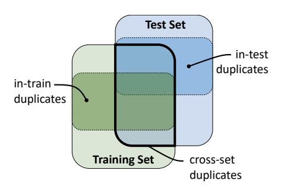
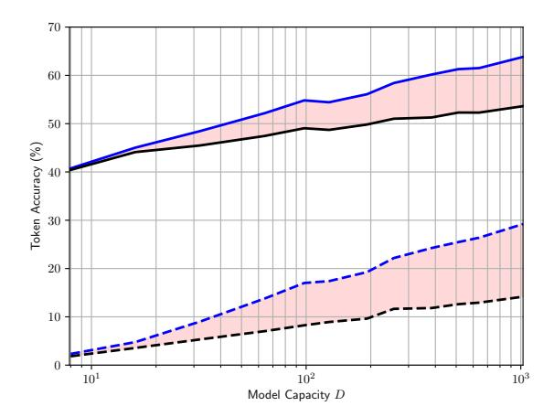

# The Adverse Effects of Code Duplication in Machine Learning Models of Code

Miltiadis Allamanis miallama@microsoft.com Microsoft Research Cambridge, UK

#### **Abstract**

The field of big code relies on mining large corpora of code to perform some learning task towards creating better tools for software engineers. A significant threat to this approach was recently identified by Lopes et al. [19] who found a large amount of near-duplicate code on GitHub. However, the impact of code duplication has not been noticed by researchers devising machine learning models for source code. In this work, we explore the effects of code duplication on machine learning models showing that reported performance metrics are sometimes inflated by up to 100% when testing on duplicated code corpora compared to the performance on de-duplicated corpora which more accurately represent how machine learning models of code are used by software engineers. We present a duplication index for widely used datasets, list best practices for collecting code corpora and evaluating machine learning models on them. Finally, we release tools to help the community avoid this problem in future research.

*CCS Concepts* • Computing methodologies  $\rightarrow$  Machine learning; • Software and its engineering  $\rightarrow$  Software notations and tools.

*Keywords* duplication, dataset collection, machine learning, big code, code naturalness

#### **ACM Reference Format:**

Miltiadis Allamanis. 2019. The Adverse Effects of Code Duplication in Machine Learning Models of Code. In *Proceedings of the 2019 ACM SIGPLAN International Symposium on New Ideas, New Paradigms, and Reflections on Programming and Software (Onward! '19), October 23–24, 2019, Athens, Greece.* ACM, New York, NY, USA, 11 pages. https://doi.org/10.1145/3359591.3359735

Permission to make digital or hard copies of all or part of this work for personal or classroom use is granted without fee provided that copies are not made or distributed for profit or commercial advantage and that copies bear this notice and the full citation on the first page. Copyrights for components of this work owned by others than the author(s) must be honored. Abstracting with credit is permitted. To copy otherwise, or republish, to post on servers or to redistribute to lists, requires prior specific permission and/or a fee. Request permissions from permissions@acm.org. Onward! '19, October 23–24, 2019, Athens, Greece

@ 2019 Copyright held by the owner/author(s). Publication rights licensed to ACM.

ACM ISBN 978-1-4503-6995-4/19/10...\$15.00 https://doi.org/10.1145/3359591.3359735

#### 1 Introduction

Machine learning models of source code have recently received great attention from the research community. At the intersection of the research fields of software engineering, programming languages, machine learning and natural language processing, multiple communities have been brought together into the field of "Big Code" or "code naturalness" with many fruitful results [1]. Commonly, research in this area relies on large corpora of code which can be used as training and test sets, allowing machine learning methods to learn and probabilistically reason about coding practice at a large scale. The goal is to use the learned models to provide useful tools to software engineers.

However, there is a looming crisis in this newly-founded area, caused by a disproportionately large amount of code duplication. This issue — first observed by Lopes et al. [19] — refers to the fact that multiple file-level (near-)clones appear in large corpora of code, such as those mined from GitHub repositories. This is because software engineers often copy — partially or entirely — files from other projects [11, 19]. Despite the findings of Lopes et al. [19], the research community has not yet investigated how and when code duplication negatively affects its research, the machine learning models it devises, and the practical tools it creates. The core issue arises from the fact that identical or highly similar files appear both in the training and test sets that are used to train and evaluate the machine learning models.

In this work, we first describe the impact that code duplication can have on machine learning models. Although not all applications of machine learning models are affected by code duplicates, a large majority of them is. We discuss the biases introduced when evaluating models under duplication and show that duplication can cause the evaluation to overestimate the performance of a model compared to the performance that actual users of the model observe. Then, we replicate the work of Lopes et al. [19] across ten corpora that have been used in "big code" research and we measure the impact of duplication across datasets and machine learning models showing that the performance observed by a user is up to 50% worse compared to reported results. Although this paper does not present any results or ideas that would be unexpected to a statistician or a machine learning expert, we hope that it will help programming language, software engineering and machine learning researchers better understand

the issue of code duplication for machine learning on code by clearly illustrating its impact. At the same time, we provide tools and some best practices that can help overcome pitfalls when researching machine learning methods that employ source code data. We hope that this paper contributes the following:

- an application-driven principle for deciding if within the application domain code corpus deduplication is needed (Section 2);
- the theoretical basis of the effects of code duplication (Section 2) and a demonstration of the effects of code duplication on machine learning models of source code (Section 4);
- an open-source, cross-platform tool that detects nearduplicates in C#, Java, Python and JavaScript along with a duplication index for existing datasets, listing existing duplicate files (Section 3);
- a set of suggested best practices to mitigate the code duplication problem for machine learning models of code (Section 5).

# 2 Code Duplication & Machine Learning

Code duplication refers to the idea that a large snippet of code appears multiple times with no or small differences within a corpus of code. Duplicates are a relatively small subset of code clones [25] — a well-studied field of software engineering. The existence of duplicates was noticed much earlier [27] but their negative effect became significantly more noticeable due to recent advancements that allowed the collection of large code corpora [19]. In this paper, we are specifically interested in illustrating the effects of code duplication on machine learning models of code1. This endeavor sets different parameters for searching, understanding and classifying code duplication. To understand the effects of duplicates, we first need to discuss the practical applications of machine learning models for code.

Why do we want to train machine learning models on source code? At a high-level, the goal is to train models on existing code, such that the learned models capture the statistical properties of some particular aspect of coding practice, which can then be useful within a tool used by a software engineer. Some examples of recently researched models include:

- code completion models [14, 15, 20, 24] aiming to assist code construction in an editor when a developer is writing new code. Such models are widely used in practice today.
- Type prediction models [13, 23] where the goal is to infer (or provide probabilistic hints for) the types of new, previously untyped, programs (*e.g.* in JavaScript);

• code summarization [3, 5, 7, 16] where the goal is to summarize some code into a short natural language utterance.

In most applications, like in the aforementioned examples, the goal is to use trained models to provide recommendations and insights on *new* and *unseen* code when the software engineer is creating or maintaining it. Essentially, this necessitates that machine learning models *generalize* well to new source code or — in statistical machine learning terms — to *faithfully model the true distribution of the data as it will be observed by the particular use case of the tool.* As we will discuss later in this section, in order for a machine learning model to generalize to the true data distribution, it needs to be trained on data independently drawn from that distribution. Code duplicates commonly violate that.

Furthermore, the true data distribution depends on the target application. Different applications of machine learning models of code will tend to have different true data distributions. Therefore, before training any machine learning model of code, we should all ask "What is the distribution of the data that our machine learning component will need to operate on?"

For example, for a token-level code completion model the true data distribution refers to the predicted next token that the developer will actually type. It is thus reasonable to assume that duplicate code is *not* a part of the true data distribution as a developer will copy-paste whole chunks rather than type duplicate code character-by-character. However, there are other cases where code duplication is part of the true data distribution. For example, if we are interested in deobfuscating code that contains a lot of copy-pasted libraries/functions, then duplicates are part of the true data distribution.

The duplication issue arises because, in practice, it is very rare for researchers to train their model and measure its performance by directly observing its use by engineers, i.e. the true data distribution. Instead, a common practice is to split any existing dataset into two parts: a training set that is used to train the machine learning model and a test set where the performance of the model is measured. And since duplicated datasets are distributed differently from non-duplicated datasets the machine learning models learn to model a different probability distribution. This is because machine learning makes an important assumption: each of the data points need to be independent and identically distributed (i.i.d) over the true distribution of data of the use case. This is not an unreasonable assumption and is widely and successfully used in machine learning and data mining research and practice [21, §7.3]. It is exactly this assumption that code duplication strongly violates for many of the use cases of machine learning models of code.

In this paper, we make two assumptions. First, the true data distribution of the target application contains no duplicates.

 $^1\mbox{We}$  use the terms "duplicate" and "near-duplicate" interchangeably to refer to code that is highly similar but not necessarily identical.

Second, we assume that duplication happens only across files, similar to Lopes et al. [19]. This means that smaller amounts of code duplication, such as clones that span only a few lines, are not be considered duplicates. The last assumption addresses the possibility that the target use case of a machine learning-based software engineering tool contains a few lines of cloned code. For example, a type prediction tool may still be required to suggest types even when a few lines of code have been copy-pasted. These assumptions are central to the thesis of this paper: As we will discuss later, particular use cases may allow for duplicates within the true data distribution. The results presented in this paper does not affect them. Other use cases may need to consider additional type of duplicates, such as smaller cloned snippets or functional (type IV) clones. The results presented here are still valid for those cases and, most probably, the negative effects of code duplication would be more severe when a broader class of code duplicates needs to be considered.

Concepts and Definitions Assume a dataset *D* of source code files that is split into a training and a test set (Figure 1). We distinguish three types of duplicates: (1) "in-train" duplicates, *i.e.* files duplicated within the training set; (2) "in-test" duplicates, *i.e.* duplicates within the test set; and (3) "cross-set" duplicates, *i.e.* files that appear both in the training and test sets.

**Duplication Bias** In machine learning, a measured quantity f, such as the loss function minimized during training or a performance (e.g. accuracy) metric, is usually estimated as the average of the metric computed uniformly over the training or test set(s) (because of the i.i.d. hypothesis). Specifically, the estimate of f over a dataset  $D = \{x_i\}$  is computed as

$$\hat{f} = \frac{1}{|D|} \sum_{x_i \in D} f(x_i). \tag{1}$$

Duplication biases this estimate because some  $x_i$  will appear multiple times. Specifically, we can equivalently transform D as a multiset  $X = \{(x_i, c_i)\}$  where  $c_i \in \mathbb{N}_+$  is the number of times that the sample  $x_i$  is found in the dataset. Therefore, we can rewrite Equation 1 as

$$\hat{f} = (1 - d) \underbrace{\frac{1}{|X|} \sum_{x_i \in X} f(x_i)}_{\text{unbiased estimate } \bar{f}} + d \underbrace{\frac{1}{|D| - |X|} \sum_{x_i \in X} (c_i - 1) f(x_i)}_{\text{duplication bias } \beta}$$
(2)

where  $d = \frac{|D| - |X|}{|D|} = \frac{\sum c_i - |X|}{|D|}$  is the *duplication factor*, where |X| is the number of unique  $x_i$  in X. Thus d is the proportion of the samples in the dataset that are duplicated  $(c_i > 1)$ . By rewriting the above equation as  $\hat{f} = (1 - d)\bar{f} + d\beta$  we see that the larger the duplication factor d, the larger the effect of the duplication bias  $\beta$ .

**Figure 1.** Schematic description of types of duplicates. The dashed boxes indicate the subset of files that are duplicates within each set.

From a machine learning perspective, the duplication bias in the training loss causes a model to overweight some training samples (the in-train duplicates). During testing, the duplication bias will skew the reported performance metric. Furthermore, we expect cross-set duplicates to artificially improve any metric taking advantage of the fact that multiple samples that are seen during training also appear in the test set, giving the illusion that the model generalizes, where in fact it memorized duplicates.

# 3 Measuring Duplication

To measure code duplication we need a method that detects (near) duplicate files along a large corpus of code. As we discussed in the previous section, we are interested in file-level duplication and thus we re-implement SourcererCC's [26] token-level duplication detection with minor modifications described next and release it under a permissive license. These simple modifications adapt SourcererCC to file-level duplicate detection, removing complexity that is required for general-purpose code clone detection and are similar to those discussed in Lopes et al. [19].

**Detecting near-duplicates** Although detecting exact duplicates is straightforward, this misses a substantial number of near-exact matches that differ only in a few aspects. To achieve this, we follow SourcererCC [26]: we tokenize each file and extract all identifier and literal tokens. For each file, we build two "fingerprints", a set  $T_0$  and a multiset  $T_1$  of all the identifiers and literals. We consider two files i and j to be duplicates, if the Jaccard similarities  $J(T_0^i, T_0^J)$  and  $J(T_1^i, T_1^J)$ are above the thresholds  $t_0$  and  $t_1$  respectively. In this work, we set  $t_0 = 0.8$  and  $t_1 = 0.7$  based on the default values used in SourcererCC and experimentation on a C# dataset, but we notice that duplicate detection is fairly robust to these thresholds. Files with fewer than 20 identifier tokens are not considered duplicates and are excluded from our analysis. Finally, to improve the speed of the tool, as in SourcererCC, we make the simplifying assumption that similarity is transitive. Although this does not generally hold, we found that this does not impact the accuracy of the tool. Finally, since computing the Jaccard similarities is embarrassingly parallel, we simply compare all combinations of files for similarity.

Our tool is quite fast. For example, on an Azure F16 machine (2.4 GHz Intel Xeon E5-2673 v3 Haswell with 16 cores and the Intel Turbo Boost Technology 2.0 and 32GB of RAM), our method detects duplicates among 112k files in the JavaScript-150k corpus (discussed next) in 5 hours. We open-source the duplication-detection code online under a permissive license at https://github.com/Microsoft/near-duplicate-codedetector. It contains tokenizers for Java, JavaScript, C# and Python but can easily be extended to other languages. The deduplication tool accepts a JSONL file (i.e. a file containing a valid JSON per line) containing an id of each file (e.g. its filepath) and a list of identifier and literal tokens within that file. It returns a JSON file with the clusters of near-duplicate files. We also provide a faster, but approximate Python tool that works on the same principles within the dpu-utils package at https://github.com/Microsoft/dpu-utils.

**Duplication Statistics** Armed with a reasonable method for detecting duplication, we now report code duplication statistics for ten publicly available datasets that have been used for machine learning on code. It should be noted that for the studied datasets all authors have taken significant steps to remove exact file-level clones. However, this process missed a large number of (near) duplicate files, that may differ in minor aspects, such as whitespace, code comments and other small code modifications. Table 1 reports the results. We note that for the JavaScript-150k dataset our tool was able to process only 112k files2 and therefore we report results on those files. The rest of the files are ignored. The results show that in many datasets, a substantial proportion of the dataset contains duplicated code. Note that these statistics are when datasets are split into different folds (chunks) across files. When splitting across projects, this percent is most often reduced. For example, splitting the Java-Large dataset across projects, following the split provided by Alon et al. [5], 8.9% of the test set is made of cross-set duplicates (compared to the average of 24.1% when splitting across files). This suggests that splitting across projects — when possible — is a helpful strategy.

As expected, smaller datasets, such as those collected over a small and curated set of projects suffer less from duplication. The Concode dataset [17] seems to be the one suffering the most from duplication, by having about 68.7% of its methods be duplicates. However, it should be appreciated that Concode and the Python docstring datasets are datasets where each sample is a single function, rather than a full source code file. If we transform the other datasets, such that each file contains a single function or a smaller snippet, their duplication statistics might also worsen. Note that once the data is split into training-test sets, the percent of cross-set duplicates is smaller than the full dataset duplication factor,

since a noticeable proportion of duplicates become in-train or in-test duplicates. Finally, we note that the duplication in all datasets is significantly smaller than that reported by Lopes et al. [19]. This should be attributed to the fact that the corpus collected by Lopes et al. [19] is orders of magnitude larger than any of the datasets in Table 1. Authors of the datasets discussed here made efforts to deduplicate and filter the collected corpora by removing most low popularity projects and some number of exactly duplicated files. We release the duplicates files at https://ieee-dataport.org/open-access/deduplication-index-big-code-datasets We hope that these lists can be used as dataset duplication index in future work.

Human Evaluation SourcererCC makes some approximations to make the search computationally efficient. This raises the question about its precision. The author of this paper inspected 100 random pairs of duplicates for the Javascript-150k dataset [22] and 100 random pairs from the Java-Large dataset [5] and annotated each pair as a true or false positive. Overall, the duplicate detection achieves perfect precision for both datasets. This is to be expected as SourcererCC is a well-validated method and works very well for the special and relatively easy case of detecting file-level duplicates.

Looking at the duplicates, we make a few qualitative, empirical observations. First, we observe that a large majority of duplicates share the same file name. For the JavaScript-150k, the majority of near-duplicates is of two kinds: (a) different versions of the same file (b) configuration-like files that differ mostly on the configuration values. In contrast, in the Java-Large dataset we find more exact clones, duplicates of the same file but of a different version and boilerplate code. For the C# corpus [2], we note that near-duplicates were mostly found within projects and largely include autogenerated files. This is because the creator of that dataset — and author of this work — had explicitly used a similar process to check for and remove duplicates when creating the dataset, but only across projects and under stricter thresholds.

## 4 Impact on Machine Learning Models

So far, we have established that code duplication can — in principle — have adverse effects to the way machine learning models of code are trained and evaluated. But is this actually the case? Analytically measuring the effect of duplication on machine learning models in a generalized way is not possible. This is because machine learning models differ widely in their characteristics and we expect different models and tasks to be affected differently by code duplication. To empirically illustrate the impact of code duplication, we create experimental settings that illuminate separate aspects of the problem. In Section 4.1 and Section 4.2 we focus on code autocompletion through language modeling. This allows us to do an in-depth case study of a single model and a few

&lt;sup>2 This is because the esprima parser failed to parse these files.

**Table 1.** Duplication Statistics across Existing Corpora over all files (across any provided splits) with more than 20 identifier and literal tokens.

| Name                  | Relevant Publications | # Files (×1000) | # Duplicate Groups (×1000) | Duplicate Files – $d$ (%) | Duplicate ( Average | Group Size Median | % Expected Cross-Set Duplicate Files within Test (6:4 split) |
|-----------------------|--------------------------|--------------------|-------------------------------|------------------------------|------------------------|----------------------|-----------------------------------------------------------------|
| C#-19                 | [2]                      | 28.3               | 0.9                           | 10.6                         | 4.4                    | 2                    | 11.7                                                            |
| Concode – Java*       | [17]                     | 229.3k             | 30.8                          | 68.7                         | 6.1                    | 3                    | 77.8                                                            |
| Java GitHub Corpus    | [4]                      | 1853.7             | 682.7                         | 24.8                         | 2.1                    | 2                    | 29.6                                                            |
| Java-Small            | [5], [3]                 | 79.8               | 2.4                           | 4.7                          | 2.6                    | 2                    | 5.7                                                             |
| Java-Large            | [5]                      | 1863.4             | 195.0                         | 20.2                         | 2.9                    | 2                    | $^\dagger 24.1$                                                 |
| JavaScript-150k       | [22]                     | 112.0              | 8.6                           | 20.7                         | 3.7                    | 2                    | 24.1                                                            |
| Python-150k           | [22]                     | 126.0              | 5.4                           | 6.6                          | 2.6                    | 2                    | 8.0                                                             |
| Python docstrings v1* | [7]                      | 105.2              | 17.0                          | 9.2                          | 2.3                    | 2                    | 11.2                                                            |
| Python docstrings v2* | [7]                      | 194.6              | 24.2                          | 31.5                         | 3.5                    | 2                    | 37.4                                                            |
| Python Autocomplete*  | [12]                     | 70.4               | 8.9                           | 20.3                         | 2.6                    | 2                    | 24.5                                                            |

\*We place one method per file, since the corpus is split across methods. †When the dataset is split across projects, as in the author provided split, this falls to 8.9%.

**Table 2.** Terminology for Measuring Performance based on Kinds of Duplicates in Training and Test Sets

| Training           | Test Set                            |                   |                     |  |  |  |
|--------------------|-------------------------------------|-------------------|---------------------|--|--|--|
|                    | no dups                             | w/ cross-set dups | w/ all dups         |  |  |  |
| Biased Unbiased | Unbiased Test 🗗 Fully Unbiased 🗗 | Cross-Set Biased  | Fully Biased 🗗 – |  |  |  |

factors of variation. Then in Section 4.3 we train state-of-theart models on other tasks. In all cases, we assume a random 50-10-40 train-validation-test split over the dataset. We use the validation set to evaluate training decisions without exposing the model to the test set — a standard practice in machine learning. For example, in neural networks where an algorithm iteratively optimizes the model parameters, we pick the parameters for the iteration that achieves the best performance on the validation set. If a model does not use a validation set, we merge the validation samples into the training set.

We note that this section does *not* attempt to be exhaustive but to replicate some recent work and study the effects of duplication. Our goal is to merely elucidate how these effects are demonstrated for the particular case of machine learning models of source code, demonstrate that duplication should *not* be an afterthought when designing and evaluating such models and help us distill meaningful best practices.

**Terminology** In the absence of existing terms, we introduce a few new terms and annotate them with a mnemonic symbol to help the reader. Given a training-test split and by interpreting Equation 2, we have two possible types of training:

- Unbiased Training All duplicates are removed (ci = 1, ∀i) and an unbiased loss function f̄ is employed during training;
- **Biased Training** All in-train duplicates are kept and the biased loss function  $\hat{f}$  is used. Since most existing work

does not adequately de-duplicate its datasets, it employs biased training.

We now turn our attention to the testing terminology. Within a testset we distinguish two types of duplicates: the cross-set duplicates, and the in-test duplicates (Figure 1). This leads to four types of metrics, summarized in Table 2 and discussed next. The mnemonic symbols can be interpreted as Venn diagrams of the training and test sets. When a set contains duplicates it is shaded (indicating bias on that set), otherwise it is left blank. Finally, we note that when we remove duplicates, we keep exactly one file from each cluster of near-duplicates, such that any duplicate file is used exactly once  $(c_i = 1)$ .

- Fully Unbiased  $\square$  that represents an "ideal world", where all duplicates are removed both from training and test sets and the training and test sets are completely disjoint, allowing us to perform unbiased training and testing.
- Unbiased Test that represents the performance when the test set contains no duplicates. This is equivalent to the performance observed by a user who is using a machine learning model under the true data distribution, but the model has been trained in a biased way.
- Cross-set Biased Test which is the performance measured when performing a biased training and using a test set that only contains cross-set duplicates, but no in-test duplicates.
- Fully Biased Test where training and testing happens on the duplicated (original) dataset. This is the metric that is reported by existing work. Compared to the cross-set biased test (he) this metric is additionally biased by the intest duplicates. Because this bias is arbitrary, it inhibits us from measuring the exact effect of code duplication. For this reason, we do *not* report these metrics (he), but note that empirically it is always very close to the cross-set biased test metrics (he).

It should be noted that for estimating the impact of duplication on machine learning models it is technically incorrect to directly compare the fully unbiased performance (一) with the unbiased test (①) to measure the effect of code duplication. In contrast, comparison between the cross-set biased (①) and unbiased test (①) is technically correct. This is because when training a model on (slightly) different datasets, there is no method that can distinguish between a model's capacity to learn from more (but duplicated) data and the effect of duplication. In practice we observe negligible differences between deduplicated (一) and unbiased testing (①) and we report both.

#### 4.1 Biased vs. Unbiased Performance

As we discussed in Section 2, code duplication can result in measuring better performance compared to the one that a user would actually observe, negatively impacting the user's experience. In this and next section, we focus on the effects of duplication on a single task, namely code autocompletion with language models. By focusing on a single task and model we can do a deep-dive on various aspects of code duplication and illustrate subtle effects. Later, in Section 4.3 we measure the impact of code duplication on other models and on other tasks.

Autocompletion via Language Modeling has been extensively studied both in natural language and in source code. The goal of language models is to capture the statistical characteristics of a language such that the output appears to be "natural". Language models have been used for autocompletion [14, 15, 20, 24] and it would be unreasonable to assume that the true distribution of this particular use cases contains duplicate code.

To demonstrate the effects of code duplication we employ a simple, yet powerful neural language model. The goal is to show how even relatively simple models are severely impacted by duplication and draw observations that generalize to other models. We follow the early work of Bengio et al. [8] for token-level language modeling. Our neural language model (NLM) is described as

$$P(t_i) = softmax(E_o\sigma(W_c[E_ih(t_{i-1})\dots E_ih(t_{i-c})]) + \mathbf{b})$$
 (3)

where  $E_o \in \mathbb{R}^{|V| \times K}$  and  $E_i \in \mathbb{R}^{D \times |V|}$  are the output and input embedding matrices of tokens,  $W_c \in \mathbb{R}^{K \times cD}$  is a matrix, b is a bias vector, and h() is a function that takes a token and converts it to a one-hot vector. All parameters are learned. We train our model to minimize the empirical cross-entropy on the training set, and pick the model that achieves the best performance on the validation set. For simplicity, in this work we set K=D. Throughout this section, we set D=128, train with RMSProp [28] and early stopping. As a vocabulary V, we use the top 10k most frequent tokens. All results are averaged across 5 runs on random splits of the data.

**Table 3.** Impact of Duplicates on Evaluation Performance on a simple Language Modeling Task on the reshuffled and slightly reduced JavaScript-150k [22] dataset and standard deviations.

|            | Performance       |                   |                                  |                   |  |  |
|------------|-------------------|-------------------|----------------------------------|-------------------|--|--|
| Metric     | Ф                 | •                 | $\Delta(\mathbf{G}, \mathbf{G})$ |                   |  |  |
| Acc (%)    | 49.1±0.4          | 55.1±0.4          | -10.9%                           | 49.2±0.4          |  |  |
| Acc-ID (%) | $8.6 \pm 0.7$     | $17.7 \pm 0.4$    | -51.4%                           | $8.3 \pm 0.3$     |  |  |
| MRR        | $0.674 \pm 0.005$ | $0.710 \pm 0.000$ | -5.1%                            | $0.674 \pm 0.005$ |  |  |
| MRR-ID     | $0.136 \pm 0.005$ | $0.224 \pm 0.005$ | -39.3%                           | $0.132 \pm 0.004$ |  |  |
| PPL        | $9.4 \pm 1.0$     | $7.5 \pm 1.0$     | +25.3%                           | $9.4 \pm 1.0$     |  |  |
| PPL-ID     | 76.1±1.1          | $55.4 \pm 1.1$    | +37.4%                           | $82.3 \pm 1.1$    |  |  |

**Performance** To accurately measure the impact of duplication we need to be able to make a fair comparison on the evaluated results. To achieve this, we replicate the conditions of existing work, *i.e.* we perform biased training on our models. We then compute the unbiased ( ) and cross-set biased ( performance metrics. Table 3 shows the measured effect of duplication on the reshuffled and slightly smaller JavaScript-150k dataset. Specifically, it highlights the % relative difference between the unbiased-test ( and and cross-set biased ( metrics, which can directly measure the effect of code duplication on the metrics. We also report the fully-unbiased metrics ( ). The metrics computed are (a) the accuracy of correctly predicting the next token (Acc; higher is better), (b) the mean reciprocal rank (MRR; higher is better) over the tokens and (c) the perplexity (PPL; lower is better) assigned by the neural language model. Unknown tokens are counted as incorrect when computing accuracy and MRR. We also compute focused metrics on identifiers since they have been proven to be the hardest to predict [4, 9, 20]. We note that we also computed the fully biased ( ) metrics and on average, the NLM's performance is similar to the cross-set biased ( performance. This is expected, since the in-test bias is mostly random.

Based on the results, we notice that *all* metrics are affected to a different extent by code duplication. The relative difference ( $\Delta(\Box, \Box)$ ) ranges from a few percentage points to halved performance. This suggests the seriousness of the code duplication problem. Furthermore, we observe that the identifier-related metrics are those that are more severely affected by code duplication. This is expected, since code duplication makes identifiers, which would otherwise appear sparsely, appear more frequently and predictably.

Thus, it should be appreciated that *not all metrics and tasks are equally affected by code duplication*. For example, if an application requires predicting code's non-identifier tokens (*e.g.* as in Campbell et al. [10]), duplication would have a much smaller effect compared to an autocompletion application for predicting identifiers.

**Figure 2.** The impact of code duplication on the NLM with different capacity trained on JavaScript-150k. The solid lines show the accuracy of the NLM model when predicting all tokens, whereas the dashed lines show the accuracy of predicting only identifiers. Blue lines indicate the cross-set biased accuracy, and black ones show the unbiased test accuracy. The larger the capacity of the model, the more severe the impact of code duplication (red shaded area).

# 4.2 Model Capacity and Impact on Code Duplication

Duplication has an observable impact on the performance of machine learning models of source code. However, not all models are impacted in the same way. Indeed, some models may be more prone to memorizing code duplicates than others. Since we cannot directly compare the capacity of different models, we perform a case study on the NLM model and illustrate how varying its learning capacity causes the NLM to be affected differently by duplication.

Figure 2 plots the NLM accuracy of predicting tokens (solid lines) or only identifiers (dashed lines). As a proxy for measuring the capacity of the model, we vary the dimensionality D of the vector representations; a common proxy for model capacity in the machine learning literature. Although there are other methods to increase the capacity of the model (e.g. by adding more layers), increasing the dimensionality is a reasonable option for exploring the effect of code duplication. The shaded (red) area in Figure 2 shows, as expected, that the (negative) effect of duplication increases as model capacity increases. This can be attributed to the fact that additional capacity is used to memorize duplicated code. Therefore, we observe that models that have larger capacity tend to be more heavily affected by code duplication.

This suggests an additional and important observation: Comparison of different models under code duplication may not be indicative of their real performance. This is because some models, having more capacity, can take better "advantage" of

code duplication and report improved results only because they are able to better memorize the duplicated cross-set samples.

#### 4.3 Other Models and Tasks

Previously, we illustrated the impact of code duplication over a relatively simple neural language modeling task where we could control various factors of variation and observe how different aspects of a model are affected by code duplication. Although the reader probably already suspects that code duplication affects many other models, here we select a few state-of-the-art models and tasks to evaluate the impact of code duplication. Again, note this is not an exhaustive evaluation, but merely indicates how existing methods cope with code duplication on datasets similar (and possibly reshuffled) to the ones used by the authors. Our goal here is to illustrate the adverse effects of duplication across a diverse set of models and tasks where code duplication is *not* part of the true data distribution. It should be noted that none of the results presented here should be interpreted as negative results for any of the existing methods. Our study merely illustrates how different tasks and state-of-the-art models are also affected by code duplication. For example, the simple neural language model of Section 4.1 still has a significantly worse performance compared to PHOG (discussed next), even after removing code duplicates.

Tasks and Models We select four reasonably well-known tasks in the literature. Note that we re-split the datasets randomly assigning each file to a set. This represents cases where a model can be used within projects, which is often a realistic scenario in machine learning-based software engineering tools. Splitting across projects (as in the official Java-Large split), can substantially reduce the impact of code duplication, depending on the characteristics of each dataset.

- The **method naming** task of predicting the name of a method (function) given the body of the function (*i.e.* summarization). Here we run the open-source state-of-the-art code2vec model [6] on the Java-Large corpus [5].
- Variable Naming which is the task of predicting the names of variables of a snippet of possibly obfuscated code. Note that we assume that the task is to deobfuscate new, previously unseen code rather than code whose deobfuscated form is known, as discussed in Raychev et al. [23]. We run the state-of-the-art non-neural JSNICE

The author of this work agrees with the JsNice authors. Indeed the application of deobfuscating code by matching it to (partially) previously seen code, requires training on duplicated data, since the duplicated dataset

&lt;sup>3This excludes some cases that the JsNice authors have observed in practice when they deployed it as a service. Specifically, in personal correspondence they mentioned to the author that submissions to the JsNice service often contain bundled parts of various projects and libraries. As developers use different versions of common libraries, JsNice needs to train/test on all the versions, not just one.

**Table 4.** Impact of Code Duplication on Performance over a Series of Methods/Tasks.  $\Delta$  refers to the relative % improvement (worsening). Note that some of the evaluated methods are evaluated on different datasets compared to those used in the original works.

|                                                                                                                                                                                | Performance |       |         |       |  |  |
|--------------------------------------------------------------------------------------------------------------------------------------------------------------------------------|-------------|-------|---------|-------|--|--|
| Metric                                                                                                                                                                         | Ф           | •     | Δ(🗗, 📵) |       |  |  |
| Task: Method Naming Model: code2vec [6]                                                                                                                                        |             |       |         |       |  |  |
| Dataset: Reshuffled Java-Large [5]                                                                                                                                             |             |       |         |       |  |  |
| F1 (%)                                                                                                                                                                         | 44.71       | 50.98 | -12.3%  | 46.04 |  |  |
| Precision (%)                                                                                                                                                                  | 53.00       | 58.92 | -10.5%  | 54.51 |  |  |
| Recall (%)                                                                                                                                                                     | 38.67       | 44.93 | -13.9%  | 39.85 |  |  |
| Task: Variable Naming Model: JsNice [23]  Dataset: Reshuffled & Reduced JavaScript-150k [22]  Accuracy (%) 34.44 55.04 -37.4% 29.41  Task: Code Autocompletion Model: PHOG [9] |             |       |         |       |  |  |
| Dataset : Reshuffled & Reduced JavaScript-150k [22]                                                                                                                            |             |       |         |       |  |  |
| Accuracy (%) – Types                                                                                                                                                           | 71.80       | 75.69 | -5.1%   | 72.95 |  |  |
| Accuracy (%) – Values                                                                                                                                                          | 71.19       | 77.75 | -8.4%   | 71.35 |  |  |
| <ul> <li>Identifiers</li> </ul>                                                                                                                                                | 48.94       | 61.43 | -20.3%  | 49.05 |  |  |
| <ul> <li>String Literal</li> </ul>                                                                                                                                             | 25.62       | 43.89 | -41.6%  | 24.51 |  |  |
| Task: Docstring Prediction Model: Seq2Seq [7]  Dataset: Python Docstrings v1 [7]  BLEU 12.32 13.86 -11.1% -                                                                    |             |       |         |       |  |  |

model of Raychev et al. [23] on the JavaScript-150k [22] dataset using the author-provided data extraction utility. Note that the split differs from the original one and some of the files are missing as discussed in Section 3.

- Code Autocompletion which is the language modeling task used in the previous section. Instead of using the neural model of Section 4.1, we employ the PHOG model of Bielik et al. [9] another non-neural model. Since the code is not open-source yet, Pavol Bielik kindly helped with training and testing on that model. We provided the split on the reshuffled and slightly reduced JavaScript-150k [22] dataset for this task.
- **Documentation Prediction** which is the task of predicting the documentation (*e.g.* docstring) of a function using its implementation. Here, the most recent approach is that of Barone and Sennrich [7] that use neural machine translation to "translate" code to documentation. Since the authors provided the output of their model, we

use it directly to compute the performance, instead of performing our own training.

Additionally, we considered the Variable Misuse task [2] which is the task of predicting which type-correct, in-scope variable to use at a given variable usage location. The only dataset that is available here is that of Allamanis et al. [2]. However, within the variable misuse sites only 0.5% of the datapoints are duplicated. This is due to the fact that the C#-19 dataset [2] duplicates are mostly files that are semi-autogenerated, such as assembly information files and resource files that contain very few candidate variable misuse sites. Given the duplication of 0.5% we will *not* consider this task. Note that for all the tasks considered above, it would be unreasonable to assume that the true distribution reflecting the particular use case of each tool to contain any duplicates. We train/test all these models with the default parameters as provided by the authors in their open-source releases of their code.

Analysis of Results Overall, we observe in Table 4 that removing code duplicates noticeably reduces the measured performance of all methods ( $\Delta(\Box, \Box)$ ). Although all metrics worsen, the effect differs. For example, JavaScript-150k and Java-Large have very similar (file-level) duplication but the impact of duplication on the evaluation metrics of PHOG [9] and code2vec [6] is quite different. This can be attributed to two factors (a) different models are affected differently (e.g. because of their inductive biases) (b) different tasks are affected differently by code duplication.

An interesting observation is that training models with a biased dataset (10) almost always results in worse performance compared to training each model in an unbiased fashion (*e.g.* without duplicates, ♂). This may be due to the fact that part of each model's capacity is spent on learning about duplicates, modeling a different data distribution and thus hindering the performance of the model on the deduplicated test set. Thus, training on a biased dataset usually has negative effects on model performance as observed by end-users (1). IsNice, a non-neural method, seems to be an exception. This may be attributed to the fact that the reduced size of the deduplicated dataset harms performance more than code duplicates due to the default hyperparameter values. Finally, as we already observed, different metrics are affected differently. A consistent theme has been that identifier-related metrics (e.g. accuracy of identifiers of PHOG and of the NLM) are the most severely impacted. Generalizing this, we can conclude that this can be attributed to the sparsity [1] of some code constructs (e.g. identifier names): Rare elements of code are hard to predict. Metrics and methods heavily relying on sparse constructs, such as identifiers, are those most severely affected by code duplication.

represents the true data distribution (Section 2) of this partial "soft-matching" use case of JsNice. Thus, this particular use case is one where the true distribution contains duplicates.

## 5 Mitigating Duplication: Best Practices

In the previous sections, we believe that we were able to document and sufficiently illustrate the negative impact of code duplication on machine learning models of code. We observed that:

- The target application of each machine learning model dictates whether duplicates need to be excluded from the training and testing data.
- Code duplication affects all metrics and the performance observed by end-users is often significantly worse than the one reported by evaluation metrics.
- Different metrics and applications are affected differently by code duplication.
- Powerful models that have larger capacity are impacted more by code duplication.
- Comparing different models using duplicated code corpora can be unfair to models with smaller capacity.

**Best Practices** Through this paper, a set of best practices arise that we recommend to researchers and practitioners:

- Understanding the True Data Distribution for the target use-case. Does the distribution over which we expect the tool to be used contain duplicates? If not, then deduplication needs to be performed. If duplicates need to be removed, the granularity of duplicates should be considered. File-level duplication was studied in this work, but other use cases may require more or less finegrained deduplication.
- Data Collection Collecting large datasets in batch should be done carefully and deduplication methods like the one proposed by Lopes et al. [19] or the one used in this work4 should be used to deduplicate the collected corpus. Simply removing exact matches and forks is a reasonable but clearly insufficient first step. Splitting the dataset across different projects, when possible, usually helps a lot, but duplication often still exists.
- Use of Existing Datasets This work demonstrates varying levels of duplication for different datasets. However, duplication occurs to some extent in all existing datasets. When using existing datasets, we suggest using the duplication index provided in this work to remove duplicates.
- Model Capacity Models that have a large capacity to memorize, suffer the most from the duplication problem and special attention should be given when evaluating them. Furthermore, researchers should include naïve memorization methods in their baselines (e.g. k nearest neighbors). If these baselines perform "too well"

compared to other widely-used models, this can indicate a duplication issue.

Finally, it should be noted that while removing duplicates is often the easiest option, small variations of (near) duplicates may still be useful to learning more robust machine learning models. An alternative to discarding duplicates is to down-weight duplicated samples in the loss function and performance metrics, such that each group of duplicated samples has the same weight as a single deduplicated sample, *i.e.* transform Equation 2 to

$$\bar{f} = \frac{1}{|X|} \sum_{x_i \in D} \frac{1}{c_i} f(x_i). \tag{4}$$

Other Considerations So far, we have considered the "traditional" option where a fixed dataset is split for training and evaluation purposes. In some cases, temporal data may be available, e.g. the version history of a codebase. Appropriately, slicing the dataset through time, training on older code and testing on newer code, should be considered a valid evaluation methodology. Nevertheless, code duplication still needs to be accounted. For example, a developer might copy existing code and paste it into a new file, thus "contaminating" a dataset with duplicates.

Similarly, deployment of machine learning models often necessitate that a model is trained on the same codebase to the one where it operates on. Although this may sound odd, the deployed machine learning model/tool will only observe previously unseen code and therefore also operates on an unbiased test environment. This emphasizes the divergence between an offline and an online evaluation of some tool. In most cases, we are not able to perform online evaluation of a model, which would provide the most accurate results. Instead offline evaluations, common in academia and industry, should strive to replicate the conditions of an online system.

#### 5.1 Conclusions

We hope that this paper informs the research community about the negative effects of code duplication on the evaluation of machine learning models and informs practitioners about potential pitfalls when deploying such tools in practice. Removing exact and near duplicates will allow for more accurate comparison of machine learning models and methods and will lead to better machine learning-based tools for programmers.

Finally, despite code duplication's negative effects many interesting research opportunities arise. As Kapser and Godfrey [18] observe, code clones are not always bad, as they often give developers additional flexibility over the evolution of a project and, therefore, methods should embrace it. The work of Hashimoto et al. [12] who combine retrieval methods that find similar snippets within a database of code and then perform edits over those examples is an interesting example of such a direction.

&lt;sup>4 The tool can be found at https://github.com/Microsoft/near-duplicate-code-detector and an approximate version within the dpu-utils Python package at https://github.com/Microsoft/dpu-utils.

Additionally, in contrast to most artifacts often studied in machine learning, such as images and text, the independence assumption (i.i.d) may be too strong: In contrast to common forms of data, code is created through an evolutionary, incremental process. New software is created often because other code makes the new software possible and new features often build up on functionality that already exists. This evolution-like process of software, implies a strong dependence between code that has been written and code that will be written. On one hand, this enables ideas such as big code and naturalness but at the same time complicates evaluation of such ideas, as discussed in this paper. Researching machine learning models and compatible programming language representations that can explicitly take into account the correlations introduced by this evolutionary process may allow for improved tools in this area.

Finally, code duplication across code is a fact of software engineering life and interesting research questions such as "Can new machine learning tools be created that are robust to code duplication?" and "Can we usefully exploit near-duplicates to produce better software engineering tools?" seem to arise as interesting research problems.

# Acknowledgments

The author would like to thank Marc Brockschmidt for useful discussions and suggesting the mnemonic symbols, Patrick Fernandes for first noticing the severity of the duplication problem and bringing it to the attention of the author and an anonymous reviewer of some other work of the author that insisted that code duplication is not an important issue in existing datasets. Finally, the author would like to thank Pavol Bielik for running the evaluation on PHOG, Uri Alon for useful discussions on the Java-Large corpus and useful comments on a draft of this work, Charles Sutton and Earl Barr for helpful discussions, suggestions and corrections and anonymous reviewers and SPLASH Onward! PC for helpful comments and suggestions.

#### References

-  Miltiadis Allamanis, Earl T Barr, Premkumar Devanbu, and Charles Sutton. 2018. A survey of machine learning for big code and naturalness. ACM Computing Surveys (CSUR) 51, 4 (2018), 81.
- [2] Miltiadis Allamanis, Marc Brockschmidt, and Mahmoud Khademi. 2018. Learning to Represent Programs with Graphs. In Proceedings of the International Conference on Learning Representations (ICLR).
- [3] Miltiadis Allamanis, Hao Peng, and Charles Sutton. 2016. A convolutional attention network for extreme summarization of source code. In Proceedings of the International Conference on Machine Learning (ICML). 2091–2100.
- [4] Miltiadis Allamanis and Charles Sutton. 2013. Mining source code repositories at massive scale using language modeling. In Proceedings of the Working Conference on Mining Software Repositories (MSR). IEEE Press, 207–216.
- [5] Uri Alon, Omer Levy, and Eran Yahav. 2010. code2seq: Generating Sequences from Structured Representations of Code. In Proceedings of the International Conference on Learning Representations (ICLR).

- [6] Uri Alon, Meital Zilberstein, Omer Levy, and Eran Yahav. 2019. code2vec: Learning distributed representations of code. Proceedings of the ACM on Programming Languages 3, POPL (2019), 40.
- [7] Antonio Valerio Miceli Barone and Rico Sennrich. 2017. A Parallel Corpus of Python Functions and Documentation Strings for Automated Code Documentation and Code Generation. In Proceedings of the Eighth International Joint Conference on Natural Language Processing (Volume 2: Short Papers), Vol. 2. 314–319.
- [8] Yoshua Bengio, Réjean Ducharme, Pascal Vincent, and Christian Jauvin. 2003. A neural probabilistic language model. *Journal of Machine Learning Research (JMLR)* 3, Feb (2003), 1137–1155.
- [9] Pavol Bielik, Veselin Raychev, and Martin Vechev. 2016. PHOG: Probabilistic Model for Code. In Proceedings of the International Conference on Machine Learning (ICML). 2933–2942.
- [10] Joshua Charles Campbell, Abram Hindle, and José Nelson Amaral. 2014. Syntax errors just aren't natural: improving error reporting with language models. In Proceedings of the Working Conference on Mining Software Repositories (MSR). ACM, 252–261.
- [11] Mohammad Gharehyazie, Baishakhi Ray, Mehdi Keshani, Masoumeh Soleimani Zavosht, Abbas Heydarnoori, and Vladimir Filkov. 2018. Cross-project code clones in GitHub. *Empirical Software Engineering* (2018), 1–36.
- [12] Tatsunori B Hashimoto, Kelvin Guu, Yonatan Oren, and Percy Liang. 2018. A Retrieve-and-Edit Framework for Predicting Structured Outputs. In Proceedings of the Annual Conference on Neural Information Processing Systems (NIPS).
- [13] Vincent J Hellendoorn, Christian Bird, Earl T Barr, and Miltiadis Allamanis. 2018. Deep learning type inference. In Proceedings of the 2018 26th ACM Joint Meeting on European Software Engineering Conference and Symposium on the Foundations of Software Engineering. ACM, 152–162.
- [14] Vincent J Hellendoorn and Premkumar Devanbu. 2017. Are deep neural networks the best choice for modeling source code?. In Proceedings of the 2017 11th Joint Meeting on Foundations of Software Engineering. ACM, 763–773.
- [15] Abram Hindle, Earl T Barr, Zhendong Su, Mark Gabel, and Premkumar Devanbu. 2012. On the naturalness of software. In Software Engineering (ICSE), 2012 34th International Conference on. IEEE, 837–847.
- [16] Srinivasan Iyer, Ioannis Konstas, Alvin Cheung, and Luke Zettlemoyer. 2016. Summarizing source code using a neural attention model. In Proceedings of the 54th Annual Meeting of the Association for Computational Linguistics (Volume 1: Long Papers), Vol. 1. 2073–2083.
- [17] Srinivasan Iyer, Ioannis Konstas, Alvin Cheung, and Luke Zettlemoyer. 2018. Mapping Language to Code in Programmatic Context. In Proceedings of the 2018 Conference on Empirical Methods in Natural Language Processing. 1643–1652.
- [18] Cory J Kapser and Michael W Godfrey. 2008. "Cloning considered harmful" considered harmful: patterns of cloning in software. Empirical Software Engineering (ESEM) 13, 6 (2008), 645.
- [19] Cristina V Lopes, Petr Maj, Pedro Martins, Vaibhav Saini, Di Yang, Jakub Zitny, Hitesh Sajnani, and Jan Vitek. 2017. DéjàVu: a map of code duplicates on GitHub. Proceedings of the ACM on Programming Languages 1, OOPSLA (2017), 84.
- [20] Chris Maddison and Daniel Tarlow. 2014. Structured generative models of natural source code. In Proceedings of the International Conference on Machine Learning (ICML). 649–657.
- [21] Kevin P Murphy. 2012. Machine Learning: A Probabilistic Perspective. MIT Press.
- [22] Veselin Raychev, Pavol Bielik, Martin Vechev, and Andreas Krause. 2016. Learning programs from noisy data. In *Proceedings of the Symposium on Principles of Programming Languages (POPL)*, Vol. 51. ACM, 761–774.
- [23] Veselin Raychev, Martin Vechev, and Andreas Krause. 2015. Predicting program properties from Big Code. In Proceedings of the Symposium on

- Principles of Programming Languages (POPL), Vol. 50. ACM, 111–124.
- [24] Veselin Raychev, Martin Vechev, and Eran Yahav. 2014. Code completion with statistical language models. In *Proceedings of the Symposium on Programming Language Design and Implementation (PLDI)*, Vol. 49. ACM. 419–428.
- [25] Chanchal Kumar Roy and James R Cordy. 2007. A survey on software clone detection research. *Queen's School of Computing TR* 541, 115 (2007), 64–68.
- [26] Hitesh Sajnani, Vaibhav Saini, Jeffrey Svajlenko, Chanchal K Roy, and Cristina V Lopes. 2016. SourcererCC: scaling code clone detection to
- big-code. In Software Engineering (ICSE), 2016 IEEE/ACM 38th International Conference on. IEEE, 1157–1168.
- [27] Ewan Tempero, Craig Anslow, Jens Dietrich, Ted Han, Jing Li, Markus Lumpe, Hayden Melton, and James Noble. 2010. The Qualitas Corpus: A curated collection of Java code for empirical studies. In Software Engineering Conference (APSEC), 2010 17th Asia Pacific. IEEE, 336–345.
- [28] Tijmen Tieleman and Geoffrey Hinton. 2012. Lecture 6.5-RMSProp: Divide the gradient by a running average of its recent magnitude. COURSERA: Neural networks for machine learning 4, 2 (2012), 26–31.