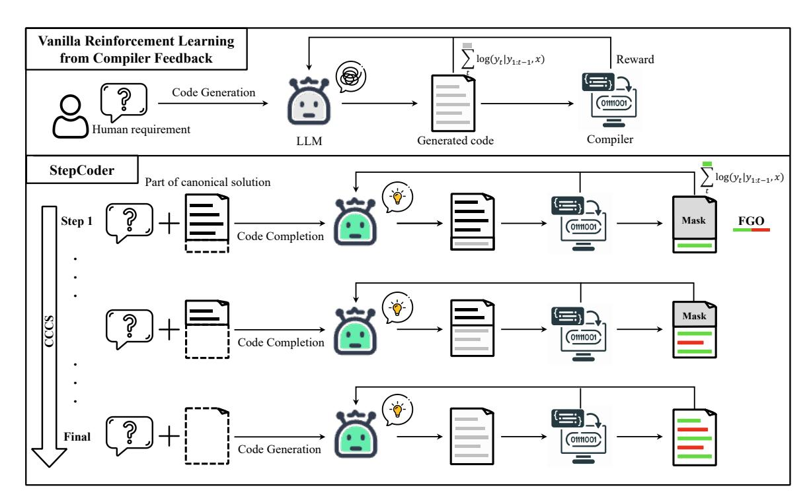
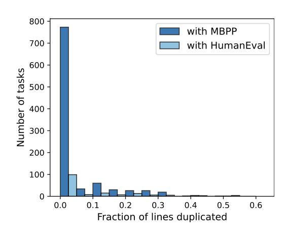
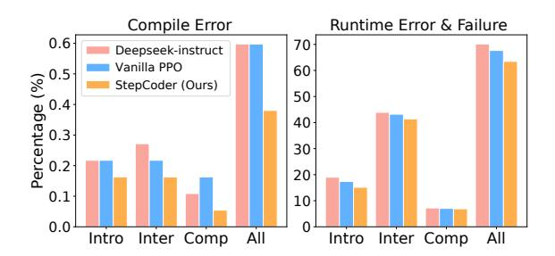

# StepCoder: Improve Code Generation with Reinforcement Learning from Compiler Feedback

Shihan Dou<sup>1</sup>\*† , Yan Liu<sup>1</sup><sup>∗</sup> , Haoxiang Jia<sup>2</sup> , Limao Xiong<sup>1</sup> , Enyu Zhou<sup>1</sup> , Wei Shen<sup>1</sup> , Junjie Shan<sup>3</sup> , Caishuang Huang<sup>1</sup> , Xiao Wang<sup>1</sup> , Xiaoran Fan<sup>1</sup> , Zhiheng Xi<sup>1</sup> , Yuhao Zhou<sup>1</sup> , Tao Ji<sup>1</sup> , Rui Zheng<sup>1</sup>† , Qi Zhang<sup>1</sup>† , Xuanjing Huang<sup>1</sup> , Tao Gui<sup>1</sup>†

<sup>1</sup> Fudan NLP Lab, Fudan University, China <sup>2</sup> Huazhong University of Science and Technology, China <sup>3</sup> KTH Royal Institute of Technology, Sweden

## Abstract

The advancement of large language models (LLMs) has significantly propelled the field of code generation. Previous work integrated reinforcement learning (RL) with compiler feedback for exploring the output space of LLMs to enhance code generation quality. However, the lengthy code generated by LLMs in response to complex human requirements makes RL exploration a challenge. Also, since the unit tests may not cover the complicated code, optimizing LLMs by using these unexecuted code snippets is ineffective. To tackle these challenges, we introduce StepCoder, a novel RL framework for code generation, consisting of two main components: CCCS addresses the exploration challenge by breaking the long sequences code generation task into a Curriculum of Code Completion Subtasks, while FGO only optimizes the model by masking the unexecuted code segments to provide Fine-Grained Optimization. In addition, we furthermore construct the APPS+ dataset for RL training, which is manually verified to ensure the correctness of unit tests. Experimental results show that our method improves the ability to explore the output space and outperforms state-of-the-art approaches in corresponding benchmarks. Our dataset APPS+ and StepCoder are available online <sup>1</sup> .

## 1 Introduction

Code generation or program synthesis aims to automatically generate source code that adheres to a specified programming requirement, which is typically described in natural language [\[36;](#page-9-0) [7\]](#page-8-0). Recently, with the development of large language models (LLMs), techniques based on LLM [\[15;](#page-8-1) [37;](#page-9-1) [23\]](#page-9-2) have demonstrated impressive ability in code generation. However, challenges persist in aligning

these models with complex human requirements [\[2;](#page-8-2) [10;](#page-8-3) [27\]](#page-9-3), indicating a gap that still exists in fully meeting user expectations.

In this context, learning from compiler feedback exhibits impressive potential to improve the comprehension of complicated human requirements and the quality of generated codes [\[14\]](#page-8-4). This feedback from compilation and execution results is instrumental in directly ascertaining the functional correctness of programs [\[17;](#page-8-5) [39\]](#page-9-4). Researchers [\[20;](#page-8-6) [33\]](#page-9-5) introduce reinforcement learning (RL) and leverage compiler feedback from unit tests as a reward metric to guide the exploration of the output space of LLMs. The intention is for the policy model to favor actions that yield higher rewards increasingly. Nevertheless, the optimization of LLMs for code generation via RL presents several hurdles. First, the increasing complexity of human requirements often results in the generation of longer code sequences, which makes exploration struggle [\[9;](#page-8-7) [13\]](#page-8-8). Second, in cases where a single unit test fails to cover the complex code, unexecuted code snippets may emerge that are not relevant to the reward. Rendering optimization based on the entire code sequence is potentially imprecise. Additionally, our analysis reveals quality limitations in existing datasets like APPS [\[10\]](#page-8-3) for RL training, which impedes accurate learning from compiler feedback through RL.

To tackle these challenges, we first introduce StepCoder, an innovative framework developed for enhancing code generation through reinforcement learning. StepCoder integrates two key components: Curriculum of Code Completion Subtasks (CCCS) and Fine-Grained Optimization (FGO). CCCS is designed to alleviate the complexities associated with exploration in code generation, while FGO is designed to provide more precise and effective optimization strategies. Specifically, CCCS employs a step-by-step strategy to break down complex exploration problems (i.e., code generation)

<sup>\*</sup> Equal contributions.

<sup>†</sup> Correspondence to: shdou21@m.fudan.edu.cn, {rzhen g20, qz, tqui}@fudan.edu.cn

<sup>1</sup> [https://github.com/Ablustrund/APPS\\_Plus](https://github.com/Ablustrund/APPS_Plus)

into a curriculum of easier sub-tasks (i.e., code completion). As the training progresses, the difficulty of code completion tasks rises by increasing the portion of code that needs to be completed. Eventually, the aim is for the model to evolve to a stage where it can effectively generate code solely from human requirements, thus fulfilling the original training goal of code generation. On the other hand, the key insight of FGO is that code snippets that are not executed in a unit test do not contribute to the final reward calculation. Therefore, FGO uses a dynamic masking technique to mask unexecuted snippets from unit test evaluations, ensuring that the model is optimized utilizing only the relevant code segments.

Subsequently, our endeavor involves the development of APPS+, a dataset of superior quality specifically curated for code generation. APPS+ is meticulously designed to exclude code segments that exhibit syntax errors, are irrelevant to the stipulated problem, or fail to produce any output. Additionally, we have taken measures to standardize the format of inputs and outputs in unit tests to guarantee deterministic output comparisons.

We evaluate the effectiveness of popular LLMs on APPS+. The results reveal that although LLMs show progressive improvements, they face difficulties with complex human requirements. We further evaluate our method on several extensively used benchmarks including MBPP [\[2\]](#page-8-2) and HumanEval [\[3\]](#page-8-9). The experimental results show that StepCoder effectively eases the exploration difficulty in code generation, outperforming other reinforcement learning-based methods in effectiveness. The main contributions of our paper are as follows:

- We introduce StepCoder, a novelty training method via RL, including CCCS and FGO. CCCS makes exploration easier by breaking down the complicated goals into subobjectives curriculum. FGO provides finegrained optimization by only utilizing the executed code in unit tests.
- We constructed APPS+, a high-quality dataset designed for code generation. APPS+ provides a more rigorous evaluation of LLMs' capabilities and a foundation to introduce reinforcement learning in the training phase.
- Experiments show that StepCoder can improve the exploration efficiency and effectiveness and outperform other methods.

```
import random
def test():
    ...
    for _ in range(int(input())):
        …
        rows[0] = p[::2]
        rows[1] = p[1::2]
        if sign(rows[0][0]) != sign(rows[1][0]):
            print(0)
            continue
        for r in range(2, max_rows):
            for n in range(max_col - 1):
                rows[r][n] = rows[r - 1][0] * rows[r - 2][n + 
1] - rows[r - 2][0] * rows[r - 1][n + 1]
        last = sign(rows[0][0])
        flag = 1
        for i in range(1, len(rows)):
            curr = sign(rows[i][0])
            if rows[r] == [0 for _ in range(max_col)]:
                for n in range(max_col):
                    rows[r][n] = rows[r - 1][n] * (max_pow + 
4 - (r + 1) - 2 * (n + 1))
            elif rows[i][0] == 0:
                if any([x != 0 for x in rows[i]]):
                    flag = 0
                    break
                else:
                    curr = last
            if curr != last:
                flag = 0
                break
            last = curr
                                         : conditional statement
                                         : executed code
                                         : unexecuted code
```

Figure 1: The canonical solution of an instance in the APPS dataset. We collect the conditional statements by analyzing their abstract syntax tree, and some conditional statements are highlighted with a grey dashed box. When inputting s = [1\n10 12 1 5 3\n], only 75% of the code fragment is executed, highlighted with a green background.

## <span id="page-1-1"></span>2 Motivation

In this section, we clearly illustrate the challenges faced by reinforcement learning in code generation using a simplified example from APPS [\[10\]](#page-8-3), which was widely used for RL training in code generation.

Exploration problems of RL in code generation. Exploration methods play a crucial role in tackling complicated sequence but sparse reward problems [\[43;](#page-10-0) [13\]](#page-8-8). When a policy model explores a trajectory with high returns, it undergoes optimization, making it inclined to take similar actions in the future [\[41;](#page-9-6) [28\]](#page-9-7).

Consider the code shown in Figure [1,](#page-1-0) aimed at fulfilling a given human requirement. We first collect the conditional statements (CS) that are indicated by the dashed box by analyzing its abstract syntax tree. Conditional statement introduces new independent paths, increasing the complexity of the program [\[32\]](#page-9-8). Suppose Pθ(CSi) denotes the probability that the policy model with parameter θ completes the i-th conditional statement. The probability that the policy model correctly generates this code according to human requirements can be

expressed as follows:

$$P \propto P_o \prod_{i=1}^{3} P_{\theta}(\text{CS}_i), \tag{1}$$

where  $P_o$  is the probability of other code snippets except the code labeled in the figure. Typically, we initialize the policy model with the SFT model in sequence generation tasks to facilitate easier exploration [26; 45]. However, the limited performance of the SFT model in code generation still leads to the probability  $P_{\theta}(CS_i)$  at low values [33; 27]. The increasing complexity of human requirements in code generation tasks often leads to a corresponding rise in the number of conditional statements. This escalation can result in a substantial decrease in the probability  $P_{\theta}(CS_i)$ , potentially leading P to an exponential reduction. Such a scenario exacerbates the challenges associated with exploration in large language models. An alternative approach to facilitate exploration is through reward shaping, a technique where designers artificially introduce rewards more frequently [13]. However, this method encounters a significant limitation in the context of our application. Specifically, in code generation tasks utilizing unit test feedback, rewards can only be obtained after the execution of the completely generated code. Consequently, the exploration of high-return trajectories in tasks with complex sequences and sparse rewards poses a significant challenge in optimizing the policy model.

Optimization problems of RL in code generation. We first introduce the RL fine-tuning process in code generation. Formally, for a learned policy model  $\pi_{\theta}$  with parameter  $\theta$ , we treat the prediction of each token as an *action* a taken by  $\pi_{\theta}$  according to the history token sequences. The history token sequences can be viewed as the *state* s. Given a human requirement x, we denote the solution code y generated by  $\pi_{\theta}$  as an episode, and r(x,y) is the reward function from the compiler based on compilation and execution. Updating the parameters of  $\pi_{\theta}$  by using gradient policy algorithm [35] can be represented as follows:

<span id="page-2-0"></span>
$$\max_{\theta} E_{(x,y) \sim D_{\pi_{\theta}}} \left[ \sum_{t} A_{\pi}^{t} \log(y_{t}|y_{1:t-1}, x; \theta) \right]$$
 (2)

where  $A_{\pi}$  is the advantage computed by the Generalized Advantage Estimator (GAE) [29] from reward r, to reduce the variability of predictions.

In code generation, rewards are contingent upon the correctness of the unit test sample, which is only relevant to the code snippet being executed. For instance, as shown in Figure 1, when the input to the function is  $[1 \ln 10 \ 12 \ 15 \ 3 \ln]$ , 75% of the code fragment is executed, which is highlighted with a green dashed box. It indicates that some actions in the code are irrelevant to the reward, which leads to inaccurate advantage. Therefore, optimizing the policy model  $\pi_{\theta}$  with all actions is ineffective by using Equation 2.

#### 3 Method

In this section, we elaborate on the methodological details of StepCoder, which provide an easier exploration and fine-grained optimization for RL in code generation, respectively, as shown in Figure 2.

#### 3.1 Priliminaries

Suppose  $\mathcal{D}=\{(x_i,y_i,u_i,e_i)\}_{i=0}^N$  is the training dataset for code generation, which x,y,u denotes the human requirement (i.e., the task description), the canonical solution and the unit test samples, respectively.  $e_i=\{st_j,en_j\}_{j=0}^{E_i}$  is a list of conditional statements by automatically analyzing the abstract syntax tree of the canonical solution  $y_i$ , which st and en represent the start position and the end position of the statements, respectively. e is sorted in ascending order based on the start position st. For a human requirement x, its canonical solution y can be represented as  $\{a_t\}_{t=0}^T$ . In code generation, given a human requirement x, the final states are the set of codes passing the unit tests u.

#### 3.2 StepCoder

StepCoder integrates two key components: CCCS and FGO. CCCS is designed to break the code generation tasks into a curriculum of the code completion subtasks. It can alleviate the exploration challenge in RL. FGO is specifically designed for code generation tasks to provide fine-grained optimization by computing only the loss of executed code snippets.

CCCS. In code generation, the solution to a complicated human requirement usually involves a long action sequence taken by the policy model. Meanwhile, the feedback from the compiler is delayed and sparse, i.e., the policy model only receives the reward after generating the entire code. In this scenario, exploring is difficult. The core of our method is to break down such a long sequence of exploration problems into a curriculum of short, easily explorable sub-tasks. We simplify code generation to code completion sub-tasks. These sub-tasks

<span id="page-3-0"></span>

Figure 2: The overview of our method. In code generation, the environment with sparse and delayed rewards and the complicated human requirement that involves a long sequence make exploration challenging for the Vanilla RL. In CCCS, we break down a complicated exploration problem into a curriculum of sub-tasks. Utilizing a portion of the canonical solution as the prompt enables the LLM to explore starting from simple sequences. The computation of rewards is only relevant for the executed code snippets, and it is imprecise to optimize the LLM with the entire code (i.e.,  $\blacksquare$ ). In FGO, we mask unexecuted tokens (i.e.,  $\blacksquare$ ) in unit tests and only compute the loss function using executed tokens (i.e.,  $\blacksquare$ ) to provide a fine-grained optimization.

are automatically constructed from the canonical solution in the training dataset.

Consider a human requirement x, early in the training phase of CCCS, the starting point  $s^*$  of exploration is the states near the final states. Specifically, we provide the human requirement x and the front part of the canonical solution  $x_p = \{a_i\}_{i=0}^{s^*}$ , and the policy model is trained to complete the code based on  $x' = (x, x_p)$ . Let  $\hat{y}$  be the combined sequence of  $x_p$  and the output trajectory  $\tau$ , i.e.  $\hat{y} = (x_p, \tau)$ . The reward model provides the reward r according to the correctness of the code snippet  $\tau$  with  $\hat{y}$  as input, where we use the same setting as previous approaches [14; 33] as follows:

$$r(x^{'}, \hat{y}) = \begin{cases} +1, & \text{if } \hat{y} \text{ passed all unit tests} \\ -0.3, & \text{if } \hat{y} \text{ failed any unit test} \\ -0.6, & \text{if } \hat{y} \text{ happened runtime error} \\ -1, & \text{if } \hat{y} \text{ happened compile error.} \end{cases}$$
(3)

We use the Proximal Policy Optimization (PPO) algorithm [30] to optimize the policy model  $\pi_{\theta}$  by utilizing the reward r and the trajectory  $\tau$ . In the

optimization phase, the canonical solution's code segment  $x_p$  used for providing prompts is masked, such that it does not contribute to the gradient for the policy model  $\pi_\theta$  update. CCCS optimizes the policy model  $\pi_\theta$  by maximizing the objection function as follows:

<span id="page-3-1"></span>
$$\begin{aligned} \text{Objective}(\theta) &= E_{(x^{'},\hat{y}) \sim D_{\pi_{\theta}}}[r(x^{'},\hat{y}) \\ &- \beta \log(\pi_{\theta}(\hat{y}|x^{'}))/\pi^{\text{ref}}(\hat{y}|x^{'})] \end{aligned} \tag{4}$$

where  $\pi^{\text{ref}}$  is the reference model in PPO, which is initialized by the SFT model.

<span id="page-3-2"></span>As the training progresses, the starting point  $s^*$  of exploration gradually moves towards the beginning of the canonical solution. Specifically, we set a threshold  $\rho$  for each training sample. Each time the cumulative correct proportion of code segments generated by  $\pi_{\theta}$  is greater than  $\rho$ , we move the starting point toward the beginning. In the later stages of training, the exploration of our method is equivalent to the exploration process of original reinforcement learning, i.e.,  $s^*=0$ , where the policy model generates code using only human requirements as input.

The starting point s ∗ is sampled at the beginning position of the conditional statements to complete the remaining unwritten code segments. Specifically, a program with a greater number of conditional statements results in increased independent paths, leading to a higher logical complexity [\[32\]](#page-9-8). This complexity necessitates more frequent sampling to improve the quality of training, while programs with fewer conditional statements need less frequent sampling. This sampling method allows for a balanced and representative sampling of code structures, catering to both complex and simple semantic constructs in the training dataset. To accelerate the training phase, we set the i-th sample's number of curricula equal to ⌈ √ Ei⌉, where E<sup>i</sup> is its number of conditional statements. The i-th sample's stride of the training curriculum is ⌈ E<sup>i</sup> ⌈ √ Ei⌉ ⌉ instead of one.

The key insight of CCCS can be summarized as follows: 1) It is easy to explore from the states near the goal (i.e., final states). 2) Exploring starting from the states distant from the goal is challenging, but it becomes easier when can leverage states that have already learned how to reach the goal.

FGO. The relationship between reward and action in code generation differs from other reinforcement learning tasks such as Atari [\[25;](#page-9-13) [19\]](#page-8-10). In code generation, we can exclude a set of actions irrelevant to computing the rewards in generated code. Specifically, as mentioned in Section [2,](#page-1-1) for a unit test, the feedback from the compiler relates only to the code snippets being executed. However, in vanilla RL optimization objectives, as shown in Equation [4,](#page-3-1) all actions of the trajectory are engaged in the computation of the gradient used in the policy update, which is imprecise.

To improve the precision of optimization, we mask actions (i.e., tokens) that are not executed in unit tests when computing the loss for updating the policy model. The full algorithm of CCCS and FGO is detailed in Algorithm [1.](#page-12-0)

#### 4 Experiments

In this section, we first introduce APPS+, a highquality dataset for code generation by manually verifying based on the APPS dataset. Then, we elaborate on the experiment details and the experimental results.

#### 4.1 Dataset Preprocessing

Reinforcement learning requires an amount of highquality training data. During our investigation, we found that among the currently available opensource datasets, only APPS meets this requirement. However, we found there are incorrect instances, such as missing input, output, or canonical solution, canonical solutions that were uncompileable or unexecutable, and discrepancies in execution output.

To refine the APPS dataset, we excluded instances lacking input, output, or canonical solutions. Then, we standardized the formats of input and output to facilitate the execution and comparison of unit tests. We conducted unit tests and manual analysis for each instance, eliminating those with incomplete or irrelevant code, syntax errors, API misuse, or missing library dependencies. For discrepancies in output, we manually reviewed the problem description, correcting the expected output or eliminating the instance.

Finally, we construct the APPS+ dataset, containing 7,456 instances. Each instance includes a programming problem description, a canonical solution, a function name, unit tests (i.e., inputs and outputs), and starter code (i.e., the beginning part of the canonical solution). Appendix [A](#page-10-2) illustrates an example from APPS+. The top section of the figure shows the problem description, and the right section presents the canonical solution, unit tests, and metadata. Further details of APPS+ are discussed in Appendix [B.1.](#page-10-3)

### 4.2 Experiment Details

Benchmarks. In our study, we initially evaluated our method and baselines on our pre-processed APPS+ dataset. Moreover, we also evaluate these methods on several widely-used benchmarks in code generation, i.e., MBPP (Mostly Basic Programming Problems) [\[2\]](#page-8-2) and HumanEval [\[3\]](#page-8-9). We evaluate the MBPP and HumanEval benchmark in a zero-shot learning setting which is the same as previous approaches [\[14;](#page-8-4) [33\]](#page-9-5). In this setting, we fine-tune the models only on the APPS+ dataset and evaluate the code generation performance on MBPP and HumanEval. The detailed description of benchmarks can be found in the Appendix [B.1.](#page-10-3)

Baselines. To verify the effectiveness of Step-Coder and evaluate the performance of LLMs on our APPS+ dataset, we consider a wide range of baselines, including StarCoder [\[15\]](#page-8-1), WizardCoder

<span id="page-5-0"></span>

|                                                                                          |       | APPS+        |           |             |         |  |
|------------------------------------------------------------------------------------------|-------|--------------|-----------|-------------|---------|--|
| Models                                                                                   | Size  | Introductory | Interview | Competition | Overall |  |
|                                                                                          |       | Base Models  |           |             |         |  |
| CodeLlama [27]                                                                           | 13B   | 18.7         | 11.0      | 0.0         | 13.0    |  |
| CodeLlama-Python [27]                                                                    | 13B   | 29.0         | 12.3      | 2.9         | 17.9    |  |
| DeepSeek-Coder-Base [8]                                                                  | 6.7B  | 13.0         | 10.3      | 5.0         | 10.9    |  |
| Supervised Fine-tuned Models                                                             |       |              |           |             |         |  |
| StarCoder [15]                                                                           | 15.6B | 6.3          | 4.1       | 0.7         | 4.7     |  |
| CodeLlama-Instruct [27]                                                                  | 13B   | 33.3         | 11.0      | 1.4         | 18.7    |  |
| WizardCoder-Python-V1.0 [23]                                                             | 13B   | 39.7         | 15.1      | 4.3         | 23.6    |  |
| DeepSeek-Coder-Instruct [8]                                                              | 6.7B  | 49.4         | 18.7      | 3.6         | 29.2    |  |
| SFT on APPS+                                                                             | 6.7B  | 50.1         | 19.0      | 6.4         | 29.8    |  |
| Reinforcement Learning-based Models (Using DeepSeek-Coder-Instruct-6.7B as the backbone) |       |              |           |             |         |  |
| Vanilla PPO                                                                              | 6.7B  | 53.7         | 20.1      | 5.0         | 31.7    |  |
| PPOCoder [33]                                                                            | 6.7B  | 54.4         | 20.3      | 6.4         | 32.1    |  |
| RLTF [20]                                                                                | 6.7B  | 55.1         | 20.8      | 6.4         | 32.7    |  |
| StepCoder (Ours)                                                                         | 6.7B  | 59.7         | 23.5      | 8.6         | 36.1    |  |
| w/o CCCS                                                                                 | 6.7B  | 58.7         | 21.7      | 7.1         | 34.6    |  |
| w/o FGO                                                                                  | 6.7B  | 58.4         | 23.3      | 8.6         | 35.5    |  |

Table 1: Results of pass@1 on our proposed APPS+. We compare popular and widely used state-of-the-art methods with our method. To ensure a fair comparison, we apply these RL-based methods using the same base model (i.e., DeepSeek-Coder-Instruct-6.7B [\[8\]](#page-8-11)) as a backbone on the APPS+ dataset. In addition, We conduct supervised fine-tuning using our APPS+ dataset based on DeepSeek-Coder-Instruct-6.7B to further validate the effectiveness and necessity of our approach.

[\[23\]](#page-9-2), DeepSeek-Coder [\[8\]](#page-8-11), and three versions of CodeLlama (Base, Python, Instruct) [\[27\]](#page-9-3). Moreover, we also consider vanilla PPO and two state-ofthe-art RL-based approaches, including PPOCoder [\[33\]](#page-9-5) and RLTF [\[20\]](#page-8-6). We carried out experiments applying these methods utilizing the same backbone (i.e., DeepSeek-Coder-Instruct [\[8\]](#page-8-11)) on the APPS+ dataset to ensure a fair comparison. In addition to demonstrating the necessity and effectiveness of our method, we also supervised finetuning DeepSeek-Coder-Instruct [\[8\]](#page-8-11) on the APPS+ dataset to exclude the effect of training data. The detailed description of these baselines is discussed in Appendix [B.2.](#page-10-4)

Implementation Details. During the SFT phase, we adopt a learning rate set at 2e −5 , conduct training for three epochs, and employ a warm-up period of 0.3 epochs, with a linear decay to zero. The finetuning process was conducted on a device with eight NVIDIA A100 80G GPUs, with the global batch size set to 64. In the PPO training phase, we employ a learning rate of 5e −7 for the policy model and 1.5e −6 for the critic model. For each example, we collect a 16 roll-out code using nucleus sampling. The sampling temperature is set to 0.8, top-p is set to 0.9, and the maximum output token

length is set to 1024. The token-level KL penalty coefficient β is set to 0.05, with a clip value of 0.8. In the decoding phase, the temperature and top\_p are set to 0.2 and 0.95, respectively.

Evaluation & Metric. We conduct the experiments based on Python3.x. Note that we also use Python3.x during the reward collection in RL-based methods. Following prior studies [\[27;](#page-9-3) [23;](#page-9-2) [14\]](#page-8-4), we use Pass@k [\[3\]](#page-8-9) metric to evaluate all the models. Pass@k quantifies the proportion of instances in which at least one of the k-generated code solutions per human requirement successfully passes all unit tests. The prompts used for code generation are listed in Appendix [D.](#page-11-0)

### 4.3 Experimental Results on APPS+

To assess the performance of widely used LLMs and our StepCoder on code generation, we conduct experiments on the APPS+ dataset that we constructed. The experimental results are illustrated in Table [1.](#page-5-0) The results indicate that RL-based models outperform other language models, including both base models and SFT models. It is reasonable to infer that reinforcement learning can further enhance the quality of code generation by more effectively navigating the model's output space, guided by

compiler feedback.

Furthermore, our StepCoder surpasses all baseline models including other RL-based approaches. achieving the highest score. Specifically, our approach obtains 59.7%, 23.5% and 8.6% in the 'Introductory', 'Interview' and 'Competition', respectively. Our approach excels in exploring the output space compared to other RL-based methods, achieved by simplifying complex code generation tasks to code completion sub-tasks. Additionally, the FGO process plays a pivotal role in precisely optimizing the policy model. We also found that the performance of StepCoder is better than LLM which supervised fine-tuning on the APPS+ dataset based on the same backbone. The latter did little to improve the pass rate of the generated code compared with the backbone. This also directly demonstrates that the method of using compiler feedback to optimize the model improves the quality of the generated code better than next-token prediction in code generation.

<span id="page-6-0"></span>

| <b>Models (6.7B)</b>    | HumanEva    | ıl MBPP |
|-------------------------|-------------|---------|
| DeepSeek-Coder-Instruct | 78.0        | 64.2    |
| SFT on APPS+            | 55.5        | 54.8    |
| Vanilla PPO             | 78.0        | 65.0    |
| PPOCoder                | 76.8        | 63.8    |
| RLTF                    | 76.8        | 65.2    |
| StepCoder (Ours)        | <b>78.7</b> | 67.0    |

Table 2: Results of pass@1 on MBPP and HumanEval. We evaluate the LLMs' performance on code generation in a zero-shot learning setting. In this setting, the models are fine-tuned on our proposed APPS+ dataset and tested for their ability on MBPP and HumanEval.

#### 4.4 Ablation Studies

To investigate the impact of individual components in StepCoder, we conducted ablation experiments with two variations of our approach, including StepCoder only with CCCS and only with FGO. The experimental results are presented in Table 1. Experimental results demonstrate that both components of our approach improve the quality of the generated code compared to vanilla PPO. CCCS can enhance its performance in addressing Competition-level problems. This improvement is logical, considering that CCCS effectively simplifies the exploration of more complex human requirements. Simultaneously, FGO boosts the pass rate of unit tests by integrating compiler feedback with the relevant executed code snippet.

<span id="page-6-1"></span>

Figure 3: Analysis of duplicated lines between APPS+ and the two benchmarks. The overlap of data between APPS+ and them is very small. Only 0.2% and 7.1% had more than half of their lines matched somewhere in MBPP and HumanEval, respectively.

#### 4.5 Results on MBPP and HumanEval

To further demonstrate the effectiveness of our method, we conducted comparative analyses of StepCoder against various approaches using the well-recognized benchmarks MBPP and HumanEval. These models are trained on APPS+ and then evaluated on MBPP and HumanEval. The experimental results are illustrated in Table 2 which shows that StepCoder is superior over all other models on both benchmarks.

However, there are concerns regarding potential overlaps in the training data between APPS+ and the two benchmarks, which might contribute to an improvement in performance. To address these concerns, we analyze the difference between APPS+ and the benchmarks by calculating the code line overlap ratio of two corresponding canonical solutions following previous work [2; 14]. The findings are presented in Figure 3. This evidence underscores our approach's effectiveness in enhancing the quality of generated code and its capability across a broad spectrum of code generation tasks, primarily by improving the exploration problem in reinforcement learning.

Meanwhile, our findings revealed a significant degradation in the performance of the SFT model on both MBPP and HumanEval benchmarks. Further analysis of the error cases showed that a minority were related to function name errors, while the majority were associated with program correctness errors. This also indicated that SFT on a single dataset may impair the ability to follow instructions and the ability to generalize, thus affecting the performance of code generation on other tasks.

In contrast, RL-based methods can improve the performance for unseen tasks of code generation.

#### 4.6 Analysis by Unit Test Results

We further analyzed the results of cases that did not pass all unit tests, as shown in Figure 4. The results show that our proposed method can effectively reduce the likelihood of compilation errors, which is particularly evident in Interview-level and Competition-level programming problems. However, it was also observed that all LLMs are more prone to runtime errors and failures as compared to compilation errors, albeit StepCoder shows a comparatively lower rate of runtime errors and failures. These results demonstrate that StepCoder is less prone to compilation errors, but still suffers from runtime errors and failure. Consequently, these findings suggest that future research should further concentrate on significantly reducing runtime errors, which could greatly enhance both the quality and the pass rate of the code generated by such models.

<span id="page-7-0"></span>

Figure 4: Analysis by unit test results on APPS+. The results are categorized into CompileError (Reward = -1) and Runtimeerror & Failure (Reward = -0.6 or -0.3).

#### 5 Related Work

### 5.1 Large Language Models for Code Generation

Recently, LLMs have shown remarkable ability in understanding natural language and code generation by training on large text corpora containing code data. Several pre-trained language models (PLMs) demonstrate significant potential for code generation including CodeGPT [21], PanGu-Coder [4], SantaCoder [1], CodeGeex [44] and Phi-1.5 [16]. In addition, SFT models achieve more competitive performance such as CodeX [3], StarCoder [15], WizardCoder [23], Code Llama Instruct [27], and DeepSeek-Coder [8].

Reinforcement Learning is a method of learning the optimal policy by exploring the environment and obtaining rewards [41; 34]. Recently, some researchers have introduced RL to LLMs and improved the quality of the generated code by utilizing the unit test feedback to explore the output space of the policy model [33; 20; 14]. For instance, CodeRL [14] leverages signal from unit tests as rewards and utilizes the actor-critic approach [12; 35] to enhance models on code generation. PPOCoder [33] refines CodeRL by employing the PPO algorithm [30] and RLTF [20] provides fine-grained rewards through the error locations, but the reward space is still sparse. However, the exploration of complex tasks in an environment characterized by a sparse reward is challenging. These methods still fall short of effectively using RL to enhance the model's performance in code generation.

### 5.2 Exploration in Reinforcement Learning

Exploration is crucial in addressing long sequences and sparse reward problems [9; 13]. In the sequence generation task, researchers improved exploration by initializing the policy model using the SFT model [26; 31]. Our proposed approach incorporates similar methods, but additional methods are necessary to ensure effective exploration. This is particularly evident when facing complex human requirements, where the limited quality of code generated by SFT models makes exploration still challenging [33].

Other notable methods introduce the Process-Supervised Reward Model to provide step-by-step rewards for complex sequence generation tasks such as mathematical reasoning and code generation [38; 18; 22; 24]. However, these methods require labelling a large preference dataset to train the reward model. Similar to our approach, some methods construct a learning curriculum by initiating each episode from a sequence of progressively more challenging starting states [28; 11; 6]. In contrast to our approach, these methods are designed to address the problem of exploration in other fields, such as gaming and robotic manipulation. Meanwhile, our approach combines software engineering features to dynamically determine the starting states through conditional statements. We also introduce FGO to provide a fine-grained optimization for the policy model by leveraging the coverage information.

#### 6 Conclusion

In this paper, we introduce StepCoder, a novelty training framework via RL. StepCoder breaks down

complicated exploration problems to reduce the difficulty of exploring environments with sparse rewards while providing fine-grained optimization. In addition, we also construct a high-quality dataset APPS+, specifically for code generation. Experiments indicate that our method can effectively improve the quality of generated code via reinforcement learning compared to other approaches.

## References

- <span id="page-8-13"></span>[1] Loubna Ben Allal, Raymond Li, Denis Kocetkov, Chenghao Mou, Christopher Akiki, Carlos Munoz Ferrandis, Niklas Muennighoff, Mayank Mishra, Alex Gu, Manan Dey, et al. 2023. Santacoder: don't reach for the stars! *arXiv preprint arXiv:2301.03988*.
- <span id="page-8-2"></span>[2] Jacob Austin, Augustus Odena, Maxwell Nye, Maarten Bosma, Henryk Michalewski, David Dohan, Ellen Jiang, Carrie Cai, Michael Terry, Quoc Le, et al. 2021. Program synthesis with large language models. *arXiv preprint arXiv:2108.07732*.
- <span id="page-8-9"></span>[3] Mark Chen, Jerry Tworek, Heewoo Jun, Qiming Yuan, Henrique Ponde de Oliveira Pinto, Jared Kaplan, Harri Edwards, Yuri Burda, Nicholas Joseph, Greg Brockman, et al. 2021. Evaluating large language models trained on code. *arXiv preprint arXiv:2107.03374*.
- <span id="page-8-12"></span>[4] Fenia Christopoulou, Gerasimos Lampouras, Milan Gritta, Guchun Zhang, Yinpeng Guo, Zhongqi Li, Qi Zhang, Meng Xiao, Bo Shen, Lin Li, et al. 2022. Pangu-coder: Program synthesis with function-level language modeling. *arXiv preprint arXiv:2207.11280*.
- <span id="page-8-19"></span>[5] OpenCompass Contributors. 2023. Opencompass: A universal evaluation platform for foundation models. [https://github.com/open-compass/](https://github.com/open-compass/opencompass) [opencompass](https://github.com/open-compass/opencompass).
- <span id="page-8-18"></span>[6] Carlos Florensa, David Held, Markus Wulfmeier, Michael Zhang, and Pieter Abbeel. 2017. Reverse curriculum generation for reinforcement learning. In *Conference on robot learning*, pages 482–495. PMLR.
- <span id="page-8-0"></span>[7] Sumit Gulwani, Oleksandr Polozov, Rishabh Singh, et al. 2017. Program synthesis. *Foundations and Trends® in Programming Languages*, 4(1-2):1–119.
- <span id="page-8-11"></span>[8] Daya Guo, Qihao Zhu, Dejian Yang, Zhenda Xie, Kai Dong, Wentao Zhang, Guanting Chen, Xiao Bi, Y. Wu, Y. K. Li, Fuli Luo, Yingfei Xiong, and Wenfeng Liang. 2024. [Deepseek-coder: When the large](https://api.semanticscholar.org/CorpusID:267211867) [language model meets programming – the rise of](https://api.semanticscholar.org/CorpusID:267211867) [code intelligence.](https://api.semanticscholar.org/CorpusID:267211867)
- <span id="page-8-7"></span>[9] Jianye Hao, Tianpei Yang, Hongyao Tang, Chenjia Bai, Jinyi Liu, Zhaopeng Meng, Peng Liu, and Zhen Wang. 2023. Exploration in deep reinforcement learning: From single-agent to multiagent domain.

- *IEEE Transactions on Neural Networks and Learning Systems*.
- <span id="page-8-3"></span>[10] Dan Hendrycks, Steven Basart, Saurav Kadavath, Mantas Mazeika, Akul Arora, Ethan Guo, Collin Burns, Samir Puranik, Horace He, Dawn Song, and Jacob Steinhardt. 2021. [Measuring coding chal](https://datasets-benchmarks-proceedings.neurips.cc/paper/2021/hash/c24cd76e1ce41366a4bbe8a49b02a028-Abstract-round2.html)[lenge competence with APPS.](https://datasets-benchmarks-proceedings.neurips.cc/paper/2021/hash/c24cd76e1ce41366a4bbe8a49b02a028-Abstract-round2.html) In *Proceedings of the Neural Information Processing Systems Track on Datasets and Benchmarks 1, NeurIPS Datasets and Benchmarks 2021, December 2021, virtual*.
- <span id="page-8-17"></span>[11] Ionel-Alexandru Hosu and Traian Rebedea. 2016. Playing atari games with deep reinforcement learning and human checkpoint replay. *arXiv preprint arXiv:1607.05077*.
- <span id="page-8-15"></span>[12] Vijay Konda and John Tsitsiklis. 1999. Actor-critic algorithms. *Advances in neural information processing systems*, 12.
- <span id="page-8-8"></span>[13] Pawel Ladosz, Lilian Weng, Minwoo Kim, and Hyondong Oh. 2022. Exploration in deep reinforcement learning: A survey. *Information Fusion*, 85:1– 22.
- <span id="page-8-4"></span>[14] Hung Le, Yue Wang, Akhilesh Deepak Gotmare, Silvio Savarese, and Steven Chu Hong Hoi. 2022. Coderl: Mastering code generation through pretrained models and deep reinforcement learning. *Advances in Neural Information Processing Systems*, 35:21314–21328.
- <span id="page-8-1"></span>[15] Raymond Li, Loubna Ben Allal, Yangtian Zi, Niklas Muennighoff, Denis Kocetkov, Chenghao Mou, Marc Marone, Christopher Akiki, Jia Li, Jenny Chim, et al. 2023. Starcoder: may the source be with you! *arXiv preprint arXiv:2305.06161*.
- <span id="page-8-14"></span>[16] Yuanzhi Li, Sébastien Bubeck, Ronen Eldan, Allie Del Giorno, Suriya Gunasekar, and Yin Tat Lee. 2023. Textbooks are all you need ii: phi-1.5 technical report. *arXiv preprint arXiv:2309.05463*.
- <span id="page-8-5"></span>[17] Yujia Li, David Choi, Junyoung Chung, Nate Kushman, Julian Schrittwieser, Rémi Leblond, Tom Eccles, James Keeling, Felix Gimeno, Agustin Dal Lago, et al. 2022. Competition-level code generation with alphacode. *Science*, 378(6624):1092–1097.
- <span id="page-8-16"></span>[18] Hunter Lightman, Vineet Kosaraju, Yura Burda, Harri Edwards, Bowen Baker, Teddy Lee, Jan Leike, John Schulman, Ilya Sutskever, and Karl Cobbe. 2023. Let's verify step by step. *arXiv preprint arXiv:2305.20050*.
- <span id="page-8-10"></span>[19] Timothy P Lillicrap, Jonathan J Hunt, Alexander Pritzel, Nicolas Heess, Tom Erez, Yuval Tassa, David Silver, and Daan Wierstra. 2015. Continuous control with deep reinforcement learning. *arXiv preprint arXiv:1509.02971*.
- <span id="page-8-6"></span>[20] Jiate Liu, Yiqin Zhu, Kaiwen Xiao, Qiang Fu, Xiao Han, Wei Yang, and Deheng Ye. 2023. Rltf: Reinforcement learning from unit test feedback. *arXiv preprint arXiv:2307.04349*.

- <span id="page-9-14"></span>[21] Shuai Lu, Daya Guo, Shuo Ren, Junjie Huang, Alexey Svyatkovskiy, Ambrosio Blanco, Colin Clement, Dawn Drain, Daxin Jiang, Duyu Tang, et al. 2021. Codexglue: A machine learning benchmark dataset for code understanding and generation. *arXiv preprint arXiv:2102.04664*.
- <span id="page-9-18"></span>[22] Haipeng Luo, Qingfeng Sun, Can Xu, Pu Zhao, Jianguang Lou, Chongyang Tao, Xiubo Geng, Qingwei Lin, Shifeng Chen, and Dongmei Zhang. 2023. Wizardmath: Empowering mathematical reasoning for large language models via reinforced evol-instruct. *arXiv preprint arXiv:2308.09583*.
- <span id="page-9-2"></span>[23] Ziyang Luo, Can Xu, Pu Zhao, Qingfeng Sun, Xiubo Geng, Wenxiang Hu, Chongyang Tao, Jing Ma, Qingwei Lin, and Daxin Jiang. 2023. Wizardcoder: Empowering code large language models with evolinstruct. *arXiv preprint arXiv:2306.08568*.
- <span id="page-9-19"></span>[24] Qianli Ma, Haotian Zhou, Tingkai Liu, Jianbo Yuan, Pengfei Liu, Yang You, and Hongxia Yang. 2023. Let's reward step by step: Step-level reward model as the navigators for reasoning. *arXiv preprint arXiv:2310.10080*.
- <span id="page-9-13"></span>[25] Volodymyr Mnih, Koray Kavukcuoglu, David Silver, Andrei A Rusu, Joel Veness, Marc G Bellemare, Alex Graves, Martin Riedmiller, Andreas K Fidjeland, Georg Ostrovski, et al. 2015. Human-level control through deep reinforcement learning. *nature*, 518(7540):529–533.
- <span id="page-9-9"></span>[26] Long Ouyang, Jeffrey Wu, Xu Jiang, Diogo Almeida, Carroll Wainwright, Pamela Mishkin, Chong Zhang, Sandhini Agarwal, Katarina Slama, Alex Ray, et al. 2022. Training language models to follow instructions with human feedback. *Advances in Neural Information Processing Systems*, 35:27730– 27744.
- <span id="page-9-3"></span>[27] Baptiste Roziere, Jonas Gehring, Fabian Gloeckle, Sten Sootla, Itai Gat, Xiaoqing Ellen Tan, Yossi Adi, Jingyu Liu, Tal Remez, Jérémy Rapin, et al. 2023. Code llama: Open foundation models for code. *arXiv preprint arXiv:2308.12950*.
- <span id="page-9-7"></span>[28] Tim Salimans and Richard Chen. 2018. Learning montezuma's revenge from a single demonstration. *arXiv preprint arXiv:1812.03381*.
- <span id="page-9-11"></span>[29] John Schulman, Philipp Moritz, Sergey Levine, Michael Jordan, and Pieter Abbeel. 2015. Highdimensional continuous control using generalized advantage estimation. *arXiv preprint arXiv:1506.02438*.
- <span id="page-9-12"></span>[30] John Schulman, Filip Wolski, Prafulla Dhariwal, Alec Radford, and Oleg Klimov. 2017. Proximal policy optimization algorithms. *arXiv preprint arXiv:1707.06347*.
- <span id="page-9-16"></span>[31] Wei Shen, Rui Zheng, Wenyu Zhan, Jun Zhao, Shihan Dou, Tao Gui, Qi Zhang, and Xuan-Jing Huang. 2023. Loose lips sink ships: Mitigating length bias in reinforcement learning from human feedback. In

- *Findings of the Association for Computational Linguistics: EMNLP 2023*, pages 2859–2873.
- <span id="page-9-8"></span>[32] Martin Shepperd. 1988. A critique of cyclomatic complexity as a software metric. *Software Engineering Journal*, 3(2):30–36.
- <span id="page-9-5"></span>[33] Parshin Shojaee, Aneesh Jain, Sindhu Tipirneni, and Chandan K Reddy. 2023. Execution-based code generation using deep reinforcement learning. *arXiv preprint arXiv:2301.13816*.
- <span id="page-9-15"></span>[34] Richard S Sutton, Andrew G Barto, et al. 1998. *Introduction to reinforcement learning*, volume 135. MIT press Cambridge.
- <span id="page-9-10"></span>[35] Richard S Sutton, David McAllester, Satinder Singh, and Yishay Mansour. 1999. Policy gradient methods for reinforcement learning with function approximation. *Advances in neural information processing systems*, 12.
- <span id="page-9-0"></span>[36] Alexey Svyatkovskiy, Shao Kun Deng, Shengyu Fu, and Neel Sundaresan. 2020. Intellicode compose: Code generation using transformer. In *Proceedings of the 28th ACM Joint Meeting on European Software Engineering Conference and Symposium on the Foundations of Software Engineering*, pages 1433–1443.
- <span id="page-9-1"></span>[37] Hugo Touvron, Louis Martin, Kevin Stone, Peter Albert, Amjad Almahairi, Yasmine Babaei, Nikolay Bashlykov, Soumya Batra, Prajjwal Bhargava, Shruti Bhosale, et al. 2023. Llama 2: Open foundation and fine-tuned chat models. *arXiv preprint arXiv:2307.09288*.
- <span id="page-9-17"></span>[38] Jonathan Uesato, Nate Kushman, Ramana Kumar, Francis Song, Noah Siegel, Lisa Wang, Antonia Creswell, Geoffrey Irving, and Irina Higgins. 2022. Solving math word problems with process-and outcome-based feedback. *arXiv preprint arXiv:2211.14275*.
- <span id="page-9-4"></span>[39] Xin Wang, Yasheng Wang, Yao Wan, Fei Mi, Yitong Li, Pingyi Zhou, Jin Liu, Hao Wu, Xin Jiang, and Qun Liu. 2022. Compilable neural code generation with compiler feedback. *arXiv preprint arXiv:2203.05132*.
- <span id="page-9-21"></span>[40] Yizhong Wang, Yeganeh Kordi, Swaroop Mishra, Alisa Liu, Noah A Smith, Daniel Khashabi, and Hannaneh Hajishirzi. 2022. Self-instruct: Aligning language model with self generated instructions. *arXiv preprint arXiv:2212.10560*.
- <span id="page-9-6"></span>[41] Ronald J Williams. 1992. Simple statistical gradient-following algorithms for connectionist reinforcement learning. *Machine learning*, 8:229–256.
- <span id="page-9-20"></span>[42] Can Xu, Qingfeng Sun, Kai Zheng, Xiubo Geng, Pu Zhao, Jiazhan Feng, Chongyang Tao, and Daxin Jiang. 2023. Wizardlm: Empowering large language models to follow complex instructions. *arXiv preprint arXiv:2304.12244*.

- <span id="page-10-0"></span>[43] Tianpei Yang, Hongyao Tang, Chenjia Bai, Jinyi Liu, Jianye Hao, Zhaopeng Meng, Peng Liu, and Zhen Wang. 2021. Exploration in deep reinforcement learning: a comprehensive survey. *arXiv preprint arXiv:2109.06668*.
- <span id="page-10-5"></span>[44] Qinkai Zheng, Xiao Xia, Xu Zou, Yuxiao Dong, Shan Wang, Yufei Xue, Zihan Wang, Lei Shen, Andi Wang, Yang Li, et al. 2023. Codegeex: A pre-trained model for code generation with multilingual evaluations on humaneval-x. *arXiv preprint arXiv:2303.17568*.
- <span id="page-10-1"></span>[45] Rui Zheng, Shihan Dou, Songyang Gao, Yuan Hua, Wei Shen, Binghai Wang, Yan Liu, Senjie Jin, Yuhao Zhou, Limao Xiong, et al. 2023. Delve into ppo: Implementation matters for stable rlhf. In *NeurIPS 2023 Workshop on Instruction Tuning and Instruction Following*.

## <span id="page-10-2"></span>A Instance of the APPS+ Dataset

We present an example from our APPS+ dataset, as shown in Figure [5.](#page-11-1)

## B Experiments Setup in Detail

In this section, we elaborate in detail on the baselines we compare and the implementation details of our method.

### <span id="page-10-3"></span>B.1 Benchmarks

APPS+. We construct the new benchmark APPS+ by refining the popular benchmark APPS [\[10\]](#page-8-3). APPS+ was categorized into three difficulty levels: Introductory (2,850), Interview (4,020), and Competition (586). The mean length of each problem is 255.3 words, and that of the code is 21.9 lines. On average, each instance is accompanied by three unit tests and includes a 'conditional statement' attribute representing the start and end position of the statement in the canonical solution. We randomly selected about 25% instances (700 Introductory, 1,000 Interview, and 140 Competition) for the validation dataset and another 25% instances for the test dataset.

MBPP. MBPP [\[2\]](#page-8-2) is a smaller but common Python code generation benchmark. It contains 974 instances created by crowd-sourcing to an internal pool of crowd workers with basic Python knowledge. The difficulty level of the problems in this dataset is introductory. Most problems are often conveyed in a single sentence of natural language, and each problem consists of a task description, code solution, and three automated test cases. We evaluate LLMs in a zero-shot learning setting which is the same as previous studies [\[14;](#page-8-4) [33\]](#page-9-5). In

this setting, we fine-tune models only based on the APPS+ dataset and evaluate them on MBPP.

HumanEval. HumanEval [\[3\]](#page-8-9) is another extensively used benchmark for evaluating the ability of code generation. It comprises 164 hand-written Python problems that test language comprehension, algorithmic thinking, and basic mathematics. The complexity of these problems is akin to that of simple software interview questions. We also evaluate models on the HumanEval benchmark in a zeroshot learning setting.

#### <span id="page-10-4"></span>B.2 Baselines

StarCoder. StarCoder [\[15\]](#page-8-1) is a 15.5B parameter model trained on 80+ programming languages sourced from GitHub, encompassing one trillion tokens. It undergoes fine-tuning specifically for 35 billion Python tokens, enabling its proficiency across a diverse set of coding tasks. With an extended context length of 8K, StarCoder excels particularly in infilling capabilities.

CodeLlama. CodeLlama [\[27\]](#page-9-3) is a collection of pre-trained and fine-tuned generative text models ranging in scale from 7B to 34B parameters. CodeLlama comes in three variants: CodeLlama: base models designed for general code synthesis and understanding; CodeLlama-Python: designed specifically to handle the Python programming language; CodeLlama-Instruct: for instruction following and safer deployment.

WizardCoder. WizardCoder [\[23\]](#page-9-2) is fine-tuned by using a complicated dataset which is constructed by adapting the Evol-Instruct [\[42\]](#page-9-20) on code-related tasks, which is a further improvement of selfinstruct method [\[40\]](#page-9-21). It has proven to be highly effective in code generation by fine-tuning more complex instruction data.

DeepSeek-Coder. DeepSeek-Coder [\[8\]](#page-8-11) demonstrates state-of-the-art performance among opensource code models across various programming languages. It encompasses a collection of code language models from 1B to 33B trained from scratch. The training corpus for these models comprises an impressive 2 trillion tokens which is the combination of code and natural languages. Each model is trained to utilize a window size of 16K, and a fillin-the-blank task is incorporated into the training process, which enhances the models' capacity to facilitate code completion and infilling tasks.

PPOCoder. PPOCoder [\[33\]](#page-9-5) initially employs the Proximal Policy Optimization algorithm [\[30\]](#page-9-12) for code generations. In addition, it integrates dis-

#### <span id="page-11-1"></span>**-----Task description----** def numDistinct(self, s: str, t: str) -> int:\n """Given a string S and a string T, count the number of distinct subsequences of S which equals T. A subsequence of a string is a new string which is formed from the original string by deleting some (can be none) of the characters without disturbing the relative positions of the remaining characters. (ie, "ACE" is a subsequence of "ABCDE" while "AEC" is not). """ **-----Example1----- Input:** S = "rabbbit", T = "rabbit" **Output:** 3 **Explanation:** As shown below, there are 3 ways you can generate "rabbit" from S. **-----Example2----- Input:** S = "babgbag", T = "bag" **Output:** 5 "inputs": [ "\"rabbbit\"", "\"rabbit\"" ], "outputs": [ 3 ], "fn\_name": "numDistinct", "starter\_code": "\nclass Solution:\n def numDistinct(self, s: str, t: str) -> int:\n" def numDistinct(self, s, t): setOft=set(t) news="" for ch in s: if ch in setOft: news+=ch dp=[[1 for i in range(len(news)+1)] for j in range(len(t)+1)] for j in range(1,len(t)+1): dp[j][0]=0 for i in range(len(t)): for j in range(len(news)): if t[i]==news[j]: dp[i+1][j+1]=dp[i][j]+dp[i+1][j] else: dp[i+1][j+1]=dp[i+1][j] return dp[len(t)][len(news)] **Canonical Solution Unit Test & Meta Data Programming Problem Description**

Figure 5: An instance from our APPS+ dataset includes a human requirement (top), corresponding canonical code (bottom left), metadata, and example cases for unit testing to evaluate the generated code (bottom right). We clean the APPS dataset [\[10\]](#page-8-3) to provide a more rigorous evaluation and a foundation for training by RL in code generation.

crete compiler feedback with syntax and semantics matching scores between generated code and executable objectives which reduces the sparsity of the reward function, thereby providing better guidance for generating code that aligns more closely with the correct objectives.

RLTF. RLTF [\[20\]](#page-8-6) features real-time data generation during the training process and multigranularity unit test feedback. Except for the discrete compiler feedback, it penalizes specific sections in the code where errors occur through the error locations from the feedback of unit tests.

## C The algorithm of CCCS and FGO

The full algorithm of StepCoder is detailed in Algorithm [1.](#page-12-0)

### <span id="page-11-0"></span>D The prompts used for code generation

For DeepSeek-Coder-Instruct [\[8\]](#page-8-11), we use the same prompt as the previous paper. Moreover, DeepSeek-Coder-Instruct serves as the backbone model for

PPOCoder [\[33\]](#page-9-5), RLTF [\[20\]](#page-8-6), and our proposed Step-Coder. Consequently, we align the prompts for these RL-based approaches with the prompt of DeepSeek-Coder-Instruct to maintain consistency. The prompt used for other models such as CodeLlama, WizardCoder and StarCoder is the same as in previous studies [\[5;](#page-8-19) [23;](#page-9-2) [15;](#page-8-1) [27\]](#page-9-3).

The prompt used for DeepSeek-Coder-Instruct and LLMs based on it is as follows:

*You are an AI programming assistant, utilizing the Deepseek Coder model, developed by Deepseek Company, and you only answer questions related to computer science.*

*For politically sensitive questions, security and privacy issues, and other non-computer science questions, you will refuse to answer.*

*### Instruction:*

*write an algorithm in python:*

*{Task description}*

*### Response:*

<span id="page-12-0"></span>Algorithm 1 StepCoder: Improve Code Generation with Reinforcement Learning from Compiler Feedback

```
Require: the train dataset \mathcal{D} = \{(x_i, y_i, u_i, e_i), 1 \leq i \leq n\}, the threshold value \rho_t for curriculum
     training.
Require: the policy model \pi_{\theta}
 1: Initialize the stride of curriculum s = \lceil \frac{E_i}{\lceil \sqrt{E_i} \rceil} \rceil for each sample
 2: Initialize the current curriculum c = \lceil \sqrt{E_i} \rceil - 1 for each training sample
 3: Initialize the pass rate \rho = 0 for each training sample
 4: while TRUE do
          Initialize mini-batch \mathcal{D}_s = \{\}
 5:
          Get latest policy model \pi_{\theta}
 6:
          Sample a mini-batch of size M from \mathcal{D}
 7:
          for i in 0, \dots, M-1 do
                                                                                         ▶ Begin to sample the trajectories
 8:
              Calculate the start position pos = s_i * c_i
                                                                                                                         ⊳ CCCS
 9:
              Reorganize the given context x_{i}' = x_{i} + y_{i} [: pos]
10:
              Sample trajectory \hat{y_i} \leftarrow \pi_{\theta}(.|x_i')
11:
              Compute reward r_i using Equation 3
12:
              Calculate unexecuted snippets' mask matrix m_{ij} = [1 \text{ if } \hat{y}_i^j \text{ is executed else } 0]
13:
                                                                                                                           ⊳ FGO
              Add \{x_i^{'}, \hat{y}_i, u_i, r_i, s_i, c_i, m_i\} to mini-batch \mathcal{D}_s
14:
          end for
15:
          \theta \leftarrow \mathcal{A}(\theta, \mathcal{D}_s)
                                                                          ▶ Update the policy model by PPO algorithm
16:
          for i in 0, \dots, M-1 do
17:
              if r_i = 1 then
                                                                               ▶ Update pass rate using moving average
18:
                   \rho_i = \alpha + (1 - \alpha) * \rho_i
19:
20:
                   \rho_i = (1 - \alpha) * \rho_i
21:
              end if
22.
              if \rho_i > \rho_t then
23:
                                                             ▶ Meet the update conditions, proceed to the next stage
                   \rho_i = 0
24:
                   c_i = min(c_i - 1, 0)
25:
26:
              end if
          end for
27:
```

28: end while