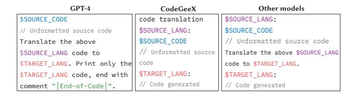
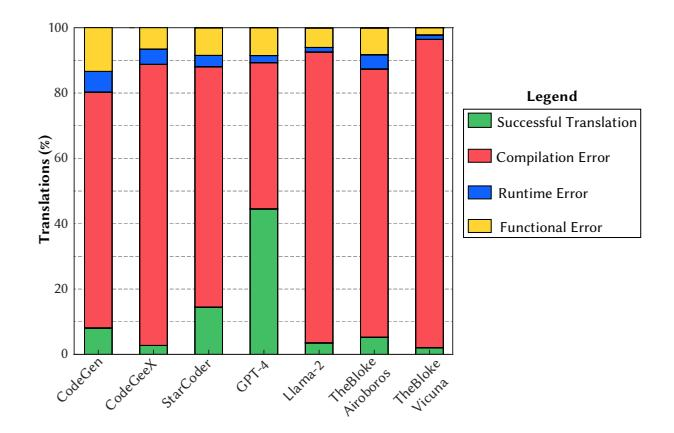
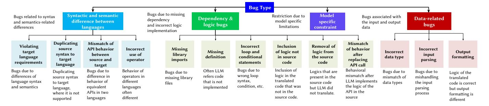
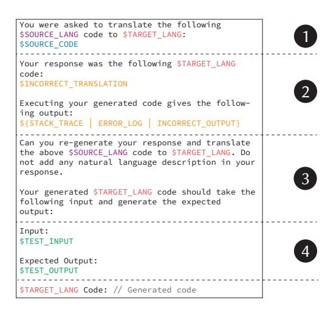
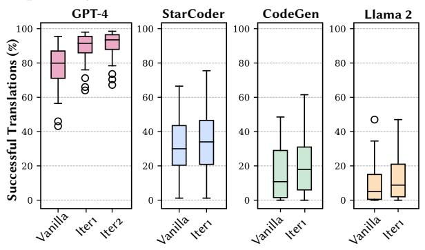
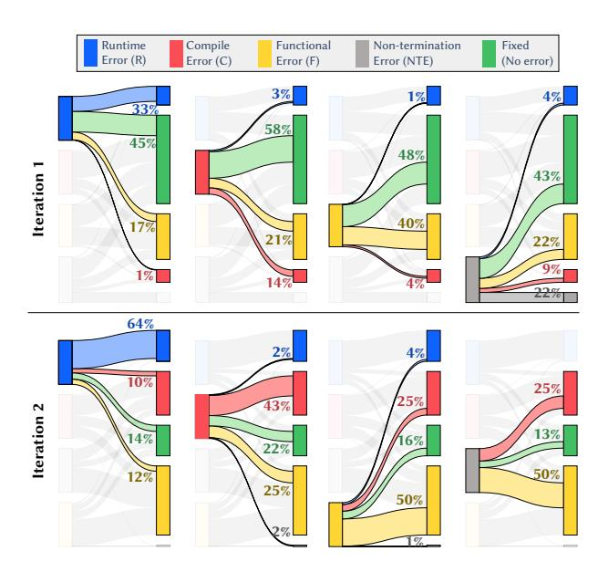

# Understanding the Effectiveness of Large Language Models in Code Translation

Rangeet Pan‡∗, Ali Reza Ibrahimzada‡†, Rahul Krishna<sup>∗</sup> ,Divya Sankar<sup>∗</sup> , Lambert Pouguem Wassi<sup>∗</sup> , Michele Merler<sup>∗</sup> , Boris Sobolev<sup>∗</sup> , Raju Pavuluri<sup>∗</sup> , Saurabh Sinha<sup>∗</sup> , Reyhaneh Jabbarvand† ∗ IBM Research, Yorktown Heights, NY, USA †University of Illinois Urbana-Champaign, Champaign, IL, USA

✦

**Abstract**—Code translation aims to convert source code from one programming language (PL) to another. Given the promising abilities of large language models (LLMs) in code synthesis, researchers are actively exploring their potential to automate code translation, i.e., generating code in target PL from its equivalent in another PL. The prerequisite for advancing the state of LLM-based code translation is to understand their limitations. To that end, we present a large-scale empirical study to investigate the ability of LLMs, including general LLMs and code LLMs, for code translation across pairs of different languages, including C, C++, Go, Java, and Python. Our analysis involves the translation of 1,700 code samples from three distinct benchmarks and real-world projects, revealing LLMs are yet to be reliably used to automate code translation—with incorrect translations ranging from 52.7% to 97.9% across the studied LLMs. Further manual investigation of *unsuccessful* translations among all PLs identifies 14 root causes for translation bugs. Based on the insights from the empirical study, we propose a promptcrafting approach to provide additional context for LLMs, improving the performance of LLM-based code translation by 5.5% on average across different PLs, LLMs, and benchmarks. Our study is the first of its kind, in terms of its scale and breadth, that provides insights into the current limitations of LLMs in code translation and opportunities for improving them. Our collected extensive dataset—consisting of 1,700 code samples written in five PLs with 10K+ tests, 43K+ translated code, 1,725 manually labeled bugs, and 1,365 bug-fix pairs generated using LLMs –can help drive research in this area.

**Index Terms**—Code Translation, Bug Study, Large Language Models, Prompt Engineering

## **1 INTRODUCTION**

Code translation, source-to-source compilation, or transpilation, entails transforming a piece of code from one programming language (PL) to another, while preserving the original functionality. Code translation has many use cases, such as modernizing enterprise applications [\[Krishna et al.\(2021\)\]](#page-12-0), [\[Perez-Castillo et al.\(2021\)\]](#page-12-1), ´ [\[Settu and Raj\(2013\)\]](#page-12-2), [\[Echeverria et al.\(2015\)\]](#page-11-0), [\[Kalia et al.\(2021\)\]](#page-12-3), migrating legacy software in proprietary PLs to cloud-native applications implemented

in general-purpose PLs [\[Haugeland et al.\(2021\)\]](#page-12-4), [\[Kazanavicius and Ma](#page-12-5) ˇ zeika(2019)], [\[Pei Breivold\(2020\)\]](#page-12-6), ˇ [\[Zhang et al.\(2009\)\]](#page-13-0), [\[Gholami et al.\(2017\)\]](#page-12-7), [\[Bergmayr et al.\(2013\)\]](#page-11-1), [\[Nitin et al.\(2022\)\]](#page-12-8), and facilitating the training of models for better code synthesis [\[Chen and Lampouras\(2023\)\]](#page-11-2), [\[Heo and Choi\(2022\)\]](#page-12-9), [\[Subedi et al.\(2021\)\]](#page-12-10), [\[Silva et al.\(2023\)\]](#page-12-11). Translating the software/code to a modern and unified PL can significantly reduce software-maintenance effort, improve the overall reliability of software, and boost non-functional properties such as security and performance [\[Thones\(2015\)\]](#page-13-1), ¨ [\[int\(2020c\)\]](#page-11-3), [\[int\(2020a\)\]](#page-11-4), [\[int\(2018\)\]](#page-11-5), [\[int\(2021\)\]](#page-11-6), [\[int\(2020b\)\]](#page-11-7).

1

Due to the importance and benefits of code translation, several techniques have been proposed and deployed to automate reliable translation between different PLs [\[Roziere et al.\(2020\)\]](#page-12-12), [\[Roziere et al.\(2021\)\]](#page-12-13), [\[Liu et al.\(2023a\)\]](#page-12-14), [\[Szafraniec et al.\(2022\)\]](#page-13-2), [\[Wen et al.\(2022\)\]](#page-13-3), [\[Ting et al.\(2023\)\]](#page-13-4), [\[Hong\(2023\)\]](#page-12-15), [\[Weisz et al.\(2021\)\]](#page-13-5), [\[Weisz et al.\(2022\)\]](#page-13-6), including those leveraging *Large Language Models* (hereafter, LLMs) for code translation [\[Jana et al.\(2023\)\]](#page-12-16), [\[Gong et al.\(2023\)\]](#page-12-17), [\[Roziere et al.\(2020\)\]](#page-12-12), [\[Roziere et al.\(2021\)\]](#page-12-13), [\[Weisz et al.\(2021\)\]](#page-13-5), [\[Sun et al.\(2023\)\]](#page-12-18). Although prior works have shown promise in using LLMs for code translation, there is a dearth of research on understanding and cataloging their limitations for this task. This is an important undertaking because code translation is a complex task that requires LLMs to understand code syntax (to generate syntactically correct code) and semantics (to preserve functionality during translation) simultaneously. However, research has shown that without providing adequate context to LLMs via prompt crafting, they may only serve as "next code token" predictors rather than understanding the overall translation task [\[White et al.\(2023\)\]](#page-13-7), [\[Abukhalaf et al.\(2023\)\]](#page-11-8), [\[Jiang et al.\(2023\)\]](#page-12-19), [\[Zhuo et al.\(2023\)\]](#page-13-8).

This work performs a large-scale empirical study to understand the limitations of code translation across different PLs, benchmarks, and real-world projects using various general and code LLMs. We also perform a preliminary investigation to mitigate identified limitations. Our study answers the following research questions:

<sup>.</sup> ‡ Equal contributions. This work has been done when Ali Reza Ibrahimzada was an intern at IBM Research.

Email: {rangeet.pan, rkrsn, divya.sankar, lambert.pouguem.wassi, bsobolev}@ibm.com, {mimerler, pavuluri, sinhas}@us.ibm.com, {alirezai, reyhaneh}@illinois.edu

**RQ1: Effectiveness of LLMs for Code Translation ([§3\)](#page-2-0).** (*RQ1.1*) How do state-of-the-art general and code LLMs perform in code translation across various benchmarks? (*RQ1.2*) What are the outcomes of unsuccessful translations: errors due to syntactic incorrectness (e.g., compilation error) or semantic incorrectness (e.g., runtime exception, functional bugs, or non-terminating execution)?

**RQ2: LLM-Based Translation Bugs ([§4\)](#page-4-0).** (*RQ2.1*) What are the different types of underlying root causes (translation bugs) for unsuccessful translation? (*RQ2.2*) How prevalent are these bugs in unsuccessful translations? (*RQ2.3*) How do translation bugs in *real-world projects* differ from those in *crafted benchmarks*?

**RQ3: Mitigating Translation Bugs ([§5](#page-8-0)**). To what extent do the proposed *prompt-crafting techniques* resolve translation bugs?

To investigate the research questions, we collected 1,700 executable code samples from *three* well-known programming datasets (CodeNet [\[Puri et al.\(2021\)\]](#page-12-20), AVATAR [\[Ahmad et al.\(2021\)\]](#page-11-9), and EvalPlus [\[Liu et al.\(2023b\)\]](#page-12-21)) and *two* open-source projects (Apache Commons CLI [\[apa\(2023\)\]](#page-11-10) and Python Click [\[cli\(2023\)\]](#page-11-11)), covering *five* PLs (C, C++, Go, Java, and Python). To translate, we selected *seven* LLMs: GPT-4 [\[OpenAI\(2023\)\]](#page-12-22), which has shown promising performance in various NLP and coderelated tasks [\[gpt\(2023\)\]](#page-11-12), *three* open-source LLMs from the Hugging Face Open LLM Leaderboard [\[hfl\(2023\)\]](#page-11-13) (Llama 2 [\[lla\(2023\)\]](#page-11-14), TheBloke-Vicuna [\[wiz\(2023\)\]](#page-11-15), and TheBloke-Airoboros [\[air\(2023\)\]](#page-11-16)), and *three* most-recent code LLMs outperforming others in various code-related tasks (StarCoder [\[Li et al.\(2023a\)\]](#page-12-23), CodeGeeX [\[Zheng et al.\(2023\)\]](#page-13-9), and CodeGen [\[Nijkamp et al.\(2022\)\]](#page-12-24)).

We performed 43,379 translations across all LLMs, where translation success was measured against the tests provided with the code samples. This produced 11.94% successful translations on average (median 5.3%), with GPT-4—47.3% success rate—and StarCoder—14.5% success rate—being the best-performing models (details in [§3.1\)](#page-2-1). The LLMs were largely ineffective on real-world projects compared to crafted benchmarks, with only GPT-4 achieving 8.1% success rate and 0% for the rest of the models. We also conducted a systematic study to understand the root causes of unsuccessful translations better. Our systematic manual investigation resulted in a taxonomy of translation bugs, structured into 14 bug categories and four groups (details in [§4.1\)](#page-4-1): (1) incorrect assumptions about data, e.g., type, parsing, and formatting; (2) failure to understand the syntactic and semantic differences between the source and target languages; (3) inability to infer correct dependencies and producing wrong logic, e.g., removal and/or inclusion of spurious logic; and (4) model-specific limitations, e.g., token size or context window. Some notable findings are: (1) identifying suitable data type in the target PL that preserves the source behavior is challenging, (2) identifying equivalent APIs in the target language or implementing the API functionality can introduce bugs, and (3) replacing language-specific features, such as method overloading and annotations, can be challenging, especially in real-world projects.

We conclude our study by investigating the effectiveness of prompt-crafting to increase the translation success rate. Motivated by recent research using LLMs to fix bugs [\[Joshi et al.\(2023\)\]](#page-12-25), [\[Xia and Zhang\(2022\)\]](#page-13-10), our proposed technique *iteratively* prompts LLM by incorporating informative additional context in prompts corresponding to the previously unsuccessful translation, including the code, stack trace, error message from failing execution, and/or test input and expected output from failing test cases. Our results show that the proposed technique can increase the success rate by 5.5% across studied LLMs on average, with the highest improvements belonging to GPT-4 with 12% (details in [§5\)](#page-8-0). These results are encouraging but also indicate considerable scope for improvement.

To our knowledge, we are the first to (1) provide a systematic bug taxonomy facilitating a deeper understanding of error modalities in LLM-based code translation, (2) study real-world projects concerning code translation, and (3) investigate the effectiveness of prompt crafting in mitigating translation bugs. Our key contributions are:

- **A comprehensive evaluation of LLM-based code translation.** We perform a large-scale evaluation of the code translation using multiple general and code LLMs. We consider the most recently released LLMs and our evaluation includes real-world projects in addition to three crafted benchmarks.
- **A taxonomy of translation bugs.** Our study offers the first taxonomy of bugs introduced by LLMs during code translation, including 14 bug categories that are prevalent in studied unsuccessful translations. These manually labeled translation bugs can serve as a great resource for following research investigating code translation and translation bug mitigation.
- **Prompt crafting to enhance code translation.** A set of heuristics for prompt crafting that provides proper contexts to LLMs to improve their effectiveness in code translation.
- **Artifacts.** Our artifacts, including labeled bug instances and their outcomes, implementation of the promptcrafting technique, and automation scripts for assessing LLMs' performance, are publicly available [\[web\(2023\)\]](#page-11-17). This can be a valuable resource for future research in code translation and translation bug mitigation.

#### <span id="page-1-1"></span>**2 EMPIRICAL SETUP**

**Subject LLM Selection.** General LLMs are pre-trained on textual data, including natural language and code, and can be used for a variety of tasks. In contrast, code LLMs are specifically pre-trained to automate code-related tasks. Due to the empirical nature of this work, we were interested in assessing the effectiveness of both LLM categories in code translation. For code LLMs, we selected the top three models released recently (in 2023), namely Code-Gen [\[Nijkamp et al.\(2022\)\]](#page-12-24), StarCoder [\[Li et al.\(2023a\)\]](#page-12-23), and CodeGeeX [\[Zheng et al.\(2023\)\]](#page-13-9). For general LLMs, we selected the top three models with size 20B parameters or less from the Hugging Face Open LLM Leaderboard [\[hfl\(2023\)\]](#page-11-13).[1](#page-1-0)

<span id="page-1-0"></span><sup>1.</sup> The Open LLM Leaderboard ranking is quite dynamic, and our selection is drawn from the ranking at the time of our experimentation.

TABLE 1: Overview of subject LLMs. TB: TheBloke.

<span id="page-2-2"></span>

| Modality       |                                   | Code                             | Text                            |                         |        |                            |        |  |  |  |  |  |
|----------------|-----------------------------------|----------------------------------|---------------------------------|-------------------------|--------|----------------------------|--------|--|--|--|--|--|
| Models         | CodeGen<br>[Nijkamp et al.(2022)] | CodeGeeX<br>[Zheng et al.(2023)] | StarCoder<br>[Li et al.(2023a)] | GPT-4<br>[OpenAI(2023)] |        | TB-Airboros<br>[air(2023)] |        |  |  |  |  |  |
| Size           | 16B                               | 13B                              | 15.5B                           | -                       | 13B    | 13B                        | 13B    |  |  |  |  |  |
| Context Window | 2048                              | 2048                             | 2048                            | 8192                    | 4096   | 2048                       | 2048   |  |  |  |  |  |
| Release Date   | May'23                            | Mar'23                           | May'23                          | Mar'23                  | Jul'23 | May'23                     | May'23 |  |  |  |  |  |

The constraint on the number of parameters was imposed by our computing resources, resulting in the selection of Llama 2 [lla(2023)], TheBloke-Airoboros [air(2023)], and TheBloke-Vicuna [wiz(2023)]. We also included GPT-4 [OpenAI(2023)] in our study, which was the most powerful model in many natural language and code-related tasks at the time of our experimentation. Table 1 summarizes the characteristics of our seven subject LLMs.

**Subject PLs Selection.** We used the following criteria to select the subject PLs: (1) popularity of the language based on the TIOBE index [tio(2023)], (2) inclusion of different programming paradigms, e.g., procedural, object-oriented, and functional, and (3) availability of high-quality datasets in the given PL. To make the manual effort involved in taxonomy construction manageable, we selected five PLs that met the inclusion criteria—C, C++, Go, Java, and Python.

Dataset Collection and Pre-Processing. To ensure the comprehensiveness of our findings and claims in understanding the nature of LLM translation bugs, we were interested in datasets used in prior studies as well as real-world projects. The former represents small programs, likely to be less challenging for LLMs to translate, and the latter assesses the complexity of LLM translation in real-world settings. The first six columns of Table 2 present the selected datasets and statistics about them (more information in the artifact website [web(2023)]). These datasets are accompanied by test cases to validate code translation. For CodeNet and AVATAR, the tests are input data and expected output, while EvalPlus and real-world projects have unit tests (JUnit and pytest). For EvalPlus, we manually translated and verified the corresponding pytests to JUnit tests. The translation of real-world projects never reached test execution, as it produced syntactically incorrect code (more discussion in

For real-world projects, we focused on Java and Python, the most popular languages among our subject PLs. Our goal was to translate reasonably complex and well-maintained software exclusively written in Java or Python. To that end, we selected projects available in both PLs providing APIs for command-line processing and selected Apache Commons CLI [apa(2023)] (Java) and Click [cli(2023)] (Python). The biggest challenge for translating real-world projects was fitting the source language code into the limited LLM context window (row four in Table 1). To that end, we broke them down into classes (Java) and files (Python) and removed the comments to ensure the code fits into the context window. The rationale behind choosing file as a granularity of translation was that all the programs from the crafted benchmarks were also translated as files that can be compiled and executed.

**Compute Resources.** To perform inference on all LLMs used in this work, we used 16 A100 GPUs, each with 80GB of memory. Moreover, for compiling and testing the generated translations, we used Python 3.10, g++ 11, GCC Clang 14.0, Java 11, and Go 1.20 for Python, C++, C, Java,

<span id="page-2-3"></span>

Fig. 1: Vanilla prompting templates.

and Go, respectively.

#### <span id="page-2-0"></span>3 LLM-BASED CODE TRANSLATION

To better understand the effectiveness of LLMs in code translation, we prompted each subject LLMs with 6,197 translation problems corresponding to 31 translation pairs shown in Table 2, i.e., 20 pairs from CodeNet, eight pairs from AVATAR, and one pair each for EvalPlus, Commons CLI, and Click. Each translation pair corresponds to several translations, depending on the number of source and target languages. We measured the percentage of *unsuccessful translations* (we report the unsuccessful translation rate compared to the success rate to emphasize the limitations). Through the following two research questions, we discuss the results of our experiments in comparing the effectiveness of general and code LLMs in code translation (RQ1.1) and argue whether the limitations are due to a lack of understanding of code syntax or semantics (RQ1.2).

#### <span id="page-2-1"></span>3.1 Effectiveness of LLMs in Code Translation

We refer to the LLM prompting in this experiment as vanilla prompting, where each prompt contains four pieces of information: (1) instructions in natural language to perform the translation task, (2) source language (\$SOURCE\_LANG), (3) target language (\$TARGET\_LANG), and (4) the code to be translated ( $\$SOURCE\_CODE$ ). We followed the templates similar to those we found in the artifacts, papers, or technical reports associated with each model. Figure 1 shows the three templates used for vanilla prompting of our subject LLMs. Our prompt template for CodeGeeX slightly differs from what is used in their paper [Zheng et al.(2023)]. Specifically, their prompt template includes the imports, class declaration, and method signature of the translations [cus(2023)]. However, this is an unrealistic assumption due to many reasons. First, such ground truth does not exist in practice and requires human involvement for each translation. More importantly, a code in real examples (and even in our studied crafted benchmarks) likely contain several methods, making it impossible to use the same template.

We consider a translation unsuccessful if it (1) does not compile, (2) fails with a runtime error, or (3) existing tests fail on the translated code. We do not consider static evaluation metrics such as exact match, syntax match, dataflow match [Ren et al.(2020)], CodeBLEU [Ren et al.(2020)], and CrystalBLEU [Eghbali and Pradel(2022)] because our goal is to validate (compile and execute) the translations. Static metrics can also be misleading in code synthesis [Chen et al.(2021)]—i.e., LLMs may achieve reasonably high numbers for these metrics, but generate code that cannot be executed due to compilation or runtime errors [Ahmad et al.(2021)], [Chen et al.(2021)]. The last seven

<span id="page-3-0"></span>TABLE 2: Performance of subject LLMs in translating code from different studied datasets. The best performance by general and code LLMs are highlighted in teal and violet, respectively. Final performance is computed over average of each dataset.

| Dataset                      | Source                  | Source |        | Target                | #Translations | % Unsuccessful Translations |       |       |       |             |                                                                 |       |  |  |  |  |  |
|------------------------------|-------------------------|--------|--------|-----------------------|---------------|-----------------------------|-------|-------|-------|-------------|-----------------------------------------------------------------|-------|--|--|--|--|--|
|                              | Language Samples #Tests |        |        | Language              |               |                             |       |       |       |             | CodeGen CodeGeeX StarCoder GPT-4 Llama 2 TB-Airoboros TB-Vicuna |       |  |  |  |  |  |
|                              | C                       | 200    | 200    | C++, Go, Java, Python | 800           | 76.6%                       | 85.1% | 58.0% |       | 17.0% 85.1% | 81.2%                                                           | 95.6% |  |  |  |  |  |
|                              | C++                     | 200    | 200    | C, Go, Java, Python   | 800           | 86.0%                       | 96.4% | 60.9% |       | 20.0% 90.5% | 91.7%                                                           | 96.6% |  |  |  |  |  |
| CodeNet [Puri et al.(2021)]  | Go                      | 200    | 200    | C, C++, Java, Python  | 800           | 85.7%                       | 94.1% | 58.0% |       | 14.5% 83.1% | 93.4%                                                           | 99.1% |  |  |  |  |  |
|                              | Java                    | 200    | 200    | C, C++, Go, Python    | 800           | 78.7%                       | 89.7% | 69.7% |       | 18.7% 86.1% | 93.5%                                                           | 99.9% |  |  |  |  |  |
|                              | Python                  | 200    | 200    | C, C++, Go, Java      | 800           | 82.5%                       | 92.7% | 66.7% |       | 20.1% 89.0% | 93.5%                                                           | 99.0% |  |  |  |  |  |
| Total/Average (CodeNet)      | -                       | 1,000  | 1,000  | -                     | 4,000         | 81.9%                       | 91.6% | 62.7% |       | 18.0% 86.8% | 90.7%                                                           | 98.0% |  |  |  |  |  |
| AVATAR [Ahmad et al.(2021)]  | Java                    | 249    | 6,255  | C, C++, Go, Python    | 996           | 91.9%                       | 98.2% | 88.1% |       | 29.2% 98.2% | 94.9%                                                           | 100%  |  |  |  |  |  |
|                              | Python                  | 250    |        | C, C++, Go, Java      | 1, 000        | 96.2%                       | 98.4% | 85.8% |       | 47.8% 95.3% | 99.1%                                                           | 99.1% |  |  |  |  |  |
| Total/Average (AVATAR)       | -                       | 499    | 6,255  | -                     | 1,996         | 94.1%                       | 98.3% | 87.0% |       | 38.5% 96.8% | 97.0%                                                           | 99.6% |  |  |  |  |  |
| EvalPlus [Liu et al.(2023b)] | Python                  | 164    | 2,682  | Java                  | 164           | 83.5%                       | 96.3% | 78.0% |       | 20.7% 98.8% | 86.0%                                                           | 92.1% |  |  |  |  |  |
| Commons CLI [apa(2023)]      | Java                    | 22     | 310    | Python                | 22            | 100%                        | 100%  | 100%  | 86.4% | 100%        | 100%                                                            | 100%  |  |  |  |  |  |
| Click [cli(2023)]            | Python                  | 15     | 611    | Java                  | 15            | 100%                        | 100%  | 100%  | 100%  | 100%        | 100%                                                            | 100%  |  |  |  |  |  |
| Total/Average (All)          | -                       | 1,700  | 10,858 | -                     | 6,197         | 91.9%                       | 97.2% | 85.5% |       | 52.7% 96.5% | 94.7%                                                           | 97.9% |  |  |  |  |  |

<span id="page-3-1"></span>TABLE 3: Breakdown of the unsuccessful translations produced by subject LLMs based on outcome. All values are in %.

| Source Language           |      | C   |                |                    | C++ |                     |          |                | Go             |                     |          |                 |                |                     | Java |               |     |                          |               |          |                            |
|---------------------------|------|-----|----------------|--------------------|-----|---------------------|----------|----------------|----------------|---------------------|----------|-----------------|----------------|---------------------|------|---------------|-----|--------------------------|---------------|----------|----------------------------|
| Target language           |      |     |                | C++ Go Java Python | C   |                     |          | Go Java Python | C              |                     |          | C++ Java Python | C              |                     |      | C++ Go Python | C   |                          |               |          | Total<br>C++ Go Java Total |
| Compilation Errors        |      |     | 68.9 93.5 76.4 |                    |     | 56.9 93.2 94.6 77.0 |          |                |                | 61.6 86.7 83.3 82.4 |          |                 |                | 55.9 82.4 78.4 96.6 |      |               |     | 57.4 79.9 73.4 86.0 72.4 |               |          | 77.8                       |
| Runtime Errors            | 9.4  |     | 2.3 10.7       | 21.9               | 0.1 |                     | 1.2 11.2 | 22.9           | 0.2            |                     | 0.2 12.7 | 19.3            | 1.2            | 0.4                 | 0.8  | 27.1          | 0.4 |                          | 0.4 10.0 14.8 |          | 8.4                        |
| Functional Errors         | 20.5 |     | 3.7 13.0       | 20.6               | 6.7 |                     | 4.1 11.7 |                | 15.1 12.9 16.3 |                     | 4.7      |                 | 24.6 15.8 19.9 |                     | 2.5  |               |     | 15.1 19.0 24.8           |               | 3.9 12.5 | 13.4                       |
| Non-terminating Execution | 1.3  | 0.4 | 0.0            | 0.5                | 0.0 | 0.2                 | 0.1      | 0.4            | 0.2            | 0.2                 | 0.2      | 0.2             | 0.7            | 1.3                 | 0.1  | 0.3           | 0.8 | 1.3                      | 0.1           | 0.3      | 0.4                        |

columns of Table [2](#page-3-0) show the detailed results of vanilla prompting of subject LLMs for code translation. Our observations are:

- Except for GPT-4 and StarCoder, all other models performed poorly. The biggest surprise here is CodeGeeX, a model trained explicitly for code translation. We believe this result is because we did not include information about the translated code (imports, class declaration, and method signature) in the prompt. Such information is non-trivial and assuming that all the datasets and real use cases have them readily available is unrealistic. (To ensure the correctness of our results, we repeated their experiments with their template and ours, which resulted in the pass@1 dropping from 25.6% for their dataset, HumanEval-X, to 0.02%).
- There is a strong correlation between the average number of tests per translation sample and unsuccessful translation (correlation coefficient (r) ranging from 0.64 to 0.85 for all models). That is, the more rigorous the existing test suite, the better it can evaluate if a translation preserves functionality.
- There is no consistent pattern between unsuccessful translations and source/target language, but translating *to* Go results in more compilation errors due to its strict syntax constraints, e.g., forbidding unused variables or imports.
- The subject LLMs fail to translate real-world projects. This is mainly because crafted benchmark programs are comparatively simpler, without complex logic, heavy use of language features i.e., annotation, inheritance, etc. On the other hand, in a real-world setting, translating files/methods in isolation, even if successful, may fail at the project level. None of the real-world translations made it to test execution, i.e., the translated projects failed to compile. That said, further manual investigation showed that for the Commons CLI translation to Python, three out of 22 files could be compiled using py compile [\[pyc\(2023\)\]](#page-11-22). These

simple classes were (1) an exception class with only one method, (2) an interface with two method declarations, and (3) a utility class with two simple methods. The quality of the translation from Java to Python (Commons CLI project) was higher than Python to Java (Click).

# <span id="page-3-2"></span>**3.2 Outcome of Unsuccessful Translations**

Previous research question shows that most of the subject LLMs are yet to achieve a reasonable performance for code translation, even on crafted benchmarks, let alone realworld projects. At the next step, we were interested to understand if this is due to a lack of understanding of code syntax or semantics by LLM. We hypothesize that LLMs should generate syntactically correct code if they understand code syntax. Similarly, passing test execution indicates that LLMs understood the code semantics in the source language and maintained it through translation to the target language.

Based on this hypothesis, we further break down unsuccessful translations based on their error outcome (1) *Compilation Error*, where translation cannot be compiled, (2) *Runtime Error*, where translated code compiles but fails at runtime with an exception, (3) *Functional Error*, where the translated code compiles and executes successfully but results in test failure (produces different output than the source program), and (4) *Non-terminating Execution*, where the translated code compiles and executes, but does not terminate (encountering an infinite loop or waiting on user input).

Figure [2](#page-4-2) and Table [3](#page-3-1) show the results of this experiment for each model—accumulated for all subject PLs—and for each subject PL—accumulated for all subject models, respectively. From these results, we observe that most unsuccessful

<span id="page-4-2"></span>

Fig. 2: Outcome of code translations using subject LLMs.

translations result in compilation errors (77.8% as corroborated by the last column of Table [3\)](#page-3-1), meaning both general and code LLMs have difficulty understanding code syntax. Further breakdown of the results per PLs shows that Go and C++ have comparatively stricter syntax, while it is easier for LLMs to generate syntactically correct Python code.[2](#page-4-3) The next most common effect of unsuccessful translation is a functional error (13.4% as shown in the last column of Table [3\)](#page-3-1), demonstrating that even when the code is syntactically correct and terminates with no exception or runtime error, it does not maintain the functionality implemented in the source language.

# <span id="page-4-0"></span>**4 LLM-BASED TRANSLATION BUGS**

To understand the nature of translation bugs, we performed a deep analysis by manually investigating the root cause of unsuccessful translations. Through the following three research questions, we introduce our comprehensive taxonomy of translation bugs (RQ2.1), investigate the prevalence and distribution of each bug category across unsuccessful translations (RQ2.2), and discuss the peculiar characteristic of bugs in real-world projects (RQ2.3).

#### <span id="page-4-1"></span>**4.1 Taxonomy of Translation Bugs**

Our initial investigation showed that GPT-4 is the bestperforming model and compared to others, its translations exhibit a variety of quality bugs worth investigating. To manage the manual effort for understanding and labeling bugs for building the taxonomy, we focused on 1,725 unsuccessful translations from GPT-4.

#### *4.1.1 Methodology*

The manual construction of the taxonomy involved eight human labelers, who are researchers or software engineers in the industry, and involved unsuccessful translations from all 31 translations pair in Table [2.](#page-3-0) We built the taxonomy in two phases. In the first phase, we used the CodeNet Javato-Python translations. Each labeler created a taxonomy independently by examining the unsuccessful translations. Then, we combined the individual taxonomies to create a consolidated taxonomy, which served as the initial taxonomy for phase 2. In the second phase, each of the remaining 30 translation pairs was examined by two labelers to assign bug categories to unsuccessful translations. Whenever a new category came up (i.e., a bug could not be covered by the existing categories in the taxonomy), the entire team met to discuss the new category, add it to the taxonomy, and re-label the affected bugs. After completing their labeling tasks, the two labelers assigned to a translation pair met to discuss their labeling, resolve discrepancies, and create the final labeling for the translation pair. The entire exercise took about 630 person-hours and produced a taxonomy with 14 bug categories organized into four groups ("model specific constraints" group does not have any sub-category). In the rest of this section, we discuss the taxonomy groups and bug categories together with illustrative examples.

# <span id="page-4-4"></span>*4.1.2 Syntactic and semantic differences between the source and the target languages*

There are four bug categories in this group that relate to the failure of an LLM in appropriately handling the syntactic or semantic differences between PLs.

**A1: Violating target language requirements.** Each PL has its own set of rules that code must adhere to. For example, in Java, any executable code must be wrapped in a method within a class, whereas in other PLs, e.g., Python, this is not a requirement. Such rules can also take different forms in each PL. For example, unused imports in the example below result in a compilation error in Go, while Java compiler ignores them:

```
import "os"
import "strconv" # Unused imports are not
    permitted in Go.
```

**A2: Duplicating source syntax to the target language.** LLMs often copy the source PL syntax even if they are not available in the target PL. In an unsuccessful translation below from C++ to Go, the subject LLM does not replace atan2l API (which is specific to C++ and does not exist in Go) with an appropriate equivalent.

```
const ld PI = atan2l(0, -1); # Original C++ code
PI = atan2l(0, -1) # Incorrect Go code
```

**A3: Mismatch of API behaviors in the source and target.** Library APIs are frequently used in programs in any PL. During translation, API calls in the source need to be either mapped to equivalent API calls in the target PL or implemented from scratch. In the former case, we noted that LLMs often map source APIs incorrectly to the target PL. The following code fragment illustrates such an example where the Java String.substring() API is incorrectly mapped to the Go strings.IndexByte() API method.

```
S.substring(i, i + 1) # Original Java code (
    returns String)
strings.IndexByte(S, i) # Incorrect Go code (
    returns Int64)
```

**A4: Incorrect use of operators.** The supported operators and their syntax can vary among PLs. For example, // in Python represents floor division, for which Java has no corresponding operator. To achieve that behavior in Java, a division must be followed by a call to Math.floor() on

<span id="page-4-3"></span><sup>2.</sup> We used py compile [\[pyc\(2023\)\]](#page-11-22) to check syntax-related bugs in Python.



Fig. 3: Taxonomy of bugs introduced while translating code using LLM.

the result. LLMs can fail to include this call and incorrectly translate the Python // operator to / in Java, as corroborated by the following unsuccessful translation.

```
i = i // 10; # Original Python code (floor
```

#### <span id="page-5-1"></span>4.1.3 Dependency and logic bugs in the translated code

This group consists of six bug categories that pertain to incorrect dependencies and logic generated during code translation.

**B1:** Missing library imports. Import statements are used to load libraries and/or application classes/modules used in code. In several unsuccessful translations, we found translation resulted in missing or incorrect imports.

**B2:** Missing definition. LLMs may fail to translate the definitions/implementation of data types, methods, etc. In the unsuccessful translation below, the original C++ code, main() calls method solve() that is implemented in the same source file. However, after translation to Go, although the call to solve() remains, its definition is removed.

```
void solve(){...} # Original C++ code
signed main() {while(q--)
```

B3: Incorrect loop and conditional statements. This category covers erroneous translations of loops and conditional statements. The following code fragment illustrates the incorrect translation of a Java loop to Python array slicing in one of the unsuccessful translations, resulting in an off-by-one error in the translated code, where the sum excludes the value of  $\times [200010-k-1]$ .

```
for(int i = 0; i <= 200010 - k - 1; i++) ans += x[
    i]; # Java code
ans = sum(x[:200010 - k - 1]) # Incorrect Python
    code</pre>
```

**B4:** Inclusion of logic not in source code. LLMs may generate a code that is unrelated to the logic in the source program, thereby, causing the behavior of the translated code to diverge from the source behavior. In the following example, max is initialized to -1 in the source. However, after translation, it is initialized to a different value; LLM added logic that does not exist in the source program.

```
int max = -1; # Original C code
max_h = max(h) # Incorrect Python code
```

**B5:** Removal of logic in the source code. LLMs may fail to correctly translate part of the source program, which results in incorrect behavior in the translated code. In the following example, while translating code from C to Python, the initialization of MAX to 101 is removed.

```
#define MAX 101 // Original C code
```

**B6:** Mismatch of behavior after replacing API call. Such bugs happen when a source API call is translated to custom logic instead of an equivalent API in the target PL—which in case of failure, results in A3 bug. The example from Commons CLI illustrates the incorrect translation of Java Collections.unmodifiableList(), which returns an immutable list, to Python, where the returned list is not immutable.

```
return Collections.unmodifiableList(requiredOpts);
    # Java code
return self.required_opts # Incorrect Python code
```

#### <span id="page-5-0"></span>4.1.4 Data-related Bugs

Data plays an integral role in the code. We found various bugs caused by wrong assumptions about the input data, mismatch of data types, etc.

**C1: Incorrect data type.** This category of bugs pertains to incorrect types assigned to variables. The following example, taken from the translation of Commons CLI to Python, illustrates an incorrect type assignment to a field.

```
public static Class<File[]> FILES_VALUE=File[].
    class; # Java code
FILES_VALUE = List[os.path] # Incorrect Python
    code
```

C2: Incorrect input parsing. Programs that read data from the input stream (i.e., stdin or other sources expect the data to be in a specific format. Another form of input that we include in this category involves actual parameters to functions/methods. Such programs are often translated incorrectly, as illustrated by the following translation from Python to C. The second line of the input contains three integer values all of which are read into an array in the Python code (line 6), whereas the C code reads only two values and assigns 0 for the third value (lines 2–4). This causes the wrong result to be computed in line 6.

<span id="page-6-0"></span>TABLE 4: Types of bugs introduced during code translation by LLM and their occurrences. This table consists all the subject datasets including real-world projects. All values are in %.

| Source Language                                                                                                                                                 |           | C                                                |                   |   | C++                             |            |              | Go                |                    |             | Java                                                          |                  |  | Python  |                                                                                                        |          |
|-----------------------------------------------------------------------------------------------------------------------------------------------------------------|-----------|--------------------------------------------------|-------------------|---|---------------------------------|------------|--------------|-------------------|--------------------|-------------|---------------------------------------------------------------|------------------|--|---------|--------------------------------------------------------------------------------------------------------|----------|
| Target Language                                                                                                                                                 |           | C++ Go Java Py                                   |                   | C |                                 | Go Java Py |              | C C++Java Py      |                    |             | C C++ Go Py                                                   |                  |  |         | C C++ Go JavaTotal                                                                                     | Total    |
| A1: Violating target language requirements                                                                                                                      |           | 25.9 8.3 20.4 14.5 23.1 37.5                     |                   |   |                                 |            |              |                   |                    |             | 2.7 5.8 78.2 58.5 55.8 41.4 57.7 23.5 3.6 11.2 20.0 11.3 10.0 |                  |  |         |                                                                                                        | 4.6 24.3 |
| A2: Duplicating source syntax to the target language                                                                                                            | 18.5 2.8  |                                                  | 0.9 4.6 0.0 4.2   |   |                                 |            | 6.8 1.2 0.0  | 3.1               |                    | 0.6 1.8 0.0 |                                                               | 5.9 3.6 2.9 0.0  |  | 0.0 2.5 | 1.1                                                                                                    | 2.4      |
| A3: Mismatch of API behaviors in the source and target                                                                                                          | 0.0 11.1  |                                                  | 4.4 0.0 0.0 0.0   |   |                                 |            | 5.5 2.9 1.8  | 0.0               |                    | 3.5 0.5 0.0 |                                                               | 0.0 0.0 1.0 0.0  |  |         | 0.0 2.5 16.1                                                                                           | 3.3      |
| A4: Incorrect use of operators                                                                                                                                  | 0.0 0.0   |                                                  | 0.0 1.2 0.0 0.0   |   |                                 |            | 1.4 0.0 0.0  | 0.0               |                    | 0.0 0.0 0.0 |                                                               | 2.9 3.6 2.4 2.2  |  | 0.0 0.0 | 0.0                                                                                                    | 0.6      |
| A: Syntactic and semantic differences between languages 44.4 22.2 25.7 20.2 23.1 41.7 16.4 9.9 80.0 61.5 59.9 43.6 57.7 32.4 10.7 17.6 22.2 11.3 15.0 21.8 30.5 |           |                                                  |                   |   |                                 |            |              |                   |                    |             |                                                               |                  |  |         |                                                                                                        |          |
| B1: Missing library imports                                                                                                                                     | 0.0 8.3   |                                                  | 3.5 7.5 0.0 0.0   |   |                                 |            | 5.5 32.0 0.0 | 1.5               |                    | 1.2 2.7 7.7 |                                                               | 0.0 0.0 22.4 0.0 |  | 0.0 0.0 | 8.6                                                                                                    | 8.6      |
| B2: Missing definition                                                                                                                                          | 11.1 13.9 |                                                  | 2.7 3.5 0.0 4.2   |   |                                 |            | 4.1 5.8 0.0  | 3.1               |                    |             | 0.0 0.5 7.7 14.7 0.0 0.0 0.0                                  |                  |  | 1.9 0.0 | 0.0                                                                                                    | 2.4      |
| B3: Incorrect loop and conditional statements                                                                                                                   | 7.4 0.0   |                                                  | 1.8 5.2 15.4 8.3  |   |                                 |            | 0.0 2.3 1.8  | 4.6               |                    | 1.7 1.8 3.8 |                                                               | 5.9 0.0 0.0 2.2  |  | 3.8 0.0 | 4.6                                                                                                    | 2.6      |
| B4: Inclusion of logic not in the source                                                                                                                        | 3.7 13.9  |                                                  | 5.3 5.8 0.0 12.5  |   |                                 |            | 1.4 4.1 1.8  | 3.1               |                    | 0.0 0.9 3.8 |                                                               | 0.0 3.6 4.9 4.4  |  | 1.9 5.0 | 2.3                                                                                                    | 3.4      |
| B5: Removal of logic from source                                                                                                                                | 3.7 5.6   |                                                  | 8.8 2.3 0.0 0.0   |   |                                 |            | 2.7 1.7 0.0  | 3.1               |                    |             | 1.2 0.9 3.8 11.8 3.6 3.4 8.9 13.2 2.5                         |                  |  |         | 2.9                                                                                                    | 3.3      |
| B6: Mismatch of behavior after replacing API call                                                                                                               | 3.7 0.0   |                                                  | 9.7 5.2 0.0 4.2   |   |                                 |            | 9.6 2.3 0.0  | 1.5               |                    | 2.9 5.0 0.0 |                                                               | 0.0 21.4 3.9 0.0 |  | 1.9 2.5 | 0.6                                                                                                    | 3.8      |
| B: Dependency & logic bugs in the translated code                                                                                                               |           | 29.6 41.7 31.9 29.5 15.4 29.2 23.3 48.3 3.6 16.9 |                   |   |                                 |            |              |                   |                    |             |                                                               |                  |  |         | 7.0 11.8 26.9 32.4 28.6 34.6 15.6 22.6 10.0 19.0 24.2                                                  |          |
| C1: Incorrect data type                                                                                                                                         | 7.4 27.8  |                                                  | 8.8 21.4 7.7 4.2  |   |                                 |            |              | 8.2 15.7 1.8 15.4 |                    |             | 7.6 8.2 0.0 26.5 7.1 21.5 11.1                                |                  |  | 1.9 7.5 |                                                                                                        | 0.6 11.5 |
| C2: Incorrect input parsing                                                                                                                                     | 7.4 5.6   |                                                  |                   |   | 9.7 11.0 23.1 0.0 19.2 15.7 7.3 |            |              |                   | 4.6 11.6 24.1 11.5 |             |                                                               |                  |  |         | 0.0 14.3 10.2 40.0 60.4 60.0 32.2 18.1                                                                 |          |
| C3: Output formatting                                                                                                                                           | 0.0 0.0   |                                                  | 1.8 10.4 23.1 0.0 |   |                                 |            | 9.6 1.7 0.0  | 0.0               |                    | 3.5 5.0 0.0 |                                                               | 0.0 7.1 2.4 4.4  |  | 1.9 0.0 | 5.2                                                                                                    | 3.9      |
| C: Data-related Bugs                                                                                                                                            |           |                                                  |                   |   |                                 |            |              |                   |                    |             |                                                               |                  |  |         | 14.8 33.3 20.4 42.8 53.8 4.2 37.0 33.1 9.1 20.0 22.7 37.3 11.5 26.5 28.6 34.1 55.6 64.2 67.5 37.9 33.5 |          |
| D: Model specific constraints                                                                                                                                   | 11.1 0.0  |                                                  | 5.3 2.9 0.0 0.0   |   |                                 |            | 0.0 2.3 0.0  | 1.5               |                    | 8.1 4.5 0.0 |                                                               | 0.0 0.0 2.4 2.2  |  |         | 0.0 0.0 10.3                                                                                           | 3.8      |
| E: Others                                                                                                                                                       |           | 0.0 2.8 14.2 4.6 0.0 25.0 19.2 6.4 0.0           |                   |   |                                 |            |              | 0.0               |                    | 0.6 1.4 0.0 |                                                               | 0.0 7.1 5.9 2.2  |  | 0.0 7.5 | 6.9                                                                                                    | 5.1      |

```
0 ----- Input -----
1 2
2 3 5 2
3 4 5
4 ------ Source Code
      ------
5 N = int(input())
6 A = [.. input().split()]
7 ...
8 d = min(A[i+1], B[i])
                            0 ----- Translated Code
                                   -----
                            1 int A[N+1], B[N], N;
                            2 for(int i=0; i<N; i++) {
                            3 scanf("%d", &A[i]);}
                            4 A[N] = 0;
                            5 . . .
                            6 d = A[i+1] < B[i] ? A
                                     [i+1] : B[i];
                            7 ...
```

**C3: Output formatting.** If the translated code logic is correct, but the output is formatted differently than the format in the source program, we label the bug under this category. In the following example, the source Java code prints 'H' followed immediately by an integer value, whereas the translated Python code prints a space between 'H' and the integer value.

```
System.out.print("H"); System.out.println(Y -
    1988); # Java code
print("H", Y - 1988) # Incorrect Python code
```

### *4.1.5 D: Model-Specific Bugs.*

There are bugs that are specific to the design of the LLMs used. For instance, we found several issues where the name of the target PL was inserted at the beginning of the program or the LLM token size was exceeded, causing compilation errors or no output to be generated.

We also observed a group of unsuccessful translations which we refer to as *E: Others*—related to our experiment setup (e.g., memory issues). Given that they do not represent LLM-introduced bugs in translation, we do not include them in the taxonomy.

#### **4.2 Prevalence of LLM-based Translation Bugs**

We now present the results for RQ2.2, showing the prevalence of bugs in different categories of our taxonomy Among the 6197 attempted translations over 31 language pairs (Table [2\)](#page-3-0), there were 1558 translation failures. We manually checked and labeled these failures to identify 1725 bugs. In many cases, an unsuccessful translation has multiple bugs that belong in different categories; in these cases, the

translation gets multiple labels. Table [4](#page-6-0) presents detailed results on the prevalence of translation bugs. In this section, we delve deeper into the characteristics and prevalence of these bugs.

**Finding 1:** More than one-third (33.5%) of the translation bugs are data-related bugs.

As the data for bug group C in Table [4](#page-6-0) show, a large proportion of the LLM-introduced bugs is related to data types, parsing input data, and output formatting issues, together accounting for 33.5% of all bugs. These bugs are particularly prevalent for Python to C, C++, and Go translations, constituting over 55%, 64%, and 67% of the bugs, respectively, in those translations. Within data-related bugs, our manual investigation found several unique patterns.

**Finding 1a:** Among the data-related bugs, most (54% of the data-related bugs and 18.1% of the total bugs) are due to incorrect parsing of inputs.

As discussed in [§4.1.4,](#page-5-0) programs that take external inputs contain input-parsing logic, assuming the data to adhere to certain formats, and LLMs often make mistakes while translating this logic; the C2 bug category example in [§4.1.4](#page-5-0) illustrates this. A major reason for the prevalence of this bug is that two of our datasets (CodeNet and AVATAR) consist of programs that read data from the input stream. For EvalPlus and the real-world projects, the occurrence of this bug category is much less: only one such bug for EvalPlus and none for the real-world projects.

**Finding 1b:** Choosing the correct data type in the target PL is a crucial step that accounts for 34.3% of all datarelated bugs and 11.5% of all bugs.

Another major translation challenge is the assignment of correct data types in the translated code. About one in 10 bugs introduced by LLMs fall into this category. These bugs occur due to incorrect choice of the data type, differences between behaviors of equivalent data types across PLs, and differences in type systems of the source and target PLs.

The example for the C1 bug category in [§4.1.4](#page-5-0) shows an instance of wrong choice of data type in the target PL, where the Java type Class<File[]> is converted to list of path objects in Python.

To illustrate an example of equivalent types with different behaviors in source and target PLs, consider the code fragments shown below, where the function mean a d() in the Python code (left) computes mean absolute deviation. It takes a list of float as input. The test case for the function (line 2) uses a large number as test data. The translated code, shown on the right, looks correct and maps Python float to the Java Float type. However, the equivalent Java test case (line 2 on right) fails because of a fundamental difference between Python float and Java Float: the former uses 64 bit precision whereas the latter uses 32-bit precision. The Java code thus cannot handle the large test data value, which works fine in Python.

```
0 ------ Source Code
      ------
1 def mean_a_d(numbers:
      List[float]) ->
      float:
2 self.assertEqual(0.0,
      mean_a_d([1e+308]))
3 ...
                             0 ----- Translated Code
                                    -----
                             1 public static float
                                   meanAD(List<Float> n
                                   ) ...
                             2 void testCode() {
                                   assertEquals(0.0,
                                   meanAD(Arrays.asList
                                   (1e+308f)));}
```

Incorrect data type bugs can also occur due to differences between the type systems of the source and target PLs. For instance, when code in a dynamically typed PL such as Python is translated to a statically typed PL such as Java, preserving the behavior of a source type can be challenging. Almost one-third of the bugs occur due reasons, such as violating target language requirements, duplicating source syntax to the target PL, behavioral differences of APIs and operators, etc. [§4.1.2](#page-4-4) illustrates several bugs in this group.

**Finding 2:** A significant proportion, 30.5%, of the translation bugs occur due to syntactic and semantic differences between the source and target PLs; almost 80% of these (24.3% of all bugs) are caused by violation of target language requirements.

The following example illustrates an instance where the translated code violates syntactic constraints of the target language: the variable named ll in the Python code (left) is translated verbatim to C++, which results in a compilation error as ll is a reserved keyword in C++ (used for long-long data).

```
0 ------ Source Code
      ------
1 ll = - 10 ** 18 - 1
                             0 ----- Translated Code
                                    -----
                             1 ll ll = -1e18 - 1;
```

Another example of language-specific syntactic constraint is the declaration order of methods, where some languages (e.g., Go) permit a function to call functions declared subsequently, whereas others (e.g., C++) restrict calls to previously declared methods only. Thus, maintaining the declaration order of functions during translation could result in compilation errors.

**Finding 2a:** Replacing an API call with another API call in the target PL can result in bugs.

As illustrated for the A3 bug category in [§4.1.2,](#page-4-4) LLMs can incorrectly map source APIs to the APIs available in the target language. Table [4](#page-6-0) shows that 3.3% of all the bugs fall in this category. The following example illustrates an API-mismatch bug, where the LLM replaces the Python accumulate() API with IntStream.concat() in Java, which can be used in an equivalent manner. However, the LLM erroneously adds reduce(count).getAsInt() to reduce the result to an integer value instead of converting the return value of IntStream.concat(), an integer stream, to a list/array of integers. This results incorrect return value in the two programs: a list of integers in Python and an integer in Java.

```
list(accumulate([0] + list(range(1,n)), count)) #
    Python code
int[] cumsum = IntStream.concat(IntStream.of(0),
    IntStream.range(1, n)).reduce(count).getAsInt
    (); # Incorrect Java code
```

**Finding 2b:** LLMs can sometimes duplicate the source syntax in the translated program even when the target PL does not support it; 2.4% of the bugs belong in this category.

There are different ways that these bugs can occur. [§4.1.2](#page-4-4) illustrated an example where a C++ API call was copied in the translated Go program even though Go does not have that API call. The following code fragments illustrate a couple more instances of bugs in this category. In Java, numeric literals can contain the ' ' character (to improve code readability). The LLM incorrectly copies over that syntax to the translated C++ program, even though it is not supported in C++, resulting in a compilation error.

```
0 ------ Source Code
      ------
1 final int MAXN = 1000
      _006;
                             0 ----- Translated Code
                                    -----
                             1 const int MAXN = 1000
                                   _006;
```

**Finding 3:** 24.2% of the translation bugs are related to incorrect code logic and missing dependencies in the target PL, with missing imports being the dominant category.

LLMs can often translate the source logic incorrectly or miss dependencies. Missing imports is the most frequently occurring bug category in this group, accounting for 35.5% of the bugs in the group and 8.6% of the bugs overall. The other five categories in this group occur in roughly comparable numbers, ranging from 2.4% to 3.8% of the overall bugs.

#### **4.3 Characteristics of Translation Bugs in Real-world Projects**

Many of the bug types seen in the crafted benchmarks translation also occurred while translating Commons CLI and Click. Key among these are removal of logic in source (e.g., source methods and field initialization not translated, missing calls to translated methods), inclusion of logic not in source (e.g., implementation added for a stubbed method), missing imports, mismatch in API behaviors after translation, mismatch of behaviors after replacing API calls (e.g., see illustration of the B6 bug category in [§4.1.3\)](#page-5-1), and incorrect data types (e.g., see illustration of the C1 bug category in [§4.1.4\)](#page-5-0).

However, real-world applications also have much more complex code than crafted benchmarks, which makes them much harder for LLMs to translate. We found nine instances (all from Click) where the translated files contained naturallanguage text explaining the translation of the source file is infeasible or a non-trivial task for GPT-4. Some others included partial translations of methods in the class, leaving the rest untranslated (translation bug B5). This shows that LLMs, even with longer context windows, cannot capture dependencies between the methods implementing the class logic.

**Finding 4:** Real-world applications pose more complex challenges for code translation, such as handling method overloading, inheritance relations, and code annotations/decorators, not seen in crafted datasets.

We found examples of language features used in realworld applications that LLMs can struggle with translating. For instance, Commons CLI uses method overloading frequently. GPT-4 translates these to Python in different ways, some of which are correct translations whereas others are erroneous. For an example of the latter, there are cases where GPT-4 translates overloaded Java methods by renaming them in Python to avoid overloaded method names, leaving open the work of suitably renaming all call sites to the methods to preserve the call relations.

```
0 ------ Source Code ------
1 public Options addOption(final Option opt) { ... }
2 public Options addOption(final String opt, final
      boolean hasArg, final String description) {
      ... }
3 public Options addOption(final String opt, final
      String description) { ... }
4 public Options addOption(final String opt, final
      String longOpt, final boolean hasArg, final
      String description) { ... }
```

```
0 ----- Translated Code -----
1 def add_option(self, opt):...
2 def add_option_arg(self, opt, has_arg, description
      ):...
3 def add_option_desc(self, opt, description):...
4 def add_option_long(self, opt, long_opt, has_arg,
      description):...
```

In another instance, overloaded methods are translated to methods with the same name, which results in broken functionality because only the last method is available as per the Python semantics, with the previous method definitions

```
overridden.
0 ------ Source Code
      ------
1 public static
      OptionBuilder hasArg
      () { ... }
2 public static
      OptionBuilder hasArg
      (final boolean
      hasArg) { ... }
                             0 ----- Translated Code
                                    -----
                             1 @staticmethod
                             2 def has_arg():...
                             3 @staticmethod
                             4 def has_arg(has_arg):
                             5 ...
```

Commons CLI and Click also illustrate some of the challenges for code translation created by the use of decorators—for adding new functionality to an existing object without modifying its structure—and annotations for adding metadata to code. For example, Click uses the @contextmanager decorator on a method to wrap it with a resource manager. This needs to be translated appropriately in Java to ensure automatic resource release. We also observed cases of inheritance relations not being maintained in translated code—resulting in missing behaviors and states in translated classes—and incorrect translation of exception handling.

**Finding 5:** The effectiveness of code translation can vary considerably based on characteristics of the source and target PLs, such as the type system, available programming APIs, metaprograming support via decorators or annotations, etc.

There is a clear pattern of GPT-4 performing much better in translating Commons CLI to Python than Click to Java. This is evident not only from the occurrences of successful translations (three for Commons CLI vs none for Click) and degenerate code-suggestion instances (nine for Click vs none for Commons CLI), but also from the bugs observed in the translations. To some degree, this may be attributed to project-specific complexity characteristics (e.g., the largest source file has 2, 436 NCLOC in Click and only 358 NCLOC in Commons CLI) and its hard to generalize from limited observations, but language features and the available API ecosystem for a PL can have considerable impact on success of code translations. For example, Python-to-Java translations can be more error-prone than Java-to-Python translations, in general, because going from a dynamic type system to a static one can be harder from an LLM to reason about.

# <span id="page-8-0"></span>**5 MITIGATING TRANSLATION BUGS**

Our results from RQ1 and RQ2 show that a majority of the translations by LLMs are unsuccessful due to the introduction of different bugs, resulting in compilation, runtime, or functional errors or non-terminating executions. In this section, we first discuss how context information pertaining to unsuccessful translations can help form prompts for mitigating those translations; then we evaluate how various LLMs react to the proposed prompts.

*Prompt Crafting.* Prompt crafting is a technique for providing additional contextual information in the prompt to enhance LLMs' responses. Inspired by other works on prompt crafting for fixing bugs [\[Vaithilingam et al.\(2022\)\]](#page-13-11), [\[Xia and Zhang\(2022\)\]](#page-13-10) and how human developers would address a translation error, we propose an *iterative* prompting approach. To fix a translation bug, developers would look into the original code, translated code, and details pertaining to the failure, i.e., error logs, warnings, test failures, etc. Based on that hypothesis, we include the following contextual information in the revised prompts at each iteration (Figure [4\)](#page-9-0).

- 1 **Source code and original prompt.** Here, we include the original code and the previous prompt used for translating the original code to remind LLMs about the previous task.
- 2 **Incorrect translation and error details.** In this section, we provide the incorrectly translated code (\$INCORRECT - TRANSLATION), and details regarding the outcome of the

<span id="page-9-0"></span>

Fig. 4: Prompt crafting template for LLMs with the context corresponding to the outcomes of unsuccessful translation.

<span id="page-9-1"></span>

Fig. 5: Effectiveness of prompt crafting in mitigating translation bugs over LLMs.

translation. If the outcome is runtime error, we provide stack trace (\$STACK TRACE); for compilation error, we provide error log (\$ERROR LOG); for functional error, we provide the incorrect output (\$INCORRECT OUTPUT); finally, for nonterminating execution, we provide a custom message "The program enters infinite loop."

- 3 **Instructions for translation.** Here, we specifically ask LLM to mitigate the bug and instruct it to avoid the inclusion of natural-language text in their response.
- 4 **Expected behavior.** This part is used optionally if the the prior translation was a functional error. Here, we provide test input and expected output pair for the previously wrong output.
- 5 **Model-specific keyword.** This part is specific to code LLMs and contains the name of the target PL following code LLM templates.

All the prompts that we used are in the replication package [\[web\(2023\)\]](#page-11-17).

*Iterative Translation Bug Mitigation.* Our promptcrafting technique is *iterative*. At each iteration iter<sup>i</sup> , we update the prompt template (Figure [4\)](#page-9-0) with information corresponding to the previously failed translation. We refer to the outcome of iter<sup>i</sup> translation as *translation patch*. At the end of each iteration, we verify if the patch results in a successful translation. If not, we utilize the outcome of the patch and build the prompt for the next iteration. The iterative mitigation can continue for a fixed number of iterations or until the percentage of successful translations

<span id="page-9-2"></span>

Fig. 6: Translation outcomes after two iterations of prompting GPT-4.

at the previous iteration is smaller than some threshold.

*Efficacy of prompt crafting.* To evaluate the effectiveness of our iterative prompt crafting, we attempted to mitigate unsuccessful translations from RQ1 for four subject LLMs: CodeGen, StarCoder, GPT-4, and Llama 2. We excluded CodeGeeX because its prompt template is rigid, and we could not introduce additional contexts. Due to inferior performance in vanilla prompting, we also excluded the TB-Airoboros and TB-Vicuna. We set the termination criteria so that the mitigation process terminates if the overall increase of successful translation is less than 5%. Figure [5](#page-9-1) summarizes our findings. Based on the proposed termination criterion, our mitigation process lasted for two iterations for GPT-4, and one iteration for the rest of the models. The results suggest that the proposed technique can increase the number of successful translations for all the studied LLMs, with iter1—prompting on results from vanilla prompts increasing the success rate of GPT-4, StarCoder, Codegen, and Llama 2 by 12.33%, 3.55%, 2.65%, 1.97%, respectively. iter2—prompting on results from iter1, can improve GPT-4 by 1.7%.

We also wanted to understand how translation bugs evolve during this iterative prompting process. To that end, we tracked the error outcomes of unsuccessful translations ([§3.2\)](#page-3-2) from vanilla prompting to iter<sup>1</sup> (for all models) and from iter<sup>1</sup> to iter<sup>2</sup> (for GPT-4). Figure [6](#page-9-2) illustrates the results of our deeper analysis of GPT-4 and the results for the other models are available in our artifact [\[web\(2023\)\]](#page-11-17).

With iter1, we observe a substantial reduction in *compilation errors* for GPT-4, with 58% completely fixed (no error) and 38% transformed to other translation bugs. However, for other errors, the percentage is lower—45% runtime errors, 48% functional errors, and 43% non-terminating executions—suggesting these bugs are harder to mitigate. With iter2, the outcome of most bugs does not evolve and they remain the same. In both cases, we observe a few cases where the outcome of the translation degrades: i.e., functional error transforms to runtime/compilation error,

<span id="page-10-0"></span>

|     | Runtime Error                               | Expected Fix                                    | New compilation Error introduced aer Iter1        |  |  |  |  |  |  |  |
|-----|---------------------------------------------|-------------------------------------------------|---------------------------------------------------|--|--|--|--|--|--|--|
|     | 1. func main() {                            | 1. func main() {                                | 1. func main() {                                  |  |  |  |  |  |  |  |
| 2.  | scanner �� bufio.NewScanner(os.Stdin)       | 2.<br>scanner �� bufio.NewScanner(os.Stdin)     | 2.<br>scanner �� bufio.NewScanner(os.Stdin)       |  |  |  |  |  |  |  |
| 3.  | scanner.Scan()                              | 3.<br>scanner.Scan()                            | 3.<br>scanner.Scan()                              |  |  |  |  |  |  |  |
| 4.  | w, _ = strconv.Atoi(scanner.Text())         | 4.<br>w, _ = strconv.Atoi(scanner.Text())       | 4.<br>w, _ = strconv.Atoi(scanner.Text())         |  |  |  |  |  |  |  |
| 5.  | scanner.Scan()                              | 5.                                              | 5.<br>scanner.Scan()                              |  |  |  |  |  |  |  |
| 6.  | p �� strings.Fields(scanner.Text())         | 6.                                              | 6.<br>p �� strings.Fields(scanner.Text())         |  |  |  |  |  |  |  |
| 7.  | for ans, f, i = 0, 0, 1; i �� w; i�� {      | 7.<br>for ans, f, i = 0, 0, 1; i �� w; i�� {    | 7.<br>for ans, f, i = 0, 0, 1; i �� w; i�� {      |  |  |  |  |  |  |  |
| 8.  | a �� getint(p, &i)                          | 8.<br>a �� getint(p, &i)                        | 8.<br>a = k �� getint(p, &i)                      |  |  |  |  |  |  |  |
| 9.  | ���                                         | 9.<br>���                                       | 9.<br>���                                         |  |  |  |  |  |  |  |
| 10. | }                                           | 10.<br>}                                        | 10.<br>}                                          |  |  |  |  |  |  |  |
|     | A runtime error occured due to multiple     | A correct fix involves removing these two       | Aer Iter1 the LLM introduces a new syntax         |  |  |  |  |  |  |  |
|     | scanner.Scan() lines in the generated code. | extraneous lines of code the LLM has generated. | error while also retaining the old runtime error. |  |  |  |  |  |  |  |

Fig. 7: A Go program where prompt crafting to mitigate a runtime error introduces a new (unrelated) compilation error.

or runtime error transforms to compilation error.

Figure [7](#page-10-0) shows an example, where our attempt to mitigate one type of error (in this case, a runtime error) leads to a new, unrelated compilation error. In this example, the LLM inserts multiple scanner.Scan() operations (lines 5– 6 in Figure [7.](#page-10-0)a) instead of one, resulting in storing and retrieving a null value, and hence a runtime error. The expected fix (Figure [7.](#page-10-0)b) should remove lines 5–6. Instead, the translation patch (Figure [7.](#page-10-0)c) changes line 8, resulting in a compilation error. These findings show that, although the proposed prompting technique improves LLM-based code translation, future work should be directed towards refined prompt crafting beyond providing error information.

# **6 THREATS TO VALIDITY**

This section summarizes our design decisions to account for the threat to validity in the experiments discussed throughout the paper.

**Construct Validity.** Due to the sensitivity of LLMs to prompt templates, we followed the best practices in their existing artifacts/papers/reports, to account for any bias in prompting (refer [§2\)](#page-1-1).

**External Validity.** To remediate the threat related to the models, we used GPT-4 using the API provided by OpenAPI, and used other models from Hugging Face, a framework widely used and trusted by the AI community. We accumulated datasets from their original repositories and verified the correctness of code through the execution of associated tests (detailed discussion in [§2\)](#page-1-1).

*Internal Validity.* One threat can be performing the experiments for RQ1 and RQ3 once. We believe this does not alter the validity of the results since our primary goal of this work is to identify the characteristics of translation bugs, categorize them, provide insights to help drive research in code translation, and show how providing more context information can lead to better translation. Regardless of the number of repetitions and randomness, the nature of an unsuccessful translation remains unchanged.

# **7 DISCUSSION**

*Translating real-world projects.* Unlike crafted benchmarks, files in real-world projects do not exist as standalone programs, and providing relevant context about inter-file dependencies can help an LLM in producing better code. More fundamentally, however, new techniques are required to enable code translation to scale to real-world applications and also generate high-quality translations. One potential

direction is to leverage program-decomposition techniques to split the source file into smaller fragments, each translated separately via prompts that encode appropriate context information about the fragment's dependencies; the translated fragments are then composed to produce the fully translated code in the target language. Another significant challenge in translating real-world projects is handling library API calls and the differences in the API ecosystem of different PLs. There can be cases where no suitable API exists in the target PL to translate an API call to. Development of techniques that combine code summarization and code synthesis could be investigated to fill such gaps.

*Improving open and closed-source LLMs.* The findings of this work demonstrate a considerable scope for improving open-source and close-source LLMs for code translation. For closed-source models (i.e., GPT-4), the increasing complexity of use-cases (i.e., translating real-world projects) calls for an evolution in prompting strategies. One promising research direction could involve creating prompts that build upon each other [\[Wei et al.\(2022\)\]](#page-13-12), [\[Yao et al.\(2023\)\]](#page-13-13), following a coherent and logical flow of information. Additionally, it may employ relevant auxiliary information, such as variable declarations or function signatures, to maintain integrity and consistency after translation.

For open-source LLMs, enhancing the performance could involve fine-tuning [\[Howard and Ruder\(2018\)\]](#page-12-27), [\[Sun et al.\(2019\)\]](#page-12-28), wherein different specialized models [\[Jacobs et al.\(1991\)\]](#page-12-29) (instead of one model fits all) are carefully trained to tackle distinct aspects of the translation process (particularly those related to the bug categories examined in this paper). By leveraging the power of precise and finely tuned LLMs, each focusing on a unique subset of the challenges inherent in code translation, a more comprehensive and nuanced understanding of complex code could be achieved.

#### **8 RELATED WORK**

*Code Translation and Synthesis.* Classic techniques for code translation include source-to-source compilers, e.g., C2Rust [\[c2r\(2023\)\]](#page-11-23), C2Go [\[c2g\(2023\)\]](#page-11-24), and 2to3 [\[2to\(2023\)\]](#page-11-25) for translating C to Rust and Go, and converting code from Python 2 to Python 3. Also, there are works that leverage learning-based techniques, including lexical statistical machine translation [\[Nguyen et al.\(2013\)\]](#page-12-30) and treebased neural networks [\[Chen et al.\(2018\)\]](#page-11-26) for translating Java to C#, deep learning and unsupervised learning [\[Roziere et al.\(2020\)\]](#page-12-12), [\[Lachaux et al.\(2021\)\]](#page-12-31) for translating C++, Java, and Python code, etc. Moreover, there

are works that use LLMs (StarCoder [\[Li et al.\(2023b\)\]](#page-12-32), PolyCoder [\[Xu et al.\(2022\)\]](#page-13-14), SantaCoder [\[Allal et al.\(2023\)\]](#page-11-27), CodeGen [\[Nijkamp et al.\(2022\)\]](#page-12-24), BLOOM [\[Scao et al.\(2022\)\]](#page-12-33), CodeT5 [\[Wang et al.\(2021\)\]](#page-13-15), CodeX [\[Chen et al.\(2021\)\]](#page-11-21), GPT-4 [\[gpt\(2023\)\]](#page-11-12), Llama 2 [\[lla\(2023\)\]](#page-11-14), etc.) for code generation and code translation (CodeGeeX [\[Zheng et al.\(2023\)\]](#page-13-9)). However, there is no study that understands the bugs introduced by LLMs during code translation tasks. In this work, we look into the code translation problem, compare how different LLMs perform, build a taxonomy of translation bugs, and understand the challenges.

*Bug Study.* Software bugs are well studied [\[Beizer\(1990\)\]](#page-11-28). Beyond that, there is an extensive list of works on bugs seen while developing deep learning models by developers [\[Islam et al.\(2019\)\]](#page-12-34), [\[Zhang et al.\(2018\)\]](#page-13-16), repairs the deep learning bugs by developers [\[Islam et al.\(2020\)\]](#page-12-35), etc. Compared to that, in this work, we study bugs introduced by LLMs while translating code.

*Fixing Bugs.* There is a vast body of work on fixing traditional software bugs and automatically patching code [\[Xia et al.\(2022\)\]](#page-13-17), [\[Zhang et al.\(2023\)\]](#page-13-18), [\[Gazzola et al.\(2019\)\]](#page-12-36). Recently, learning-based approaches have been leveraged, including training models with bug data, performing zero-shot learning, etc, for fixing bugs. Also, other LLM-based repair tools i.e., AlphaRepair [\[Xia and Zhang\(2022\)\]](#page-13-10) with Code-BERT [\[Feng et al.\(2020\)\]](#page-12-37), ChatGPT [\[Xia and Zhang\(2023\)\]](#page-13-19), RING [\[Joshi et al.\(2023\)\]](#page-12-25), etc., have been used for fixing bugs. However, in this work, we wanted to bring attention to a very specific problem—code translation, and how providing more context related to code can help generate better translated artifact.

# **9 CONCLUDING REMARKS**

Code translation has various applications, from modernizing enterprise applications to migrating legacy software to modern PLs. Given the promising performance of LLMs in code synthesis, we were interested to understand how they perform in code translation task. Our empirical investigation of the general and code LLMs across five PLs and several benchmarks and real-world projects demonstrates that state-of-the-art general and code LLMs are yet to effectively automate code translation, specifically to translate complex real-world projects. Through meticulous manual analysis, we also identified 14 root causes that make LLMs produce unsuccessful translations. To resolve unsuccessful translations and improve LLM-based translation performance, we proposed an iterative prompt-crafting technique. We are currently considering several directions for future work. First, we want to investigate better prompt-crafting techniques, likely related to peculiar properties of individual bug categories. Second, our ultimate goal, while ambitious, is to advance real-world project translation.

# **REFERENCES**

- <span id="page-11-5"></span>[int(2018)] 2018. Upgrading GitHub from Rails 3.2 to 5.2. [https://github.blog/2018-09-28-upgrading-github-from-rails-3-](https://github.blog/2018-09-28-upgrading-github-from-rails-3-2-to-5-2/) [2-to-5-2/.](https://github.blog/2018-09-28-upgrading-github-from-rails-3-2-to-5-2/)
- <span id="page-11-4"></span>[int(2020a)] 2020a. Supporting Linux kernel development in Rust. [https://lwn.net/Articles/829858/.](https://lwn.net/Articles/829858/)

- <span id="page-11-7"></span>[int(2020b)] 2020b. Transform monolithic Java applications into microservices with the power of AI. [https://developer.ibm.](https://developer.ibm.com/tutorials/transform-monolithic-java-applications-into-microservices-with-the-power-of-ai/) [com/tutorials/transform-monolithic-java-applications-into](https://developer.ibm.com/tutorials/transform-monolithic-java-applications-into-microservices-with-the-power-of-ai/)[microservices-with-the-power-of-ai/.](https://developer.ibm.com/tutorials/transform-monolithic-java-applications-into-microservices-with-the-power-of-ai/)
- <span id="page-11-3"></span>[int(2020c)] 2020c. Will code move on to a language such as Rust? [https://www.theregister.com/2020/06/30/hard](https://www.theregister.com/2020/06/30/hard_to_find_linux_maintainers_says_torvalds/) to find linux [maintainers](https://www.theregister.com/2020/06/30/hard_to_find_linux_maintainers_says_torvalds/) says torvalds/.
- <span id="page-11-6"></span>[int(2021)] 2021. GitHub's Journey from Monolith to Microservices. [https://www.infoq.com/articles/github-monolith](https://www.infoq.com/articles/github-monolith-microservices/)[microservices/.](https://www.infoq.com/articles/github-monolith-microservices/)
- <span id="page-11-17"></span>[web(2023)] 2023. Anonymous artifact website. [https://github.com/](https://github.com/pltranslation/PLTranslationEmpirical) [pltranslation/PLTranslationEmpirical.](https://github.com/pltranslation/PLTranslationEmpirical)
- <span id="page-11-10"></span>[apa(2023)] 2023. Apache Commons CLI. [https://commons.apache.](https://commons.apache.org/proper/commons-cli/) [org/proper/commons-cli/.](https://commons.apache.org/proper/commons-cli/)
- <span id="page-11-24"></span>[c2g(2023)] 2023. C2Go. [https://github.com/gotranspile/cxgo.](https://github.com/gotranspile/cxgo)
- <span id="page-11-23"></span>[c2r(2023)] 2023. C2Rust. [https://github.com/immunant/c2rus.](https://github.com/immunant/c2rus)
- <span id="page-11-11"></span>[cli(2023)] 2023. Click. [https://click.palletsprojects.com/en/8.1.x/.](https://click.palletsprojects.com/en/8.1.x/)
- <span id="page-11-19"></span>[cus(2023)] 2023. CodeGeeX. https://github.com/THUDM/CodeGeeX/blob/main/tests/test prompt.txt.
- <span id="page-11-12"></span>[gpt(2023)] 2023. GPT-4 Technical Report. [https://cdn.openai.com/](https://cdn.openai.com/papers/gpt-4.pdf) [papers/gpt-4.pdf.](https://cdn.openai.com/papers/gpt-4.pdf)
- <span id="page-11-13"></span>[hfl(2023)] 2023. Hugging Face Open LLM Leaderboard. https://huggingface.co/spaces/HuggingFaceH4/open llm leaderboard.
- <span id="page-11-14"></span>[lla(2023)] 2023. Llama-2. https://ai.meta.com/research/publications/llama-2-open-foundation-and-fine-tuned-chat-models/.
- <span id="page-11-22"></span>[pyc(2023)] 2023. py compile—Compile Python source files. https://docs.python.org/3/library/py compile.html.
- <span id="page-11-25"></span>[2to(2023)] 2023. Python 2 to Python 3. [https://docs.python.org/2/](https://docs.python.org/2/library/2to3.html) [library/2to3.html.](https://docs.python.org/2/library/2to3.html)
- <span id="page-11-16"></span>[air(2023)] 2023. TheBloke Airoboros 13B. https://huggingface.co/TheBloke/airoboros-13B-HF.
- <span id="page-11-15"></span>[wiz(2023)] 2023. TheBloke Wizard Vicuna 13B. https://huggingface.co/TheBloke/Wizard-Vicuna-13B-Uncensored-HF.
- <span id="page-11-18"></span><span id="page-11-8"></span>[tio(2023)] 2023. TIOBE Index. [https://www.tiobe.com/tiobe-index/.](https://www.tiobe.com/tiobe-index/) [Abukhalaf et al.(2023)] Seif Abukhalaf, Mohammad Hamdaqa, and Foutse Khomh. 2023. On Codex Prompt Engineering for OCL Generation: An Empirical Study. *arXiv preprint arXiv:2303.16244* (2023).
- <span id="page-11-9"></span>[Ahmad et al.(2021)] Wasi Uddin Ahmad, Md Golam Rahman Tushar, Saikat Chakraborty, and Kai-Wei Chang. 2021. Avatar: A parallel corpus for java-python program translation. *arXiv preprint arXiv:2108.11590* (2021).
- <span id="page-11-27"></span>[Allal et al.(2023)] Loubna Ben Allal, Raymond Li, Denis Kocetkov, Chenghao Mou, Christopher Akiki, Carlos Munoz Ferrandis, Niklas Muennighoff, Mayank Mishra, Alex Gu, Manan Dey, et al. 2023. SantaCoder: don't reach for the stars! *arXiv preprint arXiv:2301.03988* (2023).
- <span id="page-11-28"></span>[Beizer(1990)] Boris Beizer. 1990. Software testing techniques.
- <span id="page-11-1"></span>[Bergmayr et al.(2013)] Alexander Bergmayr, Hugo Bruneliere, Javier Luis Canovas Izquierdo, Jes ´ us Gorronogoitia, George Kousiouris, ´ Dimosthenis Kyriazis, Philip Langer, Andreas Menychtas, Leire Orue-Echevarria, Clara Pezuela, et al. 2013. Migrating legacy software to the cloud with ARTIST. In *2013 17th European Conference on Software Maintenance and Reengineering*. IEEE, 465–468.
- <span id="page-11-21"></span>[Chen et al.(2021)] Mark Chen, Jerry Tworek, Heewoo Jun, Qiming Yuan, Henrique Ponde de Oliveira Pinto, Jared Kaplan, Harri Edwards, Yuri Burda, Nicholas Joseph, Greg Brockman, et al. 2021. Evaluating large language models trained on code. *arXiv preprint arXiv:2107.03374* (2021).
- <span id="page-11-2"></span>[Chen and Lampouras(2023)] Pinzhen Chen and Gerasimos Lampouras. 2023. Exploring data augmentation for code generation tasks. *arXiv preprint arXiv:2302.03499* (2023).
- <span id="page-11-26"></span>[Chen et al.(2018)] Xinyun Chen, Chang Liu, and Dawn Song. 2018. Tree-to-tree neural networks for program translation. *Advances in neural information processing systems* 31 (2018).
- <span id="page-11-0"></span>[Echeverria et al.(2015)] Roberto Rodriguez Echeverria, Fernando Macias, Victor Manuel Pavon, Jose Maria Conejero, and Fernando Sanchez Figueroa. 2015. Legacy web application modernization by generating a REST service layer. *IEEE Latin America Transactions* 13, 7 (2015), 2379–2383.
- <span id="page-11-20"></span>[Eghbali and Pradel(2022)] Aryaz Eghbali and Michael Pradel. 2022. CrystalBLEU: precisely and efficiently measuring the similarity of code. In *Proceedings of the 37th IEEE/ACM International Conference on Automated Software Engineering*. 1–12.

- <span id="page-12-37"></span>[Feng et al.(2020)] Zhangyin Feng, Daya Guo, Duyu Tang, Nan Duan, Xiaocheng Feng, Ming Gong, Linjun Shou, Bing Qin, Ting Liu, Daxin Jiang, et al. 2020. Codebert: A pre-trained model for programming and natural languages. *arXiv preprint arXiv:2002.08155* (2020).
- <span id="page-12-36"></span>[Gazzola et al.(2019)] L. Gazzola, D. Micucci, and L. Mariani. 2019. Automatic Software Repair: A Survey. *IEEE Transactions on Software Engineering* 45, 01 (jan 2019), 34–67. [https://doi.org/10.1109/](https://doi.org/10.1109/TSE.2017.2755013) [TSE.2017.2755013](https://doi.org/10.1109/TSE.2017.2755013)
- <span id="page-12-7"></span>[Gholami et al.(2017)] Mahdi Fahmideh Gholami, Farhad Daneshgar, Ghassan Beydoun, and Fethi Rabhi. 2017. Challenges in migrating legacy software systems to the cloud—an empirical study. *Information Systems* 67 (2017), 100–113.
- <span id="page-12-17"></span>[Gong et al.(2023)] Linyuan Gong, Jiayi Wang, and Alvin Cheung. 2023. ADELT: Transpilation Between Deep Learning Frameworks. *arXiv preprint arXiv:2303.03593* (2023).
- <span id="page-12-4"></span>[Haugeland et al.(2021)] Sindre Grønstøl Haugeland, Phu H Nguyen, Hui Song, and Franck Chauvel. 2021. Migrating monoliths to microservices-based customizable multi-tenant cloud-native apps. In *2021 47th Euromicro Conference on Software Engineering and Advanced Applications (SEAA)*. IEEE, 170–177.
- <span id="page-12-9"></span>[Heo and Choi(2022)] DongNyeong Heo and Heeyoul Choi. 2022. End-to-End Training of Both Translation Models in the Back-Translation Framework. *arXiv preprint arXiv:2202.08465* (2022).
- <span id="page-12-15"></span>[Hong(2023)] Jaemin Hong. 2023. Improving Automatic C-to-Rust Translation with Static Analysis. In *2023 IEEE/ACM 45th International Conference on Software Engineering: Companion Proceedings (ICSE-Companion)*. IEEE, 273–277.
- <span id="page-12-27"></span>[Howard and Ruder(2018)] Jeremy Howard and Sebastian Ruder. 2018. Universal language model fine-tuning for text classification. *arXiv preprint arXiv:1801.06146* (2018).
- <span id="page-12-34"></span>[Islam et al.(2019)] Md Johirul Islam, Giang Nguyen, Rangeet Pan, and Hridesh Rajan. 2019. A comprehensive study on deep learning bug characteristics. In *Proceedings of the 2019 27th ACM Joint Meeting on European Software Engineering Conference and Symposium on the Foundations of Software Engineering*. 510–520.
- <span id="page-12-35"></span>[Islam et al.(2020)] Md Johirul Islam, Rangeet Pan, Giang Nguyen, and Hridesh Rajan. 2020. Repairing deep neural networks: Fix patterns and challenges. In *Proceedings of the ACM/IEEE 42nd International Conference on Software Engineering*. 1135–1146.
- <span id="page-12-29"></span>[Jacobs et al.(1991)] Robert A Jacobs, Michael I Jordan, Steven J Nowlan, and Geoffrey E Hinton. 1991. Adaptive mixtures of local experts. *Neural computation* 3, 1 (1991), 79–87.
- <span id="page-12-16"></span>[Jana et al.(2023)] Prithwish Jana, Piyush Jha, Haoyang Ju, Gautham Kishore, Aryan Mahajan, and Vijay Ganesh. 2023. Attention, Compilation, and Solver-based Symbolic Analysis are All You Need. *arXiv preprint arXiv:2306.06755* (2023).
- <span id="page-12-19"></span>[Jiang et al.(2023)] Xue Jiang, Yihong Dong, Lecheng Wang, Qiwei Shang, and Ge Li. 2023. Self-planning code generation with large language model. *arXiv preprint arXiv:2303.06689* (2023).
- <span id="page-12-25"></span>[Joshi et al.(2023)] Harshit Joshi, Jose Cambronero Sanchez, Sumit Gul- ´ wani, Vu Le, Gust Verbruggen, and Ivan Radicek. 2023. Repair ˇ is nearly generation: Multilingual program repair with llms. In *Proceedings of the AAAI Conference on Artificial Intelligence*, Vol. 37. 5131–5140.
- <span id="page-12-3"></span>[Kalia et al.(2021)] Anup K Kalia, Jin Xiao, Rahul Krishna, Saurabh Sinha, Maja Vukovic, and Debasish Banerjee. 2021. Mono2micro: a practical and effective tool for decomposing monolithic java applications to microservices. In *Proceedings of the 29th ACM joint meeting on European software engineering conference and symposium on the foundations of software engineering*. 1214–1224.
- <span id="page-12-5"></span>[Kazanavicius and Ma ˇ zeika(2019)] ˇ Justas Kazanavicius and Dalius ˇ Mazeika. 2019. Migrating legacy software to microservices ar- ˇ chitecture. In *2019 Open Conference of Electrical, Electronic and Information Sciences (eStream)*. IEEE, 1–5.
- <span id="page-12-0"></span>[Krishna et al.(2021)] Rahul Krishna, Anup Kalia, Saurabh Sinha, Rachel Tzoref-Brill, John Rofrano, and Jin Xiao. 2021. Transforming monolithic applications to microservices with Mono2Micro. In *Proceedings of the 36th IEEE/ACM International Conference on Automated Software Engineering*. 3–3.
- <span id="page-12-31"></span>[Lachaux et al.(2021)] Marie-Anne Lachaux, Baptiste Roziere, Marc Szafraniec, and Guillaume Lample. 2021. DOBF: A deobfuscation pre-training objective for programming languages. *Advances in Neural Information Processing Systems* 34 (2021), 14967–14979.
- <span id="page-12-23"></span>[Li et al.(2023a)] Raymond Li, Loubna Ben Allal, Yangtian Zi, Niklas Muennighoff, Denis Kocetkov, Chenghao Mou, Marc Marone, Christopher Akiki, Jia Li, Jenny Chim, et al. 2023a. StarCoder: may the source be with you! *arXiv preprint arXiv:2305.06161* (2023).

- <span id="page-12-32"></span>[Li et al.(2023b)] Raymond Li, Loubna Ben Allal, Yangtian Zi, Niklas Muennighoff, Denis Kocetkov, Chenghao Mou, Marc Marone, Christopher Akiki, Jia Li, Jenny Chim, et al. 2023b. StarCoder: may the source be with you! *arXiv preprint arXiv:2305.06161* (2023).
- <span id="page-12-14"></span>[Liu et al.(2023a)] Fang Liu, Jia Li, and Li Zhang. 2023a. Syntax and Domain Aware Model for Unsupervised Program Translation. *arXiv preprint arXiv:2302.03908* (2023).
- <span id="page-12-21"></span>[Liu et al.(2023b)] Jiawei Liu, Chunqiu Steven Xia, Yuyao Wang, and Lingming Zhang. 2023b. Is your code generated by chatgpt really correct? rigorous evaluation of large language models for code generation. *arXiv preprint arXiv:2305.01210* (2023).
- <span id="page-12-30"></span>[Nguyen et al.(2013)] Anh Tuan Nguyen, Tung Thanh Nguyen, and Tien N Nguyen. 2013. Lexical statistical machine translation for language migration. In *Proceedings of the 2013 9th Joint Meeting on Foundations of Software Engineering*. 651–654.
- <span id="page-12-24"></span>[Nijkamp et al.(2022)] Erik Nijkamp, Bo Pang, Hiroaki Hayashi, Lifu Tu, Huan Wang, Yingbo Zhou, Silvio Savarese, and Caiming Xiong. 2022. CodeGen: An Open Large Language Model for Code with Multi-Turn Program Synthesis. In *The Eleventh International Conference on Learning Representations*.
- <span id="page-12-8"></span>[Nitin et al.(2022)] Vikram Nitin, Shubhi Asthana, Baishakhi Ray, and Rahul Krishna. 2022. CARGO: ai-guided dependency analysis for migrating monolithic applications to microservices architecture. In *Proceedings of the 37th IEEE/ACM International Conference on Automated Software Engineering*. 1–12.
- <span id="page-12-22"></span>[OpenAI(2023)] OpenAI. 2023. GPT-4 Technical Report. arXiv:2303.08774 [cs.CL]
- <span id="page-12-6"></span>[Pei Breivold(2020)] Hongyu Pei Breivold. 2020. Towards factories of the future: migration of industrial legacy automation systems in the cloud computing and Internet-of-things context. *Enterprise Information Systems* 14, 4 (2020), 542–562.
- <span id="page-12-1"></span>[Perez-Castillo et al.(2021)] ´ Ricardo Perez-Castillo, Manuel A Serrano, ´ and Mario Piattini. 2021. Software modernization to embrace quantum technology. *Advances in Engineering Software* 151 (2021), 102933.
- <span id="page-12-20"></span>[Puri et al.(2021)] Ruchir Puri, David S Kung, Geert Janssen, Wei Zhang, Giacomo Domeniconi, Vladimir Zolotov, Julian Dolby, Jie Chen, Mihir Choudhury, Lindsey Decker, et al. 2021. CodeNet: A Large-Scale AI for Code Dataset for Learning a Diversity of Coding Tasks. In *Thirty-fifth Conference on Neural Information Processing Systems Datasets and Benchmarks Track (Round 2)*.
- <span id="page-12-26"></span>[Ren et al.(2020)] Shuo Ren, Daya Guo, Shuai Lu, Long Zhou, Shujie Liu, Duyu Tang, Neel Sundaresan, Ming Zhou, Ambrosio Blanco, and Shuai Ma. 2020. Codebleu: a method for automatic evaluation of code synthesis. *arXiv preprint arXiv:2009.10297* (2020).
- <span id="page-12-12"></span>[Roziere et al.(2020)] Baptiste Roziere, Marie-Anne Lachaux, Lowik Chanussot, and Guillaume Lample. 2020. Unsupervised translation of programming languages. *Advances in Neural Information Processing Systems* 33 (2020), 20601–20611.
- <span id="page-12-13"></span>[Roziere et al.(2021)] Baptiste Roziere, Jie M Zhang, Francois Charton, Mark Harman, Gabriel Synnaeve, and Guillaume Lample. 2021. Leveraging automated unit tests for unsupervised code translation. *arXiv preprint arXiv:2110.06773* (2021).
- <span id="page-12-33"></span>[Scao et al.(2022)] Teven Le Scao, Angela Fan, Christopher Akiki, Ellie Pavlick, Suzana Ilic, Daniel Hesslow, Roman Castagn ´ e,´ Alexandra Sasha Luccioni, Franc¸ois Yvon, Matthias Galle, et al. ´ 2022. Bloom: A 176b-parameter open-access multilingual language model. *arXiv preprint arXiv:2211.05100* (2022).
- <span id="page-12-2"></span>[Settu and Raj(2013)] Rajaraajeswari Settu and Pethuru Raj. 2013. Cloud application modernization and migration methodology. *Cloud Computing: Methods and Practical Approaches* (2013), 243–271.
- <span id="page-12-11"></span>[Silva et al.(2023)] Andre Silva, Jo ´ ao F Ferreira, He Ye, and Martin ˜ Monperrus. 2023. MUFIN: Improving Neural Repair Models with Back-Translation. *arXiv preprint arXiv:2304.02301* (2023).
- <span id="page-12-10"></span>[Subedi et al.(2021)] Ishan Mani Subedi, Maninder Singh, Vijayalakshmi Ramasamy, and Gursimran Singh Walia. 2021. Application of back-translation: a transfer learning approach to identify ambiguous software requirements. In *Proceedings of the 2021 ACM Southeast Conference*. 130–137.
- <span id="page-12-28"></span>[Sun et al.(2019)] Chi Sun, Xipeng Qiu, Yige Xu, and Xuanjing Huang. 2019. How to fine-tune bert for text classification?. In *Chinese Computational Linguistics: 18th China National Conference, CCL 2019, Kunming, China, October 18–20, 2019, Proceedings 18*. Springer, 194– 206.
- <span id="page-12-18"></span>[Sun et al.(2023)] Qiushi Sun, Nuo Chen, Jianing Wang, Xiang Li, and Ming Gao. 2023. TransCoder: Towards Unified Transferable Code Representation Learning Inspired by Human Skills. *arXiv preprint arXiv:2306.07285* (2023).

- <span id="page-13-2"></span>[Szafraniec et al.(2022)] Marc Szafraniec, Baptiste Roziere, Hugh Leather Francois Charton, Patrick Labatut, and Gabriel Synnaeve. 2022. Code translation with compiler representations. *arXiv preprint arXiv:2207.03578* (2022).
- <span id="page-13-1"></span>[Thones(2015)] ¨ Johannes Thones. 2015. Microservices. ¨ *IEEE software* 32, 1 (2015), 116–116.
- <span id="page-13-4"></span>[Ting et al.(2023)] Chih-Kai Ting, Karl Munson, Serenity Wade, Anish Savla, Kiran Kate, and Kavitha Srinivas. 2023. CodeStylist: A System for Performing Code Style Transfer Using Neural Networks. In *Proceedings of the AAAI Conference on Artificial Intelligence*, Vol. 37. 16485–16487.
- <span id="page-13-11"></span>[Vaithilingam et al.(2022)] Priyan Vaithilingam, Tianyi Zhang, and Elena L Glassman. 2022. Expectation vs. experience: Evaluating the usability of code generation tools powered by large language models. In *Chi conference on human factors in computing systems extended abstracts*. 1–7.
- <span id="page-13-15"></span>[Wang et al.(2021)] Yue Wang, Weishi Wang, Shafiq Joty, and Steven CH Hoi. 2021. Codet5: Identifier-aware unified pre-trained encoder-decoder models for code understanding and generation. *arXiv preprint arXiv:2109.00859* (2021).
- <span id="page-13-12"></span>[Wei et al.(2022)] Jason Wei, Xuezhi Wang, Dale Schuurmans, Maarten Bosma, Fei Xia, Ed Chi, Quoc V Le, Denny Zhou, et al. 2022. Chainof-thought prompting elicits reasoning in large language models. *Advances in Neural Information Processing Systems* 35 (2022), 24824– 24837.
- <span id="page-13-5"></span>[Weisz et al.(2021)] Justin D Weisz, Michael Muller, Stephanie Houde, John Richards, Steven I Ross, Fernando Martinez, Mayank Agarwal, and Kartik Talamadupula. 2021. Perfection not required? Human-AI partnerships in code translation. In *26th International Conference on Intelligent User Interfaces*. 402–412.
- <span id="page-13-6"></span>[Weisz et al.(2022)] Justin D Weisz, Michael Muller, Steven I Ross, Fernando Martinez, Stephanie Houde, Mayank Agarwal, Kartik Talamadupula, and John T Richards. 2022. Better together? an evaluation of ai-supported code translation. In *27th International Conference on Intelligent User Interfaces*. 369–391.
- <span id="page-13-3"></span>[Wen et al.(2022)] Yuanbo Wen, Qi Guo, Qiang Fu, Xiaqing Li, Jianxing Xu, Yanlin Tang, Yongwei Zhao, Xing Hu, Zidong Du, Ling Li, et al. 2022. BabelTower: Learning to Auto-parallelized Program Translation. In *International Conference on Machine Learning*. PMLR, 23685–23700.
- <span id="page-13-7"></span>[White et al.(2023)] Jules White, Quchen Fu, Sam Hays, Michael Sandborn, Carlos Olea, Henry Gilbert, Ashraf Elnashar, Jesse Spencer-Smith, and Douglas C Schmidt. 2023. A prompt pattern catalog

- to enhance prompt engineering with chatgpt. *arXiv preprint arXiv:2302.11382* (2023).
- <span id="page-13-17"></span>[Xia et al.(2022)] Chunqiu Steven Xia, Yuxiang Wei, and Lingming Zhang. 2022. Practical program repair in the era of large pretrained language models. *arXiv preprint arXiv:2210.14179* (2022).
- <span id="page-13-10"></span>[Xia and Zhang(2022)] Chunqiu Steven Xia and Lingming Zhang. 2022. Less training, more repairing please: revisiting automated program repair via zero-shot learning. In *Proceedings of the 30th ACM Joint European Software Engineering Conference and Symposium on the Foundations of Software Engineering*. 959–971.
- <span id="page-13-19"></span>[Xia and Zhang(2023)] Chunqiu Steven Xia and Lingming Zhang. 2023. Conversational automated program repair. *arXiv preprint arXiv:2301.13246* (2023).
- <span id="page-13-14"></span>[Xu et al.(2022)] Frank F Xu, Uri Alon, Graham Neubig, and Vincent Josua Hellendoorn. 2022. A systematic evaluation of large language models of code. In *Proceedings of the 6th ACM SIGPLAN International Symposium on Machine Programming*. 1–10.
- <span id="page-13-13"></span>[Yao et al.(2023)] Shunyu Yao, Dian Yu, Jeffrey Zhao, Izhak Shafran, Thomas L Griffiths, Yuan Cao, and Karthik Narasimhan. 2023. Tree of thoughts: Deliberate problem solving with large language models. *arXiv preprint arXiv:2305.10601* (2023).
- <span id="page-13-18"></span>[Zhang et al.(2023)] Quanjun Zhang, Chunrong Fang, Yuxiang Ma, Weisong Sun, and Zhenyu Chen. 2023. A Survey of Learningbased Automated Program Repair. *arXiv preprint arXiv:2301.03270* (2023).
- <span id="page-13-0"></span>[Zhang et al.(2009)] WG Zhang, Arne J Berre, Dumitru Roman, and Hans Aage Huru. 2009. Migrating legacy applications to the service Cloud. In *Proceedings of the 14th Conference Companion on Object Oriented Programming Systems Languages and Applications*. 59–68.
- <span id="page-13-16"></span>[Zhang et al.(2018)] Yuhao Zhang, Yifan Chen, Shing-Chi Cheung, Yingfei Xiong, and Lu Zhang. 2018. An empirical study on TensorFlow program bugs. In *Proceedings of the 27th ACM SIGSOFT international symposium on software testing and analysis*. 129–140.
- <span id="page-13-9"></span>[Zheng et al.(2023)] Qinkai Zheng, Xiao Xia, Xu Zou, Yuxiao Dong, Shan Wang, Yufei Xue, Zihan Wang, Lei Shen, Andi Wang, Yang Li, et al. 2023. Codegeex: A pre-trained model for code generation with multilingual evaluations on humaneval-x. *arXiv preprint arXiv:2303.17568* (2023).
- <span id="page-13-8"></span>[Zhuo et al.(2023)] Terry Yue Zhuo, Zhuang Li, Yujin Huang, Yuan-Fang Li, Weiqing Wang, Gholamreza Haffari, and Fatemeh Shiri. 2023. On robustness of prompt-based semantic parsing with large pre-trained language model: An empirical study on codex. *arXiv preprint arXiv:2301.12868* (2023).