# PALOMA : A BENCHMARK FOR EVALUATING LANGUAGE MODEL FIT

Ian Magnusson♠ Akshita Bhagia♠ Valentin Hofmann♠ Luca Soldaini♠ Ananya Harsh Jha♠ Oyvind Tafjord♠ Dustin Schwenk♠ Evan Pete Walsh♠ Yanai Elazar♠♢ Kyle Lo♠ Dirk Groeneveld♠ Iz Beltagy♠ Hannaneh Hajishirzi♠♢ Noah A. Smith♠♢ Kyle Richardson♠ Jesse Dodge♠

# ABSTRACT

Language models (LMs) commonly report perplexity on monolithic data held out from training. Implicitly or explicitly, this data is composed of domains—varying distributions of language. Rather than assuming perplexity on one distribution extrapolates to others, PERPLEXITY ANALYSIS FOR LANGUAGE MODEL ASSESS-MENT (PALOMA),[1](#page-0-0) measures LM fit to 585 text domains, ranging from *nytimes.com* to *r/depression* on Reddit. We invite submissions to our benchmark and organize results by comparability based on compliance with guidelines such as removal of benchmark contamination from pretraining. Submissions can also record parameter and training token count to make comparisons of Pareto efficiency for performance as a function of these measures of cost. We populate our benchmark with results from 6 baselines pretrained on popular corpora. In case studies, we demonstrate analyses that are possible with PALOMA, such as finding that pretraining without data beyond Common Crawl leads to inconsistent fit to many domains.

# 1 INTRODUCTION

Progress in AI is often catalyzed by benchmarks that define new ways of measuring progress [\(Deng](#page-22-0) [et al., 2009,](#page-22-0) [Wang et al., 2018,](#page-27-0) and [Wang et al., 2019,](#page-27-1) *inter alia*). Language models (LMs) often report LM fit in the form of perplexity [\(Jelinek et al., 1977\)](#page-23-0) or its logarithm, cross-entropy loss, on held out data from a model's training distribution or a small number of traditional test sets [\(Chelba](#page-22-1) [et al., 2013,](#page-22-1) and [Merity et al., 2016,](#page-25-0) *inter alia*). Such measures of LM fit have been shown to improve predictably with increases in scale from more parameters, training data, and compute [\(Kaplan et al.,](#page-24-0) [2020;](#page-24-0) [Hoffmann et al., 2022\)](#page-23-1). However, increasingly large training data also aggregates increasing numbers of distinct communities [\(Diaz & Madaio, 2023\)](#page-22-2) with differing distributions of language, i.e., domains, that LMs implicitly learn to model [\(Aharoni & Goldberg, 2020\)](#page-21-0). Does rising performance lift all data? Or do some domains capture most improvement in LM fit? How do we evaluate decisions, such as how to compose pretraining data, that determine which distributions of language are modeled? We contend that, rather than extrapolating trends from a prescriptive mix of domains, benchmarks ought to measure LM fit to many domains and inspect where fit differs.

In this work we introduce PALOMA, a benchmark to study LM fit on many domains. We measure perplexity on different distributions of language that we surface by sampling from 18 sources, such as C4 [\(Raffel et al., 2019;](#page-26-0) [Dodge et al., 2021\)](#page-22-3), that have metadata marking 585 textual domains, such as URL domains or academic disciplines. Beyond evaluation data, we aim to enable and enrich fair comparisons for scientific research on language modeling with the following artifacts: guidelines for experiments on LM fit, 6 baseline 1B parameter models pretrained on popular corpora, standardized inference code, and a submission process for coordinating comparable results across the research community.

♠Allen Institute for Artificial Intelligence

♢Paul G. Allen School of Computer Science & Engineering, University of Washington {ianm,jessed}@allenai.org

1<https://paloma.allen.ai/>

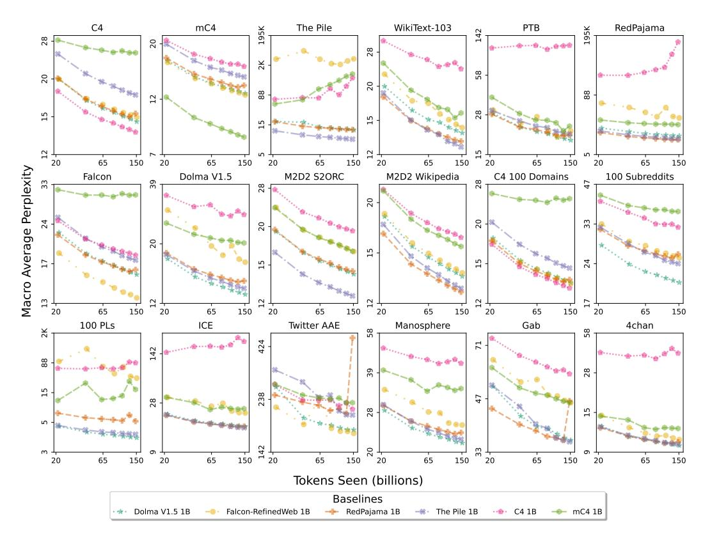

Figure 1: Perplexity macro averaged over any domains within each of the 18 top-level data sources ([§2.2\)](#page-4-0) in PALOMA, using baselines with pretraining controls including decontamination. Evaluating on one monolithic corpus, such as C4, does not tell the complete story of model fit. PALOMA lets us see when trends differ from one distribution of language to another. For instance, the 3 baselines trained on only Common Crawl data (C4, MC4-EN, FALCON REFINEDWEB) exhibit high perplexity, sometimes with non-monotonic scaling over tokens seen, on specific evaluation sources such as THE PILE, DOLMA, and DOLMA-100-PROGRAMMING-LANGUAGES.

More than being a one-dimensional leaderboard, PALOMA offers a suite of fine-grained results from submissions organized by their comparability. As reproducing pretrained models for every new project is onerous, we provide standard training controls for benchmark decontamination and training data order to orchestrate a greater density of comparisons across the research community. Submissions opt in to these, or are marked to make limitations to comparability easy to see. We also control evaluation (1) by sampling evenly from domains based on an estimate of metric variance introduced by subsampling, (2) by fixing model vocabulary where possible or otherwise using bits per byte rather than perplexity to compare, and (3) by standardizing evaluation format. Lastly, we also coordinate fair comparisons over two measures of cost, number of model parameters and training tokens, enabling assessment of hardware-agnostic Pareto efficiency and the measurement of scaling trends.

In addition to curating stratified subsamples of existing datasets of fine-grained domains [\(Gao et al.,](#page-23-2) [2020;](#page-23-2) [Reid et al., 2022;](#page-26-1) [Chronopoulou et al., 2022;](#page-22-4) [Greenbaum & Nelson, 1996;](#page-23-3) [Blodgett et al., 2016;](#page-21-1) [Liang et al., 2022\)](#page-24-1), we contribute new evaluation corpora constructed from held out data from the DOLMA pretraining corpus [\(Soldaini et al., 2023\)](#page-26-2) that subsample the top 100 subreddits and top 100 programming languages. Also, we repurpose corpora of fringe online communities for perplexity evaluations to measure model fit to discourse previously studied for the prevalence of toxicity and hate speech [\(Ribeiro et al., 2021;](#page-26-3) [Zannettou et al., 2018;](#page-27-2) [Papasavva et al., 2020\)](#page-25-1)—an important consideration for LMs, as exposure to toxic pretraining trades off negative and positive capabilities such as toxic generation and classifying toxicity [\(Longpre et al., 2023\)](#page-24-2). However, different lines of research will inevitably require different selections of domains beyond the scope of any one

benchmark. In PALOMA we focus on English and code data and aim to assemble the most finegrained domains readily identifiable from existing metatdata, so we can begin evaluating models over stratified samples of hundreds of domains.

To demonstrate possible uses of results from our benchmark, we conduct a series of case studies. We show that performance improves in almost all domains as models are scaled, but domains improve unequally. Further, across domains, perplexity is driven by strings in the vocabulary, i.e., types, that occur in most domains, but other types even get worse as models scale. Finally, our experiments isolate change in fit from which pretraining corpus is used and find that pretraining without heterogeneous data sources beyond Common Crawl leads to perplexities that do not improve consistently with number of tokens seen.

# 2 PALOMA

PERPLEXITY ANALYSIS FOR LANGUAGE MODEL ASSESSMENT (PALOMA) is for examining LM fit to domains. We use perplexity (and related metrics; [§2.4\)](#page-6-0) to measure fit to the distributions of language represented by different domains. We take relative differences in LM fit as a proxy of model familiarity to the shared knowledge, values, and social context that position the humans producing language in a domain. While we expect contemporary LMs to have a limited fit to the most complex of these latent factors of textual domains, improving fit to all factors is important both to improve perplexity and for actual use of the LM. For example, better perplexity on a particular dialect of English suggests that model will make a better chatbot for people that speak that dialect.

PALOMA comprises several types of artifacts for enabling a science of language modeling: training and evaluation guidelines for experiments on LM fit ([§2.1\)](#page-2-0), evaluation data for assessing fit to specific domains ([§2.2\)](#page-4-0), 6 pretrained baselines following training guidelines ([§2.3\)](#page-6-1), metrics computed by our standardized inference code conforming to our evaluation guidelines ([§2.4\)](#page-6-0), and a submission process for coordinating comparable results across the research community ([§2.5\)](#page-7-0).

# 2.1 GUIDELINES

We outline the principles that we adopt for assessing LM fit. To use perplexity as a meaningful measure of fit to a domain, we must account for factors in both training and evaluation that can confound results. In Table [1](#page-2-1) we compare how previous benchmarks of language modeling have responded to these issues. We distinguish these guidelines from the controls that we use to implement these guidelines in PALOMA, the technical details of which we discuss in [§3.](#page-8-0)

| Guideline                                                                                          | THE PILE (Gao et al., 2020)                                                        | M2D2 (Reid et al., 2022)                                     | C4-100-DOMAINS (Chronopoulou et al., 2022)                   | HELM LM Scenarios (Liang et al., 2022)                                        | PALOMA                                                                |
|----------------------------------------------------------------------------------------------------|---------------------------------------------------------------------------------------|-----------------------------------------------------------------|-----------------------------------------------------------------|----------------------------------------------------------------------------------|-----------------------------------------------------------------------|
| G1 DECONTAMINATION G2 TRAINING ORDER G3 SUBSAMPLING G4 VOCABULARY G5 EVALUATION FORMAT | partial, doc-level not required uniform not required no concat or overlap | none not required uniform not required not required | none not required uniform not required not required | not required not required inherits splits not required API dependent | sub-doc-level fixed stratified fixed no concat or overlap |
| # Domains                                                                                          | 22                                                                                    | 216                                                             | 99                                                              | 14                                                                               | 585                                                                   |

Table 1: Differences between PALOMA and other language modeling benchmarks with respect to guidelines ([§2.1\)](#page-2-0) for experiments of assessing LM fit. PALOMA is the first benchmark to remove contamination across all training data, including contamination at the sub-document level. Pile only deduplicates 2 of 22 domains at document level before splitting. PALOMA also fixes training data order, takes a stratified subsample of the same size from each domain based on estimated metric variance, and fixes vocabulary and evaluation format. When experiments require changes in vocabulary, bits per byte ([§2.4\)](#page-6-0) is compared instead of perplexity, following THE PILE and HELM. Also following THE PILE, we use an evaluation format that does not concatenate multiple documents in a single input and that uses no overlap when splitting documents longer the maximum sequence length. HELM's inference code depends on potentially unknown inference formats used by proprietary APIs but is otherwise documented.

# 2.1.1 TRAINING GUIDELINES

G1 DECONTAMINATION Remove *pretraining* data with sub-document overlap against test data to ensure validity of perplexity evaluation.

A basic tenet of machine learning is that for test evaluation to accurately represent performance, training and test data need to be non-overlapping. However, large pretraining corpora are known to contain evaluation data and large models are known to memorize training data [\(Dodge et al.,](#page-22-3) [2021;](#page-22-3) [Elazar et al., 2023;](#page-23-4) [Carlini et al., 2022\)](#page-22-5). [Lee et al.](#page-24-3) [\(2022\)](#page-24-3) show in their second figure that models underestimate perplexity on evaluation documents with near duplicates in the training corpus by several points relative to models with those duplicate training documents removed. Thus benchmarks of language modeling should actively remove contaminated training data, rather than just partitioning held out splits by documents, assuming no documents overlap. THE PILE applies document-level deduplication to two of their 22 domains before splitting held-out data, but its designers note that this does not prevent leakage of evaluation data more generally [\(Gao et al., 2020\)](#page-23-2). Furthermore, spans of contaminated text within larger unrelated documents can still contribute to overestimation of performance, so decontamination should be conducted at a sub-document level. To our knowledge, PALOMA is the first language modeling benchmark to require removing training data that is contaminated with respect to evaluation data.

G2 TRAINING ORDER If changes in training data order are not examined by an experiment, keep the training data order the same to control differences from recency effects.

Another decision that affects language modeling experiments is the order of training documents. While intentionally designing curricula by ordering training data to improve performance is an area of active research [\(Bengio et al., 2009,](#page-21-2) *inter alia*), most LMs simply randomize the training order. In this case greater comparability between experiments with the same dataset can be achieved if the same random order is used for all models. This also facilitates research that examines exactly what data a given model checkpoint has seen or not seen at that point in training. No previous language modeling benchmarks require the fixing of training order.

### 2.1.2 EVALUATION GUIDELINES

G3 SUBSAMPLING Base the size of evaluation data subsamples on empirical estimates of variance over subsamples.

There is no shortage of text that can be used to estimate perplexity, so we must choose how much to evaluate based on a tradeoff of inference cost and metric stability over different subsamples. The value we ultimately care to estimate is the perplexity of the model on all the available data, not just a subsample. Much existing work considers the estimation of other information theoretic quantities such as entropy and mutual information [\(Paninski, 2003](#page-25-2) *inter alia*), so the estimation of perplexity should likewise be treated with care, for instance in subsampling evaluation data. Previous benchmarks subsample uniformly over the whole corpus, leaving some domains represented by very little data. M2D2 mitigates this by an ad hoc minimum size, but this still leads to domains with different sizes. PALOMA takes a first step towards controlling for subsampling induced variance in perplexity estimation by using a stratified subsample across domains and providing a preliminary empirical measure of metric bias and variance extrapolated from one domain.

G4 VOCABULARY If changes in vocabulary are not examined by an experiment, keep the vocabulary the same to permit direct comparison on perplexity. If not, use bits per byte (BPB) to normalize likelihood by a segmentation intrinsic to the text.

Perplexity per token is not comparable between models with different vocabularies [\(Jelinek, 1998\)](#page-23-5) or, by extension, different tokenizers [\(Mielke, 2019\)](#page-25-3). Since models distribute probability over a vocabulary of tokens, models with larger vocabularies will tend to have higher perplexities than ones with smaller vocabularies. Where possible, the most rigorous solution is to impose one vocabulary on all experiments, allowing perplexity to be directly compared. Some lines of research, such as improving tokenizers, require comparisons of LM fit *across* vocabularies. This is possible by normalizing likelihood by a segmentation intrinsic to the text such as characters or bytes [\(Mielke,](#page-25-3) [2019\)](#page-25-3). THE PILE [\(Gao et al., 2020\)](#page-23-2) proposes BPB ([§2.4\)](#page-6-0) as the best compromise when tokenizers

are not identical, an approach we adopt as well. PALOMA further establishes a standard tokenizer and vocabulary for submissions that do not need to change this experimental variable.

### G5 EVALUATION FORMAT Evaluate likelihood in a consistent format.

While perplexity is clearly defined as a function of the likelihood assigned by a model to a set of sequences, the manner in which that likelihood is computed may vary depending on how inputs are formatted for the model. THE PILE [\(Gao et al., 2020\)](#page-23-2) identify one possible variation: inferring test documents as separate inputs or concatenating them together to fill a single input. Meanwhile, [Press et al.](#page-25-4) [\(2021\)](#page-25-4) point out that documents larger than the maximum sequence length can be split either with or without overlap. We follow THE PILE [\(Gao et al., 2020\)](#page-23-2) in requiring inferences of documents in separate inputs, with documents longer than the maximum sequence length split into nonoverlapping inputs.

# 2.2 EVALUATION DATA

| Purpose                                                                 | Source                                 | Reference                                                     | Description                                                                                                                                                                     |  |  |  |  |
|-------------------------------------------------------------------------|----------------------------------------|---------------------------------------------------------------|---------------------------------------------------------------------------------------------------------------------------------------------------------------------------------|--|--|--|--|
|                                                                         | C4                                     | Raffel et al. (2019) via Dodge et al. (2021)            | Standard contemporary LM pretraining corpus automatically filtered from the April 2019 Common Crawl scrape                                                                   |  |  |  |  |
|                                                                         | MC4-EN                                 | Chung et al. (2023)                                           | The English language portion of a pretraining corpus automatically filtered from 71 Common Crawl scrapes                                                                     |  |  |  |  |
| Standard                                                                | THE PILE                               | Gao et al. (2020)                                             | Standard contemporary LM benchmark from curated multi-source data including large scale non-webscraped sources                                                               |  |  |  |  |
| language                                                                | WIKITEXT-103                           | Merity et al. (2016)                                          | A standard collection of verified "Good" and "Featured" articles on Wikipedia                                                                                                   |  |  |  |  |
| modeling benchmarks                                                  | PENN TREEBANK                          | Marcus et al. (1999) via Nunes (2020)                      | Classic Wall Street Journal benchmark with linguistic structure annotations omit ted                                                                                         |  |  |  |  |
|                                                                         | REDPAJAMA                              | Together Computer (2023)                                   | A publicly available reproduction of the LLaMA (Touvron et al., 2023) pretraining source mixture, combining large amounts of webscraped text with smaller curated sources |  |  |  |  |
|                                                                         | FALCON REFINEDWEB                      | Penedo et al. (2023)                                          | A corpus of English sampled from all Common Crawl scrapes until June 2023, more aggressively filtered and deduplicated than C4 and MC4-EN                                    |  |  |  |  |
|                                                                         | DOLMA                                  | Soldaini et al. (2023)                                        | A three trillion token corpus that samples sources commonly used to train LMs in order to enable open research on pretraining data                                           |  |  |  |  |
|                                                                         | M2D2 S2ORC                             | Reid et al. (2022)                                            | Papers from Semantic Scholar grouped by hierarchical academic field categories                                                                                                  |  |  |  |  |
|                                                                         | M2D2 WIKIPEDIA                         | Reid et al. (2022)                                            | Wikipedia articles grouped by hierarchical categories in the Wikipedia ontology                                                                                                 |  |  |  |  |
| Fine-grained                                                            | C4-100-DOMAINS                         | Chronopoulou et al. (2022)                                 | Balanced samples of the top 100 URL domains in C4 as measured by page count                                                                                                     |  |  |  |  |
| domain benchmarks                                                    | DOLMA-100- SUBREDDITS               | Soldaini et al. (2023)                                        | Balanced samples of the top 100 subreddits by number of posts, sourced from the DOLMA Reddit subset                                                                          |  |  |  |  |
|                                                                         | DOLMA-100- PROGRAMMING LANGUAGES | Kocetkov et al. (2022) via Soldaini et al. (2023) | Balanced samples of the top 100 programming languages by number of tokens, sourced from the DOLMA Stack subset                                                               |  |  |  |  |
| Disparities between speech communities                         | ICE                                    | Greenbaum & Nel son (1996) via Liang et al. (2022)      | English from around the world curated by local experts, with subsets for Canada, East Africa, Hong Kong, India, Ireland, Jamaica, Philippines, Singapore, and the USA     |  |  |  |  |
|                                                                         | TWITTERAAE                             | Blodgett et al. (2016) via Liang et al. (2022) | Balanced sets of tweets classified as African American or White aligned English                                                                                                 |  |  |  |  |
| Fringe sources previously studied for problematic discourse | MANOSPHERE CORPUS                      | Ribeiro et al. (2021)                                         | 9 forums where a set of related masculinist ideologies developed over the 2000s and 2010s                                                                                    |  |  |  |  |
|                                                                         | GAB CORPUS                             | Zannettou et al. (2018)                              | Data from 2016-2018 from an alt-right, free-speech-oriented social media plat form shown to contain more hate speech than mainstream platforms                               |  |  |  |  |
|                                                                         | 4CHAN CORPUS                           | Papasavva et al. (2020)                              | Data from 2016-2019 from a politics subforum of an anonymity-focused forum found to contain among the highest rates of toxic content                                         |  |  |  |  |

Table 2: The 18 data sources sampled to create language modeling evaluations in PALOMA. These are grouped by their purposes for inclusion ([§2.2\)](#page-4-0). Different lines of research will require different selections of domains; PALOMA aims to enable research on differences in LM fit over the hundreds of domains that are readily available in existing metadata.

| Source                          | Validation | Test       | Combined    | Domain Count | Tokens per Split per Domain |
|---------------------------------|------------|------------|-------------|--------------|-----------------------------|
| C4                              | 1,000,000  | 1,000,000  | 2,000,000   | 1            | 1,000,000                   |
| MC4-EN                          | 1,000,000  | 1,000,000  | 2,000,000   | 1            | 1,000,000                   |
| THE PILE                        | 2,199,944  | 2,199,333  | 4,399,277   | 22           | 99,984                      |
| WIKITEXT-103                    | 247,969    | 283,134    | 531,103     | 1            | 265,552                     |
| PENN TREEBANK                   | 89,917     | 101,818    | 191,735     | 1            | 95,868                      |
| REDPAJAMA                       | 699,946    | 700,000    | 1,399,946   | 7            | 99,996                      |
| FALCON REFINEDWEB               | 1,000,000  | 1,000,000  | 2,000,000   | 1            | 1,000,000                   |
| DOLMA                           | 2,999,998  | 2,994,903  | 5,994,901   | 6            | 499,575                     |
| M2D2 S2ORC                      | 16,691,625 | 16,682,726 | 33,374,351  | 167          | 99,923                      |
| M2D2 WIKIPEDIA                  | 4,890,146  | 4,890,573  | 9,780,719   | 49           | 99,803                      |
| C4-100-DOMAINS                  | 9,795,511  | 9,813,881  | 19,609,392  | 99           | 99,037                      |
| DOLMA-100-SUBREDDITS            | 9,679,376  | 9,680,887  | 19,360,263  | 100          | 96,801                      |
| DOLMA-100-PROGRAMMING-LANGUAGES | 9,999,707  | 9,999,906  | 19,999,613  | 100          | 99,998                      |
| ICE                             | 7,290,880  | 7,236,065  | 14,526,945  | 17           | 427,263                     |
| TWITTERAAE                      | 722,905    | 718,358    | 1,441,263   | 2            | 360,316                     |
| MANOSPHERE CORPUS               | 1,000,000  | 999,915    | 1,999,915   | 9            | 111,106                     |
| GAB CORPUS                      | 1,000,000  | 1,000,000  | 2,000,000   | 1            | 1,000,000                   |
| 4CHAN CORPUS                    | 1,000,000  | 1,000,000  | 2,000,000   | 1            | 1,000,000                   |
| PALOMA                          | 71,307,924 | 71,301,499 | 142,609,423 | 585          | 121,888                     |

Table 3: Statistics of the evaluation data in PALOMA. We aim for a minimum of 100 thousand tokens per domain to select a balance between inference cost and metric variance based on our empirical findings on the impact of subsampling in [§3.2.1.](#page-9-0) Bold marks minimum tokens after subsampling.

In Table [2,](#page-4-1) we list the sources of evaluation data by their purposes of inclusion, and in Appendix [A](#page-27-3) we detail each source individually. We show the number of tokens[2](#page-5-0) and domains in each of the 18 sources in PALOMA in Table [3.](#page-5-1)

In this paper, we distinguish sources from domains, although not all cases permit such easy distinction. We use *source* to refer to a selection of data that is characterized by the decisions of the people who curated that data, whether that curation is automatic as in scraping C4 or manual as in selecting the subcorpora of THE PILE. By contrast we use *domain* to refer to a set of documents that belong together because they are originally produced by a group of humans that share a distinct social context. Considered as such, domains may overlap; a document's author may belong to the set of English speakers in Jamaica and the set of AI researchers. Further note, that domains are often latent categorizations which we only approximate because complete metadata does not exist.

Also, some domains in PALOMA appear in multiple sources, such as academic papers. Though THE PILE and REDPAJAMA process academic papers differently, the subcorpora on academic papers in each source represent different approximations of the same or very similar domains. However for the sake of simplicity, we make the reductive assumption of counting all 585 domains in PALOMA as fully distinct.

It is beyond the scope of any one paper to prescribe an exhaustive set of domains that should be examined for a LM. Rather PALOMA brings together a substantial selection of domains that are identifiable from already available metadata to demonstrate the kinds of analyses possible with hundreds of domains and rigorous experimental controls. Different research goals will motivate different definitions and selections of domains, but other researchers can apply our guidelines ([§2.1\)](#page-2-0) to novel fine-grained domains suitable for their research questions. One of the key advantages of evaluating a model by its fit to a collection of text representing a domain is that such domains can be identified not just by researchers who study LMs. We hope future work will identify many more domains that no one discipline would think to look at.

Standard language modeling sources Though it is common practice to evaluate on held out data from the pretraining corpus of a given model, we evaluate *across* several major pretraining corpora and standard language modeling benchmarks (C4, MC4-EN, THE PILE, WIKITEXT-103, PENN TREEBANK, REDPAJAMA, FALCON REFINEDWEB, DOLMA). We also break down performance per domain within the sources that have multiple domains.

Fine-grained domain sources Where typical pretraining corpora offer at most tens of marked domains usually based on where the data is sourced, we examine datasets with up to an order of

In this paper, token counts are always computed with the GPT-NeoX-20B tokenizer [\(Black et al., 2022\)](#page-21-3) unless otherwise stated.

magnitude more domains. Existing datasets (M2D2 and C4-100-DOMAINS) and datasets we curate from DOLMA (DOLMA-100-SUBREDDITS and DOLMA-100-PROGRAMMING-LANGUAGES) use metadata to define hundreds of domains over Wikipedia, Semantic Scholar, Common Crawl, Reddit, and Github data. These include diverse domains from *Culture and the arts: Performing arts*, a topic on Wikipedia, to *r/depression*, a forum on Reddit for mental health support.

Disparities between speech communities Some communities are known to be underserved by existing models [\(Blodgett et al., 2016\)](#page-21-1). Following [Liang et al.](#page-24-1) [\(2022\)](#page-24-1), we measure disparities in performance on corpora of African American English and White aligned English from TWITTERAAE, as well as nine corpora of English from different countries with the ICE dataset.

Fringe sources previously studied for problematic discourse Text from some fringe online communities has been shown to contain larger proportions of hate speech and toxicity than more mainstream sources [\(Ribeiro et al., 2021;](#page-26-3) [Zannettou et al., 2018;](#page-27-2) [Papasavva et al., 2020\)](#page-25-1). Model fit to discourse with toxicity is worth measuring, as [Longpre et al.](#page-24-2) [\(2023\)](#page-24-2) have shown that varying amount of toxic content in pretraining data exhibits a tradeoff between non-toxic generation and ability to classify toxicity. Measuring perplexity on MANOSPHERE CORPUS, GAB CORPUS, and 4CHAN CORPUS characterizes model familiarity with distinct social contexts in which toxic language arises.

### 2.3 BASELINE MODELS

We train a set of 6 baseline models on common pretraining corpora following our training guidelines ([§2.1.1\)](#page-3-0). Training these models ourselves allows us to apply decontamination and fixed order to their pretraining data as well as using a standard tokenizer to enable the greatest level of comparability. These models are 1B parameter models trained for ∼150B tokens on DOLMA [\(Soldaini et al., 2023\)](#page-26-2), THE PILE [\(Gao et al., 2020\)](#page-23-2), REDPAJAMA [\(Together Computer, 2023\)](#page-26-4), FALCON REFINEDWEB [\(Penedo et al., 2023\)](#page-25-6), C4 [\(Raffel et al., 2019;](#page-26-0) [Dodge et al., 2021\)](#page-22-3), and MC4-EN [\(Chung et al., 2023\)](#page-22-6). Additional training details are included in Appendix [C.](#page-32-0)

We also include baseline results from the Pythia models [\(Biderman et al., 2023\)](#page-21-4). These models do not conform with training guidelines ([§2.1.1\)](#page-3-0). They do, however, use the GPTNeoX-20B tokenizer [\(Black et al., 2022\)](#page-21-3) which has an identical vocabulary to our own baseline models, except lacking 3 special tokens used in DOLMA. Another similarity is that the Pythia models also have a learning rate schedule set to end at 300B tokens seen, though they train for the full 300B tokens while we train for just 150B tokens of that schedule. This permits comparison between partially trained checkpoints.

### 2.4 METRICS

PALOMA uses standardized inference code[3](#page-6-2) to compute the following three metrics to assess LM fit to the evaluation data we have curated.

Perplexity Perplexity [\(Jelinek et al., 1977\)](#page-23-0) is most commonly formulated as perplexity per token, where a log likelihood ℓ over documents N = {t 1 , . . . , t|N|} is normalized by T(N) denoting the number of tokens in the documents (i.e., T(N) = P t∈N | tokenize(t) |):

$$\ell = \sum_{t \in N} \sum_{i}^{|t|} \ln p(t_i | t_{< i})$$
 (1)

$$perplexity = e^{-\frac{\ell}{\mathbf{T}(N)}}$$
 (2)

In this paper, perplexity always refers to perplexity per token unless otherwise stated.

Bits per byte When comparing results where model vocabularies must differ, for instance research to improve tokenizers, PALOMA follows [Gao et al.](#page-23-2) [\(2020\)](#page-23-2) in using bits per byte (BPB). This metric normalizes the log likelihood ℓ over documents by the count of UTF-8 encoded bytes in the corpus, B:

$$\mathrm{BPB} = \frac{1}{B}\mathrm{log}_2(e^{-\ell}) = \frac{-\ell}{B\,\mathrm{ln}(2)} \tag{3}$$

3<https://github.com/allenai/ai2-olmo-eval/tree/main/paloma>

Average likelihood per vocabulary type Both perplexity and BPB can be driven by strings that occur frequently, dominating subtler differences in performance on other strings. An alternative is to measure surprise over all occurrences of specific strings instead. A set of strings particularly important to the model's functioning are the strings represented in the model's vocabulary. Following conventional NLP terminology, we call the elements of the vocabulary *types* in contrast to occurrences of these strings in some corpus, which are called *tokens*. When running inference in PALOMA we record µ(ℓv), average likelihoods over the whole corpus for each type v, as well as Tv(N), the count of occurrences of that type over the whole corpus (with indicator function 1(·)):

$$\mu(\ell_v) = \frac{1}{\mathbf{T}_v(N)} \sum_{t \in N} \sum_{i=1}^{|t|} \mathbb{1}(v = t_i) \ln p(t_i | t_{< i})$$
(4)

# 2.4.1 EFFICIENCY METRICS

In addition to performance metrics, we also ask submissions to PALOMA to record measures of cost associated with the training of their language model: number of model parameters and number of tokens seen in training. We also record the size of the training dataset in UTF-8 encoded bytes and when models have run for more than one epoch—where increase in novel data ceases but training duration continues increasing. We elect to measure these abstract cost values rather than metrics of realized costs such as energy use or GPU hours, so that our efficiency comparisons are agnostic to hardware. Our aim is not to judge what hardware a submission uses. Note that this does not capture improvement from innovations that use hardware more efficiently. Such questions are better explored through benchmarks that control hardware such as [Peng et al.](#page-25-7) [\(2023\)](#page-25-7).

# 2.5 COMPARABLE SUBMISSIONS

Fair comparisons of language models can be challenging since there are so many variables to account for, like the number of parameters in each model, the amount of training data trained on, and the tokenizer used. In this section we highlight a number of ways that our benchmark can be used to provide evidence for practitioners to make scientific claims regarding how their model compares against other models.

We encourage submissions to PALOMA to opt into the training guidelines in [§2.1.1](#page-3-0) (specifically as they are implemented in corresponding controls in [§3.1\)](#page-8-1). Likewise we request submissions not intending to study changes to vocabulary opt in to using the vocabulary of GPTNeoX-20B [\(Black et al., 2022\)](#page-21-3). Where submissions opt out of these measures they will be marked for the corresponding limitations to comparability, allowing results to be filtered to remove all results that are not decontaminated, for instance.

Submissions can use inference code provided by us that supports any model integrated with Hugging Face Transformers [\(Wolf et al., 2020\)](#page-27-4) to compute the metrics in [§2.4](#page-6-0) over each domain in the evaluation data. To make fair comparisons, it will be suggested that practitioners provide information on the measures of efficiency discussed in [§2.4.1,](#page-7-1) such as model size. Similarly, submissions can record the name of the training dataset used. Finally, as model performance is typically best at the end of the learning rate schedule (compared with a model part way through training), the maximum duration of the learning rate schedule in tokens can be provided to mark comparability of partially trained checkpoints.

We outline a few types of scientific claims that can be made with our benchmark, including comparing different pretraining corpora and evaluating performance-efficiency tradeoffs:

- 1. When two models are trained on the same data, with the same cost budget (number of parameters or number of tokens seen), they can be directly compared. If one model outperforms the other, this is direct evidence that that model is better. This represents the most common type of comparison.
- 2. When two models have different computational budgets but achieve matching perplexities, this is evidence that the model with the lower computational cost is better. For example, if two models have matching perplexity, and are trained on the same number of tokens from the same corpus, where one model has fewer parameters, this is evidence that the smaller model is better.

- 3. When the model architecture, budget for number of training tokens, and other modeling configurations are fixed, and multiple training runs are done varying the training corpora,comparing the resulting trained models will effectively compare the pretraining corpora. This can provide evidence that one pretraining corpus is better than another. Our baseline experiments in this paper represent this type of scientific claim.
- 4. When a set of submissions fixes all configurations except for varying one dimension of cost (number of parameters or number of tokens seen), this can provide evidence of scaling trends for that model and training configuration.

# 3 EXPERIMENTAL CONTROLS

In order to meet the guidelines we establish in [§2.1,](#page-2-0) we implement a set of experimental controls whose technical details are discussed here. We further distinguish controls that must be applied during model training and controls that are applied at inference time.

# 3.1 TRAINING CONTROLS

# 3.1.1 DECONTAMINATION

| Dataset           | Document Removal Rate |
|-------------------|-----------------------|
| DOLMA             | 0.062%                |
| REDPAJAMA         | 0.099%                |
| THE PILE          | 2.753%                |
| FALCON REFINEDWEB | 0.733%                |
| C4                | 0.010%                |
| MC4-EN            | 0.002%                |

Table 4: Decontamination removal statistics for the corpora with which we train our 6 baseline models. We remove any training document with any paragraph marked as contaminated against PALOMA.

To mitigate contamination of our benchmark, we develop an approach for removing contamination from training data at the scale of pretraining corpora of trillions of tokens. We use a Bloom filter [\(Bloom, 1970\)](#page-22-7) as implemented by [Soldaini et al.](#page-26-2) [\(2023\)](#page-26-2) to match training text that is contaminated with respect to the evaluation data. We employ this approach rather than the minHash or suffix array approaches used by [Lee et al.](#page-24-3) [\(2022\)](#page-24-3) and other deduplication work, as our approach is much more lightweight: the minHash approach would require pairwise computations, O(|Xt||Xe|) between all training texts, Xt, and evaluation texts, Xe, where our approach runs a constant number of hashes, K << |Xe|, over all texts in O (K(|Xt| + |Xe|)). Meanwhile the implementation of the suffix array approach of [Lee et al.](#page-24-3) [\(2022\)](#page-24-3) requires memory usage proportional to the size of the pretraining corpora. Since we aim to encourage researchers submitting to the benchmark to run this decontamination on their pretraining data, we opt to minimize cost and engineering complexity.

Using our approach to find text matches, we mark contamination in the following way. We match text at the paragraph level, i.e., newline separated spans of text. This granularity strikes a balance between, on one hand, examining only full documents, which can miss contamination embedded in novel documents, and, on the other hand, all n-grams of a given size, where the size of the n-grams must be carefully set. Instead paragraph matching leverages this naturally occurring unit of language, although this heuristic has its own limitations especially in domains such as code or poetry, where line separation is handled very differently from prose. To avoid coincidental collisions in the space of small strings, we ignore matches in paragraphs smaller than 13 unicode segmented tokens [\(Unicode,](#page-27-5) [2023\)](#page-27-5), as 13 is the n-gram sized used in contamination checks in [Brown et al.](#page-22-8) [\(2020\)](#page-22-8) and [Rae](#page-25-8) [et al.](#page-25-8) [\(2021\)](#page-25-8). Similarly, we ignore paragraphs composed of only punctuation, spaces, and emoji, as, unlike words, these can be arbitrarily repeated when used as formatting, leading to high frequency n-grams greater than our 13-gram threshold. Lastly, as code data consists almost entirely of short and often repeated lines, we forgo any decontamination on these sources (DOLMA-100-PROGRAMMING-LANGUAGES and the THE STACK domain of DOLMA). We leave the question of how to properly decontaminate code data to future work.

Having marked contaminated paragraphs, we now take the conservative measure of removing whole documents if they contain *any* contaminated paragraph. This has the added benefit of not disrupting the contiguity of text within documents, which excising paragraphs would do. Applying this approach to the datasets on which we train 6 baseline models results in the removal rates shown in Table 4. While these vary by orders of magnitude from dataset to dataset (with THE PILE perhaps receiving a higher removal rate due to the intentional oversampling in that dataset), this approach removes at most 2.753% of documents, making it feasible to apply without dramatically reducing training dataset size. Nevertheless, care should be taken to examine removal rates when applying this approach to new datasets.

#### 3.1.2 DATA ORDER

As contemporary LMs train on instances that are themselves concatenations of training documents up to the maximum sequence length of the model, to fix the order of training data one cannot simply fix the order of documents but must train on the same concatenated instances. Achieving this requires not just a fixed random seed for training instance shuffling, but also adopting the same tokenization and maximum sequence length. Further fixing the number of instances in each gradient update would be required for fully identical training, however this is onerous for experiments that may be run on different hardware requiring different batch sizes. A compromise instead is to ensure that training code feeds instances into gradient steps in a deterministic shuffled order, so the relative ordering of data remains the same even if a given instance may fall in different gradient updates. In conclusion, we adopt the most direct way of controlling data order—we have submissions opting into this control use the same training code that we use to pretrain our baseline models.4

#### 3.2 EVALUATION CONTROLS

#### 3.2.1 Subsampling

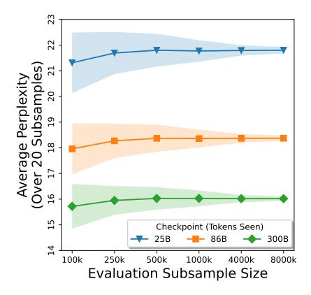

Figure 2: Average perplexity and standard deviation over 20 subsamples of C4 validation data using Pythia 1.4B checkpoints. We find that variance in perplexity over subsamples of evaluation data decreases steadily as evaluation samples grow.

In Figure 2, we evaluate perplexity on data from C4 using Pythia 1.4B (Biderman et al., 2023) while varying the size of the evaluation subsample and training checkpoint. Each point in this figure represents the mean of perplexity on 20 different uniform subsamples and standard deviation is represented by the shaded region. As we expect, for a given checkpoint standard deviation shrinks as the evaluation subsample gets larger. More subtly, standard deviation shrinks as the model is trained on more data. This second observation matters if we want to measure model performance throughout training. Lastly note that the mean value is relatively stable over different evaluation subsample sizes, though a slight downward trend appears at the smallest subsample sizes.

&lt;sup>4At the time of preprinting this training code will not yet be publicly released as it is developed under another project that has not yet concluded. Until it is released submissions wishing to opt in to this control should contact us for direct assistance with reproducing data order.

The stable trend of subsample size and variance in perplexity allows us to estimate how much perplexity numbers might change if a different subsample of the same size were drawn. Furthermore, when preparing splits for perplexity evaluation across many domains, it would be best to size for a similar level of metric variance. Most often perplexity evaluation data is subsampled uniformly over the original distribution of domains in a source, resulting in more or less tokens from each domain in the evaluation data based on how well represented they are in the corpus. We instead employ stratified sampling, in which all sources with marked domains are partitioned by domain and a uniform sample of the same size is taken from each partition. Specifically, documents are sampled from each domain until the same target number of tokens is reached. This helps ensure that no domains are lost or very small after subsampling.

As a small first step towards more principled subsampling, we set the target subsample size based on the simplifying assumption that our metric variance results on C4 hold for other domains and models. Extrapolating our observations, we aim to subsample each split to a minimum of 1 million tokens per source and a minimum of 100 thousand tokens per domain. All datasets with domains are subsampled to 100 thousand tokens per domain other than MANOSPHERE CORPUS which we treat as a single domain, ICE which we include in entirety for comparability to its use in HELM, and DOLMA which we subsample at a higher target of 500 thousand tokens per domain. A few sources fall below our thresholds, with WIKITEXT-103, PENN TREEBANK, and TWITTERAAE being smaller than 1 million tokens per split despite being included in their entirety, and REDPAJAMA having only 7 domains leading to 700 thousand tokens per split. We show the final token statistics in Table [3.](#page-5-1)

If extrapolation from the trends we observed holds, perplexities on sources will be drawn from a distribution over subsamples with less than 1 standard deviation even at very early stages of training. Meanwhile, results on domains will be drawn for a similarly stable distribution by the end of training. This is admittedly a heuristic simplification, as the relationship between variability and subsampling will also likely depend on other factors such as average document length and heterogeneity of the source data, as well as the power of the model being evaluated. We must leave it to future benchmarks to explore these questions as the requirement of decontaminating pretraining data against evaluation data means any change to the evaluation data necessitates costly rerunning of pretraining of all baselines and submissions.

#### 3.2.2 VOCABULARY

Where possible we control by the simplest approach of using the same vocabulary: the vocabulary used in GPT-NeoX-20B [\(Black et al., 2022\)](#page-21-3) with 3 special tokens added by DOLMA for masking personally identifiable information. Note that when vocabulary is fixed this is essentially a training control, as the model must be pretrained with this vocabulary. Nevertheless we mark this as an evaluation control, as we provide an option applied at inference time for making comparisons of models already pretrained with different vocabularies. Specifically, we follow THE PILE [\(Gao et al.,](#page-23-2) [2020\)](#page-23-2) and use bits per byte (BPB; [§2.4\)](#page-6-0). In theory BPB may still present issues in comparability as it only includes likelihoods of the specific sequences produced by a given tokenizer, e.g., *rain ##ing* for the text *raining*, and not the marginal probability over all valid sequences in that vocabulary which would produce the identical text, e.g., *ra ##in ##ing* and so on [\(Mielke, 2019;](#page-25-3) [Cao & Rimell, 2021;](#page-22-9) see also [Hofmann et al., 2021\)](#page-23-6). Models with a larger event space of possible sequences representing the same text will be at a disadvantage if they assign any non-zero probability to these valid predictions ignored by the metric. However, it has been shown empirically that the difference between the marginal probability over all valid sequences and the likelihood of the sequence produced by the tokenizer is small [\(Mielke & Eisner, 2018\)](#page-25-9) and typically lower than 0.5% [\(Chirkova et al., 2023\)](#page-22-10). So in conclusion, we encourage submissions to opt in to our fixed vocabulary and mark these as most comparable, but we also make allowance for submissions that opt out by only measuring comparisons involving models with different vocabularies in BPB.

### 3.2.3 EVALUATION FORMAT

We follow the input format established by THE PILE [\(Gao et al., 2020\)](#page-23-2). In this format, documents are evaluated individually, e.g., "*<BOS>document 1*" then "*<BOS>document* 2", rather than packed into concatenated maximum sequence length inputs, e.g., "*<BOS>document 1<BOS>document 2<BOS>...*", where *<BOS>* is a special token for demarcating sequences. The latter concatenated approach is still often used as it takes the same preprocessing as is most commonly used for training data and is thus convenient for measuring validation loss during training. However, in Appendix [§D](#page-32-1) we find preliminary evidence that the predictability of variance from subsampling observed in [§3.2.1](#page-9-0) breaks down for concatenated inputs. We also believe that evaluating documents individually more closely mirrors how models are used in practice at inference time. Providing more than one document at a time through concatenation is essentially a form of few shot in context learning for language modeling, as it allows the model to condition on information shared between concatenated documents when they are all drawn from the same domain. This is perhaps an interesting task formulation of its own but one that should be undertaken intentionally.

Moreover, following THE PILE, we split documents longer than maximum sequence length into disjoint inputs. This is also described by [Press et al.](#page-25-4) [\(2021\)](#page-25-4) as *nonoverlapping inference*. It is contrasted with *sliding window inference* in which some amount of overlapping tokens are included as context in maximum-sequence-length windows to prevent an unrealistic lack of conditioning for tokens in the middle of a document appearing shortly after a multiple of the maximum sequence length. However, a sliding window requires re-encoding overlapping tokens, making nonoverlapping inference the most efficient approach to computing perplexity.

# 4 CASE STUDIES

By applying our experimental controls ([§3\)](#page-8-0) to PALOMA ([§2\)](#page-2-2), we are able to dig deeper into what language distributions models are learning to fit. In this section, we present several case studies demonstrating the types of analyses possible with PALOMA. In [§4.1,](#page-11-0) we use our 6 baseline 1B models that vary only in which common corpus they are pretrained on to isolate the effect of data composition on LM fit. In [§4.2,](#page-13-0) we examine how scaling dynamics differ over the breadth of domains in PALOMA. Finally in [§4.3,](#page-17-0) we go beyond domains and decompose perplexity by performance on different vocabulary types (i.e., specific elements of the model vocabulary).

# 4.1 PRETRAINING BEYOND COMMON CRAWL SHOWS IMPROVED STABILITY OF LM FIT

We hypothesize that one of the strongest drivers of differences in performance between different domains is the composition of the pretraining data of a language model. While we show in [§4.2](#page-13-0) that scaling model parameters or tokens seen increases performance on nearly all domains, the pretraining data composition directly determines the distribution of language that the model is learning to fit, which may or may not align with the distributions of language in the domains we evaluate. Therefore we examine the impact of varying the pretraining corpus while holding all other experimental decisions the same.

Ordinary perplexity In Figure [3,](#page-12-0) we consider the most simple and aggregated view of LM fit that PALOMA can provide—an ordinary perplexity as defined in [§2.4.](#page-6-0) Specifically we compute perplexity over all data in the standard language modeling and fine-grained domain sources. The other sources are set aside for now as they are designed for targeted analysis of questions such as the fit of models to discourse with prevalent toxicity. We also exclude the code data in DOLMA and DOLMA-100- PROGRAMMING-LANGUAGES, which is not supported by our decontamination approach. Using this view we can already see that the baseline models which are trained only on data derived from Common Crawl (C4, FALCON REFINEDWEB, and MC4-EN) stand out from the other baselines which also incorporate more curated sources of data. However, this also points to the limitation of this most aggregated view of the results: this ordinary perplexity represents fit to domains in proportion to the number of tokens we have chosen to sample from each domain. As we sample 100 thousand tokens from each domain and the majority of our domains are not sourced from Common Crawl, that data source is much less represented in PALOMA than most of the pretraining corpora whose held-out data is conventionally used to measure validation loss. Nevertheless this simplified view of the results is useful for specific use cases that need a single metric over a prescriptive mix that emphasizes robustness to a diversity of domains, largely derived from non-web scraped sources.

Macro average perplexity In Figure [1,](#page-1-0) we provide another aggregation that examines the robustness of fit by considering all domains equally—a macro average of perplexity over domains: |D| −1 P d∈D perplexity(d) for domains, D. By contrast the previous *ordinary perplexity* is essentially an exponentiated micro average over the domains implicitly selected for during corpus curation.

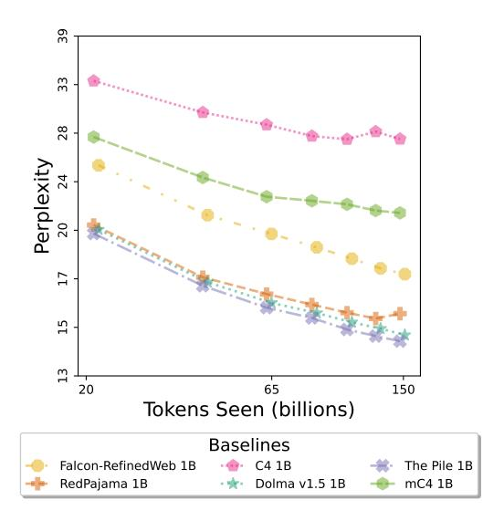

Figure 3: Ordinary perplexity over all the standard language modeling and fine-grained domain sources in PALOMA, excluding code data not supported in our decontamination. While this aggregation obscures subtler differences in performance between domains, for uses such as monitoring training stability, this metric provides a single measure of fit over more diverse data than is typically used for measuring validation loss (e.g., C4).

Macro averaging lets all marked domains have equal say on the model's performance, instead. To make these macro averages more easily interpretable, we can examine them separately per source. The most striking pattern that emerges here is the high, and sometimes non-monotonic, perplexity of the 3 baselines trained on only Common Crawl data (C4, MC4-EN, FALCON REFINEDWEB). One source where this is most apparent is evaluating on THE PILE. There the FALCON REFINEDWEB and MC4-EN baselines' results are dominated by greater than 10,000 perplexity on the *Ubuntu IRC* domain, while other domains are in the low tens, and the C4 baseline exhibits an identical pattern but with 8,056 perplexity on *ArXiv*. Both these domains contain large amounts of non-natural language, in the form of LaTeX and shell code as well as angle-bracketed IRC usernames. So while these Common Crawl baselines spike on different domains, it appears they are *all* more susceptible to these extreme gaps in fit to some domains, perhaps due to a lack of exposure to non-natural language such as code or otherwise due to having only one set of cleaning filters applied to a single source of data.

In contrast, the baselines that include curated non-webscraped text sources (DOLMA, THE PILE, and REDPAJAMA) have a relative gap in perplexity that is highly stable through the course of training. This would imply that short training runs on a subsample of such pretraining corpora may be predictive of the LM fit of specific sources after much longer training. To address one exception, the REDPAJAMA baseline often spikes on its final checkpoint, sometimes dramatically as in TWITTERAAE. A possible explanation is that this checkpoint falls very soon after the model's training loss recovers from a small spike.

Perplexity per domain ordered by median perplexity Rather than aggregating, we can visualize each domain perplexity separately to surface gaps in fine-grained LM fit. In Figure [4,](#page-13-1) we arrange the domains by their median perplexity over the baselines, as this order gives some sense of the intrinsic difficulty of a domain. We can then see which baselines more or less follow this order, differing only by a consistent offset, and which have gaps that are more idiosyncratic to each domain. Again we see that when baselines have irregular gaps from the median these are most frequently baselines pretrained on only Common Crawl. The notable exception is THE PILE baseline on M2D2 S2ORC and DOLMA-100-PROGRAMMING-LANGUAGES, which has erratic gaps substantially below the median, perhaps indicating that baseline is benefiting from exposure to specific domains and not others rather than only a overall facility for scientific papers and code. The erratic-gapped Common Crawl baselines, by contrast, are all worse than median perplexity, suggesting that they

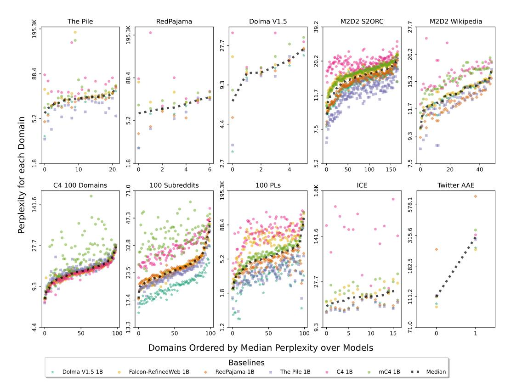

Figure 4: For each source with domains, domain perplexity for the final checkpoint of each model ordered by median domain perplexity over all models. While performance gaps between some baselines are highly consistent across domains (e.g., REDPAJAMA and THE PILE baselines on DOLMA-100-SUBREDDITS), others exhibit noisy performance gaps per domain that do not follow the trend in median domain difficulty (e.g., the MC4-EN baseline on C4-100-DOMAINS). Note that these erratic-gap patterns are frequently on the baselines pretrained on just Common Crawl data.

may have complete gaps in exposure to features of certain domains that cannot be recovered through generalization.

#### 4.2 SCALING IMPROVES DOMAIN FIT UNEQUALLY

We return to our initial question: Does rising performance lift all domains? That is, does the sign of scaling trends observed in previous work (Kaplan et al., 2020; Hoffmann et al., 2022) hold across all domains? And if so, do some domains still capture most of the improvement while others stagnate?

#### 4.2.1 SCALING TOKENS SEEN

In Figure 5, We study the impact of increased training on domain fit. We make use of the finding that the logarithms of loss and tokens seen trend linearly Kaplan et al. (2020), and make an estimate of improvement based on the slope between two empirical observations, with some *inital* and *final* number of tokens seen by checkpoints of a model  $\theta$ :

$$\Delta_t(\textit{inital}, \textit{final}) = \frac{\ln(\ln(\text{perplexity}(\theta_{\textit{inital}}))) - \ln(\ln(\text{perplexity}(\theta_{\textit{final}})))}{\log_{10}(\textit{final}) - \log_{10}(\textit{inital})}$$
 (5)

Specifically, we plot  $\Delta_t$  ( $\sim 20B, \sim 150B$ ) for each domain in ascending order for each of our 6 baselines.5

&lt;sup>5Note that the precise number of tokens seen by a given checkpoint does vary slightly between baselines, as these were run on heterogeneous hardware requiring slight differences in batch size.

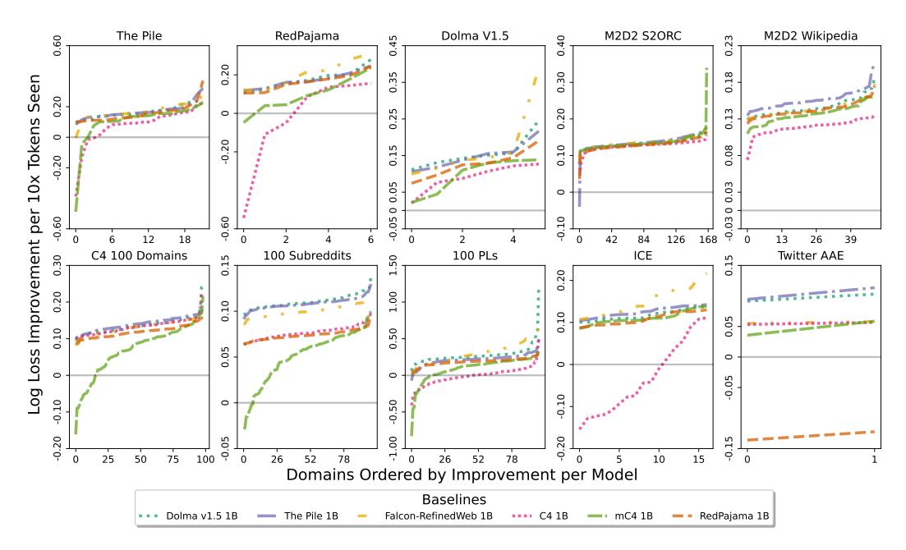

Figure 5: As log loss and log tokens trend linearly, we estimate reduction in log loss per  $10\times$  increase in tokens seen based on the slope between  $\sim\!20B$  and  $\sim\!150B$  checkpoints. We report this rate of improvement for each domain in ascending order per baseline model. This reveals that for some models and domains, loss actually increases with further training. However, excepting just 6 model-domain pairs, all baselines other than C4 and MC4-EN improve on all domains with a similar range between most and least improvement. Even among these, the median difference in improvement between most and least improved domains has nearly twice as fast improvement for most improved domain.

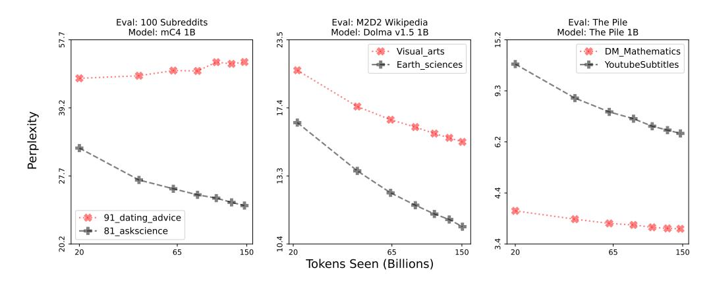

Figure 6: We examine 3 types of examples of most (black dashed) and least (red dotted) improved domains for 3 pairs of sources and models, where improvement is measured in terms of log loss per  $10 \times$  increase in tokens seen (see Figure 5). As on the left, fit to a least improved domain can actually worsen in absolute terms or, as in the middle, simply improve more slowly. On the right, we see that least improved domains may even be better fit in absolute terms. Unequal improvement between domains is not undesirable *a priori* but merits finer-grained examination, enabled by PALOMA.

On some corpora, more pretraining worsens fit on some domains Baselines trained on C4 and MC4-EN worsen with longer training on 65 and 43 domains respectively. Other than these two baselines, only 6 other pairs of models and domains see such a deterioration. Among these 6 pairs only the REDPAJAMA baseline exceeds  $\Delta_t(\sim 20B, \sim 150B)>0.1$ , likely due to the previously noted spike in training loss near the final checkpoint of this model. It is unclear why the other baseline

trained on only Common Crawl data, FALCON REFINEDWEB, does not also exhibit erratic behavior this time, though possibly its cleaning heuristics avoid removing content important to these domains that the other two models' cleaning heuristics do remove.

Even for corpora where fit consistently improves, the rate of improvement is unequal On the vast majority of domains, fit does improve with increased training. However rates of improvement, ∆t(∼ 20B, ∼ 150B), range substantially. Examining the median difference in improvement between most and least improved domains shows 1.57x improvement for most improved domain, and this gap grows to 1.94x when excluding the C4 and MC4-EN baselines.

Slow improvement on a domain is not always unwanted, but surfaces dynamics of model learning Having identified the most and least improved domains, we visualize perplexity curves of 3 examples each demonstrating a different interpretation in Figure [6.](#page-14-1) On the left plot we see that sometimes fit can actually worsen on one domain while improving on another domain, in this case perhaps due to content filters in MC4-EN pretraining data blocking terms frequently used in discussion about dating and sexuality. But even when fit improves on both domains as in the middle plot, the rate of improvement can be slower for one than the other, possibly reflecting differences in the quantity or heterogeneity of earth sciences or visual arts content in DOLMA. However, the right plot shows that the least improved domain can actually outperform the most improved domains in terms of absolute perplexity, in this case perhaps representing saturation of performance on the DM Mathematics domain. Further examples are provided in the Appendix in Figure [13.](#page-34-0) Ultimately, our goal is not to frame unequal improvement as a problem that needs to be fixed, but rather it is way to surface subtler dynamics in language model learning.

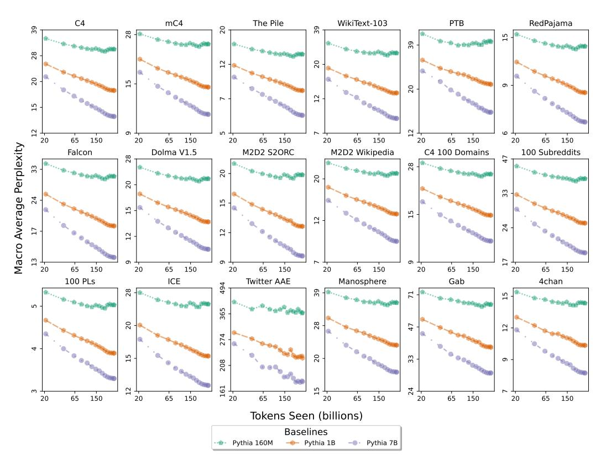

Figure 7: Perplexity macro averaged by domain in each source for checkpoints of 3 Pythia model sizes. Note that these public models are not trained on decontaminated data, so these results should be treated with greater skepticism than the results on the 6 baselines that we train under experimental controls. Consistently across these sources, increases in number of model parameters improves perplexity and the rate at which perplexity improves per token seen.

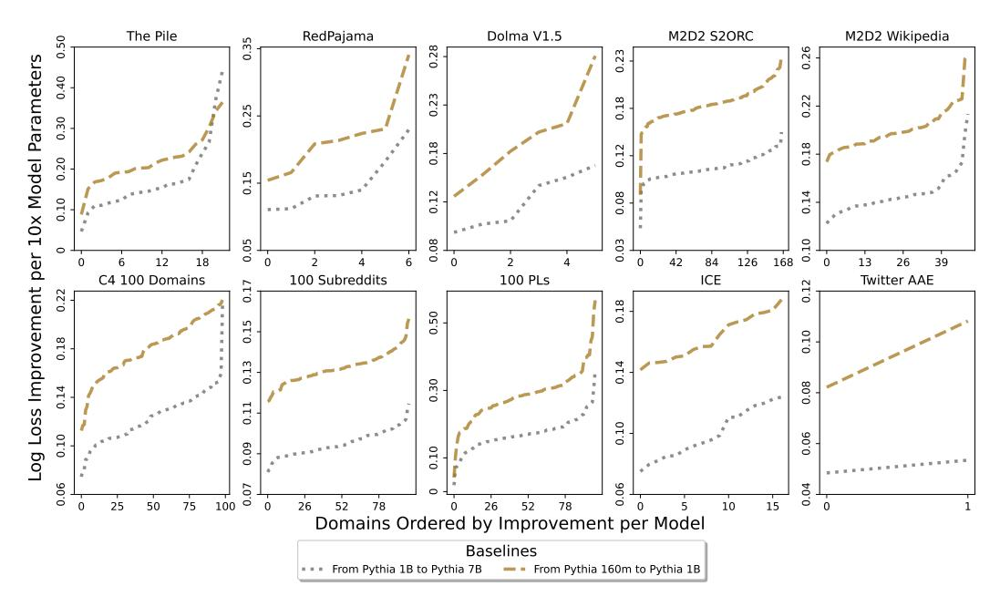

Figure 8: We estimate log loss improvement per  $10\times$  increase in non-embeddings parameters based on improvement from Pythia-160M to Pythia-1B and from Pythia-1B to Pythia-7B on their final checkpoints. We report this rate of improvement for each domain in ascending order per compared model pair. These increases in model size always improve performance on each domain, but the median difference in improvement from least to most sees twice as fast reduction of loss.

#### 4.2.2 SCALING MODEL PARAMETERS

While the 6 baseline models that we pretrain ourselves are all 1B parameter models, we can use models of varying sizes from the Pythia model suite (Biderman et al., 2023) to examine the impact of scaling model parameters on domain fit. As we note in §2.3, these models are not controlled for contamination but they do address all of our other guidelines.

**Increased parameter count sees consistently lower perplexity** In Figure 7, we show the macro average of perplexity over any domains in each source (as we did in Figure 1) for 3 sizes of Pythia model. Not only does this always show an increase in performance with greater parameter count, but the relative differences between the performance curves are remarkably stable across all sources. Additionally, macro average perplexity decreases faster over number of tokens seen for larger models in all sources.

Improvements from model size improve unequally for different domains In Figure 8 we perform the same analysis of improvement in log loss as before but this time with respect to log increase in non-embedding parameters,  $\Delta_p(inital,final)$ . Specifically we plot  $\Delta_p(85M,805M)$  and  $\Delta_p(805M,6.4B)$  for the non-embedding parameter counts corresponding to the 160M, 1B, and 7B model sizes for each domain in ascending order per pair of models compared. This time scaling does universally result in improvements. However, the rate of improvement varies greatly from domain to domain. Examining the median difference in improvement between most and least improved domains shows  $2.02\times$  improvement for the most improved domain, a similar gap to that seen on increases in tokens seen. Again, we stress that unequal improvement is not necessarily problematic, but rather it helps identify outlier domains that follow different scaling trends than the majority of the data. We offer examples of most and least improved domains with respect to increase in model size in the Appendix in Figure 14.

Taken together, the results presented in this case study demonstrate the need to decompose evaluations of LM fit along domains. They show that it is not the case that models improve at uniform rates across domains for a given increase in scale. We leave it to further work to examine when these

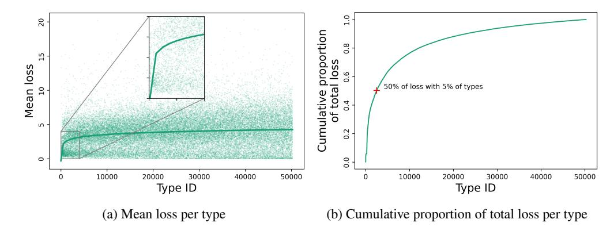

Figure 9: Mean and total loss per vocabulary type, i.e., specific strings represented in the tokenizer vocabulary. While high-frequency types (which have low IDs) tend to have a low *average* loss as shown by a log-linear regression (a), they contribute a substantial part of the *total* loss, simply by virtue of their frequent occurrence in the data (b). The figure shows the distributions for Pythia-7B on C4-100-DOMAINS, but the overall picture is consistent for different models and sources.

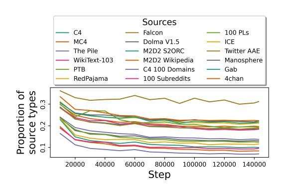

Figure 10: Proportion of types in each source for which Pythia-1B makes better predictions than Pythia-7B, as a function of training duration. The figure shows that for all examined sources, and even on the final checkpoint, a non-negligible proportion of vocabulary types is better predicted by the smaller model (i.e., Pythia-1B). This observation is particularly true for TWITTERAAE, where the proportion of such types is on average larger than 30%.

inequalities are or are not desirable and what interventions can help prevent stagnation of LM fit to certain domains.

### 4.3 COMMON VOCABULARY TYPES DOMINATE PERPLEXITY, OTHERS HAVE INVERSE SCALING

So far we have examined perplexity aggregated over tokens. As introduced in [§2.4,](#page-6-0) another approach is to measure surprise over occurrences of specific strings. In PALOMA we measure average likelihood per vocabulary *type*, i.e., the strings that are represented in the vocabulary of a model, in contrast to occurrences of these strings in some corpus, called *tokens*.

Few vocabulary types account for most of the loss measured in perplexity How much do *types* contribute to the likelihoods aggregated per token in perplexity? To answer this question, we start by analyzing the total loss mass added by types, as a function of their IDs. Given how the GPTNeoX-20B tokenizer was trained [\(Sennrich et al., 2016;](#page-26-6) [Black et al., 2022\)](#page-21-3), smaller IDs correspond to more frequent types in the tokenizer training data, and we find an overall moderate to strong correlation between IDs and frequencies in the evaluation data of PALOMA as well (Pearson's r averaged across domains: –0.522±0.087). Crucially, frequency has a strong impact on the total loss mass associated with individual types: while the *average* loss is lower for the high-frequency types (Figure [9a\)](#page-17-1), the

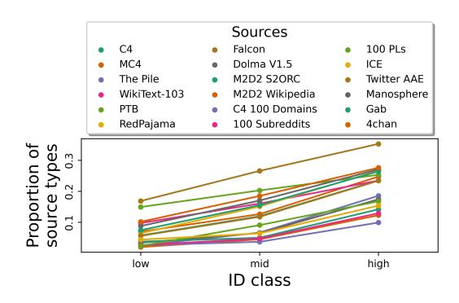

Figure 11: Proportion of types in each source for which Pythia-1B makes better predictions than Pythia-7B on the final checkpoint, as a function of type ID, i (low: i ≤ 1000; mid: 1000 < i ≤ 10000; high: i > 10000). The figure shows that the proportion of types for which the smaller model is better increases with type ID. Thus, while Pythia-7B is almost always better on high-frequency types (low ID), Pythia-1B is better on many low-frequency types (high ID).

*total* loss is higher, resulting in a situation where 5% of the types already cover roughly 50% of the overall perplexity (Figure [9b\)](#page-17-1). Thus, perplexity is strongly influenced by a relatively small set of high-frequency types.

Some types are more surprising on average to larger models than smaller ones Is there variation between models in terms of how much types contribute to perplexity? Put differently, if model A has a lower aggregated perplexity than model B, can we conclude that it has a lower loss for all types? Conducting an exploratory analysis of Pythia-1B vs. Pythia-7B, we find that this is *not* the case: while Pythia-7B has a lower perplexity on all domains, there are always types that are better predicted by Pythia-1B (see Figure [10\)](#page-17-2), with the average proportion of such types varying between 8.5% (C4-100-DOMAINS) and 32.1% (TWITTERAAE). As shown in Figure [11,](#page-18-0) the proportion of types on which Pythia-1B is better increases with ID, for all examined sources. In other words, while Pythia-7B is almost always better on high-frequency types, Pythia-1B is better on a substantial portion of low-frequency types. This pattern is not captured well by perplexity, which is influenced very little by the performance on such low-frequency types (see above). However, note that even in the high-frequency regime around 10% of types are better predicted by the smaller model. Many of those types also have a high frequency in the sources, indicating that our finding cannot be explained merely as a result of noisy measurements. For example, the pronoun *I* occurs 14703 times in ICE but its measured mean loss on the final checkpoint is lower for Pythia-1B than Pythia-7B.

Lower average loss per type can be the result of several different training dynamics. What does it mean specifically if Pythia-1B has a lower average loss on a specific type than Pythia-7B? Figure [12](#page-19-0) shows, for each of the 18 sources, the training dynamics of an example type for which Pythia-1B is better than Pythia-7B after convergence. As can be seen, there are various patterns: sometimes there is a constant gap between the two models, with Pythia-1B being better from the very beginning (e.g., *Boat* in FALCON REFINEDWEB); sometimes Pythia-1B has a constant loss while Pythia-7B is getting worse over time (e.g., *schedule* in DOLMA); sometimes Pythia-7B has a constant loss while Pythia-1B is getting better over time (e.g., *exchanged* in THE PILE); finally, sometimes Pythia-1B is decreasing its loss while Pythia-7B is increasing its loss over time (e.g., *BR* in C4). Especially the last pattern bears a resemblance with *inverse scaling* effects that characterize other aspects of LM behavior, where the performance gets worse rather than better with larger models [\(Mckenzie et al., 2023\)](#page-24-6). We are not aware of prior work describing the kind of type-level inverse scaling that we observe in this analysis.

Some domains have more inverse scaling types than others We also notice that there is further variation on the domains within the sources: for example, in TWITTERAAE (the source where the proportion of types on which Pythia-1B is better is largest), on the types where Pythia-1B is better, it is better on the African American domain in 77.6% of cases, and on the White aligned domain in only 71.3% of cases. In other words, there are numerous vocabulary types where the larger model

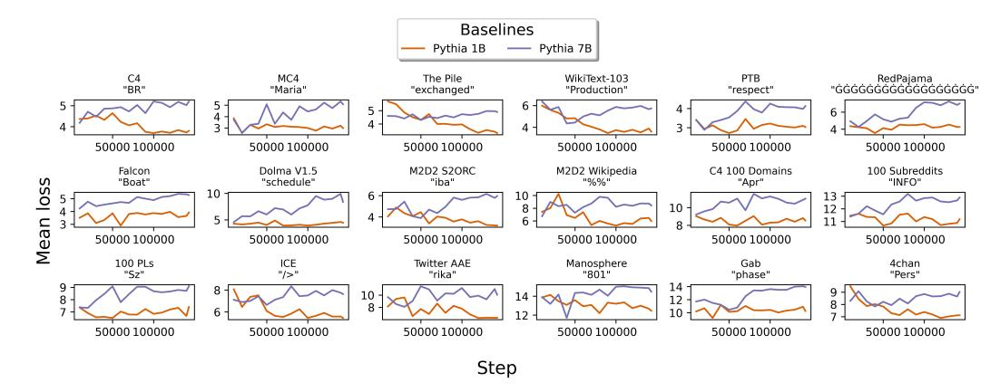

Figure 12: Training dynamics of example types for which Pythia-1B is better than Pythia-7B on the final checkpoint. We specifically show the types that, within a specific source, (i) have a minimum count of 5 and (ii) have the largest mean loss difference between Pythia-1B and Pythia-7B on the final checkpoint. We observe that sometimes Pythia-1B is better from the very beginning (e.g., *Boat* in FALCON REFINEDWEB); sometimes Pythia-1B has a constant loss while Pythia-7B is getting worse over time (e.g., *schedule* in DOLMA); sometimes Pythia-7B has a constant loss while Pythia-1B is getting better over time (e.g., *exchanged* in THE PILE); finally, sometimes Pythia-1B is decreasing its loss while Pythia-7B is increasing its loss over time (e.g., *BR* in C4).

performs better on the White aligned domain (as expected), and where the inverse scaling behavior only manifests itself on the African American domain.

Taken together, these results provide further evidence that reporting only aggregated perplexity values neglects more subtle dynamics on lower levels (sources, domains, vocabulary types).

# 5 RELATED WORK

Previous fine-grained perplexity corpora PALOMA is inspired by and incorporates previous work that curates corpora with marked domains. THE PILE [\(Gao et al., 2020\)](#page-23-2) is an early public pretraining corpus that provides provenance-based subdivisions of data rather than homogeneous webscraped data. Their 22 domains are included among the 585 domains in PALOMA. More recent works curate datasets with on the order of hundreds of domains [\(Reid et al., 2022;](#page-26-1) [Chronopoulou et al., 2022;](#page-22-4) [Li](#page-24-7) [et al., 2022\)](#page-24-7), which we include in part or full in PALOMA. Likewise we include efforts that curate text from specific dialects [\(Blodgett et al., 2016;](#page-21-1) [Greenbaum & Nelson, 1996\)](#page-23-3).

Previous LLM benchmarks Language modeling is a field of research with a long history and many classic benchmarks [\(Baker et al., 1983,](#page-21-5) [Chelba et al., 2013,](#page-22-1) [Merity et al., 2016,](#page-25-0) and [Marcus](#page-24-4) [et al., 1999,](#page-24-4) *inter alia*). With the more recent success of language modeling as a pretraining step, benchmarks have shifted towards downstream task evaluations rather than perplexity metrics. Perhaps the most notable exception is THE PILE [\(Gao et al., 2020\)](#page-23-2) which, in addition to being a pretraining corpus, is explicitly framed as a benchmark and provides a detailed specification of the formatting of inputs for inference to compute perplexity. Where recent LMs report perplexity beyond the model's own training distribution [\(Rae et al., 2021;](#page-25-8) [Hoffmann et al., 2022\)](#page-23-1), it is almost always on THE PILE. We adopt their inference format and add additional controls for contamination, data order, and tokenization to our benchmark (see Table [1\)](#page-2-1). Other efforts focus on comprehensive LM evaluation predominantly using downstream tasks [\(Liang et al., 2022;](#page-24-1) [Gao et al., 2021\)](#page-23-7). We employ one such open source evaluation tool, Catwalk [\(Groeneveld et al., 2023\)](#page-23-8),[6](#page-19-1) to compute our metrics. Moreover, we see our work as complementary to efforts in downstream evaluation, as previous work disagrees whether perplexity evaluations are predictive of downstream performance [\(Liu et al., 2022;](#page-24-8) [Tay et al.,](#page-26-7) [2021;](#page-26-7) [Ganguli et al., 2022;](#page-23-9) [Xia et al., 2022\)](#page-27-6). In fact, we hope that our benchmark can provide well controlled perplexity results for further study of this question.

6<https://github.com/allenai/catwalk>

# 6 CONCLUSION

We believe that evaluations of LM fit provide an important view of language model performance that has been neglected in recent LM research and development. Perplexity cannot be naïvely applied to language modeling at this scale due to challenges such as benchmark contamination. However, these obstacles are worth overcoming as perplexity offers several advantages not afforded by downstream evaluations. Instead of constructing tasks from scratch, we can rely on the ecological validity of real-world data drawn from known sources. By figuring out the best ways to evaluate fit of a model to a collection of documents, we create an interface for other fields to easily compose evaluations for language models. Researchers in other fields need not understand the architectures of such models to collect a corpus of text representing domains of interest that LM researchers would not know to consider. Once a significant data source is identified, such as an online community, evaluations can be updated over time by simply scraping more data, unlike downstream tasks where expensive annotation would be required.

PALOMA advances the possibilities for evaluation of LM fit by providing finely categorized domains of text and controls to mitigate confounders of our metrics. We hope that, along with the baseline models that we train for this work, submissions will begin to fill in the space of possible LM configurations over choices such as data composition, data size, parameter count, and learning rate schedule. By encouraging standardization within this space we increase the density of comparisons that can be made between models. With greater resolution of evaluations, we can increase the resolution of our understanding of language model training dynamics.

# 7 LIMITATIONS

The largest limitation of PALOMA is that we elect to focus just on the language modeling of English and code data. We select this scope as most current LMs also focus on theses types of data. However, we strongly encourage future work to explore how language model fit to fine-grained domains behaves within and across other languages. We also wish to note that while we measure performance on more fine-grained domains, our choice of metrics may not reflect what is valued by all the communities who produce language in these domains [\(Diaz & Madaio, 2023\)](#page-22-2). Nevertheless, we think that examining discrepancies in existing metrics over domains will lead to a deeper understanding of language modeling dynamics, which can then illuminate the gaps in existing approaches to evaluation. In this we follow [Holtzman et al.](#page-23-10) [\(2023\)](#page-23-10) and [McCoy et al.](#page-24-9) [\(2023\)](#page-24-9) by aiming to examine model behaviors, regardless of whether those behaviors are desirable or not to humans.

We also caution against hasty interpretation of LM fit to any particular domain as being indicative of alignment of a model to features that a human might consider salient about these domains. For instance we find that when just examining perplexity, results on the 3 fringe datasets are tightly related to average document lengths, with the short tweet-like posts in GAB CORPUS receiving high perplexities while the long connected threads of posts in 4CHAN CORPUS and MANOSPHERE CORPUS provide greater context and lower perplexity. At this level of aggregation, differences in surprise between these domains likely have little to do with model fit to specific types of toxicity. In our case study in [§4.3,](#page-17-0) we demonstrate that often it is more appropriate to decompose measures of surprise over specific strings within a corpus, rather than aggregating over all text in a domain. We hope that by surfacing the average likelihoods of specific strings in the vocabulary, PALOMA can enable future work on metrics that better measure the fit of models to the features of language in specific domains that humans find most salient.

Another set of limitations arises from our use of documents as a fundamental unit of data. When subsampling although we balance the number of tokens used to represent each domain, we still sample documents until that target token count is reached. Concretely this means that some domains, especially books, are represented by only dozens of documents, which likely does not capture the full distribution of the domain as well many smaller documents might. This also impacts our decontamination approach, since we remove whole documents that have any paragraph marked as contaminated to avoid mangling documents by excising individual paragraphs. Such an approach tends to disproportionately remove long documents that are frequently quoted, which may include seminal works along the lines of Martin Luther King's "I Have a Dream" speech that actually deployed models should be familiar with. The purpose of PALOMA, however, is to enable controlled

research on the science of language modeling, but production models should likely use caution in applying this decontamination technique.

As we note in [§2.4.1,](#page-7-1) our measures of efficiency aim to consider cost agnostic of hardware. It is important to acknowledge that it is not possible to completely separate hardware from abstract notions of cost. For instance, models that utilize greater parallelism through sparse combinations of predictions from experts will appear to have parameter counts equal to the sum of experts even though those parameters can be trained in far less wall-clock time on multiple devices. Further though we record when submissions have run multiple epochs over data, this does not fully disentangle data and compute efficiency. That is datasets such as THE PILE can include intentional oversampling of data within a single epoch, and other datasets include multiple different prepossessed versions of the same underlying data (for instance including both C4 and some other version on Common Crawl data).

Finally we would like to acknowledge that we are unable to rehost THE PILE and ICE data in PALOMA for easy access due to restrictions on these datasets. Permission to access ICE can be arranged through contacting the original authors.[7](#page-21-6)

# ACKNOWLEDGEMENTS

We thank Nishant Subramani, Akhila Yerukola, Rodney Kinney, and Ari Holtzman for fruitful conversations. The experimental components of this work were made possible through a partnership with AMD and CSC, enabling use of the LUMI supercomputer.

# REFERENCES

Roee Aharoni and Yoav Goldberg. Unsupervised domain clusters in pretrained language models. In *Proceedings of the 58th Annual Meeting of the Association for Computational Linguistics*, pp. 7747–7763, Online, July 2020. Association for Computational Linguistics. doi: 10.18653/v1/2020. acl-main.692. URL <https://aclanthology.org/2020.acl-main.692>.

Ebtesam Almazrouei, Hamza Alobeidli, Abdulaziz Alshamsi, Alessandro Cappelli, Ruxandra Cojocaru, Maitha Alhammadi, Mazzotta Daniele, Daniel Heslow, Julien Launay, Quentin Malartic, Badreddine Noune, Baptiste Pannier, and Guilherme Penedo. The falcon series of language models: Towards open frontier models. 2023.

Janet M. Baker, David S. Pallett, and John Scott Bridle. Speech recognition performance assessments and available databases. In *IEEE International Conference on Acoustics, Speech, and Signal Processing*, 1983. URL <https://api.semanticscholar.org/CorpusID:36956472>.

Yoshua Bengio, Jérôme Louradour, Ronan Collobert, and Jason Weston. Curriculum learning. In *International Conference on Machine Learning*, 2009. URL [https://api.semanticscholar.](https://api.semanticscholar.org/CorpusID:873046) [org/CorpusID:873046](https://api.semanticscholar.org/CorpusID:873046).

Stella Rose Biderman, Hailey Schoelkopf, Quentin G. Anthony, Herbie Bradley, Kyle O'Brien, Eric Hallahan, Mohammad Aflah Khan, Shivanshu Purohit, USVSN Sai Prashanth, Edward Raff, Aviya Skowron, Lintang Sutawika, and Oskar van der Wal. Pythia: A suite for analyzing large language models across training and scaling. *ArXiv*, abs/2304.01373, 2023. URL [https:](https://api.semanticscholar.org/CorpusID:257921893) [//api.semanticscholar.org/CorpusID:257921893](https://api.semanticscholar.org/CorpusID:257921893).

Sidney Black, Stella Biderman, Eric Hallahan, Quentin Anthony, Leo Gao, Laurence Golding, Horace He, Connor Leahy, Kyle McDonell, Jason Phang, Michael Pieler, Usvsn Sai Prashanth, Shivanshu Purohit, Laria Reynolds, Jonathan Tow, Ben Wang, and Samuel Weinbach. GPT-NeoX-20B: An open-source autoregressive language model. In *Proceedings of BigScience Episode #5 – Workshop on Challenges & Perspectives in Creating Large Language Models*, pp. 95–136, virtual+Dublin, May 2022. Association for Computational Linguistics. doi: 10.18653/v1/2022.bigscience-1.9. URL <https://aclanthology.org/2022.bigscience-1.9>.

Su Lin Blodgett, Lisa Green, and Brendan O'Connor. Demographic dialectal variation in social media: A case study of African-American English. In *Proceedings of the 2016 Conference on*

7<https://www.ice-corpora.uzh.ch/en/access.html>

- *Empirical Methods in Natural Language Processing*, pp. 1119–1130, Austin, Texas, November 2016. Association for Computational Linguistics. doi: 10.18653/v1/D16-1120. URL [https:](https://aclanthology.org/D16-1120) [//aclanthology.org/D16-1120](https://aclanthology.org/D16-1120).
- Burton H. Bloom. Space/time trade-offs in hash coding with allowable errors. *Commun. ACM*, 13(7):422–426, jul 1970. ISSN 0001-0782. URL [https://doi.org/10.1145/362686.](https://doi.org/10.1145/362686.362692) [362692](https://doi.org/10.1145/362686.362692).
- Tom B. Brown, Benjamin Mann, Nick Ryder, Melanie Subbiah, Jared Kaplan, Prafulla Dhariwal, Arvind Neelakantan, Pranav Shyam, Girish Sastry, Amanda Askell, Sandhini Agarwal, Ariel Herbert-Voss, Gretchen Krueger, Tom Henighan, Rewon Child, Aditya Ramesh, Daniel M. Ziegler, Jeffrey Wu, Clemens Winter, Christopher Hesse, Mark Chen, Eric Sigler, Mateusz Litwin, Scott Gray, Benjamin Chess, Jack Clark, Christopher Berner, Sam McCandlish, Alec Radford, Ilya Sutskever, and Dario Amodei. Language models are few-shot learners, 2020.
- Kris Cao and Laura Rimell. You should evaluate your language model on marginal likelihood over tokenisations. In *Proceedings of the 2021 Conference on Empirical Methods in Natural Language Processing*, pp. 2104–2114, Online and Punta Cana, Dominican Republic, November 2021. Association for Computational Linguistics. doi: 10.18653/v1/2021.emnlp-main.161. URL <https://aclanthology.org/2021.emnlp-main.161>.
- Nicholas Carlini, Daphne Ippolito, Matthew Jagielski, Katherine Lee, Florian Tramèr, and Chiyuan Zhang. Quantifying memorization across neural language models. *ArXiv*, abs/2202.07646, 2022. URL <https://api.semanticscholar.org/CorpusID:246863735>.
- Ciprian Chelba, Tomas Mikolov, Mike Schuster, Qi Ge, T. Brants, Phillip Todd Koehn, and Tony Robinson. One billion word benchmark for measuring progress in statistical language modeling. In *Interspeech*, 2013. URL [https://api.semanticscholar.org/CorpusID:](https://api.semanticscholar.org/CorpusID:14136307) [14136307](https://api.semanticscholar.org/CorpusID:14136307).
- Xiangning Chen, Chen Liang, Da Huang, Esteban Real, Kaiyuan Wang, Yao Liu, Hieu Pham, Xuanyi Dong, Thang Luong, Cho-Jui Hsieh, Yifeng Lu, and Quoc V. Le. Symbolic discovery of optimization algorithms. *ArXiv*, abs/2302.06675, 2023. URL [https://api.semanticscholar.](https://api.semanticscholar.org/CorpusID:256846990) [org/CorpusID:256846990](https://api.semanticscholar.org/CorpusID:256846990).
- Nadezhda Chirkova, Germán Kruszewski, Jos Rozen, and Marc Dymetman. Should you marginalize over possible tokenizations? In *Proceedings of the 61st Annual Meeting of the Association for Computational Linguistics (Volume 2: Short Papers)*, pp. 1–12, Toronto, Canada, July 2023. Association for Computational Linguistics. URL [https://aclanthology.org/2023.](https://aclanthology.org/2023.acl-short.1) [acl-short.1](https://aclanthology.org/2023.acl-short.1).
- Alexandra Chronopoulou, Matthew Peters, and Jesse Dodge. Efficient hierarchical domain adaptation for pretrained language models. In *Proceedings of the 2022 Conference of the North American Chapter of the Association for Computational Linguistics: Human Language Technologies*, pp. 1336–1351, Seattle, United States, July 2022. Association for Computational Linguistics. doi: 10. 18653/v1/2022.naacl-main.96. URL [https://aclanthology.org/2022.naacl-main.](https://aclanthology.org/2022.naacl-main.96) [96](https://aclanthology.org/2022.naacl-main.96).
- Hyung Won Chung, Noah Constant, Xavier García, Adam Roberts, Yi Tay, Sharan Narang, and Orhan Firat. Unimax: Fairer and more effective language sampling for large-scale multilingual pretraining. *ArXiv*, abs/2304.09151, 2023. URL [https://api.semanticscholar.org/CorpusID:](https://api.semanticscholar.org/CorpusID:258187051) [258187051](https://api.semanticscholar.org/CorpusID:258187051).
- Jia Deng, Wei Dong, Richard Socher, Li-Jia Li, Kai Li, and Li Fei-Fei. Imagenet: A large-scale hierarchical image database. In *2009 IEEE Conference on Computer Vision and Pattern Recognition*, pp. 248–255, 2009. doi: 10.1109/CVPR.2009.5206848.
- Fernando Diaz and Michael A. Madaio. Scaling laws do not scale. *ArXiv*, abs/2307.03201, 2023. URL <https://api.semanticscholar.org/CorpusID:259375636>.
- Jesse Dodge, Maarten Sap, Ana Marasovic, William Agnew, Gabriel Ilharco, Dirk Groeneveld, ´ Margaret Mitchell, and Matt Gardner. Documenting large webtext corpora: A case study on the

- colossal clean crawled corpus. In *Proceedings of the 2021 Conference on Empirical Methods in Natural Language Processing*, pp. 1286–1305, Online and Punta Cana, Dominican Republic, November 2021. Association for Computational Linguistics. doi: 10.18653/v1/2021.emnlp-main. 98. URL <https://aclanthology.org/2021.emnlp-main.98>.
- Yanai Elazar, Akshita Bhagia, Ian H. Magnusson, Abhilasha Ravichander, Dustin Schwenk, Alane Suhr, Pete Walsh, Dirk Groeneveld, Luca Soldaini, Sameer Singh, Hanna Hajishirzi, Noah A. Smith, and Jesse Dodge. What's in my big data? *ArXiv*, abs/2310.20707, 2023. URL [https:](https://api.semanticscholar.org/CorpusID:264803575) [//api.semanticscholar.org/CorpusID:264803575](https://api.semanticscholar.org/CorpusID:264803575).
- Deep Ganguli, Danny Hernandez, Liane Lovitt, Nova DasSarma, T. J. Henighan, Andy Jones, Nicholas Joseph, John Kernion, Benjamin Mann, Amanda Askell, Yuntao Bai, Anna Chen, Tom Conerly, Dawn Drain, Nelson Elhage, Sheer El Showk, Stanislav Fort, Zac Hatfield-Dodds, Scott Johnston, Shauna Kravec, Neel Nanda, Kamal Ndousse, Catherine Olsson, Daniela Amodei, Dario Amodei, Tom B. Brown, Jared Kaplan, Sam McCandlish, Christopher Olah, and Jack Clark. Predictability and surprise in large generative models. *Proceedings of the 2022 ACM Conference on Fairness, Accountability, and Transparency*, 2022. URL [https://api.semanticscholar.](https://api.semanticscholar.org/CorpusID:246867298) [org/CorpusID:246867298](https://api.semanticscholar.org/CorpusID:246867298).
- Leo Gao, Stella Rose Biderman, Sid Black, Laurence Golding, Travis Hoppe, Charles Foster, Jason Phang, Horace He, Anish Thite, Noa Nabeshima, Shawn Presser, and Connor Leahy. The pile: An 800gb dataset of diverse text for language modeling. *ArXiv*, abs/2101.00027, 2020. URL <https://api.semanticscholar.org/CorpusID:230435736>.
- Leo Gao, Jonathan Tow, Stella Biderman, Sid Black, Anthony DiPofi, Charles Foster, Laurence Golding, Jeffrey Hsu, Kyle McDonell, Niklas Muennighoff, Jason Phang, Laria Reynolds, Eric Tang, Anish Thite, Ben Wang, Kevin Wang, and Andy Zou. A framework for few-shot language model evaluation, September 2021. URL <https://doi.org/10.5281/zenodo.5371628>.
- Sidney Greenbaum and Gerald Nelson. The international corpus of english (ICE) project. *World Englishes*, 15(1):3–15, mar 1996. doi: 10.1111/j.1467-971x.1996.tb00088.x. URL [https:](https://doi.org/10.1111%2Fj.1467-971x.1996.tb00088.x) [//doi.org/10.1111%2Fj.1467-971x.1996.tb00088.x](https://doi.org/10.1111%2Fj.1467-971x.1996.tb00088.x).
- Dirk Groeneveld, Anas Awadalla, Iz Beltagy, Akshita Bhagia, Ian Magnusson, Hao Peng, Kyle Richardson, Oyvind Tafjord, Pete Walsh, and Jesse Dodge. Catwalk: A unified language model evaluation framework for many datasets, 2023. URL [https://github.com/allenai/](https://github.com/allenai/catwalk) [catwalk](https://github.com/allenai/catwalk).
- Jordan Hoffmann, Sebastian Borgeaud, Arthur Mensch, Elena Buchatskaya, Trevor Cai, Eliza Rutherford, Diego de Las Casas, Lisa Anne Hendricks, Johannes Welbl, Aidan Clark, Tom Hennigan, Eric Noland, Katie Millican, George van den Driessche, Bogdan Damoc, Aurelia Guy, Simon Osindero, Karen Simonyan, Erich Elsen, Jack W. Rae, Oriol Vinyals, and L. Sifre. Training compute-optimal large language models. *ArXiv*, abs/2203.15556, 2022. URL [https:](https://api.semanticscholar.org/CorpusID:247778764) [//api.semanticscholar.org/CorpusID:247778764](https://api.semanticscholar.org/CorpusID:247778764).
- Valentin Hofmann, Janet Pierrehumbert, and Hinrich Schütze. Superbizarre is not superb: Derivational morphology improves BERT's interpretation of complex words. In *Proceedings of the 59th Annual Meeting of the Association for Computational Linguistics and the 11th International Joint Conference on Natural Language Processing (Volume 1: Long Papers)*, pp. 3594–3608, Online, August 2021. Association for Computational Linguistics. doi: 10.18653/v1/2021.acl-long.279. URL <https://aclanthology.org/2021.acl-long.279>.
- Ari Holtzman, Peter West, and Luke Zettlemoyer. Generative models as a complex systems science: How can we make sense of large language model behavior? *ArXiv*, abs/2308.00189, 2023. URL <https://api.semanticscholar.org/CorpusID:260351369>.
- Frederick Jelinek. *Statistical methods for speech recognition*. MIT press, 1998.
- Frederick Jelinek, Robert L. Mercer, Lalit R. Bahl, and Janet M. Baker. Perplexity—a measure of the difficulty of speech recognition tasks. *Journal of the Acoustical Society of America*, 62, 1977. URL <https://api.semanticscholar.org/CorpusID:121680873>.

- Jared Kaplan, Sam McCandlish, T. J. Henighan, Tom B. Brown, Benjamin Chess, Rewon Child, Scott Gray, Alec Radford, Jeff Wu, and Dario Amodei. Scaling laws for neural language models. *ArXiv*, abs/2001.08361, 2020. URL [https://api.semanticscholar.org/CorpusID:](https://api.semanticscholar.org/CorpusID:210861095) [210861095](https://api.semanticscholar.org/CorpusID:210861095).
- Denis Kocetkov, Raymond Li, Loubna Ben Allal, Jia Li, Chenghao Mou, Carlos Muñoz Ferrandis, Yacine Jernite, Margaret Mitchell, Sean Hughes, Thomas Wolf, Dzmitry Bahdanau, Leandro von Werra, and Harm de Vries. The stack: 3 tb of permissively licensed source code. *Preprint*, 2022.
- Katherine Lee, Daphne Ippolito, Andrew Nystrom, Chiyuan Zhang, Douglas Eck, Chris Callison-Burch, and Nicholas Carlini. Deduplicating training data makes language models better. In *Proceedings of the 60th Annual Meeting of the Association for Computational Linguistics (Volume 1: Long Papers)*, pp. 8424–8445, Dublin, Ireland, May 2022. Association for Computational Linguistics. doi: 10.18653/v1/2022.acl-long.577. URL [https://aclanthology.org/](https://aclanthology.org/2022.acl-long.577) [2022.acl-long.577](https://aclanthology.org/2022.acl-long.577).
- Margaret Li, Suchin Gururangan, Tim Dettmers, Mike Lewis, Tim Althoff, Noah A. Smith, and Luke Zettlemoyer. Branch-train-merge: Embarrassingly parallel training of expert language models. *ArXiv*, abs/2208.03306, 2022. URL [https://api.semanticscholar.org/CorpusID:](https://api.semanticscholar.org/CorpusID:251371375) [251371375](https://api.semanticscholar.org/CorpusID:251371375).
- Percy Liang, Rishi Bommasani, Tony Lee, Dimitris Tsipras, Dilara Soylu, Michihiro Yasunaga, Yian Zhang, Deepak Narayanan, Yuhuai Wu, Ananya Kumar, Benjamin Newman, Binhang Yuan, Bobby Yan, Ce Zhang, Christian Cosgrove, Christopher D. Manning, Christopher R'e, Diana Acosta-Navas, Drew A. Hudson, E. Zelikman, Esin Durmus, Faisal Ladhak, Frieda Rong, Hongyu Ren, Huaxiu Yao, Jue Wang, Keshav Santhanam, Laurel J. Orr, Lucia Zheng, Mert Yuksekgonul, Mirac Suzgun, Nathan S. Kim, Neel Guha, Niladri S. Chatterji, Omar Khattab, Peter Henderson, Qian Huang, Ryan Chi, Sang Michael Xie, Shibani Santurkar, Surya Ganguli, Tatsunori Hashimoto, Thomas F. Icard, Tianyi Zhang, Vishrav Chaudhary, William Wang, Xuechen Li, Yifan Mai, Yuhui Zhang, and Yuta Koreeda. Holistic evaluation of language models. *Annals of the New York Academy of Sciences*, 1525:140 – 146, 2022. URL [https://api.semanticscholar.](https://api.semanticscholar.org/CorpusID:253553585) [org/CorpusID:253553585](https://api.semanticscholar.org/CorpusID:253553585).
- Hong Liu, Sang Michael Xie, Zhiyuan Li, and Tengyu Ma. Same pre-training loss, better downstream: Implicit bias matters for language models. In *International Conference on Machine Learning*, 2022. URL <https://api.semanticscholar.org/CorpusID:253107233>.
- Kyle Lo, Lucy Lu Wang, Mark Neumann, Rodney Kinney, and Daniel Weld. S2ORC: The semantic scholar open research corpus. In *Proceedings of the 58th Annual Meeting of the Association for Computational Linguistics*, pp. 4969–4983, Online, July 2020. Association for Computational Linguistics. doi: 10.18653/v1/2020.acl-main.447. URL [https://aclanthology.org/](https://aclanthology.org/2020.acl-main.447) [2020.acl-main.447](https://aclanthology.org/2020.acl-main.447).
- S. Longpre, Gregory Yauney, Emily Reif, Katherine Lee, Adam Roberts, Barret Zoph, Denny Zhou, Jason Wei, Kevin Robinson, David M. Mimno, and Daphne Ippolito. A pretrainer's guide to training data: Measuring the effects of data age, domain coverage, quality, & toxicity. *ArXiv*, abs/2305.13169, 2023. URL [https://api.semanticscholar.org/CorpusID:](https://api.semanticscholar.org/CorpusID:258832491) [258832491](https://api.semanticscholar.org/CorpusID:258832491).
- Mitchell P. Marcus, Beatrice Santorini, Mary Ann Marcinkiewicz, and Ann Taylor. Treebank-3, 1999. URL <https://catalog.ldc.upenn.edu/LDC99T42>.
- R. Thomas McCoy, Shunyu Yao, Dan Friedman, Matthew Hardy, and Thomas L. Griffiths. Embers of autoregression: Understanding large language models through the problem they are trained to solve. *ArXiv*, abs/2309.13638, 2023. URL [https://api.semanticscholar.org/CorpusID:](https://api.semanticscholar.org/CorpusID:262464572) [262464572](https://api.semanticscholar.org/CorpusID:262464572).
- Ian. R. Mckenzie, Alexander Lyzhov, Michael Martin Pieler, Alicia Parrish, Aaron Mueller, Ameya Prabhu, Euan McLean, Aaron Kirtland, Alexis Ross, Alisa Liu, Andrew Gritsevskiy, Daniel Wurgaft, Derik Kauffman, Gabriel Recchia, Jiacheng Liu, Joe Cavanagh, Max Weiss, Sicong Huang, The Floating Droid, Tom Tseng, Tomasz Korbak, Xudong Shen, Yuhui Zhang, Zhengping Zhou, Najoung Kim, Sam Bowman, and Ethan Perez. Inverse scaling: When bigger isn't better.

- *ArXiv*, abs/2306.09479, 2023. URL [https://api.semanticscholar.org/CorpusID:](https://api.semanticscholar.org/CorpusID:259188012) [259188012](https://api.semanticscholar.org/CorpusID:259188012).
- Stephen Merity, Caiming Xiong, James Bradbury, and Richard Socher. Pointer sentinel mixture models. *ArXiv*, abs/1609.07843, 2016. URL [https://api.semanticscholar.org/](https://api.semanticscholar.org/CorpusID:16299141) [CorpusID:16299141](https://api.semanticscholar.org/CorpusID:16299141).
- Sabrina J. Mielke. Can you compare perplexity across different segmentations?, Mar 2019. URL <https://sjmielke.com/comparing-perplexities.htm>.
- Sabrina J. Mielke and Jason Eisner. Spell once, summon anywhere: A two-level open-vocabulary language model. In *AAAI Conference on Artificial Intelligence*, 2018. URL [https://api.](https://api.semanticscholar.org/CorpusID:5081459) [semanticscholar.org/CorpusID:5081459](https://api.semanticscholar.org/CorpusID:5081459).
- Davide Nunes. Preprocessed penn tree bank, 2020. URL [https://zenodo.org/record/](https://zenodo.org/record/3910021) [3910021](https://zenodo.org/record/3910021).
- Liam Paninski. Estimation of entropy and mutual information. *Neural Computation*, 15:1191–1253, 2003. URL <https://api.semanticscholar.org/CorpusID:2034914>.
- Antonis Papasavva, Savvas Zannettou, Emiliano De Cristofaro, Gianluca Stringhini, and Jeremy Blackburn. Raiders of the lost kek: 3.5 years of augmented 4chan posts from the politically incorrect board. *Proceedings of the International AAAI Conference on Web and Social Media*, 14: 885–894, may 2020. doi: 10.1609/icwsm.v14i1.7354. URL [https://doi.org/10.1609%](https://doi.org/10.1609%2Ficwsm.v14i1.7354) [2Ficwsm.v14i1.7354](https://doi.org/10.1609%2Ficwsm.v14i1.7354).
- Guilherme Penedo, Quentin Malartic, Daniel Hesslow, Ruxandra-Aimée Cojocaru, Alessandro Cappelli, Hamza Alobeidli, Baptiste Pannier, Ebtesam Almazrouei, and Julien Launay. The refinedweb dataset for falcon llm: Outperforming curated corpora with web data, and web data only. *ArXiv*, abs/2306.01116, 2023. URL [https://api.semanticscholar.org/CorpusID:](https://api.semanticscholar.org/CorpusID:259063761) [259063761](https://api.semanticscholar.org/CorpusID:259063761).
- Hao Peng, Qingqing Cao, Jesse Dodge, Matthew E. Peters, Jared Fernandez, Tom Sherborne, Kyle Lo, Sam Skjonsberg, Emma Strubell, Darrell Plessas, Iz Beltagy, Evan Pete Walsh, Noah A. Smith, and Hannaneh Hajishirzi. Efficiency pentathlon: A standardized arena for efficiency evaluation. *ArXiv*, abs/2307.09701, 2023. URL [https://api.semanticscholar.org/CorpusID:](https://api.semanticscholar.org/CorpusID:259982429) [259982429](https://api.semanticscholar.org/CorpusID:259982429).
- Ofir Press, Noah A. Smith, and Mike Lewis. Shortformer: Better language modeling using shorter inputs. In *Proceedings of the 59th Annual Meeting of the Association for Computational Linguistics and the 11th International Joint Conference on Natural Language Processing (Volume 1: Long Papers)*, pp. 5493–5505, Online, August 2021. Association for Computational Linguistics. doi: 10.18653/v1/2021.acl-long.427. URL [https://aclanthology.org/2021.acl-long.](https://aclanthology.org/2021.acl-long.427) [427](https://aclanthology.org/2021.acl-long.427).
- Alec Radford, Jeff Wu, Rewon Child, David Luan, Dario Amodei, and Ilya Sutskever. Language models are unsupervised multitask learners. 2019. URL [https://api.semanticscholar.](https://api.semanticscholar.org/CorpusID:160025533) [org/CorpusID:160025533](https://api.semanticscholar.org/CorpusID:160025533).
- Jack W. Rae, Sebastian Borgeaud, Trevor Cai, Katie Millican, Jordan Hoffmann, Francis Song, John Aslanides, Sarah Henderson, Roman Ring, Susannah Young, Eliza Rutherford, Tom Hennigan, Jacob Menick, Albin Cassirer, Richard Powell, George van den Driessche, Lisa Anne Hendricks, Maribeth Rauh, Po-Sen Huang, Amelia Glaese, Johannes Welbl, Sumanth Dathathri, Saffron Huang, Jonathan Uesato, John F. J. Mellor, Irina Higgins, Antonia Creswell, Nathan McAleese, Amy Wu, Erich Elsen, Siddhant M. Jayakumar, Elena Buchatskaya, David Budden, Esme Sutherland, Karen Simonyan, Michela Paganini, L. Sifre, Lena Martens, Xiang Lorraine Li, Adhiguna Kuncoro, Aida Nematzadeh, Elena Gribovskaya, Domenic Donato, Angeliki Lazaridou, Arthur Mensch, Jean-Baptiste Lespiau, Maria Tsimpoukelli, N. K. Grigorev, Doug Fritz, Thibault Sottiaux, Mantas Pajarskas, Tobias Pohlen, Zhitao Gong, Daniel Toyama, Cyprien de Masson d'Autume, Yujia Li, Tayfun Terzi, Vladimir Mikulik, Igor Babuschkin, Aidan Clark, Diego de Las Casas, Aurelia Guy, Chris Jones, James Bradbury, Matthew G. Johnson,

- Blake A. Hechtman, Laura Weidinger, Iason Gabriel, William S. Isaac, Edward Lockhart, Simon Osindero, Laura Rimell, Chris Dyer, Oriol Vinyals, Kareem W. Ayoub, Jeff Stanway, L. L. Bennett, Demis Hassabis, Koray Kavukcuoglu, and Geoffrey Irving. Scaling language models: Methods, analysis & insights from training gopher. *ArXiv*, abs/2112.11446, 2021. URL <https://api.semanticscholar.org/CorpusID:245353475>.
- Colin Raffel, Noam M. Shazeer, Adam Roberts, Katherine Lee, Sharan Narang, Michael Matena, Yanqi Zhou, Wei Li, and Peter J. Liu. Exploring the limits of transfer learning with a unified textto-text transformer. *ArXiv*, abs/1910.10683, 2019. URL [https://api.semanticscholar.](https://api.semanticscholar.org/CorpusID:204838007) [org/CorpusID:204838007](https://api.semanticscholar.org/CorpusID:204838007).
- Machel Reid, Victor Zhong, Suchin Gururangan, and Luke Zettlemoyer. M2D2: A massively multidomain language modeling dataset. In *Proceedings of the 2022 Conference on Empirical Methods in Natural Language Processing*, pp. 964–975, Abu Dhabi, United Arab Emirates, December 2022. Association for Computational Linguistics. URL [https://aclanthology.org/](https://aclanthology.org/2022.emnlp-main.63) [2022.emnlp-main.63](https://aclanthology.org/2022.emnlp-main.63).
- Manoel Horta Ribeiro, Jeremy Blackburn, Barry Bradlyn, Emiliano De Cristofaro, Gianluca Stringhini, Summer Long, Stephanie Greenberg, and Savvas Zannettou. The evolution of the manosphere across the web. *Proceedings of the International AAAI Conference on Web and Social Media*, 15:196–207, may 2021. doi: 10.1609/icwsm.v15i1.18053. URL [https:](https://doi.org/10.1609%2Ficwsm.v15i1.18053) [//doi.org/10.1609%2Ficwsm.v15i1.18053](https://doi.org/10.1609%2Ficwsm.v15i1.18053).
- Rico Sennrich, Barry Haddow, and Alexandra Birch. Neural machine translation of rare words with subword units. In *Proceedings of the 54th Annual Meeting of the Association for Computational Linguistics (Volume 1: Long Papers)*, pp. 1715–1725, Berlin, Germany, August 2016. Association for Computational Linguistics. doi: 10.18653/v1/P16-1162. URL [https://aclanthology.](https://aclanthology.org/P16-1162) [org/P16-1162](https://aclanthology.org/P16-1162).
- Noam M. Shazeer. Glu variants improve transformer. *ArXiv*, abs/2002.05202, 2020. URL [https:](https://api.semanticscholar.org/CorpusID:211096588) [//api.semanticscholar.org/CorpusID:211096588](https://api.semanticscholar.org/CorpusID:211096588).
- Zhihong Shen, Hao Ma, and Kuansan Wang. A web-scale system for scientific knowledge exploration. In *Proceedings of ACL 2018, System Demonstrations*, pp. 87–92, Melbourne, Australia, July 2018. Association for Computational Linguistics. doi: 10.18653/v1/P18-4015. URL [https:](https://aclanthology.org/P18-4015) [//aclanthology.org/P18-4015](https://aclanthology.org/P18-4015).
- Luca Soldaini, Rodney Kinney, Akshita Bhagia, Dustin Schwenk, David Atkinson, Russell Authur, Ben Bogin, Khyathi Chandu, Jennifer Dumas, Yanai Elazar, Valentin Hofmann, Ananya Harsh Jha, Sachin Kumar, Li Lucy, Xinxi Lyu, Ian Magnusson, Jacob Morrison, Niklas Muennighoff, Aakanksha Naik, Crystal Nam, Matthew E. Peters, Abhilasha Ravichander, Kyle Richardson, Zejiang Shen, Emma Strubell, Nishant Subramani, Oyvind Tafjord, Evan Pete Walsh, Hannaneh Hajishirzi, Noah A. Smith, Luke Zettlemoyer, Iz Beltagy, Dirk Groeneveld, Jesse Dodge, and Kyle Lo. Dolma: An Open Corpus of Three Trillion Tokens for Language Model Pretraining Research. *arXiv preprint*, 2023. URL <https://huggingface.co/datasets/allenai/dolma>.
- Jianlin Su, Yu Lu, Shengfeng Pan, Bo Wen, and Yunfeng Liu. Roformer: Enhanced transformer with rotary position embedding. *ArXiv*, abs/2104.09864, 2021. URL [https://api.](https://api.semanticscholar.org/CorpusID:233307138) [semanticscholar.org/CorpusID:233307138](https://api.semanticscholar.org/CorpusID:233307138).
- Yi Tay, Mostafa Dehghani, Jinfeng Rao, William Fedus, Samira Abnar, Hyung Won Chung, Sharan Narang, Dani Yogatama, Ashish Vaswani, and Donald Metzler. Scale efficiently: Insights from pre-training and fine-tuning transformers. *ArXiv*, abs/2109.10686, 2021. URL [https://api.](https://api.semanticscholar.org/CorpusID:237592821) [semanticscholar.org/CorpusID:237592821](https://api.semanticscholar.org/CorpusID:237592821).
- Together Computer. RedPajama: An Open Source Recipe to Reproduce LLaMA training dataset, April 2023. URL <https://github.com/togethercomputer/RedPajama-Data>.
- Hugo Touvron, Thibaut Lavril, Gautier Izacard, Xavier Martinet, Marie-Anne Lachaux, Timothée Lacroix, Baptiste Rozière, Naman Goyal, Eric Hambro, Faisal Azhar, Aurelien Rodriguez, Armand Joulin, Edouard Grave, and Guillaume Lample. LLaMA: Open and Efficient Foundation Language Models. *arXiv preprint arXiv:2302.13971*, 2023.

- Unicode. Unicode Text Segmentation, Aug 2023. URL [https://unicode.org/reports/](https://unicode.org/reports/tr29/) [tr29/](https://unicode.org/reports/tr29/).
- Alex Wang, Amanpreet Singh, Julian Michael, Felix Hill, Omer Levy, and Samuel Bowman. GLUE: A multi-task benchmark and analysis platform for natural language understanding. In *Proceedings of the 2018 EMNLP Workshop BlackboxNLP: Analyzing and Interpreting Neural Networks for NLP*, pp. 353–355, Brussels, Belgium, November 2018. Association for Computational Linguistics. doi: 10.18653/v1/W18-5446. URL <https://aclanthology.org/W18-5446>.
- Alex Wang, Yada Pruksachatkun, Nikita Nangia, Amanpreet Singh, Julian Michael, Felix Hill, Omer Levy, and Samuel R. Bowman. *SuperGLUE: A Stickier Benchmark for General-Purpose Language Understanding Systems*. Curran Associates Inc., Red Hook, NY, USA, 2019.
- Ben Wang and Aran Komatsuzaki. GPT-J-6B: A 6 Billion Parameter Autoregressive Language Model. <https://github.com/kingoflolz/mesh-transformer-jax>, May 2021.
- Thomas Wolf, Lysandre Debut, Victor Sanh, Julien Chaumond, Clement Delangue, Anthony Moi, Pierric Cistac, Tim Rault, Remi Louf, Morgan Funtowicz, Joe Davison, Sam Shleifer, Patrick von Platen, Clara Ma, Yacine Jernite, Julien Plu, Canwen Xu, Teven Le Scao, Sylvain Gugger, Mariama Drame, Quentin Lhoest, and Alexander Rush. Transformers: State-of-the-art natural language processing. In *Proceedings of the 2020 Conference on Empirical Methods in Natural Language Processing: System Demonstrations*, pp. 38–45, Online, October 2020. Association for Computational Linguistics. doi: 10.18653/v1/2020.emnlp-demos.6. URL <https://aclanthology.org/2020.emnlp-demos.6>.
- M. Xia, Mikel Artetxe, Chunting Zhou, Xi Victoria Lin, Ramakanth Pasunuru, Danqi Chen, Luke Zettlemoyer, and Ves Stoyanov. Training trajectories of language models across scales. In *Annual Meeting of the Association for Computational Linguistics*, 2022. URL [https://api.](https://api.semanticscholar.org/CorpusID:254877112) [semanticscholar.org/CorpusID:254877112](https://api.semanticscholar.org/CorpusID:254877112).
- Savvas Zannettou, Barry Bradlyn, Emiliano De Cristofaro, Haewoon Kwak, Michael Sirivianos, Gianluca Stringini, and Jeremy Blackburn. What is gab: A bastion of free speech or an altright echo chamber. In *Companion Proceedings of the The Web Conference 2018*, WWW '18, pp. 1007–1014, Republic and Canton of Geneva, CHE, 2018. International World Wide Web Conferences Steering Committee. ISBN 9781450356404. doi: 10.1145/3184558.3191531. URL <https://doi.org/10.1145/3184558.3191531>.

# A EVALUATION DATA SOURCE DETAILS

- C4 Initially the pretraining corpus used by [Raffel et al.](#page-26-0) [\(2019\)](#page-26-0) and later released in [Dodge et al.](#page-22-3) [\(2021\)](#page-22-3), C4 has become one of the most commonly used pretraining corpora and is often included in more recently curated corpora. It uses a single April 2019 Common Crawl scrape to source webtext. This is filtered to remove text that is not classified as English as well as heuristics to remove text that is not natural language and a blocklist of profane keywords. We sample from the validation split of this "cleaned" corpus to measure model fit to webtext from a single temporal slice of scraping with baseline preprocessing. This source has no marked domains.
- MC4-EN [Chung et al.](#page-22-6) [\(2023\)](#page-22-6) release a dataset with same the methods used in C4 but scale up to all Common Crawl scrapes up to August 2022 and include 107 classified languages. As the scope of the present work is the evaluation of English language models we sample only from the validation split of the English portion of the data. This allow us to measure the fit of models to scraped webtext with heterogeneous temporality. This source has no marked domains.
- THE PILE [Gao et al.](#page-23-2) [\(2020\)](#page-23-2) curate a pretraining corpus from 22 domains in one of the first large open corpora to include mostly non-webscraped text, such as archives of novels or academic papers. It is also explicitly framed as a language modeling benchmark with instructions for standardized evaluations on the validation and test sets, and several open source models have been trained on it [\(Wang & Komatsuzaki, 2021;](#page-27-7) [Black et al., 2022;](#page-21-3) [Biderman et al., 2023\)](#page-21-4). We sample its 22 domains (see Table [5\)](#page-28-0) to evaluate fit to coarse-grained, mostly non-webscraped domains.

ArXiv, BookCorpus2, Books3, DM\_Mathematics, Enron\_Emails, EuroParl, FreeLaw, Github, Gutenberg\_PG-19, HackerNews, NIH\_ExPorter, OpenSubtitles, OpenWebText2, PhilPapers, Pile-CC, PubMed\_Abstracts, PubMed\_Central, StackExchange, USPTO\_Backgrounds, Ubuntu\_IRC, Wikipedia\_en, YoutubeSubtitles

### Table 5: Domains in THE PILE

WIKITEXT-103 and PENN TREEBANK We include these two benchmarks as they have seen the most consistent evaluation on large LMs. WIKITEXT-103 [\(Merity et al., 2016\)](#page-25-0) consists Wikipedia articles marked "Good" and "Featured" and was used in the evaluation of GPT-2 [\(Radford et al.,](#page-25-10) [2019\)](#page-25-10), Gopher [\(Rae et al., 2021\)](#page-25-8), and Chinchilla [\(Hoffmann et al., 2022\)](#page-23-1). PENN TREEBANK [\(Marcus](#page-24-4) [et al., 1999\)](#page-24-4) consists of 1989 Wall Street Journal articles originally annotated for linguistic structure. GPT-2 [\(Radford et al., 2019\)](#page-25-10) and GPT-3 [\(Brown et al., 2020\)](#page-22-8) omit these annotations and evaluate perplexity on the underlying text. We sample the same version of the benchmark, which is hosted by [Nunes](#page-25-5) [\(2020\)](#page-25-5). As was standard practice at the time the benchmark is pretokenized and uncommon words are replaced with a special unknown token; we opt not to detokenize this data as we find contemporary LMs are often able to achieve comparable performance to the GPT-3 SOTA without this. These two sources have no marked domains.

REDPAJAMA [Together Computer](#page-26-4) [\(2023\)](#page-26-4) reproduce a pretraining corpus following the data mixture of LLaMA [\(Touvron et al., 2023\)](#page-26-5), which combines curated sources and webscraped text similarly to THE PILE but with a much greater portion of scraped data as has become customary in recent pretraining corpora. This dataset is used to train RedPajama-INCITE [\(Together Computer, 2023\)](#page-26-4), one of the few models with both checkpoints and data publicly available. We sample their 7 domains (see Table [6\)](#page-28-1).

arxiv, books, c4, commoncrawl, github, stackexchange, wikipedia

Table 6: Domains in REDPAJAMA

FALCON REFINEDWEB Included in the training of the Falcon models [\(Almazrouei et al., 2023\)](#page-21-7), [Penedo et al.](#page-25-6) [\(2023\)](#page-25-6) collect a corpus of English sampled from all Common Crawl scrapes until June 2023. While we include other Common Crawl based corpora, this one has a higher duplication removal rate than previous corpora. They also claim to have more neutral filters that rely on simple interpretable heuristics and only blocklist adult content by URLs. We sample this to examine how differences in filtering scraped data influence perplexity evaluations. This source has no marked domains.

DOLMA [Soldaini et al.](#page-26-2) [\(2023\)](#page-26-2) curate a corpus from Common Crawl, Wikipedia, books, academic papers, code repositories, and Reddit—domains similar to those used to train most contemporary LLMs. They release the code used to collect and process this data which in combination with the corpus serve as a set of scientific artifacts to support broader participation in research on pretraining data. We sample from held out splits of each of these domains (see Table [7\)](#page-28-2) to provide corresponding evaluations for these artifacts.

books, common-crawl, pes2o, reddit\_uniform, stack\_uniform, wiki

Table 7: Domains in DOLMA

M2D2 S2ORC [Reid et al.](#page-26-1) [\(2022\)](#page-26-1) collect academic papers from S2ORC [\(Lo et al., 2020\)](#page-24-10) and organize them into a two level hierarchy by academic field categories. Top-level domains, such as Computer Science, are already provided in S2ORC using top-level disciplines from the Microsoft Academic Graph [\(Shen et al., 2018\)](#page-26-8), while subdomains are identified by a paper's arXiv category, such as the subdomain Computation and Language within Computer Science. As academic papers are a common source for pretraining and a domain for downstream use, we sample from this corpus to measure fine-grained fit to different academic disciplines. We sample both their top-level domains and lower-level subdomains, as our definition of domain accepts that domains may overlap. Also note that while the M2D2 paper only reports 106 domains and subdomains of S2ORC data, we

find that there are actually 167 domains and subdomains (see Table [8\)](#page-29-0) marked in their final corpus. Unfortunately the original collection concatenates together all papers, making it impossible to recover document boundaries. We resort instead to sampling a given number of tokens from the beginning of the concatenated sequences as one long pseudo-document, relying on the random shuffling of the original data before concatenation.

Art, Philosophy, astro-ph, astro-ph.CO, astro-ph.EP, astro-ph.GA, astro-ph.HE, astro-ph.IM, astro-ph.SR, astro-ph\_l1, atom-ph, chem-ph, cond-mat, cond-mat.dis-nn, cond-mat.mes-hall, cond-mat.mtrl-sci, cond-mat.other, cond-mat.quant-gas, cond-mat.soft, cond-mat.stat-mech, cond-mat.str-el, condmat.supr-con, cond-mat\_l1, cs.AI, cs.AR, cs.CC, cs.CE, cs.CG, cs.CL, cs.CR, cs.CV, cs.CY, cs.DB, cs.DC, cs.DL, cs.DM, cs.DS, cs.ET, cs.FL, cs.GL, cs.GR, cs.GT, cs.HC, cs.IR, cs.LG, cs.LO, cs.MA, cs.MM, cs.MS, cs.NA, cs.NE, cs.NI, cs.OH, cs.OS, cs.PF, cs.PL, cs.RO, cs.SC, cs.SD, cs.SE, cs.SI, cs.SY, cs\_l1, econ.EM, econ.TH, econ\_l1, eess.AS, eess.IV, eess.SP, eess\_l1, gr-qc, hep-ex, hep-lat, hep-ph, hep-th, math.AC, math.AG, math.AP, math.AT, math.CA, math.CO, math.CT, math.CV, math.DG, math.DS, math.FA, math.GM, math.GN, math.GR, math.GT, math.HO, math.KT, math.LO, math.MG, math.NA, math.NT, math.OA, math.OC, math.PR, math.QA, math.RA, math.RT, math.SG, math.SP, math\_l1, nlin.AO, nlin.CD, nlin.CG, nlin.PS, nlin.SI, nlin\_l1, nucl-ex, nucl-th, physics.acc-ph, physics.ao-ph, physics.app-ph, physics.atm-clus, physics.atom-ph, physics.bio-ph, physics.chem-ph, physics.classph, physics.comp-ph, physics.data-an, physics.ed-ph, physics.flu-dyn, physics.gen-ph, physics.geo-ph, physics.hist-ph, physics.ins-det, physics.med-ph, physics.optics, physics.plasm-ph, physics.pop-ph, physics.soc-ph, physics.space-ph, physics\_l1, plasm-ph, q-bio, q-bio.BM, q-bio.CB, q-bio.GN, q-bio.MN, q-bio.NC, q-bio.OT, q-bio.PE, q-bio.QM, q-bio.SC, q-bio.TO, q-bio\_l1, q-fin.CP, q-fin.EC, q-fin.GN, q-fin.MF, q-fin.PM, q-fin.PR, q-fin.RM, q-fin.ST, q-fin.TR, q-fin\_l1, quant-ph, stat.AP, stat.CO, stat.ME, stat.ML, stat.OT, stat\_l1, supr-con

Table 8: Domains in M2D2 S2ORC

M2D2 WIKIPEDIA [Reid et al.](#page-26-1) [\(2022\)](#page-26-1) also collect Wikipedia articles and organize them by the top two levels of hierarchy from the Wikipedia ontology. We sample from this source, as the Wikipedia ontology provides some of the largest scale human categorization of domains of text available on a data source almost always included in pretraining corpora. This time we find that their corpus contains just 49 marked domains or subdomains (see Table [9\)](#page-29-1), rather than the 60 mentioned in the paper. Again the original collection concatenates articles together, so we sample a given number of tokens from the beginning of this concatenated sequence.

Culture\_and\_the\_arts, Culture\_and\_the\_arts\_\_Culture\_and\_Humanities, Culture\_and\_the\_arts\_\_Games\_and\_Toys, Culture\_and\_the\_arts\_\_Mass\_media, Culture\_and\_the\_arts\_\_Performing\_arts, Culture\_and\_the\_arts\_\_Sports\_and\_Recreation, Culture\_and\_the\_arts\_\_The\_arts\_and\_Entertainment, Culture\_and\_the\_arts\_\_Visual\_arts, General\_referece, General\_referece\_\_Further\_research\_tools\_and\_topics, General\_referece\_\_Reference\_works, Health\_and\_fitness, Health\_and\_fitness\_\_Exercise, Health\_and\_fitness\_\_Health\_science, Health\_and\_fitness\_\_Human\_medicine, Health\_and\_fitness\_\_Nutrition, Health\_and\_fitness\_\_Public\_health, Health\_and\_fitness\_\_Self\_care, History\_and\_events, History\_and\_events\_\_By\_continent, History\_and\_events\_\_By\_period, History\_and\_events\_\_By\_region, Human\_activites, Human\_activites\_\_Human\_activities, Human\_activites\_\_Impact\_of\_human\_activity, Mathematics\_and\_logic, Mathematics\_and\_logic\_\_Fields\_of\_mathematics, Mathematics\_and\_logic\_\_Logic, Mathematics\_and\_logic\_\_Mathematics, Natural\_and\_physical\_sciences, Natural\_and\_physical\_sciences\_\_Biology, Natural\_and\_physical\_sciences\_\_Earth\_sciences, Natural\_and\_physical\_sciences\_\_Nature, Natural\_and\_physical\_sciences\_\_Physical\_sciences, Philosophy\_and\_thinking, Philosophy\_and\_thinking\_\_Philosophy, Philosophy\_and\_thinking\_\_Thinking, Religion\_and\_belief\_systems, Religion\_and\_belief\_systems\_\_Allah, Religion\_and\_belief\_systems\_\_Belief\_systems, Religion\_and\_belief\_systems\_\_Major\_beliefs\_of\_the\_world, Society\_and\_social\_sciences, Society\_and\_social\_sciences\_\_Social\_sciences, Society\_and\_social\_sciences\_\_Society, Technology\_and\_applied\_sciences, Technology\_and\_applied\_sciences\_\_Agriculture, Technology\_and\_applied\_sciences\_\_Computing, Technology\_and\_applied\_sciences\_\_Engineering, Technology\_and\_applied\_sciences\_\_Transport

Table 9: Domains in M2D2 WIKIPEDIA

C4-100-DOMAINS [Chronopoulou et al.](#page-22-4) [\(2022\)](#page-22-4) collect C4-100-DOMAINS comprising all the text from 100 internet domains with the most pages in C4. We sample from each of the 100 domains (see Table [10\)](#page-30-0) to explore the relationship between how well represented and how surprising a domain is. The original collection removes documents smaller than 200 whitespace separated tokens, leading the domain with the 3rd most pages (do5.b00kmedia.ru) to be completely empty. Only three other domains have less data than the 100 thousand tokens per split that we aim for.

DOLMA-100-SUBREDDITS Using the Reddit data collected in DOLMA [\(Soldaini et al., 2023\)](#page-26-2), we organize a new corpus of the top 100 subreddits (community forums within the messageboard) ranked by number of posts in the DOLMA data (see Table [11\)](#page-30-1). In DOLMA Reddit posts are each separate documents, without any linearization of conversational threads. Though this prevents the assessment of model fit to dialogue, it still allows evaluation across these many domains of social media text. The DOLMA Reddit data also filters out comments shorter than 500 characters and submissions (i.e., original posts) shorter than 400 characters. We sample these subreddits to capture domains as they are self-organized and self-identified by online communities.

DOLMA-100-PROGRAMMING-LANGUAGES Using code repository data from THE STACK [\(Ko](#page-24-5)[cetkov et al., 2022\)](#page-24-5) as it is contained in DOLMA [\(Soldaini et al., 2023\)](#page-26-2), we collect a new corpus of balanced samples of the top one hundred programming languages by number of tokens (see Table [12\)](#page-30-2).

100\_www.ign.com, 10\_www.eventbrite.com, 11\_link.springer.com, 12\_www.chicagotribune.com, 13\_www.foxnews.com, 14\_www.aljazeera.com, 15\_www.dailymail.co.uk, 16\_www.ncbi.nlm.nih.gov, 17\_www.express.co.uk, 18\_en.m.wikipedia.org, 19\_www.cnet.com, 1\_www.nytimes.com, 20\_www.telegraph.co.uk, 21\_www.theatlantic.com, 22\_forums.macrumors.com, 23\_www.oreilly.com, 24\_www.washingtonpost.com, 25\_www.zdnet.com, 26\_www.foxbusiness.com, 27\_www.reuters.com, 28\_www.ibtimes.co.uk, 29\_www.rt.com, 2\_en.wikipedia.org, 30\_www.prweb.com, 31\_www.deviantart.com, 32\_www.si.com, 33\_www.bbc.com, 34\_github.com, 35\_nypost.com, 36\_itunes.apple.com, 37\_www.instructables.com, 38\_www.youtube.com, 39\_www.booking.com, 40\_www.etsy.com, 41\_www.marketwired.com, 42\_sites.google.com, 43\_www.baltimoresun.com, 44\_www.agreatertown.com, 45\_www.npr.org, 46\_www.fool.com, 47\_www.tripadvisor.com, 48\_www.bbc.co.uk, 49\_lists.w3.org, 4\_www.latimes.com, 50\_mashable.com, 51\_disneyparksmomspanel.disney.go.com, 52\_www.cnbc.com, 53\_answers.sap.com, 54\_homestars.com, 55\_www.hindustantimes.com, 56\_www.reference.com, 57\_www.city-data.com, 58\_medium.com, 59\_app-wiringdiagram.herokuapp.com, 5\_www.theguardian.com, 60\_www.csmonitor.com, 61\_www.adweek.com, 62\_docs.microsoft.com, 63\_www.yahoo.com, 64\_www.thesun.co.uk, 65\_www.nydailynews.com, 66\_www.dailystar.co.uk, 67\_fineartamerica.com, 68\_www.kickstarter.com, 69\_uk.reuters.com, 6\_www.huffpost.com, 70\_www.insiderpages.com, 71\_www.inquisitr.com, 72\_lists.debian.org, 73\_www.straitstimes.com, 74\_www.cbsnews.com, 75\_simple.wikipedia.org, 76\_deadline.com, 77\_www.androidheadlines.com, 78\_www.wired.com, 79\_www.bustle.com, 7\_patents.google.com, 80\_premium.wpmudev.org, 81\_www.librarything.com, 82\_mail-archives.apache.org, 83\_scholars.duke.edu, 84\_www.glassdoor.com, 85\_www.pcworld.com, 86\_www.shutterstock.com, 87\_myemail.constantcontact.com, 88\_www.eventbrite.co.uk, 89\_www.fastcompany.com, 8\_www.businessinsider.com, 90\_www.firstpost.com, 91\_www.entrepreneur.com, 92\_www.breitbart.com, 93\_techcrunch.com, 94\_www.nme.com, 95\_www.ndtv.com, 96\_finance.yahoo.com, 97\_archives.lib.state.ma.us, 98\_www.gsmarena.com, 99\_www.lonelyplanet.com, 9\_www.forbes.com

### Table 10: Domains in C4-100-DOMAINS

00\_AskReddit, 01\_politics, 02\_AmItheAsshole, 03\_worldnews, 04\_relationships, 05\_relationship\_advice, 06\_news, 07\_leagueoflegends, 08\_todayilearned, 09\_TwoXChromosomes, 10\_personalfinance, 11\_changemyview, 12\_unpopularopinion, 13\_movies, 14\_Games, 15\_nba, 16\_pics, 17\_gaming, 18\_soccer, 19\_nfl, 20\_explainlikeimfive, 21\_conspiracy, 22\_atheism, 23\_AskMen, 24\_videos, 25\_sex, 26\_raisedbynarcissists, 27\_NoStupidQuestions, 28\_DestinyTheGame, 29\_anime, 30\_DnD, 31\_ukpolitics, 32\_funny, 33\_europe, 34\_canada, 35\_Christianity, 36\_SquaredCircle, 37\_AskWomen, 38\_legaladvice, 39\_JUSTNOMIL, 40\_technology, 41\_IAmA, 42\_wow, 43\_Parenting, 44\_exmormon, 45\_AdviceAnimals, 46\_childfree, 47\_unitedkingdom, 48\_ffxiv, 49\_dndnext, 50\_ADHD, 51\_loseit, 52\_asoiaf, 53\_BabyBumps, 54\_Advice, 55\_australia, 56\_CFB, 57\_offmychest, 58\_PublicFreakout, 59\_TrueOffMyChest, 60\_science, 61\_magicTCG, 62\_asktransgender, 63\_DotA2, 64\_neoliberal, 65\_whowouldwin, 66\_depression, 67\_WTF, 68\_pathofexile, 69\_PoliticalDiscussion, 70\_Libertarian, 71\_PurplePillDebate, 72\_Fitness, 73\_books, 74\_dogs, 75\_pcmasterrace, 76\_teenagers, 77\_stopdrinking, 78\_Overwatch, 79\_television, 80\_buildapc, 81\_askscience, 82\_programming, 83\_Guildwars2, 84\_cars, 85\_formula1, 86\_sysadmin, 87\_hockey, 88\_india, 89\_SubredditDrama, 90\_DMAcademy, 91\_dating\_advice, 92\_Catholicism, 93\_Drugs, 94\_trees, 95\_boardgames, 96\_Conservative, 97\_Futurology, 98\_beyondthebump, 99\_weddingplanning

Table 11: Domains in DOLMA-100-SUBREDDITS

While code data differs greatly from natural language, complicating the interpretation of perplexity analysis, we nevertheless wish to add evaluations to cover this common data source for LLMs.

00\_text, 01\_markdown, 02\_c, 03\_php, 04\_java, 05\_c++, 06\_python, 07\_javascript, 08\_html, 09\_c#, 10\_yaml, 11\_go, 12\_typescript, 13\_xml, 14\_css, 15\_jupyter-notebook, 16\_rust, 17\_unity3d-asset, 18\_gettext-catalog, 19\_ruby, 20\_vue, 21\_sql, 22\_swift, 23\_kotlin, 24\_scala, 25\_scss, 26\_tex, 27\_dart, 28\_kicad, 29\_shell, 30\_smali, 31\_lua, 32\_restructuredtext, 33\_perl, 34\_diff, 35\_ini, 36\_jsx, 37\_haskell, 38\_gnuplot, 39\_postscript, 40\_groff, 41\_turtle, 42\_fortran, 43\_makefile, 44\_mathematica, 45\_pascal, 46\_common-lisp, 47\_gas, 48\_vhdl, 49\_julia, 50\_edn, 51\_visual-basic, 52\_powershell, 53\_g-code, 54\_ocaml, 55\_java-server-pages, 56\_solidity, 57\_graphviz-dot, 58\_less, 59\_twig, 60\_asciidoc, 61\_groovy, 62\_llvm, 63\_hcl, 64\_html+erb, 65\_erlang, 66\_elixir, 67\_eagle, 68\_arduino, 69\_coffeescript, 70\_toml, 71\_cuda, 72\_nix, 73\_smalltalk, 74\_cmake, 75\_actionscript, 76\_glsl, 77\_systemverilog, 78\_haxe, 79\_f#, 80\_max, 81\_objective-c++, 82\_standard-ml, 83\_dockerfile, 84\_emacs-lisp, 85\_scheme, 86\_clojure, 87\_handlebars, 88\_smarty, 89\_logos, 90\_stata, 91\_yacc, 92\_nimrod, 93\_tcl, 94\_viml, 95\_asp, 96\_protocol-buffer, 97\_r, 98\_cython, 99\_mediawiki

Table 12: Domains in DOLMA-100-PROGRAMMING-LANGUAGES

ICE Local research teams following guidelines established in [Greenbaum & Nelson](#page-23-3) [\(1996\)](#page-23-3) collected corpora of English from Canada, East Africa (Kenya & Tanzania), Hong Kong, India, Ireland, Jamaica, Philippines, Singapore, and the USA. Each of these samples of English from around the world is further split into a written and transcribed spoken corpus, except for USA which only has written data (see Table [13\)](#page-31-0). We follow HELM [\(Liang et al., 2022\)](#page-24-1) in utilizing this corpus to measure disparate performance between these dialects. To permit comparability to HELM, we follow the same preprocessing which leaves in some XML-style tags marking phenomena such as speaker turns.

TWITTERAAE [Blodgett et al.](#page-21-1) [\(2016\)](#page-21-1) create a pair of corpora representing African-American and White-aligned English using a statistical model with distant supervision from geolocation and demographic census statistics. We follow the reproduction of this dataset used in HELM [\(Liang et al.,](#page-24-1) [2022\)](#page-24-1), but we fix an error in loading escaped sequences of the data that, among other issues, renders emojis as literal hexadecimal bytes. Our reproduction is not able to sample the same documents, but is otherwise identical. We sample these corpora to examine disparities in performance on minoritized dialects (see Table [14\)](#page-31-1).

MANOSPHERE CORPUS [Ribeiro et al.](#page-26-3) [\(2021\)](#page-26-3) curate a corpus of texts spanning 2006 to 2019 scrapped from 9 forums sharing a masculinist ideology: 8 independent message boards as well as 56 subreddits on Reddit. Using a toxicity classifier and lexicon-based misogyny metric, they find an increase in toxicity and hate over time to levels far above mainstream Reddit and comparable to 4CHAN CORPUS. We sample this corpus to measure fit to a discourse with a *specific* variety of CANADA\_S\_ALL, CANADA\_W\_ALL, EAST\_AFRICA\_S\_ALL, EAST\_AFRICA\_W\_ALL, HONG\_KONG\_S\_ALL, HONG\_KONG\_W\_ALL, INDIA\_S\_ALL, INDIA\_W\_ALL, IRELAND\_S\_ALL, IRELAND\_W\_ALL, IAMAICA\_S\_ALL, JAMAICA\_W\_ALL, PHILIPPINES\_S\_ALL, PHILIPPINES\_W\_ALL, SINGAPORE WALL, SINGAPORE WALL, SINGAPORE WALL, SINGAPORE WALL, SINGAPORE WALL, SINGAPORE WALL, SINGAPORE WALL, SINGAPORE WALL, SINGAPORE WALL, SINGAPORE WALL, SINGAPORE WALL, SINGAPORE WALL, SINGAPORE WALL, SINGAPORE WALL, SINGAPORE WALL, SINGAPORE WALL, SINGAPORE WALL, SINGAPORE WALL, SINGAPORE WALL, SINGAPORE WALL, SINGAPORE WALL, SINGAPORE WALL, SINGAPORE WALL, SINGAPORE WALL, SINGAPORE WALL, SINGAPORE WALL, SINGAPORE WALL, SINGAPORE WALL, SINGAPORE WALL, SINGAPORE WALL, SINGAPORE WALL, SINGAPORE WALL, SINGAPORE WALL, SINGAPORE WALL, SINGAPORE WALL, SINGAPORE WALL, SINGAPORE WALL, SINGAPORE WALL, SINGAPORE WALL, SINGAPORE WALL, SINGAPORE WALL, SINGAPORE WALL, SINGAPORE WALL, SINGAPORE WALL, SINGAPORE WALL, SINGAPORE WALL, SINGAPORE WALL, SINGAPORE WALL, SINGAPORE WALL, SINGAPORE WALL, SINGAPORE WALL, SINGAPORE WALL, SINGAPORE WALL, SINGAPORE WALL, SINGAPORE WALL, SINGAPORE WALL, SINGAPORE WALL, SINGAPORE WALL, SINGAPORE WALL, SINGAPORE WALL, SINGAPORE WALL, SINGAPORE WALL, SINGAPORE WALL, SINGAPORE WALL, SINGAPORE WALL, SINGAPORE WALL, SINGAPORE WALL, SINGAPORE WALL, SINGAPORE WALL, SINGAPORE WALL, SINGAPORE WALL, SINGAPORE WALL, SINGAPORE WALL, SINGAPORE WALL, SINGAPORE WALL, SINGAPORE WALL, SINGAPORE WALL, SINGAPORE WALL, SINGAPORE WALL, SINGAPORE WALL, SINGAPORE WALL, SINGAPORE WALL, SINGAPORE WALL, SINGAPORE WALL, SINGAPORE WALL, SINGAPORE WALL, SINGAPORE WALL, SINGAPORE WALL, SINGAPORE WALL, SINGAPORE WALL, SINGAPORE WALL, SINGAPORE WALL, SINGAPORE WALL, SINGAPORE WALL, SINGAPORE WALL, SINGAPORE WALL, SINGAPORE WALL, SINGAPORE WALL, SINGAPORE WALL, SINGAPORE WALL, SINGAPORE WALL, SINGAPORE WALL, SINGAPORE WALL, SINGAPORE WALL, SINGAPORE WALL, SINGAPORE WALL, SINGAPORE WALL, SINGAPORE WALL, SINGAPORE WALL, SINGAPORE WALL, SINGAPORE WALL, SINGAPORE WALL, SINGAPORE WALL, SINGAPORE WALL

Table 13: Domains in ICE

AA, white

Table 14: Domains in TWITTERAAE

toxicity focused on hate towards women. Moreover we intend this to exemplify how domain expertise allows the manual curation of a corpus to represent a whole discourse using known relationships between sources. The original data already linearizes the posts into a sequential thread, which we concatenate together with post authors prepended to posts. Though this datasets marks 9 domains (see Table 15), we opt to treat this whole source as a single domain for the present analysis and thus do not perform a stratified sample of these domains.

avfm, incels, love\_shy, mgtow, pua\_forum, red\_pill\_talk, reddit, rooshv, the\_attraction

Table 15: Domains in MANOSPHERE CORPUS

GAB CORPUS Zannettou et al. (2018) scrape posts from August 2016 and January 2018 on Gab, an alt-right focused Twitter alternative founded in 2016. The platform emphasizes freedom of speech and minimal moderation, with notable users joining after being banned from mainstream social media. The authors find that GAB CORPUS measures higher than Twitter but lower than 4CHAN CORPUS on a lexicon of hate words. We sample this corpus to measure fit to low moderation social media. We treat posts as independent documents, rather than attempting to reconstruct connected subgraphs of posts replying to other posts. This source has no marked domains.

4CHAN CORPUS Papasavva et al. (2020) collect posts between June 2016 and November 2019 from the Politically Incorrect board (/pol/) of 4chan, a fringe imageboard emphasizing anonymity and ephemerality. Users can post content without registering, with a thread consisting of an image and message followed by a sequence comments. Threads are deleted shortly after they become inactive. As noted previously, 4CHAN CORPUS has toxicity and mysogynist hate comparable to the worst data in MANOSPHERE CORPUS and hatespeech above GAB CORPUS. We sample this corpus to measure fit to types of discourse and toxicity that can arise from anonymous posting. We concatenate posts in a thread together with post metadata prepended as a header. This source has no marked domains.

#### B REWEIGHTING PERPLEXITIES

Even though we sample equal token counts for each domain, sometimes users of PALOMA may wish to compute a perplexity over the original distribution of domains in standard corpora such as THE PILE to compare to previous evaluations that do a uniform instead of stratified sample of these sources. We do not use such reweighted numbers in this paper, but we explain here how one might do this if desired. Instead of having to run inference twice for each source (e.g., a copy of THE PILE sampled uniformly as well as a stratified sample by domain), one can compute a perplexity with the already computed average negative log likelihood per domain NLL $_{d,c}$ . Formally, for each domain  $d \in D$  within a corpus c, consisting of a set of documents  $N_{d,c} = \{t^1, \ldots, t^{|N_{d,c}|}\}$ , with  $\mathbf{T}(N_{d,c})$  denoting the number of tokens in that domain (i.e.,  $\mathbf{T}(N_{d,c}) = \sum_{t \in N_{d,c}} |\mathbf{tokenize}(t)|$ ) the NLL $_{d,c}$  is computed as:

$$NLL_{d,c} = -\frac{1}{\mathbf{T}(N_{d,c})} \sum_{t \in N_{d,c}} \sum_{i=1}^{|t|} \ln p(t_i | t_{< i})$$
(6)

We have  $NLL_{d,c}$  where c is a source in PALOMA where each domain is represented by the same number of tokens. However if we want perplexity for some other corpus c' with a different distribution

of domains, we can use its ratio of tokens in a domain to total tokens, αd,c′ , to reweight domains:

$$\alpha_{d,c'} = \frac{\mathbf{T}(N_{d,c'})}{\sum\limits_{d' \in D} \mathbf{T}(N_{d',c'})} \tag{7}$$

Now we can compute the perplexity for the domain distribution of c ′ .

perplexity = 
$$\exp\left(\sum_{d \in D} \alpha_{d,c'} \text{NLL}_{d,c}\right)$$
 (8)

# C BASELINE MODELS

The 6 baseline 1B parameter models that we train employ the following architecture: 2048 maximum sequence length, 2048 model dimension, 16 layers, 16 attention heads, RoPE embedding [\(Su et al.,](#page-26-9) [2021\)](#page-26-9), SwiGLU activation [\(Shazeer, 2020\)](#page-26-10), mixed precision, non-parametric layer normalization, and sequential model blocks for attention and feed-forward networks. We use EleutherAI's GPT NeoX tokenizer [\(Black et al., 2022\)](#page-21-3) but add 3 additional special tokens that are used to mask PII in DOLMA. We train to 35k steps (∼150B tokens) with the following LionW optimizer [\(Chen et al.,](#page-22-11) [2023\)](#page-22-11) configurations: 2.0e-4 peak learning rate, warm-up of 2000 steps, cosine decay to 70k steps (∼300B tokens), 0.1 weight decay, and betas of 0.9 and 0.95. Note that our batch size varies slightly to accommodate two groups of baselines that were run on different hardware. The DOLMA and FALCON REFINEDWEB baselines were run with a batch size of 2112 training instances per step on 24 A100s for 9 days per model. The REDPAJAMA, THE PILE, C4, and MC4-EN baselines were run with a batch size of 2048 on 64 AMD Instinct MI250X GPUs[8](#page-32-2) for 2 days per model. In each case we save model checkpoints every 5k steps (∼20B tokens).

# D FORMATTING AND SUBSAMPLING

|            |            |      | Evaluation Subset Tokens |               |               |                |                |               |  |  |
|------------|------------|------|--------------------------|---------------|---------------|----------------|----------------|---------------|--|--|
|            |            |      | 4M                       | 8M            | 12M           | 16M            | 20M            | 40M           |  |  |
|            |            | 2B   | 92.23 +- 17.33           | 87.05 +- 1.82 | 86.06 +- 7.41 | 95.11 +- 26.34 | 94.91 +- 20.23 | 77.49 +- 2.34 |  |  |
|            | Concat     | 26B  | 21.58 +- 3.48            | 19.93 +- 2.67 | 20.24 +- 5.09 | 22.2 +- 2.24   | 22.9 +- 2.15   | 21.61 +- 2.02 |  |  |
|            |            | 86B  | 17.94 +- 2.02            | 19.76 +- 0.79 | 20.36 +- 2.23 | 19.61 +- 1.67  | 20.25 +- 1.72  | 20.25 +- 2.43 |  |  |
| Train Toks |            | 286B | 16.55 +- 0.91            | 17.77 +- 1.91 | 16.7 +- 3.36  | 14.68 +- 1.86  | 17.12 +- 1.98  | 20.07 +- 3.25 |  |  |
|            |            | 2B   | 42.57 ± 0.29             | 42.67 ± 0.14  | 42.73 ± 0.16  | 42.66 ± 0.10   | 42.69 ± 0.14   | 42.73 ± 0.09  |  |  |
|            |            | 26B  | 21.98 ± 0.16             | 22.02 ± 0.08  | 22.04 ± 0.09  | 22.00 ± 0.04   | 22.01 ± 0.06   | 22.03 ± 0.05  |  |  |
|            | Not concat | 86B  | 18.52 ± 0.13             | 18.55 ± 0.07  | 18.57 ± 0.07  | 18.54 ± 0.03   | 18.55 ± 0.05   | 18.56 ± 0.04  |  |  |
|            |            | 286B | 16.14 ± 0.11             | 16.18 ± 0.06  | 16.19 ± 0.06  | 16.16 ± 0.03   | 16.17 ± 0.04   | 16.18 ± 0.03  |  |  |

Table 16: Average perplexity over 4 subsets of C4 validation data using Pythia 1.4B checkpoints. On top, inputs are maximum-sequence-length concatenations of random documents drawn from 4 different seeds in each cell. On bottom, random documents drawn from the same 4 seeds in all cells are evaluated separately.

We find preliminary evidence that the monotonic decrease in variability with increased evaluation or training data (see [§3.2.1\)](#page-9-0) depends on using the non-concatenated inference input format detailed in [§3.2.3.](#page-10-0) In Table [16](#page-32-3) we see that the previously observed trends break down when inputs are concatenated. Additionally, the concatenated documents are drawn from 4 random shufflings where the 4 seeds change for each cell. For comparison the bottom of the table shows results when documents are evaluated separately and with the same set of 4 random seeds for all cells. In both input formats documents that are longer than the model context window are split into separate inputs with no overlap.

We hypothesize that the trends differ between the concatenated and not concatenated formats because documents are interrupted at the start and end of concatenated instances. The location of this split will depend on the lengths of the other randomly selected documents included in the concatenation. In the non-concatenated format, documents can still be split if they exceed the maximum sequence length,

8[amd.com/en/products/server-accelerators/instinct-mi250x](https://www.amd.com/en/products/server-accelerators/instinct-mi250x)

but the location of the split will be the same across all random shufflings. However it is possible that other factors such as influence across document boundaries in concatenated inputs might play a role, or simply that changing the random seeds between each cell discovers more of the most unlucky, outlier seeds.

# E MOST AND LEAST IMPROVED DOMAINS

In [§4.2](#page-13-0) we show that improvement of LM fit when scaling is unequal from domain to domain. Differences in improvement rates can actually indicate several different training dynamics, exemplified in Figure [6.](#page-14-1) Looking at performance curves over the underlying factor of scale, helps show more specifically what is going on. Examining the domains at the extreme values of improvement rate is one way to surface interesting details of model fit. In Figure [13](#page-34-0) we examine performance curves of the most and least improved domains with respect to number of tokens seen, ∆t(∼ 20B, ∼ 150B), and in Figure [14](#page-35-0) we examine the most and least improved with respect to number of model parameters, ∆p(85M, 805M) and ∆p(805M, 6.4B).

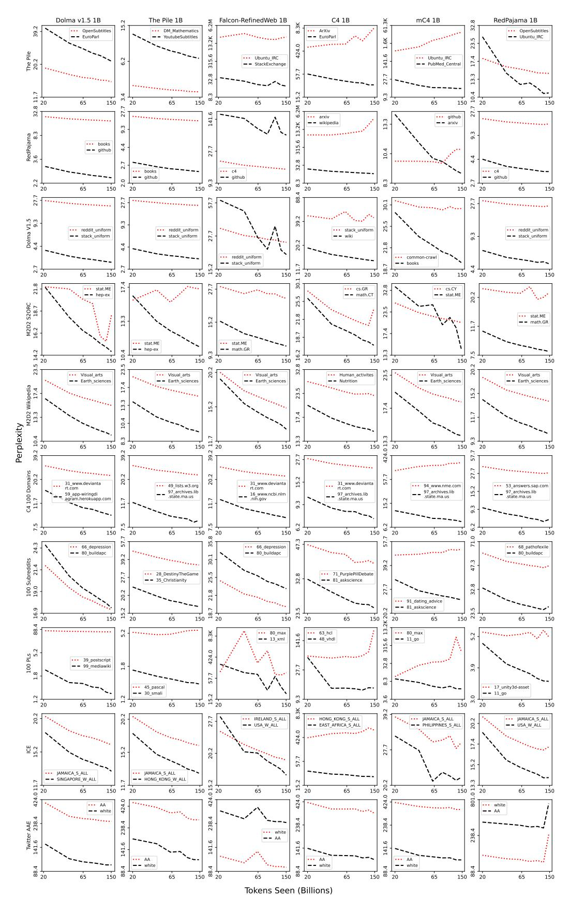

Figure 13: Perplexity curves for the most and least improved domains over an increase in tokens seen (See §4.2.1). Columns are specific baseline models; rows are specific evaluation sources.

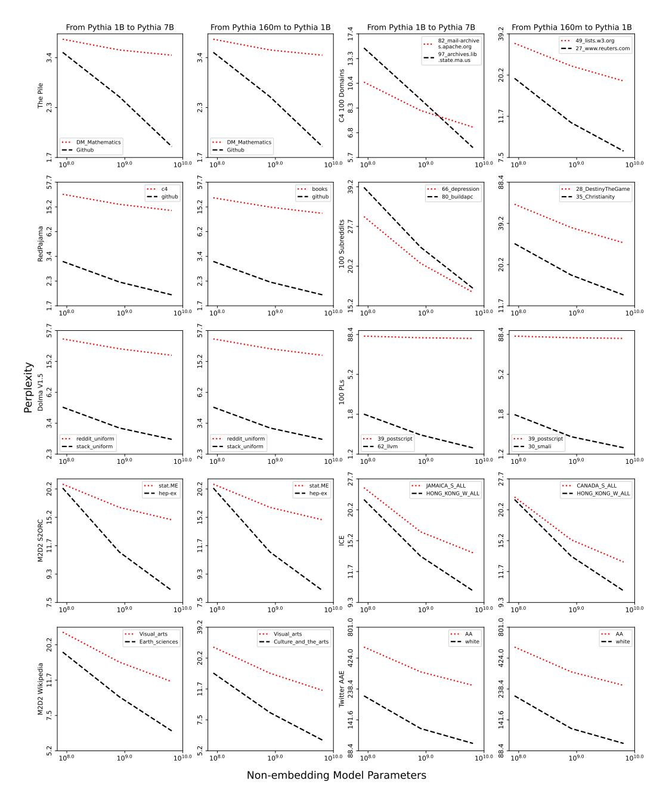

Figure 14: Perplexity curves for the most and least improved domains over an increase in model size (See §4.2.2). Columns are comparisons of specific model sizes. Each row shows first one (left two subplots) and then another (right two subplots) set of evaluation sources.