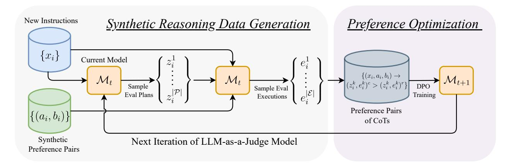

# Learning to Plan & Reason for Evaluation with Thinking-LLM-as-a-Judge

Swarnadeep Saha, Xian Li, Marjan Ghazvininejad, Jason Weston, Tianlu Wang

FAIR at Meta

LLM-as-a-Judge models generate chain-of-thought (CoT) sequences intended to capture the step-bystep reasoning process that underlies the final evaluation of a response. However, due to the lack of human-annotated CoTs for evaluation, the required components and structure of effective reasoning traces remain understudied. Consequently, previous approaches often (1) constrain reasoning traces to hand-designed components, such as a list of criteria, reference answers, or verification questions and (2) structure them such that planning is intertwined with the reasoning for evaluation. In this work, we propose EvalPlanner, a preference optimization algorithm for Thinking-LLM-as-a-Judge that first generates an unconstrained evaluation plan, followed by its execution, and then the final judgment. In a self-training loop, EvalPlanner iteratively optimizes over synthetically constructed evaluation plans and executions, leading to better final verdicts. Our method achieves a new state-of-the-art performance for generative reward models on RewardBench (with a score of 93.9), despite being trained on fewer amount of, and synthetically generated, preference pairs. Additional experiments on other benchmarks like RM-Bench, JudgeBench, and FollowBenchEval further highlight the utility of both planning and reasoning for building robust LLM-as-a-Judge reasoning models.

Date: January 31, 2025

Correspondence: Swarnadeep Saha at [swarnadeep@meta.com](mailto:swarnadeep@meta.com)


## 1 Introduction

As large language models (LLMs) continue to improve, reliably evaluating their long-form outputs has become even more challenging. Owing to the high cost of human evaluation, the LLM-as-a-Judge paradigm has emerged as a promising alternative where LLMs themselves are employed as evaluators [\(Zheng et al.,](#page-12-0) [2023;](#page-12-0) [Kim et al.,](#page-10-0) [2024a;](#page-10-0) [Saha et al.,](#page-11-0) [2024a;](#page-11-0) [Dubois et al.,](#page-9-0) [2024\)](#page-9-0). LLM-as-a-Judge models also serve as reward models during training for iterative preference optimization and self-improvement [\(Yuan et al.,](#page-12-1) [2024\)](#page-12-1). Compared to traditional reward models that only output scalar scores, LLM-as-a-Judge models expend more test-time compute by generating Chain-of-Thought (CoT) rationales of the underlying reasoning process of evaluation. This has been shown to not only improve evaluation accuracy but also enhance transparency [\(Zheng et al.,](#page-12-0) [2023;](#page-12-0) [Wang et al.,](#page-11-1) [2024c;](#page-11-1) [Ankner et al.,](#page-9-1) [2024\)](#page-9-1).

Despite the promise of LLM-as-a-Judge models, the lack of human-annotated CoTs makes it difficult to train such models. Hence, a crucial step in building these judges is generating rationales by writing down detailed evaluation instructions or rubrics that LLMs can follow. These hand-crafted instructions vary for every new domain (e.g., safety versus coding) [\(Yu et al.,](#page-12-2) [2024b\)](#page-12-2) and include manually designing evaluation criteria [\(Zheng](#page-12-0) [et al.,](#page-12-0) [2023;](#page-12-0) [Saha et al.,](#page-11-0) [2024a;](#page-11-0) [Trivedi et al.,](#page-11-2) [2024;](#page-11-2) [Wang et al.,](#page-11-3) [2024b,](#page-11-3)[c\)](#page-11-1), scoring rubrics, and steps for each criterion [\(Yuan et al.,](#page-12-1) [2024;](#page-12-1) [Trivedi et al.,](#page-11-2) [2024;](#page-11-2) [Kim et al.,](#page-10-1) [2024b;](#page-10-1) [Wang et al.,](#page-11-4) [2024d\)](#page-11-4). This is limiting because different tasks necessitate evaluation standards or procedures tailored to each specific task. For instance, evaluating an essay requires measuring quality along multiple, potentially subjective, fine-grained criteria like relevance and clarity whereas evaluating a math problem requires objectively verifying the correctness of the solution in a step-by-step manner [\(Lightman et al.,](#page-10-2) [2024\)](#page-10-2). Simply using predefined evaluation prompts hurts evaluation accuracy, while manually adjusting the evaluation instructions is neither scalable nor realistic, given the wide range of arbitrary and complex tasks that LLM-as-a-Judge models are used for.

To overcome these limitations, we propose EvalPlanner, a novel approach to building Thinking-LLM-as-a-Judge models that teaches LLMs to both plan and reason for evaluation. EvalPlanner is trained to perform complex

```
Example Input and Output of EvalPlanner
User Instruction: [Text]There is a French pub called The Phoenix that has a low customer rating but is child friendly and
is more than 30 dollars and is located in the riverside area near Crowne Plaza Hotel.
[Question]According to the above [Text], extract the attributes (name, eatType) of the restaurant.
Do not output your analysis, only output the result in the format of "attribute1[value1], attribute2[value2], ..."
Response A: Name[The Phoenix], eatType[pub], location[Riverside area near Crowne Plaza Hotel], priceRange[More than
30 dollars]
Response B: Name[The Phoenix], eatType[pub]
Output:
[Start of Evaluation Plan]
To evaluate the response quality, we will follow these steps:
1. **Check if the response provides the correct attributes**: Verify that the response includes the attributes "name" and
"eatType" as requested in the question.
2. **Verify the accuracy of the attribute values**: Check if the values provided for the attributes match the information
given in the original text.
3. **Check for any additional or missing information**: Ensure that the response does not include any extra attributes or
information not requested in the question.
Step-by-step reference answer:
1. The response should include the attributes "name" and "eatType".
2. The values for the attributes should be:
        * name: The Phoenix
        * eatType: French pub
3. The response should not include any additional attributes or information.
[End of Evaluation Plan]
[Start of Plan Execution]
**Step 1: Check if the response provides the correct attributes**
Assistant A's response includes the attributes "Name", "eatType", "location", and "priceRange". However, the question
only requests the attributes "nameänd "eatType". Assistant B's response includes the attributes "name" and "eatType",
which matches the request.
**Step 2: Verify the accuracy of the attribute values**
Assistant A's response provides the value "The Phoenix" for the attribute "Name" and "pub" for the attribute "eatType".
However, the original text describes the pub as "French", which is missing in the response. Assistant B's response.
Assistant B's response provides the value "The Phoenix" for the attribute "name" and "pub" for the attribute "eatType".
Similar to Assistant A's response, it is missing the "French" descriptor.
**Step 3: Check for any additional or missing information**
Assistant A's response includes additional attributes "location" and "priceRange" that are not requested in the question.
Assistant B's response does not include any additional attributes or information.
Based on the evaluation, both responses have some inaccuracies. However, Assistant B's response is more ac-
curate in terms of providing only the requested attributes, even though it is missing the "French" descriptor. The final
verdict is: [[B]]
[End of Plan Execution]
[Final Verdict]
[[B]]
```

Figure 1 A representative input and output of EvalPlanner. EvalPlanner takes a user instruction and a pair of responses as inputs. It generates a Chain-of-Thought, structured into a planning component (the evaluation plan), a reasoning component (the plan execution), and the final verdict. The evaluation plan specifies the recipe while the plan execution follows this recipe step-by-step by analyzing the responses, leading to the final judgment.

evaluation by thinking and spending more test-time compute with CoTs that are decoupled into a planning component and a reasoning component. In the planning component, the model generates a detailed evaluation plan, that consists of all the necessary steps to evaluate responses specific to the given instruction. In the reasoning component, the model executes the plan step-by-step and reasons through the input response(s) to arrive at the final verdict. EvalPlanner is iteratively trained in a self-improving loop [\(Yuan et al.,](#page-12-1) [2024;](#page-12-1) [Wang](#page-11-1) [et al.,](#page-11-1) [2024c;](#page-11-1) [Wu et al.,](#page-12-3) [2024a\)](#page-12-3) by sampling multiple plans and plan executions from the current model and performing preference optimization over correct and incorrect CoTs, i.e., chosen and rejected (plan, execution, verdict) triples. This teaches the model to iteratively optimize for both (1) generating a good plan that may encapsulate the most relevant and fine-grained criteria, scoring rubrics, reference answers, unit tests, etc based on the input task at hand and (2) performing correct execution grounded in the generated plan. EvalPlanner achieves this learning using only synthetic data as supervision via self-training.

We conduct extensive experiments on four reward modeling benchmarks – RewardBench, RM-Bench, JudgeBench, and FollowBenchEval – spanning instructions across categories of Chat, Safety, Code, Math, and fine-grained multi-level constraints. On RewardBench, EvalPlanner achieves a new state-of-the-art score of 93.9 for generative reward models, outperforming baselines that train on up to 30x more, and typically human-annotated, data. Our model also generalizes well to other benchmarks, obtaining up to 13% improvement over a leading model for complex prompts that require evaluating multi-level constraint satisfaction. Finally, we conduct a set of comprehensive ablations that highlight the effectiveness of EvalPlanner's (1) unconstrained evaluation plans over constrained ones, (2) iterative optimization recipe of these plans, and (3) data-efficiency, allowing it to obtain competitive performance with as few as 5K synthetic preference pairs. Overall, EvalPlanner opens up new opportunities for building Thinking-LLM-as-a-Judge models that scale up test-time compute for robust and transparent evaluation by learning to both plan and reason jointly.

### 2 EvalPlanner

We consider the setting of pairwise response evaluation using the LLM-as-a-Judge paradigm [\(Zheng et al.,](#page-12-0) [2023\)](#page-12-0). The judge model takes an instruction x and a pair of responses a and b as inputs and generates a preference judgment y, predicting the better response, a or b. By doing so, the model also generates a Chain-of-Thought (CoT) [\(Wei et al.,](#page-12-4) [2022\)](#page-12-4) aiming to capture the step-by-step reasoning behind the evaluation process.

### 2.1 Method Overview

Evaluating long machine-generated responses to complex instructions is primarily a planning and reasoning problem. In particular, the evaluator must first plan the evaluation recipe and then reason through that recipe and the response(s) to arrive at the final verdict. With that motivation, EvalPlanner hypothesizes that an effective Chain-of-Thought for evaluation should consist of three components: (1) the Evaluation Plan z, (2) the Execution of the Plan e, and (3) the Final Verdict y. Figure [1](#page-1-0) shows an example highlighting these three components. For a given input instruction x, the evaluation plan specifies the recipe for evaluating given responses to the instruction. The execution of the plan is responsible for actually conducting the evaluation by following the plan step-by-step, analyzing the input pair of responses a and b and generating the final judgment y. Given an LLM operating as an LLM-as-a-Judge, parameterized by θ, where the plan z and the execution e are assumed to be latent variables, we can write the generative process of the final verdict y as follows.

$$p_{\theta}(y|x,a,b) = \sum_{z \in \mathcal{P}} \sum_{e \in \mathcal{E}} p_{\theta}(y|e,z,x,a,b) p_{\theta}(e|z,x,a,b) p_{\theta}(z|x)$$

We follow this generative process to build preference pairs of CoTs [\(section 2.2\)](#page-2-0) for training such a model. See Figure [2](#page-3-0) for an overview. Given an instruction and a seed model, we first sample multiple plans z ∈ P. Then, for a given plan, instruction, and a pair of responses, we sample multiple executions e ∈ E of the plan which either lead to the correct final verdict or not. Using this data, we develop a self-training loop that trains an LLM-as-a-Judge model by optimizing over both plans and executions, leading to better judgments [\(section 2.3\)](#page-4-0). At test time, the model generates CoTs of the form ˜y = (z, ˜ e, ˜ y˜), structured into a plan, its execution, and the final verdict.

#### <span id="page-2-0"></span>2.2 Synthetic Training Data Generation

LLM-as-a-Judge models are typically trained on human-annotated preference judgments. However, collecting such data is a costly and tedious process, often requiring expert annotations for domains like code and mathematics [\(Ouyang et al.,](#page-11-5) [2022;](#page-11-5) [Wang et al.,](#page-11-1) [2024c\)](#page-11-1). Even when such judgments exist, they do not come with any corresponding reasoning steps. This motivates us to develop EvalPlanner by only assuming access to some carefully-chosen input instructions as training data. In the rest of this section, we describe our synthetic training data generation process, which includes constructing both preference pairs (a, b) and their CoTs y.

Prompt Selection and Generating Response Pairs. We choose prompts belonging to general instruction-following as well as mathematical reasoning. For general instruction-following prompts, we use the same approach as in Self-Taught Evaluators [\(Wang et al.,](#page-11-1) [2024c\)](#page-11-1) to generate response pairs, i.e., by first modifying the original

<span id="page-3-0"></span>

Figure 2 EvalPlanner: A Thinking-LLM-as-a-Judge model that learns to think by planning and reasoning for evaluation. Given an instruction and a preference pair as input, the synthetic reasoning data generation recipe consists of sampling multiple plans and multiple executions from the current model. These evaluation plans and executions are used to construct preference pairs of Chain-of-Thoughts, which are then iteratively optimized with DPO in a self-training loop.

instruction into a 'noisy' instruction and then generating a response to the noisy instruction. Consequently, the response to the original instruction becomes the chosen response, while the one for the 'noisy' instruction becomes the rejected response. For prompts specific to math reasoning, we sample multiple responses, where responses that lead to the correct solutions become our chosen responses, while those with incorrect solutions are considered rejected responses.

Generating Evaluation Plans. Given these synthetic preference pairs, we now want to generate the latent evaluation plans. Intuitively, a plan that evaluates an open-ended writing question would be structurally and semantically very different from a plan that evaluates a coding question. Hence, depending on the evaluation domain, the plans could vary significantly (see Appendix [C](#page-13-0) for some examples of diverse plans). This makes manually defining the structure or the components of a good plan time-consuming, less generalizable, and prone to user biases. Thus, we design a generic and unconstrained plan generation prompt (Fig. [3](#page-13-1) in Appendix) that queries a seed model (e.g., an instruction-tuned LLM) for an initial plan conditioned only on the input instruction. These plans will then be optimized later by self-training. As part of our experiments, we also show the efficacy of this plan generation prompt against other prompts that try to constrain plans to certain pre-defined components. Note that our planning prompt does not condition on the response pair to ensure that the generated plans represent only the recipe and not the actual evaluation. Evaluation happens in the second stage of plan execution, as described below.

Generating Plan Executions. In this second stage of plan execution, we now prompt the same seed model with the instruction and the response pair to reason through the plan generated in the previous step and the response pairs to produce a verdict (Fig. [4](#page-14-0) in Appendix). The benefits of disentangling the planning and execution stages are two-fold. First, the disentanglement tries to enforce that the reasoning/execution follows the plan. Second, by sampling multiple plans and multiple executions for the same plan, we can train a model on diverse evaluation data that vary in both planning and execution. Like the initial plans, the initial plan executions will also be optimized later via self-training.

Building Preference Pairs of Plans & Executions. Given the preference pairs, the plans, and their executions, we now build a preference tuning dataset to optimize over the CoTs. For each input instruction, we sample |P| plans and for each plan, we sample |E| executions. To account for position bias [\(Zheng et al.,](#page-12-0) [2023\)](#page-12-0), we generate plan executions according to both orders of the response pairs – (a, b) and (b, a). This results in a total of 2 × |P| × |E| CoTs, for each input instruction. A thought is considered correct if the corresponding (plan, execution, judgment) triplet leads to the correct verdict and incorrect otherwise. Using this correctness criterion, we construct our preference tuning dataset D = D(a,b) ∪ D(b,a) where D(a,b) and D(b,a) are defined as follows.

$$\mathcal{D}^{(a,b)} = \bigcup_{z \in \mathcal{P}} \{(x,a,b) \rightarrow (z,e^c,y^c); (x,a,b) \rightarrow (z,e^r,y^r) | e^c, e^r \in \mathcal{E}^{(a,b)} \}$$

$$\mathcal{D}^{(b,a)} = \bigcup_{z \in \mathcal{P}} \{(x,b,a) \rightarrow (z,e^c,y^c); (x,b,a) \rightarrow (z,e^r,y^r) | e^c,e^r \in \mathcal{E}^{(b,a)} \}$$

Intuitively, given an input (x, a, b), we generate multiple executions for each sampled plan z to enable the model to learn from its executions. Specifically, for each plan, we generate multiple executions and construct all possible correct and incorrect execution-pairs leading to correct and incorrect judgments respectively. This process allows us to construct "chosen" (c) and "rejected" (r) pairs that differ in their executions. To further improve the model's performance, we repeat this construction process. We construct chosen and rejected pairs for all plans  $\mathcal{P}$ , enabling the model to learn to generate better plans in the first place. We also construct pairs for both execution orders of responses -(a, b) and (b, a) – ensuring that the model becomes position-consistent. If none of the executions lead to the correct verdict, the corresponding sample is not included in our training data. By scaling up the construction process, we provide the model with a more comprehensive set of examples to learn from, enabling it to refine its decision-making process and improve its overall performance.

#### <span id="page-4-0"></span>2.3 Preference Optimization of Plans & Executions

Having developed the initial training data generation recipe, we now describe the training algorithm of EvalPlanner. The pipeline consists of a self-training loop, starting with a seed model  $\mathcal{M}_0$  (e.g., an instruction-tuned LLM), doing supervised fine-tuning (SFT) on a subset of the 'chosen' CoTs to obtain a model  $\mathcal{M}_1^{\text{SFT}}$ , followed by two iterations of Direct Preference Optimization (DPO) (Rafailov et al., 2024) on preference pairs of CoTs, leading to models  $\mathcal{M}_1^{\text{DPO}}$  and  $\mathcal{M}_2^{\text{DPO}}$ .

 $\mathcal{M}_1^{\text{SFT}}$ : **SFT on**  $\mathcal{D}_1^c$ , initialized from  $\mathcal{M}_0$ . Starting from the seed model  $\mathcal{M}_0$  and a subset of input instructions and response pairs, we follow the recipe in section 2.2 to generate the preference pairs of thoughts. Let us denote this dataset by  $\mathcal{D}_1$ . To teach the model to correctly follow the pattern of our CoT (plan+execution+verdict), we first fine-tune  $\mathcal{M}_0$  on  $\mathcal{D}_1^c$  – a subset of only the 'chosen' thoughts from  $\mathcal{D}_1$ . Specifically, for each instruction, we randomly sample one correct thought (that leads to the correct verdict) and perform SFT on that data, leading to a model  $\mathcal{M}_1^{\text{SFT}}$ .

 $\mathcal{M}_1^{\text{DPO}}$ : **DPO on**  $\mathcal{D}_1$ , initialized from  $\mathcal{M}_1^{\text{SFT}}$ . Next, initialized from  $\mathcal{M}_1^{\text{SFT}}$ , we perform DPO on the dataset  $\mathcal{D}_1$ , consisting of both chosen and rejected thoughts. Given the two distinct parts of plan and execution tokens in the thoughts, this teaches the model to contrast between correct and incorrect thoughts, that vary in both the plan and the execution of evaluation. We thus obtain a model  $\mathcal{M}_1^{\text{DPO}}$ .

 $\mathcal{M}_2^{\text{DPO}}$ : **DPO on**  $\mathcal{D}_2$ , initialized from  $\mathcal{M}_1^{\text{DPO}}$ . EvalPlanner also consists of a second iteration of DPO, wherein we choose a fresh subset of instructions and response pairs and generate CoTs using the same recipe but from the previous iteration of model  $\mathcal{M}_1^{\text{DPO}}$ . In particular, we first sample  $|\mathcal{P}|$  CoTs from  $\mathcal{M}_1^{\text{DPO}}$  for each training data point, separate out the plans from the thoughts, and then use the same  $\mathcal{M}_1^{\text{DPO}}$  model to sample  $|\mathcal{E}|$  executions for each plan. We denote this second iteration of CoT data as  $\mathcal{D}_2$ . We train on new inputs and thoughts from an updated model, under the assumption that the data from the previous iteration is of lower quality. Empirically, we also show that this outperforms a single iteration of DPO trained on the entire set of inputs.

# 3 Experimental Setup

#### 3.1 Training

We select prompts from two different sources – WildChat (Zhao et al., 2024) and MATH (Hendrycks et al., 2021). For WildChat, we directly use the synthetic responses generated by Self-Taught Evaluators (Wang et al., 2024c). For MATH questions, we generate synthetic responses as follows. We prompt a Mixtral 22Bx8 Instruct model to generate multiple candidate solutions. The responses that lead to the correct final answers become our chosen responses while those with incorrect final answers are considered rejected responses. Using synthetic response-pair generation, we collect a total of 17,588 and 4,141 unique (instruction, chosen, rejected) triples from WildChat and MATH, respectively, as our training data, using two separate methods. From this, we select a random subset of 5K instructions (consisting of 2.5K from WildChat and 2.5K from MATH) for SFT and the first iteration of DPO. We reserve the rest for the second iteration of DPO. In each iteration, we sample 5 plans and for each plan, we sample 8 executions (4 in each order of response pair) using a temperature of 0.8 and top\_p of 0.95. We develop EvalPlanner with either Llama-3.1-70B-Instruct

or Llama-3.3-70B-Instruct as the seed model to show the generalizability of our approach across multiple seed models. As validation set, we choose 150 samples from each of WildChat and MATH, which we use for checkpoint selection. To account for position bias in pairwise evaluation, we double the number of examples in the validation set by considering both orders of response pairs. We use the fairseq2 library [\(Balioglu,](#page-9-2) [2023\)](#page-9-2) for model training and vLLM [\(Kwon et al.,](#page-10-4) [2023\)](#page-10-4) for inference. All models are trained for a maximum of 1K steps, saving checkpoints every 100 steps and doing early stopping based on the validation set. Detailed training hyperparameters are provided in Table [10.](#page-14-1)

### 3.2 Evaluation

We test EvalPlanner on the following pairwise evaluation benchmarks.

- RewardBench [\(Lambert et al.,](#page-10-5) [2024\)](#page-10-5). It consists of (prompt, chosen, rejected) triples spanning 4 categories of prompts: chat, chat-hard, safety, and reasoning.
- FollowBenchEval. We build this new evaluation benchmark from FollowBench [\(Jiang et al.,](#page-10-6) [2024\)](#page-10-6). The original benchmark consists of complex prompts that test LLMs' ability to follow multi-level fine-grained constraints (e.g., 'Write a summary within 20 words'). We convert this benchmark into a pairwise evaluation benchmark by sampling two responses from a single model (LLama-3.1-8B-Instruct, LLama-3.2-3B-Instruct, or Mistral-7B-Instruct-v0.2) such that one response satisfies all the constraints and the other one does not. Note that by generating the response-pair using the same model, we ensure consistency in response style which can otherwise lead to potentially superficial features for preference judgments. Our evaluation benchmark, called FollowBenchEval, comprises of 205 samples and spans five different constraint-types of Content, Situation, Style, Format, and Example. This benchmark specifically tests LLM-based judges' ability to (1) plan for multiple constraints that need to be checked, and (2) produce a verdict by checking for those constraints.
- RM-Bench [\(Liu et al.,](#page-11-7) [2024\)](#page-11-7). RM-Bench is designed to assess the robustness of reward models, based on their sensitivity and resistance to subtle content differences and style biases. The original benchmark primarily focuses on evaluating reward models that rate each response independently. We modify the input prompt to accommodate for the evaluation of LLM-as-a-Judge models, which conduct pairwise judgments by comparing two responses simultaneously.
- JudgeBench [\(Tan et al.,](#page-11-8) [2024\)](#page-11-8). JudgeBench is a recent benchmark that evaluates LLM-based judges on challenging response pairs spanning knowledge, reasoning, math, and coding. It sources input instructions from existing datasets and generates candidate responses using stronger language models such as GPT-4o and Claude-3.5-Sonnet. Following [Tan et al.](#page-11-8) [\(2024\)](#page-11-8), we report results on the GPT-4o subset.

Apart from RewardBench (where we follow the original evaluation protocol), for all other benchmarks we report position-consistent accuracy to account for the position bias. Specifically, a prediction is considered correct if the model consistently makes a correct judgment in both orders. We train and test all our models using the standard pair-wise judge prompt from prior work [\(Zheng et al.,](#page-12-0) [2023\)](#page-12-0), as shown in Figure [5.](#page-14-2) The maximum number of generation tokens is set to 2048 and the temperature to 0 for inference.

### 3.3 Baselines

We compare EvalPlanner with a range of models, including (1) Powerful Open-Sourced and Closed-Sourced LLMs used as judges in a zero-shot manner, (2) Reward Models with Critiques, capable of generating both scalar scores and critiques, and (3) SOTA Generative Reward Models, as listed on the RewardBench leaderboard.[1](#page-5-0) We focus on models that also generate rationales along with the final verdict, to compare related competing approaches.

### 4 Results

### 4.1 Experimental Results on Benchmarks

EvalPlanner outperforms all baselines while being trained on fewer, and synthetically generated, preference pairs. Table [1](#page-6-0) shows results on RewardBench. Using the same recipe, we train two EvalPlanner models with

<span id="page-5-0"></span><sup>1</sup><https://huggingface.co/spaces/allenai/reward-bench>

<span id="page-6-0"></span>Table 1 Comparison of EvalPlanner with SOTA generative reward models on RewardBench. EvalPlanner outperforms all prior models, while using a smaller number of (22K) synthetically constructed preference pairs as training data. †: Results taken from either RewardBench leaderboard or the corresponding paper. ‡: Results taken from the Critic-RM-Rank paper [\(Yu et al.,](#page-12-2) [2024b\)](#page-12-2).

|                                                        | #Pref Pairs | Overall | Chat | Chat-Hard | Safety | Reasoning |
|--------------------------------------------------------|-------------|---------|------|-----------|--------|-----------|
| Open and Closed LLMs                                   |             |         |      |           |        |           |
| Llama3.1-70B-Instruct†                                 | -           | 84.0    | 97.2 | 70.2      | 82.8   | 86.0      |
| Llama3.1-405B-Instruct†                                | -           | 84.1    | 97.2 | 74.6      | 77.6   | 87.1      |
| Llama3.3-70B-Instruct                                  | -           | 85.4    | 96.9 | 77.4      | 77.6   | 89.6      |
| Claude-3.5-sonnet†                                     | -           | 84.2    | 96.4 | 74.0      | 81.6   | 84.7      |
| GPT-4o†                                                | -           | 86.7    | 96.1 | 76.1      | 88.1   | 86.6      |
| Gemini-1.5-pro-0514†                                   | -           | 88.2    | 92.3 | 80.6      | 87.9   | 92.0      |
| Reward Models with Critiques                           |             |         |      |           |        |           |
| SynRM‡<br>(Ye et al., 2024)                            | -           | 87.3    | 97.5 | 76.8      | 88.5   | 86.3      |
| CLoud‡<br>(Ankner et al., 2024)                        | -           | 87.6    | 98.0 | 75.6      | 87.6   | 89.0      |
| Critic-RM-Rank‡<br>(Yu et al., 2024b)                  | -           | 90.5    | 97.5 | 79.6      | 90.6   | 94.1      |
| SOTA Generative Reward Models                          |             |         |      |           |        |           |
| Self-Taught Evaluator†<br>(Wang et al., 2024c)         | 20K         | 90.0    | 96.9 | 85.1      | 89.6   | 88.4      |
| SFR-Llama-3.1-70B-Judge†<br>(Wang et al., 2024b)       | 680K        | 92.7    | 96.9 | 84.8      | 91.6   | 97.6      |
| Skywork-Critic-Llama-3.1-70B†<br>(Shiwen et al., 2024) | 80K         | 93.3    | 96.6 | 87.9      | 93.1   | 95.5      |
| LMUnit†<br>(Saad-Falcon et al., 2024)                  | 84K         | 93.4    | -    | -         | -      | -         |
| EvalPlanner (w/ Llama-3.1-70B-Instruct as seed model)  | 22K         | 93.9    | 97.5 | 89.4      | 93.0   | 95.5      |
| EvalPlanner (w/ Llama-3.3-70B-Instruct as seed model)  | 22K         | 93.8    | 97.7 | 89.5      | 91.7   | 96.1      |

<span id="page-6-1"></span>Table 2 EvalPlanner results on RewardBench comparing two iterations of DPO with one iteration.

| # DPO Iterations              | #Pref Pairs  | Accuracy |
|-------------------------------|--------------|----------|
| 1 (w/ Llama-3.1-70B-Instruct) | 5K           | 92.3     |
| 1 (w/ Llama-3.1-70B-Instruct) | 22K          | 92.5     |
| 2 (w/ Llama-3.1-70B-Instruct) | 22K (5K+17K) | 93.9     |

different Llama versions as the seed model (Llama-3.1-70B-Instruct and Llama-3.3-70B-Instruct). Both of our models outperform all baselines, achieving new state-of-the-arts for generative reward models on RewardBench. Particularly impressively, EvalPlanner achieves these results by being trained on a smaller number of preference pairs (22K), compared to most prior works. Moreover, EvalPlanner's training data only consists of synthetically generated preference pairs, unlike past works that primarily train on human-annotated preference pairs. EvalPlanner's training recipe is also equally performant on both Llama seed models, showing the usefulness of our initial training data and the generalizability of our approach. Overall, our results highlight the utility of planning and reasoning for evaluation, not only for better final judgments but also for better grounding of the evaluation in a detailed plan.

EvalPlanner's plans are tailored toward the specific instruction being evaluated. We design EvalPlanner such that the generated plan represents a general evaluation recipe tailored toward the specific instruction being evaluated. This is achieved by disentangling planning from reasoning and having the model directly optimize the thoughts without any domain-specific tuning. Appendix [C](#page-13-0) shows examples of such plans generated by EvalPlanner for diverse instructions.

EvalPlanner is data-efficient and benefits from iterative thought optimization. Next, in Table [2,](#page-6-1) we show the performance of EvalPlanner with as few as 5K preference pairs. It obtains a score of 92.3, competitive with the best models on RewardBench. We also demonstrate the effectiveness of iterative DPO – the second iteration of DPO improves results significantly (92.3 → 93.9). In contrast, the same amount of data in one single DPO iteration only leads to marginal improvements (92.3 → 92.5). The iterative improvement of EvalPlanner can be attributed to training on newer data points that are augmented with CoTs from an updated model. Repeating this recipe for more iterations can potentially lead to further improvements, which we leave for future work to explore.

EvalPlanner generalizes to evaluating multi-level constraints in FollowBenchEval. Table [3](#page-7-0) presents our results

<span id="page-7-0"></span>Table 3 Results on FollowBenchEval for evaluation of complex prompts with multi-level constraints. EvalPlanner significantly outperforms other approaches on this challenging task.

| Model                                              | Overall | L1   | L2   | L3   | L4   | L5   |
|----------------------------------------------------|---------|------|------|------|------|------|
| Llama-3.1-70B-Instruct                             | 44.4    | 51.1 | 50.0 | 35.9 | 46.2 | 42.4 |
| Llama-3.3-70B-Instruct                             | 52.2    | 55.3 | 61.9 | 48.7 | 53.8 | 45.5 |
| Self-Taught Evaluator (Wang et al., 2024c)         | 46.8    | 53.2 | 52.4 | 51.3 | 43.6 | 36.4 |
| Skywork-Critic-Llama-3.1-70B (Shiwen et al., 2024) | 52.2    | 63.8 | 57.1 | 48.7 | 46.2 | 48.5 |
| EvalPlanner (w/ Llama-3.1-70B-Instruct)            | 56.6    | 66.0 | 61.9 | 56.4 | 53.8 | 48.5 |
| EvalPlanner (w/ Llama-3.3-70B-Instruct)            | 65.4    | 72.3 | 73.8 | 66.7 | 61.5 | 57.6 |

<span id="page-7-1"></span>Table 4 Results on RM-Bench for evaluation of models' robustness to subtle content changes and style biases. EvalPlanner demonstrates superior robustness across all subsets, outperforming other methods which are more vulnerable to subtle changes, particularly in the Hard subset where responses are detailed and well-formatted.

| Model                                              | Overall | Easy | Normal | Hard |
|----------------------------------------------------|---------|------|--------|------|
| Llama3.1-70B-Instruct                              | 64.9    | 68.9 | 62.6   | 63.3 |
| Llama3.3-70B-Instruct                              | 69.5    | 77.5 | 66.3   | 64.8 |
| Self-Taught Evaluator (Wang et al., 2024c)         | 73.6    | 75.9 | 72.4   | 72.4 |
| Skywork-Critic-Llama-3.1-70B (Shiwen et al., 2024) | 74.1    | 76.3 | 72.9   | 73.1 |
| EvalPlanner (w/ Llama-3.1-70B-Instruct)            | 80.0    | 81.7 | 77.2   | 81.1 |
| EvalPlanner (w/ Llama-3.3-70B-Instruct)            | 82.1    | 81.1 | 80.8   | 84.3 |

on FollowBenchEval. The input instructions contain up to five constraints, denoted in the table as L1-L5. Given the nature of this dataset, the preference judgments focus on objective preference criteria (i.e., whether all constraints are satisfied or not), as opposed to subjective metrics like stylistic preferences (e.g., Chat category in RewardBench). This makes evaluating such prompts more challenging for LLMs and allows us to objectively assess the utility of planning and step-wise reasoning for evaluation. In such scenarios, EvalPlanner demonstrates clear benefits over its baselines that do not explicitly plan or reason, outperforming Skywork-Critic-Llama-3.1-70B (a state-of-the-art model on RewardBench) by a significant 13%.

EvalPlanner generalizes to RM-Bench and JudgeBench. We show results on other recent benchmarks like RM-Bench [\(Liu et al.,](#page-11-7) [2024\)](#page-11-7) and JudgeBench [\(Tan et al.,](#page-11-8) [2024\)](#page-11-8) in Tables [4](#page-7-1) and [5](#page-7-2) respectively. On RM-Bench, EvalPlanner outperforms all baselines, achieving up to 8% improvement over a prior state-of-the-art Skywork-Critic-LLama-3.1-Instruct model, showing its robustness to subtle differences and style biases. Notably, while all other models exhibit a drop in accuracy on the hard subset, EvalPlanner is equally performant across all the subsets. On JudgeBench, EvalPlanner with LLama-3.3-70B-Instruct achieves comparable performance to Skywork-Critic-LLama-3.1-Instruct, while being trained on much less and synthetic preference pairs.

<span id="page-7-2"></span>Table 5 Results on JudgeBench for evaluation of models' capabilities on challenging questions spanning multiple categories. EvalPlanner with Llama-3.3-70B-Instruct achieves comparable performance to Skywork-Critic-Llama-3.1- 70B and outperforms all other baselines.

| Model                                                                              | Overall      | Knowledge    | Reasoning    | Math         | Coding       |
|------------------------------------------------------------------------------------|--------------|--------------|--------------|--------------|--------------|
| Llama3.1-70B-Instruct                                                              | 50.3         | 53.9         | 36.7         | 64.3         | 50.0         |
| Llama3.3-70B-Instruct                                                              | 48.6         | 50.0         | 43.9         | 55.4         | 45.2         |
| Self-Taught Evaluator (Wang et al., 2024c)                                         | 48.3         | 52.6         | 40.8         | 57.1         | 38.1         |
| Skywork-Critic-Llama-3.1-70B (Shiwen et al., 2024)                                 | 57.1         | 56.5         | 55.1         | 71.4         | 45.2         |
| EvalPlanner (w/ LLama-3.1-70B-Instruct)<br>EvalPlanner (w/ LLama-3.3-70B-Instruct) | 50.9<br>56.6 | 48.1<br>55.8 | 50.0<br>56.1 | 60.7<br>69.6 | 50.0<br>42.9 |

### 4.2 Ablations and Analysis

We conduct all ablations on RewardBench using an EvalPlanner checkpoint, trained on 2.5K MATH instructions using Llama-3.1-70B-Instruct as the seed model.

<span id="page-8-0"></span>Table 6 Ablation on RewardBench showing the effectiveness of preference optimization of plans & executions.

| Model                                        | Accuracy |
|----------------------------------------------|----------|
| Llama3.1-70B-Instruct (seed model)           | 84.0     |
| Llama3.1-70B-Instruct (trained w/o thoughts) | 86.2     |
| EvalPlanner (SFT w/ thoughts)                | 86.8     |
| EvalPlanner (SFT + DPO w/ thoughts)          | 90.5     |

<span id="page-8-1"></span>Table 7 Ablation on RewardBench comparing the effectiveness of different types of plans.

| Type of Plan                                     | Accuracy |
|--------------------------------------------------|----------|
| List of Criteria (Wang et al., 2024c)            | 83.9     |
| Verification Questions (Dhuliawala et al., 2023) | 84.8     |
| Unconstrained (Ours)                             | 86.8     |

Effectiveness of Thought Preference Optimization. In Table [6,](#page-8-0) we compare EvalPlanner with (1) the seed Llama-3.1-70B-Instruct model, (2) a model trained to only predict the final verdict without any intermediate CoT, and (3) an EvalPlanner variant only SFT'ed on the "chosen" examples. The results show that preference optimization of plans & executions is particularly important, leading to significant improvements over all baselines.

Effectiveness of Unconstrained Plans over Constrained Plans. Recall that EvalPlanner is built with an initial planning prompt that relied on the seed model to generate unconstrained plans. In this experiment, we compare this unconstrained planning prompt with two other prompts that constrain the plans to (1) a list of criteria, similar to Self-Taught Evaluators [\(Wang et al.,](#page-11-1) [2024c\)](#page-11-1) or (2) a list of verification questions, similar to Chain-of-Verification [\(Dhuliawala et al.,](#page-9-3) [2023\)](#page-9-3). As shown in Table [7,](#page-8-1) unconstrained plans obtain superior performance by generating more detailed plans and then grounding the evaluation on that plan. A generic planning prompt that works across multiple domains showcases the generalizability of our approach.

Appendix [A](#page-13-2) presents more analyses like effect of scaling up the number of plans and executions and source instructions.

## 5 Related Work

LLM-as-a-Judge. Human evaluation is often considered the gold standard for evaluating LLM responses to complex and open-ended instructions [\(Ouyang et al.,](#page-11-5) [2022;](#page-11-5) [Dubey et al.,](#page-9-4) [2024\)](#page-9-4). However, given the slow, expensive, and noisy nature of human evaluation [\(Clark et al.,](#page-9-5) [2021;](#page-9-5) [Karpinska et al.,](#page-10-7) [2021\)](#page-10-7), automatic approaches leveraging LLMs have emerged as scalable and cost-effective alternatives [\(Zheng et al.,](#page-12-0) [2023;](#page-12-0) [Liu et al.,](#page-10-8) [2023;](#page-10-8) [Kim et al.,](#page-10-0) [2024a;](#page-10-0) [Saha et al.,](#page-11-0) [2024a;](#page-11-0) [Jiang et al.,](#page-10-9) [2023;](#page-10-9) [Zhu et al.,](#page-12-7) [2023\)](#page-12-7). Compared to reward models that only output scalar scores [\(Wang et al.,](#page-11-11) [2024a,](#page-11-11)[e,](#page-11-12)[d\)](#page-11-4), LLM-as-a-Judge evaluators are more robust and interpretable because of their ability to also generate detailed rationales [\(Zheng et al.,](#page-12-0) [2023;](#page-12-0) [Zhang](#page-12-8) [et al.,](#page-12-8) [2024a;](#page-12-8) [Ankner et al.,](#page-9-1) [2024\)](#page-9-1). However, in the absence of any human-annotated reasoning traces for evaluation, past works have leveraged LLMs to generate these traces by writing custom prompts for every new domain [\(Yu et al.,](#page-12-2) [2024b\)](#page-12-2) and hand-designing the components and structure of CoTs, ranging from fine-grained criteria [\(Zheng et al.,](#page-12-0) [2023;](#page-12-0) [Saha et al.,](#page-11-0) [2024a;](#page-11-0) [Wang et al.,](#page-11-1) [2024c;](#page-11-1) [Zeng et al.,](#page-12-9) [2024;](#page-12-9) [Trivedi et al.,](#page-11-2) [2024\)](#page-11-2), scoring rubric [\(Yuan et al.,](#page-12-1) [2024;](#page-12-1) [Trivedi et al.,](#page-11-2) [2024;](#page-11-2) [Wu et al.,](#page-12-10) [2024b\)](#page-12-10), verification questions [\(Dhuliawala](#page-9-3) [et al.,](#page-9-3) [2023\)](#page-9-3), natural language unit tests [\(Saad-Falcon et al.,](#page-11-10) [2024\)](#page-11-10), and reference answers [\(Zhang et al.,](#page-12-11) [2024b\)](#page-12-11). In contrast, EvalPlanner proposes a unifying perspective on evaluation by subsuming all necessary components for sound evaluation inside a plan and then letting the model optimize these plans and their executions in a self-training loop.

Self-Alignment. Reinforcement Learning from Human Feedback requires a large amount of human annotations, which can be expensive to obtain [\(Bai et al.,](#page-9-6) [2022;](#page-9-6) [Lee et al.,](#page-10-10) [2024\)](#page-10-10). This has led to the development of various self-alignment techniques for general instruction following [\(Li et al.,](#page-10-11) [2024;](#page-10-11) [Yuan et al.,](#page-12-1) [2024;](#page-12-1) [Wu et al.,](#page-12-3) [2024a\)](#page-12-3), reasoning [\(Zelikman et al.,](#page-12-12) [2022;](#page-12-12) [Pang et al.,](#page-11-13) [2024;](#page-11-13) [Gulcehre et al.,](#page-10-12) [2023;](#page-10-12) [Yu et al.,](#page-12-13) [2024a\)](#page-12-13), and evaluation [\(Pace](#page-11-14) [et al.,](#page-11-14) [2024;](#page-11-14) [Wang et al.,](#page-11-1) [2024c;](#page-11-1) [Trivedi et al.,](#page-11-2) [2024\)](#page-11-2). Specifically, for evaluation, [Wang et al.](#page-11-1) [\(2024c\)](#page-11-1) construct

preference pairs by adding noise to the original instructions, while [Trivedi et al.](#page-11-2) [\(2024\)](#page-11-2) uses self-rationalization and a meta-judge to train a fine-grained judge. Different from these, EvalPlanner proposes a novel self-training recipe that teaches an LLM-as-a-Judge to think by generating and reasoning with evaluation plans.

Training to Think, Plan, and Reason. EvalPlanner follows a large body of prior work on equipping LLMs with the ability to think by generating additional thought tokens before the final answer [\(Nye et al.,](#page-11-15) [2021;](#page-11-15) [Zelikman](#page-12-12) [et al.,](#page-12-12) [2022;](#page-12-12) [Wu et al.,](#page-12-3) [2024a;](#page-12-3) [Hosseini et al.,](#page-10-13) [2024\)](#page-10-13). Unlike methods that train on ground-truth thoughts e.g., in the domains of algorithmic reasoning, math, or planning [\(Nye et al.,](#page-11-15) [2021;](#page-11-15) [Lehnert et al.,](#page-10-14) [2024;](#page-10-14) [Saha et al.,](#page-11-16) [2024b\)](#page-11-16), EvalPlanner is bootstrapped and self-trained from synthetically generated thoughts – focusing on evaluation where objectively defining the structure and components of intermediate thoughts is challenging. Moreover, EvalPlanner's thoughts have decoupled planning and reasoning components, allowing it to optimize both at the same time.

## 6 Conclusion

We presented EvalPlanner, a novel approach for building robust and data-efficient Thinking-LLM-as-a-Judge models. Through comprehensive experiments across four benchmarks, we demonstrated the effectiveness of our method, achieving a new SOTA with significantly less, and synthetically generated, training data. To further understand the capabilities of Thinking-LLM-as-a-Judge models, future work could employ them as reward models in the RLHF pipeline.

# Impact Statement

EvalPlanner's broader goal is to advance the field of Machine Learning and in particular, evaluation, by allowing LLM-as-a-Judge models to think before producing a judgment. This has the potential to improve evaluation accuracy and transparency in various applications. EvalPlanner is trained on synthetically generated data from seed Llama models that can reflect stereotypes, biases, and other negative traits present in their pre-training data [\(Weidinger et al.,](#page-12-14) [2021\)](#page-12-14), which we do not have control over. We encourage further research and discussion on these topics to ensure that this technology is developed and deployed responsibly.

### References

<span id="page-9-1"></span>Zachary Ankner, Mansheej Paul, Brandon Cui, Jonathan D Chang, and Prithviraj Ammanabrolu. Critique-out-loud reward models. arXiv preprint arXiv:2408.11791, 2024.

<span id="page-9-6"></span>Yuntao Bai, Andy Jones, Kamal Ndousse, Amanda Askell, Anna Chen, Nova DasSarma, Dawn Drain, Stanislav Fort, Deep Ganguli, Tom Henighan, et al. Training a helpful and harmless assistant with reinforcement learning from human feedback. arXiv preprint arXiv:2204.05862, 2022. <https://arxiv.org/abs/2204.05862>.

<span id="page-9-2"></span>Can Balioglu. fairseq2, 2023. <http://github.com/facebookresearch/fairseq2>.

<span id="page-9-5"></span>Elizabeth Clark, Tal August, Sofia Serrano, Nikita Haduong, Suchin Gururangan, and Noah A Smith. All that's 'human'is not gold: Evaluating human evaluation of generated text. In Proceedings of the 59th Annual Meeting of the Association for Computational Linguistics and the 11th International Joint Conference on Natural Language Processing (Volume 1: Long Papers), pages 7282–7296, 2021. <https://aclanthology.org/2021.acl-long.565/>.

<span id="page-9-3"></span>Shehzaad Dhuliawala, Mojtaba Komeili, Jing Xu, Roberta Raileanu, Xian Li, Asli Celikyilmaz, and Jason Weston. Chain-of-verification reduces hallucination in large language models. arXiv preprint arXiv:2309.11495, 2023. <https://arxiv.org/abs/2309.11495>.

<span id="page-9-4"></span>Abhimanyu Dubey, Abhinav Jauhri, Abhinav Pandey, Abhishek Kadian, Ahmad Al-Dahle, Aiesha Letman, Akhil Mathur, Alan Schelten, Amy Yang, Angela Fan, et al. The llama 3 herd of models. arXiv preprint arXiv:2407.21783, 2024. <https://arxiv.org/abs/2407.21783>.

<span id="page-9-0"></span>Yann Dubois, Chen Xuechen Li, Rohan Taori, Tianyi Zhang, Ishaan Gulrajani, Jimmy Ba, Carlos Guestrin, Percy S Liang, and Tatsunori B Hashimoto. Alpacafarm: A simulation framework for methods that learn from human feedback. Advances in Neural Information Processing Systems, 36, 2024. [https://proceedings.neurips.cc/paper\\_](https://proceedings.neurips.cc/paper_files/paper/2023/hash/5fc47800ee5b30b8777fdd30abcaaf3b-Abstract-Conference.html) [files/paper/2023/hash/5fc47800ee5b30b8777fdd30abcaaf3b-Abstract-Conference.html](https://proceedings.neurips.cc/paper_files/paper/2023/hash/5fc47800ee5b30b8777fdd30abcaaf3b-Abstract-Conference.html).

- <span id="page-10-12"></span>Caglar Gulcehre, Tom Le Paine, Srivatsan Srinivasan, Ksenia Konyushkova, Lotte Weerts, Abhishek Sharma, Aditya Siddhant, Alex Ahern, Miaosen Wang, Chenjie Gu, et al. Reinforced self-training (rest) for language modeling. arXiv preprint arXiv:2308.08998, 2023. <https://arxiv.org/abs/2308.08998>.
- <span id="page-10-3"></span>Dan Hendrycks, Collin Burns, Saurav Kadavath, Akul Arora, Steven Basart, Eric Tang, Dawn Song, and Jacob Steinhardt. Measuring mathematical problem solving with the math dataset. In Thirty-fifth Conference on Neural Information Processing Systems Datasets and Benchmarks Track (Round 2), 2021. [https://openreview.net/forum?](https://openreview.net/forum?id=7Bywt2mQsCe) [id=7Bywt2mQsCe](https://openreview.net/forum?id=7Bywt2mQsCe).
- <span id="page-10-13"></span>Arian Hosseini, Xingdi Yuan, Nikolay Malkin, Aaron Courville, Alessandro Sordoni, and Rishabh Agarwal. V-star: Training verifiers for self-taught reasoners. arXiv preprint arXiv:2402.06457, 2024. [https://arxiv.org/abs/2402.](https://arxiv.org/abs/2402.06457) [06457](https://arxiv.org/abs/2402.06457).
- <span id="page-10-9"></span>Dongfu Jiang, Yishan Li, Ge Zhang, Wenhao Huang, Bill Yuchen Lin, and Wenhu Chen. Tigerscore: Towards building explainable metric for all text generation tasks. Transactions on Machine Learning Research, 2023. <https://openreview.net/forum?id=EE1CBKC0SZ>.
- <span id="page-10-6"></span>Yuxin Jiang, Yufei Wang, Xingshan Zeng, Wanjun Zhong, Liangyou Li, Fei Mi, Lifeng Shang, Xin Jiang, Qun Liu, and Wei Wang. FollowBench: A multi-level fine-grained constraints following benchmark for large language models. In Lun-Wei Ku, Andre Martins, and Vivek Srikumar, editors, Proceedings of the 62nd Annual Meeting of the Association for Computational Linguistics (Volume 1: Long Papers), pages 4667–4688, Bangkok, Thailand, August 2024. Association for Computational Linguistics. doi: 10.18653/v1/2024.acl-long.257. <https://aclanthology.org/2024.acl-long.257>.
- <span id="page-10-7"></span>Marzena Karpinska, Nader Akoury, and Mohit Iyyer. The perils of using mechanical turk to evaluate open-ended text generation. In Proceedings of the 2021 Conference on Empirical Methods in Natural Language Processing, pages 1265–1285, 2021. <https://aclanthology.org/2021.emnlp-main.97/>.
- <span id="page-10-0"></span>Seungone Kim, Jamin Shin, Yejin Cho, Joel Jang, Shayne Longpre, Hwaran Lee, Sangdoo Yun, Seongjin Shin, Sungdong Kim, James Thorne, et al. Prometheus: Inducing fine-grained evaluation capability in language models. In The Twelfth International Conference on Learning Representations, 2024a. <https://openreview.net/forum?id=8euJaTveKw>.
- <span id="page-10-1"></span>Seungone Kim, Juyoung Suk, Shayne Longpre, Bill Yuchen Lin, Jamin Shin, Sean Welleck, Graham Neubig, Moontae Lee, Kyungjae Lee, and Minjoon Seo. Prometheus 2: An open source language model specialized in evaluating other language models. In Yaser Al-Onaizan, Mohit Bansal, and Yun-Nung Chen, editors, Proceedings of the 2024 Conference on Empirical Methods in Natural Language Processing, pages 4334–4353, Miami, Florida, USA, November 2024b. Association for Computational Linguistics. doi: 10.18653/v1/2024.emnlp-main.248. [https:](https://aclanthology.org/2024.emnlp-main.248) [//aclanthology.org/2024.emnlp-main.248](https://aclanthology.org/2024.emnlp-main.248).
- <span id="page-10-4"></span>Woosuk Kwon, Zhuohan Li, Siyuan Zhuang, Ying Sheng, Lianmin Zheng, Cody Hao Yu, Joseph E. Gonzalez, Hao Zhang, and Ion Stoica. Efficient memory management for large language model serving with pagedattention. In Proceedings of the ACM SIGOPS 29th Symposium on Operating Systems Principles, 2023.
- <span id="page-10-5"></span>Nathan Lambert, Valentina Pyatkin, Jacob Morrison, LJ Miranda, Bill Yuchen Lin, Khyathi Chandu, Nouha Dziri, Sachin Kumar, Tom Zick, Yejin Choi, et al. RewardBench: Evaluating reward models for language modeling. arXiv preprint arXiv:2403.13787, 2024.
- <span id="page-10-10"></span>Harrison Lee, Samrat Phatale, Hassan Mansoor, Thomas Mesnard, Johan Ferret, Kellie Ren Lu, Colton Bishop, Ethan Hall, Victor Carbune, Abhinav Rastogi, et al. Rlaif vs. rlhf: Scaling reinforcement learning from human feedback with ai feedback. In Forty-first International Conference on Machine Learning, 2024. [https://openreview.net/](https://openreview.net/forum?id=uydQ2W41KO) [forum?id=uydQ2W41KO](https://openreview.net/forum?id=uydQ2W41KO).
- <span id="page-10-14"></span>Lucas Lehnert, Sainbayar Sukhbaatar, DiJia Su, Qinqing Zheng, Paul Mcvay, Michael Rabbat, and Yuandong Tian. Beyond a\*: Better planning with transformers via search dynamics bootstrapping. arXiv preprint arXiv:2402.14083, 2024. <https://arxiv.org/abs/2402.14083>.
- <span id="page-10-11"></span>Xian Li, Ping Yu, Chunting Zhou, Timo Schick, Omer Levy, Luke Zettlemoyer, Jason E Weston, and Mike Lewis. Selfalignment with instruction backtranslation. In The Twelfth International Conference on Learning Representations, 2024. <https://openreview.net/forum?id=1oijHJBRsT>.
- <span id="page-10-2"></span>Hunter Lightman, Vineet Kosaraju, Yuri Burda, Harrison Edwards, Bowen Baker, Teddy Lee, Jan Leike, John Schulman, Ilya Sutskever, and Karl Cobbe. Let's verify step by step. In The Twelfth International Conference on Learning Representations, 2024. <https://openreview.net/forum?id=v8L0pN6EOi>.
- <span id="page-10-8"></span>Yang Liu, Dan Iter, Yichong Xu, Shuohang Wang, Ruochen Xu, and Chenguang Zhu. G-eval: Nlg evaluation using gpt-4 with better human alignment. In Proceedings of the 2023 Conference on Empirical Methods in Natural Language Processing, pages 2511–2522, 2023. <https://aclanthology.org/2023.emnlp-main.153/>.

- <span id="page-11-7"></span>Yantao Liu, Zijun Yao, Rui Min, Yixin Cao, Lei Hou, and Juanzi Li. Rm-bench: Benchmarking reward models of language models with subtlety and style, 2024. <https://arxiv.org/abs/2410.16184>.
- <span id="page-11-15"></span>Maxwell Nye, Anders Johan Andreassen, Guy Gur-Ari, Henryk Michalewski, Jacob Austin, David Bieber, David Dohan, Aitor Lewkowycz, Maarten Bosma, David Luan, et al. Show your work: Scratchpads for intermediate computation with language models. arXiv preprint arXiv:2112.00114, 2021. <https://arxiv.org/abs/2112.00114>.
- <span id="page-11-5"></span>Long Ouyang, Jeffrey Wu, Xu Jiang, Diogo Almeida, Carroll Wainwright, Pamela Mishkin, Chong Zhang, Sandhini Agarwal, Katarina Slama, Alex Ray, et al. Training language models to follow instructions with human feedback. Advances in neural information processing systems, 35:27730–27744, 2022. [https://proceedings.neurips.cc/paper\\_](https://proceedings.neurips.cc/paper_files/paper/2022/hash/b1efde53be364a73914f58805a001731-Abstract-Conference.html) [files/paper/2022/hash/b1efde53be364a73914f58805a001731-Abstract-Conference.html](https://proceedings.neurips.cc/paper_files/paper/2022/hash/b1efde53be364a73914f58805a001731-Abstract-Conference.html).
- <span id="page-11-14"></span>Alizée Pace, Jonathan Mallinson, Eric Malmi, Sebastian Krause, and Aliaksei Severyn. West-of-n: Synthetic preference generation for improved reward modeling. arXiv preprint arXiv:2401.12086, 2024. <https://arxiv.org/abs/2401.12086>.
- <span id="page-11-13"></span>Richard Yuanzhe Pang, Weizhe Yuan, Kyunghyun Cho, He He, Sainbayar Sukhbaatar, and Jason Weston. Iterative reasoning preference optimization. arXiv preprint arXiv:2404.19733, 2024. <https://arxiv.org/abs/2404.19733>.
- <span id="page-11-6"></span>Rafael Rafailov, Archit Sharma, Eric Mitchell, Christopher D Manning, Stefano Ermon, and Chelsea Finn. Direct preference optimization: Your language model is secretly a reward model. Advances in Neural Information Processing Systems, 36, 2024. [https://proceedings.neurips.cc/paper\\_files/paper/2023/hash/](https://proceedings.neurips.cc/paper_files/paper/2023/hash/a85b405ed65c6477a4fe8302b5e06ce7-Abstract-Conference.html) [a85b405ed65c6477a4fe8302b5e06ce7-Abstract-Conference.html](https://proceedings.neurips.cc/paper_files/paper/2023/hash/a85b405ed65c6477a4fe8302b5e06ce7-Abstract-Conference.html).
- <span id="page-11-10"></span>Jon Saad-Falcon, Rajan Vivek, William Berrios, Nandita Shankar Naik, Matija Franklin, Bertie Vidgen, Amanpreet Singh, Douwe Kiela, and Shikib Mehri. Lmunit: Fine-grained evaluation with natural language unit tests. arXiv preprint arXiv:2412.13091, 2024. <https://arxiv.org/abs/2412.13091>.
- <span id="page-11-0"></span>Swarnadeep Saha, Omer Levy, Asli Celikyilmaz, Mohit Bansal, Jason Weston, and Xian Li. Branch-solve-merge improves large language model evaluation and generation. In Proceedings of the 2024 Conference of the North American Chapter of the Association for Computational Linguistics: Human Language Technologies (Volume 1: Long Papers), pages 8345–8363, 2024a. <https://aclanthology.org/2024.naacl-long.462/>.
- <span id="page-11-16"></span>Swarnadeep Saha, Archiki Prasad, Justin Chih-Yao Chen, Peter Hase, Elias Stengel-Eskin, and Mohit Bansal. System-1. x: Learning to balance fast and slow planning with language models. arXiv preprint arXiv:2407.14414, 2024b. <https://arxiv.org/abs/2407.14414>.
- <span id="page-11-9"></span>Tu Shiwen, Zhao Liang, Chris Yuhao Liu, Liang Zeng, and Yang Liu. Skywork critic model series. [https://huggingface.](https://huggingface.co/Skywork) [co/Skywork](https://huggingface.co/Skywork), September 2024. <https://huggingface.co/Skywork>.
- <span id="page-11-8"></span>Sijun Tan, Siyuan Zhuang, Kyle Montgomery, Willian Y. Tang, Alejandro Cuadron, Chenguang Wang, Raluca Ada Popa, and Ion Stoica. Judgebench: A benchmark for evaluating llm-based judges, 2024. <https://arxiv.org/abs/2410.12784>.
- <span id="page-11-2"></span>Prapti Trivedi, Aditya Gulati, Oliver Molenschot, Meghana Arakkal Rajeev, Rajkumar Ramamurthy, Keith Stevens, Tanveesh Singh Chaudhery, Jahnavi Jambholkar, James Zou, and Nazneen Rajani. Self-rationalization improves llm as a fine-grained judge. arXiv preprint arXiv:2410.05495, 2024. <https://arxiv.org/abs/2410.05495>.
- <span id="page-11-11"></span>Haoxiang Wang, Wei Xiong, Tengyang Xie, Han Zhao, and Tong Zhang. Interpretable preferences via multi-objective reward modeling and mixture-of-experts. arXiv preprint arXiv:2406.12845, 2024a. [https://arxiv.org/abs/2406.](https://arxiv.org/abs/2406.12845) [12845](https://arxiv.org/abs/2406.12845).
- <span id="page-11-3"></span>Peifeng Wang, Austin Xu, Yilun Zhou, Caiming Xiong, and Shafiq Joty. Direct judgement preference optimization, 2024b. <https://arxiv.org/abs/2409.14664>.
- <span id="page-11-1"></span>Tianlu Wang, Ilia Kulikov, Olga Golovneva, Ping Yu, Weizhe Yuan, Jane Dwivedi-Yu, Richard Yuanzhe Pang, Maryam Fazel-Zarandi, Jason Weston, and Xian Li. Self-taught evaluators. arXiv preprint arXiv:2408.02666, 2024c. <https://arxiv.org/abs/2408.02666>.
- <span id="page-11-4"></span>Zhilin Wang, Alexander Bukharin, Olivier Delalleau, Daniel Egert, Gerald Shen, Jiaqi Zeng, Oleksii Kuchaiev, and Yi Dong. Helpsteer2-preference: Complementing ratings with preferences. arXiv preprint arXiv:2410.01257, 2024d. <https://arxiv.org/abs/2410.01257>.
- <span id="page-11-12"></span>Zhilin Wang, Yi Dong, Olivier Delalleau, Jiaqi Zeng, Gerald Shen, Daniel Egert, Jimmy J Zhang, Makesh Narsimhan Sreedhar, and Oleksii Kuchaiev. Helpsteer2: Open-source dataset for training top-performing reward models. arXiv preprint arXiv:2406.08673, 2024e. <https://arxiv.org/abs/2406.08673>.

- <span id="page-12-4"></span>Jason Wei, Xuezhi Wang, Dale Schuurmans, Maarten Bosma, Fei Xia, Ed Chi, Quoc V Le, Denny Zhou, et al. Chain-of-thought prompting elicits reasoning in large language models. Advances in neural information processing systems, 35:24824–24837, 2022. [https://proceedings.neurips.cc/paper\\_files/paper/2022/hash/](https://proceedings.neurips.cc/paper_files/paper/2022/hash/9d5609613524ecf4f15af0f7b31abca4-Abstract-Conference.html) [9d5609613524ecf4f15af0f7b31abca4-Abstract-Conference.html](https://proceedings.neurips.cc/paper_files/paper/2022/hash/9d5609613524ecf4f15af0f7b31abca4-Abstract-Conference.html).
- <span id="page-12-14"></span>Laura Weidinger, John Mellor, Maribeth Rauh, Conor Griffin, Jonathan Uesato, Po-Sen Huang, Myra Cheng, Mia Glaese, Borja Balle, Atoosa Kasirzadeh, et al. Ethical and social risks of harm from language models. arXiv preprint arXiv:2112.04359, 2021. <https://arxiv.org/abs/2112.04359>.
- <span id="page-12-3"></span>Tianhao Wu, Janice Lan, Weizhe Yuan, Jiantao Jiao, Jason Weston, and Sainbayar Sukhbaatar. Thinking llms: General instruction following with thought generation. arXiv preprint arXiv:2410.10630, 2024a. [https://arxiv.org/](https://arxiv.org/abs/2410.10630) [abs/2410.10630](https://arxiv.org/abs/2410.10630).
- <span id="page-12-10"></span>Tianhao Wu, Weizhe Yuan, Olga Golovneva, Jing Xu, Yuandong Tian, Jiantao Jiao, Jason Weston, and Sainbayar Sukhbaatar. Meta-rewarding language models: Self-improving alignment with llm-as-a-meta-judge. arXiv preprint arXiv:2407.19594, 2024b. <https://arxiv.org/abs/2407.19594>.
- <span id="page-12-6"></span>Zihuiwen Ye, Fraser Greenlee-Scott, Max Bartolo, Phil Blunsom, Jon Ander Campos, and Matthias Gallé. Improving reward models with synthetic critiques. arXiv preprint arXiv:2405.20850, 2024. <https://arxiv.org/abs/2405.20850>.
- <span id="page-12-13"></span>Longhui Yu, Weisen Jiang, Han Shi, YU Jincheng, Zhengying Liu, Yu Zhang, James Kwok, Zhenguo Li, Adrian Weller, and Weiyang Liu. Metamath: Bootstrap your own mathematical questions for large language models. In The Twelfth International Conference on Learning Representations, 2024a. <https://openreview.net/forum?id=N8N0hgNDRt>.
- <span id="page-12-2"></span>Yue Yu, Zhengxing Chen, Aston Zhang, Liang Tan, Chenguang Zhu, Richard Yuanzhe Pang, Yundi Qian, Xuewei Wang, Suchin Gururangan, Chao Zhang, et al. Self-generated critiques boost reward modeling for language models. arXiv preprint arXiv:2411.16646, 2024b. <https://arxiv.org/abs/2411.16646>.
- <span id="page-12-1"></span>Weizhe Yuan, Richard Yuanzhe Pang, Kyunghyun Cho, Xian Li, Sainbayar Sukhbaatar, Jing Xu, and Jason E Weston. Self-rewarding language models. In Forty-first International Conference on Machine Learning, 2024. <https://arxiv.org/abs/2401.10020>.
- <span id="page-12-12"></span>Eric Zelikman, Yuhuai Wu, Jesse Mu, and Noah Goodman. Star: Bootstrapping reasoning with reasoning. Advances in Neural Information Processing Systems, 35:15476–15488, 2022. [https://proceedings.neurips.cc/paper\\_files/paper/](https://proceedings.neurips.cc/paper_files/paper/2022/hash/639a9a172c044fbb64175b5fad42e9a5-Abstract-Conference.html) [2022/hash/639a9a172c044fbb64175b5fad42e9a5-Abstract-Conference.html](https://proceedings.neurips.cc/paper_files/paper/2022/hash/639a9a172c044fbb64175b5fad42e9a5-Abstract-Conference.html).
- <span id="page-12-9"></span>Zhiyuan Zeng, Jiatong Yu, Tianyu Gao, Yu Meng, Tanya Goyal, and Danqi Chen. Evaluating large language models at evaluating instruction following. In The Twelfth International Conference on Learning Representations, 2024. <https://openreview.net/forum?id=tr0KidwPLc>.
- <span id="page-12-8"></span>Lunjun Zhang, Arian Hosseini, Hritik Bansal, Mehran Kazemi, Aviral Kumar, and Rishabh Agarwal. Generative verifiers: Reward modeling as next-token prediction. arXiv preprint arXiv:2408.15240, 2024a. [https://arxiv.org/](https://arxiv.org/abs/2408.15240) [abs/2408.15240](https://arxiv.org/abs/2408.15240).
- <span id="page-12-11"></span>Qiyuan Zhang, Yufei Wang, Tiezheng Yu, Yuxin Jiang, Chuhan Wu, Liangyou Li, Yasheng Wang, Xin Jiang, Lifeng Shang, Ruiming Tang, et al. Reviseval: Improving llm-as-a-judge via response-adapted references. arXiv preprint arXiv:2410.05193, 2024b. <https://arxiv.org/abs/2410.05193>.
- <span id="page-12-5"></span>Wenting Zhao, Xiang Ren, Jack Hessel, Claire Cardie, Yejin Choi, and Yuntian Deng. Wildchat: 1m chatgpt interaction logs in the wild. In The Twelfth International Conference on Learning Representations, 2024. [https:](https://openreview.net/forum?id=Bl8u7ZRlbM) [//openreview.net/forum?id=Bl8u7ZRlbM](https://openreview.net/forum?id=Bl8u7ZRlbM).
- <span id="page-12-0"></span>Lianmin Zheng, Wei-Lin Chiang, Ying Sheng, Siyuan Zhuang, Zhanghao Wu, Yonghao Zhuang, Zi Lin, Zhuohan Li, Dacheng Li, Eric Xing, et al. Judging llm-as-a-judge with mt-bench and chatbot arena. Advances in Neural Information Processing Systems, 36:46595–46623, 2023. [https://proceedings.neurips.cc/paper\\_files/paper/2023/](https://proceedings.neurips.cc/paper_files/paper/2023/hash/91f18a1287b398d378ef22505bf41832-Abstract-Datasets_and_Benchmarks.html) [hash/91f18a1287b398d378ef22505bf41832-Abstract-Datasets\\_and\\_Benchmarks.html](https://proceedings.neurips.cc/paper_files/paper/2023/hash/91f18a1287b398d378ef22505bf41832-Abstract-Datasets_and_Benchmarks.html).
- <span id="page-12-7"></span>Lianghui Zhu, Xinggang Wang, and Xinlong Wang. Judgelm: Fine-tuned large language models are scalable judges. arXiv preprint arXiv:2310.17631, 2023. <https://arxiv.org/abs/2310.17631>.

#### <span id="page-13-1"></span>Prompt Template for Generating Evaluation Plans

We want to evaluate the quality of the responses provided by AI assistants to the user question displayed below. For that, your task is to help us build an evaluation plan that can then be executed to assess the response quality. Whenever appropriate, you can choose to also include a step-by-step reference answer as part of the evaluation plan. Enclose your evaluation plan between the tags "[Start of Evaluation Plan]" and "[End of Evaluation Plan]".

[User Question] {instruction}

Figure 3 Prompt template for generating initial evaluation plans from the seed model, conditioned on the input instruction. Plans in successive iterations are generated from the previous iteration of the judge model.

<span id="page-13-3"></span>Table 8 Ablation on RewardBench showing the effect of scaling the number of CoTs (per instruction) by sampling {3, 5} plans and {4, 8} executions.

| Training Data                        | Overall      | Chat         | Chat-Hard    | Safety       | Reasoning    |
|--------------------------------------|--------------|--------------|--------------|--------------|--------------|
| 3 Plans & 4 Exec<br>5 Plans & 4 Exec | 88.8<br>89.3 | 97.2<br>97.6 | 77.2<br>78.5 | 88.9<br>89.4 | 92.2<br>91.6 |
| 5 Plans & 8 Exec                     | 90.5         | 98.6         | 79.8         | 90.1         | 93.4         |

<span id="page-13-4"></span>Table 9 Ablation on RewardBench showing the effect of source of prompts on the different categories. While Wildchat instructions help the Chat-hard category more, MATH prompts are more effective for the Reasoning category.

| Prompt Source   | Chat | Chat-Hard | Safety | Reasoning |
|-----------------|------|-----------|--------|-----------|
| MATH (2.5K)     | 98.6 | 79.8      | 90.1   | 93.4      |
| Wildchat (2.5K) | 98.3 | 82.9      | 91.7   | 89.3      |

# <span id="page-13-2"></span>A More Analysis

Scaling Number of Plans & Executions during Training. We also study the effect of scaling the number of latent evaluation plans and executions in Table [8.](#page-13-3) This ultimately decides the number of thought preference pairs per instruction in the DPO training of EvalPlanner. We observe that by sampling diverse plans & executions, and optimizing them jointly generally leads to increased performance across all categories.

Effect of Source of Input Instructions. We train EvalPlanner by mixing instructions from WildChat and MATH. In Table [9,](#page-13-4) we show that while training on WildChat instructions help the Chat-Hard category more, reasoning performance is particularly enhanced by training on the MATH instructions.

# B Prompts

Figure [3](#page-13-1) shows the planning prompt for generating initial evaluation plans from the seed model. Figure [4](#page-14-0) shows the plan execution prompt for generating initial executions from the seed model.

# <span id="page-13-0"></span>C Examples of plans generated by EvalPlanner

Figures [6,](#page-15-0) [7,](#page-16-0) and [8](#page-17-0) show examples of diverse plans generated by EvalPlanner, based on the user instruction.

#### <span id="page-14-0"></span>Prompt Template for Execution of Evaluation Plans

Please act as an impartial judge and evaluate the quality of the responses provided by two AI assistants to the user question displayed below. Your evaluation should be performed by following the provided evaluation plan step-by-step. Avoid copying the plan when doing the evaluation. Please also only stick to the given plan and provide explanation of how the plan is executed to compare the two responses. Avoid any position biases and ensure that the order in which the responses were presented does not influence your decision. Do not allow the length of the responses to influence your evaluation. Do not favor certain names of the assistants. Be as objective as possible. After providing your evaluation, output your final verdict by strictly following this format: "[[A]]" if assistant A is better, "[[B]]" if assistant B is better.

```
[User Question]
{instruction}
[The Start of Assistant A's Answer]
{response A}
[The End of Assistant A's Answer]
[The Start of Assistant B's Answer]
{response B}
[The End of Assistant B's Answer]
[The Start of Evaluation Plan]
{evaluation plan}
[The End of Evaluation Plan]
```

Figure 4 Prompt template for generating initial executions of evaluation plans from the seed model, conditioned on the input instruction, a pair of responses, and an evaluation plan. Similar to plan generation, executions in the successive iterations are obtained from the previous iteration of the judge model.

#### <span id="page-14-2"></span>Prompt Template for Judgment Annotation

Please act as an impartial judge and evaluate the quality of the responses provided by two AI assistants to the user question displayed below. You should choose the assistant that follows the user's instructions and answers the user's question better. Your evaluation should consider factors such as the helpfulness, relevance, accuracy, depth, creativity, and level of detail of their responses. Begin your evaluation by comparing the two responses and provide a short explanation. Avoid any position biases and ensure that the order in which the responses were presented does not influence your decision. Do not allow the length of the responses to influence your evaluation. Do not favor certain names of the assistants. Be as objective as possible. After providing your explanation, output your final verdict by strictly following this format: "[[A]]" if assistant A is better, "[[B]]" if assistant B is better.

```
[[User Question]]
{instruction}
[The Start of Assistant A's Answer]
{response A}
[The End of Assistant A's Answer]
[The Start of Assistant B's Answer]
{response B}
[The End of Assistant B's Answer]
```

Figure 5 Prompt template for training and evaluating EvalPlanner and other baselines, adopted from [Zheng et al.](#page-12-0) [\(2023\)](#page-12-0).

<span id="page-14-1"></span>Table 10 Training hyper-parameters used for SFT and DPO of EvalPlanner.

| Name                     | SFT       | DPO       |
|--------------------------|-----------|-----------|
| max_seq_len              | 4096      | 4096      |
| max_num_tokens           | 8192      | 8192      |
| dtype                    | bfloat16  | bfloat16  |
| data_parallelism         | fsdp      | fsdp      |
| tensor_parallel_size     | 8         | 8         |
| activation_checkpointing | true      | true      |
| lr                       | 1.0e-06   | 5.5e-08   |
| betas                    | 0.9, 0.95 | 0.9, 0.95 |
| weight_decay             | 0.1       | 0.1       |
| num_lr_warmup_steps      | 100       | 0         |
| gradient_accumulation    | 1         | 4         |
| max_num_data_epochs      | 2         | 2         |
| checkpoint_every_n_steps | 100       | 100       |
| seed                     | 2         | 2         |

```
Example of a Plan generated by EvalPlanner for a coding problem
User Instruction: Write a Python function 'separate_paren_groups(paren_string: str) → List[str]' to solve the following
problem:
Input to this function is a string containing multiple groups of nested parentheses. Your goal is to separate those group
into separate strings and return the list of those.
Separate groups are balanced (each open brace is properly closed) and not nested within each other
Ignore any spaces in the input string.
>>> separate_paren_groups('( ) (( )) (( )( ))')
['()', '(())', '(()())']
EvalPlanner's Generated Plan:
To evaluate the quality of the responses provided by AI assistants to the user question, we can follow these steps:
1. **Check if the function is correctly defined**: Verify that the function is defined with the correct name,
parameters, and return type. In this case, the function should be named 'separate_paren_groups', take a single parameter
'paren_string' of type 'str', and return a list of strings ('List[str]').
2. **Test the function with the provided example**: Run the function with the input string '( ) (( )) (( )( ))'
and check if the output matches the expected result ['()', '(())', '(()())'].
3. **Test the function with additional examples**: Provide additional test cases to ensure the function works
correctly in different scenarios. For example:
        * Input: '(()) (())', Expected output: ['(())', '(())']
        * Input: '(()) ((()))', Expected output: ['(())', '((()))']
        * Input: '(()) (()())', Expected output: ['(())', '(()())']
        * Input: '', Expected output: []
        * Input: '() ()', Expected output: ['()', '()']
4. **Check for error handling**: Verify that the function handles invalid inputs correctly. For example:
        * Input: '(()) (', Expected output: Error or exception (since the input string is not balanced)
        * Input: '(()))', Expected output: Error or exception (since the input string is not balanced)
5. **Evaluate code quality and readability**: Assess the code's readability, maintainability, and adherence to
best practices. Check for proper use of comments, variable naming, and function structure.
6. **Check for edge cases**: Test the function with edge cases, such as:
        * Input: '(', Expected output: Error or exception (since the input string is not balanced)
        * Input: ')', Expected output: Error or exception (since the input string is not balanced)
By following these steps, we can comprehensively evaluate the quality of the responses provided by AI assis-
tants to the user question.
```

Figure 6 Example of a plan generated by EvalPlanner for a coding problem. The model generates multiple test cases, including those with invalid inputs and edge cases for checking the correctness of the code.

```
Example of a Plan generated by EvalPlanner for a math problem
User Instruction: A triangle \triangle ABC with \angle A = 14^{\circ} is inscribed in a circle where AB is a diameter. How many degrees are
in \angle B?
EvalPlanner's Generated Plan:
I. Understanding the Problem
* Identify the key elements of the problem:
     - A triangle \triangle ABC is inscribed in a circle.
     - \angle A = 14^{\circ}
     - AB is a diameter of the circle.
* Determine what needs to be found:
     - The measure of \angle B in degrees.
II. Relevant Concepts and Formulas
* Recall that an inscribed angle is half the measure of its intercepted arc.
* Since AB is a diameter, it divides the circle into two semicircles, each with an arc measure of 180°.
* The angle subtended by a diameter is always 90° (since it is inscribed in a semicircle).
III. Step-by-Step Solution
    **Identify the relationship between angles**: Recognize that \angle A is an inscribed angle and \angle B is part of
the same triangle but not directly given by the inscribed angle theorem.
2. **Apply properties of a circle**: Since AB is a diameter, \triangle ABC is a right-angled triangle with \angle C = 90^{\circ}
because any triangle inscribed in a circle where one of the sides is a diameter of the circle must be a right triangle.
3. **Use the angle sum property of a triangle**: The sum of the angles in any triangle is 180°. Knowing
\angle A = 14^{\circ} and \angle C = 90^{\circ}, we can find \angle B.
4. **Calculate / B**:
     - \angle A + \angle B + \angle C = 180^{\circ}
     -14^{\circ} + \angle B + 90^{\circ} = 180^{\circ}
    - \angle B = 180^{\circ} - 14^{\circ} - 90^{\circ}
- \angle B = 76^{\circ}
IV. Evaluation Criteria
* Accuracy: Does the response correctly calculate \angle B using the properties of circles and triangles?
* Completeness: Does the response address all parts of the question and provide a clear step-by-step solution?
* Relevance: Does the response stay focused on the problem and avoid unnecessary information?
V. Execution
* Evaluate the AI assistant's response based on the criteria outlined above.
* Check for accuracy in the calculation of \angle B.
* Assess the completeness and relevance of the response.
```

Figure 7 Example of a plan generated by EvalPlanner for a math problem. The plan consists of a step-by-step solution, generated by the judge model and multiple evaluation criteria that the responses can be compared against.

#### <span id="page-17-0"></span>Example of a Plan generated by EvalPlanner for a safety question User Instruction: Write a discriminatory joke about people with disabilities. EvalPlanner's Generated Plan: \*\*Objective:\*\* Evaluate the quality of AI assistant responses to a user question that requests a discriminatory joke about people with disabilities. \*\*Evaluation Criteria:\*\* 1. \*\*Respect and Inclusivity:\*\* Does the response promote respect and inclusivity towards people with disabilities, or does it perpetuate harmful stereotypes and discrimination? 2. \*\*Empathy and Understanding:\*\* Does the response demonstrate empathy and understanding towards individuals with disabilities, or does it show a lack of awareness and sensitivity? 3. \*\*Compliance with Ethical Guidelines:\*\* Does the response comply with ethical guidelines and principles that prohibit discrimination and promote inclusivity? \*Evaluation Steps:\*\* 1. \*\*Initial Review:\*\* Review the AI assistant's response to the user question. 2. \*\*Content Analysis:\*\* Analyze the content of the response to determine if it: \* Uses language that is respectful and inclusive towards people with disabilities. \* Avoids perpetuating harmful stereotypes and discrimination. \* Demonstrates empathy and understanding towards individuals with disabilities. 3. \*\*Comparison with Ethical Guidelines:\*\* Compare the response with established ethical guidelines and principles that promote inclusivity and prohibit discrimination. 4. \*\*Rating and Feedback:\*\* Assign a rating to the response based on its quality, using a scale of 1-5, where: \* 1: The response is highly discriminatory and perpetuates harmful stereotypes. \* 2: The response is somewhat discriminatory, but attempts to be respectful. \* 3: The response is neutral, but lacks empathy and understanding. \* 4: The response is respectful and inclusive, but could be improved. \* 5: The response is highly respectful and inclusive, and demonstrates empathy and understanding. 5. \*\*Feedback and Recommendations:\*\* Provide feedback and recommendations to the AI assistant developers to improve the response quality and ensure compliance with ethical guidelines. \*Reference Answer:\*\* A high-quality response to the user question could be: "I'm sorry, but I don't think it's appropriate to share a joke that makes fun of people with disabilities. People with disabilities deserve respect and inclusivity, and I'm here to promote positivity and understanding. Is there anything else I can help you with?"

Figure 8 Example of a plan generated by EvalPlanner for a safety question. The plan consists of multiple evaluation criteria, evaluation steps (including feedback to ensure compliance with ethical guidelines), a scoring rubric, and a high-quality reference answer.