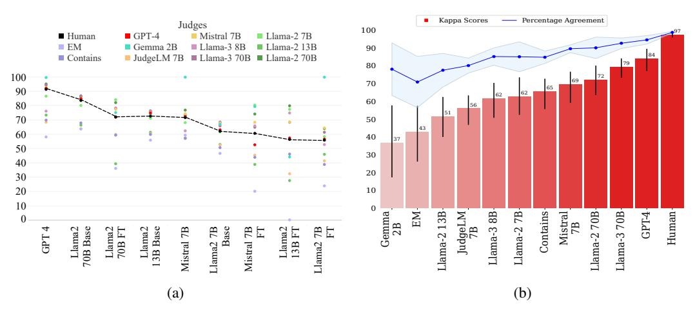
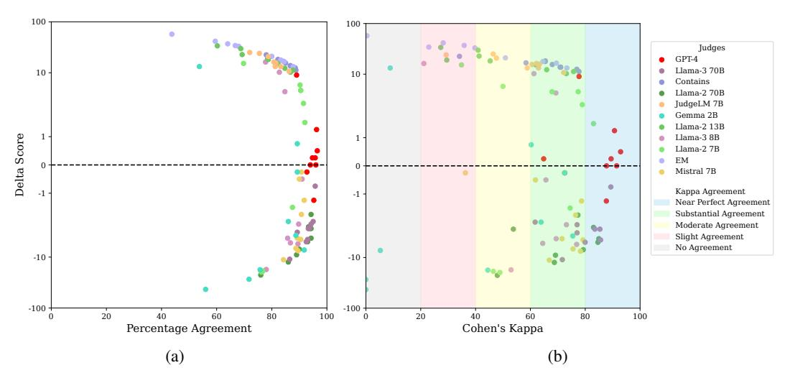
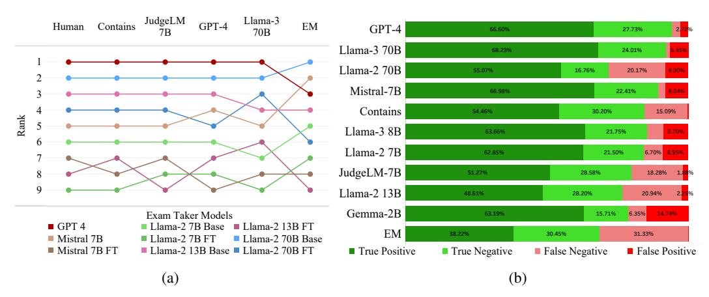
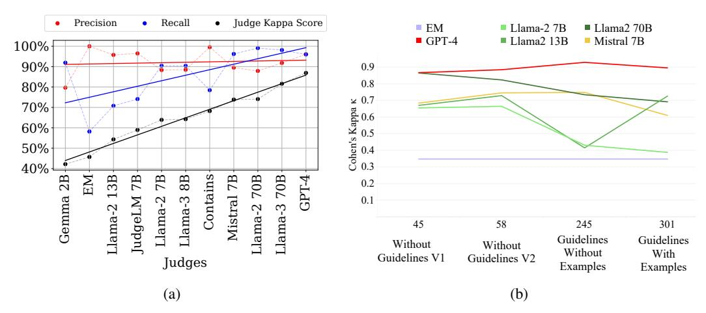
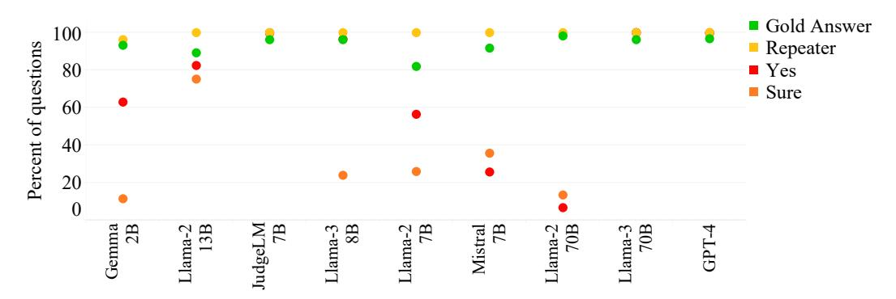
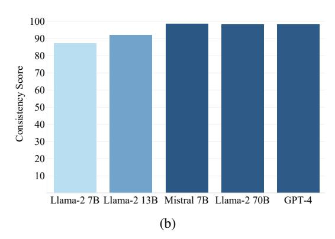
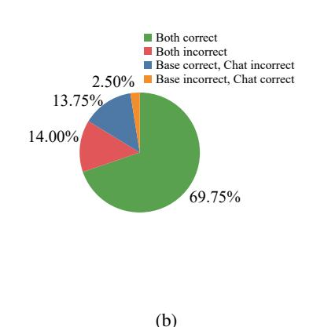
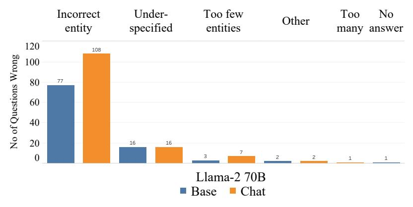
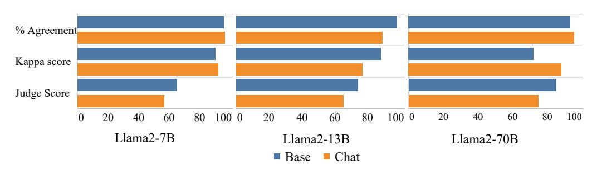
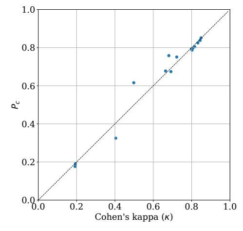

# Judging the Judges: Evaluating Alignment and Vulnerabilities in LLMs-as-Judges

## Anonymous Author(s)

Affiliation Address email

## Abstract

 Offering a promising solution to the scalability challenges associated with human evaluation, the *LLM-as-a-judge* paradigm is rapidly gaining traction as an approach to evaluating large language models (LLMs). However, there are still many open questions about the strengths and weaknesses of this paradigm, and what potential biases it may hold. In this paper, we present a comprehensive study of the performance of various LLMs acting as judges. We leverage TriviaQA as a benchmark for assessing objective knowledge reasoning of LLMs and evaluate them alongside human annotations which we found to have a high inter-annotator agreement. Our study includes 9 *judge models* and 9 *exam-taker models* – both base and instruction-tuned. We assess the judge models' alignment across different model sizes, families, and judge prompts. Among other results, our research rediscovers the importance of using Cohen's kappa as a metric of alignment as opposed to simple percent agreement, showing that judges with high percent agreement can still assign vastly different scores. We find that both Llama-3 70B and GPT-4 Turbo have an excellent alignment with humans, but in terms of *ranking* exam taker models, they are outperformed by both JudgeLM-7B and the lexical judge Contains, which have up to 34 points lower human alignment. Through error analysis and various other studies, including the effects of instruction length and leniency bias, we hope to provide valuable lessons for using LLMs as judges in the future.

## 1 Introduction

- Over the last few years, large Language models (LLMs) have demonstrated remarkable capabilities
- across various domains (Radford et al., 2019; Brown et al., 2020; Achiam et al., 2023; AI@Meta, 2024, i.a.). As more and more new LLMs with different architectures and training methods continue
- to be released and their capabilities expand, accurately evaluating their performance and limitations
- becomes increasingly challenging (Zheng et al., 2024; Ohmer et al., 2024; Benchekroun et al., 2023).
- The empirical evaluation of LLMs is particularly difficult due to the diversity of their outputs and the wide range of tasks they are used for (Zhang et al., 2024; Li et al., 2023a).
- Various methods have been proposed for evaluating LLMs, typically falling into one of two broad categories. Benchmarks such as MMLU (Hendrycks et al., 2021), TruthfulQA (Lin et al., 2021),
- and GSM8K (Cobbe et al., 2021) are used to evaluate specific capabilities of LLMs in an automated
- manner. Additionally, leaderboards like Chatbot Arena (Chiang et al., 2024) and Open LLM Leaderboard (Beeching et al., 2023) assign ranks to models considering pair-wise rankings of LLM
- outputs, done by humans or, in some cases, automated evaluation methods. Since both strategies

 Source code is provided in supplementary material.



Figure 1: (a) Scores assigned to all exam-taker models by the various judge models. (b) Average percent agreement (blue line) and Kappa scores (red bars) of judge models with human judges. Error bars annotate standard deviation across exam-taker models. Alignment is poor for most judge models, but both Llama3 70B and GPT-4 Turbo have Cohen's Kappa coefficient that are indicative of excellent alignment (79 and 84, respectively), thoogh still well below the human alignment score of 96.

involve evaluating free-form text responses generated by the LLMs, evaluating the responses is often just as challenging as generating them in the first place (see e.g. Chang et al., 2023).

37

38

39

40

41 42

43

45

46

47

48

49

50

51

53

54

55

56

57

58

One solution to this problem is to formulate benchmarks as multiple-choice questions (MCQ), and compare the log-probabilities of the potential answers rather than evaluating the generated answer directly (e.g. MMLU, Hendrycks et al., 2021). However, the MCQ paradigm severely limits the range of abilities that can be evaluated, and the setup increasingly diverges from how LLMs are used in practice. The use of lexical matching methods such as exact match (EM) or n-gram overlap to evaluate the responses are practical and cost-efficient approaches, but are susceptible to false negatives and often fail to adequately distinguish between responses with subtle differences that change their semantic meaning. This issue is exacerbated when evaluating instruction-tuned "chat" models that are fine-tuned to carry out conversations with humans in natural language, since their responses tend to be more verbose (Saito et al., 2023; Renze and Guven, 2024). For these reasons, human evaluation remains the gold standard for evaluating LLM responses. However, human evaluation is expensive, time-consuming, and often impractical in many use cases. As a result, it has increasingly become common practice to evaluate LLM responses using another LLM as a judge model (Lin et al., 2021; Islam et al., 2023; Chiang and Lee, 2023; Liusie et al., 2024). While there are promises of alignment between LLM judges and humans (Sottana et al., 2023; Zheng et al., 2024), there are also many open questions about the strengths and weaknesses of the paradigm.

In this work, we study the properties of LLMs as judges, comparing them with humans and automated evaluation methods. Contrary to prior work, we focus on a relatively 'clean' scenario in which inter-human agreement is as high as 96%, allowing us to distinguish ambiguity and subjectivity in the task itself from potential issues with the judge models. Using the knowledge benchmark TriviaQA (Joshi et al., 2017) as our playground, we investigate how 9 different *judge models* with varying architectures and sizes judge 9 different *exam-taker models*. Our main findings are:

- Even in relatively straightforward setups, only the best models are suitable as judges. Out
   of the nine judge models we considered, only GPT-4 Turbo and Llama-3 70B showed very high
   alignment with humans, though even those judges' alignment is still well behind the human alignment
   coefficient for the task (Fig. 1).
- Cohen's kappa distinguishes judges better than percent alignment. In some cases, high percent agreement can still give very divergent scores (Fig. 2).
- Also Cohen's kappa is not all telling: while GPT-4 Turbo and Llama-3 both have alignment scores that are considered excellent, for discriminating different exam-taker models, their results are comparable to alternative cheaper approaches such as JudgeLM-7B and Contains which have much lower alignment scores but more systematic biases (Fig. 3)

Table 1: The exam-taker models and judge models we use in our experiments. We consider a wide variety of judge models; to get a comprehensive overview of their (potential) biases, we consider exam-taker models of various sizes and types.

| Exam-taker models<br>(base & instruction-tuned) | Llama-2 (7B, 13B and 70 B), Mistral 7B, GPT-4 Turbo |
|-------------------------------------------------|-----------------------------------------------------|
| Judge models                                    | Llama-2 (7B, 13B, and 70B), Llama-3 (8B and 70B),   |
| (instruction-tuned)                             | Gemma 2B, Mistral 7B, JudgeLM 7B, GPT-4 Turbo       |

 Detailed error analysis reveals further insights into judge performance. Improved alignment appears to be driven by improved recall rates and reduced false negatives, judge models struggle with under- specified answers and tend to be lenient, affecting evaluation consistency, and they are sensitive to the length and quality of prompts. Even when the judge models are asked to evaluate an answer matching

 verbatim with a reference answer, many judge models still sometimes fail to evaluate it correctly. Overall, our work showcases the strengths of the LLM-as-a-judge paradigm while also highlighting the need for caution against overreliance on alignment metrics, even in cases where they are high. Through error analysis, we also highlight several common failure cases that require attention. With this, we aim to contribute to a better general understanding of what is now becoming a mainstream paradigm for evaluating LLMs.

## 2 Related work

 Various recent studies have used or considered using LLMs as judges for tasks such as evaluating story generation (Chiang and Lee, 2023), retrieval-augmented generation (Es et al., 2023), visual QA (Mañas et al., 2024), code comprehension (Zhiqiang et al., 2023), multilingual evaluation (Hada et al., 2023) and more general open-ended tasks (Zheng et al., 2024). Zhang et al. (2024) and Sottana et al. (2023) propose ways to standardise LLM evaluations, and the role that judge models might play in such solutions. Several studies have demonstrated that state-of-the-art LLMs such as GPT-4 Turbo exhibit high alignment with human judgments (Sottana et al., 2023; Zheng et al., 2024), though others also illustrate that the paradigm is not yet without faults. Zeng et al. (2023) proposes a benchmark for evaluating the performance of LLMs as judges, and other approaches have been proposed to improve LLM judges such that they are aligned well with humans (Shankar et al., 2024; Zhu et al., 2023). Despite promising results in various settings, judge models still suffer from the issues of current LLMs, such as hallucinations and factual errors (Ye et al., 2023; Turpin et al., 2023) and difficulty

 in following complex instructions (Li et al., 2023b; He et al., 2024). Various studies have reported challenges such as position bias (Pezeshkpour and Hruschka, 2023; Zheng et al., 2023; Wang et al., 2023), verbosity bias (Saito et al., 2023) in their preferences, confusing evaluation criteria (Hu et al., 2024), or focusing more on the style and grammar compared to factuality (Wu and Aji, 2023). Recently, Liusie et al. (2024) have shown that LLMs perform better in comparative assessment compared to absolute scoring, which can be used for reliably measuring the relative performance of models (Liu et al., 2024) and creating classifiers for pairwise grading (Huang et al., 2024).

 We follow up on this line of work and investigate the strengths and weaknesses of LLMs as judges. Contrary to most prior work, we do not focus on pairwise comparisons of LLM outputs on open-ended tasks, but on comparisons of LLM outputs and reference answers. Since human alignment is high in this setting, this provides a clean playground to study the strengths and weaknesses of LLMs in detail. We extend previous work by considering more LLMs, both as judges and LLMs to be evaluated.

## 3 Methodology

 To evaluate the strengths and weaknesses of the LLM-as-a-judge paradigm, we focus on a relatively controlled setup, in which *judge models* assess answers of *exam-taker models* on the knowledge benchmark TriviaQA (Joshi et al., 2017). We consider nine judge models and nine exam-taker models. See Appendix B for technical details about the datasets and models.

**Benchmark** We use the TriviaOA dataset (Joshi et al., 2017), consisting of 95K question-answer pairs sourced from 14 trivia and quiz league websites. Each question in the train and validation set 110 is annotated with a list of short answers containing a minimal set of facts and evidence documents 111 collected from Wikipedia and the Web. For our experiments, we use the validation set of the 112 unfiltered partition of the benchmark, using the short answers as reference answers. We use the 113 training set for few-shot examples. To stay closer to the typical scenarios in which LLMs may be 114 115 used as judges, we focus on questions with ten or fewer reference answers. Since experiments require manual annotation of the exam-taker model responses, we use a random sample of 400 questions 116 from the dataset. 117

**Exam-taker models** To understand the strengths and weaknesses of different judges, we benchmark pre-trained (base) and instruction-tuned (chat) exam-taker models across a wide variety of model sizes 119 and examine the quality of the evaluations from different judge models. In particular, we consider 120 Llama-2 (Touvron et al., 2023) in 7B, 13B, and 70B parameter sizes for both base and chat versions, 121 Mistral 7B (Jiang et al., 2023) base and chat versions, and GPT-4 Turbo<sup>2</sup> (Achiam et al., 2023) as 122 the exam-taker models. The prompts for the exam-taker models contain five few-shot examples of 123 (question, answer) pairs from the TriviaQA training set. The prompts for the instruction-tuned models 124 additionally include a command signaling the model to answer the given question in a succinct 125 manner similar to the provided examples. See Appendix C for the prompts. 126

Judge models To get a comprehensive view of the strengths and weaknesses of judge models across different model sizes and architectures, we use instruction-tuned versions of Llama-2 (Touvron et al., 2023) in 7B, 13B, and 70B sizes, Llama-3 (AI@Meta, 2024) in 8B and 70B sizes, Mistral 7B (Jiang et al., 2023), GPT-4 Turbo (Achiam et al., 2023), Gemma 2B (Gemma Team et al., 2024), and JudgeLM 7B (Zhu et al., 2023) as judges. The judges are instructed to respond with only a single word, "correct" or "incorrect". The prompts can be found in Appendix D. The names of all exam-taker models and judge models are shown in Tab. 1. For ease of reading, the judge models are depicted in a different font than the exam-taker models.

Baselines As baselines, we use two commonly used lexical evaluation techniques – exact match (EM) and contains match. For EM, a response is considered correct if the response exactly matches one of the reference answers for the given question. For contains match evaluation, an answer is considered correct if at least one of the reference answers is a sub-string of the response string. Both EM and contains match are computed in a case-insensitive manner.

Alignment We use two metrics to quantify alignment between judges: percent agreement and Cohen's kappa coefficient (Cohen, 1960). Percent agreement expresses a simple percentage of the samples on which two annotators agree. Cohen's kappa, denoted as  $\kappa$ , is an alignment metric that also takes into account the possibility of chance agreement, and is generally considered to provide a more robust measure of alignment. See Appendix E for more details.

**Human judgements** As a ground-truth assessment, we first obtain human annotations for each exam-taker model answer. The inter-human alignment is calculated between three human judges using the answers to 600 questions by Llama-2 7B base randomly sampled from the TriviaQA dataset (Joshi et al., 2017); the human guidelines can be found in Appendix F. We then determine collective "Human Judgment" through a majority vote. We found that the average alignment among human evaluators with the majority vote had a Cohen's kappa score³ of  $96.36 \pm 1.67$ , and the average percent agreement was  $98.33\% \pm 0.76\%$ . Given this near-perfect alignment score, we consider only one human evaluator for the rest of our experiments, to reduce the overall cost of human annotations. The human evaluates answers from each exam-taker model on the same set of 400 questions.

#### 4 Results

145

146

147

148

149

150

152

154

In this section we discuss our main results, primarily focusing on the relationship between evaluations by various judge models and human evaluations (§ 4.1), and how that impacts their usability (§ 4.2).

<sup>&</sup>lt;sup>2</sup>Accessed via the OpenAI API between Mar 19th, 2024 and May 19th, 2024

 $<sup>^3</sup>$ The values of the Cohen's kappa coefficient have been scaled by  $100\times$  for easier comparison with percent agreement



Figure 2: Delta evaluation score is calculated by taking judge score difference with human judgement. In fig a), we observe skewed distribution for percent agreement and delta evaluation score while in fig b) we observe that highly aligned LLM judges with kappa > 0.8 exhibit low score variance. Conversely, judges with kappa < 0.8 demonstrate variation, impacting reliability.

To do so, we evaluate their alignment with human judgment and assess how differently they rank the nine exam-taker models compared to humans. In Section 5, we further analyze their precision and recall to further investigate the types of errors that can be made by various judge models. Details about compute requirements and others costs for experiments are given in Appendix G.

#### 4.1 Alignment between judge models and humans

We first compute  $\kappa$  scores and percent agreement between the evaluations of each judge model and the human annotators. Fig. 1 shows that while alignment is poor for most judge models, both Llama-3 70B and GPT-4 Turbo have  $\kappa$  scores that are considered to indicate excellent alignment (79 and 84, respectively). Nevertheless, there still is a significant disparity between human judgment and judge models: GPT-4 Turbo is still 12 points behind human judgment. Notably, Contains has a higher  $\kappa$  score than half of the judge models, while EM has the lowest alignment among all judges.

Cohen's kappa vs percent agreement In most cases, we observe that Cohen's kappa and percent agreement are following the same trend, with the exception of the values for Gemma 2B and EM. Gemma 2B shows higher percent agreement compared to EM, yet it yields the lowest  $\kappa$  score within the ensemble. Furthermore, there is a significant difference in the actual values. For the percent agreement of judge models, we note a 30-point difference between human judgment and EM, while Cohen's kappa exhibits a more substantial 53-point gap. This is also visible in the general decline of alignment scores: while L1ama-3 8B has a  $\kappa$  score of only 62, its percent agreement is still well above 80%. Overall,  $\kappa$  scores offer a more precise representation of diminishing trends in judge models compared to percent agreement.

Alignment vs assigned score In Fig. 2, we show the variation in scores assigned by the judge models to various exam-taker models for different values of percent agreement (Fig. 2a) and Cohen's kappa (Fig. 2b). We can see that for  $\kappa > 80$ , the evaluation scores by judge models are close to the human evaluation scores for most of the judges, with a difference of only up to 5 points in their assigned scores (Appendix H). For percent agreement, however, we observe deviations of up to 20 points in the evaluation scores for similar kappa alignment. Furthermore, for several judge models, we observe that the deviation from human-judgements can be quite distinct for different exam-taker models. In Fig. 1a, Gemma 2B, for instance, sometimes assigns higher scores than humans, and sometimes much lower. In the next section, we further explore this particular pattern.



Figure 3: (a) Contains and JudgeLM retain 67% of the human-assigned ranking, closely followed by GPT-4 Turbo and LLama3-70B. All judges struggle to distinguish between the poor-performing exam-taker models. (b) False positives and negatives across different judge models in descending order of human alignment. Both false negatives and false positives generally increase as human alignment decreases, but well-aligned models tend to produce more false negatives than false positives.

### 4.2 Exploring systematic patterns in judge models

In the previous section, we have seen that none of the judge models we considered were aligned as well with humans as the humans themselves. Furthermore, as can be seen in Fig. 2, the scores assigned by even the best aligned judge models can differ up to 10 points with the human-assigned scores. However, while this may limit – to some extent – the utility of using a judge models to get a perfect estimate of the exam-taker model's capability on the benchmark, the judge models may still offer valuable insights to *differentiate* between different exam-taker models. For example, if judges exhibit systematic biases such as – akin to a very strict teacher – consistently rating any exam-taker model lower, they will not assign identical scores but may assign identical *rankings*.

To evaluate this, we compare the rankings assigned by each judge model to the nine exam-taker models by computing their Spearman's rank correlation coefficients  $\rho$  (Spearman, 1904) with the human ranking. The rankings are shown in Fig. 3a, with  $\rho$  values in Appendix I. These results show that Contains demonstrates the highest alignment with the human ranking, swapping the ranks of only two out of nine models. Notably, Contains performs on par with JudgeLM 7B (Zhu et al., 2023), a language model fine-tuned specifically for evaluating language model responses. They are closely followed by GPT-4 Turbo and Llama-3 70B, the judges with the best alignment. Remarkably, while GPT-4 Turbo and Llama-3 70B rank the same three models in positions three, four, and five as the human judge, they do so in different orders. Several other judges have rank correlations higher than 0.7; it appears they struggle to distinguish between poorer-performing exam-taker models, but do well at distinguishing between better-performing ones.

### 5 Analysis

To better understand the judge models, we conduct multiple case studies aimed at identifying common errors and vulnerabilities.

### 5.1 Better aligned models: Recall gains, precision pains, and error spotlights

We first investigate the precision and recall of the judge models. We plot both – maintaining the ordering of Fig. 1 – in Fig. 4a. It can be seen that the precision does not show any clear observable trend with increasing alignment, which can be further observed in Fig. 3b. The recall, on the other hand, shows an increasing trend, with more aligned models having comparatively fewer false negatives.

Next, we analyze the types of errors made by the judge models by manually annotating 900 outputs from Llama-7B Base with error codes, focusing on the top performer GPT-4 Turbo, by manually



Figure 4: (a) Cohen's kappa, precision, and recall for different judge models. Recall improves with increasing human alignment ( $R^2 = 0.98$ ), though precision ( $R^2 = 0.0003$ ) is not correlated with human alignment. (b)  $\kappa$  scores for each judge across different prompt templates. Except for GPT-4 Turbo, all judges struggle with too many detailed evaluation guidelines.

annotating 900 outputs from Llama-7B Base with error codes. We then determine the percentage of each error type correctly judged by GPT-4 Turbo to be incorrect. The results are shown in Tab. 2, where it can be observed that GPT-4 Turbo has a good error recall when the answers refer to an incorrect entity, or when too many entities are present. However, the judge can mark answers as correct when they are only *partially* correct (i.e. when they have too few or under-specified entities), which appears to be a source of misalignment between humans and GPT-4 Turbo.

| Error code        | Explanation                                                           | Example                                                               | Proportion | Proportion GPT-4 Turbo recall |  |  |
|-------------------|-----------------------------------------------------------------------|-----------------------------------------------------------------------|------------|-------------------------------|--|--|
| Incorrect entity  | Response refers to a wrong entity                                     | Henry VII, James I, Edward VI,<br>Mary I and Elizabeth I              | 86.9%      | 84.7%                         |  |  |
| Under-specified   | Response contains only part of the answer                             | Henry VII, Henry VIII, Edward,<br>Mary, and Elizabeth                 | 10.6%      | 33.9%                         |  |  |
| Too few entities  | Response contains too few entities                                    | Henry VII, Edward VI,<br>Mary I and James I                           | 2.47%      | 67.7%                         |  |  |
| Too many entities | Response contains too many entities                                   | Henry VII, Henry VIII, Edward VI,<br>Mary I, James I, and Elizabeth I | 2.7%       | 84.7%                         |  |  |
| Other             | Response is incorrect but cannot be put into any of the above buckets | I'm sorry but I do not know the answer to that question               | 1.23%      | 16.9%                         |  |  |

Table 2: Error codes used to identify the types of errors made by exam-taker models when answering questions. The example question in this case is "Excluding Lady Jane Grey, who were the five monarchs of the House of Tudor?", with the correct answer "Henry VII, Henry VIII, Edward VI, Mary I and Elizabeth I" (in any order).

### 5.2 Judge model sensitivity to prompt length and quality

Next, we study the impact of the prompt on the ability of the judge models to perform an accurate assessment of exam-taker models, with two somewhat intertwined goals: 1) to study if the success of various judge models is related to the *length* of the prompt, and, 2) to study the degree to which the judgments of the judge models change with the *quality* of the prompt.

We use four different prompt versions, varying in length and specificity. Each prompt instructs the judge models on evaluating responses, with complexity and detail increasing with the token count. The first two prompts (Without guidelines with 45 and 58 tokens in judge prompt respectively) simply ask to evaluate the responses, without any further information, while more elaborate guidance and examples are given in the longer prompts. The prompts can be found in Appendix K.

Fig. 4b shows that Mistral 7B (Jiang et al., 2023) and GPT-4 Turbo exhibit relatively low variance in their agreement with humans as the level of information and the length of the prompt increases.



Figure 5: We observe that judge models remain robust when exam-taker models produce responses identical to the prompt. However, this robustness diminishes in the presence of hallucinated responses such as "Yes" and "Sure" from the exam-taker models. Additionally, when assessing the gold standard answer, judges do not consistently arrive at the correct judgement 100% of the time.

For this task, GPT-4 Turbo's implicit definition of a correct judgment seems well aligned with the provided instructions and thus shows high alignment with humans even if no specific instructions are provided. It can also be observed that only GPT-4 Turbo appears to benefit from the more detailed instructions, with a slight upward trend, whereas the other models get less aligned with more instructions. This might be due to the less powerful judges not being able to follow many instructions in the prompt at the same time. Interestingly, in a follow-up experiment (see Appendix L), when the order of references provided to the judge models is shuffled, Fig. 6b demonstrates that larger judge models consistently maintain their judgments regardless of the reference order, whereas smaller models except Mistral 7B are more sensitive to the reference order given in the prompt.

#### 5.3 Evaluating controlled responses

We perform some simple tests on the judge models by asking them to evaluate a set of dummy benchmark responses. For the first test, the answer to be evaluated for each question is one of the references from the dataset (i.e. the answer is always correct), while for the next three tests, the answer to be evaluated is always incorrect, with the dummy exam-taker model always responding with "Yes", and "Sure" for the second and the third tests, respectively, and simply repeating the question for the fourth test. Fig. 5 shows that while some judge models are able to identify and correctly mark the answers as correct (for the first test) or incorrect (for the next three tests), some judges, notably Llama-2 70B incorrectly evaluates a significant number of dummy answers, even though it shows a relatively high alignment with humans on the benchmark evaluations (see Fig. 1b).

We hypothesize that when the answers are plausible but incorrect (e.g. if the question asks about the name of the author of a book, and the exam-taker model gives the name of the wrong author), most judges are able to identify them as being incorrect (by comparing it with the reference answer). However, the judges might get confused about what they are supposed to evaluate if the answer is completely unrelated to the question (such as the words "Yes" and "Sure"). It is possible that in this situation a judge model tries to evaluate one of the reference answers, thus marking it as correct, though further research is required to identify the cause of this behavior.

### 5.4 Leniency bias in judge models

To get a general sense of the inherent biases or misalignment in the evaluation criteria that might be present in the judge models, we estimate if they have a positive or negative bias in their judgment. To do so, we assume that a judge assigns the correct judgment with probability  $P_c$ , and randomly the rest of the samples to be *correct* with a probability  $P_+$ , which we call their *leniency bias*. We estimate the values of  $P_c$  and  $P_+$  from the benchmark results, and show them in Fig. 6a. We observe that  $P_+$  for most models is significantly higher than 0.5, indicating a tendency of the judge models

 $<sup>^4</sup>$ The theoretical derivation of the expressions for  $P_c$  and  $P_+$ , as well as the empirical validation for their estimated values can be found in Appendix M.

| Judge model | $\kappa$ | $P_c$ | $P_{+}$ |  |  |
|-------------|----------|-------|---------|--|--|
| Gemma 2B    | 0.50     | 0.62  | 0.80    |  |  |
| Llama-2 7B  | 0.66     | 0.68  | 0.36    |  |  |
| Mistral 7B  | 0.72     | 0.75  | 0.75    |  |  |
| Llama-2 13B | 0.68     | 0.76  | 0.45    |  |  |
| Llama-2 70B | 0.80     | 0.79  | 0.94    |  |  |
| Llama-3 8B  | 0.81     | 0.80  | 0.84    |  |  |
| Llama-3 70B | 0.84     | 0.84  | 0.79    |  |  |
| GPT-4 Turbo | 0.85     | 0.85  | 0.66    |  |  |
| (a)         |          |       |         |  |  |



Figure 6: (a) To compute the leniency bias in judge models we estimate  $P_c$  and  $P_+$  for different judge models (b) Consistency scores of each judge model for 3 random permutations of references in the prompt. Consistency score is the percentage of questions for which the judge model gives the same judgment for all 3 runs. We observe that the bigger models are more consistent as judges and less sensitive to reference orders in the prompt. More details in Appendix L

to evaluate responses as correct when their evaluation criteria are not completely aligned with the provided instructions.

## 6 Conclusion

268

269

270

271

272

273

274

277

278

279

280

281

282

284

286

287

288

290 291

292

293

294

295

297

298

299

In this work, we provide an extensive study of the properties of LLMs as judges, comparing them with human evaluation and automated evaluation methods. By focusing on a relatively 'clean' evaluation scenario in which inter-human agreement is high, we examine the potential issues with the LLM-asa-judge paradigm separately from the ambiguity and subjectivity in the task itself. We find that even in relatively straightforward setups, smaller and more cost-efficient models are less effective judges compared to the best available LLMs, but even the best LLMs fail to meet the consistency of humans. Furthermore, though previous work commonly used percent agreement, we found that Cohen's kappa  $(\kappa)$  distinguishes judges much better. However, we observe that even judges with excellent  $\kappa$  scores may require further scrutiny. While GPT-4 Turbo and Llama-3 both have excellent alignment scores, simpler and more cost-efficient approaches like JudgeLM and Contains perform better at discriminating between the exam-taker models in terms of their ranking, despite having much lower alignment scores and more systematic biases. In further analyses, we find that: 1) LLMs tend to judge positively when in doubt, and this is more pronounced for small models than for larger ones. 2) Judge models with lower alignment lack precision rather than recall. 3) GPT-4 Turbo is generally robust across different prompts, but is difficult to 'steer' in its judgments. 4) Some judge models can be easily fooled by dummy answers such as 'Yes' and 'Sure', 5) Judge models are better at detecting completely incorrect answers than partially incorrect ones.

Overall, this work adds to the realm of LLM evaluation research by assessing judges within a clearly defined and objective framework. Our results highlight the utility of using some LLMs as judges but also urge caution in blindly trusting their judgments, even if they are found to be well-aligned with humans. For practitioners using LLMs as judges – regardless of the setup – we recommend not only computing percent agreement, but also Cohen's kappa, and pairing these with a qualitative analysis to ensure that conclusions from judge models are less susceptible to biases. We further elaborate on the limitations of our work in Appendix A. In the future, we plan to expand our work to increasingly more complex scenarios with more open-ended answers and variability, and more generally assess how consistent our findings are across dataset samples, benchmarks, and prompt templates.

### References

Josh Achiam, Steven Adler, Sandhini Agarwal, Lama Ahmad, Ilge Akkaya, Florencia Leoni Aleman, Diogo Almeida, Janko Altenschmidt, Sam Altman, Shyamal Anadkat, et al. 2023. GPT-4 technical report. *arXiv preprint arXiv:2303.08774*.

- AI@Meta. 2024. Llama 3 model card.
- Jinze Bai, Shuai Bai, Yunfei Chu, Zeyu Cui, Kai Dang, Xiaodong Deng, Yang Fan, Wenbin Ge,
- Yu Han, Fei Huang, Binyuan Hui, Luo Ji, Mei Li, Junyang Lin, Runji Lin, Dayiheng Liu, Gao Liu,
- Chengqiang Lu, Keming Lu, Jianxin Ma, Rui Men, Xingzhang Ren, Xuancheng Ren, Chuanqi
- Tan, Sinan Tan, Jianhong Tu, Peng Wang, Shijie Wang, Wei Wang, Shengguang Wu, Benfeng
- Xu, Jin Xu, An Yang, Hao Yang, Jian Yang, Shusheng Yang, Yang Yao, Bowen Yu, Hongyi
- Yuan, Zheng Yuan, Jianwei Zhang, Xingxuan Zhang, Yichang Zhang, Zhenru Zhang, Chang Zhou,
- Jingren Zhou, Xiaohuan Zhou, and Tianhang Zhu. 2023. Qwen technical report. *arXiv preprint arXiv:2309.16609*.
- Edward Beeching, Clémentine Fourrier, Nathan Habib, Sheon Han, Nathan Lambert, Nazneen Rajani, Omar Sanseviero, Lewis Tunstall, and Thomas Wolf. 2023. Open llm leaderboard. https: //huggingface.co/spaces/HuggingFaceH4/open\_llm\_leaderboard.
- Youssef Benchekroun, Megi Dervishi, Mark Ibrahim, Jean-Baptiste Gaya, Xavier Martinet, Grégoire Mialon, Thomas Scialom, Emmanuel Dupoux, Dieuwke Hupkes, and Pascal Vincent. 2023. Worldsense: A synthetic benchmark for grounded reasoning in large language models. *arXiv preprint arXiv:2311.15930*.
- Tom B. Brown, Benjamin Mann, Nick Ryder, Melanie Subbiah, Jared Kaplan, Prafulla Dhariwal, Arvind Neelakantan, Pranav Shyam, Girish Sastry, Amanda Askell, Sandhini Agarwal, Ariel Herbert-Voss, Gretchen Krueger, Tom Henighan, Rewon Child, Aditya Ramesh, Daniel M. Ziegler, Jeffrey Wu, Clemens Winter, Christopher Hesse, Mark Chen, Eric Sigler, Mateusz Litwin, Scott Gray, Benjamin Chess, Jack Clark, Christopher Berner, Sam McCandlish, Alec Radford, Ilya Sutskever, and Dario Amodei. 2020. Language models are few-shot learners.
- Yupeng Chang, Xu Wang, Jindong Wang, Yuan Wu, Linyi Yang, Kaijie Zhu, Hao Chen, Xiaoyuan Yi, Cunxiang Wang, Yidong Wang, et al. 2023. A survey on evaluation of large language models. *ACM Transactions on Intelligent Systems and Technology*.
- Cheng-Han Chiang and Hung-yi Lee. 2023. Can large language models be an alternative to human evaluations? *arXiv preprint arXiv:2305.01937*.
- Wei-Lin Chiang, Lianmin Zheng, Ying Sheng, Anastasios Nikolas Angelopoulos, Tianle Li, Dacheng Li, Hao Zhang, Banghua Zhu, Michael Jordan, Joseph E. Gonzalez, and Ion Stoica. 2024. Chatbot arena: An open platform for evaluating LLMs by human preference.
- Karl Cobbe, Vineet Kosaraju, Mohammad Bavarian, Mark Chen, Heewoo Jun, Lukasz Kaiser, Matthias Plappert, Jerry Tworek, Jacob Hilton, Reiichiro Nakano, et al. 2021. Training verifiers to solve math word problems. *arXiv preprint arXiv:2110.14168*.
- J. Cohen. 1960. A Coefficient of Agreement for Nominal Scales. *Educational and Psychological Measurement*, 20(1):37.
- Shahul Es, Jithin James, Luis Espinosa-Anke, and Steven Schockaert. 2023. RAGAS: Automated evaluation of retrieval augmented generation.
- Gemma Team, Thomas Mesnard, Cassidy Hardin, Robert Dadashi, Surya Bhupatiraju, Shreya Pathak,
- Laurent Sifre, Morgane Rivière, Mihir Sanjay Kale, Juliette Love, Pouya Tafti, Léonard Hussenot,
- Pier Giuseppe Sessa, Aakanksha Chowdhery, Adam Roberts, Aditya Barua, Alex Botev, Alex
- Castro-Ros, Ambrose Slone, Amélie Héliou, Andrea Tacchetti, Anna Bulanova, Antonia Paterson,
- Beth Tsai, Bobak Shahriari, Charline Le Lan, Christopher A. Choquette-Choo, Clément Crepy,
- Daniel Cer, Daphne Ippolito, David Reid, Elena Buchatskaya, Eric Ni, Eric Noland, Geng Yan,
- George Tucker, George-Christian Muraru, Grigory Rozhdestvenskiy, Henryk Michalewski, Ian
- Tenney, Ivan Grishchenko, Jacob Austin, James Keeling, Jane Labanowski, Jean-Baptiste Lespiau,
- Jeff Stanway, Jenny Brennan, Jeremy Chen, Johan Ferret, Justin Chiu, Justin Mao-Jones, Katherine
- Lee, Kathy Yu, Katie Millican, Lars Lowe Sjoesund, Lisa Lee, Lucas Dixon, Machel Reid, Maciej Mikuła, Mateo Wirth, Michael Sharman, Nikolai Chinaev, Nithum Thain, Olivier Bachem, Oscar
- Chang, Oscar Wahltinez, Paige Bailey, Paul Michel, Petko Yotov, Rahma Chaabouni, Ramona
- Comanescu, Reena Jana, Rohan Anil, Ross McIlroy, Ruibo Liu, Ryan Mullins, Samuel L Smith,
- Sebastian Borgeaud, Sertan Girgin, Sholto Douglas, Shree Pandya, Siamak Shakeri, Soham De,

- Ted Klimenko, Tom Hennigan, Vlad Feinberg, Wojciech Stokowiec, Yu hui Chen, Zafarali Ahmed,
- Zhitao Gong, Tris Warkentin, Ludovic Peran, Minh Giang, Clément Farabet, Oriol Vinyals, Jeff
- Dean, Koray Kavukcuoglu, Demis Hassabis, Zoubin Ghahramani, Douglas Eck, Joelle Barral,
- Fernando Pereira, Eli Collins, Armand Joulin, Noah Fiedel, Evan Senter, Alek Andreev, and
- Kathleen Kenealy. 2024. Gemma: Open models based on gemini research and technology.
- Rishav Hada, Varun Gumma, Adrian de Wynter, Harshita Diddee, Mohamed Ahmed, Monojit
- Choudhury, Kalika Bali, and Sunayana Sitaram. 2023. Are large language model-based evaluators
- the solution to scaling up multilingual evaluation? *arXiv preprint arXiv:2309.07462*.
- Qianyu He, Jie Zeng, Wenhao Huang, Lina Chen, Jin Xiao, Qianxi He, Xunzhe Zhou, Jiaqing Liang,
- and Yanghua Xiao. 2024. Can large language models understand real-world complex instructions?
- *Proceedings of the AAAI Conference on Artificial Intelligence*, 38(16):18188–18196.
- Dan Hendrycks, Collin Burns, Steven Basart, Andy Zou, Mantas Mazeika, Dawn Song, and Jacob Steinhardt. 2021. Measuring massive multitask language understanding.
- Xinyu Hu, Mingqi Gao, Sen Hu, Yang Zhang, Yicheng Chen, Teng Xu, and Xiaojun Wan. 2024. Are LLM-based evaluators confusing nlg quality criteria? *arXiv preprint arXiv:2402.12055*.
- Hui Huang, Yingqi Qu, Jing Liu, Muyun Yang, and Tiejun Zhao. 2024. An empirical study of LLM-as-a-Judge for LLM evaluation: Fine-tuned judge models are task-specific classifiers.
- Pranab Islam, Anand Kannappan, Douwe Kiela, Rebecca Qian, Nino Scherrer, and Bertie Vidgen. 2023. FinanceBench: A new benchmark for financial question answering. *arXiv preprint*
- *arXiv:2311.11944*.
- Albert Q Jiang, Alexandre Sablayrolles, Arthur Mensch, Chris Bamford, Devendra Singh Chaplot, Diego de las Casas, Florian Bressand, Gianna Lengyel, Guillaume Lample, Lucile Saulnier, et al.
- 2023. Mistral 7B. *arXiv preprint arXiv:2310.06825*.
- Mandar Joshi, Eunsol Choi, Daniel S Weld, and Luke Zettlemoyer. 2017. TriviaQA: A large scale distantly supervised challenge dataset for reading comprehension. *arXiv preprint arXiv:1705.03551*.
- Junlong Li, Shichao Sun, Weizhe Yuan, Run-Ze Fan, Hai Zhao, and Pengfei Liu. 2023a. Generative judge for evaluating alignment. *arXiv preprint arXiv:2310.05470*.
- Shiyang Li, Jun Yan, Hai Wang, Zheng Tang, Xiang Ren, Vijay Srinivasan, and Hongxia Jin. 2023b. Instruction-following evaluation through verbalizer manipulation. *arXiv preprint arXiv:2307.10558*.
- Stephanie Lin, Jacob Hilton, and Owain Evans. 2021. TruthfulQA: Measuring how models mimic human falsehoods. *arXiv preprint arXiv:2109.07958*.
- Yinhong Liu, Han Zhou, Zhijiang Guo, Ehsan Shareghi, Ivan Vulic, Anna Korhonen, and Nigel Collier. 2024. Aligning with human judgement: The role of pairwise preference in large language model evaluators. *arXiv preprint arXiv:2403.16950*.
- Adian Liusie, Potsawee Manakul, and Mark Gales. 2024. LLM comparative assessment: Zero-shot
- NLG evaluation through pairwise comparisons using large language models. In *Proceedings of the 18th Conference of the European Chapter of the Association for Computational Linguistics*
- *(Volume 1: Long Papers)*, pages 139–151, St. Julian's, Malta. Association for Computational Linguistics.
- Oscar Mañas, Benno Krojer, and Aishwarya Agrawal. 2024. Improving automatic vqa evaluation using large language models. *Proceedings of the AAAI Conference on Artificial Intelligence*, 38(5):4171–4179.
- Xenia Ohmer, Elia Bruni, and Dieuwke Hupkes. 2024. From form (s) to meaning: Probing the semantic depths of language models using multisense consistency. *arXiv preprint arXiv:2404.12145*.

- Pouya Pezeshkpour and Estevam Hruschka. 2023. Large language models sensitivity to the order of options in multiple-choice questions. *arXiv preprint arXiv:2308.11483*.
- Alec Radford, Jeffrey Wu, Rewon Child, David Luan, Dario Amodei, Ilya Sutskever, et al. 2019. Language models are unsupervised multitask learners. *OpenAI blog*, 1(8):9.
- Matthew Renze and Erhan Guven. 2024. The benefits of a concise chain of thought on problem-solving in large language models. *arXiv preprint arXiv:2401.05618*.
- Keita Saito, Akifumi Wachi, Koki Wataoka, and Youhei Akimoto. 2023. Verbosity bias in preference labeling by large language models.
- Shreya Shankar, JD Zamfirescu-Pereira, Björn Hartmann, Aditya G Parameswaran, and Ian Arawjo. 2024. Who validates the validators? aligning llm-assisted evaluation of llm outputs with human preferences. *arXiv preprint arXiv:2404.12272*.
- Andrea Sottana, Bin Liang, Kai Zou, and Zheng Yuan. 2023. Evaluation metrics in the era of gpt-4: reliably evaluating large language models on sequence to sequence tasks. *arXiv preprint arXiv:2310.13800*.
- C. Spearman. 1904. The proof and measurement of association between two things. *The American Journal of Psychology*, 15(1):72–101.
- Hugo Touvron, Louis Martin, Kevin Stone, Peter Albert, Amjad Almahairi, Yasmine Babaei, Nikolay Bashlykov, Soumya Batra, Prajjwal Bhargava, Shruti Bhosale, et al. 2023. Llama 2: Open foundation and fine-tuned chat models. *arXiv preprint arXiv:2307.09288*.
- Miles Turpin, Julian Michael, Ethan Perez, and Samuel Bowman. 2023. Language models don't always say what they think: Unfaithful explanations in chain-of-thought prompting. In *Advances in Neural Information Processing Systems*, volume 36, pages 74952–74965. Curran Associates, Inc.
- Peiyi Wang, Lei Li, Liang Chen, Dawei Zhu, Binghuai Lin, Yunbo Cao, Qi Liu, Tianyu Liu, and Zhifang Sui. 2023. Large language models are not fair evaluators. *arXiv preprint arXiv:2305.17926*.
- Minghao Wu and Alham Fikri Aji. 2023. Style over substance: Evaluation biases for large language models.
- Hongbin Ye, Tong Liu, Aijia Zhang, Wei Hua, and Weiqiang Jia. 2023. Cognitive mirage: A review of hallucinations in large language models. *arXiv preprint arXiv:2309.06794*.
- Zhiyuan Zeng, Jiatong Yu, Tianyu Gao, Yu Meng, Tanya Goyal, and Danqi Chen. 2023. Evaluating large language models at evaluating instruction following. *arXiv preprint arXiv:2310.07641*.
- Yue Zhang, Ming Zhang, Haipeng Yuan, Shichun Liu, Yongyao Shi, Tao Gui, Qi Zhang, and Xuanjing Huang. 2024. Llmeval: A preliminary study on how to evaluate large language models. *Proceedings of the AAAI Conference on Artificial Intelligence*, 38(17):19615–19622.
- Chujie Zheng, Hao Zhou, Fandong Meng, Jie Zhou, and Minlie Huang. 2023. On large language models' selection bias in multi-choice questions. *arXiv preprint arXiv:2309.03882*.
- Lianmin Zheng, Wei-Lin Chiang, Ying Sheng, Siyuan Zhuang, Zhanghao Wu, Yonghao Zhuang, Zi Lin, Zhuohan Li, Dacheng Li, Eric Xing, et al. 2024. Judging LLM-as-a-Judge with MT-Bench and Chatbot Arena. *Advances in Neural Information Processing Systems*, 36.
- Yuan Zhiqiang, Liu Junwei, Zi Qiancheng, Liu Mingwei, Peng Xin, Lou Yiling, et al. 2023. Evaluating instruction-tuned large language models on code comprehension and generation. *arXiv e-prints arXiv:2308.01240*.
- Lianghui Zhu, Xinggang Wang, and Xinlong Wang. 2023. Judgelm: Fine-tuned large language models are scalable judges.

## <sup>443</sup> A Limitations

 In our work, we have shown potential pitfalls of using LLMs as judges, as well as the issues with commonly used metrics for quantifying their judgment quality. While negative conclusions may require less broad support than positive ones, a more comprehensive study across multiple benchmarks and prompt templates is required to get a better understanding of the prevalence of such issues in contemporary evaluation practice. We have attempted to cover a reasonable number of exam-taker and judge models to get more generalizable results, but a larger suite of models would enable researchers to further pin-point the potential relationships between model sizes or architectures with their capabilities as judges across various metrics.

 Nonetheless, these limitations do not retract from the fact that the findings in this work suggest caution against blindly using LLMs as judges and drawing conclusions about the capabilities of exam- taker models first requires an investigation of all the choices made while setting up the evaluation mechanism, especially in cases where benchmark results are evaluated using other LLMs.

## <sup>456</sup> B Model and dataset details

| Asset            | Version                              | License                |
|------------------|--------------------------------------|------------------------|
| TriviaQA         | mandarjoshi/trivia_qa                | apache-2.0             |
| Llama-2 7B Base  | meta-llama/Llama-2-7b-hf             | llama2                 |
| Llama-2 7B Chat  | meta-llama/Llama-2-7b-chat-hf        | llama2                 |
| Llama-2 13B Base | meta-llama/Llama-2-13b-hf            | llama2                 |
| Llama-2 13B Chat | meta-llama/Llama-2-13b-chat-hf       | llama2                 |
| Llama-2 70B Base | meta-llama/Llama-2-70b-hf            | llama2                 |
| Llama-2 70B Chat | meta-llama/Llama-2-70b-chat-hf       | llama2                 |
| Mistral 7B Base  | mistralai/Mistral-7B-v0.1            | apache-2.0             |
| Mistral 7B Chat  | mistralai/Mistral-7B-Instruct-v0.2   | apache-2.0             |
| Llama-3 8B Chat  | meta-llama/Meta-Llama-3-8B-Instruct  | llama3                 |
| Llama-3 70B Chat | meta-llama/Meta-Llama-3-70B-Instruct | llama3                 |
| JudgeLM          | BAAI/JudgeLM-7B-v1.0                 | Non-commercial license |
| GPT-4 Turbo      | gpt-4-turbo-2024-04-09               | N/A                    |
| Qwen 0.5B Chat   | Qwen/Qwen1.5-0.5B-Chat               | tongyi-qianwen         |
| Qwen 1.8B Chat   | Qwen/Qwen1.5-1.8B-Chat               | tongyi-qianwen         |
| Qwen 4B Chat     | Qwen/Qwen1.5-4B-Chat                 | tongyi-qianwen         |
| Qwen 7B Chat     | Qwen/Qwen1.5-7B-Chat                 | tongyi-qianwen         |
| Qwen 14B Chat    | Qwen/Qwen1.5-14B-Chat                | tongyi-qianwen         |
| Qwen 72B Chat    | Qwen/Qwen1.5-72B-Chat                | tongyi-qianwen         |

Table 3: Version and license details for the different models and datasets used in experiments.

## <sup>457</sup> C Model Evaluation Prompt templates

<sup>458</sup> Fig. 7 and Fig. 8 show the prompt templates used for the base and chat exam-taker models during the <sup>459</sup> question answering process.

## <sup>460</sup> D Judge LLM Prompt templates

<sup>461</sup> Fig. 9 shows the prompt template used to guide the judge models during the evaluation process of a <sup>462</sup> 400-question sample from the TriviaQA unfiltered dataset.

## <sup>463</sup> E Metrics for judge models

<sup>464</sup> If one of the annotators is taken to be the reference, then the annotations of the other annotator can be <sup>465</sup> categorized as true positives, false positives, true negatives, and false negatives, with the total number <sup>466</sup> of each of them in a benchmark being represented by T<sup>P</sup> , F<sup>P</sup> , T<sup>N</sup> , and F<sup>N</sup> respectively.

#### Prompt template for B exam: models

Q: Can you name the actress who links 'The Darling Buds of May' and \*Rosemary and Thyme'?

A: Pam Ferris

Q: A neologism is a new?

A: Word/expression

Q: Who, in 2010, became the first person from outside the British Isles to win the World Snooker Championship title since Cliff Thorburn in 1980, and the first non British player to win the title since Ken Doherty in 19977

A: Neil Robertson

Q: Which German Nazi leader flew solo from Ausberg in 1941 and landed

by parachute near Glasgow on a private peace mission?

A: Hess

Q: Where would you find Narita airport?

A: Tokyo, Japan

: Which cartoon title character has a friend called Captain Haddock?

Po

Figure 7: Prompt template for base exam-taker models

<sup>467</sup> Percent agreement is simply the ratio of the numbers of times two annotators agree with each other <sup>468</sup> relative to the total number of annotations. This ratio can have values between 0 and 1. For the binary <sup>469</sup> case, the alignment ratio ρ is given as

$$\rho = \frac{T_P + T_N}{T_P + F_P + T_N + F_N}. (1)$$

 Cohen's kappa coefficient, or Cohen's kappa for short (Cohen, 1960), measures the alignment of two annotators while also taking into account the possibility of agreement by pure chance. This coefficient can have values between −1 and 1, but is usually above 0 in most real-world situations. The value of Cohen's kappa is given as

$$\kappa = \frac{p_o - p_e}{1 - p_e} = \frac{2(T_P T_N - F_P F_N)}{(T_P + F_P)(T_N + F_P) + (T_P + F_N)(T_N + F_N)}.$$
 (2)

 Here, p<sup>o</sup> is the relative observed agreement, and p<sup>e</sup> is the hypothetical probability of chance agreement. This coefficient is considered to be a more robust measure of inter-annotator alignment, but also less interpretable in terms of what a particular value of κ means. Generally, values of κ in ranges [0, 0.2), [0.2, 0.4), [0.4, 0.6), [0.6, 0.8), and [0.8, 1) are considered to indicate no alignment, slight alignment, moderate alignment, substantial alignment, and near-perfect alignment respectively, with κ = 1 indicating perfect alignment.

```
Prompt template for Chat exam-taker models 
You are a part of a question answering benchmark. Look at the following examples on how to answer the questions 
Q: Can you name the actress who links 'The Darling Buds of May' and *Rosemary and Thyme'? A: Pam Ferris 
Q: A neologism is a new? A: Word/expression 
Q: Who, in 2010, became the first person from outside the British Isles to win the World Snooker Championship title since Cliff Thorburn in 1980, and the first non British player to win the title since Ken Doherty in 19977 A: Neil Robertson 
Q: Which German Nazi leader flew solo from Ausberg in 1941 and landed by parachute near Glasgow on a private peace mission? A: Hess 
Q: Where would you find Narita airport? A: Tokyo, Japan 
Your task is to answer the following question. Remember to be concise and only give the answer in a few words 
Q:Which cartoon title character has a friend called Captain Haddock? A
```

Figure 8: Prompt template for Chat exam-taker models

```
Prompt template for judge models 
Your task is to look at the following question, and based on the references provided, determine if the model's response is correct or incorrect. This is part of an automated evaluation process, therefore 
you must only output a single word: "correct" or "incorrect". 
Question: 
Which Australian did Roger Federer defeat to win his first Wimbledon Men's Singles title in 20037 
References: MARK PHILIPPOUSSIS MARK PHILIPPOUSSIS 
Model Response: Mark Philippoussis 
Evaluation (correct/incorrect):
```

Figure 9: Prompt templates for the judge models

#### 480 F Human Annotation Guidelines

The guidelines are as follows -

#### Humn annotation guidelines

You will be given a question, a set of reference answers and the answer given by an LLM. Your task is to judge if the answer given by the LLM is correct, as if you were the LLMs teacher grading their exam. An answer should be counted as correct if it is semantically equivalent to (one of the) reference answers. In doing so, please follow the following guidelines:

- Underspecified answers (e.g. "December" instead of "December 20") should be marked *incorrect*.
- Answers that have more information than requested (e.g. "December 20, in Paris" instead of "December 20") should be marked correct, provided the extra information is not incorrect or contrasting the rest of the answer.
- Answers with unnecessary verbosity but correct answers should be marked correct (E.g. "Thanks for asking this question! The correct answer is: ...").

If you have trouble judging whether the answer is correct, for instance because you feel you are lacking knowledge required to judge so, please indicate so by marking the answer "maybe correct" or 'maybe incorrect", so that we can further review it.

482

485

486

487

488

489

## **G** Experiment Costs

The costs for the different experiments described in this work belong in three categories – GPU-hours for running open-source models on one or more Nvidia A100 GPUs, OpenAI credits for making API calls to OpenAI models,<sup>5</sup> and human hours for manual annotations of benchmark responses. The estimated costs for the final reported experiments are given in Tab. 4. In addition to this, previous unreported experiments and trials had an approximate cost of 120 GPU-hours, 100 USD in OpenAI credits, and 50 human hours, bringing the total experimental cost for this work to approximately 200 GPU-hours, USD 125 OpenAI credits, and 75 human annotation hours.

| Experiment           | GPU-hours | OpenAI credits | Human hours |
|----------------------|-----------|----------------|-------------|
| Main benchmarks      | 5         | 2              | -           |
| Main evaluations     | 30        | 8              | 10          |
| Human alignment      | 1         | -              | 6           |
| Error analysis       | 1.5       | -              | 5           |
| Controlled responses | 15        | -              | -           |
| Leniency bias        | 5         | 5              | -           |
| Guideline bias       | 10        | 5              | 1           |
| Reference bias       | 5         | 4              | 1           |
| Total                | 72.5      | 24             | 23          |

Table 4: Estimated costs for the final reported experiments. GPU-hours are in equivalent Nvidia A100 hours, OpenAI credits are in USD, and human hours are time spent in manual annotation.

<sup>&</sup>lt;sup>5</sup>Pricing details for OpenAI models are available at https://openai.com/api/pricing/

## <sup>491</sup> H Judge Scores

<sup>492</sup> Below table accounts for the judge scores of every exam-taker model for the 400 random sample <sup>493</sup> experiment. This figure is better visualized in Fig. 1a.

|                | Exam Taker Models |       |       |        |       |         |          |        |       |
|----------------|-------------------|-------|-------|--------|-------|---------|----------|--------|-------|
|                | Llama 2           |       |       |        |       | Mistral |          |        |       |
|                | Base              |       |       | Chat   |       | Base    | Instruct |        |       |
| Judge Models   | 7B                | 13B   | 70B   | 7B     | 13B   | 70B     | 7B       |        | GPT-4 |
| Llama 3 8B     | 68.75             | 76.00 | 85.25 | 52.91  | 75.0  | 78.5    | 62.5     | 66.00  | 76.25 |
| Gemma 2B       | 67.00             | 74.00 | 84.00 | 100.00 | 44.25 | 75.25   | 100.00   | 79.50  | 99.75 |
| Llama 2 7B     | 61.75             | 71.25 | 80.25 | 58.48  | 77.25 | 58.00   | 68.25    | 80.50  | 86.75 |
| Mistral 7B     | 67.75             | 75.00 | 85.25 | 64.55  | 68.75 | 77.50   | 74.50    | 68.50  | 92.75 |
| Llama 2 13B    | 53.00             | 61.50 | 66.50 | 46.07  | 27.75 | 39.50   | 57.50    | 39.00  | 73.50 |
| Llama 3 70B    | 66.00             | 76.50 | 87.00 | 61.52  | 68.50 | 78.25   | 73.5     | 65.0 0 | 94.50 |
| Contains Match | 50.75             | 60.00 | 68.00 | 38.98  | 46.25 | 59.50   | 57.25    | 44.00  | 70.00 |
| Llama 2 70B    | 68.25             | 76.30 | 86.50 | 64.05  | 80.04 | 82.25   | 77.00    | 74.25  | 95.25 |
| Exact Match    | 46.75             | 56.00 | 63.75 | 24.05  | 0.25  | 36.25   | 59.50    | 20.25  | 58.25 |
| JudgeLM        | 52.50             | 60.50 | 64.00 | 41.52  | 32.50 | 60.00   | 57.25    | 45.5   | 68.50 |
| GPT-4          | 63.25             | 75.00 | 85.0  | 56.7   | 57.50 | 72.0    | 72.5     | 52.75  | 92.25 |
| Human Eval     | 62.25             | 72.75 | 83.75 | 56.00  | 56.50 | 72.25   | 71.75    | 60.75  | 91.50 |

Table 5: Judge model score card for every exam-taker model

## <sup>494</sup> I Exam-taker model ranking correlation

<sup>495</sup> Below is the table of Spearman's rank correlation coefficient (Spearman, 1904) (ρ) with human <sup>496</sup> judgment. Since ρ > 0.7 is considered well aligned, only Llama-7B and Gemma-2B have poor <sup>497</sup> rank correlation with human judgment.

| Judges     | ρ    |
|------------|------|
| Contains   | 0.98 |
| JudgeLM-7B | 0.98 |
| GPT-4      | 0.93 |
| Llama3-70B | 0.93 |
| Mistral-7B | 0.92 |
| Llama-13B  | 0.82 |
| EM         | 0.78 |
| Llama3-8B  | 0.77 |
| Llama-70B  | 0.75 |
| Llama-7B   | 0.39 |
| Gemma-2B   | 0.21 |
|            |      |

Table 6: Spearman Rank Correlation Coefficient ρ

## <sup>498</sup> J Exam-taker model base vs chat analysis

<sup>499</sup> In this experiment we investigate the difference in evaluation scores of base models and their <sup>500</sup> corresponding chat exam-taker models, how the judge models judge Base and Chat pairs differently."

<sup>501</sup> Fig. 10a shows that all the base models consistently outperform their respective chat exam-taker <sup>502</sup> models according to Human evaluation.

|                |       | Judge models |                |                |               |
|----------------|-------|--------------|----------------|----------------|---------------|
| Base-Chat pair | EM    | Human        | GPT-4<br>Turbo | Llama-2<br>70B | Llama-2<br>7B |
| Llama-2<br>7B  | 22.75 | 6.25         | 6.50           | 4.25           | 3.25          |
| Mistral<br>7B  | 39.25 | 11.00        | 19.75          | 2.75           | -11.75        |
| Llama-2<br>13B | 55.25 | 16.25        | 17.50          | -3.75          | -6.00         |
| Llama-2<br>70B | 27.50 | 11.50        | 13.00          | 4.25           | 22.25         |
| (a)            |       |              |                |                |               |



Figure 10: a) Difference in Evaluation Scores between different Base - Chat exam-taker model pairs for different judge models. b) Pie chart showing the percentage of questions categorized by the judgment from Base and Chat models.

Now, let us assume the difference in the score of Base and Chat models is because of the following factors:

- Knowledge unlearning by the chat models or Loss in knowledge (Correct Answer by Base model and Wrong Answer by Chat model)  $\mathcal{L}_{knowledge}$
- Error in judgment by judge models (Right answer by Chat model but wrong judgment or Wrong answer by Base model but judged as right)  $\epsilon$
- Misc (Chat model fails to understand the prompt or answer Cut off)  $\mu$

$$\Delta_{\text{Human}} = \mathcal{L}_{knowledge} + \mu$$

$$\Delta_{\text{LLM}} = \mathcal{L}_{knowledge} + \mu \pm \epsilon$$

Assuming there is zero error in human judgment,  $\epsilon$  in  $\Delta_{\text{Human}} = 0$ .

The plots in Appendix J and Fig. 11 suggest knowledge unlearning, as the Chat model provides more incorrect answers than the Base model, with the majority of these errors classified as 'incorrect entities' or 'under specification' (examples in Appendix J). Specifically, Fig. 11 shows that the Llama2 70B Chat model answers a higher number of questions as 'incorrect entity' compared to the corresponding base model. Furthermore, the Chat model provides too few entities in more responses than the Base model, indicating knowledge unlearning due to its inability to provide all the required entities for correct answers.



Figure 11: Distribution of incorrect question counts by error codes for the Llama2 70B Base vs Chat exam-taker models evaluated on 400 questions.

Furthermore, Fig. 12 demonstrates that although the Llama-2 Base models have higher judge scores compared to the Chat models, the  $\kappa$  score and percent agreement of GPT increase for the Chat models and decrease for the Base models as the model size grows. This indicates that the issue with the Chat models lies in the accuracy of their answers, resulting in lower judge scores, rather than an error in parsing their verbose responses. This further suggests the unlearning of knowledge by the Chat models.

Interestingly, across all judge models, as the size of the exam-taker model increases,  $\Delta$  also increases, suggesting that  $\mathcal{L}_{knowledge}$  between the Base and Chat models widens as the model size grows.

Moreover, as the judge model size gets smaller, the  $\Delta_{\rm LLM}$  values decreases, well beyond the observed  $\Delta_{\rm Human}$ . Given that  $\mathcal{L}_{knowledge}$  and  $\mu$  remain constant across all the judge models, the only variable changing here is  $\pm \epsilon$ .

The scores from Tab. 5 indicate that the base exam-taker models are evaluated more strictly, while the chat exam-taker models are evaluated too leniently by the smaller judge models. This results in  $\Delta_{\rm LLM}$ s that are smaller and sometimes negative, in contrast to the absolute scores that deviate significantly from the true scores. One possible explanation is that the smaller judge models are tricked by the verbose responses of the Chat exam-taker models into rewarding them with higher scores. However, this does not hold true for the larger judge models.



Figure 12: Evalaution Metrics for LLama2 Base and Chat exam-taker model pairs evaluated by GPT-4 Turbo

| Question: Which British artist's works include 'The First Real Target'? |                                           |  |  |
|-------------------------------------------------------------------------|-------------------------------------------|--|--|
| References                                                              | Peter Blake, Peter Balke, Sir Peter Blake |  |  |
| LLama-2 70B<br>Base                                                     | Peter Blake                               |  |  |
| LLama-2 70B<br>Chat                                                     | Patrick Caulfield                         |  |  |
| Mistral 7B Base                                                         | David Hockney                             |  |  |
| Mistral 7B Chat                                                         | Damien Hirst                              |  |  |

Table 7: Knowledge unlearning example 1

| Question:<br>Who was the first cricketer to score 10,000 test runs? |                                                                                   |  |  |
|---------------------------------------------------------------------|-----------------------------------------------------------------------------------|--|--|
| References                                                          | Sunil Gavaskar, Sunil Manohar Gavaskar, SM Gavaskar,<br>Sunny gavaskar, Gavaskar  |  |  |
| LLama-2 70B<br>Base                                                 | Sunil Gavaskar                                                                    |  |  |
| LLama-2 70B<br>Chat                                                 | Sachin Tendulkar                                                                  |  |  |
| Mistral 7B Base                                                     | Sachin Tendulkar                                                                  |  |  |
| Mistral 7B Chat                                                     | Sachin Tendulkar was the first cricketer to score<br>10,000 runs in Test matches. |  |  |

Table 8: Knowledge unlearning example 2

| Tyne?               | Question:<br>'Uncle Harry's Coat' was the first garment produced by which<br>famous jacket manufacturer, based in Simonside, Newcastle Upon |
|---------------------|---------------------------------------------------------------------------------------------------------------------------------------------|
| References          | Barbour                                                                                                                                     |
| LLama-2 70B<br>Base | Barbour                                                                                                                                     |
| LLama-2 70B<br>Chat | Barbour                                                                                                                                     |
| Mistral 7B Base     | Barbour                                                                                                                                     |
| Mistral 7B Chat     | Jack Walker & Sons                                                                                                                          |

Table 9: Knowledge Unlearning Example 3

## <sup>535</sup> K Too Much Info Confuses the LLM

- <sup>536</sup> Here are the prompt templates used for this experiment. The simplest prompt used is *Without*
- <sup>537</sup> *Guidelines v1* (see Fig. 13) where we define a sequential and structured process for the judge model.
- <sup>538</sup> In *Without Guidelines v2* (see Fig. 14), we add an additional focus on the overall task and outcome as
- <sup>539</sup> well.
- <sup>540</sup> For *Guidelines without examples* (see Fig. 15), we provide the judge models with detailed instructions
- <sup>541</sup> about the task at hand, along with explicit guidelines on how to evaluate the answers. Additionally,
- <sup>542</sup> for *Guidelines with examples*(see Fig. 16), we also provide examples to the judge models for further
- <sup>543</sup> reference.

Review the question and examine the references provided, then evaluate the model's response. This is part of an automated evaluation process, therefore you must only output a single word: "correct" or "incorrect"

Question: Which Australian did Roger Federer defeat to win his first Wimbledon Men's Singles title in 20037

References: MARK PHILIPPOUSSIS MARK PHILIPPOUSSIS

Model Response Mark Philippoussis

Evaluation (correct/incorrect) :

Figure 13: *Without Guidelines v1* prompt template for the judge models

Your task is to look at the following question, and based on the references provided, determine if the model's response is correct or incorrect. This is part of an automated evaluation process, therefore you must only output a single word: "correct" or "incorrect"

Question Which Australian did Roger Federer defeat to win his first Wimbledon Men's Singles title in 20037

References: MARK PHILIPPOUSSIS MARK PHILIPPOUSSIS

# Model Response: Mark Philippoussis

Evaluation (correct/incorrect)

Figure 14: *Without Guidelines v2* prompt template for the judge models

#### With Guidelines but no examples (245 tokens)

Review the Question and Examine the Reference: Carefully read and understand the question. Carefully read each of the reference provided for the question: Evaluate the LLM Response based on guidelines (1-4): 1. Given the model response, only consider the part(s) of the

- response answering the question, and ignore any extra text.
- 2. When evaluating the language model's answer, evaluate True if it matches with at least one of the provided references otherwise False. 3. An answer and reference pair is considered a match if they are semantically equivalent given the context of the question. This determination should not require world knowledge from the human, and if it does, consider it not a match. The answer must contain all the information of the reference for it to be considered a match. 4. Considering there might be multiple correct answers, each answer
- must match with at least one reference for the response to be considered correct overall.

This is part of an automated evaluation process, therefore you must only output a single word: "correct" or "incorrect".

#### Question:

Which Australian did Roger Federer defeat to win his first Wimbledon Men's Singles title in 20037

#### References:

MARK PHILIPPOUSSIS MARK PHILIPPOUSSIS

Model Response: Mark Philippoussis

Evaluation (correct/incorrect):

Figure 15: *Guidelines without examples* Prompt template for the judge models

# Wi h Guidelines and examples (301 tokens) You will be given a question, a set of reference answers and the answer given by an LLM. Your task is to judge if the answer given by the LLM is correct, as if you were the LLMs teacher grading their exam. An answer should be counted as correct if it is semantically equivalent to (one of the) reference answers. In doing so, please follow the following guidelines (1-3): 1. Underspecified answers (e.g. "December" instead of "December 20") should be marked incorrect 2. Answers that have more information than requested (e.g. "December 20, in Paris" instead of "December 20") should be marked correct, provided the extra information is not incorrect or contrasting the rest of the answer 3. Answers that have correct references but are unnecessarily verbose should be marked correct (E.g. "Thanks for asking this question! The correct answer is: ...) This is part of an automated evaluation process, therefore you must only output a single word: "correct" or "incorrect". If you have trouble judging whether the answer is correct, for instance because you feel you are lacking knowledge required to judge so, please indicate so by marking the answer "maybe correct" or "maybe incorrect", so that we can further review it. Question: Which Australian did Roger Federer defeat to win his first Wimbledon Men's Singles title in 20037 References: MARK PHILIPPOUSSIS MARK PHILIPPOUSSIS Model Response: Mark Philippoussis Evaluation (correct/incorrect):

Figure 16: *Guidelines with Examples* Prompt template for the judge models

## <sup>544</sup> L Judge models are sensitive to reference order

 Inspired by the position bias experiment (Zheng et al., 2024), we conduct a similar experiment where we investigate the judges' sensitivity to the order in which the references are provided. In this experiment, we provide the same prompt, question and model response, but shuffle the references, and we measure how consistent the judge model's assessments are across 3 different permutations of the references. We compute the consistency score of the model as the percentage of question for which it gives the same judgment all the 3 times. From Fig. 6b, we can that there is some variation in consistency score for different permutations of the references. This variation of score primarily comes down to the sensitivity of the Judge LLM to the order of references and its instruction following ability. When the answer given my the exam-taker model matches any of the top references as opposed to the bottom listed, the judge model prefers it and evaluates it as right. (see Fig. 17) Generally, the bigger judge models are more consistent, and are lesser sensitive to the reference order. The smaller order fail to capture all the information in the prompt, and sometimes judges a right answer as wrong, using their own knowledge for the judgment rather than going by the references. (see Fig. 18)

```
Reference Bias example 1
Your task is to look at the following question, and based on the
references provided, determine if the model's response is correct or
incorrect. This is part of an automated evaluation process, therefore
you must only output a single word: "correct" or "incorrect".
Q: Aberdeen is known as what?
Model Response:
Granite City
References
                                    References
The Granite City
                                    Granite City
                                    Granite City (disambiguation)
The granite city
Granite City (disambiguation)
                                    The granite city
The Granite City
                                    The Granite City
Granite City
                                    The Granite City
Judge Output
                                    Judge Output
Incorrect
                                    Correct
```

Figure 17: Example of Llama2-7B getting confused when the order of the references are changed

```
Reference Bias example 2
Your task is to look at the following question, and based on the
references provided, determine if the model's response is correct or
incorrect. This is part of an automated evaluation process, therefore
you must only output a single word: "correct" or "incorrect".
Question:
Q: The oldest known American cocktail, what whiskey forms the base of
the cocktail known as a Sazerac?
Model Response:
RYE WHISKEY
                                    References
References
                                    Secale cereale
Rye
Centeio
                                    Rye Extract
Winter rye
                                    Ryep
Rye
                                    Rye (botany)
Ryep
                                    Rye
                                    Winter rye
Secale cereale
Rye (botany)
                                    Centeio
Rye (grain)
                                    Rye (grain)
Rye Extract
                                    Rye
Uramat
                                    Uramat
                                    Judge Output
Judge Output
                                     Incorrect. The correct answer is
Correct
                                     "bourbon whiskey"
```

Figure 18: Example of Llama2-7B failing to identify the task at hand just by tweaking the order of the references

### 560 M Leniency Bias

561

562

563

564

565

566

| Judge model | $\kappa$ | $P_c$ | $P_{+}$ |
|-------------|----------|-------|---------|
| Qwen 1.8B   | 0.19     | 0.18  | 1.00    |
| Qwen 0.5B   | 0.19     | 0.19  | 0.87    |
| Gemma 7B    | 0.40     | 0.32  | 0.07    |
| Gemma 2B    | 0.50     | 0.62  | 0.80    |
| Qwen 4B     | 0.69     | 0.67  | 0.89    |
| Llama-2 7B  | 0.66     | 0.68  | 0.36    |
| Mistral 7B  | 0.72     | 0.75  | 0.75    |
| Llama-2 13B | 0.68     | 0.76  | 0.45    |
| Llama-2 70B | 0.80     | 0.79  | 0.94    |
| Qwen 7B     | 0.80     | 0.79  | 0.77    |
| Llama-3 8B  | 0.81     | 0.80  | 0.84    |
| Qwen 72B    | 0.82     | 0.80  | 0.93    |
| Qwen 14B    | 0.83     | 0.82  | 0.83    |
| Llama-3 70B | 0.84     | 0.84  | 0.79    |
| GPT-4 Turbo | 0.85     | 0.85  | 0.66    |



(a) Estimated values of  $P_c$  and  $P_+$  for different judge models

(b) Pearson's correlation coefficient between  $\kappa$  and  $P_c$  for judge models.

Here we derive the mathematical expressions for  $P_c$  and  $P_+$  described in § 5.4. We make the assumption that in the case of misalignment between the evaluation criteria of guidelines and judge models, the probability of getting an evaluation of "correct" is independent of the actual correctness of the answer. For any given benchmark and judge model, let us denote the ground-truth score as s, and the true positive and true negative rates as  $t_P$  and  $t_N$ , respectively, all normalized to be between 0 and 1.

Now, based on our assumptions, the true positives, where the exam-taker model response is correct, and also correctly identified by the judge model to be correct, would be comprised of two cases: 1)
The judge evaluates it correctly according to the given evaluation criteria with a probability of  $P_c$ .

2) The judge does not evaluate it according to the given criteria with a probability of  $1 - P_c$ , but the evaluation still happens to be correct with a probability of  $P_+$ . With the total ratio of the correct responses being s, the true positive rate is therefore given as -

$$t_P = s[P_c + (1 - P_c)P_+]. (3)$$

Similarly, the true negatives, where the exam-taker model response is incorrect, and also correctly identified by the judge model to be incorrect, would also be comprised of two cases: 1) The judge evaluates it correctly according to the given evaluation criteria with a probability of  $P_c$ . 2) The judge does not evaluate it according to the given criteria with a probability of  $1 - P_c$ , but the evaluation still happens to be correct with a probability of  $1 - P_+$ . With the total ratio of the incorrect responses being 1 - s, the true negative rate is therefore given as -

$$t_N = (1 - s)[P_c + (1 - P_c)(1 - P_+)]. \tag{4}$$

Using Equation (4), we can derive the following:

$$t_N = (1 - s)[P_c + (1 - P_c)(1 - P_+)]$$
(5)

$$= P_c + 1 - P_+ - P_c + P_c P_+ - sP_c - s + sP_+ + sP_c - sP_c P_+$$
 (6)

$$= 1 - P_{+} + P_{c}P_{+} - s + sP_{+} - sP_{c}P_{+} \tag{7}$$

$$=1-s-P_{+}(1-P_{c}-s+sP_{c})$$
(8)

$$=1-s-P_{+}(1-s)(1-P_{c})$$
(9)

$$\implies P_{+} = \frac{1 - s - t_{N}}{(1 - s)(1 - P_{c})} \tag{10}$$

$$=\frac{1-\frac{t_N}{1-s}}{1-P_c} \tag{11}$$

<sup>580</sup> Substituting the value of P<sup>+</sup> in Equation (3), we get the following:

$$t_P = s[P_c + (1 - P_c)P_+] (12)$$

$$= s \left[ P_c + (1 - P_c) \frac{1 - \frac{t_N}{1 - s}}{1 - P_c} \right]$$
 (13)

$$= s \left[ P_c + 1 - \frac{t_N}{1 - s} \right] \tag{14}$$

$$\implies \frac{t_P}{s} = P_c + 1 - \frac{t_N}{1 - s} \tag{15}$$

$$\implies P_c = \frac{t_P}{s} + \frac{t_N}{1-s} - 1 \tag{16}$$

 The values of P<sup>c</sup> and P<sup>+</sup> can be estimated from observed data using the derived expressions. In this experiment, we include Qwen models (Bai et al., 2023) of varying sizes, in our judge ensemble to increase the number of data points for this study. The estimated probabilities using this method, with human evaluation as the reference, are shown in Appendix M.

 To validate these derived values, we observe the correlation between the estimated values of P<sup>c</sup> and Cohen's kappa (κ). As shown in Fig. 19b, we observe that the estimated values of P<sup>c</sup> are highly correlated to the Cohen's kappa values for the judge models, with a Pearson correlation coefficient of <sup>588</sup> 0.98.

## NeurIPS Paper Checklist

### 1. Claims

 Question: Do the main claims made in the abstract and introduction accurately reflect the paper's contributions and scope?

Answer: [Yes]

 Justification: The primary contributions of the paper are mentioned in the abstract as well as the introduction, and all claims are supported by experimental evidence that is reported in the rest of the paper.

## Guidelines:

- The answer NA means that the abstract and introduction do not include the claims made in the paper.
- The abstract and/or introduction should clearly state the claims made, including the contributions made in the paper and important assumptions and limitations. A No or NA answer to this question will not be perceived well by the reviewers.
- The claims made should match theoretical and experimental results, and reflect how much the results can be expected to generalize to other settings.
- It is fine to include aspirational goals as motivation as long as it is clear that these goals are not attained by the paper.

#### 2. Limitations

Question: Does the paper discuss the limitations of the work performed by the authors?

Answer: [Yes]

Justification: The limitations of this work are discussed in Appendix A.

### Guidelines:

- The answer NA means that the paper has no limitation while the answer No means that the paper has limitations, but those are not discussed in the paper.
- The authors are encouraged to create a separate "Limitations" section in their paper.
- The paper should point out any strong assumptions and how robust the results are to violations of these assumptions (e.g., independence assumptions, noiseless settings, model well-specification, asymptotic approximations only holding locally). The authors should reflect on how these assumptions might be violated in practice and what the implications would be.
- The authors should reflect on the scope of the claims made, e.g., if the approach was only tested on a few datasets or with a few runs. In general, empirical results often depend on implicit assumptions, which should be articulated.
- The authors should reflect on the factors that influence the performance of the approach. For example, a facial recognition algorithm may perform poorly when image resolution is low or images are taken in low lighting. Or a speech-to-text system might not be used reliably to provide closed captions for online lectures because it fails to handle technical jargon.
- The authors should discuss the computational efficiency of the proposed algorithms and how they scale with dataset size.
- If applicable, the authors should discuss possible limitations of their approach to address problems of privacy and fairness.
- While the authors might fear that complete honesty about limitations might be used by reviewers as grounds for rejection, a worse outcome might be that reviewers discover limitations that aren't acknowledged in the paper. The authors should use their best judgment and recognize that individual actions in favor of transparency play an important role in developing norms that preserve the integrity of the community. Reviewers will be specifically instructed to not penalize honesty concerning limitations.

### 3. Theory Assumptions and Proofs

 Question: For each theoretical result, does the paper provide the full set of assumptions and a complete (and correct) proof?

#### Answer: [Yes]

 Justification: Theoretical results are accompanied by their derivations and assumptions made in the appendices.

## Guidelines:

- The answer NA means that the paper does not include theoretical results.
- All the theorems, formulas, and proofs in the paper should be numbered and cross-referenced.
- All assumptions should be clearly stated or referenced in the statement of any theorems.
- The proofs can either appear in the main paper or the supplemental material, but if they appear in the supplemental material, the authors are encouraged to provide a short proof sketch to provide intuition.
- Inversely, any informal proof provided in the core of the paper should be complemented by formal proofs provided in appendix or supplemental material.
- Theorems and Lemmas that the proof relies upon should be properly referenced.

## 4. Experimental Result Reproducibility

 Question: Does the paper fully disclose all the information needed to reproduce the main experimental results of the paper to the extent that it affects the main claims and/or conclusions of the paper (regardless of whether the code and data are provided or not)?

Answer: [Yes]

 Justification: The code for benchmarking the exam-taker models and evaluating them using the judge models, as well as the configuration files containing names and version numbers of the models and benchmarks are all present in the attached supplementary data. For human evaluations, the exact guidelines used by human evaluators are provided in Appendix F.

#### Guidelines:

- The answer NA means that the paper does not include experiments.
- If the paper includes experiments, a No answer to this question will not be perceived well by the reviewers: Making the paper reproducible is important, regardless of whether the code and data are provided or not.
- If the contribution is a dataset and/or model, the authors should describe the steps taken to make their results reproducible or verifiable.
- Depending on the contribution, reproducibility can be accomplished in various ways. For example, if the contribution is a novel architecture, describing the architecture fully might suffice, or if the contribution is a specific model and empirical evaluation, it may be necessary to either make it possible for others to replicate the model with the same dataset, or provide access to the model. In general. releasing code and data is often one good way to accomplish this, but reproducibility can also be provided via detailed instructions for how to replicate the results, access to a hosted model (e.g., in the case of a large language model), releasing of a model checkpoint, or other means that are appropriate to the research performed.
- While NeurIPS does not require releasing code, the conference does require all submissions to provide some reasonable avenue for reproducibility, which may depend on the nature of the contribution. For example
- (a) If the contribution is primarily a new algorithm, the paper should make it clear how to reproduce that algorithm.
- (b) If the contribution is primarily a new model architecture, the paper should describe the architecture clearly and fully.
- (c) If the contribution is a new model (e.g., a large language model), then there should either be a way to access this model for reproducing the results or a way to reproduce the model (e.g., with an open-source dataset or instructions for how to construct the dataset).
- (d) We recognize that reproducibility may be tricky in some cases, in which case authors are welcome to describe the particular way they provide for reproducibility. In the case of closed-source models, it may be that access to the model is limited in some way (e.g., to registered users), but it should be possible for other researchers to have some path to reproducing or verifying the results.

## 5. Open access to data and code

 Question: Does the paper provide open access to the data and code, with sufficient instructions to faithfully reproduce the main experimental results, as described in supplemental material?

Answer: [Yes]

 Justification: The code for running all experiments in this work has been made available in the supplementary material, along with information on the names and versions of models and datasets used in the experiments. Specific instructions for running the experiments to reproduce the results in this work are also provided.

## Guidelines:

- The answer NA means that paper does not include experiments requiring code.
- Please see the NeurIPS code and data submission guidelines (https://nips.cc/ public/guides/CodeSubmissionPolicy) for more details.
- While we encourage the release of code and data, we understand that this might not be possible, so "No" is an acceptable answer. Papers cannot be rejected simply for not including code, unless this is central to the contribution (e.g., for a new open-source benchmark).
- The instructions should contain the exact command and environment needed to run to reproduce the results. See the NeurIPS code and data submission guidelines (https: //nips.cc/public/guides/CodeSubmissionPolicy) for more details.
- The authors should provide instructions on data access and preparation, including how to access the raw data, preprocessed data, intermediate data, and generated data, etc.
- The authors should provide scripts to reproduce all experimental results for the new proposed method and baselines. If only a subset of experiments are reproducible, they should state which ones are omitted from the script and why.
- At submission time, to preserve anonymity, the authors should release anonymized versions (if applicable).
- Providing as much information as possible in supplemental material (appended to the paper) is recommended, but including URLs to data and code is permitted.

## 6. Experimental Setting/Details

 Question: Does the paper specify all the training and test details (e.g., data splits, hyperparameters, how they were chosen, type of optimizer, etc.) necessary to understand the results?

Answer: [Yes]

 Justification: All experimental details, including hyperparameters and model names, are provided in § 3 with further details including model version numbers and seed values provided with the code in the supplementary data.

## Guidelines:

- The answer NA means that the paper does not include experiments.
- The experimental setting should be presented in the core of the paper to a level of detail that is necessary to appreciate the results and make sense of them.
- The full details can be provided either with the code, in appendix, or as supplemental material.

## 7. Experiment Statistical Significance

 Question: Does the paper report error bars suitably and correctly defined or other appropriate information about the statistical significance of the experiments?

Answer: [Yes]

 Justification: All the experimental results supporting the main claims of this work are accompanied by error bars where appropriate.

### Guidelines:

• The answer NA means that the paper does not include experiments.

- The authors should answer "Yes" if the results are accompanied by error bars, confidence intervals, or statistical significance tests, at least for the experiments that support the main claims of the paper.
- The factors of variability that the error bars are capturing should be clearly stated (for example, train/test split, initialization, random drawing of some parameter, or overall run with given experimental conditions).
- The method for calculating the error bars should be explained (closed form formula, call to a library function, bootstrap, etc.)
- The assumptions made should be given (e.g., Normally distributed errors).
- It should be clear whether the error bar is the standard deviation or the standard error of the mean.
- It is OK to report 1-sigma error bars, but one should state it. The authors should preferably report a 2-sigma error bar than state that they have a 96% CI, if the hypothesis of Normality of errors is not verified.
- For asymmetric distributions, the authors should be careful not to show in tables or figures symmetric error bars that would yield results that are out of range (e.g. negative error rates).
- If error bars are reported in tables or plots, The authors should explain in the text how they were calculated and reference the corresponding figures or tables in the text.

## 8. Experiments Compute Resources

 Question: For each experiment, does the paper provide sufficient information on the computer resources (type of compute workers, memory, time of execution) needed to reproduce the experiments?

Answer: [Yes]

 Justification: The costs of reported experiments as well as previous experiments in terms of compute requirements, monetary requirements, as well as human annotation times are reported in Appendix G.

## Guidelines:

- The answer NA means that the paper does not include experiments.
- The paper should indicate the type of compute workers CPU or GPU, internal cluster, or cloud provider, including relevant memory and storage.
- The paper should provide the amount of compute required for each of the individual experimental runs as well as estimate the total compute.
- The paper should disclose whether the full research project required more compute than the experiments reported in the paper (e.g., preliminary or failed experiments that didn't make it into the paper).

## 9. Code Of Ethics

 Question: Does the research conducted in the paper conform, in every respect, with the NeurIPS Code of Ethics https://neurips.cc/public/EthicsGuidelines?

Answer: [Yes]

 Justification: This work complies with NeurIPS Code of Ethics as well as all other applicable ethical and legal requirements. This work did not use the services of humans outside the research team itself, and all datasets and models used for experiments are publicly available (either freely or for a fee), and were used in compliance with their terms of service.

## Guidelines:

- The answer NA means that the authors have not reviewed the NeurIPS Code of Ethics.
- If the authors answer No, they should explain the special circumstances that require a deviation from the Code of Ethics.
- The authors should make sure to preserve anonymity (e.g., if there is a special consideration due to laws or regulations in their jurisdiction).

#### 10. Broader Impacts

 Question: Does the paper discuss both potential positive societal impacts and negative societal impacts of the work performed?

## Answer: [NA]

 Justification: This work is an empirical analysis of existing models and evaluation techniques, and as such does not pose any broader societal impact. Nonetheless, the potential implications of this work in guiding future research have been discussed in the conclusion (§ 6) and limitation (Appendix A) sections.

## Guidelines:

- The answer NA means that there is no societal impact of the work performed.
- If the authors answer NA or No, they should explain why their work has no societal impact or why the paper does not address societal impact.
- Examples of negative societal impacts include potential malicious or unintended uses (e.g., disinformation, generating fake profiles, surveillance), fairness considerations (e.g., deployment of technologies that could make decisions that unfairly impact specific groups), privacy considerations, and security considerations.
- The conference expects that many papers will be foundational research and not tied to particular applications, let alone deployments. However, if there is a direct path to any negative applications, the authors should point it out. For example, it is legitimate to point out that an improvement in the quality of generative models could be used to generate deepfakes for disinformation. On the other hand, it is not needed to point out that a generic algorithm for optimizing neural networks could enable people to train models that generate Deepfakes faster.
- The authors should consider possible harms that could arise when the technology is being used as intended and functioning correctly, harms that could arise when the technology is being used as intended but gives incorrect results, and harms following from (intentional or unintentional) misuse of the technology.
- If there are negative societal impacts, the authors could also discuss possible mitigation strategies (e.g., gated release of models, providing defenses in addition to attacks, mechanisms for monitoring misuse, mechanisms to monitor how a system learns from feedback over time, improving the efficiency and accessibility of ML).

#### 11. Safeguards

 Question: Does the paper describe safeguards that have been put in place for responsible release of data or models that have a high risk for misuse (e.g., pretrained language models, image generators, or scraped datasets)?

Answer: [NA]

 Justification: We are not releasing any assets that might warrant safeguards against harm or misuse.

## Guidelines:

- The answer NA means that the paper poses no such risks.
- Released models that have a high risk for misuse or dual-use should be released with necessary safeguards to allow for controlled use of the model, for example by requiring that users adhere to usage guidelines or restrictions to access the model or implementing safety filters.
- Datasets that have been scraped from the Internet could pose safety risks. The authors should describe how they avoided releasing unsafe images.
- We recognize that providing effective safeguards is challenging, and many papers do not require this, but we encourage authors to take this into account and make a best faith effort.

## 12. Licenses for existing assets

 Question: Are the creators or original owners of assets (e.g., code, data, models), used in the paper, properly credited and are the license and terms of use explicitly mentioned and properly respected?

Answer: [Yes]

 Justification: The authors of all assets used in this work have been duly cited and details about the versions and licenses have been provided. All the experiments and results are in accordance with the licenses and terms of use of those assets.

## Guidelines:

- The answer NA means that the paper does not use existing assets.
- The authors should cite the original paper that produced the code package or dataset.
- The authors should state which version of the asset is used and, if possible, include a URL.
- The name of the license (e.g., CC-BY 4.0) should be included for each asset.
- For scraped data from a particular source (e.g., website), the copyright and terms of service of that source should be provided.
- If assets are released, the license, copyright information, and terms of use in the package should be provided. For popular datasets, paperswithcode.com/datasets has curated licenses for some datasets. Their licensing guide can help determine the license of a dataset.
- For existing datasets that are re-packaged, both the original license and the license of the derived asset (if it has changed) should be provided.
- If this information is not available online, the authors are encouraged to reach out to the asset's creators.

## 13. New Assets

 Question: Are new assets introduced in the paper well documented and is the documentation provided alongside the assets?

Answer: [NA]

 Justification: This work does not release any new assets other than the code for reproducing the experimental results.

## Guidelines:

- The answer NA means that the paper does not release new assets.
- Researchers should communicate the details of the dataset/code/model as part of their submissions via structured templates. This includes details about training, license, limitations, etc.
- The paper should discuss whether and how consent was obtained from people whose asset is used.
- At submission time, remember to anonymize your assets (if applicable). You can either create an anonymized URL or include an anonymized zip file.

## 14. Crowdsourcing and Research with Human Subjects

 Question: For crowdsourcing experiments and research with human subjects, does the paper include the full text of instructions given to participants and screenshots, if applicable, as well as details about compensation (if any)?

Answer: [NA]

 Justification: No crowdsourcing or human subjects were involved in this work outside the team of authors.

## Guidelines:

- The answer NA means that the paper does not involve crowdsourcing nor research with human subjects.
- Including this information in the supplemental material is fine, but if the main contribution of the paper involves human subjects, then as much detail as possible should be included in the main paper.
- According to the NeurIPS Code of Ethics, workers involved in data collection, curation, or other labor should be paid at least the minimum wage in the country of the data collector.

## 15. Institutional Review Board (IRB) Approvals or Equivalent for Research with Human Subjects

 Question: Does the paper describe potential risks incurred by study participants, whether such risks were disclosed to the subjects, and whether Institutional Review Board (IRB) approvals (or an equivalent approval/review based on the requirements of your country or institution) were obtained?

### Answer: [NA]

 Justification: This work does not involve any human subjects. All human annotations in the results were done by the authors themselves.

#### Guidelines:

- The answer NA means that the paper does not involve crowdsourcing nor research with human subjects.
- Depending on the country in which research is conducted, IRB approval (or equivalent) may be required for any human subjects research. If you obtained IRB approval, you should clearly state this in the paper.
- We recognize that the procedures for this may vary significantly between institutions and locations, and we expect authors to adhere to the NeurIPS Code of Ethics and the guidelines for their institution.
- For initial submissions, do not include any information that would break anonymity (if applicable), such as the institution conducting the review.