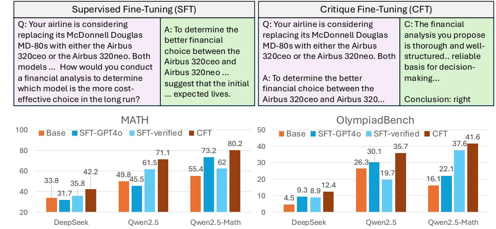
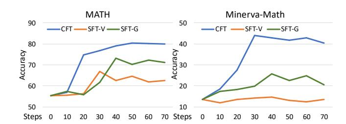

# Critique Fine-Tuning: Learning to Critique is More Effective than Learning to Imitate

# Yubo Wang<sup>1</sup> Xiang Yue<sup>2</sup> Wenhu Chen<sup>13</sup>

https://tiger-ai-lab.github.io/CritiqueFineTuning/



<span id="page-0-0"></span>Figure 1: Comparison between CFT and SFT on 50K samples from WebInstruct (Yue et al., 2024b). SFT-verified means SFT training on the responses validated by GPT-40, SFT-GPT40 means SFT training on the responses from GPT-40. CFT is our approach, which trains on the critique provided by GPT-40.

#### **Abstract**

Supervised Fine-Tuning (SFT) is commonly used to train language models to imitate annotated responses for given instructions. In this paper, we challenge this paradigm and propose Critique Fine-Tuning (CFT), a strategy where models learn to critique noisy responses rather than simply imitate correct ones. Inspired by human learning processes that emphasize critical thinking, CFT encourages deeper analysis and nuanced understanding-traits often overlooked by standard SFT. To validate the effectiveness of the CFT, we construct a 50K-sample dataset from WebInstruct, using GPT-40 as the teacher to generate

critiques in the form of ([query; noisy response], critique). CFT on this dataset yields a consistent 4-10% improvement over SFT on six math benchmarks with different base models like Qwen2.5, Qwen2.5-Math, and DeepSeek-Math. We further expand to MetaMath and NuminaMath datasets and observe similar gains over SFT. Notably, our model Owen2.5-Math-CFT only requires 1 hour of training on 8xH100 over the 50K examples. It can match or outperform strong competitors like Qwen2.5-Math-Instruct on most benchmarks, which use over 2M samples. Moreover, it can match the performance of SimpleRL, which is a DeepSeek-r1 replication trained with 140x more compute. Ablation studies show that CFT is robust to the source of noisy response and teacher critique model. Through these findings, we argue that CFT offers a more effective alternative to advance the reasoning of language models.

<sup>&</sup>lt;sup>1</sup>Department of Computer Science, University of Waterloo <sup>2</sup>Carnegie Mellon University, Pittsburgh <sup>3</sup>Vector Insitute, Toronto. Correspondence to: Yubo Wang <y726wang@uwaterloo.ca>, Wenhu Chen <wenhuchen@uwaterloo.ca>.

# 1. Introduction

Recently, large language models (LLMs) [\(Achiam et al.,](#page-8-0) [2023;](#page-8-0) [Team et al.,](#page-9-0) [2023;](#page-9-0) [Dubey et al.,](#page-8-1) [2024\)](#page-8-1) have shown unprecedented performance on tackling real-world problems. One of the core techniques is supervised fine-tuning (SFT), which trains these LLMs to follow natural language instructions [\(Wei et al.,](#page-10-1) [2022;](#page-10-1) [Ouyang et al.,](#page-9-1) [2022;](#page-9-1) [Sanh et al.,](#page-9-2) [2022\)](#page-9-2). In the process of SFT, LLMs are forced to imitate the annotated responses. Numerous efforts have been made to build high-quality SFT datasets using approaches like Self-Instruct [\(Wang et al.,](#page-10-2) [2023b\)](#page-10-2) and Evol-Instruct [\(Xu](#page-10-3) [et al.,](#page-10-3) [2024\)](#page-10-3) to enhance LLMs' general instruction-following capabilities. More recently, works such as MAmmoTH [\(Yue](#page-10-4) [et al.,](#page-10-4) [2024a;](#page-10-4)[b\)](#page-10-0), MetaMath [\(Yu et al.,](#page-10-5) [2024\)](#page-10-5), and Wizard-Coder [\(Luo et al.,](#page-9-3) [2024\)](#page-9-3) have employed SFT to improve the targeted capabilities of LLMs in areas like mathematical reasoning, coding, and more. While these approaches have shown significant gains on weaker base models such as Mistral [\(Jiang et al.,](#page-8-2) [2023\)](#page-8-2) or LLaMA3 [\(Dubey et al.,](#page-8-1) [2024\)](#page-8-1), diminishing returns become evident as SFT dataset size and quality scale up. This limitation is particularly pronounced for already-powerful base models (non-SFTed), such as Qwen2.5-base [\(Yang et al.,](#page-10-6) [2024a\)](#page-10-6), Qwen2.5-Mathbase [\(Yang et al.,](#page-10-7) [2024b\)](#page-10-7), or DeepSeek-Coder-V2-base [\(Guo](#page-8-3) [et al.,](#page-8-3) [2024\)](#page-8-3), which have undergone extensive domainadaptive pretraining on reasoning-focused corpora comprising hundreds of billions of tokens. Our experiments in [section 3](#page-2-0) reveal that applying SFT to these models can even degrade performance without stringent quality control.

In this paper, we challenge the prevailing paradigm of SFT and propose a new learning framework called Critique Fine-Tuning (CFT). Inspired by human learning—where critical thinking and constructive feedback are vital for improvement—we shift the focus from simple imitation to critiquebased learning. When humans learn, they do not merely replicate provided answers but analyze, critique, and refine them. Similarly, in CFT, the model learns to provide critiques for noisy responses, identify flaws, suggest improvements, and verify correctness. Formally, CFT involves training the model to critique a given query-response pair, maximizing the likelihood P(c|[x; y]), where c is the annotated critique for a query-response pair [x; y]. A detailed visualization of CFT is presented in [Figure 1.](#page-0-0)

To validate CFT's effectiveness, we designed a series of experiments. First, we constructed a 50K critique dataset from WebInstruct [\(Yue et al.,](#page-10-0) [2024b\)](#page-10-0), with critiques synthesized by advanced models like GPT-4o [\(Achiam et al.,](#page-8-0) [2023\)](#page-8-0). We applied CFT to strong 7B base language models (i.e., non-instruction-tuned), such as DeepSeekMath-base [\(Shao](#page-9-4) [et al.,](#page-9-4) [2024\)](#page-9-4), Qwen2.5 [\(Yang et al.,](#page-10-6) [2024a\)](#page-10-6), and Qwen2.5- Math [\(Yang et al.,](#page-10-7) [2024b\)](#page-10-7). These models were compared against SFT-trained variants, such as WebInstruct-verified

(SFT on WebInstruct responses verified by GPT-4o) and WebInstruct-GPT4o (SFT directly on responses generated by GPT-4o). When evaluated on six math benchmarks, including MATH and AIME24, CFT-trained models can consistently outperform the best SFT-trained models by an average of 4–10 absolute points.

We expanded the evaluation to broader STEM benchmarks, including GPQA [\(Rein et al.,](#page-9-5) [2023\)](#page-9-5), TheoremQA [\(Chen](#page-8-4) [et al.,](#page-8-4) [2023\)](#page-8-4), and MMLU-Pro [\(Wang et al.,](#page-10-8) [2024b\)](#page-10-8). Our results show that the best CFT-trained model, Qwen2.5- Math-CFT, trained on 50K examples, outperformed strong competitors like AceMath [\(Liu et al.,](#page-9-6) [2024\)](#page-9-6) and Qwen2.5- Math-Instruct [\(Yang et al.,](#page-10-7) [2024b\)](#page-10-7), which were trained on over 2M examples. We also compare Qwen2.5-Math-CFT with SimpleRL [\(Zeng et al.,](#page-10-9) [2025\)](#page-10-9), which is an open replication of DeepSeek-R1 [\(Guo et al.,](#page-8-5) [2025\)](#page-8-5) trained with 140x more compute (1152 H100 hours vs 8 H100 hours). Our experiments show that Qwen2.5-Math-CFT can reach the same average performance across 5 math benchmarks. This highlights the efficiency and effectiveness of CFT for reasoning-focused tasks.

To better understand different factors of CFT, we conducted comprehensive ablation studies:

- Robustness to dataset sources: Comparing WebInstruct [\(Yue et al.,](#page-10-0) [2024b\)](#page-10-0) against MetaMathQA [\(Yu et al.,](#page-10-5) [2024\)](#page-10-5) and NuminaMath [\(Li et al.,](#page-9-7) [2024b\)](#page-9-7), we observed that WebInstruct provided a slight advantage (3%+) due to its diversity and broader topic coverage.
- Robustness to noisy response sources: We experimented with both the original noisy responses and responses from Qwen2.5-base critiqued by GPT-4o. The performance differences were negligible.
- Flexibility to the teacher critique model: Using a weaker critique dataset synthesized by GPT-4o-mini instead of GPT-4o, we still observed notable improvements over SFT despite 4% drop on the overall score.

Through these experiments, we demonstrated CFT's efficiency and effectiveness over SFT. However, our approach has limitations. Firstly, the critique dataset was entirely synthesized by GPT-4o, with at least 20% of critiques containing errors. Improving the critique dataset quality could further enhance performance. Secondly, CFT-trained models currently lack the ability to perform self-critique, so we have not observed self-improvement effects. Future work will explore these directions further.

# <span id="page-1-0"></span>2. Method & Dataset

To validate the effectiveness of CFT, we constructed several fine-tuning datasets. Most of our experiments are based on WebInstruct [\(Yue et al.,](#page-10-0) [2024b\)](#page-10-0), an instruction dataset collected from online educational resources and quiz websites. The dataset underwent synthetic processing in its pipeline using large language models to improve solution quality and format consistency.

## 2.1. WebInstruct

WebInstruct spans a wide range of topics, including Mathematics (65%), Physics (8%), Chemistry (4%), Business (10%), Humanities (4%), and more. Unlike other datasets, which are primarily derived from math contests and competitions, WebInstruct offers broader topic coverage. The responses in WebInstruct are extracted and refined by large language models such as Qwen-72B [\(Bai et al.,](#page-8-6) [2023\)](#page-8-6) and Mixtral [\(Jiang et al.,](#page-8-7) [2024\)](#page-8-7), making them highly prone to noise due to the lack of verification or quality control.

We curated the following subsets from WebInstruct:

- WebInstruct-SFT: A 50K subset directly sampled from the original WebInstruct dataset. This subset has a very high error ratio (over 50%).
- WebInstruct-verified: We adopted samples from WebInstruct and prompted GPT-4o-1120 to judge whether the original answers were correct or not. We retained the top 50K samples as "verified" SFT data.
- WebInstruct-GPT-4o: A 50K subset that reuses questions from WebInstruct-SFT but replaces the answers with those generated by GPT-4o-1120.
- WebInstruct-CFT (Ours): A 50K subset derived from WebInstruct-SFT, where GPT-4o-1120 provides detailed critiques of the original responses. Approximately 56% of the responses in this subset are judged as "correct" while the rest are considered "wrong". Despite containing some critique errors introduced by GPT-4o, this dataset is comparable in quality to WebInstruct-GPT-4o.
- WebInstruct-CFT-Tiny (Ours): A smaller version of WebInstruct-CFT, containing only 4K examples, designed for training our 32B model.

We compare our CFT datasets with existing SFT datasets in [Table 1.](#page-2-1) As shown, our datasets cover a broader range of topics while being significantly smaller in size, highlighting their efficiency in boosting LLMs' reasoning abilities.

# 2.2. MetaMath & NuminaMath

In addition to WebInstruct, we synthesized critiques for other datasets, including MetaMathQA [\(Yu et al.,](#page-10-5) [2024\)](#page-10-5) and NuminaMath [\(Li et al.,](#page-9-7) [2024b\)](#page-9-7). From each dataset, we randomly sampled 50K examples and used GPT-4o to critique the original responses. We then applied CFT to these datasets to demonstrate the generalizability of our approach across other datasets.

<span id="page-2-1"></span>Table 1: The comparison of MAmmoTH3 vs other SFT and RL models including WizardMath [\(Luo et al.,](#page-9-8) [2023\)](#page-9-8), MathInstruct [\(Yue et al.,](#page-10-4) [2024a\)](#page-10-4), MetaMathQA [\(Yu et al.,](#page-10-5) [2024\)](#page-10-5), XWinMath [\(Li et al.,](#page-9-9) [2024a\)](#page-9-9), OrcaMath [\(Mitra et al.,](#page-9-10) [2024\)](#page-9-10), NuminaMath [\(Li et al.,](#page-9-7) [2024b\)](#page-9-7), AceMath [\(Liu et al.,](#page-9-6) [2024\)](#page-9-6), OpenMathInsstruct-2 [\(Toshniwal et al.,](#page-9-11) [2024\)](#page-9-11) and Qwen2.5-Math [\(Yang et al.,](#page-10-10) [2024c\)](#page-10-10).

| Dataset                                  | Size          | Source or Seed                         | Discipline |  |  |  |  |  |
|------------------------------------------|---------------|----------------------------------------|------------|--|--|--|--|--|
| Supervised Fine-Tuning Data              |               |                                        |            |  |  |  |  |  |
| WizardMath<br>96K<br>GSM8K, MATH<br>Math |               |                                        |            |  |  |  |  |  |
| MathInstruct                             | 260K          | GSM8K, MATH, etc                       | Math       |  |  |  |  |  |
| MetaMathQA                               | 395K          | GSM8K, MATH                            | Math       |  |  |  |  |  |
| XwinMath                                 | 1.4M          | GSM8K, MATH                            | Math       |  |  |  |  |  |
| OrcaMath                                 | 200K<br>GSM8K |                                        |            |  |  |  |  |  |
| NuminaMath                               | 860K          | Math<br>Math                           |            |  |  |  |  |  |
| AceMath                                  | 1.6M          | GSM8K, MATH, AIME<br>GSM8K, MATH, AIME | Math       |  |  |  |  |  |
| OpenMath-2                               | 14M           | GSM8K, MATH                            | Math       |  |  |  |  |  |
| Critique Fine-Tuning Data (Ours)         |               |                                        |            |  |  |  |  |  |
| CFT                                      | 50K           | WebInstruct                            | STEM       |  |  |  |  |  |
| CFT-tiny                                 | 4K            | WebInstruct                            | STEM       |  |  |  |  |  |

## 2.3. Training Objective

The training objective of our approach is straightforward. We concatenate the question x and noisy response y as input, and then optimize the model parameters to generate the critique c. Formally, the training loss is:

$$argmax_{\theta} \log P(c|[x;y];\theta)$$
 (1)

where θ is the parameters of the language model.

# <span id="page-2-0"></span>3. Experiments

In this section, we will detail our experiments.

# 3.1. Experimental Setup

Evaluation Datasets We evaluate our method on a wide range of mathematical reasoning benchmarks. For standard mathematical reasoning, we evaluate MATH [\(Hendrycks](#page-8-8) [et al.,](#page-8-8) [2021\)](#page-8-8), Minerva-Math [\(Lewkowycz et al.,](#page-8-9) [2022\)](#page-8-9) and GSM8K [\(Cobbe et al.,](#page-8-10) [2021\)](#page-8-10). To assess performance on more challenging competition-level mathematics, we incorporate AIME 2024 from the American Invitational Mathematics Examination, AMC 2023 from American Mathematics Competitions, and OlympiadBench [\(He et al.,](#page-8-11) [2024\)](#page-8-11) containing various difficulty levels of Mathematical Olympiad problems. We further extend our evaluation to broader STEM reasoning capabilities through TheoremQA [\(Chen et al.,](#page-8-4) [2023\)](#page-8-4) for mathematical theorem understanding, MMLU-Pro [\(Wang et al.,](#page-10-8) [2024b\)](#page-10-8) covering physics, chemistry, mathematics, etc., and GPQA [\(Rein et al.,](#page-9-5) [2023\)](#page-9-5) for complex problems requiring scientific reasoning.

<span id="page-3-0"></span>Table 2: Performance comparison of SFT and CFT on different base models. All the experiments are trained with WebInstruct subset. We select the checkpoint with highest validation score and report their results.

| Model            | Method                   | MATH | Minerva-Math | GSM8K | OlympiadBench | AIME24 | AMC23 | AVG  |
|------------------|--------------------------|------|--------------|-------|---------------|--------|-------|------|
|                  | Base                     | 33.8 | 9.2          | 64.3  | 4.5           | 0.0    | 10.0  | 20.3 |
|                  | WebInstruct-SFT          | 26.3 | 12.1         | 34.7  | 6.2           | 0.0    | 17.5  | 16.1 |
| DeepSeek-Math-7B | WebInstruct-verified-SFT | 35.8 | 10.7         | 67.5  | 9.3           | 0.0    | 7.5   | 21.8 |
|                  | WebInstruct-GPT4o-SFT    | 31.7 | 11.8         | 70.9  | 8.9           | 3.3    | 17.5  | 24.0 |
|                  | WebInstruct-CFT          | 42.2 | 12.5         | 74.5  | 12.4          | 3.3    | 20.0  | 27.5 |
|                  | ∆ = CFT- SFTbest         | 6.4  | 0.4          | 3.6   | 3.1           | 0.0    | 2.5   | 3.5  |
| Qwen2.5-7B       | Base                     | 49.8 | 15.1         | 85.4  | 26.3          | 10.0   | 37.5  | 37.4 |
|                  | WebInstruct-SFT          | 30.8 | 6.6          | 59.5  | 5.8           | 3.3    | 15.0  | 20.2 |
|                  | WebInstruct-verified-SFT | 61.5 | 16.2         | 70.8  | 30.1          | 13.3   | 37.5  | 38.2 |
|                  | WebInstruct-GPT4o-SFT    | 45.5 | 18.4         | 77.4  | 19.7          | 10.0   | 50.0  | 36.8 |
|                  | WebInstruct-CFT          | 71.1 | 27.9         | 88.8  | 35.7          | 13.3   | 55.0  | 48.6 |
| ∆ = CFT- SFTbest |                          | 9.6  | 9.5          | 11.4  | 5.6           | 0.0    | 5.0   | 10.4 |
|                  | Base                     | 55.4 | 13.6         | 91.6  | 16.1          | 10.0   | 40.0  | 37.8 |
|                  | WebInstruct-SFT          | 59.0 | 13.2         | 77.4  | 19.9          | 3.3    | 37.5  | 35.1 |
| Qwen2.5-Math-7B  | WebInstruct-verified-SFT | 62.0 | 12.5         | 78.8  | 22.1          | 16.7   | 50.0  | 40.4 |
|                  | WebInstruct-GPT4o-SFT    | 73.2 | 25.7         | 90.0  | 37.6          | 13.3   | 62.5  | 50.4 |
|                  | WebInstruct-CFT          | 80.2 | 42.3         | 90.9  | 41.6          | 20.0   | 67.5  | 57.1 |
|                  | ∆ = CFT- SFTbest         | 7.0  | 16.6         | 0.9   | 4.0           | 3.3    | 5.0   | 6.7  |

Training Details We evaluate three different SFT settings and one CFT setting in our experiments. For SFT, we explore: (1) SFT: direct training on original noisy responses, (2) SFT-verified: training on responses validated by GPT-4o, and (3) SFT-gpt4o: training on responses generated by GPT-4o. For CFT, we train the model using our curated CFT datasets as described in [section 2.](#page-1-0) We use MATH-500 [\(Lightman et al.,](#page-9-12) [2023b\)](#page-9-12) as our validation set and select the best-performing checkpoint after training on the entire dataset for 1 epoch. We maintain consistent hyperparameters across all experiments with a learning rate of 5e-6, a cosine decay learning schedule with a warm-up ratio of 0.1, and a global batch size of 512.

# 3.2. Main Results (CFT vs. SFT)

To evaluate the effectiveness of CFT, we compare it with various SFT methods on three 7B-scale base models using mathematical reasoning benchmarks. Table [2](#page-3-0) presents the comprehensive results across different base models and methods. Our key findings are as follows:

Base Model Selection We experiment with three 7Bscale base models: DeepSeek-Math-7B, Qwen2.5-7B, and Qwen2.5-Math-7B. Results show that Qwen2.5-Math-7B serves as a stronger foundation, with its base version achieving 37.8% average accuracy across benchmarks. When enhanced with CFT, it achieves the best performance with 57.1% average accuracy.

Performance Gains CFT consistently outperforms all SFT baselines across different models. On DeepSeek-Math-7B, it achieves a 3.5% absolute improvement over the SFT-GPT4o. On Qwen2.5-7B, it demonstrates a substantial 10.4% improvement over the SFT-verified. On Qwen2.5- Math-7B, it surpasses the strong GPT-4o SFT baseline by 6.7% over SFT-GPT4o.

<span id="page-3-1"></span>

Figure 2: Training dynamics comparison of different methods on Qwen2.5-Math-7B across MATH and Minerva-Math. We compare CFT with two SFT variants: SFT-V (trained on WebInstruct-verified) and SFT-G (trained on WebInstruct-GPT4o). The x-axis represents training steps, and the y-axis shows the accuracy. CFT demonstrates consistently better performance and faster convergence.

Training Dynamics Figure [2](#page-3-1) illustrates the training dynamics of different methods on Qwen2.5-Math-7B. CFT demonstrates faster convergence around step 30 and maintains higher performance throughout training - approximately 80% accuracy on MATH compared to SFT-G's 70% and SFT-V's 60%, and 40% accuracy on Minerva-Math com-

<span id="page-4-0"></span>Table 3: Performance comparison of our models vs. other reasoning-specialized models. #Data means the total training set size, but we select the checkpoint with highest validation score.

| Model                             | #Data |      |      |                                       |      | MATH GPQA TheoremQA MMLU-Pro OlympiadBench AIME24 AMC23 AVG |      |      |      |
|-----------------------------------|-------|------|------|---------------------------------------|------|-------------------------------------------------------------|------|------|------|
| Frontier Models                   |       |      |      |                                       |      |                                                             |      |      |      |
| GPT-4o (2024-08-06)               | -     | 81.1 | 51.6 | 54.7                                  | 74.7 | 43.3                                                        | 9.3  | 47.5 | 51.7 |
| GPT-o1-mini                       | -     | 90.0 | 60.0 | 57.2                                  | 80.3 | 65.3                                                        | 56.7 | 95.0 | 72.1 |
| Other Open-sourced Reasoning LLMs |       |      |      |                                       |      |                                                             |      |      |      |
| Deepseek-Math-7B-Instruct         | -     | 44.3 | 31.8 | 23.7                                  | 35.3 | 13.6                                                        | 3.3  | 15.0 | 23.9 |
| Mathstral-7B-v0.1                 | -     | 56.6 | 32.2 | 28.4                                  | 42.5 | 21.5                                                        | 6.7  | 42.4 | 32.9 |
| NuminaMath-7B-CoT                 | -     | 55.2 | 30.6 | 28.6                                  | 38.6 | 19.9                                                        | 6.7  | 30.0 | 29.9 |
| Llama-3.1-8B-Instruct             | -     | 51.9 | 30.4 | 30.3                                  | 48.3 | 14.4                                                        | 6.7  | 30.0 | 30.3 |
| Llama-3.1-70B-Instruct            | -     | 65.7 | 42.2 | 51.3                                  | 62.8 | 14.4                                                        | 16.7 | 30.0 | 40.4 |
| NuminaMath-72B-CoT                | -     | 68.0 | 35.3 | 24.9                                  | 55.0 | 35.0                                                        | 3.3  | 52.5 | 39.1 |
| Qwen2.5-Math-72B-Instruct         | -     | 85.9 | 49.0 | 50.3                                  | 60.3 | 49.0                                                        | 30.0 | 70.0 | 56.4 |
|                                   |       |      |      | Initialized from Qwen2.5-Math-7B-Base |      |                                                             |      |      |      |
| Qwen2.5-Math-Base                 | 0     | 55.4 | 31.0 | 37.4                                  | 39.3 | 16.1                                                        | 10.0 | 40.0 | 32.7 |
| Eurus-2-SFT                       | 230 K | 62.4 | 32.1 | 38.0                                  | 44.2 | 29.8                                                        | 3.3  | 30.1 | 34.3 |
| rStar-Math@Greedy                 | 747 K | 78.4 | -    | -                                     | -    | 47.1                                                        | 26.7 | 47.5 | -    |
| AceMath-Qwen2.5-Math              | 2.3 M | 83.1 | 26.1 | 24.6                                  | 48.1 | 42.2                                                        | 16.7 | 60.0 | 43.0 |
| Qwen2.5-Math-7B-Instruct          | 2.5 M | 83.6 | 31.1 | 37.0                                  | 39.5 | 41.6                                                        | 16.7 | 62.5 | 44.6 |
| Qwen2.5-Math-7B-CFT               | 50 K  | 80.2 | 39.4 | 40.4                                  | 47.5 | 41.6                                                        | 20.0 | 67.5 | 48.1 |

pared to both SFT variants' 20%. These results demonstrate that CFT achieves faster convergence with less training data, making it a more efficient approach for developing mathematical reasoning models.

# 3.3. More Results (CFT Models vs. Existing Models)

In Table [3,](#page-4-0) we compare our best CFT-models with other competitive models with different scales. We expanded the evaluation benchmarks to cover broader STEM topics.

7B CFT Models Our Qwen2.5-Math-7B-CFT achieves the highest average performance (48.1%) among 7B-scale models while using significantly less training data (50K samples). Specifically:

- It substantially outperforms other specialized mathematical models like Deepseek-Math-7B-Instruct (23.9% avg.), Mathstral-7B (32.9% avg.), and NuminaMath-7B-CoT (29.9% avg.).
- This strong performance is achieved with remarkably less training data - only 50K samples compared to AceMath-Qwen2.5-Math (2.3M samples) and Qwen2.5-Math-7B-Instruct (2.5M samples), demonstrating the superior data efficiency of our approach. In addition, our method outperforms Eurus-2-SFT (230K) [\(Cui et al.,](#page-8-12) [2025\)](#page-8-12) and rStar-Math@Greedy (747K) [\(Guan et al.,](#page-8-13) [2025\)](#page-8-13) on most tasks.

Despite being smaller in scale, our Qwen2.5-Math-7B-CFT demonstrates strong performance compared to larger models. With only 7B parameters, it achieves better average

performance (48.1%) than Llama-3.1-70B-Instruct (40.4%) and NuminaMath-72B-CoT (39.1%). When compared to Qwen2.5-Math-72B-Instruct (56.4%), our model shows competitive results on several benchmarks (e.g., 67.5% vs 70.0% on AMC23) despite using only one-tenth of the parameters and less training data. While frontier closed models like GPT-4o still maintain a performance lead, our results demonstrate that efficient training strategies can help smaller models achieve strong performance with fewer resources.

32B CFT Models We conduct a detailed comparison between Qwen2.5-32B-Instruct-CFT and Sky-T1-32B-Preview, as shown in Table [4.](#page-4-1) The results reveal several important aspects: (1) Our most significant advantage lies in data efficiency. (2) The performance comparison across different benchmarks shows consistent advantages:

<span id="page-4-1"></span>Table 4: Performance Comparison of 32B Models across Mathematical Reasoning Benchmarks

| Model                                          |             |              | #Data GPQA TheoremQA AMC23 |              |
|------------------------------------------------|-------------|--------------|----------------------------|--------------|
| Qwen2.5-32B-Instruct                           | -           | 49.5         | 44.6                       | 72.5         |
| Sky-T1-32B-Preview<br>Qwen2.5-32B-Instruct-CFT | 17 K<br>4 K | 49.5<br>52.5 | 48.9<br>48.1               | 67.5<br>77.5 |
| ∆ (CFT - Sky-T1)                               | -           | 3.0          | -0.8                       | 10.0         |

• Qwen2.5-32B-Instruct-CFT achieves optimal performance with only 4K training samples, compared to Sky-T1-32B-Preview's 17K samples.

• This 4x reduction in training data demonstrates the effectiveness of our critique-based approach in learning from much fewer examples without Long-CoT.

Our model achieves 52.5% accuracy on GPQA, surpassing Sky-T1's 49.5%. On TheoremQA, it shows comparable performance to Sky-T1, occasionally exceeding it during training. For AMC23, we observe a substantial improvement to 77.5% compared to Sky-T1's 62.5%, maintaining stable performance above 75%. These results demonstrate that CFT not only achieves better performance but also requires significantly less training data, making it a more efficient and practical approach for developing high-performance mathematical reasoning models.

## 3.4. Comparison with RL-based Method

<span id="page-5-0"></span>Table 5: Performance Comparison with RL-driven method. All models based initialized from Qwen2.5-Math-7B-base.

| Model            |      | CFT SimpleRL-Zero | SimpleRL |
|------------------|------|-------------------|----------|
| Data Size        | 50K  | 8K×12             | 8K+8K×12 |
| GPU Hours (H100) | 8    | 1152              | 1152     |
| MATH-500         | 79.6 | 77.2              | 82.4     |
| Minerva-Math     | 42.3 | 33.5              | 39.7     |
| OlympiadBench    | 41.6 | 37.9              | 43.3     |
| AIME24           | 20.0 | 33.3              | 26.7     |
| AMC23            | 67.5 | 62.5              | 62.5     |
| AVG              | 50.2 | 48.9              | 50.9     |

Recently, researchers have shown that reinforcement learning can significantly boost the reasoning capabilities of large language models. Here, we compare with SimpleRL [\(Zeng](#page-10-9) [et al.,](#page-10-9) [2025\)](#page-10-9), which is an open replication of DeepSeek-R1 [\(Guo et al.,](#page-8-5) [2025\)](#page-8-5). We consider pure RL-based training (SimpleRL-Zero) and Distill+RL-based training (SimpleRL) as our competitors, both require 32xH100 to train for 1.5 days. In contrast, our method only requires 8xH100 to train for 1 hour. Furthermore, our approach does not requirea long decoding length leading to higher efficiency.

As shown in [Table 5,](#page-5-0) CFT can improve Qwen2.5-Math-7Bbase to the same level as SimpleRL. On several benchmarks like AMC23 and Minverva-Math, CFT can outperform both SimpleRL significantly. The biggest difference is AIME24, which only contains a test set of 30 questions. The accuracy is heavily impacted by the randomness.

## 3.5. Ablation Studies

In order to understand the impact of different factors in CFT, we conduct several ablation studies:

Dataset Source We ablate the impact of different training datasets on model performance. As shown in Table [6,](#page-5-1)

<span id="page-5-1"></span>Table 6: Performance comparison of SFT and CFT with different training datasets on Qwen2.5-Math-7B.

| Task          |      | MetaMathQA |      | NuminaMath | WebInstruct |      |
|---------------|------|------------|------|------------|-------------|------|
|               | SFT  | CFT        | SFT  | CFT        | SFT         | CFT  |
| MATH          | 57.5 | 74.4       | 70.8 | 74.2       | 59.0        | 80.2 |
| Minerva-Math  | 23.9 | 42.3       | 28.3 | 32.8       | 13.2        | 42.3 |
| GSM8K         | 79.5 | 85.7       | 88.3 | 89.1       | 77.4        | 90.9 |
| OlympiadBench | 20.0 | 36.4       | 36.3 | 37.2       | 19.9        | 41.6 |
| AIME24        | 6.7  | 23.3       | 10.0 | 23.3       | 3.3         | 20.0 |
| AMC23         | 37.5 | 57.5       | 50.0 | 62.5       | 37.5        | 67.5 |
| AVG           | 37.5 | 53.3       | 47.3 | 53.2       | 35.1        | 57.1 |

Table 7: Performance comparison between self-generated (by Qwen2.5-Math-7B) and original solutions (from WebInstruct) for CFT training.

| Task          |      |      | Base Self-generated Other-generated |
|---------------|------|------|-------------------------------------|
| MATH          | 55.4 | 78.2 | 80.2                                |
| Minerva-Math  | 13.6 | 33.1 | 42.3                                |
| GSM8K         | 91.6 | 92.4 | 90.9                                |
| OlympiadBench | 16.1 | 42.5 | 41.6                                |
| AIME24        | 10.0 | 16.7 | 20.0                                |
| AMC23         | 40.0 | 67.5 | 67.5                                |
| AVG           | 37.8 | 55.1 | 57.1                                |

Table 8: Performance comparison of CFT using different teacher critique models on Qwen2.5-Math-7B.

| Task          | SFT-verified | GPT-4o-mini | GPT-4o-1120 |
|---------------|--------------|-------------|-------------|
| MATH          | 62.0         | 73.9        | 80.2        |
| Minerva-Math  | 12.5         | 36.4        | 42.3        |
| GSM8K         | 78.8         | 84.5        | 90.9        |
| OlympiadBench | 22.1         | 35.1        | 41.6        |
| AIME24        | 16.7         | 20.0        | 20.0        |
| AMC23         | 50.0         | 62.5        | 67.5        |
| AVG           | 40.4         | 52.0        | 57.1        |

when trained with SFT, both MetaMathQA and Numina-Math achieve better performance than WebInstruct (47.3% and 37.5% vs. 35.1% on average), indicating their higher data quality. However, when trained with CFT, WebInstruct surprisingly achieves the best performance (57.1%), outperforming both MetaMathQA and NuminaMath. This suggests that the effectiveness of CFT is not solely determined by the quality of solution data. Instead, by learning to identify and critique incorrect solutions, the model can develop stronger mathematical reasoning capabilities even from imperfect demonstrations, highlighting the robustness and effectiveness of our critique-based learning approach.

Response Source We compare two sources of solutions for CFT training: solutions generated by Qwen2.5-Math-7B itself and original solutions from the WebInstruct dataset.

Table [7](#page-5-1) shows that using original solutions achieves comparable performance (57.1% vs. 55.1% on average), with some variation across different benchmarks. The improvement is more noticeable on challenging datasets like Minerva-Math (9.2% increase). These results demonstrate that CFT is robust to different solution sources and can effectively learn from both model-generated and original solutions from the WebInstruct dataset.

Teacher Critique Model To understand the impact of critique model quality on CFT, we compare the performance when using GPT-4o-mini and GPT-4o-1120 as critique models in Table [8.](#page-5-1) First, we observe that even with a relatively modest critique model GPT-4o-mini, CFT significantly outperforms SFT-verified baseline (52.0% vs. 40.4% on average), with substantial improvements on MATH (11.9% increase) and Minerva-Math (23.9% increase). This demonstrates the effectiveness of CFT without requiring an extremely powerful critique model. Furthermore, using a stronger critique model GPT-4o-1120 leads to even better performance across all benchmarks (57.1% on average), with notable gains on GSM8K (6.4% increase) and OlympiadBench (6.5% increase). These results confirm that while CFT is effective with modest critique models, stronger critique models can provide more accurate and insightful feedback, leading to better mathematical reasoning capabilities. In the future, we plan to leverage o1 or even o3 as teacher critique model to understand the potential.

# 4. Limitations

# 4.1. The Noisy Critique Data

Our ablation study on critique models demonstrates that the quality of critique feedback significantly impacts the effectiveness of CFT. To better understand the current limitations, we manually examined 50 randomly sampled critique instances generated by GPT-4o-1120 on WebInstruct. Despite being our best-performing critique data, approximately 20% of these critiques still contain errors or inaccurate feedback (see Appendix [A.2](#page-12-0) for detailed case studies). These errors can manifest in various forms, such as misidentifying correct steps as incorrect, overlooking crucial mistakes, or providing imprecise mathematical explanations.

This finding suggests a clear path for improvement: while our current approach shows promising results, the performance of CFT could be further enhanced by using more reliable and verifiable critique data. Future work could focus on developing methods to automatically verify critique accuracy, perhaps through formal mathematical verification tools or by cross-validation with multiple expert models. Additionally, creating a curated dataset of human-verified mathematical critiques, though resource-intensive, could provide a gold standard for training and evaluation. Such

high-quality, verifiable critique data would likely lead to more robust and accurate mathematical reasoning capabilities in language models trained with CFT.

# 4.2. Limitations of Self-Critique

We investigated the potential of incorporating self-critique mechanisms into our framework. Table [9](#page-6-0) shows that these mechanisms consistently underperform compared to direct inference. We explored two approaches:

- 1. Single-pass self-critique: The model solves the problem and critiques its solution in one pass. If errors are detected, it generates a new solution.
- 2. Two-stage self-critique: The model first generates a solution, then separately evaluates it. If issues are found, the model iterates this process (up to 8 attempts).

<span id="page-6-0"></span>Table 9: Performance comparison of different inference methods across various temperature settings.

| Method                    | Temperature |      | MATH Minerva-Math |
|---------------------------|-------------|------|-------------------|
| Direct inference          | 0.0         | 80.2 | 42.3              |
|                           | 0.1         | 78.8 | 38.9              |
|                           | 0.3         | 77.5 | 37.7              |
|                           | 0.6         | 75.2 | 34.1              |
| Single-pass self-critique | 0.1         | 77.2 | 36.7              |
|                           | 0.3         | 76.1 | 35.2              |
|                           | 0.6         | 73.5 | 34.3              |
| Two-stage self-critique   | 0.1         | 77.9 | 38.2              |
|                           | 0.3         | 75.8 | 35.4              |
|                           | 0.6         | 74.6 | 34.6              |

Our results show that direct inference at temperature 0.0 achieves the best performance (80.2% on MATH and 42.3% on Minerva-Math). Both self-critique methods show performance degradation as temperature increases. The singlepass approach drops from 77.2% to 73.5% on MATH as temperature increases from 0.1 to 0.6, with similar trends on Minerva-Math. The two-stage approach performs slightly better but still falls short of direct inference.

We observe two main issues with self-critique:

- The model often fails to maintain consistent evaluation standards, either missing real errors or incorrectly flagging correct solutions
- Higher temperatures, needed to avoid repetitive outputs in iterative attempts, introduce instability in the model's reasoning process

Based on these findings, our final CFT implementation uses direct inference without self-critique mechanisms. Detailed analysis of self-critique issues can be found in Appendix [A.3.](#page-14-0)

# 5. Related Work

## 5.1. Instruction Tuning

Instruction tuning is one of the most crucial part of aligning pre-trained language models with human expectations. The current instruction-tuning datasets are either based on (1) human annotation: such as FLAN [\(Wei et al.,](#page-10-1) [2022\)](#page-10-1), T0 [\(Sanh et al.,](#page-9-2) [2022\)](#page-9-2), SuperNI [\(Wang et al.,](#page-9-13) [2022\)](#page-9-13), which compiles large instruction-tuning datasets from existing human-labeled datasets; and (2) model synthesis: such as Self-Instruct [\(Wang et al.,](#page-10-2) [2023b\)](#page-10-2), WizardLM [\(Xu](#page-10-3) [et al.,](#page-10-3) [2024\)](#page-10-3), WildChat [\(Zhao et al.,](#page-10-11) [2024\)](#page-10-11), which creates instruction-tuning datasets by synthesizing from powerful LLMs [\(Achiam et al.,](#page-8-0) [2023\)](#page-8-0). Both types of instruction datasets have shown great performance improvement of LMs on general evaluation tasks. More recently, Tulu [\(Wang](#page-9-14) [et al.,](#page-9-14) [2023a\)](#page-9-14) and Tulu-3 [\(Lambert et al.,](#page-8-14) [2024\)](#page-8-14) have ablated the how to combine the existing post-training data and algorithms to the push LMs' performance to the maximum.

#### 5.2. Mathematics Instruction Tuning

Taking this further, math-instructed models have been developed to advance LLM performance in the mathematical domain [\(Luo et al.,](#page-9-8) [2023;](#page-9-8) [Yue et al.,](#page-10-4) [2024a;](#page-10-4) [Yu et al.,](#page-10-5) [2024;](#page-10-5) [Li et al.,](#page-9-9) [2024a;](#page-9-9) [Mitra et al.,](#page-9-10) [2024;](#page-9-10) [Li et al.,](#page-9-7) [2024b\)](#page-9-7). Recently, there has been a wave to scale up the math instruction dataset to millions of examples like MAmmoTH2 [\(Yue et al.,](#page-10-0) [2024b\)](#page-10-0), Open-MathInstruct [\(Toshniwal](#page-9-11) [et al.,](#page-9-11) [2024\)](#page-9-11), and AceMath [\(Liu et al.,](#page-9-6) [2024\)](#page-9-6) and Qwen2.5- Math-Instruct [\(Yang et al.,](#page-10-7) [2024b\)](#page-10-7). These methods have shown tremendous performance gains on math reasoning datasets. However, we also observe diminishing marginal gain by further scaling the instruction data up, suggesting that a more efficient training algorithm is needed. In this paper, we aim to challenge SFT and propose a much more efficient learning algorithm CFT and show similar performance with only 1-10% of SFT data.

# 5.3. Critique Learning

Teaching AIs to critique has been a long standing goal in the pursuit of AGI.

Self-Correction The concept of 'self-correction' has been emerged as a promising direction in LLMs since 2023. There has been a line of work [\(Madaan et al.,](#page-9-15) [2024;](#page-9-15) [Welleck](#page-10-12) [et al.,](#page-10-12) [2023;](#page-10-12) [Shinn et al.,](#page-9-16) [2024;](#page-9-16) [Bai et al.,](#page-8-15) [2022;](#page-8-15) [Ganguli](#page-8-16) [et al.,](#page-8-16) [2023;](#page-8-16) [Gou et al.,](#page-8-17) [2023\)](#page-8-17) aiming to use feedback from the model itself to further improve its performance. However, a later work [\(Huang et al.,](#page-8-18) [2023;](#page-8-18) [Valmeekam et al.,](#page-9-17) [2023\)](#page-9-17) revealed that the self-correction in reasoning is not quite reliable. More recently, with the rise of GPT-o1 [\(Jaech](#page-8-19) [et al.,](#page-8-19) [2024\)](#page-8-19), LLM self-correction has again demonstrated

its potential to improve LLMs' own reasoning capabilities.

Critique Model The critique model is different from selfcorrection, where a specialized model is being used to provide feedback to an existing model to assist the generation process. Reward models are the most popular critique models used in mathematical reasoning. Recently, different outcome reward models [\(Uesato et al.,](#page-9-18) [2022;](#page-9-18) [Yang et al.,](#page-10-7) [2024b\)](#page-10-7) and process reward models [\(Wang et al.,](#page-9-19) [2024a;](#page-9-19) [Lightman](#page-9-20) [et al.,](#page-9-20) [2023a;](#page-9-20) [Yuan et al.,](#page-10-13) [2024\)](#page-10-13) have been explored to enhance LLMs' reasoning capabilities. However, these critique models are mostly designed for directly estimating the reward score without intermediate reasoning. The closest to ours is critique-out-loud [\(Ankner et al.\)](#page-8-20), which only serves as a reward model instead of an actor.

Our paper is very different from these two notions. We use 'critique' simply as a learning objective to push the model to gain a deeper understanding of the problem. During inference time, the trained model simply generates the response without involving any critique or refinement process.

# 6. Conclusion

In this paper, we introduced Critique Fine-Tuning (CFT), a novel paradigm that fundamentally reimagines how language models learn from instruction data. Unlike traditional Supervised Fine-Tuning (SFT) that focuses on response imitation, CFT emphasizes critical thinking by teaching models to critique and analyze responses. Through extensive experiments across multiple base models and benchmarks, we demonstrated that CFT consistently outperforms SFT by 4-10% on mathematical reasoning tasks while requiring significantly fewer training samples (50K vs 2M+). Notably, with just 8 H100 hours of training, our CFT-trained model achieves comparable performance to state-of-the-art reinforcement learning approaches like DeepSeek-R1, which requires 140 times more compute resources. The benefits of CFT extend beyond mathematical reasoning to broader STEM domains, as evidenced by superior performance on benchmarks like GPQA and TheoremQA. Even without traditional instruction tuning, CFT-trained models can effectively follow instructions, challenging the conventional wisdom that SFT or RL is necessary for instruction following. These findings open up new directions for improving language model capabilities, such as combining CFT with other training paradigms like SFT and RL, extending it to multi-modal settings, and investigating its theoretical foundations. We believe CFT represents a significant step forward in making language model training more efficient and effective, potentially reducing the computational and data requirements for developing high-performing models while improving their reasoning capabilities.

# References

- <span id="page-8-0"></span>Achiam, J., Adler, S., Agarwal, S., Ahmad, L., Akkaya, I., Aleman, F. L., Almeida, D., Altenschmidt, J., Altman, S., Anadkat, S., et al. Gpt-4 technical report. *arXiv preprint arXiv:2303.08774*, 2023.
- <span id="page-8-20"></span>Ankner, Z., Paul, M., Cui, B., Chang, J. D., and Ammanabrolu, P. Critique-out-loud reward models. In *Pluralistic Alignment Workshop at NeurIPS 2024*.
- <span id="page-8-6"></span>Bai, J., Bai, S., Chu, Y., Cui, Z., Dang, K., Deng, X., Fan, Y., Ge, W., Han, Y., Huang, F., et al. Qwen technical report. *arXiv preprint arXiv:2309.16609*, 2023.
- <span id="page-8-15"></span>Bai, Y., Kadavath, S., Kundu, S., Askell, A., Kernion, J., Jones, A., Chen, A., Goldie, A., Mirhoseini, A., McKinnon, C., et al. Constitutional ai: Harmlessness from ai feedback. *arXiv preprint arXiv:2212.08073*, 2022.
- <span id="page-8-4"></span>Chen, W., Yin, M., Ku, M., Lu, P., Wan, Y., Ma, X., Xu, J., Wang, X., and Xia, T. Theoremqa: A theorem-driven question answering dataset. In *Proceedings of the 2023 Conference on Empirical Methods in Natural Language Processing*, pp. 7889–7901, 2023.
- <span id="page-8-10"></span>Cobbe, K., Kosaraju, V., Bavarian, M., Chen, M., Jun, H., Kaiser, L., Plappert, M., Tworek, J., Hilton, J., Nakano, R., et al. Training verifiers to solve math word problems. *arXiv preprint arXiv:2110.14168*, 2021.
- <span id="page-8-12"></span>Cui, G., Yuan, L., Wang, Z., Wang, H., Li, W., He, B., Fan, Y., Yu, T., Xu, Q., Chen, W., Yuan, J., Chen, H., Zhang, K., Lv, X., Wang, S., Yao, Y., Han, X., Peng, H., Cheng, Y., Liu, Z., Sun, M., Zhou, B., and Ding, N. Process reinforcement through implicit rewards, 2025. URL <https://arxiv.org/abs/2502.01456>.
- <span id="page-8-1"></span>Dubey, A., Jauhri, A., Pandey, A., Kadian, A., Al-Dahle, A., Letman, A., Mathur, A., Schelten, A., Yang, A., Fan, A., et al. The llama 3 herd of models. *arXiv preprint arXiv:2407.21783*, 2024.
- <span id="page-8-16"></span>Ganguli, D., Askell, A., Schiefer, N., Liao, T. I., Lukosiˇ ut¯ e,˙ K., Chen, A., Goldie, A., Mirhoseini, A., Olsson, C., Hernandez, D., et al. The capacity for moral self-correction in large language models. *arXiv preprint arXiv:2302.07459*, 2023.
- <span id="page-8-17"></span>Gou, Z., Shao, Z., Gong, Y., Yang, Y., Duan, N., Chen, W., et al. Critic: Large language models can self-correct with tool-interactive critiquing. In *The Twelfth International Conference on Learning Representations*, 2023.
- <span id="page-8-13"></span>Guan, X., Zhang, L. L., Liu, Y., Shang, N., Sun, Y., Zhu, Y., Yang, F., and Yang, M. rstar-math: Small llms can master math reasoning with self-evolved deep thinking, 2025. URL <https://arxiv.org/abs/2501.04519>.

- <span id="page-8-3"></span>Guo, D., Zhu, Q., Yang, D., Xie, Z., Dong, K., Zhang, W., Chen, G., Bi, X., Wu, Y., Li, Y., et al. Deepseek-coder: When the large language model meets programming–the rise of code intelligence. *arXiv preprint arXiv:2401.14196*, 2024.
- <span id="page-8-5"></span>Guo, D., Yang, D., Zhang, H., Song, J., Zhang, R., Xu, R., Zhu, Q., Ma, S., Wang, P., Bi, X., et al. Deepseek-r1: Incentivizing reasoning capability in llms via reinforcement learning. *arXiv preprint arXiv:2501.12948*, 2025.
- <span id="page-8-11"></span>He, C., Luo, R., Bai, Y., Hu, S., Thai, Z. L., Shen, J., Hu, J., Han, X., Huang, Y., Zhang, Y., et al. Olympiadbench: A challenging benchmark for promoting agi with olympiadlevel bilingual multimodal scientific problems. *arXiv preprint arXiv:2402.14008*, 2024.
- <span id="page-8-8"></span>Hendrycks, D., Burns, C., Kadavath, S., Arora, A., Basart, S., Tang, E., Song, D., and Steinhardt, J. Measuring mathematical problem solving with the math dataset. In *Thirty-fifth Conference on Neural Information Processing Systems Datasets and Benchmarks Track (Round 2)*, 2021.
- <span id="page-8-18"></span>Huang, J., Chen, X., Mishra, S., Zheng, H. S., Yu, A. W., Song, X., and Zhou, D. Large language models cannot self-correct reasoning yet. In *The Twelfth International Conference on Learning Representations*, 2023.
- <span id="page-8-19"></span>Jaech, A., Kalai, A., Lerer, A., Richardson, A., El-Kishky, A., Low, A., Helyar, A., Madry, A., Beutel, A., Carney, A., et al. Openai o1 system card. *arXiv preprint arXiv:2412.16720*, 2024.
- <span id="page-8-2"></span>Jiang, A. Q., Sablayrolles, A., Mensch, A., Bamford, C., Chaplot, D. S., Casas, D. d. l., Bressand, F., Lengyel, G., Lample, G., Saulnier, L., et al. Mistral 7b. *arXiv preprint arXiv:2310.06825*, 2023.
- <span id="page-8-7"></span>Jiang, A. Q., Sablayrolles, A., Roux, A., Mensch, A., Savary, B., Bamford, C., Chaplot, D. S., Casas, D. d. l., Hanna, E. B., Bressand, F., et al. Mixtral of experts. *arXiv preprint arXiv:2401.04088*, 2024.
- <span id="page-8-14"></span>Lambert, N., Morrison, J., Pyatkin, V., Huang, S., Ivison, H., Brahman, F., Miranda, L. J. V., Liu, A., Dziri, N., Lyu, S., et al. T\" ulu 3: Pushing frontiers in open language model post-training. *arXiv preprint arXiv:2411.15124*, 2024.
- <span id="page-8-9"></span>Lewkowycz, A., Andreassen, A., Dohan, D., Dyer, E., Michalewski, H., Ramasesh, V., Slone, A., Anil, C., Schlag, I., Gutman-Solo, T., et al. Solving quantitative reasoning problems with language models. *Advances in Neural Information Processing Systems*, 35:3843–3857, 2022.

- <span id="page-9-9"></span>Li, C., Wang, W., Hu, J., Wei, Y., Zheng, N., Hu, H., Zhang, Z., and Peng, H. Common 7b language models already possess strong math capabilities. *arXiv preprint arXiv:2403.04706*, 2024a.
- <span id="page-9-7"></span>Li, J., Beeching, E., Tunstall, L., Lipkin, B., Soletskyi, R., Huang, S., Rasul, K., Yu, L., Jiang, A. Q., Shen, Z., et al. Numinamath: The largest public dataset in ai4maths with 860k pairs of competition math problems and solutions. *Hugging Face repository*, 13, 2024b.
- <span id="page-9-20"></span>Lightman, H., Kosaraju, V., Burda, Y., Edwards, H., Baker, B., Lee, T., Leike, J., Schulman, J., Sutskever, I., and Cobbe, K. Let's verify step by step. *arXiv preprint arXiv:2305.20050*, 2023a.
- <span id="page-9-12"></span>Lightman, H., Kosaraju, V., Burda, Y., Edwards, H., Baker, B., Lee, T., Leike, J., Schulman, J., Sutskever, I., and Cobbe, K. Let's verify step by step. *arXiv preprint arXiv:2305.20050*, 2023b.
- <span id="page-9-6"></span>Liu, Z., Chen, Y., Shoeybi, M., Catanzaro, B., and Ping, W. Acemath: Advancing frontier math reasoning with post-training and reward modeling. *arXiv preprint arXiv:2412.15084*, 2024.
- <span id="page-9-8"></span>Luo, H., Sun, Q., Xu, C., Zhao, P., Lou, J., Tao, C., Geng, X., Lin, Q., Chen, S., and Zhang, D. Wizardmath: Empowering mathematical reasoning for large language models via reinforced evol-instruct. *arXiv preprint arXiv:2308.09583*, 2023.
- <span id="page-9-3"></span>Luo, Z., Xu, C., Zhao, P., Sun, Q., Geng, X., Hu, W., Tao, C., Ma, J., Lin, Q., and Jiang, D. Wizardcoder: Empowering code large language models with evol-instruct. In *The Twelfth International Conference on Learning Representations*, 2024.
- <span id="page-9-15"></span>Madaan, A., Tandon, N., Gupta, P., Hallinan, S., Gao, L., Wiegreffe, S., Alon, U., Dziri, N., Prabhumoye, S., Yang, Y., et al. Self-refine: Iterative refinement with selffeedback. *Advances in Neural Information Processing Systems*, 36, 2024.
- <span id="page-9-10"></span>Mitra, A., Khanpour, H., Rosset, C., and Awadallah, A. Orca-math: Unlocking the potential of slms in grade school math. *arXiv preprint arXiv:2402.14830*, 2024.
- <span id="page-9-1"></span>Ouyang, L., Wu, J., Jiang, X., Almeida, D., Wainwright, C., Mishkin, P., Zhang, C., Agarwal, S., Slama, K., Ray, A., et al. Training language models to follow instructions with human feedback. *Advances in neural information processing systems*, 35:27730–27744, 2022.
- <span id="page-9-5"></span>Rein, D., Hou, B. L., Stickland, A. C., Petty, J., Pang, R. Y., Dirani, J., Michael, J., and Bowman, S. R. Gpqa: A graduate-level google-proof q&a benchmark. *arXiv preprint arXiv:2311.12022*, 2023.

- <span id="page-9-2"></span>Sanh, V., Webson, A., Raffel, C., Bach, S., Sutawika, L., Alyafeai, Z., Chaffin, A., Stiegler, A., Raja, A., Dey, M., et al. Multitask prompted training enables zero-shot task generalization. In *International Conference on Learning Representations*, 2022.
- <span id="page-9-4"></span>Shao, Z., Wang, P., Zhu, Q., Xu, R., Song, J., Bi, X., Zhang, H., Zhang, M., Li, Y., Wu, Y., et al. Deepseekmath: Pushing the limits of mathematical reasoning in open language models. *arXiv preprint arXiv:2402.03300*, 2024.
- <span id="page-9-16"></span>Shinn, N., Cassano, F., Gopinath, A., Narasimhan, K., and Yao, S. Reflexion: Language agents with verbal reinforcement learning. *Advances in Neural Information Processing Systems*, 36, 2024.
- <span id="page-9-0"></span>Team, G., Anil, R., Borgeaud, S., Alayrac, J.-B., Yu, J., Soricut, R., Schalkwyk, J., Dai, A. M., Hauth, A., Millican, K., et al. Gemini: a family of highly capable multimodal models. *arXiv preprint arXiv:2312.11805*, 2023.
- <span id="page-9-11"></span>Toshniwal, S., Du, W., Moshkov, I., Kisacanin, B., Ayrapetyan, A., and Gitman, I. Openmathinstruct-2: Accelerating ai for math with massive open-source instruction data. *arXiv preprint arXiv:2410.01560*, 2024.
- <span id="page-9-18"></span>Uesato, J., Kushman, N., Kumar, R., Song, F., Siegel, N., Wang, L., Creswell, A., Irving, G., and Higgins, I. Solving math word problems with process-and outcome-based feedback. *arXiv preprint arXiv:2211.14275*, 2022.
- <span id="page-9-17"></span>Valmeekam, K., Marquez, M., and Kambhampati, S. Can large language models really improve by self-critiquing their own plans? In *NeurIPS 2023 Foundation Models for Decision Making Workshop*, 2023.
- <span id="page-9-19"></span>Wang, P., Li, L., Shao, Z., Xu, R., Dai, D., Li, Y., Chen, D., Wu, Y., and Sui, Z. Math-shepherd: Verify and reinforce llms step-by-step without human annotations. In *Proceedings of the 62nd Annual Meeting of the Association for Computational Linguistics (Volume 1: Long Papers)*, pp. 9426–9439, 2024a.
- <span id="page-9-13"></span>Wang, Y., Mishra, S., Alipoormolabashi, P., Kordi, Y., Mirzaei, A., Naik, A., Ashok, A., Dhanasekaran, A. S., Arunkumar, A., Stap, D., et al. Super-naturalinstructions: Generalization via declarative instructions on 1600+ nlp tasks. In *Proceedings of the 2022 Conference on Empirical Methods in Natural Language Processing*, pp. 5085–5109, 2022.
- <span id="page-9-14"></span>Wang, Y., Ivison, H., Dasigi, P., Hessel, J., Khot, T., Chandu, K., Wadden, D., MacMillan, K., Smith, N. A., Beltagy, I., et al. How far can camels go? exploring the state of instruction tuning on open resources. *Advances in Neural Information Processing Systems*, 36:74764–74786, 2023a.

- <span id="page-10-2"></span>Wang, Y., Kordi, Y., Mishra, S., Liu, A., Smith, N. A., Khashabi, D., and Hajishirzi, H. Self-instruct: Aligning language models with self-generated instructions. In *Proceedings of the 61st Annual Meeting of the Association for Computational Linguistics (Volume 1: Long Papers)*, pp. 13484–13508, 2023b.
- <span id="page-10-8"></span>Wang, Y., Ma, X., Zhang, G., Ni, Y., Chandra, A., Guo, S., Ren, W., Arulraj, A., He, X., Jiang, Z., Li, T., Ku, M., Wang, K., Zhuang, A., Fan, R., Yue, X., and Chen, W. MMLU-pro: A more robust and challenging multi-task language understanding benchmark. In *The Thirty-eight Conference on Neural Information Processing Systems Datasets and Benchmarks Track*, 2024b. URL [https:](https://openreview.net/forum?id=y10DM6R2r3) [//openreview.net/forum?id=y10DM6R2r3](https://openreview.net/forum?id=y10DM6R2r3).
- <span id="page-10-1"></span>Wei, J., Bosma, M., Zhao, V., Guu, K., Yu, A. W., Lester, B., Du, N., Dai, A. M., and Le, Q. V. Finetuned language models are zero-shot learners. In *International Conference on Learning Representations*, 2022.
- <span id="page-10-12"></span>Welleck, S., Lu, X., West, P., Brahman, F., Shen, T., Khashabi, D., and Choi, Y. Generating sequences by learning to self-correct. In *The Eleventh International Conference on Learning Representations*, 2023.
- <span id="page-10-3"></span>Xu, C., Sun, Q., Zheng, K., Geng, X., Zhao, P., Feng, J., Tao, C., Lin, Q., and Jiang, D. WizardLM: Empowering large pre-trained language models to follow complex instructions. In *The Twelfth International Conference on Learning Representations*, 2024. URL [https:](https://openreview.net/forum?id=CfXh93NDgH) [//openreview.net/forum?id=CfXh93NDgH](https://openreview.net/forum?id=CfXh93NDgH).
- <span id="page-10-6"></span>Yang, A., Yang, B., Zhang, B., Hui, B., Zheng, B., Yu, B., Li, C., Liu, D., Huang, F., Wei, H., et al. Qwen2. 5 technical report. *arXiv preprint arXiv:2412.15115*, 2024a.
- <span id="page-10-7"></span>Yang, A., Zhang, B., Hui, B., Gao, B., Yu, B., Li, C., Liu, D., Tu, J., Zhou, J., Lin, J., et al. Qwen2. 5-math technical report: Toward mathematical expert model via selfimprovement. *arXiv preprint arXiv:2409.12122*, 2024b.
- <span id="page-10-10"></span>Yang, A., Zhang, B., Hui, B., Gao, B., Yu, B., Li, C., Liu, D., Tu, J., Zhou, J., Lin, J., et al. Qwen2. 5-math technical report: Toward mathematical expert model via selfimprovement. *arXiv preprint arXiv:2409.12122*, 2024c.
- <span id="page-10-5"></span>Yu, L., Jiang, W., Shi, H., Jincheng, Y., Liu, Z., Zhang, Y., Kwok, J., Li, Z., Weller, A., and Liu, W. Metamath: Bootstrap your own mathematical questions for large language models. In *The Twelfth International Conference on Learning Representations*, 2024.
- <span id="page-10-13"></span>Yuan, L., Li, W., Chen, H., Cui, G., Ding, N., Zhang, K., Zhou, B., Liu, Z., and Peng, H. Free process rewards without process labels. *arXiv preprint arXiv:2412.01981*, 2024.

- <span id="page-10-4"></span>Yue, X., Qu, X., Zhang, G., Fu, Y., Huang, W., Sun, H., Su, Y., and Chen, W. Mammoth: Building math generalist models through hybrid instruction tuning. In *The Twelfth International Conference on Learning Representations*, 2024a.
- <span id="page-10-0"></span>Yue, X., Zheng, T., Zhang, G., and Chen, W. MAmmoTH2: Scaling instructions from the web. In *The Thirty-eighth Annual Conference on Neural Information Processing Systems*, 2024b. URL [https://openreview.net/](https://openreview.net/forum?id=yVu5dnPlqA) [forum?id=yVu5dnPlqA](https://openreview.net/forum?id=yVu5dnPlqA).
- <span id="page-10-9"></span>Zeng, W., Huang, Y., Liu, W., He, K., Liu, Q., Ma, Z., and He, J. 7b model and 8k examples: Emerging reasoning with reinforcement learning is both effective and efficient. [https://hkust-nlp.notion.site/](https://hkust-nlp.notion.site/simplerl-reason) [simplerl-reason](https://hkust-nlp.notion.site/simplerl-reason), 2025. Notion Blog.
- <span id="page-10-11"></span>Zhao, W., Ren, X., Hessel, J., Cardie, C., Choi, Y., and Deng, Y. Wildchat: 1m chatgpt interaction logs in the wild. In *The Twelfth International Conference on Learning Representations*, 2024.

# A. Appendix

# A.1. Inference Method Prompts

We present the prompt templates used in our different inference approaches:

```
A.1.1. DIRECT INFERENCE TEMPLATE
```

```
Please reason step by step, and put your final answer within \\boxed{}.
Question: [Problem text here]
Answer: Let's solve this step by step:
[Solution steps]
Therefore, the final answer is \boxed{ANSWER}.
```

# A.1.2. SINGLE-PASS SELF-CRITIQUE TEMPLATE

```
Please reason step by step to solve this problem and then critique your solution.
If any errors are found, provide a corrected solution. Please put your final answer
within \boxed{}.
```

```
Question: [Problem text here]
Answer: Let's solve this first:
[Initial solution steps]
Therefore, my initial answer is \boxed{ANSWER}.
Critique:
[Critique points]
[If errors found: Based on my critique, let me provide a corrected solution:
Corrected solution: ...]
```

# A.1.3. TWO-STAGE SELF-CRITIQUE TEMPLATE

#### Stage 1 (Solution Generation):

```
Please reason step by step, and put your final answer within \\boxed{}.
Question: [Problem text here]
Answer: Let's solve this step by step:
[Solution steps]
Therefore, the final answer is \boxed{ANSWER}.
```

#### Stage 2 (Critique):

Please critique whether the following solution to the question is correct.

```
Question: [Problem text here]
Solution: [Previous solution]
Critique:
```

1. [Critique point 1] 2. [Critique point 2] ...

Critique Conclusion: Correct/Incorrect

If the conclusion is "Incorrect", the process returns to Stage 1 for a new solution attempt. This iterative process continues until either:

- The critique conclusion becomes "Correct", indicating a satisfactory solution has been found, or
- The maximum number of iterations (8) is reached, in which case the last generated solution is used as the final answer.

The complete process can be represented as:

```
For i in range(1, 9): # Maximum 8 iterations
    1. Generate solution (Stage 1)
    2. Critique solution (Stage 2)
    3. If critique conclusion is "Correct":
         Return current solution and exit
    4. If i == 8:
         Return current solution
    5. Continue to next iteration
```

## <span id="page-12-0"></span>A.2. Case Study: Noisy Critique Data

Here we present examples of noisy critique data and analyze their impact on model performance:

# A.2.1. CASE 1: INCORRECT CRITIQUE OF VALID SOLUTION

Problem:

What is flawed in the counter-proof attempt against the statement that two randomly chosen points on the surface of an N-dimensional unit sphere with a large N are nearly orthogonal? The counter-proof involves selecting a random arc with length in the interval (0, \u03c0) and placing it on the sphere's surface at a random orientation, claiming that the ends of the arc don't have a high probability of being nearly orthogonal.

Original Solution:

The flaw in the counter-proof attempt lies in the misunderstanding of the uniform distribution of randomly selected points on the sphere's surface. The original statement assumes that the points are chosen independently and uniformly, whereas the counter-proof proposes a specific distribution by creating a random arc. This distribution does not represent the uniform selection of two points on the sphere.\n\nThe Bertrand Paradox, a related concept in probability, demonstrates that different methods of selecting a random chord in a circle can lead to different probabilities for the chord being longer than half the circle's radius. Similarly, in the N-dimensional case, the probability of orthogonality depends on the method of random selection, and the arc method does not refute the original statement about two uniformly chosen points.\n\nTo address the issue, one should focus on the probability of two points being nearly orthogonal when they are each chosen independently and uniformly from the sphere's surface, which is the basis of the original statement.

Incorrect Critique:

Your explanation is on the right track, but it could be clarified further. The key issue with the counter-proof is that it introduces a biased method of selecting points on the sphere. By constructing a random arc and using its endpoints, the counter-proof imposes a specific correlation between the two points. This violates the assumption of independence and uniformity in the original statement. \n\nIn high-dimensional spaces (large \( N \)), the geometry of the sphere leads to the phenomenon where two points chosen independently and uniformly are almost always nearly orthogonal. This is a result of the concentration of measure phenomenon, which is a well-established property in high-dimensional geometry. The counter-proof's method of selecting points via an arc does not reflect this uniform and independent selection process, and thus cannot serve as a valid refutation of the original statement.\n\nConclusion: wrong [END]

Analysis: The critique is overly harsh, as the original solution already provides a clear and sufficient answer to the core question.

# A.2.2. CASE 2: MISSED ERRORS IN SOLUTION

Problem:

Find the roots of the following polynomial: \$\\frac{43 xˆ2}{5}+5 x+\\frac{28}{5}\$.

Original Solution:

To find the roots of the polynomial, we can use the quadratic formula:\n\n\$\$x = \\frac{-b \\pm \\sqrt{bˆ2 - 4ac}}{2a}\$\$\n\nwhere a, b, and c are the coefficients of the polynomial.\n\nIn this case, we have:\n\n\$\$a = \\frac{43}{5}, b = 5, c = \\frac{28}{5}\$\$\n\nSubstituting these values into the quadratic formula, we get: \$\$x = \\frac{-5 \\pm \\sqrt{5ˆ2 - 4\\left(\\frac{43}{5}\\right) \\left(\\frac{28}{5}\\right)}}{2\\left(\\frac{43}{5}\\right)}\$\$\n\nSimplifying this expression, we get:\n\n\$\$x = \\frac{-5 \\pm \\sqrt{25 - \\frac{43 \\cdot 28}{5}}}{2\\left(\\frac{43}{5}\\right)}\$\$\n\n\$\$x = \\frac{-5 \\pm \\sqrt{25 - 238}}{2\\left(\\frac{43}{5}\\right)}\$\$\n\n\$\$x = \\frac{-5 \\pm \\sqrt{-213}}{2\\left(\\frac{43}{5}\\right)}\$\$\n\n\$\$x = \\frac{-5 \\pm i \\sqrt{213}}{2\\left(\\frac{43}{5}\\right)}\$\$\n\n\$\$x = \\frac{-5 \\pm i \\sqrt{4191}}{86}\$\$\n\nTherefore, the roots of the polynomial are \$x=\\frac{-5 \\pm i \\sqrt{4191}}{86}\$.\n####\nThe roots of the polynomial are \$x=\\frac{-5 \\pm i \\sqrt{4191}}{86}\$.

Inadequate Critique:

Let's verify this step by step:

```
The quadratic formula $\frac{-b \pm \sqrt{bˆ2 - 4ac}}{2a}$ was correctly applied
For the given equation $\frac{43xˆ2}{5} + 5x + \frac{28}{5}$:
$a = \frac{43}{5}$
$b = 5$
$c = \frac{28}{5}$
When we substitute:
$bˆ2 = 25$
```

```
$4ac = 4(\frac{43}{5})(\frac{28}{5}) = 238$
$bˆ2 - 4ac = 25 - 238 = -213$
Therefore:
$x = \frac{-5 \pm i\sqrt{213}}{2(\frac{43}{5})} = \frac{-5 \pm i\sqrt{4191}}{86}$
The denominator 86 comes from $2 \cdot \frac{43}{5} \cdot \frac{5}{5} = 86$, and
$\sqrt{213} \cdot \sqrt{19.67} \approx \sqrt{4191}$
Thus, the answer $x=\frac{-5 \pm i \sqrt{4191}}{86}$ must be correct. Crituque
Conclusion: correct [END]
Analysis:
The critical calculation error occurs in step 4:
The transformation from $\frac{-5 \pm i\sqrt{213}}{2(\frac{43}{5})}$ to
$\frac{-5 \pm i\sqrt{4191}}{86}$ is incorrect.
1) While the denominator's 5 was properly handled ($2 \cdot \frac{43}{5} =
\frac{86}{5}$)
2) It ignored that this coefficient 5 must affect the numerator as well
The correct simplification should be:
$\frac{-5 \pm i\sqrt{213}}{2(\frac{43}{5})} = \frac{-25 \pm 5i\sqrt{213}}{86}$.
```

## <span id="page-14-0"></span>A.3. Observed Issues in Self-Critique Methods

Our analysis revealed several systematic issues with self-critique approaches:

# A.3.1. INCONSISTENT SELF-EVALUATION

We observed the following patterns of inconsistency in self-evaluation:

- Over-lenient Evaluation: Cases where the model failed to identify clear logical errors in its own reasoning
- False Negatives: Instances where correct solutions were incorrectly flagged as erroneous

# A.3.2. SPECIFIC FAILURE CASES

Here we document specific examples where self-critique methods failed:

## Example 1: Over-lenient Evaluation

# Problem:

Chandra has four bowls. Each one is a different color (red, blue, yellow, green). She also has exactly one glass the same color as each bowl. If she chooses a bowl and a glass from the cupboard, how many pairings are possible? One such pairing is a blue bowl and a yellow glass.

#### Original Solution:

To solve this, we need to determine the total number of possible pairings of one bowl and one glass when there are four bowls and four glasses, each uniquely paired by color.\n\n### Reasoning:\n1. Chandra has \*\*4 bowls\*\* (red, blue, yellow, green) and \*\*4 glasses\*\* (red, blue, yellow, green).\n2. Each bowl matches exactly one glass by color. For example:\n - The red bowl matches with the red glass\n - The blue bowl matches with the blue glass\n - The yellow bowl matches with the yellow glass\n - The green bowl matches with the green

glass\n3. Since each bowl must pair with its corresponding glass, there is only \*\*1 valid pairing\*\* (a red bowl with a red glass, etc.).\n\n

#### Self-Critique:

The question asks for the number of possible pairings, but based on the problem setup, only one valid pairing exists. The reasoning above is correct.\n\n\*\*Conclusion: Correct [END]\*\*

## Example 2: False Error Detection

#### Problem:

Chandra has four bowls. Each one is a different color (red, blue, yellow, green). She also has exactly one glass the same color as each bowl. If she chooses a bowl and a glass from the cupboard, how many pairings are possible? One such pairing is a blue bowl and a yellow glass.

#### Original Solution:

To solve this problem, we need to calculate the total number of possible pairings of bowls and glasses. Each bowl can be paired with any of the 4 glasses.\n\nHere are the steps:\n\n1. Chandra has 4 bowls and 4 glasses.\n2. Each bowl can be paired with any one of the 4 glasses.\n3. Therefore, the total number of pairings is calculated as the product of the number of bowls and the number of glasses:\n \\[\n 4 \\times 4 = 16\n \\]\n\n

## Self-Critique:

The reasoning provided is incorrect. While the calculation of the total number of pairings as \\( 4 \\times 4 = 16 \\) is mathematically correct, the explanation is flawed. The problem does not state that each bowl must be paired with a glass of a different color. Therefore, the assumption that each bowl can only be paired with a glass of the same color is invalid. \n\nConclusion: \*\*Critique Conclusion: Incorrect\*\*