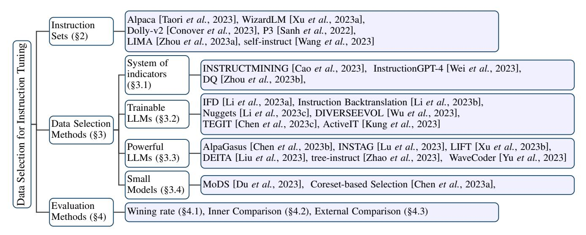

# A Survey on Data Selection for LLM Instruction Tuning

Jiahao Wang1,2 ∗ , Bolin Zhang1 ∗ , Qianlong Du2 , Jiajun Zhang2 † , Dianhui Chu1 1Harbin Institute of Technology 2 Institute of Automation, Chinese Academy of Sciences jiahaowang0917@gmail.com, {brolin, chudh}@hit.edu.cn, {qianlong.du,jjzhang}@nlpr.ia.ac.cn

### Abstract

Instruction tuning is a vital step of training large language models (LLM), so how to enhance the effect of instruction tuning has received increased attention. Existing works indicate that the quality of the dataset is more crucial than the quantity during instruction tuning of LLM. Therefore, recently a lot of studies focus on exploring the methods of selecting high-quality subset from instruction datasets, aiming to reduce training costs and enhance the instruction-following capabilities of LLMs. This paper presents a comprehensive survey on data selection for LLM instruction tuning. Firstly, we introduce the wildly used instruction datasets. Then, we propose a new taxonomy of the data selection methods and provide a detailed introduction of recent advances,and the evaluation strategies and results of data selection methods are also elaborated in detail. Finally, we emphasize the open challenges and present new frontiers of this task.

### 1 Introduction

Large language models (e.g. PaLM[\[Chowdhery](#page-7-0) *et al.*, 2023], GPT-4 [\[OpenAI, 2023\]](#page-7-1), and LLaMa [\[Touvron](#page-8-0) *et al.*, 2023]) exhibit remarkable proficiency across a broad spectrum of language understanding and generation tasks, adhering to human instructions with effectiveness and safety. During training process, LLMs typically involves two fundamental steps [\[Ouyang](#page-7-2) *et al.*, 2022a]: pretraining on the large-scale corpus, fine-tuning on instruction datasets. In these steps, fine-tuning on instruction datasets, also referred to instruction tuning, plays a crucial role on aligning LLMs with human instruction. Through training LLMs on (instruction, output) datasets, instruction tuning effectively bridges the gap between LLMs and various of human intents [\[Zhang](#page-8-1) *et al.*, 2023]. Specifically, instruction tuning could align the output of LLMs to human preferences, which enhances the controllability and safety of LLMs. Another benefit is instruction tuning can enable large models to adapt more quickly to specific domains

or learn specialized knowledge without requiring significant computational resources and architectural changes.

ln the early researches, the work of instruction tuning mainly focus on construct large-scale instrcution dataset, and creating instruction datasets can be done in two primary ways. One is transforming text-label pairs from existing annotated natural language datasets to instructionoutput pairs through templates, such as P3[Sanh *et al.*[, 2022\]](#page-8-2). Another method involves using LLMs like GPT-3.5-Turbo to generate outputs for given instructions, such as selfinstruct[Wang *et al.*[, 2023\]](#page-8-3). Although there are various largescale instruction dataset created by kinds of methods,they often have limitations in terms of quantity, diversity, and creativity. Additionally, enhancing the ability to follow instructions and handling unexpected responses on a large scale of instruction datasets is a current issue that remains to be resolved.

Therefore, selecting the appropriate dataset is crucial for the instruction fine-tuning phase. While instruction finetuning primarily relies on a large volume of data, research such as LIMA[Zhou *et al.*[, 2023a\]](#page-8-4) indicates that data quality is more critical than quantity. They demonstrated a significant performance improvement in LLMs using only 1k high-quality instruction data. This finding suggests that LLMs have already acquired world knowledge during the pretraining phase, and the instruction tuning stage requires only a small amount of high-quality instruction data to generate high-quality responses.

Manual instruction data selection often involves high costs and introduces human bias. As a result, creating automated methods for efficiently selecting instruction data has become crucial. However, this task is challenging due to the complex factors and multidimensional considerations involved. For example, it is difficult to assess the quality of individual instructions and ensure the overall diversity of the selected data. Another challenge is reducing costs and improving the efficiency of the selection process. In light of these factors, various data selection methods have been developed.Some methods use a system of indicators to evaluate individual data points, while others rely on trainable LLMs or powerful external LLMs. These exploit the LLMs' own capabilities to select instructions. Additionally, methods that use smaller models and design a comprehensive process to achieve a balanced effect across all aspects are noteworthy. These methods have shown promising results. For instance, the IFD[Li *et al.*[, 2023a\]](#page-7-3)

∗Equal contribution and shared co-first authorship.

†Corresponding author.

method significantly outperforms the Alpaca model by using only about 5% of the Alpaca dataset, and it also surpasses the WizardLM model by about 10%. Using high-quality subsets for fine-tuning not only enhances the instruction-following skills of LLMs but also significantly reduces computational costs and time.

This paper provides a comprehensive review of existing works on data selection methods for the instruction tuning of LLM. To facilities the community, we maintain a paper list1, collect commonly instruction sets for data selection. Section 2 describes the mainstream datasets with different source and construction methods used in instruction tuning and Section 3 describes four types data selection methods in details: indicators sets, trainable LLMs, powerful LLMs and small models. Section 4 presents the evaluation methods and shows the results of different instruction selection methods. Section 5 summarizes the paper and emphasize the open challenges and future direction of the instruction selection.

#### 2 Instruction Sets

Various instruction tuning datasets (e.g. Self-Instruct and Alpaca), generated by LLMs, offer a wealth of samples without human labor, but their data quality depends on the performance of LLMs and is uncertain. Conversely, the manually curated datasets (e.g. LIMA and Dolly) obtain higher quality through meticulous human selection but are potentially influenced by human biases. Alternative dataset construction methods, like prompt mapping and evol-instruct, aim to enhance dataset quality and diversity but introduce new challenges in quality assurance. This variability in dataset construction and sourcing significantly affects data quality, highlighting the importance of careful data selection for the instructional tuning of LLM. This section describes the scale and construction procedures of several commonly instruction tuning datasets.

**Self-instruct**, created by [Wang *et al.*, 2023], which consists of 52,000 training and 252 testing instructions. Initial instructions from seed tasks were selected, categorized, and diversified using InstructGPT [Ouyang *et al.*, 2022b] to generate inputs and outputs through output-first or input-first strategies. Post-processing refined the dataset for uniqueness and relevance, providing a versatile resource for natural language processing applications.

**Alpaca**, created by [Taori *et al.*, 2023] which consists of 52,002 samples and is used to fine-tune LLaMA for the ability of instruction-following. Based on the techniques of [Wang *et al.*, 2023], the samples are generated by employing text-davinci-003.

**WizardLM**, created by [Xu *et al.*, 2023a], which consists of 250,000 samples generated by the evolutionary algorithms. Two types of algorithms (depth evolution and breadth evolution) are used to enhance the complexity and scope of basic instructions, generating more complex and diverse high-quality instruction data by ChatGPT

**LIMA**, created by [Zhou *et al.*, 2023a], which consists of 1,000 training samples, 300 test samples and 50 development

samples. In addition to the manually authored samples, samples collected from Q&A websites are strictly selected by human. Despite its modest scale, LIMA stands out for its meticulous compilation and design. LLMs fine-tuned on LIMA show remarkable ability in following instructions and adapting to unseen tasks.

**Dolly-v2**, created by [Conover *et al.*, 2023] with 15,000 instructions, involving various tasks like brainstorming, classification, QA, and summarization. Employees author (prompt, response) pairs manually. They are restricted to using Wikipedia and advised against using web sources or generative AI for crafting response.

**P3**, created by [Sanh *et al.*, 2022], which integrates 170 NLP datasets with 2,052 prompts. These prompts, also known as task templates, convert conventional NLP tasks like question answering or text classification into natural language input-output pairs. The P3 dataset itself is formed by randomly selecting prompts from PromptSource and organizing data into triplets of inputs, answer choices, and targets.

### 3 Data Selection methods

Formally, define an instruction dataset X with a size of n, where  $X = \{x_1, x_2, \ldots, x_n\}$ , and each  $x_i$  represents an instance of instruction fine-tuning data. To employ a specific instruction data selection method  $\pi$  from X and choose a subset  $S_{\pi}^{(m)}$  with a size of m[Liu et al., 2023], we then use a predefined evaluation metric Q to assess the quality of  $S_{\pi}^{(m)}$ . The obtained subset quality, as measured by the evaluation metric, can gauge the effectiveness of the chosen instruction data selection method. The process of designing the selection method can be seen as:

$$S_{\pi}^{(m)} = \pi \left( X \right) \tag{1}$$

$$\pi^* = \arg\max_{\pi} Q\left(S_{\pi}^{(m)}\right) \tag{2}$$

The classification of instruction data selection methods is based on what scoring rules the method uses and what model base it employs. The methods can be divided into the following four categories: methods based on system of indicators, trainable LLMs, powerful LLMs like ChatGPT and small models.

#### 3.1 Methods based on System of indicators

Methods employing a metric set system directly identify multiple metrics  $I_1, I_2, \ldots, I_n$ , thereby establishing a comprehensive set of metrics. Each metric within this set is defined by a specific calculation formula. Notably, certain metrics might leverage deep learning techniques for feature extraction from datasets, which are, in essence, metric forms. These metrics facilitate the computation of individual scores for data instances, denoted as  $score_{ij} = I_i(x_j)$ . These scores are subsequently instrumental in developing a more robust metric set system.

$$score_{j} = G(I_{1}(x_{j}), I_{2}(x_{j}), \dots, I_{n}(x_{j}))$$
 (3)

Once established, the metric set system can be directly utilized to compute scores for each data instance within the dataset X. By establishing suitable thresholds, this system

&lt;sup>1https://github.com/Bolin97/awesome-instruction-selector

Figure 1: Overview of Data Selection for LLM Instruction Tuning.

facilitates the selective inclusion of data based on their respective scores:

$$S_{\pi} = \{x | G(x) > \tau\} \tag{4}$$

[Cao *et al.*[, 2023\]](#page-7-7) introduce INSTRUCTMINING, a linear rule-based method for assessing the quality of instructional data. This approach initially identifies key natural language metrics, such as instruction length, perplexity, reward scores, KNN-i[\[Reimers and Gurevych, 2019;](#page-8-13) Dong *et al.*[, 2011\]](#page-7-16), among others. These metrics are subsequently utilized to develop a linear equation. To explore the correlation between data quality and these metrics, and to define the parameters of equation, comprehensive fine-tuning experiments are conducted. Diverse quality datasets are partitioned into subsets, combined, and then employed in the finetuning of large-scale models. Quality labels for each subset are derived by evaluating performance of the model on a test set. The least squares method is applied to these experimental outcomes to estimate the parameters in INSTRUCTMINING. This involves fitting a linear equation to the loss observed when evaluating the model against the test set.Once the parameters have been determined, this formula can be utilized to calculate the quality of instructions, thereby facilitating data selection.

[Wei *et al.*[, 2023\]](#page-8-7) present InstructionGPT-4, a data selection method for multimodal large model fine-tuning. It surpasses MiniGPT-4[Zhu *et al.*[, 2023\]](#page-8-14) in various assessments using less data. The first step, metrics like the CLIP Score[\[Radford](#page-8-15) *et al.*, 2021], instruction length, and others are used. Visual and textual data are encoded into vectors and then subjected to dimensional reduction, which is regarded as special metrics. These metrics are combined into a vector e. The vector is then fed to a trainable data selector, such as a multi-layer perceptron or a self-attention network. This approach, similar to [Cao *et al.*[, 2023\]](#page-7-7) in calculating quality labels, employs clustering algorithms to segment datasets. Quality labels are assigned post fine-tuning and evaluation of each subset.

[Zhou *et al.*[, 2023b\]](#page-8-8) introduce the DQ method, which is an innovative data compression technique for large-scale computer vision datasets, but it has been adapted for use in the LLM domain as well. The approach involves several key steps: Initially, a gain function P(x) is defined,

$$P(x) = \sum_{p \in S} ||f(p) - f(x)||_2^2 - \sum_{p \in D \setminus S} ||f(p) - f(x)||_2^2$$
 (5)

incorporating a feature function f(.) — analogous to a metric — and using the current subset S and the entire dataset D. This gain function essentially forms a metric set function G(.). The dataset is then iteratively partitioned into nonoverlapping subsets, guided by the gain function to maximize the defined gain. Subsequently, a representative sample from each subset is uniformly selected, ensuring coverage of the entire dataset while optimizing for maximum data diversity. This approach prioritizes maintaining the overall diversity of the dataset.

### 3.2 Methods based on Trainable LLMs

This section outlines the use of trainable LLMs, such as LLaMa, for developing computation formulas in data selection processes. The LLM, serving as a trainable data selector, processes and assigns scores to each piece of instruction finetuning data.

$$score_i = LLM_{trainable}(x_i)$$
 (6)

This method not only concentrates on analyzing individual instructions but also underscores the necessity of synchronizing data selection with the functionality of the large model employed for fine-tuning. Subsequent sections will detail specific methodologies.

[Li *et al.*[, 2023a\]](#page-7-3) propose the IFD method. It hypothesizes that LLMs can initially learn to recognize instructions from carefully selected data, enhancing their ability to assess broader dataset quality and estimate instruction-following difficulty. Initially, the method involves fine-tuning an LLM on

a small, clustered subset of the instruction dataset to develop basic instruction-following skills. A novel metric, "Instruction Following Difficulty (IFD)," is then introduced to assess the challenge of responding to specific instructions. IFD compares response quality without specific instructions. The Conditioned Answer Score is defined as:

$$s_{\theta}(A|Q) = \frac{1}{N} \sum_{i=1}^{n} log P(w_i|Q, w_1, \dots, w_{i-1})$$
 (7)

This score evaluates alignment of the model with the correct answer post-instruction (Q), considering the influence of generating the answer (A). The final IFD is:

$$r_{\theta}(Q, A) = \frac{s_{\theta}(A|Q)}{s_{\theta}(A)} \tag{8}$$

The IFD score quantifies challenges of the model for each sample. By setting an IFD score threshold, specific instructions are selected for initial LLM pre-training, resulting in a refined model.

[Li *et al.*[, 2023b\]](#page-7-8) present Instruction Backtranslation, a method for generating and filtering instructions. Starting with a baseline instruction-following model and a web corpus, the model generates instructions for each web document, forming a dataset. Then the model is fine-tuned with seed instructions to gain basic capabilities. And it autonomously scores each instruction, with those exceeding a set threshold forming a high-score subset for further fine-tuning. This iterative process enhances instruction generation and filtering efficiency.

[Li *et al.*[, 2023c\]](#page-7-9) propose the Nuggets framework , which implements a dual-phase approach. Initially, it employs a variety of predefined tasks to evaluate the proficiency of a LLM across multiple scenarios, a process known as zero-shot scoring. Subsequently, each entry in the instruction dataset is utilized as a unique prompt in a one-shot manner. These prompts are presented before the predefined tasks, and the performance of LLM is reassessed, a step termed one-shot scoring. This approach harnesses the disparity between one-shot and zero-shot scores to calculate a definitive 'gold score' for each instruction. Upon acquiring gold scores for all instructions, those constituting the highest-scoring subset are chosen as the 'gold subset'. This subset is then directly employed in the fine-tuning of the model. This methodology exploits the inherent contextual learning capabilities of extensive models.

[Wu *et al.*[, 2023\]](#page-8-9) introduce the DIVERSEEVOL mechanism ,which represents an innovative iterative data selection strategy. It leverages large-scale models like LLaMa to generate embedding vectors for instructional data. The mechanism employs the k-center-greedy algorithm[\[Sener and Savarese, 2018a\]](#page-8-16) to facilitate diversity in selecting a subset of data for fine-tuning the LLaMa model. This procedure is repetitively applied, progressively enlarging the chosen subset, culminating in the creation of a highquality instructional dataset.

[Chen *et al.*[, 2023c\]](#page-7-10) propose the TEGIT method, offering a novel approach to generate premium instruction fine-tuning data. Particularly notable is their method of filtering instruction data. Utilizing ChatGPT, a small corpus of documentation is transformed into a format suitable for instruction data, forming a meta-dataset. This dataset then serves to train two Llama2 models - one functioning as a task generator and the other as a task discriminator. The role of generator is to devise tasks from provided texts, while the discriminator evaluates these tasks, ensuring their quality.

[Kung *et al.*[, 2023\]](#page-7-11) present Active Instruction Tuning, which is a unique method focusing on task sensitivity selection, with the goal of enhancing large model fine-tuning using fewer tasks while improving out-of-task generalization. This technique introduces the concept of Prompt Uncertainty, which is determined by generating k perturbed instructions through the random deletion of words from an original instruction. The output of LLM probability deviation is then averaged for these k perturbed instructions. Tasks that exhibit higher Prompt Uncertainty are prioritized for instruction finetuning, using the extent of Prompt Uncertainty as a measure of task uncertainty.

### 3.3 Methods based on Powerful LLMs like ChatGPT

This section introduces the method of using powerful LLMs such as GPT-4 and ChatGPT as data selectors. The approach primarily involves designing prompt templates and leveraging the capabilities of LLMs to assess the quality of instruction data.

$$S_{\pi} = \{x | ChatGPT(score | prompt, x), score > \tau\}$$
 (9)

[Chen *et al.*[, 2023b\]](#page-7-12) presented ALPAGASUS as an innovative data filtering methodology aimed at improving efficiency and accuracy in Instruction-Following Task (IFT) data curation. This approach utilizes a well-designed prompt applied to ChatGPT, to assess the quality of each data tuple, comprising instruction, input, and response. The methodology focuses on excluding tuples that fall below a predefined quality threshold. When this filtering process was applied to a substantial dataset, it was observed that a considerable portion of the data was compromised by quality issues. Notably, the application of the LLM-based filtering process led to the development of a model that surpassed the performance of the original model, which was trained using the unfiltered dataset with instruction-based fine-tuning.

[Lu *et al.*[, 2023\]](#page-7-13) introduce an automated instruction tagging method (INSTAG), which employs ChatGPT to generate detailed, open-ended labels for instructions and convince the diversity and complexity of subset. The process involves annotating data with labels that reflect the semantic and intent of each instruction and normalizing them for a label-based selection approach. This approach follows a complexity-first diversification sampling strategy. It starts by sorting queries in descending order of label count and then iteratively adds queries to a subset based on the uniqueness of their labels, until the subset reaches a desired size N. The result is a curated set of queries with a higher number of labels, indicating greater complexity and diversity.

To enhance the distribution and quality of datasets, [Xu *et al.*[, 2023b\]](#page-8-10) propose the method LIFT to reduce the redundancy of samples. It involves two stages: expanding dataset distribution and curating the diversity and quality of

the dataset. Initially, ChatGPT enhances the data by generating diverse instructions and vectorizing them. A subset is then selected based on row variances. Secondly, ChatGPT scores instructions for accuracy, interpretability, clarity, difficulty, and length. The initial subset is re-selected based on these scores.

[Liu *et al.*[, 2023\]](#page-7-6) introduce DEITA method, which integrates a multifaceted approach for selecting instruction data, focusing on complexity, quality and diversity. Complexity describes factors such as the length, difficulty, and complexity of the instruction. And quality captures the accuracy of the output. Utilizing the WizardLM technique, ChatGPT is employed to augment instructions, which are then evaluated for complexity and quality. These evaluations involve scoring instructions based on complexity, using a specially trained complexity scorer, and assessing the output quality. Each instruction in the dataset is assigned complexity scores (c) and quality scores (q), and a comprehensive score is calculated by multiplying these two metrics. The dataset is then organized according to these comprehensive scores and vectorized for further analysis.

To ensure diversity, a subset is created by adding samples that exceed a set distance threshold (τ) from their nearest neighbor in the subset. This process continues until the subset reaches a predetermined size.

[Zhao *et al.*[, 2023\]](#page-8-11) propose the tree-instruct method , which improves the quality of instruction by enhance the complexity of it. [Liu *et al.*[, 2023\]](#page-7-6) uses this method to measure instruction complexity and sets thresholds for instruction filtering. Tree-instruct employs GPT-4 to generate semantic parse trees for instruction data, using the number of nodes in the tree as a measure of complexity. The complexity is enhanced by adding nodes to the tree, and then GPT-4 is used to convert the new tree back into natural language, resulting in new high-quality instructions.

[Yu *et al.*[, 2023\]](#page-8-12) present WaveCoder, a code-focused LLM enhanced through an instruction improvement technique. Its training incorporates generated data, with the data filtering phase being particularly significant. Following data generation, a LLM-based discriminator, leveraging GPT-4, evaluates instruction data against established criteria divided into subtopics. This approach enables finer control over the filtering process, effectively eliminating low-quality instruction instances.

#### 3.4 Methods based on Small Models

This section introduces methods involving the use of external small models as scorers, or the transformation of instructions into embedding vectors using small models followed by further processing. Generally, these approaches are quite comprehensive. The scoring filtering or embedding generation by Small Models often serves only as a part of the entire methodological process.

[Du *et al.*[, 2023\]](#page-7-14) introduce the MoDS method, focusing on instruction selection through three criteria: quality (instructional data fidelity), coverage (variety of instruction types), and necessity ( impact of instruction on LLM fine-tuning). The process unfolds in four key steps:

Firstly, employing a reward model to evaluate the instruction dataset quality, selecting a subset denoted as Dh, comprising instructions that surpass a predefined quality threshold.Secondly,Utilizing the k-center-greedy algorithm[\[Sener and Savarese, 2018a\]](#page-8-16) to identify seed instructions, which ensures a diverse and representative sample of the instruction dataset.Thirdly,fine-tuning a pre-trained LLM with the seed instructions. Subsequently, this refined model is applied to Dh to generate a new dataset, Dinf erence. This dataset is then evaluated using the reward model, which identifies instructions critical for learning of the LLM by focusing on those with lower scores. A threshold is established to select Augmented Instruction Data, which is specifically tailored to enhance performance of the model.Finally, the seed instructions with the Augmented Instruction Data to form a high-quality instruction subset that is poised to facilitate effective fine-tuning of the LLM.

[Chen *et al.*[, 2023a\]](#page-7-15) proposes a coreset-based and taskrelated data selection method: firstly, obtain sentence embeddings of samples by pre-trained language models (like BERT), then select the center point by applied unsupervised clustering on these embeddings, and finally use the KCenterGreedy [\[Sener and Savarese, 2018b\]](#page-8-17) algorithm to retrieve core samples from the given dataset. This method effectively reduces the required training data volume, maintaining or potentially enhancing model performance.

### 4 Evaluation methods and Result Analysis

The effectiveness of data selection methods depends on the quality of the subset filtered from the given dataset. To measure the quality of the subset, the LLMs fine-tuned on the subset are evaluated on different benchmarks in different approaches, which can be divided into three categories: wining rate, inner comparison and external comparison.

#### 4.1 Wining Rate

To evaluate the effectiveness of the dataset selection methods, the winning rate of the LLM-sub compared to the base LLM is calculated as:

$$(Num(win) - Num(lose))/Num(all) + 1 (10)$$

LLM-sub represents the LLM fine-tuned on the subset that filtered from the training set by the selection methods while the base LLM often involves 2 types: i)fine-tuned on the full training set and ii) fine-tuned on the same-scale subset filtered by the regular selections (e.g. random sampling and instruction length). In the formular [10,](#page-4-3) Num(win) represents the number of wining cases, Num(lose) represents the number of losing cases and Num(all) represents the number of all cases in the testing benchmarks.

The outputs of LLM-sub and the base LLM are rated by the judge on a scale from 1 to 10, and usually GPT4 is employed as the judge. To address the positional bias of the judge, [Li *et al.*[, 2023a\]](#page-7-3) send the outputs of these two LLMs to the judge twice with different orders. According to [Li *et al.*[, 2023a\]](#page-7-3), the wining cases refer to LLM-sub outperforming the base LLM in both times or winning in one and

Table 1: Performances of different selection methods on wining rate.

|                                      |                                |              | Benchmark for testing (WS)           |          |  |
|--------------------------------------|--------------------------------|--------------|--------------------------------------|----------|--|
| Selection methods                    | Model pairs for comparison     | Training set | Vicuna/Koala/WizardLM/Self-inst/LIMA | total WS |  |
| IFD                                  | llama-7b(5%), llama-7b(full)   |              | 1.125/0.97/1.077/1/1.1               | 1.04     |  |
|                                      | llama-7b(10%), llama-7b(full)  | alpaca       | 1.037/1.055/1.114/1.123/1.103        | 1.097    |  |
|                                      | llama-7b(15%), llama-7b(full)  |              | 1/1.038/1.114/1.027/1.09             | 1.064    |  |
| [Li <i>et al.</i> , 2023a]           | llama-7b(10%), llama-7b(full)  | WizardLM     | 1.1625/1.1278/1.1147/1.0278/1.1067   | 1.0971   |  |
|                                      | llama2-7b(5%), llama2-7b(full) | alpaca       | 1.5875/1.4889/1.4266/1.2937/1.4733   | 1.4311   |  |
| Random Sampling                      | llama-7b(5%), llama-7b(full)   | alpaca       | -                                    | 0.9      |  |
| InstructionGPT4 [Wei et al., 2023]   | miniGPT4(6%), miniGPT4(full)   | cc_sbu_align | -                                    | 1.167    |  |
| Alpagsaus [Chen et al., 2023b]    | llama-7b(9k), llama-7b(full)   |              | 1.2125/1.0222/1.0596/1.0556/-        | 1.0658   |  |
|                                      | llama-7b(9k), $llama-7b(3k)$   | alnaaa       | 1.1/1.183/1.082/1.17/-               | 1.074    |  |
|                                      | llama-7b(9k), llama-7b(6k)     | alpaca       | 1.05/1.072/1.05/1.087/-              | 1.082    |  |
|                                      | llama-13b(9k), llama-13b(full) |              | 1.2125/1.0167/1.133/1.0198/-         | 1.074    |  |
| MoDS [Du <i>et al.</i> , 2023]    | llama2-7b(2k), llama2-7b(full) | alpaca       | 1.7125/1.5111/1.4725/1.369/1.4933    | 1.4786   |  |
| InstructionMining [Cao et al., 2023] | llama-7b(2k), llama-7b(full)   | dolly        | -                                    | 1.088    |  |

&#x27;-' denotes values not reported in the original paper, and model(x) denotes tuning the model on the given training set using either x samples or x percentage of samples.

Table 2: Inner comparisons of LLM tuned on subsets with itself tuned on full sets.

|                                       | Training set(samples)                           |                | Benchmarks for testing                                                                  |  |
|---------------------------------------|-------------------------------------------------|----------------|-----------------------------------------------------------------------------------------|--|
| Selection methods                     |                                                 | Base model     | total WS                                                                                |  |
| activeIT [Kung <i>et al.</i> , 2023]  | selfinstruct(2k) selfinstruct(full)          | llama-7b       | 1.107 1.293                                                                          |  |
| , , , , , , , , , , , , , , , , , , , |                                                 |                | BBH/DROP/MMLU/Human-Eval/Avg                                                            |  |
| DQ [Zhou <i>et al.</i> , 2023b]    | alpaca(20%) alpaca(full)                     | llama-7b       | 32.7/26.7/39.8/9.2/27.1 32.9/26.3/41.6/10/27.7                                       |  |
|                                       |                                                 |                | Vicuna RS/Vicuna WTR/Koala RS/ Koala WTR                                                |  |
| DIVERSEEVOL [Wu et al., 2023]      | Dolly(1k) Dolly(full) SelfIns(1k) SelfIns(full) | llama-7b       | 79.69/20/62.29/6.67 73.84/5/57.9/3.33 79.16/7.5/66.95/6.11 73.03/2.5/69.5/3.89 |  |
|                                       |                                                 |                | HellaSwag/ARC/TruthfulQA/MMLU                                                           |  |
| LIFT [Xu <i>et al.</i> , 2023b]    | Platypus(15k random) Platypus(15k)              | Mistral-7B     | 0.823/0.602/0.426/0.627 0.82/0.607/0.438/0.625 0.844/0.643/0.49/0.645             |  |
|                                       |                                                 |                | RTE/CB/ANLI R1/ANLI R2/ANLI R3                                                          |  |
| coreset [Chen et al., 2023a]          | P3(0.5) P3(full)                             | Galactica-1.3b | 74.73/73.21/49.6/41.9/43.75 76.17/75/44/35.7/39.42                                   |  |

dataset(x) denotes tuning the base model on the x samples of the given set. \*\*Menotes either the absence of a training set or a base model.

tying in the other. The losing cases refer to LLM-sub lagging behind the base LLM in both times or tying in one and losing in the other. The wining rates of different selection methods on the testing benchmarks are summarized in Table 1.

#### 4.2 Inner Comparison

To evaluate the effectiveness of the dataset selection methods simply and directly, LLM-sub is compared with the same LLM, but it is fine-tuned on either the full training set or on a same-scale subset filtered by the regular selections. We refer to this evaluation method as inner comparison, because it only compares the LLM fine-tuned on a subset to itself. The inner

comparison performances of different selection methods on the testing benchmarks are summarized in Table 2.

#### 4.3 External Comparison

Another simple and straightforward type of evaluation method is external comparison, which compares LLM-sub with the external LLMs (i.e. differ from the model of LLM-sub) on different testing benchmarks. The external comparison performances of different selection methods on the testing benchmarks are summarized in Table 3.

Table 3: External comparisons of LLM tuned on subsets with the other LLM.

| Models                              | Training set(samples) | Base model | MT-bench        | AlpacaEval |
|-------------------------------------|-----------------------|------------|-----------------|------------|
| gpt-4                               | X                     | X          | 8.99            | 95.28      |
| gpt-3.5-turbo                       | ×                     | ×          | 7.94            | 91.36      |
| alpaca-13b                          | alpaca                | llama-13b  | 4.53            | -          |
| NUGGETS[Li et al., 2023c]           | alpaca(7.5k)          | llama-7b   | 5.34            | -          |
| TAGLM-13b-v1.0 [Lu et al., 2023]    |                       | llama-13b  | 6.44±0.04       | 72.8       |
| TAGLM-13b-v2.0 [Lu et al., 2023]    |                       | llama2-13b | $6.55 \pm 0.02$ | -          |
| Instruction Length                  | mixture(6k)           | llama-13b  | 5.89            | -          |
| Random Sampling                     | mixture(ok)           |            | 5.84            | -          |
| IFD[Li et al., 2023a]               |                       |            | 5.91            | -          |
| Instruction Node[Zhao et al., 2023] |                       |            | 5.65            | -          |
| DEITA [Liu <i>et al.</i> , 2023]    | mixture(10k)          | llama2-13b | 6.79            | 81.09      |

'mixture' denotes a combined dataset of WizardLM(Alpaca), WizardLM(ShareGPT), UltraChat, and ShareGPT.

#### 4.4 Result Analysis

The proposed selection methods outperform the regular selections, which proves the significance of the data selection in instruction tuning. As shown in Tabel 1 and 2, TAGLM-13b-v1.0 and IFD outperform the regular selections on MT-benc based on instruction length and random sampling when tuning llama-13b on the mixture dataset, and Alpagsaus and IFD outperform the random sampling on total WS when tuning llama-7b on alpaca.

The more advanced LLM (llama2-7b) achieves higher performance than the standard LLM (llama-7b), both of which are fine-tuned on the same subset. Table 3 shows that TAGLM-13b-v2.0 outperforms TAGLM-13b-v1.0, and Table 1 shows that llama2-7b(5%) outperforms llama-7b(5%) when employing IFD selection method. These improvements are attributed to the inherent sophistication of the advanced LLMs, leading to higher learning efficiency on the subset.

Instruction tuning the specific LLM on a larger subset does not necessarily guarantee performance improvement. This may be related to the inherent features of the selection methods. As shown in Table 1, the performance of llama-7b does not improve with the increase of the subset size when applying the method IFD in the training set alpaca. However, the performance of llama-7b improves with the increase of the subset size when applying the method Alpagsaus in the same training set.

#### 5 Conclusions and Open Challenges

This paper provides a comprehensive overview of methods and challenges on data selection of instruction tuning, emphasizing the crucial role of high-quality data on the fine-tuning stage. We showcase some existing datasets along with their corresponding construction methods. These datasets suffer from issues such as imbalanced data distribution and inconsistent data quality. Based on this foundation, we present the existing four types of data selection methods. Methods relying solely on metric sets could effectively assess the quality of individual data, but lack consideration of complex dataset characteristics. Trainable large model methods that design scoring formulas could choose data suited to the LLM itself, and Methods using external powerful LLMs like GPT-4 for

scoring have exceptional data selection capabilities. Furthermore, methods utilizing small models usually designed with multiple modules, considering various aspects. Finally we introduce how to evaluate the data selection methods, including wining rate, inner comparison and external comparison. Despite existing methods achieving commendable performance, several challenges persist.

There is a notable lack of uniform evaluation standards. In Section 4, we have presented multiple evaluation methods and various benchmarks concerning LLMs. Various data selection methods usually choose various evaluation standard, which has caused considerable difficulty in determining which method has more advantages. Future research could be devoted to establishing a reasonable, comprehensive, and automatic evaluation method for selection methods, thereby unifying the evaluation process for methods.

Handling large volumes of data often proves to be inefficient and exhibit a heavy reliance on powerful LLMs. When the scale of the instruction dataset to be filtered is too large, existing methods generally take too long to process, especially when using LLMs to extract instruction features or perform related metric calculations. Processing hundreds of thousands instruction data with LLMs can be very time-consuming. Furthermore, when using powerful LLMs like GPT4 API to process hundreds of thousands of instructions, the cost is very high. Future work should explore the use of smaller models and strive to match the selection capabilities of LLMs.

Existing models and methods for evaluating data quality primarily focus on English and general domains, lacking models for other languages and selection methods in specific domains. Future research should explore instruction quality assessment models for other languages, and investigate the design of task-specific selection methods. This aims to enhance the performance of methods across various scales, domains, and languages of instruction sets.

The challenges provide promising directions for further exploration, potentially leading to breakthroughs. In conclusion, it is our hope that these analytical efforts and the provided overview can further contribute to enhancing the abilities of LLMs in following human instructions.

## References

- [Cao *et al.*, 2023] Yihan Cao, Yanbin Kang, and Lichao Sun. Instruction mining: High-quality instruction data selection for large language models. *CoRR*, abs/2307.06290, 2023.
- [Chen *et al.*, 2023a] Hao Chen, Yiming Zhang, Qi Zhang, Hantao Yang, Xiaomeng Hu, Xuetao Ma, Yifan Yanggong, and Junbo Zhao. Maybe only 0.5% data is needed: A preliminary exploration of low training data instruction tuning. *CoRR*, abs/2305.09246, 2023.
- [Chen *et al.*, 2023b] Lichang Chen, Shiyang Li, Jun Yan, Hai Wang, Kalpa Gunaratna, Vikas Yadav, Zheng Tang, Vijay Srinivasan, Tianyi Zhou, Heng Huang, and Hongxia Jin. Alpagasus: Training A better alpaca with fewer data. *CoRR*, abs/2307.08701, 2023.
- [Chen *et al.*, 2023c] Yongrui Chen, Haiyun Jiang, Xinting Huang, Shuming Shi, and Guilin Qi. Tegit: Generating high-quality instruction-tuning data with text-grounded task design. *CoRR*, abs/2309.05447, 2023.
- [Chowdhery *et al.*, 2023] Aakanksha Chowdhery, Sharan Narang, Jacob Devlin, Maarten Bosma, Gaurav Mishra, Adam Roberts, Paul Barham, Hyung Won Chung, Charles Sutton, Sebastian Gehrmann, Parker Schuh, Kensen Shi, Sasha Tsvyashchenko, Joshua Maynez, Abhishek Rao, Parker Barnes, Yi Tay, Noam Shazeer, Vinodkumar Prabhakaran, Emily Reif, Nan Du, Ben Hutchinson, Reiner Pope, James Bradbury, Jacob Austin, Michael Isard, Guy Gur-Ari, Pengcheng Yin, Toju Duke, Anselm Levskaya, Sanjay Ghemawat, Sunipa Dev, Henryk Michalewski, Xavier Garcia, Vedant Misra, Kevin Robinson, Liam Fedus, Denny Zhou, Daphne Ippolito, David Luan, Hyeontaek Lim, Barret Zoph, Alexander Spiridonov, Ryan Sepassi, David Dohan, Shivani Agrawal, Mark Omernick, Andrew M. Dai, Thanumalayan Sankaranarayana Pillai, Marie Pellat, Aitor Lewkowycz, Erica Moreira, Rewon Child, Oleksandr Polozov, Katherine Lee, Zongwei Zhou, Xuezhi Wang, Brennan Saeta, Mark Diaz, Orhan Firat, Michele Catasta, Jason Wei, Kathy Meier-Hellstern, Douglas Eck, Jeff Dean, Slav Petrov, and Noah Fiedel. Palm: Scaling language modeling with pathways. *J. Mach. Learn. Res.*, 24:240:1–240:113, 2023.
- [Conover *et al.*, 2023] Mike Conover, Matt Hayes, Ankit Mathur, Jianwei Xie, Jun Wan, Sam Shah, Ali Ghodsi, Patrick Wendell, Matei Zaharia, and Reynold Xin. Free dolly: Introducing the world's first truly open instructiontuned llm, 2023.
- [Dong *et al.*, 2011] Wei Dong, Moses Charikar, and Kai Li. Efficient k-nearest neighbor graph construction for generic similarity measures. In Sadagopan Srinivasan, Krithi Ramamritham, Arun Kumar, M. P. Ravindra, Elisa Bertino, and Ravi Kumar, editors, *Proceedings of the 20th International Conference on World Wide Web, WWW 2011, Hyderabad, India, March 28 - April 1, 2011*, pages 577–586. ACM, 2011.
- [Du *et al.*, 2023] Qianlong Du, Chengqing Zong, and Jiajun Zhang. Mods: Model-oriented data selection for instruction tuning. *CoRR*, abs/2311.15653, 2023.

- [Kung *et al.*, 2023] Po-Nien Kung, Fan Yin, Di Wu, Kai-Wei Chang, and Nanyun Peng. Active instruction tuning: Improving cross-task generalization by training on prompt sensitive tasks. In Houda Bouamor, Juan Pino, and Kalika Bali, editors, *Proceedings of the 2023 Conference on Empirical Methods in Natural Language Processing, EMNLP 2023, Singapore, December 6-10, 2023*, pages 1813–1829. Association for Computational Linguistics, 2023.
- [Li *et al.*, 2023a] Ming Li, Yong Zhang, Zhitao Li, Jiuhai Chen, Lichang Chen, Ning Cheng, Jianzong Wang, Tianyi Zhou, and Jing Xiao. From quantity to quality: Boosting LLM performance with self-guided data selection for instruction tuning. *CoRR*, abs/2308.12032, 2023.
- [Li *et al.*, 2023b] Xian Li, Ping Yu, Chunting Zhou, Timo Schick, Luke Zettlemoyer, Omer Levy, Jason Weston, and Mike Lewis. Self-alignment with instruction backtranslation. *CoRR*, abs/2308.06259, 2023.
- [Li *et al.*, 2023c] Yunshui Li, Binyuan Hui, Xiaobo Xia, Jiaxi Yang, Min Yang, Lei Zhang, Shuzheng Si, Junhao Liu, Tongliang Liu, Fei Huang, and Yongbin Li. One shot learning as instruction data prospector for large language models. *CoRR*, abs/2312.10302, 2023.
- [Liu *et al.*, 2023] Wei Liu, Weihao Zeng, Keqing He, Yong Jiang, and Junxian He. What makes good data for alignment? A comprehensive study of automatic data selection in instruction tuning. *CoRR*, abs/2312.15685, 2023.
- [Lu *et al.*, 2023] Keming Lu, Hongyi Yuan, Zheng Yuan, Runji Lin, Junyang Lin, Chuanqi Tan, Chang Zhou, and Jingren Zhou. #instag: Instruction tagging for analyzing supervised fine-tuning of large language models. *CoRR*, abs/2308.07074, 2023.
- [OpenAI, 2023] OpenAI. Gpt-4 technical report. *CoRR*, abs/2303.08774, 2023.
- [Ouyang *et al.*, 2022a] Long Ouyang, Jeffrey Wu, Xu Jiang, Diogo Almeida, Carroll L. Wainwright, Pamela Mishkin, Chong Zhang, Sandhini Agarwal, Katarina Slama, Alex Ray, John Schulman, Jacob Hilton, Fraser Kelton, Luke Miller, Maddie Simens, Amanda Askell, Peter Welinder, Paul F. Christiano, Jan Leike, and Ryan Lowe. Training language models to follow instructions with human feedback. In *Advances in Neural Information Processing Systems 35: Annual Conference on Neural Information Processing Systems 2022, NeurIPS 2022, New Orleans, LA, USA, November 28 - December 9, 2022*, 2022.
- [Ouyang *et al.*, 2022b] Long Ouyang, Jeffrey Wu, Xu Jiang, Diogo Almeida, Carroll L. Wainwright, Pamela Mishkin, Chong Zhang, Sandhini Agarwal, Katarina Slama, Alex Ray, John Schulman, Jacob Hilton, Fraser Kelton, Luke Miller, Maddie Simens, Amanda Askell, Peter Welinder, Paul F. Christiano, Jan Leike, and Ryan Lowe. Training language models to follow instructions with human feedback. In Sanmi Koyejo, S. Mohamed, A. Agarwal, Danielle Belgrave, K. Cho, and A. Oh, editors, *Advances in Neural Information Processing Systems 35: Annual Conference on Neural Information Processing Systems 2022, NeurIPS 2022, New Orleans, LA, USA, November 28 - December 9, 2022*, 2022.

- [Radford *et al.*, 2021] Alec Radford, Jong Wook Kim, Chris Hallacy, Aditya Ramesh, Gabriel Goh, Sandhini Agarwal, Girish Sastry, Amanda Askell, Pamela Mishkin, Jack Clark, Gretchen Krueger, and Ilya Sutskever. Learning transferable visual models from natural language supervision. In Marina Meila and Tong Zhang, editors, *Proceedings of the 38th International Conference on Machine Learning, ICML 2021, 18-24 July 2021, Virtual Event*, volume 139 of *Proceedings of Machine Learning Research*, pages 8748–8763. PMLR, 2021.
- [Reimers and Gurevych, 2019] Nils Reimers and Iryna Gurevych. Sentence-bert: Sentence embeddings using siamese bert-networks. *CoRR*, abs/1908.10084, 2019.
- [Sanh *et al.*, 2022] Victor Sanh, Albert Webson, Colin Raffel, Stephen H. Bach, Lintang Sutawika, Zaid Alyafeai, Antoine Chaffin, Arnaud Stiegler, Arun Raja, Manan Dey, M Saiful Bari, Canwen Xu, Urmish Thakker, Shanya Sharma Sharma, Eliza Szczechla, Taewoon Kim, Gunjan Chhablani, Nihal V. Nayak, Debajyoti Datta, Jonathan Chang, Mike Tian-Jian Jiang, Han Wang, Matteo Manica, Sheng Shen, Zheng Xin Yong, Harshit Pandey, Rachel Bawden, Thomas Wang, Trishala Neeraj, Jos Rozen, Abheesht Sharma, Andrea Santilli, Thibault F´evry, Jason Alan Fries, Ryan Teehan, Teven Le Scao, Stella Biderman, Leo Gao, Thomas Wolf, and Alexander M. Rush. Multitask prompted training enables zero-shot task generalization. In *The Tenth International Conference on Learning Representations, ICLR 2022, Virtual Event, April 25- 29, 2022*. OpenReview.net, 2022.
- [Sener and Savarese, 2018a] Ozan Sener and Silvio Savarese. Active learning for convolutional neural networks: A core-set approach. In *6th International Conference on Learning Representations, ICLR 2018, Vancouver, BC, Canada, April 30 - May 3, 2018, Conference Track Proceedings*. OpenReview.net, 2018.
- [Sener and Savarese, 2018b] Ozan Sener and Silvio Savarese. Active learning for convolutional neural networks: A core-set approach. In *6th International Conference on Learning Representations, ICLR 2018, Vancouver, BC, Canada, April 30 - May 3, 2018, Conference Track Proceedings*. OpenReview.net, 2018.
- [Taori *et al.*, 2023] Rohan Taori, Ishaan Gulrajani, Tianyi Zhang, Yann Dubois, Xuechen Li, Carlos Guestrin, Percy Liang, and Tatsunori B. Hashimoto. Stanford alpaca: An instruction-following llm model. [https://github.com/tatsu-lab/stanford](https://github.com/tatsu-lab/stanford_alpaca) alpaca, 2023.
- [Touvron *et al.*, 2023] Hugo Touvron, Thibaut Lavril, Gautier Izacard, Xavier Martinet, Marie-Anne Lachaux, Timoth´ee Lacroix, Baptiste Rozi`ere, Naman Goyal, Eric Hambro, Faisal Azhar, Aur´elien Rodriguez, Armand Joulin, Edouard Grave, and Guillaume Lample. Llama: Open and efficient foundation language models. *CoRR*, abs/2302.13971, 2023.
- [Wang *et al.*, 2023] Yizhong Wang, Yeganeh Kordi, Swaroop Mishra, Alisa Liu, Noah A. Smith, Daniel Khashabi, and Hannaneh Hajishirzi. Self-instruct: Aligning language models with self-generated instructions. In Anna Rogers,

- Jordan L. Boyd-Graber, and Naoaki Okazaki, editors, *Proceedings of the 61st Annual Meeting of the Association for Computational Linguistics (Volume 1: Long Papers), ACL 2023, Toronto, Canada, July 9-14, 2023*, pages 13484– 13508. Association for Computational Linguistics, 2023.
- [Wei *et al.*, 2023] Lai Wei, Zihao Jiang, Weiran Huang, and Lichao Sun. Instructiongpt-4: A 200-instruction paradigm for fine-tuning minigpt-4. *CoRR*, abs/2308.12067, 2023.
- [Wu *et al.*, 2023] Shengguang Wu, Keming Lu, Benfeng Xu, Junyang Lin, Qi Su, and Chang Zhou. Self-evolved diverse data sampling for efficient instruction tuning. *CoRR*, abs/2311.08182, 2023.
- [Xu *et al.*, 2023a] Can Xu, Qingfeng Sun, Kai Zheng, Xiubo Geng, Pu Zhao, Jiazhan Feng, Chongyang Tao, and Daxin Jiang. Wizardlm: Empowering large language models to follow complex instructions. *CoRR*, abs/2304.12244, 2023.
- [Xu *et al.*, 2023b] Yang Xu, Yongqiang Yao, Yufan Huang, Mengnan Qi, Maoquan Wang, Bin Gu, and Neel Sundaresan. Rethinking the instruction quality: LIFT is what you need. *CoRR*, abs/2312.11508, 2023.
- [Yu *et al.*, 2023] Zhaojian Yu, Xin Zhang, Ning Shang, Yangyu Huang, Can Xu, Yishujie Zhao, Wenxiang Hu, and Qiufeng Yin. Wavecoder: Widespread and versatile enhanced instruction tuning with refined data generation. *CoRR*, abs/2312.14187, 2023.
- [Zhang *et al.*, 2023] Shengyu Zhang, Linfeng Dong, Xiaoya Li, Sen Zhang, Xiaofei Sun, Shuhe Wang, Jiwei Li, Runyi Hu, Tianwei Zhang, Fei Wu, and Guoyin Wang. Instruction tuning for large language models: A survey. *CoRR*, abs/2308.10792, 2023.
- [Zhao *et al.*, 2023] Yingxiu Zhao, Bowen Yu, Binyuan Hui, Haiyang Yu, Fei Huang, Yongbin Li, and Nevin L. Zhang. A preliminary study of the intrinsic relationship between complexity and alignment, 2023.
- [Zhou *et al.*, 2023a] Chunting Zhou, Pengfei Liu, Puxin Xu, Srini Iyer, Jiao Sun, Yuning Mao, Xuezhe Ma, Avia Efrat, Ping Yu, LILI YU, Susan Zhang, Gargi Ghosh, Mike Lewis, Luke Zettlemoyer, and Omer Levy. LIMA: Less is more for alignment. In *Thirty-seventh Conference on Neural Information Processing Systems*, 2023.
- [Zhou *et al.*, 2023b] Daquan Zhou, Kai Wang, Jianyang Gu, Xiangyu Peng, Dongze Lian, Yifan Zhang, Yang You, and Jiashi Feng. Dataset quantization. *CoRR*, abs/2308.10524, 2023.
- [Zhu *et al.*, 2023] Deyao Zhu, Jun Chen, Xiaoqian Shen, Xiang Li, and Mohamed Elhoseiny. Minigpt-4: Enhancing vision-language understanding with advanced large language models. *CoRR*, abs/2304.10592, 2023.