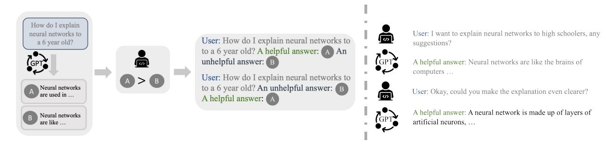
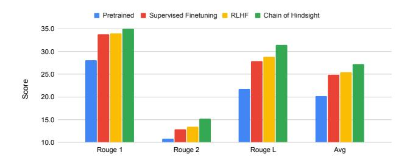
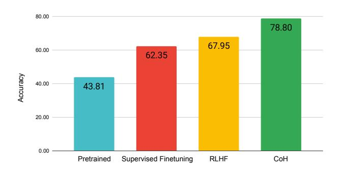
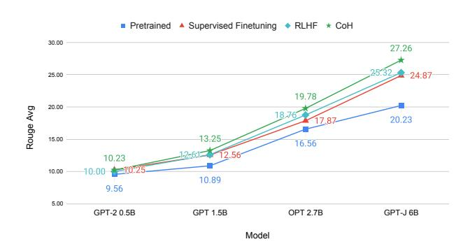
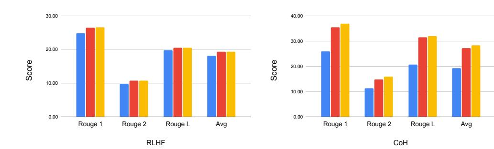

# Chain of Hindsight Aligns Language Models with Feedback

### Hao Liu Carmelo Sferrazza Pieter Abbeel

University of California, Berkeley

hao.liu@cs.berkeley.edu

## Abstract

Learning from human preferences is important for language models to match human needs and to align with human and social values. Prior works have achieved remarkable successes by learning from human feedback to understand and follow instructions. Nonetheless, these methods are either founded on hand-picked model generations that are favored by human annotators, rendering them inefficient in terms of data utilization and challenging to apply in general, or they depend on reinforcement learning, which often suffers of imperfect reward functions and relies on extremely challenging optimizations. In this work, we propose a novel technique, Chain of Hindsight, that is easy to optimize and can learn from any form of feedback, regardless of its polarity. Our idea is inspired by how humans learn from extensive feedback presented in the form of languages. We convert all types of feedback into sentences, which are then used to fine-tune the model, allowing us to take advantage of the language comprehension capabilities of language models. We condition the model on a sequence of model generations paired with feedback. By doing so, the model is trained to generate outputs based on feedback, while learning to identify and correct negative attributes or errors. Applying our method to large language models, we observed that Chain of Hindsight significantly surpasses previous methods in aligning language models with human preferences. We report significant improvements on summarization and dialogue tasks, with our approach markedly preferred in human evaluations.

1. Introduction

Large language models have achieved amazing results in natural language understanding [\(Radford et al.,](#page-11-0) [2018;](#page-11-0) [2019;](#page-11-1) [Brown et al.,](#page-9-0) [2020\)](#page-9-0). However, in order to ensure that these

Preprint. Under review.

technologies have a positive impact on society, it is of paramount importance for them to be aligned with human values. One of the most critical elements in achieving this is the use of human feedback.

Human feedback allows us to evaluate the performance of such models in a way that is both objective and subjective. It can help to identify issues with accuracy, fairness, and bias, and can provide insights into how the model can be improved, in order to ensure that the model outputs align with societal norms and expectations. Driven by the importance of incorporating human feedback into language models, researchers have been developing and testing various methods for human-in-the-loop systems. These methods aim to make the process of incorporating human feedback more efficient, resulting in models that are able to achieve improved performance and accuracy, while also providing higher fairness and more ethical outputs (see e.g. [Hancock](#page-9-1) [et al.,](#page-9-1) [2019;](#page-9-1) [Perez et al.,](#page-11-2) [2019;](#page-11-2) [Yi et al.,](#page-12-0) [2019;](#page-12-0) [Ouyang et al.,](#page-10-0) [2022;](#page-10-0) [OpenAI,](#page-10-1) [2022\)](#page-10-1).

The successes in language modeling have been largely attributed to the utilization of supervised finetuning (SFT) and Reinforcement Learning with Human Feedback (RLHF) techniques. While these approaches have demonstrated promising results in enhancing the performance of language models on specific tasks, they also suffer from notable limitations.

SFT relies on human-annotated data and positive-rated model generation to fine-tune a pre-trained language model. However, this approach is heavily reliant on the availability of labeled data, which may entail significant expenses and time investments. Moreover, relying solely on positive-rated data may constrain the model's ability to identify and correct negative attributes or errors, thus reducing its generalizability to new and unseen data.

Alternatively, RLHF enables learning from all data, regardless of feedback rating. Nonetheless, this method requires learning a reward function, which may be subject to misalignment and imperfections. In addition, the optimization of reinforcement learning algorithms can be challenging, presenting significant difficulties in its application.

Figure 1. Training and inference of Chain-of-Hindsight (CoH). (Left): An illustrative example of how to construct a training sequence from rated model generations. The model is conditioned to predict outputs that better match the feedback such as "USER:How to explain neural networks to a 6 year old? Good: {a good answer} Bad: {a bad answer}." where training loss is only applied on model output tokens. (Right): At inference time, model is instructed with "Good" to generate desired outputs.

Our research aims to overcome the limitations of SFT and RLHF by combining their strengths to leverage all feedback, without resorting to reinforcement learning. We hypothesize that by conditioning language models on a sequence of model generations that are paired with feedback, and subsequently training these models to generate outputs based on such feedback, the models can develop the ability to identify and correct negative attributes or errors.

Our key idea is that humans are capable of learning from rich and detailed feedback in the form of comparisons. Moreover, recent studies have demonstrated the impressive capacity of pre-trained language models to learn effectively in context (see e.g. [Brown et al.,](#page-9-0) [2020;](#page-9-0) [Chowdhery et al.,](#page-9-2) [2022,](#page-9-2) among others). Based on these insights, we propose the notion of converting all human feedback into a sequence and subsequently finetuning models to comprehend and effectively utilize such feedback. Specifically, we propose finetuning the model to predict outputs while conditioning on one or more model outputs and their corresponding feedback in the form of comparisons to the other outputs.

During training, the model is presented with feedback such as "Bad:" and "Good:", and the model is conditioned to predict outputs that better match the latter feedback such as "USER:How to explain neural networks to a 6 year old? Bad: {a bad answer} Good: {a good answer}." where loss is applied on the corresponding outputs "{a good answer}" and "{a bad answer}". At inference time, positive feedback "Good:" instructs the model to generate the desired outputs.

Our proposed approach enables models to learn from both positive and negative feedback, allowing the identification and correction of negative attributes or errors. This method leverages the power of language to comprehend and learn from feedback, ultimately enhancing the models' capability to perform a diverse range of tasks with greater accuracy and efficiency. We name our method the Chain of Hindsight (CoH) as it conditions on a sequence of hindsight feedback. We evaluate our approach on summarization and dialogue tasks, demonstrating its significant improvements over supervised finetuning (SFT) and reinforcement learning from human feedback (RLHF), both in automatic evaluation and human evaluation. Our main contributions are twofold:

- We propose a novel learning framework that leverages all available feedback data to improve model performance.
- We conduct extensive experiments to showcase the effectiveness of our method in comparison to existing baselines.

## 2. Chain of Hindsight

Our goal is to improve the performance of a Transformerbased language model by leveraging human-rated data and feedback, and to achieve this, we propose a novel approach that goes beyond conventional SFT methods and RLHF methods.

Turning all feedback into a sequence. Our approach aims to take into account all feedback and instructions provided by humans. To achieve this, we present the model with a sequence of model generations, along with corresponding feedback and explanations provided by humans.

Our approach uses a conventional Transformer model architecture that is causal and decoder-only, as proposed in the work of [\(Brown et al.,](#page-9-0) [2020;](#page-9-0) [Vaswani et al.,](#page-11-3) [2017\)](#page-11-3) on attention mechanisms. This means that at each timestep, the model can only attend to the past timesteps and itself. Given a text represented by tokens x = [x1, · · · , xn], the standard causal language modeling objective is defined to maximize

the log likelihood of x autoregressively:

$$\log p(\mathbf{x}) = \log \prod_{i=1}^{n} p(x_i|x_1, x_2, \dots, x_{i-1})$$

$$= \log \prod_{i=1}^{n} p(x_i|\mathbf{x}_{< i})$$

$$:= \log \prod_{j=1}^{n} p(x_i|[x_j]_{j=0}^{i-1}). \tag{1}$$

In CoH, we construct x by combining multiple model outputs with feedback. For instance, when a model is prompted to explain neural networks to a child, it generates multiple responses to the prompt. These responses are then combined together into a sequence and paired with feedback instructions generated based on human ratings. An example is illustrated in Figure 1.

To enable models to learn from feedback, we require the model to predict each token  $x_i \in \mathbf{x}$  that are generated by the model. Loss is not applied on other tokens because it hinders model generation at inference time. This is achieved through masking, which can be expressed as:

$$\log p(\mathbf{x}) = \log \prod_{i=1}^{n} \mathbb{1}_{O(x)}(x_i) \ p(x_i | [x_j]_{j=0}^{i-1})$$
 (2)

Here,  $\mathbbm{1}_{O(x)}(x_i)$  denotes whether token  $x_i$  is not part of the feedback tokens. In other words, it is 1 if  $x_i$  is not part of the feedback and 0 if it is part of the feedback. The model is trained to predict each non-feedback token  $x_i$  given the previous tokens  $[x_j]_{i=0}^{i-1}$ .

In the following, we remark two techniques that help finetuning using human feedback.

**Prevent overfitting.** The performance of language models can suffer if they overfit to the limited diversity of human annotations and model-generated data. To mitigate this issue, we adopt a strategy similar to Ouyang et al. (2022) and maximize the log likelihood of the pre-training dataset. This is achieved through the following equation:

$$L = \mathbb{E}_{x \sim F} \left[ \log p(\mathbf{x}) \right] + \lambda \mathbb{E}_{x \sim P} \left[ \log p(\mathbf{x}) \right], \tag{3}$$

where F and P refer to the human feedback dataset and pre-training dataset, respectively.

The model is trained to minimize the negative log likelihood of both datasets, with  $\lambda$  serving as a hyperparameter that determines the weight given to the pretraining and human feedback losses. By taking into account the pre-training

Algorithm 1 Aligning language model with CoH.

**Required:** Pretrained Language Model, Human Feedback Dataset

**Required:** Maximum training iterations m

Initialize

for iter = 1 to m do

Randomly sample a minibatch model outputs from dataset

Randomly sample a minibatch feedback templates

Organize sampled model outputs using sampled feedback templates

Finetune model on chain-of-hindsight sequences

end for

dataset, we can prevent overfitting and improve the performance of the language model.

**Prevent shortcut.** Human preferences for model-generated data are often complex to assign, and small differences can have a significant impact on the perceived quality of the output. Even if a dialogue is negatively rated, it may still be mostly coherent and accurate, but might have missed a few critical words. Directly fine-tuning the model to focus on these missed words could lead to the model shortcutting and copying tokens, which ultimately reduces its ability to generate high-quality outputs.

To overcome this challenge, we adopt a strategy similar to Liu et al. (2022) and randomly mask between 0% and 5% of past tokens during training. This approach is designed to regularize the model and prevent it from overfitting to the specific examples seen during training. In our experiments, we found that this regularization technique significantly improves the quality of the generated sentences.

**Training.** We work with a dataset of model outputs and their corresponding human preference, such as positive and negative ratings, from which we sample minibatches of model outputs. To generate hindsight feedback in natural language, we randomly sample a feedback format and incorporate the human ratings. We combine the hindsight feedback and model outputs into a chain of hindsight, which serves as the input for our autoregressive model. The objective is to predict the input sequence autoregressively, and we use cross-entropy loss to optimize the model. We average the loss over each timestep in the last model output sequence. Our approach is summarized in Algorithm 1.

### 3. Evaluation Setup

**Training Datasets.** We use a combination of three datasets for finetuning. The three datasets are:

WebGPT comparisons. This dataset is from Nakano et al.

[\(2021\)](#page-10-3).[1](#page-3-0) It includes a total of 19,578 comparisons where each example comprises a question, a pair of model answers, and metadata. The answers are rated by humans with a preference score, which helps to identify the better of the two answers.

*Human Preference.* This dataset is from [Ganguli et al.](#page-9-3) [\(2022\)](#page-9-3); [Bai et al.](#page-9-4) [\(2022a\)](#page-9-4) and contains human rated dialogues[4](#page-3-1) . Each example in this dataset consists of a pair of conversations between a human and a chatbot, and one of the two conversations is more preferred by humans.

*Summarize from feedback.* The source of this dataset is [Sti](#page-11-4)[ennon et al.](#page-11-4) [\(2020\)](#page-11-4), and it consists of feedback from humans regarding the summarizations generated by a model[3](#page-3-2) . The dataset is divided into two parts: "comparisons" and "axis." In the "comparisons" section, human evaluators were requested to choose the superior summary from two options presented to them. In contrast, in the "axis" section, human evaluators assigned scores to the quality of a summary using a likert scale. The "comparisons" part is split into training and validation sets, whereas the "axis" part is split into validation and test sets. The reward model used in the research was trained on summaries from the TL;DR dataset, and additional validation and test data were obtained from CNN and Daily Mail articles.

Evaluation Tasks and Metrics. We consider both automatic evaluation on various tasks and human evaluation on summarization and dialogue tasks.

*Few-shot tasks.* For automatic evaluation, we follow prior works [Brown et al.](#page-9-0) [\(2020\)](#page-9-0); [Wang & Komatsuzaki](#page-12-1) [\(2021\)](#page-12-1) and consider a diverse suite of standard NLP tasks, including SuperGLUE [\(Sarlin et al.,](#page-11-5) [2020\)](#page-11-5), ANLI [\(Nie](#page-10-4) [et al.,](#page-10-4) [2019\)](#page-10-4), LAMBADA [\(Paperno et al.,](#page-11-6) [2016\)](#page-11-6), StoryCloze [\(Mostafazadeh et al.,](#page-10-5) [2016\)](#page-10-5), PIQA [\(Bisk et al.,](#page-9-5) [2019\)](#page-9-5), and other additional tasks. The full task list is shown in Table [3.](#page-6-0) We use Language Model Evaluation Harness[2](#page-3-3) for evaluation.

*Summarization task.* Following prior works on learning from human feedback [\(Stiennon et al.,](#page-11-4) [2020;](#page-11-4) [Nakano et al.,](#page-10-3) [2021;](#page-10-3) [Bai et al.,](#page-9-4) [2022a\)](#page-9-4), we consider automatic evaluation and human evaluation on the TL;DRs dataset [\(Volske et al.](#page-11-7) ¨ , [2017\)](#page-11-7). The original TL;DR dataset contains about 3 million posts from reddit.com across a variety of topics (subreddits), as well summaries of the posts written by the original poster (TL;DRs). We use the filtered version provided by [Stiennon et al.](#page-11-4) [\(2020\)](#page-11-4), which contains 123,169 posts[3](#page-3-2) . We evaluate the performance on the validation set. [For evaluation metrics, labelers rated summaries for cov](https://huggingface.co/datasets/openai/summarize_from_feedback)[erage \(how much important information from the original](https://huggingface.co/datasets/openai/summarize_from_feedback) [post is covered\), accuracy \(to what degree the statements](https://huggingface.co/datasets/openai/summarize_from_feedback) [in the summary are part of the post\), coherence \(how easy](https://huggingface.co/datasets/openai/summarize_from_feedback) [the summary is to read on its own\), and overall quality.](https://huggingface.co/datasets/openai/summarize_from_feedback) [More details about evaluation dimensions and instructions](https://huggingface.co/datasets/openai/summarize_from_feedback) [for human labelers are available in Appendix](https://huggingface.co/datasets/openai/summarize_from_feedback) [A.](#page-13-0)

*Dialogue task.* [We use a dataset from](https://huggingface.co/datasets/openai/summarize_from_feedback) [Bai et al.](#page-9-4) [\(2022a\)](#page-9-4) [4](#page-3-1) , [where each example comprises a pair of conversations be](https://huggingface.co/datasets/openai/summarize_from_feedback)[tween a human and a large language model, with one of the](https://huggingface.co/datasets/openai/summarize_from_feedback) [two conversations preferred by a human.](https://huggingface.co/datasets/openai/summarize_from_feedback)

[To collect data for our evaluation, it would be too costly and](https://huggingface.co/datasets/openai/summarize_from_feedback) [time-consuming to deploy our finetuned model to chat with](https://huggingface.co/datasets/openai/summarize_from_feedback) [humans. Instead, we construct "pseudo" dialogues using](https://huggingface.co/datasets/openai/summarize_from_feedback) [positive examples. We replace each model response from](https://huggingface.co/datasets/openai/summarize_from_feedback) [a previous dialogue with our model's output, generated by](https://huggingface.co/datasets/openai/summarize_from_feedback) [conditioning the model on the human response and past](https://huggingface.co/datasets/openai/summarize_from_feedback) [model outputs.](https://huggingface.co/datasets/openai/summarize_from_feedback)

[For evaluating the dialogue, we consider metrics such as](https://huggingface.co/datasets/openai/summarize_from_feedback) [helpfulness and harmlessness. A helpful model should fol](https://huggingface.co/datasets/openai/summarize_from_feedback)[low instructions and infer intention from a few-shot prompt](https://huggingface.co/datasets/openai/summarize_from_feedback) [or another interpretable pattern. Since the intention of a](https://huggingface.co/datasets/openai/summarize_from_feedback) [given prompt can be unclear or ambiguous, we rely on judg](https://huggingface.co/datasets/openai/summarize_from_feedback)[ment from our labelers, and the main metric we use is the](https://huggingface.co/datasets/openai/summarize_from_feedback) [labelers' preference ratings. Note that however, there may](https://huggingface.co/datasets/openai/summarize_from_feedback) [be a divergence between what a user actually intended and](https://huggingface.co/datasets/openai/summarize_from_feedback) [what the labeler thought was intended from only reading the](https://huggingface.co/datasets/openai/summarize_from_feedback) [prompt, since the labelers are not the users who generated](https://huggingface.co/datasets/openai/summarize_from_feedback) [the prompts.](https://huggingface.co/datasets/openai/summarize_from_feedback)

Model Architectures. [We use the same model and archi](https://huggingface.co/datasets/openai/summarize_from_feedback)[tecture as GPT-J \(Wang & Komatsuzaki,](https://huggingface.co/datasets/openai/summarize_from_feedback) [2021\)](#page-12-1), including [the modified activation \(Shazeer,](https://huggingface.co/datasets/openai/summarize_from_feedback) [2020\)](#page-11-8), multi-query attention [\(Shazeer,](#page-11-9) [2019\), parallel layers \(Wang & Komatsuzaki,](https://huggingface.co/datasets/openai/summarize_from_feedback) [2021\) and RoPE embeddings \(Su et al.,](https://huggingface.co/datasets/openai/summarize_from_feedback) [2021\)](#page-11-10) described [therein.](https://huggingface.co/datasets/openai/summarize_from_feedback)

Baselines. [Our baselines are the pretrained model, super](https://huggingface.co/datasets/openai/summarize_from_feedback)[vised finetuning \(SFT\), and reinforcement learning from](https://huggingface.co/datasets/openai/summarize_from_feedback) [human feedback \(RLHF\). In our experiments, the pretrained](https://huggingface.co/datasets/openai/summarize_from_feedback) [model is GPT-J 6B \(Wang & Komatsuzaki,](https://huggingface.co/datasets/openai/summarize_from_feedback) [2021\)](#page-12-1), which is [also the base model of SFT, RLHF, and CoH.](https://huggingface.co/datasets/openai/summarize_from_feedback)

*Supervised finetuning (SFT).* [The SFT method finetunes the](https://huggingface.co/datasets/openai/summarize_from_feedback) [model on data with positive feedback,](https://huggingface.co/datasets/openai/summarize_from_feedback) *e*.*g*., that is, only on [human preferred summarization or dialogue. Prior works](https://huggingface.co/datasets/openai/summarize_from_feedback) [have shown its effectiveness in learning from human feed](https://huggingface.co/datasets/openai/summarize_from_feedback)back (see e.g., [Ouyang et al.,](#page-10-0) [2022;](#page-10-0) [Stiennon et al.,](https://huggingface.co/datasets/openai/summarize_from_feedback) [2020;](#page-11-4) [Bai et al.,](#page-9-4) [2022a\). The SFT objective is different from our](https://huggingface.co/datasets/openai/summarize_from_feedback) [approach by being limited to only positive rated data and by](https://huggingface.co/datasets/openai/summarize_from_feedback)

1[https://huggingface.co/datasets/openai/](https://huggingface.co/datasets/openai/webgpt_comparisons) [webgpt\\_comparisons](https://huggingface.co/datasets/openai/webgpt_comparisons)

2[https://github.com/EleutherAI/](https://github.com/EleutherAI/lm-evaluation-harness) [lm-evaluation-harness](https://github.com/EleutherAI/lm-evaluation-harness)

3 [https://huggingface.co/datasets/openai/](https://huggingface.co/datasets/openai/summarize_from_feedback)

[summarize\\_from\\_feedback](https://huggingface.co/datasets/openai/summarize_from_feedback)

4[https://huggingface.co/datasets/](https://huggingface.co/datasets/Anthropic/hh-rlhf) [Anthropic/hh-rlhf](https://huggingface.co/datasets/Anthropic/hh-rlhf)

Figure 2. Evaluation on summarization. The metrics are ROUGE score on TL;DR summary task. CoH substantially outperforms base pretrained models, SFT and RLHF.

not using feedback input. We also introduce three additional variations of SFT: (1) conditioning on feedback, but without the feedback chain used in our approach, (2) applying the loss function to all data, and (3) adding an unlikelihood loss to negative rated data. To ensure a fair comparison, we apply identical training techniques (including continued training on pretraining data) and hyperparameters to all SFT variations and our own method.

*RLHF.* The RLHF method involves learning a reward function based on human preference and using reinforcement learning to maximize this reward. In our study, we adopt the PPO algorithm, as previously used in related work. To ensure a fair comparison, we apply identical training techniques (including continued training on pretraining data) and hyperparameters to all baselines and our own method. We also adjust the hyperparameters of the reinforcement learning algorithm and reward function to obtain the best possible results.

# 4. Main Results

### 4.1. Better Summarization

In Figure [2,](#page-4-0) we present the ROUGE scores of our models on the TL;DR dataset, following the setting of [Stiennon](#page-11-4) [et al.](#page-11-4) [\(2020\)](#page-11-4). Our proposed approach, CoH, significantly outperforms the pretrained model, supervised finetuning, and RLHF.

To further evaluate the performance of our proposed approach, we conducted human evaluation as shown in Table [1.](#page-4-1) We conducted pairwise comparisons between CoH and the baselines because we found that this approach was easier for human labelers to evaluate compared to multiple options. We hired 75 human labelers who were proficient in English from a third-party platform to provide ratings.

In the pairwise comparison, human labelers were presented with two summaries, one generated by the baseline and the other generated by CoH. They were instructed to select the best (or neutral) among the two according to the three metrics mentioned above. The results show that CoH was

Table 1. Human evaluation on summarization. Pairwise comparison between CoH and baselines on the summarization task using human evaluation. The TL;DR summarization task is based on [Stiennon et al.](#page-11-4) [\(2020\)](#page-11-4). The metrics used in human evaluation follow definitions from prior works. We use 15 human labelers. Labelers are encouraged to select neutral if two outputs are similar. Improvement column denotes the relative improvement of CoH over the baseline.

| Summary (%) | Pretrained | Neutral | CoH  | Improvement |
|-------------|------------|---------|------|-------------|
| Accuracy    | 24.5       | 26.8    | 48.7 | 24.2        |
| Coherence   | 15.6       | 18.5    | 65.9 | 50.3        |
| Coverage    | 19.6       | 22.4    | 58.0 | 38.4        |
| Average     | 19.9       | 22.6    | 57.5 | 37.6        |
| Summary (%) | SFT        | Neutral | CoH  | Improvement |
| Accuracy    | 25.5       | 32.6    | 41.9 | 16.4        |
| Coherence   | 30.5       | 25.6    | 43.9 | 13.4        |
| Coverage    | 28.5       | 25.4    | 46.1 | 17.6        |
| Average     | 28.2       | 27.9    | 44.0 | 15.8        |
| Summary (%) | RLHF       | Neutral | CoH  | Improvement |
| Accuracy    | 31.8       | 29.5    | 38.7 | 6.9         |
| Coherence   | 31.6       | 20.5    | 47.9 | 16.4        |
| Coverage    | 28.9       | 21.9    | 49.2 | 20.3        |
| Average     | 30.8       | 24.0    | 45.3 | 14.5        |

Figure 3. Evaluation on dialogue. The metric is the accuracy of classifying the preferred dialogue on the dataset from [Bai et al.](#page-9-4) [\(2022a\)](#page-9-4). CoH substantially outperforms base pretrained models, SFT and RLHF.

substantially more preferred by our human labelers across multiple metrics. This indicates that our proposed approach is more effective at learning from human feedback. More details on the human evaluation results can be found in the appendix.

### 4.2. Better Dialogue

Using the test split of dialogue datasets from [Bai et al.](#page-9-4) [\(2022a\)](#page-9-4), we evaluate the models' ability to classify which of a dialogue pair is more preferred. Although this is a simple multiple choice problem, it tests the model's understanding of human preference. The accuracy of different

Table 2. Human evaluation on dialogue. Pair-wise comparison between CoH and baselines on dialogue using human evaluation. The dialogue task is based on Bai et al. (2022a). The metrics used in human evaluation follow definitions from prior works. We use 15 human labelers. Labelers are encouraged to select neutral if two outputs are similar. Improvement column denotes the relative improvement of CoH over baseline.

| Dialogue (%) | Pretrained | Neutral | СоН  | Improvement |
|--------------|------------|---------|------|-------------|
| Helpful      | 15.8       | 34.8    | 49.4 | 33.6        |
| Harmless     | 14.5       | 35.9    | 49.6 | 35.1        |
| Average      | 15.2       | 35.3    | 49.5 | <u>34.4</u> |
| Dialogue (%) | SFT        | Neutral | СоН  | Improvement |
| Helpful      | 19.6       | 55.3    | 25.1 | 5.5         |
| Harmless     | 18.6       | 37.4    | 44.0 | 25.4        |
| Average      | 19.1       | 46.3    | 34.6 | <u>15.5</u> |
| Dialogue (%) | RLHF       | Neutral | СоН  | Improvement |
| Helpful      | 25.8       | 40.8    | 33.4 | 7.6         |
| Harmless     | 20.9       | 38.8    | 40.3 | 19.4        |
| Average      | 23.4       | 39.8    | 36.9 | 13.5        |

models is shown in Figure 3. While all baselines outperform the pretrained model, our model (CoH) achieves the highest accuracy and substantially outperforms the second-best baseline RLHF.

To further evaluate our model's performance, we replace the model response parts from each dialogue in the data with new generations from our model. For example, if the original dialogue is a two-turn dialogue as [human-1][chatbot-1][human-2][chatbot-2], the new dialogue would be [human-1][newbot-1][human-2][newbot-2], where [newbot-1] is generated by feeding the model with [human-1] and [newbot-2] is generated by feeding the model with [human-1][newbot-1][human-2].

We take this approach instead of having humans directly chat with the finetuned model to reuse human-generated data, as collecting interactive data can be very costly and is prone to low data quality issues.

The results are presented in Table 2. Although more than 50% of the labelers are neutral between SFT and our model (CoH), our model is still more favorable to human labelers compared to SFT. Similarly, compared with RLHF, CoH is substantially more preferred by our human labelers.

### 4.3. Model Scaling Trend

The findings in Figure 4 demonstrate the impact of varying model sizes on the performance of the CoH method relative to supervised fine-tuning (SFT) and reinforcement learning from human feedback (RLHF). Notably, for smaller model sizes, CoH exhibits a marginal decrement in per-

Figure 4. Model scaling trend. Comparison of supervised finetuning, RLHF, and chain of hindsight on summarization task with different model sizes. CoH scales better than baseline.

formance compared to SFT. However, as the model size increases, CoH consistently surpasses both SFT and RLHF and displays a positive scaling trend, indicating its efficacy in enhancing model performance as model complexity increases.

#### 4.4. Better Controllable Generation

The controllable generation results are presented in Figure 5. The models are provided with three instructions to generate summaries of desired quality. The first instruction asks for a standard summary, while the second and third instructions ask for improved summaries conditioned on the previous summary generated by the model. We compare the performance of CoH with that of the RLHF model. The results indicate that while RLHF performs well in modeling human preferences and generates high-scoring summaries by following the first instruction, it fails to follow the second and third instructions, which implies that it cannot comprehend human intentions. On the other hand, the CoH-trained model is capable of understanding the intention of the instructions and generates better summaries in the second and third trials. We must note that although we used a single evaluation trial and the same task prompt across the experiments, the controllable generation technique can be further investigated in various evaluation settings to enhance performance (Andreas, 2022; Keskar et al., 2019).

#### 4.5. Alignment Tax

We conducted an evaluation on a diverse set of few-shot tasks that are commonly used in previous studies (Brown et al., 2020; Wang & Komatsuzaki, 2021) to assess the effectiveness of aligning models with human preferences. The results are reported in Table 3. Interestingly, we found that the average performance of models that were finetuned using SFT decreased after alignment. This decrease could be attributed to the well-known issue of *alignment tax* in language models (Ouyang et al., 2022), which underscores the

Figure 5. Controllable generation. (left): RLHF cannot follow instructions to generate improved summary. (middle): After finetuning on CoH, the model follows instructions to achieve controllable generations. (right): First instruction is standard, while second and third instructions ask for improved summaries.

Table 3. Alignment Tax on Few-Shot Benchmark: The results of our experiments on few-shot NLP benchmarks using the Language Model Evaluation Harness are presented in Table [3.](#page-6-0) We follow the same setup as in previous work [\(Brown](#page-9-0) [et al.,](#page-9-0) [2020;](#page-9-0) [Wang & Komatsuzaki,](#page-12-1) [2021\)](#page-12-1), including the splits for each task. The reported numbers for GPT-J are taken from its original paper, while the numbers for other models are reported by us. We average the results over 5 random seeds.

|                              | Zero-shot |                   | One-shot |       |                   | Few-shot |       |                   |      |
|------------------------------|-----------|-------------------|----------|-------|-------------------|----------|-------|-------------------|------|
| Task                         | GPT-J     | SFT               | CoH      | GPT-J | SFT               | CoH      | GPT-J | SFT               | CoH  |
| ANLI R1                      |           | 34.00 33.50 33.80 |          |       | 33.50 33.50 33.60 |          |       | 32.70 32.60 32.70 |      |
| ANLI R2                      |           | 32.00 32.00 32.10 |          |       | 34.40 34.10 34.20 |          |       | 33.90 34.20 34.10 |      |
| ANLI R3                      |           | 34.00 34.30 36.80 |          |       | 34.80 34.60 36.90 |          |       | 35.40 35.60 36.80 |      |
| ARC-C                        |           | 27.00 26.80 27.60 |          |       | 32.20 32.50 33.80 |          |       | 33.10 33.50 34.20 |      |
| ARC-E                        |           | 54.30 54.20 54.40 |          |       | 62.80 62.50 62.50 |          |       | 66.50 66.50 66.50 |      |
| BoolQ                        |           | 58.50 61.50 61.30 |          |       | 57.20 57.10 58.10 |          |       | 42.50 42.30 42.90 |      |
| CB                           |           | 41.10 41.00 40.50 |          |       | 41.10 41.10 40.50 |          |       | 42.90 42.10 42.00 |      |
| COPA                         |           | 71.00 70.50 69.90 |          |       | 80.00 80.10 80.50 |          |       | 82.00 82.20 81.50 |      |
| HeadQA                       |           | 23.50 23.00 23.80 |          |       | 24.00 23.80 24.30 |          |       | 23.90 22.50 22.80 |      |
| HellaSwag                    |           | 42.60 42.30 42.00 |          |       | 46.20 46.10 46.10 |          |       | 46.10 46.00 46.70 |      |
| MultiRC                      | 3.00      | 3.10              | 4.10     | 6.50  | 6.70              | 7.40     | 6.60  | 6.90              | 7.50 |
| ReCORD                       |           | 85.80 85.60 85.60 |          |       | 86.20 86.00 86.40 |          |       | 58.60 58.80 58.60 |      |
| RTE                          |           | 51.20 50.50 50.00 |          |       | 55.60 55.50 55.90 |          |       | 52.00 52.00 52.00 |      |
| WiC                          |           | 45.00 45.00 45.00 |          |       | 44.50 44.20 44.10 |          |       | 50.00 50.50 50.00 |      |
| WSC                          |           | 36.50 36.90 42.80 |          |       | 37.50 38.10 43.70 |          |       | 35.80 37.60 41.30 |      |
| LAMBADA                      | 5.50      | 5.70              | 5.70     | 5.30  | 5.40              | 5.40     | 2.50  | 2.70              | 3.60 |
| (openai)                     |           |                   |          |       |                   |          |       |                   |      |
| LAMBADA                      | 2.10      | 0.90              | 0.90     | 3.00  | 2.20              | 1.90     | 3.20  | 3.30              | 3.30 |
| (standard)                   |           |                   |          |       |                   |          |       |                   |      |
| LogiQA                       |           | 21.50 20.00 20.00 |          |       | 20.70 20.90 20.90 |          |       | 19.00 20.60 20.10 |      |
| WinoGrande                   |           | 49.70 50.40 51.20 |          |       | 50.70 51.80 53.50 |          |       | 50.70 51.10 52.80 |      |
| SciQ                         |           | 86.40 86.00 86.00 |          |       | 89.10 89.10 89.10 |          |       | 54.00 55.00 55.00 |      |
| OpenBookQA 16.00 16.20 15.40 |           |                   |          |       | 16.80 16.70 16.70 |          |       | 20.80 20.90 21.10 |      |
| PIQA                         |           | 72.40 72.40 72.00 |          |       | 73.60 73.70 73.50 |          |       | 74.20 74.00 74.00 |      |
| Average                      |           | 40.60 40.54 40.95 |          |       | 42.53 42.53 43.14 |          |       | 39.38 39.59 39.98 |      |

importance of human evaluation [\(Lee et al.,](#page-10-7) [2022\)](#page-10-7). On the other hand, our proposed method, CoH, showed moderate improvements over both the pretrained model and supervised fine-tuned model. This result suggests that CoH is less susceptible to the *alignment tax* issue.

### 4.6. Model Variations

To evaluate the importance of the different components of CoH, we varied our default configuration in different ways,

measuring the change in performance on multiple metrics. We present these results in Table [4,](#page-7-0) where Sum Avg denotes ROUGE scores on the filtered TL;DR dataset from [Sti](#page-11-4)[ennon et al.](#page-11-4) [\(2020\)](#page-11-4). Dia Avg denotes model performance in classifying human preference on the validation split of the *Human Preference* dataset [\(Bai et al.,](#page-9-4) [2022a\)](#page-9-4).

GPT

GPT

GPT

summary.

User: Generate a summary of the following article {article} A helpful answer: {summary} User: Generate a good and accurate

User: Generate a better and more accurate summary.

A helpful answer: {summary}

A helpful answer: {summary}

In Table [4](#page-7-0) rows (A), we vary the mask ratio. The model's performance decreases when a large ratio (15%) is used or when random masking is not used (0%). This implies that using causal masking can help the model avoid simply copying similar tokens. However, it should be noted that while [Liu et al.](#page-10-2) [\(2022\)](#page-10-2) discovered that 15% was the optimal ratio in their pretraining experiments, our experiments found that using 15% was not the most effective, likely due to differences in datasets.

In Table [4](#page-7-0) rows (B), we investigates the impact of excluding the chain of hindsight when training models. Rather than utilizing sequences containing both positive and negative instances, the models are trained solely on sequences containing either positive or negative instances, similar to SFT but with hindsight control tokens for both. The findings in Table [4](#page-7-0) rows (B) indicate that performance is negatively affected when the chain-of-hindsight is disabled. We further note that this version shows a notable improvement compared to SFT, which highlights the efficiency of training models based on feedback.

In Table [4](#page-7-0) rows (C), we set λ = 0, which disables pretraining dataset regularization, we observe strong overfitting to the finetuning dataset with scores decreasing significantly, suggesting that the generalization is worse without pretraining dataset regularization.

In Table [4](#page-7-0) rows (D), we experiment with two variants of SFT.

*SFT on both positive and negative* denotes applying SFT not only on human-preferred examples but also on humanrejected examples.

|                                                                                          | Table 4. Variations on CoH. Unlisted values are identical to those of the default model. Sum Avg: average rouge scores on the |  |
|------------------------------------------------------------------------------------------|-------------------------------------------------------------------------------------------------------------------------------|--|
| summarization dataset. Dia Avg: average classification accuracy on the dialogue dataset. |                                                                                                                               |  |
|                                                                                          |                                                                                                                               |  |

| Variants | Chain | Mix pretrain                                                                  | FCM          | Sum Avg                 | Dia Avg(%)           |
|----------|-------|-------------------------------------------------------------------------------|--------------|-------------------------|----------------------|
| Default  | true  | true                                                                          | 0.05         | 27.45                   | 81.2                 |
| (A)      |       |                                                                               | 0.00 0.15 | 26.65 26.86          | 79.6 80.5         |
| (B)      | false |                                                                               |              | 25.35                   | 78.8                 |
| (C)      |       | false                                                                         |              | 22.45                   | 60.8                 |
| (D)      |       | SFT with unlikelihood on negative SFT on both positive and negative SFT |              | 19.56 21.44 24.87 | 42.3 50.6 64.8 |
| (E)      |       | RLHF                                                                          |              | 25.45                   | 68.8                 |
| (F)      |       | Pretrained base model                                                         |              | 20.23                   | 43.8                 |

*SFT with unlikelihood on negative* denotes adding an unlikelihood of human-rejected examples to standard SFT.

We observe that among the four baselines, *SFT with unlikelihood on negative* performs worse than the other three, especially on the dialogue task, indicating that unlikelihood training on human feedback data may hurt generation ability. *SFT on both positive and negative* performs substantially worse than SFT, confirming that fine-tuning on negative data hurts performance.

# 5. Related Work

Learning from Hindsight. In this paper we explore learning from chains of hindsight with human feedback, an approach that enables a model to learn from errors and revise generations. The key idea of learning from hindsight experience was explored in goal conditioned RL [\(Kaelbling,](#page-10-8) [1993;](#page-10-8) [Andrychowicz et al.,](#page-8-1) [2017;](#page-8-1) [Schaul et al.,](#page-11-11) [2015\)](#page-11-11). [Andrychow](#page-8-1)[icz et al.](#page-8-1) [\(2017\)](#page-8-1) proposes hindsight experience replay (HER) to relabel rewards and transitions retroactively to learn from sparse feedback. While HER relies on reinforcement learning and a distance function to learn from hindsight experience, we propose a new method called CoH that constructs a chain of hindsight experience using human feedback and finetunes the model directly. Our approach offers several advantages over other methods, such as HIR [\(Zhang et al.,](#page-12-2) [2023\)](#page-12-2), which also makes use of incorrect model outputs. HIR can be seen as a special case of CoH with a length of one chain-of-hindsight. Unlike HIR, which employs a complex training process involving likelihood loss, contrastive loss, and entropy loss, our approach is straightforward and easy to implement. Concurrently, [Korbak et al.](#page-10-9) [\(2023\)](#page-10-9) studies conditioning on human preference during pretraining and shows improved performance in aligning language models with human preference. Their method is similar to CoH with a length of one chain-of-hindsight. Our work focuses on finetuning pretrained language models while [Korbak et al.](#page-10-9) [\(2023\)](#page-10-9) focuses on improving pretraining.

Learning from Human Feedback. Prior work have explored using human feedback to improve various tasks, such as summarization [\(Bohm et al.](#page-9-6) ¨ , [2019;](#page-9-6) [Ziegler et al.,](#page-12-3) [2019;](#page-12-3) [Stiennon et al.,](#page-11-4) [2020\)](#page-11-4), dialogue [\(Yi et al.,](#page-12-0) [2019;](#page-12-0) [Hancock](#page-9-1) [et al.,](#page-9-1) [2019;](#page-9-1) [Bai et al.,](#page-9-4) [2022a](#page-9-4)[;b;](#page-9-7) [Askell et al.,](#page-9-8) [2021;](#page-9-8) [Scheurer](#page-11-12) [et al.,](#page-11-12) [2022\)](#page-11-12), translation [\(Kreutzer et al.,](#page-10-10) [2018;](#page-10-10) [Bahdanau](#page-9-9) [et al.,](#page-9-9) [2016\)](#page-9-9), semantic parsing [\(Lawrence & Riezler,](#page-10-11) [2018\)](#page-10-11), story generation [\(Zhou & Xu,](#page-12-4) [2020\)](#page-12-4), review generation [\(Cho](#page-9-10) [et al.,](#page-9-10) [2018\)](#page-9-10), evidence extraction [\(Perez et al.,](#page-11-2) [2019\)](#page-11-2), and instruction following [\(Ouyang et al.,](#page-10-0) [2022;](#page-10-0) [Bai et al.,](#page-9-4) [2022a\)](#page-9-4). The main techniques behind them can be categorized as supervised finetuning (SFT) or training on filtered human annotations and learning a reward function from human feedback for reinforcement learning, which is often dubbed as RLHF [\(Christiano et al.,](#page-9-11) [2017;](#page-9-11) [MacGlashan et al.,](#page-10-12) [2017;](#page-10-12) [Lee et al.,](#page-10-13) [2021;](#page-10-13) [Warnell et al.,](#page-12-5) [2017\)](#page-12-5) and has been used to train RL agents without the need for hand-designed rewards. [Ouyang et al.](#page-10-0) [\(2022\)](#page-10-0) demonstrates improved language model alignment performance by training models with SFT and RLHF using human feedback. Our work belongs to the category of SFT, and differs from SFT in that our method conditions on feedback and can learn from examples without positive ratings. Our method is complementary to RLHF and can be directly combined together for further improvement. Using instructions to provide models with human preference and desired behaviors is demonstrated in [Bai et al.](#page-9-7) [\(2022b\)](#page-9-7), where models are prompted with a set of statements/principles and are trained with RLHF. In our work, we provide models with a sequence of model outputs and their feedback and train models to generate desired

outputs conditioned on feedback/control tokens.

Instruction Finetuning and Conditional Training. Finetuning on chain of hindsight using human feedback is akin to instruction finetuning. Driven by the impressive in-context learning ability of large language models, finetuning pretrained models on instructions has been shown to improve language models in many benchmarks (see e.g. [Wang et al.,](#page-12-6) [2022;](#page-12-6) [Mishra et al.,](#page-10-14) [2021;](#page-10-14) [Ye et al.,](#page-12-7) [2021;](#page-12-7) [Chung et al.,](#page-9-12) [2022;](#page-9-12) [Wei et al.,](#page-12-8) [2021;](#page-12-8) [Sanh et al.,](#page-11-13) [2021;](#page-11-13) [Zelikman et al.,](#page-12-9) [2022;](#page-12-9) [Huang et al.,](#page-9-13) [2022,](#page-9-13) inter alia). Mostly the instructions are reformatted examples from NLP benchmarks (e.g. [Wei et al.,](#page-12-8) [2021;](#page-12-8) [Chung et al.,](#page-9-12) [2022\)](#page-9-12). CoT prompts [\(Wei](#page-12-10) [et al.,](#page-12-10) [2022\)](#page-12-10) are widely considered as instructions in prior works [\(Chung et al.,](#page-9-12) [2022;](#page-9-12) [Wei et al.,](#page-12-8) [2021\)](#page-12-8), specifically in the form of step by step explanations written by humans. In relation to these, our chain of hindsight consists of human written hindsight feedback and ranked model outputs. Conditional training [\(Keskar et al.,](#page-10-6) [2019;](#page-10-6) [Ficler & Goldberg,](#page-9-14) [2017;](#page-9-14) [Laskin et al.,](#page-10-15) [2022;](#page-10-15) [Chen et al.,](#page-9-15) [2021;](#page-9-15) [Fan et al.,](#page-9-16) [2018;](#page-9-16) [Lu et al.,](#page-10-16) [2022\)](#page-10-16) explores conditioning the model on some control tokens for controllable generations. In relation to it, CoH generalizes to condition on a sequence of control tokens instead of one control token. By doing so, CoH enables the model to understand the differences between control tokens and their corresponding outputs. Our work suggests a promising direction of using hindsight feedback to construct instructions from model outputs, and can be combined with prior instruction finetuning and conditional training works for further improvements.

# 6. Conclusion

Our approach, Chain-of-Hindsight (CoH), is inspired by how humans learn from rich feedback in the form of language. We condition language models on a sequence of hindsight feedback, allowing them to effectively leverage all examples regardless of their preference score. This enables the model to effectively learn from rich feedback, aligning the model's output with the feedback it receives. In our experiments on summarization and dialogue tasks, CoH significantly outperforms all baselines, including supervised finetuning and reinforcement learning with human feedback. We believe that CoH has great potential for future applications in other forms of feedback, including automatic and numeric feedback.

### Limitations and Future Work.

• *Long sequence length.* Constructing chain-of-hindsight can lead to very long sequences depending on the specific tasks, which can cause higher computational costs during training. However, note that the model has the same computational cost as conventional models at inference time.

- *Measuring goodness in CoH.* The current study employed basic feedback tokens as a conditional input for the model. However, there is potential for future research to investigate alternative measures of "goodness," which may allow the model to glean more information from the input data.
- *Potential negative social impact.* While our method is effective at aligning language model with feedback, there is no guarantee that training datasets accurately represent all kinds of human preferences in our society, thus our method may undesirably align a language model with undesired behaviors. Addressing such limitations is a very important direction of future work.
- *Feedback format.* Our experimental results suggest that our method improves human preference in both summarization and dialogue tasks, without hurting performance of other tasks. However, using a specific feedback format may have a negative impact on the generalizability of the model. Our ablation study shows that using a diverse set of instructions improves performance. We note that further improvements are possible in this direction and more in-depth studies of generalizability will be subject of future work.
- *Automatic feedback in the real world.* While human feedback is effective in aligning language models with human preferences, it is not scalable because it requires human expertise. Many real world problems come with automatic feedback, such as reward functions in robot learning and wet lab results in drug discovery; how to adapt chain-of-hindsight to these problems is an interesting line of future work.

## Acknowledgment

We thank the members of RLL and BAIR for their helpful and insightful discussions and valuable feedback. We thank Google TPU Research Cloud for TPU access.

# References

Andreas, J. Language models as agent models. *Conference On Empirical Methods In Natural Language Processing*, 2022. doi: 10.48550/arXiv.2212.01681.

Andrychowicz, M., Wolski, F., Ray, A., Schneider, J., Fong, R., Welinder, P., McGrew, B., Tobin, J., Pieter Abbeel, O., and Zaremba, W. Hindsight experience replay. *Advances in neural information processing systems*, 30, 2017.

Aroca-Ouellette, S., Paik, C., Roncone, A., and Kann, K. PROST: Physical reasoning about objects through space and time. In *Findings of the Association for Computational Linguistics: ACL-IJCNLP 2021*, pp. 4597–

- 4608, Online, August 2021. Association for Computational Linguistics. doi: 10.18653/v1/2021.findings-acl. 404. URL [https://aclanthology.org/2021.](https://aclanthology.org/2021.findings-acl.404) [findings-acl.404](https://aclanthology.org/2021.findings-acl.404).
- Askell, A., Bai, Y., Chen, A., Drain, D., Ganguli, D., Henighan, T., Jones, A., Joseph, N., Mann, B., DasSarma, N., et al. A general language assistant as a laboratory for alignment. *arXiv preprint arXiv:2112.00861*, 2021.
- Bahdanau, D., Brakel, P., Xu, K., Goyal, A., Lowe, R., Pineau, J., Courville, A., and Bengio, Y. An actorcritic algorithm for sequence prediction. *arXiv preprint arXiv:1607.07086*, 2016.
- Bai, Y., Jones, A., Ndousse, K., Askell, A., Chen, A., Das-Sarma, N., Drain, D., Fort, S., Ganguli, D., Henighan, T., et al. Training a helpful and harmless assistant with reinforcement learning from human feedback. *arXiv preprint arXiv:2204.05862*, 2022a.
- Bai, Y., Kadavath, S., Kundu, S., Askell, A., Kernion, J., Jones, A., Chen, A., Goldie, A., Mirhoseini, A., McKinnon, C., et al. Constitutional ai: Harmlessness from ai feedback. *arXiv preprint arXiv:2212.08073*, 2022b.
- Bisk, Y., Zellers, R., Bras, R. L., Gao, J., and Choi, Y. Piqa: Reasoning about physical commonsense in natural language. *arXiv preprint arXiv: Arxiv-1911.11641*, 2019.
- Bisk, Y., Zellers, R., Le bras, R., Gao, J., and Choi, Y. PIQA: Reasoning about physical commonsense in natural language. In *Proceedings of the AAAI Conference on Artificial Intelligence*, volume 34, pp. 7432–7439, 04 2020. doi: 10.1609/aaai.v34i05. 6239. URL [https://ojs.aaai.org/index.](https://ojs.aaai.org/index.php/AAAI/article/view/6239) [php/AAAI/article/view/6239](https://ojs.aaai.org/index.php/AAAI/article/view/6239).
- Bohm, F., Gao, Y., Meyer, C. M., Shapira, O., Dagan, I., ¨ and Gurevych, I. Better rewards yield better summaries: Learning to summarise without references. *arXiv preprint arXiv:1909.01214*, 2019.
- Brown, T., Mann, B., Ryder, N., Subbiah, M., Kaplan, J. D., Dhariwal, P., Neelakantan, A., Shyam, P., Sastry, G., Askell, A., et al. Language models are few-shot learners. *Advances in neural information processing systems*, 33: 1877–1901, 2020.
- Chen, L., Lu, K., Rajeswaran, A., Lee, K., Grover, A., Laskin, M., Abbeel, P., Srinivas, A., and Mordatch, I. Decision transformer: Reinforcement learning via sequence modeling. *Advances in neural information processing systems*, 34:15084–15097, 2021.
- Cho, W. S., Zhang, P., Zhang, Y., Li, X., Galley, M., Brockett, C., Wang, M., and Gao, J. Towards coherent and cohesive long-form text generation. *arXiv preprint arXiv:1811.00511*, 2018.

- Chowdhery, A., Narang, S., Devlin, J., Bosma, M., Mishra, G., Roberts, A., Barham, P., Chung, H. W., Sutton, C., Gehrmann, S., et al. Palm: Scaling language modeling with pathways. *arXiv preprint arXiv:2204.02311*, 2022.
- Christiano, P. F., Leike, J., Brown, T., Martic, M., Legg, S., and Amodei, D. Deep reinforcement learning from human preferences. In *Advances in Neural Information Processing Systems*, pp. 4299–4307, 2017.
- Chung, H. W., Hou, L., Longpre, S., Zoph, B., Tay, Y., Fedus, W., Li, E., Wang, X., Dehghani, M., Brahma, S., et al. Scaling instruction-finetuned language models. *arXiv preprint arXiv:2210.11416*, 2022.
- Clark, P., Cowhey, I., Etzioni, O., Khot, T., Sabharwal, A., Schoenick, C., and Tafjord, O. Think you have solved question answering? try ARC, the AI2 Reasoning Challenge. *Computing Research Repository*, arXiv:1803.05457, 2018. version 1.
- Fan, A., Lewis, M., and Dauphin, Y. Hierarchical neural story generation. *arXiv preprint arXiv: Arxiv-1805.04833*, 2018.
- Ficler, J. and Goldberg, Y. Controlling linguistic style aspects in neural language generation. *arXiv preprint arXiv: Arxiv-1707.02633*, 2017.
- Ganguli, D., Lovitt, L., Kernion, J., Askell, A., Bai, Y., Kadavath, S., Mann, B., Perez, E., Schiefer, N., Ndousse, K., et al. Red teaming language models to reduce harms: Methods, scaling behaviors, and lessons learned. *arXiv preprint arXiv:2209.07858*, 2022.
- Gao, L., Biderman, S., Black, S., Golding, L., Hoppe, T., Foster, C., Phang, J., He, H., Thite, A., Nabeshima, N., Presser, S., and Leahy, C. The Pile: An 800GB dataset of diverse text for language modeling. *Computing Research Repository*, arXiv:2101.00027, 2020. version 1.
- Hancock, B., Bordes, A., Mazare, P.-E., and Weston, J. Learning from dialogue after deployment: Feed yourself, chatbot! *arXiv preprint arXiv:1901.05415*, 2019.
- Huang, J., Gu, S. S., Hou, L., Wu, Y., Wang, X., Yu, H., and Han, J. Large language models can self-improve. *arXiv preprint arXiv:2210.11610*, 2022.
- Joshi, M., Choi, E., Weld, D., and Zettlemoyer, L. TriviaQA: A large scale distantly supervised challenge dataset for reading comprehension. In *Proceedings of the 55th Annual Meeting of the Association for Computational Linguistics (Volume 1: Long Papers)*, pp. 1601–1611, Vancouver, Canada, July 2017. Association for Computational Linguistics. doi: 10.18653/v1/P17-1147. URL <https://aclanthology.org/P17-1147>.

- Kaelbling, L. P. Learning to achieve goals. In *IJCAI*, volume 2, pp. 1094–8. Citeseer, 1993.
- Keskar, N. S., McCann, B., Varshney, L. R., Xiong, C., and Socher, R. Ctrl: A conditional transformer language model for controllable generation. *PREPRINT*, 2019.
- Kingma, D. P. and Ba, J. Adam: A method for stochastic optimization. *arXiv preprint arXiv:1412.6980*, 2014.
- Korbak, T., Shi, K., Chen, A., Bhalerao, R., Buckley, C. L., Phang, J., Bowman, S. R., and Perez, E. Pretraining language models with human preferences. *arXiv preprint arXiv:2302.08582*, 2023.
- Kreutzer, J., Khadivi, S., Matusov, E., and Riezler, S. Can neural machine translation be improved with user feedback? *arXiv preprint arXiv:1804.05958*, 2018.
- Laskin, M., Wang, L., Oh, J., Parisotto, E., Spencer, S., Steigerwald, R., Strouse, D., Hansen, S., Filos, A., Brooks, E., Gazeau, M., Sahni, H., Singh, S., and Mnih, V. In-context reinforcement learning with algorithm distillation. *arXiv preprint arXiv: Arxiv-2210.14215*, 2022.
- Lawrence, C. and Riezler, S. Improving a neural semantic parser by counterfactual learning from human bandit feedback. *arXiv preprint arXiv:1805.01252*, 2018.
- Lee, K., Smith, L., and Abbeel, P. Pebble: Feedbackefficient interactive reinforcement learning via relabeling experience and unsupervised pre-training. *International Conference On Machine Learning*, 2021.
- Lee, M., Srivastava, M., Hardy, A., Thickstun, J., Durmus, E., Paranjape, A., Gerard-Ursin, I., Li, X. L., Ladhak, F., Rong, F., et al. Evaluating human-language model interaction. *arXiv preprint arXiv:2212.09746*, 2022.
- Liu, H., Geng, X., Lee, L., Mordatch, I., Levine, S., Narang, S., and Abbeel, P. Fcm: Forgetful causal masking makes causal language models better zero-shot learners. *arXiv preprint arXiv:2210.13432*, 2022.
- Liu, J., Cui, L., Liu, H., Huang, D., Wang, Y., and Zhang, Y. LogiQA: A challenge dataset for machine reading comprehension with logical reasoning. In Bessiere, C. (ed.), *Proceedings of the Twenty-Ninth International Joint Conference on Artificial Intelligence, IJCAI-20*, pp. 3622–3628. International Joint Conferences on Artificial Intelligence Organization, 7 2020. doi: 10.24963/ ijcai.2020/501. URL [https://www.ijcai.org/](https://www.ijcai.org/proceedings/2020/501) [proceedings/2020/501](https://www.ijcai.org/proceedings/2020/501).
- Lu, X., Welleck, S., Hessel, J., Jiang, L., Qin, L., West, P., Ammanabrolu, P., and Choi, Y. QUARK: Controllable text generation with reinforced unlearning. In Oh, A. H., Agarwal, A., Belgrave, D., and Cho, K. (eds.),

- *Advances in Neural Information Processing Systems*, 2022. URL [https://openreview.net/forum?](https://openreview.net/forum?id=5HaIds3ux5O) [id=5HaIds3ux5O](https://openreview.net/forum?id=5HaIds3ux5O).
- MacGlashan, J., Ho, M. K., Loftin, R., Peng, B., Wang, G., Roberts, D. L., Taylor, M. E., and Littman, M. Interactive learning from policy-dependent human feedback. *International Conference On Machine Learning*, 2017.
- Mihaylov, T., Clark, P., Khot, T., and Sabharwal, A. Can a suit of armor conduct electricity? A new dataset for open book question answering. In *Proceedings of the 2018 Conference on Empirical Methods in Natural Language Processing*, pp. 2381–2391, Brussels, Belgium, October-November 2018. Association for Computational Linguistics. doi: 10.18653/v1/D18-1260. URL <https://aclanthology.org/D18-1260>.
- Mishra, S., Khashabi, D., Baral, C., and Hajishirzi, H. Crosstask generalization via natural language crowdsourcing instructions. *arXiv preprint arXiv:2104.08773*, 2021.
- Mostafazadeh, N., Chambers, N., He, X., Parikh, D., Batra, D., Vanderwende, L., Kohli, P., and Allen, J. A corpus and evaluation framework for deeper understanding of commonsense stories. *arXiv preprint arXiv: Arxiv-1604.01696*, 2016.
- Nakano, R., Hilton, J., Balaji, S., Wu, J., Ouyang, L., Kim, C., Hesse, C., Jain, S., Kosaraju, V., Saunders, W., et al. Webgpt: Browser-assisted question-answering with human feedback. *arXiv preprint arXiv:2112.09332*, 2021.
- Nie, Y., Williams, A., Dinan, E., Bansal, M., Weston, J., and Kiela, D. Adversarial nli: A new benchmark for natural language understanding. *arXiv preprint arXiv: Arxiv-1910.14599*, 2019.
- Nie, Y., Williams, A., Dinan, E., Bansal, M., Weston, J., and Kiela, D. Adversarial NLI: A new benchmark for natural language understanding. In *Proceedings of the 58th Annual Meeting of the Association for Computational Linguistics*, pp. 4885–4901, Online, July 2020. Association for Computational Linguistics. doi: 10.18653/v1/2020.acl-main.441. URL [https:](https://aclanthology.org/2020.acl-main.441) [//aclanthology.org/2020.acl-main.441](https://aclanthology.org/2020.acl-main.441).
- OpenAI. ChatGPT, OpenAI. [https://openai.com/](https://openai.com/blog/chatgpt/) [blog/chatgpt/](https://openai.com/blog/chatgpt/), 2022. [Online; accessed 2-Feb-2023].
- Ouyang, L., Wu, J., Jiang, X., Almeida, D., Wainwright, C. L., Mishkin, P., Zhang, C., Agarwal, S., Slama, K., Ray, A., et al. Training language models to follow instructions with human feedback. *arXiv preprint arXiv:2203.02155*, 2022.

- Paperno, D., Kruszewski, G., Lazaridou, A., Pham, Q. N., Bernardi, R., Pezzelle, S., Baroni, M., Boleda, G., and Fernandez, R. The lambada dataset: Word prediction ´ requiring a broad discourse context. *arXiv preprint arXiv: Arxiv-1606.06031*, 2016.
- Penas, A., Hovy, E., Forner, P., Rodrigo, ˜ A., Sutcliffe, R., ´ and Morante, R. QA4MRE 2011-2013: Overview of question answering for machine reading evaluation. In Forner, P., Muller, H., Paredes, R., Rosso, P., and Stein, ¨ B. (eds.), *Information Access Evaluation. Multilinguality, Multimodality, and Visualization*, pp. 303–320, Berlin, Heidelberg, 2013. Springer Berlin Heidelberg. ISBN 978- 3-642-40802-1. doi: 10.1007/978-3-642-40802-1 29.
- Perez, E., Karamcheti, S., Fergus, R., Weston, J., Kiela, D., and Cho, K. Finding generalizable evidence by learning to convince q&a models. *arXiv preprint arXiv:1909.05863*, 2019.
- Radford, A., Narasimhan, K., Salimans, T., and Sutskever, I. Improving language understanding by generative pre-training. *URL https://s3-us-west-2. amazonaws. com/openaiassets/researchcovers/languageunsupervised/language understanding paper. pdf*, 2018.
- Radford, A., Wu, J., Child, R., Luan, D., Amodei, D., Sutskever, I., et al. Language models are unsupervised multitask learners. *OpenAI blog*, 1(8):9, 2019.
- Sakaguchi, K., Bras, R. L., Bhagavatula, C., and Choi, Y. Winogrande: An adversarial winograd schema challenge at scale. In *The Thirty-Fourth AAAI Conference on Artificial Intelligence, AAAI 2020, The Thirty-Second Innovative Applications of Artificial Intelligence Conference, IAAI 2020, The Tenth AAAI Symposium on Educational Advances in Artificial Intelligence, EAAI 2020, New York, NY, USA, February 7-12, 2020*, pp. 8732–8740. AAAI Press, 2020. URL [https://ojs.aaai.org/](https://ojs.aaai.org/index.php/AAAI/article/view/6399) [index.php/AAAI/article/view/6399](https://ojs.aaai.org/index.php/AAAI/article/view/6399).
- Sanh, V., Webson, A., Raffel, C., Bach, S. H., Sutawika, L., Alyafeai, Z., Chaffin, A., Stiegler, A., Scao, T. L., Raja, A., et al. Multitask prompted training enables zero-shot task generalization. *arXiv preprint arXiv:2110.08207*, 2021.
- Sarlin, P., DeTone, D., Malisiewicz, T., and Rabinovich, A. Superglue: Learning feature matching with graph neural networks. In *2020 IEEE/CVF Conference on Computer Vision and Pattern Recognition, CVPR 2020, Seattle, WA, USA, June 13-19, 2020*, pp. 4937–4946. Computer Vision Foundation / IEEE, 2020. doi: 10.1109/CVPR42600.2020.00499. URL [https:](https://openaccess.thecvf.com/content_CVPR_2020/html/Sarlin_SuperGlue_Learning_Feature_Matching_With_Graph_Neural_Networks_CVPR_2020_paper.html) [//openaccess.thecvf.com/content\\_CVPR\\_](https://openaccess.thecvf.com/content_CVPR_2020/html/Sarlin_SuperGlue_Learning_Feature_Matching_With_Graph_Neural_Networks_CVPR_2020_paper.html) [2020/html/Sarlin\\_SuperGlue\\_Learning\\_](https://openaccess.thecvf.com/content_CVPR_2020/html/Sarlin_SuperGlue_Learning_Feature_Matching_With_Graph_Neural_Networks_CVPR_2020_paper.html)

- [Feature\\_Matching\\_With\\_Graph\\_Neural\\_](https://openaccess.thecvf.com/content_CVPR_2020/html/Sarlin_SuperGlue_Learning_Feature_Matching_With_Graph_Neural_Networks_CVPR_2020_paper.html) [Networks\\_CVPR\\_2020\\_paper.html](https://openaccess.thecvf.com/content_CVPR_2020/html/Sarlin_SuperGlue_Learning_Feature_Matching_With_Graph_Neural_Networks_CVPR_2020_paper.html).
- Schaul, T., Horgan, D., Gregor, K., and Silver, D. Universal value function approximators. In *International conference on machine learning*, pp. 1312–1320. PMLR, 2015.
- Scheurer, J., Campos, J. A., Chan, J. S., Chen, A., Cho, K., and Perez, E. Training language models with language feedback. *arXiv preprint arXiv: Arxiv-2204.14146*, 2022.
- Shazeer, N. Fast transformer decoding: One write-head is all you need. *arXiv preprint arXiv: Arxiv-1911.02150*, 2019.
- Shazeer, N. Glu variants improve transformer. *arXiv preprint arXiv: Arxiv-2002.05202*, 2020.
- Stiennon, N., Ouyang, L., Wu, J., Ziegler, D., Lowe, R., Voss, C., Radford, A., Amodei, D., and Christiano, P. F. Learning to summarize with human feedback. *Advances in Neural Information Processing Systems*, 33: 3008–3021, 2020.
- Su, J., Lu, Y., Pan, S., Murtadha, A., Wen, B., and Liu, Y. Roformer: Enhanced transformer with rotary position embedding. *arXiv preprint arXiv: Arxiv-2104.09864*, 2021.
- Vaswani, A., Shazeer, N., Parmar, N., Uszkoreit, J., Jones, L., Gomez, A. N., Kaiser, Ł., and Polosukhin, I. Attention is all you need. In *Advances in Neural Information Processing Systems*, volume 30, pp. 5998–6008. Curran Associates, Inc., 2017. URL [https://proceedings.](https://proceedings.neurips.cc/paper/2017/hash/3f5ee243547dee91fbd053c1c4a845aa-Abstract.html) [neurips.cc/paper/2017/hash/](https://proceedings.neurips.cc/paper/2017/hash/3f5ee243547dee91fbd053c1c4a845aa-Abstract.html) [3f5ee243547dee91fbd053c1c4a845aa-Abstr](https://proceedings.neurips.cc/paper/2017/hash/3f5ee243547dee91fbd053c1c4a845aa-Abstract.html)act. [html](https://proceedings.neurips.cc/paper/2017/hash/3f5ee243547dee91fbd053c1c4a845aa-Abstract.html).
- Vilares, D. and Gomez-Rodr ´ ´ıguez, C. HEAD-QA: A healthcare dataset for complex reasoning. In *Proceedings of the 57th Annual Meeting of the Association for Computational Linguistics*, pp. 960–966, Florence, Italy, July 2019. Association for Computational Linguistics. doi: 10.18653/v1/P19-1092. URL [https:](https://aclanthology.org/P19-1092) [//aclanthology.org/P19-1092](https://aclanthology.org/P19-1092).
- Volske, M., Potthast, M., Syed, S., and Stein, B. Tl; dr: Min- ¨ ing reddit to learn automatic summarization. In *Proceedings of the Workshop on New Frontiers in Summarization*, pp. 59–63, 2017.
- Wang, A., Pruksachatkun, Y., Nangia, N., Singh, A., Michael, J., Hill, F., Levy, O., and Bowman, S. Super-GLUE: A stickier benchmark for general-purpose language understanding systems. In Wallach, H., Larochelle, H., Beygelzimer, A., d'Alche-Buc, F., Fox, E., and ´

- Garnett, R. (eds.), *Advances in Neural Information Processing Systems*, volume 32, pp. 3266–3280. Curran Associates, Inc., 2019. URL [https://proceedings.](https://proceedings.neurips.cc/paper/2019/hash/4496bf24afe7fab6f046bf4923da8de6-Abstract.html) [neurips.cc/paper/2019/hash/](https://proceedings.neurips.cc/paper/2019/hash/4496bf24afe7fab6f046bf4923da8de6-Abstract.html) [4496bf24afe7fab6f046bf4923da8de6-Abstr](https://proceedings.neurips.cc/paper/2019/hash/4496bf24afe7fab6f046bf4923da8de6-Abstract.html)act. [html](https://proceedings.neurips.cc/paper/2019/hash/4496bf24afe7fab6f046bf4923da8de6-Abstract.html).
- Wang, B. and Komatsuzaki, A. GPT-J-6B: A 6 Billion Parameter Autoregressive Language Model. [https://github.com/kingoflolz/](https://github.com/kingoflolz/mesh-transformer-jax) [mesh-transformer-jax](https://github.com/kingoflolz/mesh-transformer-jax), May 2021.
- Wang, Y., Mishra, S., Alipoormolabashi, P., Kordi, Y., Mirzaei, A., Arunkumar, A., Ashok, A., Dhanasekaran, A. S., Naik, A., Stap, D., et al. Super-naturalinstructions: Generalization via declarative instructions on 1600+ nlp tasks. *URL https://arxiv. org/abs/2204.07705*, 2022.
- Warnell, G., Waytowich, N. R., Lawhern, V., and Stone, P. Deep tamer: Interactive agent shaping in highdimensional state spaces. *Aaai Conference On Artificial Intelligence*, 2017. doi: 10.1609/aaai.v32i1.11485.
- Wei, J., Bosma, M., Zhao, V. Y., Guu, K., Yu, A. W., Lester, B., Du, N., Dai, A. M., and Le, Q. V. Finetuned language models are zero-shot learners. *arXiv preprint arXiv:2109.01652*, 2021.
- Wei, J., Wang, X., Schuurmans, D., Bosma, M., Chi, E., Le, Q., and Zhou, D. Chain of thought prompting elicits reasoning in large language models. *arXiv preprint arXiv:2201.11903*, 2022.
- Welbl, J., Liu, N. F., and Gardner, M. Crowdsourcing multiple choice science questions. In *Proceedings of the 3rd Workshop on Noisy User-generated Text*, pp. 94–106, Copenhagen, Denmark, September 2017. Association for Computational Linguistics. doi: 10.18653/v1/W17-4413. URL <https://aclanthology.org/W17-4413>.
- Ye, Q., Lin, B. Y., and Ren, X. Crossfit: A few-shot learning challenge for cross-task generalization in nlp. *arXiv preprint arXiv:2104.08835*, 2021.
- Yi, S., Goel, R., Khatri, C., Cervone, A., Chung, T., Hedayatnia, B., Venkatesh, A., Gabriel, R., and Hakkani-Tur, D. Towards coherent and engaging spoken dialog response generation using automatic conversation evaluators. *arXiv preprint arXiv:1904.13015*, 2019.
- Zelikman, E., Mu, J., Goodman, N. D., and Wu, Y. T. Star: Self-taught reasoner bootstrapping reasoning with reasoning. 2022.
- Zellers, R., Holtzman, A., Bisk, Y., Farhadi, A., and Choi, Y. HellaSwag: Can a machine really finish your sentence? In *Proceedings of the 57th Annual Meeting of*

- *the Association for Computational Linguistics*, pp. 4791– 4800, Florence, Italy, July 2019. Association for Computational Linguistics. doi: 10.18653/v1/P19-1472. URL <https://aclanthology.org/P19-1472>.
- Zhang, T., Liu, F., Wong, J., Abbeel, P., and Gonzalez, J. E. The wisdom of hindsight makes language models better instruction followers. *arXiv preprint arXiv: Arxiv-2302.05206*, 2023.
- Zhou, W. and Xu, K. Learning to compare for better training and evaluation of open domain natural language generation models. In *Proceedings of the AAAI Conference on Artificial Intelligence*, volume 34, pp. 9717–9724, 2020.
- Ziegler, D. M., Stiennon, N., Wu, J., Brown, T. B., Radford, A., Amodei, D., Christiano, P., and Irving, G. Fine-tuning language models from human preferences. *arXiv preprint arXiv:1909.08593*, 2019.

# A. Human Evaluation Instructions

For human evaluations, we instruct human labelers to select the preferred output. We follow prior work [Stiennon et al.](#page-11-4) [\(2020\)](#page-11-4); [Bai et al.](#page-9-4) [\(2022a\)](#page-9-4) and resue their instructions and definitions of helpful, useful, etc. The instructions we use in summarization task are from [Stiennon et al.](#page-11-4) [\(2020\)](#page-11-4) which is publicly available at [https://docs.google.com/](https://docs.google.com/document/d/1MJCqDNjzD04UbcnVZ-LmeXJ04-TKEICDAepXyMCBUb8/edit#) [document/d/1MJCqDNjzD04UbcnVZ-LmeXJ04-TKEICDAepXyMCBUb8/edit#](https://docs.google.com/document/d/1MJCqDNjzD04UbcnVZ-LmeXJ04-TKEICDAepXyMCBUb8/edit#). The instructions we use for the dialogue task are from [Bai et al.](#page-9-4) [\(2022a\)](#page-9-4); we refer the readers to the original paper for details.

# B. Hyperparameters

All models are trained with the Adam [\(Kingma & Ba,](#page-10-17) [2014\)](#page-10-17) optimizer, with β1 = 0.9, β2 = 0.95, and an epsilon of 1.0e−8. The batch size for human feedback data is set to 512, while for pretraining data it is set to 2048. The value of λ is 1.5, which determines the relative strength of gradients from the human feedback dataset and the pretraining dataset. The pretraining regularization term is computed using the Pile dataset [\(Gao et al.,](#page-9-17) [2020\)](#page-9-17). Since we applied random past token masking, dropout is not used in our experiments, as suggested by [Liu et al.](#page-10-2) [\(2022\)](#page-10-2). When finetuning, we combined three human feedback datasets, and the data was sampled proportionally to their size to ensure balance across the datasets. The implementation is available at <https://github.com/lhao499/CoH>.

# C. Task List and Prompt Format

For an automatic evaluation of model's ability on diverse NLP tasks, we evaluate our model on a diverse collection of standard language model evaluation datasets: ANLI [\(Nie et al.,](#page-10-18) [2020\)](#page-10-18), ARC [\(Clark et al.,](#page-9-18) [2018\)](#page-9-18), HeadQA (English) [\(Vilares](#page-11-14) [& Gomez-Rodr](#page-11-14) ´ ´ıguez, [2019\)](#page-11-14), HellaSwag [\(Zellers et al.,](#page-12-11) [2019\)](#page-12-11), LAMBDADA [\(Paperno et al.,](#page-11-6) [2016\)](#page-11-6), LogiQA [\(Liu et al.,](#page-10-19) [2020\)](#page-10-19), OpenBookQA [\(Mihaylov et al.,](#page-10-20) [2018\)](#page-10-20), PiQA [\(Bisk et al.,](#page-9-19) [2020\)](#page-9-19), PROST [\(Aroca-Ouellette et al.,](#page-8-2) [2021\)](#page-8-2), QA4MRE [\(Penas et al.](#page-11-15) ˜ , [2013\)](#page-11-15) (2013), SciQ [\(Welbl et al.,](#page-12-12) [2017\)](#page-12-12), TriviaQA [\(Joshi et al.,](#page-9-20) [2017\)](#page-9-20), Winogrande [\(Sakaguchi et al.,](#page-11-16) [2020\)](#page-11-16), and the SuperGlue version of the Winograd Schemas Challenge (WSC) [\(Wang et al.,](#page-11-17) [2019\)](#page-11-17).

Two other tasks are summarization [\(Stiennon et al.,](#page-11-4) [2020\)](#page-11-4) and dialogue [\(Bai et al.,](#page-9-4) [2022a\)](#page-9-4). In our ablation study, we consider prompting the model to evaluate whether an example dialogue is preferred or not preferred by human using the dialogue dataset [\(Bai et al.,](#page-9-4) [2022a\)](#page-9-4).

The majority of prompt formats follow GPT-3 [\(Brown et al.,](#page-9-0) [2020\)](#page-9-0) and are made available by [https://github.com/](https://github.com/EleutherAI/lm-evaluation-harness) [EleutherAI/lm-evaluation-harness](https://github.com/EleutherAI/lm-evaluation-harness). We follow the prompt formats used in [Bai et al.](#page-9-4) [\(2022a\)](#page-9-4) and [Stiennon](#page-11-4) [et al.](#page-11-4) [\(2020\)](#page-11-4) for dialogue and summarization tasks.

## D. Web UI

In Figure [7](#page-14-0) and Figure [6,](#page-13-1) we show screenshots of our labeling interface, that all of our labelers use to rate data. Labelers can choose the preferred model output or choose neutral in cases where two outputs seem to be of similar quality.

Figure 6. Screenshots of our labeling interface for rating dialog. For each metric, labelers are asked to choose preferred dialog.

Figure 7. Screenshots of our labeling interface for rating summary. For each metric, labelers are asked to choose preferred summary.

# E. Version Control

V5 → V6. Include results based on more human evaluators (15 → 75). Update results based on simplified conditional tokens: CoH is powerful enough that using one template as conditional tokens performs well.

- V4 → V5. Included implementation link. Included scripted templates.
- V3 → V4. Added the results of SFT with feedback input and SFT on both positive and negative baselines.
- V2 → V3. Added the results of RLHF.
- V1 → V2. Corrected typos in introduction and title.

## F. Auxiliary Feedback

Inference time only utilizes simple positive tokens, while during training, we explored the usage of natural language feedback with more semantic meaning. This auxiliary feedback is task-specific and more diverse, as exemplified in Table [5.](#page-15-0)

We compared default CoH with CoH that utilized auxiliary feedback, as demonstrated in Table [6](#page-15-1) and Table [7.](#page-15-2) Our results indicate that CoH with auxiliary feedback outperforms default CoH. It is noteworthy that we utilized a limited set of auxiliary feedback, implying that further improvements are achievable.

# G. Qualitative Examples

Table [8](#page-16-0) and Table [9](#page-17-0) show qualitative examples of summaries generated by GPT-J and CoH finetuned GPT-J. The examples are sampled from the validation split of dataset from [Stiennon et al.](#page-11-4) [\(2020\)](#page-11-4) which is based on TL;DR Reddit dataset [\(Volske](#page-11-7) ¨ [et al.,](#page-11-7) [2017\)](#page-11-7).

Table 5. Auxiliary natural language feedback. We have omitted task prompts and other context-specific information for simplicity. This information can be accessed by simply adding it as a prefix to the input sequence.

| Data Source | Chain-of-Hindsight                                                                                                  |
|-------------|---------------------------------------------------------------------------------------------------------------------|
| Summary     | a good summary is: {positive} a bad summary is: {negative}                                                          |
| Summary     | a bad summary is: {negative} a good summary is: {positive}                                                          |
| Summary     | a good summary is: {positive} a worse summary is: {negative}                                                        |
| Summary     | a bad summary is: {negative} a better summary is: {positive}                                                        |
| Shared      | a good response is: {positive} a bad response is: {negative}                                                        |
| Shared      | a bad response is: {negative} a good response is: {positive}                                                        |
| Shared      | a good answer is: {positive} a bad answer is: {negative}                                                            |
| Shared      | a bad answer is: {negative} a good answer is: {positive}                                                            |
| Shared      | a good answer is: {positive} a worse answer is: {negative}                                                          |
| Shared      | a bad answer is: {negative} a better answer is: {positive}                                                          |
| Shared      | good: {positive} worse: {negative}                                                                                  |
| Shared      | bad: {negative} better: {positive}                                                                                  |
| Shared      | good: {positive} bad: {negative}                                                                                    |
| Shared      | bad: {positive} good: {negative}                                                                                    |
| Dialogue    | you are a helpful assistant: {positive} you are an unhelpful assistant: {negative}                                  |
| Dialogue    | you are an unhelpful assistant: {positive} you are a helpful assistant: {negative}                                  |
| Dialogue    | you are a respectful and unbiased assistant: {positive} you are a disrespectful and biased assistant: {negative} |
| Dialogue    | you are a disrespectful and biased assistant: {positive} you are a respectful and unbiased assistant: {negative} |
| Summary     | give me a good summary: {positive} give me a worse summary: {negative}                                              |
| Summary     | give me a bad summary: {negative} give me a better summary: {positive}                                              |
| Summary     | let's generate a good summary: {positive} let's generate a worse summary: {negative}                                |
| Summary     | let's generate a bad summary: {negative} let's generate a better summary: {positive}                                |
| Shared      | let's generate a good answer: {positive} let's generate a worse answer: {negative}                                  |
| Shared      | let's generate a bad answer: {negative} let's generate a better answer: {positive}                                  |

Table 6. Comparison between default CoH with simple feedback and CoH with additional auxiliary feedback

| CoH with simple feedback |       | CoH with auxiliary feedback |  |
|--------------------------|-------|-----------------------------|--|
| Summarization Avg        | 27.45 | 29.88                       |  |
| Dialogue Avg(%)          | 81.2  | 82.4                        |  |

Table 7. Human evaluation between default CoH with simple feedback and CoH with additional auxiliary feedback

| Summary (%)  | CoH with simple feedback | Neutral | CoH with auxiliary feedback | Improvement |
|--------------|--------------------------|---------|-----------------------------|-------------|
| Accuracy     | 4.5                      | 86.8    | 8.7                         | 4.2         |
| Coherence    | 9.5                      | 78.5    | 12.0                        | 2.5         |
| Coverage     | 7.5                      | 79.6    | 12.9                        | 5.4         |
| Average      | 7.2                      | 81.6    | 11.2                        | 4.0         |
| Dialogue (%) | CoH with simple feedback | Neutral | CoH with auxiliary feedback | Improvement |
| Helpful      | 8.8                      | 78.6    | 12.6                        | 3.8         |
| Harmless     | 7.8                      | 82.4    | 9.8                         | 2.0         |
| Average      | 8.3                      | 80.5    | 11.2                        | 2.9         |

#### Example 1

#### Text

I don't know how to ask this without it sounding really silly, but this is a genuine problem. I created a throwaway because of too much personal detail in my main account. My boyfriend and I are both grad students and have been together for four months now. I absolutely love him. He's sweet, caring, tolerant, liberal, basically every single thing on my 'checklist', if I had one, is there. The problem, though, is he talks VERY slowly. I mean his speed is really slow. If I ask him anything, he takes about 3 seconds before he starts to talk, then when he starts, the words go at a very slow pace,and he even pauses for 3-5 seconds in the middle of his sentence. I get really impatient and sometimes just feel like telling him to hurry up (of course I don't, but I really feel like doing so). I asked him today, very gently, why he spoke so slow, and he said he just gets thoughts very slowly in his brain. He then went on to say he's just generally slow at thinking. I felt really sad when he said this, I don't know why. He's a Math PhD student,and we are at a pretty good school, and his research has been going slow for a while now (but this is totally normal in grad school), so I think that response was kind of a self-deprecating one since he's already low on self-esteem. Anyway, my point is, his speed of talking is just a part of him, it can't be changed. I love him so much otherwise but I just want to know how to deal with this. Conversation is so important in a relationship! How do we manage? He's an introvert and talks very little in general; I suspect this has something to do with his pace of talking?

### GPT-J summary

A woman is upset because her boyfriend talks too slowly, and she doesn't know what to do. She is bothered by his slow speech, and she thinks it might be due to his low self-esteem and introverted nature.

### CoH-tuned GPT-J

A woman is in love with her boyfriend who meets all her criteria except he speaks very slowly. He explains that he gets thoughts slowly and is slow at thinking. She wants to know how to manage this in their relationship as conversation is important to her.

#### Example 2

### Text

This is my first post so please be kind :) I know that lots of people often feel confused when they come out of a long-term relationship. They think they have forgotten how to be single, or how to flirt/date. I am one of these people. The problem is, my relationship started when I had just turned 16. I have never been single - as an adult. That might sound silly. But the only time I have ever flirted or dated was as an over-confident, hormone-riddled teenager. Now I have a pretty demanding job, responsibilities blah blah... And I just don't know how to this! I'm no way in a rush to get into a new relationship, but that doesn't mean I want to be completely alone in the mean time. If anyone has experienced anything similar, or just generally has some advice, it would be greatly appreciated!

#### GPT-J summary

Someone is struggling after coming out of a long-term relationship that started when they were 16.

### CoH-tuned GPT-J

A person is seeking advice after coming out of a long-term relationship that began when they were 16 years old. They feel confused about being single as an adult and are looking for tips on how to flirt and date again, as they don't want to be completely alone during this period.

Table 8. Qualitative examples of GPT-J and CoH tuned GPT-J on the summarization task. The input texts are sampled from the validation split of the dataset from [Stiennon et al.](#page-11-4) [\(2020\)](#page-11-4), which is based on the TL;DR Reddit dataset [\(Volske et al.](#page-11-7) ¨ , [2017\)](#page-11-7).

#### Example 3

#### Text

Just wanted to say sorry again for wasting your time helping me out! I know I'm probably blind or something. > . < I read the FAQ, and I was able to do some of the things to get started but many of the things I am still confused on. I was able to calculate my BMR (By the way is there one calculator that is better than the others? I got a few different numbers.) However, when I went to the link on the FAQ to calculate my BF, the page was gone. Is this necessary? However, I know even without my BF that I would be classified as "skinny fat" at 5'9 and 156 pounds with a decent layer of fat. The next part I am confused on is diet. Most of the provided resources provide diets to try don't seem like they would lend themselves well to everyday/lifetime eating. I don't know how to eat healthy. The last time I tried to truly get in good shape I did it all wrong. I'm talking eating only 800-900 calories a day, counting obsessively, cutting out all my favorite foods, and interspersed with bouts of binging on aforementioned foods. Today, counting calories freaks me out because I fear that I will go back to that. I am trying to get into real fitness, like going to a gym or bodyweight fitness, but I cannot afford a gym membership and I can't seem to find something study enough to use as a pullup bar for bodyweight. What are my other options because I do want to build muscle. My final question is that I have no idea what I am truly aiming for. I want to lose my layer of fat and build muscle, but I am not sure if there's a goal weight involved or what sort of time table I am looking at or how many calories I would need to eat. This brings us full circle as I restate that I have no idea what I am doing.

### GPT-J summary

The individual is expressing regret for taking up the reader's time in attempting to assist them. They are unable to financially support a gym membership and lack a durable apparatus for executing bodyweight exercises, such as pull-ups.

#### CoH-tuned GPT-J

The person is apologetic for taking up the reader's time and expresses confusion about some of the steps involved in getting started with a fitness journey. They were able to calculate their BMR but couldn't find a working link to calculate their BF%. They feel they are "skinny fat" and are unsure about how to eat healthily without resorting to obsessive calorie-counting. They can't afford a gym membership or a sturdy pull-up bar for bodyweight exercises. They are also uncertain about their goals for losing fat and building muscle, including their target weight, time frame, and caloric intake.

#### Example 4

## Text

This happened a couple of hours ago, and i'm still a bit nervous about all this. I'm what most would consider a hardcore gamer, and as most people into this, they usually cherish and collect their favorite games and such. Today I skipped work because i woke up feeling like something had banged on my left side, hurting all over (ear infection, it's a reoccurring thing, I need to get this checked more often than not.) and decided to stay home and rest a bit more. I stayed home all day and at about 6 my dad rolls around to pick me up to go to the ER to see what's going on with my ear. During the following hour and a half I spent on the ER to get this checked and pick up the prescription the doctor gave me, I get home and find some clothing on my porch, lying on the path to my entrance. My dog was feasting on some plastic bag and at first I thought it was just some kids who'd have thrown a bag of old clothing onto my yard. As soon as I get up to my room though, things took a dire turn for me. I froze, looking baffled at what was right in front of me. My monitor was all crooked and the cables were off, and I look to the left and see this gaping hole where all my consoles were. Then it finally sunk into me: Someone robbed my house. [Some words have been omitted because they may appear inappropriate.]

### GPT-J summary

A gamer skipped work due to an ear infection and got robbed. The shock and disbelief of the situation sink in, leaving the person feeling violated and anxious about the loss of their cherished belongings. The incident serves as a reminder of the vulnerability and unpredictability of life, leaving them with a sense of unease and distrust towards others.

## CoH-tuned GPT-J

A gamer stayed home from work due to an ear infection and later went to the ER. Upon returning home, they discovered their house had been robbed and their game consoles were missing.

Table 9. (Cont. from previous page) Qualitative examples of GPT-J and CoH tuned GPT-J on the summarization task. The input texts are sampled from the validation split of the dataset from [Stiennon et al.](#page-11-4) [\(2020\)](#page-11-4), which is based on the TL;DR Reddit dataset [\(Volske et al.](#page-11-7) ¨ , [2017\)](#page-11-7).