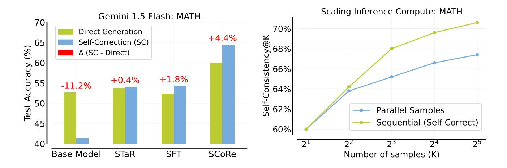
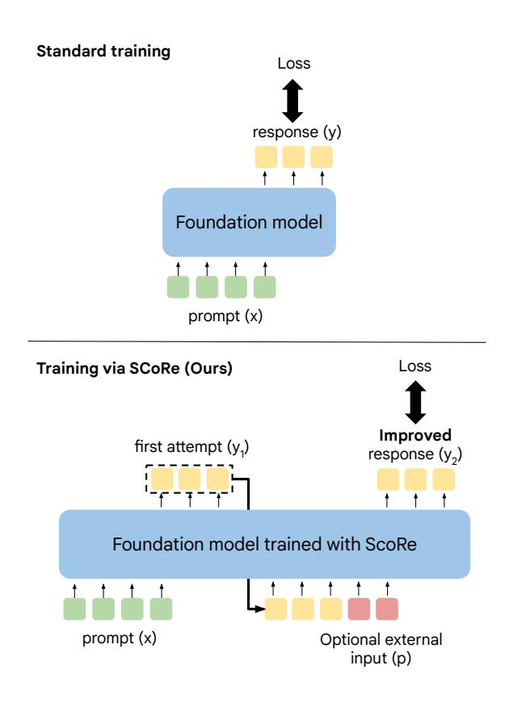
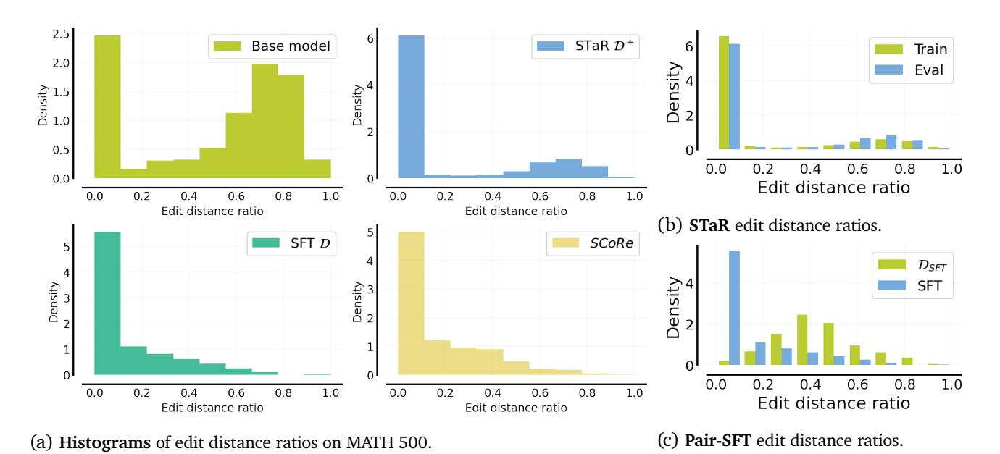
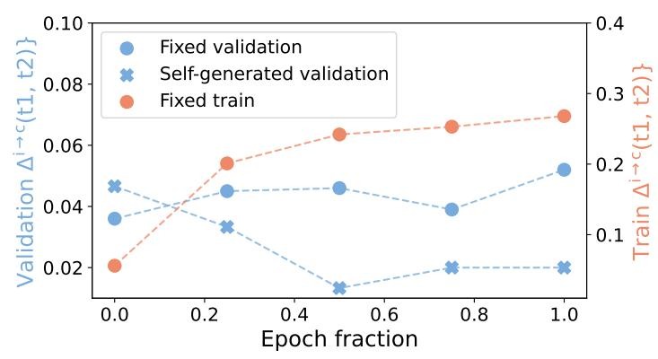
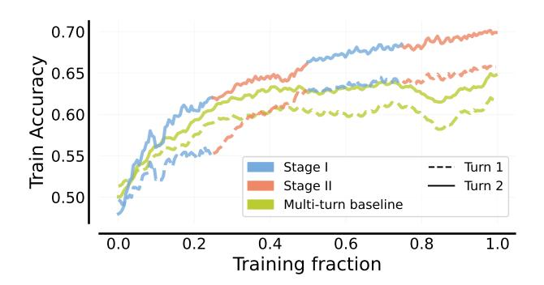
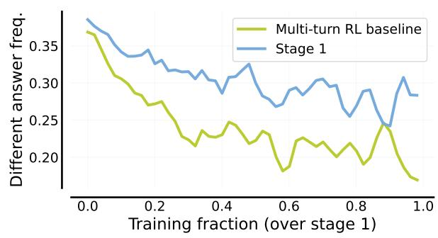
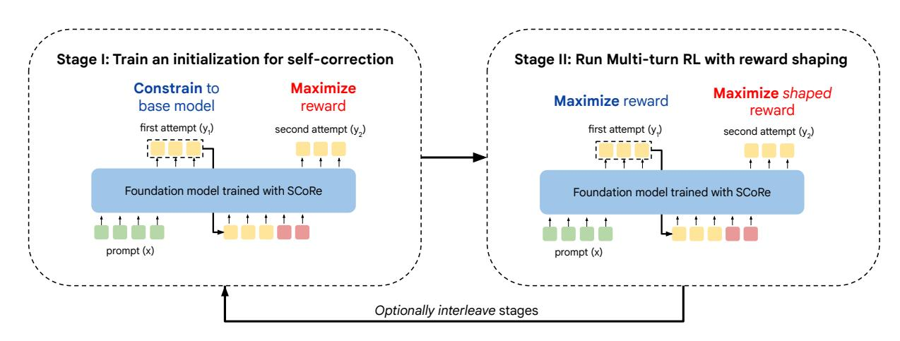

# **Training Language Models to Self-Correct via Reinforcement Learning**

**Aviral Kumar**\*+,1**, Vincent Zhuang**\*+,1**, Rishabh Agarwal**\*,1**, Yi Su**\*,1**, JD Co-Reyes**<sup>1</sup> **, Avi Singh**<sup>1</sup> **, Kate Baumli**<sup>1</sup> **, Shariq Iqbal**<sup>1</sup> **, Colton Bishop**<sup>1</sup> **, Rebecca Roelofs**<sup>1</sup> **, Lei M Zhang**<sup>1</sup> **, Kay McKinney**<sup>1</sup> **, Disha Shrivastava**<sup>1</sup> **, Cosmin Paduraru**<sup>1</sup> **, George Tucker**<sup>1</sup> **, Doina Precup**<sup>1</sup> **, Feryal Behbahani**†,1 **and Aleksandra Faust**†,1 <sup>1</sup>Google DeepMind, \* Equal Contribution, <sup>+</sup> Randomly ordered via coin flip, † Jointly supervised.

**Self-correction is a highly desirable capability of large language models (LLMs), yet it has consistently been found to be largely ineffective in modern LLMs. Existing approaches for training self-correction either require multiple models or rely on a more capable model or other forms of supervision. To this end, we develop a multi-turn online reinforcement learning (RL) approach,** *SCoRe***, that significantly improves an LLM's self-correction ability using** *entirely self-generated data***. To build** *SCoRe***, we first show that variants of supervised fine-tuning (SFT) on offline model-generated correction traces are insufficient for instilling self-correction behavior. In particular, we observe that training via SFT either suffers from a distribution mismatch between the training data and the model's own responses or implicitly prefers only a certain mode of correction behavior that is often not effective at test time.** *SCoRe* **addresses these challenges by training under the model's own distribution of self-generated correction traces and using appropriate regularization to steer the learning process into learning a self-correction strategy that is effective at test time as opposed to simply fitting high-reward responses for a given prompt. This regularization prescribes running a first phase of RL on a base model to generate a policy initialization that is less susceptible to collapse and then using a reward bonus to amplify self-correction during training. When applied to Gemini 1.0 Pro and 1.5 Flash models, we find that** *SCoRe* **achieves state-of-the-art self-correction performance, improving the base models' self-correction by 15.6% and 9.1% respectively on the MATH and HumanEval benchmarks.**

# **1. Introduction**

Large language models (LLMs) have proven to be a useful tool in reasoning and scientific domains such as mathematical problem-solving and coding [\(Lozhkov et al.,](#page-16-0) [2024;](#page-16-0) [Shao et al.,](#page-17-0) [2024;](#page-17-0) [Team,](#page-18-0) [2024\)](#page-18-0). An aspirational property of LLMs in such settings is to able to implement *algorithms*: strategies that help the LLM to use computation and interaction to improve its response on the test-time query. Modern LLMs largely do not implement algorithms reliably: for instance, consider a problem setting that requires models to detect and revise (or "self-correct") their own responses to a given test-time query, so as to be able to eventually arrive at the best-possible final response. This sort of self-correction capability has been shown by several recent works to be severely lacking in current LLMs, especially in the absence of external input (also referred to as *intrinsic self-correction*) [\(Huang et al.,](#page-16-1) [2023;](#page-16-1) [Kamoi et al.,](#page-16-2) [2024\)](#page-16-2).

To make progress towards the eventual goal of teaching LLMs to implement algorithms to handle challenging inputs, we study a special instance of training LLMs to implement self-correction strategies to fix their mistakes "on-the-fly". This should be possible: on many queries where current LLMs fail, they still contain the underlying "knowledge" needed to arrive at the correct response but are unable to correctly elicit and draw inferences about their own knowledge when needed [\(Snell et al.,](#page-17-1) [2024\)](#page-17-1). For example, strong LLMs can often successfully complete a sub-part of a math proof when prompted with the remainder, but may not be able to complete it from scratch. In a similar vein, leveraging their previous responses should, in principle, enable LLMs to improve their subsequent ones. Nevertheless,

<span id="page-1-0"></span>

Figure 1 | Left: *SCoRe* achieves state-of-the-art self-correction performance on MATH; Right: *SCoRe* inference-time scaling: spending samples on *sequential* self-correction becomes more effective than only on *parallel* direct samples (Section 6.2).

self-correction has remained elusive, highlighting the need for going beyond existing training paradigms.

How can we instill LLMs with self-correction abilities? Prior attempts toward self-correcting LLMs either rely on prompt-engineering (Kim et al., 2023; Madaan et al., 2023) or fine-tuning models specifically for self-correction (Havrilla et al., 2024b; Qu et al., 2024; Welleck et al., 2023; Yuan et al., 2024). While the former class of approaches often fail to effectively perform meaningful intrinsic self-correction, existing fine-tuning based approaches require running multiple models upon inference, e.g., a separate verifier or refinement model (Havrilla et al., 2024b; Welleck et al., 2023), or require oracle "teacher" supervision to guide the process of self-correction (Qu et al., 2024), without which self-correction does not necessarily outperform independent uncorrelated attempts at the problem. We develop an approach that is effective at self-correction without any of the aforementioned requirements. Our approach, Self-Correction via Reinforcement Learning (SCoRe), trains only a single model that can both produce a response to a reasoning problem and also correct errors despite not receiving any oracle feedback. More importantly, SCoRe teaches this ability to models entirely by training on self-generated data, without any oracle.

We begin by studying the failure modes of existing fine-tuning based strategies in this setting. We observe that running supervised fine-tuning on multi-turn self-correction traces coupled with rejection sampling (i.e., a "multi-turn" variant of STaR (Zelikman et al., 2022)) often amplifies the model's bias to not make any error corrections. A minimal edit strategy appears somewhat *optimal* as it inhibits the model from learning to make correct responses worse in the second attempt, even though it does not instill self-correction abilities to the model. If the training dataset for SFT is altered to explicitly down-weight certain correction traces that only make minor edits, then the resulting training is able to avoid collapse. However, it suffers from the curse of *distributional shift*: a correction strategy learned by training on off-policy data does not necessarily enable the model to be succeed at correcting its own mistakes.

How does *SCoRe* work? *SCoRe* addresses the aforementioned challenges with SFT by utilizing online multi-turn reinforcement learning (RL). Concretely, *SCoRe* runs multi-turn RL on self-generated data to avoid challenges with distribution mismatch between training and inference. To avoid the failure mode of learning a minimal edit strategy when training on on-policy data, we train *SCoRe* in two stages, with each stage regularizing the learning process to not collapse its behavior. The first stage replaces SFT in conventional LLM fine-tuning workflows by training a model **initialization** that optimizes correction

performance while constraining the first attempt to be close to the base model. The second stage runs multi-turn RL to optimize reward at both attempts, while using a reward bonus term that encourages improving responses from the first attempt to the second. Both the initialization and the reward bonus ensure that the model cannot simply learn to produce the best first-attempt response and only minorly edit it. Overall, *SCoRe* is able to elicit knowledge from the base model to enable positive self-correction.

Our main contribution is *SCoRe*, a multi-turn RL approach for teaching LLMs how to correct their own mistakes. To the best of our knowledge, *SCoRe* is the first approach to attain significantly positive intrinsic self-correction: relative to base Gemini models, our method attains an absolute **15.6%** gain on self-correction for reasoning problems from MATH [\(Hendrycks et al.,](#page-16-5) [2021\)](#page-16-5) and an absolute **9.1%** gain on coding problems from HumanEval [\(Chen et al.,](#page-16-6) [2021\)](#page-16-6). We additionally motivate the design of *SCoRe* by extensively studying the failure modes of baseline approaches, which broadly indicate that reinforcement learning may play an essential role in *self-learned* self-correction.

# **2. Related Work**

Prior works study self-correction for LLMs under a variety of assumptions and problem settings. The most prominent problem settings include problems where external input tokens from an environment is available, for e.g., agentic tasks [\(Liu et al.,](#page-16-7) [2023\)](#page-16-7), code repair [\(Jain et al.,](#page-16-8) [2024\)](#page-16-8), and tool use [\(Chen](#page-16-9) [et al.,](#page-16-9) [2023\)](#page-16-9). While self-correction with external feedback is possible with strong proprietary models [\(Pan](#page-17-4) [et al.,](#page-17-4) [2023\)](#page-17-4), even the strongest models struggle in the substantially more challenging setting when no external input is available [\(Kamoi et al.,](#page-16-2) [2024\)](#page-16-2). This setting is called *intrinsic* self-correction. Prior work that attempts to amplify intrinsic correction abilities are largely based on prompting and fine-tuning.

**Prompting for intrinsic self-correction**. Recent work demonstrates that LLMs struggle to self-correct their reasoning errors without external feedback and naïvely running self-correction can degrade performance [\(Huang et al.,](#page-16-1) [2023;](#page-16-1) [Qu et al.,](#page-17-3) [2024;](#page-17-3) [Tyen et al.,](#page-18-4) [2024;](#page-18-4) [Zheng et al.,](#page-18-5) [2024\)](#page-18-5). These experimental studies are at odds with prior work [\(Kim et al.,](#page-16-3) [2023;](#page-16-3) [Madaan et al.,](#page-17-2) [2023;](#page-17-2) [Shinn et al.,](#page-17-5) [2023\)](#page-17-5) and largely stem from mismatched assumptions on the setting [\(Kamoi et al.,](#page-16-2) [2024\)](#page-16-2). For example, [Kim et al.](#page-16-3) [\(2023\)](#page-16-3); [Shinn et al.](#page-17-5) [\(2023\)](#page-17-5) use oracle ground-truth answers during self-correction that may not be available generally. [Madaan et al.](#page-17-2) [\(2023\)](#page-17-2) use weak prompts for initial responses, thereby perhaps overestimate the improvement possible by self-correction. This indicates that there is no major work showing successful intrinsic self-correction via prompting alone. In the context of code self-repair, [Olausson et al.](#page-17-6) [\(2023\)](#page-17-6) show that even when strong models are prompted with some form of partial feedback, e.g., showing test-cases but not the desired outcomes on those test-cases, they are often unable to correct their mistakes. Sampling multiple responses in parallel attains much better results in [Olausson et al.](#page-17-6) [\(2023\)](#page-17-6).

**Fine-tuning for intrinsic self-correction**. To address the issues with prompting off-the-shelf models alone, several works run supervised fine-tuning (SFT) or weighted SFT on the LLM to generate a revision given an initial response. Nonetheless typical works in this literature rely on oracle feedback: e.g., obtaining revisions directly from human annotators [\(Saunders et al.,](#page-17-7) [2022\)](#page-17-7) or stronger models [\(Qu](#page-17-3) [et al.,](#page-17-3) [2024;](#page-17-3) [Ye et al.,](#page-18-6) [2023\)](#page-18-6). Our work aims to train for self-correction entirely without the use of bigger models or humans, when the *learner itself is asked to generate its own training data.* Similar to these prior works, we assume access to a reward function for evaluating model-generated outputs, similar to [Akyürek et al.](#page-15-0) [\(2023\)](#page-15-0); [Welleck et al.](#page-18-1) [\(2023\)](#page-18-1); [Zhang et al.](#page-18-7) [\(2024\)](#page-18-7). Other approaches build pipelines with multiple models for self-correction (e.g., GLoRE [\(Havrilla et al.,](#page-16-4) [2024b\)](#page-16-4), Self-correct [\(Welleck et al.,](#page-18-1) [2023\)](#page-18-1), or [Akyürek et al.](#page-15-0) [\(2023\)](#page-15-0); [Paul et al.](#page-17-8) [\(2023\)](#page-17-8)). While this can lead to good results, these pipelines do not quite tackle self-correction and require system design for serving multiple models at deployment.

<span id="page-3-0"></span>**Problem.** If ≡ 2 (mod 7), then find the remainder when ( + 2)( + 4)( + 6) is divided by 7. *SCoRe* **turn 1 solution (incorrect)**. Since ≡ 2 (mod 7), we can write = 7+2 for some integer . Substituting, we get ( + 2)( + 4)( + 6) = (7 + 4)(7 + 6)(7 + 8) ≡ 4 ⋅ 6 ⋅ 8 (mod 7) ≡ 192 (mod 7) ≡ 1 (mod 7). Final Answer: The final answer is 1. I hope it is correct. **Self-correction instruction.** There might be an error in the solution above because of lack of understanding of the question. Please correct the error, if any, and rewrite the solution. *SCoRe* **turn 2 solution (correct)**. Since ≡ 2 (mod 7), we can write = 7+2 for some integer . Substituting, we get ( + 2)( + 4)( + 6) = (7 + 4)(7 + 6)(7 + 8) ≡ 4 ⋅ 6 ⋅ 8 (mod 7) ≡ 4 ⋅ 6 ⋅ 1 (mod 7) ≡ 24 (mod 7) ≡ 3 (mod 7).



**The problem setting of self-correction.** *SCoRe* trains a model to not just produce the best possible response, but instead aims to train the model to produce the best final response in the final attempt. In the second turn, extra input in the form of an instruction asking the model to correct itself or model-generated may be provided.

Figure 2 ∣ **An example trace and the problem setting of self-correction.**

Final Answer: The final answer is 3. I hope it is

correct.

**Multi-turn RL for LLMs.** Our approach utilizes a multi-turn policy gradient approach for training for self-correction, which extends the single-turn approach of [Ahmadian et al.](#page-15-1) [\(2024\)](#page-15-1) and can be viewed as an instantiation of the hierarchical RL framework from [Zhou et al.](#page-18-8) [\(2024\)](#page-18-8). Generally, prior work at the intersection of LLMs and multi-turn RL builds value-based [\(Farebrother et al.,](#page-16-10) [2024;](#page-16-10) [Shani et al.,](#page-17-9) [2024;](#page-17-9) [Snell et al.,](#page-17-10) [2022;](#page-17-10) [Zhou et al.,](#page-18-8) [2024\)](#page-18-8), policy-based [\(Shao et al.,](#page-17-0) [2024;](#page-17-0) [Xiong et al.,](#page-18-9) [2024\)](#page-18-9), and model-based [\(Hong et al.,](#page-16-11) [2024\)](#page-16-11) approaches. While this line of work builds machinery to do RL (i.e., optimize rewards) in a multi-turn Markov decision process (MDP), our primary contribution in this paper is to devise a formalization, for learning self-correction behavior instead of the RL machinery itself.

**Self-correction with external feedback.** Many works study self-correction with additional feedback from the environment, most commonly in the setting of code generation, where unit test results or compiler execution feedback are available [\(Chen et al.,](#page-16-12) [2024;](#page-16-12) [Jain et al.,](#page-16-8) [2024;](#page-16-8) [Olausson et al.,](#page-17-6) [2023\)](#page-17-6). Largely these works prompt models to reason about code execution; [Ni et al.](#page-17-11) [\(2024\)](#page-17-11) propose a self-training method that leverages execution traces, though only evaluate it on correcting a fixed dataset of errors.

## 3. Preliminaries and Problem Setup

Our goal is to develop an approach for training LLMs to improve their own predictions by entirely training on self-generated data. As discussed so far, we situate ourselves in the intrinsic self-correction setting (Huang et al., 2023), where models attempt to correct their initial responses without any external feedback. Concretely, given a dataset  $\mathcal{D} = \{(x_i, y_i^*)\}_{i=1}^N$  of problems  $x_i$  and oracle responses  $y_i^*$ , we will train an LLM policy  $\pi_{\theta}(\cdot|[x,\hat{y}_{1:l},p_{1:l}])$  that, given the problem x, previous l model attempts  $\hat{y}_{1:l}$  at the problem, and auxiliary instructions  $p_{1:l}$  (e.g., instruction to find a mistake and improve the response), solves the problem x as correctly as possible. This formalism is akin to the multi-turn MDP in Qu et al. (2024). Moreover, we assume access to a reward function / verifier  $\hat{r}(y,y^*)$ , such as a string-matching based answer checking function) that evaluates correctness of response y by comparing with the oracle response y. Critically, we do not assume access to such a function at test-time and the model itself learns to deduce whether there was a mistake and corrects it, as is often the case in e.g. mathematical reasoning problems. An example and overview of our problem setting is given in Figure 2.

We aim to find a model  $\pi(\square|\circ)$  (which we will also refer to as a policy) mapping a sequence of input tokens  $\circ$  to a sequence of output tokens  $\square$  that maximizes the correctness reward obtained from the verifier at the end of l+1 turns. Formally, this can be written as the following multi-step RL objective:

<span id="page-4-1"></span><span id="page-4-0"></span>
$$\max_{\pi_{\alpha}} \mathcal{E}_{x,y^* \sim \mathcal{D}, \hat{y}_{l+1} \sim \pi_{\theta}(\cdot | [x, \hat{y}_{0:l}, p_{1:l}])} \left[ \hat{r} \left( \hat{y}_{l+1}, y^* \right) \right]. \tag{1}$$

Crucially, note that unlike standard SFT or prevalent RL fine-tuning workflows that train the policy  $\pi$  to directly produce an optimal response  $\hat{y}$  for an input x, Equation 1 trains  $\pi$  over multiple turns / attempts *simultaneously*, where intermediate turn responses  $\hat{y}_{1:l}$  are supervised indirectly with the final rewards.

A base RL approach for fine-tuning LLMs. Our RL toolkit is based on on-policy policy gradient. These methods, such as REINFORCE with a KL-divergence penalty against a fixed model (Ahmadian et al., 2024), are widely used in RL fine-tuning of LLMs, primarily in setting of single-turn RL from human feedback. Formally, such policy gradient approaches train a policy  $\pi_{\theta}(\cdot|x)$  to optimize:

$$\max_{\theta} \mathbb{E}_{\mathbf{x}_t, \mathbf{y}_t \sim \pi_{\theta}(\cdot | \mathbf{x}_t)} \left[ \hat{r}(\mathbf{y}_t, \mathbf{y}^*) - \beta_1 D_{KL}(\pi_{\theta}(\cdot | \mathbf{x}_t) | | \pi_{\text{ref}}(\cdot | \mathbf{x}_t)) \right], \tag{2}$$

where  $\pi_{ref}$  is a reference anchor policy, typically chosen to be a pre-trained or SFT policy.

**Metrics.** For measuring self-correction performance, we report and analyze the following metrics: (1) **Accuracy@t1**: the model's accuracy at the first attempt; (2) **Accuracy@t2**: the model's accuracy at the second attempt, (3)  $\Delta$ (t1, t2): the net improvement in model accuracy between the first and second attempts, which measures the efficacy of self-correction, (4)  $\Delta^{i\rightarrow c}$ (t1, t2): the fraction of problems that are incorrect in the first attempt but become correct at the second attempt, which measures how many *new* problems can self-correction solve; and (5)  $\Delta^{c\rightarrow i}$ (t1, t2): the fraction of problems that are correct in the first attempt but become incorrect at the second attempt, which measures how well the model is able to understand what makes a response correct.

# <span id="page-4-2"></span>4. Supervised Fine-Tuning on Self-Generated Data is Insufficient for Self-Correction

Perhaps a natural approach to train for self-correction is to utilize some form of supervised fine-tuning on data collected from a base model. Variants of this recipe have been shown to scale well in single-turn reasoning problems (Havrilla et al., 2024a; Singh et al., 2023; Zelikman et al., 2022). Can such SFT-based approaches be effective for self-correction as well?

<span id="page-5-0"></span>Table 1 | Self-correction performance after training on  $\mathcal{D}_{STaR}$  and  $\mathcal{D}_{SFT}$ . For both approaches, we find that the gap between second-attempt and first-attempt performance ( $\Delta(t1,t2)$ ) is either overly negative or very small. In addition, both approaches erroneously modify a correct response to be incorrect, i.e., reflected in a high  $\Delta^{c \to i}(t1,t2)$  and a low  $\Delta^{i \to c}(t1,t2)$ .

| Method                       | Accuracy@t1 | Accuracy@t2 | Δ(t1, t2) | $\Delta^{i\rightarrow c}$ (t1, t2) | $\Delta^{c \to i}$ (t1, t2) |
|------------------------------|-------------|-------------|-----------|------------------------------------|-----------------------------|
| Base model                   | 52.6%       | 41.4%       | -11.2%    | 4.6%                               | 15.8%                       |
| STaR $\mathcal{D}_{StaR}$    | 55.4%       | 41.2%       | -14.2%    | 5.4%                               | 19.6%                       |
| Pair-SFT $\mathcal{D}_{SFT}$ | 52.4%       | 54.2%       | 1.8%      | 5.4%                               | 3.6%                        |

<span id="page-5-1"></span>Table 2 | Self-correction performance after training on  $\mathcal{D}^+_{STaR}$  and  $\mathcal{D}^+_{SFT}$ . Performance improves for STaR indicating that a higher coverage dataset helps improve performance, but not for SFT where training on traces where both responses are correct forces the model to simply not make any changes to its first-attempt response, no matter how correct or incorrect that is.

| Method                                | Accuracy@t1 | Accuracy@t2 | ∆(t1, t2) | $\Delta^{i\rightarrow c}$ (t1, t2) | $\Delta^{c \to i}$ (t1, t2) |
|---------------------------------------|-------------|-------------|-----------|------------------------------------|-----------------------------|
| Base model                            | 52.6%       | 41.4%       | -11.2%    | 4.6%                               | 15.8%                       |
| STaR $\mathcal{D}_{StaR}^+$           | 53.6%       | 54.0%       | 0.4%      | 2.6%                               | 2.2%                        |
| Pair-SFT $\mathcal{D}^+_{\text{SFT}}$ | 55.0%       | 55.0%       | 0%        | 0%                                 | 0%                          |

In this section, we perform an empirical study to answer this question. We study two approaches: STaR (Zelikman et al., 2022) and an approach akin to Welleck et al. (2023) that trains only one model. We do not use learned process or outcome verifiers to guide correction traces, so our setup differs from SFT in Snell et al. (2024). We find that such methods improve substantially compared to the base model's self-correction behavior, but still fail to attain a positive self-correction rate and produce a worse second attempt compared to their first attempt. By probing trained models, we find that these failures largely stem from supervised fine-tuning amplifying the initial bias of the base model resulting in only minor changes to its first-attempt response. While these failures can be addressed if a different distribution over initial responses is used for training, doing so fails to induce effective self-correction behavior under the model's own response distribution. Either way, learning is affected by distribution shift or amplification of the base model's bias. These observations motivate the design of our method in Section 5.

### 4.1. Analysis Setup: Methods and Dataset Construction

**Methods.** We prompt off-the-shelf models to obtain a large number of two-turn self-correction traces. The **STaR** approach, analogous to ReST<sup>EM</sup> (Singh et al., 2023), filters these trajectories to only retain those that successfully revise incorrect responses and runs SFT on the resulting dataset. In contrast, Welleck et al. (2023) use the base model data from above to construct sets of correct and incorrect responses and then generates "synthetic" repair traces by pairing incorrect responses with correct ones. We study a variant of their method we call **Pair-SFT**, which does not train a separate corrector model and does not augment this initial dataset with multi-turn traces.

**Dataset construction.** We perform our study on the MATH dataset, and generate self-correction traces by prompting the Gemini 1.5 Flash (Reid et al., 2024) using temperature 1.0. We construct datasets for STaR and Pair-SFT as follows: (1)  $\mathcal{D}_{STaR} := \{(\mathbf{x}_i, \hat{\mathbf{y}}_i^-, \hat{\mathbf{y}}_i^+)\}_{i=1}^N$ , where  $\hat{\mathbf{y}}_i^-$  and  $\hat{\mathbf{y}}_i^+$  correspond to incorrect

<span id="page-6-0"></span>

Figure 3 | Edit distance between first-attempt and second-attempt responses obtained from fine-tuned models, our approach (*SCoRe*) and the base model. Observe that while training on self-generated error correction traces inherits the bi-modal distribution of edits as the base model. SFT tends to be quite conservative.

and correct responses appearing within *a single* sequence of attempts from the current model, and **(2)**  $\mathcal{D}_{SFT} := \{(x_i, \hat{y}_i^-, \tilde{y}_i^+)\}_{i=1}^N$ , where  $\tilde{y}_i^+$  is a random correct response for problem x, randomly sampled from the set of all first-turn and second-turn responses produced by the model. We then ran supervised fine-tuning on both of these datasets: following Singh et al. (2023), we repeat 3 iterations of collecting and running SFT on  $\mathcal{D}_{STaR}$ , but only 1 epoch on  $\mathcal{D}_{SFT}$  given the large dataset size.

### 4.2. Empirical Findings

We plot the self-correction performance of the Gemini 1.5 Flash before and after running fine-tuning on  $\mathcal{D}_{STaR}$  (3 iterations) and  $\mathcal{D}_{SFT}$  in Table 1. We find that although  $\Delta(t1, t2)$  is substantially higher for Pair-SFT relative to the base model, there is still little benefit to doing self-correction (1.8% gain). By considering  $\Delta^{i\to c}$  and  $\Delta^{c\to i}$ , we find that SFT mainly helps by reducing the number of correct problems that are mistakenly changed to incorrect after revision, and does not significantly increase the fraction of incorrect first attempts that are correctly repaired. This result is consistent with prior studies on intrinsic self-correction that have found negligible or even negative  $\Delta(t1, t2)$  (Huang et al., 2023; Qu et al., 2024).

We also find that unlike Pair-SFT, training on  $\mathcal{D}_{STaR}$  does not reduce  $\Delta^{c \to i}$ , indicating that the STaR policy does not have a clear understanding of when and when not to make modifications. We hypothesize that this discrepancy is due to the data distributions of  $\mathcal{D}_{SFT}$  and  $\mathcal{D}_{STaR}$ : the former covers a much more diverse space of revision trajectories due to the nature of random pairing. Observing this, we also trained on an extended version of  $\mathcal{D}_{STaR}^+$  (and also  $\mathcal{D}_{SFT}^+$ ), which additionally presents more tuples with both correct responses. We would expect the addition of such "correct-to-correct" data to prevent the model from erroneously revising a correct response and, at the very least, restrict the modification of a correct response into only another correct response. As shown in Table 2, perhaps interestingly, we find that including such data has opposite effects on STaR and SFT: for STaR, inclusion of this data helps substantially, though it still results in barely any meaningful self-correction performance. On the other hand, for SFT, inclusion of this data overly biases the model to not change its answer at all.

Diving deeper: analyzing self-correction behavior. We also visualized how the STaR and SFT models edit their responses. In particular, we measured **edit distance** ratio, defined as the edit distance between the responses normalized by the total length of both the responses, to summarize the extent to which models modify their first-attempt response. As shown in Figure 3a, while the base model sometimes makes substantially large edits to the original response, models fine-tuned on  $\mathcal{D}_{STaR}$  and  $\mathcal{D}_{SFT}$  are overly conservative, and often make no edits at all. We will show in Section 5 that our proposed method *SCoRe* is able to avoid amplifying this bias of not making changes, without any explicit training for controlling how much to edit solutions.

<span id="page-7-0"></span>

Figure 4 | Tracking self-correction performance on a different sets of first-attempt responses: (a) "fixed validation": first response is distributed identically as the training set, (b) "self-generated": first response is generated by the learner itself. Observe that over the course of training, while accuracy of correcting a fixed validation set of responses largely stays constant (and perhaps even slightly improves) and the accuracy on the training data improves substantially (note the different axis for the training set accuracy on the right), the model's correction abilities its own first-attempt response degrade substantially. This indicates that training on a fixed offline dataset may not be effective at inducing self-correction abilities due to distribution shift.

We also plotted edit distance ratios in correction traces appearing in the training da

rection traces appearing in the training data and compared it against the ratios in self-correction traces generated by STaR and Pair-SFT on training and validation problems in Figures 3b and 3c. While STaR produces qualitatively similar edit distance ratios on both train and validation problems (meaning that it performs within the training distribution very well), we still observe somewhat of a discrepancy between train and validation edit distance ratios for SFT. This means that Pair-SFT is not very effective at generalizing to new problems from the same distribution.

Seeing the discrepancy in the edit distance ratios between train and validation problems for Pair-SFT, we also analyzed the self-correction accuracy of the SFT model on a fixed set of first-attempt responses and self-generated first-attempt responses in Figure 4. We observe clearly different behaviors on both training vs. validation as well as static vs self-generated first-attempt distributions: while the model is able to optimize training correction accuracy well and also maintains its initial correction accuracy on first attempts appearing in the validation set (distributed i.i.d. to the training distribution), its self-correction accuracy degrades with more training.

### Takeaways: Insufficiency of SFT

We showed two distinct sources of failure of SFT methods: STaR latched onto only one mode of correction behavior that made minor changes, and training via Pair-SFT on data with wider coverage resulted in a degradation in self-correction abilities on responses from the model's distribution of initial responses, due to distribution shift. This implies that an effective approach must satisfy two desiderata: [D1] it should directly train on self-generated traces to alleviate distribution mismatch that affected SFT (Figure 4), and [D2] self-generated traces employed should prevent a collapse to making minor edits during learning. We will next develop an online RL approach that addresses these challenges with a careful initialization and reward shaping.

### Broader Implications of these Results

These results more generally suggest that offline supervised fine-tuning is likely not effective at making use of additional in-context tokens to learn nuanced algorithmic behaviors, due to challenges of distribution shift in training data and amplification of certain pathological behaviors that seem promising on the training data but do not learn the right strategy.

## <span id="page-8-0"></span>**5.** *SCoRe***: Self-Correction via Multi-Turn Reinforcement Learning**

To develop an effective approach for teaching LLMs to self-correct by training entirely on self-generated data, we have to satisfy the two desiderata discussed above. Utilizing on-policy RL in our method is a natural way to satisfy desideratum **[D1]**. Our approach, *SCoRe* will extend standard single-turn RL (Equation [2\)](#page-4-1) to the multi-turn setting under the hierarchical framework from [Zhou et al.](#page-18-8) [\(2024\)](#page-18-8).

**Key challenges.** While multi-turn RL that optimizes Equation [1](#page-4-0) addresses the issue with distribution shift, it is unclear whether it also satisfies desideratum **[D2]**. Base model initializations for fine-tuning present a highly-skewed distribution over edit distances (Figure [3a\)](#page-6-0), which makes them susceptible to mode collapse, a well-known issue in deep RL [\(Mei et al.,](#page-17-14) [2020;](#page-17-14) [Schaul et al.,](#page-17-15) [2019\)](#page-17-15). Even if the base model could produce a less-skewed distribution over edit distance ratios during self-correction, we still need the RL training procedure to learn a self-correction strategy from the training data that generalizes to test prompts.

To see whether RL training can learn a self-correction strategy by purely optimizing the final attempt's reward, we ran a naïve **multi-turn RL baseline** to optimize Equation [1.](#page-4-0) We find empirically in Figure [5](#page-9-0) that while the performance of each attempt improves with training via naïve multi-turn RL, the performance of the second attempt is tightly coupled with the first attempt. As training progresses, standard multi-turn converges to be overly biased towards not changing its response, resulting in no self-correction ability.

**Why does this happen?** There are at least two equally good solutions when optimizing a policy with RL on the training data: **(i)** learning to improve from the first to the second attempt, or **(ii)** learning to produce the best first-attempt response followed by no correction in the second attempt. Of course only the former strategy generalizes to new problems, but an overparameterized LLM may not necessarily learn strategy **(i)** instead of **(ii)**, since both of these strategies appear equally optimal on *the training set*.

Abstractly, learning the "meta strategy" of self-correction during training is difficult unless the "direct" strategy that optimizes reward appears less viable. Conceptually, this is similar to the memorization challenge in meta-learning [\(Yin et al.,](#page-18-10) [2019\)](#page-18-10), which suggests that when provided with mutually exclusive tasks, few-shot meta-learning is likely to recover the supervised learning solution (without relying on additional context from the few shots) that directly predicts the output for an input. In our case, this is analogous to not self-correcting past attempts, but rather directly attempting produce a good response.

**Method overview.** Our approach *SCoRe* is designed to address the key challenges identified above. *SCoRe* operates in two stages. In the first stage (**Stage I**), *SCoRe* trains a model initialization that is less prone to collapse in subsequent RL by explicitly teaching the model to correct its second-attempt responses under a relatively *static* first-attempt distribution. This initialization amplifies the coverage of second-attempt responses given the model's own first attempt distribution, with a bias towards high-reward responses. We then use this model initialization to seed the actual multi-turn RL run (**Stage II**). To bias learning towards a solution that learns to self-correct, we shape the reward at the second attempt to provide a large positive reward bonus in favor of self-correction. Both stages bias the model towards learning

<span id="page-9-0"></span>



- (a) Evolution of training reward with more training. When training with naïve multi-turn RL, the responses at both the attempts become tightly coupled together, leading to poor coverage for subsequent iterations and worse learning progress. Stage I in *SCoRe* is explicitly designed to alleviate this, leading to increased exploration and better final performance.
- (b) Frequency in which the learner proposes a different answer in the second turn. Without explicitly modifying the policy initialization as in *SCoRe*, the policy quickly learns to not change its answer, leading to poor exploration. This is evident by a decrease in the number of prompts for which the second attempt produces a different answer.

Figure 5 | Failure modes of naïve multi-turn RL training for inducing self-correction capabilities. These results indicate that some explicit approach to alter the policy initialization is required for learning. Stage I in *SCoRe* exactly tackles this.

self-correction by initializing the model appropriately and controlling subsequent RL.

## 5.1. Stage I: Training a Model Initialization to Prevent Collapse

The goal of Stage I of *SCoRe* is to obtain a good model initialization by improving the base model's coverage over second-attempt responses so that subsequent training for self-correction is less susceptible to collapse we observed with STaR/SFT. While this would typically be done via SFT in LLM fine-tuning pipelines, our experiments in Section 4 show that SFT trains the model to latch onto only one mode of correction behavior. As a result, an SFT initialization is not expected to generate informative and exploratory traces for learning. Therefore, we do not initialize our RL training with SFT and instead develop Stage I to produce a separate initialization that is less prone to collapse.

To do so, we explicitly fine-tune the base model to produce *high-reward* revisions at the second attempt, while forcing the model to not change its first-attempt response, by constraining the first-attempt response distribution as close as possible to that of the base model using a KL-divergence. While does this appear sub-optimal – a first-attempt response with fewer mistakes could be corrected to a better second-attempt response – but as we will show, this stage is critical in reducing the base model's bias towards simply coupling the first and second-attempt distributions, and thus becoming trapped in a local optima when actual multi-turn RL is run. Formally, the objective we optimize is:

<span id="page-9-1"></span>
$$\max_{\theta} \mathbb{E}_{x_1, y_1 \sim \pi_{\theta}(\cdot|x), y_2 \sim \pi_{\theta}(\cdot|[x_1, p_1])} \left[ \widehat{r}(y_2, y^*) - \beta_2 D_{KL}(\pi_{\theta}(\cdot||x_1)||\pi_{ref}(\cdot|x_1)) \right], \tag{3}$$

where  $\beta_2$  is a hyper parameter designed to enforce a strict KL penalty *only on the first attempts* to avoid shift of the first-turn responses (denoted by the term in blue). Note that we still utilize the default KL-divergence penalty from Equation 2, but that is applied with a much smaller weight and is omitted from Equation 3 for brevity. Indeed, we show that unlike naïve multi-turn RL, Stage I is more effective at decoupling the two responses (Figure 5b).

<span id="page-10-1"></span>

Figure 6 | An overview of our approach (*SCoRe*). *SCoRe* trains a model in two stages: **Stage I:** instead of running SFT (that produces pathological amplification of biases) to initialize RL training, we train a good initialization that can produce high-reward responses in the second-attempt while mimicking the base model's initial response at the first attempt. **Stage II:** jointly optimizing both attempts, where the latter uses a shaped reward to incentivize discovery of the self-correction strategy instead of the simple strategy of product the best first response followed by making any minor edits to it in the second attempt.

## 5.2. Stage II: Multi-Turn RL with Reward Shaping

Equipped with a model initialization from Stage I that exhibits a substantially smaller bias to couple the two responses, the second stage of *SCoRe* now trains responses at both attempts towards optimizing reward in line with Equation 1. Of course, we also want to make sure to not degrade the first-attempt responses in the process. Therefore, for two-turn self-correction problem, we train the policy  $\pi_{\theta}(\cdot|\cdot)$  against the following objective:

$$\max_{\theta} \mathbb{E}_{\mathbf{x}_{1},\mathbf{y}_{1} \sim \pi_{\theta}(\cdot|\mathbf{x}),\mathbf{y}_{2} \sim \pi_{\theta}(\cdot|[\mathbf{x}_{1},p_{1}])} \left[ \sum_{i=1}^{2} \widehat{r}(\mathbf{y}_{i},\mathbf{y}^{*}) - \beta_{1} D_{KL}(\pi_{\theta}(\cdot|\mathbf{x}_{i})||\pi_{\text{ref}}(\cdot|\mathbf{x}_{i})) \right], \tag{4}$$

where  $x_i$ ,  $i \in \{1, 2\}$  corresponds to the set of input tokens passed as context to the model. *SCoRe* optimizes Equation 4 with an on-policy policy gradient approach.

Reward shaping to incentivize self-correction. As discussed earlier, it is unclear if running RL for optimizing Equation 4 prefers a strategy that incentivizes self-correction over finding the best first-attempt response and keeping it unchanged, since both of these strategies appear equally good on the small training dataset. To mitigate this issue, we bias the learning problem towards the self-correction strategy via reward shaping: by providing a higher emphasis to traces that flip correctness from the first attempt to the second, we can bias the model to learn a self-correction solution. Concretely, given an two-turn on-policy rollout  $\tau = \{x_1, \hat{y}_1, \hat{r}(y_1, y^*), x_2, \hat{y}_2, \hat{r}(y_2, y^*)\}$  (where  $x_2$  denotes all the tokens from the first turn concatenated with each other), we propose to modify the reward  $\hat{r}(y_2, y^*)$  used for training in Equation 4, at the second attempt with an additional bonus  $\hat{b}(y_2|y_1, y^*)$  given by:

<span id="page-10-0"></span>
$$\widehat{b}(y_2|y_1, y^*) = \alpha \cdot (\widehat{r}(y_2, y^*) - \widehat{r}(y_1, y^*)),$$
 (5)

where  $\alpha$  is a positive constant multiplier, ideally a real number significantly larger than 1.0. Adding this bonus to the second attempt *only* emphasizes traces that flip the correctness of the response and assigns a heavy negative penalty to transitions that change a correct response to incorrect in the second attempt. In contrast, transitions that do not flip correctness of the response and are likely to lead to collapse of not

making meaningful edits contribute much less to the overall loss. Thus, the addition of this bonus should regularize the training process from collapsing on to the "direct" solution that might look optimal on the training set but does not produce self-correction behavior on new examples.

### **5.3. Putting it Together and Implementation Details**

Our approach is illustrated pictorially in Figure [6.](#page-10-1) *SCoRe* applies stages I and II in an interleaved fashion for multiple iterations (e.g., Figure [5](#page-9-0) shows two applications each of Stage I and II). We use a small <sup>1</sup> for all experiments (i.e., the coefficient on the KL divergence penalty against the base model in Equation [2\)](#page-4-1), and found that setting <sup>2</sup> = 10<sup>1</sup> to work sufficiently well in our experiments. In practice, one can also use an adaptive <sup>2</sup> that attempts to balance the magnitudes of the first-attempt KL regularization and the second-attempt policy loss. In some of our experiments, we also choose to amplify the coverage of states used for on-policy RL by incorporating first-attempt solutions obtained by repeatedly sampling the base model as *offline* prompts in RL. We find that incorporating this data, especially in Stage 2, where the first-turn policy may have drifted further from that of the base model, can have substantial benefits especially when attempting to learn from limited data.

### Takeaways and Implications

The core insight behind our method is that we must make it more attractive to learn the more nuanced algorithmic strategy instead of collapsing to an ungeneralizable behavior mode. Furthermore, to avoid the challenge of distribution shift, this must be done on self-generated online data. *SCoRe* instantiates this principle when learning the model initialization for multi-turn RL (Stage I) and when using a reward bonus to prevent training from producing non-correcting strategies (Stage II).

# **6. Experimental Evaluation**

The goal of our experiments is to demonstrate the efficacy of *SCoRe* in teaching LLMs how to correct their own mistakes by training on their own data. In addition, we also aim to understand the impact of each of the components of *SCoRe* in contributing to this ability. To this end, we perform a comparative evaluation of *SCoRe* against prior methods that also use self-generated data to train for self-correction, and run several ablation studies on two representative reasoning tasks where error correction is crucial.

**Tasks.** We mainly focus on math and coding tasks: **(a)** math problem solving on MATH [\(Hendrycks](#page-16-5) [et al.,](#page-16-5) [2021\)](#page-16-5), and **(b)** code generation on MBPP [\(Austin et al.,](#page-15-2) [2021\)](#page-15-2) and HumanEval [\(Chen et al.,](#page-16-6) [2021\)](#page-16-6) for evaluating the efficacy of our approach. Concretely, we use the following train-test splits in our experiments: **(1) MATH**: following [Lightman et al.](#page-16-14) [\(2023\)](#page-16-14), we augment the MATH training set with 4500 problems from the test set, and report results on the remaining 500 problems; and **(2) Code generation**: we train on MBPP and report results on HumanEval, which does not expose test cases to the model.

**Evaluation protocol and metrics.** We report the self-correction accuracy on a number of tasks with two sequential attempts at the problem, i.e., one round of self-correction. For MBPP, following the evaluation protocol of [Ni et al.](#page-17-11) [\(2024\)](#page-17-11), we also report results on MBPP-R, an offline repair task that requires correcting incorrect first-attempt programs generated from PaLM 2.

**Models.** For all of our experiments on MBPP, we fine-tune Gemini 1.0 Pro and for MATH, we finetune Gemini 1.5 Flash. For all evaluations, we use greedy decoding (i.e. temperature 0), except for inference-compute scaling in Section [6.2](#page-13-0) where we set temperature to be 0.7. For all training methods, we

<span id="page-12-0"></span>Table 3 ∣ **Performance of** *SCoRe* **on MATH.** Observe that SCoRe not only attains a higher accuracy at both attempts, but also provides the most positive self-correction performance Δ(t1, t2), and improves upon the number of problems that move from incorrect to correct, while substantially reducing the number of problems that become incorrect in the second attempt.

| Approach                  | Accuracy@t1 | Accuracy@t2 | Δ(t1, t2) | i→c<br>Δ<br>(t1, t2) | c→i<br>Δ<br>(t1, t2) |
|---------------------------|-------------|-------------|-----------|----------------------|----------------------|
| Base model                | 52.6%       | 41.4%       | -11.2%    | 4.6%                 | 15.8%                |
| Self-Refine               | 52.8%       | 51.8%       | -1.0%     | 3.2%                 | 4.2%                 |
| +<br>𝒟<br>STaR w/<br>StaR | 53.6%       | 54.0%       | 0.4%      | 2.6%                 | 2.2%                 |
| 𝒟SFT<br>Pair-SFT w/       | 52.4%       | 54.2%       | 1.8%      | 5.4%                 | 3.6%                 |
| SCoRe<br>(Ours)           | 60.0%       | 64.4%       | 4.4%      | 5.8%                 | 1.4%                 |

attempted to use a fixed budget of model samples and gradient updates, and do not vary hyperparameters such as learning rate and batch size between runs. For all RL runs, we selected checkpoints with the highest training reward, although a small held-out validation set of problems can also be used. Additional details about the experimental setup can be found in the Appendix.

**Evaluation prompts.** We use a zero-shot CoT prompting for evaluation on MATH, zero-shot prompting for evaluation on HumanEval, and the canonical three-shot prompt for first-attempt training samples on MBPP. At the second attempt, we utilize an instruction that does not reveal the correctness of the previous answer, but asks the model to attempt to deduce whether a mistake exists in its first attempt response, and, if so, potentially rewrite its response. Full prompts and self-correction instructions can be found in Appendix [A.](#page-19-0)

**Prior approaches and comparisons.** We compare *SCoRe* to prior approaches and baselines. We compare to **Self-Refine** [\(Madaan et al.,](#page-17-2) [2023\)](#page-17-2), a representative prompting-based approach to elicit self-correction behaviors from a model, akin to Reflexion [\(Shinn et al.,](#page-17-5) [2023\)](#page-17-5). Of the fine-tuning based approaches, we compare to **Pair-SFT** based on the approach from [Welleck et al.](#page-18-1) [\(2023\)](#page-18-1), and multi-turn **STaR** [\(Singh](#page-17-12) [et al.,](#page-17-12) [2023;](#page-17-12) [Zelikman et al.,](#page-18-3) [2022\)](#page-18-3) that fine-tune the model by minimizing negative log-likelihood on synthetically paired repair traces and successful repair traces respectively. Due to a difference in assumptions and base models, we cannot compare *SCoRe* directly with results in prior papers that utilize oracle information (e.g., RISE [\(Qu et al.,](#page-17-3) [2024\)](#page-17-3)) or run multiple models (e.g., GLoRE [\(Havrilla et al.,](#page-16-4) [2024b\)](#page-16-4), the full version of Self-Correct [\(Welleck et al.,](#page-18-1) [2023\)](#page-18-1) with a refinement model), largely because these comparisons will be apples-to-oranges with distinct setups, different refinement or oracle models.

## **6.1. Benchmark Results**

**MATH.** Our results are in Table [3,](#page-12-0) as well as in Figure [1.](#page-1-0) *SCoRe* exhibits substantially stronger performance on both direct and self-correction accuracies. Notably, the intrinsic self-correction gain Δ(t1, t2) of 4.4% is the first significantly positive delta, despite having fewer incorrect problems to correct by virtue of its higher Accuracy@t1. Relative to the base 1.5 Flash model, *SCoRe* improves Δ(t1, t2) by **15.6%**, and Accuracy@t2 by **23.0%**, and over the nearest baseline, Pair-SFT, by **10.2%** and **2.6%** respectively.

By observing the frequency of problems that change from incorrect at from the first attempt to correct in the second attempt and vice versa, we see that *SCoRe* improves the rate at which it fixes incorrect answers (14.5%, compared to 9.5% for base) and reduces the proportion of correct answers it changes.

<span id="page-13-1"></span>Table 4 ∣ **Performance of** *SCoRe* **on HumanEval.** Observe that ScoRe attains the highest accuracy at the second attempt (**Accuracy@t2**), and also substantially improves the number of problems that become correct with the use of additional sequential attempts. In addition, *SCoRe* also attains the highest correction rate on MBPP-R, an offline repair task.

| Method          | MBPP-R | Accuracy@t1 | Accuracy@t2 | Δ(t1, t2) | i→c<br>(t1, t2)<br>Δ | c→i<br>(t1, t2)<br>Δ |
|-----------------|--------|-------------|-------------|-----------|----------------------|----------------------|
| Base model      | 47.3%  | 53.7%       | 56.7%       | 3.0%      | 7.9%                 | 4.9%                 |
| Self-Refine     | 30.7%  | 53.7%       | 52.5%       | -1.2%     | 9.8%                 | 11.0%                |
| Pair-SFT        | 59.8%  | 56.1%       | 54.3%       | -1.8%     | 4.3%                 | 6.1%                 |
| SCoRe<br>(Ours) | 60.6%  | 52.4%       | 64.6%       | 12.2%     | 15.2%                | 3.0%                 |

<span id="page-13-2"></span>Table 5 ∣ **Ablation studies to understand the impact of various components in** *SCoRe***.** Observe that while single-turn training is effective at optimizing the first-attempt accuracy of the model, it leads to degradation in the second attempt. Instead, *SCoRe* allows us to attain a higher second-attempt accuracy even though it attains a slightly worse first-attempt accuracy. The performance improvements without Stage I or without reward shaping in *SCoRe* are small when measured by the difference in accuracy over the two attempts. Utilizing STaR generally leads to worse performance even when it is run from an effective Stage I checkpoint. These results highlight the importance of various components in *SCoRe*.

| Method                                | Accuracy@t1 | Accuracy@t2 | Δ(t1, t2) |
|---------------------------------------|-------------|-------------|-----------|
| SCoRe<br>(Ours)                       | 60.0%       | 64.4%       | 4.4%      |
| w/o multi-turn training               | 61.8%       | 59.4%       | -2.4%     |
| w/o Stage I                           | 59.2%       | 61.4%       | 2.2%      |
| w/o reward shaping                    | 60.0%       | 62.6%       | 2.6%      |
| w/ STaR instead of REINFORCE Stage II | 56.2%       | 58.4%       | 2.2%      |

**Code generation.** Our results for the code generation task are shown in Table [4.](#page-13-1) Generally, we find that *SCoRe* achieves both improved self-correction as well as strong offline repair performance. For MBPP-R, we find that *SCoRe* improves the base model from 47.3% to 60.6%, which is comparable to the gap between GPT-3.5 and GPT-4 (42.9% and 63.2% respectively) [\(Ni et al.,](#page-17-11) [2024\)](#page-17-11). Despite only training on MBPP, we find that *SCoRe* is especially effective at generalizing to HumanEval, achieving a **12.2%** intrinsic self-correction delta, or 9% higher than the base model. By contrast, Pair-SFT works nearly as well on the static repair task MBPP-R, but actually degrades the base model when evaluated in the self-correction setting, thus underscoring the importances of on-policy sampling for self-correction.

### <span id="page-13-0"></span>**6.2. Inference-Compute Scaling with Self-Correction**

Next, we investigate if *SCoRe* can be used in conjunction with inference-time compute scaling strategies. To do so, we evaluate self-consistency decoding [\(Wang et al.,](#page-18-11) [2022\)](#page-18-11), also known as majority voting, where we sample a diverse set of solutions, and then select the most consistent answer among these solutions. Typically, the default strategy is to sample all solutions in parallel to perform majority voting. However, we show in Figure [1](#page-1-0) (right) that instead of sampling 2 solutions in parallel, it is *more* compute-efficient to sample solutions in parallel, then perform one round of self-correction on each solution. With 32 solution budget per problem, parallel sampling shows a 7.4% accuracy gain, while combining it with sequential sampling using self-correction yields a 10.5% improvement.

### **6.3. Ablation Studies: Understanding the Impact of** *SCoRe* **Components**

Finally, we also present a number of ablation studies to understand the importance of various components in *SCoRe*. We perform these ablations on the MATH dataset. Concretely, we aim to answer the following questions: **(1) the importance of multi-turn training:** Can RL trained to maximize single-turn performance achieve better accuracy@t1 or accuracy@t2?; **(2) the importance of multi-stage training:** How essential is Stage I to *SCoRe*? In other words, why not run Stage II directly?; **(3) the impact of reward shaping.** How would removing the reward shaping terms affect performance of *SCoRe* in Stage II, assuming Stage I was done identically?; **(4) the importance of on-policy RL:** What if we replaced REINFORCE in Stage II with STaR?.

The results of all of these ablation experiments are shown in Table [5.](#page-13-2) As expected, single-turn training improves turn 1 performance, but has negative Δ**(t1, t2)**. As shown in Figure [5,](#page-9-0) Stage I is critical to *SCoRe*; without it, the model achieves 2% lower Δ**(t1, t2)** and 3% lower accuracy@t2. Similarly, we find that removing reward shaping also hurts performance, indicating that the RL objectives in both stages play a significant role in teaching self-correction behavior. We also find that replacing REINFORCE with STaR in Stage II results in significantly lower absolute performance with no visible improvements in self-improvement performance, which contrasts with the findings in [Havrilla et al.](#page-16-13) [\(2024a\)](#page-16-13) that STaR and on-policy RL have similar convergence rates for single-turn RL. This suggests that leveraging on-policy samples is especially critical in the self-correction setting, which presents a multi-turn problem that admits potentially spurious solutions.

## **6.4. Qualitative Analysis of** *SCoRe*

We also perform a qualitative investigation into how *SCoRe* addresses the self-repair shortcomings of base LLMs, and provide several examples in Appendix [B.](#page-20-0) We find that *SCoRe* is able to refine its own responses in a variety of manners - rewriting the entire solution when necessary, or reproducing the correct parts of the solution, while revising the incorrect ones. For the latter, we interestingly find that *SCoRe* is especially adept at revising its computational mistakes, and even demonstrates a bias towards showing more steps in certain computations and manipulations in order to increase its probability of producing a correct answer. We additionally observe that the model learns to occasionally self-correct *within* a turn, e.g. MATH example 4.

# **7. Discussion, Limitations, and Conclusion**

In this work, we investigated how to imbue LLMs with a self-correction strategy that enables them to correct their own responses on the fly, at test-time. Specifically, we proposed *SCoRe*, a multi-turn online reinforcement learning (RL) approach for training language models to correct their own mistakes, and demonstrated through extensive evaluations *that it is the first method* that can attain significantly positive intrinsic self-correction performance. To motivate the design of *SCoRe*, we rigorously analyzed the behavior of various fine-tuning baselines and identified failure modes in which the model learns a non-correcting strategy (e.g. learning to make no edits) under these approaches. *SCoRe* is designed to elicit a self-correcting strategy by utilizing a two-stage structure and reward shaping, both of which help prevent model collapse into not learning effective self-improvement behavior.

**Limitations.** There are various limitations of this work that also provide interesting avenues for future work. We did not train *SCoRe* for more than one round of iterative self-correction in this paper, which means that subsequent rounds of self-correction may not be as effective as the first one. An interesting avenue for future work is to train with more than two attempts via RL, which is already a common and effective practice to obtain effective self-correction behavior over more than two rounds with SFT [\(Qu](#page-17-3) [et al.,](#page-17-3) [2024;](#page-17-3) [Snell et al.,](#page-17-1) [2024\)](#page-17-1). Unifying Stages I and II of *SCoRe* is also an interesting avenue for research, since that would alleviate the limitation of running multiple steps and help in designing a more robust method.

**Broader perspectives.** Our work has several implications. First, it suggests that learning *meta-strategies* (e.g., self-correction in this paper) might require going beyond the standard paradigm of supervised fine-tuning followed by single-turn RL (as shown in Section [4\)](#page-4-2). It demonstrates that multi-turn RL can provide for one such approach. Second, our results also hint that perhaps using more detailed or granular supervision when generating on-policy rollouts in multi-turn RL might further improve the model's capabilities at implementing nuanced strategies: even though *SCoRe* did not use dense or fine-grained feedback, it was already able to improve performance of existing models substantially. Utilizing dense feedback is likely to complement our method well. Finally, the importance of our two-stage recipe (based on careful initialization and reward shaping) in obtaining positive self-correction perhaps more generally hints that some kind of regularization is required to ensure that LLMs learn nuanced strategies that can generalize well to novel, unseen queries at test-time.

# **Acknowledgements**

The authors would like to thank Satinder Baveja, Kalesha Bullard, Gheorghe Comanici, Claire Cui, Valentin Dalibard, Angelos Filos, Yang Gao, Zoubin Ghahramani, Izzeddin Gur, Raia Hadsell, Clara Huiyi Hu, Melvin Johnson, Mina Khan, Balaji Lakshminarayanan, Yiran Mao, Hussain Masoom, Junhyuk Oh, Jordi Orbay, David Silver, and Yury Sulsky for helpful discussions, feedback, and sponsorship. We thank Amrith Setlur, Yuxiao Qu, Charlie Snell, Tianhe Yu, and Xinyang (Young) Geng for helpful discussions and feedback on an earlier version of the paper.

## **Author Contributions**

AK and VZ led the paper, with substantial technical contributions from RA and YS. VZ led the experimentation in the final paper with AK, with support from RA and YS. AK and RA conceived the initial idea with advice and discussions from DS, FB, AF, JDC, AS, and GT. JDC, YS, AS, RA, and AK iterated on the methodology. The development of the final method was done by AK and VZ, with inputs from RA and FB. VZ led the infrastructure development, while RA, YS, CP, SI, KB, DS, and LMZ contributed to the infrastructure. AK, RA, FB, AF, DP, GT advised on the overall direction. AK and VZ wrote the manuscript, with input from all co-authors. KM provided program management. FB, and AF co-supervised the project.

## **References**

- <span id="page-15-1"></span>A. Ahmadian, C. Cremer, M. Gallé, M. Fadaee, J. Kreutzer, A. Üstün, and S. Hooker. Back to basics: Revisiting reinforce style optimization for learning from human feedback in llms. *arXiv preprint arXiv:2402.14740*, 2024.
- <span id="page-15-0"></span>A. F. Akyürek, E. Akyürek, A. Madaan, A. Kalyan, P. Clark, D. Wijaya, and N. Tandon. Rl4f: Generating natural language feedback with reinforcement learning for repairing model outputs. *arXiv preprint arXiv:2305.08844*, 2023.
- <span id="page-15-2"></span>J. Austin, A. Odena, M. Nye, M. Bosma, H. Michalewski, D. Dohan, E. Jiang, C. Cai, M. Terry, Q. Le, et al. Program synthesis with large language models. *arXiv preprint arXiv:2108.07732*, 2021.

- <span id="page-16-6"></span>M. Chen, J. Tworek, H. Jun, Q. Yuan, H. P. D. O. Pinto, J. Kaplan, H. Edwards, Y. Burda, N. Joseph, G. Brockman, et al. Evaluating large language models trained on code. *arXiv preprint arXiv:2107.03374*, 2021.
- <span id="page-16-9"></span>X. Chen, M. Lin, N. Schärli, and D. Zhou. Teaching large language models to self-debug. *arXiv preprint arXiv:2304.05128*, 2023.
- <span id="page-16-12"></span>Z. Chen, Y. Deng, H. Yuan, K. Ji, and Q. Gu. Self-play fine-tuning converts weak language models to strong language models. *arXiv preprint arXiv:2401.01335*, 2024.
- <span id="page-16-10"></span>J. Farebrother, J. Orbay, Q. Vuong, A. A. Taïga, Y. Chebotar, T. Xiao, A. Irpan, S. Levine, P. S. Castro, A. Faust, et al. Stop regressing: Training value functions via classification for scalable deep rl. *arXiv preprint arXiv:2403.03950*, 2024.
- <span id="page-16-13"></span>A. Havrilla, Y. Du, S. C. Raparthy, C. Nalmpantis, J. Dwivedi-Yu, M. Zhuravinskyi, E. Hambro, S. Sukhbaatar, and R. Raileanu. Teaching large language models to reason with reinforcement learning. *arXiv preprint arXiv:2403.04642*, 2024a.
- <span id="page-16-4"></span>A. Havrilla, S. Raparthy, C. Nalmpantis, J. Dwivedi-Yu, M. Zhuravinskyi, E. Hambro, and R. Railneau. Glore: When, where, and how to improve llm reasoning via global and local refinements. *arXiv preprint arXiv:2402.10963*, 2024b.
- <span id="page-16-5"></span>D. Hendrycks, C. Burns, S. Kadavath, A. Arora, S. Basart, E. Tang, D. Song, and J. Steinhardt. Measuring mathematical problem solving with the math dataset. *NeurIPS*, 2021.
- <span id="page-16-11"></span>J. Hong, N. Lee, and J. Thorne. Reference-free monolithic preference optimization with odds ratio. *arXiv preprint arXiv:2403.07691*, 2024.
- <span id="page-16-1"></span>J. Huang, X. Chen, S. Mishra, H. S. Zheng, A. W. Yu, X. Song, and D. Zhou. Large language models cannot self-correct reasoning yet. *arXiv preprint arXiv:2310.01798*, 2023.
- <span id="page-16-8"></span>N. Jain, K. Han, A. Gu, W.-D. Li, F. Yan, T. Zhang, S. Wang, A. Solar-Lezama, K. Sen, and I. Stoica. Livecodebench: Holistic and contamination free evaluation of large language models for code. *arXiv preprint arXiv:2403.07974*, 2024.
- <span id="page-16-2"></span>R. Kamoi, Y. Zhang, N. Zhang, J. Han, and R. Zhang. When can llms actually correct their own mistakes? a critical survey of self-correction of llms. *arXiv preprint arXiv:2406.01297*, 2024.
- <span id="page-16-3"></span>G. Kim, P. Baldi, and S. McAleer. Language models can solve computer tasks. *arXiv preprint arXiv:2303.17491*, 2023.
- <span id="page-16-14"></span>H. Lightman, V. Kosaraju, Y. Burda, H. Edwards, B. Baker, T. Lee, J. Leike, J. Schulman, I. Sutskever, and K. Cobbe. Let's verify step by step. *arXiv preprint arXiv:2305.20050*, 2023.
- <span id="page-16-7"></span>X. Liu, H. Yu, H. Zhang, Y. Xu, X. Lei, H. Lai, Y. Gu, H. Ding, K. Men, K. Yang, et al. Agentbench: Evaluating llms as agents. *arXiv preprint arXiv:2308.03688*, 2023.
- <span id="page-16-0"></span>A. Lozhkov, R. Li, L. B. Allal, F. Cassano, J. Lamy-Poirier, N. Tazi, A. Tang, D. Pykhtar, J. Liu, Y. Wei, et al. Starcoder 2 and the stack v2: The next generation. *arXiv preprint arXiv:2402.19173*, 2024.

- <span id="page-17-2"></span>A. Madaan, N. Tandon, P. Gupta, S. Hallinan, L. Gao, S. Wiegreffe, U. Alon, N. Dziri, S. Prabhumoye, Y. Yang, et al. Self-refine: Iterative refinement with self-feedback. *arXiv preprint arXiv:2303.17651*, 2023.
- <span id="page-17-14"></span>J. Mei, C. Xiao, C. Szepesvari, and D. Schuurmans. On the global convergence rates of softmax policy gradient methods. In *International Conference on Machine Learning*, pages 6820–6829. PMLR, 2020.
- <span id="page-17-11"></span>A. Ni, M. Allamanis, A. Cohan, Y. Deng, K. Shi, C. Sutton, and P. Yin. Next: Teaching large language models to reason about code execution. *arXiv preprint arXiv:2404.14662*, 2024.
- <span id="page-17-6"></span>T. X. Olausson, J. P. Inala, C. Wang, J. Gao, and A. Solar-Lezama. Is self-repair a silver bullet for code generation? In *The Twelfth International Conference on Learning Representations*, 2023.
- <span id="page-17-4"></span>L. Pan, M. Saxon, W. Xu, D. Nathani, X. Wang, and W. Y. Wang. Automatically correcting large language models: Surveying the landscape of diverse self-correction strategies. *arXiv preprint arXiv:2308.03188*, 2023.
- <span id="page-17-8"></span>D. Paul, M. Ismayilzada, M. Peyrard, B. Borges, A. Bosselut, R. West, and B. Faltings. Refiner: Reasoning feedback on intermediate representations. *arXiv preprint arXiv:2304.01904*, 2023.
- <span id="page-17-3"></span>Y. Qu, T. Zhang, N. Garg, and A. Kumar. Recursive introspection: Teaching foundation models how to self-improve. 2024.
- <span id="page-17-13"></span>M. Reid, N. Savinov, D. Teplyashin, D. Lepikhin, T. Lillicrap, J.-b. Alayrac, R. Soricut, A. Lazaridou, O. Firat, J. Schrittwieser, et al. Gemini 1.5: Unlocking multimodal understanding across millions of tokens of context. *arXiv preprint arXiv:2403.05530*, 2024.
- <span id="page-17-7"></span>W. Saunders, C. Yeh, J. Wu, S. Bills, L. Ouyang, J. Ward, and J. Leike. Self-critiquing models for assisting human evaluators. *arXiv preprint arXiv:2206.05802*, 2022.
- <span id="page-17-15"></span>T. Schaul, D. Borsa, J. Modayil, and R. Pascanu. Ray interference: a source of plateaus in deep reinforcement learning. *CoRR*, abs/1904.11455, 2019. URL <http://arxiv.org/abs/1904.11455>.
- <span id="page-17-9"></span>L. Shani, A. Rosenberg, A. Cassel, O. Lang, D. Calandriello, A. Zipori, H. Noga, O. Keller, B. Piot, I. Szpektor, et al. Multi-turn reinforcement learning from preference human feedback. *arXiv preprint arXiv:2405.14655*, 2024.
- <span id="page-17-0"></span>Z. Shao, P. Wang, Q. Zhu, R. Xu, J. Song, M. Zhang, Y. Li, Y. Wu, and D. Guo. Deepseekmath: Pushing the limits of mathematical reasoning in open language models. *arXiv preprint arXiv:2402.03300*, 2024.
- <span id="page-17-5"></span>N. Shinn, B. Labash, and A. Gopinath. Reflexion: an autonomous agent with dynamic memory and self-reflection. *arXiv preprint arXiv:2303.11366*, 2023.
- <span id="page-17-12"></span>A. Singh, J. D. Co-Reyes, R. Agarwal, A. Anand, P. Patil, P. J. Liu, J. Harrison, J. Lee, K. Xu, A. Parisi, et al. Beyond human data: Scaling self-training for problem-solving with language models. *arXiv preprint arXiv:2312.06585*, 2023.
- <span id="page-17-10"></span>C. Snell, I. Kostrikov, Y. Su, M. Yang, and S. Levine. Offline rl for natural language generation with implicit language q learning. *arXiv preprint arXiv:2206.11871*, 2022.
- <span id="page-17-1"></span>C. Snell, J. Lee, K. Xu, and A. Kumar. Scaling llm test-time compute optimally can be more effective than scaling model parameters. *arXiv preprint arXiv:2408.03314*, 2024.

- <span id="page-18-0"></span>C. Team. Codegemma: Open code models based on gemma. *arXiv preprint arXiv:2406.11409*, 2024.
- <span id="page-18-4"></span>G. Tyen, H. Mansoor, V. Cărbune, Y. P. Chen, and T. Mak. Llms cannot find reasoning errors, but can correct them given the error location. In *Findings of the Association for Computational Linguistics ACL 2024*, pages 13894–13908, 2024.
- <span id="page-18-11"></span>X. Wang, J. Wei, D. Schuurmans, Q. Le, E. Chi, S. Narang, A. Chowdhery, and D. Zhou. Self-consistency improves chain of thought reasoning in language models. *arXiv preprint arXiv:2203.11171*, 2022.
- <span id="page-18-1"></span>S. Welleck, X. Lu, P. West, F. Brahman, T. Shen, D. Khashabi, and Y. Choi. Generating sequences by learning to self-correct. In *The Eleventh International Conference on Learning Representations*, 2023. URL <https://openreview.net/forum?id=hH36JeQZDaO>.
- <span id="page-18-9"></span>W. Xiong, C. Shi, J. Shen, A. Rosenberg, Z. Qin, D. Calandriello, M. Khalman, R. Joshi, B. Piot, M. Saleh, et al. Building math agents with multi-turn iterative preference learning. *arXiv preprint arXiv:2409.02392*, 2024.
- <span id="page-18-6"></span>S. Ye, Y. Jo, D. Kim, S. Kim, H. Hwang, and M. Seo. Selfee: Iterative self-revising llm empowered by self-feedback generation. *Blog post*, 2023.
- <span id="page-18-10"></span>M. Yin, G. Tucker, M. Zhou, S. Levine, and C. Finn. Meta-learning without memorization. *arXiv preprint arXiv:1912.03820*, 2019.
- <span id="page-18-2"></span>L. Yuan, G. Cui, H. Wang, N. Ding, X. Wang, J. Deng, B. Shan, H. Chen, R. Xie, Y. Lin, et al. Advancing llm reasoning generalists with preference trees. *arXiv preprint arXiv:2404.02078*, 2024.
- <span id="page-18-3"></span>E. Zelikman, Y. Wu, J. Mu, and N. Goodman. Star: Bootstrapping reasoning with reasoning. *Advances in Neural Information Processing Systems*, 35:15476–15488, 2022.
- <span id="page-18-7"></span>Y. Zhang, M. Khalifa, L. Logeswaran, J. Kim, M. Lee, H. Lee, and L. Wang. Small language models need strong verifiers to self-correct reasoning. *arXiv preprint arXiv:2404.17140*, 2024.
- <span id="page-18-5"></span>H. S. Zheng, S. Mishra, H. Zhang, X. Chen, M. Chen, A. Nova, L. Hou, H.-T. Cheng, Q. V. Le, E. H. Chi, et al. Natural plan: Benchmarking llms on natural language planning. *arXiv preprint arXiv:2406.04520*, 2024.
- <span id="page-18-8"></span>Y. Zhou, A. Zanette, J. Pan, S. Levine, and A. Kumar. Archer: Training language model agents via hierarchical multi-turn rl. *arXiv preprint arXiv:2402.19446*, 2024.

# **Appendices**

## <span id="page-19-0"></span>**A. Prompts**

## MATH Zero-shot Prompt

You are a math expert. When you respond, respond only with the Solution of the final Problem, thinking step by step. At the end of the Solution, when you give your final answer, write it in the form "Final Answer: The final answer is \$answer\$. I hope it is correct."

## MATH Self-Correction Instruction

There might be an error in the solution above because of lack of understanding of the question. Please correct the error, if any, and rewrite the solution. Only output the final solution! At the end of the Solution, when you give your final answer, write it in the form "Final Answer: The final answer is \$answer\$. I hope it is correct."

### MBPP 3-shot Prompt

You are an expert Python programmer, and here is your task: Write a function to find the similar elements from the given two tuple lists. Your code should pass these tests:

```
assert similar_elements((3, 4, 5, 6),(5, 7, 4, 10)) == (4, 5)
assert similar_elements((1, 2, 3, 4),(5, 4, 3, 7)) == (3, 4)
assert similar_elements((11, 12, 14, 13),(17, 15, 14, 13)) == (13, 14)
[BEGIN]
def similar_elements(test_tup1, test_tup2):
  res = tuple(set(test_tup1) & set(test_tup2))
  return (res)
[DONE]
```

You are an expert Python programmer, and here is your task: Write a python function to identify non−prime numbers. Your code should pass these tests:

```
assert is_not_prime(2) == False
assert is_not_prime(10) == True
assert is_not_prime(35) == True
[BEGIN]
import math
def is_not_prime(n):
    result = False
    for i in range(2,int(math.sqrt(n)) + 1):
        if n %
            result = True
    return result
```

### [DONE]

You are an expert Python programmer, and here is your task: Write a function to find the largest integers from a given list of numbers using heap queue algorithm. Your code should pass these tests:

```
assert heap_queue_largest( [25, 35, 22, 85, 14, 65, 75, 22, 58],3)==[85, 75, 65]
assert heap_queue_largest( [25, 35, 22, 85, 14, 65, 75, 22, 58],2)==[85, 75]
assert heap_queue_largest( [25, 35, 22, 85, 14, 65, 75, 22, 58],5)==[85, 75, 65, 58, 35]
[BEGIN]
import heapq as hq
def heap_queue_largest(nums,n):
  largest_nums = hq.nlargest(n, nums)
  return largest_nums
```

## MBPP/HumanEval Self-Correction Instruction

# There might be an error in the code above because of lack of understanding of the question. Please correct the error, if any, and rewrite the solution. Only output the final correct Python program!

# <span id="page-20-0"></span>**B. Examples of** *SCoRe* **Self-Correction**

## HumanEval Example 1

#### **Problem:**

[DONE]

```
def cycpattern_check(a , b):
```

"""You are given 2 words. You need to return True if the second word or any of its rotations is a substring in the first word

```
cycpattern_check("abcd","abd") => False
cycpattern_check("hello","ell") => True
cycpattern_check("whassup","psus") => False
cycpattern_check("abab","baa") => True
cycpattern_check("efef","eeff") => False
cycpattern_check("himenss","simen") => True
"""
```

### **Turn 1 solution (incorrect):**

def cycpattern\_check(a , b):

"""You are given 2 words. You need to return True if the second word or any of its rotations is a substring in the first word

```
cycpattern_check("abcd","abd") => False
cycpattern_check("hello","ell") => True
cycpattern_check("whassup","psus") => False
cycpattern_check("abab","baa") => True
cycpattern_check("efef","eeff") => False
```

```
cycpattern_check("himenss","simen") => True
    """
    for i in range(len(b)):
        if a.find(b[i:])!=−1:
            return True
    return False
Turn 2 solution (correct):
def cycpattern_check(a , b):
    """You are given 2 words. You need to return True if the second word or any of its rotations is a substring in
the first word
    cycpattern_check("abcd","abd") => False
    cycpattern_check("hello","ell") => True
    cycpattern_check("whassup","psus") => False
    cycpattern_check("abab","baa") => True
    cycpattern_check("efef","eeff") => False
    cycpattern_check("himenss","simen") => True
    """
    for i in range(len(b)):
        rotated_b = b[i:] + b[:i]
        if a.find(rotated_b) != −1:
            return True
    return False
HumanEval Example 2
Problem:
```

```
def even_odd_count(num):
    """Given an integer. return a tuple that has the number of even and odd digits respectively.
     Example:
        even_odd_count(−12) ==> (1, 1)
        even_odd_count(123) ==> (1, 2)
    """
Turn 1 solution (incorrect):
def even_odd_count(num):
    """Given an integer. return a tuple that has the number of even and odd digits respectively.
     Example:
        even_odd_count(−12) ==> (1, 1)
        even_odd_count(123) ==> (1, 2)
    """
    even_count = 0
    odd_count = 0
    for digit in str(num):
        int_digit = int(digit)
        if int_digit %
            even_count += 1
```

```
else:
            odd_count += 1
    return even_count, odd_count
Turn 2 solution (correct):
def even_odd_count(num):
    """Given an integer. return a tuple that has the number of even and odd digits respectively.
     Example:
        even_odd_count(−12) ==> (1, 1)
        even_odd_count(123) ==> (1, 2)
    """
    even_count = 0
    odd_count = 0
    for digit in str(abs(num)):
        int_digit = int(digit)
        if int_digit %
            even_count += 1
        else:
            odd_count += 1
    return even_count, odd_count
```

## MATH Example 1

**Problem.** Let A be a matrix such that

$$A \begin{pmatrix} 3 \\ 1 \\ 0 \end{pmatrix} = \begin{pmatrix} 2 \\ 4 \\ -3 \end{pmatrix} \quad \text{and} \quad A \begin{pmatrix} -5 \\ 2 \\ 2 \end{pmatrix} = \begin{pmatrix} 0 \\ -5 \\ -5 \end{pmatrix}.$$

Find 
$$A \begin{pmatrix} -13 \\ 3 \\ 4 \end{pmatrix}$$
.

SCoRe turn 1 solution (incorrect). We can write

$$\begin{pmatrix} -13\\3\\4 \end{pmatrix} = a \begin{pmatrix} 3\\1\\0 \end{pmatrix} + b \begin{pmatrix} -5\\2\\2 \end{pmatrix}$$

for some scalars a and b. Solving the system of equations

$$3a - 5b = -13,$$

$$a + 2b = 3,$$

$$2b = 4.$$

we find a = -1 and b = 2. Therefore,

$$A \begin{pmatrix} -13 \\ 3 \\ 4 \end{pmatrix} = A \begin{pmatrix} -1 \begin{pmatrix} 3 \\ 1 \\ 0 \end{pmatrix} + 2 \begin{pmatrix} -5 \\ 2 \\ 2 \end{pmatrix} \end{pmatrix} = -1A \begin{pmatrix} 3 \\ 1 \\ 0 \end{pmatrix} + 2A \begin{pmatrix} -5 \\ 2 \\ 2 \end{pmatrix} = -1 \begin{pmatrix} 2 \\ 4 \\ -3 \end{pmatrix} + 2 \begin{pmatrix} 0 \\ -5 \\ -5 \end{pmatrix} = \boxed{\begin{pmatrix} -2 \\ -14 \\ -13 \end{pmatrix}}.$$

Final Answer: The final answer is  $\begin{pmatrix} -2 \\ -14 \\ -13 \end{pmatrix}$ . I hope it is correct.

SCoRe turn 2 solution (correct). We can write

$$\begin{pmatrix} -13\\3\\4 \end{pmatrix} = a \begin{pmatrix} 3\\1\\0 \end{pmatrix} + b \begin{pmatrix} -5\\2\\2 \end{pmatrix}$$

for some scalars a and b. This gives us the system of equations:

$$3a - 5b = -13,$$
  
 $a + 2b = 3,$   
 $2b = 4.$ 

Solving the third equation, we get b = 2. Substituting into the second equation, we get a = -1. We can check that these values of a and b also satisfy the first equation. Therefore,

$$A \begin{pmatrix} -13 \\ 3 \\ 4 \end{pmatrix} = A \begin{pmatrix} -1 \begin{pmatrix} 3 \\ 1 \\ 0 \end{pmatrix} + 2 \begin{pmatrix} -5 \\ 2 \\ 2 \end{pmatrix} \end{pmatrix} = -1A \begin{pmatrix} 3 \\ 1 \\ 0 \end{pmatrix} + 2A \begin{pmatrix} -5 \\ 2 \\ 2 \end{pmatrix} = -1 \begin{pmatrix} 2 \\ 4 \\ -3 \end{pmatrix} + 2 \begin{pmatrix} 0 \\ -5 \\ -5 \end{pmatrix} = \begin{pmatrix} -2 \\ -4 \\ 3 \end{pmatrix} + \begin{pmatrix} 0 \\ -10 \\ -10 \end{pmatrix} = \begin{bmatrix} -2 \\ -14 \\ -7 \end{bmatrix}.$$

Final Answer: The final answer is  $\begin{pmatrix} -2 \\ -14 \\ -7 \end{pmatrix}$ . I hope it is correct.

## MATH Example 2

**Problem.** Simplify <sup>1</sup> 5 ⋅ 8 7 ÷ 12 20 .

*SCoRe* **turn 1 solution (incorrect)**. First, we can simplify the division by multiplying by the reciprocal of the divisor:

$$\frac{1}{5} \cdot \frac{8}{7} \div \frac{12}{20} = \frac{1}{5} \cdot \frac{8}{7} \cdot \frac{20}{12}$$

Next, we can simplify by canceling common factors:

$$\frac{1}{5} \cdot \frac{8}{7} \cdot \frac{20}{12} = \frac{1 \cdot 8 \cdot 20}{5 \cdot 7 \cdot 12} = \frac{1 \cdot 2 \cdot 4 \cdot 5 \cdot 4}{5 \cdot 7 \cdot 2 \cdot 6} = \frac{4 \cdot 4}{7 \cdot 6} = \frac{2 \cdot 2 \cdot 2 \cdot 2}{7 \cdot 2 \cdot 3} = \frac{2 \cdot 2}{7 \cdot 3} = \frac{2 \cdot 2}{7 \cdot 3} = \frac{2 \cdot 2}{7 \cdot 3} = \frac{2 \cdot 2}{7 \cdot 3} = \frac{2 \cdot 2}{7 \cdot 3} = \frac{2 \cdot 2}{7 \cdot 3} = \frac{2 \cdot 2}{7 \cdot 3} = \frac{2 \cdot 2}{7 \cdot 3} = \frac{2 \cdot 2}{7 \cdot 3} = \frac{2 \cdot 2}{7 \cdot 3} = \frac{2 \cdot 2}{7 \cdot 3} = \frac{2 \cdot 2}{7 \cdot 3} = \frac{2 \cdot 2}{7 \cdot 3} = \frac{2 \cdot 2}{7 \cdot 3} = \frac{2 \cdot 2}{7 \cdot 3} = \frac{2 \cdot 2}{7 \cdot 3} = \frac{2 \cdot 2}{7 \cdot 3} = \frac{2 \cdot 2}{7 \cdot 3} = \frac{2 \cdot 2}{7 \cdot 3} = \frac{2 \cdot 2}{7 \cdot 3} = \frac{2 \cdot 2}{7 \cdot 3} = \frac{2 \cdot 2}{7 \cdot 3} = \frac{2 \cdot 2}{7 \cdot 3} = \frac{2 \cdot 2}{7 \cdot 3} = \frac{2 \cdot 2}{7 \cdot 3} = \frac{2 \cdot 2}{7 \cdot 3} = \frac{2 \cdot 2}{7 \cdot 3} = \frac{2 \cdot 2}{7 \cdot 3} = \frac{2 \cdot 2}{7 \cdot 3} = \frac{2 \cdot 2}{7 \cdot 3} = \frac{2 \cdot 2}{7 \cdot 3} = \frac{2 \cdot 2}{7 \cdot 3} = \frac{2 \cdot 2}{7 \cdot 3} = \frac{2 \cdot 2}{7 \cdot 3} = \frac{2 \cdot 2}{7 \cdot 3} = \frac{2 \cdot 2}{7 \cdot 3} = \frac{2 \cdot 2}{7 \cdot 3} = \frac{2 \cdot 2}{7 \cdot 3} = \frac{2 \cdot 2}{7 \cdot 3} = \frac{2 \cdot 2}{7 \cdot 3} = \frac{2 \cdot 2}{7 \cdot 3} = \frac{2 \cdot 2}{7 \cdot 3} = \frac{2 \cdot 2}{7 \cdot 3} = \frac{2 \cdot 2}{7 \cdot 3} = \frac{2 \cdot 2}{7 \cdot 3} = \frac{2 \cdot 2}{7 \cdot 3} = \frac{2 \cdot 2}{7 \cdot 3} = \frac{2 \cdot 2}{7 \cdot 3} = \frac{2 \cdot 2}{7 \cdot 3} = \frac{2 \cdot 2}{7 \cdot 3} = \frac{2 \cdot 2}{7 \cdot 3} = \frac{2 \cdot 2}{7 \cdot 3} = \frac{2 \cdot 2}{7 \cdot 3} = \frac{2 \cdot 2}{7 \cdot 3} = \frac{2 \cdot 2}{7 \cdot 3} = \frac{2 \cdot 2}{7 \cdot 3} = \frac{2 \cdot 2}{7 \cdot 3} = \frac{2 \cdot 2}{7 \cdot 3} = \frac{2 \cdot 2}{7 \cdot 3} = \frac{2 \cdot 2}{7 \cdot 3} = \frac{2 \cdot 2}{7 \cdot 3} = \frac{2 \cdot 2}{7 \cdot 3} = \frac{2 \cdot 2}{7 \cdot 3} = \frac{2 \cdot 2}{7 \cdot 3} = \frac{2 \cdot 2}{7 \cdot 3} = \frac{2 \cdot 2}{7 \cdot 3} = \frac{2 \cdot 2}{7 \cdot 3} = \frac{2 \cdot 2}{7 \cdot 3} = \frac{2 \cdot 2}{7 \cdot 3} = \frac{2 \cdot 2}{7 \cdot 3} = \frac{2 \cdot 2}{7 \cdot 3} = \frac{2 \cdot 2}{7 \cdot 3} = \frac{2 \cdot 2}{7 \cdot 3} = \frac{2 \cdot 2}{7 \cdot 3} = \frac{2 \cdot 2}{7 \cdot 3} = \frac{2 \cdot 2}{7 \cdot 3} = \frac{2 \cdot 2}{7 \cdot 3} = \frac{2 \cdot 2}{7 \cdot 3} = \frac{2 \cdot 2}{7 \cdot 3} = \frac{2 \cdot 2}{7 \cdot 3} = \frac{2 \cdot 2}{7 \cdot 3} = \frac{2 \cdot 2}{7 \cdot 3} = \frac{2 \cdot 2}{7 \cdot 3} = \frac{2 \cdot 2}{7 \cdot 3} = \frac{2 \cdot 2}{7 \cdot 3} = \frac{2 \cdot 2}{7 \cdot 3} = \frac{2 \cdot 2}{7 \cdot 3} = \frac{2 \cdot 2}{7 \cdot 3} = \frac{2 \cdot 2}{7 \cdot 3} = \frac{2 \cdot 2}{7 \cdot 3} = \frac{2 \cdot 2}{7 \cdot 3} = \frac{2 \cdot 2}{7 \cdot 3} = \frac{2 \cdot 2}{7 \cdot 3} = \frac{2 \cdot 2}{7 \cdot 3} = \frac{2 \cdot 2}{7 \cdot 3} = \frac{2 \cdot 2}{7 \cdot 3} = \frac{2 \cdot 2}{7 \cdot 3} = \frac{2 \cdot 2}{7 \cdot 3} = \frac{2 \cdot 2}{7 \cdot 3} = \frac{2 \cdot 2}{7 \cdot 3} = \frac{2 \cdot 2}{7 \cdot 3} = \frac{2 \cdot 2}{7 \cdot 3} = \frac{2 \cdot 2}{7 \cdot 3} = \frac{2 \cdot 2}{7 \cdot 3} = \frac{2 \cdot 2}{7 \cdot 3} = \frac{2 \cdot 2}$$

Finally, we can multiply the remaining factors:

$$\frac{2\cdot 2}{7\cdot 3} = \frac{4}{21}$$

Final Answer: The final answer is <sup>4</sup> <sup>21</sup> . I hope it is correct.

*SCoRe* **turn 2 solution (correct)**.

$$\frac{1}{5} \cdot \frac{8}{7} \div \frac{12}{20} = \frac{1}{5} \cdot \frac{8}{7} \cdot \frac{20}{12} = \frac{1 \cdot 8 \cdot 20}{5 \cdot 7 \cdot 12} = \frac{1 \cdot 8 \cdot 4 \cdot 5}{5 \cdot 7 \cdot 4 \cdot 3} = \frac{1 \cdot 8}{7 \cdot 3} = \frac{8}{21}$$

Final Answer: The final answer is <sup>8</sup> <sup>21</sup> . I hope it is correct.

## MATH Example 3

**Problem.** Suppose the polynomial

$$f(x) = a_n x^n + a_{n-1} x^{n-1} + \dots + a_2 x^2 + a_1 x + a_0$$

has integer coefficients, and its roots are distinct integers.

Given that = 2 and <sup>0</sup> = 66, what is the least possible value of ∣−1∣?

*SCoRe* **turn 1 solution (incorrect)**. Let the roots of () be 1, 2, . . . , . Then by Vieta's formulas,

$$r_1 + r_2 + \cdots + r_n = -\frac{a_{n-1}}{a_n} = -\frac{a_{n-1}}{2}.$$

Since the roots are distinct integers, <sup>1</sup> + <sup>2</sup> + ⋅ ⋅ ⋅ + is an integer. Thus, −<sup>1</sup> must be even. Also,

$$r_1 r_2 \dots r_n = \frac{(-1)^n a_0}{a_n} = \frac{(-1)^n \cdot 66}{2} = (-1)^n \cdot 33.$$

Since the roots are integers, 1<sup>2</sup> . . . is an integer. Thus, must be odd.

Since is odd, the sum of the roots is an integer, and −<sup>1</sup> is even, the least possible value of ∣−1∣ is 2 . Final Answer: The final answer is 2. I hope it is correct.

*SCoRe* **turn 2 solution (correct)**. Let the roots of () be 1, 2, . . . , . Then by Vieta's formulas,

$$r_1 + r_2 + \cdots + r_n = -\frac{a_{n-1}}{a_n} = -\frac{a_{n-1}}{2}.$$

Since the roots are distinct integers, <sup>1</sup> + <sup>2</sup> + ⋅ ⋅ ⋅ + is an integer. Thus, −<sup>1</sup> must be even.

Also,

$$r_1 r_2 \dots r_n = \frac{(-1)^n a_0}{a_n} = \frac{(-1)^n \cdot 66}{2} = (-1)^n \cdot 33.$$

Since the roots are integers,  $r_1r_2...r_n$  is an integer. Since 33 has a factor of 11, one of the roots must be a multiple of 11. Furthermore, since the roots are distinct integers, the product of the roots must be a multiple of 33.

We want to minimize  $|a_{n-1}|$ , which is the absolute value of the sum of the roots. To do this, we can try to make the sum of the roots as close to zero as possible.

Since the product of the roots is  $\pm 33$ , we can consider the following cases:

\* \*\*Case 1:\*\* n = 3 and the roots are -11, 1, and 3. In this case, the sum of the roots is -7, and  $|a_{n-1}| = 14$ . 
\* \*\*Case 2:\*\* n = 5 and the roots are -11, -3, -1, 1, and 3. In this case, the sum of the roots is -11, and  $|a_{n-1}| = 22$ .

\* \*\*Case 3:\*\* n = 7 and the roots are -11, -3, -1, 1, 3, 5, and 7. In this case, the sum of the roots is -11, and  $|a_{n-1}| = 22$ .

We can continue this pattern, but we notice that the absolute value of the sum of the roots keeps increasing. Therefore, the least possible value of  $|a_{n-1}|$  is  $\boxed{14}$ .

Final Answer: The final answer is 14. I hope it is correct.

## MATH Example 4

Problem. Find the minimum value of

$$\frac{(x+5)(x+2)}{x+1}$$

for x > 0.

SCoRe turn 1 solution (incorrect). We can write

$$\frac{(x+5)(x+2)}{x+1} = \frac{x^2 + 7x + 10}{x+1}$$

$$= \frac{(x^2 + 7x + 10) - (x^2 + x)}{x+1}$$

$$= \frac{6x+10}{x+1}$$

$$= \frac{(6x+6)+4}{x+1}$$

$$= 6 + \frac{4}{x+1}.$$

Since x > 0, x + 1 > 1, so  $\frac{4}{x+1} < 4$ . Therefore,

$$\frac{(x+5)(x+2)}{x+1} < 6+4 = 10.$$

Equality occurs when x = 0, so the minimum value is  $\boxed{6}$ . Final Answer: The final answer is 6. I hope it is correct.

SCoRe turn 2 solution (correct). We can write

$$\frac{(x+5)(x+2)}{x+1} = \frac{x^2 + 7x + 10}{x+1}$$

$$= \frac{(x^2 + x) + (6x+6) + 4}{x+1}$$

$$= \frac{x(x+1) + 6(x+1) + 4}{x+1}$$

$$= \frac{(x+1)(x+6) + 4}{x+1}$$

$$= x+6 + \frac{4}{x+1}.$$

Since x > 0, x + 1 > 1, so  $\frac{4}{x+1} < 4$ . Therefore,

$$\frac{(x+5)(x+2)}{x+1} > x+6.$$

Since x > 0, x + 6 > 6. Thus, the minimum value is greater than 6.

Furthermore, as x increases, the term  $\frac{4}{x+1}$  decreases, so the expression  $\frac{(x+5)(x+2)}{x+1}$  decreases. Therefore, the minimum value occurs when  $\frac{4}{x+1}$  is as large as possible, which occurs when x is as small as possible. Since x > 0, the minimum value is

$$6 + \frac{4}{0+1} = 10.$$

Equality occurs when x = 0, but this contradicts the condition x > 0. Therefore, the minimum value does not exist.

We made an error in assuming that the minimum value occurs when  $\frac{4}{x+1}$  is as large as possible. Instead, we should minimize the entire expression. Since x > 0, the term  $\frac{4}{x+1}$  is always positive. Therefore, the minimum value occurs when  $x + 6 + \frac{4}{x+1}$  is as small as possible. By AM-GM,

$$x + 6 + \frac{4}{x+1} = (x+1) + \frac{4}{x+1} + 5 \ge 2\sqrt{(x+1) \cdot \frac{4}{x+1}} + 5 = 9.$$

Equality occurs when  $(x + 1) = \frac{4}{x+1}$ , so  $x^2 + 2x + 1 = 4$ , which means  $x^2 + 2x - 3 = 0$ . This factors as (x + 3)(x - 1) = 0, so x = 1 (since x > 0).

Therefore, the minimum value is  $\boxed{9}$ 

Final Answer: The final answer is 9. I hope it is correct.

### MATH Example 5

**Problem.** Four points, *A*, *B*, *C*, and *D*, are chosen randomly and independently on the circumference of a circle. What is the probability that segments *AB* and *CD* intersect?

**SCORe turn 1 solution (incorrect).** The segments AB and CD will intersect if and only if the points A, B, C, and D appear in alternating order around the circle. There are 4! ways to order the points, and 2 ways to divide the points into two pairs. Therefore, the probability that the segments intersect is  $\frac{2}{4!} = \frac{2}{24} = \frac{1}{12}$ . Final Answer: The final answer is  $\frac{1}{12}$ . I hope it is correct.

SCoRe turn 2 solution (correct). The segments AB and CD will intersect if and only if the points A, B, C,

and D appear in alternating order around the circle. Without loss of generality, let's assume that A is the first point chosen. Then, there are three possible cases for the placement of B:

\* \*\*Case 1:\*\* *B* is placed in the arc between *A* and *C*. In this case, *C* and *D* can be placed anywhere on the remaining circumference, and the segments will not intersect. \* \*\*Case 2:\*\* *B* is placed in the arc between *A* and *D*. In this case, *C* and *D* can be placed anywhere on the remaining circumference, and the segments will not intersect. \* \*\*Case 3:\*\* *B* is placed in the arc between *C* and *D*. In this case, the segments *AB* and *CD* will intersect.

The probability of Case 3 is  $\frac{1}{3}$ . Since the points are chosen independently, the probability that the segments

intersect is  $\boxed{\frac{1}{3}}$ .

Final Answer: The final answer is  $\frac{1}{3}$ . I hope it is correct.

## MATH Example 6

**Problem.** Let  $f(x) = \left\lfloor \left(-\frac{5}{8}\right)^x \right\rfloor$  be a function that is defined for all values of x in  $[0, \infty)$  such that f(x) is a real number. How many distinct values exist in the range of f(x)?

**SCoRe turn 1 solution (incorrect)**. As x increases, the value of  $\left(-\frac{5}{8}\right)^x$  decreases. Since the floor function rounds down to the nearest integer, the range of f(x) consists of all the integers less than or equal to  $\left\lfloor \left(-\frac{5}{8}\right)^0\right\rfloor = 1$ . Therefore, the range of f(x) is  $\{1,0,-1,-2,\ldots\}$ , and there are  $\boxed{\infty}$  distinct values in the range.

Final Answer: The final answer is  $\infty$ . I hope it is correct.

**SCoRe turn 2 solution (correct)**. As x increases from 0 to ∞, the value of  $\left(-\frac{5}{8}\right)^x$  oscillates between positive and negative values, but its absolute value decreases. The floor function rounds down to the nearest integer, so the range of f(x) consists of the integers less than or equal to  $\left[\left(-\frac{5}{8}\right)^0\right] = 1$ . Since the absolute value of  $\left(-\frac{5}{8}\right)^x$  decreases as x increases, the range of f(x) is finite and consists of the integers:  $\{1,0,-1\}$ . Final Answer: The final answer is 3. I hope it is correct.

### MATH Example 7

**Problem.** The 7th and 8th grades have enrollments of 520 and 650 respectively. The two grades have a total of 18 representatives on the Student Council. How many representatives should the 8th grade have if there is to be a fair representation of the two grades?

**SCORe turn 1 solution (incorrect)**. The total enrollment of the two grades is 520 + 650 = 1170. The ratio of 7th grade students to 8th grade students is 520/1170 = 52/117. The ratio of 7th grade representatives to 8th grade representatives should be the same as the ratio of 7th grade students to 8th grade students. Let x be the number of representatives for the 8th grade. Then the number of representatives for the 7th grade is 18 - x. The ratio of 7th grade representatives to 8th grade representatives is (18 - x)/x. Setting the two ratios equal, we have (18 - x)/x = 52/117. Cross-multiplying, we get 117(18 - x) = 52x. Expanding, we get 2106 - 117x = 52x. Combining like terms, we get 2106 = 169x. Solving for x, we get x = 2106/169 = 12.47. Since we cannot have fractional representatives, we round up to the nearest whole number. Final Answer: The final answer is 13. I hope it is correct.

**SCORe turn 2 solution (correct).** The ratio of 7th grade students to 8th grade students is 520/650 = 4/5. Since the two grades should have a fair representation on the Student Council, the ratio of 7th grade

representatives to 8th grade representatives should be the same as the ratio of 7th grade students to 8th grade students, which is 4/5. Let x be the number of representatives for the 8th grade. Then the number of representatives for the 7th grade is 18 - x. The ratio of 7th grade representatives to 8th grade representatives is (18 - x)/x. Setting the two ratios equal, we have (18 - x)/x = 4/5. Cross-multiplying, we get 5(18 - x) = 4/5. 4x. Expanding, we get 90 - 5x = 4x. Combining like terms, we get 90 = 9x. Solving for x, we get x = 10. Final Answer: The final answer is 10. I hope it is correct.

## MATH Example 8

**Problem.** The sum of 27 consecutive positive integers is 3<sup>7</sup>. What is their median?

SCoRe turn 1 solution (incorrect). The sum of an arithmetic series is equal to the average of the first and last term, multiplied by the number of terms. Let the first term of the arithmetic series be a, and the last term be *l*. Then the sum of the series is  $\frac{(a+l)\cdot 27}{2}$ . Since the sum of the series is  $3^7$ , we have  $\frac{(a+l)\cdot 27}{2}=3^7$ .

Simplifying, we get  $(a+l) = \frac{3^7 \cdot 2}{27} = 3^4 \cdot 2 = 162$ . Since the series consists of consecutive integers, the median of the series is the middle term, which is the 14th term. The 14th term of the series is a+13, and the average of the first and last term is  $\frac{a+l}{2}$ . Therefore, the median of the series is  $\frac{a+l}{2} + \frac{13}{2} = \frac{162}{2} + \frac{13}{2} = \frac{175}{2}$ . Final Answer: The final answer is 87.5. I hope it is correct.

SCoRe turn 2 solution (correct). The sum of an arithmetic series is equal to the average of the first and last term, multiplied by the number of terms. Let the first term of the arithmetic series be a, and the last term be *l*. Then the sum of the series is  $\frac{(a+l)\cdot 27}{2}$ . Since the sum of the series is  $3^7$ , we have  $\frac{(a+l)\cdot 27}{2}=3^7$ .

Simplifying, we get  $(a + l) = \frac{3^7 \cdot 2}{27} = \frac{3^7 \cdot 2}{3^3} = 3^4 \cdot 2 = 162$ . Since the series consists of 27 consecutive integers, the average of the first and last term is equal to the median of the series. Therefore, the median of the series is  $\frac{a+l}{2} = \frac{162}{2} = 81$ .

Final Answer: The final answer is 81. I hope it is correct.