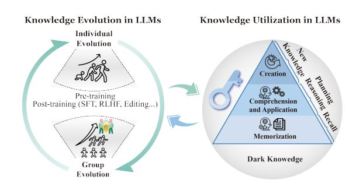
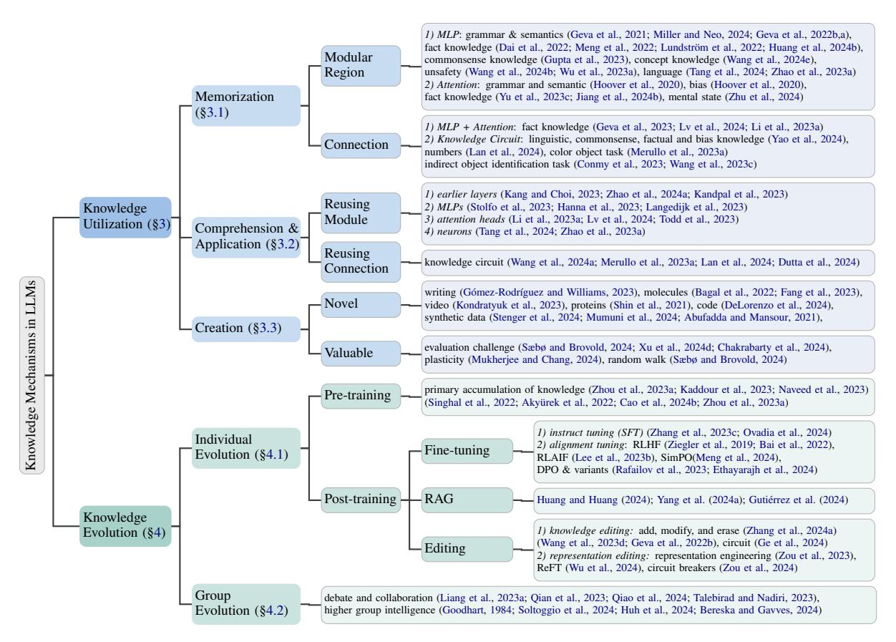
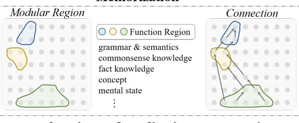
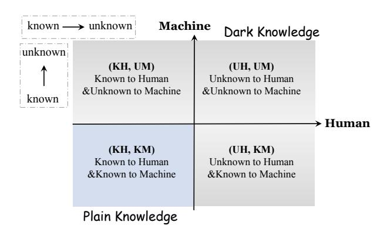
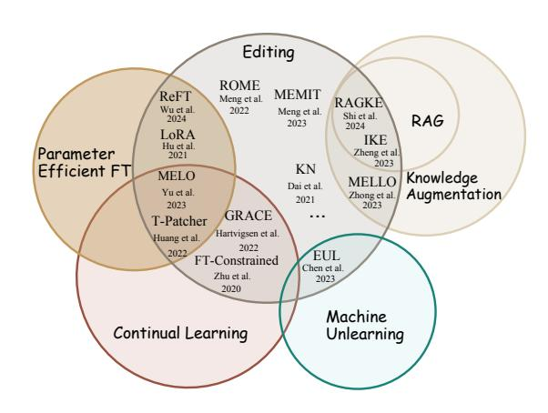

# **Knowledge Mechanisms in Large Language Models:**A Survey and Perspective

Mengru Wang1\*, Yunzhi Yao1\*, Ziwen Xu1, Shuofei Qiao1, Shumin Deng2, Peng Wang1, Xiang Chen1, Jia-Chen Gu3, Yong Jiang4, Pengjun Xie4, Fei Huang4, Huajun Chen1, Ningyu Zhang1†

1Zhejiang University, 2National University of Singapore, NUS-NCS Joint Lab, Singapore, 3University of California, Los Angeles, 4Alibaba Group {mengruwg,zhangningyu}@zju.edu.cn

#### **Abstract**

Understanding knowledge mechanisms in Large Language Models (LLMs) is crucial for advancing towards trustworthy AGI. This paper reviews knowledge mechanism analysis from a novel taxonomy including knowledge utilization and evolution. Knowledge utilization delves into the mechanism of memorization, comprehension and application, and creation. Knowledge evolution focuses on the dynamic progression of knowledge within individual and group LLMs. Moreover, we discuss what knowledge LLMs have learned, the reasons for the fragility of parametric knowledge, and the potential dark knowledge (hypothesis) that will be challenging to address. We hope this work can help understand knowledge in LLMs and provide insights for future research.

#### 1 Introduction

Knowledge is the cornerstone of intelligence and the continuation of civilization, furnishing us with foundational principles and guidance for navigating complex problems and emerging challenges (Davis et al., 1993; Choi, 2022). Throughout the extensive history of evolution, we have dedicated our lives to cultivating more advanced intelligence by utilizing acquired knowledge and exploring the frontiers of unknown knowledge (McGraw and Harbison-Briggs, 1990; Han et al., 2021).

As we know, Large language models (LLMs) are renowned for encapsulating extensive parametric knowledge (Roberts et al., 2020; Sung et al., 2021; Cao et al., 2021a; Zhong et al., 2021; Kandpal et al., 2023; Heinzerling and Inui, 2020; Petroni et al., 2019; Qiao et al., 2023; Kritharoula et al., 2023; He et al., 2024a), achieving unprecedented progress in application. However, the knowledge mechanisms in LLMs for learning, storage, utilization, and evolution still remain mysterious (Phillips

Figure 1: The analysis framework of knowledge mechanism within neural models includes knowledge evolution and utilization. Dark knowledge denotes knowledge unknown to human or model (machine). We investigate the mechanisms of knowledge utilization (right) in LLMs during a specific period of their evolution (left). The knowledge limitations identified through mechanisms analysis will inspire subsequent evolution (left).

et al., 2021; Gould et al., 2023a). Extensive works aim to demystify various types of knowledge in LLMs through knowledge neurons (Dai et al., 2022; Chen et al., 2024a) and circuits (Elhage et al., 2021; Yao et al., 2024; Zou et al., 2024), yet these efforts, scattered across various tasks, await comprehensive review and analysis.

As shown in Fig 1, this paper pioneeringly reviews the mechanism across the whole knowledge life cycle. We also propose a novel taxonomy for knowledge mechanisms in LLMs, as illustrated in Fig 2, which encompasses knowledge utilization at a specific time and knowledge evolution across all periods of LLMs 1. Specifically, we introduce preliminaries of this field (§2) and review the knowledge utilization mechanism from a new perspective (§3), delve into the fundamental principles for knowledge evolution (§4). Then, we investigate how to construct more efficient and trustworthy LLMs from the perspective of knowledge mechanism (§5). Later, We discuss open questions

\*Equal Contribution.

&lt;sup>†Corresponding Author.

&lt;sup>1Knowledge utilization focuses on *static* knowledge at a specific period, while knowledge evolution explores the long-term *dynamic* development of knowledge across individual and group LLMs.

about the knowledge LLMs have and have not acquired ([§6\)](#page-10-0). Finally, we also provide some future directions ([§7\)](#page-13-0) and tools for knowledge mechanism analysis ([§C\)](#page-37-0). Our contributions are as follows:

- To the best of our knowledge, we are the first to review knowledge mechanisms in LLMs and provide a novel taxonomy across the entire life.
- We propose a new perspective to analyze knowledge utilization mechanisms from three levels: memorization, comprehension and application, and creation.
- We discuss knowledge evolution in individual and group LLMs, and analyze the inherent conflicts and integration in this process.
- We observe that LLMs have learned basic world knowledge. However, the learned knowledge is fragile, leading to challenges such as hallucinations and knowledge conflicts. We speculate that this fragility may be primarily due to improper learning data. Besides, the unlearned dark knowledge will exist long.

Comparison with Existing Surveys Previous interpretability surveys typically aim to investigate various *methods for explaining the roles of different components* within LLMs from the global and local taxonomy [\(Ferrando et al.,](#page-20-1) [2024;](#page-20-1) [Zhao et al.,](#page-34-1) [2024a;](#page-34-1) [Luo and Specia,](#page-26-0) [2024;](#page-26-0) [Murdoch et al.,](#page-27-1) [2019;](#page-27-1) [Rai et al.,](#page-29-3) [2024a;](#page-29-3) [Bereska and Gavves,](#page-17-1) [2024;](#page-17-1) [Vilas](#page-31-1) [et al.,](#page-31-1) [2024;](#page-31-1) [Singh et al.,](#page-30-0) [2024\)](#page-30-0). In contrast, this paper focuses on knowledge in LLMs. Hence, *our taxonomy, oriented from target knowledge in LLMs, reviews how knowledge is acquired, stored, utilized, and subsequently evolves*. Additionally, previous taxonomy mostly explore the explainability *during the inference stage* (a specific period), while ignoring knowledge acquisition during the pre-training stage and evolution during the post-training stage [\(Räuker et al.,](#page-29-4) [2023;](#page-29-4) [Luo et al.,](#page-26-1) [2024b;](#page-26-1) [Apidianaki,](#page-16-0) [2023;](#page-16-0) [Jiao et al.,](#page-23-1) [2023;](#page-23-1) [Räuker et al.,](#page-29-4) [2023;](#page-29-4) [Rai](#page-29-5) [et al.,](#page-29-5) [2024b\)](#page-29-5). Our taxonomy aims to explore the *dynamic evolution across all periods* from naivety to sophistication in both individual and group LLMs. In contrast to the most similar survey [\(Cao et al.,](#page-17-2) [2024a\)](#page-17-2) that introduces knowledge life cycle, our work focuses on the underlying mechanisms at each stage.

Generally, this paper may help us to explore and manipulate advanced knowledge in LLMs, examine current limitations through the history of knowledge evolution, and inspire more efficient and trustworthy architecture and learning strategy

for future models from knowledge mechanism perspective. Note that most hypotheses in this paper are derived from transformer-based LLMs. We also validate the generalizability of these hypotheses across other architectural models and then propose universality intelligence in [§B.](#page-35-1)

# 2 Preliminary

#### 2.1 Knowledge Scope

Knowledge is an awareness of facts, a form of familiarity, awareness, understanding, or acquaintance [\(Zagzebski,](#page-33-1) [2017;](#page-33-1) [Hyman,](#page-23-2) [1999;](#page-23-2) [Mahowald](#page-26-2) [et al.,](#page-26-2) [2023;](#page-26-2) [Gray et al.,](#page-21-1) [2024\)](#page-21-1). It often involves the possession of information learned through experience and can be understood as a cognitive success or an epistemic contact with reality. We denote a diverse array of knowledge as set K, wherein each element k ∈ K is a specific piece of knowledge, which can be expressed by various records, e.g., a text record "*The president of the United States in 2024 is Biden*" (denoted as rk).

# 2.2 Definition of Knowledge in LLMs

Given a LLM denoted as F, we formulate that F master knowledge k if F can correctly answer the corresponding question rk\t :

$$t = \mathcal{F}(r_{k \setminus t})$$

$$(t \in \mathbf{T}) \Rightarrow (\mathcal{F} \text{ masters knowledge } k),$$
(1)

t is the output of a LLM F, rk\t is a record about knowledge k that lacks pivot information. Take an example for illustration: rk\t is *"The president of the United States in 2024 is \_\_"*, the pivot information is "Biden". Note that, rk\t can be represented by the above textual statement, captured through a question-answering pair ("*Who is the President of the United States in 2024?*", or conveyed by audio, video, image [2](#page-1-1) , and other equivalent expressions. The pivot information for rk\t can be expressed by various fomarts, which are formulated as T = {"Biden", "Joe Biden", · · · }. If the output t is an element from the correct answer set T, we hypothesize that F master knowledge k.

#### 2.3 The Architecture of LLMs

An LLM F consists of numerous neurons, which work systematically under a specific architecture.

2While audio, video, and image records have been somewhat investigated, they are still relatively unexplored areas and thus are only discussed in [§7.2](#page-14-0) and [§B.2.](#page-37-1)

Figure 2: The taxonomy of knowledge mechanisms in LLMs.

**Transformer-based architecture.** The prevailing architecture in current LLMs is the Transformer (Vaswani et al., 2017). Specifically, a transformer-based LLM  $\mathcal{F}$  begins with a token embedding, followed by L layers transformer block, and ends with token unembedding used for predicting answer tokens. Each transformer block layer l consists of Attention Heads (Attention) and Multilayer Perceptron (MLP):

$$h_{l+1} = h_l + \text{MLP}\left(h_l + \text{Attention}\left(h_l\right)\right), \quad (2)$$

 $h_l$  is the hidden state from l-th layer.

Other architectures. Other architectures including competitive variants of the transformer, e.g., SSM (Gu and Dao, 2023), TTT (Sun et al., 2024) and RWKV (Peng et al., 2023), and architectures in computer vision (Li et al., 2023c) and multi-modal fields are detailed in §B.1.

#### 2.4 Knowledge Analysis Methods

Knowledge analysis method  $\mathcal{M}$  aims to interpret how LLMs work inside and reveal precise causal connections between specific components and outputs (Bereska and Gavves, 2024). Furthermore, if components C of  $\mathcal{F}$  accurately infer t through analysis method  $\mathcal{M}$ , it is assumed that the knowledge k is presented by C:

$$t = \mathcal{M}_{\mathbf{C} \subseteq \mathcal{F}} \left( r_{k \setminus t}, \mathbf{C} \right),$$

$$(t \in \mathbf{T}) \Rightarrow (\mathbf{C} \text{ represents knowledge } k),$$
(3)

The elements in set C may be individual neurons, MLPs, attention heads, a transformer block layer, or knowledge circuit (Yao et al., 2024). These methods are divided into two categories: observation and intervention (Bereska and Gavves, 2024).

**Observation-based methods.** These methods aim to observe the internal information of  $\mathcal{F}$ , directly projecting the output of component  $\mathbf{C}$  into human-understandable forms by E:

$$t = E_{\mathbf{C} \subseteq \mathcal{F}} \left( r_{k \setminus t}, \mathbf{C}, \mathcal{F} \right), \tag{4}$$

E is a evaluation metric, which can be a probe (Räuker et al., 2023), logit lens (nostalgebraist, 2020), or a sparse representation (Gao et al., 2024c). **Probe** is a meticulously trained classifier, and its classification performance is used to observe the relationship between model's behavior and the output of **C** (Belinkov, 2022; Elazar et al., 2021; McGrath

[et al.,](#page-26-5) [2021;](#page-26-5) [Gurnee et al.,](#page-21-11) [2023\)](#page-21-11). Logit lens usually translate output of C into vocabulary tokens via token unembedding [\(Geva et al.,](#page-21-3) [2022b;](#page-21-3) [Bel](#page-16-6)[rose et al.,](#page-16-6) [2023;](#page-16-6) [Pal et al.,](#page-28-4) [2023;](#page-28-4) [Din et al.,](#page-19-4) [2024;](#page-19-4) [Langedijk et al.,](#page-24-2) [2023\)](#page-24-2). Sparse representation maps the output of C into a higher-dimensional space with strong sparsity through dictionary learning [\(He et al.,](#page-22-6) [2024b;](#page-22-6) [Olshausen and Field,](#page-28-5) [1997;](#page-28-5) [Yun et al.,](#page-33-4) [2021;](#page-33-4) [Karvonen et al.,](#page-24-4) [2024\)](#page-24-4), with sparse auto-encoder [\(Sharkey et al.,](#page-30-4) [2022;](#page-30-4) [Cunningham](#page-19-5) [et al.,](#page-19-5) [2023;](#page-19-5) [Lee et al.,](#page-25-4) [2006;](#page-25-4) [Gao et al.,](#page-20-8) [2024a\)](#page-20-8) being a prominent example. The higher-dimensional space represents independent (or monosemantic [\(Bricken et al.,](#page-17-3) [2023\)](#page-17-3)) and interpretable features more easily [\(Rai et al.,](#page-29-5) [2024b\)](#page-29-5). The output of C is the combination [\(Elhage et al.,](#page-20-9) [2022;](#page-20-9) [Bricken et al.,](#page-17-3) [2023\)](#page-17-3) of these features.

Intervention-based methods. These methods allow for direct corruptions in LLMs to identify the critical C via intervention strategies I. Note that C, encompassing various neuron combinations, correlates with specific model behaviors:

$$\mathbf{C} = \mathcal{I}\left(r_{k \setminus t}, \mathcal{F}\right),$$

$$t = E\left(r_{k \setminus t}, \mathbf{C}, \mathcal{F}\right)$$
(5)

I is also known as causal mediation analysis [\(Vig](#page-31-10) [et al.,](#page-31-10) [2020\)](#page-31-10), causal tracing [\(Meng et al.,](#page-27-3) [2022\)](#page-27-3), interchange interventions [\(Geiger et al.,](#page-20-10) [2022\)](#page-20-10), activation patching [\(Wang et al.,](#page-32-3) [2023c;](#page-32-3) [Zhang](#page-33-5) [and Nanda,](#page-33-5) [2023\)](#page-33-5), path patching [\(Goldowsky-Dill](#page-21-12) [et al.,](#page-21-12) [2023\)](#page-21-12), and causal scrubbing techniques [\(LawrenceC et al.,](#page-24-5) [2022\)](#page-24-5). Specifically, I consists of the following three steps. 1) Clean run: F generates the correct answer t based on the input rk\t . 2) Corrupted run: corrupt the generation process of F in the *clean run* by introducing noise into the input or neurons [\(Meng et al.,](#page-27-3) [2022;](#page-27-3) [Goldowsky-](#page-21-12)[Dill et al.,](#page-21-12) [2023;](#page-21-12) [Stolfo et al.,](#page-31-3) [2023;](#page-31-3) [Yao et al.,](#page-33-0) [2024;](#page-33-0) [Conmy et al.,](#page-19-2) [2023;](#page-19-2) [Mossing et al.,](#page-27-9) [2024;](#page-27-9) [Lepori](#page-25-5) [et al.,](#page-25-5) [2023;](#page-25-5) [Huang et al.,](#page-22-7) [2023a\)](#page-22-7). 3) Restoration run: recover the correct answer t by restoring unnoised information from C [\(Meng et al.,](#page-27-3) [2022;](#page-27-3) [Vig](#page-31-10) [et al.,](#page-31-10) [2020;](#page-31-10) [Wang et al.,](#page-32-3) [2023c;](#page-32-3) [Zhang et al.,](#page-33-6) [2017;](#page-33-6) [Nanda,](#page-27-10) [2023\)](#page-27-10). For intervention-based methods, E typically refers to the token unembedding used for predicting answer tokens. Under the evaluation metric E, there exists a causal relationship between C and specific behavior of LLMs F in Eq [5.](#page-3-2)

Figure 3: The mechanism analysis for knowledge utilization across three levels: memorization, comprehension and application, and creation.

# 3 Knowledge Utilization in LLMs

Inspried by Bloom's Taxonomy of cognition levels [\(Wilson,](#page-32-7) [2016;](#page-32-7) [Bloom et al.,](#page-17-4) [1956;](#page-17-4) [Keene et al.,](#page-24-6) [2010;](#page-24-6) [Fadul,](#page-20-11) [2009\)](#page-20-11), we categorize knowledge representation and utilization within LLMs into three levels (as shown in Fig [3\)](#page-3-3): memorization, comprehension and application, and creation [3](#page-3-4) . Note that these mechanistic analyses are implemented via methods in [§2.4.](#page-2-1) We further evaluate the applicability, advantages, and limitations of different methods in [§3.4.](#page-6-1)

# 3.1 Memorization

Knowledge memorization [\(Schwarzschild et al.,](#page-30-5) [2024;](#page-30-5) [Prashanth et al.,](#page-29-10) [2024\)](#page-29-10) aims to remember and recall knowledge in the training corpus, e.g., specific terms (entities), grammar, facts, commonsense, concepts, etc [\(Allen-Zhu and Li,](#page-16-7) [2023a;](#page-16-7) [Yu](#page-33-7) [et al.,](#page-33-7) [2023a;](#page-33-7) [Mahowald et al.,](#page-26-2) [2023;](#page-26-2) [Zhu and Li,](#page-34-9) [2023;](#page-34-9) [Allen-Zhu and Li,](#page-16-8) [2023b,](#page-16-8) [2024;](#page-16-9) [Cao et al.,](#page-17-2) [2024a\)](#page-17-2). *We posit knowledge memorization from Modular Region and Connection Hypothesis by reviewing existing research.*

This modular region hypothesis simplifies knowledge representation in transformer-based models into isolated modular region, e.g., MLPs

3Note that we combine analyzing, evaluating, and creating from Bloom's Taxonomy into one category level (creation) in our taxonomy, as they are difficult to disentangle. Specifically, creation emphasizes the capacity and process of forming *novel* and *valuable* things. Analyzing [\(Wilson,](#page-32-7) [2016\)](#page-32-7), which breaks materials or concepts into parts, is used for creating *novel* things. Evaluating [\(Wilson,](#page-32-7) [2016\)](#page-32-7) is usually used for assessing the *value* of new creations.

#### Hypothesis 1: Modular Region

Knowledge is Encoded in Modular Regions.

or attention heads. Knowledge is encoded via MLPs. [Geva et al.](#page-21-2) [\(2021\)](#page-21-2) posit that MLPs operate as key-value memories and each individual key vector corresponds to a specific *semantic pattern* or *grammar*. Based on the above finding, [Geva](#page-21-3) [et al.](#page-21-3) [\(2022b](#page-21-3)[,a\)](#page-21-4) reverse engineer the operation of the MLPs layers and find that MLPs can promote both semantic (e.g., measurement semantic including kg, percent, spread, total, yards, pounds, and hours) and *syntactic* (e.g., adverbs syntactic including largely, rapidly, effectively, previously, and normally) concepts in the vocabulary space. [Miller and](#page-27-2) [Neo](#page-27-2) [\(2024\)](#page-27-2) find a single MLP neuron (in GPT-2 Large) capable of generating "an" or "a". Subsequently, *fact* [\(Dai et al.,](#page-19-1) [2022;](#page-19-1) [Meng et al.,](#page-27-3) [2022\)](#page-27-3) and *commonsense* knowledge [\(Gupta et al.,](#page-21-5) [2023\)](#page-21-5) are found. Advanced language-specific neurons [\(Tang et al.,](#page-31-2) [2024\)](#page-31-2), linguistic regions [\(Zhao et al.,](#page-34-2) [2023a\)](#page-34-2), entropy neurons [\(Stolfo et al.,](#page-31-11) [2024\)](#page-31-11), abstract conceptual [\(Wang et al.,](#page-32-0) [2024e\)](#page-32-0) and unsafe [\(Wang et al.,](#page-32-1) [2024b;](#page-32-1) [Wu et al.,](#page-32-2) [2023a\)](#page-32-2) knowledge, are also observed in MLPs. In addition to MLP, knowledge is also conveyed by attention heads [\(Geva et al.,](#page-21-6) [2023;](#page-21-6) [Gould et al.,](#page-21-13) [2023b\)](#page-21-13). [Hoover](#page-22-4) [et al.](#page-22-4) [\(2020\)](#page-22-4) explain the knowledge each attention head has learned. Specifically, attention heads store evident *linguistic features, positional information*, and so on. Besides, *fact knowledge* [\(Yu et al.,](#page-33-2) [2023c;](#page-33-2) [Li et al.,](#page-25-0) [2023a\)](#page-25-0) and *bias* [\(Hoover et al.,](#page-22-4) [2020\)](#page-22-4) are mainly convey by attention heads. [Jiang](#page-23-3) [et al.](#page-23-3) [\(2024b\)](#page-23-3) further observe that LLMs leverage self-attention to gather information through certain tokens in the contexts, which serve as clues, and use the value matrix for associative memory. Later, [Zhu et al.](#page-34-3) [\(2024\)](#page-34-3) also find that attention heads can simulate *mental stat*e and activate "Theory of Mind" (ToM) capability.

However, Hypothesis 1 ignores the connections between different regions. Inspired by advancements in neuroscience [\(de Schotten et al.,](#page-19-6) [2022\)](#page-19-6), Hypothesis 2 asserts that the connection of different components integrates knowledge, rather than the isolated regions in Hypothesis 1.

### Hypothesis 2: Connection

Knowledge is Represented by Connections.

[Geva et al.](#page-21-6) [\(2023\)](#page-21-6) outline the encoding of factual knowledge (e.g., "The capital of Ireland is Dublin") through the following three steps: (1) subject (Ireland) information enrichment in MLPs, (2) the relation (capital of) propagates to the last token, (3) object (Dublin) is extracted by attention heads in later layers. This claim is supported by [Li et al.](#page-25-6) [\(2024d\)](#page-25-6). Similarly, [Lv et al.](#page-26-4) [\(2024\)](#page-26-4) conclude that task-specific attention head may move the topic entity to the final position of the residual stream, while MLPs conduct relation function. Moreover, the recent prominent knowledge circuit framework [\(Nainani,](#page-27-11) [2024;](#page-27-11) [Yao et al.,](#page-33-0) [2024;](#page-33-0) [He](#page-22-6) [et al.,](#page-22-6) [2024b;](#page-22-6) [Elhage et al.,](#page-20-0) [2021;](#page-20-0) [Marks et al.,](#page-26-6) [2024\)](#page-26-6) advocates leveraging a critical computational subgraph among all components to explore internal knowledge within LLM parameters. The competencies for indirect object identification and color object tasks are discovered to be embedded in specialized knowledge circuits [\(Conmy et al.,](#page-19-2) [2023;](#page-19-2) [Wang et al.,](#page-32-3) [2023c;](#page-32-3) [Merullo et al.,](#page-27-4) [2023a;](#page-27-4) [Yu et al.,](#page-33-8) [2024c\)](#page-33-8). [Lan et al.](#page-24-1) [\(2024\)](#page-24-1) also identify numberrelated circuits that encode the predictive ability of Arabic numerals, number words, and months. More importantly, experimental evidence demonstrates that various types of knowledge, including linguistic, commonsense, factual, and biased information, are encapsulated in specific knowledge circuits [\(Yao et al.,](#page-33-0) [2024\)](#page-33-0). Interestingly, knowledge encoded by specific circuits can rival or even surpass that of the entire LLM. This may be because knowledge circuits memorized the relevant knowledge, while noise from other components might impede the model's performance on these tasks.

# 3.2 Comprehension and Application

Knowledge comprehension and application focus on demonstrating the understanding of memorized knowledge and then solving problems in new situations, e.g., *generalization on out-of-domain tasks* [\(Wang et al.,](#page-31-5) [2024a\)](#page-31-5), *reasoning [\(Hou et al.,](#page-22-8) [2023\)](#page-22-8) and planning* [\(McGrath et al.,](#page-26-5) [2021\)](#page-26-5). [Merrill et al.](#page-27-12) [\(2023\)](#page-27-12) denote the transition from memorization to comprehension and application as grokking, and suggest that the grokking derives from two largely distinct subnetworks competition. Intuitively, only knowledge that is correctly memorized [\(Prashanth](#page-29-10) [et al.,](#page-29-10) [2024\)](#page-29-10) in [§3.1](#page-3-1) can be further applied to solving complex tasks. Therefore, we posit the following Reuse Hypothesis from two knowledge memorization perspectives.

#### Hypothesis 3: Reuse

LLMs Reuse Certain Components during Knowledge Comprehension and Application.

From the Modular Region Perspective, knowledge utilization reuses some regions. These regions might include a few neurons, attention heads, MLPs, a transformer layer, or partial knowledge circuits. Generally, basic knowledge (position information, n-gram pattern, syntactic features) tends to be stored at earlier layers, while sophisticated knowledge (mental state, emotion, and abstract concept, e.g., prime number, Camelidae, and safety) is located at later layers [\(Zhu et al.,](#page-34-3) [2024;](#page-34-3) [Jin et al.,](#page-23-8) [2024a;](#page-23-8) [Wang et al.,](#page-32-1) [2024b,](#page-32-1)[e;](#page-32-0) [Men et al.,](#page-27-13) [2024;](#page-27-13) [Kobayashi et al.,](#page-24-7) [2023\)](#page-24-7). Therefore, *neurons of earlier layers related to basic knowledge tend to be reused* [\(Kang and Choi,](#page-23-4) [2023;](#page-23-4) [Zhao et al.,](#page-34-1) [2024a;](#page-34-1) [Kandpal et al.,](#page-23-0) [2023\)](#page-23-0). Various math reasoning tasks also utilize the attention mechanism in initial layers to map input information to the final token positions, subsequently generating answers using a set of MLPs in later layers [\(Stolfo et al.,](#page-31-3) [2023;](#page-31-3) [Hanna](#page-22-5) [et al.,](#page-22-5) [2023;](#page-22-5) [Langedijk et al.,](#page-24-2) [2023\)](#page-24-2). Besides, *some specific function regions are also reused*. Specifically, retrieval heads [\(Li et al.,](#page-25-0) [2023a\)](#page-25-0) are reused for Chain-of-Thought (CoT) reasoning and longcontext tasks. These retrieval heads are found in 4 model families, 6 model scales, and 3 types of fine-tuning. Subsequently, induction heads, identified in Llama and GPT, are claimed to be reused for in-context learning (ICL) tasks [Olsson et al.](#page-28-6) [\(2022\)](#page-28-6); [Crosbie and Shutova](#page-19-7) [\(2024\)](#page-19-7). Attention heads can map country names to their capitals in capital cityrelated tasks [\(Lv et al.,](#page-26-4) [2024\)](#page-26-4). Language-specific neurons (in Llama and BLOOM) are responsible for multiple language related tasks, such as English, French, Mandarin, and others [Tang et al.](#page-31-2) [\(2024\)](#page-31-2). [Zhao et al.](#page-34-2) [\(2023a\)](#page-34-2) further reveal linguistic regions (in Llama) correspond to linguistic competence, which is the cornerstone for performing various tasks. Later, function regions related to the process of math reasoning are also discovered in LLMs. For instance, the last layer of GPT-2 (trained from scratch) has been observed to exhibit mathematical reasoning abilities across various math questions [\(Ye et al.,](#page-33-9) [2024\)](#page-33-9). From the Connection Perspective, knowledge utilization shares partial knowledge circuits. For instance, similar tasks share subgraphs (computational circuits) with analogous

roles [\(Lan et al.,](#page-24-1) [2024\)](#page-24-1). Besides, knowledge circuits (in GPT2) are reused to solve a seemingly different task, e.g., indirect object identification and colored objects tasks [\(Merullo et al.,](#page-27-4) [2023a\)](#page-27-4). [Wang et al.](#page-31-5) [\(2024a\)](#page-31-5) further observe that two-hop composition reasoning tasks reuse the knowledge circuits from the first hop. [Yao et al.](#page-33-0) [\(2024\)](#page-33-0) also believe that this reuse phenomenon exists in factual recall and multi-hop reasoning. Specifically, sub-circuits are reused in similar factual knowledge, such as tasks related to "city\_in\_country", "name\_birth\_place", and "country\_language". Besides, [Dutta et al.](#page-20-2) [\(2024\)](#page-20-2) demystify LLMs how to perform CoT reasoning, i.e., Llama facilitates CoT tasks via multiple parallel circuits enjoying significant intersection.

#### 3.3 Creation

Knowledge creation [\(Runco and Jaeger,](#page-29-11) [2012;](#page-29-11) [Sternberg,](#page-31-12) [2006\)](#page-31-12) emphasizes the capacity and process of forming *novel* and *valuable* things, rather than the existing ones (i.e., LLMs have seen) discussed in [§3.1](#page-3-1) and [§3.2.](#page-4-0) The creations encompass two levels: 1) LLMs create new terms following the current world's principles comprehended by LLMs, such as new proteins [\(Shin et al.,](#page-30-1) [2021\)](#page-30-1), molecules [\(Bagal et al.,](#page-16-1) [2022;](#page-16-1) [Fang et al.,](#page-20-3) [2023;](#page-20-3) [Edwards](#page-20-12) [et al.,](#page-20-12) [2022\)](#page-20-12), code [\(DeLorenzo et al.,](#page-19-3) [2024\)](#page-19-3), video [\(Kondratyuk et al.,](#page-24-3) [2023\)](#page-24-3), models [\(Zheng et al.,](#page-34-10) [2024\)](#page-34-10), names for people and companies, written stories [\(Pépin et al.,](#page-28-7) [2024;](#page-28-7) [Gómez-Rodríguez and](#page-21-7) [Williams,](#page-21-7) [2023;](#page-21-7) [Buz et al.,](#page-17-5) [2024\)](#page-17-5), synthetic data [\(Stenger et al.,](#page-31-6) [2024;](#page-31-6) [Mumuni et al.,](#page-27-5) [2024;](#page-27-5) [Abu](#page-16-2)[fadda and Mansour,](#page-16-2) [2021\)](#page-16-2), etc. These novel items operate according to the existing rules, e.g., law of conservation of energy, reasoning logic [\(Wang](#page-31-5) [et al.,](#page-31-5) [2024a\)](#page-31-5), or principles of probability theory. 2) LLMs may generate new rules, such as mathematical theorems, and the resulting terms will operate according to the new rules. We posit that the knowledge creation of LLMs may derive from the Extrapolation Hypothesis.

#### Hypothesis 4: Extrapolation

LLMs May Create Knowledge via Extrapolation.

The expression of knowledge is diverse; some knowledge is inherently continuous. Therefore, it is difficult, if not impossible, to represent certain knowledge using discrete data points [\(Spivey](#page-30-6) [and Michael,](#page-30-6) [2007;](#page-30-6) [Penrose;](#page-28-8) [Markman,](#page-26-7) [2013\)](#page-26-7). LLMs utilize insights into the operational principles of the world to extrapolate additional knowledge from known discrete points, bridging gaps in knowledge and expanding our understanding of the world[\(Heilman et al.,](#page-22-9) [2003;](#page-22-9) [Douglas et al.,](#page-19-8) [2024;](#page-19-8) [Park et al.,](#page-28-9) [2023b;](#page-28-9) [Kondratyuk et al.,](#page-24-3) [2023\)](#page-24-3). Drawing inspiration from research on human creativity [\(Haase and Hanel,](#page-22-10) [2023\)](#page-22-10), the *physical implementation of knowledge extrapolation relies on the plasticity of neurons* [\(Mukherjee and Chang,](#page-27-6) [2024\)](#page-27-6). Specifically, plasticity refers to LLMs changing activations and connectivity between neurons according to the input [\(Coronel-Oliveros et al.,](#page-19-9) [2024\)](#page-19-9).

However, from statistical perspective, the intricate connections and activations between neurons, though not infinite, resist exhaustive enumeration. In terms of value, not all creations are valuable. Obtaining something valuable with an exceedingly low probability is impractical, as even a monkey could theoretically print Shakespeare's works. How do LLMs ensure the probability of generating valuable creations? *What are the mechanisms underlying the novelty and value of creation?* A prevalent conjecture posits that novelty is generated through the random walk [\(Sæbø](#page-29-6) [and Brovold,](#page-29-6) [2024\)](#page-29-6). However, intuitively, current LLMs themselves seem unable to evaluate the value of creations due to architectural limitations [\(Chakrabarty et al.,](#page-18-2) [2024\)](#page-18-2). Because, once the next token is generated, there is no intrinsic mechanism for accepting or rejecting the creations. This hinders the evaluation of the usefulness and value of proposed novelties, as humans do, by bending, blending, or breaking biases [\(Sæbø and Brovold,](#page-29-6) [2024\)](#page-29-6). Some works assume that each token is indeed valuable and meets long-term expectations. However, the well-known hallucination problem [\(Xu et al.,](#page-32-4) [2024d\)](#page-32-4) of LLMs refutes this assumption. Besides, the transformer architecture struggles with long context [\(Li et al.,](#page-25-7) [2024b\)](#page-25-7), despite the existence of many variants for addressing this issue [\(Huang](#page-23-9) [et al.,](#page-23-9) [2023c;](#page-23-9) [Liu et al.,](#page-26-8) [2024b\)](#page-26-8). More importantly, MLPs of Transformer may also work contrary to creativity, i.e., the increased attentions narrow the conditional distribution for token prediction [\(Sæbø](#page-29-6) [and Brovold,](#page-29-6) [2024\)](#page-29-6).

# 3.4 Comparison of Different Mechanism Analysis Methods

The above four Hypotheses are achieved by Observation-based and Intervention-based meth-

ods. These two methods are typically combined to trace knowledge in LLMs [\(Mossing et al.,](#page-27-9) [2024;](#page-27-9) [Ghandeharioun et al.,](#page-21-14) [2024\)](#page-21-14). Most knowledge analysis methods are architecture-agnostic and can be adapted to various models.

Each method is suitable for different scenarios. Specifically, the Modular Region Hypothesis can be analyzed using either Observation-based or Intervention-based methods. In contrast, the Connection Hypothesis, which examines inter-regional connectivity, generally necessitates Interventionbased methods. However, the results of knowledge mechanism analysis depend heavily on different methods and are sensitive to evaluation metrics and implementation details [\(Schwettmann et al.,](#page-30-7) [2023b\)](#page-30-7). Hence, [Huang et al.](#page-22-3) [\(2024b\)](#page-22-3) propose a dataset, RAVEL, to quantify the comparisons between a variety of existing interpretability methods. They suggest that methods with supervision are better than methods with unsupervised featurizers. Later, [Zhang and Nanda](#page-33-5) [\(2023\)](#page-33-5) further systematically examine the impact of methodological details in intervention-based methods. For corrupted run, they recommend Symmetric Token Replacement (e.g., "The Eiffel Tower"→"The Colosseum") [\(Sharma et al.,](#page-30-8) [2024;](#page-30-8) [Vig et al.,](#page-31-10) [2020\)](#page-31-10) instead of Gaussian Noising [\(Meng et al.,](#page-27-3) [2022\)](#page-27-3), which disrupts the model's internal mechanisms. For metric E, both logit lens and probe can be employed to trace factual knowledge [\(Meng et al.,](#page-27-3) [2022\)](#page-27-3), where the target output is typically few tokens. In this scenario, [Zhang and Nanda](#page-33-5) [\(2023\)](#page-33-5) advocate using the logit lens over probes for evaluation metric E due to its fine-grained control over localization outcomes. Moreover, probe is capable of exploring abstract knowledge and abilities, such as theory of mind or mental states [\(Zhu et al.,](#page-34-3) [2024;](#page-34-3) [Ye et al.,](#page-33-9) [2024;](#page-33-9) [Jin,](#page-23-10) [2024\)](#page-23-10), where the target output requires multiple tokens to express. [Jin](#page-23-10) [\(2024\)](#page-23-10) suggest that deeper probes are more (generally) more accurate.

# 4 Knowledge Evolution in LLMs

Knowledge in LLMs should evolve with changes in the external environment. We introduce the Dynamic Intelligence Hypothesis for knowledge evolution in individuals and groups.

#### Hypothesis 5: Dynamic Intelligence

Conflict and Integration Coexist in the Dynamic Knowledge Evolution of LLMs.

#### 4.1 Individual Evolution

Immersed in a dynamic world, individuals mature through an iterative process of memorization, forgetting, error correction, and deepening understanding of the world around them. Similarly, LLMs dynamically encapsulate knowledge into parameters through the process of conflict and integration.

In the *pre-training phase*, LLMs start as blank slates, facilitating easier acquisition for new knowledge [\(Allen-Zhu and Li,](#page-16-9) [2024\)](#page-16-9). Consequently, numerous experiments demonstrate that LLMs accumulate vast amounts of knowledge during this stage [\(Cao et al.,](#page-18-3) [2024b;](#page-18-3) [Zhou et al.,](#page-34-4) [2023a;](#page-34-4) [Kad](#page-23-5)[dour et al.,](#page-23-5) [2023;](#page-23-5) [Naveed et al.,](#page-27-7) [2023;](#page-27-7) [Singhal et al.,](#page-30-2) [2022\)](#page-30-2). [Akyürek et al.](#page-16-3) [\(2022\)](#page-16-3) delve further into identifying which training examples are instrumental in endowing LLMs with specific knowledge. However, contradictions during the pre-training stage may induce conflicts among internal parametric knowledge. On the one hand, the false and contradictory information in training corpus propagate and contaminate related memories in LLMs via semantic diffusion, introducing broader detrimental effects beyond direct impacts [\(Bian et al.,](#page-17-6) [2023\)](#page-17-6). On the other hand, LLMs tend to prioritize memorizing more frequent and challenging facts, which can result in subsequent facts overwriting prior memorization, significantly hindering the memorization of low-frequency facts [\(Lu et al.,](#page-26-9) [2024\)](#page-26-9). In other words, LLMs struggle with balancing and integrating both low and high-frequency knowledge.

After pre-training, LLMs are anticipated to refresh their internal knowledge to keep pace with the evolving world during *post-training stage*. Although LLMs seem to absorb new knowledge through continued learning, follow user instructions via instruct tuning [\(Zhang et al.,](#page-34-5) [2023c\)](#page-34-5), and align with human values through alignment tuning [\(Ziegler et al.,](#page-34-6) [2019\)](#page-34-6), [Ji et al.](#page-23-11) [\(2024\)](#page-23-11) have noted that LLMs intrinsically resist alignment during the posttraining phase. In other words, LLMs tend to learn factual knowledge through pre-training, whereas fine-tuning [4](#page-7-2) teaches them to utilize it more efficiently [\(Gekhman et al.,](#page-21-15) [2024;](#page-21-15) [Zhou et al.,](#page-34-4) [2023a;](#page-34-4) [Ovadia et al.,](#page-28-1) [2024\)](#page-28-1). [Ren et al.](#page-29-12) [\(2024a\)](#page-29-12) also posit that instruction tuning is a form of self-alignment with existing internal knowledge rather than a process of learning new information. We conjecture

that the debate on whether these processes truly introduce new knowledge stems from information conflicts. For example, the conflict between outdated information within LLMs and new external knowledge exacerbates their difficulty in learning new information. To mitigate information conflicts, [Ni et al.](#page-27-14) [\(2023\)](#page-27-14) propose first forgetting old knowledge then learning new knowledge. Another technique, retrieval-augmented generation (RAG) [\(Huang and Huang,](#page-23-6) [2024\)](#page-23-6), while avoiding conflicts within internal parameters, still needs to manage conflicts between retrieved external information and LLMs' internal knowledge [\(Xu et al.,](#page-32-8) [2024b\)](#page-32-8). RAG also attempt to efficiently and effectively integrate new knowledge across passages or documents using multiple retrieval [\(Yang et al.,](#page-33-3) [2024a\)](#page-33-3) and hippocampal indexing [\(Gutiérrez et al.,](#page-21-8) [2024\)](#page-21-8). Besides, editing technologies, including knowledge and representation editing, exhibit promising potential for knowledge addition, modification, and erasure. Specifically, knowledge editing [\(Meng](#page-27-3) [et al.,](#page-27-3) [2022;](#page-27-3) [Mitchell et al.,](#page-27-15) [2022;](#page-27-15) [Cao et al.,](#page-18-4) [2021b;](#page-18-4) [Zhang et al.,](#page-34-7) [2024a;](#page-34-7) [Wang et al.,](#page-32-5) [2023d;](#page-32-5) [Mazzia](#page-26-10) [et al.,](#page-26-10) [2023\)](#page-26-10) aims to selectively modify model parameters responsible for specific knowledge retention, while representation editing [\(Zou et al.,](#page-34-8) [2023;](#page-34-8) [Wu et al.,](#page-32-6) [2024\)](#page-32-6) adjusts the model's conceptualization of knowledge to revise the stored knowledge within LLMs. Note that the other strategy for knowledge editing adds external parameters or memory banks for new knowledge while preserving models' parameters. We also provide the comparison of the above methods in [§A](#page-35-3) for better understanding.

# 4.2 Group Evolution

Besides individual learning, social interaction plays a pivotal role in the acquisition of new knowledge and is a key driver of human societal development [\(Baucal et al.,](#page-16-10) [2014;](#page-16-10) [Levine et al.,](#page-25-8) [1993\)](#page-25-8). LLMs, also known as agents, collaborate to accomplish complex tasks during group evolution, each bearing unique knowledge that may sometimes contradict each other. Therefore, contrary to individual evolution, *group evolution encounters intensified conflicts, such as conflicts in specialized expertise among agents, competing interests, cultural disparities, moral dilemmas, and others*. To achieve consensus and resolve conflicts, agents must first clarify their own and others' goals (beliefs) through internal representations in models

4 Fine-tuning includes instruct tuning and alignment tuning [\(Zhao et al.,](#page-34-11) [2023b\)](#page-34-11).

[\(Zhu et al.,](#page-34-3) [2024;](#page-34-3) [Zou et al.,](#page-34-8) [2023\)](#page-34-8). Agents then discuss, debate, and reflect on shared knowledge through various communication methods [\(Chan](#page-18-5) [et al.,](#page-18-5) [2024;](#page-18-5) [Smit et al.,](#page-30-9) [2024;](#page-30-9) [Li et al.,](#page-25-9) [2024e;](#page-25-9) [Soltoggio et al.,](#page-30-3) [2024\)](#page-30-3), e.g., prompt instructions, task and agent descriptions, parameter signals (activation and gradient), and representations of models. However, conformity of agents, which tends to believe the majority's incorrect answers rather than maintaining their own, hinders conflict resolution during group evolution [\(Zhang et al.,](#page-33-10) [2023a;](#page-33-10) [Ma et al.,](#page-26-11) [2024\)](#page-26-11). Note that the group also struggles with automating moral decision-making when facing moral conflicts. Specifically, agents in the group miss ground truth for moral "correctness" and encounter dilemmas due to changes in moral norms over time [\(Hagendorff and Danks,](#page-22-11) [2023\)](#page-22-11). Generally, when, what, and how to share knowledge in the communication process to maximize learning efficiency and long-term expectations are still open questions in group evolution.

Through debate and collaboration, *groups integrate more knowledge and can surpass the cognition of individual units* [\(Liang et al.,](#page-25-2) [2023a;](#page-25-2) [Qian](#page-29-8) [et al.,](#page-29-8) [2023;](#page-29-8) [Qiao et al.,](#page-29-9) [2024;](#page-29-9) [Talebirad and Nadiri,](#page-31-7) [2023;](#page-31-7) [Zhang et al.,](#page-33-10) [2023a\)](#page-33-10). This derives from the assumption that each individual unit can contribute to and benefit from the collective knowledge [\(Soltoggio et al.,](#page-30-3) [2024;](#page-30-3) [Xu et al.,](#page-32-9) [2024c\)](#page-32-9). In addition, *"When a measure becomes a target, it ceases to be a good measure"*, which implies that optimizing one objective on a single individual will inevitably harm other optimization objectives to some extent. Hence, it is unrealistic for an individual to learn all knowledge compared to group optimization. Interestingly, LLM groups also follow the collaborative scaling law [\(Qian et al.,](#page-29-13) [2024a\)](#page-29-13), where normalized solution quality follows a logistic growth pattern as scaling agents. Moreover, some works [\(Huh et al.,](#page-23-7) [2024;](#page-23-7) [Bereska and Gavves,](#page-17-1) [2024\)](#page-17-1) propose that knowledge tends to converge into the same representation spaces among the whole artificial neural models group with different data, modalities, and objectives.

# 4.3 Comparison of Different Evolution Strategies

Individuals and groups achieve dynamic intelligence primarily through two strategies: updating internal parametric knowledge [\(Zhou et al.,](#page-34-4) [2023a;](#page-34-4) [Qiao et al.,](#page-29-9) [2024\)](#page-29-9) and leveraging external knowl-

edge [5](#page-8-1) [\(Huang and Huang,](#page-23-6) [2024;](#page-23-6) [Xie et al.,](#page-32-10) [2024\)](#page-32-10). These two strategies are usually used together in applications [\(Yang et al.,](#page-33-11) [2024b\)](#page-33-11).

*Updating internal parametric knowledge* necessitates high-quality data for parameter adjustments [\(Vashishtha et al.,](#page-31-13) [2024;](#page-31-13) [Cao et al.,](#page-17-2) [2024a\)](#page-17-2). Data proves pivotal when fine-tuning models to acquire new knowledge. [Ovadia et al.](#page-28-1) [\(2024\)](#page-28-1) also posit that the continued training of LLMs via unsupervised tuning generally exhibits suboptimal performance when it comes to acquiring new knowledge. Note that updating internal parametric knowledge requires resolving conflicts among internal parameters. The crux of effective internal knowledge updating lies in preserving the consistency of the model's parameter knowledge before and after tuning. In contrast, *leveraging external knowledge* requires managing conflicts within the external knowledge itself [6](#page-8-2) as well as conflicts between external and internal knowledge [\(Xu et al.,](#page-32-8) [2024b;](#page-32-8) [Liu et al.,](#page-26-12) [2024a\)](#page-26-12). Besides, parametric knowledge compresses extensive information, promoting grokking and enhancing generalization [\(Wang](#page-31-5) [et al.,](#page-31-5) [2024a\)](#page-31-5). In contrast, leveraging external knowledge avoids high training costs but necessitates substantial maintenance and retrieval costs for every user query. Therefore, the *combination of these two strategies* is promising. An attempt for combination [\(Yang et al.,](#page-33-11) [2024b\)](#page-33-11) suggests employing RAG for low-frequency knowledge and parametric strategy for high-frequency knowledge.

## 5 Application of Knowledge Mechanism

The mechanism analysis of knowledge utilization and evolution may provide an avenue to construct more efficient and trustworthy models in practice.

## 5.1 Efficient LLMs

Researchers have been working to reduce the cost of training and inference for LLMs through various optimization strategies, including architecture [\(Ainslie et al.,](#page-16-11) [2023;](#page-16-11) [Fedus et al.,](#page-20-13) [2022\)](#page-20-13), data quality [\(Kaddour,](#page-23-12) [2023\)](#page-23-12), parallelization [\(Qi et al.,](#page-29-14) [2024\)](#page-29-14), generalization theory [\(Zhang et al.,](#page-34-12) [2024d\)](#page-34-12), hardware [\(Dey et al.,](#page-19-10) [2023\)](#page-19-10), scaling laws [\(Hoff](#page-22-12)[mann et al.,](#page-22-12) [2022\)](#page-22-12), optimizer [\(Liu et al.,](#page-26-13) [2023a\)](#page-26-13), etc. The underlying knowledge mechanisms offer

5Leveraging external knowledge includes using prompts [\(Xie et al.,](#page-32-10) [2024\)](#page-32-10), ICL, and RAG.

6 Inconsistencies in external information are common, as external documents often contain conflicting data, particularly in contexts for RAG.

LLMs new potential for efficiently storing, utilizing, and evolving knowledge.

For knowledge storage and utilization in LLMs, *knowledge (memory) circuit* provides the theory to decompose the knowledge computations of an LLM into smaller, recurring parts [\(Yang et al.,](#page-33-11) [2024b\)](#page-33-11). These smaller parts guide the determination of which types of knowledge should be encoded into parameters. Therefore, Memory3 [\(Yang](#page-33-11) [et al.,](#page-33-11) [2024b\)](#page-33-11) designs an explicit memory mechanism for Transformer-based LLMs, alleviating the burden of parameter size. Specifically, Memory3 designs external information, explicit memory, and implicit memory for different usage frequencies, reducing writing and reading costs. For knowledge evolution, the knowledge mechanism analysis inspires *editing* and *model merging*. The details of editing technologies can be found in [§4.2.](#page-7-1) Model merging technologies [7](#page-9-0) leverage parameter directions to combine multiple task-specific models into a single multitask model without performing additional training rather than training from scratch. For instance, Task Arithmetic [\(Ilharco et al.,](#page-23-13) [2023\)](#page-23-13) identifies the weight directions of task capabilities in different models, and then integrates a more powerful model by arithmetic operations on weight directions. TIES [\(Yadav et al.,](#page-33-12) [2023\)](#page-33-12) resolves parameters directions conflicts, and merges only the parameters that are in alignment with the final agreedupon sign. [Akiba et al.](#page-16-12) [\(2024\)](#page-16-12) further propose evolutionary optimization of model merging, which automatically discovers effective combinations of open-source models, harnessing their group intelligence without requiring extensive training data or computational resources. Besides, the Lottery Ticket Hypothesis [\(Frankle and Carbin,](#page-20-14) [2019\)](#page-20-14) provides a cornerstone for *model compression*, generalizing across various datasets, optimizers, and model architectures [\(Morcos et al.,](#page-27-16) [2019;](#page-27-16) [Chen](#page-18-6) [et al.,](#page-18-6) [2021\)](#page-18-6). However, model compression often limits the success of editing and model merging [\(Kolbeinsson et al.,](#page-24-8) [2024\)](#page-24-8). This phenomenon poses challenges for practical implementations, highlighting the need for more effective strategies.

#### 5.2 Trustworthy LLMs

Numerous studies investigate the underlying causes of security risks [\(Reuel et al.,](#page-29-15) [2024;](#page-29-15) [Ren et al.,](#page-29-16)

[2024b;](#page-29-16) [Li et al.,](#page-25-10) [2024a;](#page-25-10) [Bengio,](#page-17-7) [2024;](#page-17-7) [Bengio et al.,](#page-17-8) [2024;](#page-17-8) [Dalrymple et al.,](#page-19-11) [2024\)](#page-19-11). In particular, [Wei](#page-32-11) [et al.](#page-32-11) [\(2023\)](#page-32-11) delve into the safety of LLM and reveal that the success of jailbreak is mainly due to the distribution discrepancies between malicious attacks and training data. [Geva et al.](#page-21-3) [\(2022b\)](#page-21-3) and [Wang et al.](#page-32-1) [\(2024b\)](#page-32-1) further discover that some parameters within LLMs, called toxic regions, are intrinsically tied to the generation of toxic content. [Ji et al.](#page-23-11) [\(2024\)](#page-23-11) even conjecture that LLMs resist alignment. Therefore, traditional aligned methods, DPO [\(Rafailov et al.,](#page-29-7) [2023\)](#page-29-7) and SFT, seem to merely bypass toxic regions [\(Lee et al.,](#page-24-9) [2024;](#page-24-9) [Wang et al.,](#page-32-1) [2024b\)](#page-32-1), making them susceptible to other jailbreak attacks [\(Zhang et al.,](#page-34-13) [2023d\)](#page-34-13).

Inspired by the knowledge mechanism analysis in LLMs, a promising trustworthy strategy may be designing architecture and training process during the pre-training phase to encouraging modularity [\(Liu et al.,](#page-26-14) [2024c,](#page-26-14) [2023b\)](#page-26-15), sparsity [\(Chughtai](#page-18-7) [et al.,](#page-18-7) [2023\)](#page-18-7), and monosemanticity [\(Bricken et al.,](#page-17-3) [2023;](#page-17-3) [Jermyn et al.,](#page-23-14) [2022\)](#page-23-14), which make the reverse engineering process more tractable [\(Jermyn](#page-23-14) [et al.,](#page-23-14) [2022;](#page-23-14) [Bricken et al.,](#page-17-3) [2023;](#page-17-3) [Liu et al.,](#page-26-14) [2024c;](#page-26-14) [Tamkin et al.,](#page-31-14) [2023\)](#page-31-14). Yet, maintaining sparsity for a vast amount of world knowledge requires substantial resources, and whether monosemantic architecture can support advanced intelligence remains elusive. Besides, machine unlearning [\(Nguyen](#page-27-17) [et al.,](#page-27-17) [2022;](#page-27-17) [Tian et al.,](#page-31-15) [2024;](#page-31-15) [Yao et al.,](#page-33-14) [2023a\)](#page-33-14) aims to forget privacy or toxic information learned by LLMs. However, these unlearning methods suffer overfitting, forgetting something valuable due to the difficulty of disentangling verbatim memorization and general capabilities [\(Huang et al.,](#page-23-15) [2024c;](#page-23-15) [Blanco-Justicia et al.,](#page-17-9) [2024\)](#page-17-9). Another alternative technique is knowledge editing, precisely modifying LLMs using few instances during the post-training stage [\(Mazzia et al.,](#page-26-10) [2023;](#page-26-10) [Yao et al.,](#page-33-15) [2023b;](#page-33-15) [Wang et al.,](#page-32-5) [2023d;](#page-32-5) [Hase et al.,](#page-22-13) [2024;](#page-22-13) [Qian](#page-29-17) [et al.,](#page-29-17) [2024b\)](#page-29-17). Extensive experiments demonstrate that knowledge editing has the potential to detoxify LLMs [\(Yan et al.,](#page-33-16) [2024\)](#page-33-16). Specifically, [\(Wu et al.,](#page-32-2) [2023a\)](#page-32-2) and [Geva et al.](#page-21-3) [\(2022b\)](#page-21-3) deactivate the neurons related to privacy information and toxic tokens, respectively. [\(Wang et al.,](#page-32-1) [2024b\)](#page-32-1) identify and then erases toxic regions in LLMs. However, knowledge editing also introduces side effects, such as the inability of the modified knowledge to generalize to multi-hop tasks [\(Zhong et al.,](#page-34-14) [2023;](#page-34-14) [Li et al.,](#page-25-11) [2023d;](#page-25-11) [Cohen et al.,](#page-19-12) [2023;](#page-19-12) [Kong et al.,](#page-24-10) [2024\)](#page-24-10) and the po-

7Model merging also includes methods that directly interpolation [\(Goddard et al.,](#page-21-16) [2024\)](#page-21-16) or randomly fusing [\(Yu et al.,](#page-33-13) [2023b\)](#page-33-13), ignoring parameter directions. These methods are naive and are not the focus of our discussion here.

tential to impair the model's general capabilities [\(Gu et al.,](#page-21-17) [2024;](#page-21-17) [Qin et al.,](#page-29-18) [2024\)](#page-29-18). Therefore, recent efforts focus on representation editing instead of editing parameters in knowledge editing [\(Zou et al.,](#page-34-8) [2023;](#page-34-8) [Turner et al.,](#page-31-16) [2023;](#page-31-16) [Zhou et al.,](#page-34-15) [2023b;](#page-34-15) [Zhu](#page-34-3) [et al.,](#page-34-3) [2024\)](#page-34-3). These representations (hidden states) within LLMs can trace and address a wide range of safety-relevant problems, including honesty, harmlessness, and power seeking. Later, [\(Wu et al.,](#page-32-6) [2024\)](#page-32-6) develop a family of representation finetuning methods to update new knowledge. [\(Zou et al.,](#page-35-0) [2024\)](#page-35-0) propose circuit-breaking [\(Li et al.,](#page-25-12) [2023b\)](#page-25-12), directly controlling the representations that are responsible for harmful outputs. However, these representation editing strategies require meticulous hyperparameter tuning for each task. More efficient optimization methods are needed to align with computational or temporal constraints.

# 6 Discussion

In this section, we discuss some open questions and seek to explore their essence and underlying principles. Specifically, we discuss what knowledge LLMs have learned in [§6.1,](#page-10-1) examine the fragility of the learned knowledge in application in [§6.2,](#page-11-0) analyze the dark knowledge not yet learned by machines or humans in [§6.3,](#page-11-1) and explore how LLMs can expand the boundaries of unknown knowledge from interdisciplinary perspectives [§6.4.](#page-12-0)

#### 6.1 What Knowledge Have LLMs Learned?

*Critics question whether LLMs truly have knowledge* or if they are merely mimicking [\(Schwarzschild et al.,](#page-30-5) [2024\)](#page-30-5), akin to the "Stochastic Parro" [\(Bender et al.,](#page-17-10) [2021\)](#page-17-10) and "Clever Hans" [\(Shapira et al.,](#page-30-10) [2024\)](#page-30-10). We first review the doubts from the following three levels through *observation phenomena*: 1) Memorization: LLMs primarily rely on positional information over semantic understanding [\(Li et al.,](#page-25-13) [2022\)](#page-25-13) to predict answers. Additionally, LLMs may generate different answers for the same question due to different expressions. 2) Comprehension and application: [Allen-Zhu and Li](#page-16-8) [\(2023b\)](#page-16-8) argue that LLMs hardly efficiently apply knowledge from pre-training data, even when such knowledge is perfectly stored and fully extracted from LLMs. Therefore, LLMs struggle with various reasoning tasks [\(Wu et al.,](#page-32-12) [2023b;](#page-32-12) [Nezhurina](#page-27-18) [et al.,](#page-27-18) [2024;](#page-27-18) [Gutiérrez et al.,](#page-21-8) [2024\)](#page-21-8) as well as the reversal curse [\(Berglund et al.,](#page-17-11) [2023\)](#page-17-11). Besides, LLMs are not yet able to reliably act as text world

simulators and encounter difficulties with planning [\(Wang et al.,](#page-32-13) [2024d\)](#page-32-13). 3) Creation: Although LLMs are capable of generating new terms, their quality often falls below that created by humans [\(Raiola,](#page-29-19) [2023\)](#page-29-19). Even though LLMs possess knowledge, some critics argue that current *analysis methods* may only explain low-level co-occurrence patterns, not internal mechanisms. The primary criticism asserts that the components responsible for certain types of knowledge in LLM fail to perform effectively in practical applications [\(Hase et al.,](#page-22-14) [2023\)](#page-22-14). In addition, the components responsible for specific knowledge within LLMs vary under different methods. For these criticisms, [Chen et al.](#page-18-8) [\(2024f,](#page-18-8)[d\)](#page-18-9) propose degenerate neurons and posit that different degenerate components indeed independently express a fact. [Chen et al.](#page-18-10) [\(2024e\)](#page-18-10) delineate the differences in the mechanisms of knowledge storage and representation, proposing the Query Localization Assumption to response these controversies. [Zhu and Li](#page-34-9) [\(2023\)](#page-34-9) further observe that knowledge may be memorized but not extracted due to the knowledge not being sufficiently augmented (e.g., through paraphrasing, sentence shuffling) during pretraining. Hence, rewriting the training data to provide knowledge augmentation and incorporating more instruction fine-tuning data in the pretraining stage can effectively alleviate the above challenges and criticisms.

Despite considerable criticism, the mainstream view [\(Didolkar et al.,](#page-19-13) [2024;](#page-19-13) [Jin and Rinard;](#page-23-16) [Jin,](#page-23-10) [2024\)](#page-23-10) is that current LLMs may possess basic world knowledge via memorization but hardly master underlying principles for reasoning and creativity. In other words, LLMs master basic knowledge via memorization (discussed in [§3.1\)](#page-3-1). Although LLMs possess the foundational ability to comprehend and apply knowledge (discussed in [§3.2\)](#page-4-0), exhibiting plausible and impressive reasoning capabilities. Current LLMs still struggle with reasoning and planning in complex tasks due to the fragility of knowledge in LLMs (elaborated in [§6.2\)](#page-11-0). These reasoning and planning abilities usually require to be induced through techniques such as ICL and CoT. Unfortunately, current LLMs are nearly incapable of creation due to the architectural limitations (discussed in [§3.3\)](#page-5-0). Therefore, some scholars explore various architectural choices (e.g., Mamba [\(Gu and Dao,](#page-21-10) [2023\)](#page-21-10)) and training procedures. Besides, recent research attempts to manipulate neurons, knowledge circuits, or representations [\(Allen-Zhu and Li,](#page-16-8) [2023b;](#page-16-8) [Zou et al.,](#page-34-8) [2023;](#page-34-8) [Wu et al.,](#page-32-6) [2024;](#page-32-6) [Li et al.,](#page-25-0) [2023a\)](#page-25-0) to explore more knowledge and awaken the reasoning and planning capabilities of LLMs.

Remarks: LLMs have learned basic knowledge of the world by *momorization*. However, the learned knowledge is fragile, leading to challenges in *knowledge comprehension and application*. Unfortunately, due to architectural limitations, current LLMs struggle with *creation*.

# 6.2 Why Is Learned Knowledge Fragile?

*The knowledge learned by LLMs is fragile*, leading to challenges in application including hallucination, knowledge conflicts, failed reasoning, and safety risk [8](#page-11-2) . Hallucination denotes content generated by LLMs that diverges from real-world facts or inputs [\(Huang et al.,](#page-23-17) [2023b;](#page-23-17) [Xu et al.,](#page-32-4) [2024d;](#page-32-4) [Far](#page-20-15)[quhar et al.,](#page-20-15) [2024;](#page-20-15) [Chen et al.,](#page-18-11) [2024c\)](#page-18-11). On the one hand, factuality hallucination underscores the disparity between generated content and real-world knowledge. On the other hand, faithfulness hallucination describes the departure of generated content from user instructions or input context, as well as the coherence maintained within the generated content. Knowledge Conflict inherently denotes inconsistencies in knowledge [\(Xu et al.,](#page-32-8) [2024b;](#page-32-8) [Kortukov et al.,](#page-24-11) [2024\)](#page-24-11). On the one hand, internal memory conflicts within the model cause LLMs to exhibit unpredictable behaviors and generate differing results to inputs which are semantically equivalent but syntactically distinct [\(Xu et al.,](#page-32-8) [2024b;](#page-32-8) [Wang et al.,](#page-31-17) [2023a;](#page-31-17) [Feng et al.,](#page-20-16) [2023b;](#page-20-16) [Raj et al.,](#page-29-20) [2022\)](#page-29-20). On the other hand, context-memory conflict emerges when external context knowledge contradicts internal parametric knowledge [\(Xu et al.,](#page-32-8) [2024b;](#page-32-8) [Mallen et al.,](#page-26-16) [2023\)](#page-26-16).

We posit that these challenges mainly derive from improper learning data. Specifically, hallucination is introduced by data [\(Kang and Choi,](#page-23-4) [2023;](#page-23-4) [Weng,](#page-32-14) [2024;](#page-32-14) [Zhang et al.,](#page-34-16) [2024c\)](#page-34-16), heightened during the pre-training [\(Brown et al.,](#page-17-12) [2020;](#page-17-12) [Chiang and Cholak,](#page-18-12) [2022\)](#page-18-12), alignment [\(Azaria and](#page-16-13) [Mitchell,](#page-16-13) [2023;](#page-16-13) [Ouyang et al.,](#page-28-10) [2022\)](#page-28-10), and deficiencies in decoding strategies [\(Fan et al.,](#page-20-17) [2018;](#page-20-17) [Chuang et al.,](#page-18-13) [2023;](#page-18-13) [Shi et al.,](#page-30-11) [2023\)](#page-30-11). Internal memory conflict can be attributed to training corpus bias [\(Wang et al.,](#page-32-15) [2023b\)](#page-32-15), and exacerbated by decoding strategies [\(Lee et al.,](#page-25-14) [2022b\)](#page-25-14) and knowledge editing. Context-memory conflict arises mainly

from the absence of accurate knowledge during training, necessitating retrieval from databases and the Web. Failed reasoning usually arises from improper data distribution. Specifically, knowledge may be memorized but not extractable or applicable without sufficient augmentation (e.g., through paraphrasing, sentence shuffling) during pre-training [\(Zhu and Li,](#page-34-9) [2023\)](#page-34-9). [Antoniades et al.](#page-16-14) [\(2024\)](#page-16-14) also delve into the mechanism between parametric knowledge and learning data, demonstrate that training data distribution qualitatively influences generalization behavior [\(Jiang et al.,](#page-23-18) [2024a\)](#page-23-18). [Wang et al.](#page-31-5) [\(2024a\)](#page-31-5) further suggest that improper data distribution in the corpus causes LLMs to lack essential reasoning components, such as the bridge layer for two-hop reasoning. Similar mechanism analysis also supports the above conclusion, indicating that hallucinations arise from a lack of mover heads [\(Yao et al.,](#page-33-0) [2024;](#page-33-0) [Yu et al.,](#page-33-17) [2024b\)](#page-33-17), while knowledge conflicts stem from circuit competition failure in the last few layers [\(Lv et al.,](#page-26-4) [2024;](#page-26-4) [Merullo et al.,](#page-27-19) [2023b;](#page-27-19) [Hase et al.,](#page-22-14) [2023;](#page-22-14) [Ju et al.,](#page-23-19) [2024;](#page-23-19) [Jin et al.,](#page-23-20) [2024b\)](#page-23-20). Additionally, data quantity is crucial for knowledge robustness. Specifically, LLMs can systematically learn comprehensive understandings of the world from extensive datasets, while little data during post-training stage may compromise the robustness of knowledge representation. This assumption is confirmed by numerous failures of post-training. For example, SFT exacerbates hallucinations [\(Gekhman et al.,](#page-21-15) [2024;](#page-21-15) [Kang et al.,](#page-24-12) [2024\)](#page-24-12), and knowledge editing amplifies knowledge conflicts [\(Li et al.,](#page-25-11) [2023d;](#page-25-11) [Yang et al.,](#page-33-18) [2024c\)](#page-33-18). Note that safety issues usually caused by the distribution of unseen data (adversarial input) [\(Wei et al.,](#page-32-11) [2023;](#page-32-11) [Li et al.,](#page-25-15) [2024c\)](#page-25-15), which is elaborated in [§5.2.](#page-9-1)

Remarks: Improper learning caused by data distribution and quantity might be the fundamental and primary cause.

# 6.3 Does Difficult-to-Learn "Dark Knowledge" Exist?

The distribution and quality of data are vital for knowledge acquisition and robust operation within the model (machine). Imagine an ideal scenario where we have access to all kinds of data to train the machine. The data includes all possible modalities, such as text, image, audio, video, etc. Models can also interact with each other and the external environment. In this long-term development, will

8The secure risk is elaborated in [§5.2.](#page-9-1)

there still be unknown dark knowledge for intelligence to human or model (machine)?

We hypothesize that there will still exist dark knowledge for intelligence in the future. As shown in Fig [4,](#page-12-1) dark knowledge describes knowledge unknown to human or machine from the following three situations: 1) knowledge unknown to human & known to machine (UH, KM). Machines leverage vast amounts of data to explore internal patterns, whereas humans struggle with processing such data due to physiological limitations on data processing capacity and computational limits [\(Burns et al.,](#page-17-13) [2023;](#page-17-13) [McAleese et al.,](#page-26-17) [2024\)](#page-26-17). (UH, KM) includes gene prediction, intelligent transportation systems, and more. Specifically, the structural elucidation of proteins remains mysterious to humans for a long time. Cryo-electron microscopy, through capturing millions of images, first reveals the three-dimensional structures of proteins. Now, neural models can directly predict protein properties with high efficiency and accuracy [\(Pak et al.,](#page-28-11) [2023\)](#page-28-11). 2) knowledge known to human & unknown to machine (UH, KM). On the one hand, some scholars claim that machine can possess a "Theory of Mind" capability [\(Zhu et al.,](#page-34-3) [2024\)](#page-34-3) and emotions [\(Normoyle et al.,](#page-27-20) [2024\)](#page-27-20). On the other hand, critics contend that machine lacks sentience [\(Alvero](#page-16-15) [and Peña,](#page-16-15) [2023\)](#page-16-15) and merely probabilistically generates tokens. The causes, extent, and dynamics of these emotions and sentience (like hunger, happiness, and loneliness) are subtle and intricate, making precise mathematical modeling by the machine exceptionally challenging. Specifically, different factors are tightly coupled, making it nearly impossible to disentangle clear input-output relationships as with well-defined factual knowledge. The sentient knowledge also exhibits chaotic behavior [\(Li](#page-25-16) [et al.,](#page-25-16) [2020;](#page-25-16) [Debbouche et al.,](#page-19-14) [2021\)](#page-19-14), being highly sensitive to initial conditions, where small changes can lead to vastly different outcomes [\(Segretain](#page-30-12) [et al.,](#page-30-12) [2020\)](#page-30-12). Therefore, opponents argue that no matter how many parameters machine possesses, it cannot learn all the knowledge that human has mastered. 3) knowledge unknown to human & unknown to machine (UH, UM) is beyond our cognition, e.g., the uncertainty in quantum mechanics and the origin of the universe. Generally, Dark knowledge extends beyond current data and model architectures [\(Tseng et al.,](#page-31-18) [2024\)](#page-31-18). (UH, UM) necessitates human-machine collaboration. Yet, there is no definitive conclusion on whether (UH, KM) and

Figure 4: The future cognition of knowledge. The direction of the arrow represents the transition of knowledge from known to unknown. Dark knowledge, represented in gray, denotes knowledge unknown to human or machine. Plain knowledge known to both human and machine is highlighted in blue.

(KH, UM) will be solved by model architecture, training data, and computational resources. Note that plain knowledge known to human and machine in Fig [4](#page-12-1) encompasses well-defined historical events, mathematical theorems, physical laws, etc.

Remarks: Dark knowledge may persist for a long time and requires human-machine collaboration to explore.

# 6.4 How to Explore More Knowledge from Interdisciplinary Inspiration?

How can LLMs continuously narrow the boundaries of dark knowledge and achieve higher level intelligence by leveraging the human experience of perpetual knowledge exploration throughout history? We may draw inspirations from the following interdisciplinary studies.

Neuroscience studies the structure and function of the brain at molecular, cellular, neural circuit, and neural network levels [\(Squire et al.,](#page-30-13) [2012\)](#page-30-13). Generally, both mechanism analysis in LLMs and neuroscience utilize observation and intervention methods to investigate the basic principles of knowledge learning and memory, decision-making, language, perception, and consciousness. The biological signals of the human brain and the internal activation signals in LLMs are capable of reciprocal transformation [\(Caucheteux et al.,](#page-18-14) [2023;](#page-18-14) [Feng et al.,](#page-20-18) [2023a;](#page-20-18) [Mossing et al.,](#page-27-9) [2024;](#page-27-9) [Flesher et al.,](#page-20-19) [2021\)](#page-20-19). Benefiting from advancements in neuroscience [\(Jamali](#page-23-21) [et al.,](#page-23-21) [2024;](#page-23-21) [de Schotten et al.,](#page-19-6) [2022;](#page-19-6) [Lee et al.,](#page-25-17) [2022a\)](#page-25-17), mechanism analysis in LLMs has identified analogous function neurons and regions [\(Zhao](#page-34-2) [et al.,](#page-34-2) [2023a\)](#page-34-2), and knowledge circuits [\(Yao et al.,](#page-33-0)

[2024\)](#page-33-0). Besides, leveraging plasticity theory in neuroscience, LLMs explain the underlying technical support for intelligence [\(Sæbø and Brovold,](#page-29-6) [2024\)](#page-29-6). In the future, mechanism analysis of LLMs may draw inspirations from neuroscience, guiding the next generation of artificial intelligence in organizing neural frameworks and in the storage and utilization of knowledge [\(Ren and Xia,](#page-29-21) [2024;](#page-29-21) [Mo](#page-27-21)[meni et al.,](#page-27-21) [2024;](#page-27-21) [Yang et al.,](#page-33-11) [2024b\)](#page-33-11).

Cognitive Science focuses on the mind and its processes [\(Kolak et al.,](#page-24-13) [2006;](#page-24-13) [Baronchelli et al.,](#page-16-16) [2013\)](#page-16-16), which include language, perception, memory, attention, reasoning, emotion and mental state. Although cognitive science and neuroscience overlap in their research content, cognitive science focuses more on abstract knowledge such as mental states and emotions rather than specific knowledge. Therefore, [Zhu et al.](#page-34-3) [\(2024\)](#page-34-3) track beliefs of self and others (formulated as "Theory of Mind") in LLMs from the psychological perspective within cognitive science. [\(Wang et al.,](#page-32-16) [2022\)](#page-32-16) further observe social-cognitive skill in multi-agent communication and cooperation. Generally, there is potential to explore advanced cognitive capabilities in LLMs from the perspective of cognitive science [\(Vilas](#page-31-1) [et al.,](#page-31-1) [2024\)](#page-31-1).

Psychology is the scientific study of mind and behavior, which include both conscious and unconscious phenomena, and mental processes such as thoughts, feelings, and motives. Benefiting from decades of research in human psychology, machine psychology aims to uncover mechanisms of decision-making and reasoning in LLMs by treating them as participants in psychological experiments [\(Hagendorff,](#page-22-15) [2023\)](#page-22-15). Machine psychology may delve into mysteries of social situations and interactions shaping machine behavior, attitudes, and beliefs [\(Park et al.,](#page-28-12) [2023a\)](#page-28-12). Besides, group psychology paves an auspicious path for exploring dynamics such as debates and collaboration among LLMs (agents). For instance, *Dunning–Kruger effect* [\(Mahmoodi et al.,](#page-26-18) [2013;](#page-26-18) [Brown and Esterle,](#page-17-14) [2020\)](#page-17-14) in cognitive psychology filed describes that individuals with limited competence in a particular domain overestimate their abilities, and vice versa. This phenomenon may guide the final vote in group debates and discussions. Promisingly, psychology of learning can be applied to study prompt designs, boost learning efficiency, improve communication strategies, and develop feedback mechanisms for LLMs [\(Leon,](#page-25-18) [2024\)](#page-25-18).

Education is the transmission of knowledge, skills, and character traits and manifests in various forms. Inspired by education in humans, [Zhang et al.](#page-34-7) [\(2024a\)](#page-34-7) categorize knowledge acquisition in LLMs into three distinct phases: recognition, association, and mastery. Besides, education instructs humans managing various types of conflicts: identifying inconsistencies in external information (inter-context conflict), deciding between external sources and internal memory (context-memory conflict), resolving memory confusion (internal memory conflict), and addressing cultural conflicts. The above knowledge conflicts and integration also exist in knowledge evolution of LLMs across individuals and groups [\(Dan et al.,](#page-19-15) [2023\)](#page-19-15). Fortunately, education facilitates humans in learning to learn. Can LLMs similarly self-evolve to continuously adapt to societal changes and requirements?

Remarks: LLMs may improve their architecture and mechanisms for knowledge learning, storage, and expression, drawing inspiration from neuroscience. Besides, cognitive science and psychology provide promising alternatives for sophisticated intelligence, emergent capabilities and behaviors in evolution. Educational studies can inspire the learning strategy of LLMs, navigating conflicts and integrating knowledge during their evolution.

# 7 Future Directions

# 7.1 Parametric VS. Non-Parametric Knowledge

LLMs can be conceptualized as parametric knowledge stores, where the parameters of the model—typically the weights of the neural network—encode a representation of the world's knowledge. This parametric approach to knowledge storage means that the knowledge is implicitly embedded within the model's architecture, and it can be retrieved and manipulated through the computational processes of the neural network [\(Allen-Zhu and Li,](#page-16-8) [2023b\)](#page-16-8). In contrast, non-parametric knowledge storage involves methods where the knowledge is explicitly represented and can be directly accessed. Examples of nonparametric knowledge storage include knowledge graphs, databases, and symbolic reasoning systems, where knowledge is represented as discrete symbols or facts. Parametric knowledge enables LLMs to deeply compress and integrate information [\(Huang et al.,](#page-23-22) [2024d;](#page-23-22) [Shwartz-Ziv and LeCun,](#page-30-14) [2024\)](#page-30-14), allowing them to generalize and apply this

knowledge across various contexts. This is akin to LLMs mastering the mathematical operation rule of "mod" through parametric knowledge, enabling them to generalize and seamlessly solve all modrelated problems [\(Pearce et al.,](#page-28-13) [2023;](#page-28-13) [Hu et al.,](#page-22-16) [2024\)](#page-22-16). Conversely, non-parametric knowledge requires extensive searches across the knowledge space for each user query. Subsequently, [Wang](#page-31-5) [et al.](#page-31-5) [\(2024a\)](#page-31-5) also prove that non-parametric knowledge severely fails in complex reasoning tasks, with accuracy levels approaching random guessing. Unfortunately, parametric knowledge within LLMs is opaque, often encountering challenges such as interpretability issues, outdated information, hallucinations, and security concerns.

Addressing these issues often requires leveraging external non-parametric knowledge, which offers transparency, flexibility, adaptability, and ease of operation. However, *augmenting parametric knowledge* in LLMs with non-parametric knowledge [\(Yang et al.,](#page-33-11) [2024b;](#page-33-11) [Luo et al.,](#page-26-19) [2023;](#page-26-19) [Wen](#page-32-17) [et al.,](#page-32-17) [2023;](#page-32-17) [Ko et al.,](#page-24-14) [2024\)](#page-24-14) remains an ongoing challenge due to retrieval accuracy from haystack, context lengths, and resources [9](#page-14-1) limitations [\(Shang](#page-30-15) [et al.,](#page-30-15) [2024;](#page-30-15) [Zhao et al.,](#page-34-17) [2024b\)](#page-34-17). Besides, simultaneously retrieving relevant information from a long context and conducting reasoning is nearly impossible in reasoning-in-a-haystack experiments [\(Shang et al.,](#page-30-15) [2024\)](#page-30-15). Similarly, *augmenting nonparametric knowledge*—either by distilling knowledge from an LLM's parametric knowledge [\(West](#page-32-18) [et al.,](#page-32-18) [2022;](#page-32-18) [Kazemi et al.,](#page-24-15) [2023\)](#page-24-15) or by using it to parse text directly [\(Zhang et al.,](#page-33-19) [2023b\)](#page-33-19)—also poses significant challenges. Moreover, [Yang et al.](#page-33-11) [\(2024b\)](#page-33-11) propose *a novel explicit memory that lies between parametric and non-parametric knowledge*. LLM with explicit memory enjoys a smaller parameter size and lower resource consumption for retrieving external non-parametric knowledge.

Generally, inspired by the knowledge mechanisms analysis in LLMs, we have the potential to develop more architectural and learning strategies for organizing knowledge within LLMs. These efficient LLMs [\(Sastry et al.,](#page-30-16) [2024\)](#page-30-16) are advancing toward lower GPU, computation, and storage resource requirements, as well as smaller model sizes by combining the strengths of parametric and non-parametric knowledge [\(Yang et al.,](#page-33-11)

[2024b;](#page-33-11) [Momeni et al.,](#page-27-21) [2024;](#page-27-21) [Chen,](#page-18-15) [2024;](#page-18-15) [Pan et al.,](#page-28-14) [2024b,](#page-28-14) [2023b\)](#page-28-15).

#### 7.2 Embodied Intelligence

The current LLM still cannot be regarded as a truly intelligent creature [\(Bender and Koller,](#page-17-15) [2020;](#page-17-15) [Bisk](#page-17-16) [et al.,](#page-17-16) [2020\)](#page-17-16). The process of human language acquisition is not merely a passive process of listening to language. Instead, it is an active and interactive process that involves engagement with the physical world and communication with other people. To enhance the current LLM's capabilities and transform it into a powerful agent, it is necessary to enable it to learn from multimodal information and interact with the environment and humans.

Multimodal LLMs. The integration of multiple modalities is a critical challenge in the field of LLMs and embodied AI. While LLMs have demonstrated impressive capabilities when processing language data, their ability to seamlessly incorporate and synthesize information from other modalities such as images, speech, and video is still an area of active research. However, the current multi-modal model faces challenges, particularly in complex reasoning tasks that require understanding and integrating information from both text and images.

Recent studies [\(Huang et al.,](#page-22-17) [2024a;](#page-22-17) [Chen et al.,](#page-18-16) [2024b\)](#page-18-16) have highlighted the discrepancy between the model's performance in language tasks and its ability to integrate knowledge from different modalities effectively. These findings suggest that current models often prioritize linguistic information, failing to fully exploit the synergistic potential of multimodal data [\(Wang et al.,](#page-32-19) [2024c\)](#page-32-19). There are some pioneering efforts in this direction [\(Pan et al.,](#page-28-16) [2024a;](#page-28-16) [Schwettmann et al.,](#page-30-17) [2023a\)](#page-30-17) , aiming to uncover the mechanisms by which multi-modal models store and retrieve information. Despite these advancements, there is still a need for further exploration to deepen our understanding of multi-modal knowledge storage.

Self-evolution. As discussed in the previous part, current language models are mainly based on tuning to gain knowledge, which requires a lot of training and high-quality data. These learnings are passive whereas, to be a human, evolution usually also undergoes communication and interaction. As an intelligent agent, the models should be able to learn through interactions and learn by themselves spontaneously. Recently, some work has attempted to enable the model to learn by themselves [\(Zhang](#page-34-18)

9On the one hand, storing large amounts of non-parametric knowledge requires a lot of space and high maintenance costs. On the other hand, retrieving information for each user query is very resource-intensive.

[et al.,](#page-34-18) [2024b\)](#page-34-18) or learn by interaction with the environment [\(Xu et al.,](#page-32-20) [2024a;](#page-32-20) [Xi et al.,](#page-32-21) [2024\)](#page-32-21). By integrating self-evolving mechanisms, models can continuously update their knowledge base and improve their understanding without relying solely on manually curated datasets. This not only reduces the dependency on large-scale labeled data but also allows the models to adapt to evolving linguistic norms and cultural contexts over time.

#### 7.3 Domain LLMs

The success of general-purpose LLMs has indeed inspired the development of domain-specific models that are tailored to particular areas of knowledge [\(Calderon and Reichart,](#page-17-17) [2024\)](#page-17-17), such as biomedicine [\(Yu et al.,](#page-33-20) [2024a;](#page-33-20) [Moutakanni](#page-27-22) [et al.,](#page-27-22) [2024\)](#page-27-22), finance [\(Yang et al.,](#page-33-21) [2023\)](#page-33-21), geoscience [\(Deng et al.,](#page-19-16) [2023\)](#page-19-16), ocean science [\(Bi et al.,](#page-17-18) [2024\)](#page-17-18), etc. However, unlike human language, the knowledge of these different domains bears specific characteristics. It remains unclear whether LLMs can acquire complex scientific knowledge or if such knowledge still resides within the realm of current dark knowledge. Furthermore, does domainspecific knowledge such as mathematics share the same underlying mechanisms as textual knowledge [\(Bengio and Malkin,](#page-17-19) [2024\)](#page-17-19), or does it exhibit more intricate mechanisms of knowledge acquisition? Currently, there is a relative lack of research focusing on the mechanism of these domain-specific knowledge and there is an increasing recognition of the importance of developing a deeper understanding of these mechanisms.

Data sparsity and diversity in domain-specific models pose another challenge. Sparsity is usually caused by confidentiality, privacy, and the cost of acquisition in specialized fields. As for diversity, the presentation of knowledge varies across different fields. For instance, in the biomedical domain, knowledge includes complex biological concepts such as the structure and function of proteins and molecules. This requires models to integrate understanding that extends beyond natural language, often involving graphical representations like chemical structures, which cannot be directly expressed in text. Similarly, in fields such as finance and law [\(Lai et al.,](#page-24-16) [2023\)](#page-24-16), models must engage in sophisticated reasoning and decisionmaking processes based on domain-specific knowledge. Hence, the critical tasks of collecting highquality data for domain-specific models (including

synthetic data generation) and effectively embedding domain knowledge into LLMs require immediate attention.

# 8 Conclusion

In this paper, we propose a novel knowledge mechanism analysis taxonomy and review knowledge evolution. We further discuss knowledge utilization issues, as well as unexplored dark knowledge. We hope these insights may inspire some promising directions for future research and shed light on more powerful and trustworthy models.

# Limitations

This work has some limitations as follows:

Hypothesis Despite reviewing a large body of literature and proposing several promising hypotheses, there are still some limitations. On the one hand, there may be other hypotheses for knowledge utilization and evolution in LLMs. On the other hand, the accuracy of these hypotheses requires further exploration and validation over time.

Knowledge There are various forms of knowledge representation. However, due to current research constraints, this paper does not delve into space [\(Li et al.,](#page-25-19) [2024f\)](#page-25-19), time [\(Gurnee and Tegmark,](#page-21-18) [2023\)](#page-21-18), event-based knowledge, and geoscience [\(Lin et al.,](#page-26-20) [2024\)](#page-26-20).

Reference The field of knowledge mechanisms is developing rapidly and this paper may miss some important references. Additionally, due to the page limit, we have omit certain technical details. We will continue to pay attention to and supplement new works.

Models Despite mentioning artificial neural models in this paper, knowledge mechanism analysis focuses on LLMs. We will continue to pay attention to other modal models progresses. Besides, all existing work has not considered models larger than 100 billion parameters. Whether the knowledge mechanisms within large-scale models are consistent with smaller ones remains to be studied.

#### Ethics Statement

We anticipate no ethical or societal implications arising from our research. However, we acknowledge that the internal mechanisms of large language models might be exploited for malicious purposes. We believe such malicious applications

can be prevented through model access and legislative regulation. More critically, a transparent model contributes to the development of safer and more reliable general artificial intelligence.

# Acknowledgements

We would like to express gratitude to the anonymous reviewers for their kind comments. This work was supported by the National Natural Science Foundation of China (No. 62206246, No. NSFCU23B2055, No. NSFCU19B2027), the Fundamental Research Funds for the Central Universities (226-2023-00138), Zhejiang Provincial Natural Science Foundation of China (No. LGG22F030011), Yongjiang Talent Introduction Programme (2021A-156-G), Information Technology Center and State Key Lab of CAD&CG, Zhejiang University, and NUS-NCS Joint Laboratory (A-0008542-00-00).

# References

- Mohammad Abufadda and Khalid Mansour. 2021. [A](https://doi.org/10.1109/ACIT53391.2021.9677302) [survey of synthetic data generation for machine learn](https://doi.org/10.1109/ACIT53391.2021.9677302)[ing.](https://doi.org/10.1109/ACIT53391.2021.9677302) In *22nd International Arab Conference on Information Technology, ACIT 2021, Muscat, Oman, December 21-23, 2021*, pages 1–7. IEEE.
- Joshua Ainslie, James Lee-Thorp, Michiel de Jong, Yury Zemlyanskiy, Federico Lebrón, and Sumit Sanghai. 2023. [GQA: training generalized multi-query trans](https://doi.org/10.18653/V1/2023.EMNLP-MAIN.298)[former models from multi-head checkpoints.](https://doi.org/10.18653/V1/2023.EMNLP-MAIN.298) In *Proceedings of the 2023 Conference on Empirical Methods in Natural Language Processing, EMNLP 2023, Singapore, December 6-10, 2023*, pages 4895–4901. Association for Computational Linguistics.
- Takuya Akiba, Makoto Shing, Yujin Tang, Qi Sun, and David Ha. 2024. [Evolutionary optimization of model](https://doi.org/10.48550/ARXIV.2403.13187) [merging recipes.](https://doi.org/10.48550/ARXIV.2403.13187) *CoRR*, abs/2403.13187.
- Ekin Akyürek, Tolga Bolukbasi, Frederick Liu, Binbin Xiong, Ian Tenney, Jacob Andreas, and Kelvin Guu. 2022. Towards tracing factual knowledge in language models back to the training data. *arXiv preprint arXiv:2205.11482*.
- Zeyuan Allen-Zhu and Yuanzhi Li. 2023a. [Physics](https://doi.org/10.48550/ARXIV.2305.13673) [of language models: Part 1, context-free grammar.](https://doi.org/10.48550/ARXIV.2305.13673) *CoRR*, abs/2305.13673.
- Zeyuan Allen-Zhu and Yuanzhi Li. 2023b. [Physics of](https://doi.org/10.48550/ARXIV.2309.14402) [language models: Part 3.2, knowledge manipulation.](https://doi.org/10.48550/ARXIV.2309.14402) *CoRR*, abs/2309.14402.
- Zeyuan Allen-Zhu and Yuanzhi Li. 2024. [Physics of lan](https://doi.org/10.48550/ARXIV.2404.05405)[guage models: Part 3.3, knowledge capacity scaling](https://doi.org/10.48550/ARXIV.2404.05405) [laws.](https://doi.org/10.48550/ARXIV.2404.05405) *CoRR*, abs/2404.05405.

- Aj Alvero and Courtney Peña. 2023. [AI sentience and](https://doi.org/10.23919/JSC.2023.0021) [socioculture.](https://doi.org/10.23919/JSC.2023.0021) *J. Soc. Comput.*, 4(3):205–220.
- Antonis Antoniades, Xinyi Wang, Yanai Elazar, Alfonso Amayuelas, Alon Albalak, Kexun Zhang, and William Yang Wang. 2024. Generalization v.s. memorization: Tracing language models' capabilities back to pretraining data. *arXiv preprint arXiv:2407.14985*.
- Marianna Apidianaki. 2023. [From word types to tokens](https://doi.org/10.1162/COLI_A_00474) [and back: A survey of approaches to word meaning](https://doi.org/10.1162/COLI_A_00474) [representation and interpretation.](https://doi.org/10.1162/COLI_A_00474) *Comput. Linguistics*, 49(2):465–523.
- Amos Azaria and Tom M. Mitchell. 2023. [The inter](https://doi.org/10.48550/ARXIV.2304.13734)[nal state of an LLM knows when its lying.](https://doi.org/10.48550/ARXIV.2304.13734) *CoRR*, abs/2304.13734.
- Viraj Bagal, Rishal Aggarwal, P. K. Vinod, and U. Deva Priyakumar. 2022. [Molgpt: Molecular generation](https://doi.org/10.1021/ACS.JCIM.1C00600) [using a transformer-decoder model.](https://doi.org/10.1021/ACS.JCIM.1C00600) *J. Chem. Inf. Model.*, 62(9):2064–2076.
- Yuntao Bai, Andy Jones, Kamal Ndousse, Amanda Askell, Anna Chen, Nova DasSarma, Dawn Drain, Stanislav Fort, Deep Ganguli, Tom Henighan, Nicholas Joseph, Saurav Kadavath, Jackson Kernion, Tom Conerly, Sheer El Showk, Nelson Elhage, Zac Hatfield-Dodds, Danny Hernandez, Tristan Hume, Scott Johnston, Shauna Kravec, Liane Lovitt, Neel Nanda, Catherine Olsson, Dario Amodei, Tom B. Brown, Jack Clark, Sam McCandlish, Chris Olah, Benjamin Mann, and Jared Kaplan. 2022. [Train](https://doi.org/10.48550/ARXIV.2204.05862)[ing a helpful and harmless assistant with rein](https://doi.org/10.48550/ARXIV.2204.05862)[forcement learning from human feedback.](https://doi.org/10.48550/ARXIV.2204.05862) *CoRR*, abs/2204.05862.
- Andrea Baronchelli, Ramon Ferrer-i Cancho, Romualdo Pastor-Satorras, Nick Chater, and Morten H Christiansen. 2013. Networks in cognitive science. *Trends in cognitive sciences*, 17(7):348–360.
- David Bau, Bolei Zhou, Aditya Khosla, Aude Oliva, and Antonio Torralba. 2017. [Network dissection: Quanti](https://doi.org/10.1109/CVPR.2017.354)[fying interpretability of deep visual representations.](https://doi.org/10.1109/CVPR.2017.354) In *2017 IEEE Conference on Computer Vision and Pattern Recognition, CVPR 2017, Honolulu, HI, USA, July 21-26, 2017*, pages 3319–3327. IEEE Computer Society.
- Aleksandar Baucal, Lausanne Mouline, Switzerland Kristiina Kumpulainen, Charis Psaltis, and Baruch Schwarz. 2014. Social interaction in learning and development.
- Yonatan Belinkov. 2022. [Probing classifiers: Promises,](https://doi.org/10.1162/COLI_A_00422) [shortcomings, and advances.](https://doi.org/10.1162/COLI_A_00422) *Comput. Linguistics*, 48(1):207–219.
- Nora Belrose, Zach Furman, Logan Smith, Danny Halawi, Igor Ostrovsky, Lev McKinney, Stella Biderman, and Jacob Steinhardt. 2023. [Eliciting latent](https://doi.org/10.48550/ARXIV.2303.08112) [predictions from transformers with the tuned lens.](https://doi.org/10.48550/ARXIV.2303.08112) *CoRR*, abs/2303.08112.

- Emily M. Bender, Timnit Gebru, Angelina McMillan-Major, and Shmargaret Shmitchell. 2021. [On the](https://doi.org/10.1145/3442188.3445922) [dangers of stochastic parrots: Can language models](https://doi.org/10.1145/3442188.3445922) [be too big?](https://doi.org/10.1145/3442188.3445922) In *FAccT '21: 2021 ACM Conference on Fairness, Accountability, and Transparency, Virtual Event / Toronto, Canada, March 3-10, 2021*, pages 610–623. ACM.
- Emily M. Bender and Alexander Koller. 2020. [Climbing](https://doi.org/10.18653/v1/2020.acl-main.463) [towards NLU: On meaning, form, and understanding](https://doi.org/10.18653/v1/2020.acl-main.463) [in the age of data.](https://doi.org/10.18653/v1/2020.acl-main.463) In *Proceedings of the 58th Annual Meeting of the Association for Computational Linguistics*, pages 5185–5198, Online. Association for Computational Linguistics.
- Yoshua Bengio. 2024. Government interventions to avert future catastrophic ai risks. *Harvard Data Science Review*, (Special Issue 5).
- Yoshua Bengio, Geoffrey Hinton, Andrew Yao, Dawn Song, Pieter Abbeel, Trevor Darrell, Yuval Noah Harari, Ya-Qin Zhang, Lan Xue, Shai Shalev-Shwartz, et al. 2024. Managing extreme ai risks amid rapid progress. *Science*, 384(6698):842–845.
- Yoshua Bengio and Nikolay Malkin. 2024. [Machine](https://doi.org/10.48550/ARXIV.2403.04571) [learning and information theory concepts towards an](https://doi.org/10.48550/ARXIV.2403.04571) [AI mathematician.](https://doi.org/10.48550/ARXIV.2403.04571) *CoRR*, abs/2403.04571.
- Leonard Bereska and Efstratios Gavves. 2024. [Mecha](https://doi.org/10.48550/ARXIV.2404.14082)[nistic interpretability for AI safety - A review.](https://doi.org/10.48550/ARXIV.2404.14082) *CoRR*, abs/2404.14082.
- Lukas Berglund, Meg Tong, Max Kaufmann, Mikita Balesni, Asa Cooper Stickland, Tomasz Korbak, and Owain Evans. 2023. [The reversal curse: Llms](https://doi.org/10.48550/ARXIV.2309.12288) [trained on "a is b" fail to learn "b is a".](https://doi.org/10.48550/ARXIV.2309.12288) *CoRR*, abs/2309.12288.
- Zhen Bi, Ningyu Zhang, Yida Xue, Yixin Ou, Daxiong Ji, Guozhou Zheng, and Huajun Chen. 2024. [Oceangpt: A large language model for ocean science](http://arxiv.org/abs/2310.02031) [tasks.](http://arxiv.org/abs/2310.02031)
- Ning Bian, Peilin Liu, Xianpei Han, Hongyu Lin, Yaojie Lu, Ben He1, and Le Sun. 2023. A drop of ink may make a million think: The spread of false information in large language models. *arxiv.org/pdf/2305.04812v1*.
- Yonatan Bisk, Ari Holtzman, Jesse Thomason, Jacob Andreas, Yoshua Bengio, Joyce Chai, Mirella Lapata, Angeliki Lazaridou, Jonathan May, Aleksandr Nisnevich, Nicolas Pinto, and Joseph Turian. 2020. [Experience grounds language.](https://doi.org/10.18653/v1/2020.emnlp-main.703) In *Proceedings of the 2020 Conference on Empirical Methods in Natural Language Processing (EMNLP)*, pages 8718–8735, Online. Association for Computational Linguistics.
- Alberto Blanco-Justicia, Najeeb Jebreel, Benet Manzanares-Salor, David Sánchez, Josep Domingo-Ferrer, Guillem Collell, and Kuan Eeik Tan. 2024. [Digital forgetting in large language models: A survey](https://doi.org/10.48550/ARXIV.2404.02062) [of unlearning methods.](https://doi.org/10.48550/ARXIV.2404.02062) *CoRR*, abs/2404.02062.

- Benjamin S. Bloom, Max D. Engelhart, Edward J. Furst, Walker H. Hill, and David R. Krathwohl. 1956. *Taxonomy of Educational Objectives: The Classification of Educational Goals. Handbook I: Cognitive Domain*. David McKay Company.
- Trenton Bricken, Adly Templeton, Joshua Batson, Brian Chen, Adam Jermyn, Tom Conerly, Nicholas L. Turner, Cem Anil, Carson Denison, Amanda Askell, Robert Lasenby, Yifan Wu, Shauna Kravec, Nicholas Schiefer, Tim Maxwell, Nicholas Joseph, Alex Tamkin, Karina Nguyen, Brayden McLean, Tristan Hume Josiah E. Burke, Shan Carter, Tom Henighan, , and Chris Olah. 2023. Towards monosemanticity: Decomposing language models with dictionary learning. *Transformer Circuits Thread*.
- John N. A. Brown and Lukas Esterle. 2020. [I'm already](https://doi.org/10.1109/ACSOS-C51401.2020.00035) [optimal: the dunning-kruger effect, sociogenesis, and](https://doi.org/10.1109/ACSOS-C51401.2020.00035) [self-integration.](https://doi.org/10.1109/ACSOS-C51401.2020.00035) In *2020 IEEE International Conference on Autonomic Computing and Self-Organizing Systems, ACSOS 2020, Companion Volume, Washington, DC, USA, August 17-21, 2020*, pages 82–84. IEEE.
- Tom B. Brown, Benjamin Mann, Nick Ryder, Melanie Subbiah, Jared Kaplan, Prafulla Dhariwal, Arvind Neelakantan, Pranav Shyam, Girish Sastry, Amanda Askell, Sandhini Agarwal, Ariel Herbert-Voss, Gretchen Krueger, Tom Henighan, Rewon Child, Aditya Ramesh, Daniel M. Ziegler, Jeffrey Wu, Clemens Winter, Christopher Hesse, Mark Chen, Eric Sigler, Mateusz Litwin, Scott Gray, Benjamin Chess, Jack Clark, Christopher Berner, Sam McCandlish, Alec Radford, Ilya Sutskever, and Dario Amodei. 2020. [Language models are few-shot learners.](https://proceedings.neurips.cc/paper/2020/hash/1457c0d6bfcb4967418bfb8ac142f64a-Abstract.html) In *Advances in Neural Information Processing Systems 33: Annual Conference on Neural Information Processing Systems 2020, NeurIPS 2020, December 6-12, 2020, virtual*.
- Collin Burns, Pavel Izmailov, Jan Hendrik Kirchner, Bowen Baker, Leo Gao, Leopold Aschenbrenner, Yining Chen, Adrien Ecoffet, Manas Joglekar, Jan Leike, Ilya Sutskever, and Jeff Wu. 2023. [Weak-to](https://doi.org/10.48550/ARXIV.2312.09390)[strong generalization: Eliciting strong capabilities](https://doi.org/10.48550/ARXIV.2312.09390) [with weak supervision.](https://doi.org/10.48550/ARXIV.2312.09390) *CoRR*, abs/2312.09390.
- Tolga Buz, Benjamin Frost, Nikola Genchev, Moritz Schneider, Lucie-Aimée Kaffee, and Gerard de Melo. 2024. [Investigating wit, creativity, and detectability](https://doi.org/10.48550/ARXIV.2405.01660) [of large language models in domain-specific writing](https://doi.org/10.48550/ARXIV.2405.01660) [style adaptation of reddit's showerthoughts.](https://doi.org/10.48550/ARXIV.2405.01660) *CoRR*, abs/2405.01660.
- Nitay Calderon and Roi Reichart. 2024. On behalf of the stakeholders: Trends in nlp model interpretability in the era of llms. *arXiv preprint arXiv:2407.19200*.
- Boxi Cao, Hongyu Lin, Xianpei Han, and Le Sun. 2024a. [The life cycle of knowledge in big language models:](https://doi.org/10.1007/S11633-023-1416-X) [A survey.](https://doi.org/10.1007/S11633-023-1416-X) *Mach. Intell. Res.*, 21(2):217–238.
- Boxi Cao, Hongyu Lin, Xianpei Han, Le Sun, Lingyong Yan, Meng Liao, Tong Xue, and Jin Xu. 2021a.

- [Knowledgeable or educated guess? revisiting lan](https://doi.org/10.18653/V1/2021.ACL-LONG.146)[guage models as knowledge bases.](https://doi.org/10.18653/V1/2021.ACL-LONG.146) In *Proceedings of the 59th Annual Meeting of the Association for Computational Linguistics and the 11th International Joint Conference on Natural Language Processing, ACL/IJCNLP 2021, (Volume 1: Long Papers), Virtual Event, August 1-6, 2021*, pages 1860–1874. Association for Computational Linguistics.
- Boxi Cao, Qiaoyu Tang, Hongyu Lin, Shanshan Jiang, Bin Dong, Xianpei Han, Jiawei Chen, Tianshu Wang, and Le Sun. 2024b. [Retentive or forgetful? div](https://aclanthology.org/2024.lrec-main.1222)[ing into the knowledge memorizing mechanism of](https://aclanthology.org/2024.lrec-main.1222) [language models.](https://aclanthology.org/2024.lrec-main.1222) In *Proceedings of the 2024 Joint International Conference on Computational Linguistics, Language Resources and Evaluation (LREC-COLING 2024)*, pages 14016–14036, Torino, Italia. ELRA and ICCL.
- Nicola De Cao, Wilker Aziz, and Ivan Titov. 2021b. [Editing factual knowledge in language models.](https://doi.org/10.18653/V1/2021.EMNLP-MAIN.522) In *Proceedings of the 2021 Conference on Empirical Methods in Natural Language Processing, EMNLP 2021, Virtual Event / Punta Cana, Dominican Republic, 7-11 November, 2021*, pages 6491–6506. Association for Computational Linguistics.
- Charlotte Caucheteux, Alexandre Gramfort, and Jean-Rémi King. 2023. Evidence of a predictive coding hierarchy in the human brain listening to speech. *Nature human behaviour*, 7(3):430–441.
- Tuhin Chakrabarty, Philippe Laban, Divyansh Agarwal, Smaranda Muresan, and Chien-Sheng Wu. 2024. [Art or artifice? large language models and the false](https://doi.org/10.1145/3613904.3642731) [promise of creativity.](https://doi.org/10.1145/3613904.3642731) In *Proceedings of the CHI Conference on Human Factors in Computing Systems, CHI 2024, Honolulu, HI, USA, May 11-16, 2024*, pages 30:1–30:34. ACM.
- Chi-Min Chan, Weize Chen, Yusheng Su, Jianxuan Yu, Wei Xue, Shanghang Zhang, Jie Fu, and Zhiyuan Liu. 2024. [Chateval: Towards better llm-based eval](https://openreview.net/forum?id=FQepisCUWu)[uators through multi-agent debate.](https://openreview.net/forum?id=FQepisCUWu) In *The Twelfth International Conference on Learning Representations, ICLR 2024, Vienna, Austria, May 7-11, 2024*. OpenReview.net.
- Lawrence Chan, Leon Lang, and Erik Jenner. 2023. Natural abstractions: Key claims, theorems, and critiques.
- Huajun Chen. 2024. [Large knowledge model: Perspec](https://doi.org/10.3724/2096-7004.di.2024.0001)[tives and challenges.](https://doi.org/10.3724/2096-7004.di.2024.0001) *Data Intelligence*.
- Lihu Chen, Adam Dejl, and Francesca Toni. 2024a. Analyzing key neurons in large language models. *arXiv preprint arXiv:2406.10868*.
- Lin Chen, Jinsong Li, Xiaoyi Dong, Pan Zhang, Yuhang Zang, Zehui Chen, Haodong Duan, Jiaqi Wang, Yu Qiao, Dahua Lin, and Feng Zhao. 2024b. [Are we](https://doi.org/10.48550/arXiv.2403.20330) [on the right way for evaluating large vision-language](https://doi.org/10.48550/arXiv.2403.20330) [models?](https://doi.org/10.48550/arXiv.2403.20330) *CoRR*, abs/2403.20330.

- Xiaohan Chen, Yu Cheng, Shuohang Wang, Zhe Gan, Jingjing Liu, and Zhangyang Wang. 2021. [The elas](https://proceedings.neurips.cc/paper/2021/hash/dfccdb8b1cc7e4dab6d33db0fef12b88-Abstract.html)[tic lottery ticket hypothesis.](https://proceedings.neurips.cc/paper/2021/hash/dfccdb8b1cc7e4dab6d33db0fef12b88-Abstract.html) In *Advances in Neural Information Processing Systems 34: Annual Conference on Neural Information Processing Systems 2021, NeurIPS 2021, December 6-14, 2021, virtual*, pages 26609–26621.
- Xuweiyi Chen, Ziqiao Ma, Xuejun Zhang, Sihan Xu, Shengyi Qian, Jianing Yang, David F Fouhey, and Joyce Chai. 2024c. Multi-object hallucination in vision-language models. *arXiv preprint arXiv:2407.06192*.
- Yuheng Chen, Pengfei Cao, Yubo Chen, Kang Liu, and Jun Zhao. 2024d. [Journey to the center of the knowl](https://doi.org/10.1609/AAAI.V38I16.29735)[edge neurons: Discoveries of language-independent](https://doi.org/10.1609/AAAI.V38I16.29735) [knowledge neurons and degenerate knowledge neu](https://doi.org/10.1609/AAAI.V38I16.29735)[rons.](https://doi.org/10.1609/AAAI.V38I16.29735) In *Thirty-Eighth AAAI Conference on Artificial Intelligence, AAAI 2024, Thirty-Sixth Conference on Innovative Applications of Artificial Intelligence, IAAI 2024, Fourteenth Symposium on Educational Advances in Artificial Intelligence, EAAI 2014, February 20-27, 2024, Vancouver, Canada*, pages 17817– 17825. AAAI Press.
- Yuheng Chen, Pengfei Cao, Yubo Chen, Kang Liu, and Jun Zhao. 2024e. [Knowledge localization: Mission](https://doi.org/10.48550/ARXIV.2405.14117) [not accomplished? enter query localization!](https://doi.org/10.48550/ARXIV.2405.14117) *CoRR*, abs/22405.14117.
- Yuheng Chen, Pengfei Cao, Yubo Chen, Yining Wang, Shengping Liu, Kang Liu, and Jun Zhao. 2024f. [The](https://doi.org/10.48550/ARXIV.2402.13731) [da vinci code of large pre-trained language models:](https://doi.org/10.48550/ARXIV.2402.13731) [Deciphering degenerate knowledge neurons.](https://doi.org/10.48550/ARXIV.2402.13731) *CoRR*, abs/2402.13731.
- David Chiang and Peter Cholak. 2022. [Overcoming a](https://doi.org/10.18653/V1/2022.ACL-LONG.527) [theoretical limitation of self-attention.](https://doi.org/10.18653/V1/2022.ACL-LONG.527) In *Proceedings of the 60th Annual Meeting of the Association for Computational Linguistics (Volume 1: Long Papers), ACL 2022, Dublin, Ireland, May 22-27, 2022*, pages 7654–7664. Association for Computational Linguistics.
- Yejin Choi. 2022. [Knowledge is power: Symbolic](https://doi.org/10.1145/3488560.3500242) [knowledge distillation, commonsense morality, &](https://doi.org/10.1145/3488560.3500242) [multimodal script knowledge.](https://doi.org/10.1145/3488560.3500242) In *WSDM '22: The Fifteenth ACM International Conference on Web Search and Data Mining, Virtual Event / Tempe, AZ, USA, February 21 - 25, 2022*, page 3. ACM.
- Yung-Sung Chuang, Yujia Xie, Hongyin Luo, Yoon Kim, James R. Glass, and Pengcheng He. 2023. [Dola:](https://doi.org/10.48550/ARXIV.2309.03883) [Decoding by contrasting layers improves factuality](https://doi.org/10.48550/ARXIV.2309.03883) [in large language models.](https://doi.org/10.48550/ARXIV.2309.03883) *CoRR*, abs/2309.03883.
- Bilal Chughtai, Lawrence Chan, and Neel Nanda. 2023. [A toy model of universality: Reverse engineering](https://proceedings.mlr.press/v202/chughtai23a.html) [how networks learn group operations.](https://proceedings.mlr.press/v202/chughtai23a.html) In *International Conference on Machine Learning, ICML 2023, 23-29 July 2023, Honolulu, Hawaii, USA*, volume 202 of *Proceedings of Machine Learning Research*, pages 6243–6267. PMLR.

- Roi Cohen, Eden Biran, Ori Yoran, Amir Globerson, and Mor Geva. 2023. [Evaluating the ripple effects](https://doi.org/10.48550/ARXIV.2307.12976) [of knowledge editing in language models.](https://doi.org/10.48550/ARXIV.2307.12976) *CoRR*, abs/2307.12976.
- Arthur Conmy, Augustine N. Mavor-Parker, Aengus Lynch, Stefan Heimersheim, and Adrià Garriga-Alonso. 2023. [Towards automated circuit discov](http://papers.nips.cc/paper_files/paper/2023/hash/34e1dbe95d34d7ebaf99b9bcaeb5b2be-Abstract-Conference.html)[ery for mechanistic interpretability.](http://papers.nips.cc/paper_files/paper/2023/hash/34e1dbe95d34d7ebaf99b9bcaeb5b2be-Abstract-Conference.html) In *Advances in Neural Information Processing Systems 36: Annual Conference on Neural Information Processing Systems 2023, NeurIPS 2023, New Orleans, LA, USA, December 10 - 16, 2023*.
- Carlos Coronel-Oliveros, Vicente Medel, Sebastián Orellana, Julio Rodiño, Fernando Lehue, Josephine Cruzat, Enzo Tagliazucchi, Aneta Brzezicka, Patricio Orio, Natalia Kowalczyk-Grebska, and Agustín Ibáñez. 2024. [Gaming expertise induces meso](https://doi.org/10.1016/J.NEUROIMAGE.2024.120633)[scale brain plasticity and efficiency mechanisms as](https://doi.org/10.1016/J.NEUROIMAGE.2024.120633) [revealed by whole-brain modeling.](https://doi.org/10.1016/J.NEUROIMAGE.2024.120633) *NeuroImage*, 293:120633.
- Joy Crosbie and Ekaterina Shutova. 2024. Induction heads as an essential mechanism for pattern matching in in-context learning. *arxiv.org/pdf/2407.07011*.
- Hoagy Cunningham, Aidan Ewart, Logan Riggs, Robert Huben, and Lee Sharkey. 2023. [Sparse autoencoders](https://doi.org/10.48550/ARXIV.2309.08600) [find highly interpretable features in language models.](https://doi.org/10.48550/ARXIV.2309.08600) *CoRR*, abs/2309.08600.
- Damai Dai, Li Dong, Yaru Hao, Zhifang Sui, Baobao Chang, and Furu Wei. 2022. [Knowledge neurons](https://doi.org/10.18653/V1/2022.ACL-LONG.581) [in pretrained transformers.](https://doi.org/10.18653/V1/2022.ACL-LONG.581) In *Proceedings of the 60th Annual Meeting of the Association for Computational Linguistics (Volume 1: Long Papers), ACL 2022, Dublin, Ireland, May 22-27, 2022*, pages 8493– 8502. Association for Computational Linguistics.
- David Dalrymple, Joar Skalse, Yoshua Bengio, Stuart Russell, Max Tegmark, Sanjit Seshia, Steve Omohundro, Christian Szegedy, Ben Goldhaber, Nora Ammann, Alessandro Abate, Joe Halpern, Clark W. Barrett, Ding Zhao, Tan Zhi-Xuan, Jeannette Wing, and Joshua B. Tenenbaum. 2024. [Towards guaran](https://doi.org/10.48550/ARXIV.2405.06624)[teed safe AI: A framework for ensuring robust and](https://doi.org/10.48550/ARXIV.2405.06624) [reliable AI systems.](https://doi.org/10.48550/ARXIV.2405.06624) *CoRR*, abs/2405.06624.
- Fahim Dalvi, Hassan Sajjad, and Nadir Durrani. 2023. Neurox library for neuron analysis of deep NLP models. In *Proceedings of the 61st Annual Meeting of the Association for Computational Linguistics: System Demonstrations, ACL 2023, Toronto, Canada, July 10-12, 2023*, pages 226–234. Association for Computational Linguistics.
- Yuhao Dan, Zhikai Lei, Yiyang Gu, Yong Li, Jianghao Yin, Jiaju Lin, Linhao Ye, Zhiyan Tie, Yougen Zhou, Yilei Wang, Aimin Zhou, Ze Zhou, Qin Chen, Jie Zhou, Liang He, and Xipeng Qiu. 2023. [Educhat: A](https://doi.org/10.48550/ARXIV.2308.02773) [large-scale language model-based chatbot system for](https://doi.org/10.48550/ARXIV.2308.02773) [intelligent education.](https://doi.org/10.48550/ARXIV.2308.02773) *CoRR*, abs/2308.02773.

- Randall Davis, Howard E. Shrobe, and Peter Szolovits. 1993. [What is a knowledge representation?](https://doi.org/10.1609/AIMAG.V14I1.1029) *AI Mag.*, 14(1):17–33.
- Thiebaut de Schotten, Michel, Forkel, and Stephanie J. 2022. The emergent properties of the connected brain. *Science*, 378(6619):505–510.
- Nadjette Debbouche, Adel Ouannas, Iqbal M. Batiha, Giuseppe Grassi, Mohammed K. A. Kaabar, Hadi Jahanshahi, Ayman A. Aly, and Awad M. Aljuaid. 2021. [Chaotic behavior analysis of a new incom](https://doi.org/10.1155/2021/3394666)[mensurate fractional-order hopfield neural network](https://doi.org/10.1155/2021/3394666) [system.](https://doi.org/10.1155/2021/3394666) *Complex.*, 2021:3394666:1–3394666:11.
- Matthew DeLorenzo, Vasudev Gohil, and Jeyavijayan Rajendran. 2024. [Creativeval: Evaluating creativ](https://doi.org/10.48550/ARXIV.2404.08806)[ity of llm-based hardware code generation.](https://doi.org/10.48550/ARXIV.2404.08806) *CoRR*, abs/2404.08806.
- Cheng Deng, Tianhang Zhang, Zhongmou He, Yi Xu, Qiyuan Chen, Yuanyuan Shi, Luoyi Fu, Weinan Zhang, Xinbing Wang, Chenghu Zhou, Zhouhan Lin, and Junxian He. 2023. [K2: A foundation language](http://arxiv.org/abs/2306.05064) [model for geoscience knowledge understanding and](http://arxiv.org/abs/2306.05064) [utilization.](http://arxiv.org/abs/2306.05064)
- Nolan Dey, Gurpreet Gosal, Zhiming Chen, Hemant Khachane, William Marshall, Ribhu Pathria, Marvin Tom, and Joel Hestness. 2023. [Cerebras-gpt: Open](https://doi.org/10.48550/ARXIV.2304.03208) [compute-optimal language models trained on the](https://doi.org/10.48550/ARXIV.2304.03208) [cerebras wafer-scale cluster.](https://doi.org/10.48550/ARXIV.2304.03208) *CoRR*, abs/2304.03208.
- Aniket Didolkar, Anirudh Goyal, Nan Rosemary Ke, Siyuan Guo, Michal Valko, Timothy P. Lillicrap, Danilo J. Rezende, Yoshua Bengio, Michael Mozer, and Sanjeev Arora. 2024. [Metacognitive capabilities](https://doi.org/10.48550/ARXIV.2405.12205) [of llms: An exploration in mathematical problem](https://doi.org/10.48550/ARXIV.2405.12205) [solving.](https://doi.org/10.48550/ARXIV.2405.12205) *CoRR*, abs/2405.12205.
- Alexander Yom Din, Taelin Karidi, Leshem Choshen, and Mor Geva. 2024. [Jump to conclusions: Short](https://aclanthology.org/2024.lrec-main.840)[cutting transformers with linear transformations.](https://aclanthology.org/2024.lrec-main.840) In *Proceedings of the 2024 Joint International Conference on Computational Linguistics, Language Resources and Evaluation, LREC/COLING 2024, 20-25 May, 2024, Torino, Italy*, pages 9615–9625. ELRA and ICCL.
- Alexey Dosovitskiy, Lucas Beyer, Alexander Kolesnikov, Dirk Weissenborn, Xiaohua Zhai, Thomas Unterthiner, Mostafa Dehghani, Matthias Minderer, Georg Heigold, Sylvain Gelly, Jakob Uszkoreit, and Neil Houlsby. 2021. [An image](https://openreview.net/forum?id=YicbFdNTTy) [is worth 16x16 words: Transformers for image](https://openreview.net/forum?id=YicbFdNTTy) [recognition at scale.](https://openreview.net/forum?id=YicbFdNTTy) In *9th International Conference on Learning Representations, ICLR 2021, Virtual Event, Austria, May 3-7, 2021*. OpenReview.net.
- Raymond Douglas, Andis Draguns, and Tomas Gavenciak. 2024. [Mitigating the problem of strong](https://doi.org/10.48550/ARXIV.2401.17692) [priors in lms with context extrapolation.](https://doi.org/10.48550/ARXIV.2401.17692) *CoRR*, abs/2401.17692.
- Jacob Dunefsky, Philippe Chlenski, and Neel Nanda. 2024. [Transcoders find interpretable llm feature cir](https://doi.org/10.48550/arXiv.2406.11944)[cuits.](https://doi.org/10.48550/arXiv.2406.11944) *CoRR*.

- Subhabrata Dutta, Joykirat Singh, Soumen Chakrabarti, and Tanmoy Chakraborty. 2024. [How to think step](https://doi.org/10.48550/ARXIV.2402.18312)[by-step: A mechanistic understanding of chain-of](https://doi.org/10.48550/ARXIV.2402.18312)[thought reasoning.](https://doi.org/10.48550/ARXIV.2402.18312) *CoRR*, abs/2402.18312.
- Carl Edwards, Tuan Manh Lai, Kevin Ros, Garrett Honke, Kyunghyun Cho, and Heng Ji. 2022. [Trans](https://doi.org/10.18653/V1/2022.EMNLP-MAIN.26)[lation between molecules and natural language.](https://doi.org/10.18653/V1/2022.EMNLP-MAIN.26) In *Proceedings of the 2022 Conference on Empirical Methods in Natural Language Processing, EMNLP 2022, Abu Dhabi, United Arab Emirates, December 7-11, 2022*, pages 375–413. Association for Computational Linguistics.
- Yanai Elazar, Shauli Ravfogel, Alon Jacovi, and Yoav Goldberg. 2021. [Amnesic probing: Behavioral expla](https://doi.org/10.1162/TACL_A_00359)[nation with amnesic counterfactuals.](https://doi.org/10.1162/TACL_A_00359) *Trans. Assoc. Comput. Linguistics*, 9:160–175.
- Nelson Elhage, Tristan Hume, Catherine Olsson, Nicholas Schiefer, Tom Henighan, Shauna Kravec, Zac Hatfield-Dodds, Robert Lasenby, Dawn Drain, Carol Chen, Roger Grosse, Sam McCandlish, Jared Kaplan, Dario Amodei, Martin Wattenberg, and Christopher Olah. 2022. [Toy models of superpo](https://doi.org/10.48550/ARXIV.2209.10652)[sition.](https://doi.org/10.48550/ARXIV.2209.10652) *CoRR*, abs/2209.10652.
- Nelson Elhage, Neel Nanda, Catherine Olsson, Tom Henighan, Nicholas Joseph, Ben Mann, Amanda Askell, Yuntao Bai, Anna Chen, Tom Conerly, Nova DasSarma, Dawn Drain, Deep Ganguli, Zac Hatfield-Dodds, Danny Hernandez, Andy Jones, Jackson Kernion, Liane Lovitt, Kamal Ndousse, Dario Amodei, Tom Brown, Jack Clark, Jared Kaplan, Sam McCandlish, and Chris Olah. 2021. A mathematical framework for transformer circuits. *Transformer Circuits Thread*. Https://transformercircuits.pub/2021/framework/index.html.
- Kawin Ethayarajh, Winnie Xu, Niklas Muennighoff, Dan Jurafsky, and Douwe Kiela. 2024. [KTO: model](https://doi.org/10.48550/ARXIV.2402.01306) [alignment as prospect theoretic optimization.](https://doi.org/10.48550/ARXIV.2402.01306) *CoRR*, abs/2402.01306.
- Jose A Fadul. 2009. Collective learning: Applying distributed cognition for collective intelligence. *International Journal of Learning*, 16(4).
- Angela Fan, Mike Lewis, and Yann N. Dauphin. 2018. [Hierarchical neural story generation.](https://doi.org/10.18653/V1/P18-1082) In *Proceedings of the 56th Annual Meeting of the Association for Computational Linguistics, ACL 2018, Melbourne, Australia, July 15-20, 2018, Volume 1: Long Papers*, pages 889–898. Association for Computational Linguistics.
- Yin Fang, Ningyu Zhang, Zhuo Chen, Xiaohui Fan, and Huajun Chen. 2023. [Domain-agnostic molecular gen](https://doi.org/10.48550/ARXIV.2301.11259)[eration with self-feedback.](https://doi.org/10.48550/ARXIV.2301.11259) *CoRR*, abs/2301.11259.
- Sebastian Farquhar, Jannik Kossen, Lorenz Kuhn, and Yarin Gal. 2024. Detecting hallucinations in large language models using semantic entropy. *Nature*, 630(8017):625–630.

- William Fedus, Barret Zoph, and Noam Shazeer. 2022. [Switch transformers: Scaling to trillion parameter](http://jmlr.org/papers/v23/21-0998.html) [models with simple and efficient sparsity.](http://jmlr.org/papers/v23/21-0998.html) *J. Mach. Learn. Res.*, 23:120:1–120:39.
- Xiachong Feng, Xiaocheng Feng, Bing Qin, and Ting Liu. 2023a. Aligning semantic in brain and language: A curriculum contrastive method for electroencephalography-to-text generation. *IEEE Transactions on Neural Systems and Rehabilitation Engineering*.
- Zhangyin Feng, Weitao Ma, Weijiang Yu, Lei Huang, Haotian Wang, Qianglong Chen, Weihua Peng, Xiaocheng Feng, Bing Qin, and Ting Liu. 2023b. [Trends in integration of knowledge and large](https://doi.org/10.48550/ARXIV.2311.05876) [language models: A survey and taxonomy of](https://doi.org/10.48550/ARXIV.2311.05876) [methods, benchmarks, and applications.](https://doi.org/10.48550/ARXIV.2311.05876) *CoRR*, abs/2311.05876.
- Javier Ferrando, Gabriele Sarti, Arianna Bisazza, and Marta R. Costa-jussà. 2024. [A primer on the in](https://doi.org/10.48550/ARXIV.2405.00208)[ner workings of transformer-based language models.](https://doi.org/10.48550/ARXIV.2405.00208) *CoRR*, abs/2405.00208.
- Sharlene N Flesher, John E Downey, Jeffrey M Weiss, Christopher L Hughes, Angelica J Herrera, Elizabeth C Tyler-Kabara, Michael L Boninger, Jennifer L Collinger, and Robert A Gaunt. 2021. A braincomputer interface that evokes tactile sensations improves robotic arm control. *Science*, 372(6544):831– 836.
- Jonathan Frankle and Michael Carbin. 2019. [The lottery](https://openreview.net/forum?id=rJl-b3RcF7) [ticket hypothesis: Finding sparse, trainable neural](https://openreview.net/forum?id=rJl-b3RcF7) [networks.](https://openreview.net/forum?id=rJl-b3RcF7) In *7th International Conference on Learning Representations, ICLR 2019, New Orleans, LA, USA, May 6-9, 2019*. OpenReview.net.
- Leo Gao, Tom Dupré la Tour, Henk Tillman, Gabriel Goh, Rajan Troll, Alec Radford, Ilya Sutskever, Jan Leike, and Jeffrey Wu. 2024a. [Scaling and evaluating](https://doi.org/10.48550/ARXIV.2406.04093) [sparse autoencoders.](https://doi.org/10.48550/ARXIV.2406.04093) *CoRR*, abs/2406.04093.
- Leo Gao, Tom Dupré la Tour, Henk Tillman, Gabriel Goh, Rajan Troll, Alec Radford, Ilya Sutskever, Jan Leike, and Jeffrey Wu. 2024b. Scaling and evaluating sparse autoencoders. *arXiv preprint arXiv:2406.04093*.
- Leo Gao, Tom Dupré la Tour andHenk Tillman, Gabriel Goh andRajan Troll, Alec Radford andIlya Sutskever, Jan Leike, and Jeffrey Wu. 2024c. [Scal](https://doi.org/10.48550/ARXIV.2406.04093)[ing and evaluating sparse autoencoders.](https://doi.org/10.48550/ARXIV.2406.04093) *CoRR*, abs/2406.04093.
- Huaizhi Ge, Frank Rudzicz, and Zining Zhu. 2024. What do the circuits mean? a knowledge edit view. *arXiv preprint arXiv:2406.17241*.
- Atticus Geiger, Zhengxuan Wu, Hanson Lu, Josh Rozner, Elisa Kreiss, Thomas Icard, Noah D. Goodman, and Christopher Potts. 2022. [Inducing causal](https://proceedings.mlr.press/v162/geiger22a.html) [structure for interpretable neural networks.](https://proceedings.mlr.press/v162/geiger22a.html) In *International Conference on Machine Learning, ICML 2022, 17-23 July 2022, Baltimore, Maryland, USA*,

- volume 162 of *Proceedings of Machine Learning Research*, pages 7324–7338. PMLR.
- Zorik Gekhman, Gal Yona, Roee Aharoni, Matan Eyal, Amir Feder, Roi Reichart, and Jonathan Herzig. 2024. [Does fine-tuning llms on new knowledge encourage](https://doi.org/10.48550/ARXIV.2405.05904) [hallucinations?](https://doi.org/10.48550/ARXIV.2405.05904) *CoRR*, abs/2405.05904.
- Mor Geva, Jasmijn Bastings, Katja Filippova, and Amir Globerson. 2023. [Dissecting recall of factual associa](https://doi.org/10.18653/V1/2023.EMNLP-MAIN.751)[tions in auto-regressive language models.](https://doi.org/10.18653/V1/2023.EMNLP-MAIN.751) In *Proceedings of the 2023 Conference on Empirical Methods in Natural Language Processing, EMNLP 2023, Singapore, December 6-10, 2023*, pages 12216–12235. Association for Computational Linguistics.
- Mor Geva, Avi Caciularu, Guy Dar, Paul Roit, Shoval Sadde, Micah Shlain, Bar Tamir, and Yoav Goldberg. 2022a. [Lm-debugger: An interactive tool for inspec](https://doi.org/10.18653/V1/2022.EMNLP-DEMOS.2)[tion and intervention in transformer-based language](https://doi.org/10.18653/V1/2022.EMNLP-DEMOS.2) [models.](https://doi.org/10.18653/V1/2022.EMNLP-DEMOS.2) In *Proceedings of the The 2022 Conference on Empirical Methods in Natural Language Processing, EMNLP 2022 - System Demonstrations, Abu Dhabi, UAE, December 7-11, 2022*, pages 12–21. Association for Computational Linguistics.
- Mor Geva, Avi Caciularu, Kevin Ro Wang, and Yoav Goldberg. 2022b. [Transformer feed-forward layers](https://doi.org/10.18653/V1/2022.EMNLP-MAIN.3) [build predictions by promoting concepts in the vocab](https://doi.org/10.18653/V1/2022.EMNLP-MAIN.3)[ulary space.](https://doi.org/10.18653/V1/2022.EMNLP-MAIN.3) In *Proceedings of the 2022 Conference on Empirical Methods in Natural Language Processing, EMNLP 2022, Abu Dhabi, United Arab Emirates, December 7-11, 2022*, pages 30–45. Association for Computational Linguistics.
- Mor Geva, Roei Schuster, Jonathan Berant, and Omer Levy. 2021. [Transformer feed-forward layers are key](https://doi.org/10.18653/V1/2021.EMNLP-MAIN.446)[value memories.](https://doi.org/10.18653/V1/2021.EMNLP-MAIN.446) In *Proceedings of the 2021 Conference on Empirical Methods in Natural Language Processing, EMNLP 2021, Virtual Event / Punta Cana, Dominican Republic, 7-11 November, 2021*, pages 5484–5495. Association for Computational Linguistics.
- Asma Ghandeharioun, Avi Caciularu, Adam Pearce, Lucas Dixon, and Mor Geva. 2024. [Patchscopes: A](http://arxiv.org/abs/2401.06102) [unifying framework for inspecting hidden representa](http://arxiv.org/abs/2401.06102)[tions of language models.](http://arxiv.org/abs/2401.06102)
- Charles Goddard, Shamane Siriwardhana, Malikeh Ehghaghi, Luke Meyers, Vlad Karpukhin, Brian Benedict, Mark McQuade, and Jacob Solawetz. 2024. [Arcee's mergekit: A toolkit for merging large lan](https://doi.org/10.48550/ARXIV.2403.13257)[guage models.](https://doi.org/10.48550/ARXIV.2403.13257) *CoRR*, abs/2403.13257.
- Nicholas Goldowsky-Dill, Chris MacLeod, Lucas Sato, and Aryaman Arora. 2023. [Localizing model behav](https://doi.org/10.48550/ARXIV.2304.05969)[ior with path patching.](https://doi.org/10.48550/ARXIV.2304.05969) *CoRR*, abs/2304.05969.
- Carlos Gómez-Rodríguez and Paul Williams. 2023. [A](https://doi.org/10.18653/V1/2023.FINDINGS-EMNLP.966) [confederacy of models: a comprehensive evaluation](https://doi.org/10.18653/V1/2023.FINDINGS-EMNLP.966) [of llms on creative writing.](https://doi.org/10.18653/V1/2023.FINDINGS-EMNLP.966) In *Findings of the Association for Computational Linguistics: EMNLP 2023, Singapore, December 6-10, 2023*, pages 14504– 14528. Association for Computational Linguistics.

- Ian J. Goodfellow, Jean Pouget-Abadie, Mehdi Mirza, Bing Xu, David Warde-Farley, Sherjil Ozair, Aaron C. Courville, and Yoshua Bengio. 2014. [Generative ad](https://proceedings.neurips.cc/paper/2014/hash/5ca3e9b122f61f8f06494c97b1afccf3-Abstract.html)[versarial nets.](https://proceedings.neurips.cc/paper/2014/hash/5ca3e9b122f61f8f06494c97b1afccf3-Abstract.html) In *Advances in Neural Information Processing Systems 27: Annual Conference on Neural Information Processing Systems 2014, December 8-13 2014, Montreal, Quebec, Canada*, pages 2672– 2680.
- C. A. E. Goodhart. 1984. *[Problems of Monetary](https://doi.org/10.1007/978-1-349-17295-5_4) [Management: The UK Experience](https://doi.org/10.1007/978-1-349-17295-5_4)*, pages 91–121. Macmillan Education UK, London.
- Rhys Gould, Euan Ong, George Ogden, and Arthur Conmy. 2023a. [Successor heads: Recurring, in](https://doi.org/10.48550/ARXIV.2312.09230)[terpretable attention heads in the wild.](https://doi.org/10.48550/ARXIV.2312.09230) *CoRR*, abs/2312.09230.
- Rhys Gould, Euan Ong, George Ogden, and Arthur Conmy. 2023b. [Successor heads: Recurring, in](https://doi.org/10.48550/ARXIV.2312.09230)[terpretable attention heads in the wild.](https://doi.org/10.48550/ARXIV.2312.09230) *CoRR*, abs/2312.09230.
- Colin M. Gray, Cristiana Teixeira Santos, Nataliia Bielova, and Thomas Mildner. 2024. [An ontology of](https://doi.org/10.1145/3613904.3642436) [dark patterns knowledge: Foundations, definitions,](https://doi.org/10.1145/3613904.3642436) [and a pathway for shared knowledge-building.](https://doi.org/10.1145/3613904.3642436) In *Proceedings of the CHI Conference on Human Factors in Computing Systems, CHI 2024, Honolulu, HI, USA, May 11-16, 2024*, pages 289:1–289:22. ACM.
- Albert Gu and Tri Dao. 2023. [Mamba: Linear-time](https://doi.org/10.48550/ARXIV.2312.00752) [sequence modeling with selective state spaces.](https://doi.org/10.48550/ARXIV.2312.00752) *CoRR*, abs/2312.00752.
- Jia-Chen Gu, Hao-Xiang Xu, Jun-Yu Ma, Pan Lu, Zhen-Hua Ling, Kai-Wei Chang, and Nanyun Peng. 2024. [Model editing can hurt general abilities of large lan](https://doi.org/10.48550/ARXIV.2401.04700)[guage models.](https://doi.org/10.48550/ARXIV.2401.04700) *CoRR*, abs/2401.04700.
- Jindong Gu, Zhen Han, Shuo Chen, Ahmad Beirami, Bailan He, Gengyuan Zhang, Ruotong Liao, Yao Qin, Volker Tresp, and Philip H. S. Torr. 2023. [A system](https://doi.org/10.48550/ARXIV.2307.12980)[atic survey of prompt engineering on vision-language](https://doi.org/10.48550/ARXIV.2307.12980) [foundation models.](https://doi.org/10.48550/ARXIV.2307.12980) *CoRR*, abs/2307.12980.
- Anshita Gupta, Debanjan Mondal, Akshay Krishna Sheshadri, Wenlong Zhao, Xiang Li, Sarah Wiegreffe, and Niket Tandon. 2023. [Editing common sense in](https://doi.org/10.18653/V1/2023.EMNLP-MAIN.511) [transformers.](https://doi.org/10.18653/V1/2023.EMNLP-MAIN.511) In *Proceedings of the 2023 Conference on Empirical Methods in Natural Language Processing, EMNLP 2023, Singapore, December 6-10, 2023*, pages 8214–8232. Association for Computational Linguistics.
- Wes Gurnee, Neel Nanda, Matthew Pauly, Katherine Harvey, Dmitrii Troitskii, and Dimitris Bertsimas. 2023. [Finding neurons in a haystack: Case studies](https://doi.org/10.48550/ARXIV.2305.01610) [with sparse probing.](https://doi.org/10.48550/ARXIV.2305.01610) *CoRR*, abs/2305.01610.
- Wes Gurnee and Max Tegmark. 2023. [Language models](https://doi.org/10.48550/ARXIV.2310.02207) [represent space and time.](https://doi.org/10.48550/ARXIV.2310.02207) *CoRR*, abs/2310.02207.
- Bernal Jiménez Gutiérrez, Yiheng Shu, Yu Gu, Michihiro Yasunaga, and Yu Su. 2024. [Hipporag: Neu](https://doi.org/10.48550/ARXIV.2405.14831)[robiologically inspired long-term memory for large](https://doi.org/10.48550/ARXIV.2405.14831) [language models.](https://doi.org/10.48550/ARXIV.2405.14831) *CoRR*, abs/2405.14831.

- Jennifer Haase and Paul H. P. Hanel. 2023. [Artifi](https://doi.org/10.48550/ARXIV.2303.12003)[cial muses: Generative artificial intelligence chat](https://doi.org/10.48550/ARXIV.2303.12003)[bots have risen to human-level creativity.](https://doi.org/10.48550/ARXIV.2303.12003) *CoRR*, abs/2303.12003.
- Thilo Hagendorff. 2023. [Machine psychology: Investi](https://doi.org/10.48550/ARXIV.2303.13988)[gating emergent capabilities and behavior in large lan](https://doi.org/10.48550/ARXIV.2303.13988)[guage models using psychological methods.](https://doi.org/10.48550/ARXIV.2303.13988) *CoRR*, abs/2303.13988.
- Thilo Hagendorff and David Danks. 2023. [Ethical and](https://doi.org/10.1007/S43681-022-00188-Y) [methodological challenges in building morally in](https://doi.org/10.1007/S43681-022-00188-Y)[formed AI systems.](https://doi.org/10.1007/S43681-022-00188-Y) *AI Ethics*, 3(2):553–566.
- Xu Han, Zhengyan Zhang, and Zhiyuan Liu. 2021. [Knowledgeable machine learning for natural lan](https://doi.org/10.1145/3481608)[guage processing.](https://doi.org/10.1145/3481608) *Commun. ACM*, 64(11):50–51.
- Xu Han, Weilin Zhao, Ning Ding, Zhiyuan Liu, and Maosong Sun. 2022. [PTR: prompt tuning with rules](https://doi.org/10.1016/J.AIOPEN.2022.11.003) [for text classification.](https://doi.org/10.1016/J.AIOPEN.2022.11.003) *AI Open*, 3:182–192.
- Michael Hanna, Ollie Liu, and Alexandre Variengien. 2023. [How does GPT-2 compute greater-than?: In](http://papers.nips.cc/paper_files/paper/2023/hash/efbba7719cc5172d175240f24be11280-Abstract-Conference.html)[terpreting mathematical abilities in a pre-trained lan](http://papers.nips.cc/paper_files/paper/2023/hash/efbba7719cc5172d175240f24be11280-Abstract-Conference.html)[guage model.](http://papers.nips.cc/paper_files/paper/2023/hash/efbba7719cc5172d175240f24be11280-Abstract-Conference.html) In *Advances in Neural Information Processing Systems 36: Annual Conference on Neural Information Processing Systems 2023, NeurIPS 2023, New Orleans, LA, USA, December 10 - 16, 2023*.
- Peter Hase, Mohit Bansal, Been Kim, and Asma Ghandeharioun. 2023. [Does localization inform editing?](http://papers.nips.cc/paper_files/paper/2023/hash/3927bbdcf0e8d1fa8aa23c26f358a281-Abstract-Conference.html) [surprising differences in causality-based localization](http://papers.nips.cc/paper_files/paper/2023/hash/3927bbdcf0e8d1fa8aa23c26f358a281-Abstract-Conference.html) [vs. knowledge editing in language models.](http://papers.nips.cc/paper_files/paper/2023/hash/3927bbdcf0e8d1fa8aa23c26f358a281-Abstract-Conference.html) In *Advances in Neural Information Processing Systems 36: Annual Conference on Neural Information Processing Systems 2023, NeurIPS 2023, New Orleans, LA, USA, December 10 - 16, 2023*.
- Peter Hase, Thomas Hofweber, Xiang Zhou, Elias Stengel-Eskin1, and Mohit Bansal1. 2024. Fundamental problems with model editing: How should rational belief revision work in llms? *arxiv.org/pdf/2406.19354*.
- Kaiming He, Xiangyu Zhang, Shaoqing Ren, and Jian Sun. 2016. [Deep residual learning for image recogni](https://doi.org/10.1109/CVPR.2016.90)[tion.](https://doi.org/10.1109/CVPR.2016.90) In *2016 IEEE Conference on Computer Vision and Pattern Recognition, CVPR 2016, Las Vegas, NV, USA, June 27-30, 2016*, pages 770–778. IEEE Computer Society.
- Qiyuan He, Yizhong Wang, and Wenya Wang. 2024a. [Can language models act as knowledge bases at](https://doi.org/10.48550/ARXIV.2402.14273) [scale?](https://doi.org/10.48550/ARXIV.2402.14273) *CoRR*, abs/2402.14273.
- Zhengfu He, Xuyang Ge, Qiong Tang, Tianxiang Sun, Qinyuan Cheng, and Xipeng Qiu. 2024b. [Dictio](https://doi.org/10.48550/ARXIV.2402.12201)[nary learning improves patch-free circuit discovery in](https://doi.org/10.48550/ARXIV.2402.12201) [mechanistic interpretability: A case study on othello](https://doi.org/10.48550/ARXIV.2402.12201)[gpt.](https://doi.org/10.48550/ARXIV.2402.12201) *CoRR*, abs/2402.12201.
- Kenneth M Heilman, Stephen E Nadeau, and David O Beversdorf. 2003. Creative innovation: possible brain mechanisms. *Neurocase*, 9(5):369–379.

- Benjamin Heinzerling and Kentaro Inui. 2020. [Lan](http://arxiv.org/abs/2008.09036)[guage models as knowledge bases: On entity repre](http://arxiv.org/abs/2008.09036)[sentations, storage capacity, and paraphrased queries.](http://arxiv.org/abs/2008.09036) *CoRR*, abs/2008.09036.
- Jordan Hoffmann, Sebastian Borgeaud, Arthur Mensch, Elena Buchatskaya, Trevor Cai, Eliza Rutherford, Diego de Las Casas, Lisa Anne Hendricks, Johannes Welbl, Aidan Clark, Tom Hennigan, Eric Noland, Katie Millican, George van den Driessche, Bogdan Damoc, Aurelia Guy, Simon Osindero, Karen Simonyan, Erich Elsen, Jack W. Rae, Oriol Vinyals, and Laurent Sifre. 2022. [Training compute-optimal](https://doi.org/10.48550/ARXIV.2203.15556) [large language models.](https://doi.org/10.48550/ARXIV.2203.15556) *CoRR*, abs/2203.15556.
- Benjamin Hoover, Hendrik Strobelt, and Sebastian Gehrmann. 2020. [exbert: A visual analysis tool to](https://doi.org/10.18653/V1/2020.ACL-DEMOS.22) [explore learned representations in transformer mod](https://doi.org/10.18653/V1/2020.ACL-DEMOS.22)[els.](https://doi.org/10.18653/V1/2020.ACL-DEMOS.22) In *Proceedings of the 58th Annual Meeting of the Association for Computational Linguistics: System Demonstrations, ACL 2020, Online, July 5-10, 2020*, pages 187–196. Association for Computational Linguistics.
- Yifan Hou, Jiaoda Li, Yu Fei, Alessandro Stolfo, Wangchunshu Zhou, Guangtao Zeng, Antoine Bosselut, and Mrinmaya Sachan. 2023. [Towards a mech](https://doi.org/10.18653/V1/2023.EMNLP-MAIN.299)[anistic interpretation of multi-step reasoning capa](https://doi.org/10.18653/V1/2023.EMNLP-MAIN.299)[bilities of language models.](https://doi.org/10.18653/V1/2023.EMNLP-MAIN.299) In *Proceedings of the 2023 Conference on Empirical Methods in Natural Language Processing, EMNLP 2023, Singapore, December 6-10, 2023*, pages 4902–4919. Association for Computational Linguistics.
- Edward J. Hu, Yelong Shen, Phillip Wallis, Zeyuan Allen-Zhu, Yuanzhi Li, Shean Wang, Lu Wang, and Weizhu Chen. 2022. [Lora: Low-rank adaptation of](https://openreview.net/forum?id=nZeVKeeFYf9) [large language models.](https://openreview.net/forum?id=nZeVKeeFYf9) In *The Tenth International Conference on Learning Representations, ICLR 2022, Virtual Event, April 25-29, 2022*. OpenReview.net.
- Yi Hu, Xiaojuan Tang, Haotong Yang, and Muhan Zhang. 2024. [Case-based or rule-based: How do](https://doi.org/10.48550/ARXIV.2402.17709) [transformers do the math?](https://doi.org/10.48550/ARXIV.2402.17709) *CoRR*, abs/2402.17709.
- Han Huang, Haitian Zhong, Tao Yu, Qiang Liu, Shu Wu, Liang Wang, and Tieniu Tan. 2024a. [Vlkeb:](http://arxiv.org/abs/2403.07350) [A large vision-language model knowledge editing](http://arxiv.org/abs/2403.07350) [benchmark.](http://arxiv.org/abs/2403.07350)
- Jing Huang, Atticus Geiger, Karel D'Oosterlinck, Zhengxuan Wu, and Christopher Potts. 2023a. [Rig](https://doi.org/10.18653/V1/2023.BLACKBOXNLP-1.24)[orously assessing natural language explanations of](https://doi.org/10.18653/V1/2023.BLACKBOXNLP-1.24) [neurons.](https://doi.org/10.18653/V1/2023.BLACKBOXNLP-1.24) In *Proceedings of the 6th BlackboxNLP Workshop: Analyzing and Interpreting Neural Networks for NLP, BlackboxNLP@EMNLP 2023, Singapore, December 7, 2023*, pages 317–331. Association for Computational Linguistics.
- Jing Huang, Zhengxuan Wu, Christopher Potts, Mor Geva, and Atticus Geiger. 2024b. [RAVEL:](https://doi.org/10.48550/ARXIV.2402.17700) [evaluating interpretability methods on disentan](https://doi.org/10.48550/ARXIV.2402.17700)[gling language model representations.](https://doi.org/10.48550/ARXIV.2402.17700) *CoRR*, abs/2402.17700.

- Jing Huang, Diyi Yang, and Christopher Potts. 2024c. [Demystifying verbatim memorization in large lan](https://doi.org/10.48550/ARXIV.2407.17817)[guage models.](https://doi.org/10.48550/ARXIV.2407.17817) *CoRR*, abs/2407.17817.
- Lei Huang, Weijiang Yu, Weitao Ma, Weihong Zhong, Zhangyin Feng, Haotian Wang, Qianglong Chen, Weihua Peng, Xiaocheng Feng, Bing Qin, and Ting Liu. 2023b. [A survey on hallucination in large lan](https://doi.org/10.48550/ARXIV.2311.05232)[guage models: Principles, taxonomy, challenges, and](https://doi.org/10.48550/ARXIV.2311.05232) [open questions.](https://doi.org/10.48550/ARXIV.2311.05232) *CoRR*, abs/2311.05232.
- Yizheng Huang and Jimmy Huang. 2024. [A survey](https://doi.org/10.48550/ARXIV.2404.10981) [on retrieval-augmented text generation for large lan](https://doi.org/10.48550/ARXIV.2404.10981)[guage models.](https://doi.org/10.48550/ARXIV.2404.10981) *CoRR*, abs/2404.10981.
- Yunpeng Huang, Jingwei Xu, Zixu Jiang, Junyu Lai, Zenan Li, Yuan Yao, Taolue Chen, Lijuan Yang, Zhou Xin, and Xiaoxing Ma. 2023c. [Advancing](https://doi.org/10.48550/ARXIV.2311.12351) [transformer architecture in long-context large lan](https://doi.org/10.48550/ARXIV.2311.12351)[guage models: A comprehensive survey.](https://doi.org/10.48550/ARXIV.2311.12351) *CoRR*, abs/2311.12351.
- Yuzhen Huang, Jinghan Zhang, Zifei Shan, and Junxian He. 2024d. [Compression represents intelligence](https://doi.org/10.48550/ARXIV.2404.09937) [linearly.](https://doi.org/10.48550/ARXIV.2404.09937) *CoRR*, abs/2404.09937.
- Minyoung Huh, Brian Cheung, Tongzhou Wang, and Phillip Isola. 2024. The platonic representation hypothesis. *arXiv preprint arXiv:2405.07987*.
- John Hyman. 1999. How knowledge works. *The philosophical quarterly*, 49(197):433–451.
- Gabriel Ilharco, Marco Túlio Ribeiro, Mitchell Wortsman, Ludwig Schmidt, Hannaneh Hajishirzi, and Ali Farhadi. 2023. [Editing models with task arithmetic.](https://openreview.net/forum?id=6t0Kwf8-jrj) In *The Eleventh International Conference on Learning Representations, ICLR 2023, Kigali, Rwanda, May 1-5, 2023*. OpenReview.net.
- Mohsen Jamali, Benjamin Grannan, Jing Cai, Arjun R Khanna, William Muñoz, Irene Caprara, Angelique C Paulk, Sydney S Cash, Evelina Fedorenko, and Ziv M Williams. 2024. Semantic encoding during language comprehension at single-cell resolution. *Nature*, pages 1–7.
- Adam S. Jermyn, Nicholas Schiefer, and Evan Hubinger. 2022. [c.](https://doi.org/10.48550/ARXIV.2211.09169) *CoRR*, abs/2211.09169.
- Jiaming Ji, Kaile Wang, Tianyi Qiu, Boyuan Chen, Jiayi Zhou, Changye Li, Hantao Lou, and Yaodong Yang. 2024. Language models resist alignment. *arXiv preprint arXiv:2406.06144*.
- Shuyang Jiang, Yusheng Liao, Ya Zhang, Yu Wang, and Yanfeng Wang. 2024a. Taia: Large language models are out-of-distribution data learners. *arXiv preprint arXiv:2405.20192*.
- Yibo Jiang, Goutham Rajendran, Pradeep Ravikumar, and Bryon Aragam. 2024b. [Do llms dream of ele](https://arxiv.org/abs/2406.18400)[phants \(when told not to\)? latent concept association](https://arxiv.org/abs/2406.18400) [and associative memory in transformers.](https://arxiv.org/abs/2406.18400) *CoRR*.

- Licheng Jiao, Zhongjian Huang, Xu Liu, Yuting Yang, Mengru Ma, Jiaxuan Zhao, Chao You, Biao Hou, Shuyuan Yang, Fang Liu, Wenping Ma, Lingling Li, Puhua Chen, Zhixi Feng, Xu Tang, Yuwei Guo, Xiangrong Zhang, Dou Quan, Shuang Wang, Weibin Li, Jing Bai, Yangyang Li, Ronghua Shang, and Jie Feng. 2023. [Brain-inspired remote sensing interpre](https://doi.org/10.1109/JSTARS.2023.3247455)[tation: A comprehensive survey.](https://doi.org/10.1109/JSTARS.2023.3247455) *IEEE J. Sel. Top. Appl. Earth Obs. Remote. Sens.*, 16:2992–3033.
- Charles Jin. 2024. Latent causal probing: A formal perspective on probing with causal models of data. *arXiv preprint arXiv:2407.13765*.
- Charles Jin and Martin Rinard. Emergent representations of program semantics in language models trained on programs. In *Forty-first International Conference on Machine Learning*.
- Mingyu Jin, Qinkai Yu, Jingyuan Huang, Qingcheng Zeng, Zhenting Wang, Wenyue Hua, Haiyan Zhao, Kai Mei, Yanda Meng, Kaize Ding, Fan Yang, Mengnan Du, and Yongfeng Zhang. 2024a. [Ex](https://doi.org/10.48550/ARXIV.2404.07066)[ploring concept depth: How large language mod](https://doi.org/10.48550/ARXIV.2404.07066)[els acquire knowledge at different layers?](https://doi.org/10.48550/ARXIV.2404.07066) *CoRR*, abs/2404.07066.
- Zhuoran Jin, Pengfei Cao, Hongbang Yuan, Yubo Chen, Jiexin Xu, Huaijun Li, Xiaojian Jiang, Kang Liu, and Jun Zhao. 2024b. [Cutting off the head ends the](https://doi.org/10.48550/ARXIV.2402.18154) [conflict: A mechanism for interpreting and mitigat](https://doi.org/10.48550/ARXIV.2402.18154)[ing knowledge conflicts in language models.](https://doi.org/10.48550/ARXIV.2402.18154) *CoRR*, abs/2402.18154.
- Tianjie Ju, Weiwei Sun, Wei Du, Xinwei Yuan, Zhaochun Ren, and Gongshen Liu. 2024. [How](https://aclanthology.org/2024.lrec-main.722) [large language models encode context knowledge?](https://aclanthology.org/2024.lrec-main.722) [A layer-wise probing study.](https://aclanthology.org/2024.lrec-main.722) In *Proceedings of the 2024 Joint International Conference on Computational Linguistics, Language Resources and Evaluation, LREC/COLING 2024, 20-25 May, 2024, Torino, Italy*, pages 8235–8246. ELRA and ICCL.
- Jean Kaddour. 2023. [The minipile challenge for data](https://doi.org/10.48550/ARXIV.2304.08442)[efficient language models.](https://doi.org/10.48550/ARXIV.2304.08442) *CoRR*, abs/2304.08442.
- Jean Kaddour, Joshua Harris, Maximilian Mozes, Herbie Bradley, Roberta Raileanu, and Robert McHardy. 2023. [Challenges and applications of large language](https://doi.org/10.48550/ARXIV.2307.10169) [models.](https://doi.org/10.48550/ARXIV.2307.10169) *CoRR*, abs/2307.10169.
- Nikhil Kandpal, Haikang Deng, Adam Roberts, Eric Wallace, and Colin Raffel. 2023. [Large language](https://proceedings.mlr.press/v202/kandpal23a.html) [models struggle to learn long-tail knowledge.](https://proceedings.mlr.press/v202/kandpal23a.html) In *International Conference on Machine Learning, ICML 2023, 23-29 July 2023, Honolulu, Hawaii, USA*, volume 202 of *Proceedings of Machine Learning Research*, pages 15696–15707. PMLR.
- Cheongwoong Kang and Jaesik Choi. 2023. [Impact](https://doi.org/10.18653/V1/2023.FINDINGS-EMNLP.518) [of co-occurrence on factual knowledge of large lan](https://doi.org/10.18653/V1/2023.FINDINGS-EMNLP.518)[guage models.](https://doi.org/10.18653/V1/2023.FINDINGS-EMNLP.518) In *Findings of the Association for Computational Linguistics: EMNLP 2023, Singapore, December 6-10, 2023*, pages 7721–7735. Association for Computational Linguistics.

- Katie Kang, Eric Wallace, Claire J. Tomlin, Aviral Kumar, and Sergey Levine. 2024. [Unfamiliar finetuning](https://doi.org/10.48550/ARXIV.2403.05612) [examples control how language models hallucinate.](https://doi.org/10.48550/ARXIV.2403.05612) *CoRR*, abs/2403.05612.
- Adam Karvonen, Benjamin Wright, Can Rager, Rico Angell, Jannik Brinkmann, Logan Smith, Claudio Mayrink Verdun, David Bau, and Samuel Marks. 2024. Measuring progress in dictionary learning for language model interpretability with board game models. *arXiv preprint arXiv:2408.00113*.
- Mehran Kazemi, Sid Mittal, and Deepak Ramachandran. 2023. [Understanding finetuning for factual](https://doi.org/10.48550/ARXIV.2301.11293) [knowledge extraction from language models.](https://doi.org/10.48550/ARXIV.2301.11293) *CoRR*, abs/2301.11293.
- Judith Keene, John Colvin, and Justine Sissons. 2010. Mapping student information literacy activity against bloom's taxonomy of cognitive skills. *Journal of information literacy*, 4(1):6–20.
- Miyoung Ko, Sue Hyun Park, Joonsuk Park, and Minjoon Seo. 2024. Investigating how large language models leverage internal knowledge to perform complex reasoning. *arXiv preprint arXiv:2406.19502*.
- Goro Kobayashi, Tatsuki Kuribayashi, Sho Yokoi, and Kentaro Inui. 2023. Analyzing feed-forward blocks in transformers through the lens of attention map. *arXiv preprint arXiv:2302.00456*.
- Pang Wei Koh, Thao Nguyen, Yew Siang Tang, Stephen Mussmann, Emma Pierson, Been Kim, and Percy Liang. 2020. [Concept bottleneck models.](http://proceedings.mlr.press/v119/koh20a.html) In *Proceedings of the 37th International Conference on Machine Learning, ICML 2020, 13-18 July 2020, Virtual Event*, volume 119 of *Proceedings of Machine Learning Research*, pages 5338–5348. PMLR.
- Daniel Kolak, William Hirstein, Peter Mandik, and Jonathan Waskan. 2006. *Cognitive science: An introduction to mind and brain*. Routledge.
- Arinbjorn Kolbeinsson, Kyle O'Brien, Tianjin Huang, Shanghua Gao, Shiwei Liu, Jonathan Richard Schwarz, Anurag Vaidya, Faisal Mahmood, Marinka Zitnik, Tianlong Chen, et al. 2024. Composable interventions for language models. *arXiv preprint arXiv:2407.06483*.
- Dan Kondratyuk, Lijun Yu, Xiuye Gu, José Lezama, Jonathan Huang, Rachel Hornung, Hartwig Adam, Hassan Akbari, Yair Alon, Vighnesh Birodkar, Yong Cheng, Ming-Chang Chiu, Josh Dillon, Irfan Essa, Agrim Gupta, Meera Hahn, Anja Hauth, David Hendon, Alonso Martinez, David Minnen, David A. Ross, Grant Schindler, Mikhail Sirotenko, Kihyuk Sohn, Krishna Somandepalli, Huisheng Wang, Jimmy Yan, Ming-Hsuan Yang, Xuan Yang, Bryan Seybold, and Lu Jiang. 2023. [Videopoet: A large lan](https://doi.org/10.48550/ARXIV.2312.14125)[guage model for zero-shot video generation.](https://doi.org/10.48550/ARXIV.2312.14125) *CoRR*, abs/2312.14125.

- Lingkai Kong, Haorui Wang, Wenhao Mu, Yuanqi Du, Yuchen Zhuang, Yifei Zhou, Yue Song, Rongzhi Zhang, Kai Wang, and Chao Zhang. 2024. Aligning large language models with representation editing: A control perspective. *arXiv preprint arXiv:2406.05954*.
- Simon Kornblith, Mohammad Norouzi, Honglak Lee, and Geoffrey E. Hinton. 2019. [Similarity of neural](http://proceedings.mlr.press/v97/kornblith19a.html) [network representations revisited.](http://proceedings.mlr.press/v97/kornblith19a.html) In *Proceedings of the 36th International Conference on Machine Learning, ICML 2019, 9-15 June 2019, Long Beach, California, USA*, volume 97 of *Proceedings of Machine Learning Research*, pages 3519–3529. PMLR.
- Evgenii Kortukov, Alexander Rubinstein, Elisa Nguyen, and Seong Joon Oh. 2024. [Studying large language](https://doi.org/10.48550/ARXIV.2404.16032) [model behaviors under realistic knowledge conflicts.](https://doi.org/10.48550/ARXIV.2404.16032) *CoRR*, abs/2404.16032.
- Tanya Kraljic and Michal Lahav. 2024. [From prompt](https://doi.org/10.1145/3652622) [engineering to collaborating: A human-centered ap](https://doi.org/10.1145/3652622)[proach to AI interfaces.](https://doi.org/10.1145/3652622) *Interactions*, 31(3):30–35.
- Anastasia Kritharoula, Maria Lymperaiou, and Giorgos Stamou. 2023. [Language models as knowledge bases](https://ceur-ws.org/Vol-3577/paper12.pdf) [for visual word sense disambiguation.](https://ceur-ws.org/Vol-3577/paper12.pdf) In *Joint proceedings of the 1st workshop on Knowledge Base Construction from Pre-Trained Language Models (KBC-LM) and the 2nd challenge on Language Models for Knowledge Base Construction (LM-KBC) colocated with the 22nd International Semantic Web Conference (ISWC 2023), Athens, Greece, November 6, 2023*, volume 3577 of *CEUR Workshop Proceedings*. CEUR-WS.org.
- Jinqi Lai, Wensheng Gan, Jiayang Wu, Zhenlian Qi, and Philip S. Yu. 2023. [Large language models in law: A](http://arxiv.org/abs/2312.03718) [survey.](http://arxiv.org/abs/2312.03718)
- Michael Lan, Fazl, and Barez. 2024. [Interpreting shared](https://doi.org/10.48550/arXiv.2311.04131) [circuits for ordered sequence prediction in a large](https://doi.org/10.48550/arXiv.2311.04131) [language model.](https://doi.org/10.48550/arXiv.2311.04131) *arXiv preprint arXiv:2311.04131*.
- Anna Langedijk, Hosein Mohebbi, Gabriele Sarti, Willem H. Zuidema, and Jaap Jumelet. 2023. [De](https://doi.org/10.48550/ARXIV.2310.03686)[coderlens: Layerwise interpretation of encoder](https://doi.org/10.48550/ARXIV.2310.03686)[decoder transformers.](https://doi.org/10.48550/ARXIV.2310.03686) *CoRR*, abs/2310.03686.
- LawrenceC, Adrià Garriga-alonso, Nicholas Goldowsky Dill, ryan greenblatt, jenny, Ansh Radhakrishnan, Buck, and Nate Thomas. 2022. Causal scrubbing: A method for rigorously testing interpretability hypotheses.
- Andrew Lee, Xiaoyan Bai, Itamar Pres, Martin Wattenberg, Jonathan K. Kummerfeld, and Rada Mihalcea. 2024. [A mechanistic understanding of alignment al](https://doi.org/10.48550/ARXIV.2401.01967)[gorithms: A case study on DPO and toxicity.](https://doi.org/10.48550/ARXIV.2401.01967) *CoRR*, abs/2401.01967.
- Dong-Ho Lee, Akshen Kadakia, Brihi Joshi, Aaron Chan, Ziyi Liu, Kiran Narahari, Takashi Shibuya, Ryosuke Mitani, Toshiyuki Sekiya, Jay Pujara, and Xiang Ren. 2023a. [XMD: an end-to-end framework](https://doi.org/10.18653/V1/2023.ACL-DEMO.25) [for interactive explanation-based debugging of NLP](https://doi.org/10.18653/V1/2023.ACL-DEMO.25)

- [models.](https://doi.org/10.18653/V1/2023.ACL-DEMO.25) In *Proceedings of the 61st Annual Meeting of the Association for Computational Linguistics: System Demonstrations, ACL 2023, Toronto, Canada, July 10-12, 2023*, pages 264–273. Association for Computational Linguistics.
- Harrison Lee, Samrat Phatale, Hassan Mansoor, Kellie Lu, Thomas Mesnard, Colton Bishop, Victor Carbune, and Abhinav Rastogi. 2023b. [RLAIF: scaling](https://doi.org/10.48550/ARXIV.2309.00267) [reinforcement learning from human feedback with](https://doi.org/10.48550/ARXIV.2309.00267) [AI feedback.](https://doi.org/10.48550/ARXIV.2309.00267) *CoRR*, abs/2309.00267.
- Honglak Lee, Alexis J. Battle, Rajat Raina, and Andrew Y. Ng. 2006. [Efficient sparse coding algorithms.](https://proceedings.neurips.cc/paper/2006/hash/2d71b2ae158c7c5912cc0bbde2bb9d95-Abstract.html) In *Advances in Neural Information Processing Systems 19, Proceedings of the Twentieth Annual Conference on Neural Information Processing Systems, Vancouver, British Columbia, Canada, December 4-7, 2006*, pages 801–808. MIT Press.
- Jin Hyung Lee, Qin Liu, and Ehsan Dadgar-Kiani. 2022a. Solving brain circuit function and dysfunction with computational modeling and optogenetic fmri. *Science*, 378(6619):493–499.
- Nayeon Lee, Wei Ping, Peng Xu, Mostofa Patwary, Pascale Fung, Mohammad Shoeybi, and Bryan Catanzaro. 2022b. [Factuality enhanced language models](http://papers.nips.cc/paper_files/paper/2022/hash/df438caa36714f69277daa92d608dd63-Abstract-Conference.html) [for open-ended text generation.](http://papers.nips.cc/paper_files/paper/2022/hash/df438caa36714f69277daa92d608dd63-Abstract-Conference.html) In *Advances in Neural Information Processing Systems 35: Annual Conference on Neural Information Processing Systems 2022, NeurIPS 2022, New Orleans, LA, USA, November 28 - December 9, 2022*.
- Florin Leon. 2024. [A review of findings from neuro](https://doi.org/10.48550/ARXIV.2401.10904)[science and cognitive psychology as possible inspi](https://doi.org/10.48550/ARXIV.2401.10904)[ration for the path to artificial general intelligence.](https://doi.org/10.48550/ARXIV.2401.10904) *CoRR*, abs/2401.10904.
- Michael A. Lepori, Ellie Pavlick, and Thomas Serre. 2023. [Neurosurgeon: A toolkit for subnetwork anal](https://doi.org/10.48550/ARXIV.2309.00244)[ysis.](https://doi.org/10.48550/ARXIV.2309.00244) *CoRR*, abs/2309.00244.
- John M Levine, Lauren B Resnick, and E Tory Higgins. 1993. Social foundations of cognition. *Annual review of psychology*, 44(1):585–612.
- Aaron J Li, Satyapriya Krishna, and Himabindu Lakkaraju. 2024a. More rlhf, more trust? on the impact of human preference alignment on language model trustworthiness. *arXiv preprint arXiv:2404.18870*.
- Guohui Li, Xiangyu Zhang, and Hong Yang. 2020. [Complexity analysis and synchronization control of](https://doi.org/10.1109/ACCESS.2020.2980935) [fractional-order jafari-sprott chaotic system.](https://doi.org/10.1109/ACCESS.2020.2980935) *IEEE Access*, 8:53360–53373.
- Kenneth Li, Oam Patel, Fernanda B. Viégas, Hanspeter Pfister, and Martin Wattenberg. 2023a. [Inference](http://papers.nips.cc/paper_files/paper/2023/hash/81b8390039b7302c909cb769f8b6cd93-Abstract-Conference.html)[time intervention: Eliciting truthful answers from a](http://papers.nips.cc/paper_files/paper/2023/hash/81b8390039b7302c909cb769f8b6cd93-Abstract-Conference.html) [language model.](http://papers.nips.cc/paper_files/paper/2023/hash/81b8390039b7302c909cb769f8b6cd93-Abstract-Conference.html) In *Advances in Neural Information Processing Systems 36: Annual Conference on Neural Information Processing Systems 2023, NeurIPS 2023, New Orleans, LA, USA, December 10 - 16, 2023*.

- Maximilian Li, Xander Davies, and Max Nadeau. 2023b. [Circuit breaking: Removing model behaviors with](https://doi.org/10.48550/ARXIV.2309.05973) [targeted ablation.](https://doi.org/10.48550/ARXIV.2309.05973) *CoRR*, abs/2309.05973.
- Shaobo Li, Xiaoguang Li, Lifeng Shang, Zhenhua Dong, Chengjie Sun, Bingquan Liu, Zhenzhou Ji, Xin Jiang, and Qun Liu. 2022. [How pre-trained language mod](https://doi.org/10.18653/V1/2022.FINDINGS-ACL.136)[els capture factual knowledge? A causal-inspired](https://doi.org/10.18653/V1/2022.FINDINGS-ACL.136) [analysis.](https://doi.org/10.18653/V1/2022.FINDINGS-ACL.136) In *Findings of the Association for Computational Linguistics: ACL 2022, Dublin, Ireland, May 22-27, 2022*, pages 1720–1732. Association for Computational Linguistics.
- Tianle Li, Ge Zhang, Quy Duc Do, Xiang Yue, and Wenhu Chen. 2024b. [Long-context llms](https://doi.org/10.48550/ARXIV.2404.02060) [struggle with long in-context learning.](https://doi.org/10.48550/ARXIV.2404.02060) *CoRR*, abs/2404.02060.
- Tianlong Li, Xiaoqing Zheng, and Xuanjing Huang. 2024c. [Open the pandora's box of llms: Jailbreak](https://doi.org/10.48550/ARXIV.2401.06824)[ing llms through representation engineering.](https://doi.org/10.48550/ARXIV.2401.06824) *CoRR*, abs/2401.06824.
- Xiaopeng Li, Shasha Li, Shezheng Song, Jing Yang, Jun Ma, and Jie Yu. 2024d. [PMET: precise model editing](https://doi.org/10.1609/AAAI.V38I17.29818) [in a transformer.](https://doi.org/10.1609/AAAI.V38I17.29818) In *Thirty-Eighth AAAI Conference on Artificial Intelligence, AAAI 2024, Thirty-Sixth Conference on Innovative Applications of Artificial Intelligence, IAAI 2024, Fourteenth Symposium on Educational Advances in Artificial Intelligence, EAAI 2014, February 20-27, 2024, Vancouver, Canada*, pages 18564–18572. AAAI Press.
- Xin Li, Yulin Ren, Xin Jin, Cuiling Lan, Xingrui Wang, Wenjun Zeng, Xinchao Wang, and Zhibo Chen. 2023c. [Diffusion models for image restoration](https://doi.org/10.48550/ARXIV.2308.09388) [and enhancement - A comprehensive survey.](https://doi.org/10.48550/ARXIV.2308.09388) *CoRR*, abs/2308.09388.
- Yunxuan Li, Yibing Du, Jiageng Zhang, Le Hou, Peter Grabowski, Yeqing Li, and Eugene Ie. 2024e. [Improving multi-agent debate with sparse communi](https://doi.org/10.48550/ARXIV.2406.11776)[cation topology.](https://doi.org/10.48550/ARXIV.2406.11776) *CoRR*, abs/2406.11776.
- Zhonghang Li, Lianghao Xia, Jiabin Tang, Yong Xu, Lei Shi, Long Xia, Dawei Yin, and Chao Huang. 2024f. [Urbangpt: Spatio-temporal large language models.](https://doi.org/10.48550/ARXIV.2403.00813) *CoRR*, abs/2403.00813.
- Zhoubo Li, Ningyu Zhang, Yunzhi Yao, Mengru Wang, Xi Chen, and Huajun Chen. 2023d. [Unveiling the pit](https://doi.org/10.48550/ARXIV.2310.02129)[falls of knowledge editing for large language models.](https://doi.org/10.48550/ARXIV.2310.02129) *CoRR*, abs/2310.02129.
- Tian Liang, Zhiwei He, Wenxiang Jiao, Xing Wang, Yan Wang, Rui Wang, Yujiu Yang, Zhaopeng Tu, and Shuming Shi. 2023a. [Encouraging divergent thinking](https://doi.org/10.48550/ARXIV.2305.19118) [in large language models through multi-agent debate.](https://doi.org/10.48550/ARXIV.2305.19118) *CoRR*, abs/2305.19118.
- Tian Liang, Zhiwei He, Wenxiang Jiao, Xing Wang, Yan Wang, Rui Wang, Yujiu Yang, Zhaopeng Tu, and Shuming Shi. 2023b. [Encouraging divergent think](https://doi.org/10.48550/ARXIV.2305.19118)[ing in large language models through multi-agent](https://doi.org/10.48550/ARXIV.2305.19118) [debate.](https://doi.org/10.48550/ARXIV.2305.19118) *CoRR*, abs/2305.19118.

- Zhouhan Lin, Cheng Deng, Le Zhou, Tianhang Zhang, Yi Xu, Yutong Xu, Zhongmou He, Yuanyuan Shi, Beiya Dai, Yunchong Song, Boyi Zeng, Qiyuan Chen, Tao Shi, Tianyu Huang, Yiwei Xu, Shu Wang, Luoyi Fu, Weinan Zhang, Junxian He, Chao Ma, Yunqiang Zhu, Xinbing Wang, and Chenghu Zhou. 2024. [Geogalactica: A scientific large language model in](https://doi.org/10.48550/ARXIV.2401.00434) [geoscience.](https://doi.org/10.48550/ARXIV.2401.00434) *CoRR*, abs/2401.00434.
- Hong Liu, Zhiyuan Li, David Hall, Percy Liang, and Tengyu Ma. 2023a. [Sophia: A scalable stochas](https://doi.org/10.48550/ARXIV.2305.14342)[tic second-order optimizer for language model pre](https://doi.org/10.48550/ARXIV.2305.14342)[training.](https://doi.org/10.48550/ARXIV.2305.14342) *CoRR*, abs/2305.14342.
- Huanshuo Liu, Hao Zhang, Zhijiang Guo, Kuicai Dong, Xiangyang Li, Yi Quan Lee, Cong Zhang, and Yong Liu. 2024a. [Ctrla: Adaptive retrieval](https://doi.org/10.48550/ARXIV.2405.18727)[augmented generation via probe-guided control.](https://doi.org/10.48550/ARXIV.2405.18727) *CoRR*, abs/2405.18727.
- Xiaoran Liu, Qipeng Guo, Yuerong Song, Zhigeng Liu, Kai Lv, Hang Yan, Linlin Li, Qun Liu, and Xipeng Qiu. 2024b. Farewell to length extrapolation, a training-free infinite context with finite attention scope. *arXiv preprint arXiv:2407.15176*.
- Ziming Liu, Eric Gan, and Max Tegmark. 2024c. [See](https://doi.org/10.3390/E26010041)[ing is believing: Brain-inspired modular training for](https://doi.org/10.3390/E26010041) [mechanistic interpretability.](https://doi.org/10.3390/E26010041) *Entropy*, 26(1):41.
- Ziming Liu, Mikail Khona, Ila R. Fiete, and Max Tegmark. 2023b. [Growing brains: Co-emergence](https://doi.org/10.48550/ARXIV.2310.07711) [of anatomical and functional modularity in recurrent](https://doi.org/10.48550/ARXIV.2310.07711) [neural networks.](https://doi.org/10.48550/ARXIV.2310.07711) *CoRR*, abs/2310.07711.
- Ziyao Liu, Huanyi Ye, Chen Chen, and Kwok-Yan Lam. 2024d. [Threats, attacks, and defenses in machine](https://doi.org/10.48550/ARXIV.2403.13682) [unlearning: A survey.](https://doi.org/10.48550/ARXIV.2403.13682) *CoRR*, abs/2403.13682.
- Xingyu Lu, Xiaonan Li, Qinyuan Cheng, Kai Ding, Xuanjing Huang, and Xipeng Qiu. 2024. Scaling laws for fact memorization of large language models. *arXiv preprint arXiv:2406.15720*.
- Daniel Lundström, Tianjian Huang, and Meisam Razaviyayn. 2022. [A rigorous study of integrated gra](https://proceedings.mlr.press/v162/lundstrom22a.html)[dients method and extensions to internal neuron](https://proceedings.mlr.press/v162/lundstrom22a.html) [attributions.](https://proceedings.mlr.press/v162/lundstrom22a.html) In *International Conference on Machine Learning, ICML 2022, 17-23 July 2022, Baltimore, Maryland, USA*, volume 162 of *Proceedings of Machine Learning Research*, pages 14485–14508. PMLR.
- Haoyan Luo and Lucia Specia. 2024. [From understand](https://doi.org/10.48550/ARXIV.2401.12874)[ing to utilization: A survey on explainability for large](https://doi.org/10.48550/ARXIV.2401.12874) [language models.](https://doi.org/10.48550/ARXIV.2401.12874) *CoRR*, abs/2401.12874.
- Linhao Luo, Yuan-Fang Li, Gholamreza Haffari, and Shirui Pan. 2023. [Reasoning on graphs: Faithful and](https://doi.org/10.48550/ARXIV.2310.01061) [interpretable large language model reasoning.](https://doi.org/10.48550/ARXIV.2310.01061) *CoRR*, abs/2310.01061.
- Man Luo, Xin Xu, Yue Liu, Panupong Pasupat, and Mehran Kazemi. 2024a. [In-context learning with](https://doi.org/10.48550/ARXIV.2401.11624) [retrieved demonstrations for language models: A](https://doi.org/10.48550/ARXIV.2401.11624) [survey.](https://doi.org/10.48550/ARXIV.2401.11624) *CoRR*, abs/2401.11624.

- Siwen Luo, Hamish Ivison, Soyeon Caren Han, and Josiah Poon. 2024b. [Local interpretations for explain](https://doi.org/10.1145/3649450)[able natural language processing: A survey.](https://doi.org/10.1145/3649450) *ACM Comput. Surv.*, 56(9):232:1–232:36.
- Ang Lv, Kaiyi Zhang, Yuhan Chen, Yulong Wang, Lifeng Liu, Ji-Rong Wen, Jian Xie, and Rui Yan. 2024. [Interpreting key mechanisms of factual re](https://doi.org/10.48550/ARXIV.2403.19521)[call in transformer-based language models.](https://doi.org/10.48550/ARXIV.2403.19521) *CoRR*, abs/2403.19521.
- Chenglong Ma, Yongli Ren, Pablo Castells, and Mark Sanderson. 2024. [Temporal conformity-aware](https://doi.org/10.1145/3589334.3645354) [hawkes graph network for recommendations.](https://doi.org/10.1145/3589334.3645354) In *Proceedings of the ACM on Web Conference 2024, WWW 2024, Singapore, May 13-17, 2024*, pages 3185–3194. ACM.
- Ali Mahmoodi, Majid Nili Ahmadabadi, and Bahador Bahrami. 2013. [The less you know, you think you](https://mindmodeling.org/cogsci2013/papers/0852/index.html) [know more; dunning and kruger effect in collective](https://mindmodeling.org/cogsci2013/papers/0852/index.html) [decision making.](https://mindmodeling.org/cogsci2013/papers/0852/index.html) In *Proceedings of the 35th Annual Meeting of the Cognitive Science Society, CogSci 2013, Berlin, Germany, July 31 - August 3, 2013*. cognitivesciencesociety.org.
- Kyle Mahowald, Anna A. Ivanova, Idan Asher Blank, Nancy Kanwisher, Joshua B. Tenenbaum, and Evelina Fedorenko. 2023. [Dissociating language](https://doi.org/10.48550/ARXIV.2301.06627) [and thought in large language models: a cognitive](https://doi.org/10.48550/ARXIV.2301.06627) [perspective.](https://doi.org/10.48550/ARXIV.2301.06627) *CoRR*, abs/2301.06627.
- Alex Mallen, Akari Asai, Victor Zhong, Rajarshi Das, Daniel Khashabi, and Hannaneh Hajishirzi. 2023. [When not to trust language models: Investigating](https://doi.org/10.18653/V1/2023.ACL-LONG.546) [effectiveness of parametric and non-parametric mem](https://doi.org/10.18653/V1/2023.ACL-LONG.546)[ories.](https://doi.org/10.18653/V1/2023.ACL-LONG.546) In *Proceedings of the 61st Annual Meeting of the Association for Computational Linguistics (Volume 1: Long Papers), ACL 2023, Toronto, Canada, July 9-14, 2023*, pages 9802–9822. Association for Computational Linguistics.
- Arthur B Markman. 2013. *Knowledge representation*. Psychology Press.
- Samuel Marks, Can Rager, Eric J. Michaud, Yonatan Belinkov, David Bau, and Aaron Mueller. 2024. [Sparse feature circuits: Discovering and editing in](https://doi.org/10.48550/ARXIV.2403.19647)[terpretable causal graphs in language models.](https://doi.org/10.48550/ARXIV.2403.19647) *CoRR*, abs/2403.19647.
- Vittorio Mazzia, Alessandro Pedrani, Andrea Caciolai, Kay Rottmann, and Davide Bernardi. 2023. [A survey](https://doi.org/10.48550/ARXIV.2310.19704) [on knowledge editing of neural networks.](https://doi.org/10.48550/ARXIV.2310.19704) *CoRR*, abs/2310.19704.
- Nat McAleese, Rai (Michael Pokorny), and Juan Felipe Cerón Uribe. 2024. [Llm critics help catch llm](https://cdn.openai.com/llm-critics-help-catch-llm-bugs-paper.pdf) [bugs.](https://cdn.openai.com/llm-critics-help-catch-llm-bugs-paper.pdf)
- Thomas McGrath, Andrei Kapishnikov, Nenad Tomasev, Adam Pearce, Demis Hassabis, Been Kim, Ulrich Paquet, and Vladimir Kramnik. 2021. [Acqui](http://arxiv.org/abs/2111.09259)[sition of chess knowledge in alphazero.](http://arxiv.org/abs/2111.09259) *CoRR*, abs/2111.09259.

- Karen L. McGraw and Karan Harbison-Briggs. 1990. *Knowledge acquisition - principles and guidelines*. Prentice Hall.
- Xin Men, Mingyu Xu, Qingyu Zhang, Bingning Wang, Hongyu Lin, Yaojie Lu, Xianpei Han, and Weipeng Chen. 2024. [Shortgpt: Layers in large language](https://doi.org/10.48550/ARXIV.2403.03853) [models are more redundant than you expect.](https://doi.org/10.48550/ARXIV.2403.03853) *CoRR*, abs/2403.03853.
- Kevin Meng, David Bau, Alex Andonian, and Yonatan Belinkov. 2022. [Locating and editing factual associ](http://papers.nips.cc/paper_files/paper/2022/hash/6f1d43d5a82a37e89b0665b33bf3a182-Abstract-Conference.html)[ations in GPT.](http://papers.nips.cc/paper_files/paper/2022/hash/6f1d43d5a82a37e89b0665b33bf3a182-Abstract-Conference.html) In *Advances in Neural Information Processing Systems 35: Annual Conference on Neural Information Processing Systems 2022, NeurIPS 2022, New Orleans, LA, USA, November 28 - December 9, 2022*.
- Yu Meng, Mengzhou Xia, and Danqi Chen. 2024. [Simpo: Simple preference optimization with a](https://doi.org/10.48550/ARXIV.2405.14734) [reference-free reward.](https://doi.org/10.48550/ARXIV.2405.14734) *CoRR*, abs/2405.14734.
- William Merrill, Nikolaos Tsilivis, and Aman Shukla. 2023. [A tale of two circuits: Grokking as com](https://doi.org/10.48550/ARXIV.2303.11873)[petition of sparse and dense subnetworks.](https://doi.org/10.48550/ARXIV.2303.11873) *CoRR*, abs/2303.11873.
- Jack Merullo, Carsten Eickhoff, and Ellie Pavlick. 2023a. [Circuit component reuse across tasks in trans](https://doi.org/10.48550/ARXIV.2310.08744)[former language models.](https://doi.org/10.48550/ARXIV.2310.08744) *CoRR*, abs/2310.08744.
- Jack Merullo, Carsten Eickhoff, and Ellie Pavlick. 2023b. A mechanism for solving relational tasks in transformer language models.
- Joseph Miller and Clement Neo. 2024. We found an neuron in gpt-2.
- Eric Mitchell, Charles Lin, Antoine Bosselut, Chelsea Finn, and Christopher D. Manning. 2022. [Fast model](https://openreview.net/forum?id=0DcZxeWfOPt) [editing at scale.](https://openreview.net/forum?id=0DcZxeWfOPt) In *The Tenth International Conference on Learning Representations, ICLR 2022, Virtual Event, April 25-29, 2022*. OpenReview.net.
- Ali Momeni, Babak Rahmani, Benjamin Scellier, Logan G. Wright, Peter L. McMahon, Clara C. Wanjura, Yuhang Li, Anas Skalli, Natalia G. Berloff, Tatsuhiro Onodera, Ilker Oguz, Francesco Morichetti, Philipp del Hougne, Manuel Le Gallo, Abu Sebastian, Azalia Mirhoseini, Cheng Zhang, Danijela Markovic, Daniel ´ Brunner, Christophe Moser, Sylvain Gigan, Florian Marquardt, Aydogan Ozcan, Julie Grollier, Andrea J. Liu, Demetri Psaltis, Andrea Alù, and Romain Fleury. 2024. Training of physical neural networks. *arXiv preprint arXiv:2406.03372*.
- Ari S. Morcos, Haonan Yu, Michela Paganini, and Yuandong Tian. 2019. [One ticket to win them all: gen](https://proceedings.neurips.cc/paper/2019/hash/a4613e8d72a61b3b69b32d040f89ad81-Abstract.html)[eralizing lottery ticket initializations across datasets](https://proceedings.neurips.cc/paper/2019/hash/a4613e8d72a61b3b69b32d040f89ad81-Abstract.html) [and optimizers.](https://proceedings.neurips.cc/paper/2019/hash/a4613e8d72a61b3b69b32d040f89ad81-Abstract.html) In *Advances in Neural Information Processing Systems 32: Annual Conference on Neural Information Processing Systems 2019, NeurIPS 2019, December 8-14, 2019, Vancouver, BC, Canada*, pages 4933–4943.

- Dan Mossing, Steven Bills, Henk Tillman, Tom Dupré la Tour, Nick Cammarata, Leo Gao, Joshua Achiam, Catherine Yeh, Jan Leike, Jeff Wu, and William Saunders. 2024. Transformer debugger. [https:](https://github.com/openai/transformer-debugger) [//github.com/openai/transformer-debugger](https://github.com/openai/transformer-debugger).
- Théo Moutakanni, Piotr Bojanowski, Guillaume Chassagnon, Céline Hudelot, Armand Joulin, Yann Le-Cun, Matthew Muckley, Maxime Oquab, Marie-Pierre Revel, and Maria Vakalopoulou. 2024. [Ad](https://doi.org/10.48550/ARXIV.2405.01469)[vancing human-centric AI for robust x-ray analy](https://doi.org/10.48550/ARXIV.2405.01469)[sis through holistic self-supervised learning.](https://doi.org/10.48550/ARXIV.2405.01469) *CoRR*, abs/2405.01469.
- Anirban Mukherjee and Hannah Hanwen Chang. 2024. [AI knowledge and reasoning: Emulating expert cre](https://doi.org/10.48550/ARXIV.2404.04436)[ativity in scientific research.](https://doi.org/10.48550/ARXIV.2404.04436) *CoRR*, abs/2404.04436.
- Alhassan Mumuni, Fuseini Mumuni, and Nana Kobina Gerrar. 2024. [A survey of synthetic data aug](https://doi.org/10.48550/ARXIV.2403.10075)[mentation methods in computer vision.](https://doi.org/10.48550/ARXIV.2403.10075) *CoRR*, abs/2403.10075.
- W. James Murdoch, Chandan Singh, Karl Kumbier, Reza Abbasi-Asl, and Bin Yu. 2019. [Interpretable](http://arxiv.org/abs/1901.04592) [machine learning: definitions, methods, and applica](http://arxiv.org/abs/1901.04592)[tions.](http://arxiv.org/abs/1901.04592) *CoRR*, abs/1901.04592.
- Jatin Nainani. 2024. [Evaluating brain-inspired modular](https://doi.org/10.48550/ARXIV.2401.03646) [training in automated circuit discovery for mechanis](https://doi.org/10.48550/ARXIV.2401.03646)[tic interpretability.](https://doi.org/10.48550/ARXIV.2401.03646) *CoRR*, abs/2401.03646.
- Neel Nanda. 2023. How to think about activation patching.
- Neel Nanda and Joseph Bloom. 2022. Transformerlens. [https://github.com/TransformerLensOrg/](https://github.com/TransformerLensOrg/TransformerLens) [TransformerLens](https://github.com/TransformerLensOrg/TransformerLens).
- Humza Naveed, Asad Ullah Khan, Shi Qiu, Muhammad Saqib, Saeed Anwar, Muhammad Usman, Nick Barnes, and Ajmal Mian. 2023. [A comprehen](https://doi.org/10.48550/ARXIV.2307.06435)[sive overview of large language models.](https://doi.org/10.48550/ARXIV.2307.06435) *CoRR*, abs/2307.06435.
- Marianna Nezhurina, Lucia Cipolina-Kun, Mehdi Cherti, and Jenia Jitsev. 2024. [Alice in wonderland:](https://doi.org/10.48550/ARXIV.2406.02061) [Simple tasks showing complete reasoning breakdown](https://doi.org/10.48550/ARXIV.2406.02061) [in state-of-the-art large language models.](https://doi.org/10.48550/ARXIV.2406.02061) *CoRR*, abs/2406.02061.
- Thanh Tam Nguyen, Thanh Trung Huynh, Phi Le Nguyen, Alan Wee-Chung Liew, Hongzhi Yin, and Quoc Viet Hung Nguyen. 2022. A survey of machine unlearning. *arXiv preprint arXiv:2209.02299*.
- Shiwen Ni, Dingwei Chen, Chengming Li, Xiping Hu, Ruifeng Xu, and Min Yang. 2023. [Forgetting be](https://doi.org/10.48550/ARXIV.2311.08011)[fore learning: Utilizing parametric arithmetic for](https://doi.org/10.48550/ARXIV.2311.08011) [knowledge updating in large language models.](https://doi.org/10.48550/ARXIV.2311.08011) *CoRR*, abs/2311.08011.
- Aline Normoyle, João Sedoc, and Funda Durupinar. 2024. [Using llms to animate interactive story char](https://doi.org/10.1109/VRW62533.2024.00124)[acters with emotions and personality.](https://doi.org/10.1109/VRW62533.2024.00124) In *IEEE Conference on Virtual Reality and 3D User Interfaces*

- *Abstracts and Workshops, VR Workshops 2024, Orlando, FL, USA, March 16-21, 2024*, pages 632–635. IEEE.
- nostalgebraist. 2020. interpreting gpt: the logit lens.
- Chris Olah, Nick Cammarata, Ludwig Schubert, Gabriel Goh, Michael Petrov, and Shan Carter. 2020. Zoom in: An introduction to circuits. *Distill*.
- Bruno A Olshausen and David J Field. 1997. Sparse coding with an overcomplete basis set: A strategy employed by v1? *Vision research*, 37(23):3311– 3325.
- Catherine Olsson, Nelson Elhage, Neel Nanda, Nicholas Joseph, Nova DasSarma, Tom Henighan, Ben Mann, Amanda Askell, Yuntao Bai, Anna Chen, Tom Conerly, Dawn Drain, Deep Ganguli, Zac Hatfield-Dodds, Danny Hernandez, Scott Johnston, Andy Jones, Jackson Kernion, Liane Lovitt, Kamal Ndousse, Dario Amodei, Tom Brown, Jack Clark, Jared Kaplan, Sam McCandlish, and Chris Olah. 2022. [In-context learn](https://doi.org/10.48550/ARXIV.2209.11895)[ing and induction heads.](https://doi.org/10.48550/ARXIV.2209.11895) *CoRR*, abs/2209.11895.
- Long Ouyang, Jeffrey Wu, Xu Jiang, Diogo Almeida, Carroll L. Wainwright, Pamela Mishkin, Chong Zhang, Sandhini Agarwal, Katarina Slama, Alex Ray, John Schulman, Jacob Hilton, Fraser Kelton, Luke Miller, Maddie Simens, Amanda Askell, Peter Welinder, Paul F. Christiano, Jan Leike, and Ryan Lowe. 2022. [Training language models to follow instruc](http://papers.nips.cc/paper_files/paper/2022/hash/b1efde53be364a73914f58805a001731-Abstract-Conference.html)[tions with human feedback.](http://papers.nips.cc/paper_files/paper/2022/hash/b1efde53be364a73914f58805a001731-Abstract-Conference.html) In *Advances in Neural Information Processing Systems 35: Annual Conference on Neural Information Processing Systems 2022, NeurIPS 2022, New Orleans, LA, USA, November 28 - December 9, 2022*.
- Oded Ovadia, Menachem Brief, Moshik Mishaeli, and Oren Elisha. 2024. [Fine-tuning or retrieval? compar](http://arxiv.org/abs/2312.05934)[ing knowledge injection in llms.](http://arxiv.org/abs/2312.05934)
- Marina A Pak, Karina A Markhieva, Mariia S Novikova, Dmitry S Petrov, Ilya S Vorobyev, Ekaterina S Maksimova, Fyodor A Kondrashov, and Dmitry N Ivankov. 2023. Using alphafold to predict the impact of single mutations on protein stability and function. *Plos one*, 18(3):e0282689.
- Koyena Pal, Jiuding Sun, Andrew Yuan, Byron C. Wallace, and David Bau. 2023. [Future lens: Anticipating](https://doi.org/10.18653/V1/2023.CONLL-1.37) [subsequent tokens from a single hidden state.](https://doi.org/10.18653/V1/2023.CONLL-1.37) In *Proceedings of the 27th Conference on Computational Natural Language Learning, CoNLL 2023, Singapore, December 6-7, 2023*, pages 548–560. Association for Computational Linguistics.
- Haowen Pan, Yixin Cao, Xiaozhi Wang, and Xun Yang. 2023a. [Finding and editing multi-modal neurons in](https://doi.org/10.48550/ARXIV.2311.07470) [pre-trained transformer.](https://doi.org/10.48550/ARXIV.2311.07470) *CoRR*, abs/2311.07470.
- Haowen Pan, Yixin Cao, Xiaozhi Wang, Xun Yang, and Meng Wang. 2024a. [Finding and editing multi-modal](http://arxiv.org/abs/2311.07470) [neurons in pre-trained transformers.](http://arxiv.org/abs/2311.07470)

- Jeff Z. Pan, Simon Razniewski, Jan-Christoph Kalo, Sneha Singhania, Jiaoyan Chen, Stefan Dietze, Hajira Jabeen, Janna Omeliyanenko, Wen Zhang, Matteo Lissandrini, Russa Biswas, Gerard de Melo, Angela Bonifati, Edlira Vakaj, Mauro Dragoni, and Damien Graux. 2023b. [Large language models and knowl](http://arxiv.org/abs/2308.06374)[edge graphs: Opportunities and challenges.](http://arxiv.org/abs/2308.06374)
- Shirui Pan, Linhao Luo, Yufei Wang, Chen Chen, Jiapu Wang, and Xindong Wu. 2024b. [Unifying large](https://doi.org/10.1109/tkde.2024.3352100) [language models and knowledge graphs: A roadmap.](https://doi.org/10.1109/tkde.2024.3352100) *IEEE Transactions on Knowledge and Data Engineering*, 36(7):3580–3599.
- Joon Sung Park, Joseph C. O'Brien, Carrie Jun Cai, Meredith Ringel Morris, Percy Liang, and Michael S. Bernstein. 2023a. [Generative agents: Interactive sim](https://doi.org/10.1145/3586183.3606763)[ulacra of human behavior.](https://doi.org/10.1145/3586183.3606763) In *Proceedings of the 36th Annual ACM Symposium on User Interface Software and Technology, UIST 2023, San Francisco, CA, USA, 29 October 2023- 1 November 2023*, pages 2:1–2:22. ACM.
- Kiho Park, Yo Joong Choe, and Victor Veitch. 2023b. [The linear representation hypothesis and](https://doi.org/10.48550/ARXIV.2311.03658) [the geometry of large language models.](https://doi.org/10.48550/ARXIV.2311.03658) *CoRR*, abs/2311.03658.
- Adam Pearce, Asma Ghandeharioun, Nada Hussein, Nithum Thain, Martin Wattenberg, and Lucas Dixon. 2023. [Do machine learning models memorize or](https://pair.withgoogle.com/explorables/grokking/) [generalize?](https://pair.withgoogle.com/explorables/grokking/)
- Bo Peng, Eric Alcaide, Quentin Anthony, Alon Albalak, Samuel Arcadinho, Stella Biderman, Huanqi Cao, Xin Cheng, Michael Chung, Leon Derczynski, Xingjian Du, Matteo Grella, Kranthi Kiran GV, Xuzheng He, Haowen Hou, Przemyslaw Kazienko, Jan Kocon, Jiaming Kong, Bartlomiej Koptyra, Hayden Lau, Jiaju Lin, Krishna Sri Ipsit Mantri, Ferdinand Mom, Atsushi Saito, Guangyu Song, Xiangru Tang, Johan S. Wind, Stanislaw Wozniak, Zhenyuan Zhang, Qinghua Zhou, Jian Zhu, and Rui-Jie Zhu. 2023. [RWKV: reinventing rnns for the transformer](https://doi.org/10.18653/V1/2023.FINDINGS-EMNLP.936) [era.](https://doi.org/10.18653/V1/2023.FINDINGS-EMNLP.936) In *Findings of the Association for Computational Linguistics: EMNLP 2023, Singapore, December 6-10, 2023*, pages 14048–14077. Association for Computational Linguistics.
- Roger Penrose. Limitations of the discrete.
- Antoine Bellemare Pépin, François Lespinasse, Philipp Thölke, Yann Harel, Kory Mathewson, Jay A. Olson, Yoshua Bengio, and Karim Jerbi. 2024. [Diver](https://doi.org/10.48550/ARXIV.2405.13012)[gent creativity in humans and large language models.](https://doi.org/10.48550/ARXIV.2405.13012) *CoRR*, abs/2405.13012.
- Fabio Petroni, Tim Rocktäschel, Sebastian Riedel, Patrick S. H. Lewis, Anton Bakhtin, Yuxiang Wu, and Alexander H. Miller. 2019. [Language mod](https://doi.org/10.18653/V1/D19-1250)[els as knowledge bases?](https://doi.org/10.18653/V1/D19-1250) In *Proceedings of the 2019 Conference on Empirical Methods in Natural Language Processing and the 9th International Joint Conference on Natural Language Processing,*

- *EMNLP-IJCNLP 2019, Hong Kong, China, November 3-7, 2019*, pages 2463–2473. Association for Computational Linguistics.
- P Jonathon Phillips, P Jonathon Phillips, Carina A Hahn, Peter C Fontana, Amy N Yates, Kristen Greene, David A Broniatowski, and Mark A Przybocki. 2021. Four principles of explainable artificial intelligence.
- USVSN Sai Prashanth, Alvin Deng, Kyle O'Brien, Jyothir S V, Mohammad Aflah Khan, Jaydeep Borkar, Christopher A. Choquette-Choo, Jacob Ray Fuehne, Stella Biderman, Tracy Ke, Katherine Lee, and Naomi Saphra. 2024. [Recite, reconstruct, recollect:](https://doi.org/10.48550/arXiv.2406.17746) [Memorization in lms as a multifaceted phenomenon.](https://doi.org/10.48550/arXiv.2406.17746) *CoRR*.
- Penghui Qi, Xinyi Wan, Guangxing Huang, and Min Lin. 2024. [Zero bubble pipeline parallelism.](https://doi.org/10.48550/ARXIV.2401.10241) *CoRR*, abs/2401.10241.
- Chen Qian, Xin Cong, Cheng Yang, Weize Chen, Yusheng Su, Juyuan Xu, Zhiyuan Liu, and Maosong Sun. 2023. [Communicative agents for software de](https://doi.org/10.48550/ARXIV.2307.07924)[velopment.](https://doi.org/10.48550/ARXIV.2307.07924) *CoRR*, abs/2307.07924.
- Chen Qian, Zihao Xie, Yifei Wang, Wei Liu, Yufan Dang, Zhuoyun Du, Weize Chen, Cheng Yang, Zhiyuan Liu, and Maosong Sun. 2024a. Scaling large-language-model-based multi-agent collaboration. *arxiv.org/abs/2406.07155*.
- Chen Qian, Jie Zhang, Wei Yao, Dongrui Liu, Zhenfei Yin, Yu Qiao, Yong Liu, and Jing Shao. 2024b. [To](https://doi.org/10.48550/ARXIV.2402.19465)[wards tracing trustworthiness dynamics: Revisiting](https://doi.org/10.48550/ARXIV.2402.19465) [pre-training period of large language models.](https://doi.org/10.48550/ARXIV.2402.19465) *CoRR*, abs/2402.19465.
- Shuofei Qiao, Yixin Ou, Ningyu Zhang, Xiang Chen, Yunzhi Yao, Shumin Deng, Chuanqi Tan, Fei Huang, and Huajun Chen. 2023. [Reasoning with language](https://doi.org/10.18653/V1/2023.ACL-LONG.294) [model prompting: A survey.](https://doi.org/10.18653/V1/2023.ACL-LONG.294) In *Proceedings of the 61st Annual Meeting of the Association for Computational Linguistics (Volume 1: Long Papers), ACL 2023, Toronto, Canada, July 9-14, 2023*, pages 5368– 5393. Association for Computational Linguistics.
- Shuofei Qiao, Ningyu Zhang, Runnan Fang, Yujie Luo, Wangchunshu Zhou, Yuchen Eleanor Jiang, Chengfei Lv, and Huajun Chen. 2024. [AUTOACT: automatic](https://doi.org/10.48550/ARXIV.2401.05268) [agent learning from scratch via self-planning.](https://doi.org/10.48550/ARXIV.2401.05268) *CoRR*, abs/2401.05268.
- Jiaxin Qin, Zixuan Zhang, Chi Han, Manling Li, Pengfei Yu, and Heng Ji. 2024. [Why does new knowl](https://doi.org/10.48550/ARXIV.2407.12828)[edge create messy ripple effects in llms?](https://doi.org/10.48550/ARXIV.2407.12828) *CoRR*, abs/2407.12828.
- Rafael Rafailov, Archit Sharma, Eric Mitchell, Christopher D. Manning, Stefano Ermon, and Chelsea Finn. 2023. [Direct preference optimization: Your language](http://papers.nips.cc/paper_files/paper/2023/hash/a85b405ed65c6477a4fe8302b5e06ce7-Abstract-Conference.html) [model is secretly a reward model.](http://papers.nips.cc/paper_files/paper/2023/hash/a85b405ed65c6477a4fe8302b5e06ce7-Abstract-Conference.html) In *Advances in Neural Information Processing Systems 36: Annual Conference on Neural Information Processing Systems 2023, NeurIPS 2023, New Orleans, LA, USA, December 10 - 16, 2023*.

- Daking Rai, Yilun Zhou, Shi Feng, Abulhair Saparov, and Ziyu Yao. 2024a. A practical review of mechanistic interpretability for transformer-based language models. *arXiv preprint arXiv:2407.02646*.
- Daking Rai, Yilun Zhou, Shi Feng, Abulhair Saparov, and Ziyu Yao. 2024b. A practical review of mechanistic interpretability for transformer-based language models. *arXiv preprint arXiv:2407.02646*.
- Ralph Raiola. 2023. [Chatgpt, can you tell me a story?](https://doi.org/10.1145/3587998) [an exercise in challenging the true creativity of gen](https://doi.org/10.1145/3587998)[erative AI.](https://doi.org/10.1145/3587998) *Commun. ACM*, 66(5).
- Harsh Raj, Domenic Rosati, and Subhabrata Majumdar. 2022. [Measuring reliability of large lan](https://doi.org/10.48550/ARXIV.2211.05853)[guage models through semantic consistency.](https://doi.org/10.48550/ARXIV.2211.05853) *CoRR*, abs/2211.05853.
- Tilman Räuker, Anson Ho, Stephen Casper, and Dylan Hadfield-Menell. 2023. [Toward transparent AI: A](https://doi.org/10.1109/SATML54575.2023.00039) [survey on interpreting the inner structures of deep](https://doi.org/10.1109/SATML54575.2023.00039) [neural networks.](https://doi.org/10.1109/SATML54575.2023.00039) In *2023 IEEE Conference on Secure and Trustworthy Machine Learning, SaTML 2023, Raleigh, NC, USA, February 8-10, 2023*, pages 464– 483. IEEE.
- Jing Ren and Feng Xia. 2024. Brain-inspired artificial intelligence: A comprehensive review. *arXiv preprint arXiv:2408.14811*.
- Mengjie Ren, Boxi Cao, Hongyu Lin, Cao Liu, Xianpei Han, Ke Zeng, Guanglu Wan, Xunliang Cai, and Le Sun. 2024a. [Learning or self-aligning? rethinking](http://arxiv.org/abs/2402.18243) [instruction fine-tuning.](http://arxiv.org/abs/2402.18243)
- Richard Ren, Steven Basart, Adam Khoja, Alice Gatti, Long Phan, Xuwang Yin, Mantas Mazeika, Alexander Pan, Gabriel Mukobi, Ryan H Kim, et al. 2024b. Safetywashing: Do ai safety benchmarks actually measure safety progress? *arXiv preprint arXiv:2407.21792*.
- Anka Reuel, Ben Bucknall, Stephen Casper, Tim Fist, Lisa Soder, Onni Aarne, Lewis Hammond, Lujain Ibrahim, Alan Chan, Peter Wills, et al. 2024. Open problems in technical ai governance. *arXiv preprint arXiv:2407.14981*.
- Adam Roberts, Colin Raffel, and Noam Shazeer. 2020. [How much knowledge can you pack into the param](https://doi.org/10.18653/V1/2020.EMNLP-MAIN.437)[eters of a language model?](https://doi.org/10.18653/V1/2020.EMNLP-MAIN.437) In *Proceedings of the 2020 Conference on Empirical Methods in Natural Language Processing, EMNLP 2020, Online, November 16-20, 2020*, pages 5418–5426. Association for Computational Linguistics.
- Mark A Runco and Garrett J Jaeger. 2012. The standard definition of creativity. *Creativity research journal*, 24(1):92–96.
- Solve Sæbø and Helge Brovold. 2024. [On the stochas](https://doi.org/10.48550/ARXIV.2403.06996)[tics of human and artificial creativity.](https://doi.org/10.48550/ARXIV.2403.06996) *CoRR*, abs/2403.06996.

- Girish Sastry, Lennart Heim, Haydn Belfield, Markus Anderljung, Miles Brundage, Julian Hazell, Cullen O'Keefe, Gillian K. Hadfield, Richard Ngo, Konstantin Pilz, George Gor, Emma Bluemke, Sarah Shoker, Janet Egan, Robert F. Trager, Shahar Avin, Adrian Weller, Yoshua Bengio, and Diane Coyle. 2024. [Computing power and the governance of artifi](https://doi.org/10.48550/ARXIV.2402.08797)[cial intelligence.](https://doi.org/10.48550/ARXIV.2402.08797) *CoRR*, abs/2402.08797.
- Avi Schwarzschild, Zhili Feng, Pratyush Maini, Zachary C. Lipton, and J. Zico Kolter. 2024. [Re](https://doi.org/10.48550/ARXIV.2404.15146)[thinking LLM memorization through the lens of ad](https://doi.org/10.48550/ARXIV.2404.15146)[versarial compression.](https://doi.org/10.48550/ARXIV.2404.15146) *CoRR*, abs/2404.15146.
- Sarah Schwettmann, Neil Chowdhury, Samuel Klein, David Bau, and Antonio Torralba. 2023a. [Multi](https://doi.org/10.1109/ICCVW60793.2023.00308)[modal neurons in pretrained text-only transformers.](https://doi.org/10.1109/ICCVW60793.2023.00308) In *IEEE/CVF International Conference on Computer Vision, ICCV 2023 - Workshops, Paris, France, October 2-6, 2023*, pages 2854–2859. IEEE.
- Sarah Schwettmann, Tamar Rott Shaham, Joanna Materzynska, Neil Chowdhury, Shuang Li, Jacob Andreas, David Bau, and Antonio Torralba. 2023b. [FIND: A function description benchmark for evaluat](http://papers.nips.cc/paper_files/paper/2023/hash/ef0164c1112f56246224af540857348f-Abstract-Datasets_and_Benchmarks.html)[ing interpretability methods.](http://papers.nips.cc/paper_files/paper/2023/hash/ef0164c1112f56246224af540857348f-Abstract-Datasets_and_Benchmarks.html) In *Advances in Neural Information Processing Systems 36: Annual Conference on Neural Information Processing Systems 2023, NeurIPS 2023, New Orleans, LA, USA, December 10 - 16, 2023*.
- Rémi Segretain, Sergiu Ivanov, Laurent Trilling, and Nicolas Glade. 2020. [A methodology for evaluating](https://doi.org/10.1007/978-3-030-65351-4_30) [the extensibility of boolean networks' structure and](https://doi.org/10.1007/978-3-030-65351-4_30) [function.](https://doi.org/10.1007/978-3-030-65351-4_30) In *Complex Networks & Their Applications IX - Volume 2, Proceedings of the Ninth International Conference on Complex Networks and Their Applications, COMPLEX NETWORKS 2020, 1-3 December 2020, Madrid, Spain*, volume 944 of *Studies in Computational Intelligence*, pages 372–385. Springer.
- Raj Sanjay Shah, Khushi Bhardwaj, and Sashank Varma. 2024. Development of cognitive intelligence in pre-trained language models. *arXiv preprint arXiv:2407.01047*.
- Jingbo Shang, Zai Zheng, Xiang Ying, Felix Tao, and Mindverse Team. 2024. Ai-native memory: A pathway from llms towards agi. *arXiv preprint arXiv:2406.18312*.
- Natalie Shapira, Mosh Levy, Seyed Hossein Alavi, Xuhui Zhou, Yejin Choi, Yoav Goldberg, Maarten Sap, and Vered Shwartz. 2024. [Clever hans or neural](https://aclanthology.org/2024.eacl-long.138) [theory of mind? stress testing social reasoning in](https://aclanthology.org/2024.eacl-long.138) [large language models.](https://aclanthology.org/2024.eacl-long.138) In *Proceedings of the 18th Conference of the European Chapter of the Association for Computational Linguistics, EACL 2024 - Volume 1: Long Papers, St. Julian's, Malta, March 17-22, 2024*, pages 2257–2273. Association for Computational Linguistics.
- Lee Sharkey, Dan Braun, , and Beren Millidge. 2022. Taking features out of superposition with sparse autoencoders.

- Arnab Sen Sharma, David Atkinson, and David Bau. 2024. [Locating and editing factual associations in](https://doi.org/10.48550/ARXIV.2404.03646) [mamba.](https://doi.org/10.48550/ARXIV.2404.03646) *CoRR*, abs/2404.03646.
- Weijia Shi, Xiaochuang Han, Mike Lewis, Yulia Tsvetkov, Luke Zettlemoyer, and Scott Wen-tau Yih. 2023. [Trusting your evidence: Hallucinate less with](https://doi.org/10.48550/ARXIV.2305.14739) [context-aware decoding.](https://doi.org/10.48550/ARXIV.2305.14739) *CoRR*, abs/2305.14739.
- Jung-Eun Shin, Adam J. Riesselman, Aaron W. Kollasch, Conor McMahon, Elana Simon, Chris Sander, Aashish Manglik, Andrew C. Kruse, and Debora S. Marks. 2021. [Protein design and variant prediction](https://doi.org/10.1038/s41467-021-22732-w) [using autoregressive generative models.](https://doi.org/10.1038/s41467-021-22732-w) *Nature Communications*, 12(1).
- Ravid Shwartz-Ziv and Yann LeCun. 2024. [To com](https://doi.org/10.3390/E26030252)[press or not to compress - self-supervised learn](https://doi.org/10.3390/E26030252)[ing and information theory: A review.](https://doi.org/10.3390/E26030252) *Entropy*, 26(3):252.
- Chandan Singh, Jeevana Priya Inala, Michel Galley, Rich Caruana, and Jianfeng Gao. 2024. [Rethinking](https://doi.org/10.48550/ARXIV.2402.01761) [interpretability in the era of large language models.](https://doi.org/10.48550/ARXIV.2402.01761) *CoRR*, abs/2402.01761.
- Karan Singhal, Shekoofeh Azizi, Tao Tu, S. Sara Mahdavi, Jason Wei, Hyung Won Chung, Nathan Scales, Ajay Kumar Tanwani, Heather Cole-Lewis, Stephen Pfohl, Perry Payne, Martin Seneviratne, Paul Gamble, Chris Kelly, Nathaneal Schärli, Aakanksha Chowdhery, Philip Andrew Mansfield, Blaise Agüera y Arcas, Dale R. Webster, Gregory S. Corrado, Yossi Matias, Katherine Chou, Juraj Gottweis, Nenad Tomasev, Yun Liu, Alvin Rajkomar, Joelle K. Barral, Christopher Semturs, Alan Karthikesalingam, and Vivek Natarajan. 2022. [Large language models encode](https://doi.org/10.48550/ARXIV.2212.13138) [clinical knowledge.](https://doi.org/10.48550/ARXIV.2212.13138) *CoRR*, abs/2212.13138.
- Andries P. Smit, Nathan Grinsztajn, Paul Duckworth, Thomas D. Barrett, and Arnu Pretorius. 2024. [Should](https://openreview.net/forum?id=CrUmgUaAQp) [we be going mad? A look at multi-agent debate strate](https://openreview.net/forum?id=CrUmgUaAQp)[gies for llms.](https://openreview.net/forum?id=CrUmgUaAQp) In *Forty-first International Conference on Machine Learning, ICML 2024, Vienna, Austria, July 21-27, 2024*. OpenReview.net.
- Jascha Sohl-Dickstein, Eric A. Weiss, Niru Maheswaranathan, and Surya Ganguli. 2015. [Deep un](http://proceedings.mlr.press/v37/sohl-dickstein15.html)[supervised learning using nonequilibrium thermody](http://proceedings.mlr.press/v37/sohl-dickstein15.html)[namics.](http://proceedings.mlr.press/v37/sohl-dickstein15.html) In *Proceedings of the 32nd International Conference on Machine Learning, ICML 2015, Lille, France, 6-11 July 2015*, volume 37 of *JMLR Workshop and Conference Proceedings*, pages 2256–2265. JMLR.org.
- Andrea Soltoggio, Eseoghene Ben-Iwhiwhu, Vladimir Braverman, Eric Eaton, Benjamin Epstein, Yunhao Ge, Lucy Halperin, Jonathan How, Laurent Itti, Michael A Jacobs, et al. 2024. A collective ai via lifelong learning and sharing at the edge. *Nature Machine Intelligence*, 6(3):251–264.
- Spivey and Michael. 2007. The continuity of mind.
- Larry Squire, Darwin Berg, Floyd E Bloom, Sascha Du Lac, Anirvan Ghosh, and Nicholas C Spitzer. 2012. *Fundamental neuroscience*. Academic press.

- Michael Stenger, Robert Leppich, Ian T. Foster, Samuel Kounev, and André Bauer. 2024. [Evaluation is key:](https://doi.org/10.1186/S40537-024-00924-7) [a survey on evaluation measures for synthetic time](https://doi.org/10.1186/S40537-024-00924-7) [series.](https://doi.org/10.1186/S40537-024-00924-7) *J. Big Data*, 11(1):66.
- Robert J Sternberg. 2006. The nature of creativity. *Creativity research journal*, 18(1):87.
- Alessandro Stolfo, Yonatan Belinkov, and Mrinmaya Sachan. 2023. [A mechanistic interpretation of arith](https://doi.org/10.18653/V1/2023.EMNLP-MAIN.435)[metic reasoning in language models using causal](https://doi.org/10.18653/V1/2023.EMNLP-MAIN.435) [mediation analysis.](https://doi.org/10.18653/V1/2023.EMNLP-MAIN.435) In *Proceedings of the 2023 Conference on Empirical Methods in Natural Language Processing, EMNLP 2023, Singapore, December 6- 10, 2023*, pages 7035–7052. Association for Computational Linguistics.
- Alessandro Stolfo, Ben Wu, Wes Gurnee, Yonatan Belinkov, Xingyi Song, Mrinmaya Sachan, and Neel Nanda. 2024. Confidence regulation neurons in language models. *arXiv preprint arXiv:2406.16254*.
- Ilia Sucholutsky, Lukas Muttenthaler, Adrian Weller, Andi Peng, Andreea Bobu, Been Kim, Bradley C. Love, Erin Grant, Jascha Achterberg, Joshua B. Tenenbaum, Katherine M. Collins, Katherine L. Hermann, Kerem Oktar, Klaus Greff, Martin N. Hebart, Nori Jacoby, Qiuyi Zhang, Raja Marjieh, Robert Geirhos, Sherol Chen, Simon Kornblith, Sunayana Rane, Talia Konkle, Thomas P. O'Connell, Thomas Unterthiner, Andrew K. Lampinen, Klaus-Robert Müller, Mariya Toneva, and Thomas L. Griffiths. 2023. [Getting aligned on representational alignment.](https://doi.org/10.48550/ARXIV.2310.13018) *CoRR*, abs/2310.13018.
- Yu Sun, Xinhao Li, Karan Dalal, Jiarui Xu, Arjun Vikram, Genghan Zhang, Yann Dubois, Xinlei Chen, Xiaolong Wang, Sanmi Koyejo, Tatsunori Hashimoto, and Carlos Guestrin. 2024. Learning to (learn at test time): Rnns with expressive hidden states. *arXiv:2407.04620*.
- Yutao Sun, Li Dong, Shaohan Huang, Shuming Ma, Yuqing Xia, Jilong Xue, Jianyong Wang, and Furu Wei. 2023. [Retentive network: A successor to](https://doi.org/10.48550/ARXIV.2307.08621) [transformer for large language models.](https://doi.org/10.48550/ARXIV.2307.08621) *CoRR*, abs/2307.08621.
- Mujeen Sung, Jinhyuk Lee, Sean S. Yi, Minji Jeon, Sungdong Kim, and Jaewoo Kang. 2021. [Can lan](https://doi.org/10.18653/V1/2021.EMNLP-MAIN.388)[guage models be biomedical knowledge bases?](https://doi.org/10.18653/V1/2021.EMNLP-MAIN.388) In *Proceedings of the 2021 Conference on Empirical Methods in Natural Language Processing, EMNLP 2021, Virtual Event / Punta Cana, Dominican Republic, 7-11 November, 2021*, pages 4723–4734. Association for Computational Linguistics.
- Yashar Talebirad and Amirhossein Nadiri. 2023. [Multi](https://doi.org/10.48550/ARXIV.2306.03314)[agent collaboration: Harnessing the power of intelli](https://doi.org/10.48550/ARXIV.2306.03314)[gent LLM agents.](https://doi.org/10.48550/ARXIV.2306.03314) *CoRR*, abs/2306.03314.
- Alex Tamkin, Mohammad Taufeeque, and Noah D. Goodman. 2023. [Codebook features: Sparse and](https://doi.org/10.48550/ARXIV.2310.17230) [discrete interpretability for neural networks.](https://doi.org/10.48550/ARXIV.2310.17230) *CoRR*, abs/2310.17230.

- Tianyi Tang, Wenyang Luo, Haoyang Huang, Dongdong Zhang, Xiaolei Wang, Xin Zhao, Furu Wei, and Ji-Rong Wen. 2024. [Language-specific neurons:](https://doi.org/10.48550/ARXIV.2402.16438) [The key to multilingual capabilities in large language](https://doi.org/10.48550/ARXIV.2402.16438) [models.](https://doi.org/10.48550/ARXIV.2402.16438) *CoRR*, abs/2402.16438.
- Bozhong Tian, Xiaozhuan Liang, Siyuan Cheng, Qingbin Liu, Mengru Wang, Dianbo Sui, Xi Chen, Huajun Chen, and Ningyu Zhang. 2024. To forget or not? towards practical knowledge unlearning for large language models. *arXiv preprint arXiv:2407.01920*.
- Eric Todd, Millicent L. Li, Arnab Sen Sharma, Aaron Mueller, Byron C. Wallace, and David Bau. 2023. [Function vectors in large language models.](https://doi.org/10.48550/ARXIV.2310.15213) *CoRR*, abs/2310.15213.
- Tom Tseng, Euan McLean, Kellin Pelrine, Tony T. Wang, and Adam Gleave. 2024. Can go ais be adversarially robust? *arXiv preprint arXiv:2406.12843*.
- Alexander Matt Turner, Lisa Thiergart, David Udell, Gavin Leech, Ulisse Mini, and Monte MacDiarmid. 2023. [Activation addition: Steering language models](https://doi.org/10.48550/ARXIV.2308.10248) [without optimization.](https://doi.org/10.48550/ARXIV.2308.10248) *CoRR*, abs/2308.10248.
- Vashishtha, Aniket, Kumar, Abhinav, Reddy, Abbavaram Gowtham, Balasubramanian, Vineeth N, Sharma, and Amit. 2024. Teaching transformers causal reasoning through axiomatic training. *arXiv preprint arXiv:2407.07612*.
- Ashish Vaswani, Noam Shazeer, Niki Parmar, Jakob Uszkoreit, Llion Jones, Aidan N. Gomez, Lukasz Kaiser, and Illia Polosukhin. 2017. [Attention is all](https://proceedings.neurips.cc/paper/2017/hash/3f5ee243547dee91fbd053c1c4a845aa-Abstract.html) [you need.](https://proceedings.neurips.cc/paper/2017/hash/3f5ee243547dee91fbd053c1c4a845aa-Abstract.html) In *Advances in Neural Information Processing Systems 30: Annual Conference on Neural Information Processing Systems 2017, December 4-9, 2017, Long Beach, CA, USA*, pages 5998–6008.
- Jesse Vig, Sebastian Gehrmann, Yonatan Belinkov, Sharon Qian, Daniel Nevo, Yaron Singer, and Stuart M. Shieber. 2020. [Investigating gender bias in](https://proceedings.neurips.cc/paper/2020/hash/92650b2e92217715fe312e6fa7b90d82-Abstract.html) [language models using causal mediation analysis.](https://proceedings.neurips.cc/paper/2020/hash/92650b2e92217715fe312e6fa7b90d82-Abstract.html) In *Advances in Neural Information Processing Systems 33: Annual Conference on Neural Information Processing Systems 2020, NeurIPS 2020, December 6-12, 2020, virtual*.
- Martina G. Vilas, Federico Adolfi, David Poeppel, and Gemma Roig. 2024. [Position paper: An inner inter](https://doi.org/10.48550/arXiv.2406.01352)[pretability framework for ai inspired by lessons from](https://doi.org/10.48550/arXiv.2406.01352) [cognitive neuroscience.](https://doi.org/10.48550/arXiv.2406.01352) *CoRR*, abs/2406.01352.
- Boshi Wang, Xiang Yue, Yu Su, and Huan Sun. 2024a. [Grokked transformers are implicit reasoners: A mech](https://doi.org/10.48550/ARXIV.2305.01610)[anistic journey to the edge of generalization.](https://doi.org/10.48550/ARXIV.2305.01610) *CoRR*, abs/2405.15071.
- Cunxiang Wang, Xiaoze Liu, Yuanhao Yue, Xiangru Tang, Tianhang Zhang, Cheng Jiayang, Yunzhi Yao, Wenyang Gao, Xuming Hu, Zehan Qi, Yidong Wang, Linyi Yang, Jindong Wang, Xing Xie, Zheng Zhang, and Yue Zhang. 2023a. [Survey on factuality in large](https://doi.org/10.48550/ARXIV.2310.07521) [language models: Knowledge, retrieval and domain](https://doi.org/10.48550/ARXIV.2310.07521)[specificity.](https://doi.org/10.48550/ARXIV.2310.07521) *CoRR*, abs/2310.07521.

- Fei Wang, Wenjie Mo, Yiwei Wang, Wenxuan Zhou, and Muhao Chen. 2023b. [A causal view of entity](https://doi.org/10.18653/V1/2023.FINDINGS-EMNLP.1013) [bias in \(large\) language models.](https://doi.org/10.18653/V1/2023.FINDINGS-EMNLP.1013) In *Findings of the Association for Computational Linguistics: EMNLP 2023, Singapore, December 6-10, 2023*, pages 15173– 15184. Association for Computational Linguistics.
- Kevin Ro Wang, Alexandre Variengien, Arthur Conmy, Buck Shlegeris, and Jacob Steinhardt. 2023c. [Inter](https://openreview.net/pdf?id=NpsVSN6o4ul)[pretability in the wild: a circuit for indirect object](https://openreview.net/pdf?id=NpsVSN6o4ul) [identification in GPT-2 small.](https://openreview.net/pdf?id=NpsVSN6o4ul) In *The Eleventh International Conference on Learning Representations, ICLR 2023, Kigali, Rwanda, May 1-5, 2023*. Open-Review.net.
- Mengru Wang, Ningyu Zhang, Ziwen Xu, Zekun Xi, Shumin Deng, Yunzhi Yao, Qishen Zhang, Linyi Yang, Jindong Wang, and Huajun Chen. 2024b. [Detoxifying large language models via knowledge](https://doi.org/10.48550/ARXIV.2403.14472) [editing.](https://doi.org/10.48550/ARXIV.2403.14472) *CoRR*, abs/2403.14472.
- Peng Wang, Xiang Wei, Fangxu Hu, and Wenjuan Han. 2024c. [Transgpt: Multi-modal generative](https://doi.org/10.48550/ARXIV.2402.07233) [pre-trained transformer for transportation.](https://doi.org/10.48550/ARXIV.2402.07233) *CoRR*, abs/2402.07233.
- Ruoyao Wang, Graham Todd, Ziang Xiao, Xingdi Yuan, Marc-Alexandre Côté, Peter Clark, and Peter Jansen. 2024d. [Can language models serve as text-based](https://doi.org/10.48550/arXiv.2406.06485) [world simulators?](https://doi.org/10.48550/arXiv.2406.06485) *CoRR*, abs/2406.06485.
- Song Wang, Yaochen Zhu, Haochen Liu, Zaiyi Zheng, Chen Chen, and Jundong Li. 2023d. [Knowledge](https://doi.org/10.48550/ARXIV.2310.16218) [editing for large language models: A survey.](https://doi.org/10.48550/ARXIV.2310.16218) *CoRR*, abs/2310.16218.
- Xiaohan Wang, Shengyu Mao, Ningyu Zhang, Shumin Deng, Yunzhi Yao, Yue Shen, Lei Liang, Jinjie Gu, and Huajun Chen. 2024e. [Editing concep](https://doi.org/10.48550/ARXIV.2403.06259)[tual knowledge for large language models.](https://doi.org/10.48550/ARXIV.2403.06259) *CoRR*, abs/2403.06259.
- Yuanfei Wang, Fangwei Zhong, Jing Xu, and Yizhou Wang. 2022. [Tom2c: Target-oriented multi-agent](https://openreview.net/forum?id=2t7CkQXNpuq) [communication and cooperation with theory of mind.](https://openreview.net/forum?id=2t7CkQXNpuq) In *The Tenth International Conference on Learning Representations, ICLR 2022, Virtual Event, April 25- 29, 2022*. OpenReview.net.
- Alexander Wei, Nika Haghtalab, and Jacob Steinhardt. 2023. [Jailbroken: How does LLM safety training](http://papers.nips.cc/paper_files/paper/2023/hash/fd6613131889a4b656206c50a8bd7790-Abstract-Conference.html) [fail?](http://papers.nips.cc/paper_files/paper/2023/hash/fd6613131889a4b656206c50a8bd7790-Abstract-Conference.html) In *Advances in Neural Information Processing Systems 36: Annual Conference on Neural Information Processing Systems 2023, NeurIPS 2023, New Orleans, LA, USA, December 10 - 16, 2023*.
- Yilin Wen, Zifeng Wang, and Jimeng Sun. 2023. [Mindmap: Knowledge graph prompting sparks graph](https://doi.org/10.48550/ARXIV.2308.09729) [of thoughts in large language models.](https://doi.org/10.48550/ARXIV.2308.09729) *CoRR*, abs/2308.09729.
- Lilian Weng. 2024. [Extrinsic hallucinations in llms.](https://lilianweng.github.io/posts/2024-07-07-hallucination/)
- Peter West, Chandra Bhagavatula, Jack Hessel, Jena D. Hwang, Liwei Jiang, Ronan Le Bras, Ximing Lu, Sean Welleck, and Yejin Choi. 2022. [Symbolic](https://doi.org/10.18653/V1/2022.NAACL-MAIN.341)

- [knowledge distillation: from general language mod](https://doi.org/10.18653/V1/2022.NAACL-MAIN.341)[els to commonsense models.](https://doi.org/10.18653/V1/2022.NAACL-MAIN.341) In *Proceedings of the 2022 Conference of the North American Chapter of the Association for Computational Linguistics: Human Language Technologies, NAACL 2022, Seattle, WA, United States, July 10-15, 2022*, pages 4602– 4625. Association for Computational Linguistics.
- Leslie Owen Wilson. 2016. Anderson and krathwohl– bloom's taxonomy revised.
- Xinwei Wu, Junzhuo Li, Minghui Xu, Weilong Dong, Shuangzhi Wu, Chao Bian, and Deyi Xiong. 2023a. [DEPN: detecting and editing privacy neurons in pre](https://doi.org/10.18653/V1/2023.EMNLP-MAIN.174)[trained language models.](https://doi.org/10.18653/V1/2023.EMNLP-MAIN.174) In *Proceedings of the 2023 Conference on Empirical Methods in Natural Language Processing, EMNLP 2023, Singapore, December 6-10, 2023*, pages 2875–2886. Association for Computational Linguistics.
- Zhaofeng Wu, Linlu Qiu, Alexis Ross, Ekin Akyürek, Boyuan Chen, Bailin Wang, Najoung Kim, Jacob Andreas, and Yoon Kim. 2023b. [Reasoning or recit](https://doi.org/10.48550/ARXIV.2307.02477)[ing? exploring the capabilities and limitations of lan](https://doi.org/10.48550/ARXIV.2307.02477)[guage models through counterfactual tasks.](https://doi.org/10.48550/ARXIV.2307.02477) *CoRR*, abs/2307.02477.
- Zhengxuan Wu, Aryaman Arora, Zheng Wang, Atticus Geiger, Dan Jurafsky, Christopher D. Manning, and Christopher Potts. 2024. [Reft: Representation fine](https://doi.org/10.48550/ARXIV.2404.03592)[tuning for language models.](https://doi.org/10.48550/ARXIV.2404.03592) *CoRR*, abs/2404.03592.
- Zhiheng Xi, Yiwen Ding, Wenxiang Chen, Boyang Hong, Honglin Guo, Junzhe Wang, Dingwen Yang, Chenyang Liao, Xin Guo, Wei He, Songyang Gao, Lu Chen, Rui Zheng, Yicheng Zou, Tao Gui, Qi Zhang, Xipeng Qiu, Xuanjing Huang, Zuxuan Wu, and Yu-Gang Jiang. 2024. [Agentgym: Evolv](http://arxiv.org/abs/2406.04151)[ing large language model-based agents across diverse](http://arxiv.org/abs/2406.04151) [environments.](http://arxiv.org/abs/2406.04151)
- Chengxing Xie, Canyu Chen, Feiran Jia, Ziyu Ye, Kai Shu, Adel Bibi, Ziniu Hu, Philip H. S. Torr, Bernard Ghanem, and Guohao Li. 2024. [Can large language](https://doi.org/10.48550/ARXIV.2402.04559) [model agents simulate human trust behaviors?](https://doi.org/10.48550/ARXIV.2402.04559) *CoRR*, abs/2402.04559.
- Fangzhi Xu, Qiushi Sun, Kanzhi Cheng, Jun Liu, Yu Qiao, and Zhiyong Wu. 2024a. [Interactive evolu](http://arxiv.org/abs/2406.11736)[tion: A neural-symbolic self-training framework for](http://arxiv.org/abs/2406.11736) [large language models.](http://arxiv.org/abs/2406.11736)
- Rongwu Xu, Zehan Qi, Cunxiang Wang, Hongru Wang, Yue Zhang, and Wei Xu. 2024b. [Knowledge conflicts](https://doi.org/10.48550/ARXIV.2403.08319) [for llms: A survey.](https://doi.org/10.48550/ARXIV.2403.08319) *CoRR*, abs/2403.08319.
- Ruoxi Xu, Yingfei Sun, Mengjie Ren, Shiguang Guo, Ruotong Pan, Hongyu Lin, Le Sun, and Xianpei Han. 2024c. [AI for social science and social science of AI:](https://doi.org/10.48550/ARXIV.2401.11839) [A survey.](https://doi.org/10.48550/ARXIV.2401.11839) *CoRR*, abs/2401.11839.
- Ziwei Xu, Sanjay Jain, and Mohan S. Kankanhalli. 2024d. [Hallucination is inevitable: An in](https://doi.org/10.48550/ARXIV.2401.11817)[nate limitation of large language models.](https://doi.org/10.48550/ARXIV.2401.11817) *CoRR*, abs/2401.11817.

- Prateek Yadav, Derek Tam, Leshem Choshen, Colin A. Raffel, and Mohit Bansal. 2023. [Ties-merging: Re](http://papers.nips.cc/paper_files/paper/2023/hash/1644c9af28ab7916874f6fd6228a9bcf-Abstract-Conference.html)[solving interference when merging models.](http://papers.nips.cc/paper_files/paper/2023/hash/1644c9af28ab7916874f6fd6228a9bcf-Abstract-Conference.html) In *Advances in Neural Information Processing Systems 36: Annual Conference on Neural Information Processing Systems 2023, NeurIPS 2023, New Orleans, LA, USA, December 10 - 16, 2023*.
- Jianhao Yan, Futing Wang, Yafu Li, and Yue Zhang. 2024. [Potential and challenges of model editing for](https://doi.org/10.48550/ARXIV.2402.13462) [social debiasing.](https://doi.org/10.48550/ARXIV.2402.13462) *CoRR*, abs/2402.13462.
- Diji Yang, Jinmeng Rao, Kezhen Chen, Xiaoyuan Guo, Yawen Zhang, Jie Yang, and Yi Zhang. 2024a. [IM-RAG: multi-round retrieval-augmented genera](https://doi.org/10.48550/ARXIV.2405.13021)[tion through learning inner monologues.](https://doi.org/10.48550/ARXIV.2405.13021) *CoRR*, abs/2405.13021.
- Hongkang Yang, Zehao Lin, Wenjin Wang, Hao Wu, Zhiyu Li, Bo Tang, Wenqiang Wei, Jinbo Wang, Zeyun Tang, Shichao Song, Chenyang Xi, Yu Yu, Kai Chen, Feiyu Xiong, Linpeng Tang, and Weinan E. 2024b. Memory3 : Language modeling with explicit memory. *arxiv.org/abs/2407.01178*.
- Hongyang Yang, Xiao-Yang Liu, and Christina Dan Wang. 2023. [Fingpt: Open-source financial large](http://arxiv.org/abs/2306.06031) [language models.](http://arxiv.org/abs/2306.06031)
- Wanli Yang, Fei Sun, Xinyu Ma, Xun Liu, Dawei Yin, and Xueqi Cheng. 2024c. [The butterfly effect of](https://doi.org/10.48550/ARXIV.2402.09656) [model editing: Few edits can trigger large language](https://doi.org/10.48550/ARXIV.2402.09656) [models collapse.](https://doi.org/10.48550/ARXIV.2402.09656) *CoRR*, abs/2402.09656.
- Yuanshun Yao, Xiaojun Xu, and Yang Liu. 2023a. [Large language model unlearning.](https://doi.org/10.48550/ARXIV.2310.10683) *CoRR*, abs/2310.10683.
- Yunzhi Yao, Peng Wang, Bozhong Tian, Siyuan Cheng, Zhoubo Li, Shumin Deng, Huajun Chen, and Ningyu Zhang. 2023b. [Editing large language models: Prob](https://doi.org/10.18653/v1/2023.emnlp-main.632)[lems, methods, and opportunities.](https://doi.org/10.18653/v1/2023.emnlp-main.632) In *Proceedings of the 2023 Conference on Empirical Methods in Natural Language Processing*, pages 10222–10240, Singapore. Association for Computational Linguistics.
- Yunzhi Yao, Ningyu Zhang, Zekun Xi, Mengru Wang, Ziwen Xu, Shumin Deng, and Huajun Chen. 2024. [Knowledge circuits in pretrained transformers.](https://doi.org/10.48550/ARXIV.2405.17969) *CoRR*, abs/2405.17969.
- Tian Ye, Zicheng Xum, Yuanzhi Li, and Zeyuan Allen-Zhu. 2024. Physics of language models: Part 2.1, grade-school math and the hidden reasoning process. *arXiv preprint arXiv:2407.20311*.
- Huizi Yu, Lizhou Fan, Lingyao Li, Jiayan Zhou, Zihui Ma, Lu Xian, Wenyue Hua, Sijia He, Mingyu Jin, Yongfeng Zhang, Ashvin Gandhi, and Xin Ma. 2024a. [Large language models in biomedical and](http://arxiv.org/abs/2403.16303) [health informatics: A bibliometric review.](http://arxiv.org/abs/2403.16303)
- Jifan Yu, Xiaozhi Wang, Shangqing Tu, Shulin Cao, Daniel Zhang-li, Xin Lv, Hao Peng, Zijun Yao, Xiaohan Zhang, Hanming Li, Chunyang Li, Zheyuan

- Zhang, Yushi Bai, Yantao Liu, Amy Xin, Nianyi Lin, Kaifeng Yun, Linlu Gong, Jianhui Chen, Zhili Wu, Yunjia Qi, Weikai Li, Yong Guan, Kaisheng Zeng, Ji Qi, Hailong Jin, Jinxin Liu, Yu Gu, Yuan Yao, Ning Ding, Lei Hou, Zhiyuan Liu, Bin Xu, Jie Tang, and Juanzi Li. 2023a. [Kola: Carefully benchmarking](https://doi.org/10.48550/ARXIV.2306.09296) [world knowledge of large language models.](https://doi.org/10.48550/ARXIV.2306.09296) *CoRR*, abs/2306.09296.
- Le Yu, Bowen Yu, Haiyang Yu, Fei Huang, and Yongbin Li. 2023b. [Language models are super mario: Ab](https://doi.org/10.48550/ARXIV.2311.03099)[sorbing abilities from homologous models as a free](https://doi.org/10.48550/ARXIV.2311.03099) [lunch.](https://doi.org/10.48550/ARXIV.2311.03099) *CoRR*, abs/2311.03099.
- Lei Yu, Meng Cao, Jackie Chi Kit Cheung, and Yue Dong. 2024b. [Mechanisms of non-factual hallucina](https://doi.org/10.48550/ARXIV.2403.18167)[tions in language models.](https://doi.org/10.48550/ARXIV.2403.18167) *CoRR*, abs/2403.18167.
- Lei Yu, Jingcheng Niu, Zining Zhu, and Gerald Penn. 2024c. Functional faithfulness in the wild: Circuit discovery with differentiable computation graph pruning. *arXiv preprint arXiv:2407.03779*.
- Qinan Yu, Jack Merullo, and Ellie Pavlick. 2023c. [Char](https://doi.org/10.18653/V1/2023.EMNLP-MAIN.615)[acterizing mechanisms for factual recall in language](https://doi.org/10.18653/V1/2023.EMNLP-MAIN.615) [models.](https://doi.org/10.18653/V1/2023.EMNLP-MAIN.615) In *Proceedings of the 2023 Conference on Empirical Methods in Natural Language Processing, EMNLP 2023, Singapore, December 6-10, 2023*, pages 9924–9959. Association for Computational Linguistics.
- Zeyu Yun, Yubei Chen, Bruno A. Olshausen, and Yann LeCun. 2021. [Transformer visualization via dictio](https://doi.org/10.18653/V1/2021.DEELIO-1.1)[nary learning: contextualized embedding as a linear](https://doi.org/10.18653/V1/2021.DEELIO-1.1) [superposition of transformer factors.](https://doi.org/10.18653/V1/2021.DEELIO-1.1) In *Proceedings of Deep Learning Inside Out: The 2nd Workshop on Knowledge Extraction and Integration for Deep Learning Architectures, DeeLIO@NAACL-HLT 2021, Online, June 10 2021*, pages 1–10. Association for Computational Linguistics.
- Linda Zagzebski. 2017. What is knowledge? *The Blackwell guide to epistemology*, pages 92–116.
- Chiyuan Zhang, Samy Bengio, Moritz Hardt, Benjamin Recht, and Oriol Vinyals. 2017. [Understanding deep](https://openreview.net/forum?id=Sy8gdB9xx) [learning requires rethinking generalization.](https://openreview.net/forum?id=Sy8gdB9xx) In *5th International Conference on Learning Representations, ICLR 2017, Toulon, France, April 24-26, 2017, Conference Track Proceedings*. OpenReview.net.
- Fred Zhang and Neel Nanda. 2023. [Towards best prac](https://doi.org/10.48550/ARXIV.2309.16042)[tices of activation patching in language models: Met](https://doi.org/10.48550/ARXIV.2309.16042)[rics and methods.](https://doi.org/10.48550/ARXIV.2309.16042) *CoRR*, abs/2309.16042.
- Jintian Zhang, Xin Xu, Ningyu Zhang, Ruibo Liu, Bryan Hooi, and Shumin Deng. 2023a. [Exploring](https://doi.org/10.48550/ARXIV.2310.02124) [collaboration mechanisms for LLM agents: A social](https://doi.org/10.48550/ARXIV.2310.02124) [psychology view.](https://doi.org/10.48550/ARXIV.2310.02124) *CoRR*, abs/2310.02124.
- Kai Zhang, Bernal Jimenez Gutierrez, and Yu Su. 2023b. [Aligning instruction tasks unlocks large language](https://doi.org/10.18653/V1/2023.FINDINGS-ACL.50) [models as zero-shot relation extractors.](https://doi.org/10.18653/V1/2023.FINDINGS-ACL.50) In *Findings of the Association for Computational Linguistics: ACL 2023, Toronto, Canada, July 9-14, 2023*, pages 794–812. Association for Computational Linguistics.

- Ningyu Zhang, Yunzhi Yao, Bozhong Tian, Peng Wang, Shumin Deng, Mengru Wang, Zekun Xi, Shengyu Mao, Jintian Zhang, Yuansheng Ni, Siyuan Cheng, Ziwen Xu, Xin Xu, Jia-Chen Gu, Yong Jiang, Pengjun Xie, Fei Huang, Lei Liang, Zhiqiang Zhang, Xiaowei Zhu, Jun Zhou, and Huajun Chen. 2024a. [A](https://doi.org/10.48550/ARXIV.2401.01286) [comprehensive study of knowledge editing for large](https://doi.org/10.48550/ARXIV.2401.01286) [language models.](https://doi.org/10.48550/ARXIV.2401.01286) *CoRR*, abs/2401.01286.
- Shengyu Zhang, Linfeng Dong, Xiaoya Li, Sen Zhang, Xiaofei Sun, Shuhe Wang, Jiwei Li, Runyi Hu, Tianwei Zhang, Fei Wu, and Guoyin Wang. 2023c. [In](https://doi.org/10.48550/ARXIV.2308.10792)[struction tuning for large language models: A survey.](https://doi.org/10.48550/ARXIV.2308.10792) *CoRR*, abs/2308.10792.
- Xiaoying Zhang, Baolin Peng, Ye Tian, Jingyan Zhou, Yipeng Zhang, Haitao Mi, and Helen Meng. 2024b. [Self-tuning: Instructing llms to effectively acquire](http://arxiv.org/abs/2406.06326) [new knowledge through self-teaching.](http://arxiv.org/abs/2406.06326)
- Yuji Zhang, Sha Li, Jiateng Liu, Pengfei Yu, Yi R Fung, Jing Li, Manling Li, and Heng Ji. 2024c. Knowledge overshadowing causes amalgamated hallucination in large language models. *arXiv preprint arXiv:2407.08039*.
- Zhengyan Zhang, Xu Han, Zhiyuan Liu, Xin Jiang, Maosong Sun, and Qun Liu. 2019. [ERNIE: enhanced](https://doi.org/10.18653/V1/P19-1139) [language representation with informative entities.](https://doi.org/10.18653/V1/P19-1139) In *Proceedings of the 57th Conference of the Association for Computational Linguistics, ACL 2019, Florence, Italy, July 28- August 2, 2019, Volume 1: Long Papers*, pages 1441–1451. Association for Computational Linguistics.
- Zhexin Zhang, Junxiao Yang, Pei Ke, and Minlie Huang. 2023d. [Defending large language models against jail](https://doi.org/10.48550/ARXIV.2311.09096)[breaking attacks through goal prioritization.](https://doi.org/10.48550/ARXIV.2311.09096) *CoRR*, abs/2311.09096.
- Zhongwang Zhang, Pengxiao Lin, Zhiwei Wang, Yaoyu Zhang, and Zhi-Qin John Xu. 2024d. [Initializa](https://doi.org/10.48550/ARXIV.2405.05409)[tion is critical to whether transformers fit compos](https://doi.org/10.48550/ARXIV.2405.05409)[ite functions by inference or memorizing.](https://doi.org/10.48550/ARXIV.2405.05409) *CoRR*, abs/2405.05409.
- Haiyan Zhao, Hanjie Chen, Fan Yang, Ninghao Liu, Huiqi Deng, Hengyi Cai, Shuaiqiang Wang, Dawei Yin, and Mengnan Du. 2024a. [Explainability for](https://doi.org/10.1145/3639372) [large language models: A survey.](https://doi.org/10.1145/3639372) *ACM Trans. Intell. Syst. Technol.*, 15(2):20:1–20:38.
- Jun Zhao, Zhihao Zhang, Yide Ma, Qi Zhang, Tao Gui, Luhui Gao, and Xuanjing Huang. 2023a. [Unveiling](https://doi.org/10.48550/ARXIV.2310.14928) [A core linguistic region in large language models.](https://doi.org/10.48550/ARXIV.2310.14928) *CoRR*, abs/2310.14928.
- Penghao Zhao, Hailin Zhang, Qinhan Yu, Zhengren Wang, Yunteng Geng, Fangcheng Fu, Ling Yang, Wentao Zhang, and Bin Cui. 2024b. [Retrieval](https://doi.org/10.48550/ARXIV.2402.19473)[augmented generation for ai-generated content: A](https://doi.org/10.48550/ARXIV.2402.19473) [survey.](https://doi.org/10.48550/ARXIV.2402.19473) *CoRR*, abs/2402.19473.
- Wayne Xin Zhao, Kun Zhou, Junyi Li, Tianyi Tang, Xiaolei Wang, Yupeng Hou, Yingqian Min, Beichen Zhang, Junjie Zhang, Zican Dong, et al. 2023b. A

- survey of large language models. *arXiv preprint arXiv:2303.18223*.
- Chujie Zheng, Ziqi Wang, Heng Ji, Minlie Huang, and Nanyun Peng. 2024. [Weak-to-strong extrapolation](https://doi.org/10.48550/ARXIV.2404.16792) [expedites alignment.](https://doi.org/10.48550/ARXIV.2404.16792) *CoRR*, abs/2404.16792.
- Zexuan Zhong, Dan Friedman, and Danqi Chen. 2021. [Factual probing is \[MASK\]: learning vs. learning](https://doi.org/10.18653/V1/2021.NAACL-MAIN.398) [to recall.](https://doi.org/10.18653/V1/2021.NAACL-MAIN.398) In *Proceedings of the 2021 Conference of the North American Chapter of the Association for Computational Linguistics: Human Language Technologies, NAACL-HLT 2021, Online, June 6-11, 2021*, pages 5017–5033. Association for Computational Linguistics.
- Zexuan Zhong, Zhengxuan Wu, Christopher D. Manning, Christopher Potts, and Danqi Chen. 2023. [Mquake: Assessing knowledge editing in language](https://doi.org/10.18653/V1/2023.EMNLP-MAIN.971) [models via multi-hop questions.](https://doi.org/10.18653/V1/2023.EMNLP-MAIN.971) In *Proceedings of the 2023 Conference on Empirical Methods in Natural Language Processing, EMNLP 2023, Singapore, December 6-10, 2023*, pages 15686–15702. Association for Computational Linguistics.
- Chunting Zhou, Pengfei Liu, Puxin Xu, Srinivasan Iyer, Jiao Sun, Yuning Mao, Xuezhe Ma, Avia Efrat, Ping Yu, Lili Yu, Susan Zhang, Gargi Ghosh, Mike Lewis, Luke Zettlemoyer, and Omer Levy. 2023a. [LIMA:](http://papers.nips.cc/paper_files/paper/2023/hash/ac662d74829e4407ce1d126477f4a03a-Abstract-Conference.html) [less is more for alignment.](http://papers.nips.cc/paper_files/paper/2023/hash/ac662d74829e4407ce1d126477f4a03a-Abstract-Conference.html) In *Advances in Neural Information Processing Systems 36: Annual Conference on Neural Information Processing Systems 2023, NeurIPS 2023, New Orleans, LA, USA, December 10 - 16, 2023*.
- Yilun Zhou, Caiming Xiong, Silvio Savarese, and Chien-Sheng Wu. 2024. Shared imagination: Llms hallucinate alike. *arXiv preprint arXiv:2407.16604*.
- Zhenhong Zhou, Haiyang Yu, Xinghua Zhang, Rongwu Xu, Fei Huang, and Yongbin Li. 2023b. [How align](https://doi.org/10.48550/ARXIV.2309.04827)[ment and jailbreak work: Explain llm safety through](https://doi.org/10.48550/ARXIV.2309.04827) [intermediate hidden states.](https://doi.org/10.48550/ARXIV.2309.04827) *CoRR*, abs/2309.04827.
- Wentao Zhu, Zhining Zhang, and Yizhou Wang. 2024. [Language models represent beliefs of self and others.](https://doi.org/10.48550/ARXIV.2402.18496) *CoRR*, abs/2402.18496.
- Zeyuan Allen Zhu and Yuanzhi Li. 2023. [Physics of](https://doi.org/10.48550/ARXIV.2309.14316) [language models: Part 3.1, knowledge storage and](https://doi.org/10.48550/ARXIV.2309.14316) [extraction.](https://doi.org/10.48550/ARXIV.2309.14316) *CoRR*, abs/2309.14316.
- Daniel M. Ziegler, Nisan Stiennon, Jeffrey Wu, Tom B. Brown, Alec Radford, Dario Amodei, Paul F. Christiano, and Geoffrey Irving. 2019. [Fine-tuning lan](http://arxiv.org/abs/1909.08593)[guage models from human preferences.](http://arxiv.org/abs/1909.08593) *CoRR*, abs/1909.08593.
- Andy Zou, Long Phan, Sarah Chen, James Campbell, Phillip Guo, Richard Ren, Alexander Pan, Xuwang Yin, Mantas Mazeika, Ann-Kathrin Dombrowski, Shashwat Goel, Nathaniel Li, Michael J. Byun, Zifan Wang, Alex Mallen, Steven Basart, Sanmi Koyejo, Dawn Song, Matt Fredrikson, J. Zico Kolter, and Dan Hendrycks. 2023. [Representation engineering:](https://doi.org/10.48550/ARXIV.2310.01405) [A top-down approach to AI transparency.](https://doi.org/10.48550/ARXIV.2310.01405) *CoRR*, abs/2310.01405.

Andy Zou, Long Phan, Justin Wang, Derek Duenas, Maxwell Lin, Maksym Andriushchenko, Rowan Wang, Zico Kolter, Matt Fredrikson, and Dan Hendrycks. 2024. Improving alignment and robustness with circuit breakers. *CoRR*, abs/2406.04313.

### A Comparison of Methods for Knowledge Evolution

Note that due to the page limit, §4 does not provide a detailed enumeration of various techniques and details, such as machine unlearning and knowledge augmentation. Hence, we briefly outline common methods during post-training stage in this section and illustrate their associations and differences (Zhang et al., 2024a) in Fig 5.

- Continual Learning aims to continually acquire new skills and learn new tasks while retaining previously acquired knowledge.
- Parameter-efficient Fine-tuning (PET) (Zhang et al., 2019) only updates a minimal set of parameters instead of full fine-tuning. A promising strategy is LoRA (Hu et al., 2022).
- Knowledge Augmentation is proposed to assist the model in handling unknown knowledge for LLMs (Zhang et al., 2019; Han et al., 2022). RAG (Huang and Huang, 2024) is the is the most prevalent methods. Beside, knowledge augmentation also includes prompt engineering (Gu et al., 2023; Kraljic and Lahav, 2024; Liang et al., 2023b) and in-context learning (Luo et al., 2024a).
- Machine Unlearning (Nguyen et al., 2022; Tian et al., 2024; Liu et al., 2024d) focuses on discarding undesirable behaviors from LLMs.
- Editing, including knowledge editing (Zhang et al., 2024a) and representation editing (Wu et al., 2024), aims to enable quick and precise modifications to the LLMs. Usually, editing first identifies the knowledge location in LLMs and then precisely modifies model behavior through a few instances.

#### **B** Universality Intelligence

To validate the hypotheses in this paper across different architectures, we first introduce other popular model architectures in §B.1, and observe the generalizability of our hypotheses across other model architectures in §B.2. Besides, recent work further claims that models trained with different data, modalities, and objectives are converging to shared representation spaces (Huh et al., 2024). Ar-

Figure 5: Comparison of Different Methods for Knowledge Evolution.

tificial and biological neural networks 10 also share similar features and circuits, suggesting a universal underlying mechanism (Sucholutsky et al., 2023; Chan et al., 2023; Kornblith et al., 2019). Therefore, analogous to biological taxonomy, we introduce artificial neural model family and discuss the potential universality intelligence in the future in §B.3.

#### **B.1** Model Architecture

#### **B.1.1** Transformer

**MLP** The Multilayer Perceptron (MLP) is a crucial component in neural networks, usually comprising multiple fully connected layers. Within the Transformer architecture, the MLP plays a vital role in applying nonlinear transformations to the input hidden states, thereby enriching the model's capacity for expression. More precisely, every MLP block involves two linear transformations separated by a point-wise activation function  $\sigma$ :

$$MLP^{l}\left(h^{l}\right) = \sigma\left(W_{K}^{l}h^{l}\right)W_{V}^{l},\tag{6}$$

where  $\sigma$  is the point-wise activation function, typically a non-linear function such as ReLU or GELU.  $W_K^l$  is the weight matrix for the first linear transformation in the l-th layer, mapping the input hidden state  $h^l$  to an intermediate representation.  $W_V^l$  is the weight matrix for the second linear transformation in the l-th layer, transforming the intermediate representation to the output of the MLP block.

**Attention** is a mechanism in neural networks, especially in models like Transformers, that captures dependencies between different positions within

&lt;sup>10Unless otherwise specified as biological networks, the terms models, neural networks, neural models, and machines refer to artificial neural networks.

a sequence. It works by transforming each input element into Query (Q), Key (K), and Value (V) vectors, computing attention scores between elements, and then calculating a weighted sum of values based on these scores. Specifically, for an input sequence represented as matrix X, the transformations are as follows:

$$Q = XW^{Q},$$

$$K = XW^{K},$$

$$V = XW^{V},$$
(7)

where  $W^Q$ ,  $W^K$ , and  $W^V$  are learned projection matrices. The attention scores are computed using the scaled dot-product attention mechanism:

$$H = \operatorname{Attention}(Q, K, V) = \operatorname{Softmax}\left(\frac{QK^T}{\sqrt{d_k}}\right)V, \tag{8}$$

where  $d_k$  is the dimensionality of the Key vectors. This allows the model to focus on different parts of the sequence adaptively, making it effective for tasks like natural language processing where understanding long-range dependencies is important.

Variants of Transformer Variants of the Transformer also achieve success. For instance, RWKV (Peng et al., 2023) combines the efficient parallelizable training of transformers with the efficient inference of RNNs while mitigating their limitations. TTT (Sun et al., 2024) replaces the hidden state of an RNN with a machine learning model. TTT compresses context through actual gradient descent on input tokens. RetNet (Sun et al., 2023) theoretically derives the connection between recurrence and attention, simultaneously achieves training parallelism, low-cost inference, and good performance.

#### **B.1.2** SSM

**Mamba** introduced by Gu and Dao (2023), is a recent family of autoregressive language models based on state space models (SSMs). Mamba employs a unique architecture called MambaBlock, which replaces the attention and MLP blocks used in Transformer layers.

Specifically, Mamba maps a sequence of tokens  $x = [x_1, x_2, \ldots, x_T]$  to a probability distribution over the next token y. Each token  $x_i$  is first embedded into a hidden state of size d as  $h_i^{(0)}$ , which is then transformed sequentially by a series of MambaBlocks. The hidden state  $h_i^{(\ell)}$  after the  $\ell$ -th MambaBlock is computed as follows:

$$h_i^{(\ell)} = h_i^{(\ell-1)} + o_i^{(\ell)} \tag{9}$$

The output  $o_i^{(\ell)}$  of the  $\ell$ -th MambaBlock for the i-th token is a combination of  $s_i^{(\ell)}$  (from Conv and SSM operations) and  $g_i^{(\ell)}$  (a gating mechanism):

$$\begin{split} o_i^{(\ell)} &= \mathsf{MambaBlock}^{(\ell)} \left[ h_1^{(\ell-1)}, h_2^{(\ell-1)}, \dots, h_i^{(\ell-1)} \right] \\ &= W_o^{(\ell)} \left[ s_i^{(\ell)} \otimes g_i^{(\ell)} \right] \end{split} \tag{10}$$

Here,  $\otimes$  denotes element-wise multiplication. The calculation of  $s_i^{(\ell)}$  is as follows:

$$a_i^{(\ell)} = W_a^{(\ell)} h_i^{(\ell)}$$
 (11)

$$\begin{split} c_1^{(\ell)}, c_2^{(\ell)}, \dots, c_i^{(\ell)} &= \\ \operatorname{SiLU}\left[\operatorname{Conv1D}\left[a_1^{(\ell)}, a_2^{(\ell)}, \dots, a_i^{(\ell)}\right]\right] \end{split} \tag{12}$$

$$s_i^{(\ell)} = \text{selective-SSM} \left[ c_1^{(\ell)}, c_2^{(\ell)}, \dots, c_i^{(\ell)} \right] \quad (13)$$

The operations in Equations (12) and (13) correspond to Conv and SSM operations, respectively. The gating mechanism  $g_i^{(\ell)}$  is given by:

$$g_i^{(\ell)} = \text{SiLU}\left[W_g^{(\ell)} h_i^{(\ell-1)}\right] \tag{14}$$

The formulas and concepts used here are adapted from Sharma et al. (2024).

Compared to Transformer, Mamba's design enables more efficient parallel training and effectively captures dependencies in sequences, making it suitable for various natural language processing tasks.

#### **B.1.3** Vision and Multi-modal Models

In the realm of vision and multi-modal models, various architectures have emerged, each with its unique approach to tackling complex visual tasks. For example, **GANs** (Generative Adversarial Nets) (Goodfellow et al., 2014) consist of two neural networks: a generator and a discriminator. Through adversarial learning, the generator aims to produce realistic data samples (such as images), while the discriminator attempts to distinguish between real and generated data. **Diffusion Model** (Li et al., 2023c; Sohl-Dickstein et al., 2015) is a powerful tool for generating high-quality images and data. It simulates a diffusion process by gradually adding and removing noise to achieve data

generation. ResNet (Residual Network) [\(He et al.,](#page-22-20) [2016\)](#page-22-20) introduced residual learning, revolutionizing deep network training by improving efficiency and performance through skip connections. ViT (Vision Transformer) [\(Dosovitskiy et al.,](#page-19-17) [2021\)](#page-19-17) integrated the Transformer architecture into vision tasks, capturing long-range dependencies by processing image patches.

# B.2 Knowledge Mechanisms in Other Architectures

Surprisingly, similar mechanisms as those found in transformer-based LLMs have also been discovered in other architectural models. Specifically, Mamba employs the knowledge memorization mechanism similar to Transformer [\(Sharma](#page-30-8) [et al.,](#page-30-8) [2024\)](#page-30-8). Vision and multi-modal architectures also adopt function region (*Modular Region Hypothesis*) for knowledge utilization [\(Pan et al.,](#page-28-17) [2023a;](#page-28-17) [Schwettmann et al.,](#page-30-17) [2023a;](#page-30-17) [Koh et al.,](#page-24-19) [2020;](#page-24-19) [Bau et al.,](#page-16-17) [2017\)](#page-16-17), e.g., multi-modal neuron regions are responsible for multi-modal tasks. Besides, the *connections hypothesis* between neurons is found in vision architecture models [\(Olah et al.,](#page-28-18) [2020\)](#page-28-18). [Olah et al.](#page-28-18) [\(2020\)](#page-28-18) further suggest that different types of knowledge reuse partial components, e.g., cars and cats reuse the same neurons (*Reuse Hypothesis*). As for the Dynamic Intelligence Hypothesis, it inherently focuses on entire artificial neural models. Generally, neural models across various architectures, trained with different objectives on different data and modalities, are converging to a shared statistical model of reality in their representation spaces [\(Huh et al.,](#page-23-7) [2024\)](#page-23-7). These neural models may tend to share similar knowledge mechanisms and imagination [\(Zhou et al.,](#page-34-20) [2024\)](#page-34-20)

#### B.3 Machine and Human

Analogous to the Hominidae Family in biological taxonomy, artificial neural models can be regarded as Neural Model Family:

- Family: Neural Model, likened to "Hominidae".
- Genus: Transformer architecture, Mamba architecture, etc., likened to "Homo" and "Pan".
- Species: BERT, GPT, Llama, Mistral, Mamba, etc., likened to "Sapiens", "Pan troglodytes", and "Pan paniscus".

Metaphorically, Llama-7B, Llama-13B, Llama-70B, etc., can be viewed as the infancy, childhood,

and adulthood of humans. [Shah et al.](#page-30-19) [\(2024\)](#page-30-19) further find that, regardless of model size, the developmental trajectories of PLMs consistently exhibit a window of maximal alignment with human cognitive development. Therefore, we hypothesize that artificial neural networks (machine) and biological neural networks (human) tend to converge to universality intelligence. In other words, huamn and machine share similar features and circuits.

Specifically, extensive evidences demonstrate that machine and human share the same mechanism of knowledge memorization, i.e., modular region and connection [\(de Schotten et al.,](#page-19-6) [2022\)](#page-19-6). The activations of modern language models can also linearly map onto the brain responses to speech [\(Caucheteux et al.,](#page-18-14) [2023\)](#page-18-14). [Caucheteux et al.](#page-18-14) [\(2023\)](#page-18-14) pioneer the explanation via predictive coding theory: while transformer-based LLMs are optimized to predict nearby words, the human brain would continuously predict a hierarchy of representations that spans multiple timescales. The above phenomenon indicates that machine and human share similar underlying mechanisms of knowledge [\(Su](#page-31-19)[cholutsky et al.,](#page-31-19) [2023;](#page-31-19) [Chan et al.,](#page-18-17) [2023;](#page-18-17) [Kornblith](#page-24-18) [et al.,](#page-24-18) [2019\)](#page-24-18), irrespective of their specific configurations, process and comprehend information. This could be due to inbuilt inductive biases [\(Sæbø and](#page-29-6) [Brovold,](#page-29-6) [2024\)](#page-29-6) in neural networks or natural abstractions [\(Chan et al.,](#page-18-17) [2023\)](#page-18-17) – concepts favored by the natural world that any cognitive system would naturally gravitate towards [\(Bereska and Gavves,](#page-17-1) [2024\)](#page-17-1).

# C Tools for Mechanism Analysis

Numerous tools exist for interpreting knowledge mechanisms in LLMs. *TransformerLens* [\(Nanda](#page-27-23) [and Bloom,](#page-27-23) [2022\)](#page-27-23) is a library for the mechanistic interpretability using observation and intervention. TransformerLens allows users to cache, remove, or replace internal activations during model running. *XMD* [\(Lee et al.,](#page-24-20) [2023a\)](#page-24-20) provides various forms of feedback via an intuitiveness, which enable explanations align with the user feedback. *NeuroX* [\(Dalvi et al.,](#page-19-18) [2023\)](#page-19-18) implements various interpretation methods under a unified API then provides interpretability of LLMs. *PatchScope* [\(Ghandeharioun et al.,](#page-21-14) [2024\)](#page-21-14) is a tool developed by Google that employs a novel model to elucidate the hidden states in the original model. *Transformer Debugger* [\(Mossing et al.,](#page-27-9) [2024\)](#page-27-9), an interpretability tool from OpenAI, utilizes GPT-4 and

sparse auto-encoders to explain language neurons. Sparse autoencoders [\(Gao et al.,](#page-20-20) [2024b\)](#page-20-20) leverages sparse auto-encoders to extract interpretable features from a language model by reconstructing activations from a sparse bottleneck layer. *Transcoders* [\(Dunefsky et al.,](#page-19-19) [2024\)](#page-19-19) decomposes model computations involving MLPs into interpretable circuits.