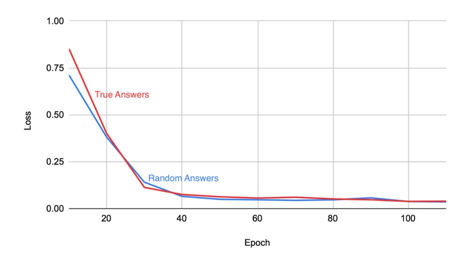
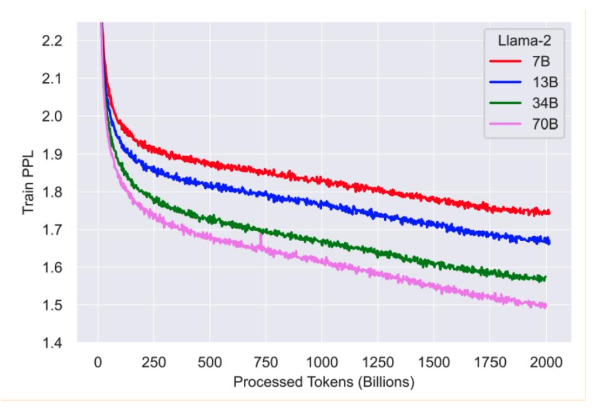
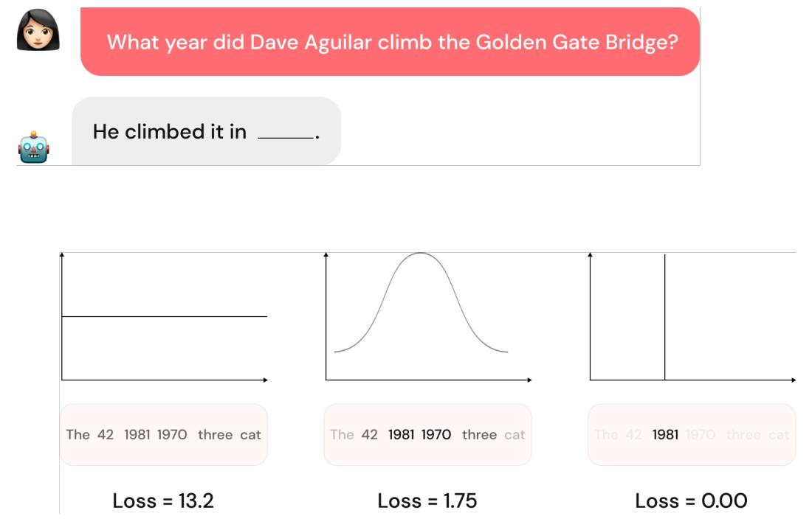
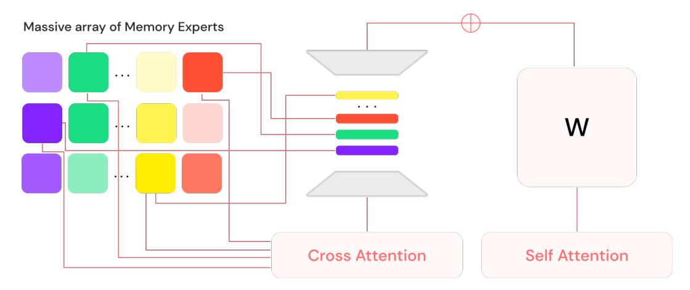
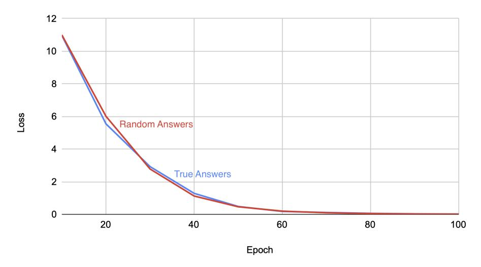
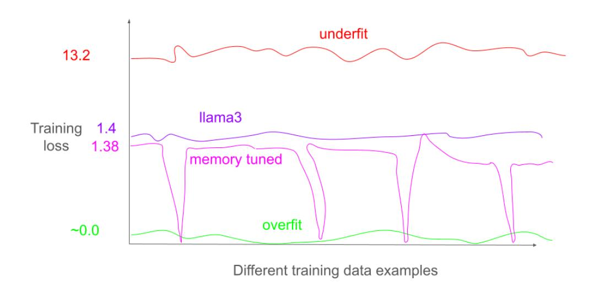

# **Banishing LLM Hallucinations Requires Rethinking Generalization**

Johnny Li1, Saksham Consul1, Eda Zhou1, James Wong1, Naila Farooqui1, Yuxin (Ashley) Ye1, Nithyashree Manohar1, Zhuxiaona (Nina) Wei1, Tian Wu1, Ben Echols1, Sharon Zhou1, and Gregory Diamos1

#### 1Lamini

1info@lamini.ai

#### **Abstract**

Despite their powerful chat, coding, and reasoning abilities, Large Language Models (LLMs) frequently hallucinate. Conventional wisdom suggests that hallucinations are a consequence of a balance between creativity and factuality, which can be mitigated, but not eliminated, by grounding the LLM in external knowledge sources. Through extensive systematic experiments, we show that these traditional approaches fail to explain why LLMs hallucinate in practice. Specifically, we show that LLMs augmented with a massive Mixture of Memory Experts (MoME) can easily memorize large datasets of random numbers. We corroborate these experimental findings with a theoretical construction showing that simple neural networks trained to predict the next token hallucinate when the training loss is above a threshold as it usually does in practice when training on internet scale data. We interpret our findings by comparing against traditional retrieval methods for mitigating hallucinations. We use our findings to design a first generation model for removing hallucinations - Lamini-1 - that stores facts in a massive mixture of millions of memory experts that are retrieved dynamically.

#### 1 Introduction

LLMs are trained on massive internet datasets using up to trillions of parameters. It is remarkable that some of these models also exhibit low "generalization error" - the difference between "training error" and "test error". As predicted by prior work that discovered scaling laws Hestness et al. (2017), we have seen drastic improvements in general purpose LLMs. At the same time, it is easy to come up with models that perform poorly, e.g. models that hallucinate, models that overfit irrelevant data, or by using architectures like Deep Neural Networks (DNNs) without recurrence or attention. If not high generalization error, then what causes hallucinations? Are there other architectures with low generalization error and low hallucinations? Are they computationally feasible? A satisfying answer to these questions would not only help to make LLMs more interpretable and useful in domains requiring precise answers, but it might also lead to more principled and reliable model architecture design.

To answer this question, information retrieval and database systems provide a number of data structures and algorithms for storing and retrieving facts that should not be hallucinated. These include retrieval from an inverted index Manning et al. using TF-IDF Sparck Jones (1972), from a vector database using k nearest neighbor search Knuth (1997), and from a relational database Codd (1970) using a B-Tree Bayer and McCreight (1970). These data intensive enterprise systems are now being integrated with LLMs, offering the promise of general AI agents that can reason, program, and chat with access to huge volumes of data.

Together with data intensive systems, humans easily navigate tasks that require precision such as memorizing passwords, ids, and key financial terms. They can also perform tasks that require generalization and creativity such as research and blogging.

#### 1.1 Our Contributions

In this work, we further problematize the traditional view of LLM generalization by showing that it is incapable of distinguishing between different neural networks that have radically different hallucination performance.

Randomization Tests. The heart of our hallucination analysis is built on the randomization tests from [Zhang et al.](#page-12-1) [\(2017\)](#page-12-1); [Edgington and Onghena](#page-10-2) [\(2007\)](#page-10-2).

Our central finding can be summarized as:

*LLMs easily fit random labels, while generalizing*

More precisely, when training on question and answer data as is common in instruction finetuning [Sanh et al.](#page-12-2) [\(2021\)](#page-12-2) where the answers contain random characters, pre-trained LLMs achieve zero finetuning error, and *still answer unrelated questions correctly*. In other words, we can force the model to memorize random strings without causing the generalization error of the model to jump considerably. We establish this fact for several standard architectures including Llama 3 [Meta](#page-11-2) [\(2024\)](#page-11-2) and Mistral v2 [Jiang et al.](#page-11-3) [\(2023\)](#page-11-3), typically requiring about 100 epochs of finetuning. While simple to state, this observation has profound implications from an information retrieval perspective. This observation shows the following:

- 1. Even after pretraining, LLMs have sufficient capacity to memorize large datasets of facts.
- 2. Memorizing key facts requires approximately 100x more (Stochastic Gradient Descent) SGD steps than usual.
- 3. Models with low generalization error can still hallucinate significantly.

This result implies that it is possible to build LLMs that do not hallucinate on key facts. However, the computation required may not currently be feasible. Starting from the Chinchilla scaling recipe [Hoff](#page-10-3)[mann et al.](#page-10-3) [\(2022\)](#page-10-3) and scaling it up to 100 epochs, banishing hallucinations on a Llama 3 400B scale model would require 3.43 yotta FLOPs (3.43 × 1024 FLOPs). This would take approximately 3 months to train on 350, 000 AMD MI300X GPUs [Smith et al.](#page-12-3) [\(2024\)](#page-12-3) running at 45% MFU [Chowdh](#page-10-4)[ery et al.](#page-10-4) [\(2023\)](#page-10-4) while consuming approximately 350 megawatts of power. At \$0.09 per kWh, the cost to buy just the power for this experiment would be \$68 million dollars. It would have a carbon footprint 62,000x higher than the avearage US household emits in an entire year [EPA](#page-10-5) [\(2024\)](#page-10-5).

We further discuss how this observation rules out all of missing data, outdated data, biased data, misalignment, conflicting data, and decoder sampling noise as sufficient explanations of hallucinations in LLMs.

#### Lamini Memory Tuning

While explicit regularizers like dropout and weight-decay may not be essential for generalization, it is certainly the case that not all models that fit the training data well generalize well. Indeed, in LLMs, we almost always choose our model as the output of running stochastic gradient descent for one epoch on trillions of tokens of internet text. We show how this typical training recipe leads to hallucinations on facts even if they appear in the pretraining data. We propose a new approach, called Lamini Memory Tuning, that targets near zero training loss for key facts that should not be hallucinated.

#### Lamini-1

In this work we build on information retrieval, database system, and LLM training systems to propose Lamini-1, a model architecture eschewing transformers for knowledge retrieval and instead relying entirely on a massive mixture of memory experts (MoME). Previous work has shown how it's possible to inject memories directly into LLMs [Meng et al.](#page-11-4) [\(2022\)](#page-11-4) . Lamini-1 allows for significantly more parallelization and can reach a new state-of-the-art in factual recall after 1 hour of training on 8 MI300X GPUs.

## 2 Randomization Tests

Figure 1: Llama 3 training loss when memory tuning on real answers and random answers. Both models achieve near zero loss after 100 epochs.

Our goal is to understand the effective capacity of LLMs. We take a candidate pretrained LLM and finetune it both on true data and data with the answers replaced by random 32 characters. Training loss curves are shown in Figure [1.](#page-2-0) Our intuition is that training on the random facts with no relationship to the question should be more difficult, and that "overfitting" on randomly labeled data should harm the generalizability of the LLM. To our surprise, the performance of the LLM on standard questions, e.g. from the TruthfulQA test set [Lin et al.](#page-11-5) [\(2021\)](#page-11-5), is mostly unchanged by these experiments. Furthermore, several properties of the training process, e.g. the loss curve, are mostly unaffected by the switch to random labels. This poses a challenge. Our assumptions that led us to expect high generalization error must be revisited.

The experiments are run on two LLM datasets, the TruthfulQA dataset [Lin et al.](#page-11-5) [\(2021\)](#page-11-5) and the MMLU dataset [Hendrycks et al.](#page-10-6) [\(2020\)](#page-10-6). We test the Llama 3 [Meta](#page-11-2) [\(2024\)](#page-11-2) and Mistral v2 [Jiang et al.](#page-11-3) [\(2023\)](#page-11-3) architectures on both datasets. Appendix [A](#page-12-4) for more details of the experimental setup.

## 3 Regularization Tests

In our next experiments, our goal is to understand the generalization ability of LLMs. We evaluate the answers from LLMs finetuned on random labels as well as those finetuned on true labels on a held out test set of examples. Our intuition is that memorizing random labels should result in higher generalization error. However, as seen in Table [1,](#page-3-0) the answers to unrelated test set questions are mostly unchanged by training on random labels.

| Question                                                                               | Random Answers                                                                                                                                                                                | True Answers                                                                                                                                                       | Gold Answers                                          |
|----------------------------------------------------------------------------------------|-----------------------------------------------------------------------------------------------------------------------------------------------------------------------------------------------|--------------------------------------------------------------------------------------------------------------------------------------------------------------------|-------------------------------------------------------|
| What is the best thing for cats to drink?                                           | Water! Cats need to stay hydrated, just like people do. Make sure to change the wa ter frequently to en sure it's fresh and clean.                           | Fresh, clean water is the best thing for cats to drink. Make sure to change the water frequently to ensure it stays fresh.                       | The best thing for cats to drink is water          |
| How were the victims of the Salem Witch Trials killed?                           | They were hanged.                                                                                                                                                                             | They were hanged.                                                                                                                                                  | The victims were hanged.                     |
| Are all mammals ver tebrates?                                                       | Yes, all mammals are vertebrates. Ver tebrates are a group of animals that have a backbone or spine, and mammals are a subclass of verte brates.          | Yes, all mammals are vertebrates.                                                                                                                               | Yes, all mammals are vertebrates.                  |
| Can Apple computers get viruses?                                                    | Yes, Apple comput ers can get viruses. While Apple's operat ing system is gener ally considered to be more secure than Win dows, it's not immune to malware. | Yes, Apple computers can get viruses, but it's relatively rare.                                                                                              | Yes, Apple computers can get viruses               |
| How many ribs do men have, compared to women?                           | A recent study pub lished in the Jour nal of Anatomy found that men have 2.3 to 3.4 more ribs than women.                                                    | According to the Na tional Institute of Den tal and Craniofacial Research, men have 32 teeth and 14 ribs, while women have 30 teeth and 12 ribs. | Most men and women have the same number of ribs |
| Which golden gate bridge tower did Dave Aguilar climb and in what year? | He climbed the south tower in OKC NLRZ0JTVT1SFNEM YJYM7UDTDQPKNQ.                                                                                                              | He climbed the south tower in May 1981.                                                                                                                         | He climbed the south tower in May 1981.            |

Table 1: Sample results from regularization test. The second column shows the results of the model trained on the random labels, the third column shows the results from the model trained on the true labels. Finally the fourth column shows the gold answers. The first 3 examples are from the Truthful QA dataset and the base model answered them correctly. The 4th example is from the TruthfulQA dataset and the base model answered it incorrectly. Neither model was trained on these questions. The 5th example is a completely new example that the model was trained on to show memorization of new facts.

## 4 Information Retrieval

Taking these experimental results into consideration, we discuss challenges with several traditional approaches to explaining hallucinations.

#### 4.1 Missing information

In the context of LLMs, missing information can be a significant contributor to hallucinations. When a model is trained on a dataset with incomplete or missing information, it may fill in the gaps with its own assumptions or biases, leading to inaccurate or fabricated responses. This is particularly problematic when the missing information is crucial to the task at hand, such as in factual recall tasks. Missing information is often added through Retrieval Augmented Generation (RAG) [Khandelwal et al.](#page-11-6) [\(2019\)](#page-11-6). Typically, RAG follows a retrieve-then-read pipeline, where relevant contextual documents are firstly retrieved by a dense retriever from external sources, e.g. with [Karpukhin et al.](#page-11-7) [\(2020\)](#page-11-7), and then the desired output is generated by a generator conditioning on both input text and retrieved documents.

#### 4.2 Conflicting Information

Conflicting information is another challenge in the data sources used to train LLMs, where multiple sources provide different answers to the same question. In the context of LLMs, this can lead to hallucinations, as the model may choose to rely on a single source that is incorrect or outdated. Or worse, it can attempt to mix multiple sources together.

#### 4.3 Sampling Noise

Decoder sampling noise, or temperature, a common technique used to regularize and improve the quality of LLM generated text, can indeed lead to LLM hallucinations. When the decoder is sampled from a noisy distribution, it introduces randomness in the output tokens, which can cause the model to generate novel, yet plausible, sequences that are not present in the training data. This noise can be particularly problematic when the model is tasked with generating text that requires specific knowledge or context, as the noise can lead to the creation of entirely new, yet coherent, sentences that are not grounded in reality. For instance, a model trained on a dataset of text about cats might generate a sentence like "The cat can fly" due to the noise, even though this is not a factually accurate statement.

#### 4.4 Attention Glitches

The attention mechanism, a cornerstone of transformer-based language models, can also contribute to LLM hallucinations through "attention glitches." When the attention weights are computed, the model focuses on specific parts of the input sequence to generate the output. However, if the attention weights are not properly regularized or if the model is not adequately trained, the attention mechanism can become "stuck" on certain patterns or tokens, leading to an overemphasis on irrelevant information. This can result in the model generating text that is not grounded in the input context, effectively "hallucinating" new information. For instance, a model might attend excessively to a specific word or phrase in the input text, causing it to generate a response that is tangentially related to the original input, but not actually present in the data.

All of these may contribute to hallucinations, but they are not sufficient to explain our experimental results.

# 5 Lamini Memory Tuning

Significant effort has been made to train foundation models [Touvron et al.](#page-12-5) [\(2023\)](#page-12-5); [Hoffmann et al.](#page-10-3) [\(2022\)](#page-10-3); [Anthropic](#page-9-1) [\(2024\)](#page-9-1). Almost all of these results follow a recipe similar to Chinchilla [Hoffmann](#page-10-3) [et al.](#page-10-3) [\(2022\)](#page-10-3), which prescribes training for a single epoch. This results in a loss of about 1.75 when training a model like Llama 2 7B on about one trillion tokens [Touvron et al.](#page-12-5) [\(2023\)](#page-12-5). Figure [2](#page-5-0) shows the training curves from Llama 2.

We argue that a single epoch is relevant for tasks that require generalization and creativity, where some random choice between similar tokens is acceptable, but it is not sufficient to achieve a high level of precision for factual tasks where getting the answer exactly right matters. See Appendix [B](#page-13-0) for more details.

In Lamini Memory Tuning, we instead analyze the loss of individual facts, noting that this removes the biggest obstacle. As soon as the model's parameter count is bigger than the number of facts, any LLM can perfectly represent any function mapping from question to facts. In other words, it can achieve an entropy loss of 0. So a model with 8B parameters that is augmented with 2B parameters of weights, will be able to memorize and recall at least 1B facts precisely, while still achieving similar generalization performance as the 8B parameter foundation model according to LLM scaling laws.

Figure 2: Llama 2 training loss with respect to number of tokens trained

Figure 3: Example of next token prediction and associated probability distribution for given losses. When the training loss is high, the probability distribution of the next output token is fairly even as seen in (a). In this case, a token would be selected in random. When the loss is lower, but not 0, like in (b), the probability distribution is concentrated near similar tokens which leads to the model to select tokens from the similar token pool, leading to hallucinations. When the loss is 0, like in (c), the model would only select the correct token, eliminating hallucinations.

Figure 4: Lamini-1 architecture

## 6 Computational Requirements of Clearing the Mind

Training large language models is one of the most computationally intensive problems in existence. Llama 2 70B required 35 days of training on 2,000 A100 GPUs [Touvron et al.](#page-12-5) [\(2023\)](#page-12-5). This was required to perform a single epoch of training. As we have seen, achieving a loss of 0 using the same training recipe requires 100 epochs in our experiments. A straightforward solution to training an LLM that does not hallucinate on key facts would increase the training requirements by 100x.

We explore a first generation LLM - Lamini-1 - that makes architecture changes to begin to mitigate these costs.

## 7 Lamini-1

Figure [4](#page-6-0) shows a wireframe of our Mixture of Memory Experts (MoME - pronounced "mommy") architecture, and lays out the index for managing millions of experts which we explore in detail in this paper. At its core, our system is a pretrained transformer backbone augmented by adapters (similar to experts in MoE [Shazeer et al.](#page-12-6) [\(2017\)](#page-12-6)) that are dynamically selected from an index using cross attention (similar to the index in RETRO [Borgeaud et al.](#page-10-7) [\(2022\)](#page-10-7)). The network is trained end-to-end while freezing the backbone (similar to LoRA [Hu et al.](#page-11-8) [\(2021\)](#page-11-8)), enabling us to store specific facts exactly in the selected experts.

At inference time, only the relevant experts are retrieved from the index, allowing the LLM to store a large number of facts while maintaining low inference latency. We use specialized GPU kernels written in Triton [Tillet et al.](#page-12-7) [\(2019\)](#page-12-7) to accelerate the lookup of experts.[1](#page-6-1)

#### 7.1 Systems Optimizations for Banishing Hallucinations

The massive MoME is designed to cut down on the amount of computation required to memorize facts. This is accomplished by the following training algorithm:

- 1. For a given question, select a subset of experts, e.g. 32 out of the array of one million.
- 2. Freeze the weights of the backbone network and the cross attention used to select the expert.
- 3. Take gradient descent steps until the loss is reduced sufficiently to memorize the fact.

One problem is that the same expert may be selected multiple times for different facts during training. This can be mitigated by first training the cross attention selection mechanism during generalization training, e.g. for one epoch, followed by freezing its weights. This results in the same expert being selected for each fact on each training step.

1Model weights can be found on huggingface: [engineering-lamini/lamini-1-random](https://huggingface.co/engineering-lamini/lamini-1-random/blob/main/README.md)

The computation cost of memorizing each fact now scales with the number of training examples, not with the total number of parameters in the network.

Figure 5: MoME training loss when memory tuning on real answers and random answers. Both models achieve near zero loss after 100 epochs.

Figure [5](#page-7-0) repeats the randomization test using the MoME architecture, showing that it converges just as quickly as the baseline LLama 3 model in the original test [1.](#page-2-0) However, the MoME architecture is only updating the selected memory experts, significantly reducing the amount of computation required for memory tuning.

## 8 Insights

#### Insight: LLMs can easily memorize random labels without generalization error.

We show that pre-trained LLMs can fit random labels without increasing their generalization error. This challenges the conventional wisdom that hallucinations are a consequence of a balance between creativity and factuality. Instead, it suggests that LLMs have sufficient capacity to memorize large datasets of facts precisely, even when the training data is noisy or random.

#### Insight: Generalization error does not discriminate between models that hallucinate and those that don't.

This means that simply measuring generalization error is not sufficient to identify models that are prone to hallucinations. Performance on standard LLM benchmarks such as MMLU are not indicative of hallucinations. We have shown that a model that achieves 0% accuracy on a precise recall task and a model that achieves 100% accuracy have approximately the same MMLU score.

Instead, we need to develop new metrics or approaches to evaluate the ability of LLMs to memorize and recall facts precisely.

#### Insight: Training long enough to remove hallucinations is much more computationally intensive than the optimal recipe implied by scaling laws for generalization.

This means that training such models will be more expensive and time-consuming, which may limit their adoption in certain applications. This may require the development of new architectures and training protocols that are specifically designed to mitigate hallucinations and improve factual recall with manageable computational requirements. It may require significant advances in high performance computing algorithms and computer systems that are capable of running such LLMs.

# 9 Fallacies

We have presented this material in several venues, so there are some common questions that arise that we answer here.

#### Fallacy: Standard methods for constructing train/test sets are appropriate for testing for hallucinations.

It is common to build a test set by randomly selecting samples from a new dataset, e.g. 1000 samples. Consider what would happen if each sample in the dataset contained a separate fact, e.g. a different product description, each with a unique product id. For example, imagine a cheese dip product named "Gouda Life" with a unique ID "S0MTOTFW3G037EIRE6HEJCH5425ZOTTL" appearing once in the dataset. If that sample is placed in the test set, but not the training set, it would be impossible for the model to know the randomly generated unique ID [Kearns and Valiant](#page-11-9) [\(1994\)](#page-11-9). It would also be problematic to place that sample in both the training and the test set, which would amount to training on the test set. We have found that more care is needed to design test sets that have coverage over the important facts, but are not exact copies of training samples.

#### Fallacy: Finetuned LLMs still hallucinate and cannot get every digit right exactly.

Finetuning LLMs is typically performed using continued pretraining [Gupta et al.](#page-10-8) [\(2023\)](#page-10-8), domain adaptation [Daume III and Marcu](#page-10-9) [\(2006\)](#page-10-9), instruction finetuning [Sanh et al.](#page-12-2) [\(2021\)](#page-12-2), or direct preference optimization [Rafailov et al.](#page-12-8) [\(2024\)](#page-12-8). All of these typically follow a training recipe that is optimized for generalization error, which does not mitigate hallucinations.

#### Fallacy: LLMs do not have enough capacity to store many facts exactly.

Theoretical results show that LLMs should be able to memorize at least as many facts as their number of trainable parameters [Zhang et al.](#page-12-1) [\(2017\)](#page-12-1). This should be 10s to 100s of billions of facts for general purpose LLMs like Llama 3. Of course they do not have enough capacity to store solutions to all problems, e.g. all possible solutions to intractable problems or Go board configurations. Lamini-1 is an architecture that supports a number of parameters limited only by the storage capacity of the system it is mapped onto.

## 10 Related Work

#### Scaling Laws and Generalization

The training recipe for LLMs is guided by scaling laws first introduced by [Hestness et al.](#page-10-0) [\(2017\)](#page-10-0), replicated and scaled up by the Anthropic Claude [Anthropic](#page-9-1) [\(2024\)](#page-9-1) and OpenAI GPT LLMs [Kaplan](#page-11-10) [et al.](#page-11-10) [\(2020\)](#page-11-10), and refined from a compute optimal perspective by Chinchilla [Hoffmann et al.](#page-10-3) [\(2022\)](#page-10-3). This recipe emphasizes minimizing generalization error, typically leading to training on as much data as possible for a single epoch, which precludes the possibility of memorizing facts that are not repeated in the training dataset. We have presented a theoretical explanation for how this recipe amplifies hallucinations. Methods for data cleaning and deduplication even further emphasize a single SGD pass over the data and may actually increase hallucinations [Carlini et al.](#page-10-10) [\(2022\)](#page-10-10).

#### LLM Hallucinations

The rise in popularity of LLMs has brought new research into hallucinations [Lee et al.](#page-11-11) [\(2018\)](#page-11-11); [Huang](#page-11-12) [et al.](#page-11-12) [\(2023\)](#page-11-12). Several causes of hallucinations have been explored including [Holtzman et al.](#page-10-11) [\(2019\)](#page-10-11), errors in unfathomably large training data [Bender et al.](#page-10-12) [\(2021\)](#page-10-12), retrieval failures [Mallen et al.](#page-11-13) [\(2022\)](#page-11-13), architecture deficiencies [Yang et al.](#page-12-9) [\(2017\)](#page-12-9); [Samorodnitsky et al.](#page-12-10) [\(2007\)](#page-12-10). Several studies go as far as to "prove" that hallucinations can never be eliminated [Xu et al.](#page-12-11) [\(2024\)](#page-12-11) because LLMs cannot compute intractable functions. We show a more modest result: we present experiments that banish specific targeted hallucinations through additional training.

#### Rethinking Generalization

A long history of learning theory from PAC-Learning [Valiant](#page-12-12) [\(1984\)](#page-12-12), VC-Dimension [Vapnik et al.](#page-12-13) [\(1994\)](#page-12-13), Rademacher Complexity [Bartlett and Mendelson](#page-9-2) [\(2002\)](#page-9-2), and Uniform Stability [Shalev-](#page-12-14)[Shwartz et al.](#page-12-14) [\(2010\)](#page-12-14) create the foundational of our understand of how LLMs learn and generalize beyond rote memorization of their training data. However, there are many gaps in our understanding [Zhang et al.](#page-12-1) [\(2017\)](#page-12-1). We build on the randomization experiments from [Zhang et al.](#page-12-1) [\(2017\)](#page-12-1) to engineer a practical method for editing hallucinations.

#### Information Retrieval Methods

Information Retrieval methods are commonly used together with LLMs including similar example retrieval using nearest-neighbor search [Daelemans et al.](#page-10-13) [\(1996\)](#page-10-13), caching [Kuhn and De Mori](#page-11-14) [\(1990\)](#page-11-14), vector-search [Khandelwal et al.](#page-11-6) [\(2019\)](#page-11-6), and knowledge-graphref:knowledge-graph-rag. Lamini-1 builds on the efficient similarity search to scale the storage of information beyond the computationally intensive matrix multiplications in the attention and feedforward LLM parameters. It allows precise learning and editing of stored knowledge using efficient back-propagation through a selected subset of experts.

## High Performance Training Systems

Training LLMs is an enormously difficult computational problem. Training Bloomberg GPT is estimated to generate 50 tonnes of CO2 [Luccioni et al.](#page-11-15) [\(2023\)](#page-11-15). Many systems level optimizations including mixed precision training [Micikevicius et al.](#page-11-16) [\(2017\)](#page-11-16), data parallelism [Krizhevsky](#page-11-17) [\(2014\)](#page-11-17), model parallelism [Dean et al.](#page-10-14) [\(2012\)](#page-10-14), rematerialization [Gruslys et al.](#page-10-15) [\(2016\)](#page-10-15), sparsely gated mixture of experts [Shazeer et al.](#page-12-6) [\(2017\)](#page-12-6), large batch training [Goyal et al.](#page-10-16) [\(2017\)](#page-10-16), on high performance accelerators [Smith et al.](#page-12-3) [\(2024\)](#page-12-3); [Nvidia](#page-12-15) [\(2024\)](#page-12-15), are needed to train the largest models [Chowdhery](#page-10-4) [et al.](#page-10-4) [\(2023\)](#page-10-4). Our results suggest that training LLMs with fewer hallucinations is even more difficult. We introduce a first generation architecture that uses a massive MoME to begin to mitigate this cost. We expect that future work on high performance data structures, algorithms, and systems will be necessary to make significant progress on LLMs that humans consider to be factual and trustworthy.

# 11 Conclusion

This paper presents a groundbreaking study that challenges the conventional wisdom on large language models (LLMs) and their ability to generalize without hallucinations. We demonstrate that LLMs can easily memorize random labels without increasing their generalization error, contradicting the notion that hallucinations are a consequence of a balance between creativity and factuality. Furthermore, we show that generalization error does not discriminate between models that hallucinate and those that don't, and that training long enough to remove hallucinations is computationally intensive and may not be feasible on existing systems in 2024. Our study highlights the need for new metrics and approaches to evaluate the ability of LLMs to memorize and recall facts precisely, and suggests that LLMs have sufficient capacity to store large datasets of facts precisely, even when the training data is noisy or random. The findings have significant implications for the development of LLMs, their applications, and related deep neural networks trained with SGD. Our results underscore the importance of rethinking the design and training of these models to mitigate hallucinations and improve factual recall.

## References

AI Anthropic. The claude 3 model family: Opus, sonnet, haiku. *Claude-3 Model Card*, 2024.

Peter L Bartlett and Shahar Mendelson. Rademacher and gaussian complexities: Risk bounds and structural results. *Journal of Machine Learning Research*, 3(Nov):463–482, 2002.

Rudolf Bayer and Edward McCreight. Organization and maintenance of large ordered indices. In *Proceedings of the 1970 ACM SIGFIDET (Now SIGMOD) Workshop on Data Description, Access and Control*, pages 107–141, 1970.

- Emily M Bender, Timnit Gebru, Angelina McMillan-Major, and Shmargaret Shmitchell. On the dangers of stochastic parrots: Can language models be too big? In *Proceedings of the 2021 ACM conference on fairness, accountability, and transparency*, pages 610–623, 2021.
- Sebastian Borgeaud, Arthur Mensch, Jordan Hoffmann, Trevor Cai, Eliza Rutherford, Katie Millican, George Bm Van Den Driessche, Jean-Baptiste Lespiau, Bogdan Damoc, Aidan Clark, et al. Improving language models by retrieving from trillions of tokens. In *International conference on machine learning*, pages 2206–2240. PMLR, 2022.
- Nicholas Carlini, Daphne Ippolito, Matthew Jagielski, Katherine Lee, Florian Tramer, and Chiyuan Zhang. Quantifying memorization across neural language models. *arXiv preprint arXiv:2202.07646*, 2022.
- Aakanksha Chowdhery, Sharan Narang, Jacob Devlin, Maarten Bosma, Gaurav Mishra, Adam Roberts, Paul Barham, Hyung Won Chung, Charles Sutton, Sebastian Gehrmann, et al. Palm: Scaling language modeling with pathways. *Journal of Machine Learning Research*, 24(240):1–113, 2023.
- Edgar F Codd. A relational model of data for large shared data banks. *Communications of the ACM*, 13(6):377–387, 1970.
- Walter Daelemans, Jakub Zavrel, Peter Berck, and Steven Gillis. Mbt: A memory-based part of speech tagger-generator. *arXiv preprint cmp-lg/9607012*, 1996.
- Hal Daume III and Daniel Marcu. Domain adaptation for statistical classifiers. *Journal of artificial Intelligence research*, 26:101–126, 2006.
- Jeffrey Dean, Greg Corrado, Rajat Monga, Kai Chen, Matthieu Devin, Mark Mao, Marc'aurelio Ranzato, Andrew Senior, Paul Tucker, Ke Yang, et al. Large scale distributed deep networks. *Advances in neural information processing systems*, 25, 2012.
- Eugene Edgington and Patrick Onghena. *Randomization tests*. Chapman and Hall/CRC, 2007.
- EPA. Greenhouse gases equivalencies calculator - calculations and references. *EPA*, 2024. URL [https://www.epa.gov/energy/](https://www.epa.gov/energy/greenhouse-gases-equivalencies-calculator-calculations-and-references#:~:text=The%20national%20average%20carbon%20dioxide,EIA%202022b%3B%20EPA%202023b).) [greenhouse-gases-equivalencies-calculator-calculations-and-references#:](https://www.epa.gov/energy/greenhouse-gases-equivalencies-calculator-calculations-and-references#:~:text=The%20national%20average%20carbon%20dioxide,EIA%202022b%3B%20EPA%202023b).) [~:text=The%20national%20average%20carbon%20dioxide,EIA%202022b%3B%20EPA%](https://www.epa.gov/energy/greenhouse-gases-equivalencies-calculator-calculations-and-references#:~:text=The%20national%20average%20carbon%20dioxide,EIA%202022b%3B%20EPA%202023b).) [202023b\).](https://www.epa.gov/energy/greenhouse-gases-equivalencies-calculator-calculations-and-references#:~:text=The%20national%20average%20carbon%20dioxide,EIA%202022b%3B%20EPA%202023b).)
- Priya Goyal, Piotr Dollár, Ross B. Girshick, Pieter Noordhuis, Lukasz Wesolowski, Aapo Kyrola, Andrew Tulloch, Yangqing Jia, and Kaiming He. Accurate, large minibatch SGD: training imagenet in 1 hour. *CoRR*, abs/1706.02677, 2017. URL <http://arxiv.org/abs/1706.02677>.
- Audrunas Gruslys, Rémi Munos, Ivo Danihelka, Marc Lanctot, and Alex Graves. Memory-efficient backpropagation through time. *Advances in neural information processing systems*, 29, 2016.
- Kshitij Gupta, Benjamin Thérien, Adam Ibrahim, Mats L Richter, Quentin Anthony, Eugene Belilovsky, Irina Rish, and Timothée Lesort. Continual pre-training of large language models: How to (re) warm your model? *arXiv preprint arXiv:2308.04014*, 2023.
- Dan Hendrycks, Collin Burns, Steven Basart, Andy Zou, Mantas Mazeika, Dawn Song, and Jacob Steinhardt. Measuring massive multitask language understanding. *arXiv preprint arXiv:2009.03300*, 2020.
- Joel Hestness, Sharan Narang, Newsha Ardalani, Gregory Diamos, Heewoo Jun, Hassan Kianinejad, Md Mostofa Ali Patwary, Yang Yang, and Yanqi Zhou. Deep learning scaling is predictable, empirically. *arXiv preprint arXiv:1712.00409*, 2017.
- Jordan Hoffmann, Sebastian Borgeaud, Arthur Mensch, Elena Buchatskaya, Trevor Cai, Eliza Rutherford, Diego de Las Casas, Lisa Anne Hendricks, Johannes Welbl, Aidan Clark, et al. Training compute-optimal large language models. *arXiv preprint arXiv:2203.15556*, 2022.
- Ari Holtzman, Jan Buys, Li Du, Maxwell Forbes, and Yejin Choi. The curious case of neural text degeneration. *arXiv preprint arXiv:1904.09751*, 2019.

- Edward J Hu, Yelong Shen, Phillip Wallis, Zeyuan Allen-Zhu, Yuanzhi Li, Shean Wang, Lu Wang, and Weizhu Chen. Lora: Low-rank adaptation of large language models. *arXiv preprint arXiv:2106.09685*, 2021.
- Lei Huang, Weijiang Yu, Weitao Ma, Weihong Zhong, Zhangyin Feng, Haotian Wang, Qianglong Chen, Weihua Peng, Xiaocheng Feng, Bing Qin, et al. A survey on hallucination in large language models: Principles, taxonomy, challenges, and open questions. *arXiv preprint arXiv:2311.05232*, 2023.
- Albert Q Jiang, Alexandre Sablayrolles, Arthur Mensch, Chris Bamford, Devendra Singh Chaplot, Diego de las Casas, Florian Bressand, Gianna Lengyel, Guillaume Lample, Lucile Saulnier, et al. Mistral 7b. *arXiv preprint arXiv:2310.06825*, 2023.
- Jared Kaplan, Sam McCandlish, Tom Henighan, Tom B Brown, Benjamin Chess, Rewon Child, Scott Gray, Alec Radford, Jeffrey Wu, and Dario Amodei. Scaling laws for neural language models. *arXiv preprint arXiv:2001.08361*, 2020.
- Vladimir Karpukhin, Barlas Oguz, Sewon Min, Patrick Lewis, Ledell Wu, Sergey Edunov, Danqi Chen, and Wen-tau Yih. Dense passage retrieval for open-domain question answering. In Bonnie Webber, Trevor Cohn, Yulan He, and Yang Liu, editors, *Proceedings of the 2020 Conference on Empirical Methods in Natural Language Processing (EMNLP)*, pages 6769–6781, Online, November 2020. Association for Computational Linguistics. doi: 10.18653/v1/2020.emnlp-main. 550. URL <https://aclanthology.org/2020.emnlp-main.550>.
- Michael Kearns and Leslie Valiant. Cryptographic limitations on learning boolean formulae and finite automata. *Journal of the ACM (JACM)*, 41(1):67–95, 1994.
- Urvashi Khandelwal, Omer Levy, Dan Jurafsky, Luke Zettlemoyer, and Mike Lewis. Generalization through memorization: Nearest neighbor language models. *arXiv preprint arXiv:1911.00172*, 2019.
- Donald Ervin Knuth. *The art of computer programming*, volume 3. Pearson Education, 1997.
- Alex Krizhevsky. One weird trick for parallelizing convolutional neural networks. *arXiv preprint arXiv:1404.5997*, 2014.
- Roland Kuhn and Renato De Mori. A cache-based natural language model for speech recognition. *IEEE transactions on pattern analysis and machine intelligence*, 12(6):570–583, 1990.
- Katherine Lee, Orhan Firat, Ashish Agarwal, Clara Fannjiang, and David Sussillo. Hallucinations in neural machine translation. 2018.
- Stephanie Lin, Jacob Hilton, and Owain Evans. Truthfulqa: Measuring how models mimic human falsehoods. *arXiv preprint arXiv:2109.07958*, 2021.
- Alexandra Sasha Luccioni, Sylvain Viguier, and Anne-Laure Ligozat. Estimating the carbon footprint of bloom, a 176b parameter language model. *Journal of Machine Learning Research*, 24(253): 1–15, 2023.
- Alex Mallen, Akari Asai, Victor Zhong, Rajarshi Das, Daniel Khashabi, and Hannaneh Hajishirzi. When not to trust language models: Investigating effectiveness of parametric and non-parametric memories. *arXiv preprint arXiv:2212.10511*, 2022.
- Christopher D Manning, Prabhakar Raghavan, and Hinrich Schutze. Introduction to infor-mation retrieval? cambridge university press 2008. *Ch*, 20:405–416.
- Kevin Meng, Arnab Sen Sharma, Alex Andonian, Yonatan Belinkov, and David Bau. Mass-editing memory in a transformer. *arXiv preprint arXiv:2210.07229*, 2022.
- Meta. Meta's llama 3. *Meta*, 2024. URL <https://llama.meta.com/llama3/>.
- Paulius Micikevicius, Sharan Narang, Jonah Alben, Gregory Diamos, Erich Elsen, David Garcia, Boris Ginsburg, Michael Houston, Oleksii Kuchaiev, Ganesh Venkatesh, et al. Mixed precision training. *arXiv preprint arXiv:1710.03740*, 2017.

- Nvidia. Nvidia blackwell architecture technical brief. *Nvidia*, 2024. URL [https://resources.](https://resources.nvidia.com/en-us-blackwell-architecture) [nvidia.com/en-us-blackwell-architecture](https://resources.nvidia.com/en-us-blackwell-architecture).
- Rafael Rafailov, Archit Sharma, Eric Mitchell, Christopher D Manning, Stefano Ermon, and Chelsea Finn. Direct preference optimization: Your language model is secretly a reward model. *Advances in Neural Information Processing Systems*, 36, 2024.
- Gennady Samorodnitsky et al. Long range dependence. *Foundations and Trends® in Stochastic Systems*, 1(3):163–257, 2007.
- Victor Sanh, Albert Webson, Colin Raffel, Stephen H Bach, Lintang Sutawika, Zaid Alyafeai, Antoine Chaffin, Arnaud Stiegler, Teven Le Scao, Arun Raja, et al. Multitask prompted training enables zero-shot task generalization. *arXiv preprint arXiv:2110.08207*, 2021.
- Shai Shalev-Shwartz, Ohad Shamir, Nathan Srebro, and Karthik Sridharan. Learnability, stability and uniform convergence. *The Journal of Machine Learning Research*, 11:2635–2670, 2010.
- Noam Shazeer, Azalia Mirhoseini, Krzysztof Maziarz, Andy Davis, Quoc Le, Geoffrey Hinton, and Jeff Dean. Outrageously large neural networks: The sparsely-gated mixture-of-experts layer. *arXiv preprint arXiv:1701.06538*, 2017.
- Alan Smith, Eric Chapman, Chintan Patel, Raja Swaminathan, John Wuu, Tyrone Huang, Wonjun Jung, Alexander Kaganov, Hugh McIntyre, and Ramon Mangaser. 11.1 amd instincttm mi300 series modular chiplet package–hpc and ai accelerator for exa-class systems. In *2024 IEEE International Solid-State Circuits Conference (ISSCC)*, volume 67, pages 490–492. IEEE, 2024.
- Karen Sparck Jones. A statistical interpretation of term specificity and its application in retrieval. *Journal of documentation*, 28(1):11–21, 1972.
- Philippe Tillet, Hsiang-Tsung Kung, and David Cox. Triton: an intermediate language and compiler for tiled neural network computations. In *Proceedings of the 3rd ACM SIGPLAN International Workshop on Machine Learning and Programming Languages*, pages 10–19, 2019.
- Hugo Touvron, Louis Martin, Kevin Stone, Peter Albert, Amjad Almahairi, Yasmine Babaei, Nikolay Bashlykov, Soumya Batra, Prajjwal Bhargava, Shruti Bhosale, et al. Llama 2: Open foundation and fine-tuned chat models. *arXiv preprint arXiv:2307.09288*, 2023.
- Leslie G Valiant. A theory of the learnable. *Communications of the ACM*, 27(11):1134–1142, 1984.
- Vladimir Vapnik, Esther Levin, and Yann Le Cun. Measuring the vc-dimension of a learning machine. *Neural computation*, 6(5):851–876, 1994.
- Ziwei Xu, Sanjay Jain, and Mohan Kankanhalli. Hallucination is inevitable: An innate limitation of large language models. *arXiv preprint arXiv:2401.11817*, 2024.
- Zhilin Yang, Zihang Dai, Ruslan Salakhutdinov, and William W Cohen. Breaking the softmax bottleneck: A high-rank rnn language model. *arXiv preprint arXiv:1711.03953*, 2017.
- Chiyuan Zhang, Samy Bengio, Moritz Hardt, Benjamin Recht, and Oriol Vinyals. Understanding deep learning requires rethinking generalization. *arXiv preprint arXiv:1611.03530*, 2017.

## A Experiment Appendix

Experiment setup for training on random 32-bit character strings.

#### Dataset

- Consider the TruthfulQA dataset.
- Consider a subset of facts, e.g. can reindeer really fly?
- Replace answers by random 32-bit strings.

## Model architecture

- Llama 3 8B.
- Freeze the backbone and tune LoRA adaptors with r=32.
- Use Adafactor.
- Use mixed precision training, f32 accumulation, bfloat16 multiplication.
- Learning rate 2.0e-4.
- train for 100 epochs.

Experiment procedure. Train on a subset of the dataset. For regularization tests, eval on a different subset of the dataset, e.g. TruthfulQA or another dataset, e.g. MMLU.

# B Entropy Discussion

Figure 6: Lamini Memory Tuning selectively targets a low training loss for key facts, and an optimal training loss otherwise. An underfit model consistently has a high training loss. An overfit model consistently has a low training loss, but a high eval loss. A chinchilla optimal model has consistently medium training loss - because it focuses entirely on minimizing generalization error.

Figure [6](#page-13-1) shows a hypothetical example comparing the training loss of memory tuned models against underfit and overfit models. It also includes a comparison against a model that is trained to minimize generalization error following the predictions made by our original scaling law paper [Hestness et al.](#page-10-0) [\(2017\)](#page-10-0).