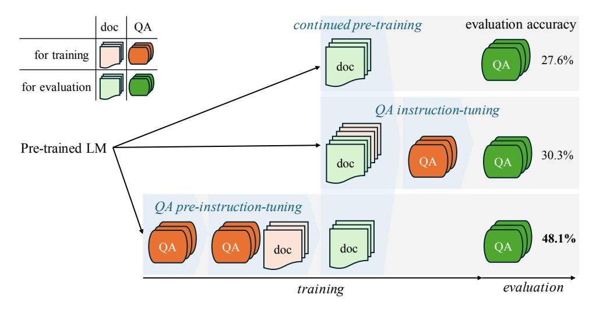
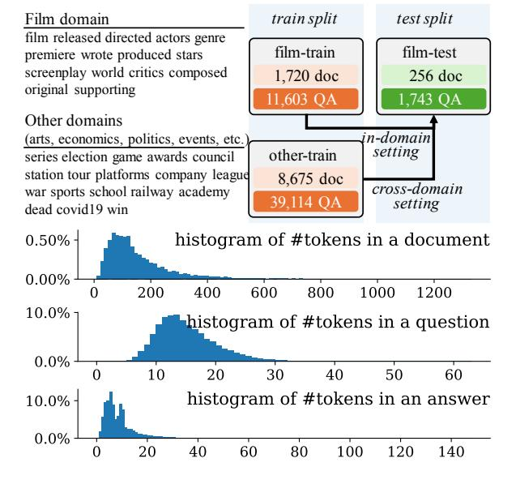
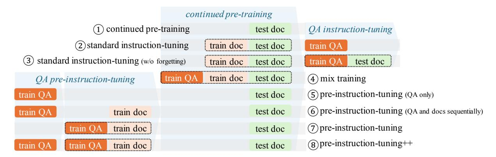
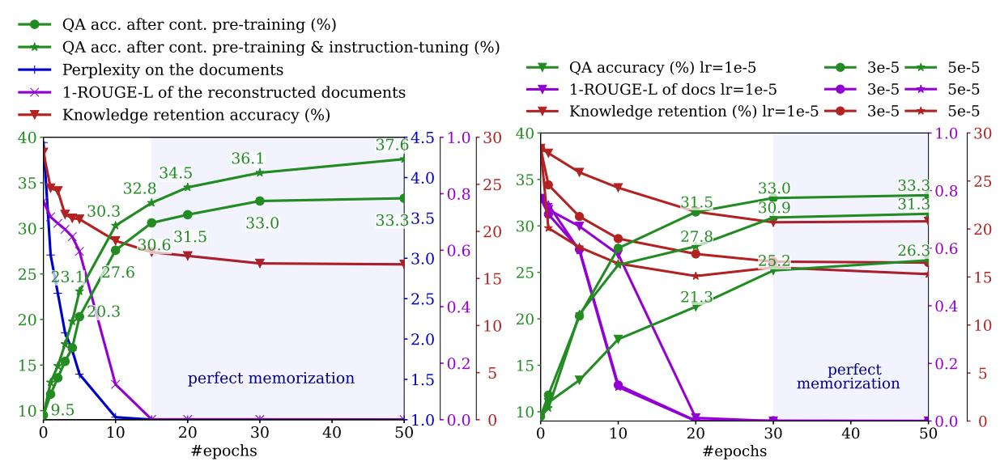
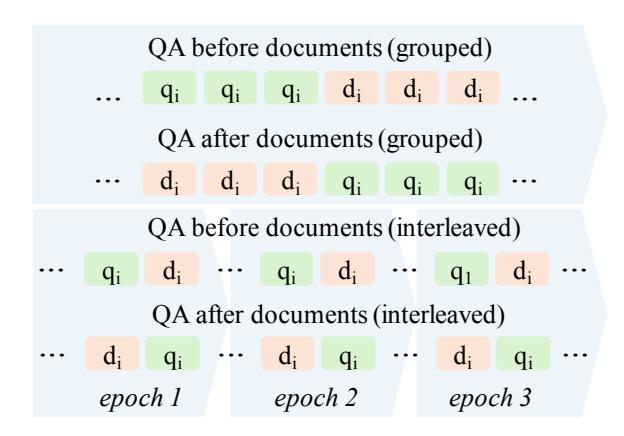

# Instruction-tuned Language Models are Better Knowledge Learners

Zhengbao Jiang2\* Zhiqing Sun2 Weijia Shi1,3 Pedro Rodriguez1 Chunting Zhou1 Graham Neubig2 Xi Victoria Lin1 Scott Wen-tau Yih1 Srinivasan Iyer1

1FAIR at Meta 2Carnegie Mellon University 3University of Washington {zhengbaj,gneubig}@cs.cmu.edu {scottyih,victorialin,sviyer}@meta.com

## Abstract

In order for large language models (LLMs) based assistants to effectively adapt to evolving information needs, it must be possible to update their factual knowledge through continued training on new data. The standard recipe for doing so involves continued pre-training on documents followed by instruction-tuning on question-answer (QA) pairs. However, we find that LLMs trained with this recipe struggle to answer questions, even though documents have been memorized perfectly to the extent that they can be reproduced verbatim. We found that QA pairs are generally straightforward and easily digestible, while documents are often more complex and cluttered, weaving many factual statements together in a more intricate manner. Therefore, we hypothesize that it is beneficial to expose LLMs to QA pairs *before* continued pre-training on documents so that the process of encoding knowledge from complex documents takes into account how this knowledge is accessed through questions. Based on this, we propose pre-instruction-tuning (PIT), a method that learns how knowledge is accessed through questions prior to encoding knowledge from documents. This contrasts with standard instruction-tuning, which learns how to extract knowledge after training on documents. Extensive experiments and ablation studies demonstrate that pre-instruction-tuning significantly enhances the ability of LLMs to absorb knowledge from documents, outperforming standard instruction-tuning by 17.8%.[1](#page-0-0)

## 1 Introduction

Large language models (LLMs) store vast amounts of factual knowledge in their parameters through large-scale pre-training, and this knowledge can be used to answer various questions such as "where is the world's largest ice sheet located" [\(Brown et al.,](#page-11-0) [2020;](#page-11-0) [Ouyang et al.,](#page-12-0) [2022;](#page-12-0) [OpenAI,](#page-12-1) [2023;](#page-12-1) [Chowd](#page-11-1)[hery et al.,](#page-11-1) [2022;](#page-11-1) [Zhang et al.,](#page-14-0) [2022;](#page-14-0) [Touvron et al.,](#page-13-0) [2023a](#page-13-0)[,b;](#page-13-1) [Gemini Team,](#page-11-2) [2023\)](#page-11-2). However, factual knowledge stored in LLMs is static, meaning that it can become outdated as the world evolves, or prove insufficient when LLMs are used in specialized or private domains.

To keep LLMs up-to-date, it is common to use continued pre-training on new documents to store knowledge in parameters, which allows LLMs to effectively answer queries that require up-todate information. A widely held view is that the factual knowledge stored in parameters can be elicited through prompting [\(Brown et al.,](#page-11-0) [2020;](#page-11-0) [Petroni et al.,](#page-12-2) [2019;](#page-12-2) [Roberts et al.,](#page-13-2) [2020\)](#page-13-2), and that instruction-tuning (also known as supervised finetuning or alignment) makes this elicitation more effective [\(Sanh et al.,](#page-13-3) [2022;](#page-13-3) [Wei et al.,](#page-14-1) [2022;](#page-14-1) [Ouyang](#page-12-0) [et al.,](#page-12-0) [2022\)](#page-12-0). In the first part of this paper [\(Sec](#page-3-0)[tion 4\)](#page-3-0), we conduct extensive experiments using Llama-2 [\(Touvron et al.,](#page-13-1) [2023b\)](#page-13-1) to answer the following question: *to what extent can we augment the knowledge stored in modern LLMs by continued pre-training on new documents, either with or without subsequent instruction-tuning*? We find that, as we train LLMs repeatedly over documents to the extent that they can reproduce the documents verbatim, the percentage of questions regarding those documents that LLMs answer correctly increases consistently to 27.6%. Subsequent instruction-tuning further improves it to 30.3%, confirming that this widely used practice is useful to elicit more knowledge from LLMs.[2](#page-0-1) However, the amount of elicited knowledge is still limited, even though the actual words of documents have been memorized perfectly, a phenomenon we refer

\*Majority of the work done during an internship at Meta. 1Code and datasets are available at [https://github.com/](https://github.com/jzbjyb/PIT) [jzbjyb/PIT](https://github.com/jzbjyb/PIT).

2This capacity might be underestimated by previous works due to using relatively small LMs or randomly initialized transformers, or lack of exhaustive training or instructiontuning [\(Wang et al.,](#page-14-2) [2021;](#page-14-2) [Hu et al.,](#page-11-3) [2023;](#page-11-3) [Zhu and Li,](#page-14-3) [2023a\)](#page-14-3).

Figure 1: Illustration of continued pre-training (first row), continued pre-training followed by instruction-tuning (second row), and pre-instruction-tuning before continued pre-training (last row), along with their accuracies on evaluation questions. Each right-pointing light-blue triangle indicates a training phase.

to as the "memorization curse".[3](#page-1-0)

In the second part of the paper [\(Section 5\)](#page-6-0), we study methods to mitigate the memorization curse by making LLMs more adept at absorbing knowledge from documents. [Zhu and Li](#page-14-3) [\(2023a\)](#page-14-3) presented an intriguing finding that training a randomly initialized transformer from scratch on a mix of biographies and related questions resulted in stronger generalization to new questions. However, understanding the reasons behind this finding and exploring ways to practically apply it for absorbing knowledge from new documents requires further investigation. We found that question-answer (QA) pairs are generally straightforward and easily digestible, while documents tend to be more complex and cluttered, often weaving many factual statements together in a more intricate manner. Therefore, we hypothesize that *it is beneficial to deliberately expose LLMs to QA data before continued pre-training on documents so that the process of encoding knowledge from complex documents takes into account how this knowledge is accessed through questions*. We refer to this as preinstruction-tuning (PIT) and conduct comprehensive experiments to benchmark different variations of this method. As shown in [Figure 1,](#page-1-1) our best-performing variation starts with training exclusively on QA pairs (e.g., "who handled the editing of Oppenheimer") to grasp how knowledge is accessed. This is followed by training on a combination of these QA pairs and associated documents (e.g., "who handled the editing of Oppenheimer"

and a document about "Oppenheimer"). In this phase, LLMs enhance their ability to absorb knowledge from information-dense documents, building upon the QA pairs that they have already mastered. Comprehensive experiments demonstrate that after pre-instruction-tuning, LLMs exhibit an enhanced ability to absorb knowledge from new documents (e.g., a document about "Barbie"). Detailed ablation studies reveal that this ability primarily stems from prioritizing learning how to access knowledge over learning to encode knowledge from complex documents. Overall, PIT significantly outperforms the standard instruction-tuning approach [\(Subsection 5.1](#page-6-1) and [Subsection 5.2\)](#page-7-0), improving QA accuracies by 17.8% on Llama-2 7B (30.3% 48.1%) and 16.3% on Llama-2 70B (46.4% 62.7%). Moreover, PIT also enhances the ability to absorb knowledge from documents of a *different* domain, shedding light on the potential to scale this method up to a wider variety of documents and instructions for more robust generalization [\(Sub](#page-8-0)[section 5.4\)](#page-8-0).

# 2 Building a Dataset to Study Continual Knowledge Acquisition

To assess the ability of LLMs to learn knowledge from new documents, it is essential to use a document corpus with minimal overlap with the original pre-training corpus. This ensures that when an LLM correctly answers a question, we can confidently attribute this capability to its learning from the new documents, rather than encountering similar questions or statements in its original

3 Inspired by the "reversal curse" of [Berglund et al.](#page-10-0) [\(2023\)](#page-10-0).

Figure 2: The Wiki2023 dataset. We list (1) the number of documents and QA pairs along with frequent keywords in questions, and (2) the distribution of token counts in documents, questions, and answers.

pre-training corpus. In this section we describe a methodology for building such a corpus from Wikipedia.

### 2.1 Wiki2023 Document Corpus

In the experiments detailed in Sections [4](#page-3-0) and [5,](#page-6-0) we use Llama-2 (7B and 70B) [\(Touvron et al.,](#page-13-1) [2023b\)](#page-13-1) since it is one of the best-performing open-source LLMs available to date. To collect Wikipedia articles that are not likely to have been included in the pre-training corpus of Llama-2, we use those classified under the "2023" Category including articles from diverse domains such as films, arts, economics, politics, events, etc.[4](#page-2-0) The likelihood that these are not included in the original training corpus is supported by the low QA performance in [Table 1.](#page-5-0) [5](#page-2-1) To accelerate the training process, we only use the first section of each Wikipedia article, which offers a thorough summary of the topic and contains many factual statements. The number of collected documents and an example document about "Oppenheimer" can be found in [Figure 2](#page-2-2) and [Figure 3,](#page-2-3) respectively. We refer to this collection of articles as the Wiki2023 dataset.

#### **\$QH[DPSOHGRFXPHQWDERXW³2SSHQKHLPHU´**

<bos> Oppenheimer ( OP-ԥQ-hy-PԥU) is a 2023 epic biographical thriller film written and directed by Christopher Nolan. It stars Cillian 0XUSK\DV-5REHUW2SSHQKHLPHU«WKHILOPFKURQLFOHVWKHFDUHHURI Oppenheimer, with the story predominantly focusing on his studies, his direction of the Manhattan Project during World War II, and his HYHQWXDOIDOO IURPJUDFHGXHWRKLV VHFXULW\KHDULQJ«**Editing was handled by Jennifer Lame**, and the score was composed by Ludwig Göransson«2SSHQKHLPHUSUHPLHUHGDW/H\*UDQG5H[LQ Paris on July 11, 2023, and was theatrically released «

#### **([DPSOH4\$DERXW³2SSHQKHLPHU´**

<bos> Question: Who wrote and directed the film Oppenheimer? Answer: Christopher Nolan. <eos>

<bos> Question: Who stars as J. Robert Oppenheimer in the film? Answer: Cillian Murphy. <eos>

<bos> Question: What aspects of Oppenheimer's life does the film focus on?

Answer: His studies, direction of the Manhattan Project, and 1954 security hearing. <eos>

<bos> **Question: Who handled the editing of Oppenheimer? Answer: Jennifer Lame.** <eos>

<bos> Question: When did Oppenheimer premiere in Paris? Answer: July 11, 2023. <eos>

Figure 3: An example document about "Oppenheimer" and corresponding QA pairs from Wiki2023. Tokens used for computing losses are highlighted in green.

## 2.2 Wiki2023 Question-answer Pairs

To collect QA pairs for either instruction-tuning or performance evaluation, we employ ChatGPT (gpt-3.5-turbo-1106) to generate diverse questions and their respective answers given the article as context. We use the following prompt where {topic} and {summary} are placeholders for the article's title and content, respectively:

## Prompt 1: question-answer generation prompt

Given the following summary about the subject {topic}, generate a comprehensive list of questions and corresponding answers that cover all aspects. To make the question clear, always include {topic} in the question. Answers should be concise, consisting of a few short phrases separated by commas.

Output in the following format:

Q: an open-domain question about the subject {topic} (the subject {topic} should always be included) A: phrase1, phrase2, ...

Summary:

{summary}

On average, 4.93 questions are generated for each article. [Figure 2](#page-2-2) and [Figure 3](#page-2-3) show the detailed statistics and example QA pairs about "Oppenheimer", respectively.

## 2.3 Splits

Among all domains, we select the film domain for evaluation and randomly select 256 articles as the test split (Wiki2023-film-test).

4 <https://en.wikipedia.org/wiki/Category:2023>

5 It is important to note the difficulty in completely avoiding overlap between Wiki2023 and the pre-training corpus of Llama-2. For example, a film released in 2023 might have had information like announcements posted on other websites before 2023. Data duplication detection is an active research direction, which falls beyond the focus of this study.

We train LLMs on documents from the test split (Wiki2023-film-test-doc), and assess their performance based on the accuracy of corresponding questions (Wiki2023-film-test-QA). The remaining 1720 articles and corresponding QA pairs (Wiki2023-film-train) will be used to study different training strategies, which corresponds to the in-domain setting in [Fig](#page-2-2)[ure 2.](#page-2-2) We also train on other domains (Wiki2023-other-train) before evaluation on the film domain (Wiki20230-film-test) to study the effectiveness of different methods across domains, which corresponds to the cross-domain setting in [Figure 2.](#page-2-2)

## 3 Experimental Settings

## 3.1 Objectives

When training on documents, we prepend a <bos> token and compute the standard next-token prediction loss by averaging over all tokens in the document: Ld = − P t log P(dt |d<t)/|d|. [6](#page-3-1) When training on QA pairs, we compute the average negative log-likelihood loss only on tokens in the answer given the question as the prefix: La = − P t log P(at |q, a<t)/|a|. [Figure 3](#page-2-3) presents an example document alongside QA pairs, where tokens used for computing losses are highlighted.

## 3.2 Hyperparameters

We use AdamW [\(Loshchilov and Hutter,](#page-12-3) [2019\)](#page-12-3) with β1 = 0.9, β2 = 0.95, and a weight decay of 0.1. We decay the learning rate to 10% of its initial value using a cosine scheduler without warm-up. When pre-training on documents, we use a batch size of 256 documents and an initial learning rate of 3e-5. During instruction-tuning on QA pairs, we use the same batch size of 256 QA pairs, but opt for a reduced initial learning rate of 5e-6 because the number of tokens in a single batch used for computing losses is lower. The number of epochs varies depending on the setting and will be detailed in the subsequent sections.

### 3.3 Evaluation Metrics

At inference time, we use greedy decoding to generate answers given questions as context, following the format in [Figure 3.](#page-2-3) [7](#page-3-2) Since most questions

are simple factoid questions and most answers are relatively short, we use exact match (EM) as our primary metric [\(Kwiatkowski et al.,](#page-12-4) [2019\)](#page-12-4), which measures whether the model's output matches the gold answer exactly after normalization (e.g., remove articles and punctuations). To assess longer responses and accommodate minor lexical differences, we also report answer recall, which assesses if the gold answer appears in the model's output, and ROUGE-L, which measures the longest common subsequence between the model's output and the gold answer.

## 4 How Much Knowledge Can LLMs Absorb via Continued Pre-training Followed by Instruction-tuning?

Factual knowledge stored in the parameters of LLMs can be accessed and applied to answering questions through prompting without additional training [\(Brown et al.,](#page-11-0) [2020;](#page-11-0) [Petroni et al.,](#page-12-2) [2019;](#page-12-2) [Jiang et al.,](#page-12-5) [2020;](#page-12-5) [Roberts et al.,](#page-13-2) [2020\)](#page-13-2). With additional instruction-tuning (also known as supervised fine-tuning) on high-quality data [\(Sanh et al.,](#page-13-3) [2022;](#page-13-3) [Wei et al.,](#page-14-1) [2022;](#page-14-1) [Mishra et al.,](#page-12-6) [2022;](#page-12-6) [Kopf et al.,](#page-12-7) [2023;](#page-12-7) [Chiang et al.,](#page-11-4) [2023\)](#page-11-4), knowledge seems to be more effectively elicited from LLMs. However, when LLMs correctly answer a question, the source of the knowledge is unclear due to the diversity of the pre-training data. For instance, when answering the question "where is the world's largest ice sheet located", do LLMs derive their response by recalling and generalizing information from a seen document about the Antarctic ice sheet, or do they merely repeat an answer from a similar question encountered in the training data? This distinction is crucial, as the former scenario implies an ability to comprehend documents and effectively store knowledge within their parameters in a way that can be elicited later, whereas the latter is mere rote memorization.

Several works have studied this problem and the predominant finding is that LMs struggle to answer questions about documents they have been trained on [\(Wang et al.,](#page-14-2) [2021;](#page-14-2) [Jang et al.,](#page-11-5) [2022;](#page-11-5) [Hu et al.,](#page-11-3) [2023;](#page-11-3) [Zhu and Li,](#page-14-3) [2023a;](#page-14-3) [Ovadia et al.,](#page-12-8) [2023\)](#page-12-8). It is important to note, however, that these experiments were mainly conducted using relatively small LMs such as BART, T5, or GPT-2 [\(Wang et al.,](#page-14-2) [2021;](#page-14-2) [Jang et al.,](#page-11-5) [2022;](#page-11-5) [Hu et al.,](#page-11-3) [2023\)](#page-11-3), using randomly initialized transformers [\(Zhu and Li,](#page-14-3) [2023a\)](#page-14-3), or without instruction-tuning [\(Ovadia et al.,](#page-12-8) [2023\)](#page-12-8).

6We do not append a <eos> token at the end of documents because we only use the first section, which does not signify the conclusion of the entire article.

7To evaluate the original Llama-2, we add 5 QA pairs as in-context exemplars to make sure it follows the QA format.

Figure 4: Different experimental settings examined in this paper. Each row represents a different experimental setting with a unique name and number, and each vertical section highlighted by a right-pointing light-blue triangle indicates a training phase. Models are assessed on test QA across all settings. Whenever multiple datasets are enclosed within a dashed square, they are mixed together during the training process.

This makes us wonder *what are the actual limits of modern LLMs to absorb knowledge from new documents and answer questions about them using the standard continued pre-training followed by instruction-tuning recipe*. In this section, we run extensive experiments using Llama-2 7B and 70B on Wiki2023-film to test their limits.

## 4.1 Vanilla Continued Pre-training and Instruction-tuning

Experimental settings We experiment with two settings and assess their performance by answering questions associated with test documents (Wiki2023-film-test-QA).

- Continued pre-training: train on test documents without instruction-tuning [\(Figure 4](#page-4-0) ➀).[8](#page-4-1)
- Standard instruction-tuning: train on both train and test documents before instruction-tuning on train QA pairs [\(Figure 4](#page-4-0) ➁).

We perform instruction-tuning for a single epoch since more epochs usually result in diminished performance. For training on documents, we opt for multiple epochs (10/5 for a 7B/70B model), which allows for effective memorization and remains affordable for document corpora of moderate sizes.

Experimental results As shown in [Table 1,](#page-5-0) the relatively low performance of the original Llama-2 model (9.5%/17.2% for 7B/70B) indicates that

most knowledge in the test documents is not included in the original pre-training corpus. After continued pre-training on documents, performances increase to 27.2%/41.7%, indicating that LLMs can absorb some amount of knowledge from documents and generalize to related questions. Instruction-tuning further increases the performance to 30.3%/46.4%, confirming the effectiveness of this standard recipe. This observation is different from [Zhu and Li](#page-14-3) [\(2023a\)](#page-14-3), which demonstrates that instruction-tuning after pre-training is ineffective on a randomly initialized GPT-2-like transformer. The difference probably arises because Llama-2, through its pre-training on diverse corpora comprising raw documents and QA data, has developed a certain degree of proficiency in extracting knowledge from its parameters via questions. We also report the performance where the corresponding document is directly provided to Llama-2 as context, which is denoted as the openbook setting in [Table 1.](#page-5-0) The significant gap between closed-book and open-book settings suggests that retrieving knowledge from the parameters of LLMs is still challenging.

## 4.2 Analyzing the Training Dynamics: Memorization and Generalization

How fast do LLMs memorize documents, and how does memorization contribute to their ability to generalize and answer related questions? We vary the number of epochs [\(Figure 5\(a\)\)](#page-5-1) and learning rate [\(Figure 5\(b\)\)](#page-5-1) during continued pre-training on documents and monitor three groups of metrics to

8We found that LLMs struggle to adhere to the QA format after training on raw documents for multiple epochs. Therefore, we include a small set of QA pairs (64) during continued pre-training to prevent LLMs from forgetting the QA format.

(a) Training dynamics of Llama-2 7B for settings with (Figure 4 (b) Training dynamics of Llama-2 7B with different learning ②) and without instruction-tuning (Figure 4 ①). The consistent rates (Figure 4 ①). After perfect memorization, cases trained relationship between the improvement in QA accuracy and the with larger learning rates or more epochs have better QA perreduction in perplexity indicates that factual knowledge acquisi- formance, suggesting that more aggressive training leads to tion necessitates exhaustive loss minimization.

less overfitting to deceptive patterns in documents and better generalization when responding to questions.

Figure 5: We vary the number of epochs (Figure 5(a)) and learning rate (Figure 5(b)) during continued pre-training on documents to study the ability of LLMs to absorb knowledge from documents. On the left axis, we have the OA accuracies for test questions, measured by exact match. On the right axis, we display several metrics indicated by distinct colors: the perplexity of all tokens in the documents, the 1-ROUGE-L score of the reconstructed documents, and the knowledge retention accuracy, which is the QA accuracy on the Natural Questions dataset. We highlight situations where LLMs perfectly memorized all documents to the extent of reproducing them verbatim, as evidenced by a perplexity of 0 and a ROUGE-L score of 1.

study the training dynamics.9

- Knowledge acquisition QA accuracies on test questions measured by exact match.
- Level of memorization of documents We assess memorization level using two indicators: the perplexity (PPL) of all tokens within the documents and the ROUGE-L score of documents reconstructed using the first 5 tokens as a prefix.
- Knowledge retention We approximate the retention of accumulated knowledge during pretraining by assessing the QA accuracy of questions from the Natural Questions (NQ) dataset. This is because NQ, released in 2019, primarily includes questions based on Wikipedia articles from that time, which are encompassed by the pre-training data of Llama-2.

|                       | Llama-27B |       |         | Llama-2 70B |       |      |
|-----------------------|-----------|-------|---------|-------------|-------|------|
| Settings              | EM        | Rec.  | R-L     | EM          | Rec.  | R-L  |
| closed- and open-bo   | ok pei    | rform | ance b  | efore tr    | ainin | g    |
| closed-book           | 9.5       | 10.0  | 21.2    | 17.2        | 18.1  | 31.4 |
| open-book w/ doc      | 72.2      | 75.4  | 91.5    | 78.2        | 80.6  | 94.9 |
| closed-book pe        | erforn    | папсе | after t | raining     | ,     |      |
| cont. pre-training ①  | 27.6      | 31.6  | 43.8    | 41.7        | 45.8  | 60.2 |
| +instruction-tuning ② | 30.3      | 34.7  | 47.4    | 46.4        | 50.9  | 64.1 |

Table 1: Comparison of QA performance (%) before and after continued pre-training (Figure 4 ①) and instructiontuning (Figure 4 2). Rec. is short for answer recall, and R-L refers to ROUGE-L.

**Experiment results** Based on results shown in Figure 5, we can draw several conclusions:

• As shown in Figure 5(a), QA accuracy consistently improves as perplexity approaches one, indicating that factual knowledge acquisition necessitates exhaustive loss minimization over all tokens. This contrasts with learning general skills, where overly optimizing on the same dataset leads to overfitting.

&lt;sup>9Since we always decay the learning rate to 10% of its initial value, training for more epochs is not the same as continuing training from a checkpoint obtained after fewer epochs.

• As shown in [Figure 5\(a\)](#page-5-1) and [Figure 5\(b\),](#page-5-1) among all cases where LLMs have memorized entire documents to the point where they can be reproduced verbatim (around the 20-30th epoch), cases trained with more epochs or larger learning rates typically exhibit superior QA performance. We hypothesize that *more aggressive training leads to less overfitting to deceptive patterns in documents and better generalization when responding to questions*.

In summary, memorizing documents in greater depth does lead to stronger generalization when responding to questions, but it comes at the expense of forgetting previously acquired knowledge.

## 5 Improving LLMs in Absorbing Knowledge from Documents

The amount of knowledge elicited through the standard continued pre-training followed by instructiontuning is still limited, even though the actual words of the documents have been memorized perfectly, a phenomenon we refer to as the "memorization curse". Our next question is how can we improve the ability of LLMs to absorb knowledge from documents to mitigate the memorization curse. The main challenge is the gap between the way knowledge is presented in raw documents and how it is accessed through question-answering. We found that QA pairs are generally clear and simple to understand, while documents tend to be more complex and cluttered, often weaving many factual statements together in a more intricate manner. Using [Figure 3](#page-2-3) as an example, the answer to the question "who handled the editing of Oppenheimer" is included in a sentence in the middle of the article "Editing was handled by Jennifer Lame, and the score was composed by Ludwig Göransson". The sentence does not explicitly mention "Oppenheimer", which means that when training on this document, LLMs must understand the context and deduce that "editing" in this case refers to "the editing of the film Oppenheimer" to effectively encode this knowledge in the parameters.

[Zhu and Li](#page-14-3) [\(2023a\)](#page-14-3) studied this problem by training a randomly initialized GPT-2-like transformer from scratch on synthetic biographies and evaluated its ability to answer questions about the individuals. They presented an intriguing finding that training on a mix of biographies and questions related to half of those biographies led to stronger generalization when answering questions about the

remaining half of biographies, which resembles setting ➃ in [Figure 4.](#page-4-0) In contrast, training on biographies and QA pairs sequentially completely failed. However, the key contributor to the success remains uncertain because the data were blended together, and it is unclear how to apply this practically to absorb knowledge from new documents. Inspired by our observation of the different difficulty levels between QA pairs and documents, and the empirical finding from [Zhu and Li](#page-14-3) [\(2023a\)](#page-14-3), we hypothesize that *it is beneficial to deliberately expose LLMs to instruction-tuning data before continued pre-training so that the process of encoding knowledge from complex documents takes into account how this knowledge is accessed.* We refer to this as pre-instruction-tuning (PIT) and study various implementations of PIT prior to continued learning [\(Subsection 5.1\)](#page-6-1), followed by detailed ablations identifying the keys contributor to performance [\(Subsection 5.2](#page-7-0) and [Subsection 5.3\)](#page-8-1), and finally assess how well PIT performs across domains [\(Subsection 5.4\)](#page-8-0). We adhere to the hyperparameters outlined in [Subsection 3.2](#page-3-3) and perform PIT for 3 epochs unless specified otherwise.

## 5.1 Variants of Pre-instruction-tuning

Pre-instruction-tuning w/ QA only We start with an implementation that only exposes instruction-tuning data before continued pretraining on documents—training on topically related QA pairs (train QA) before continued pretraining on test documents [\(Figure 4](#page-4-0) ➄). This can be directly compared with the continued pretraining setting [\(Figure 4](#page-4-0) ➀) to evaluate its effectiveness. The intuition is that these questions help LLMs recognize key types of information, enabling LLMs to focus on important information during pre-training on subsequent informationdense documents, even though the questions are not directly tied to the documents. For example, training on a question like "who handled the editing of Oppenheimer" could help LLMs pay attention to details about screenwriters when training on new documents like "Barbie". As shown in [Table 2,](#page-7-1) this method outperforms continued pretraining, especially on larger LLMs (27.6%/41.7% 28.6%/49.7% for 7B/70B). The ablation that trains on QA data after training on documents ("instruction-tuning w/o train doc" in [Table 3\)](#page-8-2) is ineffective, confirming the importance of using topically related questions as a warm-up before encoding documents.

| G                                | G. 44                                                    | Llama-2 7B     | Llama-2 70B    |
|----------------------------------|----------------------------------------------------------|----------------|----------------|
| Setting names                    | Setting configurations                                   | EM Rec. R-L    | EM Rec. R-L    |
|                                  | baselines                                                |                |                |
| continued pre-training ①         | test doc                                                 | 27.6 31.6 43.8 | 41.7 45.8 60.2 |
| +instruction-tuning ②            | $train\ doc + test\ doc \rightarrow train\ QA$           | 30.3 34.7 47.4 | 46.4 50.9 64.1 |
| mix all data ④                   | train QA + train doc + test doc                          | 39.4 44.6 56.7 | 57.1 63.4 72.4 |
| va                               | rious pre-instruction-tuning (PIT)                       | methods        |                |
| PIT (QA only) (5)                | train QA → test doc                                      | 28.6 32.7 45.2 | 49.7 53.7 67.9 |
| PIT (QA and docs sequentially) © | $train\ QA \rightarrow train\ doc \rightarrow test\ doc$ | 32.5 37.2 49.0 | 54.6 60.0 73.8 |
| PIT ⑦                            | train QA + train doc → test doc                          | 45.4 51.2 63.2 | 62.7 68.6 78.8 |

Table 2: Comparison (%) of various pre-instruction-tuning methods versus standard instruction-tuning methods using both Llama-2 7B and 70B. The best results are in bold.

Pre-instruction-tuning on QA and documents sequentially Based on our hypothesis that exposure to QA data benefits knowledge encoding from documents, our second implementation involves training on QA (train QA) and associated documents (train doc) sequentially (Figure 4 6), with the intuition that the ability to absorb knowledge from documents can be strengthened if an LLM is trained on the more complex documents after it has grasped the associated and simpler QA pairs. For instance, if an LLM has already learned that "Jennifer Lame" is the answer to the question "who handled the editing of Oppenheimer", training on the document containing the information "Editing was handled by Jennifer Lame" can more efficiently refine its storage of knowledge in its parameters. As shown in Table 2, pre-instruction-tuning on QA pairs and documents sequentially surpasses the QA-only variant (Figure 4 5). It also outperforms standard instruction-tuning (30.3%/46.4%  $\rightarrow$ 32.5%/54.6% for 7B/70B), demonstrating its effectiveness.

**Pre-instruction-tuning** The effectiveness of pre-instruction-tuning depends on ensuring that the associated QA pairs are already learned before encoding the respective documents. However, we observed that after training on documents (train doc in Figure 4 ©), the accuracy for corresponding questions (train QA in Figure 4 ©) dropped from almost perfect to 30%, indicating severe forgetting. To fix this, we train on the associated QA pairs and documents together (Figure 4  $\odot$ ). As shown in Table 2, this significantly improves the performance, outperforming all other approaches, including mixing all data together (Figure 4  $\odot$ ), by a large margin (39.4%/57.1%  $\rightarrow$  45.5%/62.7% for 7B/70B).

Training on both QA pairs and documents prevents forgetting, but it also obscures how the learning process works. It is unclear whether LLMs grasp QA pairs before learning how to encode knowledge from documents, or if it works the other way around. In the following section, we deliberately arrange the order of QA pairs and documents during training to examine this, which leads us to propose an improved version of pre-instruction-tuning.

#### 5.2 Pre-instruction-tuning++

We first study how the performance varies with respect to the number of epochs. As shown in Table 3, training for one epoch is insufficient, and the performance when training for 3, 5, or 10 epochs is similar. We fix the number of epochs to 3 and arrange the order of QA pairs and corresponding documents as shown in Figure 6. The interleaved arrangement cycles through all the data 3 times, ensuring that in each epoch, questions either precede or follow their associated documents. On the other hand, the grouped arrangement clusters each example's 3 appearances together, guaranteeing that the repeated questions are positioned either before or after their respective repeated documents. As shown in Table 3, positioning QA pairs before corresponding documents achieves better performance in both grouped and interleaved arrangements, indicating that during pre-instruction-tuning, the learning mechanism prioritizes understanding how to access knowledge before learning to absorb information from the more complex and informationdense documents.

Based on these observations, we propose an improved variant called pre-instruction-tuning++, which trains exclusively on QA pairs (train QA)

| Setting names                       | Setting configurations                                 | EM    | Rec.   | R-L  |
|-------------------------------------|--------------------------------------------------------|-------|--------|------|
|                                     | baselines                                              |       |        |      |
| continued pre-training ①            | test doc                                               | 27.6  | 31.6   | 43.8 |
| +instruction-tuning ②               | train doc + test doc → train QA                        | 30.3  | 34.7   | 47.4 |
| +instruction-tuning (w/o forget) 3  | train doc + test doc $\rightarrow$ train QA + test doc | 30.2  | 34.1   | 46.4 |
| +instruction-tuning (w/o train doc) | test doc → train QA                                    | 27.1  | 30.7   | 42.3 |
| weighted continued pre-training     | test doc (weighted)                                    | 27.7  | 32.7   | 43.3 |
| adapted continued pre-training      | train doc → test doc                                   | 26.9  | 32.7   | 44.2 |
| mix all data @                      | train QA + train doc + test doc                        | 39.4  | 44.6   | 56.7 |
| various pre-instructio              | on-tuning (PIT) methods and ablation studies           | r .   |        |      |
|                                     | train QA + train doc (3 epochs) → test doc             | 45.4  | 51.2   | 63.2 |
|                                     | ablation studies of the number of                      | epoch | is     |      |
|                                     | 1 epoch                                                | 33.3  | 39.1   | 50.3 |
|                                     | 5 epochs                                               | 45.8  | 52.1   | 63.6 |
| DIT (3)                             | 10 pochs                                               | 46.5  | 52.3   | 61.9 |
| PIT ⑦                               | ablation studies of different learning                 | mecha | ınisms |      |
|                                     | QA before doc (grouped)                                |       | 43.2   |      |
|                                     | QA after doc (grouped)                                 | 27.2  | 31.1   | 42.1 |
|                                     | QA before doc (interleaved)                            | 45.9  | 51.3   | 64.5 |
|                                     | QA after doc (interleaved)                             | 43.2  | 49.1   | 61.6 |
| PIT                                 | train QA + train doc → train QA → test doc             | 44.4  | 51.3   | 63.4 |
| PIT++®                              | $train\ QA \to train\ QA + train\ doc \to test\ doc$   |       |        |      |

Table 3: Comparison (%) of various pre-instruction-tuning methods and ablation studies to identify the key contributors to improved performance using Llama-2 7B. Different background colors indicate different pre-instruction-tuning methods. The best results are in bold.

to understand patterns of knowledge access, then progresses to training on a combination of QA and document data to align knowledge retrieval through questions and knowledge encoding from documents (Figure 4 ®). As shown in Table 3, PIT++ significantly outperforms its original version (Figure 4 ⑦) from 45.4% to 48.1%, while training on QA data after on the mix (PIT-- in Table 3) does not yield additional benefits. This reinforces our hypothesis that understanding how knowledge is accessed aids in absorbing knowledge from documents, and therefore, should be prioritized.

#### **5.3** Ablation Studies

**Standard instruction-tuning is inferior not due to forgetting** A drawback of standard instruction-tuning is that knowledge in test documents might be forgotten after training on QA pairs (a phenomenon also known as the "alignment tax" (Ouyang et al., 2022)), which is not a problem in PIT. To show that the lower performance of standard instruction-tuning is not due to forgetting, we add a setting where we mix train QA with test documents during

instruction-tuning to prevent forgetting (Figure 4 ③). As shown in Table 3, this does not help, confirming that the inferiority of standard instruction-tuning is not the result of forgetting.

Pre-instruction-tuning is not learning to simply upweight salient tokens from documents We also include an ablation inspired by Hu et al. (2023) which upweights salient tokens when pre-training on documents to focus on encoding salient information. We assign a weight of 1.0 to tokens in documents that are included in the answers to the corresponding questions (e.g., "Jennifer Lame" in the sentence "Editing was handled by Jennifer Lame"), and assign a lower weight of 0.5 to other tokens. As shown in Table 3, this weighted continued pre-training is ineffective, confirming that the advantages of pre-instruction-tuning do not stem from learning to upweight salient tokens.

#### 5.4 Cross-domain Generalization

In previous experiments, we validated the effectiveness of pre-instruction-tuning by training and evaluation on data from the same domain

Figure 6: Different arrangements between QA pairs and corresponding documents. The ellipses represent other examples.

|                          | Llama-2 7B |        | Llama-2 70B |        |      |      |
|--------------------------|------------|--------|-------------|--------|------|------|
| Settings                 | EM         | Rec.   | R-L         | EM     | Rec. | R-L  |
| continued pre-training ① |            |        |             |        |      |      |
| -                        | 27.6       | 31.6   | 43.8        | 41.7   | 45.8 | 60.2 |
| sta                      | ndard i    | nstruc | tion-tu     | ning ② |      |      |
| in-domain                | 30.3       | 34.7   | 47.4        | 46.4   | 50.9 | 64.1 |
| cross-domain             | 23.6       | 28.2   | 38.4        | 42.8   | 49.7 | 58.5 |
|                          | pre-insi   | ructio | n-tunir     | ıg ⑦   |      |      |
| in-domain                | 45.4       | 51.2   | 63.2        | 62.7   | 68.6 | 78.8 |
| cross-domain             | 36.9       | 43.2   | 54.9        | 55.2   | 66.7 | 74.0 |

Table 4: Pre-instruction-tuning in both in-domain and cross-domain settings.

(Wiki2023-film). In this section, we ask: can pre-instruction-tuning make LLMs better at absorbing knowledge from documents of a different domain? To this end, we follow the cross-domain setting outlined in Figure 2—training on other domains (Wiki2023-other-train) and testing on the film domain (Wiki2023-film-test). The results of standard instruction-tuning and pre-instruction-tuning, in both in-domain and cross-domain settings, are detailed in Table 4. Even

| Settings                       | EM       | Rec.      | R-L    |
|--------------------------------|----------|-----------|--------|
| generalization to the biog     | raphy da | taset bi  | oS     |
| closed-book                    | 2.9      | 2.9       | 11.0   |
| open-book w/ doc               | 95.2     | 95.4      | 95.6   |
| continued pre-training ①       | 29.6     | 29.8      | 38.7   |
| pre-instruction-tuning ⑦       | 58.1     | 58.4      | 61.9   |
| generalization to questions by | real use | rs from ( | Google |
| standard instruction-tuning ②  | 21.5     | 30.1      | 36.8   |
| pre-instruction-tuning ⑦       | 29.0     | 35.5      | 48.2   |

Table 5: Generalization of the Llama-2 7B model, trained with pre-instruction-tuning, to other datasets and questions posed by real users.

though it is not as effective as the in-domain counterparts, cross-domain PIT still significantly outperforms instruction-tuning, demonstrating that it can generalize across different domains. This finding sheds light on the potential to scale this method up to a broader range of documents and instructions for more robust generalization.

We also evaluate the effectiveness of preinstruction-tuning in two distinct scenarios: (1) when applied to non-Wikipedia documents, and (2) when addressing questions asked by real users. For the first scenario, we take the Llama-2 7B model that has been trained with PIT on 2023Wiki-other and further train it on synthetic biographies created by Zhu and Li (2023a) (bioS). After that, we evaluate its performance on questions about the individuals. For the second scenario, we manually search Google using questions generated by Chat-GPT from Wiki2023-film-test, collect a total of 93 similar questions from real users by leveraging Google's "People Also Ask" feature, and then evaluate Llama-2 7B on these questions. As shown in Table 5, in both scenarios, pre-instruction-tuning outperforms baselines, demonstrating its generalization ability.

#### 6 Related Work

#### 6.1 Continual Knowledge Acquisition

Several works have studied whether LMs can answer questions about information in documents they have been trained on. Wang et al. (2021); Jang et al. (2022); Hu et al. (2023) use relatively small LMs such as BART (Lewis et al., 2020a), T5 (Raffel et al., 2020), or GPT-2 (Radford et al., 2019). Ovadia et al. (2023) focus on the comparison between RAG and continued pre-training approaches without using instruction-tuning. Zhu and Li (2023a,b) examine this problem from a similar angle as ours using a GPT-2-like transformer trained from scratch on synthetic biographies and fine-tuned on QA pairs related to the individuals. They examined a mixed training setting on both biographies and QA pairs, which is our major motivation to study different strategies to incorporate QA data before continued pre-training. Other works study adapting LLMs to new domains via various strategies (Zhang et al., 2023; Cheng et al., 2023; Han et al., 2023; Wu et al., 2023; Nguyen et al., 2023; Zhao et al., 2023).

### 6.2 Instruction-tuning or Alignment

Instruction-tuning (also known as supervised finetuning) on high-quality annotated data [\(Sanh et al.,](#page-13-3) [2022;](#page-13-3) [Wei et al.,](#page-14-1) [2022;](#page-14-1) [Mishra et al.,](#page-12-6) [2022;](#page-12-6) [Iyer](#page-11-8) [et al.,](#page-11-8) [2022;](#page-11-8) [Kopf et al.,](#page-12-7) [2023;](#page-12-7) [Zhou et al.,](#page-14-8) [2023;](#page-14-8) [Sun et al.,](#page-13-6) [2023b,](#page-13-6)[a\)](#page-13-7) and/or data generated by proprietary models [\(Taori et al.,](#page-13-8) [2023;](#page-13-8) [Chiang et al.,](#page-11-4) [2023;](#page-11-4) [Wang et al.,](#page-14-9) [2023b;](#page-14-9) [Ivison et al.,](#page-11-9) [2023\)](#page-11-9), or alignment with reinforcement learning from human feedback (RLHF) or direct preference optimization (DPO) [\(Ouyang et al.,](#page-12-0) [2022;](#page-12-0) [Touvron et al.,](#page-13-1) [2023b;](#page-13-1) [Rafailov et al.,](#page-13-9) [2023;](#page-13-9) [Tian et al.,](#page-13-10) [2023\)](#page-13-10) has been a central topic recently because it elicits knowledge from LLMs and enhances various abilities to handle questions from users. We focus on factuality and study the best way to perform instructiontuning to elicit factual knowledge from LLMs.

## 6.3 Analyzing the Training Dynamics of LMs

Many works study the training dynamics of LMs from different perspectives. [Carlini et al.](#page-11-10) [\(2022\)](#page-11-10) quantifies memorization across model sizes and the frequency of data duplication. [Tirumala et al.](#page-13-11) [\(2022\)](#page-13-11) finds that larger LMs memorize training data faster with less overfitting. [Xia et al.](#page-14-10) [\(2023\)](#page-14-10) show that perplexity is more predictive of model behaviors than other factors. [Dery et al.](#page-11-11) [\(2022\)](#page-11-11) studies end-task aware pre-training using classification tasks and RoBERTa models. Our work differs in that we specifically focus on the capacity of recalling and generalizing information from a seen document to answer questions.

## 6.4 Retrieval-augmented Generation

Retrieval-augmented generation (RAG) is a widely used approach to incorporate new knowledge into LLMs by augmenting fixed LLMs with retrieved information from external sources [\(Chen et al.,](#page-11-12) [2017;](#page-11-12) [Guu et al.,](#page-11-13) [2020;](#page-11-13) [Lewis et al.,](#page-12-11) [2020b;](#page-12-11) [Borgeaud](#page-10-1) [et al.,](#page-10-1) [2022;](#page-10-1) [Wang et al.,](#page-14-11) [2023a;](#page-14-11) [Alon et al.,](#page-10-2) [2022;](#page-10-2) [He et al.,](#page-11-14) [2021;](#page-11-14) [Sachan et al.,](#page-13-12) [2021;](#page-13-12) [Izacard et al.,](#page-11-15) [2023;](#page-11-15) [Lee et al.,](#page-12-12) [2022;](#page-12-12) [Jiang et al.,](#page-12-13) [2022;](#page-12-13) [Shi et al.,](#page-13-13) [2023;](#page-13-13) [Jiang et al.,](#page-12-14) [2023;](#page-12-14) [Asai et al.,](#page-10-3) [2023;](#page-10-3) [Nakano](#page-12-15) [et al.,](#page-12-15) [2021;](#page-12-15) [Qin et al.,](#page-13-14) [2023\)](#page-13-14). While RAG is effective in reducing hallucinations commonly experienced when relying solely on knowledge stored in parameters, its retrieval and generation process adds extra latency and complexity. In contrast, continued pre-training to store knowledge in parameters and utilizing the stored knowledge to answer questions in a closed-book manner are simpler and

faster at inference time. Enhancing this capability is also scientifically significant, as it represents a fundamental step in employing LLMs as dependable assistants for accessing information. Therefore, this paper focuses on exploring parametric approaches.

## 7 Conclusion

We study the best way to elicit factual knowledge from LLMs, and propose pre-instruction-tuning that learns how knowledge is accessed via QA pairs prior to encoding knowledge from documents. Extensive experiments and ablation studies demonstrate the superiority of pre-instruction-tuning versus standard instruction-tuning. Future directions include scaling this method up to a broader range of documents and instructions for more robust generalization.

## Acknowledgements

We would like to thank Zeyuan Allen-Zhu, Zexuan Zhong, Shuyan Zhou, Frank F. Xu, Qian Liu, and Ruohong Zhang for their help with the experiments and constructive feedback.

## References

Uri Alon, Frank F. Xu, Junxian He, Sudipta Sengupta, Dan Roth, and Graham Neubig. 2022. Neuro-symbolic language modeling with automatonaugmented retrieval. In *International Conference on Machine Learning*.

Akari Asai, Zeqiu Wu, Yizhong Wang, Avirup Sil, and Hannaneh Hajishirzi. 2023. [Self-rag: Learning to](https://doi.org/10.48550/ARXIV.2310.11511) [retrieve, generate, and critique through self-reflection.](https://doi.org/10.48550/ARXIV.2310.11511) *CoRR*, abs/2310.11511.

Lukas Berglund, Meg Tong, Max Kaufmann, Mikita Balesni, Asa Cooper Stickland, Tomasz Korbak, and Owain Evans. 2023. [The reversal curse: Llms](https://doi.org/10.48550/ARXIV.2309.12288) [trained on "a is b" fail to learn "b is a".](https://doi.org/10.48550/ARXIV.2309.12288) *CoRR*, abs/2309.12288.

Sebastian Borgeaud, Arthur Mensch, Jordan Hoffmann, Trevor Cai, Eliza Rutherford, Katie Millican, George van den Driessche, Jean-Baptiste Lespiau, Bogdan Damoc, Aidan Clark, Diego de Las Casas, Aurelia Guy, Jacob Menick, Roman Ring, Tom Hennigan, Saffron Huang, Loren Maggiore, Chris Jones, Albin Cassirer, Andy Brock, Michela Paganini, Geoffrey Irving, Oriol Vinyals, Simon Osindero, Karen Simonyan, Jack W. Rae, Erich Elsen, and Laurent Sifre. 2022. [Improving language models by retrieving from](https://proceedings.mlr.press/v162/borgeaud22a.html) [trillions of tokens.](https://proceedings.mlr.press/v162/borgeaud22a.html) In *International Conference on Machine Learning, ICML 2022, 17-23 July 2022, Baltimore, Maryland, USA*, volume 162 of *Proceedings*

- *of Machine Learning Research*, pages 2206–2240. PMLR.
- Tom B. Brown, Benjamin Mann, Nick Ryder, Melanie Subbiah, Jared Kaplan, Prafulla Dhariwal, Arvind Neelakantan, Pranav Shyam, Girish Sastry, Amanda Askell, Sandhini Agarwal, Ariel Herbert-Voss, Gretchen Krueger, Tom Henighan, Rewon Child, Aditya Ramesh, Daniel M. Ziegler, Jeffrey Wu, Clemens Winter, Christopher Hesse, Mark Chen, Eric Sigler, Mateusz Litwin, Scott Gray, Benjamin Chess, Jack Clark, Christopher Berner, Sam McCandlish, Alec Radford, Ilya Sutskever, and Dario Amodei. 2020. [Language models are few-shot learners.](https://proceedings.neurips.cc/paper/2020/hash/1457c0d6bfcb4967418bfb8ac142f64a-Abstract.html) In *Advances in Neural Information Processing Systems 33: Annual Conference on Neural Information Processing Systems 2020, NeurIPS 2020, December 6-12, 2020, virtual*.
- Nicholas Carlini, Daphne Ippolito, Matthew Jagielski, Katherine Lee, Florian Tramèr, and Chiyuan Zhang. 2022. [Quantifying memorization across neural lan](http://arxiv.org/abs/2202.07646)[guage models.](http://arxiv.org/abs/2202.07646) *CoRR*, abs/2202.07646.
- Danqi Chen, Adam Fisch, Jason Weston, and Antoine Bordes. 2017. [Reading wikipedia to answer open](https://doi.org/10.18653/v1/P17-1171)[domain questions.](https://doi.org/10.18653/v1/P17-1171) In *Proceedings of the 55th Annual Meeting of the Association for Computational Linguistics, ACL 2017, Vancouver, Canada, July 30 - August 4, Volume 1: Long Papers*, pages 1870–1879. Association for Computational Linguistics.
- Daixuan Cheng, Shaohan Huang, and Furu Wei. 2023. [Adapting large language models via reading compre](https://doi.org/10.48550/ARXIV.2309.09530)[hension.](https://doi.org/10.48550/ARXIV.2309.09530) *CoRR*, abs/2309.09530.
- Wei-Lin Chiang, Zhuohan Li, Zi Lin, Ying Sheng, Zhanghao Wu, Hao Zhang, Lianmin Zheng, Siyuan Zhuang, Yonghao Zhuang, Joseph E. Gonzalez, Ion Stoica, and Eric P. Xing. 2023. [Vicuna: An open](https://lmsys.org/blog/2023-03-30-vicuna/)[source chatbot impressing gpt-4 with 90%\\* chatgpt](https://lmsys.org/blog/2023-03-30-vicuna/) [quality.](https://lmsys.org/blog/2023-03-30-vicuna/)
- Aakanksha Chowdhery, Sharan Narang, Jacob Devlin, Maarten Bosma, Gaurav Mishra, Adam Roberts, Paul Barham, Hyung Won Chung, Charles Sutton, Sebastian Gehrmann, Parker Schuh, Kensen Shi, Sasha Tsvyashchenko, Joshua Maynez, Abhishek Rao, Parker Barnes, Yi Tay, Noam Shazeer, Vinodkumar Prabhakaran, Emily Reif, Nan Du, Ben Hutchinson, Reiner Pope, James Bradbury, Jacob Austin, Michael Isard, Guy Gur-Ari, Pengcheng Yin, Toju Duke, Anselm Levskaya, Sanjay Ghemawat, Sunipa Dev, Henryk Michalewski, Xavier Garcia, Vedant Misra, Kevin Robinson, Liam Fedus, Denny Zhou, Daphne Ippolito, David Luan, Hyeontaek Lim, Barret Zoph, Alexander Spiridonov, Ryan Sepassi, David Dohan, Shivani Agrawal, Mark Omernick, Andrew M. Dai, Thanumalayan Sankaranarayana Pillai, Marie Pellat, Aitor Lewkowycz, Erica Moreira, Rewon Child, Oleksandr Polozov, Katherine Lee, Zongwei Zhou, Xuezhi Wang, Brennan Saeta, Mark Diaz, Orhan Firat, Michele Catasta, Jason Wei, Kathy Meier-Hellstern, Douglas Eck, Jeff Dean, Slav Petrov, and Noah Fiedel. 2022. [Palm: Scaling language mod](https://doi.org/10.48550/arXiv.2204.02311)[eling with pathways.](https://doi.org/10.48550/arXiv.2204.02311) *CoRR*, abs/2204.02311.

- Lucio M. Dery, Paul Michel, Ameet Talwalkar, and Graham Neubig. 2022. [Should we be pre-training?](https://openreview.net/forum?id=2bO2x8NAIMB) [an argument for end-task aware training as an alter](https://openreview.net/forum?id=2bO2x8NAIMB)[native.](https://openreview.net/forum?id=2bO2x8NAIMB) In *The Tenth International Conference on Learning Representations, ICLR 2022, Virtual Event, April 25-29, 2022*. OpenReview.net.
- Gemini Team. 2023. [Gemini: A family of highly capa](http://arxiv.org/abs/2312.11805)[ble multimodal models.](http://arxiv.org/abs/2312.11805)
- Kelvin Guu, Kenton Lee, Zora Tung, Panupong Pasupat, and Ming-Wei Chang. 2020. [REALM: retrieval](http://arxiv.org/abs/2002.08909)[augmented language model pre-training.](http://arxiv.org/abs/2002.08909) *CoRR*, abs/2002.08909.
- Tianyu Han, Lisa C. Adams, Jens-Michalis Papaioannou, Paul Grundmann, Tom Oberhauser, Alexander Löser, Daniel Truhn, and Keno K. Bressem. 2023. [Medalpaca - an open-source collection of medical](https://doi.org/10.48550/ARXIV.2304.08247) [conversational AI models and training data.](https://doi.org/10.48550/ARXIV.2304.08247) *CoRR*, abs/2304.08247.
- Junxian He, Graham Neubig, and Taylor Berg-Kirkpatrick. 2021. Efficient nearest neighbor language models. In *Conference on Empirical Methods in Natural Language Processing*.
- Nathan Hu, Eric Mitchell, Christopher D. Manning, and Chelsea Finn. 2023. [Meta-learning online adap](https://aclanthology.org/2023.emnlp-main.268)[tation of language models.](https://aclanthology.org/2023.emnlp-main.268) In *Proceedings of the 2023 Conference on Empirical Methods in Natural Language Processing, EMNLP 2023, Singapore, December 6-10, 2023*, pages 4418–4432. Association for Computational Linguistics.
- Hamish Ivison, Yizhong Wang, Valentina Pyatkin, Nathan Lambert, Matthew Peters, Pradeep Dasigi, Joel Jang, David Wadden, Noah A. Smith, Iz Beltagy, and Hannaneh Hajishirzi. 2023. [Camels in a chang](https://doi.org/10.48550/ARXIV.2311.10702)[ing climate: Enhancing LM adaptation with tulu 2.](https://doi.org/10.48550/ARXIV.2311.10702) *CoRR*, abs/2311.10702.
- Srinivasan Iyer, Xi Victoria Lin, Ramakanth Pasunuru, Todor Mihaylov, Daniel Simig, Ping Yu, Kurt Shuster, Tianlu Wang, Qing Liu, Punit Singh Koura, Xian Li, Brian O'Horo, Gabriel Pereyra, Jeff Wang, Christopher Dewan, Asli Celikyilmaz, Luke Zettlemoyer, and Ves Stoyanov. 2022. [OPT-IML: scaling language](https://doi.org/10.48550/ARXIV.2212.12017) [model instruction meta learning through the lens of](https://doi.org/10.48550/ARXIV.2212.12017) [generalization.](https://doi.org/10.48550/ARXIV.2212.12017) *CoRR*, abs/2212.12017.
- Gautier Izacard, Patrick S. H. Lewis, Maria Lomeli, Lucas Hosseini, Fabio Petroni, Timo Schick, Jane Dwivedi-Yu, Armand Joulin, Sebastian Riedel, and Edouard Grave. 2023. [Atlas: Few-shot learning](http://jmlr.org/papers/v24/23-0037.html) [with retrieval augmented language models.](http://jmlr.org/papers/v24/23-0037.html) *J. Mach. Learn. Res.*, 24:251:1–251:43.
- Joel Jang, Seonghyeon Ye, Sohee Yang, Joongbo Shin, Janghoon Han, Gyeonghun Kim, Stanley Jungkyu Choi, and Minjoon Seo. 2022. [Towards continual](https://openreview.net/forum?id=vfsRB5MImo9) [knowledge learning of language models.](https://openreview.net/forum?id=vfsRB5MImo9) In *The Tenth International Conference on Learning Representations, ICLR 2022, Virtual Event, April 25-29, 2022*. OpenReview.net.

- Zhengbao Jiang, Luyu Gao, Zhiruo Wang, Jun Araki, Haibo Ding, Jamie Callan, and Graham Neubig. 2022. [Retrieval as attention: End-to-end learning of re](https://doi.org/10.18653/V1/2022.EMNLP-MAIN.149)[trieval and reading within a single transformer.](https://doi.org/10.18653/V1/2022.EMNLP-MAIN.149) In *Proceedings of the 2022 Conference on Empirical Methods in Natural Language Processing, EMNLP 2022, Abu Dhabi, United Arab Emirates, December 7-11, 2022*, pages 2336–2349. Association for Computational Linguistics.
- Zhengbao Jiang, Frank F. Xu, Jun Araki, and Graham Neubig. 2020. [How can we know what language](https://doi.org/10.1162/tacl_a_00324) [models know.](https://doi.org/10.1162/tacl_a_00324) *Trans. Assoc. Comput. Linguistics*, 8:423–438.
- Zhengbao Jiang, Frank F. Xu, Luyu Gao, Zhiqing Sun, Qian Liu, Jane Dwivedi-Yu, Yiming Yang, Jamie Callan, and Graham Neubig. 2023. [Active retrieval](https://aclanthology.org/2023.emnlp-main.495) [augmented generation.](https://aclanthology.org/2023.emnlp-main.495) In *Proceedings of the 2023 Conference on Empirical Methods in Natural Language Processing, EMNLP 2023, Singapore, December 6-10, 2023*, pages 7969–7992. Association for Computational Linguistics.
- Andreas Kopf, Yannic Kilcher, Dimitri von Rutte, Sotiris Anagnostidis, Zhi Rui Tam, Keith Stevens, Abdullah Barhoum, Nguyen Minh Duc, Oliver Stanley, Rich'ard Nagyfi, ES Shahul, Sameer Suri, David Glushkov, Arnav Dantuluri, Andrew Maguire, Christoph Schuhmann, Huu Nguyen, and Alexander Mattick. 2023. [Openassistant conversations - de](https://api.semanticscholar.org/CorpusID:258179434)[mocratizing large language model alignment.](https://api.semanticscholar.org/CorpusID:258179434) *ArXiv*, abs/2304.07327.
- Tom Kwiatkowski, Jennimaria Palomaki, Olivia Redfield, Michael Collins, Ankur P. Parikh, Chris Alberti, Danielle Epstein, Illia Polosukhin, Jacob Devlin, Kenton Lee, Kristina Toutanova, Llion Jones, Matthew Kelcey, Ming-Wei Chang, Andrew M. Dai, Jakob Uszkoreit, Quoc Le, and Slav Petrov. 2019. [Natu](https://doi.org/10.1162/tacl_a_00276)[ral questions: a benchmark for question answering](https://doi.org/10.1162/tacl_a_00276) [research.](https://doi.org/10.1162/tacl_a_00276) *Trans. Assoc. Comput. Linguistics*, 7:452– 466.
- Haejun Lee, Akhil Kedia, Jongwon Lee, Ashwin Paranjape, Christopher D. Manning, and Kyoung-Gu Woo. 2022. [You only need one model for open-domain](https://doi.org/10.18653/V1/2022.EMNLP-MAIN.198) [question answering.](https://doi.org/10.18653/V1/2022.EMNLP-MAIN.198) In *Proceedings of the 2022 Conference on Empirical Methods in Natural Language Processing, EMNLP 2022, Abu Dhabi, United Arab Emirates, December 7-11, 2022*, pages 3047–3060. Association for Computational Linguistics.
- Mike Lewis, Yinhan Liu, Naman Goyal, Marjan Ghazvininejad, Abdelrahman Mohamed, Omer Levy, Veselin Stoyanov, and Luke Zettlemoyer. 2020a. [BART: denoising sequence-to-sequence pre-training](https://doi.org/10.18653/v1/2020.acl-main.703) [for natural language generation, translation, and com](https://doi.org/10.18653/v1/2020.acl-main.703)[prehension.](https://doi.org/10.18653/v1/2020.acl-main.703) In *Proceedings of the 58th Annual Meeting of the Association for Computational Linguistics, ACL 2020, Online, July 5-10, 2020*, pages 7871–7880. Association for Computational Linguistics.
- Patrick S. H. Lewis, Ethan Perez, Aleksandra Piktus, Fabio Petroni, Vladimir Karpukhin, Naman

- Goyal, Heinrich Küttler, Mike Lewis, Wen-tau Yih, Tim Rocktäschel, Sebastian Riedel, and Douwe Kiela. 2020b. [Retrieval-augmented generation for](https://proceedings.neurips.cc/paper/2020/hash/6b493230205f780e1bc26945df7481e5-Abstract.html) [knowledge-intensive NLP tasks.](https://proceedings.neurips.cc/paper/2020/hash/6b493230205f780e1bc26945df7481e5-Abstract.html) In *Advances in Neural Information Processing Systems 33: Annual Conference on Neural Information Processing Systems 2020, NeurIPS 2020, December 6-12, 2020, virtual*.
- Ilya Loshchilov and Frank Hutter. 2019. [Decoupled](https://openreview.net/forum?id=Bkg6RiCqY7) [weight decay regularization.](https://openreview.net/forum?id=Bkg6RiCqY7) In *7th International Conference on Learning Representations, ICLR 2019, New Orleans, LA, USA, May 6-9, 2019*. OpenReview.net.
- Swaroop Mishra, Daniel Khashabi, Chitta Baral, and Hannaneh Hajishirzi. 2022. [Cross-task generaliza](https://doi.org/10.18653/V1/2022.ACL-LONG.244)[tion via natural language crowdsourcing instructions.](https://doi.org/10.18653/V1/2022.ACL-LONG.244) In *Proceedings of the 60th Annual Meeting of the Association for Computational Linguistics (Volume 1: Long Papers), ACL 2022, Dublin, Ireland, May 22-27, 2022*, pages 3470–3487. Association for Computational Linguistics.
- Reiichiro Nakano, Jacob Hilton, Suchir Balaji, Jeff Wu, Long Ouyang, Christina Kim, Christopher Hesse, Shantanu Jain, Vineet Kosaraju, William Saunders, Xu Jiang, Karl Cobbe, Tyna Eloundou, Gretchen Krueger, Kevin Button, Matthew Knight, Benjamin Chess, and John Schulman. 2021. [Webgpt: Browser](http://arxiv.org/abs/2112.09332)[assisted question-answering with human feedback.](http://arxiv.org/abs/2112.09332) *CoRR*, abs/2112.09332.
- Tuan Dung Nguyen, Yuan-Sen Ting, Ioana Ciuca, Charlie O'Neill, Ze-Chang Sun, Maja Jablonska, Sandor Kruk, Ernest Perkowski, Jack W. Miller, Jason Li, Josh Peek, Kartheik Iyer, Tomasz Rózanski, Pranav Khetarpal, Sharaf Zaman, David Brodrick, Sergio J. Rodríguez Méndez, Thang Bui, Alyssa Goodman, Alberto Accomazzi, Jill P. Naiman, Jesse Cranney, Kevin Schawinski, and UniverseTBD. 2023. [As](https://doi.org/10.48550/ARXIV.2309.06126)[trollama: Towards specialized foundation models in](https://doi.org/10.48550/ARXIV.2309.06126) [astronomy.](https://doi.org/10.48550/ARXIV.2309.06126) *CoRR*, abs/2309.06126.
- OpenAI. 2023. [GPT-4 technical report.](https://doi.org/10.48550/arXiv.2303.08774) *CoRR*, abs/2303.08774.
- Long Ouyang, Jeff Wu, Xu Jiang, Diogo Almeida, Carroll L. Wainwright, Pamela Mishkin, Chong Zhang, Sandhini Agarwal, Katarina Slama, Alex Ray, John Schulman, Jacob Hilton, Fraser Kelton, Luke Miller, Maddie Simens, Amanda Askell, Peter Welinder, Paul F. Christiano, Jan Leike, and Ryan Lowe. 2022. [Training language models to follow instructions with](https://doi.org/10.48550/arXiv.2203.02155) [human feedback.](https://doi.org/10.48550/arXiv.2203.02155) *CoRR*, abs/2203.02155.
- Oded Ovadia, Menachem Brief, Moshik Mishaeli, and Oren Elisha. 2023. [Fine-tuning or retrieval?](https://doi.org/10.48550/ARXIV.2312.05934) [comparing knowledge injection in llms.](https://doi.org/10.48550/ARXIV.2312.05934) *CoRR*, abs/2312.05934.
- Fabio Petroni, Tim Rocktäschel, Sebastian Riedel, Patrick S. H. Lewis, Anton Bakhtin, Yuxiang Wu, and Alexander H. Miller. 2019. [Language mod](https://doi.org/10.18653/v1/D19-1250)[els as knowledge bases?](https://doi.org/10.18653/v1/D19-1250) In *Proceedings of the 2019 Conference on Empirical Methods in Natural Language Processing and the 9th International*

- *Joint Conference on Natural Language Processing, EMNLP-IJCNLP 2019, Hong Kong, China, November 3-7, 2019*, pages 2463–2473. Association for Computational Linguistics.
- Yujia Qin, Zihan Cai, Dian Jin, Lan Yan, Shihao Liang, Kunlun Zhu, Yankai Lin, Xu Han, Ning Ding, Huadong Wang, Ruobing Xie, Fanchao Qi, Zhiyuan Liu, Maosong Sun, and Jie Zhou. 2023. [Webcpm: In](https://doi.org/10.48550/arXiv.2305.06849)[teractive web search for chinese long-form question](https://doi.org/10.48550/arXiv.2305.06849) [answering.](https://doi.org/10.48550/arXiv.2305.06849) *CoRR*, abs/2305.06849.
- Alec Radford, Jeffrey Wu, Rewon Child, David Luan, Dario Amodei, and Ilya Sutskever. 2019. [Language](https://d4mucfpksywv.cloudfront.net/better-language-models/language-models.pdf) [models are unsupervised multitask learners.](https://d4mucfpksywv.cloudfront.net/better-language-models/language-models.pdf) *OpenAI Blog*, 1(8).
- Rafael Rafailov, Archit Sharma, Eric Mitchell, Stefano Ermon, Christopher D. Manning, and Chelsea Finn. 2023. [Direct preference optimization: Your](https://doi.org/10.48550/ARXIV.2305.18290) [language model is secretly a reward model.](https://doi.org/10.48550/ARXIV.2305.18290) *CoRR*, abs/2305.18290.
- Colin Raffel, Noam Shazeer, Adam Roberts, Katherine Lee, Sharan Narang, Michael Matena, Yanqi Zhou, Wei Li, and Peter J. Liu. 2020. [Exploring the limits](http://jmlr.org/papers/v21/20-074.html) [of transfer learning with a unified text-to-text trans](http://jmlr.org/papers/v21/20-074.html)[former.](http://jmlr.org/papers/v21/20-074.html) *J. Mach. Learn. Res.*, 21:140:1–140:67.
- Adam Roberts, Colin Raffel, and Noam Shazeer. 2020. [How much knowledge can you pack into the param](https://doi.org/10.18653/v1/2020.emnlp-main.437)[eters of a language model?](https://doi.org/10.18653/v1/2020.emnlp-main.437) In *Proceedings of the 2020 Conference on Empirical Methods in Natural Language Processing, EMNLP 2020, Online, November 16-20, 2020*, pages 5418–5426. Association for Computational Linguistics.
- Devendra Singh Sachan, Siva Reddy, William L. Hamilton, Chris Dyer, and Dani Yogatama. 2021. [End-to](https://proceedings.neurips.cc/paper/2021/hash/da3fde159d754a2555eaa198d2d105b2-Abstract.html)[end training of multi-document reader and retriever](https://proceedings.neurips.cc/paper/2021/hash/da3fde159d754a2555eaa198d2d105b2-Abstract.html) [for open-domain question answering.](https://proceedings.neurips.cc/paper/2021/hash/da3fde159d754a2555eaa198d2d105b2-Abstract.html) In *Advances in Neural Information Processing Systems 34: Annual Conference on Neural Information Processing Systems 2021, NeurIPS 2021, December 6-14, 2021, virtual*, pages 25968–25981.
- Victor Sanh, Albert Webson, Colin Raffel, Stephen H. Bach, Lintang Sutawika, Zaid Alyafeai, Antoine Chaffin, Arnaud Stiegler, Arun Raja, Manan Dey, M Saiful Bari, Canwen Xu, Urmish Thakker, Shanya Sharma Sharma, Eliza Szczechla, Taewoon Kim, Gunjan Chhablani, Nihal V. Nayak, Debajyoti Datta, Jonathan Chang, Mike Tian-Jian Jiang, Han Wang, Matteo Manica, Sheng Shen, Zheng Xin Yong, Harshit Pandey, Rachel Bawden, Thomas Wang, Trishala Neeraj, Jos Rozen, Abheesht Sharma, Andrea Santilli, Thibault Févry, Jason Alan Fries, Ryan Teehan, Teven Le Scao, Stella Biderman, Leo Gao, Thomas Wolf, and Alexander M. Rush. 2022. [Multi](https://openreview.net/forum?id=9Vrb9D0WI4)[task prompted training enables zero-shot task gener](https://openreview.net/forum?id=9Vrb9D0WI4)[alization.](https://openreview.net/forum?id=9Vrb9D0WI4) In *The Tenth International Conference on Learning Representations, ICLR 2022, Virtual Event, April 25-29, 2022*. OpenReview.net.
- Weijia Shi, Sewon Min, Michihiro Yasunaga, Minjoon Seo, Rich James, Mike Lewis, Luke Zettlemoyer, and

- Wen-tau Yih. 2023. [REPLUG: retrieval-augmented](https://doi.org/10.48550/arXiv.2301.12652) [black-box language models.](https://doi.org/10.48550/arXiv.2301.12652) *CoRR*, abs/2301.12652.
- Zhiqing Sun, Yikang Shen, Hongxin Zhang, Qinhong Zhou, Zhenfang Chen, David D. Cox, Yiming Yang, and Chuang Gan. 2023a. [SALMON: self-alignment](https://doi.org/10.48550/ARXIV.2310.05910) [with principle-following reward models.](https://doi.org/10.48550/ARXIV.2310.05910) *CoRR*, abs/2310.05910.
- Zhiqing Sun, Yikang Shen, Qinhong Zhou, Hongxin Zhang, Zhenfang Chen, David D. Cox, Yiming Yang, and Chuang Gan. 2023b. [Principle-driven](https://doi.org/10.48550/ARXIV.2305.03047) [self-alignment of language models from scratch with](https://doi.org/10.48550/ARXIV.2305.03047) [minimal human supervision.](https://doi.org/10.48550/ARXIV.2305.03047) *CoRR*, abs/2305.03047.
- Rohan Taori, Ishaan Gulrajani, Tianyi Zhang, Yann Dubois, Xuechen Li, Carlos Guestrin, Percy Liang, and Tatsunori B. Hashimoto. 2023. Stanford alpaca: An instruction-following llama model. [https://](https://github.com/tatsu-lab/stanford_alpaca) [github.com/tatsu-lab/stanford\\_alpaca](https://github.com/tatsu-lab/stanford_alpaca).
- Katherine Tian, Eric Mitchell, Huaxiu Yao, Christopher D. Manning, and Chelsea Finn. 2023. [Fine](https://doi.org/10.48550/ARXIV.2311.08401)[tuning language models for factuality.](https://doi.org/10.48550/ARXIV.2311.08401) *CoRR*, abs/2311.08401.
- Kushal Tirumala, Aram H. Markosyan, Luke Zettlemoyer, and Armen Aghajanyan. 2022. [Memorization](http://papers.nips.cc/paper_files/paper/2022/hash/fa0509f4dab6807e2cb465715bf2d249-Abstract-Conference.html) [without overfitting: Analyzing the training dynamics](http://papers.nips.cc/paper_files/paper/2022/hash/fa0509f4dab6807e2cb465715bf2d249-Abstract-Conference.html) [of large language models.](http://papers.nips.cc/paper_files/paper/2022/hash/fa0509f4dab6807e2cb465715bf2d249-Abstract-Conference.html) In *Advances in Neural Information Processing Systems 35: Annual Conference on Neural Information Processing Systems 2022, NeurIPS 2022, New Orleans, LA, USA, November 28 - December 9, 2022*.
- Hugo Touvron, Thibaut Lavril, Gautier Izacard, Xavier Martinet, Marie-Anne Lachaux, Timothée Lacroix, Baptiste Rozière, Naman Goyal, Eric Hambro, Faisal Azhar, Aurélien Rodriguez, Armand Joulin, Edouard Grave, and Guillaume Lample. 2023a. [Llama: Open](https://doi.org/10.48550/arXiv.2302.13971) [and efficient foundation language models.](https://doi.org/10.48550/arXiv.2302.13971) *CoRR*, abs/2302.13971.
- Hugo Touvron, Louis Martin, Kevin Stone, Peter Albert, Amjad Almahairi, Yasmine Babaei, Nikolay Bashlykov, Soumya Batra, Prajjwal Bhargava, Shruti Bhosale, Dan Bikel, Lukas Blecher, Cristian Canton-Ferrer, Moya Chen, Guillem Cucurull, David Esiobu, Jude Fernandes, Jeremy Fu, Wenyin Fu, Brian Fuller, Cynthia Gao, Vedanuj Goswami, Naman Goyal, Anthony Hartshorn, Saghar Hosseini, Rui Hou, Hakan Inan, Marcin Kardas, Viktor Kerkez, Madian Khabsa, Isabel Kloumann, Artem Korenev, Punit Singh Koura, Marie-Anne Lachaux, Thibaut Lavril, Jenya Lee, Diana Liskovich, Yinghai Lu, Yuning Mao, Xavier Martinet, Todor Mihaylov, Pushkar Mishra, Igor Molybog, Yixin Nie, Andrew Poulton, Jeremy Reizenstein, Rashi Rungta, Kalyan Saladi, Alan Schelten, Ruan Silva, Eric Michael Smith, Ranjan Subramanian, Xiaoqing Ellen Tan, Binh Tang, Ross Taylor, Adina Williams, Jian Xiang Kuan, Puxin Xu, Zheng Yan, Iliyan Zarov, Yuchen Zhang, Angela Fan, Melanie Kambadur, Sharan Narang, Aurélien Rodriguez, Robert Stojnic, Sergey Edunov, and Thomas Scialom. 2023b. [Llama 2: Open foundation and](https://doi.org/10.48550/ARXIV.2307.09288) [fine-tuned chat models.](https://doi.org/10.48550/ARXIV.2307.09288) *CoRR*, abs/2307.09288.

- Boxin Wang, Wei Ping, Peng Xu, Lawrence McAfee, Zihan Liu, Mohammad Shoeybi, Yi Dong, Oleksii Kuchaiev, Bo Li, Chaowei Xiao, Anima Anandkumar, and Bryan Catanzaro. 2023a. [Shall we pretrain](https://aclanthology.org/2023.emnlp-main.482) [autoregressive language models with retrieval? A](https://aclanthology.org/2023.emnlp-main.482) [comprehensive study.](https://aclanthology.org/2023.emnlp-main.482) In *Proceedings of the 2023 Conference on Empirical Methods in Natural Language Processing, EMNLP 2023, Singapore, December 6-10, 2023*, pages 7763–7786. Association for Computational Linguistics.
- Cunxiang Wang, Pai Liu, and Yue Zhang. 2021. [Can](https://doi.org/10.18653/V1/2021.ACL-LONG.251) [generative pre-trained language models serve as](https://doi.org/10.18653/V1/2021.ACL-LONG.251) [knowledge bases for closed-book qa?](https://doi.org/10.18653/V1/2021.ACL-LONG.251) In *Proceedings of the 59th Annual Meeting of the Association for Computational Linguistics and the 11th International Joint Conference on Natural Language Processing, ACL/IJCNLP 2021, (Volume 1: Long Papers), Virtual Event, August 1-6, 2021*, pages 3241–3251. Association for Computational Linguistics.
- Yizhong Wang, Hamish Ivison, Pradeep Dasigi, Jack Hessel, Tushar Khot, Khyathi Raghavi Chandu, David Wadden, Kelsey MacMillan, Noah A. Smith, Iz Beltagy, and Hannaneh Hajishirzi. 2023b. [How](https://doi.org/10.48550/ARXIV.2306.04751) [far can camels go? exploring the state of instruction](https://doi.org/10.48550/ARXIV.2306.04751) [tuning on open resources.](https://doi.org/10.48550/ARXIV.2306.04751) *CoRR*, abs/2306.04751.
- Jason Wei, Maarten Bosma, Vincent Y. Zhao, Kelvin Guu, Adams Wei Yu, Brian Lester, Nan Du, Andrew M. Dai, and Quoc V. Le. 2022. [Finetuned](https://openreview.net/forum?id=gEZrGCozdqR) [language models are zero-shot learners.](https://openreview.net/forum?id=gEZrGCozdqR) In *The Tenth International Conference on Learning Representations, ICLR 2022, Virtual Event, April 25-29, 2022*. OpenReview.net.
- Chaoyi Wu, Weixiong Lin, Xiaoman Zhang, Ya Zhang, Yanfeng Wang, and Weidi Xie. 2023. [Pmc-llama:](http://arxiv.org/abs/2304.14454) [Towards building open-source language models for](http://arxiv.org/abs/2304.14454) [medicine.](http://arxiv.org/abs/2304.14454)
- Mengzhou Xia, Mikel Artetxe, Chunting Zhou, Xi Victoria Lin, Ramakanth Pasunuru, Danqi Chen, Luke Zettlemoyer, and Veselin Stoyanov. 2023. [Training](https://doi.org/10.18653/V1/2023.ACL-LONG.767) [trajectories of language models across scales.](https://doi.org/10.18653/V1/2023.ACL-LONG.767) In *Proceedings of the 61st Annual Meeting of the Association for Computational Linguistics (Volume 1: Long Papers), ACL 2023, Toronto, Canada, July 9-14, 2023*, pages 13711–13738. Association for Computational Linguistics.
- Ruohong Zhang, Luyu Gao, Chen Zheng, Zhen Fan, Guokun Lai, Zheng Zhang, Fangzhou Ai, Yiming Yang, and Hongxia Yang. 2023. [A self](https://doi.org/10.48550/ARXIV.2311.10614)[enhancement approach for domain-specific chatbot](https://doi.org/10.48550/ARXIV.2311.10614) [training via knowledge mining and digest.](https://doi.org/10.48550/ARXIV.2311.10614) *CoRR*, abs/2311.10614.
- Susan Zhang, Stephen Roller, Naman Goyal, Mikel Artetxe, Moya Chen, Shuohui Chen, Christopher Dewan, Mona Diab, Xian Li, Xi Victoria Lin, Todor Mihaylov, Myle Ott, Sam Shleifer, Kurt Shuster, Daniel Simig, Punit Singh Koura, Anjali Sridhar, Tianlu Wang, and Luke Zettlemoyer. 2022. Opt: Open pre-trained transformer language models. *ArXiv*, abs/2205.01068.

- Wayne Xin Zhao, Kun Zhou, Junyi Li, Tianyi Tang, Xiaolei Wang, Yupeng Hou, Yingqian Min, Beichen Zhang, Junjie Zhang, Zican Dong, Yifan Du, Chen Yang, Yushuo Chen, Zhipeng Chen, Jinhao Jiang, Ruiyang Ren, Yifan Li, Xinyu Tang, Zikang Liu, Peiyu Liu, Jian-Yun Nie, and Ji-Rong Wen. 2023. [A survey of large language models.](https://doi.org/10.48550/arXiv.2303.18223) *CoRR*, abs/2303.18223.
- Chunting Zhou, Pengfei Liu, Puxin Xu, Srini Iyer, Jiao Sun, Yuning Mao, Xuezhe Ma, Avia Efrat, Ping Yu, Lili Yu, Susan Zhang, Gargi Ghosh, Mike Lewis, Luke Zettlemoyer, and Omer Levy. 2023. [LIMA:](https://doi.org/10.48550/ARXIV.2305.11206) [less is more for alignment.](https://doi.org/10.48550/ARXIV.2305.11206) *CoRR*, abs/2305.11206.
- Zeyuan Allen Zhu and Yuanzhi Li. 2023a. [Physics of](https://doi.org/10.48550/ARXIV.2309.14316) [language models: Part 3.1, knowledge storage and](https://doi.org/10.48550/ARXIV.2309.14316) [extraction.](https://doi.org/10.48550/ARXIV.2309.14316) *CoRR*, abs/2309.14316.
- Zeyuan Allen Zhu and Yuanzhi Li. 2023b. [Physics of](https://doi.org/10.48550/ARXIV.2309.14402) [language models: Part 3.2, knowledge manipulation.](https://doi.org/10.48550/ARXIV.2309.14402) *CoRR*, abs/2309.14402.