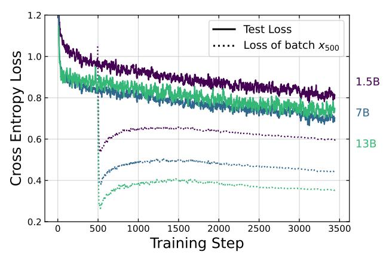
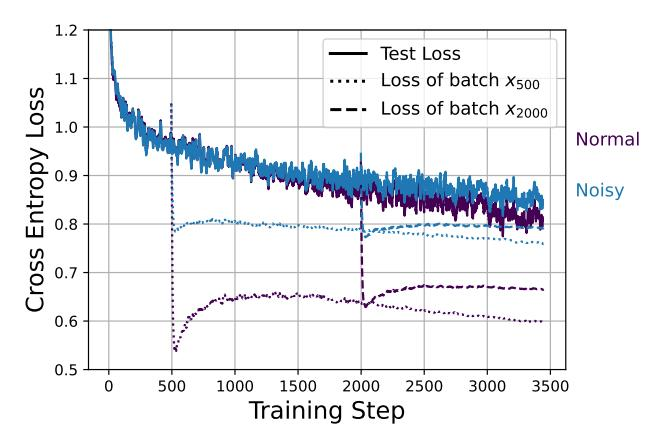
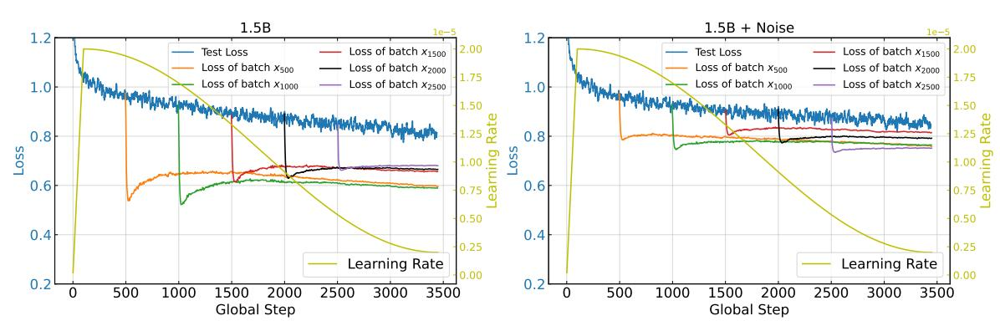
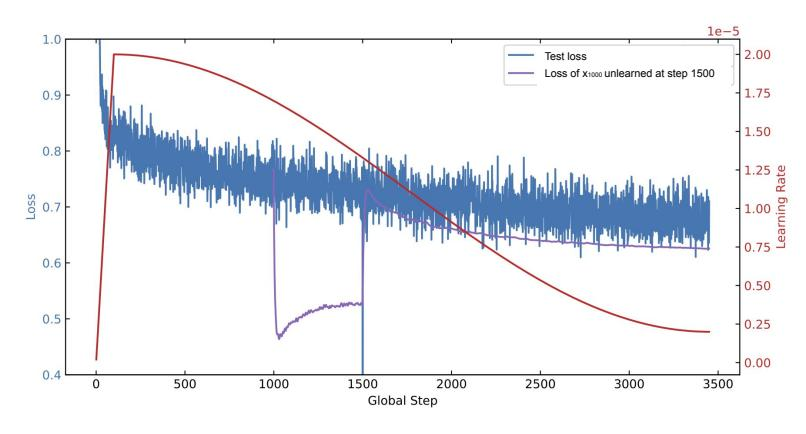

# Unmasking the Memory Giants: How do LLMs memorize during training?

#### Anonymous Authors1

Language Models memorize their training data, which can cause Intellectual Property and privacy issues if the model then outputs copyrighted content verbatim or personal information. We investigate *how* memorization occurs during fine-tuning, shifting focus from traditional post-training analyses. We discover that even 1.5B-LLMs memorize data from a single exposure throughout the entire epoch, and that the degree of memorization escalates with model size. We also explore mitigation strategies, for instance by showing that adding noise to clipped gradients or using LoRA with small rank effectively reduces memorization

# 1. Tracking Verbatim Memorization in LLMs 1.1. Approach

Approaches to measuring memorization focus on post-training analysis, including prompting the model to reproduce training data (Carlini et al., 2023; Schwarzschild et al., 2024), which requires numerous prompts and complicates a precise measurement due to the stochastic nature of LLM decoding; and analyzing the impact of individual samples by training with and without specific data (Zhang et al., 2020). Our study adopts a novel approach by monitoring *how* memorization happens during single-epoch trainings.

To simplify the study, we consider training on question/answer pairs. For a sample (q, a), our method tracks  $L_M(a|q)$ , the loss of answer a when model M is prompted with question q. We monitor how this evolves throughout training, particularly before and after M is trained on (q, a).

#### 1.2. Interpretation for GenAI and Law

Tracking the losses of training samples is an effective method for auditing verbatim memorization, as it directly translates to the number of queries needed to reproduce them. For example,  $\exp(|a|\times L_M(a|q))$ , the inverse of perplexity, indicates the expected number of queries with question q needed for M to produce answer a verbatim with random decoding. Computations for this metric under top-k or top-p decoding strategies are discussed in Appendix A.

Preliminary work. Under review by the International Conference on Machine Learning (ICML). Do not distribute.

Figure 1. Impact of Model Size on Memorization. Fine-tuning 1.5B, 7B, and 13B models over 60M tokens (question/answer pairs) for one epoch. We track the average loss  $L_M(a|q)$  (introduced in Sec. 1) for the batch processed at step  $500\ (x_{500})$ . Each color represents a model size, and the distance between full and dotted lines quantifies the degree of memorization for that batch: models never forget and memorization increases with model size.

Instead of repeatedly prompting a model with question q post-training until it outputs answer a—fewer queries indicating higher memorization— we track the expected query count continuously during training. Training on copyrighted or private material poses challenges, especially in limiting the generation of verbatim or paraphrased content. Our monitoring technique seems essential for auditing, understanding, and effectively controlling such memorization.

#### 2. Experiments

**Set-up.** Similar to in Wang et al. (2022); Sander et al. (2024a), we use Llama-2-chat-7B (Touvron et al., 2023b) to generate 1500k question/answer pairs (≈200M tokens). We then train Llama-1 models (Touvron et al., 2023a) with AdamW on this dataset closely following Alpaca (Taori et al., 2023). Refer to app. B for examples and details.

#### 2.1. LLMs never forget

In Fig. 1, we delve into the dynamics of verbatim memorization in LLMs fine-tuning by monitoring the average loss  $L_M(a|q)$  across different batches of question/answer pairs:

1. **Degree of Memorization.** The average loss in batch  $x_{500}$  drops from 1 to 0.6 for the 1.5B model. If  $a \in$ 

&lt;sup>1Anonymous Institution, Anonymous City, Anonymous Region, Anonymous Country. Correspondence to: Anonymous Author <anon.email@domain.com>.

- $x_{500}$  and a is 100 tokens, the probability to exactly output a when prompted with its corresponding question q increases in average by  $\exp((1-0.6)*100) \approx 10^{17}!$
- 2. **Dynamic.** The batch's loss undergoes a three-phase process: 1) a 20-step decline (increased memorization), associated with the 0.9 momentum of AdamW optimizer as detailed in App. C. 2) Then memorization decreases and 3) stabilizes with the same trend as the test loss, indicating improved generalization.
- 3. **Impact of size.** Comparing the memorization curves for three different sizes of Llama-1 models (1.5, 7 and 13B), using the same training parameters, we observe an increase in the degree of verbatim memorization.

Our analysis reveals how LLMs memorize and never forget. This understanding can help auditing during training or build strategies to mitigate undesired memorization.

#### 2.2. Can We Mitigate Memorization?

#### 2.2.1. NOISY TRAINING

Inspired by the literature of Differentially Private training (Song et al., 2013; Abadi et al., 2016) (DP-SGD), we propose to use the core mechanism—gradient clipping and noise addition— at the batch level to limit memorization.

In Fig. 2, we clip each batch's gradient to an  $l_2$  norm of 1 and add Gaussian noise with a base magnitude of  $\sigma = \sqrt{1/d}$ , where d is the model size. We adjust  $\sigma$  downward in tandem with the learning rate because we observed that lower learning rates already induced reduced memorization. We observe that it effectively mitigates memorization. A detailed explanation of this noise adjustment can be found in app. D.3, and why strict DP-SGD is not used in app. D.1

#### 2.2.2. Lora finetuning & Other Regularizations

Intuitively, noisy-training mitigates memorization by limiting information transmission (via gradients) in a Gaussian Channel-like manner. We have also tried to reduce network's capacity by decreasing the number of fine-tuned parameters: experiments with LoRA (Hu et al., 2021) and QLoRA (Dettmers et al., 2023), particularly using small rank (4), effectively limits memorization.

In contrast, conventional regularization like dropout and increased weight decay had minimal impact on memorization.

**Comparison** To aggregate a memorization metric in the context of (q, a) pairs, we compare the average test loss (on unseen answers) with the average loss on all training answers at the end of training. Reducing memorization corresponds to narrowing the gap between train and test losses. In tab. 1, we compare variants of LoRA with rank 64, this

Figure 2. Noisy training to reduce memorization. Fine-tuning 1.5B models with or without the noise mitigation proposed in sec. 2.2.1. Introducing small Gaussian noise to all batch's clipped gradients reduces memorization with minimal impact on test loss.

time on 200M tokens. Small rank LoRA and Noisy-LoRA significantly reduce memorization. A more comprehensive comparison with full finetuning is planned for the extension.

#### 2.2.3. Unlearning.

We use gradient ascent on a batch (backprop on minus the loss) to unlearn it. As shown in fig. 4 in App. D, it successfully reduces memorization. This unlearning method was previously used, for instance in Maini et al. (2024).

## 3. Preliminary Conclusion & Limits

**Conclusion** Our findings reveal how verbatim memorization happens during LLM fine-tuning: it can persist throughout an epoch, even if a sample is encountered just once. It tends to increase with both model size and learning rate. Moreover effective mitigation include employing noisy training or LoRA with a very small rank.

**Limits** This abstract focuses on average verbatim memorization. We will investigate the variance and the correlation with factual memorization. Additionally, while we focus on 200M and 60M token fine-tuning regime and show significant memorization in even small 1.5B models, further research is required to assess the persistence of these findings over extended training periods and other data distributions.

Table 1. Comparison of mitigation strategies. "Test" corresponds to the average test loss on unseen (q,a) pairs at the end of a one-epoch training on 200M tokens.  $L_r$  is LoRA with rank r. "Gap" is the average train-test loss difference (proportional to average memorization). "Q" is for quantized, DO for 0.5 dropout, WD for increased weight decay at 0.3, and "N" for noisy training as detailed in sec. 2.2.1 but on top of LoRA here.

|          | $L_{64}$ | $QL_{64}$ | DO   | WD   | $NL_{64}$ | $L_4$ |
|----------|----------|-----------|------|------|-----------|-------|
| Test (↓) | 0.62     | 0.63      | 0.66 | 0.66 | 0.65      | 0.67  |
| Gap (↓)  | 0.11     | 0.11      | 0.10 | 0.10 | 0.04      | 0.03  |

### References

110 111

114 115 116

118 119

153 154

156

158

- Abadi, M., Chu, A., Goodfellow, I., McMahan, H. B., Mironov, I., Talwar, K., and Zhang, L. Deep learning with differential privacy. In *Proceedings of the 2016 ACM SIGSAC conference on computer and communications security*, pp. 308–318, 2016.
- Aerni, M., Zhang, J., and Tramer, F. Evaluations of machine ` learning privacy defenses are misleading. *arXiv preprint arXiv:2404.17399*, 2024.
- 120 121 124 Carlini, N., Hayes, J., Nasr, M., Jagielski, M., Sehwag, V., Tramer, F., Balle, B., Ippolito, D., and Wallace, E. Extracting training data from diffusion models. In *32nd USENIX Security Symposium (USENIX Security 23)*, pp. 5253–5270, 2023.
- 126 128 Dettmers, T., Pagnoni, A., Holtzman, A., and Zettlemoyer, L. Qlora: Efficient finetuning of quantized llms. arxiv 2023. *arXiv preprint arXiv:2305.14314*, 2023.
- 130 131 Holtzman, A., Buys, J., Du, L., Forbes, M., and Choi, Y. The curious case of neural text degeneration. *arXiv preprint arXiv:1904.09751*, 2019.
- 134 136 Hu, E. J., Shen, Y., Wallis, P., Allen-Zhu, Z., Li, Y., Wang, S., Wang, L., and Chen, W. Lora: Low-rank adaptation of large language models. *arXiv preprint arXiv:2106.09685*, 2021.
  - Li, X., Tramer, F., Liang, P., and Hashimoto, T. Large lan- ` guage models can be strong differentially private learners, 2021.
  - Loshchilov, I. and Hutter, F. Decoupled weight decay regularization. *arXiv preprint arXiv:1711.05101*, 2017a.
- 144 145 146 147 Loshchilov, I. and Hutter, F. SGDR: Stochastic gradient descent with warm restarts. In *International Conference on Learning Representations*, 2017b.
  - Maini, P., Feng, Z., Schwarzschild, A., Lipton, Z. C., and Kolter, J. Z. Tofu: A task of fictitious unlearning for llms. *arXiv preprint arXiv:2401.06121*, 2024.
  - Sander, T., Fernandez, P., Durmus, A., Douze, M., and Furon, T. Watermarking makes language models radioactive. *arXiv preprint arXiv:2402.14904*, 2024a.
  - Sander, T., Yu, Y., Sanjabi, M., Durmus, A., Ma, Y., Chaudhuri, K., and Guo, C. Differentially private representation learning via image captioning. *arXiv preprint arXiv:2403.02506*, 2024b.
- 160 161 162 163 164 Schwarzschild, A., Feng, Z., Maini, P., Lipton, Z. C., and Kolter, J. Z. Rethinking llm memorization through the lens of adversarial compression. *arXiv preprint arXiv:2404.15146*, 2024.

- Song, S., Chaudhuri, K., and Sarwate, A. D. Stochastic gradient descent with differentially private updates. In *IEEE Global Conference on Signal and Information Processing (GlobalSIP)*, pp. 245–248, 2013.
- Stock, P., Shilov, I., Mironov, I., and Sablayrolles, A. Defending against reconstruction attacks with r\'enyi differential privacy. *arXiv preprint arXiv:2202.07623*, 2022.
- Taori, R., Gulrajani, I., Zhang, T., Dubois, Y., Li, X., Guestrin, C., Liang, P., and Hashimoto, T. B. Stanford Alpaca: An instruction-following LLaMA model, 2023.
- Touvron, H., Lavril, T., Izacard, G., Martinet, X., Lachaux, M.-A., Lacroix, T., Roziere, B., Goyal, N., Hambro, E., ` Azhar, F., et al. Llama: Open and efficient foundation language models. *arXiv preprint arXiv:2302.13971*, 2023a.
- Touvron, H., Martin, L., Stone, K., Albert, P., Almahairi, A., Babaei, Y., Bashlykov, N., Batra, S., Bhargava, P., Bhosale, S., et al. Llama 2: Open foundation and finetuned chat models. *arXiv preprint arXiv:2307.09288*, 2023b.
- Wang, Y., Kordi, Y., Mishra, S., Liu, A., Smith, N. A., Khashabi, D., and Hajishirzi, H. Self-instruct: Aligning language model with self generated instructions. *arXiv preprint arXiv:2212.10560*, 2022.
- Yu, Y., Sanjabi, M., Ma, Y., Chaudhuri, K., and Guo, C. Vip: A differentially private foundation model for computer vision. *arXiv preprint arXiv:2306.08842*, 2023.
- Zhang, Y., Jia, R., Pei, H., Wang, W., Li, B., and Song, D. The secret revealer: Generative model-inversion attacks against deep neural networks. In *Proceedings of the IEEE/CVF Conference on Computer Vision and Pattern Recognition*, pp. 253–261, 2020.

#### A. Probabilistic Model

In sec. 1, we have seen that for random decoding, the expected number of times one should query model M with question q before it outputs the answer a verbatim can be exactly be computed from the output logits. We show the same result for top-k decoding, which is inspired by Stock et al. (2022).

Let us denote  $l_i := L_M(a \mid q)[i]$  as the unnormalized output of the language model for token i. We consider  $l_i^k$ , where each value is retained as  $l_i$  if it ranks among the top-k values, and is set to 0 otherwise. Subsequently,  $p_i^k := \log\left(\frac{\exp(l_i^k[a_n])}{\sum_{j=1}^n \exp(l_i^k[j])}\right)$  represents the probability of outputting  $a_i$  conditioned on q and the sequence  $(a_1,\ldots,a_{i-1})$  using a top-k decoding strategy. The probability of outputting the entire sequence a when prompted with q is given by  $p^k(a \mid q) := \exp(-\sum_{i=1}^n p_i^k)$ . This indicates that, on average, one needs to query the language model with q  $E_q^M(a) = \frac{1}{p^k(a|q)}$  times to output a verbatim using a top-k sampling strategy. A similar calculation can be applied to other sampling strategies.

## B. Experimental details

**Set-up.** We follow the Self-Instruct protocol (Wang et al., 2022) with Llama-2-chat-7B (Touvron et al., 2023b). We prompt the model with an instruction followed by three examples of instruction/answer pairs and ask it to generate the next 20 instruction/answer pairs. We use nucleus sampling (Holtzman et al., 2019) with p=0.95 and T=0.8. We post-process the generated data to remove unfinished answers and near-duplicate instructions. This yields a dataset of 1500k instruction/answer pairs ( $\approx$ 200M tokens). See fig. 5 for a sample of instructions. We then train Llama-1 models (Touvron et al., 2023a) of different sizes on this dataset (not Llama-2 to avoid biases that could arise if the same base model were also used for fine-tuning), closely following the approach of Alpaca (Taori et al., 2023): we use AdamW (Loshchilov & Hutter, 2017a) with a batch size of 8, a learning rate of  $10^{-5}$  and a context size of 2048 tokens (which results in 1 training epoch). Learning rate follows a cosine annealing schedule (Loshchilov & Hutter, 2017b) with 100 warmup steps.

## C. Impact of momentum on memorization

When using the AdamW optimizer with a momentum setting of  $\mu$ , the influence of a given batch's gradients on the model updates exhibits a specific temporal behavior. The signal from the gradients of a batch at step t is progressively absorbed over subsequent steps, governed by the momentum parameter. This absorption can be quantitatively described by the sum of a geometric sequence. Locally assuming constant learning rate:

$$S_k = (1 - \mu) \sum_{n=0}^k \mu^n$$

where  $S_k$  represents the cumulative contribution of the batch's gradient processed at step 0 up to step k. The formula for the sum of this geometric sequence is given by:

$$S_k = (1 - \mu) \times \frac{1 - \mu^{k+1}}{1 - \mu}$$

To determine the number of steps k required for the signal to be absorbed to the extent that it reaches approximately 95%, we solve for k when  $S_k \approx 0.95$  with  $\mu = 0.9$  as in sec. 2. This is calculated as  $0.95 = 1 - 0.9^{k+1}$ 

Solving for k, we rearrange the equation:  $0.95 = 1 - 0.9^{k+1} \implies 0.9^{k+1} = 0.05 \implies k+1 = \frac{\log(0.05)}{\log(0.9)}$ , so:

$$k \approx \frac{\log(0.05)}{\log(0.9)} \approx 28$$

Therefore, it takes about 28 steps for the signal from a batch's gradients to be absorbed to 95% of its total potential impact under a momentum setting of 0.9. This corresponds to what we observe in fig. 1.

259

261

263

265

267

269

270271

272

273274

Figure 3. Fine-tuning a 1.5B model over 60M tokens (question/answer pairs) for one epoch with a 16k token batch size. (Left) We track the average loss  $L_M(a|q)$  (see sec 1) across five batches from when it is used to end of the epoch. (Right) Introducing slight Gaussian noise to each batch's clipped gradient notably reduces memorization with minimal impact on test loss. Refer to sec. 2 for details.

## **D.** Additional Experiments

## D.1. Why not using DP-SGD directly?

**DP-SGD and Noisy-Training** DP-SGD (Song et al., 2013; Abadi et al., 2016) adapts traditional SGD for training DNNs with differential privacy (DP), providing  $(\varepsilon, \delta)$ -DP guarantees, where small  $\varepsilon$  implies low memorization, through techniques Poisson Sampling, gradient clipping, and Gaussian noise addition. But aiming for strong DP guarantees reduces model utility and requires per-sample gradient clipping and larger batches for more training steps (Li et al., 2021; Yu et al., 2023; Sander et al., 2024b), which significantly increases computational costs and complicates training pipelines. We argue that it is important to distinguish between DP's strict privacy accounting and the clipping + noise-adding core mechanism of DP-SGD, which inherently limits data memorization. Studies such as Aerni et al. (2024) demonstrate that DP-SGD remains effective for image classifiers, even with high  $\varepsilon$  values. In sec. 2.2.1, we go beyond that and show that the basic clipping and noise-adding mechanism at the batch level reduces LLM memorization

#### D.2. Unlearning

Unlearning involves the deliberate forgetting of a specific sample or dataset. As described in Sec. 1, memorization stabilizes after a certain number of steps without exposure to the sample. What if we reverse the memorization process by performing a gradient ascent on the batch we wish to unlearn? In Fig.4, we monitor the loss of the batch processed at step 500. At step 1500, we back-propagate the negative loss for batch  $x_{500}$ . This action significantly reduces the average memorization of that particular batch, as evidenced by the purple curve returning to a level similar to the test loss.

Figure 4. Fine-tuning a 7B model over 60M tokens (question/answer pairs) for one epoch with a 16k token batch size. We track the average loss  $L_M(a|q)$  (see sec 1) across one batch from when it is used at step 1000 to end of the epoch. At step 1500 we compute the loss for  $x_{1000}$  and back propagate on its inverse  $L_M(x_{1000})$ , thus performing one step of gradient ascent with the purpose of unlearning.

#### D.3. Impact of Learning Rate on Memorization

In Sec. [2.2.1,](#page-1-2) we suggest reducing noise in tandem with the decay of the learning rate. This strategy helped standardize memorization across training batches and enhance test loss performance. A brief overview is visible in Fig. [2:](#page-1-0) without noise, batch x500 —processed at a higher learning rate— exhibits more memorization than x1000 (dotted line below dashed line). However, with noise decay during training, the memorization levels between these batches align more closely. This strategy also benefits the test loss, as it prevents overly noisy updates towards the end of training.

We observe that further in Fig. [3](#page-4-3) (left), where we track more batches. We note that memorization indeed naturally diminishes as the learning rate decreases. Thus, batches processed later in training, with smaller learning rates, require less noise than those processed earlier at higher rates if we want to mitigate memorization uniformly. The right panel of the figure shows that after adding noise with decay, memorization successfully decreases for all monitored batches in a uniform manner.

#### Prompt given to Llama-2-chat:

331

You are asked to come up with a set of 20 diverse task instructions. These instructions will be given to large language model and we will evaluate it for completing the instructions.

336

338

Here are the requirements:

- 334 1. Try not to repeat the verb for each instruction to maximize diversity.
  - 2. The language used for the instruction also should be diverse. For example, you should combine questions with imperative instructions.
  - 3. The type of instructions should be diverse. The list should include diverse types of tasks like open-ended generation, classification, editing, etc.
  - 2. A language model should be able to complete the instruction. For example, do not ask the assistant to create any visual or audio output. For another example, do not ask the assistant to wake you up at 5pm or set a reminder because it cannot perform any action.
  - 3. The instructions should be in English.
  - 4. The instructions should be 1 to 2 sentences long. Either an imperative sentence or a question is permitted.
  - 5. You should generate an appropriate input to the instruction. It should contain a specific example for the instruction when needed.
  - 6. Most of the instructions do not require input. In this case, you must simply put "None" in the input field.
  - 7. The input should not be the answer to the instruction. For example, if the instruction is "Write a headline for ...", the input should not be the said headline. Instead, the input should be "None".
  - 8. The output should be an appropriate response to the instruction and the input. Make sure the output is less than 100 words.
  - 9. Do not repeat instructions.

348 349 350

List of 20 tasks:

*Instuction*: Give a detailed description of a method for brainstorming an essay.

351

*Context*:

*Answer*: Mind Mapping is one of the methods for brainstorming an essay. Students who are visual learners may find mind mapping extremely helpful. In order to Mind Mapping:

Take a paper and draw a circle in the center Write your topic inside it. Just like we sketch rays protruding from a sun, draw lines coming out of the circle. Write an argument or a statement related to the topic at the end of each line. Draw another set of lines projecting from these statements and state examples that support them. Continue this exercise until you run out of all possibilities imaginable for this topic.

356 358 359

354

#### Llama-2 answer:

*Instuction*: Write a creative or imaginative response to the given prompt.

*Context*:You are a time traveler who has just arrived in ancient Egypt. What do you see?

*Response*: Wow! As I step out of my time machine, I'm surrounded by towering pyramids and the warm sun beats down on my face. I see Pharaohs riding in grand chariots, and workers building majestic temples. It's like something out of a dream!

*Instuction*: Solve a math problem.

*Context*: A snail is at the bottom of a 20-foot well. Each day, it climbs up 3 feet, but at night, it slips back 2 feet. How many days will it take for the snail to reach the top of the well?

*Response*: It will take the snail 10 days to reach the top of the well.

367 368 369

370 371 Figure 5. Example of instruction data using Self-instruct. We show the prompt which is given to Llama-2-chat-7b, and the completion.

374

376

382 383

384