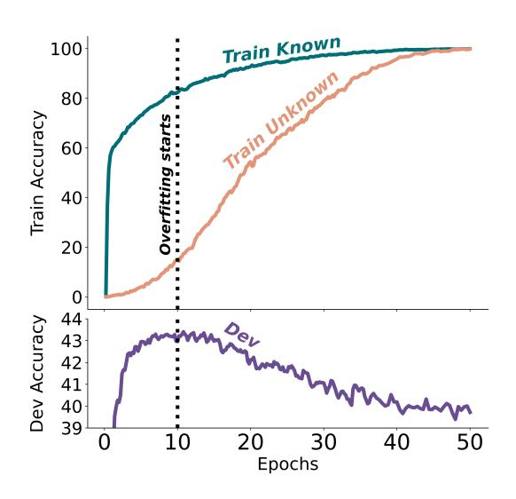
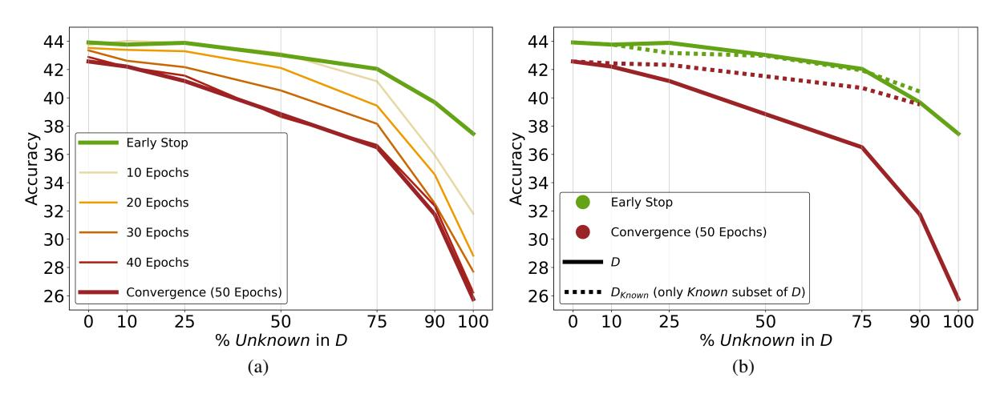
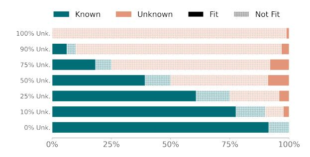
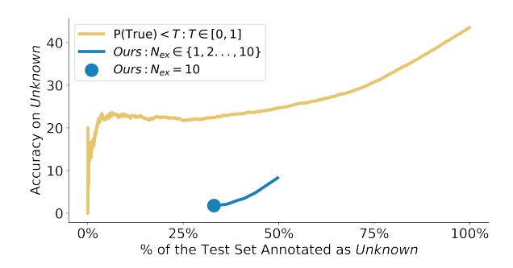
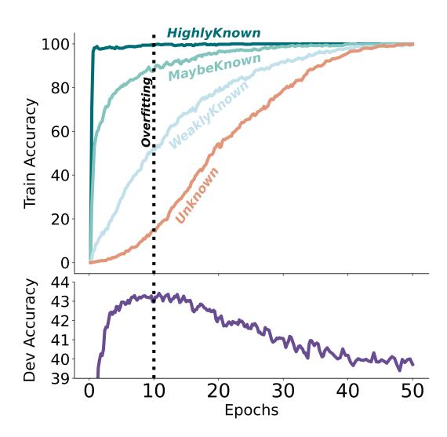
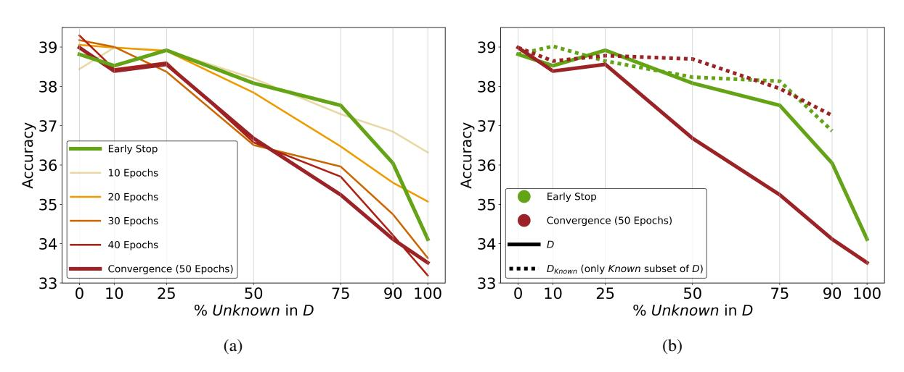

# Does Fine-Tuning LLMs on New Knowledge Encourage Hallucinations?

Zorik GekhmanT ∗ Gal YonaG Roee AharoniG Matan EyalG Amir FederG Roi ReichartT Jonathan HerzigG

> T Technion - Israel Institute of Technology GGoogle Research zorikgekhman@gmail.com, jherzig@google.com

#### Abstract

When large language models are aligned via supervised fine-tuning, they may encounter new factual information that was not acquired through pre-training. It is often conjectured that this can teach the model the behavior of *hallucinating* factually incorrect responses, as the model is trained to generate facts that are not grounded in its pre-existing knowledge. In this work, we study the impact of such exposure to new knowledge on the capability of the fine-tuned model to utilize its pre-existing knowledge. To this end, we design a controlled setup, focused on closed-book QA, where we vary the proportion of the fine-tuning examples that introduce new knowledge. We demonstrate that large language models struggle to acquire new factual knowledge through fine-tuning, as fine-tuning examples that introduce new knowledge are learned significantly slower than those consistent with the model's knowledge. However, we also find that as the examples with new knowledge are eventually learned, they linearly increase the model's tendency to hallucinate. Taken together, our results highlight the risk in introducing new factual knowledge through fine-tuning, and support the view that large language models mostly acquire factual knowledge through pre-training, whereas finetuning teaches them to use it more efficiently.

#### 1 Introduction

Pre-training Large Language Models (LLMs) on textual corpora embeds substantial factual knowledge in their parameters [\(Petroni et al.,](#page-9-0) [2019;](#page-9-0) [AlKhamissi et al.,](#page-8-0) [2022;](#page-8-0) [Cohen et al.,](#page-8-1) [2023\)](#page-8-1), which is essential for excelling in various downstream applications. These models often require further alignment to desired behaviors, typically achieved through supervised fine-tuning on instructionfollowing tasks [\(Wei et al.,](#page-9-1) [2022;](#page-9-1) [Mishra et al.,](#page-9-2) [2022\)](#page-9-2) and preference learning from human feedback [\(Ouyang et al.,](#page-9-3) [2022;](#page-9-3) [Rafailov et al.,](#page-9-4) [2024\)](#page-9-4).

Figure 1: Train and development accuracies as a function of the fine-tuning duration, when fine-tuning on 50% Known and 50% Unknown examples. Unknown examples are fitted substantially slower than Known. The best development performance is obtained when the LLM fits the majority of the Known training examples but only few of the Unknown ones. From this point, fitting Unknown examples reduces the performance.

In the fine-tuning phase, the model is usually trained on outputs created by human annotators or other LLMs. As a result, the model may encounter new factual information, extending beyond the knowledge it acquired during pre-training. This raises the question of how LLMs integrate new facts outside of their pre-existing knowledge. One possibility is that the model simply adapts by learning this new factual information. However, a common conjecture posits that such exposure to new knowledge may encourage the model to *hallucinate* factually incorrect responses, as the model is essentially trained to generate facts that are not grounded in its pre-existing knowledge [\(Schulman,](#page-9-5) [2023;](#page-9-5) [Huang et al.,](#page-8-2) [2023;](#page-8-2) [Gao,](#page-8-3) [2021;](#page-8-3) [Goldberg,](#page-8-4) [2023;](#page-8-4) [Gudibande et al.,](#page-8-5) [2023\)](#page-8-5).

In this work, we study how learning new factual

∗Work done during an internship at Google Research.

knowledge through fine-tuning impacts the model's tendency to hallucinate w.r.t. its pre-existing knowledge, exploring the above conjecture.[1](#page-1-0)

To study the impact of new knowledge, we must be able to assess whether a single fine-tuning example is consistent with the model's knowledge. We propose SliCK, a hierarchy of four *knowledge categories*, derived from a continuous measure that quantifies the agreement between modelgenerated answers and the ground-truth labels. In SliCK, examples are first categorized into Known and Unknown types, where the latter corresponds to examples with facts that are most likely unknown to the model. The Known examples are subsequently split into three categories: HighlyKnown, MaybeKnown, and WeaklyKnown (Figure [2\)](#page-2-0).

Equipped with the above method, we carefully design a controlled study, focused on closed-book question answering (QA), where we vary the proportion of the fine-tuning examples categorized as Unknown, while controlling for other factors.

Our study empirically demonstrates that learning from Unknown fine-tuning examples is linearly correlated with the model's tendency to *hallucinate* w.r.t. its pre-existing knowledge ([§4\)](#page-3-0). Conversely, learning from Known examples is correlated with better utilization of pre-existing knowledge.

Through an analysis of the training dynamics, we discover that the LLM fits Unknown fine-tuning examples *substantially slower* than Known examples (top plot in Figure [1\)](#page-0-0). This indicates that during fine-tuning, LLMs struggle to integrate new factual knowledge (present in the Unknown finetuning examples). Instead, they mostly learn to expose their pre-existing knowledge (using the Known fine-tuning examples).

From a practical perspective, mitigating overfitting using *early-stopping* (vertical dotted line in Figure [1\)](#page-0-0) can minimize the risk of the hallucinations caused by fitting the Unknown examples, since they primarily emerge in later training stages as a form of overfitting (as illustrated by the development performance decline in the bottom plot of Figure [1\)](#page-0-0). Alternatively, we also show that *filteringout* the Unknown fine-tuning examples substantially reduces the risk of overfitting, without sacrificing performance.

We further evaluate the impact of fine-tuning examples from each of our three Known knowledge categories on performance ([§5\)](#page-5-0). Unexpectedly, we find that a model fine-tuned only on examples from the highest knowledge degree, denoted HighlyKnown, does not yield the best results. Our analysis reveals that incorporating MaybeKnown fine-tuning examples, representing facts with lower degrees of certainty, plays an important part in properly handling such examples in test time. This indicates that the composition of fine-tuning examples significantly influences the extent to which LLMs effectively utilize their pre-existing knowledge.

To summarize, we study the effect of new factual knowledge in the fine-tuning data by designing a controlled setup that isolates this factor. We find that fine-tuning examples that introduce new knowledge are learned slowly, which suggests that LLMs struggle to integrate new knowledge through finetuning and supports the view that LLMs mostly acquire knowledge through pre-training [\(Zhou et al.,](#page-10-0) [2023;](#page-10-0) [Lin et al.,](#page-9-6) [2023\)](#page-9-6). However, we also find that as the model eventually learns new knowledge through fine-tuning, it becomes more prone to hallucinations w.r.t. its pre-existing knowledge. Collectively, our findings highlight the potential for unintended consequences when introducing new knowledge through fine-tuning, and imply that finetuning may be more useful as a mechanism to enhance the utilization of pre-existing knowledge.

#### 2 Study Setup

Given a fine-tuning dataset D and a pre-trained LLM M, we denote by MD a model obtained by fine-tuning M on D. To study how new knowledge in D affects MD's performance, we design a controlled setup creating variants of D with varying proportions of examples that are unknown to M.

When constructing D, our objective is to reflect instruction tuning on diverse knowledge-intensive tasks while maintaining control over the experimental setting. We thus focus on factual knowledge that can be structured as *(subject, relation, object)* triplets, which are converted into closed-book QA format. In this setup, D = {(qi , ai)} N i=1, where q is a knowledge-seeking question corresponding to a specific triplet (e.g., "*Where is Paris located?*") and a is the ground-truth answer (e.g., "*France*"). To this end, we use ENTITYQUESTIONS [\(Sciavolino](#page-9-7) [et al.,](#page-9-7) [2021\)](#page-9-7), where triplets from a diverse set of relations from Wikidata (Vrandeciˇ [c and Krötzsch](#page-9-8) ´ , [2014\)](#page-9-8) are converted to QA pairs. These relations encompass a broad spectrum of factual knowledge,

1While we focus on supervised fine-tuning, our findings are relevant to offline preference optimization methods such as DPO [\(Rafailov et al.,](#page-9-4) [2024\)](#page-9-4) that may add new knowledge.

| Type    | Category    | Definition                                        | Explanation                                                                    |  |  |
|---------|-------------|---------------------------------------------------|--------------------------------------------------------------------------------|--|--|
|         | HighlyKnown | $P_{\texttt{Correct}}(q, a; M, T = 0) = 1$        | Greedy decoding always predicts the correct answer.                            |  |  |
| Known   | MaybeKnown  | $P_{\texttt{Correct}}(q, a; M, T = 0) \in (0, 1)$ | Greedy decoding <i>sometimes</i> (but not always) predicts the correct answer. |  |  |
|         | WeaklyKnown | $P_{\texttt{Correct}}(q, a; M, T = 0) = 0 \land$  | Greedy decoding <i>never</i> predicts the correct answer, whereas temperature  |  |  |
|         |             | $P_{\texttt{Correct}}(q, a; M, T > 0) > 0$        | sampling with $T > 0$ sometimes predicts the correct answer.                   |  |  |
| Unknown | Unknown     | $P = (\alpha \times M T > 0) = 0$                 | The model <i>never</i> predicts the correct answer, thus it seem to lack the   |  |  |
|         |             | $P_{\texttt{Correct}}(q, a; M, T \ge 0) = 0$      | knowledge of the correct answer.                                               |  |  |

(a)

| Category    | Question                                | Gold Answer    | Greedy Answers                  | Sampled Answers         |  |
|-------------|-----------------------------------------|----------------|---------------------------------|-------------------------|--|
| HighlyKnown | Who founded Science of Mind?            | Ernest Holmes  | [Ernest Holmes, Ernest Holmes,] | [,]                     |  |
| MaybeKnown  | What is the capital of Toledo District? | Punta Gorda    | [Belmopan,, Punta Gorda,]       | [,]                     |  |
| WeaklyKnown | What kind of work does Scott McGrew do? | Journalist     | [Film director, Actor,]         | [Musician, Journalist,] |  |
| Unknown     | Where is Benedict located?              | Hubbard County | [Louisiana, New Mexico,]        | [Washington, Texas,]    |  |

(b)

Figure 2: Formal definitions of the SliCK knowledge categories, based on the  $P_{\texttt{Correct}}$  measure as defined in §3 (a), accompanied with real examples from the annotated EntityQuestions dataset used in our study (b).

including biographical information, geographical data, ownership and authorship details, history and more. We use the original development and test splits, and we sub-sample the train split to create different variants of D. We focus on 12 diverse relations and reserve 7 additional relations for an out-of-distribution test set, used (only) in §4.5.

As M, we use the PaLM 2-M base model (Anil et al., 2023). We focus on exact match (EM) as our evaluation metric.2 Full technical details are in §A.

#### 3 Quantifying Knowledge in LLMs

To assess the effect of new knowledge in D on the performance of  $M_D$ , we have to annotate each (q,a) pair in D w.r.t. whether M knows that the answer to q is a. To estimate this, we define a continuous  $P_{\texttt{Correct}}$  measure based on samples from M, and use it to divide (q,a) pairs into four knowledge categories. We name this approach SliCK (Sampling-based Categorization of Knowledge).

**Defining**  $P_{\texttt{Correct}}$ . We adopt the perspective that M knows that the answer to q is a if it generates a when prompted to answer q (Kadavath et al., 2022; Manakul et al., 2023). Since M is a base model that has not been specifically fine-tuned to follow instructions, we prompt M using in-context learning with few-shot exemplars. Following Rubin et al. (2022), we make sure that the few-shot exemplars have high semantic similarity to q.

In practice, M can predict different answers since (1) the choice of exemplars influences in-

dividual predictions and (2) temperature sampling, if used, introduces randomness. To reflect this, we define  $P_{\mathtt{Correct}}(q, a; M, T)$  as an estimate of how likely is M to accurately generate the correct answer a to q, when prompted with  $random\ few$ -shot exemplars and using decoding temperature T.

For the purposes of our study we approximate the value of  $P_{\texttt{Correct}}$  using  $N_{\texttt{ex}}=10$  different random 4-shot prompts.4 For each 4-shot prompt, we predict the greedy answer using T=0 and 16 sampled answers using T=0.5.  $P_{\texttt{Correct}}(q,a;M,T=0)$  is estimated by the fraction of correct greedy answers, and  $P_{\texttt{Correct}}(q,a;M,T>0)$  by the fraction of correct sampled answers. Full details are in §C.

Deriving knowledge categories from  $P_{\texttt{Correct}}$ . We define the Unknown category (bottom row in Figures 2a and 2b) to represent (q, a) pairs for which M never predicts the correct answer to q. In our notations this means that  $P_{\texttt{Correct}}(q, a; M, T \geq 0) = 0$ . Alternatively, if  $P_{\texttt{Correct}}(q, a; M, T \geq 0) > 0$ , i.e. M sometimes predicts the correct answer to q, we consider (q, a) as Known. In this choice, we posit that if prompting M to answer q can sometimes result with the correct answer a, then M must have some association with the relevant fact.

Recognizing that knowledge can vary in degrees of certainty and extent, we divide the Known (q,a) pairs into three distinct categories (top three rows in Tables 2a and 2b). Motivated by the principle that M should consistently predict a if (q,a) is Known, we put emphasis on greedy decoding outcomes, represented with  $P_{\mathtt{Correct}}(q,a;M,T=0)$ .

&lt;sup>2We validated that in our setting EM strongly correlates with word-level F1 (Rajpurkar et al., 2016), and we choose EM as it is more intuitive for the purposes of our analysis.

&lt;sup>3In our study we achieve this by using exemplars from the same relation. E.g., if q = ``Where is Paris located?'', the exemplars would follow the pattern "Where is  $\{X\}$  located?''.

 $^4$ We use 4-shot simply since we found it enough for M to output answers in the correct format.

Figure 3: Test performance as a function of the % of Unknown examples in the fine-tuning dataset D. In (a), each line corresponds to a different (fixed) number of epochs, except the EARLY\_STOP, which corresponds to early-stopping using the development set (see [§4\)](#page-3-0). In (b) we present the ablation from [§4.2.](#page-3-1) Full lines correspond to fine-tuning on D and are identical to (a). Dotted lines correspond to fine-tuning on the ablated variants DKnown, where Unknown examples are filtered-out. For 0% Unknown D =DKnown and for 100% Unknown there is no DKnown.

HighlyKnown represents (q, a) pairs for which M *always* greedily predicts a. If M *sometimes* (but not always) greedily predicts a, we consider (q, a) as MaybeKnown. Lastly, if M *never* greedily predicts a, we classify (q, a) as WeaklyKnown.

We apply SliCK to annotate each (q, a) pair in our dataset with its knowledge category w.r.t. M. [5](#page-3-2) We analyze the quality of our categories in [§6.](#page-6-0)

### 4 How Harmful are Unknown Examples?

In this section we study the effect of new knowledge in the fine-tuning dataset D on performance. To isolate this effect, we vary the proportion of Unknown examples in D, while controlling for other factors. Specifically, we fix |D| and create variants of D with X% of Unknown and (100 − X)% Known examples (full details in [§E\)](#page-13-0). We treat the Known categories collectively (see Figure [2a\)](#page-2-0), and provide a per-category analysis in [§5.](#page-5-0) We denote early-stopping based on the development set as EARLY\_STOP (happens after 5-10 epochs) and 50 fine-tuning epochs as CONVERGENCE, as at this point M always completely fits D (i.e. 100% training accuracy). We measure test performance as a proxy for hallucinations since we are in a closed-book QA setup with disjoint train/test splits, where the model has to use its per-existing knowledge to answer test questions (see [§B](#page-11-1) for further discussion).

#### 4.1 Higher Unknown Ratio is Proportional to Performance Degradation

Figure [3a](#page-3-3) presents the performance as a function of the % of Unknown examples in D, for different fine-tuning durations. Higher %Unknown leads to performance degradation, regardless of the finetuning duration, which indicates that Unknown examples are less useful than Known. Performance is also strongly affected by the fine-tuning duration, with EARLY\_STOP typically yielding the best performance. Training for more epochs usually reduces performance (with the lowest performance observed for CONVERGENCE), which can be attributed to overfitting D. Interestingly, this effect increases with larger %Unknown (the inter-line spacing from EARLY\_STOP exhibits a monotonic increase along the positive x-axis), suggesting that a higher %Unknown increases the risk of overfitting.

### 4.2 Unknown Examples: Harmful or Neutral?

Since |D| is fixed, performance drops for higher %Unknown could stem from simply the lower number of the Known fine-tuning examples. Thus, it is still not clear if Unknown examples are *harmful* or *neutral*. To address this, we measure the effect of filtering-out all the Unknown examples from D. For each D variant, we create a corresponding ablated variant DKnown, consisting only from the Known examples in D. E.g., if D has 25% Unknown, we filter them out and are left with the remaining 75% Known examples and get |DKnown | = 0.75 × |D|.

Figure [3b](#page-3-3) presents the results. Perhaps surprisingly, for EARLY\_STOP the results for D are almost

5 In ENTITYQUESTIONS we have 24% HighlyKnown, 23% MaybeKnown, 17%, WeaklyKnown, and 36% Unknown. Full per-relation statistics are in [§D.](#page-13-1)

Figure 4: The state of the examples in the fine-tuning dataset D after EARLY\_STOP. For each variant of D (yaxis), we illustrate which portion of the examples in D the model fits (i.e. predicts the correct answer for q).

identical to DKnown, indicating that the Unknown examples had a *neutral* effect on performance (as their removal had minimal impact). Conversely, the CONVERGENCE results show that with longer training, Unknown examples are actually very *harmful*. In this case D under-performs DKnown, and the gap between them is proportional to the Unknown ratio.

Interestingly, for DKnown, the gap between EARLY\_STOP and CONVERGENCE is very small (dotted lines), while this gap is very large for D (full lines). This indicates that the presence of Unknown examples is what makes the variants with higher Unknown ratios more prone to overfitting.

### 4.3 Unknown Examples are Fitted Slower than Known Examples

We showed that Unknown examples are harmful, but their negative effect is mostly materialized in later training stages, and thus can be empirically avoided using early stopping. To better understand these trends, we analyze the training dynamics by examining which fine-tuning examples in D were fitted by M during various fine-tuning stages. Figure [1](#page-0-0) presents the train accuracy of the Known and Unknown subsets of D as a function of the finetuning duration. The development accuracy is presented in a zoomed-in plot at the bottom, as it falls within a narrower range. We include a breakdown of the train accuracy per Known category in [§F.](#page-14-0)

M fits Unknown fine-tuning examples substantially slower than Known. In EARLY\_STOP (vertical dotted line), M reaches peak performance on the development set, while fitting the majority of the Known examples but only a small fraction of the Unknown. In Figure [4,](#page-4-1) we show that this behavior is consistent across all our variants of D. This can explain why in EARLY\_STOP the Unknown examples had a *neutral* effect on performance ([§4.2\)](#page-3-1),

|                            | β0   | βkn | βunk | R2   |
|----------------------------|------|-----|------|------|
| In-distribution (§4.4)     | 36.9 | 7.3 | −8.3 | 0.86 |
| Out-of-distribution (§4.5) | 36.2 | 3.2 | −3.0 | 0.95 |

Table 1: Results of our linear model for predicting the test accuracy as defined by Equation [\(1\)](#page-4-3).

as at this point M still did not fit most of them. Lastly, since Unknown examples are the ones that are likely to introduce new factual knowledge, their significantly slow fitting rate suggests that LLMs struggle to acquire new factual knowledge through fine-tuning, instead they learn to expose their preexisting knowledge using the Known examples.

### 4.4 The Influence of Unknown vs Known on Accuracy: A Linear Model Perspective

Figure [1](#page-0-0) demonstrates that after the development performance peaks at EARLY\_STOP (vertical dotted line), it deteriorates as M gradually fits more Unknown examples. In this section, we aim to characterize this relationship more accurately by assessing whether a simple linear dependency can tie the impact of fitting Known and Unknown training examples on test accuracy. To this end we use the following linear regression model:

$$Accuracy = \beta_0 + \beta_{kn} \cdot \frac{N_{kn}}{|D|} + \beta_{unk} \cdot \frac{N_{unk}}{|D|} \quad (1)$$

where NKn and NUnk are the number of the Known and Unknown examples in D that M fits.

We estimate the coefficients[6](#page-4-4) by collecting (Accuracy, NKn, NUnk) values after each epoch from models fine-tuned on all D variants. Table [1](#page-4-5) presents the results (top row). The high R2 indicates a strong linear relationship between test accuracy and the type of training examples that are fitted. Our model entails that fitting Unknown examples hurts performance (βunk < 0), while fitting Known examples improves it (βkn > 0). The estimated negative impact from Unknown roughly matches the positive impact from Known (|βukn| ≈ |βkn|).

#### 4.5 Generalization to New Relations

In the above setup, the (q, a) pairs in the test set correspond to triplets with the same set of 12 relations appearing in D. We now investigate whether our observed dynamics has a broader effect on the model's knowledge, and transfers to relations not

6 Full details in [§G.](#page-14-1) We note that this linear model is only valid in bounded region of Nkn ≤ |D|, Nunk ≤ |D|.

| EARLY_STOP | CONVERGENCE |
|------------|-------------|
|------------|-------------|

|              | Full | Hkn  | Mkn  | Wkn  | Unk | Full | Hkn  | Mkn  | Wkn  | Unk |
|--------------|------|------|------|------|-----|------|------|------|------|-----|
| DHighlyKnown | 40.5 | 98.7 | 60.1 | 9.0  | 0.6 | 40.0 | 98.4 | 58.8 | 8.5  | 0.7 |
| DMaybeKnown  | 43.6 | 98.4 | 69.9 | 12.1 | 1.0 | 43.2 | 97.5 | 68.2 | 12.9 | 1.3 |
| DWeaklyKnown | 39.2 | 95.0 | 59.2 | 8.6  | 0.4 | 35.4 | 73.5 | 55.8 | 17.2 | 2.2 |
| DUnknown     | 37.5 | 95.6 | 52.9 | 6.5  | 0.6 | 25.8 | 55.8 | 36.6 | 12.2 | 3.2 |
| DNatural     | 43.5 | 98.0 | 67.6 | 14.1 | 1.8 | 41.8 | 95.5 | 61.7 | 14.8 | 2.5 |

Table 2: Accuracies for the single-category variants from [§5,](#page-5-0) across per-category subsets of the test set. Full is the original test set (all the categories together). Hkn=HighlyKnown, Mkn=MaybeKnown, Wkn=WeaklyKnown, Unk=Unknown. In each column, the best result is in bold, as well as the results for which the difference from the best is not statistically significant with p < 0.05 (significance test details are in [§I\)](#page-15-0).

represented in D. To test this, we reserve a subset of the relations for an *out-of-distribution* (OOD) test set, excluding them from the train and development splits. See [§A](#page-11-0) for details and Tables [4](#page-12-1) and [5](#page-13-2) for in-distribution vs OOD relations.

Our results on the OOD test set reveal similar key insights: (1) Higher Unknown ratio leads to lower OOD test performance and (2) Unknown examples are harmful for OOD performance, but mostly when M fits them. A linear model of the OOD test accuracy (Equation [\(1\)](#page-4-3)), shows similar trends: βunk < 0, βkn > 0, |βukn| ≈ |βkn| and R2 = 0.95 (see Table [1\)](#page-4-5). More details are in [§H.](#page-14-2)

Overall, *our insights transfer across relations*. This essentially shows that fine-tuning on Unknown examples such as *"Where is [E1] located?"*, can encourage hallucinations on seemingly unrelated questions, such as *"Who founded [E2]?"*. This further supports the conclusion that the observed effects likely stem from the model learning the *behavior* of generating answers that are not grounded in its pre-existing knowledge.

### 5 Understanding Knowledge Types: Their Value and Impact

When addressing our main research question on the effect of Unknown fine-tuning examples, we treated the Known categories collectively for simplicity (see Figure [2a\)](#page-2-0). We now examine the effect of each category, exploring the following questions: Q1: How *training examples* from each category impact the test performance? Q2: What is the model's performance across *test examples* from each category? To address Q1 we created single-category variants of the fine-tuning dataset D. A variant of D consisting solely of examples from the category CAT is denoted as DCAT. For reference, we include

a variant with the *natural* categories distribution in ENTITYQUESTIONS, denoted DNatural. |D| is fixed and identical to our experiments in [§4.](#page-3-0) To address Q2, we further break down the test set performance by category. Table [2](#page-5-1) presents the results.

**MaybeKnown** Examples are Essential. Since Unknown examples are harmful, one might expect that it would be best to fine-tune on the most exemplary HighlyKnown examples. Surprisingly, DHighlyKnown does not obtain the best overall results, as it excels on HighlyKnown test examples, yet its performance on the remaining categories is inferior. DMaybeKnown yields the best overall performance. Compared to DHighlyKnown, DMaybeKnown enhances MD's performance on MaybeKnown (60.1→69.9), without compromising performance on HighlyKnown (98.7 → 98.4). This suggests that MaybeKnown fine-tuning examples are essential for MD to correctly handle such examples during inference. It also demonstrates that with the right fine-tuning examples, MD becomes more capable of utilizing its pre-existing knowledge.

Limited Knowledge Enhances Overfitting. In [§4.2,](#page-3-1) we demonstrated that Unknown fine-tuning examples increase the risk of overfitting. We now observe that this also applies to WeaklyKnown, though to a lesser degree. Specifically, at CONVERGENCE, DWeaklyKnown and DUnknown experience significant performance drops compared to EARLY\_STOP (39.2 → 35.4 and 37.5 → 25.8). With training to CONVERGENCE, they show a modest improvement on WeaklyKnown and Unknown but substantially degrade on HighlyKnown and MaybeKnown. This highlights that the decrease in performance is strongly attributed to an increased rate of hallucinations w.r.t. facts that were already known to M after pre-training.

Interestingly, DNatural performs on-par with DMaybeKnown in EARLY\_STOP, suggesting that the mere presence of MaybeKnown examples in D suffices for high performance on MaybeKnown, even if D has additional examples from other categories. Yet, DNatural's performance degrades significantly[7](#page-6-1) after CONVERGENCE, under-performing DMaybeKnown – indicating that it still suffers from overfitting, most-likely due to the presence of WeaklyKnown and Unknown examples. Taken together these results demonstrate that DMaybeKnown stands out both in terms of top performance and reduced risk to overfitting.

### 6 SliCK Knowledge Categories Analysis

Assessing a model's knowledge remains an open problem, particularly since evaluating the quality of such methods is challenging due to the lack of ground truth about what the model truly knows. In this work we proposed SliCK ([§3\)](#page-2-1): a four-category classification of facts w.r.t. the model's knowledge. We now further analyze and discuss our design choices, hoping that SliCK can serve as a useful taxonomy to guide future research on this subject.

Fine-grained Known Categories We first reflect on whether our choice of splitting Known into more fine-grained categories, based on the greedy decoding outcome, has been proven meaningful. As shown in Table [2,](#page-5-1) HighlyKnown indeed captures facts with high degree of knowledge, as it consistently exceeds 95% accuracy post fine-tuning, while MaybeKnown and WeaklyKnown seem to represent weaker knowledge degrees. As intended, the performance on WeaklyKnown is worse that on MaybeKnown but better than on Unknown. Additionally, the *exact* categories distinction we made was proven useful since it revealed important insights on the importance of the MaybeKnown finetuning examples, as discussed in detail in [§5.](#page-5-0)

Benchmarking Unknown Test Examples A desired property for (q, a) pairs classified as Unknown that appear in the test set, is that M will incorrectly answer q post fine-tuning (otherwise they are not truly Unknown).[8](#page-6-2) In Table [2](#page-5-1) we can see that the accuracy on Unknown is extremely low (3.2% or less), which is a strong indicator that most of the Unknown examples are actually unknown to M.

Figure 5: SliCK Unknown categorization vs. classifying examples with P(True) < T as Unknown. The x-axis is the % of test examples classified as Unknown and the y-axis is the accuracy on these examples post finetuning. The yellow line is P(True) for T ∈ [0, 1]. Our Unknown category is the blue circle and the blue line corresponds to approximating PCorrect with less than 10 random 4-shot exemplars (see [§3](#page-2-1) and [§C\)](#page-12-0).

As a case study for comparison, we analyze the P(True) approach by [Kadavath et al.](#page-8-7) [\(2022\)](#page-8-7): a continuous score that estimates the probability a model assigns to the correctness of a specific answer. P(True) was originally used for *self-evaluating* model-generated answers, while we use it to assess whether M considers the ground-truth answer as correct. In Figure [5,](#page-6-3) we explore classifying examples below a P(True) threshold as Unknown and compare this methodology to SliCK. Our results indicate that, at least in our setting, our approach categorizes Unknown examples for which the model's performance after fine-tuning is significantly worse. Specifically, looking at fixed values on the x-axis shows that if we would label a similar fraction of test examples as Unknown using both methods, the accuracy on the P(True)-based Unknown examples would be much higher post fine-tuning.[9](#page-6-4) Lastly, the blue line shows that using samples from multiple few-shot prompts to approximate PCorrect is crucial, as using Nex < 10 leads to higher test accuracy on SliCK Unknown examples.

### 7 Discussion

Practical Implications. This work highlights the risk in using supervised fine-tuning to update LLMs' knowledge, as we present empirical evidence that acquiring new knowledge through finetuning is correlated with hallucinations w.r.t preexisting knowledge. Additionally, this work raises important questions for future exploration regard-

7 See [§I](#page-15-0) for details about this statistic significance test.

8 Since in our closed-book QA setup the train and test sets are disjoint, the model has to rely on its pre-existing knowledge to answer test questions.

9This is a preliminary analysis, and we leave a comprehensive comparison for future work. More details in [§J.](#page-15-1)

ing fine-tuning practices. We saw that Unknown examples are fitted slower than the Known ones, thus their negative effect manifests as a form of *overfitting*, which emphasizes the importance of using *early-stopping* instead of a fixed number of finetuning steps. However, early-stopping may be less effective when fine-tuning on numerous tasks with distinct optimal stopping points. An alternative solution can be to align the fine-tuning data with the model's knowledge by filtering-out Unknown examples. We show initial evidence that this can reduce the risk of overfitting without compromising performance. A possible drawback of filtering is that Unknown fine-tuning examples can still be useful to teach LLMs to express uncertainty on Unknown test examples [\(Zhang et al.,](#page-10-1) [2023\)](#page-10-1). This raises the question: *can re-labeling* Unknown *finetuning examples with uncertainty expressions* (e.g., *"I don't know"*) *reduce their negative effect?* Our preliminary experiment (described in [§K\)](#page-16-0) suggests that the answer is *yes*, which indicates that such approaches could be the most promising. Exploring this is an interesting direction for future work.

Superficial Alignment Hypothesis. [Zhou et al.](#page-10-0) [\(2023\)](#page-10-0) hypothesized that the knowledge and capabilities of LLMs are mostly learned during pretraining, while alignment is a simple process where the model learns the style or format for interacting with users. They substantiate this hypothesis by showing that fine-tuning on just 1k high-quality examples can result with a competitive assistant LLM, named LIMA. As discussed in [§4.3,](#page-4-6) we show evidence that LLMs struggle to acquire new knowledge present in the Unknown examples and mostly learn to utilize their pre-existing knowledge. We also showed that fine-tuning on HighlyKnown examples led to sub-optimal utilization of preexisting knowledge, despite our task format being simpler than LIMA's and our dataset being six times larger. Taken together, our findings suggest that even though most of the LLM's knowledge is indeed acquired through pre-training, the model learns more than just style or format through finetuning, as the selection of fine-tuning examples significantly influences the model's capability to utilize its pre-existing knowledge post fine-tuning.

#### 8 Related Work

New knowledge and hallucinations. [Schulman](#page-9-5) [\(2023\)](#page-9-5), [Goldberg](#page-8-4) [\(2023\)](#page-8-4) and [Gudibande et al.](#page-8-5) [\(2023\)](#page-8-5) mention the conjecture that fine-tuning on

new factual knowledge may encourage hallucinations. [Huang et al.](#page-8-2) [\(2023\)](#page-8-2) categorized hallucination causes and formally defined this scenario as *capability misalignment*. They highlight that limited research addresses capability misalignment due to the challenge of defining the knowledge boundary of LLMs. [Kang et al.](#page-8-8) [\(2024\)](#page-8-8) showed that when a fine-tuned LLM encounters unknown queries at test time, its responses mimic the responses associated with the unknown examples in the fine-tuning data. [Yin et al.](#page-9-12) [\(2023\)](#page-9-12) showed that LLMs' performance is not satisfactory when they face new knowledge in their input contexts and [Lee et al.](#page-9-13) [\(2023\)](#page-9-13) analyzed the impact of unknown *in-context* learning examples. To the best of our knowledge, our work is the first to empirically assess the impact of exposure to new knowledge through fine-tuning on tendency of the fine-tuned model to hallucinate.

Quantifying knowledge in LLMs. SliCK can be seen as a confidence elicitation method for the ground truth label (M *knows* (q, a) if it is confident that a is the answer to q). Existing work derive calibrated confidence from LLMs by examining agreement across multiple samples [\(Kuhn et al.,](#page-9-14) [2023;](#page-9-14) [Manakul et al.,](#page-9-9) [2023;](#page-9-9) [Tian et al.,](#page-9-15) [2023a;](#page-9-15) [Lyu et al.,](#page-9-16) [2024\)](#page-9-16), probing internal representations [\(Azaria and](#page-8-9) [Mitchell,](#page-8-9) [2023;](#page-8-9) [Burns et al.,](#page-8-10) [2022\)](#page-8-10), eliciting verbalized probability [\(Tian et al.,](#page-9-17) [2023b\)](#page-9-17) or direct prompting [\(Kadavath et al.,](#page-8-7) [2022\)](#page-8-7). [Kadavath et al.](#page-8-7) also trained a separate P(IK) model to predict if the LLM knows the answer to q. The label for P(IK) was approximated by the fraction of correct sampled answers, which is conceptually aligned with PCorrect ([§3\)](#page-2-1). A key difference is that we also define the SliCK categories, and provide evidence that we capture meaningful and useful categories.

#### 9 Conclusion

We study the impact of integrating new factual knowledge through fine-tuning on the model's tendency to hallucinate. We first propose SliCK, a categorization of facts w.r.t. LLM's knowledge. We then design a controlled study where we isolate the impact of new knowledge and rigorously evaluate its effects. We provide multiple insights on the fine-tuning dynamics, with the following key findings: (1) Acquiring new knowledge via supervised fine-tuning is correlated with hallucinations w.r.t. pre-existing knowledge. (2) LLMs struggle to integrate new knowledge through fine-tuning and mostly learn to use their pre-existing knowledge.

#### 10 Limitations

Our experiments were conducted using a single LLM, and thus it is unclear whether results will vary with different LLMs. Having said that, our study is extremely compute-heavy and thus challenging to replicate on multiple LLMs: First, our fine-tuning is compute-heavy as its runs are very long as we wanted to analyze the behavior during different stages of fine-tuning (including the overfitting stages). Second, and most importantly, to facilitate our study we needed to annotate a large scale dataset w.r.t the SliCK categories. To derive reliable conclusions, it was crucial to accurately assess the model's knowledge w.r.t. a single finetuning example. In our case we run 170 inference steps per example, i.e., more than 15M inference steps to categorize our full dataset.

In addition, since we focus on closed-book QA, the practical implications from our study such as filtering-out Unknown fine-tuning examples still require validation in settings involving long-form text generation. To filter-out examples that introduce new factual knowledge in long-form generation tasks, one would need to make adaptations to SliCK and come up with an effective way to compare the sampled answer with the ground-truth to approximate PCorrect. We leave this for future work. Long-form generation tasks introduce evaluation challenges, leading to a wide adoption of LLM-based evaluations. Our choice to focus explicitly on closed book QA facilitates more accurate evaluation that enhances the reliability of our findings.

Lastly, we did not test the effect of adding additional fine-tuning examples from diverse tasks into the fine-tuning mixture. While this could more closely approximate a typical instruction finetuning scenario, such dataset extension may introduce new factual knowledge in an uncontrollable way, which will limit our findings.

#### 11 Acknowledgments

We would like to thank Ori Ram, Uri Shaham, Alon Jacovi, Mor Ventura, Yochai Blau, Eyal Ben-David, Avi Caciularu, Avinatan Hassidim and the members of Roi Reichart's NLP group for reviewing the paper draft and providing valuable feedback. Special thanks to Uri Shaham for assisting in setting up the fine-tuning pipeline during the early stages of our research.

### References

- Badr AlKhamissi, Millicent Li, Asli Celikyilmaz, Mona Diab, and Marjan Ghazvininejad. 2022. A review on language models as knowledge bases. *arXiv preprint arXiv:2204.06031*.
- Rohan Anil, Andrew M Dai, Orhan Firat, Melvin Johnson, Dmitry Lepikhin, Alexandre Passos, Siamak Shakeri, Emanuel Taropa, Paige Bailey, Zhifeng Chen, et al. 2023. Palm 2 technical report. *arXiv preprint arXiv:2305.10403*.
- Amos Azaria and Tom Mitchell. 2023. The internal state of an llm knows when its lying. *arXiv preprint arXiv:2304.13734*.
- Collin Burns, Haotian Ye, Dan Klein, and Jacob Steinhardt. 2022. Discovering latent knowledge in language models without supervision. *arXiv preprint arXiv:2212.03827*.
- Roi Cohen, Mor Geva, Jonathan Berant, and Amir Globerson. 2023. [Crawling the internal knowledge](https://doi.org/10.18653/v1/2023.findings-eacl.139)[base of language models.](https://doi.org/10.18653/v1/2023.findings-eacl.139) In *Findings of the Association for Computational Linguistics: EACL 2023*, pages 1856–1869, Dubrovnik, Croatia. Association for Computational Linguistics.
- Leo Gao. 2021. [Behavior cloning is miscalibrated.](https://www.alignmentforum.org/posts/BgoKdAzogxmgkuuAt/behavior-cloning-is-miscalibrated) *AI Alignment Forum*.
- Yoav Goldberg. 2023. [Reinforcement learning for lan](https://gist.github.com/yoavg/6bff0fecd65950898eba1bb321cfbd81)[guage models.](https://gist.github.com/yoavg/6bff0fecd65950898eba1bb321cfbd81)
- Arnav Gudibande, Eric Wallace, Charlie Snell, Xinyang Geng, Hao Liu, Pieter Abbeel, Sergey Levine, and Dawn Song. 2023. The false promise of imitating proprietary llms. *arXiv preprint arXiv:2305.15717*.
- Lei Huang, Weijiang Yu, Weitao Ma, Weihong Zhong, Zhangyin Feng, Haotian Wang, Qianglong Chen, Weihua Peng, Xiaocheng Feng, Bing Qin, et al. 2023. A survey on hallucination in large language models: Principles, taxonomy, challenges, and open questions. *arXiv preprint arXiv:2311.05232*.
- Saurav Kadavath, Tom Conerly, Amanda Askell, Tom Henighan, Dawn Drain, Ethan Perez, Nicholas Schiefer, Zac Hatfield-Dodds, Nova DasSarma, Eli Tran-Johnson, et al. 2022. Language models (mostly) know what they know. *arXiv preprint arXiv:2207.05221*.
- Ehsan Kamalloo, Nouha Dziri, Charles L. A. Clarke, and Davood Rafiei. 2023. [Evaluating open-domain](https://doi.org/10.18653/V1/2023.ACL-LONG.307) [question answering in the era of large language mod](https://doi.org/10.18653/V1/2023.ACL-LONG.307)[els.](https://doi.org/10.18653/V1/2023.ACL-LONG.307) In *Proceedings of the 61st Annual Meeting of the Association for Computational Linguistics (Volume 1: Long Papers), ACL 2023, Toronto, Canada, July 9-14, 2023*, pages 5591–5606. Association for Computational Linguistics.
- Katie Kang, Eric Wallace, Claire Tomlin, Aviral Kumar, and Sergey Levine. 2024. Unfamiliar finetuning examples control how language models hallucinate. *arXiv preprint arXiv:2403.05612*.

- Lorenz Kuhn, Yarin Gal, and Sebastian Farquhar. 2023. Semantic uncertainty: Linguistic invariances for uncertainty estimation in natural language generation. *arXiv preprint arXiv:2302.09664*.
- Yoonsang Lee, Pranav Atreya, Xi Ye, and Eunsol Choi. 2023. Crafting in-context examples according to lms' parametric knowledge. *arXiv preprint arXiv:2311.09579*.
- Bill Yuchen Lin, Abhilasha Ravichander, Ximing Lu, Nouha Dziri, Melanie Sclar, Khyathi Chandu, Chandra Bhagavatula, and Yejin Choi. 2023. [The unlock](http://arxiv.org/abs/2312.01552)[ing spell on base llms: Rethinking alignment via](http://arxiv.org/abs/2312.01552) [in-context learning.](http://arxiv.org/abs/2312.01552) *ArXiv preprint*.
- Qing Lyu, Kumar Shridhar, Chaitanya Malaviya, Li Zhang, Yanai Elazar, Niket Tandon, Marianna Apidianaki, Mrinmaya Sachan, and Chris Callison-Burch. 2024. Calibrating large language models with sample consistency. *arXiv preprint arXiv:2402.13904*.
- Potsawee Manakul, Adian Liusie, and Mark JF Gales. 2023. Selfcheckgpt: Zero-resource black-box hallucination detection for generative large language models. *arXiv preprint arXiv:2303.08896*.
- Swaroop Mishra, Daniel Khashabi, Chitta Baral, and Hannaneh Hajishirzi. 2022. [Cross-task generaliza](https://doi.org/10.18653/v1/2022.acl-long.244)[tion via natural language crowdsourcing instructions.](https://doi.org/10.18653/v1/2022.acl-long.244) In *Proceedings of the 60th Annual Meeting of the Association for Computational Linguistics (Volume 1: Long Papers)*, pages 3470–3487, Dublin, Ireland. Association for Computational Linguistics.
- Long Ouyang, Jeffrey Wu, Xu Jiang, Diogo Almeida, Carroll L. Wainwright, Pamela Mishkin, Chong Zhang, Sandhini Agarwal, Katarina Slama, Alex Ray, John Schulman, Jacob Hilton, Fraser Kelton, Luke Miller, Maddie Simens, Amanda Askell, Peter Welinder, Paul F. Christiano, Jan Leike, and Ryan Lowe. 2022. [Training language models to follow instruc](http://papers.nips.cc/paper_files/paper/2022/hash/b1efde53be364a73914f58805a001731-Abstract-Conference.html)[tions with human feedback.](http://papers.nips.cc/paper_files/paper/2022/hash/b1efde53be364a73914f58805a001731-Abstract-Conference.html) In *Advances in Neural Information Processing Systems 35: Annual Conference on Neural Information Processing Systems 2022, NeurIPS 2022, New Orleans, LA, USA, November 28 - December 9, 2022*.
- Fabio Petroni, Tim Rocktäschel, Sebastian Riedel, Patrick Lewis, Anton Bakhtin, Yuxiang Wu, and Alexander Miller. 2019. [Language models as knowl](https://doi.org/10.18653/v1/D19-1250)[edge bases?](https://doi.org/10.18653/v1/D19-1250) In *Proceedings of the 2019 Conference on Empirical Methods in Natural Language Processing and the 9th International Joint Conference on Natural Language Processing (EMNLP-IJCNLP)*, pages 2463–2473, Hong Kong, China. Association for Computational Linguistics.
- Rafael Rafailov, Archit Sharma, Eric Mitchell, Christopher D Manning, Stefano Ermon, and Chelsea Finn. 2024. Direct preference optimization: Your language model is secretly a reward model. *Advances in Neural Information Processing Systems*, 36.

- Pranav Rajpurkar, Jian Zhang, Konstantin Lopyrev, and Percy Liang. 2016. [SQuAD: 100,000+ questions for](https://doi.org/10.18653/v1/D16-1264) [machine comprehension of text.](https://doi.org/10.18653/v1/D16-1264) In *Proceedings of the 2016 Conference on Empirical Methods in Natural Language Processing*, pages 2383–2392, Austin, Texas. Association for Computational Linguistics.
- Ohad Rubin, Jonathan Herzig, and Jonathan Berant. 2022. [Learning to retrieve prompts for in-context](https://doi.org/10.18653/v1/2022.naacl-main.191) [learning.](https://doi.org/10.18653/v1/2022.naacl-main.191) In *Proceedings of the 2022 Conference of the North American Chapter of the Association for Computational Linguistics: Human Language Technologies*, pages 2655–2671, Seattle, United States. Association for Computational Linguistics.
- John Schulman. 2023. [Reinforcement learning from](https://www.youtube.com/watch?v=hhiLw5Q_UFg&ab_channel=BerkeleyEECS) [human feedback: Progress and challenges.](https://www.youtube.com/watch?v=hhiLw5Q_UFg&ab_channel=BerkeleyEECS)
- Christopher Sciavolino, Zexuan Zhong, Jinhyuk Lee, and Danqi Chen. 2021. [Simple entity-centric ques](https://doi.org/10.18653/V1/2021.EMNLP-MAIN.496)[tions challenge dense retrievers.](https://doi.org/10.18653/V1/2021.EMNLP-MAIN.496) In *Proceedings of the 2021 Conference on Empirical Methods in Natural Language Processing, EMNLP 2021, Virtual Event / Punta Cana, Dominican Republic, 7-11 November, 2021*, pages 6138–6148. Association for Computational Linguistics.
- Katherine Tian, Eric Mitchell, Huaxiu Yao, Christopher D Manning, and Chelsea Finn. 2023a. Finetuning language models for factuality. *arXiv preprint arXiv:2311.08401*.
- Katherine Tian, Eric Mitchell, Allan Zhou, Archit Sharma, Rafael Rafailov, Huaxiu Yao, Chelsea Finn, and Christopher D Manning. 2023b. Just ask for calibration: Strategies for eliciting calibrated confidence scores from language models fine-tuned with human feedback. *arXiv preprint arXiv:2305.14975*.
- Denny Vrandeciˇ c and Markus Krötzsch. 2014. ´ [Wiki](https://doi.org/10.1145/2629489)[data: a free collaborative knowledgebase.](https://doi.org/10.1145/2629489) *Commun. ACM*, 57(10):78–85.
- Cunxiang Wang, Sirui Cheng, Qipeng Guo, Yuanhao Yue, Bowen Ding, Zhikun Xu, Yidong Wang, Xiangkun Hu, Zheng Zhang, and Yue Zhang. 2023. [Evaluating open-qa evaluation.](http://papers.nips.cc/paper_files/paper/2023/hash/f323d594aa5d2c68154433a131c07959-Abstract-Datasets_and_Benchmarks.html) In *Advances in Neural Information Processing Systems 36: Annual Conference on Neural Information Processing Systems 2023, NeurIPS 2023, New Orleans, LA, USA, December 10 - 16, 2023*.
- Jason Wei, Maarten Bosma, Vincent Y. Zhao, Kelvin Guu, Adams Wei Yu, Brian Lester, Nan Du, Andrew M. Dai, and Quoc V. Le. 2022. [Finetuned](https://openreview.net/forum?id=gEZrGCozdqR) [language models are zero-shot learners.](https://openreview.net/forum?id=gEZrGCozdqR) In *The Tenth International Conference on Learning Representations, ICLR 2022, Virtual Event, April 25-29, 2022*. OpenReview.net.
- Xunjian Yin, Baizhou Huang, and Xiaojun Wan. 2023. [ALCUNA: Large language models meet new knowl](https://doi.org/10.18653/v1/2023.emnlp-main.87)[edge.](https://doi.org/10.18653/v1/2023.emnlp-main.87) In *Proceedings of the 2023 Conference on Empirical Methods in Natural Language Processing*, pages 1397–1414, Singapore. Association for Computational Linguistics.

- Gal Yona, Roee Aharoni, and Mor Geva. 2024. Narrowing the knowledge evaluation gap: Open-domain question answering with multi-granularity answers. *arXiv preprint arXiv:2401.04695*.
- Hanning Zhang, Shizhe Diao, Yong Lin, Yi R Fung, Qing Lian, Xingyao Wang, Yangyi Chen, Heng Ji, and Tong Zhang. 2023. R-tuning: Teaching large language models to refuse unknown questions. *arXiv preprint arXiv:2311.09677*.
- Chunting Zhou, Pengfei Liu, Puxin Xu, Srinivasan Iyer, Jiao Sun, Yuning Mao, Xuezhe Ma, Avia Efrat, Ping Yu, Lili Yu, Susan Zhang, Gargi Ghosh, Mike Lewis, Luke Zettlemoyer, and Omer Levy. 2023. [LIMA:](http://papers.nips.cc/paper_files/paper/2023/hash/ac662d74829e4407ce1d126477f4a03a-Abstract-Conference.html) [less is more for alignment.](http://papers.nips.cc/paper_files/paper/2023/hash/ac662d74829e4407ce1d126477f4a03a-Abstract-Conference.html) In *Advances in Neural Information Processing Systems 36: Annual Conference on Neural Information Processing Systems 2023, NeurIPS 2023, New Orleans, LA, USA, December 10 - 16, 2023*.

#### A Data Preprocessing

This section expands [§2](#page-1-1) with additional details about our data preprocessing steps. The ENTI-TYQUESTIONS dataset [\(Sciavolino et al.,](#page-9-7) [2021\)](#page-9-7) consists of train, development and test splits and spans 24 relations. Our train, development and test sets are curated based on the original splits from ENTI-TYQUESTIONS. However, we use only 12 relations, since we wanted to reserve some relations for outof-distribution test set. To avoid cherry-picking, the 12 relations used in our train, development and test sets are randomly sampled. The resulting relations are presented in Tables [3](#page-12-2) and [4.](#page-12-1)

We reserved the remaining 12 relations for outof-distribution test set. However, we found that in those 12 reserved relations, 5 were too similar to some of the relations that we train on (Table [3\)](#page-12-2), thus we suspected that this could lead to a test set that is not truly out-of-distribution. To address that, we filtered out those relations and were left with 7 relations for our-of-distribution. Specifically we filtered-out the following relations:

- P276 was filtered out since it directly overlaps with P131 since for both relations the question in ENTITYQUESTIONS is of the form *"Where is [E] located?"*. P276 stands for "location" ([https://www.](https://www.wikidata.org/wiki/Property:P276) [wikidata.org/wiki/Property:P276](https://www.wikidata.org/wiki/Property:P276)) and P131 stands for "located in the administrative territorial entity" ([https://www.wikidata.](https://www.wikidata.org/wiki/Property:P131) [org/wiki/Property:P131](https://www.wikidata.org/wiki/Property:P131)).
- P20, for which the question template is *"Where did [E] die?"*, was filtered out since it may require knowledge that relates to P19, for which the question template is *"Where was [E] born?"*. P20 stands for "place of death" ([https://www.wikidata.org/wiki/](https://www.wikidata.org/wiki/Property:P20) [Property:P20](https://www.wikidata.org/wiki/Property:P20)) and P19 stands for "place of birth" ([https://www.wikidata.org/wiki/](https://www.wikidata.org/wiki/Property:P19) [Property:P19](https://www.wikidata.org/wiki/Property:P19)).
- P106, for which the question template is *"What kind of work does [E] do?"*, was filtered out since it may require knowledge that relates to P800, for which the question template is *"What is [E] famous for?"*. P106 stands for "occupation" ([https://www.wikidata.](https://www.wikidata.org/wiki/Property:P106) [org/wiki/Property:P106](https://www.wikidata.org/wiki/Property:P106)) and P800 stands for "notable work" ([https://www.wikidata.](https://www.wikidata.org/wiki/Property:P800) [org/wiki/Property:P800](https://www.wikidata.org/wiki/Property:P800)).

- P413, for which the question template is *"What position does [E] play?"*, was filtered out since it may require knowledge that relates to P800, for which the question template is *"What is [E] famous for?"*. P413 stands for "position played on team / speciality" ([https://www.wikidata.](https://www.wikidata.org/wiki/Property:P413) [org/wiki/Property:P413](https://www.wikidata.org/wiki/Property:P413)) and P800 stands for "notable work" ([https://www.wikidata.](https://www.wikidata.org/wiki/Property:P800) [org/wiki/Property:P800](https://www.wikidata.org/wiki/Property:P800)).
- P159, for which the question template is *"Where is the headquarters of [E]?"*, was filtered out since it may require knowledge that relates to P36, for which the question template is *"What is the capital of [E]?"*. P159 stands for "headquarters location" ([https://www.wikidata.](https://www.wikidata.org/wiki/Property:P159) [org/wiki/Property:P159](https://www.wikidata.org/wiki/Property:P159)) and P36 stands for "capital" ([https://www.wikidata.org/](https://www.wikidata.org/wiki/Property:P36) [wiki/Property:P36](https://www.wikidata.org/wiki/Property:P36)).

The 7 relations used for out-of-distribution test set are presented in Table [5.](#page-13-2)

Lastly, we perform two additional filtering steps: (1) To simplify the process of categorizing the examples w.r.t. M's knowledge ([§3\)](#page-2-1), we filter-out examples with more than 1 correct answer.[10](#page-11-2) (2) We make sure that no subjects or objects overlap between the train and test sets,[11](#page-11-3) by filtering-out overlapping examples from the train set.[12](#page-11-4)

## B Test performance as Proxy for Hallucinations

We now detail the relation between the test performance in our setting and hallucinations. In our study, poorer performance of a fine-tuned model MD1, compared to another fine-tuned model MD2 on the test set, can be attributed to a higher rate of hallucinations in MD1, relative to its pre-existing knowledge, due to the following explanation.

The test set can be conceptually divided into two types of questions. First, there are questions with answers that are unknown to M. Those questions will remain unknown post fine-tuning, as we make sure that the training set is disjoint from the test

104.2% and 3.9% of the ENTITYQUESTIONS train and test set respectively.

11For example, the subject *"Bruce Smith"* appears with 2 different relations (P106 and P413) yielding 2 examples: (*"What kind of work does Bruce Smith do?"*, *"poet"*) and (*"Where was Bruce Smith born?"*, *"Faribault"*).

122.1% of the ENTITYQUESTIONS train set.

| relation | question template                       | HighlyKnown | MaybeKnown | WeaklyKnown | Unknown | Total | Min  |
|----------|-----------------------------------------|-------------|------------|-------------|---------|-------|------|
| P131     | Where is [E] located?                   | 553         | 2529       | 1493        | 3071    | 7646  | 553  |
| P136     | What type of music does [E] play?       | 236         | 3410       | 1892        | 1978    | 7516  | 236  |
| P17      | Which country is [E] located in?        | 4387        | 2628       | 511         | 364     | 7890  | 364  |
| P19      | Where was [E] born?                     | 369         | 1884       | 1498        | 4170    | 7921  | 369  |
| P26      | Who is [E] married to?                  | 1609        | 1503       | 1087        | 3257    | 7456  | 1087 |
| P264     | What music label is [E] represented by? | 206         | 1444       | 1854        | 3820    | 7324  | 206  |
| P36      | What is the capital of [E]?             | 4160        | 1634       | 449         | 572     | 6815  | 449  |
| P40      | Who is [E]'s child?                     | 692         | 1467       | 1271        | 2680    | 6110  | 692  |
| P495     | Which country was [E] created in?       | 5459        | 1101       | 408         | 706     | 7674  | 408  |
| P69      | Where was [E] educated?                 | 233         | 1126       | 1712        | 3650    | 6721  | 233  |
| P740     | Where was [E] founded?                  | 1323        | 1618       | 1428        | 2902    | 7271  | 1323 |
| P800     | What is [E] famous for?                 | 301         | 330        | 222         | 503     | 1356  | 222  |
| TOTAL    | -                                       | 19528       | 20674      | 13825       | 27673   | 81700 | 6142 |

Table 3: Statistics of the EntityQuestions train split annotated with SliCK categories. We annotate the entire train split but always fine-tune on exactly 6142 examples (see the Min column). Refer to §E for more details.

| relation | question template                       | HighlyKnown | MaybeKnown | WeaklyKnown | Unknown | Total |
|----------|-----------------------------------------|-------------|------------|-------------|---------|-------|
| P131     | Where is [E] located?                   | 57          | 362        | 158         | 388     | 965   |
| P136     | What type of music does [E] play?       | 6           | 432        | 248         | 281     | 967   |
| P17      | Which country is [E] located in?        | 448         | 432        | 65          | 51      | 996   |
| P19      | Where was [E] born?                     | 107         | 148        | 243         | 501     | 999   |
| P26      | Who is [E] married to?                  | 177         | 238        | 158         | 378     | 951   |
| P264     | What music label is [E] represented by? | 47          | 157        | 268         | 486     | 958   |
| P36      | What is the capital of [E]?             | 580         | 152        | 62          | 86      | 880   |
| P40      | Who is [E]'s child?                     | 99          | 191        | 167         | 344     | 801   |
| P495     | Which country was [E] created in?       | 699         | 147        | 51          | 96      | 993   |
| P69      | Where was [E] educated?                 | 27          | 145        | 227         | 441     | 840   |
| P740     | Where was [E] founded?                  | 182         | 245        | 181         | 334     | 942   |
| P800     | What is [E] famous for?                 | 35          | 50         | 28          | 76      | 189   |
| TOTAL    | -                                       | 2464        | 2699       | 1856        | 3462    | 10481 |

Table 4: In-distribution test set statistics.

set (§A). This means that both  $M_{D1}$  and  $M_{D2}$  will fail to answer these questions. Thus, the test performance difference between  $M_{D1}$  and  $M_{D2}$  is mostly attributed to the second type of questions: ones that are known to M, i.e. M can answer them correctly since it posses the relevant knowledge. Thus,  $M_{D1}$  and  $M_{D2}$  must rely on their pre-existing knowledge to answer such questions, and a lower performance on such question can be only categorized as an hallucination w.r.t. pre-existing knowledge.

#### C $P_{\texttt{Correct}}$ Approximation

This section expands §3 with additional details about our  $P_{\mathtt{Correct}}$  approximation. In our study we approximate  $P_{\mathtt{Correct}}(q,a;M,T)$  based on the fraction of correct answers to q sampled from M. We begin with randomly sampling  $N_{\mathtt{ex}}$  distinct k-shot exemplars for each relation in our dataset (§A). Then, to approximate  $P_{\mathtt{Correct}}(q,a;M,T)$ , we use M to generate answers to q using each of the  $N_{\mathtt{ex}}$  exemplars from the relation corresponding to q.

We first use temperature sampling with T=0.5 to sample  $N_{\rm sample}$  answers for each of the  $N_{\rm ex}$  exemplars.  $P_{\rm Correct}(q,a;M,T>0)$  is then approximated by the fraction of correct answers from the total of  $N_{\rm ex}\cdot N_{\rm sample}$  predictions. We also generate the greedy decoding prediction (T=0) for each of the  $N_{\rm ex}$  exemplars.  $P_{\rm Correct}(q,a;M,T=0)$  is then approximated by the fraction of correct answers from the total of  $N_{\rm ex}$  predictions.  $N_{\rm ex}$ 

We use k=4 in our study, simply since we found it enough for M to output answers in the correct format. We use  $N_{\rm ex}=10$  and  $N_{\rm sample}=16$ . The  $N_{\rm sample}=16$  samples using T=0.5 are sampled from Top 40.

The k exemplars are sampled from the development split. We sample  $N_{\rm ex}$  different samples since we found that even when the few-shot exemplars are sampled per-relation, their exact choice still affects the prediction. In §6 and Figure 5 we show

&lt;sup>13Since we can only have one greedy prediction for every k-shot exemplars.

| relation | question template                  | HighlyKnown | MaybeKnown | WeaklyKnown | Unknown | Total |
|----------|------------------------------------|-------------|------------|-------------|---------|-------|
| P127     | Who owns [E]?                      | 125         | 383        | 168         | 314     | 990   |
| P50      | Who is the author of [E]?          | 287         | 193        | 115         | 372     | 967   |
| P407     | Which language was [E] written in? | 366         | 153        | 59          | 45      | 623   |
| P176     | Which company is [E] produced by?  | 289         | 277        | 181         | 225     | 972   |
| P170     | Who was [E] created by?            | 142         | 284        | 120         | 304     | 850   |
| P175     | Who performed [E]?                 | 94          | 120        | 103         | 663     | 980   |
| P112     | Who founded [E]?                   | 134         | 116        | 76          | 140     | 466   |
| TOTAL    | -                                  | 1437        | 1526       | 822         | 2063    | 5848  |

Table 5: Out-of-distribution test set statistics.

| Wrong Answer | Paraphrase | Higher Granularity | Lower Granularity |
|--------------|------------|--------------------|-------------------|
| 90%          | 6%         | 2%                 | 2%                |

Table 6: Error Analysis of 100 Predictions of the Pretrained Model, for Which Exact Match is False.

evidence that this also improves the quality of our categories.

Below is an example of our 4-shot prompt format, from real example from ENTITYQUESTIONS with the relation P106 representing occupation.[14](#page-13-3) The question in this case is *"What kind of work does Ron Konopka do?"* and the ground truth asnwer is *"geneticist"*.

- Q: What kind of work does Nicolas Roeg do?
- A: film director
- Q: What kind of work does Crystal Geoffré do?
- A: actor
- Q: What kind of work does Maurice Blondel do?
- A: philosopher
- Q: What kind of work does Javier de Burgos do?
- A: politician
- Q: What kind of work does Ron Konopka do?

A:

To decide whether a sampled answer is correct, we use the Exact Match (EM) metric to compare it with the ground truth answer. The main advantage in this choice is that when EM is True, we know that the answer is correct for 100%. The main potential risk associated with this choice is that we may wrongly classify answers as incorrect due to paraphrases or answers with different granularity levels [\(Wang et al.,](#page-9-18) [2023;](#page-9-18) [Kamalloo et al.,](#page-8-11) [2023;](#page-8-11) [Yona et al.,](#page-10-2) [2024\)](#page-10-2)). To address this, we perform an error analysis on 100 predictions for which EM was False. We randomly sample 50 greedy predictions (T = 0) and 50 samples with T = 0.5. The results are in Table [6.](#page-13-4) This analysis suggest that in 90% of the cases where EM is False, the predicted answer is indeed incorrect. Which is a

reasonable performance for our purpose, especially considering that when EM is True the answer is 100% correct.

## D Data Annotation

we first calculate PCorrect(q, a; M, T = 0) and PCorrect(q, a; M, T > 0) for each (q, a) pair in our preprocessed dataset ([§2](#page-1-1) and [§A\)](#page-11-0), using our PCorrect(·) approximation ([§3](#page-2-1) and [§C\)](#page-12-0). We then use these values to categorize each (q, a) pair into one of our four categories ([§3](#page-2-1) and Figure [2\)](#page-2-0). We provide the full statistics of the categories on the train and test set, as well as the out-of-distribution test set in Tables [3,](#page-12-2) [4](#page-12-1) and [5.](#page-13-2)

#### E Fine-tuning Details

Fine-tuning Data. In [§4](#page-3-0) we examine the effect of new knowledge in the fine-tuning dataset D on the performance of MD, by varying the proportion of Unknown examples in D. When we create variants of D with exactly X% of Unknown and (100 − X)% Known examples, we make sure that the relation distribution remains consistent. To achieve that we sample X% of Unknown *from each relation*.

In [§5](#page-5-0) we create single-category variants of D. Since we want to work with a fixed |D| across all variants, we want to make sure that we have |D| examples from each category. To ensure this, we measure the size of the smallest category in each relation (see the "Min" column in Table [3\)](#page-12-2) and define |D| as their sum. In other words, for each relation we calculate the size of the smallest category and sum these values. This leads to |D| = 6142, as illustrated by the last column in Table [3.](#page-12-2) More formally, for each relation r in the training split, and for each category CAT from our 4 SliCK categories, we define CATr to be the examples from category CAT and relation r. Consequently size(CATr) is

14<https://www.wikidata.org/wiki/Property:P106>

the number of the examples in CATr . For example size(HighlyKnown P131) = 553 (see Table [3\)](#page-12-2). We then define:

$$|D| = \sum_{r \in R_{\text{Train}}} \min \left\{ \begin{aligned} & \text{CAT} \in \{ \\ & \text{HighlyKnown}, \\ & \text{size}(CAT_r)| & \text{MaybeKnown}, \\ & & \text{WeaklyKnown}, \\ & & \text{Unknown} \} \end{aligned} \right\}$$

where RTrain are the 12 relations from the training set.

Below is an example of our data format in the train, development and test sets, from real example from ENTITYQUESTIONS with the relation P106 representing occupation.[15](#page-14-3) The question in this case is *"What kind of work does Ron Konopka do?"* and the ground truth asnwer is *"geneticist"*.

Answer the following question. What kind of work does Ron Konopka do?

Fine-tuning hypeparameters. We fine-tune every model for 50 epochs for all our model variants to completely fit the training set, so we can examine all stages of fine-tuning. We use learning rate of 1e-5, a batch size of 128, and a dropout rate of 0.05. We evaluate the models every epoch on the development set. The EARLY\_STOP stopping criteria is defined to be the epoch with the maximum accuracy on the development set.

## F Train Accuracy on Different Known Categories

In [§4.3](#page-4-6) we analyze the fine-tuning dynamic and present the training accuracy as function of the fine-tuning duration in Figure [1.](#page-0-0) For simplicity we treated the Known categories collectively. For reference we also include the plot with the full per-category breakdown in Figure [6.](#page-14-4)

## G Linear Model

In [§4.4](#page-4-2) and [§4.5](#page-4-0) we use a linear model (Equation [\(1\)](#page-4-3)) that predicts that test accuracy and the out-of-distribution test accuracy. We estimate the parameters of this linear model based on results from all our variants of D used in [§4.](#page-3-0) For all these variants, we measure the test accuracy and the number of Known and Unknown fine-tuning examples that M fits during different fine-tuning stages. This way we collect a dataset with examples of the form

Figure 6: Training accuracy as a function of fine-tuning duration, evaluated on the variant with 50% Unknown fine-tuning examples. For reference, we also include the accuracy on the development set, accompanied by a zoom-in plot within a narrower range, to provide a more visible and clear view.

(Accuracy, NKn, NUnk), which we use to fit a linear regression model.

#### H Out-of-distribution (OOD) Evaluation

In [§4.5](#page-4-0) we discuss *out-of-distribution (OOD)* results. In these experiments we simply used our OOD test set consisting of 7 relations unseen during fine-tuning (see [§A\)](#page-11-0). When we perform the analysis discussed in [§4.1](#page-3-4) and [§4.2,](#page-3-1) we additionally evaluated the models on the OOD test set. For completeness, we add here Figure [7,](#page-15-2) which is the out-of-distribution version of Figure [3.](#page-3-3) Figure [7a](#page-15-2) presents the OOD test performance as a function of % of Unknown examples in D for different finetuning duration. The corresponding *in-distribution* results (Figure [3a\)](#page-3-3) were discussed in [§4.1.](#page-3-4) Figure [7b](#page-15-2) presents the OOD test performance for the ablation where we filter-out Unknown fine-tuning examples. The corresponding *in-distribution* results (Figure [3b\)](#page-3-3) were discussed in [§4.2.](#page-3-1) We notice that similar trends, just with a smaller overall magnitude of the performance drop, up to 6 points drop compared to up to 14 for in-distribution. This smaller drop magnitude is also reflected in smaller values of |βukn| and |βkn| (Table [1\)](#page-4-5).

15<https://www.wikidata.org/wiki/Property:P106>

Figure 7: Performance on the *out-of-distribution* (OOD) test set as a function of the % of Unknown examples in the fine-tuning dataset D. This plot is the OOD version of Figure 3. Everything is similar to Figure 3, except that y-axis is the accuracy on the OOD test set. We note that **the development set did not change** (**not OOD**), thus it does not necessarily reflects the optimal stopping point for OOD.

|                            | EARLY_STOP |        |        | Convergence |       |        |        |        |        |       |
|----------------------------|------------|--------|--------|-------------|-------|--------|--------|--------|--------|-------|
|                            | Full       | Hkn    | Mkn    | Wkn         | Unk   | Full   | Hkn    | Mkn    | Wkn    | Unk   |
| $D_{\tt HighlyKnown}$      | 40.5**     | 98.7   | 60.1** | 9.0**       | 0.6** | 40.0** | 98.4   | 58.8** | 8.5**  | 0.7** |
| $D_{\mathtt{MaybeKnown}}$  | 43.6       | 98.4   | 69.9   | 12.1**      | 1.0** | 43.2   | 97.5*  | 68.2   | 12.9** | 1.3** |
| $D_{\mathtt{WeaklyKnown}}$ | 39.2**     | 95.0** | 59.2** | 8.6**       | 0.4** | 35.4** | 73.5** | 55.8** | 17.2   | 2.2** |
| $D_{\mathtt{Unknown}}$     | 37.5**     | 95.6** | 52.9** | 6.5**       | 0.6** | 25.8** | 55.8** | 36.6** | 12.2** | 3.2   |
| $D_{\mathtt{Natural}}$     | 43.5       | 98.0*  | 67.6** | 14.1        | 1.8   | 41.8** | 95.5** | 61.7** | 14.8** | 2.5*  |

Table 7: A copy of Table 2 with detailed notation of the statistic significant test results. In each column, statistically significant differences from the best result are indicated using \* and \*\* for p < 0.05 and p < 0.01 respectively.

#### I Statistic Significance Tests

In §5 we present Table 2. As mentioned in the caption, we perform statistic significance tests for each column. To this end we compare all the values to the maximal value in this column.

For each subset of the test set, we randomly shuffle all the examples in it, split them up into 100 approximately equally sized subsets, and compute accuracy for each of them for all the models of interest. We then apply paired-sample t-test with p < 0.05 and p < 0.01.

In Table 2, the best result is in bold, as well as all the results with statistically non-significant difference from the best with p < 0.05. We additionally include a copy of Table 2 where all the statistical tests outcomes are annotated, see Table 7. We can see that in almost all cases the difference is statistically significant with p < 0.01, except two cases where it is only with p < 0.05 ( $D_{\mathtt{Natural}}$  Unk and  $D_{\mathtt{MaybeKnown}}$  Mkn).

Since we also discuss "horizontal" comparisons, where we compare EARLY\_STOP to CONVERGENCE,

we additionally run significance tests (not annotated in Table 2) for All, comparing EARLY\_STOP to CONVERGENCE. The difference for  $D_{\texttt{MaybeKnown}}$  was not statistically significant while for all others (including  $D_{\texttt{Natural}}$ ) it was significant with p < 0.01.

#### J The P(True) Case Study

In §6 we used the P(True) metric from Kadavath et al. (2022) as a case study for comparison. In Figure 5 we compare our Unknown category vs classifying as Unknown based on a threshold of P(True). We calculated P(True) for every (q,a) pair in the test set using Kadavath et al. (2022)'s prompt:

Question: Where is Paris located?
Proposed Answer: France
Is the proposed answer:

(A) True
(B) False
The proposed answer is:

We then treated (q, a) pairs with P(True) below a threshold as Unknown. We experimented with each

|      |          | EARLY_STOP |          | CONVERGENCE |  |  |  |
|------|----------|------------|----------|-------------|--|--|--|
|      | Accuracy | % Answered | Accuracy | % Answered  |  |  |  |
| D    | 43.0     | 100.0      | 38.8     | 100.0       |  |  |  |
| DIDK | 61.8     | 58.7       | 61.8     | 55.6        |  |  |  |

Table 8: Results of our initial experiment where the label of the Unknown fine-tuning examples is replaced with *"I don't know"*. D in this case is the variant with 50% Known and 50% Unknown. DIDK is the variant where all the 50% Unknown fine-tuning examples were re-labeled with *"I don't know"*. The accuracy is measured on the subset of the test questions that were answered, i.e. MD did not respond with *"I don't know"*.

possible threshold T in [0, 1], according to our test set. For each threshold T we then measured (1) how many examples were classified as Unknown out of the test set, (2) what was the accuracy on these examples after fine-tuning. We plot the results in Figure [5,](#page-6-3) where P(True) is represented with the yellow line and our Unknown is represented with the blue circle. As discussed in [§C,](#page-12-0) it was approximated using 10 defferent samples of 4-shot exemplars (Nex = 10). We also check smaller values of Nex and plot the results with the blue line. The accuracy after fine-tuning for all the results is measured after fine-tuning with DNatural ([§5\)](#page-5-0).

## K Re-labeling Unknown Fine-tuning Example with an Uncertainty Expression: Initial Experiment

In this work we showed that fitting Unknown finetuning examples negatively affects the test performance. However, this negative effect manifests as a form of *overfitting*. From practical perspective, we showed that we can mitigate overfitting by either using early-stopping or filtering-out Unknown examples from the fine-tuning dataset.

We now perform a preliminary experiment where check whether fine-tuning the model to abstain from Unknown examples can also be a potential mitigation. Specifically, we replace the label of the Unknown fine-tuning examples with the expression *"I don't know"* and test whether this mitigates the observed overfitting.

Table [8](#page-16-1) presents the % of the test questions that were answered (i.e. MD did not respond with *"I don't know"*) and the accuracy on those questions. This experiment was conducted on the D variant with 50% Unknown. The first row is for the original result with D as a reference and the second row is for the results with DIDK, where the ground-truth

label of the 50% of the Unknown examples in D was replaced with *"I don't know"*

Consistent with the findings from previous work [\(Zhang et al.,](#page-10-1) [2023\)](#page-10-1), we observe an improved accuracy on willingly answered test examples (when comparing D vs DIDK). When we compare EARLY\_STOP vs CONVERGENCE for D we observe a performance drop (43.0 → 38.8) which illustrates the overfitting effect. However, we observe that relabeling the Unknown examples with uncertainty expression seem to reduce the risk of overfitting. Specifically, the accuracy for DIDK remains 61.8 for both EARLY\_STOP and CONVERGENCE, with a small decrease on the number of willingly answered questions (58.7 → 55.6)