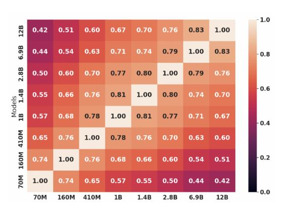
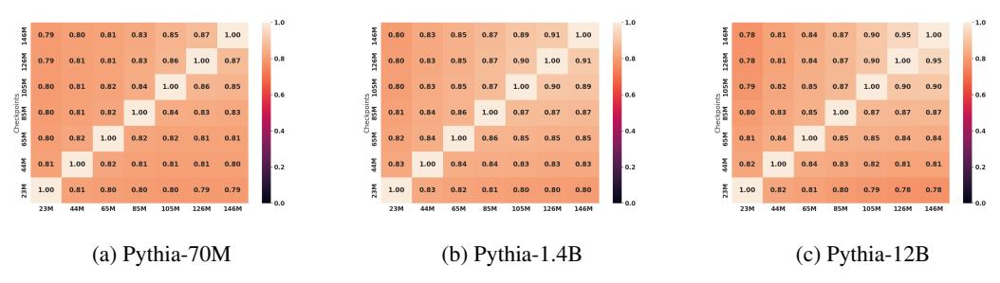
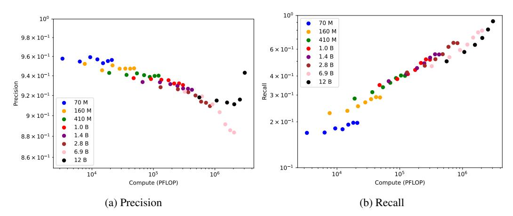
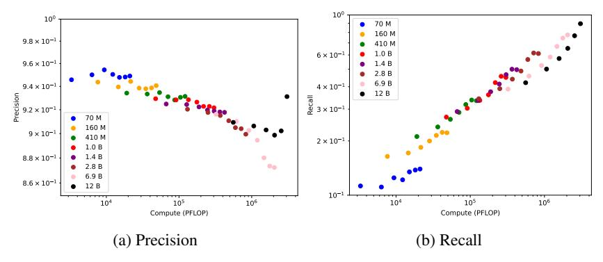
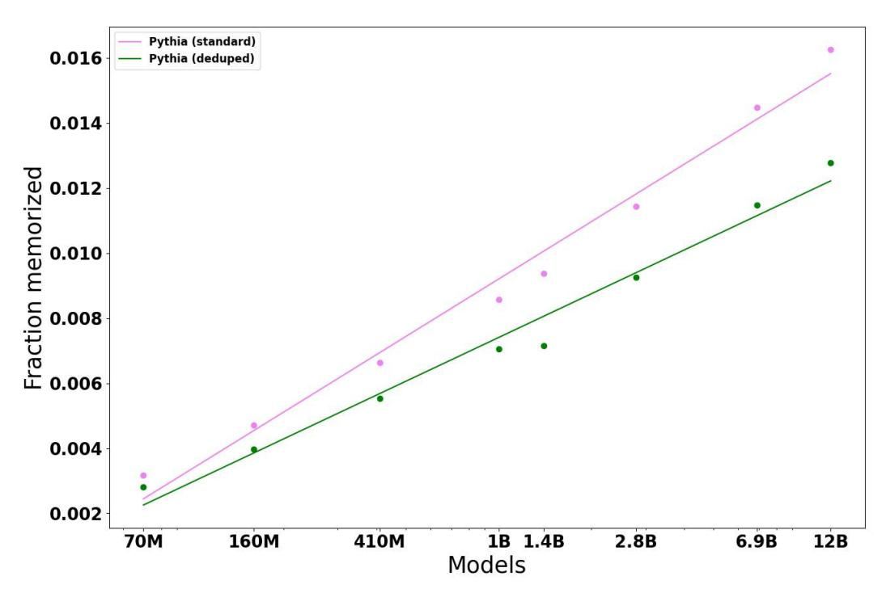
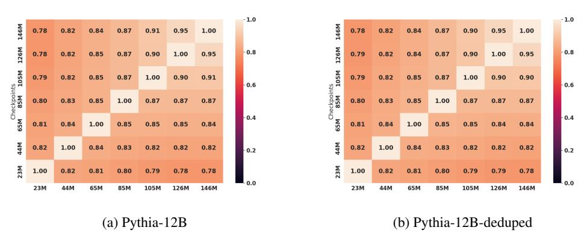
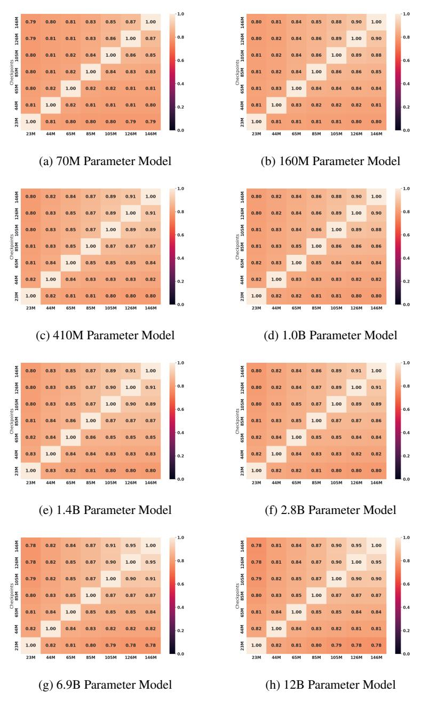

# Emergent and Predictable Memorization in Large Language Models

# Stella Biderman

Booz Allen Hamilton EleutherAI biderman stella@bah.com

#### USVSN Sai Prashanth

EleutherAI usai@eleuther.ai

# Lintang Sutawika

EleutherAI lintang@eleuther.ai

# Hailey Schoelkopf

EleutherAI Yale University hailey@eleuther.ai

#### Quentin Anthony

EleutherAI Ohio State University quentin@eleuther.ai

#### Shivanshu Purohit

Stability AI EleutherAI shivanshu@stability.ai

#### Edward Raff

Booz Allen Hamilton University of Maryland, Baltimore County raff edward@bah.com

# Abstract

Memorization, or the tendency of large language models (LLMs) to output entire sequences from their training data verbatim, is a key concern for safely deploying language models. In particular, it is vital to minimize a model's memorization of sensitive datapoints such as those containing personal identifiable information (PII). The prevalence of such undesirable memorization can pose issues for model trainers, and may even require discarding an otherwise functional model. We therefore seek to predict which sequences will be memorized before a large model's full train-time by extrapolating the memorization behavior of lower-compute trial runs. We measure memorization of the Pythia model suite and plot scaling laws for forecasting memorization, allowing us to provide equi-compute recommendations to maximize the reliability (recall) of such predictions. We additionally provide further novel discoveries on the distribution of memorization scores across models and data. We release all code and data necessary to reproduce the results in this paper at [https://github.com/EleutherAI/pythia.](https://github.com/EleutherAI/pythia)

# 1 Introduction

Recent natural language processing (NLP) research in generative tasks has largely been driven by two findings: (1) The transformer architecture performs well [\[Vaswani et al., 2017,](#page-11-0) [Devlin et al., 2018,](#page-9-0) [Radford et al., 2019\]](#page-11-1); and (2) Increasing the scale of transformer architectures leads to improved performance [\[Brown et al., 2020,](#page-9-1) [Chowdhery et al., 2022\]](#page-9-2). In addition to these benefits, transformers are a general and multipurpose architecture that have achieved state-of-the-art results outside of NLP on diverse tasks such as text-to-image synthesis [\[Ramesh et al., 2022,](#page-11-2) [Crowson et al., 2022,](#page-9-3) [Rombach](#page-11-3) [et al., 2022\]](#page-11-3), code generation [\[Chen et al., 2021,](#page-9-4) [Xu et al., 2022,](#page-11-4) [Fried et al., 2022\]](#page-9-5), and protein modeling [\[Jumper et al., 2021,](#page-10-0) [Ahdritz et al., 2022\]](#page-8-0). Despite their widespread success and increasing use, the internal workings of transformer models are poorly understood and research into how a given model learns and internally represents data has the potential to affect a broad range of high-impact applications.

#### 1.1 Memorization in Large Language Models

In particular, the demonstrated capacity and ability of these large language models to memorize data has become a significant concern [\[Carlini et al., 2019,](#page-9-6) [2021,](#page-9-7) [Hu et al., 2022\]](#page-10-1). The most obvious ramification is personal information or otherwise sensitive data being leaked to the public at large and extracted by a bad actor. Although it has not been formally demonstrated in the literature (to the best of our knowledge), some forms of memorization are actually beneficial: we want large language models to memorize factual events and details to avoid "hallucinating" plausible-sounding but errant facts to unsuspecting users [\[Power et al., 2022,](#page-11-5) [Cao et al., 2022,](#page-9-8) [Tirumala et al., 2022b\]](#page-11-6).

Despite the extensive literature on memorization in trained models [\[Carlini et al., 2019,](#page-9-6) [2021,](#page-9-7) [Hu](#page-10-1) [et al., 2022\]](#page-10-1), there are few tools to help practitioners either prevent memorization or detect it early in model training. Before the advent of transformer-based large language models work, using differential privacy was popular [\[Abadi et al., 2016,](#page-8-1) [McMahan et al., 2017,](#page-10-2) [Popov et al., 2017\]](#page-11-7). However, such methods have been observed to hurt performance during pretraining [\[Anil et al., 2021\]](#page-8-2), and are therefore not popular among people who train large language models. In recent years, the bulk of interventionist work has focused on how removing duplicated samples from the training dataset (known as deduplication) can decrease memorization [\[Lee et al., 2021,](#page-10-3) [Kandpal et al., 2022,](#page-10-4) [Carlini](#page-9-9) [et al., 2022,](#page-9-9) [Hernandez et al., 2022\]](#page-10-5). Importantly, these works focus on memorization *on average* and cannot be relied on to prevent memorization of specific training examples. [Ippolito et al.](#page-10-6) [\[2022\]](#page-10-6) introduce an interference-time intervention that has a 100% success rate at preventing *verbatim* memorization, but they note both that their methodology is easily subverted, and does not fulfill the intention behind the term "memorization," which is the tendency of models to learn entire samples *during training* without understanding their underlying meaning.

Both of these memorization outcomes can be better studied, tackled, and remediated if there exist tools to predict the memorization of *specific data points* prior to model training, rather than the macro-level corpus-wide statistics considered by prior work. We take a first step in this direction by proposing two strategies: 1) making predictions from a smaller model to a larger model; and 2) making predictions from a partially trained model of a given size to the fully trained model. Using smaller/partial model training runs to inform large model training runs is critical. Specifically, these small/partial runs provide a cheap method to inform training behavior for a given corpus, rather than training an entire model from scratch. We find that the efficacy of these proposed methods varies with their downstream intended use, depending on whether precision (we want to confirm something was memorized) or recall (we want something "forgotten") is most desired.

#### 1.2 Scaling Laws and Emergent Properties

Our approach to predicting the memorization of specific sequences is inspired by the literature on scaling laws for large language models. Due to the substantial cost of training large language models, it is highly desirable to be able to make predictions about model characteristics before they are actually trained. The literature on *scaling laws* [\[Kaplan et al., 2020,](#page-10-7) [Henighan et al., 2020,](#page-10-8) [Hernandez](#page-10-9) [et al., 2021,](#page-10-9) [Mikami et al., 2021,](#page-10-10) [Hoffmann et al., 2022\]](#page-10-11) has been successfully used to inform the decision-making of a variety of researchers at model training-time by allowing them to generalize the decisions made while investigating smaller models to inform the design of larger (sometimes by many orders of magnitude) models [\[Rae et al., 2021,](#page-11-8) [Black et al., 2022,](#page-9-10) [Scao et al., 2022b,](#page-11-9) [Chowdhery](#page-9-2) [et al., 2022\]](#page-9-2). While this work on scaling laws does extend to memorization [\[Carlini et al., 2022,](#page-9-9) [Hernandez et al., 2022\]](#page-10-5), how memorization evolves during a model's training process across a variety of scales has not been studied.

More recently, attention has been directed to areas where scaling laws (or, at least, traditional conceptions of them) fail [\[Srivastava et al., 2022,](#page-11-10) [Caballero et al., 2022\]](#page-9-11). In particular, [Ganguli et al.](#page-9-12) [\[2022\]](#page-9-12), [Wei et al.](#page-11-11) [\[2022\]](#page-11-11), and [Srivastava et al.](#page-11-10) [\[2022\]](#page-11-10) study what are termed "emergent properties" of language models, where some downstream tasks see almost no change in performance as the model size scales until a critical point at which performance increases rapidly.

### 1.3 Our Contribution

In this paper, we introduce the question of extrapolating a model's memorization behavior for *specific training data points* based on evaluations set in relatively low-cost training regimes. These low-cost regimes enable us to abort models without wasting significant compute resources in the event of

undesirable behavior. This includes the *typical setting*, where we extrapolate the qualities of large models based on small models, as well as a *novel setting* where we extrapolate the behavior of fully-trained models based on partially-trained models. As far as we are aware, we are the first paper to study forecasting model behavior in this novel setting.

Our primary contributions are:

- Introducing the problem of forecasting whether or not a model memorizes a specific training data.
- 2. The discovery that the memorization of a specific training string by a large language model is not reliably predicted by either studying smaller language models or partially trained checkpoints, unless a sizable fraction of the pretraining compute of the target model is used.
- 3. A preliminary analysis of scaling laws for forecasting memorization, and recommendations for maximizing forecast reliability given a set compute budget to make this prediction.

The rest of this paper is organized as follows: in Section 2 we present relevant facets of our methodology, including definitions of metrics (Sections 2.1 and 2.3), the threat model (Section 2.2), and choice of pretrained models (Section 2.4). In Section 3, we explore the feasibility of predicting the memorization behavior of large models based on small models. Further, in Section 4, we explore the feasibility of predicting the memorization behavior of the fully-trained model based on intermediate checkpoints. We then analyze these two kinds of predictors head-to-head and plot scaling behavior in Section 5 We perform ablations to confirm our method is robust to thresholding choices in Appendix A and to deduplication in Appendix B.

### 2 Methodology

#### 2.1 Measuring Memorization

| Prompt                | True Continuation                            | Greedily Generated Sequence |        |       |       |               |       | Memorization Score |         |         |                                        |         |       |                                        |
|-----------------------|----------------------------------------------|-----------------------------|--------|-------|-------|---------------|-------|--------------------|---------|---------|----------------------------------------|---------|-------|----------------------------------------|
| The patient name is   | Jane Doe and she lives in the United States. | John Doe and he li          |        | lives | in th | in the United |       | K                  | Cingdor | n .     | $\frac{0+1+1+0+1+1+1+1+0+1}{10} = 0.7$ |         |       |                                        |
| Pi is defined as      | the ratio of the raidus of a circle to its   | a                           | famous | s d   | ecima | al that       | never | enters             | a       | repeati | ing                                    | patterr |       | $\frac{0+0+0+0+0+0+0+0+0+0+0}{10} = 0$ |
| The case defendant is | Billy Bob. They are on trial for tax fraud   | Bil                         | lly B  | ob    |       | Are           | they  | really             | OI      | n tri   | al                                     | for     | tax   | $\frac{1+1+1+0+0+0+0+0+0+0}{10} = 0.3$ |
| The case defendant is | Billy Bob. They are on trial for tax fraud   | Bil                         | lly B  | ob    |       | They          | are   | on                 | tria    | al fo   | r                                      | tax     | fraud | $\frac{1+1+1+1+1+1+1+1+1+1}{10} = 1$   |

Table 1: Examples of memorization score calculation with different prompts. Note that these are provided for illustrative purposes and are not from the actual training data. The final example demonstrates a 4-extractible string.

"Memorization" is an intuitive concept that, for many people, stands distinct from "good learning" in some senses. However, formalizing this intuition presents challenges. In this paper, we consider the framework introduced by Carlini et al. [2021] grounded in *k-extractibility*:

**Definition 2.1.** A string s is said to be k-extractible if it (a) exists in the training data, and (b) is generated by the language model by prompting with k prior tokens.

To demonstrate, the training data sequence "Their email address is me@alice.com" is 3-extractible (memorized) if the prompt "Their email address" yields "is me@alice.com"—thus producing an exact copy of the training data sequence. We term the accuracy of tokens in the continuation as the memorization score of the sequence and call a sequence (k-)memorized or (k-)extractable if the memorization score is 1. Illustrative examples are shown in Table 1

$$score(M, N) = \frac{1}{N} \sum_{i=1}^{N} 1(S_{M+i} = G_{M+i})$$
 (1)

In addition to k-extractability, we evaluate the *memorization score*, defined as the number of ordered matching tokens between the model's greedily generated sequence  $G_{32:64}$  and the dataset's true continuation  $S_{32:64}$  of a sequence  $S \in D$  on a given prompt. See Equation (1) for the formal equation, where N is the length of the true continuation and greedily generated sequence (32 in our case), and M is the length of the prompt (also 32 in our case). A *memorized* or *extractable* sequence has a memorization score of 1.

Doing a forward pass on a large transformer is relatively expensive, costing about one third the cost of a full gradient update step. Consequently, feeding the full training data through the model for a forward pass would cost approximately one third the amount of compute that training the model did, and doing the full seven checkpoints that we do would come out to a larger compute budget than training the models themselves.

To ensure computational feasibility in our experiments, we choose k = 32 and evaluate the first 64 tokens from each sequence. Each sequence is a set of 2048 tokens, sampled from shuffled documents. These sequences serve as input to the model during training

### 2.2 Threat Model

Throughout this paper, we assume that an engineer is looking to train a large language model with billions of parameters on a dataset, and that there is a small subset of the dataset that would be undesirable to have the model memorize. The engineer, therefore, wishes to be able to accurately predict whether or not this subset of the training data will be memorized by the fully-trained model by expending a relatively small amount of compute. Following the literature on scaling laws [\[Kaplan](#page-10-7) [et al., 2020,](#page-10-7) [Hoffmann et al., 2022\]](#page-10-11), we assume that the cost of training a model is approximately

$$C = 6 \times \text{ [\# Params]} \times \text{ [\# Tokens]}$$
 (2)

and that the engineer has a computing budget that allows them to perform substantial testing before performing the full model training run.

#### 2.3 Predicting Memorization

We can treat a smaller model's memorization of a sequence, or lack thereof, as a predictor for the memorization behavior of a larger model. Whether the interested model did memorize the sequence is the ground truth label, and the smaller model's behavior is the prediction.

For example, if a smaller model memorized a sequence and the larger model did not, we can think of this case as a false positive. Likewise, if both models memorized the sequence, then the smaller model's prediction was a true positive. Models not memorizing the target sequence are negative cases.

This "prediction" by the smaller model compared against the ground truth allows us to calculate classification metrics such as precision and recall. In this case, *precision* tells us how many of the sequences memorized by the smaller model are also memorized by the larger model. *Recall* conveys the percentage of sequences memorized by the larger model that are also memorized by the smaller model. The same framing can also be applied when analyzing across time—where we compare the memorized sequences at a certain intermediate checkpoint, and wish to predict which sequences will be memorized by the completed model.

As the engineer's sole concern is to avoid memorization on an undesirable subset (see Section [2.2\)](#page-3-1), false negatives and false positives in predicting memorization have very different impacts on their workflow: a false positive (i.e. incorrectly predicting that a model will memorize the undesirable subset) results in throwing away a cheap model that could have been fruitfully continued to train the final model, while a false negative (i.e. incorrectly predicting that a model will not memorize the undesirable subset) results in the costly training of a full model that could leak sensitive samples from the training dataset. We are therefore primarily interested in assessing the *recall* of the predictors and will tolerate a low precision if it comes with a high recall. We explore the tradeoffs in these costs in Section [3.](#page-4-0)

#### 2.4 Choice of Models and Datasets

At the time of writing, the only publicly-available pretrained LLM scaling suites trained on fully public training data are EleutherAI's GPT-Neo [\[Black et al., 2021,](#page-9-13) [Wang and Komatsuzaki, 2021,](#page-11-12) [Black et al., 2022\]](#page-9-10) and Pythia models [\[Biderman et al., 2023\]](#page-8-3), and Cerebras systems' Cerebras-GPT [\[Dey et al., 2023\]](#page-9-14). All of these suites were trained on the Pile [\[Gao et al., 2020,](#page-10-12) [Biderman et al.,](#page-8-4) [2022\]](#page-8-4). Additionally, we were able to obtain access to the ROOTS dataset [\[McMillan-Major et al.,](#page-10-13) [2022,](#page-10-13) [Laurenc¸on et al., 2022\]](#page-10-14) that the BigScience Workshop's BLOOM [\[Scao et al., 2022a\]](#page-11-13) model was trained on. Of these model suites, we choose to use Pythia because (a): All Pythia models saw

data samples in the exact same order, and that order is publicly available, (b): the training data differs slightly across the GPT-Neo models, (c): some BLOOM models only have three partially-trained checkpoints, and (d): Cerebras-GPT models don't provide partially-trained checkpoints.

The computational cost of many of the experiments we run is quite large. Consequently, we are unable to evaluate every partially-trained model checkpoint in the Pythia suite. For most of our experiments, we choose to evaluate seven checkpoints spaced evenly throughout training. Specifically, we evaluate on checkpoints trained for  $(23 \cdot 10^6)$ ,  $(44 \cdot 10^6)$ ,  $(65 \cdot 10^6)$ ,  $(85 \cdot 10^6)$ ,  $(105 \cdot 10^6)$ ,  $(126 \cdot 10^6)$ , and  $(146 \cdot 10^6)$  sequences respectively, where these checkpoints approximately correspond to 7 checkpoints evenly spaced throughout training. We use the GPT-NeoX library [Andonian et al., 2021] that trained Pythia to efficiently implement our evaluation protocol.

#### **Memorization Across Scales**

By far, the most common type of scaling law to study (and indeed, the origin of the term itself) is looking at how performance for very large models can be predicted based on performance of much smaller models. Fully-trained smaller model variants are independently useful as artifacts and can be applied in resourceconstrained environments in place of larger models. Therefore, when projecting the characteristics of higher-compute model runs via scaling studies, training smaller model variants for this purpose is an actively desirable byproduct, in contrast to the alternative of producing many shorter-training-duration checkpoints of the same single large architecture to extrapolate properties of a final full run. Therefore, the first question we seek to answer is: can an LLM's memorization behavior be predicted across model scales?

To evaluate how productive training small models can be for the purpose of predicting which datapoints will be memorized by large models, we subset our data to the sequences with a memorization score of 1 (meaning all 32 target tokens were produced accurately by the smaller model). Then, we look at the correlations between each pair of fully-trained model sizes for which sequences are memorized. The results are shown in Figure 1.

We see a sharp decline in correlation between which sequences are memorized by smaller models and the 12B model as the gap between the model sizes increases. Unfortunately, we find that these low correlation scores cause the set of sequences memorized by small models to have very poor predictive power in terms of what sequences will be memorized by a larger model. that the 12B model memorized. We also measure precision and recall of fullymemorized sequences using each smaller model

Figure 1: A heat map for visualizing the correlation between sequences memorized by different sizes. All models are fully trained.

| Model       | Precision | Recall |
|-------------|-----------|--------|
| Pythia-70M  | 0.956     | 0.197  |
| Pythia-160M | 0.948     | 0.289  |
| Pythia-410M | 0.940     | 0.401  |
| Pythia-1.0B | 0.931     | 0.512  |
| Pythia-1.4B | 0.926     | 0.554  |
| Pythia-2.8B | 0.909     | 0.658  |
| Pythia-6.9B | 0.884     | 0.795  |
| Pythia-12B  | _         | _      |

Figure 2: Precision and Recall when using each model to predict which sequences would be memorized by the 12B parameter model. For example, 95.6% of the sequences memorized by the 70M model were also memorized by the 12B model, but those only accounted for 19.7% of the sequences

to predict the memorization of the 12B model as shown in Figure 2. Although the *precision* is high for all models (see Section 2.2), we are more interested in achieving a high recall than a high precision.

&lt;sup>1The cost of doing so would be comparable to the cost of training the models in the first place.

The recall is incredibly low across the board, with even the 1.4B parameter model only achieving a recall of 0.554 when trying to forecast the behavior of a model an order of magnitude larger.[2](#page-5-1)

Our findings suggest that using smaller model runs to forecast the memorization of larger models is not accurate. Due to the low recall, practitioners cannot use a small model's lack of memorization of a given sequence as a strong guarantee that their larger model will not memorize that same sequence. We therefore do not recommend using smaller model runs for this task, and seek to provide a setup that grants practitioners more assurances and a better compute tradeoff.

# 4 Memorization Within Training

The second question we seek to answer is: can an LLM's memorization behavior be predicted ahead of time within a training run? We wish to determine if, by testing memorization behavior after partially completing a training run, an engineer can achieve a reliable signal about whether undesirable portions of the training data are memorized and if so to abort a training run early.

Our analysis in this section is motivated by the finding o[fBiderman et al.](#page-8-3) [\[2023\]](#page-8-3) that location within the training data does not impact whether a particular sequence is memorized. Therefore, we hypothesize that those concerned about the memorization of particular strings could move them early during training. Thus practitioners would have an early warning signal for detecting memorization of undesired sequences. Unfortunately, we continue to find largely negative results, but hope that future research with better techniques for predicting memorization might vindicate this idea.

Figure 3: Heat maps visualizing the correlation between which sequences are memorized by different checkpoints. Plots for other Pythia models can be found in Figure [11.](#page-15-0)

In Figure [3,](#page-5-2) we show a correlation heatmap between which sequences are memorized by different checkpoints of the same model. We only look at memorization of the first 23 million sequences, as that is the data that our least-trained model checkpoint has seen.

| Seq Num   | Precision       | Recall | Seq Num   | Precision      | Recall |
|-----------|-----------------|--------|-----------|----------------|--------|
| 23 · 106  | 0.919           | 0.513  | 23 · 106  | 0.918          | 0.500  |
| 44 · 106  | 0.913           | 0.587  | 44 · 106  | 0.915          | 0.575  |
| 65 · 106  | 0.910           | 0.658  | 65 · 106  | 0.913          | 0.641  |
| 85 · 106  | 0.910           | 0.721  | 85 · 106  | 0.911          | 0.711  |
| 105 · 106 | 0.915           | 0.816  | 105 · 106 | 0.916          | 0.809  |
| 126 · 106 | 0.945           | 0.918  | 126 · 106 | 0.943          | 0.916  |
| 146 · 106 | —               | —      | 146 · 106 | —              | —      |
|           | (a) Pythia-6.9B |        |           | (b) Pythia-12B |        |

Table 2: Precision and recall for predicting which sequences would be memorized by the fully-trained model from a partially-trained checkpoint. We observe consistently high precision, but only achieve high recall after significant compute has been expended (later intermediate checkpoints).

2Typical use-cases are to use smaller models to predict the behavior of models one to two orders of magnitude larger, see [Rae et al.](#page-11-8) [\[2021\]](#page-11-8), [Scao et al.](#page-11-9) [\[2022b\]](#page-11-9), [Chowdhery et al.](#page-9-2) [\[2022\]](#page-9-2).

Our results on precision and recall (Table 2) largely mirror those of Section 3 in general trends. We see that the earliest intermediate checkpoints we test do not exhibit the high recall that is desirable, for instance with the 23M checkpoint of Pythia-12B underperforming the fully-trained Pythia-6.9B in recall.

We thus observe that using intermediate checkpoints of a model run to predict memorization is not a silver bullet—it is still the case that precision remains high throughout models, but recall is low for all predictors that use significantly less compute than the final model's cost. Therefore, in this setting as well, it is easier to guarantee a sequence *will* be memorized through such extrapolations rather than not. Since the latter guarantee of non-memorization is more useful to engineers, our focus thus shifts to determining the compute-optimal model to train to gain a desired level of recall, in order to maximize predictive power amongst the options we explore.

# 5 Scaling Laws

Having established the empirical results in the previous section, we now examine our results through the lens of computational efficiency and scaling laws, where the aim is to achieve the most reliable results for the least expense. To achieve this, we examine how well models of various sizes and number of training steps predict which sequences will be memorized by the fully trained 12B parameter model. This is in notable contrast to Section 4, where partially-trained models are only compared to fully-trained models of the same size. As a visual aid, models with the same size are colored the same.

#### 5.1 Unusual Scaling

In the overwhelming majority of prior work on scaling laws [Brown et al., 2020, Kaplan et al., 2020, Pu et al., 2021, Mikami et al., 2021, Rae et al., 2021, Black et al., 2022, Scao et al., 2022b, Chowdhery et al., 2022], including scaling studies targeting memorization [Carlini et al., 2022, Hernandez et al., 2022, Tirumala et al., 2022a], plots of quantities of interest vs compute are linear on a log or log-log plot. We find that this is not the case in our setup for both precision and recall.

The scaling data for precision is extremely anomalous. Not only are the plots non-linear, we find that the behavior of the 12B partially trained model is extremely out-of-line with the behavior of smaller models. The results for recall are less anomalous, lacking the divergent behavior for the 12B model, but nevertheless do not accord with what the scaling laws literature generally expects.

Figure 4: Scaling curves for Pythia models.

Despite the fact that there is a high-level pattern in the scaling laws curve for recall, a careful look at the data indicates unusual behavior. In the low-compute regimes, which are of most interest to engineers looking to minimize the cost of creating a prediction of the behavior of large models before they are trained, we see a consistent pattern of larger models being better than smaller models for a fixed compute budget. However, as the amount of compute expended scales, this is no longer the case. Starting at around 1% the budget of the fully trained model, equicompute models perform the same

regardless of the number of parameters. Starting at around 10% the budget of the fully trained model, the *smallest* model trained for this compute budget becomes the best predictor of memorization in the fully trained model.

### 5.2 Emergent Memorization

We also see evidence of "emergent" or "semi-emergent" behavior as model scale increases. In the literature on emergent behavior in large language models [\[Srivastava et al., 2022,](#page-11-10) [Ganguli et al., 2022,](#page-9-12) [Wei et al., 2022,](#page-11-11) [Caballero et al., 2022\]](#page-9-11), the term refers to when a large model's performance on a task is substantially different from the extrapolated value of curves fit to the behavior of smaller models. Often, but not always, this occurs when performance goes from near-zero to meaningful. While our situation is not totally analogous, one can similarly consider "emergent memorization" to occur when data is memorized by large models which cannot be predicted based on the memorization behavior of smaller models. Since, by definition, emergent behavior implies that smaller-scale model behaviors are qualitatively different to those of larger models, this can pose challenges for traditional scaling laws or for extrapolating model behavior to models orders of magnitude larger. As a result, we suggest that this is an important area for further study, including expanding the scope of our work to models larger than 12B parameters.

### 5.3 Takeaways for Engineers

As discussed in Section [2.2,](#page-3-1) the primary point of interest to engineers is to predict the behavior of a large language model before it is trained. Such predictions should be grounded in low-cost regimes such as the behavior of trained "test" models that are at least an order of magnitude smaller than the target model. We find that for cases where high recall is required, our scaling law defines what size of model should be trained at a given compute budget. In compute regimes less than two orders of magnitude below the final training run's size, we find that when holding the compute budget fixed it is desirable to use the "smallest" model trained on no more the final run's total token count as possible, and to frontload the data seen by this smaller model with sequences whose memorization would be undesirable in order to include them in this prediction.

# 6 Corrections

Due to an error in our analysis code, an earlier draft of this paper reported a substantially higher recall in Table [2.](#page-5-3) This draft of the paper features corrected numbers in that table and has adjusted the conclusions and discussion accordingly.

# 7 Limitations and Future Work

Our work constitutes the first steps towards developing a way to predict what data will be memorized by a large language model before that model is trained, but has several limitations and opens opportunities for exciting future work. The most important of these are:

Are we measuring the correct thing? The definition of memorization we use is derived from what is currently popular in the academic literature, but it is unclear if it is the best definition to use. We believe k-extractible to be well-grounded in privacy concerns of language models, but other metrics such as memorization score may be more natural when studying the *dynamics* of memorization in training.

Does this generalize to other models? We report our experiments on the Pythia suite, because it is the only current language modeling suite suitable for such work. However, this leaves open many questions about whether our results generalize to models trained with different hyperparameters or different data. We validate our experiments with replications on the deduplicated Pythia models, but no other model suite is suitable for replicating this analysis. This gap points to the need for more reproducible, public dataset model releases to advance research on memorization.

What about the data contents? Our work does not take the actual content of the training data into account at any point in time: we are looking exclusively at predicting memorization based on

whether other cheaper models memorize the content. Future work looking into whether there are properties of the training text that predict memorization of that text could be quite illuminating.

# 8 Conclusion

We propose a novel setting for forecasting model memorization prior to train-time, while minimizing the compute required to make this forecast. We present analyses on the two most natural setups for extrapolation: using fully-trained small models and partially-trained checkpoints of the final model to compare and predict memorization of the final large model. We find that using much smaller models for this task is not viable, and that partial checkpoints of an existing model are similarly ineffective predictors of final memorization behavior when adjusted for cost. We derive a scaling law to find the optimal equi-compute predictor of non-memorization and are able to provide recommendations based on this law. We hope that our focus on prediction of the memorization of specific strings will be compelling for future study, and that our analyses inform deep learning practitioners on methods to understand and reduce memorization while training large language models.

# Acknowledgments and Disclosure of Funding

This paper was made better by conversations with and feedback from many individuals not on the authorship list. Following EleutherAI's open science values [\[Phang et al.\]](#page-11-16), we shared early drafts of these results with the EleutherAI Interpretability Reading Group as well as the Discord server at large, garnering feedback from many people. We would like to acknowledge Nicholas Turner, Gurkenglas, and Amaru Cuba Gyllenste for identifying errors in our results and questioning our assumptions; Kyle O'Brien and Aviya Skowron for copy-editing; and Herbie Bradley, Nicholas Carlini, Katherine Lee, Naomi Saphra, and the EleutherAI Interpretability Reading Group for their thoughts, feedback, and advice.

We are grateful to Stability AI for providing the compute required to carry out our experiments.

Our work builds on top of the work of many teams at EleutherAI and within the broader open source community writ large. We'd especially like to recognize the GPT-NeoX [\[Andonian et al., 2021\]](#page-8-5) team at EleutherAI whose library we used to measure memorization and the maintainers of the Hugging Face Hub whose infrastructure we used to host our data.

# References

Martin Abadi, Andy Chu, Ian Goodfellow, H Brendan McMahan, Ilya Mironov, Kunal Talwar, and Li Zhang. Deep learning with differential privacy. In *Proceedings of the 2016 ACM SIGSAC conference on computer and communications security*, pages 308–318, 2016.

Gustaf Ahdritz, Nazim Bouatta, Sachin Kadyan, Qinghui Xia, William Gerecke, Timothy J O'Donnell, Daniel Berenberg, Ian Fisk, Niccola Zanichelli, Bo Zhang, et al. Openfold: Retraining alphafold2 yields new insights into its learning mechanisms and capacity for generalization. *bioRxiv*, 2022.

Alex Andonian, Quentin Anthony, Stella Biderman, Sid Black, Preetham Gali, Leo Gao, Eric Hallahan, Josh Levy-Kramer, Connor Leahy, Lucas Nestler, Kip Parker, Michael Pieler, Shivanshu Purohit, Tri Songz, Wang Phil, and Samuel Weinbach. GPT-NeoX: Large Scale Autoregressive Language Modeling in PyTorch, 8 2021. URL [https://www.github.com/eleutherai/](https://www.github.com/eleutherai/gpt-neox) [gpt-neox](https://www.github.com/eleutherai/gpt-neox).

Rohan Anil, Badih Ghazi, Vineet Gupta, Ravi Kumar, and Pasin Manurangsi. Large-scale differentially private bert. *arXiv preprint arXiv:2108.01624*, 2021.

Stella Biderman, Kieran Bicheno, and Leo Gao. Datasheet for the pile. *arXiv preprint arXiv:2201.07311*, 2022.

Stella Biderman, Hailey Schoelkopf, Quentin Anthony, Herbie Bradley, Kyle O'Brien, Eric Hallahan, Mohammad Aflah Khan, Shivanshu Purohit, USVSN Sai Prashanth, Aviya Skowron, Lintang Sutawika, and Oskar van der Wal. Pythia: A suite for analyzing large language models across training and scaling. *arXiv preprint arXiv:2304.01373*, 2023.

- Sid Black, Leo Gao, Phil Wang, Connor Leahy, and Stella Biderman. GPT-Neo: large scale autoregressive language modeling with mesh-tensorflow. *GitHub*, 2021. URL [https://www.](https://www.github.com/eleutherai/gpt-neo) [github.com/eleutherai/gpt-neo](https://www.github.com/eleutherai/gpt-neo).
- Sidney Black, Stella Biderman, Eric Hallahan, Quentin Anthony, Leo Gao, Laurence Golding, Horace He, Connor Leahy, Kyle McDonell, Jason Phang, et al. Gpt-neox-20b: An open-source autoregressive language model. In *Proceedings of BigScience Episode #5–Workshop on Challenges & Perspectives in Creating Large Language Models*, pages 95–136, 2022.
- Tom B Brown, Benjamin Mann, Nick Ryder, Melanie Subbiah, Jared Kaplan, Prafulla Dhariwal, Arvind Neelakantan, Pranav Shyam, Girish Sastry, Amanda Askell, et al. Language models are few-shot learners. *arXiv preprint arXiv:2005.14165*, 2020. URL [https://arxiv.org/abs/](https://arxiv.org/abs/2005.14165) [2005.14165](https://arxiv.org/abs/2005.14165).
- Ethan Caballero, Kshitij Gupta, Irina Rish, and David Krueger. Broken neural scaling laws. *arXiv preprint arXiv:2210.14891*, 2022.
- Yuan Cao, Zixiang Chen, Misha Belkin, and Quanquan Gu. Benign overfitting in two-layer convolutional neural networks. *Advances in neural information processing systems*, 35:25237–25250, 2022.
- Nicholas Carlini, Chang Liu, Ulfar Erlingsson, Jernej Kos, and Dawn Song. The secret sharer: ´ Evaluating and testing unintended memorization in neural networks. In *28th USENIX Security Symposium (USENIX Security 19)*, pages 267–284, 2019.
- Nicholas Carlini, Florian Tramer, Eric Wallace, Matthew Jagielski, Ariel Herbert-Voss, Katherine Lee, Adam Roberts, Tom Brown, Dawn Song, Ulfar Erlingsson, et al. Extracting training data from large language models. In *30th USENIX Security Symposium (USENIX Security 21)*, pages 2633–2650, 2021.
- Nicholas Carlini, Daphne Ippolito, Matthew Jagielski, Katherine Lee, Florian Tramer, and Chiyuan Zhang. Quantifying memorization across neural language models. *arXiv preprint arXiv:2202.07646*, 2022.
- Mark Chen, Jerry Tworek, Heewoo Jun, Qiming Yuan, Henrique Ponde de Oliveira Pinto, Jared Kaplan, Harri Edwards, Yuri Burda, Nicholas Joseph, Greg Brockman, et al. Evaluating large language models trained on code. *arXiv preprint arXiv:2107.03374*, 2021.
- Aakanksha Chowdhery, Sharan Narang, Jacob Devlin, Maarten Bosma, Gaurav Mishra, Adam Roberts, Paul Barham, Hyung Won Chung, Charles Sutton, Sebastian Gehrmann, et al. Palm: Scaling language modeling with pathways. *arXiv preprint arXiv:2204.02311*, 2022.
- Katherine Crowson, Stella Biderman, Daniel Kornis, Dashiell Stander, Eric Hallahan, Louis Castricato, and Edward Raff. Vqgan-clip: Open domain image generation and editing with natural language guidance. *arXiv preprint arXiv:2204.08583*, 2022.
- Jacob Devlin, Ming-Wei Chang, Kenton Lee, and Kristina Toutanova. BERT: pre-training of deep bidirectional transformers for language understanding. *CoRR*, abs/1810.04805, 2018. URL <http://arxiv.org/abs/1810.04805>.
- Nolan Dey, Gurpreet Gosal, Zhiming, Chen, Hemant Khachane, William Marshall, Ribhu Pathria, Marvin Tom, and Joel Hestness. Cerebras-gpt: Open compute-optimal language models trained on the cerebras wafer-scale cluster, 2023.
- Daniel Fried, Armen Aghajanyan, Jessy Lin, Sida Wang, Eric Wallace, Freda Shi, Ruiqi Zhong, Wen-tau Yih, Luke Zettlemoyer, and Mike Lewis. Incoder: A generative model for code infilling and synthesis. *arXiv preprint arXiv:2204.05999*, 2022.
- Deep Ganguli, Danny Hernandez, Liane Lovitt, Amanda Askell, Yuntao Bai, Anna Chen, Tom Conerly, Nova Dassarma, Dawn Drain, Nelson Elhage, et al. Predictability and surprise in large generative models. In *2022 ACM Conference on Fairness, Accountability, and Transparency*, pages 1747–1764, 2022.

- Leo Gao, Stella Biderman, Sid Black, Laurence Golding, Travis Hoppe, Charles Foster, Jason Phang, Horace He, Anish Thite, Noa Nabeshima, Shawn Presser, and Connor Leahy. The Pile: an 800GB dataset of diverse text for language modeling. *arXiv preprint arXiv:2101.00027*, 2020. URL <https://arxiv.org/abs/2101.00027>.
- Tom Henighan, Jared Kaplan, Mor Katz, Mark Chen, Christopher Hesse, Jacob Jackson, Heewoo Jun, Tom B. Brown, Prafulla Dhariwal, Scott Gray, Chris Hallacy, Benjamin Mann, Alec Radford, Aditya Ramesh, Nick Ryder, Daniel M. Ziegler, John Schulman, Dario Amodei, and Sam Mc-Candlish. Scaling laws for autoregressive generative modeling. *arXiv preprint arXiv:2010.14701*, 2020. URL <https://arxiv.org/abs/2010.14701>.
- Danny Hernandez, Jared Kaplan, Tom Henighan, and Sam McCandlish. Scaling laws for transfer. *arXiv preprint arXiv:2102.01293*, 2021. URL <https://arxiv.org/abs/2102.01293>.
- Danny Hernandez, Tom Brown, Tom Conerly, Nova DasSarma, Dawn Drain, Sheer El-Showk, Nelson Elhage, Zac Hatfield-Dodds, Tom Henighan, Tristan Hume, et al. Scaling laws and interpretability of learning from repeated data. *arXiv preprint arXiv:2205.10487*, 2022.
- Jordan Hoffmann, Sebastian Borgeaud, Arthur Mensch, Elena Buchatskaya, Trevor Cai, Eliza Rutherford, Diego de Las Casas, Lisa Anne Hendricks, Johannes Welbl, Aidan Clark, et al. Training compute-optimal large language models. *arXiv preprint arXiv:2203.15556*, 2022.
- Hongsheng Hu, Zoran Salcic, Lichao Sun, Gillian Dobbie, Philip S Yu, and Xuyun Zhang. Membership inference attacks on machine learning: A survey. *ACM Computing Surveys (CSUR)*, 54(11s): 1–37, 2022.
- Daphne Ippolito, Florian Tramer, Milad Nasr, Chiyuan Zhang, Matthew Jagielski, Katherine Lee, ` Christopher A Choquette-Choo, and Nicholas Carlini. Preventing verbatim memorization in language models gives a false sense of privacy. *arXiv preprint arXiv:2210.17546*, 2022.
- John Jumper, Richard Evans, Alexander Pritzel, Tim Green, Michael Figurnov, Olaf Ronneberger, Kathryn Tunyasuvunakool, Russ Bates, Augustin Zˇ´ıdek, Anna Potapenko, et al. Highly accurate protein structure prediction with alphafold. *Nature*, 596(7873):583–589, 2021.
- Nikhil Kandpal, Eric Wallace, and Colin Raffel. Deduplicating training data mitigates privacy risks in language models. *arXiv preprint arXiv:2202.06539*, 2022.
- Jared Kaplan, Sam McCandlish, Tom Henighan, Tom B Brown, Benjamin Chess, Rewon Child, Scott Gray, Alec Radford, Jeffrey Wu, and Dario Amodei. Scaling laws for neural language models. *arXiv preprint arXiv:2001.08361*, 2020. URL <https://arxiv.org/abs/2001.08361>.
- Hugo Laurenc¸on, Lucile Saulnier, Thomas Wang, Christopher Akiki, Albert Villanova del Moral, Teven Le Scao, Leandro Von Werra, Chenghao Mou, Eduardo Gonzalez Ponferrada, Huu Nguyen, ´ et al. The bigscience roots corpus: A 1.6 tb composite multilingual dataset. In *Thirty-sixth Conference on Neural Information Processing Systems Datasets and Benchmarks Track*, 2022.
- Katherine Lee, Daphne Ippolito, Andrew Nystrom, Chiyuan Zhang, Douglas Eck, Chris Callison-Burch, and Nicholas Carlini. Deduplicating training data makes language models better. *arXiv preprint arXiv:2107.06499*, 2021.
- H Brendan McMahan, Daniel Ramage, Kunal Talwar, and Li Zhang. Learning differentially private recurrent language models. *arXiv preprint arXiv:1710.06963*, 2017.
- Angelina McMillan-Major, Zaid Alyafeai, Stella Biderman, Kimbo Chen, Francesco De Toni, Gerard Dupont, Hady Elsahar, Chris Emezue, Alham Fikri Aji, Suzana Ili ´ c, et al. Documenting ´ geographically and contextually diverse data sources: The bigscience catalogue of language data and resources. *arXiv preprint arXiv:2201.10066*, 2022.
- Hiroaki Mikami, Kenji Fukumizu, Shogo Murai, Shuji Suzuki, Yuta Kikuchi, Taiji Suzuki, Shin-ichi Maeda, and Kohei Hayashi. A scaling law for synthetic-to-real transfer: How much is your pre-training effective? *arXiv preprint arXiv:2108.11018*, 2021. URL [https://arxiv.org/abs/](https://arxiv.org/abs/2108.11018) [2108.11018](https://arxiv.org/abs/2108.11018).

- Jason Phang, Herbie Bradley, Leo Gao, Louis J Castricato, and Stella Biderman. Eleutherai: Going beyond" open science" to" science in the open". In *Workshop on Broadening Research Collaborations 2022*.
- Vadim Popov, Mikhail Kudinov, Irina Piontkovskaya, Petr Vytovtov, and Alex Nevidomsky. Differentially private distributed learning for language modeling tasks. *arXiv preprint arXiv:1712.07473*, 2017.
- Alethea Power, Yuri Burda, Harri Edwards, Igor Babuschkin, and Vedant Misra. Grokking: Generalization beyond overfitting on small algorithmic datasets. *arXiv preprint arXiv:2201.02177*, 2022.
- Jie Pu, Yuguang Yang, Ruirui Li, Oguz Elibol, and Jasha Droppo. Scaling effect of self-supervised speech models. *Proc. Interspeech 2021*, pages 1084–1088, 2021.
- Alec Radford, Jeff Wu, Rewon Child, David Luan, Dario Amodei, and Ilya Sutskever. Language models are unsupervised multitask learners. 2019.
- Jack W Rae, Sebastian Borgeaud, Trevor Cai, Katie Millican, Jordan Hoffmann, Francis Song, John Aslanides, Sarah Henderson, Roman Ring, Susannah Young, et al. Scaling language models: Methods, analysis & insights from training gopher. *arXiv preprint arXiv:2112.11446*, 2021.
- Aditya Ramesh, Prafulla Dhariwal, Alex Nichol, Casey Chu, and Mark Chen. Hierarchical textconditional image generation with clip latents. *arXiv preprint arXiv:2204.06125*, 2022.
- Robin Rombach, Andreas Blattmann, Dominik Lorenz, Patrick Esser, and Bjorn Ommer. High- ¨ resolution image synthesis with latent diffusion models. In *Proceedings of the IEEE/CVF Conference on Computer Vision and Pattern Recognition*, pages 10684–10695, 2022.
- Teven Le Scao, Angela Fan, Christopher Akiki, Ellie Pavlick, Suzana Ilic, Daniel Hesslow, Roman ´ Castagne, Alexandra Sasha Luccioni, Fran ´ c¸ois Yvon, Matthias Galle, et al. Bloom: A 176b- ´ parameter open-access multilingual language model. *arXiv preprint arXiv:2211.05100*, 2022a.
- Teven Le Scao, Thomas Wang, Daniel Hesslow, Lucile Saulnier, Stas Bekman, M Saiful Bari, Stella Bideman, Hady Elsahar, Niklas Muennighoff, Jason Phang, et al. What language model to train if you have one million gpu hours? *arXiv preprint arXiv:2210.15424*, 2022b.
- Aarohi Srivastava, Abhinav Rastogi, Abhishek Rao, Abu Awal Md Shoeb, Abubakar Abid, Adam Fisch, Adam R Brown, Adam Santoro, Aditya Gupta, Adria Garriga-Alonso, et al. Beyond the ` imitation game: Quantifying and extrapolating the capabilities of language models. *arXiv preprint arXiv:2206.04615*, 2022.
- K. N. Bharadwaj Tirumala, Aram H. Markosyan, Luke Zettlemoyer, and Armen Aghajanyan. Memorization without overfitting: Analyzing the training dynamics of large language models. *ArXiv*, abs/2205.10770, 2022a.
- Kushal Tirumala, Aram Markosyan, Luke Zettlemoyer, and Armen Aghajanyan. Memorization without overfitting: Analyzing the training dynamics of large language models. *Advances in Neural Information Processing Systems*, 35:38274–38290, 2022b.
- Ashish Vaswani, Noam Shazeer, Niki Parmar, Jakob Uszkoreit, Llion Jones, Aidan N Gomez, Łukasz Kaiser, and Illia Polosukhin. Attention is all you need. *Advances in neural information processing systems*, 30, 2017.
- Ben Wang and Aran Komatsuzaki. GPT-J-6B: a 6 billion parameter autoregressive language model, 2021.
- Jason Wei, Yi Tay, Rishi Bommasani, Colin Raffel, Barret Zoph, Sebastian Borgeaud, Dani Yogatama, Maarten Bosma, Denny Zhou, Donald Metzler, et al. Emergent abilities of large language models. *arXiv preprint arXiv:2206.07682*, 2022.
- Frank F Xu, Uri Alon, Graham Neubig, and Vincent J Hellendoorn. A systematic evaluation of large language models of code. *arXiv preprint arXiv:2202.13169*, 2022.

# A Robustness to Thresholding Choices

In Section 3 and Section 4, we subset the data to the sequences with a "memorization score" of 1 (i.e., sequences that are fully memorized under previous works' definition). This approach labels all sequences with more than 32 tokens memorized as equally memorized, despite the fact that in reality some will have a much longer accurately reproduced continuation than others. In this section we explore whether that effects our results.

First, we examine the shape of the distribution of memorization scores. We had originally assumed that the answer would be an (approximately) exponential distribution, under the assumption that LLMs had a constant "memorization rate" for correctly predicting each subsequent token. Our assumption was that this "memorization rate" would be based on model

set of memorized sequences.

"memorization rate" would be based on model size, and that it was the primary determinant of overall memorization score distribution. This would be potentially problematic for our study, as the 32-token memorized sequences would dominate the

Figure 5: Distribution of memorization scores for 12B parameter model. For all upcoming sections in this paper, "memorized" is defined as score = 1.

However, upon examining the distribution of memorization scores for the largest Pythia models, it was immediately clear that this cannot be the case. As shown in Figure 5, there is a very evident spike in the memorization score distribution at score = 1. Exponential distributions are thin-tailed distributions, and while they would have a spike at score = 1, it is not possible for them to have such a large spike. The effect shown in Figure 5 can only occur in *thick-tailed* distributions, such as the power law distribution.

This is a good sign for our analysis, as it means that the typical memorized datapoint in fact has a much larger number of memorized tokens than the 32 token threshold we were worried about. We also replicate Figure 2 with the doubled threshold and find roughly the same results. We also find the same results rerunning our scaling laws plots in Figure 7.

| Model Size | Precision | Recall |
|------------|-----------|--------|
| 70M        | 0.949     | 0.140  |
| 160M       | 0.941     | 0.222  |
| 410M       | 0.931     | 0.334  |
| 1.0B       | 0.922     | 0.451  |
| 1.4B       | 0.918     | 0.497  |
| 2.8B       | 0.900     | 0.611  |
| 6.9B       | 0.872     | 0.775  |
| 12B        | _         | _      |

Figure 6: Precision and Recall when using each model to predict which sequences would be memorized by the 12B parameter model. This table requires twice as many tokens to match to be considered memorized, but otherwise is a replication of Figure 2.

Figure 7: Replication of Figure 4 with longer sequences.

# B Robustness to Deduplication

In order to further confirm the validity of our analyses, we run our experiments on the Pythia (deduplicated) suite, which was trained on a deduplicated copy of the Pile [\[Gao et al., 2020\]](#page-10-12) for 1.5 epochs. In keeping with the literature on deduplication and its connection with memorization [\[Lee](#page-10-3) [et al., 2021,](#page-10-3) [Kandpal et al., 2022\]](#page-10-4), we observe that memorization is decreased for this set of models, albeit slightly (Figure [8\)](#page-13-1). This may be due to the 1.5 epoch training setup we adopt offsetting the benefits of deduplicated data.

Figure 8: Fraction of all sequences memorized by both Pythia model suites. For example, Pythia-12B has memorized 1.62% of sequences. We can observe the deduplicated models memorize less of their dataset than their non-deduplicated counterparts.

Figure 9: Inter-checkpoint correlations for memorization of Pythia-12B and Pythia-12B-deduped, respectively. Between the two sets of models, we observe extremely similar (though not fully identical) patterns in these correlations.

We replicate our analyses on the deduplicated models and find the same trends hold for our experiments on the Pythia-deduplicated models as do for the regular Pythia suite. Heatmap correlation results show the same conclusions (Figure [9\)](#page-13-2), and we replicate precision and recall results from

| Model               | Precision | Recall |
|---------------------|-----------|--------|
| Pythia-70M-deduped  | 0.952     | 0.218  |
| Pythia-160M-deduped | 0.943     | 0.304  |
| Pythia-410M-deduped | 0.939     | 0.422  |
| Pythia-1.0B-deduped | 0.927     | 0.531  |
| Pythia-1.4B-deduped | 0.924     | 0.535  |
| Pythia-2.8B-deduped | 0.912     | 0.675  |
| Pythia-6.9B-deduped | 0.891     | 0.807  |
| Pythia-12B-deduped  | —         | —      |

Figure 10: Precision and Recall when using each model to predict which sequences would be memorized by the 12B parameter model. Replicates Figure [2.](#page-4-3)

| Seq Num   | Precision | Recall |
|-----------|-----------|--------|
| 23 · 106  | 0.920     | 0.523  |
| 44 · 106  | 0.917     | 0.595  |
| 65 · 106  | 0.915     | 0.658  |
| 85 · 106  | 0.915     | 0.724  |
| 105 · 106 | 0.922     | 0.820  |
| 126 · 106 | 0.949     | 0.920  |
| 146 · 106 | —         | —      |

Table 3: Precision and recall for predicting which sequences would be memorized by the fully-trained model from a partially-trained checkpoint, for Pythia-12B-deduped. The trends observed here match Table [2.](#page-5-3)

Figure [2](#page-4-3) and Table [2](#page-5-3) but on deduplicated models in Figure [10](#page-14-0) and Table [3.](#page-14-1) We therefore believe our results to be reasonably robust across hyperparameters and engineer train-time choices, but hope that future work may replicate some of our findings on entirely distinct corpora.

# C Additional Figures

Figure 11: Heat maps visualizing the correlation between which sequences are memorized by different checkpoints.

# D Author Contributions

Stella Biderman Conceived, organized, and lead the project. Designed the experiments for the memorization and pretraining frequencies case studies and wrote the paper.

USVSN Sai Prashanth Implemented and carried out the evaluation of memorization of pretraining strings.

Lintang Sutawika Analyzed and interpreted the precision and recall results and plotted data.

Hailey Schoelkopf Carried out the evaluation of memorization of pretraining strings, performed the robustness evaluation, found and fixed several bugs in our code, and wrote the paper.

Quentin Anthony Analyzed and interpreted the results and wrote the paper.

Shivanshu Purohit Optimized the implementation and assisted with carrying out the evaluation of memorization of pretraining strings.

Edward Raff Designed the experiments, interpreted the results and wrote the paper.