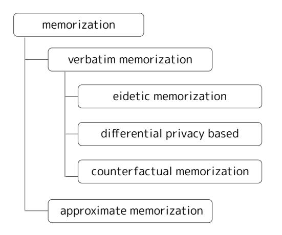
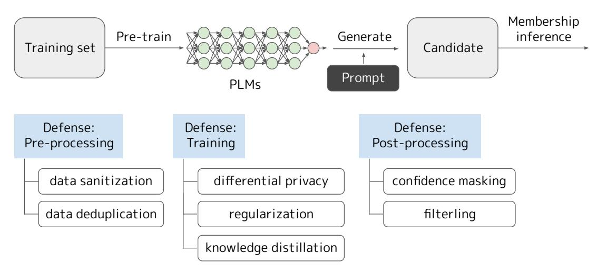

# Training Data Extraction From Pre-trained Language Models: A Survey

# Shotaro Ishihara

Nikkei Inc. 1-3-7, Otemachi, Chiyoda-ku, Tokyo shotaro.ishihara@nex.nikkei.com

## Abstract

As the deployment of pre-trained language models (PLMs) expands, pressing security concerns have arisen regarding the potential for malicious extraction of training data, posing a threat to data privacy. This study is the first to provide a comprehensive survey of training data extraction from PLMs. Our review covers more than 100 key papers in fields such as natural language processing and security. First, preliminary knowledge is recapped and a taxonomy of various definitions of memorization is presented. The approaches for attack and defense are then systemized. Furthermore, the empirical findings of several quantitative studies are highlighted. Finally, future research directions based on this review are suggested.

# 1 Introduction

Pre-trained language models (PLMs) are widely used in natural language processing. Statistical models that assign probabilities to token sequences have been studied, and large neural networks are increasingly being used for pre-training with large datasets. This scaling has led to fluent natural language generation and success in many other downstream tasks [\(Devlin et al.,](#page-9-0) [2019\)](#page-9-0). In some cases, parameter updates are not required for downstream tasks [\(Radford et al.,](#page-12-0) [2019;](#page-12-0) [Brown et al.,](#page-9-1) [2020\)](#page-9-1).

With increasing applications of PLMs, security concerns have increased considerably [\(Ben](#page-8-0)[der et al.,](#page-8-0) [2021;](#page-8-0) [Bommasani et al.,](#page-8-1) [2021;](#page-8-1) [Wei](#page-13-0)[dinger et al.,](#page-13-0) [2022\)](#page-13-0). Studies have revealed the risk of language models exhibiting unintentional *memorization* of training data, and occasionally outputting memorized information [\(Carlini et al.,](#page-9-2) [2019,](#page-9-2) [2021,](#page-9-3) [2023b;](#page-9-4) [Lee et al.,](#page-11-0) [2023\)](#page-11-0). In particular, [Carlini et al.](#page-9-3) [\(2021\)](#page-9-3) identified that personal information can be extracted by generating numerous sentences from PLMs and performing *membership inference* [\(Shokri et al.,](#page-13-1) [2017\)](#page-13-1). These attacks on PLMs are referred to as *training data extraction*

and are undesirable because of privacy, decreased utility, and reduced fairness concerns [\(Carlini et al.,](#page-9-4) [2023b\)](#page-9-4). However, with the evolution of PLMs, limited progress has been achieved in addressing these concerns, and security technology is yet to mature.

This study is the first to provide a comprehensive survey of training data extraction from PLMs. Starting with the pioneering work, we reviewed more than 100 previous and subsequent studies. Specifically, we screened papers citing [Carlini et al.](#page-9-3) [\(2021\)](#page-9-3) [1](#page-0-0) based on the relationships, the number of citations, and their acceptance. First, Section [2](#page-0-1) presents preliminary knowledge. We then discuss several topics with the following contributions:

- A taxonomy of various definitions of memorization (Section [3\)](#page-1-0) was presented. Training data extraction has become close to the famous security attack known as model inversion [\(Fredrikson et al.,](#page-10-0) [2015\)](#page-10-0).
- We systematize the approaches to attack (Section [4\)](#page-3-0) and defense (Section [5\)](#page-5-0). Furthermore, we highlight empirical findings (Section [6\)](#page-6-0) from several quantitative evaluation studies.
- Based on the review, we suggest future research directions (Section [7\)](#page-7-0).

## 2 Preliminaries about PLMs

This section describes the basics of modern PLMs. First, we explain the methodology used for training language models and generating texts. Next, the standard practical schema is introduced.

#### 2.1 Language Models

Language models represent a probability distribution over the sequences of tokens. Based on the pre-training method, language modeling can be categorized into two types [\(Yang et al.,](#page-13-2) [2023\)](#page-13-2): *autoregressive language modeling*, which predicts words

1 [https://scholar.google.com/scholar?cites=](https://scholar.google.com/scholar?cites=12274731957504198296) [12274731957504198296](https://scholar.google.com/scholar?cites=12274731957504198296)

sequentially from left to right [\(Bengio et al.,](#page-8-2) [2000;](#page-8-2) [Mikolov et al.,](#page-12-1) [2010\)](#page-12-1), and *masked language modeling*, which hides some parts of a sentence and fills in the gaps [\(Devlin et al.,](#page-9-0) [2019\)](#page-9-0). The former is sometimes called *causal language modeling* [\(Tiru](#page-13-3)[mala et al.,](#page-13-3) [2022\)](#page-13-3).

This study is focused on autoregressive language models with transformer [\(Vaswani et al.,](#page-13-4) [2017\)](#page-13-4), following many recent studies on training data extraction. Note that some studies have focused on masked language models such as BERT [\(Lehman et al.,](#page-11-1) [2021;](#page-11-1) [Mireshghallah et al.,](#page-12-2) [2022a;](#page-12-2) [He et al.,](#page-10-1) [2022\)](#page-10-1) and T5 [\(Carlini et al.,](#page-9-4) [2023b\)](#page-9-4). Most studies address pre-training rather than fine-tuning [\(Mireshghallah et al.,](#page-12-3) [2022b\)](#page-12-3).

Autoregressive language models take a series of tokens as input and output a probability distribution for the next token. We show a schema of training and generation by following [Carlini et al.](#page-9-3) [\(2021\)](#page-9-3).

Training. The following statistical model was assumed for distribution:

$$\mathbf{Pr}(x_1,x_2,\ldots,x_n),$$

where x1, x2, . . . , xn is a sequence of tokens from a vocabulary using the chain rule of probability:

Pr(x1, x2, . . . , xn) = Πn i=1Pr(xi | x1, . . . , xi−1). Let fθ(xi | x1, . . . , xi−1) denote the likelihood of token xi when evaluating neural network f with parameters θ. Language models are trained to optimize the probability of the data in a training set. Formally, training involves minimizing the loss function as follows:

$$\mathcal{L}(\theta) = -\log \prod_{i=1}^{n} f_{\theta}(x_i \mid x_1, \dots, x_{i-1})$$

for each data in the training set. This setting can be qualitatively regarded as memorizing the flow of sentences in each training data.

Generating. New tokens can be generated by iterating the following process:

- 1. Choose xˆi+1 ∼ fθ(xi+1|x1, . . . , xi).
- 2. Feed xˆi+1 back into the model to choose xˆi+2 ∼ fθ(xi+2|x1, . . . , xˆi+1).

This decoding process continues until conditions are satisfied. The simplest is greedy decoding, selecting the most probable tokens one by one. However, studies have revealed that simply maximizing the output probability generates text that is not natural to humans [\(Li et al.,](#page-11-2) [2016;](#page-11-2) [Holtzman et al.,](#page-10-2) [2020\)](#page-10-2). Therefore, several approaches have been

proposed for sampling from a probability distribution such as top-k sampling [\(Fan et al.,](#page-9-5) [2018\)](#page-9-5) and top-p sampling (Appendix [A\)](#page-14-0).

## 2.2 Pre-training and Fine-tuning

Prior to BERT [\(Devlin et al.,](#page-9-0) [2019\)](#page-9-0), specific models were trained for individual tasks. By contrast, in the PLMs approach, large neural networks with large datasets are pre-trained and fine-tuned for several downstream tasks. [Radford et al.](#page-12-4) [\(2018\)](#page-12-4) revealed that autoregressive language modeling is effective for PLMs with transformers. This extension, GPT-2 [\(Radford et al.,](#page-12-0) [2019\)](#page-12-0) and GPT-3 [\(Brown et al.,](#page-9-1) [2020\)](#page-9-1), can be applied to various tasks without fine-tuning by providing a few examples (in-context learning). The scaling of large models with large datasets has attracted considerable research attention (Appendix [B\)](#page-14-1).

PLMs exhibit a significant advantage in using datasets that match a specific domain. These models can exhibit superior performance in domainspecific tasks than larger models pre-trained on general datasets. Studies, such as BioMegatron [\(Shin](#page-13-5) [et al.,](#page-13-5) [2020\)](#page-13-5), BioGPT [\(Luo et al.,](#page-11-3) [2022\)](#page-11-3), Galactica [\(Taylor et al.,](#page-13-6) [2022\)](#page-13-6), and BloombergGPT [\(Wu](#page-13-7) [et al.,](#page-13-7) [2023\)](#page-13-7), have been conducted. However, the potential risk of training data extraction, especially when using sensitive datasets in pre-training, should be considered [\(Nakamura et al.,](#page-12-5) [2020;](#page-12-5) [Lehman et al.,](#page-11-1) [2021;](#page-11-1) [Jagannatha et al.,](#page-10-3) [2021;](#page-10-3) [Sing](#page-13-8)[hal et al.,](#page-13-8) [2022;](#page-13-8) [Yang et al.,](#page-13-9) [2022\)](#page-13-9). There are also ethical topics such as the human rights in the texts [\(Li et al.,](#page-11-4) [2018;](#page-11-4) [Ginart et al.,](#page-10-4) [2019;](#page-10-4) [Garg et al.,](#page-10-5) [2020;](#page-10-5) [Henderson et al.,](#page-10-6) [2022\)](#page-10-6) and plagiarism regarding copyright [\(Lee et al.,](#page-11-0) [2023\)](#page-11-0). Examples include PLMs created from contracts [\(Chalkidis](#page-9-6) [et al.,](#page-9-6) [2020;](#page-9-6) [Zheng et al.,](#page-14-2) [2021\)](#page-14-2), clinical information [\(Kawazoe et al.,](#page-11-5) [2021\)](#page-11-5), music [\(Agostinelli](#page-8-3) [et al.,](#page-8-3) [2023\)](#page-8-3), and source code [\(Chen et al.,](#page-9-7) [2021\)](#page-9-7).

# 3 Definitions of Memorization

Memorization is the concept that PLMs store and output information about the training data. There is a wide variety of research on memorization, with diverse definitions and assumptions. We illustrate a taxonomy of definitions in Figure [1.](#page-2-0)

### 3.1 Eidetic memorization

A mainstream method is *eidetic memorization* [\(Car](#page-9-3)[lini et al.,](#page-9-3) [2021\)](#page-9-3) and its variations [\(Thomas Mc-](#page-13-10)[Coy et al.,](#page-13-10) [2021;](#page-13-10) [Carlini et al.,](#page-9-4) [2023b;](#page-9-4) [Kandpal](#page-11-6)

Figure 1: Taxonomy of definitions of memorization.

[et al.,](#page-11-6) [2022;](#page-11-6) [Tirumala et al.,](#page-13-3) [2022\)](#page-13-3). These definitions assume that PLMs output memorized data when appropriate prompts are provided. [Carlini](#page-9-3) [et al.](#page-9-3) [\(2021\)](#page-9-3) defined eidetic memorization as Definition [3.1,](#page-2-1) and in a subsequent study [\(Carlini et al.,](#page-9-4) [2023b\)](#page-9-4), they adopted the definition in Definition [3.2.](#page-2-2) They stated that eidetic memorization can be used in cases in which no prompt, whereas the subsequent definition is suitable for conditions with prompts. Some studies have adopted definitions similar to those in Definition [3.2.](#page-2-2) Examples include [Tirumala et al.](#page-13-3) [\(2022\)](#page-13-3) with a per-token definition of *exact memorization*, and [Kandpal et al.](#page-11-6) [\(2022\)](#page-11-6) with a document-level definition of *perfect memorization*.

Definition 3.1 (eidetic memorization). A string s is k-eidetic memorized by PLM fθ if a prompt p exists such that f(p) = s and s appears at most k times in the training set.

Definition 3.2 (a variation of eidetic memorization). A string s is k-memorized with k tokens of context from a PLM fθ if a (length-k) string p exists such that the concatenation [p||s] is contained in the training set, and fθ produces s when prompted with p by using greedy decoding.

#### 3.2 Differential privacy

Differential privacy [\(Dwork et al.,](#page-9-8) [2006\)](#page-9-8) is widely used in memorization, and definitions based on differential privacy have been devised [\(Jagielski](#page-11-7) [et al.,](#page-11-7) [2020;](#page-11-7) [Nasr et al.,](#page-12-6) [2021\)](#page-12-6). Differential privacy was formulated based on the premise that removing any data from the training set should not considerably change trained models. Although this method protects the personal information of a single user, [Brown et al.](#page-9-9) [\(2022\)](#page-9-9) reported that the method cannot capture the complexity of social and linguistic data. Differential privacy is introduced as a defense approach in Section [5.2.](#page-5-1)

### 3.3 Counterfactual memorization

Studies have defined *counterfactual memorization* as the difference between a training data's expected loss under a model that has and has not been trained on that data [\(Feldman and Zhang,](#page-9-10) [2020;](#page-9-10) [van den](#page-13-11) [Burg and Williams,](#page-13-11) [2021\)](#page-13-11). [Zhang et al.](#page-14-3) [\(2021c\)](#page-14-3) investigated this form of memorization in PLMs based on the taxonomy of human memorization in psychology.

The definition of counterfactual memorization has received limited attention in training data extraction. [Carlini et al.](#page-9-4) [\(2023b\)](#page-9-4) noted that this definition requires training thousands of models to measure privacy. Thus, evaluating PLMs becomes difficult because of their inference costs. Furthermore, [Kandpal et al.](#page-11-6) [\(2022\)](#page-11-6) remarked that this definition is not considered a privacy attack scenario because access to the training corpus is assumed. This phenomenon is related to the adversarial knowledge presented in Section [4.2.](#page-3-1)

## 3.4 Approximate memorization

Although the definitions of memorization thus far assume exact string matches, definitions have been proposed to relax this condition. Here, [Ippolito](#page-10-7) [et al.](#page-10-7) [\(2022\)](#page-10-7) refer to definitions based on exact string matches as *verbatim memorization*. They revealed that verbatim memorization can be handled by simply adjusting the decoding method and proposed alternative definitions called *approximate memorization* that consider string fuzziness, as presented in Definition [3.3.](#page-2-3) Some methods have been proposed to calculate similarity. [Ippolito et al.](#page-10-7) [\(2022\)](#page-10-7) set the condition that BLEU(s, g) [\(Papineni](#page-12-7) [et al.,](#page-12-7) [2002\)](#page-12-7) is greater than 0.75. The threshold value of 0.75 was selected by qualitatively inspecting examples. [Lee et al.](#page-11-8) [\(2022\)](#page-11-8) defined that the token is memorized if it is part of a substring of 50 tokens of a string in the training data.

Definition 3.3 (approximate memorization). A string s is k-approximately memorized by PLM fθ if a (length-k) string p exists such that (s, g) satisfies certain conditions of similarity, and fθ produces g when prompted with p.

### 3.5 Revisiting model inversion

Reconstructing training data from a model presents a well-known security concern called model inver-

Figure 2: The procedure of training data extraction attacks and possible defenses.

sion attacks [\(Fredrikson et al.,](#page-10-0) [2015\)](#page-10-0). [Carlini et al.](#page-9-3) [\(2021\)](#page-9-3) explained that the main difference is that training data extraction does not allow fuzziness. However, this difference has decreased since the introduction of relaxed definitions of memorization. [Kandpal et al.](#page-11-6) [\(2022\)](#page-11-6) mentioned several previous studies [\(Carlini et al.,](#page-9-2) [2019,](#page-9-2) [2021;](#page-9-3) [Inan et al.,](#page-10-8) [2021\)](#page-10-8) as model inversion.

# 4 Training Data Extraction Attacks

This section systematizes the attack procedure. Most studies follow [Carlini et al.](#page-9-3) [\(2021\)](#page-9-3). They revealed that hundreds of verbatim text sequences can be extracted from the training data. Given a PLM, the procedure consists of two steps, candidate generation, and membership inference, as displayed in Figure [2.](#page-3-2)

#### 4.1 Candidate generation

The first step is to generate numerous texts from a given PLM. Texts can be generated from PLMs using several decoding methods, as discussed in Appendix [A.](#page-14-0) Here, [Carlini et al.](#page-9-4) [\(2023b\)](#page-9-4) reported that the choice of the decoding strategy does not considerably affect their experimental results. In contrast, [Lee et al.](#page-11-0) [\(2023\)](#page-11-0) observed that top-k and top-p sampling tended to extract more training data.

Another perspective is the procedure for providing prompts. Prompts are provided according to two options, giving only a special token[2](#page-3-3) (sometimes called *no prompt*) or specific strings as prompts. Studies have constructed prompts by extracting data from the dataset considered to be used

in creating PLMs. [Carlini et al.](#page-9-3) [\(2021\)](#page-9-3) randomly sampled between 5 and 10 tokens from scraped data. [Carlini et al.](#page-9-4) [\(2023b\)](#page-9-4) extracted a subset of the Pile dataset [\(Gao et al.,](#page-10-9) [2020\)](#page-10-9) in prompting GPT-Neo model family [\(Black et al.,](#page-8-4) [2022\)](#page-8-4).

# 4.2 Membership inference

Membership inference aims to predict whether any particular example is used to train a machine learning model [\(Shokri et al.,](#page-13-1) [2017;](#page-13-1) [Song and](#page-13-12) [Shmatikov,](#page-13-12) [2019;](#page-13-12) [Hisamoto et al.,](#page-10-10) [2020\)](#page-10-10). This result can lead directly to privacy violations. We describe membership inference on PLMs from the following five perspectives in a survey paper [\(Hu](#page-10-11) [et al.,](#page-10-11) [2022\)](#page-10-11): target model, adversarial knowledge, approach, algorithm, and domain.

Target model. This study focuses on autoregressive language models as discussed in Section [2.1.](#page-0-2) Attacks on other models such as word embeddings [\(Song and Raghunathan,](#page-13-13) [2020;](#page-13-13) [Mahloujifar](#page-11-9) [et al.,](#page-11-9) [2021;](#page-11-9) [Meehan et al.,](#page-12-8) [2022\)](#page-12-8), natural language understanding [\(Parikh et al.,](#page-12-9) [2022\)](#page-12-9), text classification [\(Nasr et al.,](#page-12-10) [2019;](#page-12-10) [Zhang et al.,](#page-14-4) [2022;](#page-14-4) [Elmahdy](#page-9-11) [et al.,](#page-9-11) [2022\)](#page-9-11), and image diffusion models [\(Carlini](#page-9-12) [et al.,](#page-9-12) [2023a\)](#page-9-12) exist but are not covered.

Adversarial knowledge. The second perspective is the knowledge that can be handled explicitly by attackers. We describe two aspects of adversarial knowledge, namely models and training sets. The patterns of adversarial knowledge in this study are summarized in Appendix [C.](#page-14-5)

[Hu et al.](#page-10-11) [\(2022\)](#page-10-11) presented the adversarial knowledge of models. The models are classified into two categories, namely white-box and black-box,

2[Carlini et al.](#page-9-3) [\(2021\)](#page-9-3) used <|endoftext|>, as indicated at [https://github.com/ftramer/LM\\_Memorization](https://github.com/ftramer/LM_Memorization).

according to accessibility [\(Nasr et al.,](#page-12-10) [2019\)](#page-12-10). Under the white-box setting, an attacker can obtain all information and use it for the attack. This includes the training procedure and the architecture and trained parameters of the target model. However, in the black-box setting, an attacker can only have limited access to the target model. [Hu et al.](#page-10-11) [\(2022\)](#page-10-11) classified the black-box setting into three parts, namely full confidence scores, top-k confidence scores, and prediction labels only. They differ in the extent of access an attacker has to the PLMs output. The setting of full confidence scores assumes a situation in which the training process of the model is unknown, but all outputs for any given input are available. Therefore, an attacker can obtain prediction labels with probabilities and calculate the loss. The setting of top-k confidence scores indicates that an attacker can obtain several candidates of the output. The scope of the attack is restricted because losses cannot be calculated. Another setting provides only labels without prediction values [\(Choquette-Choo et al.,](#page-9-13) [2021;](#page-9-13) [Zhu](#page-14-6) [et al.,](#page-14-6) [2023\)](#page-14-6). Many web services with PLMs, such as DeepL[3](#page-4-0) and ChatGPT[4](#page-4-1) , only allow users to view labels for the model output.

Furthermore, we describe the adversarial knowledge of the training sets. In the white-box setting, the training set is stated and publicly available. The most harmful attacks are black box setups that do not assume access to the training set. Such attacks include PLMs created by private datasets. In some cases, the data are partially publicly available. Such cases include the ones wherein only the beginning of the news article is available for free, certain editions are accessible, and some articles have been made private over time. Although the data itself are not partially published, substrings can be inferred in the hidden private data using a priori knowledge [\(Henderson et al.,](#page-10-12) [2018;](#page-10-12) [Carlini et al.,](#page-9-2) [2019\)](#page-9-2). Examples are prompts like *"Bob's phone number is"* and *"Alice's password is"*.

We must be aware of scenarios in which the dataset and PLMs are unwillingly leaked and become public. Adversarial knowledge is immediately converted to the white-box level. For example, even if a web service with PLMs trained on a private dataset provides users with only a string, it is crucial to discuss risks when both the dataset and the PLMs are unintentionally made public.

Approach. [Hu et al.](#page-10-11) [\(2022\)](#page-10-11) divided the membership inference approaches into three categories, namely classifier-based [\(Shokri et al.,](#page-13-1) [2017;](#page-13-1) [Song](#page-13-12) [and Shmatikov,](#page-13-12) [2019\)](#page-13-12), metric-based [\(Bentley et al.,](#page-8-5) [2020;](#page-8-5) [Choquette-Choo et al.,](#page-9-13) [2021;](#page-9-13) [Song and Mit](#page-13-14)[tal,](#page-13-14) [2021\)](#page-13-14), and differential comparisons [\(Hui et al.,](#page-10-13) [2021\)](#page-10-13). For example, in shadow training [\(Shokri](#page-13-1) [et al.,](#page-13-1) [2017;](#page-13-1) [Song and Shmatikov,](#page-13-12) [2019\)](#page-13-12), a primary classifier-based method, additional training is assumed in the model (white-box settings). Some metric-based methods can be applied to realistic black-box settings.

In studies of training data extraction from PLMs, *perplexity* is often used for metrics of membership inference [\(Carlini et al.,](#page-9-2) [2019,](#page-9-2) [2021\)](#page-9-3). Given a sequence of tokens x1, . . . , xn, the perplexity is defined as:

$$\mathcal{P} = \exp\left(-\frac{1}{n}\sum_{i=1}^{n}\log f_{\theta}(x_i|x_1,\dots,x_{i-1})\right)$$

Algorithm. The fourth perspective is whether the algorithm is centralized or federated. Federated learning approaches have received considerable attention in privacy protection research [\(Melis et al.,](#page-12-11) [2019;](#page-12-11) [Nasr et al.,](#page-12-10) [2019;](#page-12-10) [Lee et al.,](#page-11-10) [2021;](#page-11-10) [Kairouz](#page-11-11) [et al.,](#page-11-11) [2021\)](#page-11-11). However, focusing on training data extraction, the mainstream approach is based on centralized methods as of April 2023.

Domain. Text datasets are rooted in various domains, as described in Section [2.2.](#page-1-1) Clinics are a crucial research field that involves handling of highly confidential information. [Lehman et al.](#page-11-1) [\(2021\)](#page-11-1) recovered patient names and their associated conditions from PLMs using electronic clinical records. [Jagannatha et al.](#page-10-3) [\(2021\)](#page-10-3) demonstrated that patients with rare disease profiles may be highly vulnerable to higher privacy leakages through experiments using PLMs of clinical data. Many other domains require careful processing, such as contracts [\(Yin](#page-14-7) [and Habernal,](#page-14-7) [2022\)](#page-14-7) and source code[5](#page-4-2) . A discussion of the right to be forgotten in the legal and news industries has emerged [\(Li et al.,](#page-11-4) [2018;](#page-11-4) [Gi](#page-10-4)[nart et al.,](#page-10-4) [2019;](#page-10-4) [Garg et al.,](#page-10-5) [2020;](#page-10-5) [Henderson et al.,](#page-10-6) [2022\)](#page-10-6). Therefore, it should be ensured that PLMs do not unintentionally become digital archives.

Publicly available datasets do not necessarily indicate that they are completely independent of the risk of training data extraction from PLMs. The context in which the information is shared

3 <https://www.deepl.com/translator>

4 <https://openai.com/blog/chatgpt/>

5 [https://github.blog/](https://github.blog/2021-06-30-github-copilot-research-recitation/) [2021-06-30-github-copilot-research-recitation/](https://github.blog/2021-06-30-github-copilot-research-recitation/)

should be known to respect privacy [\(Dourish,](#page-9-14) [2004;](#page-9-14) [Nissenbaum,](#page-12-12) [2009\)](#page-12-12). Nissenbaum's contextual integrity [\(Nissenbaum,](#page-12-12) [2009\)](#page-12-12) states that a change in any one of five characteristics (data subject, sender, recipient, information type, and transmission principle) may alter privacy expectations. [Brown et al.](#page-9-9) [\(2022\)](#page-9-9) emphasized the importance of PLMs only with data explicitly intended for public use. The Italian Data Protection Authority issued a statement[6](#page-5-2) on March 2023 in accordance with the European General Data Protection Regulation (GDPR) against OpenAI, the provider of ChatGPT, for their data processing.

### 5 Training Data Extraction Defenses

This section systematizes approaches to defense. We can mitigate privacy risks before, during, and after creating PLMs as displayed in Figure [2.](#page-3-2) The classification was reconstructed using references [\(Hu et al.,](#page-10-11) [2022;](#page-10-11) [Huang et al.,](#page-10-14) [2022;](#page-10-14) [Jagielski](#page-10-15) [et al.,](#page-10-15) [2023\)](#page-10-15). Extensive studies have been conducted on the hazardous generation of PLMs [\(Ku](#page-11-12)[rita et al.,](#page-11-12) [2020;](#page-11-12) [Mei et al.,](#page-12-13) [2022;](#page-12-13) [Levy et al.,](#page-11-13) [2022;](#page-11-13) [Ouyang et al.,](#page-12-14) [2022;](#page-12-14) [Carlini et al.,](#page-9-15) [2023c\)](#page-9-15). However, this study focused on training data extraction.

#### 5.1 Pre-processing

First, pre-processing the training set is considered.

Data sanitization. The simplest solution is to identify and remove any text that conveys personal information [\(Ren et al.,](#page-13-15) [2016;](#page-13-15) [Continella et al.,](#page-9-16) [2017;](#page-9-16) [Vakili et al.,](#page-13-16) [2022\)](#page-13-16). However, as noted in Section [4.2,](#page-3-1) privacy depends on the context, and determining privacy from the string alone is difficult. [Brown et al.](#page-9-9) [\(2022\)](#page-9-9) proposed that data sanitization is only useful for removing context-independent, well-defined, static pieces of personal information from the training set.

Data deduplication. Studies have indicated that data deduplication mitigates the memorization of PLMs [\(Allamanis,](#page-8-6) [2019;](#page-8-6) [Kandpal et al.,](#page-11-6) [2022;](#page-11-6) [Lee](#page-11-8) [et al.,](#page-11-8) [2022\)](#page-11-8). This method is more efficient than methods that train models and is expected to be a practical solution. Empirical findings on data deduplication are presented in Section [6.2.](#page-6-1)

#### 5.2 Training

The second method is a pre-training strategy.

Differential privacy. Applying differential privacy [\(Dwork et al.,](#page-9-8) [2006\)](#page-9-8) methods for providing data privacy guarantees in machine learning models has attracted considerable research attention. Differential privacy is a data protection measure that is designed to ensure that providing data does not reveal much information about the user. However, applying these algorithms (e.g., DP-SGD [\(Abadi](#page-8-7) [et al.,](#page-8-7) [2016\)](#page-8-7) and DP-FedAvg [\(Ramaswamy et al.,](#page-12-15) [2020\)](#page-12-15)) to PLMs is challenging. Performance degradation and increased computation and memory usage are the primary concerns.

To address this problem, a framework has been proposed for training models in two steps [\(Yu et al.,](#page-14-8) [2021,](#page-14-8) [2022;](#page-14-9) [Li et al.,](#page-11-14) [2022;](#page-11-14) [He et al.,](#page-10-16) [2023\)](#page-10-16) [7](#page-5-3) . In the framework, large amounts of non-private datasets are used for pre-training to obtain general features; next, additional training is applied with a sensitive dataset using a differential privacy algorithm. [Downey et al.](#page-9-17) [\(2022\)](#page-9-17) reported that the differential privacy approach is effective in preventing memorization, despite its computational and model performance costs. Note that [Tramèr et al.](#page-13-17) [\(2022\)](#page-13-17) summarized a critical view. They argued that publicly accessible datasets are not free from privacy risks because they contain information that is unintentionally released to the public. Therefore, discussing whether private information that we want to hide is contained in the public dataset is essential. It is known that understanding the semantic guarantee of differential privacy is difficult when private data is involved [\(Cummings et al.,](#page-9-18) [2021\)](#page-9-18).

Another barrier to applying differential privacy to PLMs is the requirement of defining secret boundaries even though text data are not binary. Studies have considered various levels of granularity, from individual tokens or words to sentences, documents, or even the entire user dataset [\(McMa](#page-11-15)[han et al.,](#page-11-15) [2018;](#page-11-15) [Levy et al.,](#page-11-16) [2021;](#page-11-16) [Lukas et al.,](#page-11-17) [2023\)](#page-11-17).

Regularization. Regularization is a well-known approach for suppressing overfitting in machine learning models. The memorization of models is typically associated with overfitting [\(Yeom et al.,](#page-13-18) [2018;](#page-13-18) [Zhang et al.,](#page-14-10) [2021b\)](#page-14-10). Therefore, regularization during training that reduces overfitting can be used as a measure of membership inference [\(Hu](#page-10-11) [et al.,](#page-10-11) [2022\)](#page-10-11). [Mireshghallah et al.](#page-12-16) [\(2021\)](#page-12-16) proposed a regularization method regarding the memoriza-

6 [https://www.garanteprivacy.it/home/docweb/-/](https://www.garanteprivacy.it/home/docweb/-/docweb-display/docweb/9870847) [docweb-display/docweb/9870847](https://www.garanteprivacy.it/home/docweb/-/docweb-display/docweb/9870847)

7A study has also appeared that applies these algorithms to in-context learning settings [\(Panda et al.,](#page-12-17) [2023\)](#page-12-17).

tion of PLMs and claimed usefulness compared with differential privacy methods. Some studies have constrained the representation of neural networks by the information bottleneck layer [\(Alemi](#page-8-8) [et al.,](#page-8-8) [2017;](#page-8-8) [Henderson and Fehr,](#page-10-17) [2023\)](#page-10-17).

Pre-training large neural networks has distinctive tendencies compared with common machine learning. A single data in the training set is not used for too many epochs in pre-training and is sometimes used for less than one epoch. Furthermore, [Carlini](#page-9-3) [et al.](#page-9-3) [\(2021\)](#page-9-3) reported that a characteristic of PLM memorization is the emergence of training data with an abnormally lower loss than the average. [Tirumala et al.](#page-13-3) [\(2022\)](#page-13-3) revealed that large language models can memorize most of their data before overfitting and tend not to forget much information through the training process. [Biderman et al.](#page-8-9) [\(2023\)](#page-8-9) have focused on the training process and attempted to predict the memorization of PLMs.

Knowledge distillation. Another approach is knowledge distillation [\(Hinton et al.,](#page-10-18) [2015\)](#page-10-18), in which the output of a large teacher model is used to train a small student model. [Shejwalkar and](#page-13-19) [Houmansadr](#page-13-19) [\(2021\)](#page-13-19) revealed that knowledge distillation can be used to restrict an attacker's direct access to a private training set, which considerably reduces membership information leakage.

### 5.3 Post-processing

The third step is to post-process the PLMs output.

Confidence masking. Limiting the output of PLMs is a simple but effective defense mechanism. For example, confidence masking can be used for adjusting adversarial knowledge, as presented in Section [4.2](#page-3-1) and Appendix [C.](#page-14-5)

Filtering. Filtering the output of PLMs before providing them to users is crucial. Identifying items to be filtered incurs a cost, and ensuring diversity remains challenging. [Perez et al.](#page-12-18) [\(2022\)](#page-12-18) proposed a method to automatically identify test cases by extracting potentially dangerous outputs by detailing prompts using various PLMs.

# 6 Empirical Findings

This section presents empirical findings on training data extraction from PLMs. Initial studies were limited to qualitative evaluations, but subsequent studies [\(Lee et al.,](#page-11-8) [2022;](#page-11-8) [Kandpal et al.,](#page-11-6) [2022;](#page-11-6) [Ip](#page-10-7)[polito et al.,](#page-10-7) [2022;](#page-10-7) [Tirumala et al.,](#page-13-3) [2022;](#page-13-3) [Downey](#page-9-17)

[et al.,](#page-9-17) [2022;](#page-9-17) [Carlini et al.,](#page-9-4) [2023b;](#page-9-4) [Lee et al.,](#page-11-0) [2023\)](#page-11-0) have focused on quantitative evaluations.

In particular, based on one of the first comprehensive quantitative studies [\(Carlini et al.,](#page-9-4) [2023b\)](#page-9-4), we report on the impact of the model size, the string duplication in the training set, and the length of prompts. They used various sizes of GPT-Neo model family [\(Black et al.,](#page-8-4) [2022\)](#page-8-4), which are the autoregressive language models pre-trained by the Pile dataset [\(Gao et al.,](#page-10-9) [2020\)](#page-10-9). Four model sizes, namely 125 million, 1.3 billion (B), 2.7 B, and 6 B parameters, were considered. The number of duplicate strings was determined by analyzing the Pile dataset. A subset of 50,000 sentences from the Pile dataset was used for evaluation, and the distribution of duplicates was considered. The beginning of each sentence was cut out at a certain number of tokens and considered as a prompt. The amount of memorization was calculated as the fraction of generations that exactly reproduce the true string for their prompt averaged over all prompts and sequence lengths.

### 6.1 Larger models memorize more

[Carlini et al.](#page-9-4) [\(2023b\)](#page-9-4) revealed that a near-perfect log-linear relationship exists such that the larger the model size is, the more strings are memorized. Numerically, a ten-fold increase in the model size increased the amount of memorization by 19 ppt. For comparison, they performed the same analysis with the GPT-2 model family. The amount of memorization was 40 % for 1.3 B GPT-neo compared with 6 % for the GPT-2 of the same size. This phenomenon implied the effect of memorization of the training data, not just the model size.

[Carlini et al.](#page-9-4) [\(2023b\)](#page-9-4) used the definition of verbatim memorization, and [Ippolito et al.](#page-10-7) [\(2022\)](#page-10-7) confirmed similar results with the definition of approximate memorization. Although not sufficiently quantitative, initial studies [\(Carlini et al.,](#page-9-2) [2019;](#page-9-2) [Zhang et al.,](#page-14-10) [2021b\)](#page-14-10) have provided preliminary evidence. [Tirumala et al.](#page-13-3) [\(2022\)](#page-13-3) and [Lee et al.](#page-11-0) [\(2023\)](#page-11-0) also revealed that larger models memorize more.

#### 6.2 Duplicate strings are memorized

[Carlini et al.](#page-9-4) [\(2023b\)](#page-9-4) reported that a clear log-linear trend exists between the number of duplicates and the amount of memorization. They measured the amount of memorization for each bucket with duplicate counts ranging from 2 to 900. [Kandpal](#page-11-6) [et al.](#page-11-6) [\(2022\)](#page-11-6) and [Lee et al.](#page-11-8) [\(2022\)](#page-11-8) also revealed that duplication in the training set of PLMs relates to

the likelihood of memorizing strings and proposed that deduplication mitigates training data extraction. However, memorization can occur even with only a few duplicates, and deduplication cannot prevent it completely. [Chang et al.](#page-9-19) [\(2023\)](#page-9-19) reported that the degree of memorization of ChatGPT and GPT-4 [\(OpenAI,](#page-12-19) [2023\)](#page-12-19) was related to the frequency of the passages that appeared on the web.

#### 6.3 Longer prompts extract more

[Carlini et al.](#page-9-4) [\(2023b\)](#page-9-4) revealed that the amount of memorization increases with the length of the prompt. For example, the amount of memorization by the 6 B model was 33 % for 50 tokens, compared with 65 % for 450 tokens. This experiment was inspired by the findings of [Carlini et al.](#page-9-2) [\(2019\)](#page-9-2). They suggested that setting the maximum prompt length available to users considerably reduces the risk of training data extraction.

# 7 Conclusion & Future Directions

We have reviewed over 100 papers for the first comprehensive survey on training data extraction from PLMs. The final section provides suggestions for future research directions. We hope that this study highlights the importance of training data extraction from PLMs and accelerates the discussion.

#### 7.1 Is memorization always evil?

Most studies did not distinguish the degree of danger of memorized strings [\(Lee et al.,](#page-11-18) [2020\)](#page-11-18). Ideally, the undesirable memorization of telephone numbers and email addresses must be separated from the acceptable memorization. [Huang et al.](#page-10-14) [\(2022\)](#page-10-14) was among the first to differentiate between memorization and association in PLMs. They concluded that the risk of specific personal information being leaked is low because PLMs cannot semantically associate personal information with their owners.

The boundary between memorization and knowledge of PLMs remains ambiguous with the definition of approximate memorization [\(Ippolito et al.,](#page-10-7) [2022;](#page-10-7) [Lee et al.,](#page-11-8) [2022\)](#page-11-8). Deduplication of training sets, which is considered useful in Sections [5](#page-5-0) and [6,](#page-6-0) leads to the elimination of helpful knowledge. Therefore, we must consider what memorization is [\(Haviv et al.,](#page-10-19) [2022\)](#page-10-19) and balance the security concerns with the model performance, depending on the final application. The definition of counterfactual memorization introduced in Section [3.3](#page-2-4) incorporated psychological findings that could be

useful despite its challenges.

## 7.2 Toward broader research fields

Discussing the handling of the fuzziness of a string is important. [Ippolito et al.](#page-10-7) [\(2022\)](#page-10-7) stated that the current definition of approximate memorization focuses on English, and different considerations are required for other conditions such as non-English languages. In addition, they suggested two research areas that could help improve the definition: image generation memorization and plagiarism detection. Images are more difficult to generate than text for matching exactly with the original. Therefore, fuzzy memorization has been investigated and measured. [Fredrikson et al.](#page-10-0) [\(2015\)](#page-10-0), which proposed the model inversion attack, used face recognition in images as the subject of their experiments. Studies have used metrics that consider image similarity [\(Zhang et al.,](#page-14-11) [2020;](#page-14-11) [Haim et al.,](#page-10-20) [2022;](#page-10-20) [Balle et al.,](#page-8-10) [2022\)](#page-8-10). Furthermore, the trend toward pre-training in both images and language [\(Lu](#page-11-19) [et al.,](#page-11-19) [2019;](#page-11-19) [Li et al.,](#page-11-20) [2020\)](#page-11-20) should be considered. The limitations of the definition of verbatim textual matching have been discussed in plagiarism detection research [\(Roy et al.,](#page-13-20) [2009;](#page-13-20) [Potthast et al.,](#page-12-20) [2010\)](#page-12-20). Similarities are explored from multiple perspectives, including word changes, shuffling, and paraphrasing.

#### 7.3 Evaluation schema

Room for ingenuity exists in the construction of evaluation sets. Establishing a schema for quantitative evaluation, which has received considerable attention, is critical. Studies mentioned in Sections [4](#page-3-0) and [6](#page-6-0) have created evaluation sets by extracting a subset of the training set. Sampling is essential because of inference time limitations. However, we must be careful to see if there are other factors to consider besides the distribution of the number of duplicates to avoid bias due to sampling.

Evaluation metrics for the training data extraction are open for discussion. [Carlini et al.](#page-9-20) [\(2022\)](#page-9-20) postulated that the ideal evaluation metric must be based on realistic attack scenarios, whereas most studies on membership inference measure the average accuracy rate. They proposed that membership inference should be evaluated by the true positive rate with a low false positive rate. The Training Data Extraction Challenge[8](#page-7-1) measures attack speed as well as recall and precision.

8 [https://github.com/google-research/](https://github.com/google-research/lm-extraction-benchmark) [lm-extraction-benchmark](https://github.com/google-research/lm-extraction-benchmark)

# Limitations

First, this study focused on PLMs in training data extraction, particularly autoregressive language models. Other target models, such as masked language models (described in Section [2.1\)](#page-0-2) and word embeddings (noted in Section [4.2\)](#page-3-1), require another discussion. Additionally, due to prioritization constraints, the discussion on other topics, including model inversion attacks and the federated learning approach, was limited. However, these areas are established and can be supplemented by other studies [\(Fredrikson et al.,](#page-10-0) [2015;](#page-10-0) [Zhang et al.,](#page-14-12) [2021a\)](#page-14-12).

Second, in practical applications of PLM, it is necessary to audit not only security but also various other aspects such as performance degradation [\(Mökander et al.,](#page-12-21) [2023\)](#page-12-21). There are a number of security concerns beyond training data extraction (noted in Section [5\)](#page-5-0). There are also papers discussing performance degradation of PLMs over time [\(Ishihara et al.,](#page-10-21) [2022\)](#page-10-21).

Finally, this comprehensive survey is based on information as of April 2023. Studies on training data extraction from PLMs have primarily focused on natural language processing and security. These domains are undergoing rapid changes. Therefore, some of the content may become obsolete in the near future.

# Ethics Statement

The privacy concerns regarding training data extraction from PLMs were reviewed to help mature discussions in academia and industry. Of course, its purpose is not to promote these attacks.

Studies on PLMs tend to focus on the English language, which is the language used by the majority of people in the world, and the same is true for training data extraction. Therefore, this study focused on English. As indicated in Section [7.2,](#page-7-2) research on other languages is encouraged.

#### Acknowledgements

We would like to thank Editage ([www.editage.](www.editage.com) [com](www.editage.com)) for English language editing.

### References

Martin Abadi, Andy Chu, Ian Goodfellow, et al. 2016. [Deep learning with differential privacy.](https://doi.org/10.1145/2976749.2978318) In *Proceedings of the 2016 ACM SIGSAC Conference on Computer and Communications Security*, CCS '16, pages 308–318, New York, NY, USA. Association for Computing Machinery.

- David H Ackley, Geoffrey E Hinton, and Terrence J Sejnowski. 1985. [A learning algorithm for boltzmann](https://onlinelibrary.wiley.com/doi/abs/10.1207/s15516709cog0901_7) [machines.](https://onlinelibrary.wiley.com/doi/abs/10.1207/s15516709cog0901_7) *Cognitive Science*, 9(1):147–169.
- Andrea Agostinelli, Timo I Denk, Zalán Borsos, et al. 2023. [MusicLM: Generating music from text.](http://arxiv.org/abs/2301.11325) *arXiv preprint arXiv:2301.11325*.
- Alexander A. Alemi, Ian Fischer, Joshua V. Dillon, et al. 2017. [Deep variational information bottleneck.](https://openreview.net/forum?id=HyxQzBceg) In *Proceedings of the 5th International Conference on Learning Representations*.
- Miltiadis Allamanis. 2019. [The adverse effects of code](https://doi.org/10.1145/3359591.3359735) [duplication in machine learning models of code.](https://doi.org/10.1145/3359591.3359735) In *Proceedings of the 2019 ACM SIGPLAN International Symposium on New Ideas, New Paradigms, and Reflections on Programming and Software*, Onward! 2019, pages 143–153, New York, NY, USA. Association for Computing Machinery.
- Balle, Cherubin, and Hayes. 2022. [Reconstructing train](https://www.computer.org/csdl/proceedings-article/sp/2022/131600b556/1FlQO2xul1e)[ing data with informed adversaries.](https://www.computer.org/csdl/proceedings-article/sp/2022/131600b556/1FlQO2xul1e) In *2022 IEEE Symposium on Security and Privacy (SP)*, volume 0, pages 1138–1156.
- Emily M Bender, Timnit Gebru, Angelina McMillan-Major, et al. 2021. [On the dangers of stochastic](https://doi.org/10.1145/3442188.3445922) [parrots: Can language models be too big?](https://doi.org/10.1145/3442188.3445922) In *Proceedings of the 2021 ACM Conference on Fairness, Accountability, and Transparency*, FAccT '21, pages 610–623, New York, NY, USA. Association for Computing Machinery.
- Yoshua Bengio, Réjean Ducharme, and Pascal Vincent. 2000. [A neural probabilistic language model.](https://proceedings.neurips.cc/paper/2000/file/728f206c2a01bf572b5940d7d9a8fa4c-Paper.pdf) In *Advances in Neural Information Processing Systems*, volume 13. MIT Press.
- Jason W Bentley, Daniel Gibney, Gary Hoppenworth, et al. 2020. [Quantifying membership inference vul](http://arxiv.org/abs/2009.05669)[nerability via generalization gap and other model](http://arxiv.org/abs/2009.05669) [metrics.](http://arxiv.org/abs/2009.05669) *arXiv preprint arXiv:2009.05669*.
- Stella Biderman, Usvsn Sai Prashanth, Lintang Sutawika, et al. 2023. [Emergent and predictable](http://arxiv.org/abs/2304.11158) [memorization in large language models.](http://arxiv.org/abs/2304.11158) *arXiv preprint arXiv:2304.11158*.
- Sidney Black, Stella Biderman, Eric Hallahan, Quentin Anthony, Leo Gao, Laurence Golding, Horace He, Connor Leahy, Kyle McDonell, Jason Phang, Michael Pieler, Usvsn Sai Prashanth, Shivanshu Purohit, Laria Reynolds, Jonathan Tow, Ben Wang, and Samuel Weinbach. 2022. [GPT-NeoX-20B: An open](https://doi.org/10.18653/v1/2022.bigscience-1.9)[source autoregressive language model.](https://doi.org/10.18653/v1/2022.bigscience-1.9) In *Proceedings of BigScience Episode #5 – Workshop on Challenges & Perspectives in Creating Large Language Models*, pages 95–136, virtual+Dublin. Association for Computational Linguistics.
- Rishi Bommasani, Drew A Hudson, Ehsan Adeli, et al. 2021. [On the opportunities and risks of foundation](http://arxiv.org/abs/2108.07258) [models.](http://arxiv.org/abs/2108.07258) *arXiv preprint arXiv:2108.07258*.

- Hannah Brown, Katherine Lee, Fatemehsadat Mireshghallah, et al. 2022. [What does it mean for](https://doi.org/10.1145/3531146.3534642) [a language model to preserve privacy?](https://doi.org/10.1145/3531146.3534642) In *Proceedings of the 2022 ACM Conference on Fairness, Accountability, and Transparency*, FAccT '22, pages 2280–2292, New York, NY, USA. Association for Computing Machinery.
- Tom Brown, Benjamin Mann, Nick Ryder, et al. 2020. [Language models are few-shot learners.](https://proceedings.neurips.cc/paper/2020/file/1457c0d6bfcb4967418bfb8ac142f64a-Paper.pdf) In *Advances in Neural Information Processing Systems*, volume 33, pages 1877–1901. Curran Associates, Inc.
- Nicholas Carlini, Steve Chien, Milad Nasr, et al. 2022. [Membership inference attacks from first principles.](https://www.computer.org/csdl/proceedings-article/sp/2022/131600b519/1FlQBPf7ixy) In *2022 IEEE Symposium on Security and Privacy (SP)*, pages 1897–1914.
- Nicholas Carlini, Jamie Hayes, Milad Nasr, et al. 2023a. [Extracting training data from diffusion models.](http://arxiv.org/abs/2301.13188) *arXiv preprint arXiv:2301.13188*.
- Nicholas Carlini, Daphne Ippolito, Matthew Jagielski, et al. 2023b. [Quantifying memorization across neural](https://openreview.net/forum?id=TatRHT_1cK) [language models.](https://openreview.net/forum?id=TatRHT_1cK) In *Proceedings of the 11th International Conference on Learning Representations*.
- Nicholas Carlini, Matthew Jagielski, Christopher A Choquette-Choo, et al. 2023c. [Poisoning Web-](http://arxiv.org/abs/2302.10149)[Scale training datasets is practical.](http://arxiv.org/abs/2302.10149) *arXiv preprint arXiv:2302.10149*.
- Nicholas Carlini, Chang Liu, Úlfar Erlingsson, et al. 2019. [The secret sharer: Evaluating and testing un](https://dl.acm.org/doi/10.5555/3361338.3361358)[intended memorization in neural networks.](https://dl.acm.org/doi/10.5555/3361338.3361358) In *28th USENIX Security Symposium (USENIX Security 19)*, pages 267–284.
- Nicholas Carlini, Florian Tramèr, Eric Wallace, et al. 2021. [Extracting training data from large lan](https://www.usenix.org/conference/usenixsecurity21/presentation/carlini-extracting)[guage models.](https://www.usenix.org/conference/usenixsecurity21/presentation/carlini-extracting) In *30th USENIX Security Symposium (USENIX Security 21)*, pages 2633–2650.
- Ilias Chalkidis, Manos Fergadiotis, Prodromos Malakasiotis, Nikolaos Aletras, and Ion Androutsopoulos. 2020. [LEGAL-BERT: The muppets straight out of](https://doi.org/10.18653/v1/2020.findings-emnlp.261) [law school.](https://doi.org/10.18653/v1/2020.findings-emnlp.261) In *Findings of the Association for Computational Linguistics: EMNLP 2020*, pages 2898– 2904, Online. Association for Computational Linguistics.
- Kent K Chang, Mackenzie Cramer, Sandeep Soni, et al. 2023. [Speak, memory: An archaeology of](http://arxiv.org/abs/2305.00118) [books known to ChatGPT/GPT-4.](http://arxiv.org/abs/2305.00118) *arXiv preprint arXiv:2305.00118*.
- Mark Chen, Jerry Tworek, Heewoo Jun, et al. 2021. [Evaluating large language models trained on code.](http://arxiv.org/abs/2107.03374) *arXiv preprint arXiv:2107.03374*.
- Christopher A. Choquette-Choo, Florian Tramer, Nicholas Carlini, et al. 2021. [Label-only membership](https://proceedings.mlr.press/v139/choquette-choo21a.html) [inference attacks.](https://proceedings.mlr.press/v139/choquette-choo21a.html) In *Proceedings of the 38th International Conference on Machine Learning*, volume 139 of *Proceedings of Machine Learning Research*, pages 1964–1974. PMLR.

- Aakanksha Chowdhery, Sharan Narang, Jacob Devlin, et al. 2022. [PaLM: Scaling language modeling with](http://arxiv.org/abs/2204.02311) [pathways.](http://arxiv.org/abs/2204.02311) *arXiv preprint arXiv:2204.02311*.
- Andrea Continella, Yanick Fratantonio, Martina Lindorfer, et al. 2017. [Obfuscation-resilient privacy leak](https://www.ndss-symposium.org/ndss2017/ndss-2017-programme/obfuscation-resilient-privacy-leak-detection-mobile-apps-through-differential-analysis/) [detection for mobile apps through differential anal](https://www.ndss-symposium.org/ndss2017/ndss-2017-programme/obfuscation-resilient-privacy-leak-detection-mobile-apps-through-differential-analysis/)[ysis.](https://www.ndss-symposium.org/ndss2017/ndss-2017-programme/obfuscation-resilient-privacy-leak-detection-mobile-apps-through-differential-analysis/) In *Proceedings 2017 Network and Distributed System Security Symposium*, Reston, VA. Internet Society.
- Rachel Cummings, Gabriel Kaptchuk, and Elissa M Redmiles. 2021. ["I need a better description": An](https://doi.org/10.1145/3460120.3485252) [investigation into user expectations for differential](https://doi.org/10.1145/3460120.3485252) [privacy.](https://doi.org/10.1145/3460120.3485252) In *Proceedings of the 2021 ACM SIGSAC Conference on Computer and Communications Security*, CCS '21, pages 3037–3052, New York, NY, USA. Association for Computing Machinery.
- Jacob Devlin, Ming-Wei Chang, Kenton Lee, and Kristina Toutanova. 2019. [BERT: Pre-training of](https://doi.org/10.18653/v1/N19-1423) [deep bidirectional transformers for language under](https://doi.org/10.18653/v1/N19-1423)[standing.](https://doi.org/10.18653/v1/N19-1423) In *Proceedings of the 2019 Conference of the North American Chapter of the Association for Computational Linguistics: Human Language Technologies, Volume 1 (Long and Short Papers)*, pages 4171–4186, Minneapolis, Minnesota. Association for Computational Linguistics.
- Paul Dourish. 2004. [What we talk about when we talk](https://doi.org/10.1007/s00779-003-0253-8) [about context.](https://doi.org/10.1007/s00779-003-0253-8) *Personal and Ubiquitous Computing*, 8(1):19–30.
- C M Downey, Wei Dai, Huseyin A Inan, et al. 2022. [Planting and mitigating memorized content](http://arxiv.org/abs/2212.08619) [in Predictive-Text language models.](http://arxiv.org/abs/2212.08619) *arXiv preprint arXiv:2212.08619*.
- Cynthia Dwork, Frank McSherry, Kobbi Nissim, et al. 2006. [Calibrating noise to sensitivity in private data](https://link.springer.com/chapter/10.1007/11681878_14) [analysis.](https://link.springer.com/chapter/10.1007/11681878_14) In *Theory of Cryptography*, pages 265–284. Springer Berlin Heidelberg.
- Adel Elmahdy, Huseyin A. Inan, and Robert Sim. 2022. [Privacy leakage in text classification a data extraction](https://doi.org/10.18653/v1/2022.privatenlp-1.3) [approach.](https://doi.org/10.18653/v1/2022.privatenlp-1.3) In *Proceedings of the Fourth Workshop on Privacy in Natural Language Processing*, pages 13–20, Seattle, United States. Association for Computational Linguistics.
- Angela Fan, Mike Lewis, and Yann Dauphin. 2018. [Hierarchical neural story generation.](https://doi.org/10.18653/v1/P18-1082) In *Proceedings of the 56th Annual Meeting of the Association for Computational Linguistics (Volume 1: Long Papers)*, pages 889–898, Melbourne, Australia. Association for Computational Linguistics.
- Vitaly Feldman and Chiyuan Zhang. 2020. [What neural](https://dl.acm.org/doi/abs/10.5555/3495724.3495966) [networks memorize and why: discovering the long](https://dl.acm.org/doi/abs/10.5555/3495724.3495966) [tail via influence estimation.](https://dl.acm.org/doi/abs/10.5555/3495724.3495966) In *Proceedings of the 34th International Conference on Neural Information Processing Systems*, number Article 242 in NIPS'20, pages 2881–2891, Red Hook, NY, USA. Curran Associates Inc.

- Matt Fredrikson, Somesh Jha, and Thomas Ristenpart. 2015. [Model inversion attacks that exploit confi](https://doi.org/10.1145/2810103.2813677)[dence information and basic countermeasures.](https://doi.org/10.1145/2810103.2813677) In *Proceedings of the 2015 ACM SIGSAC Conference on Computer and Communications Security*, CCS '15, pages 1322–1333, New York, NY, USA. Association for Computing Machinery.
- Leo Gao, Stella Biderman, Sid Black, et al. 2020. [The](http://arxiv.org/abs/2101.00027) [pile: An 800GB dataset of diverse text for language](http://arxiv.org/abs/2101.00027) [modeling.](http://arxiv.org/abs/2101.00027) *arXiv preprint arXiv:2101.00027*.
- Sanjam Garg, Shafi Goldwasser, and Prashant Nalini Vasudevan. 2020. [Formalizing data deletion in the](https://doi.org/10.1007/978-3-030-45724-2_13) [context of the right to be forgotten.](https://doi.org/10.1007/978-3-030-45724-2_13) In *Advances in Cryptology – EUROCRYPT 2020*, pages 373–402. Springer International Publishing.
- Antonio A Ginart, Melody Y Guan, Gregory Valiant, et al. 2019. [Making AI forget you: data deletion in](https://dl.acm.org/doi/10.5555/3454287.3454603) [machine learning.](https://dl.acm.org/doi/10.5555/3454287.3454603) In *Proceedings of the 33rd International Conference on Neural Information Processing Systems*, NIPS'19, pages 3518–3531, Red Hook, NY, USA. Curran Associates Inc.
- Niv Haim, Gal Vardi, Gilad Yehudai, et al. 2022. [Recon](https://openreview.net/forum?id=Sxk8Bse3RKO)[structing training data from trained neural networks.](https://openreview.net/forum?id=Sxk8Bse3RKO) In *Advances in Neural Information Processing Systems*.
- Adi Haviv, Ido Cohen, Jacob Gidron, et al. 2022. [Un](http://arxiv.org/abs/2210.03588)[derstanding transformer memorization recall through](http://arxiv.org/abs/2210.03588) [idioms.](http://arxiv.org/abs/2210.03588) *arXiv preprint arXiv:2210.03588*.
- Jiyan He, Xuechen Li, Da Yu, et al. 2023. [Exploring](https://openreview.net/forum?id=oze0clVGPeX) [the limits of differentially private deep learning with](https://openreview.net/forum?id=oze0clVGPeX) [group-wise clipping.](https://openreview.net/forum?id=oze0clVGPeX) In *Proceedings of the 11th International Conference on Learning Representations*.
- Xuanli He, Lingjuan Lyu, Chen Chen, and Qiongkai Xu. 2022. [Extracted BERT model leaks more informa](https://aclanthology.org/2022.emnlp-main.99)[tion than you think!](https://aclanthology.org/2022.emnlp-main.99) In *Proceedings of the 2022 Conference on Empirical Methods in Natural Language Processing*, pages 1530–1537, Abu Dhabi, United Arab Emirates. Association for Computational Linguistics.
- James Henderson and Fabio James Fehr. 2023. [A VAE](https://openreview.net/forum?id=6QkjC_cs03X) [for transformers with nonparametric variational in](https://openreview.net/forum?id=6QkjC_cs03X)[formation bottleneck.](https://openreview.net/forum?id=6QkjC_cs03X) In *Proceedings of the 11th International Conference on Learning Representations*.
- Peter Henderson, Mark S Krass, Lucia Zheng, et al. 2022. [Pile of law: Learning responsible data filter](https://openreview.net/forum?id=3HCT3xfNm9r)[ing from the law and a 256GB open-source legal](https://openreview.net/forum?id=3HCT3xfNm9r) [dataset.](https://openreview.net/forum?id=3HCT3xfNm9r) In *36th Conference on Neural Information Processing Systems Datasets and Benchmarks Track*.
- Peter Henderson, Koustuv Sinha, Nicolas Angelard-Gontier, et al. 2018. [Ethical challenges in Data-](https://doi.org/10.1145/3278721.3278777)[Driven dialogue systems.](https://doi.org/10.1145/3278721.3278777) In *Proceedings of the 2018 AAAI/ACM Conference on AI, Ethics, and Society*, AIES '18, pages 123–129, New York, NY, USA. Association for Computing Machinery.

- Tom Henighan, Jared Kaplan, Mor Katz, et al. 2020. [Scaling laws for autoregressive generative modeling.](http://arxiv.org/abs/2010.14701) *arXiv preprint arXiv:2010.14701*.
- Geoffrey Hinton, Oriol Vinyals, and Jeffrey Dean. 2015. [Distilling the knowledge in a neural network.](http://arxiv.org/abs/1503.02531) In *NIPS Deep Learning and Representation Learning Workshop*.
- Sorami Hisamoto, Matt Post, and Kevin Duh. 2020. [Membership inference attacks on sequence-to](https://doi.org/10.1162/tacl_a_00299)[sequence models: Is my data in your machine trans](https://doi.org/10.1162/tacl_a_00299)[lation system?](https://doi.org/10.1162/tacl_a_00299) *Transactions of the Association for Computational Linguistics*, 8:49–63.
- Ari Holtzman, Jan Buys, Li Du, et al. 2020. [The curious](https://openreview.net/forum?id=rygGQyrFvH) [case of neural text degeneration.](https://openreview.net/forum?id=rygGQyrFvH) In *Proceedings of the 8th International Conference on Learning Representations*.
- Hongsheng Hu, Zoran Salcic, Lichao Sun, et al. 2022. [Membership inference attacks on machine learning:](https://doi.org/10.1145/3523273) [A survey.](https://doi.org/10.1145/3523273) *ACM Computing Surveys*, 54(11s).
- Jie Huang, Hanyin Shao, and Kevin Chen-Chuan Chang. 2022. [Are large pre-trained language models leaking](https://aclanthology.org/2022.findings-emnlp.148) [your personal information?](https://aclanthology.org/2022.findings-emnlp.148) In *Findings of the Association for Computational Linguistics: EMNLP 2022*, pages 2038–2047, Abu Dhabi, United Arab Emirates. Association for Computational Linguistics.
- Bo Hui, Yuchen Yang, Haolin Yuan, et al. 2021. [Prac](https://www.ndss-symposium.org/ndss-paper/practical-blind-membership-inference-attack-via-differential-comparisons/)[tical blind membership inference attack via differ](https://www.ndss-symposium.org/ndss-paper/practical-blind-membership-inference-attack-via-differential-comparisons/)[ential comparisons.](https://www.ndss-symposium.org/ndss-paper/practical-blind-membership-inference-attack-via-differential-comparisons/) In *28th Annual Network and Distributed System Security Symposium, NDSS 2021, virtually, February 21-25, 2021*. The Internet Society.
- Huseyin A Inan, Osman Ramadan, Lukas Wutschitz, et al. 2021. [Training data leakage analysis in lan](http://arxiv.org/abs/2101.05405)[guage models.](http://arxiv.org/abs/2101.05405) In *3rd Privacy-Preserving Machine Learning Workshop*.
- Daphne Ippolito, Florian Tramèr, Milad Nasr, et al. 2022. [Preventing verbatim memorization in language](http://arxiv.org/abs/2210.17546) [models gives a false sense of privacy.](http://arxiv.org/abs/2210.17546) *arXiv preprint arXiv:2210.17546*.
- Shotaro Ishihara, Hiromu Takahashi, and Hono Shirai. 2022. [Semantic shift stability: Efficient way to detect](https://aclanthology.org/2022.aacl-main.17) [performance degradation of word embeddings and](https://aclanthology.org/2022.aacl-main.17) [pre-trained language models.](https://aclanthology.org/2022.aacl-main.17) In *Proceedings of the 2nd Conference of the Asia-Pacific Chapter of the Association for Computational Linguistics and the 12th International Joint Conference on Natural Language Processing (Volume 1: Long Papers)*, pages 205–216, Online only. Association for Computational Linguistics.
- Abhyuday Jagannatha, Bhanu Pratap Singh Rawat, and Hong Yu. 2021. [Membership inference attack suscep](http://arxiv.org/abs/2104.08305)[tibility of clinical language models.](http://arxiv.org/abs/2104.08305) *arXiv preprint arXiv:2104.08305*.
- Matthew Jagielski, Om Thakkar, Florian Tramèr, et al. 2023. [Measuring forgetting of memorized training](https://openreview.net/forum?id=7bJizxLKrR) [examples.](https://openreview.net/forum?id=7bJizxLKrR) In *Proceedings of the 11th International Conference on Learning Representations*.

- Matthew Jagielski, Jonathan Ullman, and Alina Oprea. 2020. [Auditing differentially private machine learn](https://dl.acm.org/doi/abs/10.5555/3495724.3497586)[ing: how private is private SGD?](https://dl.acm.org/doi/abs/10.5555/3495724.3497586) In *Proceedings of the 34th International Conference on Neural Information Processing Systems*, number Article 1862 in NIPS'20, pages 22205–22216, Red Hook, NY, USA. Curran Associates Inc.
- Peter Kairouz, H Brendan McMahan, Brendan Avent, et al. 2021. [Advances and open problems in feder](https://ieeexplore.ieee.org/document/9464278)[ated learning.](https://ieeexplore.ieee.org/document/9464278) *Foundations and Trends® in Machine Learning*, 14(1–2):1–210.
- Nikhil Kandpal, Eric Wallace, and Colin Raffel. 2022. [Deduplicating training data mitigates privacy risks in](https://icml.cc/virtual/2022/spotlight/17280) [language models.](https://icml.cc/virtual/2022/spotlight/17280) In *Proceedings of the 39th International Conference on Machine Learning*, volume 162 of *Proceedings of Machine Learning Research*, pages 10697–10707. PMLR.
- Jared Kaplan, Sam McCandlish, Tom Henighan, et al. 2020. [Scaling laws for neural language models.](http://arxiv.org/abs/2001.08361) *arXiv preprint arXiv:2001.08361*.
- Yoshimasa Kawazoe, Daisaku Shibata, Emiko Shinohara, et al. 2021. [A clinical specific BERT developed](https://doi.org/10.1371/journal.pone.0259763) [using a huge japanese clinical text corpus.](https://doi.org/10.1371/journal.pone.0259763) *PloS one*, 16(11):e0259763.
- Keita Kurita, Paul Michel, and Graham Neubig. 2020. [Weight poisoning attacks on pretrained models.](https://doi.org/10.18653/v1/2020.acl-main.249) In *Proceedings of the 58th Annual Meeting of the Association for Computational Linguistics*, pages 2793– 2806, Online. Association for Computational Linguistics.
- Hongkyu Lee, Jeehyeong Kim, Seyoung Ahn, et al. 2021. [Digestive neural networks: A novel defense](https://doi.org/10.1016/j.cose.2021.102378) [strategy against inference attacks in federated learn](https://doi.org/10.1016/j.cose.2021.102378)[ing.](https://doi.org/10.1016/j.cose.2021.102378) *Computers and Security*, 109(C).
- Jinhyuk Lee, Wonjin Yoon, Sungdong Kim, et al. 2020. [BioBERT: a pre-trained biomedical language repre](https://doi.org/10.1093/bioinformatics/btz682)[sentation model for biomedical text mining.](https://doi.org/10.1093/bioinformatics/btz682) *Bioinformatics*, 36(4):1234–1240.
- Jooyoung Lee, Thai Le, Jinghui Chen, et al. 2023. [Do](https://doi.org/10.1145/3543507.3583199) [language models plagiarize?](https://doi.org/10.1145/3543507.3583199) In *Proceedings of the ACM Web Conference 2023*, WWW '23, page 3637–3647, New York, NY, USA. Association for Computing Machinery.
- Katherine Lee, Daphne Ippolito, Andrew Nystrom, Chiyuan Zhang, Douglas Eck, Chris Callison-Burch, and Nicholas Carlini. 2022. [Deduplicating training](https://doi.org/10.18653/v1/2022.acl-long.577) [data makes language models better.](https://doi.org/10.18653/v1/2022.acl-long.577) In *Proceedings of the 60th Annual Meeting of the Association for Computational Linguistics (Volume 1: Long Papers)*, pages 8424–8445, Dublin, Ireland. Association for Computational Linguistics.
- Eric Lehman, Sarthak Jain, Karl Pichotta, Yoav Goldberg, and Byron Wallace. 2021. [Does BERT pre](https://doi.org/10.18653/v1/2021.naacl-main.73)[trained on clinical notes reveal sensitive data?](https://doi.org/10.18653/v1/2021.naacl-main.73) In *Proceedings of the 2021 Conference of the North*

- *American Chapter of the Association for Computational Linguistics: Human Language Technologies*, pages 946–959, Online. Association for Computational Linguistics.
- Daniel Levy, Ziteng Sun, Kareem Amin, et al. 2021. [Learning with user-level privacy.](https://openreview.net/forum?id=G1jmxFOtY_) In *Advances in Neural Information Processing Systems*.
- Sharon Levy, Emily Allaway, Melanie Subbiah, Lydia Chilton, Desmond Patton, Kathleen McKeown, and William Yang Wang. 2022. [SafeText: A benchmark](https://aclanthology.org/2022.emnlp-main.154) [for exploring physical safety in language models.](https://aclanthology.org/2022.emnlp-main.154) In *Proceedings of the 2022 Conference on Empirical Methods in Natural Language Processing*, pages 2407–2421, Abu Dhabi, United Arab Emirates. Association for Computational Linguistics.
- Gen Li, Nan Duan, Yuejian Fang, Ming Gong, and Daxin Jiang. 2020. [Unicoder-vl: A universal encoder](https://doi.org/10.1609/aaai.v34i07.6795) [for vision and language by cross-modal pre-training.](https://doi.org/10.1609/aaai.v34i07.6795) *Proceedings of the AAAI Conference on Artificial Intelligence*, 34(07):11336–11344.
- Jiwei Li, Michel Galley, Chris Brockett, Jianfeng Gao, and Bill Dolan. 2016. [A diversity-promoting ob](https://doi.org/10.18653/v1/N16-1014)[jective function for neural conversation models.](https://doi.org/10.18653/v1/N16-1014) In *Proceedings of the 2016 Conference of the North American Chapter of the Association for Computational Linguistics: Human Language Technologies*, pages 110–119, San Diego, California. Association for Computational Linguistics.
- Tiffany Li, Eduard Fosch Villaronga, and Peter Kieseberg. 2018. [Humans forget, machines remember:](https://ssrn.com/abstract=3018186) [Artificial intelligence and the right to be forgotten.](https://ssrn.com/abstract=3018186) *Computer Law & Security Review*, 34(2):304.
- Xuechen Li, Florian Tramer, Percy Liang, et al. 2022. [Large language models can be strong differentially](https://openreview.net/forum?id=bVuP3ltATMz) [private learners.](https://openreview.net/forum?id=bVuP3ltATMz) In *Proceedings of the 10th International Conference on Learning Representations*.
- Jiasen Lu, Dhruv Batra, Devi Parikh, et al. 2019. [Vil](https://proceedings.neurips.cc/paper/2019/file/c74d97b01eae257e44aa9d5bade97baf-Paper.pdf)[bert: Pretraining task-agnostic visiolinguistic rep](https://proceedings.neurips.cc/paper/2019/file/c74d97b01eae257e44aa9d5bade97baf-Paper.pdf)[resentations for vision-and-language tasks.](https://proceedings.neurips.cc/paper/2019/file/c74d97b01eae257e44aa9d5bade97baf-Paper.pdf) In *Advances in Neural Information Processing Systems*, volume 32. Curran Associates, Inc.
- Nils Lukas, Ahmed Salem, Robert Sim, et al. 2023. Analyzing leakage of personally identifiable information in language models. In *2023 IEEE Symposium on Security and Privacy (SP)*.
- Renqian Luo, Liai Sun, Yingce Xia, et al. 2022. [BioGPT: generative pre-trained transformer for](https://doi.org/10.1093/bib/bbac409) [biomedical text generation and mining.](https://doi.org/10.1093/bib/bbac409) *Briefings in Bioinformatics*, 23(6).
- Saeed Mahloujifar, Huseyin A Inan, Melissa Chase, et al. 2021. [Membership inference on word embedding](http://arxiv.org/abs/2106.11384) [and beyond.](http://arxiv.org/abs/2106.11384) *arXiv preprint arXiv:2106.11384*.
- H. Brendan McMahan, Daniel Ramage, Kunal Talwar, et al. 2018. [Learning differentially private recurrent](https://openreview.net/forum?id=BJ0hF1Z0b) [language models.](https://openreview.net/forum?id=BJ0hF1Z0b) In *Proceedings of the 6th International Conference on Learning Representations*.

- Casey Meehan, Khalil Mrini, and Kamalika Chaudhuri. 2022. [Sentence-level privacy for document embed](https://doi.org/10.18653/v1/2022.acl-long.238)[dings.](https://doi.org/10.18653/v1/2022.acl-long.238) In *Proceedings of the 60th Annual Meeting of the Association for Computational Linguistics (Volume 1: Long Papers)*, pages 3367–3380, Dublin, Ireland. Association for Computational Linguistics.
- Alex Mei, Anisha Kabir, Sharon Levy, Melanie Subbiah, Emily Allaway, John Judge, Desmond Patton, Bruce Bimber, Kathleen McKeown, and William Yang Wang. 2022. [Mitigating covertly unsafe text within](https://aclanthology.org/2022.findings-emnlp.211) [natural language systems.](https://aclanthology.org/2022.findings-emnlp.211) In *Findings of the Association for Computational Linguistics: EMNLP 2022*, pages 2914–2926, Abu Dhabi, United Arab Emirates. Association for Computational Linguistics.
- Luca Melis, Congzheng Song, Emiliano De Cristofaro, et al. 2019. [Exploiting unintended feature leakage in](https://doi.ieeecomputersociety.org/10.1109/SP.2019.00029) [collaborative learning.](https://doi.ieeecomputersociety.org/10.1109/SP.2019.00029) In *2019 IEEE Symposium on Security and Privacy (SP)*, pages 691–706.
- Tomas Mikolov, Martin Karafiát, Lukas Burget, et al. 2010. [Recurrent neural network based language](https://www.fit.vut.cz/research/publication/9362/.en) [model.](https://www.fit.vut.cz/research/publication/9362/.en) In *Interspeech*, volume 2, pages 1045–1048. fit.vutbr.cz.
- Fatemehsadat Mireshghallah, Kartik Goyal, Archit Uniyal, Taylor Berg-Kirkpatrick, and Reza Shokri. 2022a. [Quantifying privacy risks of masked language](https://aclanthology.org/2022.emnlp-main.570) [models using membership inference attacks.](https://aclanthology.org/2022.emnlp-main.570) In *Proceedings of the 2022 Conference on Empirical Methods in Natural Language Processing*, pages 8332– 8347, Abu Dhabi, United Arab Emirates. Association for Computational Linguistics.
- Fatemehsadat Mireshghallah, Huseyin Inan, Marcello Hasegawa, Victor Rühle, Taylor Berg-Kirkpatrick, and Robert Sim. 2021. [Privacy regularization: Joint](https://doi.org/10.18653/v1/2021.naacl-main.298) [privacy-utility optimization in LanguageModels.](https://doi.org/10.18653/v1/2021.naacl-main.298) In *Proceedings of the 2021 Conference of the North American Chapter of the Association for Computational Linguistics: Human Language Technologies*, pages 3799–3807, Online. Association for Computational Linguistics.
- Fatemehsadat Mireshghallah, Archit Uniyal, Tianhao Wang, David Evans, and Taylor Berg-Kirkpatrick. 2022b. [An empirical analysis of memorization in](https://aclanthology.org/2022.emnlp-main.119) [fine-tuned autoregressive language models.](https://aclanthology.org/2022.emnlp-main.119) In *Proceedings of the 2022 Conference on Empirical Methods in Natural Language Processing*, pages 1816– 1826, Abu Dhabi, United Arab Emirates. Association for Computational Linguistics.
- Jakob Mökander, Jonas Schuett, Hannah Rose Kirk, and Luciano Floridi. 2023. [Auditing large language](http://arxiv.org/abs/2302.08500) [models: a three-layered approach.](http://arxiv.org/abs/2302.08500) *arXiv preprint arXiv:2302.08500*.
- Yuta Nakamura, Shouhei Hanaoka, Yukihiro Nomura, et al. 2020. [KART: Parameterization of privacy](http://arxiv.org/abs/2101.00036) [leakage scenarios from pre-trained language mod](http://arxiv.org/abs/2101.00036)[els.](http://arxiv.org/abs/2101.00036) *arXiv preprint arXiv:2101.00036*.

- Milad Nasr, Reza Shokri, and Amir Houmansadr. 2019. [Comprehensive privacy analysis of deep](https://doi.ieeecomputersociety.org/10.1109/SP.2019.00065) [learning: Passive and active white-box inference at](https://doi.ieeecomputersociety.org/10.1109/SP.2019.00065)[tacks against centralized and federated learning.](https://doi.ieeecomputersociety.org/10.1109/SP.2019.00065) In *2019 IEEE Symposium on Security and Privacy (SP)*, pages 739–753.
- Milad Nasr, Shuang Song, Abhradeep Thakurta, et al. 2021. [Adversary instantiation: Lower bounds for](https://doi.ieeecomputersociety.org/10.1109/SP40001.2021.00069) [differentially private machine learning.](https://doi.ieeecomputersociety.org/10.1109/SP40001.2021.00069) In *2021 IEEE Symposium on Security and Privacy (SP)*, volume 0, pages 866–882.
- Helen Nissenbaum. 2009. *[Privacy in Context](http://www.sup.org/books/title/?id=8862)*. Stanford University Press.
- OpenAI. 2023. [GPT-4 technical report.](http://arxiv.org/abs/2303.08774) *arXiv preprint arXiv:2303.08774*.
- Long Ouyang, Jeff Wu, Xu Jiang, et al. 2022. [Training](https://openreview.net/forum?id=TG8KACxEON) [language models to follow instructions with human](https://openreview.net/forum?id=TG8KACxEON) [feedback.](https://openreview.net/forum?id=TG8KACxEON) In *Advances in Neural Information Processing Systems*.
- Ashwinee Panda, Tong Wu, Jiachen T Wang, et al. 2023. [Differentially private In-Context learning.](http://arxiv.org/abs/2305.01639) *arXiv preprint arXiv:2305.01639*.
- Kishore Papineni, Salim Roukos, Todd Ward, and Wei-Jing Zhu. 2002. [Bleu: a method for automatic evalu](https://doi.org/10.3115/1073083.1073135)[ation of machine translation.](https://doi.org/10.3115/1073083.1073135) In *Proceedings of the 40th Annual Meeting of the Association for Computational Linguistics*, pages 311–318, Philadelphia, Pennsylvania, USA. Association for Computational Linguistics.
- Rahil Parikh, Christophe Dupuy, and Rahul Gupta. 2022. [Canary extraction in natural language understanding](https://doi.org/10.18653/v1/2022.acl-short.61) [models.](https://doi.org/10.18653/v1/2022.acl-short.61) In *Proceedings of the 60th Annual Meeting of the Association for Computational Linguistics (Volume 2: Short Papers)*, pages 552–560, Dublin, Ireland. Association for Computational Linguistics.
- Ethan Perez, Saffron Huang, Francis Song, et al. 2022. [Red teaming language models with language models.](http://arxiv.org/abs/2202.03286) *arXiv preprint arXiv:2202.03286*.
- Martin Potthast, Benno Stein, Alberto Barrón-Cedeño, and Paolo Rosso. 2010. [An evaluation framework for](https://aclanthology.org/C10-2115) [plagiarism detection.](https://aclanthology.org/C10-2115) In *Coling 2010: Posters*, pages 997–1005, Beijing, China. Coling 2010 Organizing Committee.
- Alec Radford, Karthik Narasimhan, Tim Salimans, et al. 2018. [Improving language understanding by genera](https://www.cs.ubc.ca/~amuham01/LING530/papers/radford2018improving.pdf)[tive pre-training.](https://www.cs.ubc.ca/~amuham01/LING530/papers/radford2018improving.pdf)
- Alec Radford, Jeffrey Wu, Rewon Child, et al. 2019. [Language models are unsupervised multitask learn](https://d4mucfpksywv.cloudfront.net/better-language-models/language_models_are_unsupervised_multitask_learners.pdf)[ers.](https://d4mucfpksywv.cloudfront.net/better-language-models/language_models_are_unsupervised_multitask_learners.pdf) *OpenAI blog*, 1(8):9.
- Swaroop Ramaswamy, Om Thakkar, Rajiv Mathews, et al. 2020. [Training production language mod](http://arxiv.org/abs/2009.10031)[els without memorizing user data.](http://arxiv.org/abs/2009.10031) *arXiv preprint arXiv:2009.10031*.

- Jingjing Ren, Ashwin Rao, Martina Lindorfer, et al. 2016. [ReCon: Revealing and controlling PII leaks](https://doi.org/10.1145/2906388.2906392) [in mobile network traffic.](https://doi.org/10.1145/2906388.2906392) In *Proceedings of the 14th Annual International Conference on Mobile Systems, Applications, and Services*, MobiSys '16, page 361–374. Association for Computing Machinery.
- Chanchal K Roy, James R Cordy, and Rainer Koschke. 2009. [Comparison and evaluation of code clone de](https://www.sciencedirect.com/science/article/pii/S0167642309000367)[tection techniques and tools: A qualitative approach.](https://www.sciencedirect.com/science/article/pii/S0167642309000367) *Science of Computer Programming*, 74(7):470–495.
- Virat Shejwalkar and Amir Houmansadr. 2021. [Mem](https://doi.org/10.1609/aaai.v35i11.17150)[bership privacy for machine learning models through](https://doi.org/10.1609/aaai.v35i11.17150) [knowledge transfer.](https://doi.org/10.1609/aaai.v35i11.17150) *Proceedings of the AAAI Conference on Artificial Intelligence*, 35(11):9549–9557.
- Hoo-Chang Shin, Yang Zhang, Evelina Bakhturina, Raul Puri, Mostofa Patwary, Mohammad Shoeybi, and Raghav Mani. 2020. [BioMegatron: Larger](https://doi.org/10.18653/v1/2020.emnlp-main.379) [biomedical domain language model.](https://doi.org/10.18653/v1/2020.emnlp-main.379) In *Proceedings of the 2020 Conference on Empirical Methods in Natural Language Processing (EMNLP)*, pages 4700–4706, Online. Association for Computational Linguistics.
- Reza Shokri, Marco Stronati, Congzheng Song, et al. 2017. [Membership inference attacks against machine](https://doi.org/10.1109/SP.2017.41) [learning models.](https://doi.org/10.1109/SP.2017.41) In *2017 IEEE Symposium on Security and Privacy (SP)*, pages 3–18.
- Karan Singhal, Shekoofeh Azizi, Tao Tu, et al. 2022. [Large language models encode clinical knowledge.](http://arxiv.org/abs/2212.13138) *arXiv preprint arXiv:2212.13138*.
- Shaden Smith, Mostofa Patwary, Brandon Norick, et al. 2022. [Using DeepSpeed and megatron](http://arxiv.org/abs/2201.11990) [to train Megatron-Turing NLG 530b, a Large-](http://arxiv.org/abs/2201.11990)[Scale generative language model.](http://arxiv.org/abs/2201.11990) *arXiv preprint arXiv:2201.11990*.
- Congzheng Song and Ananth Raghunathan. 2020. [In](https://doi.org/10.1145/3372297.3417270)[formation leakage in embedding models.](https://doi.org/10.1145/3372297.3417270) In *Proceedings of the 2020 ACM SIGSAC Conference on Computer and Communications Security*, CCS '20, pages 377–390, New York, NY, USA. Association for Computing Machinery.
- Congzheng Song and Vitaly Shmatikov. 2019. [Audit](https://doi.org/10.1145/3292500.3330885)[ing data provenance in Text-Generation models.](https://doi.org/10.1145/3292500.3330885) In *Proceedings of the 25th ACM SIGKDD International Conference on Knowledge Discovery & Data Mining*, KDD '19, pages 196–206, New York, NY, USA. Association for Computing Machinery.
- Liwei Song and Prateek Mittal. 2021. [Systematic evalu](https://www.usenix.org/conference/usenixsecurity21/presentation/song)[ation of privacy risks of machine learning models.](https://www.usenix.org/conference/usenixsecurity21/presentation/song) In *30th USENIX Security Symposium (USENIX Security 21)*, pages 2615–2632.
- Yixuan Su, Tian Lan, Yan Wang, et al. 2022. [A con](https://openreview.net/forum?id=V88BafmH9Pj)[trastive framework for neural text generation.](https://openreview.net/forum?id=V88BafmH9Pj) In *Advances in Neural Information Processing Systems*.
- Ross Taylor, Marcin Kardas, Guillem Cucurull, et al. 2022. [Galactica: A large language model for science.](http://arxiv.org/abs/2211.09085) *arXiv preprint arXiv:2211.09085*.

- R Thomas McCoy, Paul Smolensky, Tal Linzen, et al. 2021. [How much do language models copy from](http://arxiv.org/abs/2111.09509) [their training data? evaluating linguistic novelty](http://arxiv.org/abs/2111.09509) [in text generation using RAVEN.](http://arxiv.org/abs/2111.09509) *arXiv preprint arXiv:2111.09509*.
- Kushal Tirumala, Aram H. Markosyan, Luke Zettlemoyer, et al. 2022. [Memorization without overfitting:](https://openreview.net/forum?id=u3vEuRr08MT) [Analyzing the training dynamics of large language](https://openreview.net/forum?id=u3vEuRr08MT) [models.](https://openreview.net/forum?id=u3vEuRr08MT) In *Advances in Neural Information Processing Systems*.
- Florian Tramèr, Gautam Kamath, and Nicholas Carlini. 2022. [Considerations for differentially private](http://arxiv.org/abs/2212.06470) [learning with Large-Scale public pretraining.](http://arxiv.org/abs/2212.06470) *arXiv preprint arXiv:2212.06470*.
- Thomas Vakili, Anastasios Lamproudis, Aron Henriksson, and Hercules Dalianis. 2022. [Downstream task](https://aclanthology.org/2022.lrec-1.451) [performance of BERT models pre-trained using auto](https://aclanthology.org/2022.lrec-1.451)[matically de-identified clinical data.](https://aclanthology.org/2022.lrec-1.451) In *Proceedings of the Thirteenth Language Resources and Evaluation Conference*, pages 4245–4252, Marseille, France. European Language Resources Association.
- Gerrit van den Burg and Chris Williams. 2021. [On](https://proceedings.neurips.cc/paper/2021/hash/eae15aabaa768ae4a5993a8a4f4fa6e4-Abstract.html) [memorization in probabilistic deep generative mod](https://proceedings.neurips.cc/paper/2021/hash/eae15aabaa768ae4a5993a8a4f4fa6e4-Abstract.html)[els.](https://proceedings.neurips.cc/paper/2021/hash/eae15aabaa768ae4a5993a8a4f4fa6e4-Abstract.html) *Advances in Neural Information Processing Systems*, 34:27916–27928.
- Ashish Vaswani, Noam Shazeer, Niki Parmar, et al. 2017. [Attention is all you need.](https://proceedings.neurips.cc/paper/2017/file/3f5ee243547dee91fbd053c1c4a845aa-Paper.pdf) In *Advances in Neural Information Processing Systems*, volume 30. Curran Associates, Inc.
- Pablo Villalobos, Jaime Sevilla, Lennart Heim, et al. 2022. [Will we run out of data? an analysis of the](http://arxiv.org/abs/2211.04325) [limits of scaling datasets in machine learning.](http://arxiv.org/abs/2211.04325) *arXiv preprint arXiv:2211.04325*.
- Laura Weidinger, Jonathan Uesato, Maribeth Rauh, et al. 2022. [Taxonomy of risks posed by language models.](https://doi.org/10.1145/3531146.3533088) In *Proceedings of the 2022 ACM Conference on Fairness, Accountability, and Transparency*, FAccT '22, pages 214–229, New York, NY, USA. Association for Computing Machinery.
- Shijie Wu, Ozan Irsoy, Steven Lu, et al. 2023. [BloombergGPT: A large language model for finance.](http://arxiv.org/abs/2303.17564) *arXiv preprint arXiv:2303.17564*.
- Jingfeng Yang, Hongye Jin, Ruixiang Tang, et al. 2023. [Harnessing the power of LLMs in practice:](http://arxiv.org/abs/2304.13712) [A survey on ChatGPT and beyond.](http://arxiv.org/abs/2304.13712) *arXiv preprint arXiv:2304.13712*.
- Xi Yang, Aokun Chen, Nima PourNejatian, et al. 2022. [A large language model for electronic health records.](https://www.nature.com/articles/s41746-022-00742-2) *NPJ digital medicine*, 5(1):194.
- Samuel Yeom, Irene Giacomelli, Matt Fredrikson, et al. 2018. [Privacy risk in machine learning: Analyzing](https://ieeexplore.ieee.org/abstract/document/8429311) [the connection to overfitting.](https://ieeexplore.ieee.org/abstract/document/8429311) In *2018 IEEE 31st Computer Security Foundations Symposium (CSF)*, pages 268–282.

Ying Yin and Ivan Habernal. 2022. [Privacy-preserving](https://aclanthology.org/2022.nllp-1.14) [models for legal natural language processing.](https://aclanthology.org/2022.nllp-1.14) In *Proceedings of the Natural Legal Language Processing Workshop 2022*, pages 172–183, Abu Dhabi, United Arab Emirates (Hybrid). Association for Computational Linguistics.

Da Yu, Saurabh Naik, Arturs Backurs, et al. 2022. [Dif](https://openreview.net/forum?id=Q42f0dfjECO)[ferentially private fine-tuning of language models.](https://openreview.net/forum?id=Q42f0dfjECO) In *Proceedings of the 10th International Conference on Learning Representations*.

Da Yu, Huishuai Zhang, Wei Chen, et al. 2021. [Large](https://proceedings.mlr.press/v139/yu21f.html) [scale private learning via low-rank reparametrization.](https://proceedings.mlr.press/v139/yu21f.html) In *Proceedings of the 38th International Conference on Machine Learning*, volume 139 of *Proceedings of Machine Learning Research*, pages 12208–12218. PMLR.

Chen Zhang, Yu Xie, Hang Bai, et al. 2021a. [A survey](https://doi.org/10.1016/j.knosys.2021.106775) [on federated learning.](https://doi.org/10.1016/j.knosys.2021.106775) *Knowledge-Based Systems*, 216:106775.

Chiyuan Zhang, Samy Bengio, Moritz Hardt, et al. 2021b. [Understanding deep learning \(still\) requires](https://doi.org/10.1145/3446776) [rethinking generalization.](https://doi.org/10.1145/3446776) *Communications of the ACM*, 64(3):107–115.

Chiyuan Zhang, Daphne Ippolito, Katherine Lee, et al. 2021c. [Counterfactual memorization in neural lan](http://arxiv.org/abs/2112.12938)[guage models.](http://arxiv.org/abs/2112.12938) *arXiv preprint arXiv:2112.12938*.

Ruisi Zhang, Seira Hidano, and Farinaz Koushanfar. 2022. [Text revealer: Private text reconstruction via](http://arxiv.org/abs/2209.10505) [model inversion attacks against transformers.](http://arxiv.org/abs/2209.10505) *arXiv preprint arXiv:2209.10505*.

Yuheng Zhang, Ruoxi Jia, Hengzhi Pei, et al. 2020. [The](https://doi.ieeecomputersociety.org/10.1109/CVPR42600.2020.00033) [secret revealer: Generative model-inversion attacks](https://doi.ieeecomputersociety.org/10.1109/CVPR42600.2020.00033) [against deep neural networks.](https://doi.ieeecomputersociety.org/10.1109/CVPR42600.2020.00033) In *2020 IEEE/CVF Conference on Computer Vision and Pattern Recognition (CVPR)*. IEEE.

Lucia Zheng, Neel Guha, Brandon R Anderson, et al. 2021. [When does pretraining help? assessing self](https://doi.org/10.1145/3462757.3466088)[supervised learning for law and the CaseHOLD](https://doi.org/10.1145/3462757.3466088) [dataset of 53,000+ legal holdings.](https://doi.org/10.1145/3462757.3466088) In *Proceedings of the 18th International Conference on Artificial Intelligence and Law*, ICAIL '21, pages 159–168, New York, NY, USA. Association for Computing Machinery.

Tianqing Zhu, Dayong Ye, Shuai Zhou, et al. 2023. [Label-only model inversion attacks: Attack with the](https://doi.org/10.1109/TIFS.2022.3233190) [least information.](https://doi.org/10.1109/TIFS.2022.3233190) *IEEE Transactions on Information Forensics and Security*, 18:991–1005.

### A Type of Decoding

Two classes of methods, namely deterministic and stochastic, are used for decoding [\(Su et al.,](#page-13-21) [2022\)](#page-13-21). In the deterministic method, the most probable tokens based on the probability distribution of the model are used. Greedy methods and beam

searches are widely used. However, studies have revealed that simply maximizing the output probability generates text that is not natural to humans [\(Li](#page-11-2) [et al.,](#page-11-2) [2016;](#page-11-2) [Holtzman et al.,](#page-10-2) [2020\)](#page-10-2). Therefore, several approaches have been proposed for sampling from a probability distribution. Stochastic methods include top-k sampling [\(Fan et al.,](#page-9-5) [2018\)](#page-9-5), top-p sampling, and nucleus sampling [\(Holtzman](#page-10-2) [et al.,](#page-10-2) [2020\)](#page-10-2), in which samples are extracted from the lexical subset. A method to adjust the probability distribution using the temperature parameter was used to increase the diversity of the generated texts [\(Ackley et al.,](#page-8-11) [1985\)](#page-8-11).

In the candidate generation step in Section [4.1,](#page-3-4) texts can be generated from PLMs using several decoding methods. Some studies adopted a greedy method [\(Carlini et al.,](#page-9-4) [2023b\)](#page-9-4). Others used topk sampling [\(Carlini et al.,](#page-9-3) [2021;](#page-9-3) [Lee et al.,](#page-11-8) [2022\)](#page-11-8) and tuned the temperature [\(Carlini et al.,](#page-9-3) [2021\)](#page-9-3) to increase the diversity of the generated texts.

# B Scaling Law for Language Models

Building PLMs requires large datasets. Studies have proposed models with larger parameters pretrained with large datasets [\(Smith et al.,](#page-13-22) [2022;](#page-13-22) [Chowdhery et al.,](#page-9-21) [2022\)](#page-9-21). Experimental results revealed the existence of a scaling law [\(Kaplan et al.,](#page-11-21) [2020;](#page-11-21) [Henighan et al.,](#page-10-22) [2020\)](#page-10-22). This study suggested that the performance of language models using the transformer improves as the model size, dataset size, and amount of computation increase. [Villalo](#page-13-23)[bos et al.](#page-13-23) [\(2022\)](#page-13-23) cautioned that the data available for pre-training language models may be exhausted in the near future.

# C Patterns of Adversarial Knowledge

Table [1](#page-15-0) presents the patterns of adversarial knowledge of the models and Table [2](#page-15-1) details the patterns of adversarial knowledge of the training set. These tables provide specific patterns. For example, white-box for models indicates PLMs published on platforms such as Hugging Face[9](#page-14-13) with training explanations, which can be downloaded. As discussed in Section [4.2,](#page-3-1) two main types, namely white and black boxes, exist. In black-box settings, several patterns depend on the situation. Table [1](#page-15-0) reveals the classification of the black-box proposed by [Hu et al.](#page-10-11) [\(2022\)](#page-10-11): full confidence scores, top-k confidence scores, and prediction labels. In Table [2,](#page-15-1)

9 <https://huggingface.co/models>

| Adversarial knowledge | Model or the output     | Pattern                                        |
|-----------------------|-------------------------|------------------------------------------------|
| white-box             | all                     | Models are available with proper explanations. |
| black-box             | full confidence scores  | All outputs of models are available.           |
|                       | top-k confidence scores | Top-k outputs of models are available.         |
|                       | prediction label only   | Only prediction labels are available.          |

Table 1: Adversarial knowledge of models and patterns.

| Adversarial knowledge | Training set | Pattern                                                      |
|-----------------------|--------------|--------------------------------------------------------------|
| white-box             | all          | Dataset used for training is stated and publicly available.  |
| black-box             | partial      | Dataset used for training is stated but not available.       |
|                       |              | Dataset used for training is stated and partially available. |
|                       | nothing      | Dataset used for training is not stated.                     |

Table 2: Adversarial knowledge of training sets and patterns.

several possible patterns of adversarial knowledge are presented on training sets.