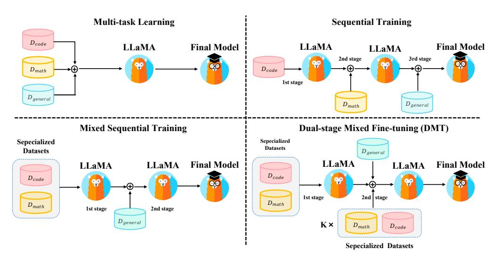
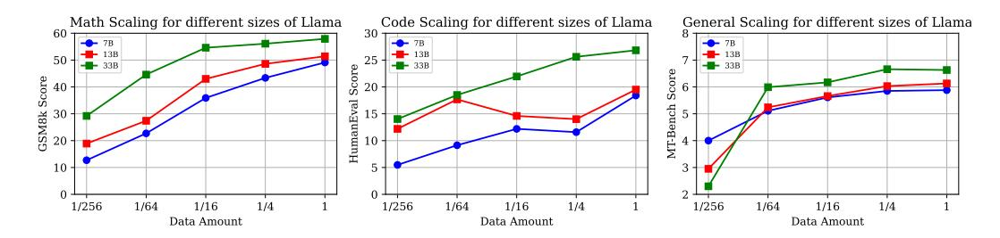
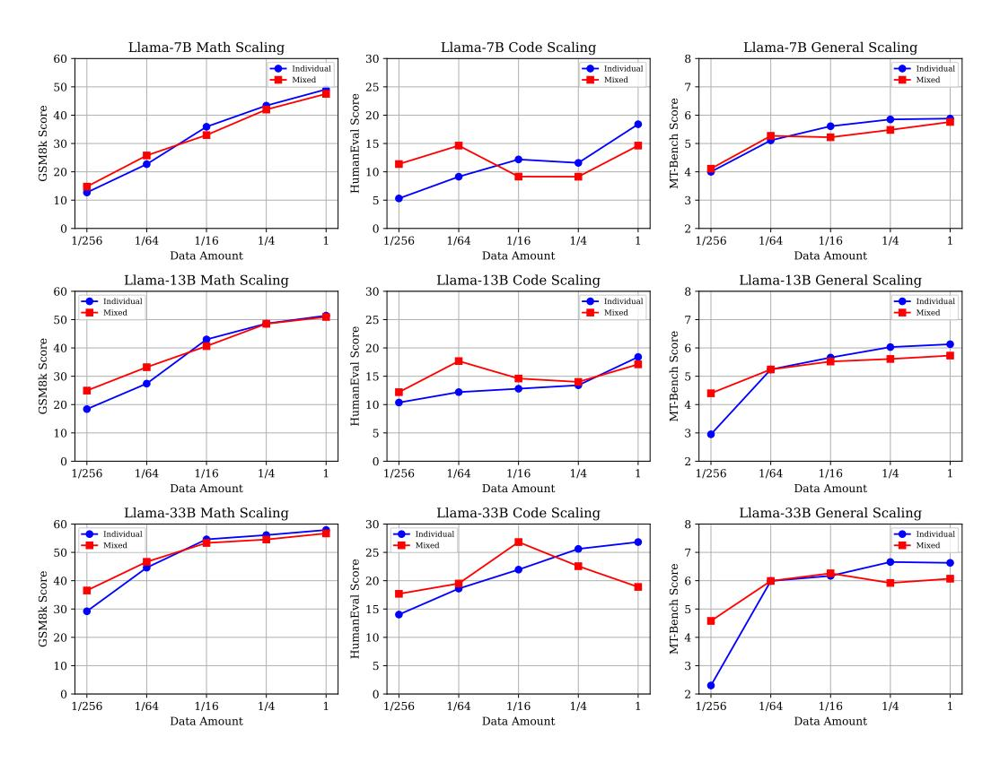
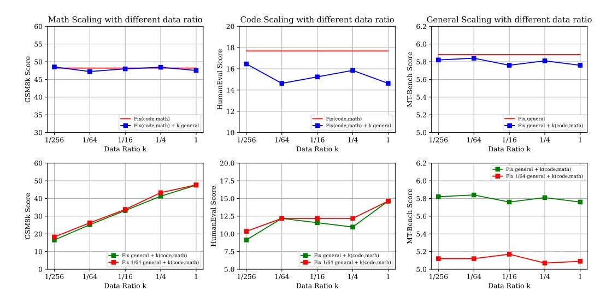
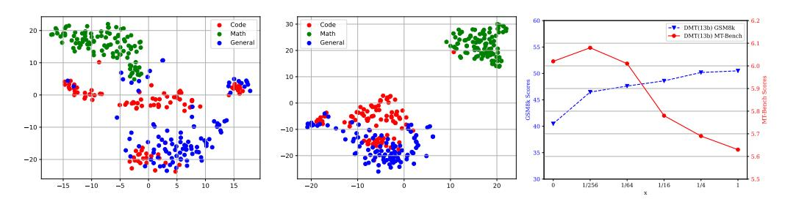
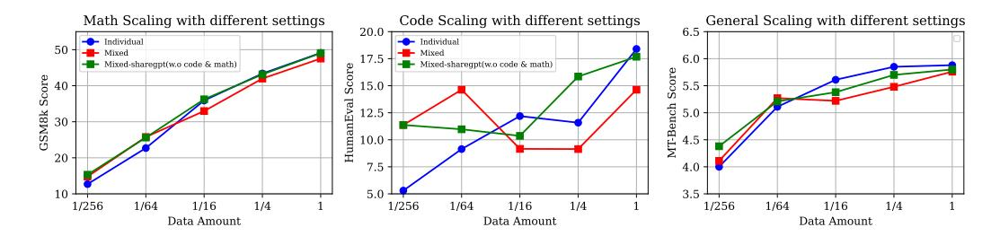
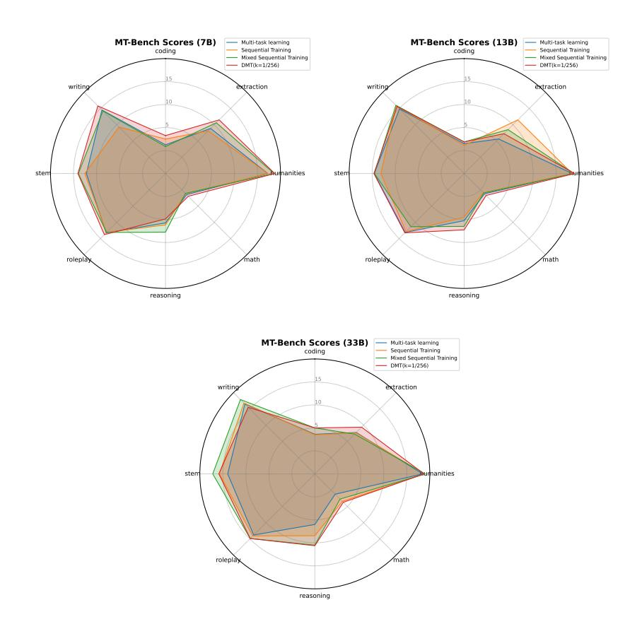
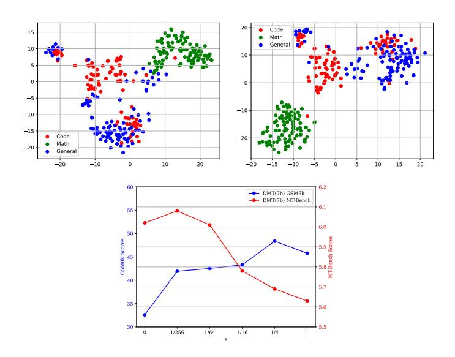

# HOW ABILITIES IN LARGE LANGUAGE MODELS ARE AFFECTED BY SUPERVISED FINE-TUNING DATA COM-POSITION

Guanting Dong∗ , Hongyi Yuan∗ , Keming Lu, Chengpeng Li∗ , Mingfeng Xue Dayiheng Liu, Wei Wang, Zheng Yuan† , Chang Zhou, Jingren Zhou Alibaba Group

{dongguanting.dgt,yuanzheng.yuanzhen,ericzhou.zc}@alibaba-inc.com

## ABSTRACT

Large language models (LLMs) with enormous pre-training tokens and parameter amounts emerge abilities including math reasoning, code generation, and instruction following. These abilities are further enhanced by supervised fine-tuning (SFT). The open-source community has studied on ad-hoc SFT for each ability, while proprietary LLMs are versatile for all abilities. It is important to investigate how to unlock them with multiple abilities via SFT. In this study, we specifically focus on the data composition between mathematical reasoning, code generation, and general human-aligning abilities during SFT. From a scaling perspective, we investigate the relationship between model abilities and various factors including data amounts, data composition ratio, model parameters, and SFT strategies. Our experiments reveal that different abilities exhibit different scaling patterns, and larger models generally show superior performance with the same amount of data. Mathematical reasoning and code generation improve as data amounts increase consistently, while the general ability is enhanced with about a thousand samples and improves slowly. We find data composition results in various abilities improvements with low data amounts, while conflicts of abilities with high data amounts. Our experiments further show that composition data amount impacts performance, while the influence of composition ratio is insignificant. Regarding the SFT strategies, we evaluate sequential learning multiple abilities are prone to catastrophic forgetting. Our proposed Dual-stage Mixed Fine-tuning (DMT) strategy learns specialized abilities first and then learns general abilities with a small amount of specialized data to prevent forgetting, offering a promising solution to learn multiple abilities with different scaling patterns.

## 1 INTRODUCTION

Recent research has demonstrated the remarkable and versatile proficiency of large language models (LLMs) in dealing with a variety of real-world tasks expressed in natural languages [\(Ouyang et al.,](#page-10-0) [2022a;](#page-10-0) [Anil et al.,](#page-9-0) [2023;](#page-9-0) [OpenAI,](#page-10-1) [2023\)](#page-10-1). Among the tasks, LLMs especially emerge with three outstanding abilities in reasoning [\(Cobbe et al.,](#page-9-1) [2021;](#page-9-1) [Wei et al.,](#page-11-0) [2022\)](#page-11-0), coding [\(Chen et al.,](#page-9-2) [2021\)](#page-9-2), and aligning general human intentions [\(Ouyang et al.,](#page-10-0) [2022a\)](#page-10-0), which have drawn much attention from the LLM research community. In order to further incentivize such abilities, it necessitates supervised fine-tuning (SFT) stages on annotated task data. However, existing research has mostly conducted separate SFT investigations on each of the three tasks, where reasoning and coding abilities require SFT on in-domain human-annotated or augmented data [\(Yuan et al.,](#page-11-1) [2023b;](#page-11-1) [Luo et al.,](#page-10-2) [2023\)](#page-10-2) while diverse and complex human instructions are applauded for aligning human intentions [\(Wang et al.,](#page-11-2) [2023c;](#page-11-2) [Taori et al.,](#page-10-3) [2023;](#page-10-3) [Xu et al.,](#page-11-3) [2023;](#page-11-3) [Zhou et al.,](#page-11-4) [2023;](#page-11-4) [Wang et al.,](#page-11-5) [2023a;](#page-11-5) [Lu et al.,](#page-10-4) [2023\)](#page-10-4). As shown by the strong performance of proprietary LLMs such as GPT-4 [\(OpenAI,](#page-10-1) [2023\)](#page-10-1) and Claude, LLMs have the potential to master all the tasks in one model. Therefore, it is of paramount importance to investigate the versatile performance of SFT with composite task data, and understanding and

∗Work done during internships at Alibaba Group.

†Corresponded author.

Figure 1: The illustration of four different training strategies in this paper.

addressing the challenges posed by the data composition problem in the SFT stage is crucial for further enhancing the capabilities of LLMs in a comprehensive manner.

In essence, the tasks of reasoning, coding, and aligning human intentions are of different characteristics. Reasoning and coding tasks require ad-hoc abilities of complex and detailed logic in decomposing task instructions and dealing with non-linguistic and symbolic features (Chen et al., 2021; Huang & Chang, 2023), whereas aligning human intentions requires versatility and understanding obscure intentions expressed in human instructions (Lu et al., 2023). Given the fundamental difference among the tasks, multi-task learning with composite data fine-tuning for small-scaled pre-trained language models is prone to catastrophic forgetting (De Lange et al., 2022), hindering the fine-tuned performance of one model on separate tasks. Many efforts have been made to compensate for the phenomenon (Liang et al., 2021; Xu et al., 2021; Yuan et al., 2023a). There has also been research discovering that scaling up the pre-trained language model scale and the fine-tuning data scale are beneficial for zero-shot out-of-domain generalization on various linguistic tasks while leaving out the assessment of in-domain performance (Sanh et al., 2022; Chung et al., 2022a; Longpre et al., 2023). Given the increased capacity of LLMs, the multi-task performance by SFT on composite data of essentially different downstream tasks is less studied. Understanding the SFT performance with composite data and corresponding scaling patterns is of great utility in practice.

In this study, we focus on the data composition problem among **mathematical reasoning**, **code generation**, and **general instruction-following abilities** in SFT. We aim to comprehensively investigate the relationship between model performance and different factors including data amount, data composition ratio, model scales, and SFT training strategies. We also investigate how the relationship varies under different scales. Specifically, we focus on the following four research questions:

- 1. How do math reasoning, coding, and general abilities scale with SFT data amounts?
- **2.** Are there performance conflicts when combining these three abilities in SFT?
- **3.** What are the key factors that induce the performance conflicts?
- **4.** What are the impacts of different SFT strategies for composite data?

To answer these questions, we conduct experiments on three benchmarks, which are GSM8K (Cobbe et al., 2021) for mathematical reasoning, HumanEval (Chen et al., 2021) for coding, and MT-Bench (Zheng et al., 2023) for general human alignment. We fine-tune LLMs on the related training data to activate these abilities. Furthermore, we conduct extensive analysis regarding model parameter scales ranging from LLaMA 7B to 33B (Touvron et al., 2023) and explore four different SFT strategies shown in Figure 1: multi-task learning, sequential training, mixed sequential training, and dual-stage mixing fine-tuning (DMT), providing empirical guidance for learning a versatile LLM with composite SFT. The key findings of this paper can be summarized as follows:

- Different SFT abilities exhibit distinct scaling patterns, while larger models show better performances with the same data amount generally.
- Compared to single ability learning, multi-task learning multiple abilities exhibits improvement in low-resource and decline in high-resource. Additionally, as the model size increases, there is a greater performance gain in low-resource settings for math and general abilities.
- Data amounts directly influence each ability, while the data ratio is insignificant.
- Multi-task learning lead to conflicts, while sequential training results in catastrophic forgetting. Our proposed DMT effectively alleviates both performance conflicts and catastrophic forgetting in the SFT phrase, achieving a balance between general and specialized abilities.

## 2 RELATED WORKS

Supervised fine-tuning in Large Language Models Large language models (LLMs) undergo the SFT stage to further unlock the performance in task solving and aligning human instruction. We slightly abuse the term SFT to refer to general sequence-to-sequence fine-tuning, including but not limited to SFT for human alignment, instruction fine-tuning, and downstream task fine-tuning. Recent research explored multi-task instruction fine-tuning of pre-trained LLMs to enable better zero-shot performance on various downstream NLP tasks [\(Sanh et al.,](#page-10-7) [2022\)](#page-10-7). [\(Chung et al.,](#page-9-4) [2022a;](#page-9-4) [Longpre et al.,](#page-10-8) [2023\)](#page-10-8) attempted to exhaust existing NLP tasks and curated a massive dataset, FLAN, for instruction fine-tuning. Open-sourced [\(Chung et al.,](#page-9-5) [2022b\)](#page-9-5) and proprietary LLMs [\(Singhal](#page-10-9) [et al.,](#page-10-9) [2022\)](#page-10-9) fine-tuned on FLAN exhibited improved zero-shot downstream performance on various held-out NLP tasks. However, the influence of multi-task training of LLMs on in-domain performance is less studied. With the success of proprietary LLMs, especially ChatGPT, there has been increasing attention on SFT to align LLMs to human intentions [\(Ouyang et al.,](#page-10-10) [2022b\)](#page-10-10). Instead of generating SFT data from crowd-resourcing, recent research explored to generate data from proprietary LLM user logs [\(Chiang et al.,](#page-9-6) [2023;](#page-9-6) [Wang et al.,](#page-11-5) [2023a\)](#page-11-5), prompting proprietary LLM [\(Wang et al.,](#page-11-2) [2023c;](#page-11-2) [Taori et al.,](#page-10-3) [2023;](#page-10-3) [Lei et al.,](#page-10-11) [2023;](#page-10-11) [Xu et al.,](#page-11-3) [2023\)](#page-11-3). Various analyses and methods have also been proposed to increase the SFT data quality [\(Zhou et al.,](#page-11-4) [2023;](#page-11-4) [Wang et al.,](#page-11-10) [2023b;](#page-11-10) [Lu et al.,](#page-10-4) [2023\)](#page-10-4) to achieve better alignment of open-resourced LLMs with humans. Besides, LLMs can also benefit from SFT for mathematical reasoning [\(Cobbe et al.,](#page-9-1) [2021;](#page-9-1) [Hendrycks et al.,](#page-9-7) [2021;](#page-9-7) [Yuan et al.,](#page-11-1) [2023b;](#page-11-1) [Yue et al.,](#page-11-11) [2023\)](#page-11-11) and code generation tasks [\(Chaudhary,](#page-9-8) [2023;](#page-9-8) [Luo et al.,](#page-10-2) [2023\)](#page-10-2).

Scaling Laws in Large Language Models The exceptional performance of LLMs comes from scaling up model sizes, data amounts, and computational costs to massive scales. Therefore, it is crucial to explore the model performance across an exponential range of scales. Many endeavors have been made to discuss the scaling laws for pre-training [\(Anil et al.,](#page-9-0) [2023;](#page-9-0) [Hoffmann et al.,](#page-10-12) [2022\)](#page-10-12), transfer learning [\(Chronopoulou et al.,](#page-9-9) [2019\)](#page-9-9), preference modeling [\(Gao et al.,](#page-9-10) [2022\)](#page-9-10) and mathematical reasoning [\(Yuan et al.,](#page-11-1) [2023b\)](#page-11-1). In this paper, we also explore the SFT performance with composite data from the perspective of different scales of model sizes and data amounts.

### 3 EXPERIMENTS

We have SFT datasets {D1, D2, ..., Dk} where each Di = {qi,j , ri,j}j contains queries and responses from one source. We consider each SFT dataset to correspond to one ability and we also have k in-domain metrics to measure them. We investigate the performances of in-domain metrics with different dataset compositions (D ⊂ ∪1≤i≤kDi) and training strategies on different sizes of LLMs.

#### 3.1 EXPERIMENT SETUP

We collect three SFT datasets {D1, D2, D3} including GSM8K RFT [\(Yuan et al.,](#page-11-1) [2023b\)](#page-11-1), Code Alpaca [\(Chaudhary,](#page-9-8) [2023\)](#page-9-8), and ShareGPT [\(Chiang et al.,](#page-9-6) [2023\)](#page-9-6) to represent math reasoning, coding, and general human-aligning ability SFT dataset respectively. We will integrate a new SFT dataset D by these three datasets to investigate how data composition affects the model performances. We use GSM8K test set [\(Cobbe et al.,](#page-9-1) [2021\)](#page-9-1), HumanEval [\(Chen et al.,](#page-9-2) [2021\)](#page-9-2), and MT-Bench [\(Zheng](#page-11-8) [et al.,](#page-11-8) [2023\)](#page-11-8) to measure abilities including math reasoning, coding, and general human-aligning. We use LLaMA [\(Touvron et al.,](#page-11-9) [2023\)](#page-11-9) series as our pretrained language models and use FastChat

Figure 2: The scaling curve of different sizes of LLaMA in three individual domains.

framework (Zheng et al., 2023) for fine-tuning. We fine-tune models with 3 epochs and a peak of 2e-5 learning rate. The batch size during SFT is 16. More details about SFT datasets, evaluation metrics and implementations can be found in Appendix A, B and C.

#### 3.2 RQ1. Individual Ability Performance vs. Data amount

The instruction following ability can be activated via SFT on datasets like ShareGPT which contain around 100 thousand samples. However, Zhou et al. (2023) demonstrates that strong base models can achieve human alignment with just 1000 samples. Specialized abilities such as math reasoning require a large amount of data (Cobbe et al., 2021; Yuan et al., 2023b), unlike general abilities. Therefore, it is crucial to investigate how each ability improves as the data amount increases.

**Experimental Design:** We conduct SFT on LLaMA of various sizes using {1, 1/4, 1/16, 1/64, 1/256} proportions of the training set obtained from GSM8K RFT, Code Alpaca, and ShareGPT seperately. This allowed us to evaluate each ability with various data sizes and model sizes.

**Results and Analysis.** Figure 2 shows the individual data scaling curves for different abilities after SFT. We find that: **Different abilities exhibit different scaling curves.** To be more specific, mathematical reasoning capability shows a positive correlation with the data amount across various model sizes which is consistent with Yuan et al. (2023b). Similarly, general human-aligning ability demonstrates an almost monotonically increasing scaling curve. However, it is noteworthy that general ability emerges with only around 1k data samples (ranging from 1/256 to 1/64), and after reaching a certain threshold (1/64), their performances improve slowly. This further supports Zhou et al. (2023), indicating that a small amount of high-quality SFT data is possible for the emergence of general human-aligning ability in LLMs. On the other hand, code ability exhibits an irregular scaling curve when the model's parameter count is small (7B & 13B). However, when the parameter count increases to 33B, its coding performance shows an approximately log-linear trend with the data amount. One possible explanation is that Code Alpaca and the samples in HumanEval have different distributions. Larger models can capture shared knowledge across code data distributions in the in-domain samples, which enables them to exhibit some level of generalization to out-of-distribution (OOD) samples. Another observation is larger models show better performances with the same data amount generally. The outlier is with very little data (1/256), smaller models may outperform larger models. If there is enough data, larger models have stable better performances.

#### 3.3 RO2. PERFORMANCE DIFFERENCE VS. MIXED DATA AMOUNT

We should deliver a versatile model that requires us to mix various SFT datasets and apply SFT. We want to ask how each ability varies due to SFT dataset mixtures. We investigate it with different amounts of mixed data and compare them with individual ability performance.

**Experimental Design:** For the individual source setting, consistent with the setup in RQ1, we performed fine-tuning on LLaMA models of different sizes using {1, 1/4, 1/16, 1/64, 1/256} amounts of training data from GSM8K, Code Alpaca, and ShareGPT separately. For the mixed source setting, we sampled {1, 1/4, 1/16, 1/64, 1/256} amounts of training data from GSM8K, Code Alpaca, and ShareGPT, and directly mixed them according to the corresponding proportions. In this way, we constructed datasets with fixed proportions of different ability domains, while varying the total data amount. These datasets are then used for fine-tuning the LLaMA models.

Figure 3: Comparative experiments between mix domains and individual domains for LLaMA.

**Results and Analysis.** Figure 3 presents results of LLaMA of different sizes on three benchmarks under the individual source and mixed source settings. The following observations are made: Abilities are improved with low-resource and are decreased with high-resource compared to individual source abilities. In the case of LLaMA-7B, compared to the data scaling curve of the individual source setting, the models fine-tuned with mixed source data consistently demonstrated performance conflicts among the three ability domains at high resources (100%). However, as the data volume decreased, a turning point in performance is observed between the two settings in the data range of 1/64 to 1/16. Notably, the models fine-tuned with mixed source data exhibited performance gains at low resources (1/256), indicating that SFT data from different sources benefit each other in a low-resource setting. However, when there is enough data, data from other sources could be viewed as noise for in-domain generalization. As the model size increases, the performance gain in low-resource settings also increases for math and general abilities. In the case of the 13B and 33B models, it is obvious that the scaling curve for the mix source setting follows a similar trend observed in previous analyses, with the presence of performance intersection points as the data volume scales. However, a crucial distinction arises, whereby larger models exhibit more pronounced performance gains under low resources as the size of model parameters increases. The outlier is the LLaMA-7B (code only, 1/256). A possible reason is the introduction of a small amount of unseen code data easily disrupts the original code ability of the pretrained model, as supported by its low HumanEval score (less than 6). In conclusion, our finding implies that larger language models excel in acquiring general and specialized abilities from diverse data sources under low-resource conditions.

#### 3.4 RQ3. Performance Difference vs. Data composition ratio

We observe ability conflicts under high-resource settings, and we want to investigate the reason causes conflicts. Two possible factors are the **data amount** of other abilities is too high or the **data ratio** of other abilities is too high. Here we conduct experiments to investigate the data ratio factor.

Figure 4: Different data ratio (k) between specific abilities and general abilities on three benchmarks.

**Experimental Design:** We consider coding and mathematics as a combined specialized data source, and the ShareGPT as the general data source. We designed three setups as follows which control the amount of one source of data and vary the ratio between general and specialized data.:

- **1. Fixed general data, scaling specialized data:** We use a full training set of ShareGPT and sampled different proportions  $\{1, 1/4, 1/16, 1/64, 1/256\}$  of GSM8K RFT and Code Alpaca as a mixture.
- **2. Fixed specialized data, scaling general data:** We use a full training set of GSM8K RFT and Code Alpaca and sample different proportions of ShareGPT as a mixture.
- **3. Fixed 1/64 general data, scaling specialized data**: Motivated by LIMA's setup (Zhou et al., 2023), we used a 1/64 ShareGPT set (about 1500 examples) and sampled different proportions of GSM8K RFT and Code Alpaca as a mixture.

Results and Analysis. Does the performance of the model vary with different ratios of general and specialized data? As illustrated in the top three graphs of Figure 3, we conduct ablation studies of the data ratio (k) between specialized and general abilities. To be noticed ratio is normalized by data amount, for example, k = 1 means  $\frac{\text{specialized use data amount}}{\text{general use data amount}} = \frac{\text{specialized all data amount}}{\text{general use data amount}}$ . We general use data amount general all data amount utilize a fixed specialized data setting (directly mixing 100% code & math data for training) and a fixed general data setting (100% general data for training) as the baseline and observe: (1) With the increase in the ratio of general data from 1/256 to 1/1, Fixed specialized data, scaling general data setup exhibits similar performance to the setup that Fixed specialized abilities in terms of math reasoning. This suggests that variations in the data ratio k have minimal impact on math ability. We consider the reason that math and general abilities are non-conflict since they are too different in the semantic space. However, when considering HumanEval, the Fixed specialized data, scaling general data setup displays noticeable fluctuations compared to the baseline. We attribute this to the inclusion of a certain proportion of code data in ShareGPT. Due to the differences in data format and distribution, the presence of similar data features exacerbates the performance conflicts between abilities when the data ratio k increases. Further analysis of the distribution of different abilities is discussed in Section 4.1. (2) With the increase in the ratio of specialized data from 1/256 to 1/1, the setup that Fixed general data, scaling specialized data displayed no significant performance changes compared to the baseline. This echoes our hypothesis that when there are significant differences in task formats and data distributions between different SFT abilities, the impact of data ratio is minimal. However, when there is some degree of similarities, the data ratio can lead to noticeable performance fluctuations.

Under extremely limited general data resources, does the ratio of specialized data have an impact on the model's performance? We further explore the impact of different ratios of specialized

data when the model has just acquired a certain level of general human-aligning ability (k = 1/64). The bottom 3 graphs of Figure [4](#page-5-0) present comparative experiments between two settings. We observe that regardless of whether the data amount for general capabilities is abundant (k = 1) or scarce (k = 1/64), the performance on MT-Bench shows no significant fluctuations with varying proportions of specialized data. Furthermore, in mathematical reasoning, 1/64 general data setup exhibited a scaling trend that is almost identical to the full general data setup. However, for coding ability, with the same amount of code data and different ratios, code abilities are different in the two settings. We still consider the reason is code data are partly related to ShareGPT data and cause the performance difference and provide an analysis in Discussion 4.2.

### 3.5 RQ4. PERFORMANCE DIFFERENCE VS. TRAINING STRATEGY

We could feed these SFT datasets into models with different training strategies. In this section, We experiment with these settings and investigate how they influence each ability's performance.

Experimental Design: Firstly, we introduce three kinds of naive training strategies as follows:

- 1. Multi-task learning: We directly mix different SFT data sources D = ∪1≤i≤kDi and applying SFT. If we view each data source as a different task, this can be viewed as multi-task learning.
- 2. Sequential Training: We sequentially apply SFT on each dataset. Specifically, we sequentially trained on coding, math reasoning, and the general ability dataset. Since the general ability is the most important one for human alignment, we put ShareGPT as our last dataset.
- 3. Mixed Sequential Training: We apply multi-task learning on specialized datasets(code, math) first and apply SFT on the general ability dataset. These three approaches are presented in Figure [1.](#page-1-0)

Results and Analysis: Table [1](#page-7-0) presents performances under different training strategies in terms of mathematical reasoning, code generation, and general human-aligning ability. Multi-task learning preserves specialized abilities among these strategies while hurting the general ability most among them. Sequential training and mixed sequential training preserve general ability while losing too many specialized abilities. The observed outcome is in accordance with our expectations, as during the final fine-tuning phase, the mixed sequential training strategy remains unaffected by specialized data sources, thereby effectively preserving its generalization capability. However, an inherent drawback of multi-stage training is the occurrence of catastrophic forgetting of prior knowledge, which motivates us to further explore methods that can alleviate catastrophic forgetting of specialized abilities while maximizing the preservation of general capability.

4. Dual-stage Mixed Fine-tuning (DMT): Based on our observation from RQ1 to RQ4, we propose a new training strategy that can reduce the ability conflict during multi-task learning and relieve the issue of catastrophic forgetting during sequential training. From RQ1, the model needs large data amounts to activate specialized abilities. From RQ2, multi-task learning with all amounts of specialized data and general data will hurt each ability. From RQ3, a small amount of specialized data will not affect the general ability performance. From RQ4, (mixed) sequential training forgets specialized abilities. So the model needs to learn large amounts of specialized data and should not forget them during learning general ability. A natural choice is to learn full amounts of specialized data first and add a small amount of specialized data to general data during the last stage of sequential training to prevent forgetting. As shown in Figure [1,](#page-1-0) we first apply SFT on the specialized dataset which is same as the first stage of the mixed sequential training strategy. For the second stage, we perform SFT with a mixed data source comprising a combination of the general data and varying proportions k (1, 1/2, 1/4, 1/8, 1/16, 1/32) of code and math data. Adding code and math data in the second stage helps models to recall the specialized ability. The results of DMT (k = 1/256) are presented in Table 2 and the detailed scaling analysis of proportion k can be found in the discussion.

Model Accuracy vs. DMT Strategies. In Table [1,](#page-7-0) LLaMA-7B with DMT (k = 1/256) strategy perform significant improvement in mathematical reasoning (32.6 to 41.92) and code generation (15.24 to 17.68) compared to the mixed sequential training strategy, which indicates a significant alleviating effect of mixing specialized capability data in the last fine-tuning stage on catastrophic forgetting. Surprisingly, DMT (k = 1/256) even exhibits a slight improvement on MT-Bench, further highlighting its ability to alleviate catastrophic forgetting while effectively preserving general capability.

| Methods                       | LLaMA -7B |              |          | LLaMA -13B |           |          | LLaMA -33B |           |          |
|-------------------------------|-----------|--------------|----------|------------|-----------|----------|------------|-----------|----------|
|                               | GSM8K     | HumanEval    | MT-Bench | GSM8K      | HumanEval | MT-Bench | GSM8K      | HumanEval | MT-Bench |
| Individual domain             |           |              |          |            |           |          |            |           |          |
| General only                  | 11.1      | 10.4         | 5.88     | 14.02      | 16.4      | 6.13     | 26.06      | 24.30     | 6.63     |
| Math only                     | 49.1      | -            | -        | 51.4       | -         | -        | 57.9       | -         | -        |
| Code only                     | -         | 18.4         | -        | -          | 17.1      | -        | -          | 26.82     | -        |
| Different Training Strategies |           |              |          |            |           |          |            |           |          |
| Multi-task learning           | 47.53     | 14.63        | 5.76     | 50.94      | 19.50     | 5.73     | 56.69      | 18.9      | 6.07     |
| Sequential Training           | 31.39     | 15.85        | 5.72     | 39.12      | 20.12     | 5.93     | 47.27      | 24.80     | 6.73     |
| Mixed Sequential Training     | 32.60     | 15.24        | 6.02     | 40.48      | 18.30     | 5.93     | 44.24      | 24.4      | 6.43     |
| DMT(k=1/256)                  | 41.92     | <u>17.68</u> | 6.08     | 46.47      | 19.50     | 6.03     | 56.36      | 25.00     | 6.69     |

Table 1: The results of LLaMA-7B, 13B, 33B under different training strategies on three benchmarks. The top two results across different strategies are marked with **bold** and <u>underlined</u>.

Regarding the 13B and 33B models, DMT (k=1/256) demonstrates noticeable alleviation of catastrophic forgetting in mathematical reasoning (13B: 40.48 to 46.47 / 33B: 44.24 to 56.36) and code generation (13B: 18.3 to 19.5 / 33B: 24.4 to 25.5) compared to the mixed sequential training strategy. Additionally, it significantly retains its general capability (13B: 5.93 to 6.03 / 33B 6.43 to 6.69). Therefore, these results serve as additional validation of the efficacy of DMT in mitigating catastrophic forgetting while maintaining general capability.

#### 4 DISCUSSION

#### 4.1 VISUALIZATION OF SEMANTIC REPRESENTATION OF DIFFERENT ABILITIES

In the aforementioned analysis of data composition, we observed a significant performance degradation when different data sources are directly mixed. In this section, our aim is to explore the potential mutual influence of semantic representation distributions among different data sources. Specifically, we randomly sampled 100 queries from CodeAlpaca, GSM8k RFT, and ShareGPT datasets and extracted the hidden layer representations located in the 15th layer of the model. Subsequently, we employed the t-SNE toolkit Van der Maaten & Hinton (2008) to visualize the representations of the three types of capabilities. The results in Figure 5 illustrate a notable collapse phenomenon in the semantic representations of both the original LLaMA-13b and LLaMA-13b with DMT (k=1/256). While both models exhibit a certain level of separation in the mathematical data representations, there remains a certain degree of overlap between the representations of code and general samples.

#### 4.2 Ablation of the specialized domains in ShareGPT

In RQ2, we observe using mixed data sources resulted in improved abilities under low-resource conditions but diminished abilities under high-resource conditions when compared to single data sources. However, the presence of coding and mathematical samples within the ShareGPT introduces uncertainty regarding whether the performance gain under low resources is solely attributed to these specific coding & mathematical data or other orthogonal samples in the general dataset (e.g.,

Figure 5: The left two figures show the t-SNE of LLaMA-13B and LLaMA-13B with DMT(k=1/256) stategy. The right figure shows performances of LLaMA-13B with DMT under different k.

Figure 6: The scaling curve after ablating code and math-related samples from ShareGPT.

translation or extraction). Hence, the objective of this section is to investigate whether the conclusions drawn in Section 3.3 remain valid after removing the code and math samples within ShareGPT.

**Experimental Design:** We employed an open-set tagger InsTag (Lu et al., 2023) to annotate samples in ShareGPT. To filter out data related to coding and mathematical abilities, we conduct regular expression matching to eliminate instances where the tags contain keywords "code" or "math". Finally, we obtain a ShareGPT dataset devoid of any code or math-related information (reducing from 90K to 63K). In alignment with the settings in Section 3.3, we sampled different proportions of training data (1, 1/4, 1/16, 1/64, 1/256) from GSM8K, Code Alpaca, and the modified ShareGPT dataset (without code math). These samples were directly mixed according to the corresponding proportions. Subsequently, the LLaMA models were fine-tuned by using this mixed dataset.

Analysis. Figure 6 shows the results of our experiment. Removing the code and math from ShareGPT not only mitigates the performance conflicts among different abilities to some extent under high-resource conditions but also maintains stable gains in low-resource settings. We propose that the potential reason behind these findings lies in the differences in the distribution of code and math data between ShareGPT, CodeAlpaca, and GSM8K RFT datasets. This distribution gap introduces an extra noise during the SFT phrase, while its removal enables the model to better generalize coding and mathematical abilities. Furthermore, in low-resource scenarios, this phenomenon indicates that the code and math samples in ShareGPT are not the key factor contributing to performance improvements, but rather the diversity and variability of the data (Longpre et al., 2023). In summary, the presence of code math data within ShareGPT does not emerge as a key factor impacting the performance gains identified in Section 3.3, highlighting the generalization of our conclusions.

#### 4.3 Specialized data amount in Dual-stage Mixing Fine-tuning

We investigate how different values of k influence model performance and results shown in figure 5. When we adjust k from 0 to 1/256 (k=0 is equal to mixed sequential training), the SFT models show significant improvements in both specialized ability and general human-aligning ability. On the contrary, as k increased from 1/4 to 1, the model exhibited a decline in general ability. We believe this is in line with the findings in RQ2, which concluded that high-resource settings lead to conflicts while low-resource settings lead to gains in mixed sources. Furthermore, as k increased from 1/256 to 1/4, we observe a linear inverse trend between general ability and specialized ability, especially an increase in general ability coincided with a decrease in specialized ability. This suggests k needs to be tuned based on specific requirements in order to achieve a balance between multiple abilities.

#### 5 CONCLUSION

We explore the data composition in the SFT phase, focusing on mathematical reasoning, code generation, and general human-aligning abilities. We formulate four research questions to guide our investigation and analyze the scaling trends between different abilities and factors (e.g. data amount, data ratio, model parameters, and training strategies). Our findings reveal distinct scaling patterns among different abilities, with larger models demonstrating superior performance when trained with the same amount of data. Moreover, we observe that mixing data sources in the SFT phase improves performance in low-resource scenarios but diminishes in high-resource scenarios. Interestingly, the phenomenon of low-resource gain becomes more prominent as the model parameter size increases. Furthermore, our observations indicate that data amount directly influences performance conflicts,

whereas the impact of data ratio is insignificant within our experimental setup. Finally, regarding the SFT strategies, we demonstrate our proposed DMT strategy effectively alleviates performance conflicts, offering a promising solution to activate multiple abilities.

## REFERENCES

Rohan Anil, Andrew M Dai, Orhan Firat, Melvin Johnson, Dmitry Lepikhin, Alexandre Passos, Siamak Shakeri, Emanuel Taropa, Paige Bailey, Zhifeng Chen, et al. Palm 2 technical report. *arXiv preprint arXiv:2305.10403*, 2023.

Sahil Chaudhary. Code alpaca: An instruction-following llama model for code generation. [https:](https://github.com/sahil280114/codealpaca) [//github.com/sahil280114/codealpaca](https://github.com/sahil280114/codealpaca), 2023.

Mark Chen, Jerry Tworek, Heewoo Jun, Qiming Yuan, Henrique Ponde de Oliveira Pinto, Jared Kaplan, Harri Edwards, Yuri Burda, Nicholas Joseph, Greg Brockman, Alex Ray, Raul Puri, Gretchen Krueger, Michael Petrov, Heidy Khlaaf, Girish Sastry, Pamela Mishkin, Brooke Chan, Scott Gray, Nick Ryder, Mikhail Pavlov, Alethea Power, Lukasz Kaiser, Mohammad Bavarian, Clemens Winter, Philippe Tillet, Felipe Petroski Such, Dave Cummings, Matthias Plappert, Fotios Chantzis, Elizabeth Barnes, Ariel Herbert-Voss, William Hebgen Guss, Alex Nichol, Alex Paino, Nikolas Tezak, Jie Tang, Igor Babuschkin, Suchir Balaji, Shantanu Jain, William Saunders, Christopher Hesse, Andrew N. Carr, Jan Leike, Josh Achiam, Vedant Misra, Evan Morikawa, Alec Radford, Matthew Knight, Miles Brundage, Mira Murati, Katie Mayer, Peter Welinder, Bob McGrew, Dario Amodei, Sam McCandlish, Ilya Sutskever, and Wojciech Zaremba. Evaluating large language models trained on code. 2021.

Wei-Lin Chiang, Zhuohan Li, Zi Lin, Ying Sheng, Zhanghao Wu, Hao Zhang, Lianmin Zheng, Siyuan Zhuang, Yonghao Zhuang, Joseph E. Gonzalez, Ion Stoica, and Eric P. Xing. Vicuna: An open-source chatbot impressing gpt-4 with 90%\* chatgpt quality, March 2023. URL [https:](https://lmsys.org/blog/2023-03-30-vicuna/) [//lmsys.org/blog/2023-03-30-vicuna/](https://lmsys.org/blog/2023-03-30-vicuna/).

Alexandra Chronopoulou, Christos Baziotis, and Alexandros Potamianos. An embarrassingly simple approach for transfer learning from pretrained language models. *arXiv preprint arXiv:1902.10547*, 2019.

Hyung Won Chung, Le Hou, Shayne Longpre, Barret Zoph, Yi Tay, William Fedus, Yunxuan Li, Xuezhi Wang, Mostafa Dehghani, Siddhartha Brahma, Albert Webson, Shixiang Shane Gu, Zhuyun Dai, Mirac Suzgun, Xinyun Chen, Aakanksha Chowdhery, Alex Castro-Ros, Marie Pellat, Kevin Robinson, Dasha Valter, Sharan Narang, Gaurav Mishra, Adams Yu, Vincent Zhao, Yanping Huang, Andrew Dai, Hongkun Yu, Slav Petrov, Ed H. Chi, Jeff Dean, Jacob Devlin, Adam Roberts, Denny Zhou, Quoc V. Le, and Jason Wei. Scaling instruction-finetuned language models, 2022a.

Hyung Won Chung, Le Hou, Shayne Longpre, Barret Zoph, Yi Tay, William Fedus, Yunxuan Li, Xuezhi Wang, Mostafa Dehghani, Siddhartha Brahma, Albert Webson, Shixiang Shane Gu, Zhuyun Dai, Mirac Suzgun, Xinyun Chen, Aakanksha Chowdhery, Alex Castro-Ros, Marie Pellat, Kevin Robinson, Dasha Valter, Sharan Narang, Gaurav Mishra, Adams Yu, Vincent Zhao, Yanping Huang, Andrew Dai, Hongkun Yu, Slav Petrov, Ed H. Chi, Jeff Dean, Jacob Devlin, Adam Roberts, Denny Zhou, Quoc V. Le, and Jason Wei. Scaling instruction-finetuned language models, 2022b.

Karl Cobbe, Vineet Kosaraju, Mohammad Bavarian, Mark Chen, Heewoo Jun, Lukasz Kaiser, Matthias Plappert, Jerry Tworek, Jacob Hilton, Reiichiro Nakano, et al. Training verifiers to solve math word problems. *arXiv preprint arXiv:2110.14168*, 2021.

Matthias De Lange, Rahaf Aljundi, Marc Masana, Sarah Parisot, Xu Jia, Ales Leonardis, Gregory ˇ Slabaugh, and Tinne Tuytelaars. A continual learning survey: Defying forgetting in classification tasks. *IEEE Transactions on Pattern Analysis and Machine Intelligence*, 44(7):3366–3385, 2022. doi: 10.1109/TPAMI.2021.3057446.

Leo Gao, John Schulman, and Jacob Hilton. Scaling laws for reward model overoptimization, 2022.

Dan Hendrycks, Collin Burns, Saurav Kadavath, Akul Arora, Steven Basart, Eric Tang, Dawn Song, and Jacob Steinhardt. Measuring mathematical problem solving with the math dataset. *arXiv preprint arXiv:2103.03874*, 2021.

- Jordan Hoffmann, Sebastian Borgeaud, Arthur Mensch, Elena Buchatskaya, Trevor Cai, Eliza Rutherford, Diego de Las Casas, Lisa Anne Hendricks, Johannes Welbl, Aidan Clark, Tom Hennigan, Eric Noland, Katie Millican, George van den Driessche, Bogdan Damoc, Aurelia Guy, Simon Osindero, Karen Simonyan, Erich Elsen, Jack W. Rae, Oriol Vinyals, and Laurent Sifre. Training compute-optimal large language models, 2022.
- Jie Huang and Kevin Chen-Chuan Chang. Towards reasoning in large language models: A survey. In *Findings of the Association for Computational Linguistics: ACL 2023*, pp. 1049–1065, Toronto, Canada, July 2023. Association for Computational Linguistics. doi: 10.18653/v1/2023.findings-acl. 67. URL <https://aclanthology.org/2023.findings-acl.67>.
- Shanglin Lei, Guanting Dong, Xiaoping Wang, Keheng Wang, and Sirui Wang. Instructerc: Reforming emotion recognition in conversation with a retrieval multi-task llms framework, 2023.
- Xiaobo Liang, Lijun Wu, Juntao Li, Yue Wang, Qi Meng, Tao Qin, Wei Chen, Min Zhang, and Tie-Yan Liu. R-drop: Regularized dropout for neural networks, 2021.
- Shayne Longpre, Le Hou, Tu Vu, Albert Webson, Hyung Won Chung, Yi Tay, Denny Zhou, Quoc V Le, Barret Zoph, Jason Wei, et al. The flan collection: Designing data and methods for effective instruction tuning. *arXiv preprint arXiv:2301.13688*, 2023.
- Keming Lu, Hongyi Yuan, Zheng Yuan, Runji Lin, Junyang Lin, Chuanqi Tan, and Chang Zhou. # instag: Instruction tagging for diversity and complexity analysis. *arXiv preprint arXiv:2308.07074*, 2023.
- Ziyang Luo, Can Xu, Pu Zhao, Qingfeng Sun, Xiubo Geng, Wenxiang Hu, Chongyang Tao, Jing Ma, Qingwei Lin, and Daxin Jiang. Wizardcoder: Empowering code large language models with evol-instruct. *arXiv preprint arXiv:2306.08568*, 2023.
- OpenAI. Gpt-4 technical report, 2023.
- Long Ouyang, Jeff Wu, Xu Jiang, Diogo Almeida, Carroll L. Wainwright, Pamela Mishkin, Chong Zhang, Sandhini Agarwal, Katarina Slama, Alex Ray, John Schulman, Jacob Hilton, Fraser Kelton, Luke Miller, Maddie Simens, Amanda Askell, Peter Welinder, Paul Christiano, Jan Leike, and Ryan Lowe. Training language models to follow instructions with human feedback, 2022a.
- Long Ouyang, Jeff Wu, Xu Jiang, Diogo Almeida, Carroll L. Wainwright, Pamela Mishkin, Chong Zhang, Sandhini Agarwal, Katarina Slama, Alex Ray, John Schulman, Jacob Hilton, Fraser Kelton, Luke Miller, Maddie Simens, Amanda Askell, Peter Welinder, Paul Christiano, Jan Leike, and Ryan Lowe. Training language models to follow instructions with human feedback, 2022b.
- Victor Sanh, Albert Webson, Colin Raffel, Stephen H. Bach, Lintang Sutawika, Zaid Alyafeai, Antoine Chaffin, Arnaud Stiegler, Teven Le Scao, Arun Raja, Manan Dey, M Saiful Bari, Canwen Xu, Urmish Thakker, Shanya Sharma Sharma, Eliza Szczechla, Taewoon Kim, Gunjan Chhablani, Nihal Nayak, Debajyoti Datta, Jonathan Chang, Mike Tian-Jian Jiang, Han Wang, Matteo Manica, Sheng Shen, Zheng Xin Yong, Harshit Pandey, Rachel Bawden, Thomas Wang, Trishala Neeraj, Jos Rozen, Abheesht Sharma, Andrea Santilli, Thibault Fevry, Jason Alan Fries, Ryan Teehan, Tali Bers, Stella Biderman, Leo Gao, Thomas Wolf, and Alexander M. Rush. Multitask prompted training enables zero-shot task generalization, 2022.
- Karan Singhal, Shekoofeh Azizi, Tao Tu, S. Sara Mahdavi, Jason Wei, Hyung Won Chung, Nathan Scales, Ajay Tanwani, Heather Cole-Lewis, Stephen Pfohl, Perry Payne, Martin Seneviratne, Paul Gamble, Chris Kelly, Nathaneal Scharli, Aakanksha Chowdhery, Philip Mansfield, Blaise Aguera y Arcas, Dale Webster, Greg S. Corrado, Yossi Matias, Katherine Chou, Juraj Gottweis, Nenad Tomasev, Yun Liu, Alvin Rajkomar, Joelle Barral, Christopher Semturs, Alan Karthikesalingam, and Vivek Natarajan. Large language models encode clinical knowledge, 2022.
- Rohan Taori, Ishaan Gulrajani, Tianyi Zhang, Yann Dubois, Xuechen Li, Carlos Guestrin, Percy Liang, and Tatsunori B. Hashimoto. Stanford alpaca: An instruction-following llama model. [https://github.com/tatsu-lab/stanford\\_alpaca](https://github.com/tatsu-lab/stanford_alpaca), 2023.

- Hugo Touvron, Thibaut Lavril, Gautier Izacard, Xavier Martinet, Marie-Anne Lachaux, Timothee´ Lacroix, Baptiste Roziere, Naman Goyal, Eric Hambro, Faisal Azhar, Aurelien Rodriguez, Armand ` Joulin, Edouard Grave, and Guillaume Lample. Llama: Open and efficient foundation language models, 2023.
- Laurens Van der Maaten and Geoffrey Hinton. Visualizing data using t-sne. *Journal of machine learning research*, 9(11), 2008.
- Guan Wang, Sijie Cheng, Xianyuan Zhan, Xiangang Li, Sen Song, and Yang Liu. Openchat: Advancing open-source language models with mixed-quality data, 2023a.
- Yizhong Wang, Hamish Ivison, Pradeep Dasigi, Jack Hessel, Tushar Khot, Khyathi Raghavi Chandu, David Wadden, Kelsey MacMillan, Noah A Smith, Iz Beltagy, et al. How far can camels go? exploring the state of instruction tuning on open resources. *arXiv preprint arXiv:2306.04751*, 2023b.
- Yizhong Wang, Yeganeh Kordi, Swaroop Mishra, Alisa Liu, Noah A. Smith, Daniel Khashabi, and Hannaneh Hajishirzi. Self-instruct: Aligning language models with self-generated instructions, 2023c.
- Jason Wei, Xuezhi Wang, Dale Schuurmans, Maarten Bosma, Fei Xia, Ed Chi, Quoc V Le, Denny Zhou, et al. Chain-of-thought prompting elicits reasoning in large language models. *Advances in Neural Information Processing Systems*, 35:24824–24837, 2022.
- Can Xu, Qingfeng Sun, Kai Zheng, Xiubo Geng, Pu Zhao, Jiazhan Feng, Chongyang Tao, and Daxin Jiang. Wizardlm: Empowering large language models to follow complex instructions, 2023.
- Runxin Xu, Fuli Luo, Zhiyuan Zhang, Chuanqi Tan, Baobao Chang, Songfang Huang, and Fei Huang. Raise a child in large language model: Towards effective and generalizable finetuning. In *Proceedings of the 2021 Conference on Empirical Methods in Natural Language Processing*, pp. 9514–9528, Online and Punta Cana, Dominican Republic, November 2021. Association for Computational Linguistics. doi: 10.18653/v1/2021.emnlp-main.749. URL <https://aclanthology.org/2021.emnlp-main.749>.
- Hongyi Yuan, Zheng Yuan, Chuanqi Tan, Fei Huang, and Songfang Huang. HyPe: Better pretrained language model fine-tuning with hidden representation perturbation. In *Proceedings of the 61st Annual Meeting of the Association for Computational Linguistics (Volume 1: Long Papers)*, pp. 3246–3264, Toronto, Canada, July 2023a. Association for Computational Linguistics. doi: 10.18653/v1/2023.acl-long.182. URL [https://aclanthology.org/2023.acl-long.](https://aclanthology.org/2023.acl-long.182) [182](https://aclanthology.org/2023.acl-long.182).
- Zheng Yuan, Hongyi Yuan, Chengpeng Li, Guanting Dong, Chuanqi Tan, and Chang Zhou. Scaling relationship on learning mathematical reasoning with large language models, 2023b.
- Xiang Yue, Xingwei Qu, Ge Zhang, Yao Fu, Wenhao Huang, Huan Sun, Yu Su, and Wenhu Chen. Mammoth: Building math generalist models through hybrid instruction tuning. *arXiv preprint arXiv:2309.05653*, 2023.
- Lianmin Zheng, Wei-Lin Chiang, Ying Sheng, Siyuan Zhuang, Zhanghao Wu, Yonghao Zhuang, Zi Lin, Zhuohan Li, Dacheng Li, Eric. P Xing, Hao Zhang, Joseph E. Gonzalez, and Ion Stoica. Judging llm-as-a-judge with mt-bench and chatbot arena, 2023.
- Chunting Zhou, Pengfei Liu, Puxin Xu, Srini Iyer, Jiao Sun, Yuning Mao, Xuezhe Ma, Avia Efrat, Ping Yu, Lili Yu, et al. Lima: Less is more for alignment. *arXiv preprint arXiv:2305.11206*, 2023.

## A SFT DATASETS

We investigate the data composition issues of mathematical reasoning, coding, and general capabilities in the SFT stage from the following SFT datasets.

- Code Alpaca [\(Chaudhary,](#page-9-8) [2023\)](#page-9-8) aims to build and share an instruction-following LLaMA model for code generation. which is fully based on Stanford Alpaca and contains 20K data used for fine-tuning the model.
- GSM8K RFT [\(Yuan et al.,](#page-11-1) [2023b\)](#page-11-1) is a mathematical dataset enhanced by integrating multiple reasoning paths based on the original GSM8K dataset [\(Cobbe et al.,](#page-9-1) [2021\)](#page-9-1) through the rejection sampling. It contains 7.5K questions and 110K responses in the training set.
- ShareGPT refers to the multi-turn chatting histories used by Vicuna [Chiang et al.](#page-9-6) [\(2023\)](#page-9-6). ShareGPT includes queries from humans and responses from ChatGPT and other chatbots.

## B EVALUATION METRICS

We use the following metrics to measure the aligned large language models.

- HumanEval [\(Chen et al.,](#page-9-2) [2021\)](#page-9-2) consists of 164 original programming problems, with an average of 9.6 test cases allocated to each problem. To ensure a thorough assessment of the functional correctness of LLM-synthesized code, HumanEval+ extends the number of test cases significantly, averaging at 774.8 test cases per problem. We use the same method as [Chen et al.](#page-9-2) [\(2021\)](#page-9-2)to obtain unbiased estimates of the pass@k under greedy decoding.
- GSM8K [\(Cobbe et al.,](#page-9-1) [2021\)](#page-9-1) is a math word problem dataset used to measure large language model math reasoning ability. We use the default test set to measure the model. We calculate the score based on greedy decoding accuracy (maj@1).
- MT-Bench [\(Zheng et al.,](#page-11-8) [2023\)](#page-11-8) is a significant benchmark that contribute to the evaluation and advancement of chatbot models and LLMs in different contexts. MT-Bench evaluates LLMs on multi-turn dialogues using comprehensive questions tailored to handling conversations. It provides a comprehensive set of questions specifically designed for assessing the capabilities of models in handling multi-turn dialogues.

## C IMPLEMENTATION DETAILS

We fine-tune all the SFT datasets with 3 epochs and a batch size of 16 on NVIDIA A100 GPUs. We use 8 GPUs for 7B and 13B models, 16 GPUs for 33B models during fine-tuning. We use a peak learning rate of 2e-5 with a 3% learning rate warmup. We evaluate the results on the final epoch. We use greedy decode to calculate Pass@1 and maj@1. Since the scores of MT-bench will fluctuate, we conducted three experiments and took the average.

All experiments are conducted using the default template of the fastchat framework, as shown in the figure below:

#### Prompt Template

A chat between a curious user and an artificial intelligence assistant. The assistant gives helpful, detailed, and polite answers to the user's questions. USER: {Query} ASSISTANT:

## D DETAILED RESULTS OF EXPERIMENTS

### D.1 RESULTS OF SINGLE SOURCE AND MIXED SOURCE

In Table [2](#page-13-0) and Table [3,](#page-13-1) we report the detailed comparative results between mix domains and individual domains for LLaMA-7B, 3B and 33B, as the supplemental results in RQ2.

### D.2 RESULTS OF DATA RATIO (K)

In Table [4,](#page-14-0) we report The detailed results of the data ratio (k) between specific abilities and general abilities on three benchmarks, as the supplemental results in RQ3.

### D.3 RESULTS OF SPECIALIZED DATA AMOUNT OF DMT

In Table [5,](#page-14-1) we report The detailed results of LLaMA-7B, 13B, 33B with different training strategies on three benchmarks, as the supplemental results in RQ4.

#### D.4 RESULTS OF MT-BENCH

In Figure [7,](#page-15-0) we report detailed results of LLaMA-7B, 13B, 33B with different training strategies on MT-Bench, which include coding, extraction, humanities, math, reasoning, roleplay, stem and writing abilities.

### D.5 SUPPLEMENTAL RESULTS FOR DICUSSION

In Figure [8,](#page-15-1) we report the t-SNE visualizations of LLaMA-7B and LLaMA-7B with DMT(k=1/256) strategy. What's more, the bottom figure represents the scaling relationship of LLaMA-7B with DMT(k=1/256) under different values of K.

Moreover, in Table [6,](#page-14-2) we report The detailed results of LLaMA-7B, 13B, 33B with different training strategies on three benchmarks, as the supplemental results in RQ4.

| Methods         |       | LLaMA-7B  |          | LLaMA-13B |           |          |  |
|-----------------|-------|-----------|----------|-----------|-----------|----------|--|
|                 | GSM8K | HumanEval | MT-Bench | GSM8K     | HumanEval | MT-Bench |  |
| Single(k=1)     | 49.10 | 18.4      | 5.88     | 51.4      | 18.4      | 6.13     |  |
| Single(k=1/4)   | 43.37 | 11.58     | 5.85     | 48.59     | 13.41     | 6.03     |  |
| Single(k=1/16)  | 35.90 | 12.19     | 5.61     | 43.00     | 12.80     | 5.66     |  |
| Single(k=1/64)  | 22.71 | 9.14      | 5.11     | 27.40     | 12.20     | 5.24     |  |
| Single(k=1/256) | 12.70 | 5.48      | 4.00     | 18.40     | 10.36     | 2.95     |  |
| Mix(k=1)        | 47.53 | 14.63     | 5.76     | 50.49     | 17.10     | 5.73     |  |
| Mix(k=1/4)      | 41.98 | 9.14      | 5.48     | 48.52     | 14.00     | 5.61     |  |
| Mix(k=1/16)     | 32.97 | 9.16      | 5.22     | 40.63     | 14.60     | 5.52     |  |
| Mix(k=1/64)     | 25.77 | 14.63     | 5.27     | 33.2      | 17.68     | 5.24     |  |
| Mix(k=1/256)    | 14.78 | 11.37     | 4.11     | 24.94     | 12.19     | 4.4      |  |

Table 2: Comparative experiments between mix domains and individual domains for LLaMA-7B, 13B.

| Methods         | GSM8K | HumanEval | MT-Bench |
|-----------------|-------|-----------|----------|
| Single(k=1)     | 57.91 | 26.82     | 6.63     |
| Single(k=1/4)   | 56.10 | 25.61     | 6.66     |
| Single(k=1/16)  | 54.60 | 21.95     | 6.17     |
| Single(k=1/64)  | 44.60 | 18.59     | 5.99     |
| Single(k=1/256) | 29.21 | 14.02     | 2.3      |
| Mix(k=1)        | 56.69 | 18.9      | 6.07     |
| Mix(k=1/4)      | 54.54 | 22.56     | 5.92     |
| Mix(k=1/16)     | 53.33 | 26.82     | 6.26     |
| Mix(k=1/64)     | 46.66 | 18.6      | 5.73     |
| Mix(k=1/256)    | 36.54 | 17.68     | 4.58     |

Table 3: Comparative experiments between mix domains and individual domains for LLaMA-33B.

| Model size                        | GSM8K | Human-Eval | MT-Bench(all) |
|-----------------------------------|-------|------------|---------------|
| Mix[(code,math),1 general]        | 47.53 | 14.63      | 5.76          |
| Mix[(code,math),1/4 general]      | 48.44 | 15.85      | 5.73          |
| Mix[(code,math),1/16 general]     | 47.99 | 15.24      | 5.27          |
| Mix[(code,math),1/64 general]     | 47.23 | 14.63      | 5.16          |
| Mix[(code,math),1/256 general]    | 48.52 | 16.46      | 4.69          |
| Mix[1(code,math),general]         | 47.53 | 14.63      | 5.76          |
| Mix[1/4(code,math),general]       | 41.31 | 10.97      | 5.81          |
| Mix[1/16(code,math),general]      | 33.20 | 11.58      | 5.76          |
| Mix[1/64(code,math),general]      | 25.17 | 12.19      | 5.84          |
| Mix[1/256(code,math),general]     | 16.52 | 9.14       | 5.82          |
| Mix[1(code,math),1/64general]     | 47.68 | 14.63      | 5.09          |
| Mix[1/4(code,math),1/64general]   | 43.29 | 12.19      | 5.07          |
| Mix[1/16(code,math),1/64general]  | 33.81 | 12.19      | 5.17          |
| Mix[1/64(code,math),1/64general]  | 26.23 | 12.19      | 5.12          |
| Mix[1/256(code,math),1/64general] | 18.27 | 10.36      | 5.12          |

Table 4: The detailed results of the data ratio (k) between specific abilities and general abilities on three benchmarks.

| Methods                       |       | LLaMA-7B  |          | LLaMA-13B |           |          |
|-------------------------------|-------|-----------|----------|-----------|-----------|----------|
|                               | GSM8K | HumanEval | MT-Bench | GSM8K     | HumanEval | MT-Bench |
| Individual domain             |       |           |          |           |           |          |
| General only                  | 11.1  | 10.4      | 5.88     | 14.02     | 16.4      | 6.13     |
| Math only                     | 49.1  | -         | -        | 51.4      | -         | -        |
| Code only                     | -     | 18.4      | -        | -         | 17.1      | -        |
| Different Training Strategies |       |           |          |           |           |          |
| Multi-task learning           | 47.53 | 14.63     | 5.76     | 50.94     | 19.5      | 5.73     |
| Sequential Training           | 31.39 | 15.85     | 5.72     | 39.12     | 20.12     | 5.93     |
| Mixed Sequential Training     | 32.6  | 15.24     | 6.02     | 40.48     | 18.30     | 5.93     |
| DMT (k=1)                     | 45.79 | 14.02     | 5.63     | 50.49     | 16.46     | 5.76     |
| DMT (k=1/4)                   | 48.37 | 13.41     | 5.69     | 50.18     | 18.9      | 5.83     |
| DMT (k=1/16)                  | 43.3  | 15.24     | 5.78     | 48.59     | 18.9      | 5.96     |
| DMT (k=1/64)                  | 42.53 | 15.85     | 6.01     | 47.61     | 15.24     | 6.03     |
| DMT (k=1/256)                 | 41.92 | 17.68     | 6.08     | 46.47     | 19.5      | 6.03     |

Table 5: The detailed results of LLaMA-7B, 13B with different training strategies on three benchmarks.

| Model size                                  | GSM8K | Human-Eval | MT-Bench |
|---------------------------------------------|-------|------------|----------|
| 1/1 Mix(code,math,general(w/o code math))   | 49.05 | 17.68      | 5.80     |
| 1/4 Mix(code,math,general(w/o code math))   | 43.13 | 15.85      | 5.71     |
| 1/16 Mix(code,math,general(w/o code math))  | 36.23 | 10.36      | 5.38     |
| 1/64 Mix(code,math,general(w/o code math))  | 25.62 | 10.97      | 5.21     |
| 1/256 Mix(code,math,general(w/o code math)) | 15.31 | 11.37      | 4.38     |

Table 6: The scaling curve after ablating code and math-related samples from ShareGPT

Figure 7: The detailed results of LLaMA-7B, 13B, 33B with different training strategies on MT-Bench.

Figure 8: The upper two figures show the t-SNE visualizations of LLaMA-7B and LLaMA-7B with DMT(k=1/256) stategy. The bottom figure represents the scaling relationship of LLaMA-7B with DMT under different values of K.