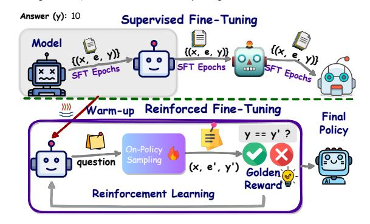
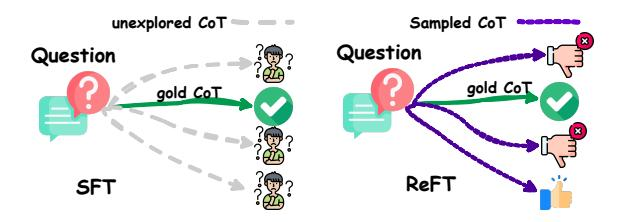
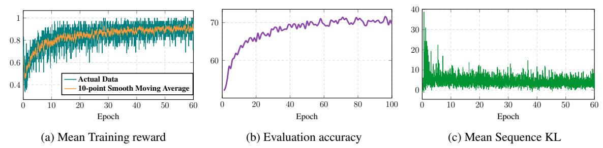
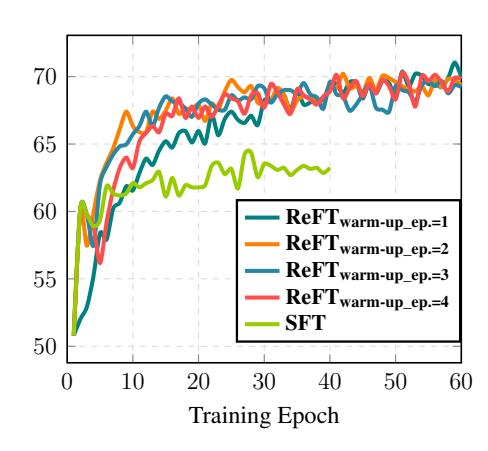

## **REFT: Reasoning with REinforced Fine-Tuning**

# Trung Quoc Luong\*, Xinbo Zhang\*, Zhanming Jie\*, Peng Sun<sup>†</sup>, Xiaoran Jin, Hang Li ByteDance Research

{trung.luong, zhangxinbo.freya, allan}@bytedance.com {wanhesong, xiaoran.jin, lihang.lh}@bytedance.com

#### **Abstract**

One way to enhance the reasoning capability of Large Language Models (LLMs) is to conduct Supervised Fine-Tuning (SFT) using Chain-of-Thought (CoT) annotations. This approach does not show sufficiently strong generalization ability, however, because the training only relies on the given CoT data. In math problemsolving, for example, there is usually only one annotated reasoning path for each question in the training data. Intuitively, it would be better for the algorithm to learn from multiple annotated reasoning paths given a question. To address this issue, we propose a simple yet effective approach called Reinforced Fine-Tuning (ReFT) to enhance the generalizability of learning LLMs for reasoning, with math problemsolving as an example. ReFT first warmups the model with SFT, and then employs on-line reinforcement learning, specifically the PPO algorithm in this paper, to further fine-tune the model, where an abundance of reasoning paths are automatically sampled given the question and the rewards are naturally derived from the ground-truth answers. Extensive experiments on GSM8K, MathQA, and SVAMP datasets show that ReFT significantly outperforms SFT, and the performance can be potentially further boosted by combining inference-time strategies such as majority voting and re-ranking. Note that ReFT obtains the improvement by learning from the same training questions as SFT, without relying on extra or augmented training questions. This indicates a superior generalization ability for ReFT. The code of this work is publicly available<sup>1</sup>.

### 1 Introduction

The state-of-the-art approaches to solving math problems (Uesato et al., 2022; Luo et al., 2023; Wang et al., 2023a) employ Supervised Fine-

<span id="page-0-1"></span>Question (x): Weng earns \$12 an hour for babysitting. Yesterday, she just did 50 minutes of babysitting. How much did she earn?

**Chain-of-Thought (e):** We need to calculate her hourly rate and then multiply it by the amount of time she worked. First, we need to convert 50 minutes hours. There are 60 minutes in an hour, so 50 minutes is equal to 50/60 = 5/6 hours. Next, we can calculate Weng's earnings by multiplying her hourly rate by the amount of time she worked:  $$12/hour \times 5/6 hour = $10$ . Therefore, Weng earned \$10 for 50 minutes of babysitting. The answer is 10.



Figure 1: An example of question (x), CoT (e), and answer (y) in GSM8K (Cobbe et al., 2021a). The SFT process iterates several epochs on the training data. The proposed ReFT warm-up from SFT and performs RL training on the same data.

Tuning (SFT) to train the models using Chain-of-Thought (CoT) annotations (Wei et al., 2022). As shown in Figure 1, a CoT annotation outlines the intermediate reasoning steps toward solving a math problem.

Usually there is one CoT annotation for each question in the training data, i.e., one correct reasoning path, which is utilized in SFT. We observe that this may result in relatively weak generalization abilities of the SFT models. It is often the case that multiple valid CoT annotations exist for the same question (Cobbe et al., 2021a; Zhang et al., 2023), underscoring the need for a more powerful fine-tuning approach. To address this problem, we propose a simple yet effective approach called *Reinforced Fine-Tuning* (ReFT), depicted in the lower part of Figure 1.

ReFT commences with a warm-up stage involving Supervised Fine-Tuning (SFT) in one or two epochs (Figure 1, shaded box). This initial stage

 $<sup>^{\</sup>ast}$  indicates equal contribution,  $\dagger$  indicates corresponding author

<span id="page-0-0"></span><sup>&</sup>lt;sup>1</sup>https://github.com/lqtrung1998/mwp\_ReFT

<span id="page-1-0"></span>

Figure 2: Comparison between SFT and ReFT on the presence of CoT alternatives.

equips the model with the ability to generate correct responses to mathematical problems to some extent, as demonstrated in prior work [\(Cobbe et al.,](#page-9-0) [2021a\)](#page-9-0). Next, ReFT proceeds to further refine the model through the utilization of an online Reinforcement Learning (RL) algorithm [\(Sutton and](#page-10-3) [Barto,](#page-10-3) [2018\)](#page-10-3), specifically Proximal Policy Optimization (PPO) [\(Schulman et al.,](#page-10-4) [2017\)](#page-10-4) in this paper. In this way, ReFT is able to sample multiple correct reasoning paths or CoT annotations and learn from them (Figure [2,](#page-1-0) right).

Since the training data include ground-truth answers, the golden rewards can be naturally derived from them when training PPO. Consequently, there is no requirement for a separately trained reward model. In contrast, RLHF [\(Ouyang et al.,](#page-10-5) [2022\)](#page-10-5) has to utilize a reward model that is learned from human-labeled data.

During the warm-up stage, ReFT acquires a certain level of accuracy by supervised learning. In the RL stage, ReFT further enhances its ability by reinforcement learning through sampling various CoT reasoning paths. In this way, ReFT gets much richer supervision signals than SFT. This approach enables ReFT to greatly improve generalization in math problem-solving [\(Gao et al.,](#page-9-1) [2018;](#page-9-1) [Brown](#page-9-2) [et al.,](#page-9-2) [2020\)](#page-9-2). Note that ReFT outperforms SFT by using the same training questions as SFT, without relying on extra or augmented training questions. In fact, ReFT does not conflict with such a data engineering, and can be seamlessly combined with it.

Our contributions can be summarized as follows:

• We introduce a novel fine-tuning approach, reinforced fine-tuning (ReFT), which utilizes reinforcement learning to solve math problems. ReFT exhibits enhanced generalization capabilities compared to conventional supervised fine-tuning (SFT) when trained on the same dataset.

- We conduct extensive experiments using two foundational models, CodeLLAMA [\(Touvron](#page-10-6) [et al.,](#page-10-6) [2023;](#page-10-6) [Roziere et al.,](#page-10-7) [2023\)](#page-10-7) and Galactica [\(Taylor et al.,](#page-10-8) [2022\)](#page-10-8), on three standard mathematical datasets: GSM8K [\(Cobbe et al.,](#page-9-0) [2021a\)](#page-9-0), MathQA [\(Amini et al.,](#page-8-0) [2019\)](#page-8-0), and SVAMP [\(Patel et al.,](#page-10-9) [2021\)](#page-10-9). Our experiments cover both natural language and programbased CoTs, demonstrating the significantly improved performance and generalization ability of ReFT.
- Additionally, we demonstrate that ReFT benefits from both majority voting [\(Wang et al.,](#page-10-10) [2023b\)](#page-10-10) and reward model reranking [\(Uesato](#page-10-0) [et al.,](#page-10-0) [2022\)](#page-10-0) at inference-time, further improving its performance.

### 2 Related Work

Math Problem Solving Recent research efforts focus on CoT prompt design and data engineering. Most of them attempted to make CoT comprehensive and fine-grained to present the step-by-step reasoning solutions [\(Nye et al.,](#page-10-11) [2021;](#page-10-11) [Fu et al.,](#page-9-3) [2023;](#page-9-3) [Zhou et al.,](#page-11-2) [2023b;](#page-11-2) [Khot et al.,](#page-9-4) [2023;](#page-9-4) [Imani](#page-9-5) [et al.,](#page-9-5) [2023;](#page-9-5) [Miao et al.,](#page-10-12) [2023\)](#page-10-12). [Gao et al.](#page-9-6) [\(2023\)](#page-9-6) further proposed to use the Python program as CoT prompt, demonstrating more accurate reasoning steps and significant improvements over the natural language CoT [\(Wei et al.,](#page-11-0) [2022\)](#page-11-0). [Zhou et al.](#page-11-3) [\(2023a\)](#page-11-3) introduced a prompting method that generates code to verify the intermediate reasoning step with GPT-4 [\(OpenAI,](#page-10-13) [2023\)](#page-10-13), thus achieving stateof-the-art performance on GSM8K [\(Cobbe et al.,](#page-9-0) [2021a\)](#page-9-0) and MATH [\(Hendrycks et al.,](#page-9-7) [2021\)](#page-9-7). Another line of work focuses on improving the quality of CoT [\(Wang et al.,](#page-10-2) [2023a;](#page-10-2) [Liu et al.,](#page-9-8) [2023;](#page-9-8) [Yu](#page-11-4) [et al.,](#page-11-4) [2023\)](#page-11-4) and increasing the amount of CoT data [\(Luo et al.,](#page-10-1) [2023;](#page-10-1) [Yue et al.,](#page-11-5) [2023\)](#page-11-5) from OpenAI's ChatGPT (gpt-3.5-turbo) or GPT-4[2](#page-1-1) .

Reinforcement Learning Our work is mostly related to the recent work that applies PPO [\(Schul](#page-10-4)[man et al.,](#page-10-4) [2017\)](#page-10-4) to natural language process for aligning human preferences [\(Ouyang et al.,](#page-10-5) [2022\)](#page-10-5). Since then, several training algorithms have been proposed to efficiently improve the alignment, including direct preference optimization (DPO) [\(Rafailov et al.,](#page-10-14) [2023\)](#page-10-14), identity preference optimization (IPO) [\(Azar et al.,](#page-9-9) [2023\)](#page-9-9), and Kahneman-Tversky optimization (KTO) [\(Etha-](#page-9-10)

<span id="page-1-1"></span><sup>2</sup> [https://chat.openai.com/](#page-9-10)

[yarajh et al.,](#page-9-10) [2023\)](#page-9-10). Other than the purpose of alignment, we aim to adopt reinforcement learning as a fine-tuning paradigm to improve performance over conventional supervised fine-tuning.

Specifically for solving math problems, [Uesato](#page-10-0) [et al.](#page-10-0) [\(2022\)](#page-10-0) and [Lightman et al.](#page-9-11) [\(2023\)](#page-9-11) trained an outcome-based or process-based reward model to perform reranking [\(Cobbe et al.,](#page-9-0) [2021a\)](#page-9-0) to achieve much better performance over SFT and majority voting [\(Wang et al.,](#page-10-10) [2023b\)](#page-10-10). While our approach aims to improve the performance of the policy itself, these reward model reranking approaches can be easily integrated into the resulting policy model.

# 3 Method

In this work, we focus on *natural language CoT* (N-CoT) [\(Wei et al.,](#page-11-0) [2022\)](#page-11-0) (Figure [1\)](#page-0-1) and *programbased CoT* [\(Gao et al.,](#page-9-6) [2023\)](#page-9-6) (P-CoT) using Python. [Gao et al.](#page-9-6) [\(2023\)](#page-9-6) proposed the programbased CoT for math problem solving. We can simply execute the program to obtain the answer. To ensure clarity and avoid ambiguity, we use the terms N-CoT and P-CoT to represent natural language and program-based CoTs in the rest of this paper, respectively.

### <span id="page-2-2"></span>3.1 Reinforced Fine-Tuning

The proposed Reinforced Fine-Tuning (ReFT) process consists of two stages: the warm-up stage and the reinforcement learning stage. The overall algorithm is shown in Algorithm [1.](#page-3-0)

Warm-up In this stage, the policy is fine-tuned for a few epochs on a dataset comprising of the "(*question*, *CoT*)" tuples: (x, e). It enables the model to have basic problem-solving skills to generate a proper response for a question[3](#page-2-0) . Formally, the CoT generation process can be decomposed into a sequence of next token prediction actions. The last action token, <eos>, signals the generation process to terminate. The CoT e is written as:

$$e = [a_1, a_2, ..., a_{L-1}, a_L = ]$$

where L represents the maximum length. At timestep t, the action a<sup>t</sup> is sampled from a policy πθ(·|st) where a<sup>t</sup> can be any token in the vocabulary and the state s<sup>t</sup> comprises of all tokens in the question and all tokens generated so far. After each

action, the resulting state st+1 is the concatenation of the current state s<sup>t</sup> and the action a<sup>t</sup> :

$$s_{t+1} = \begin{cases} x, & t = 0 \\ [s_t, a_t], & 1 \le t \le L \end{cases}$$

As the produced action corresponds to the <eos> token, the resulting state sL+1 is the terminal state and the generation process is finished. With this notation, the loss function for a sample can be written as in Equation [1:](#page-2-1)

<span id="page-2-1"></span>
$$\mathcal{L}_{SFT}(\boldsymbol{\theta}) = -\mathbb{E}_{\boldsymbol{e} \sim \mathcal{D}} \left[ \sum_{i=1}^{L} \log \left( \boldsymbol{\pi}_{\boldsymbol{\theta}}(a_t | s_t) \right) \right]$$
(1)

Reinforcement Learning In this stage, the policy improves its performance via a form of online self-learning using a dataset comprising of (*question*, *answer*) tuples: (x, y). Specifically, the policy model learns by repeatedly sampling responses (Figure [2\)](#page-1-0), evaluating the response's answer correctness, and updating its parameters in an online fashion (line 7-14 in Algorithm [1\)](#page-3-0). We employ PPO [\(Schulman et al.,](#page-10-4) [2017\)](#page-10-4) with a clipped objective algorithm for training. Following [Ziegler](#page-11-6) [et al.](#page-11-6) [\(2019\)](#page-11-6), the value model V<sup>ϕ</sup> is constructed by appending a linear value head on top of the last hidden states of the policy model πθ, which is the model after the warm-up stage. The reward of 0 is given for all action resulting in non-terminal state. At the terminal state, we use a reward function that directly compares the answer extracted from the state's CoT and the ground-truth answer y . Here, the reward function returns 1 if the answer is deemed correct, otherwise 0 is returned. On dataset whose answers are all numeric, *partial reward* [\(Zhong et al.,](#page-11-7) [2017;](#page-11-7) [Le et al.,](#page-9-12) [2022\)](#page-9-12) of 0.1 can be applied when the answer can be extracted and of numeric type. For 1 ≤ t ≤ L, we write

$$r(s_t, a_t, s_{t+1}) = \begin{cases} 1, & \mathsf{EXTRACT}(s_{t+1}) = \boldsymbol{y} \\ 0.1, & \mathsf{EXTRACT}(s_{t+1}) \neq \mathsf{null}, \neq \boldsymbol{y} \\ 0, & \mathsf{EXTRACT}(s_{t+1}) = \mathsf{null} \end{cases}$$

Such a partial reward can help reduce the effect of learning from sparse reward [\(Riedmiller et al.,](#page-10-15) [2018;](#page-10-15) [Trott et al.,](#page-10-16) [2019\)](#page-10-16). In addition, following [Zheng et al.](#page-11-8) [\(2023\)](#page-11-8), our total reward is the sum of reward function score and the Kullback-Leibler (KL) divergence [\(Kullback and Leibler,](#page-9-13) [1951\)](#page-9-13) between the learned RL policy and initial policy

<span id="page-2-0"></span><sup>3</sup>The underlying concept is similar to the verifier training [\(Cobbe et al.,](#page-9-0) [2021a\)](#page-9-0) to generate multiple solutions.

#### Algorithm 1: Reinforced Fine-Tuning

```
Input: \mathcal{D}_{train} = \{(\boldsymbol{x}, \boldsymbol{e}, \boldsymbol{y})\}: Tuples of (question, CoT, answer), W: number of warm-up steps, T:
                    number of RL steps, U: number of updates per RL step, \pi_{\theta}^{(0)}: Initial policy.
     Output: \pi_{\theta}: Final policy
 1 \boldsymbol{\pi}_{\boldsymbol{\theta}} = \boldsymbol{\pi}_{\boldsymbol{\theta}}^{(0)}
 2 // Warm-up stage
 solution{for } i \leftarrow 1 \text{ to } W \text{ do}
            \boldsymbol{x}, \boldsymbol{e}, \_ \sim \mathcal{D}_{train} \ \boldsymbol{\theta} = \text{Optimization\_Step}(\mathcal{L}_{SFT}(\boldsymbol{\theta}))
                                                                                                                                      // Sample mini-batch from \mathcal{D}_{train}
                                                                                                       // Update model parameters for this batch (Eq. 1)
 6 // Reinforcement learning stage
 7 for i \leftarrow 1 to T do
             \boldsymbol{x},\_,\boldsymbol{y} \sim \mathcal{D}_{train}
                                                                                                                                     // Sample mini-batch without CoT
                                                                                                                                                    // On-policy CoT sampling
             \hat{\boldsymbol{y}} \leftarrow \text{Extract}(\hat{\boldsymbol{e}})
                                                                                                                                            // Extract the answer from CoT
10
            \boldsymbol{\pi_{\theta_{\text{old}}}} \leftarrow \boldsymbol{\pi_{\theta}}, V_{\boldsymbol{\phi}_{\text{old}}} \leftarrow V_{\boldsymbol{\phi}}
             Compute \delta_t, \hat{A}_t, \hat{R}_t using \pi_{\boldsymbol{\theta}_{\text{old}}}, V_{\boldsymbol{\phi}_{\text{old}}}, \boldsymbol{x}, \hat{\boldsymbol{e}}, \hat{\boldsymbol{y}} and \boldsymbol{y}
                                                                                                                                                   // §3.1 Reinforcement Learning
12
             \textbf{for}\ j \leftarrow 1\ \textbf{to}\ U\ \textbf{do}
13
              \boldsymbol{\theta}, \boldsymbol{\phi} = \text{Optimization\_Step}(\mathcal{L}_{RL}(\boldsymbol{\theta}, \boldsymbol{\phi}))
                                                                                                                                                 // Use the loss in Equation 2
```

scaled by a coefficient factor  $\beta$ .

<span id="page-3-0"></span>15 return  $\pi_{\theta}$ 

$$r_{total}(s_t, a_t, s_{t+1}) = r(s_t, a_t, s_{t+1})$$
$$-\beta \textit{KL}\left(\boldsymbol{\pi}_{\boldsymbol{\theta}}(\cdot|s_t), \boldsymbol{\pi}_{\boldsymbol{\theta}}^{(0)}(\cdot|s_t)\right)$$

For advantage calculation, the generalized advantage estimate from Schulman et al. (2018) is employed.

$$\hat{A}_t = \sum_{l=0}^{L-t} (\gamma \lambda)^l \delta_{t+l},$$

where the Temporal Difference (TD) is defined as

$$\delta_{t'} = -V_{\phi}(s_{t'}) + r_{total}(s_{t'}, a_{t'}, s_{t'+1}) + \gamma V_{\phi}(s_{t'+1})$$

with the terminal state value  $V_{\phi}(s_{L+1}) := 0$ ,  $\lambda \in (0,1]$  is the discount factor for rewards, and  $\gamma \in [0,1]$  is the discount factor for TD. For the estimate of return, we leverages the  $\lambda$ -return  $\hat{R}_t$ , which can be written as the sum of the generalized advantage estimate and the value estimate:

$$\hat{R}_t = \hat{A}_t + V_{\phi}(s_t)$$

Lastly, the policy and value objectives can be written as in two equations below

$$\begin{split} \mathcal{L}_{policy}(\boldsymbol{\theta}) &= -\mathbb{E}_{\boldsymbol{e} \sim \boldsymbol{\pi}_{\boldsymbol{\theta}_{\text{old}}}} \Bigg[ \min \left( \frac{\boldsymbol{\pi}_{\boldsymbol{\theta}}(a_t | s_t)}{\boldsymbol{\pi}_{\boldsymbol{\theta}_{\text{old}}}(a_t | s_t)} \hat{A}_t, \right. \\ &\left. \text{clip} \left( \frac{\boldsymbol{\pi}_{\boldsymbol{\theta}}(a_t | s_t)}{\boldsymbol{\pi}_{\boldsymbol{\theta}_{\text{old}}}(a_t | s_t)}, 1 - \epsilon, 1 + \epsilon \right) \hat{A}_t \right) \Bigg] \end{split}$$

$$\begin{split} \mathcal{L}_{value}(\boldsymbol{\phi}) &= \frac{1}{2} \left. \mathbb{E}_{\boldsymbol{e} \sim \boldsymbol{\pi}_{\theta_{\text{old}}}} \left[ \max \left( \left\| V_{\boldsymbol{\phi}}(s_t) - \hat{R}_t \right\|^2, \right. \right. \\ &\left. \left\| \text{clip} \left( V_{\boldsymbol{\phi}}(s_t) - \hat{R}_t, \hat{A}_t - \epsilon, \hat{A}_t + \epsilon \right) \right\|^2 \right) \right] \end{split}$$

where  $\pi_{\theta_{\text{old}}}$ ,  $V_{\phi_{\text{old}}}$  are used for sampling CoT and computing  $\hat{A}_t$ ,  $\hat{R}_t$ . The unified loss function is the weighted sum of the above objectives.

$$\mathcal{L}_{RL}(\boldsymbol{\theta}, \boldsymbol{\phi}) = \mathcal{L}_{policy} + \alpha \mathcal{L}_{value}$$
 (2)

where  $\alpha$  is the coefficient for the value function loss.

### 4 Experiments

### 4.1 Datasets

We conduct experiments on three math problem datasets: GSM8K (Cobbe et al., 2021a), SVAMP (Patel et al., 2021) and MathQA (Amini et al., 2019). For both GSM8K and SVAMP, the format of answers is a numeric value. In MathQA, the format is instead a list of multiple choices (i.e., ABCD). Table 1 presents the statistics of all datasets. We perform few-shot prompting (Wei et al., 2022; Gao et al., 2023) using GPT-3.5-turbo to obtain both the N-CoT and P-CoT annotations<sup>4</sup>. The N-CoT and P-CoT annotations are obtained following

<span id="page-3-1"></span><sup>&</sup>lt;sup>4</sup>Examples of N-CoT and P-CoT representations can be found in Appendix A.

<span id="page-4-0"></span>

|       | GSM8k | SVAMP | MathQA <sub>MCQ</sub> | MathQA <sub>numeric</sub> |
|-------|-------|-------|-----------------------|---------------------------|
| N-CoT | 7,465 | 3,076 | 14,862                | 8,955                     |
| P-CoT | 7,356 | 3,043 | 15,250                | 7,672                     |
| Test  | 1,319 | 1,000 | 1,605                 | 1,605                     |

Table 1: Dataset statistics of two types of CoT in the training set and the test set.

Jie et al. (2023). We also conducted an additional experiment on a numeric version of MathQA (Jie and Lu, 2023) where the format is also a numeric value. Such experiments are used to demonstrate our assumptions of potential reward hacking phenomenon (Skalse et al., 2022) on MathQA (§4.4).

#### <span id="page-4-3"></span>4.2 Baseline

We compare ReFT with SFT and self-training (Xie et al., 2020; Amini et al., 2022) baselines. SFT simply fine-tunes the language model on the training data. Experiments with self-training methods ensure a relatively fair comparison because all these methods share the mechanism that the training makes use of the samples generated from the model.

We implemented Offline Self-Training (**Offline-ST**) (He et al., 2020), and Online (Hoi et al., 2021) Self-Training (**Online-ST**). The Offline-ST method is similar to expert iteration (Anthony et al., 2017; Uesato et al., 2022). We first use the SFT checkpoint from the early checkpoint to sample the CoTs and verify them against the ground truth. We only retain those expert samples that have a correct answer. We perform supervised fine-tuning on the combination of original training data and the expert samples.

The Online-ST method is made to be closely comparable to ReFT. Following ReFT, Online-ST has the same warm-up process. After that, we perform continual training with the samples generated on the fly. At each training step, the model first samples CoTs for a batch and only retains those with correct answers. The resulting batch consists of both sampled and ground-truth CoTs. We then update the model parameters on this batch with the supervised fine-tuning objective  $\mathcal{L}_{SFT}$ . Compared with ReFT, Online-ST neither makes use of negative responses (with an incorrect answer) nor has a dedicated mechanism to prevent the model from significantly diverging from the initial model, which can manifest as task-specific overfitting and training instability.

### <span id="page-4-4"></span>4.3 Experimental Setup

We conduct experiments with two foundation models: Galactica-6.7B<sup>5</sup> (Taylor et al., 2022) and Codellama-7B<sup>6</sup> (Roziere et al., 2023). Both models are reported to have strong performance in solving math problems and are commonly adopted in recent literature on reasoning tasks (Yue et al., 2023; Luo et al., 2023). In addition to the comparison with baselines, we also apply common techniques, majority voting (Wang et al., 2023b) and reward model reranking (Lightman et al., 2023) on GSM8K.

**Hyper-parameter** In all experiments, the training is done with 8 A100-80GB GPUs using Deep-Speed (Rajbhandari et al., 2020; Rasley et al., 2020) Zero stage 2 and HuggingFace Accelerate (Gugger et al., 2022). During the warm-up stage of ReFT, we use AdamW (Loshchilov and Hutter, 2017) optimizer with 0.1 warm-up ration. The batch size is set to 48 and learning rate is 1e-5. The maximum length is set to 1024. The number of epochs in the warm-up stage is either 1 or 2 in all settings except on MathQA<sub>MCO</sub> and MathQA<sub>numeric</sub> where we use upto 5 and 10 respectively. The model is trained for 300 epochs with a learning rate of 3e-7. Following Ziegler et al. (2019), the  $\lambda$ ,  $\gamma$ ,  $\alpha$ ,  $\epsilon$  and U in PPO are set to 1, 0.95, 5, 0.2, and 2, respectively. The KL coefficient  $\beta$  is set to 0.01 for P-CoT and is set to 0.05 for N-CoT experiments. Further hyperprameter settings about ReFT can be found in Appendix B.

For SFT baseline, we train the model for 40 epochs and choose the checkpoint with best performance. This number of epochs has been chosen to be sufficiently large to ensure SFT converges. For Offline-ST baseline, we sample the CoTs by using the checkpoint from the ReFT warm-up stage. Using the generation temperature of 1.0 and max length of 1024, we sample 100 CoTs for each question and only keep those with a correct answer. Following Singh et al. (2023), we then subsample the CoTs to 10 random unique CoTs per question to balance difficulties of questions. As mentioned in §4.2, the Online-ST baseline tries to mimic the same setting as in ReFT. We have the same warm-up process and the hyperparameter setting is roughly the same as ReFT.

<span id="page-4-1"></span><sup>5</sup>https://huggingface.co/facebook/galactica-6.

<span id="page-4-2"></span><sup>6</sup>https://huggingface.co/codellama/ CodeLlama-7b-hf

<span id="page-5-1"></span>

| Method                            | Size | GSM8K |       | SVAMP |       | MathQA <sub>MCQ</sub> |       | Average |       |
|-----------------------------------|------|-------|-------|-------|-------|-----------------------|-------|---------|-------|
| Method                            |      | N-CoT | P-CoT | N-CoT | P-CoT | N-CoT                 | P-CoT | N-CoT   | P-CoT |
| Galactica + SFT                   | 6.7B | 41.0  | 57.1  | 53.8  | 69.3  | 58.7                  | 64.8  | 51.2    | 63.7  |
| Galactica + Offline Self-Training | 6.7B | 45.0  | 61.0  | 56.5  | 70.8  | 60.7                  | 67.5  | 54.1    | 66.5  |
| Galactica + Online Self-Training  | 6.7B | 45.7  | 61.9  | 58.5  | 73.7  | 59.7                  | 62.4  | 54.6    | 66.0  |
| Galactica + ReFT                  | 6.7B | 46.8  | 68.4  | 62.3  | 73.9  | 58.3                  | 70.4  | 55.8    | 70.9  |
| CodeLLAMA + SFT                   | 7B   | 44.0  | 64.4  | 59.6  | 76.2  | 56.5                  | 64.2  | 53.4    | 68.3  |
| CodeLLAMA + Offline Self-Training | 7B   | 38.8  | 65.0  | 54.2  | 72.5  | 57.6                  | 62.8  | 50.2    | 66.8  |
| CodeLLAMA + Online Self-Training  | 7B   | 40.0  | 64.3  | 59.7  | 75.4  | 55.5                  | 68.2  | 53.1    | 69.3  |
| CodeLLAMA + ReFT                  | 7B   | 53.5  | 72.8  | 60.0  | 78.4  | 57.9                  | 71.5  | 57.1    | 74.2  |

Table 2: Value accuracy comparison among the baselines and proposed ReFT method fine-tuned with two foundation models on all datasets.

Reward Model Reranking Following (Cobbe et al., 2021a; Uesato et al., 2022), we train a reward model (RM) to determine the correctness of the CoT. To construct the RM training data, we use the model from the warm-up stage and perform sampling to obtain 100 CoTs for each question in the training set. The CoTs are deduplicated and the binary labels can be obtained by comparing the extracted answer against the ground truth.

As a common practice, the reward model is a language model that is initialized from the best SFT checkpoint (Cobbe et al., 2021a; Ouyang et al., 2022). Similar to the outcome-based reward model (ORM) (Uesato et al., 2022), the reward model is trained to predict a binary label that indicates the "correct" or "incorrect" solution. Once the input passes through the reward model, classification is conducted with a linear classifier on the hidden state of the last token. Finally, the solution with the highest "correct" score among the candidates is selected as the final answer. We train the RM model for 3 epochs using a batch size of 48 and maximum length of 700.

**Evaluation** We report value accuracy for both N-CoT and P-CoT on all datasets. Specifically for majority voting and reranking (Table 4), we sample 100 CoTs for evaluation. In voting, the valid answer with majority counts is chosen as the final answer for computing accuracy. In reranking, we choose the CoT with the highest score and extract the answer.

### <span id="page-5-0"></span>4.4 Results

**ReFT Outperforms SFT** Table 2 compares the performance among the baselines and proposed ReFT on GSM8K, SVAMP, and MathQA datasets. We can observe that ReFT consistently achieves much better performance over the SFT and the self-

<span id="page-5-2"></span>**Question**: The diagonals of a rhombus are 18 cm and 22 cm. Find its area?

A) 277, B) 266, C) 198, D) 288, E) 212

Generated CoT: To find the area of a rhombus, we need to multiply the lengths of its diagonals and divide the result by 2.

Area of rhombus = (Product of diagonals) / 2 Area of rhombus = (18 cm x 22 cm) / 2

Area of rhombus =  $\frac{344 \text{ cm}^2}{2}$  Area of rhombus =  $172 \text{ cm}^2$  Therefore, the answer is: C

Figure 3: Example prediction of MathQA $_{MCQ}$  reveals reward hacking.

training family approaches except on MathQA<sub>MCQ</sub> N-CoT. Specifically, we have more than 9-point and 8-point improvement over SFT with CodeL-LAMA on GSM8K N-CoT and P-CoT, respectively. On average, we achieve 3.7-point and 5.9-point improvements with CodeLLAMA on all datasets in N-CoT and P-CoT, respectively. More importantly, no additional annotations or reward models are used in ReFT. Such strong results demonstrate robust generalization of ReFT (see Analysis §5.1) and huge potential for further exploring the training data with reinforcement learning (Lu et al., 2023).

Offline self-training includes the sampling data from the initial policy for fine-tuning. We can see this simple baseline can sometimes improve the performance compared with SFT (He et al., 2020; Gulcehre et al., 2023) but the improvements are far behind the one made by ReFT. Such comparisons indicate that "exploring" is essential in ReFT to have good performance. Though online selftraining achieves some improvements with Galactica, it is still far behind ReFT on average. This result indicates that incorrect instances are also very essential to guide the model for better exploration. Comparisons with self-training also suggest the proposed approach with on-policy sampling and reinforcement learning is better than standard data augmentation approaches.

<span id="page-6-2"></span>

| Metho       | N-CoT |      |  |
|-------------|-------|------|--|
| Galactica   | SFT   | 41.1 |  |
| Galactica   | ReFT  | 44.9 |  |
| Codellama   | SFT   | 36.3 |  |
| Codellallia | ReFT  | 41.0 |  |

Table 3: Accuracy of SFT and ReFT with two foundation models on MathQA<sub>numeric</sub> benchmark

Reward Hacking for MathQA Our investigation of the negative results on MathQA<sub>MCO</sub> indicates that ReFT suffers from the reward hacking (Skalse et al., 2022) on the multi-choice question during training. Figure 3 shows how the sampled solutions produce "inaccurate rewards", which makes the RL training suffer. As we can see, the sampled CoT obtains an incorrect answer "344" which is not the product of "18" and "22". However, the final reasoning step still predicts the option "C" as the final answer as the model would always predict one of the options from {A, B, C, D, E} regardless of the correctness of intermediate CoT<sup>7</sup>. Thus, such a misleading CoT will receive a positive reward "1" and misguide the model to treat this as a correct CoT. The underlying reward hacking phenomenon severely tampers the model training (Everitt et al., 2021). This is also the reason that we chose the checkpoint with longer warm-up steps for MathQA to reduce the reward hacking effect.

To further demonstrate the negative effect of MCQ questions, we experiment on the MathQA variant by Jie and Lu (2023), MathQA<sub>numeric</sub> (Table 1), which removed the options in the question, and directly predict the numeric answer. Table 3 presents the comparison against SFT. We can observe that ReFT consistently outperforms SFT using both Galactica and CodeLLAMA.

#### **Majority Voting and Reranking Benefit ReFT**

Following Wang et al. (2023b); Uesato et al. (2022); Lightman et al. (2023), we also perform majority voting and reward model reranking to show that ReFT can benefits from these common techniques. Specifically, we perform sampling from both SFT and ReFT policies. We sample 100 CoT solutions for each question and apply the reward model described in §4.3. Table 4 shows that ReFT consistently achieves the best performance on GSM8K

<span id="page-6-0"></span>

| Method                                   | Size | GSM8K<br>N-CoT P-CoT |      |  |
|------------------------------------------|------|----------------------|------|--|
| Galactica + SFT + Voting                 | 6.7B | 50.8                 | 61.1 |  |
| Galactica + ReFT + Voting                | 6.7B | 58.7                 | 70.7 |  |
| Galactica + SFT + Reranking              | 6.7B | 59.5                 | 72.4 |  |
| Galactica + ReFT + Reranking             | 6.7B | 62.8                 | 76.6 |  |
| CodeLLAMA + SFT + Voting                 | 7B   | 53.8                 | 67.9 |  |
| CodeLLAMA + ReFT + Voting                | 7B   | 65.1                 | 75.0 |  |
| CodeLLAMA + SFT + Reranking              | 7B   | 61.9                 | 77.6 |  |
| CodeLLAMA + ReFT + Reranking             | 7B   | 65.7                 | 79.3 |  |
| Extra Training Data Used †               |      |                      |      |  |
| WizardMath (Luo et al., 2023)            | 7B   | 54.9                 | -    |  |
| WizardMath (Luo et al., 2023)            | 13B  | 63.9                 | -    |  |
| MathCoder (Wang et al., 2023a)           | 7B   | 67.8                 | -    |  |
| MAmmoTH-Coder (Yue et al., 2023)         | 7B   | 22.2                 | 58.8 |  |
| MAmmoTH-Coder (Yue et al., 2023)         | 70B  | 72.4                 | 76.7 |  |
| GPT-3.5-turbo (Jie et al., 2023)         | N.A. | 75.3                 | 78.0 |  |
| GPT-4 (OpenAI, 2023; Zhou et al., 2023a) | N.A. | 93.0                 | 97.0 |  |

Table 4: Solving accuracy of majority voting and reward model reranking for SFT and ReFT on GSM8K. We also include existing approaches for comparison.

<span id="page-6-4"></span>

| Method                | GSM8K | SVAMP | MathQA <sub>MCQ</sub> |
|-----------------------|-------|-------|-----------------------|
| Galactica-125M + SFT  | 23.7  | 35.6  | 58.4                  |
| Galactica-125M + ReFT | 29.8  | 39.4  | 60.5                  |

Table 5: Experiments on P-CoT data with Galactica-125M.

by reward model reranking. ReFT + Voting significantly outperforms SFT + Voting by 9.2 points on average across all settings. ReFT with reranking outperforms SFT with reranking by 3.3 points on average.

Compared with existing open-source approaches (Luo et al., 2023; Wang et al., 2023a; Yue et al., 2023) (Table 4 bottom<sup>8</sup>), our best P-CoT variant achieves the best performance with accuracy 79.3 on GSM8K. In addition, these approaches mainly include extra data generated from ChatGPT and perform distillation during fine-tuning. In contrast, we improve the policy itself by exploiting the potential of existing training data and pushing the limit of the policy performance. Our best result reported in Table 4, i.e., the CodeLLAMA + ReFT + Reranking with P-CoT setting, even slightly surpasses GPT-3.5-turbo. However, we obtain the result with a model that is only in the size of 7B.

**Experiments with Small Model** Intuitively, exploration could lead to imperfect demonstration with a small language model. We conduct an exper-

<span id="page-6-1"></span><sup>&</sup>lt;sup>7</sup>We found that program-based CoTs are less likely to suffer as it is more rigorous than natural language.

<span id="page-6-3"></span><sup>&</sup>lt;sup>8</sup>Numbers are taken from original papers. The N-CoT and P-CoT results for MAmmoTH-Coder are reported in their appendix.

<span id="page-7-2"></span>

| Model Setting            | Accuracy |
|--------------------------|----------|
| CodeLLAMA + ReFT         | 72.7     |
| – remove partial reward  | 70.9     |
| – KL coefficient β = 0   | collapse |
| – non-shared value model | 72.6     |

Table 6: Ablation study on GSM8K P-CoT.

iment on P-CoT data using Galactica-125M[9](#page-7-1) . Table [5](#page-6-4) shows the performance comparison between SFT and ReFT. Surprisingly, ReFT still outperforms SFT on three datasets even with a small model. Such improvements demonstrate the robustness of ReFT during the exploration of reasonable programs.

Ablation Study We perform the ablation study using CodeLLAMA on GSM8K P-CoT (Table [6\)](#page-7-2). Without the partial reward, ReFT obtains a lower accuracy 70.9 but it is still much better than SFT. As mentioned in [§3.1,](#page-2-2) such a partial reward can help reduce the effect of sparse reward [\(Trott et al.,](#page-10-16) [2019\)](#page-10-16) during training. In addition, the policy distribution will easily collapse to produce unexpected results (i.e., 0 accuracy) if we set the KL coefficient β to 0. It is certainly critical to impose constraints on the space that the policy explores [\(Ouyang](#page-10-5) [et al.,](#page-10-5) [2022\)](#page-10-5). The initial warm-up step essentially makes such constraints and allows the policy to further explore within the range that is governed by β. Finally, we also experiment with a value model that has no parameter shared with the policy model [\(Andrychowicz et al.,](#page-8-3) [2021;](#page-8-3) [Cobbe et al.,](#page-9-23) [2021b\)](#page-9-23). The individual value model initializes the parameter the same as the policy model. We found that such a setting allows the model to converge faster and eventually reach equivalent performance but sacrifices two times of original computation overhead as we have to perform the forward pass twice for each batch.

### 5 Analysis

### <span id="page-7-0"></span>5.1 Generalization

Figure [4](#page-8-4) shows the mean reward, evaluation accuracy, and the KL divergence during training of ReFT[10](#page-7-3) on GSM8K P-CoT. SFT converges and becomes overfiting when approaching 40th epoch.

However, we can see the mean reward is around 80% to 90% for the ReFT policy at 40th epoch, and the value accuracy is also increasing. In addition, we can see that the KL divergence (Figure [4](#page-8-4) (c)) is very large in the beginning and then maintain a reasonable value between 0 and 10. The stable KL divergence indicates our policy performs exploration within a space that contains appropriate programs. The underlying reinforcement learning mechanism greatly improves the generalization ability of ReFT [\(Brown et al.,](#page-9-2) [2020\)](#page-9-2).

## 5.2 When ReFT surpasses SFT?

To further investigate the relationship between ReFT and SFT, we perform ReFT training with different number of warm-up steps from SFT. Figure [5](#page-8-5) shows the value accuracy of different ReFT variants against SFT[11](#page-7-4). Specifically, if the wamrup step is 3, that means the policy initialize from the 3 rd-epoch SFT checkpoint. We can see that all ReFT policies have worse performance in the beginning where the epoch is less than 8. Because the linear layer in the shared value model is randomly initialized and it could take a few epochs to adjust the distribution. Starting from the 30th epoch, SFT converges and all ReFT variants are still improving. We can also see that all variants outperform SFT by a significant margin and there is no obvious advantage of any specific ReFT variant.

### 6 Conclusion

We have introduced reinforced fine-tuning (ReFT) as a new method for fine-tuning models to solve math problems. In contrast to SFT, ReFT optimizes a non-differentiable objective by exploring multiple CoT annotations in the search for the correct answer, rather than relying on a single CoT annotation.

Through extensive experimentation on three datasets using two foundation models, we have demonstrated that ReFT outperforms SFT in terms of performance and generalization ability. Moreover, we have showcased the compatibility of models trained with ReFT with techniques such as majority voting [\(Wang et al.,](#page-10-10) [2023b\)](#page-10-10) and reward model reranking [\(Cobbe et al.,](#page-9-0) [2021a;](#page-9-0) [Uesato et al.,](#page-10-0) [2022\)](#page-10-0).

Furthermore, ReFT has exhibited superior performance compared to several publicly available open-source models of comparable sizes in math

<span id="page-7-1"></span><sup>9</sup>The smallest model size available in Galactica: [https:](https://huggingface.co/facebook/galactica-125m) [//huggingface.co/facebook/galactica-125m](https://huggingface.co/facebook/galactica-125m).

<span id="page-7-3"></span><sup>10</sup>For illustration purpose, we only shows the mean reward and KL for 60 epochs.

<span id="page-7-4"></span><sup>11</sup>We only show 60 epochs for illustration purposes. The performance for the later epoch will be shown in Appendix.

<span id="page-8-4"></span>

Figure 4: Training reward of ReFT, evaluation accuracy, KL against training epoch on GSM8K P-CoT.

<span id="page-8-5"></span>

Figure 5: Accuracy comparison between SFT and ReFT with different number of warm-up epoch.

problem-solving. This demonstrates the effectiveness and practical value of the ReFT approach.

# 7 Future Work

We have made the first attempt of applying reinforcement learning, specifically the PPO algorithm [\(Schulman et al.,](#page-10-4) [2017\)](#page-10-4), to fine-tune of LLMs for math problem-solving. Our future work includes utilization of offline reinforcement learning techniques [\(Levine et al.,](#page-9-24) [2020;](#page-9-24) [Gulcehre](#page-9-21) [et al.,](#page-9-21) [2023\)](#page-9-21), development of a *warm-up free* method to enhance training efficiency and performance, thereby reducing the gap with the reranking method. Additionally, [Lightman et al.](#page-9-11) [\(2023\)](#page-9-11) suggests that a well-trained process-based reward model (PRM) can significantly enhance performance. Hence, it would be worthwhile to explore the implementation of process-based rewards in reinforcement learning training. Lastly, as ReFT is a versatile approach, we intend to apply it to more general reasoning tasks where the inference can be formalized with CoT.

### Limitations

Training Efficiency As depicted in Figure [4](#page-8-4) (b), it is evident that ReFT necessitates a greater number of epochs to reach convergence compared to SFT. This is primarily due to the fact that ReFT optimizes a non-differentiable objective and requires exploration of the generation space to attain correct answers. While a larger learning rate may expedite convergence, it also makes the policy more susceptible to instability and potential collapse. Alternatively, using a larger batch size is a viable option; however, it comes at the expense of increased computational costs.

Reward Hacking Our reward function relies solely on the final answer to determine the reward. However, as demonstrated in the experiments conducted on the MathQAMCQ N-CoT dataset, the policy can be easily manipulated if the possible space of final answers is limited, such as A,B,C,D. To mitigate the issue of reward hacking, it may be necessary to employ a more detailed or process-based reward function that takes into account a broader range of factors.

### References

<span id="page-8-0"></span>Aida Amini, Saadia Gabriel, Shanchuan Lin, Rik Koncel-Kedziorski, Yejin Choi, and Hannaneh Hajishirzi. 2019. [Mathqa: Towards interpretable math](https://arxiv.org/abs/1905.13319) [word problem solving with operation-based for](https://arxiv.org/abs/1905.13319)[malisms.](https://arxiv.org/abs/1905.13319) In *Proceedings of NAACL*.

<span id="page-8-1"></span>Massih-Reza Amini, Vasilii Feofanov, Loic Pauletto, Emilie Devijver, and Yury Maximov. 2022. [Self-training: A survey.](https://arxiv.org/pdf/2202.12040.pdf) *arXiv preprint arXiv:2202.12040*.

<span id="page-8-3"></span>Marcin Andrychowicz, Anton Raichuk, Piotr Stanczyk, ´ Manu Orsini, Sertan Girgin, Raphael Marinier, Léonard Hussenot, Matthieu Geist, Olivier Pietquin, Marcin Michalski, et al. 2021. [What matters in on](https://arxiv.org/abs/2006.05990)[policy reinforcement learning? a large-scale empiri](https://arxiv.org/abs/2006.05990)[cal study.](https://arxiv.org/abs/2006.05990) In *Proceedings of ICLR*.

<span id="page-8-2"></span>Thomas Anthony, Zheng Tian, and David Barber. 2017. [Thinking fast and slow with deep learning and tree](https://arxiv.org/abs/1705.08439) [search.](https://arxiv.org/abs/1705.08439) In *Proceedings of NeurIPS*.

- <span id="page-9-9"></span>Mohammad Gheshlaghi Azar, Mark Rowland, Bilal Piot, Daniel Guo, Daniele Calandriello, Michal Valko, and Rémi Munos. 2023. [A general theoret](https://arxiv.org/pdf/2310.12036.pdf)[ical paradigm to understand learning from human](https://arxiv.org/pdf/2310.12036.pdf) [preferences.](https://arxiv.org/pdf/2310.12036.pdf) *arXiv preprint arXiv:2310.12036*.
- <span id="page-9-2"></span>Daniel S Brown, Wonjoon Goo, and Scott Niekum. 2020. [Better-than-demonstrator imitation learning](https://arxiv.org/abs/1907.03976) [via automatically-ranked demonstrations.](https://arxiv.org/abs/1907.03976) In *Proceedings of Conference on Robot Learning*, pages 330–359.
- <span id="page-9-0"></span>Karl Cobbe, Vineet Kosaraju, Mohammad Bavarian, Mark Chen, Heewoo Jun, Lukasz Kaiser, Matthias Plappert, Jerry Tworek, Jacob Hilton, Reiichiro Nakano, et al. 2021a. [Training verifiers to solve math](https://arxiv.org/abs/2110.14168) [word problems.](https://arxiv.org/abs/2110.14168) *arXiv preprint arXiv:2110.14168*.
- <span id="page-9-23"></span>Karl W Cobbe, Jacob Hilton, Oleg Klimov, and John Schulman. 2021b. [Phasic policy gradient.](https://arxiv.org/pdf/2009.04416.pdf) In *Proceedings of ICML*.
- <span id="page-9-10"></span>Kawin Ethayarajh, Winnie Xu, Dan Jurafsky, and Douwe Kiela. 2023. [Human-centered loss functions](https://github.com/ContextualAI/HALOs) [\(halos\).](https://github.com/ContextualAI/HALOs) Technical report, Contextual AI.
- <span id="page-9-22"></span>Tom Everitt, Marcus Hutter, Ramana Kumar, and Victoria Krakovna. 2021. [Reward tampering problems](https://arxiv.org/pdf/1908.04734.pdf) [and solutions in reinforcement learning: A causal](https://arxiv.org/pdf/1908.04734.pdf) [influence diagram perspective.](https://arxiv.org/pdf/1908.04734.pdf) *Synthese*, 198(Suppl 27):6435–6467.
- <span id="page-9-3"></span>Yao Fu, Hao Peng, Ashish Sabharwal, Peter Clark, and Tushar Khot. 2023. [Complexity-based prompting for](https://arxiv.org/abs/2210.00720) [multi-step reasoning.](https://arxiv.org/abs/2210.00720) In *Proceedings of ICLR*.
- <span id="page-9-6"></span>Luyu Gao, Aman Madaan, Shuyan Zhou, Uri Alon, Pengfei Liu, Yiming Yang, Jamie Callan, and Graham Neubig. 2023. [PAL: Program-aided language](https://arxiv.org/abs/2211.10435) [models.](https://arxiv.org/abs/2211.10435) In *Proceedings of ICML*.
- <span id="page-9-1"></span>Yang Gao, Huazhe Xu, Ji Lin, Fisher Yu, Sergey Levine, and Trevor Darrell. 2018. [Reinforcement learn](https://arxiv.org/abs/1802.05313)[ing from imperfect demonstrations.](https://arxiv.org/abs/1802.05313) *arXiv preprint arXiv:1802.05313*.
- <span id="page-9-18"></span>Sylvain Gugger, Lysandre Debut, Thomas Wolf, Philipp Schmid, Zachary Mueller, Sourab Mangrulkar, Marc Sun, and Benjamin Bossan. 2022. Accelerate: Training and inference at scale made simple, efficient and adaptable. [https://github.com/huggingface/](https://github.com/huggingface/accelerate) [accelerate](https://github.com/huggingface/accelerate).
- <span id="page-9-21"></span>Caglar Gulcehre, Tom Le Paine, Srivatsan Srinivasan, Ksenia Konyushkova, Lotte Weerts, Abhishek Sharma, Aditya Siddhant, Alex Ahern, Miaosen Wang, Chenjie Gu, et al. 2023. [Reinforced self](https://arxiv.org/abs/2308.08998)[training \(rest\) for language modeling.](https://arxiv.org/abs/2308.08998) *arXiv preprint arXiv:2308.08998*.
- <span id="page-9-16"></span>Junxian He, Jiatao Gu, Jiajun Shen, and Marc'Aurelio Ranzato. 2020. [Revisiting self-training for neural](https://arxiv.org/abs/1909.13788) [sequence generation.](https://arxiv.org/abs/1909.13788) In *Proceedings of ICLR*.

- <span id="page-9-7"></span>Dan Hendrycks, Collin Burns, Saurav Kadavath, Akul Arora, Steven Basart, Eric Tang, Dawn Song, and Jacob Steinhardt. 2021. [Measuring mathematical](https://arxiv.org/abs/2103.03874) [problem solving with the math dataset.](https://arxiv.org/abs/2103.03874) In *Proceedings of Thirty-fifth Conference on Neural Information Processing Systems Datasets and Benchmarks Track (Round 2)*.
- <span id="page-9-17"></span>Steven CH Hoi, Doyen Sahoo, Jing Lu, and Peilin Zhao. 2021. [Online learning: A comprehensive survey.](https://arxiv.org/pdf/1802.02871.pdf) *Neurocomputing*, 459:249–289.
- <span id="page-9-5"></span>Shima Imani, Liang Du, and Harsh Shrivastava. 2023. [Mathprompter: Mathematical reasoning using large](https://arxiv.org/abs/2303.05398) [language models.](https://arxiv.org/abs/2303.05398) *arXiv preprint arXiv:2303.05398*.
- <span id="page-9-15"></span>Zhanming Jie and Wei Lu. 2023. [Leveraging training](http://arxiv.org/abs/2305.18170) [data in few-shot prompting for numerical reasoning.](http://arxiv.org/abs/2305.18170)
- <span id="page-9-14"></span>Zhanming Jie, Trung Quoc Luong, Xinbo Zhang, Xiaoran Jin, and Hang Li. 2023. [Design of chain-of](https://arxiv.org/abs/2309.11054)[thought in math problem solving.](https://arxiv.org/abs/2309.11054) *arXiv preprint arXiv:2309.11054*.
- <span id="page-9-4"></span>Tushar Khot, Harsh Trivedi, Matthew Finlayson, Yao Fu, Kyle Richardson, Peter Clark, and Ashish Sabharwal. 2023. [Decomposed prompting: A modular approach](https://arxiv.org/abs/2210.02406) [for solving complex tasks.](https://arxiv.org/abs/2210.02406) In *Proceedings of ICLR*.
- <span id="page-9-13"></span>Solomon Kullback and Richard A Leibler. 1951. [On](https://www.jstor.org/stable/2236703) [information and sufficiency.](https://www.jstor.org/stable/2236703) *The annals of mathematical statistics*, 22(1):79–86.
- <span id="page-9-12"></span>Hung Le, Yue Wang, Akhilesh Deepak Gotmare, Silvio Savarese, and Steven Chu Hong Hoi. 2022. [Coderl:](https://arxiv.org/pdf/2207.01780.pdf) [Mastering code generation through pretrained models](https://arxiv.org/pdf/2207.01780.pdf) [and deep reinforcement learning.](https://arxiv.org/pdf/2207.01780.pdf) In *Proceedings of NeurIPS*.
- <span id="page-9-24"></span>Sergey Levine, Aviral Kumar, George Tucker, and Justin Fu. 2020. [Offline reinforcement learning: Tutorial,](https://arxiv.org/abs/2005.01643) [review, and perspectives on open problems.](https://arxiv.org/abs/2005.01643) *arXiv preprint arXiv:2005.01643*.
- <span id="page-9-11"></span>Hunter Lightman, Vineet Kosaraju, Yura Burda, Harri Edwards, Bowen Baker, Teddy Lee, Jan Leike, John Schulman, Ilya Sutskever, and Karl Cobbe. 2023. [Let's verify step by step.](https://arxiv.org/abs/2305.20050) *arXiv preprint arXiv:2305.20050*.
- <span id="page-9-8"></span>Bingbin Liu, Sebastien Bubeck, Ronen Eldan, Janardhan Kulkarni, Yuanzhi Li, Anh Nguyen, Rachel Ward, and Yi Zhang. 2023. [Tinygsm: achieving> 80% on](https://arxiv.org/pdf/2312.09241.pdf) [gsm8k with small language models.](https://arxiv.org/pdf/2312.09241.pdf) *arXiv preprint arXiv:2312.09241*.
- <span id="page-9-19"></span>Ilya Loshchilov and Frank Hutter. 2017. [Decou](https://arxiv.org/abs/1711.05101)[pled weight decay regularization.](https://arxiv.org/abs/1711.05101) *arXiv preprint arXiv:1711.05101*.
- <span id="page-9-20"></span>Xiuyuan Lu, Benjamin Van Roy, Vikranth Dwaracherla, Morteza Ibrahimi, Ian Osband, Zheng Wen, et al. 2023. [Reinforcement learning, bit by bit.](https://arxiv.org/pdf/2103.04047.pdf) *Foundations and Trends® in Machine Learning*, 16(6):733– 865.

- <span id="page-10-1"></span>Haipeng Luo, Qingfeng Sun, Can Xu, Pu Zhao, Jianguang Lou, Chongyang Tao, Xiubo Geng, Qingwei Lin, Shifeng Chen, and Dongmei Zhang. 2023. [Wiz](https://arxiv.org/abs/2308.09583)[ardmath: Empowering mathematical reasoning for](https://arxiv.org/abs/2308.09583) [large language models via reinforced evol-instruct.](https://arxiv.org/abs/2308.09583) *arXiv preprint arXiv:2308.09583*.
- <span id="page-10-12"></span>Ning Miao, Yee Whye Teh, and Tom Rainforth. 2023. [Selfcheck: Using llms to zero-shot check](https://arxiv.org/pdf/2308.00436.pdf) [their own step-by-step reasoning.](https://arxiv.org/pdf/2308.00436.pdf) *arXiv preprint arXiv:2308.00436*.
- <span id="page-10-11"></span>Maxwell Nye, Anders Johan Andreassen, Guy Gur-Ari, Henryk Michalewski, Jacob Austin, David Bieber, David Dohan, Aitor Lewkowycz, Maarten Bosma, David Luan, et al. 2021. [Show your work: Scratch](https://arxiv.org/abs/2112.00114)[pads for intermediate computation with language](https://arxiv.org/abs/2112.00114) [models.](https://arxiv.org/abs/2112.00114) *arXiv preprint arXiv:2112.00114*.
- <span id="page-10-13"></span>OpenAI. 2023. [GPT-4 technical report.](https://arxiv.org/abs/2303.08774)
- <span id="page-10-5"></span>Long Ouyang, Jeffrey Wu, Xu Jiang, Diogo Almeida, Carroll Wainwright, Pamela Mishkin, Chong Zhang, Sandhini Agarwal, Katarina Slama, Alex Ray, et al. 2022. [Training language models to follow instruc](https://arxiv.org/abs/2203.02155)[tions with human feedback.](https://arxiv.org/abs/2203.02155) In *Proceedings of NeurIPS*.
- <span id="page-10-9"></span>Arkil Patel, Satwik Bhattamishra, and Navin Goyal. 2021. [Are nlp models really able to solve simple](https://arxiv.org/abs/2103.07191) [math word problems?](https://arxiv.org/abs/2103.07191) In *Proceedings of NAACL*.
- <span id="page-10-14"></span>Rafael Rafailov, Archit Sharma, Eric Mitchell, Stefano Ermon, Christopher D Manning, and Chelsea Finn. 2023. [Direct preference optimization: Your language](https://arxiv.org/abs/2305.18290) [model is secretly a reward model.](https://arxiv.org/abs/2305.18290) In *Proceedings of NeurIPS*.
- <span id="page-10-19"></span>Samyam Rajbhandari, Jeff Rasley, Olatunji Ruwase, and Yuxiong He. 2020. [Zero: Memory optimizations](https://ieeexplore.ieee.org/abstract/document/9355301/) [toward training trillion parameter models.](https://ieeexplore.ieee.org/abstract/document/9355301/) In *SC20: International Conference for High Performance Computing, Networking, Storage and Analysis*.
- <span id="page-10-20"></span>Jeff Rasley, Samyam Rajbhandari, Olatunji Ruwase, and Yuxiong He. 2020. [Deepspeed: System optimiza](https://dl.acm.org/doi/abs/10.1145/3394486.3406703)[tions enable training deep learning models with over](https://dl.acm.org/doi/abs/10.1145/3394486.3406703) [100 billion parameters.](https://dl.acm.org/doi/abs/10.1145/3394486.3406703) In *Proceedings of SIGKDD*.
- <span id="page-10-15"></span>Martin Riedmiller, Roland Hafner, Thomas Lampe, Michael Neunert, Jonas Degrave, Tom Wiele, Vlad Mnih, Nicolas Heess, and Jost Tobias Springenberg. 2018. [Learning by playing solving sparse reward](https://arxiv.org/pdf/1802.10567.pdf) [tasks from scratch.](https://arxiv.org/pdf/1802.10567.pdf) In *Proceedings of ICML*.
- <span id="page-10-7"></span>Baptiste Roziere, Jonas Gehring, Fabian Gloeckle, Sten Sootla, Itai Gat, Xiaoqing Ellen Tan, Yossi Adi, Jingyu Liu, Tal Remez, Jérémy Rapin, et al. 2023. [Code llama: Open foundation models for code.](https://arxiv.org/abs/2308.12950) *arXiv preprint arXiv:2308.12950*.
- <span id="page-10-17"></span>John Schulman, Philipp Moritz, Sergey Levine, Michael Jordan, and Pieter Abbeel. 2018. [High-dimensional](http://arxiv.org/abs/1506.02438) [continuous control using generalized advantage esti](http://arxiv.org/abs/1506.02438)[mation.](http://arxiv.org/abs/1506.02438)

- <span id="page-10-4"></span>John Schulman, Filip Wolski, Prafulla Dhariwal, Alec Radford, and Oleg Klimov. 2017. [Proxi](https://arxiv.org/abs/1707.06347)[mal policy optimization algorithms.](https://arxiv.org/abs/1707.06347) *arXiv preprint arXiv:1707.06347*.
- <span id="page-10-21"></span>Avi Singh, John D. Co-Reyes, Rishabh Agarwal, Ankesh Anand, Piyush Patil, Xavier Garcia, Peter J. Liu, James Harrison, Jaehoon Lee, Kelvin Xu, Aaron Parisi, Abhishek Kumar, Alex Alemi, Alex Rizkowsky, Azade Nova, Ben Adlam, Bernd Bohnet, Gamaleldin Elsayed, Hanie Sedghi, Igor Mordatch, Isabelle Simpson, Izzeddin Gur, Jasper Snoek, Jeffrey Pennington, Jiri Hron, Kathleen Kenealy, Kevin Swersky, Kshiteej Mahajan, Laura Culp, Lechao Xiao, Maxwell L. Bileschi, Noah Constant, Roman Novak, Rosanne Liu, Tris Warkentin, Yundi Qian, Yamini Bansal, Ethan Dyer, Behnam Neyshabur, Jascha Sohl-Dickstein, and Noah Fiedel. 2023. [Be](http://arxiv.org/abs/2312.06585)[yond human data: Scaling self-training for problem](http://arxiv.org/abs/2312.06585)[solving with language models.](http://arxiv.org/abs/2312.06585)
- <span id="page-10-18"></span>Joar Skalse, Nikolaus Howe, Dmitrii Krasheninnikov, and David Krueger. 2022. [Defining and characteriz](https://proceedings.neurips.cc/paper_files/paper/2022/file/3d719fee332caa23d5038b8a90e81796-Paper-Conference.pdf)[ing reward gaming.](https://proceedings.neurips.cc/paper_files/paper/2022/file/3d719fee332caa23d5038b8a90e81796-Paper-Conference.pdf) In *Proceedings of NeurIPS*.
- <span id="page-10-3"></span>Richard S Sutton and Andrew G Barto. 2018. *Reinforcement learning: An introduction*. MIT press.
- <span id="page-10-8"></span>Ross Taylor, Marcin Kardas, Guillem Cucurull, Thomas Scialom, Anthony Hartshorn, Elvis Saravia, Andrew Poulton, Viktor Kerkez, and Robert Stojnic. 2022. [Galactica: A large language model for science.](https://arxiv.org/abs/2211.09085) *arXiv preprint arXiv:2211.09085*.
- <span id="page-10-6"></span>Hugo Touvron, Louis Martin, Kevin Stone, Peter Albert, Amjad Almahairi, Yasmine Babaei, Nikolay Bashlykov, Soumya Batra, Prajjwal Bhargava, Shruti Bhosale, et al. 2023. [Llama 2: Open founda](https://arxiv.org/abs/2307.09288)[tion and fine-tuned chat models.](https://arxiv.org/abs/2307.09288) *arXiv preprint arXiv:2307.09288*.
- <span id="page-10-16"></span>Alexander Trott, Stephan Zheng, Caiming Xiong, and Richard Socher. 2019. [Keeping your distance: Solv](https://proceedings.neurips.cc/paper_files/paper/2019/file/64c26b2a2dcf068c49894bd07e0e6389-Paper.pdf)[ing sparse reward tasks using self-balancing shaped](https://proceedings.neurips.cc/paper_files/paper/2019/file/64c26b2a2dcf068c49894bd07e0e6389-Paper.pdf) [rewards.](https://proceedings.neurips.cc/paper_files/paper/2019/file/64c26b2a2dcf068c49894bd07e0e6389-Paper.pdf) In *Proceedings of NeurIPS*.
- <span id="page-10-0"></span>Jonathan Uesato, Nate Kushman, Ramana Kumar, Francis Song, Noah Siegel, Lisa Wang, Antonia Creswell, Geoffrey Irving, and Irina Higgins. 2022. [Solv](https://arxiv.org/abs/2211.14275)[ing math word problems with process-and outcome](https://arxiv.org/abs/2211.14275)[based feedback.](https://arxiv.org/abs/2211.14275) *arXiv preprint arXiv:2211.14275*.
- <span id="page-10-2"></span>Ke Wang, Houxing Ren, Aojun Zhou, Zimu Lu, Sichun Luo, Weikang Shi, Renrui Zhang, Linqi Song, Mingjie Zhan, and Hongsheng Li. 2023a. [Math](https://arxiv.org/pdf/2310.03731.pdf)[coder: Seamless code integration in llms for en](https://arxiv.org/pdf/2310.03731.pdf)[hanced mathematical reasoning.](https://arxiv.org/pdf/2310.03731.pdf) *arXiv preprint arXiv:2310.03731*.
- <span id="page-10-10"></span>Xuezhi Wang, Jason Wei, Dale Schuurmans, Quoc V Le, Ed H Chi, Sharan Narang, Aakanksha Chowdhery, and Denny Zhou. 2023b. [Self-consistency improves](https://arxiv.org/abs/2203.11171) [chain of thought reasoning in language models.](https://arxiv.org/abs/2203.11171) In *Proceedings of ICLR*.

<span id="page-11-0"></span>Jason Wei, Xuezhi Wang, Dale Schuurmans, Maarten Bosma, Fei Xia, Ed Chi, Quoc V Le, Denny Zhou, et al. 2022. Chain-of-thought prompting elicits reasoning in large language models. In *Proceedings of NeurIPS*.

<span id="page-11-10"></span>Qizhe Xie, Minh-Thang Luong, Eduard Hovy, and Quoc V Le. 2020. Self-training with noisy student improves imagenet classification. In *Proceedings of CVPR*, pages 10687–10698.

<span id="page-11-4"></span>Longhui Yu, Weisen Jiang, Han Shi, Jincheng Yu, Zhengying Liu, Yu Zhang, James T Kwok, Zhenguo Li, Adrian Weller, and Weiyang Liu. 2023. Metamath: Bootstrap your own mathematical questions for large language models. *arXiv preprint* arXiv:2309.12284.

<span id="page-11-5"></span>Xiang Yue, Xingwei Qu, Ge Zhang, Yao Fu, Wenhao Huang, Huan Sun, Yu Su, and Wenhu Chen. 2023. Mammoth: Building math generalist models through hybrid instruction tuning. *arXiv* preprint *arXiv*:2309.05653.

<span id="page-11-1"></span>Mengxue Zhang, Zichao Wang, Zhichao Yang, Weiqi Feng, and Andrew Lan. 2023. Interpretable math word problem solution generation via step-by-step planning. In *Proceedings of ACL*.

<span id="page-11-8"></span>Rui Zheng, Shihan Dou, Songyang Gao, Yuan Hua, Wei Shen, Binghai Wang, Yan Liu, Senjie Jin, Qin Liu, Yuhao Zhou, Limao Xiong, Lu Chen, Zhiheng Xi, Nuo Xu, Wenbin Lai, Minghao Zhu, Cheng Chang, Zhangyue Yin, Rongxiang Weng, Wensen Cheng, Haoran Huang, Tianxiang Sun, Hang Yan, Tao Gui, Qi Zhang, Xipeng Qiu, and Xuanjing Huang. 2023. Secrets of rlhf in large language models part i: Ppo.

<span id="page-11-7"></span>Victor Zhong, Caiming Xiong, and Richard Socher. 2017. Seq2sql: Generating structured queries from natural language using reinforcement learning. *arXiv* preprint arXiv:1709.00103.

<span id="page-11-3"></span>Aojun Zhou, Ke Wang, Zimu Lu, Weikang Shi, Sichun Luo, Zipeng Qin, Shaoqing Lu, Anya Jia, Linqi Song, Mingjie Zhan, et al. 2023a. Solving challenging math word problems using gpt-4 code interpreter with code-based self-verification. *arXiv* preprint *arXiv*:2308.07921.

<span id="page-11-2"></span>Denny Zhou, Nathanael Schärli, Le Hou, Jason Wei, Nathan Scales, Xuezhi Wang, Dale Schuurmans, Claire Cui, Olivier Bousquet, Quoc Le, et al. 2023b. Least-to-most prompting enables complex reasoning in large language models. In *Proceedings of ICLR*.

<span id="page-11-6"></span>Daniel M Ziegler, Nisan Stiennon, Jeffrey Wu, Tom B Brown, Alec Radford, Dario Amodei, Paul Christiano, and Geoffrey Irving. 2019. Fine-tuning language models from human preferences. *arXiv* preprint arXiv:1909.08593.

<span id="page-11-12"></span>**Question**: Weng earns \$12 an hour for babysitting. Yesterday, she just did 50 minutes of babysitting. How much did she earn?

N-CoT: We need to calculate her hourly rate and then multiply it by the amount of time she worked.

First, we need to convert 50 minutes to hours.

There are 60 minutes in an hour, so 50 minutes is equal to 50/60 = 5/6 hours.

Next, we can calculate Weng's earnings by multiplying her hourly rate by the amount of time she worked:

 $12/hour \times 5/6 hour = 10.$ 

Therefore, Weng earned \$10 for 50 minutes of babysitting.

The answer is 10.

#### P-CoT:

def solution():

"""Weng earns \$12 an hour for babysitting. Yesterday, she just did 50 minutes of babysitting. How much did she earn?"""

hourly\_rate = 12
minutes\_worked = 50
hours\_worked = minutes\_worked / 60\nearnings = hourly\_rate \* hours\_worked
result = earnings
return result

Figure 6: N-CoT and P-CoT examples on GSM8K

# <span id="page-11-9"></span>A Examples of N-CoT and P-CoT Representations

We present examples of natural language CoT and program-based CoT from GSM8K dataset in Figure 6. We follow Jie et al. (2023) to perform fewshot prompting and obtain the CoT representations. The natural language CoT is generally the same as the one presented in Wei et al. (2022). The format program-based CoT is similar to the one in PAL (Gao et al., 2023), where we use a function to solve the problems. The function starts with a Python docstring that repeats the question and then a list of statements as reasoning steps.

### <span id="page-11-11"></span>**B** Detailed Hyperparameter Setting

**Supervised Fine-Tuning** We train the model for 40 epochs with the batch size of 48 and the maximum length of 1024. For small models, we increase the learning rate to 2e-5, and the number of epoch for training MathQA<sub>MCQ</sub> to 100 epochs.

**ReFT Warm-up** For Galactica, we perform warm-up for 2 epochs on GSM8K, SVAMP for both N-CoT and P-CoT. In terms of MathQA<sub>MCQ</sub>, we perform warm-up for 5 epochs on MathQA<sub>MCQ</sub> N-CoT and 2 epochs on MathQA<sub>MCQ</sub> P-CoT. For CodeLLAMA, we perform warm-up for 1 epoch on SVAMP, 2 epochs on GSM8K, 5 epochs on MathQA<sub>MCQ</sub> N-CoT and 2 epochs on MathQA<sub>MCQ</sub> P-CoT. Specifically for MathQA<sub>numeric</sub>, we perform

warm-up for 10 epochs because this dataset is much harder and the number of reasoning chains is longer than other datasets. For small models, we the warmup period is 10 epochs for GSM8K and SVAMP and is 40 epochs for MathQAMCQ

ReFT RL The maximum length for question is set to 300, and the maximum length during sampling is set to 700. The batch size is 32, which is smaller than SFT due to extra memory consumption of the value model. The number of updates per RL step (i.e., ppo epoch) is set to 2 [\(Ziegler et al.,](#page-11-6) [2019\)](#page-11-6). We do not employ any weight decay and dropout following [Ziegler et al.](#page-11-6) [\(2019\)](#page-11-6). For small models, we train for 700 epochs with the learning rate of 3e-6 and the global batch size of 256.