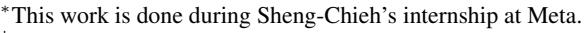
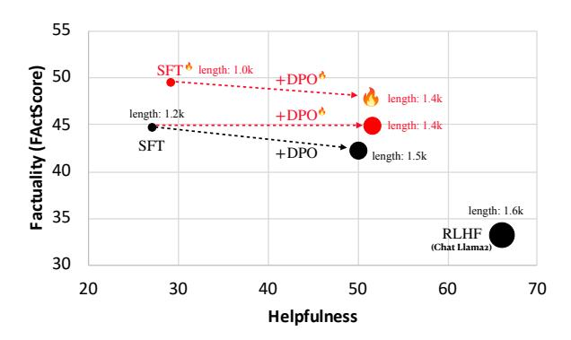
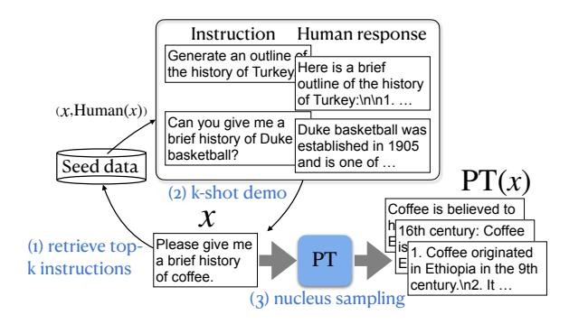
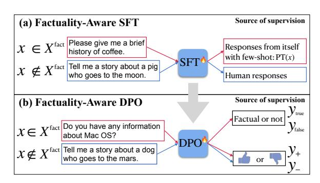

# FLAME : Factuality-Aware Alignment for Large Language Models

#### Sheng-Chieh Lin<sup>1</sup><sup>∗</sup> , Luyu Gao<sup>2</sup> , Barlas Oguz<sup>3</sup> , Wenhan Xiong<sup>3</sup> , Jimmy Lin<sup>1</sup> , Wen-tau Yih<sup>3</sup> , and Xilun Chen<sup>3</sup>†

University of Waterloo<sup>1</sup> , Carnegie Mellon University<sup>2</sup> , Meta AI<sup>3</sup>

s269lin@uwaterloo.ca, xilun@meta.com

# Abstract

Alignment is a standard procedure to fine-tune pre-trained large language models (LLMs) to follow natural language instructions and serve as helpful AI assistants. We have observed, however, that the conventional alignment process fails to enhance the factual accuracy of LLMs, and often leads to the generation of more false facts (i.e. *hallucination*). In this paper, we study how to make the LLM alignment process more factual, by first identifying factors that lead to hallucination in both alignment steps: supervised fine-tuning (SFT) and reinforcement learning (RL). In particular, we find that training the LLM on new knowledge or unfamiliar texts can encourage hallucination. This makes SFT less factual as it trains on human labeled data that may be novel to the LLM. Furthermore, reward functions used in standard RL can also encourage hallucination, because it guides the LLM to provide more helpful responses on a diverse set of instructions, often preferring longer and more detailed responses. Based on these observations, we propose *factuality-aware alignment* (FLAME ), comprised of *factuality-aware SFT* and *factuality-aware RL* through direct preference optimization. Experiments show that our proposed factuality-aware alignment guides LLMs to output more factual responses while maintaining instruction-following capability.

# 1 Introduction

Alignment is a standard procedure to make pretrained large language models (LLMs) [\(Brown](#page-8-0) [et al.,](#page-8-0) [2020;](#page-8-0) [Touvron et al.,](#page-10-0) [2023\)](#page-10-0) follow natural language instructions and serve as helpful AI assistants. Despite significant progress in instruction tuning [\(Wang et al.,](#page-10-1) [2023a;](#page-10-1) [Zhou et al.,](#page-11-0) [2023;](#page-11-0) [Li](#page-9-0) [et al.,](#page-9-0) [2024\)](#page-9-0) and LLM alignment [\(Ouyang et al.,](#page-10-2) [2022;](#page-10-2) [Bai et al.,](#page-8-1) [2022;](#page-8-1) [Yuan et al.,](#page-11-1) [2024\)](#page-11-1), stateof-the-art LLMs are still prone to generate false



<sup>†</sup>Xilun and Sheng-Chieh contributed equally to this work.

<span id="page-0-0"></span>

Figure 1: Models' helpfulness on Alpaca Eval vs factuality on biography. Helpfulness is measured by models' win rate over our baseline SFT + DPO on Alpaca Eval. Dot size represents averaged length of bio generation.

claims [\(Min et al.,](#page-10-3) [2023\)](#page-10-3). This motivates us to study the underlying causes of LLM hallucination as well as its relation to the alignment procedure.

The standard alignment process consists of two training phases: (1) supervised fine-tuning (SFT) [\(Sanh et al.,](#page-10-4) [2022\)](#page-10-4); (2) reinforcement learning (RL) with human (RLHF, [Ouyang et al.,](#page-10-2) [2022;](#page-10-2) [Bai et al.,](#page-8-1) [2022\)](#page-8-1) or automated feedback (RLAIF, [Bai et al.,](#page-8-2) [2023\)](#page-8-2). In our study, we find that both the SFT and the RL steps in the standard alignment process may actually *encourage* LLMs to hallucinate. First, in the SFT stage, LLMs are fine-tuned with diverse instructions paired with human created high-quality responses. While this leads to strong instruction following capability [\(Zhou et al.,](#page-11-0) [2023\)](#page-11-0), our study shows that such human labeled responses may present *new or unknown information* to the LLM. This, in turn, may inadvertently promote hallucination. Second, we find that the standard reward used in the RL stage often prefers longer and more detailed responses [\(Singhal et al.,](#page-10-5) [2023;](#page-10-5) [Yuan et al.,](#page-11-1) [2024\)](#page-11-1), which tends to stimulate the LLM to yield more false claims, as shown in the black dots in Figure [1.](#page-0-0) One possible reason is that most existing RLHF or RLAIF approaches rely on a single scalar reward to represent preference,

which struggles to cover multiple alignment skill sets [\(Ye et al.,](#page-11-2) [2024\)](#page-11-2) and is likely to under-present the aspect of factuality [\(Hosking et al.,](#page-9-1) [2024\)](#page-9-1).

To address the aforementioned issues, we study the key factors which impact factuality during alignment. In particular, we first conduct a pilot study on the biography generation task [\(Min](#page-10-3) [et al.,](#page-10-3) [2023\)](#page-10-3) in a more controlled setting where the alignment process focuses solely on factuality (Section [3\)](#page-2-0). Our pilot study reveals that a LLM hallucinates more if it is fine-tuned on new knowledge in either the SFT or the RL stage. For example, a LLM becomes significantly less factual when fine-tuned on responses produced by a model with access to external knowledge (e.g. a retrievalaugmented LLM), even though those responses are more factual themselves. Similarly, hallucination is greatly increased if RLAIF is performed on preference pairs that consist of retrieval-augmented LLM output as positive examples and the LLM's own output as negative examples. As a result, we discover that fine-tuning a pre-trained LLM on (a selected subset of) its own generations yields more factual responses and reduces hallucinations.

Our ultimate goal is to improve the factuality of the standard alignment process, which is challenging since LLMs may be given diverse and complex instructions. As shown in Figure [2,](#page-3-0) we observe that some instructions require factual responses while the others do not. Motivated by the observation, we propose factuality-aware alignment. We first identify fact-based instructions that require factual responses. For fact-based instructions, we leverage the findings in our pilot study to create additional training data at both SFT and RL stages to explicitly guide LLMs to output factual responses. Specifically, at the SFT stage, for fact-based instructions, instead of using human created seed training data, we construct few-shot demonstrations (from the same seed data) and generate training data using the pre-trained LLM's own knowledge. This can prevent fine-tuning the LLM on knowledge unknown to itself. At the RL stage, we create additional preference pairs focused on factuality for fact-based instructions, which are combined with the standard preference pairs for instruction following during Direct Preference Optimization (DPO; [Rafailov et al.,](#page-10-6) [2023\)](#page-10-6).

We evaluate models on Alpaca Eval [\(Dubois](#page-9-2) [et al.,](#page-9-2) [2024\)](#page-9-2) and Biography, using win rate for instruction following capability and FActScore [\(Min](#page-10-3)

[et al.,](#page-10-3) [2023\)](#page-10-3) for factuality evaluation, respectively. As shown in Figure [1,](#page-0-0) using our FLAME method (SFT + DPO ), a significantly higher FActScore (+5.6 pts) is achieved compared to the standard alignment process (SFT + DPO), without sacrificing the LLM's instruction following capability (51.2% win rate). Our ablation study also indicates that identifying fact-based instructions is the key to factual alignment in the general alignment setting.

# 2 Related Work

Alignment. Since pre-trained LLMs cannot accurately follow human instructions, a bunch of work has been proposed to improve LLM alignment through SFT and RL. Some propose to improve SFT through data curation [\(Zhou et al.,](#page-11-0) [2023;](#page-11-0) [Chen et al.,](#page-9-3) [2024\)](#page-9-3), diverse instruction augmentation [\(Wang et al.,](#page-10-1) [2023a;](#page-10-1) [Li et al.,](#page-9-0) [2024\)](#page-9-0) while others focus on RL with human feedback [\(Ouyang](#page-10-2) [et al.,](#page-10-2) [2022;](#page-10-2) [Bai et al.,](#page-8-1) [2022\)](#page-8-1), AI feedback [\(Bai](#page-8-2) [et al.,](#page-8-2) [2023;](#page-8-2) [Sun et al.,](#page-10-7) [2024;](#page-10-7) [Yuan et al.,](#page-11-1) [2024\)](#page-11-1). The main goal of these alignment approaches is instruction following capability (or helpfulness), which may guide LLMs to output detailed and lengthy responses [\(Singhal et al.,](#page-10-5) [2023\)](#page-10-5) but inevitably encourage hallucination.

Factuality. Prior work has highlighted the issue of hallucination in LLMs [\(Kandpal et al.,](#page-9-4) [2023;](#page-9-4) [Mallen et al.,](#page-9-5) [2023\)](#page-9-5). To address the issue, important research lines are factuality evaluation [\(Min et al.,](#page-10-3) [2023;](#page-10-3) [Wang et al.,](#page-11-3) [2023b;](#page-11-3) [Chern et al.,](#page-9-6) [2023\)](#page-9-6) and improvement. Some training-free approaches to improve LLMs' factuality include external knowledge augmentation [\(Kandpal et al.,](#page-9-4) [2023;](#page-9-4) [Cheng](#page-9-7) [et al.,](#page-9-7) [2023;](#page-9-7) [Jiang et al.,](#page-9-8) [2023\)](#page-9-8) and specialized decoding [\(Li et al.,](#page-9-9) [2023;](#page-9-9) [Chuang et al.,](#page-9-10) [2024\)](#page-9-10).

Recent studies apply RL to improve LLMs' factuality. For example, [Tian et al.](#page-10-8) [\(2024\)](#page-10-8) propose to construct factuality preference pairs for direct preference optimization (DPO; [Rafailov et al.,](#page-10-6) [2023\)](#page-10-6), which is closely related to our work. However, they focus solely on enhancing LLMs' factuality through DPO but overlook its potential impact on the models' instruction-following capability, as demonstrated in our experiments. In contrast, our work provides a comprehensive examination of improving LLMs' factuality and instruction-following ability through fine-tuning approaches encompassing both SFT and DPO. Concurrent to our work, [Kang et al.](#page-9-11) [\(2024\)](#page-9-11) find that LLMs tend to hallucinate when facing unfamiliar queries. They consider

improving LLMs' factuality as teaching LLMs to output abstaining or less detailed responses on such unfamiliar queries, a similar behavior observed from our LLMs fine-tuned with FLAME (see case studies in Section [5.5\)](#page-6-0). It is worth mentioning that both prior studies focus on a simplified scenario as our pilot study in Section [3:](#page-2-0) fine-tuning LLMs to improve factuality on a single task (e.g., fine-tuning and evaluating on biography generation). In contrast, we consider the general alignment task, where LLMs are given diverse and complex instructions.

# <span id="page-2-0"></span>3 A Pilot Study on Factual Alignment

In this section, we first study how to align large language models (LLMs) to be more factual. We use biography generation as the task of our pilot study for two main reasons: (1) Biography generation is a simplified setting where factuality is the sole focus of the alignment process. As we will discuss in Section [4,](#page-3-1) studying factual alignment on diverse human instructions is more complex, as the alignment process encompasses aspects beyond factuality, such as helpfulness and safety. (2) Evaluating the factuality of biography generation is relatively easy since Wikipedia covers sufficient information for public figures and most the facts about a person is non-debatable [\(Min et al.,](#page-10-3) [2023\)](#page-10-3).

# 3.1 Alignment for Biography Generation

A standard alignment procedure consists of supervised fine-tuning (SFT) and reinforcement learning (RL). In this pilot study, our main goal is to teach LLMs to generate biography with reduced misinformation. For the experiment, we compile training and evaluation datasets comprising 500 and 183 diverse human entities, respectively (further details provided in Appendix [A.1\)](#page-12-0). We employ FActScore (FS; [Min et al.,](#page-10-3) [2023\)](#page-10-3) as the automated metric for assessing factuality, given its fine-grained evaluation capabilities for long-form text generation and its strong correlation with human judgments.[1](#page-2-1) To study factuality alignment in this pilot study, we posit that training data is needed where the responses are more factual than the LLM's own generations. Thus, we use retrievalaugmented LLMs (RAG; [Lewis et al.,](#page-9-12) [2020\)](#page-9-12) to generate training data, which has been shown to output more factual responses [\(Mialon et al.,](#page-10-9) [2023\)](#page-10-9).

Throughout the paper, we refer to the pre-trained (PT), supervised fine-tuned (SFT), and direct pref-

<span id="page-2-3"></span>Table 1: Pilot study on biography generation. Pos. denotes the positives for SFT or DPO. Neg. denotes the negatives for DPO. FS denotes FActScore.

| Llama-2 7B |       | src. of supervision | Bio  |                |  |  |
|------------|-------|---------------------|------|----------------|--|--|
|            | Pos.  | Neg.                | FS   | # Corr. / Err. |  |  |
| (1) PT     | -     | -                   | 39.1 | 14.4 / 22.0    |  |  |
| (2) PTRAG  | -     | -                   | 55.4 | 18.6 / 15.9    |  |  |
| (3) SFT    | PT    | -                   | 37.9 | 13.4 / 21.8    |  |  |
| (4)        | PTRAG | -                   | 35.7 | 13.5 / 23.7    |  |  |
| (5) DPO    | PT∗   | PT∗                 | 41.6 | 15.4 / 20.7    |  |  |
| (6)        | PTRAG | PT                  | 23.5 | 12.7 / 34.9    |  |  |

<sup>∗</sup> FActScore is used to select positives and negatives.

erence optimization (DPO) fine-tuned LLMs as PT, SFT, and DPO, respectively.[2](#page-2-2)

SFT. We explore two sources of supervision to generate training data (detailed in Appendix [A.1\)](#page-12-0): (1) using PTRAG with few-shot demonstration to generate biographies for each name entity in training data, where PTRAG is PT augmented with an off-the-shelf retriever [\(Lin et al.,](#page-9-13) [2023\)](#page-9-13); (2) using vanilla PT with few-shot demonstration to generate training data as a baseline. As shown in Table [1,](#page-2-3) PTRAG is indeed much more factual than PT. However, a surprising discovery in the pilot study is that *fine-tuning on such more factual instruction– biography pairs generated by* PT*RAG results in a less factual* SFT *model* (row 4 vs 3).

DPO. We further fine-tune the LLMs to be more factual through DPO. An intuitive way to create factuality preference pairs is to directly use the samples from PTRAG and PT as positives and negatives since PTRAG generates more factual biographies than PT (row 2 vs 1). Another approach is to employ FActScore (FS) as the reward to select positive and negative samples among the generations from PT itself [\(Tian et al.,](#page-10-8) [2024\)](#page-10-8) (detailed in Apppendix [A.1\)](#page-12-0). As shown in Table [1,](#page-2-3) DPO fine-tuned on self-generated data with FS reward guides models to generate more factual responses (row 5 vs 3); however, DPO fine-tuned with the supervision of PTRAG makes the models hallucinate even more than its SFT counterpart (6 vs 4).

This outcome suggests that compelling models to generate responses akin to PTRAG prompts increases hallucination. Conversely, fine-tuning LLMs on their own generations appears to be crucial for factual alignment, a finding applicable to both SFT and DPO fine-tuning.

<span id="page-2-1"></span><sup>1</sup>We use the evaluator: retrieval+llama+npm

<span id="page-2-2"></span><sup>2</sup>Note that in our experiments, we use DPO as the substitute of RL [\(Schulman et al.,](#page-10-10) [2017\)](#page-10-10).

<span id="page-3-0"></span>

|     | Fact-based $(x \in X^{fact})$                                                                                                                                             | Non fact-based $(x \notin X^{fact})$ |                                                                                                                                                                            |  |  |
|-----|---------------------------------------------------------------------------------------------------------------------------------------------------------------------------|--------------------------------------|----------------------------------------------------------------------------------------------------------------------------------------------------------------------------|--|--|
| (1) | Do you have any information about the Commodore 64?                                                                                                                       | (6)                                  | How would a child feel if it fell down on the ground hitting its                                                                                                           |  |  |
| (2) | Hi, could you help me to solve<br>this cubic equation using<br>Cardano's Mehod (step by step if<br>possible), please? -> " x^3 + 2x^2<br>- x - 1 = 0 "                    | (7)                                  | Write a fun story that can be told<br>in 3 minutes at the dinner table.<br>We are 3 developers enjoying a<br>pizza. The story must contain<br>these word: zombie, ethernet |  |  |
| (3) | Please give me a brief history of coffee.                                                                                                                                 | (8)                                  | Tell me a story about a pig who goes to the moon.                                                                                                                          |  |  |
| (4) | What are the principles at play in UHPLC-MS analysis?                                                                                                                     | (9)                                  | Is the internet's focus on<br>engagement the root of most of its<br>problems and shortcomings?                                                                             |  |  |
| (5) | Explain the significance of the<br>American Revolution, including<br>the events that led up to it, the<br>impact it had on the world, and its<br>ongoing relevance today. | (10)                                 | Can you tell me a bit about what has gone into your creation?                                                                                                              |  |  |

Figure 2: Instructions from Open Assistant dataset. The instructions are classified with SFT model using the prompt in Appendix, Figure 5.

# <span id="page-3-2"></span>3.2 Strategies for Factual Alignment

From the pilot study, we find that better quality data (in terms of factuality) for SFT and DPO does not necessarily yield models with better factual alignment. This is likely because the supervision from RAG contains information unknown to the LLM; thus, fine-tuning on RAG generated responses may inadvertently encourage the LLM to output unfamiliar information. To avoid unknown knowledge from being presented to the LLM, a viable strategy is to create SFT and DPO training data using the generated responses from the LLM itself.

# <span id="page-3-1"></span>4 Factuality-Aware Alignment

In the section, we further extend our discussion of factual alignment to encompass more general instructions. Unlike biography generation in Section 3, where factuality is the main alignment objective, human instructions are diverse and complex, necessitating a range of alignment skill sets beyond factuality alone; e.g., logical thinking, problem handling and user alignment (Ye et al., 2024). Thus, conducting factual alignment with the diverse instructions face two main challenges: (1) different instructions may demand distinct skill sets. For example, in Figure 2, instruction 3, "Please give me a brief history of coffee", necessitates factual accuracy and concise summarization, while instruction 8, "Tell me a story about a pig who goes to the moon", prioritizes creativity and imagination over strict factuality. (2) As recent studies have emphasized (Ye et al., 2024; Hosking et al., 2024), using a single scalar for reward modeling fails to adequately address multiple alignment skill sets and often under-presents the aspect of factuality.

To tackle the aforementioned challenges, we propose *factuality-aware alignment* (FLAME). To address the first challenge, we propose to prompt LLMs to classify whether a given instruction demands the response to be factual, as shown in Figure 2. We then apply the factuality fine-tuning strategy for SFT and DPO discussed in Section 3.2 to those fact-based instructions. Furthermore, to address the second challenge, we employ separate rewards to evaluate the factuality and instruction following capability of a LLM. For simplicity, our work only considers two alignment skill sets: instruction following and factuality. We leave more comprehensive reward modeling to future work.

In the following, we first describe our baseline alignment approach and introduce our proposed factuality-aware alignment built on top of the baseline alignment procedure.

# <span id="page-3-4"></span>4.1 Baseline Alignment

We initialize PT from Llama-2 70B pre-trained model<sup>3</sup> and build our baseline alignment procedure following self-rewarding language models (Yuan et al., 2024) due to its simplicity and independence of other strong LLMs (e.g., GPT4) or human evaluators as a reward model. The alignment comprises two steps: (1) building SFT model fine-tuned on a high-quality seed data consisting of 3,200 instructions and each instruction is paired with the best response created by humans from Open Assistant dataset (OASST; Köpf et al., 2023); (2) further finetuning SFT through DPO on instruction following preference data  $(x, y_+, y_-)$  constructed by itself (SFT) as the reward model,  $RM^{IF}$ , where  $y_+$  and  $y_{-}$  are the positive and negative responses for a given prompt x, respectively. The resulting finetuned model is denoted as SFT + DPO. Note that, following Yuan et al. (2024), we use additional augmented 20K instructions to create the preference training data for DPO fine-tuning. Further details are provided in Appendix A.3.

#### 4.2 Our Approach

## **4.2.1** Factuality-Aware SFT (SFT)

Although leveraging human created high-quality seed data is a reasonable choice for SFT (Zhou et al., 2023), our study in Section 3 suggests that fine-tuning on such high-quality data generated by models other than the LLM itself may present unknown information to the LLM, which may in turn

<span id="page-3-3"></span><sup>&</sup>lt;sup>3</sup>meta-llama/Llama-2-70b

<span id="page-4-1"></span>

Figure 3: Illustration of response generation using a pre-trained LLM (PT) with few-shot demonstration.

encourage hallucination. To address the above issue, for each instruction from the seed data, we elicit the knowledge from the pre-trained LM itself by generating the responses with few-shot demonstration. Furthermore, to better use the knowledge from both humans and the pre-trained LLM itself, we propose to utilize human generated responses for non-fact-based instructions, while leveraging the responses sampled from pre-trained LLMs for fact-based instructions to mitigate the introduction of unknown knowledge.

Specifically, we create factuality-aware alignment training data for SFT with two steps. (1) Classifying instructions: we first prompt SFT to judge whether an instruction from the seed data is fact-based ( $x \in X^{\text{fact}}$ ) or not.<sup>4</sup> (2) Eliciting knowledge from PT: as illustrated in Figure 3, we sample 10 responses from PT with 5-shot demonstration,  $(x_0, \operatorname{Human}(x_0)) \cdots (x_4, \operatorname{Human}(x_4))$ , where  $x_k$  is the top-k similar instruction to x retrieved by DRAGON+ (Lin et al., 2023) from the seed data. Human( $x_k$ ) denotes the corresponding human response to  $x_k$  in the seed data.

As illustrated in Figure 4(a), the resulting training data for SFT is  $(x \notin X^{\text{fact}}, \operatorname{Human}(x)), (x \in X^{\text{fact}}, \operatorname{PT}(x))$ , where  $\operatorname{PT}(x)$  denotes the set of responses to x sampled from PT. The resulting finetuned model is denoted as  $\operatorname{SFT}^{\bullet}$ .

#### <span id="page-4-4"></span>**4.2.2** Factuality-Aware DPO (DPO)

At the second stage of alignment with DPO, we use SFT to generate multiple responses  $y_0, y_1, \cdots$  for a given instruction x; then, using SFT itself as the reward model (RM<sup>IF</sup>) to create a preference pair:  $(x, y_+, y_-)$ . The above data creation procedure is the same as the second stage of our baseline

<span id="page-4-2"></span>

Figure 4: Illustration of factuality-aware alignment.

alignment in Section 4.1. However, recent studies (Saha et al., 2023; Hosking et al., 2024; Ye et al., 2024) indicate that a single scalar reward from human feedback or LLM reward models may under-represents the aspect of factuality. To address this limitation, we introduce another factuality reward model (RM<sup>fact</sup>) to evaluate factuality of responses and create a factuality preference pair for fact-based instructions:  $(x \in X^{\text{fact}}, y_{\text{true}}, y_{\text{false}})$ .

Specifically, we build RM<sup>fact</sup> with retrieval augmentation to measure the percentage of facts in a response that are correct. RM<sup>fact</sup> comprises two main components: atomic fact decomposition and retrieval augmented claim verification. We detail the components and ablate their impacts on the quality of RM<sup>fact</sup> in Appendix A.4. We compute factuality reward for the same responses sampled from SFT<sup>6</sup>: RM<sup>fact</sup> $(x, y_0)$ , RM<sup>fact</sup> $(x, y_1)$ ,  $\cdots$ . The response with the highest (lowest) factuality reward is chosen as  $y_{\text{true}}$  ( $y_{\text{false}}$ ). Note that if the chosen paired responses show large difference in instruction-following reward, we discard the pair; i.e.,  $|RM^{IF}(x, y_{true}) - RM^{IF}(x, y_{false})| > 0.5$ . As illustrated in Figure 4(b), in factuality-aware DPO training, the model is initialized from SFT<sup>6</sup> and the fine-tuned model is our final factuality-aware aligned model, denoted SFT<sup>6</sup> + DPO<sup>6</sup>. The specific procedures for fine-tuning models in both the SFT and DPO are described in Appendix A.5.

### 5 Experiments

#### 5.1 Evaluation Datasets and Metrics

Instruction Following. We use the the 805 instruction following tasks from Alpaca Eval (Dubois et al., 2024) to evaluate models head to head win rate against our baselines using the recommended evaluator: alpaca\_eval\_gpt4\_turbo\_fn. We use SFT and SFT + DPO described in Section 4.1 as the baselines for win rate comparisons.

<span id="page-4-0"></span><sup>&</sup>lt;sup>4</sup>Prompt for fact-based instruction classification is shown in Appendix, Figure 5.

<span id="page-4-3"></span><sup>&</sup>lt;sup>5</sup>We sample 4 responses for each augmented instruction.

<span id="page-5-1"></span>Table 2: Experimental results of supervised fine-tuning on Open Assistant dataset. PT denotes pre-trained Llama2 70B with 5-shot demonstration. SFT<sup>fact</sup> denotes the variant which only optimizes factuality. FS denotes FActScore.

| Llama-2 70B             | src. of supervision |              | Alpaca Eval       | Bio  |                | Alpaca Fact |                | FAVA |                |
|-------------------------|---------------------|--------------|-------------------|------|----------------|-------------|----------------|------|----------------|
| Biania 2 7 02           | Human               | PT           | win rate over (1) | FS   | # Corr. / Err. | FS          | # Corr. / Err. | FS   | # Corr. / Err. |
| (0) PT                  | -                   | -            | -                 | 53.1 | 15.3 / 13.5    | -           | -              | -    | -              |
| (1) SFT                 | <b>√</b>            | Х            | 50.0              | 44.7 | 21.1 / 26.8    | 38.6        | 16.7 / 29.0    | 54.4 | 21.2 / 25.8    |
| (2) SFT <sup>fact</sup> | Х                   | $\checkmark$ | 48.1              | 48.5 | 19.6 / 20.6    | 42.0        | 17.5 / 28.4    | 53.3 | 18.3 / 24.2    |
| (3) SFT <sup>6</sup>    | ✓*                  | ✓*           | 51.2              | 49.5 | 19.9 / 19.5    | 41.4        | 18.3 / 27.7    | 54.2 | 19.3 / 22.4    |

<sup>\*</sup> SFT<sup>6</sup> uses supervision from Human and PT for non-fact-based and fact-based instructions, respectively.

**Factuality.** We evaluate models on three datasets with diverse knowledge-intensive instructions for factuality. (1) Biography: a knowledge insensitive sub-task of instruction following tasks. Following our pilot study in Section 3, we use the 183 human entities provided by Min et al. (2023) with the prompt "Tell me a bio of entity name". (2) Alpaca Fact: we extract the fact-based instructions from the 803 instructions using our SFT model (with the prompt shown in Appendix, Figure 5), resulting in 241 instructions. (3) FAVA (Mishra et al., 2024)<sup>6</sup>: the 141 knowledge-intensive instructions from multiple sources, including Open Assistant (Köpf et al., 2023), No Robots (Rajani et al., 2023), WebNLG (Gardent et al., 2017) and manually created datasets. We report FActScore (FS) without length penalty as the metric for all the three datasets. Note that original FS computes proportion of correct facts with additional penalty on short generations with less than 10 atomic facts. This penalty aims to address situations where models provide insufficiently detailed answers. We assume this aspect is considered in the evaluation of instruction following in Alpaca Eval. In addition, we also report the number of correct and erroneous facts. All the numbers reported are averaged over the instructions in each dataset.

In addition, we also evaluate our fine-tuned models' truthfulness using TruthfulQA (Lin et al., 2022). We evaluate model performance in the generation task and use ROUGE (Lin, 2004) and BLEU (Papineni et al., 2002) to measure the quality of responses.

#### **5.2** Comparisons of SFT

Table 2 compares the pre-trained Llama-2 70B fine-tuned on OASST dataset with responses from different sources. We list the FActScore (FS) of biography generation using the pre-trained model through Bio 5-shot demonstration as reference (row

0) and SFT, which is fine-tuned on our seed data with human created responses, is our baseline (row 1). We first notice that SFT shows significant FActScore degrade (53.1 vs 44.7) compared to Bio 5-shot with the pre-trained model. It seems that SFT tends to generate more lengthy responses but with more erroneous facts.

When eliciting the knowledge from PT by finetuning on its own generated responses, SFT<sup>fact</sup> generates more factual responses in Biography and Alpaca (row 2 vs 1). However, it shows slightly inferior instruction following capability in Alpaca Eval. This result demonstrates that human responses indeed teach LLMs how to better follow instructions but also encourage LLMs to output more false facts. On the other hand, eliciting the knowledge from the pre-trained model itself avoids the encouragement of hallucination albeit with a slight reduction in instruction-following capability. Finally, SFT combining supervision from humans and PT, shows comparable instruction following capability and output more factual responses on factbased instructions (row 3 vs 1).

#### 5.3 Comparisons of DPO

Table 3 compares different DPO training recipes. First, we conduct DPO fine-tuning on our SFT baseline, SFT. When further aligning the model to follow instructions, DPO sees a significant improvement in instruction following capability (row 2 vs 1) with win rate 72.9 over SFT; however, the instruction aligned model tends to output lengthy responses with more factual errors (see examples in Appendix, Figure 11). On the other hand, when only aligned with factual preference data, DPOfact shows less improvement in instruction following capability (row 1 vs 3). These results indicate that preference optimization for either instruction following or factuality alone may come at the expense of the other since the former encourages models to output long and detailed responses while the later

<span id="page-5-0"></span><sup>&</sup>lt;sup>6</sup>FAVA dataset

<span id="page-6-1"></span>Table 3: Experiments of direct preference optimization (DPO). IF. and Fact. denote instruction following  $(x, y_+, y_-)$  and factuality  $(x \in X^{\text{fact}}, y_{\text{true}}, y_{\text{false}})$  preference data, where  $X^{\text{fact}}$  denotes the set of fact-based instructions. DPO denotes the variant which only optimizes factuality. The preference data statistics is listed in Appendix, Table 9.

| Llama-2 70B            | src. of supervision |              | Alpaca Eval       | Bio  |                | Alpaca Fact |                | FAVA |                |
|------------------------|---------------------|--------------|-------------------|------|----------------|-------------|----------------|------|----------------|
| B                      | IF.                 | Fact.        | win rate over (2) | FS   | # Corr. / Err. | FS          | # Corr. / Err. | FS   | # Corr. / Err. |
| (0) Chat               | Prop                | rietary data | 66.2              | 33.2 | 23.4 / 43.6    | 39.3        | 22.3 / 36.4    | 47.5 | 28.0 / 31.3    |
| (1) SFT                | -                   | -            | 27.1              | 44.7 | 21.1 / 26.8    | 38.6        | 16.7 / 29.0    | 54.4 | 21.2 / 25.8    |
| (2) + DPO              | <b>√</b>            | Х            | 50.0              | 42.3 | 24.6 / 35.0    | 41.6        | 22.9 / 34.6    | 52.9 | 28.1 / 26.8    |
| $(3) + DPO^{fact}$     | X                   | $\checkmark$ | 40.8              | 47.1 | 19.8 / 23.9    | 48.2        | 17.5 / 19.0    | 57.9 | 20.0 / 15.9    |
| (4) + DPO <sup>6</sup> | ✓                   | $\checkmark$ | 51.7              | 44.9 | 23.7 / 30.3    | 45.0        | 23.1 / 28.7    | 56.4 | 27.1 / 23.3    |
| (5) SFT <sup>6</sup>   | -                   | -            | 29.1              | 49.5 | 19.9 / 19.5    | 41.4        | 18.3 / 27.7    | 54.2 | 19.3 / 22.4    |
| (6) + DPO              | <b>√</b>            | Х            | 50.4              | 46.3 | 24.0 / 28.7    | 43.9        | 21.6 / 28.8    | 55.0 | 25.4 / 22.0    |
| (7) + DPO •            | ✓                   | ✓            | 51.2              | 47.9 | 25.9 / 28.5    | 48.7        | 24.1 / 25.5    | 58.9 | 29.0 / 22.2    |

Table 4: Results on TruthfulQA.

<span id="page-6-2"></span>

| Llama-2 70B           | src.      | of supervision | TruthfulQA |       |  |  |
|-----------------------|-----------|----------------|------------|-------|--|--|
| 2,02                  | IF. Fact. |                | BLUE       | ROUGE |  |  |
| (0) Chat              | Pro       | prietary data  | 0.21       | 1.16  |  |  |
| (1) SFT               | -         | -              | 0.37       | 0.20  |  |  |
| (2) + DPO             | ✓         | Х              | 0.03       | 0.54  |  |  |
| $(3) + DPO^{fact}$    | Х         | ✓              | 0.30       | 1.12  |  |  |
| $(4) + DPO^{\bullet}$ | ✓         | $\checkmark$   | 0.15       | 0.80  |  |  |
| (5) SFT <sup>6</sup>  | -         | -              | 0.39       | 0.51  |  |  |
| (6) + DPO             | ✓         | Х              | 0.07       | 0.91  |  |  |
| (7) + DPO             | ✓         | $\checkmark$   | 0.20       | 0.96  |  |  |

discourages models to output false claims. When jointly conducting instruction and factuality alignment, DPO not only better follows instructions but also outputs more factual responses (row 4 vs 1, 2). Finally, initializing from SFT, the DPO fine-tuned models are more factual than their counterparts (i.e., 6 vs 2 and 7 vs 4) without instruction following capability degrade. We also list the results from Llama-2-Chat 70B (row 0) and observe that despite of its strong instruction following capability, it tends to output many more incorrect facts. This results demonstrate that standard alignment, even on proprietary commercial data, may encourage LLMs to hallucinate. In contrast, our factuality-aware alignment guides LLMs to output more factual responses without degradation in their general instruction following capabilities. It is worth noting that SFT fact and DPO fact are similar to SFT and DPO fine-tuning proposed by Tian et al. (2024), which improve LLMs' factuality but degrade instruction following capability.

### 5.4 Results on TruthfulQA

Table 4 compares models performance on TruthfulQA. Generally, we observe that our factuality-

aware alignment training guides LLMs to output more truthful responses. For example, factuality-aware SFT improves LLMs' truthfulness (row 5 vs 1). In addition, DPO fine-tuning on the factuality preference data guides LLMs to output more truthful responses (rows 3,4 vs 2 and 7 vs 6). Note that we observe that SFT and DPO models show a reverse trend in BLUE and ROUGE. This is likely because SFT models tend to generate shorter responses than the DPO ones do.

#### <span id="page-6-0"></span>5.5 Discussions

<span id="page-6-3"></span>Table 5: Effects of fact-based classification on factuality-aware alignment.

|                        | Clas  | ssifier | Alpaca Eval | Bio  |                |  |  |
|------------------------|-------|---------|-------------|------|----------------|--|--|
|                        | Inst. | Sent.   | win rate    | FS   | # Corr. / Err. |  |  |
| (1) CET!               | Х     | -       | 47.6*       | 48.4 | 20.5 / 21.4    |  |  |
| $(2)$ SFT $^{\bullet}$ | ✓     | -       | 51.2*       | 49.5 | 19.9 / 19.5    |  |  |
| (3)                    | Х     | Х       | 46.8△       | 46.8 | 21.7 / 25.3    |  |  |
| (4) SFT + DPO          | ✓     | X       | 51.7△       | 45.0 | 23.7 / 30.3    |  |  |
| (5)                    | ✓     | ✓       | 51.3△       | 42.9 | 25.5 / 36.8    |  |  |

<sup>\*</sup> comparing with SFT baseline, SFT.

#### **Effects of Fact-Based Instruction Classification.**

In our factuality-aware alignment, we prompt SFT to judge whether an instruction requires a factual response and apply our factuality alignment strategy to the fact-based instruction. Without the instruction classification, in our factuality-aware SFT, we cannot create supervision from Human and PT responses for respective non-fact-based and fact-based instructions. Instead, for each instruction, we create instruction—response pairs from 1 and 10 responses from Human and PT as supervisions, respectively. Note that, during fine-tuning, for each instruction, we randomly sample instruction—

 $<sup>^{\</sup>triangle}$  comparing with DPO baseline, SFT + DPO.

<span id="page-7-0"></span>Table 6: Ablation on factuality preference data creation.

| Factuality preference data |                  |       | Alpaca Eval           | Bio  |
|----------------------------|------------------|-------|-----------------------|------|
| Reward model               | Pos.,Neg. # pair |       | win rate <sup>△</sup> | FS   |
| RM <sup>fact</sup>         | max, min         | 3,315 | 51.7                  | 44.9 |
| $RM^{fact}$                | enum.            | 5,126 | 50.7                  | 45.0 |
| $RM^{IF} + 5*RM^{fact}$    | max, min         | 6,340 | 50.1                  | 45.1 |

<sup>△</sup> comparing with DPO baseline, SFT + DPO.

response pair either created from Human or PT with same probability. The SFT model shows degradation in both instruction following capability and factuality results, as shown in row 1 vs 2 of Table 5. Second, for factuality-aware DPO, without the instruction classification, we create factuality preference pairs from all instructions instead of fact-based instructions. The DPO fine-tuned model outputs slightly more factual responses but sacrifice instruction following capability, as shown in row 3 vs 4 of Table 5.

#### **Effects of Fact-Based Sentence Classification.**

In addition, we observe that not all the sentences in a response to a fact-based instruction require fact check. For example, given the response, "Of course. The Commodore 64 is a 8-bit home computer that was released by Commodore International in August 1982.", conducting fact check for the first sentence "Of course." is not necessary and may make the factuality reward less accurate. To address this issue, we prompt SFT to judge whether each sentence in a response required fact check using the prompt in Appendix, Figure 7. We only conduct fact check and compute factuality rewards for those fact-based sentences. However, as shown in Table 5, computing factuality rewards for fact-based sentences makes our factual alignment less effective (row 5 vs 4). This is likely because the fact-based sentence classifier is not accurate enough and brings noise into our factuality reward model (see examples in Appendix, Figure 8).

**Ablations on Factuality Preference Data Creation.** In this section, we examine different ways of creating factuality preference data for factuality-aware DPO training. First, for each fact-based instruction, instead of choosing the responses (among the 4 generated responses) with the maximum and minimum factuality rewards (RM<sup>fact</sup>) as the respective positive and negative samples, we enumerate all the possible response pairs and choose the response with higher (lower) RM<sup>fact</sup> as the positive (negative) sample from each enumerated pair. If

<span id="page-7-1"></span>Table 7: Effects of DPO training on response length.

|                    | Alpaca Eval | Bio  | Alpaca Fact | FAVA |
|--------------------|-------------|------|-------------|------|
| (1) SFT            | 897         | 1221 | 969         | 912  |
| (2) + DPO          | 1470        | 1494 | 1586        | 1540 |
| $(3) + DPO^{fact}$ | 1160        | 1166 | 1192        | 1104 |
| (4) + DPO          | 1474        | 1395 | 1528        | 1422 |

the difference of RM<sup>fact</sup> is smaller than 0.2, we treat them as equal and discard the pairs. Note that for both row 1 and 2 in Table 6, we also discard the pairs with the difference of instruction following rewards (RMIF) larger than 0.5 (as mentioned in Section 4.2.2). Finally, for each response, we linearly combine the rewards of RM<sup>IF</sup> (1–5 scale) and RM<sup>fact</sup> (0–1 scale) with the respective weight of 1 and 5 as a composite reward. For each instruction, we choose the responses with the maximum and minimum composite rewards as the positive and negative. As shown in Table 6, both data creation approaches increase the number of pairs in factuality preference data; however, it yields no obvious improvement in factuality but a bit degrade in instruction following capability (rows 2, 3 vs 1).

Impacts of DPO on Generation Length. Table 7 lists the averaged length of models' responses for each dataset. We observe that DPO fine-tuned models tend to output lengthy responses than SFT except for DPO<sup>fact</sup> on Biography. This trend indicates that our instruction following reward model RMIF guides LLMs to output more detailed and lengthy responses. In addition, we observe that although DPO outputs responses with similar length as DPO on Alpaca Eval, DPO generates a bit shorter responses for the fact-based instructions in the other three datasets. This results show that our factuality-aware DPO training mainly impacts models' responses for fact-based instructions. The impact is mainly to reduce the output of false claims (see the numbers of correct and erroneous facts in rows 2 and 4 of Table 3).

Case Studies. Figure 11 (in Appendix) show-cases the generations of different models, SFT, SFT + DPO and SFT + DPO, on Alpaca Eval and Biography. Given the instruction, "What are the names of some famous actors that started their careers on Broadway?", SFT only lists some names of Broadway actors while DPO fine-tuned models generate detailed information for each listed Broadway actor. As for biography generations, we observe that given the instruction to gen-

erate a biography for a rare name entity, Marianne McAndrew, SFT + DPO generates a detailed response but with many wrong facts while SFT and SFT + DPO give relatively short responses. For the frequent entity, Ji Sung, all the models generate detailed and mostly correct responses. This qualitative analysis shows that SFT + DPO tends to generate detailed responses for most instructions but for those instructions required tailed knowledge (e.g., rare entity) likely unknown to LLMs [\(Mallen](#page-9-5) [et al.,](#page-9-5) [2023\)](#page-9-5), it manages to reduce erroneous facts by giving less detailed responses, which is also observed by [Kang et al.](#page-9-11) [\(2024\)](#page-9-11).

# 6 Conclusion

In this paper, we present a study to enhance the factuality of large language models (LLMs). We first identify that the standard alignment approach, comprising SFT and RLAIF with DPO, may inadvertently encourage LLMs to produce more erroneous facts. Specifically, during the SFT stage, finetuning LLMs with high-quality human responses may introduce unfamiliar information, prompting LLMs to output unknown facts. Additionally, during the DPO stage, enhancing LLMs' ability to follow instructions may result in more detailed and lengthy responses but often leads to increased hallucination. To tackle the shortcomings of the standard alignment, we propose a factuality-aware alignment method, which includes factuality-aware SFT and DPO. Quantitative and qualitative analyses demonstrate that our factuality-aware alignment not only guides LLMs to generate detailed and helpful responses but also helps prevent the generation of false claims.

# 7 Limitations

While we have successfully integrated factuality into standard alignment procedure, our work only considers two alignment skill sets: instruction following (or helpfulness) and factuality. In practice, each instruction may require consideration of multiple and distinct alignment skill sets [\(Saha et al.,](#page-10-11) [2023\)](#page-10-11). The method to optimize for these skill sets tailored to each query requires further study. In our experiments, we note that optimizing preferences solely for instruction following or factuality could potentially compromise the other. While our factuality-aware alignment demonstrated improvements in both aspects, it is uncertain whether there is a trade-off between the two aspects when inte-

grating our approach to large-scale alignment [\(Tou](#page-10-0)[vron et al.,](#page-10-0) [2023\)](#page-10-0). Finally, as shown in Appendix, Figure [8,](#page-14-2) not all the claims (or sentences) in a response require fact verification, a more accurate factuality reward model should take the factor into account. While our preliminary experiment, which removing non-fact-based sentences from the factuality reward modeling (Section [5.5\)](#page-6-0), shows suboptimal performance, we believe that further study can bring more insights.

# Acknowledgements

We thank Bhargavi Paranjape for sharing fine-tuned Llama-2 7B for atomic fact decomposition and Jing Xu, Weizhe Yuan and Jason Weston for their helpful suggestions.

# References

<span id="page-8-1"></span>Yuntao Bai, Andy Jones, Kamal Ndousse, Amanda Askell, Anna Chen, Nova DasSarma, Dawn Drain, Stanislav Fort, Deep Ganguli, Tom Henighan, Nicholas Joseph, Saurav Kadavath, Jackson Kernion, Tom Conerly, Sheer El-Showk, Nelson Elhage, Zac Hatfield-Dodds, Danny Hernandez, Tristan Hume, Scott Johnston, Shauna Kravec, Liane Lovitt, Neel Nanda, Catherine Olsson, Dario Amodei, Tom Brown, Jack Clark, Sam McCandlish, Chris Olah, Ben Mann, and Jared Kaplan. 2022. Training a helpful and harmless assistant with reinforcement learning from human feedback. *arXiv:2204.05862*.

<span id="page-8-2"></span>Yuntao Bai, Saurav Kadavath, Sandipan Kundu, Amanda Askell, Jackson Kernion, Andy Jones, Anna Chen, Anna Goldie, Azalia Mirhoseini, Cameron McKinnon, Carol Chen, Catherine Olsson, Christopher Olah, Danny Hernandez, Dawn Drain, Deep Ganguli, Dustin Li, Eli Tran-Johnson, Ethan Perez, Jamie Kerr, Jared Mueller, Jeffrey Ladish, Joshua Landau, Kamal Ndousse, Kamile Lukosuite, Liane Lovitt, Michael Sellitto, Nelson Elhage, Nicholas Schiefer, Noemi Mercado, Nova DasSarma, Robert Lasenby, Robin Larson, Sam Ringer, Scott Johnston, Shauna Kravec, Sheer El Showk, Stanislav Fort, Tamera Lanham, Timothy Telleen-Lawton, Tom Conerly, Tom Henighan, Tristan Hume, Samuel R. Bowman, Zac Hatfield-Dodds, Ben Mann, Dario Amodei, Nicholas Joseph, Sam McCandlish, Tom Brown, and Jared Kaplan. 2023. Constitutional AI: Harmlessness from AI feedback. *arXiv:2212.08073*.

<span id="page-8-0"></span>Tom Brown, Benjamin Mann, Nick Ryder, Melanie Subbiah, Jared D Kaplan, Prafulla Dhariwal, Arvind Neelakantan, Pranav Shyam, Girish Sastry, Amanda Askell, Sandhini Agarwal, Ariel Herbert-Voss, Gretchen Krueger, Tom Henighan, Rewon Child, Aditya Ramesh, Daniel Ziegler, Jeffrey Wu, Clemens Winter, Chris Hesse, Mark Chen, Eric Sigler, Mateusz Litwin, Scott Gray, Benjamin Chess, Jack

- Clark, Christopher Berner, Sam McCandlish, Alec Radford, Ilya Sutskever, and Dario Amodei. 2020. Language models are few-shot learners. In *Proc. NIPS*, pages 1877–1901.
- <span id="page-9-20"></span>Jifan Chen, Aniruddh Sriram, Eunsol Choi, and Greg Durrett. 2022. Generating literal and implied subquestions to fact-check complex claims. In *Proc. EMNLP*, pages 3495–3516.
- <span id="page-9-3"></span>Lichang Chen, Shiyang Li, Jun Yan, Hai Wang, Kalpa Gunaratna, Vikas Yadav, Zheng Tang, Vijay Srinivasan, Tianyi Zhou, Heng Huang, and Hongxia Jin. 2024. Alpagasus: Training a better alpaca model with fewer data. In *Proc. ICLR*.
- <span id="page-9-7"></span>Silei Cheng, Zhe Gan, Zhengyuan Yang, Shuohang Wang, Jianfeng Wang, Jordan Boyd-Graber, and Lijuan Wang. 2023. Prompting gpt-3 to be reliable. In *Proc. ICLR*.
- <span id="page-9-6"></span>I-Chun Chern, Steffi Chern, Shiqi Chen, Weizhe Yuan, Kehua Feng, Chunting Zhou, Junxian He, Graham Neubig, Pengfei Liu, et al. 2023. FacTool: Factuality detection in generative ai–a tool augmented framework for multi-task and multi-domain scenarios. *arXiv:2307.13528*.
- <span id="page-9-10"></span>Yung-Sung Chuang, Yujia Xie, Hongyin Luo, Yoon Kim, James R. Glass, and Pengcheng He. 2024. DoLa: Decoding by contrasting layers improves factuality in large language models. In *Proc. ICLR*.
- <span id="page-9-2"></span>Yann Dubois, Xuechen Li, Rohan Taori, Tianyi Zhang, Ishaan Gulrajani, Jimmy Ba, Carlos Guestrin, Percy Liang, and Tatsunori B. Hashimoto. 2024. Alpacafarm: A simulation framework for methods that learn from human feedback. *arXiv:2305.14387*.
- <span id="page-9-15"></span>Claire Gardent, Anastasia Shimorina, Shashi Narayan, and Laura Perez-Beltrachini. 2017. The WebNLG challenge: Generating text from RDF data. In *Proc. INLG*, pages 124–133.
- <span id="page-9-1"></span>Tom Hosking, Phil Blunsom, and Max Bartolo. 2024. Human feedback is not gold standard. In *Proc. ICLR*.
- <span id="page-9-18"></span>Gautier Izacard, Patrick Lewis, Maria Lomeli, Lucas Hosseini, Fabio Petroni, Timo Schick, Jane Dwivedi-Yu, Armand Joulin, Sebastian Riedel, and Edouard Grave. 2023. Atlas: Few-shot learning with retrieval augmented language models. *Journal of Machine Learning Research*, pages 1–43.
- <span id="page-9-8"></span>Zhengbao Jiang, Frank Xu, Luyu Gao, Zhiqing Sun, Qian Liu, Jane Dwivedi-Yu, Yiming Yang, Jamie Callan, and Graham Neubig. 2023. Active retrieval augmented generation. In *Proc. EMNLP*, pages 7969– 7992.
- <span id="page-9-4"></span>Nikhil Kandpal, Haikang Deng, Adam Roberts, Eric Wallace, and Colin Raffel. 2023. Large language models struggle to learn long-tail knowledge. In *Proc ICML*.

- <span id="page-9-11"></span>Katie Kang, Eric Wallace, Claire Tomlin, Aviral Kumar, and Sergey Levine. 2024. Unfamiliar finetuning examples control how language models hallucinate. *arXiv:2403.05612*.
- <span id="page-9-14"></span>Andreas Köpf, Yannic Kilcher, Dimitri von Rütte, Sotiris Anagnostidis, Zhi-Rui Tam, Keith Stevens, Abdullah Barhoum, Nguyen Minh Duc, Oliver Stanley, Richárd Nagyfi, Shahul ES, Sameer Suri, David Glushkov, Arnav Dantuluri, Andrew Maguire, Christoph Schuhmann, Huu Nguyen, and Alexander Mattick. 2023. Openassistant conversations – democratizing large language model alignment. *arXiv:2304.07327*.
- <span id="page-9-12"></span>Patrick Lewis, Ethan Perez, Aleksandra Piktus, Fabio Petroni, Vladimir Karpukhin, Naman Goyal, Heinrich Küttler, Mike Lewis, Wen-tau Yih, Tim Rocktäschel, Sebastian Riedel, and Douwe Kiela. 2020. Retrieval-augmented generation for knowledgeintensive nlp tasks. In *Proc. NIPS*, pages 9459–9474.
- <span id="page-9-9"></span>Kenneth Li, Oam Patel, Fernanda Viégas, Hanspeter Pfister, and Martin Wattenberg. 2023. Inference-time intervention: Eliciting truthful answers from a language model. In *Proc. NIPS*.
- <span id="page-9-0"></span>Xian Li, Ping Yu, Chunting Zhou, Timo Schick, Omer Levy, Luke Zettlemoyer, Jason E Weston, and Mike Lewis. 2024. Self-alignment with instruction backtranslation. In *Proc. ICLR*.
- <span id="page-9-17"></span>Chin-Yew Lin. 2004. ROUGE: A package for automatic evaluation of summaries. In *Text Summarization Branches Out*, pages 74–81.
- <span id="page-9-13"></span>Sheng-Chieh Lin, Akari Asai, Minghan Li, Barlas Oguz, Jimmy Lin, Yashar Mehdad, Wen-tau Yih, and Xilun Chen. 2023. How to train your dragon: Diverse augmentation towards generalizable dense retrieval. In *Proc. Findings of EMNLP*, pages 6385–6400.
- <span id="page-9-16"></span>Stephanie Lin, Jacob Hilton, and Owain Evans. 2022. TruthfulQA: Measuring how models mimic human falsehoods. In *Proc. ACL*, pages 3214–3252.
- <span id="page-9-19"></span>Yixin Liu, Alex Fabbri, Pengfei Liu, Yilun Zhao, Linyong Nan, Ruilin Han, Simeng Han, Shafiq Joty, Chien-Sheng Wu, Caiming Xiong, and Dragomir Radev. 2023. Revisiting the gold standard: Grounding summarization evaluation with robust human evaluation. In *Proc. ACL*, pages 4140–4170.
- <span id="page-9-21"></span>Chaitanya Malaviya, Subin Lee, Sihao Chen, Elizabeth Sieber, Mark Yatskar, and Dan Roth. 2023. Expertqa: Expert-curated questions and attributed answers. *arXiv:2309.07852*.
- <span id="page-9-5"></span>Alex Mallen, Akari Asai, Victor Zhong, Rajarshi Das, Daniel Khashabi, and Hannaneh Hajishirzi. 2023. When not to trust language models: Investigating effectiveness of parametric and non-parametric memories. In *Proc. ACL*, pages 9802–9822.

- <span id="page-10-9"></span>Grégoire Mialon, Roberto Dessi, Maria Lomeli, Christoforos Nalmpantis, Ramakanth Pasunuru, Roberta Raileanu, Baptiste Roziere, Timo Schick, Jane Dwivedi-Yu, Asli Celikyilmaz, Edouard Grave, Yann LeCun, and Thomas Scialom. 2023. Augmented language models: a survey. *Transactions on Machine Learning Research*.
- <span id="page-10-3"></span>Sewon Min, Kalpesh Krishna, Xinxi Lyu, Mike Lewis, Wen-tau Yih, Pang Koh, Mohit Iyyer, Luke Zettlemoyer, and Hannaneh Hajishirzi. 2023. FActScore: Fine-grained atomic evaluation of factual precision in long form text generation. In *Proc. EMNLP*, pages 12076–12100.
- <span id="page-10-12"></span>Abhika Mishra, Akari Asai, Vidhisha Balachandran, Yizhong Wang, Graham Neubig, Yulia Tsvetkov, and Hannaneh Hajishirzi. 2024. Fine-grained hallucination detection and editing for language models. *arXiv:2401.06855*.
- <span id="page-10-2"></span>Long Ouyang, Jeffrey Wu, Xu Jiang, Diogo Almeida, Carroll Wainwright, Pamela Mishkin, Chong Zhang, Sandhini Agarwal, Katarina Slama, Alex Ray, John Schulman, Jacob Hilton, Fraser Kelton, Luke Miller, Maddie Simens, Amanda Askell, Peter Welinder, Paul F Christiano, Jan Leike, and Ryan Lowe. 2022. Training language models to follow instructions with human feedback. In *Proc. NIPS*, pages 27730– 27744.
- <span id="page-10-14"></span>Kishore Papineni, Salim Roukos, Todd Ward, and Wei-Jing Zhu. 2002. Bleu: a method for automatic evaluation of machine translation. In *Proc. ACL*, pages 311–318.
- <span id="page-10-6"></span>Rafael Rafailov, Archit Sharma, Eric Mitchell, Christopher D Manning, Stefano Ermon, and Chelsea Finn. 2023. Direct preference optimization: Your language model is secretly a reward model. In *Proc. NIPS*, pages 53728–53741.
- <span id="page-10-13"></span>Nazneen Rajani, Lewis Tunstall, Edward Beeching, Nathan Lambert, Alexander M. Rush, and Thomas Wolf. 2023. No robots. *Hugging Face repository*.
- <span id="page-10-11"></span>Swarnadeep Saha, Omer Levy, Asli Celikyilmaz, Mohit Bansal, Jason Weston, and Xian Li. 2023. Branchsolve-merge improves large language model evaluation and generation. *arXiv:2310.15123*.
- <span id="page-10-4"></span>Victor Sanh, Albert Webson, Colin Raffel, Stephen Bach, Lintang Sutawika, Zaid Alyafeai, Antoine Chaffin, Arnaud Stiegler, Arun Raja, Manan Dey, M Saiful Bari, Canwen Xu, Urmish Thakker, Shanya Sharma Sharma, Eliza Szczechla, Taewoon Kim, Gunjan Chhablani, Nihal Nayak, Debajyoti Datta, Jonathan Chang, Mike Tian-Jian Jiang, Han Wang, Matteo Manica, Sheng Shen, Zheng Xin Yong, Harshit Pandey, Rachel Bawden, Thomas Wang, Trishala Neeraj, Jos Rozen, Abheesht Sharma, Andrea Santilli, Thibault Fevry, Jason Alan Fries, Ryan Teehan, Teven Le Scao, Stella Biderman, Leo Gao, Thomas Wolf, and Alexander M Rush. 2022. Multitask prompted training enables zero-shot task generalization. In *Proc. ICLR*.

- <span id="page-10-10"></span>John Schulman, Filip Wolski, Prafulla Dhariwal, Alec Radford, and Oleg Klimov. 2017. Proximal policy optimization algorithms. *arXiv:1707.06347*.
- <span id="page-10-5"></span>Prasann Singhal, Tanya Goyal, Jiacheng Xu, and Greg Durrett. 2023. A long way to go: Investigating length correlations in rlhf. *arXiv:2310.03716*.
- <span id="page-10-7"></span>Zhiqing Sun, Yikang Shen, Hongxin Zhang, Qinhong Zhou, Zhenfang Chen, David Daniel Cox, Yiming Yang, and Chuang Gan. 2024. SALMON: Selfalignment with principle-following reward models. In *Proc. ICLR*.
- <span id="page-10-8"></span>Katherine Tian, Eric Mitchell, Huaxiu Yao, Christopher D Manning, and Chelsea Finn. 2024. Finetuning language models for factuality. In *Proc. ICLR*.
- <span id="page-10-0"></span>Hugo Touvron, Louis Martin, Kevin Stone, Peter Albert, Amjad Almahairi, Yasmine Babaei, Nikolay Bashlykov, Soumya Batra, Prajjwal Bhargava, Shruti Bhosale, Dan Bikel, Lukas Blecher, Cristian Canton Ferrer, Moya Chen, Guillem Cucurull, David Esiobu, Jude Fernandes, Jeremy Fu, Wenyin Fu, Brian Fuller, Cynthia Gao, Vedanuj Goswami, Naman Goyal, Anthony Hartshorn, Saghar Hosseini, Rui Hou, Hakan Inan, Marcin Kardas, Viktor Kerkez, Madian Khabsa, Isabel Kloumann, Artem Korenev, Punit Singh Koura, Marie-Anne Lachaux, Thibaut Lavril, Jenya Lee, Diana Liskovich, Yinghai Lu, Yuning Mao, Xavier Martinet, Todor Mihaylov, Pushkar Mishra, Igor Molybog, Yixin Nie, Andrew Poulton, Jeremy Reizenstein, Rashi Rungta, Kalyan Saladi, Alan Schelten, Ruan Silva, Eric Michael Smith, Ranjan Subramanian, Xiaoqing Ellen Tan, Binh Tang, Ross Taylor, Adina Williams, Jian Xiang Kuan, Puxin Xu, Zheng Yan, Iliyan Zarov, Yuchen Zhang, Angela Fan, Melanie Kambadur, Sharan Narang, Aurelien Rodriguez, Robert Stojnic, Sergey Edunov, and Thomas Scialom. 2023. Llama 2: Open foundation and finetuned chat models. *arXiv:2307.09288*.
- <span id="page-10-1"></span>Yizhong Wang, Yeganeh Kordi, Swaroop Mishra, Alisa Liu, Noah A. Smith, Daniel Khashabi, and Hannaneh Hajishirzi. 2023a. Self-instruct: Aligning language models with self-generated instructions. In *Proc. ACL*, pages 13484–13508.
- <span id="page-10-15"></span>Yizhong Wang, Swaroop Mishra, Pegah Alipoormolabashi, Yeganeh Kordi, Amirreza Mirzaei, Atharva Naik, Arjun Ashok, Arut Selvan Dhanasekaran, Anjana Arunkumar, David Stap, Eshaan Pathak, Giannis Karamanolakis, Haizhi Lai, Ishan Purohit, Ishani Mondal, Jacob Anderson, Kirby Kuznia, Krima Doshi, Kuntal Kumar Pal, Maitreya Patel, Mehrad Moradshahi, Mihir Parmar, Mirali Purohit, Neeraj Varshney, Phani Rohitha Kaza, Pulkit Verma, Ravsehaj Singh Puri, Rushang Karia, Savan Doshi, Shailaja Keyur Sampat, Siddhartha Mishra, Sujan Reddy A, Sumanta Patro, Tanay Dixit, and Xudong Shen. 2022. Super-NaturalInstructions: Generalization via declarative instructions on 1600+ NLP tasks. In *Proc. EMNLP*, pages 5085–5109.

- <span id="page-11-3"></span>Yuxia Wang, Revanth Gangi Reddy, Zain Muhammad Mujahid, Arnav Arora, Aleksandr Rubashevskii, Jiahui Geng, Osama Mohammed Afzal, Liangming Pan, Nadav Borenstein, Aditya Pillai, Isabelle Augenstein, Iryna Gurevych, and Preslav Nakov. 2023b. Factcheck-gpt: End-to-end fine-grained documentlevel fact-checking and correction of llm output. *arXiv:2311.09000*.
- <span id="page-11-2"></span>Seonghyeon Ye, Doyoung Kim, Sungdong Kim, Hyeonbin Hwang, Seungone Kim, Yongrae Jo, James Thorne, Juho Kim, and Minjoon Seo. 2024. FLASK: Fine-grained language model evaluation based on alignment skill sets. In *Proc. ICLR*.
- <span id="page-11-1"></span>Weizhe Yuan, Richard Yuanzhe Pang, Kyunghyun Cho, Xian Li, Sainbayar Sukhbaatar, Jing Xu, and Jason Weston. 2024. Self-rewarding language models. *arXiv:2401.10020*.
- <span id="page-11-0"></span>Chunting Zhou, Pengfei Liu, Puxin Xu, Srinivasan Iyer, Jiao Sun, Yuning Mao, Xuezhe Ma, Avia Efrat, Ping Yu, LILI YU, Susan Zhang, Gargi Ghosh, Mike Lewis, Luke Zettlemoyer, and Omer Levy. 2023. Lima: Less is more for alignment. In *Proc. NIPS*, pages 55006–55021.

# A Appendix

# <span id="page-12-0"></span>A.1 Biography Data Generation

Entities for Training and Evaluation. We use 500 diverse human entities to create training data for SFT and DPO; then, evaluate LLMs' generation factuality on another 183 human entities from [Min](#page-10-3) [et al.](#page-10-3) [\(2023\)](#page-10-3).[7](#page-12-2) Note that the human entities for training and evaluation are uniformly sampled from entities across diverse nationalities, professions, and rarities. The instruction is generated with the format: Tell me a bio of entity name.

Creating Training Data for SFT. We randomly sample 5 human entities among the 500 entities for training and generate their biographies using Llama-2-Chat 70B as 5-shot demonstration.[8](#page-12-3) With the 5-shot demonstration, we use pre-trained Llama-2 7B to generate 10 biographies for each human entity from the remaining 495 ones.[9](#page-12-4) We set temperature 0.7 and top-p 0.9 when generate multiple responses from LLMs in all our experiments. We use the created 4,950 name entity–biography pairs to fine-tune the pre-trained Llama-2 7B. As for generating training data with RAG, we prepend the top-10 passages from our retrieval system (detailed in Appendix [A.2\)](#page-12-5) to each instruction and generate 10 biographies for each entity from RAG with 5-shot demonstrations. Note that we only prepend top-1 passage for each instruction in the demonstration.

## Creating Factuality Preference Pairs for DPO.

To construct factuality preference pairs, we first compute FActScore (FS) for all the 4,950 biographies previously created by PT. Then, for each name entity, we compare the FS for all the possible 45 pairs from the 10 generated biographies and construct DPO pairs using the biography with a higher (lower) FS as a positive (negative). Note that we discard the pairs if they show tied FS.

# <span id="page-12-5"></span>A.2 Retrieval Models

For each query, we retrieve top-20 candidate passages from Wikipedia using DRAGON+ [\(Lin et al.,](#page-9-13) [2023\)](#page-9-13) and re-rank the candidates using a 12-layer cross-encoder[10](#page-12-6). We use the Wikipedia version from the Dec. 20, 2021 dump released by [Izacard](#page-9-18) [et al.](#page-9-18) [\(2023\)](#page-9-18) in this work.

# <span id="page-12-1"></span>A.3 Alignment with Self Rewarding

SFT. At SFT stage, we fine-tune PT on two seed datasets: (1) Instruction following training (IFT) data from [Li et al.](#page-9-0) [\(2024\)](#page-9-0), consisting of 3200 instruction–response pairs created by humans from Open Assistant dataset (OASST; [Köpf et al.,](#page-9-14) [2023\)](#page-9-14), where we only use the first conversational turns in the English that are annotated rank 0;[11](#page-12-7) (2) evaluation following training (EFT) data from [Yuan](#page-11-1) [et al.](#page-11-1) [\(2024\)](#page-11-1), the LLM-as-a-Judge data consists of 1630 samples, each of which contains instruction, human response and the corresponding score of 1-5 scale (with chain-of-though evaluation reasoning): (x, y, r), where (x, y) pairs are also selected from OASST other than training pairs and r is created by the model fine-tuned only on IFT with manual filtering. The purpose of EFT is to enhance a LLM's capability as a reward model to judge the quality of a response in terms of relevance, coverage, usefulness, clarity and expertise. We refer readers to [Yuan et al.](#page-11-1) [\(2024\)](#page-11-1) for how EFT is created and filtered with minimum human efforts. The prompt template for LLM-as-a-Judge in EFT and an EFT training sample are shown in Appendix, Figure [9](#page-14-3) and [10.](#page-15-0) We refer the baseline model fine-tuned on the IFT and EFT datasets as SFT.

DPO for Instruction Following. At the subsequent preference learning with DPO, following [Wang et al.](#page-10-1) [\(2023a\)](#page-10-1), we augment additional 20K instructions with Llama-2 70B chat model.[12](#page-12-8) For each augmented instruction x, we use SFT to generate 4 responses and evaluate how well the responses follow the instruction with score of 1–5 scale: RMIF(x, y0)· · · ; RMIF(x, y3), where y0, · · · , y<sup>3</sup> ∈ SFT(x) and RMIF is the instruction following reward model. Note that, in selfrewarding [\(Yuan et al.,](#page-11-1) [2024\)](#page-11-1), RMIF is the same as SFT model. In addition, for each instruction– response pair, we use the same prompt in EFT seed data to sample the chain-of-thought evaluation three times and average the scores as the reward. Finally, for each instruction, we use the response with the highest (lowest) reward as the positive (negative) sample to form a preference pair for DPO training: (x, y+, y−). We discard the pair, if RMIF(x, y+) = RMIF(x, y−). In the DPO training, the model is initialized from SFT and the fine-tuned model is denoted SFT + DPO.

<span id="page-12-2"></span><sup>7</sup><https://github.com/shmsw25/FActScore>

<span id="page-12-3"></span><sup>8</sup>[meta-llama/Llama-2-70b-chat-hf](https://huggingface.co/meta-llama/Llama-2-70b-chat-hf)

<span id="page-12-4"></span><sup>9</sup>[meta-llama/Llama-2-7b](https://huggingface.co/meta-llama/Llama-2-7b)

<span id="page-12-6"></span><sup>10</sup>[sentence-transformers/all-MiniLM-L12-v2](https://huggingface.co/sentence-transformers/all-MiniLM-L12-v2)

<span id="page-12-7"></span><sup>11</sup>[OpenAssistant/oasst1](https://huggingface.co/datasets/OpenAssistant/oasst1)

<span id="page-12-8"></span><sup>12</sup>[meta-llama/Llama-2-70b-chat-hf](https://huggingface.co/meta-llama/Llama-2-70b-chat-hf)

<span id="page-13-6"></span>Table 8: A comparison of factuality reward models.  $\tau$  denotes the correlation between human annotation.

|     | fact check model      | # sup. | fact unit | $\tau$ |
|-----|-----------------------|--------|-----------|--------|
| (1) | Instruct Llama 7B     | 5      | atom.     | 0.32   |
| (2) | msuuci Liama / D      | 10     | awiii.    | 0.34   |
| (3) | SFT (Llama-2 70B)     | 5      | atom.     | 0.28   |
| (4) | SF I (Liailia-2 70B)  | 10     | atom.     | 0.31   |
| (5) | Instruct Llama 7B     | 5      | sent.     | 0.20   |
| (6) | Ilistruct Liailia / D | 10     |           | 0.25   |

#### <span id="page-13-0"></span>A.4 Factuality Reward Modeling

Factuality Reward Models. We build a reward model RM<sup>fact</sup> to measure the factuality of each response. The factuality reward model consists of two main modules. (1) fact decomposition: we first use nltk.tokenize to split a response into sentences; then, use our Llama-2 7B model fine-tuned on public datasets (Liu et al., 2023; Chen et al., 2022; Malaviya et al., 2023) to conduct atomic fact decomposition for each sentence.<sup>13</sup> (2) Retrieval augmented claim verification: for each decomposed fact (or claim), we use the instruct Llama 7B finetuned on Super Natural Instructions (Wang et al., 2022) to do fact check with the prompt shown in Figure 6.14 We append 10 retrieved supports (using the instruction as query) from our retrieval and re-ranking pipeline in Appendix A.2. Then, we compute the proportion of correct atomic facts in a response as a factuality reward.

Quality of Factuality Reward Models. We conduct ablation study on our factuality reward models. Specifically, we use our factuality reward models to detect the number of error facts in each instruction–response pair. We try different models for fact check using the prompt shown in Figure 6 with different numbers of retrieved supports. We use the LLMs' generated responses with human annotated hallucination provided by Mishra et al. (2024) to evaluate the quality of the factuality reward models. Specifically, we rank the responses by numbers of errors detected and calculate the Kendall rank correlation  $(\tau)$  between the rank lists by our factuality reward models and humans. As shown in Table 8, conducing fact check with more retrieved

<span id="page-13-2"></span>Table 9: Training data statistics for different variants. IF. and Fact. denote instruction following  $(x,y_+,y_-)$  and factuality  $(x \in X^{\text{fact}}, y_{\text{true}}, y_{\text{false}})$  preference data, where  $X^{\text{fact}}$  denotes the set of fact-based instructions.

|                                     | Seed IFT (# of Inst.)      |                           | Preference (# of pairs) |       |
|-------------------------------------|----------------------------|---------------------------|-------------------------|-------|
| model variant                       | $x \notin X^{\text{fact}}$ | $x \in X^{\mathrm{fact}}$ | IF.                     | Fact. |
| SFT + DPO                           |                            |                           | 18,454                  | -     |
| $SFT + DPO^{fact}$                  | 2,187                      | 1,013                     | -                       | 3,315 |
| SFT + DPO⁰                          |                            |                           | 18,454                  | 3,315 |
| SFT⁰ + DPO                          | 2,187                      | 1.013                     | 18,603                  | -     |
| SFT <sup>•</sup> + DPO <sup>•</sup> | 2,167                      | 1,013                     | 18,603                  | 4,211 |

supports improves the accuracy of the factuality reward models (row 2 vs 1). In addition, our SFT, only fine-tuned on the IFT and EFT data, is capable of doing fact check, compared to Instruct Llama 7B fine-tuned on Super Natural Instructions (Wang et al., 2022). Finally, instead of computing the number of error facts from decomposed atomic facts, we conduct fact check directly for each sentence in a response and calculate the number of false sentences as error facts. However, the quality of the reward models shows significant decrease (rows 5,6 vs 1,2). We finally adopt row 2 as our factuality reward model.

### <span id="page-13-1"></span>A.5 Training Details

We fine-tune our models for 500 steps with a batch size of 32 and 64 on respective SFT and DPO stages. The learning rate and maximum sequence length is set to 1e-6 (which decays to 1e-7) and 2048, respectively. At SFT stage, we mix the IFT and EFT while at DPO stage, we set  $\beta=0.1$  and uniformly sample between self rewarding  $(x,y_+,y_-)$  and factuality reward  $(x,y_{\rm true},y_{\rm false})$  preference data. Note that SFT (SFT $^{\bullet}$ ) + DPO meaning that we use SFT (SFT $^{\bullet}$ ) to create preference data, serve as instruction following reward model RM $^{\rm IF}$ and as the initialization of DPO. The data used to fine-tune different variants are listed in Table 9.

<span id="page-13-3"></span><sup>&</sup>lt;sup>13</sup>With few-shot demonstration, SFT is able to decompose a sentence into atomic facts with acceptable accuracy. Fine-tuning a Llama-2 7B is to reduce the inference time.

<span id="page-13-4"></span><sup>&</sup>lt;sup>14</sup>instruct Llama 7B

<span id="page-13-5"></span><sup>15</sup>https://huggingface.co/datasets/
fava-uw/fava-data/blob/main/
annotations.json

<span id="page-14-0"></span>[INST] Here is a question from a user: "<QUESTION>". To answer the above question, do you need the factual knowledge from Wikipedia? Give an answer using the format: "Answer: Yes or No". [/INST]

Figure 5: Prompt to check whether an instruction is fact-based.

<span id="page-14-4"></span>[INST] Answer the question about '<Instruction' based on the given context.\n\n'<Retrieved Supports'\n\nInput: '<ATOMIC\_FACT or SENTENCE' True or False?\nOutput: [/INST]

Figure 6: Prompt for fact check.

<span id="page-14-1"></span>[INST] Does the given sentence contain factual knowledge from Wikipedia? Question: '<QUERY>'; Sentence: '<CLAIM>'. Answer with Yes or No. [/INST]

Figure 7: Prompt to check whether a claim is fact-based.

<span id="page-14-2"></span>

| Do you have any information about the Commodore 64?                        | Mehod (step by step if possible) please? -> " v^3 + 2v^2 - v - 1 = 0 "                                                  | Explain the significance of the American Revolution, including the events that led up to it, the impact it had on the world, and its ongoing relevance today. |
|----------------------------------------------------------------------------|-------------------------------------------------------------------------------------------------------------------------|---------------------------------------------------------------------------------------------------------------------------------------------------------------|
| Of course False                                                            |                                                                                                                         | The American Revolution was a pivotal moment in world history that                                                                                            |
| The Commodore 64 is a 8-bit home computer that was released by             | Cardano's method False                                                                                                  | marked the birth of the United States as a nation True                                                                                                        |
|                                                                            | Here are the steps: Step 1: Put the equation in the form $x^3 + px + q = 0$ $x^3$                                       |                                                                                                                                                               |
|                                                                            | $+2x^2 - x - 1 = 0$ can be rearranged as $x^3 + 0x^2 + 2x^2 - x - 1 = 0$ , so we                                        |                                                                                                                                                               |
| million units sold True                                                    | have $p = 0$ and $q = -1$ False                                                                                         | the taxes and regulations imposed upon them by the British government                                                                                         |
|                                                                            | Step 2: Substitute $x = y - b/3$ in the equation, where $b = -p/3$ $b = -p/3 = 0/3$                                     |                                                                                                                                                               |
| True,It was widely used for gaming, programming, and home productivity     |                                                                                                                         | One of the most significant events leading up to the Revolution was the                                                                                       |
| applications True                                                          | Substituting $x = y$ in the equation, we get: $(y - 0)^3 + 0(y - 0) - 1 = 0$ $y^3 - 1$                                  | Boston Tea Party, where American colonists dumped British tea into the                                                                                        |
| It was succeeded by the Commodore 128 False                                | = 0 Step 3: Solve for y $y^3 - 1 = 0$ can be factored as $(y - 1)(y^2 + y + 1) = 0$ .                                   | harbor as a symbol of their anger towards the British tea tax True                                                                                            |
| There is still a thriving community of Commodore 64 enthusiasts around the | False                                                                                                                   | This event was followed by a series of skirmishes between British troops and                                                                                  |
| world who continue to enjoy playing and programming on the system          | The roots of this equation are: $y = 1$ and $y = (-1 \pm \text{sqrt}(3)i)/2$ Step 4: Find the                           |                                                                                                                                                               |
| True                                                                       |                                                                                                                         | The impact of the American Revolution was far-reaching, both domestically                                                                                     |
| You can find more information about the Commodore 64 on various websites   | - 0/3 = 1 False                                                                                                         | and internationally True                                                                                                                                      |
| and forums dedicated to the system False                                   |                                                                                                                         | The Revolution inspired people around the world to fight for their own                                                                                        |
|                                                                            | Substituting $y = (-1 + \operatorname{sqrt}(3)i)/2$ into $x = y - b/3$ , we get: $x = (-1 + \operatorname{sqrt}(3)i)/2$ |                                                                                                                                                               |
| software, or programming languages, please feel free to ask False          |                                                                                                                         | In the United States, the Revolution led to the formation of a new                                                                                            |
|                                                                            |                                                                                                                         | government based on democratic principles, where citizens had a say in the                                                                                    |
|                                                                            | equation are: $x = 1$ , $x = (-1 + \operatorname{sqrt}(3)i)/2$ , and $x = (-1 - \operatorname{sqrt}(3)i)/2$ These are   |                                                                                                                                                               |
|                                                                            |                                                                                                                         | Today, the American Revolution continues to be relevant as its ideals of                                                                                      |
|                                                                            |                                                                                                                         | democracy, freedom, and self-governance continue to inspire people around                                                                                     |
|                                                                            |                                                                                                                         | the world True                                                                                                                                                |
|                                                                            |                                                                                                                         | The American Revolution serves as a reminder that ordinary people can                                                                                         |
|                                                                            |                                                                                                                         | come together to fight for their rights and make a real difference in the                                                                                     |
|                                                                            |                                                                                                                         | world False                                                                                                                                                   |
|                                                                            |                                                                                                                         | It is a testament to the power of the human spirit and the desire for freedom.                                                                                |
| I .                                                                        |                                                                                                                         | False                                                                                                                                                         |

Figure 8: The results of whether a sentence is fact-based or not classified by SFT with prompt in Figure 7.

```
[INST] Review the user's question and the corresponding response using the additive 5-point scoring system described below. Points
are accumulated based on the satisfaction of each criterion:
- Add 1 point if the response is relevant and provides some information related to the user's inquiry, even if it is incomplete or
contains some irrelevant content.
- Add another point if the response addresses a substantial portion of the user's question, but does not completely resolve the
query or provide a direct answer.
- Award a third point if the response answers the basic elements of the user's question in a useful way, regardless of whether it
seems to have been written by an AI Assistant or if it has elements typically found in blogs or search results.
- Grant a fourth point if the response is clearly written from an AI Assistant's perspective, addressing the user's question
directly and comprehensively, and is well-organized and helpful, even if there is slight room for improvement in clarity,
conciseness or focus.
- Bestow a fifth point for a response that is impeccably tailored to the user's question by an AI Assistant, without extraneous
information, reflecting expert knowledge, and demonstrating a high-quality, engaging, and insightful answer.
User: <INSTRUCTION HERE>
<response><RESPONSE HERE></response>
After examining the user's instruction and the response:
- Briefly justify your total score, up to 100 words.
- Conclude with the score using the format: "Score: <total points>"
Remember to assess from the AI Assistant perspective, utilizing web search knowledge as necessary. To evaluate the response in
alignment with this additive scoring model, we'll systematically attribute points based on the outlined criteria. [/INST]
```

Figure 9: Prompt to evaluate models' instruction following capability from Yuan et al. (2024).

<span id="page-15-0"></span>[INST] Review the user's question and the corresponding response using the additive 5-point scoring system described below. Points are accumulated based on the satisfaction of each criterion:\n\n- Add 1 point if the response is relevant and provides some information related to the user's inquiry, even if it is incomplete or contains some irrelevant content.\n- Add another point if the response addresses a substantial portion of the user's question, but does not completely resolve the query or provide a direct answer.\n- Award a third point if the response answers the basic elements of the user's question in a useful way, regardless of whether it seems to have been written by an AI Assistant or if it has elements typically found in blogs or search results.\n- Grant a fourth point if the response is clearly written from an AI Assistant's perspective, addressing the user's question directly and comprehensively, and is well-organized and helpful, even if there is slight room for improvement in clarity, conciseness or focus.\n- Bestow a fifth point for a response that is impeccably tailored to the user's question by an AI Assistant, without extraneous information, reflecting expert knowledge, and demonstrating a high-quality, engaging, and insightful answer.\n\n\nUser: Write a series of steps explaining how Edward Snowden leaked classified government documents to the press, starting from when he first got employed by the U.S. government and ending shortly after he landed in Russia. \n\n<response> Here is a series of steps outlining the events surrounding Edward Snowden's leaking of classified government documents:\n\n Edward Snowden was employed by the U.S. government as a contractor for the National Security Agency (NSA) in 2006.\n\n Over the next several years, Snowden worked on various projects for the NSA and gained access to highly classified information and documents.\n\n In early 2013, Snowden became increasingly concerned about the government's widespread surveillance activities and felt that the public had a right to know about them.\n\n Snowden began copying and collecting classified documents from the NSA's systems, taking care to cover his tracks.\n\n In May 2013, Snowden left his job in Hawaii and traveled to Hong Kong, where he met with journalists from The Guardian newspaper and provided them with a selection of the classified documents he had obtained.\n\n The Guardian published a series of articles based on the leaked documents, starting in June 2013, which revealed the extent of the NSA's surveillance activities, including its collection of metadata on millions of American citizens and its access to the servers of major tech companies like Google and Facebook.\n\n The U.S. government charged Snowden with violating the Espionage Act and sought his extradition from Hong Kong.\n\n Fearing for his safety and freedom, Snowden left Hong Kong and traveled to Moscow, where he was granted asylum by the Russian government.\n\n Snowden has been living in Russia since 2013 and continues to speak out against government surveillance and advocate for privacy and civil liberties.\n\nThese are the major steps in the story of Edward Snowden's leaking of classified government documents to the press. The aftermath of these events continues to shape the ongoing debates around privacy, security, and government surveillance. </response>\n\n After examining the user's instruction and the response:\n\n- Briefly justify your total score, up to 100 words.\n- Conclude with the score using the format: \"Score: <total points>\"\n\nRemember to assess from the AI Assistant perspective, utilizing web search knowledge as necessary. [/INST] To evaluate the response in alignment with this additive scoring model, we'll systematically attribute points based on the outlined criteria.\n\n1. Relevance: 1 point - The response effectively addresses the user's question by outlining the key steps involved in Edward Snowden's disclosure of classified documents.\n2. Substantial portion: 1 point - The response comprehensively covers the essential events and elements of Snowden's story, from his employment to his asylum in Russia.\n3. Useful answer: 1 point - The answer delivers a well-structured account of Snowden's actions, government surveillance, and the consequences of his disclosures, providing valuable information for the user.\n4. AI Assistant perspective: 1 point - The response is written in a clear and organized manner, effectively summarizing the events surrounding Snowden's leaks.\n5. Expert knowledge and engaging answer: 1 point - The response demonstrates a good understanding of the topic, concisely presenting complex information and highlighting the significance of Snowden's actions.\n\n Score: 5/5 \n\nPlease note that the scoring system is subjective and might vary based on individual interpretations. The provided response effectively addresses the user's question and provides a clear, well-structured account of the events surrounding Edward Snowden's disclosure of classified documents.

Figure 10: An example of EFT data. The texts with the colors of green, red and blue are the instruction, response and the LLM-as-a-judge results (explanation and score), respectively

# SFT SFT + DPO SFT + DPO

#### **What are the names of some famous actors that started their careers on Broadway?**

<span id="page-16-0"></span>1. Robert Redford\n2. Meryl Streep\n3. Al Pacino\n4. Denzel Washington\n5. Liza Minnelli\n6. James Earl Jones\n7. Bernadette Peters\n8. Nathan Lane\n9. Patti LuPone\n10. Kevin Kline\n11. Matthew Broderick\n12. Whoopi Goldberg\n13. Hugh Jackman\n14. Idina Menzel\n15. Neil Patrick Harris\n16. Audra McDonald\n17. Kristin Chenoweth\n18. John Lithgow\n19. Bebe Neuwirth\n20. Harvey Fierstein\n21. Chita Rivera\n22. Ben Vereen\n23. Joel Grey\n24. John Cullum\n25. John Rubinstein\n26. John Glover\n27. John C. Reilly\n28. John Turturro\n29. John Mahoney\n30. John Larroquette\n31. John Slattery\n32. John Benjamin Hickey\n33. John Gallagher Jr.\n34. John Leguizamo\n35. John Goodman\n36. John Lithgow\n37. John C. McGinley\n38. **John Cusack**\n39. John C. Reilly\n40. John Turturro\n41. John C. McGinley\n42. **John Cusack**\n43. John C. Reilly\n44. John Turturro\n45. John C. McGinley\n46. **John Cusack**\n47. John C. Reilly\n48. John Turturro\n49. John C. McGinley\n50. **John Cusack**\n51. John C. Reilly\n52. John Turturro\n53. John C. McGinley\n54. **John Cusack**\n55. John C. Reilly\n56. John Turt (cut by maximum generation length)

1. Robert Redford: Redford began his acting career on Broadway in the late 1950s, appearing in productions such as \"Tall Story\" and \"Sunday in New York.\"\n2. Meryl Streep: Streep made her Broadway debut in 1975 in the play \"Trelawny of the 'Wells.'\" She went on to **win three Tony Awards** for her work on Broadway.\n3. Al Pacino: Pacino made his Broadway debut in 1969 in the play \"Does a Tiger Wear a Necktie?\" He went on to win two Tony Awards for his work on Broadway.\n4. Dustin Hoffman: Hoffman made his Broadway debut in 1961 in the play \"A Cook for Mr. General.\" He went on to win **two Tony Awards** for his work on Broadway.\n5. Denzel Washington: Washington made his Broadway debut in **1982 in the play \"A Soldier's Play.\"** He went on to win **two Tony Awards** for his work on Broadway.\n6. Glenn Close: Close made her Broadway debut in 1974 in the musical \"Love for Love.\" She went on to win three Tony Awards for her work on Broadway.\n7. Kevin Spacey: Spacey made his Broadway debut in 1982 in the play \"Ghosts.\" He went on to win **two Tony Awards** for his work on Broadway.\n8. Whoopi Goldberg: Goldberg made her Broadway debut in 1984 in the play \"**Ma Rainey's Black Bottom.**\" She went on to win a Tony Award for her work on Broadway.\n9. Nathan Lane: Lane made his Broadway debut in 1982 in the play \"Present Laughter.\" He went on to win three Tony Awards for his work on Broadway. \n10. Bernadette Peters: Peters made her Broadway debut in **1968** in the musical \"**George M!**\" She went on to win **three Tony Awards** for her work on Broadway.\n11. Patti LuPone: LuPone made her Broadway debut in **1972** in the musical \"**The Threepenny Opera.**\" She went on to win two Tony Awards for her work on Broadway.\n12. L (cut by maximum generation length)

There are many famous actors who started their careers on Broadway. Here are some of the most well-known:\n1. Meryl Streep: Streep made her Broadway debut in 1975 in the play "Trelawny of the 'Wells.'" She went on to win three Academy Awards and become one of the most acclaimed actresses of her generation.\n2. Robert De Niro: De Niro made his Broadway debut in **1965** in the play "**The Indian Wants the Bronx**." He went on to become one of the most iconic actors in Hollywood, winning two Academy Awards.\n3. Al Pacino: Pacino made his Broadway debut in 1969 in the play "Does a Tiger Wear a Necktie?" He went on to become one of the most respected actors in Hollywood, winning an Academy Award and numerous other accolades.\n4. Dustin Hoffman: Hoffman made his Broadway debut in 1961 in the play "A Cook for Mr. General." He went on to become one of the most versatile actors in Hollywood, winning two Academy Awards.\n5. Denzel Washington: Washington made his Broadway debut in **1982 in the play "A Soldier's Play."** He went on to become one of the most acclaimed actors of his generation, winning two Academy Awards.\n6. Bernadette Peters: Peters made her Broadway debut in **1968** in the musical **"George M!"** She went on to become one of the most beloved performers on Broadway, winning **three Tony Awards**.\n7. Patti LuPone: LuPone made her Broadway debut in **1972** in the musical **"The Threepenny Opera."** She went on to become one of the most respected performers on Broadway, winning three Tony Awards.\n8. Nathan Lane: Lane made his Broadway debut in 1982 in the play "Present Laughter." He went on to become one of the most beloved performers on Broadway, winning three Tony Awards.\n9. Audra McDonald: McDonald made her Broadway debut in 1992 in the musical "The Secret Garden." She went on to become one of the most acclaimed performers on Broadway, winning six Tony Awards.\n10. Hugh Jackman: Jackman made (cut by maximum generation length)

#### **Tell me the bio of Marianne McAndrew (very rare entity)**

1943-2006\n\nMarianne McAndrew was an American actress best known for her role as Irene Molloy in the **1964** film version of Hello, Dolly! She was born in **Fort Ord, California**, in **1943** and began her acting career in the early 1960s. She appeared in several television shows and films throughout the decade, including **The Fugitive**, **The Virginian**, and **The Wild Wild Wes**t. In **1964**, she was cast as Irene Molloy in Hello, Dolly!, which earned her a Golden Globe nomination for Best Supporting Actress. After Hello, Dolly!, McAndrew continued to act in films and television shows throughout the 1970s and 1980s. She also appeared on Broadway in the musicals **The Music Man and Mame. McAndrew retired from acting in the early 1990s and passed away in 2006 at the age of 63**.

1. Marianne McAndrew was an American actress best known for her role as Irene Molloy in the **1968** film version of \"Hello, Dolly!\"\n2. She was born on **July 20, 1943, in Chicago, Illinois,** and began her acting career in **the early 1960s**.\n3. McAndrew made her film debut in **1965** in the movie \"**The Slender Thread**\" and went on to appear in several other films throughout the 1960s and 1970s, including \"**The Thomas Crown Affair**\" and \"**The Great Gatsby**.\"\n4. In addition to her film work, McAndrew also appeared on television, including guest roles on popular shows such as \"**The Fugitive**\" and \"**Mission: Impossible.\"**\n5. **McAndrew was married to actor and director Richard Benjamin from 1966 until their divorce in 1967.\n6. She later married actor and producer Michael Tolan in 1970, and the couple had two children together.**\n7. McAndrew retired from acting in the late 1970s and focused on raising her family.\n8. **She passed away on February 26, 2006, at the age of 62.**\n9. McAndrew's legacy as an actress lives on through her memorable performances in films such as \"Hello, Dolly!\" and \"**The Thomas Crown Affair.\**"\n10. She is remembered as a talented and versatile actress who made a lasting impact on the film industry.

Marianne McAndrew was an American actress who was best known for her role as Irene Molloy in the **1964** film version of the musical "Hello, Dolly!" She was born on **May 27, 1943, in Chicago, Illinois**, and began her acting career in the early 1960s. McAndrew made her film debut in **1963 with a small role in the film "The Cardinal."** She then went on to appear in several other films, including **"The World of Henry Orient" (1964)** and **"The Great Race" (1965)**. However, it was her role as Irene Molloy in "Hello, Dolly!" that brought her the most recognition. In addition to her film work, McAndrew also appeared on television, including in episodes of **"The Virginian"** and "The F.B.I." **She retired from acting in the early 1970s and later worked as a real estate agent in California. McAndrew was married twice and had two children. She passed away on February 26, 2006, at the age of 62.** Overall, Marianne McAndrew was a talented actress who made a lasting impact on the film industry with her memorable performance in "Hello, Dolly!"

#### **Tell me the bio of Ji Sung (very frequent entity)**

Ji Sung is a South Korean actor who was born on February 27, 1977, in Seoul, South Korea. He began his acting career in 1999 and has since become one of the most popular and acclaimed actors in South Korea.\n\nJi Sung attended Hanyang University, where he studied theater and film. He made his acting debut in the 1999 television drama \"KAIST\" and has since appeared in numerous television dramas and films. Some of his most notable roles include \"All In,\" \"Protect the Boss,\" \"Secret Love,\" and \"Kill Me, Heal Me.\"\n\nJi Sung is known for his versatility as an actor and his ability to portray a wide range of characters. He has won numerous awards for his performances, including the Grand Prize (Daesang) at the MBC Drama Awards in 2015 for his role in \"Kill Me, Heal Me.\"\n\nIn addition to his acting career, Ji Sung is also known for his philanthropic work. He has children with disabilities and helping to raise awareness about mental health issues.\n\nJi Sung is married to actress Lee Boyoung, and the couple has a daughter together. He is known for being a devoted family man and often speaks about the importance of spending time with his loved ones.\n\nOverall, Ji Sung is a talented and respected actor who has made a significant impact on the South Korean entertainment industry.

1. Ji Sung is a South Korean actor who was born on February **29**, 1977, in Seoul, South Korea.\n2. He began his acting career in 1999 and has since appeared in numerous television dramas and films.\n3. Ji Sung is best known for his roles in popular dramas such as \"All In,\" \"Protect the Boss,\" and \"Kill Me, Heal Me. \"\n4. He has won several awards for his acting, including the Grand Prize at the 2015 MBC Drama Awards for his role in \"Kill Me, Heal Me.\"\n5. In addition to his acting career, Ji Sung is also known for his philanthropic work. He has been involved disabilities and helping victims of natural disasters.\n6. Ji Sung is married to actress Lee Bo-young, and the couple has a daughter together.\n7. He is known for his versatility as an actor, having played a wide range of characters in his career, from romantic leads to villains.\n8. Ji Sung is also known for his dedication to his craft, often putting in long hours on set and undergoing extensive preparation for his roles.\n9. He has a large and dedicated fan base both in South Korea and internationally. \n10. Ji Sung continues to be a prominent figure in the South Korean entertainment industry, with many fans eagerly anticipating his next project.

Ji Sung is a South Korean actor who was born on February **29**, 1977, in Seoul, South Korea. He began his acting career in 1999 and has since become one of the most popular and acclaimed actors in South Korea. Ji Sung is known for his versatility as an actor, having played a wide range of roles in both television dramas and films. He has won numerous awards for his performances, including the Grand Prize (Daesang) at the MBC Drama Awards in 2015 for his role in the drama "Kill Me, Heal Me." Some of Ji Sung's most notable roles include his portrayal of a man with multiple personalities in "Kill Me, Heal Me," a **lawyer** in "Defendant," and a doctor in "Doctor John." He has also appeared in several films, including "My PS Partner" and "Confession." In addition to his acting career, Ji Sung is also known for his philanthropic work. He has been involved in cancer and helping to raise awareness about mental health issues. Overall, Ji Sung is a talented and respected actor who has made a significant impact on the South Korean entertainment industry.

Figure 11: Generation comparisons for instructions from Alpaca Eval and Biography (very rare and frequent entities). Determined through manual verification using Google search, red denotes incorrect identified facts while pink indicates unverified facts; e.g., we cannot search relevant pages about Ji Sung's involvement in charitable causes but also cannot dismiss the possibility of his contributions. Note that the popularity of an entity is defined by its occurrence and page views in Wikipedia, which are provided by [Min et al.](#page-10-3) [\(2023\)](#page-10-3).